# AWS Certified AI Business Strategist (AIB-C01) Domain 2 完全ガイド: AI Strategy and Business Value Creation (AI 戦略と価値創出)

> 対象読者: AI の実装経験がない初学者 (プロダクトマネージャー、プログラムマネージャー、営業、事業部門マネージャー、コンサルタント、マーケター、ビジネスアナリストなど)
> 作成日: 2026-09-28 / 一次情報: AWS 公式の認定ページと試験ガイド (AIB-C01)
> 本ガイドの方針: 試験ガイドの Task と Skill を 1 つずつ取り上げ、「何を問われるか」「初学者向けの解説」「判断の型」「ベストプラクティス」「よくある落とし穴」の順に説明します。図は Mermaid と Markdown の表だけを使っています。

---

## 目次

1. [この試験と Domain 2 の位置づけ](#1-この試験と-domain-2-の位置づけ)
2. [Step 0: 最初に覚える用語](#2-step-0-最初に覚える用語)
3. [Task 2.1: AI 戦略をビジネス目標に整合させる](#3-task-21-ai-戦略をビジネス目標に整合させる)
   - [Skill 2.1.1 ユースケースの特定と成果へのマッピング](#skill-211-高インパクトなユースケースを特定し成果にマッピングする)
   - [Skill 2.1.2 Build-Buy-Partner の評価](#skill-212-build-buy-partner-を評価する)
   - [Skill 2.1.3 イニシアチブの優先順位付け](#skill-213-イニシアチブを優先順位付けし拡大一時停止終了を判断する)
   - [Skill 2.1.4 AI が適切でないケースの見極め](#skill-214-ai-が適切でないケースを見極める)
   - [Skill 2.1.5 業務やプラットフォームの移行時の検討事項](#skill-215-業務ai-プラットフォームの移行時の検討事項)
4. [Task 2.2: AI のビジネス価値を測定し実証する](#4-task-22-ai-のビジネス価値を測定し実証する)
   - [Skill 2.2.1 KPI の定義](#skill-221-kpi-を定義する)
   - [Skill 2.2.2 ベースライン指標](#skill-222-導入前にベースライン指標を確立する)
   - [Skill 2.2.3 ROI の算出](#skill-223-roi-を包括的に算出する)
   - [Skill 2.2.4 先行指標](#skill-224-成功を予測する先行指標を特定する)
   - [Skill 2.2.5 コスト要因の基本的な管理](#skill-225-コスト要因の基本的な管理)
5. [Task 2.3: 競争優位のために AI を位置づける](#5-task-23-競争優位のために-ai-を位置づける)
   - [Skill 2.3.1 競争環境の評価](#skill-231-競争環境を評価し-ai-導入の優位性を特定する)
   - [Skill 2.3.2 ビジネスモデル変革の機会](#skill-232-ビジネスモデルを変革する機会を特定する)
   - [Skill 2.3.3 持続的な競争優位](#skill-233-持続的な競争優位と業務改善を説明する)
   - [Skill 2.3.4 投資水準の決定](#skill-234-業界の成熟度と競争動向に応じた投資水準を決める)
6. [Domain 2 に登場する AWS のサービス、フレームワーク、ツール](#6-domain-2-に登場する-aws-のサービスフレームワークツール)
7. [Domain 2 全体を貫く判断の型](#7-domain-2-全体を貫く判断の型)
8. [練習問題](#8-練習問題)
9. [直前チェックリスト](#9-直前チェックリスト)
10. [用語集](#10-用語集)
11. [参考文献 (ソース URL)](#11-参考文献-ソース-url)

---

## 1. この試験と Domain 2 の位置づけ

### 1.1 試験の概要

AIB-C01 は、AI の取り組みを評価し、推進し、拡大する立場の人が、AI の能力をビジネス成果に結びつけ、責任ある AI を整え、大規模な導入を進められるかを確かめる試験です。試験ガイドは「技術的な実装よりも戦略的な意思決定を優先する」と明記しています。コードを書く力ではなく、投資判断、ビジネスケース、ガバナンス、拡大の判断力が問われます。

| 項目 | 内容 |
|---|---|
| 試験名 | AWS Certified AI Business Strategist (AIB-C01) |
| 対象者 | AI の取り組みを評価、推進、拡大するビジネス職。技術チームと協働するが、AI ソリューション自体は構築しない |
| 前提 | コーディングや AWS の実装経験は不要。AI の基本知識と、AWS AI サービスの戦略レベルでの理解があるとよい。AI に携わった 6 か月程度の経験が推奨 |
| 問題形式 | 択一 (正解 1、不正解 3) と複数選択 (5 つ以上の選択肢から 2 つ以上を選ぶ。全部正解で得点) |
| スコア | 100〜1,000 の換算スコア、合格は 700 |
| 採点 | 補償型。セクションごとの合格は不要で、全体で合格すればよい |
| 不正解の扱い | 未回答は不正解。誤答による減点はない |

> 注意 (出典間の差異): 試験ガイドの「試験時間」は 130 分と記載されていますが、認定ページのベータ試験の概要は 170 分、85 問、ベータ価格 50 USD と記載しています。ベータ試験と標準試験で条件が異なる可能性があるため、受験を予約する時点で最新の条件を必ず確認してください。認定ページは日本語での受験にも対応しています。

### 1.2 4 つのドメインと配点

| ドメイン | 配点 |
|---|---|
| Domain 1: AI Fundamentals and Literacy (AI の基礎とリテラシー) | 24% |
| **Domain 2: AI Strategy and Business Value Creation (AI 戦略と価値創出)** | **28%** |
| Domain 3: AI Governance and Responsible AI Leadership (AI ガバナンスと責任ある AI のリーダーシップ) | 24% |
| Domain 4: Business Readiness, Leadership, and AI Transformation (ビジネスの準備状況、リーダーシップ、AI 変革) | 24% |

**Domain 2 は最大配点 (28%) です。** 試験全体の約 4 分の 1 強を占めるため、ここを固めることが合格への近道になります。

### 1.3 Domain 2 の 3 つの Task と 14 の Skill

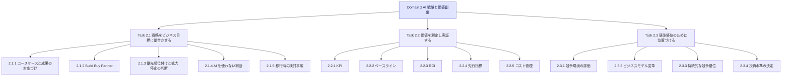

### 1.4 Domain 2 を一言でいうと

Domain 2 は、AI プロジェクトの「入口から出口まで」をビジネスの目で見る領域です。

| 流れ | 対応する Skill |
|---|---|
| 何の課題を解くか | 2.1.1 |
| どう調達するか | 2.1.2 |
| どれを先にやるか | 2.1.3 |
| 本当に AI が必要か | 2.1.4 |
| 移行するときの注意 | 2.1.5 |
| どう測るか | 2.2.1 〜 2.2.4 |
| いくら使い、どう抑えるか | 2.2.5 |
| 競争上どう位置づけるか | 2.3.1 〜 2.3.4 |

### 1.5 試験範囲外のこと (学習の線引き)

試験ガイドは、次のような技術作業を「対象外」としています。深入りしなくて構いません。

- AI モデルやアルゴリズムの開発、コーディング
- データエンジニアリング、特徴量エンジニアリング
- ハイパーパラメータのチューニング
- パイプラインやインフラの構築と展開
- モデルの数学的、統計的分析
- AWS サービスの設定、展開、管理
- 本番運用中の AI システムの技術的な運用管理

Domain 2 で問われるのは、「どの案件に投資するか」「どう測るか」「どう位置づけるか」という**ビジネス判断**です。

---

## 2. Step 0: 最初に覚える用語

Domain 2 の解説で何度も出てくる用語を先に整理します。ここで一度読んでおけば、以降がぐっと読みやすくなります。

| 用語 | やさしい説明 |
|---|---|
| ユースケース | AI を使って解きたい具体的な業務課題。例: 問い合わせ対応の自動化 |
| ビジネス成果 (アウトカム) | 取り組みの結果として事業に起きる変化。例: 顧客の待ち時間の短縮、売上の増加 |
| KPI (重要業績評価指標) | 目標の達成度を測る数値。例: 一次解決率、1 件あたり処理コスト |
| ベースライン | AI を入れる前の現状値。効果を測る「ものさし」の起点 |
| ROI (投資利益率) | 投資に対してどれだけ利益が戻ったか。(便益 - コスト) ÷ コスト |
| TCO (総所有コスト) | 導入から運用までにかかる費用の合計。利用料だけでなく、人件費や統合費用も含む |
| 先行指標 | 将来の成功を早めに予測できる指標。例: 利用率の伸び |
| 遅行指標 | 結果が出てから分かる指標。例: 年間の売上、年間のコスト削減額 |
| PoC (概念実証) | 「技術的にできそうか」を小さく試す検証 |
| パイロット | 限られた範囲で実業務に使って効果を確かめる試行 |
| Build-Buy-Partner | 自社で作る、既製品を買う、パートナーと組む、の 3 つの調達方針 |
| ルールベース自動化 | 「もし A なら B」という決まったルールで動く仕組み。AI を使わない |
| ロックイン | 特定ベンダーやプラットフォームに依存して、乗り換えにくくなること |
| 生成 AI (GenAI) | 文章や画像などを新しく生成できる AI |
| トークン | 生成 AI が文章を処理する最小単位。利用料金の計算単位になることが多い |
| FinOps | クラウドの費用を、事業と技術と財務が協力して管理する考え方 |

> ポイント: 試験は「AI とは何か」の細かい技術説明を求めるのではなく、こうした**ビジネス用語を使って判断できるか**を見ます。

---

## 3. Task 2.1: AI 戦略をビジネス目標に整合させる

Task 2.1 は、「AI を使う理由」と「どう進めるか」を決める段階です。AI ありきではなく、**ビジネス課題から出発する**ことが全編を貫く原則です。

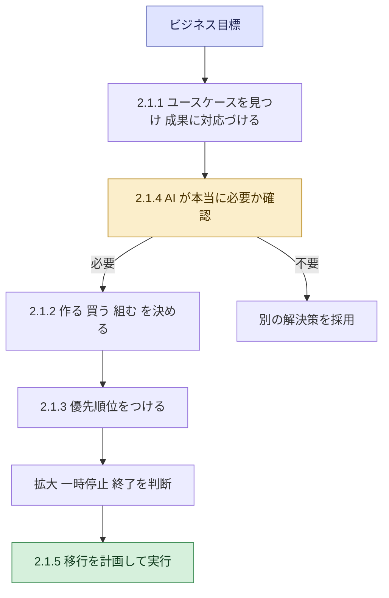

---

### Skill 2.1.1: 高インパクトなユースケースを特定し、成果にマッピングする

> 試験ガイドの原文の趣旨: 事業部門 (カスタマーオペレーション、営業とマーケティング、研究開発、ソフトウェア開発など) にまたがって影響の大きい AI ユースケースを見つけ、AI の能力を具体的なビジネス成果に対応づける。

#### 何を問われるか

「この部門のこの課題には、どの種類の AI が向いていて、どんな成果につながるか」を結びつけられるかが問われます。技術の詳細ではなく、**課題 → 能力 → 成果**の対応づけです。

#### 初学者向けの解説

**ステップ 1: 技術ではなく「痛み」から始める**

「生成 AI を使いたい」から始めると、目的のない PoC が量産されます。まず次の問いに答えます。

- 誰が困っているのか (顧客、従業員、パートナー)
- どの業務で時間、コスト、品質、売上に問題があるのか
- その問題を解けたら、どの指標が動くのか

**ステップ 2: AI の能力を「カテゴリ」で捉える**

試験ガイドは、対象者が次のようなカテゴリを認識できることを求めています。構築や設定は不要です。

| AI の能力カテゴリ | できること (やさしい説明) | 代表的なビジネス応用 |
|---|---|---|
| レコメンデーション | 利用者に合いそうなものを提案する | ECの商品提案、コンテンツ提案 |
| 自然言語処理 (NLP) | 文章を理解、分類、要約する | 問い合わせの自動分類、感情分析 |
| コンピュータビジョン | 画像や映像を認識する | 外観検査、店舗の棚チェック |
| ドキュメント抽出 | 帳票や契約書から項目を読み取る | 請求書処理、申込書の入力自動化 |
| 生成 AI | 文章、画像、コードなどを生成する | 提案書の下書き、コード補助、要約 |
| AI エージェント | 目標に向けて複数の手順を自律的に進める | 調査から報告書作成までの自動化 |
| 予測 (従来型 ML) | 過去データから将来の値を推定する | 需要予測、解約予測 |

**ステップ 3: 部門ごとにユースケースの候補を洗い出す**

| 部門 | 課題の例 | 向く AI の能力 | 期待できるビジネス成果 |
|---|---|---|---|
| カスタマーオペレーション | 問い合わせが多く、待ち時間が長い | NLP、生成 AI、エージェント | 応答時間の短縮、対応コストの削減、顧客満足度の向上 |
| 営業とマーケティング | 提案書作成に時間がかかる、見込み客の見極めが難しい | 生成 AI、予測、レコメンデーション | 商談化率の向上、提案作成時間の短縮、売上の増加 |
| 研究開発 | 文献調査に時間がかかる | 生成 AI、NLP 検索 | 調査期間の短縮、開発サイクルの短縮 |
| ソフトウェア開発 | コード作成、レビュー、テストに時間がかかる | 生成 AI によるコード支援 | 開発速度の向上、品質の向上 |
| バックオフィス | 帳票の手入力、確認作業が多い | ドキュメント抽出、NLP | 処理時間の短縮、入力ミスの削減 |

**ステップ 4: 「成果」まで言い切る**

悪い例は「チャットボットを導入する」です。良い例は「一次対応の 30% を自動化し、平均応答時間を短縮して、顧客満足度を維持する」のように、**測れる成果**まで書くことです (数値は例です)。

#### ベストプラクティス

- **課題起点で始める。** 「技術に合う課題探し」ではなく、「事業課題に合う技術選び」にする。
- **現場を巻き込む。** 業務の当事者から課題を聞く。事業部門と技術部門が同じテーブルで議論する。
- **成果と指標を先に決める。** 成果が定義できないユースケースは、後で価値を証明できない。
- **データの有無を早めに確認する。** 良いアイデアでもデータがなければ実現できない (詳細は Skill 2.1.5)。
- **複数の部門から幅広く候補を集める。** そのうえで Skill 2.1.3 の方法で絞り込む。
- **既存事例を参考にする。** AWS は生成 AI の活用事例を業界別に紹介しています (参考文献を参照)。

#### よくある落とし穴

| 落とし穴 | 何が起きるか | 対策 |
|---|---|---|
| 技術起点 (AI ありき) | 課題と合わず、使われない | 課題と成果から逆算する |
| 成果が曖昧 | 効果を証明できず、予算が止まる | 指標と目標値を最初に置く |
| 派手さで選ぶ | 価値の低い PoC が乱立する | 価値と実現性で評価する |
| 部門の縦割り | 全社の重複投資になる | 横断でユースケースを棚卸しする |

#### 試験での着眼点

- 選択肢に「最新技術を導入する」と「ビジネス課題と成果を特定する」があれば、後者が正解になりやすい。
- 「部門の課題」と「AI の能力カテゴリ」を結びつける問題が出る。文書処理なら**ドキュメント抽出**、顧客対応なら **NLP や生成 AI**、といった対応を押さえる。

---

### Skill 2.1.2: Build-Buy-Partner を評価する

> 試験ガイドの原文の趣旨: 予算、期間、能力、ベンダー提案、規制コンプライアンス要件などを考慮して、AI 導入の「作る、買う、組む」を評価する。

#### 何を問われるか

同じ目的でも、「自社で作る」「既製の製品やサービスを買う」「パートナーと組む」のどれが最適かを、制約条件から選べるかが問われます。

#### 初学者向けの解説

**3 つの選択肢**

| 選択肢 | 意味 | 向くケース | 主な注意点 |
|---|---|---|---|
| Build (作る) | 自社でモデルやアプリを開発する | 差別化の源泉になる、独自データを活かす、要件が特殊 | 時間、人材、費用がかかる。運用も自社責任 |
| Buy (買う) | 既製の製品、SaaS、API を利用する | 一般的な課題、早く価値を出したい、人材が少ない | 独自性が出にくい、ベンダー依存、カスタマイズの限界 |
| Partner (組む) | システムインテグレーターやコンサルなどの外部専門家と共同で進める | 社内に専門性がない、短期間で立ち上げたい | 費用、ナレッジの社内定着、依存のリスク |

**判断の 5 つの観点** (試験ガイドが挙げる要素)

| 観点 | 確認する問い |
|---|---|
| 予算 | 初期費用と運用費用はいくらか。総所有コスト (TCO) で比べたか |
| 期間 | いつまでに価値を出す必要があるか |
| 能力 | 社内に必要な人材とスキルがあるか。外部から補えるか |
| ベンダー提案 | 提案内容、実績、価格体系、契約条件、サポートは妥当か |
| 規制コンプライアンス | データの扱い、所在地、監査対応などの要件を満たせるか |

**意思決定の流れ (簡易版)**

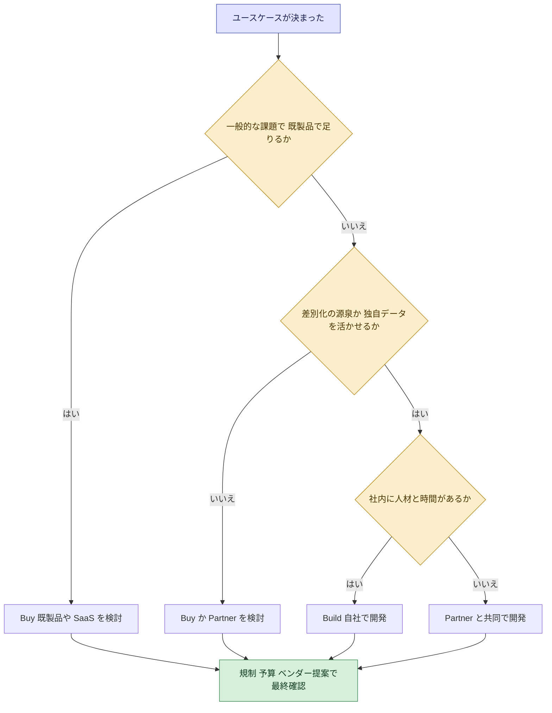

**AWS の選択肢を「作る、買う、組む」に当てはめる (戦略レベル)**

試験ガイドは Amazon Bedrock、Amazon SageMaker AI、Amazon Quick を戦略レベルで理解することを求め、AWS Marketplace を Build-Buy-Partner の評価に使えるツールとして挙げています。

| 選択肢 | AWS での一例 | 位置づけ |
|---|---|---|
| Buy (すぐ使える) | Amazon Quick | AI アシスタント、ダッシュボード作成、ワークフロー自動化を、機械学習の専門知識なしで使える |
| 中間 (基盤モデルを使って組み立てる) | Amazon Bedrock | 生成 AI アプリケーションを構築するプラットフォーム。ガードレールやナレッジベースなどの機能がある |
| Build (独自の ML を作る) | Amazon SageMaker AI | 独自のモデルを作って学習、展開するためのサービス。マネージドで足りるか、カスタムが必要かの判断が論点 |
| Partner / 調達 | AWS Marketplace | サードパーティのソフトウェアやサービスを探して比較、調達する |

> 注意: 試験ガイドは、これらのサービスを**設定、管理できることは求めていません**。「どの状況で何を選ぶか」の判断が問われます。

**ベンダー提案を評価するときのチェックリスト**

| 評価軸 | 確認内容 |
|---|---|
| 適合性 | 自社の課題と成果指標に合っているか |
| 実績 | 同業種や同規模での導入事例があるか |
| データの扱い | 自社データの利用範囲、保管場所、学習への利用の有無 |
| コンプライアンス | 業界規制や社内規程を満たせるか。監査に対応できるか |
| コスト構造 | 従量課金、インスタンス課金、シート課金のどれか。総額の見通しは立つか |
| 拡張性と出口 | 将来の拡大や乗り換え (ロックイン) に対応できるか |
| サポート | 障害時の対応、SLA、ロードマップ |

#### ベストプラクティス

- **中核を作り、周辺は買う。** 競争優位に直結する部分に投資し、一般的な機能は既製品で済ませる。
- **TCO で比べる。** 初期費用だけでなく、運用、人件費、統合、教育の費用も含める。
- **段階的に進める。** まず買う、または組んで早く価値を出し、必要に応じて内製化を進める道もある。
- **規制要件を初期に確認する。** 後から気づくと手戻りが大きい。
- **ベンダーに検証させる。** 自社データを使った小さな PoC で、提案の主張を確かめる。
- **出口を設計する。** データの持ち出しやモデルの入れ替えを契約時点で考える。

#### よくある落とし穴

| 落とし穴 | 対策 |
|---|---|
| 何でも内製したがる | 差別化に効かない部分は買う |
| 価格の安さだけで選ぶ | TCO、規制対応、実績を含めて比較する |
| パートナー任せで社内に知見が残らない | 知識移転を契約に含める |
| ベンダーの説明を鵜呑みにする | 自社データで検証する |

#### 試験での着眼点

- 「期間が短く、社内人材が少ない」なら Buy か Partner が有力。
- 「独自データが競争力の源泉で、専門人材もいる」なら Build が有力。
- 「厳しい規制要件がある」なら、コンプライアンスを満たせるかが決め手になる。

---
### Skill 2.1.3: イニシアチブを優先順位付けし、拡大・一時停止・終了を判断する

> 試験ガイドの原文の趣旨: ビジネス価値、実現可能性、持続可能性、戦略的整合性に基づいて AI イニシアチブに優先順位をつけ、「拡大する、一時停止する、終了する」を決める。

#### 何を問われるか

候補が多いときに、限られた予算と人材をどこに配分するかを決める力と、**始めた後にも「続ける、止める」を冷静に判断する力**が問われます。

#### 初学者向けの解説

**4 つの評価軸**

| 評価軸 | 確認する問い | 具体的な見方 |
|---|---|---|
| ビジネス価値 | 成功したら事業にどれだけ効くか | 売上、コスト削減、生産性、顧客満足度への影響 |
| 実現可能性 | 現実に作れて、運用できるか | データの有無と品質、技術の成熟度、人材、統合の難しさ |
| 持続可能性 | 長く続けられるか | 運用コスト、保守体制、モデルの劣化への対応、環境への影響 |
| 戦略的整合性 | 会社の方向性と合っているか | 経営目標、重点分野、競争戦略との一致 |

**スコアリングの進め方**

1. 各ユースケースを 4 軸で採点する (例: 1〜5 点)。
2. 軸ごとの重み (重要度) を経営と合意する。
3. 合計点で並べ、価値が高く実現しやすいものから着手する。
4. 結果を関係者に共有し、納得感を得る。

以下は採点の例です (点数は説明用の架空の値です)。

| ユースケース | 価値 | 実現可能性 | 持続可能性 | 整合性 | 判断 |
|---|---|---|---|---|---|
| 問い合わせ対応の支援 | 4 | 4 | 4 | 5 | 最優先で着手 |
| 請求書のデータ抽出 | 3 | 5 | 4 | 3 | 早期の成功事例として着手 |
| 全社の需要予測の刷新 | 5 | 2 | 3 | 5 | データ整備後に着手 |
| 社内向けの話題性の高い実験 | 2 | 3 | 2 | 1 | 見送りを検討 |

**価値と実現可能性の 2 軸マップ**

| | 実現可能性が高い | 実現可能性が低い |
|---|---|---|
| **価値が高い** | 最優先。すぐ着手する (クイックウィン) | 戦略的な投資。データや基盤を整えてから着手する |
| **価値が低い** | 余力があれば実施。優先度は低い | 見送る |

**拡大、一時停止、終了の判断 (ステージゲート)**

AI の取り組みは、始めて終わりではありません。節目ごとに、次のように判断します。

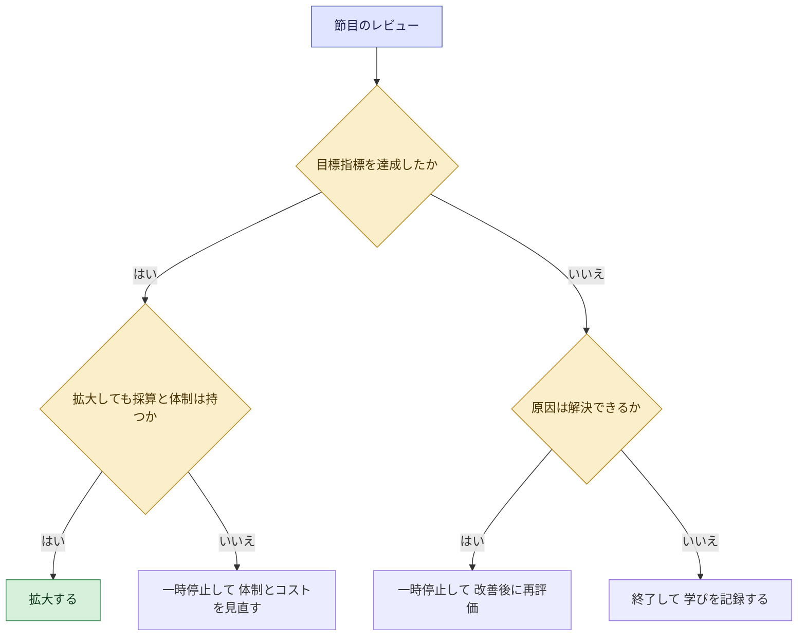

| 判断 | 典型的な条件 | 次のアクション |
|---|---|---|
| 拡大する | 目標指標を達成し、コストと体制も見合う | 対象範囲や部門を広げる。運用体制を整える |
| 一時停止する | 一部の指標が未達だが、原因が特定でき解決の見込みがある | 課題 (データ品質、利用率など) を改善して再評価する |
| 終了する | 価値が出ない、または実現の見込みがない、戦略が変わった | 投資を止め、得られた学びを次に活かす。リソースを他の案件へ移す |

#### ベストプラクティス

- **基準を先に決める。** 「何を達成したら拡大し、何なら止めるか」を開始前に合意する (後から基準を動かさない)。
- **小さく始めて早く学ぶ。** PoC から MVP、そして本番へと段階を踏む。AWS のパートナー向けブログでも、1〜2 週間程度で作れる PoC、MVP、組織全体への展開という順序が紹介されています。
- **サンクコストに引きずられない。** すでに使った費用を理由に続けない。将来の価値だけで判断する。
- **終了を失敗と見なさない。** 早く止めることは、リソースを守る正しい判断である。
- **ポートフォリオで管理する。** 個々の案件だけでなく、全体の投資バランスを定期的に見直す。

#### よくある落とし穴

| 落とし穴 | 対策 |
|---|---|
| 声の大きい人の案件が通る | 共通の評価基準と点数で比較する |
| 実現可能性の軽視 | データと人材の現実を確認する |
| 止められない (サンクコスト) | 事前に中止基準を決める |
| 価値の見積もりが楽観的 | ベースラインと保守的な前提を使う (Skill 2.2.2、2.2.3) |

#### 試験での着眼点

- 優先順位付けの正解は、**価値だけでなく実現可能性、持続可能性、戦略的整合性も含めて評価する**もの。
- 「目標が未達でも、原因が解決可能なら一時停止して改善」「見込みがなければ終了」というように、3 つの判断を使い分ける。

---

### Skill 2.1.4: AI が適切でないケースを見極める

> 試験ガイドの原文の趣旨: ビジネス課題に対して、AI が適切な解決策ではない場面を判断する。技術と概念の一覧にも「ルールベースの自動化を AI の代わりに使うべき場面」が挙がっています。

#### 何を問われるか

「AI を使わない」という判断ができるかが問われます。戦略家にとって重要な力です。AI は万能ではなく、費用も、リスクも、運用の手間もかかります。

#### 初学者向けの解説

**まず、3 つの手段の違いを理解する**

| 手段 | 動き方 | 得意なこと | 苦手なこと |
|---|---|---|---|
| ルールベース自動化 | 決めたルールどおりに動く | 手順が明確で例外が少ない定型業務。結果が毎回同じで説明しやすい | ルールで書ききれない曖昧な判断 |
| 従来型の機械学習 | データからパターンを学んで予測する | 需要予測、不正検知など、データが豊富な予測課題 | データが少ない課題、説明が必須の判断 |
| 生成 AI | 学習した知識から文章などを生成する | 要約、下書き、対話、非定型の文章処理 | 常に正確な結果が必須の処理、厳密な計算 |

**AI が向かない典型パターン**

| パターン | 例 | 代わりの手段 |
|---|---|---|
| ルールで十分に解ける | 「注文金額が一定以上なら承認が必要」 | ルールベースの自動化 |
| 毎回同じ正確な結果が必須 | 税額や給与の計算 | 決定的なプログラム、計算ロジック |
| 十分な品質のデータがない | 履歴が少ない、記録が不正確 | まずデータ整備。手作業やプロセス改善 |
| 誤りの許容度が極めて低い | 人命や重大な法的責任に関わる最終判断 | 人による判断、AI は補助に限定 |
| 説明責任が厳格に求められる | 判断理由の説明が法的に必要 | 説明しやすい手法、人のレビュー |
| 件数が少なく効果が小さい | 年に数回しか発生しない作業 | 手作業のまま |
| 価値が費用に見合わない | 節約額より導入と運用の費用が大きい | 導入しない、または規模を縮小する |
| 根本原因が AI で解けない | 組織の役割分担の混乱、プロセスの不備 | プロセス改善、組織の見直し |

**判断のフローチャート**

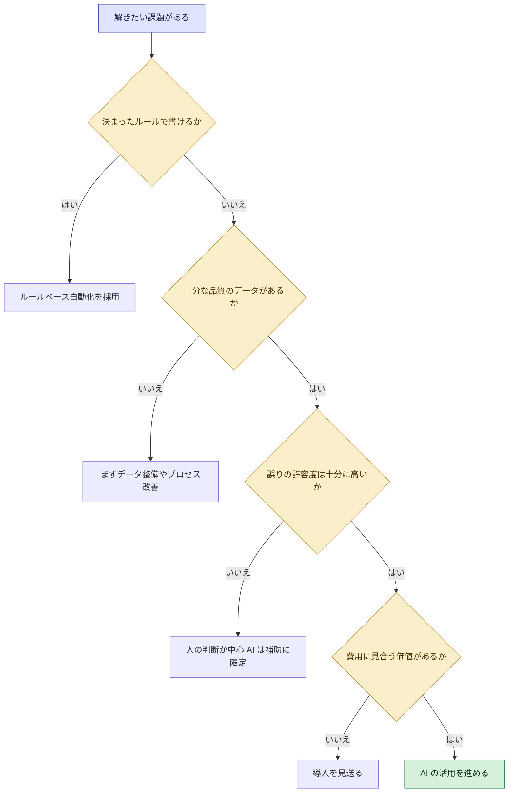

#### ベストプラクティス

- **最もシンプルな解決策から検討する。** ルールベース、プロセス改善、既存ツールの設定変更で解決できるなら、それが最も安く確実。
- **AI と非 AI を組み合わせる。** 例えば、判断の大半をルールで処理し、例外だけを AI や人に回す設計も有効。
- **人間の関与を設計する。** 影響の大きい判断では、人が確認、承認する仕組み (Human-in-the-loop) を入れる。
- **「AI を使わなかった理由」を記録する。** 後で再検討するときに役立つ (技術やデータの状況が変わることもある)。
- **課題の根本原因を確認する。** 症状に AI を当てはめても、原因が別にあれば効果は出ない。

#### よくある落とし穴

| 落とし穴 | 対策 |
|---|---|
| 「AI を入れること」が目的化する | 成果から逆算し、非 AI の選択肢も比較する |
| 生成 AI に厳密な計算をさせる | 計算は決定的なロジックに任せる |
| データ不備を無視して進める | データ準備を先に評価する |
| 高リスクな判断を完全自動化する | 人の確認を残す |

#### 試験での着眼点

- 「手順が明確で例外が少ない定型作業」には、ルールベースの自動化が正解になる。
- 「データが不足している」「説明責任が厳格」といった条件がある選択肢では、**AI 導入を急がない**ものが正解になりやすい。

---

### Skill 2.1.5: 業務・AI プラットフォームの移行時の検討事項

> 試験ガイドの原文の趣旨: 業務プロセスを AI ベースのソリューションへ移行する、または AI プラットフォーム間で移行する準備で、事業継続性、コストへの影響、データの準備状況、パフォーマンスへの影響などを評価する。

#### 何を問われるか

「AI に切り替える」「別の AI 基盤に乗り換える」ときに、**事業を止めず、想定外の費用を出さず、品質を落とさない**ための検討事項を押さえているかが問われます。

#### 初学者向けの解説

**2 種類の移行**

| 種類 | 例 | 主な論点 |
|---|---|---|
| 業務プロセスから AI ベースへ | 手作業や既存システムでの処理を、AI を使った処理に置き換える | 業務が止まらないか、品質は保てるか、人の役割はどう変わるか |
| AI プラットフォーム間 | あるモデルやサービスから別のものへ乗り換える | 切り替え費用、出力の変化、再評価、ロックイン |

**4 つの検討観点**

| 観点 | 確認する問い | 具体例 |
|---|---|---|
| 事業継続性 | 移行中も業務を止めずに済むか。問題が起きたら戻せるか | 新旧の並行運用、段階的な切り替え、ロールバック手順 |
| コストへの影響 | 移行で何が増減するか | 二重運用の期間の費用、移行作業、教育、契約の解約費用、利用料の変化 |
| データの準備状況 | 必要なデータは使える状態か | 品質、形式、所在、アクセス権、機密性、データの移行の難しさ |
| パフォーマンスへの影響 | 品質、速度、精度は維持、向上するか | 応答時間、精度、利用者の体験。モデルを変えると出力が変わる可能性がある |

**移行の進め方 (段階的な切り替え)**

**プラットフォーム間の移行で特に注意すること**

- **出力が変わりうる。** 生成 AI のモデルを変えると、同じ入力でも回答の内容や品質が変わることがある。切り替える前に、代表的なケースで新旧を比較評価する。
- **ロックインを見極める。** 特定サービス固有の機能に深く依存するほど、乗り換えの費用が増える。
- **契約と料金体系の違い。** 従量課金か、シート課金か、コミットメントがあるか (Skill 2.2.5)。
- **データの持ち出し。** 蓄積したデータや設定を移せるか。

**移行前のチェックリスト**

| 分類 | チェック項目 |
|---|---|
| 事業継続性 | 並行運用の期間を決めたか。ロールバックの条件と手順はあるか。繁忙期を避けたか |
| コスト | 二重運用、移行作業、教育、解約費用を見積もったか。移行後の運用費も試算したか |
| データ | データの所在、品質、権限、規制上の制約を確認したか |
| パフォーマンス | 新旧の比較基準 (指標) を決めたか。ベースラインを取得したか |
| 人と組織 | 利用者への説明、教育、業務手順の更新を計画したか |
| ガバナンス | リスク評価、承認、コンプライアンス確認が済んでいるか |

#### ベストプラクティス

- **一気に切り替えない。** 小さく試し、並行運用し、段階的に広げる。
- **ロールバック計画を先に用意する。** 戻せる安心感が、大胆で安全な移行を可能にする。
- **ベースラインを取る。** 移行の前後を比べられるようにする (Skill 2.2.2 と連動)。
- **総コストで見る。** 利用料の単価だけでなく、移行と二重運用の費用を含める。
- **利用者の教育と周知を計画に含める。** 技術が正しくても、使われなければ成果は出ない。

#### よくある落とし穴

| 落とし穴 | 対策 |
|---|---|
| 旧システムを先に止める | 新旧の並行運用の期間を確保する |
| 移行費用を見落とす | 二重運用、教育、解約費用も見積もる |
| データが使える状態にない | 移行前にデータの準備状況を評価する |
| モデル変更後の品質を確認しない | 比較評価を実施してから切り替える |

#### 試験での着眼点

- 移行の問題では、**並行運用、段階的な展開、ロールバック**を含む選択肢が有力。
- 4 つの観点 (事業継続性、コスト、データの準備状況、パフォーマンス) のうち、どれが不足しているかを見抜く問題が出る。

---
## 4. Task 2.2: AI のビジネス価値を測定し実証する

Task 2.2 は、「AI は本当に価値を生んだのか」を数字で示す段階です。経営層の承認、予算の継続、拡大の判断は、すべてこの**測定の質**にかかっています。

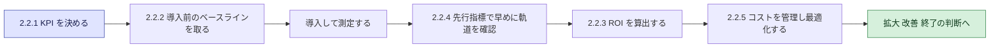

---

### Skill 2.2.1: KPI を定義する

> 試験ガイドの原文の趣旨: AI イニシアチブの KPI を、有形の効果 (コスト削減、売上成長など) と無形の効果 (顧客満足度、従業員の生産性など) の両方について定義する。

#### 何を問われるか

「成功をどの数字で測るか」を決められるかが問われます。有形の効果だけでなく、**数値化しにくい無形の効果**も含める点がポイントです。

#### 初学者向けの解説

**KPI とは**

目標に対して、どれだけ進んだかを表す数値です。「AI を導入した」は活動であり、成果ではありません。「顧客の待ち時間が短くなった」が成果で、それを数字にしたものが KPI です。

**有形の効果と無形の効果**

| 種類 | 意味 | 例 (KPI) |
|---|---|---|
| 有形 (Tangible) | お金や数量で直接測れる | コスト削減額、売上の増加、処理時間の短縮、エラー率の低下、1 件あたり処理コスト |
| 無形 (Intangible) | 直接お金にしにくいが価値がある | 顧客満足度、NPS、従業員満足度、従業員の生産性の実感、意思決定の質、ブランドへの信頼 |

**部門別の KPI の例**

| 部門 | 有形の KPI の例 | 無形の KPI の例 |
|---|---|---|
| カスタマーオペレーション | 平均処理時間、一次解決率、1 件あたり対応コスト | 顧客満足度 (CSAT)、顧客の再利用意向 |
| 営業とマーケティング | 商談化率、受注率、提案作成時間 | 営業担当者の負担感、顧客体験 |
| 研究開発 | 調査にかかる期間、開発サイクルの長さ | 研究者の創造的な作業への集中度 |
| ソフトウェア開発 | リリース頻度、レビュー時間、不具合の件数 | 開発者の満足度、開発者体験 |
| バックオフィス | 処理件数、処理時間、入力ミスの件数 | 従業員の満足度、業務の負担感 |

**無形の効果を測るコツ**

- 定期的なアンケート (満足度、実感する時間の削減など) で数値化する。
- 利用率や継続利用などの行動データで補う。
- 可能なら、金額への換算ルールを事前に決める (ただし過度に楽観的にしない)。

**良い KPI の条件 (SMART)**

| 条件 | 意味 |
|---|---|
| Specific (具体的) | 何を測るかが明確 |
| Measurable (測定可能) | 数値で追える |
| Achievable (達成可能) | 現実的な目標である |
| Relevant (関連性) | ビジネス目標と結びついている |
| Time-bound (期限) | いつまでに達成するかが決まっている |

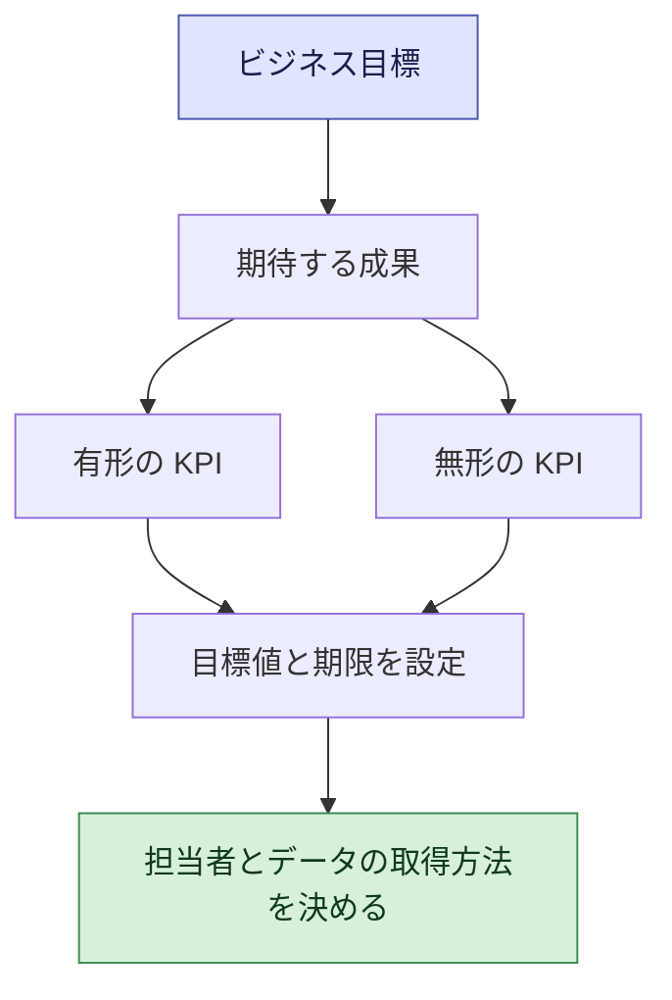

#### ベストプラクティス

- **ビジネス目標から逆算する。** KPI は目標の達成度を映すものにする。
- **有形と無形の両方を持つ。** 有形だけでは、顧客満足や従業員の体験の悪化を見落とす。
- **数を絞る。** 多すぎると焦点がぼやける。重要なものに絞る。
- **担当者を決める。** 誰が測り、誰が責任を持つかを明確にする。
- **品質の指標も入れる。** 速度やコストだけを追うと、AI の誤りや品質低下を見逃す。
- **関係者と合意する。** 経営、事業部門、技術部門が同じ定義を共有する。

#### よくある落とし穴

| 落とし穴 | 対策 |
|---|---|
| 活動を成果と混同する (導入数、利用回数だけ) | 事業成果に結びつく指標を置く |
| 測りやすいものだけを測る | 無形の効果も定義する |
| 指標の定義が部門でばらばら | 計算方法を文書化して共有する |
| 速度だけを追い品質が落ちる | 品質と満足度の指標をセットにする |

#### 試験での着眼点

- 「有形と無形の両方を定義する」が正解になりやすい。
- コスト削減や売上のような数値だけでなく、**顧客満足度や従業員の生産性**も KPI になり得る点を押さえる。

---

### Skill 2.2.2: 導入前にベースライン指標を確立する

> 試験ガイドの原文の趣旨: AI 導入の効果を正確に測るため、AI ソリューションを導入する前にベースライン指標を確立する。

#### 何を問われるか

「AI を入れる前の数字を取っているか」が問われます。ベースラインがなければ、改善したのか、もともとだったのかが分かりません。

#### 初学者向けの解説

**ベースラインとは**

導入前の現状の数値です。効果は「導入後の値 - ベースライン」で測ります。ダイエットに例えると、始める前の体重の記録です。記録がなければ、いくら減ったか分かりません。

**ベースラインがないとどうなるか**

| 状況 | 問題 |
|---|---|
| 導入後の数字しかない | 改善幅を証明できず、ROI を計算できない |
| 「なんとなく良くなった」という印象 | 予算の根拠にならない。懐疑的な人を説得できない |
| 比較の条件が違う | 季節要因や他の施策の影響を効果と誤認する |

**ベースラインを取る手順**

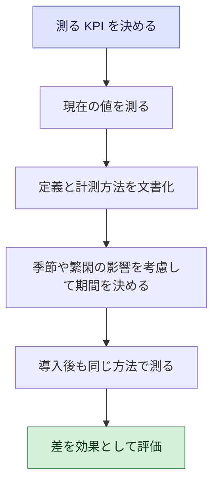

**測る対象の例**

| 分類 | ベースラインの例 |
|---|---|
| 時間 | 1 件あたりの処理時間、リードタイム |
| コスト | 1 件あたりの処理コスト、外注費 |
| 品質 | エラー率、手戻り率、顧客からの苦情数 |
| 売上 | 商談化率、受注率、顧客単価 |
| 体験 | 顧客満足度、従業員満足度 |
| 利用 | 現在のツールの利用状況 |

**より確かな比較のための工夫**

| 方法 | 内容 |
|---|---|
| 対照グループ | AI を使うグループと使わないグループを並べて比べる |
| 期間の比較 | 導入前後の同じ時期 (季節性を考慮) で比べる |
| 段階的な展開 | 一部の部署から始め、他の部署を比較対象にする |

#### ベストプラクティス

- **導入前に必ず測る。** 「導入したら測ろう」では遅い。
- **導入後も同じ定義と方法で測る。** 計測方法が変わると、比較できない。
- **十分な期間をとる。** 繁忙期と閑散期の差を含める。
- **他の要因を意識する。** 同時期の他の施策や市場の変化が結果に影響しうる。
- **ベースラインを共有する。** 関係者が同じ出発点を認識できるようにする。

#### よくある落とし穴

| 落とし穴 | 対策 |
|---|---|
| ベースラインを取らずに導入する | プロジェクトの初期にタスク化する |
| 導入前後で定義が違う | 定義を文書化し固定する |
| 期間が短く、偶然の値を拾う | 十分な期間とサンプルを確保する |
| 他要因の影響を無視する | 対照グループや期間比較を使う |

#### 試験での着眼点

- 「AI 導入の前に何をすべきか」という問いでは、**ベースライン指標の確立**が正解になりやすい。
- 効果を「正確に」測るための前提であることを押さえる。

---

### Skill 2.2.3: ROI を包括的に算出する

> 試験ガイドの原文の趣旨: 時間の節約、コスト削減、売上成長、生産性向上などを含む包括的なフレームワークで、AI の投資利益率 (ROI) を計算する。

#### 何を問われるか

「投資に対して、どれだけ価値が戻るか」を、便益とコストの両面から**漏れなく**計算できるかが問われます。

#### 初学者向けの解説

**基本の式**

| 指標 | 式 | 意味 |
|---|---|---|
| ROI | (総便益 - 総コスト) ÷ 総コスト | 投資 1 に対して、どれだけの利益が出たか |
| 純便益 | 総便益 - 総コスト | 差し引きで残った価値 |
| 回収期間 (ペイバック) | 累計の純便益がプラスに転じるまでの期間 | 何か月で元が取れるか |

**便益の種類 (試験ガイドが挙げる要素)**

| 便益 | 内容 | 金額への換算の例 |
|---|---|---|
| 時間の節約 | 作業時間が減る | 削減時間 × 人件費単価 |
| コスト削減 | 外注費、運用費、エラー対応費が減る | 削減額そのもの |
| 売上の増加 | 商談化率、単価、継続率が上がる | 増加した売上 × 利益率 |
| 生産性の向上 | 同じ人数でより多くの成果を出せる | 追加の処理量 × 1 件あたりの価値 |
| 無形の効果 | 顧客満足度、従業員の定着 | 事前に合意した換算ルールで参考値として扱う |

**コストの種類 (見落としやすい部分)**

| コスト | 内容 |
|---|---|
| 利用料 | モデルの利用料 (トークン課金など)、ライセンス、シート料金 |
| 初期構築 | 開発、システム統合、データの整備 |
| 運用 | 監視、保守、改善、モデルの更新 |
| 人と組織 | 教育、変革の推進、業務の再設計 |
| ガバナンス | リスク評価、監査、コンプライアンス対応 |
| 外部支援 | コンサルタント、パートナーへの費用 |

**計算例 (数値は説明用の架空の値です)**

問い合わせ対応の担当者 50 人に、AI による回答支援を導入するケースです。

前提:

- 1 人あたり週 2 時間の作業時間を削減できる見込み
- 年間稼働 48 週、1 時間あたりの人件費 40 USD
- 削減した時間がすべて価値に変わるわけではないため、**実現率を 50%** と見積もる

便益の計算:

| 項目 | 計算 | 金額 |
|---|---|---|
| 理論上の年間便益 | 50 人 × 2 時間 × 48 週 × 40 USD | 192,000 USD |
| 実現率 50% を反映した年間便益 | 192,000 USD × 50% | 96,000 USD |

コストの計算:

| 項目 | 1 年目 | 2 年目 |
|---|---|---|
| 利用料 | 30,000 USD | 30,000 USD |
| 統合 (初期のみ) | 40,000 USD | 0 USD |
| 教育と変革推進 (初期のみ) | 20,000 USD | 0 USD |
| 運用とガバナンス | 20,000 USD | 20,000 USD |
| **合計** | **110,000 USD** | **50,000 USD** |

ROI の計算:

| 期間 | 便益 | コスト | 純便益 | ROI |
|---|---|---|---|---|
| 1 年目 | 96,000 USD | 110,000 USD | -14,000 USD | 約 -12.7% |
| 2 年目 | 96,000 USD | 50,000 USD | 46,000 USD | 92% |
| 2 年累計 | 192,000 USD | 160,000 USD | 32,000 USD | 20% |

回収期間は、1 年目終了時点の累計赤字 14,000 USD を、2 年目の月あたりの純便益 (約 3,833 USD) で埋める計算になり、**およそ 16 か月**です。

この例から分かる大切な学びは 3 つです。

1. **初年度は赤字になることがある。** 初期費用を含めるため、複数年で評価する。
2. **実現率を使わないと、便益を過大評価する。** 節約した時間が、すべて別の価値ある仕事に使われるとは限らない。
3. **コストを利用料だけで見ると、ROI が高く出すぎる。** 統合、教育、運用も含める。

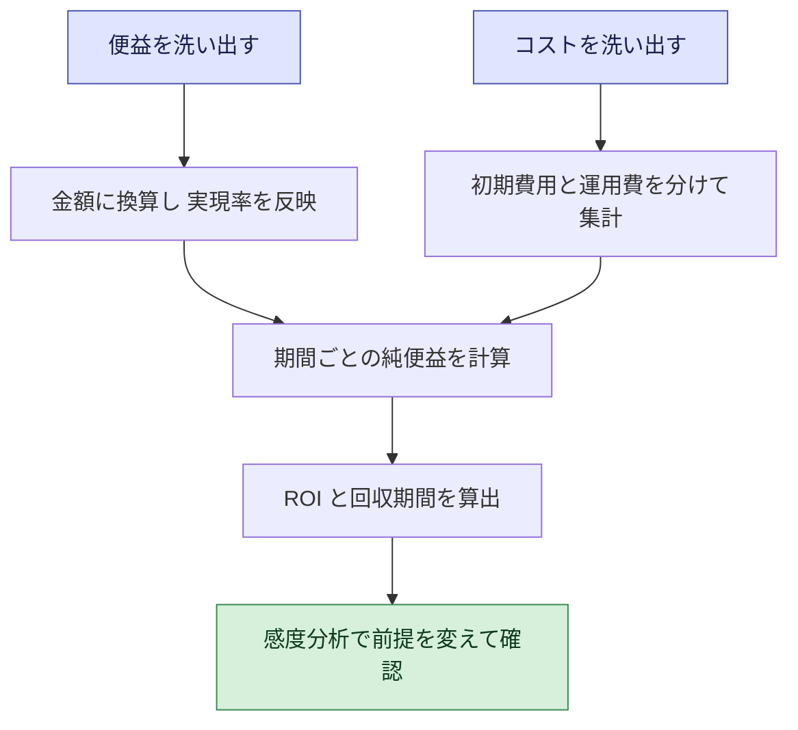

#### ベストプラクティス

- **包括的に見る。** 時間の節約、コスト削減、売上、生産性を漏れなく洗い出す。
- **コストは TCO で見る。** 利用料、構築、運用、教育、ガバナンスまで含める。
- **ベースラインを使う。** 便益は、導入前の値との差で計算する (Skill 2.2.2)。
- **保守的に見積もる。** 実現率や不確実性を織り込み、楽観的な前提に頼らない。
- **複数のシナリオで確認する。** 便益が低い場合と高い場合で ROI がどう変わるかを見る (感度分析)。
- **二重計上を避ける。** 同じ効果を、時間の節約と生産性の向上の両方で数えない。
- **複数年で評価する。** 初期費用が大きい取り組みは、1 年目だけで判断しない。
- **無形の効果は別枠で示す。** 金額に換算する場合も、根拠と前提を明記する。

#### よくある落とし穴

| 落とし穴 | 対策 |
|---|---|
| 便益だけを数えてコストが不完全 | コストの 6 種類を確認する |
| 節約時間の全額を便益にする | 実現率を設定する |
| 1 年目だけで判断する | 複数年で評価する |
| 前提が 1 通りだけ | シナリオを複数用意する |
| ベースラインなしの比較 | 先に測る |

#### 試験での着眼点

- ROI の問題では、**時間の節約、コスト削減、売上成長、生産性向上のすべてを含めた包括的な評価**が正解になりやすい。
- コストの見落とし (統合、教育、運用) を指摘する選択肢に注目する。

---

### Skill 2.2.4: 成功を予測する先行指標を特定する

> 試験ガイドの原文の趣旨: AI プロジェクトの成功を予測する先行指標を特定する。

#### 何を問われるか

成果 (売上やコスト削減) が出るまで待たずに、**早い段階で「うまくいきそうか」を判断できる指標**を選べるかが問われます。

#### 初学者向けの解説

**先行指標と遅行指標**

| 種類 | 特徴 | 例 |
|---|---|---|
| 先行指標 | 早く動き、将来の成果を予測する。行動を変えるきっかけになる | 利用率、継続利用、利用者の満足度、タスク完了率、教育の受講率 |
| 遅行指標 | 結果が出てから分かる。成果そのものを表す | 年間のコスト削減額、売上の増加、ROI |

天気に例えると、先行指標は「雲行き」、遅行指標は「その日に降った雨量」です。雲行きを見れば、傘の準備ができます。

**AI プロジェクトで使える先行指標の例**

| 分類 | 先行指標 | 何を予測するか |
|---|---|---|
| 採用 | 利用者数、アクティブ率、利用頻度、継続率 | 現場に定着し、効果が広がるか |
| 品質 | 出力の正確性、利用者による修正の割合、エスカレーション率 | 信頼され使い続けられるか |
| 体験 | 利用者満足度、フィードバックの傾向 | 顧客や従業員に受け入れられているか |
| 効率 | タスクの完了時間、初回の価値を得るまでの時間 | 生産性の向上につながるか |
| データ | データ品質のスコア、データ更新の頻度 | 精度が維持されるか |
| 組織 | 教育の受講、スポンサーの関与、関係者の参加 | 組織が推進できているか |
| コスト | 1 回の利用あたりのコスト、予算の消化率 | 採算が合うか |

**先行指標から成果までのつながり**

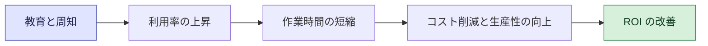

左側 (教育、利用率) が先行指標、右側 (コスト削減、ROI) が遅行指標です。**左が伸びていなければ、右も伸びません。**

#### ベストプラクティス

- **成果との因果関係を仮説として持つ。** 「利用率が上がれば、時間が減る」のようにつなぎ、実際に成り立つかを検証する。
- **早く、頻繁に測る。** 週次や月次で確認し、問題があれば早く手を打つ。
- **先行指標に基準値を設定する。** 基準を下回ったら、原因を調べて改善する、または拡大を止める。
- **利用者の声を集める。** 数字に出る前の違和感を、フィードバックから拾う。
- **先行と遅行を組み合わせる。** 先行指標だけでは価値を証明できない。

#### よくある落とし穴

| 落とし穴 | 対策 |
|---|---|
| 成果が出るまで何も測らない | 開始直後から先行指標を追う |
| 利用回数が多い = 成功と決めつける | 品質、満足度、成果との関連を確認する |
| 成果とつながらない指標を追う | 因果の仮説を立てて検証する |

#### 試験での着眼点

- 「早期に成功を予測できる」のは、**利用率、満足度、タスク完了率などの先行指標**。年間のコスト削減額は遅行指標。
- 先行指標が悪化したときは、拡大を急がず、原因を調べて改善する選択肢が正解になりやすい。

---

### Skill 2.2.5: コスト要因の基本的な管理

> 試験ガイドの原文の趣旨: AI 導入におけるコスト計画と最適化戦略を含む、基本的なコスト要因の管理を実行する。試験ガイドは、AWS の AI サービスの料金体系 (従量課金、インスタンス課金、シート課金など)、Savings Plans、AWS Pricing Calculator、AWS Cost Explorer、AWS Marketplace に言及しています。

#### 何を問われるか

AI のコストが何で決まり、どう見積もり、どう見張り、どう抑えるかの**基本**が問われます。技術的な最適化の実装ではなく、**計画と管理の考え方**です。

#### 初学者向けの解説

**ステップ 1: 料金体系の 3 つの型を理解する**

| 料金体系 | 仕組み | AWS での例 | 向く場面 | 注意点 |
|---|---|---|---|---|
| 従量課金 (消費ベース) | 使った量に応じて支払う | Amazon Bedrock のオンデマンド (入力と出力のトークン数に応じた料金) | 利用量が読めない、小さく始めたい | 使うほど増える。急増に注意 |
| インスタンス課金 | 稼働させる計算資源の時間に応じて支払う | Amazon SageMaker AI (選んだインスタンスの利用に応じた料金) | 安定した大量の処理、独自モデルの運用 | 使っていない時間も課金される場合がある |
| シート課金 | 利用者 1 人あたりで支払う | Amazon Quick (利用者の種別とサブスクリプションの種類がある) | 従業員向けのツールを全社展開する | 利用者が使わなくても課金される。適正な人数の管理が必要 |

> Amazon Bedrock の料金ページには、オンデマンドに加えて、バッチ処理の料金、プロンプトキャッシュの料金、プロビジョンドスループット、リザーブド層、レイテンシー最適化推論などの区分があります。モデルごとに価格が異なるため、最新の価格は必ず公式ページで確認してください。

**ステップ 2: 生成 AI のコストが増える要因を知る**

| コスト要因 | 説明 |
|---|---|
| 利用量 (トークン数) | 入力と出力の文章が長いほど、1 回あたりの費用が増える |
| モデルの選択 | 高性能なモデルほど単価が高い傾向がある |
| 利用回数 | 利用者や呼び出しの数が増えると比例して増える |
| 追加の仕組み | 検索 (ナレッジベース)、エージェント、ガードレールなど周辺機能の費用 |
| 運用の人件費 | 監視、改善、ガバナンスにかかる人の費用 |

**ステップ 3: 計画する (事前に見積もる)**

- AWS Pricing Calculator で、計画中の構成の費用を事前に見積もる。AWS のドキュメントは、新しいワークロードの計画や、コミットメント購入の計画に使えると説明しています。
- 利用者数、1 日あたりの利用回数、1 回あたりの文章量を前提として置き、低、中、高の 3 シナリオで試算する。

**ステップ 4: 監視する (実績を見る)**

- AWS Cost Explorer で、過去の費用と利用状況を可視化、分析し、傾向を把握する。
- AWS Budgets で予算のしきい値を決め、超過しそうなときにアラートを受け取る。
- コスト配分タグを付けて、プロジェクトや部門ごとの費用を追えるようにする。

**ステップ 5: 最適化する (減らす、賢く使う)**

| 戦略 | 内容 | 注意点 |
|---|---|---|
| 用途に合うモデルを選ぶ | 簡単な作業に高価な高性能モデルは不要な場合がある | 品質を評価したうえで選ぶ |
| 入力と出力を短くする | 不要な文章や重複を減らす | 品質が落ちないか確認する |
| 繰り返しの内容を再利用する | キャッシュなどの仕組みを活用する | 対応しているモデルと条件を確認する |
| 即時性が不要な処理はバッチにする | 価格表にバッチ料金の区分がある | 応答が遅れてよい用途に限る |
| コミットメントを活用する | Savings Plans は 1 年または 3 年の利用量を約束する代わりに割引を得る。SageMaker AI 向けの Savings Plans もある | 利用量が安定している場合に向く。過剰に約束しない |
| 使われていない資源を見直す | 未使用のライセンスやシートを整理する | 定期的に棚卸しする |
| 調達方法を比較する | AWS Marketplace で選択肢を比べる | 総コストで比較する |

**コスト管理のサイクル**

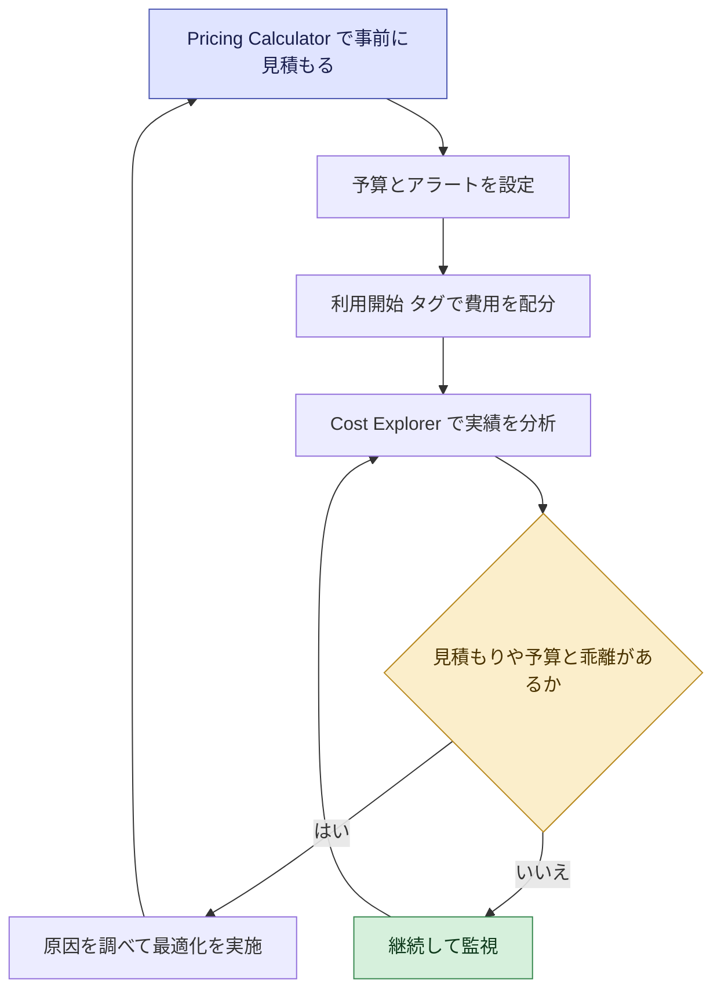

**AWS のコスト管理ツールの使い分け**

| ツール | 使うタイミング | 一言で言うと |
|---|---|---|
| AWS Pricing Calculator | 導入前 | 「いくらかかりそうか」を見積もる |
| AWS Cost Explorer | 導入後 | 「いくら使ったか、何が増えたか」を分析する |
| AWS Budgets | 導入後 | 「予算を超えそうなら知らせる」 |
| Savings Plans | 利用量が安定してから | 「約束の代わりに単価を下げる」 |
| AWS Marketplace | 調達の検討時 | 「サードパーティ製品を探して比べ、調達する」 |

> AWS Well-Architected Framework の Generative AI Lens は、コスト最適化を含む 6 つの柱にわたって生成 AI ワークロードのベストプラクティスを示しています。試験ガイドは「Responsible AI Lens」に言及していますが、コスト面のヒントを得る参考としてもこのレンズが役立ちます (参考文献を参照)。

#### ベストプラクティス

- **最初に小さく始める。** 従量課金で始め、利用実績が安定してからコミットメントを検討する。
- **3 つ以上のシナリオで見積もる。** 想定より使われた場合の費用も試算する。
- **予算とアラートを最初から設定する。** 使ってから気づくのでは遅い。
- **タグで責任を明確にする。** 部門やプロジェクト単位で費用を把握する。
- **コストと品質のバランスで選ぶ。** 安さだけでなく、ビジネス成果に必要な品質を保つ。
- **定期的に見直す。** 価格やモデルは変わる。四半期ごとなどにレビューする。
- **コスト最適化を ROI とつなげる。** コスト削減が目的ではなく、価値あたりのコストを下げることが目的。

#### よくある落とし穴

| 落とし穴 | 対策 |
|---|---|
| PoC の費用を見て、本番を試算しない | 本番の規模を想定して見積もる |
| 予算やアラートがなく、月末に請求で驚く | 事前に予算とアラートを設定する |
| 利用量が読めないのにコミットメントを組む | 実績を見てから検討する |
| 高性能モデルをすべての用途に使う | 用途ごとにモデルを選ぶ |
| シートを配ったまま使われない | 利用状況を確認し、棚卸しする |

#### 試験での着眼点

- 「従量課金、インスタンス課金、シート課金」の**それぞれが向く場面**を区別できる。
- 見積もりは **Pricing Calculator**、実績分析は **Cost Explorer**、コミットメントによる割引は **Savings Plans**、調達比較は **AWS Marketplace**、という役割分担を押さえる。

---
## 5. Task 2.3: 競争優位のために AI を位置づける

Task 2.3 は、AI を「社内の効率化ツール」にとどめず、**競争上の武器**として位置づける視点です。自社だけでなく、市場、競合、業界の成熟度を見て判断します。

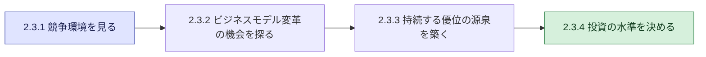

---

### Skill 2.3.1: 競争環境を評価し、AI 導入の優位性を特定する

> 試験ガイドの原文の趣旨: 競争環境を評価し、AI を導入することによる優位性を特定する。

#### 何を問われるか

「競合や市場は AI をどう使っているか」「自社が AI で優位に立てるのはどこか」を分析できるかが問われます。

#### 初学者向けの解説

**分析の視点**

| 視点 | 確認する問い |
|---|---|
| 競合 | 競合は AI で何をしているか。どの領域で先行しているか |
| 顧客 | 顧客の期待は変わっているか (速さ、個別対応、24 時間対応など) |
| 業界 | 業界全体の AI 導入は進んでいるか。規制や標準はあるか |
| 新規参入 | AI を武器にした新興企業が参入していないか |
| 代替 | 顧客が別の方法 (AI を使った他のサービス) に乗り換える可能性はないか |
| 自社 | 自社に独自のデータ、顧客基盤、専門性、ブランドはあるか |

**AI で優位性が生まれる典型的な場面**

| 優位性の種類 | 例 |
|---|---|
| コスト優位 | 業務の自動化で、競合より低い費用で提供できる |
| スピード優位 | 開発、提案、対応の速さで先行する |
| 顧客体験の優位 | 個別化した提案、24 時間の対応で満足度を高める |
| 品質の優位 | 検査や分析の精度、一貫性が高まる |
| 意思決定の優位 | データに基づいて、早く的確に判断できる |
| 新しい価値の提供 | 従来はできなかったサービスを提供する |

**評価の手順**

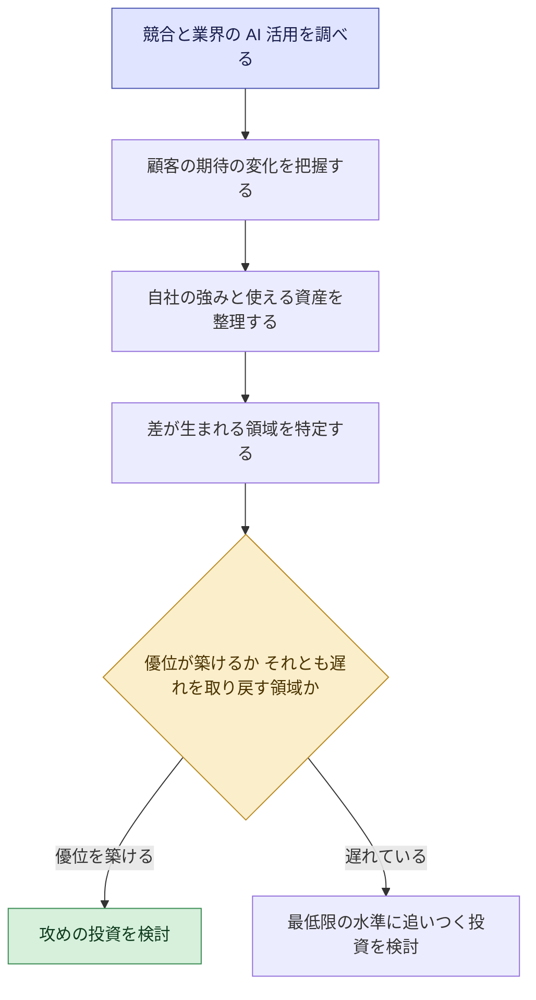

#### ベストプラクティス

- **競合の動きを定期的に観察する。** 発表、事例、採用、提携などから把握する。
- **顧客の声を起点にする。** 顧客が何に不満で、何を期待しているかを確認する。
- **自社固有の資産を洗い出す。** 独自のデータ、顧客との関係、専門知識は、AI と組み合わせると強みになる。
- **「追いつく」と「差別化する」を分ける。** 業界で標準になりつつある機能は「追いつく」対象。差別化は独自の強みで行う。
- **外部の知見を活用する。** パートナーや AWS の事例、支援プログラムを参考にする。

#### よくある落とし穴

| 落とし穴 | 対策 |
|---|---|
| 競合の発表を鵜呑みにして焦る | 実際の成果と自社の文脈で評価する |
| 全部で先行しようとする | 事業への影響が大きい領域に集中する |
| 自社資産を見ずに他社の真似をする | 独自のデータや強みを起点にする |

#### 試験での着眼点

- 競争環境の評価では、**市場、競合、顧客の期待、自社の強み**を総合的に見る選択肢が有力。
- 「他社が導入したから導入する」より、「自社の競争上の優位につながるか」を評価する選択肢が正解になりやすい。

---

### Skill 2.3.2: ビジネスモデルを変革する機会を特定する

> 試験ガイドの原文の趣旨: AI ソリューションを使って、ビジネスモデルを変革する機会を特定する。

#### 何を問われるか

AI を「今の仕事を速くする」だけでなく、**「事業の稼ぎ方そのものを変える」ために使えるか**を発想できるかが問われます。

#### 初学者向けの解説

**AI 活用の 4 つのレベル**

| レベル | 内容 | 例 | 変革の大きさ |
|---|---|---|---|
| 1. 効率化 | 既存の業務を速く、安くする | 議事録の自動作成、帳票の自動読み取り | 小 |
| 2. 高度化 | 人の判断や創造を支援して質を高める | 営業提案の個別化、意思決定の支援 | 中 |
| 3. 新しい商品、サービス | AI を組み込んだ新しい価値を提供する | AI による診断支援サービス、個別化された助言機能 | 大 |
| 4. ビジネスモデルの転換 | 収益の仕組みや顧客との関係を変える | 製品の販売から、成果に応じた課金のサービスへ | 最大 |

レベルが上がるほど価値も大きくなりますが、リスクも不確実性も大きくなります。

**ビジネスモデル変革の視点**

| 視点 | 問い | 例 |
|---|---|---|
| 顧客への価値 | AI で、顧客にどんな新しい価値を届けられるか | 個別化、24 時間対応、予測に基づく提案 |
| 収益モデル | 課金や収益の仕組みを変えられるか | サブスクリプション、成果連動型、データ活用型のサービス |
| 提供方法 | 提供の仕方を変えられるか | 人手中心のサービスを、セルフサービスと AI で拡張する |
| バリューチェーン | 事業のどの段階に AI を入れると変わるか | 企画、開発、販売、サポートの全体を再設計する |
| エコシステム | パートナーや他社との連携で価値を広げられるか | 他社のサービスと連携した新しい提供 |

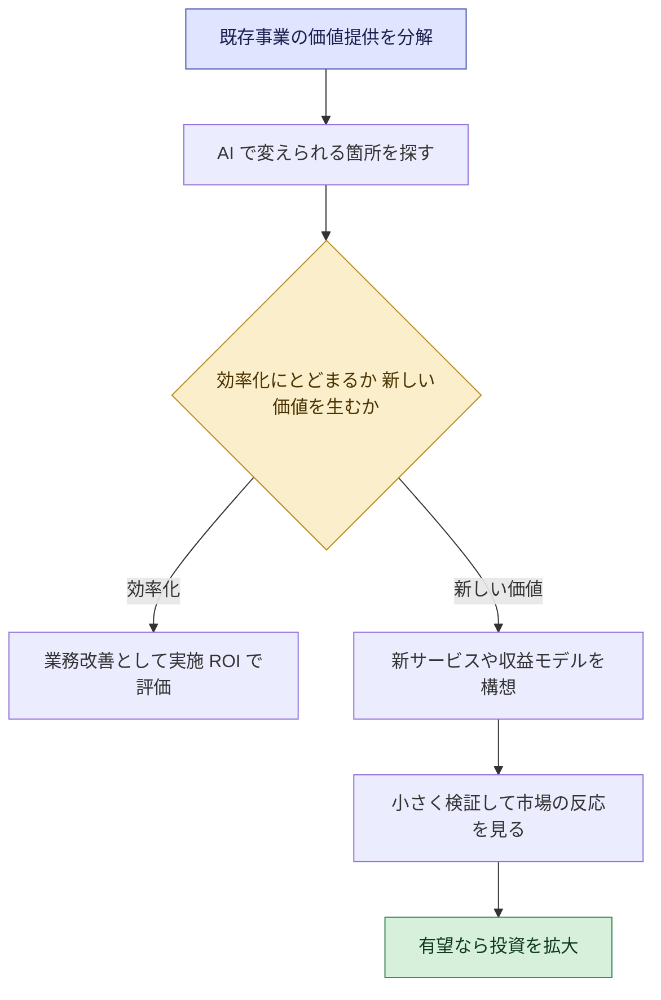

#### ベストプラクティス

- **顧客の課題から出発する。** 新しいモデルは、顧客が価値を感じて初めて成立する。
- **小さく検証する。** 新しい事業の仮説は、小規模な試行で市場の反応を確かめる。
- **既存事業との関係を考える。** 既存の収益を脅かす場合 (共食い) も含めて判断する。
- **ガバナンスと責任ある AI を並行して整える。** 顧客向けの新サービスでは、信頼と規制対応が競争力になる (Domain 3)。
- **段階的に進める。** 効率化で成功体験と学びを得てから、より大きな変革に進む。

#### よくある落とし穴

| 落とし穴 | 対策 |
|---|---|
| 効率化だけで「変革」と呼ぶ | どのレベルの取り組みかを明確にする |
| 技術が先行し、顧客が価値を感じない | 顧客への価値を最初に検証する |
| 大きな構想を一度に実行する | 小さく検証して段階的に広げる |
| 組織や人の変革を伴わない | 役割やスキルの変化を計画する (Domain 4) |

#### 試験での着眼点

- ビジネスモデルの変革は、**新しい価値の提供や収益の仕組みの変化**を伴うもの。単なる業務の効率化とは区別する。
- 変革の機会の特定では、**顧客への価値**を起点にする選択肢が有力。

---

### Skill 2.3.3: 持続的な競争優位と業務改善を説明する

> 試験ガイドの原文の趣旨: AI が、どのように持続的な競争優位と業務の改善を生み出すかを説明する。

#### 何を問われるか

「AI を使えば優位になる」という単純な理解ではなく、**「何が長く続く優位の源泉になり、何がすぐに真似されるか」を区別して説明できる**かが問われます。

#### 初学者向けの解説

**すぐに真似される優位と、続く優位**

生成 AI のモデルやツールは、多くの企業が同じものを利用できます。同じ道具を全員が持つなら、道具そのものは差別化になりません。

| 区分 | 例 | 持続性 |
|---|---|---|
| 真似されやすい | 同じ既製のモデルや AI ツールの導入、一般的なチャットボット | 低い (競合もすぐ導入できる) |
| 続きやすい | 独自のデータ、業務への深い統合、顧客との信頼関係、組織の学習能力、人材、ガバナンスの成熟度 | 高い |

**持続的な優位の源泉**

| 源泉 | なぜ持続するのか |
|---|---|
| 独自のデータ | 他社が簡単に入手できない。使うほど蓄積され、改善に使える |
| 業務への深い統合 | 単なる機能追加より、真似に時間と手間がかかる |
| 継続的な改善の仕組み | 利用データや評価を回して、成果が積み上がる (改善のループ) |
| 人材と組織の能力 | AI を使いこなす文化やスキルは、購入できない |
| 信頼とガバナンス | 責任ある AI の実践は、顧客や規制当局からの信頼につながる |
| 顧客との関係 | 顧客の文脈を理解した体験は、乗り換えにくさを生む |

**改善のループ (優位が積み上がる仕組み)**

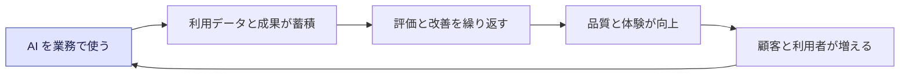

**業務改善につながる領域**

| 領域 | 改善の例 |
|---|---|
| 速度 | 対応、開発、提案のリードタイムの短縮 |
| コスト | 定型作業の削減、エラー対応の減少 |
| 品質 | 分析、検査の精度と一貫性の向上 |
| 従業員の体験 | 単純作業の削減による付加価値の高い仕事への集中 |
| 意思決定 | 情報の集約により、判断が速く正確になる |

> 業務改善だけでは優位にならないこともあります。競合も同様に改善すれば、業界の「標準」になるだけです。優位にするには、独自の資産と組み合わせます。

#### ベストプラクティス

- **独自のデータ資産を育てる。** データの品質、管理、活用の基盤を整える。
- **AI を業務の流れに組み込む。** 単独のツールで終わらせず、日常の業務に統合する。
- **改善のループを回す。** 測定、評価、改善を継続する仕組みを作る (Skill 2.2 と連動)。
- **人材と文化に投資する。** AI リテラシーの向上と、変化を受け入れる組織を作る (Domain 4)。
- **信頼を差別化要素にする。** ガバナンスと責任ある AI の実践を、競争力として位置づける (Domain 3)。

#### よくある落とし穴

| 落とし穴 | 対策 |
|---|---|
| 同じ既製ツールで差別化できると考える | 独自データや統合で差をつける |
| 導入して終わりにする | 継続的な改善のループを設計する |
| 技術だけに投資し人材を後回しにする | 人と組織への投資を並行させる |

#### 試験での着眼点

- 持続的な競争優位として適切なのは、**独自のデータ、業務への統合、継続的な改善、人材と組織の能力**。
- 「他社と同じ汎用ツールを導入する」だけでは、持続的な優位にならない。

---

### Skill 2.3.4: 業界の成熟度と競争動向に応じた投資水準を決める

> 試験ガイドの原文の趣旨: 業界の成熟度と競争動向に基づいて、適切な AI 投資の水準を決定する。

#### 何を問われるか

「どれくらい AI に投資すべきか」に**唯一の正解はなく、業界や競合の状況で変わる**ことを理解し、状況に応じた水準を選べるかが問われます。

#### 初学者向けの解説

**2 つの軸で状況を見る**

| 軸 | 意味 | 確認する内容 |
|---|---|---|
| 業界の AI 成熟度 | 業界全体で AI がどこまで浸透しているか | 導入企業の割合、標準的な活用の有無、顧客の期待、規制の整備 |
| 競争の激しさ (競争動向) | 競合との差がどれだけ早く広がるか | 競合の投資の動き、新規参入、AI による市場の変化の速さ |

**状況別の投資姿勢の目安**

| | 競争が激しい (動きが速い) | 競争が穏やか |
|---|---|---|
| **業界の成熟度が高い** | 積極的に投資して追随、または差別化する。遅れると顧客を失う | 標準的な水準を維持しつつ、効率と品質を改善する |
| **業界の成熟度が低い** | 先行の機会。リードするために積極投資を検討する。ただし不確実性が高いので段階的に | 小さな実験で学びながら、様子を見て投資を判断する |

**投資の考え方**

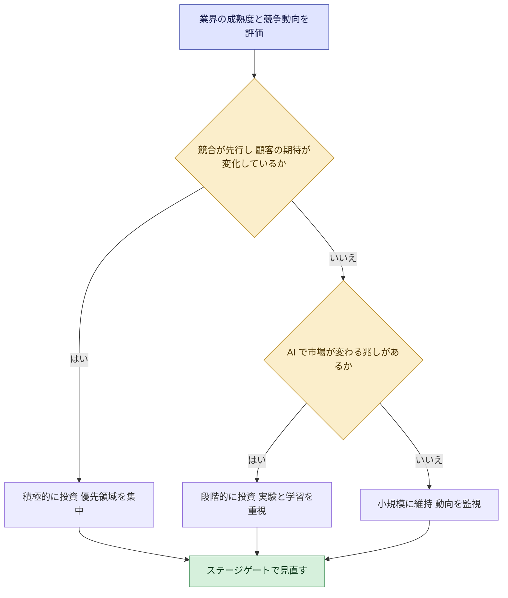

**投資の 3 つの過不足**

| 状況 | 起きること |
|---|---|
| 投資が少なすぎる | 競合や顧客の期待に遅れ、市場での地位を失う |
| 投資が多すぎる | 成果が出る前に予算を使い果たす。組織の受け入れが追いつかない |
| 適切な水準 | 価値の見込める領域に集中し、段階的に拡大できる |

#### ベストプラクティス

- **ポートフォリオで考える。** 確実な効率化、成長のための中規模の投資、将来を見据えた実験的な投資を組み合わせる。
- **段階的に投資する。** ステージゲートで成果を見て、追加するか止めるかを決める (Skill 2.1.3)。
- **定期的に見直す。** AI の技術と市場は速く動く。四半期などで状況を再評価する。
- **組織の受け入れ能力も考慮する。** 人材、データ、ガバナンスの準備状況を踏まえて投資の速度を決める (Domain 4)。
- **競合の投資を盲目的に追わない。** 自社の戦略と競争上の位置づけで判断する。

#### よくある落とし穴

| 落とし穴 | 対策 |
|---|---|
| 一律の投資水準を全社に適用する | 領域ごとに競争上の重要度で配分する |
| 他社の発表に流されて過剰に投資する | 自社の戦略と ROI で判断する |
| 動向を見ないまま固定予算にする | 定期的な再評価を組み込む |

#### 試験での着眼点

- 投資水準は、**業界の成熟度と競争動向に応じて調整する**。「常に最大限」「常に最小限」は不適切。
- 不確実性が高い場合は、**段階的な投資とステージゲート**が有力な選択肢。

---

## 6. Domain 2 に登場する AWS のサービス、フレームワーク、ツール

試験ガイドは、これらを「戦略レベル」で理解することを求めています。設定や運用の手順は範囲外です。

| 分類 | 名称 | 戦略レベルでの理解 | 関連 Skill |
|---|---|---|---|
| AI / ML | Amazon Bedrock | 生成 AI アプリケーションを構築するプラットフォーム。料金の区分 (オンデマンド、バッチ、プロビジョンドスループットなど)、ガードレール、ナレッジベースを知っておく | 2.1.2、2.2.5 |
| AI / ML | Amazon SageMaker AI | 独自の ML を作る場面。マネージドで足りるか、カスタムが必要かの判断。インスタンス課金と Savings Plans | 2.1.2、2.2.5 |
| ビジネスインテリジェンス | Amazon Quick | AI を使った業務アシスタント、ダッシュボード作成、ワークフロー自動化。機械学習の専門知識なしで使える。利用者ごとのシート課金 | 2.1.2、2.2.5 |
| 戦略 | AWS Cloud Adoption Framework (AWS CAF) | AI の取り組みを組織全体で計画、拡大するための枠組み。ビジネス、人材、ガバナンス、プラットフォーム、セキュリティ、オペレーションの 6 つの視点 | 2.1.1、全般 |
| ガバナンス | AWS 責任共有モデル | AI ワークロードでのデータセキュリティとコンプライアンスの責任分担 (ガバナンスレベル) | 2.1.2 |
| ガバナンス | Well-Architected Framework (Responsible AI Lens) | 責任ある AI のベストプラクティス。生成 AI 向けの Generative AI Lens も存在する | 2.2.5 |
| コスト | AWS AI サービスの料金体系 | 従量課金、インスタンス課金、シート課金 | 2.2.5 |
| コスト | AWS Pricing Calculator | 事前の費用見積もり | 2.2.5 |
| コスト | AWS Cost Explorer | 実績のコスト分析 | 2.2.5 |
| コスト | Savings Plans | 利用量のコミットメントによる割引 | 2.2.5 |
| 調達 | AWS Marketplace | 製品やサービスを比較、調達。Build-Buy-Partner の評価に使う | 2.1.2 |

> 補足: AWS Cloud Adoption Framework for AI, ML, and Generative AI (CAF-AI) のホワイトペーパーは、AWS のサイト上で「歴史的な参照用であり、一部の内容が古い可能性がある」と表示されています。概念の理解には有用ですが、最新の情報は他の公式資料と併せて確認してください。

---

## 7. Domain 2 全体を貫く判断の型

問題に迷ったときは、次の 8 つの型に当てはめて考えてください。

| # | 判断の型 | 迷ったときの答え |
|---|---|---|
| 1 | 出発点はどこか | 技術ではなく、**ビジネス課題と成果** |
| 2 | AI は本当に必要か | ルールベースや業務改善で足りるなら、**AI を使わない** |
| 3 | 作るか買うか | 差別化に効くなら Build、一般的な課題なら Buy、専門性が足りなければ Partner。**制約 (予算、期間、能力、規制) で決める** |
| 4 | どれを先にやるか | 価値だけでなく、**実現可能性、持続可能性、戦略的整合性**も含めて評価する |
| 5 | 効果をどう示すか | **導入前にベースラインを取り**、有形と無形の KPI で測る |
| 6 | ROI の計算 | **便益もコストも漏れなく**、複数年で、保守的に |
| 7 | 進捗をどう確認するか | 成果を待たず、**先行指標**を早く、頻繁に見る |
| 8 | 投資の水準 | 業界の成熟度と競争動向に合わせ、**段階的に**投資して見直す |

全体を 1 枚の流れにまとめると、次のようになります。

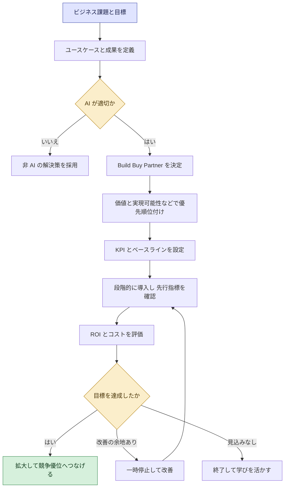

---

## 8. 練習問題

出題形式に慣れるための、オリジナルの練習問題です (実際の試験問題ではありません)。答えは折りたたんでいます。

### 問題 1 (択一)

ある企業が生成 AI を導入したいと考えています。最初に行うべきことはどれですか。

- A. 最新のモデルを比較して、最も高性能なものを選ぶ
- B. 解決したいビジネス課題と、期待する成果を特定する
- C. 競合と同じ製品をすぐに導入する
- D. 社内の全部署に AI ツールを配布する

答えと解説

**正解: B**。AI の戦略は、技術ではなくビジネス課題と成果から出発します (Skill 2.1.1)。A、C、D は、課題や成果が定まらないまま技術や製品を先に決めています。

### 問題 2 (択一)

社内に AI の専門人材がおらず、一般的な問い合わせ対応を短期間で改善したい企業がいます。最も適切な調達の方針はどれですか。

- A. 基盤モデルをゼロから自社で開発する
- B. 既製の製品やサービスの導入、またはパートナーとの協働を検討する
- C. 導入を無期限に延期する
- D. すべての作業を手作業に戻す

答えと解説

**正解: B**。短期間、専門人材が少ない、一般的な課題という条件は、Buy か Partner が有力です (Skill 2.1.2)。A は時間と人材が必要で条件に合いません。

### 問題 3 (択一)

「注文金額が一定以上なら上長の承認を必須にする」という業務を自動化したいと考えています。手順は明確で、例外はほとんどありません。最も適切な方法はどれですか。

- A. 生成 AI に判断させる
- B. ルールベースの自動化を採用する
- C. 大規模な機械学習モデルを開発する
- D. AI エージェントに自律的に判断させる

答えと解説

**正解: B**。明確なルールで書ける定型業務には、ルールベースの自動化が最も簡単で確実、かつ説明しやすい方法です (Skill 2.1.4)。

### 問題 4 (複数選択、2 つ選ぶ)

AI イニシアチブの優先順位を決めるとき、評価に含めるべき観点はどれですか。2 つ選んでください。

- A. ビジネス価値
- B. 技術者が最も面白いと感じるか
- C. 実現可能性
- D. 経営層の一人が強く推しているか
- E. 使用するモデルの名前の新しさ

答えと解説

**正解: A と C**。優先順位は、ビジネス価値、実現可能性、持続可能性、戦略的整合性で評価します (Skill 2.1.3)。B、D、E はビジネス上の合理的な基準ではありません。

### 問題 5 (択一)

AI 導入の効果を正確に測定するため、導入前に行うべきことはどれですか。

- A. 導入後に測定方法を決める
- B. ベースライン指標を確立する
- C. 利用者にアンケートを取らない
- D. ROI の計算を省略する

答えと解説

**正解: B**。導入前の現状値 (ベースライン) がなければ、改善の幅を証明できません (Skill 2.2.2)。

### 問題 6 (択一)

AI アシスタントを導入した 3 か月後、成果はまだ見えませんが、経営層は早期に成功の見込みを確認したいと考えています。最も適切な指標はどれですか。

- A. 年間のコスト削減額
- B. 利用者の継続利用率とタスクの完了率
- C. 3 年後の売上の増加額
- D. 過去 5 年の営業利益

答えと解説

**正解: B**。継続利用率やタスクの完了率は、将来の成果を早期に予測する先行指標です (Skill 2.2.4)。A、C、D は結果が出てから分かる遅行指標です。

### 問題 7 (択一)

AI 導入の ROI を評価するとき、最も適切なのはどれですか。

- A. 利用料だけをコストとして計算する
- B. 便益とコストを漏れなく洗い出し、複数年で保守的に評価する
- C. 節約できた時間の全額を便益として計上する
- D. 1 か月目の結果だけで判断する

答えと解説

**正解: B**。コストには利用料以外に、統合、教育、運用、ガバナンスも含めます。便益は実現率を考慮して保守的に見積もり、複数年で評価します (Skill 2.2.3)。

### 問題 8 (択一)

利用量が読めないため、小さく始めて、使った分だけ支払いたいと考えています。最も適した料金体系はどれですか。

- A. 従量課金 (消費ベース)
- B. 長期の大規模なコミットメントだけ
- C. 使わなくても固定で支払う前払い
- D. 全社員分のシートを先に購入する

答えと解説

**正解: A**。利用量が不確かな段階では、使った分だけ支払う従量課金が適しています。利用量が安定してから、Savings Plans などのコミットメントを検討します (Skill 2.2.5)。

### 問題 9 (択一)

ある企業は、競合と同じ汎用の AI ツールを導入しました。持続的な競争優位を築くために、最も効果的な追加の取り組みはどれですか。

- A. さらに別の汎用ツールを追加する
- B. 独自のデータと業務プロセスに AI を深く統合し、改善を継続する
- C. 導入したことを広告する
- D. ツールの導入数を増やす

答えと解説

**正解: B**。汎用ツールは競合も使えるため、それだけでは優位になりません。独自のデータ、業務への統合、継続的な改善が、持続する優位の源泉です (Skill 2.3.3)。

### 問題 10 (択一)

業界全体で AI の導入が急速に進み、競合が先行し、顧客の期待も変わってきています。適切な投資姿勢はどれですか。

- A. 現状維持で様子を見続ける
- B. 優先領域に集中して積極的に投資し、ステージゲートで見直す
- C. すべての領域に同額を配分する
- D. 投資を完全に停止する

答えと解説

**正解: B**。競争が激しく業界の成熟度が高い状況では、遅れることのリスクが大きいため、優先領域に積極的に投資します。ただし、段階的な見直しで無駄を抑えます (Skill 2.3.4)。

---

## 9. 直前チェックリスト

自分の言葉で説明できるかを確認してください。

**Task 2.1: 戦略の整合**

- [ ] 課題、成果、AI の能力の対応づけを、部門別の例で説明できる (2.1.1)
- [ ] Build、Buy、Partner の違いと、判断の 5 観点 (予算、期間、能力、ベンダー提案、規制) を言える (2.1.2)
- [ ] 優先順位付けの 4 軸 (価値、実現可能性、持続可能性、戦略的整合性) を言える (2.1.3)
- [ ] 拡大、一時停止、終了の判断基準を説明できる (2.1.3)
- [ ] AI が適切でない典型例を 3 つ以上挙げられる (2.1.4)
- [ ] ルールベース自動化を選ぶべき場面を説明できる (2.1.4)
- [ ] 移行の 4 観点 (事業継続性、コスト、データ、パフォーマンス) を説明できる (2.1.5)

**Task 2.2: 価値の測定**

- [ ] 有形と無形の KPI の例を挙げられる (2.2.1)
- [ ] ベースラインが必要な理由を説明できる (2.2.2)
- [ ] ROI の式と、便益とコストの種類を言える (2.2.3)
- [ ] 実現率と複数年評価の意味を説明できる (2.2.3)
- [ ] 先行指標と遅行指標の違いを例で示せる (2.2.4)
- [ ] 従量課金、インスタンス課金、シート課金の違いと向く場面を言える (2.2.5)
- [ ] Pricing Calculator、Cost Explorer、Savings Plans、AWS Marketplace の役割を区別できる (2.2.5)

**Task 2.3: 競争優位**

- [ ] 競争環境を評価する視点を挙げられる (2.3.1)
- [ ] AI 活用の 4 つのレベルを説明できる (2.3.2)
- [ ] 真似されやすい優位と続く優位の違いを言える (2.3.3)
- [ ] 業界の成熟度と競争動向に応じた投資姿勢を説明できる (2.3.4)

---

## 10. 用語集

| 用語 | 説明 |
|---|---|
| AWS CAF | AWS Cloud Adoption Framework。クラウド、AI 導入を組織全体で計画、拡大するための枠組み |
| Amazon Bedrock | 生成 AI アプリケーションを構築するための AWS のプラットフォーム |
| Amazon SageMaker AI | 独自の機械学習モデルを構築、学習、展開する AWS のサービス |
| Amazon Quick | AI を使った業務アシスタント、ビジネスインテリジェンス、ワークフロー自動化の AWS のサービス (旧 QuickSight を含む) |
| AWS Marketplace | サードパーティのソフトウェアやサービスを探して、購入、展開できる場 |
| Savings Plans | 1 年または 3 年の一定の利用量を約束する代わりに、割引を受けられる料金モデル |
| ステージゲート | 節目ごとに、続けるか、止めるかを判断する仕組み |
| サンクコスト | すでに使って戻らない費用。将来の判断の根拠にしない |
| 実現率 | 理論上の便益のうち、実際に価値に変わる割合 |
| 感度分析 | 前提 (便益やコスト) を変えたとき、結果がどう変わるかを見る分析 |
| ロックイン | 特定の製品やベンダーに依存し、乗り換えにくくなること |
| Human-in-the-loop | 重要な判断に、人が確認、承認として関与する設計 |

---

## 11. 参考文献 (ソース URL)

本ガイドの根拠として使った情報源です。Skill の内容は、試験ガイドの記載を基本にしています。ROI の計算式、SMART、ステージゲートなどのビジネス上の一般的な考え方は、特定の AWS 文書に固有のものではなく、広く使われている実務の考え方を試験の文脈に合わせて整理したものです。

### 11.1 試験の公式情報 (一次情報)

| 資料 | URL |
|---|---|
| AWS Certified AI Business Strategist 認定ページ | https://aws.amazon.com/certification/certified-ai-business-strategist/ |
| 試験ガイド (AIB-C01) 全体 | https://docs.aws.amazon.com/aws-certification/latest/ai-business-strategist-01/ai-business-strategist-01.html |
| Content Domain 2: AI Strategy and Business Value Creation | https://docs.aws.amazon.com/aws-certification/latest/ai-business-strategist-01/ai-business-strategist-01-domain2.html |
| 試験に登場しうる技術と概念 | https://docs.aws.amazon.com/aws-certification/latest/ai-business-strategist-01/aib-01-technologies-concepts.html |
| 対象範囲内の AWS サービスと機能 | https://docs.aws.amazon.com/aws-certification/latest/ai-business-strategist-01/aib-01-in-scope-services.html |

### 11.2 AWS の公式ドキュメント (サービス、フレームワーク、料金)

| 資料 | 本ガイドでの用途 | URL |
|---|---|---|
| AWS CAF for AI, ML, and Generative AI (ホワイトペーパー) | 組織全体で AI を計画、拡大する枠組み (Skill 2.1.1、全般) | https://docs.aws.amazon.com/whitepapers/latest/aws-caf-for-ai/aws-caf-for-ai.html |
| AWS Well-Architected Generative AI Lens | 生成 AI の 6 つの柱にわたるベストプラクティス (Skill 2.2.5) | https://docs.aws.amazon.com/wellarchitected/latest/generative-ai-lens/generative-ai-lens.html |
| Building an enterprise-ready generative AI platform on AWS (Prescriptive Guidance) | 試作の乱立、コスト最適化と ROI 測定などの課題 (Skill 2.1.3、2.2.3) | https://docs.aws.amazon.com/prescriptive-guidance/latest/strategy-enterprise-ready-gen-ai-platform/introduction.html |
| Amazon Bedrock の料金 | オンデマンド、バッチ、キャッシュ、プロビジョンドスループットなどの区分 (Skill 2.2.5) | https://aws.amazon.com/bedrock/pricing/ |
| Amazon SageMaker AI の料金 | オンデマンドと Savings Plans (Skill 2.2.5) | https://aws.amazon.com/sagemaker-ai/pricing/ |
| What are Savings Plans? | 1 年または 3 年のコミットメントによる割引 (Skill 2.2.5) | https://docs.aws.amazon.com/savingsplans/latest/userguide/what-is-savings-plans.md |
| Amazon Quick とは | AI を使った BI、ワークフロー自動化、ロール別のサブスクリプション (Skill 2.1.2、2.2.5) | https://docs.aws.amazon.com/quicksight/latest/user/quickstart.html |
| Amazon Quick ドキュメント (トップ) | 同上 | https://docs.aws.amazon.com/quick/ |
| Amazon Quick FAQ | 部門別の活用例 (Skill 2.1.1) | https://aws.amazon.com/quick/faqs/ |
| AWS Billing and Cost Management (ログ記録と監視のページ内の Pricing Calculator の説明) | 事前の費用見積もり (Skill 2.2.5) | https://docs.aws.amazon.com/cost-management/latest/userguide/billing-security-logging.html |
| AWS Pricing Calculator | 費用の見積もりツール | https://calculator.aws/ |
| AWS Marketplace | サードパーティ製品の探索、調達 (Skill 2.1.2、2.2.5) | https://aws.amazon.com/marketplace |

### 11.3 補助的な情報源 (参考)

| 資料 | 用途 | URL |
|---|---|---|
| AWS Partner Network ブログ: McKinsey との対談 | 優先順位付けと、PoC、MVP、拡大という進め方 (Skill 2.1.3) | https://aws.amazon.com/blogs/apn/generative-ai-trends-and-opportunities-for-aws-partners-a-conversation-with-mckinsey-and-company/ |

### 11.4 注意事項

- **ベータ試験の条件:** 認定ページ (ベータ試験の概要) と試験ガイドで、試験時間などの条件が異なっています (第 1 章参照)。受験前に最新の条件を確認してください。
- **試験の性質:** 認定ページは、この試験が「AWS のサービスの知識を評価するものではない」と説明しています。一方、試験ガイドは Amazon Bedrock、Amazon SageMaker AI、Amazon Quick、AWS CAF などを戦略レベルで理解することを推奨しています。サービスの設定方法ではなく、**どの場面で何を選ぶか**を理解する方針で学習してください。
- **料金の情報:** 料金、モデル、サービスの名称、機能は変わります。本ガイドの料金に関する記述は仕組みの理解のためのもので、具体的な金額は必ず公式の料金ページで確認してください。本ガイドの計算例の数値は、説明用の架空の値です。
- **試験ガイドの更新:** 試験内容は変更される可能性があります。学習の前に、試験ガイドの最新版を確認してください。
- **確認日:** 本ガイドは 2026-09-28 時点の公開情報に基づいています。
