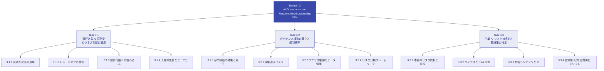
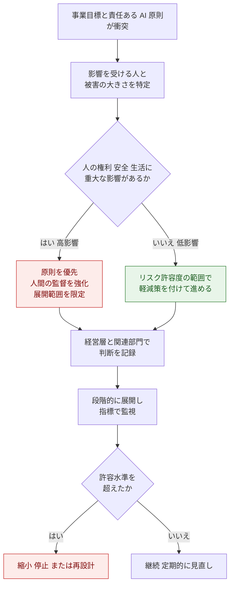
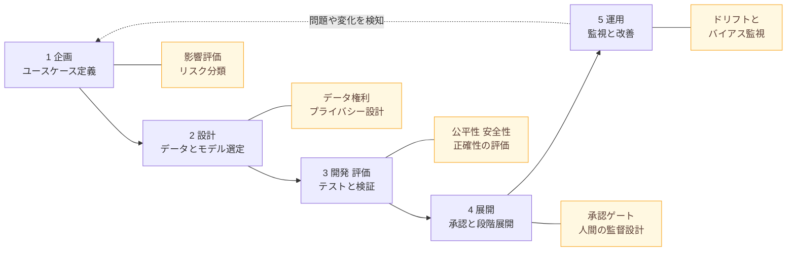
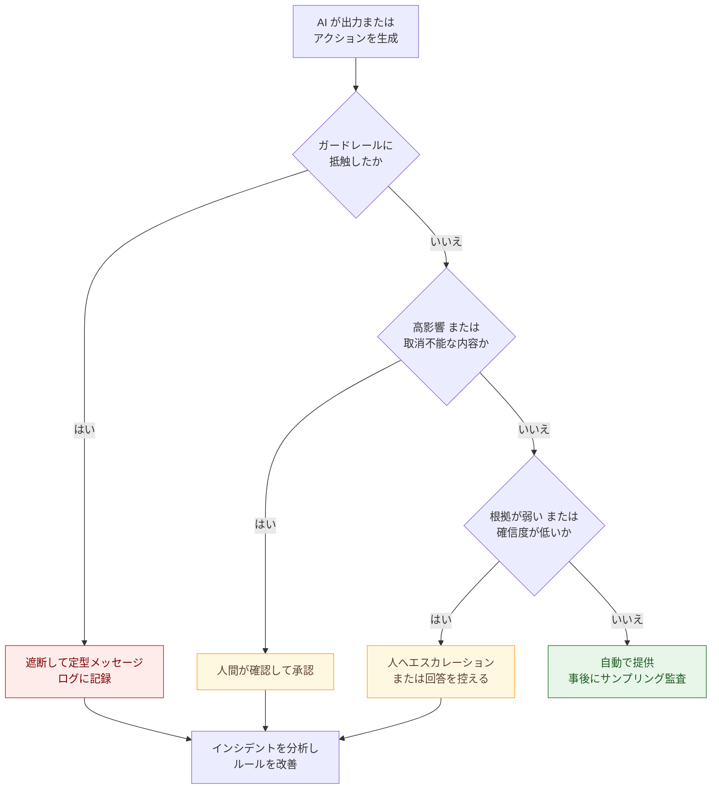
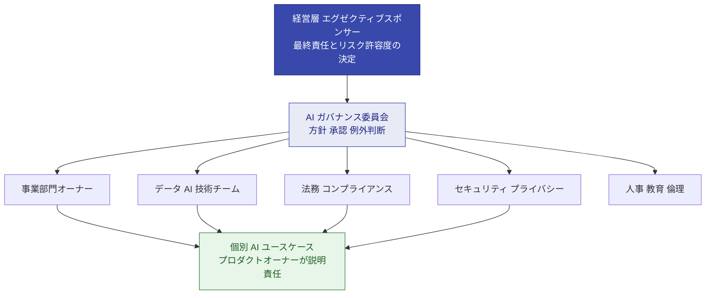
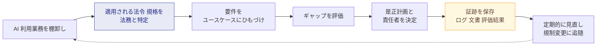
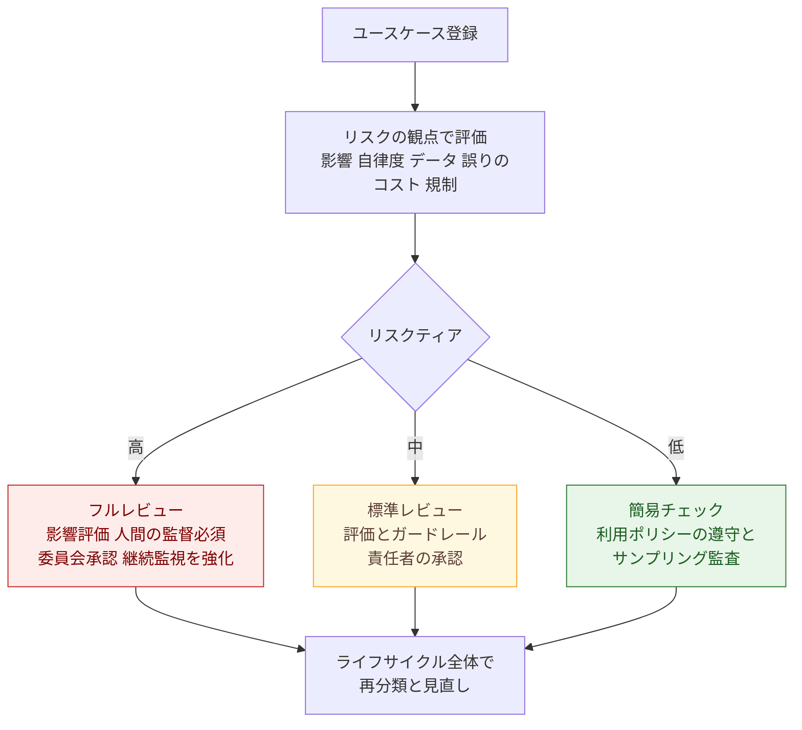
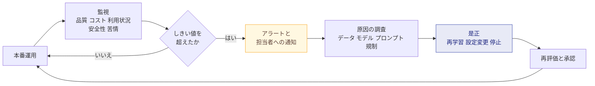
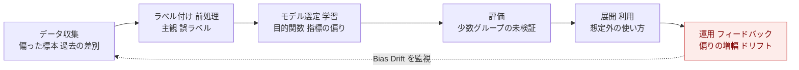
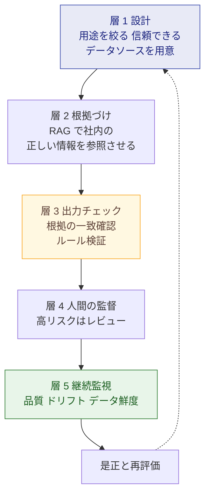

# AWS Certified AI Business Strategist (AIB-C01)

## Domain 3：AI Governance and Responsible AI Leadership（ガバナンスと責任ある AI）初学者向けステップバイステップ解説

> 対象：AI を評価・推進・拡大する立場のビジネスパーソン（PM、コンサル、営業、事業部門リーダー、アナリスト等）
> 前提：コーディングや AWS 実装経験は不要。「戦略的な意思決定」が問われる試験です。
> 執筆基準日：2026-09-30（試験ガイド・AWS ドキュメント・規制の状況はこの日付時点）
> 形式：Markdown（図は Mermaid、表は Markdown。ASCII アートは不使用）

---

## 目次

1. [この資料の使い方と試験の位置づけ](#1-この資料の使い方と試験の位置づけ)
2. [Domain 3 の全体像](#2-domain-3-の全体像)
3. [Task 3.1 責任ある AI 原則をビジネス判断に適用する](#3-task-31-責任ある-ai-原則をビジネス判断に適用する)
4. [Task 3.2 ガバナンス構造の確立と規制遵守](#4-task-32-ガバナンス構造の確立と規制遵守)
5. [Task 3.3 企業 AI リスクの特定と軽減策の指示](#5-task-33-企業-ai-リスクの特定と軽減策の指示)
6. [AWS サービス・フレームワーク早見表（戦略レベル）](#6-aws-サービスフレームワーク早見表戦略レベル)
7. [試験対策：頻出パターンと引っかけポイント](#7-試験対策頻出パターンと引っかけポイント)
8. [確認問題（自己採点用）](#8-確認問題自己採点用)
9. [参考 URL（根拠ソース）](#9-参考-url根拠ソース)
10. [本資料の注意事項](#10-本資料の注意事項)

---

## 1. この資料の使い方と試験の位置づけ

### 1.1 試験の基本情報

| 項目 | 内容 | 出典 |
|---|---|---|
| 試験名 | AWS Certified AI Business Strategist (AIB-C01) | 試験ガイド |
| 想定受験者 | AI を評価・推進・拡大する業務担当者。技術チームと協働するが、自分で AI を構築はしない | 試験ガイド |
| 出題形式 | 択一（正解 1・誤答 3）／複数選択（5 択以上から 2 つ以上を全て選ぶ） | 試験ガイド |
| 合格点 | 100〜1,000 のスケールドスコアで 700 以上。補償型採点のためドメインごとの足切りはない | 試験ガイド |
| Domain 3 の配点 | 採点対象コンテンツの 24% | 試験ガイド |
| 試験時間 | 試験ガイドには 130 分、認定ページのベータ試験概要には 170 分・85 問と記載（**記載が食い違うため、受験時は必ず最新の公式ページを確認**） | 試験ガイド／認定ページ |
| 言語 | 英語・日本語（認定ページ） | 認定ページ |

> ポイント：この試験は「AWS サービスの操作知識」ではなく「ビジネス判断力」を測ります。認定ページにも、AWS サービスの知識を評価する試験ではないと明記されています。ただし試験ガイドの対象範囲には Amazon Bedrock（Guardrails 等）、Amazon SageMaker AI、Amazon Quick、AWS CAF、責任共有モデルなどが「戦略レベル」で含まれます。

### 1.2 学習の進め方（ステップ）

| ステップ | やること | 目安 |
|---|---|---|
| Step 1 | 第 2 章で Domain 3 の全体像（3 つの Task と 12 のスキル）を頭に入れる | 15 分 |
| Step 2 | 第 3〜5 章を Task ごとに読む。各スキルの「何が問われるか」→「なぜ重要か」→「ベストプラクティス」の順 | 各 40〜60 分 |
| Step 3 | 第 6 章で AWS サービスと役割を対応づける | 20 分 |
| Step 4 | 第 7・8 章で引っかけパターンを確認し、確認問題を解く | 30 分 |
| Step 5 | 第 9 章の一次情報で、自分の言葉で説明できるか検証する | 随時 |

---

## 2. Domain 3 の全体像

Domain 3 は 3 つの Task、合計 12 のスキルで構成されています（試験ガイドの記載どおり）。

### 2.1 3 つの Task を一言でいうと

| Task | 一言でいうと | 初学者向けの比喩 |
|---|---|---|
| 3.1 | 「AI をどういう価値観で使うか」を決め、判断に反映する | 会社の行動規範を AI にも適用する |
| 3.2 | 「誰が責任を持ち、どのルールに従うか」を仕組みにする | 交通ルールと免許制度・警察の整備 |
| 3.3 | 「動かし始めた後に何が起きるか」を見張り、直す | 車の定期点検とドライブレコーダー |

### 2.2 まず覚える用語

| 用語 | やさしい説明 |
|---|---|
| 責任ある AI（Responsible AI） | 利益を最大化しつつ、リスクと害を最小化するよう AI を設計・開発・利用する取り組み |
| ガバナンス | 意思決定の権限・責任・ルール・監督の仕組み全体 |
| ガードレール | AI の入出力に対して、有害・不適切・範囲外の内容を検知して止める安全装置 |
| 幻覚（ハルシネーション） | AI がもっともらしいが事実でない内容を出力すること |
| モデルドリフト | 時間の経過で入力データの傾向や現実が変わり、モデル性能が劣化すること |
| Bias Drift | 運用中に、特定グループへの偏りが徐々に変化・悪化すること |
| Human-in-the-loop | 重要な判断に人間のレビューや承認を組み込むこと |
| シャドー AI | 会社が承認していない AI ツールを従業員が業務で使うこと |

---

## 3. Task 3.1 責任ある AI 原則をビジネス判断に適用する

### 3.1 【Skill 3.1.1】責任ある AI の原則（次元）をビジネスシナリオに適用する

#### Step 1：AWS が示す「責任ある AI」の次元を知る

AWS は責任ある AI を複数の「次元」で整理しています。AWS の Generative AI Lens は、下表の 8 つ（Governance（ガバナンス）と Transparency（透明性）を含む）を責任ある AI の次元として示しています。一方、Responsible AI Lens（2025 年 11 月公開）の「8」は次元ではなく、ユースケース定義から運用までの**ライフサイクルに沿った 8 つの重点領域（focus areas）**です。同じ「8」でも数えている対象が異なる点に注意してください。

| 次元 | 意味（やさしく） | 問いかけの例 |
|---|---|---|
| Fairness（公平性） | 関係するさまざまなグループへの影響を考える | 特定の属性の人に不利な結果が出ていないか |
| Explainability（説明可能性） | 出力や判断の理由を理解・評価できる | 「なぜその結論？」に答えられるか |
| Privacy and Security（プライバシーとセキュリティ） | データとモデルを適切に取得・利用・保護する | 個人情報を必要以上に使っていないか。漏れないか |
| Safety（安全性） | 有害な出力や悪用を減らす | 有害な回答や不適切な使われ方を防げるか |
| Controllability（制御可能性） | AI の挙動を監視し、方向づけ・修正できる | 問題が出たら止めたり直したりできるか |
| Veracity and Robustness（正確性と堅牢性） | 想定外・悪意ある入力でも正しい出力を保つ | 事実に基づいているか。変な入力に強いか |
| Governance（ガバナンス） | AI のサプライチェーン（提供者・利用者）を含めベストプラクティスを組み込む | 責任者とルールは明確か |
| Transparency（透明性） | 利害関係者が AI との関わり方を判断できる | AI であることや限界を開示しているか |

> 注意：試験ガイド上の例示は「fairness, explainability, privacy, safety, transparency, robustness」です。資料により次元の数え方（6 つ／8 つ／10 つ）が異なるため、**個々の名称を暗記するより「懸念事項 → どの次元 → どの対策」と対応づける練習**が有効です。

#### Step 2：次元と具体的な統制（AWS での例）を対応づける

| 次元 | 代表的な対策の考え方 | AWS での例（戦略レベル） |
|---|---|---|
| Fairness | 出力・データを属性別に評価し偏りを測る | Amazon Bedrock Evaluations、SHAP／バイアス指標の計測 |
| Explainability | 回答の根拠（出典）を示す、モデルの用途・限界を文書化 | Knowledge Bases の引用、Model Cards |
| Privacy and Security | 個人情報のマスキング、最小権限、暗号化 | Bedrock Guardrails の機密情報フィルター、IAM、暗号化 |
| Safety | 有害コンテンツ・禁止トピックの遮断 | Bedrock Guardrails のコンテンツフィルター、拒否トピック |
| Controllability | 監視、人間の介入、停止手段 | 監視ダッシュボード、人間レビューの導線 |
| Veracity and Robustness | 根拠づけ、幻覚検知、評価 | コンテキスト根拠チェック、Automated Reasoning チェック（英語（米国）のみ対応。日本語の入出力には直接適用できない） |
| Governance | 記録・監査・責任の明確化 | Model Cards、ログ（CloudTrail 等） |
| Transparency | 用途・限界・提供元情報の開示 | AWS AI Service Cards、UI での AI 利用表示 |

> 状況の更新（重要）：SageMaker AI の Clarify、Augmented AI（A2I）、Model Monitor などは、2026 年 6 月 30 日の発表で「メンテナンスモード」に移行し、2026 年 7 月 30 日以降は新規顧客が利用できません（既存顧客は継続利用可）。Clarify の後継としては、オープンソースの監視ソリューション、SHAP ライブラリ、SageMaker AI MLflow、Amazon CloudWatch、Amazon QuickSight、Amazon Bedrock Evaluations の組み合わせが案内されています。**試験は戦略レベルの概念が中心ですが、新規に構築する提案では「メンテナンスモードのサービスに新規依存しない」視点が実務では重要**です。

#### Step 3：シナリオへの当てはめ練習

**シナリオ**：採用選考の一次スクリーニングに生成 AI で応募書類要約を導入したい。

| 考えるべきこと | 該当する次元 | ビジネスとしての打ち手 |
|---|---|---|
| 属性によって要約の質が変わらないか | Fairness | 事前に属性別の品質評価を実施し、基準を満たさなければ展開しない |
| 採用担当者が「なぜこの要約？」と聞ける | Explainability | 要約の根拠となる原文箇所を示す設計にする |
| 応募者の個人情報が外部に漏れない | Privacy and Security | 機密情報のマスキング、アクセス権の最小化 |
| 合否は AI だけで決めない | Controllability／Governance | 最終判断は人間、記録を残す |
| 応募者へ AI 利用を伝える | Transparency | 利用目的と範囲を明示 |

> ベストプラクティス（3.1.1）
> 1. 対象ユースケースを**狭く**定義する（範囲が狭いほどリスクの洗い出しとテストが容易。Responsible AI Lens の設計原則）
> 2. 次元ごとに「誰が・何で・どの基準で」確認するかを決めてから開発に入る
> 3. 1 つのツール（例：ガードレール）で全次元をカバーできると考えない。安全性は守れても、公平性や説明可能性は別の仕組みが必要

---

### 3.2 【Skill 3.1.2】事業目標と責任ある AI 原則が衝突したときのトレードオフを整理する

#### Step 1：典型的な衝突

| 事業目標 | 衝突しやすい原則 | 典型例 |
|---|---|---|
| 早く市場に出したい（速度） | 安全性・公平性の事前検証 | 評価を省略してリリース |
| コストを下げたい | 人間レビュー、監視 | レビュー人員の削減 |
| 精度・パーソナライズを上げたい | プライバシー | 個人データの過剰な利用 |
| 高性能なブラックボックスモデルを使いたい | 説明可能性 | 理由を説明できない判断 |
| 機能を広く提供したい | 安全性・制御可能性 | 用途を絞らず公開 |

#### Step 2：判断の進め方（フロー）

#### Step 3：ベストプラクティス

- **「どちらかを捨てる」ではなく「軽減策を付けて両立」を探す**。例：速度を保ちつつ、対象ユーザーを絞ったパイロット→段階拡大にする。
- 影響が大きいほど（採用、与信、医療など）原則を優先する。試験では**高リスク用途では速度・コストより安全・公平・人間の監督が優先される選択肢が正解になりやすい**。
- 判断の根拠・承認者・残存リスクを**記録**する（後日の説明責任と監査のため）。

---

### 3.3 【Skill 3.1.3】責任ある AI をプロジェクト計画に組み込む時期を見極める（Governance by Design）

#### 結論：最初から。「作ってから付け足す」は誤り

AWS の Responsible AI Lens は「Responsible by design」を設計原則として掲げ、設計から運用まで各段階で次元を考慮し、問題をライフサイクルの早期に特定・解決することを重視しています。後工程での手戻りコストを避ける狙いです。

| 段階 | 責任ある AI の組み込み例 | ベストプラクティス |
|---|---|---|
| 企画 | 目的・対象者・影響・リスク分類を文書化 | 「解くべき問題」から逆算し、ユースケースを狭くする |
| 設計 | データの出所・権利・個人情報の扱い、モデル選定基準 | 第三者モデル／データのリスク（供給網）も評価 |
| 開発・評価 | 属性別評価、有害出力テスト、根拠づけの検証 | 「合格基準」を事前に決める |
| 展開 | 承認ゲート、段階展開、人間の介入手順 | 承認なしに本番へ出さない |
| 運用 | 継続監視、インシデント対応、定期見直し | 変化（データ・規制・利用実態）で再評価 |

> 引っかけ注意：「まず PoC を作り、うまくいったらガバナンスを検討する」は Governance by Design に反する選択肢。**計画段階でリスク評価・責任分担・評価基準を組み込む**のが正解方向です。

---

### 3.4 【Skill 3.1.4】人間の監督が必要な状況と、適切なセーフガードを見極める

#### Step 1：人間の監督（Human Oversight）が必要になりやすい状況

| 状況 | 例 |
|---|---|
| 人の権利・生活・安全に重大な影響 | 採用、与信、医療、法的判断 |
| 誤りのコストが大きい／取り消せない | 高額取引、契約、規制報告 |
| 出力の信頼性が不確実 | 根拠が乏しい回答、低い確信度 |
| AI が行動を起こせる（エージェント） | 外部システムへの書込み、支払い |
| 前例のない・想定外の入力 | 新規ケース、敵対的な入力 |

#### Step 2：セーフガードの種類（試験ガイドの例に対応）

| セーフガード | 役割 | 例 |
|---|---|---|
| ガードレール | 有害・範囲外の入出力を自動で検知・遮断 | Amazon Bedrock Guardrails |
| 幻覚検知 | 出力が根拠情報に基づくかを確認 | コンテキスト根拠チェック、Automated Reasoning チェック（英語（米国）のみ対応） |
| エスカレーション基準 | どんなときに人に引き継ぐかを事前に定義 | 確信度が低い、機微トピック、高額、苦情 |
| 人間レビュー／承認 | 高リスク出力の最終確認 | 承認キュー、二重確認 |
| 停止・ロールバック手段 | 問題時に止められる | 機能フラグ、緊急停止手順 |

#### Step 3：エスカレーション判断フロー

> ベストプラクティス（3.1.4）
> 1. **リスクに比例**して人間の関与を強める（全件レビューは非現実的。高リスクは全件、低リスクはサンプリング）
> 2. エスカレーション基準を**事前に文書化**し、担当者と対応時間を決める
> 3. ガードレールは「万能」ではない。ガードレール＋根拠づけ＋人間レビューの**多層防御**にする
> 4. 人間レビュー基盤の選定では、Amazon Augmented AI（A2I）が新規顧客に閉じている点（前述）に留意し、自社の承認ワークフローなど代替を検討する

---

## 4. Task 3.2 ガバナンス構造の確立と規制遵守

### 4.1 【Skill 3.2.1】部門横断の代表と明確な責任を持つ AI ガバナンス体制

#### Step 1：なぜ部門横断か

AI のリスクは技術だけでなく、法務・倫理・セキュリティ・事業・人事にまたがります。1 部門だけで決めると見落としが出ます。NIST AI RMF の Govern 機能も、責任構造（誰が責任を持ち、権限を与えられ、訓練されているか）を組織内に整備することを求めています。

#### Step 2：体制のイメージ

#### Step 3：役割と責任の例（RACI の考え方）

| 活動 | 事業オーナー | 技術チーム | 法務 | セキュリティ | 委員会 |
|---|---|---|---|---|---|
| ユースケース提案とリスク分類 | 実施（R） | 支援 | 助言 | 助言 | 承認（A） |
| 評価・テスト実施 | 確認 | 実施（R） | 助言 | 助言 | 基準設定 |
| 規制要件の解釈 | 情報提供 | 情報提供 | 実施（R） | 助言 | 承認（A） |
| アクセス制御・データ保護 | 確認 | 支援 | 助言 | 実施（R） | 承認（A） |
| 本番監視・インシデント対応 | 説明責任（A） | 実施（R） | 助言 | 支援 | 報告を受ける |

> 表は責任分担の考え方を示す例です（R＝実行責任、A＝最終責任）。組織ごとに調整してください。

<!-- markdownlint-disable MD028 -->

<!-- markdownlint-enable MD028 -->
> ベストプラクティス（3.2.1）
> 1. **各 AI システムに「名前のある責任者」**を置く（責任の所在が曖昧＝ガバナンス不全）
> 2. 委員会は「承認だけの機関」にせず、**方針・基準・例外処理・定期レビュー**を持たせる
> 3. AI センター・オブ・エクセレンス（CoE）と連携し、標準テンプレートと再利用可能な統制を配る
> 4. 社内 AI 利用ポリシー（許可ツール、禁止データ、レビュー要件）と教育をセットで整備する
> 5. **シャドー AI**（未承認ツールの利用）のリスクを認識し、禁止一辺倒ではなく「承認済みの安全な代替手段」を用意する

---

### 4.2 【Skill 3.2.2】AI を使う業務プロセスの規制遵守リスクを特定し対処する

#### Step 1：まず「どの法令・基準が自社に関係するか」を把握する

規制は地域・業界・用途で変わります。ビジネス担当者の役割は、**法務と連携して適用範囲を見極め、要件を計画に落とし込む**ことです（自分で実装や法的解釈を行うことではありません）。

#### Step 2：主要な枠組み（試験で名前が出やすいもの）

| 枠組み | 種類 | 要点（初学者向け） |
|---|---|---|
| EU AI Act（規則 2024/1689） | 法規制（EU） | AI をリスクで 4 段階に分類し、リスクに応じた義務を課す。汎用 AI（GPAI）モデルには別の枠組み |
| ISO/IEC 42001 | 国際規格 | AI マネジメントシステム（AIMS）の認証可能な規格。2023 年 12 月発行。組織の統治の仕組みを対象 |
| NIST AI RMF | 自主的フレームワーク（米国） | Govern／Map／Measure／Manage の 4 機能でリスクを扱う。認証制度はない |
| ISO/IEC 23053 | 国際規格 | 機械学習を用いる AI システムの枠組み（試験ガイドの「関連概念」に例示されている） |

> ISO/IEC 42001 は「組織の管理の仕組み」の認証、NIST AI RMF は「リスク管理の考え方・進め方」の指針、という役割の違いをつかむと整理しやすくなります。両者は補完関係で、どちらか一方だけが正解とは限りません。

#### Step 3：EU AI Act の 4 段階リスク分類

| 分類 | 内容 | 例 |
|---|---|---|
| 許容できないリスク | 原則禁止 | 特定形態のソーシャルスコアリングなど |
| 高リスク | 安全・健康・基本的権利に影響しうる。文書化、リスク管理、人間の監督などの重い義務 | 採用、与信、教育、重要インフラ |
| 限定リスク | 透明性義務（AI との対話であることの通知など） | チャットボット、生成コンテンツ |
| 最小リスク | 特段の義務なし | スパムフィルター等 |

**適用時期の最新状況（2026-09-30 時点で確認できた情報）**

- 禁止される行為と AI リテラシー義務は 2025 年 2 月 2 日に適用開始、GPAI 義務は 2025 年 8 月 2 日に適用開始。
- 2026 年 7 月に成立した「Digital Omnibus on AI」（規則 2026/1744）により、高リスクの義務は、Annex III の単独システムが 2027 年 12 月 2 日、Annex I の製品組込み型が 2028 年 8 月 2 日に延期。一方、透明性義務（第 50 条）等は予定どおり 2026 年 8 月 2 日に適用。ただし第 50 条 2 項の AI 生成コンテンツのマーキング・検出義務は、2026 年 8 月 2 日より前に市場投入されたシステムについて 2026 年 12 月 2 日までの移行期間がある。
- 同規則で新たに追加された禁止行為は、2026 年 12 月 2 日から適用。
- 「延期＝義務がなくなる」ではない点に注意。日程は今後変わりうるため、実務では最新の公式情報を確認すること。

> 試験に向けた要点：具体的な日付の暗記よりも「**リスクが高い用途ほど重い義務**」「**規制はリスクベースで段階的**」という構造理解が大切です。

#### Step 4：規制遵守の進め方

> ベストプラクティス（3.2.2）
> 1. **AI 利用の棚卸し（AI インベントリ）**を作り、ユースケース単位で規制との対応を管理する
> 2. 越境データ・個人情報・業界規制（金融、医療等）を、計画段階から法務と確認する
> 3. 「後から証明できる」ように、評価結果・承認記録・ログを保管する
> 4. AWS 側の認証・コンプライアンスは**利用者の責任を代替しない**（次節の責任共有モデル）

---

### 4.3 【Skill 3.2.3】AI システムに適したアクセス制御とデータセキュリティ

#### Step 1：責任共有モデルを AI に当てはめる

AWS が基盤（インフラ）を守り、顧客は**自分のデータ、アクセス権、モデル設定、アプリケーションの統制**に責任を持ちます。AI セキュリティの不備は、広すぎる IAM 権限、検索（RAG）のアクセス制御の甘さ、エージェントの権限過多といった顧客側の設定で起きやすいとされます。

| 誰が | 主な責任（戦略レベル） |
|---|---|
| AWS | クラウド基盤、マネージドサービスの基盤セキュリティ |
| 顧客 | 誰がどのデータ・モデルにアクセスできるか、データ分類、プロンプトや出力の取り扱い、ガードレール設定、利用ポリシー |

#### Step 2：Generative AI Security Scoping Matrix（どこまで自社が持つか）

AWS は生成 AI の利用形態を 5 つの「スコープ」に分け、自社が担う統制の範囲を判断する考え方を示しています。

| スコープ | 利用形態 | 自社の統制の中心 |
|---|---|---|
| 1 | 消費者向けアプリの利用 | 利用ポリシー、入力してよい情報の教育、流出監視 |
| 2 | エンタープライズアプリの AI 機能 | ベンダー契約・データ取扱いの確認、権限管理 |
| 3 | 事前学習済みモデルを使ってアプリを構築 | アクセス制御、データ保護、プロンプトインジェクション対策 |
| 4 | 自社データでモデルを微調整 | 学習データの管理・分類、上記に加えモデルの管理 |
| 5 | モデルを自前で学習 | 最も広い責任範囲 |

数字が大きいほど、自社が所有・管理する範囲（＝負う統制）が広がります。

#### Step 3：アクセス制御・データ保護の基本

| 領域 | 何をするか | ベストプラクティス |
|---|---|---|
| ID とアクセス | 誰が何をできるか | **最小権限**。役割別に権限を分ける（AWS では IAM を利用） |
| データ分類 | 機密度に応じた扱い | 機密・個人データを AI に渡してよいか事前に分類・承認 |
| RAG のデータアクセス | 検索対象の権限 | 「ユーザーが見てよい文書だけ」を検索対象にする。AI 経由で権限外の情報が見えないようにする |
| 暗号化・ネットワーク | 保存時・通信時の保護 | 暗号化、プライベート接続 |
| プライバシー | 個人情報の最小化 | 不要な個人情報は渡さない。必要なら入出力でマスキング（Guardrails の機密情報フィルター等） |
| ログと監査 | 誰が何をしたか | 利用ログを保管し、監査可能にする（CloudTrail 等）。ブロックされた内容がログに平文で残る場合があるため、ログ側の扱いも設計する |
| 脅威対策 | プロンプトインジェクション等 | 入力前の細かな認可とデータフィルタリング＋ガードレール（AWS のスコーピングマトリクスの指針） |
| エージェント | 自律的な操作 | 必要最小限のツール・権限、重要操作は人間承認 |

> 試験の視点：ここでビジネス担当者に問われるのは、**設定手順ではなく「どの統制が必要か」を見極めること**です（試験ガイドでは、セキュリティやコンプライアンスの実装自体はスコープ外）。

---

### 4.4 【Skill 3.2.4】AI リスク分類フレームワークで優先順位付けする

#### Step 1：なぜ分類するのか

すべての AI に最高レベルの統制をかけると、コストが膨らみイノベーションが止まります。逆に一律に緩いと重大リスクを見逃します。**リスクに応じて統制の強さを変える**のがリスクベースアプローチです。

#### Step 2：分類の考え方（自社版のリスクティア例）

| 観点 | 高リスク寄り | 低リスク寄り |
|---|---|---|
| 影響を受ける人 | 顧客・市民・従業員の権利や生活 | 社内の作業支援 |
| 判断の自律度 | AI が自動で決定・実行 | 人が最終決定 |
| データの機微性 | 個人・機密・規制対象 | 公開情報 |
| 誤りのコスト | 大きい・取消不能 | 小さい・修正容易 |
| 規制の該当 | 高リスク区分・業界規制あり | 特段の規制なし |

#### Step 3：分類→統制の流れ

> ベストプラクティス（3.2.4）
> 1. 分類は**ライフサイクルを通じて**行う（企画時だけでなく、機能追加・データ変更・規制変更のたびに再評価）
> 2. EU AI Act の 4 分類や NIST AI RMF の考え方を**参照して**社内基準を作る（自社用途に合わせて調整）
> 3. 高リスク分類のシステムに、限られたガバナンス資源を**優先的に**投入する

---

## 5. Task 3.3 企業 AI リスクの特定と軽減策の指示

### 5.1 【Skill 3.3.1】本番 AI のリスク統制と監視の必要性

#### なぜ本番で監視が必要か

AI は従来のルールベースソフトと違い、**出力が毎回変わりうる**うえ、データや環境の変化で性能が変わります。リリース時に合格でも、運用中に劣化・偏り・新しい悪用が起こります。

| 統制・監視の項目 | 例 |
|---|---|
| 品質・正確性 | 正答率、根拠の一致度、ユーザー評価 |
| 安全性 | 有害出力の発生率、ガードレール遮断数 |
| 公平性 | 属性別の結果の差 |
| ドリフト | 入力データ分布や出力の変化 |
| セキュリティ | 不審なアクセス、プロンプトインジェクション試行 |
| コスト・利用状況 | 利用量、単価、異常な増加 |
| インシデント | 発生件数、対応時間、再発防止 |

> ベストプラクティス（3.3.1）
> 1. **リリース前に「監視指標としきい値、担当者、対応手順」を決める**（後付けにしない）
> 2. 監視は一度きりでなく**継続**。変更管理（モデル更新・プロンプト変更）にも承認プロセスを設ける
> 3. インシデント対応（停止・切り戻し・通知）を訓練しておく
> 4. 監視ツールの選定は、SageMaker Model Monitor が新規顧客に閉じている点を踏まえ、CloudWatch や OSS 監視基盤など**現行で選べる手段**を検討する

---

### 5.2 【Skill 3.3.2】バイアスは複数の段階で発生し、Bias Drift の継続監視が重要

#### Step 1：バイアスが入り込む段階

| 段階 | バイアスの例 | 対策の方向性 |
|---|---|---|
| データ | 特定グループのデータが少ない・過去の判断が偏っている | データの代表性の確認、不足の補完 |
| 設計・学習 | 全体精度だけを最適化し、少数グループの精度が低い | グループ別指標を評価基準に含める |
| 評価 | 平均値だけ見て個別の差を見落とす | 属性・状況別の評価 |
| 展開 | 想定外の集団に使う | 対象範囲を明確にし、範囲外の利用を防ぐ |
| 運用 | 時間とともに偏りが変化（Bias Drift） | 継続測定、しきい値、再評価 |

> 大切な考え方：**バイアスは「1 回チェックして終わり」ではない**。試験ガイドも、複数の段階で起こりうることと、Bias Drift の継続監視の重要性を挙げています。

<!-- markdownlint-disable MD028 -->

<!-- markdownlint-enable MD028 -->
> ベストプラクティス（3.3.2）
> 1. 開発前・評価時・運用中の**すべての段階**で公平性を確認する
> 2. 多様な視点（多様な利害関係者、現場、影響を受ける人）を評価に含める
> 3. Bias Drift に備え、**定期的な再測定と是正のトリガー**を決める
> 4. 生成 AI では、出力の固定観念（ステレオタイプ）評価などを Bedrock Evaluations 等で行う（計測は事前評価と運用中の両方）

---

### 5.3 【Skill 3.3.3】有害コンテンツリスクと知的財産（IP）の懸念を管理する

#### Step 1：有害コンテンツ

| リスク | 例 | 対策 |
|---|---|---|
| 有害な出力 | ヘイト、暴力、性的内容、違法行為の助長 | コンテンツフィルター（Bedrock Guardrails） |
| 範囲外の回答 | 投資助言など、提供してはいけない助言 | 拒否トピック（Denied topics） |
| 個人情報の露出 | 入出力に PII が含まれる | 機密情報フィルターによるブロック／マスキング |
| 悪用（プロンプト攻撃） | 制限を回避させる入力 | プロンプト攻撃検知 |
| 不適切な語句 | 競合名、不適切表現 | ワードフィルター |

Amazon Bedrock Guardrails は、コンテンツフィルター（Hate／Insults／Sexual／Violence／Misconduct／Prompt Attack）、拒否トピック、ワードフィルター、機密情報フィルター、コンテキスト根拠チェック、Automated Reasoning チェック（英語（米国）のみ対応）といった保護（ポリシー）を、モデルとは独立して入力・出力に適用できる仕組みです。フィルターの強さはカテゴリーごとに調整できます。

> 注意：強度を上げるほど検知は増えますが、正常な内容の誤遮断も増えます。対象ユーザーとリスクに合わせた調整が必要です（ビジネス判断）。

#### Step 2：知的財産（IP）リスク

| リスク | 内容 | 対策 |
|---|---|---|
| 出力が第三者の権利を侵害 | 生成物が既存の著作物と酷似する | 出力の確認プロセス、高リスク用途は人のレビュー |
| 学習データの権利 | モデルやファインチューニングに使うデータの権利 | データの出所・ライセンスを確認し記録 |
| 機密情報・自社 IP の流出 | 従業員が外部 AI に機密を入力 | 利用ポリシー、承認済みツール、教育（シャドー AI 対策） |
| 生成物の権利帰属 | 自社が生成物を使えるか | 契約条件・提供者の規約を確認 |
| 契約上の補償 | 提供者が第三者請求から守るか | 補償（indemnity）の範囲・条件を確認 |

AWS は、提供対象の生成 AI サービスについて、出力に対する第三者の IP 侵害請求に対する補償を用意しています。たとえば Amazon Nova の一般提供モデルの出力については「上限のない IP 補償」を提供すると Amazon Nova のドキュメントに記載されています（AWS サービス条件の 50.10 項）。補償の対象サービスや条件は更新されうるため、利用前にサービス条件を確認してください。

> ベストプラクティス（3.3.3）
> 1. 有害コンテンツ対策は**入力側と出力側の両方**にかける
> 2. **補償があっても審査は不要にならない**。補償は請求への防御であって、侵害のリスクそのものを消すわけではない。用途によっては人のレビューを併用する
> 3. 利用するモデル・サービスの**規約と補償の範囲を確認**し、法務と連携する
> 4. 自社データや顧客データを AI に入力するルール（禁止データ・承認済みツール）を明確にする

---

### 5.4 【Skill 3.3.4】AI システムの信頼性リスク（幻覚・データ品質低下・モデルドリフト）

#### Step 1：3 つの信頼性リスク

| リスク | 何が起きるか | 起きやすい原因 |
|---|---|---|
| 幻覚 | もっともらしい誤情報を自信を持って出力 | 根拠情報の不足、曖昧な質問、モデルの性質 |
| データ品質の劣化 | 入力・参照データが古い・欠損・不整合になる | データ更新の停止、上流システムの変更 |
| モデルドリフト | 時間とともに現実とモデルの前提がずれ、性能が落ちる | 顧客行動・市場・言語の変化 |

#### Step 2：多層の対策

| 対策 | 効果 | AWS での例 |
|---|---|---|
| RAG（検索拡張生成） | 最新・社内の情報を根拠に回答させ、幻覚を減らす | Amazon Bedrock Knowledge Bases |
| コンテキスト根拠チェック | 応答が参照情報に基づくか、質問に関連するかを検査 | Bedrock Guardrails（根拠づけと関連性のサブフィルター） |
| Automated Reasoning チェック | 自然言語で定義したポリシー・論理ルールに出力が適合するか検証（現時点で英語（米国）のみ対応。日本語の入出力には直接適用できない） | Bedrock Guardrails |
| 引用の提示 | 利用者が根拠を確認できる | Knowledge Bases の出典表示 |
| データ品質管理 | 参照データの鮮度・正確性を継続確認 | データオーナーの明確化、更新プロセス |
| ドリフト監視 | 入力・出力の変化を検知して再評価 | CloudWatch や OSS 監視基盤（Model Monitor は新規顧客に閉じている） |

> 補足：コンテキスト根拠チェックは RAG などで「根拠となる情報」がある場合に有効です。根拠がない自由な質問には別の対策（人間レビュー、用途制限）が必要です。

<!-- markdownlint-disable MD028 -->

<!-- markdownlint-enable MD028 -->
> ベストプラクティス（3.3.4）
> 1. 「幻覚はゼロにできない」前提で、**発生しても被害が出ない設計**（人間確認、根拠表示、用途限定）にする
> 2. **データの鮮度と責任者**を決める（データ品質の劣化は AI の品質劣化に直結）
> 3. 性能低下を検知したら、**再学習／プロンプト修正／参照データ更新／停止**のどれをいつ行うかの基準を用意する
> 4. AI で置き換えられる業務でも、**ルールベース自動化のほうが適切な場面**（正確さが絶対で判断が単純な処理）を見極める

---

## 6. AWS サービス・フレームワーク早見表（戦略レベル）

試験ガイドの対象範囲（Amazon Bedrock、Amazon SageMaker AI、Amazon Quick、AWS CAF、責任共有モデル、Well-Architected の Responsible AI Lens 等）のうち、Domain 3 に関係する部分です。

| 名前 | Domain 3 での位置づけ | 覚えておくこと |
|---|---|---|
| Amazon Bedrock Guardrails | 安全性・プライバシー・正確性の統制 | コンテンツフィルター、拒否トピック、ワード、機密情報、コンテキスト根拠、Automated Reasoning（英語（米国）のみ）。モデルに依存せず入出力に適用 |
| Amazon Bedrock Knowledge Bases | 根拠づけ（RAG） | 幻覚の低減と出典提示 |
| Amazon Bedrock Evaluations | 品質・公平性の評価 | 展開前後の評価。Clarify 後継の構成要素の 1 つ |
| Amazon SageMaker AI | カスタム ML の基盤 | Clarify／Model Monitor／A2I は 2026-07-30 以降、新規顧客不可（既存は継続利用可）。Model Cards などの記録は継続的に重要 |
| Amazon Quick | AI ビジネスアシスタント | 対象範囲に含まれる。データアクセス権の統制が論点 |
| AWS 責任共有モデル | 役割分担 | AWS は基盤、顧客はデータ・アクセス・設定・アプリ |
| Generative AI Security Scoping Matrix | 利用形態別の統制範囲 | スコープ 1〜5。番号が大きいほど自社の責任範囲が広い |
| Well-Architected Responsible AI Lens | 責任ある AI のベストプラクティス | 2025 年 11 月公開。設計から運用までの質問とベストプラクティス。Generative AI Lens／ML Lens と併用 |
| AWS CAF | 組織の AI 導入計画 | ガバナンスの視点を含む全社的な計画・拡大の枠組み |
| AWS AI Service Cards | 透明性 | AWS 提供の AI サービスの用途・限界・責任ある利用に関する情報 |

> 最新性の注意：AWS は 2026 年 6 月に約 12 のサービス／機能を新規顧客向けにメンテナンスモードへ移行すると発表しました（Amazon Bedrock Agents は「Bedrock Agents Classic」へ、Kendra、Q Business など）。試験は概念中心ですが、「サービス名を暗記する」より「役割（何のための統制か）」を理解し、最新の提供状況を公式ページで確認する姿勢が安全です。

---

## 7. 試験対策：頻出パターンと引っかけポイント

### 7.1 正解になりやすい考え方

| パターン | 正解の方向性 |
|---|---|
| 計画段階の話 | 責任ある AI・ガバナンスは**最初から**組み込む（後付けは誤り） |
| 高影響な判断 | **人間の監督**を維持、エスカレーション基準を定義 |
| ガバナンス体制 | **部門横断**＋**明確な責任者** |
| リスクの扱い | **リスクに応じた（比例した）**統制。一律最強も一律ゆるいも誤り |
| バイアス | 1 回きりでなく**全ライフサイクル**＋**継続監視（Bias Drift）** |
| 幻覚 | ゼロにできない前提の**多層防御**（根拠づけ＋チェック＋人間） |
| 責任共有 | AWS が守るのは基盤。**データ・アクセス・設定は顧客** |
| 規制 | 法務と連携して適用範囲を確認し、証跡を残す。AWS の認証は顧客の責任を免除しない |
| IP | 補償があっても**確認プロセスは必要** |

### 7.2 引っかけの型

1. 「ガードレールを入れれば公平性も説明可能性も解決」→ ガードレールは主に安全性・プライバシー・根拠づけ。公平性・説明可能性は別途の評価・文書化が必要
2. 「AWS がセキュリティを担うので顧客の対応は不要」→ 責任共有モデルの誤解
3. 「リリース前にテストして合格したので継続監視は不要」→ ドリフトと Bias Drift を無視
4. 「AI の利用を全面禁止すればリスクはなくなる」→ シャドー AI を招く。承認済みの代替を用意する
5. 「PoC が成功してからガバナンス」→ Governance by Design に反する
6. 「全 AI システムに最高水準の審査」→ 比例原則（リスクベース）に反し、拡大を妨げる
7. 「技術チームがすべて決める」→ 部門横断・責任者の明確化に反する

### 7.3 複数選択問題のコツ

- 5 択以上から**すべての正解**を選ぶ必要があります（部分点なし）。設問文の「2 つ選べ」等の指定を必ず確認
- 誤答選択肢は「極端（常に・絶対・すべて）」「順序の誤り（後から）」「責任の押し付け（ベンダー任せ）」になりやすい

---

## 8. 確認問題（自己採点用）

**問 1**　金融機関が生成 AI で与信に関する顧客向け回答を提供します。最も適切なセーフガードの組み合わせはどれですか。（2 つ）
A. ガードレールのみを設定し、人間は関与させない
B. 高影響の回答は人間が確認し、エスカレーション基準を事前に定義する
C. 出力の根拠づけと、範囲外トピック（例：個別の投資助言）の遮断を組み合わせる
D. 応答速度を最優先し、レビューは月次の事後確認のみとする
E. 責任は AWS にあるため社内での基準は不要

**問 2**　ガバナンス体制の設計として最も適切なものは。
A. 技術部門のみで構成し、意思決定を高速化
B. 法務・セキュリティ・事業・技術・人事などが参加し、各 AI システムに責任者を置く
C. 外部ベンダーに全面委託
D. リリース後に責任者を決める

**問 3**　リリース時の公平性テストに合格しました。次に最も適切な対応は。
A. 継続監視は不要
B. 運用中も属性別の指標を継続的に測定し、Bias Drift の検知時の是正手順を定める
C. 半年後に 1 度だけ再テスト
D. 苦情が出たときだけ対応

**問 4**　責任共有モデルに関する説明として適切なものは。
A. AWS がデータへのアクセス権の管理まですべて担う
B. AWS は基盤を保護し、顧客はデータ・アクセス制御・モデル設定・アプリの統制を担う
C. 顧客は何も担わない
D. 責任共有は生成 AI には適用されない

**問 5**　社員が未承認の外部 AI ツールに社外秘資料を入力していることが分かりました。最も適切な初動を含む方針は。
A. 全面禁止し、以降は調査しない
B. 利用ポリシーと教育を整え、承認済みで安全な代替ツールを提供し、データ取扱いルールを明確にする
C. 個人の責任として放置
D. すべての AI 利用を無期限に停止

**解答と解説**

| 問 | 解答 | 解説 |
|---|---|---|
| 1 | B、C | 高影響領域は人間の監督と事前のエスカレーション基準が必要。根拠づけと範囲外遮断の組み合わせが多層防御になる。A/D は監督不足、E は責任共有の誤解 |
| 2 | B | 部門横断の代表と明確な責任者が Skill 3.2.1 の要点 |
| 3 | B | バイアスは運用中に変化しうる（Bias Drift）。継続監視と是正手順が必要 |
| 4 | B | AWS は基盤、顧客はデータ・アクセス・設定・アプリ |
| 5 | B | 全面禁止はシャドー AI を招く。ポリシー・教育・承認済み代替・データルールの組み合わせが基本 |

---

## 9. 参考 URL（根拠ソース）

### 9.1 試験公式（一次情報）

| 内容 | URL |
|---|---|
| AWS Certified AI Business Strategist 認定ページ | https://aws.amazon.com/certification/certified-ai-business-strategist/ |
| 試験ガイド（AIB-C01）トップ | https://docs.aws.amazon.com/aws-certification/latest/ai-business-strategist-01/ai-business-strategist-01.html |
| 試験ガイド Domain 3（本資料の骨子） | https://docs.aws.amazon.com/aws-certification/latest/ai-business-strategist-01/ai-business-strategist-01-domain3.html |
| 出題される技術・概念 | https://docs.aws.amazon.com/aws-certification/latest/ai-business-strategist-01/aib-01-technologies-concepts.html |
| 対象範囲の AWS サービス・機能 | https://docs.aws.amazon.com/aws-certification/latest/ai-business-strategist-01/aib-01-in-scope-services.html |

### 9.2 AWS 公式（責任ある AI・ガバナンス・セキュリティ）

| 内容 | URL |
|---|---|
| Well-Architected Responsible AI Lens | https://docs.aws.amazon.com/wellarchitected/latest/responsible-ai-lens/responsible-ai-lens.html |
| Responsible AI Lens 発表ブログ | https://aws.amazon.com/blogs/machine-learning/announcing-the-aws-well-architected-responsible-ai-lens |
| 新しい Well-Architected Lenses（What's New） | https://aws.amazon.com/about-aws/whats-new/2025/11/new-aws-well-architected-lenses-ai-ml-workloads |
| 3 つの AI Lens の解説（Architecture Blog） | https://aws.amazon.com/blogs/architecture/architecting-for-ai-excellence-aws-launches-three-well-architected-lenses-at-reinvent-2025 |
| Generative AI Lens：Responsible AI | https://docs.aws.amazon.com/wellarchitected/latest/generative-ai-lens/responsible-ai.html |
| 責任ある AI の 8 つの次元（AWS Public Sector Blog） | https://aws.amazon.com/blogs/publicsector/responsible-ai-for-mission-based-organizations/ |
| Generative AI Security Scoping Matrix | https://aws.amazon.com/ai/generative-ai/security/scoping-matrix/ |
| Scoping Matrix 紹介（AWS Security Blog） | https://aws.amazon.com/blogs/security/securing-generative-ai-an-introduction-to-the-generative-ai-security-scoping-matrix/ |
| Agentic AI Security Scoping Matrix | https://aws.amazon.com/blogs/security/the-agentic-ai-security-scoping-matrix-a-framework-for-securing-autonomous-ai-systems |
| 生成 AI プラットフォームのセキュリティとガバナンス（Prescriptive Guidance） | https://docs.aws.amazon.com/prescriptive-guidance/latest/strategy-enterprise-ready-gen-ai-platform/security.html |
| Amazon Bedrock Guardrails | https://docs.aws.amazon.com/bedrock/latest/userguide/guardrails.html |
| Guardrails のコンポーネント（ポリシー一覧） | https://docs.aws.amazon.com/bedrock/latest/userguide/guardrails-components.html |
| Amazon Nova：責任ある利用（IP 補償・プライバシー） | https://docs.aws.amazon.com/nova/latest/nova2-userguide/responsible-use.html |
| AWS サービス条件（IP 補償の条項） | https://aws.amazon.com/service-terms/ |

### 9.3 サービス提供状況の変更（最新性の確認）

| 内容 | URL |
|---|---|
| AWS Service Availability Updates（2026-06-30） | https://aws.amazon.com/about-aws/whats-new/2026/06/aws-service-availability/ |
| SageMaker AI 機能ページ（新規顧客の受付終了の記載） | https://aws.amazon.com/sagemaker/ai/features/ |
| SageMaker Clarify の提供状況変更 | https://docs.aws.amazon.com/sagemaker/latest/dg/clarify-availability-change.html |
| Amazon Augmented AI（A2I）Get Started（新規顧客不可の記載） | https://docs.aws.amazon.com/sagemaker/latest/dg/a2i-getting-started.html |

### 9.4 規制・標準（参考）

| 内容 | URL |
|---|---|
| EU AI Act の 4 分類と Digital Omnibus（解説） | https://www.softwareimprovementgroup.com/eu-ai-act-summary/ |
| EU AI Act の適用時期の整理（辞書項目） | https://www.casrai.org/dictionary/term/eu-ai-act |
| Digital Omnibus 承認（デンマーク産業連盟） | https://www.ds.dk/en/news/2026/digital-omnibus-for-ai-approved |
| ISO/IEC 42001 解説（NIST AI RMF との違い） | https://casrai.org/wp/?p=1468 |
| ISO 42001 と NIST AI RMF の対応表 | https://docs.modulos.ai/frameworks/comparison/iso-42001-vs-nist-ai-rmf.html |
| NIST AI RMF の Govern 機能の解説 | https://www.compliancepoint.com/assurance/early-ai-security-standards-iso-iec-42001-nist-ai-rmf/ |

### 9.5 補助的な解説（二次情報。学習補助として参照）

| 内容 | URL |
|---|---|
| 責任ある AI 次元と AWS 統制の対応（フラッシュカード形式） | https://barkingiguana.com/writing/flash-card-responsible-ai-dimensions/ |
| Bedrock Guardrails の整理 | https://barkingiguana.com/writing/flash-card-bedrock-guardrails/ |
| AWS の AI サービス整理に関する報道（Forbes） | https://www.forbes.com/sites/janakirammsv/2026/07/24/aws-kills-the-ai-services-it-launched-just-two-years-ago/ |

---

## 10. 本資料の注意事項

- **一次情報を優先してください。** 試験内容・時間・配点・対象サービスは変更されることがあります（試験ガイドの試験時間と認定ページの記載が異なっていた点も含む）。受験前に公式ページを再確認してください。
- 規制（特に EU AI Act の適用時期）とサービスの提供状況（メンテナンスモードなど）は変化が速い分野です。本資料は 2026-09-30 時点で確認できた情報に基づきます。
- 9.4 の規制・標準および 9.5 は二次的な解説を含みます。法的な判断が必要な場合は、法務専門家や原典（法令・規格の原文）で確認してください。本資料は法的助言ではありません。
- 各表の「例」「ベストプラクティス」は学習用の整理です。AWS の公式資料にある事実（次元の定義、Guardrails のポリシー、責任共有、IP 補償など）と、一般的な実務の考え方（RACI、リスクティア例など）が混在しています。後者は組織に合わせて調整してください。
