# AWS Certified AI Business Strategist (AIB-C01) Domain 4 完全ガイド

**Business Readiness, Leadership, and AI Transformation(準備度・リーダーシップ・変革)** を、初学者向けにステップバイステップで解説します。

- 対象試験: AWS Certified AI Business Strategist (AIB-C01)
- 対象ドメイン: Content Domain 4(試験全体の **24%**)
- 文書の方針: 図解は Mermaid(フローチャート)と Markdown(表)のみ。ASCII 図解は使用しません。
- 根拠の表記: 本文中の `[S1]` などは、末尾「参考 URL 一覧」の番号に対応します。

> **この文書の読み方**
> 「公式が書いていること」と「初学者向けに筆者が整理した考え方」を区別するため、各項目を次の順で書いています。
> **①何を問われるか → ②やさしい説明 → ③具体例 → ④ベストプラクティス → ⑤ひっかけ注意 → ⑥根拠**

---

## 目次

- [0. 試験の全体像と Domain 4 の位置づけ](#0-試験の全体像と-domain-4-の位置づけ)
- [1. Domain 4 の地図(全 19 スキル)](#1-domain-4-の地図全-19-スキル)
- [2. Task 4.1 AI の準備度と成熟度を評価する](#2-task-41-ai-の準備度と成熟度を評価する)
- [3. Task 4.2 データとインフラの土台を整える](#3-task-42-データとインフラの土台を整える)
- [4. Task 4.3 全社の変革を率い、AI 人材を育てる](#4-task-43-全社の変革を率いai-人材を育てる)
- [5. Task 4.4 パイロットから全社展開へスケールする](#5-task-44-パイロットから全社展開へスケールする)
- [6. 関連する AWS サービス・フレームワーク早見表](#6-関連する-aws-サービスフレームワーク早見表)
- [7. 試験での判断ルール](#7-試験での判断ルール)
- [8. 練習問題(自作)](#8-練習問題自作)
- [9. 直前チェックリスト](#9-直前チェックリスト)
- [10. 用語集](#10-用語集)
- [11. 参考 URL 一覧](#11-参考-url-一覧)

---

## 0. 試験の全体像と Domain 4 の位置づけ

### 0-1. この試験は何を測るのか

AIB-C01 は、AI を「作る人」ではなく **「評価し、推進し、拡大する人」** のための試験です。公式の試験ガイドは、AI の能力をビジネス成果に結びつけ、責任ある AI を実践し、AI の導入を大規模に進める力を検証すると説明しています。また、技術的な実装よりも戦略的な意思決定を重視します。[S2]

| 項目 | 内容 | 根拠 |
|---|---|---|
| 想定受験者 | プロダクトマネージャー、プログラムマネージャー、営業、事業部門の責任者、コンサルタント、マーケター、ビジネスアナリストなど | [[S2]](https://docs.aws.amazon.com/aws-certification/latest/ai-business-strategist-01/ai-business-strategist-01.html) |
| コーディング経験 | 不要(AWS の構築経験も不要) | [[S1]](https://aws.amazon.com/certification/certified-ai-business-strategist/) [[S2]](https://docs.aws.amazon.com/aws-certification/latest/ai-business-strategist-01/ai-business-strategist-01.html) |
| 推奨経験 | AI を導入しているチームと、またはその近くで働いた約 6 か月の経験 | [[S2]](https://docs.aws.amazon.com/aws-certification/latest/ai-business-strategist-01/ai-business-strategist-01.html) |
| 出題形式 | 択一(正解 1 つ)と複数選択(5 択以上から 2 つ以上を選ぶ) | [[S2]](https://docs.aws.amazon.com/aws-certification/latest/ai-business-strategist-01/ai-business-strategist-01.html) |
| 採点 | 100〜1,000 のスケールスコア、合格は 700。補償型採点(ドメインごとの足切りなし) | [[S2]](https://docs.aws.amazon.com/aws-certification/latest/ai-business-strategist-01/ai-business-strategist-01.html) |
| 不正解の扱い | 未回答は不正解。誤答による減点はなし | [[S2]](https://docs.aws.amazon.com/aws-certification/latest/ai-business-strategist-01/ai-business-strategist-01.html) |
| Domain 4 の比率 | 24%(Domain 1: 24%、Domain 2: 28%、Domain 3: 24%) | [[S2]](https://docs.aws.amazon.com/aws-certification/latest/ai-business-strategist-01/ai-business-strategist-01.html) |

> **注意: 試験時間の記載が 2 つのページで異なります。**
> 試験ガイドには 130 分と書かれていますが、認定ページのベータ試験概要には 170 分・85 問と記載されています。ベータ試験か通常版かで異なる可能性があるため、受験前に必ず最新の公式ページを確認してください。[S1][S2]

### 0-2. Domain 4 をひとことで言うと

**「AI を使いたい」から「AI が組織で当たり前に成果を出している」状態まで、組織を連れていく方法** を問うドメインです。技術の話より、**人・データ・仕組み・進め方** の話が中心です。

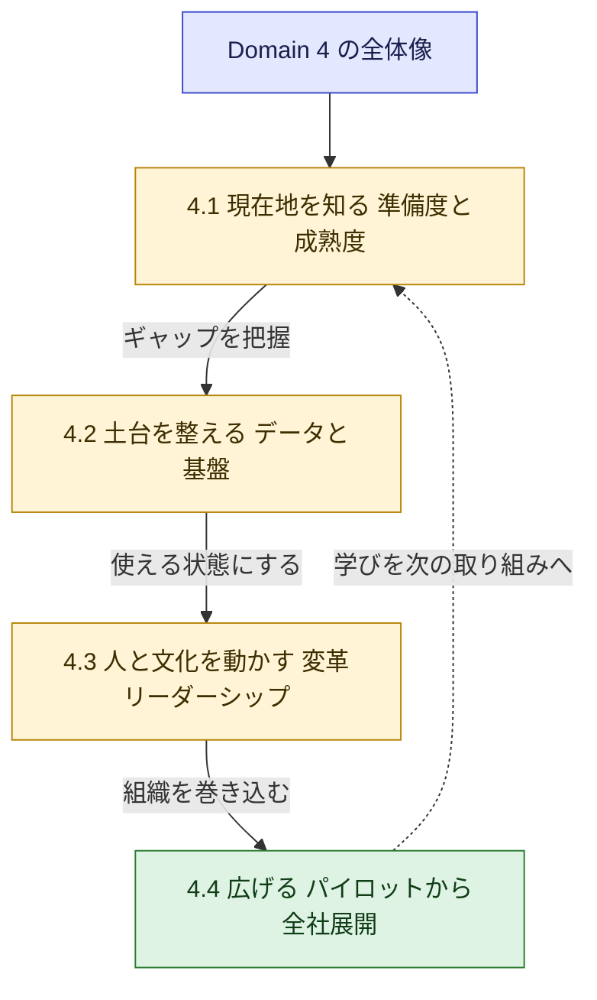

### 0-3. 試験ガイドに載っている関連キーワード

公式の「試験に出る可能性のある技術と概念」には、Domain 4 に直結する次の項目が含まれます。[S4]

| 分類 | キーワード |
|---|---|
| 準備度・成熟度 | 組織の AI 準備度と成熟度の評価 |
| データ | データ戦略、データオーナーシップ、データサイロの解消、データ品質 |
| 変革 | 変更管理、ワークフォース変革、組織全体の AI リテラシー向上 |
| スケール | パイロットから全社展開へ、AI センターオブエクセレンス(COE) |
| AWS | Amazon Bedrock / Amazon SageMaker AI / Amazon Quick(戦略レベル)、AWS CAF、責任共有モデル、料金体系とコスト最適化 |
| 標準 | ISO/IEC 23053、ISO/IEC 42001 などの国際的な AI 標準 |

---

## 1. Domain 4 の地図(全 19 スキル)

公式の試験ガイドにある 4 つのタスクと 19 のスキルを、やさしい言葉に言い換えた一覧です。[S3]

| ID | 公式スキル(要約) | 一言でいうと |
|---|---|---|
| **Task 4.1** | **AI の事業準備度と成熟度を評価する** | |
| 4.1.1 | リーダーの合意、データ品質、文化、技術基盤、ガバナンスなどの観点で準備度を評価 | 「AI を始められる状態か」を診断する |
| 4.1.2 | AI 成熟度モデルで企業の現在地(実験〜全社展開)を評価 | 「いまどの段階か」を知る |
| 4.1.3 | 人・プロセス・技術・ガバナンスの能力ギャップを特定 | 「何が足りないか」を洗い出す |
| 4.1.4 | 戦略目標と成熟度に基づき投資の優先順位と成長の道筋を作る | 「どこから手を付けるか」を決める |
| **Task 4.2** | **AI のためのデータとインフラの土台を整える** | |
| 4.2.1 | データ品質、アクセス性、データサイロの影響を評価 | データが「使える状態」か確認する |
| 4.2.2 | データ戦略、データオーナーシップ、データ共有の枠組みの重要性を説明 | データの「持ち主とルール」を決める |
| 4.2.3 | AI を支える技術・インフラ要件を評価 | 必要な「基盤」を見極める |
| **Task 4.3** | **全社の変革を率い、AI 対応の人材を育てる** | |
| 4.3.1 | 経営層のスポンサーシップと AI チャンピオンで推進力を維持 | 「偉い人の後ろ盾」と「現場の旗振り役」 |
| 4.3.2 | 多様な専門性を持つ部門横断チームと明確な責任体制を作る | 「みんなで進め、責任者を決める」 |
| 4.3.3 | 従業員の不安に応える透明なコミュニケーション戦略を作る | 「隠さず、早く、繰り返し伝える」 |
| 4.3.4 | 文化的な障壁(リスク回避、変化への抵抗、失敗への恐れ)を見抜き、リーダーの介入策を決める | 「心理的な壁」を取り除く |
| 4.3.5 | POC、ハッカソン、研修、責任ある AI 研修など人材育成の手法を選ぶ | 「AI リテラシー」を底上げする |
| 4.3.6 | 人の役割を手作業から AI の監督・協働へ移し、人と AI の強みを両立 | 「人にしかできないこと」を残す |
| **Task 4.4** | **パイロットから全社展開へスケールする** | |
| 4.4.1 | 段階的(Envision、Experiment、Launch、Scale など)に進める反復的変革 | 「小さく始めて段階的に広げる」 |
| 4.4.2 | 短期の成果から始めて全社展開へ積み上げる | 「クイックウィン」で勢いをつける |
| 4.4.3 | AI COE と部門横断の連携の仕組みを作る | 「専門家の拠点」を作る |
| 4.4.4 | 継続的なフィードバックと成功指標で進捗と長期価値を追跡 | 「測り続け、改善し続ける」 |
| 4.4.5 | 実験から本番品質への移行(ガバナンスと運用要件を含む) | 「実験」と「本番」の壁を越える |
| 4.4.6 | スケール中に事業継続とパフォーマンスを守るため複数の要因を評価 | 「広げても壊れない」ようにする |

---

## 2. Task 4.1 AI の準備度と成熟度を評価する

### 2-0. まず全体の流れ

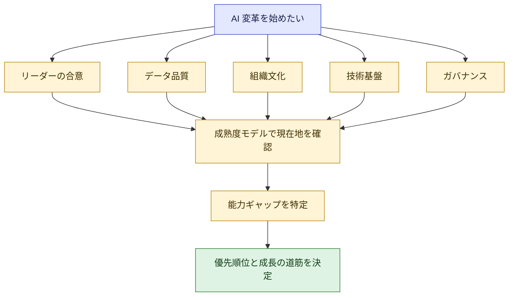

---

### Skill 4.1.1 事業準備度を複数の観点で評価する

**① 何を問われるか**
AI を導入する前に、組織が「始められる状態か」を、リーダーの合意・データ品質・文化的な準備・技術基盤・ガバナンスといった **複数の観点** で診断できるか。[S3]

**② やさしい説明**
登山にたとえると、山頂(AI の成果)を目指す前に、体力・装備・天気・仲間・地図が揃っているかを確認する作業です。「装備(ツール)だけ買って、体力(人と文化)がない」状態が最も危険です。

| 観点 | 確認する問い | 危険信号の例 |
|---|---|---|
| リーダーの合意 | 経営層は目的・予算・責任者に合意しているか | 「まず AI を入れろ」とだけ指示があり、目的が曖昧 |
| データ品質 | 必要なデータは存在し、正確で、最新か | 部署ごとに形式がバラバラ、更新が止まっている |
| 文化的な準備 | 失敗を許容し、試す文化があるか | 新しいことは「前例がない」で止まる |
| 技術基盤 | データを集め、モデルを使い、運用できる基盤があるか | データが各部署のファイルに散在 |
| ガバナンス | 利用ルール、リスク管理、責任者が決まっているか | 誰が AI の判断に責任を持つか不明 |

**③ 具体例**
ある小売企業が「問い合わせ対応を生成 AI で自動化したい」と考えた場合。経営層の合意はあるが、FAQ が古く、商品データが部署ごとに別管理で、利用ルールもない。この場合の正しい判断は「いきなり全店導入」ではなく、**データの整備とルール作りを優先しつつ小さく検証する** ことです。

**④ ベストプラクティス**

| # | 実践 | 理由 | 根拠 |
|---|---|---|---|
| 1 | 構築を始める前に準備度アセスメントを行う | 必要な能力のギャップを先に見える化できる | [S22][S6] |
| 2 | 評価は技術だけでなく、ビジネス・人・ガバナンス・基盤・セキュリティ・運用の 6 つの視点で見る | AWS CAF for AI が 6 つの視点で能力を整理している | [S8] |
| 3 | 一度きりで終わらせず、導入の進行に合わせて基礎能力を進化させ、準備度を更新する | 準備度は導入が進むにつれて変わる | [S7] |
| 4 | データ戦略の問い(必要なデータ種別の利用可能性、品質指標、ガバナンス体制)を評価項目に入れる | データの準備度が AI の成否を左右する | [S21] |

**⑤ ひっかけ注意**
- 「最新ツールの導入」や「エンジニアの大量採用」を最初の一手にする選択肢は誤りになりやすいです。**準備度の診断が先** です。
- 準備度の評価は「合格・不合格の判定」ではなく、**次の一手を決めるための診断** です。

**⑥ 根拠**: [S3] [S6] [S7] [S8] [S21] [S22]

---

### Skill 4.1.2 AI 成熟度モデルで現在地を評価する

**① 何を問われるか**
AI 成熟度モデルを使い、企業が「実験段階」から「全社展開」までのどこにいるかを評価できるか。[S3]

**② やさしい説明**
成熟度モデルは **「AI 活用の階段」** です。自分が何段目にいるかが分かれば、次の一段に必要なことだけに集中できます。

AWS の規範的ガイダンスには、生成 AI の成熟度モデルがあり、**Envision → Experiment → Launch → Scale** の 4 段階で整理されています。[S11][S12]

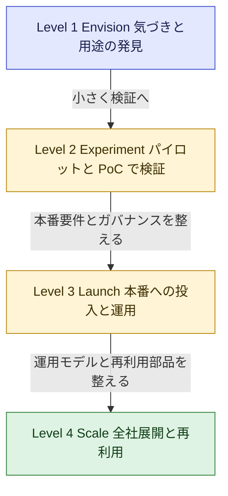

| 段階 | 主な状態 | 次の段階へ進むための主な活動 | 根拠 |
|---|---|---|---|
| Level 1 Envision | 生成 AI の基本を理解し、用途の候補を探す | 構造化されたパイロットを計画する | [S12][S18] |
| Level 2 Experiment | 部門横断の専任チームが、検証済みのモデルやツールでパイロットを実施。リスク・ガバナンス・責任ある AI の方針も整備 | 本番品質のインフラ(CI/CD、標準デプロイパターン)、本番用ガバナンス、可観測性(監視・ログ)を整える | [S12][S13] |
| Level 3 Launch | 本番品質の生成 AI を、ガバナンス・監視・サポート体制付きで運用 | 運用モデルと RACI の正式化、再利用可能なパターンの抽出、データガバナンスがセルフサービスに耐えるか見直す | [S14] |
| Level 4 Scale | 複数部門が広く利用。全社のインフラとツール、再利用可能な部品のライブラリがある | 標準化・自動化されたガバナンスとコスト最適化を維持しながら拡大 | [S15] |

**③ 具体例**
「部署 A が PoC を 3 つ実施し、専任チームもできたが、本番用の監視や責任分担は未整備」という企業は、**Level 2(Experiment)から Level 3(Launch)への移行期** にいます。次の一手は、新しい PoC を増やすことではなく、**本番のインフラ・ガバナンス・監視を整えること** です。

**④ ベストプラクティス**

| # | 実践 | 根拠 |
|---|---|---|
| 1 | 成熟度評価で「現在地」と「次の段階で重点を置く領域」を特定する | [S11][S16] |
| 2 | 組織を 1 つのラベルで決めつけない。部門ごとに段階が違ってよい | [S12] |
| 3 | 成熟度レベルは「次の一手」を選ぶための目安として使い、必ず順番に通過すべき関門とはみなさない。導入の各側面(aspect)には複数レベルの特徴が混在しうる | [S12][S13][S14] |

**⑤ ひっかけ注意(重要)**

> **成熟度モデルの段階名は、資料によって違います。**
> - **生成 AI 成熟度モデル(規範的ガイダンス)**: Envision → **Experiment** → Launch → Scale
> - **AWS CAF for AI の変革の旅**: Envision → **Align** → Launch → Scale [S7]
>
> 試験ガイドの Skill 4.4.1 の例は「envision, experiment, launch, scale」です。[S3] 「Align」は CAF の 2 番目の段階で、**能力ギャップの特定や関係者の合意** に焦点があります。混同しないようにしましょう。

**⑥ 根拠**: [S3] [S7] [S11] [S12] [S13] [S14] [S15] [S16] [S18]

---

### Skill 4.1.3 人・プロセス・技術・ガバナンスの能力ギャップを特定する

**① 何を問われるか**
AI 変革の成功を妨げる具体的な不足を、**人・プロセス・技術・ガバナンス** の 4 領域で見つけられるか。[S3]

**② やさしい説明**
「AI がうまくいかない」という漠然とした悩みを、**どの領域の何が足りないのか** に分解する作業です。医師が「体調が悪い」を検査で具体的な原因に絞るのと同じです。

| 領域 | 典型的なギャップ | 対応の方向性 |
|---|---|---|
| 人 | AI リテラシー不足、専任人材の不足、変化への抵抗 | 研修、チャンピオンの任命、採用と外部パートナー活用 |
| プロセス | 用途の選定・評価・承認の流れがない、ワークフローが AI 前提でない | 用途の評価基準と承認フローの整備、業務プロセスの再設計 |
| 技術 | データ基盤の分断、評価・監視の仕組みがない | データ統合、評価と可観測性の仕組み、本番運用の基盤 |
| ガバナンス | 責任者不明、リスク分類やポリシーの欠如、データの管理ルールがない | 責任体制(RACI)、ポリシー、データガバナンスの整備 |

**③ 具体例**
「PoC は成功するのに本番に進まない」という症状を分解すると、多くの場合 **プロセス(本番移行の基準がない)** と **ガバナンス(本番運用の責任者と承認が不明)** の不足が見つかります。技術を増強しても解決しません。

**④ ベストプラクティス**

| # | 実践 | 根拠 |
|---|---|---|
| 1 | 4 領域すべてを見る。技術だけの診断にしない | [S3][S8] |
| 2 | 部門間の依存関係と、関係者の懸念も同時に洗い出す(CAF の Align 段階の焦点) | [S7] |
| 3 | AI 導入は他の技術より部門横断の取り組みになると認識し、ギャップ対応も部門横断で進める | [S7] |

**⑤ ひっかけ注意**
選択肢に「技術」だけを強化する案と、「人・プロセス・ガバナンスも含む案」が並ぶ場合、後者が正解になりやすいです。

**⑥ 根拠**: [S3] [S7] [S8]

---

### Skill 4.1.4 投資の優先順位と成長の道筋を作る

**① 何を問われるか**
戦略目標と現在の成熟度に基づき、**どのギャップにどの順番で投資するか**、そして **次の段階へ進む道筋** を作れるか。[S3]

**② やさしい説明**
限られた予算と人員で、全部を一度に直すことはできません。**「戦略目標に効くか」と「いまの段階で実行できるか」** の 2 軸で優先順位を付けます。

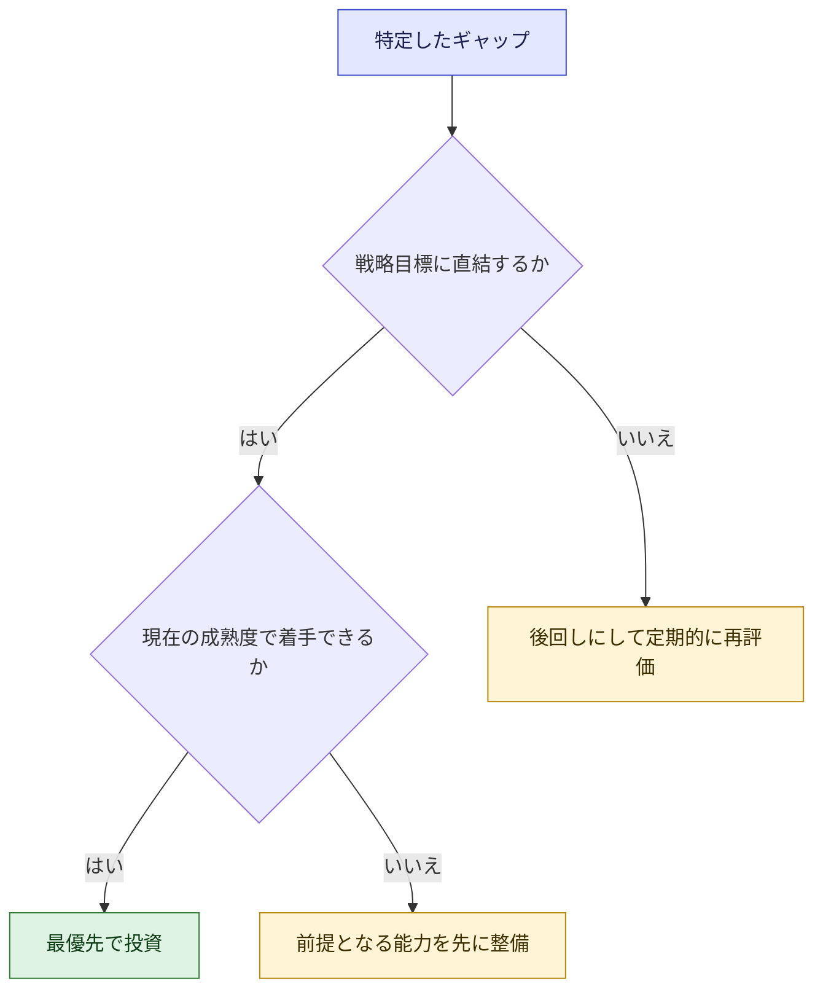

**③ 具体例**

| 状況 | 優先度の判断 |
|---|---|
| 「顧客対応の効率化」が戦略目標で、FAQ データは整備済み | 最優先。すぐに小さく検証できる |
| 同じ目標だが、データが部署ごとに分断 | まずデータ統合と責任者の任命(前提整備) |
| 目標と関係が薄い高度な AI 機能の導入 | 後回し。定期的に再評価 |

**④ ベストプラクティス**

| # | 実践 | 根拠 |
|---|---|---|
| 1 | 成熟度の各段階の「次へ進むための活動」を投資計画に落とし込む | [S13][S14] |
| 2 | 用途はビジネスインパクトと実現可能性の 2 軸で優先順位を付ける | [S4] |
| 3 | 成長の道筋は段階的にし、各段階で測定可能な成果を置く | [S7][S27] |

**⑤ ひっかけ注意**
「最も高度な技術」や「最大規模の投資」を優先する選択肢は誤りになりやすいです。**戦略目標と現在地に合うもの** が正解です。

**⑥ 根拠**: [S3] [S4] [S7] [S13] [S14] [S27]

---

## 3. Task 4.2 データとインフラの土台を整える

### 3-0. データが AI の燃料になる

AWS CAF for AI は、**高品質なデータが AI を学習・調整し、予測が業務成果を生み、その成果が新しいデータを生む**、という好循環を **AI フライホイール** と呼びます。データとデータ戦略が、このフライホイールを回し続ける燃料です。[S7]

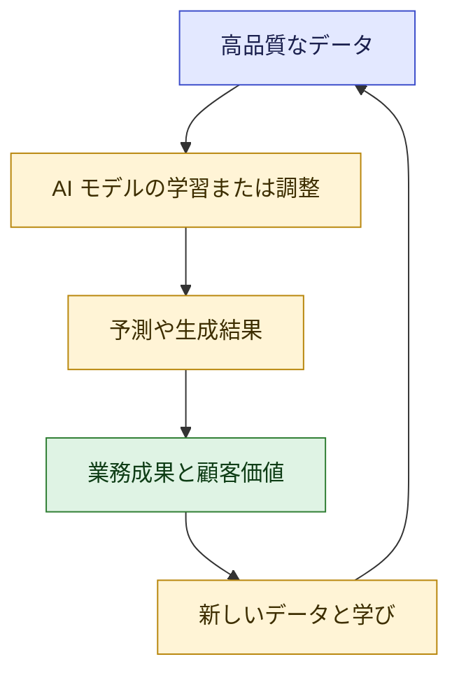

---

### Skill 4.2.1 データの準備度を評価する(品質・アクセス性・サイロ)

**① 何を問われるか**
データの **品質**、**アクセス性**、そして **データサイロ(部門ごとに孤立したデータ)** が AI の取り組みに与える影響を評価できるか。[S3]

**② やさしい説明**
AI は「入れたデータの質」がそのまま出力の質になります。これは「Garbage in, garbage out(ゴミを入れればゴミが出る)」と呼ばれます。[S19] 量が多いだけでは足りません。

| 評価軸 | 意味 | 確認の問い |
|---|---|---|
| 完全性 | 必要な項目が欠けていないか | 空欄や欠損が多くないか |
| 正確性 | 内容が事実と合っているか | 誤記や重複がないか |
| 一貫性 | 形式や定義が揃っているか | 部署ごとに単位や表記が違わないか |
| 適時性 | 最新の状態か | 更新が止まっていないか |
| アクセス性 | 必要な人とシステムが安全に使えるか | 取り出すのに何週間もかかっていないか |

(完全性・正確性・一貫性・適時性は、AWS の生成 AI ワークロード評価の設問例で品質指標として挙げられています。[S21])

**データサイロの影響**
サイロがあると、AI は会社の一部の情報しか見られず、回答が偏ったり、部署ごとに似た AI を重複して作ったりします。AWS の Generative AI Lens は、構造化データと非構造化データを統合し、データがどこにあっても一元的にアクセスできる状態を目指すよう述べています。[S20]

**③ 具体例**
営業部は顧客データを CRM に、サポート部はチケット管理ツールに、マーケ部は表計算ファイルに保存している。各部門が別々に AI を試すと、顧客像が一致せず、**「顧客の全体像を把握する AI」が作れません**。

**④ ベストプラクティス**

| # | 実践 | 根拠 |
|---|---|---|
| 1 | AI に使うデータ種別を洗い出し、利用可能な割合と品質基準を満たす割合を測る | [S21] |
| 2 | データ品質の KPI とダッシュボードを設定し、事業目標と結び付ける | [S29] |
| 3 | データ品質を担う専任のスチュワード(管理担当)を置き、権限と資源を与える | [S29] |
| 4 | 非構造化データ(文書、画像など)も戦略的な資産として扱う | [S17][S20] |
| 5 | 生成 AI の RAG やファインチューニングでも、データ準備の質が結果を左右すると認識する | [S19] |

**⑤ ひっかけ注意**
「データ量を増やせば解決する」は誤りになりやすいです。**質・アクセス性・統合** が重要です。

**⑥ 根拠**: [S3] [S17] [S19] [S20] [S21] [S29]

**フローで見るデータ準備度の判断**

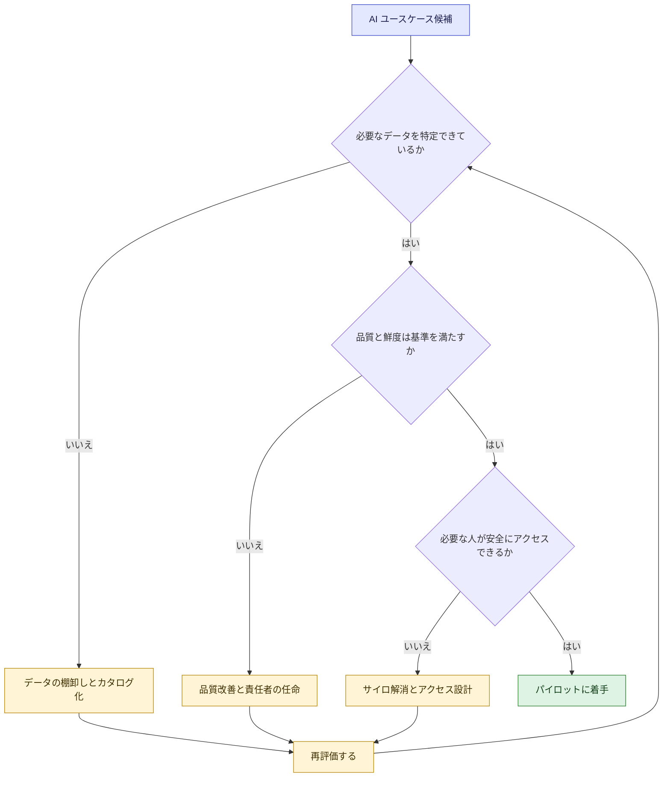

---

### Skill 4.2.2 データ戦略・オーナーシップ・共有の枠組み

**① 何を問われるか**
AI の基盤となる **データ戦略、データオーナーシップ、データ共有の枠組み** の重要性を説明できるか。[S3]

**② やさしい説明**

| 用語 | やさしい意味 | 例 |
|---|---|---|
| データ戦略 | 「どのデータを、何のために、どう集め守り活用するか」の方針 | 顧客対応 AI のために FAQ と問い合わせ履歴を整備する |
| データオーナーシップ | 「このデータに責任を持つのは誰か」を決めること | 商品マスタは商品企画部が責任者 |
| データ共有の枠組み | 部門間や外部とデータを共有する際の規則と合意 | 誰が、何の目的で、どの範囲まで使えるか |

AWS の資料は、データガバナンスを支える柱に **品質保証** と **オーナーシップ** を挙げ、オーナーシップは単なる所有ではなく **スチュワードシップ(責任ある管理)** の意識への転換が重要だと述べています。[S29]

**③ 具体例**
ある保険会社では、契約データの責任部署が曖昧で、AI 用に使ってよい範囲が不明。結果、法務確認のたびに数週間止まる。**データ責任者、利用目的別のアクセス規則、個人情報の扱い** を事前に定めていれば、検証のスピードが上がる。

**④ ベストプラクティス**

| # | 実践 | 根拠 |
|---|---|---|
| 1 | 部門横断のデータガバナンス委員会を置き、方針を管理する | [S21] |
| 2 | ロールベースのアクセス制御、データ分類、定期監査を組み合わせる | [S21] |
| 3 | データ戦略を AI 導入の各段階(Envision〜Scale)に結び付ける | [S17][S18] |
| 4 | 4 つの柱(人・基盤・運用・ガバナンス)でデータ戦略を整理する | [S18] |
| 5 | プライバシー保護と AI のデータ需要のバランスを戦略に明記する | [S21] |
| 6 | 過度に制限的・中央集権的なデータガバナンスは、部門を超えた拡大を妨げる。セルフサービスを許しつつ標準ポリシーとアクセス制御を維持する | [S14] |

**⑤ ひっかけ注意**
「データを全社で自由に共有する」も「データを全部ロックダウンする」も極端です。**ルールに基づく共有** が正解になりやすいです。

**⑥ 根拠**: [S3] [S14] [S17] [S18] [S21] [S29]

---

### Skill 4.2.3 技術・インフラ要件を戦略レベルで評価する

**① 何を問われるか**
AI の取り組みを支えるための **基盤の要件** を、技術者ではなくビジネス側の視点で評価できるか。[S3]
(設計や構築そのものは範囲外です。[S2])

**② やさしい説明**
経営者として確認したいのは次の問いです。

| 観点 | ビジネス側の問い |
|---|---|
| 使うモデルの選択肢 | 既製の AI サービスで足りるか、独自のカスタマイズが必要か |
| データの流れ | 必要なデータを安全に AI へ届けられるか |
| セキュリティと責任分担 | どこまでが自社の責任で、どこからがクラウド事業者・モデル提供者の責任か |
| 運用と監視 | 本番で品質・コスト・リスクを監視できるか |
| コスト | 料金体系と総コストを見通せるか |

**AWS の主要サービス(戦略レベルの理解で十分)**

| サービス | 戦略レベルの位置づけ | 根拠 |
|---|---|---|
| Amazon Bedrock | 生成 AI アプリやエージェントを構築するためのプラットフォーム。Guardrails、Knowledge Bases、料金の選択肢が論点 | [S2][S31] |
| Amazon SageMaker AI | カスタム ML。マネージド型で足りるか、カスタム構築が必要かを判断する場面で登場 | [S2] |
| Amazon Quick | AI による業務支援アシスタント(調査、ビジネスインサイト、自動化など) | [S1][S2] |

**責任共有モデルと AI**
AWS の責任共有モデルは、AWS がクラウドの基盤部分を運用し、顧客が自分のデータやアプリの保護を担う、という役割分担です。生成 AI では、**自社の使い方(既存モデルを API で使う、自社データでファインチューニングするなど)によって、自社が担う範囲が変わります**。AWS はこれを整理する「Generative AI Security Scoping Matrix」を公開しています。[S30] また Amazon Bedrock は、入力と出力をモデル提供者と共有せず、基盤モデルの学習にも使わないと説明しています。[S31]

**料金体系**
試験ガイドは、AWS の AI サービスの料金体系として **従量課金型、インスタンス型、シート(利用者数)型** を挙げ、コスト最適化の例として Savings Plans、見積もりに AWS Pricing Calculator と AWS Cost Explorer、構築・購入・提携の判断に AWS Marketplace を挙げています。[S2][S5]

| ツール・概念 | 使いどころ | 根拠 |
|---|---|---|
| AWS Pricing Calculator | 導入前のコスト見積もり | [S2][S33] |
| AWS Cost Explorer | 過去のコストと使用量を可視化・分析し、将来を予測する(過去 13 か月の表示、18 か月先の予測が可能) | [S32] |
| Savings Plans | 利用量のコミットによる割引(コスト最適化策) | [S2][S33] |
| AWS Marketplace | 構築(Build)・購入(Buy)・提携(Partner)の比較検討 | [S2] |

**③ 具体例**
「社内文書の検索・要約」という用途なら、自前でモデルを開発するより、**マネージドサービスで既存モデルを使い、自社データを組み合わせる** ほうが短期間で価値を出せる場合が多い。ただし、独自データでの高度なカスタマイズが競争優位に直結するなら、カスタム ML も検討対象になる。

**④ ベストプラクティス**

| # | 実践 | 根拠 |
|---|---|---|
| 1 | AI サービス層(既製モデルを利用する層)と ML サービス層(モデルを訓練・調整する層)を区別して基盤を考える | [S10] |
| 2 | 導入の採用状況を測るフィードバックの仕組みと指標を最初から設ける | [S10] |
| 3 | 責任共有の範囲を、自社の AI の使い方ごとに確認する | [S30] |
| 4 | 料金体系(従量、インスタンス、シート)を理解し、総コストで判断する | [S2][S27] |
| 5 | セキュリティ・ガバナンスの実装詳細は専門チームに任せ、ビジネス側は要件と責任範囲の確認に集中する | [S2] |

**⑤ ひっかけ注意**
「アルゴリズムの選定」「ハイパーパラメータ調整」「パイプライン構築」など **技術実装の選択肢** は範囲外です。戦略・責任・コストの観点の選択肢を選びます。[S2]

**⑥ 根拠**: [S1] [S2] [S5] [S10] [S27] [S30] [S31] [S32] [S33]

---

## 4. Task 4.3 全社の変革を率い、AI 人材を育てる

### 4-0. 全体の流れ

AWS CAF for AI は、AI の取り組みは **技術だけの課題ではなく、ガードレールを作り推進する「人」に決定的に依存する** と述べ、**文化の重要性** を強調しています。[S9]

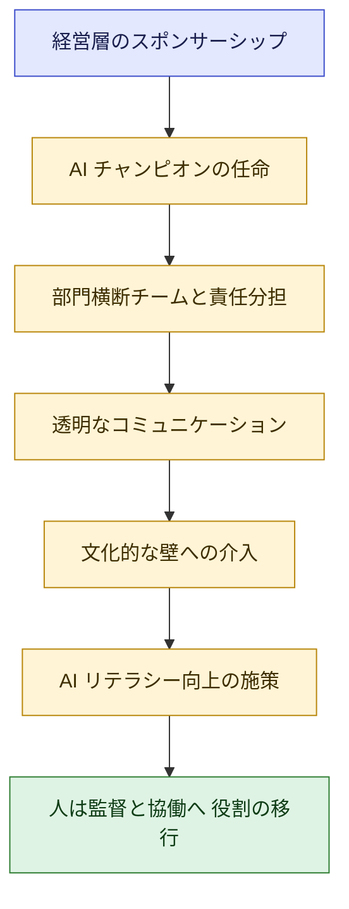

---

### Skill 4.3.1 経営層のスポンサーシップと AI チャンピオン

**① 何を問われるか**
経営層の後ろ盾を確立し、現場で推進する **AI チャンピオン** を見つけて権限を与えることで、全社で勢いを保てるか。[S3]

**② やさしい説明**

| 役割 | 何をする人か | 例 |
|---|---|---|
| 経営スポンサー | 予算・優先順位・障害の除去を担保する上位の後ろ盾 | 役員が AI 推進の成果責任を持つ |
| AI チャンピオン | 各部門で AI 活用を広め、現場の声を吸い上げる旗振り役 | 営業部の中堅が勉強会を主催 |

AWS の COE 解説では、AI/ML COE を作る最初の一歩は **上級リーダーからのスポンサーシップの確保** だとされています。[S25] また、AI ステアリング委員会に AI チャンピオンを置くことも推奨されています。[S26]

**③ 具体例**
AI の専任チームだけが頑張っても、営業・経理・法務が動かなければ全社には広がりません。**スポンサーが優先順位を明言し、各部門のチャンピオンが現場に橋をかける** ことで、継続的な推進力になります。

**④ ベストプラクティス**

| # | 実践 | 根拠 |
|---|---|---|
| 1 | スポンサーは目的・予算・意思決定権限を持つ人にする | [S25] |
| 2 | 各部門にチャンピオンを置き、時間と権限を公式に与える | [S3][S26] |
| 3 | 経営層の関与は一度きりでなく、進捗レビューなど継続的な仕組みにする | [S9][S35] |
| 4 | 取り組みを事業目標・KPI と結び付けて報告する | [S26] |

**⑤ ひっかけ注意**
「ボトムアップだけで自然に広がる」「IT 部門に全責任を任せる」は、推進力が続かない選択肢として誤りになりやすいです。

**⑥ 根拠**: [S3] [S9] [S25] [S26] [S35]

---

### Skill 4.3.2 部門横断チームと明確な責任体制

**① 何を問われるか**
事業責任者、技術専門家、法務、コンプライアンスなど **多様な専門性を持つ部門横断チーム** を作り、AI の取り組みに **明確な責任基準** を割り当てられるか。[S3]

**② やさしい説明**
AI のプロジェクトは、技術だけでは成立しません。法務(権利・規制)、コンプライアンス(ルール)、事業部門(価値)、技術(実現)が揃って初めて前に進みます。

| メンバー | 貢献 |
|---|---|
| 事業責任者 | 課題・価値・成功指標を定義 |
| 技術専門家 | 実現可能性と実装 |
| 法務・コンプライアンス | 規制、知的財産、契約、リスクの確認 |
| データ責任者 | データの品質とアクセス |
| 現場の代表者 | 実際の業務との整合、受け入れ |

責任体制には **RACI(実行責任者・説明責任者・相談先・報告先を整理する表)** がよく使われます。AWS の成熟度モデルでも、運用モデルと RACI の整備が Launch〜Scale の重要な活動とされています。[S14][S15]

**③ 具体例**
採用スクリーニングの AI を検討する場合、人事(業務)、技術、法務(差別禁止や個人情報)、コンプライアンスが最初から関与していれば、後から「使えない」と判明する手戻りを防げる。

**④ ベストプラクティス**

| # | 実践 | 根拠 |
|---|---|---|
| 1 | IT、データサイエンス、法務、事業部門の代表を含むチームを作る | [S24] |
| 2 | 各取り組みに **説明責任を負う責任者を 1 人** 置く | [S3][S14] |
| 3 | 運用モデルと RACI を文書化し、組織内に公開する | [S14][S15] |
| 4 | モデルの評価、法務レビュー、アクセス申請などの社内プロセスを整備する | [S23] |

**⑤ ひっかけ注意**
「技術者だけのチーム」「責任者が曖昧な合議制」は誤りになりやすいです。

**⑥ 根拠**: [S3] [S14] [S15] [S23] [S24]

---

### Skill 4.3.3 透明なコミュニケーション戦略

**① 何を問われるか**
従業員の不安(導入時期、期待する成果、自分の役割への影響)に応える **透明なコミュニケーション戦略** を作れるか。[S3]

**② やさしい説明**
「AI に仕事を奪われるのでは」という不安は自然です。情報が少ないほど噂が広がります。**早く、正直に、繰り返し、双方向で** 伝えることが基本です。AWS の資料も、AI が生成する洞察への信頼を築くための変更管理プログラムや、関係者向けのコミュニケーションチャネルの再設計を推奨しています。[S26]

| 伝えるべきこと | 具体的な内容の例 |
|---|---|
| なぜ導入するか | 目的と期待する成果(業務の負荷軽減、品質向上など) |
| いつ何が変わるか | 導入のスケジュール、段階、影響を受ける業務 |
| 自分の役割はどうなるか | 役割の変化、再教育の機会、意思決定への関与 |
| どう意見を届けるか | 質問窓口、フィードバックの経路 |

**③ 具体例**
経理部門に請求書処理の AI を導入する際、「何か月後に」「どの作業が」「どう変わり」「どんな研修があるか」を導入前に説明し、説明会と質疑の場を複数回設けると、抵抗が大きく下がる。

**④ ベストプラクティス**

| # | 実践 | 根拠 |
|---|---|---|
| 1 | 導入の計画段階から伝え、決定後の通知だけにしない | [S7][S35] |
| 2 | 良い情報だけでなく、不確実な点や限界も正直に伝える | [S3] |
| 3 | 一方向の発表でなく、質問・意見を集める双方向の仕組みにする | [S26] |
| 4 | 役割への影響を具体的に示し、再教育の機会とセットで伝える | [S9] |

**⑤ ひっかけ注意**
「不安を煽らないよう、導入直前まで伝えない」は誤りです。

**⑥ 根拠**: [S3] [S7] [S9] [S26] [S35]

---

### Skill 4.3.4 文化的な障壁を見抜き、リーダーの介入策を決める

**① 何を問われるか**
**リスク回避、変化への抵抗、失敗への恐れ** などの文化的障壁を認識し、リーダーが取るべき介入を選べるか。[S3]

**② やさしい説明**
AI は「やってみないと分からない」「出力を調整して改善する」性質が強く、**試して学ぶ文化** が重要です。AWS CAF for AI も、AI では望ましい出力を得るために適切な入力を探し続ける文化が、より重要だと述べています。[S9]

| 障壁 | よく見られる兆候 | リーダーの介入策 |
|---|---|---|
| リスク回避 | 「前例がない」「失敗したら責任問題」 | 安全に実験できる範囲を明示し、失敗しても責めない |
| 変化への抵抗 | 新しいツールを使わない、従来のやり方に固執 | 早期から関与させ、現場の課題解決から始める。クイックウィンを共有 |
| 失敗への恐れ | 完璧になるまで公開しない | 「生産的な失敗」から学びを共有する文化を作る |
| 雇用不安 | 噂が広がる、協力が減る | 役割の変化と再教育を透明に説明 |

AWS は、**安全に実験できる文化** を作ること、そして **「生産的な失敗」から学びを体系的に集めること** を原則に挙げています。行動しないコストが計算された実験のリスクを上回ることもあると述べています。[S27]

**③ 具体例**
ある部門で AI の試行が進まない場合、マネージャー自身が AI ツールを使い、うまくいかなかった例も共有すると、メンバーが試しやすくなる(リーダーが手本を示す)。

**④ ベストプラクティス**

| # | 実践 | 根拠 |
|---|---|---|
| 1 | 安全な実験の範囲とルールを明示する | [S27] |
| 2 | 失敗から得た学びを、プロジェクトをまたいで体系的に蓄積する | [S27] |
| 3 | 変革の初期から、リーダーシップ・文化・組織構造に関する変更管理の枠組みを組み込む | [S35] |
| 4 | リーダー自身が行動で示す | [S9] |

**⑤ ひっかけ注意**
「ルールで使用を義務化して罰則を設ける」などの強制は、抵抗を強めるため誤りになりやすいです。

**⑥ 根拠**: [S3] [S9] [S27] [S35]

---

### Skill 4.3.5 AI リテラシーを加速する人材育成の手法

**① 何を問われるか**
全社の AI リテラシーを高めるため、**POC プログラム、ハッカソン、研修、責任ある AI 研修** などから適切な手法を選べるか。[S3]

**② やさしい説明**

| 手法 | 目的 | 向いている対象・場面 |
|---|---|---|
| POC(概念実証)プログラム | 小さく作って価値と実現性を体験で確認 | 具体的な用途がある部門 |
| ハッカソン | 短期間で多くのアイデアを形にし、熱量を高める | 発想を広げたい、部門横断の交流を作りたい |
| 研修・トレーニング | 体系的に知識とスキルを底上げ | 全社員、役割別 |
| 責任ある AI 研修 | 公平性・透明性・プライバシー・安全性などの原則と運用を理解 | 全員(特に AI を使う・承認する人) |

AWS の COE 解説は、COE が研修プログラム、ワークショップ、認定プログラム、ハッカソンを提供できるとしています。[S25] また、技術面と責任ある AI の両方を含む包括的な研修プログラムを推奨しています。[S23]

AWS CAF の People 視点には、従業員の現在の知識・スキル・関心を分析する「Learning Needs Analysis(学習ニーズ分析)」の例があります。[S36b] また、CAF for AI は、AI 人材を「ユーザーからビルダーまで」引き入れ、育成・維持していくことを強調しています。[S9]

**③ 具体例**
全社員向けには基礎研修と責任ある AI 研修、営業・人事など用途が明確な部門には POC プログラム、部門横断の発想を広げたいときはハッカソン、と **目的に応じて組み合わせる**。

**④ ベストプラクティス**

| # | 実践 | 根拠 |
|---|---|---|
| 1 | まず現在のスキルと関心を把握してから育成計画を作る | [S36b] |
| 2 | 役割別(一般利用者、推進者、ビルダー)に内容を分ける | [S9] |
| 3 | 技術研修と責任ある AI 研修をセットにする | [S23] |
| 4 | 継続的な再教育の機会を設ける | [S9] |
| 5 | 研修を COE の活動として定着させる | [S25] |

**⑤ ひっかけ注意**
「一部の専門家だけを育成する」「一度の研修で完了」は誤りになりやすいです。**全社・継続的・目的別** が基本です。

**⑥ 根拠**: [S3] [S9] [S23] [S25] [S36b]

---

### Skill 4.3.6 人の役割を「手作業」から「監督と協働」へ移す

**① 何を問われるか**
人の役割を、手作業中心から **AI の監督・AI との協働** へ移す機会を見つけ、人の強み(批判的思考、共感、創造性)と AI の能力を **戦略的にバランス** させられるか。[S3]

**② やさしい説明**
AI は大量で繰り返しの処理やパターン認識が得意で、人は文脈の理解、倫理的判断、共感、創造が得意です。**AI に任せる部分と人が担う部分を設計する** ことが重要です。

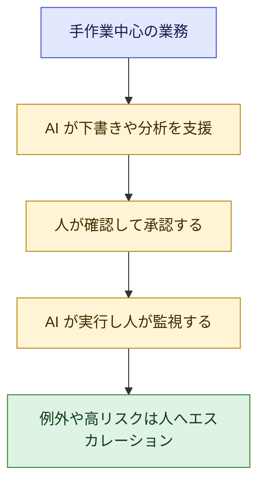

| 業務の特徴 | 推奨される役割分担(考え方) |
|---|---|
| 大量・反復・ルールが明確 | AI が中心、人は品質監視。ルールで足りるなら AI でなくルールベースの自動化も選択肢 |
| 判断にリスクや影響が大きい | 人が最終判断。AI は材料を提供 |
| 共感・交渉・創造が価値の源泉 | 人が中心、AI は準備や分析を支援 |
| AI の出力が不確実(ハルシネーション、バイアス) | 人の確認とエスカレーション基準を設ける |

(役割分担の表は、試験ガイドの「人による監督、ガードレール、エスカレーションの判断」「AI でなくルールベース自動化を使うべき場面」の観点を初学者向けに整理したものです。[S4])

**③ 具体例**
カスタマーサポートで、AI が問い合わせの一次回答を下書きし、人が確認して送信。怒りや複雑な事情を含む案件は自動でオペレーターに引き継ぐ。人は **感情への配慮と例外対応** に時間を使えるようになる。

**④ ベストプラクティス**

| # | 実践 | 根拠 |
|---|---|---|
| 1 | 「自動化できる作業」でなく「人が価値を出せる仕事」を起点に再設計する | [S3] |
| 2 | エスカレーションの基準(どんな場合に人へ戻すか)を明文化する | [S4] |
| 3 | 監督する人への研修と、責任の所在の明確化をセットにする | [S9][S14] |
| 4 | 役割の変化と再教育の機会を、従業員へ透明に説明する | [S3][S9] |

**⑤ ひっかけ注意**
「人を完全に置き換える」「人は何も変わらない」の両極端は誤りになりやすいです。**人の役割が監督・協働へ進化する** という見方が正解です。

**⑥ 根拠**: [S3] [S4] [S9] [S14]

---

## 5. Task 4.4 パイロットから全社展開へスケールする

### Skill 4.4.1 反復的な変革アプローチ(段階を踏んで進める)

**① 何を問われるか**
**Envision → Experiment → Launch → Scale** のような段階を踏む **反復的な変革アプローチ** を適用できるか。[S3]

**② やさしい説明**
一度に完璧な全社導入を目指さず、**小さく試し、学び、広げる** を繰り返します。AWS CAF for AI も、変革は反復的・漸進的な改善に基づくべきとしています。[S7]

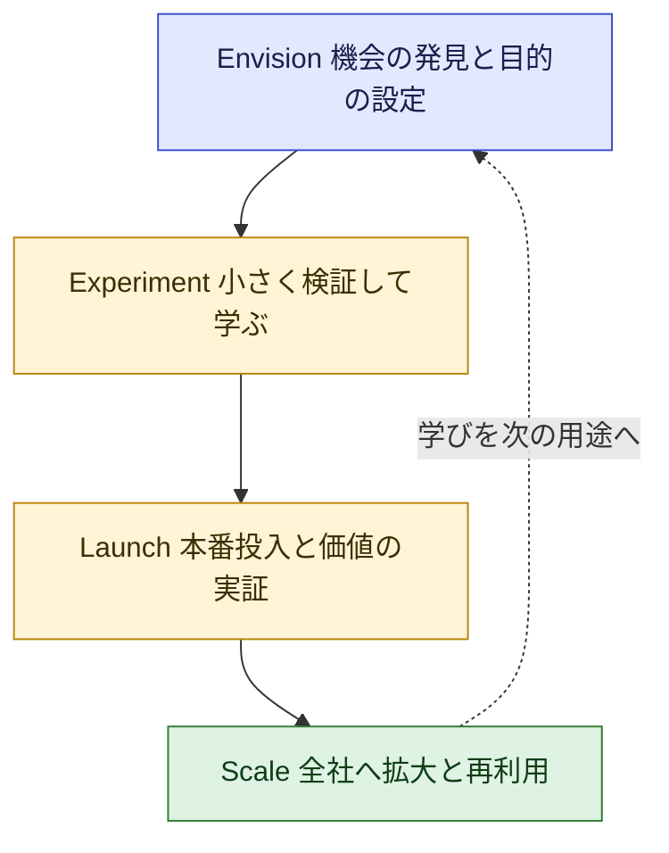

| 段階 | ゴール | 主な活動 | 進める目安(出口) |
|---|---|---|---|
| Envision | 用途と目的を明確化 | 事業成果から逆算、関係者の特定、必要データの把握 | 優先用途と成功指標が合意されている |
| Experiment | 価値と実現性を検証 | パイロット、PoC、モデルやツールの選定 | 検証結果が出て、継続・中止が判断できる |
| Launch | 本番で価値を実証 | 本番用インフラ、ガバナンス、監視、サポート | 本番で成果を測定できている |
| Scale | 広範囲に持続的な価値 | 再利用部品、標準パターン、運用モデルの整備 | 複数部門が自走して活用している |

(Envision の活動は [S7][S18]、各段階の内容は [S12][S13][S14][S15] を基にしています。出口の目安は初学者向けの整理です。)

**④ ベストプラクティス**

| # | 実践 | 根拠 |
|---|---|---|
| 1 | 各段階でデータ戦略・ガバナンス・セキュリティ・運用の整合を取る | [S17] |
| 2 | 事業成果から逆算して進める | [S7] |
| 3 | すべてのプロジェクトが本番に到達するとは限らない。学びを蓄積して次に活かす | [S27] |

**⑤ ひっかけ注意**
「要件をすべて固めてから一括導入(ビッグバン)」は誤りになりやすいです。**反復的・段階的** が正解です。

**⑥ 根拠**: [S3] [S7] [S12] [S13] [S14] [S15] [S17] [S18] [S27]

---

### Skill 4.4.2 短期の成果から全社展開へ積み上げる

**① 何を問われるか**
**短期の成果(クイックウィン)から始めて、全社展開へ築く** スケーリング手法を実行できるか。[S3]

**② やさしい説明**
AWS は、最初は **明確に定義された範囲の小さなプロジェクトで、はっきりした事業価値を示す** ことを推奨しています。[S23] また、AI の取り組みを **投資ポートフォリオ** とみなし、クイックウィン(数か月で価値)、戦略的施策(中長期の変革)、ムーンショット(事業を変革しうる挑戦)をバランスさせる考え方を示しています。[S27]

用途の優先順位付けは、**ビジネスインパクトと実現可能性** で行います。[S4]

| | 実現可能性が高い | 実現可能性が低い |
|---|---|---|
| **インパクト大** | **最優先**(クイックウィンの候補) | 戦略的施策(前提整備を進めながら中長期で) |
| **インパクト小** | 余力があれば(学習目的) | 見送り |

**③ 具体例**
「社内問い合わせの一次対応」のように、範囲が明確でデータが揃い、効果を測りやすい用途を最初に選ぶ。成功事例と学びを他部門へ展開し、次により大きな用途へ進む。

**④ ベストプラクティス**

| # | 実践 | 根拠 |
|---|---|---|
| 1 | 範囲が限定され、測定可能な価値がある案件から始める | [S23] |
| 2 | 成果を可視化して共有し、次の投資の根拠にする | [S27] |
| 3 | クイックウィンだけに偏らず、戦略的施策も並行して育てる | [S27] |

**⑤ ひっかけ注意**
「最も大規模で野心的な案件から始める」は誤りになりやすいです。ただし **クイックウィンだけで終わらせず、全社展開へ橋渡しする** ことが重要です。

**⑥ 根拠**: [S3] [S4] [S23] [S27]

---

### Skill 4.4.3 AI センターオブエクセレンス(COE)と部門横断の連携

**① 何を問われるか**
**AI COE** と、部門横断の連携の仕組みを作り、スケールを支えられるか。[S3]

**② やさしい説明**
AWS の解説では、AI/ML COE は、組織内の AI/ML の取り組みを調整・監督する専任の組織で、**集中型または連合型** があり、事業戦略と価値提供の橋渡しをします。成果物は **ガイダンス(ベストプラクティス、教訓、チュートリアルなど)** と **能力(人のスキル、ツール、技術ソリューション、再利用可能なテンプレート)** の 2 種類です。[S25]

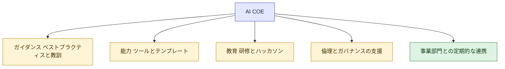

| 項目 | 内容 | 根拠 |
|---|---|---|
| 最初の一歩 | 上級リーダーのスポンサーシップ、リーダーシップ体制、ミッションと目的の設定 | [S25] |
| 組織形態 | 集中型または連合型 | [S25] |
| 連携 | 事業部門と定期的に関わり、用途の機会を発見しつつ、ガバナンスと品質基準を維持 | [S23] |
| 関連体制 | AI COE に加え、モデルガバナンス委員会を置くことを検討 | [S23] |
| 社内プロセス | 新モデルの技術評価、法務レビュー、アクセス申請などを整備 | [S23] |

集中型と連合型の違いは、次のように整理できます(整理は筆者によるもので、詳細は [S25] を参照)。

| 形態 | 特徴 | 向いている状況 |
|---|---|---|
| 集中型 | 専門家を 1 か所に集め、標準化と品質を強く担保 | 立ち上げ期、専門家が少ない |
| 連合型 | 各部門に拠点を置き、中央が調整 | 部門ごとに文脈が異なり、規模が大きい |

**③ 具体例**
各部門が別々に AI を調達・構築して重複や品質のばらつきが生じている場合、COE が **共通のテンプレート、評価基準、ガイドライン** を提供し、部門の取り組みを支える。

**④ ベストプラクティス**

| # | 実践 | 根拠 |
|---|---|---|
| 1 | COE のミッションと責任範囲を明確にし、スポンサーを確保する | [S25] |
| 2 | 「ゲートキーパー」でなく、ガイダンスと能力を提供する **支援役** にする | [S25] |
| 3 | COE を中心に、組織全体が既存の AI サービスと COE を活用できるよう人材を育てる | [S9] |
| 4 | 開発の運用成熟(MLOps)の実践を COE から広める | [S9] |
| 5 | クラウド COE の考え方(ガイダンスとガバナンスの提供、文化変革の推進)も参考にする | [S36] |

**⑤ ひっかけ注意**
「COE がすべての AI 開発を集中して担う」「COE はルールを押し付ける部署」は誤りになりやすいです。**支援し、標準化し、再利用を促す** 役割です。

**⑥ 根拠**: [S3] [S9] [S23] [S25] [S36]

---

### Skill 4.4.4 継続的なフィードバックと成功指標

**① 何を問われるか**
**継続的なフィードバックの仕組みと成功指標** で、AI の取り組みの進捗と長期的な価値を追跡できるか。[S3]

**② やさしい説明**
「導入した」で終わらず、**効果が出ているか、使われているか、品質は保たれているか** を測り続けます。AWS は、測定の枠組みを **過去データによるベースライン指標** から始め、技術指標(精度、応答時間)と事業指標(生産性向上、顧客満足度)の両方を扱うよう述べています。[S27]

| 指標カテゴリ | 例 | 見ること |
|---|---|---|
| 事業価値 | コスト削減、生産性向上、収益、顧客満足度 | 事業目標への貢献 |
| 利用・浸透 | 利用者数、利用頻度、継続率 | 現場で使われているか |
| 品質・信頼性 | 精度、応答時間、エラーや誤情報の発生率 | 品質が保たれているか |
| リスク・コンプライアンス | インシデント件数、ポリシー違反、エスカレーション率 | 安全に運用できているか |
| コスト | 単位あたりコスト、総所有コスト | 採算が合っているか |

(カテゴリ分けは初学者向けの整理で、ベースライン指標・技術指標と事業指標の両方を扱う考え方は [S27]、プラットフォームの採用状況の指標は [S10] に基づきます。)

**AI は「放置できない」**
試験ガイドの関連キーワードには、モデルドリフト(時間とともに性能が変わる現象)や性能変化を理由に、AI システムには継続的な監視が必要という点が挙がっています。[S4] 生成 AI は出力が一定でない(非決定的)ため、従来のソフトウェアとは違う評価の枠組みが必要です。[S28]

**③ 具体例**
問い合わせ対応 AI の導入前に、対応時間と満足度のベースラインを測る。導入後は、対応時間、満足度、誤回答率、エスカレーション率、利用率を月次で確認し、ユーザーのフィードバックを改善に反映する。

**④ ベストプラクティス**

| # | 実践 | 根拠 |
|---|---|---|
| 1 | **導入前にベースラインを測定** し、効果を比較できるようにする | [S27] |
| 2 | 技術指標と事業指標の両方を設定する | [S27] |
| 3 | ユーザーのフィードバックを評価データ・改善に還流させる仕組みを作る | [S19] |
| 4 | 指標と継続的な測定は、導入段階ごとに見直す | [S7] |
| 5 | 性能の劣化(ドリフト)を監視し、必要なら見直す | [S4] |

**⑤ ひっかけ注意**
「導入完了をもって成功」や「技術指標だけ」の選択肢は誤りになりやすいです。**事業成果と継続的な測定** が重要です。

**⑥ 根拠**: [S3] [S4] [S7] [S10] [S19] [S27] [S28]

---

### Skill 4.4.5 実験から本番品質への移行(ガバナンスと運用要件)

**① 何を問われるか**
AI の取り組みが **実験段階から本番品質** へ移る際の、**ガバナンスと運用の要件** を扱えるか。[S3]

**② やさしい説明**
パイロットは「うまく動くか」を確かめる場、本番は「壊れず、安全に、採算が合って動き続ける」場です。AWS の資料は、Experiment から Launch へ進む際に、**本番品質のインフラ、本番用ガバナンス、生成 AI 向けの可観測性** を整えるよう述べています。[S13]

| 観点 | パイロット | 本番 |
|---|---|---|
| 目的 | 価値・実現性の検証 | 継続的な価値提供と安定運用 |
| 体制 | 臨時のチーム | 継続的な監視・改善・サポート体制 |
| ガバナンス | 簡易 | 本番用の枠組み(利用管理、モデル更新の管理) |
| 監視 | 担当者が手作業で確認 | 観測・ログ・自動の監視 |
| インシデント | 想定なし | 生成 AI 向けのインシデント対応手順 |
| コスト | 少量で見えにくい | 単位コストと総コストの管理 |

(観点の一部は [S13][S23] に基づき、表としての整理は初学者向けです。)

AWS は、**AI の取り組みは小規模の成功が本番の成功を保証しない** ことも示しています。**Five V's Framework** は、Value、Visualize、Validate、Verify、Venture の 5 つで、本番までの道筋を示します。[S27]

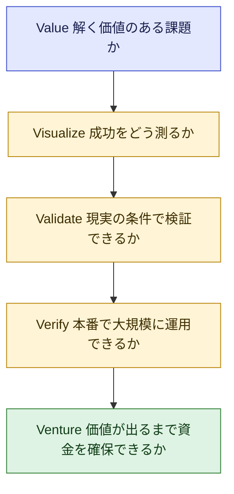

| フェーズ | 中心となる問い | 根拠 |
|---|---|---|
| Value | これは解く価値があるか(戦略的優先度に沿った高インパクトの機会を狙う) | [S27] |
| Visualize | 成功をどう測るか(事業成果と結び付く指標、ベースライン) | [S27] |
| Validate | 現実の要件・制約で検証できるか(統合・負荷・コンプライアンス・ユーザー評価) | [S27] |
| Verify | 大規模に運用できるか(ガバナンス、変更管理、運用準備、アーキテクチャのトレードオフ) | [S27] |
| Venture | 資金とリソースを長期的に確保できるか(総所有コスト、経営層の関与、保守の専任チーム) | [S27] |

**本番移行の判断フロー(整理)**

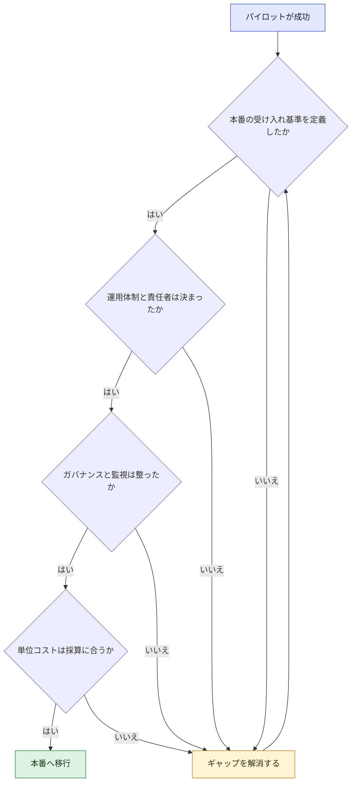

**③ 具体例**
PoC で精度が高かった文書要約 AI を全社展開する前に、本番の受け入れ基準(精度・応答時間・コスト)、監視と障害時の連絡体制、利用ルール、モデル更新時の確認手順を決める。

**④ ベストプラクティス**

| # | 実践 | 根拠 |
|---|---|---|
| 1 | 本番用のガバナンス、CI/CD などの標準デプロイ、可観測性を整備する | [S13] |
| 2 | 生成 AI 特有の **インシデント対応手順** を用意する | [S23] |
| 3 | 非決定的な出力を前提に、評価の枠組みを作る | [S28] |
| 4 | 運用準備(ワークフロー、連携点、チームの能力)を評価する | [S27] |
| 5 | 総所有コスト(開発・統合・研修・運用)を見積もる | [S27] |

**⑤ ひっかけ注意**
「PoC が成功したので、そのまま全社展開」は誤りになりやすいです。**本番の要件を別途整える** ことが必要です。

**⑥ 根拠**: [S3] [S13] [S23] [S27] [S28]

---

### Skill 4.4.6 スケール中に事業継続とパフォーマンスを守る

**① 何を問われるか**
AI を全社へ広げる間、**事業の継続性と性能を守る** ために、複数の要因を評価できるか。[S3]

**② やさしい説明**
拡大すると、コスト、品質、セキュリティ、ガバナンス、人の受け入れなど、パイロットでは見えなかった問題が一気に表面化します。

| 要因 | 無視した場合のリスク | 対策の方向性 | 根拠 |
|---|---|---|---|
| コスト(単位コスト・総コスト) | 利用拡大で予算超過、採算割れ | 総所有コストの見積もり、料金体系の理解、継続的なコスト管理 | [S2][S27] |
| 品質・性能 | 誤り・遅延の増加 | 継続的な評価と監視、ドリフトの検知 | [S4][S28] |
| セキュリティ・コンプライアンス | データ漏えい、規制違反 | 責任範囲の確認、ガバナンスの自動化 | [S15][S30] |
| データガバナンス | 拡大を妨げる、または統制が効かない | 標準ポリシーを保ちつつセルフサービスを許容 | [S14] |
| 人材・組織 | 離職や受け入れ不足で推進が止まる | 人材の再教育、離職に強いプロセス、外部パートナーの活用 | [S9] |
| 調達・提携 | 特定の構築方針への依存 | 構築・購入・提携を比較して判断 | [S2] |
| インシデント対応 | 障害時に混乱 | 生成 AI 向けのインシデント対応手順 | [S23] |
| 共通基盤 | 部門ごとの重複、品質のばらつき | 再利用可能なパターン、部品ライブラリ | [S15] |

**③ 具体例**
全社展開で利用者が 10 倍になった際、コストが想定を超え、応答が遅くなり、部門ごとに似た AI が乱立した。事前に **単位コスト、監視、共通の部品、責任者** を整えていれば防げた。

**④ ベストプラクティス**

| # | 実践 | 根拠 |
|---|---|---|
| 1 | スケールの各段階で、コスト・品質・リスク・組織の受け入れを同時に評価する | [S15] |
| 2 | 再利用可能な部品、標準パターン、セルフサービスの基盤を整える | [S15] |
| 3 | ガバナンスを自動化し、拡大に耐える形にする | [S15][S18] |
| 4 | 導入の進行に合わせて基礎能力を進化させる | [S7] |

**⑤ ひっかけ注意**
「性能だけ」「コストだけ」など **1 つの要因だけ** を最適化する選択肢は誤りになりやすいです。**複数の要因を総合的に評価** します。

**⑥ 根拠**: [S2] [S3] [S4] [S7] [S9] [S14] [S15] [S18] [S23] [S27] [S28] [S30]

---

## 6. 関連する AWS サービス・フレームワーク早見表

試験ガイドが「対象範囲」とするものを、Domain 4 の観点で整理します。いずれも **戦略レベル(基本的な適用のみ)** の理解で十分です。[S5]

| カテゴリ | 項目 | Domain 4 での位置づけ | 根拠 |
|---|---|---|---|
| AI / ML | Amazon Bedrock | 生成 AI の基盤。Guardrails(安全策)、Knowledge Bases、料金体系を知る | [S2][S5][S31] |
| AI / ML | Amazon SageMaker AI | カスタム ML。マネージドかカスタムかの判断 | [S2][S5] |
| BI | Amazon Quick | AI を活用した業務アシスタント | [S1][S2][S5] |
| 戦略・ガバナンス | AWS Cloud Adoption Framework(CAF) | 6 つの視点(Business / People / Governance / Platform / Security / Operations)で AI 導入を計画・拡大 | [S2][S8][S34] |
| 戦略・ガバナンス | AWS 責任共有モデル | AI ワークロードでのデータ保護とコンプライアンスの責任分担 | [S2][S5][S30] |
| 戦略・ガバナンス | Well-Architected Framework(Responsible AI レンズ) | ガバナンスのベストプラクティス | [S2] |
| 料金・コスト | 料金体系(従量・インスタンス・シート) | 総コストの見積もり | [S2][S5] |
| 料金・コスト | AWS Pricing Calculator / Cost Explorer | 見積もりと分析 | [S2][S5][S32][S33] |
| 料金・コスト | Savings Plans | コスト最適化の例 | [S2][S33] |
| 料金・コスト | AWS Marketplace | 構築・購入・提携の判断 | [S2][S5] |

**AWS CAF for AI の 6 つの視点(Domain 4 に関係が深いもの)**

| 視点 | 役割(要約) | AI で加わる代表的な能力 | 根拠 |
|---|---|---|---|
| Business | AI 投資を事業成果につなげる | Generative AI | [S8] |
| People | 技術とビジネスの橋渡しとなり、学び続ける文化を育む | ML Fluency、ワークフォース変革、文化の進化 | [S8][S9] |
| Governance | AI の取り組みを調整し、便益を最大化、リスクを最小化 | Responsible use of AI | [S8] |
| Platform | AI ライフサイクルを支える基盤設計 | AI ライフサイクル管理と MLOps | [S10] |
| Security | AI システムへの脅威への対応 | (CAF の考え方を基に AI 特有の攻撃経路を整理) | [S8] |
| Operations | 本番での継続的な運用 | (本番運用・監視) | [S8] |

> **補足**: AWS CAF for AI のホワイトペーパーには「歴史的な参考資料」との注記があります。概念は今も有用ですが、最新の内容は AWS の公式ページで確認してください。[S6]

---

## 7. 試験での判断ルール

Domain 4 の選択肢で迷ったときの考え方です。試験ガイドが「技術実装より戦略的意思決定を重視する」としていること、および前章までの AWS の推奨を基にした **筆者の整理** です。[S2]

| # | 判断ルール | 正解になりやすい例 | 誤りになりやすい例 |
|---|---|---|---|
| 1 | 診断が先 | 準備度アセスメントから始める | いきなり大規模導入 |
| 2 | 事業成果から逆算 | 目的と成功指標を決めてから選ぶ | 最新技術の導入自体を目的化 |
| 3 | 段階的・反復的 | 小さく検証して広げる | ビッグバンの一括導入 |
| 4 | 人と文化を軽視しない | 研修、チャンピオン、透明な説明 | 技術だけ強化、強制的な利用 |
| 5 | データが土台 | 品質・オーナー・サイロ解消を先に | データ量を増やすだけ |
| 6 | 責任を明確に | 説明責任者と RACI | 合議で責任が曖昧 |
| 7 | 本番は別物 | 受け入れ基準・運用・ガバナンスを整える | PoC 成功 = 本番準備完了 |
| 8 | 測定し続ける | ベースライン → 継続測定 → 改善 | 導入完了で終了 |
| 9 | 範囲外の実装は選ばない | 戦略・責任・コストの判断 | アルゴリズム選定・パイプライン構築の詳細 |
| 10 | 極端を避ける | ルールに基づく共有、段階的な移行 | 全面禁止 / 全面自由 |

> **シャドー AI について**: 試験の関連キーワードには「未承認の AI ツール利用(シャドー AI)のリスクと管理」があります。[S4] 単純な全面禁止ではなく、**承認された選択肢の提供、ガバナンス、教育** を組み合わせる方向が、上記ルール 10 と整合的です(整理は筆者)。

---

## 8. 練習問題(自作)

> 以下は学習用に筆者が作成した問題で、実際の試験問題ではありません。

**Q1(択一)**
ある企業で経営層は生成 AI に意欲的だが、データは部署ごとに形式がバラバラで、データの責任者も決まっていない。最も適切な最初の一手は?

- A. 全社向けの生成 AI チャットボットを直ちに展開する
- B. データ準備度を評価し、責任者の任命とサイロの解消方針を決めたうえで、小さな検証を進める
- C. 最新の高性能モデルを契約する
- D. ML エンジニアを大量に採用する

答えと解説

**B**。データの準備度、オーナーシップ、サイロ解消が AI の土台です(Skill 4.2.1、4.2.2)。A・C・D は土台が整う前の投資で、リスクが高い選択です。

**Q2(択一)**
生成 AI 成熟度モデルの 4 つのレベルを、低い順に並べたものは?

- A. Envision → Experiment → Launch → Scale
- B. Experiment → Envision → Scale → Launch
- C. Launch → Envision → Experiment → Scale
- D. Envision → Align → Launch → Scale

答えと解説

**A**。D は AWS CAF for AI の変革の旅の段階名(Align を含む)で、ひっかけです(Skill 4.1.2)。

**Q3(複数選択: 2 つ選ぶ)**
従業員が「AI で仕事がなくなる」と不安を抱いている。リーダーの適切な対応はどれか。

- A. 導入時期と役割への影響を、早い段階から透明に説明する
- B. 導入直前まで情報を伏せる
- C. 実践的な研修と小さな PoC への参加機会を提供する
- D. 利用を義務化し、使わない場合は評価を下げる
- E. 質問は受け付けない

答えと解説

**A と C**(Skill 4.3.3、4.3.4、4.3.5)。B・D・E は不安と抵抗を強めます。

**Q4(択一)**
PoC が成功し、経営層が全社展開を求めている。最も適切な次の対応は?

- A. そのまま全社へ展開する
- B. 本番の受け入れ基準、運用体制、ガバナンス、監視、コストを整えてから段階的に展開する
- C. PoC を追加で 10 件実施する
- D. 展開を無期限に延期する

答えと解説

**B**(Skill 4.4.5)。PoC の成功は本番準備の完了を意味しません。

**Q5(択一)**
AI COE の説明として最も適切なものは?

- A. すべての AI 開発を COE だけが行う
- B. ガイダンスや再利用可能な能力を提供し、事業部門との連携でスケールを支える専任の組織
- C. 各部門の AI 活用を禁止する部署
- D. 技術者だけで構成される監査部門

答えと解説

**B**(Skill 4.4.3)。COE は支援・標準化・再利用促進の役割です。

**Q6(複数選択: 2 つ選ぶ)**
AI の効果を継続的に追跡するために適切な施策は?

- A. 導入前にベースライン指標を測定する
- B. 導入後は技術指標だけを確認する
- C. 技術指標と事業指標の両方を設定する
- D. 導入完了をもって測定を終了する
- E. フィードバックは集めない

答えと解説

**A と C**(Skill 4.4.4)。

---

## 9. 直前チェックリスト

- [ ] 4 つのタスク(4.1〜4.4)と 19 のスキルを、自分の言葉で説明できる
- [ ] 準備度の 5 観点(リーダー合意・データ品質・文化・技術基盤・ガバナンス)を言える
- [ ] 生成 AI 成熟度モデル(Envision → Experiment → Launch → Scale)と、CAF の段階(Envision → Align → Launch → Scale)の違いを説明できる
- [ ] 能力ギャップの 4 領域(人・プロセス・技術・ガバナンス)を具体例で説明できる
- [ ] 投資の優先順位を「戦略目標」と「現在の成熟度」で判断できる
- [ ] データ品質・アクセス性・サイロの影響を説明できる
- [ ] データ戦略、オーナーシップ、共有の枠組みの違いを説明できる
- [ ] AI フライホイールを説明できる
- [ ] Bedrock / SageMaker AI / Quick の役割を戦略レベルで説明できる
- [ ] 責任共有モデルが生成 AI の使い方で変わることを説明できる
- [ ] 料金体系(従量・インスタンス・シート)と、コスト関連ツールの役割を言える
- [ ] 経営スポンサーと AI チャンピオンの違いを説明できる
- [ ] 部門横断チームの構成と RACI の考え方を説明できる
- [ ] 透明なコミュニケーションで伝えるべき 4 点を言える
- [ ] 文化的障壁(リスク回避・抵抗・失敗への恐れ)と介入策を対応付けられる
- [ ] 人材育成の手法(POC・ハッカソン・研修・責任ある AI 研修)の使い分けを説明できる
- [ ] 人の役割の移行(手作業 → 監督・協働)と、エスカレーションの考え方を説明できる
- [ ] クイックウィンとポートフォリオの考え方を説明できる
- [ ] COE の役割(ガイダンスと能力の提供、集中型と連合型)を説明できる
- [ ] ベースライン、技術指標と事業指標、継続的な監視(ドリフト)を説明できる
- [ ] パイロットと本番の違い、Five V's の 5 フェーズを説明できる
- [ ] スケール時に評価すべき複数の要因(コスト・品質・セキュリティ・ガバナンス・人材)を挙げられる

---

## 10. 用語集

| 用語 | 意味 |
|---|---|
| AI チャンピオン | 各部門で AI 活用を推進する旗振り役 |
| AWS CAF | AWS Cloud Adoption Framework。クラウド導入を 6 つの視点で整理した枠組み |
| CAF for AI | CAF を AI/ML/生成 AI 向けに拡張した枠組み |
| COE | Center of Excellence。専門知識を集約して全社を支援する組織 |
| Envision / Experiment / Launch / Scale | 生成 AI 成熟度モデルの 4 段階 |
| Five V's Framework | Value, Visualize, Validate, Verify, Venture。AWS が示す、AI を本番へ進める枠組み |
| AI フライホイール | 高品質なデータが AI を改善し、成果が新しいデータを生む好循環 |
| ガードレール | AI の出力や動作を安全な範囲に保つ仕組み |
| データサイロ | 部門ごとに孤立して共有されないデータ |
| データオーナーシップ / スチュワードシップ | データへの責任(所有から責任ある管理へ) |
| ドリフト | 時間の経過でモデルの性能が変わること |
| ハルシネーション | AI がもっともらしい誤りを生成すること |
| RACI | 実行責任・説明責任・相談先・報告先を整理する責任分担表 |
| クイックウィン | 短期間で成果が見える取り組み |
| 責任共有モデル | クラウド事業者と顧客のセキュリティ責任の分担 |
| シャドー AI | 組織の承認なく使われる AI ツール |
| ベースライン | 導入前の基準値。効果測定の比較元 |
| RAG | 外部の情報を検索して回答に活用する生成 AI の手法 |

---

## 11. 参考 URL 一覧

> 確認日: 2026 年 10 月 1 日。AWS の公式資料は更新されるため、受験前に最新版を確認してください。

### A. 試験の公式情報

| ID | 内容 | URL |
|---|---|---|
| S1 | AWS Certified AI Business Strategist(認定ページ) | https://aws.amazon.com/certification/certified-ai-business-strategist/ |
| S2 | 試験ガイド(AIB-C01) トップ | https://docs.aws.amazon.com/aws-certification/latest/ai-business-strategist-01/ai-business-strategist-01.html |
| S3 | Content Domain 4: Business Readiness, Leadership, and AI Transformation | https://docs.aws.amazon.com/aws-certification/latest/ai-business-strategist-01/ai-business-strategist-01-domain4.html |
| S4 | 試験に出る可能性のある技術と概念 | https://docs.aws.amazon.com/aws-certification/latest/ai-business-strategist-01/aib-01-technologies-concepts.html |
| S5 | 対象範囲の AWS サービスと機能 | https://docs.aws.amazon.com/aws-certification/latest/ai-business-strategist-01/aib-01-in-scope-services.html |
| - | 試験対策プラン(AWS Skill Builder) | https://skillbuilder.aws/category/exam-prep/ai-business-strategist-business-AIB-C01 |

### B. 変革・成熟度・ガバナンスの枠組み

| ID | 内容 | URL |
|---|---|---|
| S6 | AWS CAF for AI, ML, and Generative AI(ホワイトペーパー) | https://docs.aws.amazon.com/whitepapers/latest/aws-caf-for-ai/aws-caf-for-ai.html |
| S7 | Your AI transformation journey(Envision / Align / Launch / Scale、AI フライホイール) | https://docs.aws.amazon.com/whitepapers/latest/aws-caf-for-ai/your-ai-transformation-journey.html |
| S8 | Foundational AI capabilities(6 つの視点) | https://docs.aws.amazon.com/whitepapers/latest/aws-caf-for-ai/foundational-ai-capabilities.html |
| S9 | People perspective: Culture and change towards AI-first | https://docs.aws.amazon.com/whitepapers/latest/aws-caf-for-ai/people-perspective-culture-and-change-towards-aiml-first.html |
| S10 | Platform perspective: Infrastructure for and applications of AI | https://docs.aws.amazon.com/whitepapers/latest/aws-caf-for-ai/platform-perspective-infrastructure-for-and-applications-of-aiml.html |
| S11 | Maturity model for adopting generative AI on AWS(概要) | https://docs.aws.amazon.com/prescriptive-guidance/latest/strategy-gen-ai-maturity-model/overview.html |
| S12 | Levels in the generative AI maturity model | https://docs.aws.amazon.com/prescriptive-guidance/latest/strategy-gen-ai-maturity-model/overview-levels.html |
| S13 | Level 2: Experiment | https://docs.aws.amazon.com/prescriptive-guidance/latest/strategy-gen-ai-maturity-model/level-2.html |
| S14 | Level 3: Launch | https://docs.aws.amazon.com/prescriptive-guidance/latest/strategy-gen-ai-maturity-model/level-3.html |
| S15 | Level 4: Scale | https://docs.aws.amazon.com/prescriptive-guidance/latest/strategy-gen-ai-maturity-model/level-4.html |
| S16 | Aspects of generative AI maturity | https://docs.aws.amazon.com/prescriptive-guidance/latest/strategy-gen-ai-maturity-model/overview-aspects.html |
| S34 | AWS Cloud Adoption Framework(概要) | https://aws.amazon.com/cloud-adoption-framework/ |
| S35 | CAF People perspective: culture and change | https://docs.aws.amazon.com/whitepapers/latest/overview-aws-cloud-adoption-framework/people-perspective.html |
| S36 | Building a Cloud Center of Excellence within your organization | https://docs.aws.amazon.com/prescriptive-guidance/latest/cloud-center-of-excellence/introduction.html |
| S36b | AWS CAF: People Perspective(Learning Needs Analysis の記載) | https://docs.aws.amazon.com/pdfs/whitepapers/latest/aws-caf-people-perspective/aws-caf-people-perspective.pdf |

### C. データ戦略とデータガバナンス

| ID | 内容 | URL |
|---|---|---|
| S17 | Data security, lifecycle, and strategy for generative AI applications | https://docs.aws.amazon.com/prescriptive-guidance/latest/strategy-data-considerations-gen-ai/introduction.html |
| S18 | Data strategy(導入の 4 段階と 4 つの柱) | https://docs.aws.amazon.com/prescriptive-guidance/latest/strategy-data-considerations-gen-ai/journey.html |
| S19 | Data lifecycle in generative AI | https://docs.aws.amazon.com/prescriptive-guidance/latest/strategy-data-considerations-gen-ai/lifecycle.html |
| S20 | Data architecture - Generative AI Lens(Well-Architected) | https://docs.aws.amazon.com/wellarchitected/latest/generative-ai-lens/data-architecture.html |
| S21 | Generative AI workload assessment: Data strategy | https://docs.aws.amazon.com/prescriptive-guidance/latest/gen-ai-workload-assessment/data-strategy.html |
| S22 | Generative AI workload assessment: FAQ | https://docs.aws.amazon.com/prescriptive-guidance/latest/gen-ai-workload-assessment/faq.html |
| S29 | Data Governance in the Age of Generative AI(AWS Executive in Residence Blog) | https://aws.amazon.com/blogs/enterprise-strategy/data-governance-in-the-age-of-generative-ai |

### D. 組織・COE・スケール

| ID | 内容 | URL |
|---|---|---|
| S23 | Best practices for enterprise generative AI adoption and scaling | https://docs.aws.amazon.com/prescriptive-guidance/latest/strategy-enterprise-ready-gen-ai-platform/best-practices.html |
| S24 | Enterprise-ready generative AI platform: Next steps | https://docs.aws.amazon.com/prescriptive-guidance/latest/strategy-enterprise-ready-gen-ai-platform/next-steps.html |
| S25 | Establishing an AI/ML center of excellence(AWS Machine Learning Blog) | https://aws.amazon.com/blogs/machine-learning/establishing-an-ai-ml-center-of-excellence/ |
| S26 | Transforming ADM operating models with generative AI: Action areas and recommendations | https://docs.aws.amazon.com/prescriptive-guidance/latest/strategy-transform-adm-operating-model-gen-ai/recommendations.html |
| S27 | Beyond pilots: A proven framework for scaling AI to production(Five V's Framework) | https://aws.amazon.com/blogs/machine-learning/beyond-pilots-a-proven-framework-for-scaling-ai-to-production/ |
| S28 | Generative AI Lifecycle Operational Excellence framework on AWS(PDF) | https://docs.aws.amazon.com/pdfs/prescriptive-guidance/latest/gen-ai-lifecycle-operational-excellence/gen-ai-lifecycle-operational-excellence.pdf |
| - | How to Implement AI in Your Business(AWS) | https://aws.amazon.com/ai/implementation/ |

### E. セキュリティ・責任共有・コスト

| ID | 内容 | URL |
|---|---|---|
| S30 | Generative AI Security Scoping Matrix | https://aws.amazon.com/ai/security/generative-ai-scoping-matrix/ |
| S31 | Security, privacy, and responsible AI - Amazon Bedrock | https://aws.amazon.com/bedrock/security-privacy-responsible-ai/ |
| S32 | AWS Cost Explorer(ドキュメント / 製品ページ) | https://docs.aws.amazon.com/console/billing/costexplorer / https://aws.amazon.com/aws-cost-management/aws-cost-explorer/ |
| S33 | AWS Pricing Calculator / Savings Plans / Bedrock の料金 / SageMaker の料金 / AWS Marketplace | https://calculator.aws/ / https://aws.amazon.com/savingsplans/ / https://aws.amazon.com/bedrock/pricing/ / https://aws.amazon.com/sagemaker/pricing/ / https://aws.amazon.com/marketplace |

### 出典の扱いについて

- 本文の「公式が書いていること」は、上記の AWS 公式ドキュメントとブログに基づいています。
- 各スキルの「やさしい説明」「具体例」「ひっかけ注意」「判断ルール」「練習問題」は、初学者が理解しやすいよう筆者が整理・作成したもので、AWS の公式見解そのものではありません。
- 公式資料の文章は、著作権に配慮して言い換えて要約しています。正確な記述は必ず元の URL で確認してください。