# AWS Certified Generative AI Developer - Professional (AIP-C01)

## Content Domain 1: Foundation Model Integration, Data Management, and Compliance 初学者向けステップバイステップ解説

> 対象: 生成AIアプリ開発の初学者(AWSの基本サービスを触ったことがある方)
> 位置づけ: AIP-C01 試験の **Domain 1(スコア対象の 31%)** を、公式試験ガイドの Task / Skill 順に解説します
> 作法: 図解は Mermaid と Markdown の表のみを使用(ASCII アート不使用)

---

## 目次

1. [この Domain の全体像](#1-この-domain-の全体像)
2. [先に押さえる基本用語](#2-先に押さえる基本用語)
3. [Task 1.1 要件分析と GenAI ソリューション設計](#3-task-11-要件分析と-genai-ソリューション設計)
4. [Task 1.2 FM の選定と構成](#4-task-12-fm-の選定と構成)
5. [Task 1.3 FM 向けデータ検証と処理パイプライン](#5-task-13-fm-向けデータ検証と処理パイプライン)
6. [Task 1.4 ベクトルストア設計と実装](#6-task-14-ベクトルストア設計と実装)
7. [Task 1.5 FM 拡張のための検索メカニズム](#7-task-15-fm-拡張のための検索メカニズム)
8. [Task 1.6 プロンプトエンジニアリングとガバナンス](#8-task-16-プロンプトエンジニアリングとガバナンス)
9. [試験で問われる判断軸まとめ](#9-試験で問われる判断軸まとめ)
10. [学習チェックリスト](#10-学習チェックリスト)
11. [参考ソース一覧](#11-参考ソース一覧)

---

## 1. この Domain の全体像

### 1.1 試験の基本情報(公式試験ガイドより)

| 項目 | 内容 |
|---|---|
| 試験名 | AWS Certified Generative AI Developer - Professional (AIP-C01) |
| 想定受験者 | 本番グレードのアプリを AWS またはオープンソース技術で構築した経験が 2 年以上、一般的な AI/ML またはデータエンジニアリングの経験、GenAI 実装の実務経験が 1 年 |
| 採点対象の問題数 | 65 問(ほかに採点されない問題が 10 問) |
| 合格スコア | 100 から 1,000 のスケールドスコアで 750 以上 |
| 問題形式 | 択一(正解 1・誤り 3)と複数選択(5 択以上から 2 つ以上) |
| 採点方式 | 補償型。分野ごとの合格点はなく、全体で合格すればよい |
| Domain 1 の比重 | 31%(5 つの Domain の中で最大) |
| 試験範囲外 | モデルの開発と学習、高度な ML 技法、データエンジニアリングと特徴量エンジニアリング |

Domain 1 は最も配点が大きいため、ここを固めることが合格への近道です。

### 1.2 Domain 1 の 6 つの Task

| Task | テーマ | Skill 数 | ひとことで言うと |
|---|---|---|---|
| 1.1 | 要件分析と設計 | 3 | 作る前に「何を、どう作るか」を決める |
| 1.2 | FM の選定と構成 | 4 | 最適なモデルを選び、切り替え可能で止まらない構成にする |
| 1.3 | データ検証と処理 | 4 | FM に渡すデータを検証し、整え、形式を合わせる |
| 1.4 | ベクトルストア | 5 | 意味検索のためのデータ置き場を設計し、最新に保つ |
| 1.5 | 検索メカニズム | 6 | 分割、埋め込み、検索、再ランク、クエリ改善で RAG の精度を上げる |
| 1.6 | プロンプトと統制 | 6 | プロンプトを設計、管理、テスト、連鎖させる |

### 1.3 Domain 1 の学習ロードマップ

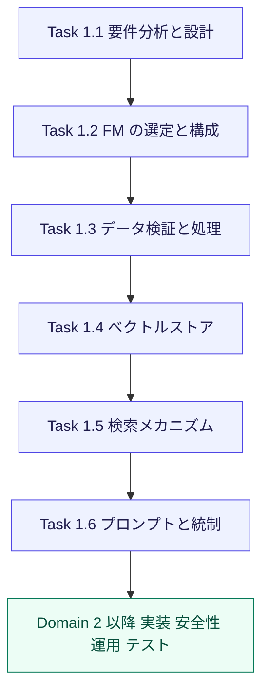

> 出典: 試験ガイド Domain 1 https://docs.aws.amazon.com/aws-certification/latest/ai-professional-01/ai-professional-01-domain1.html

---

## 2. 先に押さえる基本用語

初学者がつまずきやすい用語を最初に整理します。以降の説明はすべてこの用語が前提です。

| 用語 | やさしい説明 | 関連 Task |
|---|---|---|
| FM(基盤モデル) | 大量データで事前学習された汎用 AI モデル。文章生成、要約、画像理解など幅広く使える | 全般 |
| Amazon Bedrock | 複数社の FM を共通の API で使えるフルマネージドサービス | 全般 |
| トークン | モデルが文章を処理する最小単位。料金、入力上限、速度に直結する | 1.2, 1.5 |
| プロンプト | モデルへの指示文。役割、手順、出力形式などを書く | 1.6 |
| RAG | Retrieval Augmented Generation。外部データを検索して、その結果をモデルに渡して回答させる方式 | 1.4, 1.5 |
| 埋め込み(Embedding) | 文章や画像の意味を数値の列(ベクトル)に変換したもの。意味が近いものは近い値になる | 1.5 |
| ベクトルストア | ベクトルを保存し、近いものを高速に探せるデータベース | 1.4 |
| チャンク | 長い文書を検索しやすい大きさに分割した 1 片 | 1.5 |
| ナレッジベース | Bedrock が提供する、取り込み、分割、埋め込み、検索までを担う RAG 用のマネージド機能 | 1.4, 1.5 |
| 推論プロファイル | モデルと、リクエストを振り分けられるリージョンの組を定義したもの | 1.2 |
| ガードレール | 有害コンテンツ、機密情報、禁止トピックなどを入出力で制御する機能 | 1.6 |
| LoRA | 少ないパラメータだけを追加学習する軽量なカスタマイズ手法 | 1.2 |

### RAG の基本の流れ

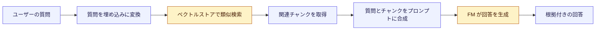

この図の「ベクトルストア」「チャンク」「埋め込み」「プロンプト」が、Task 1.4 から 1.6 の主役です。

> 出典: Amazon Bedrock Knowledge Bases https://docs.aws.amazon.com/bedrock/latest/userguide/knowledge-base.html

---

## 3. Task 1.1 要件分析と GenAI ソリューション設計

**Task の目的**: いきなり実装せず、ビジネス要件と技術制約を整理し、小さく検証してから本番に広げる。

### 設計の全体フロー

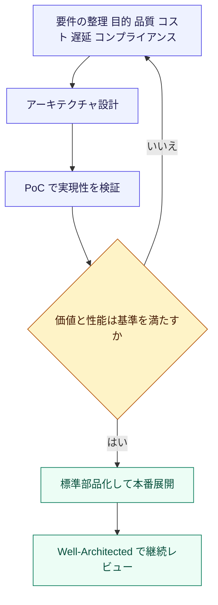

### Skill 1.1.1 ビジネス要件に合うアーキテクチャ設計

**何をするか**: 業務ニーズと技術制約から、FM、連携パターン、デプロイ方式を選ぶ。

**考える順番(ステップ)**

1. **目的を一文で書く**(例: 社内規程の問い合わせ対応時間を半減する)
2. **入出力を決める**(テキストだけか、画像や音声も含むか、出力は自由文か JSON か)
3. **非機能要件を洗い出す**(応答時間、同時利用数、可用性、データの置き場所、監査要件)
4. **GenAI のパターンを選ぶ**(下表)
5. **FM、連携方式、デプロイ方式を選ぶ**

| 要件の傾向 | 適したパターン | 主なサービス |
|---|---|---|
| 自社データに基づく回答 | RAG | Bedrock Knowledge Bases、OpenSearch |
| 手順を踏む業務の自動化 | エージェント | Bedrock Agents、Step Functions |
| 決まった形式への変換や要約 | プロンプトのみ | Bedrock、Prompt Management |
| 特定ドメインの口調や専門用語への適応 | カスタマイズ(ファインチューニング) | Bedrock、SageMaker AI |
| 同期の対話応答 | API Gateway と Lambda の同期呼び出し | API Gateway、Lambda |
| 大量文書の夜間処理 | 非同期、バッチ処理 | Step Functions、バッチ推論 |

**ベストプラクティス**

- まず**プロンプトと RAG** で解決できないか検討し、それでも足りない場合にだけカスタマイズへ進む(コストと運用負荷が段違いのため)
- データの所在地や機密度の要件を、**モデル選定より前**に確認する
- 同期で足りるか、非同期にすべきかを、遅延要件から決める

> 出典: AWS Well-Architected Framework Generative AI Lens https://docs.aws.amazon.com/wellarchitected/latest/generative-ai-lens/generative-ai-lens.html

### Skill 1.1.2 PoC による実現性の検証

**何をするか**: 本格開発の前に、小さな実装で「できるか、速いか、価値があるか」を確かめる。

**ステップ**

1. 代表的な質問や入力を **20 から 50 件程度**集める(評価データセット)
2. Bedrock のプレイグラウンドや SDK で、候補モデルに同じ入力を流す
3. 品質、遅延、1 リクエストあたりのコストを記録する
4. 成功基準(例: 正答率 85% 以上)を満たすか判定する

| PoC で測る観点 | 見る指標の例 |
|---|---|
| 品質 | 正確さ、根拠の妥当性、幻覚(誤情報)の頻度 |
| 性能 | 応答時間、最初のトークンまでの時間、スループット |
| コスト | 入力と出力トークン数あたりの料金、1 件あたりの総費用 |
| 業務価値 | 工数削減、一次回答率、ユーザー満足度 |

**ベストプラクティス**

- PoC でも**評価データセットを固定**し、モデルやプロンプト変更の前後を比べられるようにする
- PoC のコードを**そのまま本番に流用しない**前提で、学びを設計に反映する
- 失敗条件(撤退基準)も最初に決めておく

> 出典: Amazon Bedrock ユーザーガイド https://docs.aws.amazon.com/bedrock/latest/userguide/what-is-bedrock.html

### Skill 1.1.3 標準化された技術コンポーネント

**何をするか**: 複数のアプリやチームで同じ品質を再現できるよう、共通部品とレビュー基準を作る。

| 標準化の対象 | 具体例 |
|---|---|
| 設計レビュー | Well-Architected Tool の Generative AI Lens でワークロードを評価 |
| インフラ | CloudFormation、CDK のテンプレートで Bedrock、IAM、ログ設定をひな形化 |
| プロンプト | Bedrock Prompt Management のテンプレートを共有(Task 1.6) |
| 呼び出し層 | 共通の Lambda 関数やライブラリで Bedrock 呼び出し、リトライ、ログを統一 |
| ガードレール | 組織共通のガードレール設定を再利用 |

**ベストプラクティス**

- Generative AI Lens の**ベストプラクティス ID**(例: GENOPS03-BP01 プロンプトテンプレート管理)で、レビュー観点を共有する
- 共通部品はバージョン管理し、変更はレビューを通す

> 出典: Generative AI Lens GENOPS03-BP01 https://docs.aws.amazon.com/wellarchitected/latest/generative-ai-lens/genops03-bp01.html
> 出典: AWS Well-Architected Tool https://docs.aws.amazon.com/wellarchitected/latest/userguide/intro.html

### Task 1.1 の試験ポイント

| よく出る場面 | 選ぶ答えの方向 |
|---|---|
| 本番化前に実現性を確かめたい | Bedrock で PoC を作り、評価データで測る |
| 複数チームで構成を揃えたい | Well-Architected の Generative AI Lens とテンプレート化 |
| 自社文書で回答させたい | まず RAG。ファインチューニングは最後の選択肢 |

---

## 4. Task 1.2 FM の選定と構成

**Task の目的**: 用途に合う FM を選び、切り替えに強く、障害時にも止まらず、カスタマイズモデルの寿命管理もできる構成にする。

### Skill 1.2.1 用途に合う FM の評価と選定

**何をするか**: ベンチマーク、機能、制約を比べて、ビジネス要件に最も合うモデルを選ぶ。

| 比較軸 | 見るポイント |
|---|---|
| 能力 | 推論力、コード生成、多言語(日本語品質)、マルチモーダル対応 |
| コンテキスト長 | 一度に入力できるトークン数。長文書を扱うなら重要 |
| 速度とコスト | 小型モデルは安く速い。大型モデルは高品質だが高コスト |
| 提供リージョン | 利用したいリージョンで使えるか(使えない場合は Skill 1.2.3 の推論プロファイル) |
| 制限事項 | 出力形式の制約、ツール利用対応の有無、利用ポリシー |

**ステップ**

1. 要件から候補を 2 から 4 モデルに絞る
2. Skill 1.1.2 の評価データセットを使い、Bedrock の**モデル評価**(自動評価、人手評価、LLM を審査員に使う評価)で比較する
3. 品質だけでなくコストと遅延も表にして、総合で選ぶ

**ベストプラクティス**

- 「最も高性能なモデル」ではなく「**要件を満たす最も安いモデル**」を選ぶ
- 難しい質問だけ大型モデルに回す、といった**使い分け**も検討する(Bedrock の Intelligent Prompt Routing は、同じモデルファミリー内でリクエストごとに最適なモデルへ振り分ける機能。ただしルーティングは英語のプロンプト向けに最適化されており、日本語のプロンプトには最適化されていない)

> 出典: Bedrock モデル評価 https://docs.aws.amazon.com/bedrock/latest/userguide/evaluation.html
> 出典: Bedrock 対応モデル一覧 https://docs.aws.amazon.com/bedrock/latest/userguide/models-supported.html

### Skill 1.2.2 モデルの動的選択とプロバイダー切り替え(コード変更なし)

**何をするか**: モデル名をコードに埋め込まず、設定を変えるだけでモデルを切り替えられる構造にする。

**なぜ必要か**: モデルは頻繁に新しくなり、廃止もされます。コードに直書きすると、切り替えのたびに再デプロイが必要になります。

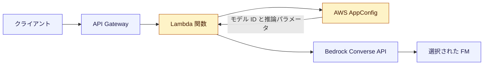

| 部品 | 役割 |
|---|---|
| API Gateway | アプリの入口。呼び出し側からモデルの違いを隠す抽象化層 |
| Lambda | AppConfig から設定を読み、Bedrock を呼ぶ |
| AWS AppConfig | モデル ID、温度、最大トークンなどの設定を**デプロイ戦略付き**で配信 |
| Bedrock Converse API | モデルごとの差異を吸収する共通のメッセージ形式の API |

**ベストプラクティス**

- モデル ID は環境変数や AppConfig に置く(**コードに直書きしない**)
- AppConfig は**段階的デプロイ**と CloudWatch アラームによる**自動ロールバック**が使えるため、モデル切り替えの安全装置になる
- モデルごとにプロンプトの最適形が違うため、**モデルとプロンプトをセットで管理**する(Task 1.6)
- Converse API を使うと、モデルごとに異なるリクエスト本文の形式を意識せずに済む

> 出典: AWS AppConfig https://docs.aws.amazon.com/appconfig/latest/userguide/what-is-appconfig.html
> 出典: Bedrock Converse API https://docs.aws.amazon.com/bedrock/latest/userguide/conversation-inference.html

### Skill 1.2.3 障害に強い AI システム(レジリエンス)

**何をするか**: スロットリング、リージョン障害、モデル停止が起きても、サービスを継続する。

| 手法 | 内容 | 向いている状況 |
|---|---|---|
| 指数バックオフ付きリトライ | 待ち時間を倍々に増やし、ジッターを加えて再試行 | 一時的なスロットリング |
| サーキットブレーカー | 失敗が続く依存先への呼び出しを一時遮断し、すぐ代替へ | 障害が継続している依存先 |
| クロスリージョン推論 | 推論プロファイル経由で複数リージョンに振り分け | 需要の急増、スループット確保 |
| フォールバックモデル | 主モデル失敗時に別モデルを呼ぶ | モデル単位の障害 |
| グレースフルデグラデーション | 機能を縮小して応答を続ける(例: キャッシュ回答、定型文) | 全面停止を避けたいとき |

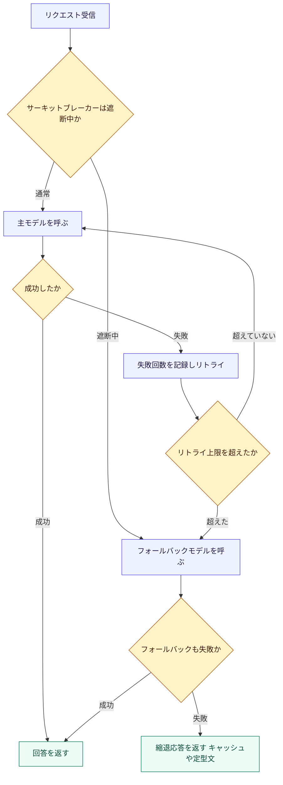

**Step Functions でのサーキットブレーカー**: 失敗状態を DynamoDB に保存し、ワークフロー内で「遮断中か」を判定する Choice ステートを置く、という実装が典型です。Step Functions の Retry と Catch でエラー種別ごとに処理を分けられます。

**クロスリージョン推論(CRIS)の要点**

| 種類 | 特徴 |
|---|---|
| 地域(Geographic)プロファイル | US、EU、APAC など特定の地域内のリージョンへ振り分ける。データの所在地要件がある場合に向く |
| グローバルプロファイル | サポートされる商用リージョン全体へ振り分け、最大のスループットとコスト面の利点が得られる |

- どちらも**推論プロファイル**を使い、推論プロファイルの ID をモデル ID の代わりに指定する
- リクエストは**呼び出し元リージョンの CloudTrail** に記録される
- 推論プロファイルは Provisioned Throughput には対応していない
- 振り分け先を含む権限(IAM)を許可する必要がある。リージョンを制限する SCP を使っている場合は、プロファイルの種類で対応が異なる
  - **地域(Geographic)プロファイル**: プロファイルに含まれる振り分け先リージョンを SCP で許可しないと失敗する
  - **グローバルプロファイル**: 振り分け先は `aws:RequestedRegion` が `unspecified` として評価されるため、この値のリクエストを許可するか、ドキュメントに記載された推論プロファイル向けの例外条件を SCP に設定する

**ベストプラクティス**

- リトライは**冪等な処理**に限り、**上限回数とバックオフ**を必ず設定する
- 「エラーを返す」より「品質を落としても応答する」設計を、要件に応じて選ぶ
- 障害対応は**事前にテスト**する(障害を意図的に起こす訓練)

> 出典: Bedrock クロスリージョン推論 https://docs.aws.amazon.com/bedrock/latest/userguide/cross-region-inference.html
> 出典: Bedrock グローバルクロスリージョン推論 https://docs.aws.amazon.com/bedrock/latest/userguide/global-cross-region-inference.html
> 出典: Step Functions エラー処理 https://docs.aws.amazon.com/step-functions/latest/dg/concepts-error-handling.html

### Skill 1.2.4 FM カスタマイズのデプロイとライフサイクル管理

**何をするか**: ドメイン特化のカスタマイズモデルを、バージョン管理し、自動デプロイし、失敗時は戻し、役目を終えたら退役させる。

**カスタマイズ手法の選び方**

| 手法 | 概要 | 向いている場面 |
|---|---|---|
| プロンプト設計 | 指示や例を工夫するだけ | まず試す。コストが最小 |
| RAG | 外部知識を検索して渡す | 最新情報や社内文書が必要 |
| フルファインチューニング | モデル全体を追加学習 | 大規模データと予算がある場合 |
| LoRA などのパラメータ効率型 | 小さな追加パラメータ(アダプター)だけ学習 | コストを抑えて特化させたい |

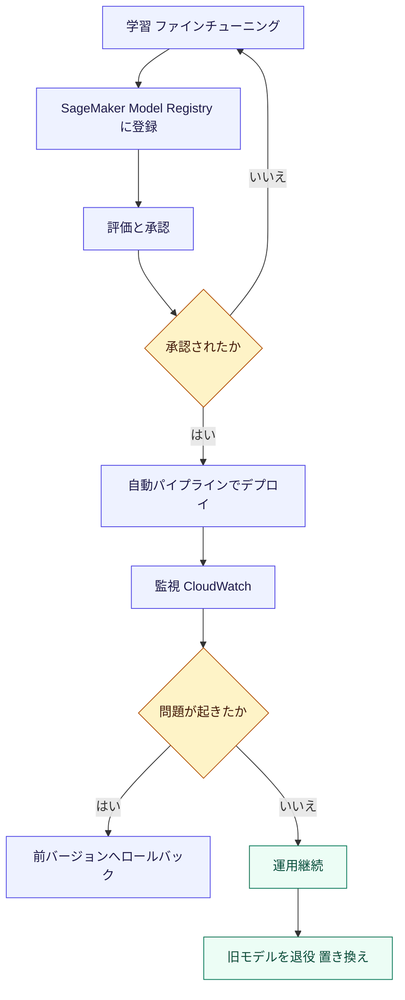

| 部品 | 役割 |
|---|---|
| SageMaker AI | ファインチューニング済みモデルをエンドポイントへデプロイ |
| SageMaker Model Registry | モデルのバージョン管理と承認ステータスの管理 |
| SageMaker Pipelines、CodePipeline | モデル更新のデプロイを自動化 |
| ブルー/グリーンデプロイと CloudWatch アラーム | 失敗時に自動で前のバージョンへ戻す |
| LoRA アダプター | 1 つのベースモデルに複数のアダプターを載せ、用途別に切り替え可能 |

**ベストプラクティス**

- **モデル、学習データ、評価結果、プロンプトを紐づけて**バージョン管理する(再現性と監査のため)
- 承認ゲートを置き、**評価基準を満たしたバージョンだけ**本番へ進める
- ロールバック手順を最初から用意する
- 使われなくなったモデルは**退役の基準と期限**を決めて、コストとリスクを減らす
- Bedrock のカスタムモデルの推論には、**Provisioned Throughput**(時間単位の固定課金)と**オンデマンドデプロイ**(トークン単位の従量課金)がある。どちらを使えるかは**モデルとリージョンによって異なる**ため、対応状況を確認してからコストを設計する

> 出典: SageMaker Model Registry https://docs.aws.amazon.com/sagemaker/latest/dg/model-registry.html
> 出典: SageMaker デプロイガードレール https://docs.aws.amazon.com/sagemaker/latest/dg/deployment-guardrails.html
> 出典: Bedrock モデルカスタマイズ https://docs.aws.amazon.com/bedrock/latest/userguide/custom-models.html

### Task 1.2 の試験ポイント

| よく出る場面 | 選ぶ答えの方向 |
|---|---|
| モデルをコード変更なしで切り替えたい | AppConfig で設定配信、Converse API、API Gateway と Lambda の抽象化 |
| 特定リージョンでモデルの容量が足りない | クロスリージョン推論プロファイル |
| 外部依存の失敗が続く | Step Functions とサーキットブレーカー、フォールバック |
| カスタムモデルを安全に更新したい | Model Registry と自動パイプラインとロールバック |
| 低コストでドメイン特化したい | LoRA などパラメータ効率型の手法 |

---

## 5. Task 1.3 FM 向けデータ検証と処理パイプライン

**Task の目的**: 「ゴミを入れればゴミが出る」を防ぐため、FM に渡すデータを検証し、種類ごとに処理し、モデルが求める形式に整え、品質を高める。

### データ処理パイプライン全体像

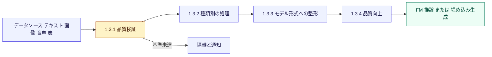

### Skill 1.3.1 データ品質の検証ワークフロー

**何をするか**: データが品質基準を満たしているか、FM に渡す前に自動で検査する。

| 検証の観点 | チェック例 |
|---|---|
| 完全性 | 必須項目の欠損がないか |
| 形式 | 日付、文字コード、スキーマが想定どおりか |
| 一意性 | 重複した文書や行がないか |
| 妥当性 | 値の範囲、許容される値の一覧に収まっているか |
| 機密性 | 個人情報が混入していないか(Comprehend の PII 検出は英語とスペイン語のみ対応。日本語の PII 検出には使えないため、別の手段で確認する) |

| サービス | 使いどころ |
|---|---|
| AWS Glue Data Quality | ルールを DQDL(Data Quality Definition Language)で定義し、データセットを自動評価 |
| SageMaker Data Wrangler | データの探索、変換、品質の確認を対話的に行う |
| Lambda のカスタム関数 | 業務固有のルール(文書の言語判定、サイズ上限など) |
| CloudWatch メトリクスとアラーム | 検証の合格率を指標化し、閾値割れで通知 |

**ベストプラクティス**

- 検証を**パイプラインの入口**に置き、不合格データは**隔離**して原因調査できるようにする
- 合格率や不合格理由を**メトリクス化**し、データ品質の劣化を早期に検知する
- ルールは**コードとして管理**(バージョン管理、レビュー)する

> 出典: AWS Glue Data Quality https://docs.aws.amazon.com/glue/latest/dg/glue-data-quality.html
> 出典: SageMaker Data Wrangler https://docs.aws.amazon.com/sagemaker/latest/dg/data-wrangler.html
> 出典: Amazon CloudWatch https://docs.aws.amazon.com/AmazonCloudWatch/latest/monitoring/WhatIsCloudWatch.html

### Skill 1.3.2 データ種類別(マルチモーダル)の処理

**何をするか**: テキスト、画像、音声、表形式データを、それぞれに適した方法で FM が扱える状態にする。

| データ種類 | 処理の考え方 | 使えるサービス |
|---|---|---|
| テキスト | 文字コード統一、不要部分の除去、分割 | Lambda、Glue |
| 画像 | 画像を直接マルチモーダルモデルへ入力、または文字抽出 | Bedrock のマルチモーダルモデル、Amazon Textract |
| 音声 | 文字起こししてテキスト化し、通常のテキストとして扱う | Amazon Transcribe |
| 表形式 | 行を文章化する、または要約して渡す | SageMaker Processing、Glue |
| 動画、複合ドキュメント | 音声、画面、テキストを分解して処理 | Bedrock Data Automation、複数サービスの組み合わせ |

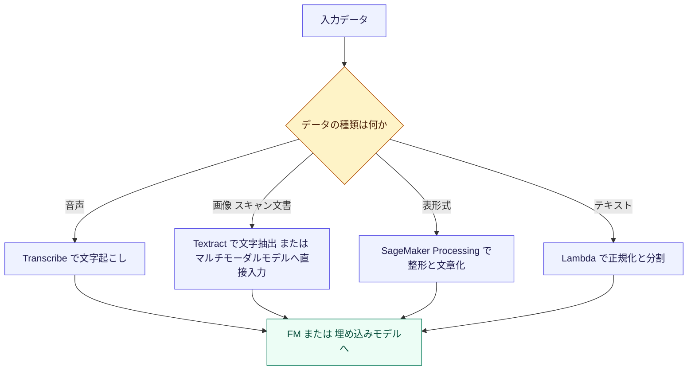

**ベストプラクティス**

- 大量処理は **SageMaker Processing や Step Functions** でスケールさせ、Lambda の実行時間制限に収まらない処理を切り出す
- 画像内の文字や表の構造が重要な場合は、**文字抽出の精度**を先に検証する
- 音声は**話者分離や言語指定**など、文字起こしの設定で品質が変わる

> 出典: Amazon Transcribe https://docs.aws.amazon.com/transcribe/latest/dg/what-is.html
> 出典: Amazon Textract https://docs.aws.amazon.com/textract/latest/dg/what-is.html
> 出典: SageMaker Processing https://docs.aws.amazon.com/sagemaker/latest/dg/processing-job.html
> 出典: Bedrock Data Automation https://docs.aws.amazon.com/bedrock/latest/userguide/bda.html

### Skill 1.3.3 モデル固有の入力形式への整形

**何をするか**: モデルやエンドポイントが要求するリクエスト形式に、データを正しく変換する。

| 呼び出し方 | 形式の特徴 |
|---|---|
| Bedrock InvokeModel | **モデルごとに異なる** JSON 本文(フィールド名や構造が違う) |
| Bedrock Converse API | 共通の messages 形式(役割と内容の配列)で、モデル間の差を吸収 |
| SageMaker AI エンドポイント | コンテナが期待する形式(JSON や CSV など)に合わせて整形 |
| 対話アプリ | ユーザーとアシスタントの発話を、順序を守って履歴として並べる |

**ベストプラクティス**

- 特別な理由がなければ **Converse API** を使い、形式依存をコードの外に出す
- 対話では**システムプロンプト(役割や制約)と会話履歴を分けて**渡す
- 履歴が長くなったら、**古い発話の要約や切り詰め**でトークン上限を守る
- 整形処理は**関数として独立**させ、単体テストできるようにする

> 出典: Bedrock Converse API https://docs.aws.amazon.com/bedrock/latest/userguide/conversation-inference.html
> 出典: Bedrock InvokeModel https://docs.aws.amazon.com/bedrock/latest/userguide/inference-invoke.html

### Skill 1.3.4 入力データの品質向上

**何をするか**: 入力をあらかじめ整えて、FM の回答の質と一貫性を高める。

| 手法 | 例 | サービス |
|---|---|---|
| 正規化 | 表記ゆれ、全角半角、日付形式の統一 | Lambda |
| エンティティ抽出 | 人名、組織名、日付、PII の抽出 | Amazon Comprehend(日本語は一般エンティティ認識のみ対応。PII 検出は英語とスペイン語のみ) |
| 再構成 | 乱れた文章を FM で整えた文章に書き換える | Bedrock |
| ノイズ除去 | ヘッダー、フッター、定型文の削除 | Lambda、Glue |

**ベストプラクティス**

- 変換の前後で**意味が変わっていないか**をサンプル検査する(FM による書き換えは誤りも混入し得る)
- 抽出したエンティティは**メタデータ**として保存し、検索の絞り込みに使う(Task 1.4.2)
- PII は、FM に渡す前にマスキングするか、ガードレールで保護する

> 出典: Amazon Comprehend https://docs.aws.amazon.com/comprehend/latest/dg/what-is.html

### Task 1.3 の試験ポイント

| よく出る場面 | 選ぶ答えの方向 |
|---|---|
| データ品質をルールで自動検査したい | AWS Glue Data Quality |
| 音声データを RAG に取り込みたい | Transcribe で文字起こし後にテキストとして処理 |
| モデルを替えても呼び出しコードを変えたくない | Converse API |
| 文書から人名や組織名を抽出したい | Amazon Comprehend |

---

## 6. Task 1.4 ベクトルストア設計と実装

**Task の目的**: 意味検索(キーワード一致ではなく意味の近さで探す検索)の基盤を設計し、性能と鮮度を維持する。

### ベクトルストア構成の全体像

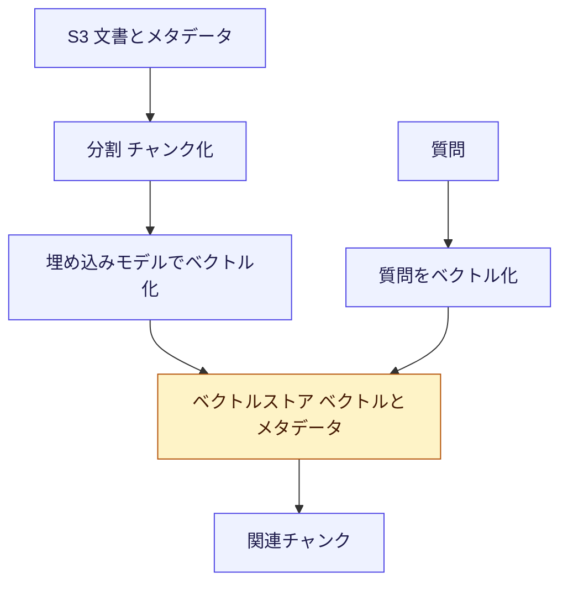

### ベクトルストアの選択肢

| 選択肢 | 特徴 | 向いている場面 |
|---|---|---|
| Bedrock Knowledge Bases(マネージド) | 取り込み、分割、埋め込み、検索を一括で提供 | 早く、運用負荷を抑えて RAG を作りたい |
| Amazon OpenSearch Service / Serverless | 高機能な検索とベクトル検索を両立。ハイブリッド検索、細かなチューニング | 大規模、高度な検索要件、既存の検索基盤がある |
| Amazon Aurora PostgreSQL + pgvector | リレーショナルデータとベクトルを同じ DB で扱える | 既存の SQL 資産と結合したい、中規模 |
| Amazon RDS for PostgreSQL + pgvector | 同上。Aurora ほど拡張性は求めない場合 | 小から中規模 |
| Amazon DynamoDB(ベクトルインデックス) | テーブルにベクトルインデックスを定義し、`SearchVectors` API で近似最近傍検索を直接実行。埋め込みは生成しないため Bedrock などで作成する | 既存の DynamoDB テーブルのデータにそのまま意味検索を足したい |
| Amazon DynamoDB との併用 | ベクトル検索は専用ストア、メタデータや原文は DynamoDB | 高度な検索機能は専用ストアに任せ、低遅延のキー参照でメタデータを管理したい |
| Amazon S3 Vectors | S3 上にベクトルを保存。コスト重視 | 大量のベクトルを低コストで保持したい |

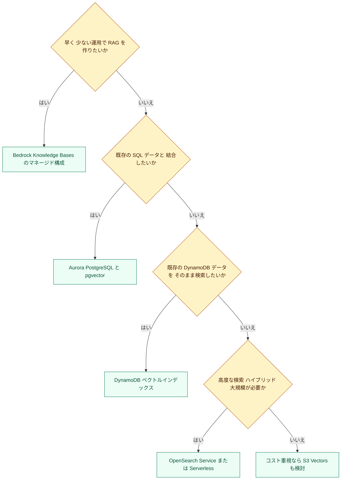

> 出典: Bedrock Knowledge Bases 前提条件(対応ベクトルストア) https://docs.aws.amazon.com/bedrock/latest/userguide/knowledge-base-prereq.html
> 出典: Amazon S3 Vectors https://docs.aws.amazon.com/AmazonS3/latest/userguide/s3-vectors.html
> 出典: Using vector indexes in DynamoDB https://docs.aws.amazon.com/amazondynamodb/latest/developerguide/VectorSearch.html

### Skill 1.4.1 FM 拡張のための高度なベクトル DB アーキテクチャ

**何をするか**: キーワード検索を超えた、意味にもとづく検索を提供する基盤を設計する。

| 構成例 | ポイント |
|---|---|
| Bedrock Knowledge Bases | 階層チャンク(親と子)など、文書構造に応じた整理ができる |
| OpenSearch Service と Neural プラグイン | OpenSearch から Bedrock の埋め込みモデルを呼び出し、取り込み時や検索時に自動でベクトル化。トピック別のセグメント化にも向く |
| RDS または Aurora と S3 | 文書原本は S3、ベクトルとメタデータは DB という分担 |
| DynamoDB のベクトルインデックス | 項目に埋め込みを保存し、`SearchVectors` で DynamoDB 上を直接検索 |
| DynamoDB と ベクトル DB | 埋め込みは専用ストア、メタデータや原文管理は DynamoDB |

**ベストプラクティス**

- **埋め込みモデルの次元数と、インデックスの次元数を一致**させる(不一致だと登録や検索に失敗する)
- 埋め込みモデルを**後から変えると、全データの再埋め込みが必要**になるため、最初に十分検討する
- 原文を S3 に置き、ベクトルストアには**出典へのポインタ(S3 URI など)**を持たせる

> 出典: OpenSearch Service ベクトル検索 https://docs.aws.amazon.com/opensearch-service/latest/developerguide/vector-search.html
> 出典: Aurora と pgvector https://docs.aws.amazon.com/AmazonRDS/latest/AuroraUserGuide/AuroraPostgreSQL.VectorDB.html

### Skill 1.4.2 メタデータ設計

**何をするか**: 文書に付ける属性情報(メタデータ)を設計し、検索の精度と文脈の正しさを高める。

| メタデータの種類 | 例 | 活用方法 |
|---|---|---|
| 時間 | 作成日、更新日、有効期限 | 「最新の規程だけ」に絞る |
| 著者、所有者 | 部署名、作成者 | 信頼できる出典に限定する |
| 分類 | ドメイン、文書種別、機密区分 | 「人事規程だけ検索」と絞る |
| アクセス権限 | 閲覧可能なグループ | ユーザーごとに検索結果を制限する |

**Bedrock Knowledge Bases での実装ポイント**

- S3 の文書に対応する **メタデータファイル**(文書名に `.metadata.json` を付けた JSON)を並べて置くと、取り込み時に属性として登録される
- 検索時に**メタデータフィルター**を指定すると、条件に合う文書だけが対象になる
- S3 のオブジェクトタグやユーザー定義メタデータは、**そのままでは Knowledge Bases のフィルター属性にならない**。属性として使うには、`.metadata.json` ファイルに書くか、取り込み処理で文書のメタデータにコピーする

**ベストプラクティス**

- 検索に使う属性は、**取り込み前に設計**する(後から付け直すと再取り込みが必要)
- 権限属性を持たせ、**検索時に取得段階で絞り込む**(FM に「見せないで」と頼むのではなく、そもそも取得しない)。ただしメタデータフィルターは「検索条件」であってエンドユーザーの認可ではない。ユーザー単位の制御は、①ACL 対応データソースで**認証済み ID から導いた `userContext`** を Retrieve に渡す、または ②**認証済み ID からサーバー側で生成したメタデータフィルター**を使う。**クライアントが送ってきた権限フィルターをそのまま使ってはならない**
- Lake Formation は、対応するデータソースで **Knowledge Base のサービスロール**が読めるデータを制御するもので、検索を呼び出したユーザーごとの取得範囲を制御するものではない
- 属性の値は**表記を統一**する(例: 「人事部」と「HR」を混ぜない)

> 出典: Bedrock Knowledge Bases メタデータ https://docs.aws.amazon.com/bedrock/latest/userguide/kb-test-config.html
> 出典: Bedrock Knowledge Bases データソース設定 https://docs.aws.amazon.com/bedrock/latest/userguide/kb-data-source-connectors.html

### Skill 1.4.3 大規模でも高速な検索のためのアーキテクチャ

**何をするか**: データ量やリクエスト数が増えても、検索の速度と精度を保つ。

| 手法 | 内容 |
|---|---|
| シャーディング戦略(OpenSearch) | インデックスを複数のシャードに分け、並列に検索。シャード数とサイズのバランスが重要 |
| マルチインデックス | ドメインごと(例: 法務、製品、人事)にインデックスを分け、検索対象を絞る |
| 階層インデックス | 文書レベルで絞ってから、チャンクレベルで検索する二段構え |
| 近似最近傍探索(ANN) | HNSW などのアルゴリズムで、厳密さを少し譲って大幅に高速化 |

**ベストプラクティス**

- 1 つのシャードを**大きくしすぎない、小さくしすぎない**(OpenSearch のガイドでは、検索用途で数十 GiB 程度が目安)
- 用途が異なるデータを 1 つのインデックスに**混ぜない**(専門ドメインは分ける)
- **検索の再現率と速度のトレードオフ**を、評価データで測って調整する
- 負荷に応じて OpenSearch Serverless の自動スケールを活用する

> 出典: OpenSearch シャード数の見積もり https://docs.aws.amazon.com/opensearch-service/latest/developerguide/bp-sharding.html
> 出典: OpenSearch Serverless ベクトル検索コレクション https://docs.aws.amazon.com/opensearch-service/latest/developerguide/serverless-vector-search.html

### Skill 1.4.4 既存リソースとの統合コンポーネント

**何をするか**: 社内の文書管理システム、ナレッジベース、Wiki などを、GenAI アプリのデータとして接続する。

| 接続先 | 方法 |
|---|---|
| S3 | ナレッジベースのデータソースとして直接指定 |
| Confluence、SharePoint、Salesforce | **Amazon Bedrock のマネージド型ナレッジベース**(ベクトルストア型)のデータソースコネクタを利用 |
| Web サイト | **Amazon Bedrock のマネージド型ナレッジベース**の Web Crawler コネクタを利用 |
| 独自システム | カスタムデータソース、または Lambda での取り込み処理 |

**ベストプラクティス**

- 既存のアクセス権限を**メタデータとして引き継ぎ**、権限のない人に結果が出ないようにする
  - ただし **Salesforce データソースはドキュメント単位の ACL を保持しない**。ナレッジベースに問い合わせできる認証済みユーザーは、クロール済みの全コンテンツを参照できる。アクセス制御はアプリ側(メタデータフィルタ等)で別途強制するか、制限付きコンテンツを取り込み対象から除外する
- 接続の認証情報は **Secrets Manager** で管理する
- 取り込み対象の範囲(フォルダ、更新範囲)を限定し、不要データによる**ノイズとコスト増**を避ける

> 出典: Bedrock Knowledge Bases データソース https://docs.aws.amazon.com/bedrock/latest/userguide/data-source-connectors.html

### Skill 1.4.5 ベクトルストアの鮮度を保つデータ保守

**何をするか**: 元データの更新に合わせて、ベクトルストアを常に最新で正確に保つ。

```mermaid
flowchart LR
    U["元データの更新 S3 変更や外部システム更新"] --> T["変更の検知 S3 イベント EventBridge"]
    T --> L["Lambda が同期を開始"]
    L --> J["取り込みジョブ 差分のみ処理"]
    J --> V["ベクトルストアを更新"]
    V --> C["完了確認と メトリクス記録"]
    C -->|"失敗時"| A["アラームで通知し再実行"]
    classDef box fill:#eef2ff,stroke:#4f46e5,color:#1e1b4b
    classDef hub fill:#fef3c7,stroke:#b45309,color:#451a03
    classDef done fill:#ecfdf5,stroke:#047857,color:#064e3b
    class U,T,L,J,A box
    class V hub
    class C done
```

| 更新方式 | 内容 | 向いている場面 |
|---|---|---|
| 差分(増分)更新 | 変更分だけを再処理(ナレッジベースの同期は、変更のあった文書のみ処理する) | 通常の運用 |
| リアルタイム変更検知 | S3 イベントや変更通知を契機に、即座に同期 | 鮮度が重要な業務 |
| スケジュール更新 | EventBridge のスケジュールで定期的に同期 | 日次や週次で十分な場合 |
| 直接取り込み API | ナレッジベースへ文書を API で直接登録、削除 | 独自システムからの即時反映 |
| 全件再構築 | 埋め込みモデルやチャンク設定を変えたときに実施 | 設計変更時のみ |

**ベストプラクティス**

- **削除や有効期限切れ**も反映する(古い規程が検索に残る事故を防ぐ)
- 更新の成否を**メトリクスとアラーム**で監視する
- 同期と本番検索が干渉しないよう、**同期の時間帯や頻度**を調整する
- 更新日時のメタデータを使い、**古い情報を検索時に除外**できるようにする

> 出典: ナレッジベースのデータソース同期 https://docs.aws.amazon.com/bedrock/latest/userguide/kb-data-source-sync-ingest.html
> 出典: Amazon EventBridge Scheduler https://docs.aws.amazon.com/scheduler/latest/UserGuide/what-is-scheduler.html

### Task 1.4 の試験ポイント

| よく出る場面 | 選ぶ答えの方向 |
|---|---|
| 運用負荷を最小にして RAG を構築したい | Bedrock Knowledge Bases のマネージド構成 |
| 既存の PostgreSQL データと結合して検索したい | Aurora と pgvector |
| 大規模で高度な検索(ハイブリッド、チューニング)が必要 | OpenSearch Service |
| 文書の更新を自動で検索に反映したい | S3 イベントと Lambda で取り込みジョブを起動、または定期同期 |
| 部署別、機密区分別に結果を絞りたい | メタデータとフィルター |

---

## 7. Task 1.5 FM 拡張のための検索メカニズム

**Task の目的**: RAG の「検索」部分の精度を上げる。分割、埋め込み、検索方式、再ランク、クエリ改善、FM との接続の 6 要素を押さえます。

### 高精度 RAG パイプライン

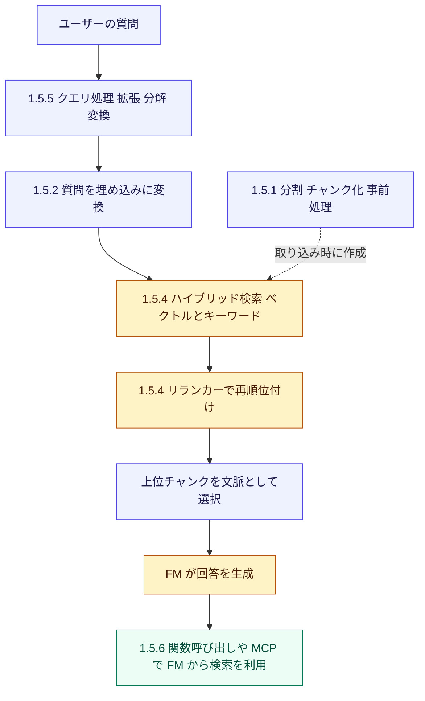

### Skill 1.5.1 文書の分割(チャンキング)

**何をするか**: 長い文書を、検索しやすく FM に渡しやすい大きさに切り分ける。

**なぜ重要か**: チャンクが**大きすぎる**と無関係な内容が混ざって検索精度が下がり、**小さすぎる**と文脈が欠けて意味が通らなくなります。

| 方式 | 内容 | 向いている場面 | 注意点 |
|---|---|---|---|
| 固定サイズ | 指定したトークン数で機械的に分割。前後を重ねる(オーバーラップ)設定も可 | 構造が単純で均質な文書 | 文の途中で切れることがある |
| デフォルト | 約 300 トークンずつに分割 | まず試す標準設定 | 文書構造は考慮しない |
| 階層(Hierarchical) | 親チャンクと子チャンクの 2 階層。子で検索し、必要に応じて親を渡す | 章立てのある長い文書、規程、マニュアル | S3 のベクトルバケットをストアにする場合は非推奨 |
| セマンティック | 意味のまとまりで分割。内部で FM を使う | 話題が連続的に変わる文書 | FM の利用分の追加コストがかかる |
| チャンクなし | 文書をそのまま 1 つとして扱う | 事前に分割済みの短い文書 | ページ番号の引用などが使えなくなる |
| カスタム(Lambda) | 独自ロジックで分割 | 業務固有の構造(条文、表、FAQ) | 実装と保守の負担 |

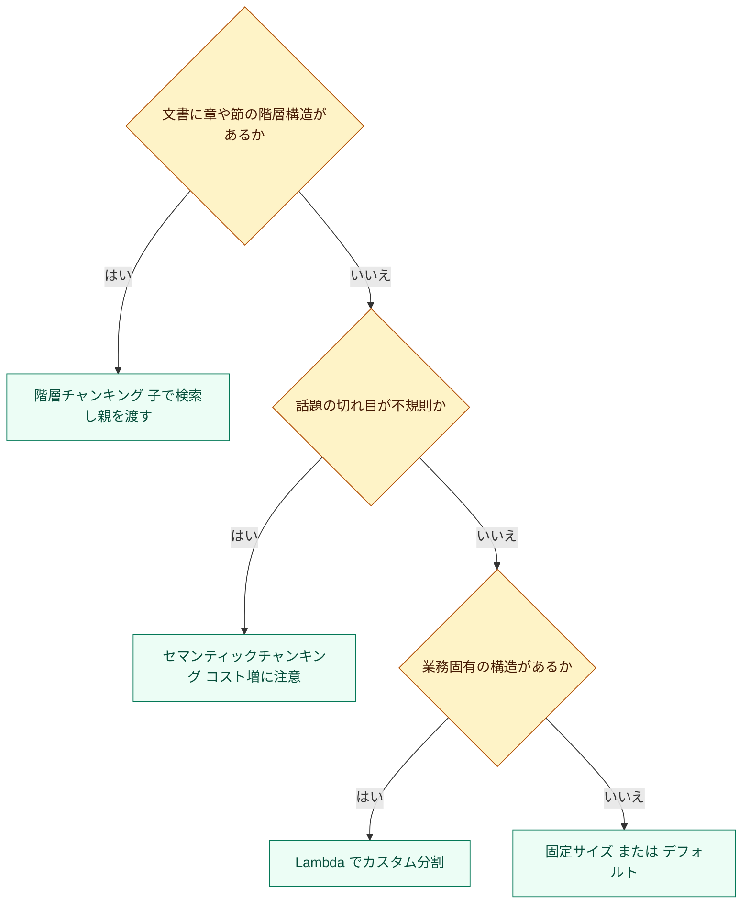

**ベストプラクティス**

- 分割後は**検索結果を実際に確認**する(文脈が欠けていないか)
- オーバーラップは**文脈の途切れ**を補うために使う(多すぎるとコストと重複が増える)
- 複雑な表や図を含む文書は、**FM を使ったパース(解析)**を先に行い、そのうえで階層チャンキングを組み合わせると精度が上がりやすい
- チャンク設定を変えたら、**必ず再取り込みと再評価**を行う

> 出典: Bedrock Knowledge Bases チャンキング https://docs.aws.amazon.com/bedrock/latest/userguide/kb-chunking.html
> 出典: 検索精度の改善(AWS re:Post ナレッジセンター) https://repost.aws/knowledge-center/bedrock-knowledge-bases-accurate-results-filters

### Skill 1.5.2 埋め込みモデルの選択と構成

**何をするか**: 検索の質とコストを左右する埋め込みモデルを、次元数とドメイン適合性で選ぶ。

| 選定の観点 | 内容 |
|---|---|
| 次元数 | 次元数が大きいほど表現力が高いが、保存容量と検索コストが増える。Titan Text Embeddings V2 は 256、512、1024 次元から選べる |
| 言語対応 | 日本語を含む多言語に対応しているか |
| 入力上限 | 1 回で埋め込める最大トークン数(チャンクサイズと整合させる) |
| モダリティ | テキストのみか、画像も扱うか(マルチモーダル埋め込み) |
| ドメイン適合 | 専門用語の多い領域で精度が出るか(実データで評価) |

**大量データのバッチ処理**: Lambda で文書をまとめて埋め込み生成する場合は、**並列度の制御**と**スロットリング対策のリトライ**を組み込みます。

**ベストプラクティス**

- 候補モデルを**自社データの評価セット**で比較する(一般ベンチマークだけで決めない)
- 取り込み時と検索時で、**必ず同じ埋め込みモデル**を使う
- 次元数は、精度と容量のバランスで決める(**小さい次元でも十分なことが多い**ため、評価で確認)
- モデル変更は全データの再埋め込みを伴うため、**変更計画を立てて**から実施する

> 出典: Bedrock 埋め込みモデル https://docs.aws.amazon.com/bedrock/latest/userguide/titan-embedding-models.html
> 出典: Bedrock Embeddings の考え方 https://docs.aws.amazon.com/bedrock/latest/userguide/embeddings.html

### Skill 1.5.3 ベクトル検索ソリューションの構成

**何をするか**: 実際にベクトル検索を動かす基盤を構成する。

| 基盤 | 構成のポイント |
|---|---|
| OpenSearch Service | k-NN インデックスを作成し、ベクトル用フィールドに次元数と距離の指標、ANN アルゴリズムを設定 |
| Aurora PostgreSQL と pgvector | pgvector 拡張を有効化し、ベクトル列と HNSW などのインデックスを作成 |
| Bedrock Knowledge Bases | ベクトルストアをマネージドで構成。分割、埋め込み、保存を任せられる |

**距離の指標(類似度の測り方)**

| 指標 | 意味 |
|---|---|
| コサイン類似度 | ベクトルの向きの近さ。テキスト検索で一般的 |
| ユークリッド距離 | ベクトル間の直線距離 |
| 内積 | 向きと大きさの両方を反映。正規化済みベクトルではコサインと同等の順位になる |

**ベストプラクティス**

- 埋め込みモデルが推奨する距離の指標に**合わせる**
- インデックスの作成パラメータ(HNSW の接続数など)は、**再現率、速度、メモリ**のトレードオフ。評価で決める
- 本番前に**負荷試験**で、検索遅延とスケール特性を確認する

> 出典: OpenSearch k-NN https://docs.aws.amazon.com/opensearch-service/latest/developerguide/knn.html
> 出典: Aurora PostgreSQL pgvector https://docs.aws.amazon.com/AmazonRDS/latest/AuroraUserGuide/AuroraPostgreSQL.VectorDB.html

### Skill 1.5.4 関連性を高める高度な検索アーキテクチャ

**何をするか**: ベクトル検索だけに頼らず、キーワード検索や再ランクを組み合わせて関連性を上げる。

| 手法 | 内容 | 強み |
|---|---|---|
| セマンティック検索 | 意味の近さで検索 | 言い換えや同義語に強い |
| キーワード検索 | 語句の一致で検索 | 型番、固有名詞、略語に強い |
| **ハイブリッド検索** | 両者を組み合わせる | 両方の弱点を補う |
| **リランカー** | 取得した候補を、質問との関連度で並べ直す専用モデル | 上位の精度を引き上げる |

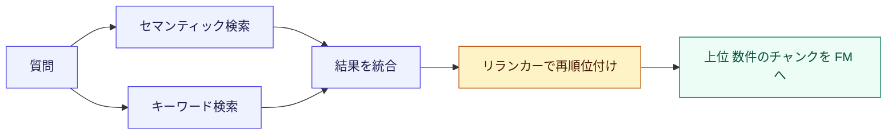

**Bedrock Knowledge Bases での使い方**

- 検索時の設定でハイブリッド検索を指定できる(対応するベクトルストアで利用可能)
- 検索設定に **リランキングモデル**を指定でき、既定のランカーの代わりに使える
- 取得する件数は、既定で最大 5 件。**取得件数を増やして**から、リランカーで絞る、という使い方が有効

**ベストプラクティス**

- 型番や略語が多いデータは、**ハイブリッド検索**を最初の選択肢にする
- 「広く取って(多めに取得)、リランカーで絞る」の二段構えが定石
- 再ランクは**遅延とコストが増える**ため、効果を評価して採用する

> 出典: ナレッジベースのクエリと取得 https://docs.aws.amazon.com/bedrock/latest/userguide/kb-test-retrieve.html
> 出典: Bedrock リランクモデル https://docs.aws.amazon.com/bedrock/latest/userguide/rerank.html
> 出典: ハイブリッド検索の発表(AWS Machine Learning Blog) https://aws.amazon.com/blogs/machine-learning/knowledge-bases-for-amazon-bedrock-now-supports-hybrid-search/

### Skill 1.5.5 クエリ処理の高度化

**何をするか**: ユーザーの質問そのものを改善して、検索で見つかりやすくする。

| 手法 | 内容 | 実装例 |
|---|---|---|
| クエリ拡張 | 同義語や関連語を補い、検索の取りこぼしを減らす | Bedrock の FM に拡張案を生成させる |
| クエリ分解 | 複合的な質問を、複数の単純な質問に分けて個別に検索 | Lambda で分解、またはナレッジベースのクエリ分解機能 |
| クエリ変換 | 口語を検索向けの表現に書き換える、会話の文脈を補う | Step Functions で変換と検索を順番に実行 |

**例**: 「A 製品と B 製品の保証期間の違いは?」を、「A 製品の保証期間」と「B 製品の保証期間」の 2 つに分解して検索し、結果を合わせて回答する。

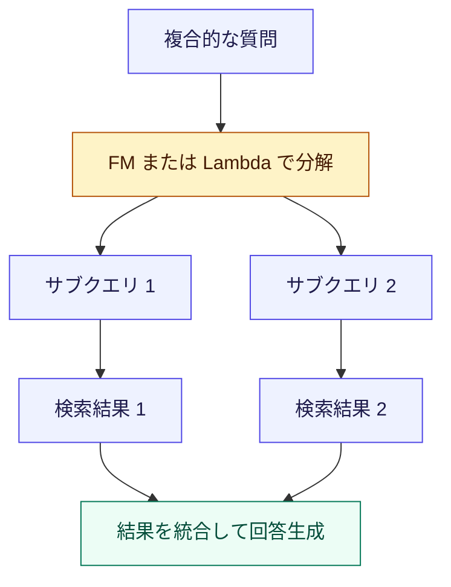

**ベストプラクティス**

- クエリ分解は**検索回数と遅延が増える**(複雑な質問にだけ適用する)
- 会話型では、**直前の文脈を補った質問**に書き換えてから検索する(「それは?」のような指示語対策)
- 変換前後のクエリを**ログに残し**、改善の材料にする。ただし PII やシークレットは**記録前に削除・マスク**し、必要最小限の内容だけを残す。ログには**アクセス権限と保持期間**を設定する

> 出典: ナレッジベースのクエリと応答生成の設定 https://docs.aws.amazon.com/bedrock/latest/userguide/kb-test-config.html

### Skill 1.5.6 FM と検索をつなぐ一貫したアクセス手段

**何をするか**: FM が必要なときに検索を呼べるよう、標準化されたインターフェースを用意する。

| 方式 | 内容 |
|---|---|
| 関数呼び出し(ツール利用) | 検索機能を「ツール」として FM に定義し、FM が必要と判断したときに呼ばせる |
| MCP(Model Context Protocol) | AI アプリと外部ツール、データをつなぐ標準プロトコル。MCP クライアントからベクトル検索を呼び出せる |
| 標準化した API パターン | 検索用の API を共通の仕様で提供し、複数のアプリから再利用 |

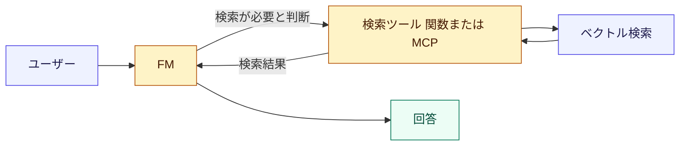

**ベストプラクティス**

- ツールの**名前、説明、引数の定義を明確**にする(FM はそれを読んで使うかを判断する)
- 検索ツールにも**アクセス制御**(誰のどのデータか)を必ず適用する
- 呼び出しの入出力を**ログに残して**、監査と改善に使う。PII やシークレットを含むペイロードは**最小化またはマスク**してから記録し、ログの**閲覧権限と保持期間**を制御する
- 検索ツールの返却量を**制限**して、トークンの浪費を防ぐ

> 出典: Bedrock ツール利用 https://docs.aws.amazon.com/bedrock/latest/userguide/tool-use.html
> 出典: Model Context Protocol 公式サイト https://modelcontextprotocol.io/
> 出典: AWS MCP サーバー(awslabs) https://github.com/awslabs/mcp

### Task 1.5 の試験ポイント

| よく出る場面 | 選ぶ答えの方向 |
|---|---|
| 章立てのある長い規程文書で、検索精度と文脈を両立したい | 階層チャンキング |
| 型番や略語の検索漏れが多い | ハイブリッド検索 |
| 取得結果の上位の精度をさらに上げたい | リランカー |
| 複数の論点を含む質問に答えたい | クエリ分解 |
| FM が自分で判断して検索を呼ぶようにしたい | 関数呼び出し、または MCP |
| 埋め込みの容量を節約したい | 次元数の小さい設定を評価して選ぶ |

---

## 8. Task 1.6 プロンプトエンジニアリングとガバナンス

**Task の目的**: プロンプトを「その場の文章」ではなく、**設計、管理、テストされる資産**として扱う。

### プロンプト管理のライフサイクル

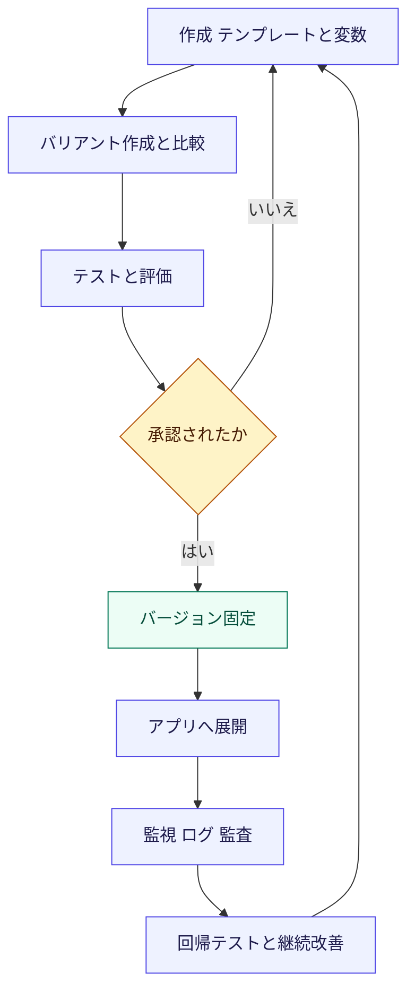

### Skill 1.6.1 モデルへの指示フレームワーク(振る舞いの制御)

**何をするか**: 役割、制約、出力形式を体系的に指示し、FM の振る舞いを制御する。

| 要素 | 内容 | 実現手段 |
|---|---|---|
| 役割定義(システムプロンプト) | 「あなたは社内規程の案内担当です」のような役割と守るべき制約 | Bedrock Prompt Management のテンプレート |
| 出力形式の指定 | JSON の項目、文字数、口調 | テンプレートの出力形式セクション |
| 責任ある AI のルール | 有害表現、機密情報、禁止トピックの制御 | **Bedrock Guardrails** |

**Guardrails の主な機能**

| 機能 | 内容 |
|---|---|
| コンテンツフィルター | 有害なコンテンツ(暴力、ヘイトなど)の入出力を検出、遮断 |
| 拒否トピック | 扱ってはいけない話題を定義 |
| ワードフィルター | 特定の語句を禁止 |
| 機密情報フィルター | PII の検出、マスキング、拒否 |
| コンテキスト的な根拠確認 | 回答が提供された情報に基づいているかを検査し、幻覚を抑える。対応言語は英語・フランス語・スペイン語のみで日本語は非対応のため、日本語の回答は別の評価手段(例: Bedrock の評価機能や LLM-as-a-judge)で確認する |
| ApplyGuardrail API | FM を呼ばずに、任意のテキストへ単独でガードレールを適用 |

**ベストプラクティス**

- 指示は**プロンプトとガードレールの二重**で守る(プロンプトだけでは破られる可能性がある)
- ガードレールは**入力と出力の両方**に適用する
- 禁止事項は「〜しないで」だけでなく、**代わりに何をするか**(例: 担当窓口を案内する)も書く

> 出典: Bedrock Guardrails https://docs.aws.amazon.com/bedrock/latest/userguide/guardrails.html
> 出典: Bedrock Prompt Management https://docs.aws.amazon.com/bedrock/latest/userguide/prompt-management.html

### Skill 1.6.2 文脈を保つ対話型システム

**何をするか**: 会話の履歴や意図を踏まえ、あいまいな質問には聞き返すなど、自然なやり取りを実現する。

| 課題 | 解決手段 |
|---|---|
| 会話履歴を保存したい | DynamoDB にセッション ID をキーとして履歴を保存 |
| ユーザーの意図を判別したい | Amazon Comprehend や FM による意図認識 |
| 情報が足りないときに聞き返したい | Step Functions で「不足項目の確認」ワークフローを構成 |
| 履歴が長すぎる | 古い履歴の要約、重要な情報だけを保持 |

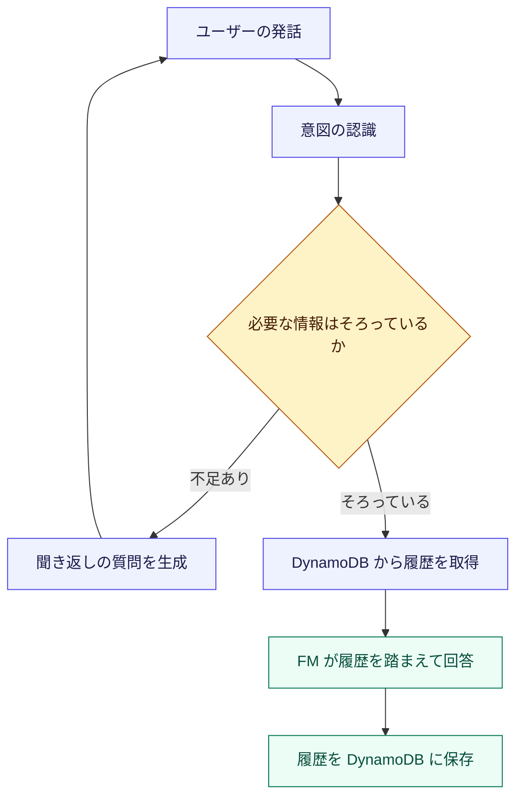

**ベストプラクティス**

- 履歴には **TTL(有効期限)** を設定して、不要なデータを残さない。ただし TTL による削除は**非同期**で、期限切れ後もしばらく項目が読み取り・クエリ・スキャン結果に含まれる場合がある
- 厳密な保持期限が必要な場合は、読み取り時に TTL 属性と現在時刻を比較して**期限切れ項目を除外**し、必要に応じて**明示的な削除処理**(DeleteItem 等)を行う
- 会話履歴にも**個人情報**が含まれるため、保存期間とアクセス権限を設計する
- 聞き返しは**必要最小限**にする(多すぎると使い勝手が落ちる)

> 出典: Amazon DynamoDB TTL https://docs.aws.amazon.com/amazondynamodb/latest/developerguide/TTL.html
> 出典: AWS Step Functions https://docs.aws.amazon.com/step-functions/latest/dg/welcome.html

### Skill 1.6.3 プロンプトの管理とガバナンス

**何をするか**: プロンプトを組織の資産として、一貫性と監督のもとで管理する。

| 統制の目的 | 手段 |
|---|---|
| 再利用と一貫性 | Prompt Management のパラメータ付きテンプレート(変数は二重の波括弧で記述) |
| 変更管理と承認 | バージョン管理と承認ワークフロー |
| リポジトリ | S3 にテンプレートを保管(バージョニング有効化) |
| 利用の追跡 | **CloudTrail** で API 操作を記録 |
| アクセスの記録 | **CloudWatch Logs** でアクセスやモデル呼び出しを記録（PII やシークレットを含むペイロードは最小化・マスクし、ログの閲覧権限と保持期間を設定する） |

**ベストプラクティス**

- 本番で使うのは**固定されたバージョン**のみとし、作業中の下書きとは分離する
- 誰が、いつ、どのプロンプトを変更したかを**追跡可能**にする
- 変更の**承認フロー**(レビュアーの承認後にバージョン発行)を設ける
- IAM で、プロンプトの**編集権限と利用権限を分離**する
- Generative AI Lens も、プロンプトテンプレートのバージョン管理と共有を推奨している

> 出典: GENOPS03-BP01 プロンプトテンプレート管理 https://docs.aws.amazon.com/wellarchitected/latest/generative-ai-lens/genops03-bp01.html
> 出典: Bedrock モデル呼び出しのログ記録 https://docs.aws.amazon.com/bedrock/latest/userguide/model-invocation-logging.html
> 出典: AWS CloudTrail https://docs.aws.amazon.com/awscloudtrail/latest/userguide/cloudtrail-user-guide.html

### Skill 1.6.4 プロンプトの品質保証

**何をするか**: プロンプトを変更しても、品質が落ちない(回帰しない)ことを自動で確認する。

| 確認の種類 | 内容 | 手段 |
|---|---|---|
| 出力の検証 | 期待する形式(JSON の構造、必須項目、文字数)を満たすか | Lambda の検証関数 |
| エッジケースのテスト | 空入力、極端に長い入力、想定外の言語、攻撃的な入力 | Step Functions で多数のケースを一括実行 |
| 回帰テスト | 変更前後で、同じテストセットの品質が維持されているか | CloudWatch のメトリクスと比較 |

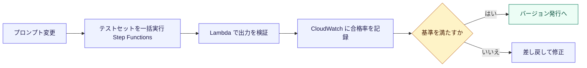

**ベストプラクティス**

- テストセットは**実際の失敗事例を追加し続けて**育てる
- FM の出力は毎回変わり得るため、**完全一致ではなく条件(形式、必須要素)で**判定する
- **温度を低めに固定**したテストを併用し、再現性を確保する

> 出典: Amazon CloudWatch https://docs.aws.amazon.com/AmazonCloudWatch/latest/monitoring/WhatIsCloudWatch.html
> 出典: Bedrock 評価 https://docs.aws.amazon.com/bedrock/latest/userguide/evaluation.html

### Skill 1.6.5 基本を超えたプロンプトの反復改善

**何をするか**: 基本的な指示から一歩進め、構造化、出力形式の指定、思考の誘導、フィードバックで品質を高める。

| 技法 | 内容 | 例 |
|---|---|---|
| 構造化された入力 | 指示、文脈、質問、制約をタグなどで区切る | 「文脈」と「質問」を明確に分ける |
| 出力形式の指定 | JSON スキーマ、箇条書き、文字数を明示 | 「次の JSON 形式のみで出力」 |
| 例示(Few-shot) | 入力と望ましい出力の例を数件示す | 良い回答例を 2 から 3 件添える |
| Chain-of-Thought | 段階的に考えるよう促し、複雑な推論の精度を上げる | 「手順を踏んで考えてから答える」 |
| フィードバックループ | 利用者の評価や失敗事例を取り込み、プロンプトを継続的に改善 | 低評価の回答を分析して指示を修正 |

**ベストプラクティス**

- **一度に 1 つだけ変更**して効果を測る(複数同時に変えると原因が分からない)
- 指示は**具体的に**(あいまいな表現を避け、数値や形式を明記)
- RAG では「**提供した文脈だけを根拠に回答し、なければ分からないと答える**」と明記して幻覚を抑える
- 出力を機械処理する場合は、**形式違反時の再試行**を実装する

> 出典: Bedrock プロンプトエンジニアリングのガイドライン https://docs.aws.amazon.com/bedrock/latest/userguide/prompt-engineering-guidelines.html
> 出典: AWS プロンプトエンジニアリング規範ガイダンス https://docs.aws.amazon.com/prescriptive-guidance/latest/llm-prompt-engineering-best-practices/introduction.html

### Skill 1.6.6 複雑なタスクのためのプロンプトシステム

**何をするか**: 1 つのプロンプトでは難しいタスクを、複数のプロンプトと処理の連鎖(ワークフロー)に分けて実現する。

**Amazon Bedrock Flows(旧称: Prompt Flows)** は、コードをほとんど書かずに、プロンプト、条件分岐、ナレッジベース、Lambda などを線でつないでワークフローを作る機能です。

| 主なノード | 役割 |
|---|---|
| Input / Output | フローの入口と出口 |
| Prompt | プロンプトを実行(Prompt Management のものを再利用可能) |
| Condition | 条件に応じて処理を分岐(複数条件が真なら先に定義した条件が優先され、既定の分岐も定義できる) |
| Knowledge Base | ナレッジベースを検索 |
| Lambda | 前処理や後処理などの独自ロジック |
| Agent | Bedrock エージェントを呼び出し |

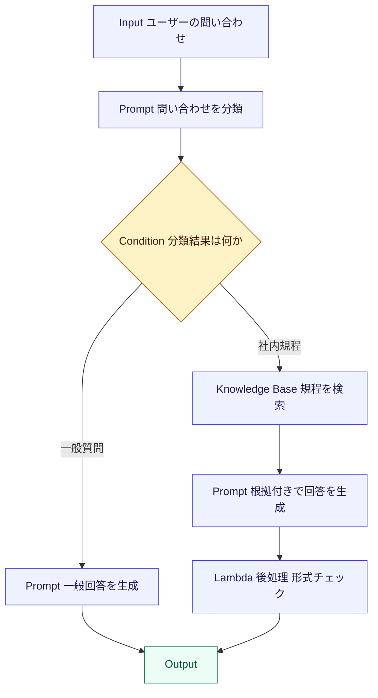

**ベストプラクティス**

- **小さなプロンプトに分割**する(1 つに詰め込むより、各ステップを単純にした方が安定する)
- 共通処理(分類、要約、整形)は**再利用可能な部品**として Prompt Management に保存
- **前処理(入力の検証、正規化)と後処理(形式検査、ガードレール)**をフローに組み込む
- フロー自体も**バージョン管理**し、エイリアスで本番を切り替える
- 条件分岐に使う分類は、**出力形式を厳密に指定**して、分岐判定を安定させる

> 出典: Bedrock Flows のノード https://docs.aws.amazon.com/bedrock/latest/userguide/flows-nodes.html
> 出典: Bedrock Flows の概要 https://docs.aws.amazon.com/bedrock/latest/userguide/flows.html

### Task 1.6 の試験ポイント

| よく出る場面 | 選ぶ答えの方向 |
|---|---|
| プロンプトを組織で共有、バージョン管理したい | Bedrock Prompt Management |
| 有害表現や PII を入出力で制御したい | Bedrock Guardrails |
| プロンプトの変更履歴や利用状況を監査したい | CloudTrail と CloudWatch Logs |
| 条件分岐を含む複数ステップの処理を、コードなしで作りたい | Bedrock Flows |
| 会話履歴を保存したい | DynamoDB |
| 情報不足のとき聞き返したい | Step Functions の確認ワークフロー |
| プロンプト変更の影響を自動確認したい | Lambda での出力検証と Step Functions でのテスト実行 |

---

## 9. 試験で問われる判断軸まとめ

### 9.1 サービス選択の早見表

| やりたいこと | 第一候補 | 該当 Skill |
|---|---|---|
| モデルを設定だけで切り替える | AppConfig と Converse API | 1.2.2 |
| スロットリングやリージョン偏りを避ける | クロスリージョン推論プロファイル | 1.2.3 |
| 依存先の連続失敗から守る | Step Functions とサーキットブレーカー | 1.2.3 |
| カスタムモデルの版管理 | SageMaker Model Registry | 1.2.4 |
| データ品質を自動検査 | AWS Glue Data Quality | 1.3.1 |
| 音声をテキスト化 | Amazon Transcribe | 1.3.2 |
| 文書から固有表現を抽出 | Amazon Comprehend | 1.3.4 |
| マネージドで RAG を作る | Bedrock Knowledge Bases | 1.4.1, 1.5.3 |
| SQL と結合してベクトル検索 | Aurora と pgvector | 1.4.1, 1.5.3 |
| 高度で大規模な検索 | OpenSearch Service | 1.4.3, 1.5.4 |
| 検索結果を属性で絞る | メタデータフィルター | 1.4.2 |
| 古い情報を残さない | 増分同期と削除反映 | 1.4.5 |
| 構造のある文書の分割 | 階層チャンキング | 1.5.1 |
| 検索の取りこぼしを減らす | ハイブリッド検索 | 1.5.4 |
| 上位結果の精度向上 | リランカー | 1.5.4 |
| 複合質問への対応 | クエリ分解 | 1.5.5 |
| FM から検索を使わせる | 関数呼び出し、MCP | 1.5.6 |
| プロンプトの統制 | Prompt Management と Guardrails | 1.6.1, 1.6.3 |
| 多段階の処理 | Bedrock Flows | 1.6.6 |

### 9.2 設問を解くときの思考手順

```mermaid
flowchart TD
    A["設問を読む"] --> B["制約語を拾う 最小の運用負荷 低コスト 低遅延 コード変更なし 監査"]
    B --> C["どの Task の Skill かを特定する"]
    C --> D["マネージド機能で解決できるかを確認する"]
    D --> E{"マネージドで要件を満たすか"}
    E -->|"はい"| F["マネージド機能を選ぶ"]
    E -->|"いいえ"| G["要件を満たす最小限のカスタム実装を選ぶ"]
    F --> H["選択肢の矛盾 過剰設計を消去して確定"]
    G --> H
    classDef box fill:#eef2ff,stroke:#4f46e5,color:#1e1b4b
    classDef hub fill:#fef3c7,stroke:#b45309,color:#451a03
    classDef done fill:#ecfdf5,stroke:#047857,color:#064e3b
    class A,B,C,D,F,G box
    class E hub
    class H done
```

**よくあるひっかけ**

| ひっかけ | 正しい考え方 |
|---|---|
| すぐにファインチューニングを選ぶ | まずプロンプトと RAG。最新情報への対応は RAG が適する |
| 一番高性能なモデルを選ぶ | 要件を満たす最小コストのモデル |
| コードにモデル ID を直書き | 設定の外出し(AppConfig)で切り替え可能にする |
| 「FM に見せない」とプロンプトで頼む | 検索段階のフィルターで、そもそも取得しない |
| 一度作った埋め込みを使い続ける | モデルを変えるなら全件の再埋め込みが必要 |
| 単純な機能のために独自実装 | 運用負荷を下げるなら、マネージド機能を優先 |

---

## 10. 学習チェックリスト

- [ ] Domain 1 の 6 つの Task と、それぞれの目的を説明できる
- [ ] RAG の流れ(分割、埋め込み、検索、再ランク、生成)を図で描ける
- [ ] Converse API と InvokeModel の違いを説明できる
- [ ] AppConfig を使ったモデル切り替えの仕組みを説明できる
- [ ] 地域プロファイルとグローバルプロファイルの違いを説明できる
- [ ] サーキットブレーカーとフォールバックの役割を説明できる
- [ ] LoRA の利点と、Model Registry を使った版管理の流れを説明できる
- [ ] Glue Data Quality、Transcribe、Textract、Comprehend の使い分けができる
- [ ] ベクトルストアの選択肢(Knowledge Bases、OpenSearch、Aurora pgvector、S3 Vectors、DynamoDB のベクトルインデックスと `SearchVectors`、専用ストアと DynamoDB の併用)を比較できる
- [ ] メタデータの設計と、フィルターによるアクセス制御を説明できる
- [ ] 取り込み後のデータを最新に保つ方法を 3 つ挙げられる
- [ ] 固定サイズ、階層、セマンティックの各チャンキングの使い分けができる
- [ ] ハイブリッド検索とリランカーの効果を説明できる
- [ ] クエリ拡張、分解、変換の違いを説明できる
- [ ] Prompt Management、Guardrails、Flows の役割を区別できる
- [ ] プロンプトの回帰テストの仕組みを説明できる

---

## 11. 参考ソース一覧

> 本ガイドの解説は、下記の AWS 公式ドキュメントを根拠としています。AWS のサービスは更新が頻繁なため、試験直前には最新の公式ドキュメントと試験ガイドを必ず確認してください。

### 11.1 試験ガイド

| 内容 | URL |
|---|---|
| AIP-C01 試験ガイド(トップ) | https://docs.aws.amazon.com/aws-certification/latest/ai-professional-01/ai-professional-01.html |
| Domain 1 の Task と Skill | https://docs.aws.amazon.com/aws-certification/latest/ai-professional-01/ai-professional-01-domain1.html |
| 試験に出る技術と概念 | https://docs.aws.amazon.com/aws-certification/latest/ai-professional-01/ai-professional-01-technologies-concepts.html |
| 対象範囲内の AWS サービス | https://docs.aws.amazon.com/aws-certification/latest/ai-professional-01/aip-01-in-scope-services.html |
| 対象範囲外の AWS サービス | https://docs.aws.amazon.com/aws-certification/latest/ai-professional-01/aip-01-out-of-scope-services.html |

### 11.2 設計とベストプラクティス

| 内容 | URL |
|---|---|
| Well-Architected Generative AI Lens | https://docs.aws.amazon.com/wellarchitected/latest/generative-ai-lens/generative-ai-lens.html |
| GENOPS03-BP01 プロンプトテンプレート管理 | https://docs.aws.amazon.com/wellarchitected/latest/generative-ai-lens/genops03-bp01.html |
| AWS Well-Architected Tool | https://docs.aws.amazon.com/wellarchitected/latest/userguide/intro.html |

### 11.3 Task 1.2 FM の選定と構成

| 内容 | URL |
|---|---|
| Amazon Bedrock とは | https://docs.aws.amazon.com/bedrock/latest/userguide/what-is-bedrock.html |
| 対応モデル一覧 | https://docs.aws.amazon.com/bedrock/latest/userguide/models-supported.html |
| モデル評価 | https://docs.aws.amazon.com/bedrock/latest/userguide/evaluation.html |
| Converse API | https://docs.aws.amazon.com/bedrock/latest/userguide/conversation-inference.html |
| クロスリージョン推論 | https://docs.aws.amazon.com/bedrock/latest/userguide/cross-region-inference.html |
| グローバルクロスリージョン推論 | https://docs.aws.amazon.com/bedrock/latest/userguide/global-cross-region-inference.html |
| AWS AppConfig | https://docs.aws.amazon.com/appconfig/latest/userguide/what-is-appconfig.html |
| Step Functions エラー処理 | https://docs.aws.amazon.com/step-functions/latest/dg/concepts-error-handling.html |
| SageMaker Model Registry | https://docs.aws.amazon.com/sagemaker/latest/dg/model-registry.html |
| SageMaker デプロイガードレール | https://docs.aws.amazon.com/sagemaker/latest/dg/deployment-guardrails.html |
| Bedrock カスタムモデル | https://docs.aws.amazon.com/bedrock/latest/userguide/custom-models.html |

### 11.4 Task 1.3 データ検証と処理

| 内容 | URL |
|---|---|
| AWS Glue Data Quality | https://docs.aws.amazon.com/glue/latest/dg/glue-data-quality.html |
| SageMaker Data Wrangler | https://docs.aws.amazon.com/sagemaker/latest/dg/data-wrangler.html |
| SageMaker Processing | https://docs.aws.amazon.com/sagemaker/latest/dg/processing-job.html |
| Amazon Transcribe | https://docs.aws.amazon.com/transcribe/latest/dg/what-is.html |
| Amazon Textract | https://docs.aws.amazon.com/textract/latest/dg/what-is.html |
| Amazon Comprehend | https://docs.aws.amazon.com/comprehend/latest/dg/what-is.html |
| Bedrock Data Automation | https://docs.aws.amazon.com/bedrock/latest/userguide/bda.html |
| Bedrock InvokeModel | https://docs.aws.amazon.com/bedrock/latest/userguide/inference-invoke.html |
| Amazon CloudWatch | https://docs.aws.amazon.com/AmazonCloudWatch/latest/monitoring/WhatIsCloudWatch.html |

### 11.5 Task 1.4 と 1.5 ベクトルストアと検索

| 内容 | URL |
|---|---|
| Bedrock Knowledge Bases | https://docs.aws.amazon.com/bedrock/latest/userguide/knowledge-base.html |
| ナレッジベースの前提条件(ベクトルストア) | https://docs.aws.amazon.com/bedrock/latest/userguide/knowledge-base-prereq.html |
| データソースのコネクタ | https://docs.aws.amazon.com/bedrock/latest/userguide/data-source-connectors.html |
| データソースの同期 | https://docs.aws.amazon.com/bedrock/latest/userguide/kb-data-source-sync-ingest.html |
| チャンキング | https://docs.aws.amazon.com/bedrock/latest/userguide/kb-chunking.html |
| クエリと取得 | https://docs.aws.amazon.com/bedrock/latest/userguide/kb-test-retrieve.html |
| クエリと応答生成の設定 | https://docs.aws.amazon.com/bedrock/latest/userguide/kb-test-config.html |
| リランクモデル | https://docs.aws.amazon.com/bedrock/latest/userguide/rerank.html |
| 埋め込みモデル | https://docs.aws.amazon.com/bedrock/latest/userguide/titan-embedding-models.html |
| 検索精度の改善(AWS re:Post) | https://repost.aws/knowledge-center/bedrock-knowledge-bases-accurate-results-filters |
| ハイブリッド検索(AWS Blog) | https://aws.amazon.com/blogs/machine-learning/knowledge-bases-for-amazon-bedrock-now-supports-hybrid-search/ |
| OpenSearch ベクトル検索 | https://docs.aws.amazon.com/opensearch-service/latest/developerguide/vector-search.html |
| OpenSearch k-NN | https://docs.aws.amazon.com/opensearch-service/latest/developerguide/knn.html |
| OpenSearch シャード数の見積もり | https://docs.aws.amazon.com/opensearch-service/latest/developerguide/bp-sharding.html |
| OpenSearch Serverless ベクトル検索 | https://docs.aws.amazon.com/opensearch-service/latest/developerguide/serverless-vector-search.html |
| Aurora PostgreSQL と pgvector | https://docs.aws.amazon.com/AmazonRDS/latest/AuroraUserGuide/AuroraPostgreSQL.VectorDB.html |
| Amazon S3 Vectors | https://docs.aws.amazon.com/AmazonS3/latest/userguide/s3-vectors.html |
| EventBridge Scheduler | https://docs.aws.amazon.com/scheduler/latest/UserGuide/what-is-scheduler.html |
| Bedrock ツール利用 | https://docs.aws.amazon.com/bedrock/latest/userguide/tool-use.html |
| Model Context Protocol | https://modelcontextprotocol.io/ |
| AWS MCP サーバー | https://github.com/awslabs/mcp |

### 11.6 Task 1.6 プロンプトとガバナンス

| 内容 | URL |
|---|---|
| Bedrock Prompt Management | https://docs.aws.amazon.com/bedrock/latest/userguide/prompt-management.html |
| Bedrock Flows | https://docs.aws.amazon.com/bedrock/latest/userguide/flows.html |
| Bedrock Flows のノード | https://docs.aws.amazon.com/bedrock/latest/userguide/flows-nodes.html |
| Bedrock Guardrails | https://docs.aws.amazon.com/bedrock/latest/userguide/guardrails.html |
| モデル呼び出しのログ記録 | https://docs.aws.amazon.com/bedrock/latest/userguide/model-invocation-logging.html |
| プロンプトエンジニアリングのガイドライン | https://docs.aws.amazon.com/bedrock/latest/userguide/prompt-engineering-guidelines.html |
| AWS 規範ガイダンス プロンプトエンジニアリング | https://docs.aws.amazon.com/prescriptive-guidance/latest/llm-prompt-engineering-best-practices/introduction.html |
| AWS CloudTrail | https://docs.aws.amazon.com/awscloudtrail/latest/userguide/cloudtrail-user-guide.html |
| Amazon DynamoDB TTL | https://docs.aws.amazon.com/amazondynamodb/latest/developerguide/TTL.html |
| AWS Step Functions | https://docs.aws.amazon.com/step-functions/latest/dg/welcome.html |

---

*本ガイドは AIP-C01 試験ガイドの Domain 1 を基に作成しています。試験内容や AWS サービスの仕様は更新されるため、受験前に最新の公式情報を確認してください。*
