# AWS Certified Generative AI Developer - Professional (AIP-C01)
## Content Domain 2: Implementation and Integration 完全ガイド（初学者向け・ステップバイステップ）

> **このガイドの目的**
> AIP-C01 の Content Domain 2（配点 26%）に含まれる **5つのタスク・25個のスキル** を、初学者でも順番に読めば理解できるように解説します。各スキルごとに「何をするものか」「仕組み」「ベストプラクティスとその理由」「試験での狙われ方」「根拠URL」をそろえています。
>
> **表記ルール**
> - 図解は Mermaid（フローチャート・シーケンス図）と Markdown 表のみ。ASCII アートは使いません。
> - 根拠URLは各 Step の末尾と、最後の「参考URL一覧」にまとめています。
> - 試験ガイドの出典: <https://docs.aws.amazon.com/aws-certification/latest/ai-professional-01/ai-professional-01-domain2.html>

---

## 目次

| Step | 内容 | 対応タスク |
|---|---|---|
| Step 0 | Domain 2 の全体像と学習マップ | 全体 |
| Step 1 | 前提知識（Bedrock・Converse API・ツール利用の基本） | 全体 |
| Step 2 | 自律型エージェントとメモリ・状態管理（Strands Agents / Agent Squad / MCP） | 2.1.1 |
| Step 3 | Step Functions による ReAct・思考連鎖 | 2.1.2 |
| Step 4 | 安全装置付きAIワークフロー | 2.1.3 |
| Step 5 | 複数モデルの協調（モデルアンサンブル・選択フレームワーク） | 2.1.4 |
| Step 6 | 人間との協働（Human-in-the-loop） | 2.1.5 |
| Step 7 | ツール統合（関数定義・検証・エラー処理） | 2.1.6 |
| Step 8 | MCP サーバーによるモデル拡張（Lambda / ECS） | 2.1.7 |
| Step 9 | FM のデプロイ方式選択（Lambda / Provisioned Throughput / SageMaker AI） | 2.2.1 |
| Step 10 | LLM 特有のデプロイ課題（メモリ・GPU・トークン処理） | 2.2.2 |
| Step 11 | 性能とリソースのバランス（小型モデル・カスケード） | 2.2.3 |
| Step 12 | エンタープライズ接続（レガシー連携・イベント駆動・データ同期） | 2.3.1 |
| Step 13 | 既存アプリへのAI機能追加（API Gateway・Webhook・EventBridge） | 2.3.2 |
| Step 14 | セキュアなアクセス基盤（フェデレーション・RBAC・最小権限） | 2.3.3 |
| Step 15 | クロス環境AI（Outposts・Wavelength・セキュアルーティング） | 2.3.4 |
| Step 16 | CI/CD と GenAI ゲートウェイ | 2.3.5 |
| Step 17 | 柔軟なモデル呼び出し（同期・非同期・API Gateway） | 2.4.1 |
| Step 18 | リアルタイム応答（ストリーミング） | 2.4.2 |
| Step 19 | 耐障害性のあるFMシステム | 2.4.3 |
| Step 20 | インテリジェントなモデルルーティング | 2.4.4 |
| Step 21 | GenAI向けAPIインターフェース設計 | 2.5.1 |
| Step 22 | 使いやすいAIインターフェース（Amplify・OpenAPI・Bedrock Flows） | 2.5.2 |
| Step 23 | 業務システムの強化（CRM・文書処理・Bedrock Data Automation） | 2.5.3 |
| Step 24 | 開発者生産性（Amazon Q Developer） | 2.5.4 |
| Step 25 | 高度なGenAIアプリ（オーケストレーションとプロンプトチェーン） | 2.5.5 |
| Step 26 | トラブルシューティング（Logs Insights・X-Ray） | 2.5.6 |
| Step 27 | 練習問題 15問 | 全体 |
| Step 28 | 引っかけポイント一覧 | 全体 |
| Step 29 | 最終チートシート | 全体 |
| Step 30 | 参考URL一覧 | 全体 |

---

## Step 0. Domain 2 の全体像

### 0-1. Domain 2 とは何か

Domain 1 が「どのFMを選び、どんなデータをどう渡すか」だったのに対し、Domain 2 は **「作ったものを実際に動かし、既存システムとつなぐ」** 領域です。試験ガイドでは配点26%で、Domain 1（31%）に次ぐ2番目の大きさです。

| 項目 | 内容 |
|---|---|
| 配点 | 26%（5ドメイン中2位） |
| タスク数 | 5 |
| スキル数 | 25（2.1: 7個 / 2.2: 3個 / 2.3: 5個 / 2.4: 4個 / 2.5: 6個） |
| 出題形式 | 択一（正解1つ）と複数選択（正解2つ以上） |
| 合格スコア | 750 / 1000（全体で判定。セクション別の足切りなし） |

### 0-2. 5つのタスクの関係

次の図は、5つのタスクが「エージェントを作る → 動かす → 社内につなぐ → APIで呼ぶ → アプリに仕上げる」という流れになっていることを示します。

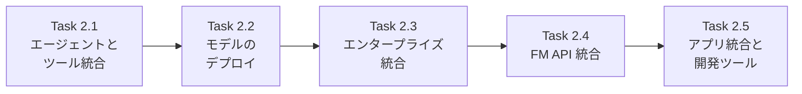

### 0-3. 学習の進め方（おすすめ順）

1. まず Step 1 で Bedrock の呼び出し方（Converse API とツール利用）を理解する。
2. Step 2〜8 でエージェントの仕組み（試験の最重要トピック）を押さえる。
3. Step 9〜11 でデプロイ方式の「使い分け表」を暗記する。
4. Step 12〜16 でエンタープライズ接続を「セキュリティ・ネットワーク・CI/CD」の3視点で整理する。
5. Step 17〜26 で API 設計・ストリーミング・耐障害性・ルーティング・トラブルシューティングを仕上げる。
6. 最後に Step 27〜29 の練習問題と引っかけ表で確認する。

### 0-4. 全スキルと主要サービスの対応表

| スキル | 主要サービス・キーワード |
|---|---|
| 2.1.1 | Strands Agents, AWS Agent Squad, MCP, メモリ, セッション |
| 2.1.2 | Step Functions, ReAct, Chain-of-Thought |
| 2.1.3 | 停止条件, Lambda タイムアウト, IAM 境界, サーキットブレーカー |
| 2.1.4 | 専用FM, アンサンブル, モデル選択 |
| 2.1.5 | Step Functions 承認フロー, API Gateway フィードバック |
| 2.1.6 | Strands API, 関数定義, Lambda 検証 |
| 2.1.7 | Lambda MCP, ECS MCP, MCP クライアント |
| 2.2.1 | Lambda, Provisioned Throughput, SageMaker AI |
| 2.2.2 | コンテナ, GPU, メモリ, モデルロード |
| 2.2.3 | 小型モデル, モデルカスケード |
| 2.3.1 | レガシーAPI, イベント駆動, データ同期 |
| 2.3.2 | API Gateway, Lambda Webhook, EventBridge |
| 2.3.3 | フェデレーション, RBAC, 最小権限 |
| 2.3.4 | Outposts, Wavelength, セキュアルーティング |
| 2.3.5 | CodePipeline, CodeBuild, GenAI ゲートウェイ |
| 2.4.1 | Bedrock API, SDK, SQS, API Gateway 検証 |
| 2.4.2 | ストリーミングAPI, WebSocket, SSE, チャンク転送 |
| 2.4.3 | 指数バックオフ, レート制限, フォールバック, X-Ray |
| 2.4.4 | 静的ルーティング, Step Functions 動的ルーティング |
| 2.5.1 | API Gateway ストリーミング, トークン上限, リトライ |
| 2.5.2 | Amplify, OpenAPI, Bedrock Flows |
| 2.5.3 | CRM 連携, 文書処理, Bedrock Data Automation |
| 2.5.4 | Amazon Q Developer |
| 2.5.5 | Strands, Agent Squad, プロンプトチェーン |
| 2.5.6 | CloudWatch Logs Insights, X-Ray, Q Developer |

**根拠URL（Step 0）**
- Domain 2 試験ガイド: <https://docs.aws.amazon.com/aws-certification/latest/ai-professional-01/ai-professional-01-domain2.html>
- 試験ガイド全体（配点・出題形式）: <https://docs.aws.amazon.com/aws-certification/latest/ai-professional-01/ai-professional-01.html>

---

## Step 1. 前提知識：Bedrock の呼び出しとツール利用の基本

Domain 2 の多くの問題は「Bedrock をどう呼ぶか」を知っていることが前提です。ここで最低限の土台を作ります。

### 1-1. 基本用語

| 用語 | やさしい説明 |
|---|---|
| FM（Foundation Model） | 大量データで事前学習された汎用AIモデル。Claude や Amazon Nova など |
| Amazon Bedrock | 複数のFMを共通のAPIで使えるマネージドサービス |
| トークン | モデルが文章を処理する最小単位。料金・上限・速度の基準になる |
| エージェント | 目標に向かって「考える → 道具を使う → 結果を見る」を繰り返すAI |
| ツール | エージェントが呼び出せる外部機能（API、DB検索、計算など） |
| MCP | AIとツールをつなぐ共通規格（Model Context Protocol） |
| ストリーミング | 回答を完成前から少しずつ送ること |
| スロットリング | 呼び出し過多で一時的に拒否されること（HTTP 429） |

### 1-2. 2つの基本 API

Bedrock Runtime には主に2種類の呼び出し方があります。

| API | 特徴 | 使いどころ |
|---|---|---|
| `InvokeModel` | モデルごとにリクエスト本文の形式が違う | モデル固有の機能を使うとき |
| `Converse` | 全モデル共通の形式（メッセージ配列）。ツール利用・ガードレールも統一的に扱える | **基本はこちら**。モデル切り替えが容易 |

ストリーミング版は `InvokeModelWithResponseStream` と `ConverseStream` です。

### 1-3. ツール利用（Tool Use）の流れ

FM は自分で外部APIを実行できません。「このツールを、この引数で呼んでほしい」という **依頼（toolUse）** を返し、アプリ側が実行して結果を返します。この往復が、すべてのエージェントの基本動作です。

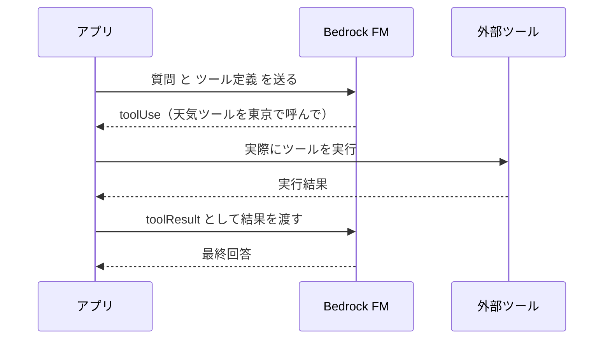

### 1-4. 最小コード例（Converse API）

```python
import boto3

client = boto3.client("bedrock-runtime", region_name="us-east-1")

response = client.converse(
    modelId="us.anthropic.claude-sonnet-4-20250514-v1:0",  # 例。実際は利用可能なモデルID/推論プロファイルを指定
    messages=[{"role": "user", "content": [{"text": "AWS Lambda を一文で説明して"}]}],
    inferenceConfig={"maxTokens": 300, "temperature": 0.2},
)
print(response["output"]["message"]["content"][0]["text"])
print(response["usage"])  # inputTokens / outputTokens を必ずログへ
```

> **ベストプラクティス**: `usage`（入力・出力トークン数）は毎回ログに残します。コスト分析・上限管理・トラブル調査の基礎データになるためです。

**根拠URL（Step 1）**
- Converse API: <https://docs.aws.amazon.com/bedrock/latest/userguide/conversation-inference.html>
- ツール利用: <https://docs.aws.amazon.com/bedrock/latest/userguide/tool-use.html>
- InvokeModel: <https://docs.aws.amazon.com/bedrock/latest/userguide/inference-invoke.html>

---

# Task 2.1 エージェント型AIソリューションとツール統合

---

## Step 2. 【Skill 2.1.1】自律型システムとメモリ・状態管理

### 2-1. 何をするスキルか

エージェントは1回の質問で終わらず、会話を覚え、途中経過を保持し、必要なら複数のエージェントで分担します。このスキルでは **メモリ（記憶）と状態管理** を備えたエージェントを、**Strands Agents**、**AWS Agent Squad**、**MCP** で作る方法を問われます。

### 2-2. 3つの主役

| 名前 | 役割 | ひとことで |
|---|---|---|
| Strands Agents | AWS が公開するオープンソースの Python エージェントSDK。モデルとツールを渡すとエージェントループを自動で回す | 1体のエージェントを手軽に作る |
| AWS Agent Squad | 複数エージェントの中から、質問に合う担当を選んで振り分けるオープンソースのフレームワーク（旧 Multi-Agent Orchestrator） | 複数エージェントの交通整理役 |
| MCP | エージェントとツールの接続規格 | ツールのUSB端子 |

### 2-3. エージェントループの考え方

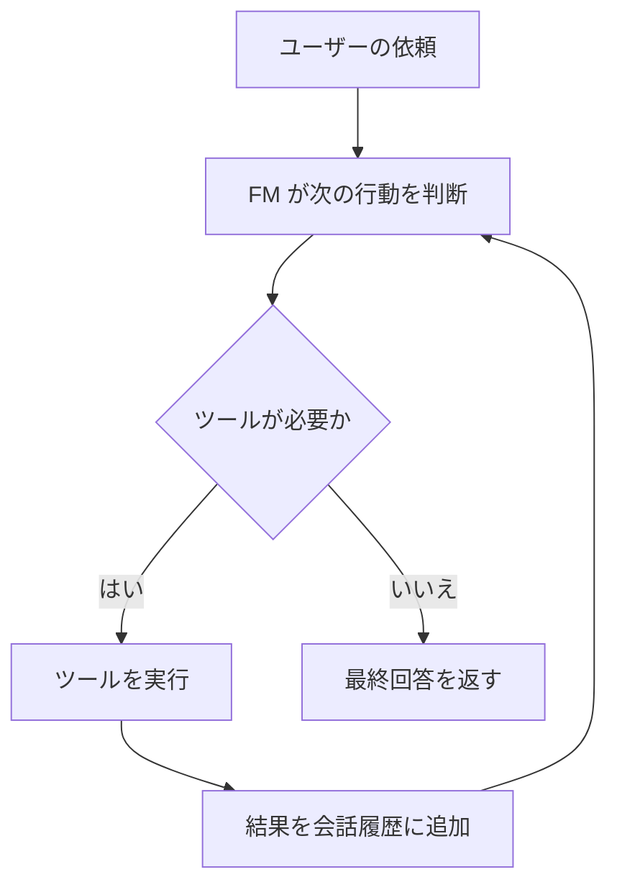

### 2-4. メモリの種類を整理する

「記憶」と一言で言っても、保存期間と目的で分けて考えます。

| 種類 | 内容 | 保存先の例 |
|---|---|---|
| 短期メモリ（会話履歴） | 今の会話の流れ | アプリ内のメッセージ配列、セッションストア |
| 長期メモリ | 過去セッションの要約・ユーザーの好み | DynamoDB、ベクトルストア、Bedrock AgentCore Memory、Bedrock Agents のメモリ |
| 状態（State） | タスク進行状況、中間結果 | DynamoDB、Step Functions の実行状態 |

履歴をそのまま全部送るとトークンが膨らむため、**古い履歴は要約して圧縮する** のが定石です。

### 2-5. Strands Agents の最小例

```python
from strands import Agent, tool

@tool
def get_order_status(order_id: str) -> str:
    """注文IDから配送状況を返す。order_id は 'A' で始まる英数字。"""
    return f"{order_id}: 配送中"

agent = Agent(tools=[get_order_status])  # モデルは既定で Bedrock を利用
agent("注文 A1234 の状況を教えて")
```

`@tool` を付けた関数が、docstring と型ヒントから自動でツール定義（名前・説明・引数スキーマ）になります。

### 2-6. Agent Squad による複数エージェントの振り分け

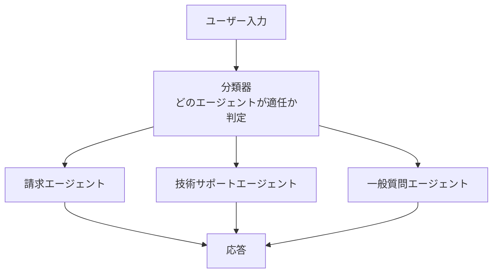

Agent Squad は会話履歴をユーザー・セッション単位で保持し、分類器が文脈を踏まえて担当を選びます。

### 2-7. ベストプラクティス

| ベストプラクティス | 理由 |
|---|---|
| セッションIDでメモリを分離する | 別ユーザーの会話が混ざる情報漏えいを防ぐ |
| 長期メモリには要約だけを保存する | 生ログ全保存は費用・プライバシー・検索精度の面で不利 |
| 状態は外部ストア（DynamoDB 等）に置く | Lambda や コンテナは再起動・スケールで消えるため |
| エージェントごとに役割を狭く定義する | 守備範囲が広いと誤ったツール選択が増える |
| ツール接続は MCP などの標準方式に寄せる | ツール追加のたびに独自実装する手間を減らせる |
| 履歴のトークン数を監視し上限で要約する | コンテキスト長超過とコスト増を防ぐ |

### 2-8. 試験の勘所

- 「複数の専門エージェントを質問内容で振り分けたい」→ **Agent Squad**。
- 「1体のエージェントを AWS ネイティブに素早く作りたい」→ **Strands Agents**。
- 「エージェントとツールの接続を標準化したい」→ **MCP**。
- 「状態をインスタンス内変数に持つ」設計は、スケールアウトで消えるため誤り。

**根拠URL（Step 2）**
- Strands Agents 公式: <https://strandsagents.com/latest/documentation/docs/>
- AWS Agent Squad: <https://awslabs.github.io/agent-squad/>
- Model Context Protocol: <https://modelcontextprotocol.io/>
- Bedrock AgentCore 概要: <https://docs.aws.amazon.com/bedrock-agentcore/latest/devguide/what-is-bedrock-agentcore.html>
- AgentCore と MCP の入門（検証済み）: <https://docs.aws.amazon.com/bedrock-agentcore/latest/devguide/mcp-getting-started.html>
- Bedrock Agents のメモリ: <https://docs.aws.amazon.com/bedrock/latest/userguide/agents-memory.html>

---

## Step 3. 【Skill 2.1.2】Step Functions による ReAct と思考連鎖

### 3-1. 何をするスキルか

FMに難しい問題を解かせるとき、一発で答えさせるのではなく **手順を踏ませる** と精度が上がります。代表的な方法が次の2つです。

| 手法 | 内容 |
|---|---|
| Chain-of-Thought（CoT） | 「順を追って考えて」と中間の推論ステップを出力させる |
| ReAct | 「考える（Reason）→ 行動する（Act）→ 観察する（Observe）」を繰り返す |

これを **AWS Step Functions のステートマシンで制御する** のがこのスキルの中心です。LLM に任せきりのループと違い、回数・時間・分岐をコードの外から管理できます。

### 3-2. Step Functions で ReAct を作る

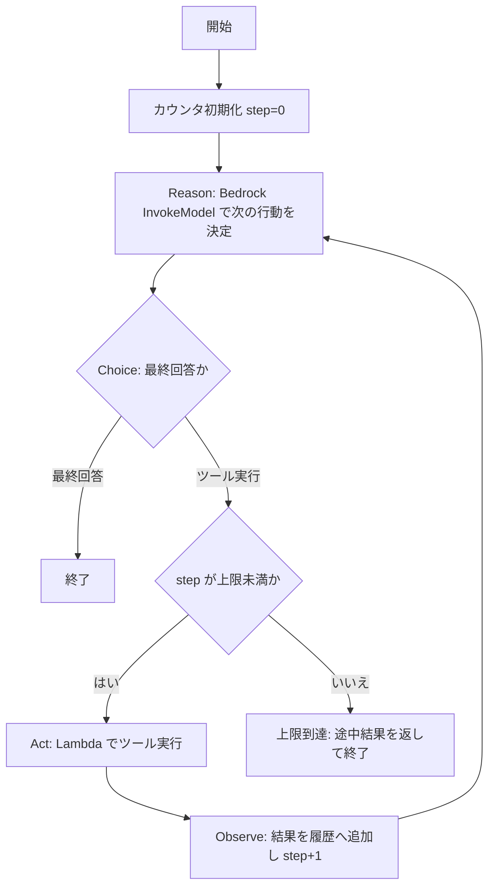

ポイントは3つあります。

1. **Reason** は Step Functions の Bedrock 最適化統合（`InvokeModel`）で呼べるため、Lambda を挟まずに済みます。
2. **Choice ステート** で「ツールを呼ぶか／終わるか」を分岐します。
3. **step カウンタ** で無限ループを防ぎます（Step 4 の停止条件につながります）。

### 3-3. CoT をワークフローにする（プロンプトチェーン型）

1つの巨大プロンプトではなく、段階に分けて Step Functions で順番に呼ぶ方法もあります。

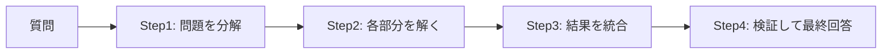

### 3-4. Step Functions の種類を選ぶ

| 種類 | 最大実行時間 | 向くケース |
|---|---|---|
| Standard | 最長1年 | 人の承認待ち、長時間のエージェント、監査が必要な処理 |
| Express | 最長5分 | 短時間・大量のリクエスト応答型 |

### 3-5. ベストプラクティス

| ベストプラクティス | 理由 |
|---|---|
| 反復回数の上限を必ず設ける | モデルが終了判断をしないと無限ループとコスト暴走になる |
| 各ステートに `TimeoutSeconds` と `Retry` / `Catch` を設定する | 一時障害で全体が止まらず、失敗時の逃げ道を作れる |
| 推論と実行を別ステートに分ける | どの段階で失敗したか可視化でき、デバッグしやすい |
| 履歴は要約・切り詰めしてから次の呼び出しへ渡す | ループごとにトークンが増え続けるのを防ぐ |
| 実行履歴（Step Functions のログ）を有効化する | 推論過程を後から監査・再現できる |

### 3-6. 試験の勘所

- 「ループ回数・タイムアウト・分岐をコードの外で制御したい」→ **Step Functions**。
- 「ReAct の Reason は何で呼ぶか」→ Bedrock 統合（InvokeModel）。「Act」→ Lambda などのツール。
- 長時間・人の承認を含む → **Standard** ワークフロー。

**根拠URL（Step 3）**
- ReAct 論文: <https://arxiv.org/abs/2210.03629>
- Chain-of-Thought 論文: <https://arxiv.org/abs/2201.11903>
- Step Functions と Bedrock の統合: <https://docs.aws.amazon.com/step-functions/latest/dg/connect-bedrock.html>
- Step Functions 概要: <https://docs.aws.amazon.com/step-functions/latest/dg/welcome.html>
- Choice ステート: <https://docs.aws.amazon.com/step-functions/latest/dg/state-choice.html>
- Anthropic: Building effective agents: <https://www.anthropic.com/engineering/building-effective-agents>

---

## Step 4. 【Skill 2.1.3】安全装置付き（Safeguarded）AIワークフロー

### 4-1. 何をするスキルか

エージェントは自律的に動くため、放っておくと「無限ループ」「高額なAPI連発」「権限外の操作」「障害の連鎖」が起こり得ます。ここでは **多層の安全装置** を設計します。

### 4-2. 4つの安全装置と担当サービス

| 安全装置 | 防ぐもの | 使うもの |
|---|---|---|
| 停止条件 | 無限ループ・暴走 | Step Functions の反復上限、`Choice` による終了判定 |
| タイムアウト | 応答のない処理で固まる | Lambda のタイムアウト、Step Functions の `TimeoutSeconds` |
| リソース境界 | 権限外の操作・データアクセス | IAM ポリシー、権限境界、リソースARN指定 |
| サーキットブレーカー | 障害の連鎖・無駄な再試行 | 失敗回数の状態管理（DynamoDB 等）と遮断ロジック |

### 4-3. 多層防御の全体像

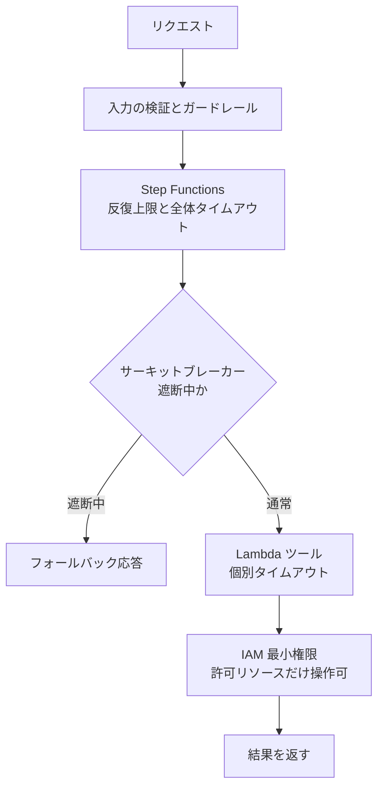

### 4-4. サーキットブレーカーの状態遷移

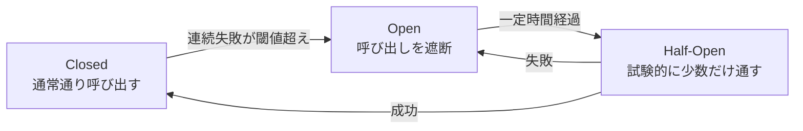

遮断中はモデルや下流APIを呼ばず、即座にフォールバック（キャッシュ回答・定型文・別モデル）を返します。これにより障害中の無駄なコストと待ち時間を避けられます。

### 4-5. Lambda タイムアウトの注意

Lambda の最大タイムアウトは15分です。モデルの応答待ちが長い処理では、**呼び出し元（API Gateway 等）のタイムアウトのほうが先に切れる**ことがあります。したがって「どの層のタイムアウトが最短か」を全層で確認します（Step 21 参照）。

### 4-6. ベストプラクティス

| ベストプラクティス | 理由 |
|---|---|
| 内側のタイムアウトを外側より短くする | 外側が先に切れると、内側が走り続けて課金だけ発生する |
| 破壊的な操作（削除・送金）は別途承認を挟む | 誤判断の影響を人が止められる（Step 6 参照） |
| エージェント用IAMロールは用途ごとに分ける | 1つのロールが全権限を持つと、誤動作・攻撃の被害が最大化する |
| Bedrock Guardrails を入出力に適用する | 不適切な内容や機密情報の混入を仕組みで抑える |
| 反復上限・トークン上限・予算上限を併用する | どれか1つの条件抜けでも暴走を止められる |
| 遮断・上限到達は CloudWatch メトリクス化してアラームを付ける | 安全装置が働いたことに運用側が気づける |

### 4-7. 試験の勘所

- 「無限ループ防止」→ 反復上限（Step Functions）。
- 「一時的な下流障害で再試行が殺到するのを防ぐ」→ **サーキットブレーカー**。
- 「エージェントがアクセスできる範囲を限定」→ **IAM ポリシー（最小権限）**。
- 「応答しない処理でワークフローが固まる」→ **タイムアウト**。

**根拠URL（Step 4）**
- サーキットブレーカーパターン（AWS 規範ガイダンス）: <https://docs.aws.amazon.com/prescriptive-guidance/latest/cloud-design-patterns/circuit-breaker.html>
- Lambda タイムアウト（検証済み）: <https://docs.aws.amazon.com/lambda/latest/dg/configuration-timeout.html>
- IAM のベストプラクティス: <https://docs.aws.amazon.com/IAM/latest/UserGuide/best-practices.html>
- Bedrock Guardrails: <https://docs.aws.amazon.com/bedrock/latest/userguide/guardrails.html>
- Builders' Library（タイムアウト・リトライ・ジッター）: <https://aws.amazon.com/builders-library/timeouts-retries-and-backoff-with-jitter/>

---

## Step 5. 【Skill 2.1.4】モデル協調システム（複数FMの使い分け）

### 5-1. 何をするスキルか

1つの万能モデルで全部やるより、**得意分野の違う複数モデルを組み合わせる** ほうが、品質・速度・コストのバランスが良くなることがあります。このスキルでは3つの設計を扱います。

| 設計 | 内容 | 例 |
|---|---|---|
| 専門FMの使い分け | タスク別に最適なモデルを割り当てる | 分類は小型モデル、複雑な推論は大型モデル、画像理解はマルチモーダルモデル |
| モデルアンサンブル | 複数モデルの出力をまとめて1つの結論にする | 3モデルの回答を多数決・加重平均・別モデルで統合 |
| モデル選択フレームワーク | 基準に基づき、どのモデルを使うか決める仕組み | コスト・遅延・精度・言語で選定 |

### 5-2. アンサンブルの流れ

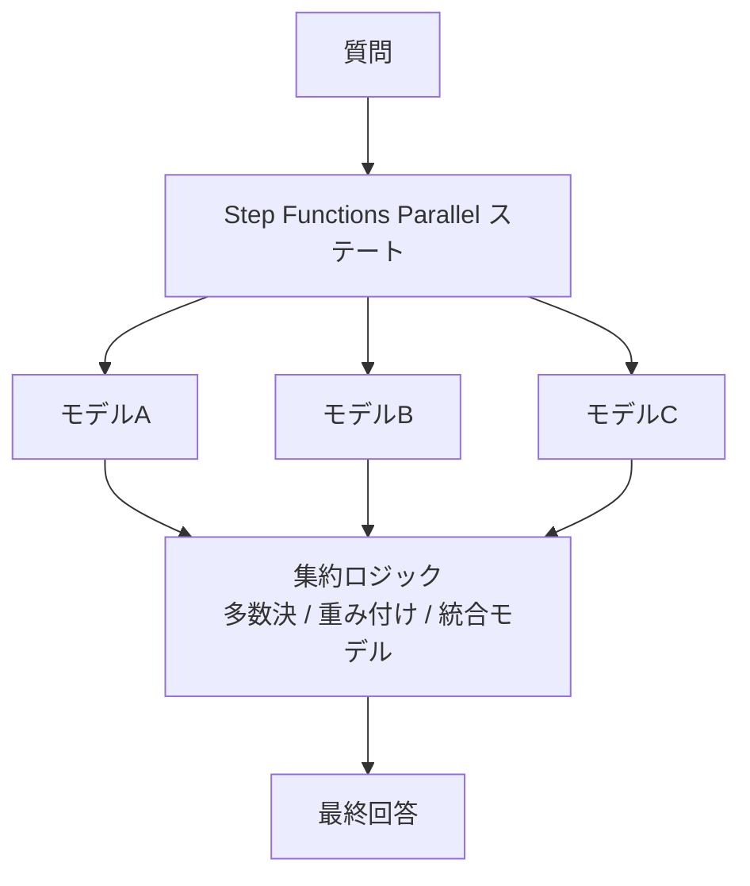

Step Functions の `Parallel` ステートを使うと、複数モデルを同時に呼べます。集約処理は Lambda に書く（カスタム集約ロジック）か、さらに別のFMに「3つの回答を統合して」と依頼します。

### 5-3. モデル選択の基準表

| 判断軸 | 見ること |
|---|---|
| 精度 | 自社評価データでの品質（Domain 5 の評価につながる） |
| 遅延 | 最初のトークンまでの時間、全体の生成時間 |
| コスト | 入力・出力トークン単価 |
| 機能 | ツール利用、画像入力、コンテキスト長、対応言語 |
| 可用性 | リージョン提供状況、クォータ |

### 5-4. ベストプラクティス

| ベストプラクティス | 理由 |
|---|---|
| モデルIDをコードに直書きせず設定として外出しする | モデル入れ替え時にコード変更・再デプロイを不要にできる |
| アンサンブルは本当に必要な箇所だけに使う | 呼び出し回数がそのまま費用と遅延の増加になる |
| 並列呼び出しの一部が失敗しても全体が成立する設計にする | 1モデルの障害で全体が止まらないようにする |
| 選定は自社データで評価してから決める | 公開ベンチマークだけでは自社タスクの性能は分からない |
| 専門モデルへの振り分けは安価な分類器で行う | 振り分け自体が高コストだと節約の意味が薄れる |

### 5-5. 試験の勘所

- 「複数モデルの結果を組み合わせる」→ **Parallel ステート + カスタム集約ロジック**。
- 「タスクごとに最適なモデルを使い分ける」→ 専門FM + モデル選択フレームワーク。
- アンサンブルは **品質向上と引き換えにコスト・遅延が増える**。

**根拠URL（Step 5）**
- Step Functions Parallel ステート: <https://docs.aws.amazon.com/step-functions/latest/dg/state-parallel.html>
- Bedrock 対応モデル一覧: <https://docs.aws.amazon.com/bedrock/latest/userguide/models-supported.html>
- Anthropic: Building effective agents（Parallelization / Orchestrator-workers）: <https://www.anthropic.com/engineering/building-effective-agents>
- Bedrock モデル評価: <https://docs.aws.amazon.com/bedrock/latest/userguide/evaluation.html>

---

## Step 6. 【Skill 2.1.5】人間との協働（Human-in-the-loop）

### 6-1. 何をするスキルか

AIの出力をそのまま実行せず、**人間のレビューや承認を挟む** 設計です。高リスクな判断（契約・医療・金融・大きな金額）や、品質改善のためのフィードバック収集で必要になります。

### 6-2. 承認フロー（Step Functions のコールバック）

Step Functions には「タスクトークン」を使って **人の返答が来るまで待つ** 機能（`.waitForTaskToken`）があります。待機中は課金されず、Standard ワークフローなら最長1年まで待てます。

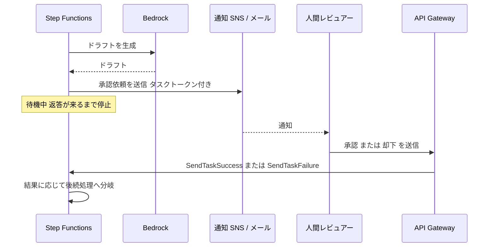

### 6-3. フィードバック収集

| 目的 | 実装 |
|---|---|
| 👍👎 や修正文を集める | API Gateway にフィードバック用エンドポイントを作り、Lambda 経由で DynamoDB / S3 に保存 |
| 改善に活かす | 集めた評価をプロンプト改善・評価データセット・ガードレール調整に利用 |
| 誰がどう承認したか残す | 承認者・時刻・内容を監査ログとして保存 |

### 6-4. 人間協働パターンの種類

| パターン | 内容 | 使いどころ |
|---|---|---|
| 事前承認 | 実行前に人が承認 | 送金・契約・外部公開 |
| 事後レビュー | 実行後に抽出サンプルを人が確認 | 大量処理の品質監視 |
| 例外エスカレーション | 信頼度が低いときだけ人へ回す | カスタマーサポート |
| 人がAIを補助 | AIが下書き、人が仕上げ | 文書作成・コード |

### 6-5. ベストプラクティス

| ベストプラクティス | 理由 |
|---|---|
| 承認が必要な条件を明確にしてコード化する | 属人的な判断だと漏れや過剰承認が起きる |
| 待機にはコールバックパターン（タスクトークン）を使う | ポーリングのLambdaを回し続けるより安価で単純 |
| 承認期限を設定し、期限切れ時の動作も決める | 返答がないまま処理が滞留するのを防ぐ |
| 承認画面に根拠（参照元・信頼度）を表示する | 人が判断できず形骸化したレビューになるのを防ぐ |
| フィードバックと承認結果を保存して再利用する | 継続的な品質改善の材料になる |

### 6-6. 試験の勘所

- 「人の承認を待つ」→ **Step Functions のコールバック（`.waitForTaskToken`）**。
- 「ユーザーの評価を集める」→ **API Gateway + Lambda + 保存先**。
- 「信頼度が低いときだけ人に回す」→ 例外エスカレーション。

**根拠URL（Step 6）**
- Step Functions: タスクトークンによるコールバック: <https://docs.aws.amazon.com/step-functions/latest/dg/connect-to-resource.html#connect-wait-token>
- Bedrock Agents の Return of control: <https://docs.aws.amazon.com/bedrock/latest/userguide/agents-returncontrol.html>
- API Gateway 開発者ガイド: <https://docs.aws.amazon.com/apigateway/latest/developerguide/welcome.html>

---

## Step 7. 【Skill 2.1.6】インテリジェントなツール統合

### 7-1. 何をするスキルか

FM にツールを渡すとき、最大の問題は **「FM が間違った引数でツールを呼ぶ」** ことです。そこで次の3つを整えます。

1. 標準化された **関数定義（ツールスキーマ）**
2. ツール側の **パラメータ検証**
3. ツール側の **エラー処理**（FM が理解できる形で返す）

### 7-2. 関数定義（Converse API の toolSpec）

FM はこの定義文だけを頼りにツールを選ぶため、**説明文が曖昧だと誤選択が増えます**。

```json
{
  "toolSpec": {
    "name": "get_order_status",
    "description": "注文IDから現在の配送状況を取得する。注文IDは A で始まる英数字。",
    "inputSchema": {
      "json": {
        "type": "object",
        "properties": {
          "order_id": {"type": "string", "pattern": "^A[0-9A-Z]{4,}$", "description": "注文ID"}
        },
        "required": ["order_id"]
      }
    }
  }
}
```

### 7-3. 信頼できるツール呼び出しの流れ

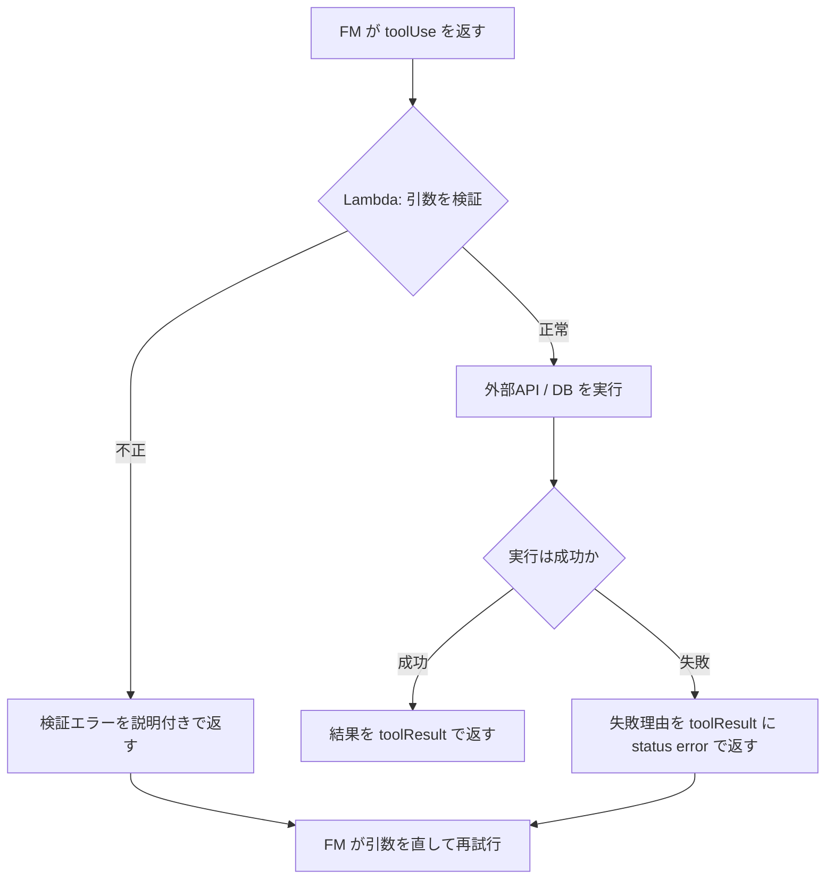

エラーを例外で落とすのではなく、**「何が悪かったか」を FM が読める文章で返す** と、FM が自分で引数を直して再試行できます。

### 7-4. Lambda でのパラメータ検証例

```python
def handler(event, context):
    order_id = event.get("order_id", "")
    if not (isinstance(order_id, str) and order_id.startswith("A") and len(order_id) >= 5):
        return {"status": "error", "message": "order_id は A で始まる5文字以上の英数字です。入力値を確認してください。"}
    try:
        return {"status": "success", "data": lookup(order_id)}
    except TimeoutError:
        return {"status": "error", "message": "注文システムが一時的に応答しません。少し待って再試行してください。"}
```

### 7-5. ベストプラクティス

| ベストプラクティス | 理由 |
|---|---|
| ツール名と説明文は具体的に書く | FM はこの文章でツールを選ぶので、曖昧だと誤選択する |
| 引数スキーマに型・必須・形式（pattern/enum）を書く | 不正値を入口で弾け、ツール側の負担も減る |
| 検証はFMを信用せずツール側でも必ず行う | FM の出力は常に正しいとは限らず、入力値は信頼できない |
| 失敗は構造化されたメッセージで返す | FM が原因を理解して自己修正できる |
| 更新系ツールは冪等（何度実行しても結果が同じ）にする | 再試行で二重実行されるのを防ぐ |
| ツール数を絞る（類似ツールは統合） | 選択肢が多いほど選択精度が落ち、プロンプトも長くなる |
| ツールごとに最小権限のIAMロールを割り当てる | 誤呼び出しの被害範囲を限定できる |

### 7-6. 試験の勘所

- 「FM が不正な引数でツールを呼ぶ」→ **スキーマ定義の改善 + Lambda での検証**。
- 「ツール失敗時の対処」→ エラーを FM に返して再試行させる／リトライ・フォールバック。
- Strands では `@tool` デコレータとカスタム挙動（フック等）で標準化。

**根拠URL（Step 7）**
- Converse API のツール利用: <https://docs.aws.amazon.com/bedrock/latest/userguide/tool-use.html>
- Strands Agents（ツール）: <https://strandsagents.com/latest/documentation/docs/user-guide/concepts/tools/python-tools/>
- Bedrock Agents アクショングループ: <https://docs.aws.amazon.com/bedrock/latest/userguide/agents-action-create.html>
- Lambda のベストプラクティス: <https://docs.aws.amazon.com/lambda/latest/dg/best-practices.html>

---

## Step 8. 【Skill 2.1.7】モデル拡張フレームワーク（MCP サーバー）

### 8-1. 何をするスキルか

MCP（Model Context Protocol）は、AIアプリとツール・データをつなぐ共通規格です。**MCP サーバー** がツールを公開し、**MCP クライアント**（エージェント側）がそれを呼びます。1つのMCPサーバーを複数のエージェントが共有できるのが利点です。

### 8-2. MCP の構成要素

| 要素 | 役割 |
|---|---|
| MCP ホスト / クライアント | エージェント本体側。サーバーに接続してツール一覧を取得し呼び出す |
| MCP サーバー | ツール（実行機能）・リソース（データ）・プロンプト（テンプレート）を公開する |
| トランスポート | 通信方式。ローカル向けの stdio と、リモート向けの Streamable HTTP |

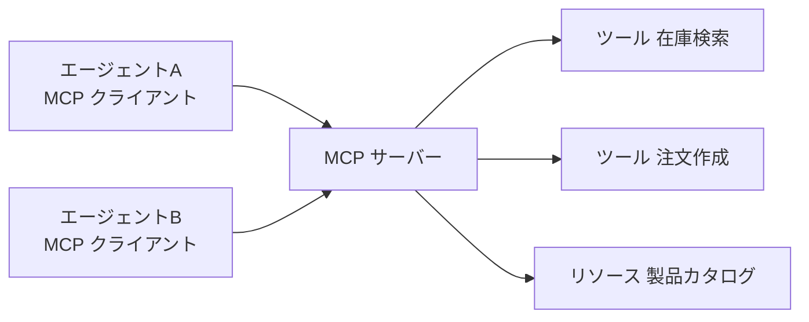

### 8-3. Lambda と ECS の使い分け（試験で頻出）

試験ガイドは「軽量ツールは Lambda のステートレス MCP サーバー、複雑なツールは ECS 上の MCP サーバー」と明示しています。

| 観点 | Lambda の MCP サーバー | ECS の MCP サーバー |
|---|---|---|
| 向くツール | 軽量・短時間・ステートレス | 複雑・長時間・状態を持つ・独自ライブラリが重い |
| 実行時間 | 最大15分 | 制限なし（常時稼働可） |
| スケール | リクエストごとに自動 | タスク数をオートスケーリングで調整 |
| コスト | 使った分だけ。アイドル時はほぼ0 | 稼働している間は継続課金 |
| セッション状態 | 持たない（外部ストアへ） | メモリ内に保持可能（ただし冗長化は設計が必要） |
| 運用負荷 | 低い | やや高い |

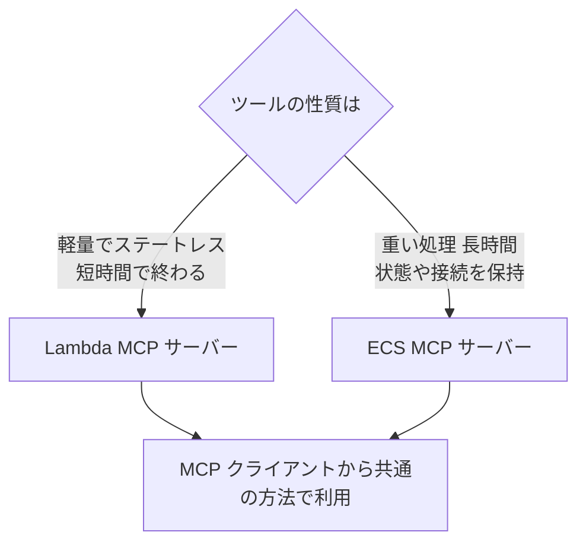

### 8-4. MCP クライアントライブラリを使う理由

エージェントごとにツール呼び出しの書き方がバラバラだと保守が大変です。**MCP クライアントライブラリ（Strands の MCP クライアント等）** を共通で使うと、サーバーがLambdaでもECSでも同じ書き方で接続できます。これが試験ガイドの言う「一貫したアクセスパターン」です。

```python
from mcp.client.streamable_http import streamablehttp_client
from strands import Agent
from strands.tools.mcp import MCPClient

mcp = MCPClient(lambda: streamablehttp_client("https://mcp.example.com/mcp"))
with mcp:
    tools = mcp.list_tools_sync()      # サーバーが公開するツールを取得
    agent = Agent(tools=tools)
    agent("在庫を確認して")
```

### 8-5. ベストプラクティス

| ベストプラクティス | 理由 |
|---|---|
| ステートレスなツールはLambdaに載せる | アイドル時コストが小さく、スケールも自動 |
| 状態や重い依存があるツールはECSに載せる | Lambdaの時間・パッケージ制約を避けられる |
| MCPサーバーの前段で認証・認可を行う | ツールは外部システムを操作するため無防備に公開できない |
| ツール定義の説明は明確にし、バージョン管理する | 変更の影響を追跡でき、エージェントの誤動作を防げる |
| 接続はVPC内・PrivateLinkなど閉域を優先する | 社内システムへの経路を外部公開しない |
| 信頼できないMCPサーバーを無検証で接続しない | ツール説明に悪意ある指示が混入する攻撃（ツールポイズニング）のリスク |

### 8-6. 試験の勘所

- 「軽量ツール」「ステートレス」→ **Lambda**。「複雑なツール」「常時稼働」「状態保持」→ **ECS**。
- 「共通のアクセス方法」→ **MCP クライアントライブラリ**。
- MCP は「ツールの接続規格」であり、モデルそのものではない点を区別する。

**根拠URL（Step 8）**
- MCP 仕様・概要: <https://modelcontextprotocol.io/>
- AWS Labs の MCP サーバー集: <https://github.com/awslabs/mcp>
- Strands の MCP ツール: <https://strandsagents.com/latest/documentation/docs/user-guide/concepts/tools/mcp-tools/>
- Lambda 概要: <https://docs.aws.amazon.com/lambda/latest/dg/welcome.html>
- Amazon ECS 概要: <https://docs.aws.amazon.com/AmazonECS/latest/developerguide/Welcome.html>
- AgentCore と MCP（検証済み）: <https://docs.aws.amazon.com/bedrock-agentcore/latest/devguide/mcp-getting-started.html>

---

# Task 2.2 モデルのデプロイ戦略

---

## Step 9. 【Skill 2.2.1】アプリ要件に合わせたFMのデプロイ

### 9-1. 何をするスキルか

「FMをどこでどう動かすか」を、**トラフィックの形・遅延要件・コスト・モデルの種類** で選びます。試験では次の3つの選択肢の使い分けが中心です。

| 方式 | ひとことで | 課金の考え方 |
|---|---|---|
| Lambda から Bedrock をオンデマンド呼び出し | 使った分だけ。サーバー管理なし | トークン従量課金 |
| Bedrock Provisioned Throughput | 処理能力（モデルユニット）を確保する | 時間課金（コミット期間で割引） |
| SageMaker AI エンドポイント | 自分でモデルとインスタンスを管理 | インスタンス稼働時間課金 |

### 9-2. 選び方フロー

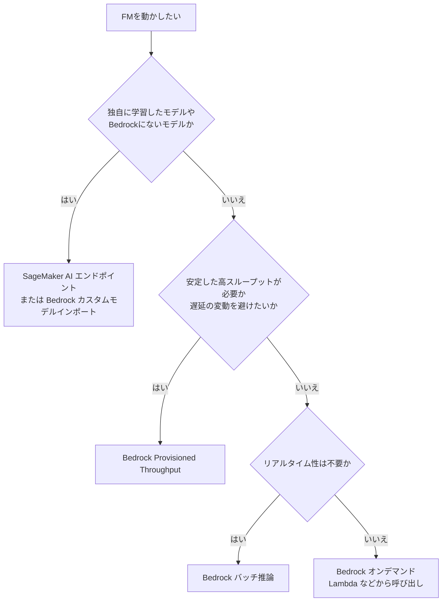

### 9-3. 各方式の詳細

**1) オンデマンド（Lambda など）**
- 事前の容量確保が不要で、不定期・小規模・開発初期に最適です。
- 呼び出し量が多いとクォータによるスロットリングが起こりえます。

**2) Provisioned Throughput**
- 「モデルユニット」を購入し、一定の処理能力を確保します。1か月・6か月のコミットで割引があり、コミットなし（時間課金）もあります。
- **ファインチューニング済みのカスタムモデルを Bedrock で使うときは Provisioned Throughput が必要**（試験の定番）。
- 予測可能な高負荷・安定した遅延・SLA重視に向きます。使わなくても課金される点がデメリットです。

**3) SageMaker AI エンドポイント（ハイブリッド）**
- Bedrock にないモデル、独自のオープンソースモデル、細かいチューニングが必要なケースに向きます。
- リアルタイム・非同期・サーバーレスなどの推論形態があります（GPUが必要な大型LLMではサーバーレスは不向き）。
- 「基本は Bedrock、特殊なモデルだけ SageMaker」というハイブリッド構成もよく出題されます。

### 9-4. トラフィックの形で選ぶ表

| 状況 | 推奨 |
|---|---|
| 月数回しか呼ばれない社内ツール | Lambda + Bedrock オンデマンド |
| 常時安定した大量リクエスト・遅延を一定にしたい | Provisioned Throughput |
| 夜間にまとめて大量の文書を処理（即時性不要） | Bedrock バッチ推論 |
| ファインチューニングしたカスタムモデルを本番運用 | Provisioned Throughput |
| Bedrockにない独自OSSモデルを使う | SageMaker AI エンドポイント |
| 数分〜長時間かかる推論を非同期に処理 | SageMaker 非同期推論（または SQS + ワーカー） |

### 9-5. 複数方式を組み合わせたハイブリッド

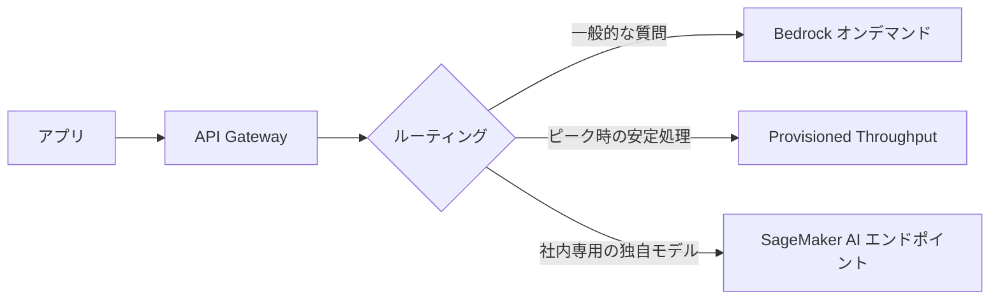

### 9-6. ベストプラクティス

| ベストプラクティス | 理由 |
|---|---|
| まずオンデマンドで始め、使用量を計測してから確保を検討する | 過剰なコミットは使わない分も課金される |
| Provisioned Throughput は需要が安定してから購入する | 需要予測を外すと割高になる |
| 即時性が不要な処理はバッチ推論に回す | オンライン推論より割安にできる（最新の割引率は料金ページで確認） |
| リージョン間推論（クロスリージョン推論）でバースト吸収を検討する | 単一リージョンのクォータ超過を緩和できる |
| クォータ（TPM/RPM）を事前に確認し、必要なら引き上げ申請する | 本番直前にスロットリングで止まる事故を防ぐ |
| 使用量・遅延・コストをメトリクスで継続監視する | 方式の見直し時期を判断できる |

### 9-7. 試験の勘所

- 「カスタムモデル（ファインチューニング）をBedrockで推論」→ **Provisioned Throughput**。
- 「サーバー管理を避けたい・小規模」→ **Lambda + オンデマンド**。
- 「Bedrockにないモデル・完全制御」→ **SageMaker AI**。
- 「リアルタイム不要の大量処理」→ **バッチ推論**。

**根拠URL（Step 9）**
- Provisioned Throughput: <https://docs.aws.amazon.com/bedrock/latest/userguide/prov-throughput.html>
- バッチ推論: <https://docs.aws.amazon.com/bedrock/latest/userguide/batch-inference.html>
- クロスリージョン推論: <https://docs.aws.amazon.com/bedrock/latest/userguide/cross-region-inference.html>
- カスタムモデルインポート: <https://docs.aws.amazon.com/bedrock/latest/userguide/model-customization-import-model.html>
- SageMaker AI リアルタイムエンドポイント: <https://docs.aws.amazon.com/sagemaker/latest/dg/realtime-endpoints.html>
- SageMaker AI 非同期推論: <https://docs.aws.amazon.com/sagemaker/latest/dg/async-inference.html>
- Bedrock クォータ: <https://docs.aws.amazon.com/bedrock/latest/userguide/quotas.html>

---

## Step 10. 【Skill 2.2.2】LLM 特有のデプロイ課題

### 10-1. 何をするスキルか

従来の機械学習モデル（数MB〜数百MB、1回の推論が数ミリ秒）と違い、LLM は **巨大・GPU必須・出力が長い** という性質があります。そのため、コンテナ設計・メモリ・GPU・トークン処理能力を考慮したデプロイが必要になります。

### 10-2. 従来のMLとLLMの違い

| 項目 | 従来のML | LLM |
|---|---|---|
| モデルサイズ | 小さい（MB〜数GB） | 非常に大きい（数十〜数百GB） |
| ハードウェア | CPUでも可 | 多くの場合GPU（複数枚）が必要 |
| 推論時間 | ミリ秒〜秒 | 秒〜分（トークンを順に生成） |
| 起動 | 数秒 | モデルのロードに数分かかる |
| メモリ | 重みが主 | 重み＋KVキャッシュ（会話が長いほど増える） |
| 性能指標 | リクエスト/秒 | 最初のトークンまでの時間、トークン/秒 |

### 10-3. LLMデプロイで考える4つの資源

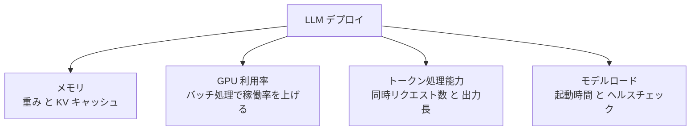

| 課題 | 対策 |
|---|---|
| GPUメモリ不足 | 量子化（FP8・INT4など）、テンソル並列で複数GPUに分割、大きなGPUインスタンス |
| GPU稼働率が低い | 連続バッチ処理（continuous batching）に対応した推論エンジン（vLLM・TensorRT-LLM等）を使う |
| 長文・長時間生成 | 最大トークン数の制限、ストリーミング、タイムアウトの引き上げ |
| 起動が遅い | モデルをS3から高速ロード、ヘルスチェック待機時間の延長、ウォームプール的な最小インスタンス維持 |
| スケールが遅い | スケーリング指標にキュー長や同時リクエスト数を使い、事前にスケールアウト |

### 10-4. SageMaker AI での実現方法

SageMaker AI には **大規模モデル推論（LMI）コンテナ** があり、推論エンジンとテンソル並列などの設定をまとめて扱えます。起動に時間がかかるモデル向けに、エンドポイントのプロダクションバリアントでは次の設定が調整できます。

| 設定 | 目的 |
|---|---|
| `ContainerStartupHealthCheckTimeoutInSeconds` | コンテナ起動（モデルロード）を待つ時間を延ばす |
| `ModelDataDownloadTimeoutInSeconds` | 大きなモデルデータのダウンロード待ち時間を延ばす |
| `VolumeSizeInGB` | モデルを置くストレージ容量を確保する |

また、`InvokeEndpointWithResponseStream` を使うと、LLM の出力を逐次ストリーミングできます。

### 10-5. コンテナ型デプロイのパターン

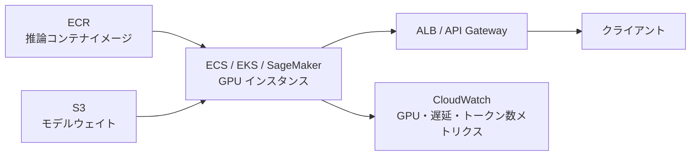

### 10-6. ベストプラクティス

| ベストプラクティス | 理由 |
|---|---|
| 量子化を検討して必要GPUメモリを減らす | 精度への影響を評価できれば、インスタンスコストを大きく下げられる |
| 連続バッチ処理に対応した推論エンジンを使う | 同時リクエストを効率的にさばき、GPUを遊ばせない |
| モデル重みはイメージに焼き込まず S3 等から読み込む | イメージが巨大化してビルド・配布が遅くなるのを避ける |
| 起動タイムアウトを十分長く設定する | ロード中に「異常」と判定され、再起動ループになるのを防ぐ |
| スケーリング指標は GPU 使用率より同時リクエスト数・キュー長を重視する | LLM ではGPU使用率が高止まりしても実際の処理待ちとは必ずしも一致しない |
| 最大入力・出力トークン数を制限する | 1リクエストがメモリと時間を占有しすぎるのを防ぐ |

### 10-7. 試験の勘所

- 「LLMは従来MLと何が違うか」→ **メモリ・GPU・トークン処理・ロード時間**。
- 「モデルロードが遅く起動失敗する」→ **起動ヘルスチェック・ダウンロードのタイムアウト延長**。
- 「GPUメモリ不足」→ 量子化・テンソル並列・より大きなインスタンス。

**根拠URL（Step 10）**
- SageMaker AI 大規模モデル推論コンテナ: <https://docs.aws.amazon.com/sagemaker/latest/dg/large-model-inference-container-docs.html>
- SageMaker AI リアルタイムエンドポイント: <https://docs.aws.amazon.com/sagemaker/latest/dg/realtime-endpoints.html>
- SageMaker AI 推論の最適化: <https://docs.aws.amazon.com/sagemaker/latest/dg/model-optimize.html>
- Amazon ECS GPU ワークロード: <https://docs.aws.amazon.com/AmazonECS/latest/developerguide/ecs-gpu.html>

---

## Step 11. 【Skill 2.2.3】性能とリソースのバランスを取るデプロイ

### 11-1. 何をするスキルか

「最高性能の大型モデルを全部に使う」と、コストと遅延が膨らみます。**必要十分なモデルを選ぶ** ことで、品質を保ちつつ費用を減らします。

### 11-2. 3つの定石

| 定石 | 内容 |
|---|---|
| 適切なモデルの選択 | タスクの難しさに合わせてモデルサイズを決める |
| 特化タスクに小型モデル | 分類・抽出・要約など範囲が狭い仕事は小型で十分なことが多い |
| API ベースのモデルカスケード | まず安価な小型モデルで試し、品質が足りないときだけ大型に回す |

### 11-3. モデルカスケード

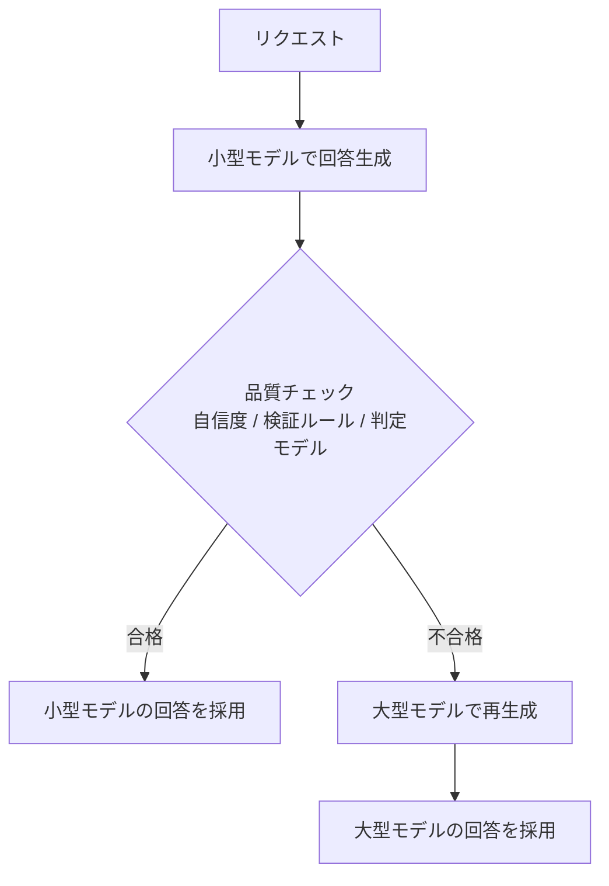

多くの定型的な質問は小型モデルで解決でき、難しい質問だけが大型モデルに回るため、**平均コストと平均遅延が下がります**。

### 11-4. モデルを小さくする他の選択肢

| 方法 | 内容 |
|---|---|
| 蒸留（Model Distillation） | 大型モデルの出力を教師にして、小型モデルを特定タスク向けに訓練する（Bedrock の機能） |
| プロンプトキャッシュ | 繰り返し使う長いプロンプト部分のコストと遅延を下げる |
| 出力長の制限 | `maxTokens` を必要最小限にして生成コストを抑える |
| Bedrock の Intelligent Prompt Routing | 同一モデルファミリー内で、質問に応じて安価な/高性能なモデルを自動で振り分ける（Step 20 参照） |

### 11-5. ベストプラクティス

| ベストプラクティス | 理由 |
|---|---|
| 小型モデルから評価を始め、足りなければ大型に上げる | 最初から大型を使うと過剰スペックになりやすい |
| カスケードの合格基準を数値や検証ルールで明確にする | 基準が曖昧だと品質低下に気づけない |
| 小型→大型へ回った割合をメトリクス化する | コスト削減効果とカスケード設計の妥当性を確認できる |
| 自社データで品質を測定して切り替え判断をする | 一般的な評価では自社タスクでの差が分からない |
| カスケードのコストが一括大型呼び出しを上回らないか確認する | 不合格率が高いと、小型の分が二重に上乗せされて逆に高くなる |

### 11-6. 試験の勘所

- 「定型的な質問が大半で、コストを抑えたい」→ **モデルカスケード / 小型モデル**。
- 「大型モデルの品質を小型に移したい」→ **蒸留**。
- カスケードの弱点は **不合格が多いと二重にコストがかかる** 点。

**根拠URL（Step 11）**
- Bedrock Model Distillation: <https://docs.aws.amazon.com/bedrock/latest/userguide/model-distillation.html>
- Bedrock プロンプトキャッシュ: <https://docs.aws.amazon.com/bedrock/latest/userguide/prompt-caching.html>
- Intelligent Prompt Routing（検証済み）: <https://docs.aws.amazon.com/bedrock/latest/userguide/prompt-routing.html>
- Amazon Nova モデル: <https://docs.aws.amazon.com/nova/latest/userguide/what-is-nova.html>

---

# Task 2.3 エンタープライズ統合アーキテクチャ

---

## Step 12. 【Skill 2.3.1】エンタープライズ接続（レガシー・イベント駆動・データ同期）

### 12-1. 何をするスキルか

企業にはすでに基幹システム（ERP・CRM・メインフレームなど）があります。GenAI 機能を **既存システムを壊さず、疎結合で** つなぐ方法を学びます。

### 12-2. 3つの接続パターン

| パターン | 内容 | 向くケース |
|---|---|---|
| API ベース統合 | レガシーのAPI（REST・SOAP等）を API Gateway やアダプタ Lambda で包み、FM や エージェントから呼べるようにする | 即時応答が必要な照会・更新 |
| イベント駆動（疎結合） | システム間を SQS / SNS / EventBridge でつなぎ、直接依存しない | 非同期・大量・障害を分離したい処理 |
| データ同期 | 元データを定期・変更時に取り込み、検索用データストアを最新に保つ | RAG・ナレッジベースの更新 |

### 12-3. 全体構成

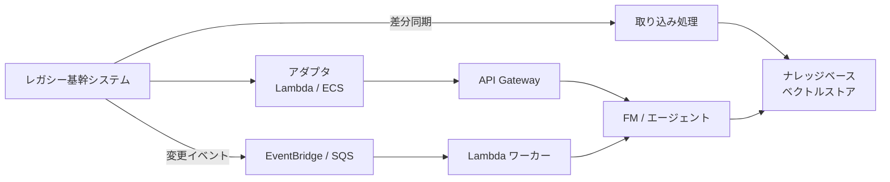

### 12-4. 疎結合のメリット

| 直接呼び出し（密結合） | イベント駆動（疎結合） |
|---|---|
| 相手が遅い・止まるとこちらも止まる | キューが吸収し、相手の復旧後に処理を再開できる |
| 負荷が急増すると下流が壊れる | キューでピークを平準化できる |
| 変更時に双方の改修が必要 | イベントのスキーマだけ守ればよい |

### 12-5. データ同期のポイント

| 観点 | 内容 |
|---|---|
| フル同期と差分同期 | 初回はフル、以降は変更分だけ（変更データキャプチャ、更新日時ベース等）で効率化 |
| 同期のトリガー | スケジュール、S3 イベント、変更通知 |
| 削除の反映 | 元データで削除されたものが検索結果に残らないようにする |
| Bedrock ナレッジベース | データソースの同期（取り込みジョブ）を定期実行・イベント実行して最新化する |

### 12-6. ベストプラクティス

| ベストプラクティス | 理由 |
|---|---|
| レガシーに直接FMを接続せず、アダプタ層を置く | レガシー側の仕様変更や形式（XML・固定長等）の差をアダプタで吸収できる |
| 重い・遅い処理は非同期（キュー）にする | FM呼び出しの待ち時間でレガシー側が詰まるのを防ぐ |
| DLQ（デッドレターキュー）を設定する | 処理できなかったメッセージを失わず、後で原因調査・再処理できる |
| 処理は冪等に作る | キューは「少なくとも1回」配信で重複することがあるため |
| 同期の遅延を監視する | RAGが古い情報で回答する事故を防ぐ |
| レガシーへの呼び出しにレート制限をかける | AI からの大量アクセスで基幹システムを過負荷にしない |

### 12-7. 試験の勘所

- 「レガシーとFMを疎結合に」→ **イベント駆動（SQS / EventBridge）**。
- 「社内データを最新状態でRAGに使いたい」→ **データ同期（差分取り込み）**。
- 「レガシーのAPIを使いやすくする」→ **API Gateway + アダプタ Lambda**。

**根拠URL（Step 12）**
- Amazon EventBridge: <https://docs.aws.amazon.com/eventbridge/latest/userguide/eb-what-is.html>
- Amazon SQS: <https://docs.aws.amazon.com/AWSSimpleQueueService/latest/SQSDeveloperGuide/welcome.html>
- SQS デッドレターキュー: <https://docs.aws.amazon.com/AWSSimpleQueueService/latest/SQSDeveloperGuide/sqs-dead-letter-queues.html>
- Bedrock ナレッジベースのデータソース同期: <https://docs.aws.amazon.com/bedrock/latest/userguide/kb-data-source-sync-ingest.html>
- AWS DMS（変更データキャプチャ）: <https://docs.aws.amazon.com/dms/latest/userguide/CHAP_Task.CDC.html>

---

## Step 13. 【Skill 2.3.2】既存アプリへのAI機能追加

### 13-1. 何をするスキルか

既存のマイクロサービスやSaaSに、FM の機能（要約・分類・生成など）を **後付けで組み込む** 方法です。使う部品は3つです。

| サービス | 役割 |
|---|---|
| Amazon API Gateway | 既存のマイクロサービスから呼べる AI 用の入口を作る。認証・レート制限・検証も担当 |
| AWS Lambda（Webhook ハンドラー） | 外部SaaSからの通知（Webhook）を受け取り、FMで処理して返す |
| Amazon EventBridge | 業務イベントをきっかけに AI 処理を起動する |

### 13-2. 3つの統合パターン

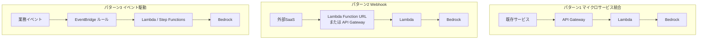

### 13-3. Webhook ハンドラーの注意点

Webhook は「相手が決めたタイミングで、短い時間内の応答を求めて」呼んできます。FM呼び出しは遅いため、次の設計が定石です。

```mermaid
sequenceDiagram
    participant S as 外部SaaS
    participant W as Webhook Lambda
    participant Q as SQS
    participant P as 処理 Lambda
    participant B as Bedrock
    S->>W: Webhook 通知
    W->>W: 署名を検証
    W->>Q: メッセージを投入
    W-->>S: 即座に 200 を返す
    Q->>P: メッセージ取り出し
    P->>B: FM で処理
    B-->>P: 結果
    P->>S: 結果を API で書き戻す
```

### 13-4. ベストプラクティス

| ベストプラクティス | 理由 |
|---|---|
| Webhook は受信後すぐ応答し、重い処理は非同期へ回す | 相手側のタイムアウトと再送を防ぐ |
| Webhook の署名を必ず検証する | なりすましリクエストで AI 処理や課金を発生させられないようにする |
| EventBridge ルールでイベントを絞り込む | 不要なイベントで FM を呼ぶとコストが無駄になる |
| 既存サービス向けの AI API は既存の認証方式に合わせる | 利用側の改修を最小にできる |
| API Gateway の使用量プランとスロットリングを設定する | 特定サービスの暴走が全体を圧迫しないようにする |
| 失敗したイベントは DLQ に集める | 失われたイベントの再処理が可能になる |

### 13-5. 試験の勘所

- 「マイクロサービスから呼び出す入口」→ **API Gateway**。
- 「外部SaaSの通知を受けてAI処理」→ **Lambda（Webhook ハンドラー）**。
- 「業務イベントで自動的にAI処理を起動」→ **EventBridge**。

**根拠URL（Step 13）**
- API Gateway 開発者ガイド: <https://docs.aws.amazon.com/apigateway/latest/developerguide/welcome.html>
- Lambda 関数 URL: <https://docs.aws.amazon.com/lambda/latest/dg/urls-configuration.html>
- EventBridge ルール: <https://docs.aws.amazon.com/eventbridge/latest/userguide/eb-rules.html>
- API Gateway スロットリング: <https://docs.aws.amazon.com/apigateway/latest/developerguide/api-gateway-request-throttling.html>

---

## Step 14. 【Skill 2.3.3】セキュアなアクセス基盤

### 14-1. 何をするスキルか

FM と企業データへのアクセスを、**「誰が」「どのモデル・どのデータに」「最小限の権限で」** 使えるように制御します。キーワードは3つです。

| キーワード | 内容 |
|---|---|
| アイデンティティフェデレーション | 社内のIdP（Entra ID・Okta等）で認証した人が、AWS へ一時認証情報でアクセスする |
| ロールベースアクセス制御（RBAC） | 役割ごとに使えるモデル・データを決める |
| FM への最小権限 API アクセス | `bedrock:InvokeModel` などを必要なモデルだけに許可する |

### 14-2. 認証から呼び出しまでの流れ

```mermaid
sequenceDiagram
    participant U as 社員
    participant IDP as 企業 IdP
    participant AWS as IAM Identity Center または Cognito
    participant APP as GenAI アプリ
    participant BR as Bedrock
    U->>IDP: ログイン
    IDP-->>AWS: SAML または OIDC で認証結果
    AWS-->>U: 一時的な認証情報 または トークン
    U->>APP: トークン付きでリクエスト
    APP->>APP: 役割に応じて使えるモデル・データを判定
    APP->>BR: 許可された範囲だけ InvokeModel
    BR-->>APP: 応答
```

### 14-3. 認証サービスの使い分け

| サービス | 向くケース |
|---|---|
| IAM Identity Center | 社員が AWS アカウント・サービスへ SSO する |
| Amazon Cognito | 自社アプリのエンドユーザー認証、外部IdPとのフェデレーション |
| IAM ロールの引き受け（STS） | アプリやサービスが一時認証情報を得る |
| SAML / OIDC フェデレーション | 既存の企業IdPと連携する |

### 14-4. 最小権限ポリシーの例

必要なモデルだけを許可し、それ以外はすべて拒否します。

```json
{
  "Version": "2012-10-17",
  "Statement": [{
    "Effect": "Allow",
    "Action": ["bedrock:InvokeModel", "bedrock:InvokeModelWithResponseStream"],
    "Resource": [
      "arn:aws:bedrock:us-east-1::foundation-model/amazon.nova-lite-v1:0"
    ]
  }]
}
```

> `Resource` を `*` にしない点が重要です。推論プロファイルを使う場合は、そのARNも含めて指定します。

### 14-5. データ側のアクセス制御

| 対象 | 制御方法 |
|---|---|
| RAG のドキュメント | ナレッジベースのメタデータフィルタで、ユーザーの所属・権限に合う文書だけを検索対象にする |
| S3 | バケットポリシー・IAM・暗号化（KMS） |
| 通信 | VPC エンドポイント（PrivateLink）でインターネットを経由しない |
| 組織全体の制限 | SCP で許可するリージョン・モデルを制限する |

### 14-6. ベストプラクティス

| ベストプラクティス | 理由 |
|---|---|
| 長期アクセスキーを使わず一時認証情報（ロール）を使う | キー漏えいの被害を小さくし、ローテーション負担をなくす |
| 役割ごとに利用可能なモデルを分ける | 高額・高機能モデルの無制限利用を防ぐ |
| RAGでは「誰が見られる文書か」をメタデータで絞る | LLMが権限外の文書を回答に含めてしまう情報漏えいを防ぐ |
| Bedrock への通信は VPC エンドポイント経由にする | 通信を AWS ネットワーク内に閉じられる |
| CloudTrail で Bedrock API の利用を記録する | 誰がいつどのモデルを使ったかを監査できる |
| フロントエンドから直接 Bedrock を呼ばず、バックエンドを経由させる | 認証・入力検証・ガードレールを一箇所で強制できる |

### 14-7. 試験の勘所

- 「社内IdPのユーザーを使いたい」→ **フェデレーション（SAML/OIDC）+ IAM Identity Center / Cognito**。
- 「必要最小限のモデルだけ許可」→ **IAM ポリシーで Resource を限定**。
- 「ユーザーごとに見られる文書が違うRAG」→ **メタデータフィルタ**。

**根拠URL（Step 14）**
- IAM Identity Center: <https://docs.aws.amazon.com/singlesignon/latest/userguide/what-is.html>
- Amazon Cognito: <https://docs.aws.amazon.com/cognito/latest/developerguide/what-is-amazon-cognito.html>
- SAML フェデレーション: <https://docs.aws.amazon.com/IAM/latest/UserGuide/id_roles_providers_saml.html>
- Bedrock の IAM ポリシー例: <https://docs.aws.amazon.com/bedrock/latest/userguide/security_iam_id-based-policy-examples.html>
- Bedrock と VPC エンドポイント: <https://docs.aws.amazon.com/bedrock/latest/userguide/usingVPC.html>
- ナレッジベースのメタデータフィルタ: <https://docs.aws.amazon.com/bedrock/latest/userguide/kb-test-config.html>
- SCP: <https://docs.aws.amazon.com/organizations/latest/userguide/orgs_manage_policies_scps.html>

---

## Step 15. 【Skill 2.3.4】クロス環境AIソリューション（データコンプライアンス）

### 15-1. 何をするスキルか

法規制（データ所在地・越境移転の制限）や既存設備の都合で、**データをクラウドに出せない／決まった地域に置く必要がある** 場合の設計です。キーワードは Outposts、Wavelength、セキュアルーティングです。

### 15-2. 使うサービスの役割

| サービス | 役割 | 使いどころ |
|---|---|---|
| AWS Outposts | AWSのインフラを自社データセンターに設置する | 社内データの近くでアプリ・データ処理を行い、必要なときだけリージョンの FM を呼ぶ |
| AWS Wavelength | 5G 通信事業者網の内部にAWSの計算資源を置く | モバイル・エッジで超低遅延が必要なアプリ |
| Direct Connect / Site-to-Site VPN | オンプレミスとAWSの閉域・暗号化接続 | 社内ネットワークから安全に Bedrock などへ接続 |
| PrivateLink（VPC エンドポイント） | サービスへ閉域で接続 | インターネットを経由せずに Bedrock を呼ぶ |

### 15-3. 全体構成

```mermaid
flowchart LR
    subgraph ONP["オンプレミス / Outposts"]
        DATA["機密データ"] --> PRE["前処理<br/>匿名化 マスキング"]
    end
    PRE -->|Direct Connect または VPN<br/>暗号化された専用経路| VPCE["VPC エンドポイント<br/>PrivateLink"]
    VPCE --> BR["Amazon Bedrock<br/>指定リージョン"]
    BR --> VPCE
    subgraph EDGE["エッジ Wavelength"]
        MOB["モバイル向けアプリ<br/>低遅延処理"]
    end
    MOB --> BR
```

### 15-4. データコンプライアンスの考え方

| 要件 | 対応 |
|---|---|
| データを特定の国・地域から出したくない | 推論を行うリージョンを限定する。クロスリージョン推論を使う場合は、データが処理され得る範囲（地域）が要件に合うプロファイルを選ぶ |
| 機密データそのものをFMに送りたくない | オンプレ側で匿名化・マスキングしてから送る |
| 通信を公衆網に出したくない | Direct Connect / VPN と PrivateLink を使う |
| どのリージョンを許可するか組織で縛る | SCP でリージョンを制限する |

### 15-5. Outposts と Wavelength の違い

| 項目 | Outposts | Wavelength |
|---|---|---|
| 設置場所 | 顧客のデータセンター | 通信事業者の5Gネットワーク内 |
| 主な目的 | データ所在地の維持、オンプレとの低遅延連携 | モバイル端末への超低遅延 |
| 典型例 | 工場・病院・金融機関内の処理 | AR/VR、リアルタイム映像、モバイルゲーム |

### 15-6. ベストプラクティス

| ベストプラクティス | 理由 |
|---|---|
| 送信前に機密項目をマスキング・匿名化する | FM への送信データを最小化し、漏えい時の被害を小さくする |
| クラウドとオンプレの接続は閉域網を使う | 公衆インターネット経由の盗聴・改ざんリスクを避ける |
| 冗長な接続（Direct Connect + VPN バックアップ）にする | 専用線障害で AI 機能全体が止まらないようにする |
| 処理リージョンと保存リージョンを設計書に明記する | 監査でデータ所在地を説明できる |
| エッジでは軽量な処理を行い、重い推論はリージョンに送る | エッジの資源は限られるため役割分担する |

### 15-7. 試験の勘所

- 「データを社内に置いたまま」「オンプレとの統合」→ **Outposts**。
- 「モバイル／5Gで超低遅延のエッジ」→ **Wavelength**。
- 「インターネットを通さず Bedrock へ」→ **PrivateLink（VPC エンドポイント）+ Direct Connect / VPN**。

**根拠URL（Step 15）**
- AWS Outposts: <https://docs.aws.amazon.com/outposts/latest/userguide/what-is-outposts.html>
- AWS Wavelength: <https://docs.aws.amazon.com/wavelength/latest/developerguide/what-is-wavelength.html>
- AWS Direct Connect: <https://docs.aws.amazon.com/directconnect/latest/UserGuide/Welcome.html>
- Site-to-Site VPN: <https://docs.aws.amazon.com/vpn/latest/s2svpn/VPC_VPN.html>
- Bedrock と VPC エンドポイント: <https://docs.aws.amazon.com/bedrock/latest/userguide/usingVPC.html>
- Bedrock のデータ保護: <https://docs.aws.amazon.com/bedrock/latest/userguide/data-protection.html>
- クロスリージョン推論: <https://docs.aws.amazon.com/bedrock/latest/userguide/cross-region-inference.html>

---

## Step 16. 【Skill 2.3.5】CI/CD と GenAI ゲートウェイ

### 16-1. 何をするスキルか

GenAI アプリ（プロンプト・ツール・エージェント・インフラ）を **安全に自動デプロイ** し、複数チームが **統一された入口（ゲートウェイ）** 経由でFMを使えるようにします。

### 16-2. GenAI 向け CI/CD パイプライン

通常のCI/CDに加えて、**プロンプトやモデル出力の品質テスト**、**セキュリティスキャン**、**ロールバック** が必要です。

```mermaid
flowchart LR
    SRC["ソース<br/>コード プロンプト IaC"] --> BLD["CodeBuild<br/>単体テスト セキュリティスキャン"]
    BLD --> EVAL["評価テスト<br/>プロンプト回帰 品質閾値"]
    EVAL --> STG["ステージング環境にデプロイ"]
    STG --> APPR["承認ゲート"]
    APPR --> PRD["本番へ段階的デプロイ<br/>カナリア"]
    PRD --> MON{"アラーム 品質低下を検知"}
    MON -->|異常あり| RB["自動ロールバック"]
    MON -->|正常| DONE["完了"]
```

| 段階 | 使うサービス・内容 |
|---|---|
| ソース管理 | プロンプトテンプレート、エージェント定義、IaC（CloudFormation / CDK）をバージョン管理 |
| ビルド・テスト | CodeBuild で単体テスト、依存脆弱性スキャン、シークレット検出、IaC のセキュリティチェック |
| AI 評価テスト | 固定の評価データでプロンプト変更の品質回帰を自動チェック |
| デプロイ | CodePipeline で環境を順に進める。Lambda はエイリアスとトラフィックシフトで段階展開 |
| ロールバック | CloudWatch アラームをトリガーに前のバージョンへ戻す |

### 16-3. GenAI ゲートウェイ（集中管理の入口）

アプリごとに直接 Bedrock を呼ぶ構成だと、認証・ログ・コスト管理・ガードレールがバラバラになります。**ゲートウェイ（抽象化レイヤー）** を1つ置くと一元的に管理できます。

```mermaid
flowchart TD
    A1["アプリA"] --> GW
    A2["アプリB"] --> GW
    A3["アプリC"] --> GW
    subgraph GW["GenAI ゲートウェイ"]
        AU["認証 認可"] --> RL["レート制限 トークン割り当て"]
        RL --> GR["ガードレール 入出力検査"]
        GR --> RT["モデルルーティング フォールバック"]
        RT --> LG["ログ メトリクス コスト按分"]
    end
    RT --> M1["Bedrock モデル群"]
    RT --> M2["SageMaker AI エンドポイント"]
    RT --> M3["外部のモデルAPI"]
```

| ゲートウェイの機能 | 目的 |
|---|---|
| 認証・認可 | チーム・アプリごとに使えるモデルを制御 |
| レート制限・トークンクォータ | 特定チームの使いすぎを防ぐ |
| ガードレール | 全アプリに共通の安全ルールを強制 |
| モデルの抽象化 | アプリ側はモデル名を知らなくてよく、モデル入れ替えが容易 |
| 観測性 | 全アプリのトークン・コスト・遅延・エラーを一元把握 |
| コスト按分 | チーム別の利用料金を割り当てる（アプリケーション推論プロファイルのタグ等） |

### 16-4. ベストプラクティス

| ベストプラクティス | 理由 |
|---|---|
| プロンプトもコードと同様にバージョン管理・レビューする | 品質低下の原因を差分から特定できる |
| デプロイ前に評価データで自動テストする | プロンプト変更の影響は目視では気づきにくい |
| セキュリティスキャンをパイプラインに組み込む | 脆弱性・秘密情報の混入を本番前に止める |
| 段階的デプロイ（カナリア）と自動ロールバックを用意する | 問題のある変更が全ユーザーに影響する前に戻せる |
| すべてのGenAI呼び出しをゲートウェイ経由にさせる | ガバナンス・コスト管理・監査を一箇所に集約できる |
| ゲートウェイ自体を冗長化し、単一障害点にしない | 入口が止まると全アプリのAI機能が止まる |

### 16-5. 試験の勘所

- 「テスト・セキュリティスキャン・ロールバックを自動化」→ **CodePipeline + CodeBuild**。
- 「複数チーム・複数アプリで統一的に管理」→ **GenAI ゲートウェイ（集中抽象化レイヤー）**。
- 「プロンプト変更の品質確認」→ パイプライン内の **自動評価テスト**。

**根拠URL（Step 16）**
- AWS CodePipeline: <https://docs.aws.amazon.com/codepipeline/latest/userguide/welcome.html>
- AWS CodeBuild: <https://docs.aws.amazon.com/codebuild/latest/userguide/welcome.html>
- Lambda エイリアスとトラフィックシフト: <https://docs.aws.amazon.com/lambda/latest/dg/configuration-aliases.html>
- Bedrock アプリケーション推論プロファイル: <https://docs.aws.amazon.com/bedrock/latest/userguide/inference-profiles-create.html>
- Bedrock プロンプト管理: <https://docs.aws.amazon.com/bedrock/latest/userguide/prompt-management.html>
- マルチプロバイダー GenAI ゲートウェイ（AWS ソリューションガイダンス）: <https://aws.amazon.com/solutions/guidance/multi-provider-generative-ai-gateway-on-aws/>

---

# Task 2.4 FM API 統合の実装

---

## Step 17. 【Skill 2.4.1】柔軟なモデル呼び出しシステム

### 17-1. 何をするスキルか

FM の呼び出しには「すぐ結果が欲しい（同期）」と「時間がかかってもよい（非同期）」があります。呼び出し元の環境（Lambda・コンテナ・オンプレ・モバイル）に応じて、適切な方式を選びます。

### 17-2. 同期と非同期の使い分け

| 方式 | 流れ | 向くケース |
|---|---|---|
| 同期 | リクエスト → FM → すぐ応答 | チャット、短い要約、対話的な画面 |
| 非同期 | リクエスト受付 → キュー → ワーカーがFM呼び出し → 結果を後で通知/取得 | 長文処理、大量処理、応答に時間がかかるタスク |

```mermaid
flowchart TD
    REQ["クライアントのリクエスト"] --> Q{"結果をその場で必要か"}
    Q -->|はい 短時間| SYNC["同期: Bedrock API を直接呼ぶ<br/>Lambda や コンテナから"]
    Q -->|いいえ 時間がかかる| ASYNC["非同期: SQS に投入し即座に受付応答"]
    ASYNC --> WK["ワーカー Lambda が Bedrock を呼ぶ"]
    WK --> ST["結果を DynamoDB や S3 に保存"]
    ST --> NT["通知 または クライアントが取得"]
```

### 17-3. 非同期処理の構成

```mermaid
sequenceDiagram
    participant C as クライアント
    participant G as API Gateway
    participant Q as SQS
    participant W as ワーカー Lambda
    participant B as Bedrock
    participant D as DynamoDB
    C->>G: 処理依頼
    G->>Q: メッセージ投入
    G-->>C: 202 Accepted と ジョブID
    Q->>W: メッセージ配信
    W->>B: InvokeModel
    B-->>W: 結果
    W->>D: ジョブIDで結果を保存
    C->>G: ジョブIDで状況を問い合わせ
    G->>D: 取得
    D-->>C: 結果
```

### 17-4. API Gateway によるリクエスト検証

カスタムAPIクライアント向けに公開するとき、**API Gateway のリクエスト検証** を使うと、不正なリクエストを FM に届く前に弾けます（トークンを無駄にしません）。

| 検証できるもの | 内容 |
|---|---|
| 必須パラメータ・ヘッダー | 欠けていたら 400 を返す |
| リクエスト本文のスキーマ（モデル） | JSON スキーマで型・必須項目・上限を検証 |
| 本文サイズ | 過大な入力を拒否してトークン超過を防ぐ |

### 17-5. 言語別 AWS SDK の使い分け

| 環境 | 一般的な選択 |
|---|---|
| Python | boto3（`bedrock-runtime`） |
| JavaScript / TypeScript | AWS SDK for JavaScript v3（`@aws-sdk/client-bedrock-runtime`） |
| Java / .NET / Go など | それぞれの AWS SDK |

どの SDK でも、認証は **IAM ロール（一時認証情報）** を使い、アクセスキーをコードに埋め込まないのが基本です。

### 17-6. ベストプラクティス

| ベストプラクティス | 理由 |
|---|---|
| 同期が必要か非同期で足りるかを最初に判断する | 不要に同期にすると、タイムアウトとスロットリングの影響を受けやすい |
| 非同期は SQS + DLQ で作る | 失敗メッセージを失わず、ピークも吸収できる |
| ジョブIDで状態を追跡できるようにする | 利用者が結果を取り出せ、重複実行も検知できる |
| API Gateway で入力を検証してから FM へ渡す | 不正入力による無駄なコストと予期しない挙動を防ぐ |
| 共通形式の Converse API を優先する | モデルを切り替えてもアプリ側の変更が少ない |
| SDK のタイムアウト設定を生成時間に合わせる | 既定の読み取りタイムアウトが短く、長い生成が途中で切れることがある |

### 17-7. 試験の勘所

- 「すぐに応答が必要」→ **同期の Bedrock API**。
- 「時間がかかる・大量」→ **SQS + 非同期ワーカー**。
- 「入力を FM に渡す前に検証」→ **API Gateway のリクエスト検証**。

**根拠URL（Step 17）**
- InvokeModel / Converse: <https://docs.aws.amazon.com/bedrock/latest/userguide/inference-invoke.html>
- Converse API: <https://docs.aws.amazon.com/bedrock/latest/userguide/conversation-inference.html>
- API Gateway リクエスト検証: <https://docs.aws.amazon.com/apigateway/latest/developerguide/api-gateway-method-request-validation.html>
- Amazon SQS: <https://docs.aws.amazon.com/AWSSimpleQueueService/latest/SQSDeveloperGuide/welcome.html>
- AWS SDK の概要: <https://docs.aws.amazon.com/sdkref/latest/guide/overview.html>

---

## Step 18. 【Skill 2.4.2】リアルタイムAIインタラクション（ストリーミング）

### 18-1. 何をするスキルか

LLM の回答は生成に数秒〜数十秒かかります。全部できてから返すと、ユーザーは待たされます。**生成された部分から順に届ける（ストリーミング）** と、体感速度が大きく改善します。

### 18-2. Bedrock のストリーミング API

| API | 内容 |
|---|---|
| `ConverseStream` | Converse 形式のストリーミング版（推奨） |
| `InvokeModelWithResponseStream` | InvokeModel のストリーミング版 |

ストリームは、メッセージ開始 → テキストの断片（delta）の連続 → メッセージ終了 → メタデータ（トークン使用量）というイベントの列で届きます。

```mermaid
sequenceDiagram
    participant C as ブラウザ
    participant S as アプリ バックエンド
    participant B as Bedrock
    C->>S: 質問
    S->>B: ConverseStream
    B-->>S: messageStart
    B-->>S: contentBlockDelta テキスト断片1
    S-->>C: 断片1を転送
    B-->>S: contentBlockDelta テキスト断片2
    S-->>C: 断片2を転送
    B-->>S: messageStop
    B-->>S: metadata トークン使用量
    S-->>C: 完了を通知
```

### 18-3. クライアントまで届ける3つの方法

| 方式 | 特徴 | 向くケース |
|---|---|---|
| WebSocket（API Gateway WebSocket API） | 双方向通信。サーバーからいつでも送れる | チャット、双方向の対話 |
| Server-Sent Events（SSE） | サーバーからクライアントへの一方向ストリーム。実装が簡単 | テキスト生成の逐次表示 |
| チャンク転送（Chunked transfer encoding） | HTTP レスポンスを分割して送る。API Gateway REST のレスポンスストリーミングや Lambda のレスポンスストリーミングで利用 | 通常のHTTPクライアントで逐次受信 |

### 18-4. API Gateway と Lambda のレスポンスストリーミング

| 仕組み | ポイント |
|---|---|
| API Gateway REST API のレスポンスストリーミング | 統合のレスポンス転送モードを `STREAM` にすると、完成を待たずに送り出せる。`HTTP_PROXY` または `AWS_PROXY` 統合のみ対応。通常の29秒制限や10MB制限を超えられ、統合タイムアウトは最大15分まで延長できる |
| Lambda のレスポンスストリーミング | 関数 URL などで、生成中の出力を逐次返す |
| API Gateway WebSocket API | 接続を保持し、`@connections` API でサーバー側からクライアントへメッセージを送る |

```mermaid
flowchart TD
    Q{"ストリーミング配信の方法は"} --> A["双方向が必要 チャット"]
    Q --> B["サーバーから一方向で十分"]
    Q --> C["既存のHTTP構成を活かしたい"]
    A --> WS["API Gateway WebSocket API"]
    B --> SSE["SSE または Lambda レスポンスストリーミング"]
    C --> RS["API Gateway REST のレスポンスストリーミング STREAM モード"]
```

### 18-5. ストリーミング時の注意点

| 注意点 | 内容 |
|---|---|
| 途中で失敗する | 一部を送った後にエラーになる可能性があるため、クライアントで中断・再試行の処理が必要 |
| STREAM モードの制約 | 応答全体のバッファリングが必要な機能（例: API Gateway での圧縮）は使えない。圧縮が必要なら統合側で行う |
| 出力の検査 | 出力ガードレールを使う場合は、ストリーミングと検査のタイミングの設計が必要 |
| タイムアウトが切れても処理が続く | クライアント側の切断後も Lambda が動き続けることがあるため、切断検知と中断処理を設計する |

### 18-6. ベストプラクティス

| ベストプラクティス | 理由 |
|---|---|
| 対話型UIでは基本的にストリーミングを使う | 全文完成を待たずに表示でき、体感待ち時間が大きく減る |
| 最初のトークンまでの時間（TTFT）を指標として監視する | ストリーミングUXの品質を直接表す |
| 切断・中断をハンドリングする | 不要な生成を止めてコストを節約できる |
| トークン使用量はストリーム末尾のメタデータで記録する | 完了後に正確な使用量が分かる |
| 長時間応答は API Gateway の統合タイムアウト設定を確認する | 既定の短いタイムアウトで途中切断されるのを防ぐ |

### 18-7. 試験の勘所

- 「回答を逐次表示したい」→ **ConverseStream / InvokeModelWithResponseStream**。
- 「双方向のリアルタイムチャット」→ **API Gateway WebSocket API**。
- 「REST API で長い生成応答、29秒制限を超えたい」→ **API Gateway のレスポンスストリーミング**。

**根拠URL（Step 18）**
- API Gateway レスポンスストリーミング（検証済み）: <https://docs.aws.amazon.com/apigateway/latest/developerguide/response-transfer-mode.html>
- API Gateway レスポンスストリーミング発表（検証済み）: <https://aws.amazon.com/about-aws/whats-new/2025/11/api-gateway-response-streaming-rest-apis>
- ConverseStream API リファレンス: <https://docs.aws.amazon.com/bedrock/latest/APIReference/API_runtime_ConverseStream.html>
- API Gateway WebSocket API: <https://docs.aws.amazon.com/apigateway/latest/developerguide/apigateway-websocket-api.html>
- Lambda レスポンスストリーミング: <https://docs.aws.amazon.com/lambda/latest/dg/configuration-response-streaming.html>

---

## Step 19. 【Skill 2.4.3】耐障害性のあるFMシステム

### 19-1. 何をするスキルか

FM の呼び出しは、スロットリング・タイムアウト・一時的なサービス障害が起こり得ます。**失敗を前提に設計し、利用者に影響を出さない** ことが目的です。

### 19-2. 起こりやすいエラー

| エラー | 意味 | 基本の対処 |
|---|---|---|
| `ThrottlingException`（429） | リクエスト過多でクォータ超過 | 指数バックオフで再試行、クォータ引き上げ、分散 |
| `ModelTimeoutException` | モデルが時間内に応答しなかった | 入力短縮・出力上限の見直し・再試行 |
| `ServiceUnavailableException`（503） | 一時的なサービス障害 | 再試行・フォールバック |
| `ValidationException`（400） | リクエスト不正（入力が長すぎる等） | **再試行しても直らない**。入力を修正 |
| `AccessDeniedException` | 権限不足・モデル未有効化 | **再試行しても直らない**。権限・設定を修正 |

> 重要: 再試行してよいのは「一時的なエラー」だけです。400 系の入力エラーを再試行しても成功しません。

### 19-3. 指数バックオフとジッター

再試行の間隔を **1秒 → 2秒 → 4秒…と倍々に増やし**（指数バックオフ）、さらに **ランダムな揺らぎ（ジッター）** を加えると、多数のクライアントが同時に再試行して再び殺到するのを防げます。AWS SDK には再試行機能が標準で組み込まれています。

```python
import boto3
from botocore.config import Config

cfg = Config(
    retries={"max_attempts": 5, "mode": "adaptive"},  # 指数バックオフ + 適応的な送信制御
    read_timeout=120,                                  # 長い生成に合わせて延長
    connect_timeout=5,
)
client = boto3.client("bedrock-runtime", config=cfg)
```

### 19-4. 耐障害性の多層設計

```mermaid
flowchart TD
    REQ["リクエスト"] --> RL["API Gateway レート制限"]
    RL --> CALL["Bedrock 呼び出し<br/>SDK の指数バックオフ"]
    CALL --> OK{"成功か"}
    OK -->|成功| RES["応答"]
    OK -->|失敗| FB1{"代替手段があるか"}
    FB1 -->|別モデル| M2["フォールバックモデルで再試行"]
    FB1 -->|別リージョン| R2["クロスリージョン推論 / 別リージョン"]
    FB1 -->|キャッシュ| CA["以前の回答 または 簡易回答"]
    FB1 -->|なし| GD["グレースフルな縮退<br/>定型メッセージで丁寧に断る"]
    M2 --> RES
    R2 --> RES
    CA --> RES
    GD --> RES
```

### 19-5. 耐障害性の4本柱

| 柱 | 具体策 |
|---|---|
| 再試行 | SDK の指数バックオフ＋ジッター。再試行回数に上限を設ける |
| レート制限 | API Gateway のスロットリング・使用量プランで入口を保護 |
| フォールバック・グレースフルな縮退 | 別モデル、別リージョン、キャッシュ、機能制限付き応答 |
| 観測性 | X-Ray で複数サービスをまたぐ呼び出しを追跡し、どこで遅い／失敗するかを特定 |

### 19-6. ベストプラクティス

| ベストプラクティス | 理由 |
|---|---|
| 再試行は一時エラーのみ、回数と合計時間に上限を設ける | 無限再試行は障害を悪化させ、コストも増やす |
| ジッターを必ず付ける | 再試行の同時集中（thundering herd）を防ぐ |
| 失敗時の縮退動作を事前に設計しておく | 障害時に白画面やエラーだけになるのを避け、体験を維持できる |
| 同期の再試行が重なる場合は非同期（キュー）化を検討する | ユーザーを待たせず、バックグラウンドで再処理できる |
| X-Ray を有効にしサービス境界をトレースする | 遅延・エラーの原因がアプリかFMか下流かを切り分けられる |
| クォータ使用率に CloudWatch アラームを設定する | スロットリングが起きる前に引き上げ申請や分散を行える |

### 19-7. 試験の勘所

- 「スロットリングを自動で吸収」→ **SDK の指数バックオフ**（＋ジッター）。
- 「呼び出し元ごとの上限を設けたい」→ **API Gateway のレート制限 / 使用量プラン**。
- 「障害時にサービスを止めない」→ **フォールバック / グレースフルな縮退**。
- 「サービス間のどこが遅いか」→ **AWS X-Ray**。

**根拠URL（Step 19）**
- AWS SDK 再試行動作: <https://docs.aws.amazon.com/sdkref/latest/guide/feature-retry-behavior.html>
- Builders' Library: <https://aws.amazon.com/builders-library/timeouts-retries-and-backoff-with-jitter/>
- Bedrock API エラーコード: <https://docs.aws.amazon.com/bedrock/latest/userguide/troubleshooting-api-error-codes.html>
- API Gateway スロットリング: <https://docs.aws.amazon.com/apigateway/latest/developerguide/api-gateway-request-throttling.html>
- AWS X-Ray: <https://docs.aws.amazon.com/xray/latest/devguide/aws-xray.html>
- Bedrock クォータ: <https://docs.aws.amazon.com/bedrock/latest/userguide/quotas.html>

---

## Step 20. 【Skill 2.4.4】インテリジェントなモデルルーティング

### 20-1. 何をするスキルか

リクエストの内容や状況に応じて、**どのモデルに送るかを自動で決める** 仕組みです。試験ガイドは4つの方式を挙げています。

| 方式 | 決め方 | 使うもの |
|---|---|---|
| 静的ルーティング | 設定で固定（機能・テナント・環境ごとにモデルを決める） | アプリコード、設定ファイル、AppConfig など |
| 動的なコンテンツベースルーティング | 入力の内容（種類・難易度・言語）を見て振り分ける | Step Functions の Choice ステート＋分類モデル |
| メトリクスベースのインテリジェントルーティング | 遅延・コスト・品質などの指標で最適なモデルを選ぶ | Bedrock Intelligent Prompt Routing、自作のメトリクス判定 |
| リクエスト変換ルーティング | リクエストを変換して適切なバックエンドへ送る | API Gateway のマッピング（リクエスト変換） |

### 20-2. 4方式の比較

| 観点 | 静的 | コンテンツベース | メトリクスベース | API Gateway 変換 |
|---|---|---|---|---|
| 判断の賢さ | 低い（固定） | 中（入力で判断） | 高い（実績や予測で判断） | 低〜中（ルールで判断） |
| 実装の手軽さ | 非常に簡単 | 中 | 簡単（マネージド機能）〜複雑（自作） | 中 |
| 追加の遅延 | なし | 分類の呼び出し分 | 小さい | ほぼなし |
| 向くケース | 用途が明確 | 入力が多様 | コストと品質を自動最適化 | 既存APIを活かしたい |

### 20-3. コンテンツベースルーティングの例

```mermaid
flowchart TD
    IN["ユーザー入力"] --> CLS["安価な分類モデルで<br/>種類と難易度を判定"]
    CLS --> CH{"Step Functions Choice"}
    CH -->|簡単な質問| S["小型モデル"]
    CH -->|複雑な推論| L["大型モデル"]
    CH -->|画像を含む| V["マルチモーダルモデル"]
    CH -->|コード生成| C["コード向けモデル"]
    S --> OUT["応答"]
    L --> OUT
    V --> OUT
    C --> OUT
```

### 20-4. Bedrock Intelligent Prompt Routing（マネージドなルーティング）

Bedrock のプロンプトルーティング機能は、**同じモデルファミリー内** で、リクエストごとに「品質が足りる範囲で最も低コストなモデル」を予測して振り分けます。既定のルーターを使うことも、自分で構成することもできます。

| 項目 | 内容 |
|---|---|
| 対象 | 同一モデルファミリー内のモデル間 |
| 利点 | 自前で分類・ルーティングを作らなくてよい。コスト削減が期待できる |
| 制約 | 英語プロンプト向けに最適化されている。アプリ固有の性能データに基づく調整はできない |

> 上の制約は公式ドキュメントに記載された内容です。日本語中心のアプリや、自社評価データに基づいて厳密に振り分けたい場合は、自作のコンテンツベースルーティングが候補になります。

### 20-5. ベストプラクティス

| ベストプラクティス | 理由 |
|---|---|
| まず静的ルーティングで始める | 複雑さを増やす前に、必要性を測定で確認できる |
| ルーティング判断自体を安価・高速にする | 判断が高コスト・高遅延だと節約効果が消える |
| ルーティング結果（どのモデルに送ったか）をログに残す | 振り分けの妥当性とコスト効果を後から検証できる |
| ルーティング先の障害時のフォールバック先を決めておく | 選ばれたモデルが落ちても処理を継続できる |
| 自社データでルーティング精度を評価する | 振り分けミスが品質低下に直結する |

### 20-6. 試験の勘所

- 「設定で固定」→ 静的。「入力内容で分岐」→ **Step Functions Choice**。
- 「マネージドで自動最適化」→ **Intelligent Prompt Routing**（同一ファミリー内）。
- 「API Gateway でルーティングロジック」→ **リクエスト変換（マッピング）**。

**根拠URL（Step 20）**
- Intelligent Prompt Routing（検証済み）: <https://docs.aws.amazon.com/bedrock/latest/userguide/prompt-routing.html>
- Intelligent Prompt Routing 製品ページ（検証済み）: <https://aws.amazon.com/bedrock/intelligent-prompt-routing>
- Step Functions Choice: <https://docs.aws.amazon.com/step-functions/latest/dg/state-choice.html>
- API Gateway マッピングテンプレート: <https://docs.aws.amazon.com/apigateway/latest/developerguide/models-mappings.html>
- AWS AppConfig: <https://docs.aws.amazon.com/appconfig/latest/userguide/what-is-appconfig.html>

---

# Task 2.5 アプリケーション統合パターンと開発ツール

---

## Step 21. 【Skill 2.5.1】GenAI ワークロード向け FM API インターフェース

### 21-1. 何をするスキルか

通常の Web API は数百ミリ秒で応答しますが、GenAI の API は **数秒〜数分** かかり、**トークン数に上限** があります。この特性に合わせた API 設計が必要です。

### 21-2. GenAI API 特有の3つの課題

| 課題 | 内容 | 対策 |
|---|---|---|
| 長い応答時間 | API Gateway の既定の統合タイムアウトは29秒で、FM生成が収まらないことがある | レスポンスストリーミング、非同期化、タイムアウト引き上げ |
| トークン上限の管理 | 入力＋出力がモデルのコンテキスト長を超えるとエラー・課金増 | 入力の事前検証・切り詰め・要約、`maxTokens` の設定 |
| タイムアウト時の再試行 | 再試行で二重課金・二重実行になり得る | 冪等キー、ジョブID、バックオフ付きのリトライ |

### 21-3. 各層のタイムアウトを揃える

層ごとにタイムアウトが異なると、**一番短い層で切られます**。

```mermaid
flowchart LR
    CL["クライアント"] --> CF["CloudFront / ALB<br/>応答タイムアウト"]
    CF --> AGW["API Gateway<br/>統合タイムアウト 既定29秒"]
    AGW --> LM["Lambda<br/>最大15分"]
    LM --> BR["Bedrock<br/>生成時間"]
```

| 層 | 見るべき設定 |
|---|---|
| クライアント / SDK | 読み取りタイムアウト |
| CloudFront / ALB | 応答（アイドル）タイムアウト |
| API Gateway | 統合タイムアウト（ストリーミング利用で最大15分まで延長可） |
| Lambda | 関数のタイムアウト（最大15分） |

### 21-4. トークン上限の管理フロー

```mermaid
flowchart TD
    IN["ユーザー入力"] --> CNT["入力トークン数を見積もる"]
    CNT --> CK{"上限に収まるか"}
    CK -->|収まる| CALL["maxTokens を設定して FM を呼ぶ"]
    CK -->|超える| ACT["切り詰め または 要約 または チャンク分割"]
    ACT --> CALL
    CALL --> LOG["usage を記録して予算管理"]
```

### 21-5. ベストプラクティス

| ベストプラクティス | 理由 |
|---|---|
| 長い応答はストリーミングか非同期にする | 29秒の既定制限やユーザーの待ちを回避できる |
| `maxTokens` を用途に応じて必ず設定する | 想定外に長い出力による遅延とコスト増を防ぐ |
| 入力サイズをAPI層で先に検証する | FM に送ってからエラーになる無駄を避ける |
| 再試行は冪等キーとセットにする | 同じ依頼の二重実行・二重課金を防ぐ |
| 全層のタイムアウトを一覧にして整合させる | 最短の層で切れて原因が分かりにくくなるのを防ぐ |
| 使用トークンをレスポンスや監視データに含める | 利用者別のコスト管理・上限制御ができる |

### 21-6. 試験の勘所

- 「29秒を超えるFM応答をREST APIで返す」→ **API Gateway のレスポンスストリーミング（STREAM）**、または非同期化。
- 「トークン超過を防ぐ」→ **事前の入力検証と切り詰め/要約、`maxTokens`**。
- 「タイムアウトからのリトライ」→ **バックオフ + 冪等性**。

**根拠URL（Step 21）**
- API Gateway レスポンスストリーミング（検証済み）: <https://docs.aws.amazon.com/apigateway/latest/developerguide/response-transfer-mode.html>
- API Gateway クォータ: <https://docs.aws.amazon.com/apigateway/latest/developerguide/limits.html>
- Lambda タイムアウト（検証済み）: <https://docs.aws.amazon.com/lambda/latest/dg/configuration-timeout.html>
- Bedrock 推論パラメータ: <https://docs.aws.amazon.com/bedrock/latest/userguide/inference-parameters.html>
- Bedrock トークンのカウント: <https://docs.aws.amazon.com/bedrock/latest/userguide/count-tokens.html>

---

## Step 22. 【Skill 2.5.2】使いやすい AI インターフェース

### 22-1. 何をするスキルか

FM を組み込んだ機能を、**開発者にも利用者にも使いやすい形** で提供します。試験ガイドでは3つの道具が挙げられています。

| 道具 | 役割 | 対象 |
|---|---|---|
| AWS Amplify | フロントエンドを素早く作る。宣言的UIコンポーネントと AI 機能の連携 | フロントエンド開発者 |
| OpenAPI 仕様 | API の設計書を先に書く（API ファースト）。ドキュメント・検証・SDK生成に使える | API の提供側と利用側 |
| Amazon Bedrock Flows（旧 Prompt Flows） | ノードをつなぐだけで生成AIワークフローを作るビジュアルビルダー | ノーコード／ローコードで作りたい人 |

### 22-2. 3つの役割分担

```mermaid
flowchart LR
    UI["Amplify<br/>画面 UI コンポーネント"] --> API["OpenAPI で定義した API<br/>API Gateway"]
    API --> FLOW["Bedrock Flows<br/>ノーコード ワークフロー"]
    FLOW --> FM["Bedrock FM / ナレッジベース / エージェント"]
```

### 22-3. Bedrock Flows のノード

| ノード | 役割 |
|---|---|
| Input / Output | フローの入口と出口 |
| Prompt | プロンプトを実行する |
| Agent | Bedrock エージェントを呼ぶ |
| Knowledge Base | RAG 検索を行う |
| Condition | 条件分岐 |
| Iterator / Collector | 配列の各要素を順に処理し、結果を集める |
| Lambda Function | カスタム処理を実行 |
| S3 Storage / Retrieval | S3 へ保存・取得 |

> フローは **バージョンとエイリアス** で管理でき、アプリは `InvokeFlow` にエイリアスを指定して呼び出します。エイリアスを切り替えるだけで、アプリ側の変更なしに新しいフローへ移行できます。

### 22-4. OpenAPI による API ファースト開発

```mermaid
flowchart TD
    SPEC["OpenAPI 仕様を先に書く"] --> IMP["API Gateway にインポート"]
    SPEC --> DOC["ドキュメント自動生成"]
    SPEC --> SDK["クライアント SDK 生成"]
    SPEC --> VAL["リクエスト検証ルールに利用"]
    IMP --> IMPL["バックエンド実装 Lambda など"]
```

API の仕様を先に決めることで、フロントエンドとバックエンドを **並行開発** でき、AI機能の追加で入出力が変わっても契約（仕様）で影響範囲を管理できます。

### 22-5. ベストプラクティス

| ベストプラクティス | 理由 |
|---|---|
| OpenAPI を単一の信頼できる情報源にする | ドキュメント・検証・SDK の食い違いを防ぐ |
| フローはエイリアスで公開し、バージョンで履歴管理する | 問題があれば前のバージョンへ即座に戻せる |
| ノーコードで始め、必要になったら Lambda ノード等で拡張する | 素早い試作と本格運用の両立ができる |
| UI 側では生成中の状態・エラー・再試行を明示する | GenAIは遅延や失敗が起こりやすく、利用者の不安を減らす |
| UI から直接 Bedrock を呼ばず認可されたバックエンド経由にする | 認証情報の露出や無制限利用を防ぐ |

### 22-6. 試験の勘所

- 「ノーコードで生成AIワークフロー」→ **Bedrock Flows（Prompt Flows）**。
- 「API を先に設計して並行開発」→ **OpenAPI**。
- 「宣言的UIコンポーネントで素早く画面構築」→ **AWS Amplify**。

**根拠URL（Step 22）**
- Amazon Bedrock Flows: <https://docs.aws.amazon.com/bedrock/latest/userguide/flows.html>
- Flows のノード種別: <https://docs.aws.amazon.com/bedrock/latest/userguide/flows-nodes.html>
- AWS Amplify AI Kit: <https://docs.amplify.aws/react/ai/>
- API Gateway と OpenAPI のインポート: <https://docs.aws.amazon.com/apigateway/latest/developerguide/api-gateway-import-api.html>
- OpenAPI Specification: <https://spec.openapis.org/oas/latest.html>

---

## Step 23. 【Skill 2.5.3】業務システムの強化

### 23-1. 何をするスキルか

CRM（顧客管理）、文書処理、データ処理など、**既存の業務をAIで賢くする** 実装です。3つの代表例が挙げられています。

| 例 | 使うサービス |
|---|---|
| CRM の強化 | Lambda（顧客データから要約・次の提案を生成し、CRM へ書き戻す） |
| 文書処理システム | Step Functions（抽出→分類→要約→検証→保存の流れを制御） |
| 自動データ処理 | Amazon Bedrock Data Automation（BDA） |

### 23-2. CRM 強化の流れ

```mermaid
sequenceDiagram
    participant CRM as CRM システム
    participant L as Lambda
    participant B as Bedrock
    CRM->>L: 商談メモ更新イベント Webhook
    L->>L: 顧客情報を取得 個人情報をマスキング
    L->>B: 要約と次のアクション案を依頼
    B-->>L: 要約 提案
    L->>CRM: 要約フィールドを更新
```

### 23-3. Step Functions による文書処理

```mermaid
flowchart TD
    UP["S3 に文書をアップロード"] --> EV["EventBridge が検知"]
    EV --> SF["Step Functions 開始"]
    SF --> EX["内容を抽出 Bedrock Data Automation など"]
    EX --> CL["分類 要約 Bedrock"]
    CL --> VA{"信頼度は十分か"}
    VA -->|はい| ST["結果を保存 DynamoDB S3"]
    VA -->|いいえ| HR["人間のレビュー"]
    HR --> ST
    ST --> NT["通知"]
```

### 23-4. Amazon Bedrock Data Automation（BDA）とは

BDA は、**文書・画像・動画・音声などの非構造データから、必要な情報を構造化データとして抽出する** マネージド機能です。

| 項目 | 内容 |
|---|---|
| 入力 | 文書（PDF・画像）、画像、動画、音声 |
| 出力 | 標準出力（要約・テキスト化など）と、カスタム出力（ブループリントで定義した項目） |
| ブループリント | 「請求書なら、請求番号・金額・日付を取り出す」といった抽出項目の定義 |
| プロジェクト | 出力設定をまとめた単位。処理時に指定する |
| 呼び出し | 非同期実行（`InvokeDataAutomationAsync`）や、ナレッジベースの解析機能として利用 |

### 23-5. Textract との違いの整理

| 観点 | Amazon Textract | Bedrock Data Automation |
|---|---|---|
| 得意なこと | 文書のOCR・表・フォーム抽出 | 文書に加え画像・動画・音声もまとめて構造化 |
| 出力の形 | テキスト・キー値・表 | ブループリントで指定した構造化項目 |
| 生成AIとの連携 | 後段でFMに渡して理解させる | 生成AIを使った抽出が組み込まれている |

### 23-6. ベストプラクティス

| ベストプラクティス | 理由 |
|---|---|
| CRM の更新前に個人情報をマスキングする | FM への不要な個人情報送信を避ける |
| AI の出力は「提案」欄に書き、確定は人が行う運用から始める | 誤情報が基幹データを直接汚染するのを防ぐ |
| 文書処理は Step Functions で段階化し、失敗時のリトライと人間レビューを組み込む | どの段階で失敗したか追跡でき、低信頼度の結果を人が補える |
| 抽出項目はブループリントで明示する | 出力のばらつきを減らし、後続処理が安定する |
| 非同期処理に DLQ と監視を設定する | 処理漏れを検知して再処理できる |

### 23-7. 試験の勘所

- 「文書・画像・動画・音声から構造化データを自動抽出」→ **Bedrock Data Automation**。
- 「複数ステップの文書処理を制御・再試行」→ **Step Functions**。
- 「CRM に AI 機能を追加」→ **Lambda による連携**。

**根拠URL（Step 23）**
- Bedrock Data Automation: <https://docs.aws.amazon.com/bedrock/latest/userguide/bda.html>
- BDA のブループリント: <https://docs.aws.amazon.com/bedrock/latest/userguide/bda-blueprint-info.html>
- Step Functions: <https://docs.aws.amazon.com/step-functions/latest/dg/welcome.html>
- Amazon Textract: <https://docs.aws.amazon.com/textract/latest/dg/what-is.html>
- Lambda 概要: <https://docs.aws.amazon.com/lambda/latest/dg/welcome.html>

---

## Step 24. 【Skill 2.5.4】開発者生産性の向上（Amazon Q Developer）

### 24-1. 何をするスキルか

**Amazon Q Developer** は、開発者のコーディングを支援する生成AIアシスタントです。GenAI アプリの開発では、次の場面で使います。

| 場面 | Q Developer の使い方 |
|---|---|
| コード生成・リファクタリング | IDE で自然言語から実装を生成、既存コードの改善 |
| API 利用の支援 | Bedrock などの API の呼び出しコードの提案 |
| AIコンポーネントのテスト | 単体テストの生成 |
| 性能最適化 | 非効率な処理の指摘と改善案 |
| セキュリティ | コードの脆弱性スキャンと修正案 |

### 24-2. 開発ワークフローの中での位置づけ

```mermaid
flowchart LR
    DES["設計"] --> GEN["Q Developer<br/>コード生成 API 補助"]
    GEN --> TST["Q Developer<br/>テスト生成"]
    TST --> REF["Q Developer<br/>リファクタリング 最適化"]
    REF --> SEC["Q Developer<br/>セキュリティスキャン"]
    SEC --> REV["人によるレビュー"]
    REV --> DEP["デプロイ"]
```

### 24-3. 使うときの注意

| 注意点 | 内容 |
|---|---|
| 生成コードは必ずレビューする | 誤り・古い API・非効率が含まれる可能性がある |
| 機密情報の扱い | 社内ポリシーとサービスの設定（学習利用・データ共有）を確認する |
| 最終責任は開発者にある | AI の提案をそのまま本番へ入れない |

### 24-4. ベストプラクティス

| ベストプラクティス | 理由 |
|---|---|
| 生成コードにもテストと静的解析を適用する | 人が書いたコードと同じ品質基準を保つため |
| 指示（プロンプト）にコンテキスト（言語・フレームワーク・制約）を書く | 前提が曖昧だと、意図と違うコードが出やすい |
| テスト生成は境界値・異常系も明示して依頼する | 正常系だけの形式的なテストになるのを避ける |
| セキュリティスキャンを開発の早い段階で実行する | 後工程での修正コストを下げる |
| チームで利用ルール（レビュー必須など）を決める | 品質のばらつきと責任の曖昧化を防ぐ |

### 24-5. 試験の勘所

- 「IDE 内でコード生成・リファクタリング・テスト生成・脆弱性スキャン」→ **Amazon Q Developer**。
- 「Bedrock API のコード例を素早く得る」→ Q Developer のコード提案。
- 開発者向けツールであり、**実行時の推論基盤ではない**点を区別する。

**根拠URL（Step 24）**
- Amazon Q Developer 概要: <https://docs.aws.amazon.com/amazonq/latest/qdeveloper-ug/what-is.html>
- Q Developer の機能一覧: <https://aws.amazon.com/q/developer/features/>
- Q Developer のコードレビュー・セキュリティスキャン: <https://docs.aws.amazon.com/amazonq/latest/qdeveloper-ug/security-scans.html>

---

## Step 25. 【Skill 2.5.5】高度な GenAI アプリケーション

### 25-1. 何をするスキルか

単発の質問応答を超えた、**複数ステップ・複数エージェントによる高度なアプリケーション** を作ります。3つの観点があります。

| 観点 | 使うもの |
|---|---|
| AWS ネイティブなオーケストレーション | Strands Agents と AWS Agent Squad |
| エージェント設計パターンの実装 | Step Functions |
| プロンプトチェーン | Amazon Bedrock（Flows・プロンプト管理など）で複数プロンプトを連結 |

### 25-2. 代表的なエージェント設計パターン

| パターン | 内容 | 向くケース |
|---|---|---|
| プロンプトチェーン | 前の出力を次の入力にする直列処理 | 段階的に品質を上げる文書生成 |
| ルーティング | 入力を分類して専門処理へ | 問い合わせの種類別対応 |
| 並列化 | 独立した処理を同時に実行して集約 | 複数観点の分析、アンサンブル |
| オーケストレーター・ワーカー | 司令塔が分解し、ワーカーが担当 | 複雑な調査・コーディング |
| 評価者・最適化（Evaluator-Optimizer） | 生成→評価→改善を繰り返す | 品質基準が明確な文章・コード |

### 25-3. パターン別の Step Functions 実装

```mermaid
flowchart TD
    subgraph CH["プロンプトチェーン"]
        C1["下書き"] --> C2["校正"] --> C3["要約"]
    end
    subgraph PA["並列化"]
        P0["入力"] --> P1["観点A"]
        P0 --> P2["観点B"]
        P1 --> P3["統合"]
        P2 --> P3
    end
    subgraph EO["評価者と最適化"]
        E1["生成"] --> E2{"評価"}
        E2 -->|不合格| E3["改善"]
        E3 --> E1
        E2 -->|合格| E4["完了"]
    end
```

> 評価者・最適化パターンは必ず **反復上限** を設けます（Step 4 参照）。

### 25-4. オーケストレーター・ワーカー

```mermaid
flowchart TD
    USER["複雑な依頼"] --> ORC["オーケストレーター エージェント<br/>計画を立てて分解"]
    ORC --> W1["ワーカー: 情報収集"]
    ORC --> W2["ワーカー: データ分析"]
    ORC --> W3["ワーカー: 文章作成"]
    W1 --> ORC
    W2 --> ORC
    W3 --> ORC
    ORC --> ANS["統合して最終回答"]
```

### 25-5. どれを使うか（Strands / Agent Squad / Step Functions）

| 要件 | 向く選択 |
|---|---|
| コードでエージェントを柔軟に作る。ツールはPython関数 | Strands Agents |
| 質問に応じて専門エージェントへ振り分ける | AWS Agent Squad |
| 順序・分岐・承認・リトライ・監査をしっかり制御したい | Step Functions |
| ノーコード/ローコードで構築 | Bedrock Flows |
| 長時間・状態を持つ本番運用のエージェント基盤 | Amazon Bedrock AgentCore などの実行基盤 |

### 25-6. ベストプラクティス

| ベストプラクティス | 理由 |
|---|---|
| 単純なパターンから始め、必要なときだけ複雑にする | エージェントを増やすほど、遅延・コスト・デバッグの難しさが増す |
| 各ステップの入出力を構造化（JSON）にする | 次のステップが確実に解釈でき、検証もしやすい |
| 決定的な制御（順序・上限・承認）は Step Functions に任せる | LLM の判断だけに頼ると再現性・監査性が下がる |
| 中間結果を保存して再開できるようにする | 長い処理の途中失敗で最初からやり直さずに済む |
| すべてのパターンに反復上限とタイムアウトを設定する | ループ暴走とコスト増を防ぐ |

### 25-7. 試験の勘所

- 「AWS ネイティブな複数エージェント」→ **Strands Agents / Agent Squad**。
- 「エージェントパターンを確実に制御」→ **Step Functions**。
- 「プロンプトを連結して複数段階で処理」→ **プロンプトチェーン（Bedrock Flows など）**。

**根拠URL（Step 25）**
- Anthropic: Building effective agents（パターン解説）: <https://www.anthropic.com/engineering/building-effective-agents>
- Strands Agents: <https://strandsagents.com/latest/documentation/docs/>
- AWS Agent Squad: <https://awslabs.github.io/agent-squad/>
- Bedrock Flows: <https://docs.aws.amazon.com/bedrock/latest/userguide/flows.html>
- Bedrock マルチエージェントコラボレーション: <https://docs.aws.amazon.com/bedrock/latest/userguide/agents-multi-agent-collaboration.html>
- プロンプトチェーン（Anthropic ドキュメント）: <https://docs.claude.com/en/docs/build-with-claude/prompt-engineering/chain-prompts>
- Bedrock AgentCore: <https://docs.aws.amazon.com/bedrock-agentcore/latest/devguide/what-is-bedrock-agentcore.html>

---

## Step 26. 【Skill 2.5.6】FM アプリのトラブルシューティング効率化

### 26-1. 何をするスキルか

GenAI アプリの不具合は「FMの回答が変」「遅い」「たまに失敗する」など原因が見えにくいのが特徴です。**ログ・トレース・AI支援** の3点セットで効率よく原因を絞り込みます。

| 道具 | 使い方 |
|---|---|
| CloudWatch Logs Insights | プロンプトとレスポンスのログをクエリして傾向・異常を分析 |
| AWS X-Ray | FM API 呼び出しを含む全体の処理経路をトレースし、遅延の原因箇所を特定 |
| Amazon Q Developer | GenAI 特有のエラーパターンの認識、原因の説明、修正案の提示 |

### 26-2. 調査の進め方

```mermaid
flowchart TD
    SYM["症状 遅い エラー 回答が不適切"] --> M["CloudWatch メトリクス<br/>遅延 スロットル エラー数"]
    M --> T["X-Ray トレース<br/>どの区間が遅い 失敗するか"]
    T --> L["Logs Insights<br/>該当リクエストのプロンプトと応答を確認"]
    L --> RC{"原因の分類"}
    RC -->|クォータ スロットリング| A1["バックオフ クォータ引き上げ"]
    RC -->|入力が長すぎる| A2["入力短縮 要約 maxTokens見直し"]
    RC -->|プロンプトの問題| A3["プロンプト改善 評価データで確認"]
    RC -->|下流ツールの失敗| A4["ツールのエラー処理 タイムアウト見直し"]
```

### 26-3. ログの有効化が前提

プロンプトと応答を分析するには、**Bedrock のモデル呼び出しログ** を有効にして、CloudWatch Logs または S3 に出力しておく必要があります。

| 項目 | 内容 |
|---|---|
| 出力先 | CloudWatch Logs、S3 |
| 記録される内容 | リクエスト・レスポンス、モデルID、トークン数など |
| 注意 | プロンプトに個人情報や機密が含まれるため、保存先の暗号化・アクセス制限・保持期間が必須 |

### 26-4. Logs Insights のクエリ例

```text
fields @timestamp, modelId, input.inputTokenCount, output.outputTokenCount
| filter ispresent(errorCode)
| stats count() as errors by errorCode, modelId
| sort errors desc
```

```text
fields @timestamp, modelId, input.inputTokenCount as inTok
| filter inTok > 8000
| sort inTok desc
| limit 20
```

> フィールド名は、有効化したログの実際の形式に合わせて確認してください。

### 26-5. 問題の切り分け早見表

| 症状 | まず疑うこと | 確認する道具 |
|---|---|---|
| たまに 429 | クォータ・同時実行 | CloudWatch メトリクス（スロットル数）、クォータ画面 |
| 全体が遅い | どの区間が遅いか | X-Ray トレース |
| 特定の入力で失敗 | 入力長・形式 | Logs Insights（長い入力の抽出） |
| 回答の質が急に低下 | プロンプト変更・参照データの変化 | プロンプトのバージョン履歴、評価テスト |
| ツールが呼ばれない／間違う | ツール定義の説明・スキーマ | トレースとツールログ |
| コストが急増 | 入力・出力トークンの増加 | Logs Insights（トークン集計） |

### 26-6. ベストプラクティス

| ベストプラクティス | 理由 |
|---|---|
| リクエストIDとトレースIDを全ログに含める | ログとトレースを突き合わせて1件ずつ追跡できる |
| モデル呼び出しログを有効にしつつ、機微情報を保護する | 分析に必須だが、ログ自体が漏えい源にもなる |
| X-Ray でサービス境界を跨ぐ呼び出しを追跡する | FM・Lambda・ツールのどこが原因かを切り分けられる |
| 頻出エラーのクエリを保存してダッシュボード化する | 障害時の初動を速くできる |
| エラー率・スロットル・トークン数にアラームを設定する | 利用者が気づく前に検知できる |

### 26-7. 試験の勘所

- 「プロンプトとレスポンスを分析」→ **CloudWatch Logs Insights**。
- 「FM API 呼び出しを含む経路を可視化」→ **AWS X-Ray**。
- 「GenAI 特有のエラーパターンの認識」→ **Amazon Q Developer**。

**根拠URL（Step 26）**
- Bedrock モデル呼び出しログ: <https://docs.aws.amazon.com/bedrock/latest/userguide/model-invocation-logging.html>
- Bedrock の CloudWatch メトリクス: <https://docs.aws.amazon.com/bedrock/latest/userguide/monitoring-cw.html>
- CloudWatch Logs Insights: <https://docs.aws.amazon.com/AmazonCloudWatch/latest/logs/AnalyzingLogData.html>
- AWS X-Ray: <https://docs.aws.amazon.com/xray/latest/devguide/aws-xray.html>
- Amazon Q Developer: <https://docs.aws.amazon.com/amazonq/latest/qdeveloper-ug/what-is.html>

---

## Step 27. 練習問題（15問）

> 本番は「択一」と「複数選択（2つ以上を全て選ぶ）」の2形式です。答えを見る前に、必ず自分で理由まで考えてください。

### 問題 1（Skill 2.1.2）
ReAct パターンの FM エージェントを実装します。反復回数の上限、ツール呼び出しごとのタイムアウト、失敗時の再試行を **コードの外側で** 制御したいです。最も適切な選択はどれですか。

- A. 1つの Lambda 関数内で while ループを実装する
- B. Step Functions のステートマシンで Reason と Act を別ステートにし、Choice で分岐する
- C. プロンプトに「5回までしか繰り返さない」と書く
- D. SQS のみでメッセージをループさせる

<details><summary>答えと解説</summary>

**B**。Step Functions なら、反復カウンタ・`TimeoutSeconds`・`Retry`/`Catch` をワークフロー定義で制御できます。A は Lambda の15分制限と制御の分かりにくさがあり、C は FM が守る保証がありません。D は分岐や状態管理に不向きです。
</details>

### 問題 2（Skill 2.1.3）
エージェントが外部決済 API を呼ぶ構成です。下流 API が一時的に障害を起こしたとき、エージェントが再試行を繰り返して障害を悪化させています。最も効果的な対策はどれですか。

- A. Lambda のメモリを増やす
- B. サーキットブレーカーを実装し、連続失敗時に呼び出しを遮断してフォールバックを返す
- C. プロンプトで「慎重に呼び出して」と指示する
- D. Bedrock の Provisioned Throughput を購入する

<details><summary>答えと解説</summary>

**B**。サーキットブレーカーは、障害中の下流を呼び続けないための仕組みです。A・D は障害の連鎖と無関係で、C は強制力がありません。
</details>

### 問題 3（Skill 2.1.5）
契約書のドラフトを FM が生成し、法務担当者の承認後にのみ送付します。承認までに数日かかることがあります。最も適切な設計はどれですか。（2つ選択）

- A. Step Functions の Standard ワークフローでタスクトークンによるコールバック待機を使う
- B. Lambda を1分ごとに起動して承認状況をポーリングする
- C. Step Functions の Express ワークフローで承認を待つ
- D. 承認・却下の結果を API Gateway 経由で `SendTaskSuccess` / `SendTaskFailure` として返す

<details><summary>答えと解説</summary>

**A と D**。Standard は長時間（最長1年）の待機が可能で、タスクトークンによるコールバックなら待機中の無駄な処理がありません。Express は最長5分、ポーリングは非効率です。
</details>

### 問題 4（Skill 2.1.7）
軽量で状態を持たないツール群と、長時間動作し独自の重い依存関係を持つツールを MCP サーバーとして公開します。最も適切な組み合わせはどれですか。

- A. 両方とも Lambda
- B. 軽量ツールは Lambda、重いツールは ECS 上の MCP サーバー
- C. 両方とも ECS
- D. 軽量ツールは ECS、重いツールは Lambda

<details><summary>答えと解説</summary>

**B**。ステートレスで軽量なら Lambda、複雑・長時間・重い依存なら ECS が向きます。
</details>

### 問題 5（Skill 2.2.1）
Bedrock でファインチューニングしたカスタムモデルを、本番で安定したスループットで提供する必要があります。必要なものはどれですか。

- A. オンデマンド推論をそのまま使う
- B. Bedrock Provisioned Throughput
- C. Lambda のプロビジョンド同時実行
- D. Bedrock バッチ推論のみ

<details><summary>答えと解説</summary>

**B**。Bedrock のカスタムモデルを推論に使うには Provisioned Throughput が必要です。C は Lambda の機能で、FM の処理能力とは別物です。
</details>

### 問題 6（Skill 2.2.2）
SageMaker AI に大型 LLM をデプロイしたところ、モデルのロードに時間がかかり、エンドポイントの作成が失敗します。最も適切な対処はどれですか。

- A. コンテナ起動のヘルスチェックのタイムアウトとモデルダウンロードのタイムアウトを延長する
- B. エンドポイントを複数リージョンに作る
- C. API Gateway のタイムアウトを延長する
- D. Lambda のメモリを増やす

<details><summary>答えと解説</summary>

**A**。起動（モデルロード）に時間がかかる場合、`ContainerStartupHealthCheckTimeoutInSeconds` や `ModelDataDownloadTimeoutInSeconds` を延長します。
</details>

### 問題 7（Skill 2.2.3）
問い合わせの大半は定型的で、一部だけ複雑な推論が必要です。コストを抑えつつ品質を保ちたいです。最も適切なのはどれですか。

- A. すべて最大の大型モデルで処理する
- B. 小型モデルで先に処理し、品質チェックに不合格だったものだけ大型モデルへ回す
- C. すべて小型モデルで処理する
- D. ランダムに半分ずつ振り分ける

<details><summary>答えと解説</summary>

**B**。モデルカスケードです。A はコスト過剰、C は複雑な問い合わせで品質低下、D は根拠がありません。
</details>

### 問題 8（Skill 2.3.3）
社内 IdP で認証した従業員だけが GenAI アプリを使え、さらに部門ごとに利用できるモデルを分けたいです。最も適切な設計はどれですか。（2つ選択）

- A. SAML/OIDC フェデレーションで一時認証情報を発行する
- B. 全員に共通の長期アクセスキーを配布する
- C. 役割ごとの IAM ポリシーで `bedrock:InvokeModel` の許可対象モデルを限定する
- D. `Resource` を `*` にして、アプリ側で制御する

<details><summary>答えと解説</summary>

**A と C**。フェデレーションで一時認証情報を使い、IAM ポリシーでリソース（モデル）を限定します。B は漏えいリスク、D は最小権限に反します。
</details>

### 問題 9（Skill 2.3.4）
データ所在地の規制で、機密データをオンプレミスから出せません。ただし、匿名化したデータで Bedrock の FM を利用してよいことになっています。最も適切な構成はどれですか。

- A. 機密データをそのままインターネット経由で Bedrock に送る
- B. オンプレミスで匿名化し、Direct Connect（または VPN）と VPC エンドポイント経由で Bedrock を呼ぶ
- C. Wavelength に機密データを移す
- D. 規制のため FM の利用を断念する

<details><summary>答えと解説</summary>

**B**。送る前に匿名化し、閉域経路で接続します。Wavelength は5Gエッジ向けで、データ所在地の解決策ではありません。
</details>

### 問題 10（Skill 2.3.5）
複数のチームが独自に Bedrock を呼び出しており、コスト把握・ガードレール適用・レート制限がバラバラです。最も適切な改善策はどれですか。

- A. 各チームにガイドラインを配布するのみ
- B. GenAI ゲートウェイ（集中管理の抽象化レイヤー）を設け、認証・レート制限・ガードレール・ログを一元化する
- C. すべてのチームのクォータを引き上げる
- D. Provisioned Throughput を全チームで購入する

<details><summary>答えと解説</summary>

**B**。ゲートウェイを入口にすると、統一的な制御とコスト按分ができます。
</details>

### 問題 11（Skill 2.4.2 / 2.5.1）
REST API 経由で FM の長い応答を返したいのですが、29秒で切断されます。ユーザーには生成中の文章を順次見せたいです。最も適切なのはどれですか。

- A. API Gateway の REST API のレスポンスストリーミング（STREAM モード）と ConverseStream を組み合わせる
- B. Lambda のタイムアウトを15分にする（API Gateway はそのまま）
- C. 全文生成まで待ってから返す
- D. 入力文を短くするよう利用者に依頼する

<details><summary>答えと解説</summary>

**A**。STREAM モードにより、完成を待たず送信でき、29秒制限も超えられます。B は API Gateway 側のタイムアウトが先に切れます。
</details>

### 問題 12（Skill 2.4.3）
本番で `ThrottlingException` が散発しています。ユーザー影響を最小にしつつ、再試行の同時集中を避けたいです。最も適切な対策はどれですか。（2つ選択）

- A. SDK の再試行設定で指数バックオフとジッターを使う
- B. 失敗したら即座に無制限で再試行する
- C. フォールバックモデルや簡易応答など、縮退動作を用意する
- D. `ValidationException` も同じ方法で再試行する

<details><summary>答えと解説</summary>

**A と C**。B は障害を悪化させ、D の入力エラーは再試行しても直りません。
</details>

### 問題 13（Skill 2.4.4）
問い合わせの内容によって、簡単な質問は小型モデル、複雑な質問は大型モデル、画像付きはマルチモーダルモデルに振り分けたいです。Step Functions を使う場合の構成はどれですか。

- A. Parallel ステートで全モデルを呼ぶ
- B. 分類結果に基づく Choice ステートで分岐する
- C. Map ステートで全入力を同じモデルに送る
- D. Wait ステートで切り替える

<details><summary>答えと解説</summary>

**B**。入力の内容で振り分けるコンテンツベースルーティングです。
</details>

### 問題 14（Skill 2.5.2）
開発経験の少ない事業部門が、プロンプト・ナレッジベース検索・条件分岐を組み合わせた生成AIワークフローを、コードを書かずに作りたいです。最も適切なのはどれですか。

- A. Amazon Bedrock Flows（Prompt Flows）
- B. Amazon ECS 上のカスタムアプリ
- C. AWS CodePipeline
- D. SageMaker AI の非同期エンドポイント

<details><summary>答えと解説</summary>

**A**。ノードをつなぐビジュアルビルダーです。
</details>

### 問題 15（Skill 2.5.6）
GenAI アプリの応答が時々遅くなります。原因が FM 呼び出し、ツール（Lambda）、データベースのどこにあるか特定し、さらに遅いリクエストのプロンプトを確認したいです。最も適切な組み合わせはどれですか。（2つ選択）

- A. AWS X-Ray で呼び出し経路をトレースする
- B. CloudWatch Logs Insights でモデル呼び出しログを分析する
- C. Route 53 のヘルスチェックを増やす
- D. AWS Config ルールを追加する

<details><summary>答えと解説</summary>

**A と B**。X-Ray で遅い区間を特定し、Logs Insights で該当リクエストのプロンプトや応答を確認します（モデル呼び出しログの有効化が前提）。
</details>

---

## Step 28. 引っかけポイント一覧

| # | よくある誤解 | 正しい理解 | 関連Step |
|---|---|---|---|
| 1 | 反復の上限はプロンプトで指示すれば十分 | FM は守らないことがある。**Step Functions 等の外部制御**で上限を強制する | 3, 4 |
| 2 | Lambda のタイムアウトを延ばせば長い応答が返せる | **API Gateway の統合タイムアウト（既定29秒）が先に切れる**。ストリーミングや非同期化が必要 | 18, 21 |
| 3 | 4xx の入力エラーも再試行すれば直る | 再試行は **一時エラー（429・5xx・タイムアウト）のみ** | 19 |
| 4 | カスタムモデルもオンデマンドで使える | Bedrock のカスタムモデル推論には **Provisioned Throughput** が必要 | 9 |
| 5 | Express ワークフローで人の承認を待てる | Express は最長5分。承認待ちは **Standard + タスクトークン** | 6 |
| 6 | MCP サーバーはすべて Lambda で作る | 軽量・ステートレスは Lambda、**複雑・長時間・状態保持は ECS** | 8 |
| 7 | サーキットブレーカーはエラーを再試行する仕組み | **連続失敗時に呼び出しを遮断**し、下流の回復を待つ仕組み | 4 |
| 8 | Intelligent Prompt Routing は任意のモデル間で動く | **同一モデルファミリー内**。英語向けに最適化。アプリ固有データでの調整は不可 | 11, 20 |
| 9 | Wavelength はデータ所在地の解決策 | Wavelength は **5G エッジの低遅延**。データを社内に置くのは **Outposts** | 15 |
| 10 | アンサンブルはコストなしで品質が上がる | **呼び出し回数分のコストと遅延が増える** | 5 |
| 11 | ツールの引数検証は FM に任せられる | **ツール側（Lambda 等）で必ず検証**する。FM の出力は信頼しきれない | 7 |
| 12 | モデルカスケードは常にコストを下げる | 不合格率が高いと **小型分が二重に上乗せ** されて逆に高くなる | 11 |
| 13 | RAG のアクセス制御は LLM に任せればよい | **メタデータフィルタ等で検索時に絞る**。LLM に隠させるのは不確実 | 14 |
| 14 | ストリーミングなら API Gateway の圧縮もそのまま使える | STREAM モードでは **全体バッファが必要な機能は使えない**（圧縮は統合側で） | 18 |
| 15 | Q Developer は実行時の推論基盤 | **開発者向けの支援ツール**（コード生成・テスト・スキャン等） | 24 |
| 16 | GPU使用率が高ければ LLM のスケール指標として十分 | **同時リクエスト数・キュー長・トークン処理量**も重視する | 10 |
| 17 | Webhook の中でFM処理を完了させてから応答する | **即応答して非同期処理**。相手のタイムアウトと再送を避ける | 13 |
| 18 | ログ分析は何もしなくてもできる | Bedrock の **モデル呼び出しログを事前に有効化**しておく必要がある | 26 |

---

## Step 29. 最終チートシート

### 29-1. サービス早見表

| やりたいこと | 答え |
|---|---|
| 1体のエージェントを素早く作る | Strands Agents |
| 質問に応じて専門エージェントへ振り分け | AWS Agent Squad |
| エージェントとツールの接続を標準化 | MCP |
| 軽量・ステートレスなMCPサーバー | Lambda |
| 複雑・長時間なMCPサーバー | ECS |
| ReAct・分岐・上限・タイムアウトを外部制御 | Step Functions |
| 人の承認を待つ | Step Functions Standard + タスクトークン |
| 連続障害の遮断 | サーキットブレーカー |
| 権限の限定 | IAM（最小権限） |
| 複数モデルを同時に呼ぶ | Parallel ステート + 集約ロジック |
| 小型→大型の段階処理 | モデルカスケード |
| カスタムモデルの本番推論（Bedrock） | Provisioned Throughput |
| Bedrock にない独自モデル | SageMaker AI エンドポイント |
| 即時性不要の大量処理 | バッチ推論 |
| オンプレとの閉域接続 | Direct Connect / VPN + PrivateLink |
| データを社内設置のまま統合 | Outposts |
| 5Gエッジの超低遅延 | Wavelength |
| テスト・スキャン・ロールバック自動化 | CodePipeline + CodeBuild |
| 複数チームの共通入口 | GenAI ゲートウェイ |
| 回答の逐次表示 | ConverseStream / InvokeModelWithResponseStream |
| 双方向リアルタイム | API Gateway WebSocket |
| REST で29秒超の応答 | API Gateway レスポンスストリーミング |
| スロットリング対策 | 指数バックオフ + ジッター |
| 同一ファミリー内の自動振り分け | Intelligent Prompt Routing |
| ノーコードのAIワークフロー | Bedrock Flows |
| 非構造データの構造化抽出 | Bedrock Data Automation |
| 開発支援（コード・テスト・スキャン） | Amazon Q Developer |
| 呼び出し経路の可視化 | AWS X-Ray |
| プロンプトと応答のログ分析 | CloudWatch Logs Insights |

### 29-2. 数字・制限の暗記表

| 項目 | 値 |
|---|---|
| Lambda の最大タイムアウト | 15分 |
| API Gateway REST 統合タイムアウトの既定 | 29秒 |
| API Gateway ストリーミング時の統合タイムアウト上限 | 最大15分 |
| Step Functions Standard の最大実行時間 | 1年 |
| Step Functions Express の最大実行時間 | 5分 |
| Domain 2 の配点 | 26% |

> 数値・クォータは更新されることがあります。受験前に必ず公式のクォータページで確認してください。

### 29-3. 3分で復習する判断フロー

```mermaid
flowchart TD
    S["問題文を読む"] --> K1{"エージェント 反復 承認 上限<br/>のキーワードがあるか"}
    K1 -->|はい| A1["Step Functions Strands Agent Squad MCP を検討"]
    K1 -->|いいえ| K2{"デプロイ 容量 GPU<br/>のキーワードがあるか"}
    K2 -->|はい| A2["Lambda か Provisioned Throughput か SageMaker AI か"]
    K2 -->|いいえ| K3{"社内システム 認証 規制 接続<br/>のキーワードがあるか"}
    K3 -->|はい| A3["イベント駆動 フェデレーション Outposts 閉域接続 ゲートウェイ"]
    K3 -->|いいえ| K4{"ストリーミング 再試行 ルーティング<br/>のキーワードがあるか"}
    K4 -->|はい| A4["ConverseStream バックオフ Choice Prompt Routing"]
    K4 -->|いいえ| A5["Flows Amplify Q Developer X-Ray Logs Insights"]
```

---

## Step 30. 参考URL一覧

> **確認状況について**: 「検証済み」と付けた URL は、このガイド作成時に実際に内容を取得・確認したものです。それ以外の URL は AWS・各プロジェクトの公式ドキュメントの構成に基づいて記載しています。AWS ドキュメントは構成が更新されるため、リンク切れの場合はサービス名で検索してください。

### 試験ガイド（一次情報）

| 内容 | URL | 確認 |
|---|---|---|
| AIP-C01 試験ガイド | <https://docs.aws.amazon.com/aws-certification/latest/ai-professional-01/ai-professional-01.html> | 検証済み |
| Content Domain 2 | <https://docs.aws.amazon.com/aws-certification/latest/ai-professional-01/ai-professional-01-domain2.html> | 検証済み |
| 試験で想定される技術・概念 | <https://docs.aws.amazon.com/aws-certification/latest/ai-professional-01/ai-professional-01-technologies-concepts.html> | 試験ガイドの目次より |
| 対象範囲内のAWSサービス | <https://docs.aws.amazon.com/aws-certification/latest/ai-professional-01/aip-01-in-scope-services.html> | 試験ガイドの目次より |
| 対象範囲外のAWSサービス | <https://docs.aws.amazon.com/aws-certification/latest/ai-professional-01/aip-01-out-of-scope-services.html> | 試験ガイドの目次より |

### Task 2.1 エージェントとツール統合

| 内容 | URL |
|---|---|
| Strands Agents ドキュメント | <https://strandsagents.com/latest/documentation/docs/> |
| Strands: Python ツール | <https://strandsagents.com/latest/documentation/docs/user-guide/concepts/tools/python-tools/> |
| Strands: MCP ツール | <https://strandsagents.com/latest/documentation/docs/user-guide/concepts/tools/mcp-tools/> |
| AWS Agent Squad | <https://awslabs.github.io/agent-squad/> |
| Model Context Protocol | <https://modelcontextprotocol.io/> |
| AWS Labs MCP サーバー集 | <https://github.com/awslabs/mcp> |
| Bedrock AgentCore 概要 | <https://docs.aws.amazon.com/bedrock-agentcore/latest/devguide/what-is-bedrock-agentcore.html> |
| AgentCore と MCP（検証済み） | <https://docs.aws.amazon.com/bedrock-agentcore/latest/devguide/mcp-getting-started.html> |
| Bedrock Agents のメモリ | <https://docs.aws.amazon.com/bedrock/latest/userguide/agents-memory.html> |
| Bedrock Agents の Return of control | <https://docs.aws.amazon.com/bedrock/latest/userguide/agents-returncontrol.html> |
| Bedrock Agents アクショングループ | <https://docs.aws.amazon.com/bedrock/latest/userguide/agents-action-create.html> |
| Bedrock マルチエージェントコラボレーション | <https://docs.aws.amazon.com/bedrock/latest/userguide/agents-multi-agent-collaboration.html> |
| Converse API のツール利用 | <https://docs.aws.amazon.com/bedrock/latest/userguide/tool-use.html> |
| Step Functions 概要 | <https://docs.aws.amazon.com/step-functions/latest/dg/welcome.html> |
| Step Functions と Bedrock の統合 | <https://docs.aws.amazon.com/step-functions/latest/dg/connect-bedrock.html> |
| Step Functions: タスクトークン | <https://docs.aws.amazon.com/step-functions/latest/dg/connect-to-resource.html#connect-wait-token> |
| Step Functions: Choice / Parallel | <https://docs.aws.amazon.com/step-functions/latest/dg/state-choice.html> / <https://docs.aws.amazon.com/step-functions/latest/dg/state-parallel.html> |
| サーキットブレーカーパターン | <https://docs.aws.amazon.com/prescriptive-guidance/latest/cloud-design-patterns/circuit-breaker.html> |
| Bedrock Guardrails | <https://docs.aws.amazon.com/bedrock/latest/userguide/guardrails.html> |
| IAM ベストプラクティス | <https://docs.aws.amazon.com/IAM/latest/UserGuide/best-practices.html> |
| ReAct 論文 | <https://arxiv.org/abs/2210.03629> |
| Chain-of-Thought 論文 | <https://arxiv.org/abs/2201.11903> |
| Anthropic: Building effective agents | <https://www.anthropic.com/engineering/building-effective-agents> |

### Task 2.2 モデルのデプロイ

| 内容 | URL |
|---|---|
| Provisioned Throughput | <https://docs.aws.amazon.com/bedrock/latest/userguide/prov-throughput.html> |
| バッチ推論 | <https://docs.aws.amazon.com/bedrock/latest/userguide/batch-inference.html> |
| クロスリージョン推論 | <https://docs.aws.amazon.com/bedrock/latest/userguide/cross-region-inference.html> |
| カスタムモデルインポート | <https://docs.aws.amazon.com/bedrock/latest/userguide/model-customization-import-model.html> |
| Bedrock クォータ | <https://docs.aws.amazon.com/bedrock/latest/userguide/quotas.html> |
| SageMaker AI リアルタイムエンドポイント | <https://docs.aws.amazon.com/sagemaker/latest/dg/realtime-endpoints.html> |
| SageMaker AI 非同期推論 | <https://docs.aws.amazon.com/sagemaker/latest/dg/async-inference.html> |
| SageMaker AI 大規模モデル推論コンテナ | <https://docs.aws.amazon.com/sagemaker/latest/dg/large-model-inference-container-docs.html> |
| SageMaker AI 推論の最適化 | <https://docs.aws.amazon.com/sagemaker/latest/dg/model-optimize.html> |
| Bedrock Model Distillation | <https://docs.aws.amazon.com/bedrock/latest/userguide/model-distillation.html> |
| Bedrock プロンプトキャッシュ | <https://docs.aws.amazon.com/bedrock/latest/userguide/prompt-caching.html> |
| Intelligent Prompt Routing（検証済み） | <https://docs.aws.amazon.com/bedrock/latest/userguide/prompt-routing.html> |
| Amazon ECS GPU | <https://docs.aws.amazon.com/AmazonECS/latest/developerguide/ecs-gpu.html> |

### Task 2.3 エンタープライズ統合

| 内容 | URL |
|---|---|
| Amazon EventBridge | <https://docs.aws.amazon.com/eventbridge/latest/userguide/eb-what-is.html> |
| Amazon SQS / DLQ | <https://docs.aws.amazon.com/AWSSimpleQueueService/latest/SQSDeveloperGuide/welcome.html> / <https://docs.aws.amazon.com/AWSSimpleQueueService/latest/SQSDeveloperGuide/sqs-dead-letter-queues.html> |
| ナレッジベースのデータソース同期 | <https://docs.aws.amazon.com/bedrock/latest/userguide/kb-data-source-sync-ingest.html> |
| IAM Identity Center | <https://docs.aws.amazon.com/singlesignon/latest/userguide/what-is.html> |
| Amazon Cognito | <https://docs.aws.amazon.com/cognito/latest/developerguide/what-is-amazon-cognito.html> |
| SAML フェデレーション | <https://docs.aws.amazon.com/IAM/latest/UserGuide/id_roles_providers_saml.html> |
| Bedrock の IAM ポリシー例 | <https://docs.aws.amazon.com/bedrock/latest/userguide/security_iam_id-based-policy-examples.html> |
| Bedrock と VPC エンドポイント | <https://docs.aws.amazon.com/bedrock/latest/userguide/usingVPC.html> |
| Bedrock のデータ保護 | <https://docs.aws.amazon.com/bedrock/latest/userguide/data-protection.html> |
| SCP | <https://docs.aws.amazon.com/organizations/latest/userguide/orgs_manage_policies_scps.html> |
| AWS Outposts | <https://docs.aws.amazon.com/outposts/latest/userguide/what-is-outposts.html> |
| AWS Wavelength | <https://docs.aws.amazon.com/wavelength/latest/developerguide/what-is-wavelength.html> |
| Direct Connect | <https://docs.aws.amazon.com/directconnect/latest/UserGuide/Welcome.html> |
| Site-to-Site VPN | <https://docs.aws.amazon.com/vpn/latest/s2svpn/VPC_VPN.html> |
| CodePipeline | <https://docs.aws.amazon.com/codepipeline/latest/userguide/welcome.html> |
| CodeBuild | <https://docs.aws.amazon.com/codebuild/latest/userguide/welcome.html> |
| Lambda エイリアス | <https://docs.aws.amazon.com/lambda/latest/dg/configuration-aliases.html> |
| アプリケーション推論プロファイル | <https://docs.aws.amazon.com/bedrock/latest/userguide/inference-profiles-create.html> |
| Bedrock プロンプト管理 | <https://docs.aws.amazon.com/bedrock/latest/userguide/prompt-management.html> |
| マルチプロバイダー GenAI ゲートウェイ | <https://aws.amazon.com/solutions/guidance/multi-provider-generative-ai-gateway-on-aws/> |

### Task 2.4 FM API 統合

| 内容 | URL |
|---|---|
| InvokeModel | <https://docs.aws.amazon.com/bedrock/latest/userguide/inference-invoke.html> |
| Converse API | <https://docs.aws.amazon.com/bedrock/latest/userguide/conversation-inference.html> |
| ConverseStream API リファレンス | <https://docs.aws.amazon.com/bedrock/latest/APIReference/API_runtime_ConverseStream.html> |
| API Gateway レスポンスストリーミング（検証済み） | <https://docs.aws.amazon.com/apigateway/latest/developerguide/response-transfer-mode.html> |
| API Gateway ストリーミング発表（検証済み） | <https://aws.amazon.com/about-aws/whats-new/2025/11/api-gateway-response-streaming-rest-apis> |
| API Gateway WebSocket | <https://docs.aws.amazon.com/apigateway/latest/developerguide/apigateway-websocket-api.html> |
| API Gateway リクエスト検証 | <https://docs.aws.amazon.com/apigateway/latest/developerguide/api-gateway-method-request-validation.html> |
| API Gateway スロットリング | <https://docs.aws.amazon.com/apigateway/latest/developerguide/api-gateway-request-throttling.html> |
| API Gateway マッピングテンプレート | <https://docs.aws.amazon.com/apigateway/latest/developerguide/models-mappings.html> |
| Lambda レスポンスストリーミング | <https://docs.aws.amazon.com/lambda/latest/dg/configuration-response-streaming.html> |
| Lambda タイムアウト（検証済み） | <https://docs.aws.amazon.com/lambda/latest/dg/configuration-timeout.html> |
| AWS SDK 再試行動作 | <https://docs.aws.amazon.com/sdkref/latest/guide/feature-retry-behavior.html> |
| Builders' Library: タイムアウト・リトライ・ジッター | <https://aws.amazon.com/builders-library/timeouts-retries-and-backoff-with-jitter/> |
| Bedrock API エラーコード | <https://docs.aws.amazon.com/bedrock/latest/userguide/troubleshooting-api-error-codes.html> |
| AWS AppConfig | <https://docs.aws.amazon.com/appconfig/latest/userguide/what-is-appconfig.html> |

### Task 2.5 アプリ統合と開発ツール

| 内容 | URL |
|---|---|
| Amazon Bedrock Flows | <https://docs.aws.amazon.com/bedrock/latest/userguide/flows.html> |
| Flows のノード種別 | <https://docs.aws.amazon.com/bedrock/latest/userguide/flows-nodes.html> |
| AWS Amplify AI Kit | <https://docs.amplify.aws/react/ai/> |
| API Gateway の OpenAPI インポート | <https://docs.aws.amazon.com/apigateway/latest/developerguide/api-gateway-import-api.html> |
| OpenAPI Specification | <https://spec.openapis.org/oas/latest.html> |
| Bedrock Data Automation | <https://docs.aws.amazon.com/bedrock/latest/userguide/bda.html> |
| BDA ブループリント | <https://docs.aws.amazon.com/bedrock/latest/userguide/bda-blueprint-info.html> |
| Amazon Textract | <https://docs.aws.amazon.com/textract/latest/dg/what-is.html> |
| Amazon Q Developer | <https://docs.aws.amazon.com/amazonq/latest/qdeveloper-ug/what-is.html> |
| Q Developer のセキュリティスキャン | <https://docs.aws.amazon.com/amazonq/latest/qdeveloper-ug/security-scans.html> |
| Bedrock 推論パラメータ | <https://docs.aws.amazon.com/bedrock/latest/userguide/inference-parameters.html> |
| Bedrock トークンのカウント | <https://docs.aws.amazon.com/bedrock/latest/userguide/count-tokens.html> |
| モデル呼び出しログ | <https://docs.aws.amazon.com/bedrock/latest/userguide/model-invocation-logging.html> |
| Bedrock の CloudWatch メトリクス | <https://docs.aws.amazon.com/bedrock/latest/userguide/monitoring-cw.html> |
| CloudWatch Logs Insights | <https://docs.aws.amazon.com/AmazonCloudWatch/latest/logs/AnalyzingLogData.html> |
| AWS X-Ray | <https://docs.aws.amazon.com/xray/latest/devguide/aws-xray.html> |
| プロンプトチェーン（Anthropic） | <https://docs.claude.com/en/docs/build-with-claude/prompt-engineering/chain-prompts> |

---
