# AWS Certified Generative AI Developer - Professional (AIP-C01)
# Content Domain 3: AI Safety, Security, and Governance 完全ガイド（初学者向け・ステップバイステップ）

> **対象**: AIP-C01 受験者（生成AIアプリを AWS で本番運用する開発者）
> **配点**: Domain 3 は **スコア対象問題の 20%**（Domain 1: 31% / Domain 2: 26% / Domain 3: 20% / Domain 4: 12% / Domain 5: 11%）
> **根拠となる公式ソース（アンカー）**: [AIP-C01 Exam Guide](https://docs.aws.amazon.com/aws-certification/latest/ai-professional-01/ai-professional-01.html) ／ [Domain 3 ページ](https://docs.aws.amazon.com/aws-certification/latest/ai-professional-01/ai-professional-01-domain3.html)
> **図解ルール**: ASCII アートは使用せず、フローチャートは Mermaid、図解・表は Markdown で記述しています。

---

## 0. このガイドの使い方

1. 先に **Step 0〜1** で全体像と脅威を掴む。
2. **Step 2** は Guardrails の基礎、**Step 3〜17** は試験ガイドの 4 Task・15 Skill に 1 対 1 で対応、**Step 18** は Task 3.4 のまとめ。各 Step は「何を守るか → 使うサービス → 仕組み → ベストプラクティス → 試験の着眼点 → 参考 URL」の順。
3. 最後の **Step 19〜22** で統合アーキテクチャ・サービス選択表・引っ掛け表・練習問題・チートシートで仕上げる。

> **注意（URL について）**: 各 Step の参考 URL は AWS 公式ドキュメント中心です。執筆時に内容を直接確認できたものと、公式の既知パスを記載したものが混在します（末尾の「参考 URL 一覧」に区別を記載）。ページ構成は変更され得るため、404 の場合は公式ドキュメント内検索で該当ページ名を探してください。

---

## 目次

| Step | 内容 | 対応 Skill |
|---|---|---|
| 0 | Domain 3 の全体像 | 全体 |
| 1 | 生成AI特有の脅威を理解する | 全体 |
| 2 | Amazon Bedrock Guardrails の基礎 | 3.1 共通 |
| 3 | 入力の安全対策（有害入力の防御） | 3.1.1 |
| 4 | 出力の安全対策（有害出力の防止） | 3.1.2 |
| 5 | ハルシネーション対策（精度検証） | 3.1.3 |
| 6 | 多層防御（Defense in Depth） | 3.1.4 |
| 7 | 高度な脅威検知（Prompt Injection / Jailbreak） | 3.1.5 |
| 8 | 保護された AI 環境（ネットワーク・IAM・データアクセス） | 3.2.1 |
| 9 | プライバシー保護システム（PII 検出・保持） | 3.2.2 |
| 10 | プライバシー重視設計（マスキング・匿名化） | 3.2.3 |
| 11 | コンプライアンスフレームワーク | 3.3.1 |
| 12 | データソース追跡（トレーサビリティ） | 3.3.2 |
| 13 | 組織ガバナンス | 3.3.3 |
| 14 | 継続監視と高度なガバナンス統制 | 3.3.4 |
| 15 | 透明性（説明可能性） | 3.4.1 |
| 16 | 公平性評価 | 3.4.2 |
| 17 | ポリシー準拠 AI | 3.4.3 |
| 18 | Task 3.4 のまとめ | 3.4 |
| 19 | 統合リファレンスアーキテクチャ | 全体 |
| 20 | サービス選択早見表・引っ掛け表 | 全体 |
| 21 | 練習問題 10 問 | 全体 |
| 22 | 直前チートシート | 全体 |
| - | 参考 URL 一覧 | - |

---

## Step 0. Domain 3 の全体像

### 0-1. 4 つの Task と 15 の Skill

| Task | テーマ | Skill 数 | 一言で言うと |
|---|---|---|---|
| 3.1 | 入出力の安全対策 | 5 | 「危険なものを入れない・出さない・嘘を出さない」 |
| 3.2 | データセキュリティとプライバシー | 3 | 「データを守る箱を作り、個人情報を漏らさない」 |
| 3.3 | ガバナンスとコンプライアンス | 4 | 「誰が・何を・いつ・なぜ使ったか説明できる」 |
| 3.4 | 責任ある AI | 3 | 「透明・公平・ポリシー準拠」 |

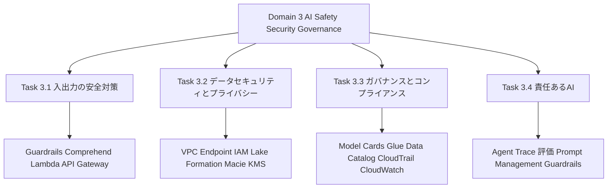
```mermaid
flowchart TD
    D3["Domain 3 AI Safety Security Governance"]
    T1["Task 3.1 入出力の安全対策"]
    T2["Task 3.2 データセキュリティとプライバシー"]
    T3["Task 3.3 ガバナンスとコンプライアンス"]
    T4["Task 3.4 責任あるAI"]
    D3 --> T1
    D3 --> T2
    D3 --> T3
    D3 --> T4
    T1 --> S1["Guardrails Comprehend Lambda API Gateway"]
    T2 --> S2["VPC Endpoint IAM Lake Formation Macie KMS"]
    T3 --> S3["Model Cards Glue Data Catalog CloudTrail CloudWatch"]
    T4 --> S4["Agent Trace 評価 Prompt Management Guardrails"]
```

### 0-2. 守る対象の 3 方向

| 方向 | 守る対象 | 代表的な失敗例 |
|---|---|---|
| 入力 | モデルに渡すデータ | 悪意あるプロンプト、PII を含む入力 |
| モデル／処理 | 推論基盤・データ基盤 | 公開インターネット経由の通信、過剰な IAM 権限 |
| 出力 | ユーザーに返す回答 | 有害表現、ハルシネーション、機密の漏えい |

---

## Step 1. 生成AI特有の脅威を理解する

従来の Web アプリの脅威に加え、**自然言語そのものが攻撃経路になる**点が最大の違いです。

| 脅威 | 説明 | 主な対策 |
|---|---|---|
| Prompt Injection（直接） | ユーザーが「以前の指示を無視して…」と入力し、開発者の指示を上書きする | Guardrails の Prompt Attack フィルター、入力タグ、入力検証 |
| Prompt Injection（間接） | 検索で取得した文書・Web ページ・API 応答に悪意ある命令が埋め込まれている | 取得コンテンツにも同じ検証を適用、取得元の許可リスト化 |
| Jailbreak | 役割演技などでモデルの安全ルールを回避する | Prompt Attack フィルター、安全分類器 |
| 機密情報の漏えい | PII や社内機密が入力・出力・ログに残る | 機密情報フィルター、Comprehend / Macie、ログのマスキング |
| ハルシネーション | もっともらしい誤情報の生成 | Knowledge Bases による根拠付け、Contextual grounding check、Automated Reasoning |
| 有害コンテンツ | 憎悪・暴力・性的表現など | コンテンツフィルター |
| 過剰な権限（Excessive Agency） | エージェントが必要以上の操作権限を持つ | 最小権限 IAM、承認フロー |

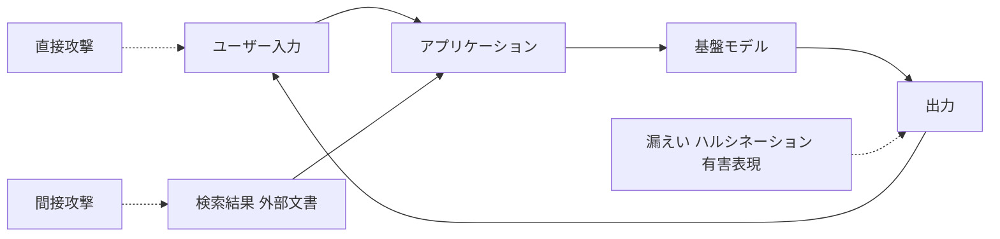
```mermaid
flowchart LR
    U["ユーザー入力"] --> A["アプリケーション"]
    R["検索結果 外部文書"] --> A
    A --> M["基盤モデル"]
    M --> O["出力"]
    O --> U
    X1["直接攻撃"] -.-> U
    X2["間接攻撃"] -.-> R
    X3["漏えい ハルシネーション 有害表現"] -.-> O
```

**ポイント**: 攻撃は「ユーザー入力」だけでなく「検索で取得した文書」からも来ます。試験では **間接 Prompt Injection も同等に検証する** という考え方が問われます。

**参考 URL**
- OWASP Top 10 for LLM Applications: https://genai.owasp.org/llm-top-10/
- AWS Well-Architected Agentic AI Lens（入力検証）: https://docs.aws.amazon.com/wellarchitected/latest/agentic-ai-lens/agentsec08.html

---

# Task 3.1 入出力の安全対策

## Step 2. Amazon Bedrock Guardrails の基礎

Task 3.1 の中心サービスです。ここを理解すると Skill 3.1.1〜3.1.5 の大半が解けます。

### 2-1. Guardrails とは

アプリの要件と責任ある AI ポリシーに合わせ、**プロンプトとモデル応答の両方**にセーフガードを適用する機能です。

### 2-2. 6 つのポリシー（セーフガード）

| ポリシー | 何をするか | 入力 | 出力 | 初学者向けのたとえ |
|---|---|---|---|---|
| Content filters | 有害なテキスト・画像を検出しフィルタ | ○ | ○ | 暴言・暴力表現の検問所 |
| Denied topics | アプリの目的に合わない話題を拒否 | ○ | ○ | 「医療診断の話は禁止」という看板 |
| Word filters | 特定の語句・不適切語を完全一致で遮断 | ○ | ○ | NG ワード辞書 |
| Sensitive information filters | PII や正規表現で定義した情報をブロックまたはマスク（ツール定義・`toolUse.input`・`toolResult` は検査もマスクもしない。ツール引数は実行前に、ツール結果はモデルへ返す前に、アプリ側で別途検査・マスクする） | ○ | ○ | 個人情報の黒塗り係 |
| Contextual grounding check | 根拠資料との整合性と質問への関連性でハルシネーションを検出（対応言語は英語・フランス語・スペイン語のみ。日本語の回答は埋め込みによる意味的類似度の検証や LLM-as-a-judge で代替する） | - | ○ | 「その答え、資料に書いてある？」と確認する係 |
| Automated Reasoning checks | 論理ルールに対して回答の正確性を検証（対応言語は英語（米国）のみ。日本語の回答は検証できない。Converse では `guardContent`、InvokeModel では `tagSuffix` 付きの XML タグで検証対象を囲む。タグなしの plain text はエラーにならず、評価対象なしとしてチェックがスキップされる） | - | ○ | 論理的な校閲者 |

> Prompt Attack（プロンプト攻撃検出）は **Content filters の一種**として設定します（`contentPolicyConfig` 内）。**入力側のみ**が対象です。

### 2-3. 重要な設定ポイント

| 項目 | 内容 |
|---|---|
| フィルター強度 | Content filters は強度（なし／低／中／高）を調整できる |
| 動作 | ポリシーごとにブロック（拒否メッセージを返す）を選べ、機密情報フィルターは **マスク（匿名化）** も選べる。ただし検出が常にブロックになるわけではなく、アクションを **NONE** にすると検出結果を返すだけでブロックしない。Automated Reasoning checks も検証結果（findings）を返すだけで自動ブロックはしない。こうした検出結果をどう扱うか（再生成・警告表示・人手確認など）はアプリケーション側で実装する |
| 入力タグ | `InvokeModel` / `InvokeModelWithResponseStream` で Prompt Attack を使う場合、**ユーザー入力部分をタグで囲む**必要がある。これにより開発者のシステムプロンプトが誤検出されない |
| バージョン | 作業用の DRAFT と、固定された番号付きバージョンを使い分け、本番は番号付きバージョンを指定する |
| ApplyGuardrail API | **モデル呼び出しと切り離して** 任意のテキストにガードレールを適用できる（Bedrock 以外のモデルの出力検証にも使える） |
| ストリーミング | 同期モード（チェック後に配信、安全だが遅延大）と非同期モード（先に配信、低遅延だがチェック前に一部が出る可能性）がある |
| IAM での強制 | IAM ポリシーに `bedrock:GuardrailIdentifier` 条件キーを入れ、**指定ガードレールなしの推論呼び出しを拒否**できる。対象は `Converse` / `ConverseStream` / `InvokeModel` / `InvokeModelWithResponseStream` に限られ、すべての Bedrock API に適用できるわけではない。`InvokeAgent` や `RetrieveAndGenerate` を含む構成では内部のモデル呼び出しにガードレール指定がない場合があり、AccessDenied になり得る。また、ガードレールの指定を強制しても入力全体の検査は保証されない（呼び出し側が入力タグで評価範囲を指定できるため、タグの外に置いた部分は評価から外れる） |

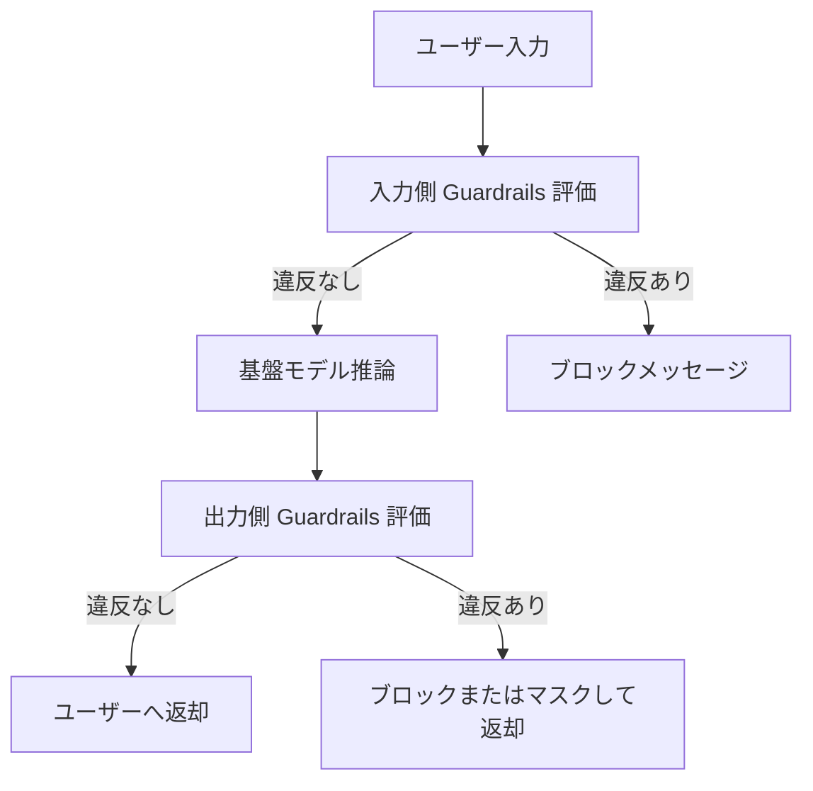
```mermaid
flowchart TD
    A["ユーザー入力"] --> B["入力側 Guardrails 評価"]
    B -->|違反なし| C["基盤モデル推論"]
    B -->|違反あり| X["ブロックメッセージ"]
    C --> D["出力側 Guardrails 評価"]
    D -->|違反なし| E["ユーザーへ返却"]
    D -->|違反あり| Y["ブロックまたはマスクして返却"]
```

### 2-4. ベストプラクティス

| # | ベストプラクティス | 理由 |
|---|---|---|
| 1 | 最初は検出のみ（detect）モードで誤検出を観察し、後からブロックへ切り替える | 正常な利用を止めないため |
| 2 | 本番は番号付きバージョンを参照する | DRAFT の変更が本番へ即影響しないように |
| 3 | `bedrock:GuardrailIdentifier` 条件キーで利用を強制する（対象は Converse / ConverseStream / InvokeModel / InvokeModelWithResponseStream）。入力タグは信頼できるサーバー側コンポーネントで生成し、クライアントにタグや `tagSuffix` を指定させない。`tagSuffix` はリクエストごとに新しい予測困難な値(暗号論的乱数など)を使う | ガードレールの呼び忘れを防ぐ。ただし入力タグで評価範囲を絞れるため、これだけで迂回を完全には防げない |
| 4 | Prompt Attack を使う場合は必ず入力タグでユーザー入力を囲む | システムプロンプトの誤検出を避ける |
| 5 | ガードレール設定は「作って終わり」にせず、本番ログで継続的に調整する | 攻撃手法とデータ分類が変化するため |
| 6 | Guardrails だけに頼らず多層防御にする（Step 6） | 単一の対策には限界がある |

### 2-5. 試験の着眼点
- 「**モデルを問わず**ガードレールを適用したい」→ **ApplyGuardrail API**
- 「**全開発者に**ガードレール利用を強制したい」→ **IAM 条件キー `bedrock:GuardrailIdentifier`**
- 「ハルシネーション検出」→ **Contextual grounding check**（根拠資料と照合）／論理ルール検証なら **Automated Reasoning checks**（対応言語は英語（米国）のみ。日本語の回答は検証できない）
- 「PII を伏せて回答を返したい」→ **Sensitive information filters のマスク**

**参考 URL**
- Guardrails 概要: https://docs.aws.amazon.com/bedrock/latest/userguide/guardrails.html
- Guardrails の仕組み: https://docs.aws.amazon.com/bedrock/latest/userguide/guardrails-how.html
- Prompt Attack 検出: https://docs.aws.amazon.com/bedrock/latest/userguide/guardrails-prompt-attack.html
- ガードレール強制（IAM 条件キー）: https://docs.aws.amazon.com/bedrock/latest/userguide/guardrails-permissions-id.html
- ApplyGuardrail API: https://docs.aws.amazon.com/bedrock/latest/APIReference/API_runtime_ApplyGuardrail.html
- CloudFormation（AWS::Bedrock::Guardrail）: https://docs.aws.amazon.com/AWSCloudFormation/latest/TemplateReference/aws-resource-bedrock-guardrail.html

---

## Step 3. 入力の安全対策（Skill 3.1.1）

> **Skill 3.1.1**: 有害なユーザー入力から FM を守る包括的なコンテンツ安全システムを構築する（Bedrock Guardrails によるフィルタ、Step Functions と Lambda によるカスタムモデレーションワークフロー、リアルタイム検証）。

### 3-1. 何を守るのか
モデルに渡る前に、**有害・不正・不要な入力**を止めます。入力が一度モデルに入ると、モデルが誤って従う危険があるためです。

### 3-2. 選択肢の整理

| 要件 | 使うもの | 理由 |
|---|---|---|
| 標準的な有害表現・攻撃の遮断 | Guardrails（Content filters、Denied topics、Prompt Attack） | ノーコード設定で素早く導入できる |
| 社内独自ルール（例: 取引先名の含有確認、人手承認） | Step Functions + Lambda のカスタムモデレーション | 条件分岐・外部システム呼び出し・人手レビューを組める |
| 即時のリアルタイム検証 | API 層／Lambda の同期検証 | 低遅延で形式・長さ・文字種を弾く |

### 3-3. カスタムモデレーションワークフロー例

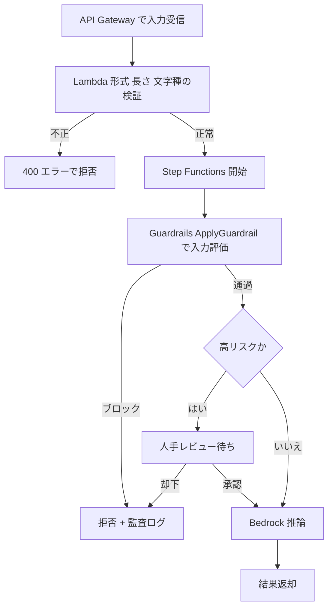
```mermaid
flowchart TD
    A["API Gateway で入力受信"] --> B["Lambda 形式 長さ 文字種の検証"]
    B -->|不正| R1["400 エラーで拒否"]
    B -->|正常| C["Step Functions 開始"]
    C --> D["Guardrails ApplyGuardrail で入力評価"]
    D -->|ブロック| R2["拒否 + 監査ログ"]
    D -->|通過| E{"高リスクか"}
    E -->|はい| F["人手レビュー待ち"]
    F -->|却下| R2
    F -->|承認| G["Bedrock 推論"]
    E -->|いいえ| G
    G --> H["結果返却"]
```

### 3-4. ベストプラクティス
- **安い検証を先に**（文字数・形式 → Guardrails → 高度な分類）。コストと遅延を抑える。
- 拒否した入力は **理由カテゴリ付きでログ化**し、後で閾値調整に使う（個人情報は伏せて記録）。
- 入力サイズ・トークン上限を決め、**過大入力（DoS・コスト攻撃）** を API 層で弾く。
- ユーザー入力と指示文を **構造的に分離**（タグ・区切り）する。
- Step Functions の Standard / Express のどちらを使うかは、人手承認など長時間待ちがあるなら Standard、短時間・大量なら Express を検討する。

### 3-5. 試験の着眼点
「Guardrails では表現できない**組織固有の承認ロジック**が必要」→ **Step Functions + Lambda**。「ほぼ設定だけで有害入力を止めたい」→ **Guardrails**。

**参考 URL**
- Guardrails: https://docs.aws.amazon.com/bedrock/latest/userguide/guardrails.html
- AWS Step Functions 開発者ガイド: https://docs.aws.amazon.com/step-functions/latest/dg/welcome.html
- Amazon API Gateway 開発者ガイド: https://docs.aws.amazon.com/apigateway/latest/developerguide/welcome.html

---

## Step 4. 出力の安全対策（Skill 3.1.2）

> **Skill 3.1.2**: 有害な出力を防ぐコンテンツ安全フレームワークを作成する（Guardrails による応答フィルタ、コンテンツモデレーションと毒性検出のための専用 FM 評価、決定的な結果を得るための text-to-SQL 変換）。

### 4-1. 3 つの手段

| 手段 | 内容 | タイミング |
|---|---|---|
| Guardrails の応答フィルタ | 出力に Content filters / 機密情報フィルター等を適用 | 実行時 |
| 専用 FM 評価 | 毒性・有害性などの指標でモデルや設定を評価 | リリース前・定期 |
| text-to-SQL による決定性の確保 | 数値や集計を LLM に「計算」させず、SQL を生成して DB に実行させる | 実行時（設計） |

### 4-2. FM 評価で有害性をチェックする
Amazon Bedrock の **LLM-as-a-judge** 評価では、組み込み指標として Correctness、Completeness、Helpfulness、Following instructions、**Harmfulness**、**Stereotyping** などが使えます。自社データのプロンプトセットでモデルや Guardrails 設定の効果を比較できます。

### 4-3. text-to-SQL で「決定的な結果」を得る

LLM は同じ質問でも数値を変えてしまうことがあります。**集計や正確な数値が必要な質問**は、LLM に答えを直接作らせず次の流れにします。

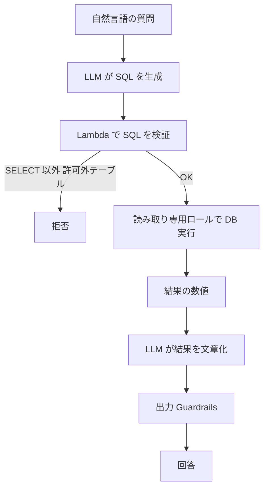
```mermaid
flowchart TD
    Q["自然言語の質問"] --> L["LLM が SQL を生成"]
    L --> V["Lambda で SQL を検証"]
    V -->|SELECT 以外 許可外テーブル| N["拒否"]
    V -->|OK| E["読み取り専用ロールで DB 実行"]
    E --> R["結果の数値"]
    R --> F["LLM が結果を文章化"]
    F --> G["出力 Guardrails"]
    G --> A["回答"]
```

| 設計ポイント | 内容 |
|---|---|
| 生成 SQL の検証 | SELECT のみ許可、対象テーブル・列の許可リスト、禁止構文のチェック |
| 実行権限 | **読み取り専用**の最小権限ロール（更新・削除は不可） |
| 結果の信頼性 | 数値は DB から取得するため、同じデータなら同じ結果になる（決定的） |
| 追加の安全策 | スキーマ情報は必要最小限だけモデルに渡す／結果行数の上限を設ける |

### 4-4. ベストプラクティス
- 「正確な数値・集計・ID 参照」は **LLM に推測させず、決定的なシステム（SQL・API）に任せる**。
- LLM が生成した SQL は **信頼できない入力として扱い**、実行前に必ず検証する。
- 出力側 Guardrails と、リリース前の有害性評価を **両方**実施する（実行時＋事前）。
- ブロック時のメッセージは、攻撃者にルールを教えない一般的な文面にする。

### 4-5. 試験の着眼点
「集計結果が毎回ぶれる」→ **text-to-SQL で決定的に**。「出力の有害性を事前に比較したい」→ **Bedrock のモデル評価（LLM-as-a-judge の Harmfulness 等）**。

**参考 URL**
- モデル評価の指標: https://docs.aws.amazon.com/bedrock/latest/userguide/model-evaluation-metrics.html
- Bedrock Evaluations: https://aws.amazon.com/bedrock/evaluations/
- Guardrails: https://docs.aws.amazon.com/bedrock/latest/userguide/guardrails.html

---

## Step 5. ハルシネーション対策（Skill 3.1.3）

> **Skill 3.1.3**: FM 応答のハルシネーションを減らす正確性検証システムを開発する（Bedrock Knowledge Bases による根拠付けとファクトチェック、信頼度スコアリングと意味的類似度検索による検証、JSON Schema による構造化出力の強制）。

### 5-1. ハルシネーションとは
根拠のない内容を、事実のように自信ありげに生成してしまう現象です。**ゼロにはできない**ため、「減らす」「検知する」「見せ方で補う」を組み合わせます。

### 5-2. 対策マップ

| 対策 | 仕組み | 主なサービス |
|---|---|---|
| 根拠付け（Grounding） | 信頼できる社内データを検索して回答の材料にする（RAG） | Bedrock Knowledge Bases |
| 根拠との照合 | 回答が取得文書に裏付けられているか、質問に関連しているかをスコア化（対象は要約・言い換え・通常の QA などのサポート用途に限り、会話型 QA・チャットボットは対象外。対応言語は英語・フランス語・スペイン語のみ。チャット用途や日本語の回答は下の「意味的類似度による検証」の方法で別途検証する） | Guardrails の Contextual grounding check |
| 論理ルールでの検証 | ポリシー文書から作った論理ルールで回答を検証（対応言語は英語（米国）のみ。日本語の回答は検証できない。Converse では `guardContent`、InvokeModel では `tagSuffix` 付きの XML タグで囲まないと、エラーにならずスキップされる） | Guardrails の Automated Reasoning checks |
| 意味的類似度による検証 | 回答と根拠文のベクトルの近さを測り、低ければ警告・再生成する補助シグナル（類似度が高くても事実の裏付けにはならない）。根拠に支えられた回答として扱う前に、主張単位の整合性チェックか人によるレビューを必須にする | 埋め込みモデル + ベクトル検索 |
| 信頼度スコアリング | 検証結果をスコア化し閾値で分岐 | Lambda + CloudWatch メトリクス |
| 構造化出力の強制 | 出力を JSON Schema に従わせ、形式を検証 | ツール利用（スキーマ指定）+ Lambda でスキーマ検証 |

### 5-3. Contextual grounding check を理解する

| 項目 | 内容 |
|---|---|
| Grounding | 回答が提示した根拠資料に **裏付けられているか** |
| Relevance | 回答がユーザーの質問に **関連しているか** |
| 閾値 | 各スコアに閾値を設定し、下回ればブロック |
| 必要な入力 | 根拠資料（grounding source）、質問（query）、検証対象の応答 |

### 5-4. 検証フロー例

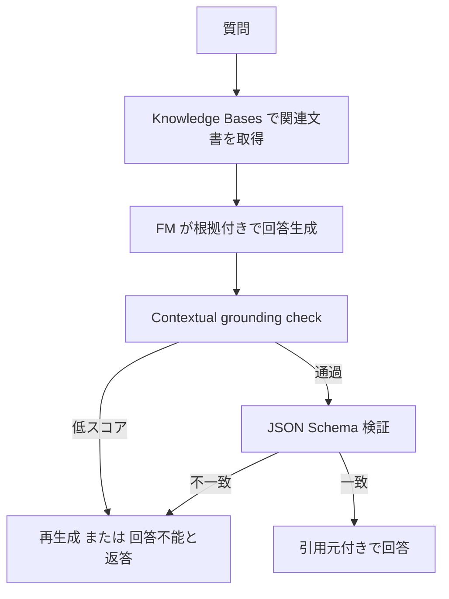
```mermaid
flowchart TD
    Q["質問"] --> KB["Knowledge Bases で関連文書を取得"]
    KB --> G["FM が根拠付きで回答生成"]
    G --> C1["Contextual grounding check"]
    C1 -->|低スコア| RE["再生成 または 回答不能と返答"]
    C1 -->|通過| C2["JSON Schema 検証"]
    C2 -->|不一致| RE
    C2 -->|一致| OUT["引用元付きで回答"]
```

### 5-5. 構造化出力を JSON Schema で強制する理由
自由文は後続処理（DB 登録、API 呼び出し）で壊れやすい。**スキーマで形を固定**し、**Lambda で検証**してから使えば、形式不正や想定外フィールドによる不具合・注入を減らせます。型・必須項目・列挙値（enum）・文字数上限を定義します。

### 5-6. ベストプラクティス
- 回答には **必ず引用元（出典）を付ける**（Step 15 の透明性にも直結）。
- 根拠が見つからないときは **「分かりません」と答える設計**にする（プロンプトとフローで明示）。
- スコア閾値は **本番に近いデータで調整**する。厳しすぎると有用な回答まで落ちる。
- 重要判断（医療・法務・金融）は **人手確認**を挟む。
- 検証失敗の件数を CloudWatch メトリクスにして、品質劣化を早期検知する。

### 5-7. 試験の着眼点
「回答が取得文書に基づいているか自動検証したい」→ **Contextual grounding check**。「社内規則（論理ルール）に照らして検証」→ **Automated Reasoning checks**（対応言語は英語（米国）のみ。日本語の回答は検証できない）。「下流システムが形式に依存」→ **JSON Schema**。

**参考 URL**
- Contextual grounding check: https://docs.aws.amazon.com/bedrock/latest/userguide/guardrails-contextual-grounding-check.html
- Automated Reasoning checks: https://docs.aws.amazon.com/bedrock/latest/userguide/guardrails-automated-reasoning-checks.html
- Knowledge Bases: https://docs.aws.amazon.com/bedrock/latest/userguide/knowledge-base.html
- Guardrails 概要（6 ポリシー一覧）: https://docs.aws.amazon.com/bedrock/latest/userguide/guardrails.html

---

## Step 6. 多層防御（Skill 3.1.4）

> **Skill 3.1.4**: FM の悪用に対する包括的な保護を提供する多層防御システムを作成する（Amazon Comprehend による前処理フィルター、Bedrock によるモデルベースのガードレール、Lambda による後処理検証、API Gateway による API 応答フィルタリング）。

### 6-1. 考え方
**1 つの壁が破られても次の壁が止める**。入口から出口まで、役割の違うチェックを重ねます。

| 層 | 役割 | サービス例 |
|---|---|---|
| 1. 入口（API 層） | 認証・スロットリング・サイズ制限・スキーマ検証 | API Gateway（+ WAF 等） |
| 2. 前処理 | 毒性・プロンプト安全性・PII の事前判定 | Amazon Comprehend（毒性・プロンプト安全性は英語のみ。日本語や新規顧客は Bedrock Guardrails） |
| 3. モデルベース保護 | 有害・攻撃・話題逸脱・機密の遮断 | Bedrock Guardrails |
| 4. 後処理検証 | ビジネスルール、形式、禁止語、数値範囲の最終確認 | Lambda |
| 5. 出口（API 応答） | 応答の整形・不要フィールド除去・ヘッダ制御 | API Gateway 応答処理 |
| 6. 監視 | 全層のログとアラート | CloudWatch / CloudTrail |

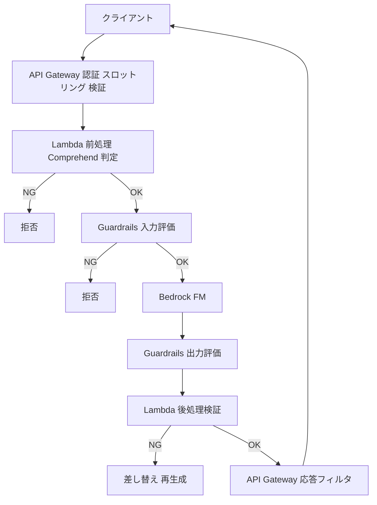
```mermaid
flowchart TD
    U["クライアント"] --> AG["API Gateway 認証 スロットリング 検証"]
    AG --> PRE["Lambda 前処理 Comprehend 判定"]
    PRE -->|NG| BLK1["拒否"]
    PRE -->|OK| GIN["Guardrails 入力評価"]
    GIN -->|NG| BLK2["拒否"]
    GIN -->|OK| FM["Bedrock FM"]
    FM --> GOUT["Guardrails 出力評価"]
    GOUT --> POST["Lambda 後処理検証"]
    POST -->|NG| BLK3["差し替え 再生成"]
    POST -->|OK| RESP["API Gateway 応答フィルタ"]
    RESP --> U
```

### 6-2. Amazon Comprehend の役割
Comprehend は **従来型の NLP サービス**で、前処理に向きます。PII 検出、**毒性検出**、**プロンプト安全性の分類**などが使えます。LLM を呼ぶ前に **安価・高速**に一次判定できるのが利点です。

> **注意**: 毒性検出とプロンプト安全性の分類は **英語のみ**対応です。また、プロンプト安全性の分類は **新規顧客には提供されていません**（過去 12 か月以内に利用した既存アカウントは継続利用可）。日本語プロンプトや新規顧客の場合は、**Bedrock Guardrails**（コンテンツフィルター・Prompt Attack 検出）で代替します。ただし日本語の Content filters / Prompt Attack は **Standard tier が必要**です（Classic tier は英語・フランス語・スペイン語のみ）。Standard tier は **クロスリージョン推論を必要とする**ため、単一リージョン内での処理が求められる環境ではこの代替策を適用できません。利用する場合は、許可された送信先リージョンに適合する **guardrail profile** を選択してください。
> 出典: Amazon Comprehend Trust and safety https://docs.aws.amazon.com/comprehend/latest/dg/trust-safety.html

### 6-3. ベストプラクティス
- 各層は **異なる検知手法**にする（ルール／分類器／LLM ベース）。同じ弱点を共有しないため。
- 後処理（Lambda）は **ビジネス固有のルール**を担当し、Guardrails と役割を重複させすぎない。
- **フェイルクローズ**（検証系が失敗したら通さない）を基本にする。
- 全層の判定結果を **相関 ID** で追跡できるようにログに残す。

### 6-4. 試験の着眼点
「Guardrails だけで十分か？」→ 試験では **多層（前処理＋Guardrails＋後処理＋API 応答）** が正解になりやすい。「モデル呼び出し前に安価に有害・PII 判定」→ **Comprehend**（英語の場合。日本語・新規顧客のプロンプト安全性判定は **Bedrock Guardrails**）。

**参考 URL**
- Amazon Comprehend 開発者ガイド（PII）: https://docs.aws.amazon.com/comprehend/latest/dg/how-pii.html
- Amazon Comprehend 開発者ガイド（トップ）: https://docs.aws.amazon.com/comprehend/latest/dg/what-is.html
- AWS Prescriptive Guidance（生成AI推論のセキュリティ参照アーキテクチャ）: https://docs.aws.amazon.com/prescriptive-guidance/latest/security-reference-architecture/gen-ai-model-inference.html

---

## Step 7. 高度な脅威検知（Skill 3.1.5）

> **Skill 3.1.5**: 敵対的入力とセキュリティ脆弱性から保護する高度な脅威検知を実装する（Prompt Injection・Jailbreak 検出、入力サニタイズとコンテンツフィルター、安全分類器、自動化された敵対的テストワークフロー）。

### 7-1. 脅威と対策の対応表

| 脅威 | 検知・防御 | 補足 |
|---|---|---|
| Prompt Injection | Guardrails の Prompt Attack フィルター | 入力タグでユーザー入力を明示 |
| Jailbreak | 同上 + 安全分類器 | 役割演技・エンコード回避なども想定 |
| システムプロンプト漏えい | Prompt Attack の検出（PROMPT_LEAKAGE 検出は **Standard tier が必須**で、Classic tier では利用不可）+ 出力側チェック | 機密を **プロンプトに埋めない** のが根本策 |
| 間接 Injection | 取得文書にも同じ検証 | 取得元の許可リスト、信頼レベルの区別 |
| 入力サニタイズ | 制御文字・過大入力・特殊エンコードの除去／正規化 | Lambda / API 層 |
| 安全分類器 | Comprehend のプロンプト安全性分類（英語のみ・新規顧客は利用不可）、Bedrock Guardrails の Prompt Attack 検出、独自の分類モデル | 前処理として配置 |

> **補足（新しい API）**: 本ガイド作成時点の情報として、Bedrock Runtime に `InvokeGuardrailChecks` という API が追加されており、ガードレールを事前作成せずにコンテンツフィルター・Prompt Attack・機密情報の検査を呼び出せるとされています（Prompt Attack のカテゴリに JAILBREAK / PROMPT_INJECTION / PROMPT_LEAKAGE）。この API は **検出とスコア付けのみ**（カテゴリ別の重大度スコアや機密情報の位置と信頼度を返す）を行い、**コンテンツのブロックやマスキングはしません**。拒否・マスキングは、返された結果に基づいて **アプリケーション側で実装** する必要があります。試験ガイドには名指しされていませんが、今後の更新で触れられる可能性があるため、公式 API リファレンスで最新仕様を確認してください。

### 7-2. 自動化された敵対的テスト

攻撃を **人が思いつく範囲** だけでテストすると漏れます。CI/CD に組み込み、継続的に攻撃シナリオを流します。

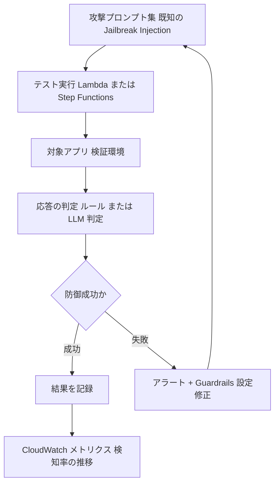
```mermaid
flowchart TD
    A["攻撃プロンプト集 既知の Jailbreak Injection"] --> B["テスト実行 Lambda または Step Functions"]
    B --> C["対象アプリ 検証環境"]
    C --> D["応答の判定 ルール または LLM 判定"]
    D --> E{"防御成功か"}
    E -->|成功| F["結果を記録"]
    E -->|失敗| G["アラート + Guardrails 設定修正"]
    G --> A
    F --> H["CloudWatch メトリクス 検知率の推移"]
```

### 7-3. ベストプラクティス
- **機密情報（鍵・内部ルール）をシステムプロンプトに入れない**。入れた時点で漏えいリスクになる。
- 取得文書・ツール出力・ユーザー入力を **信頼レベルで区別**し、低信頼の内容を命令として解釈させない。
- 攻撃集を **定期更新**し、リリースごとに回帰テストする。
- 検出率・誤検出率を **メトリクス化**し、設定変更の効果を数値で確認する。
- ガードレール設定は **一度きりにせず**、本番のブロックログを見て調整し続ける。

### 7-4. 試験の着眼点
「ユーザー入力にだけ適用し、システムプロンプトは誤検出させたくない」→ **入力タグ**。「継続的に攻撃耐性を検証」→ **自動化された敵対的テストワークフロー**。

**参考 URL**
- Prompt Attack 検出: https://docs.aws.amazon.com/bedrock/latest/userguide/guardrails-prompt-attack.html
- ユーザー入力へのタグ適用: https://docs.aws.amazon.com/bedrock/latest/userguide/guardrails-tagging.html
- InvokeGuardrailChecks API: https://docs.aws.amazon.com/bedrock/latest/APIReference/API_runtime_InvokeGuardrailChecks.html
- Well-Architected Agentic AI Lens（入力検証）: https://docs.aws.amazon.com/wellarchitected/latest/agentic-ai-lens/agentsec08.html
- OWASP Top 10 for LLM Applications: https://genai.owasp.org/llm-top-10/

---
# Task 3.2 データセキュリティとプライバシー

## Step 8. 保護された AI 環境（Skill 3.2.1）

> **Skill 3.2.1**: FM デプロイメントの包括的なセキュリティを確保する保護された AI 環境を開発する（VPC エンドポイントによるネットワーク分離、IAM ポリシーによる安全なデータアクセスパターンの強制、AWS Lake Formation による詳細なデータアクセス制御、CloudWatch によるデータアクセス監視）。

### 8-1. Bedrock のデータ保護の前提（まず知っておく事実）

| 事実 | 内容 |
|---|---|
| 共有責任モデル | AWS が基盤を、利用者がデータ・IAM・設定を守る |
| モデルプロバイダーの分離 | 各リージョンにプロバイダーごとの Model Deployment Account があり、プロバイダーはそこへアクセスできない。したがってプロバイダーはプロンプトや応答、Bedrock ログを見られない |
| 学習利用 | 顧客のプロンプト・応答は基盤モデルの学習に使われず、プロバイダーとも共有されない（公式 FAQ・ドキュメントの説明） |
| 通信 | TLS 1.2 必須（TLS 1.3 を推奨） |
| 暗号化 | 保存時は AWS KMS（カスタマー管理キーの選択が可能） |

### 8-2. 4 つの防御面

| 防御面 | 目的 | 使うもの |
|---|---|---|
| ネットワーク | 通信をインターネットに出さない | VPC インターフェイスエンドポイント（AWS PrivateLink）+ エンドポイントポリシー、セキュリティグループ |
| ID／アクセス | 誰が何をできるか最小限に | IAM ロール・ポリシー、条件キー（`aws:SourceVpce`、`bedrock:GuardrailIdentifier` など） |
| データ | 行・列・タグ単位の細かい制御 | AWS Lake Formation、S3 バケットポリシー、KMS |
| 監視 | 誰がいつ何にアクセスしたか | CloudWatch、CloudTrail、モデル呼び出しログ |

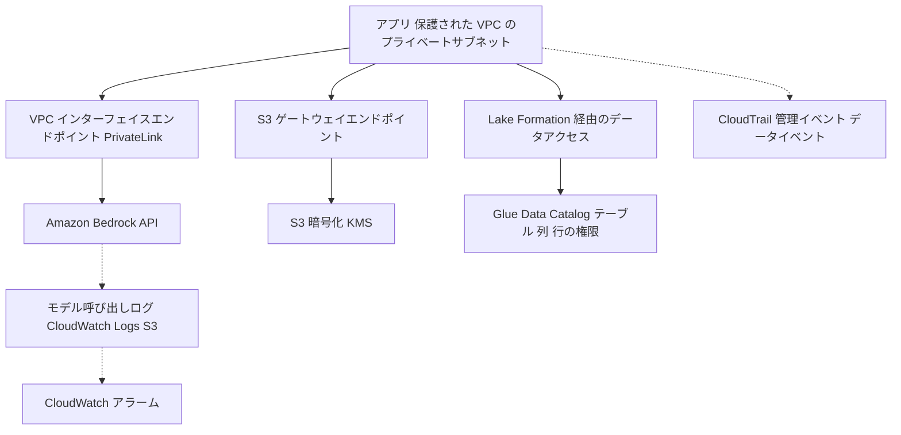
```mermaid
flowchart TD
    APP["アプリ 保護された VPC のプライベートサブネット"] --> VPCE["VPC インターフェイスエンドポイント PrivateLink"]
    VPCE --> BR["Amazon Bedrock API"]
    APP --> S3E["S3 ゲートウェイエンドポイント"]
    S3E --> S3["S3 暗号化 KMS"]
    APP --> LF["Lake Formation 経由のデータアクセス"]
    LF --> CAT["Glue Data Catalog テーブル 列 行の権限"]
    BR -.-> LOG["モデル呼び出しログ CloudWatch Logs S3"]
    APP -.-> CT["CloudTrail 管理イベント データイベント"]
    LOG -.-> MON["CloudWatch アラーム"]
```

### 8-3. Bedrock 向け VPC エンドポイント（覚える対象）

| エンドポイント | 用途 |
|---|---|
| bedrock | 管理（コントロールプレーン）API |
| bedrock-runtime | 推論 API（InvokeModel、Converse など） |
| bedrock-agent | エージェント・Knowledge Bases の管理 API |
| bedrock-agent-runtime | エージェント呼び出し・KB 検索の実行 API |

モデル呼び出しログは Bedrock が保存先 (S3 / CloudWatch Logs) へ配信するため、**ログ配信のためだけに VPC エンドポイントを作る必要はありません**。VPC 内のアプリケーションがログ保存先へ直接アクセスする (ログを読む、別の用途で書き込む) 場合に限り、**S3 ゲートウェイエンドポイント**や **CloudWatch Logs のインターフェイスエンドポイント**を用意します。

### 8-4. Lake Formation の位置づけ
RAG やデータ分析の元データを **Glue Data Catalog 上のテーブル**として管理している場合、Lake Formation で **データベース／テーブル／列／行／セル**単位の権限を付与できます。LF-タグを使うと「機密度」などの属性に基づく **タグベースのアクセス制御（LF-TBAC）** も可能です。

**ポイント**: S3 バケットポリシーや IAM だけでは「この列だけ見せる」は難しい。**細粒度なら Lake Formation**。

### 8-5. ベストプラクティス

| # | ベストプラクティス |
|---|---|
| 1 | Bedrock への通信は **インターフェイスエンドポイント**経由にし、**エンドポイントポリシー**で許可する操作・リソースを絞る |
| 2 | アプリ用 IAM ロールは **用途別に分け**、`bedrock:InvokeModel` の対象モデル ARN を限定する（`*` を避ける） |
| 3 | `bedrock:GuardrailIdentifier` 条件でガードレール付き呼び出しを強制する |
| 4 | データソースの S3 とモデル呼び出しログは **KMS（カスタマー管理キー）** で暗号化、バケットのパブリックアクセスはブロック |
| 5 | **モデル呼び出しログ**を有効化し、保存先へのアクセスも最小権限にする |
| 6 | CloudTrail で Bedrock API を記録し、異常なアクセス（深夜・大量・未知の IP）を CloudWatch で検知する |
| 7 | 機密度の異なるデータは Lake Formation のタグで分け、**Knowledge Base のサービスロールが読める範囲**を絞る。**呼び出しユーザーごとの取得範囲**は、認証済み ID に基づく `userContext`（ACL 対応データソース）またはサーバー側で生成したメタデータフィルターで制御する（クライアント送信の権限フィルターは信用しない） |

### 8-6. 試験の着眼点
- 「トラフィックをインターネットに出さず Bedrock を呼ぶ」→ **VPC インターフェイスエンドポイント（PrivateLink）**
- 「列・行レベルで RAG の元データ（サービスロールが読める範囲）を制御」→ **Lake Formation**。「ユーザーごとに検索結果を変える」→ **認証済み ID に基づく `userContext` / サーバー側メタデータフィルター**
- 「プロバイダーに自分のデータが見られないか」→ **見られない（Model Deployment Account の分離）**

**参考 URL**
- Bedrock のデータ保護: https://docs.aws.amazon.com/bedrock/latest/userguide/data-protection.html
- VPC と PrivateLink による保護: https://docs.aws.amazon.com/bedrock/latest/userguide/usingVPC.html
- データ暗号化: https://docs.aws.amazon.com/bedrock/latest/userguide/data-encryption.html
- AWS Prescriptive Guidance（生成AI推論のセキュリティ参照アーキテクチャ）: https://docs.aws.amazon.com/prescriptive-guidance/latest/security-reference-architecture/gen-ai-model-inference.html
- Lake Formation 開発者ガイド: https://docs.aws.amazon.com/lake-formation/latest/dg/what-is-lake-formation.html
- モデル呼び出しログ: https://docs.aws.amazon.com/bedrock/latest/userguide/model-invocation-logging.html

---

## Step 9. プライバシー保護システム（Skill 3.2.2）

> **Skill 3.2.2**: FM とのやり取りで機密情報を保護するプライバシー保護システムを開発する（Comprehend と Macie による PII 検出、Bedrock のネイティブなデータプライバシー機能、Guardrails による出力フィルタ、S3 ライフサイクル設定によるデータ保持ポリシー）。

### 9-1. PII 検出サービスの使い分け

| サービス | 対象 | 得意なこと | 典型的な使いどころ |
|---|---|---|---|
| Amazon Comprehend | テキスト（API に渡した文字列・ドキュメント）。**PII 検出の対応言語は英語とスペイン語のみ** | PII エンティティの検出、位置（オフセット）の取得、ラベル付け・非同期のレダクションジョブ | 英語・スペイン語のプロンプト・応答・ドキュメントのリアルタイム／バッチ検査。その他の言語は検証済みの検出器を使い、なければ処理を止める（fail closed） |
| Amazon Macie | **S3 に保存されたデータ** | S3 バケットの機密データ自動検出、検出結果（Findings）の生成、EventBridge 連携 | RAG 用ドキュメント置き場・ログ保存バケットの棚卸し |
| Bedrock Guardrails（機密情報フィルター） | 推論時の入力・出力 | PII のブロック／マスク、独自の正規表現 | リアルタイムの最終防御 |

**覚え方**: 「**保存データは Macie**」「**流れてくるテキストは Comprehend / Guardrails**」。

### 9-2. データのライフサイクル全体で守る

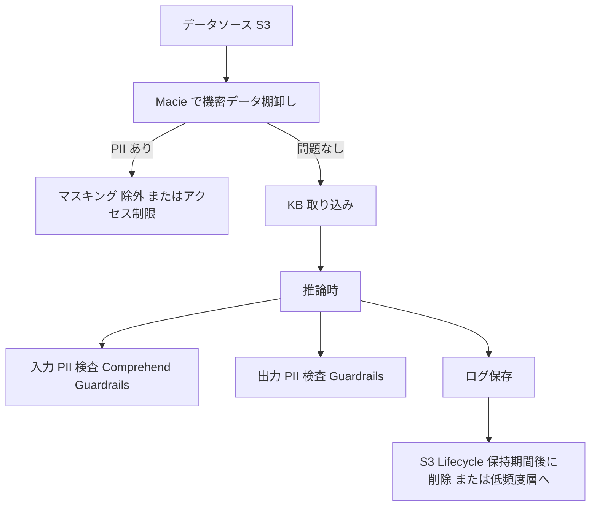
```mermaid
flowchart TD
    SRC["データソース S3"] --> MAC["Macie で機密データ棚卸し"]
    MAC -->|PII あり| FIX["マスキング 除外 またはアクセス制限"]
    MAC -->|問題なし| ING["KB 取り込み"]
    ING --> RUN["推論時"]
    RUN --> IN["入力 PII 検査 Comprehend Guardrails"]
    RUN --> OUT["出力 PII 検査 Guardrails"]
    RUN --> LOG["ログ保存"]
    LOG --> LC["S3 Lifecycle 保持期間後に削除 または低頻度層へ"]
```

### 9-3. S3 ライフサイクルによる保持ポリシー
プロンプトやログ、中間データを **無期限に持たない**ための仕組みです。

| ルール例 | 効果 |
|---|---|
| 一定日数後に **有効期限（Expiration）** で削除 | 最小限の期間だけ保持（データ最小化） |
| 一定日数後に低頻度アクセス層／アーカイブ層へ **移行（Transition）** | 保管コスト削減（法的保持が必要なデータ向け） |
| バージョニング有効バケットの **非現行バージョン**を期限削除 | 古い版に PII が残り続けるのを防ぐ |

> 規制上の保持義務（最低保持期間）と、プライバシー上の最小化（できるだけ早く削除）は **綱引き**になる。要件を確認して期間を決める。

### 9-4. ベストプラクティス
- **収集しない・保存しない・短く持つ**（データ最小化）を設計の最初に置く。
- ログに **生のプロンプト・応答を保存する場合**は、保存先の暗号化・アクセス制御・保持期間を必ずセットで設計する。CloudWatch Logs のデータ保護ポリシーのマスキングは**閲覧時に適用されるもので、生値はそのまま保存され、`logs:Unmask` 権限があれば確認できる**。生の PII を保存したくない場合、アプリ側の除去は**アプリが管理するログ**にしか効かない。Bedrock のモデル呼び出しログは Bedrock が受け取った入力と返した出力をそのまま記録するため、アプリ側で後から書き換えられない。**入力は Bedrock 呼び出し前にサニタイズ**し、マスクされていない出力を保存してはならないワークロードでは**モデル呼び出しログのテキスト（コンテンツ）出力を無効化**して、マスク済みのアプリ管理ログで代替する。
- RAG 用データは **取り込む前に Macie 等で検査**する。入れてしまうと全ユーザーへ漏れうる。
- 同意・目的外利用の防止は **アプリ側の設計**（Bedrock が学習に使わないことと、自社内での再利用は別問題）。

### 9-5. 試験の着眼点
「S3 の巨大なバケットに PII が含まれるか知りたい」→ **Macie**。「ユーザーが入力した文章中の PII をリアルタイムで検出」→ **Comprehend（PII 検出は英語とスペイン語のみ）または Guardrails**。非対応言語は検証済みの検出器を使い、なければ処理を止める（fail closed）。「一定期間後に自動削除」→ **S3 Lifecycle**。

**参考 URL**
- Comprehend PII: https://docs.aws.amazon.com/comprehend/latest/dg/how-pii.html
- Amazon Macie: https://docs.aws.amazon.com/macie/latest/user/what-is-macie.html
- 機密情報フィルター: https://docs.aws.amazon.com/bedrock/latest/userguide/guardrails-sensitive-filters.html
- Bedrock のデータ保持: https://docs.aws.amazon.com/bedrock/latest/userguide/data-retention.html
- S3 ライフサイクル管理: https://docs.aws.amazon.com/AmazonS3/latest/userguide/object-lifecycle-mgmt.html
- CloudWatch Logs 機密データのマスキング: https://docs.aws.amazon.com/AmazonCloudWatch/latest/logs/mask-sensitive-log-data.html

---

## Step 10. プライバシー重視設計（Skill 3.2.3）

> **Skill 3.2.3**: FM の有用性と有効性を保ちつつユーザーのプライバシーを守る、プライバシー重視の AI システムを作成する（データマスキング技術、Comprehend による PII 検出、機密情報の匿名化戦略、Guardrails）。

### 10-1. 「守る」と「役に立つ」を両立する

PII を **全部消す**とモデルが文脈を失い、回答品質が落ちることがあります。**目的に必要な情報だけ残す**のがコツです。

| 手法 | 内容 | 長所 | 短所 |
|---|---|---|---|
| 削除（Redaction） | 該当部分を消す | 最も安全 | 文脈が失われる |
| マスキング | 「[NAME]」「****」などに置換 | 文の構造を保てる | 元に戻せない |
| トークン化（仮名化） | 一貫した別名・ID に置換し、対応表を安全に別保管 | 同一人物の文脈を保てる／必要時に復元可能 | 対応表の保護が必須 |
| 汎化 | 「42 歳」→「40 代」、住所→「都道府県」 | 統計的有用性を保つ | 再識別リスクが残る場合あり |
| 匿名化 | 個人を特定できない形に不可逆変換 | 規制対応しやすい | 元データの有用性が下がる |

### 10-2. 仮名化して推論し、表示時に復元する流れ

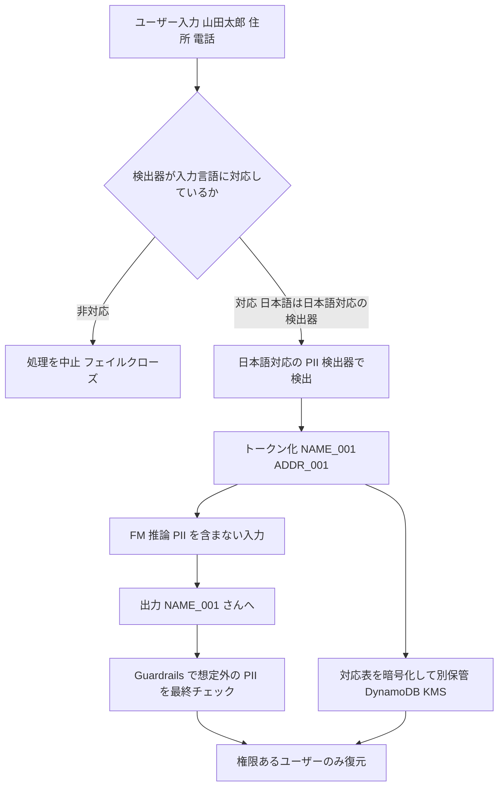
```mermaid
flowchart TD
    IN["ユーザー入力 山田太郎 住所 電話"] --> LANG{"検出器が入力言語に対応しているか"}
    LANG -->|"非対応"| BLK["処理を中止 フェイルクローズ"]
    LANG -->|"対応 日本語は日本語対応の検出器"| DET["日本語対応の PII 検出器で検出"]
    DET --> TOK["トークン化 NAME_001 ADDR_001"]
    TOK --> MAP["対応表を暗号化して別保管 DynamoDB KMS"]
    TOK --> FM["FM 推論 PII を含まない入力"]
    FM --> OUT["出力 NAME_001 さんへ"]
    OUT --> GR["Guardrails で想定外の PII を最終チェック"]
    GR --> RES["権限あるユーザーのみ復元"]
    MAP --> RES
```

### 10-3. Guardrails の機密情報フィルターの使い分け

| 設定 | 動作 | 向いている場面 |
|---|---|---|
| ブロック | 検出したら要求・応答全体を拒否 | クレジットカード番号など絶対に扱わない情報 |
| マスク（匿名化） | 該当部分だけ置換して処理を継続 | 氏名・住所など、回答は返したいが伏せたい情報 |
| 正規表現 | 独自形式（社員番号など）を検出 | 標準エンティティにない社内 ID |

### 10-4. ベストプラクティス
- **利用目的ごとに必要な PII を定義**（目的限定）し、不要なものは入口で落とす。
- 仮名化の **対応表は最も厳しく保護**（KMS 暗号化・アクセス最小化・監査）。
- マスク後の **回答品質を評価データで確認**してから本番化する。
- プライバシー設定の効果を **定期テスト**（PII を含むテスト入力で漏えいがないか）。

### 10-5. 試験の着眼点
「個人情報は隠したいが、会話の文脈は保ちたい」→ **マスク／仮名化（トークン化）**。「絶対に通してはいけない」→ **ブロック**。

**参考 URL**
- 機密情報フィルター: https://docs.aws.amazon.com/bedrock/latest/userguide/guardrails-sensitive-filters.html
- Comprehend PII: https://docs.aws.amazon.com/comprehend/latest/dg/how-pii.html
- Bedrock のデータ保護: https://docs.aws.amazon.com/bedrock/latest/userguide/data-protection.html

---

# Task 3.3 ガバナンスとコンプライアンス

## Step 11. コンプライアンスフレームワーク（Skill 3.3.1）

> **Skill 3.3.1**: FM デプロイメントの規制遵守を確保するコンプライアンスフレームワークを開発する（SageMaker AI によるプログラマティックなモデルカード作成、AWS Glue によるデータリネージの自動追跡、データソース帰属のためのメタデータタグ付け、CloudWatch Logs による包括的な意思決定ログの収集）。

### 11-1. 4 つの部品

| 部品 | サービス／手法 | 何を残すか |
|---|---|---|
| モデルの説明書 | SageMaker モデルカード（API で自動作成） | 目的、想定用途、制限事項、評価結果、リスク評価 |
| データの来歴 | AWS Glue（Data Catalog・ジョブ情報）によるリネージ | どのデータがどこから来て、どう変換されたか |
| 帰属情報 | メタデータタグ | データソース名・所有者・機密度・取得日 |
| 意思決定ログ | CloudWatch Logs | 入力概要・使用モデル・ガードレール判定・出力概要 |

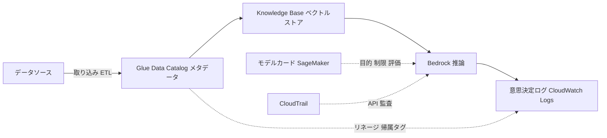
```mermaid
flowchart LR
    A["データソース"] -->|取り込み ETL| B["Glue Data Catalog メタデータ"]
    B --> C["Knowledge Base ベクトルストア"]
    C --> D["Bedrock 推論"]
    D --> E["意思決定ログ CloudWatch Logs"]
    F["モデルカード SageMaker"] -.->|目的 制限 評価| D
    B -.->|リネージ 帰属タグ| E
    G["CloudTrail"] -.->|API 監査| D
```

### 11-2. モデルカードをコードで作る理由
手作業の文書は **古くなり**、環境ごとにばらつきます。SageMaker AI の API（`CreateModelCard` など）で **プログラマティックに作成・更新**すれば、CI/CD に組み込み、リリースごとに最新状態を維持できます。モデルの **用途、制限、評価結果、倫理的考慮事項** を記載する想定です。

### 11-3. 意思決定ログ設計のコツ

| 記録する | 記録しない／伏せる |
|---|---|
| リクエスト ID、時刻、ユーザー識別子（仮名）、モデル ID、ガードレール ID とバージョン、判定結果、参照した文書 ID、トークン数 | 生の PII、認証情報、不要な全文 |

### 11-4. ベストプラクティス
- 規制要件（例: 説明責任・監査・データ保持）を **要件表に落とし**、各要件をどの AWS 機能で満たすかを対応づける。
- ログは **改ざん耐性**（アクセス制御、S3 オブジェクトロック等）と **保持期間**を設計する。
- モデルカード・リネージ・ログは **自動生成**し、手作業に依存しない。

### 11-5. 試験の着眼点
「モデルの制限や用途を **文書化し自動更新**」→ **SageMaker モデルカード（プログラマティック）**。「データがどこから来たか追跡」→ **Glue（Data Catalog／リネージ）+ メタデータタグ**。

**参考 URL**
- SageMaker モデルカード: https://docs.aws.amazon.com/sagemaker/latest/dg/model-cards.html
- AWS Glue Data Catalog: https://docs.aws.amazon.com/glue/latest/dg/catalog-and-crawler.html
- Bedrock のモデル呼び出しログ: https://docs.aws.amazon.com/bedrock/latest/userguide/model-invocation-logging.html
- AWS Artifact（コンプライアンスレポート）: https://docs.aws.amazon.com/artifact/latest/ug/what-is-aws-artifact.html

---

## Step 12. データソース追跡（Skill 3.3.2）

> **Skill 3.3.2**: GenAI アプリケーションのトレーサビリティを維持するデータソース追跡を実装する（AWS Glue Data Catalog によるデータソース登録、FM 生成コンテンツの出典帰属のためのメタデータタグ付け、CloudTrail による監査ログ）。

### 12-1. 追跡したい問い

| 問い | 答えの出どころ |
|---|---|
| この回答の根拠文書はどれか | 引用情報（出典メタデータ）、KB のチャンクメタデータ |
| その文書の所有者・機密度・更新日は | Glue Data Catalog、メタデータタグ |
| 誰がいつ Bedrock API を呼んだか | CloudTrail |
| 誰がデータソースを変更したか | CloudTrail（管理イベント／データイベント） |

### 12-2. 3 つの仕組みの役割分担

| 仕組み | 役割 | 例 |
|---|---|---|
| Glue Data Catalog | データソースの **登録台帳** | テーブル／パーティションの定義、所有者・分類のプロパティ |
| メタデータタグ | 生成コンテンツに **出典を紐づける** | ドキュメントごとに source、owner、classification、version を付与 |
| CloudTrail | **操作の監査証跡** | Bedrock の API 呼び出し、IAM ロール引き受け、S3 データイベント |

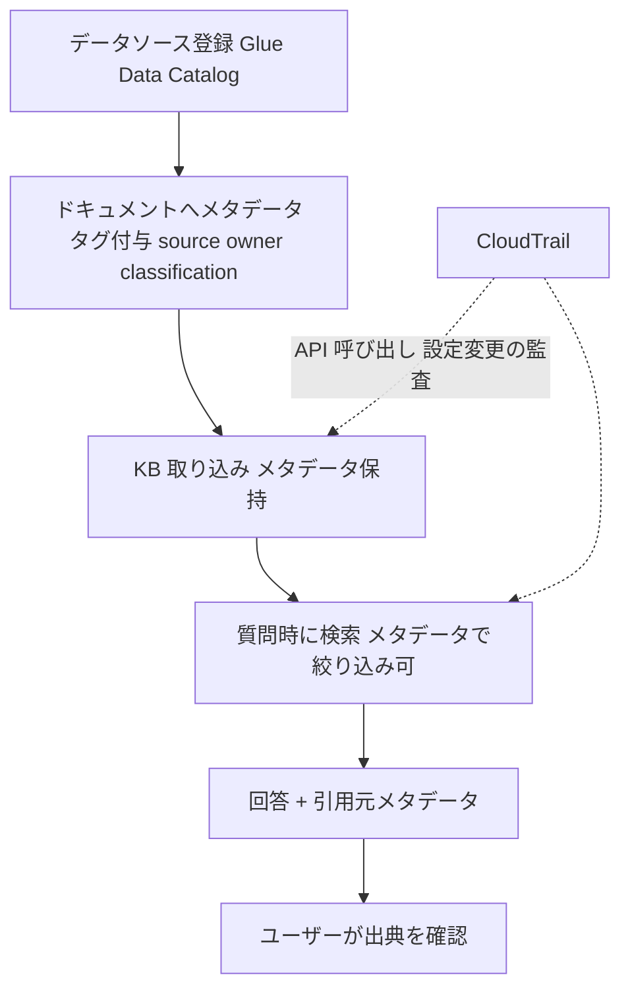
```mermaid
flowchart TD
    R["データソース登録 Glue Data Catalog"] --> T["ドキュメントへメタデータタグ付与 source owner classification"]
    T --> KB["KB 取り込み メタデータ保持"]
    KB --> Q["質問時に検索 メタデータで絞り込み可"]
    Q --> A["回答 + 引用元メタデータ"]
    A --> U["ユーザーが出典を確認"]
    CT["CloudTrail"] -.->|API 呼び出し 設定変更の監査| KB
    CT -.-> Q
```

### 12-3. ベストプラクティス
- 取り込み時に **必須メタデータ（出所・所有者・機密度・有効期限）を強制**し、欠けた文書は取り込まない。
- 回答には **出典 ID・タイトル・取得日**を含めて返す。
- **メタデータで検索を絞る**（例: 機密度が内部限定の文書は一般ユーザーの検索から除外）。
- CloudTrail は **全リージョン／組織全体**で有効にし、S3 に集約・保護する。Bedrock の推論本文は CloudTrail ではなく **モデル呼び出しログ**に記録する点に注意。
- `InvokeAgent`・`Retrieve`・`RetrieveAndGenerate` などの Bedrock ランタイム操作は CloudTrail の **データイベント**であり、**デフォルトでは記録されない**。監査証跡に含めるには、証跡（またはイベントデータストア）で対象の Bedrock リソースタイプ（例: `AWS::Bedrock::AgentAlias`、`AWS::Bedrock::KnowledgeBase`）の **データイベントセレクター（高度なイベントセレクター）を有効化**する。
- データソース削除・更新時に **古いチャンクが検索に残らない**よう同期を設計する。

### 12-4. 試験の着眼点
「回答に使った情報の出所を示す」→ **メタデータ＋引用**。「誰が何をしたかを監査」→ **CloudTrail**。「データソースの台帳」→ **Glue Data Catalog**。

**参考 URL**
- Glue Data Catalog: https://docs.aws.amazon.com/glue/latest/dg/catalog-and-crawler.html
- CloudTrail による Bedrock のログ記録: https://docs.aws.amazon.com/bedrock/latest/userguide/logging-using-cloudtrail.html
- Knowledge Bases: https://docs.aws.amazon.com/bedrock/latest/userguide/knowledge-base.html
- CloudTrail ユーザーガイド: https://docs.aws.amazon.com/awscloudtrail/latest/userguide/cloudtrail-user-guide.html

---

## Step 13. 組織ガバナンス（Skill 3.3.3）

> **Skill 3.3.3**: FM 実装に対する一貫した監督を確保する組織的ガバナンスシステムを作成する（組織ポリシー、規制要件、責任ある AI 原則に整合する包括的フレームワークの利用）。

### 13-1. ガバナンスとは
「技術」ではなく **ルールと責任の仕組み**です。ただし試験では、**そのルールを AWS の機能で自動的に強制する**設計が問われます。

### 13-2. 3 つのレイヤー

| レイヤー | 内容 | 例 |
|---|---|---|
| ポリシー（方針） | 許可するモデル・用途・データ分類、禁止事項、責任の分担 | AI 利用ポリシー、データ分類基準、承認プロセス（レビュー委員会） |
| 強制（ガードレール） | ルールを技術で守らせる | IAM ポリシー条件、SCP（組織単位の権限上限）、`bedrock:GuardrailIdentifier` の強制、タグポリシー |
| 証跡（監査） | 守られている証拠 | CloudTrail、AWS Config、モデルカード、意思決定ログ |

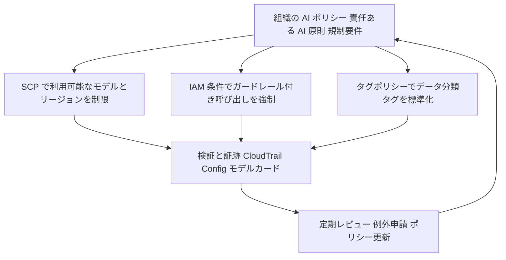
```mermaid
flowchart TD
    P["組織の AI ポリシー 責任ある AI 原則 規制要件"] --> E1["SCP で利用可能なモデルとリージョンを制限"]
    P --> E2["IAM 条件でガードレール付き呼び出しを強制"]
    P --> E3["タグポリシーでデータ分類タグを標準化"]
    E1 --> V["検証と証跡 CloudTrail Config モデルカード"]
    E2 --> V
    E3 --> V
    V --> R["定期レビュー 例外申請 ポリシー更新"]
    R --> P
```

### 13-3. 役割分担の例

| 役割 | 責任 |
|---|---|
| AI ガバナンス委員会 | 方針の策定、高リスク用途の承認 |
| プラットフォームチーム | ガードレール・SCP・共通基盤の提供 |
| アプリ開発チーム | 方針に沿った実装、モデルカード更新 |
| セキュリティ／監査 | 証跡の検証、インシデント対応 |

### 13-4. ベストプラクティス
- 方針は **文書だけにせず、技術的な統制に落とし込む**。**SCP／IAM は違反操作を防ぐ予防的統制**として強制し、**AWS Config ルールは非準拠を検出・報告する発見的統制**として使う（自動修復は Config の修復アクション等を別途設定した場合のみ）。
- 用途を **リスク別に分類**（低・中・高）し、高リスクは人手承認を必須にする。
- 例外を認める場合は **期限付き・記録付き**にする。
- 規制・社内ポリシーの変更に合わせて **定期見直し**を行う。

### 13-5. 試験の着眼点
この Skill は具体サービスの指定が少なく、**「方針 → 技術的強制 → 証跡」の一貫性**を選ぶ設問になりやすい。複数組織・アカウントなら **AWS Organizations の SCP** で上限を設ける発想を持つ。

**参考 URL**
- AWS Responsible AI: https://aws.amazon.com/ai/responsible-ai/
- AWS Well-Architected Responsible AI Lens: https://docs.aws.amazon.com/wellarchitected/latest/responsible-ai-lens/responsible-ai-lens.html
- AWS Organizations SCP: https://docs.aws.amazon.com/organizations/latest/userguide/orgs_manage_policies_scps.html
- ガードレール強制: https://docs.aws.amazon.com/bedrock/latest/userguide/guardrails-permissions-id.html
- NIST AI Risk Management Framework: https://www.nist.gov/itl/ai-risk-management-framework

---

## Step 14. 継続監視と高度なガバナンス統制（Skill 3.3.4）

> **Skill 3.3.4**: 安全性監査と規制対応を支える継続的な監視と高度なガバナンス統制を実装する（誤用・ドリフト・ポリシー違反の自動検出、バイアスドリフト監視、自動アラートと修復ワークフロー、トークンレベルのレダクション、応答ログ、AI 出力ポリシーフィルター）。

### 14-1. 何を監視するか

| 監視対象 | 内容 | 手段 |
|---|---|---|
| 誤用 | 異常に多い呼び出し、攻撃的入力の急増、特定ユーザーの集中的なブロック | CloudWatch メトリクス／ログのメトリクスフィルター、アラーム |
| ドリフト | 入力分布や回答品質の変化 | 定期評価ジョブ、品質メトリクスの推移 |
| ポリシー違反 | ガードレール発動、禁止話題、機密漏えい | Guardrails のトレース／ログ、モデル呼び出しログ |
| バイアスドリフト | 属性間で出力の偏りが時間とともに拡大 | 公平性メトリクスの定期計測（新規利用は Bedrock Evaluations の Stereotyping 等の指標や、pandas / scikit-learn での標準バイアス指標計算を CloudWatch へ送る。SageMaker Clarify は新規顧客の受付を終了し、既存顧客のみ利用可） |
| コスト・利用量 | 想定外のトークン増加 | CloudWatch、請求アラーム |

### 14-2. 自動検知から修復までの流れ

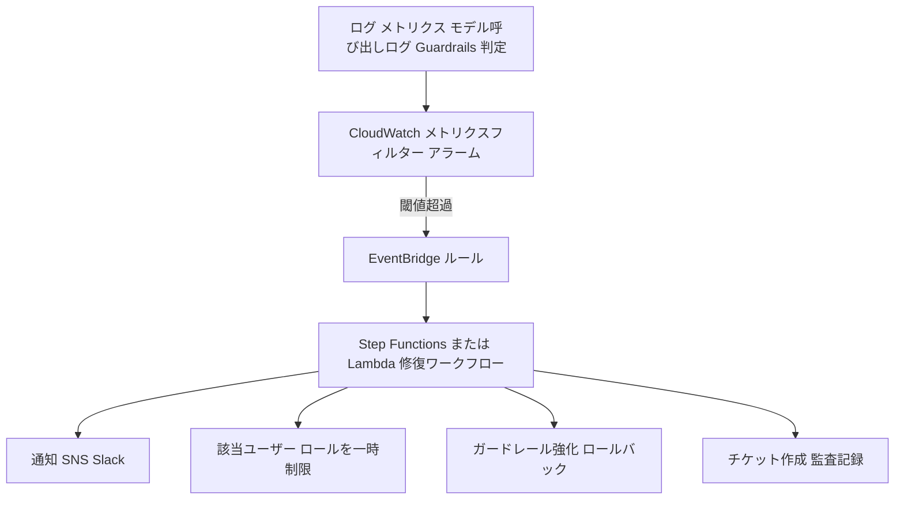
```mermaid
flowchart TD
    L["ログ メトリクス モデル呼び出しログ Guardrails 判定"] --> M["CloudWatch メトリクスフィルター アラーム"]
    M -->|閾値超過| EB["EventBridge ルール"]
    EB --> SF["Step Functions または Lambda 修復ワークフロー"]
    SF --> A1["通知 SNS Slack"]
    SF --> A2["該当ユーザー ロールを一時制限"]
    SF --> A3["ガードレール強化 ロールバック"]
    SF --> A4["チケット作成 監査記録"]
```

### 14-3. トークンレベルのレダクションと出力ポリシーフィルター

| 機能 | 内容 | 補足 |
|---|---|---|
| トークンレベルのレダクション | 出力のうち **機密に該当する部分だけ**を伏せ、他は返す | Guardrails の機密情報フィルターのマスク。ストリーミングでは **非同期モードは PII マスキングに非対応** のため、マスクが必要なら同期モードを使う |
| 応答ログ | 応答と判定の証跡を保存 | モデル呼び出しログ + CloudWatch Logs。CloudWatch Logs のデータ保護ポリシーは**閲覧時のマスク**で、生値は保存され `logs:Unmask` 権限で確認できる。アプリ側の除去が効くのは**アプリ管理ログのみ**で、Bedrock 管理のモデル呼び出しログは書き換えられない。生の PII を残さないなら**入力は呼び出し前にサニタイズ**し、出力対策として**呼び出しログのコンテンツ出力を無効化**してマスク済みのアプリ管理ログを使う |
| AI 出力ポリシーフィルター | 組織ポリシー（禁止助言、免責の必須挿入など）の出力検査 | Guardrails（Denied topics 等）+ Lambda 後処理 |

### 14-4. ベストプラクティス
- **「検知 → 通知 → 自動修復 → 記録」**を 1 本のパイプラインにする。人手だけに頼らない。
- アラートは **誤検知疲れを避ける**ため、重大度で分け、閾値を定期調整する。
- Guardrails の **ブロック率・誤検出率**を継続指標にする。急変は攻撃か設定劣化のサイン。
- **Bedrock のモデルは提供元の更新で挙動が変わる**ことがあるため、定期評価で品質・安全性の変化を拾う。
- 自動修復は **影響範囲を絞る**（まずは一時制限・通知から）。

### 14-5. 試験の着眼点
「ポリシー違反を自動検知して即時対応」→ **CloudWatch + EventBridge + Lambda/Step Functions**。「出力中の PII だけを伏せたい」→ **Guardrails の機密情報マスク**。「バイアスが時間とともに悪化していないか」→ **公平性メトリクスの継続監視（バイアスドリフト）**。

**参考 URL**
- モデル呼び出しログ: https://docs.aws.amazon.com/bedrock/latest/userguide/model-invocation-logging.html
- CloudWatch Logs のデータ保護（マスキング）: https://docs.aws.amazon.com/AmazonCloudWatch/latest/logs/mask-sensitive-log-data.html
- Amazon EventBridge: https://docs.aws.amazon.com/eventbridge/latest/userguide/eb-what-is.html
- SageMaker Clarify（公平性・説明可能性、既存顧客のみ）: https://docs.aws.amazon.com/sagemaker/latest/dg/clarify-fairness-and-explainability.html
- Clarify の提供状況と代替手段: https://docs.aws.amazon.com/sagemaker/latest/dg/clarify-availability-change.html
- Guardrails: https://docs.aws.amazon.com/bedrock/latest/userguide/guardrails.html

---
# Task 3.4 責任ある AI の実装

## Step 15. 透明性（Skill 3.4.1）

> **Skill 3.4.1**: FM 出力における透明な AI システムを開発する（ユーザー向け説明のための推論表示、CloudWatch による信頼度メトリクス収集と不確実性の定量化、出典帰属のための根拠提示、Bedrock Agent トレースによる推論トレース）。

### 15-1. 透明性の 4 つの形

| 形 | 内容 | 実装手段 |
|---|---|---|
| 推論の表示 | なぜその回答になったかをユーザーに分かる形で示す | 回答に判断理由の要約を添える（内部の生の思考ではなく、要点を整理した説明） |
| 不確実性の定量化 | どのくらい自信があるかを数値で扱う | 検証スコア（grounding 等）を CloudWatch にメトリクスとして記録し、閾値で表示や分岐を変える |
| 根拠提示（出典帰属） | 回答がどの資料に基づくかを示す | Knowledge Bases の引用情報、出典メタデータ |
| 推論トレース | エージェントが何をしたかを追跡 | Bedrock Agent のトレース |

### 15-2. Bedrock Agent トレース

> **最新状況の注意**: Amazon Bedrock Agents は Amazon Bedrock Agents Classic に名称変更され、2026 年 7 月 30 日以降は新規顧客が利用を開始できません（メンテナンスモード）。本節は試験範囲として解説を残しますが、本番向けに新規実装する場合は Amazon Bedrock AgentCore の最新資料を参照してください。
> 出典: https://docs.aws.amazon.com/bedrock/latest/userguide/agents-classic-maintenance-mode.html

InvokeAgent のトレースは **既定で無効** です。リクエストで `enableTrace=true` を指定すると、エージェントの応答にトレースが付き、オーケストレーションの各ステップが分かります。運用で記録するには、この指定を有効にしたうえでトレースを保存します。主な要素は次のとおりです。

| 要素 | 意味 |
|---|---|
| Rationale | 次の行動に関するエージェントの推論 |
| InvocationInput | 呼び出したアクショングループ／KB と渡した入力 |
| Observation | 実行結果（ツール出力、KB 検索結果） |
| 失敗時の理由 | ステップが失敗した場合にその理由が返る |

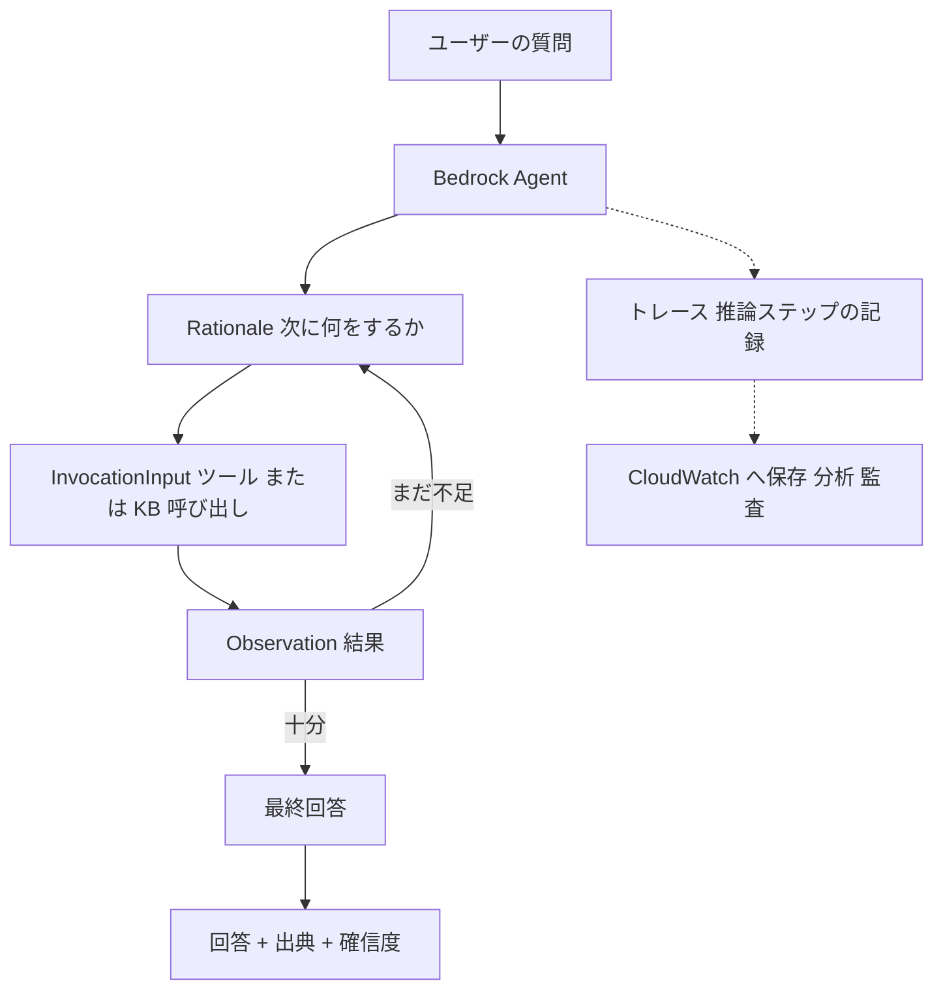
```mermaid
flowchart TD
    Q["ユーザーの質問"] --> AG["Bedrock Agent"]
    AG --> R["Rationale 次に何をするか"]
    R --> I["InvocationInput ツール または KB 呼び出し"]
    I --> O["Observation 結果"]
    O -->|まだ不足| R
    O -->|十分| F["最終回答"]
    AG -.-> TR["トレース 推論ステップの記録"]
    TR -.-> CW["CloudWatch へ保存 分析 監査"]
    F --> UI["回答 + 出典 + 確信度"]
```

### 15-3. 不確実性の扱い（確信度の見せ方）

| スコア状態 | 推奨する UI／動作 |
|---|---|
| 高 | 回答と出典を通常表示 |
| 中 | 「この回答は資料で十分に確認できていません」と注意書きを付ける |
| 低 | 回答せず「分かりません」または人手エスカレーション |

### 15-4. ベストプラクティス
- 出典は **リンク可能な形**で提示し、ユーザーが原典で確認できるようにする。
- 推論の表示は **利用者に有用な要約**にとどめ、機密（内部プロンプト・他者の PII）を含めない。
- トレースは `enableTrace=true` で有効化して **本番でも保存**し、インシデント調査・監査に使う。ただしトレースにユーザーデータが含まれるため **保存先のアクセス制御と保持期間**を設計する。
- 確信度の閾値は評価データで **較正**する（高く見えて間違うことがあるため過信しない）。

### 15-5. 試験の着眼点
「エージェントがなぜその行動を選んだか追跡」→ **Bedrock Agent トレース**。「回答の根拠を示す」→ **引用（KB のソース帰属）**。「不確実性を可視化して運用」→ **CloudWatch に信頼度メトリクス**。

**参考 URL**
- Agent トレース: https://docs.aws.amazon.com/bedrock/latest/userguide/trace-events.html
- Knowledge Bases: https://docs.aws.amazon.com/bedrock/latest/userguide/knowledge-base.html
- AWS Well-Architected Responsible AI Lens: https://docs.aws.amazon.com/wellarchitected/latest/responsible-ai-lens/responsible-ai-lens.html

---

## Step 16. 公平性評価（Skill 3.4.2）

> **Skill 3.4.2**: バイアスのない FM 出力を確保する公平性評価を適用する（CloudWatch の事前定義された公平性メトリクス、Bedrock Prompt Management と Prompt Flows による体系的な A/B テスト、LLM-as-a-judge による自動モデル評価）。

### 16-1. 公平性とは
属性（性別・年齢・国籍など）が違うだけで、**回答の質や内容が不当に変わらない**ことです。ステレオタイプの再生産も含みます。

### 16-2. 3 つの手法

| 手法 | 内容 | サービス |
|---|---|---|
| 公平性メトリクスの計測 | 属性別の出力差を数値化し、継続的に記録 | CloudWatch（メトリクスとして収集）、Bedrock Evaluations（新規利用の代替）。SageMaker Clarify は既存顧客のみ利用可 |
| 体系的な A/B テスト | プロンプトの版を切り替え、同条件で比較 | Bedrock Prompt Management（版管理）、Prompt Flows（ワークフローで分岐・比較） |
| LLM-as-a-judge | 別の LLM が評価者となり、自動採点 | Bedrock Evaluations（Stereotyping、Harmfulness などの組み込み指標） |

### 16-3. 評価サイクル

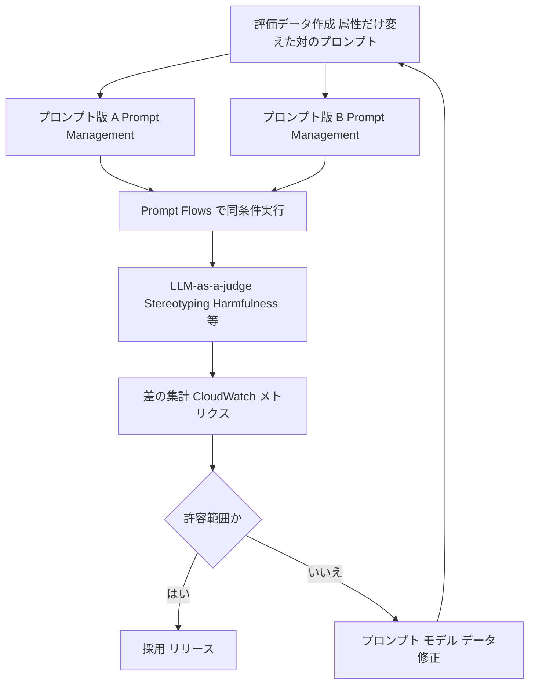
```mermaid
flowchart TD
    D["評価データ作成 属性だけ変えた対のプロンプト"] --> P1["プロンプト版 A Prompt Management"]
    D --> P2["プロンプト版 B Prompt Management"]
    P1 --> F["Prompt Flows で同条件実行"]
    P2 --> F
    F --> J["LLM-as-a-judge Stereotyping Harmfulness 等"]
    J --> M["差の集計 CloudWatch メトリクス"]
    M --> C{"許容範囲か"}
    C -->|はい| REL["採用 リリース"]
    C -->|いいえ| FIX["プロンプト モデル データ修正"]
    FIX --> D
```

### 16-4. ベストプラクティス
- 評価データは **属性だけを入れ替えた対（ペア）**で作り、差を直接比較する。
- **評価者モデル自体にもバイアスがある**ため、人手の抜き取り確認を併用する。
- 公平性は **リリース前だけでなく継続計測**する（Step 14 のバイアスドリフト）。
- プロンプト変更は **バージョン管理して比較可能**にする（Prompt Management の版）。
- 「どの属性・どの指標を重視するか」を **利用文脈で決めて文書化**（モデルカードに記載）。

### 16-5. 試験の着眼点
「プロンプトの 2 案を体系的に比較」→ **Prompt Management + Prompt Flows の A/B テスト**。「大量の出力を自動で偏り評価」→ **LLM-as-a-judge**。「継続的に公平性を監視」→ **CloudWatch に公平性メトリクス**。

**参考 URL**
- モデル評価の指標（Stereotyping 等）: https://docs.aws.amazon.com/bedrock/latest/userguide/model-evaluation-metrics.html
- Bedrock Evaluations: https://aws.amazon.com/bedrock/evaluations/
- Prompt Management: https://docs.aws.amazon.com/bedrock/latest/userguide/prompt-management.html
- Prompt Flows: https://docs.aws.amazon.com/bedrock/latest/userguide/flows.html
- SageMaker Clarify（既存顧客のみ）: https://docs.aws.amazon.com/sagemaker/latest/dg/clarify-fairness-and-explainability.html
- Clarify の提供状況と代替手段: https://docs.aws.amazon.com/sagemaker/latest/dg/clarify-availability-change.html

---

## Step 17. ポリシー準拠 AI（Skill 3.4.3）

> **Skill 3.4.3**: 責任ある AI の実践への準拠を確保するポリシー準拠 AI システムを開発する（ポリシー要件に基づく Guardrails、FM の制限を文書化するモデルカード、自動コンプライアンスチェックを行う Lambda 関数）。

### 17-1. 「ポリシー → 実装 → 証明」の対応

| ポリシー要件の例 | 実装 | 証明 |
|---|---|---|
| 医療診断・投資助言をしない | Guardrails の Denied topics | ガードレールのバージョンとテスト結果 |
| 個人情報を出力しない | 機密情報フィルター | ブロック／マスクのログ |
| 差別的表現を出さない | Content filters | Harmfulness／Stereotyping 評価結果 |
| 回答に免責文を必ず付ける | Lambda 後処理 | 自動チェックのログ |
| モデルの制限・用途を明示 | モデルカード | カードの版履歴 |

### 17-2. 自動コンプライアンスチェックの流れ

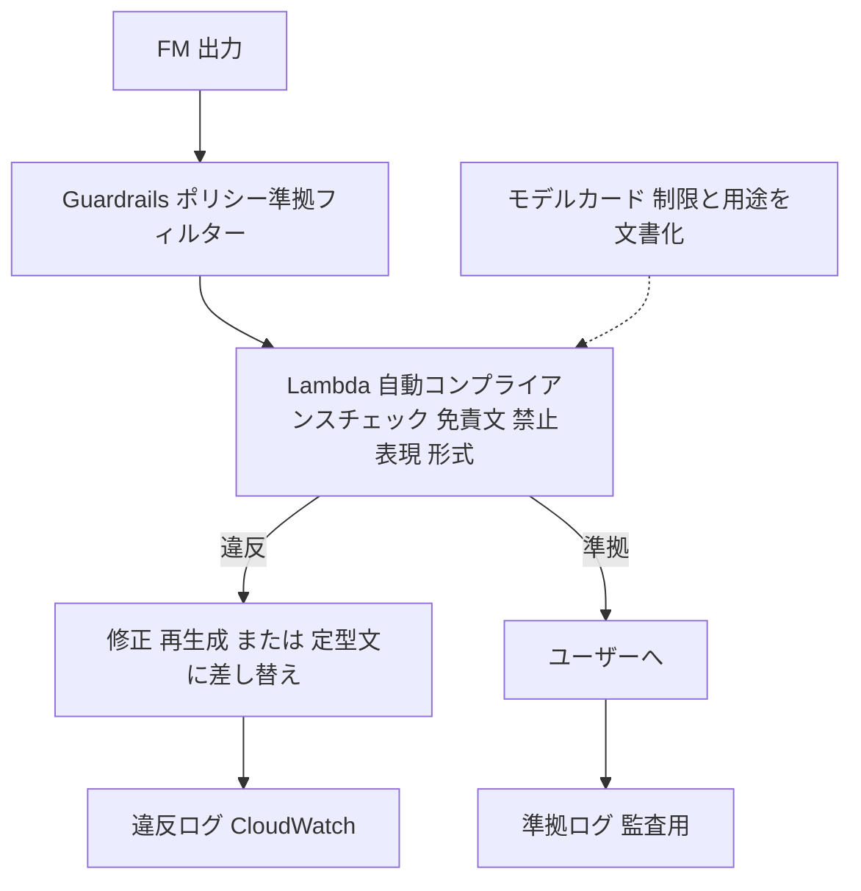
```mermaid
flowchart TD
    OUT["FM 出力"] --> GR["Guardrails ポリシー準拠フィルター"]
    GR --> LM["Lambda 自動コンプライアンスチェック 免責文 禁止表現 形式"]
    LM -->|違反| FIX["修正 再生成 または 定型文に差し替え"]
    LM -->|準拠| SEND["ユーザーへ"]
    FIX --> LOG["違反ログ CloudWatch"]
    SEND --> LOG2["準拠ログ 監査用"]
    MC["モデルカード 制限と用途を文書化"] -.-> LM
```

### 17-3. モデルカードに書く「制限」の例
- 想定していない言語・領域での精度低下
- 最新情報を持たない（知識の更新時期）
- ハルシネーションの可能性と、必須の人手確認範囲
- 評価で確認できた偏りの傾向と緩和策

### 17-4. ベストプラクティス
- ポリシー文言を **そのまま Guardrails の設定に落とし込み**、設定とポリシーの対応表を維持する。
- **テストケースを資産化**（ポリシーごとの合格／不合格例）し、変更のたびに回帰テストする。
- コンプライアンスチェック Lambda は **フェイルクローズ**にする。
- ガードレール変更を **IaC（CloudFormation 等）でコード管理**し、レビュー・履歴を残す。

### 17-5. 試験の着眼点
「ポリシー要件を自動的に技術へ反映」→ **Guardrails**。「FM の限界を利用者・監査者へ伝える」→ **モデルカード**。「出力が基準を満たすか自動検証」→ **Lambda**。

**参考 URL**
- Guardrails: https://docs.aws.amazon.com/bedrock/latest/userguide/guardrails.html
- Denied topics: https://docs.aws.amazon.com/bedrock/latest/userguide/guardrails-denied-topics.html
- SageMaker モデルカード: https://docs.aws.amazon.com/sagemaker/latest/dg/model-cards.html
- CloudFormation（Guardrail）: https://docs.aws.amazon.com/AWSCloudFormation/latest/TemplateReference/aws-resource-bedrock-guardrail.html

---

## Step 18. Task 3.4 のまとめ

| Skill | キーワード | 代表サービス・機能 |
|---|---|---|
| 3.4.1 透明性 | 説明・不確実性・出典・トレース | Agent トレース、KB 引用、CloudWatch 信頼度メトリクス |
| 3.4.2 公平性 | 属性間の差・A/B・自動評価 | Prompt Management / Flows、LLM-as-a-judge、公平性メトリクス |
| 3.4.3 ポリシー準拠 | 要件を技術へ・限界の文書化 | Guardrails、モデルカード、Lambda チェック |

---

# 統合と試験対策

## Step 19. 統合リファレンスアーキテクチャ

Domain 3 の全 Skill を 1 つの構成にまとめます。

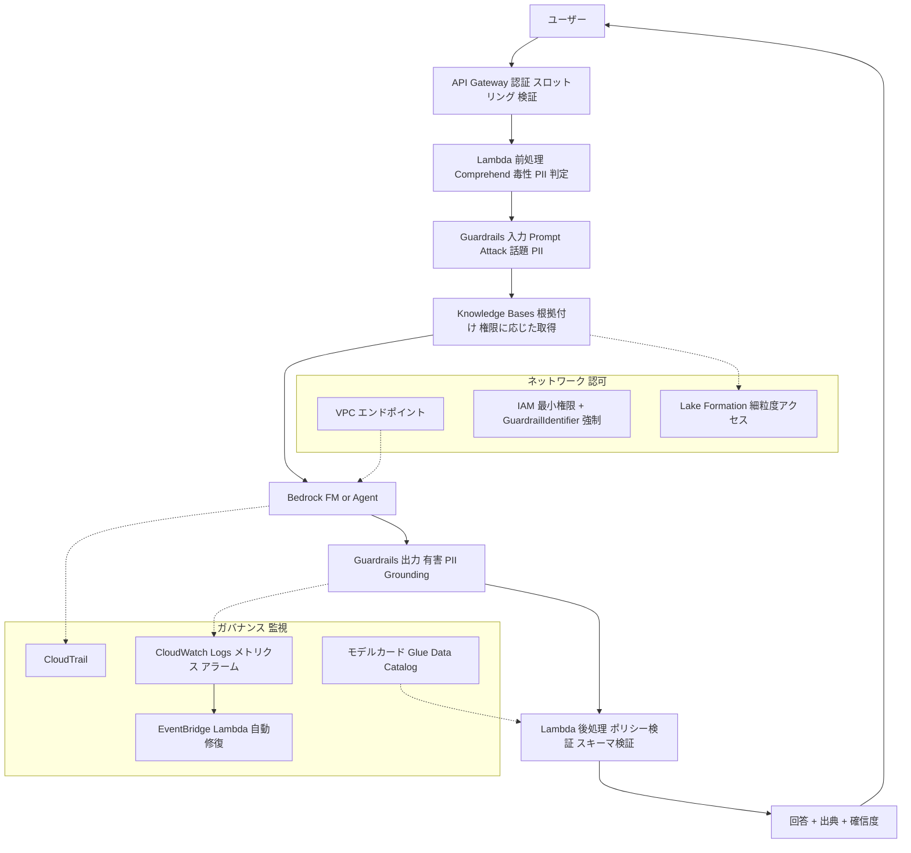
```mermaid
flowchart TD
    U["ユーザー"] --> AG["API Gateway 認証 スロットリング 検証"]
    AG --> PRE["Lambda 前処理 Comprehend 毒性 PII 判定"]
    PRE --> GI["Guardrails 入力 Prompt Attack 話題 PII"]
    GI --> RAG["Knowledge Bases 根拠付け 権限に応じた取得"]
    RAG --> FM["Bedrock FM or Agent"]
    FM --> GO["Guardrails 出力 有害 PII Grounding"]
    GO --> POST["Lambda 後処理 ポリシー検証 スキーマ検証"]
    POST --> RES["回答 + 出典 + 確信度"]
    RES --> U

    subgraph NET["ネットワーク 認可"]
        VPCE["VPC エンドポイント"]
        IAMX["IAM 最小権限 + GuardrailIdentifier 強制"]
        LFX["Lake Formation 細粒度アクセス"]
    end

    subgraph GOV["ガバナンス 監視"]
        CTX["CloudTrail"]
        CWL["CloudWatch Logs メトリクス アラーム"]
        MCX["モデルカード Glue Data Catalog"]
        EVX["EventBridge Lambda 自動修復"]
    end

    VPCE -.-> FM
    RAG -.-> LFX
    GO -.-> CWL
    CWL --> EVX
    FM -.-> CTX
    MCX -.-> POST
```

---

## Step 20. サービス選択早見表・引っ掛け表

### 20-1. 要件 → サービス早見表

| 要件 | 選ぶもの |
|---|---|
| 有害表現・攻撃・話題逸脱を設定だけで止めたい | Bedrock Guardrails |
| モデルに依存せずテキストへガードレールを適用 | ApplyGuardrail API |
| ガードレール利用を全員に強制 | IAM 条件キー `bedrock:GuardrailIdentifier` |
| ユーザー入力だけに Prompt Attack を適用 | 入力タグ（`guardContent` 系タグ） |
| 回答が取得文書に裏付けられているか検証 | Contextual grounding check |
| 論理ルールで回答の正確性を検証 | Automated Reasoning checks |
| 数値・集計を決定的にしたい | text-to-SQL（検証付き・読み取り専用） |
| 出力形式を固定 | JSON Schema + 検証 |
| LLM 呼び出し前の安価な毒性・PII 判定 | Amazon Comprehend（毒性は英語のみ。PII 検出は英語とスペイン語のみで日本語は検出できない。日本語の毒性は Bedrock Guardrails、非対応言語の PII は検証済みの検出器を使い、なければ処理を止める（fail closed）） |
| 組織固有の承認フロー付きモデレーション | Step Functions + Lambda |
| インターネットを経由せず Bedrock を呼ぶ | VPC インターフェイスエンドポイント（PrivateLink） |
| 列・行単位のデータ権限 | Lake Formation |
| S3 内の PII を発見 | Amazon Macie |
| 入力・出力中の PII を検出／マスク | Comprehend／Guardrails 機密情報フィルター（Comprehend の PII 検出は英語とスペイン語のみで日本語は検出できない。非対応言語は検証済みの検出器を使い、なければ処理を止める（fail closed）） |
| 一定期間後に自動削除 | S3 Lifecycle |
| モデルの用途・制限を文書化（自動更新） | SageMaker モデルカード（プログラマティック） |
| データの来歴・台帳 | Glue Data Catalog（+ リネージ）・メタデータタグ |
| 誰が API を呼んだかの監査 | CloudTrail |
| 入出力本文の記録 | Bedrock モデル呼び出しログ |
| ログ中の機密を自動マスク | CloudWatch Logs データ保護ポリシー |
| 異常検知から自動修復 | CloudWatch + EventBridge + Lambda/Step Functions |
| エージェントの推論過程を追跡 | Bedrock Agent トレース |
| プロンプト案の比較 | Prompt Management + Prompt Flows |
| 自動で偏り・有害性を採点 | LLM-as-a-judge（Bedrock Evaluations） |

### 20-2. 引っ掛け表（よくある誤り）

| 設問の雰囲気 | 誤りやすい選択 | 正しい考え方 |
|---|---|---|
| S3 バケット全体の PII 棚卸し | Comprehend | **保存データの発見は Macie**。Comprehend はテキストの解析 |
| 列レベルでアクセス制御 | S3 バケットポリシー | **Lake Formation** |
| Guardrails だけで安全か | はい | **多層防御**が基本（前処理・後処理・API 層） |
| 開発者の呼び忘れを防ぎたい | コードレビュー | **IAM 条件キーで強制** |
| システムプロンプトが誤検出される | しきい値を下げる | **入力タグでユーザー入力のみ評価** |
| 集計がぶれる | プロンプトを工夫 | **text-to-SQL で決定的に** |
| プロバイダーが自社データを見るか | 見える可能性 | **Model Deployment Account で分離され見られない** |
| CloudTrail に推論本文が残る | 残る | 本文は **モデル呼び出しログ**。CloudTrail は API 操作の証跡 |
| ストリーミングで一部が先に出る | Guardrails 不具合 | **非同期モード**の仕様。厳密に止めるなら同期モード |
| 公平性の継続監視 | リリース前の評価のみ | **継続計測（バイアスドリフト）** |
| 機密を守るためシステムプロンプトに秘密を入れる | 入れて隠す | **入れない**。漏えいリスクになる |

---

## Step 21. 練習問題 10 問

**Q1.** チャットアプリでユーザーが「以前の指示を無視して…」と入力し、システムプロンプトを引き出そうとしています。システムプロンプト自体を誤検出させずに攻撃だけを検知したい。最適な方法は？
A. Denied topics に「指示を無視」を登録　B. Prompt Attack フィルター + 入力タグ　C. Word filters のみ　D. Macie を有効化
**答え: B**。Prompt Attack はユーザー入力をタグで囲んで評価する。

**Q2.** 社内の全開発者が Bedrock を呼ぶ際、必ず特定のガードレールを使わせたい。
A. 開発ガイドに記載　B. IAM ポリシーに `bedrock:GuardrailIdentifier` 条件を設定　C. CloudWatch アラーム　D. Macie
**答え: B**。条件キーでガードレールなしの推論を拒否できる。

**Q3.** RAG の回答が取得文書に基づいているかを自動で確認し、基づいていなければブロックしたい。
A. Contextual grounding check　B. Word filters　C. S3 Lifecycle　D. Lake Formation
**答え: A**。Grounding と Relevance をスコア化して閾値で遮断。

**Q4.** 売上の集計をチャットで質問でき、毎回同じ数値が返る必要があります。安全な設計は？
A. LLM に全データを渡し計算させる　B. LLM が SQL を生成し、検証後に読み取り専用ロールで実行　C. 温度を 1.0 にする　D. 回答をキャッシュしない
**答え: B**。SQL は検証、実行は最小権限（読み取り専用）。

**Q5.** Bedrock を VPC 内のワークロードからインターネットを経由せずに呼びたい。
A. NAT ゲートウェイ　B. インターネットゲートウェイ　C. VPC インターフェイスエンドポイント（PrivateLink）　D. CloudFront
**答え: C**。

**Q6.** RAG 用の S3 バケットに個人情報が混在していないか、取り込み前に自動で棚卸ししたい。
A. Amazon Macie　B. AWS Config　C. Amazon Comprehend のみ　D. AWS Glue DataBrew のみ
**答え: A**。S3 内の機密データ検出は Macie。

**Q7.** データ分析担当には顧客テーブルの氏名列を見せず、他の列は見せたい。RAG のデータ基盤もそのテーブルを利用する。
A. S3 バケットポリシー　B. Lake Formation の列レベル権限　C. KMS キーポリシーのみ　D. VPC エンドポイントポリシー
**答え: B**。

**Q8.** 規制対応のため、モデルの用途・制限・評価結果を文書化し、リリースごとに自動更新したい。
A. 手作業の Word 文書　B. SageMaker モデルカードを API で作成・更新　C. CloudTrail のみ　D. Cost Explorer
**答え: B**。プログラマティックに作成できる。

**Q9.** エージェントがなぜあるツールを選んだのか、監査向けに追跡したい。
A. Bedrock Agent トレース　B. S3 Lifecycle　C. Macie　D. Lake Formation
**答え: A**。Rationale・InvocationInput・Observation が記録される。

**Q10.** 2 つのプロンプト案について、属性を入れ替えたテストデータで偏りを比較し、大量の出力を自動採点したい。
A. 人手のみで全件確認　B. Prompt Management でバージョン管理し、Prompt Flows で比較実行、LLM-as-a-judge で採点　C. Guardrails の Word filters　D. CloudTrail 分析
**答え: B**。

---

## Step 22. 直前チートシート

| 項目 | 要点 |
|---|---|
| Guardrails の 6 ポリシー | Content filters / Denied topics / Word filters / Sensitive information filters / Contextual grounding / Automated Reasoning |
| Prompt Attack | Content filters の一種、**入力のみ**、**入力タグ**でユーザー入力を指定 |
| ApplyGuardrail | モデル非依存、任意テキストに適用 |
| ガードレール強制 | `bedrock:GuardrailIdentifier` |
| ストリーミング | 同期（安全・遅い）／非同期（速い・一部先出し） |
| ハルシネーション | KB 根拠付け → Contextual grounding → Automated Reasoning → JSON Schema 検証 |
| 多層防御 | API Gateway → Comprehend 前処理 → Guardrails → Lambda 後処理 → API 応答フィルタ |
| ネットワーク | VPC インターフェイスエンドポイント（bedrock / bedrock-runtime / bedrock-agent / bedrock-agent-runtime） |
| データ権限 | Lake Formation（列・行・セル、LF-タグ） |
| PII | 保存データ=Macie、テキスト=Comprehend（英語・スペイン語のみ。非対応言語は検証済み検出器か fail closed）/Guardrails、ログ=CloudWatch Logs データ保護 |
| 保持 | S3 Lifecycle（Expiration / Transition） |
| ガバナンス文書 | SageMaker モデルカード（API 作成） |
| 来歴 | Glue Data Catalog・メタデータタグ・CloudTrail |
| 監視と修復 | CloudWatch → EventBridge → Lambda/Step Functions |
| 透明性 | Agent トレース・引用・信頼度メトリクス |
| 公平性 | Prompt Management/Flows の A/B、LLM-as-a-judge、公平性メトリクス |
| 基本姿勢 | 最小権限／多層防御／フェイルクローズ／継続監視／文書化 |

---

## 参考 URL 一覧

**凡例**: ✅ = 本ガイド作成時に内容を直接確認したページ ／ 📎 = AWS 公式ドキュメントの既知のパス（ページ構成変更の可能性あり）

### 試験ガイド
| 区分 | URL |
|---|---|
| ✅ | https://docs.aws.amazon.com/aws-certification/latest/ai-professional-01/ai-professional-01.html |
| ✅ | https://docs.aws.amazon.com/aws-certification/latest/ai-professional-01/ai-professional-01-domain3.html |

### Task 3.1 関連
| 区分 | URL | 内容 |
|---|---|---|
| ✅ | https://docs.aws.amazon.com/bedrock/latest/userguide/guardrails.html | Guardrails 概要（6 ポリシー） |
| ✅ | https://docs.aws.amazon.com/bedrock/latest/userguide/guardrails-prompt-attack.html | Prompt Attack 検出・入力タグ |
| ✅ | https://docs.aws.amazon.com/bedrock/latest/userguide/guardrails-permissions-id.html | `bedrock:GuardrailIdentifier` による強制 |
| ✅ | https://docs.aws.amazon.com/bedrock/latest/userguide/model-evaluation-metrics.html | LLM-as-a-judge の組み込み指標 |
| ✅ | https://aws.amazon.com/bedrock/evaluations/ | Bedrock Evaluations |
| ✅ | https://docs.aws.amazon.com/AWSCloudFormation/latest/TemplateReference/aws-resource-bedrock-guardrail.html | Guardrail の CloudFormation リファレンス |
| ✅ | https://docs.aws.amazon.com/wellarchitected/latest/agentic-ai-lens/agentsec08.html | Agentic AI Lens 入力検証 |
| 📎 | https://docs.aws.amazon.com/bedrock/latest/userguide/guardrails-how.html | Guardrails の仕組み |
| 📎 | https://docs.aws.amazon.com/bedrock/latest/APIReference/API_runtime_ApplyGuardrail.html | ApplyGuardrail API |
| 📎 | https://docs.aws.amazon.com/bedrock/latest/APIReference/API_runtime_InvokeGuardrailChecks.html | InvokeGuardrailChecks API（新しい API、最新仕様は要確認） |
| 📎 | https://docs.aws.amazon.com/bedrock/latest/userguide/guardrails-tagging.html | 入力タグ |
| 📎 | https://docs.aws.amazon.com/bedrock/latest/userguide/guardrails-contextual-grounding-check.html | Contextual grounding check |
| 📎 | https://docs.aws.amazon.com/bedrock/latest/userguide/guardrails-automated-reasoning-checks.html | Automated Reasoning checks |
| 📎 | https://docs.aws.amazon.com/bedrock/latest/userguide/guardrails-denied-topics.html | Denied topics |
| 📎 | https://docs.aws.amazon.com/bedrock/latest/userguide/knowledge-base.html | Knowledge Bases |
| 📎 | https://docs.aws.amazon.com/comprehend/latest/dg/what-is.html | Amazon Comprehend |
| 📎 | https://docs.aws.amazon.com/step-functions/latest/dg/welcome.html | AWS Step Functions |
| 📎 | https://docs.aws.amazon.com/apigateway/latest/developerguide/welcome.html | Amazon API Gateway |
| 📎 | https://genai.owasp.org/llm-top-10/ | OWASP Top 10 for LLM Applications |

### Task 3.2 関連
| 区分 | URL | 内容 |
|---|---|---|
| ✅ | https://docs.aws.amazon.com/prescriptive-guidance/latest/security-reference-architecture/gen-ai-model-inference.html | 生成AI推論のセキュリティ参照アーキテクチャ |
| 📎 | https://docs.aws.amazon.com/bedrock/latest/userguide/data-protection.html | Bedrock のデータ保護（Model Deployment Account 等） |
| 📎 | https://docs.aws.amazon.com/bedrock/latest/userguide/usingVPC.html | VPC と PrivateLink |
| 📎 | https://docs.aws.amazon.com/bedrock/latest/userguide/data-encryption.html | データ暗号化 |
| 📎 | https://docs.aws.amazon.com/bedrock/latest/userguide/data-retention.html | データ保持 |
| 📎 | https://docs.aws.amazon.com/bedrock/latest/userguide/model-invocation-logging.html | モデル呼び出しログ |
| 📎 | https://docs.aws.amazon.com/bedrock/latest/userguide/guardrails-sensitive-filters.html | 機密情報フィルター |
| 📎 | https://docs.aws.amazon.com/comprehend/latest/dg/how-pii.html | Comprehend PII |
| 📎 | https://docs.aws.amazon.com/macie/latest/user/what-is-macie.html | Amazon Macie |
| 📎 | https://docs.aws.amazon.com/lake-formation/latest/dg/what-is-lake-formation.html | AWS Lake Formation |
| 📎 | https://docs.aws.amazon.com/AmazonS3/latest/userguide/object-lifecycle-mgmt.html | S3 ライフサイクル管理 |
| 📎 | https://docs.aws.amazon.com/AmazonCloudWatch/latest/logs/mask-sensitive-log-data.html | CloudWatch Logs のデータ保護 |

### Task 3.3 関連
| 区分 | URL | 内容 |
|---|---|---|
| 📎 | https://docs.aws.amazon.com/sagemaker/latest/dg/model-cards.html | SageMaker モデルカード |
| 📎 | https://docs.aws.amazon.com/glue/latest/dg/catalog-and-crawler.html | Glue Data Catalog |
| 📎 | https://docs.aws.amazon.com/bedrock/latest/userguide/logging-using-cloudtrail.html | CloudTrail による Bedrock のログ |
| 📎 | https://docs.aws.amazon.com/awscloudtrail/latest/userguide/cloudtrail-user-guide.html | CloudTrail |
| 📎 | https://docs.aws.amazon.com/organizations/latest/userguide/orgs_manage_policies_scps.html | SCP |
| 📎 | https://docs.aws.amazon.com/eventbridge/latest/userguide/eb-what-is.html | EventBridge |
| 📎 | https://docs.aws.amazon.com/artifact/latest/ug/what-is-aws-artifact.html | AWS Artifact |
| 📎 | https://www.nist.gov/itl/ai-risk-management-framework | NIST AI RMF |

### Task 3.4 関連
| 区分 | URL | 内容 |
|---|---|---|
| ✅ | https://docs.aws.amazon.com/bedrock/latest/userguide/trace-events.html | Agent トレース |
| 📎 | https://docs.aws.amazon.com/bedrock/latest/userguide/prompt-management.html | Prompt Management |
| 📎 | https://docs.aws.amazon.com/bedrock/latest/userguide/flows.html | Prompt Flows |
| 📎 | https://docs.aws.amazon.com/sagemaker/latest/dg/clarify-fairness-and-explainability.html | SageMaker Clarify（既存顧客のみ） |
| 📎 | https://docs.aws.amazon.com/sagemaker/latest/dg/clarify-availability-change.html | Clarify の提供状況と代替手段 |
| 📎 | https://docs.aws.amazon.com/wellarchitected/latest/responsible-ai-lens/responsible-ai-lens.html | Responsible AI Lens |
| 📎 | https://aws.amazon.com/ai/responsible-ai/ | AWS Responsible AI |

---

> **免責**: 本ガイドは試験ガイドの Skill 記述と AWS 公式ドキュメントに基づく学習用の解説です。サービス仕様・API・料金は更新されるため、受験前・実装前に最新の公式ドキュメントを必ず確認してください。試験ガイドは網羅的な出題範囲の一覧ではない点にも注意してください。
