# AWS Certified Generative AI Developer - Professional (AIP-C01) 初学者向けステップバイステップ解説ガイド

> **対象読者**: 生成AI(GenAI)アプリ開発の経験が浅い方、AWSの基礎知識(IAM・S3・Lambda・VPC など)がある方
> **ゴール**: 公式試験ガイドの5ドメイン・全スキルを、**概念 → AWSサービス → ベストプラクティス → 試験での着眼点**の順に理解する
> **最終確認日**: 2026-10-09(試験範囲・サービス仕様は変わるため、受験前に必ず公式ガイドで再確認してください)
> **図解ルール**: ASCIIアート禁止。フローチャートは Mermaid、図解・表は Markdown で記述しています。

---

## 目次

- [0. この資料の使い方と試験の全体像](#0-この資料の使い方と試験の全体像)
- [1. 前提知識(Step 0)](#1-前提知識step-0)
- [2. ドメイン1: FM統合・データ管理・コンプライアンス(31%)](#2-ドメイン1-fm統合データ管理コンプライアンス31)
- [3. ドメイン2: 実装と統合(26%)](#3-ドメイン2-実装と統合26)
- [4. ドメイン3: AI安全性・セキュリティ・ガバナンス(20%)](#4-ドメイン3-ai安全性セキュリティガバナンス20)
- [5. ドメイン4: 運用効率と最適化(12%)](#5-ドメイン4-運用効率と最適化12)
- [6. ドメイン5: テスト・検証・トラブルシューティング(11%)](#6-ドメイン5-テスト検証トラブルシューティング11)
- [7. 試験直前チェック: シナリオ別「この要件ならこれ」早見表](#7-試験直前チェック-シナリオ別この要件ならこれ早見表)
- [8. 学習ロードマップ](#8-学習ロードマップ)
- [9. 参考URL一覧(根拠ソース)](#9-参考url一覧根拠ソース)
- 付録A: 範囲内サービスの役割マップ / 付録B: 本ガイドの限界と注意

---

## 0. この資料の使い方と試験の全体像

### 0.1 試験の基本情報(公式試験ガイドより)

| 項目 | 内容 |
|---|---|
| 試験名 | AWS Certified Generative AI Developer - Professional(AIP-C01) |
| 想定受験者 | AWS上または OSS でのプロダクション級アプリ構築経験2年以上 + AI/ML またはデータエンジニアリング経験 + GenAI実装経験1年以上 |
| 問題数 | 採点対象65問 + 採点対象外10問(どれが採点対象外かは分からない) |
| 問題形式 | 択一(正解1・不正解3)、複数選択(5択以上から2つ以上選ぶ。全部正解で得点) |
| スコア | 100〜1,000のスケールドスコア、**合格は750以上** |
| 採点方式 | 補償型(ドメインごとの合格点はなく、総合点のみで合否が決まる) |
| 未回答 | 不正解扱い。推測による減点はないので**必ず全問回答する** |

### 0.2 試験の対象外(出題されにくい領域)

公式ガイドは、次の業務を**受験者に期待しない**と明記しています(非網羅)。

- モデルの開発とトレーニング
- 高度なML技術
- データエンジニアリングと特徴量エンジニアリング

つまり本試験は「**モデルを作る**」ではなく「**既存のFMを本番アプリにどう組み込み、安全に、速く、安く運用するか**」を問う試験です。

### 0.3 ドメイン配点

| ドメイン | 内容 | 配点 | タスク数 | スキル数 |
|---|---|---|---|---|
| 1 | FM統合、データ管理、コンプライアンス | **31%** | 6 | 28 |
| 2 | 実装と統合 | **26%** | 5 | 25 |
| 3 | AI安全性・セキュリティ・ガバナンス | **20%** | 4 | 15 |
| 4 | GenAIアプリの運用効率と最適化 | **12%** | 3 | 16 |
| 5 | テスト・検証・トラブルシューティング | **11%** | 2 | 14 |

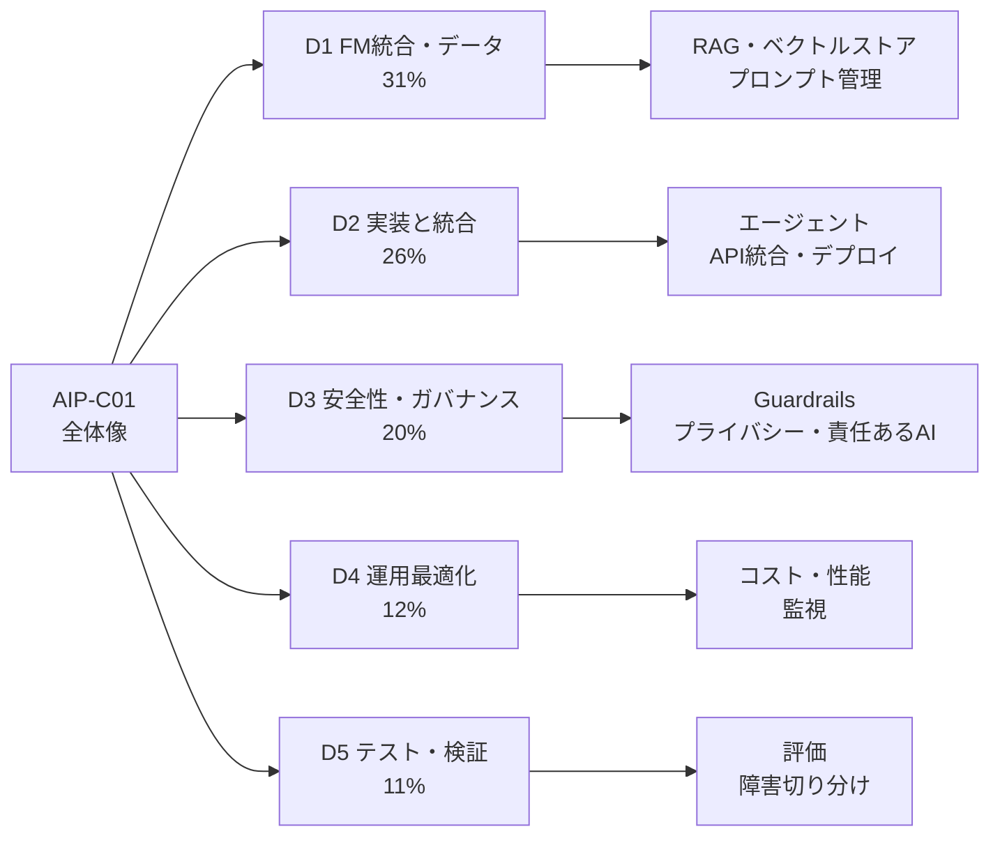

> **学習の優先順位**: D1 + D2 で全体の57%を占めます。まず **Amazon Bedrock・Knowledge Bases(RAG)・エージェント** を重点的に固めてください。

### 0.4 各セクションの読み方

各タスクは次の順で書いています。

1. **タスクの狙い**(何ができるようになるか)
2. **スキル早見表**(公式スキル番号 → 主なサービス → 一言ポイント)
3. **ステップ解説**(初学者向けの噛み砕き説明 + Mermaid図)
4. **ベストプラクティス**
5. **試験での着眼点**(引っかけ・判断基準)

> **注意**: 公式ガイドの「for example」に挙がるサービスは**例示**です。試験ではシナリオの制約(コスト・レイテンシ・運用負荷・コンプライアンス)から最適解を選ぶ力が問われます。

---

## 1. 前提知識(Step 0)

### 1.1 用語を最初に整理する

| 用語 | 初学者向けの説明 |
|---|---|
| FM(Foundation Model、基盤モデル) | 大量データで事前学習された汎用モデル。LLM(テキスト)やマルチモーダルモデルを含む |
| トークン | モデルが処理する文字の最小単位に近いもの。**料金・レート制限・コンテキスト長はトークン単位**で決まる |
| コンテキストウィンドウ | 1回の呼び出しで扱えるトークンの上限(入力 + 出力) |
| プロンプト | モデルへの指示文。システムプロンプト(役割・ルール)とユーザープロンプトに分かれる |
| 埋め込み(Embedding) | テキストや画像を数値ベクトルに変換したもの。意味が近いほどベクトルも近くなる |
| ベクトルストア | 埋め込みを保存し、類似検索(最近傍探索)できるデータベース |
| RAG | 回答前に外部知識を検索し、その結果をプロンプトに付けて生成する方式 |
| ハルシネーション | もっともらしいが事実でない出力 |
| エージェント | FMが「考える → ツールを呼ぶ → 結果を見て次を決める」を繰り返して目標を達成する仕組み |
| MCP(Model Context Protocol) | エージェントとツール/データソースをつなぐ標準プロトコル |
| Guardrails | 入力・出力に安全ルールを適用する仕組み |

### 1.2 GenAIアプリの全体アーキテクチャ

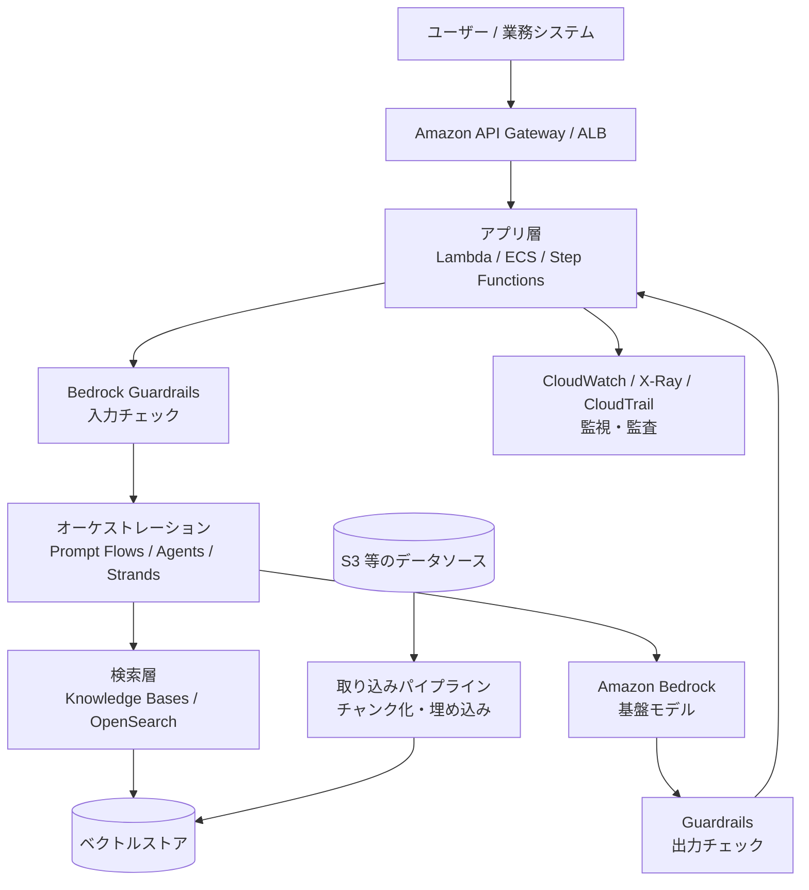

### 1.3 Amazon Bedrock の API を整理する(試験の土台)

| API / 機能 | 用途 | 覚え方 |
|---|---|---|
| InvokeModel | モデル固有のJSON形式で1回呼ぶ | モデルごとにリクエスト形式が違う |
| InvokeModelWithResponseStream | 上記のストリーミング版 | トークンを順次受け取る |
| Converse / ConverseStream | **モデルに依存しない統一形式**で会話を扱う | モデル切り替えに強い。会話履歴・ツール定義を共通化 |
| ApplyGuardrail | FMを呼ばずに**Guardrailsだけ**を評価 | 他社モデルや独自データにも安全チェックを適用できる |
| Retrieve | Knowledge Bases から検索結果だけ取得 | 検索と生成を自前で制御したいとき |
| RetrieveAndGenerate | 検索 + 生成を一括実行 | 最短でRAGを動かしたいとき |
| InvokeAgent | Bedrock Agents を呼ぶ | エージェントの実行 |
| バッチ推論 | 大量データを非同期でまとめて処理 | リアルタイム不要ならオンデマンドより割安(公式に割引あり) |

> **ベストプラクティス**: モデル切り替えの可能性があるなら、**Converse API を既定**にする。モデル固有パラメータは `additionalModelRequestFields` で渡す。

### 1.4 推論の消費方式を整理する

| 方式 | 特徴 | 向くケース |
|---|---|---|
| オンデマンド | 使った分だけ課金。スロットリングあり | 開発・変動トラフィック |
| クロスリージョン推論(推論プロファイル) | 複数リージョンへ自動ルーティングしスループット向上。追加のルーティング料金なし | スパイク耐性、リージョン内容量不足 |
| Provisioned Throughput | モデルユニットを確保。専用スループット | 安定した大量トラフィック、カスタムモデルの推論 |
| バッチ推論 | 非同期・大量処理 | レポート生成、データ拡充などの夜間処理 |

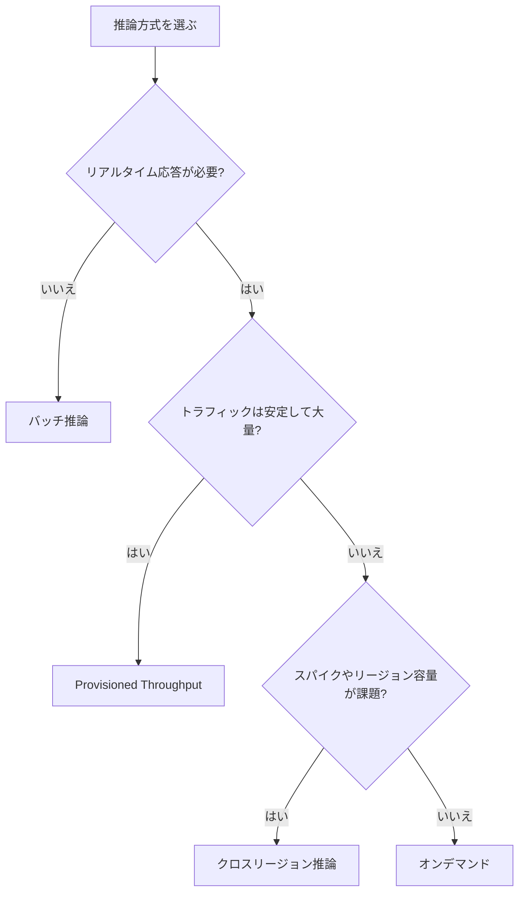

> 出典: [Increase throughput with cross-Region inference](https://docs.aws.amazon.com/bedrock/latest/userguide/cross-region-inference.html)、[How inference works in Amazon Bedrock](https://docs.aws.amazon.com/bedrock/latest/userguide/inference-how.html)

---

## 2. ドメイン1: FM統合・データ管理・コンプライアンス(31%)

最大配点のドメインです。**「FMを選ぶ → データを整える → 検索で補強する → プロンプトを管理する」**までを扱います。

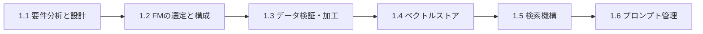

---

### Step 1. タスク1.1 要件を分析しGenAIソリューションを設計する

**狙い**: ビジネス要件から、FM・統合パターン・デプロイ戦略を決め、PoCで妥当性を検証し、再利用部品を標準化する。

| スキル | 主なサービス/概念 | 一言ポイント |
|---|---|---|
| 1.1.1 アーキテクチャ設計 | Bedrock、統合パターン | 要件(精度・遅延・コスト・規制)→ 設計の順で考える |
| 1.1.2 PoC | Amazon Bedrock | 本番投資の前に、実現性・性能・価値を小さく検証 |
| 1.1.3 標準コンポーネント | Well-Architected Framework、Generative AI Lens | 複数環境で一貫した実装にする |

#### 1.1.1 要件から設計へ(考え方)

初学者がまず身につけるべきは「**ユースケースを分類し、必要な構成要素を逆算する**」ことです。

| ユースケース | 典型構成 | 主な論点 |
|---|---|---|
| 社内文書Q&A | RAG(Knowledge Bases + FM) | 検索精度、アクセス制御、鮮度 |
| 業務自動化 | エージェント + ツール(Lambda/API) | 権限境界、停止条件、人手承認 |
| 文書処理(契約書・請求書) | Bedrock Data Automation / Textract + FM + Step Functions | 構造化出力、検証 |
| チャットボット | Converse + 会話履歴(DynamoDB) + Guardrails | コンテキスト管理、安全性 |
| 大量バッチ要約 | バッチ推論 + S3 | コスト最適化 |

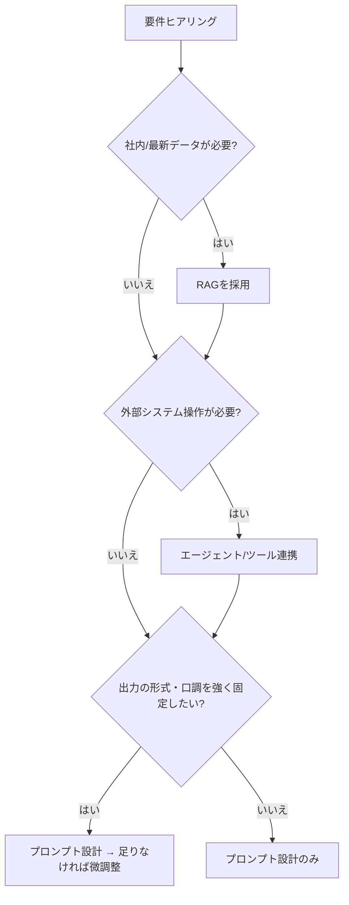

> **ベストプラクティス**: 「まずプロンプト → 次にRAG → それでも足りなければカスタマイズ(微調整)」の順で試す。コストと運用負荷が低い順です。

#### 1.1.2 PoC のやり方

1. 成功指標を先に決める(例: 正答率80%以上、応答3秒以内、1問あたりコスト上限)
2. 代表的な質問・文書の**評価用データセット**を用意する
3. Bedrock のコンソール/Playground と少数のモデルで素早く試す
4. 指標を満たすかを測定し、**本番移行の可否(Go/No-Go)**を判断する

#### 1.1.3 標準化(Well-Architected Generative AI Lens)

AWS Well-Architected Framework には Generative AI Lens があり、GenAIワークロード向けのベストプラクティスとレビュー観点が整理されています。AWS Well-Architected Tool でレビューを実施でき、**組織共通のテンプレート(IaC、プロンプトテンプレート、ガードレール設定)**を部品化して再利用すると、環境間の品質差を減らせます。

> **試験での着眼点**: 「複数チーム・複数環境で一貫した実装」→ 共通部品(CDK/CloudFormation、Service Catalog、Prompt Management)と Well-Architected Generative AI Lens。

---

### Step 2. タスク1.2 FMを選定・構成する

| スキル | 主なサービス/概念 | 一言ポイント |
|---|---|---|
| 1.2.1 FM評価・選定 | ベンチマーク、能力分析 | 精度・遅延・コスト・コンテキスト長・対応言語で比較 |
| 1.2.2 動的モデル選択 | Lambda、API Gateway、AppConfig | **コード変更なし**でモデルやプロバイダを切り替える |
| 1.2.3 耐障害性 | Step Functions、クロスリージョン推論 | サーキットブレーカー、グレースフルデグレード |
| 1.2.4 カスタマイズFMのライフサイクル | SageMaker AI、Model Registry、LoRA | バージョン管理、ロールバック、廃止 |

#### 1.2.1 FMの選び方

| 比較軸 | 確認すること |
|---|---|
| 品質 | 自社タスクでの評価結果(公開ベンチマークだけに頼らない) |
| レイテンシ | 時間制約のあるUIなら低遅延モデル |
| コスト | 入力/出力トークン単価。簡単な問い合わせは小型モデルで十分なことが多い |
| コンテキスト長 | 長文書を扱うか |
| モダリティ | 画像・音声・動画の入力が必要か |
| リージョン/コンプライアンス | 利用可能リージョン、データ処理場所 |

#### 1.2.2 コード変更なしでモデルを切り替える

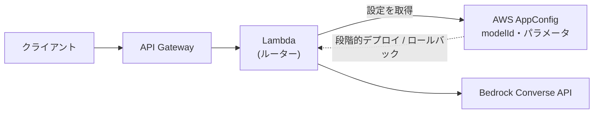

- **AppConfig** にモデルID・温度・最大トークンなどを置く(機能フラグ的に運用)
- 段階的デプロイ(一部のユーザーだけ新モデル)や**自動ロールバック**ができる
- Converse API を使えば、モデル変更時のリクエスト整形コードの差が小さい

> **試験での着眼点**: 「再デプロイなしでモデルを切り替えたい」「段階的に展開したい」→ **AppConfig**。

#### 1.2.3 耐障害性の設計

| 障害 | 対策 |
|---|---|
| 特定リージョンの容量不足・スロットリング | **クロスリージョン推論**(推論プロファイル) |
| 下流(モデル/ツール)の連続失敗 | **サーキットブレーカー**(Step Functions + DynamoDB で状態管理)、再試行は指数バックオフ |
| モデル全体の停止 | **フォールバックモデル**、キャッシュ回答、定型回答へのデグレード |
| 一時的エラー | 再試行(Retry/Catch)、ジッタ付きバックオフ |

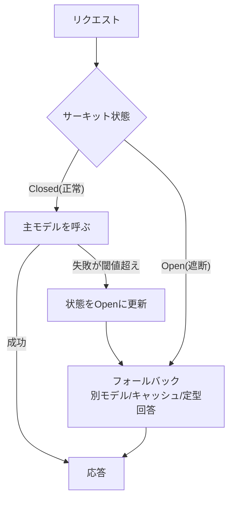

> **ベストプラクティス**: グレースフルデグレード = 「止めない。品質や機能を下げて継続する」。例: RAGが落ちたら一般知識だけで回答し、その旨を明示。

#### 1.2.4 カスタマイズモデルのライフサイクル

| フェーズ | サービス/手法 |
|---|---|
| 微調整 | SageMaker AI(ドメイン特化)。**LoRA** やアダプタなどパラメータ効率の良い手法で計算コストを抑える |
| バージョン管理 | **SageMaker Model Registry**(承認ステータスを持つ) |
| デプロイ | 自動化パイプライン(CodePipeline 等)、SageMaker エンドポイント |
| 失敗時 | **ロールバック**(前バージョンへ戻す) |
| 廃止 | 古いモデルを退役させ新モデルへ置き換える計画を持つ |

> **LoRA を一言で**: モデル全体ではなく**小さな追加行列(アダプタ)だけ**を学習する手法。学習コストと保存サイズが小さく、複数のアダプタを切り替えやすい。

---

### Step 3. タスク1.3 FM向けのデータ検証・加工パイプライン

| スキル | 主なサービス | 一言ポイント |
|---|---|---|
| 1.3.1 データ品質検証 | AWS Glue Data Quality、SageMaker Data Wrangler、Lambda、CloudWatch | 品質ルールで自動検査し、メトリクスで可視化 |
| 1.3.2 マルチモーダル処理 | Bedrock マルチモーダルモデル、SageMaker Processing、Amazon Transcribe | テキスト/画像/音声/表形式ごとに前処理 |
| 1.3.3 入力整形 | Bedrock API の JSON、会話形式 | **モデル固有の形式**に合わせる |
| 1.3.4 入力品質向上 | Bedrock、Comprehend、Lambda | 整形・エンティティ抽出・正規化 |

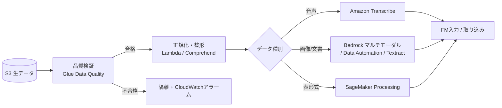

**入力整形の例**(Converse API 形式のイメージ):

```json
{
  "modelId": "<モデルIDまたは推論プロファイルID>",
  "system": [{ "text": "あなたは社内ヘルプデスクの回答担当です。根拠のない回答はしないでください。" }],
  "messages": [
    { "role": "user", "content": [{ "text": "経費精算の締め日はいつですか?" }] }
  ],
  "inferenceConfig": { "maxTokens": 512, "temperature": 0.2 }
}
```

**ベストプラクティス**

- 「ゴミを入れればゴミが出る」。**取り込み前に**欠損・重複・文字化け・PIIを検査する
- 品質ルールの違反件数を CloudWatch メトリクスにして、閾値超えでアラーム
- 日本語など多言語は文字コード・正規化(全角半角、表記ゆれ)を揃える
- 会話アプリは role(user/assistant)の**交互形式**と履歴の長さ上限に注意

> **試験での着眼点**: 「データ品質ルールを宣言的に定義して自動チェック」→ **Glue Data Quality**。「入力のエンティティ抽出」→ **Comprehend**。「音声→テキスト」→ **Transcribe**。

---

### Step 4. タスク1.4 ベクトルストアを設計・実装する

| スキル | 主なサービス/概念 | 一言ポイント |
|---|---|---|
| 1.4.1 ベクトルDBアーキテクチャ | Bedrock Knowledge Bases、OpenSearch Service(Neural plugin)、RDS/Aurora、DynamoDB | 用途と運用負荷でストアを選ぶ |
| 1.4.2 メタデータ設計 | S3 オブジェクトメタデータ、タグ | 検索の絞り込み精度を上げる |
| 1.4.3 高性能化 | OpenSearch シャーディング、複数インデックス、階層インデックス | スケール時の性能設計 |
| 1.4.4 データソース統合 | 文書管理システム、社内Wiki | コネクタで取り込む |
| 1.4.5 データ保守 | 増分更新、変更検知、同期、定期更新 | 古い情報を残さない |

#### 1.4.1 ベクトルストアの選び方

| 選択肢 | 向く場面 | 特徴 |
|---|---|---|
| **Bedrock Knowledge Bases(マネージド)** | 早く・運用少なくRAGを作りたい | 取り込み・チャンク化・埋め込み・検索をマネージドで提供。裏のベクトルストアを選択 |
| **Amazon OpenSearch Service** | 高度な検索(ハイブリッド、細かなスコア調整)が必要 | k-NN/ベクトル検索 + 全文検索。シャード設計や運用の自由度が高い |
| **Aurora PostgreSQL + pgvector** | 既存のRDBとデータを同居させたい | SQLでメタデータ条件と併用しやすい |
| **DynamoDB(メタデータ)+ ベクトルDB** | 文書メタデータ・状態管理を別管理 | ベクトル自体は専用ストア、属性はDynamoDB |

> Knowledge Bases が選べるベクトルストアの種類は追加されています(例: OpenSearch Serverless、Aurora、S3 Vectors など)。**最新の対応一覧は公式ドキュメントで確認**してください。

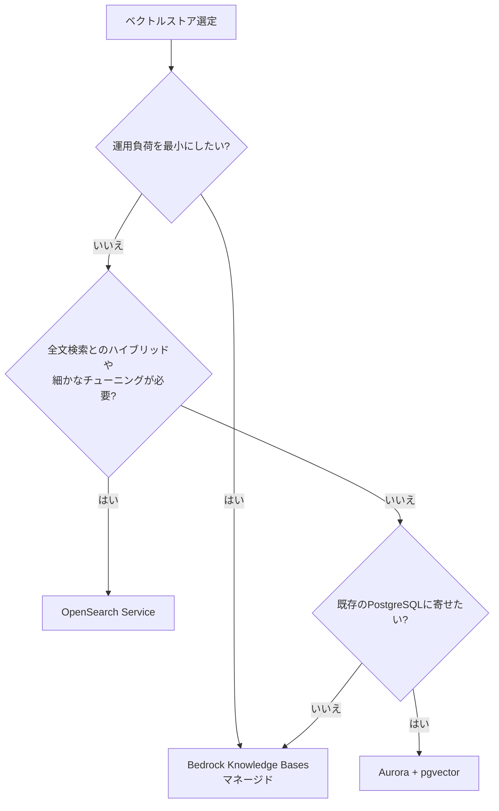

#### 1.4.2 メタデータ設計

メタデータは「**意味検索の前に候補を絞る**」ための鍵です。

| メタデータ例 | 用途 |
|---|---|
| 更新日時・文書バージョン | 最新版だけを検索 |
| 作成者・部署 | 権限に応じた絞り込み(部署別アクセス制御) |
| ドメイン分類タグ(人事、法務、製品) | トピック別検索 |
| 言語 | 多言語環境での絞り込み |

Knowledge Bases ではS3のデータ文書に対応するメタデータファイル(`<ファイル名>.metadata.json`)を置き、検索時にフィルタ条件として使います。

> **ベストプラクティス**: アクセス制御に関わるメタデータ(部署・機密レベル)は**検索フィルタで必ず適用**し、FMにはアクセス権のない文書を渡さない。

#### 1.4.3 高性能化の考え方(OpenSearch)

| 論点 | 方針 |
|---|---|
| シャーディング | データ量と検索負荷に応じてシャード数を設計。**後から変えにくい**ので事前に見積もる |
| 複数インデックス | 法務・製品・人事など**ドメインごとに分ける**と、検索対象が絞れて高速・高精度 |
| 階層インデックス | 要約インデックス → 詳細インデックスの二段階検索 |
| メモリ | ベクトルは大量のメモリを使う。次元数の削減や量子化などで調整 |

#### 1.4.5 データ保守(鮮度を保つ)

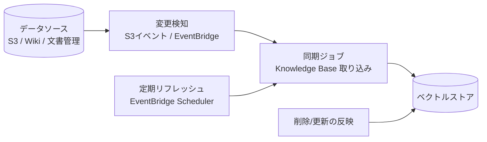

- **増分更新**: 変更分だけ再取り込み(全再構築より安く速い)
- **変更検知**: S3イベント通知 → EventBridge → 同期処理
- **削除の反映**を忘れない(消した文書が検索に残るとハルシネーション・情報漏えいの原因)

> **試験での着眼点**: 「最新の情報を常に反映」→ 変更検知 + 増分同期。「運用最小」→ Knowledge Bases。「全文検索 + ベクトルのハイブリッド」→ OpenSearch。

---

### Step 5. タスク1.5 FM補強のための検索機構を設計する

RAGの品質は**検索の質**で決まります。流れを先に押さえましょう。

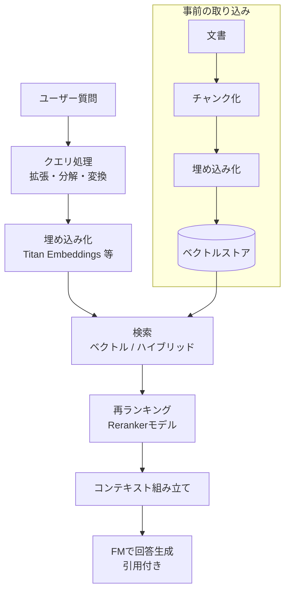

| スキル | 主なサービス/概念 | 一言ポイント |
|---|---|---|
| 1.5.1 文書の分割 | Bedrock チャンク機能、Lambda | 固定長・階層・セマンティック |
| 1.5.2 埋め込みの選択 | Titan Embeddings、Bedrock 埋め込みモデル | 次元数・ドメイン適合で選ぶ |
| 1.5.3 ベクトル検索 | OpenSearch、Aurora pgvector、Knowledge Bases | 検索基盤を構築 |
| 1.5.4 高度な検索 | ハイブリッド検索、Reranker | 関連度・精度を上げる |
| 1.5.5 クエリ処理 | クエリ拡張、分解、変換 | あいまい/複合質問への対応 |
| 1.5.6 アクセス統一 | 関数呼び出し、MCPクライアント | 検索をツールとして標準化 |

#### 1.5.1 チャンク戦略(最頻出)

| 戦略 | 仕組み | 向く場面 | 注意 |
|---|---|---|---|
| デフォルト | 約300トークンごと。文の境界を尊重 | まず試す | 万能ではない |
| 固定長 | 最大トークン数 + オーバーラップ | 単純な文書 | 文脈が途切れやすい → オーバーラップで補う |
| 階層(親子) | 小さい子チャンクで検索 → 大きい親チャンクを返す | 長い構造化文書 | 検索精度と十分な文脈を両立 |
| セマンティック | 意味のまとまりで分割(FMを使う) | 意味境界が重要な文書 | **追加のFM費用**がかかる |
| なし | 分割しない | 事前に分割済み | ページ番号の引用・フィルタが使えない場合がある |

> **ベストプラクティス**: チャンクは「**小さすぎると文脈不足、大きすぎるとノイズ増・コスト増**」。評価データで比較して決める。表・見出しなど構造を壊さない。

> 出典: [How content chunking works for knowledge bases](https://docs.aws.amazon.com/bedrock/latest/userguide/kb-chunking.html)

#### 1.5.2 埋め込みモデルの選び方

| 観点 | 説明 |
|---|---|
| 次元数 | 次元が大きいほど表現力は上がるが、ストレージ・検索コストも増える。Titan Text Embeddings V2 は複数の次元数から選べる |
| ドメイン/言語適合 | 日本語や専門用語に強いモデルを評価で選ぶ |
| 一貫性 | **取り込み時と検索時で同じ埋め込みモデル**を使う(違うとベクトル空間が合わず検索が壊れる) |
| 大量生成 | Lambda でバッチ生成、レート制限に配慮 |

> **試験の定番**: 「モデルを変更したら検索品質が急落」→ 埋め込みモデルの不一致。**再埋め込み(全件再インデックス)**が必要。

#### 1.5.4 ハイブリッド検索と再ランキング

| 手法 | 得意 | 苦手 |
|---|---|---|
| キーワード(BM25等) | 型番・固有名詞・完全一致 | 言い換え・意味的類似 |
| ベクトル(意味) | 言い換え・曖昧な質問 | 型番などの厳密一致 |
| **ハイブリッド** | 両方を組み合わせ、弱点を補う | スコア統合の設計が必要 |
| **再ランキング** | 検索上位N件を、質問との関連度で並べ替え | 追加の呼び出し・遅延 |

> **ベストプラクティス**: 「広めに検索(例: 上位数十件)→ Reranker で絞る(上位数件)→ FMへ」が定番。

#### 1.5.5 クエリ処理

| 手法 | 説明 | 実装例 |
|---|---|---|
| クエリ拡張 | 同義語・言い換えを加える | Bedrock で言い換え生成 |
| クエリ分解 | 複合質問を小さな質問に分ける | Lambda / Step Functions で並列検索 |
| クエリ変換 | 会話履歴を踏まえて独立した質問に書き換える | 「それはいつ?」→「経費精算の締め日はいつ?」 |

#### 1.5.6 検索の標準的な公開方法

検索機能を**関数呼び出し(ツール)**または **MCP サーバー**として公開し、エージェントやアプリから同じ方法で使えるようにします。インターフェースを標準化すると、検索基盤を差し替えても呼び出し側を変えずに済みます。

> **試験での着眼点**: 「型番検索と自然文の両方に強く」→ ハイブリッド。「上位結果の順位精度を上げたい」→ Reranker。「複合質問」→ クエリ分解。

---

### Step 6. タスク1.6 プロンプトエンジニアリングとガバナンス

| スキル | 主なサービス/概念 | 一言ポイント |
|---|---|---|
| 1.6.1 指示フレームワーク | Prompt Management、Guardrails | 役割定義・テンプレートで挙動を制御 |
| 1.6.2 対話システム | Step Functions、Comprehend、DynamoDB | 文脈維持、確認質問、履歴保存 |
| 1.6.3 プロンプト管理・統制 | Prompt Management、S3、CloudTrail、CloudWatch Logs | バージョン・承認・監査 |
| 1.6.4 品質保証 | Lambda、Step Functions、CloudWatch | 期待出力の検証、回帰テスト |
| 1.6.5 反復改善 | 構造化入力、出力形式指定、CoT | 基本を超えた改善 |
| 1.6.6 複雑なプロンプト系 | Prompt Flows | 連鎖・分岐・前後処理 |

#### 1.6.1 / 1.6.5 良いプロンプトの構造

| 要素 | 内容 | 例 |
|---|---|---|
| 役割 | FMの立場を定義 | 「あなたは経理部のサポート担当です」 |
| タスク | やってほしいこと | 「以下の規程から質問に回答」 |
| コンテキスト | 参照情報(RAG結果など) | `<documents>…</documents>` |
| 制約 | やってはいけないこと | 「根拠がなければ『分かりません』と答える」 |
| 出力形式 | JSON、箇条書きなど | 「次のJSONスキーマで出力」 |
| 例(Few-shot) | 入出力の見本 | 2〜3例 |

- **Chain-of-Thought(思考の連鎖)**: 段階的に考えさせると、複雑な推論の精度が上がることが多い(ただしトークンは増える)
- **構造化出力**: JSON Schema を指定し、後段でスキーマ検証する
- **フィードバックループ**: 失敗事例を集めてプロンプト・例を改善

#### 1.6.2 対話システム

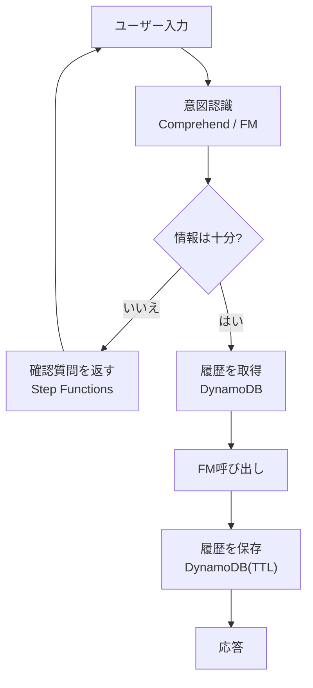

- 履歴は **DynamoDB** に保存し、TTLで保持期間を管理
- 履歴が長くなると**コスト増・コンテキスト超過**になる → 古い履歴は**要約**して圧縮

#### 1.6.3 プロンプトのガバナンス

| 機能 | 役割 |
|---|---|
| **Bedrock Prompt Management** | プロンプトを**テンプレート化**(変数 `{{variable}}`)、バージョン管理、バリアント比較 |
| 承認ワークフロー | レビュー・承認を経て本番バージョンを公開 |
| S3 | テンプレートのリポジトリ |
| CloudTrail | 「誰がいつプロンプトを変更/利用したか」の監査 |
| CloudWatch Logs | アクセス・利用ログ |

> **ベストプラクティス**: プロンプトを**コードに埋め込まず**外部管理(バージョン + 承認 + 監査)にする。変更の影響を追えるようにする。

#### 1.6.4 プロンプトの品質保証

- **期待出力の検証**: Lambda で JSON スキーマ・必須キー・禁止語を検査
- **エッジケース試験**: Step Functions で多数ケースを自動実行
- **回帰テスト**: プロンプト変更前後で品質が落ちていないか比較(CloudWatch で指標を追跡)

#### 1.6.6 Prompt Flows

プロンプトを**ノードでつないで視覚的に**組み立てる機能です(ノーコード寄り)。

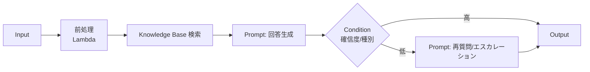

- **逐次連鎖**: 出力を次のプロンプトの入力にする
- **条件分岐**: モデル出力に応じて処理を変える
- **再利用**: 共通部品化、前処理・後処理を統合

> **試験での着眼点**: 「プロンプトのバージョン管理・変数化・承認」→ **Prompt Management**。「複数プロンプトの連鎖・分岐をGUIで」→ **Prompt Flows**。「変更履歴の監査」→ **CloudTrail**。

---

## 3. ドメイン2: 実装と統合(26%)

**エージェント・デプロイ・企業システム統合・API・開発ツール**を扱います。

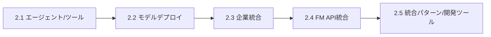

---

### Step 7. タスク2.1 エージェント型AIとツール統合

#### 7.1 エージェントとは

エージェントは、FMが**ループ**で「考える → ツールを選ぶ → 実行 → 結果を観察 → 次を考える」を繰り返し、目標達成まで進む仕組みです。

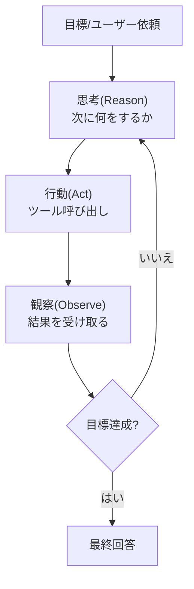

これが **ReAct パターン**(Reasoning + Acting)です。

| スキル | 主なサービス/概念 | 一言ポイント |
|---|---|---|
| 2.1.1 自律システム + メモリ/状態 | Strands Agents、AWS Agent Squad、MCP | フレームワークとプロトコルの役割分担 |
| 2.1.2 構造化推論 | Step Functions(ReAct、CoT) | 推論手順をワークフローで制御 |
| 2.1.3 安全なワークフロー | Step Functions 停止条件、Lambda タイムアウト、IAM、サーキットブレーカー | **暴走を止める** |
| 2.1.4 モデル協調 | 専門FM、アンサンブル、モデル選択 | 役割別に最適モデル |
| 2.1.5 人間との協調 | Step Functions 承認、API Gateway フィードバック | Human-in-the-loop |
| 2.1.6 ツール統合 | Strands API、標準関数定義、Lambda | エラー処理・引数検証 |
| 2.1.7 モデル拡張基盤 | Lambda/ECS 上の MCP サーバー | ツールの提供形態 |

#### 7.2 フレームワークの位置づけ

| 名称 | 何者か | 覚え方 |
|---|---|---|
| **Strands Agents** | AWS発のオープンソース・エージェントSDK。モデル主導で、少ないコードでエージェントを定義(モデル + プロンプト + ツール)。マルチエージェント(workflow/graph/swarm等)にも対応 | 単一エージェントのループ + ツール利用が中心 |
| **AWS Agent Squad** | オープンソースのマルチエージェント・オーケストレーション。**意図分類で適切なエージェントへ振り分け** | ルーティング・意図検出が中心 |
| **Amazon Bedrock Agents** | マネージドのエージェント(アクショングループ、ナレッジベース連携、トレース) | ノーコード/ローコードで早く作る |
| **Amazon Bedrock AgentCore** | エージェントを**本番運用**するためのマネージド基盤群(Runtime、Memory、Gateway、Identity、Observability、Code Interpreter、Browser など) | 「作る」ではなく「安全に動かす・運用する」 |
| **MCP** | エージェントとツール/データをつなぐ標準プロトコル | ツール接続のUSB規格のようなもの |

> 出典: [Introducing Strands Agents](https://aws.amazon.com/blogs/opensource/introducing-strands-agents-an-open-source-ai-agents-sdk/)、[Strands Agents 1.0](https://aws.amazon.com/blogs/opensource/introducing-strands-agents-1-0-production-ready-multi-agent-orchestration-made-simple/)、[What is Amazon Bedrock AgentCore](https://docs.aws.amazon.com/bedrock-agentcore/latest/devguide/what-is-bedrock-agentcore.html)

**メモリと状態**

| 種類 | 内容 | 保存先の例 |
|---|---|---|
| 短期(会話内) | 直近のやり取り | AgentCore Memory / DynamoDB / セッション |
| 長期 | ユーザー嗜好・過去の要約 | AgentCore Memory(長期)/ DB |
| 実行状態 | 現在のタスク進捗 | Step Functions の状態、DynamoDB |

#### 7.3 安全なエージェント設計(2.1.3)— 試験頻出

| リスク | 対策 |
|---|---|
| 無限ループ・暴走 | **最大反復回数/停止条件**(Step Functions)、Lambda タイムアウト |
| 権限逸脱 | **最小権限のIAM**、リソース境界(許可するAPI/リソースを限定) |
| 連続失敗の拡大 | **サーキットブレーカー** |
| 破壊的操作 | **人手承認**を挟む |
| 不正な引数 | ツール側で**パラメータ検証** |

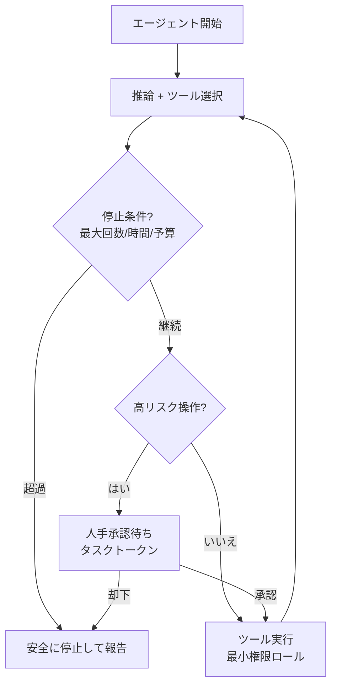

> **Step Functions で人手承認**: タスクトークン(`.waitForTaskToken`)で外部の承認を待ち、承認結果で再開する。

#### 7.4 ツール統合と MCP(2.1.6 / 2.1.7)

- **ツール定義**: 名前・説明・入力スキーマ(JSON Schema)を標準化。**説明文の質がツール選択精度を左右**
- **Lambda でツール実装**: パラメータ検証、エラー処理、冪等性を実装
- **MCPサーバーの提供形態**

| 形態 | 向く場面 |
|---|---|
| **Lambda 上のステートレスMCPサーバー** | 軽量・短時間のツール、運用最小、従量課金 |
| **Amazon ECS 上のMCPサーバー** | 複雑・長時間・ステートフルなツール |
| MCPクライアントライブラリ | 呼び出し側のアクセスパターンを統一 |

> **試験での着眼点**: 「軽量なツールを手間なく」→ Lambda MCP。「複雑な/常駐が必要なツール」→ ECS MCP。「暴走・過剰権限を防ぐ」→ 停止条件 + IAM境界 + サーキットブレーカー。

#### 7.5 人と協調する(2.1.5)

Step Functions で「FM案 → 担当者レビュー → 承認で実行」を組み、**API Gateway**でフィードバック(承認/修正)を収集。低確信度・高リスクのケースだけ人に回す「**例外ベース**」が効率的です(Amazon Augmented AI(A2I)の人間レビューも選択肢)。

---

### Step 8. タスク2.2 モデルデプロイ戦略

| スキル | 主なサービス/概念 | 一言ポイント |
|---|---|---|
| 2.2.1 用途別デプロイ | Lambda(オンデマンド)、Bedrock Provisioned Throughput、SageMaker エンドポイント | ハイブリッドも可 |
| 2.2.2 LLM特有の課題 | コンテナ最適化、GPU、トークン処理容量、モデルロード | 従来MLとの違い |
| 2.2.3 最適化 | 適切なモデル選択、小型モデル、**モデルカスケード** | コストと性能のバランス |

#### 8.1 デプロイ方式の比較

| 方式 | 特徴 | 向くケース |
|---|---|---|
| Bedrock オンデマンド(+ Lambda等から呼ぶ) | サーバー管理不要、従量課金 | 不定期・変動トラフィック |
| Bedrock Provisioned Throughput | 専用容量、安定したスループット | 大量・安定、カスタムモデル |
| SageMaker AI エンドポイント | 自前モデル・OSSモデル、細かい制御 | 独自モデル、特殊要件 |
| ハイブリッド | 通常はBedrock、特殊タスクだけSageMaker | 要件が混在 |

#### 8.2 LLMデプロイが従来MLと違う点

| 項目 | 従来ML | LLM |
|---|---|---|
| メモリ | 小さい | **巨大**(重み + KVキャッシュ) |
| 計算資源 | CPU/小型GPUで足りることも | **GPU必須**が多い。利用率が重要 |
| 負荷の単位 | リクエスト数 | **トークン処理量**(入力/出力) |
| 起動 | 速い | モデルロードに時間がかかる(**ロード戦略**が必要) |

#### 8.3 モデルカスケード(コスト最適化)

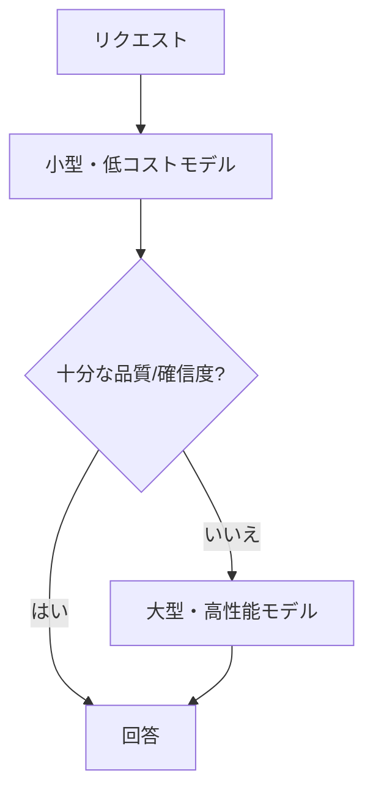

> **試験での着眼点**: 「大半は簡単な質問でコストを下げたい」→ **カスケード/段階利用**。「独自のOSSモデルを細かく制御」→ SageMaker。「サーバーレスで最小運用」→ Bedrock オンデマンド。

---

### Step 9. タスク2.3 企業統合アーキテクチャ

| スキル | 主なサービス/概念 | 一言ポイント |
|---|---|---|
| 2.3.1 企業接続 | API統合、イベント駆動、データ同期 | 疎結合 |
| 2.3.2 既存アプリへのAI追加 | API Gateway、Lambda(Webhook)、EventBridge | マイクロサービス統合 |
| 2.3.3 セキュアアクセス | IDフェデレーション、RBAC、最小権限 | 認証・認可 |
| 2.3.4 クロス環境 | Outposts、Wavelength、安全な経路 | データ主権・コンプライアンス |
| 2.3.5 CI/CD と GenAIゲートウェイ | CodePipeline、CodeBuild、集中ゲートウェイ | 一元的な制御・観測 |

#### 9.1 イベント駆動の統合

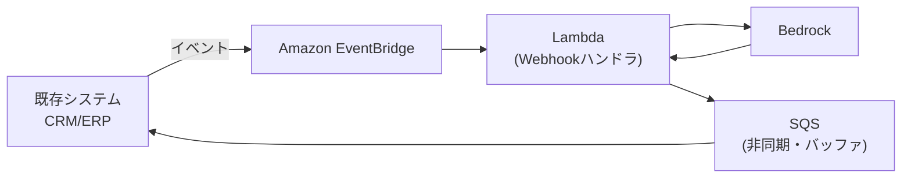

- **疎結合**: 既存システムとGenAI処理をキュー/イベントでつなぎ、片方の障害や遅延を伝播させない
- **Webhook**: Lambda で受けて GenAI 処理 → 結果を返す

#### 9.2 セキュアアクセス

- **IDフェデレーション**(IAM Identity Center、Cognito)で、企業のIDをAWSアクセスに接続
- **RBAC**: ロールごとに使えるモデル・データを分ける
- **最小権限**: 例えば特定のモデルID・推論プロファイルだけ `bedrock:InvokeModel` を許可

#### 9.3 クロス環境(2.3.4)

| 要件 | サービス |
|---|---|
| オンプレミスにデータを置きたい/低遅延でクラウドAI | **AWS Outposts** |
| エッジ(5G等)でAI | **AWS Wavelength** |
| 安全な接続 | PrivateLink、VPN/Direct Connect、プライベートルーティング |
| 国をまたぐコンプライアンス | データの処理場所に配慮(クロスリージョン推論の範囲を地域に限定する等) |

> クロスリージョン推論には、**地域内に限定する Geographic** と、**全商用リージョンから最適を選ぶ Global** があります。データ処理場所の制約があるなら Geographic を選びます(出典: [Geographic cross-Region inference](https://docs.aws.amazon.com/bedrock/latest/userguide/geographic-cross-region-inference.html))。

#### 9.4 CI/CD と GenAIゲートウェイ(2.3.5)

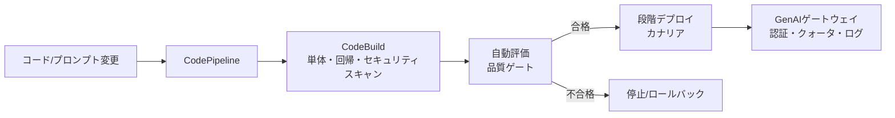

**GenAIゲートウェイ**: 全アプリのFM呼び出しを**中央の抽象化レイヤー**に集約し、認証、レート制限、ログ、ガードレール適用、モデル切り替え、コスト配賦を一元管理する設計。

> **試験での着眼点**: 「組織全体でFM利用を統制・可視化」→ **GenAIゲートウェイ(集中抽象化レイヤー)**。「プロンプト/モデル更新を安全に自動展開」→ CI/CD + 自動評価ゲート + ロールバック。

---

### Step 10. タスク2.4 FM API統合

| スキル | 主なサービス/概念 | 一言ポイント |
|---|---|---|
| 2.4.1 柔軟な呼び出し | Bedrock API(同期)、SDK + SQS(非同期)、API Gateway | 同期/非同期の使い分け |
| 2.4.2 リアルタイム | ストリーミングAPI、WebSocket、SSE | 体感速度の向上 |
| 2.4.3 耐障害性 | 指数バックオフ、レート制限、フォールバック、X-Ray | 再試行設計 |
| 2.4.4 モデルルーティング | 静的、コンテンツベース、メトリクスベース | 最適モデル選択 |

#### 10.1 同期 vs 非同期 vs ストリーミング

| 方式 | 使いどころ | 実装 |
|---|---|---|
| 同期 | 短い応答、即時結果 | Converse / InvokeModel |
| **非同期** | 長時間処理、バースト吸収 | SQS + ワーカー(Lambda/ECS)、結果は通知/ポーリング |
| **ストリーミング** | チャットUI(最初のトークンを速く見せる) | ConverseStream / InvokeModelWithResponseStream + WebSocket/SSE |

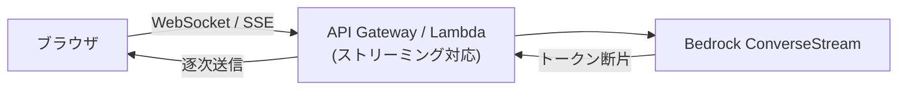

> 注意: API Gateway のタイムアウトやペイロード上限、ストリーミング対応の可否は**種別(REST/HTTP/WebSocket)や時期で異なる**ため、設計時に最新の公式仕様を確認してください。長時間処理は非同期化が基本です。

#### 10.2 耐障害性(2.4.3)

| 例外/状況 | 対処 |
|---|---|
| スロットリング(429相当) | **指数バックオフ + ジッタ**で再試行。SDKの再試行設定を活用 |
| タイムアウト | タイムアウト値の調整、非同期化、再試行 |
| 入力不正(Validation) | 再試行しても直らない → リクエスト修正 |
| サービス利用不可 | フォールバックモデル/リージョン |
| 過負荷防止 | API Gateway の**使用量プラン/スロットリング**でクライアント単位に制限 |
| 可視化 | **X-Ray**でサービス境界をまたいだ遅延・エラーを追跡 |

> **重要**: 再試行は**冪等な処理だけ**に。ツール呼び出しを含むエージェントでは二重実行に注意。

#### 10.3 モデルルーティング(2.4.4)

| 方式 | 内容 | 実装 |
|---|---|---|
| 静的 | 用途ごとに固定のモデル | アプリ設定 |
| コンテンツベース | 質問の種類で振り分け(コード、要約、画像) | Step Functions の Choice + 分類 |
| メトリクスベース | 遅延・エラー・コストで動的に選択 | 監視指標 + ルーター |
| マネージド | Bedrock の**Intelligent Prompt Routing**(同一モデルファミリー内で品質とコストのバランスを取って自動ルーティング) | 設定で有効化 |

---

### Step 11. タスク2.5 統合パターンと開発ツール

| スキル | 主なサービス/概念 | 一言ポイント |
|---|---|---|
| 2.5.1 FM向けAPI | API Gateway(ストリーミング、トークン上限、再試行) | GenAI向けAPI設計 |
| 2.5.2 アクセスしやすいUI | AWS Amplify、OpenAPI、Prompt Flows | UI・API・ノーコード |
| 2.5.3 業務システム強化 | Lambda(CRM)、Step Functions(文書処理)、**Bedrock Data Automation** | 業務自動化 |
| 2.5.4 開発者生産性 | **Amazon Q Developer**(コード生成・リファクタ) | 開発の高速化 |
| 2.5.5 高度なGenAIアプリ | Strands、Agent Squad、Step Functions、プロンプトチェーン | オーケストレーション |
| 2.5.6 トラブルシュート効率 | CloudWatch Logs Insights、X-Ray、Q Developer | プロンプト/応答の分析 |

- **OpenAPI(API-first)**: API仕様を先に定義 → クライアント/サーバーを並行開発し、ツール定義(エージェントのアクショングループ)にも流用できる
- **Bedrock Data Automation**: 文書・画像・音声・動画から**構造化情報を自動抽出**するマネージド機能。請求書処理などに有効
- **Step Functions で文書処理**: 抽出 → 検証 → FM要約 → 人手確認 → 登録 のように段階を制御
- **CloudWatch Logs Insights**: モデル呼び出しログ(プロンプト/応答/トークン)をクエリして異常パターンを分析

> **試験での着眼点**: 「文書から構造化データを自動抽出」→ **Bedrock Data Automation**(または Textract + FM)。「コード生成・リファクタで生産性」→ **Q Developer**。「呼び出しの遅延原因をサービス横断で追跡」→ **X-Ray**。

---

## 4. ドメイン3: AI安全性・セキュリティ・ガバナンス(20%)

```mermaid
flowchart LR
    T31["3.1 入出力の安全制御"] --> T32["3.2 データセキュリティ/プライバシー"]
    T32 --> T33["3.3 ガバナンス/コンプライアンス"]
    T33 --> T34["3.4 責任あるAI"]
```

---

### Step 12. タスク3.1 入力と出力の安全制御

| スキル | 主なサービス/概念 | 一言ポイント |
|---|---|---|
| 3.1.1 入力の安全 | Bedrock Guardrails、Step Functions/Lambda のカスタムモデレーション | 有害入力を防ぐ |
| 3.1.2 出力の安全 | Guardrails、有害性評価、text-to-SQL | 有害出力を防ぐ |
| 3.1.3 正確性検証 | Knowledge Bases による根拠付け、信頼度スコア、JSON Schema | ハルシネーション対策 |
| 3.1.4 多層防御 | Comprehend 前処理、Guardrails、Lambda 後処理、API Gateway 応答フィルタ | 層を重ねる |
| 3.1.5 脅威検知 | プロンプトインジェクション/ジェイルブレイク検知、自動敵対テスト | 攻撃への耐性 |

#### 12.1 Bedrock Guardrails の構成要素

| ポリシー | 何を防ぐか | 補足 |
|---|---|---|
| **コンテンツフィルター** | 憎悪・侮辱・性的・暴力・不正行為などの有害コンテンツ | 強度を調整。入出力両方 |
| **プロンプト攻撃** | ジェイルブレイク、プロンプトインジェクション、プロンプト漏えい | コンテンツフィルターのカテゴリの一つ(**入力側**の検知) |
| **拒否トピック** | 禁止したい話題(例: 投資助言) | 自然言語で定義 |
| **単語フィルター** | 特定語句・不適切語 | 完全一致 |
| **機密情報フィルター** | PII(氏名・電話・カード番号など)、正規表現 | **ブロック**または**マスク(匿名化)** |
| **コンテキスト根拠チェック** | ソースに根拠のない回答、質問と無関係な回答 | RAG向け。**根拠性**と**関連性**に閾値 |
| **Automated Reasoning チェック** | 論理ルール・ポリシーに照らした出力検証 | 形式的な検証。誤り検出向け |

> 出典: [Create your guardrail](https://docs.aws.amazon.com/bedrock/latest/userguide/guardrails-components.html)

**ApplyGuardrail API**: FMを呼ばずにGuardrailsだけを評価できるため、**他社モデル・自前モデル・既存データ**にも同じ安全ルールを適用できます。

#### 12.2 多層防御(Defense in Depth)

```mermaid
flowchart TB
    IN["ユーザー入力"] --> L1["第1層: API Gateway / WAF<br/>レート制限・サイズ制限"]
    L1 --> L2["第2層: 前処理<br/>Comprehend(PII/毒性)・入力サニタイズ"]
    L2 --> L3["第3層: Guardrails(入力)<br/>プロンプト攻撃・拒否トピック"]
    L3 --> FM["FM + RAG"]
    FM --> L4["第4層: Guardrails(出力)<br/>有害・PII・根拠チェック"]
    L4 --> L5["第5層: Lambda後処理<br/>スキーマ検証・ルール検証"]
    L5 --> OUT["応答"]
```

> **ベストプラクティス**: 単一の対策に頼らない。**入力側・モデル側・出力側**の複数層で守る。各層のブロックをログに残して改善に使う。

#### 12.3 ハルシネーション対策(3.1.3)

| 手法 | 内容 |
|---|---|
| **根拠付け(RAG)** | 検索結果を根拠として渡し、**引用元を付けて**回答させる |
| コンテキスト根拠チェック | Guardrails で「ソースにない主張」を検知 |
| 信頼度スコア/類似度検証 | 回答と根拠文書の意味的類似度を測り、低ければ棄却 |
| 構造化出力 | JSON Schema を強制し、形式逸脱を防ぐ |
| text-to-SQL | 自由文の回答ではなく**決定的なSQL実行結果**に基づかせる(数値の正確性) |
| 「分からない」を許可 | プロンプトで根拠がなければ回答を控えるよう指示 |

#### 12.4 脅威検知(3.1.5)

| 攻撃 | 例 | 対策 |
|---|---|---|
| プロンプトインジェクション | 「これまでの指示を無視して…」 | Guardrailsのプロンプト攻撃検知、入力と指示の区切り、ツール権限の最小化 |
| 間接インジェクション | 検索対象の文書に悪意ある指示が埋め込まれている | 取り込み時のスキャン、コンテキストを「データ」として明示 |
| ジェイルブレイク | 制限回避の巧妙な誘導 | 安全分類器、出力側チェック |
| 情報漏えい | システムプロンプトの引き出し | プロンプト漏えい検知、秘密情報をプロンプトに入れない |

- **自動敵対テスト**: 攻撃プロンプト集を CI で定期実行し、回帰を検知

> **試験での着眼点**: 「ユーザー入力のジェイルブレイク/インジェクション対策」→ **Guardrails(プロンプト攻撃)**。「RAGの根拠なし回答を検知」→ **コンテキスト根拠チェック**。「FM以外のデータにも安全ルールを適用」→ **ApplyGuardrail**。

---

### Step 13. タスク3.2 データセキュリティとプライバシー

| スキル | 主なサービス/概念 | 一言ポイント |
|---|---|---|
| 3.2.1 保護された環境 | VPCエンドポイント、IAM、Lake Formation、CloudWatch | ネットワーク分離 + 最小権限 |
| 3.2.2 プライバシー保護 | Comprehend、Macie、Bedrockのデータプライバシー機能、Guardrails、S3 Lifecycle | PII検出・保持期間 |
| 3.2.3 プライバシー重視 | マスキング、匿名化 | 有用性を保ちつつ保護 |

#### 13.1 保護された環境

```mermaid
flowchart LR
    subgraph VPC["VPC(プライベートサブネット)"]
        APP["アプリ<br/>Lambda/ECS"]
        EP["VPCエンドポイント<br/>(PrivateLink)<br/>bedrock-runtime など"]
    end
    APP --> EP
    EP --> BR["Amazon Bedrock"]
    APP --> S3E["S3 ゲートウェイEP"]
    S3E --> S3[("S3(KMS暗号化)")]
    IAM["IAMポリシー/SCP"] -. "制御" .-> APP
    CW["CloudWatch / CloudTrail"] -. "監視・監査" .-> APP
```

| 対策 | 内容 |
|---|---|
| ネットワーク分離 | **VPCエンドポイント(PrivateLink)**でBedrockへ**インターネットを経由せず**アクセス |
| アクセス制御 | IAMで「誰が・どのモデル/KB/ガードレールを」使えるかを限定。ポリシー条件で**特定のガードレール適用を必須化**する運用も可能 |
| データ権限 | **Lake Formation**で表・列・行レベルの粒度で制御 |
| 暗号化 | **KMS**(保存時・転送時)。カスタムモデルやKBのデータにも顧客管理キー |
| 監視 | CloudWatchでアクセス異常を監視、CloudTrailでAPI監査 |

> Bedrockでは、お客様のプロンプトや出力を基盤モデルの学習に使わない旨がAWSのデータ保護に関する説明で示されています。詳細は公式の Data protection ドキュメントで確認してください。

#### 13.2 PII対策の使い分け

| ツール | 役割 | タイミング |
|---|---|---|
| **Amazon Macie** | **S3内**のPII/機密データを**検出** | 取り込み前/保管データの棚卸し |
| **Amazon Comprehend** | テキストからPIIを**検出**(DetectPiiEntities)、マスク処理の前段 | 前処理パイプライン |
| **Guardrails 機密情報フィルター** | 入出力でPIIを**ブロック/マスク** | 実行時(推論時) |
| **S3 Lifecycle** | 保持期間後の自動削除/低頻度層へ移行 | データ保持ポリシー |

> **データ最小化の原則**: そもそも不要なPIIはFMへ渡さない。必要な場合も**マスキング/匿名化/トークン化**で、FMの有用性を保ちつつ個人を特定できなくする。

---

### Step 14. タスク3.3 AIガバナンスとコンプライアンス

| スキル | 主なサービス/概念 | 一言ポイント |
|---|---|---|
| 3.3.1 コンプライアンス枠組み | SageMaker **モデルカード**、Glue(データ系譜)、メタデータタグ、CloudWatch Logs | 説明責任の記録 |
| 3.3.2 データソース追跡 | **Glue Data Catalog**、タグ付け、CloudTrail | 出典の追跡可能性 |
| 3.3.3 組織ガバナンス | 組織方針・規制・責任あるAI原則に整合した枠組み | 全社的な統制 |
| 3.3.4 継続監視 | 誤用/ドリフト/ポリシー違反の自動検知、バイアスドリフト、アラートと是正 | 監査対応 |

```mermaid
flowchart LR
    SRC[("データソース")] --> CAT["Glue Data Catalog<br/>登録・系譜"]
    CAT --> KB["Knowledge Base"]
    KB --> FM["FM生成"]
    FM --> OUT["応答 + 出典メタデータ"]
    FM -- "決定ログ" --> CWL["CloudWatch Logs"]
    API["API操作"] -- "監査" --> CT["CloudTrail"]
    MC["モデルカード<br/>用途・制限・評価"] -. "文書化" .-> FM
```

| 目的 | 手段 |
|---|---|
| 「このモデルは何ができ、何が限界か」を文書化 | **モデルカード**(SageMaker AI) |
| 「この回答の根拠データはどこか」 | メタデータタグ + 引用(出典表示) |
| 「誰が何を呼んだか」 | **CloudTrail** |
| 「FMの判断をどう決めたか」 | 決定ログ(プロンプト/応答/ガードレール判定)を**CloudWatch Logs** に保存 |
| 「入力データの来歴」 | **Glue** によるデータ系譜(lineage) |
| 継続監視 | 誤用・ドリフト・違反を自動検知 → アラート → 是正ワークフロー、**トークン単位のマスキング**、応答ログ、出力ポリシーフィルター |

> **注意**: ログにPIIや機密がそのまま残ると新たなリスクになる。**ログ保存時もマスキング**し、保持期間とアクセス権を管理する。

---

### Step 15. タスク3.4 責任あるAIの実装

| スキル | 主なサービス/概念 | 一言ポイント |
|---|---|---|
| 3.4.1 透明性 | 推論の表示、信頼度メトリクス、根拠提示、**Bedrock エージェントのトレース** | 説明可能にする |
| 3.4.2 公平性評価 | 公平性メトリクス、Prompt Management/Flows でのA/Bテスト、**LLM-as-a-judge** | バイアス検査 |
| 3.4.3 ポリシー準拠 | Guardrails、モデルカード、Lambda での自動チェック | 方針の強制 |

| 責任あるAIの観点 | 具体策 |
|---|---|
| **透明性** | 回答に出典を表示、エージェントのトレース(推論過程)を保存、AI生成であることの明示、不確実性の表示 |
| **公平性** | 属性(性別・年齢など)のみを変えたプロンプトで回答差を比較。評価データを多様に。A/Bテストで継続的に評価 |
| **安全性** | ガードレール、レッドチーミング |
| **プライバシー** | PII最小化、匿名化 |
| **説明責任** | モデルカード、監査ログ、人間による最終責任 |

> **試験での着眼点**: 「モデルの限界・用途を文書化」→ **モデルカード**。「エージェントの推論過程を可視化」→ **エージェントトレース**。「応答の公平性を自動評価」→ **LLM-as-a-judge + 公平性メトリクス**。「出力の根拠を示す」→ 出典(引用)の提示。

---

## 5. ドメイン4: 運用効率と最適化(12%)

```mermaid
flowchart LR
    T41["4.1 コスト最適化"] --> T42["4.2 パフォーマンス最適化"]
    T42 --> T43["4.3 監視"]
```

---

### Step 16. タスク4.1 コスト最適化とリソース効率

| スキル | 主な手法 | 一言ポイント |
|---|---|---|
| 4.1.1 トークン効率 | トークン見積り/追跡、コンテキスト最適化、プロンプト圧縮、剪定、応答長制限 | **トークン = お金** |
| 4.1.2 コスト効率の良いモデル選択 | 段階利用、価格性能比 | 簡単なタスクは小型モデル |
| 4.1.3 高性能・高稼働 | バッチ処理、キャパシティ計画、オートスケール、Provisioned Throughput最適化 | 使い切る |
| 4.1.4 キャッシュ | セマンティックキャッシュ、プロンプトキャッシュ、リクエストハッシュ、エッジ | 呼ばない = 最も安い |

#### 16.1 コストの構造

```mermaid
flowchart TD
    C["FMコスト"] --> I["入力トークン数<br/>プロンプト+履歴+検索結果"]
    C --> O["出力トークン数"]
    C --> M["モデル単価"]
    C --> P["Provisioned Throughputの確保料金"]
    I --> I1["削減: プロンプト圧縮 / 履歴要約 / 検索件数の絞り込み"]
    O --> O1["削減: maxTokens 制限 / 簡潔な出力指示"]
    M --> M1["削減: 小型モデル / カスケード / ルーティング"]
```

| 施策 | 効果 | 注意 |
|---|---|---|
| `maxTokens` 設定 | 出力の暴走を防ぐ | 小さすぎると途中で切れる(`stopReason` を確認) |
| 履歴の要約・剪定 | 入力トークン削減 | 重要情報の欠落に注意 |
| 検索件数/チャンクの調整 | 入力トークン削減 | 減らしすぎると精度低下 |
| 小型モデルの活用 | 単価削減 | 評価で品質を確認 |
| バッチ推論 | 非同期処理でオンデマンドより割安(公式に割引あり) | リアルタイム要件には不向き |
| タグ付け | **アプリケーション推論プロファイル + コスト配分タグ**で用途別にコスト可視化 | 事前にプロファイル設計が必要 |

#### 16.2 キャッシュの3種類(4.1.4)— 混同しやすい

| 種類 | 仕組み | 効果 | 向くケース |
|---|---|---|---|
| **プロンプトキャッシュ(Bedrock機能)** | 長い共通プレフィックス(システムプロンプト、長文書)の処理結果を**キャッシュ**し、後続リクエストで再利用 | **コストとレイテンシ**を削減(AWSは最大で大幅削減としている) | 同じ長い文脈に何度も質問(文書Q&A、長いシステムプロンプト) |
| **セマンティックキャッシュ(自前実装)** | 質問の**意味が近い**過去の回答を**ベクトル検索で再利用**(例: ElastiCache/OpenSearch) | FM呼び出し自体を省略 | FAQなど似た質問が多い |
| **完全一致キャッシュ(リクエストハッシュ)** | 入力のハッシュが同一なら保存結果を返す(DynamoDB/ElastiCache) | FM呼び出しを省略 | 決定的な入力の繰り返し |
| エッジキャッシュ | CloudFront 等で応答を配信 | 配信遅延削減 | 公開コンテンツ |

```mermaid
flowchart TD
    Q["リクエスト"] --> H{"完全一致キャッシュに存在?"}
    H -- "はい" --> R1["保存済み応答を返す"]
    H -- "いいえ" --> S{"意味的に近い回答がある?<br/>セマンティックキャッシュ"}
    S -- "はい(閾値超え)" --> R1
    S -- "いいえ" --> FM["FM呼び出し<br/>(プロンプトキャッシュ有効)"]
    FM --> ST["キャッシュへ保存"]
    ST --> R2["応答"]
```

> **試験の定番**: 「同じ長い文書に対し何度も質問」→ **プロンプトキャッシュ**。「似た質問が多い」→ **セマンティックキャッシュ**。**セマンティックキャッシュは古い回答を返すリスク**があるため、TTLと閾値を設計する。

> **ベストプラクティス**: コスト最適化は「**測る → 削る → 品質を再評価**」のループ。品質低下を伴うコスト削減は禁物。

---

### Step 17. タスク4.2 アプリケーション性能の最適化

| スキル | 主な手法 | 一言ポイント |
|---|---|---|
| 4.2.1 応答性 | 事前計算、低遅延モデル、並列リクエスト、**ストリーミング** | 体感速度 |
| 4.2.2 検索性能 | インデックス最適化、クエリ前処理、ハイブリッド検索 | RAGの遅延・精度 |
| 4.2.3 スループット | トークン処理最適化、バッチ推論、並行呼び出し管理 | 処理量 |
| 4.2.4 FM性能チューニング | モデル固有パラメータ、A/Bテスト、温度/top-k/top-p | 出力特性 |
| 4.2.5 リソース配分 | トークン処理量のキャパシティ計画、オートスケール | GenAI特有の負荷 |
| 4.2.6 全体最適 | API呼び出しのプロファイリング、ベクトルDBクエリ最適化、通信効率 | ボトルネック特定 |

#### 17.1 遅延を分解して考える

```mermaid
flowchart LR
    A["リクエスト受信"] --> B["前処理 / 認証"]
    B --> C["クエリ埋め込み"]
    C --> D["ベクトル検索 + 再ランキング"]
    D --> E["プロンプト組み立て"]
    E --> F["FM推論<br/>最初のトークンまで + 生成"]
    F --> G["後処理 / ガードレール"]
    G --> H["応答"]
```

- どこが遅いかを **X-Ray / CloudWatch** で計測してから最適化(推測で触らない)
- **並列化**: 互いに依存しない処理(複数検索、複数ツール呼び出し)は並列に
- **ストリーミング**: 総時間が同じでも、最初の文字が早く出て体感が改善
- **事前計算**: 予測できる質問(定型レポート等)は先に生成しておく

#### 17.2 推論パラメータの考え方(4.2.4)

| パラメータ | 意味 | 使い分け |
|---|---|---|
| **temperature** | 出力のランダム性。低い=決定的、高い=多様 | 事実回答・抽出・分類 → **低**、創作・ブレスト → 高 |
| **top-p** | 確率の累積が p に達するまでの候補から選ぶ | 低いほど保守的 |
| **top-k** | 上位k個の候補から選ぶ | 小さいほど保守的 |
| **maxTokens** | 出力上限 | コスト・遅延・切れの制御 |
| **stopSequences** | 生成を止める文字列 | 形式制御 |

> **ベストプラクティス**: temperature と top-p は**同時に大きく動かさず**、片方ずつ調整して**A/Bテスト**で効果を確認する。

#### 17.3 スループットとキャパシティ

| 課題 | 対策 |
|---|---|
| スロットリング(TPM/RPM超過) | クロスリージョン推論、Provisioned Throughput、再試行、キュー平準化 |
| 大量バッチ | **バッチ推論**、並行度の管理 |
| 負荷の見積り | **トークン**ベースで計画(リクエスト数ではなく入出力トークンのパターン) |
| スケール | オートスケール設定をGenAIのトラフィック特性に合わせる |

---

### Step 18. タスク4.3 GenAIアプリの監視

| スキル | 主な手法 | 一言ポイント |
|---|---|---|
| 4.3.1 包括的オブザーバビリティ | 運用メトリクス、トレース、FM呼び出しトレース、ビジネスメトリクス | 全体を可視化 |
| 4.3.2 GenAI監視 | CloudWatch(トークン使用量・プロンプト有効性・ハルシネーション率・品質)、異常検知、**モデル呼び出しログ**、コスト異常検知 | FM特有指標 |
| 4.3.3 統合可視化 | ダッシュボード、コンプライアンス監視、フォレンジック、監査ログ | 意思決定に使える形 |
| 4.3.4 ツール性能 | 呼び出しパターン追跡、マルチエージェント協調の追跡 | エージェントの観測 |
| 4.3.5 ベクトルストア運用 | 性能監視、インデックス最適化、データ品質検証 | RAG基盤の健全性 |
| 4.3.6 FM特有のトラブルシュート | ゴールデンデータセット、出力差分、推論経路トレース | 従来MLにない障害 |

#### 18.1 何を監視するか

| 層 | 指標の例 | 手段 |
|---|---|---|
| インフラ/API | 呼び出し数、**レイテンシ**、エラー、スロットリング | CloudWatch メトリクス(Bedrockの標準メトリクス) |
| **トークン** | 入力/出力トークン数、バースト | CloudWatch + モデル呼び出しログ |
| **品質** | 回答関連度、ハルシネーション率、ユーザー評価 | 評価ジョブ + カスタムメトリクス |
| **コスト** | 日別/アプリ別の支出、異常 | Cost Explorer、**Cost Anomaly Detection**、コスト配分タグ |
| **検索** | 検索遅延、ヒット率、再現率 | ベクトルDBの監視 + 評価 |
| **エージェント/ツール** | ツール呼び出し回数、失敗率、ループ回数 | トレース、メトリクス |
| **セキュリティ/監査** | ガードレール介入数、PII検出、API操作 | Guardrailsのトレース、CloudTrail |

#### 18.2 モデル呼び出しログ(Model Invocation Logging)

Bedrock の**モデル呼び出しログ**を有効にすると、リクエスト/レスポンスの詳細(入出力、メタデータ、トークン数)を **CloudWatch Logs** または **S3** に保存できます。

| 用途 | 内容 |
|---|---|
| デバッグ・品質分析 | 実際のプロンプトと応答を見て原因分析 |
| 監査・フォレンジック | 「何を聞かれ何を返したか」の証跡 |
| 分析 | Logs Insights / Athena で集計 |

> **注意(重要)**: ログにはプロンプトや応答の本文が含まれ得ます。**PIIや機密の取り扱い**(暗号化、アクセス制限、保持期間)を必ず設計する。ガードレールでブロックした内容も有効時はログに平文で残る点に注意(出典: [Create your guardrail](https://docs.aws.amazon.com/bedrock/latest/userguide/guardrails-components.html))。

#### 18.3 GenAI特有の障害モード(4.3.6)

| 障害 | 従来MLとの違い | 検知方法 |
|---|---|---|
| ハルシネーション | 数値の誤差ではなく「もっともらしい嘘」 | **ゴールデンデータセット**(正解付き質問集)で定期評価、根拠チェック |
| 応答のばらつき | 同じ入力で出力が変わる | **出力差分(diff)**で一貫性を分析 |
| 推論の誤り | 結果は出るが論理が破綻 | **推論経路トレース**で途中ステップを確認 |
| プロンプト/モデル更新による劣化(ドリフト) | データドリフトだけでなく挙動ドリフト | 回帰テスト、応答ドリフト異常検知 |
| トークン使用量の急増 | 予期しないコスト | バースト検知アラーム |

```mermaid
flowchart LR
    L["Bedrock<br/>モデル呼び出しログ"] --> CWL["CloudWatch Logs"]
    M["Bedrock メトリクス"] --> CWM["CloudWatch メトリクス"]
    X["X-Ray トレース"] --> DASH["ダッシュボード"]
    CWL --> DASH
    CWM --> AL["アラーム / 異常検知"]
    DASH --> OPS["運用・改善"]
    AL --> OPS
    CT["CloudTrail"] --> AUD["監査"]
```

> **試験での着眼点**: 「プロンプトと応答を後から詳しく分析」→ **モデル呼び出しログ**。「トークン使用量の急増を検知」→ **CloudWatch 異常検知**。「想定外のコスト増」→ **Cost Anomaly Detection**。「ハルシネーションを定期検出」→ **ゴールデンデータセット**。

---

## 6. ドメイン5: テスト・検証・トラブルシューティング(11%)

```mermaid
flowchart LR
    T51["5.1 GenAIの評価システム"] --> T52["5.2 トラブルシューティング"]
    T52 -- "改善" --> T51
```

---

### Step 19. タスク5.1 GenAIの評価システム

従来MLの「精度・F1」だけでは足りません。FMの出力は**自由文**なので、「**何を良いとするか**」を定義して測る必要があります。

| スキル | 主な手法 | 一言ポイント |
|---|---|---|
| 5.1.1 評価フレームワーク | 関連性、事実正確性、一貫性、流暢性 | 評価軸の定義 |
| 5.1.2 モデル評価 | **Bedrock Model Evaluations**、A/B・カナリアテスト、複数モデル比較、コスト対性能 | 最適構成の発見 |
| 5.1.3 ユーザー中心評価 | フィードバックUI、評価、アノテーション | 実利用の声 |
| 5.1.4 品質保証プロセス | 継続評価、回帰テスト、**品質ゲート** | 劣化を防ぐ |
| 5.1.5 多角的評価 | **RAG評価**、**LLM-as-a-Judge**、人手評価 | 組み合わせる |
| 5.1.6 検索品質テスト | 関連度スコア、文脈一致、検索遅延 | RAGの検索側 |
| 5.1.7 エージェント評価 | タスク完了率、ツール使用の妥当性、推論品質 | 多段階の評価 |
| 5.1.8 レポート | 可視化、自動レポート、モデル比較 | 関係者への説明 |
| 5.1.9 デプロイ検証 | 合成ユーザーワークフロー、ハルシネーション率/意味ドリフト検査 | 更新時の信頼性 |

#### 19.1 評価の3つの方式

| 方式 | 内容 | 長所 | 短所 |
|---|---|---|---|
| **自動(プログラム的)評価** | 正解データ・指標(類似度、正確性、有害性など)で自動採点 | 安い・速い・再現性 | 正解のない創造的タスクは難しい |
| **LLM-as-a-Judge** | 別のFMを**審査員**として、品質基準で採点 | 人手に近い評価をスケール | 審査員モデルのバイアス・コスト。**人手で較正**が望ましい |
| **人手評価** | 専門家・ユーザーが評価 | 最も信頼できる | 高コスト・低速 |

> **ベストプラクティス**: 「自動で広く回し、LLM審査で深掘りし、人手で最終確認・較正」の**多層評価**にする。

#### 19.2 RAG評価は「検索」と「生成」を分けて測る

```mermaid
flowchart TB
    Q["質問"] --> R["検索(Retrieval)"]
    R --> G["生成(Generation)"]
    R --> RM["検索の指標<br/>関連度・再現率・コンテキスト適合"]
    G --> GM["生成の指標<br/>根拠性(Faithfulness)・回答関連性・正確性"]
    RM --> DIAG{"悪い方はどっち?"}
    GM --> DIAG
    DIAG -- "検索が悪い" --> FIX1["チャンク/埋め込み/ハイブリッド/再ランキング改善"]
    DIAG -- "生成が悪い" --> FIX2["プロンプト/モデル/温度/ガードレール改善"]
```

Bedrock のRAG評価は「検索のみ」と「検索 + 生成」の評価に対応しています。**切り分けて原因を特定**できることが重要です。

#### 19.3 A/Bテストとカナリア

| 手法 | 内容 | 使いどころ |
|---|---|---|
| **A/Bテスト** | 2つ(以上)の構成(モデル/プロンプト)を同時に比較 | どちらが良いかをデータで決める |
| **カナリア** | 新構成を**少数ユーザーだけ**に出し、問題がなければ拡大 | 安全な展開 |
| 影(シャドウ)テスト | 本番トラフィックを新構成にも流すが、ユーザーには出さない | 影響ゼロで比較 |

Prompt Management のバリアントや Prompt Flows、AppConfig の段階展開で実現できます。

#### 19.4 エージェント評価(5.1.7)

| 指標 | 意味 |
|---|---|
| タスク完了率 | 最終目標を達成した割合 |
| ツール選択の正しさ | 適切なツールを適切な引数で呼んだか |
| ステップ効率 | 無駄な反復・ツール呼び出しがないか |
| 推論の質 | 途中の判断が論理的か(トレースで確認) |
| 安全性 | 許可範囲を逸脱していないか |

#### 19.5 デプロイ検証と品質ゲート

```mermaid
flowchart LR
    CH["プロンプト/モデル/設定の変更"] --> TST["自動評価<br/>ゴールデンデータセット"]
    TST --> GATE{"品質ゲート<br/>閾値クリア?"}
    GATE -- "いいえ" --> BLK["デプロイ中止"]
    GATE -- "はい" --> CAN["カナリア展開"]
    CAN --> SYN["合成ユーザーテスト<br/>CloudWatch Synthetics"]
    SYN --> MON{"ハルシネーション率・<br/>意味ドリフト正常?"}
    MON -- "はい" --> FULL["全面展開"]
    MON -- "いいえ" --> RB["ロールバック"]
```

> **試験での着眼点**: 「複数モデルを自社データで比較」→ **Bedrock Model Evaluations**。「正解がない自由文を大規模に評価」→ **LLM-as-a-Judge**。「更新時の劣化を自動で止める」→ **回帰テスト + 品質ゲート**。「本番を模擬して定期チェック」→ **CloudWatch Synthetics(合成ユーザー)**。

---

### Step 20. タスク5.2 GenAIアプリのトラブルシューティング

| スキル | 症状 | 主な手がかり |
|---|---|---|
| 5.2.1 コンテンツ処理 | 入力が途中で切れる、長文が処理できない | コンテキストウィンドウ超過、切り捨て |
| 5.2.2 FM統合 | API呼び出しエラー | エラーログ、リクエスト検証、応答解析 |
| 5.2.3 プロンプト問題 | 回答が不安定・的外れ | プロンプトテスト、バージョン比較 |
| 5.2.4 検索問題 | 関連文書が出てこない | 埋め込み品質、ドリフト、チャンク |
| 5.2.5 プロンプト保守 | 変更後に挙動が崩れた | テンプレートテスト、スキーマ検証、X-Ray |

#### 20.1 症状から原因を切り分ける

```mermaid
flowchart TD
    S["問題発生"] --> A{"エラーが出る?"}
    A -- "はい" --> E["5.2.2 API統合<br/>認証・クォータ・形式・リージョン"]
    A -- "いいえ" --> B{"回答が事実と違う/根拠がない?"}
    B -- "はい" --> C{"検索結果は適切?"}
    C -- "いいえ" --> RT["5.2.4 検索の問題<br/>チャンク/埋め込み/フィルタ/鮮度"]
    C -- "はい" --> PR["5.2.3 プロンプト/モデルの問題<br/>指示・温度・根拠チェック"]
    B -- "いいえ" --> D{"回答が途中で切れる/情報が抜ける?"}
    D -- "はい" --> CT["5.2.1 コンテキスト超過/maxTokens"]
    D -- "いいえ" --> F{"更新後に悪化した?"}
    F -- "はい" --> MT["5.2.5 プロンプト保守<br/>バージョン差分・回帰テスト"]
    F -- "いいえ" --> OT["モデル/データドリフトを調査"]
```

#### 20.2 よくある症状と対処(暗記ではなく理解)

| 症状 | 原因の候補 | 対処 |
|---|---|---|
| 応答が途中で終わる | `maxTokens` 不足(`stopReason` が上限到達) | 上限を上げる/簡潔化を指示 |
| 長い入力でエラー | **コンテキストウィンドウ超過** | チャンクの動的調整、要約、検索件数削減、より長いコンテキストのモデル |
| 429 / ThrottlingException | クォータ(RPM/TPM)超過 | 指数バックオフ、クロスリージョン推論、Provisioned Throughput、クォータ引き上げ申請 |
| AccessDenied | IAM/モデルアクセス/リージョン/SCP | 権限・モデルアクセス・推論プロファイルの許可を確認 |
| ValidationException | リクエスト形式(モデル固有JSON、パラメータ範囲) | 形式の確認、Converse API の利用 |
| 検索で関連文書が出ない | チャンクが大きすぎ/小さすぎ、埋め込みモデル不一致、メタデータフィルタ誤り、同期漏れ | 再チャンク、再埋め込み、フィルタ確認、同期状況確認 |
| 検索品質が徐々に悪化 | データ分布の変化(埋め込みドリフト)、古いインデックス | 品質診断、再インデックス、監視 |
| 回答の形式が崩れる | プロンプト変更、出力形式の指定が弱い | JSON Schema検証、出力形式の明示、Few-shot |
| ある日突然品質低下 | モデルバージョン更新、プロンプト変更 | バージョン差分比較、ロールバック、回帰テスト |

#### 20.3 ツール活用

| ツール | 使い方 |
|---|---|
| **CloudWatch Logs Insights** | モデル呼び出しログをクエリし、失敗や遅延の傾向を集計 |
| **X-Ray** | プロンプト処理パイプラインの各段(前処理・検索・FM・後処理)を追跡 |
| **モデル呼び出しログ** | 実際の入出力で再現・分析 |
| プロンプトテストフレームワーク | 同じテストケース群でバージョン間比較 |
| スキーマ検証 | 形式の不一致を自動検出 |
| **Amazon Q Developer** | GenAI特有のエラーパターン認識、コード修正支援 |

> **試験での着眼点**: 「長文で失敗」→ コンテキスト超過(動的チャンク/要約)。「検索結果の質が下がった」→ 埋め込み品質診断/ドリフト監視/再インデックス。「プロンプト変更後に形式崩れ」→ スキーマ検証 + バージョン比較 + 回帰テスト。

---

## 7. 試験直前チェック: シナリオ別「この要件ならこれ」早見表

試験は「要件 → 最適なサービス/設計」を選ぶ形式です。キーワードから候補を絞る練習に使ってください(**最終判断は制約条件を読んで**)。

### 7.1 キーワード対応表

| 要件キーワード | 第一候補 |
|---|---|
| 運用負荷を最小にしてRAG | Bedrock Knowledge Bases |
| 型番・固有名詞と意味検索の両立 | ハイブリッド検索(OpenSearch / KBのハイブリッド) |
| 検索上位の並び順精度を上げる | Reranker モデル |
| 長い文書で小さい単位で検索し広い文脈を返す | 階層(親子)チャンク |
| 意味の切れ目で分割(追加コード不要・追加FM費用あり) | セマンティックチャンク |
| 再デプロイなしでモデル/パラメータ切り替え | AWS AppConfig |
| リージョンのスロットリング/スパイク | クロスリージョン推論 |
| データを特定地域内で処理 | Geographic クロスリージョン推論 |
| 安定した大量トラフィック/カスタムモデル推論 | Provisioned Throughput |
| 夜間の大量処理でコスト削減 | バッチ推論 |
| 同じ長い文脈を繰り返し使う | プロンプトキャッシュ |
| 似た質問が多くFM呼び出しを省きたい | セマンティックキャッシュ |
| 簡単な質問は安く、難しい質問だけ高性能 | モデルカスケード / Intelligent Prompt Routing |
| プロンプトのバージョン管理・承認・変数化 | Bedrock Prompt Management |
| プロンプトの連鎖・条件分岐をGUIで | Bedrock Prompt Flows |
| 会話履歴の保存 | DynamoDB(TTL) |
| 暴走エージェントの防止 | 停止条件 + タイムアウト + 最小権限IAM + サーキットブレーカー |
| 人の承認を挟む | Step Functions タスクトークン |
| 軽量なツールをMCPで | Lambda上のMCPサーバー |
| 複雑・常駐が必要なMCPツール | ECS上のMCPサーバー |
| 本番エージェント基盤(ID・メモリ・ゲートウェイ・観測) | Amazon Bedrock AgentCore |
| 意図分類で複数エージェントに振り分け | AWS Agent Squad |
| ツール+モデル主導の少コードエージェント | Strands Agents |
| 組織全体でFM利用を統制 | GenAIゲートウェイ(集中抽象化レイヤー) |
| 文書から構造化データ抽出 | Bedrock Data Automation / Textract |
| ジェイルブレイク・プロンプトインジェクション | Guardrails(プロンプト攻撃) |
| RAGの根拠なし回答を検知 | Guardrails コンテキスト根拠チェック |
| FM以外にも安全ルール適用 | ApplyGuardrail API |
| S3内のPII検出 | Amazon Macie |
| テキスト内PII検出・前処理 | Amazon Comprehend |
| 推論時のPIIマスク/ブロック | Guardrails 機密情報フィルター |
| インターネット非経由でBedrockへ | VPCエンドポイント(PrivateLink) |
| 表・列・行レベルのデータアクセス制御 | AWS Lake Formation |
| モデルの用途・限界の文書化 | SageMaker モデルカード |
| API操作の監査 | AWS CloudTrail |
| 入出力の詳細分析・証跡 | Bedrock モデル呼び出しログ |
| トークン使用量の急増検知 | CloudWatch 異常検知 |
| 想定外のコスト増 | Cost Anomaly Detection |
| 用途別コスト可視化 | アプリケーション推論プロファイル + コスト配分タグ |
| サービス横断の遅延追跡 | AWS X-Ray |
| 複数モデルを自社データで比較 | Bedrock Model Evaluations |
| 自由文を大規模に自動評価 | LLM-as-a-Judge |
| 更新時の品質劣化を防ぐ | 回帰テスト + 品質ゲート + ロールバック |
| ハルシネーションの継続検出 | ゴールデンデータセット |
| カスタムモデルの版管理 | SageMaker Model Registry |
| パラメータ効率の良い微調整 | LoRA / アダプタ |

### 7.2 「引っかけ」になりやすい対比

| 対比 | 見分け方 |
|---|---|
| Macie と Comprehend | Macie = **S3の保存データ**の機密検出。Comprehend = **テキスト**のPII検出(API) |
| Guardrails と Lambda 後処理 | Guardrails = ポリシーベースのマネージド。Lambda = 業務固有の独自検証 |
| プロンプトキャッシュ と セマンティックキャッシュ | 前者 = **Bedrock機能**で長いプレフィックスの再利用(FMは呼ぶ)。後者 = **自前**で似た質問の回答を返す(FMを呼ばない) |
| Retrieve と RetrieveAndGenerate | Retrieve = 検索結果のみ(生成は自前)。RetrieveAndGenerate = 検索 + 生成 |
| Prompt Management と Prompt Flows | 管理(テンプレート/版) vs 処理の連鎖・分岐 |
| Strands と Agent Squad と AgentCore | 作る(単一ループ) / 振り分ける(複数エージェント) / 運用する(基盤) |
| Geographic と Global の推論プロファイル | 地域限定(データ処理場所の制約あり)/ 全商用リージョン(最大スループット) |
| オンデマンド と Provisioned Throughput | 変動 vs 安定・専用。カスタムモデルは基本的にPTが必要 |
| 評価の切り分け(RAG) | 検索が悪いのか、生成が悪いのかを**分けて**測る |

---

## 8. 学習ロードマップ

```mermaid
flowchart TD
    W1["Week 1<br/>Bedrock基礎: Converse/推論方式/料金<br/>プロンプト設計"] --> W2["Week 2<br/>RAG: Knowledge Bases・チャンク・埋め込み<br/>OpenSearch/pgvector・ハイブリッド・Reranker"]
    W2 --> W3["Week 3<br/>エージェント: Strands/AgentCore/MCP<br/>Step Functions・安全設計"]
    W3 --> W4["Week 4<br/>安全性: Guardrails・PII・IAM/VPC<br/>ガバナンス・責任あるAI"]
    W4 --> W5["Week 5<br/>運用: キャッシュ・コスト・監視<br/>評価・トラブルシュート"]
    W5 --> W6["Week 6<br/>模擬問題・弱点補強<br/>公式試験ガイドで再確認"]
```

**実践のすすめ(小さく手を動かす)**

1. Bedrock Playground で複数モデルを同じ質問で比較する
2. S3に数十ページの文書を置き、Knowledge Base を作ってチャンク戦略を2種類試し、回答を比較する
3. Guardrails を作り、PII・拒否トピック・プロンプト攻撃に反応するか確認する
4. Lambda でツールを作り、Strands などで簡単なエージェントを動かす
5. モデル呼び出しログを有効にし、CloudWatch Logs Insights でトークン数を集計する
6. 小さな評価データセットを作り、モデル/プロンプトを変えて比較する

> **コスト注意**: 学習用リソース(OpenSearch、Provisioned Throughput、常駐コンテナなど)は**使い終わったら削除**し、AWS Budgets でアラートを設定してください。

---

## 付録A. 公式「範囲内サービス」の役割マップ

公式ガイドの「In-Scope AWS Services」(非網羅・変更あり)を、この資料での役割ごとに整理しました。

| 役割 | サービス |
|---|---|
| **GenAI中核** | Amazon Bedrock、Bedrock AgentCore、Bedrock Knowledge Bases、Prompt Management、Prompt Flows、Amazon Titan |
| **ML基盤・カスタマイズ** | SageMaker AI、SageMaker Model Registry、JumpStart、Data Wrangler、Processing、Clarify、Model Monitor、Ground Truth、Neo、Unified Studio |
| **AIサービス** | Comprehend、Textract、Transcribe、Rekognition、Lex、Kendra、Augmented AI(A2I) |
| **アシスタント/開発支援** | Amazon Q Business、Q Business Apps、Q Developer、Amazon Quick、Kiro |
| **検索・分析** | OpenSearch Service、Athena、Glue、EMR、Kinesis、MSK、Quick Sight |
| **データベース** | Aurora、RDS、DynamoDB(+Streams)、DocumentDB、Neptune、ElastiCache |
| **ストレージ** | S3(Intelligent-Tiering、Lifecycle、CRR)、EBS、EFS |
| **アプリ統合** | Step Functions、EventBridge、SQS、SNS、AppFlow、AppConfig |
| **コンピュート/コンテナ** | Lambda、Lambda@Edge、EC2、ECS、EKS、Fargate、ECR、App Runner、Outposts、Wavelength |
| **ネットワーク/API** | API Gateway、AppSync、CloudFront、ELB、Global Accelerator、PrivateLink、Route 53、VPC |
| **セキュリティ** | IAM、IAM Identity Center、IAM Access Analyzer、KMS、Secrets Manager、Cognito、Macie、WAF、Encryption SDK |
| **運用・ガバナンス** | CloudWatch(Logs、Synthetics)、CloudTrail、X-Ray、Systems Manager、Service Catalog、Well-Architected Tool、Cost Explorer、Cost Anomaly Detection、Managed Grafana、Auto Scaling、Chatbot |
| **開発ツール** | CDK、CloudFormation、CLI、SDK、CodePipeline、CodeBuild、CodeDeploy、CodeArtifact、Amplify |
| **移行/転送** | DataSync、Transfer Family |
| **コンタクトセンター** | Amazon Connect |

---

## 9. 参考URL一覧(根拠ソース)

### 9.1 確認状況の凡例

| 記号 | 意味 |
|---|---|
| ✅ | この資料の作成時に、**取得または検索結果で実在と内容を確認**したURL |
| 🔗 | 公式ガイド/公式ページ内の**リンクから辿れる**ことを確認したURL(本文は個別取得していない) |
| 🔎 | AWS公式ドキュメントの**標準的なパス**。個別には開いて確認していないため、リンク切れ時は公式サイト内検索で題名を検索してください |

> 公式ドキュメントは更新頻度が高く、サービス名・機能・料金・制限が変わります。**試験範囲と仕様は受験直前に必ず一次情報で再確認**してください。

### 9.2 試験ガイド(最優先の一次情報)

| 確認 | 内容 | URL |
|---|---|---|
| ✅ | AIP-C01 試験ガイド(概要・受験者像・採点) | https://docs.aws.amazon.com/aws-certification/latest/ai-professional-01/ai-professional-01.html |
| ✅ | ドメイン1(31%) | https://docs.aws.amazon.com/aws-certification/latest/ai-professional-01/ai-professional-01-domain1.html |
| ✅ | ドメイン2(26%) | https://docs.aws.amazon.com/aws-certification/latest/ai-professional-01/ai-professional-01-domain2.html |
| ✅ | ドメイン3(20%) | https://docs.aws.amazon.com/aws-certification/latest/ai-professional-01/ai-professional-01-domain3.html |
| ✅ | ドメイン4(12%) | https://docs.aws.amazon.com/aws-certification/latest/ai-professional-01/ai-professional-01-domain4.html |
| ✅ | ドメイン5(11%) | https://docs.aws.amazon.com/aws-certification/latest/ai-professional-01/ai-professional-01-domain5.html |
| ✅ | 範囲内サービス | https://docs.aws.amazon.com/aws-certification/latest/ai-professional-01/aip-01-in-scope-services.html |
| 🔗 | 出題され得る技術と概念 | https://docs.aws.amazon.com/aws-certification/latest/ai-professional-01/ai-professional-01-technologies-concepts.html |
| 🔗 | 範囲外サービス | https://docs.aws.amazon.com/aws-certification/latest/ai-professional-01/aip-01-out-of-scope-services.html |

### 9.3 Amazon Bedrock(推論・RAG・安全性)

| 確認 | 対応する章 | 内容 | URL |
|---|---|---|---|
| ✅ | 1.3 / 2.2 | クロスリージョン推論でスループット向上 | https://docs.aws.amazon.com/bedrock/latest/userguide/cross-region-inference.html |
| ✅ | 2.3 | Geographic クロスリージョン推論 | https://docs.aws.amazon.com/bedrock/latest/userguide/geographic-cross-region-inference.html |
| 🔗 | 2.3 | Global クロスリージョン推論 | https://docs.aws.amazon.com/bedrock/latest/userguide/global-cross-region-inference.html |
| ✅ | 1.3 | Bedrock の推論の仕組み | https://docs.aws.amazon.com/bedrock/latest/userguide/inference-how.html |
| ✅ | 1.5 | ナレッジベースのチャンク化 | https://docs.aws.amazon.com/bedrock/latest/userguide/kb-chunking.html |
| ✅ | 3.1 | Guardrails の構成要素 | https://docs.aws.amazon.com/bedrock/latest/userguide/guardrails-components.html |
| 🔗 | 4.3 | モデル呼び出しログ | https://docs.aws.amazon.com/bedrock/latest/userguide/model-invocation-logging.html |
| 🔗 | 3.1 | コンテキスト根拠チェック | https://docs.aws.amazon.com/bedrock/latest/userguide/guardrails-contextual-grounding-check.html |
| 🔗 | 3.1 | Automated Reasoning チェック | https://docs.aws.amazon.com/bedrock/latest/userguide/guardrails-automated-reasoning-checks.html |
| ✅ | 2.3 | マルチアカウントでのクロスリージョン推論(AWSブログ) | https://aws.amazon.com/blogs/machine-learning/enable-amazon-bedrock-cross-region-inference-in-multi-account-environments/ |
| ✅ | 4.1 | Bedrock 料金 | https://aws.amazon.com/bedrock/pricing/ |
| ✅ | 3.1 | CloudFormation: AWS::Bedrock::Guardrail | https://docs.aws.amazon.com/AWSCloudFormation/latest/UserGuide/aws-resource-bedrock-guardrail.html |
| 🔎 | 1.5 | Knowledge Bases 概要 | https://docs.aws.amazon.com/bedrock/latest/userguide/knowledge-base.html |
| 🔎 | 1.6 | Prompt Management | https://docs.aws.amazon.com/bedrock/latest/userguide/prompt-management.html |
| 🔎 | 1.6 / 2.5 | Prompt Flows | https://docs.aws.amazon.com/bedrock/latest/userguide/flows.html |
| 🔎 | 2.1 | Bedrock Agents | https://docs.aws.amazon.com/bedrock/latest/userguide/agents.html |
| 🔎 | 1.3 | Converse API | https://docs.aws.amazon.com/bedrock/latest/userguide/conversation-inference.html |
| 🔎 | 2.2 | Provisioned Throughput | https://docs.aws.amazon.com/bedrock/latest/userguide/prov-throughput.html |
| 🔎 | 4.1 | プロンプトキャッシュ | https://docs.aws.amazon.com/bedrock/latest/userguide/prompt-caching.html |
| 🔎 | 2.4 | Intelligent Prompt Routing | https://docs.aws.amazon.com/bedrock/latest/userguide/prompt-routing.html |
| 🔎 | 4.1 | バッチ推論 | https://docs.aws.amazon.com/bedrock/latest/userguide/batch-inference.html |
| 🔎 | 5.1 | モデル評価 | https://docs.aws.amazon.com/bedrock/latest/userguide/evaluation.html |
| 🔎 | 3.2 | Bedrock のデータ保護 | https://docs.aws.amazon.com/bedrock/latest/userguide/data-protection.html |
| 🔎 | 2.5 | Bedrock Data Automation | https://docs.aws.amazon.com/bedrock/latest/userguide/bda.html |

### 9.4 エージェント(Strands・AgentCore・MCP)

| 確認 | 内容 | URL |
|---|---|---|
| ✅ | Introducing Strands Agents(AWS Open Source Blog) | https://aws.amazon.com/blogs/opensource/introducing-strands-agents-an-open-source-ai-agents-sdk/ |
| ✅ | Strands Agents 1.0(マルチエージェント・A2A) | https://aws.amazon.com/blogs/opensource/introducing-strands-agents-1-0-production-ready-multi-agent-orchestration-made-simple/ |
| ✅ | Strands Agents SDK(GitHub) | https://github.com/strands-agents/sdk-python |
| ✅ | AWS Agent Squad(GitHub) | https://github.com/awslabs/agent-squad |
| ✅ | Amazon Bedrock AgentCore とは | https://docs.aws.amazon.com/bedrock-agentcore/latest/devguide/what-is-bedrock-agentcore.html |
| ✅ | AgentCore 入門(スターターツールキット) | https://docs.aws.amazon.com/bedrock-agentcore/latest/devguide/agentcore-get-started-toolkit.html |
| 🔎 | Model Context Protocol 公式 | https://modelcontextprotocol.io/ |

### 9.5 データ・検索・ストレージ

| 確認 | 内容 | URL |
|---|---|---|
| 🔎 | OpenSearch Service: k-NN(ベクトル検索) | https://docs.aws.amazon.com/opensearch-service/latest/developerguide/knn.html |
| 🔎 | Aurora PostgreSQL と pgvector | https://docs.aws.amazon.com/AmazonRDS/latest/AuroraUserGuide/AuroraPostgreSQL.VectorDB.html |
| 🔎 | Amazon S3 Vectors | https://docs.aws.amazon.com/AmazonS3/latest/userguide/s3-vectors.html |
| 🔎 | AWS Glue Data Quality | https://docs.aws.amazon.com/glue/latest/dg/glue-data-quality.html |
| 🔎 | Amazon Comprehend の PII 検出 | https://docs.aws.amazon.com/comprehend/latest/dg/how-pii.html |
| 🔎 | Amazon Macie とは | https://docs.aws.amazon.com/macie/latest/user/what-is-macie.html |
| 🔎 | AWS Lake Formation | https://docs.aws.amazon.com/lake-formation/latest/dg/what-is-lake-formation.html |

### 9.6 ML・統合・運用

| 確認 | 内容 | URL |
|---|---|---|
| 🔎 | SageMaker Model Registry | https://docs.aws.amazon.com/sagemaker/latest/dg/model-registry.html |
| 🔎 | SageMaker Model Cards | https://docs.aws.amazon.com/sagemaker/latest/dg/model-cards.html |
| 🔎 | AWS AppConfig | https://docs.aws.amazon.com/appconfig/latest/userguide/what-is-appconfig.html |
| 🔎 | AWS Step Functions | https://docs.aws.amazon.com/step-functions/latest/dg/welcome.html |
| 🔎 | Well-Architected Generative AI Lens | https://docs.aws.amazon.com/wellarchitected/latest/generative-ai-lens/generative-ai-lens.html |
| 🔎 | AWS X-Ray | https://docs.aws.amazon.com/xray/latest/devguide/aws-xray.html |
| 🔎 | Amazon CloudWatch | https://docs.aws.amazon.com/AmazonCloudWatch/latest/monitoring/WhatIsCloudWatch.html |
| 🔎 | AWS Cost Anomaly Detection | https://docs.aws.amazon.com/cost-management/latest/userguide/manage-ad.html |

---

## 付録B. 本ガイドの限界と使い方の注意

- 公式試験ガイドは「**網羅的ではない**」と明記されています。ガイドに出てこない周辺知識(IAM、VPC、CloudWatch の基本など)も問われる前提で学習してください。
- 本ガイドの解説は、公式試験ガイドの項目と一次情報の要点を**初学者向けに再構成**したものです。数値(閾値・料金・割引率・制限値)は変わるため、**この資料に具体値を固定していません**。必要な値は公式ドキュメントで確認してください。
- 🔎 のURLは標準パスの推定です。開けない場合は、ページ題名で公式サイト内検索をしてください。
- 実際の試験問題・非公開情報は含んでいません。

*以上*