# AWS Certified AI Business Strategist (AIB-C01) 初学者向けステップバイステップ完全ガイド

> **対象読者**: AI の実装経験がないビジネス職(プロダクト/プログラムマネージャー、営業・事業開発、事業部リーダー、コンサルタント、ビジネスアナリスト、マーケター)
> **このガイドの狙い**: 試験ガイド(AIB-C01)に書かれた 4 ドメイン・13 タスク・全スキルを、初学者向けにやさしく解説し、各項目のベストプラクティスと根拠 URL を添える
> **情報の基準日**: 2026-09-28 に取得した AWS 公式ページの内容に基づく(本試験は 2026-09 時点で **beta exam** として提供中のため、試験形式・価格・時間は変更される可能性があります。受験前に必ず公式ページを再確認してください)

---

## 目次

| # | セクション | 対応ドメイン | 配点 |
|---|---|---|---|
| Step 0 | 試験の全体像と学習ロードマップ | - | - |
| Step 1 | AI の基本概念と用語 | Domain 1 Task 1.1 | 24% |
| Step 2 | AI ソリューションの種類と選び方 | Domain 1 Task 1.2 | 24% |
| Step 3 | 生成 AI の基本技法 | Domain 1 Task 1.3 | 24% |
| Step 4 | AI 戦略を事業目標に合わせる | Domain 2 Task 2.1 | 28% |
| Step 5 | AI のビジネス価値を測定・実証する | Domain 2 Task 2.2 | 28% |
| Step 6 | 競争優位のための AI ポジショニング | Domain 2 Task 2.3 | 28% |
| Step 7 | 責任ある AI を意思決定に組み込む | Domain 3 Task 3.1 | 24% |
| Step 8 | AI ガバナンス体制と規制対応 | Domain 3 Task 3.2 | 24% |
| Step 9 | 企業の AI リスクと緩和策 | Domain 3 Task 3.3 | 24% |
| Step 10 | AI 活用の準備度と成熟度の評価 | Domain 4 Task 4.1 | 24% |
| Step 11 | データとインフラの土台づくり | Domain 4 Task 4.2 | 24% |
| Step 12 | 組織変革と AI 人材の育成 | Domain 4 Task 4.3 | 24% |
| Step 13 | パイロットから全社展開へスケールする | Domain 4 Task 4.4 | 24% |
| Step 14 | 試験範囲の AWS サービス・フレームワーク(戦略レベル) | 全ドメイン横断 | - |
| Step 15 | 試験対策と練習問題 | - | - |
| 付録 | スキルチェックリスト / 用語集 / 参考文献 | - | - |

---

## このガイドの読み方

| 記号・表記 | 意味 |
|---|---|
| **試験ガイド記載** | AWS 公式の試験ガイド(AIB-C01)に明記されている内容 |
| **補足解説** | 初学者が理解しやすいように、一般的な知識や具体例で補った内容。試験ガイドの文言そのものではありません |
| **ベストプラクティス** | 各項目を実務で行う際の推奨アプローチ。根拠が AWS 公式資料の場合は出典を付け、一般的な実務知見の場合は「一般的な実務ガイダンス」と明記 |
| **出典** | 根拠となる URL。各 Step の末尾にまとめ、最後に全 URL を一覧化 |

> **注意**: 試験ガイドは「この試験は網羅的な内容リストを提供しない」と明記しています。本ガイドは公式ガイドのスキル項目を漏れなく扱いますが、出題内容のすべてを保証するものではありません。

---

## Step 0 試験の全体像と学習ロードマップ

### 0-1 この試験は何を測るのか

**試験ガイド記載**: この試験は、AI の能力を事業成果に結びつける力、責任ある AI の実践を確立する力、AI ソリューション最適化の機会を評価する力、AI 導入を全社規模へ推進する力を検証します。**技術的な実装よりも戦略的な意思決定を優先**する試験です。

つまり、次のような「ビジネス判断」の問いが中心になります。

- どの AI 投資を進め、どれを止めるか
- 投資をどう説明して予算を獲得するか
- リスクをどう管理して安心して使える状態にするか
- 試験導入(パイロット)をどう全社に広げるか

**AWS サービスの操作方法や設定手順は問われません**(後述の対象外リスト参照)。ただし、Amazon Bedrock・Amazon SageMaker AI・Amazon Quick などは「戦略レベルの知識」として範囲に含まれます。

### 0-2 試験概要(2026-09-28 時点)

| 項目 | 内容 | 出典 |
|---|---|---|
| 試験名 / コード | AWS Certified AI Business Strategist / AIB-C01 | 試験ガイド |
| カテゴリ | Business | 認定ページ |
| 形式 | 択一(multiple choice)と複数選択(multiple response) | 認定ページ・試験ガイド |
| 問題数 | 85 問(beta exam) | 認定ページ |
| 試験時間 | 170 分(beta exam の表記)。試験ガイドには 130 分の記載もある | 認定ページ / 試験ガイド |
| 受験料 | 50 USD(beta 価格)。標準価格は 100 USD | 認定ページ |
| 受験方法 | Pearson テストセンター、またはオンライン監督付き試験 | 認定ページ |
| 言語 | 英語、日本語 | 認定ページ |
| 想定受験者 | AI の成果創出を担う、または担いたい専門職。**コーディング・AWS 実装経験は不要** | 認定ページ |
| 推奨経験 | AI に取り組むチームと協働した実務経験 約 6 か月 | 認定ページ・試験ガイド |
| 合格基準 | スケールスコア 100〜1,000 のうち 700 以上で合格 | 試験ガイド |
| 採点方式 | 補償型(compensatory): 各ドメインで合格点を取る必要はなく、試験全体で合格すればよい | 試験ガイド |
| 誤答の扱い | 未回答は不正解扱い。推測回答にペナルティなし | 試験ガイド |
| 特典 | 2027-02-15 までに取得すると Early Adopter デジタルバッジを追加取得 | 認定ページ |

> **時間の食い違いについて**: 認定ページの beta exam 概要は 170 分、試験ガイドは 130 分と記載しています。beta 版と標準版の違いによる可能性がありますが、取得したページからは断定できません。受験予約画面の表示を最終確認してください。

**補足解説(時間配分の目安)**: beta の 85 問 / 170 分なら、1 問あたり平均 2 分です。標準版の問題数は取得したページに記載がないため、標準版での目安は算出していません。

### 0-3 問題形式のルール

| 形式 | 特徴 | 解き方のコツ(補足解説) |
|---|---|---|
| 択一(multiple choice) | 正解 1 つ、誤答(distractor)3 つ | 「最初に取るべき行動」「最も適切」など、順序や優先度を問う文言に注意 |
| 複数選択(multiple response) | 5 つ以上の選択肢から正解が 2 つ以上。**すべて選んで初めて得点** | 選ぶ個数が問題文に書かれているか確認。部分点はない |

### 0-4 ドメイン配点

| ドメイン | 名称 | 配点 | 含まれるタスク |
|---|---|---|---|
| Domain 1 | AI Fundamentals and Literacy(AI の基礎とリテラシー) | 24% | 1.1 / 1.2 / 1.3 |
| Domain 2 | AI Strategy and Business Value Creation(AI 戦略と価値創出) | **28%** | 2.1 / 2.2 / 2.3 |
| Domain 3 | AI Governance and Responsible AI Leadership(ガバナンスと責任ある AI) | 24% | 3.1 / 3.2 / 3.3 |
| Domain 4 | Business Readiness, Leadership, and AI Transformation(準備度・リーダーシップ・変革) | 24% | 4.1 / 4.2 / 4.3 / 4.4 |

**補足解説**: 配点が最も高いのは Domain 2 ですが、差は 4 ポイントだけです。**4 ドメインをバランスよく学ぶ**のが合格への近道です。補償型採点なので、得意ドメインで不得意ドメインを補えます。

### 0-5 試験の対象外となる業務(試験ガイド記載)

次の業務は「対象受験者が行うことを期待されない」とされています。学習の優先度を下げてかまいません。

| 対象外の業務(要約) |
|---|
| AI・ML モデルやアルゴリズムの開発・コーディング |
| データエンジニアリング、特徴量エンジニアリングの実装 |
| ハイパーパラメータ調整、モデル最適化 |
| AI・ML パイプラインやインフラの構築・デプロイ |
| AI・ML モデルの数学的・統計的分析 |
| AI・ML システムのセキュリティ、コンプライアンス対策の実装 |
| AWS サービスやクラウドインフラの設定・デプロイ・運用 |
| AI ソリューション向けの特定アルゴリズム、フレームワーク、技術アーキテクチャの選定・調整 |
| データの前処理・クレンジング・ラベリング・アノテーションの実作業 |
| 本番 AI システムの技術運用(インフラ監視、パイプラインのデバッグ、モデル性能のトラブルシュートなど) |

### 0-6 AI Practitioner との違い

| 観点 | AI Business Strategist | AI Practitioner |
|---|---|---|
| 検証する力 | AI 投資判断、事業ケース作成、ガバナンス適用、パイロットから本番への推進といった**ビジネス判断力** | AI・ML・生成 AI の**基礎知識**と AWS の AI サービスの知識 |
| AWS サービス知識 | 評価対象ではない(戦略レベルの認識のみ) | 評価対象 |
| 向いている人 | 企画・営業・事業推進・コンサル | AI 技術の基礎を体系的に押さえたい人 |
| 両方取得 | 可能(技術知識と戦略判断の両方を示せる) | 可能 |

### 0-7 学習ロードマップ

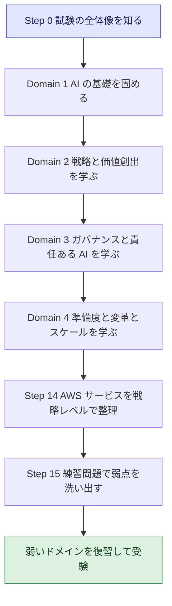

**推奨の学習手順(公式の Exam Prep Plan に沿った流れ)**:

1. **試験を知る**: AWS Skill Builder の Exam Prep Plan と試験ガイドを確認し、公式の練習問題セット(Official Practice Question Set)で出題スタイルに慣れる
2. **知識のすき間を埋める**: 不足している領域のデジタルコースを受講する
3. **復習と演習**: ドメインごとに範囲を見直し、模擬問題で理解の穴を見つける。Meeting Simulator で演習する
4. **準備度を測る**: 公式の練習試験(Official Practice Exam)を受ける。ただし **beta 期間中は提供されない**

> **出典**
> - 認定ページ: <https://aws.amazon.com/certification/certified-ai-business-strategist/>
> - 試験ガイド: <https://docs.aws.amazon.com/aws-certification/latest/ai-business-strategist-01/ai-business-strategist-01.html>
> - Exam Prep Plan(Skill Builder): <https://skillbuilder.aws/category/exam-prep/ai-business-strategist-business-AIB-C01>
> - beta exam の方針: <https://aws.amazon.com/certification/policies/before-testing/>

---

# Domain 1 AI Fundamentals and Literacy(配点 24%)

## Step 1 AI の基本概念と用語(Task 1.1)

### 1-1 まず全体像: AI・ML・深層学習・生成 AI の関係(Skill 1.1.1 / 1.1.2)

**やさしい例え**: AI を「新入社員の育成」にたとえると分かりやすくなります。

| 用語 | 新入社員の例え | ビジネスでの意味 |
|---|---|---|
| アルゴリズム | 仕事の進め方のルール | データからパターンを見つける計算手順 |
| モデル | 研修を終えた新入社員が身につけた「勘所」 | 学習の結果できあがった、予測や判断を行う仕組み |
| 学習(training) | 過去の事例を使った研修 | 過去データからパターンを学ばせる工程 |
| 推論(inference) | 実務で目の前の案件を判断する | 学習済みモデルに新しい入力を与えて結果を得る工程 |
| 予測(prediction) | 判断の結果 | モデルが出す出力(数値、分類、文章など) |

**AI・ML・GenAI の違い(試験ガイド記載の識別ポイント)**

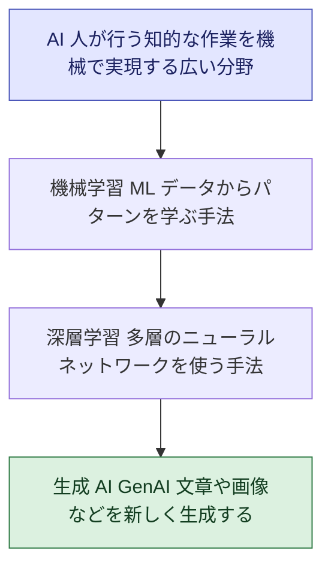

| 区分 | 何をするか | ビジネス例 |
|---|---|---|
| AI(広い概念) | 人の知的作業を機械が代替・支援する。ルールベースの仕組みも広義には含まれる | 問い合わせの自動振り分け |
| 機械学習(ML) | 過去データからパターンを学び、予測・分類する | 解約予測、需要予測、不正検知 |
| 生成 AI(GenAI) | 学習したパターンをもとに新しいコンテンツ(文章・画像・コードなど)を生み出す | 議事録の要約、営業メールの下書き、コード補完 |

> **補足解説**: 図の入れ子関係は、AWS の CAF-AI ホワイトペーパーに掲載された「AI・ML・深層学習・生成 AI の分類図」と同じ考え方です。試験では「この課題は ML で足りるのか、生成 AI が必要か」といった区別が問われます。

### 1-2 構造化データと非構造化データ(Skill 1.1.3)

| 種類 | 特徴 | 例 | 相性のよい AI の使い方 |
|---|---|---|---|
| 構造化データ | 行と列で整理され、項目が決まっている | 売上表、顧客マスタ、在庫、取引履歴 | 需要予測、離反予測、スコアリングなど従来型の ML |
| 非構造化データ | 決まった型がない | メール、PDF、契約書、通話音声、画像、動画、チャットログ | 要約、検索、文書抽出、対話といった生成 AI・自然言語処理・画像認識 |

**補足解説**: 企業データの多くは非構造化データだと言われます。生成 AI の登場で、これまで活用しづらかった文書や会話の価値を引き出せるようになった点が、ビジネスインパクトの源泉です。

### 1-3 なぜデータ品質が重要か(Skill 1.1.4)

**原則**: 質の低いデータからは質の低い結果が出ます(Garbage In, Garbage Out)。AI の成果は、モデルの賢さ以前に**データの質**に左右されます。

| データ品質の観点 | 問題が起きた場合のビジネス影響(例) |
|---|---|
| 正確性 | 誤った顧客情報から誤った提案が出る |
| 完全性(欠損がない) | 一部の顧客群が学習に含まれず、精度が偏る |
| 一貫性 | 部門ごとに定義が違う指標で、比較・集計が食い違う |
| 鮮度 | 古い価格や規程をもとに回答してしまう |
| 代表性(偏りがない) | 特定の属性に不利な判断を生む(公平性のリスク) |

**ベストプラクティス(一般的な実務ガイダンス)**

- AI 案件の初期に「使うデータは何か、誰が所有し、品質は誰が保証するか」を確認する
- データ品質の指標(欠損率、更新頻度など)を決めて定期的に確認する
- 「データが整うまで待つ」のではなく、**対象範囲を絞って小さく始め**、データ整備と並行して価値検証を進める

### 1-4 過去データによる学習の考え方(Skill 1.1.5)

| 概念 | ビジネス向けの説明 |
|---|---|
| 学習データ | モデルが「お手本」として学ぶ過去の事例。ここに含まれない状況には弱い |
| 教師あり学習 | 正解(ラベル)付きの過去データから学ぶ。例: 過去の解約有無から解約予測 |
| 教師なし学習 | 正解なしでデータの構造を見つける。例: 顧客のグルーピング |
| 学習用・検証用・テスト用の分割 | 学習に使っていないデータで性能を確かめ、本番で通用するかを見積もる |
| 過学習 | お手本を丸暗記して、新しいデータに弱くなる状態 |
| 履歴データの偏り | 過去の判断に偏りがあれば、モデルはそれを再現・増幅しうる |

**ポイント**: 「過去がそのまま未来に続く」という前提が崩れると、精度は落ちます(Step 2 のドリフトにつながります)。

### 1-5 グローバルな枠組みと共通用語(Skill 1.1.6)

| 標準・枠組み | 概要 | 位置づけ |
|---|---|---|
| ISO/IEC 42001 | AI マネジメントシステム(AIMS)の国際規格。AI を開発・提供・利用する組織向けに、リスク管理や継続的改善の要求事項と指針を定める。ISO 9001 や ISO/IEC 27001 と同様のマネジメントシステム規格の構造を持つ | 組織として AI を統制するための枠組み |
| ISO/IEC 23053 | 機械学習を用いた AI システムの枠組みと用語を定める規格(一般的な理解に基づく説明) | 共通用語の土台 |

> **注**: ISO/IEC 23053 については、本ガイド作成時に一次情報の本文を取得できていません。規格の正確な範囲は ISO の公式規格ページで確認してください。試験ガイドは 42001 と 23053 を「共通語彙とグローバルな枠組みを知っておく例」として挙げています。

**ベストプラクティス**

- 社内で「AI」「モデル」「エージェント」などの用語の定義をそろえ、経営層・法務・IT・事業部が同じ意味で議論できるようにする
- 規格は「認証を取ること」自体が目的ではなく、**ガバナンスの設計図として参照**する

> **出典**
> - 試験ガイド Domain 1: <https://docs.aws.amazon.com/aws-certification/latest/ai-business-strategist-01/ai-business-strategist-01-domain1.html>
> - AWS CAF-AI ホワイトペーパー(AI・ML・深層学習・生成 AI の分類図): <https://docs.aws.amazon.com/whitepapers/latest/aws-caf-for-ai/aws-caf-for-ai.html>
> - ISO/IEC 42001 の解説(ISO ヘルプセンター): <https://help.iso.org/en/articles/376293-iso-iec-42001-ai-management-systems-for-ethical-and-responsible-ai>
> - ISO/IEC 42001 の構造の解説(EVS): <https://www.evs.ee/en/ai-management-standard>

---

## Step 2 AI ソリューションの種類と選び方(Task 1.2)

### 2-1 ルールベース自動化と AI の使い分け(Skill 1.2.1)

| 観点 | ルールベース自動化が向く | AI が向く |
|---|---|---|
| 判断基準 | 明確で安定している(例: 金額が 10 万円以上なら承認者を追加) | 曖昧・複雑でルール化しきれない(例: 問い合わせ文面の意図把握) |
| 入力データ | 構造化されている | 非構造化データを含む |
| 結果の許容 | 毎回同じ結果が必須 | ある程度の確率的なぶれを許容できる |
| 説明責任 | 判断根拠をルールで完全に説明したい | 精度向上のメリットが大きく、別途の監視や統制で対応できる |
| 変化の頻度 | ルールがほとんど変わらない | パターンが多様で、データから学ぶ価値が高い |

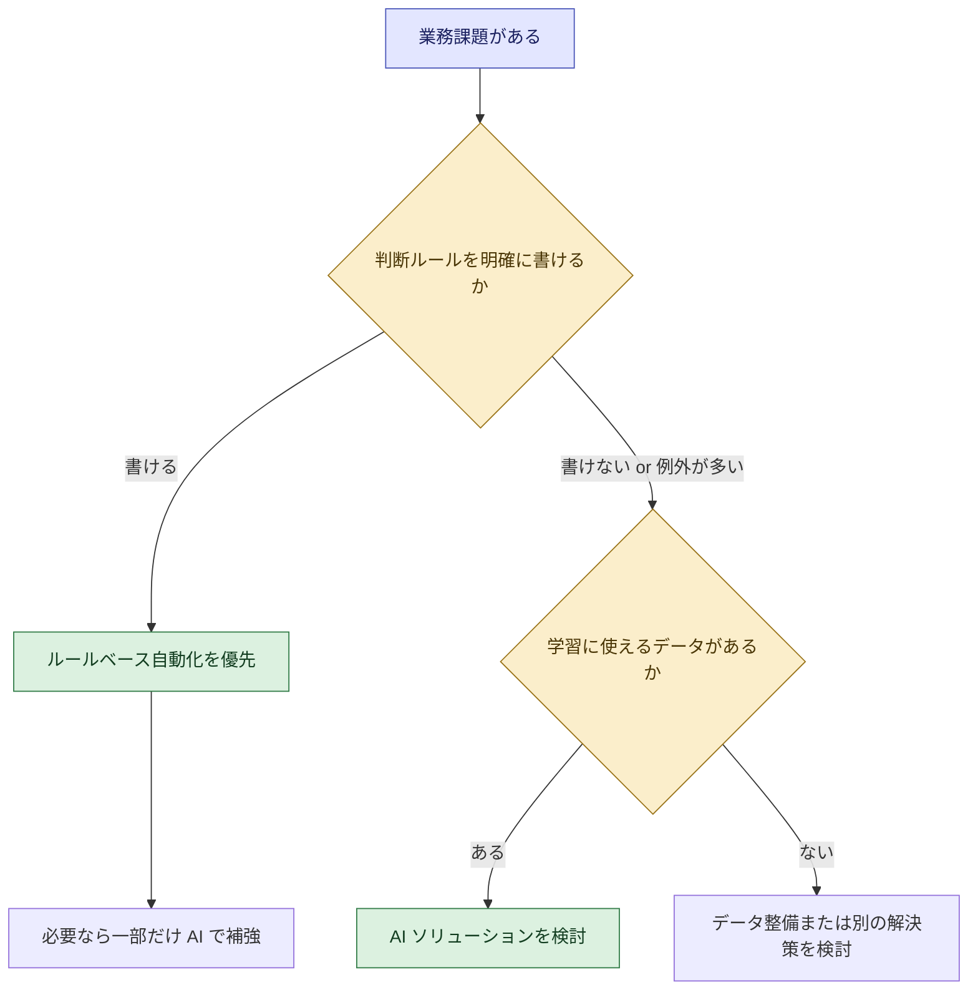

**ベストプラクティス(一般的な実務ガイダンス)**

- 「AI を使うこと」を目的にせず、**最もシンプルで確実な手段から検討**する
- ルールベースと AI の**組み合わせ**も有効(例: 定型部分はルール、例外判断だけ AI)

### 2-2 AI エージェントとその他の AI ソリューションの違い(Skill 1.2.2)

| 種類 | 何をするか | 人の関与 |
|---|---|---|
| ルールベース自動化(RPA など) | 決められた手順を繰り返す | 手順は人が事前に定義 |
| 生成 AI アシスタント(チャット) | 質問に応じて文章を生成・回答 | 人が依頼し、結果を確認 |
| **AI エージェント** | 目標を受け取り、**自分で計画を立て、ツールを使い、行動を実行**する | 目標設定と承認・監督 |

**AI エージェントの中核能力(試験ガイド記載の例)**

| 能力 | やさしい説明 | 例 |
|---|---|---|
| 自律性(autonomy) | 逐一指示しなくても、目標に向けて次の手を判断する | 「今月の未回収請求を整理して」で調査から下書きまで進める |
| ツール利用(tool use) | 社内システムや外部サービスを呼び出して実行する | CRM の検索、チケット起票、メール送信 |
| エージェント間連携 | 複数のエージェントが役割分担して協力する | 調査担当と文書作成担当が連携 |
| オーケストレーション戦略 | 複数のエージェントやツールの実行順序・役割・引き継ぎを設計する | 統括役が各担当に振り分けて結果を統合 |

**ベストプラクティス(一般的な実務ガイダンス)**

- 最初は**参照だけ**の低リスクな業務から始め、更新・送信など**影響の大きい操作には人の承認**を入れる
- エージェントに渡す権限は必要最小限にする
- AWS は、自律的な AI システム向けに「Agentic AI Security Scoping Matrix」を公開しており、エージェント導入時のセキュリティ論点整理の参考になります

### 2-3 モデルドリフトと継続的な監視・更新(Skill 1.2.3)

AI は「作って終わり」ではありません。**現実が変わると精度が落ちる**ためです。

| 用語 | 意味 | 例 |
|---|---|---|
| モデルドリフト(広義) | 時間とともにモデルの性能が低下すること | 導入時 90% だった正答率が徐々に下がる |
| データドリフト | 入力データの傾向が学習時と変わる | 新商品の登場で問い合わせ内容が変化 |
| コンセプトドリフト | 入力と正解の関係そのものが変わる | 景気変動で「優良顧客」の条件が変わる |

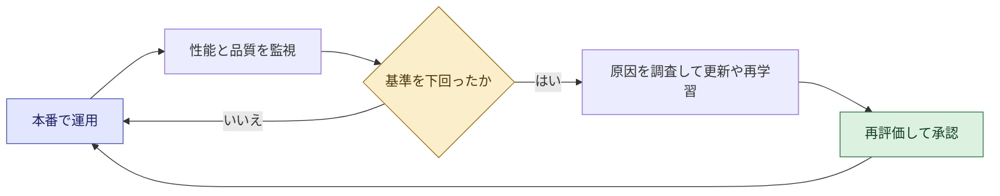

**ベストプラクティス**

- **導入前に、性能の許容ライン(しきい値)と、下回った時の担当者・対応手順**を決めておく
- 業務 KPI(顧客満足度、処理時間)と、モデルの品質指標の両方を見る
- 例: Amazon Bedrock Guardrails のドキュメントは、ガードレールを支える基盤モデルが AWS により定期的に更新されるため、**継続してテスト・検証することを推奨**しています。マネージドサービスであっても、利用側の検証は必要という好例です

### 2-4 シャドー AI と AI ツールの分類(Skill 1.2.4)

**シャドー AI**とは、IT・セキュリティ部門の承認なしに従業員が使う AI ツールのことです。機密情報の入力や、規約違反、監査不能といったリスクを生みます。

**対策の柱: AI ツールの透明な分類**

| 分類 | 意味 | 運用のポイント |
|---|---|---|
| 承認済み(approved) | 評価を経て利用が認められたツール | 利用条件(入力してよいデータの範囲)を明示 |
| 評価中(under evaluation) | 審査・パイロット中 | 限定ユーザー・限定データで試す |
| ブロック(blocked) | 利用禁止 | 禁止理由と代替手段を併せて周知 |

**ベストプラクティス**

- 「禁止するだけ」ではなく、**申請しやすい導入窓口と、承認済みの代替ツール**を用意する(禁止だけでは隠れて使われやすい。一般的な実務ガイダンス)
- 利用ガイドライン(入力してはいけない情報)を教育し、利用状況を把握する
- AWS の Generative AI Security Scoping Matrix では、一般消費者向けの公開 AI サービスの利用(Scope 1)と、SaaS に組み込まれた生成 AI 機能の利用(Scope 2)で、利用規約・ライセンス・データ主権などの遵守が重要と整理されています

> **出典**
> - 試験ガイド Domain 1: <https://docs.aws.amazon.com/aws-certification/latest/ai-business-strategist-01/ai-business-strategist-01-domain1.html>
> - AI Security Scoping Matrix: <https://aws.amazon.com/ai/generative-ai/security/scoping-matrix/>
> - AWS Security Blog(Agentic AI Security Scoping Matrix の記事カテゴリ): <https://aws.amazon.com/blogs/security/category/artificial-intelligence/generative-ai>
> - What Is Agentic AI?(AWS): <https://aws.amazon.com/what-is/agentic-ai/>
> - How Amazon Bedrock Guardrails works: <https://docs.aws.amazon.com/bedrock/latest/userguide/guardrails-how.html>

---

## Step 3 生成 AI の基本技法(Task 1.3)

### 3-1 プロンプトエンジニアリングの基本(Skill 1.3.1)

**プロンプト**とは、生成 AI に与える指示・入力です。AWS のドキュメントは、指示が一貫していて明確で簡潔であるほど望ましい応答が得られると説明しています。

**プロンプトの基本要素**

| 要素 | 内容 | 例 |
|---|---|---|
| 指示 | 何をしてほしいか | 「以下の顧客レビューを 3 点で要約して」 |
| コンテキスト | 背景・役割・対象読者 | 「あなたはカスタマーサポートの管理者です」 |
| 入力データ | 処理対象 | レビュー本文 |
| 出力形式の指定 | 形式・長さ・トーン | 「箇条書き 3 点、各 40 文字以内」 |
| 例(few-shot) | 望む出力の見本 | 良い要約の例を 1〜2 件 |

**AWS ドキュメントが挙げる主な指針**

- 単純・明確・完全な指示を与え、曖昧さを減らす
- 質問や指示はプロンプトの**最後**に置くとよい結果が出やすい
- 区切り文字で指示と入力データを分ける
- 出力の形式や選択肢を明示する(出力インジケータ)

| 悪い例 | 良い例 |
|---|---|
| 「このテキストを分類して」 | 「次のテキストを 営業 / 法務 / 人事 のいずれかに分類し、カテゴリ名のみ出力して」 |

**ベストプラクティス**

- **小さく試して改善を繰り返す**(1 回で完璧を狙わない)
- 良いプロンプトは**チームの共有資産**として管理する
- 幻覚(事実と異なる出力)の低減には、プロンプトの改善、RAG、別モデルの検討が有効です(AWS ドキュメントの記載)

### 3-2 トークン制限とコンテキストウィンドウ(Skill 1.3.2)

| 用語 | 意味 |
|---|---|
| トークン | AI が文章を処理する最小単位(単語や文字の断片)。料金計算の単位にもなる |
| コンテキストウィンドウ | モデルが 1 回の処理で扱える情報量(入力と出力の合計)の上限 |

**性能に影響する場面**

| 状況 | 起きること | 対処の方向性 |
|---|---|---|
| 長大な文書を丸ごと渡す | 上限を超える、または後半・途中の情報が反映されにくい | 分割、要約してから渡す、RAG で必要部分のみ取り出す |
| 長い会話を続ける | 過去のやり取りが押し出される | 要点を引き継ぐ、会話を区切る |
| 出力が長い | コストと待ち時間が増える | 出力長を制限、形式を簡潔に |
| コスト | 入力・出力のトークン量に応じて課金されるモデルが多い | 不要な文脈を減らす |

> Amazon Bedrock の料金ページでは、モデルごとに「100 万入力トークンあたり」「100 万出力トークンあたり」の従量料金が示されています。トークン量がコストに直結することの実例です。

### 3-3 モデル適応技法: RAG とファインチューニング(Skill 1.3.3)

**課題**: 汎用の生成 AI は、あなたの会社の最新情報や社内ルールを知りません。

| 手法 | 何をするか | 向く場面 | 主な留意点 |
|---|---|---|---|
| プロンプト改善 | 指示・例・形式を工夫する | まず最初に試す | 追加の知識は与えられない |
| **RAG**(検索拡張生成) | 回答時に社内文書などから関連情報を検索し、プロンプトに添えて生成させる | 最新情報・社内文書に基づく回答、根拠の提示が必要 | 検索対象データの品質・権限管理が重要 |
| **ファインチューニング** | 追加データでモデルを再学習させ、特定の文体・専門用語・振る舞いを身につけさせる | 一貫した文体や専門領域の振る舞いが必要 | 学習データの準備、追加コスト、更新の手間 |

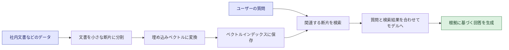

**選び方の流れ(一般的な実務ガイダンス)**

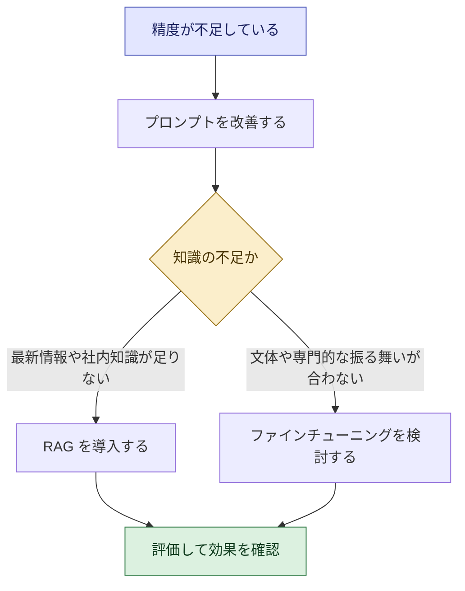

**Amazon Bedrock での位置づけ(戦略レベル)**

- **Knowledge Bases**: RAG を管理型で実現する機能。文書を断片化して埋め込みに変換しベクトルインデックスに保存し、実行時に関連情報を取り出して回答を補強する。継続的なモデル再学習なしに自社データを活用でき、取得情報には出典が付くため透明性の向上と幻覚の抑制に役立つ、と AWS は説明している
- **モデルのカスタマイズ(ファインチューニング)**: 料金ページには、学習(100 万トークンあたり)、カスタムモデルの月額保管料、カスタムモデルでの推論に必要な Provisioned Throughput の料金が別建てで示されている。**RAG に比べてコスト構造が増える**ことを意識する

**ベストプラクティス**

- **プロンプト改善 → RAG → ファインチューニング**の順に、コストと手間の小さい手段から試す
- 改善効果は、事前に用意した**評価用の質問セット**で定量的に確認する
- RAG では、参照元文書の**アクセス権限と更新運用**をセットで設計する(閲覧権限のない人に機密文書の内容が漏れないようにする。一般的な実務ガイダンス)

> **出典**
> - 試験ガイド Domain 1: <https://docs.aws.amazon.com/aws-certification/latest/ai-business-strategist-01/ai-business-strategist-01-domain1.html>
> - What is prompt engineering?(Amazon Bedrock): <https://docs.aws.amazon.com/bedrock/latest/userguide/what-is-prompt-engineering.html>
> - Design a prompt(Amazon Bedrock): <https://docs.aws.amazon.com/bedrock/latest/userguide/design-a-prompt.html>
> - Prompt engineering concepts(Amazon Bedrock): <https://docs.aws.amazon.com/bedrock/latest/userguide/prompt-engineering-guidelines.html>
> - How Amazon Bedrock knowledge bases work: <https://docs.aws.amazon.com/bedrock/latest/userguide/kb-how-it-works.html>
> - Knowledge Bases GA 発表: <https://aws.amazon.com/blogs/aws/knowledge-bases-now-delivers-fully-managed-rag-experience-in-amazon-bedrock>
> - Amazon Bedrock 料金: <https://aws.amazon.com/bedrock/pricing/>

---

# Domain 2 AI Strategy and Business Value Creation(配点 28%)

## Step 4 AI 戦略を事業目標に合わせる(Task 2.1)

### 4-1 高インパクトなユースケースの特定と成果への対応づけ(Skill 2.1.1)

**考え方**: 「AI で何ができるか」ではなく「**どの事業成果を、どの AI の能力で実現するか**」から逆算します。

| 事業機能 | 代表的な AI の能力 | 期待する事業成果(例) |
|---|---|---|
| カスタマーオペレーション | 問い合わせの要約・回答案作成、自動応対、感情分析 | 対応時間の短縮、顧客満足度の向上、一次解決率の改善 |
| 営業・マーケティング | 提案文・コンテンツ生成、リード優先順位付け、パーソナライズ | 商談化率の向上、コンテンツ制作リードタイムの短縮 |
| 研究開発 | 文献・特許の要約と検索、アイデア創出支援 | 調査工数の削減、探索スピードの向上 |
| ソフトウェア開発 | コード補完、テスト・ドキュメント作成の支援 | 開発生産性の向上、品質の安定 |

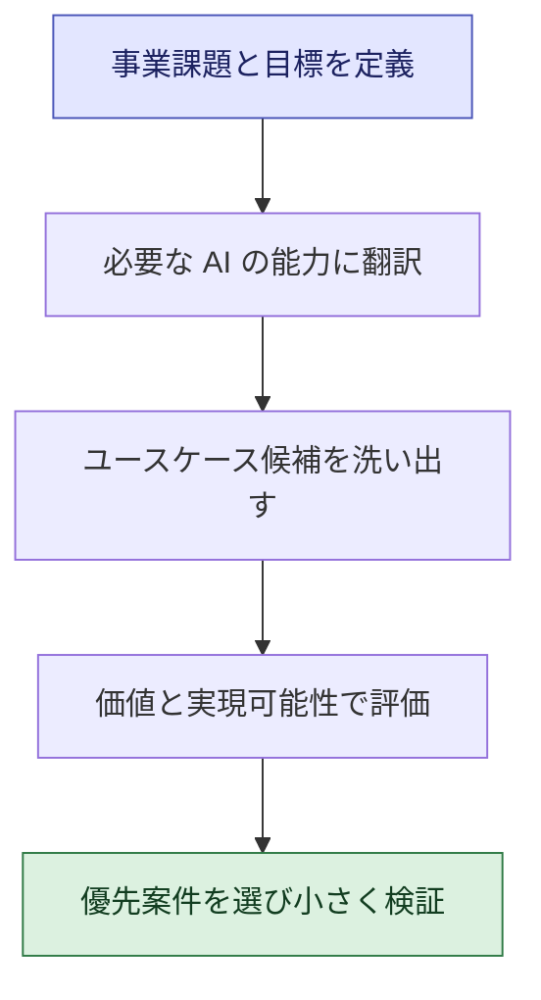

**ベストプラクティス(一般的な実務ガイダンス)**

- 現場の業務フローを観察し、**時間がかかっている作業・ミスが多い作業・属人化した作業**を起点に候補を探す
- 「成果指標(KPI)を 1 つ言えないユースケース」は、優先度を下げる

### 4-2 Build・Buy・Partner の判断(Skill 2.1.2)

| 選択肢 | 内容 | AWS 上のイメージ(戦略レベル) |
|---|---|---|
| Build(自社構築) | 自社でモデル活用や開発を行う。差別化と自由度が高い | Amazon Bedrock でモデルを活用して自社アプリを構築、Amazon SageMaker AI でカスタム ML を構築 |
| Buy(購入) | 既製のソフトウェアや SaaS を導入する。早く始められる | Amazon Quick のような AI アシスタント、SaaS に組み込まれた AI 機能 |
| Partner(提携) | ベンダー・パートナー・コンサルと組んで実現する | AWS Marketplace や AWS パートナーの活用 |

**判断要素(試験ガイド記載)**: 予算、期間、社内の能力、ベンダー提案の内容、規制・コンプライアンス要件。

| 判断要素 | Build に傾く | Buy / Partner に傾く |
|---|---|---|
| 予算 | 継続投資できる | 初期費用を抑えたい |
| 期間 | 時間をかけられる | 早期に成果が必要 |
| 社内能力 | 専門人材がいる | 人材が不足 |
| 差別化 | 競争優位の核になる | 他社と同じで十分な汎用機能 |
| 規制・データ | 厳格な管理が必要で自社管理したい | ベンダーが必要な認証・統制を満たしている |

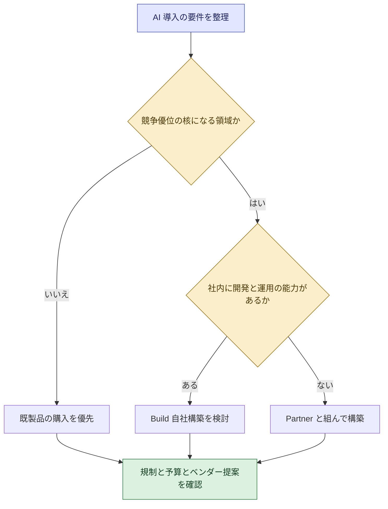

**補足解説(所有範囲とセキュリティ責任)**: AWS の Generative AI Security Scoping Matrix は、生成 AI の利用形態を所有範囲の小さい順に 5 つの Scope に分類します。Build / Buy の選択は、**どこまで自社が管理責任を負うか**にも直結します。

| Scope | 利用形態 | 例(AWS の整理) |
|---|---|---|
| 1 | コンシューマー向けアプリの利用 | 一般公開の生成 AI サービス |
| 2 | エンタープライズアプリの利用 | 生成 AI 機能を持つ SaaS |
| 3 | 事前学習済みモデル上に自社アプリを構築 | Amazon Bedrock 上の基盤モデル |
| 4 | 自社データでファインチューニング | Bedrock のカスタムモデル、SageMaker JumpStart |
| 5 | 自社データでモデルをゼロから学習 | 自社学習モデル |

**ベストプラクティス**

- **ベンダー提案は同じ評価軸で比較**する(機能、総コスト、データの取り扱い、規制対応、契約条件、撤退のしやすさ)
- 最初は Buy / Partner で素早く価値を確認し、差別化領域だけ Build に移行する、という段階的な進め方も有効(一般的な実務ガイダンス)

### 4-3 AI イニシアチブの優先順位づけ(Skill 2.1.3)

**4 つの評価軸(試験ガイド記載)**: ビジネス価値、実現可能性、持続可能性、戦略との整合性。

| 評価軸 | 確認する問い |
|---|---|
| ビジネス価値 | 売上・コスト・顧客体験にどれだけ効くか |
| 実現可能性 | データ、技術、人材、期間の面で現実的か |
| 持続可能性 | 運用コストや保守を継続でき、変化にも対応できるか |
| 戦略整合性 | 経営戦略・事業目標に合っているか |

**判断の結末は 3 種類: スケール・一時停止・終了**

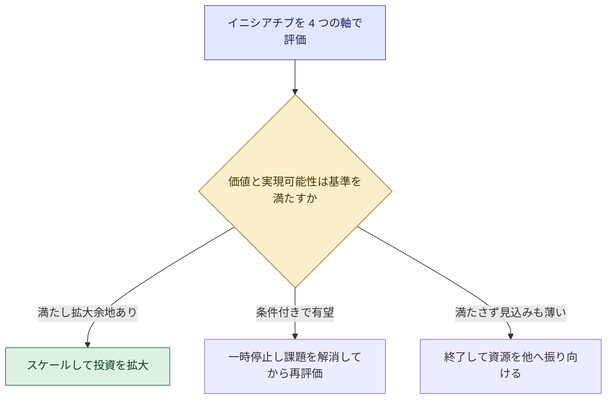

**ベストプラクティス**

- 事前に**「継続・停止の判断基準」と判断のタイミング**を決めておく(感情や既得権益で継続しないため)
- 「終了」は失敗ではなく**学びの獲得**と位置づけ、得られた教訓を共有する(一般的な実務ガイダンス)

### 4-4 AI が適切でない場面の見極め(Skill 2.1.4)

| AI が適切でないケース | 理由 |
|---|---|
| ルールが明確で、既存の自動化で十分 | 複雑さとコストが見合わない |
| 学習・参照に使える質の良いデータがない | 成果が出ない。まずデータ整備 |
| 価値が小さい、または測定できない | 投資対効果が示せない |
| 誤りの影響が大きいのに、人の確認や統制を置けない | リスクが受容できない |
| 常に毎回同一の結果が求められる | 生成 AI は出力にぶれがある |
| 規制上・倫理上の制約で利用が認められない | コンプライアンス違反のおそれ |

**ポイント**: 試験では「AI を導入しない」「まず別の手段」という選択肢が**正解になる場合**があります。「AI ありき」で選ばないこと。

### 4-5 業務やプラットフォームを AI へ移行する際の考慮点(Skill 2.1.5)

| 考慮点 | 確認すること |
|---|---|
| 事業継続性 | 移行中・障害時に業務が止まらないか。旧手順への切り戻しは可能か |
| コスト | 移行費用、二重運用期間、従量課金の増減、契約の縛り |
| データの準備状況 | 移行対象データの品質、形式、アクセス権 |
| 性能への影響 | 応答時間、精度、利用者体験の変化。事前に基準値を測る |
| プラットフォーム間の移行 | 特定ベンダーへの依存度、プロンプト・評価データ・連携部分の移し替えのしやすさ |

**ベストプラクティス(一般的な実務ガイダンス)**

- **並行稼働**や段階的な切り替えを計画し、切り戻し条件を決めておく
- 特定モデルにしか動かない作りを避け、プロンプトや評価セットを**資産として管理**しておくと乗り換えが楽になる

> **出典**
> - 試験ガイド Domain 2: <https://docs.aws.amazon.com/aws-certification/latest/ai-business-strategist-01/ai-business-strategist-01-domain2.html>
> - AI Security Scoping Matrix(Scope 1〜5): <https://aws.amazon.com/ai/generative-ai/security/scoping-matrix/>
> - 試験対象のサービス一覧: <https://docs.aws.amazon.com/aws-certification/latest/ai-business-strategist-01/aib-01-in-scope-services.html>
> - AWS Marketplace: <https://aws.amazon.com/marketplace>

---

## Step 5 AI のビジネス価値を測定・実証する(Task 2.2)

### 5-1 全体の流れ

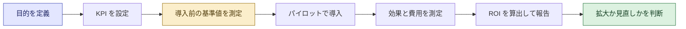

### 5-2 KPI の設定: 有形の効果と無形の効果(Skill 2.2.1)

| 区分 | 例 | 測り方の例 |
|---|---|---|
| 有形(定量化しやすい) | コスト削減、売上増、処理時間の短縮、エラー率の低下 | 財務データ、業務ログ |
| 無形(定量化しにくい) | 顧客満足度、従業員の生産性・エンゲージメント、意思決定の質 | アンケート、NPS、従業員サーベイ |

**ベストプラクティス**

- KPI は**事業目標とひも付け**て決める(「利用回数」だけで成功としない)
- 無形の効果も**測る仕組み**(アンケートなど)を最初から用意する

### 5-3 導入前のベースライン(基準値)の設定(Skill 2.2.2)

**理由**: 導入前の数値がなければ、導入後の改善が AI のおかげかどうかを示せません。

| 例(カスタマーサポート) | 導入前(ベースライン) | 導入後 |
|---|---|---|
| 1 件あたり平均処理時間 | 測定しておく | 同じ定義で再測定 |
| 顧客満足度 | 測定しておく | 同じ定義で再測定 |

**ベストプラクティス**

- 測定方法と期間を**導入前後で統一**する
- 可能なら、AI を使う群と使わない群を比べる(季節要因などの影響を減らす。一般的な実務ガイダンス)

### 5-4 AI の ROI を算出する(Skill 2.2.3)

**基本式**: ROI(%)= (得られた便益 − 総コスト)÷ 総コスト × 100

**便益の観点(試験ガイド記載の例)**: 時間の節約、コスト削減、売上増、生産性向上。
**コストの観点(補足解説)**: モデル・サービス利用料、開発・連携費用、運用・保守、教育・変革管理、ガバナンス対応。

**計算例(仮の数値です)**

| 項目 | 数値 |
|---|---|
| 月間の問い合わせ件数 | 20,000 件 |
| 1 件あたり処理時間の短縮 | 12 分 → 9 分(3 分短縮) |
| 月間の削減時間 | 3 分 × 20,000 件 = 60,000 分 = 1,000 時間 |
| 1 時間あたり人件費 | 3,000 円 |
| 月間の便益 | 1,000 時間 × 3,000 円 = 300 万円 |
| 月間の総コスト(利用料・運用・教育など) | 120 万円 |
| 月間の純便益 | 300 万円 − 120 万円 = 180 万円 |
| ROI(月次) | 180 万円 ÷ 120 万円 × 100 = 150% |
| 初期投資 600 万円の回収期間 | 600 万円 ÷ 180 万円 ≒ 3.3 か月 |

> **注意(重要)**: 「削減した時間」は、その時間が**別の価値ある業務に再配分されて初めて**財務上の便益になります。時間削減をそのまま人件費削減と読み替えると、便益を過大評価しがちです。

**ベストプラクティス**

- 便益は**保守的な前提**で見積もり、コストは**見落としなく**含める
- 定量化しにくい効果は、ROI とは別に**併記**する

### 5-5 先行指標(リーディングインジケーター)(Skill 2.2.4)

**先行指標**は、最終成果(売上など)が出る前に成功の兆しを示す指標です。

| 種類 | 例 | 意味 |
|---|---|---|
| 先行指標 | 利用率、週次アクティブ利用者数、タスク完了率、ユーザー満足度、回答の採用率 | 「使われているか」「役に立っているか」の早期シグナル |
| 遅行指標 | 売上、コスト削減額、解約率 | 最終的な成果。結果が出るまで時間がかかる |

**ベストプラクティス**: 先行指標が悪化した時点で、**利用者の声を聞き、改善する**。遅行指標を待つと、手遅れになりがちです。

### 5-6 コストの基本管理(Skill 2.2.5)

**AWS の AI サービスの料金体系(試験ガイド記載の例)**

| 体系 | 意味 | 代表的なイメージ(補足解説) |
|---|---|---|
| 従量課金(consumption-based) | 使った量に応じて課金 | 生成 AI のトークン量に応じた従量料金 |
| インスタンス課金(instance-based) | 利用する計算資源の時間に応じて課金 | カスタム ML の学習・推論用の計算資源 |
| シート課金(seat-based) | ユーザー数に応じて課金 | 従業員向け AI アシスタント |

**Amazon Bedrock の料金の考え方(料金ページの記載より)**: オンデマンド(従量)、バッチ、Provisioned Throughput(処理能力の確保。1 か月・6 か月などのコミットメントで割安になる料金の例がある)、モデルカスタマイズ料金(学習、保管、推論)が用意されています。

**コスト管理の道具(試験範囲)**

| 道具 | 使いどころ |
|---|---|
| AWS Pricing Calculator | 導入前に構成に基づく費用を**見積もる** |
| AWS Cost Explorer | 導入後のコストと使用量を**可視化・分析**する。過去 13 か月の表示と、今後 18 か月の予測に対応 |
| Savings Plans | 一定の利用を約束する代わりに割引を得る(対象サービスや条件は要確認) |
| AWS Marketplace | ソリューションの比較や購入・提携先の検討 |

**ベストプラクティス**

- 本番前に**コストの見積もり**を作り、想定利用量が 2 倍になった場合も確認する
- 利用量が読めない初期は従量課金で始め、**使用実績が安定してから**コミットメント型の割引を検討する(一般的な実務ガイダンス)
- コストを定期的に見直す担当者と頻度を決める

> **出典**
> - 試験ガイド Domain 2 / 対象受験者の説明: <https://docs.aws.amazon.com/aws-certification/latest/ai-business-strategist-01/ai-business-strategist-01-domain2.html>、<https://docs.aws.amazon.com/aws-certification/latest/ai-business-strategist-01/ai-business-strategist-01.html>
> - Amazon Bedrock 料金: <https://aws.amazon.com/bedrock/pricing/>
> - AWS Pricing Calculator: <https://calculator.aws/>
> - AWS Cost Explorer(製品ページ): <https://aws.amazon.com/aws-cost-management/aws-cost-explorer/>
> - AWS Cost Explorer(ドキュメント): <https://docs.aws.amazon.com/console/billing/costexplorer>
> - AWS Pricing: <https://aws.amazon.com/pricing/>

---

## Step 6 競争優位のための AI ポジショニング(Task 2.3)

### 6-1 競争環境の評価と AI 導入の優位性(Skill 2.3.1)

| 分析の観点 | 確認する問い |
|---|---|
| 競合の動き | 競合はすでに AI を使って何を改善しているか |
| 顧客の期待 | 顧客は AI による迅速さ・個別対応を期待し始めているか |
| 自社の資産 | 他社にない独自データ、顧客接点、専門知見は何か |
| 参入障壁の変化 | AI により新規参入者が有利になる領域はどこか |

### 6-2 ビジネスモデル変革の機会(Skill 2.3.2)

| 変革の方向 | 例 |
|---|---|
| 提供価値の高度化 | 製品にAI機能を組み込み、個別最適化されたサービスにする |
| 提供コストの構造変化 | 人手に依存していたサービスを低コストで大規模に提供する |
| 新規の収益源 | 蓄積データや専門知見を使った新サービス、データ活用型サービス |
| 顧客体験の再設計 | 24 時間対応、即時提案、待ち時間の解消 |

### 6-3 持続的な競争優位と運用面の改善(Skill 2.3.3)

**考え方(一般的な実務ガイダンス)**: AI モデルそのものは、他社も同じものを利用できることが多いため、**モデルだけでは差別化になりにくい**。持続的な優位は次のような要素から生まれます。

| 優位の源泉 | 説明 |
|---|---|
| 独自データ | 他社が持たない高品質なデータを継続的に蓄積・活用する |
| 業務への組み込み | AI を日常業務のワークフローに深く組み込み、使われ続ける |
| 学習の速さ | 実験→評価→改善のサイクルを速く回せる組織能力 |
| 人材と文化 | AI を使いこなせる人材と、試行を許容する文化 |
| 信頼 | 責任ある AI の実践により、顧客・規制当局の信頼を得る |

### 6-4 投資水準の決め方(Skill 2.3.4)

**考え方**: 投資の大きさは、**業界の成熟度と競争のダイナミクス**で決めます。

| 状況 | 投資の方向性(一般的な実務ガイダンス) |
|---|---|
| 競合が急速に AI を活用し、顧客の期待も上がっている | 投資を厚くし、スピードを重視する |
| 業界の AI 活用がまだ初期で、成果の見通しが不確か | 小さな実験を複数走らせ、学びながら段階的に投資する |
| 規制が厳しく、リスクが大きい業界 | ガバナンスを先に固めたうえで、範囲を絞って投資する |

**ポイント**: 「最新技術だから大きく投資する」「他社がやっているからやる」は理由になりません。**事業価値と競争状況**から根拠を示します。

> **出典**
> - 試験ガイド Domain 2: <https://docs.aws.amazon.com/aws-certification/latest/ai-business-strategist-01/ai-business-strategist-01-domain2.html>
> - AWS CAF-AI ホワイトペーパー(AI を通じて事業価値を生む考え方): <https://docs.aws.amazon.com/whitepapers/latest/aws-caf-for-ai/aws-caf-for-ai.html>

---

# Domain 3 AI Governance and Responsible AI Leadership(配点 24%)

## Step 7 責任ある AI を意思決定に組み込む(Task 3.1)

### 7-1 責任ある AI の原則と次元(Skill 3.1.1)

**責任ある AI(Responsible AI)**とは、AI の利益を最大化し、リスクを最小化することを目指して AI を設計・開発・利用する取り組みです。AWS の Well-Architected Responsible AI Lens は、AI に固有の「次元」を定義しています(報道では 10 次元と紹介されています)。

| 次元 | ビジネス向けの意味 | 事業側が投げるべき問い |
|---|---|---|
| 公平性(fairness) | 特定の属性の人に不利な結果を出さない | 属性ごとの結果に差が出ていないか。誰が不利益を受けうるか |
| 説明可能性(explainability) | なぜその結果になったか説明できる | 顧客・監査人・規制当局に説明が求められる場面か |
| プライバシー(privacy) | データを適切に取得・利用・管理する | 個人情報を使う根拠と同意は。不要なデータは使っていないか |
| 安全性(safety) | 人や社会に害を与えない | 誤作動や有害な出力が起きた時の被害は何か |
| 透明性(transparency) | AI を使っていること、限界を利用者に伝える | 利用者は AI が関与していると知っているか |
| 堅牢性(robustness) | 想定外の入力でも安定して動く | 異常な入力や悪意のある入力でどうなるか |
| 制御可能性(controllability) | AI の振る舞いを監視し、調整・停止できる | 問題発生時に人が止められるか |
| セキュリティ(security) | データやモデルを不正から守る | 不正アクセスやデータ漏えいへの備えは |
| 真実性(veracity) | 出力が正確で事実に基づく | 誤情報(幻覚)の検出手段は |
| ガバナンス(governance) | 責任と統制の仕組みがある | 誰が最終責任を持つか |

> 試験ガイドが例示している次元は「公平性、説明可能性、プライバシー、安全性、透明性、堅牢性」です。試験ではこれらを**ビジネスシナリオに当てはめて**判断する力が問われます。

### 7-2 事業目標と責任ある AI が衝突する時のトレードオフ(Skill 3.1.2)

| 衝突の例 | 考え方 |
|---|---|
| 精度を優先すると説明しにくいモデルになる | 判断の影響度が高い領域(融資、採用、医療など)では説明可能性を優先し、低リスク領域で精度を優先する |
| パーソナライズを強めるとプライバシーへの懸念が高まる | 収集データを最小化し、同意と透明性を確保する |
| 展開スピードを優先すると評価やレビューが不足する | 影響度に応じてレビューの深さを変える(リスクベース) |
| コスト削減を優先すると人のチェックが減る | 重大な判断には人の関与を残す |

**ベストプラクティス(一般的な実務ガイダンス)**

- トレードオフは**隠さず、判断の根拠と責任者を記録**する
- **関係者(法務、コンプライアンス、現場、影響を受ける人)を早期に巻き込む**
- 「利益 vs 責任」の二択にせず、**範囲を絞る、人の確認を足す**など第三の選択肢を探す

### 7-3 設計段階から統合する「ガバナンス・バイ・デザイン」(Skill 3.1.3)

AWS の Responsible AI Lens の設計原則には、**設計から運用まで責任ある AI の観点を通して考え、問題をライフサイクルのできるだけ早い段階で見つけて解消すること**、そして**ユースケースを狭く定義し、解くべき課題から逆算して仕様を決めること**が含まれます。早期に対処するほど、後戻りのコストと時間を減らせます。

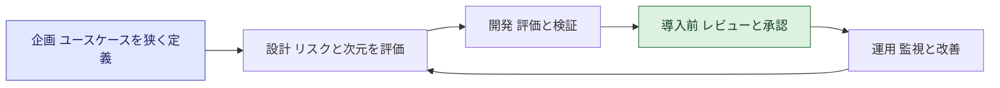

**ベストプラクティス**: **プロジェクト計画の最初(要件定義)の時点**で、責任ある AI のチェック項目を作業項目に含める。完成間際に審査を追加するのは手戻りが大きい。

### 7-4 人による監督が必要な場面とセーフガード(Skill 3.1.4)

**人の監督(Human oversight)が必要になる場面(補足解説)**

| 場面 | 例 |
|---|---|
| 判断が個人の権利・生活に大きく影響する | 融資審査、採用、医療、法的判断 |
| 誤りのコストが大きい | 契約書の自動送付、大口の返金 |
| AI の確信度が低い、または前例のない状況 | 想定外の問い合わせ |
| 規制が人の関与を求めている | 高リスク AI に関する規制要件 |

**セーフガードの 3 本柱(試験ガイドの例)**

| セーフガード | 役割 |
|---|---|
| 幻覚検出 | 事実に基づかない出力を見つけて抑える |
| ガードレール | 入力・出力を制御して、不適切な内容を防ぐ |
| エスカレーション基準 | どんな場合に人へ引き継ぐかを事前に定める |

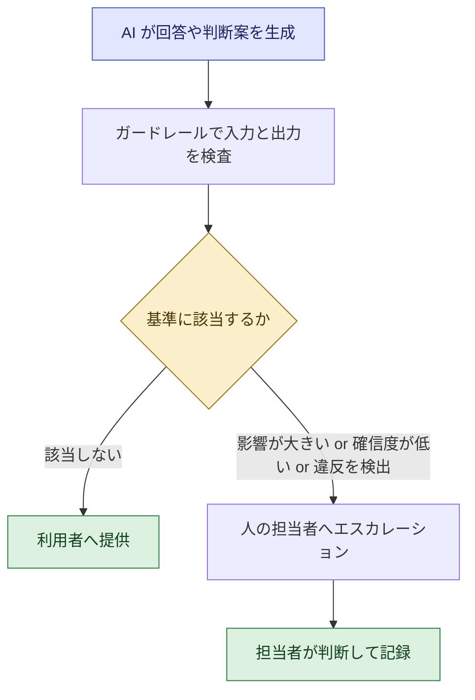

**Amazon Bedrock Guardrails(戦略レベルの理解)**

- 生成 AI アプリの**ユーザー入力とモデル応答の両方を評価**して安全性を保つ機能
- 1 つのガードレールは、**コンテンツフィルター、拒否トピック、機密情報フィルター、単語フィルター、画像コンテンツフィルター**などのポリシーの組み合わせで構成できる
- 入力が違反と判定されるとモデル推論は破棄され、あらかじめ設定したブロックメッセージが返る。応答が違反した場合は、ブロックメッセージへの置き換えや機密情報のマスキングが行われる
- Amazon Bedrock Agents と Knowledge Bases でも利用できる
- 事実性の検証機能として、応答が元情報に根拠づけられているかを確認する「コンテキスト根拠チェック」(contextual grounding checks)があると紹介されている(詳細は AWS の最新ドキュメントで確認)

**ベストプラクティス**

- **エスカレーション基準は導入前に文章化**する(「確信度が低い」「金額が閾値超え」「苦情・法的懸念」など)
- 人の確認が形式的にならないよう、**確認者に十分な情報と時間・権限**を与える(一般的な実務ガイダンス)
- ガードレールは一度設定して終わりでなく、**定期的にテスト**する

> **出典**
> - 試験ガイド Domain 3: <https://docs.aws.amazon.com/aws-certification/latest/ai-business-strategist-01/ai-business-strategist-01-domain3.html>
> - AWS Well-Architected Responsible AI Lens: <https://docs.aws.amazon.com/wellarchitected/latest/responsible-ai-lens/responsible-ai-lens.html>
> - Responsible AI Lens 発表記事(設計原則): <https://aws.amazon.com/blogs/machine-learning/announcing-the-aws-well-architected-responsible-ai-lens>
> - 新しい Well-Architected Lenses の発表: <https://aws.amazon.com/about-aws/whats-new/2025/11/new-aws-well-architected-lenses-ai-ml-workloads>
> - 10 次元の紹介(InfoQ): <https://infoq.com/news/2025/12/aws-expands-well-architected/>
> - How Amazon Bedrock Guardrails works: <https://docs.aws.amazon.com/bedrock/latest/userguide/guardrails-how.html>
> - Bedrock Guardrails の機能紹介(第三者による解説。コンテキスト根拠チェックなど): <https://www.truefoundry.com/docs/ai-gateway/bedrock-guardrails>

---

## Step 8 AI ガバナンス体制と規制対応(Task 3.2)

### 8-1 部門横断の AI ガバナンス体制と明確な責任(Skill 3.2.1)

**ガバナンスとは**: 「AI をどう使い、誰が何に責任を持つか」を決めるルールと仕組みです。

| 構成要素 | 内容 |
|---|---|
| 部門横断の代表 | 事業部門、IT・データ、セキュリティ、法務、コンプライアンス、人事、リスク管理など |
| 明確な責任(アカウンタビリティ) | AI ごとの責任者(オーナー)、承認者、監視担当を明確にする |
| 方針と手順 | AI 利用方針、審査プロセス、インシデント対応 |
| 報告ライン | 経営層への定期報告 |

| 役割の例 | 主な責任 |
|---|---|
| 経営スポンサー | 方針の承認、リソース確保、最終的な責任 |
| AI ガバナンス委員会 | 高リスク案件の審査、方針の維持・更新 |
| 事業オーナー | ユースケースの成果とリスクに責任を持つ |
| 法務・コンプライアンス | 規制・契約の適合確認 |
| セキュリティ | データ保護とアクセス管理 |
| 技術チーム | 実装・運用・品質監視 |

**ベストプラクティス**: ISO/IEC 42001 は、リーダーシップの関与、リスク評価、監視・監査、継続的改善といった要素を含むマネジメントシステムの型を示しており、体制設計の参考になります。

### 8-2 AI に関する規制コンプライアンスリスクへの対応(Skill 3.2.2)

| 手順 | 内容 |
|---|---|
| 1 | AI を使う業務を棚卸しする(どこで、何のデータで、誰に影響するか) |
| 2 | 適用される法令・規制・業界基準を特定する(個人情報、消費者保護、業界規制、地域の AI 規制など) |
| 3 | リスクの高い用途を特定し、必要な統制(記録、説明、人の関与、審査)を設ける |
| 4 | 法務・コンプライアンスと連携して継続的に見直す |

**例: EU の AI 法(EU AI Act)**は、リスクに応じて規制の強さを変える**リスクベースのアプローチ**を採用しています。欧州委員会の説明では、最小リスクは義務なし、高リスクは厳格な要件、許容できないリスクは禁止、チャットボットなど特定の透明性リスクには AI との対話であることの明示が求められます。

> **注意**: 法規制の適用範囲・時期は国や時期で変わります。**本ガイドは法的助言ではありません。**具体的な適用判断は法務の専門家に確認してください。

### 8-3 アクセス制御とデータセキュリティ(Skill 3.2.3)

試験では**実装手順ではなく、ガバナンスとして何を求めるか**が問われます。

| 論点 | ガバナンスとしての考え方 |
|---|---|
| アクセス制御 | 最小権限の原則。AI や利用者が扱えるデータ・機能を必要な範囲に限定する |
| データ分類 | 機密度に応じ、AI に入力してよいデータの範囲を定める |
| データの取り扱い | 保管場所、保持期間、学習への利用可否、第三者提供の条件を明確にする |
| ベンダー管理 | ベンダーのデータ取扱い条件、認証、責任分界を確認する |
| 責任分界 | 利用形態ごとに、どのセキュリティ統制を自社が担うかを整理する |

**AWS 責任共有モデルと AI(戦略レベル)**: 一般に AWS はクラウド基盤側のセキュリティに責任を持ち、利用者はその上での設定・データ・アクセス管理に責任を持ちます。AI では、**Step 4 の Scope 1〜5 で利用形態が変わると、自社が担う統制の範囲が変わる**、という理解が有用です。

AWS の Generative AI Security Scoping Matrix は、全 Scope に共通する 5 つのセキュリティ領域を示します。

| 領域 | 内容 |
|---|---|
| ガバナンスとコンプライアンス | 事業を後押ししつつリスクを抑える方針・手順・報告 |
| 法務とプライバシー | 生成 AI の利用・構築に関する法規制・プライバシー要件 |
| リスク管理 | 潜在的な脅威の特定と推奨される緩和策 |
| コントロール | リスクを軽減するためのセキュリティ統制の実装 |
| レジリエンス | 可用性と事業上のサービスレベルを維持する設計 |

### 8-4 リスク分類フレームワークによる優先順位づけ(Skill 3.2.4)

**考え方**: すべての AI に同じ強さの統制をかけるのではなく、**リスクの大きさに応じて統制の強さを変える**(リスクベース)。

| リスク階層(例) | 特徴 | 統制の強さ |
|---|---|---|
| 高 | 個人の権利・安全・重要な意思決定に影響 | 事前審査、人の関与、詳細な記録、定期監査 |
| 中 | 影響は限定的だが顧客や業務に関わる | 標準的なレビュー、監視、利用者への通知 |
| 低 | 社内の軽微な効率化 | 基本方針の遵守と簡易な登録 |

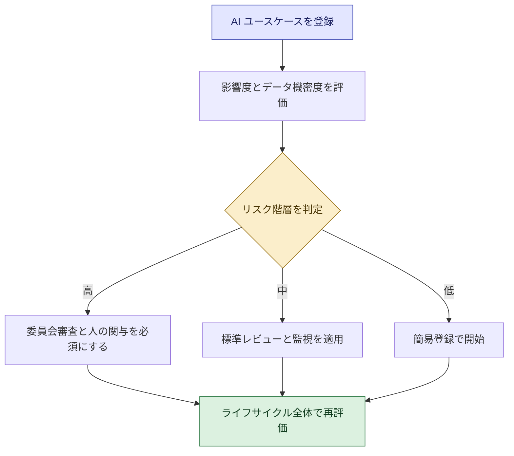

**参考になる枠組み**

| 枠組み | 要点 |
|---|---|
| NIST AI RMF 1.0 | 米国 NIST による自主的な枠組み。Govern(統治)、Map(文脈の把握)、Measure(測定)、Manage(管理)の 4 機能を、AI ライフサイクル全体で継続的に回す。2024 年には生成 AI 向けプロファイル(NIST AI 600-1)も公開 |
| ISO/IEC 42001 | 認証可能な AI マネジメントシステム規格 |
| EU AI Act | リスクベースの法規制(許容できない、高、限定的、最小) |

**ベストプラクティス**: リスク分類は**ユースケース登録の入口**に組み込み、ライフサイクル(企画・開発・運用)の節目で再評価する。

> **出典**
> - 試験ガイド Domain 3: <https://docs.aws.amazon.com/aws-certification/latest/ai-business-strategist-01/ai-business-strategist-01-domain3.html>
> - AI Security Scoping Matrix: <https://aws.amazon.com/ai/generative-ai/security/scoping-matrix/>
> - AWS Prescriptive Guidance(生成 AI プラットフォームのセキュリティとガバナンス): <https://docs.aws.amazon.com/prescriptive-guidance/latest/strategy-enterprise-ready-gen-ai-platform/security.html>
> - ISO/IEC 42001: <https://help.iso.org/en/articles/376293-iso-iec-42001-ai-management-systems-for-ethical-and-responsible-ai>
> - EU AI Act(欧州委員会関連ページ): <https://interoperable-europe.ec.europa.eu/collection/egovernment/news/eu-ai-act-first-regulation-artificial-intelligence>
> - NIST AI Risk Management Framework: <https://www.nist.gov/itl/ai-risk-management-framework>

---

## Step 9 企業の AI リスクと緩和策(Task 3.3)

### 9-1 本番運用のリスクコントロールと監視(Skill 3.3.1)

| 監視の観点 | 見ること | 例 |
|---|---|---|
| 品質 | 正確性、幻覚率、回答の採用率 | サンプリングによる人の評価 |
| 安全性 | 有害・不適切な出力、ガードレールの発動件数 | 発動ログの定期確認 |
| 公平性 | 属性ごとの結果の差 | グループ別の結果比較 |
| セキュリティ・プライバシー | 機密情報の入力・出力、不審なアクセス | 検知と報告の仕組み |
| 事業指標 | KPI、顧客苦情 | ダッシュボード |
| コスト | 利用量と費用の推移 | Cost Explorer での確認 |

**ベストプラクティス**: 導入時に**「何を、誰が、どの頻度で見て、異常時に何をするか」**を決める。インシデント対応の連絡ルートも事前に定める。

### 9-2 バイアスはライフサイクルの複数段階で発生する(Skill 3.3.2)

| 段階 | バイアスの発生例 |
|---|---|
| データ収集 | 特定の集団のデータが少ない(標本の偏り) |
| ラベル付け | 人の主観や先入観がラベルに入る |
| モデル学習 | 過去の偏った判断を学び再現する |
| 評価 | 全体の精度だけ見て、集団別の差を見落とす |
| 導入・運用 | 現場での使われ方が想定と異なり、特定の人に不利になる |
| フィードバックループ | AI の判断が新しいデータを生み、偏りが強化される |

**バイアスドリフト**: 導入時に問題なくても、データや社会状況の変化で**時間とともにバイアスが生じる**ことがあります。したがって**継続的な監視**が重要です。

**ベストプラクティス(一般的な実務ガイダンス)**

- 導入前だけでなく、**運用中も定期的に集団別の結果を確認**する
- 多様な視点を持つメンバーでレビューする
- 問題を見つけた時の是正手順(停止・修正・再評価)を定義しておく

### 9-3 有害コンテンツと知的財産(IP)のリスク管理(Skill 3.3.3)

| リスク | 内容 | 対策の方向性 |
|---|---|---|
| 有害コンテンツ | ヘイト、暴力、差別的な表現、不適切な出力 | ガードレールのコンテンツフィルターや拒否トピックの設定、人のレビュー |
| 機密情報の漏えい | 個人情報や社内機密が入力・出力に含まれる | 機密情報フィルター、入力ルール、教育 |
| IP(知的財産)の侵害 | 生成物が第三者の著作物に類似するおそれ | 用途に応じた確認プロセス、契約条件の確認 |
| 入力データの権利 | 権利のないデータを AI に投入してしまう | データの権利確認、利用ルール |
| 出力の権利・帰属 | 生成物の権利の扱いが不明確 | ベンダーの利用規約・契約の確認 |

> **注意**: 知的財産の判断は複雑です。**本ガイドは法的助言ではありません。**法務部門・専門家と連携してください。

NIST の生成 AI プロファイル(NIST AI 600-1)は、生成 AI 特有のリスクとして、事実と異なる出力(confabulation)、有害コンテンツ、データ漏えいなどを整理しています。

### 9-4 信頼性リスク: 幻覚・データ品質の劣化・モデルドリフト(Skill 3.3.4)

| リスク | 内容 | 緩和策 |
|---|---|---|
| 幻覚(hallucination) | もっともらしいが事実と異なる出力 | RAG による根拠づけ、プロンプト改善、出典表示、重要判断での人の確認 |
| データ品質の劣化 | 元データが古くなる、欠損や誤りが増える | データ品質の継続監視、更新運用、所有者の明確化 |
| モデルドリフト | 環境変化で性能が低下する | 性能監視と再評価・再学習(Step 2-3 参照) |

**ベストプラクティス**

- 出力が**根拠(出典)に基づいている**ことを確認できる設計にする(Knowledge Bases は取得情報に出典を付ける)
- 幻覚をゼロにはできない前提で、**影響の大きい用途では人の確認を残す**

> **出典**
> - 試験ガイド Domain 3: <https://docs.aws.amazon.com/aws-certification/latest/ai-business-strategist-01/ai-business-strategist-01-domain3.html>
> - Prompt engineering concepts(幻覚低減の手段): <https://docs.aws.amazon.com/bedrock/latest/userguide/prompt-engineering-guidelines.html>
> - How Amazon Bedrock Guardrails works: <https://docs.aws.amazon.com/bedrock/latest/userguide/guardrails-how.html>
> - NIST AI Risk Management Framework(生成 AI プロファイルを含む): <https://www.nist.gov/itl/ai-risk-management-framework>

---

# Domain 4 Business Readiness, Leadership, and AI Transformation(配点 24%)

## Step 10 AI 活用の準備度と成熟度の評価(Task 4.1)

### 10-1 準備度(レディネス)を測る観点(Skill 4.1.1)

| 観点(試験ガイドの例) | 確認する問い |
|---|---|
| リーダーシップの一致 | 経営層は AI の目的・投資・責任について同じ方向を向いているか |
| データ品質 | 使うデータは正確で、必要な時に使える状態か |
| 文化の準備度 | 試行錯誤を許容し、AI を受け入れる風土があるか |
| 技術基盤 | AI を動かすための基盤や連携が用意できるか |
| ガバナンスの枠組み | 方針、審査、責任分担が整っているか |

**補足解説(AWS CAF の視点)**: AWS Cloud Adoption Framework(AWS CAF)は、クラウド導入を Business(事業)、People(人材)、Governance(ガバナンス)、Platform(基盤)、Security(セキュリティ)、Operations(運用)の 6 つの視点で整理します。AI 向けには AWS CAF-AI があり、AI の旅路で組織能力が成熟するにつれて必要となる基盤的な能力を整理しています。準備度評価で「事業・人・統制・技術」を漏れなく見る際の型として使えます。

### 10-2 AI 成熟度モデルで現在地を知る(Skill 4.1.2)

試験ガイドは、成熟度の段階の例として「実験(experimentation)」から「全社規模での展開(enterprise-scale deployment)」までを挙げています。以下は**理解を助けるための説明用モデル**で、試験の段階名と完全一致するとは限りません。

| 段階(説明用) | 状態 | 次に必要なこと |
|---|---|---|
| 1 探索 | AI への関心はあるが取り組みは散発的 | 目的の明確化、小さな実験 |
| 2 実験 | 複数の PoC が個別に進む | 成功基準の統一、共通のガイドライン |
| 3 本番化 | いくつかが本番運用に入る | 運用体制、監視、ガバナンス |
| 4 全社展開 | 多くの部門で活用され標準化が進む | CoE、再利用資産、人材育成 |
| 5 最適化 | AI が事業の中核に組み込まれ継続的に改善 | 新しいビジネスモデルへの挑戦 |

### 10-3 能力ギャップの特定(Skill 4.1.3)

**4 つの観点: 人・プロセス・技術・ガバナンス**

| 観点 | ギャップの例 |
|---|---|
| 人 | AI リテラシー不足、推進役の不在、スキルの偏り |
| プロセス | 案件の受付・優先順位づけ・評価の手順がない |
| 技術 | データ連携が不十分、共通基盤がない |
| ガバナンス | 責任の所在が不明、リスク審査の基準がない |

### 10-4 開発投資の優先順位と成長の道筋(Skill 4.1.4)

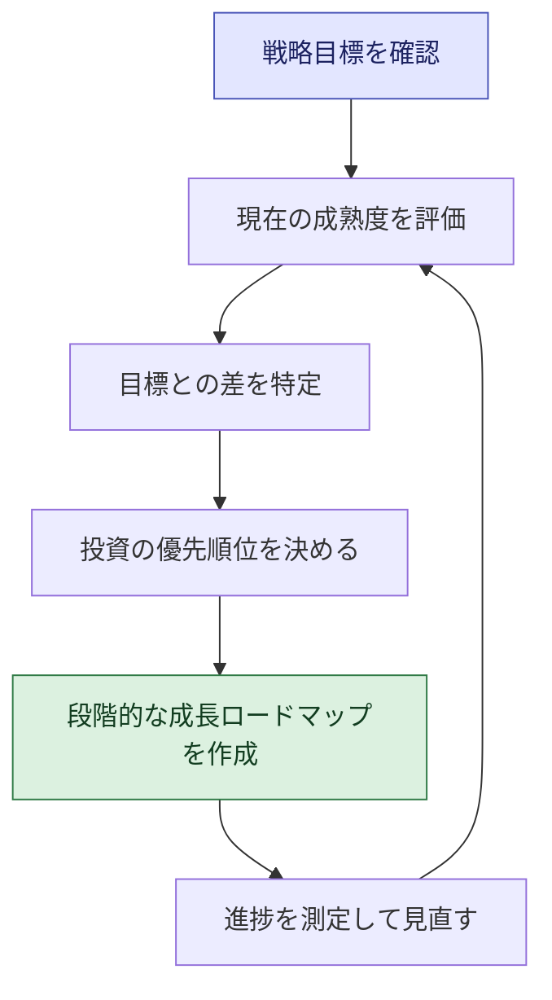

**ベストプラクティス(一般的な実務ガイダンス)**

- 現在の成熟度に**合わない大きすぎる目標**は避け、一段階上を狙う
- 「技術だけ」でなく、**人・プロセス・ガバナンスに同時に投資**する(技術に偏ると定着しない)

> **出典**
> - 試験ガイド Domain 4: <https://docs.aws.amazon.com/aws-certification/latest/ai-business-strategist-01/ai-business-strategist-01-domain4.html>
> - AWS CAF-AI: <https://docs.aws.amazon.com/whitepapers/latest/aws-caf-for-ai/aws-caf-for-ai.html>
> - AWS CAF(公式ページ。本ガイド作成時に本文は未取得のため最新は要確認): <https://aws.amazon.com/cloud-adoption-framework/>
> - 6 つの視点の解説(IBM): <https://ibm.com/think/topics/aws-cloud-adoption-framework>

---

## Step 11 データとインフラの土台づくり(Task 4.2)

### 11-1 データ準備度の評価(Skill 4.2.1)

| 観点 | 確認する問い | 問題があると |
|---|---|---|
| 品質 | 正確・完全・一貫しているか | 出力の信頼性が下がる |
| アクセス性 | 必要な人・システムが、必要な時に使えるか | 案件が進まない、利用が限定される |
| **データのサイロ** | 部門ごとに分断されていないか | 全体像が見えず、価値が限定される |

**ベストプラクティス**: ユースケースごとに**必要なデータの棚卸し**(どこにあるか、誰が持つか、品質は、アクセス権は)を行い、ボトルネックを可視化する。

### 11-2 データ戦略・所有権・共有の枠組み(Skill 4.2.2)

| 要素 | 内容 |
|---|---|
| データ戦略 | 事業目標を達成するためにどのデータを、どう集め・整え・活用するか |
| データ所有権(オーナーシップ) | データごとに責任者を置き、品質・利用ルールに責任を持たせる |
| データ共有の枠組み | 部門・組織間でデータを安全に共有するルール(目的、範囲、権限、条件) |

**ベストプラクティス**

- データオーナーを**明確に指名**する(責任者不在のデータは品質が劣化しやすい。一般的な実務ガイダンス)
- 共有ルールは「**共有しない理由**」ではなく「**安全に共有する方法**」を中心に設計する
- 関連資料として、AWS は「エージェント型 AI のための 7 つの重要なデータ機能」というリソースを公開しています

### 11-3 技術・インフラの要件を戦略レベルで評価する(Skill 4.2.3)

**ビジネス職に求められるのは、設計ではなく「何が必要かを見極めること」**です。

| 観点 | 戦略レベルの問い |
|---|---|
| 計算資源・スケール | 想定する利用量に耐えられるか。利用が増えた時のコストは |
| 管理型かカスタムか | 既製のマネージドサービスで足りるか、独自開発が必要か |
| 連携 | 既存の業務システムやデータ基盤と連携できるか |
| セキュリティ・ガバナンス | 責任分界とデータ保護の要件を満たせるか |
| 運用体制 | 本番運用と監視を担える人材・体制があるか |

**AWS サービスの戦略的な位置づけ**: Amazon Bedrock は基盤モデルを使った生成 AI アプリケーション構築のための管理型サービス、Amazon SageMaker AI は ML モデルと基盤モデルの構築・学習・デプロイを行う完全マネージドサービスです。「まずマネージドを検討し、必要な場合にカスタム」という選択の枠組みを理解しておきます。

> **出典**
> - 試験ガイド Domain 4: <https://docs.aws.amazon.com/aws-certification/latest/ai-business-strategist-01/ai-business-strategist-01-domain4.html>
> - What is Amazon SageMaker AI?: <https://docs.aws.amazon.com/sagemaker/latest/dg/whatis.html>
> - Data for agentic AI(AWS のリソース。タイトルのみ確認): <https://aws.amazon.com/data/resources/data-foundation-for-agentic-ai/>

---

## Step 12 組織変革と AI 人材の育成(Task 4.3)

### 12-1 経営層のスポンサーシップと AI チャンピオン(Skill 4.3.1)

| 役割 | 果たすこと |
|---|---|
| 経営スポンサー | 方針を示し、予算と権限を確保し、障害を取り除く |
| AI チャンピオン | 現場で活用を広め、成功事例や困りごとを橋渡しする |

**ベストプラクティス**: スポンサーの関与は**一度きりの宣言ではなく継続的**に(進捗レビューへの参加、成果の発信)。チャンピオンには**時間と裁量**を与える。

### 12-2 部門横断チームと明確なアカウンタビリティ(Skill 4.3.2)

| メンバー | 貢献 |
|---|---|
| 事業リード | 課題定義と成果への責任 |
| 技術専門家 | 実装・運用 |
| 法務・コンプライアンス | 規制・契約の適合 |
| セキュリティ・データ | 保護と品質 |
| 現場の代表 | 実業務に合うかの確認 |

**ベストプラクティス**: **誰が意思決定し、誰が結果に責任を持つか**を書面で明確にする(RACI などの責任分担表が有効。一般的な実務ガイダンス)。

### 12-3 従業員の不安に応える透明なコミュニケーション(Skill 4.3.3)

| 従業員の不安 | 伝えるべきこと |
|---|---|
| 「自分の仕事がなくなるのでは」 | 役割の変化の方針、再教育の機会、AI が担う範囲と人が担う範囲 |
| 「いつから何が変わるのか」 | 導入時期のスケジュール |
| 「何を期待されるのか」 | 成果に対する期待値と評価の考え方 |

**ベストプラクティス**: **早く、正直に、繰り返し**伝える。分からないことは「まだ決まっていない」と明示し、決まり次第共有する。双方向の質問窓口を設ける。

### 12-4 文化的な障壁とリーダーシップの介入(Skill 4.3.4)

| 障壁 | 介入(リーダーの行動) |
|---|---|
| リスク回避 | 小さく安全な実験の場を用意し、リスクの上限を明確にする |
| 変化への抵抗 | 現場を設計に巻き込み、日常業務の具体的な便益を示す |
| 失敗への恐れ | 失敗から学ぶことを評価し、責めない。学びを共有する |

### 12-5 AI リテラシーを高める人材育成(Skill 4.3.5)

| 手法 | 効果 | 向く対象 |
|---|---|---|
| 概念実証(PoC)プログラム | 実際の課題で体験しながら学ぶ | 事業部門の推進メンバー |
| ハッカソン | 短期間で創造的に試し、熱量を高める | 部門横断の参加者 |
| 研修プログラム | 体系的な知識の底上げ | 全従業員、管理職 |
| 責任ある AI の研修 | リスクとルールの理解 | AI を使うすべての人 |

**ベストプラクティス**: 役割別(経営層、管理職、実務担当、推進者)に**内容と深さを変える**。学んだ直後に**業務で使う機会**を用意する。

### 12-6 人の役割の移行: 手作業から AI との協働・監督へ(Skill 4.3.6)

| 人が得意なこと | AI が得意なこと |
|---|---|
| 批判的思考、判断、共感、創造性、文脈の理解 | 大量データの処理、反復作業、高速な下書き・要約 |

**方向性**: 人の役割を「手作業の実行」から「AI の成果を確認し、判断し、顧客に寄り添う」へ移す。

**ベストプラクティス**: 人と AI の**役割分担を業務ごとに設計**し、人の役割の新しい価値(判断・共感・関係構築)を明確にして教育する。

> **出典**
> - 試験ガイド Domain 4: <https://docs.aws.amazon.com/aws-certification/latest/ai-business-strategist-01/ai-business-strategist-01-domain4.html>
> - AWS CAF-AI(People 視点を含む枠組み): <https://docs.aws.amazon.com/whitepapers/latest/aws-caf-for-ai/aws-caf-for-ai.html>

---

## Step 13 パイロットから全社展開へスケールする(Task 4.4)

### 13-1 反復型の変革フェーズ(Skill 4.4.1)

試験ガイドは、フェーズの例として「構想(envision)、実験(experiment)、ローンチ(launch)、スケール(scale)」を挙げています。

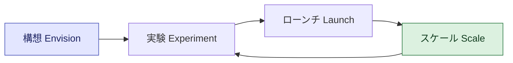

| フェーズ | 目的 | 主な活動 |
|---|---|---|
| 構想 | 価値の仮説を作る | 課題・ユースケース・成功基準の定義 |
| 実験 | 小さく検証する | PoC、データ・技術・リスクの検証 |
| ローンチ | 本番で使い始める | 限定範囲での運用開始、ガバナンス適用 |
| スケール | 拡大する | 他部門・他業務への展開、標準化 |

> **補足**: 一般的な AWS CAF では変革フェーズに Envision / Align / Launch / Scale といった名称が使われます。試験ガイドの表記は「envision, experiment, launch, scale」です。**名称よりも、反復しながら段階的に進む考え方**が重要です。

### 13-2 短期の成功から全社展開へ(Skill 4.4.2)

**ベストプラクティス**

- **価値が見えやすく、リスクが低く、実現しやすい**案件をクイックウィンとして最初に選ぶ
- 成果と学びを**社内に共有**し、次の展開の支持を得る
- 再利用できる部品(プロンプト、評価セット、ガイドライン)を蓄積して展開を加速する

### 13-3 AI センター・オブ・エクセレンス(CoE)と部門横断の連携(Skill 4.4.3)

| CoE の機能 | 内容 |
|---|---|
| 標準とガイドライン | 利用方針、開発・評価の基準、テンプレート |
| 再利用資産 | 共通の部品、事例、ナレッジ |
| 人材育成 | 研修、コミュニティ運営 |
| 案件の受付と支援 | ユースケースの相談、優先順位づけ、伴走支援 |
| ガバナンス連携 | リスク審査や規制対応との橋渡し |

**ベストプラクティス**: CoE が**「承認するだけの関所」にならず、現場を支援する**存在になるようにする。中央と各部門の推進役が連携する体制(ハブ・アンド・スポーク型など)も一つの方法(一般的な実務ガイダンス)。

### 13-4 継続的なフィードバックと成功指標(Skill 4.4.4)

- 利用者フィードバックの窓口(ボタン、アンケート、定期ヒアリング)を設ける
- Step 5 の KPI と**先行指標**で進捗を追い、長期的な価値も追跡する
- 得られた学びを**ロードマップに反映**する

### 13-5 実験段階から本番グレードへの移行(Skill 4.4.5)

| 項目 | 実験(PoC) | 本番グレード |
|---|---|---|
| 対象 | 限定的・小規模 | 実際の業務・顧客・本格的な利用量 |
| 品質基準 | 探索的 | 合意済みの品質・可用性の基準 |
| ガバナンス | 簡易 | リスク審査、承認、記録、規制対応 |
| 運用 | 開発チームの片手間 | 監視、障害対応、サポート体制、コスト管理 |
| 責任 | 曖昧 | オーナー・責任者が明確 |

### 13-6 スケール中の事業継続性と性能の確保(Skill 4.4.6)

スケールの各段階で、次の要素を確認します。

| 要素 | 確認すること |
|---|---|
| 事業継続 | 障害時の代替手段、切り戻し |
| 性能 | 利用者増による応答遅延・品質低下がないか |
| コスト | 利用量増加に伴う費用の見通し |
| ガバナンス | 展開先でもリスク審査・方針が守られているか |
| 人と組織 | 展開先の教育・サポートが追いついているか |
| データ | 新しい対象でも品質とアクセス権が確保されているか |

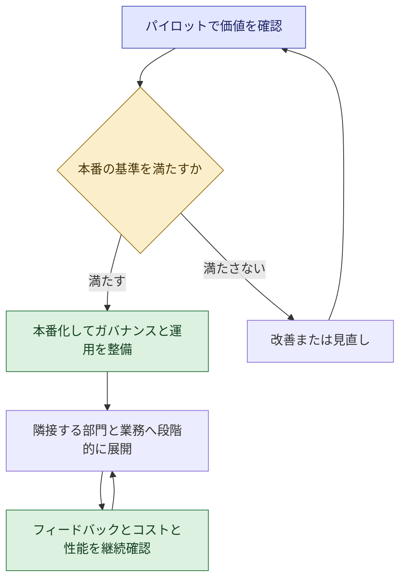

> **出典**
> - 試験ガイド Domain 4: <https://docs.aws.amazon.com/aws-certification/latest/ai-business-strategist-01/ai-business-strategist-01-domain4.html>
> - AWS CAF-AI: <https://docs.aws.amazon.com/whitepapers/latest/aws-caf-for-ai/aws-caf-for-ai.html>
> - 認定ページ(パイロットから本番へという試験の趣旨): <https://aws.amazon.com/certification/certified-ai-business-strategist/>

---

# 横断編と仕上げ

## Step 14 試験範囲の AWS サービス・フレームワーク(戦略レベル)

**重要**: 試験は AWS サービスの**設定・操作を問いません**。「何のためのサービスか」「ビジネス判断にどう関わるか」を押さえます。

### 14-1 範囲内のサービス・機能(試験ガイド記載)

| カテゴリ | 対象 | 適用範囲 |
|---|---|---|
| AI / ML | Amazon Bedrock、Amazon SageMaker AI | 基本的な適用のみ |
| BI | Amazon Quick | 基本的な適用のみ |
| クラウド戦略とガバナンス | AWS CAF、AWS 責任共有モデル | - |
| 料金とコスト管理 | AWS AI サービスの料金体系(従量・インスタンス・シート)、AWS Cost Explorer、AWS Marketplace、AWS Pricing Calculator | - |

### 14-2 サービス・フレームワーク別の要点とベストプラクティス

| 名称 | 一言で | 試験での押さえどころ | ベストプラクティス |
|---|---|---|---|
| Amazon Bedrock | 基盤モデルで生成 AI アプリ・エージェントを作る管理型プラットフォーム | 料金の種類(オンデマンド・バッチ・Provisioned Throughput・カスタマイズ)、**Guardrails**、**Knowledge Bases** | まず管理型で始め、Guardrails で安全性を確保、社内知識は RAG で活用、コスト構造を事前に把握 |
| Amazon SageMaker AI | ML モデルや基盤モデルを構築・学習・デプロイする完全マネージドサービス | カスタム ML が必要な場面と、管理型で足りる場面の**使い分け** | 独自性が必要で専門人材がいる場合に選択。まず既製・管理型で足りないかを確認 |
| Amazon Quick | 研究・BI・自動化・アクション実行を一つにまとめた、AI 搭載の職場向けアシスタント(旧称 Quick Suite) | 従業員向け AI アシスタントの Buy 選択肢、シート課金の例 | 権限の範囲内でデータに接続し、利用ルールと教育を併せて導入 |
| AWS CAF / CAF-AI | 事業・人材・ガバナンス・基盤・セキュリティ・運用の視点で導入計画を整理 | 全社的な計画と拡大、準備度評価の型 | 6 つの視点を漏れなく確認し、技術偏重を避ける |
| AWS 責任共有モデル | AWS と利用者の責任分担 | AI ワークロードでのデータセキュリティ・コンプライアンスの**ガバナンスレベル**の理解 | 利用形態(Scope)ごとに自社が担う統制を整理 |
| Well-Architected Responsible AI Lens | 責任ある AI のための質問集とベストプラクティス | ガバナンスのベストプラクティスの参照元。責任ある AI の次元 | 設計段階から使い、ユースケースを狭く定義して課題から逆算 |
| AWS Pricing Calculator / Cost Explorer | 見積もりと実績分析 | ビジネスケース作成とコスト管理 | 導入前に見積もり、導入後に定期分析 |
| AWS Marketplace | ソリューションの探索・調達 | Build・Buy・Partner の評価 | 複数候補を同じ評価軸で比較 |

### 14-3 範囲外の代表例(試験ガイド記載)

| カテゴリ | 例 |
|---|---|
| インフラ・コンピュート | Amazon EC2、AWS Lambda |
| ネットワーク・配信 | Amazon VPC、Amazon CloudFront |
| データベース・ストレージ | Amazon RDS、Amazon S3 |
| コンテナ | Amazon ECS、Amazon EKS |
| 開発ツール・DevOps | AWS CodePipeline、AWS CloudFormation |
| セキュリティの実装・設定 | IAM ポリシー記述、AWS KMS |
| その他 | IoT、メディアなど専門的なサービス |

> **出典**
> - 範囲内サービス: <https://docs.aws.amazon.com/aws-certification/latest/ai-business-strategist-01/aib-01-in-scope-services.html>
> - 範囲外サービス: <https://docs.aws.amazon.com/aws-certification/latest/ai-business-strategist-01/aib-01-out-of-scope-services.html>
> - 技術・概念の一覧: <https://docs.aws.amazon.com/aws-certification/latest/ai-business-strategist-01/aib-01-technologies-concepts.html>
> - Amazon Quick 発表(AWS News Blog): <https://aws.amazon.com/blogs/aws/reimagine-the-way-you-work-with-ai-agents-in-amazon-quick-suite/>
> - What is Amazon SageMaker AI?: <https://docs.aws.amazon.com/sagemaker/latest/dg/whatis.html>
> - Amazon Bedrock 料金: <https://aws.amazon.com/bedrock/pricing/>

---

## Step 15 試験対策と練習問題

### 15-1 問題を解く 6 つの視点(本ガイドの推奨。公式の解法ではありません)

| 視点 | 内容 |
|---|---|
| 1 立場を確認 | 自分は誰の立場か(ビジネス職)。**技術実装を選ぶ選択肢は疑う** |
| 2 目的を確認 | 事業目標・成果は何か。目的に直結する選択肢を選ぶ |
| 3 順序を確認 | 「最初に」「次に」を問う問題は、**測定(ベースライン)→ 小さく検証 → 拡大**、**リスク評価 → 統制**の順序が基本 |
| 4 リスクと統制 | 影響が大きいなら人の関与、ガバナンス、段階的展開を選ぶ |
| 5 極端を避ける | 「すべて禁止」「全社一斉導入」「制限なしで開放」のような極端案は誤りになりやすい |
| 6 複数選択の注意 | 選ぶ個数を確認し、**すべての正解を選ぶ**(部分点なし) |

### 15-2 よくある落とし穴

| 落とし穴 | 正しい考え方 |
|---|---|
| AI ありきで考える | ルールベースや AI 不使用が最適な場合もある(Skill 2.1.4、1.2.1) |
| 導入前の数値を取らない | ベースラインなしに効果は証明できない |
| 技術指標だけで成功とする | 事業 KPI と先行指標をひも付ける |
| 導入して終わり | 監視・ドリフト・バイアスドリフトへの継続対応が必要 |
| ガバナンスを後付けにする | 企画段階から組み込む(governance by design) |
| いきなり全社展開 | 短期の成功から段階的に拡大 |
| 禁止だけで管理しようとする | 承認済みの代替手段と分類の透明性で、シャドー AI を抑える |

### 15-3 練習問題(本ガイドのオリジナル。実際の試験問題ではありません)

**問 1.** ある企業が、社内規程に基づく問い合わせ対応に生成 AI を導入したいが、規程は頻繁に改定される。最新の規程に基づき、根拠を示して回答させたい。最も適切な手段はどれか。
A. モデルを毎月ゼロから学習し直す
B. RAG により最新の規程文書を検索して回答に反映する
C. 回答を人がすべて手書きする
D. 一般公開の生成 AI サービスに規程全文を入力する

**問 2.** カスタマーサポート部門が AI 導入の効果を経営層に示したい。導入前に最初に行うべきことはどれか。
A. 導入後の目標値のみを設定する
B. 現在の平均処理時間や顧客満足度をベースラインとして測定する
C. 競合の広告を調べる
D. 全社一斉に展開する

**問 3.** 従業員が承認のない生成 AI ツールに機密情報を入力していることが判明した。最も適切な対応はどれか。(2 つ選択)
A. 承認済み・評価中・ブロックの分類を明示し、承認済みの代替ツールを用意する
B. 何も対応せず様子を見る
C. 入力してはいけない情報の教育と利用ガイドラインを周知する
D. すべての AI 利用を無期限に禁止する
E. 各自の判断に任せる

**問 4.** 融資審査の支援に AI を使う計画がある。個人の生活に大きく影響する判断である。最も適切な設計はどれか。
A. AI の判断を完全自動で確定する
B. 人による確認、エスカレーション基準、説明可能性を組み込む
C. 精度だけを最優先にする
D. 利用者に AI の利用を知らせない

**問 5.** パイロットが成功した。次に取るべき行動として最も適切なものはどれか。
A. 本番の基準(運用・ガバナンス・コスト)を確認し、段階的に展開する
B. 直ちに全社へ同時展開する
C. 成果の共有をせず、次の実験に移る
D. 監視は不要として運用チームを解散する

**問 6.** 競合の AI 活用が急速に進む業界で、当社は AI の取り組みがまだ初期段階である。投資水準の判断として最も適切なものはどれか。
A. 何もしない
B. 競争状況と事業価値に基づき、優先領域に投資を厚くしつつ段階的に進める
C. 流行しているからという理由で最大限投資する
D. 規制やリスクを考慮せず一斉導入する

解答と解説

| 問 | 正解 | 解説 |
|---|---|---|
| 1 | B | 頻繁に変わる知識は RAG で最新文書を参照させる。毎回の再学習(A)はコストと手間が過大。D は情報管理上の問題(Step 3、Step 2-4) |
| 2 | B | ベースラインがなければ効果を示せない(Step 5-3) |
| 3 | A, C | 分類の透明化、代替手段、教育・ガイドラインが基本。放置(B)、無期限の全面禁止(D)、丸投げ(E)は不適切(Step 2-4) |
| 4 | B | 影響が大きい判断は、人の関与、エスカレーション、説明可能性、透明性が必要(Step 7) |
| 5 | A | 実験から本番への移行は、ガバナンスと運用要件を満たしたうえで段階的に(Step 13) |
| 6 | B | 投資水準は業界成熟度と競争のダイナミクス、事業価値で決める(Step 6-4) |

---

## 付録 A スキルチェックリスト(試験ガイドの全スキル)

自己評価に使ってください。

### Domain 1

- [ ] 1.1.1 AI の基本概念(アルゴリズム、モデル、学習、推論、予測)をビジネス文脈で説明できる
- [ ] 1.1.2 AI・ML・生成 AI を区別できる
- [ ] 1.1.3 構造化データと非構造化データの違いと AI への関連を説明できる
- [ ] 1.1.4 データ品質が AI の成果に重要な理由を説明できる
- [ ] 1.1.5 過去データによるモデル学習の概念を説明できる
- [ ] 1.1.6 ISO/IEC 23053、42001 などグローバルな枠組みと共通語彙を知っている
- [ ] 1.2.1 ルールベース自動化と AI の使い分けを判断できる
- [ ] 1.2.2 AI エージェントの特徴と中核能力を説明できる
- [ ] 1.2.3 継続的な監視・更新とモデルドリフトの必要性を説明できる
- [ ] 1.2.4 AI ツールの分類でシャドー AI リスクを抑える方法を説明できる
- [ ] 1.3.1 基本的なプロンプトエンジニアリングを適用できる
- [ ] 1.3.2 トークン制限とコンテキストウィンドウの影響を説明できる
- [ ] 1.3.3 RAG とファインチューニングの効果と使い分けを説明できる

### Domain 2

- [ ] 2.1.1 高インパクトのユースケースを特定し、事業成果に対応づけられる
- [ ] 2.1.2 Build・Buy・Partner を評価できる
- [ ] 2.1.3 価値・実現可能性・持続可能性・整合性で優先順位づけし、スケール・一時停止・終了を判断できる
- [ ] 2.1.4 AI が適切でない場面を判断できる
- [ ] 2.1.5 AI への移行や AI プラットフォーム間の移行の考慮点を挙げられる
- [ ] 2.2.1 有形・無形の KPI を定義できる
- [ ] 2.2.2 導入前のベースラインの重要性を説明できる
- [ ] 2.2.3 ROI を包括的に算出できる
- [ ] 2.2.4 成功を予測する先行指標を挙げられる
- [ ] 2.2.5 コスト計画・最適化の基本を説明できる
- [ ] 2.3.1 競争環境を評価し、AI 導入の優位性を特定できる
- [ ] 2.3.2 ビジネスモデル変革の機会を特定できる
- [ ] 2.3.3 持続的な競争優位と運用改善を説明できる
- [ ] 2.3.4 業界成熟度と競争に応じた投資水準を判断できる

### Domain 3

- [ ] 3.1.1 責任ある AI の次元をビジネスシナリオに適用できる
- [ ] 3.1.2 事業目標との衝突時のトレードオフを整理できる
- [ ] 3.1.3 計画段階から責任ある AI を統合すべきと説明できる
- [ ] 3.1.4 人の監督が必要な場面とセーフガードを説明できる
- [ ] 3.2.1 部門横断・責任明確なガバナンス体制を説明できる
- [ ] 3.2.2 規制コンプライアンスリスクを特定し対応できる
- [ ] 3.2.3 アクセス制御とデータセキュリティのガバナンス観点を説明できる
- [ ] 3.2.4 リスク分類フレームワークで優先順位づけできる
- [ ] 3.3.1 本番のリスクコントロールと監視の必要性を説明できる
- [ ] 3.3.2 バイアスが複数段階で起きること、バイアスドリフトの監視を説明できる
- [ ] 3.3.3 有害コンテンツと IP の懸念への対応を説明できる
- [ ] 3.3.4 幻覚・データ品質劣化・ドリフトなど信頼性リスクの緩和を説明できる

### Domain 4

- [ ] 4.1.1 準備度を複数の観点で評価できる
- [ ] 4.1.2 AI 成熟度モデルで現在地を評価できる
- [ ] 4.1.3 人・プロセス・技術・ガバナンスの能力ギャップを特定できる
- [ ] 4.1.4 投資の優先順位と成長の道筋を決められる
- [ ] 4.2.1 データの準備度(品質・アクセス性・サイロ)を評価できる
- [ ] 4.2.2 データ戦略・所有権・共有の枠組みの重要性を説明できる
- [ ] 4.2.3 技術・インフラ要件を戦略レベルで評価できる
- [ ] 4.3.1 経営スポンサーと AI チャンピオンを設定できる
- [ ] 4.3.2 部門横断チームと責任基準を設計できる
- [ ] 4.3.3 従業員の懸念に応える透明なコミュニケーションを設計できる
- [ ] 4.3.4 文化的障壁とリーダーの介入策を挙げられる
- [ ] 4.3.5 AI リテラシー向上の育成手法を選べる
- [ ] 4.3.6 人の役割を AI との協働・監督へ移行する方針を立てられる
- [ ] 4.4.1 反復型の変革フェーズを適用できる
- [ ] 4.4.2 短期の成功から全社展開へ進める方法を説明できる
- [ ] 4.4.3 AI CoE と部門横断連携の仕組みを説明できる
- [ ] 4.4.4 継続的なフィードバックと成功指標を設計できる
- [ ] 4.4.5 実験から本番グレードへの移行要件を説明できる
- [ ] 4.4.6 スケール中の事業継続性・性能などを評価できる

---

## 付録 B 用語集

| 用語 | 意味 |
|---|---|
| AI エージェント | 目標に向けて自律的に計画し、ツールを使って行動する AI |
| AWS CAF | AWS Cloud Adoption Framework。クラウド導入の計画・拡大のための枠組み |
| CAF-AI | CAF を AI・ML・生成 AI 向けに拡張した枠組み |
| CoE | Center of Excellence。標準・支援・人材育成を担う中核組織 |
| ROI | 投資対効果。(便益 − コスト)÷ コスト |
| KPI | 重要業績評価指標 |
| ベースライン | 導入前の基準値 |
| 先行指標 | 最終成果の前に成功の兆しを示す指標 |
| ガードレール | AI の入力・出力を制御して安全性を保つ仕組み |
| 幻覚(hallucination) | もっともらしいが誤った出力 |
| RAG | 検索拡張生成。外部データを検索して回答に反映する |
| ファインチューニング | 追加データでモデルを再学習させる |
| トークン | AI が文章を処理する単位。料金にも関わる |
| コンテキストウィンドウ | モデルが一度に扱える情報量の上限 |
| モデルドリフト | 時間の経過でモデルの性能が低下すること |
| バイアスドリフト | 時間の経過でバイアスが生じる、または変化すること |
| シャドー AI | 承認なしに従業員が使う AI ツール |
| 責任共有モデル | クラウド事業者と利用者の責任分担の考え方 |
| Scoping Matrix | 生成 AI の利用形態を Scope 1〜5 に分類し統制を整理する AWS の枠組み |
| ISO/IEC 42001 | AI マネジメントシステムの国際規格 |
| NIST AI RMF | Govern・Map・Measure・Manage の 4 機能による AI リスク管理の枠組み |
| EU AI Act | リスクベースの EU の AI 規制 |
| ガバナンス・バイ・デザイン | 計画・設計の段階からガバナンスを組み込む考え方 |
| PoC | 概念実証。小さく試して実現性・価値を確かめる |
| Provisioned Throughput | Bedrock で処理能力を確保する課金形態。コミットメント期間により料金が変わる |

---

## 付録 C 参考文献(根拠ソース一覧)

### C-1 AWS 公式: 試験情報

| 内容 | URL |
|---|---|
| AWS Certified AI Business Strategist 認定ページ | <https://aws.amazon.com/certification/certified-ai-business-strategist/> |
| 試験ガイド AIB-C01(全体) | <https://docs.aws.amazon.com/aws-certification/latest/ai-business-strategist-01/ai-business-strategist-01.html> |
| Domain 1 | <https://docs.aws.amazon.com/aws-certification/latest/ai-business-strategist-01/ai-business-strategist-01-domain1.html> |
| Domain 2 | <https://docs.aws.amazon.com/aws-certification/latest/ai-business-strategist-01/ai-business-strategist-01-domain2.html> |
| Domain 3 | <https://docs.aws.amazon.com/aws-certification/latest/ai-business-strategist-01/ai-business-strategist-01-domain3.html> |
| Domain 4 | <https://docs.aws.amazon.com/aws-certification/latest/ai-business-strategist-01/ai-business-strategist-01-domain4.html> |
| 試験に出る技術・概念 | <https://docs.aws.amazon.com/aws-certification/latest/ai-business-strategist-01/aib-01-technologies-concepts.html> |
| 範囲内サービス | <https://docs.aws.amazon.com/aws-certification/latest/ai-business-strategist-01/aib-01-in-scope-services.html> |
| 範囲外サービス | <https://docs.aws.amazon.com/aws-certification/latest/ai-business-strategist-01/aib-01-out-of-scope-services.html> |
| Exam Prep Plan(Skill Builder) | <https://skillbuilder.aws/category/exam-prep/ai-business-strategist-business-AIB-C01> |
| 受験前ポリシー(beta exam 含む) | <https://aws.amazon.com/certification/policies/before-testing/> |

### C-2 AWS 公式: 戦略・ガバナンス

| 内容 | URL |
|---|---|
| AWS CAF for AI, ML, and Generative AI | <https://docs.aws.amazon.com/whitepapers/latest/aws-caf-for-ai/aws-caf-for-ai.html> |
| AWS CAF(公式ページ。要最新確認) | <https://aws.amazon.com/cloud-adoption-framework/> |
| Well-Architected Responsible AI Lens | <https://docs.aws.amazon.com/wellarchitected/latest/responsible-ai-lens/responsible-ai-lens.html> |
| Responsible AI Lens 発表記事 | <https://aws.amazon.com/blogs/machine-learning/announcing-the-aws-well-architected-responsible-ai-lens> |
| 新しい Well-Architected Lenses(What's New) | <https://aws.amazon.com/about-aws/whats-new/2025/11/new-aws-well-architected-lenses-ai-ml-workloads> |
| Architecture Blog(3 つの AI レンズ) | <https://aws.amazon.com/blogs/architecture/architecting-for-ai-excellence-aws-launches-three-well-architected-lenses-at-reinvent-2025> |
| Generative AI Security Scoping Matrix | <https://aws.amazon.com/ai/generative-ai/security/scoping-matrix/> |
| Agentic AI Security Scoping Matrix(Security Blog カテゴリ) | <https://aws.amazon.com/blogs/security/category/artificial-intelligence/generative-ai> |
| Prescriptive Guidance: 生成 AI プラットフォームのセキュリティ | <https://docs.aws.amazon.com/prescriptive-guidance/latest/strategy-enterprise-ready-gen-ai-platform/security.html> |
| What Is Agentic AI? | <https://aws.amazon.com/what-is/agentic-ai/> |
| Data for agentic AI(リソースページ) | <https://aws.amazon.com/data/resources/data-foundation-for-agentic-ai/> |

### C-3 AWS 公式: サービス

| 内容 | URL |
|---|---|
| Bedrock Guardrails の仕組み | <https://docs.aws.amazon.com/bedrock/latest/userguide/guardrails-how.html> |
| Bedrock Knowledge Bases の仕組み | <https://docs.aws.amazon.com/bedrock/latest/userguide/kb-how-it-works.html> |
| Knowledge Bases GA 発表 | <https://aws.amazon.com/blogs/aws/knowledge-bases-now-delivers-fully-managed-rag-experience-in-amazon-bedrock> |
| Bedrock プロンプトエンジニアリングとは | <https://docs.aws.amazon.com/bedrock/latest/userguide/what-is-prompt-engineering.html> |
| Bedrock プロンプト設計 | <https://docs.aws.amazon.com/bedrock/latest/userguide/design-a-prompt.html> |
| Bedrock プロンプトエンジニアリングの概念 | <https://docs.aws.amazon.com/bedrock/latest/userguide/prompt-engineering-guidelines.html> |
| Amazon Bedrock 料金 | <https://aws.amazon.com/bedrock/pricing/> |
| What is Amazon SageMaker AI? | <https://docs.aws.amazon.com/sagemaker/latest/dg/whatis.html> |
| Amazon Quick Suite 発表(AWS News Blog) | <https://aws.amazon.com/blogs/aws/reimagine-the-way-you-work-with-ai-agents-in-amazon-quick-suite/> |
| AWS Pricing Calculator | <https://calculator.aws/> |
| AWS Cost Explorer(製品) | <https://aws.amazon.com/aws-cost-management/aws-cost-explorer/> |
| AWS Cost Explorer(ドキュメント) | <https://docs.aws.amazon.com/console/billing/costexplorer> |
| AWS Marketplace | <https://aws.amazon.com/marketplace> |
| AWS Pricing | <https://aws.amazon.com/pricing/> |

### C-4 標準・規制・第三者情報

| 内容 | URL |
|---|---|
| ISO/IEC 42001(ISO ヘルプセンター) | <https://help.iso.org/en/articles/376293-iso-iec-42001-ai-management-systems-for-ethical-and-responsible-ai> |
| ISO/IEC 42001 の構造の解説(EVS) | <https://www.evs.ee/en/ai-management-standard> |
| NIST AI Risk Management Framework | <https://www.nist.gov/itl/ai-risk-management-framework> |
| NIST AI RMF 1.0 公開ニュース | <https://nist.gov/news-events/news/2023/01/nist-risk-management-framework-aims-improve-trustworthiness-artificial> |
| EU AI Act(欧州委員会関連ページ) | <https://interoperable-europe.ec.europa.eu/collection/egovernment/news/eu-ai-act-first-regulation-artificial-intelligence> |
| Responsible AI の 10 次元(InfoQ) | <https://infoq.com/news/2025/12/aws-expands-well-architected/> |
| AWS CAF の 6 視点の解説(IBM) | <https://ibm.com/think/topics/aws-cloud-adoption-framework> |
| Bedrock Guardrails の機能紹介(TrueFoundry) | <https://www.truefoundry.com/docs/ai-gateway/bedrock-guardrails> |

### C-5 出典の扱いについて

- 試験の形式・時間・料金・スキル項目は、**2026-09-28 に取得した AWS 公式ページ**に基づきます。beta 期間中は変更される可能性があります
- 「補足解説」「一般的な実務ガイダンス」と明記した部分は、理解を助けるための一般知識であり、AWS の公式見解ではありません
- ISO/IEC 23053 は一次情報の本文を取得できていないため、ISO の公式規格ページで確認してください
- AWS CAF の公式ページと Data for agentic AI のリソースは、本文の全文取得ができていません(リンク先で最新を確認してください)
- 本ガイドは法的助言ではありません。規制・知的財産の判断は専門家にご相談ください

---

*作成日: 2026-09-28 / 対象試験: AWS Certified AI Business Strategist (AIB-C01)*