# AWS Certified Developer - Associate (DVA-C02) 初学者向けステップバイステップ完全ガイド

> 試験ガイドの出題内容(4ドメイン・全101スキル)を、初学者が順番に理解できるように再構成した学習ガイドです。各項目に「かんたん解説」「詳細」「ベストプラクティス」「試験での狙われどころ」を付けています。

## 0. 最初に必ず読むこと

### 0.1 試験改定のお知らせ(重要)

認定ページには、この試験が更新中であると明記されています。

| 項目 | 内容 |
|---|---|
| 更新版の名称 | DVA-C03 |
| 更新版の受験登録開始日 | 2026年10月27日 |
| 現行版 DVA-C02 の最終受験日 | 2026年12月1日 |

- DVA-C02 を受ける予定の方は、最終受験日までに受験を完了できるかを最優先で確認してください。
- DVA-C03 を待つ方は、10月27日以降に公開される新しい試験ガイドで出題範囲の差分を確認してください。
- 本ガイドは DVA-C02 の試験ガイドに準拠しています。基礎となるサービス知識は DVA-C03 でも土台になるため無駄にはなりません。ただし、新しい試験ガイドが出たら必ず差分を確認してください。

出典:
- https://aws.amazon.com/certification/certified-developer-associate/

### 0.2 試験の概要

| 項目 | 内容 |
|---|---|
| 試験名 | AWS Certified Developer - Associate (DVA-C02) |
| 想定受験者 | AWS サービスを使ったアプリケーション開発・保守の経験が1年以上ある開発者 |
| 問題数 | 65問(採点対象50問 + 採点対象外15問) |
| 試験時間 | 130分 |
| 問題形式 | 択一(正解1つ)と複数選択(正解2つ以上、選択肢5つ以上) |
| 合格基準 | スコア 100〜1,000 のうち 720 以上 |
| 採点方式 | 補償型(各ドメインで合格点を取る必要はなく、全体で合格点を超えればよい) |
| 不正解の扱い | 未回答は不正解扱い。誤答による減点はないため、空欄は作らない |
| 受験料 | 150 USD(為替・税などは公式の料金ページで確認) |
| 受験方法 | Pearson VUE テストセンター、またはオンライン監督付き |
| 提供言語 | 英語、日本語、韓国語、ポルトガル語(ブラジル)、簡体字中国語、スペイン語(ラテンアメリカ) |
| 有効期間 | 3年 |

ポイント:
- 15問の採点対象外問題は、どれなのか受験者には分かりません。全問を同じ集中力で解いてください。
- 補償型なので、苦手ドメインがあっても他で補えます。ただし配点の大きいドメイン1と2を落とすと厳しくなります。

出典:
- https://aws.amazon.com/certification/certified-developer-associate/
- https://docs.aws.amazon.com/aws-certification/latest/developer-associate-02/developer-associate-02.html

### 0.3 4つの出題ドメインと配点

| ドメイン | 名称 | 配点 | 本ガイドの章 |
|---|---|---|---|
| 1 | Development with AWS Services(AWSサービスを使った開発) | 32% | Step 1〜4 |
| 2 | Security(セキュリティ) | 26% | Step 5〜7 |
| 3 | Deployment(デプロイ) | 24% | Step 8〜11 |
| 4 | Troubleshooting and Optimization(トラブルシューティングと最適化) | 18% | Step 12〜13 |

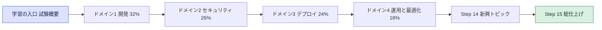

### 0.4 受験者像と「やらなくてよいこと」

試験ガイドは、対象受験者が次のことを求められないと明記しています(範囲外の業務)。

| 範囲外の業務 | 学習の考え方 |
|---|---|
| アーキテクチャの設計(分散システム、マイクロサービス、DBスキーマ設計など) | パターンの「違いを説明できる」までで十分。ゼロから設計する力までは問われない |
| CI/CD パイプラインの設計と作成 | 「使って」デプロイできることが中心 |
| IAM ユーザー・グループの管理 | 開発者として必要な権限の理解は必要 |
| サーバー・OS の管理 | マネージドサービスの利用が前提 |
| AWS ネットワーク基盤の設計(VPC、Direct Connect など) | Lambda から VPC 内リソースへ届く仕組みの理解までは必要 |

推奨される前提知識:
- 高水準プログラミング言語を1つ以上扱える(Python、JavaScript など)
- アプリケーションのライフサイクル管理の理解
- AWS SDK、AWS CLI、サービスAPIによる開発とセキュリティ確保
- CI/CD パイプラインを使った AWS へのデプロイ

出典:
- https://docs.aws.amazon.com/aws-certification/latest/developer-associate-02/developer-associate-02.html

### 0.5 試験範囲のサービス一覧(In-Scope)

公式の範囲内サービス一覧(非網羅・変更の可能性あり)を、本ガイドの章に対応づけました。

| カテゴリ | サービス | 主な章 |
|---|---|---|
| Analytics | Amazon Athena / Amazon Kinesis / Amazon OpenSearch Service | Step 2, 4 |
| Application Integration | AWS AppSync / Amazon EventBridge / Amazon SNS / Amazon SQS / AWS Step Functions | Step 1, 2 |
| Compute | Amazon EC2 / AWS Elastic Beanstalk / AWS Lambda | Step 3, 11 |
| Containers | Amazon ECR / Amazon ECS / Amazon EKS | Step 8, 11 |
| Database | Amazon Aurora / Amazon DynamoDB / Amazon ElastiCache / Amazon RDS | Step 4 |
| Developer Tools | AWS Amplify / AWS CloudShell / AWS CodeArtifact / AWS CodeBuild / AWS CodeDeploy / AWS CodePipeline / AWS X-Ray / Amazon Q Developer | Step 8〜12 |
| Management and Governance | AWS AppConfig / AWS CDK / AWS CloudFormation / AWS CloudTrail / Amazon CloudWatch / AWS CLI / AWS Systems Manager | Step 8〜12 |
| Networking and Content Delivery | Amazon API Gateway / Amazon CloudFront / Elastic Load Balancing / Amazon Route 53 / Amazon VPC | Step 2, 3, 13 |
| Security, Identity, and Compliance | Amazon Cognito / AWS IAM / AWS KMS / AWS Secrets Manager / AWS STS / AWS WAF | Step 5〜7 |
| Storage | Amazon EBS / Amazon EFS / Amazon S3 | Step 4, 6 |

注意: 一覧にないサービス(例: AWS CodeCommit)は「公式の範囲内リストに載っていない」という意味です。問題文に登場する可能性まで否定するものではないため、概念レベルの理解は持っておくと安心です。

出典:
- https://docs.aws.amazon.com/aws-certification/latest/developer-associate-02/dva-02-in-scope-services.html

### 0.6 この教材の読み方

各 Step は次の順で書かれています。

1. ゴール(その Step で何ができるようになるか)
2. 対応する試験スキル(試験ガイドの番号)
3. かんたん解説から詳細へ
4. 図と表
5. ベストプラクティス
6. 試験での狙われどころ
7. 出典 URL

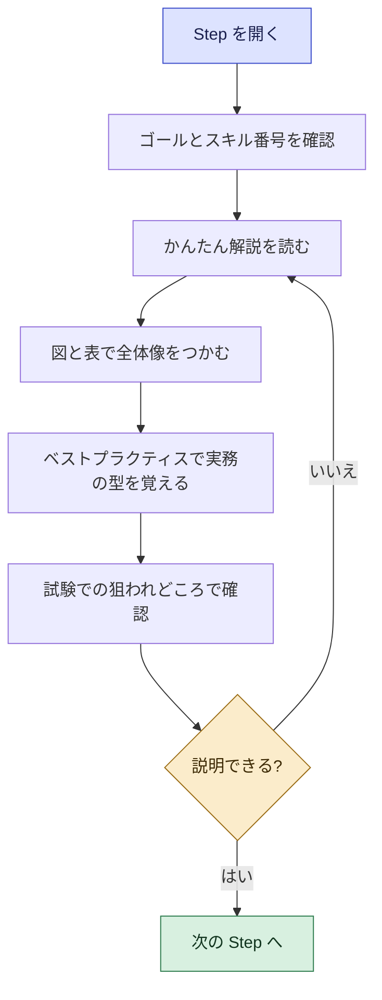

### 0.7 ハンズオンのすすめ

開発者向け試験は「実際に触った経験」が正答率に直結します。次の最小セットを自分の AWS アカウントで動かしてください(無料利用枠の範囲で収まる構成を意識し、終わったら必ず削除します)。

1. Lambda + API Gateway + DynamoDB の簡単な REST API を AWS SAM で作る
2. SQS を Lambda のイベントソースにし、DLQ を付けて失敗を再現する
3. Cognito ユーザープールで API Gateway を保護する
4. KMS と Secrets Manager で秘密情報を扱う
5. CodePipeline + CodeBuild + CodeDeploy で自動デプロイし、ロールバックを体験する
6. CloudWatch Logs Insights と X-Ray でエラーの原因を追う

---

# ドメイン1 Development with AWS Services(32%)

## Step 1 アーキテクチャパターンの基礎

### ゴール
アプリケーションの「作り方の型」を言葉で説明でき、問題文のシナリオからどの型が合うかを選べるようになります。

### 対応する試験スキル

| スキル | 内容 |
|---|---|
| 1.1.1 | アーキテクチャパターン(イベント駆動、マイクロサービス、モノリス、コレオグラフィ、オーケストレーション、ファンアウト) |
| 1.1.2 | ステートフルとステートレスの違い |
| 1.1.3 | 密結合と疎結合の違い |
| 1.1.4 | 同期と非同期の違い |
| 1.1.12 | Amazon EventBridge によるイベント駆動パターン |

### 1.1 アーキテクチャパターン(スキル 1.1.1)

| パターン | かんたん説明 | AWS での代表例 |
|---|---|---|
| モノリス | 1つのプログラムに全機能を詰め込む | EC2 や Elastic Beanstalk 上の単一アプリ |
| マイクロサービス | 機能ごとに小さく分け、API やメッセージで連携する | API Gateway + Lambda、ECS、EKS |
| イベント駆動 | 「何かが起きた」という通知(イベント)を合図に処理する | S3 イベント、EventBridge、DynamoDB Streams |
| コレオグラフィ | 各サービスがイベントを見て自律的に動く(指揮者がいない) | EventBridge のルールで各サービスが反応 |
| オーケストレーション | 指揮者が順番と分岐を管理する | AWS Step Functions |
| ファンアウト | 1つのメッセージを複数の宛先へ同時に配る | SNS から複数の SQS キューへ |

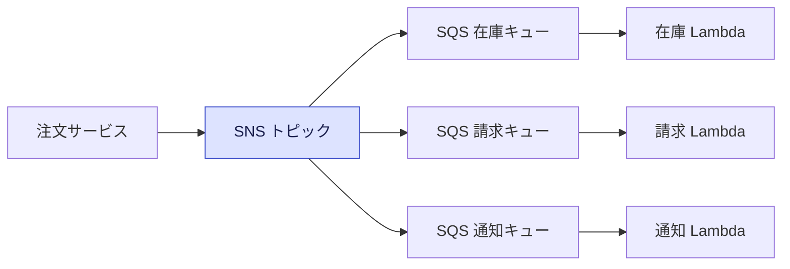

コレオグラフィとオーケストレーションの選び方:

| 観点 | コレオグラフィ | オーケストレーション |
|---|---|---|
| 制御 | 分散(各サービスが判断) | 集中(Step Functions が判断) |
| 流れの見える化 | 追いにくい | 実行履歴で一目瞭然 |
| エラー処理・再試行 | 各サービスで実装 | Retry / Catch で宣言的に書ける |
| 向いている場面 | 疎結合を最優先、小さな連携 | 順序・分岐・補償処理がある業務フロー |

ベストプラクティス:
- 最初から過剰に分割せず、変更頻度やスケール特性が違う単位で分ける。
- 処理順序や失敗時の補償が重要な長い業務フローは、Step Functions でオーケストレーションする。
- サービス間の通知は、直接呼び出しではなくキューやイベントを介して疎結合にする。

### 1.2 ステートフルとステートレス(スキル 1.1.2)

| 観点 | ステートレス | ステートフル |
|---|---|---|
| 状態の置き場所 | アプリの外(DynamoDB、ElastiCache、S3 など) | アプリのメモリやローカルディスク |
| スケールアウト | 容易(どのインスタンスでも同じ結果) | 難しい(セッションの引き継ぎが必要) |
| 障害時 | 別インスタンスへ即切り替え | 状態が失われる恐れ |

- Lambda は実行環境が使い回されたり破棄されたりするため、メモリや `/tmp` に保存した内容は「たまたま残るキャッシュ」と考え、永続データは外部ストアへ置きます。
- Web アプリのセッション情報は、ElastiCache や DynamoDB に置くとステートレスなアプリ層にできます。

### 1.3 密結合と疎結合(スキル 1.1.3)

| 観点 | 密結合 | 疎結合 |
|---|---|---|
| 呼び出し | 相手を直接同期呼び出し | キュー・イベントを介する |
| 障害の波及 | 相手が落ちると自分も止まる | バッファされ、自分は動き続ける |
| スケール | 相手の性能に合わせる必要 | それぞれ独立に伸縮 |
| AWS の部品 | 直接 API 呼び出し | SQS、SNS、EventBridge、Kinesis |

### 1.4 同期と非同期(スキル 1.1.4)

| 観点 | 同期 | 非同期 |
|---|---|---|
| 応答 | 処理完了まで待つ | 受付だけ返し、後で処理 |
| 例 | API Gateway から Lambda を同期呼び出し(RequestResponse) | S3 イベントから Lambda、SQS 経由の処理 |
| エラー処理 | 呼び出し側にエラーが返る | DLQ や Destinations で別途扱う |
| 向く用途 | ユーザーが結果を待つ画面操作 | 重い処理、バッチ、通知 |

Lambda の呼び出しタイプ:

| 呼び出しタイプ | 代表的な呼び出し元 | 失敗時の扱い |
|---|---|---|
| 同期 | API Gateway、ALB、SDK(RequestResponse) | 呼び出し元がリトライを判断する |
| 非同期 | S3、SNS、EventBridge、SDK(Event) | Lambda が最大2回まで自動再試行(既定)、DLQ や Destinations へ |
| イベントソースマッピング(ポーリング) | SQS、Kinesis、DynamoDB Streams | ソースの種類ごとの再試行・バッチ設定に従う |

ベストプラクティス:
- ユーザーを待たせる必要のない処理は非同期にして、応答性と耐障害性を上げる。
- 非同期処理には必ず失敗時の受け皿(DLQ または Destinations)を用意する。

### 1.5 Amazon EventBridge でイベント駆動(スキル 1.1.12)

EventBridge は、イベントを受け取って「ルール」で振り分け、ターゲットへ届けるサーバーレスのイベントバスです。

| 用語 | 意味 |
|---|---|
| イベントバス | イベントの受け皿(既定のバス、カスタムバス、パートナーバス) |
| ルール | イベントパターンまたはスケジュールに一致したら、ターゲットへ送る条件 |
| ターゲット | Lambda、SQS、SNS、Step Functions などの送り先 |
| イベントパターン | JSON でイベントの条件を書く(コンテンツベースのフィルタ) |
| アーカイブとリプレイ | 過去のイベントを保存し、あとで再送する |
| スケジュール | cron や rate で定期実行する(EventBridge Scheduler も利用可能) |

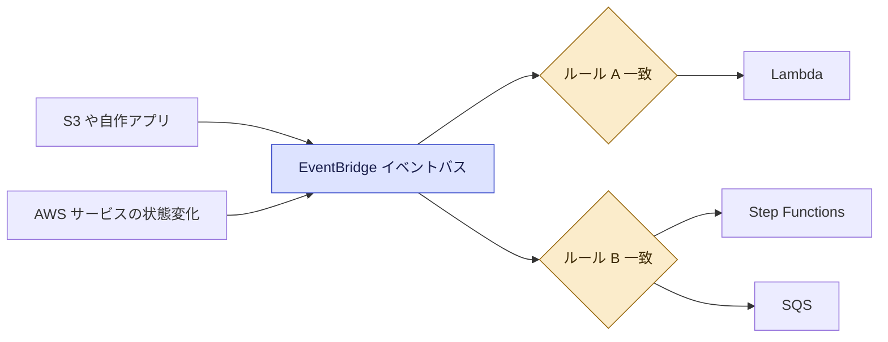

ベストプラクティス:
- 生産者はイベントを投げるだけにし、誰が受け取るかは知らない設計にする(疎結合)。
- イベントパターンで絞り込み、ターゲット側で不要なイベントを処理しない。
- ターゲットの失敗に備えて、再試行ポリシーと DLQ を設定する。
- 重要なイベントはアーカイブを有効にしておくと、障害後に再送できる。

### 試験での狙われどころ(Step 1)
- 「1つのイベントを複数のコンシューマーへ」と来たら SNS + SQS のファンアウト、または EventBridge。
- 「順序・分岐・再試行を含むワークフロー」と来たら Step Functions。
- 「セッション情報でスケールアウトが難しい」と来たら、状態を外部ストアへ出してステートレス化。

出典:
- https://docs.aws.amazon.com/eventbridge/latest/userguide/eb-what-is.html
- https://docs.aws.amazon.com/step-functions/latest/dg/welcome.html
- https://docs.aws.amazon.com/sns/latest/dg/sns-sqs-as-subscriber.html
- https://docs.aws.amazon.com/lambda/latest/dg/lambda-invocation.html
- https://docs.aws.amazon.com/wellarchitected/latest/serverless-applications-lens/welcome.html

---

## Step 2 耐障害性・API・メッセージング・ストリーミング

### ゴール
壊れにくいコードを書き、API とメッセージング、ストリーミングを AWS SDK から安全に使えるようになります。

### 対応する試験スキル

| スキル | 内容 |
|---|---|
| 1.1.5 | 耐障害性・回復力のあるアプリケーションをコードで作る |
| 1.1.6 | API の作成・拡張・保守(リクエスト/レスポンス変換、検証ルール、ステータスコード上書き) |
| 1.1.7 | 開発環境でのユニットテストの作成と実行(AWS SAM など) |
| 1.1.8 | メッセージングサービスを使うコード |
| 1.1.9 | API と AWS SDK による AWS サービス操作 |
| 1.1.10 | ストリーミングデータの処理 |
| 1.1.11 | Amazon Q Developer による開発支援 |
| 1.1.13 | サードパーティ連携の回復力(再試行、サーキットブレーカー、エラー処理) |

### 2.1 耐障害性の基本: タイムアウト・再試行・バックオフ・ジッター・サーキットブレーカー(スキル 1.1.5, 1.1.13)

| 技法 | 役割 | 注意点 |
|---|---|---|
| タイムアウト | 応答のない呼び出しを打ち切る | 上位のタイムアウトより短くする |
| 再試行 | 一時的な失敗をやり直す | 回数に上限を付ける |
| 指数バックオフ | 再試行の間隔を 1秒、2秒、4秒のように伸ばす | 相手の回復時間を稼ぐ |
| ジッター | 待ち時間にランダムなゆらぎを加える | 再試行が一斉に集中するのを防ぐ |
| サーキットブレーカー | 失敗が続いたら一定時間呼び出しを止める | 相手と自分の両方を守る |
| 冪等性 | 同じ要求を何度送っても結果が同じ | 再試行を安全にする前提条件 |

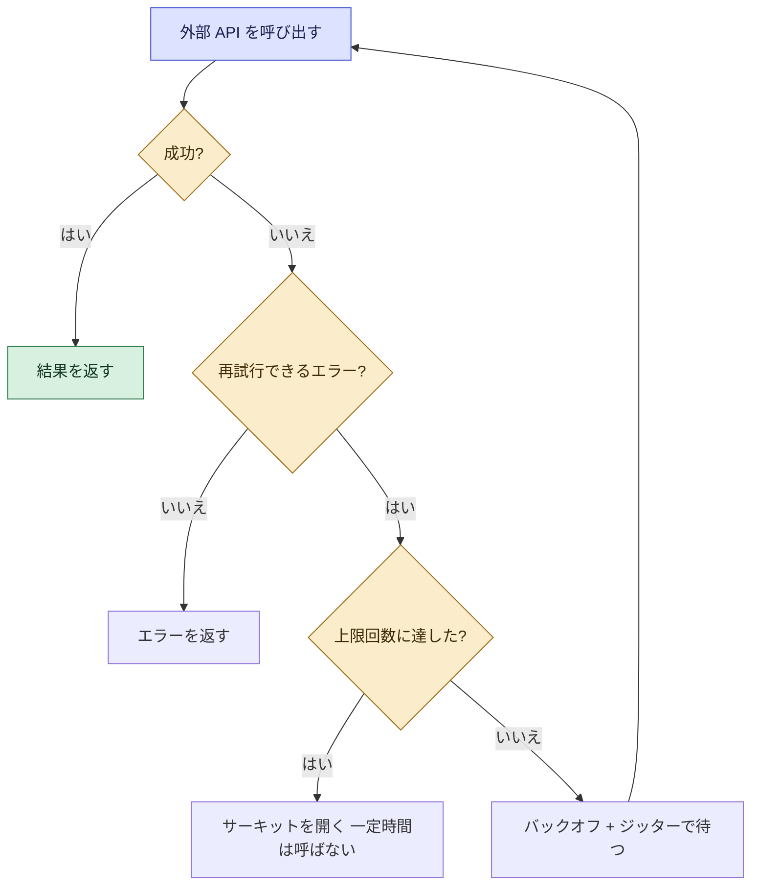

```python
import random
import time

def call_with_retry(func, max_attempts=5, base=0.2, cap=5.0):
    """指数バックオフとフルジッターで再試行する簡易例。"""
    for attempt in range(1, max_attempts + 1):
        try:
            return func()
        except TemporaryError:          # 再試行可能な例外だけを捕まえる
            if attempt == max_attempts:
                raise
            sleep_sec = random.uniform(0, min(cap, base * (2 ** attempt)))
            time.sleep(sleep_sec)
```

- AWS SDK は既定で再試行とバックオフを内蔵しています。自前で実装する前に、SDK のリトライ設定(最大試行回数、モード)を確認します。
- 4xx 系のクライアントエラー(入力ミスや権限不足)は再試行しても治りません。再試行するのは、スロットリングや 5xx など一時的なエラーです。

ベストプラクティス:
- 再試行は「指数バックオフ + ジッター + 上限回数」をセットで使う。
- 再試行される前提で、書き込み処理は冪等にする(冪等キー、条件付き書き込み)。Lambda では Powertools for AWS Lambda の冪等性ユーティリティが使える。
- サードパーティ API には明示的なタイムアウトと、失敗が続いたときの代替応答(フォールバック)を用意する。

### 2.2 API を作る・育てる(スキル 1.1.6)

Amazon API Gateway の API タイプ:

| タイプ | 特徴 | 向く用途 |
|---|---|---|
| REST API | 機能が豊富(リクエスト検証、マッピングテンプレート、使用量プラン、キャッシュ、WAF 連携など) | 機能を使い込む本格的な API |
| HTTP API | 軽量・低コスト・低レイテンシ | シンプルなプロキシ型 API |
| WebSocket API | 双方向のリアルタイム通信 | チャット、通知 |

試験ガイドが挙げる「変換・検証・ステータス上書き」を REST API で実現する場所:

| やりたいこと | 使う機能 | 設定場所 |
|---|---|---|
| リクエストの形式を検証する | リクエストバリデータ + モデル(JSON スキーマ) | メソッドリクエスト |
| リクエストをバックエンド向けに変換する | マッピングテンプレート(VTL) | 統合リクエスト |
| レスポンスを整形する | マッピングテンプレート | 統合レスポンス |
| ステータスコードを上書きする | 統合レスポンスのステータスコードマッピング、またはゲートウェイレスポンス | 統合レスポンス / ゲートウェイレスポンス |
| 認証を付ける | IAM 認証、Cognito オーソライザー、Lambda オーソライザー | メソッドリクエスト |

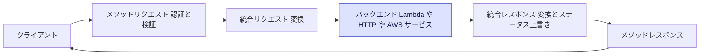

統合タイプ:

| 統合 | 説明 |
|---|---|
| Lambda プロキシ統合 | リクエスト全体をそのまま Lambda へ渡し、Lambda が決まった形式でレスポンスを返す。最も簡単で一般的 |
| Lambda 非プロキシ統合(カスタム統合) | マッピングテンプレートで入出力を自分で変換する |
| HTTP 統合 | 既存の HTTP エンドポイントを裏側につなぐ |
| AWS サービス統合 | Lambda を介さず DynamoDB や SQS などを直接呼ぶ |
| モック統合 | バックエンドなしで固定応答を返す(開発初期の確認に便利) |

Lambda プロキシ統合のレスポンス形式(これを守らないと 502 になる):

```python
def handler(event, context):
    return {
        "statusCode": 200,
        "headers": {"Content-Type": "application/json"},
        "body": "{\"message\": \"ok\"}",   # body は文字列
    }
```

ベストプラクティス:
- 入力検証は API Gateway のバリデータで先に弾き、バックエンドの負荷とコストを減らす。
- API の変更は後方互換を保ち、破壊的変更は新しいステージやパスで提供する。
- 502 Bad Gateway が出たら、まず Lambda の戻り値の形式を疑う。

### 2.3 開発環境でのユニットテスト(スキル 1.1.7)

AWS SAM CLI はローカル開発を助けます。

| コマンド | 役割 |
|---|---|
| `sam init` | プロジェクトの雛形を作る |
| `sam build` | 依存関係を含めてビルドする |
| `sam local invoke` | Lambda 関数をローカルで1回実行する |
| `sam local start-api` | ローカルで API Gateway を模した HTTP サーバーを立てる |
| `sam local generate-event` | S3、SQS、API Gateway などのテストイベントを生成する |
| `sam validate` | テンプレートの文法を検証する |

ユニットテストのコツ:
- ハンドラーとビジネスロジックを分け、ロジックは AWS に依存せずテストできるようにする。
- AWS SDK 呼び出しは、テストではモックやスタブ(例: Python の `unittest.mock`、`moto`)に差し替える。
- 本物の AWS を使う確認は、統合テストとして分けて実施する(Step 9 で扱う)。

### 2.4 メッセージングサービスを使う(スキル 1.1.8)

#### Amazon SQS(キュー)

| 項目 | Standard キュー | FIFO キュー |
|---|---|---|
| 配信保証 | 少なくとも1回(重複あり得る) | 正確に1回の処理 |
| 順序 | ベストエフォート | メッセージグループ内で厳密 |
| スループット | ほぼ無制限 | 制限あり(バッチやハイスループットモードで拡大) |
| 向く用途 | 大量処理、順序不要 | 順序が必要、重複排除が必要 |

SQS で覚える設定値:

| 設定 | 内容 |
|---|---|
| 可視性タイムアウト | 受信したメッセージが他のコンシューマーから見えなくなる時間。既定30秒、最大12時間 |
| メッセージ保持期間 | 既定4日、1分〜14日 |
| ロングポーリング | `WaitTimeSeconds` を最大20秒にして、空振りの API 呼び出しとコストを減らす |
| 遅延キュー | 配信を最大15分遅らせる |
| デッドレターキュー(DLQ) | `maxReceiveCount` 回受信しても処理できないメッセージの退避先 |
| メッセージサイズ | 従来は256KB。大きなデータは S3 に置き、参照だけ送る(Extended Client Library)。上限の最新値はクォータで確認 |

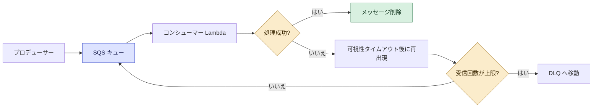

```python
import boto3

sqs = boto3.client("sqs")
queue_url = "https://sqs.ap-northeast-1.amazonaws.com/123456789012/my-queue"

# 送信
sqs.send_message(QueueUrl=queue_url, MessageBody="hello")

# 受信(ロングポーリング)
resp = sqs.receive_message(
    QueueUrl=queue_url,
    MaxNumberOfMessages=10,
    WaitTimeSeconds=20,
)
for m in resp.get("Messages", []):
    # ... 処理 ...
    sqs.delete_message(QueueUrl=queue_url, ReceiptHandle=m["ReceiptHandle"])  # 成功したら必ず削除
```

ベストプラクティス:
- 可視性タイムアウトは、処理時間より十分長くする。Lambda をコンシューマーにする場合、AWS は関数タイムアウトの6倍以上を推奨している。
- Standard キューは重複が起こり得るので、処理を冪等にする。
- すべてのキューに DLQ を付け、DLQ のメッセージ数にアラームを設定する。
- ロングポーリングを使う。
- Lambda のバッチ処理で一部だけ失敗したときは、部分バッチ応答(`batchItemFailures`)で失敗分だけ戻す。

#### Amazon SNS(トピック)

| 項目 | 内容 |
|---|---|
| モデル | パブリッシュ/サブスクライブ(1対多) |
| 購読先 | SQS、Lambda、HTTP/S、メール、SMS、モバイルプッシュ |
| フィルタポリシー | サブスクリプションごとに、メッセージ属性(または本文)の条件で受信するメッセージを絞る |
| FIFO トピック | 順序と重複排除が必要なとき(SQS FIFO と組み合わせる) |

SNS と SQS の使い分け:

| 観点 | SNS | SQS |
|---|---|---|
| 配信モデル | プッシュ(1対多) | プル(1つのキューを複数コンシューマーが分け合う) |
| メッセージの保管 | 保管しない(配信を試みる) | キューに保持される |
| 典型的な組み合わせ | SNS のあとに SQS を並べてファンアウト | SNS からの受け皿として使う |

### 2.5 AWS SDK と API で AWS を操作する(スキル 1.1.9)

- すべての AWS サービスは API として提供され、AWS CLI と各言語の SDK(boto3、AWS SDK for JavaScript など)はその API のラッパーです。
- 認証情報は、SDK が決まった順序で自動的に探します(認証情報プロバイダーチェーン)。

認証情報の探索順(概念の順序。言語により細部は異なる):

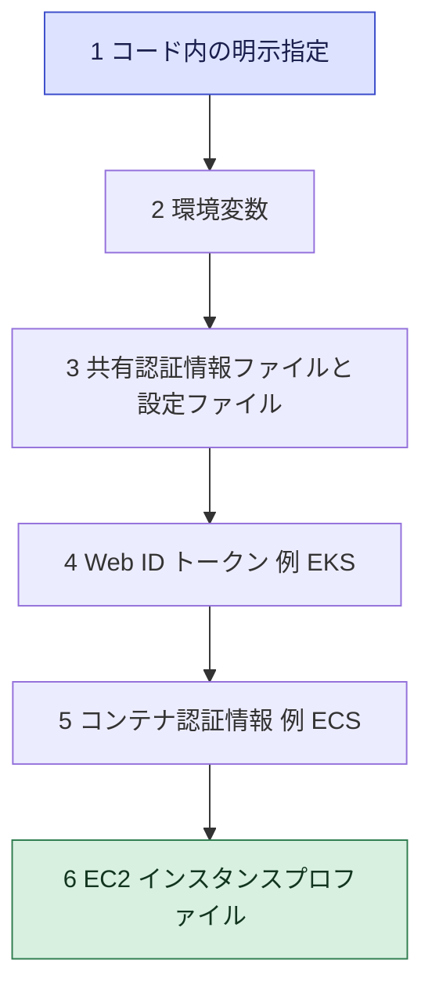

- Lambda の関数コードは、実行ロールの一時認証情報が環境変数として自動提供されるため、コードにキーを書く必要はありません。

ベストプラクティス:
- アクセスキーをコードやリポジトリに書かない。実行環境(Lambda、ECS、EC2)にはロールを付ける。
- クライアントはハンドラーの外で1回だけ作って使い回す(接続の再利用)。
- ページネーションに対応する(`NextToken`、`LastEvaluatedKey`、Paginator)。
- リージョンを明示する。

### 2.6 ストリーミングデータの処理(スキル 1.1.10)

Amazon Kinesis Data Streams の基礎:

| 用語 | 意味 |
|---|---|
| ストリーム | データを時系列で流すパイプ |
| シャード | ストリームの処理単位。1シャードあたり書き込み 1MB/秒 または 1,000レコード/秒、読み取り 2MB/秒 |
| パーティションキー | どのシャードにレコードを入れるかを決めるキー。同じキーは同じシャードで順序保証 |
| 保持期間 | 既定24時間、最大365日 |
| コンシューマー | Lambda(イベントソースマッピング)、KCL アプリ、拡張ファンアウトなど |

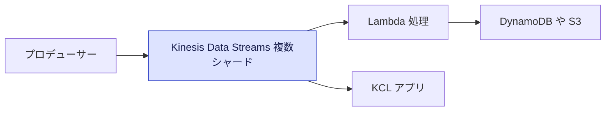

SQS と Kinesis の使い分け:

| 観点 | SQS | Kinesis Data Streams |
|---|---|---|
| 目的 | メッセージの受け渡しと負荷平準化 | 順序のあるストリームの連続処理 |
| 消費後 | 処理したら削除 | 保持期間中は何度でも再読み取り可能 |
| 順序 | FIFO で担保 | シャード内で担保 |
| 複数コンシューマー | 1メッセージは基本1コンシューマー | 同じデータを複数のコンシューマーが読める |

ベストプラクティス:
- パーティションキーは高カーディナリティにして、特定シャードへの偏り(ホットシャード)を避ける。
- `ProvisionedThroughputExceededException` が出たら、シャード追加や再試行(バックオフ)で対応する。
- Lambda をコンシューマーにするときは、バッチサイズ、並列度(ParallelizationFactor)、失敗時の分割再試行(BisectBatchOnFunctionError)、失敗先(Destinations)を設計する。

### 2.7 Amazon Q Developer で開発を支援する(スキル 1.1.11)

Amazon Q Developer は、IDE やコマンドラインで、コード生成・説明・デバッグ支援・テスト生成・セキュリティスキャンなどを助ける AI アシスタントです。

| 使い方 | 例 |
|---|---|
| コード補完と生成 | コメントや関数名からコードを提案する |
| コードの説明・改善 | 既存コードの意味や改善案を聞く |
| テスト生成 | ユニットテストの雛形を作る(Step 9 参照) |
| セキュリティスキャン | 脆弱性の指摘を受ける |

ベストプラクティス:
- 生成コードは必ずレビューし、テストと脆弱性スキャンを通してから採用する。
- 機密情報(認証情報、個人情報)をプロンプトに貼らない。

### 試験での狙われどころ(Step 2)
- 「一時的なエラーの再試行」と来たら、指数バックオフ + ジッター。
- 「処理が重複して実行される」と来たら、冪等性を確保する(Standard キューは少なくとも1回配信)。
- 「順序保証が必要」と来たら SQS FIFO(メッセージグループ)または Kinesis(同一パーティションキー)。
- 「API Gateway で 502」と来たら、Lambda プロキシのレスポンス形式を確認。
- 「失敗したメッセージを退避して調査」と来たら DLQ。

出典:
- https://docs.aws.amazon.com/general/latest/gr/api-retries.html
- https://aws.amazon.com/builders-library/timeouts-retries-and-backoff-with-jitter/
- https://docs.aws.amazon.com/apigateway/latest/developerguide/welcome.html
- https://docs.aws.amazon.com/apigateway/latest/developerguide/api-gateway-request-validation.html
- https://docs.aws.amazon.com/serverless-application-model/latest/developerguide/what-is-sam.html
- https://docs.aws.amazon.com/AWSSimpleQueueService/latest/SQSDeveloperGuide/sqs-best-practices.html
- https://docs.aws.amazon.com/AWSSimpleQueueService/latest/SQSDeveloperGuide/sqs-dead-letter-queues.html
- https://docs.aws.amazon.com/sns/latest/dg/sns-message-filtering.html
- https://docs.aws.amazon.com/sdkref/latest/guide/standardized-credentials.html
- https://docs.aws.amazon.com/streams/latest/dev/introduction.html
- https://docs.aws.amazon.com/amazonq/latest/qdeveloper-ug/what-is.html

---

## Step 3 AWS Lambda を使いこなす

### ゴール
Lambda の設定項目の意味と、失敗・性能・VPC まわりの動きを説明できるようになります。

### 対応する試験スキル

| スキル | 内容 |
|---|---|
| 1.2.1 | Lambda コードから VPC 内のプライベートリソースへアクセスする仕組み |
| 1.2.2 | 環境変数とパラメータの設定(メモリ、同時実行、タイムアウト、ランタイム、ハンドラー、レイヤー、拡張機能、トリガー、デスティネーション) |
| 1.2.3 | イベントのライフサイクルとエラー処理(Destinations、DLQ) |
| 1.2.4 | AWS サービスとツールを使ったテストコードの作成と実行 |
| 1.2.5 | Lambda と AWS サービスの統合 |
| 1.2.6 | 最適なパフォーマンスのためのチューニング |
| 1.2.7 | ほぼリアルタイムのデータ処理と変換 |

### 3.1 Lambda の基本モデル

- Lambda は、コードをアップロードすると、イベントが来たときだけ実行されるサーバーレスのコンピューティングです。
- 呼び出しごとに「実行環境」が用意されます。初回は準備(初期化)が必要で、これをコールドスタートと呼びます。同じ環境が再利用されると準備が省かれます(ウォームスタート)。

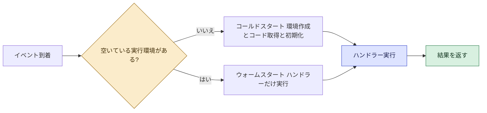

### 3.2 設定項目(スキル 1.2.2)

| 設定 | 内容と覚えどころ |
|---|---|
| ランタイム | Python、Node.js、Java、.NET、Ruby、またはコンテナイメージ |
| ハンドラー | 呼び出される関数の場所(例: `app.handler` はファイル `app` の関数 `handler`) |
| メモリ | 128MB〜10,240MB。CPU 性能はメモリに比例して割り当てられる |
| タイムアウト | 最大900秒(15分) |
| 環境変数 | キーと値の設定。合計4KBまで。機密値は暗号化や Secrets Manager を使う(Step 7) |
| 一時ストレージ(`/tmp`) | 512MB〜10,240MB |
| 実行ロール | Lambda が AWS サービスを呼ぶための IAM ロール |
| リソースベースポリシー | 誰(どのサービス)が Lambda を呼び出せるかを決める |
| レイヤー | 共通ライブラリを別パッケージにして複数関数で共有。1関数に最大5つ |
| 拡張機能(Extensions) | 監視・セキュリティ・設定取得などを関数の隣で動かす仕組み |
| トリガー | S3、SNS、API Gateway、EventBridge など呼び出し元 |
| デスティネーション | 非同期呼び出しの成功時・失敗時の送り先 |
| バージョンとエイリアス | バージョンは不変のスナップショット。エイリアスはバージョンを指す名前(重み付けで段階移行も可能) |

デプロイパッケージの目安:

| 方式 | 上限の目安 |
|---|---|
| .zip を直接アップロード | 50MB(圧縮時) |
| .zip(展開後、レイヤー込み) | 250MB |
| コンテナイメージ | 10GB(ECR のイメージを使う) |

最新のクォータは公式ページで確認してください。

### 3.3 同時実行(Concurrency)

| 種類 | 意味 | 使いどころ |
|---|---|---|
| アカウント同時実行 | リージョンごとの合計上限(既定1,000、引き上げ申請可) | 全体の上限を把握する |
| 予約済み同時実行(Reserved) | 関数専用に枠を確保し、同時に上限も設ける | 重要関数の枠を守る、下流を守るために上限を設ける |
| プロビジョニング済み同時実行(Provisioned) | 実行環境を事前に初期化しておく(有料) | コールドスタートを避けたい低レイテンシ要件 |

- 同時実行数は、おおまかに「1秒あたりのリクエスト数 × 平均処理時間(秒)」で見積もれます。
- 上限に達すると、同期呼び出しは 429(スロットリング)エラーになります。

### 3.4 VPC 内のプライベートリソースへのアクセス(スキル 1.2.1)

- 既定の Lambda は、AWS が管理するネットワーク上で動き、VPC 内のプライベートなリソース(RDS、ElastiCache、内部 ALB など)には届きません。
- 届かせたいときは、関数に VPC の「サブネット」と「セキュリティグループ」を設定します。すると Lambda が VPC 内にネットワークインターフェースを使ってつながります。

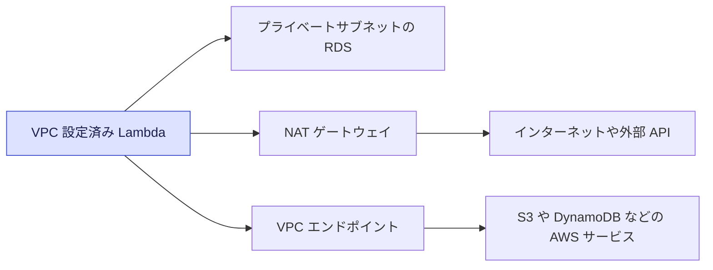

| よくある困りごと | 原因 | 対処 |
|---|---|---|
| VPC に入れたらインターネットや AWS API に出られない | VPC 内の Lambda にはパブリック IP が付かない | NAT ゲートウェイ、または VPC エンドポイントを用意する |
| 関数作成時に権限エラー | ネットワークインターフェース操作の権限不足 | 実行ロールに VPC アクセス用のポリシー(`AWSLambdaVPCAccessExecutionRole`)を付ける |
| DB への接続数が増えすぎる | 同時実行ぶんだけ接続が増える | RDS Proxy で接続をプールする |

ベストプラクティス:
- VPC 内リソースにアクセスする必要がない関数は、VPC に入れない。
- 複数のアベイラビリティゾーンにまたがる複数のサブネットを指定する。
- AWS サービスへは VPC エンドポイントを使うと、NAT のコストと経路を減らせる。

### 3.5 イベントのライフサイクルとエラー処理(スキル 1.2.3)

呼び出し方式ごとの失敗時の動きを整理します。

| 呼び出し方式 | 失敗時の動き | 設定できる受け皿 |
|---|---|---|
| 同期 | エラーを呼び出し元へ返す(再試行は呼び出し元の責任) | 呼び出し元で対応 |
| 非同期 | Lambda が自動で再試行(既定2回、0〜2で設定) | DLQ(SQS/SNS)または Destinations |
| SQS イベントソース | 処理失敗なら可視性タイムアウト後に再出現し、キュー側の DLQ へ | キュー側に DLQ を設定 |
| Kinesis / DynamoDB Streams | 成功するかレコードの保持期限が切れるまで再試行しがち | 最大再試行回数、最大レコード年齢、バッチ分割、失敗時デスティネーション |

DLQ と Destinations の違い:

| 観点 | DLQ | Destinations |
|---|---|---|
| 対象 | 失敗のみ | 成功と失敗の両方 |
| 送り先 | SQS、SNS | SQS、SNS、Lambda、EventBridge など |
| 送られる内容 | イベント本体(ペイロード) | 実行結果の情報(レコード)を含む |
| 推奨度 | 従来方式 | 新しい設計では Destinations が推奨されることが多い |

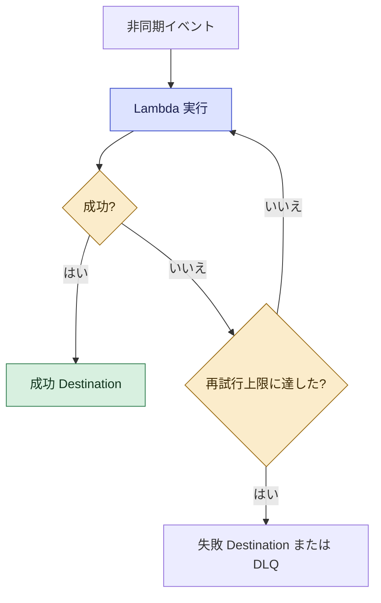

ベストプラクティス:
- 非同期呼び出しには、失敗の受け皿(Destinations か DLQ)を必ず付ける。
- 同じイベントが複数回届く可能性があるので、ハンドラーを冪等にする。
- SQS をトリガーにするときは、部分バッチ応答を有効にして、失敗したメッセージだけを戻す。

### 3.6 テストする(スキル 1.2.4)

| 方法 | 内容 |
|---|---|
| コンソールのテストイベント | JSON を保存して再利用できる |
| `sam local invoke` | ローカルで関数を実行(イベントは `sam local generate-event` で生成) |
| `aws lambda invoke` | CLI から本物の関数を呼ぶ |
| ユニットテスト | ハンドラーから切り離したロジックをテストフレームワークで検証 |
| 統合テスト | デプロイ済みのエイリアスやステージに対して実行 |

### 3.7 AWS サービスとの統合(スキル 1.2.5)

| 統合の方向 | 例 |
|---|---|
| サービス → Lambda(トリガー) | S3 イベント、SNS、EventBridge、API Gateway、ALB |
| Lambda がポーリング(イベントソースマッピング) | SQS、Kinesis、DynamoDB Streams、MSK |
| Lambda → サービス(SDK で呼び出し) | DynamoDB、S3、SQS、Secrets Manager など |

- イベントソースマッピング(ESM)は、Lambda サービスがソースをポーリングし、バッチにまとめて関数を呼び出す仕組みです。バッチサイズやバッチウィンドウ、フィルタ条件を設定できます。
- ESM のフィルタ条件を使うと、不要なイベントで関数を起動せずにコストを減らせます。

### 3.8 パフォーマンスチューニング(スキル 1.2.6)

| 施策 | 効果 |
|---|---|
| メモリを調整する | メモリを増やすと CPU も増え、実行時間が短縮されコストが下がることがある。AWS Lambda Power Tuning で最適値を探せる |
| 初期化コードをハンドラーの外に出す | SDK クライアントや DB 接続を使い回し、ウォーム時の処理を短縮する |
| デプロイパッケージを小さくする | 読み込み時間(コールドスタート)を短縮する |
| 必要な SDK モジュールだけを使う | 不要な依存の読み込みを避ける |
| プロビジョニング済み同時実行 | 事前初期化でコールドスタートを回避 |
| SnapStart | 初期化済みのスナップショットから高速に起動(対応ランタイムのみ) |
| arm64(Graviton) | 対応ランタイムでコスト性能比を改善できる |
| 下流の保護 | 予約済み同時実行や SQS で、DB など下流に負荷をかけすぎない |

```python
import boto3

# ハンドラーの外 = 初期化フェーズ。ウォーム時は再利用される
dynamodb = boto3.resource("dynamodb")
table = dynamodb.Table("Orders")

def handler(event, context):
    # ハンドラー内 = 呼び出しごとに実行される
    item = table.get_item(Key={"orderId": event["orderId"]}).get("Item")
    return {"statusCode": 200, "body": str(item)}
```

### 3.9 ほぼリアルタイムのデータ処理と変換(スキル 1.2.7)

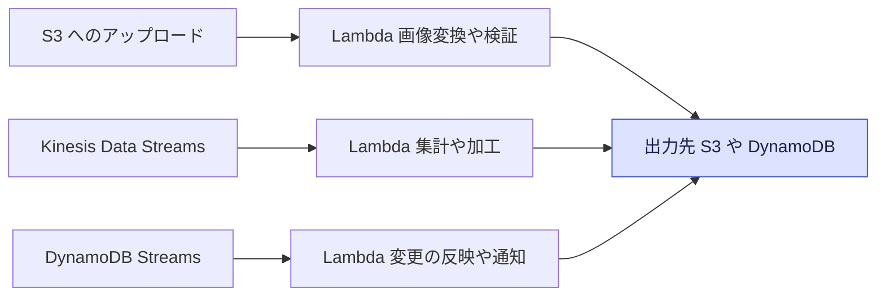

ベストプラクティス:
- ストリームの処理は、順序・再試行・失敗レコードの扱い(Bisect、DLQ 的な失敗先)を最初に決める。
- 変換処理は短時間で終わるよう設計し、重い処理はキューや Step Functions に分ける。

### 試験での狙われどころ(Step 3)
- 「コールドスタートを減らしたい」→ プロビジョニング済み同時実行、SnapStart、初期化コードの外出し、パッケージの縮小。
- 「Lambda から RDS(プライベート)へ接続」→ VPC 設定(サブネット + セキュリティグループ)。インターネットにも出るなら NAT。
- 「DB 接続が枯渇する」→ RDS Proxy。
- 「Lambda の CPU を上げたい」→ メモリを増やす(CPU は単独では設定できない)。
- 「非同期の失敗イベントを保存」→ Destinations(失敗)または DLQ。

出典:
- https://docs.aws.amazon.com/lambda/latest/dg/best-practices.html
- https://docs.aws.amazon.com/lambda/latest/dg/configuration-function-common.html
- https://docs.aws.amazon.com/lambda/latest/dg/lambda-concurrency.html
- https://docs.aws.amazon.com/lambda/latest/dg/configuration-vpc.html
- https://docs.aws.amazon.com/lambda/latest/dg/invocation-async.html
- https://docs.aws.amazon.com/lambda/latest/dg/invocation-eventsourcemapping.html
- https://docs.aws.amazon.com/lambda/latest/dg/gettingstarted-limits.html
- https://docs.aws.amazon.com/lambda/latest/dg/snapstart.html
- https://github.com/aws-samples/aws-lambda-power-tuning

---

## Step 4 データストアをアプリ開発で使う

### ゴール
DynamoDB を中心に、整合性・キー設計・インデックス・キャッシュ・ライフサイクル・特化型データストアの使い分けを説明できるようになります。

### 対応する試験スキル

| スキル | 内容 |
|---|---|
| 1.3.1 | 高カーディナリティなパーティションキーでアクセスを分散する |
| 1.3.2 | データベースの整合性モデル(強い整合性、結果整合性) |
| 1.3.3 | クエリ(Query)とスキャン(Scan)の違い |
| 1.3.4 | DynamoDB のキーとインデックスの定義 |
| 1.3.5 | データのシリアライズとデシリアライズによる永続化 |
| 1.3.6 | データストアの利用・管理・保守 |
| 1.3.7 | データのライフサイクル管理 |
| 1.3.8 | データキャッシュサービスの利用 |
| 1.3.9 | アクセスパターンに応じた特化型データストア(例: OpenSearch Service) |

### 4.1 データストアの選び方

| 要件 | 候補 | ひとこと |
|---|---|---|
| 大規模・低レイテンシのキー値/ドキュメント | Amazon DynamoDB | サーバーレス NoSQL。アクセスパターンを先に決めて設計する |
| 複雑な結合・トランザクションが必要 | Amazon RDS / Aurora | リレーショナル。SQL |
| 画像・ログ・バックアップなどのオブジェクト | Amazon S3 | 容量無制限のオブジェクトストレージ |
| 読み取りを高速化 | ElastiCache、DAX | インメモリキャッシュ |
| 全文検索・ログ分析 | Amazon OpenSearch Service | 検索と分析 |
| S3 上のデータを SQL で分析 | Amazon Athena | サーバーレスのクエリ |

### 4.2 DynamoDB のキーと分散(スキル 1.3.1, 1.3.4)

主キーの種類:

| 種類 | 構成 | 特徴 |
|---|---|---|
| シンプル主キー | パーティションキーのみ | キーで1件を一意に特定 |
| 複合主キー | パーティションキー + ソートキー | 同じパーティションキーの項目をソートキーで並べて範囲検索できる |

- パーティションキーの値(のハッシュ)で、データが保存される物理パーティションが決まります。
- 1パーティションの性能には上限があります(1秒あたり読み取り3,000 読み取りユニット、書き込み1,000 書き込みユニット)。特定のキーにアクセスが偏ると、スロットリングが発生します(ホットパーティション)。

高カーディナリティ(値の種類が多い)なキーの例:

| 良い例 | 悪い例 | 理由 |
|---|---|---|
| ユーザーID、注文ID、デバイスID | 性別、ステータス(数種類だけ) | 値の種類が少ないとアクセスが集中する |
| `日付#シャード番号` のように分散させた値 | 日付だけ(当日の書き込みが全部同じ値) | 同じ日の書き込みが1つのパーティションに集中する |

ベストプラクティス:
- 先にアクセスパターン(どのクエリを何件・何回投げるか)を洗い出してからキーを決める。
- 書き込みが特定キーに集中するときは、キーの末尾にランダムまたは計算したサフィックスを付けて分散する(書き込みシャーディング)。
- 大きなデータ(400KBの項目サイズ上限を超えるもの)は S3 に置き、DynamoDB には参照(URL やキー)だけを持つ。

### 4.3 読み取りの整合性(スキル 1.3.2)

| 種類 | 説明 | DynamoDB での扱い |
|---|---|---|
| 結果整合性のある読み取り | 書いた直後だと古い値が返ることがある。性能が良くコストが半分 | 既定 |
| 強い整合性のある読み取り | 常に最新の値を返す | `ConsistentRead=true` を指定 |
| トランザクション読み取り | ACID を保証する読み取り | `TransactGetItems` |

- 強い整合性の読み取りは、GSI(後述)では使えません。GSI は結果整合性のみです。
- キャパシティ計算の基本(試験でよく出ます):

| 操作 | 1ユニットの量 |
|---|---|
| 読み取り(強い整合性) | 4KBまでを1回/秒 = 1 RCU |
| 読み取り(結果整合性) | 4KBまでを2回/秒 = 1 RCU |
| トランザクション読み取り | 4KBまでを1回/秒 = 2 RCU |
| 書き込み | 1KBまでを1回/秒 = 1 WCU |
| トランザクション書き込み | 1KBまでを1回/秒 = 2 WCU |

計算例: 6KBの項目を強い整合性で読むと、6÷4 を切り上げて 2 RCU。結果整合性なら 1 RCU。3KBの項目を書くと 3 WCU。

### 4.4 Query と Scan(スキル 1.3.3)

| 観点 | Query | Scan |
|---|---|---|
| 動作 | パーティションキー(と任意のソートキー条件)で項目を絞り込む | テーブル全体(またはインデックス全体)を読む |
| 効率 | 高い | 低い(データが多いほど遅くコストが高い) |
| フィルタ | `FilterExpression` は読んだあとに絞るため、消費する RCU は減らない | 同様 |
| 用途 | 通常のアクセス | 小さなテーブル、移行、分析など例外的な場面 |

ベストプラクティス:
- 通常のアクセスは Query にする。Scan が必要になったら、インデックスの追加や設計の見直しを検討する。
- 結果は最大1MBで区切られるため、`LastEvaluatedKey` を使ったページネーションを実装する。
- `ProjectionExpression` で必要な属性だけを取得する。
- やむを得ず Scan するときは、`Limit` や並列スキャンで負荷を制御する。

### 4.5 セカンダリインデックス(スキル 1.3.4)

| 観点 | GSI(グローバルセカンダリインデックス) | LSI(ローカルセカンダリインデックス) |
|---|---|---|
| パーティションキー | 元のテーブルと別のキーを指定できる | 元のテーブルと同じ |
| ソートキー | 別のキーを指定できる | 別のソートキーを指定する |
| 作成のタイミング | いつでも追加・削除できる | テーブル作成時のみ |
| 整合性 | 結果整合性のみ | 強い整合性も選べる |
| 容量 | 専用の読み書きキャパシティ(スロットリングが元テーブルへ波及することがある) | 元テーブルと共有 |
| 数の目安 | 既定で20個まで | 5個まで |

ベストプラクティス:
- インデックスは「そのアクセスパターンが必要なときだけ」作る。書き込みのたびにインデックスにも書き込みが走るため、増やしすぎるとコストが増える。
- インデックスには必要な属性だけを射影(Projection)して、容量とコストを抑える。

### 4.6 DynamoDB のその他の重要機能(スキル 1.3.6)

| 機能 | 概要 |
|---|---|
| オンデマンド / プロビジョニング | 予測しづらい負荷はオンデマンド。予測できる安定した負荷はプロビジョニング(Auto Scaling 併用) |
| 条件付き書き込み | `ConditionExpression` で「存在しないときだけ作成」などを実現する。冪等性と競合制御に有効 |
| アトミックカウンター | `UpdateItem` の `ADD` や `SET x = x + :n` で安全に加算する |
| 楽観的ロック | バージョン番号の属性を条件に更新し、競合を検出する |
| バッチ操作 | `BatchGetItem` は最大100件、`BatchWriteItem` は最大25件。未処理分(`UnprocessedItems`)はバックオフ付きで再試行する |
| トランザクション | `TransactWriteItems` / `TransactGetItems` で複数項目をまとめて ACID 処理する |
| DynamoDB Streams | 項目の変更履歴を24時間保持し、Lambda などで後続処理を行う |
| バックアップ | オンデマンドバックアップと、ポイントインタイムリカバリ(PITR) |
| DAX | DynamoDB 専用のインメモリキャッシュ(後述) |

```python
import boto3
from botocore.exceptions import ClientError

table = boto3.resource("dynamodb").Table("Orders")

# 条件付き書き込み: 同じ orderId がなければ作成(冪等な作成)
try:
    table.put_item(
        Item={"orderId": "o-001", "status": "NEW"},
        ConditionExpression="attribute_not_exists(orderId)",
    )
except ClientError as e:
    if e.response["Error"]["Code"] == "ConditionalCheckFailedException":
        pass  # すでに作成済み
    else:
        raise
```

### 4.7 シリアライズとデシリアライズ(スキル 1.3.5)

- シリアライズは、プログラム内のオブジェクトを保存・送信できる形式(JSON、バイナリなど)へ変換すること。デシリアライズはその逆です。
- DynamoDB の低レベル API では、型を明示した形式(例: 文字列は `{"S": "abc"}`、数値は `{"N": "10"}`)で値をやり取りします。boto3 のリソース API は、この変換を自動で行います。
- Python では DynamoDB の数値が `Decimal` 型になる点に注意が必要です(JSON 化の際に変換が必要)。

| 形式 | 特徴 |
|---|---|
| JSON | 人間が読みやすく、どこでも使える。サイズはやや大きい |
| Protocol Buffers / Avro | バイナリで小さく高速。スキーマ管理が必要 |

ベストプラクティス:
- スキーマの変更(項目の追加など)に耐えられるよう、不明な属性を無視する、新旧どちらも読めるようにするなど後方互換を意識する。
- 機密項目はシリアライズ前後でマスキングや暗号化を検討する(Step 7)。

### 4.8 データストアの利用・管理・保守(スキル 1.3.6)

RDS / Aurora の開発者向けポイント:

| 項目 | 内容 |
|---|---|
| マルチAZ | 可用性向上のための同期レプリケーションと自動フェイルオーバー |
| リードレプリカ | 読み取りの分散(非同期レプリケーションなので結果整合) |
| RDS Proxy | 接続プールで接続数を抑える。Lambda との相性が良い |
| 接続情報 | Secrets Manager で管理し、パスワードのローテーションを自動化する |
| IAM データベース認証 | パスワードの代わりに一時トークンで接続する |

Amazon S3 の開発者向けポイント:

| 項目 | 内容 |
|---|---|
| バージョニング | 上書き・削除から復元できる |
| 署名付き URL | 一時的に特定オブジェクトへのアクセスを許可する |
| マルチパートアップロード | 大きなファイルを分割して並列アップロードする |
| イベント通知 | オブジェクト作成などで Lambda や SQS、EventBridge へ通知する |
| ストレージクラス | アクセス頻度に応じて使い分け、ライフサイクルで自動移行する |

### 4.9 データライフサイクルの管理(スキル 1.3.7)

| 対象 | 仕組み | 内容 |
|---|---|---|
| DynamoDB | TTL(Time to Live) | 期限(エポック秒)の属性を指定すると、期限切れの項目が自動削除される(追加の書き込みコストなし。削除は期限後しばらくしてから行われる) |
| S3 | ライフサイクルルール | 一定期間後に低頻度アクセスクラスやアーカイブへ移行、または削除 |
| ElastiCache | TTL / 退避ポリシー | キーの有効期限、メモリ逼迫時の追い出し |
| CloudWatch Logs | 保持期間 | ロググループごとに保持日数を設定する(未設定だと無期限で保存され続ける) |
| バックアップ | PITR、スナップショット、AWS Backup | 保持期間と世代を決める |

### 4.10 キャッシュサービス(スキル 1.3.8)

| サービス | 特徴 |
|---|---|
| Amazon ElastiCache(Redis 互換 / Memcached) | 汎用のインメモリキャッシュ。セッション保存、DB 結果のキャッシュなど |
| Amazon DynamoDB Accelerator(DAX) | DynamoDB 専用。API 互換でコード変更が少なく、マイクロ秒の読み取り。結果整合性の読み取り向き |
| Amazon CloudFront | コンテンツをエッジでキャッシュ(Step 13) |
| API Gateway キャッシュ | ステージ単位でレスポンスをキャッシュ(Step 13) |

キャッシュ戦略:

| 戦略 | 流れ | 長所と短所 |
|---|---|---|
| 遅延読み込み(Lazy Loading) | キャッシュにあれば返す。なければ DB から読み、キャッシュへ入れる | 必要なデータだけ載る。初回は遅い。古いデータが残り得る |
| ライトスルー(Write-Through) | DB へ書くときにキャッシュにも書く | 常に新しい。使われないデータも載る。書き込みが遅くなる |
| TTL | キャッシュに有効期限を付ける | 古いデータが残り続けるのを防ぐ |

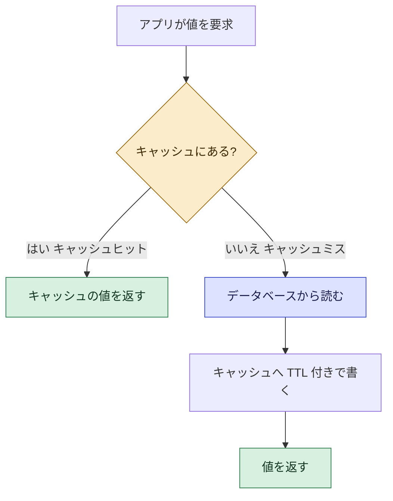

ベストプラクティス:
- キャッシュは「失われても動く」前提で作る(キャッシュ障害時は DB から読む)。
- 古いデータが許されない処理では、書き込み時に該当キャッシュを削除または更新する。
- 機密データをキャッシュに載せる場合は、保存時と転送中の暗号化を有効にする。

### 4.11 特化型データストア(スキル 1.3.9)

| サービス | 向いているアクセスパターン |
|---|---|
| Amazon OpenSearch Service | 全文検索、あいまい検索、ログ分析、ダッシュボード |
| Amazon Athena | S3 上のファイルに対するアドホックな SQL 分析(スキャン量で課金) |
| Amazon ElastiCache | 低レイテンシの読み取り、ランキング、セッション |
| Amazon Aurora | 高性能なリレーショナル(MySQL / PostgreSQL 互換) |

OpenSearch の典型的な組み合わせ: DynamoDB の変更を DynamoDB Streams と Lambda で OpenSearch に反映し、検索は OpenSearch、正本は DynamoDB に持たせる。

### 試験での狙われどころ(Step 4)
- 「特定のパーティションにだけスロットリング」→ 高カーディナリティなキーへの見直し、書き込みシャーディング。
- 「書き込み直後に古い値が返る」→ 強い整合性の読み取りを指定(GSI では不可)。
- 「Scan が遅くコストが高い」→ Query 化、GSI の追加。
- 「一定期間後にデータを自動削除」→ DynamoDB TTL、S3 ライフサイクル。
- 「DynamoDB の読み取りをマイクロ秒に」→ DAX。「汎用キャッシュやセッション」→ ElastiCache。
- 「全文検索」→ OpenSearch Service。

出典:
- https://docs.aws.amazon.com/amazondynamodb/latest/developerguide/bp-partition-key-design.html
- https://docs.aws.amazon.com/amazondynamodb/latest/developerguide/bp-partition-key-uniform-load.html
- https://docs.aws.amazon.com/amazondynamodb/latest/developerguide/HowItWorks.ReadConsistency.html
- https://docs.aws.amazon.com/amazondynamodb/latest/developerguide/bp-query-scan.html
- https://docs.aws.amazon.com/amazondynamodb/latest/developerguide/GSI.html
- https://docs.aws.amazon.com/amazondynamodb/latest/developerguide/LSI.html
- https://docs.aws.amazon.com/amazondynamodb/latest/developerguide/TTL.html
- https://docs.aws.amazon.com/amazondynamodb/latest/developerguide/DAX.html
- https://docs.aws.amazon.com/prescriptive-guidance/latest/dynamodb-data-modeling/best-practices.html
- https://docs.aws.amazon.com/AmazonElastiCache/latest/dg/Strategies.html
- https://docs.aws.amazon.com/AmazonRDS/latest/UserGuide/rds-proxy.html
- https://docs.aws.amazon.com/AmazonS3/latest/userguide/object-lifecycle-mgmt.html
- https://docs.aws.amazon.com/opensearch-service/latest/developerguide/what-is.html
- https://docs.aws.amazon.com/athena/latest/ug/what-is.html

---

# ドメイン2 Security(26%)

## Step 5 認証・認可を実装する

### ゴール
「誰か(認証)」と「何をしてよいか(認可)」の違いを理解し、IAM ロール・STS・Cognito・トークンを使ってアプリと AWS サービスを守れるようになります。

### 対応する試験スキル

| スキル | 内容 |
|---|---|
| 2.1.1 | ID プロバイダーを使ったフェデレーションアクセス(Amazon Cognito、IAM) |
| 2.1.2 | ベアラートークンによるアプリケーション保護 |
| 2.1.3 | AWS へのプログラムによるアクセスの設定 |
| 2.1.4 | AWS サービスへの認証付き呼び出し |
| 2.1.5 | IAM ロールの引き受け(Assume Role) |
| 2.1.6 | IAM プリンシパルの権限定義 |
| 2.1.7 | きめ細かなアクセス制御のためのアプリケーションレベルの認可 |
| 2.1.8 | マイクロサービス間のクロスサービス認証 |

### 5.1 まず用語

| 用語 | 意味 |
|---|---|
| 認証(Authentication) | 本人であることの確認 |
| 認可(Authorization) | その本人に許可する操作の判断 |
| プリンシパル | AWS に対して操作を行う主体(IAM ユーザー、ロール、AWS サービス、フェデレーションユーザーなど) |
| ポリシー | 許可・拒否を JSON で記述した文書 |
| ロール | 一時的に引き受けて使う権限のセット(長期のアクセスキーを持たない) |
| 一時認証情報 | 有効期限のあるアクセスキー・シークレット・セッショントークンの組 |

### 5.2 IAM ポリシーの基本(スキル 2.1.6)

ポリシーの種類:

| 種類 | 役割 |
|---|---|
| アイデンティティベースポリシー | ユーザー、グループ、ロールにアタッチして権限を与える |
| リソースベースポリシー | S3 バケット、SQS キュー、Lambda、KMS キーなどリソース側に付け、誰に許可するかを書く |
| 信頼ポリシー | ロールを「誰が引き受けられるか」を定義するリソースベースポリシー |
| アクセス許可の境界 | 付与できる権限の上限を設定する |
| SCP(組織のサービスコントロールポリシー) | AWS Organizations のアカウントに対する権限の上限 |
| セッションポリシー | ロール引き受け時に一時的にさらに絞る |

ポリシーの基本構造:

```json
{
  "Version": "2012-10-17",
  "Statement": [
    {
      "Effect": "Allow",
      "Action": ["dynamodb:GetItem", "dynamodb:Query"],
      "Resource": "arn:aws:dynamodb:ap-northeast-1:123456789012:table/Orders"
    }
  ]
}
```

評価の基本ルール(試験の常連):

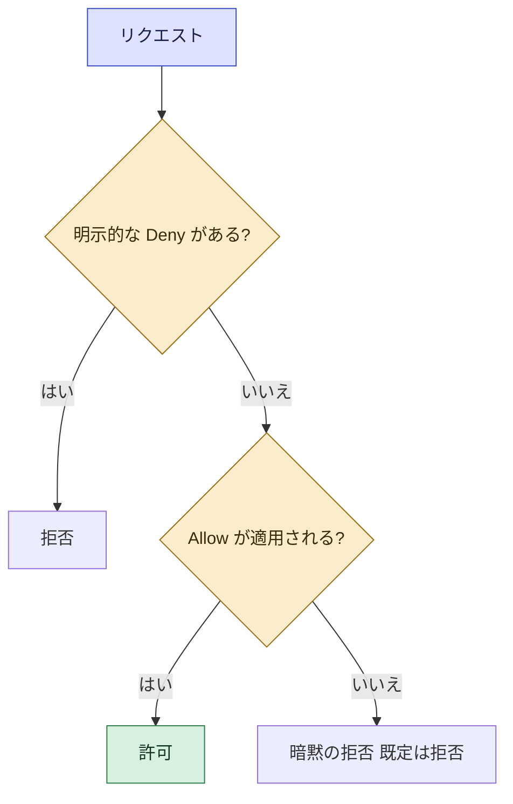

- 既定はすべて拒否。明示的な Allow が必要。
- 明示的な Deny は、どの Allow よりも強い。
- 同じアカウント内では、アイデンティティベースかリソースベースのどちらかが Allow していればアクセスできます(境界やSCPなどの制限がない場合)。別アカウントからのアクセスは、両方のアカウントで許可が必要です。

ベストプラクティス:
- 最小権限の原則: 必要な操作・必要なリソースだけを許可する。`"Action": "*"` や `"Resource": "*"` を避ける。
- 条件(Condition)を使って、さらに絞り込む(例: 送信元、MFA の有無、リソースタグ)。
- ロールを使い、長期のアクセスキーを持たない。人間のユーザーには IAM Identity Center などによるフェデレーションを使う。
- アクセスキーを発行する場合でも、定期的なローテーションと未使用キーの削除を行う。

### 5.3 ロールの引き受けと AWS STS(スキル 2.1.5)

AWS STS(Security Token Service)は、有効期限付きの一時認証情報を発行します。

| API | 用途 |
|---|---|
| `AssumeRole` | 同じ/別アカウントのロールを引き受ける |
| `AssumeRoleWithWebIdentity` | Web ID プロバイダー(Google、Cognito、OIDC)のトークンでロールを引き受ける |
| `AssumeRoleWithSAML` | SAML 2.0 の ID プロバイダーで引き受ける |
| `GetSessionToken` | IAM ユーザーが MFA 付きの一時認証情報を得る |

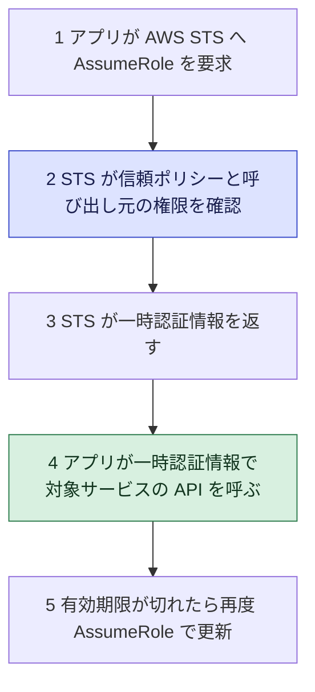

- ロールを引き受けるには、2つの条件が揃う必要があります。(1) ロールの信頼ポリシーが呼び出し元を許可していること、(2) 呼び出し元側に `sts:AssumeRole` を許可する権限があること。
- 別アカウントのロールを引き受けるときは、混乱した代理問題を避けるため `ExternalId` を使うことがあります。
- ロールに渡す権限(PassRole)に注意: サービスにロールを渡す操作には `iam:PassRole` が必要です。

ベストプラクティス:
- EC2、ECS、Lambda など実行環境には、ロール(インスタンスプロファイル、タスクロール、実行ロール)を割り当てて一時認証情報を自動取得させる。
- セッション期間は用途に必要な最短にする。

### 5.4 プログラムによるアクセスと認証付き呼び出し(スキル 2.1.3, 2.1.4)

| 方法 | 内容 | 推奨度 |
|---|---|---|
| 実行環境のロール | Lambda、EC2、ECS などに付けたロールの一時認証情報を SDK が自動取得 | 最も推奨 |
| IAM Identity Center(SSO) | 開発者のローカル作業用。`aws sso login` で一時認証情報を取得 | 推奨 |
| 長期のアクセスキー | IAM ユーザーのキー | できるだけ避ける。使うならローテーションと最小権限 |

- AWS API の呼び出しは、署名バージョン4(SigV4)で署名されます。CLI と SDK は署名を自動で行うため、通常は意識しません。
- API Gateway の IAM 認証を使う API を呼ぶクライアントは、SigV4 で署名したリクエストを送ります。
- CLI でプロファイルを使い分けるときは、`~/.aws/config` と `~/.aws/credentials` に設定します。

ベストプラクティス:
- 認証情報を、ソースコード、Git リポジトリ、イメージ、ログに入れない。
- ローカル開発も、可能な限り一時認証情報(SSO、ロール)を使う。

### 5.5 Amazon Cognito とフェデレーション(スキル 2.1.1)

Cognito は2つの部品で構成されます。混同しやすいので、違いを表で覚えます。

| 観点 | ユーザープール | ID プール |
|---|---|---|
| 役割 | ユーザーのサインアップ・サインイン(認証)とトークン発行 | AWS 認証情報(一時)の発行 |
| 出力 | JWT(ID トークン、アクセストークン、リフレッシュトークン) | AWS の一時認証情報(STS 経由) |
| 外部 ID 連携 | Google、Apple、SAML、OIDC などと連携できる | ユーザープールや外部 ID のトークンを AWS 認証情報に交換 |
| 主な用途 | アプリのログイン、API の保護 | S3 や DynamoDB などの AWS サービスをアプリから直接使う |

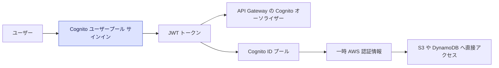

### 5.6 ベアラートークンでアプリを守る(スキル 2.1.2)

- ベアラートークンは「持っている人が権利者」として扱われるトークンです。`Authorization: Bearer <token>` ヘッダーで送ります。
- Cognito が発行する JWT の中身:

| トークン | 内容 | 用途 |
|---|---|---|
| ID トークン | ユーザーの属性(メール、名前など)や所属グループ | 誰かを知る |
| アクセストークン | スコープ(許可された範囲)など | API の認可に使う |
| リフレッシュトークン | 新しい ID / アクセストークンを取得するための長寿命トークン | 再ログインなしの更新 |

JWT をバックエンドで検証するときの確認項目:

| チェック | 内容 |
|---|---|
| 署名 | ユーザープールの公開鍵(JWKS エンドポイント)で検証 |
| 発行者(iss) | 自分のユーザープールか |
| 対象(aud / client_id) | 自分のアプリクライアントか |
| 有効期限(exp) | 期限切れでないか |
| トークン種別(token_use) | ID かアクセスか、想定どおりか |

API Gateway で認証を付ける方法:

| 方法 | 内容 | 向く場面 |
|---|---|---|
| IAM 認証 | SigV4 署名で認可 | AWS 内部のサービス間、IAM ベースのクライアント |
| Cognito ユーザープール オーソライザー(REST) / JWT オーソライザー(HTTP API) | Cognito などのトークンを API Gateway が検証 | Cognito を使うアプリ |
| Lambda オーソライザー | 自作ロジックでトークンやヘッダーを検証し、IAM ポリシーを返す(結果はキャッシュ可能) | サードパーティ ID、独自の認可ルール |

ベストプラクティス:
- トークンは HTTPS でのみ送り、有効期限を短くし、ログに出力しない。
- トークンの検証を自前で行うときは、署名・iss・aud・exp をすべて確認する(自前実装より、API Gateway のオーソライザーや実績あるライブラリを使う)。

### 5.7 きめ細かなアプリケーションレベルの認可(スキル 2.1.7)

認証に成功したあとの「どのデータまで見てよいか」を設計します。

| 手法 | 内容 |
|---|---|
| ロールとグループによる制御(RBAC) | Cognito グループに IAM ロールを対応づける |
| 属性による制御(ABAC) | タグや属性(部署、テナントIDなど)の一致で許可する |
| DynamoDB の行レベル制御 | IAM 条件キー `dynamodb:LeadingKeys` で、ユーザー自身のパーティションキーの項目だけを許可する |
| Lambda オーソライザーのコンテキスト | 認可時にユーザーやテナント情報を後続の Lambda へ渡す |
| アプリケーションコード内の確認 | リソースの所有者が呼び出しユーザーか、必ずコードで検証する |

```json
{
  "Effect": "Allow",
  "Action": ["dynamodb:GetItem", "dynamodb:Query"],
  "Resource": "arn:aws:dynamodb:ap-northeast-1:123456789012:table/Notes",
  "Condition": {
    "ForAllValues:StringEquals": {
      "dynamodb:LeadingKeys": ["${cognito-identity.amazonaws.com:sub}"]
    }
  }
}
```

### 5.8 マイクロサービス間のクロスサービス認証(スキル 2.1.8)

| 手法 | 内容 |
|---|---|
| サービスごとのロール | 各サービス(Lambda、ECS タスクなど)に専用ロールを付け、最小権限にする |
| IAM 認証 + SigV4 | サービス間の API 呼び出しに IAM 認証を使う |
| トークンの伝播 | ユーザーの JWT を下流サービスへ渡し、各サービスで検証する(ユーザー文脈を保つ) |
| 相互 TLS / プライベートな経路 | 通信相手の証明と、VPC エンドポイントなどでの閉じたネットワーク |

ECS の2種類のロール(試験で狙われやすい違い):

| ロール | 使う主体 | 例 |
|---|---|---|
| タスク実行ロール | ECS エージェント(コンテナ基盤側) | ECR からのイメージ取得、CloudWatch Logs への出力、シークレットの取得 |
| タスクロール | コンテナ内のアプリのコード | アプリが DynamoDB や S3 を呼ぶ権限 |

Lambda の2種類の権限:

| 権限 | 内容 |
|---|---|
| 実行ロール | 関数が他の AWS サービスを呼ぶ権限 |
| リソースベースポリシー | 他のサービス/アカウントが関数を呼び出す権限 |

### 試験での狙われどころ(Step 5)
- 「アプリのユーザー認証とトークン発行」→ Cognito ユーザープール。
- 「ユーザーに S3 などへの一時的な直接アクセス」→ Cognito ID プール(STS)。
- 「独自の認可ロジック」→ Lambda オーソライザー。
- 「EC2 や Lambda にアクセスキーを埋め込んでいる」→ ロールに置き換える。
- 「別アカウントのリソースを使いたい」→ クロスアカウントロール(AssumeRole)+ 信頼ポリシー。
- 「ユーザーが自分のデータだけ参照」→ `dynamodb:LeadingKeys` などの条件。

出典:
- https://docs.aws.amazon.com/IAM/latest/UserGuide/best-practices.html
- https://docs.aws.amazon.com/IAM/latest/UserGuide/reference_policies_evaluation-logic.html
- https://docs.aws.amazon.com/STS/latest/APIReference/API_AssumeRole.html
- https://docs.aws.amazon.com/IAM/latest/UserGuide/id_credentials_temp.html
- https://docs.aws.amazon.com/cognito/latest/developerguide/what-is-amazon-cognito.html
- https://docs.aws.amazon.com/cognito/latest/developerguide/amazon-cognito-user-pools-using-tokens-with-identity-providers.html
- https://docs.aws.amazon.com/apigateway/latest/developerguide/apigateway-control-access-to-api.html
- https://docs.aws.amazon.com/amazondynamodb/latest/developerguide/specifying-conditions.html
- https://docs.aws.amazon.com/AmazonECS/latest/developerguide/task-iam-roles.html
- https://docs.aws.amazon.com/IAM/latest/UserGuide/introduction_attribute-based-access-control.html

---

## Step 6 AWS サービスで暗号化を実装する

### ゴール
保存時・転送中の暗号化の違い、KMS を使った鍵管理(エンベロープ暗号化)、クライアント側とサーバー側の違い、クロスアカウント、鍵ローテーションを説明できるようになります。

### 対応する試験スキル

| スキル | 内容 |
|---|---|
| 2.2.1 | 保存時と転送中の暗号化の定義 |
| 2.2.2 | 証明書管理(例: AWS Private CA) |
| 2.2.3 | クライアント側暗号化とサーバー側暗号化の違い |
| 2.2.4 | 暗号鍵を使ったデータの暗号化・復号 |
| 2.2.5 | 開発用の証明書と SSH 鍵の生成 |
| 2.2.6 | アカウント境界をまたぐ暗号化 |
| 2.2.7 | 鍵ローテーションの有効化と無効化 |

### 6.1 保存時と転送中(スキル 2.2.1)

| 種類 | 守る対象 | 代表的な手段 |
|---|---|---|
| 保存時の暗号化(at rest) | ディスクやストレージ上のデータ | S3、EBS、RDS、DynamoDB の暗号化(KMS 鍵) |
| 転送中の暗号化(in transit) | ネットワークを流れるデータ | TLS(HTTPS)、証明書 |

ベストプラクティス:
- どちらも「既定で有効」にする。S3 バケットでは、暗号化されていない通信を拒否するバケットポリシー(`aws:SecureTransport` が false のときに Deny)を使う。
- 外部公開のエンドポイントは HTTPS のみにする(CloudFront や ALB でリダイレクト)。

### 6.2 AWS KMS の基礎(スキル 2.2.4)

| 鍵の種類 | 管理者 | 特徴 |
|---|---|---|
| AWS 所有のキー | AWS | 利用者から見えない。追加費用なし |
| AWS マネージドキー | AWS(利用者のアカウントに作成) | `aws/s3` のような名前。キーポリシーは変更できない。自動ローテーション |
| カスタマーマネージドキー(CMK) | 利用者 | キーポリシー、ローテーション、無効化、削除を自分で制御できる |

- KMS の `Encrypt` API で直接暗号化できるデータは最大4KBです。それより大きいデータは「エンベロープ暗号化」を使います。

エンベロープ暗号化の流れ:

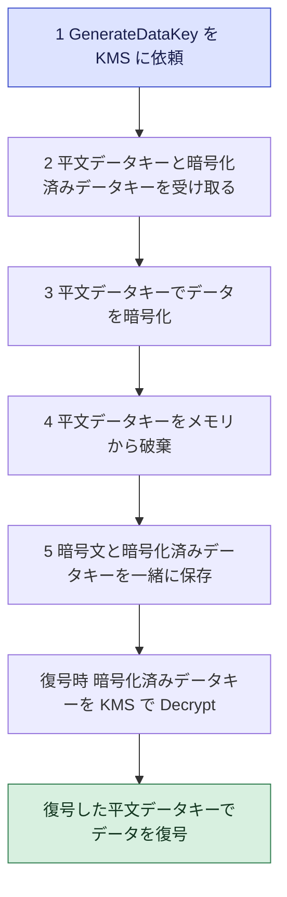

```python
import boto3

kms = boto3.client("kms")

# 小さなデータ(4KB以下)は直接暗号化できる
enc = kms.encrypt(KeyId="alias/my-app-key", Plaintext=b"secret-value")
ciphertext = enc["CiphertextBlob"]

dec = kms.decrypt(CiphertextBlob=ciphertext)   # 鍵の指定は不要(暗号文に含まれる)
plaintext = dec["Plaintext"]

# 大きなデータはデータキーを発行してエンベロープ暗号化する
dk = kms.generate_data_key(KeyId="alias/my-app-key", KeySpec="AES_256")
# dk["Plaintext"] でローカル暗号化 -> dk["CiphertextBlob"] を暗号文と一緒に保存
```

KMS のアクセス制御:

| 仕組み | 内容 |
|---|---|
| キーポリシー | KMS 鍵に必須のリソースポリシー。鍵へのアクセスの根本の許可 |
| IAM ポリシー | キーポリシーが IAM での委任を許可している場合に有効 |
| グラント | 一時的・限定的に権限を委任する(AWS サービスが内部で使う) |
| 暗号化コンテキスト | 暗号化と復号で同じ値を要求する追加の認証付きデータ。CloudTrail ログにも残る |

ベストプラクティス:
- 大きなデータはエンベロープ暗号化にする(AWS Encryption SDK が実装を肩代わりしてくれる)。
- 鍵ポリシーは最小権限にし、暗号化する権限と復号する権限を分ける。
- エイリアス(`alias/...`)で鍵を参照し、ローテーションや入れ替えのときにコードを変えない。
- 鍵の使用状況は CloudTrail で監査する。

### 6.3 クライアント側暗号化とサーバー側暗号化(スキル 2.2.3)

| 観点 | サーバー側暗号化(SSE) | クライアント側暗号化(CSE) |
|---|---|---|
| 暗号化する場所 | AWS サービス側(保存時に自動) | クライアント(アプリ)で暗号化してから送る |
| 鍵の管理 | AWS が処理(SSE-S3 など)、またはあなたが KMS で管理 | 基本的にあなたが管理(KMS 鍵の利用も可能) |
| AWS に平文が渡るか | 渡る(AWS が暗号化) | 渡らない(暗号文だけが渡る) |
| 手間 | 少ない | 多い(コードや SDK が必要) |

S3 のサーバー側暗号化の種類:

| 種類 | 鍵の管理 | 特徴 |
|---|---|---|
| SSE-S3 | S3 が管理 | 追加の設定なし。現在、S3 は新しいオブジェクトを既定で SSE-S3 で暗号化する |
| SSE-KMS | KMS で管理 | 鍵の利用を CloudTrail で監査できる。KMS のリクエスト数や費用を考慮する |
| SSE-C | 利用者が鍵を提供 | リクエストごとに鍵を渡す(HTTPS が必須)。AWS は鍵を保存しない |

### 6.4 証明書と SSH 鍵(スキル 2.2.2, 2.2.5)

| サービスや道具 | 内容 |
|---|---|
| AWS Certificate Manager(ACM) | パブリック証明書の発行と自動更新(CloudFront、ALB、API Gateway などと統合) |
| AWS Private CA | 組織内部の私的な認証局。社内サービスやデバイスに私的な証明書を発行する |
| `openssl` | 開発用の自己署名証明書や鍵を作成する |
| `ssh-keygen` | SSH 鍵ペアを生成する |
| EC2 キーペア | EC2 へ SSH 接続するための鍵(`aws ec2 create-key-pair` または公開鍵のインポート) |

```bash
# 開発用: 自己署名証明書(本番では使わない)
openssl req -x509 -newkey rsa:2048 -nodes \
  -keyout dev.key -out dev.crt -days 30 -subj "/CN=localhost"

# SSH 鍵ペア(ed25519)
ssh-keygen -t ed25519 -f ./dev_key -C "dev@example.com"
```

ベストプラクティス:
- 本番の証明書は ACM などで自動更新に任せ、期限切れ事故を防ぐ。
- 秘密鍵(`*.key`、`*.pem`)は Git に絶対コミットしない(`.gitignore` に追加)。
- 開発用の自己署名証明書は有効期間を短くし、本番へ流用しない。

### 6.5 アカウント境界をまたぐ暗号化(スキル 2.2.6)

例: アカウント A の KMS 鍵で暗号化されたデータを、アカウント B のロールが復号したい。

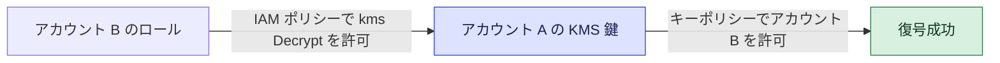

- 必要な許可は2か所です。(1) 鍵を持つアカウント A の「キーポリシー」で、アカウント B(またはそのロール)を許可。(2) アカウント B 側の IAM ポリシーで、その鍵への `kms:Decrypt` などを許可。
- AWS マネージドキーはキーポリシーを変更できないため、クロスアカウント共有にはカスタマーマネージドキーが必要です。
- S3 バケットを別アカウントと共有するときは、バケットポリシーと KMS キーポリシーの両方を考慮します。

### 6.6 鍵ローテーション(スキル 2.2.7)

| 鍵の種類 | ローテーション |
|---|---|
| AWS マネージドキー | AWS が自動でローテーション(利用者は設定不要) |
| カスタマーマネージドキー(対称) | 自動ローテーションを有効化・無効化できる。既定の周期は365日(周期は設定可能) |
| 非対称鍵、インポートしたキーマテリアルを使う鍵 | 自動ローテーションに非対応。新しい鍵を作ってエイリアスを付け替える手動ローテーションになる |

- 自動ローテーションでは、鍵 ID(ARN)は変わらず、内部のキーマテリアルだけが新しくなります。古いキーマテリアルは保持されるため、過去に暗号化したデータも復号できます。
- ローテーションを無効にするには、`DisableKeyRotation` を使います。

```bash
aws kms enable-key-rotation  --key-id alias/my-app-key
aws kms get-key-rotation-status --key-id alias/my-app-key
aws kms disable-key-rotation --key-id alias/my-app-key
```

ベストプラクティス:
- 自動ローテーションを有効にする。手動ローテーションの場合はエイリアスで切り替え、アプリのコードを変更しない設計にする。
- 鍵の削除は、待機期間(7〜30日)があるため、復旧可能なうちに影響を確認する。

### 試験での狙われどころ(Step 6)
- 「4KB を超えるデータの暗号化」→ エンベロープ暗号化(`GenerateDataKey`)。
- 「S3 の利用を監査したい / 鍵の使用を CloudTrail で追う」→ SSE-KMS。
- 「AWS に鍵を預けたくない」→ クライアント側暗号化、または SSE-C。
- 「別アカウントとの暗号化データ共有」→ カスタマーマネージドキー + キーポリシー + IAM。
- 「証明書の自動更新」→ ACM。「社内向けの私的な証明書」→ AWS Private CA。

出典:
- https://docs.aws.amazon.com/kms/latest/developerguide/overview.html
- https://docs.aws.amazon.com/kms/latest/developerguide/concepts.html
- https://docs.aws.amazon.com/kms/latest/developerguide/rotating-keys.html
- https://docs.aws.amazon.com/kms/latest/developerguide/key-policy-modifying-external-accounts.html
- https://docs.aws.amazon.com/AmazonS3/latest/userguide/UsingEncryption.html
- https://docs.aws.amazon.com/encryption-sdk/latest/developer-guide/introduction.html
- https://docs.aws.amazon.com/acm/latest/userguide/acm-overview.html
- https://docs.aws.amazon.com/privateca/latest/userguide/PcaWelcome.html
- https://docs.aws.amazon.com/AWSEC2/latest/UserGuide/create-key-pairs.html

---

## Step 7 アプリケーション内の機密データを管理する

### ゴール
機密データの分類、シークレットの安全な保管、マスキング、マルチテナントでのデータ分離ができるようになります。

### 対応する試験スキル

| スキル | 内容 |
|---|---|
| 2.3.1 | データ分類(個人を特定できる情報 PII、保護対象保健情報 PHI など) |
| 2.3.2 | 機密データを含む環境変数の暗号化 |
| 2.3.3 | シークレット管理サービスによる機密データの保護 |
| 2.3.4 | 機密データのサニタイズ |
| 2.3.5 | アプリケーションレベルのデータマスキングとサニタイズ |
| 2.3.6 | マルチテナントアプリのデータアクセスパターン |

### 7.1 データ分類(スキル 2.3.1)

| 分類 | 意味 | 例 |
|---|---|---|
| PII(個人を特定できる情報) | 個人を識別できる情報 | 氏名、住所、メールアドレス、マイナンバー、パスポート番号 |
| PHI(保護対象保健情報) | 健康・医療に関する個人情報 | 診断名、検査結果、処方 |
| 支払い情報 | クレジットカード番号など | カード番号、有効期限 |
| 認証情報 | 本人確認に使う秘密 | パスワード、APIキー、トークン |

- 分類に応じて、暗号化の強度、アクセスできる人、保管期間、ログへの出力可否を決めます。
- S3 内の機密データの自動検出には、Amazon Macie のようなサービスがあります(試験範囲の詳細は公式の範囲内サービス一覧で確認してください)。

### 7.2 環境変数の暗号化(スキル 2.3.2)

| レベル | 内容 |
|---|---|
| 保存時の暗号化(既定) | Lambda は環境変数を保存時に暗号化する(既定は AWS マネージドキー。カスタマーマネージドキーも指定可能) |
| 転送中の暗号化ヘルパー | コンソールのヘルパーを使い、値をクライアント側で KMS 暗号化してから保存し、実行時にコードで復号する |
| 推奨 | パスワードや API キーそのものは環境変数に置かず、シークレットマネージャーなどに置いて実行時に取得する |

環境変数が「見える」場面に注意しましょう。コンソールでの閲覧、IaC テンプレートの平文、ビルドログなどにシークレットが露出しやすいためです。

### 7.3 シークレット管理サービス(スキル 2.3.3)

| 観点 | AWS Secrets Manager | SSM Parameter Store |
|---|---|---|
| 主な用途 | DB 認証情報、API キーなどのシークレット | 設定値、フラグ、(安全文字列で)シークレット |
| 自動ローテーション | 標準機能(Lambda ローテーション関数、RDS などは統合済み) | 標準では非対応 |
| 暗号化 | 必ず KMS で暗号化 | `SecureString` タイプで KMS 暗号化 |
| クロスアカウント共有 | リソースポリシーで可能 | 制約が大きい(拡張パラメータの共有機能など) |
| 料金 | シークレットごとに課金 | 標準パラメータは無料(拡張は有料) |
| バージョン管理 | ステージングラベル(`AWSCURRENT`、`AWSPREVIOUS`、`AWSPENDING`) | バージョン履歴 |

```python
import boto3, json

sm = boto3.client("secretsmanager")

def get_db_credentials():
    resp = sm.get_secret_value(SecretId="prod/orders/db")
    return json.loads(resp["SecretString"])
```

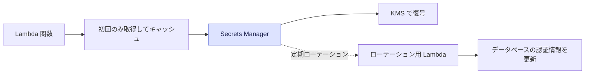

ベストプラクティス:
- 取得のたびに API を呼ばず、初期化時にキャッシュする(Secrets Manager 用のキャッシュライブラリ、Lambda 拡張機能、Powertools の Parameters など)。
- DB の認証情報は自動ローテーションを有効にし、アプリは常に最新のシークレットを取得する(接続の再確立も考慮)。
- 取得権限を最小限にし、シークレット単位または名前のパスで絞る。
- シークレットをコード、環境変数の平文、ログに出さない。

### 7.4 サニタイズとマスキング(スキル 2.3.4, 2.3.5)

用語の整理:

| 用語 | 意味 |
|---|---|
| サニタイズ(無害化) | 入力値や出力値から、危険な文字・不要な情報を取り除く・無効化する |
| マスキング | 一部を隠す(例: カード番号の末尾4桁だけ表示) |
| トークン化 | 実データを無意味な代替値に置き換え、対応表は別の安全な場所で管理する |
| 匿名化・仮名化 | 個人を特定できないようにデータを変換する |

実装のポイント:

| 場面 | 対策 |
|---|---|
| 入力値(インジェクション対策) | 入力を検証・エスケープする。SQL はパラメータ化クエリを使う。API Gateway のバリデータや AWS WAF を併用する |
| ログ出力 | パスワード、トークン、個人情報、カード番号をログに出さない。Powertools Logger のフィールド除外や、CloudWatch Logs のデータ保護ポリシーで機密データを検出してマスクする |
| 画面・API レスポンス | 必要最小限の項目だけを返す。権限のないユーザーにはマスクした値を返す |
| 非本番環境 | 本番データのコピーを使わず、匿名化した試験データを使う |

```python
def mask_card(number: str) -> str:
    """カード番号の末尾4桁だけを残す。"""
    digits = "".join(ch for ch in number if ch.isdigit())
    return "*" * (len(digits) - 4) + digits[-4:]
```

### 7.5 マルチテナントのデータアクセス(スキル 2.3.6)

マルチテナントとは、1つのアプリを複数の顧客(テナント)で共有する構成です。最重要課題は、テナント間のデータ漏えいを防ぐことです。

| モデル | 内容 | 長所と短所 |
|---|---|---|
| サイロ | テナントごとにリソース(テーブル、アカウントなど)を分ける | 分離が強い。コストと運用負荷が高い |
| プール | 全テナントが共有リソースを使い、データにテナントIDを付ける | 効率的。分離設計をしっかり行う必要がある |
| ブリッジ | 一部を共有、一部を分離 | 中間 |

プール型で分離を保つ方法:

| 手法 | 内容 |
|---|---|
| テナントIDをキーに含める | DynamoDB のパーティションキーを `TENANT#<id>` から始める |
| IAM 条件による制限 | `dynamodb:LeadingKeys` で自テナントのキー以外を拒否する |
| ABAC(セッションタグ) | ログイン時にテナントIDをセッションタグにして、ポリシーの条件で比較する |
| 認証トークンにテナントIDを含める | Cognito のカスタム属性(例: `custom:tenantId`)から取得し、リクエスト本文のテナントIDを信用しない |
| テナント別の暗号鍵 | 厳格な分離が必要なら、テナントごとに KMS 鍵を分ける |
| テナントを意識したログ・メトリクス | ログとトレースにテナントIDを付け、障害や不正を追跡する |

```mermaid
flowchart LR
    U["テナント A のユーザー"] --> J["JWT のテナントID A"]
    J --> A["API とアプリコード"]
    A --> Q["DynamoDB Query キーは TENANT#A のみ"]
    Q --> D["テナント A のデータだけ返る"]
    classDef hub fill:#dde3ff,stroke:#3b4cca,color:#1a1f4d
    classDef done fill:#d8f0e0,stroke:#2f7d4f,color:#12351f
    class A hub
    class D done
```

ベストプラクティス:
- テナントIDは、必ず認証済みトークンなど「信頼できるもの」から取得する。リクエストパラメータの値をそのまま使わない。
- アプリのコードの誤りがあっても漏えいしないよう、IAM などのインフラ層でも二重に制限する。

### 試験での狙われどころ(Step 7)
- 「DB のパスワードを自動ローテーション」→ Secrets Manager。
- 「設定値を階層的に管理、無料で」→ Parameter Store。
- 「ログに個人情報が出る」→ ログ出力のマスキングやデータ保護ポリシー。
- 「テナントごとに異なるデータだけを返す」→ キー設計 + IAM 条件(`LeadingKeys`)や ABAC。

出典:
- https://docs.aws.amazon.com/secretsmanager/latest/userguide/intro.html
- https://docs.aws.amazon.com/secretsmanager/latest/userguide/rotating-secrets.html
- https://docs.aws.amazon.com/systems-manager/latest/userguide/systems-manager-parameter-store.html
- https://docs.aws.amazon.com/lambda/latest/dg/configuration-envvars.html
- https://docs.aws.amazon.com/AmazonCloudWatch/latest/logs/mask-sensitive-log-data.html
- https://docs.aws.amazon.com/secretsmanager/latest/userguide/best-practices.html
- https://docs.aws.amazon.com/macie/latest/user/what-is-macie.html
- https://docs.aws.amazon.com/wellarchitected/latest/saas-lens/saas-lens.html
- https://docs.aws.amazon.com/amazondynamodb/latest/developerguide/specifying-conditions.html


---

# ドメイン3 Deployment(24%)

## Step 8 デプロイする成果物を準備する

### ゴール
アプリを「AWS に載せられる形」に整える手順と、環境ごとの設定の切り替え方を説明できるようになります。

### 対応する試験スキル

| スキル | 内容 |
|---|---|
| 3.1.1 | パッケージ内のコードモジュールの依存関係管理(環境変数、設定ファイル、コンテナイメージ) |
| 3.1.2 | デプロイ用のファイルとディレクトリ構成の整理 |
| 3.1.3 | デプロイ環境でのコードリポジトリの利用 |
| 3.1.4 | アプリケーションのリソース要件の適用(メモリ、コア数など) |
| 3.1.5 | 環境別のアプリケーション設定の準備(例: AWS AppConfig) |

### 8.1 依存関係の管理(スキル 3.1.1)

| 方式 | 内容 | 向く場面 |
|---|---|---|
| .zip にまとめる | コードと依存ライブラリを一緒に zip 化(`requirements.txt` や `package.json` で管理) | 小〜中規模の Lambda |
| Lambda レイヤー | 共通ライブラリを別パッケージとして共有 | 複数関数で同じライブラリを使う |
| コンテナイメージ | Dockerfile で OS・ランタイム・依存を丸ごと固める。Amazon ECR に保管 | 大きな依存、ECS/EKS、既存コンテナ資産 |
| プライベートなパッケージリポジトリ | AWS CodeArtifact に社内パッケージや外部パッケージのキャッシュを置く | 依存の取得元を統制したいとき |

ベストプラクティス:
- 依存のバージョンを固定する(ロックファイル)。ビルドの再現性が上がる。
- 本番に不要な開発用パッケージは含めない(パッケージが小さいほど Lambda の起動が速い)。
- コンテナイメージは、タグに `latest` だけを使わず、バージョンやコミット ID を付ける。イメージの脆弱性スキャン(ECR のスキャン機能)を有効にする。
- 依存関係は信頼できる取得元(CodeArtifact など)から取得する。

### 8.2 ディレクトリ構成(スキル 3.1.2)

AWS SAM プロジェクトの典型的な構成:

| パス | 内容 |
|---|---|
| `template.yaml` | リソース定義(IaC) |
| `samconfig.toml` | `sam deploy` の設定(環境ごとの設定を持てる) |
| `src/` または関数ごとのフォルダ | 関数コードと依存ファイル |
| `events/` | テスト用イベント(JSON) |
| `tests/unit/`、`tests/integration/` | ユニットテストと統合テスト |
| `buildspec.yml` | CodeBuild のビルド手順 |
| `appspec.yml` | CodeDeploy のデプロイ手順(EC2 などの場合) |

ベストプラクティス:
- ビルド・テスト・デプロイの定義ファイルは、アプリのコードと同じリポジトリでバージョン管理する。
- ハンドラーとビジネスロジックを分ける。

### 8.3 コードリポジトリの利用(スキル 3.1.3)

- Git でソースを管理し、パイプラインがリポジトリの変更を検知してビルド・デプロイします。
- AWS CodePipeline のソースには、GitHub、GitLab、Bitbucket、AWS CodeCommit などのリポジトリを指定できます(外部リポジトリとは AWS CodeConnections などで接続します)。なお、AWS CodeCommit は公式の範囲内サービス一覧には載っていません。
- 運用の基本:
  - ブランチ戦略を決める(例: `main` から本番、`develop` からステージング)。
  - 秘密情報をコミットしない。
  - コミットやタグでリリースを識別できるようにする。

### 8.4 リソース要件の適用(スキル 3.1.4)

| 実行基盤 | 指定するもの |
|---|---|
| Lambda | メモリ(CPU はメモリに比例)、タイムアウト、一時ストレージ |
| ECS / Fargate | タスクとコンテナの CPU、メモリ(許可された組み合わせから選ぶ) |
| EKS | Pod の `requests` と `limits` |
| EC2 / Elastic Beanstalk | インスタンスタイプ(vCPU、メモリ、ネットワーク性能) |

考え方:
- 実測で決める。負荷テストやプロファイルで、必要最小限のメモリ・CPU を見極める(Step 13)。
- 不足するとタイムアウトやメモリ不足(OOM)で落ち、過剰だとコストが無駄になる。

### 8.5 環境別の設定(スキル 3.1.5)

| 手段 | 内容 |
|---|---|
| 環境変数 | 小さな設定(テーブル名、エンドポイントなど)。環境ごとに値を変える |
| SSM Parameter Store / Secrets Manager | 機密値や共有設定の取得 |
| AWS AppConfig | 設定やフィーチャーフラグを、検証・段階的配布・ロールバック付きでデプロイする(アプリの再デプロイなしに設定を更新できる) |
| テンプレートのパラメータ | CloudFormation / SAM の `Parameters` や `Mappings` で環境ごとに切り替え |

AppConfig の流れ:

```mermaid
flowchart LR
    A["設定プロファイルを作成"] --> B["バリデータで検証 JSON スキーマや Lambda"]
    B --> C["デプロイ戦略 段階的に配布"]
    C --> D["アプリが設定を取得 Lambda 拡張機能など"]
    D --> E{"アラームが発生?"}
    E -->|"はい"| F["自動ロールバック"]
    E -->|"いいえ"| G["配布完了"]
    classDef hub fill:#dde3ff,stroke:#3b4cca,color:#1a1f4d
    classDef box fill:#fbeccb,stroke:#9a6b12,color:#3d2a05
    classDef done fill:#d8f0e0,stroke:#2f7d4f,color:#12351f
    class C hub
    class E box
    class G done
```

ベストプラクティス:
- コードは環境に依存させず、同じ成果物を dev から本番まで昇格させ、設定だけを切り替える。
- 設定の変更でも、検証と段階的配布と自動ロールバックを使う(AppConfig)。

### 試験での狙われどころ(Step 8)
- 「複数の Lambda で共通ライブラリ」→ Lambda レイヤー。
- 「大きな依存(zip の上限を超える)」→ コンテナイメージ(最大10GB)。
- 「再デプロイなしで設定を段階的に変更」→ AppConfig。
- 「環境ごとに値を変えたい」→ パラメータ化(環境変数、テンプレートパラメータ、Parameter Store)。

出典:
- https://docs.aws.amazon.com/lambda/latest/dg/chapter-layers.html
- https://docs.aws.amazon.com/lambda/latest/dg/images-create.html
- https://docs.aws.amazon.com/codeartifact/latest/ug/welcome.html
- https://docs.aws.amazon.com/serverless-application-model/latest/developerguide/serverless-sam-cli-config.html
- https://docs.aws.amazon.com/appconfig/latest/userguide/what-is-appconfig.html
- https://docs.aws.amazon.com/AmazonECS/latest/developerguide/task_definition_parameters.html

---

## Step 9 開発環境でアプリをテストする

### ゴール
ユニット・統合・イベント駆動のテストを AWS 上で組み立て、テストイベントを自動生成して回せるようになります。

### 対応する試験スキル

| スキル | 内容 |
|---|---|
| 3.2.1 | AWS のサービスとツールでデプロイ済みコードをテストする |
| 3.2.2 | 統合テストの作成と、外部依存のモック API |
| 3.2.3 | 開発用エンドポイントでのテスト(例: API Gateway のステージ設定) |
| 3.2.4 | 既存環境へのスタック更新のデプロイ(例: SAM テンプレートを別のステージング環境へ) |
| 3.2.5 | イベント駆動アプリのテスト |
| 3.3.1 | テストイベントの作成(Lambda、API Gateway、SAM リソース向けの JSON ペイロード) |
| 3.3.6 | Amazon Q Developer による自動テストの生成 |

### 9.1 テストの種類

| 種類 | 対象 | 速度 | AWS の利用 |
|---|---|---|---|
| ユニットテスト | 関数・クラス単体 | 速い | 不要(モックを使う) |
| 統合テスト | 複数コンポーネントと実サービスの連携 | 中 | 必要(開発用の環境) |
| エンドツーエンド(E2E) | ユーザー操作に近い全体 | 遅い | 必要 |

```mermaid
flowchart TD
    A["ユニットテスト 数が多く速い"] --> B["統合テスト 実サービスと連携"]
    B --> C["E2E テスト 少数で重要な流れ"]
    C --> D["本番デプロイ"]
    classDef hub fill:#dde3ff,stroke:#3b4cca,color:#1a1f4d
    classDef done fill:#d8f0e0,stroke:#2f7d4f,color:#12351f
    class A hub
    class D done
```

### 9.2 デプロイ済みコードのテスト(スキル 3.2.1)

| 方法 | 内容 |
|---|---|
| Lambda コンソールのテスト | 保存したテストイベントで実行し、ログと結果を確認 |
| `aws lambda invoke` | CLI から呼び出し、ステータスと出力を確認 |
| API Gateway の「テスト」機能 | コンソールからメソッドを疑似呼び出し |
| curl や API クライアント | 開発ステージのエンドポイントを直接呼ぶ |
| CloudWatch Synthetics(カナリア) | スクリプトで定期的に API や画面を確認する |
| CloudWatch Logs / X-Ray | 実行結果とトレースを確認する(Step 12) |

### 9.3 統合テストと外部依存のモック(スキル 3.2.2)

- 統合テストでは、実際の AWS サービスと連携を確認します。テスト用のテーブルやキューは、本番と別の環境(別ステージ、別アカウント)に用意し、テストの前後でデータを整えます。
- 外部のサードパーティ API は、課金・制限・不安定さの影響を避けるため、モックに置き換えます。

| モックの方法 | 内容 |
|---|---|
| API Gateway のモック統合 | バックエンドなしで固定の応答を返すエンドポイントを作る |
| テストダブル(スタブ、モック) | テストコード内で SDK クライアントや HTTP クライアントを差し替える |
| ローカルのエミュレーション | `sam local`、DynamoDB Local など |

ベストプラクティス:
- テストは繰り返し実行しても同じ結果になるように、テストデータを自分で作って後始末する。
- 失敗系(タイムアウト、スロットリング、5xx)もモックで再現して、再試行やフォールバックを検証する。

### 9.4 開発用エンドポイントとステージ(スキル 3.2.3)

API Gateway の「ステージ」は、API の特定のバージョン(デプロイ)を公開する名前付きの環境です。

| 機能 | 内容 |
|---|---|
| ステージ | `dev`、`test`、`prod` などを作り、それぞれ別の URL を持つ |
| ステージ変数 | ステージごとに異なる値(Lambda エイリアス名、バックエンド URL など)を持てる |
| ステージごとの設定 | キャッシュ、スロットリング、ログ、カナリア設定などをステージ単位で変更 |

```mermaid
flowchart LR
    API["API Gateway の API 定義"] --> D1["dev ステージ"]
    API --> D2["test ステージ"]
    API --> D3["prod ステージ"]
    D1 --> L1["Lambda エイリアス dev"]
    D2 --> L2["Lambda エイリアス test"]
    D3 --> L3["Lambda エイリアス prod"]
    classDef hub fill:#dde3ff,stroke:#3b4cca,color:#1a1f4d
    class API hub
```

重要: REST API は、変更を「デプロイ」しないとステージに反映されません。リソースやメソッドを変更したのに反映されない、という問題の定番の原因です。

### 9.5 既存環境へのスタック更新(スキル 3.2.4)

SAM で、同じテンプレートを別の環境へデプロイする例:

```bash
sam build
sam deploy --config-env staging      # samconfig.toml の staging 設定でデプロイ
sam deploy --config-env prod
```

```toml
# samconfig.toml の例(抜粋)
version = 0.1
[staging.deploy.parameters]
stack_name = "orders-staging"
parameter_overrides = "Env=staging"
[prod.deploy.parameters]
stack_name = "orders-prod"
parameter_overrides = "Env=prod"
```

- 同じテンプレートに、環境ごとのパラメータを渡して、スタックを別々に作ります。
- すでにあるスタックへの更新は、CloudFormation が差分を計算して適用します。更新前に変更セットで内容を確認できます(Step 10)。

### 9.6 イベント駆動アプリのテスト(スキル 3.2.5)

イベント駆動は、「イベントを起こす」「結果を確認する」を自動化するのがコツです。

| 目的 | 方法 |
|---|---|
| Lambda をイベント付きで起動 | `sam local invoke -e events/s3.json`、`aws lambda invoke --payload` |
| 本物のイベントを発生させる | `aws s3 cp`(S3 イベント)、`aws sqs send-message`、`aws events put-events` |
| 非同期の結果を確認 | CloudWatch Logs、DynamoDB の結果、X-Ray のトレース |
| 失敗経路の確認 | 意図的に失敗させ、DLQ・Destinations・再試行の動きを確認 |
| 重複と順序の確認 | 同じイベントを2回送り、冪等であることを確認 |

ベストプラクティス:
- 非同期処理のテストは、「一定時間待ってから結果を確認する」(ポーリングして確認する)作りにする。固定の長い待機は避ける。
- DLQ にメッセージが残っていないことも検証項目に入れる。

### 9.7 テストイベントの作成(スキル 3.3.1)

| 作り方 | 内容 |
|---|---|
| `sam local generate-event` | S3、SQS、SNS、API Gateway、DynamoDB などのイベントの雛形を生成 |
| コンソールの「共有可能なテストイベント」 | テンプレートから作って保存 |
| 本番ログから採取 | 実際のイベントを匿名化して再利用 |

```bash
# API Gateway(プロキシ)のテストイベントを生成して、ローカルで実行
sam local generate-event apigateway aws-proxy > events/api.json
sam local invoke OrdersFunction -e events/api.json
```

```json
{
  "httpMethod": "POST",
  "path": "/orders",
  "headers": {"Content-Type": "application/json"},
  "body": "{\"orderId\": \"o-001\", \"qty\": 2}"
}
```

- Lambda のテストイベントには、トリガー元のサービスが送るイベントと同じ形式の JSON を使います。形式を間違えると、本番では動かないテストになります。

### 9.8 Amazon Q Developer によるテスト生成(スキル 3.3.6)

- IDE の Amazon Q Developer で、選択した関数に対するユニットテストを提案させることができます。
- 生成されたテストは、そのまま採用せず、次の観点で必ずレビューします。

| 観点 | 確認すること |
|---|---|
| 網羅性 | 正常系、異常系、境界値が含まれているか |
| 正しさ | 期待値が仕様どおりか(コードの現状をなぞっていないか) |
| 副作用 | 実際の AWS リソースを触らないか(モックになっているか) |
| 機密 | 本番の秘密情報や個人情報が含まれていないか |

### 試験での狙われどころ(Step 9)
- 「Lambda をローカルで実行」→ `sam local invoke`。「ローカル API」→ `sam local start-api`。
- 「ステージごとに別のバックエンド」→ ステージ変数。
- 「API の変更が反映されない」→ REST API は再デプロイが必要。
- 「サードパーティ API を使わずテスト」→ モック統合、テストダブル。

出典:
- https://docs.aws.amazon.com/serverless-application-model/latest/developerguide/serverless-test-and-debug.html
- https://docs.aws.amazon.com/serverless-application-model/latest/developerguide/using-sam-cli-local-generate-event.html
- https://docs.aws.amazon.com/lambda/latest/dg/testing-guide.html
- https://docs.aws.amazon.com/apigateway/latest/developerguide/stages.html
- https://docs.aws.amazon.com/apigateway/latest/developerguide/stage-variables.html
- https://docs.aws.amazon.com/apigateway/latest/developerguide/how-to-mock-integration.html
- https://docs.aws.amazon.com/amazonq/latest/qdeveloper-ug/what-is.html

---

## Step 10 IaC・環境・バージョン管理

### ゴール
インフラをコードで定義して複数環境へ再現性高くデプロイし、Lambda のバージョン・エイリアスや API のステージで環境を管理できるようになります。

### 対応する試験スキル

| スキル | 内容 |
|---|---|
| 3.3.2 | 各環境への API リソースのデプロイ |
| 3.3.3 | 統合テスト用に承認済みバージョンを使う環境の作成(Lambda エイリアス、コンテナイメージタグ、Amplify ブランチ、Copilot 環境) |
| 3.3.4 | IaC テンプレート(SAM、CloudFormation)の実装とデプロイ |
| 3.3.5 | 個々のサービス内での環境管理(例: API Gateway の dev / test / prod の区別) |
| 3.4.1 | Lambda のデプロイパッケージ形式 |
| 3.4.2 | API Gateway のステージとカスタムドメイン |
| 3.4.3 | 既存 IaC テンプレートの更新 |
| 3.4.4 | AWS サービスによるアプリケーション環境の管理 |
| 3.4.10 | 既存のランタイム設定による動的なデプロイ(例: API Gateway のステージ変数を Lambda で使う) |

### 10.1 IaC の3兄弟

| ツール | 書き方 | 特徴 |
|---|---|---|
| AWS CloudFormation | YAML / JSON のテンプレート | AWS 標準の IaC。スタック単位で作成・更新・削除 |
| AWS SAM | CloudFormation の拡張構文(サーバーレス向けの短縮記法) | `AWS::Serverless::Function` などで簡潔に書け、`sam` CLI でビルド・ローカル実行・デプロイ |
| AWS CDK | TypeScript や Python などのプログラミング言語 | コードから CloudFormation テンプレートを生成する |

```mermaid
flowchart LR
    S["SAM テンプレート"] --> CF["CloudFormation 変換 Transform"]
    C["CDK コード"] --> SY["cdk synth"] --> CF
    CF --> ST["スタック AWS リソース"]
    classDef hub fill:#dde3ff,stroke:#3b4cca,color:#1a1f4d
    class CF hub
```

### 10.2 SAM テンプレートの読み方(スキル 3.3.4)

```yaml
AWSTemplateFormatVersion: '2010-09-09'
Transform: AWS::Serverless-2016-10-31      # SAM を有効にする宣言

Parameters:
  Env:
    Type: String
    AllowedValues: [dev, staging, prod]

Globals:
  Function:
    Runtime: python3.12
    Timeout: 10
    MemorySize: 256

Resources:
  OrdersFunction:
    Type: AWS::Serverless::Function
    Properties:
      Handler: app.handler
      CodeUri: src/
      AutoPublishAlias: live                # 新バージョンを自動発行し、live エイリアスを向ける
      Environment:
        Variables:
          TABLE_NAME: !Ref OrdersTable
      Policies:
        - DynamoDBCrudPolicy:               # SAM のポリシーテンプレート(最小権限の近道)
            TableName: !Ref OrdersTable
      Events:
        Api:
          Type: Api
          Properties:
            Path: /orders
            Method: post

  OrdersTable:
    Type: AWS::Serverless::SimpleTable

Outputs:
  ApiUrl:
    Value: !Sub "https://${ServerlessRestApi}.execute-api.${AWS::Region}.amazonaws.com/Prod/"
```

CloudFormation の主要セクションと関数:

| 要素 | 内容 |
|---|---|
| Parameters | デプロイ時に渡す値 |
| Mappings | 固定の対応表(リージョン別の値など) |
| Conditions | 条件によるリソース作成の切り替え |
| Resources | 作るリソース(必須) |
| Outputs | 出力値、他スタックへのエクスポート |
| `!Ref` | パラメータやリソースの参照 |
| `!GetAtt` | リソースの属性(ARN など)の取得 |
| `!Sub` | 文字列への変数の埋め込み |

SAM CLI の主なコマンド:

| コマンド | 内容 |
|---|---|
| `sam validate` | テンプレートの検証 |
| `sam build` | ビルド |
| `sam package`(または `sam deploy` が内包) | コードを S3 へアップロード |
| `sam deploy` | スタックの作成と更新 |
| `sam sync` | 開発中の変更を素早く反映する |
| `sam logs` / `sam traces` | ログとトレースの確認 |
| `sam delete` | スタックの削除 |

### 10.3 既存テンプレートの更新(スキル 3.4.3)

| 機能 | 内容 |
|---|---|
| 変更セット(Change Set) | 更新の前に、何が追加・変更・置換・削除されるかをプレビューする |
| 更新時の動作 | リソースの種類と変更したプロパティにより、「中断なし」「一部中断」「置換」に分かれる(置換されるとデータが失われる場合がある) |
| ロールバック | 更新に失敗すると、直前の正常な状態へ自動で戻る |
| ドリフト検出 | コンソール等で手動変更されたリソースと、テンプレートとの差を検出する |
| 削除保護 | `DeletionPolicy`(`Retain` / `Snapshot`)や、スタックの終了保護 |

ベストプラクティス:
- コンソールで直接リソースを変更せず、必ずテンプレートを更新してデプロイする(ドリフトを避ける)。
- 本番への更新は、変更セットで置換や削除の有無を確認してから実行する。
- ステートフルなリソース(DB、S3)には `DeletionPolicy` を設定し、誤削除から守る。

### 10.4 Lambda のバージョンとエイリアス(スキル 3.3.3, 3.4.4)

| 概念 | 内容 |
|---|---|
| `$LATEST` | 編集中の最新版。変更可能 |
| バージョン | 発行した時点のコードと設定の不変のスナップショット(`1`、`2`、…) |
| エイリアス | 特定バージョンを指す名前(`dev`、`prod`、`live`)。呼び出し元はエイリアス ARN を使う |
| 重み付けエイリアス | 2つのバージョンへトラフィックを割合で振り分ける(カナリア) |

```mermaid
flowchart LR
    C["呼び出し元 エイリアス prod の ARN"] --> A["エイリアス prod"]
    A -->|"90%"| V1["バージョン 1"]
    A -->|"10%"| V2["バージョン 2"]
    classDef hub fill:#dde3ff,stroke:#3b4cca,color:#1a1f4d
    class A hub
```

承認済みバージョンを使う環境づくり(統合テスト用)の対応表:

| サービス | 環境の識別手段 |
|---|---|
| Lambda | エイリアス(`test` エイリアスを承認済みバージョンに固定) |
| ECR / ECS | イメージタグ(`v1.4.2`、コミットID。`latest` だけに頼らない) |
| AWS Amplify | ブランチごとの環境(`main`、`staging`) |
| AWS Copilot | `copilot env` による環境(`test`、`prod`) |
| API Gateway | ステージ(`dev`、`test`、`prod`) |

### 10.5 API Gateway のステージ、カスタムドメイン、動的なデプロイ(スキル 3.3.2, 3.3.5, 3.4.2, 3.4.10)

デプロイとステージの関係:

```mermaid
flowchart TD
    A["API 定義を変更"] --> B["デプロイを作成 スナップショット"]
    B --> C["ステージへ関連づける dev test prod"]
    C --> D["ステージの URL で公開"]
    classDef hub fill:#dde3ff,stroke:#3b4cca,color:#1a1f4d
    classDef done fill:#d8f0e0,stroke:#2f7d4f,color:#12351f
    class B hub
    class D done
```

- カスタムドメイン: 独自のドメイン名(`api.example.com`)を設定し、ベースパスマッピングで `/v1` などのパスをステージへ対応づけます。証明書は ACM で用意します(エッジ最適化エンドポイントは `us-east-1` の証明書、リージョナルエンドポイントは同じリージョンの証明書)。DNS は Route 53 のエイリアスレコードなどで向けます。
- ステージ変数を Lambda の統合で使うと、同じ API 定義をステージごとに別のエイリアスへ向けられます。

```text
arn:aws:lambda:ap-northeast-1:123456789012:function:Orders:${stageVariables.lambdaAlias}
```

- Lambda プロキシ統合では、ステージ変数がイベントの `stageVariables` として関数へ渡されます。コード内でその値を読んで挙動を変える「動的なデプロイ」ができます。
- 注意: ステージ変数は機密情報を入れる場所ではありません(シークレットは Secrets Manager 等)。

### 10.6 Lambda のデプロイパッケージ形式(スキル 3.4.1)

| 形式 | 内容 |
|---|---|
| .zip アーカイブ | コードと依存を zip にする。サイズ上限あり。レイヤーで共通部分を分離できる |
| コンテナイメージ | ECR に置いたイメージ(最大10GB)。Lambda 用のベースイメージを使う |

### 試験での狙われどころ(Step 10)
- 「IaC で再現性高く環境を複製」→ CloudFormation / SAM / CDK。
- 「更新前に影響を確認」→ 変更セット。
- 「ステージごとに Lambda のバージョンを切り替え」→ ステージ変数 + エイリアス。
- 「SAM テンプレートの先頭にある `Transform`」→ SAM 構文を有効にする宣言。
- 「手動変更の検出」→ ドリフト検出。

出典:
- https://docs.aws.amazon.com/serverless-application-model/latest/developerguide/what-is-sam.html
- https://docs.aws.amazon.com/serverless-application-model/latest/developerguide/serverless-sam-cli-command-reference.html
- https://docs.aws.amazon.com/AWSCloudFormation/latest/UserGuide/Welcome.html
- https://docs.aws.amazon.com/AWSCloudFormation/latest/UserGuide/using-cfn-updating-stacks-changesets.html
- https://docs.aws.amazon.com/AWSCloudFormation/latest/UserGuide/using-cfn-stack-drift.html
- https://docs.aws.amazon.com/cdk/v2/guide/home.html
- https://docs.aws.amazon.com/lambda/latest/dg/configuration-versions.html
- https://docs.aws.amazon.com/lambda/latest/dg/configuration-aliases.html
- https://docs.aws.amazon.com/apigateway/latest/developerguide/how-to-custom-domains.html
- https://docs.aws.amazon.com/apigateway/latest/developerguide/amazon-api-gateway-using-stage-variables.html
- https://docs.aws.amazon.com/amplify/latest/userguide/welcome.html

---

## Step 11 CI/CD でデプロイする

### ゴール
コードをコミットしてから本番反映までの自動化(ビルド・テスト・デプロイ)を理解し、デプロイ戦略とロールバックを選べるようになります。

### 対応する試験スキル

| スキル | 内容 |
|---|---|
| 3.4.5 | デプロイ戦略を使ったアプリケーションバージョンのデプロイ |
| 3.4.6 | リポジトリへのコミットによるビルド・テスト・デプロイの起動 |
| 3.4.7 | オーケストレーションされたワークフローによる各環境へのデプロイ |
| 3.4.8 | 既存のデプロイ戦略によるロールバック |
| 3.4.9 | ラベルとブランチによるバージョン・リリース管理 |
| 3.4.11 | デプロイ戦略(ブルー/グリーン、カナリア、ローリング)の設定 |

### 11.1 AWS の CI/CD サービスの役割分担

| サービス | 役割 |
|---|---|
| AWS CodePipeline | パイプライン全体の流れ(ステージとアクション)を管理するオーケストレーター |
| AWS CodeBuild | ビルドとテストを実行するフルマネージドのビルドサービス |
| AWS CodeDeploy | EC2・オンプレミス・Lambda・ECS へのデプロイを自動化し、戦略とロールバックを制御 |
| AWS CodeArtifact | パッケージリポジトリ |
| AWS CloudFormation | IaC のデプロイアクションとして使う |

```mermaid
flowchart LR
    G["Git へコミット"] --> S["CodePipeline Source"]
    S --> B["Build CodeBuild ビルドとテスト"]
    B --> T["Test 統合テスト"]
    T --> M{"手動承認"}
    M -->|"承認"| D["Deploy CodeDeploy や CloudFormation"]
    D --> P["本番稼働"]
    classDef hub fill:#dde3ff,stroke:#3b4cca,color:#1a1f4d
    classDef box fill:#fbeccb,stroke:#9a6b12,color:#3d2a05
    classDef done fill:#d8f0e0,stroke:#2f7d4f,color:#12351f
    class S hub
    class M box
    class P done
```

- 継続的インテグレーション(CI)は、コードの変更を頻繁に統合して自動でビルド・テストすること。継続的デリバリー(CD)は、いつでもリリースできる状態を保ち、デプロイまで自動化すること(本番へは承認を挟む場合もある)。

### 11.2 コミットでビルド・デプロイを起動する(スキル 3.4.6)

- パイプラインのソースステージが、リポジトリの変更(ブランチへのプッシュ、タグ、プルリクエストのマージなど)を検知して起動します。
- イベントベースの起動(推奨)と、定期的なポーリングがあります。イベントベースのほうが速く、無駄がありません。

#### CodeBuild の buildspec.yml

```yaml
version: 0.2
env:
  variables:
    STAGE: "staging"
  parameter-store:
    API_KEY: "/myapp/staging/api-key"    # SSM Parameter Store から取得(平文でファイルに書かない)
phases:
  install:
    runtime-versions:
      python: 3.12
    commands:
      - pip install -r requirements.txt
  pre_build:
    commands:
      - pytest tests/unit                # ユニットテスト
  build:
    commands:
      - sam build
  post_build:
    commands:
      - echo "Build completed"
artifacts:
  files:
    - '**/*'
cache:
  paths:
    - '/root/.cache/pip/**/*'
```

| 要素 | 内容 |
|---|---|
| `phases` | `install` → `pre_build` → `build` → `post_build` の順に実行 |
| `artifacts` | 次のステージへ渡す成果物 |
| `cache` | 依存のキャッシュでビルドを高速化 |
| `env` | 環境変数、Parameter Store / Secrets Manager からの機密値の取得 |

- ビルドが失敗すると、パイプラインはそのステージで止まり、次へは進みません。ビルドの実行に使う IAM サービスロールには、必要な最小の権限を付けます。

### 11.3 デプロイ戦略(スキル 3.4.5, 3.4.11)

| 戦略 | 動き | 長所 | 短所 |
|---|---|---|---|
| オールアットワンス(一括) | すべてを一度に新版へ | 速い。単純 | 失敗時の影響が全体。ダウンタイムの恐れ |
| ローリング | 一部ずつ順に新版へ入れ替える | 全体停止を避けられる | 新旧が混在する期間がある。ロールバックに時間がかかる |
| ローリング + 追加バッチ | 追加のインスタンスを用意して入れ替える | 全容量を保ったまま更新できる | 一時的なコスト増 |
| イミュータブル | 新しい別のインスタンス群に新版を立ち上げ、問題なければ切り替える | 安全。巻き戻しが簡単 | 一時的にリソースが2倍 |
| ブルー/グリーン | 本番(ブルー)と同じ新環境(グリーン)を用意し、トラフィックを切り替える | 切り替えと切り戻しが速い。ダウンタイムが小さい | 環境が2つ必要でコストが増える |
| カナリア | 少量のトラフィックだけ新版へ流して様子を見て、問題なければ全量へ | 影響を小さく抑えて検証できる | 構成と監視が複雑 |
| リニア | 一定間隔で割合を増やしていく | 段階的に移行できる | 完了まで時間がかかる |

```mermaid
flowchart TD
    A{"ダウンタイムを許容できる?"} -->|"はい"| B["一括 オールアットワンス"]
    A -->|"いいえ"| C{"切り戻しを最速にしたい?"}
    C -->|"はい"| D["ブルー/グリーン"]
    C -->|"いいえ"| E{"少量で先に検証したい?"}
    E -->|"はい"| F["カナリアまたはリニア"]
    E -->|"いいえ"| G["ローリング"]
    classDef hub fill:#dde3ff,stroke:#3b4cca,color:#1a1f4d
    classDef box fill:#fbeccb,stroke:#9a6b12,color:#3d2a05
    classDef done fill:#d8f0e0,stroke:#2f7d4f,color:#12351f
    class A box
    class C,E box
    class D,F,G,B done
```

サービスごとの対応:

| サービス | 使える主な方式 |
|---|---|
| CodeDeploy(EC2/オンプレミス) | インプレース(`AllAtOnce`、`HalfAtATime`、`OneAtATime`)、ブルー/グリーン(Auto Scaling グループと ELB を使う) |
| CodeDeploy(Lambda) | トラフィックシフト(`Canary10Percent5Minutes` など、`Linear10PercentEvery1Minute` など、`AllAtOnce`) |
| CodeDeploy(ECS) | ブルー/グリーン(カナリア、リニア、一括の設定を選べる) |
| Elastic Beanstalk | All at once、Rolling、Rolling with additional batch、Immutable、Traffic splitting |
| Lambda + エイリアス | 重み付けエイリアスによる手動のカナリア |
| API Gateway | ステージのカナリアリリース |

#### Lambda のカナリアデプロイ(SAM と CodeDeploy)

```yaml
OrdersFunction:
  Type: AWS::Serverless::Function
  Properties:
    Handler: app.handler
    CodeUri: src/
    AutoPublishAlias: live
    DeploymentPreference:
      Type: Canary10Percent5Minutes        # 最初に10%、5分後に残りを切り替え
      Alarms:
        - !Ref ErrorAlarm                  # アラームが鳴ったら自動ロールバック
      Hooks:
        PreTraffic: !Ref PreTrafficHook    # トラフィック切り替え前の検証 Lambda
        PostTraffic: !Ref PostTrafficHook  # 切り替え後の検証 Lambda
```

#### CodeDeploy の appspec.yml(EC2 のインプレースの例)

```yaml
version: 0.0
os: linux
files:
  - source: /
    destination: /var/www/app
hooks:
  ApplicationStop:
    - location: scripts/stop.sh
  BeforeInstall:
    - location: scripts/before_install.sh
  AfterInstall:
    - location: scripts/after_install.sh
  ApplicationStart:
    - location: scripts/start.sh
  ValidateService:
    - location: scripts/validate.sh
      timeout: 300
```

EC2 のインプレースデプロイのライフサイクル(主なイベント):

```mermaid
flowchart LR
    A["ApplicationStop"] --> B["DownloadBundle"]
    B --> C["BeforeInstall"]
    C --> D["Install"]
    D --> E["AfterInstall"]
    E --> F["ApplicationStart"]
    F --> G["ValidateService"]
    classDef hub fill:#dde3ff,stroke:#3b4cca,color:#1a1f4d
    classDef done fill:#d8f0e0,stroke:#2f7d4f,color:#12351f
    class D hub
    class G done
```

Lambda の appspec のフックは `BeforeAllowTraffic` と `AfterAllowTraffic` です。

### 11.4 ロールバック(スキル 3.4.8)

| 方法 | 内容 |
|---|---|
| CodeDeploy の自動ロールバック | デプロイの失敗、または CloudWatch アラームの発生を契機に、直前の正常なリビジョンへ戻す |
| ブルー/グリーンの切り戻し | トラフィックを元の環境へ戻す(元の環境を残しておく) |
| Lambda エイリアスの付け替え | エイリアスを前のバージョンへ向け直す |
| CloudFormation | 更新失敗時の自動ロールバック。または前のテンプレートで再デプロイ |
| Elastic Beanstalk | 以前のアプリケーションバージョンを再デプロイする |
| 手動 | 過去のリビジョン(成果物)を指定して再デプロイする |

ベストプラクティス:
- 「アラームと連動した自動ロールバック」を標準にする。
- ロールバック先の成果物(旧バージョン)を保持しておく。DB スキーマを変更するときは、新旧のコードが両方動く互換性のある段階的な変更にする。

### 11.5 オーケストレーションされたワークフロー(スキル 3.4.7)

| 場面 | 使うもの |
|---|---|
| 環境を順に昇格(dev → staging → prod) | CodePipeline のステージを並べる。手動承認アクションを挟む |
| 複数アカウントへのデプロイ | クロスアカウントロールを使ったデプロイアクション |
| 複雑な分岐・並列のデプロイ手順 | Step Functions で制御する |
| デプロイ前後の通知 | EventBridge や SNS による通知(Step 12) |

### 11.6 ラベルとブランチによるバージョン・リリース管理(スキル 3.4.9)

| 対象 | 管理方法 |
|---|---|
| Git ブランチ | `main`(本番)、`develop`(統合)、`feature/*`(機能)、`release/*`(リリース準備)など。環境にブランチを対応づける |
| Git タグ | `v1.2.3` のようにリリースを印付けする(セマンティックバージョニング) |
| コンテナイメージ | バージョンタグやコミットIDタグ。`latest` を本番で使わない |
| Lambda | バージョンとエイリアス |
| API Gateway | ステージ、(必要なら)パスにバージョン(`/v1`) |
| Amplify | ブランチ = 環境 |

ベストプラクティス:
- 同じ成果物(1回だけビルド)を各環境へ昇格させる。環境ごとに再ビルドしない。
- どの成果物がどのコミットから作られたか、追跡できるようにタグを付ける。

### 試験での狙われどころ(Step 11)
- 「ダウンタイムなし・即時に切り戻し」→ ブルー/グリーン。
- 「少量で先に検証」→ カナリア。
- 「Lambda を段階的にデプロイ」→ SAM の `DeploymentPreference` + CodeDeploy + アラーム連動のロールバック。
- 「buildspec が置かれる場所/形式」→ 既定はリポジトリのルートの `buildspec.yml`。
- 「appspec の hooks」→ EC2 は `ApplicationStop` から `ValidateService`、Lambda は `BeforeAllowTraffic` と `AfterAllowTraffic`。
- 「承認ステップを挟みたい」→ CodePipeline の手動承認アクション。

出典:
- https://docs.aws.amazon.com/codepipeline/latest/userguide/welcome.html
- https://docs.aws.amazon.com/codebuild/latest/userguide/welcome.html
- https://docs.aws.amazon.com/codebuild/latest/userguide/build-spec-ref.html
- https://docs.aws.amazon.com/codedeploy/latest/userguide/welcome.html
- https://docs.aws.amazon.com/codedeploy/latest/userguide/deployment-configurations.html
- https://docs.aws.amazon.com/codedeploy/latest/userguide/reference-appspec-file.html
- https://docs.aws.amazon.com/codedeploy/latest/userguide/deployments-rollback-and-redeploy.html
- https://docs.aws.amazon.com/serverless-application-model/latest/developerguide/automating-updates-to-serverless-apps.html
- https://docs.aws.amazon.com/elasticbeanstalk/latest/dg/using-features.rolling-version-deploy.html
- https://docs.aws.amazon.com/whitepapers/latest/practicing-continuous-integration-continuous-delivery/welcome.html
- https://docs.aws.amazon.com/whitepapers/latest/overview-deployment-options/welcome.html

---

# ドメイン4 Troubleshooting and Optimization(18%)

## Step 12 原因分析と可観測性(オブザーバビリティ)

### ゴール
ログ・メトリクス・トレースを使って不具合の原因を追い、コードに計測を仕込んで、通知とヘルスチェックまで整えられるようになります。

### 対応する試験スキル

| スキル | 内容 |
|---|---|
| 4.1.1 | コードをデバッグして欠陥を特定する |
| 4.1.2 | アプリケーションのメトリクス、ログ、トレースを解釈する |
| 4.1.3 | ログをクエリして必要なデータを見つける |
| 4.1.4 | カスタムメトリクスの実装(例: CloudWatch 埋め込みメトリクス形式 EMF) |
| 4.1.5 | ダッシュボードとインサイトによるアプリケーションの健全性確認 |
| 4.1.6 | サービスの出力ログによるデプロイ失敗のトラブルシューティング |
| 4.1.7 | アプリケーション内のサービス統合の問題のデバッグ |
| 4.2.1 | ロギング、モニタリング、オブザーバビリティの違い |
| 4.2.2 | アプリの挙動と状態を記録する効果的なロギング戦略 |
| 4.2.3 | カスタムメトリクスを出力するコード |
| 4.2.4 | サービストレース用のアノテーション追加 |
| 4.2.5 | 特定の操作に対する通知アラート(例: クォータ上限、デプロイ完了) |
| 4.2.6 | AWS のサービスとツールによるトレースの実装 |
| 4.2.7 | アプリイベントとユーザー操作の構造化ログ |
| 4.2.8 | ヘルスチェックとレディネスプローブの設定 |

### 12.1 ロギング・モニタリング・オブザーバビリティ(スキル 4.2.1)

| 概念 | 問い | 例 |
|---|---|---|
| ロギング | 何が起きたか(個々の出来事の記録) | エラーメッセージ、リクエストの記録 |
| モニタリング | 想定どおり動いているか(既知の指標の監視) | CPU 使用率、エラー率、アラーム |
| オブザーバビリティ | なぜ起きたか(未知の問題も外から推測できる) | ログ + メトリクス + トレースを組み合わせて原因を突き止める |

```mermaid
flowchart LR
    L["ログ 個々のイベント"] --> O["オブザーバビリティ 原因の特定"]
    M["メトリクス 数値の推移"] --> O
    T["トレース リクエストの経路"] --> O
    classDef hub fill:#dde3ff,stroke:#3b4cca,color:#1a1f4d
    class O hub
```

### 12.2 Amazon CloudWatch の基本(スキル 4.1.2, 4.1.5)

| 機能 | 内容 |
|---|---|
| メトリクス | 時系列の数値。AWS サービスの標準メトリクス(Lambda の `Invocations`、`Errors`、`Duration`、`Throttles` など)とカスタムメトリクス |
| ログ(Logs) | ロググループ → ログストリーム → ログイベント。Lambda の標準出力は自動で送られる |
| アラーム | メトリクスが閾値を超えたら通知やアクションを実行 |
| ダッシュボード | メトリクスやログを1画面に可視化 |
| Logs Insights | ロググループに対して SQL に似た独自のクエリで分析 |
| メトリクスフィルター | ログの特定パターンをメトリクスに変換する |
| アプリケーション分析機能(Application Signals、Lambda Insights、Contributor Insights など) | アプリの健全性や、影響の大きい要素の可視化 |

主要な Lambda メトリクス:

| メトリクス | 見るポイント |
|---|---|
| `Errors` | 関数エラー数。エラー率はアラームの定番 |
| `Throttles` | 同時実行の上限超過。上限引き上げや予約枠を検討 |
| `Duration` | 実行時間。タイムアウトに近づいていないか |
| `IteratorAge` | Kinesis / DynamoDB Streams の処理遅れ。増え続けるなら処理が追いついていない |
| `ConcurrentExecutions` | 同時実行数 |

### 12.3 ログをクエリする(スキル 4.1.3)

CloudWatch Logs Insights のクエリ例:

```text
fields @timestamp, @message, @requestId
| filter @message like /ERROR/
| sort @timestamp desc
| limit 20
```

```text
filter @type = "REPORT"
| stats avg(@duration), max(@duration), max(@maxMemoryUsed / 1024 / 1024) as maxMemMB by bin(5m)
```

| コマンド | 役割 |
|---|---|
| `fields` | 表示する項目の選択 |
| `filter` | 条件で絞り込み |
| `stats` | 集計(`count`、`avg`、`max`、`pct` など) |
| `sort` / `limit` | 並べ替えと件数制限 |
| `parse` | メッセージから値を取り出す |

- 構造化(JSON)ログにすると、JSON のキーをそのまま `filter` や `stats` で使えます。
- `REPORT` 行からは、実行時間、請求時間、メモリ使用量が分かります(メモリ設定の見直しに使う)。

### 12.4 構造化ログと効果的なロギング戦略(スキル 4.2.2, 4.2.7)

```python
import json, time

def log(level, message, **fields):
    print(json.dumps({
        "level": level,
        "message": message,
        "timestamp": time.time(),
        **fields,
    }))

log("INFO", "order created", orderId="o-001", userId="u-123", tenantId="t-9")
```

ログに入れるべきもの / 入れてはいけないもの:

| 入れる | 入れない |
|---|---|
| 相関ID(リクエストID、トレースID) | パスワード、トークン、秘密鍵 |
| 重要な業務イベント(注文作成など) | 個人情報、カード番号(必要ならマスク) |
| エラーの種類、発生場所、スタックトレース | 巨大なペイロード全体 |
| 処理時間、件数、再試行回数 | 意味のない大量のデバッグ出力 |

ベストプラクティス:
- ログは JSON の構造化形式で出す。Powertools for AWS Lambda の Logger は、Lambda のコンテキスト(関数名、リクエストID、コールドスタートの有無)を自動で付けてくれる。
- ログレベル(`DEBUG`、`INFO`、`WARN`、`ERROR`)を使い分け、本番の既定は `INFO` 以上にする。
- ロググループの保持期間を設定する(無期限のままだと費用がかさむ)。
- リクエストをまたいで追えるよう、相関ID(X-Ray のトレース ID など)をログに含める。

### 12.5 カスタムメトリクスと EMF(スキル 4.1.4, 4.2.3)

カスタムメトリクスの出し方:

| 方法 | 特徴 |
|---|---|
| `PutMetricData` API | 直接 API を呼ぶ。呼び出しが増えるとコストや遅延の原因になる |
| 埋め込みメトリクス形式(EMF) | 決まった JSON 形式でログを出力するだけで、CloudWatch が自動でメトリクスを抽出する。Lambda では非同期で効率的 |
| Powertools の Metrics | EMF の整形を自動化してくれる |

```json
{
  "_aws": {
    "Timestamp": 1760000000000,
    "CloudWatchMetrics": [
      {
        "Namespace": "OrdersApp",
        "Dimensions": [["Service"]],
        "Metrics": [{"Name": "OrdersCreated", "Unit": "Count"}]
      }
    ]
  },
  "Service": "orders",
  "OrdersCreated": 1,
  "orderId": "o-001"
}
```

- 高カーディナリティな値(ユーザーIDなど)をディメンションにすると、メトリクスの数が膨れて費用が増えます。ディメンションは少数の値に限定し、詳細はログのフィールドとして残します。

### 12.6 分散トレースと AWS X-Ray(スキル 4.2.4, 4.2.6)

AWS X-Ray は、リクエストが複数のサービスを通る経路を追跡し、どこで遅い・失敗しているかを可視化します。

| 用語 | 意味 |
|---|---|
| トレース | 1つのリクエストが通った全体の記録 |
| セグメント | 1つのサービス(または関数)が行った処理の記録 |
| サブセグメント | セグメント内の下位の処理(AWS SDK 呼び出し、HTTP 呼び出し、DB クエリなど) |
| アノテーション | 検索・フィルタに使える、インデックス付きのキーと値(例: `tenantId`、`orderType`)。グループや絞り込みに使う |
| メタデータ | 検索対象にならない補足データ(オブジェクトなど、あとで中身を見るため) |
| サンプリング | すべてではなく一部のリクエストだけを記録して、コストと負荷を抑える |
| サービスマップ | サービス同士の依存関係と、エラー率・遅延の可視化 |

```mermaid
flowchart LR
    C["クライアント"] --> AG["API Gateway"]
    AG --> LF["Lambda"]
    LF --> DDB["DynamoDB"]
    LF --> EXT["外部 API"]
    AG -.-> XR["X-Ray トレース収集"]
    LF -.-> XR
    DDB -.-> XR
    classDef hub fill:#dde3ff,stroke:#3b4cca,color:#1a1f4d
    class XR hub
```

有効化のポイント:

| 実行基盤 | 方法 |
|---|---|
| Lambda | 関数の「アクティブトレーシング」を有効にする。実行ロールに X-Ray への書き込み権限が必要(`AWSXRayDaemonWriteAccess` など) |
| API Gateway | ステージでトレースを有効にする |
| EC2 / ECS / EKS | X-Ray デーモン(または OpenTelemetry のコレクター)を動かす |
| コード | X-Ray SDK(または AWS Distro for OpenTelemetry)で、SDK クライアントや HTTP 呼び出しを計測する。アノテーションを追加する |

```python
from aws_xray_sdk.core import xray_recorder, patch_all
patch_all()   # boto3 や requests などの呼び出しを自動で計測

def handler(event, context):
    subsegment = xray_recorder.current_subsegment()
    subsegment.put_annotation("tenantId", event.get("tenantId", "unknown"))   # 検索可能
    subsegment.put_metadata("input", event)                                    # 検索不可の補足
    ...
```

- トレースは、`X-Amzn-Trace-Id` ヘッダーでサービスをまたいで伝播します。
- X-Ray のアノテーションは検索のために、メタデータは詳細確認のために使う、という違いが試験で問われます。
- X-Ray の SDK とデーモンから OpenTelemetry(AWS Distro for OpenTelemetry)への移行が進んでいる流れがあります。利用する際は公式ドキュメントで最新の推奨を確認してください。

### 12.7 デプロイ失敗と統合の問題のトラブルシューティング(スキル 4.1.6, 4.1.7, 4.1.1)

デプロイ失敗の調べ先:

| サービス | 見る場所 |
|---|---|
| CloudFormation / SAM | スタックの「イベント」タブ(失敗したリソースと理由)。ロールバック状態 |
| CodeBuild | ビルドログ(CloudWatch Logs)、フェーズごとの状態 |
| CodeDeploy | デプロイの詳細、失敗したライフサイクルイベント、インスタンスのログ(`codedeploy-agent` のログ) |
| CodePipeline | 失敗したステージ・アクションの詳細 |
| Lambda | CloudWatch Logs の `START` / `END` / `REPORT` と例外 |

統合の問題のよくある症状と原因:

| 症状 | 主な原因の例 |
|---|---|
| `AccessDeniedException`(403) | 実行ロールの権限不足、リソースポリシー、KMS 鍵のポリシー |
| API Gateway 502 | Lambda の戻り値の形式不正、Lambda のエラー |
| API Gateway 504 | 統合のタイムアウト(API Gateway の統合タイムアウトは既定29秒前後) |
| Lambda 429 | 同時実行の上限超過(スロットリング) |
| Lambda のタイムアウト | 下流が遅い、タイムアウト設定が短い、VPC から出られない |
| SQS メッセージが何度も再処理される | 可視性タイムアウトが処理時間より短い、処理失敗で削除されていない |
| DynamoDB `ProvisionedThroughputExceededException` | ホットパーティション、キャパシティ不足 |
| `ConditionalCheckFailedException` | 条件付き書き込みの条件不成立(想定内の競合の可能性) |

デバッグの手順(原因分析の型):

```mermaid
flowchart TD
    A["症状を確認 エラー率や遅延の変化"] --> B["メトリクスとダッシュボードで範囲と時刻を絞る"]
    B --> C["Logs Insights でエラーのログを探す"]
    C --> D["X-Ray でどのサービスが遅いか失敗かを特定"]
    D --> E["最近のデプロイや設定変更との関係を確認"]
    E --> F["仮説を立てて修正 再テスト"]
    F --> G["再発防止 アラームとテストの追加"]
    classDef hub fill:#dde3ff,stroke:#3b4cca,color:#1a1f4d
    classDef done fill:#d8f0e0,stroke:#2f7d4f,color:#12351f
    class D hub
    class G done
```

- CloudTrail は「誰が・いつ・どの API を呼んだか」の監査ログです。権限エラーや、設定が勝手に変わった原因の調査に使います。CloudWatch Logs(アプリの出力)とは役割が違います。

### 12.8 通知アラート(スキル 4.2.5)

| 通知したいこと | 方法 |
|---|---|
| メトリクスの異常(エラー率、レイテンシ、IteratorAge) | CloudWatch アラーム → SNS トピック → メール、Slack(AWS Chatbot)、Lambda |
| クォータ(サービス上限)の接近 | Service Quotas の使用率に対する CloudWatch アラーム |
| デプロイの開始・成功・失敗 | CodePipeline / CodeDeploy / CodeBuild の通知ルール(Amazon SNS)、または EventBridge ルール |
| 特定の API 操作 | CloudTrail のイベントを EventBridge で検知 |
| ログ中の特定パターン | メトリクスフィルター → アラーム |

ベストプラクティス:
- アラームは、利用者への影響(エラー率、レイテンシ)に紐づけて少数精鋭にする。通知が多すぎると見逃す。
- 通知にはランブック(対応手順)へのリンクを付ける。
- 欠損データの扱い(`TreatMissingData`)を意識する。

### 12.9 ヘルスチェックとレディネスプローブ(スキル 4.2.8)

| 仕組み | 内容 |
|---|---|
| ELB のヘルスチェック | ターゲットの `/health` などへ定期的にリクエストし、異常なターゲットへは振り分けを止める |
| Route 53 のヘルスチェック | エンドポイントの死活監視と、DNS フェイルオーバー |
| ECS のコンテナヘルスチェック | タスク定義でコマンドを定義し、失敗したらタスクを置き換える |
| Kubernetes(EKS)のプローブ | `livenessProbe`(生きているか。失敗すると再起動)、`readinessProbe`(受け付けられる状態か。失敗すると振り分けから外す)、`startupProbe`(起動待ち) |

ベストプラクティス:
- ヘルスチェック用のエンドポイントは軽く、かつ依存先(DB など)の接続を意味のある範囲で確認する。ただし、依存先の一時的な不調でアプリ全体が再起動の連鎖に陥らないよう、「生きている」と「準備ができている」を分けて設計する。
- ヘルスチェックの閾値と間隔を、起動時間に合わせて調整する。

### 試験での狙われどころ(Step 12)
- 「Lambda のカスタムメトリクスを効率的に」→ EMF(ログ出力でメトリクス化)。
- 「ログから特定のエラーを集計」→ CloudWatch Logs Insights。
- 「サービス間のどこが遅いか」→ X-Ray(サービスマップ、トレース)。
- 「検索できる付加情報」→ アノテーション。「検索不可の補足」→ メタデータ。
- 「API の操作履歴の監査」→ CloudTrail。
- 「Kinesis の処理遅れ」→ `IteratorAge` のアラーム。

出典:
- https://docs.aws.amazon.com/AmazonCloudWatch/latest/monitoring/WhatIsCloudWatch.html
- https://docs.aws.amazon.com/AmazonCloudWatch/latest/logs/AnalyzingLogData.html
- https://docs.aws.amazon.com/AmazonCloudWatch/latest/monitoring/CloudWatch_Embedded_Metric_Format.html
- https://docs.aws.amazon.com/AmazonCloudWatch/latest/monitoring/AlarmThatSendsEmail.html
- https://docs.aws.amazon.com/xray/latest/devguide/aws-xray.html
- https://docs.aws.amazon.com/xray/latest/devguide/xray-concepts.html
- https://docs.aws.amazon.com/lambda/latest/dg/services-xray.html
- https://docs.aws.amazon.com/lambda/latest/dg/monitoring-metrics.html
- https://docs.aws.amazon.com/awscloudtrail/latest/userguide/cloudtrail-user-guide.html
- https://docs.aws.amazon.com/elasticloadbalancing/latest/application/target-group-health-checks.html
- https://docs.aws.amazon.com/AmazonECS/latest/developerguide/healthcheck.html
- https://docs.aws.amazon.com/dtconsole/latest/userguide/welcome.html
- https://docs.aws.amazon.com/powertools/python/latest/

---

## Step 13 AWS のサービスと機能でアプリを最適化する

### ゴール
同時実行、メモリと CPU、メッセージ絞り込み、キャッシュを使って、性能とコストを両立できるようになります。

### 対応する試験スキル

| スキル | 内容 |
|---|---|
| 4.3.1 | 同時実行の定義 |
| 4.3.2 | アプリケーション性能のプロファイリング |
| 4.3.3 | アプリに必要な最小のメモリと計算能力の判断 |
| 4.3.4 | サブスクリプションフィルターポリシーによるメッセージングの最適化 |
| 4.3.5 | リクエストヘッダーに基づくコンテンツのキャッシュ |
| 4.3.6 | アプリケーションレベルのキャッシュによる性能向上 |
| 4.3.7 | アプリケーションのリソース使用の最適化 |
| 4.3.8 | アプリケーションの性能問題の分析 |
| 4.3.9 | アプリケーションログによる性能ボトルネックの特定 |

### 13.1 同時実行(スキル 4.3.1)

- 同時実行は、同じ瞬間に処理されている実行の数です。Lambda では、同時実行数 ≒ 1秒あたりのリクエスト数 × 平均実行時間(秒)です。例: 100リクエスト/秒 × 0.5秒 = 約50の同時実行。
- 対処は Step 3 の表(予約済み、プロビジョニング済み)を参照してください。

| 症状 | 対処 |
|---|---|
| 429 スロットリング | 上限の引き上げ、予約枠の確保、リクエストの平準化(SQS を前段に置く) |
| 下流の DB が過負荷 | 予約済み同時実行で上限を設ける、SQS で流量を制御、RDS Proxy |
| コールドスタートが問題 | プロビジョニング済み同時実行、SnapStart |

SQS をトリガーにした Lambda は、キューの状況に応じて同時実行が自動で増減します。最大同時実行数(`MaximumConcurrency`)を設定すると、下流を保護できます。

### 13.2 プロファイリングと性能問題の分析(スキル 4.3.2, 4.3.8, 4.3.9)

| ツール | 分かること |
|---|---|
| X-Ray | リクエスト全体のどこ(サービス、サブセグメント)に時間がかかっているか |
| CloudWatch Logs Insights | `REPORT` 行の実行時間、メモリ使用量の傾向、遅いリクエストの抽出 |
| CloudWatch Lambda Insights | CPU、メモリ、ネットワークなど関数の実行環境のメトリクス |
| コードプロファイラー(例: Amazon CodeGuru Profiler) | コードのどの関数が CPU を使っているか |
| 負荷テスト | 想定した負荷での挙動と上限の確認 |

```mermaid
flowchart TD
    A["遅い 問題の報告"] --> B["X-Ray で遅いセグメントを特定"]
    B --> C{"どこが遅い?"}
    C -->|"外部 API や DB"| D["タイムアウト キャッシュ 接続の再利用 クエリの見直し"]
    C -->|"Lambda の初期化"| E["初期化コードの見直し パッケージ縮小 SnapStart"]
    C -->|"Lambda の処理自体"| F["メモリ増加でCPU増加 コードの最適化"]
    D --> G["再計測して効果を確認"]
    E --> G
    F --> G
    classDef hub fill:#dde3ff,stroke:#3b4cca,color:#1a1f4d
    classDef box fill:#fbeccb,stroke:#9a6b12,color:#3d2a05
    classDef done fill:#d8f0e0,stroke:#2f7d4f,color:#12351f
    class B hub
    class C box
    class G done
```

ベストプラクティス:
- 推測ではなく計測する。変更前後の数値を比較する。
- 全体の遅延の大半を占める箇所から直す。
- パーセンタイル(p95、p99)を見る。平均だけでは外れ値の遅さを見逃す。

### 13.3 必要最小のメモリと計算能力(スキル 4.3.3, 4.3.7)

- Lambda では、メモリを増やすと CPU も増えます。実行時間が短縮され、請求(メモリ × 時間)が下がる場合があります。
- AWS Lambda Power Tuning を使うと、複数のメモリ設定で自動的に試し、速度とコストの最適点を見つけられます。
- `REPORT` 行の `Max Memory Used` を見て、使用量に余裕を持たせた設定にします。

| 資源 | 最適化の例 |
|---|---|
| Lambda | メモリ調整、arm64、不要な依存の削除、タイムアウトの適正化 |
| コンテナ(ECS/EKS) | CPU とメモリの `requests` / `limits` を実測で調整 |
| DynamoDB | オンデマンドとプロビジョニングの使い分け、不要な GSI の削除、必要な属性だけの取得 |
| S3 | ライフサイクルでストレージクラスを最適化 |
| ログ | 保持期間、ログレベル、サンプリング |

### 13.4 サブスクリプションフィルターポリシー(スキル 4.3.4)

SNS の「フィルターポリシー」は、サブスクライバーごとに受け取るメッセージを絞る機能です。

```mermaid
flowchart LR
    P["発行者 属性 eventType を付与"] --> T["SNS トピック"]
    T -->|"eventType が order_created"| Q1["SQS 注文処理キュー"]
    T -->|"eventType が payment_failed"| Q2["SQS 督促キュー"]
    classDef hub fill:#dde3ff,stroke:#3b4cca,color:#1a1f4d
    class T hub
```

```json
{
  "eventType": ["order_created"],
  "amount": [{"numeric": [">=", 1000]}]
}
```

- フィルタリングは SNS 側で行われるため、不要なメッセージの配信、キュー、Lambda の起動が減り、コストと負荷が下がります。
- 既定ではメッセージ属性に対して適用されます。設定により、メッセージ本文(JSON)に対しても適用できます。
- 似た考え方として、EventBridge のイベントパターンと、Lambda のイベントソースマッピングのフィルタ条件があります。

### 13.5 リクエストヘッダーに基づくキャッシュ(スキル 4.3.5)

Amazon CloudFront では「キャッシュキー」で、どのリクエストを同じキャッシュとみなすかを決めます。

| 項目 | 内容 |
|---|---|
| キャッシュポリシー | キャッシュキーに含める要素(ヘッダー、クエリ文字列、Cookie)と TTL(最小・最大・既定)を定義 |
| オリジンリクエストポリシー | キャッシュキーには含めないが、オリジンへ転送する要素を指定 |
| キャッシュヒット率 | 高いほど、オリジンの負荷と遅延が減る |

考え方:
- キャッシュキーに含める要素を増やすほど、キャッシュが細かく分かれてヒット率が下がります。必要な要素だけを含めます。
- 例: 言語ごとに内容が違うなら `Accept-Language` をキャッシュキーに含める。内容が変わらないなら含めない(ヒット率を保つ)。
- 認証が必要なコンテンツは、`Authorization` ヘッダーの扱いに注意する(含めると利用者ごとに別のキャッシュになる)。署名付き URL や署名付き Cookie も検討する。

API Gateway のキャッシュ:

| 項目 | 内容 |
|---|---|
| 範囲 | ステージ単位で有効化(キャッシュ容量を選ぶ) |
| TTL | 既定300秒(0で無効、最大3600秒) |
| キャッシュキー | メソッドのパラメータ(クエリ文字列、ヘッダー、パスなど)をキャッシュキーに指定できる |
| 無効化 | クライアントが `Cache-Control: max-age=0` で無効化できる(権限制御が必要) |

### 13.6 アプリケーションレベルのキャッシュ(スキル 4.3.6)

| 場所 | 手段 | 向いている用途 |
|---|---|---|
| アプリ内メモリ(Lambda のハンドラー外の変数など) | 変数にキャッシュ。実行環境が再利用されるあいだ有効 | 設定値、シークレット、変化の少ない参照データ |
| ElastiCache | 共有のインメモリキャッシュ | セッション、DB クエリ結果、ランキング |
| DAX | DynamoDB の読み取りキャッシュ | 読み取りの多い DynamoDB アクセス |
| CloudFront / API Gateway | レスポンスのキャッシュ | 公開 API、静的コンテンツ |

ベストプラクティス:
- 有効期限(TTL)を必ず付け、古いデータが残り続けないようにする。
- 「キャッシュを無効化するタイミング」を設計に含める(更新時の削除など)。
- ホットなキーや大量の同時ミスによる、DB への負荷の集中(キャッシュスタンピード)に備え、TTL にランダムなゆらぎを加える。

### 試験での狙われどころ(Step 13)
- 「SNS のメッセージを購読者ごとに絞り込む」→ フィルターポリシー。
- 「CloudFront のヒット率を上げる」→ キャッシュキーに含める要素を最小限にする。
- 「Lambda の CPU を上げて速く」→ メモリを増やす。最適値の探索は Power Tuning。
- 「Lambda から下流 DB を守る」→ 予約済み同時実行、SQS、`MaximumConcurrency`、RDS Proxy。

出典:
- https://docs.aws.amazon.com/lambda/latest/dg/lambda-concurrency.html
- https://docs.aws.amazon.com/lambda/latest/dg/configuration-memory.html
- https://github.com/aws-samples/aws-lambda-power-tuning
- https://docs.aws.amazon.com/lambda/latest/dg/services-sqs-scaling.html
- https://docs.aws.amazon.com/sns/latest/dg/sns-message-filtering.html
- https://docs.aws.amazon.com/AmazonCloudFront/latest/DeveloperGuide/controlling-the-cache-key.html
- https://docs.aws.amazon.com/apigateway/latest/developerguide/api-gateway-caching.html
- https://docs.aws.amazon.com/AmazonElastiCache/latest/dg/Strategies.html

---

## Step 14 新興トピック(AI 活用と AI の安全な統合)

試験ガイドには「新興トピック」が明記されています。これらは新しい問題の評価用(採点対象外の試験問題として混ざる可能性)として扱われるとされています。まずは主要な試験範囲を優先し、余力で押さえましょう。

| 新興トピック | 学習のポイント |
|---|---|
| AI 支援開発ツールによるコードの生成・レビュー・最適化 | 仕様駆動のコード生成、自動コードレビュー、コード補完、リファクタリング提案、セキュリティスキャン。生成物は必ず人がレビューする |
| AI サービス統合に伴うセキュリティリスクの特定と軽減 | データプライバシー制御、アクセス管理、モデルの入力と出力の制御、AI エージェントとのやり取りの保護、機密内容がログに残らないようにする |
| AWS の AI ツールによるテスト生成と自動化 | テスト自動実行、結果の分析、リグレッションテストの自動化、カバレッジ |
| AI ツールによる CI/CD の支援 | 自動デプロイ承認、環境のプロビジョニング、デプロイ後の検証 |
| AI ツールによるエラー分析と対処の提案 | ログやトレースの分析、トラブルシューティングの提案 |
| AI ツールによる最適化機会の特定 | ボトルネック検出、リソース使用の最適化、コード効率の改善 |

AI をアプリに組み込むときのセキュリティの型:

```mermaid
flowchart TD
    A["ユーザー入力"] --> B["入力の検証とサニタイズ"]
    B --> C["最小権限のロールで AI サービスを呼ぶ"]
    C --> D["出力の検証 不適切な内容や機密の除外"]
    D --> E["ログにはマスクした内容だけ記録"]
    E --> F["利用者へ返す"]
    classDef hub fill:#dde3ff,stroke:#3b4cca,color:#1a1f4d
    classDef done fill:#d8f0e0,stroke:#2f7d4f,color:#12351f
    class C hub
    class F done
```

ベストプラクティス:
- AI へ送るデータから、個人情報や機密情報を取り除く(または匿名化する)。
- AI を呼ぶロールは、必要なモデルと操作だけに限定する(最小権限)。
- AI が生成したコードやコマンドは、実行前にレビューし、テストとセキュリティスキャンを通す。
- プロンプトと応答のログに、機密情報を残さない。

出典:
- https://docs.aws.amazon.com/aws-certification/latest/developer-associate-02/developer-associate-02.html
- https://docs.aws.amazon.com/amazonq/latest/qdeveloper-ug/what-is.html
- https://docs.aws.amazon.com/bedrock/latest/userguide/security.html

---

## Step 15 総仕上げ

### 15.1 比較でつまずきやすい項目の早見表

| 比較 | 要点 |
|---|---|
| SQS と SNS | SQS はプル型で保持、SNS はプッシュ型の1対多。組み合わせてファンアウト |
| SQS Standard と FIFO | Standard は少なくとも1回で順序はベストエフォート、FIFO は順序と重複排除 |
| SQS と Kinesis | SQS は処理したら消える。Kinesis は保持期間内なら再読み取り可能で、順序はシャード内 |
| DLQ と Destinations | DLQ は失敗のみ、Destinations は成功と失敗の両方 |
| GSI と LSI | GSI はいつでも作成可・結果整合性のみ、LSI は作成時のみ・強い整合性も可 |
| Query と Scan | Query はキーで絞る、Scan は全件を読む |
| DAX と ElastiCache | DAX は DynamoDB 専用、ElastiCache は汎用 |
| Cognito ユーザープールと ID プール | ユーザープールは認証とトークン、ID プールは AWS 一時認証情報 |
| IAM ロールとアクセスキー | 可能な限りロール(一時認証情報)を使う |
| Secrets Manager と Parameter Store | 自動ローテーションが必要なら Secrets Manager、設定値は Parameter Store |
| SSE-S3、SSE-KMS、SSE-C | 鍵の管理者と監査性が違う |
| AWS マネージドキーとカスタマーマネージドキー | クロスアカウント共有や細かな制御にはカスタマーマネージドキー |
| X-Ray のアノテーションとメタデータ | アノテーションは検索可、メタデータは検索不可 |
| 予約済みとプロビジョニング済み同時実行 | 予約済みは枠の確保と上限、プロビジョニング済みは事前初期化 |
| ブルー/グリーンとカナリア | ブルー/グリーンは環境ごと切り替え、カナリアは少量で検証してから全量 |
| CloudWatch と CloudTrail | CloudWatch は性能・ログ、CloudTrail は API 操作の監査 |
| タスク実行ロールとタスクロール(ECS) | 基盤側(イメージ取得・ログ)とアプリのコード用 |
| 実行ロールとリソースベースポリシー(Lambda) | 関数が呼ぶ権限と、関数を呼ぶ権限 |

### 15.2 シナリオ問題の解き方(型)

```mermaid
flowchart TD
    A["問題文を読む"] --> B["要求を1つに絞る 例 低コスト 最小の変更 可用性 セキュリティ"]
    B --> C["制約を確認 例 サーバー管理不要 既存コードを変えない"]
    C --> D["明らかな誤りの選択肢を消す"]
    D --> E{"複数選択?"}
    E -->|"はい"| F["正解の数を確認して組み合わせで考える"]
    E -->|"いいえ"| G["残りを要求と制約に照らして1つ選ぶ"]
    F --> H["分からなければ印を付けて先へ 空欄は作らない"]
    G --> H
    classDef hub fill:#dde3ff,stroke:#3b4cca,color:#1a1f4d
    classDef box fill:#fbeccb,stroke:#9a6b12,color:#3d2a05
    classDef done fill:#d8f0e0,stroke:#2f7d4f,color:#12351f
    class B hub
    class E box
    class H done
```

- キーワードに反応する: 「最小限の運用負荷」→ マネージド・サーバーレス。「コストを最小化」→ キャッシュ、適正サイズ、フィルタリング。「最小権限」→ 範囲の狭いポリシー、ロール。「疎結合」→ SQS / SNS / EventBridge。
- 130分で65問なので、1問あたり2分が目安です。迷う問題は印を付けて後回しにします。

### 15.3 学習計画の例(4週間)

| 週 | 内容 | 到達目標 |
|---|---|---|
| 1週目 | Step 1〜4(ドメイン1) | Lambda、DynamoDB、SQS/SNS、API Gateway を実際に動かせる |
| 2週目 | Step 5〜7(ドメイン2) | IAM・STS・Cognito・KMS・Secrets Manager を使い分けて説明できる |
| 3週目 | Step 8〜11(ドメイン3) | SAM でデプロイし、CodePipeline で自動化。デプロイ戦略を選べる |
| 4週目 | Step 12〜15 と模擬試験 | 公式の模擬問題と模擬試験で弱点を補強 |

### 15.4 公式の学習リソース

| リソース | 内容 |
|---|---|
| 認定ページ | 試験概要、受験登録、FAQ |
| 試験ガイド | ドメイン、タスク、スキル、範囲内サービス |
| AWS Skill Builder の Exam Prep Plan | 4ステップの試験準備プラン(試験形式の問題、デジタルコース、Builder Labs、公式模擬試験) |
| 公式の練習問題セットと模擬試験 | 出題形式の確認と実力測定 |

### 15.5 自己診断チェックリスト

- [ ] 同期・非同期・イベントソースマッピングの3つの呼び出しで、失敗時の動きを説明できる
- [ ] SQS の可視性タイムアウト、DLQ、ロングポーリングを説明できる
- [ ] DynamoDB のキー設計、整合性、RCU/WCU の計算、GSI と LSI の違いを説明できる
- [ ] Lambda の VPC 接続、同時実行、メモリと CPU の関係を説明できる
- [ ] IAM の評価ルールと、ロール・STS・Cognito の役割を説明できる
- [ ] エンベロープ暗号化とクロスアカウントの KMS 利用を説明できる
- [ ] Secrets Manager と Parameter Store を使い分けられる
- [ ] SAM テンプレートを読み、`sam build` / `sam deploy` の流れを説明できる
- [ ] buildspec.yml と appspec.yml の役割を説明できる
- [ ] ブルー/グリーン、カナリア、ローリングの違いと選び方を説明できる
- [ ] CloudWatch、Logs Insights、EMF、X-Ray で原因を追う手順を説明できる
- [ ] キャッシュ(CloudFront、API Gateway、ElastiCache、DAX)の使い分けを説明できる

---

## 付録A スキル番号と本ガイドの対応表

| ドメイン | タスク | スキル番号 | 本ガイド |
|---|---|---|---|
| 1 | Task 1 AWS 上のアプリのコード開発 | 1.1.1〜1.1.4, 1.1.12 | Step 1 |
| 1 | 同上 | 1.1.5〜1.1.11, 1.1.13 | Step 2 |
| 1 | Task 2 Lambda のコード開発 | 1.2.1〜1.2.7 | Step 3 |
| 1 | Task 3 データストアの利用 | 1.3.1〜1.3.9 | Step 4 |
| 2 | Task 1 認証・認可 | 2.1.1〜2.1.8 | Step 5 |
| 2 | Task 2 暗号化 | 2.2.1〜2.2.7 | Step 6 |
| 2 | Task 3 機密データの管理 | 2.3.1〜2.3.6 | Step 7 |
| 3 | Task 1 成果物の準備 | 3.1.1〜3.1.5 | Step 8 |
| 3 | Task 2 開発環境でのテスト | 3.2.1〜3.2.5 | Step 9 |
| 3 | Task 3 デプロイテストの自動化 | 3.3.1, 3.3.6 | Step 9 |
| 3 | 同上 | 3.3.2〜3.3.5 | Step 10 |
| 3 | Task 4 CI/CD によるデプロイ | 3.4.1〜3.4.4, 3.4.10 | Step 10 |
| 3 | 同上 | 3.4.5〜3.4.9, 3.4.11 | Step 11 |
| 4 | Task 1 原因分析の支援 | 4.1.1〜4.1.7 | Step 12 |
| 4 | Task 2 可観測性のためのコード計装 | 4.2.1〜4.2.8 | Step 12 |
| 4 | Task 3 AWS サービスによる最適化 | 4.3.1〜4.3.9 | Step 13 |
| (全体) | 新興トピック | (採点対象外の試験問題) | Step 14 |

---

## 付録B 主要な参照元(まとめ)

### 公式の試験情報(本ガイドの根拠の中心)
- 認定ページ: https://aws.amazon.com/certification/certified-developer-associate/
- 試験ガイド(DVA-C02): https://docs.aws.amazon.com/aws-certification/latest/developer-associate-02/developer-associate-02.html
- ドメイン1: https://docs.aws.amazon.com/aws-certification/latest/developer-associate-02/developer-associate-02-domain1.html
- ドメイン2: https://docs.aws.amazon.com/aws-certification/latest/developer-associate-02/developer-associate-02-domain2.html
- ドメイン3: https://docs.aws.amazon.com/aws-certification/latest/developer-associate-02/developer-associate-02-domain3.html
- ドメイン4: https://docs.aws.amazon.com/aws-certification/latest/developer-associate-02/developer-associate-02-domain4.html
- 範囲内サービス: https://docs.aws.amazon.com/aws-certification/latest/developer-associate-02/dva-02-in-scope-services.html
- 範囲外サービス: https://docs.aws.amazon.com/aws-certification/latest/developer-associate-02/dva-02-out-of-scope-services.html
- 技術と概念: https://docs.aws.amazon.com/aws-certification/latest/developer-associate-02/dva-technologies-concepts.html
- 改訂履歴: https://docs.aws.amazon.com/aws-certification/latest/developer-associate-02/dva-02-revisions.html

### ベストプラクティスの一次情報
- AWS Well-Architected Serverless Applications Lens: https://docs.aws.amazon.com/wellarchitected/latest/serverless-applications-lens/welcome.html
- AWS Builders' Library(タイムアウト、再試行、ジッター): https://aws.amazon.com/builders-library/timeouts-retries-and-backoff-with-jitter/
- Lambda のベストプラクティス: https://docs.aws.amazon.com/lambda/latest/dg/best-practices.html
- DynamoDB のパーティションキー設計: https://docs.aws.amazon.com/amazondynamodb/latest/developerguide/bp-partition-key-design.html
- IAM のベストプラクティス: https://docs.aws.amazon.com/IAM/latest/UserGuide/best-practices.html
- Powertools for AWS Lambda: https://docs.aws.amazon.com/powertools/python/latest/

### 注意事項
- クォータ(上限値)や既定値、価格、サービスの提供状況は変更されることがあります。本ガイドの数値は学習用の目安として扱い、受験前に各サービスの公式ドキュメント(Quotas のページ)で最新値を確認してください。
- 本ガイドは試験の合格を保証するものではありません。