# AWS Certified Developer - Associate (DVA-C02)
# ドメイン2：セキュリティ（Security）完全ガイド

> 初学者向け・ステップバイステップ解説。各項目の詳細説明、サービス／機能ごとのベストプラクティス、根拠となる公式ソースURL付き。
> 対象：公式試験ガイド **Content Domain 2: Security（スコア対象の26%）** の全3タスク・全17スキル。

---

## 目次

- [Step 0　試験の概要とこのガイドの使い方](#step-0--試験の概要とこのガイドの使い方)
- [Step 1　セキュリティの全体像](#step-1--セキュリティの全体像)
- **Task 1：認証・認可（Skill 2.1.1〜2.1.8）**
  - [Step 2　IAMの基礎とポリシー評価（2.1.6）](#step-2--iamの基礎とポリシー評価skill-216)
  - [Step 3　IAMロールとAWS STS（2.1.5）](#step-3--iamロールとaws-stsskill-215)
  - [Step 4　プログラムによるアクセスの設定（2.1.3）](#step-4--プログラムによるアクセスの設定skill-213)
  - [Step 5　AWSサービスへの認証済み呼び出し（2.1.4）](#step-5--awsサービスへの認証済み呼び出しskill-214)
  - [Step 6　IDプロバイダーによるフェデレーション（2.1.1）](#step-6--idプロバイダーによるフェデレーションskill-211)
  - [Step 7　ベアラートークンによるアプリの保護（2.1.2）](#step-7--ベアラートークンによるアプリの保護skill-212)
  - [Step 8　アプリケーションレベルの認可（2.1.7）](#step-8--アプリケーションレベルの認可skill-217)
  - [Step 9　マイクロサービス間の認証（2.1.8）](#step-9--マイクロサービス間の認証skill-218)
- **Task 2：暗号化（Skill 2.2.1〜2.2.7）**
  - [Step 10　保管時・転送中の暗号化（2.2.1）](#step-10--保管時転送中の暗号化skill-221)
  - [Step 11　AWS KMSと鍵の使い方（2.2.4）](#step-11--aws-kmsと鍵の使い方skill-224)
  - [Step 12　クライアントサイド暗号化とサーバーサイド暗号化（2.2.3）](#step-12--クライアントサイド暗号化とサーバーサイド暗号化skill-223)
  - [Step 13　証明書管理：ACMとAWS Private CA（2.2.2）](#step-13--証明書管理acmとaws-private-caskill-222)
  - [Step 14　開発用の証明書とSSH鍵の生成（2.2.5）](#step-14--開発用の証明書とssh鍵の生成skill-225)
  - [Step 15　アカウントをまたぐ暗号化（2.2.6）](#step-15--アカウントをまたぐ暗号化skill-226)
  - [Step 16　キーローテーションの有効化と無効化（2.2.7）](#step-16--キーローテーションの有効化と無効化skill-227)
- **Task 3：アプリケーション内の機密データ管理（Skill 2.3.1〜2.3.6）**
  - [Step 17　データ分類：PII・PHIなど（2.3.1）](#step-17--データ分類piiphiなどskill-231)
  - [Step 18　機密を含む環境変数の暗号化（2.3.2）](#step-18--機密を含む環境変数の暗号化skill-232)
  - [Step 19　シークレット管理サービスの活用（2.3.3）](#step-19--シークレット管理サービスの活用skill-233)
  - [Step 20　サニタイズとデータマスキング（2.3.4・2.3.5）](#step-20--サニタイズとデータマスキングskill-234235)
  - [Step 21　マルチテナントのデータアクセスパターン（2.3.6）](#step-21--マルチテナントのデータアクセスパターンskill-236)
- **仕上げ**
  - [Step 22　AIサービスを組み込むときのセキュリティ（新興トピック）](#step-22--aiサービスを組み込むときのセキュリティ新興トピック)
  - [Step 23　総まとめ：選択フロー・ひっかけ・練習問題](#step-23--総まとめ選択フローひっかけ練習問題)
- [付録A　スキルとStepの対応表](#付録a--スキルとstepの対応表)
- [付録B　参照ソースURL一覧](#付録b--参照ソースurl一覧)

---

<a id="step-0"></a>

## Step 0　試験の概要とこのガイドの使い方

### 0-1　DVA-C02とは

公式試験ガイドによると、DVA-C02は開発者ロールの人向けで、AWSクラウド上のアプリケーションの**開発・テスト・デプロイ・デバッグ**の能力を検証します。検証される能力には「アプリケーションコードとデータの保護（Secure application code and data）」が含まれています。

| 項目 | 内容 |
|---|---|
| スコア対象の問題数 | 50問 |
| 採点対象外（アンスコア）問題 | 15問（どれがそれかは分からない） |
| 試験時間 | 130分 |
| 合格スコア | 720点（100〜1,000のスケールスコア） |
| 採点モデル | 補償型（各ドメインで合格点を取る必要はなく、全体で合格すればよい） |
| 問題形式 | 単一選択（正解1・不正解3）と複数選択（5択以上から2つ以上選ぶ） |

### 0-2　ドメインの重み

| ドメイン | 配点比率 |
|---|---|
| 1. AWSサービスによる開発 | 32% |
| **2. セキュリティ（このガイド）** | **26%** |
| 3. デプロイ | 24% |
| 4. トラブルシューティングと最適化 | 18% |

セキュリティは**全体の約4分の1**を占める重要ドメインです。

### 0-3　ドメイン2の構成（3タスク・17スキル）

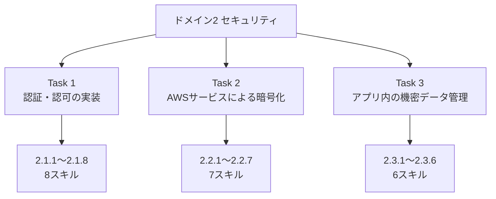

### 0-4　試験範囲外（Out of scope）の目安

公式ガイドは、受験者に期待されない業務として、アーキテクチャ設計、CI/CDパイプラインの設計・作成、**IAMユーザー／グループの管理**、サーバー／OSの管理、ネットワーク基盤の設計（VPC、Direct Connectなど）を挙げています。したがって本ガイドでは、IAMは「**開発者として安全に使う**」観点（ロール、ポリシーを読み書きする、トークンを扱う）を中心に学びます。

### 0-5　学習ロードマップ

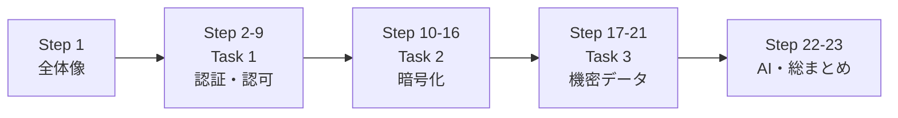

### 0-6　各Stepの読み方

各Stepは次の順序で書かれています。

1. **試験で問われること**（対応するスキルID）
2. **やさしい解説**（用語の意味から）
3. **図・表**（Mermaidと表）
4. **コード例**（CLI／Python／JSON）
5. **ベストプラクティス**
6. **試験のひっかけポイント**
7. **根拠ソース（URL）**

> **注意**：AWSのサービスは頻繁に更新されます。数値（上限・既定値）や新機能は、受験直前に必ず公式ドキュメントで再確認してください。

---

<a id="step-1"></a>

## Step 1　セキュリティの全体像

### 1-1　責任共有モデル

AWSでは、セキュリティの責任をAWSと利用者で分担します。

| 区分 | 責任を持つ側 | 具体例 |
|---|---|---|
| クラウド**の**セキュリティ | AWS | データセンター、ハードウェア、ホストOS、マネージドサービスの基盤 |
| クラウド**における**セキュリティ | 利用者（開発者） | IAM設定、アプリのコード、データの暗号化設定、シークレットの扱い、OS／ミドルウェアのパッチ（EC2の場合） |

開発者が直接責任を負うのは「**自分のアプリが誰に何を許すか（認証・認可）**」「**データをどう守るか（暗号化）**」「**秘密情報をどう持つか（機密管理）**」です。これがそのままドメイン2の3タスクになります。

### 1-2　セキュリティの4本柱

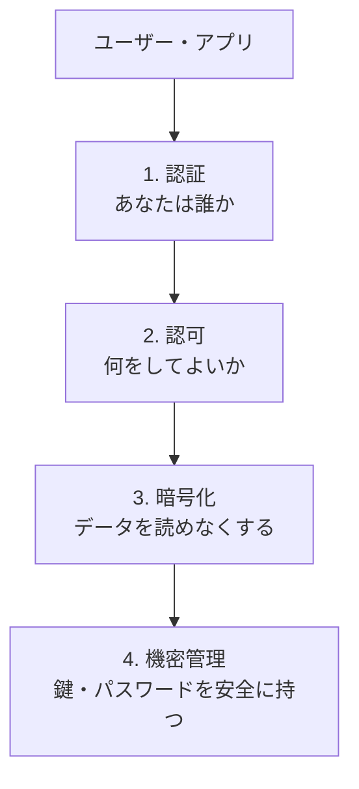

### 1-3　最重要用語

| 用語 | 意味 | 例 |
|---|---|---|
| 認証（AuthN） | 本人確認 | パスワード、MFA、署名付きリクエスト |
| 認可（AuthZ） | 権限の確認 | 「このユーザーはこのS3バケットを読める」 |
| プリンシパル | 操作主体（人・ロール・サービス） | IAMユーザー、IAMロール、AWSサービス |
| ポリシー | 権限を記述したJSON | Allow / Deny、Action、Resource、Condition |
| 一時認証情報 | 有効期限つき認証情報 | STSが発行（アクセスキーID＋シークレット＋セッショントークン） |
| 保管時の暗号化 | 保存されたデータの暗号化 | S3のSSE、EBS暗号化 |
| 転送中の暗号化 | 通信経路の暗号化 | TLS（HTTPS） |
| 最小権限 | 必要最小限の権限だけ与える原則 | 特定バケット・特定アクションのみ許可 |

### 1-4　全Stepを貫く「5つの大原則」

1. **最小権限**：必要な権限だけを与える。
2. **長期認証情報を避ける**：IAMロールと一時認証情報を使う。
3. **コードに秘密を書かない**：Secrets ManagerやParameter Storeから取得する。
4. **常に暗号化**：保管時も転送中も。
5. **多層防御**：認証・認可・暗号化・ログを重ねる。

### 根拠ソース（Step 0・1）

- 試験ガイド（DVA-C02）：https://docs.aws.amazon.com/aws-certification/latest/developer-associate-02/developer-associate-02.html
- ドメイン2（Security）：https://docs.aws.amazon.com/aws-certification/latest/developer-associate-02/developer-associate-02-domain2.html
- 対象サービス一覧（In-Scope）：https://docs.aws.amazon.com/aws-certification/latest/developer-associate-02/dva-02-in-scope-services.html
- 資格ページ：https://aws.amazon.com/certification/certified-developer-associate/
- 責任共有モデル：https://aws.amazon.com/compliance/shared-responsibility-model/
- IAMのセキュリティベストプラクティス：https://docs.aws.amazon.com/IAM/latest/UserGuide/best-practices.html

---

# Task 1：認証・認可の実装

<a id="step-2"></a>

## Step 2　IAMの基礎とポリシー評価（Skill 2.1.6）

### 試験で問われること

**「IAMプリンシパルの権限を定義する」**：ポリシーの種類を理解し、JSONを読み書きし、最小権限で設計できること。

### 2-1　IAMの登場人物

| 要素 | 説明 | 開発者の関わり方 |
|---|---|---|
| IAMユーザー | 長期認証情報を持つ個人・アプリ | できるだけ使わない |
| IAMグループ | ユーザーの集まり | 管理者が扱う（範囲外） |
| **IAMロール** | 一時的に引き受ける権限の入れ物 | **主役**。Lambda、EC2、ECSなどに付ける |
| ポリシー | 権限のJSON | 読み書きできる必要がある |

### 2-2　ポリシーの種類

| 種類 | アタッチ先 | 役割 |
|---|---|---|
| アイデンティティベース | ユーザー・グループ・ロール | 「この主体は何ができるか」 |
| リソースベース | S3バケット、SQSキュー、KMSキー、Lambdaなど | 「このリソースに誰が何をできるか」 |
| 信頼ポリシー | IAMロール | 「誰がこのロールを引き受けられるか」 |
| アクセス許可の境界 | ユーザー・ロール | 付与できる権限の**上限** |
| SCP（Organizations） | アカウント・OU | アカウント全体の**上限** |
| セッションポリシー | 一時セッション | その場の権限をさらに**絞る** |

### 2-3　ポリシーの構造

```json
{
  "Version": "2012-10-17",
  "Statement": [
    {
      "Sid": "ReadOnlyOneBucket",
      "Effect": "Allow",
      "Action": ["s3:GetObject", "s3:ListBucket"],
      "Resource": [
        "arn:aws:s3:::my-app-bucket",
        "arn:aws:s3:::my-app-bucket/*"
      ],
      "Condition": {
        "Bool": { "aws:SecureTransport": "true" }
      }
    }
  ]
}
```

| 要素 | 意味 |
|---|---|
| Effect | Allow または Deny |
| Action | 許可・拒否するAPI操作 |
| Resource | 対象リソースのARN |
| Principal | リソースベースポリシーで「誰に」 |
| Condition | 追加条件（IP、タグ、MFA、TLSなど） |

> `s3:ListBucket` は**バケットARN**、`s3:GetObject` は**オブジェクトARN（`/*`付き）**に対する権限です。両方のResourceを書き忘れるのが典型的な失敗です。

### 2-4　ポリシー評価のルール

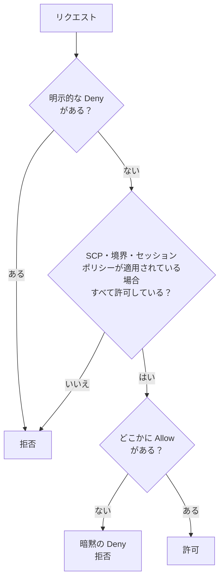

**覚えるべき3原則**

1. 既定は**暗黙のDeny**（何も許可がなければ拒否）。
2. **明示的なDenyは常に最優先**。
3. 同一アカウント内では、アイデンティティベースかリソースベースのどちらかがAllowなら許可されうる。**アカウントをまたぐ場合は、両側の許可が必要**（Step 15でKMSを例に再確認）。

### 2-5　便利な条件キー

| 条件キー | 用途 |
|---|---|
| `aws:SecureTransport` | HTTPS通信のみ許可（S3バケットポリシーの定番） |
| `aws:PrincipalTag/キー` | 主体のタグによるABAC |
| `aws:PrincipalOrgID` | 組織内のアカウントに限定 |
| `aws:MultiFactorAuthPresent` | MFAを使った場合のみ許可 |
| `aws:SourceArn` / `aws:SourceAccount` | 混乱した代理問題の対策（Step 3） |
| `kms:ViaService` | 特定サービス経由のKMS利用に限定（Step 11） |

### 2-6　ベストプラクティス

| # | ベストプラクティス | 理由 |
|---|---|---|
| 1 | AWSマネージドポリシーで始め、**カスタマー管理ポリシーで絞り込む** | 広すぎる権限を避ける |
| 2 | `"Action": "*"` と `"Resource": "*"` の同時使用を避ける | 事実上の管理者権限になる |
| 3 | 開発中はアクセスアドバイザー／ポリシー生成などで、実際に使った権限に絞る | 最小権限の継続的な見直し |
| 4 | 条件キーでHTTPS・MFA・組織を強制 | 多層防御 |
| 5 | rootユーザーは日常で使わない | 権限が無制限 |

### 試験のひっかけ

- 「明示的なDenyとAllowが競合したら？」→ **Denyが勝つ**。
- 「ポリシーを何もアタッチしていない新規ユーザーの権限は？」→ **暗黙のDenyで何もできない**。
- 「アクセス許可の境界だけでAllowされる？」→ **されない**（境界は上限であり、許可を付与しない）。

### 根拠ソース

- IAMポリシーの評価ロジック：https://docs.aws.amazon.com/IAM/latest/UserGuide/reference_policies_evaluation-logic.html
- IAMのポリシーとアクセス許可：https://docs.aws.amazon.com/IAM/latest/UserGuide/access_policies.html
- IAMのセキュリティベストプラクティス：https://docs.aws.amazon.com/IAM/latest/UserGuide/best-practices.html
- ABAC：https://docs.aws.amazon.com/IAM/latest/UserGuide/introduction_attribute-based-access-control.html

---

<a id="step-3"></a>

## Step 3　IAMロールとAWS STS（Skill 2.1.5）

### 試験で問われること

**「IAMロールを引き受ける（Assume an IAM role）」**：誰が・どうやってロールを引き受け、何が返ってくるかを理解すること。

### 3-1　ロールとは

IAMロールは「**一時的に着る制服**」のようなものです。ロールには固定のパスワードやアクセスキーがありません。引き受けると、AWS STS（Security Token Service）が**有効期限つきの一時認証情報**を発行します。

| 一時認証情報の構成要素 | 説明 |
|---|---|
| AccessKeyId | 一時的なアクセスキーID（`ASIA`で始まる） |
| SecretAccessKey | 署名用の秘密鍵 |
| SessionToken | 一時認証情報であることを示すトークン（必須） |
| Expiration | 有効期限 |

### 3-2　ロールの2つのポリシー

| ポリシー | 役割 | 例 |
|---|---|---|
| **信頼ポリシー** | 誰がこのロールを引き受けられるか | `lambda.amazonaws.com` に許可 |
| **アクセス許可ポリシー** | 引き受けた後に何ができるか | S3の読み取りなど |

Lambdaの実行ロール用の信頼ポリシー例：

```json
{
  "Version": "2012-10-17",
  "Statement": [
    {
      "Effect": "Allow",
      "Principal": { "Service": "lambda.amazonaws.com" },
      "Action": "sts:AssumeRole"
    }
  ]
}
```

### 3-3　AssumeRoleの流れ

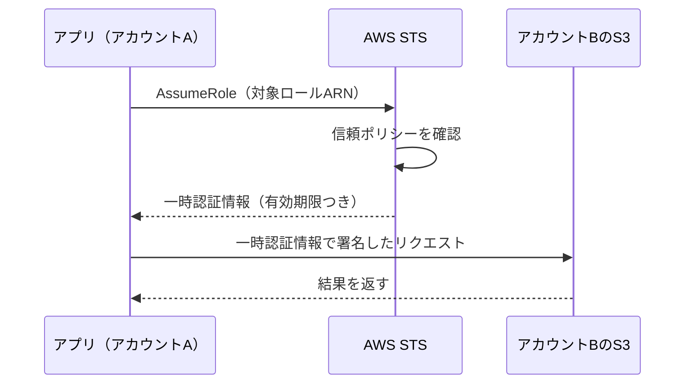

### 3-4　STSの主なAPI

| API | 引き受ける主体 | 典型的な用途 |
|---|---|---|
| `AssumeRole` | IAMユーザー／ロール | クロスアカウント、権限の一時的な切り替え |
| `AssumeRoleWithWebIdentity` | OIDC対応IdPのユーザー | Cognito、GitHub Actions、EKSのIRSA |
| `AssumeRoleWithSAML` | SAML 2.0のユーザー | 企業IdPとのフェデレーション |
| `GetSessionToken` | IAMユーザー | MFA付き一時認証情報 |
| `GetCallerIdentity` | 誰でも | 「今の自分は誰か」を確認（権限不要） |

### 3-5　セッション時間のポイント

- `AssumeRole`の既定のセッション時間は**1時間**。最小15分、最大はロールの**最大セッション期間**（1〜12時間の設定）まで。
- **ロールチェーン**（ロールからさらに別ロールを引き受ける）の場合、セッションは**最大1時間**に制限される。

### 3-6　コード例

**CLIで確認**

```bash
# 今のIDを確認（デバッグの基本）
aws sts get-caller-identity

# 別アカウントのロールを引き受ける
aws sts assume-role \
  --role-arn arn:aws:iam::222233334444:role/PartnerReadRole \
  --role-session-name dev-session \
  --external-id my-external-id
```

**Python（boto3）**

```python
import boto3

sts = boto3.client("sts")
resp = sts.assume_role(
    RoleArn="arn:aws:iam::222233334444:role/PartnerReadRole",
    RoleSessionName="dev-session",
    ExternalId="my-external-id",
    DurationSeconds=900,
)
c = resp["Credentials"]

s3 = boto3.client(
    "s3",
    aws_access_key_id=c["AccessKeyId"],
    aws_secret_access_key=c["SecretAccessKey"],
    aws_session_token=c["SessionToken"],
)
print(s3.list_buckets()["Buckets"])
```

### 3-7　混乱した代理問題（Confused Deputy）と対策

第三者サービスにロールの引き受けを許可するとき、別の顧客がそのサービスを悪用して**自分のロールを引き受けさせる**リスクがあります。

| 対策 | 使いどころ |
|---|---|
| `ExternalId`（外部ID） | サードパーティ（SaaSなど）にクロスアカウントロールを渡すとき |
| `aws:SourceArn` / `aws:SourceAccount` | AWSサービス（SNS、S3、Lambdaなど）がロールやリソースを使うとき |

### 3-8　AWSサービスにロールを渡す：PassRole

LambdaやECSのタスクを作る開発者は、**そのロールをサービスに「渡す」権限**（`iam:PassRole`）が必要です。この権限は、渡せるロールを**特定のARNに限定**するのが鉄則です。

```json
{
  "Effect": "Allow",
  "Action": "iam:PassRole",
  "Resource": "arn:aws:iam::111122223333:role/MyLambdaExecutionRole",
  "Condition": { "StringEquals": { "iam:PassedToService": "lambda.amazonaws.com" } }
}
```

### 3-9　コンピュートごとの「ロールの付け方」

| 実行環境 | ロールの仕組み |
|---|---|
| Lambda | 実行ロール（Execution Role） |
| EC2 | インスタンスプロファイル（ロールを格納） |
| ECS | タスクロール（アプリ用）とタスク実行ロール（イメージ取得・ログ・シークレット取得用） |
| EKS | IRSA（OIDC）またはEKS Pod Identity |
| CodeBuild / CodePipeline | サービスロール |

### 3-10　ベストプラクティス

| # | ベストプラクティス |
|---|---|
| 1 | アプリの認証は**ロール**で行い、IAMユーザーのアクセスキーを埋め込まない |
| 2 | 信頼ポリシーの`Principal`を**具体的に**書く（`"AWS": "*"`は避ける） |
| 3 | セッション時間は必要最小限にする |
| 4 | サードパーティには`ExternalId`を使う |
| 5 | ECSでは「タスクロール」と「タスク実行ロール」を混同しない |

### 試験のひっかけ

- 「EC2上のアプリにアクセスキーを配る」→ ほぼ常に**誤り**。**インスタンスプロファイル（ロール）**が正解。
- 「ロールにはアクセスキーがある」→ **誤り**。引き受け時に一時認証情報が発行される。
- 「`SessionToken`は任意」→ **誤り**。一時認証情報では必須。

### 根拠ソース

- IAMロール：https://docs.aws.amazon.com/IAM/latest/UserGuide/id_roles.html
- AssumeRole API：https://docs.aws.amazon.com/STS/latest/APIReference/API_AssumeRole.html
- 混乱した代理問題：https://docs.aws.amazon.com/IAM/latest/UserGuide/confused-deputy.html
- Lambda実行ロール：https://docs.aws.amazon.com/lambda/latest/dg/lambda-intro-execution-role.html
- EC2のIAMロール：https://docs.aws.amazon.com/AWSEC2/latest/UserGuide/iam-roles-for-amazon-ec2.html
- ECSタスクIAMロール：https://docs.aws.amazon.com/AmazonECS/latest/developerguide/task-iam-roles.html
- EKS Pod Identity：https://docs.aws.amazon.com/eks/latest/userguide/pod-identities.html

---

<a id="step-4"></a>

## Step 4　プログラムによるアクセスの設定（Skill 2.1.3）

### 試験で問われること

**「AWSへのプログラムアクセスを設定する」**：CLI・SDKが認証情報をどこから取得するかを理解し、安全な方法を選べること。

### 4-1　アクセス方法の整理

| 方法 | 使う場面 |
|---|---|
| マネジメントコンソール | 人が画面で操作 |
| AWS CLI | シェルから操作・スクリプト |
| AWS SDK（boto3など） | アプリケーションコード |
| 直接REST API | 通常はSDKに任せる（SigV4署名が必要。Step 5） |

### 4-2　認証情報の種類と安全性

| 種類 | 例 | 安全性 |
|---|---|---|
| ロールの一時認証情報 | Lambda、EC2、ECSが自動取得 | 高い（自動更新・失効する） |
| IAM Identity Centerのセッション | `aws sso login` | 高い（人間の開発者向け） |
| IAMユーザーのアクセスキー（長期） | `AKIA...` | 低い（漏洩リスク。使わないのが理想） |
| rootのアクセスキー | - | **作らない** |

### 4-3　認証情報プロバイダーチェーン

SDK／CLIは、認証情報を**決まった順序で探索**します。代表的な探索元は次のとおりです（細かい順序はSDKごとに異なるため、公式の「標準化された認証情報プロバイダー」を確認してください）。

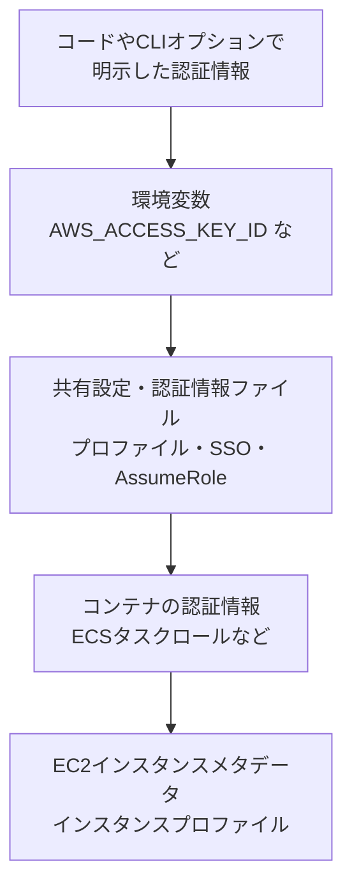

> 「ローカル開発では環境変数やプロファイル、AWS上の実行環境ではロール」と使い分けます。**コード内に認証情報を書く必要はありません**。

### 4-4　ローカル開発の推奨設定（IAM Identity Center）

```bash
# 初回のみ：SSOプロファイルを作成
aws configure sso

# ログイン（ブラウザで認証。一時認証情報が取得される）
aws sso login --profile dev

# プロファイルを使って実行
aws s3 ls --profile dev
```

プロファイルのAssumeRole設定例（`~/.aws/config`）：

```ini
[profile partner]
role_arn = arn:aws:iam::222233334444:role/PartnerReadRole
source_profile = dev
role_session_name = dev-session
region = ap-northeast-1
```

### 4-5　EC2のメタデータ：IMDSv2

EC2上のアプリはインスタンスメタデータサービス（IMDS）から一時認証情報を取得します。SSRF攻撃による認証情報の窃取を防ぐため、**セッショントークン方式のIMDSv2**を必須にします。

```bash
# IMDSv2：まずトークンを取得してからメタデータを読む
TOKEN=$(curl -s -X PUT "http://169.254.169.254/latest/api/token" \
  -H "X-aws-ec2-metadata-token-ttl-seconds: 21600")
curl -s -H "X-aws-ec2-metadata-token: $TOKEN" \
  http://169.254.169.254/latest/meta-data/iam/security-credentials/
```

### 4-6　AWS外の環境から使う場合

| 状況 | 推奨 |
|---|---|
| オンプレミス・他クラウドのワークロード | IAM Roles Anywhere（X.509証明書で一時認証情報を取得） |
| GitHub Actionsなど外部CI | OIDCフェデレーション（`AssumeRoleWithWebIdentity`）。長期キー不要 |
| 開発者のPC | IAM Identity Center |

### 4-7　ベストプラクティス

| # | ベストプラクティス |
|---|---|
| 1 | 長期アクセスキーを**作らない・使わない**。やむを得ない場合は定期的にローテーションし、使っていないキーは無効化・削除 |
| 2 | **コード・Git・ログ・環境変数ファイルにキーを残さない**（`.gitignore`、シークレットスキャン） |
| 3 | AWS上ではロール、人にはIdentity Centerを使う |
| 4 | プロファイルを使い分けて本番と開発を混ぜない |
| 5 | EC2ではIMDSv2を必須にする |

### 試験のひっかけ

- 「Lambdaのコードに`aws_access_key_id`を直書き」→ **誤り**。実行ロールを使う。
- 「Gitに誤ってキーをコミットした」→ キーを**即時に無効化・削除**してから新規発行し、履歴の対処をする（コミットを消すだけでは不十分）。

### 根拠ソース

- SDK・ツール共通の認証情報プロバイダー（標準化）：https://docs.aws.amazon.com/sdkref/latest/guide/standardized-credentials.html
- AWS CLIの認証設定：https://docs.aws.amazon.com/cli/latest/userguide/cli-chap-authentication.html
- IAM Identity Center：https://docs.aws.amazon.com/singlesignon/latest/userguide/what-is.html
- IAM Roles Anywhere：https://docs.aws.amazon.com/rolesanywhere/latest/userguide/introduction.html
- IMDSv2：https://docs.aws.amazon.com/AWSEC2/latest/UserGuide/configuring-instance-metadata-service.html
- 長期アクセスキーの代替：https://docs.aws.amazon.com/IAM/latest/UserGuide/best-practices.html

---

<a id="step-5"></a>

## Step 5　AWSサービスへの認証済み呼び出し（Skill 2.1.4）

### 試験で問われること

**「AWSサービスへ認証付きの呼び出しをする」**：リクエスト署名（SigV4）の考え方と、各サービスが採用する認証方式の違いを理解すること。

### 5-1　Signature Version 4（SigV4）とは

AWS APIへのリクエストは、**シークレットアクセスキーを使って署名**します。シークレット自体はネットワークに送りません。サーバーは同じ計算を行い、署名が一致すれば本人のリクエストと判断します。

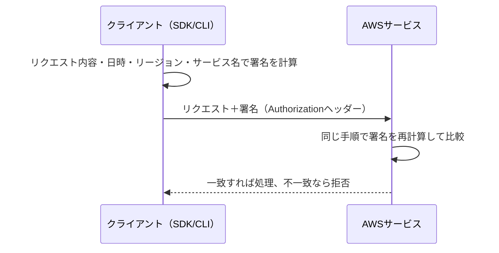

| ポイント | 内容 |
|---|---|
| 署名の対象 | HTTPメソッド、パス、ヘッダー、ペイロードのハッシュ、日時など |
| 一時認証情報を使う場合 | `X-Amz-Security-Token`（セッショントークン）も付与 |
| 通常は自分で実装しない | **SDK／CLIが自動で署名する** |
| 署名エラーの典型原因 | 端末の時刻ずれ、リージョン違い、キーの誤り、期限切れ |

### 5-2　署名付きURL（Presigned URL）

認証情報を持たない第三者に、**期限つきで特定操作だけ**を許可する仕組みです（S3が代表例）。

```python
import boto3

s3 = boto3.client("s3", region_name="ap-northeast-1")
url = s3.generate_presigned_url(
    "get_object",
    Params={"Bucket": "my-app-bucket", "Key": "reports/2026-10.pdf"},
    ExpiresIn=300,  # 5分
)
print(url)
```

| 注意点 | 内容 |
|---|---|
| 権限 | URLを**作った主体の権限**で実行される。作成者に権限がなければ使えない |
| 有効期限 | 一時認証情報（ロール）で作成した場合、**認証情報の有効期限を超えては使えない** |
| 運用 | 期限は**できるだけ短く**し、URLをログに残さない |

### 5-3　サービスごとの認証方式（開発者が選ぶ場面）

| サービス | 主な認証・認可オプション |
|---|---|
| API Gateway | IAM（SigV4）、Cognitoユーザープールオーソライザー（REST）、JWTオーソライザー（HTTP API）、Lambdaオーソライザー、リソースポリシー |
| Lambda関数URL | `AWS_IAM`（SigV4）または`NONE`（公開） |
| AppSync | APIキー、Cognitoユーザープール、IAM、OIDC、Lambda |
| S3 | IAM／バケットポリシー／署名付きURL |
| ALB | OIDC／Cognito認証アクション（リスナールール） |

### 5-4　API Gatewayの認証オプション比較

| 方式 | 向いている場面 | 備考 |
|---|---|---|
| IAM認証 | AWS内のサービス間・社内システム | SigV4が必要。呼び出し元にIAM権限を付与 |
| Cognitoオーソライザー／JWTオーソライザー | モバイル・Webのエンドユーザー | トークンを検証（Step 7） |
| Lambdaオーソライザー | 独自のトークン・サードパーティIdP・複雑なロジック | 戻り値としてIAMポリシーを返す。結果をキャッシュ可能 |
| リソースポリシー | IP制限、特定アカウント・VPCエンドポイントからのみ | 他方式と併用 |
| APIキー | **使用量プランによるスロットリング・計量用** | **認証・認可の手段としては不十分** |

### 5-5　ベストプラクティス

| # | ベストプラクティス |
|---|---|
| 1 | 自前でSigV4を実装せず、SDK／CLIを使う |
| 2 | 署名付きURLの期限を短くし、用途（GET／PUT）を限定する |
| 3 | 公開APIでも、認可なし（`NONE`）にする理由を明確にする |
| 4 | APIキーを認証の代わりに使わない |
| 5 | 署名エラーでは**時刻・リージョン・認証情報の期限**を最初に確認する |

### 試験のひっかけ

- 「APIキーでAPIを保護する」→ APIキーは**認証ではない**（使用量制御）。
- 「署名付きURLは誰でも作れる」→ **作成者の権限で動く**。

### 根拠ソース

- SigV4（AWS API リクエストの署名）：https://docs.aws.amazon.com/IAM/latest/UserGuide/reference_sigv.html
- S3の署名付きURL：https://docs.aws.amazon.com/AmazonS3/latest/userguide/using-presigned-url.html
- API Gatewayのアクセス制御：https://docs.aws.amazon.com/apigateway/latest/developerguide/apigateway-control-access-to-api.html
- Lambdaオーソライザー：https://docs.aws.amazon.com/apigateway/latest/developerguide/apigateway-use-lambda-authorizer.html
- Lambda関数URLの認証：https://docs.aws.amazon.com/lambda/latest/dg/urls-auth.html
- AppSyncの認可：https://docs.aws.amazon.com/appsync/latest/devguide/security-authz.html

---
<a id="step-6"></a>

## Step 6　IDプロバイダーによるフェデレーション（Skill 2.1.1）

### 試験で問われること

**「IDプロバイダー（IdP）を使ってフェデレーションアクセスを実装する（例：Amazon Cognito、IAM）」**

### 6-1　フェデレーションとは

「**自社でユーザー管理せず、すでに信頼されたIdP（Google、企業のAD、Apple等）の認証結果を借りる**」仕組みです。ユーザーは、IdPで認証され、その証明（トークン／アサーション）を使ってアプリやAWSにアクセスします。

| 用語 | 意味 |
|---|---|
| IdP（IDプロバイダー） | ユーザーを認証する側（Google、Entra ID、Okta、企業ADなど） |
| SP / アプリ | 認証結果を受け取る側 |
| SAML 2.0 | 企業向けSSOで多いXMLベースのプロトコル |
| OpenID Connect（OIDC） | OAuth 2.0の上に作られたIDレイヤー。JWT形式のIDトークンを使う |
| OAuth 2.0 | 認可の枠組み（アクセストークンの発行方法を定める） |

### 6-2　AWSでフェデレーションを実現する3つの道

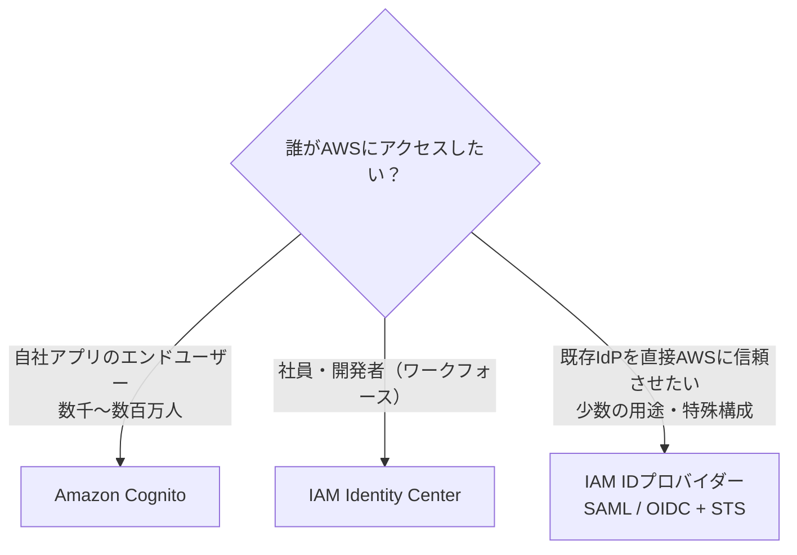

| 選択肢 | 用途 | 仕組み |
|---|---|---|
| **Amazon Cognito** | アプリのユーザー管理・サインイン | ユーザープール＋IDプール |
| **IAM Identity Center** | 社員のAWSアカウント／アプリへのSSO | 外部IdPと連携、権限セット |
| **IAM IDプロバイダー（SAML／OIDC）** | 既存IdPと直接フェデレーション。GitHub Actions、EKSのIRSAなど | `AssumeRoleWithSAML` / `AssumeRoleWithWebIdentity` |

### 6-3　Amazon Cognitoの2本柱

| | **ユーザープール（User Pools）** | **IDプール（Identity Pools）** |
|---|---|---|
| 役割 | **ユーザーディレクトリ＋認証** | **AWS一時認証情報の発行** |
| 出力 | JWT（IDトークン、アクセストークン、リフレッシュトークン） | STS一時認証情報（AWSリソースへ直接アクセス用） |
| 認証元 | 自前ユーザー、Google／Apple等のソーシャル、SAML、OIDC | ユーザープール、ソーシャル、SAML、OIDC、（任意で）未認証ゲスト |
| 主な用途 | サインアップ／サインイン、MFA、API Gatewayの保護 | モバイル・Webから**S3やDynamoDBを直接**呼ぶ |
| 覚え方 | 「**誰か**を確認する」 | 「**AWSに入る鍵**を渡す」 |

Cognitoの公式ドキュメントでは、**IDトークンはユーザーの認証、アクセストークンはユーザーの認可、リフレッシュトークンは認証情報の更新**に使うと整理されています。

### 6-4　代表的な構成：ユーザープール＋IDプール

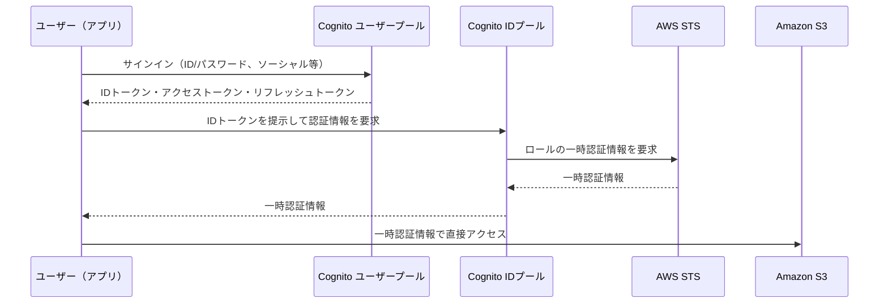

### 6-5　IDプールが付与するロール

| ロール | 対象 |
|---|---|
| 認証済みロール | サインイン済みユーザー |
| 未認証ロール | ゲスト（有効にする場合）。**最小権限**に |
| ロールマッピング | ユーザーの属性やグループに応じて異なるロールを割り当て |

### 6-6　Cognito ユーザープールの主な機能

| 機能 | 内容 |
|---|---|
| サインイン方式 | ユーザー名／メール／電話、パスキー、ワンタイムパスワードなど |
| MFA | SMS、TOTP、メール OTP など |
| ソーシャル／SAML／OIDC連携 | 外部IdPのユーザーをユーザープールに統合 |
| グループ | ユーザーをグループに分類し、IDプールのロール割り当てや認可に利用 |
| Lambdaトリガー | サインアップ前検証、トークン生成前のクレーム追加（Pre Token Generation）など |
| 機能プラン | Lite／Essentials／Plusのプランがあり、新規ユーザープールの既定はEssentials（料金・機能は公式で要確認） |

### 6-7　SAML／OIDCとIAMを直接つなぐ場合

```json
{
  "Version": "2012-10-17",
  "Statement": [
    {
      "Effect": "Allow",
      "Principal": { "Federated": "arn:aws:iam::111122223333:oidc-provider/token.actions.githubusercontent.com" },
      "Action": "sts:AssumeRoleWithWebIdentity",
      "Condition": {
        "StringEquals": {
          "token.actions.githubusercontent.com:aud": "sts.amazonaws.com"
        },
        "StringLike": {
          "token.actions.githubusercontent.com:sub": "repo:my-org/my-repo:ref:refs/heads/main"
        }
      }
    }
  ]
}
```

> 信頼ポリシーの`sub`（主体）条件を絞らないと、**他リポジトリのワークフローにも引き受けを許してしまう**ため必須です。

### 6-8　ベストプラクティス

| # | ベストプラクティス |
|---|---|
| 1 | パスワードを自前で保存せず、Cognitoなどの**マネージドIdP**に任せる |
| 2 | 認証コードフロー＋**PKCE**を使う（SPAやモバイルでは特に）。Implicitグラントは避ける |
| 3 | **MFA**を有効にする（可能なら必須に） |
| 4 | IDプールの**未認証アクセスは原則無効**。有効にしても権限を最小限にする |
| 5 | IDプールのロールには**ポリシー変数**（例：ユーザーIDごとのS3プレフィックス）で個人単位に絞る（Step 8） |
| 6 | IdP側の信頼ポリシーで`aud`・`sub`を必ず検証 |

### 試験のひっかけ

| 問い | 答え |
|---|---|
| アプリのユーザーがS3に**直接**アップロードしたい | IDプール（一時認証情報） |
| API GatewayをCognitoで保護したい | **ユーザープール**のトークン（IDプールではない） |
| 社員が複数AWSアカウントにSSOしたい | IAM Identity Center |
| 企業のSAML IdPのユーザーをアプリに統合 | ユーザープールのSAML連携 |

### 根拠ソース

- Cognitoの用語と概念：https://docs.aws.amazon.com/cognito/latest/developerguide/cognito-terms.html
- Amazon Cognitoとは：https://docs.aws.amazon.com/cognito/latest/developerguide/what-is-amazon-cognito.html
- Cognito IDプール：https://docs.aws.amazon.com/cognito/latest/developerguide/cognito-identity.html
- IAMのIDプロバイダーとフェデレーション：https://docs.aws.amazon.com/IAM/latest/UserGuide/id_roles_providers.html
- IAM Identity Center：https://docs.aws.amazon.com/singlesignon/latest/userguide/what-is.html
- AssumeRoleWithWebIdentity：https://docs.aws.amazon.com/STS/latest/APIReference/API_AssumeRoleWithWebIdentity.html

---

<a id="step-7"></a>

## Step 7　ベアラートークンによるアプリの保護（Skill 2.1.2）

### 試験で問われること

**「ベアラートークンでアプリケーションを保護する」**：JWTの構造、検証すべき項目、Cognitoのトークンの種類と有効期限を理解すること。

### 7-1　ベアラートークンとは

「**持っている人（bearer）を正当な利用者とみなす**」トークンです。HTTPの`Authorization`ヘッダーで送ります。

```http
GET /orders HTTP/1.1
Host: api.example.com
Authorization: Bearer eyJraWQiOiJ...（JWT）
```

**鍵のかかっていない鍵束**のようなもので、盗まれると誰でも使えます。そのため、**HTTPS必須・短い有効期限・安全な保管**が絶対条件です（RFC 6750）。

### 7-2　JWT（JSON Web Token）の構造

JWTは `ヘッダー.ペイロード.署名` の3部構成で、各部をBase64URLエンコードしてドットで連結します。

| パート | 内容 | 例 |
|---|---|---|
| ヘッダー | アルゴリズムと鍵ID | `alg`、`kid` |
| ペイロード（クレーム） | 発行者、対象者、有効期限、ユーザー情報 | `iss`、`aud`（またはclient_id）、`exp`、`sub`、`scope` |
| 署名 | 改ざん検知 | 発行者の秘密鍵で署名 |

> **ペイロードは暗号化ではなくエンコードにすぎません**。誰でも読めるため、**秘密情報（パスワードなど）を入れない**こと。

### 7-3　JWTを検証するときのチェックリスト

| # | 検証項目 | 失敗すると |
|---|---|---|
| 1 | **署名**が発行元の公開鍵（JWKS）で正しい | 偽造トークンを受け入れる |
| 2 | **`exp`**（有効期限）が切れていない | 失効トークンの再利用 |
| 3 | **`iss`**（発行者）が想定したユーザープールか | 他のIdPのトークンを受け入れる |
| 4 | **`aud` / `client_id`** が自分のアプリか | 他アプリ向けトークンの流用 |
| 5 | **`token_use`**（`id`／`access`）が期待どおりか | IDトークンをAPI認可に誤用 |
| 6 | **`scope`**やグループが必要な権限を満たすか | 認可の抜け |

署名の公開鍵は、ユーザープールの**JWKSエンドポイント**から取得して使います。実運用では、API Gatewayのオーソライザーやライブラリに検証を任せるのが安全です。

### 7-4　Cognitoの3種類のトークン

| トークン | 用途 | 既定の有効期限（設定可） | 送り先 |
|---|---|---|---|
| **IDトークン** | ユーザーが誰かを示す（プロフィール属性など） | 1時間 | アプリ内の本人確認 |
| **アクセストークン** | 認可。スコープ付きでAPIにアクセス | 1時間 | **リソースサーバー（API）** |
| **リフレッシュトークン** | 新しいID／アクセストークンの取得 | 30日 | **Cognitoのみ**（APIに送らない） |

- 有効期限は**アプリクライアント単位**で設定でき、リフレッシュトークンは取り消し（**失効**）が可能です。失効させると、そこから発行されたトークンも使えなくなります。
- **IDトークンとアクセストークンは別の鍵で署名**されます（`kid`が異なる）。それぞれ独立して検証します。

### 7-5　API Gatewayでトークンを検証する流れ

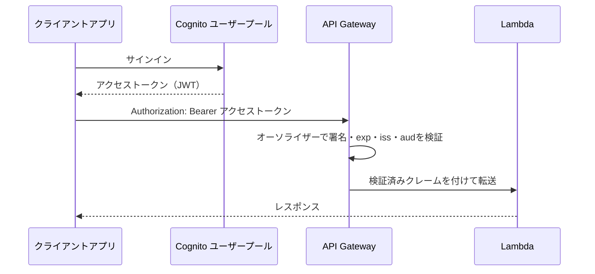

| API種別 | オーソライザー | 設定の要点 |
|---|---|---|
| REST API | Cognitoユーザープールオーソライザー | トークンを渡すヘッダー名を指定。IDトークンまたはスコープ付きアクセストークン |
| HTTP API | JWTオーソライザー | issuerとaudience（クライアントID）を設定。OIDC準拠のIdPならCognito以外も可 |
| 共通 | Lambdaオーソライザー | 独自トークン／外部IdPのためのカスタム検証。認可ポリシーを返す |

### 7-6　OAuth 2.0 の主要なフロー

| フロー | 使う場面 |
|---|---|
| 認可コード＋PKCE | Web・モバイル・SPAのユーザーサインイン（推奨） |
| クライアントクレデンシャル | **マシン間通信（M2M）**。ユーザーを介さずスコープ付きアクセストークンを取得 |
| Implicit | 旧方式。トークンがURLに露出するため非推奨 |

### 7-7　ベストプラクティス

| # | ベストプラクティス |
|---|---|
| 1 | **必ずHTTPS**で送る。URLのクエリ文字列にトークンを入れない |
| 2 | アクセストークンは**短寿命**、更新はリフレッシュトークン |
| 3 | 検証は**署名・exp・iss・aud・token_use**をすべて行う |
| 4 | IDトークンで**API認可をしない**（アクセストークンを使う） |
| 5 | トークンの保存先に注意（Webなら`HttpOnly`・`Secure`クッキーなど。`localStorage`はXSSの影響を受けやすい） |
| 6 | ログアウトやユーザー無効化時に**リフレッシュトークンを失効**させる |
| 7 | トークンを**ログに出力しない** |

### 試験のひっかけ

- 「JWTのペイロードは暗号化されている」→ **誤り**（署名されているだけ）。
- 「リフレッシュトークンをAPIに送る」→ **誤り**（Cognitoのトークンエンドポイント専用）。
- 「APIキーを渡せば認証になる」→ 認証ではない（Step 5）。
- 「M2Mで安全にトークンを得たい」→ **クライアントクレデンシャル**（Cognitoのリソースサーバー＋スコープ）。

### 根拠ソース

- Cognitoのトークン（アクセストークン）：https://docs.aws.amazon.com/cognito/latest/developerguide/amazon-cognito-user-pools-using-the-access-token.html
- リフレッシュトークンの利用・失効：https://docs.aws.amazon.com/cognito/latest/developerguide/amazon-cognito-user-pools-using-the-refresh-token.html
- JWTの検証：https://docs.aws.amazon.com/cognito/latest/developerguide/amazon-cognito-user-pools-using-tokens-verifying-a-jwt.html
- トークン有効期限（CreateUserPoolClient API）：https://docs.aws.amazon.com/cognito-user-identity-pools/latest/APIReference/API_CreateUserPoolClient.html
- API GatewayのJWTオーソライザー（HTTP API）：https://docs.aws.amazon.com/apigateway/latest/developerguide/http-api-jwt-authorizer.html
- RFC 6750（Bearer Token）：https://datatracker.ietf.org/doc/html/rfc6750
- RFC 7519（JWT）：https://datatracker.ietf.org/doc/html/rfc7519

---

<a id="step-8"></a>

## Step 8　アプリケーションレベルの認可（Skill 2.1.7）

### 試験で問われること

**「きめ細かなアクセス制御のため、アプリケーションレベルの認可を実装する」**

### 8-1　認可のレイヤー

| レイヤー | 何を守る？ | 手段 |
|---|---|---|
| **AWSレベル** | AWSのAPIやリソース | IAMポリシー、リソースポリシー |
| **APIレベル** | エンドポイント単位 | API Gatewayオーソライザー、スコープ |
| **アプリケーションレベル** | 「このユーザーはこの注文を編集できるか」など業務ルール | コード内のチェック、ポリシーエンジン、DBの条件 |

IAMだけでは「ユーザーAは自分の注文だけ」といった**アプリ固有の細かい権限**を表現しきれないことがあります。そこでアプリ側でも認可を行います。

### 8-2　RBACとABAC

| 方式 | 考え方 | 例 | 長所 | 短所 |
|---|---|---|---|---|
| **RBAC**（ロールベース） | 役割（admin、editor）に権限を紐づける | Cognitoグループ `admins` | シンプル | ロールが増えやすい |
| **ABAC**（属性ベース） | 属性（部署、タグ、所有者）の一致で判定 | `department = 営業`のデータのみ | スケールしやすい | 設計が難しい |

AWSでは、IAMの**プリンシパルタグ・リソースタグ**によるABACや、Cognitoのトークンのクレーム（グループ、カスタム属性）を使ったABACが使えます。

### 8-3　Cognitoグループ・スコープによるRBAC

```python
# Lambda内でトークンのクレームを使って判定する例（API Gateway検証済みクレーム）
def handler(event, context):
    claims = event["requestContext"]["authorizer"]["claims"]
    groups = claims.get("cognito:groups", "")
    if "admins" not in groups:
        return {"statusCode": 403, "body": "Forbidden"}
    return {"statusCode": 200, "body": "OK"}
```

> HTTP APIのJWTオーソライザーでは`event["requestContext"]["authorizer"]["jwt"]["claims"]`に入ります。API種別でイベント構造が違う点に注意してください。

**認可のよくある失敗：IDOR（他人のIDを指定して他人のデータを見る）**

```python
# 悪い例：リクエストのuserIdを信用している
user_id = event["pathParameters"]["userId"]

# 良い例：検証済みトークンのsubを使う
user_id = event["requestContext"]["authorizer"]["claims"]["sub"]
```

### 8-4　IAMポリシー変数で「自分のデータだけ」を実現（DynamoDB）

Cognito IDプールで直接DynamoDBにアクセスさせる場合、**パーティションキー（LeadingKeys）をユーザーIDに限定**できます。

```json
{
  "Effect": "Allow",
  "Action": ["dynamodb:GetItem", "dynamodb:PutItem", "dynamodb:Query"],
  "Resource": "arn:aws:dynamodb:ap-northeast-1:111122223333:table/UserNotes",
  "Condition": {
    "ForAllValues:StringEquals": {
      "dynamodb:LeadingKeys": ["${cognito-identity.amazonaws.com:sub}"]
    }
  }
}
```

S3でも、ユーザーごとのプレフィックスに限定できます。

```json
{
  "Effect": "Allow",
  "Action": ["s3:GetObject", "s3:PutObject"],
  "Resource": "arn:aws:s3:::my-app-bucket/private/${cognito-identity.amazonaws.com:sub}/*"
}
```

### 8-5　Amazon Verified Permissions（アプリ向けの認可サービス）

| 項目 | 内容 |
|---|---|
| 概要 | アプリの認可ロジックをコードから**ポリシー（Cedar言語）**に切り出して管理するサービス |
| 利点 | 認可ルールの一元管理、監査、変更時にアプリ再デプロイ不要 |
| 連携 | Cognito／OIDC IdP、API Gatewayと連携可能 |

> 試験の主役は、Cognito・IAM・API Gatewayです。Verified Permissionsは「**アプリの認可をポリシーとして外出しする選択肢**」として名前と役割を押さえておけば十分です。

### 8-6　認可の選び方

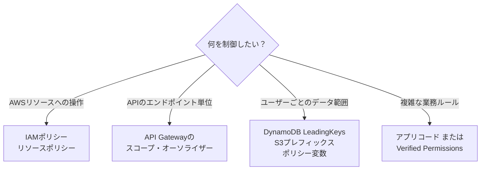

### 8-7　ベストプラクティス

| # | ベストプラクティス |
|---|---|
| 1 | **サーバー側で必ず認可チェック**（フロントのボタン非表示は認可ではない） |
| 2 | ユーザーIDは**検証済みトークン**から取得（リクエストの値を信じない） |
| 3 | 既定は拒否（Deny by default）、許可を明示 |
| 4 | IAMで可能な制御はIAMで、業務ルールだけアプリで実装し二重化 |
| 5 | 権限の変更は**ログ**に残す（CloudTrail、アプリログ） |
| 6 | 大きなロールの代わりに、属性・スコープで**細かく**制御 |

### 試験のひっかけ

- 「フロントエンドで非表示にすれば安全」→ **誤り**。
- 「クライアントが送る`userId`で絞り込む」→ **IDOR脆弱性**。
- 「各ユーザーが自分のDynamoDB行だけアクセス」→ **`dynamodb:LeadingKeys`＋ポリシー変数**。

### 根拠ソース

- IAMのABAC：https://docs.aws.amazon.com/IAM/latest/UserGuide/introduction_attribute-based-access-control.html
- DynamoDBのきめ細かなアクセス制御（IAM条件）：https://docs.aws.amazon.com/amazondynamodb/latest/developerguide/specifying-conditions.html
- IAMポリシー変数：https://docs.aws.amazon.com/IAM/latest/UserGuide/reference_policies_variables.html
- Amazon Verified Permissions：https://docs.aws.amazon.com/verifiedpermissions/latest/userguide/what-is-avp.html
- Cognito IDプールのIAMロール：https://docs.aws.amazon.com/cognito/latest/developerguide/iam-roles.html

---

<a id="step-9"></a>

## Step 9　マイクロサービス間の認証（Skill 2.1.8）

### 試験で問われること

**「マイクロサービスアーキテクチャにおけるサービス間（クロスサービス）認証を扱う」**

### 9-1　2種類の「誰」を区別する

| 種類 | 意味 | 例 |
|---|---|---|
| **エンドユーザーの身元** | 画面を操作している人 | Cognitoのアクセストークン |
| **サービスの身元** | 呼び出しているサービス自体 | IAMロール、クライアントクレデンシャルのトークン |

サービス間通信では、**サービス自身の認証**と、必要に応じて**エンドユーザー情報の伝搬**を分けて考えます。

### 9-2　代表的なパターン

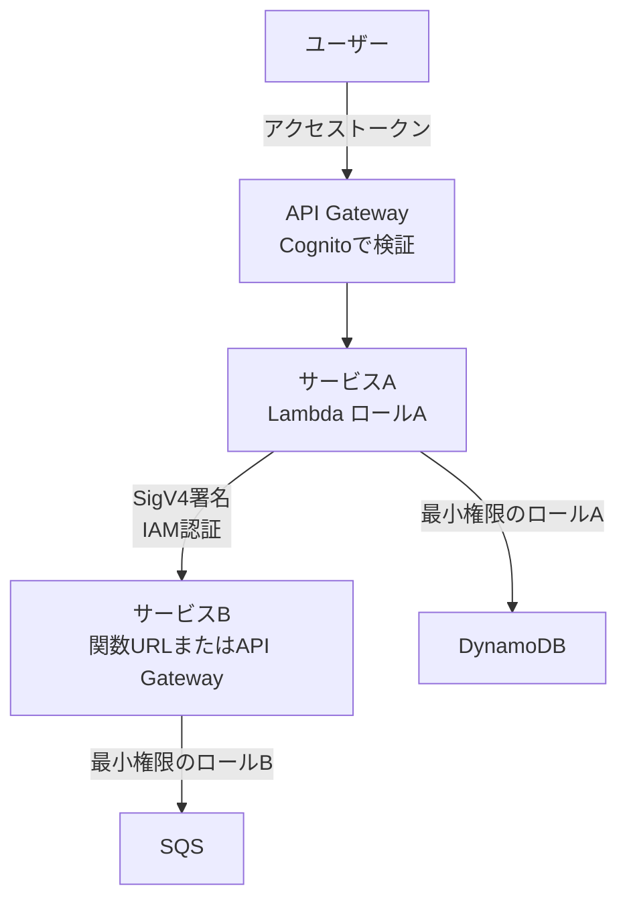

| パターン | 仕組み | 向いている場面 |
|---|---|---|
| **IAM認証（SigV4）** | 呼び出し側のロールが署名し、呼び出される側がIAMで許可 | AWS内のサービス間（API Gateway、Lambda関数URL、AppSyncなど） |
| **リソースベースポリシー** | 呼び出される側で「このロールを許可」と指定 | Lambda、SQS、SNS、S3、EventBridgeなど |
| **OAuth 2.0 クライアントクレデンシャル** | サービスがクライアントID・シークレットでトークンを取得 | IAMを使えない環境、外部システムとのM2M、スコープ制御 |
| **トークンの伝搬** | ユーザーのJWTを下流サービスに引き継ぐ | 下流でもユーザー単位の認可が必要なとき |
| **mTLS** | クライアント証明書で相互認証 | 強い相互認証が要件のとき（Step 13のPrivate CAと関連） |

### 9-3　サービスに権限を付ける：2つの方向

| 方向 | 内容 | 設定場所 |
|---|---|---|
| **呼び出す側に権限** | 「サービスAはサービスBを呼べる」 | Aのロール（アイデンティティベース） |
| **呼び出される側に許可** | 「サービスAからの呼び出しを受け付ける」 | Bのリソースベースポリシー |

例：S3のイベントでLambdaを起動する場合、**Lambdaのリソースベースポリシー**で`s3.amazonaws.com`に`lambda:InvokeFunction`を許可し、混乱した代理問題の対策として`aws:SourceArn`と`aws:SourceAccount`の条件を付けます。

```json
{
  "Effect": "Allow",
  "Principal": { "Service": "s3.amazonaws.com" },
  "Action": "lambda:InvokeFunction",
  "Resource": "arn:aws:lambda:ap-northeast-1:111122223333:function:ProcessUpload",
  "Condition": {
    "ArnLike": { "aws:SourceArn": "arn:aws:s3:::my-app-bucket" },
    "StringEquals": { "aws:SourceAccount": "111122223333" }
  }
}
```

### 9-4　Cognitoのクライアントクレデンシャルによる M2M

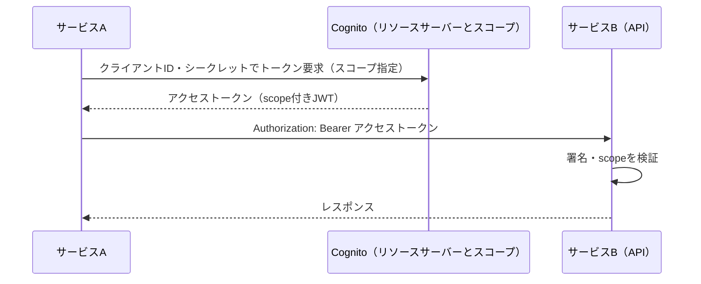

### 9-5　ベストプラクティス

| # | ベストプラクティス |
|---|---|
| 1 | **サービスごとに専用ロール**を作り、権限を最小化（共有ロールを避ける） |
| 2 | AWS内ではまず**IAM認証（SigV4）**を検討（秘密情報の管理が不要） |
| 3 | 共有のシークレットや固定のAPIキーを避ける。使うならSecrets Managerで管理・ローテーション |
| 4 | 呼び出される側で**必ず認可**する（ネットワークが内部でも信用しない） |
| 5 | リソースポリシーに`aws:SourceArn`／`aws:SourceAccount`を付ける |
| 6 | 相関ID（トレースID）を伝搬し、**X-RayやCloudTrail**で呼び出し経路を追跡可能に |
| 7 | 外部のM2Mには**短寿命のスコープ付きトークン**を使う |

### 試験のひっかけ

- 「サービス間は同じVPCだから認証不要」→ **誤り**（ゼロトラストの考え方）。
- 「全サービスで1つの強力なロールを共有」→ **誤り**（最小権限に反する）。
- 「Lambda間呼び出しにアクセスキーを埋め込む」→ **誤り**（実行ロールを使う）。

### 根拠ソース

- Lambdaのリソースベースポリシー：https://docs.aws.amazon.com/lambda/latest/dg/access-control-resource-based.html
- Cognito：リソースサーバーとM2M認可：https://docs.aws.amazon.com/cognito/latest/developerguide/cognito-user-pools-define-resource-servers.html
- API GatewayのIAM認証：https://docs.aws.amazon.com/apigateway/latest/developerguide/permissions.html
- AWS X-Ray：https://docs.aws.amazon.com/xray/latest/devguide/aws-xray.html
- 混乱した代理問題：https://docs.aws.amazon.com/IAM/latest/UserGuide/confused-deputy.html
- Well-Architected（セキュリティの柱）：https://docs.aws.amazon.com/wellarchitected/latest/security-pillar/welcome.html

---
# Task 2：AWSサービスによる暗号化の実装

<a id="step-10"></a>

## Step 10　保管時・転送中の暗号化（Skill 2.2.1）

### 試験で問われること

**「保管時（at rest）の暗号化と転送中（in transit）の暗号化を定義する」**

### 10-1　2つの暗号化

| | 保管時の暗号化（Encryption at rest） | 転送中の暗号化（Encryption in transit） |
|---|---|---|
| 守る対象 | ディスク・DB・バックアップに**保存された**データ | ネットワークを**流れている**データ |
| 主な脅威 | ストレージの不正取得、権限の誤設定 | 盗聴、中間者攻撃 |
| 代表技術 | AES-256、AWS KMS | TLS（HTTPS） |
| AWSでの例 | S3 SSE、EBS・RDS暗号化、DynamoDB暗号化 | HTTPSエンドポイント、ALBのHTTPSリスナー、DBへのTLS接続 |

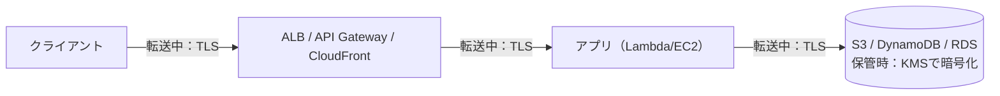

### 10-2　サービス別の保管時暗号化（開発者が知るべき要点）

| サービス | 保管時の暗号化 | 覚えるポイント |
|---|---|---|
| **S3** | 新しいオブジェクトは既定でSSE-S3で暗号化。SSE-KMS、DSSE-KMS、SSE-Cも選択可 | バケットの既定暗号化を明示的に設定し、必要ならKMSキーを指定 |
| **DynamoDB** | **すべてのテーブルが常に保管時に暗号化**（所有キー／AWSマネージドキー／カスタマーマネージドキーから選択） | 暗号化を「オフ」にはできない |
| **EBS** | 暗号化ボリューム（KMS）。アカウントの既定暗号化を有効化可 | 既存の未暗号化ボリュームは、スナップショットのコピー時に暗号化して作り直す |
| **RDS / Aurora** | **作成時**に暗号化を指定（KMS） | 既存の未暗号化DBは、スナップショットをコピーして暗号化し復元 |
| **SQS / SNS** | サーバーサイド暗号化（SSE）をKMSで有効化 | 暗号化キューに発行するサービスにはKMS権限が必要 |
| **Secrets Manager / Parameter Store(SecureString)** | KMSで暗号化 | Step 19 |
| **Lambda環境変数** | 既定で暗号化（KMSキーの変更も可） | Step 18 |

> 最新の既定値や選択肢は変更されるため、各サービスの公式ドキュメントで確認してください。

### 10-3　転送中の暗号化を「強制」する方法

| 場面 | 強制方法 |
|---|---|
| S3 | バケットポリシーで`aws:SecureTransport`が`false`のリクエストをDeny |
| CloudFront | ビューワープロトコルポリシーを「Redirect HTTP to HTTPS」または「HTTPS only」 |
| ALB | HTTPリスナー（80）からHTTPS（443）へのリダイレクト |
| API Gateway | HTTPSのみ（HTTPは利用不可） |
| RDS | パラメーターグループでTLS接続を必須化（例：PostgreSQLの`rds.force_ssl`） |
| SDK／CLI | 既定でHTTPSを使用。エンドポイントを`http://`に変更しない |

S3でHTTPを拒否するバケットポリシー：

```json
{
  "Version": "2012-10-17",
  "Statement": [
    {
      "Sid": "DenyInsecureTransport",
      "Effect": "Deny",
      "Principal": "*",
      "Action": "s3:*",
      "Resource": [
        "arn:aws:s3:::my-app-bucket",
        "arn:aws:s3:::my-app-bucket/*"
      ],
      "Condition": { "Bool": { "aws:SecureTransport": "false" } }
    }
  ]
}
```

### 10-4　ベストプラクティス

| # | ベストプラクティス |
|---|---|
| 1 | **保管時・転送中の両方**を暗号化する（どちらか片方では不十分） |
| 2 | 暗号化は「あとから付ける」より**作成時から**有効化（RDS・EBSの特性） |
| 3 | 機密性の高いデータは**カスタマーマネージドKMSキー**で、鍵の使用をCloudTrailで監査 |
| 4 | HTTPを**拒否**するポリシー・設定で強制する（クライアント任せにしない） |
| 5 | TLSの証明書は**ACM**で自動更新（Step 13） |

### 試験のひっかけ

- 「DynamoDBの暗号化を有効にする設定を忘れた」→ 常に暗号化されているため**該当しない**。
- 「RDSの既存DBに暗号化をそのままオン」→ できない。**スナップショットのコピー時に暗号化→復元**。
- 「S3バケットにHTTPSを強制」→ **`aws:SecureTransport`**のDeny。

### 根拠ソース

- S3のデータ保護と暗号化：https://docs.aws.amazon.com/AmazonS3/latest/userguide/UsingEncryption.html
- DynamoDBの保管時の暗号化：https://docs.aws.amazon.com/amazondynamodb/latest/developerguide/EncryptionAtRest.html
- RDSの暗号化：https://docs.aws.amazon.com/AmazonRDS/latest/UserGuide/Overview.Encryption.html
- EBSの暗号化：https://docs.aws.amazon.com/ebs/latest/userguide/ebs-encryption.html
- SQSの保管時の暗号化：https://docs.aws.amazon.com/AWSSimpleQueueService/latest/SQSDeveloperGuide/sqs-server-side-encryption.html
- CloudFrontでHTTPSを要求：https://docs.aws.amazon.com/AmazonCloudFront/latest/DeveloperGuide/using-https.html

---

<a id="step-11"></a>

## Step 11　AWS KMSと鍵の使い方（Skill 2.2.4）

### 試験で問われること

**「暗号化鍵を使ってデータを暗号化・復号する」**：KMSの鍵の種類、エンベロープ暗号化、鍵ポリシー、主なAPIを理解すること。

### 11-1　AWS KMSとは

**鍵の作成・保管・利用管理を行うマネージドサービス**です。KMSキー（旧称CMK）の**平文の鍵素材は、KMSの外に出ません**。アプリはKMSにAPIで「暗号化して」「復号して」と依頼します。

### 11-2　KMSキーの種類

| 種類 | 作成・管理 | ローテーション | 鍵ポリシーの編集 | 備考 |
|---|---|---|---|---|
| **AWS所有キー** | AWSが内部で管理 | AWS側で管理 | 不可 | アカウントのKMSには表示されない。無料 |
| **AWSマネージドキー** | サービスが作成（例：`aws/s3`） | **自動で毎年** | 不可 | 有効化・無効化の操作は不可 |
| **カスタマーマネージドキー** | **利用者が作成・管理** | 任意で有効化 | **可** | 細かな制御、クロスアカウント共有、監査に向く |

### 11-3　KMSキーのタイプ

| タイプ | 用途 |
|---|---|
| 対称（AES-256-GCM） | 暗号化／復号。AWSサービス統合で一般的 |
| 非対称（RSA／ECC） | 署名・検証、または公開鍵暗号 |
| HMAC | メッセージ認証コード（MAC）の生成・検証 |

### 11-4　エンベロープ暗号化（最重要）

KMSの`Encrypt`APIで直接暗号化できるのは**最大4KB（4,096バイト）**です。大きなデータは**データキーでデータを暗号化し、そのデータキーをKMSキーで暗号化**する方式（エンベロープ暗号化）で扱います。

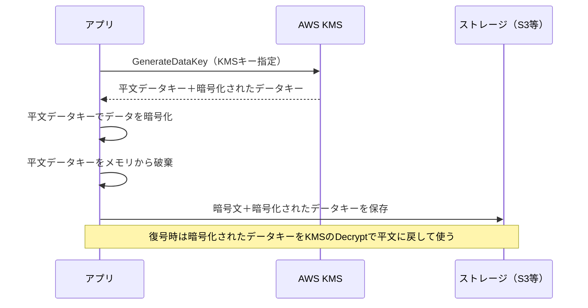

| 手順 | 内容 |
|---|---|
| 暗号化 | `GenerateDataKey` →平文データキーでデータを暗号化→平文キーを破棄→暗号文と暗号化済みデータキーを一緒に保存 |
| 復号 | 暗号化済みデータキーを`Decrypt`でKMSに復号させる→平文データキーでデータを復号 |

> 利点：大きなデータでも**KMSへの通信は小さなキーだけ**で済み、データはローカルで高速に処理できる。S3のSSE-KMSもこの方式で動いています。

### 11-5　主なKMS API

| API | 役割 |
|---|---|
| `Encrypt` / `Decrypt` | 小さなデータ（最大4KB）の暗号化・復号 |
| `GenerateDataKey` | データキー（平文＋暗号化済み）を生成 |
| `GenerateDataKeyWithoutPlaintext` | 暗号化済みデータキーのみ生成（後で使う用） |
| `ReEncrypt` | 平文を出さずに別のキーで暗号化し直す |
| `CreateGrant` | 一時的・限定的な権限を付与 |
| `Sign` / `Verify` | 非対称キーでの署名 |

### 11-6　暗号化コンテキスト（Encryption Context）

暗号化・復号の際に渡す**追加の認証データ（AAD）**で、秘密ではないキーと値のペアです。復号時に同じコンテキストが必要になり、**改ざん・取り違えの検知**と、CloudTrailでの**監査**に役立ちます。

```python
import boto3

kms = boto3.client("kms")
key_id = "alias/my-app-key"

enc = kms.encrypt(
    KeyId=key_id,
    Plaintext=b"my small secret",
    EncryptionContext={"app": "orders", "tenant": "t-001"},
)
blob = enc["CiphertextBlob"]

dec = kms.decrypt(
    CiphertextBlob=blob,
    EncryptionContext={"app": "orders", "tenant": "t-001"},  # 一致しないと失敗
)
print(dec["Plaintext"])
```

### 11-7　鍵ポリシーとIAMポリシー（KMS独自のルール）

- **KMSキーには必ず鍵ポリシーがあります**。他のサービスと違い、鍵ポリシーが許可の起点です。
- IAMポリシーでKMSを許可するには、**鍵ポリシーがアカウントのIAMによる制御を許可していること**（既定の鍵ポリシーはアカウントのrootに許可を委任している）が必要です。

| 用語 | 内容 |
|---|---|
| 鍵ポリシー | キーのリソースベースポリシー。管理者と利用者を分けて定義 |
| IAMポリシー | 鍵ポリシーが許す範囲でユーザー／ロールに付与 |
| グラント | 一時的・プログラムによる委任（AWSサービスが内部でよく使う） |
| エイリアス | `alias/my-app-key`のような分かりやすい名前 |

鍵ポリシーの考え方（管理者と利用者を分離）：

```json
{
  "Sid": "AllowUseOfTheKey",
  "Effect": "Allow",
  "Principal": { "AWS": "arn:aws:iam::111122223333:role/OrdersAppRole" },
  "Action": ["kms:Encrypt", "kms:Decrypt", "kms:GenerateDataKey"],
  "Resource": "*",
  "Condition": {
    "StringEquals": { "kms:ViaService": "s3.ap-northeast-1.amazonaws.com" }
  }
}
```

### 11-8　アプリが使うロールに必要なKMS権限（よくある落とし穴）

| 状況 | 必要な権限 |
|---|---|
| SSE-KMSのS3オブジェクトを読む | `s3:GetObject` に加え **`kms:Decrypt`** |
| SSE-KMSのS3へ書き込む | `s3:PutObject` に加え **`kms:GenerateDataKey`**（必要に応じて`kms:Encrypt`） |
| 暗号化SQSに送信 | `kms:GenerateDataKey` と `kms:Decrypt` |
| 「Access Denied」でS3権限は正しい | **KMS側の権限（鍵ポリシー／IAM）**を疑う |

### 11-9　鍵の削除

- KMSキーの削除は**待機期間（7〜30日）**を経て実行され、その間は**キャンセル可能**です。
- 削除すると、そのキーで暗号化されたデータは**復号できなくなります**。削除の前に**無効化**して影響を確認するのが定石です。

### 11-10　ベストプラクティス

| # | ベストプラクティス |
|---|---|
| 1 | 4KB超のデータは**エンベロープ暗号化**（`GenerateDataKey`） |
| 2 | 鍵ポリシーで**管理者と利用者を分離**し、最小権限にする |
| 3 | `kms:ViaService`で特定サービス経由のみに限定 |
| 4 | **暗号化コンテキスト**を使って用途を縛り、監査に活かす |
| 5 | 業務／データ分類ごとにキーを分け、**エイリアス**で管理 |
| 6 | 自動ローテーションを有効化（Step 16） |
| 7 | CloudTrailでKMS API呼び出しを監査 |
| 8 | 平文のデータキーは**メモリにだけ置き、使用後に破棄** |

### 試験のひっかけ

- 「KMSの`Encrypt`で数MBのファイルを直接暗号化」→ **不可（4KB上限）**。エンベロープ暗号化。
- 「KMSキーそのものをダウンロードして使う」→ **不可**（鍵素材は取り出せない）。
- 「S3の読み取り権限があるのに復号できない」→ **`kms:Decrypt`が不足**。
- 「鍵を即時削除したい」→ **待機期間7〜30日**が必須。

### 根拠ソース

- AWS KMSとは：https://docs.aws.amazon.com/kms/latest/developerguide/overview.html
- KMSの概念（エンベロープ暗号化など）：https://docs.aws.amazon.com/kms/latest/developerguide/concepts.html
- 鍵ポリシー：https://docs.aws.amazon.com/kms/latest/developerguide/key-policies.html
- 暗号化コンテキスト：https://docs.aws.amazon.com/kms/latest/developerguide/encrypt_context.html
- KMS APIリファレンス：https://docs.aws.amazon.com/kms/latest/APIReference/Welcome.html
- KMSキーの削除：https://docs.aws.amazon.com/kms/latest/developerguide/deleting-keys.html

---

<a id="step-12"></a>

## Step 12　クライアントサイド暗号化とサーバーサイド暗号化（Skill 2.2.3）

### 試験で問われること

**「クライアントサイド暗号化とサーバーサイド暗号化の違いを説明する」**

### 12-1　違いの核心：**誰が、どこで、暗号化するか**

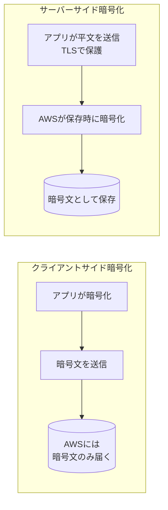

| | **サーバーサイド暗号化（SSE）** | **クライアントサイド暗号化（CSE）** |
|---|---|---|
| 暗号化の場所 | AWSサービス側（保存時） | **アプリ側**（送信前） |
| 平文がAWSに届くか | 届く（TLSで保護、サービス内で暗号化） | **届かない**（常に暗号文） |
| 鍵の管理 | AWS（KMSなど）が行う | アプリが鍵を取得・管理 |
| 実装の手間 | 少ない（設定のみ） | 多い（SDK利用が一般的） |
| 向く場面 | 通常の要件 | AWS側にも平文を見せたくない、**特定フィールドだけ**暗号化したい、規制要件 |
| 検索・クエリ | サービスの機能がそのまま使える | 暗号化した項目は検索・条件指定しにくい |

### 12-2　S3のサーバーサイド暗号化方式

| 方式 | 鍵の管理者 | 特徴 |
|---|---|---|
| **SSE-S3** | S3（AWS管理） | 追加設定がほぼ不要。新規オブジェクトの既定 |
| **SSE-KMS** | KMSキー（AWSマネージド or カスタマーマネージド） | **鍵の使用をCloudTrailで監査**、鍵ポリシーで制御可能 |
| **DSSE-KMS** | KMS | 二層の暗号化（規制要件向け） |
| **SSE-C** | **利用者が鍵を提供**（リクエストごと） | AWSは鍵を保存しない。鍵管理は利用者の責任。HTTPS必須 |

SSE-KMSでの**S3バケットキー**を使うと、KMSへのリクエストが減り、コストとスロットリングを抑えられます。

```python
import boto3

s3 = boto3.client("s3")

# SSE-KMSでアップロード
s3.put_object(
    Bucket="my-app-bucket",
    Key="reports/secret.txt",
    Body=b"confidential",
    ServerSideEncryption="aws:kms",
    SSEKMSKeyId="alias/my-app-key",
)
```

### 12-3　クライアントサイド暗号化に使うツール

| ツール | 用途 |
|---|---|
| **AWS Encryption SDK** | 汎用のクライアントサイド暗号化（エンベロープ暗号化を自動化） |
| **Amazon S3 Encryption Client** | S3へ保存する前にクライアント側で暗号化 |
| **AWS Database Encryption SDK** | DynamoDB等の項目単位の暗号化 |

### 12-4　選び方フロー

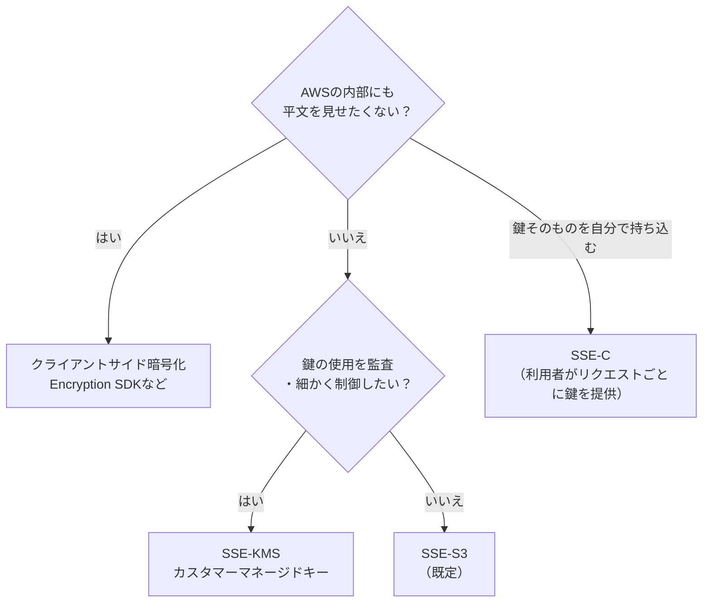

### 12-5　ベストプラクティス

| # | ベストプラクティス |
|---|---|
| 1 | 通常はSSE-S3またはSSE-KMS。**監査・鍵制御が必要ならSSE-KMS** |
| 2 | 特に機密の項目（カード番号など）は**項目単位のクライアントサイド暗号化**を検討 |
| 3 | クライアントサイド暗号化では**鍵（KMS）への権限管理**をアプリのロールに限定 |
| 4 | SSE-Cは鍵の紛失＝データ喪失。**やむを得ない場合のみ** |
| 5 | 暗号化した項目の検索要件（ソートキー、フィルターなど）を事前に設計 |

### 試験のひっかけ

- 「AWSにも平文を渡したくない」→ **クライアントサイド暗号化**。
- 「KMSキー使用の監査ログが欲しい」→ **SSE-KMS**（CloudTrailに記録される）。
- 「SSE-Cの鍵はAWSが保存する」→ **誤り**（AWSは保存しない）。
- 「暗号化したDynamoDB項目を条件検索」→ クライアント側で暗号化した項目は**そのままでは検索不可**。

### 根拠ソース

- S3のサーバーサイド暗号化：https://docs.aws.amazon.com/AmazonS3/latest/userguide/serv-side-encryption.html
- S3のクライアントサイド暗号化：https://docs.aws.amazon.com/AmazonS3/latest/userguide/UsingClientSideEncryption.html
- AWS Encryption SDK：https://docs.aws.amazon.com/encryption-sdk/latest/developer-guide/introduction.html
- AWS Database Encryption SDK：https://docs.aws.amazon.com/database-encryption-sdk/latest/devguide/what-is-database-encryption-sdk.html
- S3バケットキー：https://docs.aws.amazon.com/AmazonS3/latest/userguide/bucket-key.html

---

<a id="step-13"></a>

## Step 13　証明書管理：ACMとAWS Private CA（Skill 2.2.2）

### 試験で問われること

**「証明書の管理を説明する（例：AWS Private CA）」**

### 13-1　証明書とは

TLS証明書は、**サーバーが本物であること**と**公開鍵**を、認証局（CA）の署名で保証するデジタル文書です。

| 用語 | 意味 |
|---|---|
| CA（認証局） | 証明書に署名する機関 |
| パブリック証明書 | ブラウザ等が信頼するCAが発行。インターネット公開サービス向け |
| プライベート証明書 | 組織内のプライベートCAが発行。**社内の通信・mTLS・IoT**向け |
| CSR | 証明書署名要求（公開鍵とドメイン情報） |
| 証明書チェーン | ルートCA→中間CA→サーバー証明書 |

### 13-2　AWS Certificate Manager（ACM）と AWS Private CA

| | **ACM（パブリック証明書）** | **AWS Private CA** |
|---|---|---|
| 目的 | インターネット向けTLS証明書 | **組織内（プライベート）**の証明書 |
| 発行元 | ACM（Amazonのパブリック信頼CA） | 自分で作る**プライベートCA階層** |
| ドメイン検証 | **DNS検証**（推奨）／メール検証 | 不要（自組織で発行ポリシーを定義） |
| 更新 | 条件を満たせば**自動更新** | ACM経由で発行した証明書は自動更新に対応 |
| 主な利用先 | ALB／NLB、CloudFront、API Gateway | 社内サービス、mTLS、IoT、デバイス、コード署名など |
| 失効 | - | CRL／OCSPで失効管理 |

### 13-3　ACMが使えるサービスと注意点

| サービス | 注意点 |
|---|---|
| Elastic Load Balancing | リージョン内のACM証明書を関連付け |
| **CloudFront** | 証明書は**米国東部（バージニア北部）`us-east-1`のACM**に作成する必要がある |
| API Gateway | カスタムドメインにACM証明書を使用（エッジ最適化は`us-east-1`） |
| EC2上のアプリ | ACMのパブリック証明書は、既定では**秘密鍵を取り出して直接インストールできない**。**ALB等に終端させる**のが基本 |

### 13-4　ACMでの発行・更新の流れ

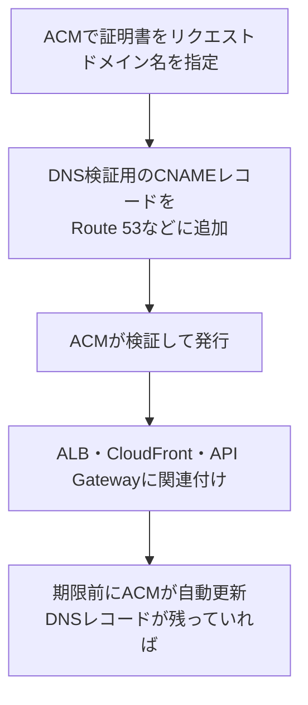

> **DNS検証のCNAMEを削除すると自動更新に失敗**します。残しておくのが鉄則です。

### 13-5　AWS Private CAの使いどころ

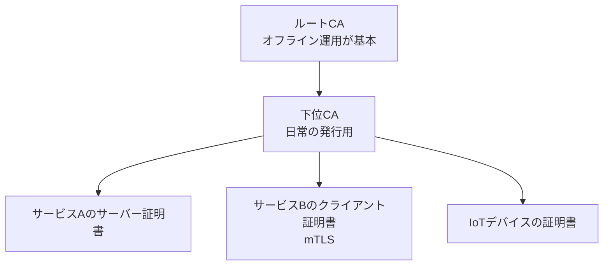

| 用途 | 例 |
|---|---|
| 社内の内部通信 | マイクロサービス間のTLS／**mTLS（相互TLS）** |
| 内部ドメイン | `service.internal.example.com`のようなプライベート名 |
| デバイス認証 | IoT・端末のクライアント証明書 |
| ACM連携 | ACMのプライベート証明書として発行・自動更新 |

### 13-6　証明書管理の運用ポイント

| 項目 | 内容 |
|---|---|
| 有効期限 | 失効は障害になる。自動更新を前提にする |
| 失効 | 秘密鍵が漏洩したら失効（CRL／OCSP） |
| インポート証明書 | ACMにインポートした証明書は**自動更新されない**（自分で更新が必要） |
| 監視 | 期限切れ間近をCloudWatch／EventBridgeなどで通知 |
| 秘密鍵 | 絶対にコードやGitに含めない |

### 13-7　ベストプラクティス

| # | ベストプラクティス |
|---|---|
| 1 | パブリックな通信は**ACM**で証明書を取得し、自動更新に任せる |
| 2 | **DNS検証**を使い、検証用レコードを維持する |
| 3 | 社内通信は**AWS Private CA**で内部PKIを構築（自己署名の乱立を避ける） |
| 4 | 証明書の期限を監視・アラートする |
| 5 | CloudFrontでは**`us-east-1`**に証明書を用意 |
| 6 | 本番で**自己署名証明書を使わない**（Step 14は開発用のみ） |

### 試験のひっかけ

- 「CloudFront用のACM証明書を東京リージョンに作成」→ **誤り**（`us-east-1`）。
- 「ACMにインポートした証明書も自動更新される」→ **誤り**。
- 「社内サービス間の相互認証（mTLS）の証明書」→ **AWS Private CA**。
- 「ACMの証明書をEC2に直接インストール」→ 通常は**不可**。ALBなどで終端。

### 根拠ソース

- AWS Certificate Managerとは：https://docs.aws.amazon.com/acm/latest/userguide/acm-overview.html
- ACMのDNS検証：https://docs.aws.amazon.com/acm/latest/userguide/dns-validation.html
- ACM証明書の更新：https://docs.aws.amazon.com/acm/latest/userguide/managed-renewal.html
- AWS Private CAとは：https://docs.aws.amazon.com/privateca/latest/userguide/PcaWelcome.html
- CloudFrontでACM証明書を使う：https://docs.aws.amazon.com/AmazonCloudFront/latest/DeveloperGuide/cnames-and-https-requirements.html

---

<a id="step-14"></a>

## Step 14　開発用の証明書とSSH鍵の生成（Skill 2.2.5）

### 試験で問われること

**「開発目的で証明書とSSH鍵を生成する」**：コマンドの基本と、**開発専用であること**の理解。

### 14-1　SSH鍵ペアの基本

SSH鍵は**公開鍵**（サーバーに置く）と**秘密鍵**（自分だけが持つ）のペアです。

| 項目 | 内容 |
|---|---|
| 公開鍵 | EC2に登録される。漏れても問題なし |
| 秘密鍵（`.pem`／秘密鍵ファイル） | **他人に渡さない・Gitに入れない**。権限`400` |
| EC2キーペア | 公開鍵をインスタンスに埋め込み、秘密鍵でSSH接続 |
| 紛失 | 秘密鍵は後から再取得**できない**（新しい鍵ペアで対応） |

### 14-2　EC2のキーペアを作る2つの方法

```bash
# 方法1：AWSに作らせる（秘密鍵は作成時に一度だけ取得可能）
aws ec2 create-key-pair \
  --key-name dev-key \
  --key-type ed25519 \
  --query 'KeyMaterial' --output text > dev-key.pem
chmod 400 dev-key.pem

# 方法2：自分で作って公開鍵だけインポート（秘密鍵は手元から出さない）
ssh-keygen -t ed25519 -f ~/.ssh/dev-key -C "dev@example.com"
aws ec2 import-key-pair \
  --key-name dev-key \
  --public-key-material fileb://~/.ssh/dev-key.pub

# 接続
ssh -i ~/.ssh/dev-key ec2-user@<パブリックIPまたはDNS>
```

> 方法2は、**秘密鍵がAWSを通らない**ため、より安全です。

### 14-3　開発用の自己署名証明書（OpenSSL）

```bash
# 秘密鍵と自己署名証明書を同時に作る（開発・テスト専用）
openssl req -x509 -newkey rsa:2048 -nodes \
  -keyout dev.key -out dev.crt -days 30 \
  -subj "/CN=localhost" \
  -addext "subjectAltName=DNS:localhost,IP:127.0.0.1"
```

CSRを作ってCAに署名してもらう流れ：

```bash
openssl genrsa -out server.key 2048
openssl req -new -key server.key -out server.csr -subj "/CN=dev.internal.example.com"
# server.csr をCA（例：AWS Private CA）に提出して署名してもらう
```

### 14-4　用途の整理

| 目的 | 推奨 |
|---|---|
| ローカル開発のHTTPS | 自己署名証明書や開発用ツール |
| 開発環境のSSH | ed25519／RSAのキーペア |
| ステージング・本番の公開TLS | **ACM**（Step 13） |
| 社内通信の本番 | **AWS Private CA** |
| インスタンスへの安全な接続 | **Systems Manager Session Manager**（SSHポート開放・鍵管理が不要）、EC2 Instance Connect |

### 14-5　ベストプラクティス

| # | ベストプラクティス |
|---|---|
| 1 | 自己署名証明書は**開発・テスト専用**。本番に使わない |
| 2 | 秘密鍵は`chmod 400`、**Gitに含めない**（`.gitignore`） |
| 3 | 鍵の種類は**ed25519**または十分な長さのRSA（2048ビット以上） |
| 4 | 開発用証明書の**有効期間は短く** |
| 5 | 本番サーバーでは**SSH鍵に頼らずSession Manager**の利用を検討 |
| 6 | セキュリティグループで**SSH（22）を全世界に開放しない** |

### 試験のひっかけ

- 「秘密鍵をなくしたので再ダウンロード」→ **できない**。新規キーペアで対応。
- 「本番の公開サイトに自己署名証明書」→ **不適切**（ブラウザが警告）。
- 「SSHの公開鍵を厳重に隠す」→ 隠すべきは**秘密鍵**。

### 根拠ソース

- EC2キーペア：https://docs.aws.amazon.com/AWSEC2/latest/UserGuide/ec2-key-pairs.html
- Systems Manager Session Manager：https://docs.aws.amazon.com/systems-manager/latest/userguide/session-manager.html
- AWS Private CAで証明書を発行：https://docs.aws.amazon.com/privateca/latest/userguide/PcaIssueCert.html
- OpenSSL `req` コマンド：https://docs.openssl.org/master/man1/openssl-req/

---

<a id="step-15"></a>

## Step 15　アカウントをまたぐ暗号化（Skill 2.2.6）

### 試験で問われること

**「アカウント境界をまたいで暗号化を使用する」**：別アカウントのKMSキー・暗号化データを共有する条件。

### 15-1　基本ルール：**両方の許可が必要**

別アカウントのKMSキーを使うには、次の**2つがそろう**必要があります。

| 場所 | 必要な設定 |
|---|---|
| **キー所有アカウントA**：鍵ポリシー | アカウントB（またはBのロール）に`kms:Decrypt`等を許可 |
| **利用アカウントB**：IAMポリシー | Bのロールに、AのキーARNへの`kms:Decrypt`等を許可 |

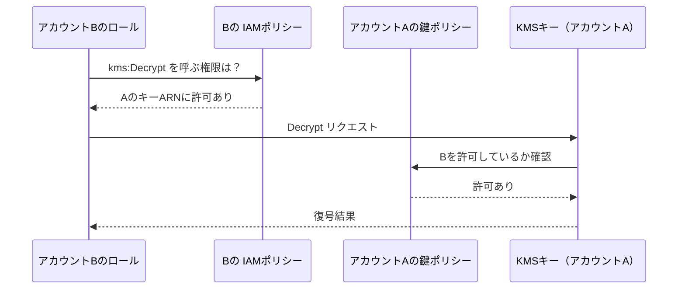

### 15-2　鍵ポリシー（アカウントA側）の例

```json
{
  "Sid": "AllowAccountBUse",
  "Effect": "Allow",
  "Principal": { "AWS": "arn:aws:iam::222233334444:role/PartnerReaderRole" },
  "Action": ["kms:Decrypt", "kms:DescribeKey"],
  "Resource": "*"
}
```

### 15-3　利用側（アカウントB）のIAMポリシー例

```json
{
  "Effect": "Allow",
  "Action": ["kms:Decrypt", "kms:DescribeKey"],
  "Resource": "arn:aws:kms:ap-northeast-1:111122223333:key/1234abcd-12ab-34cd-56ef-1234567890ab"
}
```

### 15-4　代表的なシナリオ

| シナリオ | 要点 |
|---|---|
| **別アカウントのSSE-KMS暗号化S3オブジェクトを読む** | S3の権限（バケットポリシー）＋**KMSキーの共有**が必要 |
| **暗号化EBS／RDSスナップショットの共有** | **カスタマーマネージドキー**で暗号化し、キーも共有する |
| **Secrets Managerのシークレットを別アカウントと共有** | **リソースポリシー**＋**カスタマーマネージドキー**（AWSマネージドキー`aws/secretsmanager`は共有不可） |
| **ログ配信など** | 配信元サービスに鍵の使用を許可（`kms:ViaService`・`aws:SourceArn`で限定） |

### 15-5　重要な制約：AWSマネージドキーは共有できない

**AWSマネージドキー**（`aws/s3`、`aws/ebs`など）は**鍵ポリシーを編集できず、他アカウントに共有できません**。アカウントをまたぐ暗号化が必要な場合は、**カスタマーマネージドキーを使います**。

```mermaid
flowchart TD
  Q["別アカウントと暗号化データを共有したい"] --> K{"暗号化に使っている鍵は？"}
  K -->|"AWSマネージドキー"| N["共有不可<br/>カスタマーマネージドキーで暗号化し直す"]
  K -->|"カスタマーマネージドキー"| Y["鍵ポリシーでBを許可<br/>＋BのIAMポリシーで許可"]
```

### 15-6　ベストプラクティス

| # | ベストプラクティス |
|---|---|
| 1 | 共有が必要なデータは最初から**カスタマーマネージドキー**で暗号化 |
| 2 | 許可は**アカウント全体ではなく特定ロール**に絞る |
| 3 | 必要な操作（`Decrypt`のみ等）に**限定** |
| 4 | `kms:ViaService`／`kms:CallerAccount`／`aws:PrincipalOrgID`などの条件で制限 |
| 5 | 両アカウントの**CloudTrail**でKMS利用を監査 |

### 試験のひっかけ

- 「アカウントBのIAMポリシーだけ設定すれば他アカウントのキーを使える」→ **誤り**（鍵ポリシーも必要）。
- 「`aws/s3`で暗号化したオブジェクトを他アカウントに共有」→ **不可**。
- 「暗号化スナップショットを別アカウントへ共有」→ **カスタマーマネージドキー**が必須。

### 根拠ソース

- 別アカウントでのKMSキーの使用（鍵ポリシー）：https://docs.aws.amazon.com/kms/latest/developerguide/key-policy-modifying-external-accounts.html
- KMSキーへのアクセス許可の仕組み：https://docs.aws.amazon.com/kms/latest/developerguide/control-access.html
- Secrets Managerのクロスアカウントアクセス：https://docs.aws.amazon.com/secretsmanager/latest/userguide/auth-and-access_examples_cross.html
- EBSスナップショットの共有（暗号化）：https://docs.aws.amazon.com/ebs/latest/userguide/share-encrypted-snapshot.html

---

<a id="step-16"></a>

## Step 16　キーローテーションの有効化と無効化（Skill 2.2.7）

### 試験で問われること

**「キーローテーションを有効化・無効化する」**：対象となるキー、既定の期間、手動・オンデマンドの違い。

### 16-1　ローテーションとは

KMSキーの**裏側の暗号化素材（キーマテリアル）を新しいものに切り替える**ことです。**キーID・ARN・エイリアスは変わりません**。以前のキーマテリアルは保持されるため、**過去に暗号化したデータも復号できます**（アプリの変更・再暗号化は不要）。

```mermaid
flowchart LR
  A["キーマテリアルv1<br/>で暗号化したデータ"] -.->|"復号時：自動的にv1を使用"| K["同じKMSキー<br/>ID・ARN・エイリアス不変"]
  K --> B["新規の暗号化：最新のv2を使用"]
```

### 16-2　ローテーションの種類

| 種類 | 内容 | 対象 |
|---|---|---|
| **自動ローテーション** | 設定した周期で自動 | 対称暗号化KMSキー（鍵素材をKMSが生成した`AWS_KMS`起源）の**カスタマーマネージドキー** |
| **オンデマンドローテーション** | 任意のタイミングで即時実行（自動ローテーションの有無に関係なく可能） | 対称暗号化のカスタマーマネージドキー |
| **手動ローテーション** | 新しいキーを作り、**エイリアスを付け替える** | 自動・オンデマンドに非対応のキー（非対称、HMAC、カスタムキーストア等） |
| **AWSマネージドキー** | **AWSが毎年自動**（利用者は有効・無効を切り替えられない） | - |
| **AWS所有キー** | サービス側が管理 | 利用者は操作不可 |

### 16-3　自動ローテーションの主な仕様

| 項目 | 内容 |
|---|---|
| 既定の周期 | **365日** |
| カスタム周期 | 設定可能（90〜2,560日） |
| 無効化されたキー | ローテーションされない |
| 削除待ちのキー | ローテーションされない |
| 監視 | CloudTrail／CloudWatchで確認可能 |
| 対象外（手動が必要） | 非対称キー、HMACキー、カスタムキーストアのキー。インポートした鍵素材は**自動ローテーション対象外**（対称キーのオンデマンドローテーションは対応） |

### 16-4　有効化・無効化（CLI／API）

```bash
# 自動ローテーションを有効化（既定は365日）
aws kms enable-key-rotation --key-id alias/my-app-key

# 周期を指定して有効化
aws kms enable-key-rotation --key-id alias/my-app-key --rotation-period-in-days 180

# 状態を確認
aws kms get-key-rotation-status --key-id alias/my-app-key

# 今すぐローテーション（オンデマンド）
aws kms rotate-key-on-demand --key-id alias/my-app-key

# 自動ローテーションを無効化
aws kms disable-key-rotation --key-id alias/my-app-key
```

| API | 役割 |
|---|---|
| `EnableKeyRotation` | 自動ローテーションを有効化 |
| `DisableKeyRotation` | 自動ローテーションを無効化 |
| `GetKeyRotationStatus` | 状態を確認 |
| `RotateKeyOnDemand` | 即時ローテーション |
| `ListKeyRotations` | ローテーション履歴を取得 |

### 16-5　手動ローテーション（エイリアスの付け替え）

```mermaid
sequenceDiagram
  participant Op as 運用者
  participant KMS as AWS KMS
  participant App as アプリ
  Op->>KMS: 新しいKMSキーを作成
  Op->>KMS: エイリアス alias/my-app-key を新キーに付け替え
  App->>KMS: alias/my-app-key で暗号化（新キー）
  Note over App,KMS: 古いデータの復号には古いキーを残して使用
```

- アプリが**エイリアス**を参照していれば、コード変更なしで切り替えられます。
- 古いキーは、古いデータの復号が必要なうちは**削除しません**。

### 16-6　他のローテーションとの違い

| 対象 | ローテーション方法 |
|---|---|
| KMSのキーマテリアル | 本Stepのとおり（自動・オンデマンド・手動） |
| **Secrets Managerのシークレット** | Lambdaによる**自動ローテーション**（Step 19） |
| IAMのアクセスキー（長期） | 手動または運用で定期的に更新（使わないのが理想） |
| ACM証明書 | ACMが自動更新（Step 13） |

### 16-7　ベストプラクティス

| # | ベストプラクティス |
|---|---|
| 1 | カスタマーマネージドキー（対称）は**自動ローテーションを有効**にする |
| 2 | 組織の規程があれば**カスタム周期**を設定 |
| 3 | アプリは**キーIDではなくエイリアス**を参照 |
| 4 | ローテーションは**暗号文の再暗号化を不要にする**ため、運用負荷が低い |
| 5 | コンプライアンスはAWS Configのルール（キーローテーション有効の確認）で継続監視 |

### 試験のひっかけ

- 「ローテーションするとキーARNが変わる」→ **誤り**（変わらない）。
- 「ローテーション後、古いデータが復号できなくなる」→ **誤り**（古い素材が保持される）。
- 「AWSマネージドキーのローテーションを無効にしたい」→ **不可**（毎年自動）。
- 「非対称キーの自動ローテーション」→ **不可**（手動で新キーに切り替え）。

### 根拠ソース

- KMSキーのローテーション：https://docs.aws.amazon.com/kms/latest/developerguide/rotate-keys.html
- RotateKeyOnDemand API：https://docs.aws.amazon.com/kms/latest/APIReference/API_RotateKeyOnDemand.html
- EnableKeyRotation API：https://docs.aws.amazon.com/kms/latest/APIReference/API_EnableKeyRotation.html
- インポートキーのオンデマンドローテーション（AWSセキュリティブログ）：https://aws.amazon.com/blogs/security/how-to-use-on-demand-rotation-for-aws-kms-imported-keys/

---
# Task 3：アプリケーション内の機密データ管理

<a id="step-17"></a>

## Step 17　データ分類：PII・PHIなど（Skill 2.3.1）

### 試験で問われること

**「データ分類（例：個人を特定できる情報［PII］、保護対象医療情報［PHI］）を説明する」**

### 17-1　なぜ分類するのか

**守るべきデータの重要度に応じて、保護の強さを変える**ためです。すべてを最高レベルで守るのは非効率で、逆に分類しないと重要データが守られません。

### 17-2　代表的なデータ区分

| 区分 | 意味 | 例 |
|---|---|---|
| **PII**（Personally Identifiable Information） | 個人を特定できる情報 | 氏名、住所、メールアドレス、電話番号、マイナンバー、パスポート番号、IPアドレス（文脈による） |
| **PHI**（Protected Health Information） | 個人に紐づく**医療・健康情報** | 診断名、検査結果、診療履歴、保険情報（医療情報の取り扱い規制の対象） |
| **決済カード情報** | クレジットカード番号など | PANなど（PCI DSSの対象） |
| 認証情報 | パスワード、APIキー、トークン、秘密鍵 | Step 19で厳格に管理 |
| 機密事業情報 | 企業秘密、契約、財務 | 社内規程で分類 |
| 公開情報 | 公開しても問題ない | 製品カタログなど |

> 法令（個人情報保護法、GDPR、HIPAAなど）は、対象となる情報の定義と保護義務が異なります。**試験ではPII／PHIの意味と、分類に応じた保護策の選択**が問われます。

### 17-3　分類レベルの例と、対応する保護策

| 分類 | 例 | 暗号化 | アクセス制御 | 追加対策 |
|---|---|---|---|---|
| 公開 | 製品情報 | 転送中のみ | 緩やか | - |
| 社内限定 | 社内資料 | 保管時＋転送中 | ロールベース | ログ取得 |
| 機密 | 顧客PII | **KMS（カスタマーマネージドキー）**、必要に応じ項目単位 | **最小権限**、MFA | 監査ログ、マスキング、保持期間の設定 |
| 最重要 | PHI、カード情報、認証情報 | クライアントサイド暗号化も検討 | **厳格な分離**、承認制 | 専用アカウント／キー、ログへの出力禁止 |

### 17-4　AWSで分類を実装・支援する機能

| 機能 | 役割 |
|---|---|
| **Amazon Macie** | S3内の**機密データ（PIIなど）を自動検出・分類**し、リスクを可視化 |
| **タグ付け** | リソース・S3オブジェクトに`DataClassification=Confidential`などのタグ → **ABAC**や課金・監査に活用 |
| **KMSキーの分離** | 分類レベルごとにキーを分け、利用者を絞る |
| **S3ライフサイクル／保持設定** | 保持期間・削除ルールの自動化 |
| **CloudWatch Logsのデータ保護ポリシー** | ログ内の機密データを検出・マスク（Step 20） |
| **Amazon Comprehend** | テキストからPIIを検出（`DetectPiiEntities`） |

```mermaid
flowchart TD
  D["データを受け取る・保存する"] --> C{"分類する"}
  C -->|"PII / PHI / カード / 認証情報"| H["高保護<br/>CMKで暗号化・最小権限<br/>マスキング・監査"]
  C -->|"社内限定"| M["標準保護<br/>暗号化・ロールで制御"]
  C -->|"公開"| L["基本保護<br/>転送中の暗号化"]
  H --> T["タグ付け＋Macieで継続的に検出"]
  M --> T
  L --> T
```

### 17-5　ベストプラクティス

| # | ベストプラクティス |
|---|---|
| 1 | **データを収集する段階で分類**し、不要な個人情報は**そもそも集めない**（データ最小化） |
| 2 | 分類をタグで機械可読にし、アクセス制御・暗号化・ライフサイクルに自動連動 |
| 3 | PII／PHIは、**ログ・エラーメッセージ・URL・環境変数に出さない** |
| 4 | **保持期間**を定め、不要になったら削除 |
| 5 | 分類ごとに**KMSキー・IAMロールを分け**、影響範囲を限定 |
| 6 | Macieなどで**意図しない場所に機密データがないか**継続的に点検 |
| 7 | 本番データを**開発・テスト環境にそのまま持ち込まない** |

### 試験のひっかけ

- 「PHIとは決済カード番号」→ **誤り**（PHIは医療・健康情報）。
- 「S3内のPIIを自動で検出したい」→ **Amazon Macie**。
- 「全データに同じ最高レベルの保護を一律に適用」→ **非効率**。分類に応じて調整。

### 根拠ソース

- Amazon Macieとは：https://docs.aws.amazon.com/macie/latest/user/what-is-macie.html
- データ分類（AWSホワイトペーパー）：https://docs.aws.amazon.com/whitepapers/latest/data-classification/data-classification.html
- Amazon Comprehend：PII検出：https://docs.aws.amazon.com/comprehend/latest/dg/how-pii.html
- S3オブジェクトのタグ付け：https://docs.aws.amazon.com/AmazonS3/latest/userguide/object-tagging.html
- AWSのHIPAA対応：https://aws.amazon.com/compliance/hipaa-compliance/

---

<a id="step-18"></a>

## Step 18　機密を含む環境変数の暗号化（Skill 2.3.2）

### 試験で問われること

**「機密データを含む環境変数を暗号化する」**

### 18-1　環境変数と機密情報

環境変数は設定を渡す便利な手段ですが、**平文のまま機密情報（パスワード、APIキー）を入れると漏れやすい**という問題があります（コンソールで見える、ログに出る、クラッシュダンプに載る、など）。

### 18-2　Lambda環境変数の暗号化

| 階層 | 内容 |
|---|---|
| **保管時の暗号化（既定）** | 環境変数は、**AWSが管理するKMSキー**で既定で暗号化される（`aws/lambda`相当） |
| **カスタマーマネージドキーの指定** | 関数に**自分のKMSキー**を設定可能。関数の実行ロールに`kms:Decrypt`が必要 |
| **暗号化ヘルパー（転送中の暗号化）** | コンソールで環境変数をKMSで**クライアントサイド暗号化**し、コードで復号。**コンソール・APIで平文が見えない** |
| 合計サイズ | 環境変数全体で**4KB**まで |

```mermaid
flowchart LR
  subgraph L1["既定"]
    A["環境変数<br/>保管時にAWS管理キーで暗号化"] --> B["実行時に自動復号して<br/>関数に渡される"]
  end
  subgraph L2["暗号化ヘルパー"]
    C["値をKMSで事前に暗号化<br/>暗号文を環境変数に設定"] --> D["コードでkms:Decryptを呼び<br/>メモリ上で復号"]
  end
```

> 既定の暗号化は「保存されたものが暗号化される」だけで、**関数を見る権限がある人にはコンソールで平文が見える**点に注意。より強く隠すなら暗号化ヘルパー、あるいは**そもそも環境変数に秘密を入れない**（次項）。

### 18-3　最も推奨されるパターン：**環境変数には「参照先」だけを入れる**

```mermaid
flowchart LR
  E["環境変数<br/>SECRET_NAME=prod/db/credentials"] --> F["Lambdaコード"]
  F -->|"実行時にAPIで取得"| S["Secrets Manager<br/>または Parameter Store"]
  S -->|"KMSで暗号化されたまま保管"| K["KMS"]
```

```python
import os
import json
import boto3

secrets = boto3.client("secretsmanager")
_cache = {}

def get_db_credentials():
    name = os.environ["SECRET_NAME"]  # 環境変数にあるのは「名前」だけ
    if name not in _cache:
        resp = secrets.get_secret_value(SecretId=name)
        _cache[name] = json.loads(resp["SecretString"])
    return _cache[name]
```

- **コールドスタート時に取得してキャッシュ**し、API呼び出しとコストを抑えます（キャッシュの有効期限にも注意。ローテーション後に古い値を使い続けないよう）。

### 18-4　他の実行環境での機密の渡し方

| 環境 | 推奨される方法 |
|---|---|
| **ECS** | タスク定義の`secrets`でSecrets ManagerまたはParameter Storeの値を**環境変数として注入**（タスク実行ロールに取得権限が必要） |
| **EKS** | Secrets Manager連携（CSIドライバー等）、Kubernetes Secretsの暗号化 |
| **Elastic Beanstalk** | 環境プロパティに平文を入れず、Secrets Manager／Parameter Storeを参照 |
| **CodeBuild** | 環境変数のタイプを`PARAMETER_STORE`または`SECRETS_MANAGER`にする（`PLAINTEXT`に機密を置かない） |
| **CloudFormation** | 動的参照（`{{resolve:secretsmanager:...}}`／`{{resolve:ssm-secure:...}}`）。テンプレートに平文を書かない |

ECSタスク定義の例：

```json
{
  "containerDefinitions": [
    {
      "name": "app",
      "image": "123456789012.dkr.ecr.ap-northeast-1.amazonaws.com/app:latest",
      "secrets": [
        {
          "name": "DB_PASSWORD",
          "valueFrom": "arn:aws:secretsmanager:ap-northeast-1:111122223333:secret:prod/db-AbCdEf:password::"
        }
      ]
    }
  ]
}
```

### 18-5　ベストプラクティス

| # | ベストプラクティス |
|---|---|
| 1 | 機密を**環境変数に平文で入れない**。名前（参照先）だけを入れ、実行時に取得 |
| 2 | 環境変数を使う場合、**カスタマーマネージドキー**＋最小権限の`kms:Decrypt` |
| 3 | より強く保護するなら**暗号化ヘルパー**で暗号文として保持 |
| 4 | 環境変数の値を**ログ・エラー出力に出さない**（`print(os.environ)`を避ける） |
| 5 | ビルド（CodeBuild等）でも機密は**シークレットサービス経由**で注入 |
| 6 | IaC（CloudFormation／CDK）に機密を**ハードコードしない**。動的参照を使う |

### 試験のひっかけ

- 「Lambdaの環境変数にDBパスワードを平文で設定すれば、既定の暗号化があるので安全」→ **不十分**（コンソールで閲覧可能）。**Secrets Manager等の利用が推奨**。
- 「CodeBuildの環境変数タイプ`PLAINTEXT`にシークレット」→ **不適切**。
- 「環境変数のKMSカスタマーマネージドキーを指定したら、実行ロールの追加権限は不要」→ **誤り**（`kms:Decrypt`が必要）。

### 根拠ソース

- Lambda環境変数の使用（暗号化・ヘルパー）：https://docs.aws.amazon.com/lambda/latest/dg/configuration-envvars.html
- ECSでSecrets Managerのシークレットを渡す：https://docs.aws.amazon.com/AmazonECS/latest/developerguide/secrets-envvar-secrets-manager.html
- CodeBuildの環境変数：https://docs.aws.amazon.com/codebuild/latest/userguide/build-env-ref-env-vars.html
- CloudFormationの動的参照：https://docs.aws.amazon.com/AWSCloudFormation/latest/UserGuide/dynamic-references.html
- Elastic Beanstalkでシークレットを使う：https://docs.aws.amazon.com/elasticbeanstalk/latest/dg/AWSHowTo.secrets.html

---

<a id="step-19"></a>

## Step 19　シークレット管理サービスの活用（Skill 2.3.3）

### 試験で問われること

**「シークレット管理サービスを使って機密データを保護する」**：**Secrets ManagerとParameter Storeの使い分け**が最頻出。

### 19-1　シークレットを「コードに書かない」理由

| ありがちな悪い例 | リスク |
|---|---|
| ソースコードに直書き | Git履歴に残る、リポジトリ共有で流出 |
| 設定ファイルをリポジトリにコミット | 同上 |
| 平文の環境変数 | コンソールやログで漏れる |
| 全環境で同じパスワード | 1か所の漏洩が全体に波及 |

### 19-2　AWS Secrets Manager

| 項目 | 内容 |
|---|---|
| 目的 | DB認証情報、APIキー、OAuthトークンなどの**保管・取得・ローテーション** |
| 暗号化 | **KMSで暗号化**（既定はAWSマネージドキー`aws/secretsmanager`、カスタマーマネージドキーも指定可） |
| **自動ローテーション** | **Lambda関数**でスケジュール実行（RDS／Aurora／Redshift等はマネージドローテーションあり） |
| バージョン管理 | **ステージングラベル**（`AWSCURRENT`、`AWSPREVIOUS`、`AWSPENDING`） |
| アクセス制御 | IAMポリシー＋**リソースポリシー**（クロスアカウント共有に対応） |
| レプリケーション | 複数リージョンへのレプリケーション可能 |
| 料金 | シークレットごと＋API呼び出しごとの従量課金 |

### 19-3　AWS Systems Manager Parameter Store

| 項目 | 内容 |
|---|---|
| 目的 | 設定値（接続先、フラグ）と、**SecureString**による機密値の保管 |
| 暗号化 | **SecureString**はKMSで暗号化（`String`／`StringList`は平文） |
| ローテーション | **自動ローテーション機能なし**（自前で実装） |
| 階層 | `/app/prod/db/host`のようなパス階層で整理・IAMで権限を階層単位に付与 |
| 料金 | **標準パラメータは無料**、高度なパラメータ（大きな値・ポリシー）は有料 |
| 用途 | 設定管理と、頻繁にローテーションしない機密値 |

### 19-4　どちらを選ぶ？（最重要）

| 観点 | **Secrets Manager** | **Parameter Store** |
|---|---|---|
| 自動ローテーション | **あり**（Lambda／マネージド） | なし |
| 主な用途 | **DB認証情報・APIキーなどの機密** | 設定値全般＋機密（SecureString） |
| コスト | 有料 | 標準は無料 |
| クロスアカウント共有 | リソースポリシーで可（カスタマーマネージドキー要） | 高度なパラメータで可（制約あり） |
| 暗号化 | 常にKMS | SecureStringのみKMS |

```mermaid
flowchart TD
  Q1{"自動ローテーションが<br/>必要？"} -->|"はい"| SM["Secrets Manager"]
  Q1 -->|"いいえ"| Q2{"機密情報か？"}
  Q2 -->|"いいえ（設定値）"| PS1["Parameter Store<br/>String / StringList"]
  Q2 -->|"はい"| Q3{"コスト重視で<br/>ローテーション不要？"}
  Q3 -->|"はい"| PS2["Parameter Store<br/>SecureString"]
  Q3 -->|"いいえ・DB認証情報など"| SM
```

### 19-5　Secrets Managerの自動ローテーションの仕組み

ローテーションLambdaは、**4つのステップ**を実行します。

```mermaid
sequenceDiagram
  participant SM as Secrets Manager
  participant L as ローテーションLambda
  participant DB as データベース
  SM->>L: createSecret：新しいパスワードを生成しAWSPENDINGで保存
  SM->>L: setSecret：DBに新しいパスワードを設定
  L->>DB: パスワード変更
  SM->>L: testSecret：新しい認証情報で接続を確認
  L->>DB: テスト接続
  SM->>L: finishSecret：AWSPENDINGをAWSCURRENTに昇格
```

- アプリは常に**`AWSCURRENT`**を取得すれば、最新の値を使えます。
- ローテーションが有効でも、**キャッシュした古い値を使い続けない**ようにアプリを作ります。
- ローテーションLambdaがDBに到達するには、VPC内の接続設定（ネットワーク）が必要な場合があります。

### 19-6　取得のコード例

**Secrets Manager**

```python
import json
import boto3

client = boto3.client("secretsmanager", region_name="ap-northeast-1")
resp = client.get_secret_value(SecretId="prod/db/credentials")
creds = json.loads(resp["SecretString"])
# creds["username"], creds["password"] を使って接続
```

**Parameter Store（SecureString）**

```python
import boto3

ssm = boto3.client("ssm")
resp = ssm.get_parameter(Name="/myapp/prod/api-key", WithDecryption=True)
api_key = resp["Parameter"]["Value"]
```

**CLI**

```bash
aws secretsmanager get-secret-value --secret-id prod/db/credentials
aws ssm get-parameter --name /myapp/prod/api-key --with-decryption
```

### 19-7　最小権限のIAMポリシー例（アプリ側）

```json
{
  "Version": "2012-10-17",
  "Statement": [
    {
      "Effect": "Allow",
      "Action": "secretsmanager:GetSecretValue",
      "Resource": "arn:aws:secretsmanager:ap-northeast-1:111122223333:secret:prod/db/credentials-*"
    },
    {
      "Effect": "Allow",
      "Action": "kms:Decrypt",
      "Resource": "arn:aws:kms:ap-northeast-1:111122223333:key/1234abcd-12ab-34cd-56ef-1234567890ab"
    }
  ]
}
```

> カスタマーマネージドキーで暗号化したシークレットは、**`secretsmanager:GetSecretValue`と`kms:Decrypt`の両方**が必要です（Step 11の落とし穴）。

### 19-8　ベストプラクティス

| # | ベストプラクティス |
|---|---|
| 1 | **シークレットをコード・Git・平文ファイルに置かない** |
| 2 | DB認証情報・APIキーは**Secrets Managerで自動ローテーション** |
| 3 | 環境ごと（dev／stg／prod）に**シークレットと権限を分離** |
| 4 | **最小権限**：`GetSecretValue`を**特定のシークレットARNだけ**に付与 |
| 5 | 実行時に取得して**キャッシュ**（有効期限を設定）。取得の失敗時の再試行も考慮 |
| 6 | シークレットの**値をログ・例外メッセージに出さない** |
| 7 | CloudTrailで`GetSecretValue`を監査、不審なアクセスをアラート |
| 8 | **漏洩が疑われたら即ローテーション** |
| 9 | 漏洩を防ぐため、コミット前のシークレットスキャン（git-secretsなど）を導入 |

### 試験のひっかけ

| 問い | 答え |
|---|---|
| RDSのパスワードを**自動で定期変更**したい | **Secrets Manager** |
| 低コストで設定値を階層管理 | **Parameter Store（標準）** |
| Parameter Storeで自動ローテーション | **不可**（自前実装） |
| 他アカウントとシークレットを共有 | Secrets Managerの**リソースポリシー＋カスタマーマネージドキー** |
| 最新のシークレットを取得 | ステージングラベル**`AWSCURRENT`** |

### 根拠ソース

- AWS Secrets Managerとは：https://docs.aws.amazon.com/secretsmanager/latest/userguide/intro.html
- シークレットのローテーション：https://docs.aws.amazon.com/secretsmanager/latest/userguide/rotating-secrets.html
- Lambdaによるローテーション関数：https://docs.aws.amazon.com/secretsmanager/latest/userguide/rotate-secrets_lambda.html
- Secrets Managerのベストプラクティス：https://docs.aws.amazon.com/secretsmanager/latest/userguide/best-practices.html
- Systems Manager Parameter Store：https://docs.aws.amazon.com/systems-manager/latest/userguide/systems-manager-parameter-store.html
- Powertools for AWS Lambda（パラメータ取得・キャッシュ）：https://docs.powertools.aws.dev/lambda/python/latest/utilities/parameters/
- git-secrets（awslabs）：https://github.com/awslabs/git-secrets

---

<a id="step-20"></a>

## Step 20　サニタイズとデータマスキング（Skill 2.3.4・2.3.5）

### 試験で問われること

- **Skill 2.3.4**「機密データを**サニタイズ**する」
- **Skill 2.3.5**「**アプリケーションレベルのデータマスキングとサニタイズ**を実装する」

### 20-1　用語を整理する

| 用語 | 意味 | 例 |
|---|---|---|
| **サニタイズ（sanitize）** | 不要・危険な部分を**取り除く／無害化**する。機密のログ出力の除去や、入力の無害化 | ログからトークンを除去、入力のエスケープ |
| **マスキング（masking）** | 一部を伏せて**表示を隠す**（元の値は別の場所に存在） | `4111-****-****-1111`、`t***@example.com` |
| **リダクション（redaction）** | 機密部分を**完全に削除・黒塗り** | `[REDACTED]` |
| **トークン化** | 機密値を**無意味な代替値（トークン）**に置換し、本物は別の安全な場所に保管 | カード番号→トークン |
| **ハッシュ化** | 元に戻せない値に変換 | パスワード（ソルト＋低速ハッシュ）、一意性の検索キー |
| **匿名化／仮名化** | 個人が特定できなくする／別名で置換 | テスト用データの作成 |
| **暗号化** | 鍵で元に戻せる形で保護 | KMS、Encryption SDK |

> **暗号化は「鍵があれば元に戻る」、マスキング・ハッシュ化は「元に戻さない／見せない」**という違いが重要です。

### 20-2　機密データが漏れる主な経路

```mermaid
flowchart TD
  D["機密データ"] --> L["アプリログ・例外メッセージ"]
  D --> R["APIレスポンス<br/>必要以上の項目を返す"]
  D --> U["URL・クエリ文字列<br/>アクセスログに残る"]
  D --> T["テスト・開発環境<br/>本番データのコピー"]
  D --> A["分析・監視・トレース<br/>X-Ray・メトリクスのタグ"]
```

### 20-3　アプリケーションレベルの実装例

**表示用マスキング**

```python
import re

def mask_email(email: str) -> str:
    local, _, domain = email.partition("@")
    return (local[:1] + "***@" + domain) if domain else "***"

def mask_card(number: str) -> str:
    digits = re.sub(r"\D", "", number)
    return "*" * (len(digits) - 4) + digits[-4:]

print(mask_email("taro@example.com"))   # t***@example.com
print(mask_card("4111 1111 1111 1111")) # ************1111
```

**ログのサニタイズ（ロギングフィルター）**

```python
import logging
import re

SENSITIVE = [
    (re.compile(r"(?i)(password|secret|token|api[_-]?key)\s*[:=]\s*\S+"), r"\1=[REDACTED]"),
    (re.compile(r"\b\d{4}[- ]?\d{4}[- ]?\d{4}[- ]?\d{4}\b"), "[CARD]"),
]

class RedactFilter(logging.Filter):
    def filter(self, record):
        msg = record.getMessage()
        for pattern, repl in SENSITIVE:
            msg = pattern.sub(repl, msg)
        record.msg, record.args = msg, ()
        return True

logger = logging.getLogger("app")
logger.addFilter(RedactFilter())
```

**レスポンスの最小化（必要な項目だけ返す）**

```python
def to_public_user(user: dict) -> dict:
    allowed = {"id", "display_name", "created_at"}
    return {k: v for k, v in user.items() if k in allowed}  # 許可リスト方式
```

> **許可リスト（allow-list）方式**：返す項目を明示的に指定すると、新しい機密項目が追加されても**うっかり漏れません**。

### 20-4　AWSの機能による支援

| 機能 | 内容 |
|---|---|
| **CloudWatch Logsのデータ保護ポリシー** | ログ内の機密データ（個人情報など）を**検出し、マスク**。マスクされていない値は、権限（`logs:Unmask`）のある人だけが参照可能 |
| **Amazon Macie** | S3内の機密データを検出（保存先の点検） |
| **Amazon Comprehend** | テキスト内のPIIを検出・（編集用に）位置を特定 |
| **API Gatewayのマッピングテンプレート／レスポンス変換** | レスポンスに含める項目を制限 |
| **Amazon Bedrock Guardrails** | 生成AIの入出力から機密情報をフィルタ（Step 22） |
| **X-Ray** | アノテーション／メタデータに機密を入れない設計 |

### 20-5　入力のサニタイズ（セキュアコーディング）

機密データの保護と並んで、**外部入力を信用しない**ことも基本です。

| 脅威 | 対策 |
|---|---|
| SQLインジェクション | **パラメータ化クエリ（プレースホルダ）**、ORM |
| NoSQLインジェクション | 入力の型・形式を検証 |
| XSS | 出力時のエスケープ、コンテンツセキュリティポリシー |
| コマンドインジェクション | シェル呼び出しを避ける、入力の許可リスト検証 |
| パストラバーサル | パス正規化、許可ディレクトリの外を拒否 |
| 過大な入力 | サイズ制限、API Gatewayのリクエスト検証（スキーマ） |

```python
# 悪い例（SQLインジェクション）
cursor.execute(f"SELECT * FROM users WHERE id = '{user_input}'")

# 良い例（パラメータ化）
cursor.execute("SELECT * FROM users WHERE id = %s", (user_input,))
```

### 20-6　テスト・開発環境のデータ

| 方法 | 内容 |
|---|---|
| 合成データ（ダミー） | 本番に似せた架空データを生成 |
| 匿名化／マスキングしたコピー | 本番データを変換してから非本番へ |
| アクセス分離 | 非本番環境から本番データストアへの権限を与えない |

### 20-7　ベストプラクティス

| # | ベストプラクティス |
|---|---|
| 1 | **ログに機密を出さない**を原則に、ロギングフィルターとCloudWatch Logsのデータ保護で二重に防ぐ |
| 2 | レスポンスは**許可リスト方式**で最小限に |
| 3 | 表示は**マスキング**、保管は**暗号化**、検索用には**ハッシュ**など目的で使い分け |
| 4 | パスワードは**ソルト付きの低速ハッシュ**（bcrypt／Argon2等）。自前で暗号化して保存しない（Cognito等に委任が望ましい） |
| 5 | URL・クエリ文字列に機密を載せない（POSTのボディやヘッダー） |
| 6 | 非本番環境には**合成データ**または**匿名化データ** |
| 7 | 入力は**検証（許可リスト）＋パラメータ化** |

### 試験のひっかけ

- 「ログにカード番号が出てしまった。対策は？」→ **ログ出力前のサニタイズ／CloudWatch Logsデータ保護ポリシー**。
- 「パスワードを暗号化して保存」→ 通常は**ハッシュ化**（復号できる必要がない）。
- 「マスキング済みなので暗号化は不要」→ **誤り**（保管データは別途暗号化が必要）。
- 「テスト環境で本番データをそのまま使う」→ **不適切**（匿名化・合成データ）。

### 根拠ソース

- CloudWatch Logsの機密データのマスク（データ保護ポリシー）：https://docs.aws.amazon.com/AmazonCloudWatch/latest/logs/mask-sensitive-log-data.html
- Amazon Macie：https://docs.aws.amazon.com/macie/latest/user/what-is-macie.html
- Amazon ComprehendのPII検出：https://docs.aws.amazon.com/comprehend/latest/dg/how-pii.html
- API Gatewayのリクエスト検証：https://docs.aws.amazon.com/apigateway/latest/developerguide/api-gateway-method-request-validation.html
- OWASP Top 10：https://owasp.org/www-project-top-ten/
- OWASP Input Validation Cheat Sheet：https://cheatsheetseries.owasp.org/cheatsheets/Input_Validation_Cheat_Sheet.html
- OWASP SQL Injection Prevention Cheat Sheet：https://cheatsheetseries.owasp.org/cheatsheets/SQL_Injection_Prevention_Cheat_Sheet.html
- OWASP Password Storage Cheat Sheet：https://cheatsheetseries.owasp.org/cheatsheets/Password_Storage_Cheat_Sheet.html

---

<a id="step-21"></a>

## Step 21　マルチテナントのデータアクセスパターン（Skill 2.3.6）

### 試験で問われること

**「マルチテナントアプリケーション向けのデータアクセスパターンを実装する」**：**テナント間のデータ分離**。

### 21-1　マルチテナントとは

**1つのアプリ（SaaS）を複数の顧客（テナント）が共有**する構成です。最大のリスクは、**テナントAのユーザーがテナントBのデータを見てしまう**ことです。

### 21-2　テナント分離モデル

| モデル | 概要 | 分離の強さ | コスト・運用 |
|---|---|---|---|
| **サイロ（Silo）** | テナントごとに**専用リソース**（アカウント／DB／テーブル） | 強い | コスト高・管理が複雑 |
| **プール（Pool）** | **共有リソース**にテナントIDで論理分離 | 論理的（設計次第） | コスト効率が良い・規模に強い |
| **ブリッジ（Bridge）** | サイロとプールの**混在**（階層・用途ごと） | 中間 | バランス型 |

```mermaid
flowchart TB
  subgraph Silo["サイロ"]
    S1["テナントA<br/>専用DB"]
    S2["テナントB<br/>専用DB"]
  end
  subgraph Pool["プール"]
    P["共有テーブル<br/>パーティションキーにテナントID"]
  end
  subgraph Bridge["ブリッジ"]
    B1["共有アプリ層"]
    B2["高機密テナントのみ専用DB"]
  end
```

### 21-3　基本原則：**テナントIDは「信頼できる出所」から取る**

```mermaid
sequenceDiagram
  participant U as テナントAのユーザー
  participant GW as API Gateway（JWT検証）
  participant L as Lambda
  participant STS as AWS STS
  participant D as DynamoDB
  U->>GW: アクセストークン（tenant_idクレーム入り）
  GW->>L: 検証済みクレームを渡す
  L->>L: リクエストボディではなくクレームからtenant_idを取得
  L->>STS: テナント限定の一時認証情報を取得
  STS-->>L: 範囲がテナントAに限定された認証情報
  L->>D: 限定された認証情報でクエリ
  D-->>L: テナントAのデータのみ
```

| 悪い例 | 良い例 |
|---|---|
| リクエストのJSONの`tenantId`を信じる | **検証済みトークンのクレーム**（`custom:tenant_id`やグループ）から取得 |
| 全テナントのデータにアクセスできる強い権限でクエリし、アプリ側のフィルターだけで分ける | **データアクセス層の権限自体をテナントに限定** |

### 21-4　DynamoDBでの分離パターン

**パーティションキーにテナントIDを含める**設計と、**IAMの条件**で強制する設計を組み合わせます。

| テーブル設計 | 例 |
|---|---|
| パーティションキー＝テナントID | `PK = TENANT#t-001`、`SK = ORDER#...` |
| 複合キー | `PK = TENANT#t-001#ORDER`、`SK = 日付` |

IAMで**テナントに属するキーのみ**に限定（STSセッションタグやポリシー変数を活用）：

```json
{
  "Effect": "Allow",
  "Action": ["dynamodb:GetItem", "dynamodb:Query", "dynamodb:PutItem"],
  "Resource": "arn:aws:dynamodb:ap-northeast-1:111122223333:table/Orders",
  "Condition": {
    "ForAllValues:StringLike": {
      "dynamodb:LeadingKeys": ["TENANT#${aws:PrincipalTag/TenantId}*"]
    }
  }
}
```

**テナント限定の認証情報を作る（セッションタグ）**

```python
import boto3

sts = boto3.client("sts")
resp = sts.assume_role(
    RoleArn="arn:aws:iam::111122223333:role/TenantAccessRole",
    RoleSessionName=f"tenant-{tenant_id}",
    Tags=[{"Key": "TenantId", "Value": tenant_id}],  # IAM条件で参照できる
    DurationSeconds=900,
)
```

> ロールの信頼ポリシーに`sts:TagSession`の許可が必要です。**アプリ（Lambda）が信頼できるテナントIDを検証したうえでのみタグを付ける**ことが前提です。

### 21-5　S3・RDSでの分離

| サービス | 分離方法 |
|---|---|
| S3 | **テナントごとのプレフィックス**（`tenants/t-001/`）＋IAM／ABACで制限。**S3アクセスポイント**でテナント別のアクセスポイントを作成する方法もある |
| RDS／Aurora（PostgreSQL） | **行レベルセキュリティ（RLS）**、またはテナントごとのスキーマ／DB |
| OpenSearch | インデックス分離、ドキュメントレベルのセキュリティ |
| KMS | **テナントごとのKMSキー**（高分離要件。鍵の無効化でテナントのデータを使用不可にもできる） |

PostgreSQLのRLSの考え方：

```sql
ALTER TABLE orders ENABLE ROW LEVEL SECURITY;

CREATE POLICY tenant_isolation ON orders
  USING (tenant_id = current_setting('app.tenant_id')::uuid);

-- 接続ごとにテナントを設定（アプリが検証済みの値で）
SET app.tenant_id = '11111111-1111-1111-1111-111111111111';
```

### 21-6　分離を「迂回できない」層に置く

```mermaid
flowchart TD
  A["1. 認証<br/>JWT検証"] --> B["2. テナント特定<br/>信頼できるクレームから"]
  B --> C["3. 権限の絞り込み<br/>テナント限定の認証情報／RLS"]
  C --> D["4. データアクセス"]
  D --> E["5. 監視<br/>テナントIDをログ・メトリクスに付与"]
```

| 層 | 対策 |
|---|---|
| アプリ | 必ずテナントコンテキストを通す共通ライブラリ |
| 認証情報 | **テナント限定の一時認証情報**（コードのバグがあっても他テナントに届かない） |
| データ | RLS／LeadingKeys条件で**強制** |
| 監査 | ログに`tenant_id`を付与し、CloudTrail／アクセスログで追跡 |
| 性能 | **ノイジーネイバー**対策（スロットリング、使用量プラン、テナント別クォータ） |

### 21-7　ベストプラクティス

| # | ベストプラクティス |
|---|---|
| 1 | **テナントIDはリクエストのパラメータを信じず**、検証済みトークンのクレームから取得 |
| 2 | アプリのフィルターだけに頼らず、**IAM条件・RLS・テナント限定認証情報**でデータ層も強制 |
| 3 | 要件に応じて**サイロ／プール／ブリッジ**を選ぶ（規制の厳しいテナントはサイロ） |
| 4 | すべてのログ・メトリクスに**テナントIDを付与** |
| 5 | **テナント別の暗号化キー**やアクセス制御を検討 |
| 6 | **クロステナントアクセスのテスト**（異なるテナントの資格情報で他テナントのIDを指定して拒否されるか）を自動テストに含める |
| 7 | スロットリング・クォータで**ノイジーネイバー**を抑制 |

### 試験のひっかけ

- 「リクエストボディの`tenantId`でクエリを絞る」→ **改ざん可能**。トークンのクレームを使う。
- 「プールモデルは共有なので分離できない」→ **誤り**。IAM条件・RLSなどで論理分離できる。
- 「すべてのテナントに同じ強力なロールでアクセス」→ **最小権限違反**。テナント限定の認証情報を使う。

### 根拠ソース

- SaaS Lens（Well-Architected）：https://docs.aws.amazon.com/wellarchitected/latest/saas-lens/saas-lens.html
- SaaSアーキテクチャの基礎（ホワイトペーパー）：https://docs.aws.amazon.com/whitepapers/latest/saas-architecture-fundamentals/saas-architecture-fundamentals.html
- DynamoDB：きめ細かなアクセス制御：https://docs.aws.amazon.com/amazondynamodb/latest/developerguide/specifying-conditions.html
- STSのセッションタグ：https://docs.aws.amazon.com/IAM/latest/UserGuide/id_session-tags.html
- PostgreSQL 行レベルセキュリティ：https://www.postgresql.org/docs/current/ddl-rowsecurity.html
- AWSホワイトペーパー「SaaS Tenant Isolation Strategies」：https://docs.aws.amazon.com/whitepapers/latest/saas-tenant-isolation-strategies/saas-tenant-isolation-strategies.html

---
<a id="step-22"></a>

## Step 22　AIサービスを組み込むときのセキュリティ（新興トピック）

### 位置づけ

公式の試験ガイドは「新興トピック（Emerging topics）」として、**AIサービスを開発に統合する際のセキュリティリスクの特定と軽減**（データプライバシー制御、アクセス管理、AIモデルの入出力の制御、AIエージェントのやり取りの保護、機密コンテンツがログに出ないようにすること）を挙げています。これらは**採点対象外のプレテスト問題として出る可能性がある**とされています。配点には影響しませんが、現場で重要なため基本を押さえます。

### 22-1　リスクと対策の対応表

| リスク | 具体例 | 対策 |
|---|---|---|
| **過剰な権限** | AIを呼ぶロールが`bedrock:*`＋`Resource: *` | `bedrock:InvokeModel`を**特定のモデルARN**に限定 |
| **機密データの漏えい（入力）** | プロンプトにPII・シークレットを含める | 送信前の**マスキング／リダクション**、Guardrailsの機密情報フィルター |
| **機密データの漏えい（出力）** | モデルがPIIや内部情報を出力 | 出力のフィルタリング、ガードレール |
| **プロンプトインジェクション** | 入力に「前の指示を無視して…」と埋め込まれる | 入力の検証、システム指示と外部データの分離、**出力を信頼しない** |
| **ログへの機密混入** | プロンプト・応答の全文を平文でログ | ログ出力の制限、CloudWatch Logsのデータ保護、保持期間の設定 |
| **エージェントの過剰な操作** | AIエージェントが任意のAPIを実行 | ツールごとの**最小権限ロール**、人間の承認、操作の許可リスト |
| **データの学習利用・保管** | 機密データが意図せず外部へ | サービスのデータ取り扱い方針を確認、暗号化、VPCエンドポイント |

### 22-2　最小権限の例

```json
{
  "Effect": "Allow",
  "Action": ["bedrock:InvokeModel"],
  "Resource": "arn:aws:bedrock:ap-northeast-1::foundation-model/<利用するモデルID>"
}
```

### 22-3　押さえるべき考え方

| # | ポイント |
|---|---|
| 1 | AIも**通常のAWSサービスと同じ**セキュリティ原則（IAM最小権限・暗号化・ログ・シークレット管理）で守る |
| 2 | **モデルの出力は信頼できない入力**として扱う（SQL・シェルへ直接渡さない、必ず検証） |
| 3 | プロンプト・応答に**機密を含めない／含める場合はマスキング**し、ログを制御する |
| 4 | **AIエージェントには、実行できるツール・権限を最小限に**する |
| 5 | AIによるコード生成・レビュー結果も、**人間がレビュー**し、セキュリティスキャンを通す |

### 根拠ソース

- 試験ガイド：Emerging topics：https://docs.aws.amazon.com/aws-certification/latest/developer-associate-02/developer-associate-02.html
- Amazon Bedrock Guardrails：https://docs.aws.amazon.com/bedrock/latest/userguide/guardrails.html
- Amazon Bedrockのセキュリティ：https://docs.aws.amazon.com/bedrock/latest/userguide/security.html
- OWASP Top 10 for LLM Applications：https://owasp.org/www-project-top-10-for-large-language-model-applications/

---

<a id="step-23"></a>

## Step 23　総まとめ：選択フロー・ひっかけ・練習問題

### 23-1　「認証・認可」サービス選択フロー

```mermaid
flowchart TD
  Q{"誰が何にアクセスする？"} -->|"アプリのエンドユーザー"| A1{"AWSリソースへ直接アクセス？"}
  A1 -->|"はい"| IP["Cognito IDプール<br/>一時認証情報"]
  A1 -->|"いいえ（API経由）"| UP["Cognito ユーザープール<br/>JWT＋API Gatewayオーソライザー"]
  Q -->|"社員・開発者"| IC["IAM Identity Center"]
  Q -->|"AWS上のコード（Lambda/EC2/ECS）"| R["IAMロール<br/>実行ロール・タスクロール"]
  Q -->|"外部CI・オンプレ"| O["OIDCフェデレーション または<br/>IAM Roles Anywhere"]
  Q -->|"サービス間（M2M）"| M["IAM認証SigV4 または<br/>クライアントクレデンシャル"]
```

### 23-2　「暗号化」判断フロー

```mermaid
flowchart TD
  Q{"何をしたい？"} -->|"AWSに任せて簡単に暗号化"| S["サーバーサイド暗号化<br/>SSE-S3 / SSE-KMS"]
  Q -->|"AWSにも平文を見せない"| C["クライアントサイド暗号化<br/>Encryption SDK"]
  Q -->|"4KB超のデータをKMSで"| E["エンベロープ暗号化<br/>GenerateDataKey"]
  Q -->|"鍵の使用を監査・細かく制御"| K["カスタマーマネージドキー"]
  Q -->|"別アカウントと共有"| X["カスタマーマネージドキー<br/>鍵ポリシー＋IAMの両方"]
  Q -->|"TLS証明書（公開）"| A["ACM"]
  Q -->|"社内PKI・mTLS"| P["AWS Private CA"]
```

### 23-3　「機密データ管理」判断フロー

```mermaid
flowchart TD
  Q{"機密情報をどう扱う？"} -->|"DBパスワード・APIキー<br/>ローテーションあり"| SM["Secrets Manager"]
  Q -->|"設定値・低コストな機密"| PS["Parameter Store<br/>SecureString"]
  Q -->|"環境変数に入れたい"| E["名前だけを入れ<br/>実行時に取得"]
  Q -->|"ログ・レスポンスに出る"| M["サニタイズ・マスキング<br/>データ保護ポリシー"]
  Q -->|"S3内の機密を探す"| MA["Amazon Macie"]
  Q -->|"複数顧客のデータ"| MT["テナント分離<br/>IAM条件・RLS"]
```

### 23-4　サービス別「やること・やってはいけないこと」早見表

| サービス | やること | やってはいけないこと |
|---|---|---|
| IAM | ロール＋最小権限、条件キー | `*:*`の付与、アクセスキーのコード埋め込み |
| STS | 一時認証情報、`ExternalId` | 長期キーの配布 |
| Cognito | ユーザープール＋PKCE、MFA、トークン検証 | IDトークンでAPI認可、Implicit、未認証アクセスの放置 |
| API Gateway | オーソライザー（JWT／IAM／Lambda） | APIキーだけで認証したつもりになる |
| KMS | エンベロープ暗号化、ローテーション、鍵ポリシー分離 | 4KB超を直接暗号化、鍵の即時削除 |
| S3 | 既定暗号化、HTTPS強制、署名付きURLは短期限 | 公開設定の放置、HTTP許可 |
| ACM／Private CA | 自動更新、DNS検証維持 | 本番で自己署名、証明書の期限切れ放置 |
| Secrets Manager | 自動ローテーション、最小権限、キャッシュ | コード・Gitに直書き、ログ出力 |
| Parameter Store | SecureString、パス階層で権限分離 | 機密を`String`で保存 |
| Lambda環境変数 | 参照先だけ入れる、CMK＋最小権限 | 平文の機密を入れる |
| マルチテナント | 検証済みクレームでテナント特定、データ層で強制 | リクエストボディのテナントIDを信用 |

### 23-5　試験頻出の「ひっかけ」総まとめ

| # | ひっかけ | 正しい理解 |
|---|---|---|
| 1 | 明示的DenyとAllowの競合 | **Denyが勝つ** |
| 2 | EC2にアクセスキーを渡す | **インスタンスプロファイル（ロール）** |
| 3 | IDトークンでAPIを認可 | **アクセストークン**を使う |
| 4 | APIキー＝認証 | **使用量制御**であり認証ではない |
| 5 | JWTは暗号化されている | **署名のみ**（中身は読める） |
| 6 | KMS Encryptで大きなファイル | **4KB上限**。エンベロープ暗号化 |
| 7 | AWSマネージドキーを他アカウントと共有 | **不可**。カスタマーマネージドキー |
| 8 | キーローテーションでARNが変わる | **変わらない**。古い素材も保持 |
| 9 | CloudFront用ACM証明書のリージョン | **us-east-1** |
| 10 | Parameter Storeの自動ローテーション | **なし**（Secrets Manager） |
| 11 | RDSの既存DBに暗号化をオン | **スナップショットのコピー→暗号化→復元** |
| 12 | S3読み取りできるのに復号失敗 | **`kms:Decrypt`不足** |
| 13 | パスワードを暗号化して保存 | **ハッシュ化** |
| 14 | フロントで非表示にすれば安全 | **サーバー側で認可** |
| 15 | リクエストのtenantIdで絞る | **検証済みトークンのクレーム**から |

### 23-6　練習問題（解答は折りたたみ内）

**問1.** Lambda関数から別アカウントのS3バケットを読み取る必要があります。最小権限で安全な方法はどれですか。

A. 別アカウントのIAMユーザーのアクセスキーをLambdaの環境変数に保存する
B. 別アカウントのロールを`AssumeRole`で引き受け、一時認証情報を使う
C. バケットを公開する
D. rootユーザーの認証情報を使う

<details><summary>解答と解説</summary>

**正解：B**。信頼ポリシーで許可されたクロスアカウントロールを引き受けて一時認証情報を使います。A・Dは長期認証情報の漏洩リスク、Cは公開で不適切です。（Step 3）
</details>

**問2.** モバイルアプリのユーザーが、自分専用のS3プレフィックスに**直接**ファイルをアップロードできるようにしたい。適切な構成は？

A. ユーザープールのみ使用し、アクセストークンでS3へアクセス
B. ユーザープール＋IDプールで一時認証情報を取得し、ポリシー変数でユーザーごとのプレフィックスに限定
C. 全ユーザーでIAMユーザーのキーを共有
D. S3バケットをパブリックにする

<details><summary>解答と解説</summary>

**正解：B**。AWSリソースへの直接アクセスにはIDプールが一時認証情報を発行します。`${cognito-identity.amazonaws.com:sub}`のポリシー変数で個人ごとに限定します。（Step 6・8）
</details>

**問3.** API Gateway（REST API）を、Cognitoでサインインしたユーザーだけが呼べるようにしたい。**最小の運用負荷**で実現する方法は？

A. すべてのリクエストでLambdaが署名を自前計算
B. Cognitoユーザープールオーソライザーを設定する
C. APIキーのみを要求する
D. IPアドレスで許可する

<details><summary>解答と解説</summary>

**正解：B**。マネージドなオーソライザーがトークンを検証します。APIキーは認証手段ではありません。（Step 5・7）
</details>

**問4.** 5MBのファイルを、KMSキーを使ってアプリ側で暗号化したい。適切な方法は？

A. KMSの`Encrypt`を直接呼ぶ
B. `GenerateDataKey`でデータキーを取得し、ローカルでデータを暗号化し、暗号化されたデータキーを一緒に保存する
C. KMSキーをダウンロードして使う
D. 暗号化せずHTTPSだけにする

<details><summary>解答と解説</summary>

**正解：B**。`Encrypt`は最大4KB。エンベロープ暗号化を使います。KMSキーの素材は取り出せません。（Step 11）
</details>

**問5.** 別アカウントのKMSキーで暗号化されたS3オブジェクトを、自アカウントのLambdaで読み取りたい。必要な設定を**2つ**選べ。

A. キー所有アカウントの鍵ポリシーで、自アカウントのロールに`kms:Decrypt`を許可
B. 自アカウントのロールのIAMポリシーで、そのキーARNへの`kms:Decrypt`を許可
C. キーを`aws/s3`に変更する
D. バケットのHTTPSを無効にする
E. IAMユーザーを作成してキーを配布

<details><summary>解答と解説</summary>

**正解：A・B**。クロスアカウントでは鍵ポリシーと利用側のIAMポリシーの**両方**が必要です。（Step 15）
</details>

**問6.** RDSのDBパスワードを**自動で定期的に変更**し、アプリは常に最新のパスワードで接続したい。最適な組み合わせは？

A. Parameter StoreのSecureStringに保存し、手動で更新
B. Secrets Managerに保存し、自動ローテーションを有効化。アプリは`AWSCURRENT`を取得
C. Lambdaの環境変数に平文で保存
D. ソースコードに定数として記述

<details><summary>解答と解説</summary>

**正解：B**。自動ローテーションはSecrets Managerの機能です。（Step 19）
</details>

**問7.** Lambda関数にDBパスワードを渡す方法として**最も推奨**されるものは？

A. 環境変数に平文で設定
B. 環境変数にシークレット名のみを設定し、実行時にSecrets Managerから取得してキャッシュ
C. デプロイパッケージに設定ファイルとして同梱
D. Gitリポジトリに`.env`をコミット

<details><summary>解答と解説</summary>

**正解：B**。環境変数には参照先だけを持たせ、実行ロールに`secretsmanager:GetSecretValue`（必要に応じて`kms:Decrypt`）を付与します。（Step 18・19）
</details>

**問8.** KMSのカスタマーマネージドキー（対称）のキーマテリアルを**毎年自動で**入れ替えたい。正しい説明は？

A. ローテーションすると、キーARNが変わるので、アプリを更新する必要がある
B. `EnableKeyRotation`で有効化。ARNは変わらず、過去の暗号文も復号できる
C. 非対称キーでも自動ローテーションできる
D. AWSマネージドキーの自動ローテーションを無効にできる

<details><summary>解答と解説</summary>

**正解：B**。ARN・エイリアスは変わらず、古いキーマテリアルは保持されます。非対称キーは手動、AWSマネージドキーは自動で毎年（無効化不可）です。（Step 16）
</details>

**問9.** マルチテナントSaaSのLambdaが、テナントごとのDynamoDBデータへアクセスします。テナント間のデータ漏えいを防ぐ**最も適切な**設計は？

A. リクエストボディの`tenantId`を使い、アプリのコードでフィルターする
B. 検証済みJWTのクレームからテナントIDを取得し、テナントに限定した一時認証情報（セッションタグ＋IAM条件）でアクセスする
C. すべてのテナントで共通の管理者ロールを使う
D. テナントIDをURLのクエリ文字列で渡す

<details><summary>解答と解説</summary>

**正解：B**。テナントIDは信頼できる出所から取得し、データ層（IAM条件・LeadingKeys）でも強制します。（Step 21）
</details>

**問10.** アプリのログに、顧客のカード番号とメールアドレスが平文で出力されていることが判明しました。**今後の再発防止**として適切なものを**2つ**選べ。

A. ログ出力前にサニタイズ（マスキング／リダクション）するフィルターを実装する
B. CloudWatch Logsのデータ保護ポリシーで機密データを検出・マスクする
C. ログの保持期間を無期限にする
D. ログを全ユーザーに公開する
E. 環境変数にカード番号を保存する

<details><summary>解答と解説</summary>

**正解：A・B**。アプリ側のサニタイズとサービス側のデータ保護の二重対策です。（Step 20）
</details>

**問11.** CloudFrontのカスタムドメインにHTTPSを設定するため、ACMで証明書を発行します。どのリージョンで作成しますか。

A. ap-northeast-1（東京）
B. us-east-1（バージニア北部）
C. 配信元（オリジン）と同じリージョン
D. リージョンは問わない

<details><summary>解答と解説</summary>

**正解：B**。CloudFrontで使うACM証明書は`us-east-1`に作成します。（Step 13）
</details>

**問12.** 組織内の複数のマイクロサービス間で、**相互にクライアント証明書で認証（mTLS）**したい。内部用の証明書を発行・管理するのに適したサービスは？

A. AWS Private CA
B. ACMのパブリック証明書のみ
C. 自己署名証明書を各チームが自由に作成
D. IAMユーザーのアクセスキー

<details><summary>解答と解説</summary>

**正解：A**。社内PKIにはAWS Private CAを使用します。（Step 13）
</details>

### 23-7　最終チェックリスト（自己採点用）

**Task 1：認証・認可**

- [ ] ポリシーの評価ルール（暗黙のDeny／明示的Deny優先）を説明できる
- [ ] ロールの信頼ポリシーと許可ポリシーの違いを説明できる
- [ ] 認証情報プロバイダーチェーンと、長期キーを避ける理由を説明できる
- [ ] SigV4と署名付きURLの役割を説明できる
- [ ] ユーザープールとIDプールの違いを説明できる
- [ ] JWTの検証項目（署名・exp・iss・aud）と3種のトークンを説明できる
- [ ] IDOR対策とDynamoDB LeadingKeysの使い方を説明できる
- [ ] サービス間認証の選択肢（IAM／M2M／リソースポリシー）を説明できる

**Task 2：暗号化**

- [ ] 保管時／転送中の暗号化と、HTTPS強制の方法を説明できる
- [ ] エンベロープ暗号化の流れと4KB制限を説明できる
- [ ] SSE-S3／SSE-KMS／SSE-C／クライアントサイド暗号化の違いを説明できる
- [ ] ACMとPrivate CAの使い分け、CloudFrontの`us-east-1`を説明できる
- [ ] 開発用のSSH鍵・自己署名証明書の作り方と、本番に使わない理由を説明できる
- [ ] クロスアカウントで必要な両側の許可と、AWSマネージドキーの制約を説明できる
- [ ] 自動・オンデマンド・手動ローテーションの違いを説明できる

**Task 3：機密データ管理**

- [ ] PII／PHIなどのデータ分類と保護策を説明できる
- [ ] Lambda環境変数の暗号化と、参照先だけを持たせる設計を説明できる
- [ ] Secrets ManagerとParameter Storeの使い分けを説明できる
- [ ] サニタイズ・マスキング・トークン化・ハッシュ化の違いを説明できる
- [ ] マルチテナントの分離モデルと、テナントIDの信頼できる取得方法を説明できる

---

<a id="appendix-a"></a>

## 付録A　スキルとStepの対応表

| スキルID | 公式の記述（要約） | 解説Step |
|---|---|---|
| 2.1.1 | IDプロバイダーでフェデレーションアクセスを実装（Cognito、IAM） | Step 6 |
| 2.1.2 | ベアラートークンでアプリを保護 | Step 7 |
| 2.1.3 | AWSへのプログラムアクセスを構成 | Step 4 |
| 2.1.4 | AWSサービスへの認証済み呼び出しを行う | Step 5 |
| 2.1.5 | IAMロールを引き受ける | Step 3 |
| 2.1.6 | IAMプリンシパルの権限を定義 | Step 2 |
| 2.1.7 | きめ細かなアクセス制御のためのアプリレベル認可 | Step 8 |
| 2.1.8 | マイクロサービスにおけるサービス間認証 | Step 9 |
| 2.2.1 | 保管時・転送中の暗号化を定義 | Step 10 |
| 2.2.2 | 証明書管理（例：AWS Private CA） | Step 13 |
| 2.2.3 | クライアントサイドとサーバーサイド暗号化の違い | Step 12 |
| 2.2.4 | 暗号化キーで暗号化・復号 | Step 11 |
| 2.2.5 | 開発用の証明書とSSH鍵を生成 | Step 14 |
| 2.2.6 | アカウント境界をまたぐ暗号化 | Step 15 |
| 2.2.7 | キーローテーションの有効化・無効化 | Step 16 |
| 2.3.1 | データ分類（PII、PHIなど） | Step 17 |
| 2.3.2 | 機密データを含む環境変数の暗号化 | Step 18 |
| 2.3.3 | シークレット管理サービスの利用 | Step 19 |
| 2.3.4 | 機密データのサニタイズ | Step 20 |
| 2.3.5 | アプリレベルのデータマスキングとサニタイズ | Step 20 |
| 2.3.6 | マルチテナントのデータアクセスパターン | Step 21 |

---

<a id="appendix-b"></a>

## 付録B　参照ソースURL一覧

### B-1　試験・公式ガイド

| 内容 | URL |
|---|---|
| 資格ページ（AWS Certified Developer - Associate） | https://aws.amazon.com/certification/certified-developer-associate/ |
| 試験ガイド（DVA-C02） | https://docs.aws.amazon.com/aws-certification/latest/developer-associate-02/developer-associate-02.html |
| Content Domain 2: Security | https://docs.aws.amazon.com/aws-certification/latest/developer-associate-02/developer-associate-02-domain2.html |
| 対象サービス一覧（In-Scope） | https://docs.aws.amazon.com/aws-certification/latest/developer-associate-02/dva-02-in-scope-services.html |
| 試験ガイド：Technologies and Concepts | https://docs.aws.amazon.com/aws-certification/latest/developer-associate-02/dva-technologies-concepts.html |

### B-2　認証・認可（Task 1）

| 内容 | URL |
|---|---|
| IAMポリシーの評価ロジック | https://docs.aws.amazon.com/IAM/latest/UserGuide/reference_policies_evaluation-logic.html |
| IAMのセキュリティベストプラクティス | https://docs.aws.amazon.com/IAM/latest/UserGuide/best-practices.html |
| IAMロール | https://docs.aws.amazon.com/IAM/latest/UserGuide/id_roles.html |
| AssumeRole API | https://docs.aws.amazon.com/STS/latest/APIReference/API_AssumeRole.html |
| 混乱した代理問題 | https://docs.aws.amazon.com/IAM/latest/UserGuide/confused-deputy.html |
| SDK・ツール共通の認証情報プロバイダー | https://docs.aws.amazon.com/sdkref/latest/guide/standardized-credentials.html |
| SigV4（AWSリクエストの署名） | https://docs.aws.amazon.com/IAM/latest/UserGuide/reference_sigv.html |
| Cognitoの用語と概念 | https://docs.aws.amazon.com/cognito/latest/developerguide/cognito-terms.html |
| Cognito：アクセストークン | https://docs.aws.amazon.com/cognito/latest/developerguide/amazon-cognito-user-pools-using-the-access-token.html |
| Cognito：リフレッシュトークン | https://docs.aws.amazon.com/cognito/latest/developerguide/amazon-cognito-user-pools-using-the-refresh-token.html |
| API Gatewayのアクセス制御 | https://docs.aws.amazon.com/apigateway/latest/developerguide/apigateway-control-access-to-api.html |
| Verified Permissions | https://docs.aws.amazon.com/verifiedpermissions/latest/userguide/what-is-avp.html |
| RFC 6750（Bearer Token） | https://datatracker.ietf.org/doc/html/rfc6750 |
| RFC 7519（JWT） | https://datatracker.ietf.org/doc/html/rfc7519 |

### B-3　暗号化（Task 2）

| 内容 | URL |
|---|---|
| AWS KMSとは | https://docs.aws.amazon.com/kms/latest/developerguide/overview.html |
| KMSの概念 | https://docs.aws.amazon.com/kms/latest/developerguide/concepts.html |
| KMSキーのローテーション | https://docs.aws.amazon.com/kms/latest/developerguide/rotate-keys.html |
| 別アカウントでのKMSキー使用 | https://docs.aws.amazon.com/kms/latest/developerguide/key-policy-modifying-external-accounts.html |
| S3のサーバーサイド暗号化 | https://docs.aws.amazon.com/AmazonS3/latest/userguide/serv-side-encryption.html |
| AWS Encryption SDK | https://docs.aws.amazon.com/encryption-sdk/latest/developer-guide/introduction.html |
| AWS Certificate Manager | https://docs.aws.amazon.com/acm/latest/userguide/acm-overview.html |
| AWS Private CA | https://docs.aws.amazon.com/privateca/latest/userguide/PcaWelcome.html |
| EC2キーペア | https://docs.aws.amazon.com/AWSEC2/latest/UserGuide/ec2-key-pairs.html |

### B-4　機密データ管理（Task 3）

| 内容 | URL |
|---|---|
| AWS Secrets Manager | https://docs.aws.amazon.com/secretsmanager/latest/userguide/intro.html |
| シークレットのローテーション | https://docs.aws.amazon.com/secretsmanager/latest/userguide/rotating-secrets.html |
| Parameter Store | https://docs.aws.amazon.com/systems-manager/latest/userguide/systems-manager-parameter-store.html |
| Lambda環境変数 | https://docs.aws.amazon.com/lambda/latest/dg/configuration-envvars.html |
| Amazon Macie | https://docs.aws.amazon.com/macie/latest/user/what-is-macie.html |
| CloudWatch Logsのデータ保護 | https://docs.aws.amazon.com/AmazonCloudWatch/latest/logs/mask-sensitive-log-data.html |
| SaaS Lens（Well-Architected） | https://docs.aws.amazon.com/wellarchitected/latest/saas-lens/saas-lens.html |
| OWASP Top 10 | https://owasp.org/www-project-top-ten/ |

### B-5　URLの確認状況について

- 試験ガイド3ページ（概要・ドメイン2・対象サービス）の内容と、KMSキーのローテーション、Cognitoのトークン仕様（既定の有効期限など）は、作成時に公式ドキュメントを取得して確認しました。
- それ以外のURLは、AWS公式ドキュメントの構成に基づいて掲載しています。**ページの移動・改版があり得る**ため、リンク切れがあればページ内検索で最新ページを探してください。
- 上限値・既定値・料金・機能プラン（Cognito、KMS、Secrets Managerなど）は更新されることがあります。受験前に必ず最新の公式情報で再確認してください。

---

*作成日：2026-10-03　対象：AWS Certified Developer - Associate（DVA-C02）　ドメイン2：セキュリティ*