# AWS Certified Developer - Associate (DVA-C02)
# Content Domain 3: Deployment（デプロイ）初学者向けステップバイステップ・ガイド

> **対象**: AWS Certified Developer - Associate（DVA-C02）の **Content Domain 3: Deployment（出題比率 24%）** を、初学者が一歩ずつ理解できるように解説したガイドです。
> **構成**: 公式試験ガイドの 4 タスク・27 スキルのうち、**Task 1〜3 の 16 スキル**を Step 2〜16 に対応させています（Task 4 の 11 スキル〔Skill 3.4.1〜3.4.11〕、総合演習、付録は本ガイドに未収録です）。各 Step に「ベストプラクティス」と「根拠となる参照 URL」を付けています。
> **作図ルール**: ASCII アートは使わず、フローチャートは Mermaid、図解・表は Markdown で記述しています。
> **情報の鮮度**: 2026-10-03 時点の公式情報を確認して作成しました（サービスの状況は変わることがあるため、最終確認は必ず公式ドキュメントで行ってください）。

---

## 目次

- [0. はじめに：このガイドの使い方と Domain 3 の全体像](#0-はじめにこのガイドの使い方と-domain-3-の全体像)
- [1. Step 1：デプロイの全体像（CI/CD と環境の考え方）](#step-1デプロイの全体像cicd-と環境の考え方)
- **Task 1：デプロイ用アプリケーションアーティファクトの準備**
  - [Step 2：依存関係の管理（Skill 3.1.1）](#step-2依存関係の管理skill-311)
  - [Step 3：ファイルとディレクトリ構造（Skill 3.1.2）](#step-3ファイルとディレクトリ構造skill-312)
  - [Step 4：コードリポジトリの活用（Skill 3.1.3）](#step-4コードリポジトリの活用skill-313)
  - [Step 5：リソース要件（メモリ・CPU）（Skill 3.1.4）](#step-5リソース要件メモリcpuskill-314)
  - [Step 6：環境別の設定と AWS AppConfig（Skill 3.1.5）](#step-6環境別の設定と-aws-appconfigskill-315)
- **Task 2：開発環境でのアプリケーションテスト**
  - [Step 7：デプロイ済みコードのテスト（Skill 3.2.1）](#step-7デプロイ済みコードのテストskill-321)
  - [Step 8：統合テストと外部依存のモック（Skill 3.2.2）](#step-8統合テストと外部依存のモックskill-322)
  - [Step 9：開発用エンドポイントと API Gateway ステージ（Skill 3.2.3）](#step-9開発用エンドポイントと-api-gateway-ステージskill-323)
  - [Step 10：既存環境へのスタック更新（Skill 3.2.4）](#step-10既存環境へのスタック更新skill-324)
  - [Step 11：イベント駆動アプリケーションのテスト（Skill 3.2.5）](#step-11イベント駆動アプリケーションのテストskill-325)
- **Task 3：デプロイテストの自動化**
  - [Step 12：テストイベントの作成（Skill 3.3.1）](#step-12テストイベントの作成skill-331)
  - [Step 13：API リソースの複数環境へのデプロイと環境管理（Skill 3.3.2 / 3.3.5）](#step-13api-リソースの複数環境へのデプロイと環境管理skill-332--335)
  - [Step 14：承認済みバージョンを使う環境（Skill 3.3.3）](#step-14承認済みバージョンを使う環境skill-333)
  - [Step 15：IaC テンプレートの実装とデプロイ（Skill 3.3.4）](#step-15iac-テンプレートの実装とデプロイskill-334)
  - [Step 16：Amazon Q Developer（と後継 Kiro）によるテスト生成（Skill 3.3.6）](#step-16amazon-q-developerと後継-kiroによるテスト生成skill-336)

---

## 0. はじめに：このガイドの使い方と Domain 3 の全体像

### 0.1 Domain 3 で問われること

公式試験ガイドでは、Domain 3「Deployment」は **スコア対象問題の 24%** を占めます（Domain 1: 32%、Domain 2: 26%、Domain 4: 18%）。試験は 65 問（うちスコア対象は 50 問、15 問は採点対象外）、制限時間は 130 分、合格スコアは 720（100〜1,000 の換算スコア）です。

| タスク | 内容 | スキル数 | 対応 Step |
|---|---|---|---|
| Task 1 | デプロイ用アプリケーションアーティファクトの準備 | 5 | Step 2〜6 |
| Task 2 | 開発環境でのアプリケーションテスト | 5 | Step 7〜11 |
| Task 3 | デプロイテストの自動化 | 6 | Step 12〜16 |
| Task 4 | AWS CI/CD サービスによるコードデプロイ | 11 | 本ガイド未収録 |

### 0.2 初学者のための学習ロードマップ

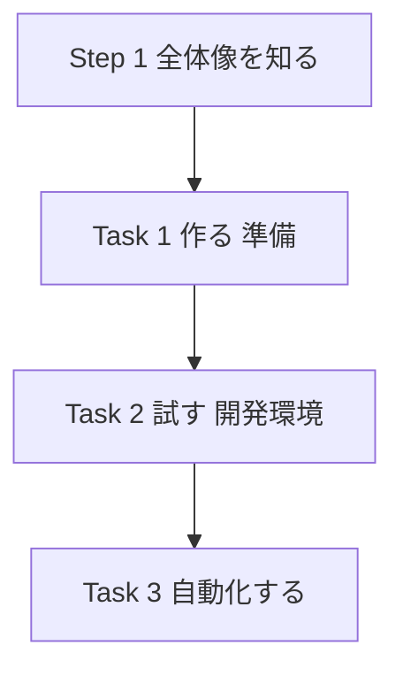

### 0.3 学習の進め方（おすすめ）

1. **Step 1** で「ビルド → テスト → デプロイ」の流れと用語をつかみます。
2. Task 1〜4 を順に読み、各 Step の **「試験での狙われどころ」** の表を必ず確認します。
3. 手を動かせる人は、SAM（AWS Serverless Application Model）のサンプルアプリで `sam build` → `sam deploy` を一度体験すると、理解が一気に深まります。
4. 最後に、各 Step の「試験での狙われどころ」を見直して理解を確認します（Task 4 は本ガイド未収録のため、公式試験ガイドと AWS ドキュメントで別途学習してください）。

### 0.4 【重要】最新のサービス状況（2026-10-03 時点）

試験ガイドの記述と、実際のサービス状況に差が出ている項目があります。**試験では試験ガイドの用語が使われます**が、実務では最新状況を知っておくことが大切です。

| 項目 | 試験ガイドの記述 | 最新状況（確認日: 2026-10-03） |
|---|---|---|
| AWS CodeCommit | リポジトリ利用が前提 | 2024年7月に新規受付停止（de-emphasized）となったが、**2025年11月24日に GA（一般提供）へ復帰**し、新規顧客も利用可能 |
| Amazon Q Developer | Skill 3.3.6 でテスト自動生成 | IDE プラグインと有料サブスクリプションは **2027-04-30 にサポート終了**。**新規サインアップは 2026-05-15 に停止**。後継は **Kiro**。AWS マネジメントコンソール内の Q Developer 等は継続 |
| AWS Copilot CLI | Skill 3.3.3 の例に登場 | **2026-06-12 にサポート終了**（OSS として GitHub には残るが、AWS による更新・セキュリティパッチ・サポートなし） |
| AWS Cloud9 / CodeStar など | （試験範囲外） | 新規顧客の受付停止などの動きあり。新規採用は避ける |

> 💡 **学習のコツ**: 試験対策としては「Q Developer」「Copilot」という言葉と概念を理解しつつ、実務では「Kiro」「ECS Express Mode / CloudFormation / CDK」などの現行手段も知っておくと安心です。

### 0.5 エマージングトピック（採点対象外の先行出題）

試験ガイドには「採点対象外の事前テスト問題」として、次の AI 関連トピックが出題され得ると記載されています。Domain 3 に関係するものは以下です。

- AI を使った CI/CD の支援（自動デプロイ承認、環境プロビジョニング、デプロイ後検証など）
- AI ツールによるテスト生成・テスト自動化（テスト実行、結果分析、リグレッションテスト、カバレッジ）
- AI 支援開発ツールでのコード生成・レビュー・リファクタリング・セキュリティスキャン

これらは **スコアには影響しません** が、Step 16 で基本的な考え方を紹介します。

### 参照 URL（この章）

- 試験ガイド（DVA-C02）: https://docs.aws.amazon.com/aws-certification/latest/developer-associate-02/developer-associate-02.html
- Domain 3 の公式ページ: https://docs.aws.amazon.com/aws-certification/latest/developer-associate-02/developer-associate-02-domain3.html
- 認定の公式ページ: https://aws.amazon.com/certification/certified-developer-associate/
- 技術・概念の一覧: https://docs.aws.amazon.com/aws-certification/latest/developer-associate-02/dva-technologies-concepts.html
- CodeCommit の GA 復帰: https://aws.amazon.com/blogs/devops/aws-codecommit-returns-to-general-availability/
- Q Developer IDE プラグインのサポート終了: https://docs.aws.amazon.com/amazonq/latest/qdeveloper-ug/q-developer-ide-end-of-support.html
- AWS Copilot CLI のサポート終了告知: https://aws.amazon.com/blogs/containers/announcing-the-end-of-support-for-the-aws-copilot-cli

---

## Step 1：デプロイの全体像（CI/CD と環境の考え方）

### 1.1 そもそも「デプロイ」とは

**デプロイ** とは、開発者が書いたコードを、利用者が使える環境（AWS 上のサーバーや Lambda など）に **届けて動かすこと** です。手作業でやると、ミス・ばらつき・時間がかかる、という問題が起きます。そこで **自動化** します。

### 1.2 用語を先におさえよう

| 用語 | 意味 | 例 |
|---|---|---|
| アーティファクト | デプロイの対象となる「成果物」 | zip ファイル、コンテナイメージ、CloudFormation テンプレート |
| ビルド | ソースコードから成果物を作る作業 | 依存ライブラリのインストール、コンパイル、zip 化 |
| CI（継続的インテグレーション） | コードを頻繁に統合し、自動でビルド・テストする | コミットのたびに CodeBuild がテストを実行 |
| CD（継続的デリバリー／デプロイ） | 成果物を自動で環境へ届ける | CodeDeploy や CloudFormation が本番へ反映 |
| IaC（Infrastructure as Code） | インフラ構成をコードで書く | CloudFormation、AWS SAM、AWS CDK |
| 環境（Environment） | 用途ごとに分けた実行場所 | dev（開発）、test / staging（検証）、prod（本番） |
| ロールバック | 問題が起きたとき、前の状態に戻すこと | 前バージョンへ切り戻し |

### 1.3 AWS の CI/CD サービスの役割分担

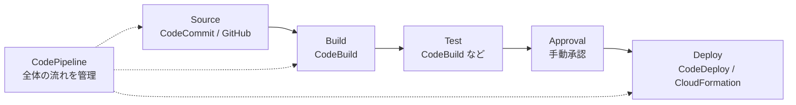

| サービス | 役割 | 一言でいうと |
|---|---|---|
| AWS CodeCommit | Git リポジトリ（ソース管理） | コードの置き場所 |
| AWS CodeBuild | ビルド・テストの実行 | 作業用の使い捨てサーバー |
| AWS CodeDeploy | EC2 / Lambda / ECS へのデプロイ | 配達員（戦略つき） |
| AWS CodePipeline | ステージをつなぐワークフロー | ベルトコンベア |
| AWS CloudFormation / SAM | インフラとアプリの宣言的デプロイ | 設計図から環境を作る |
| AWS AppConfig | 実行時の設定を安全に配信 | 設定のデプロイ専用 |

### 1.4 環境分離のベストプラクティス

- **環境ごとに分ける**: dev / test / prod は **別スタック**、できれば **別 AWS アカウント** に分けます（影響範囲の限定、権限分離）。
- **同じ成果物を昇格させる**: 「テストで通ったものと同じ成果物」を本番に出します（本番用に作り直さない）。これを **Build once, deploy many** と呼びます。
- **設定はコードの外へ**: 環境差分（DB 接続先など）は環境変数・Parameter Store・AppConfig で与えます（The Twelve-Factor App の考え方）。
- **すべてをコード化**: 手作業の変更は避け、IaC とパイプラインで再現可能にします。

### 参照 URL（この Step）

- Practicing CI/CD on AWS（ホワイトペーパー）: https://docs.aws.amazon.com/whitepapers/latest/practicing-continuous-integration-continuous-delivery/welcome.html
- AWS CodePipeline とは: https://docs.aws.amazon.com/codepipeline/latest/userguide/welcome.html
- The Twelve-Factor App（設定）: https://12factor.net/config
- Martin Fowler「Continuous Delivery」関連: https://martinfowler.com/bliki/ContinuousDelivery.html

---

# Task 1：デプロイ用アプリケーションアーティファクトの準備

この Task は「デプロイ **できる形** に仕上げる」工程です。

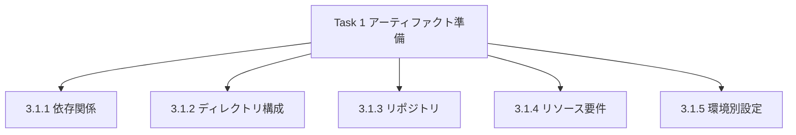

---

## Step 2：依存関係の管理（Skill 3.1.1）

> **Skill 3.1.1**: コードモジュールの依存関係（環境変数、設定ファイル、コンテナイメージなど）をパッケージ内で管理する

### 2.1 依存関係とは？

アプリは自分のコードだけでは動きません。次のような **「動くために必要なもの」** をまとめて管理します。

| 種類 | 例 | 管理場所 |
|---|---|---|
| ライブラリ | Python の `requests`、Node.js の `axios` | `requirements.txt` / `package.json` |
| 実行時設定 | `TABLE_NAME` などの環境変数 | Lambda の環境変数、SAM の `Environment` |
| 設定ファイル | `config.json`、`.ini` | パッケージ内、または AppConfig |
| コンテナイメージ | ベースイメージ、OS パッケージ | `Dockerfile`、Amazon ECR |
| 共通コード | 複数関数で共有するユーティリティ | Lambda レイヤー |

### 2.2 Lambda における依存関係の持ち方（3 つの選択肢）

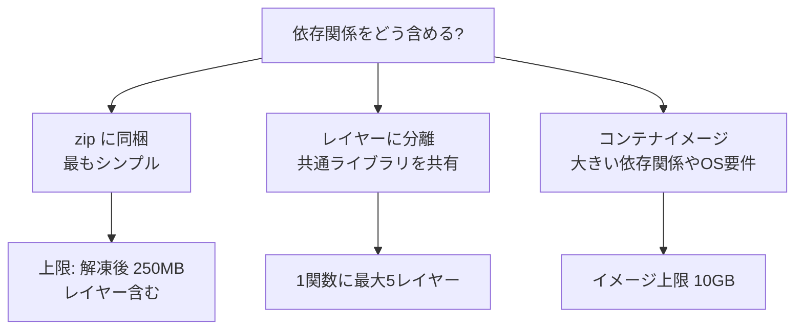

### 2.3 コード例：Python の依存関係を zip に同梱する流れ

```bash
# 依存ライブラリを一時ディレクトリへインストール
pip install -r requirements.txt -t ./package

# アプリコードを追加して zip 化
cp app.py ./package/
cd package && zip -r ../function.zip . && cd ..

# 関数を更新
aws lambda update-function-code \
  --function-name my-func \
  --zip-file fileb://function.zip
```

SAM を使うと、依存関係の解決〜パッケージングを `sam build` が自動で行います。

```bash
sam build        # requirements.txt を読み、.aws-sam/build に成果物を作る
sam deploy --guided
```

### 2.4 環境変数の扱い

- Lambda の環境変数は **関数ごとに合計 4 KB まで**。
- 値は保存時に暗号化されます（デフォルトで AWS 管理のキー）。**機密情報（パスワード等）を平文で入れない** のが基本。Secrets Manager や SSM Parameter Store（SecureString）を使い、環境変数には **参照先の名前** を入れます。

```yaml
# SAM の例：環境変数に「テーブル名」と「パラメータ名」を渡す
Resources:
  OrderFunction:
    Type: AWS::Serverless::Function
    Properties:
      Handler: app.handler
      Runtime: python3.13
      Environment:
        Variables:
          TABLE_NAME: !Ref OrdersTable
          DB_PASSWORD_PARAM: /myapp/prod/db_password   # 値ではなく名前を渡す
```

### 2.5 コンテナイメージの依存関係

- Lambda や ECS ではコンテナイメージにすべての依存関係を封じ込められます。
- **ベストプラクティス**
  - ベースイメージは **公式（AWS 提供の Lambda ベースイメージ等）** を使い、最小構成にする。
  - 変更頻度の低い層（OS・ライブラリ）を **Dockerfile の上位** に置き、変更が多いアプリコードを下位に置く（ビルドキャッシュが効く）。
  - イメージは **Amazon ECR** に置き、**イメージスキャン** を有効にする。
  - タグは **不変（immutable）** に設定するか、デプロイ時に **ダイジェスト（sha256）** で固定する。

```dockerfile
FROM public.ecr.aws/lambda/python:3.13
COPY requirements.txt ${LAMBDA_TASK_ROOT}
RUN pip install -r requirements.txt
COPY app.py ${LAMBDA_TASK_ROOT}
CMD ["app.handler"]
```

### 2.6 ベストプラクティス

| # | ベストプラクティス | 理由 |
|---|---|---|
| 1 | 依存関係は **バージョン固定**（ロックファイル利用） | ビルドの再現性を保つ |
| 2 | **不要な依存を入れない** | パッケージ縮小 → コールドスタート短縮・攻撃面縮小 |
| 3 | 共通ライブラリは **レイヤー** で共有 | 重複排除、更新の一元化 |
| 4 | 機密値は **環境変数に直書きしない** | 漏洩防止 |
| 5 | AWS SDK は **ランタイム同梱版か自前同梱かを意識** | 再現性を重視するなら同梱して固定 |
| 6 | 依存関係の **脆弱性スキャン** を CI に組み込む | 供給網リスク対策 |

### 2.7 試験での狙われどころ

| 問われ方 | 答えの方向性 |
|---|---|
| 複数関数で共通ライブラリを使い、更新を一元化したい | **Lambda レイヤー** |
| 依存関係が合計で解凍後 250MB を超える | **コンテナイメージ**（最大 10GB） |
| DB パスワードを安全に渡したい | **Secrets Manager / Parameter Store（SecureString）** を実行時に取得 |
| 環境ごとに変わる値を同じパッケージで切り替えたい | **環境変数** や AppConfig など、コード外の設定 |

### 参照 URL（この Step）

- Lambda デプロイパッケージ: https://docs.aws.amazon.com/lambda/latest/dg/gettingstarted-package.html
- Lambda レイヤー: https://docs.aws.amazon.com/lambda/latest/dg/chapter-layers.html
- Lambda 環境変数: https://docs.aws.amazon.com/lambda/latest/dg/configuration-envvars.html
- Lambda コンテナイメージ: https://docs.aws.amazon.com/lambda/latest/dg/images-create.html
- Lambda クォータ: https://docs.aws.amazon.com/lambda/latest/dg/gettingstarted-limits.html
- Amazon ECR イメージタグの変更可否: https://docs.aws.amazon.com/AmazonECR/latest/userguide/image-tag-mutability.html
- SAM とは: https://docs.aws.amazon.com/serverless-application-model/latest/developerguide/what-is-sam.html

---

## Step 3：ファイルとディレクトリ構造（Skill 3.1.2）

> **Skill 3.1.2**: アプリケーションのデプロイ用にファイルとディレクトリ構造を整理する

### 3.1 なぜ構造が大切なのか

デプロイツールは **「決まった場所」に「決まった名前」のファイルがあること** を前提に動きます。名前や場所を間違えると、デプロイが失敗します。

### 3.2 AWS のツールが探す「決まったファイル」

| ツール | 必要なファイル | 置き場所 | 役割 |
|---|---|---|---|
| AWS CodeBuild | `buildspec.yml` | ソースのルート（既定） | ビルド手順の定義 |
| AWS CodeDeploy（EC2/オンプレ） | `appspec.yml` | **アーカイブのルート** | 配置先とライフサイクルフックの定義 |
| AWS CodeDeploy（Lambda / ECS） | AppSpec（YAML または JSON） | デプロイ時に指定 | 切り替えるバージョンやタスク定義 |
| AWS SAM | `template.yaml`、`samconfig.toml` | プロジェクトのルート | アプリ全体の定義・デプロイ設定 |
| AWS CloudFormation | テンプレート（YAML/JSON） | 任意（S3 または手元） | インフラの定義 |
| Elastic Beanstalk | `.ebextensions/*.config`、`Procfile` など | ソースバンドルのルート | 環境設定の拡張 |
| AWS Amplify Hosting | `amplify.yml` | リポジトリのルート | ビルド設定 |

### 3.3 SAM プロジェクトの標準的なディレクトリ構成

```text
my-app/
├── template.yaml            # SAM テンプレート（インフラ定義）
├── samconfig.toml           # sam deploy の設定（環境別）
├── buildspec.yml            # CodeBuild のビルド手順
├── src/
│   ├── orders/
│   │   ├── app.py           # Lambda ハンドラー
│   │   └── requirements.txt # 依存関係
│   └── payments/
│       ├── app.py
│       └── requirements.txt
├── layers/
│   └── common/              # 共通レイヤー
├── events/
│   └── order-created.json   # テスト用イベント
└── tests/
    ├── unit/
    └── integration/
```

> 上記はディレクトリ構造の例示です（図解ではなく、ファイルの配置例を示すコードブロックです）。

### 3.4 Lambda の zip パッケージで最も多い失敗

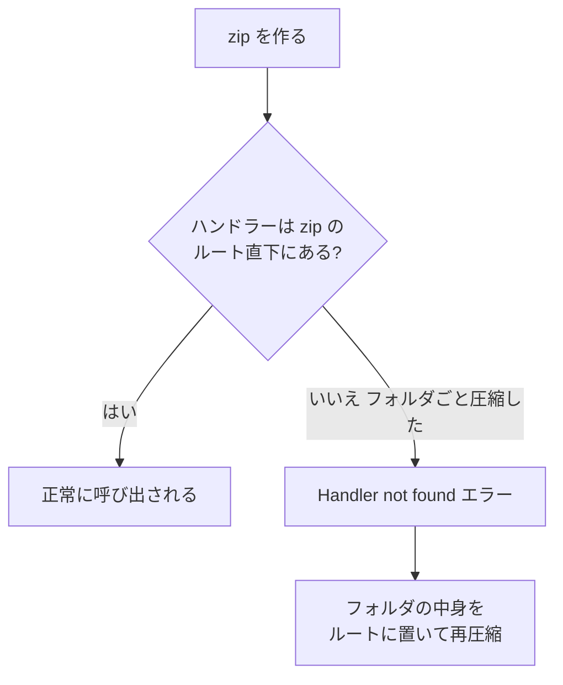

- 例：`Handler` を `app.handler` と設定した場合、zip の直下に `app.py` が必要です。
- フォルダごと圧縮すると `my-app/app.py` となり、ハンドラーが見つかりません。

### 3.5 ベストプラクティス

| # | ベストプラクティス | 理由 |
|---|---|---|
| 1 | **関数ごとにディレクトリを分ける** | 依存関係の肥大化を防ぎ、パッケージを小さく保つ |
| 2 | `buildspec.yml` / `appspec.yml` は **ルート** に置く | ツールが自動で見つける |
| 3 | テスト用イベント・テストコードは **本番パッケージに含めない** | サイズ削減と情報漏洩防止 |
| 4 | `.gitignore` と `.samignore` 等で **不要ファイル（`node_modules` のキャッシュ、`.env` など）を除外** | 機密や不要物の混入防止 |
| 5 | **インフラ（template）とアプリ（src）を同じリポジトリ** で管理 | 変更を一緒にレビュー・デプロイできる |

### 3.6 試験での狙われどころ

| 問われ方 | 答えの方向性 |
|---|---|
| CodeDeploy で EC2 にデプロイしたら「appspec.yml が見つからない」 | `appspec.yml` を **アーカイブのルート** に置く |
| CodeBuild のビルド手順の置き場所 | ルートの `buildspec.yml`（または別名ファイルをプロジェクトで指定） |
| Lambda が `Handler not found` | zip のルート直下にハンドラーがあるか確認 |

### 参照 URL（この Step）

- CodeBuild の buildspec リファレンス: https://docs.aws.amazon.com/codebuild/latest/userguide/build-spec-ref.html
- CodeDeploy の AppSpec ファイル: https://docs.aws.amazon.com/codedeploy/latest/userguide/reference-appspec-file.html
- Elastic Beanstalk の .ebextensions: https://docs.aws.amazon.com/elasticbeanstalk/latest/dg/ebextensions.html
- Amplify のビルド設定: https://docs.aws.amazon.com/amplify/latest/userguide/build-settings.html
- Lambda デプロイパッケージ: https://docs.aws.amazon.com/lambda/latest/dg/gettingstarted-package.html

---

## Step 4：コードリポジトリの活用（Skill 3.1.3）

> **Skill 3.1.3**: デプロイ環境でコードリポジトリを使用する

### 4.1 コードリポジトリとは

**バージョン管理（Git）されたコードの保管庫** です。デプロイでは「どのコミットを環境に出すか」の **唯一の情報源（Single Source of Truth）** になります。

### 4.2 AWS でのリポジトリの選択肢

| 選択肢 | 特徴 | パイプラインとの接続 |
|---|---|---|
| **AWS CodeCommit** | AWS のマネージド Git。IAM・VPC エンドポイント・CloudTrail と統合。2025-11 に GA 復帰 | CodePipeline の Source に直接指定 |
| **GitHub / GitLab / Bitbucket** | 外部の Git サービス | **AWS CodeConnections**（旧 CodeStar Connections）で接続 |
| **Amazon S3** | zip を置く簡易ソース。バージョニング有効が必須 | CodePipeline / CodeDeploy / Beanstalk が参照 |
| **Amazon ECR** | コンテナイメージのリポジトリ | イメージ push をパイプライン起動に使える |

### 4.3 コミットがデプロイされるまで

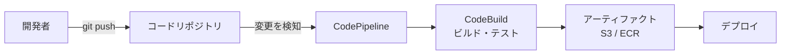

### 4.4 CodeCommit の接続方法（頻出）

| 方法 | 認証 | ポイント |
|---|---|---|
| HTTPS（Git 認証情報） | IAM ユーザーに発行した Git 認証情報 | 手軽。IAM ユーザーが前提 |
| **HTTPS（git-remote-codecommit）** | IAM ロール／一時認証情報 | **フェデレーションや IAM ロールで使える**（推奨） |
| SSH | IAM ユーザーに登録した SSH 公開鍵 | 鍵管理が必要 |

> ⚠️ AWS アクセスキーをコードにコミットしてはいけません。EC2 / Lambda / CodeBuild などの **IAM ロール** を使います。

### 4.5 リポジトリ運用のベストプラクティス

| # | ベストプラクティス | 理由 |
|---|---|---|
| 1 | **メインブランチを保護**（直接 push 禁止、プルリクエスト必須） | 本番品質を守る |
| 2 | CodeCommit では **承認ルールテンプレート**（Approval rule template）でレビュー必須化 | レビュー漏れ防止 |
| 3 | **機密情報（鍵・パスワード）をコミットしない**。誤コミット対策に `git-secrets` 等を導入 | 漏洩防止 |
| 4 | **IaC・アプリ・パイプライン定義** を同じ（または関連する）リポジトリで管理 | 変更履歴を追跡できる |
| 5 | 外部 Git との接続は **CodeConnections** を使い、**最小権限** のリポジトリアクセスにする | セキュリティ |
| 6 | S3 をソースにするなら **バージョニング** を有効化 | 過去版へ戻せる |

### 4.6 試験での狙われどころ

| 問われ方 | 答えの方向性 |
|---|---|
| GitHub のコミットで CodePipeline を起動したい | **CodeConnections**（接続）を Source に使う |
| IAM ロールで CodeCommit に安全に接続したい | **git-remote-codecommit** |
| S3 をソースにするときの必須設定 | **バージョニングの有効化** |
| CodeCommit のコミットを起点に他サービスを呼ぶ | **EventBridge ルール／CodeCommit トリガー（SNS・Lambda）** |

### 参照 URL（この Step）

- CodeCommit とは: https://docs.aws.amazon.com/codecommit/latest/userguide/welcome.html
- CodeCommit GA 復帰の告知: https://aws.amazon.com/blogs/devops/aws-codecommit-returns-to-general-availability/
- CodeConnections: https://docs.aws.amazon.com/dtconsole/latest/userguide/welcome-connections.html
- CodePipeline の概念: https://docs.aws.amazon.com/codepipeline/latest/userguide/concepts.html
- Trunk Based Development: https://trunkbaseddevelopment.com/

---

## Step 5：リソース要件（メモリ・CPU）（Skill 3.1.4）

> **Skill 3.1.4**: アプリケーションのリソース要件（メモリ、コア数など）を適用する

### 5.1 サービスごとの「リソース指定」の違い

| サービス | 指定するもの | 補足 |
|---|---|---|
| **AWS Lambda** | **メモリ（128 MB〜10,240 MB）**、タイムアウト（最大 15 分）、一時ストレージ（/tmp） | **CPU は直接指定できず、メモリに比例して割り当て** |
| **Amazon ECS（Fargate）** | タスクの **vCPU とメモリ** の組み合わせ | 許可された組み合わせのみ（例：0.25 vCPU は 0.5〜2 GB） |
| **Amazon ECS（EC2）** | コンテナごとの CPU ユニットとメモリ | `memory` は **ハード制限**、`memoryReservation` は **ソフト制限** |
| **EC2 / Elastic Beanstalk** | **インスタンスタイプ** | 用途別（汎用・コンピュート最適化・メモリ最適化） |

### 5.2 Lambda：メモリを増やすと CPU も増える

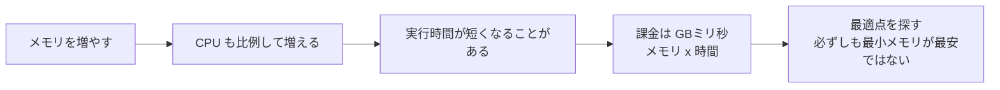

- 約 **1,769 MB で 1 vCPU 相当** になります。
- **ポイント**：メモリを上げて実行時間が大きく短縮されれば、**総コストが下がる** こともあります。最適値は **計測** で決めます（AWS Lambda Power Tuning などのツールが使われます）。
- **メモリ不足**：`Runtime exited with error: signal: killed` やメモリ超過メッセージ → メモリを増やす。
- **タイムアウト**：処理が長い場合は、タイムアウト値の引き上げ、処理の分割（Step Functions、SQS）を検討します。

### 5.3 SAM テンプレートでリソース要件を設定する

```yaml
Globals:
  Function:
    Runtime: python3.13
    MemorySize: 512          # 全関数の既定メモリ
    Timeout: 10              # 秒

Resources:
  ReportFunction:
    Type: AWS::Serverless::Function
    Properties:
      Handler: app.handler
      CodeUri: src/report/
      MemorySize: 1769       # この関数だけ個別に上書き
      Timeout: 60
      EphemeralStorage:
        Size: 2048           # /tmp を 2GB に拡張（MB単位）
```

### 5.4 ECS のタスク定義でのリソース指定（抜粋）

```json
{
  "family": "orders-api",
  "requiresCompatibilities": ["FARGATE"],
  "cpu": "512",
  "memory": "1024",
  "containerDefinitions": [
    {
      "name": "app",
      "image": "123456789012.dkr.ecr.ap-northeast-1.amazonaws.com/orders:1.4.2",
      "memory": 1024
    }
  ]
}
```

### 5.5 ベストプラクティス

| # | ベストプラクティス | 理由 |
|---|---|---|
| 1 | **推測ではなく計測** してサイズを決める（CloudWatch、Power Tuning、Compute Optimizer） | 過不足を避ける |
| 2 | 環境ごとに **サイズを変えてよい**（dev は小さく、prod は十分に） | コスト最適化 |
| 3 | リソース設定は **IaC に明記** する | 再現性と変更履歴 |
| 4 | Lambda の **タイムアウトは必要最小限** に設定 | 暴走時の課金・影響を抑える |
| 5 | ECS は **タスクとコンテナの制限の整合** をとる | 配置失敗・OOM Kill を防ぐ |
| 6 | 定期的に **見直す**（トラフィック増減に合わせる） | 劣化の早期発見 |

### 5.6 試験での狙われどころ

| 問われ方 | 答えの方向性 |
|---|---|
| Lambda の処理が遅い。CPU を増やしたい | **メモリを増やす**（CPU は直接設定できない） |
| `/tmp` に大きなファイルを置きたい | **EphemeralStorage** を拡張（最大 10,240 MB） |
| Lambda の最大実行時間 | **15 分** |
| Fargate で指定する必須項目 | **タスクレベルの cpu と memory** |

### 参照 URL（この Step）

- Lambda メモリ設定: https://docs.aws.amazon.com/lambda/latest/dg/configuration-memory.html
- Lambda クォータ: https://docs.aws.amazon.com/lambda/latest/dg/gettingstarted-limits.html
- ECS タスク定義のパラメータ: https://docs.aws.amazon.com/AmazonECS/latest/developerguide/task_definition_parameters.html
- AWS Lambda Power Tuning（OSS）: https://github.com/alexcasalboni/aws-lambda-power-tuning
- Serverless Applications Lens: https://docs.aws.amazon.com/wellarchitected/latest/serverless-applications-lens/welcome.html

---

## Step 6：環境別の設定と AWS AppConfig（Skill 3.1.5）

> **Skill 3.1.5**: 特定の環境向けにアプリケーション設定を準備する（例：AWS AppConfig の使用）

### 6.1 課題：dev / test / prod で設定が違う

接続先 DB、外部 API の URL、機能のオン/オフ、ログレベル…。**コードは同じ、設定だけ違う** のが理想です。

### 6.2 設定の置き場所の比較（最重要）

| 方法 | 向いている用途 | 特徴 |
|---|---|---|
| **環境変数** | 起動時に決まる単純な値 | 変更には関数の更新（再デプロイ）が必要。合計 4 KB（Lambda） |
| **SSM Parameter Store** | 設定値、階層管理（`/app/prod/key`） | 無料枠あり。`SecureString` は KMS で暗号化。バージョン管理・ラベルあり |
| **AWS Secrets Manager** | パスワード、API キー | **自動ローテーション**、きめ細かな制御 |
| **AWS AppConfig** | **実行時に変わる設定**、機能フラグ | **段階的配信・検証・自動ロールバック**。コード再デプロイ不要 |
| 設定ファイル（パッケージ同梱） | 変わらない既定値 | 変更はビルド・デプロイが必要 |

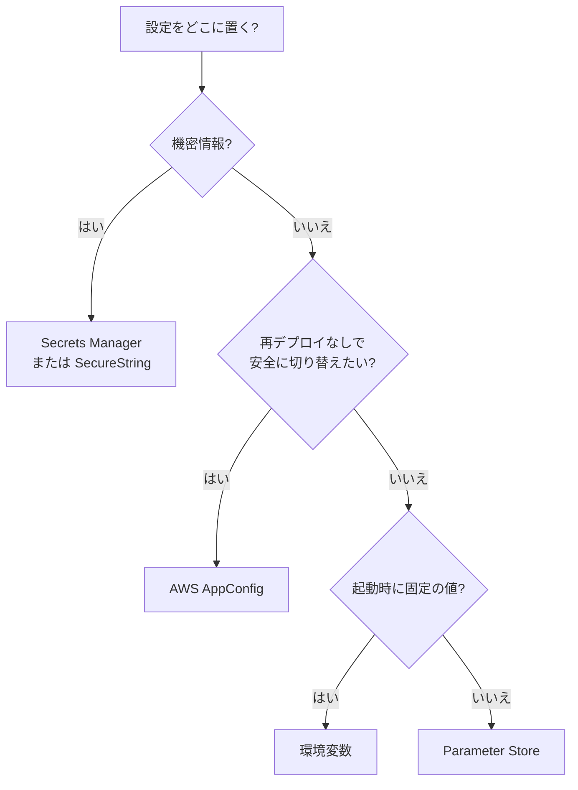

### 6.3 AWS AppConfig のしくみ

AppConfig は **AWS Systems Manager の機能** で、設定を **デプロイ（段階的に配信）** するサービスです。

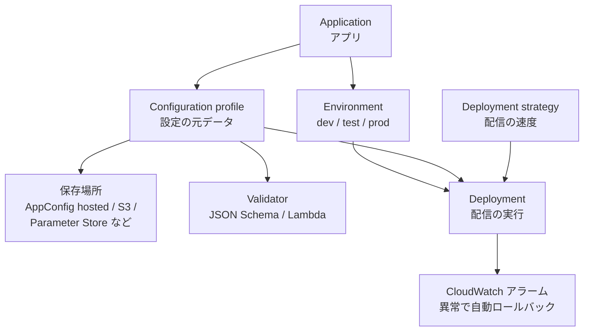

| 概念 | 説明 |
|---|---|
| **Application** | 設定を使うアプリの単位 |
| **Environment** | 配信先の論理グループ（dev / prod）。**監視用の CloudWatch アラーム** を紐付けられる |
| **Configuration profile** | 設定データの定義。**Freeform（自由形式）** と **Feature flags（機能フラグ）** がある |
| **Validator** | 配信前に **JSON Schema** または **Lambda** で設定の妥当性を検証 |
| **Deployment strategy** | 配信速度：**デプロイ時間**、**増加率**、**ベイク時間**（監視期間） |
| **Deployment** | 設定を環境に配信する実行。ロールバック可能 |

事前定義の配信戦略（代表例）：

| 戦略 | 動き |
|---|---|
| `AppConfig.AllAtOnce` | 一括で即時配信 |
| `AppConfig.Linear50PercentEvery30Seconds` | 30 秒ごとに 50% ずつ増やして配信 |
| `AppConfig.Canary10Percent20Minutes` | まず 10% に配信し、20 分かけて全体へ |

> 上記以外にも事前定義の戦略があります。カスタム戦略も作成できます。

### 6.4 アプリから設定を取得する

- **Lambda では「AWS AppConfig Lambda 拡張機能（Extension）」** を使うのが定番です。拡張機能が **設定をキャッシュ** し、ローカル HTTP（`localhost:2772`）経由で取得できます。API 呼び出しを減らし、コストと遅延を抑えます。
- 直接 SDK で取得する場合は、`StartConfigurationSession` と `GetLatestConfiguration` を使います。

```python
import urllib.request, json

def handler(event, context):
    url = ("http://localhost:2772/applications/myapp"
           "/environments/prod/configurations/feature-flags")
    with urllib.request.urlopen(url) as res:
        config = json.loads(res.read())
    if config.get("newCheckout", {}).get("enabled"):
        return "new flow"
    return "old flow"
```

### 6.5 ベストプラクティス

| # | ベストプラクティス | 理由 |
|---|---|---|
| 1 | 設定は **コードと分離** し、環境ごとに用意する | 同じ成果物を全環境で使える |
| 2 | **機密は Secrets Manager** / SecureString。AppConfig に平文の秘密を置かない | 漏洩防止 |
| 3 | AppConfig では **Validator を必ず設定** する | 不正な設定の配信を防ぐ |
| 4 | **段階的配信（Linear / Canary）＋ CloudWatch アラーム** を組み合わせる | 異常時に自動ロールバック |
| 5 | Lambda では **AppConfig 拡張機能** でキャッシュする | 呼び出し回数・遅延を削減 |
| 6 | パラメータは `/アプリ名/環境名/キー` の **階層命名** にする | 環境の切り替えが簡単 |
| 7 | 機能フラグは **用が済んだら削除** する | 技術的負債の蓄積防止 |

### 6.6 試験での狙われどころ

| 問われ方 | 答えの方向性 |
|---|---|
| 再デプロイなしで設定を安全に変更し、問題があれば自動で戻したい | **AWS AppConfig**（段階的配信＋アラーム連携） |
| 設定を JSON Schema で検証してから配信 | **AppConfig の Validator** |
| パスワードを自動ローテーションしたい | **Secrets Manager** |
| 環境ごとの値を階層で管理 | **Parameter Store の階層パス** |
| Lambda から AppConfig を低コスト・低遅延で使う | **AppConfig Lambda 拡張機能** |

### 参照 URL（この Step）

- AWS AppConfig とは: https://docs.aws.amazon.com/appconfig/latest/userguide/what-is-appconfig.html
- 設定プロファイルの作成: https://docs.aws.amazon.com/appconfig/latest/userguide/appconfig-creating-configuration-and-profile.html
- 配信戦略: https://docs.aws.amazon.com/appconfig/latest/userguide/appconfig-creating-deployment-strategy.html
- 機能フラグ: https://docs.aws.amazon.com/appconfig/latest/userguide/appconfig-feature-flags.html
- Lambda 拡張機能との統合: https://docs.aws.amazon.com/appconfig/latest/userguide/appconfig-integration-lambda-extensions.html
- Parameter Store: https://docs.aws.amazon.com/systems-manager/latest/userguide/systems-manager-parameter-store.html
- Secrets Manager: https://docs.aws.amazon.com/secretsmanager/latest/userguide/intro.html

---

# Task 2：開発環境でのアプリケーションテスト

この Task は「本番に出す前に、**開発環境で安全に確かめる**」工程です。

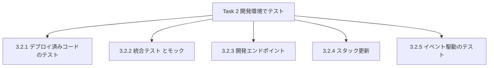

---

## Step 7：デプロイ済みコードのテスト（Skill 3.2.1）

> **Skill 3.2.1**: AWS のサービスとツールを使って、デプロイ済みのコードをテストする

### 7.1 テストの置き場所は 2 つ：手元 と クラウド

| 場所 | 方法 | 長所 | 短所 |
|---|---|---|---|
| **手元（ローカル）** | `sam local invoke`、`sam local start-api`（Docker 使用） | 速い、無料、すぐ試せる | 本物の IAM・ネットワーク・サービス連携とは差が出る |
| **クラウド（dev 環境）** | Lambda コンソールの **テスト**、`aws lambda invoke`、`sam sync` | **本物の環境** で検証できる | デプロイが必要、少額の課金 |

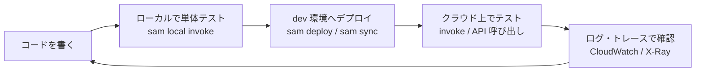

### 7.2 デプロイ済み Lambda をテストする方法

**① Lambda コンソールの「テスト」タブ**
テストイベント（JSON）を保存して何度でも実行できます。結果・ログ・実行時間・使用メモリが画面に出ます。

**② AWS CLI で呼び出す**

```bash
aws lambda invoke \
  --function-name my-func \
  --payload '{"orderId": "A-001"}' \
  --cli-binary-format raw-in-base64-out \
  --log-type Tail \
  response.json
```

- AWS CLI v2 では、JSON を直接渡すときに `--cli-binary-format raw-in-base64-out` が必要です（付けないと base64 を期待してエラーになる）。
- `--log-type Tail` で、直近のログ末尾（base64）をレスポンスに含められます。

**③ 呼び出しタイプ（Invocation type）**

| タイプ | 動作 | 用途 |
|---|---|---|
| `RequestResponse`（既定） | **同期**。結果を待つ | テスト、API 連携 |
| `Event` | **非同期**。すぐ 202 を返す | イベント処理のテスト |
| `DryRun` | 権限・パラメータだけ確認し、**実行しない** | 権限チェック |

### 7.3 確認に使うツール

| ツール | 何がわかるか | コマンド・場所 |
|---|---|---|
| **Amazon CloudWatch Logs** | 出力ログ、エラーのスタックトレース | `sam logs --name Func --tail` |
| **CloudWatch Logs Insights** | ログのクエリ集計 | コンソール |
| **AWS X-Ray** | リクエストの経路・各サービスの遅延 | 関数でアクティブトレースを有効化 |
| **CloudWatch Metrics** | Invocations、Errors、Duration、Throttles | コンソール |
| **SAM Accelerate（`sam sync`）** | コード変更を **素早く** クラウドへ同期 | `sam sync --watch`（開発用） |

> ⚠️ `sam sync` は **開発環境向け**（CloudFormation を経由せず直接更新する場合がある）です。**本番には使わず**、`sam deploy` とパイプラインを使います。

### 7.4 ベストプラクティス

| # | ベストプラクティス | 理由 |
|---|---|---|
| 1 | **構造化ログ（JSON）** を出力し、相関 ID を付ける | ログ検索・追跡が容易 |
| 2 | **X-Ray** を有効化して外部呼び出しの遅延を可視化 | ボトルネックの特定 |
| 3 | テストは **dev 専用環境** で行い、本番データを使わない | 事故防止 |
| 4 | **ローカル → クラウド** の順で段階的に確認 | 速く、安く、早期に不具合発見 |
| 5 | 機密情報や個人情報を **ログに出さない** | コンプライアンス |

### 7.5 試験での狙われどころ

| 問われ方 | 答えの方向性 |
|---|---|
| ローカルで Lambda を Docker 上で試したい | `sam local invoke` |
| ローカルで API を起動して試したい | `sam local start-api` |
| デプロイ済み関数の実行ログを見る | **CloudWatch Logs**（`sam logs`） |
| 呼び出し経路と遅延を可視化 | **AWS X-Ray** |
| 権限だけ確認して実行はしたくない | 呼び出しタイプ **DryRun** |

### 参照 URL（この Step）

- Lambda 関数のテスト: https://docs.aws.amazon.com/lambda/latest/dg/testing-functions.html
- SAM CLI コマンドリファレンス: https://docs.aws.amazon.com/serverless-application-model/latest/developerguide/serverless-sam-cli-command-reference.html
- sam local invoke: https://docs.aws.amazon.com/serverless-application-model/latest/developerguide/serverless-sam-cli-using-invoke.html
- sam sync（SAM Accelerate）: https://docs.aws.amazon.com/serverless-application-model/latest/developerguide/sam-cli-command-reference-sam-sync.html
- Lambda の呼び出し: https://docs.aws.amazon.com/lambda/latest/dg/lambda-invocation.html

---

## Step 8：統合テストと外部依存のモック（Skill 3.2.2）

> **Skill 3.2.2**: 統合テストを作成し、外部依存に対する API をモック化する

### 8.1 テストの種類

| 種類 | 対象 | 速度 | 外部依存 |
|---|---|---|---|
| **単体テスト（Unit）** | 1 つの関数・クラス | 非常に速い | **モックに置換** |
| **統合テスト（Integration）** | 複数の部品の連携（Lambda + DynamoDB など） | 中 | 本物（dev 環境）または一部モック |
| **E2E テスト** | 利用者視点の一連の流れ | 遅い | 本物 |

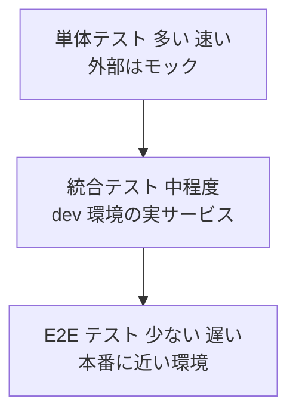

> 比率は「単体 > 統合 > E2E」とするのが定石です（テストピラミッド）。

### 8.2 モックとは？

**モック／スタブ** は、本物の代わりに動く「**偽物**」です。外部 API や AWS サービスを呼ぶ部分を偽物に差し替えると、**速く・安く・安定して・狙った状況（エラー等）を再現** できます。

| 方法 | 内容 | 言語 |
|---|---|---|
| **moto** | AWS サービス（S3、DynamoDB、SQS 等）を **メモリ上で模擬** | Python |
| **botocore Stubber** | boto3 クライアントの応答を **指定どおりに返す** | Python |
| **aws-sdk-client-mock** | AWS SDK v3 のクライアントを模擬 | JavaScript/TypeScript |
| **unittest.mock / Jest モック** | 任意の関数・HTTP 呼び出しを置換 | 各言語 |
| **API Gateway の Mock 統合** | バックエンドなしで **固定レスポンス** を返す | API Gateway |

### 8.3 コード例：moto で DynamoDB をモックした単体テスト（Python）

```python
import boto3
from moto import mock_aws

@mock_aws
def test_save_order():
    # 偽の DynamoDB を作る（本物には一切つながらない）
    ddb = boto3.resource("dynamodb", region_name="ap-northeast-1")
    ddb.create_table(
        TableName="Orders",
        KeySchema=[{"AttributeName": "orderId", "KeyType": "HASH"}],
        AttributeDefinitions=[{"AttributeName": "orderId", "AttributeType": "S"}],
        BillingMode="PAY_PER_REQUEST",
    )

    import app                       # テスト対象
    app.save_order({"orderId": "A-001"})

    item = ddb.Table("Orders").get_item(Key={"orderId": "A-001"})["Item"]
    assert item["orderId"] == "A-001"
```

### 8.4 API Gateway の Mock 統合

**Mock 統合** は、リクエストを **バックエンドに転送せず**、API Gateway 自身が応答を返す機能です。

- 用途：バックエンド完成前の **API 仕様の先行確認**、CORS の **OPTIONS プリフライト応答**、テスト用スタブ。
- 外部サービスの代役として **dev 環境専用のスタブ API** を用意し、環境変数やステージ変数で **接続先を切り替える** 使い方もあります。

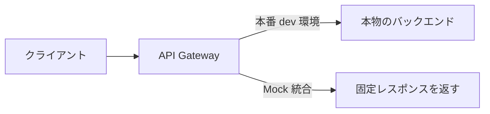

### 8.5 ベストプラクティス

| # | ベストプラクティス | 理由 |
|---|---|---|
| 1 | ハンドラー内で **ビジネスロジックと AWS 呼び出しを分離** する | 単体テストしやすくなる |
| 2 | クライアントは **ハンドラー外（初期化時）で生成** し、テストで差し替え可能にする | 再利用＋モック容易 |
| 3 | 外部依存の **接続先 URL は設定として注入**（環境変数など） | 環境ごとにスタブ／本物を切替 |
| 4 | 統合テストは **使い捨ての環境**（専用スタックやブランチ別スタック）で実行 | 干渉を防ぐ |
| 5 | **異常系（タイムアウト、4xx/5xx、スロットリング）** もモックで再現 | 障害時の動作を確認 |
| 6 | 統合テストの **後始末（データ削除・スタック削除）** を自動化 | コスト・汚染の防止 |

### 8.6 試験での狙われどころ

| 問われ方 | 答えの方向性 |
|---|---|
| バックエンド未完成でも API の挙動を確認したい | **API Gateway Mock 統合** |
| テストで本物の AWS を使わずに DynamoDB を再現 | **モック**（moto など）を利用 |
| 外部サービスの料金や不安定さをテストから切り離す | **モック／スタブ** に置き換える |
| 統合テストの対象 | **実際の AWS サービスとの連携**（dev 環境で実施） |

### 参照 URL（この Step）

- API Gateway の Mock 統合: https://docs.aws.amazon.com/apigateway/latest/developerguide/how-to-mock-integration.html
- Lambda 関数のテスト: https://docs.aws.amazon.com/lambda/latest/dg/testing-functions.html
- moto（OSS）: https://github.com/getmoto/moto
- The Practical Test Pyramid（Martin Fowler / Ham Vocke）: https://martinfowler.com/articles/practical-test-pyramid.html
- Serverless Land（AWS 公式のサーバーレス情報）: https://serverlessland.com/

---

## Step 9：開発用エンドポイントと API Gateway ステージ（Skill 3.2.3）

> **Skill 3.2.3**: 開発用エンドポイントを使ってアプリケーションをテストする（例：Amazon API Gateway のステージを設定する）

### 9.1 API Gateway の「ステージ」とは

**ステージ** は、API のデプロイ済みスナップショットに付ける **名前付きの公開窓口**（例：`dev`、`test`、`prod`）です。ステージごとに **別の URL** が付きます。

```text
https://{api-id}.execute-api.{region}.amazonaws.com/{stage-name}/{resource}
```

### 9.2 REST API の「デプロイ」と「ステージ」の関係

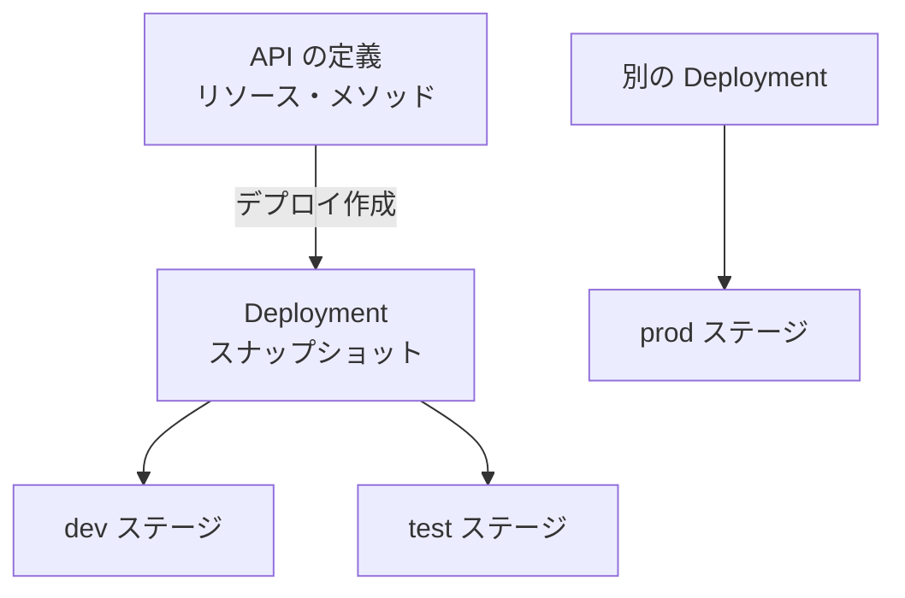

> ⚠️ **最重要ポイント**: REST API は、リソースやメソッドを変更しても **再デプロイしない限り、ステージには反映されません**。「変更したのに動かない」は、まず **再デプロイ漏れ** を疑います。

### 9.3 ステージで設定できること

| 設定 | 内容 |
|---|---|
| **ステージ変数** | 環境ごとに変わる値（例：Lambda エイリアス名、バックエンド URL）。`${stageVariables.変数名}` で参照 |
| **スロットリング** | ステージ／メソッド単位のレート制限 |
| **キャッシュ** | レスポンスキャッシュの有効化 |
| **ログ・メトリクス** | CloudWatch Logs への実行ログ、詳細メトリクス |
| **カナリアリリース** | ステージ内で **一部のトラフィックだけ新しいデプロイへ** 流す |
| **WAF / クライアント証明書** | セキュリティ設定 |

### 9.4 REST API と HTTP API の違い（ステージ観点）

| 項目 | REST API | HTTP API |
|---|---|---|
| デプロイ操作 | **明示的なデプロイが必要** | **自動デプロイ（auto-deploy）** を有効にできる |
| 既定のステージ | なし（作成する） | **`$default` ステージ** |
| ステージ変数 | 使える | 使える |
| カナリアリリース | **使える** | 使えない |

### 9.5 開発エンドポイントを使ったテストの流れ

1. `dev` ステージを作成してデプロイする。
2. `dev` の **Invoke URL** に `curl` やテストコードでアクセスする。
3. ステージ変数で、バックエンド（Lambda エイリアス `dev`）に接続する。
4. 問題なければ、同じ定義を `test` → `prod` ステージに昇格する。

```bash
curl -i https://abc123.execute-api.ap-northeast-1.amazonaws.com/dev/orders
```

### 9.6 SAM でのステージ指定

```yaml
Resources:
  ApiGateway:
    Type: AWS::Serverless::Api
    Properties:
      StageName: dev            # ステージ名
      Variables:
        lambdaAlias: dev        # ステージ変数
```

### 9.7 ベストプラクティス

| # | ベストプラクティス | 理由 |
|---|---|---|
| 1 | dev / test / prod の **ステージ（または別アカウント）を分ける** | 影響範囲の限定 |
| 2 | 環境差分は **ステージ変数** で吸収し、API 定義は共通にする | 定義のずれを防ぐ |
| 3 | dev ステージでは **詳細ログ** を有効、prod ではデータ量を考慮 | 調査性とコストの両立 |
| 4 | prod へは **カナリアリリース** で段階展開 | 事故の影響を最小化 |
| 5 | コンソールの **テスト機能（Test invoke）** で、デプロイ前にメソッドを確認 | 早期の不具合発見 |

### 9.8 試験での狙われどころ

| 問われ方 | 答えの方向性 |
|---|---|
| API を変更したが、ステージの動作が変わらない | **API を再デプロイ** していない |
| 環境ごとに異なる Lambda を呼びたい（API 定義は共通） | **ステージ変数** |
| 本番ステージに一部のトラフィックだけ新バージョンを流す | **カナリアリリース設定**（REST API） |
| 開発用に手軽な URL でテスト | **dev ステージの Invoke URL** |

### 参照 URL（この Step）

- API Gateway のステージ: https://docs.aws.amazon.com/apigateway/latest/developerguide/stages.html
- ステージの設定: https://docs.aws.amazon.com/apigateway/latest/developerguide/set-up-stages.html
- REST API のデプロイ: https://docs.aws.amazon.com/apigateway/latest/developerguide/how-to-deploy-api.html
- ステージ変数: https://docs.aws.amazon.com/apigateway/latest/developerguide/amazon-api-gateway-using-stage-variables.html
- カナリアリリース: https://docs.aws.amazon.com/apigateway/latest/developerguide/canary-release.html
- HTTP API のステージ: https://docs.aws.amazon.com/apigateway/latest/developerguide/http-api-stages.html

---

## Step 10：既存環境へのスタック更新（Skill 3.2.4）

> **Skill 3.2.4**: 既存の環境にアプリケーションスタックの更新をデプロイする（例：AWS SAM テンプレートを別のステージング環境にデプロイする）

### 10.1 考え方：同じテンプレート × 違うパラメータ × 違うスタック

**同じ SAM / CloudFormation テンプレート** を使い、**パラメータとスタック名を変えるだけ** で、dev / staging / prod を作り分けます。

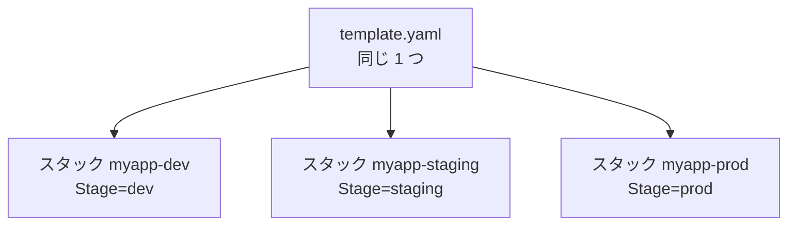

### 10.2 samconfig.toml で環境別の設定を持つ

```toml
version = 0.1

[default.deploy.parameters]
stack_name = "myapp-dev"
resolve_s3 = true
capabilities = "CAPABILITY_IAM"
parameter_overrides = "Stage=dev"

[staging.deploy.parameters]
stack_name = "myapp-staging"
resolve_s3 = true
capabilities = "CAPABILITY_IAM"
parameter_overrides = "Stage=staging LogLevel=INFO"

[prod.deploy.parameters]
stack_name = "myapp-prod"
resolve_s3 = true
capabilities = "CAPABILITY_IAM"
parameter_overrides = "Stage=prod LogLevel=WARN"
confirm_changeset = true
```

```bash
sam build
sam deploy --config-env staging      # staging 用の設定でデプロイ
sam deploy --config-env prod         # prod 用（変更セットの確認つき）
```

### 10.3 テンプレート側：Parameters と Conditions

```yaml
Parameters:
  Stage:
    Type: String
    AllowedValues: [dev, staging, prod]

Conditions:
  IsProd: !Equals [!Ref Stage, prod]

Resources:
  OrderFunction:
    Type: AWS::Serverless::Function
    Properties:
      Handler: app.handler
      Runtime: python3.13
      MemorySize: !If [IsProd, 1024, 256]    # 本番だけ大きく
      Environment:
        Variables:
          STAGE: !Ref Stage
```

### 10.4 更新の安全な流れ（変更セット）

`sam deploy` は内部で CloudFormation の **変更セット（Change Set）** を作成し、それを実行します。

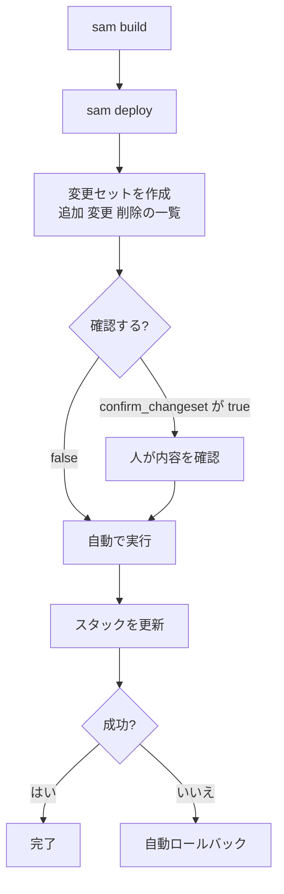

### 10.5 ベストプラクティス

| # | ベストプラクティス | 理由 |
|---|---|---|
| 1 | **環境ごとにスタックを分ける**（スタック名に環境名） | 独立性・安全性 |
| 2 | prod は **`confirm_changeset`（または `--no-execute-changeset`）** で内容確認 | 意図しない削除・置換の防止 |
| 3 | 環境差分は **Parameters / Conditions / Mappings** で表現 | テンプレートを 1 つに保てる |
| 4 | **`sam validate --lint`** や **cfn-lint** で事前検査 | 構文・ベストプラクティス違反の早期検出 |
| 5 | 本番デプロイは **人の手ではなくパイプライン** から行う | 再現性と監査性 |
| 6 | 同じ成果物（ビルド済み）を staging → prod に昇格 | 「テストしたものを出す」 |

### 10.6 試験での狙われどころ

| 問われ方 | 答えの方向性 |
|---|---|
| 同じ SAM テンプレートを staging にもデプロイ | **スタック名とパラメータを変えて `sam deploy`**（`--config-env`） |
| 本番更新前に変更内容を確認したい | **変更セット** |
| 環境ごとに値を変えたい | **Parameters**（＋ Conditions / Mappings） |
| デプロイ失敗時の挙動 | 既定で **ロールバック** |

### 参照 URL（この Step）

- samconfig（SAM CLI の設定ファイル）: https://docs.aws.amazon.com/serverless-application-model/latest/developerguide/serverless-sam-cli-config.html
- 変更セットによる更新: https://docs.aws.amazon.com/AWSCloudFormation/latest/UserGuide/using-cfn-updating-stacks-changesets.html
- CloudFormation テンプレートの構造: https://docs.aws.amazon.com/AWSCloudFormation/latest/UserGuide/template-anatomy.html
- sam deploy: https://docs.aws.amazon.com/serverless-application-model/latest/developerguide/sam-cli-command-reference-sam-deploy.html

---

## Step 11：イベント駆動アプリケーションのテスト（Skill 3.2.5）

> **Skill 3.2.5**: イベント駆動型アプリケーションをテストする

### 11.1 イベント駆動とは

「ファイルがアップロードされた」「メッセージがキューに届いた」といった **出来事（イベント）をきっかけに処理が動く** 仕組みです。呼び出し元が見えにくいため、**テストの工夫が必要** です。

### 11.2 代表的なイベントソースとテスト方法

| イベントソース | 呼び出し方式 | テスト方法の例 |
|---|---|---|
| Amazon S3 | 非同期 | `sam local generate-event s3 put` で疑似イベント生成、または実際にテストファイルをアップロード |
| Amazon SNS | 非同期 | `aws sns publish` でテストメッセージ送信 |
| Amazon SQS | **ポーリング（イベントソースマッピング）** | `aws sqs send-message` で送信し、処理結果とキューを確認 |
| Amazon EventBridge | 非同期 | `aws events put-events` / **イベントパターンのテスト** |
| DynamoDB Streams / Kinesis | **ポーリング** | テーブルを更新して Stream レコードを発生させる |
| API Gateway | 同期 | `curl` / テストイベント / `sam local start-api` |

### 11.3 テストの 3 段階

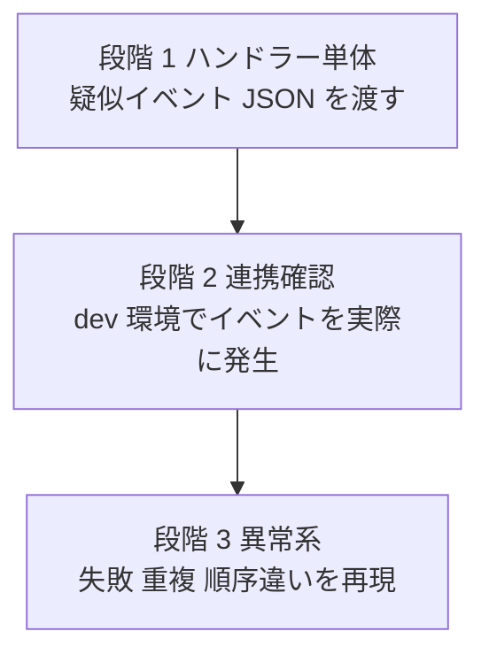

### 11.4 疑似イベントを作る

```bash
# S3 に put されたイベントの JSON を生成
sam local generate-event s3 put --bucket my-bucket --key images/a.png > events/s3-put.json

# 生成したイベントでローカル実行
sam local invoke ImageFunction -e events/s3-put.json
```

EventBridge のルールが **意図したイベントに一致するか** は、イベントパターンのテストで確認できます。

```bash
aws events test-event-pattern \
  --event-pattern file://pattern.json \
  --event file://event.json
```

### 11.5 イベント駆動で必ず考えるべきこと

| 論点 | 内容 | 対策 |
|---|---|---|
| **少なくとも 1 回配信（At-least-once）** | 同じイベントが **2 回以上** 届くことがある | **冪等性（べきとうせい）** を実装（同じ入力で結果が変わらない） |
| **失敗時の扱い** | 処理が失敗し続けるメッセージ | **DLQ（デッドレターキュー）** や **失敗時の送信先（Destinations）** |
| **一部だけ失敗（バッチ）** | SQS・Kinesis のバッチ処理 | **部分バッチ応答（ReportBatchItemFailures）** |
| **順序** | 標準キューは順序保証なし | FIFO キュー、または順序に依存しない設計 |
| **リトライ** | 非同期呼び出しは自動リトライあり | リトライ回数・最大イベント経過時間を設定 |

> 冪等性の実装には、Powertools for AWS Lambda の Idempotency ユーティリティがよく使われます。

### 11.5.1 DLQ とリトライの全体像

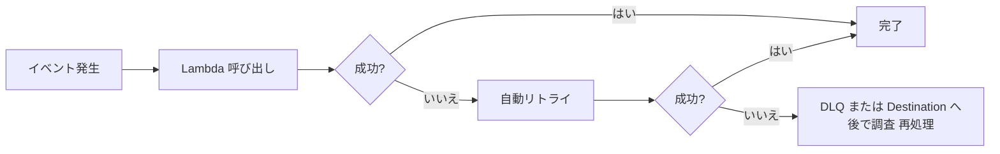

### 11.6 ベストプラクティス

| # | ベストプラクティス | 理由 |
|---|---|---|
| 1 | **サンプルイベントを `events/` に保存** し、リポジトリで管理 | 再現可能なテスト |
| 2 | 実イベントのペイロードを **ログからサンプリング** してテストに活用（個人情報はマスク） | 実態に即したテスト |
| 3 | **冪等性・DLQ・リトライ** をテストで必ず検証 | 本番での障害を想定 |
| 4 | **X-Ray / 相関 ID** でイベントの流れを追跡 | 非同期の可視化 |
| 5 | **統合テストでは、イベント発生 → 結果が出るまでポーリング** して検証 | 非同期のため待機が必要 |

### 11.7 試験での狙われどころ

| 問われ方 | 答えの方向性 |
|---|---|
| S3 イベントの形式をローカルで再現 | **`sam local generate-event`** |
| 重複配信されても結果を変えない | **冪等性** |
| 何度も失敗するメッセージを退避して調査 | **DLQ / on-failure destination** |
| SQS バッチの一部だけ失敗した | **ReportBatchItemFailures（部分バッチ応答）** |
| EventBridge ルールのパターンが合うか確認 | **イベントパターンのテスト** |

### 参照 URL（この Step）

- sam local generate-event: https://docs.aws.amazon.com/serverless-application-model/latest/developerguide/sam-cli-command-reference-sam-local-generate-event.html
- Lambda の非同期呼び出し: https://docs.aws.amazon.com/lambda/latest/dg/invocation-async.html
- SQS と Lambda（部分バッチ応答）: https://docs.aws.amazon.com/lambda/latest/dg/services-sqs-errorhandling.html
- EventBridge のイベントパターン: https://docs.aws.amazon.com/eventbridge/latest/userguide/eb-event-patterns.html
- Powertools for AWS Lambda（冪等性）: https://docs.powertools.aws.dev/lambda/python/latest/utilities/idempotency/
- Serverless Land（イベント駆動パターン集）: https://serverlessland.com/patterns

---

# Task 3：デプロイテストの自動化

この Task は「テストとデプロイを **人の手を介さず繰り返せる形** にする」工程です。

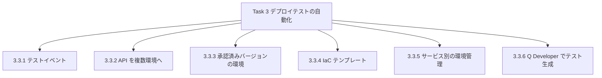

---

## Step 12：テストイベントの作成（Skill 3.3.1）

> **Skill 3.3.1**: アプリケーションのテストイベントを作成する（例：Lambda、API Gateway、AWS SAM リソース向けの JSON ペイロード）

### 12.1 テストイベントとは

Lambda は **イベント（JSON）を受け取って動く関数** です。テストでは、そのイベントを **自分で作って渡す** ことになります。これが **テストイベント** です。

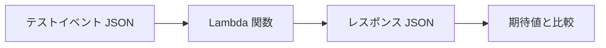

### 12.2 テストイベントを作る 4 つの方法

| 方法 | 内容 | 使いどころ |
|---|---|---|
| **Lambda コンソールのテストイベント** | サービス別の **テンプレート**（S3、SQS、API Gateway など）から作成・保存。**共有可能なテストイベント**（EventBridge のスキーマレジストリ利用）もある | 手早い確認 |
| **`sam local generate-event`** | サービス別のイベントを **コマンドで生成** | ローカルテスト、リポジトリ保存 |
| **ログからサンプリング** | 実際に届いたイベントを CloudWatch Logs から取得（個人情報は除去） | 実態に即したテスト |
| **手書き JSON** | 最小限のフィールドで作る | 単体テスト |

### 12.3 API Gateway（REST・Lambda プロキシ統合）のイベント例

```json
{
  "httpMethod": "POST",
  "path": "/orders",
  "headers": { "Content-Type": "application/json" },
  "queryStringParameters": { "dryRun": "true" },
  "pathParameters": null,
  "stageVariables": { "lambdaAlias": "dev" },
  "requestContext": { "stage": "dev" },
  "body": "{\"orderId\":\"A-001\",\"qty\":2}",
  "isBase64Encoded": false
}
```

- `body` は **JSON を文字列としてエスケープ** した形になります（ここが初学者のつまずきポイント）。
- HTTP API（ペイロード形式 2.0）では構造が異なります（`version: "2.0"`、`routeKey`、`rawPath`、`requestContext.http.method` など）。

### 12.4 Lambda プロキシ統合のレスポンス形式（頻出）

Lambda は **次の形式** で返さないと、API Gateway が **502 Bad Gateway（Malformed Lambda proxy response）** を返します。

```python
import json

def handler(event, context):
    body = json.loads(event["body"])
    return {
        "statusCode": 200,
        "headers": {"Content-Type": "application/json"},
        "body": json.dumps({"received": body["orderId"]}),   # body は文字列
    }
```

### 12.5 SAM でテストイベントを使う

```bash
# イベントを生成して保存
sam local generate-event apigateway aws-proxy --method POST --path orders --body '{"orderId":"A-001"}' > events/api-post.json

# 関数をそのイベントで実行
sam local invoke OrderFunction -e events/api-post.json

# 環境変数を上書きして実行（dev 用の値でテスト）
sam local invoke OrderFunction -e events/api-post.json --env-vars env.json
```

### 12.6 テストの自動化（CI での実行）

```mermaid
flowchart TD
    A["events ディレクトリに<br/>テストイベントを保存"] --> B["pytest 等で<br/>全イベントを読み込み"]
    B --> C["ハンドラーに渡す"]
    C --> D["戻り値を検証"]
    D --> E["CodeBuild で自動実行"]
```

```python
import json, glob, pytest
from app import handler

@pytest.mark.parametrize("path", glob.glob("events/*.json"))
def test_handler_returns_valid_response(path):
    event = json.load(open(path))
    res = handler(event, None)
    assert res["statusCode"] in (200, 201, 400)
```

### 12.7 ベストプラクティス

| # | ベストプラクティス | 理由 |
|---|---|---|
| 1 | テストイベントを **リポジトリで版管理** | チームで共有・再現 |
| 2 | **正常系＋異常系**（欠損フィールド、不正値、空）を用意 | 堅牢性の確認 |
| 3 | 実データ由来のイベントは **個人情報をマスク** | 情報保護 |
| 4 | イベントに **環境依存の値を埋め込まない**（ステージ名、ARN など） | 環境間で使い回す |
| 5 | プロキシ統合の **レスポンス形式をテストで検証** | 502 エラー防止 |

### 12.8 試験での狙われどころ

| 問われ方 | 答えの方向性 |
|---|---|
| S3 / SQS などのイベント JSON を簡単に作りたい | **`sam local generate-event`** または Lambda コンソールのイベントテンプレート |
| API Gateway で 502 エラー（Lambda プロキシ統合） | **レスポンス形式（statusCode / body 文字列）** の誤り |
| チーム間でテストイベントを共有 | **共有可能なテストイベント**（スキーマレジストリ）や、リポジトリ管理 |

### 参照 URL（この Step）

- Lambda コンソールでのテストイベント: https://docs.aws.amazon.com/lambda/latest/dg/testing-functions.html
- sam local generate-event: https://docs.aws.amazon.com/serverless-application-model/latest/developerguide/sam-cli-command-reference-sam-local-generate-event.html
- Lambda プロキシ統合: https://docs.aws.amazon.com/apigateway/latest/developerguide/set-up-lambda-proxy-integrations.html
- API Gateway メソッドのテスト: https://docs.aws.amazon.com/apigateway/latest/developerguide/how-to-test-method.html
- HTTP API ペイロード形式: https://docs.aws.amazon.com/apigateway/latest/developerguide/http-api-develop-integrations-lambda.html

---

## Step 13：API リソースの複数環境へのデプロイと環境管理（Skill 3.3.2 / 3.3.5）

> **Skill 3.3.2**: API リソースをさまざまな環境にデプロイする
> **Skill 3.3.5**: 個々の AWS サービス内で環境を管理する（例：API Gateway で開発・テスト・本番を区別する）

### 13.1 「環境」は AWS サービスごとに表現方法が違う

| サービス | 環境の表現方法 | 例 |
|---|---|---|
| **API Gateway** | **ステージ** | `dev` / `test` / `prod` |
| **AWS Lambda** | **エイリアス**（＋バージョン）、関数名の接尾辞 | `dev` エイリアス、`prod` エイリアス |
| **AWS AppConfig** | **Environment** | dev / prod |
| **Elastic Beanstalk** | **環境（Environment）** | `myapp-dev`、`myapp-prod` |
| **AWS Amplify Hosting** | **ブランチ** | `main`=本番、`dev`=開発 |
| **CodeDeploy** | **デプロイグループ** | `staging-group` / `prod-group` |
| **Amazon ECS** | クラスター／サービス／タスク定義リビジョン | `orders-dev` サービス |
| **CloudFormation / SAM** | **スタック**（名前＋パラメータ） | `myapp-dev` スタック |
| **AWS アカウント** | アカウント単位の分離（最も強い分離） | dev アカウント / prod アカウント |

### 13.2 API Gateway：デプロイの実行

```bash
# REST API の変更を dev ステージへデプロイ
aws apigateway create-deployment \
  --rest-api-id abc123 \
  --stage-name dev \
  --description "add GET /orders"
```

```mermaid
flowchart LR
    A["API 定義を変更"] --> B["create-deployment<br/>デプロイを作成"]
    B --> C["dev ステージに反映"]
    C --> D["動作確認"]
    D --> E["同じ定義を test ステージへ"]
    E --> F["prod ステージへ"]
```

### 13.3 IaC での落とし穴（CloudFormation で API Gateway を管理する場合）

- 素の CloudFormation では、`AWS::ApiGateway::Deployment` は **リソースの内容が変わらないと再作成されません**。API の中身を変えてもステージに反映されない問題が起きます。
- **AWS SAM（`AWS::Serverless::Api`）を使うと、デプロイとステージの管理を自動で行ってくれる** ため、この問題は起きにくくなります。

### 13.4 ステージ変数と環境ごとの接続先

```yaml
# SAM：dev/prod で呼ぶ Lambda エイリアスをステージ変数で切り替える
Resources:
  Api:
    Type: AWS::Serverless::Api
    Properties:
      StageName: !Ref Stage
      Variables:
        lambdaAlias: !Ref Stage
```

### 13.5 環境分離の強さ（弱い → 強い）

```mermaid
flowchart LR
    A["同一 API の<br/>ステージ分離"] --> B["同一アカウントの<br/>別スタック"]
    B --> C["別アカウント<br/>推奨"]
```

| 方式 | 長所 | 短所 |
|---|---|---|
| ステージ分離 | 手軽 | 設定ミスの影響が他ステージに及ぶ可能性 |
| 別スタック | リソースが完全に別 | 同一アカウント内の権限分離は別途必要 |
| **別アカウント** | **権限・課金・障害の完全分離**（AWS Organizations で管理） | 初期設定が増える |

### 13.6 ベストプラクティス

| # | ベストプラクティス | 理由 |
|---|---|---|
| 1 | **ステージ名＝環境名** に統一し、命名規則を決める | 混乱防止 |
| 2 | 環境ごとに **別の IAM ロール／最小権限** | 誤操作の影響を限定 |
| 3 | 本番ステージには **スロットリング・ログ・WAF** を有効化 | 保護と可観測性 |
| 4 | **同じ定義を昇格** させ、環境固有値は変数で与える | 差異による不具合を防ぐ |
| 5 | 本番デプロイは **自動化されたパイプライン＋承認** 経由のみ | 統制 |
| 6 | 可能なら **dev / prod は別アカウント** | 強い分離 |

### 13.7 試験での狙われどころ

| 問われ方 | 答えの方向性 |
|---|---|
| API Gateway で dev / test / prod を区別 | **ステージ** |
| API を変更したが反映されない | **再デプロイ** |
| 環境ごとに呼び先 Lambda を変えたい | **ステージ変数＋Lambda エイリアス** |
| 最も強い環境分離 | **別アカウント** |

### 参照 URL（この Step）

- API Gateway のデプロイ: https://docs.aws.amazon.com/apigateway/latest/developerguide/how-to-deploy-api.html
- ステージの設定: https://docs.aws.amazon.com/apigateway/latest/developerguide/set-up-stages.html
- AWS Organizations と複数アカウント戦略（Well-Architected）: https://docs.aws.amazon.com/wellarchitected/latest/framework/sec_securely_operate_multi_accounts.html
- AWS SAM の Api リソース: https://docs.aws.amazon.com/serverless-application-model/latest/developerguide/sam-resource-api.html

---

## Step 14：承認済みバージョンを使う環境（Skill 3.3.3）

> **Skill 3.3.3**: 統合テスト用に、承認済みバージョンを使うアプリケーション環境を作成する（例：Lambda エイリアス、コンテナイメージタグ、AWS Amplify ブランチ、AWS Copilot 環境）

### 14.1 考え方：「どのバージョンがどの環境にあるか」を固定する

統合テストでは、**「テストしたものと同じもの」が本番に行く** ことが大切です。そのため **バージョンに名前（ラベル）を付け、環境がそれを指す** 形にします。

```mermaid
flowchart LR
    BLD["ビルド成果物<br/>不変のバージョン"] --> V["バージョン番号 やタグ"]
    V --> E1["統合テスト環境<br/>承認済みバージョンを指す"]
    V --> E2["本番環境<br/>承認後に同じものを指す"]
```

### 14.2 例①：Lambda バージョンとエイリアス

| 用語 | 意味 | 特徴 |
|---|---|---|
| **`$LATEST`** | 最新の編集中コード | **変更可能（ミュータブル）** |
| **バージョン** | `$LATEST` のスナップショット（1, 2, 3…） | **不変（イミュータブル）**。コードと設定が固定 |
| **エイリアス** | バージョンを指す **名前付きポインタ**（`dev`、`prod`） | 別のバージョンに **付け替え可能**。**加重ルーティング（2 バージョン間の割合）** も可能 |

```mermaid
flowchart TD
    L["$LATEST 編集中"] -->|"publish-version"| V1["バージョン 1"]
    L -->|"publish-version"| V2["バージョン 2"]
    L -->|"publish-version"| V3["バージョン 3"]
    V3 --> AD["エイリアス dev"]
    V2 --> AT["エイリアス test 承認済み"]
    V1 --> AP["エイリアス prod"]
```

```bash
# バージョンを発行
aws lambda publish-version --function-name my-func --description "release 1.4.0"

# エイリアスを作る / 付け替える
aws lambda create-alias --function-name my-func --name test --function-version 2
aws lambda update-alias --function-name my-func --name test --function-version 3

# 加重ルーティング（prod: バージョン1に 90%、バージョン2に 10%）
aws lambda update-alias --function-name my-func --name prod \
  --function-version 1 \
  --routing-config '{"AdditionalVersionWeights": {"2": 0.1}}'
```

> ⚠️ **ポイント**: イベントソース（S3、API Gateway 等）には **エイリアスの ARN** を設定します。エイリアスを付け替えるだけで、呼び出し元の設定を変えずに切り替えられます。

### 14.3 例②：コンテナイメージのタグ

| タグ付けの方法 | 例 | 評価 |
|---|---|---|
| `latest` | `orders:latest` | ❌ **何が入っているか不明、再現性なし** |
| **セマンティックバージョン** | `orders:1.4.2` | ✅ 人が読める |
| **Git コミット SHA** | `orders:3f9a2c1` | ✅ 追跡性が高い |
| **ダイジェスト** | `orders@sha256:...` | ✅ **完全に不変**（最も確実） |

- Amazon ECR の **タグのイミュータビリティ（不変）設定** を有効にすると、**既存タグの上書きを防げます**。
- 環境（タスク定義・Lambda）には **承認済みの特定タグ（またはダイジェスト）** を指定します。

### 14.4 例③：AWS Amplify のブランチ

- Amplify Hosting では **Git の ブランチ＝環境** として扱えます（例：`main`＝本番、`dev`＝開発、`feature/xxx`＝機能ブランチの一時環境）。
- ブランチごとに **環境変数** を設定でき、**プルリクエストのプレビュー環境** も作れます。
- 承認済みのブランチ（例：`release`）だけを統合テスト環境に接続すれば、「承認されたコード」だけを検証できます。

### 14.5 例④：AWS Copilot の環境（注意：サポート終了）

- AWS Copilot CLI は、`copilot env` で **環境（test / prod など）** を作る仕組みで、試験ガイドの例に挙がっています。
- ただし **2026-06-12 にサポートが終了** しました（OSS として GitHub には残るが、AWS による新機能・セキュリティ更新・サポートはなし）。
- AWS のコンテナブログでは、移行先として、**CloudFormation／CDK による ECS の定義** や、**Amazon ECS Express Mode** などの選択肢が紹介されています。
- 試験対策としては「Copilot は **環境（Environment）単位でアプリを管理し、パイプラインを生成するコンテナ向け CLI**」と理解しておけば十分です。

### 14.6 ベストプラクティス

| # | ベストプラクティス | 理由 |
|---|---|---|
| 1 | **成果物を一度だけビルド** し、同じものを各環境へ昇格 | 差異の排除 |
| 2 | `latest` タグを **本番で使わない** | 再現性の確保 |
| 3 | ECR は **イミュータブルタグ＋ライフサイクルポリシー**（古いイメージの自動削除） | 安全とコスト |
| 4 | Lambda は **エイリアス経由で呼び出す**（`$LATEST` を本番で直接参照しない） | 安定した切り替え |
| 5 | **承認（レビュー／テスト合格）後** にだけ、承認済みタグ・エイリアスを進める | 品質ゲート |
| 6 | 一時環境（ブランチ別）は **自動削除** | コスト削減 |

### 14.7 試験での狙われどころ

| 問われ方 | 答えの方向性 |
|---|---|
| Lambda でテスト用と本番用に別バージョンを指したい | **バージョン＋エイリアス** |
| 本番が使うコンテナイメージを確実に固定したい | **不変タグまたはダイジェスト** |
| ブランチごとに自動で環境を作りたい（フロントエンド） | **Amplify Hosting のブランチデプロイ** |
| `$LATEST` が危険な理由 | **変更可能**で、意図せず挙動が変わる |

### 参照 URL（この Step）

- Lambda のバージョン: https://docs.aws.amazon.com/lambda/latest/dg/configuration-versions.html
- Lambda のエイリアス: https://docs.aws.amazon.com/lambda/latest/dg/configuration-aliases.html
- エイリアスによるトラフィックシフト: https://docs.aws.amazon.com/lambda/latest/dg/configuring-alias-routing.html
- ECR のイメージタグ変更可否: https://docs.aws.amazon.com/AmazonECR/latest/userguide/image-tag-mutability.html
- Amplify のブランチ／複数環境: https://docs.aws.amazon.com/amplify/latest/userguide/multi-environments.html
- Amplify の環境変数: https://docs.aws.amazon.com/amplify/latest/userguide/environment-variables.html
- AWS Copilot CLI サポート終了の告知: https://aws.amazon.com/blogs/containers/announcing-the-end-of-support-for-the-aws-copilot-cli

---

## Step 15：IaC テンプレートの実装とデプロイ（Skill 3.3.4）

> **Skill 3.3.4**: Infrastructure as Code（IaC）テンプレートを実装・デプロイする（例：AWS SAM テンプレート、AWS CloudFormation テンプレート）

### 15.1 IaC を使う理由

| 手作業（コンソール操作） | IaC（コードで定義） |
|---|---|
| 手順が人の記憶頼み | **テンプレートが手順書そのもの** |
| 環境ごとに微妙に違う | **同じテンプレートから同じ環境** を何度でも作れる |
| 変更履歴が残らない | **Git で差分レビュー・履歴管理** |
| 削除漏れが出る | **スタック削除で関連リソースをまとめて削除** |

### 15.2 CloudFormation と SAM の関係

**AWS SAM は CloudFormation の拡張** です。SAM テンプレートの先頭に `Transform: AWS::Serverless-2016-10-31` と書くと、デプロイ時に **通常の CloudFormation テンプレートへ展開** されます。

```mermaid
flowchart LR
    SAM["SAM テンプレート<br/>短い記述"] -->|"Transform で展開"| CFN["CloudFormation<br/>テンプレート"]
    CFN --> STK["スタック"]
    STK --> RES["Lambda / API Gateway /<br/>DynamoDB / IAM など"]
```

| 比較項目 | CloudFormation | AWS SAM |
|---|---|---|
| 対象 | AWS のほぼ全リソース | サーバーレス向けに簡略化（Lambda、API、テーブル等） |
| 記述量 | 多い | **少ない**（IAM ロールや API を自動生成） |
| ローカルテスト | なし | `sam local`（Docker） |
| 段階的デプロイ | 別途 CodeDeploy 設定 | **`DeploymentPreference` で簡単に設定** |
| 併用 | 可能（SAM テンプレートに通常の CFN リソースも書ける） | |

### 15.3 テンプレートの構造（セクション）

| セクション | 必須 | 役割 |
|---|---|---|
| `AWSTemplateFormatVersion` | 任意 | テンプレート形式のバージョン |
| `Description` | 任意 | 説明 |
| `Metadata` | 任意 | 追加情報 |
| `Parameters` | 任意 | **デプロイ時に外から渡す値** |
| `Rules` | 任意 | パラメータの組み合わせ検証 |
| `Mappings` | 任意 | 固定の対応表（リージョン別 AMI など） |
| `Conditions` | 任意 | 条件による作成の切り替え |
| `Transform` | 任意 | マクロ（SAM はここで指定） |
| **`Resources`** | **必須** | **作成するリソース** |
| `Outputs` | 任意 | スタックの出力（他スタックから参照可能） |

### 15.4 よく使う組み込み関数

| 関数 | 用途 | 例 |
|---|---|---|
| `!Ref` | パラメータ・リソースの参照 | `!Ref Stage` |
| `!GetAtt` | リソースの属性を取得 | `!GetAtt Table.Arn` |
| `!Sub` | 文字列の変数置換 | `!Sub "${AWS::StackName}-fn"` |
| `!Join` | 文字列の連結 | `!Join ["-", [a, b]]` |
| `!If` / `!Equals` | 条件分岐 | `!If [IsProd, 1024, 256]` |
| `!FindInMap` | Mappings の参照 | |
| `!ImportValue` | 他スタックの **Export** を参照 | |

擬似パラメータ：`AWS::Region`、`AWS::AccountId`、`AWS::StackName` など。

### 15.5 実践：SAM テンプレートの完成例（API + Lambda + DynamoDB）

```yaml
AWSTemplateFormatVersion: '2010-09-09'
Transform: AWS::Serverless-2016-10-31
Description: Orders API

Parameters:
  Stage:
    Type: String
    Default: dev
    AllowedValues: [dev, staging, prod]

Globals:
  Function:
    Runtime: python3.13
    Timeout: 10
    MemorySize: 256

Resources:
  OrdersTable:
    Type: AWS::Serverless::SimpleTable
    Properties:
      PrimaryKey:
        Name: orderId
        Type: String

  OrderFunction:
    Type: AWS::Serverless::Function
    Properties:
      CodeUri: src/orders/
      Handler: app.handler
      AutoPublishAlias: live            # デプロイごとにバージョン発行＋エイリアス更新
      Environment:
        Variables:
          TABLE_NAME: !Ref OrdersTable
          STAGE: !Ref Stage
      Policies:
        - DynamoDBCrudPolicy:           # SAM のポリシーテンプレート（最小権限）
            TableName: !Ref OrdersTable
      Events:
        PostOrder:
          Type: Api
          Properties:
            Path: /orders
            Method: post

Outputs:
  ApiUrl:
    Description: Invoke URL
    Value: !Sub "https://${ServerlessRestApi}.execute-api.${AWS::Region}.amazonaws.com/Prod/orders"
```

> SAM の `Events: Type: Api` を使うと、暗黙的な REST API（`ServerlessRestApi`）が作られ、既定のステージ名は `Prod` になります。ステージ名を指定したい場合は、前の Step のように `AWS::Serverless::Api` を明示的に定義します。

### 15.6 デプロイの手順（SAM）

```mermaid
flowchart TD
    A["sam validate --lint<br/>テンプレート検査"] --> B["sam build<br/>依存関係を解決"]
    B --> C["sam local invoke / start-api<br/>ローカル確認"]
    C --> D["sam deploy --guided<br/>初回デプロイ"]
    D --> E["スタック作成 CREATE_COMPLETE"]
    E --> F["以降は sam deploy で更新"]
```

CloudFormation を直接使う場合は、**ローカルのコード（Lambda ソースなど）を S3 にアップロードしてテンプレート内の参照を書き換える** ため、次の 2 コマンドを使います。

```bash
aws cloudformation package \
  --template-file template.yaml \
  --s3-bucket my-artifact-bucket \
  --output-template-file packaged.yaml

aws cloudformation deploy \
  --template-file packaged.yaml \
  --stack-name myapp-dev \
  --capabilities CAPABILITY_IAM \
  --parameter-overrides Stage=dev
```

### 15.6.1 `CAPABILITY_IAM` とは

テンプレートが **IAM ロールなどを作成する場合**、事故防止のため「それを理解して許可する」という **明示的な同意** が必要です。

| 値 | 場面 |
|---|---|
| `CAPABILITY_IAM` | IAM リソースを作る（名前は自動生成） |
| `CAPABILITY_NAMED_IAM` | **名前を指定した** IAM リソースを作る |
| `CAPABILITY_AUTO_EXPAND` | マクロや **ネストされたアプリ** を展開する |

### 15.7 AWS CDK（参考）

**AWS CDK** は TypeScript・Python などの **プログラミング言語で IaC を書く** 仕組みです。実行すると CloudFormation テンプレートが生成されます。

| コマンド | 意味 |
|---|---|
| `cdk bootstrap` | 初回に、デプロイ用リソース（S3 バケット等）を準備 |
| `cdk synth` | CloudFormation テンプレートを生成 |
| `cdk diff` | 現在のスタックとの差分を表示 |
| `cdk deploy` | デプロイ |

### 15.8 その他の知っておくべき機能

| 機能 | 内容 |
|---|---|
| **DeletionPolicy** | スタック削除時の扱い：`Delete`／`Retain`（残す）／`Snapshot`（スナップショットを残す。RDS・EBS 等） |
| **ドリフト検出** | 手作業変更などで **実リソースがテンプレートとずれていないか** 確認 |
| **ネストスタック** | 大きなテンプレートを部品に分割 |
| **動的参照** | `{{resolve:ssm:/path}}`、`{{resolve:secretsmanager:id:SecretString:key}}` で、テンプレートに値を書かず参照 |
| **cfn-lint** | テンプレートの静的検査 |
| **ロールバック** | 作成・更新の失敗で自動的に元へ戻る（`UPDATE_ROLLBACK_COMPLETE`） |

### 15.9 ベストプラクティス

| # | ベストプラクティス | 理由 |
|---|---|---|
| 1 | **すべてのインフラ変更をテンプレート経由** にする（手動変更しない） | ドリフト防止 |
| 2 | **Parameters / Conditions** で環境差分を吸収し、テンプレートを共通化 | 保守性 |
| 3 | リソース名は **自動生成（名前を固定しない）** | 同一テンプレートを複数スタックで使える |
| 4 | **ステートフルなリソース（DB 等）に `DeletionPolicy: Retain`／Snapshot** を設定 | 誤削除防止 |
| 5 | 機密値は **動的参照** で渡し、テンプレートに **直書きしない** | 漏洩防止 |
| 6 | `sam validate --lint` / `cfn-lint` を **CI で実行** | 早期検出 |
| 7 | IAM は **SAM のポリシーテンプレート等で最小権限** | セキュリティ |
| 8 | 更新前に **変更セット** で影響を確認 | 意図しない置換の防止 |

### 15.10 試験での狙われどころ

| 問われ方 | 答えの方向性 |
|---|---|
| SAM テンプレートの先頭に必要な記述 | **`Transform: AWS::Serverless-2016-10-31`** |
| CloudFormation テンプレートで必須のセクション | **`Resources`** |
| ローカルのコードを S3 に上げてテンプレートへ反映 | **`aws cloudformation package`**（SAM なら `sam package` / `sam deploy`） |
| IAM ロールを含むスタックの作成でエラー | **`--capabilities CAPABILITY_IAM`** を付ける |
| 他スタックの出力値を参照 | **Outputs の Export ＋ `Fn::ImportValue`** |
| DB を誤って消したくない | **`DeletionPolicy: Retain`（または Snapshot）** |
| 手作業で変更されたかを調べる | **ドリフト検出** |

### 参照 URL（この Step）

- CloudFormation テンプレートの構造: https://docs.aws.amazon.com/AWSCloudFormation/latest/UserGuide/template-anatomy.html
- 組み込み関数リファレンス: https://docs.aws.amazon.com/AWSCloudFormation/latest/UserGuide/intrinsic-function-reference.html
- DeletionPolicy 属性: https://docs.aws.amazon.com/AWSCloudFormation/latest/UserGuide/aws-attribute-deletionpolicy.html
- ドリフト検出: https://docs.aws.amazon.com/AWSCloudFormation/latest/UserGuide/using-cfn-stack-drift.html
- 動的参照: https://docs.aws.amazon.com/AWSCloudFormation/latest/UserGuide/dynamic-references.html
- AWS SAM とは: https://docs.aws.amazon.com/serverless-application-model/latest/developerguide/what-is-sam.html
- SAM の Function リソース: https://docs.aws.amazon.com/serverless-application-model/latest/developerguide/sam-resource-function.html
- AWS CDK 開発者ガイド: https://docs.aws.amazon.com/cdk/v2/guide/home.html

---

## Step 16：Amazon Q Developer（と後継 Kiro）によるテスト生成（Skill 3.3.6）

> **Skill 3.3.6**: Amazon Q Developer を使って自動テストを生成する

### 16.1 まず最新状況を押さえる（重要）

| 項目 | 内容（2026-10-03 時点で確認） |
|---|---|
| 試験ガイド | Skill 3.3.6 は **Amazon Q Developer** と記載 |
| 新規サインアップ | **2026-05-15 に停止** |
| IDE プラグイン／有料サブスクリプション | **2027-04-30 にサポート終了**（それまで重大なバグ修正は継続） |
| 後継 | **Kiro**（仕様駆動のエージェント型開発環境：IDE / CLI） |
| 継続するもの | AWS マネジメントコンソール内の Q Developer、ドキュメントサイト、コンソールモバイルアプリ、Slack / Teams 向けチャットアプリ連携 |

> 💡 **学習のコツ**: 試験では「Q Developer がテストコードを生成できる」という **機能概念** が問われる可能性があります。実務や今後の学習では Kiro でも同様のこと（テスト生成、レビュー、リファクタリング）ができる、と理解しておきましょう。

### 16.2 AI によるテスト生成の流れ

```mermaid
flowchart TD
    A["テスト対象の関数を選択<br/>IDE で開く"] --> B["AI アシスタントに依頼<br/>Q Developer の /test など"]
    B --> C["単体テストの案が生成される"]
    C --> D["人がレビュー<br/>期待値は正しいか"]
    D --> E{"妥当?"}
    E -- "はい" --> F["リポジトリにコミット"]
    E -- "いいえ" --> G["指示を具体化して再生成<br/>または手で修正"]
    G --> C
    F --> H["CI で自動実行<br/>CodeBuild"]
```

### 16.3 何ができるか

| 機能 | 内容 |
|---|---|
| **単体テストの生成** | 関数を読み取り、正常系・境界値・異常系のテスト案を作る |
| **モックの提案** | AWS SDK 呼び出し等を模擬するコードを提案 |
| **カバレッジ向上** | 不足しているケースの追加 |
| **説明・リファクタリング** | コードの説明、改善案 |

### 16.4 使い方のコツ（プロンプトの例）

- 「この関数に対して pytest の単体テストを書いてください。DynamoDB 呼び出しは moto でモック化し、**正常系・入力欠損・DB エラー** の 3 パターンを含めてください。」
- **テスト対象、テストフレームワーク、モック方針、網羅したいケース** を明示すると品質が上がります。

### 16.5 ベストプラクティス（AI 利用時の注意）

| # | ベストプラクティス | 理由 |
|---|---|---|
| 1 | **生成されたテストは必ず人がレビュー** する | 期待値が実装の誤りをそのまま追認している場合がある |
| 2 | **機密情報（鍵・個人情報）をプロンプトに入れない** | 情報漏洩防止 |
| 3 | 生成物も **CI で実行し、通ることを確認** | 品質保証 |
| 4 | 生成されたテストを **コードレビューの対象** にする | チーム標準の維持 |
| 5 | **セキュリティスキャン** と併用する | 脆弱なコードの混入防止 |
| 6 | AI に **頼りきらず、重要な仕様ケースは自分で定義** する | 品質の最終責任は人にある |

### 16.6 試験での狙われどころ

| 問われ方 | 答えの方向性 |
|---|---|
| 既存コードに対する単体テストを素早く作りたい | **Amazon Q Developer のテスト生成**（IDE のチャット） |
| 生成されたテストの扱い | **レビューして CI に組み込む** |

### 16.7 エマージングトピック：AI と CI/CD（採点対象外の先行出題）

| 観点 | 例 | 気をつける点 |
|---|---|---|
| 自動デプロイ承認 | 変更内容・テスト結果を AI が要約して承認者を支援 | **最終承認は人間** またはポリシーで明確に制御 |
| 環境プロビジョニング | AI が IaC の雛形を生成 | 生成 IaC は **cfn-lint・レビュー・変更セット** で検証 |
| デプロイ後検証 | AI がログ・メトリクスを分析して異常を検出 | 誤検知を前提に、**自動ロールバック条件はアラームで明示** |
| テスト自動化 | テスト生成・結果分析・リグレッション | 生成物のレビュー必須 |

### 参照 URL（この Step）

- Q Developer IDE プラグインのサポート終了と Kiro への移行: https://docs.aws.amazon.com/amazonq/latest/qdeveloper-ug/q-developer-ide-end-of-support.html
- Kiro への移行ガイド: https://kiro.dev/docs/upgrade-guides/migrating-from-q-developer/
- Kiro 公式サイト: https://kiro.dev/
- Amazon Q Developer ユーザーガイド: https://docs.aws.amazon.com/amazonq/latest/qdeveloper-ug/what-is.html
- 試験ガイド（エマージングトピック）: https://docs.aws.amazon.com/aws-certification/latest/developer-associate-02/developer-associate-02.html#developer-associate-02-emerging-topics

---
