# AWS Certified Developer - Associate (DVA-C02)
# Content Domain 4: Troubleshooting and Optimization 初学者向けステップバイステップ解説ガイド

> 対象試験: AWS Certified Developer - Associate (DVA-C02)
> 対象ドメイン: **Content Domain 4: Troubleshooting and Optimization(出題比率 18%)**
> 作成日: 2026-10-03
> 根拠: AWS 公式の試験ガイドと AWS 公式ドキュメント(各 Step 末尾および巻末に URL を掲載)

---

## 目次

- [はじめに](#はじめに)
- [Step 0: ドメイン 4 の全体像](#step-0-ドメイン-4-の全体像)
- **Task 1: 根本原因分析(Root Cause Analysis)を支援する**
  - [Step 1: コードをデバッグして不具合を特定する(4.1.1)](#step-1-コードをデバッグして不具合を特定する411)
  - [Step 2: メトリクス・ログ・トレースを読み解く(4.1.2)](#step-2-メトリクスログトレースを読み解く412)
  - [Step 3: ログをクエリして必要なデータを見つける(4.1.3)](#step-3-ログをクエリして必要なデータを見つける413)
  - [Step 4: カスタムメトリクスと EMF(4.1.4)](#step-4-カスタムメトリクスと-emf414)
  - [Step 5: ダッシュボードとインサイトでヘルスを確認する(4.1.5)](#step-5-ダッシュボードとインサイトでヘルスを確認する415)
  - [Step 6: サービス出力ログでデプロイ失敗を調査する(4.1.6)](#step-6-サービス出力ログでデプロイ失敗を調査する416)
  - [Step 7: サービス間連携の問題をデバッグする(4.1.7)](#step-7-サービス間連携の問題をデバッグする417)
- **Task 2: オブザーバビリティのためにコードを計装する**
  - [Step 8: ロギング・モニタリング・オブザーバビリティの違い(4.2.1)](#step-8-ロギングモニタリングオブザーバビリティの違い421)
  - [Step 9: 効果的なロギング戦略(4.2.2)](#step-9-効果的なロギング戦略422)
  - [Step 10: 構造化ログ(4.2.7)](#step-10-構造化ログ427)
  - [Step 11: カスタムメトリクスを出力するコード(4.2.3)](#step-11-カスタムメトリクスを出力するコード423)
  - [Step 12: AWS サービスとツールによるトレーシング(4.2.6)](#step-12-aws-サービスとツールによるトレーシング426)
  - [Step 13: トレースへのアノテーション追加(4.2.4)](#step-13-トレースへのアノテーション追加424)
  - [Step 14: 通知アラートの実装(4.2.5)](#step-14-通知アラートの実装425)
  - [Step 15: ヘルスチェックとレディネスプローブ(4.2.8)](#step-15-ヘルスチェックとレディネスプローブ428)
- **Task 3: AWS サービスと機能でアプリケーションを最適化する**
  - [Step 16: 同時実行数(Concurrency)の定義(4.3.1)](#step-16-同時実行数concurrencyの定義431)
  - [Step 17: アプリケーションのパフォーマンスをプロファイルする(4.3.2)](#step-17-アプリケーションのパフォーマンスをプロファイルする432)
  - [Step 18: 最小限のメモリとコンピューティング能力を決める(4.3.3)](#step-18-最小限のメモリとコンピューティング能力を決める433)
  - [Step 19: SNS サブスクリプションフィルターポリシー(4.3.4)](#step-19-sns-サブスクリプションフィルターポリシー434)
  - [Step 20: リクエストヘッダーに基づくコンテンツのキャッシュ(4.3.5)](#step-20-リクエストヘッダーに基づくコンテンツのキャッシュ435)
  - [Step 21: アプリケーションレベルのキャッシュ(4.3.6)](#step-21-アプリケーションレベルのキャッシュ436)
  - [Step 22: アプリケーションのリソース使用量を最適化する(4.3.7)](#step-22-アプリケーションのリソース使用量を最適化する437)
  - [Step 23: パフォーマンス問題を分析する(4.3.8)](#step-23-パフォーマンス問題を分析する438)
  - [Step 24: アプリケーションログからボトルネックを特定する(4.3.9)](#step-24-アプリケーションログからボトルネックを特定する439)
- [付録 A: 練習問題と解答](#付録-a-練習問題と解答)
- [付録 B: 症状から原因を引くチートシート](#付録-b-症状から原因を引くチートシート)
- [付録 C: 試験のひっかけパターン](#付録-c-試験のひっかけパターン)
- [付録 D: 新興トピック(AI 支援ツール)](#付録-d-新興トピックai-支援ツール)
- [付録 E: スキルと Step の対応表](#付録-e-スキルと-step-の対応表)
- [付録 F: 参考 URL 一覧](#付録-f-参考-url-一覧)

---

## はじめに

### このガイドの使い方

このガイドは、DVA-C02 の **Domain 4(Troubleshooting and Optimization)** だけを、初学者がゼロから順番に学べるように作ったものです。試験ガイドに載っている **全 24 スキル(4.1.1〜4.3.9)** を、1 つずつ Step として解説しています。

各 Step は次の構成で統一しています。

| 見出し | 中身 |
|---|---|
| この項目で学ぶこと | 何のための知識か(なぜ試験に出るか) |
| やさしい解説 | 用語の意味・仕組み・図解(Mermaid と表) |
| ベストプラクティス | 「こうするのが正しい」を表で整理 |
| ひっかけポイント | 試験で間違えやすい点 |
| 参考 URL | 根拠にした AWS 公式ドキュメント |

### 試験の基本情報(公式試験ガイドより)

| 項目 | 内容 |
|---|---|
| 試験時間 | 130 分 |
| 問題数 | 採点対象 50 問 + 採点されない問題 15 問(合計 65 問。どれが採点外かは分からない) |
| 合格スコア | 720 / 1000(スケールスコア) |
| 出題形式 | 択一(正解 1・誤答 3)と複数選択(正解 2 つ以上・選択肢 5 つ以上) |
| 採点方式 | 加点方式(compensatory)。ドメインごとの合格点はなく、総合点で合否が決まる |
| 未回答 | 不正解扱い。誤答のペナルティはないので必ず何か選ぶ |

### 4 つのドメインの出題比率

| ドメイン | 比率 |
|---|---|
| Domain 1: Development with AWS Services | 32% |
| Domain 2: Security | 26% |
| Domain 3: Deployment | 24% |
| **Domain 4: Troubleshooting and Optimization** | **18%** |

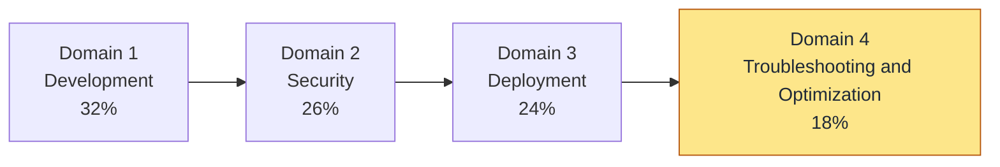

### 前提となる考え方

- 試験は **開発者(Developer)の視点** です。「アーキテクチャを設計する」「IAM ユーザーを管理する」「サーバー OS を管理する」といった仕事は **対象外** と試験ガイドに明記されています。
- 問われるのは **「障害が起きたとき、どのツールで、どこを見て、どう直すか」** と **「遅い・高い・詰まるアプリを、どのサービス機能で改善するか」** です。
- 本ガイドの数値(上限値・既定値)は執筆時点の AWS 公式ドキュメントに基づく目安です。試験前に最新のドキュメントで確認してください。

> **重要な最新情報(X-Ray SDK)**
> AWS X-Ray の **SDK と X-Ray デーモンは 2026-02-25 にメンテナンスモード** に入り(セキュリティ修正のみ)、**サポート終了は 2027-02-25** と公式に告知されています。AWS は新規の計装に **OpenTelemetry(AWS Distro for OpenTelemetry: ADOT)** を推奨しています。**X-Ray サービス自体は継続** しており、トレースの受信・分析・サービスマップは引き続き使えます。試験では従来の X-Ray の概念(セグメント・サブセグメント・アノテーション・サンプリング)が問われる可能性が高いので、概念は必ず押さえつつ、新規実装は OpenTelemetry が主流になることも覚えておきましょう。詳細は [Step 12](#step-12-aws-サービスとツールによるトレーシング426) を参照してください。

---

## Step 0: ドメイン 4 の全体像

### 0-1. ドメイン 4 は 3 つのタスクでできている

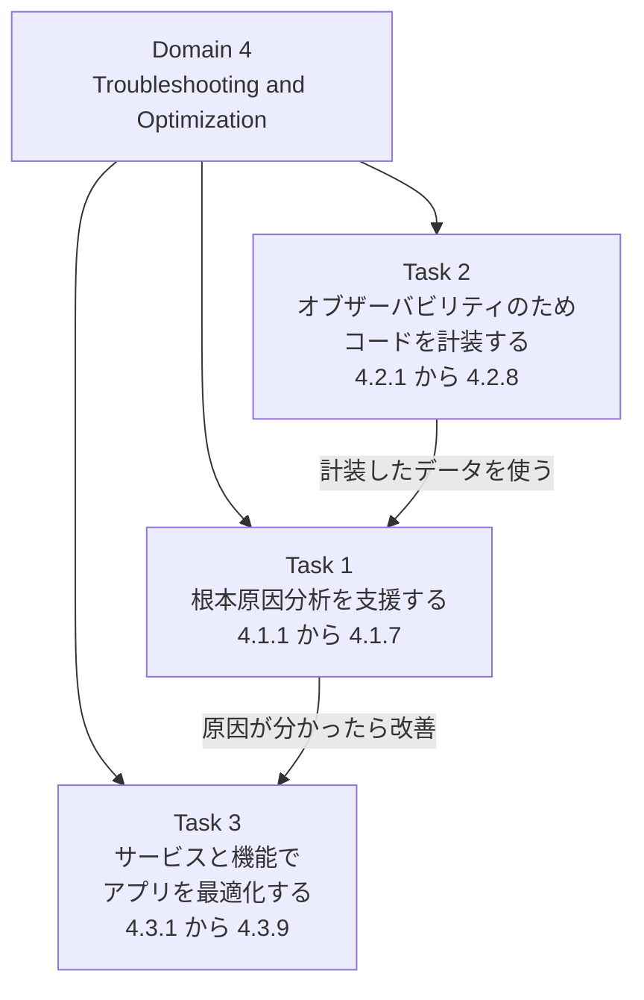

| タスク | ひとことで言うと | 主な登場サービス |
|---|---|---|
| Task 1 | 壊れたものを **調べて原因を突き止める** | CloudWatch(Logs / Logs Insights / Metrics / Dashboards)、X-Ray、CloudTrail、CodeBuild / CodeDeploy / CloudFormation のログ |
| Task 2 | 調べられるように **あらかじめ仕込む** | CloudWatch Logs、EMF、X-Ray / ADOT、SNS、EventBridge、ELB のヘルスチェック |
| Task 3 | 遅い・高いものを **速く・安く・安定させる** | Lambda、SNS、CloudFront、API Gateway、ElastiCache、DynamoDB(DAX) |

### 0-2. 「障害対応」の基本サイクル

どの問題でも、次のサイクルで考えると選択肢を絞りやすくなります。

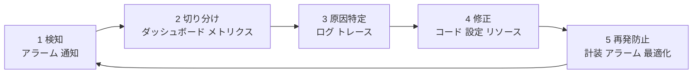

| フェーズ | 使う道具 | 対応する Step |
|---|---|---|
| 検知 | CloudWatch アラーム、SNS、EventBridge | Step 14 |
| 切り分け | ダッシュボード、メトリクス、Lambda Insights、Contributor Insights | Step 2, 5 |
| 原因特定 | Logs Insights、X-Ray トレース、サービス出力ログ | Step 3, 6, 7, 12, 13 |
| 修正 | コード修正、メモリ変更、キャッシュ、同時実行数の調整 | Step 16〜22 |
| 再発防止 | 構造化ログ、カスタムメトリクス、ヘルスチェック | Step 9〜11, 15 |

### 0-3. このドメインで押さえるサービス早見表

試験ガイドの「In-Scope AWS Services」に含まれる、ドメイン 4 に深く関係するサービスです。

| カテゴリ | サービス | ドメイン 4 での役割 |
|---|---|---|
| 監視 | Amazon CloudWatch | メトリクス・ログ・アラーム・ダッシュボード・Logs Insights・EMF |
| 監視 | AWS X-Ray | 分散トレーシング(サービスマップ・トレース) |
| 監査 | AWS CloudTrail | 「誰が・いつ・どの API を呼んだか」の記録(API 操作の調査) |
| 通知 | Amazon SNS / EventBridge | アラート通知、イベント駆動の通知、フィルターポリシー |
| コンピュート | AWS Lambda | 同時実行数、メモリ設定、ログ、トレース |
| コンテナ | Amazon ECS / EKS | ヘルスチェック、停止タスクの理由、プローブ |
| 配信 | Amazon CloudFront / API Gateway | ヘッダーベースのキャッシュ、ステージキャッシュ |
| データ | ElastiCache / DynamoDB(DAX)/ RDS | アプリケーションレベルのキャッシュ、スロットリング |
| 開発者ツール | CodeBuild / CodeDeploy / CodePipeline / CloudFormation | デプロイ失敗時のログ調査 |
| 開発支援 | Amazon Q Developer | エラー分析・最適化提案などの AI 支援(新興トピック) |

### 0-4. 最初に覚える用語

| 用語 | 意味 |
|---|---|
| メトリクス(Metric) | 時間とともに変わる **数値**(例: エラー数、処理時間) |
| ログ(Log) | 出来事の **文字の記録**(例: 「注文 123 の処理に失敗」) |
| トレース(Trace) | 1 つのリクエストが **複数のサービスを通った道のり** の記録 |
| ディメンション(Dimension) | メトリクスを区別する **名前と値の組**(例: FunctionName=orders) |
| 名前空間(Namespace) | メトリクスをまとめる **入れ物**(例: AWS/Lambda) |
| SLI / SLO | 測る指標 / 守る目標(例: 成功率 99.9%) |
| コールドスタート | Lambda の実行環境を **新規に初期化** すること(初回が遅くなる原因) |
| スロットリング | 上限を超えたリクエストを **AWS が拒否** すること(HTTP 429 など) |
| 冪等性(べきとうせい) | 同じ処理を **何度実行しても結果が同じ** になる性質 |

---

## Step 1: コードをデバッグして不具合を特定する(4.1.1)

### この項目で学ぶこと

「動かない・間違った結果が出る」アプリを、**再現 → 切り分け → 原因特定** の順で調べる基本動作を学びます。クラウドでは「手元では動くのに AWS 上で動かない」が頻発するので、**手元で AWS 環境を再現する道具** と **本番のエラーを読み解く道具** の両方が出題されます。

### やさしい解説

#### 1-1. エラーの種類を見分ける(最重要)

| 種類 | 例 | 誰の責任か | 見るべき場所 |
|---|---|---|---|
| コードのバグ(関数内の例外) | NullPointer、KeyError、型エラー | 開発者 | アプリケーションログのスタックトレース |
| 設定ミス | ハンドラー名の間違い、環境変数の不足、タイムアウト設定が短い | 開発者 | 関数設定、Lambda の Init エラー |
| 権限不足 | AccessDeniedException、403 | IAM ポリシー / リソースポリシー | エラーメッセージの「どの API・どのリソースか」 |
| 上限超過 | ThrottlingException、429、ProvisionedThroughputExceededException | クォータ・容量 | メトリクス(Throttles など) |
| 依存先の障害 | タイムアウト、接続拒否、5xx | 外部サービス | ログ、トレースのサブセグメント |

#### 1-2. HTTP ステータスコードの読み方

| コード | 意味 | 典型的な原因 |
|---|---|---|
| 400 | リクエストが不正 | パラメーター不足、JSON の形式エラー、バリデーション失敗 |
| 401 / 403 | 認証・認可エラー | トークン期限切れ、IAM 権限不足、WAF やリソースポリシーによる拒否 |
| 404 | リソースなし | パスやリソース名の誤り |
| 429 | 呼び出しが多すぎる | スロットリング(同時実行・API のレート制限) |
| 500 | サーバー内部エラー | アプリケーションの未処理例外 |
| 502 | 不正なゲートウェイ | バックエンド(Lambda など)の **応答形式が不正**、ALB が不正な応答を受信 |
| 503 | サービス利用不可 | ALB の **正常なターゲットがない** |
| 504 | ゲートウェイタイムアウト | バックエンドの応答が **時間内に返らない** |

#### 1-3. 手元で再現する道具

| 道具 | できること |
|---|---|
| **AWS SAM CLI** `sam local invoke` | Lambda 関数を **ローカルのコンテナで実行**。イベント JSON を渡してテストできる |
| **AWS SAM CLI** `sam local start-api` | API Gateway と Lambda をローカルで起動して HTTP でテストできる |
| **AWS SAM CLI** `sam sync --watch` | コード変更を **クラウド上の実環境へ素早く反映** して確認できる |
| **AWS SAM CLI** `sam logs` | CloudWatch Logs の出力をコマンドラインで追う |
| **AWS CLI** `--debug` | CLI が送るリクエストとレスポンス、認証情報の解決過程を表示 |
| **AWS CloudShell** | ブラウザ内の CLI 環境。認証済みで AWS CLI をすぐに試せる |
| コンソールの **テストイベント** | Lambda に任意のイベントを手動で送って結果とログを確認 |
| **SDK のログ出力** | SDK の HTTP リクエスト・リトライ回数を出して、呼び出しの実態を確認 |

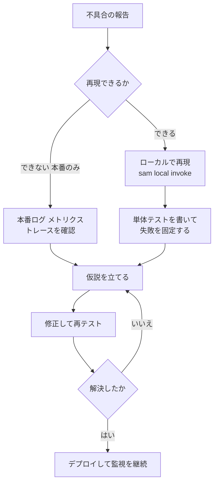

#### 1-4. Lambda 特有のよくあるエラー

| 症状 | 原因の例 | 対処 |
|---|---|---|
| `Runtime.HandlerNotFound` | ハンドラー名(ファイル名.関数名)の設定が実際のコードとずれている | 関数設定のハンドラーを修正 |
| `Runtime.ImportModuleError` | 依存ライブラリがパッケージに含まれていない、アーキテクチャ不一致 | 依存関係を同梱、Lambda レイヤーを使う、arm64 / x86_64 を合わせる |
| `Task timed out after N seconds` | 処理が設定したタイムアウトより長い、外部呼び出しが固まっている | タイムアウトを調整し、**呼び出し先のタイムアウトは Lambda より短く** する |
| `Runtime exited with error: signal: killed` / メモリ不足 | Max Memory Used が割り当てを超えた | メモリ割り当てを増やす、処理を見直す |
| 関数が VPC 内でインターネットに出られない | NAT ゲートウェイや VPC エンドポイントがない | ネットワーク構成を確認(設計自体は試験の対象外だが、症状は出題される) |

### ベストプラクティス

| 項目 | ベストプラクティス | 理由 |
|---|---|---|
| 再現性 | イベント JSON を **ファイルとして保存** し、`sam local invoke -e event.json` で繰り返し再現する | 同じ入力で何度でも検証できる |
| 例外処理 | 例外は握りつぶさず、**原因が分かる情報(入力の ID、依存先名)をログに出して再スロー** する | 原因特定が速くなる |
| 切り分け | 「コード」「設定」「権限」「上限」「依存先」の 5 分類で考える | 無駄な調査を減らせる |
| エラー表示 | AWS のエラーメッセージ(`User: ... is not authorized to perform: ...`)を **そのまま読む** | 足りない権限・対象リソースが書いてある |
| テスト | ビジネスロジックと AWS SDK 呼び出しを分け、SDK 部分はモックして単体テストする | 手元で高速に不具合を再現できる |
| AI 支援 | Amazon Q Developer などで **エラーメッセージの解説や修正案** を得る(最終判断は人間が行う) | 新興トピックとして出題範囲に含まれる([付録 D](#付録-d-新興トピックai-支援ツール)) |

### ひっかけポイント

| 問われ方 | 正しい考え方 |
|---|---|
| 「Lambda を手元でテストしたい」 | **SAM CLI の `sam local invoke`** が定番の答え |
| 「本番の Lambda が 502 を返す(API Gateway プロキシ統合)」 | 多くは **Lambda の戻り値の形式** が不正(statusCode / body が必要) |
| 「403 が出る」 | まず **IAM ポリシー・リソースポリシー・認可方式** のどれが拒否したかを確認 |
| 「タイムアウトする」 | 関数のタイムアウト値と、**呼び出し元(API Gateway など)側のタイムアウト** の両方を確認 |

### 参考 URL

- Lambda のトラブルシューティング: https://docs.aws.amazon.com/lambda/latest/dg/lambda-troubleshooting.html
- SAM でのテストとデバッグ: https://docs.aws.amazon.com/serverless-application-model/latest/developerguide/serverless-test-and-debug.html
- AWS CLI のデバッグ: https://docs.aws.amazon.com/cli/latest/userguide/cli-usage-help.html

---

## Step 2: メトリクス・ログ・トレースを読み解く(4.1.2)

### この項目で学ぶこと

調査には **3 種類のデータ** があります。それぞれ「何が分かるか」「どこで見るか」を使い分けられることが目標です。

### やさしい解説

#### 2-1. 3 つのシグナル

| シグナル | 一言で | 得意な質問 | 主なサービス |
|---|---|---|---|
| メトリクス | 数値の推移 | 「**いつ** から **どれくらい** 悪い?」 | CloudWatch Metrics |
| ログ | 出来事の記録 | 「**何が** 起きた?」「**なぜ** 失敗した?」 | CloudWatch Logs |
| トレース | リクエストの道のり | 「**どこで** 遅い・失敗している?」 | AWS X-Ray(OpenTelemetry) |

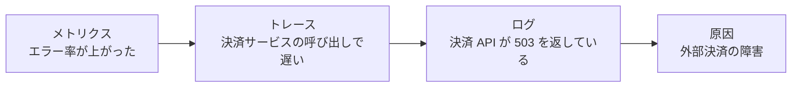

覚え方は **「メトリクスで気づき、トレースで場所を絞り、ログで理由を知る」** です。

#### 2-2. メトリクスの読み方

CloudWatch のメトリクスは **名前空間 → メトリクス名 → ディメンション** で特定します。

| 要素 | 例 |
|---|---|
| 名前空間 | `AWS/Lambda` |
| メトリクス名 | `Errors` |
| ディメンション | `FunctionName = order-handler` |
| 統計 | `Sum` / `Average` / `Maximum` / `p99`(パーセンタイル) |
| 期間(Period) | 60 秒、300 秒など |

**平均だけを見ない** のが重要です。平均が良くても、**p99(100 回に 1 回の最悪ケース)** が悪いことがあります。ユーザー体験は p95・p99 で判断します。

#### 2-3. Lambda で必ず見るメトリクス

| メトリクス | 意味 | 異常時の疑い |
|---|---|---|
| `Invocations` | 呼び出し回数 | 急増なら呼び出し元の暴走 |
| `Errors` | 関数エラー数 | コードのバグ、タイムアウト、権限不足 |
| `Throttles` | スロットルされた回数 | **同時実行数の上限** に到達 |
| `Duration` | 実行時間 | 遅延、メモリ不足、外部呼び出しの遅れ |
| `ConcurrentExecutions` | 同時実行数 | 上限に近いと Throttles が出る |
| `IteratorAge` | ストリームの処理遅れ(Kinesis / DynamoDB Streams) | 消費が追いついていない |
| `DeadLetterErrors` | DLQ への送信失敗 | DLQ の権限・設定不備 |
| `AsyncEventsDropped` | 非同期呼び出しが破棄された数 | 再試行を使い切って DLQ もない |

#### 2-4. Lambda のログ(REPORT 行)の読み方

Lambda は呼び出しごとに次の 3 行を自動で CloudWatch Logs に出力します。

```text
START RequestId: 1234abcd-... Version: $LATEST
END RequestId: 1234abcd-...
REPORT RequestId: 1234abcd-...  Duration: 215.34 ms  Billed Duration: 216 ms  Memory Size: 512 MB  Max Memory Used: 187 MB  Init Duration: 412.11 ms
```

| 項目 | 読み方 |
|---|---|
| `Duration` | 実際の処理時間 |
| `Billed Duration` | 課金対象の時間 |
| `Memory Size` | 割り当てたメモリ |
| `Max Memory Used` | 実際に使った最大メモリ(割り当てと比べて **余裕があるか** を判断) |
| `Init Duration` | **コールドスタート時だけ** 出る初期化時間。これがあれば「新しい実行環境が作られた」 |

#### 2-5. トレースの読み方(X-Ray)

| 用語 | 意味 |
|---|---|
| トレース(Trace) | 1 リクエストの全体。トレース ID で識別 |
| セグメント(Segment) | 1 つのサービスの作業記録 |
| サブセグメント(Subsegment) | セグメント内の **下流呼び出し**(DynamoDB 呼び出し、HTTP 呼び出しなど) |
| サービスマップ | サービス間の呼び出し関係と **平均レイテンシ・エラー率** を図示したもの |
| エラー / フォルト / スロットル | 4xx(エラー)、5xx(フォルト)、429(スロットル)として色分けされる |

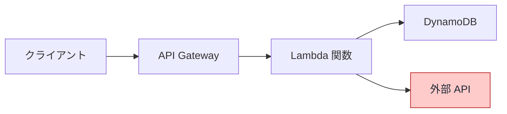

サービスマップ上で **赤(フォルト)や黄(エラー)の丸** になっているノードが調査の起点です。

### ベストプラクティス

| 項目 | ベストプラクティス |
|---|---|
| 見る順番 | ダッシュボード(全体)→ メトリクス(いつ)→ トレース(どこ)→ ログ(なぜ) |
| 統計 | レイテンシは平均ではなく **p90 / p95 / p99** を見る |
| 期間 | 問題発生の **前後** を含めて見て、デプロイや設定変更との時間的な一致を探す |
| 相関 | ログにトレース ID・リクエスト ID を出力し、**トレースとログを結びつける** |
| 確認事項 | 「そもそもエラー率は何%か」「影響を受けたのは全体か一部か」を最初に確認する |

### ひっかけポイント

| 問われ方 | 正しい考え方 |
|---|---|
| 「1 回の処理にどのサービスが遅いかを知りたい」 | **X-Ray のトレース**(メトリクスやログだけでは道のりが分からない) |
| 「Lambda が上限でスロットルされているか」 | **`Throttles` メトリクス** と `ConcurrentExecutions` |
| 「コールドスタートの影響を確認したい」 | ログの **`Init Duration`** の有無と値 |
| 「ストリーム処理が遅れている」 | **`IteratorAge`** |

### 参考 URL

- Lambda のメトリクス: https://docs.aws.amazon.com/lambda/latest/dg/monitoring-metrics.html
- Lambda のログ: https://docs.aws.amazon.com/lambda/latest/dg/monitoring-cloudwatchlogs.html
- X-Ray の概念: https://docs.aws.amazon.com/xray/latest/devguide/xray-concepts.html
- CloudWatch の概念(メトリクス・名前空間・ディメンション): https://docs.aws.amazon.com/AmazonCloudWatch/latest/monitoring/cloudwatch_concepts.html

---

## Step 3: ログをクエリして必要なデータを見つける(4.1.3)

### この項目で学ぶこと

ログは大量です。**CloudWatch Logs Insights** で目的のログだけを素早く取り出す方法を学びます。試験では「どの機能でログを検索・集計するか」が問われます。

### やさしい解説

#### 3-1. ログを調べる道具の使い分け

| 道具 | 向いている場面 |
|---|---|
| **CloudWatch Logs Insights** | ロググループを **クエリして集計・絞り込み**(最も基本) |
| **Live Tail** | 今まさに流れているログを **リアルタイムで確認** |
| **メトリクスフィルター** | ログ中の文字列を数えて **メトリクス化**(アラームと組み合わせる) |
| **サブスクリプションフィルター** | ログを **Kinesis / Firehose / Lambda / OpenSearch へ転送** してリアルタイム処理 |
| **S3 へのエクスポート + Athena** | 長期保存したログを **SQL で分析** |
| **Amazon OpenSearch Service** | ログの全文検索・可視化を高度に行う |
| **CloudTrail** | **API 操作の履歴**(アプリのログではなく「誰が何の API を呼んだか」) |

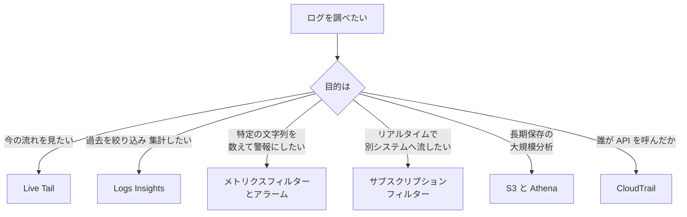

#### 3-2. Logs Insights の基本コマンド

| コマンド | 役割 |
|---|---|
| `fields` | 表示する項目を選ぶ |
| `filter` | 条件で絞り込む |
| `stats` | 集計する(count, avg, max, pct など) |
| `sort` | 並べ替える |
| `limit` | 件数を制限する |
| `parse` | 文字列から値を取り出して項目にする(正規表現・グロブ) |
| `display` | 最終的に表示する項目を指定 |
| `dedup` | 重複を除く |

#### 3-3. すぐ使えるクエリ例

**① エラーログを新しい順に 20 件**

```text
fields @timestamp, @message
| filter @message like /ERROR/
| sort @timestamp desc
| limit 20
```

**② 5 分ごとのエラー件数**

```text
filter @message like /ERROR/
| stats count(*) as errorCount by bin(5m)
```

**③ Lambda の遅い呼び出し上位 10 件**

```text
filter @type = "REPORT"
| fields @requestId, @duration, @maxMemoryUsed / 1024 / 1024 as maxMemoryMB
| sort @duration desc
| limit 10
```

**④ Lambda のコールドスタート回数と平均初期化時間**

```text
filter @type = "REPORT" and ispresent(@initDuration)
| stats count(*) as coldStarts, avg(@initDuration) as avgInit
```

**⑤ 構造化(JSON)ログの特定ユーザーを検索**

```text
fields @timestamp, level, message, requestId
| filter userId = "u-1001" and level = "ERROR"
| sort @timestamp desc
```

Lambda の REPORT 行は `@duration`、`@billedDuration`、`@memorySize`、`@maxMemoryUsed`、`@initDuration` などの **自動検出フィールド** として使えます。JSON ログは **キー名をそのままフィールドとして** 参照できます。

#### 3-4. メトリクスフィルターの考え方

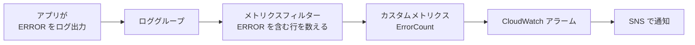

注意点は **メトリクスフィルターは設定した後に届いたログにだけ適用される(過去ログにはさかのぼらない)** ことです。

### ベストプラクティス

| 項目 | ベストプラクティス | 理由 |
|---|---|---|
| クエリ範囲 | **時間範囲とロググループを必要最小限** に絞る | スキャン量が課金とクエリ時間に直結する |
| ログ形式 | **JSON 構造化ログ** にしてフィールドで検索する | `parse` や正規表現より速く確実([Step 10](#step-10-構造化ログ427)) |
| 頻出クエリ | 保存済みクエリとして **Logs Insights に保存**、ダッシュボードにも載せる | 障害時に迷わない |
| 相関 ID | リクエスト ID・トレース ID をログに含める | 1 リクエストのログを串刺しで検索できる |
| 継続監視 | 繰り返し見るパターンは **メトリクスフィルター + アラーム** にする | 人が毎回クエリしなくてよい |
| 長期分析 | 長期保管は S3 へ出し、Athena で分析する | CloudWatch Logs の保存コストを抑えられる |

### ひっかけポイント

| 問われ方 | 正しい考え方 |
|---|---|
| 「ログから 5 分ごとのエラー数を集計したい」 | Logs Insights の `stats count(*) by bin(5m)` |
| 「ログ中の特定語句でアラームを出したい」 | **メトリクスフィルター + CloudWatch アラーム** |
| 「ログをリアルタイムで別アカウント・別サービスへ転送」 | **サブスクリプションフィルター** |
| 「過去ログにも新しいメトリクスフィルターを適用したい」 | **不可**。Logs Insights で過去分は集計する |
| 「誰がその API を実行したか調べたい」 | アプリログではなく **CloudTrail** |

### 参考 URL

- Logs Insights によるログ分析: https://docs.aws.amazon.com/AmazonCloudWatch/latest/logs/AnalyzingLogData.html
- Logs Insights クエリ構文: https://docs.aws.amazon.com/AmazonCloudWatch/latest/logs/CWL_QuerySyntax.html
- メトリクスフィルター: https://docs.aws.amazon.com/AmazonCloudWatch/latest/logs/MonitoringLogData.html
- サブスクリプションフィルター: https://docs.aws.amazon.com/AmazonCloudWatch/latest/logs/Subscriptions.html
- Live Tail: https://docs.aws.amazon.com/AmazonCloudWatch/latest/logs/CloudWatchLogs_LiveTail.html

---

## Step 4: カスタムメトリクスと EMF(4.1.4)

### この項目で学ぶこと

AWS が標準で出すメトリクス(CPU、Invocations など)では足りないとき、**「注文数」「決済失敗数」のような業務固有の数値** を自分で CloudWatch に送ります。これが **カスタムメトリクス** です。中でも試験ガイドが例に挙げる **EMF(Embedded Metric Format)** は最重要です。

### やさしい解説

#### 4-1. カスタムメトリクスを送る 3 つの方法

| 方法 | 仕組み | 特徴 |
|---|---|---|
| `PutMetricData` API | SDK で **直接 CloudWatch に送信** | シンプル。ただし **API 呼び出し** になるため、Lambda では遅延・コスト・スロットリングの要因 |
| **EMF(埋め込みメトリクスフォーマット)** | **特定の JSON 形式でログを出力** するだけで、CloudWatch が **自動でメトリクスを生成** | **非同期・API 呼び出し不要**。詳細なログも同時に残る。Lambda に最適 |
| メトリクスフィルター | 既存の **ログ行をパターンで数えて** メトリクス化 | コードを変えずに導入できるが、柔軟性は低い |

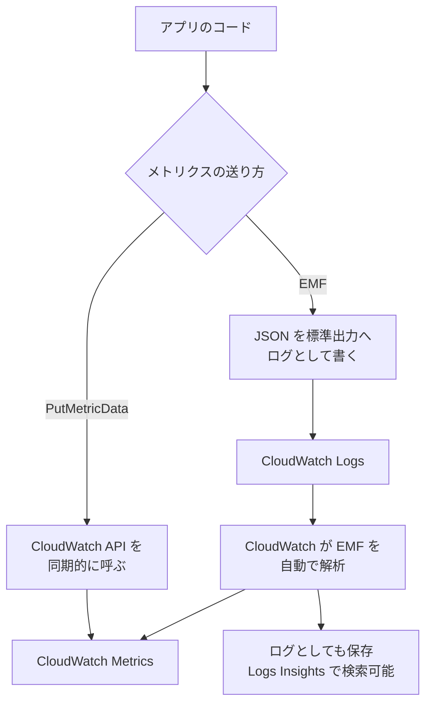

#### 4-2. EMF のログの形

EMF は **`_aws` というキーを持つ JSON** をログとして出力します。

```json
{
  "_aws": {
    "Timestamp": 1760000000000,
    "CloudWatchMetrics": [
      {
        "Namespace": "ShopApp",
        "Dimensions": [["Service", "Operation"]],
        "Metrics": [
          { "Name": "OrderProcessingTime", "Unit": "Milliseconds" },
          { "Name": "OrdersPlaced", "Unit": "Count" }
        ]
      }
    ]
  },
  "Service": "checkout",
  "Operation": "PlaceOrder",
  "OrderProcessingTime": 183,
  "OrdersPlaced": 1,
  "orderId": "ord-12345",
  "userTier": "premium"
}
```

| 部分 | 役割 |
|---|---|
| `Namespace` | メトリクスの入れ物 |
| `Dimensions` | メトリクスを分ける軸。値は JSON の同名キー(`Service`, `Operation`)から取る |
| `Metrics` | 送る数値の **名前と単位**。値は JSON の同名キーから取る |
| それ以外のキー(`orderId` など) | メトリクスにはならず **ログのプロパティとして保存**(Logs Insights で検索できる) |

つまり **「メトリクスにする項目」と「あとで調べるための詳細」を 1 行のログに同居** させられます。これが EMF の強みです。

#### 4-3. 高解像度メトリクスとデータ保持

| 解像度 | 間隔 | 備考 |
|---|---|---|
| 標準解像度 | 60 秒 | 既定 |
| 高解像度 | 1 秒(`StorageResolution` を 1 に設定) | 急激な変化の検知に有効(追加コストあり) |

CloudWatch はメトリクスを細かい粒度から順に **集約して長く保持** します(1 秒データは約 3 時間、60 秒データは 15 日、5 分データは 63 日、1 時間データは 455 日が目安)。

#### 4-4. 実装の選択肢

| 実行環境 | EMF の出し方 |
|---|---|
| **Lambda** | 標準出力に JSON を出すだけ(Lambda が CloudWatch Logs へ送る)。**Powertools for AWS Lambda の Metrics ユーティリティ** が EMF を組み立ててくれる |
| ECS / EC2 / オンプレ | **CloudWatch エージェント** 経由で EMF を送る。またはクライアントライブラリを使う |

Powertools(Python)の例です。

```python
from aws_lambda_powertools import Metrics
from aws_lambda_powertools.metrics import MetricUnit

metrics = Metrics(namespace="ShopApp", service="checkout")

@metrics.log_metrics(capture_cold_start_metric=True)
def handler(event, context):
    metrics.add_metric(name="OrdersPlaced", unit=MetricUnit.Count, value=1)
    return {"statusCode": 200}
```

`capture_cold_start_metric=True` を付けると、**コールドスタート回数** も自動でメトリクス化されます。

### ベストプラクティス

| 項目 | ベストプラクティス | 理由 |
|---|---|---|
| Lambda での送信 | **`PutMetricData` よりも EMF** を使う | 同期 API 呼び出しによる遅延・追加コスト・スロットリングを避けられる |
| ディメンション | **カーディナリティ(値の種類)が少ないもの**(サービス名、操作名、環境)に限る | ディメンションの組み合わせごとに **別メトリクスとして課金** される |
| 高カーディナリティ値 | `userId` や `requestId` は **ディメンションにせず、ログのプロパティ** として残す | メトリクス数の爆発を防ぐ |
| 単位 | `Unit` を必ず指定する(Count, Milliseconds, Bytes など) | グラフの読み違いを防ぐ |
| 名前空間 | アプリ単位で `Namespace` を分ける。`AWS/` で始まる名前は予約済みなので使わない | 管理しやすい |
| 解像度 | 通常は標準解像度。**秒単位の検知が必要なときだけ** 高解像度 | コスト最適化 |

### ひっかけポイント

| 問われ方 | 正しい考え方 |
|---|---|
| 「Lambda からカスタムメトリクスを、**API 呼び出しなしで**、追加の遅延なく送りたい」 | **EMF**(構造化ログを出力する) |
| 「カスタムメトリクスのコストが急増した」 | **高カーディナリティなディメンション**(ユーザー ID など)が原因 |
| 「EMF のメトリクスはどこに現れる?」 | 指定した **Namespace** の下の CloudWatch メトリクス。元のログは CloudWatch Logs に残る |

### 参考 URL

- EMF の概要: https://docs.aws.amazon.com/AmazonCloudWatch/latest/monitoring/CloudWatch_Embedded_Metric_Format.html
- EMF 仕様: https://docs.aws.amazon.com/AmazonCloudWatch/latest/monitoring/CloudWatch_Embedded_Metric_Format_Specification.html
- カスタムメトリクスの発行: https://docs.aws.amazon.com/AmazonCloudWatch/latest/monitoring/publishingMetrics.html
- Powertools for AWS Lambda(Python): https://docs.powertools.aws.dev/lambda/python/latest/

---

## Step 5: ダッシュボードとインサイトでヘルスを確認する(4.1.5)

### この項目で学ぶこと

アプリ全体が **健康かどうか** を一目で見る道具を学びます。個別のログを読む前に、**ダッシュボードで「どこがおかしいか」を絞る** のが基本動作です。

### やさしい解説

#### 5-1. ヘルス確認の道具

| 道具 | 何が分かるか | 使う場面 |
|---|---|---|
| **CloudWatch ダッシュボード** | 選んだメトリクス・ログクエリ・アラームを **1 画面に集約** | 全体の健康状態を常時表示 |
| **CloudWatch Lambda Insights** | Lambda の **メモリ・CPU・ネットワーク・初期化時間** などの詳細メトリクス(拡張機能のレイヤーを追加して有効化) | 関数のリソース不足やコールドスタートの調査 |
| **Container Insights** | ECS / EKS の **コンテナ単位の CPU・メモリ・ネットワーク** | コンテナの性能調査 |
| **Contributor Insights** | ログから **「上位の貢献者」**(例: リクエスト数の多い IP、エラーを多く出すユーザー)を集計 | 「誰が・何が」負荷やエラーの原因かを特定 |
| **Application Signals** | アプリの **サービス一覧・SLO・依存関係・RED メトリクス**(Rate / Errors / Duration)を自動で可視化 | サービス単位の健全性と SLO 管理 |
| **X-Ray サービスマップ / トレースマップ** | サービス間の依存関係と、**どこでエラー・遅延が出ているか** | 分散アプリの切り分け |
| **CloudWatch Synthetics(カナリア)** | **外形監視**。定期的にスクリプトでエンドポイントを呼ぶ | ユーザー視点の死活・性能監視 |
| **CloudWatch RUM** | **実ユーザーのブラウザ側** の性能とエラー | フロントエンドの体感性能 |
| **AWS Health Dashboard** | AWS 側のサービス障害・メンテナンス情報 | 自分のコードではなく AWS 側の問題かを確認 |

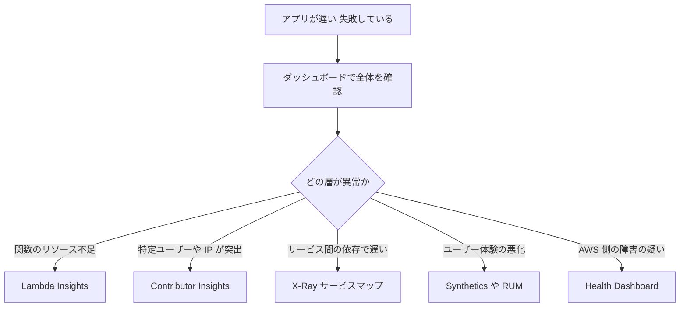

#### 5-2. 良いダッシュボードの中身(最小構成)

| ウィジェット | 見る指標 |
|---|---|
| 入口 | リクエスト数、4xx / 5xx の数と率、**p99 レイテンシ** |
| 計算 | Lambda の Errors / Throttles / Duration / ConcurrentExecutions |
| データ | DynamoDB の ThrottledRequests、RDS の接続数、キャッシュヒット率 |
| キュー | SQS の ApproximateAgeOfOldestMessage、ApproximateNumberOfMessagesVisible |
| アラーム | 重要アラームの状態(OK / ALARM / INSUFFICIENT_DATA) |
| ログ | エラーログの Logs Insights クエリ結果 |

#### 5-3. ダッシュボードの特徴

- ダッシュボードは **リージョンをまたいで** ウィジェットを配置できる(グローバルな画面として使える)。
- メトリクスは **メトリクス数式(Metric Math)** で組み合わせられる(例: エラー数 ÷ 呼び出し数 × 100 でエラー率)。
- ダッシュボードはコード(JSON)として管理でき、CloudFormation や CDK で **再現可能な形で配備** できる。

### ベストプラクティス

| 項目 | ベストプラクティス |
|---|---|
| 指標の選び方 | 「**リクエスト数・エラー・レイテンシ**」(RED)や、利用状況・飽和・エラーなどの **目的別の指標** から始める |
| エラー率 | 件数だけでなく **エラー率(Metric Math)** で表示する |
| 管理 | ダッシュボードを **IaC(CloudFormation / CDK)** で管理する |
| 目標 | SLO を決め、ダッシュボードに SLO の達成状況を出す(Application Signals) |
| 外形監視 | 利用者がいない時間帯も **Synthetics** で外から監視する |

### ひっかけポイント

| 問われ方 | 正しい考え方 |
|---|---|
| 「Lambda の **メモリ使用量・CPU・コールドスタート** をダッシュボード化したい」 | **CloudWatch Lambda Insights**(標準の Lambda メトリクスにメモリ使用率は出ない) |
| 「どのクライアント IP が一番リクエストを送っているか」 | **Contributor Insights** |
| 「ユーザーが使う前に障害を検知したい」 | **CloudWatch Synthetics** |
| 「自分のコードは正常。AWS 側の障害か確認」 | **AWS Health Dashboard** |

### 参考 URL

- CloudWatch ダッシュボード: https://docs.aws.amazon.com/AmazonCloudWatch/latest/monitoring/CloudWatch_Dashboards.html
- Lambda Insights: https://docs.aws.amazon.com/AmazonCloudWatch/latest/monitoring/Lambda-Insights.html
- Contributor Insights: https://docs.aws.amazon.com/AmazonCloudWatch/latest/monitoring/ContributorInsights.html
- Application Signals: https://docs.aws.amazon.com/AmazonCloudWatch/latest/monitoring/CloudWatch-Application-Monitoring-Sections.html

---

## Step 6: サービス出力ログでデプロイ失敗を調査する(4.1.6)

### この項目で学ぶこと

デプロイは **CodeBuild でビルド → CodeDeploy / CloudFormation でデプロイ → CodePipeline が全体を管理** という流れで進みます。失敗したとき、**どのサービスの、どのログを見るか** を判断できることが目標です(デプロイの作り方そのものは Domain 3 の範囲です)。

### やさしい解説

#### 6-1. どこで失敗したかをまず特定する

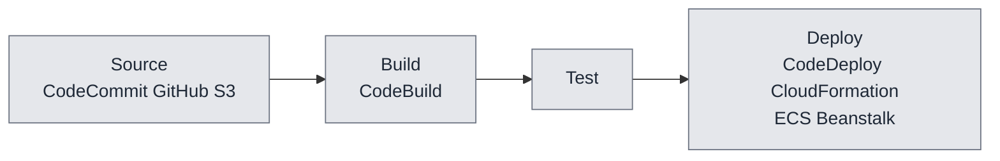

CodePipeline の画面で **赤くなったステージ(アクション)の「詳細」** を開き、リンク先の各サービスのログを見ます。

#### 6-2. サービス別: どのログを見るか

| サービス | 見る場所 | よくある失敗原因 |
|---|---|---|
| **CodeBuild** | ビルド詳細の **フェーズの詳細(Phase details)** とビルドログ(CloudWatch Logs / S3 に出力) | `buildspec.yml` の構文ミス、コマンドの失敗(終了コードが 0 以外)、サービスロールの権限不足、環境変数・シークレットの未設定、依存関係の取得失敗 |
| **CodeDeploy(EC2 / オンプレ)** | デプロイの **ライフサイクルイベント** 画面、EC2 上の **CodeDeploy エージェントのログ**(`/var/log/aws/codedeploy-agent/` と `/opt/codedeploy-agent/deployment-root/` 配下のデプロイログ) | `appspec.yml` の形式ミス、フックスクリプトが **0 以外の終了コード**、スクリプトの実行権限不足、**エージェント未起動**、インスタンスプロファイルの権限不足、フックのタイムアウト |
| **CodeDeploy(Lambda)** | デプロイ画面、**検証用 Lambda(BeforeAllowTraffic / AfterAllowTraffic)** のログ、**ロールバックを起こしたアラーム** | 検証フックの失敗、CloudWatch アラーム発火による自動ロールバック |
| **CodeDeploy(ECS)** | デプロイ画面、ECS サービスイベント、ターゲットグループのヘルス | 新タスクがヘルスチェックに失敗、トラフィック切り替え中の失敗 |
| **CloudFormation** | **スタックイベント**(ステータス理由 = Status reason)、変更セット | 権限不足、リソース名の重複、クォータ超過、依存関係エラー、`cfn-signal` が返らずタイムアウト |
| **Elastic Beanstalk** | **イベント**、**ログのリクエスト**(`eb logs`)、拡張ヘルスレポート | `.ebextensions` の失敗、アプリの起動失敗、ヘルスチェック失敗 |
| **ECS** | サービスの **イベント**、**停止したタスクの停止理由(Stopped reason)**、コンテナログ(`awslogs`) | `CannotPullContainerError`(イメージ取得失敗)、必須コンテナの異常終了、メモリ不足、ヘルスチェック失敗 |
| **Lambda(デプロイ時)** | CloudFormation / SAM のイベント、関数設定 | パッケージサイズ超過、ロールの `iam:PassRole` 不足、レイヤーの互換性、ハンドラー設定ミス |
| **CodePipeline** | アクションの **詳細(Details)** と、リンク先の各サービス | 前段のアーティファクトがない、**パイプラインのサービスロールの権限不足** |

#### 6-3. CloudFormation の失敗とロールバック

| 状態 | 意味 | 対処 |
|---|---|---|
| `CREATE_FAILED` | 作成失敗。既定では **ロールバック** される | **最初に失敗したイベント** の Status reason を読む(後続の失敗は連鎖であることが多い) |
| `ROLLBACK_COMPLETE` | 作成に失敗してロールバックが完了 | 原因を直して **スタックを削除してから再作成** |
| `UPDATE_ROLLBACK_COMPLETE` | 更新に失敗して元に戻った | 原因を直して再度更新 |
| `UPDATE_ROLLBACK_FAILED` | ロールバックにも失敗 | 原因を解消して **`ContinueUpdateRollback`** を実行 |
| `DELETE_FAILED` | 削除失敗(中身の入った S3 バケットなど) | 残っているリソースを手動で空にしてから再削除 |

デバッグ中に失敗リソースを残したいときは、**作成時のロールバックを無効化**(CLI の `--disable-rollback` や `--on-failure DO_NOTHING`)できます。

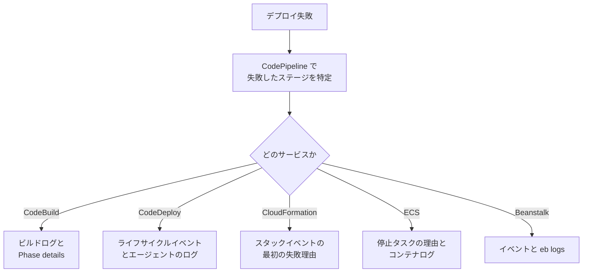

### ベストプラクティス

| 項目 | ベストプラクティス | 理由 |
|---|---|---|
| ログ出力 | CodeBuild のログを **CloudWatch Logs(必要に応じて S3)に出力** する | 失敗後も調べられる |
| 調査の順序 | **最初に失敗したイベント** から読む | 後続のエラーは連鎖の結果であることが多い |
| 権限 | サービスロール・インスタンスプロファイルの権限不足を **最初に疑う** | デプロイ失敗の頻出原因 |
| 自動ロールバック | CodeDeploy で **CloudWatch アラームに基づく自動ロールバック** を設定する | 異常なデプロイを素早く元に戻せる |
| スクリプト | フックスクリプトは **成功時 0、失敗時 0 以外** を正しく返し、標準出力・標準エラーにログを出す | デプロイログに原因が残る |
| 通知 | デプロイの成功・失敗を **EventBridge / SNS で通知**([Step 14](#step-14-通知アラートの実装425)) | 失敗に気づける |
| 再現 | CodeBuild は **ローカルでビルドを再現**(CodeBuild エージェント)したり、**セッションマネージャーで接続してデバッグ** できる | 修正の往復を減らせる |

### ひっかけポイント

| 問われ方 | 正しい考え方 |
|---|---|
| 「CodeDeploy の EC2 デプロイが失敗。原因を調べる」 | **デプロイのライフサイクルイベントの失敗理由** と **インスタンス上のエージェントログ** |
| 「CloudFormation スタックが `ROLLBACK_COMPLETE`」 | 作成失敗後の状態。**削除してから再作成** が必要 |
| 「ビルドが失敗する」 | **buildspec とビルドログ(Phase details)**、サービスロールの権限 |
| 「ECS タスクがすぐ停止する」 | **停止したタスクの Stopped reason** とコンテナログ |

### 参考 URL

- CodeBuild のトラブルシューティング: https://docs.aws.amazon.com/codebuild/latest/userguide/troubleshooting.html
- CodeDeploy のトラブルシューティング: https://docs.aws.amazon.com/codedeploy/latest/userguide/troubleshooting.html
- CloudFormation のトラブルシューティング: https://docs.aws.amazon.com/AWSCloudFormation/latest/UserGuide/troubleshooting.html
- CodePipeline のトラブルシューティング: https://docs.aws.amazon.com/codepipeline/latest/userguide/troubleshooting.html
- ECS の停止タスクエラー: https://docs.aws.amazon.com/AmazonECS/latest/developerguide/stopped-task-errors.html
- Elastic Beanstalk の拡張ヘルス: https://docs.aws.amazon.com/elasticbeanstalk/latest/dg/health-enhanced.html

---

## Step 7: サービス間連携の問題をデバッグする(4.1.7)

### この項目で学ぶこと

現代のアプリは **API Gateway → Lambda → SQS → Lambda → DynamoDB** のように、サービスをつないで作ります。部品単体は正しくても、**つなぎ目(権限・形式・タイムアウト・再試行)** で問題が起きます。つなぎ目別の症状と原因を学びます。

### やさしい解説

#### 7-1. つなぎ目のよくある問題 5 分類

| 分類 | 症状の例 | 確認すること |
|---|---|---|
| 権限 | `AccessDenied`、呼び出されない | 呼び出す側の **IAM ロール** と、呼び出される側の **リソースベースポリシー**(Lambda の `add-permission` など) |
| データ形式 | 502、パースエラー、`null` | イベントの JSON 構造、Lambda の戻り値の形式、Content-Type |
| タイムアウトの不整合 | 504、処理の二重実行 | 各サービスのタイムアウトの **大小関係** |
| スロットリング | 429、`ThrottlingException` | クォータ、同時実行数、**再試行(指数バックオフ + ジッター)** |
| 再試行・重複 | 同じ処理が複数回実行される | **冪等性**、再試行の回数、DLQ の有無 |

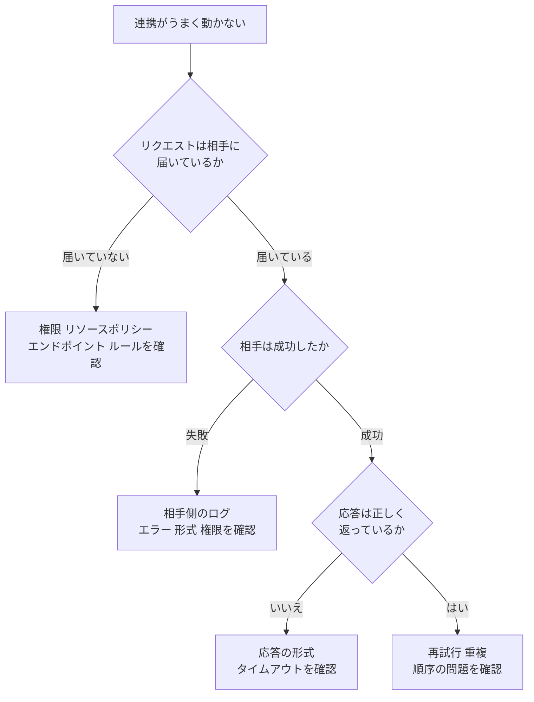

#### 7-2. サービス別のデバッグポイント

**API Gateway + Lambda**

| 症状 | 原因 | 対処 |
|---|---|---|
| 502 Bad Gateway | Lambda の戻り値が **プロキシ統合の形式**(`statusCode`、`headers`、`body`(文字列))でない。または Lambda が例外で終了 | 戻り値の形式を修正。**実行ログを有効化** して確認 |
| 504 Gateway Timeout | 統合のタイムアウトを超えた(REST API の既定は 29 秒) | 処理を短くする、**非同期化**(SQS や Step Functions)する |
| 429 Too Many Requests | API のスロットリング上限 | **使用量プランとスロットリング設定** を見直す、クライアントで再試行 |
| 403 Forbidden | 認可(IAM / Cognito / Lambda オーソライザー)、**WAF**、リソースポリシーによる拒否 | どの認可方式が拒否したか **アクセスログ・実行ログ** で確認 |
| 実際の遅延が分からない | `Latency`(全体)と `IntegrationLatency`(バックエンドのみ)の差を見る | 差が大きいなら API Gateway 側の処理、小さいならバックエンドが遅い |

API Gateway は **アクセスログ**(誰が・いつ・どのステータスで)と **実行ログ**(内部処理の詳細)を CloudWatch Logs に出せます。X-Ray トレースもステージ設定で有効化できます。

**SQS + Lambda(イベントソースマッピング)**

| 症状 | 原因 | 対処 |
|---|---|---|
| 同じメッセージが何度も処理される | 関数が失敗してメッセージが **キューに戻る**、または **可視性タイムアウトが短い** | 可視性タイムアウトを **関数のタイムアウトより長く**(AWS は 6 倍以上を推奨)する |
| 1 件の失敗でバッチ全体が再処理される | バッチ内の失敗が全体の失敗として扱われる | **`ReportBatchItemFailures`(バッチ項目の失敗の報告)** で失敗したメッセージだけを戻す |
| 失敗が延々と続く(ポイズンメッセージ) | 処理できないメッセージが無限に再配信される | **DLQ + `maxReceiveCount`** を設定する |
| スロットルが出る | Lambda の同時実行数が不足 | 予約済み同時実行数、**イベントソースの最大同時実行数** を調整 |

**Lambda の非同期呼び出し(S3 / SNS / EventBridge → Lambda)**

| ポイント | 内容 |
|---|---|
| 再試行 | 失敗時に既定で **最大 2 回** 再試行(0〜2 で設定可能)。イベントの最大保持時間も設定できる(最長 6 時間) |
| 失敗の受け皿 | **DLQ(SQS / SNS)** または **失敗時の送信先(Destinations)**。Destinations は成功・失敗の両方、および失敗の詳細情報を送れる |
| 重複 | 少なくとも 1 回(at-least-once)なので、**冪等性** が必要 |

**Kinesis / DynamoDB Streams + Lambda**

| 症状 | 原因 | 対処 |
|---|---|---|
| `IteratorAge` が増え続ける | 処理が追いつかない、**1 つの不良レコードでシャードが止まっている** | **`BisectBatchOnFunctionError`**、最大再試行回数、最大レコード経過時間、**失敗時の送信先** を設定。並列化係数を上げる |

**EventBridge**

| 症状 | 原因 | 対処 |
|---|---|---|
| ターゲットが呼ばれない | ルールのイベントパターンが一致しない、ターゲットへの権限不足 | イベントパターンを確認、`FailedInvocations` メトリクスを見る |
| 配信失敗を拾いたい | 再試行を使い切った | **ターゲットの DLQ(SQS)** を設定(既定の再試行は最大 24 時間・最大 185 回) |

**Step Functions**

| ポイント | 内容 |
|---|---|
| 調査 | **実行履歴(Execution history)** の各ステートの入出力とエラーを見る。CloudWatch Logs への実行ログ出力(ALL / ERROR / FATAL)や X-Ray トレースも有効化できる |
| 回復 | `Retry`(再試行)と `Catch`(例外の捕捉と代替処理)をステート定義に書く |

**DynamoDB**

| 症状 | 原因 | 対処 |
|---|---|---|
| `ProvisionedThroughputExceededException` | 読み書き容量の不足、**ホットパーティション**(特定キーへのアクセス集中) | 容量の見直し、オンデマンド化、キー設計の見直し、**SDK の指数バックオフ**、Contributor Insights で偏りを確認 |

#### 7-3. 再試行の基本: 指数バックオフ + ジッター

失敗したらすぐ再試行すると、障害中のサービスにさらに負荷をかけます。**待ち時間を指数的に増やし(バックオフ)、ランダムなずれ(ジッター)を加える** のが定石です。AWS SDK は多くの API で **標準で再試行とバックオフを実装** しています。

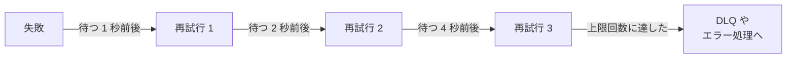

### ベストプラクティス

| 項目 | ベストプラクティス |
|---|---|
| 冪等性 | 少なくとも 1 回配信を前提に、**冪等キー**(注文 ID など)で重複処理を防ぐ |
| DLQ | 非同期・キュー・ストリームの連携には **DLQ または失敗時の送信先を必ず設定** する |
| 再試行 | **指数バックオフ + ジッター**。再試行回数には上限を設ける |
| タイムアウト | 下流のタイムアウト < 上流のタイムアウト の順に設定し、**階層的に整合** させる |
| 権限 | 「呼ぶ側のロール」と「呼ばれる側のリソースポリシー」の **両方** を確認する |
| 可観測性 | 連携の全経路で **トレース(X-Ray)を有効化** し、リクエスト ID をログに残す |
| 部分失敗 | バッチ処理は **部分的なバッチ失敗の報告** を使う |

### ひっかけポイント

| 問われ方 | 正しい考え方 |
|---|---|
| 「API Gateway が 502。Lambda ログでは成功している」 | **戻り値の形式**(プロキシ統合の要件)を疑う |
| 「SQS のメッセージが二重処理される」 | **可視性タイムアウト** が関数のタイムアウトより短い、または冪等性がない |
| 「バッチの 1 件だけ失敗。残りは再処理したくない」 | **`ReportBatchItemFailures`** |
| 「SNS から Lambda への通知が来ない」 | Lambda の **リソースベースポリシー**(SNS からの呼び出し許可) |
| 「Kinesis の処理が止まった」 | 不良レコードによる再試行ループ。**BisectBatchOnFunctionError / 失敗時の送信先** |

### 参考 URL

- Lambda の非同期呼び出し(再試行・DLQ・Destinations): https://docs.aws.amazon.com/lambda/latest/dg/invocation-async.html
- Lambda と SQS: https://docs.aws.amazon.com/lambda/latest/dg/with-sqs.html
- SQS のエラー処理(バッチ項目の失敗の報告): https://docs.aws.amazon.com/lambda/latest/dg/services-sqs-errorhandling.html
- Lambda と Kinesis: https://docs.aws.amazon.com/lambda/latest/dg/with-kinesis.html
- API Gateway と CloudWatch の監視: https://docs.aws.amazon.com/apigateway/latest/developerguide/monitoring-cloudwatch.html
- EventBridge の DLQ: https://docs.aws.amazon.com/eventbridge/latest/userguide/eb-rule-dlq.html
- EventBridge の再試行ポリシー: https://docs.aws.amazon.com/eventbridge/latest/userguide/eb-rule-retry-policy.html
- Step Functions のエラー処理: https://docs.aws.amazon.com/step-functions/latest/dg/concepts-error-handling.html
- DynamoDB のエラー処理: https://docs.aws.amazon.com/amazondynamodb/latest/developerguide/Programming.Errors.html
- タイムアウト・再試行・ジッター付きバックオフ(Amazon Builders' Library): https://aws.amazon.com/builders-library/timeouts-retries-and-backoff-with-jitter/

---
## Step 8: ロギング・モニタリング・オブザーバビリティの違い(4.2.1)

### この項目で学ぶこと

似た言葉ですが、**目的が違います**。試験では「この要件を満たすのはどれか」という形で区別が問われます。

### やさしい解説

#### 8-1. 3 つの違い

| 用語 | 問い | 例え(健康診断) | 主な AWS サービス |
|---|---|---|---|
| **ロギング** | 「**何が起きたか**」を記録する | カルテ(出来事の記録) | CloudWatch Logs |
| **モニタリング** | 「**既知の指標が正常か**」を監視し、異常で知らせる | 体温計と警報(既知の指標を見張る) | CloudWatch Metrics / アラーム |
| **オブザーバビリティ** | 「**未知の問題でも、外から原因を突き止められるか**」という能力 | 総合検査(想定外の症状でも原因を探れる) | ログ + メトリクス + トレースの組み合わせ(CloudWatch、X-Ray / OpenTelemetry、Application Signals) |

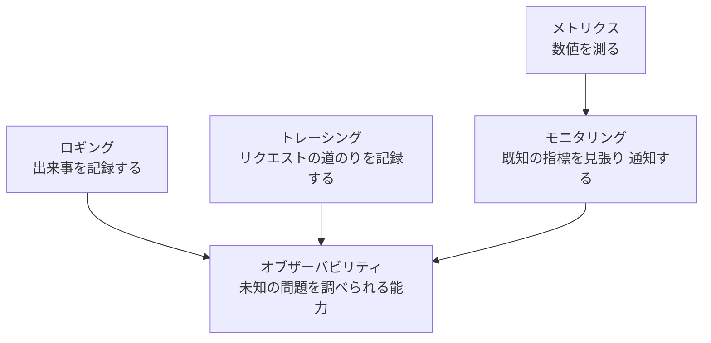

#### 8-2. 重要な考え方

| ポイント | 説明 |
|---|---|
| モニタリングは **「何を見るか」を事前に決める** | 想定していない故障は見逃す |
| オブザーバビリティは **「後から自由に質問できる」データがある** | 高カーディナリティな情報(ユーザー ID、リクエスト ID)を含む **豊富なテレメトリ** が前提 |
| 3 つのシグナル(メトリクス・ログ・トレース) | どれか 1 つでは足りない。**相互に結びつける**(トレース ID をログに出す) |
| 計装(Instrumentation) | コードに **テレメトリを出す仕組みを組み込む** こと。ドメイン 4 Task 2 の主題 |

### ベストプラクティス

| 項目 | ベストプラクティス |
|---|---|
| 設計の順序 | まず **ビジネスと利用者の観点の指標**(成功率・レイテンシ)を決め、そこから計装を設計する |
| 相関 | ログ・メトリクス・トレースに **共通の ID** を含める |
| 通知 | アラートは **利用者への影響が出る症状** に基づける(CPU 使用率だけでなく、エラー率・レイテンシ) |
| 継続改善 | 障害のたびに「なぜ早く気づけなかったか」を振り返り、計装を追加する |

### ひっかけポイント

| 問われ方 | 正しい考え方 |
|---|---|
| 「既知のしきい値を超えたら通知したい」 | **モニタリング**(メトリクス + アラーム) |
| 「想定外の障害でも、どのサービスが原因かをたどりたい」 | **オブザーバビリティ**(トレース + 構造化ログ + メトリクス) |
| 「アプリの動作の履歴を残したい」 | **ロギング** |

### 参考 URL

- AWS Observability Best Practices: https://aws-observability.github.io/observability-best-practices/
- Operational Excellence Pillar(Well-Architected): https://docs.aws.amazon.com/wellarchitected/latest/operational-excellence-pillar/welcome.html

---

## Step 9: 効果的なロギング戦略(4.2.2)

### この項目で学ぶこと

ただ `print` するのではなく、**「必要なときに必要な情報が見つかり、コストも安全も守れる」ログの出し方** を学びます。

### やさしい解説

#### 9-1. ログレベルの使い分け

| レベル | 用途 | 本番での出力 |
|---|---|---|
| `DEBUG` | 開発時の詳細な内部状態 | 通常は **オフ**(必要な時だけ一時的にオン) |
| `INFO` | 正常な重要イベント(注文受付、処理完了) | オン |
| `WARN` | 想定外だが処理は続行できる(再試行した、フォールバックした) | オン |
| `ERROR` | 処理が失敗した | オン(必ず原因情報を含める) |
| `FATAL` / `CRITICAL` | アプリ継続が不可能 | オン(アラームの対象) |

#### 9-2. 何を記録するか

| 記録する | 記録してはいけない |
|---|---|
| リクエスト ID・トレース ID・相関 ID | **パスワード、アクセスキー、トークン、シークレット** |
| 重要な処理の開始・終了・結果 | **個人情報(PII)**(氏名、メールアドレス、カード番号など)をそのまま |
| 失敗時の **入力の識別子**・例外の種類・スタックトレース | リクエスト / レスポンス本文の **丸ごと** 出力(機密を含み、容量も大きい) |
| 外部呼び出しの対象・所要時間・結果 | 意味のない大量の繰り返しログ |
| 設定値・バージョン・デプロイ ID(**機密でないもの**) | |

AI サービスを組み込む場合も同様で、**モデルへの入出力に含まれる機密情報がログに残らないように** 注意します(試験ガイドの新興トピックに「機密コンテンツがログに出ないようにする」が含まれます)。

#### 9-3. CloudWatch Logs の構造と管理

| 用語 | 意味 |
|---|---|
| ロググループ | 同じ保持・アクセス設定を持つログの集まり(例: `/aws/lambda/order-handler`) |
| ログストリーム | 同じソース(1 つの Lambda 実行環境、1 つのコンテナなど)の出力の並び |
| 保持期間(Retention) | ロググループごとに設定。**既定は無期限(期限切れにならない)** |
| ログクラス | **Standard** と、検索機能が限定的で単価の低い **Infrequent Access** |
| データ保護ポリシー | ログ中の **機密データ(PII など)を検出してマスク** する機能 |

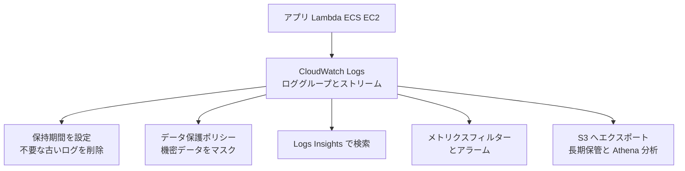

#### 9-4. Lambda のログ設定(高度なログ制御)

Lambda では関数ごとに次を設定できます。

| 設定 | 内容 |
|---|---|
| ログ形式 | **JSON** または Text。JSON にするとシステムログも構造化される |
| ログレベルのフィルタリング | アプリケーションログとシステムログの **最小レベル** を指定し、不要なログを出さない |
| ロググループ | 既定の `/aws/lambda/<関数名>` ではなく **任意のロググループ** に出力できる(複数関数で集約も可能) |

#### 9-5. ECS / EC2 でのログ

| 実行環境 | ログの送り方 |
|---|---|
| ECS(EC2 / Fargate) | タスク定義で **`awslogs` ログドライバー** を指定して CloudWatch Logs へ。または FireLens(Fluent Bit / Fluentd)で複数宛先へ |
| EC2 | **CloudWatch エージェント** でファイルのログを送る |
| Lambda | 標準出力・標準エラーが自動で CloudWatch Logs へ |
| Lambda の実行ロール | **`logs:CreateLogGroup` / `CreateLogStream` / `PutLogEvents`** の権限が必要(`AWSLambdaBasicExecutionRole`)。**ログが出ない原因の第 1 位は権限不足** |

### ベストプラクティス

| 項目 | ベストプラクティス | 理由 |
|---|---|---|
| 保持期間 | **すべてのロググループに保持期間を設定** する | 既定は無期限でコストが増え続ける |
| ログレベル | 本番は INFO 以上。DEBUG は **環境変数やログレベル設定で切り替え可能** にする | コストとノイズの削減、必要時の詳細調査 |
| 機密情報 | 秘密情報・PII を出力しない。必要なら **マスク** し、**データ保護ポリシー** も併用 | 漏えい防止・コンプライアンス |
| 相関 ID | リクエスト ID・トレース ID を **全ログに付与** | 1 リクエストのログを串刺しで検索できる |
| 例外 | 例外は **スタックトレースとコンテキスト付きで 1 回だけ** ログに出す | 重複ログと調査の混乱を避ける |
| 形式 | **構造化(JSON)ログ** にする([Step 10](#step-10-構造化ログ427)) | クエリ・集計がしやすい |
| サンプリング | 大量の DEBUG / 正常系ログは **サンプリング** する | コスト削減 |
| アクセス制御 | ロググループへのアクセスを IAM で制限し、必要なら **KMS で暗号化** | ログにも機密が入りうる |
| ストリーム処理 | 常時リアルタイム処理するログだけ **サブスクリプションフィルター** で転送 | 不要な転送コストを避ける |

### ひっかけポイント

| 問われ方 | 正しい考え方 |
|---|---|
| 「ログのコストが増え続ける」 | **保持期間の設定**、ログレベルの見直し、Infrequent Access クラス、S3 へのエクスポート |
| 「ログに個人情報が含まれてしまう」 | そもそも出力しない。**データ保護ポリシーでマスク** |
| 「Lambda のログが CloudWatch Logs に出ない」 | **実行ロールの Logs 権限** を確認 |
| 「複数の Lambda のログを 1 つのロググループにまとめたい」 | Lambda の **ロググループ設定(高度なログ制御)** |

### 参考 URL

- Lambda 関数のログ設定: https://docs.aws.amazon.com/lambda/latest/dg/monitoring-cloudwatchlogs.html
- CloudWatch Logs のデータ保護(機密データのマスク): https://docs.aws.amazon.com/AmazonCloudWatch/latest/logs/CWL-data-protection.html
- CloudWatch Logs の概念: https://docs.aws.amazon.com/AmazonCloudWatch/latest/logs/CloudWatchLogsConcepts.html
- Powertools Logger(Python): https://docs.powertools.aws.dev/lambda/python/latest/core/logger/

---

## Step 10: 構造化ログ(4.2.7)

### この項目で学ぶこと

ログを **「人が読む文章」ではなく「機械が検索できるデータ」** として出力する方法です。アプリケーションのイベントとユーザー操作を、あとから自由に集計できるようにします。

### やさしい解説

#### 10-1. 非構造化ログと構造化ログ

**非構造化(文章)**

```text
2026-10-03 10:15:22 ERROR Failed to process order 12345 for user u-1001 after 3 retries
```

**構造化(JSON)**

```json
{
  "timestamp": "2026-10-03T10:15:22.431Z",
  "level": "ERROR",
  "message": "Failed to process order",
  "service": "checkout",
  "requestId": "1234abcd-5678-90ef",
  "traceId": "1-67890abc-def012345678901234567890",
  "orderId": "12345",
  "userId": "u-1001",
  "retries": 3,
  "errorType": "PaymentTimeout",
  "durationMs": 5021
}
```

| 比較 | 非構造化 | 構造化(JSON) |
|---|---|---|
| 検索 | 文字列検索と正規表現(`parse`)が必要 | **フィールド名で直接検索**(`filter orderId = "12345"`) |
| 集計 | 難しい | `stats count(*) by errorType` のように容易 |
| 変更への強さ | 文言を変えると検索が壊れる | フィールドは安定 |
| 自動処理 | 難しい | メトリクスフィルター、EMF、Athena に素直に連携 |

#### 10-2. 構造化ログに入れる標準項目

| 項目 | 例 | 目的 |
|---|---|---|
| `timestamp` | ISO 8601(UTC) | 時系列の整列 |
| `level` | INFO / ERROR | 絞り込み |
| `message` | 短い固定文言 | 人が読む説明(変数は別フィールドに) |
| `service` / `function` | checkout | 発生元の特定 |
| `requestId` / `correlationId` | UUID | 1 リクエストの追跡 |
| `traceId` | X-Ray のトレース ID | **ログとトレースの相関** |
| イベント固有項目 | `orderId`, `action` | 業務の調査 |
| `errorType` / `errorMessage` / `stack` | PaymentTimeout | 障害の分類 |
| `durationMs` | 5021 | 性能分析 |
| `coldStart` | true | コールドスタートの把握 |

#### 10-3. ユーザー操作(監査的なイベント)の記録

「誰が何をしたか」を後から追えるように、**ユーザー ID・操作・対象・結果** をイベントとして出力します。

```json
{
  "level": "INFO",
  "message": "user action",
  "action": "UPDATE_PROFILE",
  "userId": "u-1001",
  "resourceId": "profile-77",
  "result": "SUCCESS",
  "requestId": "1234abcd-5678-90ef"
}
```

ただしユーザー ID は **仮名化されたもの(内部 ID)** を使い、**生の個人情報は入れない** ようにします。API 操作そのものの監査は **CloudTrail** の役割です(アプリ内の業務イベントは構造化ログで残す)。

#### 10-4. Powertools Logger の例(Python)

```python
from aws_lambda_powertools import Logger

logger = Logger(service="checkout")   # JSON で出力される

@logger.inject_lambda_context(log_event=False, correlation_id_path="requestContext.requestId")
def handler(event, context):
    logger.append_keys(orderId=event["orderId"])
    logger.info("processing order")
    try:
        ...
    except Exception:
        logger.exception("order failed")   # スタックトレースを構造化して出力
        raise
```

`inject_lambda_context` は、関数名・メモリ・リクエスト ID・**コールドスタートの有無** などを **全ログに自動付与** します。`log_event=False` にしてイベント全体の出力(機密の可能性)を避けています。

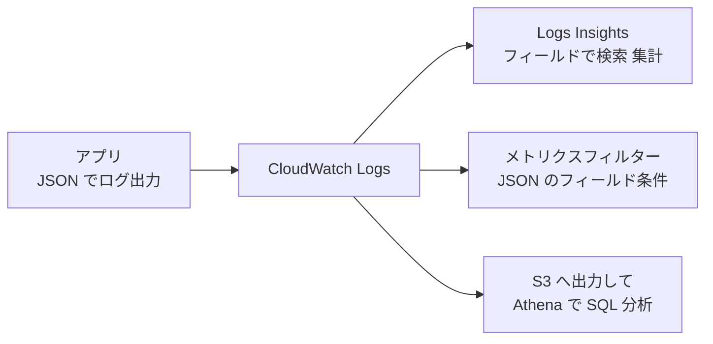

### ベストプラクティス

| 項目 | ベストプラクティス | 理由 |
|---|---|---|
| 形式 | **1 行 1 JSON**(改行を含めない) | CloudWatch Logs は 1 行を 1 イベントとして扱うため、複数行 JSON は分断される |
| キー名 | 全サービスで **キー名を統一**(`requestId`、`userId` など)し、型も一定に保つ | 横断検索ができる |
| メッセージ | `message` は **固定の短い文** にし、可変の値は別フィールドへ | 同種のログを 1 つのパターンとして集計できる |
| 機密 | パスワード・トークン・生の PII は出さない。**出力前にマスク** | 漏えい防止 |
| 例外 | 例外の型・メッセージ・スタックトレースを **フィールドとして** 出力 | エラーの分類・集計 |
| ライブラリ | **Powertools for AWS Lambda** などの実績あるライブラリを使う | 標準項目の自動付与とベストプラクティスの内蔵 |
| トレース連携 | `traceId` を含める | ログ ↔ トレースのジャンプ |

### ひっかけポイント

| 問われ方 | 正しい考え方 |
|---|---|
| 「ログを CloudWatch Logs Insights で効率よくフィルター・集計したい」 | **JSON の構造化ログ** にする |
| 「複数行のスタックトレースが分断される」 | **1 行の JSON** にして、スタックトレースを 1 つのフィールドに入れる |
| 「ユーザー操作の記録を残したい」 | 構造化ログに **ユーザー ID・操作・結果** を出す(API 操作の監査は CloudTrail) |

### 参考 URL

- Powertools Logger(Python): https://docs.powertools.aws.dev/lambda/python/latest/core/logger/
- Lambda の JSON ログ形式: https://docs.aws.amazon.com/lambda/latest/dg/monitoring-cloudwatchlogs.html
- Logs Insights の JSON ログの扱い: https://docs.aws.amazon.com/AmazonCloudWatch/latest/logs/CWL_AnalyzeLogData-discoverable-fields.html
- AWS Observability Best Practices: https://aws-observability.github.io/observability-best-practices/

---

## Step 11: カスタムメトリクスを出力するコード(4.2.3)

### この項目で学ぶこと

[Step 4](#step-4-カスタムメトリクスと-emf414) では「カスタムメトリクスとは何か・EMF とは何か」を学びました。ここでは **「コードにどう組み込むか」** に焦点を当てます。

### やさしい解説

#### 11-1. 何をメトリクスにするか(RED と業務指標)

| 種類 | 例 |
|---|---|
| Rate(量) | リクエスト数、注文数 |
| Errors(失敗) | 決済失敗数、バリデーションエラー数 |
| Duration(時間) | 処理時間、外部 API の応答時間 |
| 業務指標 | カート追加数、ログイン成功数 |
| 内部状態 | キューの滞留数、キャッシュヒット率、コールドスタート回数 |

#### 11-2. 実装方法の比較

| 方法 | コードの例 | 長所 | 短所 |
|---|---|---|---|
| `PutMetricData` | `cloudwatch.put_metric_data(...)` | どの環境でも使える | **同期 API**。Lambda では実行時間・コストが増える。API のクォータ(スロットリング)に注意 |
| EMF を手書き | `print(json.dumps({...}))` | 依存なし・非同期 | 形式を間違えやすい |
| **Powertools Metrics** | `metrics.add_metric(...)` | **EMF を自動生成**。ディメンション・単位の管理が楽。関数の終了時にまとめて出力 | ライブラリの追加が必要 |
| メトリクスフィルター | コード変更なし | 既存ログから作れる | 柔軟性が低い |

#### 11-3. PutMetricData の例(Python / boto3)

```python
import boto3
cw = boto3.client("cloudwatch")

cw.put_metric_data(
    Namespace="ShopApp",
    MetricData=[{
        "MetricName": "PaymentFailures",
        "Dimensions": [{"Name": "Service", "Value": "checkout"}],
        "Value": 1,
        "Unit": "Count"
    }]
)
```

複数のデータポイントは **1 回の呼び出しにまとめて送る(バッチ化)** ことで、API 呼び出し回数を減らせます。

#### 11-4. 送る前に決めること

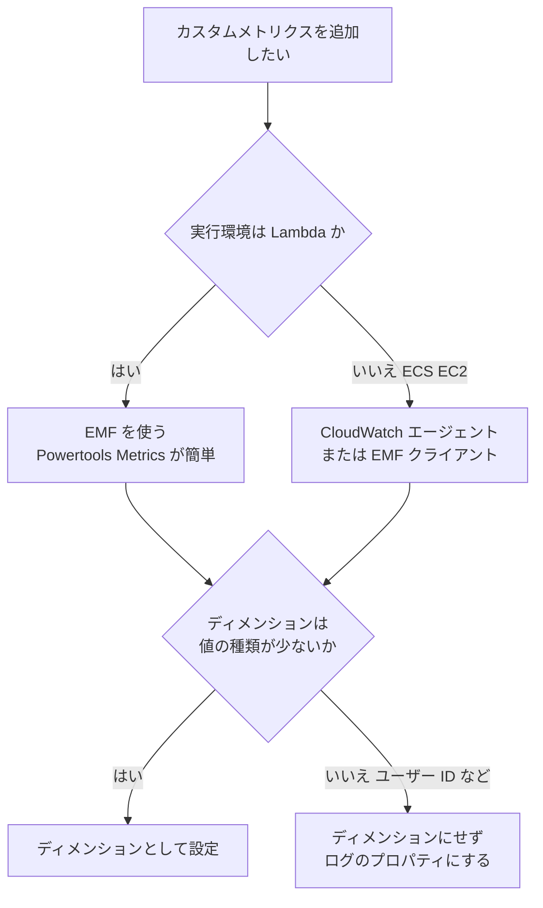

### ベストプラクティス

| 項目 | ベストプラクティス | 理由 |
|---|---|---|
| Lambda | **EMF(Powertools Metrics)を使い、`PutMetricData` の同期呼び出しを避ける** | 余計な遅延・コスト・API スロットリングを避ける |
| バッチ化 | `PutMetricData` を使う場合は複数のデータポイントを **まとめて送る** | 呼び出し回数の削減 |
| ディメンション | 少数・固定の値のみ。**最大数にも上限** がある | カーディナリティ爆発の防止 |
| 命名 | 一貫した **命名規則と単位** | ダッシュボード・アラームの再利用 |
| テスト | メトリクスが **CloudWatch に届いていること** をデプロイ後に確認 | 計装漏れの検知 |
| アラーム連携 | メトリクスを作ったら **アラームも同時に** 設計する | 見るだけで終わらせない |

### ひっかけポイント

| 問われ方 | 正しい考え方 |
|---|---|
| 「Lambda から大量のカスタムメトリクスを、パフォーマンスに影響させず送る」 | **EMF** |
| 「`PutMetricData` で ThrottlingException」 | 呼び出し回数が多すぎる。**バッチ化** または **EMF** へ移行 |
| 「ユーザー ID ごとのメトリクスにしたい」 | 通常は不適切。**ログ(EMF のプロパティ)+ Logs Insights / Contributor Insights** で集計 |

### 参考 URL

- カスタムメトリクスの発行(PutMetricData): https://docs.aws.amazon.com/AmazonCloudWatch/latest/monitoring/publishingMetrics.html
- EMF の仕様: https://docs.aws.amazon.com/AmazonCloudWatch/latest/monitoring/CloudWatch_Embedded_Metric_Format_Specification.html
- Powertools Metrics(Python): https://docs.powertools.aws.dev/lambda/python/latest/core/metrics/

---

## Step 12: AWS サービスとツールによるトレーシング(4.2.6)

### この項目で学ぶこと

**分散トレーシング** で、1 つのリクエストが複数のサービスをどう通ったかを記録します。AWS では **AWS X-Ray** がトレースの受け口・分析の中心で、計装には **OpenTelemetry(ADOT)** が推奨されています。

### やさしい解説

#### 12-1. 基本用語

| 用語 | 意味 |
|---|---|
| トレース ID | 1 リクエスト全体を識別する ID(`Root=1-5759e988-bd862e3fe1be46a994272793` の形式) |
| `X-Amzn-Trace-Id` ヘッダー | トレース ID を **サービス間で引き継ぐ** HTTP ヘッダー |
| セグメント | 1 つのサービス(例: 自分の Lambda 関数)の作業記録 |
| サブセグメント | 下流呼び出し(DynamoDB、HTTP、SQL)の詳細 |
| サンプリング | **全リクエストではなく一部だけ** を記録して、コストと負荷を抑える仕組み |
| サービスマップ | トレースから自動生成される依存関係図 |
| グループ | フィルター式でトレースをまとめ、グループ単位でメトリクス・通知を出す機能 |

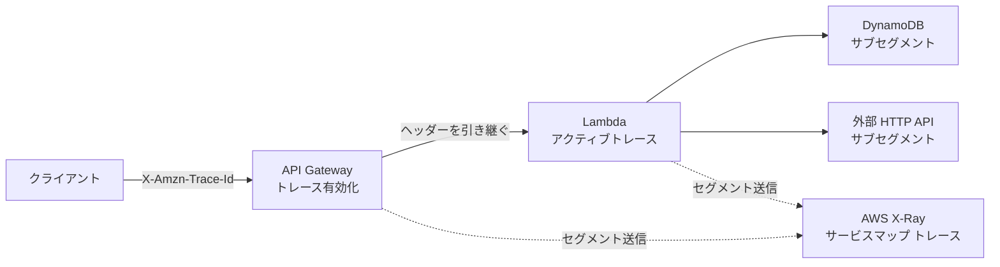

#### 12-2. 各サービスでトレースを有効にする方法

| サービス | 方法 | 補足 |
|---|---|---|
| **Lambda** | 関数設定で **アクティブトレース(Active tracing)** を有効化。実行ロールに **X-Ray への書き込み権限**(`xray:PutTraceSegments`、`xray:PutTelemetryRecords`。AWS 管理ポリシー `AWSXRayDaemonWriteAccess`)が必要 | Lambda は **X-Ray デーモンを自前で用意する必要がない**。トレースモードが **PassThrough**(上流の判断に従う)と **Active**(Lambda が自らサンプリングして記録) |
| **API Gateway** | **ステージの設定** でトレースを有効化 | サンプリングルールが適用される |
| **ECS / EC2 / EKS** | **X-Ray デーモン** または **ADOT コレクター** をサイドカー / エージェントとして動かす(デーモンは UDP 2000 番で受信) | コンテナでは **サイドカー** が定石 |
| **Elastic Beanstalk** | 設定でデーモンを有効化 | |
| **Step Functions / SNS / SQS** など | サービス側のトレース設定、またはヘッダーの伝播 | |

#### 12-3. 計装の方法: X-Ray SDK から OpenTelemetry へ

| 方法 | 状況 |
|---|---|
| **X-Ray SDK**(Java / Node.js / Python / .NET / Go / Ruby)+ X-Ray デーモン | **2026-02-25 にメンテナンスモードへ**(セキュリティ修正のみ)。**サポート終了は 2027-02-25**。既存コードでは今も動作する |
| **AWS Distro for OpenTelemetry(ADOT)** | AWS が **新規計装に推奨**。OpenTelemetry の SDK(または自動計装)+ ADOT コレクターでトレースを X-Ray に送る。Java / Python は自動計装(コード変更なし)に対応 |
| **CloudWatch Application Signals** | ADOT ベースの自動計装でサービス・SLO・依存関係を可視化 |
| **CloudWatch Transaction Search** | スパンを CloudWatch Logs に取り込み、**高い割合でトレースを検索・分析** |

> **X-Ray サービス自体はサポート継続** です。X-Ray は OpenTelemetry のネイティブ取り込みに対応し、機能も追加されています。「SDK がメンテナンスモード」という話を「X-Ray が終了する」と取り違えないよう注意しましょう。

#### 12-4. サンプリング

| 項目 | 内容 |
|---|---|
| 既定のルール | **毎秒 1 件は必ず記録し、それ以降は 5% を記録**(リザーバー 1 + 固定レート 5%) |
| カスタムルール | X-Ray コンソール / API で、**サービス名・URL パス・HTTP メソッドなど** に応じたルールを作る(重要な API は高率、ヘルスチェックは低率など) |
| 効果 | コストとオーバーヘッドの削減。**統計的に傾向を把握するには十分** |

#### 12-5. 試験でよく出る「トレースに出ない」問題

| 症状 | 原因 |
|---|---|
| Lambda のトレースが出ない | **アクティブトレースが無効**、または **実行ロールに X-Ray 権限がない** |
| 下流の DynamoDB 呼び出しがサブセグメントに出ない | **AWS SDK クライアントを計装していない**(SDK のラップ / 自動計装の設定漏れ) |
| API Gateway から Lambda へトレースが繋がらない | API Gateway ステージのトレースが無効 |
| ECS のトレースが出ない | **デーモン / ADOT コレクターのサイドカーがない**、ポートが開いていない、タスクロールに権限がない |
| 一部のリクエストしか見えない | **サンプリング** のため(正常) |

### ベストプラクティス

| 項目 | ベストプラクティス | 理由 |
|---|---|---|
| 計装方式 | **新規は OpenTelemetry(ADOT)を採用**。既存の X-Ray SDK は移行計画を立てる | SDK は 2027-02-25 でサポート終了予定 |
| 有効化の範囲 | 入口(API Gateway)から下流まで **全経路でトレースを有効化** | 途切れると原因をたどれない |
| 下流呼び出し | AWS SDK・HTTP クライアント・DB クライアントを **計装する** | サブセグメントで遅延箇所が分かる |
| サンプリング | ルールで **重要度に応じて調整**。ヘルスチェックは除外 | コストの最適化 |
| ログ相関 | **トレース ID をログに出力** する | ログ ↔ トレースをたどる |
| 権限 | 最小権限で X-Ray への書き込みのみを付与 | セキュリティ |
| 機密 | アノテーション・メタデータ・スパン属性に **機密情報を入れない** | トレースも閲覧可能なデータ |

### ひっかけポイント

| 問われ方 | 正しい考え方 |
|---|---|
| 「Lambda のトレースを最小の手間で有効にしたい」 | 関数の **アクティブトレース** を有効化(+ 実行ロールの権限) |
| 「マイクロサービスのどこで遅いか知りたい」 | **X-Ray(分散トレース)** のサービスマップ・トレース |
| 「ECS でトレースを送りたい」 | **X-Ray デーモン / ADOT コレクターのサイドカー** |
| 「X-Ray SDK の将来」 | メンテナンスモード(2026-02-25〜)、**サポート終了 2027-02-25**。新規は **OpenTelemetry / ADOT** |
| 「全リクエストを記録しなくてよいのはなぜ」 | **サンプリング**(既定: 毎秒 1 件 + 5%) |

### 参考 URL

- AWS X-Ray とは: https://docs.aws.amazon.com/xray/latest/devguide/aws-xray.html
- X-Ray の概念: https://docs.aws.amazon.com/xray/latest/devguide/xray-concepts.html
- アプリケーションの計装(ADOT と X-Ray SDK の選択): https://docs.aws.amazon.com/xray/latest/devguide/xray-instrumenting-your-app.html
- X-Ray 計装から OpenTelemetry 計装への移行: https://docs.aws.amazon.com/xray/latest/devguide/xray-sdk-migration.html
- サンプリングルール: https://docs.aws.amazon.com/xray/latest/devguide/xray-console-sampling.html
- Lambda と X-Ray: https://docs.aws.amazon.com/lambda/latest/dg/services-xray.html

---

## Step 13: トレースへのアノテーション追加(4.2.4)

### この項目で学ぶこと

トレースに **業務の目印(ユーザーの種類、注文の種類など)** を付けて、あとから **「プレミアム会員のリクエストだけ遅い」** のように絞り込めるようにする機能です。

### やさしい解説

#### 13-1. アノテーションとメタデータの違い(最重要)

| 項目 | アノテーション(Annotations) | メタデータ(Metadata) |
|---|---|---|
| 目的 | **検索・フィルターのため** の目印 | **補足情報を保存するため** |
| **インデックス(索引)** | **作られる**(フィルター式で検索できる) | **作られない**(検索できない) |
| 値の型 | 文字列・数値・ブール値 | **任意の型**(オブジェクト・リストも可) |
| 付ける対象 | セグメントとサブセグメント | セグメントとサブセグメント |
| 例 | `userTier = "premium"`、`orderType = "bulk"` | リクエストの詳細オブジェクト、デバッグ用の大きなデータ |
| 件数の目安 | **1 トレースあたり最大 50 個** | サイズは制限あり(セグメント全体のサイズ上限) |

覚え方は **「探す(Search)ならアノテーション、しまう(Store)ならメタデータ」** です。

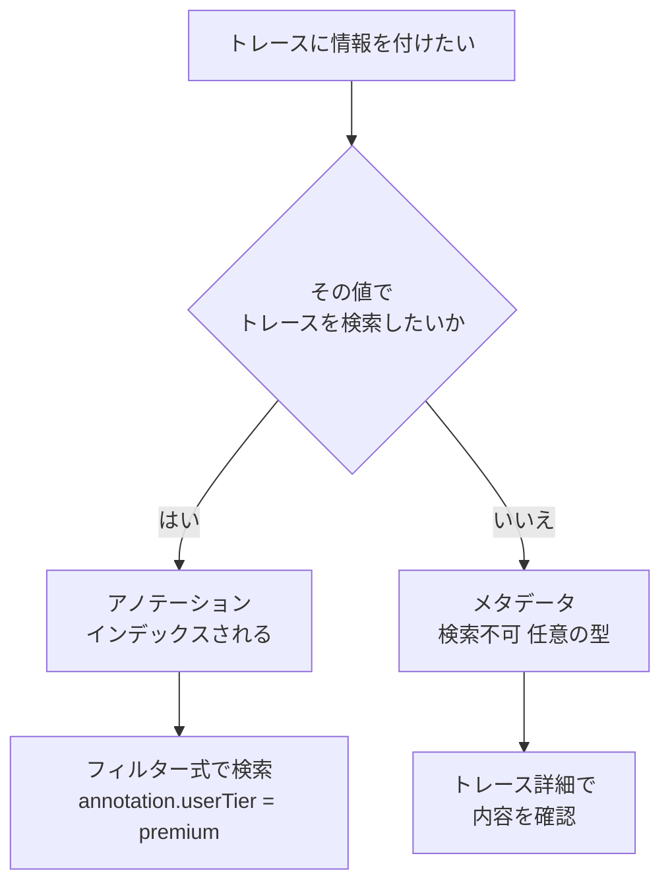

#### 13-2. X-Ray SDK での記述例(Python)

```python
from aws_xray_sdk.core import xray_recorder

# Lambda ではサブセグメントを使う(関数のセグメント自体は Lambda サービスが作る)
subsegment = xray_recorder.begin_subsegment("process-order")
subsegment.put_annotation("userTier", "premium")       # 検索対象
subsegment.put_annotation("orderType", "bulk")
subsegment.put_metadata("orderDetail", {"items": 12})  # 検索対象外
xray_recorder.end_subsegment()
```

Powertools Tracer を使うと、デコレーターで簡単に書けます。

```python
from aws_lambda_powertools import Tracer
tracer = Tracer()

@tracer.capture_method
def process(order):
    tracer.put_annotation(key="userTier", value="premium")
    tracer.put_metadata(key="orderDetail", value=order)
```

#### 13-3. フィルター式で絞り込む

アノテーションを付けると、X-Ray コンソールの **フィルター式** で検索できます。

| 目的 | フィルター式の例 |
|---|---|
| プレミアム会員のトレース | `annotation.userTier = "premium"` |
| 応答が 5 秒を超えたトレース | `responsetime > 5` |
| プレミアム会員で、かつ失敗 | `annotation.userTier = "premium" AND fault = true` |
| 特定サービスの 5xx | `service("order-handler") { fault }` |

#### 13-4. OpenTelemetry での対応

OpenTelemetry では **スパン属性(span attributes)** を付けます。ADOT / X-Ray への変換では、**既定ではスパン属性は X-Ray の「メタデータ」として扱われ、検索可能な「アノテーション」にしたい属性は、コレクター(X-Ray エクスポーター)の設定で「インデックス対象の属性」として指定** します。概念は同じ(検索したい値だけをインデックス化する)ですが、設定方法が異なる点に注意してください。

### ベストプラクティス

| 項目 | ベストプラクティス | 理由 |
|---|---|---|
| 使い分け | **検索したい値だけをアノテーション** にし、他はメタデータへ | アノテーションの数に上限があり、検索の対象は絞った方が管理しやすい |
| 値の種類 | 値の種類が **ビジネス上意味のあるもの**(会員種別、機能フラグ、テナント ID、APIバージョン)にする | 絞り込みの価値が高い |
| 機密 | **パスワード・トークン・個人情報は入れない** | トレースを閲覧できる人に見える |
| キー名 | アルファベット・数字・アンダースコアのみ(記号・スペースは不可) | キー名のルール |
| 命名 | ログのフィールド名と **揃える** | ログとトレースを横断して調べやすい |

### ひっかけポイント

| 問われ方 | 正しい考え方 |
|---|---|
| 「特定の顧客タイプのトレースを検索したい」 | **アノテーション** + フィルター式 |
| 「大きなオブジェクトをトレースに保存したい(検索は不要)」 | **メタデータ** |
| 「アノテーションはインデックスされるか」 | **される**。メタデータは **されない** |

### 参考 URL

- X-Ray のセグメントドキュメント(アノテーションとメタデータ): https://docs.aws.amazon.com/xray/latest/devguide/xray-api-segmentdocuments.html
- フィルター式: https://docs.aws.amazon.com/xray/latest/devguide/xray-console-filters.html
- X-Ray の概念(アノテーション): https://docs.aws.amazon.com/xray/latest/devguide/xray-concepts.html
- Powertools Tracer(Python): https://docs.powertools.aws.dev/lambda/python/latest/core/tracer/

---

## Step 14: 通知アラートの実装(4.2.5)

### この項目で学ぶこと

問題が起きたら **人や仕組みに自動で知らせる** 方法です。試験ガイドは例として **「クォータ上限の通知」** と **「デプロイ完了の通知」** を挙げています。

### やさしい解説

#### 14-1. 通知の 2 つの経路

| 経路 | きっかけ | 向いている通知 |
|---|---|---|
| **CloudWatch アラーム** | **メトリクスがしきい値を超えた** | エラー率、レイテンシ、キュー滞留、クォータ使用率 |
| **EventBridge ルール** | **イベント(状態変化)が発生した** | デプロイの成功・失敗、パイプラインの状態変化、ヘルスイベント、リソースの状態変化 |
| (補足)**通知ルール(Developer Tools の通知 / AWS User Notifications)** | CodeBuild・CodeDeploy・CodePipeline などのイベント | コードサービスの通知を簡単に設定 |

```mermaid
flowchart LR
    M["メトリクス<br/>しきい値超過"] --> A["CloudWatch アラーム"]
    E["イベント<br/>状態変化"] --> R["EventBridge ルール"]
    A --> S["SNS トピック"]
    R --> S
    S --> E1["メール"]
    S --> E2["SMS や HTTP"]
    S --> E3["Lambda"]
    S --> E4["Slack など<br/>チャット連携"]
```

#### 14-2. CloudWatch アラームの基本

| 項目 | 内容 |
|---|---|
| 状態 | `OK` / `ALARM` / `INSUFFICIENT_DATA` |
| 評価 | **期間(Period)× 評価期間数(Evaluation periods)×「アラームにするデータポイント数」(M out of N)** |
| 欠損データの扱い | `notBreaching`(正常扱い)/ `breaching`(異常扱い)/ `ignore` / `missing` を選べる。**データが途切れる指標(トラフィックが少ない Lambda など)で重要** |
| アクション | **SNS への通知**、Auto Scaling、EC2 の操作、Systems Manager のオペレーション項目の作成 など |
| 複合アラーム | 複数のアラームを **AND / OR で組み合わせて** 通知を絞る(ノイズ削減) |
| 異常検出 | 過去の傾向から **機械学習で期待範囲を学習** して、外れたらアラーム |
| メトリクス数式 | 数式の結果(エラー率など)にアラームを設定できる |

#### 14-3. 試験ガイドの 2 つの例を実装する

**① クォータ上限の通知**

```mermaid
flowchart LR
    A["リソースの使用量<br/>例 Lambda の同時実行数"] --> B["Service Quotas<br/>使用量メトリクス"]
    B --> C["CloudWatch アラーム<br/>使用率が 80 パーセント超"]
    C --> D["SNS で通知"]
    D --> E["クォータ引き上げ申請<br/>または設計見直し"]
```

| 方法 | 内容 |
|---|---|
| **Service Quotas のコンソールからアラーム作成** | クォータの使用率に対する CloudWatch アラームを設定(使用量メトリクスが提供されるクォータが対象) |
| サービス固有メトリクスで監視 | 例: Lambda の `ConcurrentExecutions` が **アカウントの上限(既定 1,000)の 80%** を超えたら通知 |
| `Throttles`・429・`ThrottledRequests` の監視 | すでに **上限に当たっている** ことの検知 |

**② デプロイ完了の通知**

| サービス | 方法 |
|---|---|
| CodeDeploy | **EventBridge**(状態変化イベント)または通知ルールで、成功・失敗・中断を SNS に通知 |
| CodePipeline | **パイプライン / ステージ / アクションの状態変化イベント** を EventBridge で受けて通知(承認アクションの SNS 通知も可能) |
| CodeBuild | ビルドの状態変化イベントを EventBridge で通知 |
| CloudFormation | スタックに **通知用 SNS トピック** を関連付けると、スタックイベントが通知される |

EventBridge のイベントパターン(CodeDeploy が失敗したとき)の例です。

```json
{
  "source": ["aws.codedeploy"],
  "detail-type": ["CodeDeploy Deployment State-change Notification"],
  "detail": { "state": ["FAILURE"] }
}
```

#### 14-4. SNS トピックのポイント

| 項目 | 内容 |
|---|---|
| サブスクリプションの確認 | メール宛先は **確認メールのリンクをクリックして承認** するまで通知が届かない |
| アクセスポリシー | CloudWatch アラームや EventBridge が **SNS に Publish できるよう、トピックのアクセスポリシーを許可** しておく |
| 暗号化トピック | KMS で暗号化したトピックには、**呼び出し元サービスが鍵を使える権限** も必要 |
| 配信先 | メール、SMS、HTTP/S、SQS、Lambda、モバイルプッシュ など |

### ベストプラクティス

| 項目 | ベストプラクティス | 理由 |
|---|---|---|
| アラームの基準 | **利用者への影響が出る指標**(エラー率、レイテンシ p99、キュー滞留時間)で作る | 意味のない通知を減らす |
| ノイズ対策 | `M out of N` の評価、**複合アラーム**、適切な欠損データ処理 | アラーム疲れの防止 |
| クォータ | **上限の 80% 前後で事前通知** | 上限到達前に手を打てる |
| 通知先 | 重要度に応じて **宛先を分ける**(緊急 = ページャー、通常 = チャット) | 対応の優先順位付け |
| 自動対応 | アラームから **自動修復(Lambda / Systems Manager)** を起動できる | 人手を介さず復旧 |
| 管理 | アラームは **IaC** で管理し、アプリと一緒にデプロイ | 設定漏れの防止 |
| 動作確認 | アラームの動作を **テスト**(`set-alarm-state` で状態を強制変更)して通知経路を確認 | 本番で通知が届かない事態を防ぐ |
| 通知内容 | 通知に **ダッシュボードや Runbook へのリンク** を含める | 初動が速くなる |

### ひっかけポイント

| 問われ方 | 正しい考え方 |
|---|---|
| 「メトリクスがしきい値を超えたら通知」 | **CloudWatch アラーム + SNS** |
| 「デプロイが完了・失敗したら通知」 | **EventBridge ルール(または通知ルール)+ SNS** |
| 「SNS のメールが届かない」 | **サブスクリプションが未承認**、またはトピックのアクセスポリシー不足 |
| 「アラーム状態が INSUFFICIENT_DATA のまま」 | メトリクスのデータが届いていない。**欠損データの扱い** を設定、ディメンション・名前空間の誤りを確認 |
| 「サービスクォータの上限に近づいたら知らせたい」 | **Service Quotas + CloudWatch アラーム** |

### 参考 URL

- CloudWatch アラーム(SNS 通知): https://docs.aws.amazon.com/AmazonCloudWatch/latest/monitoring/AlarmThatSendsEmail.html
- 複合アラーム: https://docs.aws.amazon.com/AmazonCloudWatch/latest/monitoring/Create_Composite_Alarm.html
- Service Quotas のアラーム設定: https://docs.aws.amazon.com/servicequotas/latest/userguide/configure-cloudwatch-alarms.html
- CodeDeploy のモニタリングと通知: https://docs.aws.amazon.com/codedeploy/latest/userguide/monitoring.html
- CodePipeline のイベントモニタリング: https://docs.aws.amazon.com/codepipeline/latest/userguide/detect-state-changes.html
- SNS とは: https://docs.aws.amazon.com/sns/latest/dg/welcome.html

---

## Step 15: ヘルスチェックとレディネスプローブ(4.2.8)

### この項目で学ぶこと

アプリが **「生きているか」「リクエストを受けられる状態か」** を、プラットフォームが自動で判断できるようにします。異常なインスタンスを **自動で切り離し・再起動・置き換え** するための土台です。

### やさしい解説

#### 15-1. 3 つのプローブの違い(Kubernetes / EKS での考え方)

| 種類 | 問い | 失敗したときの動作 | 例 |
|---|---|---|---|
| **Liveness(生存)** | プロセスは **生きている(固まっていない)か** | コンテナを **再起動** する | デッドロックしたアプリの回復 |
| **Readiness(準備完了)** | **トラフィックを受けられる状態か** | **ロードバランサーのターゲット(Service のエンドポイント)から外す**(再起動はしない) | 起動直後の初期化中、依存先の障害時 |
| **Startup(起動)** | **起動が完了したか** | 完了するまで他のプローブを待たせる | 起動が遅いアプリ |

```mermaid
flowchart TD
    S["コンテナ起動"] --> ST{"Startup プローブ<br/>起動完了か"}
    ST -->|"完了"| R{"Readiness プローブ<br/>受付可能か"}
    ST -->|"失敗が続く"| K["再起動"]
    R -->|"はい"| T["トラフィックを受ける"]
    R -->|"いいえ"| N["トラフィックから外す<br/>再起動はしない"]
    T --> L{"Liveness プローブ<br/>生存しているか"}
    L -->|"はい"| T
    L -->|"失敗が続く"| K
```

#### 15-2. AWS サービスごとのヘルスチェック

| サービス | ヘルスチェックの仕組み | 主な設定 |
|---|---|---|
| **ALB / NLB のターゲットグループ** | ターゲットへ **定期的にリクエスト** を送り、正常 / 異常を判定。異常なターゲットへはトラフィックを送らない | パス(例 `/health`)、プロトコル、ポート、**間隔・タイムアウト・正常/異常のしきい値**、**成功コード(例 200-299)** |
| **Auto Scaling グループ** | EC2 の状態に加え、**ELB のヘルスチェックを使用するよう設定** できる。異常なインスタンスを **終了して新規起動(置き換え)** | ヘルスチェックの種類(EC2 / ELB)、**ヘルスチェックの猶予期間(Grace period)** |
| **ECS** | **コンテナのヘルスチェック**(タスク定義にコマンドを指定)と、ALB のターゲットグループのヘルスチェック。異常なタスクは停止され、サービスが **新しいタスクで置き換え** | コマンド、間隔、タイムアウト、再試行回数、**開始期間(startPeriod)** |
| **EKS(Kubernetes)** | `livenessProbe` / `readinessProbe` / `startupProbe`(HTTP・TCP・コマンド・gRPC) | `initialDelaySeconds`、`periodSeconds`、`failureThreshold` など |
| **Route 53** | **エンドポイント監視**、他のヘルスチェックを組み合わせる **計算されたヘルスチェック**、**CloudWatch アラームを監視するヘルスチェック**。異常時に **DNS フェイルオーバー** | 間隔、失敗しきい値、文字列マッチング |
| **Elastic Beanstalk** | **拡張ヘルスレポート**(Ok / Warning / Degraded / Severe などの色分け)。ヘルスチェック URL を設定 | アプリケーションヘルスチェックの URL |
| **CodeDeploy** | **`ValidateService` フック** や、Lambda の **`AfterAllowTraffic` フック**・アラームで、デプロイ後の健全性を確認 | 検証スクリプト |
| **Lambda** | 関数にヘルスチェックという概念はない。ALB のターゲットにした場合は **ヘルスチェックを有効にするかどうか** を設定。死活は **メトリクス・Synthetics** で監視 | |

#### 15-3. 良いヘルスチェックエンドポイントの作り方

| 種類 | 何を確認するか | 使いどころ |
|---|---|---|
| **シャロー(浅い)チェック** | プロセスが応答できるか(固定の 200 を返す) | **Liveness**、頻繁なチェック |
| **ディープ(深い)チェック** | データベース・キャッシュ・必須の外部サービスに **実際に接続できるか** | **Readiness**(ただし慎重に) |

```mermaid
flowchart LR
    LB["ロードバランサー"] -->|"GET /health 定期的に"| A["アプリ"]
    A --> C{"チェック内容"}
    C -->|"浅い"| OK1["プロセス生存のみ確認<br/>固定で 200"]
    C -->|"深い"| DB["DB キャッシュへ接続確認"]
    DB -->|"成功"| OK2["200"]
    DB -->|"失敗"| NG["503"]
```

**重要な注意:** Liveness に **「依存先 DB の接続確認」** を入れてはいけません。DB が一時的に落ちただけで **全コンテナが再起動** され、障害が拡大します(**連鎖障害**)。依存先の確認は **Readiness** に置き、「しばらくトラフィックを受けない」だけに留めます。

### ベストプラクティス

| 項目 | ベストプラクティス | 理由 |
|---|---|---|
| 役割分担 | **Liveness は浅く、Readiness は依存先まで確認** | 連鎖的な再起動を避ける |
| 軽量化 | ヘルスチェックの処理は **軽く・速く・認証不要** にする | 負荷をかけず、ロードバランサーがアクセスできる |
| 起動猶予 | 起動に時間がかかるアプリは **Startup プローブ / startPeriod / Grace period** を設定 | 起動中に異常判定されて再起動ループになるのを防ぐ |
| しきい値 | 一時的な揺らぎで切り離さないよう、**連続失敗回数** を設定 | 誤検知の防止 |
| ログ・メトリクス | ヘルスチェックの失敗を **メトリクス(UnHealthyHostCount など)とアラーム** で通知 | 切り離しに気づける |
| グレースフル終了 | 終了シグナルを受けたら、**処理中のリクエストを終わらせてから終了**。ALB の **登録解除の遅延(deregistration delay)** と整合させる | デプロイ時のエラー防止 |
| ステータスコード | 異常時は **200 以外(503 など)** を返す | ロードバランサーが判定できる |

### ひっかけポイント

| 問われ方 | 正しい考え方 |
|---|---|
| 「起動直後はトラフィックを受けたくない」 | **Readiness プローブ**(またはターゲットグループのヘルスチェック + Grace period) |
| 「デッドロックしたコンテナを自動復旧したい」 | **Liveness プローブ**(再起動) |
| 「ALB が 503 を返す」 | **正常なターゲットが 0** → ターゲットグループのヘルスチェック設定と、アプリの応答を確認 |
| 「新タスクが起動直後にヘルスチェックに失敗して停止を繰り返す」 | **開始期間 / Grace period** が短い、ヘルスチェックのパスやポートが違う |
| 「リージョン障害時に DNS で別リージョンへ切り替えたい」 | **Route 53 ヘルスチェック + フェイルオーバールーティング** |

### 参考 URL

- ALB のターゲットグループのヘルスチェック: https://docs.aws.amazon.com/elasticloadbalancing/latest/application/target-group-health-checks.html
- ALB のトラブルシューティング(502 / 503 / 504): https://docs.aws.amazon.com/elasticloadbalancing/latest/application/load-balancer-troubleshooting.html
- Route 53 のヘルスチェックと DNS フェイルオーバー: https://docs.aws.amazon.com/Route53/latest/DeveloperGuide/dns-failover.html
- Kubernetes のプローブ(Liveness / Readiness / Startup): https://kubernetes.io/docs/tasks/configure-pod-container/configure-liveness-readiness-startup-probes/
- Elastic Beanstalk の拡張ヘルス: https://docs.aws.amazon.com/elasticbeanstalk/latest/dg/health-enhanced.html
- ECS のトラブルシューティング: https://docs.aws.amazon.com/AmazonECS/latest/developerguide/troubleshooting.html

---
## Step 16: 同時実行数(Concurrency)の定義(4.3.1)

### この項目で学ぶこと

**同時実行数 = 「ある瞬間に処理中のリクエストの数」** です。Lambda ではこれが **スケーリング・スロットリング・コスト** のすべてに直結します。

### やさしい解説

#### 16-1. 同時実行数の計算式(必ず覚える)

> **同時実行数 ≒ 1 秒あたりのリクエスト数 × 平均処理時間(秒)**

| 例 | 計算 | 同時実行数 |
|---|---|---|
| 100 リクエスト/秒、平均 0.5 秒 | 100 × 0.5 | 約 50 |
| 100 リクエスト/秒、平均 2 秒 | 100 × 2 | 約 200 |
| 1,000 リクエスト/秒、平均 1 秒 | 1,000 × 1 | 約 1,000(**アカウント上限に到達**) |

処理時間が長くなるほど、同じリクエスト数でも必要な同時実行数が増えます。**遅い下流サービス = 同時実行数の枯渇** という因果関係は頻出です。

#### 16-2. 同時実行数の 3 つの設定

| 設定 | 意味 | 料金 | 主な用途 |
|---|---|---|---|
| **アカウントの同時実行数の上限** | リージョン内の全関数の合計上限(**既定 1,000**、引き上げ申請可能) | 無料 | 全体の天井 |
| **予約済み同時実行数(Reserved concurrency)** | 特定の関数に **同時実行数を確保しつつ、上限としても働く** | **無料** | 重要な関数のリソース確保、**下流を守る上限**(DB 接続数の制御など) |
| **プロビジョニングされた同時実行数(Provisioned concurrency)** | **あらかじめ初期化済みの実行環境** を常に用意 | **有料**(確保している間) | **コールドスタートの排除**(低レイテンシが必須の API) |

```mermaid
flowchart TD
    A["アカウントの同時実行数の上限<br/>既定 1000"] --> B["予約済み同時実行数<br/>関数 A に 200 を確保"]
    A --> C["予約なしの共有プール<br/>残り 800 を他の関数で共有"]
    B --> D["関数 A の上限は 200<br/>他の関数は 200 を使えない"]
    B --> E["その内 プロビジョニング済み 50<br/>初期化済みで待機"]
```

- 予約済み同時実行数を **0** にすると、関数は **完全に停止(すべての呼び出しがスロットル)** します(緊急停止に使える)。
- **プロビジョニング済み ≦ 予約済み** である必要があります(同じ関数に両方設定する場合)。
- プロビジョニング済み同時実行数は **エイリアスまたはバージョンに対して** 設定します($LATEST には設定できません)。
- **Application Auto Scaling** で、スケジュールや使用率に応じて **プロビジョニング済み同時実行数を自動調整** できます。

#### 16-3. スケーリングの仕組み

- 同時実行数が足りないとき、Lambda は **新しい実行環境を作って増やします**(関数ごとに **10 秒あたり最大 1,000 実行環境ずつ** 追加できる)。
- 新しい実行環境ができるたびに **コールドスタート**(初期化)が発生します。
- 上限に達すると、呼び出し方法ごとに次のように動きます。

| 呼び出し方法 | スロットル時の動作 |
|---|---|
| 同期(API Gateway、SDK の `RequestResponse`) | **429(TooManyRequestsException)** を即座に返す。**呼び出し側で再試行** |
| 非同期(S3、SNS、EventBridge など) | Lambda が内部キューで **自動再試行**(最大 6 時間) |
| ポーリング型(SQS、Kinesis、DynamoDB Streams) | Lambda が **再試行**(SQS はメッセージがキューに戻る) |

#### 16-4. SQS をイベントソースにするときの同時実行数

SQS を使う Lambda は、メッセージ量に応じて **ポーラーが自動で増え、同時実行数が増加** します。**下流(RDS の接続数など)を守りたいとき** は次の方法があります。

| 方法 | 内容 |
|---|---|
| **イベントソースマッピングの最大同時実行数(Maximum concurrency)** | その SQS トリガーが使える同時実行数に **上限** を設定(関数全体の設定とは別) |
| 予約済み同時実行数 | 関数全体の上限。ただし **上限に達するとスロットルされたメッセージが再試行を消費** する点に注意 |

#### 16-5. 他のサービスでの「同時実行」

| サービス | 考え方 |
|---|---|
| Kinesis + Lambda | **シャード数 × 並列化係数(最大 10)** が同時実行数の目安 |
| DynamoDB | 読み書き容量(RCU / WCU)や **オンデマンドモード** が同時アクセスの許容量を決める |
| ECS / EC2 | タスク数・インスタンス数を **Auto Scaling** で増減する |
| API Gateway | アカウント・ステージ・メソッドごとの **スロットリング(レート / バースト)** |

### ベストプラクティス

| 項目 | ベストプラクティス | 理由 |
|---|---|---|
| 見積もり | **リクエスト/秒 × 処理時間** でピーク時の同時実行数を見積もる | 上限超過を事前に防ぐ |
| 監視 | `ConcurrentExecutions` と `Throttles` に **アラーム** を設定 | スロットルの早期検知 |
| 重要関数 | 重要な関数には **予約済み同時実行数** を設定して、他の関数に奪われないようにする | 重要処理の確保 |
| 下流の保護 | DB 接続数などが限られる場合、**予約済み同時実行数や SQS の最大同時実行数** で上限を設ける。**RDS Proxy** も併用 | 下流の過負荷防止 |
| コールドスタート | レイテンシ要件が厳しいときだけ **プロビジョニング済み同時実行数**(コスト増)や **SnapStart**(Java・Python・.NET)を検討 | コストと性能のバランス |
| 処理時間 | **処理時間を短縮** すれば、同じ同時実行数でより多くのリクエストをさばける | 根本的な最適化 |
| 再試行 | 同期呼び出しの呼び出し側は **指数バックオフ + ジッター** で再試行 | 429 からの回復 |

### ひっかけポイント

| 問われ方 | 正しい考え方 |
|---|---|
| 「重要な関数が他の関数のスパイクでスロットルされる」 | **予約済み同時実行数** |
| 「Lambda のコールドスタートを排除したい」 | **プロビジョニング済み同時実行数**(確保中は課金)/ SnapStart |
| 「DB の接続数を守るため Lambda の同時実行を制限したい」 | **予約済み同時実行数**(または SQS の最大同時実行数)+ RDS Proxy |
| 「予約済み同時実行数に追加料金は?」 | **無料**。**プロビジョニング済み** は有料 |
| 「同時実行数を 0 にすると?」 | **関数が完全に止まる**(全呼び出しがスロットル) |

### 参考 URL

- Lambda の同時実行数: https://docs.aws.amazon.com/lambda/latest/dg/lambda-concurrency.html
- Lambda のスケーリング動作: https://docs.aws.amazon.com/lambda/latest/dg/scaling-behavior.html
- 予約済み同時実行数の設定: https://docs.aws.amazon.com/lambda/latest/dg/configuration-concurrency.html
- Lambda SnapStart: https://docs.aws.amazon.com/lambda/latest/dg/snapstart.html

---

## Step 17: アプリケーションのパフォーマンスをプロファイルする(4.3.2)

### この項目で学ぶこと

**プロファイリング = 「時間やリソースが、どこで使われているかを測る」** ことです。**推測で最適化せず、測ってから直す**(Measure before you optimize)のが大原則です。

### やさしい解説

#### 17-1. 何を測り、どの道具を使うか

| 知りたいこと | 道具 | 見るもの |
|---|---|---|
| **サービス間のどこで時間がかかっているか** | **X-Ray / OpenTelemetry のトレース**、サービスマップ | サブセグメントの所要時間 |
| **コードのどの関数が CPU を使っているか** | **Amazon CodeGuru Profiler**(JVM 言語・Python 対応)、言語ごとのプロファイラー(cProfile、Java Flight Recorder など) | CPU 時間のフレームグラフ、推奨事項 |
| **Lambda のメモリ・CPU・初期化時間** | **Lambda Insights**、ログの REPORT 行 | `Max Memory Used`、`Init Duration` |
| **サービス全体の RED / レイテンシ分布** | **Application Signals**、CloudWatch メトリクス | p50 / p95 / p99 |
| **DB のどのクエリが遅いか** | **RDS / Aurora の Performance Insights(CloudWatch Database Insights)**、DynamoDB のメトリクス | 待機イベント、遅いクエリ |
| **本番に近い負荷での挙動** | **負荷テスト** | スループット・エラー率 |

> CodeGuru Profiler は試験ガイドの対象サービス一覧には載っていませんが、AWS が提供するプロファイラーとして知っておくと役立ちます(CodeGuru Reviewer の新規受付停止や CodeGuru Security の終了とは別に、Profiler は提供が続いています)。

```mermaid
flowchart TD
    A["遅い と感じる"] --> B["トレースで<br/>遅いサービスを特定"]
    B --> C{"遅いのはどこか"}
    C -->|"自分のコードの中"| D["プロファイラーで<br/>CPU 時間の大きい処理を特定"]
    C -->|"下流の DB"| E["DB のクエリ分析<br/>Performance Insights"]
    C -->|"外部 API"| F["タイムアウト 再試行<br/>キャッシュを検討"]
    C -->|"初期化"| G["Init Duration を確認<br/>コールドスタート対策"]
    D --> H["改善して再測定"]
    E --> H
    F --> H
    G --> H
```

#### 17-2. Lambda の実行時間の内訳

| フェーズ | 内容 | 改善の方向 |
|---|---|---|
| **INIT(初期化)** | 実行環境の作成、ランタイム起動、**ハンドラー外のコード** の実行(`Init Duration`) | パッケージを小さく、不要な import を減らす、SnapStart、プロビジョニング済み同時実行数 |
| **INVOKE(呼び出し)** | **ハンドラー内** の処理(`Duration`) | コード最適化、下流の高速化、メモリ増加による CPU 増 |
| SHUTDOWN | 実行環境の終了 | 通常は意識しない |

#### 17-3. パーセンタイルで見る

| 指標 | 意味 |
|---|---|
| p50(中央値) | 半数のリクエストがこの時間以内 |
| p95 | 95% がこの時間以内(20 回に 1 回は超える) |
| p99 | 99% がこの時間以内。**テールレイテンシ**。コールドスタートや再試行の影響が出やすい |

平均が 200ms でも p99 が 5 秒なら、利用者の一部は **5 秒待たされています**。

### ベストプラクティス

| 項目 | ベストプラクティス | 理由 |
|---|---|---|
| 順序 | **測る → ボトルネックを特定 → 1 つだけ変更 → 再測定** | 変更の効果を確認できる |
| 現実的な負荷 | **本番に近いデータ量・同時実行数** で測る | 手元の小規模環境では出ない問題がある |
| ボトルネック優先 | 全体時間に **占める割合が大きい箇所** から直す | 効果が大きい |
| 継続的な測定 | **トレースとメトリクスを常時有効** にし、デプロイ前後で比較する | 性能劣化(リグレッション)の検知 |
| コールドスタートの切り分け | `Init Duration` のある呼び出しとない呼び出しを **分けて** 評価 | 原因が異なる |
| AI 支援 | AWS の AI ツールで **ボトルネックの検出や最適化の提案** を得る(最終確認は人間が行う) | 新興トピック([付録 D](#付録-d-新興トピックai-支援ツール)) |

### ひっかけポイント

| 問われ方 | 正しい考え方 |
|---|---|
| 「どのサービス呼び出しが全体を遅くしているか」 | **X-Ray のトレース**(サブセグメント) |
| 「Java アプリの CPU を食っているコードを特定したい」 | **CodeGuru Profiler** やプロファイラー |
| 「Lambda のメモリ使用量・初期化時間を詳しく見たい」 | **Lambda Insights** |
| 「性能改善の最初のステップ」 | **推測せず、まず計測(プロファイリング)** |

### 参考 URL

- X-Ray(トレースによる性能分析): https://docs.aws.amazon.com/xray/latest/devguide/aws-xray.html
- CodeGuru Profiler: https://docs.aws.amazon.com/codeguru/latest/profiler-ug/what-is-codeguru-profiler.html
- Lambda Insights: https://docs.aws.amazon.com/AmazonCloudWatch/latest/monitoring/Lambda-Insights.html
- Lambda のベストプラクティス: https://docs.aws.amazon.com/lambda/latest/dg/best-practices.html
- Performance Efficiency Pillar: https://docs.aws.amazon.com/wellarchitected/latest/performance-efficiency-pillar/welcome.html

---

## Step 18: 最小限のメモリとコンピューティング能力を決める(4.3.3)

### この項目で学ぶこと

**「足りない」と遅く・失敗し、「多すぎる」と無駄にコストがかかります。** 必要十分な量を **データに基づいて** 決める方法を学びます。

### やさしい解説

#### 18-1. Lambda のメモリ設定(最重要)

| 項目 | 内容 |
|---|---|
| 設定範囲 | **128 MB 〜 10,240 MB**(1 MB 単位) |
| **CPU の決まり方** | **メモリに比例して CPU が割り当てられる**(CPU を直接指定する設定はない)。**1,769 MB で約 1 vCPU** |
| 料金 | **メモリ(GB)× 実行時間(秒)= GB 秒** で課金(+ リクエスト数) |
| タイムアウト | 最大 900 秒(15 分) |
| 一時ストレージ(/tmp) | 512 MB 〜 10,240 MB |

**重要な逆説:** メモリを増やすと **単価は上がるが、CPU も増えて実行時間が短くなる** ので、**合計コストが下がることがある** (CPU を多く使う処理ほど顕著)。

| メモリ | 実行時間 | 概算コスト(相対) |
|---|---|---|
| 128 MB | 10 秒 | 0.125 GB × 10 = **1.25** |
| 512 MB | 2.5 秒 | 0.5 GB × 2.5 = **1.25**(同コストで 4 倍速い) |
| 1,024 MB | 1.2 秒 | 1 GB × 1.2 = **1.2**(さらに速く、より安い) |

※ 数値は考え方を示す架空の例です。**実測が必須** です。

```mermaid
flowchart TD
    A["現在の設定で<br/>実行して計測"] --> B["REPORT 行や Lambda Insights<br/>Max Memory Used を確認"]
    B --> C{"Max Memory Used が<br/>割り当てに近いか"}
    C -->|"近い 90 パーセント超"| D["メモリを増やす<br/>OOM を防ぎ CPU も増える"]
    C -->|"余裕がある"| E["メモリを段階的に変えて<br/>実行時間とコストを測定"]
    E --> F["最もコスト効率が良い点<br/>または目標レイテンシを満たす最小の点を採用"]
    D --> E
```

#### 18-2. 最適なメモリを見つける道具

| 道具 | 内容 |
|---|---|
| **AWS Lambda Power Tuning**(オープンソース) | Step Functions で、**複数のメモリ設定で関数を実際に実行** し、コスト・速度を比較するグラフを出す |
| **AWS Compute Optimizer** | 実際の使用状況(メトリクス)から、**Lambda のメモリ設定** や **EC2 / ECS on Fargate / EBS** の推奨サイズを提示 |
| **ログの `Max Memory Used`** / **Lambda Insights** | 実使用メモリの確認 |
| **負荷テスト** | ピーク時の挙動確認 |

#### 18-3. Lambda 以外の「最小限のコンピューティング」

| サービス | 決め方 |
|---|---|
| **EC2** | CloudWatch の CPU・メモリ(CloudWatch エージェント)を確認し、**Compute Optimizer** でライトサイジング(インスタンスタイプの見直し) |
| **ECS / Fargate** | **タスクサイズ(CPU・メモリ)** をコンテナの実使用量に合わせる。Container Insights で確認。メモリ超過はタスクの強制停止(OOM)につながる |
| **Elastic Beanstalk** | インスタンスタイプと Auto Scaling の設定を、負荷に合わせて見直す |
| **全般** | **Graviton(arm64)** を使うと **同等性能でコスト効率が良い** ことが多い(Lambda も arm64 を選択可能。ただしライブラリの対応を確認) |

### ベストプラクティス

| 項目 | ベストプラクティス | 理由 |
|---|---|---|
| 決め方 | 推測ではなく、**Power Tuning などで実測** して決める | 最適点は処理内容により異なる |
| 余裕 | `Max Memory Used` に **余裕(安全マージン)** を持たせる | データ量の変動による OOM を防ぐ |
| CPU バウンド | CPU を使う処理は **メモリを増やして CPU を増やす** | 実行時間短縮でコストが下がる場合がある |
| I/O 待ち中心 | 外部呼び出し待ちが大半なら、メモリを増やしても **効果が小さい** | 待ち時間は短縮されない |
| 再評価 | コード変更・データ量増加のたびに **見直す** | 最適値は変わる |
| アーキテクチャ | 対応できるなら **arm64(Graviton)** を検討 | 価格性能比の向上 |
| 継続 | **Compute Optimizer の推奨を定期確認** | 無駄の発見 |

### ひっかけポイント

| 問われ方 | 正しい考え方 |
|---|---|
| 「Lambda の CPU を増やしたい」 | **メモリを増やす**(CPU 単独の設定はない) |
| 「Lambda を速くしたいが、コードは変えられない」 | **メモリ(= CPU)を増やす** |
| 「最適なメモリサイズを自動で見つけたい」 | **Lambda Power Tuning** / **Compute Optimizer** |
| 「`Max Memory Used` が割り当てにほぼ等しく、失敗する」 | メモリ不足。**割り当てを増やす** |
| 「メモリを増やすと必ずコストが上がる?」 | **いいえ**。実行時間が短縮されて下がる場合がある |

### 参考 URL

- Lambda のメモリ設定: https://docs.aws.amazon.com/lambda/latest/dg/configuration-memory.html
- AWS Lambda Power Tuning: https://github.com/alexcasalboni/aws-lambda-power-tuning
- AWS Compute Optimizer: https://docs.aws.amazon.com/compute-optimizer/latest/ug/what-is-compute-optimizer.html
- Lambda のベストプラクティス: https://docs.aws.amazon.com/lambda/latest/dg/best-practices.html
- ECS のタスクサイズ: https://docs.aws.amazon.com/AmazonECS/latest/developerguide/task_definition_parameters.html

---

## Step 19: SNS サブスクリプションフィルターポリシー(4.3.4)

### この項目で学ぶこと

SNS の **ファンアウト**(1 つのトピックから多数の購読者へ配信)で、**各購読者が必要なメッセージだけを受け取る** ようにする機能です。**不要なメッセージを購読者側で捨てるのではなく、SNS 側で配信しない** ことで、処理コストを下げます。

### やさしい解説

#### 19-1. フィルターなし vs あり

```mermaid
flowchart TD
    P["発行者<br/>注文イベントを Publish"] --> T["SNS トピック"]
    T -->|"フィルターポリシー<br/>status が approved"| S1["承認処理 SQS"]
    T -->|"フィルターポリシー<br/>status が rejected"| S2["通知 SQS"]
    T -->|"フィルターポリシー<br/>amount が 10000 以上"| S3["不正検知 Lambda"]
    T -->|"ポリシーなし"| S4["全件ログ保存"]
```

| 項目 | フィルターなし | フィルターあり |
|---|---|---|
| 配信 | 全購読者に **全メッセージ** | **条件に一致したメッセージだけ** |
| 購読者側の処理 | 受け取って **コードで読み捨て** | 不要なメッセージは **そもそも届かない** |
| コスト・負荷 | Lambda 起動・キュー処理が無駄に発生 | 無駄が減る |
| コード | 購読者に振り分けロジックが必要 | **設定だけ**(コードを簡素化) |

#### 19-2. フィルターポリシーの基本

- ポリシーは **サブスクリプションごと**(購読者ごと)に設定します。
- 既定では **メッセージ属性(MessageAttributes)** に対して評価します。**`FilterPolicyScope` を `MessageBody` にすると、メッセージ本文(JSON)のペイロード** に対しても評価できます。
- ポリシーのキーは **AND**、1 つのキーの値のリストは **OR** で評価されます。

```json
{
  "store": ["tokyo", "osaka"],
  "event": [{ "anything-but": "cancelled" }],
  "price": [{ "numeric": [">=", 100] }]
}
```

この例は「**store が tokyo または osaka、かつ event が cancelled 以外、かつ price が 100 以上**」に一致するメッセージだけを配信します。

| 演算 | 例 | 意味 |
|---|---|---|
| 完全一致 | `"event": ["order_placed"]` | 値が一致 |
| 前方一致 | `"customer": [{"prefix": "vip-"}]` | 先頭が一致 |
| 否定 | `"event": [{"anything-but": "cancelled"}]` | 指定値以外 |
| 数値 | `"price": [{"numeric": [">=", 100]}]` | 数値の比較 |
| 存在確認 | `"coupon": [{"exists": true}]` | 属性が存在する |
| OR(複数値) | `"store": ["tokyo", "osaka"]` | いずれか |

(ほかにも後方一致、大文字小文字を無視した一致、`$or` による属性をまたいだ OR などが使えます。詳細は公式ドキュメントを参照。)

#### 19-3. 設定のポイント

| 項目 | 内容 |
|---|---|
| 発行者側 | メッセージ属性を付けて Publish(`MessageAttributes`)。**本文フィルターなら属性は不要** |
| 購読者側 | サブスクリプションに `FilterPolicy`(と必要なら `FilterPolicyScope`)を設定 |
| 一致しないメッセージ | **配信されず**、課金対象の配信にもならない。メトリクス `NumberOfNotificationsFilteredOut`(など)で確認できる |
| 動作確認 | 届かない場合は **ポリシーの構文、属性名・型(String / Number)の一致、スコープ(属性 / 本文)** を確認 |
| 注意 | SQS へ配信する場合、**生のメッセージ配信(Raw message delivery)** を有効にしない限り、SNS のエンベロープ付き JSON が届く |

### ベストプラクティス

| 項目 | ベストプラクティス | 理由 |
|---|---|---|
| 責務の分離 | 振り分けロジックを **購読者のコードではなく SNS のフィルターポリシー** に置く | 無駄な起動・処理の削減、コードの簡素化 |
| 属性設計 | **フィルターに使う属性を発行側で統一的に付与**(イベント種別、地域、優先度など) | 購読者が自由に絞り込める |
| トピック数 | 種別ごとにトピックを乱立させず、**1 トピック + フィルターポリシー** を検討 | 管理が楽になる |
| 検証 | フィルター変更後は、**想定したメッセージが届く / 届かないことをテスト** する | 取りこぼし防止 |
| 取りこぼし対策 | どのポリシーにも一致しないメッセージが **捨てられる** ことに留意。全件を確保したい場合は **ポリシーなしの購読者(アーカイブ用)** を置く | データ欠落の防止 |
| 失敗時 | 購読者側に **DLQ** を設定する | 配信失敗の救済 |

### ひっかけポイント

| 問われ方 | 正しい考え方 |
|---|---|
| 「購読者ごとに、必要なメッセージだけを受け取りたい(コード変更を最小に)」 | **SNS サブスクリプションフィルターポリシー** |
| 「フィルターポリシーはどこに設定する」 | **発行者ではなくサブスクリプション(購読者)側** |
| 「メッセージ本文の値でフィルターしたい」 | `FilterPolicyScope` を **`MessageBody`** に設定 |
| 「どのポリシーにも一致しないメッセージは?」 | **そのサブスクリプションには配信されない** |
| 「複数の条件(キー)を指定した場合」 | キー同士は **AND**、1 つのキーの値のリストは **OR** |

### 参考 URL

- SNS のメッセージフィルタリング: https://docs.aws.amazon.com/sns/latest/dg/sns-message-filtering.html
- サブスクリプションフィルターポリシー: https://docs.aws.amazon.com/sns/latest/dg/sns-subscription-filter-policies.html
- ペイロードベースのフィルタリング: https://docs.aws.amazon.com/sns/latest/dg/sns-message-filtering-scope.html

---

## Step 20: リクエストヘッダーに基づくコンテンツのキャッシュ(4.3.5)

### この項目で学ぶこと

**CloudFront(CDN)** などで、リクエストの **ヘッダー・クッキー・クエリ文字列** に応じてキャッシュを使い分けます。**キャッシュヒット率を上げる**(オリジンへの負荷とレイテンシを下げる)ことが目的です。

### やさしい解説

#### 20-1. キャッシュキーとは

**キャッシュキー = 「どのリクエストを同じものとみなすか」を決める識別子** です。既定では URL(ホスト名とパス)です。**ヘッダーやクッキー、クエリ文字列をキャッシュキーに含める** と、その値ごとに別々のキャッシュを持ちます。

| キャッシュキーに含める | 結果 |
|---|---|
| 何も含めない | 同じ URL は 1 つのキャッシュを全員で共有(**ヒット率が最も高い**) |
| `Accept-Language` | 言語ごとに別のキャッシュ |
| `CloudFront-Viewer-Country` | 国ごとに別のキャッシュ |
| `Authorization` や `Cookie` を丸ごと | ユーザーごとにほぼ別々 = **キャッシュがほぼ効かない** |

```mermaid
flowchart TD
    V["ビューワー"] --> E["CloudFront エッジ"]
    E --> K{"キャッシュキーが<br/>一致するキャッシュがあるか"}
    K -->|"ヒット"| R["エッジから即座に応答"]
    K -->|"ミス"| O["オリジンへリクエスト<br/>S3 ALB API Gateway"]
    O --> S["応答をキャッシュして返す"]
    S --> R
```

#### 20-2. 3 つのポリシー(CloudFront)

| ポリシー | 役割 | 設定内容 |
|---|---|---|
| **キャッシュポリシー(Cache policy)** | **キャッシュキー** と **TTL** を決める | 最小 / 既定 / 最大 TTL、キャッシュキーに含める **ヘッダー・クッキー・クエリ文字列**、圧縮(gzip / Brotli)の対応 |
| **オリジンリクエストポリシー(Origin request policy)** | **キャッシュキーには含めず、オリジンへ転送する** 値を決める | オリジンが必要とするヘッダー等を転送(キャッシュのヒット率は落とさない) |
| **レスポンスヘッダーポリシー** | 応答に付与するヘッダー(CORS、セキュリティヘッダー)を決める | |

**最重要の考え方:** オリジンに **転送したいだけ** の値は **オリジンリクエストポリシー** へ、**値によって応答内容が変わる** ものだけを **キャッシュキー(キャッシュポリシー)** へ入れます。

| 管理ポリシーの例 | 内容 |
|---|---|
| `CachingOptimized` | 静的コンテンツ向け。ヘッダー・クッキー・クエリ文字列をキャッシュキーに含めず、圧縮を有効化(ヒット率が高い) |
| `CachingDisabled` | **キャッシュしない**(動的 API など) |

#### 20-3. ヘッダーに基づくキャッシュの例

| 要件 | 設定 |
|---|---|
| 言語ごとに内容を出し分けたい | キャッシュキーに **`Accept-Language`** を含める |
| 国ごとに出し分けたい | **`CloudFront-Viewer-Country`** をキャッシュキーに含める(ビューワーの国を CloudFront が付与するヘッダー) |
| デバイス(モバイル / PC)で出し分けたい | **`CloudFront-Is-Mobile-Viewer`** などのデバイス判定ヘッダーをキャッシュキーに含める |
| CORS 対応 | オリジンが `Origin` ヘッダーで応答を変えるなら、`Origin` をキャッシュキーに含める |
| オリジンが特定ヘッダーを必要とするが応答は変わらない | **オリジンリクエストポリシー** で転送のみ(キャッシュキーに入れない) |

#### 20-4. API Gateway のキャッシュ(ステージキャッシュ)

| 項目 | 内容 |
|---|---|
| 有効化 | **ステージ単位** でキャッシュを有効化(キャッシュ容量を選ぶ。**有料**) |
| TTL | **既定 300 秒**、最大 3,600 秒。**0 でキャッシュ無効** |
| キャッシュキー | 既定はリソースパス。**ヘッダー・クエリ文字列・パスパラメーター** をキャッシュキーに追加できる(メソッド設定でキャッシュキーパラメーターとして指定) |
| 対象 | 既定で **GET** のみキャッシュ |
| クライアントからの無効化 | `Cache-Control: max-age=0` で更新を要求できるが、**許可(IAM の `execute-api:InvalidateCache`)がないクライアントを制限** できる |
| 確認 | `CacheHitCount` / `CacheMissCount` メトリクス |

#### 20-5. コンテンツ更新の扱い

| 方法 | 内容 | 推奨度 |
|---|---|---|
| **TTL の設計** | `Cache-Control` / `Expires` ヘッダーや TTL 設定で有効期限を制御 | 基本 |
| **ファイル名にバージョンを付ける**(`app.v123.js`、ハッシュ) | 更新時に **別の URL** になるので、キャッシュ問題が起きない | **最も推奨**(無効化不要) |
| **無効化(Invalidation)** | 指定パスのキャッシュを削除。**一定数を超えると課金** | 緊急時の手段 |

### ベストプラクティス

| 項目 | ベストプラクティス | 理由 |
|---|---|---|
| キャッシュキー | **必要最小限** のヘッダー・クッキー・クエリ文字列だけ含める | 含めるほど細分化され **ヒット率が下がる** |
| 転送と分離 | オリジンに渡すだけの値は **オリジンリクエストポリシー** に分ける | ヒット率を保ったまま、必要な値を渡せる |
| 正規化 | 値の種類を絞った **判定済みヘッダー**(`CloudFront-Viewer-Country` など)を使う | 生の `User-Agent` はほぼ全員違う値になり、キャッシュが効かない |
| 静的と動的 | 静的コンテンツは長い TTL、動的 API は短い TTL またはキャッシュなし | 鮮度と性能のバランス |
| 更新 | **バージョン付き URL** を使う | 無効化の手間・コストを避ける |
| 圧縮 | 圧縮を有効化 | 転送量の削減 |
| 監視 | キャッシュヒット率を **監視**し、低ければキャッシュキーを見直す | 改善点の発見 |
| 認証付き | ユーザー固有コンテンツを共有キャッシュに載せない(`Cache-Control: private` / キャッシュしない設定) | 情報漏えい防止 |

### ひっかけポイント

| 問われ方 | 正しい考え方 |
|---|---|
| 「言語ごとに別のキャッシュを持たせたい」 | キャッシュポリシーで **`Accept-Language` をキャッシュキーに含める** |
| 「キャッシュヒット率が低い」 | **キャッシュキーに不要なヘッダー・クッキー・クエリ文字列** が入っていないか確認し、削る |
| 「オリジンにヘッダーを渡したいがキャッシュ効率は維持したい」 | **オリジンリクエストポリシー** |
| 「更新したコンテンツがすぐに反映されない」 | **無効化(Invalidation)** またはバージョン付き URL。TTL の確認 |
| 「API Gateway の応答をキャッシュして、バックエンドの負荷を下げる」 | **ステージのキャッシュを有効化**(TTL・キャッシュキーを設定) |

### 参考 URL

- CloudFront のキャッシュキーの制御: https://docs.aws.amazon.com/AmazonCloudFront/latest/DeveloperGuide/controlling-the-cache-key.html
- CloudFront のオリジンリクエストの制御: https://docs.aws.amazon.com/AmazonCloudFront/latest/DeveloperGuide/controlling-origin-requests.html
- CloudFront のコンテンツの有効期限(TTL): https://docs.aws.amazon.com/AmazonCloudFront/latest/DeveloperGuide/Expiration.html
- CloudFront の管理ポリシー: https://docs.aws.amazon.com/AmazonCloudFront/latest/DeveloperGuide/using-managed-cache-policies.html
- API Gateway のキャッシュ: https://docs.aws.amazon.com/apigateway/latest/developerguide/api-gateway-caching.html

---

## Step 21: アプリケーションレベルのキャッシュ(4.3.6)

### この項目で学ぶこと

**アプリケーションコードの中で、よく使うデータを高速な場所に保存** して、**遅い・高価なデータ源(DB や外部 API)へのアクセスを減らす** 方法です。

### やさしい解説

#### 21-1. キャッシュを置く場所

| 場所 | 特徴 | 例 |
|---|---|---|
| **プロセス / 実行環境内メモリ** | 最速。ただし **実行環境ごとに別々**(共有されない) | Lambda の **ハンドラー外の変数**(実行環境の再利用)、`/tmp` |
| **分散インメモリキャッシュ** | 複数のアプリで共有。ミリ秒未満の応答 | **Amazon ElastiCache**(Valkey / Redis OSS / Memcached) |
| **DB 専用キャッシュ** | アプリのコード変更が最小 | **DynamoDB Accelerator(DAX)** |
| **エッジ / API キャッシュ** | HTTP 応答をキャッシュ | CloudFront、API Gateway(Step 20) |
| **拡張機能による設定のキャッシュ** | 設定・シークレットの取得回数を削減 | **Lambda 拡張機能**(AppConfig、Secrets Manager、Parameter Store 向け) |

```mermaid
flowchart LR
    A["アプリ"] --> C["キャッシュ<br/>ElastiCache など"]
    A --> D["データベース<br/>RDS Aurora DynamoDB"]
    C -.->|"ミスのときだけ"| D
```

#### 21-2. 代表的なキャッシュ戦略(ElastiCache)

**① 遅延読み込み(Lazy loading / キャッシュアサイド)**

```mermaid
flowchart TD
    R["読み取り要求"] --> C{"キャッシュに<br/>データがあるか"}
    C -->|"ヒット"| H["キャッシュの値を返す"]
    C -->|"ミス"| D["DB から読む"]
    D --> W["キャッシュに書き込む TTL 付き"]
    W --> H2["値を返す"]
```

| 長所 | 短所 |
|---|---|
| **要求されたデータだけ** がキャッシュされる。キャッシュ障害時も DB から読めば動く | 初回(ミス)は遅い。**データが古くなる**(DB が更新されてもキャッシュは古いまま) |

**② ライトスルー(Write-through)**

| 長所 | 短所 |
|---|---|
| DB へ書くとき **同時にキャッシュも更新** するので、キャッシュが **常に新しい** | 書き込みのたびに **余計な処理**。**一度も読まれないデータもキャッシュ** される。新しいノードは空(ミスが発生)なので遅延読み込みと併用が多い |

**③ TTL(有効期限)の追加**

| 内容 |
|---|
| どちらの戦略にも **TTL を設定** して、古いデータの滞留とメモリの無駄を防ぐ。**データの鮮度要件に合わせて** 値を決める |

| 戦略 | 一言 |
|---|---|
| 遅延読み込み | **読むときに詰める**(古くなりうる) |
| ライトスルー | **書くときに詰める**(新鮮だが無駄が出る) |
| TTL | **期限で自動削除**(併用が定石) |

#### 21-3. DynamoDB Accelerator(DAX)

| 項目 | 内容 |
|---|---|
| 何か | DynamoDB 専用の **完全マネージドなインメモリキャッシュ**。**マイクロ秒単位** の読み取り |
| 導入 | **DAX クライアントに差し替える** だけで、アプリのロジックは大きく変えずに使える |
| 向いている処理 | **読み取りが多く、同じキーへ繰り返しアクセス**(ホットキー)する処理 |
| 向かない処理 | **強い整合性のある読み取りが必須**(DAX は結果整合性の読み取りを処理し、強い整合性の読み取りはキャッシュを通らず DynamoDB へ渡される)、**書き込みが多い**処理 |
| 書き込み | ライトスルー(DAX 経由で書くとキャッシュも更新) |

| 比較 | ElastiCache | DAX |
|---|---|---|
| 対象 | 任意のデータ(DB の結果、セッション、計算結果) | **DynamoDB 専用** |
| コード変更 | キャッシュ操作を **自分で実装** | **クライアントの差し替え** 中心 |
| 柔軟性 | 高い | DynamoDB の API の範囲 |

#### 21-4. Lambda での実行環境の再利用によるキャッシュ

```python
import boto3

# ハンドラーの外: 実行環境の初期化時に 1 回だけ実行され、再利用される
dynamodb = boto3.resource("dynamodb")
table = dynamodb.Table("products")
_cache = {}

def handler(event, context):
    pid = event["productId"]
    if pid not in _cache:                    # ミスのときだけ DB を読む
        _cache[pid] = table.get_item(Key={"id": pid})["Item"]
    return _cache[pid]
```

注意点: **実行環境ごとに別々のキャッシュ**、**環境が破棄されれば消える**、**古くなるリスク**(TTL を自前で持つ)。**共有・一貫性が必要なら ElastiCache** を使います。

#### 21-5. キャッシュで起きる問題

| 問題 | 内容 | 対策 |
|---|---|---|
| 古いデータ(Stale data) | DB 更新後もキャッシュが古い | **TTL**、更新時の **キャッシュ削除 / 更新**、ライトスルー |
| **キャッシュスタンピード**(雷鳴の群れ) | 人気キーの期限切れで **大量のリクエストが一斉に DB へ** | **TTL にランダムなずれを加える**、ロック(1 つだけ再取得)、事前の再読み込み |
| キャッシュ障害 | キャッシュが落ちて DB に負荷が集中 | **フォールバックで DB から読める設計**、レプリカ・マルチ AZ |
| メモリ枯渇 | キャッシュが一杯 | **削除ポリシー(eviction)**、サイズ設計、TTL。メトリクス `Evictions` を監視 |
| 機密データ | 共有キャッシュに個人情報を載せる | 暗号化(保管時・転送中)、アクセス制御 |

### ベストプラクティス

| 項目 | ベストプラクティス | 理由 |
|---|---|---|
| 対象の選定 | **読み取りが多く、更新が少なく、取得が高コスト** なデータをキャッシュ | 効果が大きい |
| TTL | **必ず TTL を設定**。**ランダムなずれ** を加えて同時失効を避ける | 古いデータとスタンピードの防止 |
| 戦略 | 遅延読み込みを基本に、鮮度が重要なデータは **ライトスルー併用** | 両方の長所 |
| 障害時 | キャッシュが使えなくても **DB から取得して動く**(フェイルオープン)設計 | 可用性 |
| 監視 | **`CacheHitRate`、`Evictions`、CPU、接続数** を監視 | 効果とボトルネックの確認 |
| 設定の取得 | Secrets Manager / Parameter Store / AppConfig は **キャッシュ(拡張機能 or 自前)して API 呼び出しを減らす** | レイテンシ・料金・スロットリングの回避 |
| DynamoDB | 読み取りが集中するなら **DAX**、強い整合性が必要な読み取りは **DAX を使わない** | 適材適所 |
| 一貫性 | 「キャッシュは **コピー**」で **正は DB** と割り切る | 設計の単純化 |

### ひっかけポイント

| 問われ方 | 正しい考え方 |
|---|---|
| 「DB の読み取り負荷を下げ、応答を速くしたい」 | **ElastiCache**(または DynamoDB なら **DAX**) |
| 「DynamoDB をマイクロ秒で読みたい。コード変更は最小限」 | **DAX** |
| 「常に最新データをキャッシュに保ちたい」 | **ライトスルー** |
| 「必要なデータだけをキャッシュに入れたい」 | **遅延読み込み(キャッシュアサイド)** |
| 「古いデータがキャッシュに残り続ける」 | **TTL を設定** |
| 「Lambda で Secrets Manager の呼び出しが多すぎる」 | **ハンドラー外でキャッシュ** または **Lambda 拡張機能** |
| 「DAX が使えない読み取り」 | **強い整合性のある読み取り**(DynamoDB に直接渡される) |

### 参考 URL

- データベースキャッシュ戦略(Redis ホワイトペーパー): https://docs.aws.amazon.com/whitepapers/latest/database-caching-strategies-using-redis/welcome.html
- ElastiCache のキャッシュ戦略: https://docs.aws.amazon.com/AmazonElastiCache/latest/dg/Strategies.html
- DynamoDB Accelerator(DAX): https://docs.aws.amazon.com/amazondynamodb/latest/developerguide/DAX.html
- Lambda の実行環境のライフサイクル: https://docs.aws.amazon.com/lambda/latest/dg/lambda-runtime-environment.html
- Lambda のベストプラクティス: https://docs.aws.amazon.com/lambda/latest/dg/best-practices.html

---

## Step 22: アプリケーションのリソース使用量を最適化する(4.3.7)

### この項目で学ぶこと

**CPU・メモリ・ネットワーク・API 呼び出し・DB 接続・課金** といったリソースを、**無駄なく使う** コーディングと設定の勘所をまとめて学びます。

### やさしい解説

#### 22-1. Lambda のコード最適化

| 項目 | やること | 効果 |
|---|---|---|
| **初期化のコードはハンドラーの外** | SDK クライアント、DB 接続、設定の読み込みは **ハンドラーの外で 1 回だけ** | 実行環境の再利用で **2 回目以降の呼び出しが速い** |
| **接続の再利用** | HTTP / DB の接続を **使い回す**(Keep-Alive) | 接続確立のコスト削減 |
| **パッケージの縮小** | 不要な依存関係を外す、必要な SDK モジュールだけを import | **コールドスタートの短縮** |
| **共通ライブラリはレイヤー** | 複数関数で共有する依存関係をレイヤーに | 管理の効率化 |
| **環境変数で設定** | 設定値を **コードに埋め込まず** 環境変数 / AppConfig へ | 再デプロイ不要で調整 |
| **/tmp の活用** | 再利用可能な一時データを `/tmp` に(ただし関数間で共有されない) | 再ダウンロードの削減 |
| **再帰呼び出しの回避** | Lambda が自分自身を呼ぶ設計は **無限ループ・課金の暴走** の原因(再帰ループ検出機能もある) | コスト事故の防止 |
| **タイムアウトを適切に** | 長すぎる設定は **問題があるときに課金が膨らむ**。短すぎれば失敗 | 実測にもとづく設定 |
| **arm64(Graviton)** | 対応ライブラリなら arm64 を選ぶ | 価格性能比の向上 |
| **SnapStart** | Java・Python・.NET の起動を大幅に短縮 | コールドスタート対策 |

#### 22-2. データベース接続の最適化

| 問題 | 対策 |
|---|---|
| **Lambda から RDS / Aurora へ接続すると、同時実行数の分だけ接続が増えて枯渇** | **Amazon RDS Proxy**(接続をプールして再利用、フェイルオーバーも高速化) |
| 接続が切れる / 遅い | 接続の **再利用**、ハンドラー外で接続を保持 |
| 読み取り負荷 | **リードレプリカ** へ振り分け、頻出クエリは **キャッシュ**(Step 21) |

#### 22-3. DynamoDB の最適化

| 項目 | 内容 |
|---|---|
| **Scan を避け、Query を使う** | Scan は **テーブル全体を読む** ため、容量を大量に消費する。パーティションキーを指定する Query を使う |
| **必要な属性だけを取得** | `ProjectionExpression` で取得する項目を絞り、転送量・消費容量を削減 |
| **ページネーション** | 結果が 1 MB を超えると分割される。`LastEvaluatedKey` で続きを取得 |
| **バッチ操作** | `BatchGetItem` / `BatchWriteItem` で往復回数を減らす(**一部失敗(UnprocessedItems)の再試行が必要**) |
| **ホットパーティションの回避** | パーティションキーを **値の種類が多く均等にアクセスされるもの** にする |
| **容量モード** | 予測できる負荷はプロビジョンド + Auto Scaling、予測できない負荷はオンデマンド |
| **結果整合性の読み取り** | 強い整合性が不要なら、**結果整合性の読み取り**(消費する読み取り容量が半分) |
| **GSI の活用** | 主キー以外のアクセスパターンは **GSI** で効率化 |

#### 22-4. メッセージング・ストレージ・ネットワーク

| サービス | 最適化 |
|---|---|
| **SQS** | **ロングポーリング**(`WaitTimeSeconds` 最大 20 秒)で空の受信と課金を削減。**バッチ**での送受信(1 回で最大 10 件)で API 呼び出しを削減 |
| **Lambda + SQS / Kinesis** | **バッチサイズとバッチウィンドウ** を調整して、呼び出し回数を削減 |
| **SNS** | **フィルターポリシー** で不要な配信を削減(Step 19) |
| **S3** | 大きなファイルは **マルチパートアップロード**、並列ダウンロード、**範囲指定の取得**。署名付き URL でクライアントが直接転送(Lambda を経由しない) |
| **API の呼び出し** | **ペイロードを圧縮**、**必要な項目だけ** 返す、**リクエストの集約(バッチ化)** |
| **非同期化** | 時間のかかる処理は **非同期**(SQS・EventBridge・Step Functions)にして、API の応答を速く保つ |
| **Step Functions** | **短時間・大量** の処理は Express ワークフロー、**長時間・監査が必要** なら Standard(課金モデルが異なる) |
| **リトライ** | 指数バックオフ + ジッターで、スロットリング時の無駄な呼び出しを減らす |

#### 22-5. コスト面の最適化

| 項目 | 内容 |
|---|---|
| **無駄な呼び出しをなくす** | フィルタリング、キャッシュ、バッチ処理、不要なポーリングの停止 |
| **ログの量を適正化** | ログレベル・保持期間(Step 9) |
| **使われていないリソースの削除** | 古い Lambda バージョン、不要なプロビジョニング済み同時実行数、アイドルのキャッシュノード |
| **コストの把握** | **Cost Explorer / Budgets**、**タグ付け** でアプリ単位のコストを見える化 |

```mermaid
flowchart TD
    A["リソースを使いすぎている"] --> B{"どのリソースか"}
    B -->|"Lambda の実行時間 コスト"| C["ハンドラー外で初期化<br/>メモリ調整 arm64"]
    B -->|"DB 接続"| D["RDS Proxy<br/>接続の再利用"]
    B -->|"DynamoDB の容量"| E["Query 使用 ProjectionExpression<br/>キー設計 DAX"]
    B -->|"API 呼び出し回数"| F["バッチ化 キャッシュ<br/>ロングポーリング"]
    B -->|"転送量"| G["圧縮 範囲取得<br/>CloudFront"]
    B -->|"不要なメッセージ処理"| H["SNS フィルターポリシー"]
```

### ベストプラクティス

| 項目 | ベストプラクティス | 理由 |
|---|---|---|
| 初期化 | SDK クライアントや接続は **ハンドラーの外** で生成 | 実行環境の再利用 |
| DB 接続 | Lambda → RDS は **RDS Proxy** | 接続数の枯渇防止 |
| DynamoDB | **Query + 必要な属性だけ**。Scan は避ける | 容量とレイテンシの削減 |
| ポーリング | SQS は **ロングポーリング + バッチ** | 空振りと課金の削減 |
| 呼び出しの削減 | **キャッシュ、バッチ、フィルタリング** | 総リソース量の削減 |
| 非同期化 | 重い処理は **非同期** で切り離す | 応答時間とスケーラビリティ |
| 依存の最小化 | 不要なライブラリを削る | コールドスタート短縮 |
| 継続的見直し | 使用状況メトリクスと **Compute Optimizer** で定期的に見直す | 無駄の発見 |

### ひっかけポイント

| 問われ方 | 正しい考え方 |
|---|---|
| 「Lambda の呼び出しごとに DB 接続が作られ、RDS の接続数が上限に達する」 | **RDS Proxy** + 接続をハンドラー外で再利用 |
| 「DynamoDB の読み取りコストを減らしたい(特定の属性だけ必要)」 | **`ProjectionExpression`**、Scan → Query への変更 |
| 「SQS の空のレスポンスで API コストが増える」 | **ロングポーリング** |
| 「Lambda のコールドスタートを短くしたい(コード側の対策)」 | **パッケージを小さく**、不要な import を減らす、初期化を最適化 |
| 「Lambda が自分自身を呼び出して課金が暴走」 | 再帰呼び出しの回避。予約済み同時実行数を 0 にして緊急停止 |

### 参考 URL

- Lambda のベストプラクティス: https://docs.aws.amazon.com/lambda/latest/dg/best-practices.html
- RDS Proxy: https://docs.aws.amazon.com/AmazonRDS/latest/UserGuide/rds-proxy.html
- DynamoDB のベストプラクティス: https://docs.aws.amazon.com/amazondynamodb/latest/developerguide/best-practices.html
- SQS のベストプラクティス: https://docs.aws.amazon.com/AWSSimpleQueueService/latest/SQSDeveloperGuide/sqs-best-practices.html
- Lambda のコールドスタート最適化(Serverless Lens): https://docs.aws.amazon.com/wellarchitected/latest/serverless-applications-lens/welcome.html

---

## Step 23: パフォーマンス問題を分析する(4.3.8)

### この項目で学ぶこと

「遅い」「失敗が増えた」という症状から、**原因を体系的に絞り込む** 手順を学びます。ここまでの Step の知識を **総合して使う** 項目です。

### やさしい解説

#### 23-1. 分析の基本手順

```mermaid
flowchart TD
    A["1 症状を定量化<br/>いつから どれくらい 誰に"] --> B["2 変更点を確認<br/>デプロイ 設定 トラフィック"]
    B --> C["3 全体の層を切り分け<br/>入口 コンピュート データ 外部"]
    C --> D["4 トレースで<br/>遅い箇所を特定"]
    D --> E["5 ログとメトリクスで<br/>原因を確認"]
    E --> F["6 仮説を 1 つ検証して修正"]
    F --> G["7 再測定して<br/>効果を確認"]
```

#### 23-2. 層ごとの「見るメトリクス」

| 層 | メトリクス | 異常のサイン |
|---|---|---|
| **API Gateway** | `Latency`、`IntegrationLatency`、`4XXError`、`5XXError`、`Count`、`CacheHitCount` | `Latency − IntegrationLatency` が大きい → API Gateway 側。`IntegrationLatency` が大きい → バックエンド |
| **ALB** | `TargetResponseTime`、`HTTPCode_Target_5XX_Count`、`HTTPCode_ELB_5XX_Count`、`UnHealthyHostCount`、`RequestCount` | 応答時間の増加、異常ホストの増加 |
| **Lambda** | `Duration`、`Errors`、`Throttles`、`ConcurrentExecutions`、`Init Duration`、`IteratorAge` | 後述の症状表を参照 |
| **DynamoDB** | `ThrottledRequests`、`ReadThrottleEvents`、`WriteThrottleEvents`、`SuccessfulRequestLatency`、`ConsumedRead/WriteCapacityUnits` | スロットリング、容量消費の偏り |
| **RDS / Aurora** | `CPUUtilization`、`DatabaseConnections`、`ReadLatency`、`WriteLatency`、Performance Insights | 接続数上限、遅いクエリ、ロック待ち |
| **ElastiCache** | `CacheHitRate`、`Evictions`、`CPUUtilization`、`CurrConnections` | ヒット率低下、頻繁な削除(メモリ不足) |
| **SQS** | `ApproximateAgeOfOldestMessage`、`ApproximateNumberOfMessagesVisible` | 滞留時間の増加(消費が追いつかない) |
| **Kinesis** | `GetRecords.IteratorAgeMilliseconds`、`WriteProvisionedThroughputExceeded` | 処理遅延、シャードの上限超過 |
| **CloudFront** | `CacheHitRate`、`4xxErrorRate`、`5xxErrorRate`、`OriginLatency` | ヒット率の低下、オリジンの遅延 |

#### 23-3. 症状別の診断表(Lambda)

| 症状 | 考えられる原因 | 確認方法 | 対策 |
|---|---|---|---|
| 最初の数回だけ遅い | **コールドスタート** | ログの `Init Duration` | パッケージ縮小、SnapStart、プロビジョニング済み同時実行数 |
| 常に遅い(CPU 処理) | **CPU 不足**(メモリ設定が低い) | `Duration` とメモリ設定、Power Tuning | **メモリを増やす** |
| 常に遅い(下流待ち) | **下流(DB・外部 API)が遅い** | トレースのサブセグメント | 下流の改善、キャッシュ、非同期化 |
| `Task timed out` が増加 | 下流の遅延増加、タイムアウト設定が短い | `Duration` が設定値に張り付く | 原因の下流を解消、タイムアウト調整 |
| `Throttles` が増加 | **同時実行数の上限** に到達 | `ConcurrentExecutions`、`Throttles` | 上限の引き上げ、予約済み / 処理時間の短縮、SQS でバッファ |
| `Errors` が増加 | バグ、権限、依存先障害 | エラーログ、トレース | 原因に応じた修正 |
| メモリ不足で終了 | `Max Memory Used` が割り当て到達 | REPORT 行 | メモリ増、データ量の見直し |
| ストリーム処理の遅れ | 処理が追いつかない、不良レコード | `IteratorAge` | 並列化係数・バッチ調整、**失敗レコードの隔離** |

#### 23-4. 症状別の診断表(その他)

| 症状 | 原因 | 対策 |
|---|---|---|
| DynamoDB の `ProvisionedThroughputExceededException` | 容量不足、**ホットパーティション** | 容量の見直し / オンデマンド、キー設計の見直し、**DAX**、バックオフ |
| RDS への接続エラー(too many connections) | Lambda からの接続の急増 | **RDS Proxy**、同時実行数の制限 |
| ALB の 502 | ターゲットの不正な応答、接続の切断(アイドルタイムアウトの不整合) | アプリのキープアライブ設定、応答の形式 |
| ALB の 503 | **正常なターゲットがない** | ヘルスチェックの設定・アプリの状態 |
| ALB の 504 | ターゲットの応答がタイムアウト | アプリの処理時間、**アイドルタイムアウトの調整**、非同期化 |
| API Gateway の 504 | 統合のタイムアウト(REST は既定 29 秒) | 処理の短縮 / 非同期化 |
| CloudFront の 5xx / オリジン遅延 | オリジンの障害・過負荷 | オリジンのスケール、キャッシュ強化、オリジンフェイルオーバー |
| キャッシュヒット率が低い | キャッシュキーが細かすぎる、TTL が短い | キャッシュキーの最小化(Step 20) |

### ベストプラクティス

| 項目 | ベストプラクティス | 理由 |
|---|---|---|
| 準備 | **平常時のベースライン**(通常の p50 / p99、エラー率)を把握しておく | 異常の判断基準になる |
| 変更履歴 | デプロイ・設定変更を **ダッシュボードに注釈** として残す | 因果関係の特定が速い |
| 仮説検証 | **1 回に 1 つ** だけ変える | 効果を切り分けられる |
| 全体像 | **ユーザー体験(エンドツーエンド)** から見て、下の層へ掘り下げる | 影響の大きい箇所を優先できる |
| 再発防止 | 原因が分かったら **アラームとダッシュボードに反映** | 次回は早く検知 |
| AI 支援 | AWS の AI ツールで **エラーの分析やトラブルシューティング提案** を得る | 新興トピック([付録 D](#付録-d-新興トピックai-支援ツール)) |

### ひっかけポイント

| 問われ方 | 正しい考え方 |
|---|---|
| 「API Gateway の遅延の内訳が知りたい」 | `Latency` と `IntegrationLatency` の **差** |
| 「負荷が増えると Lambda が 429 を返す」 | **同時実行数の上限**(予約済み / 引き上げ / SQS バッファ) |
| 「DynamoDB が一部のキーだけスロットルされる」 | **ホットパーティション**(キー設計) |
| 「ALB が 503」 | **正常なターゲットがゼロ** |
| 「ALB が 504」 | **ターゲットが時間内に応答しない** |

### 参考 URL

- API Gateway のメトリクス(Latency / IntegrationLatency): https://docs.aws.amazon.com/apigateway/latest/developerguide/api-gateway-metrics-and-dimensions.html
- ALB のメトリクス: https://docs.aws.amazon.com/elasticloadbalancing/latest/application/load-balancer-cloudwatch-metrics.html
- DynamoDB のメトリクス: https://docs.aws.amazon.com/amazondynamodb/latest/developerguide/metrics-dimensions.html
- Lambda のトラブルシューティング: https://docs.aws.amazon.com/lambda/latest/dg/lambda-troubleshooting.html
- ALB のトラブルシューティング: https://docs.aws.amazon.com/elasticloadbalancing/latest/application/load-balancer-troubleshooting.html

---

## Step 24: アプリケーションログからボトルネックを特定する(4.3.9)

### この項目で学ぶこと

メトリクスやトレースがなくても、**ログだけから遅い処理を見つけ出す** 方法です。[Step 3](#step-3-ログをクエリして必要なデータを見つける413) のクエリと [Step 10](#step-10-構造化ログ427) の構造化ログを組み合わせます。

### やさしい解説

#### 24-1. ボトルネックを見つけるためにログへ入れておく情報

| 項目 | 目的 |
|---|---|
| `durationMs`(処理全体と **主要な下流呼び出しごと**) | どこで時間がかかっているか |
| `operation` / `endpoint` | 処理の種類ごとの集計 |
| `requestId` / `traceId` | 1 リクエストを追跡 |
| `coldStart`、`Init Duration` | コールドスタートの影響 |
| `retries` | 再試行による遅延 |
| `cacheHit`(true / false) | キャッシュの効果 |
| `statusCode`、`errorType` | エラーとの相関 |
| `itemCount` / `payloadSize` | データ量との相関 |

#### 24-2. すぐ使える Logs Insights クエリ集

**① 操作ごとの処理時間のパーセンタイル**

```text
filter ispresent(durationMs)
| stats count(*) as calls,
        avg(durationMs) as avgMs,
        pct(durationMs, 95) as p95,
        pct(durationMs, 99) as p99,
        max(durationMs) as maxMs
  by operation
| sort p99 desc
```

**② 遅いリクエスト上位 20 件(原因調査の起点)**

```text
fields @timestamp, requestId, operation, durationMs
| filter durationMs > 3000
| sort durationMs desc
| limit 20
```

**③ Lambda: コールドスタートの割合**

```text
filter @type = "REPORT"
| stats count(*) as invocations,
        sum(strcontains(@message, "Init Duration")) as coldStarts,
        avg(@duration) as avgDuration
  by bin(1h)
```

**④ Lambda: メモリ使用率が高い呼び出し(メモリ不足の兆候)**

```text
filter @type = "REPORT"
| fields @requestId, @memorySize / 1000 / 1000 as allocatedMB, @maxMemoryUsed / 1000 / 1000 as usedMB
| filter usedMB / allocatedMB > 0.9
| sort usedMB desc
| limit 20
```

**⑤ 下流呼び出し別の所要時間(構造化ログに `downstream` がある場合)**

```text
filter ispresent(downstream)
| stats avg(downstreamMs) as avgMs, pct(downstreamMs, 99) as p99 by downstream
| sort p99 desc
```

**⑥ キャッシュの有無による処理時間の違い**

```text
filter ispresent(cacheHit)
| stats avg(durationMs) as avgMs, count(*) as calls by cacheHit
```

**⑦ 時間帯ごとの遅さの推移(特定の時間に悪化していないか)**

```text
filter ispresent(durationMs)
| stats pct(durationMs, 95) as p95 by bin(5m)
```

#### 24-3. 分析の流れ

```mermaid
flowchart TD
    A["遅いという報告"] --> B["クエリ 7<br/>いつから悪化したか"]
    B --> C["クエリ 1<br/>どの操作が遅いか"]
    C --> D["クエリ 2<br/>遅いリクエストを抽出"]
    D --> E["requestId で<br/>1 リクエストのログを串刺し検索"]
    E --> F{"時間はどこで消費されているか"}
    F -->|"下流呼び出し"| G["クエリ 5<br/>下流の遅延 キャッシュ 非同期化"]
    F -->|"初期化"| H["クエリ 3<br/>コールドスタート対策"]
    F -->|"CPU やメモリ"| I["クエリ 4<br/>メモリ増 コード最適化"]
    F -->|"再試行"| J["retries を確認<br/>バックオフと根本原因の修正"]
```

#### 24-4. ログを補う道具

| 道具 | 使い方 |
|---|---|
| **Contributor Insights** | ログから「遅い・エラーが多い上位の **ユーザー / エンドポイント / IP**」を自動集計 |
| **メトリクスフィルター / EMF** | `durationMs` を **メトリクス化** して、p99 のアラームを設定([Step 4](#step-4-カスタムメトリクスと-emf414)) |
| **X-Ray トレース** | ログ中の `traceId` からトレースを開き、サブセグメントで確認 |
| **API Gateway のアクセスログ** | `responseLatency`、`integrationLatency`、`status` を JSON で出力して集計 |
| **ALB のアクセスログ(S3)** | `target_processing_time` などを **Athena** で分析 |

### ベストプラクティス

| 項目 | ベストプラクティス | 理由 |
|---|---|---|
| 計測のしやすさ | **主要な処理と下流呼び出しの所要時間を、構造化ログのフィールドとして出す** | 後から集計できる |
| 統計 | **p95 / p99** を見る。平均だけで判断しない | 一部のユーザーの遅さを見逃さない |
| 相関 | `requestId` / `traceId` を全ログに付ける | 1 リクエストを追える |
| 範囲の限定 | 時間範囲・ロググループを絞ってクエリ | 速度とコスト |
| 継続監視 | 有用なクエリは **保存してダッシュボードへ**、重要な指標は **メトリクス化してアラーム** | 再発の早期検知 |
| 前後比較 | デプロイの前後で **同じクエリ** を実行して比較 | 性能劣化の検出 |

### ひっかけポイント

| 問われ方 | 正しい考え方 |
|---|---|
| 「ログからエンドポイント別の p99 を求めたい」 | Logs Insights の `stats pct(field, 99) by endpoint` |
| 「Lambda のコールドスタート頻度をログから調べたい」 | REPORT 行の **`@initDuration`**(`ispresent`)で集計 |
| 「遅いリクエストの 1 件を詳しく調べたい」 | `requestId` / `traceId` で **全ログを横断検索** + X-Ray トレース |
| 「負荷や遅延の原因となっている上位ユーザーを知りたい」 | **Contributor Insights** |

### 参考 URL

- Logs Insights のクエリ構文: https://docs.aws.amazon.com/AmazonCloudWatch/latest/logs/CWL_QuerySyntax.html
- Logs Insights のサンプルクエリ: https://docs.aws.amazon.com/AmazonCloudWatch/latest/logs/CWL_QuerySyntax-examples.html
- Contributor Insights: https://docs.aws.amazon.com/AmazonCloudWatch/latest/monitoring/ContributorInsights.html
- API Gateway のアクセスログ: https://docs.aws.amazon.com/apigateway/latest/developerguide/set-up-logging.html

---
## 付録 A: 練習問題と解答

本試験に近い形式の練習問題です。先に自分で答えを考えてから、解答を確認してください。

### 問題

**問 1.** Lambda 関数の処理時間が長いと感じています。どのダウンストリーム呼び出しが全体の遅延の原因かを特定したい。最も適切な方法はどれか。

- A. CloudWatch Logs の `REPORT` 行だけを確認する
- B. Lambda のアクティブトレースを有効にし、X-Ray のトレースでサブセグメントを確認する
- C. Lambda のメモリを最大にする
- D. CloudTrail でイベントを検索する

**問 2.** Lambda 関数から、API 呼び出しによる追加の遅延なく、非同期にカスタムメトリクスを CloudWatch へ送りたい。最も適切なのはどれか。

- A. 関数内で同期的に `PutMetricData` を呼ぶ
- B. 埋め込みメトリクスフォーマット(EMF)の JSON をログに出力する
- C. 別の Lambda を毎分起動してログを集計する
- D. CloudTrail のログからメトリクスを作る

**問 3.** X-Ray のトレースに「会員ランク」を付け、特定ランクのトレースだけを検索できるようにしたい。どれを使うか。

- A. メタデータ
- B. アノテーション
- C. セグメント名の変更
- D. サンプリングルールの変更

**問 4.** 重要な Lambda 関数が、他の関数の急増によってスロットルされています。この重要な関数の実行枠を確保し、追加料金も避けたい。どうすればよいか。

- A. プロビジョニングされた同時実行数を設定する
- B. 予約済み同時実行数を設定する
- C. メモリを増やす
- D. タイムアウトを短くする

**問 5.** SQS をイベントソースとする Lambda で、同じメッセージが重複して処理されます。関数のタイムアウトは 60 秒、キューの可視性タイムアウトは 30 秒です。最初に行うべき修正はどれか。

- A. 可視性タイムアウトを関数のタイムアウトより十分長く(目安 6 倍以上)する
- B. バッチサイズを 1 にする
- C. Lambda のメモリを減らす
- D. キューを FIFO に変更する

**問 6.** SNS トピックに「注文イベント」を発行しています。ある購読者は `status = "approved"` のメッセージだけ処理したい。購読者のコード変更を最小にするには。

- A. 購読者のコードで `status` を判定して読み捨てる
- B. 購読者のサブスクリプションにフィルターポリシーを設定する
- C. 発行者側で `approved` 専用のトピックを増やす
- D. 購読者を SQS に置き換える

**問 7.** CloudFront で、ビューワーの言語ごとに内容を出し分けつつ、キャッシュヒット率を高く保ちたい。適切な設定はどれか。

- A. すべてのヘッダーをキャッシュキーに含める
- B. `Accept-Language` のみをキャッシュキーに含めるキャッシュポリシーを使う
- C. キャッシュを無効化する
- D. `User-Agent` をキャッシュキーに含める

**問 8.** DynamoDB の読み取りが特定のアイテムに集中し、レイテンシが問題になっています。アプリのコード変更を最小限に、マイクロ秒単位の読み取りを実現するには。

- A. DAX を導入する
- B. Scan を使う
- C. オンデマンドから変更する
- D. グローバルテーブルにする

**問 9.** ALB 配下のアプリで、利用者が 503 を受け取っています。まず確認すべきことは何か。

- A. ターゲットグループに正常なターゲットがあるか(ヘルスチェックの状態)
- B. CloudFront のキャッシュ設定
- C. Lambda の予約済み同時実行数
- D. SNS のフィルターポリシー

**問 10.** CodeDeploy で EC2 へのデプロイが失敗しました。原因の調査として最も適切なのはどれか。

- A. CloudFront のアクセスログ
- B. CodeDeploy のライフサイクルイベントの失敗理由と、インスタンス上のエージェントのログを確認する
- C. S3 のバケットポリシーのみ確認する
- D. DynamoDB のメトリクス

**問 11.** (複数選択)Lambda から RDS へ接続するアプリで、トラフィック急増時に「接続数が多すぎる」エラーが出ます。適切な対策を 2 つ選べ。

- A. RDS Proxy を使う
- B. 接続をハンドラーの外で作成し再利用する
- C. 呼び出しごとに新しい接続を作る
- D. タイムアウトを最大にする
- E. ログレベルを DEBUG にする

**問 12.** Lambda 関数のコストを下げつつ速くしたい。関数は CPU 負荷が高く、`Max Memory Used` は割り当ての 20% 程度です。最も適切な調査はどれか。

- A. メモリを最小にする
- B. Power Tuning でメモリ設定を変えながらコストと速度を実測する
- C. タイムアウトを短くする
- D. プロビジョニング済み同時実行数を設定する

**問 13.** 「デプロイの失敗・成功をチームのチャットに自動で通知したい」。最も適切な構成はどれか。

- A. CloudWatch Logs のメトリクスフィルター
- B. CodeDeploy / CodePipeline の状態変化を EventBridge ルールで検知して SNS(チャット連携)へ通知する
- C. X-Ray のサンプリングルール
- D. Route 53 のヘルスチェック

### 解答と解説

| 問 | 正解 | 解説 |
|---|---|---|
| 1 | **B** | 下流呼び出しごとの時間は **トレースのサブセグメント** で分かる。REPORT 行は関数全体の時間のみ。CloudTrail は API 操作の監査用([Step 12](#step-12-aws-サービスとツールによるトレーシング426)) |
| 2 | **B** | **EMF** は API 呼び出し不要で非同期。`PutMetricData` の同期呼び出しは遅延・コスト・スロットリングの原因([Step 4](#step-4-カスタムメトリクスと-emf414), [Step 11](#step-11-カスタムメトリクスを出力するコード423)) |
| 3 | **B** | **アノテーションはインデックスされ、フィルター式で検索できる**。メタデータは検索不可([Step 13](#step-13-トレースへのアノテーション追加424)) |
| 4 | **B** | **予約済み同時実行数** は枠を確保でき **無料**。プロビジョニング済みは有料でコールドスタート対策が目的([Step 16](#step-16-同時実行数concurrencyの定義431)) |
| 5 | **A** | 可視性タイムアウトが関数のタイムアウトより短いと、処理中にメッセージが再び見えて **重複処理** される。目安は関数タイムアウトの 6 倍以上([Step 7](#step-7-サービス間連携の問題をデバッグする417)) |
| 6 | **B** | **サブスクリプションフィルターポリシー** で SNS 側で絞り込む。コードも処理も減る([Step 19](#step-19-sns-サブスクリプションフィルターポリシー434)) |
| 7 | **B** | 出し分けに必要な **最小限のヘッダーのみ** をキャッシュキーに入れる。`User-Agent` や全ヘッダーはヒット率を大きく下げる([Step 20](#step-20-リクエストヘッダーに基づくコンテンツのキャッシュ435)) |
| 8 | **A** | **DAX** は DynamoDB 専用のインメモリキャッシュで、クライアント差し替え中心の導入でマイクロ秒の読み取りが可能([Step 21](#step-21-アプリケーションレベルのキャッシュ436)) |
| 9 | **A** | ALB の 503 は **正常なターゲットがない** 場合。ヘルスチェックの状態を確認([Step 15](#step-15-ヘルスチェックとレディネスプローブ428), [Step 23](#step-23-パフォーマンス問題を分析する438)) |
| 10 | **B** | CodeDeploy は **ライフサイクルイベントの失敗理由** と **エージェントのログ** が基本の調査先([Step 6](#step-6-サービス出力ログでデプロイ失敗を調査する416)) |
| 11 | **A, B** | **RDS Proxy** で接続をプールし、**接続を再利用**。呼び出しごとの新規接続は接続数を押し上げる([Step 22](#step-22-アプリケーションのリソース使用量を最適化する437)) |
| 12 | **B** | メモリは **CPU と比例**。CPU 負荷が高い処理はメモリを増やすと速くなり、トータルコストが下がることがある。**実測(Power Tuning)** が正解([Step 18](#step-18-最小限のメモリとコンピューティング能力を決める433)) |
| 13 | **B** | デプロイの **状態変化イベント** は EventBridge で検知し、SNS 経由で通知する([Step 14](#step-14-通知アラートの実装425)) |

---

## 付録 B: 症状から原因を引くチートシート

| 症状 | まず疑うこと | 見る場所 / 解決策 |
|---|---|---|
| Lambda で `Task timed out` | 下流の遅延、タイムアウト設定 | トレース、`Duration`、下流のタイムアウトを短く |
| Lambda が 429 / `Throttles` 増加 | 同時実行数の上限 | `ConcurrentExecutions`、予約済み、上限引き上げ、SQS でバッファ |
| 最初のリクエストだけ遅い | コールドスタート | `Init Duration`、SnapStart、プロビジョニング済み |
| Lambda が OOM | メモリ不足 | `Max Memory Used`、メモリ増 |
| ログが CloudWatch Logs に出ない | 実行ロールの Logs 権限 | `AWSLambdaBasicExecutionRole` |
| トレースが出ない | アクティブトレース無効 / X-Ray 権限なし / サイドカーなし | 関数設定、ロール、デーモン / ADOT |
| API Gateway 502 | Lambda の戻り値形式、Lambda の例外 | プロキシ統合の戻り値、実行ログ |
| API Gateway 504 | 統合のタイムアウト | 処理短縮、非同期化 |
| API Gateway 429 | スロットリング | 使用量プラン、バックオフ |
| API Gateway 403 | 認可 / WAF / リソースポリシー | アクセスログ・実行ログ |
| ALB 502 | ターゲットの不正応答・接続切断 | アプリの応答、キープアライブ |
| ALB 503 | 正常なターゲットなし | ヘルスチェック |
| ALB 504 | ターゲットの応答遅延 | 処理時間、アイドルタイムアウト |
| SQS メッセージの二重処理 | 可視性タイムアウトが短い、冪等性なし | 可視性タイムアウト ≥ 6 × 関数タイムアウト、冪等キー |
| バッチの 1 件失敗で全再処理 | バッチ全体を失敗扱い | `ReportBatchItemFailures` |
| ポイズンメッセージ | 無限再配信 | DLQ + `maxReceiveCount` |
| Kinesis の処理が止まる | 不良レコードの再試行 | `BisectBatchOnFunctionError`、失敗時の送信先 |
| DynamoDB スロットル | 容量不足 / ホットパーティション | 容量・キー設計・DAX・バックオフ |
| RDS 接続数枯渇 | Lambda の同時接続 | RDS Proxy、同時実行数の制限 |
| キャッシュヒット率が低い | キャッシュキーが細かい | 不要なヘッダー等を除く、オリジンリクエストポリシー |
| SNS メールが届かない | 購読未承認 / アクセスポリシー | 確認リンク、トピックポリシー |
| アラームが `INSUFFICIENT_DATA` | データなし、設定ミス | ディメンション、欠損データの扱い |
| CloudFormation `ROLLBACK_COMPLETE` | 作成失敗後 | 最初の失敗イベントを読み、削除して再作成 |
| CodeBuild の失敗 | buildspec、権限、依存関係 | Phase details、ビルドログ |
| CodeDeploy(EC2)の失敗 | appspec、スクリプトの終了コード、エージェント | ライフサイクルイベント、エージェントログ |
| ECS タスクがすぐ停止 | イメージ取得失敗、必須コンテナ終了、ヘルスチェック | Stopped reason、コンテナログ |

---

## 付録 C: 試験のひっかけパターン

| カテゴリ | 混同しやすい 2 つ | 見分け方 |
|---|---|---|
| 監視の役割 | ロギング / モニタリング / オブザーバビリティ | 記録 / 既知の指標を見張る / 未知の問題を調べられる能力 |
| トレース | アノテーション / メタデータ | 検索する = アノテーション(インデックスあり)、保存だけ = メタデータ |
| メトリクス送信 | `PutMetricData` / EMF | Lambda で非同期・追加遅延なし = EMF |
| Lambda の同時実行 | 予約済み / プロビジョニング済み | 枠の確保と上限・無料 / 初期化済みの待機・有料・コールドスタート対策 |
| Lambda の性能 | CPU を増やす方法 | **メモリを増やす**(CPU 単独の設定なし) |
| キャッシュ戦略 | 遅延読み込み / ライトスルー | 読むときに詰める(古くなる)/ 書くときに詰める(新鮮・無駄あり) |
| DynamoDB キャッシュ | DAX / ElastiCache | DynamoDB 専用でコード変更少 = DAX、汎用 = ElastiCache |
| CloudFront | キャッシュポリシー / オリジンリクエストポリシー | キャッシュキーと TTL / オリジンへ転送する値(キャッシュキーに入れない) |
| プローブ | Liveness / Readiness | 再起動する / トラフィックから外す(再起動しない) |
| 通知 | CloudWatch アラーム / EventBridge | しきい値超過 = アラーム、状態変化イベント = EventBridge |
| ログの用途 | Logs Insights / メトリクスフィルター / サブスクリプションフィルター | 検索・集計 / ログからメトリクス化(過去分には適用されない)/ 外部へ転送 |
| 調査対象 | アプリのログ / CloudTrail | アプリの出来事 / AWS API 操作の履歴 |
| SQS + Lambda | 可視性タイムアウトの設定 | 関数のタイムアウトより長く(目安 6 倍以上) |
| X-Ray の将来 | X-Ray サービス / X-Ray SDK | サービスは継続、SDK は 2026-02-25 にメンテナンスモード、**2027-02-25 にサポート終了**。新規は OpenTelemetry |

---

## 付録 D: 新興トピック(AI 支援ツール)

試験ガイドには、**採点されない事前テスト問題として出題される可能性がある新興トピック** が記載されています(スコアには影響しません)。DVA-C02 のガイドが挙げる領域のうち、ドメイン 4 に関係するものを整理します。

| 領域 | 内容 | 本ガイドの関連 Step |
|---|---|---|
| AI 支援による **エラー分析とトラブルシューティング提案** | AWS の AI ツール(例: Amazon Q Developer)でエラーの意味や対処案を得る | Step 1, 23 |
| AI 支援による **最適化の機会の特定** | ボトルネック検出、リソース使用量の最適化、コード効率の改善提案 | Step 17, 22 |
| AI 支援による **テスト生成と自動化** | テスト生成、テスト結果の分析、回帰テストの自動化 | Step 1 |
| AI 支援による **CI/CD の支援** | デプロイ承認、環境のプロビジョニング、デプロイ後の検証 | Step 6 |
| **AI サービス統合時のセキュリティ** | データプライバシー、アクセス管理、モデルの入出力の制御、**機密コンテンツがログに出ないようにする** | Step 9 |
| AI 支援によるコードの生成・レビュー・最適化 | 仕様駆動のコード生成、自動コードレビュー、セキュリティスキャン | Step 1 |

**心構え:** AI の提案は **必ず人間が検証** します(権限の広がり、機密の漏えい、誤った修正のリスク)。本質は本ガイドの Step 1〜24 の知識を **AI がうまく補助する** という位置づけです。

---

## 付録 E: スキルと Step の対応表

試験ガイドの全 24 スキルが、本ガイドのどの Step に対応するかの一覧です。

| スキル | 内容 | Step |
|---|---|---|
| 4.1.1 | コードをデバッグして不具合を特定する | [Step 1](#step-1-コードをデバッグして不具合を特定する411) |
| 4.1.2 | アプリケーションのメトリクス・ログ・トレースを解釈する | [Step 2](#step-2-メトリクスログトレースを読み解く412) |
| 4.1.3 | ログをクエリして関連データを見つける | [Step 3](#step-3-ログをクエリして必要なデータを見つける413) |
| 4.1.4 | カスタムメトリクスを実装する(CloudWatch EMF など) | [Step 4](#step-4-カスタムメトリクスと-emf414) |
| 4.1.5 | ダッシュボードとインサイトでアプリのヘルスを確認する | [Step 5](#step-5-ダッシュボードとインサイトでヘルスを確認する415) |
| 4.1.6 | サービス出力ログでデプロイ失敗をトラブルシューティングする | [Step 6](#step-6-サービス出力ログでデプロイ失敗を調査する416) |
| 4.1.7 | アプリケーションのサービス統合の問題をデバッグする | [Step 7](#step-7-サービス間連携の問題をデバッグする417) |
| 4.2.1 | ロギング・モニタリング・オブザーバビリティの違いを説明する | [Step 8](#step-8-ロギングモニタリングオブザーバビリティの違い421) |
| 4.2.2 | アプリの動作と状態を記録する効果的なロギング戦略を実装する | [Step 9](#step-9-効果的なロギング戦略422) |
| 4.2.3 | カスタムメトリクスを出力するコードを実装する | [Step 11](#step-11-カスタムメトリクスを出力するコード423) |
| 4.2.4 | サービスのトレース用アノテーションを追加する | [Step 13](#step-13-トレースへのアノテーション追加424) |
| 4.2.5 | 特定のアクションの通知アラートを実装する | [Step 14](#step-14-通知アラートの実装425) |
| 4.2.6 | AWS のサービスとツールでトレーシングを実装する | [Step 12](#step-12-aws-サービスとツールによるトレーシング426) |
| 4.2.7 | アプリイベントとユーザー操作の構造化ログを実装する | [Step 10](#step-10-構造化ログ427) |
| 4.2.8 | アプリのヘルスチェックとレディネスプローブを構成する | [Step 15](#step-15-ヘルスチェックとレディネスプローブ428) |
| 4.3.1 | 同時実行数を定義する | [Step 16](#step-16-同時実行数concurrencyの定義431) |
| 4.3.2 | アプリのパフォーマンスをプロファイルする | [Step 17](#step-17-アプリケーションのパフォーマンスをプロファイルする432) |
| 4.3.3 | アプリに必要な最小限のメモリとコンピューティング能力を決定する | [Step 18](#step-18-最小限のメモリとコンピューティング能力を決める433) |
| 4.3.4 | サブスクリプションフィルターポリシーでメッセージングを最適化する | [Step 19](#step-19-sns-サブスクリプションフィルターポリシー434) |
| 4.3.5 | リクエストヘッダーに基づいてコンテンツをキャッシュする | [Step 20](#step-20-リクエストヘッダーに基づくコンテンツのキャッシュ435) |
| 4.3.6 | アプリケーションレベルのキャッシュを実装する | [Step 21](#step-21-アプリケーションレベルのキャッシュ436) |
| 4.3.7 | アプリのリソース使用量を最適化する | [Step 22](#step-22-アプリケーションのリソース使用量を最適化する437) |
| 4.3.8 | アプリのパフォーマンス問題を分析する | [Step 23](#step-23-パフォーマンス問題を分析する438) |
| 4.3.9 | アプリケーションログでパフォーマンスのボトルネックを特定する | [Step 24](#step-24-アプリケーションログからボトルネックを特定する439) |

---

## 付録 F: 参考 URL 一覧

> 本ガイドの根拠は AWS 公式ドキュメントです。URL は執筆時点のものです。ページの移動などでリンク切れがある場合は、ドキュメントサイト内で名称を検索してください。上限値や既定値は更新されることがあるため、試験前に最新の記載を確認してください。

### 試験ガイド(一次情報)

| 内容 | URL |
|---|---|
| 認定の概要(AWS Certified Developer - Associate) | https://aws.amazon.com/certification/certified-developer-associate/ |
| 試験ガイド DVA-C02 | https://docs.aws.amazon.com/aws-certification/latest/developer-associate-02/developer-associate-02.html |
| Content Domain 4: Troubleshooting and Optimization | https://docs.aws.amazon.com/aws-certification/latest/developer-associate-02/developer-associate-02-domain4.html |
| 対象サービス一覧(In-Scope AWS Services) | https://docs.aws.amazon.com/aws-certification/latest/developer-associate-02/dva-02-in-scope-services.html |
| 技術と概念 | https://docs.aws.amazon.com/aws-certification/latest/developer-associate-02/dva-technologies-concepts.html |

### 監視・ログ・メトリクス(Step 2〜5, 8〜11, 14, 24)

| 内容 | URL |
|---|---|
| CloudWatch の概念 | https://docs.aws.amazon.com/AmazonCloudWatch/latest/monitoring/cloudwatch_concepts.html |
| Logs Insights によるログ分析 | https://docs.aws.amazon.com/AmazonCloudWatch/latest/logs/AnalyzingLogData.html |
| Logs Insights クエリ構文 | https://docs.aws.amazon.com/AmazonCloudWatch/latest/logs/CWL_QuerySyntax.html |
| Logs Insights サンプルクエリ | https://docs.aws.amazon.com/AmazonCloudWatch/latest/logs/CWL_QuerySyntax-examples.html |
| メトリクスフィルター | https://docs.aws.amazon.com/AmazonCloudWatch/latest/logs/MonitoringLogData.html |
| サブスクリプションフィルター | https://docs.aws.amazon.com/AmazonCloudWatch/latest/logs/Subscriptions.html |
| Live Tail | https://docs.aws.amazon.com/AmazonCloudWatch/latest/logs/CloudWatchLogs_LiveTail.html |
| ログのデータ保護 | https://docs.aws.amazon.com/AmazonCloudWatch/latest/logs/CWL-data-protection.html |
| CloudWatch Logs の概念 | https://docs.aws.amazon.com/AmazonCloudWatch/latest/logs/CloudWatchLogsConcepts.html |
| EMF の概要 | https://docs.aws.amazon.com/AmazonCloudWatch/latest/monitoring/CloudWatch_Embedded_Metric_Format.html |
| EMF の仕様 | https://docs.aws.amazon.com/AmazonCloudWatch/latest/monitoring/CloudWatch_Embedded_Metric_Format_Specification.html |
| カスタムメトリクスの発行 | https://docs.aws.amazon.com/AmazonCloudWatch/latest/monitoring/publishingMetrics.html |
| CloudWatch ダッシュボード | https://docs.aws.amazon.com/AmazonCloudWatch/latest/monitoring/CloudWatch_Dashboards.html |
| Lambda Insights | https://docs.aws.amazon.com/AmazonCloudWatch/latest/monitoring/Lambda-Insights.html |
| Contributor Insights | https://docs.aws.amazon.com/AmazonCloudWatch/latest/monitoring/ContributorInsights.html |
| Application Signals | https://docs.aws.amazon.com/AmazonCloudWatch/latest/monitoring/CloudWatch-Application-Monitoring-Sections.html |
| CloudWatch アラーム(通知) | https://docs.aws.amazon.com/AmazonCloudWatch/latest/monitoring/AlarmThatSendsEmail.html |
| 複合アラーム | https://docs.aws.amazon.com/AmazonCloudWatch/latest/monitoring/Create_Composite_Alarm.html |
| Service Quotas のアラーム | https://docs.aws.amazon.com/servicequotas/latest/userguide/configure-cloudwatch-alarms.html |
| AWS Observability Best Practices | https://aws-observability.github.io/observability-best-practices/ |

### トレーシング(Step 12, 13)

| 内容 | URL |
|---|---|
| AWS X-Ray とは | https://docs.aws.amazon.com/xray/latest/devguide/aws-xray.html |
| X-Ray の概念 | https://docs.aws.amazon.com/xray/latest/devguide/xray-concepts.html |
| アプリケーションの計装(ADOT と X-Ray SDK) | https://docs.aws.amazon.com/xray/latest/devguide/xray-instrumenting-your-app.html |
| X-Ray から OpenTelemetry への移行 | https://docs.aws.amazon.com/xray/latest/devguide/xray-sdk-migration.html |
| サンプリング | https://docs.aws.amazon.com/xray/latest/devguide/xray-console-sampling.html |
| セグメントドキュメント(アノテーション / メタデータ) | https://docs.aws.amazon.com/xray/latest/devguide/xray-api-segmentdocuments.html |
| フィルター式 | https://docs.aws.amazon.com/xray/latest/devguide/xray-console-filters.html |
| X-Ray SDK の保守モード告知(例: Python SDK リポジトリ) | https://github.com/aws/aws-xray-sdk-python |
| 解説記事: X-Ray の OpenTelemetry への移行(InfoQ) | https://www.infoq.com/news/2025/11/aws-opentelemetry |

### Lambda(Step 1, 2, 7, 9, 16〜18, 21, 22)

| 内容 | URL |
|---|---|
| Lambda のモニタリング | https://docs.aws.amazon.com/lambda/latest/dg/lambda-monitoring.html |
| Lambda のメトリクス | https://docs.aws.amazon.com/lambda/latest/dg/monitoring-metrics.html |
| Lambda のログ | https://docs.aws.amazon.com/lambda/latest/dg/monitoring-cloudwatchlogs.html |
| Lambda と X-Ray | https://docs.aws.amazon.com/lambda/latest/dg/services-xray.html |
| Lambda のトラブルシューティング | https://docs.aws.amazon.com/lambda/latest/dg/lambda-troubleshooting.html |
| Lambda の同時実行数 | https://docs.aws.amazon.com/lambda/latest/dg/lambda-concurrency.html |
| Lambda のスケーリング動作 | https://docs.aws.amazon.com/lambda/latest/dg/scaling-behavior.html |
| 予約済み同時実行数の設定 | https://docs.aws.amazon.com/lambda/latest/dg/configuration-concurrency.html |
| Lambda のメモリ設定 | https://docs.aws.amazon.com/lambda/latest/dg/configuration-memory.html |
| Lambda の実行環境のライフサイクル | https://docs.aws.amazon.com/lambda/latest/dg/lambda-runtime-environment.html |
| Lambda SnapStart | https://docs.aws.amazon.com/lambda/latest/dg/snapstart.html |
| Lambda のベストプラクティス | https://docs.aws.amazon.com/lambda/latest/dg/best-practices.html |
| 非同期呼び出し(再試行・DLQ・Destinations) | https://docs.aws.amazon.com/lambda/latest/dg/invocation-async.html |
| Lambda と SQS | https://docs.aws.amazon.com/lambda/latest/dg/with-sqs.html |
| SQS のエラー処理(バッチ項目の失敗) | https://docs.aws.amazon.com/lambda/latest/dg/services-sqs-errorhandling.html |
| Lambda と Kinesis | https://docs.aws.amazon.com/lambda/latest/dg/with-kinesis.html |
| SAM でのテストとデバッグ | https://docs.aws.amazon.com/serverless-application-model/latest/developerguide/serverless-test-and-debug.html |
| Powertools for AWS Lambda(Python) | https://docs.powertools.aws.dev/lambda/python/latest/ |
| AWS Lambda Power Tuning | https://github.com/alexcasalboni/aws-lambda-power-tuning |
| AWS Compute Optimizer | https://docs.aws.amazon.com/compute-optimizer/latest/ug/what-is-compute-optimizer.html |

### デプロイ・コンテナ・ヘルスチェック(Step 6, 15)

| 内容 | URL |
|---|---|
| CodeBuild のトラブルシューティング | https://docs.aws.amazon.com/codebuild/latest/userguide/troubleshooting.html |
| CodeDeploy のトラブルシューティング | https://docs.aws.amazon.com/codedeploy/latest/userguide/troubleshooting.html |
| CodeDeploy のモニタリング | https://docs.aws.amazon.com/codedeploy/latest/userguide/monitoring.html |
| CloudFormation のトラブルシューティング | https://docs.aws.amazon.com/AWSCloudFormation/latest/UserGuide/troubleshooting.html |
| CodePipeline のトラブルシューティング | https://docs.aws.amazon.com/codepipeline/latest/userguide/troubleshooting.html |
| CodePipeline のイベント検知 | https://docs.aws.amazon.com/codepipeline/latest/userguide/detect-state-changes.html |
| ECS の停止タスクエラー | https://docs.aws.amazon.com/AmazonECS/latest/developerguide/stopped-task-errors.html |
| ECS のトラブルシューティング | https://docs.aws.amazon.com/AmazonECS/latest/developerguide/troubleshooting.html |
| Elastic Beanstalk の拡張ヘルス | https://docs.aws.amazon.com/elasticbeanstalk/latest/dg/health-enhanced.html |
| ALB のヘルスチェック | https://docs.aws.amazon.com/elasticloadbalancing/latest/application/target-group-health-checks.html |
| ALB のトラブルシューティング | https://docs.aws.amazon.com/elasticloadbalancing/latest/application/load-balancer-troubleshooting.html |
| Route 53 のヘルスチェックと DNS フェイルオーバー | https://docs.aws.amazon.com/Route53/latest/DeveloperGuide/dns-failover.html |
| Kubernetes のプローブ | https://kubernetes.io/docs/tasks/configure-pod-container/configure-liveness-readiness-startup-probes/ |

### 連携・キャッシュ・最適化(Step 7, 19〜23)

| 内容 | URL |
|---|---|
| API Gateway と CloudWatch の監視 | https://docs.aws.amazon.com/apigateway/latest/developerguide/monitoring-cloudwatch.html |
| API Gateway のキャッシュ | https://docs.aws.amazon.com/apigateway/latest/developerguide/api-gateway-caching.html |
| EventBridge の DLQ | https://docs.aws.amazon.com/eventbridge/latest/userguide/eb-rule-dlq.html |
| EventBridge の再試行ポリシー | https://docs.aws.amazon.com/eventbridge/latest/userguide/eb-rule-retry-policy.html |
| Step Functions のエラー処理 | https://docs.aws.amazon.com/step-functions/latest/dg/concepts-error-handling.html |
| SNS のメッセージフィルタリング | https://docs.aws.amazon.com/sns/latest/dg/sns-message-filtering.html |
| SNS のフィルターポリシー | https://docs.aws.amazon.com/sns/latest/dg/sns-subscription-filter-policies.html |
| CloudFront のキャッシュキーの制御 | https://docs.aws.amazon.com/AmazonCloudFront/latest/DeveloperGuide/controlling-the-cache-key.html |
| CloudFront のオリジンリクエストの制御 | https://docs.aws.amazon.com/AmazonCloudFront/latest/DeveloperGuide/controlling-origin-requests.html |
| CloudFront の TTL(有効期限) | https://docs.aws.amazon.com/AmazonCloudFront/latest/DeveloperGuide/Expiration.html |
| CloudFront の管理キャッシュポリシー | https://docs.aws.amazon.com/AmazonCloudFront/latest/DeveloperGuide/using-managed-cache-policies.html |
| データベースキャッシュ戦略(Redis ホワイトペーパー) | https://docs.aws.amazon.com/whitepapers/latest/database-caching-strategies-using-redis/welcome.html |
| ElastiCache のキャッシュ戦略 | https://docs.aws.amazon.com/AmazonElastiCache/latest/dg/Strategies.html |
| DynamoDB Accelerator(DAX) | https://docs.aws.amazon.com/amazondynamodb/latest/developerguide/DAX.html |
| DynamoDB のベストプラクティス | https://docs.aws.amazon.com/amazondynamodb/latest/developerguide/best-practices.html |
| DynamoDB のエラー処理 | https://docs.aws.amazon.com/amazondynamodb/latest/developerguide/Programming.Errors.html |
| RDS Proxy | https://docs.aws.amazon.com/AmazonRDS/latest/UserGuide/rds-proxy.html |
| SQS のベストプラクティス | https://docs.aws.amazon.com/AWSSimpleQueueService/latest/SQSDeveloperGuide/sqs-best-practices.html |
| CodeGuru Profiler | https://docs.aws.amazon.com/codeguru/latest/profiler-ug/what-is-codeguru-profiler.html |
| タイムアウト・再試行・ジッター付きバックオフ | https://aws.amazon.com/builders-library/timeouts-retries-and-backoff-with-jitter/ |
| Well-Architected: Operational Excellence | https://docs.aws.amazon.com/wellarchitected/latest/operational-excellence-pillar/welcome.html |
| Well-Architected: Performance Efficiency | https://docs.aws.amazon.com/wellarchitected/latest/performance-efficiency-pillar/welcome.html |
| Well-Architected: Serverless Applications Lens | https://docs.aws.amazon.com/wellarchitected/latest/serverless-applications-lens/welcome.html |

---

## おわりに: 学習の進め方

| 段階 | やること |
|---|---|
| 1 周目 | Step 0 → Step 24 を順に読み、図(Mermaid)と「ひっかけポイント」の表を中心に理解する |
| 2 周目 | **付録 B(症状チートシート)** と **付録 C(ひっかけパターン)** を見ながら、各症状で「どのツール・どの設定か」を即答できるようにする |
| 実践 | AWS アカウントで **Lambda + API Gateway + DynamoDB** を作り、(1) アクティブトレース、(2) EMF のカスタムメトリクス、(3) Logs Insights のクエリ、(4) アラーム + SNS、(5) メモリ変更による性能比較 を実際に試す |
| 仕上げ | **付録 A の練習問題** を解き、間違えた Step に戻る。公式の試験準備リソースで模擬問題も活用する |

> **最後に押さえる 5 つの原則**
> 1. 推測せず **まず計測する**(メトリクス → トレース → ログの順)
> 2. Lambda の CPU は **メモリで決まる**。**予約済み = 無料の枠確保 / プロビジョニング済み = 有料のコールドスタート対策**
> 3. カスタムメトリクスは **EMF**、検索したいトレース情報は **アノテーション**
> 4. キャッシュは **「必要最小限のキー」+ 「TTL」**。ElastiCache / DAX / CloudFront / API Gateway を場面で使い分ける
> 5. **Liveness は浅く、Readiness は依存先まで**。再試行は **指数バックオフ + ジッター**、重複は **冪等性** で守る