# AWS Certified CloudOps Engineer - Associate (SOA-C03)
## Content Domain 1 完全ガイド：Monitoring, Logging, Analysis, Remediation, and Performance Optimization

> 初学者向け・ステップバイステップ解説＋ベストプラクティス集
> 作成日: 2026-10-05 ／ 出題範囲の根拠: AWS公式 Exam Guide (SOA-C03) Domain 1 ページ

---

## 目次

- [0. このガイドの使い方と試験の基本情報](#0-このガイドの使い方と試験の基本情報)
- [Step 0. 前提知識：オブザーバビリティの全体像](#step-0-前提知識オブザーバビリティの全体像)
- **Task 1.1 メトリクス・アラーム・フィルターの実装**
  - [Step 1. 監視・ログ基盤の構築（Skill 1.1.1）](#step-1-監視ログ基盤の構築skill-111)
  - [Step 2. CloudWatchエージェント（Skill 1.1.2）](#step-2-cloudwatchエージェントskill-112)
  - [Step 3. CloudWatchアラーム（Skill 1.1.3）](#step-3-cloudwatchアラームskill-113)
  - [Step 4. ダッシュボード（Skill 1.1.4）](#step-4-ダッシュボードskill-114)
  - [Step 5. SNS通知（Skill 1.1.5）](#step-5-sns通知skill-115)
- **Task 1.2 問題の特定と自動修復**
  - [Step 6. メトリクス分析と自動修復（Skill 1.2.1）](#step-6-メトリクス分析と自動修復skill-121)
  - [Step 7. EventBridge（Skill 1.2.2）](#step-7-eventbridgeskill-122)
  - [Step 8. Systems Manager Automation（Skill 1.2.3）](#step-8-systems-manager-automationskill-123)
- **Task 1.3 パフォーマンス最適化**
  - [Step 9. コンピュート最適化（Skill 1.3.1）](#step-9-コンピュート最適化skill-131)
  - [Step 10. EBS（Skill 1.3.2）](#step-10-ebsskill-132)
  - [Step 11. S3（Skill 1.3.3）](#step-11-s3skill-133)
  - [Step 12. 共有ストレージ（Skill 1.3.4）](#step-12-共有ストレージskill-134)
  - [Step 13. RDS（Skill 1.3.5）](#step-13-rdsskill-135)
  - [Step 14. EC2・プレイスメントグループ（Skill 1.3.6）](#step-14-ec2プレイスメントグループskill-136)
- [Step 15. 横断：障害切り分けの型](#step-15-横断障害切り分けの型)
- [Step 16. ひっかけポイント総まとめ](#step-16-ひっかけポイント総まとめ)
- [Step 17. 練習問題（12問）](#step-17-練習問題12問)
- [Step 18. 直前チートシート](#step-18-直前チートシート)
- [参考URL（根拠ソース）](#参考url根拠ソース)

---

## 0. このガイドの使い方と試験の基本情報

### 試験の基本情報（公式 Exam Guide より）

| 項目 | 内容 |
|---|---|
| 対象者 | CloudOpsエンジニア（AWS上のワークロードのデプロイ・管理・運用） |
| 推奨経験 | AWSでのデプロイ・管理・トラブルシュート・ネットワーク・セキュリティの経験1年、システム管理者等の運用職1年以上 |
| 設問数 | 採点対象50問＋採点対象外15問（どれが採点外かは分からない） |
| 設問形式 | 択一（正解1・誤答3）／複数選択（正解2つ以上、選択肢5つ以上） |
| 合格スコア | 100〜1,000のスケールドスコアで720以上 |
| 採点方式 | 補償型（ドメインごとの合格点は不要、総合で合格すればよい） |
| **Domain 1の配点** | **採点対象コンテンツの 22%**（Domain 2・3も22%、Domain 4は16%、Domain 5は18%） |

> 補足: 試験範囲外のタスク（分散アーキテクチャ設計、CI/CDパイプライン設計、コスト分析など）は問われません。**「設計」ではなく「運用・監視・修復」** にフォーカスします。

### Domain 1 の3タスク・14スキル

| Task | 内容 | Skill数 | 本ガイドのStep |
|---|---|---|---|
| 1.1 | メトリクス・アラーム・フィルターの実装 | 5 | Step 1〜5 |
| 1.2 | 監視・可用性メトリクスによる問題の特定と修復 | 3 | Step 6〜8 |
| 1.3 | コンピュート・ストレージ・DBのパフォーマンス最適化 | 6 | Step 9〜14 |

### Domain 1 の全体マップ

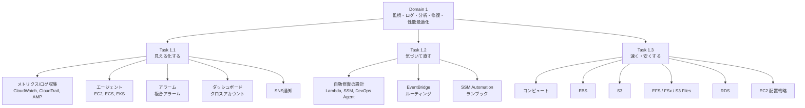

### 学習の進め方（おすすめ）

1. **Step 0** で「メトリクス・ログ・イベント・トレース」の違いを押さえる
2. 各Stepは **「何のための機能か → 仕組み → 手順 → ベストプラクティス → 試験で狙われる点」** の順で読む
3. Mermaidの図は「判断の流れ」を表している。**自分で図を再現できる**ようになれば合格圏
4. 最後に **Step 16（ひっかけ）** と **Step 17（練習問題）** で定着確認

---

## Step 0. 前提知識：オブザーバビリティの全体像

### 0-1. 4つのデータ種別

運用で扱うデータは大きく4種類あります。**「何を見たいか」で使うサービスが決まる**のが基本です。

| 種別 | 一言で言うと | 代表的なAWSサービス | 典型的な質問 |
|---|---|---|---|
| メトリクス | 数値の時系列 | CloudWatch Metrics, Amazon Managed Service for Prometheus | CPUは何%？ エラー率は？ |
| ログ | テキストの記録 | CloudWatch Logs | どんなエラーが出た？ |
| イベント | 状態変化の通知 | EventBridge, CloudTrail | 何が起きた？ 誰が操作した？ |
| トレース | リクエストの経路 | AWS X-Ray, CloudWatch Application Signals | どこで遅い？ |

### 0-2. CloudWatch と CloudTrail の違い（超頻出）

| 観点 | Amazon CloudWatch | AWS CloudTrail |
|---|---|---|
| 目的 | **リソースやアプリの状態**を監視 | **APIコール（誰が・いつ・何をしたか）** を記録 |
| 主なデータ | メトリクス、ログ、アラーム | 管理イベント、データイベント、Insightsイベント |
| 典型的な質問 | 「CPUが高い」 | 「誰がセキュリティグループを変更した？」 |
| 保存期間 | メトリクスは最大455日（解像度で変化） | イベント履歴は90日（証跡をS3に出せば無期限） |

### 0-3. CloudWatchメトリクスの基礎用語

| 用語 | 意味 | 例 |
|---|---|---|
| Namespace | メトリクスの名前空間 | `AWS/EC2`, `AWS/RDS`, `CWAgent` |
| Metric | 監視する値の名前 | `CPUUtilization` |
| Dimension | メトリクスを絞り込むキー/値 | `InstanceId=i-0123...` |
| Statistic | 集計方法 | Average, Sum, Maximum, p99 |
| Period | 集計の期間（秒） | 60, 300 |
| Resolution | 粒度 | 標準=60秒、高解像度=1秒（カスタムのみ） |

**メトリクスの保持期間（データポイントの粒度ごと）**

| 粒度 | 保持期間 |
|---|---|
| 1秒未満〜60秒未満（高解像度） | 3時間 |
| 60秒（1分） | 15日 |
| 300秒（5分） | 63日 |
| 3,600秒（1時間） | 455日（15か月） |

> 古いデータは自動的に粗い粒度へ集約されて残ります。

### 0-4. EC2が「標準では報告しない」もの（超重要）

EC2の標準メトリクス（`AWS/EC2`）はハイパーバイザー側から見える値だけです。

| 見える（標準） | 見えない（CloudWatchエージェントが必要） |
|---|---|
| CPUUtilization, NetworkIn/Out, DiskReadOps（インスタンスストア）, StatusCheckFailed | **メモリ使用率、ディスク使用率（空き容量）、スワップ、プロセス情報** |

- 基本モニタリング = **5分間隔（無料）**、詳細モニタリング = **1分間隔（有料）**
- 「メモリ使用率でアラームを作りたい」→ **CloudWatchエージェント**（Step 2）

---

## Step 1. 監視・ログ基盤の構築（Skill 1.1.1）

> **Skill 1.1.1**: CloudWatch、CloudTrail、Amazon Managed Service for Prometheus などを使い、ワークロード（サーバーレス、コンピュート、AIなど）の監視とログを構成する

### 1-1. 全体像

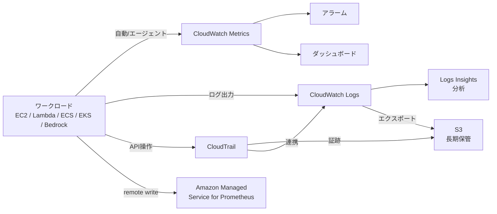

### 1-2. CloudWatch Metrics

- 多くのAWSサービスが **自動で** メトリクスを送信（EC2、RDS、Lambda、ALBなど）
- **カスタムメトリクス**は `PutMetricData` API、CloudWatchエージェント、**Embedded Metric Format（EMF）** で送信
- **高解像度メトリクス**（1秒粒度）はカスタムメトリクスのみ
- **Metric Math**: 複数メトリクスから計算（例: エラー率 = Errors / Invocations × 100）
- **異常検知（Anomaly Detection）**: 機械学習で期待値の帯を作り、帯を外れたらアラーム

### 1-3. CloudWatch Logs

#### 構造

| 階層 | 説明 |
|---|---|
| ロググループ | 保持期間・暗号化・アクセス権を共有する単位（例: `/aws/lambda/my-func`） |
| ログストリーム | 同一ソースのイベント列（例: インスタンスごと） |
| ログイベント | 1行（タイムスタンプ＋メッセージ） |

#### 主要機能

| 機能 | 役割 | 覚えるポイント |
|---|---|---|
| **保持期間設定** | ログの自動削除 | **デフォルトは無期限**＝放置するとコスト増。必ず設定 |
| **メトリクスフィルター** | ログ中のパターンを数値メトリクスに変換 | **作成後に取り込まれたログにのみ適用**（過去分は遡及しない） |
| **サブスクリプションフィルター** | ログをリアルタイムで他サービスへ転送 | 宛先: Kinesis Data Streams / Data Firehose / Lambda など。**1ロググループにつき最大2つ** |
| **Logs Insights** | ログを専用クエリ言語で分析 | その場の調査・集計向け |
| **Live Tail** | ログのリアルタイム tail | デプロイ直後の確認など |
| **Contributor Insights** | 上位の貢献者（IP、ユーザー等）を特定 | 「どのIPが大量リクエスト？」 |
| **S3へのエクスポート** | 長期アーカイブ | 即時ではなくタスクとして実行 |

#### Logs Insights クエリ例（エラーの時間帯別件数）

```
fields @timestamp, @message
| filter @message like /ERROR/
| stats count(*) as errorCount by bin(5m)
| sort errorCount desc
```

#### メトリクスフィルター → アラームの流れ（頻出パターン）

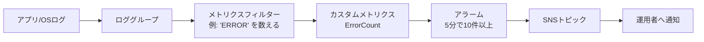

### 1-4. AWS CloudTrail

| 項目 | 説明 |
|---|---|
| 管理イベント | リソースの作成・変更・削除などコントロールプレーン操作。**デフォルトで記録** |
| データイベント | S3オブジェクト操作、Lambda Invokeなど。**デフォルトOFF（有料・要有効化）** |
| Insightsイベント | 通常と異なるAPIコール量・エラー率を検出 |
| イベント履歴 | **過去90日分の管理イベント**を無料で閲覧（証跡なしでも可） |
| 証跡（Trail） | S3へ継続的に配信。**全リージョン／Organizations全体**の証跡も作れる |
| CloudTrail Lake | イベントをSQLで分析できるマネージドデータストア |
| ログファイル整合性検証 | 改ざん検知（ダイジェストファイル） |
| CloudWatch Logs連携 | 証跡をロググループに送り、**メトリクスフィルター＋アラーム**で検知（例: ルートユーザー使用） |

> 「**誰が**EC2を削除したか調べたい」→ CloudTrail。「EC2のCPUが高い」→ CloudWatch。

### 1-5. Amazon Managed Service for Prometheus（AMP）

- **Prometheus互換**のフルマネージドなメトリクス監視。コンテナ（EKS/ECS）やKubernetesの監視でよく使う
- クエリは **PromQL**。データ取り込みは Prometheus サーバーや OpenTelemetry コレクターからの **remote write**、またはマネージドな **スクレイパー**（EKS向け）
- 保存先の単位は **ワークスペース**
- 可視化は通常 **Amazon Managed Grafana** と組み合わせる
- 使い分け: 「既存のPrometheus資産/PromQLを活かしたい、Kubernetes中心」→ AMP。「AWSサービスのメトリクスを手軽に」→ CloudWatch

### 1-6. ワークロード別の監視ポイント

| ワークロード | 見るべき主なメトリクス/ログ | 補足 |
|---|---|---|
| **Lambda（サーバーレス）** | `Invocations`, `Errors`, `Duration`, `Throttles`, `ConcurrentExecutions`, `IteratorAge`（ストリーム処理） | ログは自動で `/aws/lambda/関数名` に出力。**Lambda Insights**で詳細、X-Rayでトレース |
| **API Gateway** | `Count`, `4XXError`, `5XXError`, `Latency`, `IntegrationLatency` | アクセスログ/実行ログを有効化 |
| **SQS** | `ApproximateNumberOfMessagesVisible`, `ApproximateAgeOfOldestMessage` | 滞留（消費が遅い）の検知 |
| **EC2（コンピュート）** | `CPUUtilization`, `StatusCheckFailed*`, ネットワーク、（エージェントで）メモリ/ディスク | Step 2 |
| **ECS / EKS** | CPU/メモリ使用率、タスク/Pod数、再起動回数 | **Container Insights**、エージェント（Step 2） |
| **AI（例: Amazon Bedrock）** | `AWS/Bedrock` 名前空間の呼び出し数・レイテンシ・エラー・スロットル等 | **モデル呼び出しログ**をCloudWatch LogsまたはS3へ出力可能 |

### 1-7. ベストプラクティス

| # | ベストプラクティス | 理由 |
|---|---|---|
| 1 | **ロググループに保持期間を必ず設定** | デフォルト無期限でコスト肥大 |
| 2 | **全リージョンの証跡（できればOrganization証跡）** を作り、S3へ配信＋整合性検証ON | 監査・フォレンジック |
| 3 | 長期保管は **S3 + ライフサイクル** へ | ログ保管コスト最適化 |
| 4 | 重要ログは **メトリクスフィルター＋アラーム** で検知を自動化 | 目視運用をなくす |
| 5 | 構造化ログ（JSON）にする | Logs Insightsで列として扱え、EMFも使える |
| 6 | 高解像度メトリクスは本当に必要な場合のみ | コスト増 |
| 7 | **タグ**でリソースを分類し、監視対象の絞り込みに活用 | 運用の自動化・可視化 |

### 1-8. ここが試験で狙われる

- 「メモリ使用率が取れない」→ **CloudWatchエージェント**
- 「ログを他アカウント/他サービスへリアルタイム転送」→ **サブスクリプションフィルター**
- 「過去ログにメトリクスフィルターを適用したい」→ **遡及不可**（Logs Insightsで分析）
- 「APIの操作者を特定」→ **CloudTrail**
- 「Kubernetesで既存のPromQLを使いたい」→ **AMP**

---

## Step 2. CloudWatchエージェント（Skill 1.1.2）

> **Skill 1.1.2**: CloudWatchエージェントを構成・管理し、EC2、Amazon ECS、Amazon EKS からメトリクスとログを収集する

### 2-1. エージェントとは

OS内部で動くソフトウェアで、**メモリ・ディスク・スワップ・プロセス**などのOSレベルのメトリクスと、**ファイルのログ**をCloudWatchへ送ります。Linux / Windows / macOS に対応。オンプレミスサーバーにも導入できます（ハイブリッド監視）。

### 2-2. EC2へ導入する手順（ステップバイステップ）

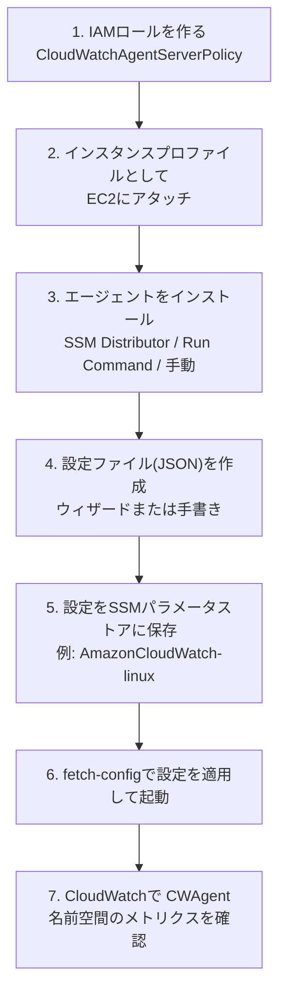

| 手順 | コマンド/操作の例 |
|---|---|
| ウィザード | `sudo /opt/aws/amazon-cloudwatch-agent/bin/amazon-cloudwatch-agent-config-wizard` |
| 設定適用（SSM保管の設定） | `sudo /opt/aws/amazon-cloudwatch-agent/bin/amazon-cloudwatch-agent-ctl -a fetch-config -m ec2 -s -c ssm:AmazonCloudWatch-linux` |
| 状態確認 | `amazon-cloudwatch-agent-ctl -a status` |

### 2-3. 設定ファイル（JSON）の骨格

```json
{
  "agent": { "metrics_collection_interval": 60 },
  "metrics": {
    "append_dimensions": {
      "InstanceId": "${aws:InstanceId}",
      "AutoScalingGroupName": "${aws:AutoScalingGroupName}"
    },
    "metrics_collected": {
      "mem":  { "measurement": ["mem_used_percent"] },
      "disk": { "measurement": ["used_percent"], "resources": ["/"] },
      "swap": { "measurement": ["swap_used_percent"] }
    }
  },
  "logs": {
    "logs_collected": {
      "files": {
        "collect_list": [
          {
            "file_path": "/var/log/messages",
            "log_group_name": "/ec2/messages",
            "log_stream_name": "{instance_id}",
            "retention_in_days": 30
          }
        ]
      }
    }
  }
}
```

- 既定の名前空間は **`CWAgent`**
- メトリクス名の例: `mem_used_percent`, `disk_used_percent`
- ログ収集は `logs_collected` の `collect_list`
- `procstat`（プロセス監視）、**StatsD / collectd**（カスタムメトリクス受信）も利用可能
- `append_dimensions` で **Auto Scalingグループ単位の集約**ができる

### 2-4. ECS・EKSでの収集

| 環境 | 方法 | ポイント |
|---|---|---|
| **EC2上の単体** | 上記手順 | IAMインスタンスプロファイル |
| **ECS** | クラスター設定で **Container Insights** を有効化。EC2起動タイプでは **エージェントをDaemonサービス（またはサイドカー）** として配置 | タスクロールに適切な権限。ログは `awslogs` ドライバー or **FireLens**（Fluent Bit） |
| **EKS** | **Amazon CloudWatch Observability アドオン**（EKS add-on）を導入 | エージェント＋ログ転送（Fluent Bit）をまとめてデプロイ。権限は **IRSA / EKS Pod Identity** |

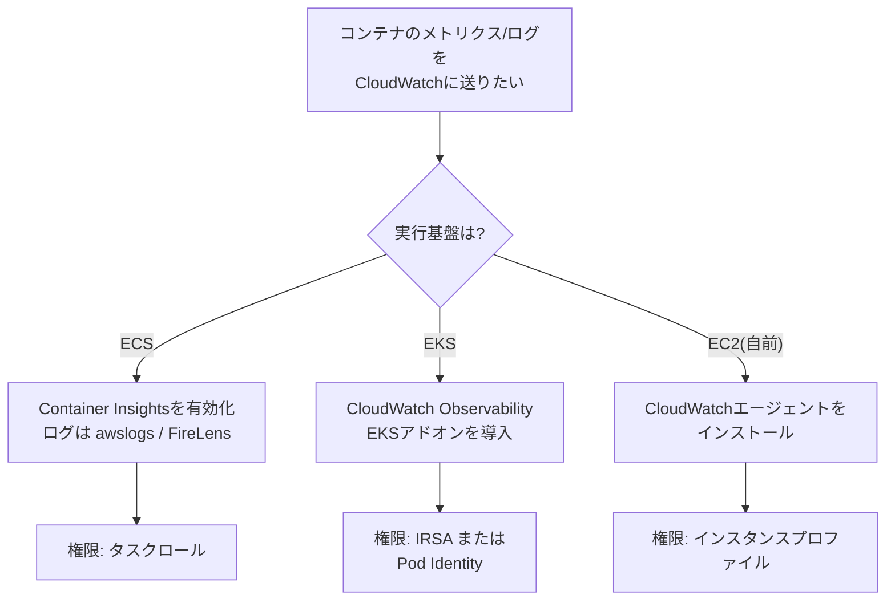

### 2-5. トラブルシュート（エージェントが動かない時）

| 症状 | 確認ポイント |
|---|---|
| メトリクス/ログが届かない | **IAMロール/権限**（`CloudWatchAgentServerPolicy`）がついているか |
| 同上 | **ネットワーク**: パブリックなら IGW/NAT、プライベートなら **VPCエンドポイント**（CloudWatch Logs / monitoring） |
| 設定が反映されない | `fetch-config` 実行済みか、JSON構文エラーがないか |
| エージェントのログ | Linuxなら `/opt/aws/amazon-cloudwatch-agent/logs/amazon-cloudwatch-agent.log` |
| SSMで一括配布できない | インスタンスが **SSM管理対象**（SSM Agent＋ロール）か |

### 2-6. ベストプラクティス

| # | ベストプラクティス | 理由 |
|---|---|---|
| 1 | **設定はSSMパラメータストアで一元管理**し、全台へ同じ設定を配布 | 設定ドリフト防止 |
| 2 | エージェントのインストール/更新は **Systems Manager（Distributor / State Manager）** で自動化 | 手作業の排除 |
| 3 | **AMIやLaunch Templateのユーザーデータ**に組み込む | Auto Scalingで増えた台数も自動で監視される |
| 4 | **最小権限のIAM**。ログ送信先ロググループを限定 | セキュリティ |
| 5 | 収集項目を絞る（メトリクス間隔・ログ対象） | コスト最適化 |
| 6 | ログに**保持期間**を設定（`retention_in_days`） | コスト最適化 |

### 2-7. ここが試験で狙われる

- 「メモリ/ディスク使用率の監視」「ログをCloudWatch Logsへ」→ **エージェント**（標準メトリクスでは不可）
- 「多数のインスタンスへ同じ設定を配布」→ **SSMパラメータストア＋Run Command/State Manager**
- 「EKSでコンテナログとメトリクスを簡単に」→ **CloudWatch Observability アドオン**
- 「権限不足でデータが届かない」→ **IAMロール**

---

## Step 3. CloudWatchアラーム（Skill 1.1.3）

> **Skill 1.1.3**: AWSサービスを直接、またはEventBridge経由で呼び出せるCloudWatchアラームを構成・識別・トラブルシュートする（複合アラームと、その実行可能なアクションを含む）

### 3-1. アラームの種類

| 種類 | 概要 |
|---|---|
| **メトリクスアラーム** | 1つのメトリクス（またはMetric Math式）をしきい値と比較 |
| **異常検知アラーム** | 機械学習が作る期待値の帯を外れたら発報 |
| **複合アラーム（Composite）** | 他のアラームの状態を `AND / OR / NOT` で組み合わせる |

### 3-2. アラームの3つの状態

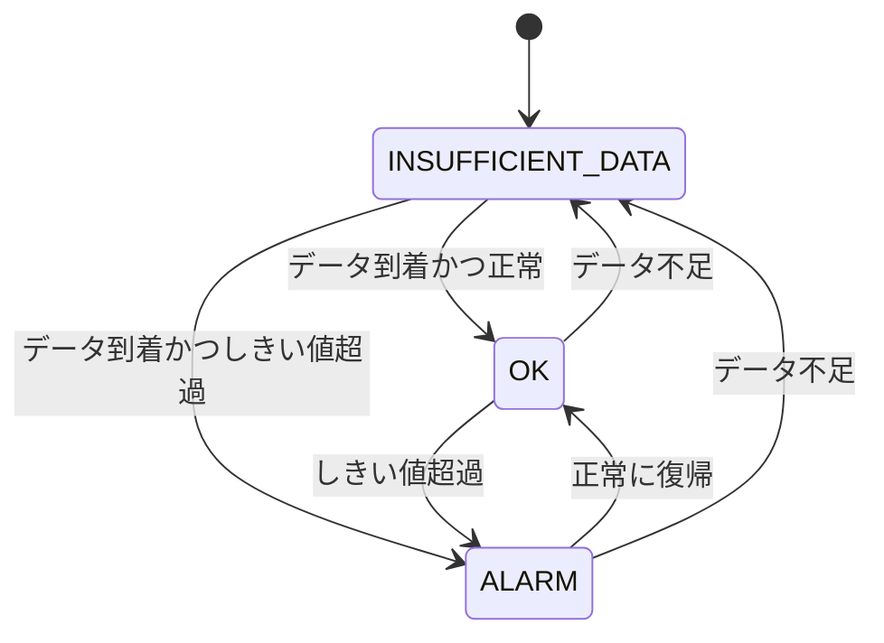

| 状態 | 意味 |
|---|---|
| **OK** | しきい値を超えていない |
| **ALARM** | しきい値を超えた |
| **INSUFFICIENT_DATA** | データが足りず判定できない（開始直後、メトリクス停止など） |

### 3-3. 設定項目（アラームの「頭の中」）

| 項目 | 意味 | ポイント |
|---|---|---|
| Period | 1データポイントの集計期間 | 標準は60の倍数秒、高解像度は10/30秒も可 |
| Evaluation Periods | 評価する期間数（N） | |
| **Datapoints to Alarm** | N期間のうちM個超過で発報（**M out of N**） | 一瞬のスパイクで鳴らさない工夫 |
| Threshold / Comparison | しきい値と比較演算子 | |
| **Treat missing data** | データ欠損の扱い | `missing`（既定・状態維持）/ `notBreaching`（正常扱い）/ `breaching`（超過扱い）/ `ignore` |

> **使い分け例**: バッチなど「データが出ない＝正常」なメトリクスは `notBreaching`。**死活監視（データが来ない＝異常）** は `breaching`。

### 3-4. アラームのアクション（直接呼び出せるもの）

| アクション | 通常のメトリクスアラーム | 複合アラーム |
|---|---|---|
| **SNS通知** | ○ | ○ |
| **EC2アクション**（stop / terminate / reboot / **recover**） | ○ | **×** |
| **Auto Scalingアクション**（スケーリングポリシー実行） | ○ | **×** |
| **Lambda関数の直接呼び出し** | ○ | ○ |
| **Systems Manager OpsItem作成**（OpsCenter） | ○ | ○ |
| **Systems Manager Incident Manager のインシデント作成** | ○ | ○ |
| CloudWatch investigations の開始 | ○ | ○ |

> 出典: CloudWatch ユーザーガイド「Using Amazon CloudWatch alarms」。**複合アラームはEC2アクションとAuto Scalingアクションを実行できない**点が出題されやすい。

**アクションの重要ルール**

- アラームは **状態が変化したときだけ** アクションを実行（ALARMに居続けても毎回は呼ばない）。例外として **Auto Scalingアクションは、ALARMの間1分に1回** 実行される
- CloudWatchは **アクションの宛先（存在するか等）を検証しない**。宛先が存在しない・権限がないと静かに失敗する
- **クロスアカウントの複合アラームは作れない**
- アラームの実行を一時的に止める＝**アクションの無効化（`DisableAlarmActions`）** や、複合アラームの **アクション抑制（Actions suppressor）**

### 3-5. EventBridge経由で何でも呼ぶ

アラームの状態変化は **EventBridgeにイベントとして自動配信**されます（`source: aws.cloudwatch`, `detail-type: CloudWatch Alarm State Change`）。直接アクションにないサービス（Step Functions、SSM Automation、Kinesis等）を起動したいときはEventBridgeルールを使います。

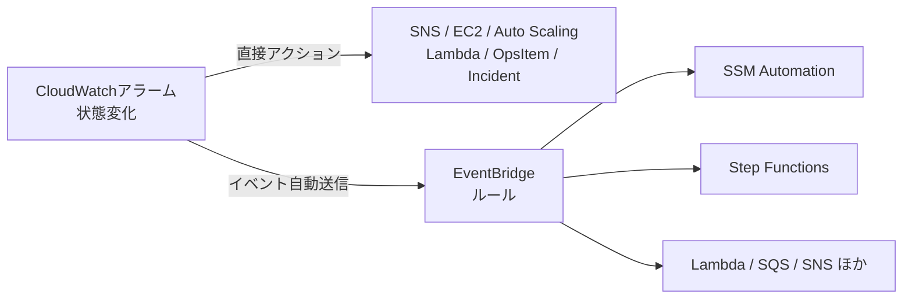

#### EC2の自動復旧（Recover）

- `StatusCheckFailed_System`（**システムステータスチェック**＝AWS側の問題）のアラームに **recoverアクション**
- `StatusCheckFailed_Instance`（インスタンス側＝OSの問題）には **reboot**
- 復旧後も同じインスタンスID・プライベートIP・EBS構成を維持（別ホストへ移動）

### 3-6. 複合アラーム（ノイズ削減の切り札）

```text
ALARM("CPU高") AND ALARM("ディスクI/O高")
```

| 設計 | 例 |
|---|---|
| **AND** | CPU高 **かつ** レイテンシ高のときだけ通知（誤報削減） |
| **OR** | いずれかが異常なら通知 |
| **NOT** | 親アラームがOKのときだけ別アラームを有効に（メンテ中の抑制など） |

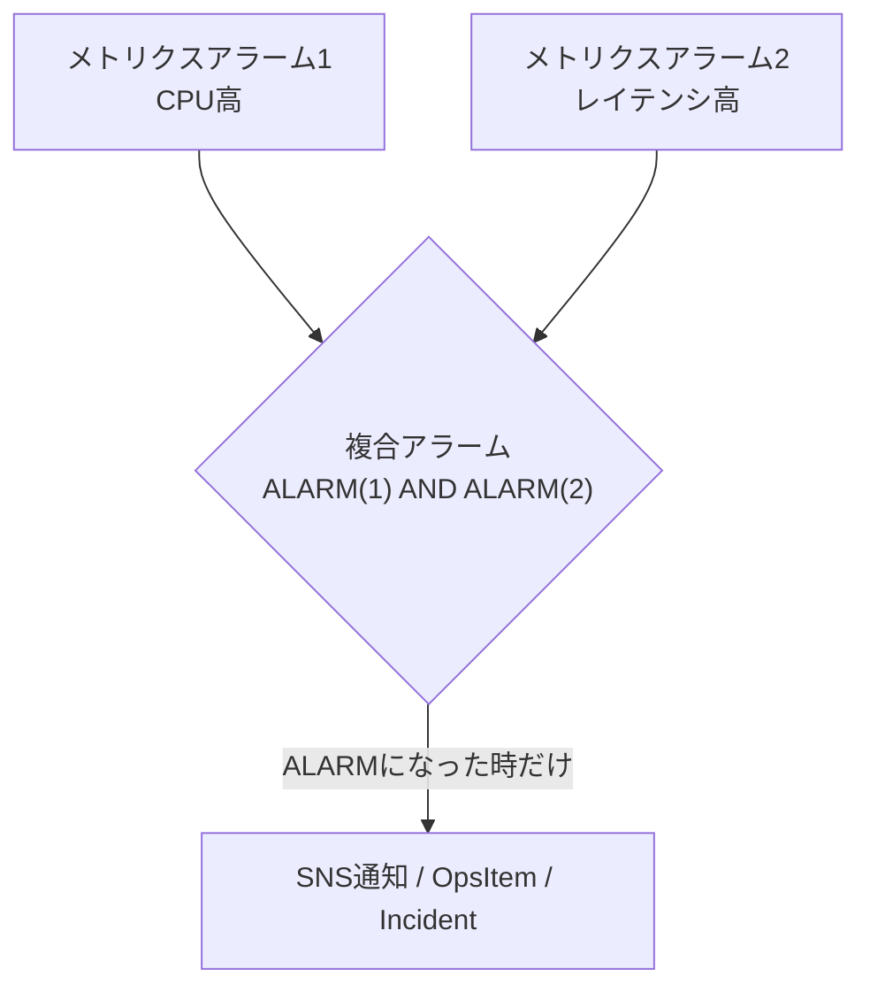

- 個別アラームは通知を付けず、**複合アラームだけに通知**を付けるのが定石
- 複合アラームの **ActionsSuppressor** で、特定アラームがALARMの間（例: メンテナンス中）は通知を抑制できる

### 3-7. トラブルシュート

| 症状 | 原因の候補 | 対処 |
|---|---|---|
| 通知が来ない | SNSトピックのアクセスポリシー、**SNSのKMS暗号化**、サブスクリプション未承認 | Step 5参照 |
| ずっとINSUFFICIENT_DATA | メトリクスが送られていない、**ディメンションの指定ミス**、名前空間ミス、リージョン違い | メトリクスのディメンションを正確に合わせる |
| アクションが実行されない | アクション無効化中、宛先ARN誤り、IAM/リソースポリシー不足 | アクションの有効状態と宛先を確認 |
| 一瞬のスパイクで鳴る | 1/1評価 | **M out of N**に変更 |
| 鳴りっぱなし/鳴らない | **欠損データ処理**の設定 | `Treat missing data` を見直す |
| EC2アクションが複合アラームで動かない | 複合アラームは非対応 | 通常のメトリクスアラームにアクションを付ける |

### 3-8. ベストプラクティス

| # | ベストプラクティス | 理由 |
|---|---|---|
| 1 | **対応が必要なものだけ**アラーム化し、各アラームに「何をすべきか」を紐づける | アラーム疲れ防止 |
| 2 | **M out of N** と適切な欠損処理を設定 | 誤報・見逃しの削減 |
| 3 | 複合アラームで **ノイズを集約** | オンコール負荷軽減 |
| 4 | 季節性があるメトリクスは **異常検知アラーム** | 固定しきい値では誤報が増える |
| 5 | 自動修復は **EventBridge + SSM Automation / Lambda** で（Step 6〜8） | 人手を介さず復旧 |
| 6 | **IaC（CloudFormation等）でアラームを管理** | 再現性・レビュー可能 |
| 7 | 重要度別にSNSトピックを分ける（例: critical / warning） | 通知先の出し分け |

### 3-9. ここが試験で狙われる

- 「**誤報を減らして**通知を絞りたい」→ **複合アラーム** / M out of N
- 「複合アラームでEC2を停止したい」→ **不可**（通常アラーム or EventBridge→SSM）
- 「システムステータスチェック失敗時の自動復旧」→ **recoverアクション**
- 「データが来ないこと自体を異常にしたい」→ `Treat missing data = breaching`

---

## Step 4. ダッシュボード（Skill 1.1.4）

> **Skill 1.1.4**: 複数アカウント・複数リージョンのAWSリソースのメトリクスとアラームを表示する、カスタマイズ可能で共有可能なCloudWatchダッシュボードを作成・実装・管理する

### 4-1. ダッシュボードとは

メトリクス・アラーム・ログクエリの結果を **ウィジェット** として1画面に並べたもの。**1つのダッシュボードに複数リージョンのメトリクスを表示できます**（ダッシュボード自体はグローバルに利用可能）。

| ウィジェット | 用途 |
|---|---|
| 折れ線 / 積み上げ面 / 棒 / 数値 / ゲージ | メトリクス推移・現在値 |
| **アラームステータス** | 複数アラームの状態を一覧 |
| ログテーブル | Logs Insightsクエリ結果 |
| テキスト | 説明・Runbookへのリンク |
| **自動ダッシュボード** | サービスごとに自動生成される標準ダッシュボード |

### 4-2. クロスアカウント・クロスリージョンの仕組み

**CloudWatchクロスアカウントオブザーバビリティ**（Observability Access Manager = OAM）を使います。

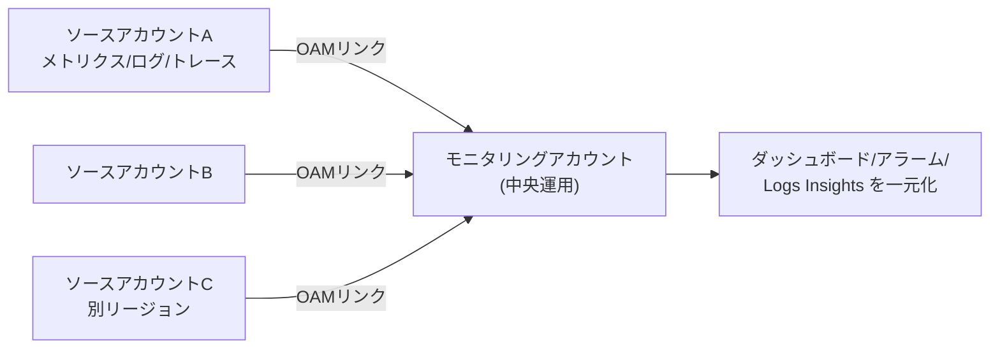

| 用語 | 意味 |
|---|---|
| **モニタリングアカウント** | 複数のソースを閲覧する中央アカウント |
| **ソースアカウント** | メトリクス・ログ・トレースを共有する側 |
| **シンク（Sink）** | モニタリングアカウント側の受け口 |
| **リンク（Link）** | ソースアカウント側からシンクへの接続 |

- **AWS Organizations** 全体や組織単位（OU）を指定して一括でリンクできる
- 共有対象はメトリクス・ロググループ・トレース・Application Signals 等から選べる
- 設定はリージョンごと（リージョンをまたぐ場合はそのリージョンのシンク/リンクが必要）

### 4-3. ダッシュボードの共有

| 方法 | 内容 |
|---|---|
| **特定のメールアドレスと共有** | シングルサインオン（SSO）で認証した相手のみ閲覧 |
| **パブリック共有** | 認証なしのURLで公開（**機密情報に注意**） |
| **特定アカウント/IAM** | 閲覧権限（`cloudwatch:GetDashboard` など）を付与 |
| **JSON定義の共有** | ダッシュボード本文（JSON）を IaC で配布（CloudFormation 等） |

### 4-4. ベストプラクティス

| # | ベストプラクティス | 理由 |
|---|---|---|
| 1 | **ダッシュボードはIaC（CloudFormation/CDK）化**して全環境へ展開 | 一貫性・再現性 |
| 2 | **サービスの健全性（可用性/レイテンシ/エラー）** を最上段に配置 | 障害時にすぐ判断 |
| 3 | アラームステータスウィジェットを置く | 一覧で状態把握 |
| 4 | 中央運用は **OAM（クロスアカウントオブザーバビリティ）** | アカウント切替の手間削減 |
| 5 | **パブリック共有は最小限**。通常はSSO＋メール指定 | 情報漏えい防止 |
| 6 | 変数（プロパティ変数）でリソースを切り替え可能にする | ダッシュボードの乱立防止 |

### 4-5. ここが試験で狙われる

- 「複数アカウントのメトリクス/ログを1か所で見たい」→ **CloudWatchクロスアカウントオブザーバビリティ（OAM）**
- 「社外関係者へ限定共有」→ **特定メールアドレス＋SSO共有**
- 「ダッシュボードを全アカウントに同じ内容で展開」→ **CloudFormationなどのIaC**

---

## Step 5. SNS通知（Skill 1.1.5）

> **Skill 1.1.5**: AWSサービスがAmazon SNSへ通知を送るように構成し、アラームがSNSに通知を送るように設定する

### 5-1. SNSの基本（Pub/Sub）

| 用語 | 意味 |
|---|---|
| トピック | 通知の「掲示板」。発行者が送り、購読者が受け取る |
| パブリッシャー | メッセージを送る側（CloudWatch、S3、Auto Scalingなど） |
| サブスクライバー | 受け取る側 |
| サブスクリプション | トピックと宛先の紐づけ |

**配信先（プロトコル）**: Email / Email-JSON / SMS / HTTP(S) / **Lambda** / **SQS** / **Data Firehose** / モバイルプッシュ

| トピック種別 | 特徴 |
|---|---|
| **Standard** | 高スループット、順序保証なし、**少なくとも1回**配信 |
| **FIFO** | 順序保証＋重複排除（購読先は主にSQS FIFO） |

### 5-2. アラーム → SNS の設定手順

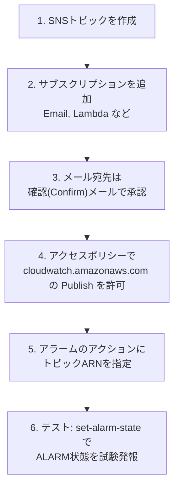

テスト用CLI例:

```bash
aws cloudwatch set-alarm-state \
  --alarm-name my-alarm --state-value ALARM --state-reason "test"
```

### 5-3. AWSサービス → SNS の代表例

| サービス | 何を通知するか |
|---|---|
| **CloudWatchアラーム** | 状態変化 |
| **S3イベント通知** | オブジェクト作成/削除 など |
| **Auto Scaling** | 起動/終了などのスケーリング通知 |
| **RDSイベントサブスクリプション** | フェイルオーバー、メンテナンス、バックアップ等のイベント |
| **CloudFormation** | スタックイベント通知 |
| **AWS Budgets / Backup / Config** | 予算超過、ジョブ失敗、コンプライアンス変更など |
| **EventBridge（ターゲット）** | 任意のイベントの通知先 |

> **SNSトピックのアクセスポリシー（リソースベースポリシー）** で、通知元サービス（例: `s3.amazonaws.com`, `events.amazonaws.com`, `cloudwatch.amazonaws.com`）に `sns:Publish` を許可する必要があります。

### 5-3b. 「通知が届かない」あるある

| 症状 | 原因 | 対処 |
|---|---|---|
| アラームが鳴ったがメールが来ない | **サブスクリプション未承認（Pending confirmation）** | 確認メールのリンクをクリック |
| 同上 | **トピックのKMS暗号化に AWSマネージドキー（`aws/sns`）を使用** → CloudWatch/EventBridgeなどがキーを使えない | **カスタマー管理キー**に変更し、キーポリシーで `cloudwatch.amazonaws.com` 等に `kms:Decrypt`/`kms:GenerateDataKey` を許可 |
| 同上 | SNSアクセスポリシーが通知元を許可していない | ポリシーに `sns:Publish` を追加 |
| 同上 | リージョン違い（アラームとSNSで不一致） | 同一リージョンのトピックを指定（クロスリージョン/クロスアカウントはポリシーが必要） |
| 一部の購読者だけ届かない | **フィルターポリシー**に一致していない | フィルターポリシー確認 |
| HTTP/Lambda宛が失敗 | 配信ポリシー、エンドポイント側エラー | **配信ステータスログ**／**DLQ**（サブスクリプションの送達不能キュー） |

### 5-4. チャットツールへの通知

- **Amazon Q Developer in chat applications（旧 AWS Chatbot）** でSNSトピックを購読し、**Slack / Microsoft Teams** にアラームを通知、さらにチャットからCLI操作も可能
- **AWS User Notifications** で通知を一元管理する方法もある

### 5-5. ベストプラクティス

| # | ベストプラクティス | 理由 |
|---|---|---|
| 1 | 重要度別（critical/warning/info）にトピックを分離 | 通知先の出し分け |
| 2 | 個人メールでなく **配信リスト/チャット/ページングツール** を購読 | 担当者不在・退職対策 |
| 3 | **サブスクリプションフィルターポリシー** で必要な通知だけ配信 | ノイズ削減 |
| 4 | トピックは **カスタマー管理KMSキーで暗号化**し、通知元にキー権限を付与 | 暗号化と通知の両立 |
| 5 | **DLQ** と配信ステータスログを有効化 | 失敗の検知・再処理 |
| 6 | ポリシーは **`aws:SourceArn` / `aws:SourceAccount` 条件で制限** | 混同代理（confused deputy）防止 |

### 5-6. ここが試験で狙われる

- 「アラームの通知がメールで届かない」→ **サブスクリプション承認／KMSキー／トピックポリシー** の3点セット
- 「RDSのフェイルオーバーを通知」→ **RDSイベントサブスクリプション（SNS）**
- 「SlackにCloudWatchアラームを通知」→ **SNS → Amazon Q Developer in chat applications**

---

## Step 6. メトリクス分析と自動修復（Skill 1.2.1）

> **Skill 1.2.1**: パフォーマンスメトリクスを分析し、AWSサービスと機能（CloudWatch、Lambda、Systems Manager、CloudTrail、Kiro、AWS DevOps Agent など）で修復戦略を自動化する

### 6-1. 自動修復の基本パターン「検知 → 判断 → 実行」

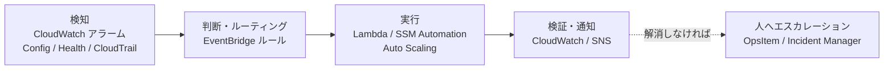

### 6-2. 代表的な「症状 → 原因 → 自動修復」

| 症状（メトリクス） | 考えられる原因 | 自動修復の例 |
|---|---|---|
| EC2の `StatusCheckFailed_System` | 基盤ハードウェア障害 | アラームの **recoverアクション** |
| EC2の `StatusCheckFailed_Instance` | OSハング | アラームの **rebootアクション**、またはSSM Automationで再起動 |
| Webサーバーの `CPUUtilization` 高 | 負荷増 | **Auto Scaling**（ターゲット追跡） |
| ディスク使用率（エージェント）高 | ログ肥大化 | **SSM Run Command / Automation** でログ削除・ローテーション |
| Lambdaの `Throttles` 増 | 同時実行の上限 | 予約同時実行／クォータ引き上げ、**ProvisionedConcurrency** |
| Lambda `Errors` 急増 | デプロイ起因 | エイリアスの**ロールバック**（CodeDeploy連携など） |
| SQS `ApproximateAgeOfOldestMessage` 増 | 消費が追いつかない | コンシューマーのスケールアウト |
| RDS `FreeStorageSpace` 低下 | データ増加 | ストレージ自動スケーリング有効化／拡張 |

### 6-3. 各サービスの役割分担

| サービス | 役割 |
|---|---|
| **CloudWatch** | 検知（メトリクス/ログ/アラーム）、調査（Logs Insights、Application Signals）、AI支援の **CloudWatch investigations** |
| **Lambda** | 軽量でカスタムな修復ロジック（API呼び出し、タグ付け、通知整形など） |
| **Systems Manager** | **Automation（ランブック）**、Run Command、OpsCenter（OpsItem）、**Incident Manager**、Patch Manager、State Manager |
| **CloudTrail** | 「誰が/何が変えたか」の原因調査。**CloudTrailイベントはEventBridge経由で検知** して自動対応も可 |
| **EventBridge** | イベントのルーティング、スケジュール実行 |
| **Auto Scaling** | 容量の自動調整 |

### 6-4. AI支援ツール：Kiro と AWS DevOps Agent

> ここは試験ガイドに新しく入った領域です。**「何ができる/何に使うか」**のレベルで押さえましょう。操作の細部が問われる可能性は低く、役割の理解が中心です。

| ツール | 位置づけ | 運用での使いどころ |
|---|---|---|
| **Kiro** | AWSの **エージェント型AI開発環境**（IDE/CLI）。仕様駆動の開発支援。AWS向けのMCPサーバー等と連携可能 | 修復スクリプト、ランブック（SSM Automationドキュメント）、IaCの**作成・レビュー**を支援する（人が内容を確認して適用） |
| **AWS DevOps Agent** | **生成AIによる自律的な運用エージェント（フロンティアエージェント）**。2026年3月31日に一般提供（GA）。アラートを契機にインシデントを自動調査し、メトリクス・ログ・トレース・直近のデプロイを相関分析して原因仮説と緩和策を提示 | 夜間・休日のインシデント一次調査、根本原因分析（RCA）、再発防止の提案 |

DevOps Agentのポイント:

- トリガー: CloudWatch、PagerDuty、Datadog、Dynatrace、ServiceNow 等のアラートやWebhook
- 連携: CloudWatch、Datadog、Dynatrace、New Relic、Splunk、Grafana、GitHub、GitLab など。AWS以外（マルチクラウド/オンプレ）も対象
- **CloudWatchアラームから自動起動する場合は、SNS → Lambda → Webhook のような中継構成**を組む（直接統合ではなく、Webhook経由）
- 課金: エージェントが作業に費やした時間に応じた従量課金（秒単位）

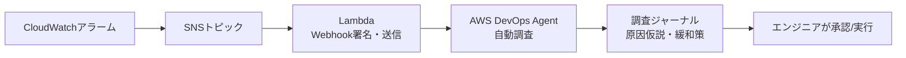

> **ベストプラクティス**: AI支援は「調査と提案を速くする」ためのもの。**本番変更は承認フロー（SSM Automationの承認ステップ、Change Manager等）を残す**、権限は最小限にする、という運用の基本は変わりません。

### 6-5. ベストプラクティス

| # | ベストプラクティス | 理由 |
|---|---|---|
| 1 | **冪等（何度実行しても同じ結果）** な修復にする | 再実行・重複起動に安全 |
| 2 | 修復の **前後で通知＋ログ（CloudTrail/CloudWatch）** を残す | 監査・検証 |
| 3 | 破壊的操作（終了・削除）は **承認ステップ** や対象の絞り込み（タグ）を入れる | 事故防止 |
| 4 | まず **Automationの標準ランブック** を使い、足りなければカスタム | 保守性 |
| 5 | **ループ（修復が新たな障害を呼ぶ）** を防ぐ。回数制限・クールダウン | 暴走防止 |
| 6 | 修復の失敗を **OpsItem/インシデント** にエスカレーション | 人の介入に確実に繋ぐ |
| 7 | 実行ロール（Automation Assume Role / Lambda実行ロール）は **最小権限** | セキュリティ |

### 6-6. ここが試験で狙われる

- 「メトリクス異常をトリガーに**自動で**対処」→ **CloudWatchアラーム → EventBridge/直接アクション → Lambda or SSM Automation**
- 「誰が設定を変更したか調べ、変更に自動対応」→ **CloudTrail → EventBridge**
- 「夜間のインシデント一次調査を自動化」→ **AWS DevOps Agent**
- 「修復用のスクリプト/ランブックをAI支援で作る」→ **Kiro**

---

## Step 7. EventBridge（Skill 1.2.2）

> **Skill 1.2.2**: EventBridgeを使ってイベントをルーティング・補強（enrich）・配信し、イベントバスルールの問題をトラブルシュートする

### 7-1. EventBridgeとは

**イベント（JSON）を受け取り、ルールで一致したものをターゲットへ届ける**サーバーレスのイベントバス。以前の「CloudWatch Events」の後継（同じ基盤）。

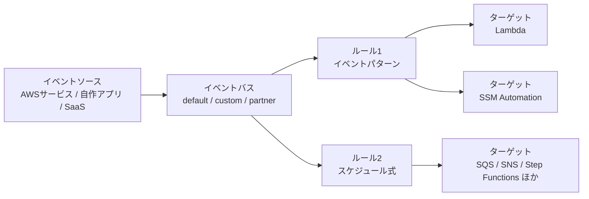

| 概念 | 説明 |
|---|---|
| **イベントバス** | イベントの受け口。`default`（AWSサービスのイベントが届く）、`custom`（自作アプリ用）、`partner`（SaaS） |
| **ルール** | 「どのイベントを」「どこへ」。**イベントパターン** or **スケジュール（cron/rate）** |
| **ターゲット** | 送信先。1ルールに最大5つ（Lambda、SNS、SQS、Step Functions、SSM Automation/Run Command、ECSタスク、Kinesis、API宛先 など） |
| **アーカイブ/リプレイ** | イベントを保存し、あとで再送して検証・復旧 |
| **スキーマレジストリ** | イベントの構造を検出・管理 |
| **EventBridge Scheduler** | 大規模・1回限り/繰り返しのスケジュール実行専用 |

### 7-2. イベントパターンの書き方（例：EC2停止の検知）

```json
{
  "source": ["aws.ec2"],
  "detail-type": ["EC2 Instance State-change Notification"],
  "detail": { "state": ["stopped", "terminated"] }
}
```

- パターンに書いたフィールドは **すべて**（AND）一致が必要。配列内の値は **いずれか**（OR）一致
- 文字列は **大文字小文字を区別**
- 数値・プレフィックス・`anything-but`・`exists` などの高度なマッチングも可能

### 7-3. 「Route（経路）・Enrich（補強）・Deliver（配信）」

試験ガイドの表現どおり、3つの観点で整理します。

| 観点 | 何をする | 主な機能 |
|---|---|---|
| **Route（ルーティング）** | 適切な宛先へ振り分ける | イベントパターン、複数ターゲット、**クロスアカウント/クロスリージョンのバス間転送**（リソースポリシー） |
| **Enrich（補強）** | イベントを加工・追加情報を付与 | **入力トランスフォーマー**（Input Path / Template）、**EventBridge Pipes**の **フィルター＋エンリッチメント（Lambda/API Gateway/API宛先など）** |
| **Deliver（配信）** | 確実に届ける | **リトライポリシー**（既定: 最大24時間・185回）、**DLQ（SQS）**、API宛先、アーカイブ/リプレイ |

#### EventBridge Pipes（ポイント to ポイント）

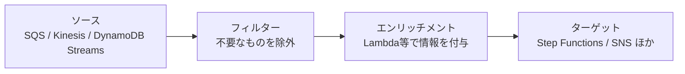

- **Pipes** = 1つのソースから1つのターゲットを繋ぎ、途中で **フィルター → エンリッチメント** を挟める
- **イベントバス** = 多対多のルーティング（ルールで振り分け）

### 7-4. EventBridgeの典型ユースケース

| やりたいこと | 構成 |
|---|---|
| EC2が停止したら通知 | EC2状態変更イベント → SNS |
| 毎日深夜に処理を起動 | **スケジュールルール**（cron）→ Lambda/SSM |
| 誰かがセキュリティグループを変更したら自動で元に戻す | **CloudTrail（API呼び出し）イベント** → Lambda/SSM Automation |
| CloudWatchアラーム起点で複雑な処理 | アラーム状態変更イベント → Step Functions |
| 他アカウントのイベントを集約 | 送信元バスのルールのターゲットに宛先アカウントのバスを指定（宛先側にリソースポリシー） |
| AWS Healthイベント（計画メンテ・障害）の通知 | Healthイベント → SNS/チャット |

### 7-5. トラブルシュート：ルールが動かない時の確認順

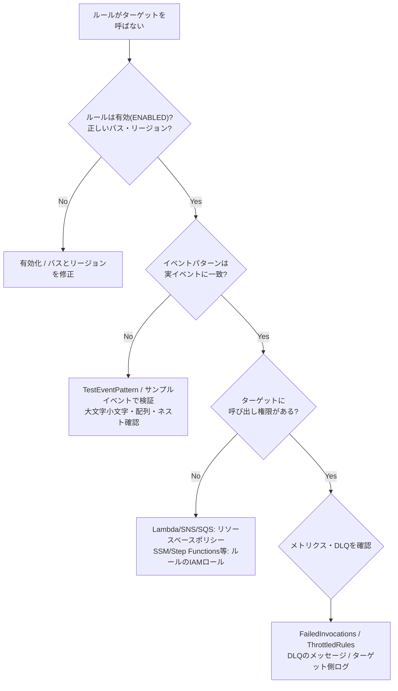

| 症状 | 原因 | 対処 |
|---|---|---|
| ルールがトリガーされない | **イベントパターン不一致**（`detail-type`の綴り、大文字小文字） | `TestEventPattern` で検証、実イベントをログに出して比較 |
| 同上 | **別リージョン/別バス**にイベントが届いている | ルールを正しいリージョン・バスに作成 |
| 同上 | **CloudTrail由来のイベント**なのに証跡/管理イベントの記録が無効 | 管理イベントの記録を確認（**データイベントは証跡で有効化が必要**） |
| トリガーされるが実行されない | **ターゲットの権限不足** | Lambda/SNS/SQS等は**リソースベースポリシー**、SSM Automation/Step Functions/ECS/Kinesis等は**ルールに紐づくIAMロール**で許可 |
| 一部が欠落 | ターゲット側のエラー・スロットル、DLQ未設定 | **DLQ**・リトライ設定、`FailedInvocations` を確認 |
| スケジュール通りに動かない | cron式の誤り（**UTC基準**）、最小間隔 | cron式・タイムゾーンを確認（Schedulerならタイムゾーン指定可） |
| 他アカウントから届かない | 宛先バスの**リソースポリシー**がない | 送信元アカウントに `events:PutEvents` を許可 |
| 加工結果が想定と違う | 入力トランスフォーマーのパス/テンプレートの誤り | サンプルイベントで入力変換をテスト |

**確認に使えるCloudWatchメトリクス（`AWS/Events`）**: `TriggeredRules`, `Invocations`, `FailedInvocations`, `ThrottledRules`, `MatchedEvents` など。

### 7-6. ベストプラクティス

| # | ベストプラクティス | 理由 |
|---|---|---|
| 1 | **ターゲットにDLQ**を設定し、リトライ方針を明示 | 取りこぼし防止 |
| 2 | イベントパターンは**できるだけ具体的**に（`source`, `detail-type`, `detail`） | 余計な呼び出し・コスト削減 |
| 3 | **アーカイブ＆リプレイ**を有効にしておく | 障害復旧・ルール検証 |
| 4 | **クロスアカウント集約**は専用のイベントバスで | ガバナンス |
| 5 | ターゲットの処理は**冪等**に（配信は「少なくとも1回」） | 重複対策 |
| 6 | ルール・バス・ポリシーを **IaC** で管理 | 再現性 |
| 7 | 最小権限（ルールのロールは必要なターゲットのみ） | セキュリティ |

### 7-7. ここが試験で狙われる

- 「イベントに情報を足してから配信」→ **入力トランスフォーマー／EventBridge Pipesのエンリッチメント**
- 「ルールがLambdaを呼べない」→ **Lambdaのリソースベースポリシー**
- 「ルールがSSM Automationを起動できない」→ **ルールのIAMロール**
- 「失敗したイベントを保存して後で再処理」→ **DLQ**、「過去イベントを再送」→ **リプレイ**
- 「cronの時刻がずれる」→ **UTC**

---

## Step 8. Systems Manager Automation（Skill 1.2.3）

> **Skill 1.2.3**: カスタムおよび事前定義の Systems Manager Automation **ランブック**を作成・実行し（AWS SDKやカスタムスクリプトの利用を含む）、タスクを自動化して作業を効率化する

### 8-1. Automationとは

**複数ステップの運用作業をドキュメント（ランブック）として定義し、AWSリソースに対して自動実行する**機能。Run Commandが「インスタンス内でコマンドを実行」するのに対し、Automationは **AWS APIを含む複数ステップのワークフローを調整** します。

| 比較 | Run Command | Automation |
|---|---|---|
| 主な対象 | インスタンス内（OS） | AWSリソース全般（EC2、RDS、S3、IAMなど） |
| 構造 | 単一コマンド/スクリプト | **複数ステップ**（分岐・待機・承認・ループ） |
| 例 | パッケージ更新、ログ削除 | AMI作成→新インスタンス起動→入れ替え、RDSスナップショット→再起動 |

### 8-2. ランブックの構造とアクション

ランブックは **YAML/JSON** のSSMドキュメント（`documentType: Automation`）です。

```yaml
schemaVersion: '0.3'
description: EC2を再起動して正常に戻るまで待つ
assumeRole: '{{ AutomationAssumeRole }}'
parameters:
  InstanceId:
    type: String
  AutomationAssumeRole:
    type: String
mainSteps:
  - name: restart
    action: aws:executeAwsApi
    inputs:
      Service: ec2
      Api: RebootInstances
      InstanceIds:
        - '{{ InstanceId }}'
  - name: waitOk
    action: aws:waitForAwsResourceProperty
    timeoutSeconds: 600
    inputs:
      Service: ec2
      Api: DescribeInstanceStatus
      InstanceIds:
        - '{{ InstanceId }}'
      PropertySelector: '$.InstanceStatuses[0].InstanceStatus.Status'
      DesiredValues:
        - ok
```

| 主なアクション | 用途 |
|---|---|
| `aws:executeAwsApi` | 任意のAWS APIを呼ぶ |
| `aws:runCommand` | インスタンス内でコマンド実行 |
| `aws:executeScript` | **Python / PowerShell / Node.js のスクリプトをインラインで実行**（SDKを使ったカスタム処理） |
| `aws:invokeLambdaFunction` | Lambda呼び出し |
| `aws:changeInstanceState` | EC2の起動/停止 |
| `aws:createImage` | AMI作成 |
| `aws:waitForAwsResourceProperty` | リソースが望む状態になるまで待機 |
| `aws:branch` | 条件分岐 |
| `aws:approve` | **人の承認**を待つ |
| `aws:sleep` | 一定時間待機 |

### 8-3. 事前定義（AWS管理）ランブックとカスタムランブック

| 種類 | 例 | 使いどころ |
|---|---|---|
| **AWS管理（事前定義）** | `AWS-RestartEC2Instance`, `AWS-StopEC2Instance`, `AWS-CreateImage`, `AWSSupport-*`（トラブルシュート系）, `AWS-UpdateLinuxAmi`, `AWSConfigRemediation-*`（Config修復） | まずはこれを使う |
| **カスタム** | 自社手順をYAMLで定義 | 事前定義で足りない場合 |

### 8-4. 実行方法と対象指定

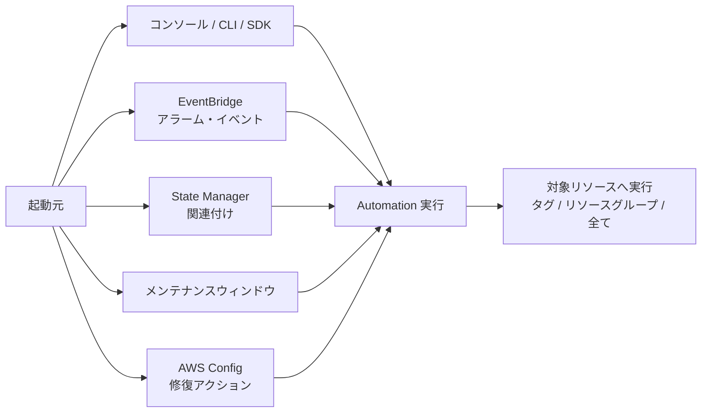

| 設定 | 説明 |
|---|---|
| **AutomationAssumeRole** | Automationが引き受けるIAMロール。**最小権限**で作る。実行者に `iam:PassRole` が必要 |
| **ターゲット指定** | パラメータ指定、**タグ**、**リソースグループ** |
| **レート制御** | **同時実行数（Concurrency）** と **エラーしきい値（Error threshold）**。一定数失敗したら残りを停止して被害拡大を防ぐ |
| **複数アカウント/リージョン** | 1回の実行で複数のアカウント・リージョンへ展開できる |
| **承認** | `aws:approve` で本番変更に人の承認を挟む |
| **実行履歴・出力** | 実行ステータス、ステップ出力、**CloudTrailに記録**、出力をS3/CloudWatch Logsへ |

### 8-5. 典型的なユースケース（具体例）

1. **ゴールデンAMI作成**: 既存インスタンスにパッチ→AMI作成→Launch Template更新
2. **アラーム起点の復旧**: CloudWatchアラーム → EventBridge → `AWS-RestartEC2Instance`
3. **Config非準拠の自動修復**: S3パブリック公開を検知 → `AWSConfigRemediation-*` でブロック
4. **定期メンテ**: メンテナンスウィンドウで RDS スナップショット → インスタンス再起動
5. **EBSの空き容量不足対応**: Automationでボリューム拡張 → OSでファイルシステム拡張（Run Commandとの組み合わせ）

### 8-6. トラブルシュート

| 症状 | 原因 | 対処 |
|---|---|---|
| 実行がすぐ失敗 | **AutomationAssumeRoleの権限不足**／`iam:PassRole`が無い | ロールとポリシーを確認 |
| インスタンス内コマンドが動かない | **SSM管理対象でない**（SSM Agent停止、インスタンスプロファイル未設定、SSMエンドポイントに到達不可） | Fleet Managerでインスタンスが「Online」か確認、VPCエンドポイント確認 |
| 途中で止まる | `timeoutSeconds`超過、承認待ち | ステップ出力とタイムアウト設定を確認 |
| 大量対象で障害が広がる | レート制御なし | **同時実行数・エラーしきい値**を設定 |
| スクリプトが失敗 | `aws:executeScript` のハンドラー名・ランタイム・入出力の誤り | ステップの出力ログを確認 |

### 8-7. ベストプラクティス

| # | ベストプラクティス | 理由 |
|---|---|---|
| 1 | **運用手順はすべてランブック化**（手順書ではなくコード） | 属人化排除・再現性 |
| 2 | ランブックを**バージョン管理**し、**IaC/CI**でデプロイ | 変更管理 |
| 3 | まず**AWS管理ランブック**を活用 | 保守負担を減らす |
| 4 | 本番変更は **`aws:approve`** や **Change Manager** と組み合わせる | ガバナンス |
| 5 | **レート制御**（同時数・エラー率）を必ず設定 | 爆発半径の限定 |
| 6 | **最小権限のAssumeRole**、パラメータの入力検証 | セキュリティ |
| 7 | 機密値は**SSMパラメータストア（SecureString）/Secrets Manager**から参照 | 平文を避ける |
| 8 | 失敗時の**通知とエスカレーション（OpsItem）** を組み込む | 見逃し防止 |

### 8-8. ここが試験で狙われる

- 「複数ステップのAWS運用を自動化・承認も挟む」→ **SSM Automation**（`aws:approve`）
- 「インスタンス内でコマンドを一括実行」→ **Run Command**
- 「ランブック内でSDK/スクリプトを実行」→ **`aws:executeScript`**
- 「大量のインスタンスに安全に展開」→ **レート制御（同時実行数・エラーしきい値）**
- 「Automationが失敗する」→ **AutomationAssumeRole／PassRole／SSM管理対象か**

---

## Step 9. コンピュート最適化（Skill 1.3.1）

> **Skill 1.3.1**: パフォーマンスメトリクス、リソースタグ、AWSツールを使ってコンピュートリソースを最適化し、性能問題を修復する

### 9-1. 考え方：まず「ボトルネックはどこか」

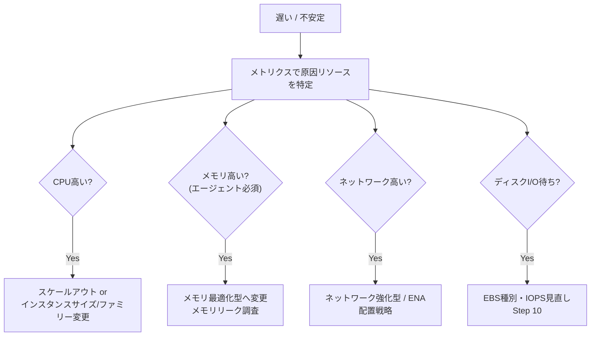

### 9-2. 使うツール

| ツール | 何ができるか | 覚えるポイント |
|---|---|---|
| **CloudWatchメトリクス** | CPU、ネットワーク、ステータスチェック等 | メモリは**エージェント** |
| **AWS Compute Optimizer** | 過去の使用状況から **EC2 / Auto Scalingグループ / EBS / Lambda / ECS on Fargate** 等の最適サイズを推奨（過剰/不足/最適の判定） | 十分な稼働データ（目安30時間以上）が必要。**メモリ指標を使うにはエージェント導入**が必要。拡張インフラメトリクスで分析期間を延長可 |
| **AWS Trusted Advisor** | コスト最適化・性能・耐障害性などのチェック（低使用率インスタンス等） | プランによりチェック範囲が変わる |
| **リソースタグ** | 環境・アプリ・所有者で分類 | アラーム/自動化/コスト配分の**対象絞り込み**に使う |
| **Auto Scaling** | 負荷に応じて台数を増減 | ターゲット追跡が基本 |
| **AWS Systems Manager** | 対象を**タグで指定**して一括対応 | Step 8 |

### 9-3. タグの使い方（運用での重要性）

| 目的 | 使い方 |
|---|---|
| 自動化の対象指定 | SSM Automation/Run Commandの対象を `Environment=prod` などで指定 |
| 監視の出し分け | タグで本番のみ詳細モニタリング・厳しいアラーム |
| コスト配分 | **コスト配分タグ**を有効化して部門別・アプリ別に集計 |
| アクセス制御 | **ABAC**（タグベースのIAM条件） |
| 棚卸し | Resource Groups / Tag Editorで一覧 |

> ベストプラクティス: **タグ戦略（必須タグ、命名規則）を決め、Tag Policies / SCP / AWS Configルールで強制**する。

### 9-4. EC2の性能問題とよくある対処

| 症状 | 原因の候補 | 対処 |
|---|---|---|
| 突然CPUが頭打ちで遅い（Tファミリー） | **CPUクレジット枯渇**（`CPUCreditBalance` が0） | **Unlimitedモード**、より大きなサイズ、固定性能型（M/C系）へ変更 |
| 常にCPU高 | 容量不足 | **Auto Scaling**／サイズアップ／**Graviton**等の高効率な世代 |
| メモリ不足でスワップ | メモリ過少 | **メモリ最適化型（R/X系）** |
| ネットワーク帯域不足 | インスタンスの帯域上限 | 大きなサイズ、ネットワーク強化型、**ENA/EFA**、プレイスメントグループ |
| 負荷の偏り | ALBの振り分け/スティッキー | ターゲット分散を確認 |
| 余っている | 過剰プロビジョニング | **Compute Optimizer**でライトサイジング |

### 9-5. サーバーレス・コンテナの最適化（出題されやすい補足）

| 対象 | 最適化のポイント |
|---|---|
| **Lambda** | **メモリを増やすとCPU割当も増える**（メモリ設定が性能・コストを決める）。Compute Optimizerや計測でメモリを最適化。コールドスタート対策は**Provisioned Concurrency**。`Throttles`は**同時実行数**を確認 |
| **ECS/Fargate** | タスクのCPU/メモリ定義をメトリクス（Container Insights）で見直す。Service Auto Scaling |
| **EKS** | Podのrequests/limitsの適正化、HPA/クラスターのオートスケーリング |

### 9-6. ベストプラクティス

| # | ベストプラクティス | 理由 |
|---|---|---|
| 1 | **推測でなく計測**（メトリクス→仮説→変更→再計測） | 効果検証 |
| 2 | **Compute Optimizer / Trusted Advisor を定期レビュー** | ライトサイジング |
| 3 | 水平スケール（Auto Scaling）を基本に、**ターゲット追跡** | 運用負荷の削減 |
| 4 | **タグ戦略を整備**・強制 | 自動化・コスト管理の前提 |
| 5 | 新世代・Gravitonの検討 | 価格性能比 |
| 6 | メモリ等の重要指標は**エージェントで取得** | 判断材料の確保 |

### 9-7. ここが試験で狙われる

- 「最適なインスタンスタイプの推奨」→ **Compute Optimizer**
- 「Tファミリーが急に遅くなった」→ **CPUクレジット枯渇（Unlimited/サイズ変更）**
- 「特定環境だけ自動で処理」→ **タグ指定**

---

## Step 10. EBS（Skill 1.3.2）

> **Skill 1.3.2**: Amazon EBSのパフォーマンスメトリクスを分析し、問題をトラブルシュートし、性能向上とコスト削減のためにボリュームタイプを最適化する

### 10-1. EBSボリュームタイプ早見表

| タイプ | 種別 | 性能の目安 | 用途 |
|---|---|---|---|
| **gp3** | 汎用SSD | **ベースライン 3,000 IOPS / 125 MiB/s**。IOPSとスループットを**容量と独立して**最大16,000 IOPS / 1,000 MiB/sまで指定可 | **デフォルト推奨**。ほとんどのワークロード |
| **gp2** | 汎用SSD | **3 IOPS/GiB**（最大16,000）、**バーストクレジット**で3,000 IOPSまでバースト | 旧世代。**gp3へ移行**が一般的 |
| **io2 / io2 Block Express** | プロビジョンドIOPS SSD | 高耐久・高IOPS（io2 Block Expressは最大256,000 IOPS） | ミッションクリティカルなDB。**Multi-Attach**対応 |
| **io1** | プロビジョンドIOPS SSD | 最大64,000 IOPS（Nitro） | 高IOPSDB（io2が後継） |
| **st1** | スループット最適化HDD | 最大500 MiB/s、**逐次I/O向け**。最小125 GiB | ビッグデータ、ログ処理。**ブートボリューム不可** |
| **sc1** | コールドHDD | 最大250 MiB/s、最安 | アクセス頻度が低いデータ。**ブートボリューム不可** |

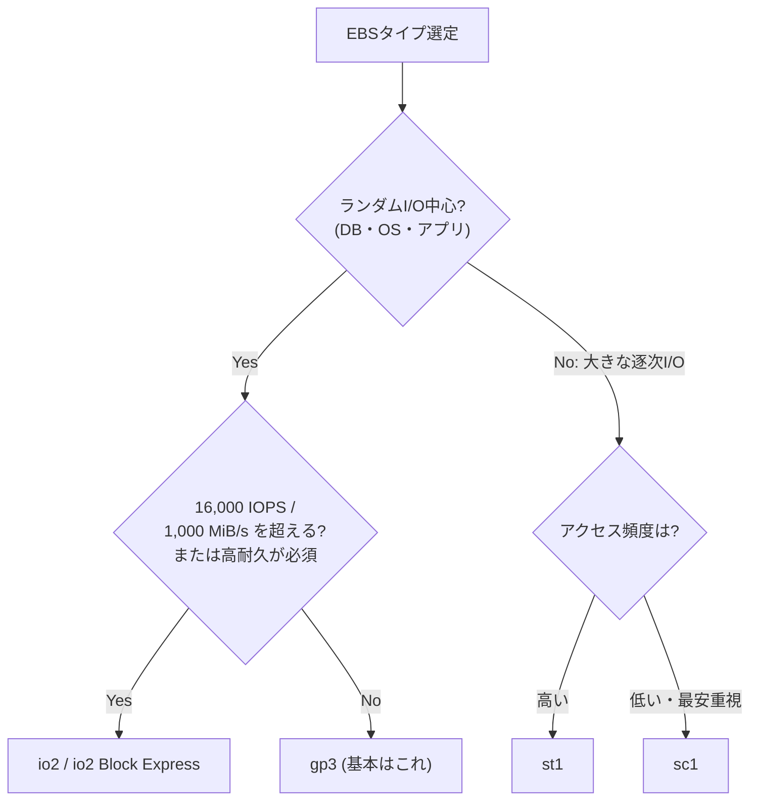

### 10-2. 見るべきメトリクス（`AWS/EBS`）

| メトリクス | 意味 | 読み方 |
|---|---|---|
| `VolumeReadOps` / `VolumeWriteOps` | 操作回数 | IOPS = 回数 ÷ 秒 |
| `VolumeReadBytes` / `VolumeWriteBytes` | 転送量 | スループット算出 |
| `VolumeQueueLength` | 待機中I/O数 | **高い＝I/O要求が性能を上回っている（飽和）** |
| `VolumeIdleTime` | I/Oが無かった時間 | 低い＝常時ビジー |
| `VolumeTotalReadTime` / `VolumeTotalWriteTime` | 完了までの合計時間 | レイテンシ算出 |
| `BurstBalance` | **gp2 / st1 / sc1**のバーストバケット残量（%） | **0%になると性能がベースラインへ低下** |
| `VolumeThroughputPercentage` / `VolumeConsumedReadWriteOps` | プロビジョンドIOPS（io1/io2）の消費状況 | 上限に対する利用率 |

> また、**EBS最適化インスタンスの上限**（インスタンスタイプごとのEBS帯域・IOPS）も性能を制限します。ボリュームが速くてもインスタンス側が頭打ちのことがあります。

### 10-3. 性能問題の切り分けフロー

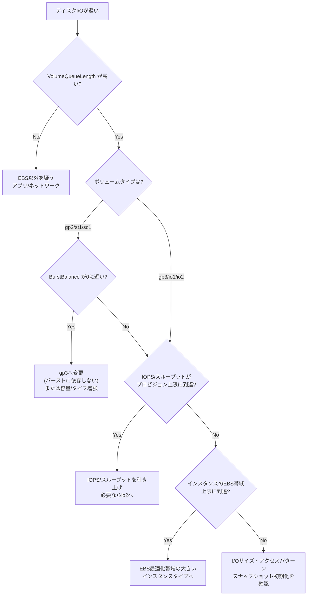

### 10-4. ボリュームの変更（Elastic Volumes）

- **稼働中・アタッチしたまま**で **タイプ変更・サイズ拡大・IOPS/スループット変更** が可能（ダウンタイムなし）
- **サイズの縮小はできない**
- 変更後、**次の変更まで約6時間** 待つ必要がある
- サイズ拡大後は **OS側でパーティション/ファイルシステムを拡張**（`growpart`, `resize2fs`/`xfs_growfs` 等）
- **gp2 → gp3** はコスト削減と性能の安定化の両方に効果がある定番最適化
- **スナップショットから作成したボリューム**は初回アクセス時に遅延ロードされ初期が遅い → **EBS高速スナップショット復元（FSR）** またはブロックを事前読み取り（初期化）

### 10-5. ベストプラクティス

| # | ベストプラクティス | 理由 |
|---|---|---|
| 1 | **新規は gp3 を既定**にし、**gp2はgp3へ移行** | コスト低下＋性能がバースト非依存 |
| 2 | `VolumeQueueLength`・`BurstBalance`・IOPS/スループット使用率を**アラーム化** | 事前に気づく |
| 3 | **EBS最適化**インスタンスを使い、インスタンス上限も確認 | 全体最適 |
| 4 | **Compute Optimizer**のEBS推奨を確認 | 過剰/不足の是正 |
| 5 | 逐次I/Oの大量処理は **st1**、冷たいデータは **sc1** | コスト最適化 |
| 6 | **スナップショット**でバックアップ（DLMで自動化） | 耐久性・復旧 |
| 7 | 使っていないボリューム（`available`）を棚卸し | コスト削減 |

### 10-6. ここが試験で狙われる

- 「gp2が突然遅くなる」→ **BurstBalance枯渇**。**gp3** またはサイズ増
- 「**稼働中のまま**ボリュームタイプやIOPSを変更」→ **Elastic Volumes**
- 「コスト削減しつつ性能向上」→ **gp2→gp3**
- 「ログ処理など大容量逐次I/Oを安く」→ **st1**
- 「複数インスタンスから同一ボリュームへ（クラスタDB等）」→ **io1/io2 Multi-Attach**
- 「スナップショットから復元直後が遅い」→ **FSR／初期化**

---

## Step 11. S3（Skill 1.3.3）

> **Skill 1.3.3**: S3のパフォーマンス戦略（AWS DataSync、S3 Transfer Acceleration、マルチパートアップロード、S3ライフサイクルポリシーなど）を実装・最適化し、データ転送、ストレージ効率、アクセスパターンを改善する

### 11-1. 全体像：どの課題にどの手段か

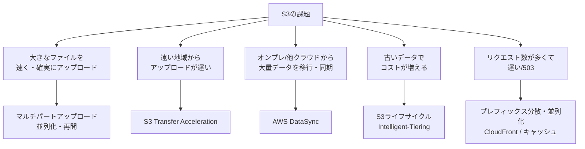

### 11-2. S3のパフォーマンスの基礎

- **プレフィックスごと**に、**PUT/COPY/POST/DELETE は 3,500 リクエスト/秒、GET/HEAD は 5,500 リクエスト/秒** までスケール
- プレフィックスは**数に制限なし** → **複数プレフィックスに分散して並列にアクセス**すれば合計スループットが線形に増える
- 以前のような「キー先頭にランダム文字列を付ける」対策は**基本不要**
- 大量リクエストで **HTTP 503 (Slow Down)** → **再試行（指数バックオフ）** とプレフィックス分散
- **ダウンロード高速化**: **バイトレンジフェッチ**で並列取得、**CloudFront** でキャッシュ
- **同一リージョンのEC2から**アクセスするとレイテンシが小さい。VPCからは **ゲートウェイエンドポイント**（無料）で経路最適化

### 11-3. マルチパートアップロード

| 項目 | 内容 |
|---|---|
| 目的 | 大きなオブジェクトを**パートに分割**し、**並列アップロード**＋**失敗したパートだけ再送** |
| 推奨/必須 | **100 MB以上は推奨**、**5 GB超は必須**（単一PUTの上限は5 GB） |
| 制限 | オブジェクトは**最大5 TiB**、パートは**最大10,000個**、サイズは**5 MiB〜5 GiB**（最後のパートは5 MiB未満可） |
| 利点 | スループット向上、ネットワーク断への耐性、アップロード中でも開始可能 |
| **落とし穴** | 未完了（Abort/Complete されていない）のアップロードは**課金対象のまま残る** → **ライフサイクルで「未完了のマルチパートアップロードを中止」ルール**を設定 |

CLIの `aws s3 cp` などは**自動でマルチパート**を使う（しきい値・並列数は設定可）。

### 11-4. S3 Transfer Acceleration

- **CloudFrontのエッジロケーション**にアップロードし、そこからAWSのバックボーン経由でS3へ送る
- 地理的に**遠いクライアント → 集中バケット** で効果が大きい
- 有効化したバケットに専用エンドポイント `バケット名.s3-accelerate.amazonaws.com` を使う
- **バケット名はDNS準拠でピリオド（.）を含まない**必要がある
- **高速化されなかった場合は課金されない**（テストツールで効果を事前確認可）
- 近距離・同一リージョンでは効果が薄い

### 11-5. AWS DataSync

- **オンプレミス（NFS/SMB/HDFS等）や他クラウド ⇔ AWS（S3 / EFS / FSx）** のデータ転送を**自動化・高速化**するマネージドサービス
- 構成: **DataSyncエージェント**（オンプレ側VM）→ タスク → 転送先ロケーション
- 特徴: **スケジュール実行、差分のみ転送、整合性検証、帯域制限、フィルター、メタデータ保持**
- **AWS内のサービス間（S3 ⇔ EFS など）** のコピーにも利用可
- 使い分け: **ネットワークでの継続的/定期的な移行 → DataSync**、**回線が細い/PB級 → Snowball（オフライン）**、**ファイル共有を継続的に連携 → Storage Gateway**

### 11-6. S3ライフサイクルポリシー

| アクション | 内容 |
|---|---|
| **Transition** | 一定日数後にストレージクラスを移行（Standard → Standard-IA → Glacier系 など） |
| **Expiration** | 一定日数後にオブジェクトを削除 |
| **Noncurrent version** | **バージョニング有効時**の旧バージョンを移行/削除 |
| **AbortIncompleteMultipartUpload** | 未完了マルチパートの掃除 |
| **期限切れ削除マーカーの削除** | バージョニング時の整理 |

| ストレージクラス | 特徴 |
|---|---|
| Standard | 頻繁アクセス |
| **Intelligent-Tiering** | **アクセスパターンが不明/変動**する場合に自動で階層移動（取り出し料なし）。小さなオブジェクト（128 KB未満）は自動階層化の対象外 |
| Standard-IA / One Zone-IA | 低頻度アクセス（最小保管30日・取り出し料あり） |
| Glacier Instant Retrieval | ミリ秒で取り出せるアーカイブ |
| Glacier Flexible Retrieval | 分〜時間の取り出し |
| Glacier Deep Archive | 最安、取り出しに時間（12時間〜） |
| **S3 Express One Zone** | **ディレクトリバケット**、**1桁ミリ秒**の超低レイテンシ。単一AZ |

ライフサイクルの注意点:

- **Standard→Standard-IA/One Zone-IA は最短30日後**でないと移行できない
- 小さなオブジェクト（既定128 KB未満）は移行しても割に合わないため、**既定では移行されない**
- 分析には **S3 Storage Class Analysis**、全体の可視化には **S3 Storage Lens**

### 11-7. 監視（S3）

- 既定のメトリクスは**日次のストレージメトリクス**（容量・件数）
- **リクエストメトリクス**（`AllRequests`、`4xxErrors`、`5xxErrors`、`FirstByteLatency` など）は**有効化が必要**（1分粒度、有料）
- **サーバーアクセスログ** / **CloudTrailデータイベント** でアクセスを分析

### 11-8. ベストプラクティス

| # | ベストプラクティス | 理由 |
|---|---|---|
| 1 | 大きなファイルは**マルチパート**＋**並列度の最適化** | 速度と再開性 |
| 2 | **未完了マルチパート削除のライフサイクル**を必ず設定 | 隠れコスト防止 |
| 3 | アクセス頻度が不明なら **Intelligent-Tiering** | 運用不要で最適化 |
| 4 | 世界中から集約 → **Transfer Acceleration**、静的配信 → **CloudFront** | レイテンシ改善 |
| 5 | 大規模移行は **DataSync**（検証・スケジュール込み） | 信頼性 |
| 6 | **複数プレフィックス＋並列リクエスト＋指数バックオフ** | 高スループット |
| 7 | **Storage Lens** で全体傾向を把握 | 継続的最適化 |
| 8 | バージョニング有効バケットは**旧バージョンのライフサイクル**を設定 | 容量肥大防止 |

### 11-9. ここが試験で狙われる

- 「遠隔地からの大容量アップロードが遅い」→ **Transfer Acceleration**（＋マルチパート）
- 「5 GB超のオブジェクト」→ **マルチパート必須**
- 「オンプレのNASからS3へ定期同期」→ **DataSync**
- 「アクセス頻度が予測不能でコスト最適化」→ **Intelligent-Tiering**
- 「古いデータを自動でGlacierへ／期限で削除」→ **ライフサイクルポリシー**
- 「請求が増えているが見えないデータがある」→ **未完了マルチパート／旧バージョン**

---

## Step 12. 共有ストレージ（Skill 1.3.4）

> **Skill 1.3.4**: 共有ストレージ（Amazon EFS、Amazon FSx、Amazon S3 Files など）を評価・選定し、要件に合わせて最適化する（EFSライフサイクルポリシーなど）

### 12-1. 選定フロー

```mermaid
flowchart TD
    Q["複数のサーバーから<br/>同時に使う共有ストレージ"] --> OS{"クライアントOS /<br/>プロトコルは?"}
    OS -->|"Windows / SMB / AD連携"| W["FSx for Windows File Server"]
    OS -->|"HPC / 機械学習 / 超高スループット"| L["FSx for Lustre"]
    OS -->|"NFS + SMB + iSCSI / ONTAP機能"| N["FSx for NetApp ONTAP"]
    OS -->|"NFSでZFS機能・低レイテンシ"| Z["FSx for OpenZFS"]
    OS -->|"Linux / NFS / サーバーレスな伸縮"| E["Amazon EFS"]
    OS -->|"データはS3に置いたままファイルとしても使いたい"| S["Amazon S3 Files"]
```

### 12-2. 比較表

| サービス | プロトコル | 特徴 | 典型ユースケース |
|---|---|---|---|
| **Amazon EFS** | NFS v4.1/4.2（**Linux**） | **完全マネージドで容量が自動伸縮**。マルチAZ（Regional）／One Zone。Lambda・ECS・EKS・EC2から利用 | Webコンテンツ、CMS、共有ホーム、コンテナの永続共有 |
| **FSx for Windows File Server** | **SMB**（Windows）、AD統合、DFS、NTFS ACL | Windowsネイティブ | Windowsファイル共有、IIS、SQL Server |
| **FSx for Lustre** | Lustre（POSIX） | **S3と連携**、サブミリ秒、超高スループット。スクラッチ/永続 | HPC、ML学習、メディア処理 |
| **FSx for NetApp ONTAP** | NFS / SMB / iSCSI | スナップショット、クローン、重複排除、マルチプロトコル、オンプレのNetAppから移行 | 既存NetApp運用のリフト |
| **FSx for OpenZFS** | NFS | ZFSのスナップショット・クローン・圧縮、低レイテンシ | Linuxの高性能共有 |
| **Amazon S3 Files** | **NFS 4.1/4.2**（Linux） | **S3の汎用バケット（またはプレフィックス）をファイルシステムとしてマウント**。EFSの技術を基盤とし、**S3とファイルシステムが双方向に自動同期**。EC2/Lambda/ECS/EKSから利用 | S3上のデータを、ファイル前提のツール・エージェント・MLで直接扱う |

> **S3 Files（2026年4月7日 GA）の押さえどころ**
> - データの正本は **S3のまま**。ファイル操作側の変更は**約60秒ごと**にまとめてS3へ書き出され、S3側の変更は**数秒〜1分程度**でファイルシステム側に反映される（**クロスインターフェースの即時整合性ではない**）
> - **汎用バケットのみ対応（ディレクトリバケット非対応）**、**Glacier Flexible Retrieval / Deep Archive 等は対象外**（先にS3 APIで復元）
> - ネットワークは**VPC内のマウントターゲット**（AZごと）。**セキュリティグループでNFS（TCP 2049）を許可**。**IAMロールが2種**（S3 Filesがバケットにアクセスするためのロール／計算リソースがマウントするためのロール）
> - 大きな読み取り（約128 KB〜1 MiB以上）は**S3から直接ストリーミング**され、小さなファイルや頻繁に触るデータがファイルシステム側の高性能ストレージに載る（遅延ロード）
> - 試験では「**S3のデータをコピーせずファイルとして共有・低レイテンシで扱いたい**」というシナリオの選択肢として登場しうる、というレベルで押さえる

### 12-3. EFSの最適化ポイント

#### パフォーマンスモード / スループットモード

| 設定 | 選択肢 | 使い分け |
|---|---|---|
| **パフォーマンスモード** | **General Purpose**（既定。低レイテンシ、ほとんどの用途） / Max I/O（旧来の高並列向け。**Elastic throughputとは併用不可**など制限あり） | 通常は General Purpose |
| **スループットモード** | **Elastic**（需要に応じ自動で増減。**多くの用途で推奨**） / **Provisioned**（必要スループットを固定で指定） / **Bursting**（容量に比例＋バースト） | 予測不能 → Elastic。常に一定の高スループットが必要で容量が小さい → Provisioned |

#### ストレージクラスとライフサイクル管理

| クラス | 用途 |
|---|---|
| **Standard** | 頻繁にアクセスするファイル |
| **Infrequent Access (IA)** | あまりアクセスしないファイル（低コスト、読み出し課金） |
| **Archive** | ほとんどアクセスしないファイル（さらに低コスト） |
| **One Zone / One Zone-IA** | 単一AZ（低コスト、AZ障害に弱い） |

**EFSライフサイクル管理**:
- **一定期間アクセスのないファイルを自動で IA / Archive へ移行**（IAへは1・7・14・30・60・90・180・270・365日などから選択）
- **Intelligent-Tiering**: アクセスされたファイルを**Standardへ自動で戻す**（IAからの読み出しの都度課金を回避）
- 小さなファイル（128 KiB未満）はIAへ移行されず Standard のまま（課金は最小サイズ基準）

#### EFSの主なメトリクス（`AWS/EFS`）

| メトリクス | 意味 |
|---|---|
| `PercentIOLimit` | General Purposeモードの**I/O上限に対する%**。**100%近い＝上限到達**（Max I/Oの検討対象） |
| `BurstCreditBalance` | Burstingモードのクレジット残量。枯渇で性能低下 |
| `PermittedThroughput` | 現在許可されているスループット |
| `MeteredIOBytes` | 課金対象のI/O量 |
| `ClientConnections` | クライアント接続数 |

#### EFSのトラブルシュート

| 症状 | 原因 | 対処 |
|---|---|---|
| マウントできない | **セキュリティグループでNFS (TCP 2049) が未許可**、マウントターゲットが無いAZ、`amazon-efs-utils` 未導入 | SGを許可、各AZにマウントターゲット、**EFSマウントヘルパー**使用 |
| 性能が出ない/低下 | Burstingのクレジット枯渇 | **Elasticスループット**へ変更 |
| 小さなファイルが多くて遅い | 多数の小さな同期I/O | 並列化、適切なモード |
| 暗号化通信したい | 転送中の暗号化 | マウント時に **TLS**（`-o tls`）、保管時は**KMS** |

### 12-4. FSxの最適化ポイント（概要）

| FSx | 最適化・運用のポイント |
|---|---|
| **Windows File Server** | **SSD/HDD**、スループットキャパシティの調整、**マルチAZ**、**シャドウコピー**、**データ重複排除**、AD統合 |
| **Lustre** | **スクラッチ**（一時・高速・非冗長）か**永続**、**S3リポジトリと連携**（データ取り込み/書き戻し）、スループットは容量に比例 |
| **ONTAP** | **階層化（キャパシティプール）**、ストレージ効率化（重複排除・圧縮）、マルチプロトコル |
| **OpenZFS** | スナップショット/クローン、圧縮、低レイテンシ |
| 共通 | **CloudWatchメトリクス**（`DataReadBytes`、`FreeStorageCapacity`など）で容量・スループットを監視し、**スループットキャパシティやストレージを拡張** |

### 12-5. ベストプラクティス

| # | ベストプラクティス | 理由 |
|---|---|---|
| 1 | **プロトコル（NFS/SMB）とOSで絞り込む** | 選定の第一基準 |
| 2 | EFSは **Elasticスループット**＋**ライフサイクル管理（IA/Archive）＋Intelligent-Tiering** | 性能とコストの両立 |
| 3 | **マウントターゲットは使用するAZすべて**に作成 | AZ障害・AZ間通信の最小化 |
| 4 | **転送中・保管時の暗号化**、ポリシーでTLS強制 | セキュリティ |
| 5 | **AWS Backup**でバックアップ | 復旧 |
| 6 | **メトリクス（`PercentIOLimit`等）をアラーム化** | 上限到達の予兆 |
| 7 | S3のデータを**ファイルとして使いたい**なら**S3 Files**、HPCの高速処理は**FSx for Lustre** | 要件に合致した選択 |

### 12-6. ここが試験で狙われる

- 「LinuxのWebサーバー群で**共有**、容量は自動伸縮」→ **EFS**
- 「**Windows**ファイル共有／AD統合」→ **FSx for Windows**
- 「**HPC/ML**で超高速、**S3と連携**」→ **FSx for Lustre**
- 「アクセスの少ないファイルのコストを減らす」→ **EFSライフサイクル（IA/Archive）**
- 「EFSのスループットが不定期に不足」→ **Elasticスループット**
- 「EFSにマウントできない」→ **SG（TCP 2049）／マウントターゲット**
- 「**S3のデータをコピーせずNFSでマウント**」→ **S3 Files**

---

## Step 13. RDS（Skill 1.3.5）

> **Skill 1.3.5**: Amazon RDSのメトリクス（RDS Performance Insights、CloudWatchアラームなど）を監視し、構成を変更して性能効率を高める（Performance Insightsの事前対応レコメンデーション、RDS Proxyなど）

### 13-1. 3層の監視

| 層 | 何が見えるか | データ源 |
|---|---|---|
| **CloudWatchメトリクス** | インスタンスレベル（ハイパーバイザー視点）：CPU、メモリ空き、接続数、I/O | 自動（1分間隔） |
| **拡張モニタリング（Enhanced Monitoring）** | **OSレベル**：プロセス別CPU/メモリ、ファイルシステム、ロードアベレージ。**1〜60秒粒度** | 有効化が必要（RDS上のエージェント→CloudWatch Logsの `RDSOSMetrics`） |
| **Performance Insights / Database Insights** | **DB内部**：DB負荷（平均アクティブセッション数）、**待機イベント、SQL、ユーザー、ホスト別** | 有効化が必要 |

> **重要な最新情報**: RDS Performance Insightsの**コンソール体験は2026年7月31日に終了**し、**Amazon CloudWatch Database Insights** に統合されました（Standardモードは従来のPerformance Insightsと同等のコア機能・柔軟な保持期間1〜24か月、Advancedモードはフリート監視・ロック診断・実行プラン取得などを追加）。**Performance Insights APIは変更なく継続**します。試験ガイドでは「Performance Insights」の表記のまま出題される可能性があるため、**「DB負荷・待機イベント・上位SQLで原因を特定する機能」＝Performance Insights / Database Insights** と理解しておきましょう。

### 13-2. 主要なRDSメトリクス

| メトリクス | 読み方 |
|---|---|
| `CPUUtilization` | 高い → 重いクエリ／インスタンス不足 |
| `FreeableMemory` | 低い → メモリ不足、スワップ発生の可能性 |
| `SwapUsage` | 増加 → メモリ逼迫 |
| `FreeStorageSpace` | 枯渇するとDB停止。**アラーム必須** |
| `DatabaseConnections` | 上限（`max_connections`）に近い → 接続枯渇 |
| `ReadIOPS` / `WriteIOPS` | I/O量 |
| `ReadLatency` / `WriteLatency` | ストレージ遅延 |
| `DiskQueueDepth` | 待機I/O数。高い → ストレージ飽和 |
| `ReplicaLag` | リードレプリカの遅延（秒） |
| `BurstBalance` | gp2ストレージのバーストクレジット |
| `EBSIOBalance%` / `EBSByteBalance%` | EBSバーストの残量（対応インスタンス） |

### 13-3. Performance Insightsの読み方（初心者向け）

- **DB Load（DB負荷）** ＝ **平均アクティブセッション数（AAS）**。**vCPU数（最大CPU線）を超えていれば待ちが発生**している
- 負荷を **待機イベント／SQL／ユーザー／ホスト** で分解し、**どれがボトルネックか**を特定
  - CPU待ちが多い → 重いクエリ・インデックス不足・インスタンス不足
  - I/O待ち（例: データファイル読み取り）が多い → ストレージ性能・キャッシュ（メモリ）不足
  - ロック待ち → トランザクション設計
- **事前対応レコメンデーション（Proactive recommendations）**: 検出した問題の**原因と対処**（パラメータ変更、インデックス、インスタンスクラス変更の検討など）を提示
- 無料枠は**直近7日間**のデータ保持、それ以上は有料の長期保持

```mermaid
flowchart TD
    S["RDSが遅い"] --> L{"DB負荷が vCPU数を<br/>超えている?"}
    L -->|"No"| X["アプリ側/ネットワークを調査"]
    L -->|"Yes"| W{"待機イベントの種類"}
    W -->|"CPU"| C["上位SQLのチューニング<br/>インデックス / インスタンスクラス増"]
    W -->|"I/O"| I["ストレージ種別・IOPS増<br/>メモリ増でキャッシュ率向上"]
    W -->|"ロック"| K["長いトランザクション見直し"]
    W -->|"接続"| P["RDS Proxy / 接続プール"]
```

### 13-4. 性能を高める構成変更

| 課題 | 対処 |
|---|---|
| **接続数が多い／急増（特に Lambda や多数のアプリから）** | **RDS Proxy**（後述） |
| **読み取りが重い** | **リードレプリカ**で読み取り分散（アプリで接続先を分ける）、**ElastiCache**でキャッシュ |
| **書き込み/ストレージI/Oが飽和** | **ストレージを gp3 / io1・io2（プロビジョンドIOPS）** へ変更、IOPS増、**ストレージ自動スケーリング** |
| **CPU/メモリ不足** | **インスタンスクラスの変更**（スケールアップ）。変更時は**再起動/フェイルオーバー**が発生（Multi-AZなら短縮） |
| **遅いクエリ** | インデックス、クエリ最適化、**パラメータグループ**の調整、スロークエリログ |
| **ストレージ枯渇** | **ストレージ自動スケーリング**有効化＋`FreeStorageSpace`アラーム |
| **Aurora固有** | **Auroraレプリカ（最大15）／オートスケーリング**、**Aurora Serverless v2** |

> **注意**: 変更の多くは**メンテナンスウィンドウ**で適用、または**今すぐ適用**を選択。再起動を伴う変更は影響を確認する。

### 13-5. RDS Proxy

```mermaid
flowchart LR
    APP["Lambda / EC2 / ECS<br/>多数のクライアント接続"] --> PX["RDS Proxy<br/>接続プーリング"]
    PX --> DB["RDS / Aurora<br/>少数の接続を再利用"]
    SM["Secrets Manager<br/>認証情報"] -.-> PX
    IAM["IAM認証"] -.-> PX
```

| 項目 | 内容 |
|---|---|
| 役割 | **接続プーリングと多重化**。アプリ側の多数の接続を少数のDB接続へ集約 |
| 効果 | DBの**CPU/メモリ負荷と接続枯渇を軽減**、**フェイルオーバー時の復旧時間を短縮**（アプリ接続を維持したまま切替） |
| 認証 | **Secrets Manager**の認証情報、**IAM認証**に対応 |
| 向いているケース | **Lambda**（同時実行が接続数を爆発させる）、接続が頻繁に開閉されるアプリ |
| 配置 | **同一VPC内**のみ（パブリック直接公開は不可）。TLS強制可 |
| 注意 | プロキシ経由で**セッション固定（ピンニング）** が起きると多重化効果が下がる |

### 13-6. アラームを置くべきRDSメトリクス

| 指標 | 目的 |
|---|---|
| `FreeStorageSpace` | 枯渇防止 |
| `CPUUtilization`（継続的な高値） | 性能劣化 |
| `FreeableMemory` / `SwapUsage` | メモリ逼迫 |
| `DatabaseConnections` | 接続上限 |
| `ReplicaLag` | レプリカ遅延 |
| `DiskQueueDepth` / `ReadLatency` / `WriteLatency` | I/O飽和 |
| RDSイベント（フェイルオーバー等）→ **SNS** | 構成変更・障害の通知 |

### 13-7. ベストプラクティス

| # | ベストプラクティス | 理由 |
|---|---|---|
| 1 | **本番は拡張モニタリング＋Performance Insights/Database Insightsを有効化** | 原因究明の速さ |
| 2 | 主要メトリクスを**アラーム化**（容量・CPU・接続・レプリカ遅延） | 予兆検知 |
| 3 | **Multi-AZ**＋**RDS Proxy**で可用性と接続効率 | フェイルオーバー耐性 |
| 4 | 読み取り負荷は**リードレプリカ／キャッシュ**へ | プライマリ保護 |
| 5 | **ストレージ自動スケーリング**を有効化 | 枯渇事故防止 |
| 6 | **gp3**または**プロビジョンドIOPS**を要件で選択 | 性能の予測可能性 |
| 7 | **パラメータグループ**をバージョン管理・環境間で統一 | 設定ドリフト防止 |
| 8 | 変更は**メンテナンスウィンドウ**／事前検証 | 影響の最小化 |

### 13-8. ここが試験で狙われる

- 「**Lambdaから大量接続でRDSが枯渇**」→ **RDS Proxy**
- 「**どのSQLが負荷の原因か**」→ **Performance Insights（Database Insights）**
- 「**OSレベル**のプロセス/メモリ詳細」→ **拡張モニタリング**
- 「読み取りが重い」→ **リードレプリカ／ElastiCache**
- 「ストレージ枯渇の予防」→ **自動スケーリング＋`FreeStorageSpace`アラーム**
- 「フェイルオーバー時間を短縮」→ **RDS Proxy／Multi-AZ**

---

## Step 14. EC2・プレイスメントグループ（Skill 1.3.6）

> **Skill 1.3.6**: EC2インスタンスと、それに関連するストレージ・ネットワーク機能（EC2プレイスメントグループなど）を実装・監視・最適化する

### 14-1. EC2のモニタリング

| 種類 | 内容 |
|---|---|
| **基本モニタリング** | 5分間隔（無料） |
| **詳細モニタリング** | **1分間隔**（有料）。Auto Scalingの素早い反応に有効 |
| **ステータスチェック** | **システム**（AWS基盤）／**インスタンス**（OS・ネットワーク設定）。**EBSステータス**も存在 |
| **エージェント** | メモリ・ディスク使用率など（Step 2） |

| チェック | 失敗の主な原因 | 対処 |
|---|---|---|
| `StatusCheckFailed_System` | ホストの電源・ネットワーク障害 | **recover**（別ホストへ）、停止→起動 |
| `StatusCheckFailed_Instance` | カーネルパニック、ファイルシステム破損、ネットワーク設定ミス | **reboot**、ログ/コンソール出力の確認 |

### 14-2. プレイスメントグループ

**インスタンスをどのように物理配置するか**を指定する機能（無料）。

| 種類 | 配置 | 得意なこと | 注意点 |
|---|---|---|---|
| **クラスター（Cluster）** | **単一AZ内で近接配置** | **低レイテンシ・高ネットワークスループット**（HPC、分散処理、密結合ワークロード） | **単一AZ**のため障害に弱い。容量不足エラーに備え、**同種のインスタンスを一括で起動**するのが推奨 |
| **パーティション（Partition）** | **論理パーティションごとにラックを分離**。複数AZ可 | **大規模分散・レプリカ型（Hadoop、Cassandra、Kafka）** の障害影響範囲を限定 | パーティション単位の障害分離 |
| **スプレッド（Spread）** | **各インスタンスを別ハードウェアに分散** | **少数の重要インスタンスを同時障害から守る** | **AZあたり実行中7インスタンスまで**／グループ |

```mermaid
flowchart TD
    Q["配置戦略の選択"] --> A{"最優先は?"}
    A -->|"低レイテンシ・高帯域<br/>(HPC・密結合)"| CL["クラスター"]
    A -->|"大規模分散アプリの<br/>障害影響を限定"| PA["パーティション"]
    A -->|"少数の重要ノードを<br/>確実に別ハード"| SP["スプレッド"]
```

運用のコツ:
- 既存インスタンスの**プレイスメントグループ変更**は、**停止状態**で可能な場合がある（クラスターへ入れる際は容量に注意）
- クラスターでは**同じインスタンスファミリー**・**拡張ネットワーキング（ENA）**・必要に応じ**EFA**を併用
- 「Insufficient capacity」エラーは、**停止→再起動**や**インスタンスタイプ/AZ変更**を検討

### 14-3. ネットワーク最適化

| 機能 | 内容 |
|---|---|
| **ENA（Elastic Network Adapter）** | 拡張ネットワーキング。高帯域・低レイテンシ・低ジッタ。現行世代は標準 |
| **EFA（Elastic Fabric Adapter）** | HPC/MLの**OSバイパス**通信。**クラスター配置と併用** |
| **インスタンスサイズ** | **大きいサイズほどネットワーク帯域が大きい**（小さいサイズは「最大〜Gbps」でバースト） |
| **ジャンボフレーム（MTU 9001）** | 同一VPC内の大量転送の効率化（VPC外へは1500になる点に注意） |
| **EBS最適化** | EC2とEBS間専用帯域（現行世代は既定で有効） |

### 14-4. ストレージとの組み合わせ

| 種類 | 特徴 | 注意 |
|---|---|---|
| **EBS** | 永続。性能はボリュームタイプ＋インスタンスの上限で決まる | Step 10 |
| **インスタンスストア** | **超高速なローカルNVMe**。**停止・終了・ハード障害でデータ消失** | 一時データ・キャッシュ専用 |
| **EFS / FSx / S3 Files** | 共有 | Step 12 |

### 14-5. インスタンス選定の基本（ファミリー）

| ファミリー | 特徴 | 用途 |
|---|---|---|
| M | 汎用 | アプリサーバー |
| C | コンピュート最適化 | バッチ、ゲームサーバー、HPC |
| R / X | メモリ最適化 | インメモリDB、大規模キャッシュ |
| T | **バースト可能** | 低〜中負荷（**クレジットに注意**） |
| I / D | ストレージ最適化 | 高I/O DB、データウェアハウス |
| P / G / Inf / Trn | GPU・AIアクセラレーター | ML/AI |
| 末尾 `g` | Graviton（Arm） | 価格性能比 |

### 14-6. ベストプラクティス

| # | ベストプラクティス | 理由 |
|---|---|---|
| 1 | **要件で配置戦略を選ぶ**（低遅延＝クラスター、分離＝スプレッド/パーティション） | 性能と可用性 |
| 2 | **Auto ScalingとマルチAZ**で可用性（クラスター配置は例外的に単一AZ） | 耐障害性 |
| 3 | **ステータスチェックアラーム＋自動復旧（recover）** を設定 | 自動復旧 |
| 4 | **最新世代・ENA対応**インスタンスを使う | 性能・コスト |
| 5 | **EBS最適化**とEBSタイプの整合性を確認 | ボトルネック排除 |
| 6 | **インスタンスストア**は一時データのみ | 消失リスク |
| 7 | **Compute Optimizer**で定期的にサイズ最適化 | コスト |
| 8 | **AMI／ユーザーデータにエージェントを組み込む** | 自動で監視対象に |

### 14-7. ここが試験で狙われる

- 「HPCで**ノード間の低遅延・高帯域**」→ **クラスタープレイスメントグループ**（＋EFA）
- 「Cassandra/Kafkaなどの**障害ドメイン分離**」→ **パーティション**
- 「**少数**の重要インスタンスを別ハードへ」→ **スプレッド**（AZあたり最大7）
- 「システムステータスチェック失敗の自動復旧」→ **recoverアクション**
- 「停止でデータが消える」→ **インスタンスストア**

---

## Step 15. 横断：障害切り分けの型

Domain 1 の問題は、ほぼ **「症状 → どこを見る → どう直す」** の型に当てはまります。

```mermaid
flowchart TD
    S["症状を把握"] --> W{"知りたいのは?"}
    W -->|"今の状態・数値"| M["CloudWatch メトリクス/アラーム"]
    W -->|"エラーの中身"| L["CloudWatch Logs / Logs Insights"]
    W -->|"誰が何を変えた"| CT["CloudTrail"]
    W -->|"リクエストのどこが遅い"| TR["X-Ray / Application Signals"]
    W -->|"DB内部の原因"| PI["Performance Insights / Database Insights"]
    M --> R{"自動で直せる?"}
    L --> R
    CT --> R
    R -->|"Yes"| AUTO["EventBridge → SSM Automation / Lambda"]
    R -->|"No"| ESC["SNS / OpsItem / Incident Manager<br/>で人にエスカレーション"]
```

### 症状別・最初に見る場所

| 症状 | 最初に見る | 次の一手 |
|---|---|---|
| EC2が応答しない | ステータスチェック（System/Instance） | recover / reboot、コンソール出力 |
| メモリ・ディスクが見えない | CloudWatchエージェント導入有無 | エージェント＋IAMロール |
| アラームが鳴らない/通知が来ない | アラーム状態・欠損データ処理・SNS（承認/KMS/ポリシー） | Step 3・5 |
| ルールが動かない | EventBridge：パターン・バス・リージョン・ターゲット権限 | Step 7 |
| Automationが失敗 | AssumeRole・PassRole・SSM管理対象 | Step 8 |
| ディスクI/Oが遅い | `VolumeQueueLength`、`BurstBalance` | gp3化／IOPS増／インスタンス帯域 |
| S3が遅い/503 | プレフィックス分散、並列化、バックオフ | マルチパート、Transfer Acceleration、CloudFront |
| RDSが遅い | DB負荷と待機イベント | SQL最適化、RDS Proxy、レプリカ、ストレージ |
| 共有ストレージが遅い | EFSの `PercentIOLimit`・スループットモード | Elastic化、FSx/S3 Filesの再検討 |

---

## Step 16. ひっかけポイント総まとめ

| # | ひっかけ | 正しい理解 |
|---|---|---|
| 1 | EC2のメモリ/ディスク使用率は標準メトリクスにある | **ない**。CloudWatchエージェントが必要 |
| 2 | メトリクスフィルターは過去ログにも効く | **作成後のログのみ**。過去は Logs Insights |
| 3 | ロググループの保持期間はデフォルトで有限 | **デフォルトは無期限** |
| 4 | 複合アラームでEC2停止/Auto Scalingができる | **できない**（SNS・Lambda・OpsItem・Incident・investigationsのみ） |
| 5 | アラームはALARMの間ずっとアクションを繰り返す | **状態変化時のみ**（Auto Scalingアクションは例外で1分ごと） |
| 6 | アクション先が無くてもCloudWatchが警告する | **検証しない**。静かに失敗する |
| 7 | クロスアカウントの複合アラームが作れる | **作れない** |
| 8 | SNSをAWSマネージドキーで暗号化してもアラーム通知は届く | **届かない**。カスタマー管理キー＋キーポリシーが必要 |
| 9 | メールは購読すれば即届く | **確認メールの承認が必要** |
| 10 | EventBridgeルールのターゲット権限はすべてIAMロール | Lambda/SNS/SQSは**リソースベースポリシー**、他は**ルールのIAMロール** |
| 11 | cronはローカル時刻で動く | **UTC**（Schedulerはタイムゾーン指定可） |
| 12 | CloudTrailデータイベントは既定で記録 | **既定OFF**。管理イベントのみ既定 |
| 13 | EBSのサイズは縮小できる | **縮小不可**。変更は6時間に1回 |
| 14 | gp2は常に高性能 | **BurstBalance枯渇でベースラインへ低下** |
| 15 | st1/scはブートボリュームに使える | **不可** |
| 16 | S3の大きなファイルは単一PUTでよい | **5 GB超はマルチパート必須**、100 MB超は推奨 |
| 17 | Transfer Accelerationはバケット名に制約なし | **DNS準拠・ピリオド不可** |
| 18 | マルチパートの未完了分は自動で消える | **残って課金**。ライフサイクルで中止ルールを |
| 19 | Standard→IAはすぐ移行できる | **最短30日** |
| 20 | EFSのBurstingは常に十分 | クレジット枯渇で低下。**Elastic**を検討 |
| 21 | S3 Filesでファイル側の書き込みが即S3に反映 | **約60秒ごとの同期**で即時整合ではない |
| 22 | Performance Insightsのコンソールは今も同じ | **Database Insightsへ統合**（APIは継続） |
| 23 | RDS Proxyはインターネットからも使える | **VPC内のみ** |
| 24 | スプレッドは台数無制限 | **AZあたり7**まで |
| 25 | クラスター配置はマルチAZ | **単一AZ** |

---

## Step 17. 練習問題（12問）

> 解答は各問題の下に記載。まず自力で考えましょう。

**Q1.** EC2上のアプリのメモリ使用率が90%を超えたら通知したい。最も適切な方法は？
A. `AWS/EC2` の `MemoryUtilization` にアラームを設定 / B. CloudWatchエージェントでメモリを収集しアラームを設定 / C. CloudTrailでメモリを監視 / D. Trusted Advisorで通知

<details><summary>解答</summary>

**B**。標準メトリクスにメモリはなく、エージェントが `CWAgent` 名前空間に送る。
</details>

**Q2.** CPUが高く、かつレイテンシが高い場合だけ通知し、誤報を減らしたい。
A. 個別アラームに全てSNSを付ける / B. 複合アラーム（AND）にだけSNSを付ける / C. しきい値を下げる / D. 評価期間を1にする

<details><summary>解答</summary>

**B**。個別アラームには通知を付けず、複合アラームで集約する。
</details>

**Q3.** CloudWatchアラームがALARMになったがメールが届かない。調べるべきはどれか（2つ）。
A. サブスクリプションの承認状態 / B. SNSトピックのKMS暗号化キーの種類とキーポリシー / C. EC2のインスタンスタイプ / D. S3のバケットポリシー / E. RDSのパラメータグループ

<details><summary>解答</summary>

**A と B**。未承認、またはAWSマネージドキー暗号化で通知元がキーを使えないのが典型原因。
</details>

**Q4.** 複数アカウントのメトリクス・ログを1つのアカウントのダッシュボードで見たい。
A. 各アカウントでダッシュボードを複製 / B. CloudWatchクロスアカウントオブザーバビリティ（OAM）でモニタリングアカウントを設定 / C. CloudTrail Lakeのみ / D. S3にエクスポート

<details><summary>解答</summary>

**B**。シンクとリンクで共有し、モニタリングアカウントで一元表示。
</details>

**Q5.** EventBridgeルールがLambdaを起動しない。ルールとパターンは正しい。最も可能性が高い原因は？
A. LambdaのリソースベースポリシーがEventBridgeを許可していない / B. LambdaのVPC設定 / C. CloudTrailが無効 / D. SNSトピックがない

<details><summary>解答</summary>

**A**。Lambdaターゲットは関数側のリソースベースポリシーで `events.amazonaws.com` を許可する。
</details>

**Q6.** 夜間にアラームが発報したら、承認を挟んで複数ステップでEC2のAMI作成→再起動を行いたい。
A. Run Command / B. SSM Automation（`aws:approve` を含むランブック）/ C. Lambdaのみ / D. CloudTrail

<details><summary>解答</summary>

**B**。複数ステップ・承認・AWS API連携はAutomationの役割。
</details>

**Q7.** gp2ボリュームのDBが定期的に急に遅くなる。`BurstBalance` が0%になっている。コストを抑えつつ根本対策するには？
A. 別のAZへ移行 / B. gp3へ変更し必要に応じてIOPSを指定 / C. sc1へ変更 / D. スナップショットを削除

<details><summary>解答</summary>

**B**。gp3はバーストに依存せずベースライン3,000 IOPSを持ち、通常gp2より安価。Elastic Volumesで稼働中に変更できる。
</details>

**Q8.** 世界各地の拠点から巨大な動画ファイル（20 GB）を1つのS3バケットへアップロードしている。遅くて失敗しやすい。（2つ選択）
A. マルチパートアップロード / B. Transfer Acceleration / C. バケットのバージョニング / D. S3 Select / E. Glacier Deep Archive

<details><summary>解答</summary>

**A と B**。並列化・再送の容易さと、エッジ経由の高速化。
</details>

**Q9.** Linuxの複数EC2とECSタスクで共有し、容量が自動で伸縮、アクセスの少ないファイルのコストを下げたい。
A. EBS Multi-Attach / B. EFS（ライフサイクルでIA/Archive）/ C. FSx for Windows / D. インスタンスストア

<details><summary>解答</summary>

**B**。NFS共有・自動伸縮。ライフサイクル管理で低頻度ファイルを低コストクラスへ自動移行。
</details>

**Q10.** Lambda関数が増えてRDSの接続数上限に達し、エラーが出る。最小の変更で解決するには？
A. インスタンスを大きくする / B. RDS Proxyを導入 / C. リードレプリカを追加 / D. Lambdaのメモリを減らす

<details><summary>解答</summary>

**B**。接続プーリングで接続数を抑制。
</details>

**Q11.** HPC向けに、ノード間の低レイテンシ・高スループット通信が必要。
A. スプレッド / B. パーティション / C. クラスター（同一ファミリー、必要に応じEFA）/ D. プレイスメントグループなし

<details><summary>解答</summary>

**C**。クラスターは単一AZ内の近接配置。
</details>

**Q12.** S3に置いたままのデータを、ファイルベースのツールからコピーなしでNFSマウントして使いたい。
A. EBSスナップショット / B. S3 Files / C. FSx for Windows / D. DataSyncで毎時コピー

<details><summary>解答</summary>

**B**。S3の汎用バケットをファイルシステムとして提示し、S3と自動同期する。
</details>

---

## Step 18. 直前チートシート

### サービス早見

| やりたいこと | 答え |
|---|---|
| メモリ・ディスク使用率 | CloudWatchエージェント |
| ログをパターンで数値化 | メトリクスフィルター |
| ログをリアルタイム転送 | サブスクリプションフィルター（最大2/グループ） |
| 誰が操作したか | CloudTrail |
| Prometheus/PromQL | Amazon Managed Service for Prometheus |
| 誤報削減 | 複合アラーム / M out of N |
| 異常の自動復旧（EC2） | alarm recover / reboot |
| 複数アカウント集約表示 | OAM |
| 通知先を増やす | SNS（承認・KMS・ポリシー） |
| 複数ステップの運用自動化 | SSM Automation |
| インスタンス内コマンド一括 | Run Command |
| イベント加工 | 入力トランスフォーマー / Pipes |
| インシデント一次調査の自動化 | AWS DevOps Agent |
| サイズ最適化の推奨 | Compute Optimizer |
| EBS標準 | gp3 |
| 遠隔地S3アップロード高速化 | Transfer Acceleration |
| 大容量アップロード | マルチパート（5GB超必須） |
| オンプレ→AWS転送自動化 | DataSync |
| LinuxのNFS共有 | EFS |
| WindowsのSMB共有 | FSx for Windows |
| HPC・S3連携 | FSx for Lustre |
| S3をNFSマウント | S3 Files |
| DBの重い原因SQL | Performance Insights / Database Insights |
| 接続枯渇対策 | RDS Proxy |
| 低遅延配置 | クラスタープレイスメントグループ |

### 暗記数値

| 項目 | 値 |
|---|---|
| メトリクス保持 | 1分=15日、5分=63日、1時間=455日 |
| EC2基本/詳細モニタリング | 5分/1分 |
| CloudTrailイベント履歴 | 90日 |
| S3リクエスト/秒/プレフィックス | PUT系3,500、GET系5,500 |
| マルチパート | 推奨100MB超、必須5GB超、最大10,000パート、最大5TiB |
| gp3ベースライン | 3,000 IOPS / 125 MiB/s |
| スプレッドグループ | AZあたり7 |
| 合格スコア | 720 / 1,000 |

---

## 参考URL（根拠ソース）

> 確認日: 2026-10-05。AWSドキュメントは更新されるため、試験直前に最新版を確認してください。

### 試験ガイド
- Domain 1（出題範囲の原典）: https://docs.aws.amazon.com/aws-certification/latest/sysops-administrator-associate-03/sysops-administrator-associate-03-domain1.html
- SOA-C03 試験ガイド トップ: https://docs.aws.amazon.com/aws-certification/latest/sysops-administrator-associate-03/sysops-administrator-associate-03.html
- 対象AWSサービス一覧: https://docs.aws.amazon.com/aws-certification/latest/sysops-administrator-associate-03/soa-03-in-scope-services.html

### Task 1.1：監視・ログ・アラーム
- CloudWatch ユーザーガイド: https://docs.aws.amazon.com/AmazonCloudWatch/latest/monitoring/WhatIsCloudWatch.html
- CloudWatch アラーム: https://docs.aws.amazon.com/AmazonCloudWatch/latest/monitoring/AlarmThatSendsEmail.html
- アラームアクション: https://docs.aws.amazon.com/AmazonCloudWatch/latest/monitoring/alarm-actions.html
- 複合アラーム API: https://docs.aws.amazon.com/AmazonCloudWatch/latest/APIReference/API_PutCompositeAlarm.html
- CloudWatch エージェント: https://docs.aws.amazon.com/AmazonCloudWatch/latest/monitoring/Install-CloudWatch-Agent.html
- EKS向け CloudWatch Observability アドオン: https://docs.aws.amazon.com/AmazonCloudWatch/latest/monitoring/install-CloudWatch-Observability-EKS-addon.html
- CloudWatch Logs: https://docs.aws.amazon.com/AmazonCloudWatch/latest/logs/WhatIsCloudWatchLogs.html
- クロスアカウントオブザーバビリティ: https://docs.aws.amazon.com/AmazonCloudWatch/latest/monitoring/CloudWatch-Unified-Cross-Account.html
- ダッシュボード: https://docs.aws.amazon.com/AmazonCloudWatch/latest/monitoring/CloudWatch_Dashboards.html
- CloudTrail: https://docs.aws.amazon.com/awscloudtrail/latest/userguide/cloudtrail-user-guide.html
- Amazon Managed Service for Prometheus: https://docs.aws.amazon.com/prometheus/latest/userguide/what-is-Amazon-Managed-Service-Prometheus.html
- Amazon SNS: https://docs.aws.amazon.com/sns/latest/dg/welcome.html

### Task 1.2：修復・自動化
- EventBridge: https://docs.aws.amazon.com/eventbridge/latest/userguide/eb-what-is.html
- EventBridge トラブルシューティング: https://docs.aws.amazon.com/eventbridge/latest/userguide/eb-troubleshooting.html
- EventBridge Pipes: https://docs.aws.amazon.com/eventbridge/latest/userguide/eb-pipes.html
- Systems Manager Automation: https://docs.aws.amazon.com/systems-manager/latest/userguide/systems-manager-automation.html
- Automation アクションリファレンス: https://docs.aws.amazon.com/systems-manager/latest/userguide/automation-actions.html
- AWS DevOps Agent FAQ: https://aws.amazon.com/devops-agent/faqs
- AWS DevOps Agent GA（InfoQ）: https://www.infoq.com/news/2026/04/aws-devops-agent-ga/
- CloudWatch と DevOps Agent の連携例（AWSブログ）: https://aws.amazon.com/blogs/networking-and-content-delivery/automated-network-incident-response-with-aws-devops-agent/

### Task 1.3：パフォーマンス最適化
- AWS Compute Optimizer: https://docs.aws.amazon.com/compute-optimizer/latest/ug/what-is-compute-optimizer.html
- EBS ボリュームタイプ: https://docs.aws.amazon.com/ebs/latest/userguide/ebs-volume-types.html
- EBS CloudWatchメトリクス: https://docs.aws.amazon.com/ebs/latest/userguide/using_cloudwatch_ebs.html
- EBS ボリューム変更: https://docs.aws.amazon.com/ebs/latest/userguide/ebs-modify-volume.html
- S3 パフォーマンス最適化: https://docs.aws.amazon.com/AmazonS3/latest/userguide/optimizing-performance.html
- S3 マルチパートアップロード: https://docs.aws.amazon.com/AmazonS3/latest/userguide/mpuoverview.html
- S3 Transfer Acceleration: https://docs.aws.amazon.com/AmazonS3/latest/userguide/transfer-acceleration.html
- S3 ライフサイクル: https://docs.aws.amazon.com/AmazonS3/latest/userguide/object-lifecycle-mgmt.html
- AWS DataSync: https://docs.aws.amazon.com/datasync/latest/userguide/what-is-datasync.html
- Amazon S3 Files: https://docs.aws.amazon.com/AmazonS3/latest/userguide/s3-files.html
- Amazon EFS パフォーマンス: https://docs.aws.amazon.com/efs/latest/ug/performance.html
- EFS ライフサイクル管理: https://docs.aws.amazon.com/efs/latest/ug/lifecycle-management-efs.html
- Amazon FSx for Windows: https://docs.aws.amazon.com/fsx/latest/WindowsGuide/what-is.html
- RDS 拡張モニタリング: https://docs.aws.amazon.com/AmazonRDS/latest/UserGuide/USER_Monitoring.OS.html
- RDS Proxy: https://docs.aws.amazon.com/AmazonRDS/latest/UserGuide/rds-proxy.html
- Performance Insights → Database Insights への移行: https://docs.aws.amazon.com/AmazonRDS/latest/UserGuide/Viewing_Unifiedmetrics.PInavigationPane.html
- CloudWatch Database Insights: https://docs.aws.amazon.com/AmazonCloudWatch/latest/monitoring/Database-Insights.html
- EC2 プレイスメントグループ: https://docs.aws.amazon.com/AWSEC2/latest/UserGuide/placement-groups.html
- EC2 バースト可能インスタンス: https://docs.aws.amazon.com/AWSEC2/latest/UserGuide/burstable-performance-instances.html

### 設計原則
- AWS Well-Architected（運用上の優秀性）: https://docs.aws.amazon.com/wellarchitected/latest/operational-excellence-pillar/welcome.html
- AWS Well-Architected（パフォーマンス効率）: https://docs.aws.amazon.com/wellarchitected/latest/performance-efficiency-pillar/welcome.html

### 本ガイドの記述の確度について
- 一般提供開始日（S3 Files: 2026-04-07、AWS DevOps Agent: 2026-03-31）やPerformance Insightsのコンソール終了（2026-07-31）は、AWS公式ドキュメント・ニュース記事で確認した内容です。
- Kiro の機能詳細は本ガイドでは概要にとどめています。最新仕様は公式サイトを確認してください。
- 数値の上限・既定値は将来変更される可能性があります。試験直前に公式ドキュメントで再確認してください。