# AWS Certified CloudOps Engineer - Associate (SOA-C03) Content Domain 2: Reliability and Business Continuity 初学者向けステップバイステップ完全ガイド

> 対象試験: AWS Certified CloudOps Engineer - Associate (SOA-C03)
> 対象範囲: Content Domain 2 「Reliability and Business Continuity」(スコア対象問題の 22%)
> 作成日: 2026-10-05
> 根拠: AWS 公式 試験ガイド (SOA-C03) と、各サービスの AWS 公式ドキュメント (末尾の参考URL一覧を参照)

---

## 0. このガイドの使い方

### 0-1. 基本情報

| 項目 | 内容 |
|---|---|
| 試験名 | AWS Certified CloudOps Engineer - Associate (SOA-C03) |
| Domain 2 の比重 | 22% (Domain 1 と Domain 3 も同じ 22%) |
| 問題形式 | 択一 (4択) と複数選択 (5択以上から2つ以上選ぶ) |
| 合格スコア | 720 / 1000 (スケールスコア)。補償型採点なので、ドメインごとの足切りはない |
| 出題数 | スコア対象 50 問 + 採点対象外 15 問 (どれが採点対象外かは分からない) |
| 想定受験者 | AWS での運用経験 1 年程度の CloudOps エンジニア |
| 試験の性格 | 設計 (Design) ではなく、設定 (Configure)・運用 (Operate)・トラブルシュート (Troubleshoot) が中心 |

> 試験ガイドには「Design distributed architectures」「Assess and plan resource capacity」「Develop ransomware defense strategies」などが範囲外の業務として明記されています。
> つまり Domain 2 は「ゼロから最適な構成を設計する力」よりも、「用意された構成を正しく設定し、壊れたときに原因を突き止めて直し、バックアップから戻せる力」が問われます。

### 0-2. Domain 2 の構成 (タスクとスキル)

Domain 2 は 3 つのタスクと 9 つのスキルで構成されています。

| タスク | スキル | 一言でいうと | 本ガイドの該当 Step |
|---|---|---|---|
| 2.1 スケーラビリティと伸縮性 | 2.1.1 コンピュートのスケーリング機構を設定・管理する | EC2 Auto Scaling、ECS、Lambda などを負荷に合わせて増減させる | Step 2 から Step 5 |
| 2.1 | 2.1.2 キャッシュで動的スケーラビリティを高める | CloudFront と ElastiCache で負荷を下げる | Step 6 と Step 7 |
| 2.1 | 2.1.3 マネージドデータベースのスケーリングを設定・管理する | RDS、Aurora、DynamoDB の増減設定 | Step 8 と Step 9 |
| 2.2 高可用で復元力のある環境 | 2.2.1 ELB と Route 53 のヘルスチェックを設定・トラブルシュートする | 壊れたものを見つけて切り離す | Step 10 から Step 12 |
| 2.2 | 2.2.2 フォールトトレラントなシステムを構成する (Multi-AZ など) | 1 か所が壊れても止まらない構成 | Step 13 |
| 2.3 バックアップとリストア | 2.3.1 スナップショットとバックアップを自動化する (AWS Backup など) | 取る・守る・自動化する | Step 14 |
| 2.3 | 2.3.2 データベースの復元方法を使い分ける (PITR など)。RTO、RPO、コストを満たす | 戻す方法の選択 | Step 15 |
| 2.3 | 2.3.3 ストレージのバージョニング (S3、FSx) | 上書きや削除から守る | Step 16 |
| 2.3 | 2.3.4 DR 手順とベストプラクティス (バックアップとリストア、パイロットライト、ウォームスタンバイ、アクティブ/アクティブ) | リージョン障害への備え | Step 17 |

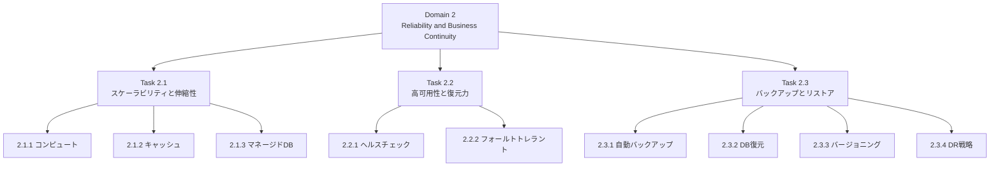

### 0-3. 学習の進め方 (おすすめ順)

1. Step 1 で用語 (RTO、RPO、高可用性など) を押さえる
2. Task 2.1 (Step 2 から Step 9) で「増やす・減らす・軽くする」を学ぶ
3. Task 2.2 (Step 10 から Step 13) で「壊れたら切り替える」を学ぶ
4. Task 2.3 (Step 14 から Step 17) で「元に戻す」を学ぶ
5. Step 18 で全体を横断して復習し、練習問題とチートシートで仕上げる

### 0-4. 表記と注意

- 数値 (保持日数、閾値、クォータなど) は 2026-10-05 時点で確認できた公式ドキュメントに基づきます。クォータや既定値は変更されることがあるため、試験直前に最新の公式ドキュメントで再確認してください
- CLI コマンドは理解を助ける例です。そのままコピーする前に、リソース名やリージョンを自分の環境に置き換えてください
- 各 Step の末尾に「ベストプラクティス」と「試験で狙われるポイント」を置いています

---

## 1. Step 1: 前提知識 (用語と考え方)

### 1-1. 似ている言葉を区別する

初学者が最初につまずくのは、似た言葉の混同です。まず表で整理します。

| 用語 | 意味 | 例 |
|---|---|---|
| スケーラビリティ (拡張性) | 負荷が増えても性能を保てる能力 | サーバーを 2 台から 20 台に増やせる |
| 伸縮性 (Elasticity) | 負荷に合わせて自動で増減し、使った分だけ払う性質 | 昼は 10 台、夜は 2 台に自動で変わる |
| 高可用性 (High Availability) | 障害があっても短い中断で復旧し、サービスを続ける | Multi-AZ 構成で AZ 障害後に自動切り替え |
| フォールトトレランス (耐障害性) | 障害が起きても中断なしで動き続ける | 複数 AZ に分散した ALB と EC2 |
| 耐久性 (Durability) | データが失われない確率 | S3 は複数 AZ に冗長保存 |
| 復元力 (Resilience) | 障害から回復して正常に戻る力 | 異常なインスタンスを自動で入れ替える |
| バックアップ | ある時点のコピーを別に保管する | RDS スナップショット |
| レプリケーション | 常に別の場所へ複製する | S3 クロスリージョンレプリケーション |

> 重要: レプリケーションはバックアップの代わりになりません。レプリカは「誤って消したデータ」や「壊れたデータ」も忠実に複製してしまうからです。この区別は試験でも実務でも非常に大切です (Step 17 でもう一度扱います)。

### 1-2. 垂直スケーリングと水平スケーリング

| 観点 | 垂直スケーリング (スケールアップ/ダウン) | 水平スケーリング (スケールアウト/イン) |
|---|---|---|
| 内容 | 1 台のサイズを大きく/小さくする | 台数を増やす/減らす |
| 例 | t3.large から m5.xlarge に変更 | ASG で EC2 を 2 台から 6 台に |
| 停止 | 多くの場合、再起動や短い切り替えが発生する | 基本的に無停止で増減できる |
| 上限 | インスタンスの最大サイズで頭打ち | 理論上は台数分だけ増やせる |
| 向く構成 | ステートフルな DB など | ステートレスな Web/AP 層 |
| AWS での代表機能 | RDS のインスタンスクラス変更、Aurora Serverless v2 の ACU 増減 | EC2 Auto Scaling、Aurora レプリカ追加、DynamoDB のパーティション分散 |

### 1-3. RTO と RPO (最重要)

- RTO (Recovery Time Objective): 障害発生から復旧完了までに許容できる時間。「どれだけ早く戻すか」
- RPO (Recovery Point Objective): 許容できるデータ損失の時間幅。「どこまで遡って戻れるか」

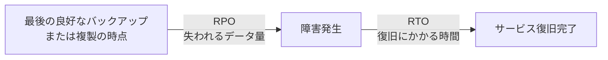

| 例 | RPO | RTO | 方向性 |
|---|---|---|---|
| 社内の勤怠システム | 24 時間 | 8 時間 | 夜間バックアップから復元する |
| EC サイトの注文 DB | 5 分以内 | 30 分 | PITR か Multi-AZ、状況により別リージョン複製 |
| 決済基盤 | ほぼゼロ | 数分 | Multi-AZ に加えて複数リージョンの Active/Active |

> 目安: RPO と RTO を小さくするほどコストと複雑さが増えます。試験では「要件を満たす中で最も低コストな方法」が正解になることが多いです。

### 1-4. AWS Well-Architected フレームワークの信頼性の柱

SOA-C03 は「AWS Well-Architected Framework に沿ってワークロードを維持する」力を問います。信頼性の柱の設計原則を覚えておくと、選択肢の消去に役立ちます。

| 設計原則 | 意味 | 本 Domain での対応 |
|---|---|---|
| 障害から自動的に復旧する | 検知して自動で入れ替える | ヘルスチェック、Auto Scaling、Multi-AZ 自動フェイルオーバー |
| 復旧手順をテストする | 戻せることを実際に確かめる | リストアテスト、DR 訓練 |
| 水平にスケールして可用性を高める | 小さい部品を多数並べる | ASG、リードレプリカ |
| キャパシティを推測しない | 負荷に合わせて自動調整する | ターゲット追跡スケーリング、DynamoDB オンデマンド |
| 自動化で変更を管理する | 手作業を減らす | AWS Backup、IaC |

---

## 2. Step 2: EC2 Auto Scaling の基礎 (Skill 2.1.1 その 1)

### 2-1. EC2 Auto Scaling とは

EC2 Auto Scaling は、EC2 インスタンスの台数を自動で増減させ、指定した範囲に保つ機能です。1 つの管理単位を Auto Scaling グループ (ASG) と呼びます。

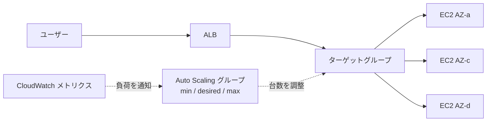

### 2-2. 構成要素

| 要素 | 役割 | 覚えておくこと |
|---|---|---|
| 起動テンプレート | AMI、インスタンスタイプ、SG、IAM ロール、ユーザーデータなどの設計図 | 推奨。起動設定 (Launch configuration) は旧方式で、新機能は起動テンプレートでのみ使える |
| 最小 (Min) | 常に維持する台数の下限 | 下限を割ると補充する |
| 希望 (Desired) | 今そうあるべき台数 | スケーリングポリシーが書き換える |
| 最大 (Max) | 台数の上限 | 暴走とコスト超過を防ぐ安全弁 |
| サブネット / AZ | どこに起動するか | 複数 AZ を選ぶと AZ 間で均等に分散する |
| ヘルスチェック | 異常なインスタンスの判定方法 | 既定は EC2 ステータスチェックのみ |
| スケーリングポリシー | いつ、どれだけ増減するか | Step 3 で詳しく扱う |

### 2-3. 台数の関係

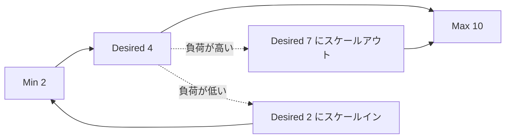

- Desired は Min 以上 Max 以下の範囲でしか動きません
- 手動で Desired を変えることも、スケジュールで変えることも、ポリシーで自動的に変えることもできます
- Max に達すると、それ以上は増えません。「負荷が高いのに増えない」ときは、まず Max を確認します

### 2-4. インスタンスのライフサイクル

ASG のインスタンスは次の状態を遷移します。ライフサイクルフック (Step 4) を使うと、待機状態で独自処理を差し込めます。

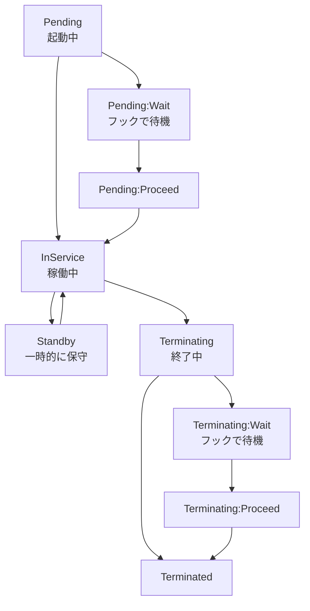

> InService になるとヘルスチェック猶予期間が始まります。猶予期間が終わるまで、EC2 ステータスチェックや ELB のヘルスチェックの結果で「異常」と判定されて入れ替えられることはありません。

### 2-5. 設定例 (CLI)

```bash
# 起動テンプレートを使って、3 つの AZ にまたがる ASG を作成する例
aws autoscaling create-auto-scaling-group \
  --auto-scaling-group-name web-asg \
  --launch-template LaunchTemplateName=web-lt,Version='$Latest' \
  --min-size 2 --desired-capacity 2 --max-size 6 \
  --vpc-zone-identifier "subnet-aaa,subnet-bbb,subnet-ccc" \
  --target-group-arns arn:aws:elasticloadbalancing:ap-northeast-1:111122223333:targetgroup/web-tg/xxxx \
  --health-check-type ELB \
  --health-check-grace-period 300
```

> 補足: 公式ドキュメントによると、ヘルスチェック猶予期間の既定値は、AWS CLI や SDK で作成した場合は 0 秒、コンソールで作成した場合は 300 秒です。起動に時間がかかるアプリでは、猶予期間を明示的に設定しないと、起動中に異常と判定されて入れ替えが繰り返される可能性があります。

### 2-6. ベストプラクティス

| # | ベストプラクティス | 理由 |
|---|---|---|
| 1 | 複数 AZ に分散させる (サブネットを 2 つ以上指定) | AZ 障害時にも残りの AZ で稼働を続けられる |
| 2 | 起動テンプレートを使う | 最新機能とバージョン管理が使える |
| 3 | ELB と連携するなら、ヘルスチェックタイプを ELB にする | 既定の EC2 チェックだけでは、アプリが応答しないインスタンスを入れ替えられない |
| 4 | ヘルスチェック猶予期間を、アプリの起動時間より少し長く設定する | 起動中に異常判定されるのを防ぐ |
| 5 | インスタンスはステートレスにする (状態は S3、DynamoDB、ElastiCache などへ) | いつ終了しても影響が出ない |
| 6 | ユーザーデータや AMI で起動時に自動で準備が完了する構成にする | 手作業の設定が残るとスケールアウトが失敗する |
| 7 | グループメトリクスを有効にする | GroupInServiceInstances などで台数の変化を追跡できる |
| 8 | Max は、コストとクォータを考えた上限にする | 暴走した場合の被害を抑える |

### 2-6-1. 試験で狙われるポイント

- 「ELB のヘルスチェックで異常でも入れ替わらない」 → ASG のヘルスチェックタイプが EC2 のままになっている。ELB に変更する
- 「スケールアウトしようとしても台数が増えない」 → Max 到達、AZ の容量不足 (InsufficientInstanceCapacity)、サービスクォータ、サブネットの空き IP 不足、起動テンプレートの不備 (存在しない AMI や SG、KMS キーの権限など) を疑う
- ASG が管理するインスタンスを手動で終了しても、ASG が Desired に合わせて補充する

---
## 3. Step 3: スケーリングポリシーを使い分ける (Skill 2.1.1 その 2)

### 3-1. 5 種類の方法

| 方式 | 動き方 | 向いている場面 | 試験での印象 |
|---|---|---|---|
| ターゲット追跡 (Target tracking) | 「CPU 50% を保つ」のように目標値を決めると、台数を自動計算して増減する | ほとんどの Web/AP 層。まず選ぶ方式 | 迷ったらこれ。CloudWatch アラームは自動作成される |
| ステップ (Step) | アラーム超過の大きさに応じて、段階的に台数を変える | 急な負荷に大きく反応させたいとき | アラームを自分で作る必要がある |
| シンプル (Simple) | アラームで 1 回の調整を行い、クールダウンが終わるまで待つ | 旧来の方式。単純な要件 | クールダウンが関係するのはこの方式 |
| スケジュール (Scheduled) | 日時や cron で Min/Max/Desired を変える | 毎朝 9 時にアクセスが急増するなど、予測できるイベント | 予定が分かっているならこれ |
| 予測 (Predictive) | 過去の負荷パターンを機械学習で分析し、先回りして台数を増やす | 毎日・毎週の周期がはっきりしている負荷 | 動的スケーリングと組み合わせて使う |

### 3-2. ターゲット追跡の仕組み

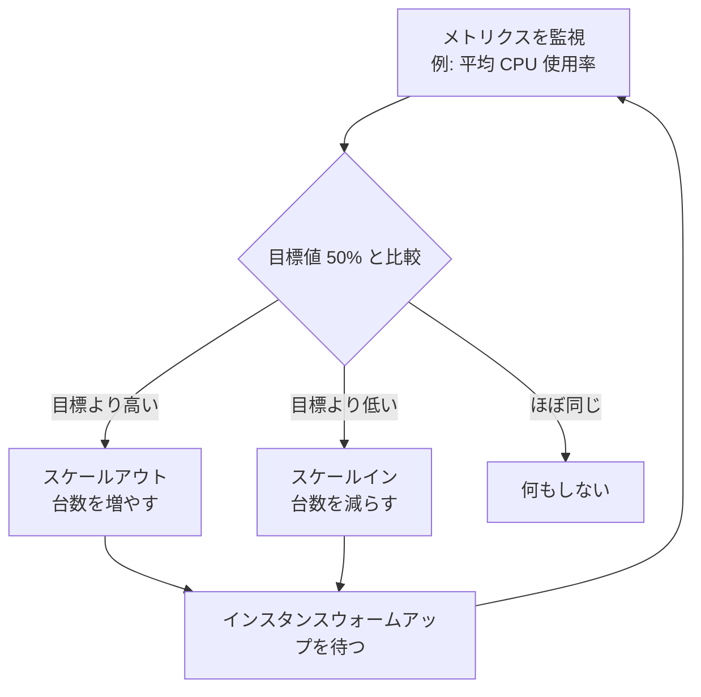

- 事前定義メトリクスには、ASGAverageCPUUtilization (平均 CPU)、ASGAverageNetworkIn と ASGAverageNetworkOut (平均ネットワーク入出力)、ALBRequestCountPerTarget (ターゲット 1 台あたりの ALB リクエスト数) があります
- キュー処理のワーカーには、SQS のメッセージ数を台数で割った「1 台あたりの滞留数」をカスタムメトリクスにする方法がよく使われます
- ターゲット追跡が作る CloudWatch アラームは AWS が管理します。手で編集せず、ポリシー側の設定を変更してください
- スケールインは、スケールアウトより慎重に動くように作られています (負荷が下がっても、すぐには減らさない)
- 1 つの ASG に複数のポリシーを付けた場合、スケールアウトでもスケールインでも、最も大きなキャパシティを提供するポリシーが優先されます

### 3-3. クールダウンとウォームアップ

| 用語 | 意味 | 対象 |
|---|---|---|
| クールダウン (Cooldown) | 1 回のスケーリングの後、次のスケーリングまで待つ時間。既定 300 秒 | シンプルスケーリング |
| インスタンスウォームアップ | 起動直後のインスタンスをグループの集計メトリクスに含めない時間 | ターゲット追跡、ステップ |

起動直後のインスタンスは、まだ起動処理でビジー (CPU が高い) なことが多く、そのまま集計に入れると「まだ足りない」と誤判断して過剰にスケールアウトしてしまいます。ウォームアップはそれを防ぎます。

### 3-4. 方式の選び方

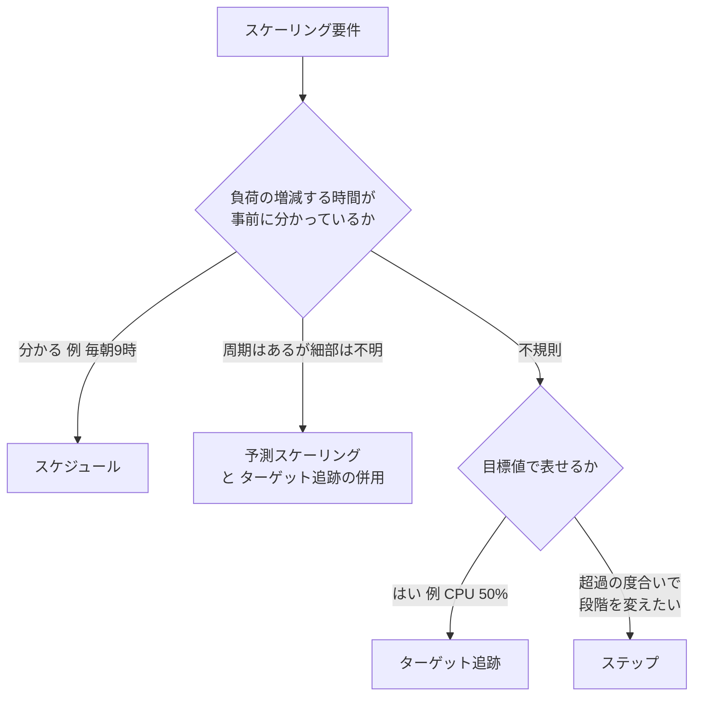

### 3-5. 設定例 (ターゲット追跡)

```bash
aws autoscaling put-scaling-policy \
  --auto-scaling-group-name web-asg \
  --policy-name cpu50-target-tracking \
  --policy-type TargetTrackingScaling \
  --target-tracking-configuration '{
    "PredefinedMetricSpecification": {
      "PredefinedMetricType": "ASGAverageCPUUtilization"
    },
    "TargetValue": 50.0
  }'
```

予測スケーリングには ForecastOnly モードがあります。最初は予測だけ生成して結果を確認し、問題なければ予測に基づくスケーリング (ForecastAndScale) に切り替える使い方が安全です。

### 3-6. ベストプラクティス

| # | ベストプラクティス | 理由 |
|---|---|---|
| 1 | まずターゲット追跡を使う | 設定が簡単で、増減の計算を AWS に任せられる |
| 2 | Web 層なら ALBRequestCountPerTarget、ワーカーなら SQS の滞留数ベースを検討する | CPU よりも実際の負荷に近い指標を使える |
| 3 | 既知のイベント (セール、月末処理) にはスケジュールを併用する | 負荷が来る前に準備できる |
| 4 | 周期的な負荷には予測スケーリングを併用する | 立ち上がりの遅れを減らせる |
| 5 | ウォームアップ時間を、実際の起動と準備にかかる時間に合わせる | 過剰なスケールアウトを避ける |
| 6 | 詳細モニタリング (1 分間隔) を有効にする | 反応が速くなる |
| 7 | Min を 2 以上にして複数 AZ に配置する | 1 台の障害で止まらない |
| 8 | 負荷テストで、スケールアウトにかかる時間を事前に測る | 想定の RTO を確認できる |

### 3-7. 試験で狙われるポイント

- 「予測できる定時の急増」 → スケジュールスケーリング (または予測スケーリング)
- 「CPU を 50% 付近に保ちたい」 → ターゲット追跡
- クールダウンが関係するのはシンプルスケーリング。ターゲット追跡とステップはウォームアップを使う
- 「起動直後に何度もスケールアウトしてしまう」 → ウォームアップ時間が短すぎる

---

## 4. Step 4: ASG の運用機能とトラブルシュート (Skill 2.1.1 その 3)

### 4-1. ヘルスチェックと入れ替え

ASG は次の方法でインスタンスの健全性を判断できます。

| 種類 | 内容 | 既定 |
|---|---|---|
| EC2 ステータスチェック | OS やハードウェアの異常 | 有効 (既定) |
| ELB ヘルスチェック | ターゲットグループが「異常」と判断した場合 | 無効 (自分で有効化する) |
| VPC Lattice ヘルスチェック | VPC Lattice のターゲットグループ | 無効 |
| カスタムヘルスチェック | 自前の仕組みが SetInstanceHealth API で通知 | - |

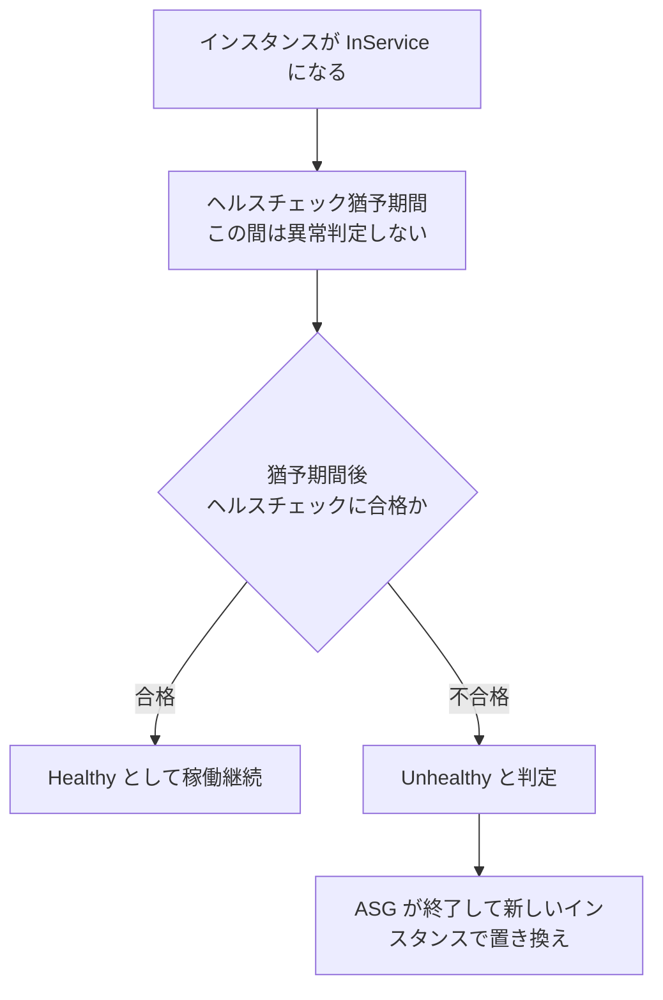

> ELB 側でターゲットが異常になっても、ASG のヘルスチェックタイプが EC2 のままだと、ASG はそのインスタンスを入れ替えません。ELB がトラフィックを送らなくなるだけで、台数は変わらず、異常なインスタンスの料金は発生し続けます。

### 4-2. ライフサイクルフック

起動時または終了時に、インスタンスを待機状態 (Pending:Wait、Terminating:Wait) で止めて、独自の処理を実行させる仕組みです。

| 用途 | タイミング | 例 |
|---|---|---|
| 起動時の準備 | Pending:Wait | 監視エージェントの導入、構成管理ツールへの登録、キャッシュのウォームアップ |
| 終了前の後処理 | Terminating:Wait | ログを S3 に退避、処理中ジョブの完了待ち、構成管理ツールからの登録解除 |

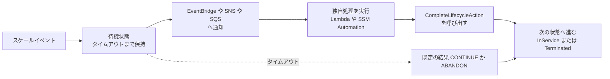

- タイムアウト (ハートビートタイムアウト) の既定は 3600 秒です。処理に時間がかかる場合は、ハートビートを記録して延長できます
- 起動フックを使うと、InService になった時点でヘルスチェック猶予期間が始まります
- 公式ドキュメントによると、ライフサイクルフックの実行中は、シンプルスケーリングのスケーリング活動が一時停止するのが一般的です

### 4-3. ウォームプール

ウォームプールは、事前に初期化済みのインスタンスを ASG の横に待機させておき、スケールアウト時にそこから素早く投入する機能です。

| 待機状態 | 特徴 | 向く場面 |
|---|---|---|
| Stopped | 停止中 (EBS の料金のみ) | 起動に時間がかかり、コストを抑えたい |
| Running | 稼働中 (インスタンス料金も発生) | 最速で投入したい |
| Hibernated | 休止中 (メモリ内容を保存) | OS 起動後の状態を保ちたい |

- ウォームプールのインスタンスには、ヘルスチェック猶予期間はありません。ライフサイクルフックが完了するまで、ASG はヘルスチェックを始めません
- 「起動に数分かかって、スケールアウトが間に合わない」というシナリオの定番解答です

### 4-4. インスタンスリフレッシュ (ローリング更新)

新しい AMI や起動テンプレートを、稼働中の ASG 全体へ段階的に反映する機能です。

| 設定 | 意味 |
|---|---|
| 最小正常率 (MinHealthyPercentage) | 更新中に維持する正常インスタンスの割合 (既定 90%) |
| インスタンスウォームアップ | 新インスタンスを正常とみなすまでの待ち時間 |
| チェックポイント | 一部を置き換えた時点で止めて、確認してから続行する |
| 自動ロールバック | 失敗したら元の構成に戻す |
| ルートボリュームの置き換え | インスタンスを入れ替えず、ルートボリュームだけを新しい AMI で置き換える |

> ベストプラクティス: 本番では、まずチェックポイントを設定して少数で様子を見てから全体に広げます。

### 4-5. 終了ポリシーとインスタンス保護

スケールインのとき、どのインスタンスを終了するかを決めるのが終了ポリシーです。

| 方針 | 動き |
|---|---|
| Default | まず AZ 間の台数を均等に保つ。その上で、最も古い起動テンプレートや起動設定のインスタンスなどを優先して選ぶ |
| OldestInstance / NewestInstance | 最古、最新のインスタンスを終了 |
| OldestLaunchTemplate | 最も古い起動テンプレートを使うインスタンス |
| ClosestToNextInstanceHour | 次の課金時間に最も近いインスタンス |
| AllocationStrategy | 割り当て戦略に合わない構成のインスタンス |

- スケールイン保護を設定したインスタンスは、スケールインで終了されません (長時間バッチを実行中のインスタンスなどに使う)
- ASG のプロセスを一時停止する機能 (Launch、Terminate、HealthCheck、ReplaceUnhealthy、AZRebalance など) は、調査やメンテナンスで使います。停止したままにすると自動復旧が働かなくなるので注意してください

### 4-6. 混合インスタンスポリシーと Spot

- 複数のインスタンスタイプと購入オプション (オンデマンドと Spot) を 1 つの ASG で混在させられます
- 属性ベースのインスタンスタイプ選択 (vCPU とメモリの条件を指定する方式) で、候補を広げられます
- キャパシティの再調整 (Capacity Rebalancing) を有効にすると、Spot の中断リスクが高まったインスタンスを事前に入れ替えられます
- ベースとなる台数をオンデマンドで確保し、増加分を Spot にするのが定番です (可用性とコストの両立)

### 4-7. トラブルシュート: ASG がスケールアウトしない

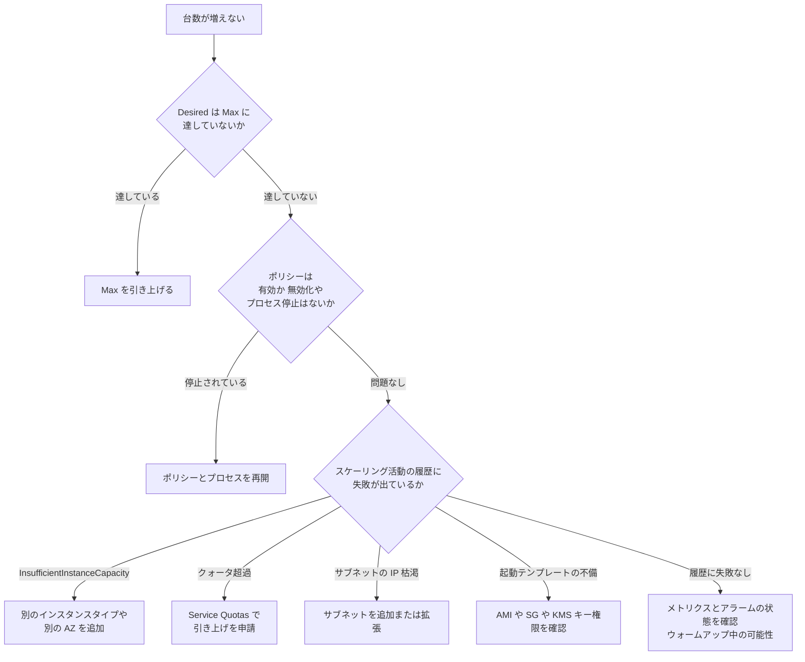

| 症状 | 主な原因 | 対処 |
|---|---|---|
| 起動に失敗し続ける | AMI が削除された、SG や KMS キーを参照できない、IAM インスタンスプロファイルがない | 起動テンプレートの参照先を確認する。スケーリング活動の履歴でエラーメッセージを見る |
| 暗号化 EBS の起動に失敗 | KMS キーポリシーが ASG のサービスリンクロールを許可していない | キーポリシーで AWSServiceRoleForAutoScaling を許可する |
| 一部の AZ にだけ起動できない | その AZ の容量不足 | インスタンスタイプの候補を広げる、AZ を増やす |
| 入れ替えが頻繁に繰り返される | 猶予期間が短い、ヘルスチェックのパスが不適切 | 猶予期間の延長、ヘルスチェック設定の見直し |
| 異常なのに入れ替わらない | ヘルスチェックタイプが EC2 | ELB に変更する |
| 手動で終了したのに戻ってくる | Desired が変わっていない | 台数を減らしたいなら Desired を変更する |

### 4-8. ベストプラクティスと試験ポイント

- スケーリング活動の履歴 (Activity history) は、トラブルシュートの最初の確認先
- SNS 通知や EventBridge で、起動・終了・失敗のイベントを監視する
- 「起動に時間がかかって間に合わない」 → ウォームプール
- 「新しい AMI を稼働中のグループに順次反映したい」 → インスタンスリフレッシュ
- 「終了前に、ログを退避したい」 → 終了ライフサイクルフック

---

## 5. Step 5: ECS・Lambda・EKS のスケーリング (Skill 2.1.1 その 4)

EC2 Auto Scaling が担当するのは EC2 インスタンスです。それ以外のリソースは、Application Auto Scaling という共通の仕組みで増減できます。

### 5-1. EC2 Auto Scaling と Application Auto Scaling

| 観点 | EC2 Auto Scaling | Application Auto Scaling |
|---|---|---|
| 対象 | EC2 インスタンス (ASG) | ECS サービス、DynamoDB のテーブルと GSI、Aurora レプリカ、Lambda のプロビジョニング済み同時実行、ElastiCache のレプリケーショングループ、Spot Fleet、EMR、SageMaker エンドポイントなど |
| 方式 | ターゲット追跡、ステップ、シンプル、スケジュール、予測 | ターゲット追跡、ステップ、スケジュール (リソースにより対応が異なる) |
| 登録 | ASG を作る | スケーラブルターゲットとして登録し、ポリシーを付ける |

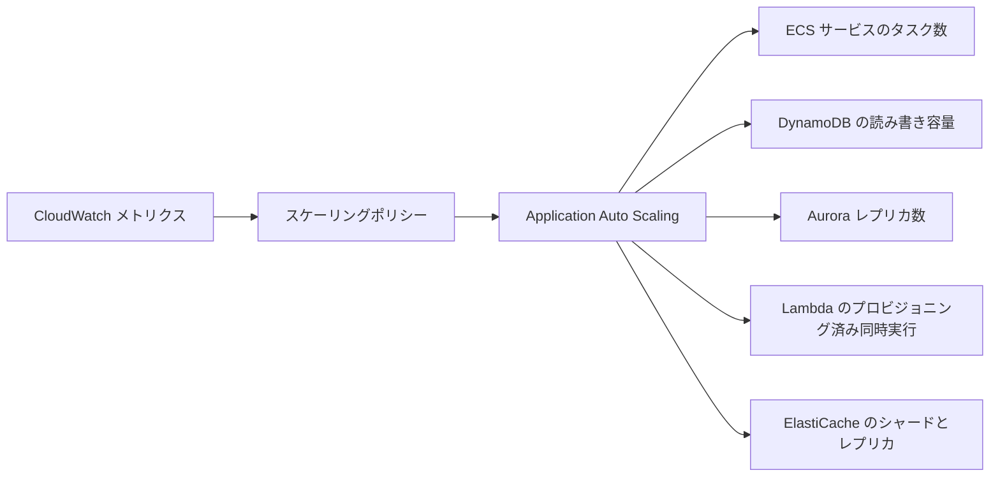

### 5-2. ECS のオートスケーリング

ECS には 2 つの階層のスケーリングがあります。

| 階層 | 対象 | 仕組み |
|---|---|---|
| サービス (タスク数) | ECS サービスの Desired count | Application Auto Scaling のターゲット追跡 (ECSServiceAverageCPUUtilization、ECSServiceAverageMemoryUtilization、ALBRequestCountPerTarget) |
| クラスター (インフラ) | EC2 起動タイプのコンテナインスタンス | キャパシティプロバイダーの管理スケーリングが ASG を増減する |
| Fargate | サーバー管理が不要 | タスクだけを増減すればよい |

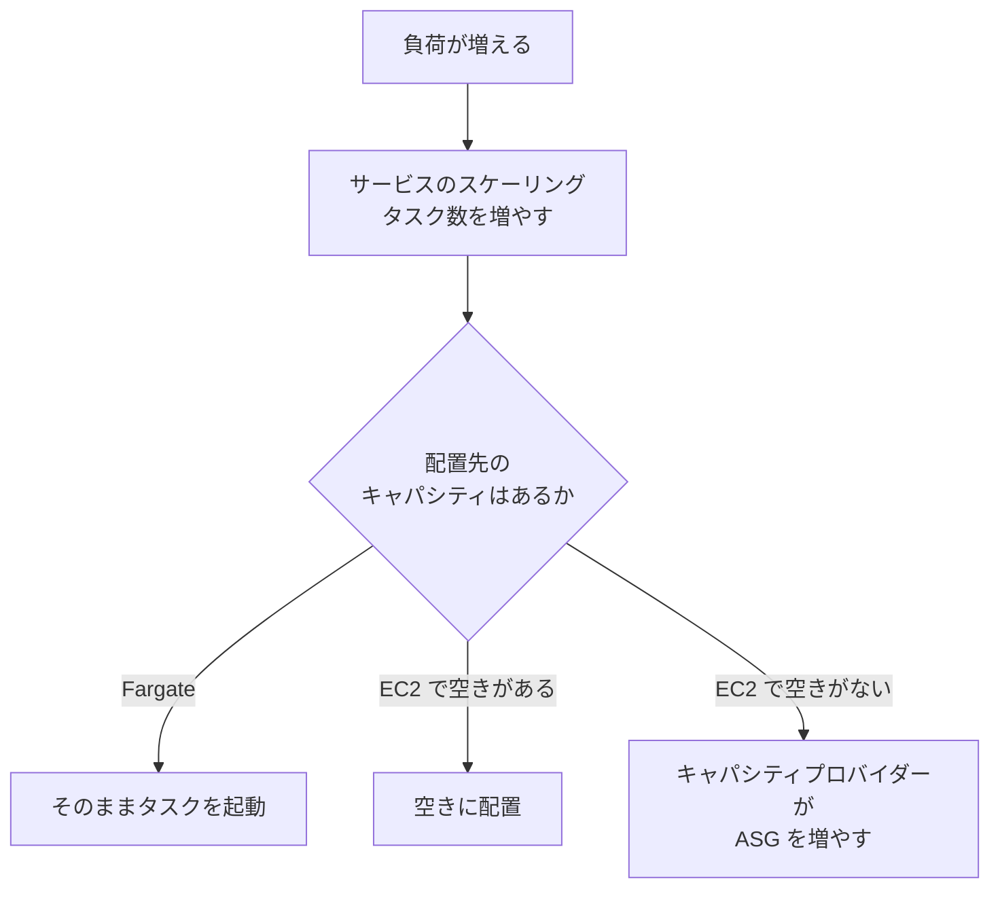

- サービスの既定のクールダウンは 300 秒です
- デプロイでは、最小正常率と最大率 (minimumHealthyPercent、maximumPercent) の設定で、ローリング更新中の可用性が決まります
- デプロイサーキットブレーカーを有効にすると、デプロイが繰り返し失敗したときに自動でロールバックできます

### 5-3. Lambda のスケーリング

Lambda はリクエストに応じて、自動的に実行環境を増やします。運用で押さえる設定は次の 3 つです。

| 設定 | 内容 | 注意 |
|---|---|---|
| 予約済み同時実行 (Reserved concurrency) | その関数に同時実行数を確保し、同時に上限にもなる | 追加料金なし。他の関数がその分を使えなくなる |
| プロビジョニング済み同時実行 (Provisioned concurrency) | 実行環境を事前に初期化しておき、コールドスタートを減らす | 料金が発生する。バージョンかエイリアスに設定する ($LATEST は不可) |
| アカウントの同時実行クォータ | リージョン単位の合計 (既定 1,000 で、引き上げ申請が可能) | 超えるとスロットリング (429) |

- プロビジョニング済み同時実行は、Application Auto Scaling のターゲット追跡 (スケジュールも可) で増減できます
- スロットリングが出たら、Throttles、ConcurrentExecutions、ProvisionedConcurrencyUtilization のメトリクスを確認します
- 非同期呼び出しはスロットリング時に自動で再試行されます。ストリームやキューのイベントソースは、バッチ設定と同時実行の上限を見直します
- 公式ドキュメントでは、関数ごとの急増時のスケーリング速度 (10 秒ごとに増やせる実行環境数) が定められています。急激なスパイクが予想されるなら、プロビジョニング済み同時実行で備えます

### 5-4. EKS (参考)

| 対象 | 仕組み |
|---|---|
| Pod 数 | Horizontal Pod Autoscaler (HPA) |
| ノード数 | Cluster Autoscaler、Karpenter、またはマネージドノードグループ (内部は ASG) |

試験の中心は、EC2 Auto Scaling と Application Auto Scaling の考え方です。EKS の細かな設定は優先度を下げて構いません。

### 5-5. ベストプラクティスと試験ポイント

| # | ベストプラクティス |
|---|---|
| 1 | ステートレスに作り、コンテナ/関数がいつ増減しても影響しないようにする |
| 2 | ECS は、CPU/メモリ、または ALBRequestCountPerTarget でターゲット追跡する |
| 3 | EC2 起動タイプの ECS では、サービスのスケーリングとキャパシティプロバイダーの両方を設定する |
| 4 | Lambda はコールドスタートが問題なら、プロビジョニング済み同時実行を検討する |
| 5 | 下流 (DB など) を守りたいなら、予約済み同時実行で上限をかける |
| 6 | スロットリングやスケールアウトの遅れは、CloudWatch のメトリクスとアラームで検知する |

- 「ECS のタスクは増えたが、起動できない」 → クラスターに空きがない。キャパシティプロバイダーの管理スケーリングを確認する
- 「Lambda の初回応答が遅い」 → プロビジョニング済み同時実行
- 「ある Lambda が他の Lambda の同時実行枠を食い尽くす」 → 重要な関数に予約済み同時実行を設定する

---
## 6. Step 6: Amazon CloudFront でキャッシュする (Skill 2.1.2 その 1)

### 6-1. なぜキャッシュがスケーラビリティにつながるのか

アクセスが増えるたびにサーバーを増やすより、「同じ内容は使い回す」ほうが安く、速く、安定します。キャッシュは、オリジン (S3 や ALB など) に届くリクエスト自体を減らします。

CloudFront は、世界中のエッジロケーションにコンテンツをキャッシュする CDN です。

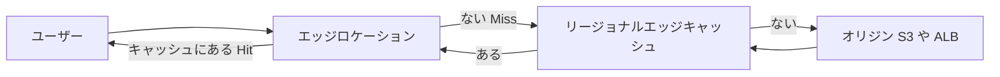

### 6-2. 主要な設定

| 設定 | 内容 | ポイント |
|---|---|---|
| キャッシュポリシー | TTL (最小、既定、最大) と、キャッシュキーに含める値 (ヘッダー、Cookie、クエリ文字列) を決める | キャッシュキーが細かいほど Hit 率が下がる |
| オリジンリクエストポリシー | オリジンへ転送する値を決める (キャッシュキーには含めない) | オリジンが必要とする値だけを転送する |
| TTL | オブジェクトをキャッシュに置く秒数 | オリジンの Cache-Control や Expires を、最小と最大の範囲内で尊重する |
| 無効化 (Invalidation) | キャッシュを即座に破棄する | 回数が多いなら、バージョン付きファイル名のほうが効率的 |
| Origin Shield | オリジンの手前に置く追加のキャッシュ層 | 複数リージョンからの Miss をまとめて、オリジンの負荷を減らす |
| オリジングループ | プライマリとセカンダリのオリジンを設定し、失敗時に自動で切り替える | オリジンの可用性向上 |
| OAC (Origin Access Control) | S3 オリジンへのアクセスを CloudFront 経由だけに制限する | S3 を直接公開しない |

TTL の挙動で特に大事な点:

- キャッシュポリシーの TTL は 3 種類あります。既定の TTL は 86,400 秒 (1 日)、最大の TTL は 31,536,000 秒 (1 年) です
- 最小 TTL が 0 より大きいと、オリジンが no-cache、no-store、private を返しても、最小 TTL の間はキャッシュされます
- 最小、既定、最大がすべて 0 の場合は、キャッシュが無効になります
- オリジンが Cache-Control を返さない場合に、既定の TTL が使われます

### 6-3. キャッシュ Hit 率を上げる

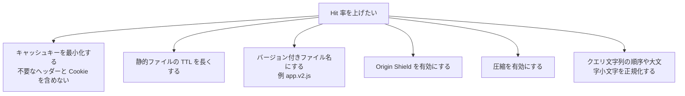

- 動的コンテンツ (API など) でも、TTL を短く (数秒から数十秒) するだけで、集中アクセスの負荷を大きく減らせる場合があります
- キャッシュしないコンテンツでも、CloudFront を経由すると、AWS のネットワークを通じた接続の確立と再利用で、遅延が減ることがあります

### 6-4. オリジンのフェイルオーバー (オリジングループ)

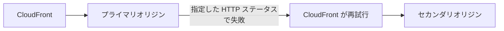

- 失敗とみなすステータスコード (500、502、503、504 など) を指定します
- フェイルオーバーの対象は、GET、HEAD、OPTIONS のリクエストです
- エラー応答のキャッシュは、既定で短時間 (10 秒) 行われます。復旧後も古いエラーが残らないように、エラーキャッシュの最小 TTL を調整できます

### 6-5. ベストプラクティスと試験ポイント

| # | ベストプラクティス |
|---|---|
| 1 | 静的コンテンツは長い TTL とバージョン付きファイル名で配信し、無効化を避ける |
| 2 | キャッシュキーには、本当に必要な値だけを含める |
| 3 | S3 オリジンは OAC で保護し、バケットを直接公開しない |
| 4 | オリジンの負荷を守りたい場合は Origin Shield を使う |
| 5 | 可用性が重要なら、オリジングループで冗長化する |
| 6 | キャッシュ Hit 率 (CloudWatch の追加メトリクスやキャッシュ統計) を監視する |

- 「S3 の更新が、世界中のユーザーにまだ反映されない」 → TTL が長いのが原因。無効化を実行するか、バージョン付きファイル名にする
- 「オリジンへのリクエストが多すぎる」 → Hit 率を確認し、キャッシュキーの最小化、TTL 延長、Origin Shield を検討する
- 「プライマリオリジンの障害時に自動で切り替えたい」 → オリジングループ

---

## 7. Step 7: Amazon ElastiCache と DAX でキャッシュする (Skill 2.1.2 その 2)

### 7-1. ElastiCache とは

ElastiCache は、インメモリ (メモリ上) のデータストアを提供するマネージドサービスです。データベースの前に置き、頻繁に読まれるデータをミリ秒以下で返します。

| 観点 | Valkey / Redis OSS | Memcached |
|---|---|---|
| データ構造 | 文字列、ハッシュ、リスト、セット、ソート済みセットなど豊富 | シンプルなキーと値 |
| レプリケーション | あり (プライマリとレプリカ) | なし |
| Multi-AZ と自動フェイルオーバー | あり | なし (ノードを複数 AZ に置けるが、フェイルオーバーやレプリケーションはない) |
| バックアップ (スナップショット) | あり | なし |
| スケールの方法 | クラスターモード (シャーディング) とレプリカ追加 | ノードを追加し、クライアント側で分散 |

提供形態は 2 つあります。

| 形態 | 内容 |
|---|---|
| ノードベース (自己設計クラスター) | ノードタイプ、シャード数、レプリカ数を自分で決める |
| ElastiCache Serverless | 容量を自動でスケールする。キャパシティの管理が不要 |

### 7-2. キャッシュ戦略 (必ず出る)

| 戦略 | 動き | 長所 | 短所 |
|---|---|---|---|
| 遅延読み込み (Lazy loading) | 読み取りでキャッシュを先に見る。なければ DB から読んで、キャッシュに書く | 要求されたデータだけがキャッシュされる。ノード障害でキャッシュが空になっても、動き続けられる | Miss 時に往復が増えて遅い。古いデータが残ることがある |
| ライトスルー (Write-through) | DB に書くたびに、同時にキャッシュも更新する | キャッシュが常に新しい | 書き込みが重くなる。読まれないデータでキャッシュが膨らむ。新しいノードは、書き込まれるまでデータがない |
| TTL を付ける | キャッシュに有効期限を設定する | 古いデータの滞在期間を制限できる。メモリを節約できる | TTL が短すぎると Miss が増える |

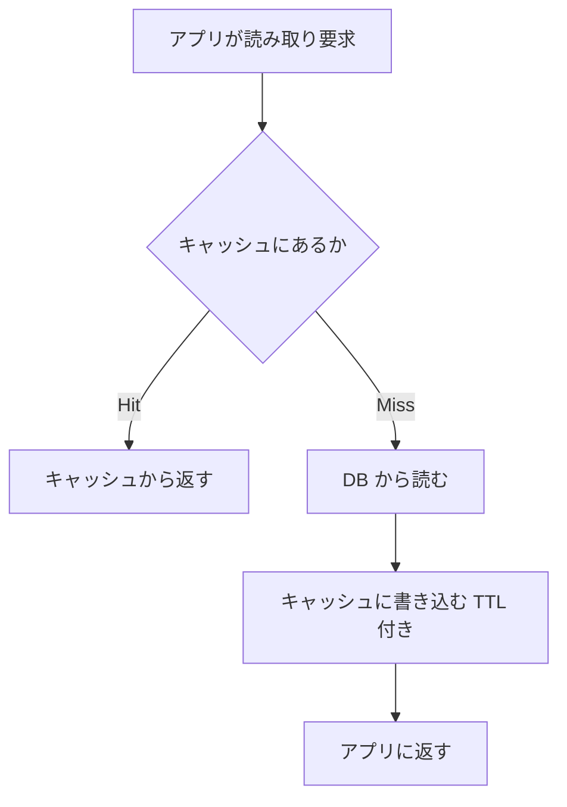

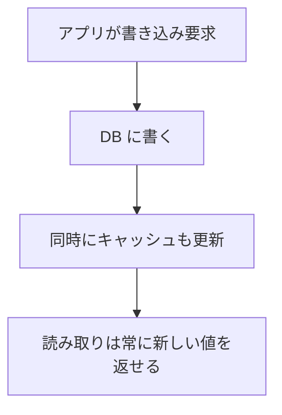

> 実務の定番は「遅延読み込み + TTL」、更新頻度が高く鮮度が重要なデータだけ「ライトスルー」を併用する形です。ライトスルーと遅延読み込みを組み合わせると、ライトスルーの短所 (キャッシュにデータがない) を補えます。

### 7-3. スケーリングと可用性

| 目的 | 方法 |
|---|---|
| 読み取りを増やす | レプリカを追加する |
| 書き込みとメモリ容量を増やす | クラスターモードでシャードを追加する (オンラインでリシャーディング可能) |
| 1 ノードを強化する | ノードタイプを大きくする (垂直) |
| 自動で増減する | Serverless を使う。またはノードベースで Application Auto Scaling (シャードとレプリカ) を使う |
| 障害に備える | Multi-AZ を有効にして、自動フェイルオーバーを有効化する。レプリカを別 AZ に置く |

監視する主なメトリクスは次の通りです。

| メトリクス | 意味 | 対処の例 |
|---|---|---|
| Evictions | メモリ不足で追い出されたキー数 | 増え続けるなら、ノードを大きくする、シャードを増やす、TTL を見直す |
| CacheHits / CacheMisses | Hit と Miss の数 | Hit 率が低いなら、キー設計や TTL を見直す |
| CPUUtilization / EngineCPUUtilization | CPU 使用率 | 高いなら、レプリカやシャードを増やす |
| DatabaseMemoryUsagePercentage | メモリ使用率 | 高いなら、容量を増やす |
| CurrConnections | 接続数 | 急増なら、接続の使い回しを確認する |
| ReplicationLag | レプリカの遅れ | 大きいなら、書き込み負荷かノードサイズを確認する |

### 7-4. DynamoDB Accelerator (DAX)

DAX は、DynamoDB 専用のインメモリキャッシュです。DynamoDB の API と互換性があり、アプリの変更は少なくて済みます。

| 観点 | 内容 |
|---|---|
| 効果 | 読み取りをマイクロ秒単位に高速化する |
| キャッシュの種類 | アイテムキャッシュ (GetItem、BatchGetItem) とクエリキャッシュ (Query、Scan) |
| 書き込み | ライトスルー (DAX 経由で書くと、DynamoDB とキャッシュの両方を更新する) |
| 結果整合性の読み取り | キャッシュから返せる |
| 強い整合性の読み取り | キャッシュを通らず、DynamoDB に直接渡される |
| 可用性 | 複数のノードを複数の AZ に配置する (本番では 3 ノード以上が推奨) |
| 向かない用途 | 書き込みが多い、強い整合性が常に必要、読み取りが少ないワークロード |

### 7-5. どのキャッシュを選ぶか

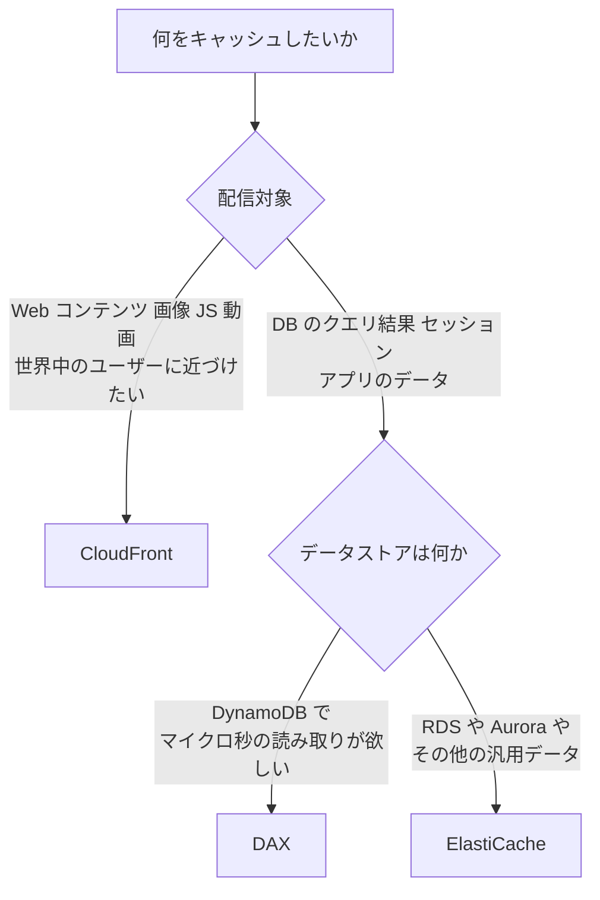

### 7-6. ベストプラクティスと試験ポイント

| # | ベストプラクティス |
|---|---|
| 1 | 本番は Valkey/Redis OSS でレプリカを別 AZ に置き、Multi-AZ と自動フェイルオーバーを有効にする |
| 2 | すべてのキャッシュに TTL を付け、古いデータの滞在期間を制限する |
| 3 | キャッシュが落ちても、アプリが DB から読めるように作る (遅延読み込みなら自然に満たせる) |
| 4 | Evictions と Hit 率を監視し、容量不足を早めに検知する |
| 5 | DB への負荷が支配的な読み取り中心のワークロードでは、まずキャッシュ導入を検討する |

- 「RDS の読み取り負荷が高い。アプリの変更は小さくしたい」 → ElastiCache (遅延読み込み)、またはリードレプリカ
- 「DynamoDB の読み取りを、アプリの変更を最小にして高速化したい」 → DAX
- 「Memcached は、自動フェイルオーバーやバックアップが必要な場面には不向き」 → Valkey/Redis OSS を選ぶ

---

## 8. Step 8: RDS と Aurora のスケーリング (Skill 2.1.3 その 1)

### 8-1. スケーリングの種類を整理する

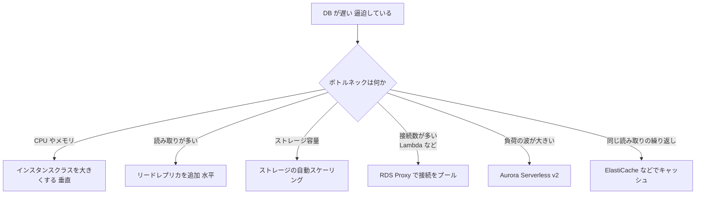

### 8-2. Amazon RDS

#### (1) 垂直スケーリング (インスタンスクラスの変更)

- ModifyDBInstance でインスタンスクラスを変更します。「すぐに適用」か「次のメンテナンスウィンドウで適用」を選べます
- 変更時には、短い停止 (再起動) が発生します。Multi-AZ 構成では、先にスタンバイを変更してからフェイルオーバーするため、停止時間を短くできます

#### (2) ストレージの自動スケーリング

「最大ストレージしきい値」を設定すると、空き容量が減ったときに RDS が自動でストレージを増やします。

| 項目 | 内容 |
|---|---|
| 発動条件 | 空き容量が割り当ての 10% 未満、その状態が 5 分以上続く、前回のストレージ変更から 6 時間以上経過 (またはストレージ最適化の完了) |
| 増加量 | 10 GiB、現在の割り当ての 10%、直近の使用量に基づく 7 時間分の増加予測のうち、最も大きい値 |
| 最大ストレージしきい値 | 現在の割り当てより少なくとも 10% 大きくする必要がある。公式は 26% 以上を推奨 |
| 注意 | 一度増やすと、割り当てを減らせない。大量のデータロード中は、増加が間に合わずにストレージ不足になることがある |

```bash
# 既存のインスタンスでストレージの自動スケーリングを有効にする (最大 1000 GiB)
aws rds modify-db-instance \
  --db-instance-identifier mydb \
  --max-allocated-storage 1000 \
  --apply-immediately
```

> ベストプラクティス: 自動スケーリングを有効にしても、FreeStorageSpace の CloudWatch アラームは別に設定します。上限に近づいたことや、急増に増加が追いつかないことに気づけます。

#### (3) リードレプリカ

| 観点 | 内容 |
|---|---|
| 目的 | 読み取り負荷の分散 (スケールアウト)。クロスリージョンの DR にも使える |
| 複製方式 | 非同期 (数秒の遅れが出ることがある。ReplicaLag で監視) |
| エンドポイント | レプリカごとに別のエンドポイント。アプリ側で読み取りを振り分ける |
| 昇格 | レプリカを単体の DB インスタンスに昇格できる (昇格後は元のプライマリと切り離される) |
| 注意 | Multi-AZ のスタンバイとは別物。Multi-AZ (インスタンス構成) のスタンバイは読み取りに使えない |

#### (4) RDS Proxy

アプリと DB の間に置く、マネージドのコネクションプールです。

- 接続を多重化して、DB の接続数と負荷を減らします (特に、同時に多数の接続を作る Lambda に有効)
- フェイルオーバー時にアプリの接続を維持して、復旧時間を短縮します
- IAM 認証や Secrets Manager との連携で、認証情報の管理も楽になります

### 8-3. Amazon Aurora

| 観点 | 内容 |
|---|---|
| ストレージ | 複数の AZ にまたがる共有ストレージが、自動で拡張する (手動の容量設定は不要) |
| レプリカ | 最大 15 台の Aurora レプリカ。共有ストレージなので、レプリカの遅れは小さい |
| エンドポイント | クラスターエンドポイント (書き込み)、リーダーエンドポイント (読み取りを分散)、カスタムエンドポイント、インスタンスエンドポイント |
| Aurora Auto Scaling | CPU 使用率や接続数に応じて、Aurora レプリカの台数を自動で増減する |
| Aurora Serverless v2 | ACU (Aurora Capacity Unit) 単位で、きめ細かく自動スケールする |

#### Aurora Auto Scaling (レプリカ数の自動増減)

- Application Auto Scaling を使い、スケーラブルディメンション rds:cluster:ReadReplicaCount で、レプリカ数を最小と最大の範囲で増減します
- 事前定義メトリクスは、リーダーの平均 CPU 使用率 (RDSReaderAverageCPUUtilization) と、リーダーの平均接続数 (RDSReaderAverageDatabaseConnections) です
- 対象はリーダー (読み取り) だけです。ライターのワークロードには効きません
- 自分が作成したレプリカだけを削除し、クラスターが利用可能な状態のときにだけスケールします

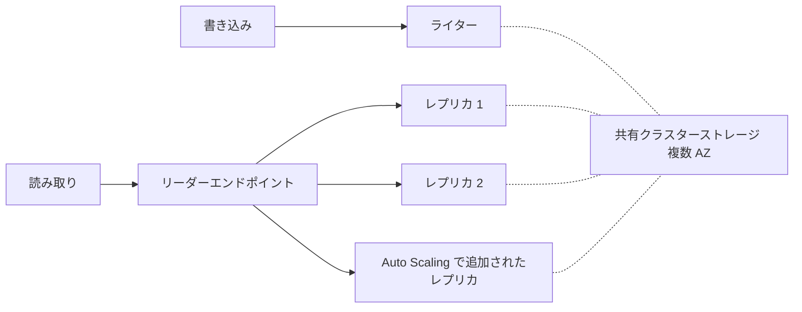

#### Aurora Serverless v2

- 容量が ACU 単位で、最小と最大を決めて、その間を自動で細かく増減します
- 1 つのクラスターに、プロビジョニング済みのインスタンスと Serverless v2 のインスタンスを混在させられます
- 開発環境、不定期なワークロード、負荷の波が大きいワークロードに向きます
- 最小 ACU を 0 にして、アイドル時に一時停止する設定が選べるバージョンもあります。利用可否は、エンジンとバージョンの対応状況を公式ドキュメントで確認してください

### 8-4. 監視すべきメトリクス

| メトリクス | 見るポイント |
|---|---|
| CPUUtilization | 高止まりなら、垂直スケールかレプリカ追加 |
| FreeableMemory | 少ないなら、メモリの大きいクラスへ |
| DatabaseConnections | 上限に近いなら、RDS Proxy、接続プールの見直し |
| FreeStorageSpace | 減り続けるなら、ストレージ拡張。自動スケーリングの上限にも注意 |
| ReadIOPS / WriteIOPS / DiskQueueDepth | I/O が逼迫していないか |
| ReplicaLag (AuroraReplicaLag) | レプリカの遅れ |

Performance Insights を有効にすると、どの SQL が負荷の原因かを特定できます。

### 8-5. ベストプラクティスと試験ポイント

| # | ベストプラクティス |
|---|---|
| 1 | 読み取りが多いなら、まずレプリカとキャッシュで分散する |
| 2 | ストレージの自動スケーリングを有効にし、最大しきい値と FreeStorageSpace アラームを設定する |
| 3 | Lambda など接続数が多いクライアントには RDS Proxy を使う |
| 4 | 本番は Multi-AZ にする (スケーリングと可用性は別の関心事) |
| 5 | 垂直スケーリングは、メンテナンスウィンドウなど影響の小さい時間帯に行う |

- 「ストレージが足りなくなりそう。停止なく自動で増やしたい」 → ストレージの自動スケーリング (最大ストレージしきい値の設定)
- 「Aurora の読み取りが急増する」 → Aurora Auto Scaling (レプリカ) か、Aurora Serverless v2
- 「Aurora Auto Scaling は書き込みを増やせるか」 → いいえ。リーダーだけが対象
- 「Lambda から接続が多すぎて、DB が接続エラーになる」 → RDS Proxy

---

## 9. Step 9: DynamoDB のスケーリング (Skill 2.1.3 その 2)

### 9-1. キャパシティモード

| 観点 | プロビジョニング済み | オンデマンド |
|---|---|---|
| 課金 | 設定した RCU/WCU の時間料金 | リクエストの数に応じた課金 |
| キャパシティ管理 | 自分で設定する (Auto Scaling で自動調整できる) | 不要 (DynamoDB が自動で対応する) |
| 向く場面 | 負荷が予測でき、安定している | 負荷が予測できない、新規でトラフィックが読めない、急な波が大きい |
| コスト | 安定した負荷なら安くなりやすい | 不規則なら無駄が出にくい。安定して高負荷なら割高になりうる |
| 注意 | 設定を超えるとスロットリング | モードの切り替えには頻度の制限がある (公式で確認) |

RCU と WCU の目安 (表で覚えます)。

| 単位 | 意味 |
|---|---|
| 1 RCU | 1 秒に 4 KB までの強い整合性の読み取り 1 回 (結果整合性なら 2 回) |
| 1 WCU | 1 秒に 1 KB までの書き込み 1 回 |
| トランザクション | 通常の 2 倍のキャパシティを消費する |

### 9-2. DynamoDB Auto Scaling (プロビジョニング済みモード)

```mermaid
flowchart TB
    A["消費キャパシティを CloudWatch が計測"] --> B{"使用率が<br/>ターゲット値を超えたか"}
    B -->|"超えた"| C["プロビジョニング済みを増やす"]
    B -->|"下回った"| D["プロビジョニング済みを減らす"]
    B -->|"範囲内"| E["変更なし"]
    C --> F["最小と最大の範囲内で調整"]
    D --> F
```

- Application Auto Scaling が、ターゲット追跡で読み取りと書き込みのキャパシティを別々に調整します
- 設定項目は、最小キャパシティ、最大キャパシティ、ターゲット使用率です。コンソールの既定のターゲット使用率は 70% です
- グローバルセカンダリインデックス (GSI) にも、別に Auto Scaling を設定します。GSI が足りないと、そのスロットリングが元のテーブルの書き込みにも影響します
- 反応にはある程度の時間がかかります。数秒の急なスパイクは、Auto Scaling が間に合わずスロットリングされることがあります。急な波が予想されるなら、オンデマンドモードを検討します

### 9-3. スロットリングのトラブルシュート

```mermaid
flowchart TB
    T["ProvisionedThroughputExceededException<br/>または ThrottledRequests が増加"] --> M{"モードは何か"}
    M -->|"プロビジョニング済み"| P1{"Auto Scaling は有効か<br/>最大値に達していないか"}
    P1 -->|"無効"| P2["Auto Scaling を有効にする"]
    P1 -->|"最大に到達"| P3["最大キャパシティを引き上げる"]
    P1 -->|"有効で急なスパイク"| P4["オンデマンドへの切り替えを検討"]
    M -->|"オンデマンド"| O1["特定のパーティションキーに<br/>集中していないか ホットパーティション"]
    P1 --> HP["ホットパーティションの確認"]
    HP --> K["キー設計を見直す"]
    O1 --> K
    T --> C["SDK の再試行を<br/>指数バックオフで設定"]
```

| 症状 | 原因 | 対処 |
|---|---|---|
| 特定のキーだけスロットリング | ホットパーティション (アクセスが一部のキーに集中) | パーティションキーの設計を見直す。分散させる |
| GSI のスロットリングで書き込みも遅い | GSI のキャパシティ不足 | GSI にも Auto Scaling を設定する |
| スパイクで一時的にスロットリング | Auto Scaling の反応が間に合わない | オンデマンド、またはキャパシティの余裕を増やす |
| 読み取りが多い | 同じアイテムの繰り返し読み取り | DAX でキャッシュする |

- DynamoDB は、使わなかったキャパシティを一定時間 (最大 300 秒) 蓄えてバーストに使える仕組み (バーストキャパシティ) と、パーティションごとの負荷の偏りに自動で対応する仕組み (アダプティブキャパシティ) を備えています。ただし、これらに頼り切った設計は避けます
- AWS SDK は、スロットリング時に指数バックオフで自動再試行します

### 9-4. その他のスケーリング関連機能

| 機能 | 用途 |
|---|---|
| DAX | 読み取りのキャッシュ (Step 7) |
| グローバルテーブル | 複数リージョンへの複製 (読み取りのスケールと DR。Step 17) |
| テーブルクラス (Standard / Standard-IA) | ストレージ中心のコスト最適化 |
| リザーブドキャパシティ | プロビジョニング済みモードのコスト削減 |

### 9-5. ベストプラクティスと試験ポイント

| # | ベストプラクティス |
|---|---|
| 1 | 負荷が読めないならオンデマンド、安定しているならプロビジョニング済み + Auto Scaling |
| 2 | プロビジョニング済みでは、テーブルと GSI の両方に Auto Scaling を設定する |
| 3 | パーティションキーは、値の種類が多く、アクセスが均等に散らばるものを選ぶ |
| 4 | スロットリングを CloudWatch アラームで監視する |
| 5 | 読み取り中心なら DAX を検討する |

- 「トラフィックが予測できない新規アプリで、キャパシティ管理を避けたい」 → オンデマンド
- 「負荷が安定していて、コストを抑えたい」 → プロビジョニング済み + Auto Scaling
- 「Auto Scaling が追いつかないほどの急激なスパイク」 → オンデマンド
- 復元したテーブルには、Auto Scaling の設定が引き継がれない (Step 15 参照)

---
## 10. Step 10: Elastic Load Balancing のヘルスチェック設定 (Skill 2.2.1 その 1)

### 10-1. ロードバランサーの種類

| 種類 | レイヤー | 得意なこと | ヘルスチェックの主な方式 |
|---|---|---|---|
| ALB (Application Load Balancer) | L7 (HTTP/HTTPS/gRPC) | パスやホストでのルーティング、Web アプリ | HTTP/HTTPS (パスとステータスコードを検証) |
| NLB (Network Load Balancer) | L4 (TCP/UDP/TLS) | 超低遅延、固定 IP、大量接続 | TCP、HTTP、HTTPS |
| GWLB (Gateway Load Balancer) | L3 | セキュリティアプライアンスの挟み込み | TCP、HTTP、HTTPS |

### 10-2. ヘルスチェックの仕組み

ロードバランサーは、登録されたターゲットに定期的にリクエストを送り、「健全 (healthy)」か「異常 (unhealthy)」かを判定します。異常なターゲットにはトラフィックを送りません。

```mermaid
flowchart LR
    C["クライアント"] --> LB["ロードバランサー"]
    LB -->|"定期的にヘルスチェック"| T1["ターゲット A 健全"]
    LB -->|"定期的にヘルスチェック"| T2["ターゲット B 異常"]
    LB -->|"リクエストを転送"| T1
    LB -. "転送しない" .-> T2
```

主な設定項目 (ターゲットグループ単位) は次の通りです。

| 設定 | 意味 | ALB の既定の目安 |
|---|---|---|
| プロトコル / ポート | チェックに使う方式と宛先ポート | トラフィックポート (ターゲットが受けるポート) |
| パス | チェックするパス。例 /health | / |
| 間隔 (Interval) | チェックの頻度 | 30 秒 |
| タイムアウト | 応答を待つ時間 | 5 秒 |
| 正常のしきい値 | 連続で成功したら健全とみなす回数 | 5 回 |
| 異常のしきい値 | 連続で失敗したら異常とみなす回数 | 2 回 |
| 成功コード (Matcher) | 成功とみなす HTTP ステータス | 200 |

> 数値は ALB の既定の目安です。NLB など他のタイプでは既定値が異なるため、必ず公式ドキュメントで確認してください。

### 10-3. 検知にかかる時間の目安

異常と判定されるまでの時間は、おおよそ「間隔 x 異常のしきい値」です。たとえば間隔 30 秒、しきい値 2 回なら、最短でも約 1 分かかります。復旧して健全に戻るまでは「間隔 x 正常のしきい値」です。

| 目標 | 設定の方向性 | 副作用 |
|---|---|---|
| 障害を早く検知したい | 間隔を短く、異常のしきい値を小さく | 一時的な遅延で誤検知しやすくなる、チェックの負荷が増える |
| 誤検知を減らしたい | しきい値を大きく | 検知が遅れる |

### 10-4. 重要な動作 (試験で狙われる)

1. 公式ドキュメントによると、ターゲットグループに登録された全ターゲットが異常のときは、ロードバランサーは (ヘルスの状態に関係なく) すべてのターゲットにリクエストを送ります (フェイルオープン)
2. ターゲットは、ヘルスチェックに 1 回合格するまで InService になりません
3. セキュリティグループは、ロードバランサーからヘルスチェックのポートとプロトコルへの通信を許可する必要があります
4. ヘルスチェックのパスは、できるだけ軽く、依存先 (DB など) の一時的な障害で全台が異常にならない設計にします

```mermaid
flowchart TB
    subgraph "良くない例"
      B1["/health が DB に問い合わせる"] --> B2["DB が一時的に遅延"]
      B2 --> B3["全ターゲットが異常と判定"]
      B3 --> B4["全面的なサービス停止"]
    end
```

### 10-5. ターゲットグループの関連設定

| 設定 | 内容 | 補足 |
|---|---|---|
| 登録解除の遅延 (Deregistration delay) | ターゲットを外す際に、処理中のリクエストが完了するのを待つ時間 | 既定は 300 秒。短いリクエスト中心なら短縮して、デプロイやスケールインを速くできる |
| スロースタート | 新しいターゲットへのリクエスト量を、徐々に増やす | 起動直後の負荷集中を避ける (ALB) |
| 負荷分散アルゴリズム | ラウンドロビン、最小未処理リクエスト (Least outstanding requests) など | リクエスト処理時間のばらつきが大きいなら最小未処理リクエストが有効 |
| スティッキーセッション | 同じクライアントを同じターゲットに送る | 偏りやスケールインの影響に注意。可能ならステートレスにする |
| クロスゾーン負荷分散 | 全 AZ のターゲットに均等に分散する | ALB は常に有効 (ロードバランサー側の無効化は不可)。NLB と GWLB は既定で無効 (有効にすると AZ 間のデータ転送料金が発生しうる) |

> 補足 (クロスゾーン): ターゲット数が AZ 間で偏っている場合、クロスゾーンが無効だと、台数の少ない AZ のターゲットに負荷が集中します。AZ ごとのターゲット数を揃えるか、クロスゾーンを有効にします。

### 10-6. ASG との連携

```mermaid
flowchart LR
    ASG["Auto Scaling グループ"] -->|"起動したインスタンスを登録"| TG["ターゲットグループ"]
    TG -->|"ヘルスチェック結果"| ASG
    ASG -->|"ヘルスチェックタイプが ELB なら<br/>異常なインスタンスを入れ替え"| NEW["新しいインスタンス"]
```

- 終了するインスタンスは、先にロードバランサーから登録解除され、登録解除の遅延の間は、処理中のリクエストの完了を待ちます
- ASG の猶予期間と、ターゲットグループの正常のしきい値 x 間隔の関係に注意します。猶予期間が短すぎると、まだ健全になる前に異常判定されて入れ替えが繰り返されます

### 10-7. ベストプラクティス

| # | ベストプラクティス |
|---|---|
| 1 | 専用の軽量なヘルスチェックエンドポイントを用意する (認証不要、短時間で 200 を返す) |
| 2 | アプリの「受け付けられる状態か」を検査し、外部依存の一時障害で全台が落ちる設計を避ける |
| 3 | 複数 AZ にターゲットを均等に配置する |
| 4 | ヘルスチェックのログ (S3 に出力できる) とアクセスログを有効にして、調査に備える |
| 5 | UnHealthyHostCount や HealthyHostCount のアラームを設定する |
| 6 | ASG と連携するなら、ヘルスチェックタイプを ELB にする |

---

## 11. Step 11: ELB のトラブルシュート (Skill 2.2.1 その 2)

### 11-1. ターゲットが異常になる原因の切り分け

```mermaid
flowchart TB
    S["ターゲットが Unhealthy"] --> R["ターゲットヘルスの<br/>理由コードを確認"]
    R --> A{"SG と NACL は<br/>ヘルスチェックを許可しているか"}
    A -->|"許可していない"| A1["ターゲット側 SG で<br/>ALB の SG からのポートを許可"]
    A -->|"許可している"| B{"アプリは<br/>ポートで待ち受けているか"}
    B -->|"いいえ"| B1["アプリの起動とポート設定を確認"]
    B -->|"はい"| C{"パスと成功コードは<br/>合っているか"}
    C -->|"合っていない"| C1["パスを修正するか<br/>成功コードを見直す"]
    C -->|"合っている"| D{"応答が時間内に<br/>返るか 過負荷ではないか"}
    D -->|"遅い"| D1["タイムアウトを延ばす<br/>ターゲットを増やす<br/>軽いパスに変更"]
    D -->|"問題なし"| E["仮想ホストの設定 ホストヘッダー<br/>リダイレクト 認証を確認"]
```

| 症状 | よくある原因 | 確認と対処 |
|---|---|---|
| Health checks failed (タイムアウト) | SG や NACL でヘルスチェックの通信が遮断されている、アプリが応答しない | ターゲットの SG が、ロードバランサーの SG からヘルスチェックポートへの通信を許可しているか。ロードバランサーの SG が、ターゲットへの送信を許可しているか |
| Health checks failed with these codes | 想定外のステータスコード (301、302、401、403、404 など) | パスが存在するか。認証が不要か。リダイレクトを成功コードに含めるか、パスを変更する |
| 登録直後に長く Initial のまま | 起動に時間がかかる、しきい値 x 間隔が長い | しきい値と間隔を見直す。アプリの起動時間を短縮する |
| 一部のターゲットだけ異常 | そのインスタンスだけ過負荷や設定ミス | CPU やメモリ、ログを確認する |
| 仮想ホストで失敗 | ヘルスチェックの Host ヘッダーに対応する設定がない | 既定の仮想ホスト設定を用意する |

### 11-2. HTTP エラーコードの意味

ELB が返す (または ELB 経由で見える) エラーは、どこで発生したかを切り分ける手がかりです。

| コード | 意味 | 代表的な原因 | 見るメトリクス |
|---|---|---|---|
| 502 Bad Gateway | ターゲットから不正な応答、または接続が切られた | ターゲットが接続を早く閉じる (アイドルタイムアウトより短い Keep-Alive)、アプリのクラッシュ、プロトコル不一致 | HTTPCode_ELB_502_Count |
| 503 Service Unavailable | 振り分け先がない | 登録済みの健全なターゲットがない (ターゲットグループが空など) | HTTPCode_ELB_503_Count、HealthyHostCount |
| 504 Gateway Timeout | ターゲットが時間内に応答しない | ターゲットの処理が遅い、接続を確立できない、SG や NACL の遮断、ALB のアイドルタイムアウトより処理が長い | HTTPCode_ELB_504_Count、TargetResponseTime |
| 4xx (ELB 発) | クライアント側の不正リクエスト | 不正な形式、認証の失敗 | HTTPCode_ELB_4XX_Count |
| 5xx (ターゲット発) | アプリが返したエラー | アプリのバグ、依存先の障害 | HTTPCode_Target_5XX_Count |

> 見分けのコツ: メトリクス名に ELB が付くものはロードバランサー自身が返したエラー、Target が付くものはターゲット (アプリ) が返したエラーです。

### 11-3. 設定の落とし穴

| 落とし穴 | 説明 |
|---|---|
| ALB のアイドルタイムアウト (既定 60 秒) よりアプリの Keep-Alive タイムアウトが短い | アプリが先に接続を閉じて 502 が発生する。アプリ側の Keep-Alive をアイドルタイムアウトより長くする |
| インターネット向け ALB をプライベートサブネットに置いた | パブリックサブネット (インターネットゲートウェイへのルートがある) を指定する必要がある |
| ALB に有効にした AZ にターゲットがない | その AZ のトラフィックの行き先がない。ターゲットを置くか、AZ を見直す |
| ヘルスチェックのポートが違う | トラフィックポートとは別のポートを使うなら、SG でそのポートも許可する |
| 長い処理 (大きなアップロードなど) | アイドルタイムアウトの延長や、非同期化を検討する |

### 11-4. 調べ方の道具

| 道具 | 用途 |
|---|---|
| ターゲットヘルスの理由コード (コンソールや DescribeTargetHealth) | なぜ異常かをまず確認する |
| ヘルスチェックログ | ヘルスチェックの詳細を S3 に保存して分析する |
| アクセスログ | リクエストごとの結果と、ELB とターゲットのどちらでエラーが発生したかを調べる |
| CloudWatch メトリクス | HealthyHostCount、UnHealthyHostCount、TargetResponseTime、RequestCount など |
| VPC フローログ | SG や NACL による遮断を確認する |
| Reachability Analyzer | 経路の疎通の可否を静的に分析する |

### 11-5. 試験で狙われるポイント

- 「ターゲットが Unhealthy。ヘルスチェックのポートは正しい」 → ターゲット側の SG がロードバランサーからの通信を許可していない
- 「503 エラーが出る」 → 健全なターゲットがない (登録されていない、全台異常、スケールアウトの失敗)
- 「504 エラーが出る」 → ターゲットが遅い、接続できない
- 「間欠的に 502」 → アプリの Keep-Alive とロードバランサーのアイドルタイムアウトの不整合
- 「デプロイ中にリクエストが切れる」 → 登録解除の遅延 (接続のドレイニング) の設定を確認する

---

## 12. Step 12: Amazon Route 53 のヘルスチェックとフェイルオーバー (Skill 2.2.1 その 3)

### 12-1. Route 53 ヘルスチェックの 3 + 1 種類

| 種類 | 何を監視するか | 使いどころ |
|---|---|---|
| エンドポイントのヘルスチェック | Route 53 のヘルスチェッカーが、IP アドレスやドメイン名のエンドポイントに、HTTP、HTTPS、TCP で接続して確認する | 公開されているエンドポイントの死活監視 |
| 計算されたヘルスチェック (Calculated) | 他のヘルスチェックの結果を AND、OR、または N 個以上の条件で組み合わせる | 複数のコンポーネントを 1 つの指標にまとめる |
| CloudWatch アラームのヘルスチェック | CloudWatch アラームと同じメトリクスのデータを元に判定する | プライベートなリソース (VPC 内) や、独自のメトリクスの監視 |
| ARC のルーティングコントロール | Application Recovery Controller のオン/オフのスイッチ | 計画的で確実な手動切り替え |

```mermaid
flowchart TB
    subgraph "Route 53 ヘルスチェッカー 世界各地から"
      H1["ヘルスチェッカー 1"]
      H2["ヘルスチェッカー 2"]
      H3["ヘルスチェッカー 3"]
    end
    H1 --> EP["エンドポイント"]
    H2 --> EP
    H3 --> EP
    EP --> J{"一定割合以上の<br/>チェッカーが成功か"}
    J -->|"はい"| HEALTHY["Healthy"]
    J -->|"いいえ"| UNHEALTHY["Unhealthy"]
```

エンドポイントのヘルスチェックの要点:

- HTTP/HTTPS では、TCP 接続を確立した後にリクエストを送り、2xx または 3xx (200 以上 400 未満) の応答を成功とみなします。TCP のみのチェックもあります
- 世界の複数のリージョンのヘルスチェッカーが確認し、その結果を集計して判定します
- チェック間隔は標準 (30 秒) と高速 (10 秒、追加料金) から選びます。失敗のしきい値 (連続失敗回数) を設定できます
- ヘルスチェッカーからの通信を許可する必要があります。ファイアウォールや SG で、Route 53 ヘルスチェッカーの IP 範囲 (公式が公開している範囲) からのアクセスを許可します
- 文字列マッチング (応答本文の先頭 5,120 バイト内の文字列を確認する) も利用できます
- VPC 内のプライベートなエンドポイントは、パブリックなヘルスチェッカーから直接到達できません。CloudWatch アラームのヘルスチェックを使います

CloudWatch アラームのヘルスチェックの注意点 (公式ドキュメントより):

- Route 53 は、アラームが ALARM 状態になるのを待たず、アラームと同じデータストリームと条件で判定します
- M out of N アラームと、複数メトリクスを計算するメトリクス数式のアラームには対応していません
- 同じ AWS アカウントのアラームだけを監視できます
- データ不足時の扱いは、InsufficientDataHealthStatus (Healthy、Unhealthy、LastKnownStatus) で決めます

### 12-2. ヘルスチェックと DNS ルーティングの連携

ヘルスチェックは、ルーティングポリシーと組み合わせて初めて効果を発揮します。ヘルスチェックを関連付けたレコードが異常になると、Route 53 はそのレコードを DNS 応答から外します。

| ルーティングポリシー | 動き | ヘルスチェックとの関係 |
|---|---|---|
| シンプル | 1 つの値 (または複数の値をまとめて) を返す | ヘルスチェックは使えない |
| フェイルオーバー | プライマリが正常ならプライマリ、異常ならセカンダリを返す (アクティブ/パッシブ) | プライマリにヘルスチェックが必須 |
| 加重 (Weighted) | 重みの比率で分散する。段階的な切り替えやテストに使う | 異常なレコードは除外される |
| レイテンシー | 遅延が最も小さいリージョンのレコードを返す | 異常なレコードは除外される |
| 地理的 (Geolocation) | ユーザーの位置で振り分ける | 異常なレコードは除外される |
| 地理的近接 (Geoproximity) | 位置とバイアスで振り分ける | 同上 |
| マルチバリュー回答 | 最大 8 個の健全なレコードを返す (簡易な負荷分散) | 異常なレコードは除外される |
| IP ベース | クライアントの IP 範囲で振り分ける | 同上 |

```mermaid
flowchart TB
    U["ユーザーが名前解決"] --> R53["Route 53"]
    R53 --> HC{"プライマリのヘルスチェックは<br/>正常か"}
    HC -->|"正常"| P["プライマリ 東京の ALB を返す"]
    HC -->|"異常"| S["セカンダリ 大阪の ALB を返す"]
```

### 12-3. エイリアスレコードと Evaluate Target Health

AWS リソース (ALB、NLB、CloudFront、S3 ウェブサイトなど) を指すエイリアスレコードでは、「Evaluate Target Health (ターゲットの正常性を評価する)」を有効にすると、別途ヘルスチェックを作らなくても、そのリソース自身の健全性で判定できます。

| 観点 | エイリアス + Evaluate Target Health | 明示的なヘルスチェック |
|---|---|---|
| 作成 | ヘルスチェックを作らずに済む | 別途作る |
| 判定 | 対象リソースの状態 (例: ALB のターゲットが健全か) | 外部からのエンドポイントの確認 |
| 料金 | ヘルスチェックの料金は不要 | ヘルスチェックの料金が発生 |
| 向く場面 | AWS 内のリソース間の切り替え | 外部からの視点で確認したい、独自の条件が必要 |

### 12-4. フェイルオーバーの所要時間を左右する要素

```mermaid
flowchart LR
    A["障害発生"] --> B["ヘルスチェックの検知<br/>間隔 x 失敗しきい値"]
    B --> C["Route 53 が応答を切り替え"]
    C --> D["クライアントや リゾルバーの<br/>DNS キャッシュの期限切れ TTL"]
    D --> E["新しい宛先へ接続"]
```

- 全体の切り替え時間は「検知時間 + TTL の残り時間」でおおよそ決まります。切り替え要件が厳しいなら、TTL を短く (例えば 60 秒以下) します (エイリアスレコードでは、TTL は参照先のリソースの設定に従います)
- DNS ベースの切り替えは、クライアントやリゾルバーのキャッシュに依存するため、即時ではありません。より確実で素早い切り替えには、Application Recovery Controller (ARC) や、Global Accelerator の利用を検討します

### 12-5. トラブルシュート

| 症状 | 原因の候補 | 対処 |
|---|---|---|
| ヘルスチェックが常に失敗 | ヘルスチェッカーの IP が SG、NACL、WAF などで遮断されている | 公開されているヘルスチェッカーの IP 範囲を許可する |
| パスやポートが違う | 設定ミス | プロトコル、ポート、パス (ホスト名) を確認する |
| 応答が遅くてタイムアウト | エンドポイントの過負荷 | 軽いパスに変更する、キャパシティを増やす |
| プライベートリソースを監視できない | パブリックヘルスチェッカーが到達できない | CloudWatch アラームのヘルスチェックを使う |
| フェイルオーバーが起きない | レコードにヘルスチェックが関連付けられていない、フェイルオーバーのレコードタイプ (Primary / Secondary) の設定ミス | レコードの設定を見直す |
| フェイルオーバー後も旧宛先に接続される | DNS キャッシュ (TTL) | TTL を短くする。事前に設定しておく |
| 全レコードが異常 | Route 53 はすべて異常なとき、全レコードを返す (フェイルオープン的な動作) | 異常の根本原因を直す |

### 12-6. ベストプラクティスと試験ポイント

| # | ベストプラクティス |
|---|---|
| 1 | フェイルオーバーには、必ずプライマリにヘルスチェックを付ける |
| 2 | ヘルスチェック用のエンドポイントは、アプリの実質的な健全性を反映する軽量なものにする |
| 3 | 失敗時に通知を受けるよう、ヘルスチェックのステータスに CloudWatch アラームと SNS を設定する (ヘルスチェックのメトリクスは us-east-1 に出力される) |
| 4 | 複数のコンポーネントを組み合わせて判定するなら、計算されたヘルスチェックを使う |
| 5 | TTL は、必要な切り替え時間に合わせて、事前に短くしておく |
| 6 | 定期的にフェイルオーバーのテストを行う |

- 「VPC 内の非公開リソースのヘルスを Route 53 で監視したい」 → CloudWatch アラームのヘルスチェック
- 「アクティブ/パッシブの DR」 → フェイルオーバールーティング
- 「最も近い (遅延が小さい) リージョンへ、異常時は他へ」 → レイテンシールーティング + ヘルスチェック
- 「新バージョンへ 10% だけ流したい」 → 加重ルーティング

---

## 13. Step 13: フォールトトレラントなシステムを作る (Skill 2.2.2)

### 13-1. 基本の考え方

「単一障害点 (SPOF) をなくす」が出発点です。AWS では、次の階層で冗長性を考えます。

| 範囲 | 守れる障害 | 代表的な手段 |
|---|---|---|
| インスタンス | 1 台のサーバーの故障 | Auto Scaling による自動入れ替え、複数台構成 |
| AZ (アベイラビリティゾーン) | データセンターの障害 | Multi-AZ 構成 |
| リージョン | リージョン全体の障害 | マルチリージョン (DR 戦略。Step 17) |

### 13-2. 典型的な Multi-AZ 構成

```mermaid
flowchart TB
    U["ユーザー"] --> R53["Route 53"]
    R53 --> ALB["ALB 複数 AZ にまたがる"]
    subgraph AZ1["AZ-a"]
      E1["EC2 ASG"]
      D1["RDS プライマリ"]
      N1["NAT Gateway"]
    end
    subgraph AZ2["AZ-c"]
      E2["EC2 ASG"]
      D2["RDS スタンバイ"]
      N2["NAT Gateway"]
    end
    ALB --> E1
    ALB --> E2
    E1 --> D1
    E2 --> D1
    D1 <-->|"同期レプリケーション"| D2
```

### 13-3. サービス別の Multi-AZ 対応

| サービス | 複数 AZ の扱い | 運用者がやること |
|---|---|---|
| EC2 | 1 インスタンスは 1 つの AZ に存在する | ASG で複数 AZ に分散する |
| ALB / NLB | 有効にした複数の AZ に、ロードバランサーのノードを置く | 2 つ以上の AZ を有効にし、各 AZ にターゲットを置く |
| NAT Gateway | 1 つの AZ に作られる (ゾーナル) | AZ ごとに作成し、各 AZ のルートテーブルで自 AZ の NAT を向ける |
| EBS | 1 つの AZ 内で冗長化される | AZ 障害に備えて、スナップショットを取る (別 AZ には復元できる) |
| EFS | 標準クラスは複数の AZ に保存する | 各 AZ にマウントターゲットを作成する |
| S3 | S3 Standard は複数の AZ にまたがって保存する | 運用上の設定は少ない |
| RDS | Multi-AZ 配置を有効にする | 本番では Multi-AZ を有効にする。フェイルオーバーを試験する |
| Aurora | データは 3 つの AZ に 6 つのコピーで保存される | 別 AZ にレプリカを置き、フェイルオーバー先を用意する |
| DynamoDB | リージョン内で複数の AZ に自動で複製される | 設定不要。リージョン障害にはグローバルテーブル |
| ElastiCache | Multi-AZ を設定した複製グループ | 別 AZ にレプリカを置き、自動フェイルオーバーを有効にする |
| FSx for Windows など | Multi-AZ のファイルシステムを選べる | デプロイタイプで Multi-AZ を選ぶ |
| Lambda | 複数の AZ で自動的に実行される | VPC 内で動かすなら、複数 AZ のサブネットを指定する |

> NAT Gateway の落とし穴: 1 つの NAT Gateway を全 AZ で共有すると、その AZ が落ちたときに、他の AZ の送信通信も止まります。AZ ごとに NAT Gateway を作り、各 AZ のルートテーブルで自 AZ の NAT Gateway を指すのが、可用性とデータ転送料金の両面でベストプラクティスです。

### 13-4. RDS の Multi-AZ 配置を理解する

RDS の高可用性構成は、現在 3 つの選択肢があります。名前が似ているので、表で整理してください。

| 観点 | Single-AZ | Multi-AZ DB インスタンス (スタンバイ 1 台) | Multi-AZ DB クラスター (読み取り可能なスタンバイ 2 台) |
|---|---|---|---|
| 構成 | 1 台 | プライマリ 1 + スタンバイ 1 (別 AZ) | ライター 1 + 読み取り可能なスタンバイ 2 (3 つの AZ) |
| 対応エンジン | すべて | すべての RDS エンジン | MySQL と PostgreSQL |
| レプリケーション | なし | 同期 (ストレージレベル) | 半同期 (DB エンジンのネイティブ機能) |
| スタンバイで読み取り | 該当なし | 不可 | 可能 (リーダーエンドポイント) |
| 自動フェイルオーバー | なし | あり。目安は 1 から 2 分程度 | あり。AWS は通常 35 秒未満と案内 |
| RPO | 障害内容による | 0 に近い (同期レプリケーション) | 非常に小さい |
| 書き込みの遅延 | 小さい | やや大きい | 公式は、インスタンス構成より書き込みコミットの遅延が小さいと説明 |
| 用途 | 開発、テスト | 一般的な本番の高可用性 | より速い復旧と、読み取りの分散も欲しい本番 |

フェイルオーバーの流れと注意点:

```mermaid
flowchart TB
    F["プライマリの障害を検知<br/>AZ 障害 インスタンス障害 ストレージ障害 など"] --> P["スタンバイをプライマリに昇格"]
    P --> D["DNS のエンドポイントを<br/>新しいプライマリへ切り替え"]
    D --> A["アプリは同じエンドポイントで<br/>再接続"]
```

- アプリは、RDS が提供する DNS エンドポイント名で接続します。IP アドレスを固定で使うと、フェイルオーバー後に接続できなくなります
- アプリの DNS キャッシュが長いと、切り替わらない場合があります。JVM の DNS キャッシュ TTL などを短く設定します
- Multi-AZ のフェイルオーバーは、再起動時にフェイルオーバーを強制 (ForceFailover) して試験できます。RDS イベント (フェイルオーバー開始と完了) で結果を確認します
- Multi-AZ は、高可用性の仕組みです。リードレプリカ (スケールアウト用) の代わりにはなりません (インスタンス構成のスタンバイは読み取りに使えない)
- Multi-AZ は、誤って削除したデータやデータの破損から守るものではありません。バックアップが必要です

### 13-4-1. Aurora の高可用性

- ストレージは、3 つの AZ にまたがって 6 つのコピーを保持します (データの耐久性)
- 同じクラスターに別 AZ のレプリカがあれば、ライターの障害時に、そのレプリカが昇格します (多くは約 30 秒以内)。レプリカがない場合は、新しいインスタンスを作るため、復旧に時間がかかります
- 昇格の優先順位は、レプリカの優先度 (tier 0 から 15) で制御できます
- Aurora グローバルデータベースを使うと、別リージョンへの低遅延のレプリケーションで、リージョン障害に備えられます (Step 17)

### 13-5. その他のフォールトトレランスの工夫

| 工夫 | 内容 |
|---|---|
| ステートレス化 | セッションは ElastiCache や DynamoDB に置く。ファイルは S3 や EFS に置く |
| 疎結合化 | SQS、SNS、EventBridge でコンポーネントを分離し、一部の障害が全体に波及しないようにする |
| 再試行と指数バックオフ | 一時的な障害は、間隔を空けて再試行する |
| タイムアウトとサーキットブレーカー | 遅い依存先で全体が詰まらないようにする |
| EC2 の自動復旧 | システムステータスチェックの失敗時に、同じ AZ の別のハードウェアで復旧する CloudWatch アラームのアクション (ASG なしの単体インスタンス向け) |
| 静的安定性 | 障害時に新しいリソースを作る (コントロールプレーン操作) に頼らず、事前に十分な数を確保しておく |

### 13-6. ベストプラクティスと試験ポイント

| # | ベストプラクティス |
|---|---|
| 1 | すべての層を、最低 2 つ (できれば 3 つ) の AZ に分散する |
| 2 | 本番 DB は Multi-AZ にする |
| 3 | NAT Gateway は AZ ごとに作る |
| 4 | フェイルオーバーを定期的に訓練して、アプリの再接続を確認する |
| 5 | 単一障害点を洗い出し、削除していく |

- 「DB のメンテナンスや AZ 障害でも、短い中断で自動復旧したい」 → RDS Multi-AZ
- 「Multi-AZ のスタンバイで読み取りを分散したい」 → インスタンス構成では不可。Multi-AZ DB クラスター、またはリードレプリカを使う
- 「AZ の障害時に、プライベートサブネットのインターネット通信が止まった」 → NAT Gateway が単一 AZ
- 「単体の EC2 を、ハードウェア障害から自動で復旧したい」 → CloudWatch アラームによる EC2 の自動復旧アクション

---
## 14. Step 14: スナップショットとバックアップの自動化 (Skill 2.3.1)

### 14-1. 3 つの考え方

| 手段 | 内容 | 向く場面 |
|---|---|---|
| サービス固有の機能 | RDS の自動バックアップ、EBS スナップショット、DynamoDB の PITR など | 単一サービスで完結する、きめ細かい設定 |
| Amazon Data Lifecycle Manager (DLM) | EBS スナップショットと AMI の作成、保持、削除をポリシーで自動化する | EBS 中心のスナップショット運用 |
| AWS Backup | 複数サービスのバックアップを 1 か所でポリシー管理する | 複数のサービスや複数アカウントをまとめて管理、コンプライアンスの証跡 |

試験では、「複数のサービスのバックアップを一元管理して自動化したい」と書かれていたら、AWS Backup が正解になる可能性が高いです。

### 14-2. AWS Backup の構成要素

| 要素 | 役割 |
|---|---|
| バックアッププラン | 「いつ (スケジュール、開始ウィンドウ)」「どれくらい保持 (ライフサイクル)」「どこへ (バックアップボールト)」「コピー先」を定義する |
| バックアップルール | プランの中の個々のルール。1 プランに複数のルールを持てる (例: 毎日と毎月) |
| バックアップボールト | バックアップ (復旧ポイント) の保管場所。KMS キーで暗号化される |
| 復旧ポイント (Recovery point) | 1 回のバックアップの結果 |
| リソース割り当て (Resource assignment) | どのリソースを対象にするか。リソースタイプ、ARN、タグで指定できる |
| IAM ロール | AWS Backup がバックアップと復元を行うための権限 |

```mermaid
flowchart LR
    PLAN["バックアッププラン<br/>スケジュールと保持期間"] --> RULE["バックアップルール"]
    ASSIGN["リソース割り当て<br/>タグ Backup=true など"] --> PLAN
    RULE --> JOB["バックアップジョブ"]
    JOB --> VAULT["バックアップボールト<br/>復旧ポイントを保管"]
    RULE -->|"コピールール"| COPY["別リージョンや別アカウントの<br/>ボールトへコピー"]
```

### 14-3. 重要な機能

| 機能 | 内容 | ポイント |
|---|---|---|
| 対応リソース | EC2 (AMI)、EBS、RDS、Aurora、DynamoDB、S3、EFS、FSx、Storage Gateway、DocumentDB、Neptune など | 対応状況はサービスごとに異なる。公式ドキュメントで確認する |
| タグベースの割り当て | 「Backup=daily」のタグを付けたリソースを自動で対象にする | 新しいリソースも、タグを付ければ自動で保護される |
| ライフサイクル | 一定期間後にコールドストレージへ移行し、さらに期限で削除する | コールドストレージへの移行に対応するリソースは限られる。移行後は最低保持期間の制約がある |
| クロスリージョンコピー | 別リージョンにバックアップをコピーする | リージョン障害に備える (DR) |
| クロスアカウントコピー | 別アカウントのボールトへコピーする | アカウント侵害や誤削除に備える。Organizations の機能と連携 |
| 継続的バックアップ (PITR) | 対応リソースで、1 秒単位で指定した時点に戻せる。最大保持は 35 日 | RDS、Aurora、S3 などで利用できる (RDS の Multi-AZ DB クラスターは、AWS Backup の継続的バックアップに非対応) |
| ボールトロック (Vault Lock) | バックアップを WORM (一度書いたら変更不可) にする。ガバナンスモードとコンプライアンスモード | コンプライアンスモードは、猶予期間 (クーリングオフ) の後は誰も変更や削除ができなくなる |
| 論理的エアギャップボールト | 別の AWS 管理のアカウントで保管され、ボールトロックのコンプライアンスモードが既定で有効なボールト | ランサムウェア対策。ただし、運用者の設計 (ランサムウェア防御戦略の立案) は試験範囲外とされている |
| Organizations のバックアップポリシー | 組織全体に、バックアップのルールを一括で適用する | 複数アカウントの標準化 |
| Backup Audit Manager | バックアップが組織のルールに準拠しているかを監査し、レポートを出す | コンプライアンスの証跡 |
| リストアテスト | 復旧が実際に行えるかを自動で試験する | 「復元できる」ことを定期的に確認する |
| 通知 | SNS や EventBridge で、ジョブの成功や失敗を通知する | 失敗を見逃さない |

> 注意: AWS Backup の継続的バックアップの対象リソースは、1 つにつき復旧ポイントは 1 つで、追加は冗長です。また、RDS の継続的バックアップを AWS Backup で有効にすると、AWS Backup が RDS の自動バックアップのウィンドウを引き継ぎます。

### 14-4. バックアップの安全性を高める (3-2-1 と分離)

```mermaid
flowchart TB
    SRC["本番アカウント 東京<br/>本番データ"] --> V1["ボールト 本番アカウント 東京"]
    V1 -->|"クロスリージョンコピー"| V2["ボールト 本番アカウント 大阪"]
    V1 -->|"クロスアカウントコピー"| V3["ボールト バックアップ専用アカウント"]
    V3 --> LOCK["ボールトロック<br/>削除や変更を防止"]
```

| 原則 | 内容 |
|---|---|
| 3-2-1 の考え方 | データは 3 つのコピー、2 種類の保管先、1 つは離れた場所に |
| アカウントの分離 | バックアップを別アカウントに置くと、本番アカウントが侵害されても守れる |
| 不変性 | ボールトロックで、保持期間内は削除できなくする |
| 暗号化 | ボールトは KMS キーで暗号化する。クロスアカウントでは、コピー先がキーを使えるようにキーポリシーを設計する (カスタマー管理キーが必要になる場合がある) |

### 14-5. 設定例 (バックアッププラン)

```bash
# 毎日 5:00 UTC にバックアップし、35 日保持。タグ Backup=daily のリソースを対象にする
aws backup create-backup-plan --backup-plan '{
  "BackupPlanName": "daily-35d",
  "Rules": [{
    "RuleName": "daily",
    "TargetBackupVaultName": "Default",
    "ScheduleExpression": "cron(0 5 * * ? *)",
    "StartWindowMinutes": 60,
    "CompletionWindowMinutes": 180,
    "Lifecycle": { "DeleteAfterDays": 35 }
  }]
}'

aws backup create-backup-selection --backup-plan-id <PLAN_ID> --backup-selection '{
  "SelectionName": "tagged-daily",
  "IamRoleArn": "arn:aws:iam::111122223333:role/service-role/AWSBackupDefaultServiceRole",
  "ListOfTags": [{ "ConditionType": "STRINGEQUALS", "ConditionKey": "Backup", "ConditionValue": "daily" }]
}'
```

### 14-6. サービス別の自動バックアップ

| サービス | 自動化の方法 | 要点 |
|---|---|---|
| EBS | DLM のライフサイクルポリシー、または AWS Backup | スナップショットは増分。最初は全体、以後は変更分のみを保存する。複数のスナップショットのうち、1 つを消しても他のスナップショットが復元に必要なデータは保持される |
| EC2 | AMI を DLM や AWS Backup で作成する | AMI は、ルートボリューム等のスナップショットと設定の組み合わせ |
| RDS | 自動バックアップ (既定で有効) + 手動スナップショット + AWS Backup | 保持期間は 0 から 35 日。0 にすると自動バックアップが無効になる。手動スナップショットは削除するまで残る |
| Aurora | 連続的な増分バックアップが自動で行われる | 保持期間は 1 から 35 日。既定は 1 日。AWS Backup も使える |
| DynamoDB | PITR (1 から 35 日) + オンデマンドバックアップ | PITR は自分で有効化する必要がある。オンデマンドは、削除するまで残る |
| S3 | バージョニング + レプリケーション、AWS Backup (継続的バックアップに対応) | Step 16 |
| EFS | AWS Backup (既定で自動バックアップを有効にできる) | レプリケーションも利用可能 |
| FSx | 自動日次バックアップ、ユーザー開始のバックアップ、AWS Backup | Step 16 |

EBS スナップショットの運用上の機能:

| 機能 | 内容 |
|---|---|
| ごみ箱 (Recycle Bin) | 誤って削除したスナップショットや AMI を、保持ルールの期間内なら復元できる |
| スナップショットアーカイブ | 長期保存向けの低コストの階層 (取り出しに時間がかかり、最低保存期間がある) |
| 高速スナップショット復元 (FSR) | 復元したボリュームの初回アクセスの遅延を避ける (有効にした AZ で、料金が発生する) |
| スナップショットのコピーと共有 | 別リージョンや別アカウントへコピー、共有できる。暗号化されたスナップショットの共有には、カスタマー管理キーの共有が必要 |

### 14-6-1. RDS の自動バックアップの注意

- 自動バックアップは、DB インスタンスを削除すると、既定では一緒に削除されます (「自動バックアップを保持」の設定がある場合を除く)。削除前に最終スナップショットを取ります
- 手動スナップショットは、DB インスタンスを削除しても残ります
- バックアップウィンドウ中は、エンジンによっては I/O が一時的に停止することがあります (Single-AZ の場合)。Multi-AZ ではスタンバイからバックアップするため、プライマリへの影響が小さくなります

### 14-7. ベストプラクティス

| # | ベストプラクティス |
|---|---|
| 1 | 複数サービス、複数アカウントなら、AWS Backup で一元管理する |
| 2 | タグ戦略 (Backup=daily など) で、新規リソースを自動的に保護する |
| 3 | RPO に合わせて、頻度と継続的バックアップ (PITR) を決める |
| 4 | クロスリージョンとクロスアカウントにコピーし、ボールトロックで保護する |
| 5 | ライフサイクルで、保持期間を管理して、コストを抑える |
| 6 | ジョブの失敗を通知し、定期的にリストアテストを行う |
| 7 | バックアップ用の KMS キーと IAM 権限を管理する (復元できなくならないように) |

### 14-8. 試験で狙われるポイント

- 「EC2、RDS、EFS、DynamoDB のバックアップを、タグで一元管理して自動化」 → AWS Backup のバックアッププラン + タグベースの割り当て
- 「EBS スナップショットだけを、ポリシーで自動作成して古いものを削除」 → Data Lifecycle Manager
- 「バックアップを、誰にも (管理者にも) 削除できないようにしたい」 → ボールトロック (コンプライアンスモード)
- 「リージョン障害に備える」 → クロスリージョンコピー
- 「バックアップが失敗していないかを監視」 → AWS Backup の通知 (SNS、EventBridge)、Backup Audit Manager

---

## 15. Step 15: データベースの復元と RTO/RPO/コスト (Skill 2.3.2)

### 15-1. 復元方法の全体像

```mermaid
flowchart TB
    N["データを戻したい"] --> Q{"何が起きたか"}
    Q -->|"誤操作や不具合の直前の時点に戻したい"| PITR["ポイントインタイムリカバリ PITR"]
    Q -->|"特定の日のバックアップに戻したい"| SNAP["スナップショットから復元"]
    Q -->|"Aurora MySQL で 数分から数時間前に<br/>その場で巻き戻したい"| BT["Backtrack"]
    Q -->|"本番と同じデータで<br/>テストしたい"| CL["Aurora クローン<br/>または スナップショットから復元"]
    Q -->|"AZ 障害や インスタンス障害"| MAZ["Multi-AZ の自動フェイルオーバー<br/>復元は不要"]
    Q -->|"リージョン障害"| DR["別リージョンのレプリカや<br/>コピーしたスナップショットで復旧"]
```

### 15-2. RDS の復元

| 方法 | 内容 | 重要な点 |
|---|---|---|
| スナップショットから復元 | DB スナップショット (自動または手動) から、新しい DB インスタンスを作る | スナップショットの時点にしか戻せない |
| ポイントインタイムリカバリ (PITR) | 自動バックアップとトランザクションログを使い、保持期間内の任意の時点 (LatestRestorableTime まで、通常は直近 5 分程度) に戻す | 自動バックアップが有効 (保持期間が 1 日以上) であることが前提 |

最重要ポイント (試験で頻出):

1. 復元は、既存のインスタンスを上書きせず、必ず新しい DB インスタンス (新しいエンドポイント) を作成します
2. アプリが使うエンドポイントを、新しいインスタンスに切り替える必要があります (アプリの設定変更、または DNS の CNAME の付け替え。古いインスタンスの名前を変更して、新しいインスタンスに元の名前を付ける方法もある)
3. 復元後のインスタンスには、パラメータグループ、セキュリティグループ、オプショングループ、サブネットグループなどを、必要に応じて明示的に指定します (既定のものが適用される場合があるため、確認する)
4. 復元後は、Multi-AZ やバックアップ設定、リードレプリカ、モニタリングを再確認します

```mermaid
flowchart TB
    A["誤ってデータを削除 14:07"] --> B["PITR で 14:06 を指定して<br/>新しい DB インスタンスを作成"]
    B --> C["新しいインスタンスで<br/>データを確認"]
    C --> D{"どう戻すか"}
    D -->|"全体を置き換え"| E["アプリの接続先を新しいエンドポイントへ切り替え"]
    D -->|"一部のデータだけ戻す"| F["必要なテーブルや行を<br/>本番へ抽出して書き戻す"]
```

RDS の復元時間は、スナップショットのサイズや、ログの適用量に左右されます。大きな DB では、復元に時間がかかることを RTO の計画に入れておきます。

### 15-3. Aurora の復元

| 方法 | 内容 | 重要な点 |
|---|---|---|
| PITR | 保持期間内の任意の時点で、新しい DB クラスターを作る | 復元は新しいクラスターを作成する。クラスターにライターインスタンスの追加が必要 (復元後に、インスタンスを作成する) |
| スナップショットから復元 | スナップショットから、新しいクラスターを作る | 同上 |
| バックトラック (Backtrack) | クラスターを、巻き戻した状態にする (Aurora MySQL のみ。対象のクラスターで事前に有効化が必要) | 新しいクラスターを作らず、その場で時点を戻せるため速い。ダウンタイムは短い |
| データベースクローン | コピーオンライトで、短時間で、ほぼ追加ストレージなしの複製を作る | テストや分析に便利。バックアップの代替ではない |

> 目安: 「Aurora MySQL で、誤操作の直前に素早く巻き戻したい」 → Backtrack。「Aurora PostgreSQL」の場合は Backtrack が使えないので、PITR かクローン。

### 15-4. DynamoDB の復元

| 方法 | 内容 | 重要な点 |
|---|---|---|
| PITR | 直近 35 日以内の任意の時点 (1 から 35 日で保持期間を設定できる) に、新しいテーブルとして復元する | 自分で有効化が必要。有効化した後の期間が対象。復元の間、元のテーブルのキャパシティは消費しない |
| オンデマンドバックアップ | 好きなタイミングでフルバックアップを取る。削除するまで保持される | パフォーマンスに影響しない。復元は新しいテーブルを作る |

復元時に引き継がれない設定 (必ず手動で再設定):

- Auto Scaling のポリシー
- TTL の設定
- PITR の設定
- CloudWatch のメトリクスとアラーム
- IAM ポリシー、タグ、ストリームの設定

> 引き継がれるもの: データ、プロビジョニング済みのキャパシティ (復元元の設定が適用)、ローカルとグローバルのセカンダリインデックス (除外も選べる)。復元後に、アプリの接続先テーブル名を切り替えるか、データを戻す処理が必要です。

### 15-5. EBS と EC2 の復元

| 対象 | 方法 |
|---|---|
| EBS ボリューム | スナップショットから、新しいボリュームを作成して、インスタンスにアタッチする (別の AZ でも作成可能) |
| EC2 インスタンス | AMI から、新しいインスタンスを起動する。または、AWS Backup から復元する |
| ルートボリュームの問題 | ルートボリュームを置き換える機能 (ReplaceRootVolume) で、スナップショットや初期の状態に戻せる |

### 15-6. RTO、RPO、コストで方法を選ぶ

```mermaid
flowchart TB
    R["要件"] --> A{"RPO は"}
    A -->|"数分以内"| B["PITR を有効にする<br/>必要なら Multi-AZ や レプリカ"]
    A -->|"数時間から 1 日"| C["日次スナップショット<br/>自動バックアップ"]
    R --> D{"RTO は"}
    D -->|"数分以内"| E["Multi-AZ の自動フェイルオーバー<br/>Aurora のレプリカ昇格<br/>別リージョンのレプリカ"]
    D -->|"数十分から数時間"| F["スナップショットや PITR からの復元"]
```

| 手段 | RPO の目安 | RTO の目安 | コストの傾向 | 備考 |
|---|---|---|---|---|
| 日次スナップショットから復元 | 最大約 24 時間 | 数十分から数時間 (サイズ次第) | 低 | スナップショットのストレージ料金 |
| PITR | 数分 (直近約 5 分) | 数十分から数時間 (サイズ次第) | 低から中 | バックアップストレージ |
| Multi-AZ のフェイルオーバー | ほぼ 0 | 約 1 から 2 分 (クラスター構成は約 35 秒) | 中 (スタンバイの分) | 障害からの自動復旧。誤削除には無力 |
| リードレプリカの昇格 (同一リージョンまたはクロスリージョン) | レプリカの遅延分 (通常は秒) | 数分 | 中 | 非同期なので、わずかなデータ損失がありうる |
| Aurora グローバルデータベース | 通常、秒単位 | 分単位 | 高 | リージョン障害に備える |
| DynamoDB グローバルテーブル | 秒単位 | ほぼ 0 | 高 | アクティブ/アクティブ |

> 試験の考え方: 要件の RPO と RTO を満たす中で、最もコストが低いものを選びます。「誤って DROP した」にはバックアップ系 (PITR など)、「AZ の障害」には Multi-AZ という具合に、障害の種類で使い分けます。

### 15-7. ベストプラクティスと試験ポイント

| # | ベストプラクティス |
|---|---|
| 1 | 自動バックアップを有効にし、保持期間を RPO と運用要件に合わせる |
| 2 | 手順書で、復元の手順 (復元、検証、切り替え) を決めておき、定期的に訓練する |
| 3 | 復元後のインスタンスの設定 (SG、パラメータグループなど) を、IaC や手順書で再現できるようにする |
| 4 | DynamoDB は PITR を有効化し、復元後に Auto Scaling や TTL を再設定する手順を用意する |
| 5 | スナップショットは別リージョン、別アカウントにコピーする |

- 「RDS を、昨日の 14:06 の状態に戻したい」 → PITR (新しいインスタンスが作られる)
- 「RDS の PITR は、既存のインスタンスを置き換える」 → 誤り。新しいインスタンスが作成される
- 「DynamoDB を復元したら Auto Scaling が消えていた」 → 仕様。手動で再設定する
- 「Aurora MySQL をダウンタイム最小で巻き戻したい」 → Backtrack

---

## 16. Step 16: ストレージのバージョニング (Skill 2.3.3)

### 16-1. Amazon S3 バージョニング

バージョニングを有効にすると、同じキーのオブジェクトを上書きや削除しても、以前のバージョンが残ります。

| 状態 | 説明 |
|---|---|
| バージョニング無効 (Unversioned) | 既定。上書きすると、古いデータは失われる |
| 有効 (Enabled) | 変更のたびにバージョン ID が付き、全バージョンが保存される |
| 一時停止 (Suspended) | 新しいオブジェクトには null のバージョン ID を付ける。既存のバージョンは残る |

重要な動作:

- 一度有効にすると、元の無効の状態には戻せません。一時停止ができるだけです
- バージョニング有効のバケットで、バージョン ID を指定せず削除すると、実データは消えず、削除マーカーが作られます。削除マーカーが現行のバージョンになり、通常の取得では見えなくなります
- 削除を取り消すには、削除マーカーを (バージョン ID を指定して) 削除します。すると、1 つ前のバージョンが現行に戻ります
- バージョン ID を指定した削除は、そのバージョンを完全に削除します
- 以前のバージョンへ戻すには、そのバージョンを新しい現行バージョンとしてコピーするか、新しいバージョンを削除します

```mermaid
flowchart TB
    A["report.csv v1 を保存"] --> B["report.csv を上書き v2 が現行<br/>v1 は非現行として残る"]
    B --> C["バージョン ID なしで削除"]
    C --> D["削除マーカーが現行になる<br/>v2 と v1 は残っている"]
    D --> E{"元に戻したい"}
    E -->|"削除の取り消し"| F["削除マーカーを削除<br/>v2 が現行に戻る"]
    E -->|"v1 に戻す"| G["v1 を現行としてコピー<br/>または v2 を完全に削除"]
```

コストと整理:

- すべてのバージョンに、通常のストレージ料金がかかります。ライフサイクルルールで、非現行バージョンを管理します
- 非現行バージョンの有効期限 (NoncurrentVersionExpiration) で、一定期間後に自動で完全削除します (保持する新しい非現行バージョンの数も指定できる)
- 非現行バージョンを、より安価なストレージクラスへ移行 (NoncurrentVersionTransition) することもできます
- 期限切れの削除マーカー (すべてのバージョンが消えて、削除マーカーだけが残った状態) も、ライフサイクルで削除できます
- Object Lock が適用されたバージョンには、ライフサイクルの削除が実行されません

不正な削除から守る機能:

| 機能 | 内容 |
|---|---|
| MFA Delete | バージョニングの状態の変更と、バージョンの完全削除に、MFA を要求する。設定は、ルートユーザーが CLI や API で行う |
| S3 Object Lock | 保持期間の間、WORM でバージョンの変更と削除を禁止する。ガバナンスモード (特別な権限で解除可) とコンプライアンスモード (誰も解除不可) と、リーガルホールド |
| クロスリージョンレプリケーション (CRR) / 同一リージョンレプリケーション (SRR) | 送信元と宛先の両方でバージョニングが必須。別リージョンにコピーして、DR に備える |
| IAM と バケットポリシー | s3:DeleteObjectVersion を最小限の権限にする |

> 注意: レプリケーションは、削除マーカーの扱いや既存オブジェクトの対象など、設定により挙動が異なります。バックアップの代替にはなりません。誤った上書きや削除を元に戻す目的では、バージョニングを使います。

```bash
# バージョニングを有効にする
aws s3api put-bucket-versioning --bucket my-bucket \
  --versioning-configuration Status=Enabled

# 非現行バージョンを 30 日後に削除するライフサイクルルール
aws s3api put-bucket-lifecycle-configuration --bucket my-bucket \
  --lifecycle-configuration '{
    "Rules": [{
      "ID": "expire-noncurrent",
      "Status": "Enabled",
      "Filter": {},
      "NoncurrentVersionExpiration": { "NoncurrentDays": 30 }
    }]
  }'
```

### 16-2. Amazon FSx のデータ保護

FSx は、ファイルシステムの種類ごとに、バージョン管理に相当する機能が異なります。

| FSx の種類 | ファイルの以前のバージョンに戻す | バックアップ |
|---|---|---|
| FSx for Windows File Server | シャドウコピー (Windows の「以前のバージョン」)。既定では無効で、PowerShell で有効化とスケジュール設定を行う。シャドウコピーはバックアップの代わりにならない | 自動日次バックアップ (保持は最大 90 日) とユーザー開始のバックアップ。AWS Backup も利用可。バックアップは増分 |
| FSx for NetApp ONTAP | ボリュームのスナップショット | ボリュームの自動日次バックアップとユーザー開始のバックアップ (増分) |
| FSx for OpenZFS | スナップショット (ファイルを以前のバージョンへ戻す) | 自動日次バックアップ、ユーザー開始のバックアップ |
| FSx for Lustre | (主に一時的な高速処理用。永続ファイルシステムはバックアップが利用可) | 永続ファイルシステムのバックアップ |

```mermaid
flowchart LR
    U["ユーザーがファイルを誤って削除"] --> S1["シャドウコピーや スナップショットから<br/>ファイル単位で復元"]
    D["ファイルシステム全体の障害や<br/>大規模な破損"] --> B1["バックアップから<br/>新しいファイルシステムとして復元"]
```

- シャドウコピーやスナップショットは、ユーザー自身がファイル単位で素早く戻すためのものです。ファイルシステム全体の障害に備えるバックアップとは役割が異なります
- Multi-AZ の FSx for Windows でフェイルオーバーが発生すると、シャドウコピーの記憶域のスキャンを伴う整合性チェックが行われます
- EFS には、バージョニングの機能はなく、AWS Backup、または EFS のレプリケーションで保護します

### 16-3. ベストプラクティスと試験ポイント

| # | ベストプラクティス |
|---|---|
| 1 | 重要な S3 バケットは、最初からバージョニングを有効にする |
| 2 | ライフサイクルで非現行バージョンを整理して、コストの増加を防ぐ |
| 3 | 重要なデータには、MFA Delete や Object Lock、最小権限の IAM で、不正な削除を防ぐ |
| 4 | FSx for Windows ではシャドウコピーを有効にしつつ、バックアップも継続する |
| 5 | バージョニングの有効化前に作られたオブジェクトのバージョン ID は null になる点を理解する |

- 「S3 の誤削除を元に戻したい」 → バージョニングを有効にし、削除マーカーを削除する
- 「S3 のバージョニングを、完全に無効 (元の状態) に戻したい」 → できない (一時停止のみ)
- 「S3 のバージョンを、一定期間後に自動削除」 → ライフサイクルの NoncurrentVersionExpiration
- 「FSx for Windows で、ユーザーが自分で以前のバージョンへ戻したい」 → シャドウコピー
- 「バージョニングなしで、S3 を別リージョンへレプリケーション」 → 不可 (バージョニングが必須)

---

## 17. Step 17: 災害復旧 (DR) の手順とベストプラクティス (Skill 2.3.4)

### 17-1. 災害の種類と備え

| 災害の種類 | 例 | 主な備え |
|---|---|---|
| インスタンスや AZ の障害 | ハードウェア故障、データセンターの停電 | Multi-AZ、Auto Scaling (Step 13) |
| リージョン全体の障害 | 大規模な自然災害、サービスの広範な障害 | マルチリージョンの DR (本 Step) |
| データの破損と削除 | 誤操作、バグ、ランサムウェア | バックアップ、バージョニング、PITR、不変なバックアップ |
| 構成の誤りや デプロイの失敗 | 誤った設定変更 | IaC、ロールバック、変更管理 |

> 重要: データの破損や削除は、レプリケーションで他のリージョンにも複製されてしまいます。リージョン障害に備える仕組み (レプリケーション) と、データ破損に備える仕組み (時点を戻せるバックアップ) の両方が必要です。

### 17-2. DR の 4 つの戦略 (必ず暗記)

AWS の DR ホワイトペーパーでは、次の 4 つの戦略が紹介されています。右に行くほど、RTO と RPO は小さくなり、コストと複雑さは大きくなります。

```mermaid
flowchart LR
    A["バックアップとリストア<br/>RTO RPO 数時間"] --> B["パイロットライト<br/>RTO 数十分から"]
    B --> C["ウォームスタンバイ<br/>RTO 数分"]
    C --> D["マルチサイト アクティブ/アクティブ<br/>RTO RPO ほぼゼロ"]
```

| 戦略 | 復旧先の状態 | 復旧時の作業 | RTO / RPO の目安 | コスト | 向く場面 |
|---|---|---|---|---|---|
| バックアップとリストア | 何も動かさない。バックアップ (別リージョンにコピー) だけを保管 | インフラを IaC で再構築し、データをバックアップから復元する | 数時間 (RTO、RPO ともに) | 最も低い | 重要度が低いシステム、データの損失と停止に耐えられる |
| パイロットライト | データは常に複製して最新。コンピュートは停止か最小限 (コアのインフラだけを用意) | コンピュートを起動、スケールアウトし、ルーティングを切り替える | RTO は数十分、RPO は数分 | 低から中 | 重要だが、数十分の停止は許容できる |
| ウォームスタンバイ | 縮小した、完全に機能する環境が常に稼働している | 本番の規模へスケールアップし、切り替える | RTO は数分、RPO は秒から分 | 中から高 | 短い RTO が必要 |
| マルチサイト アクティブ/アクティブ | 複数のリージョンが同時に本番トラフィックを処理する | 障害リージョンへのトラフィックを止めるだけ | RTO、RPO はほぼゼロ | 最も高い | ミッションクリティカル |

覚え方:

- パイロットライト = 「種火」。データは常に流しておき、コンピュートは火を灯す (起動する) 必要がある
- ウォームスタンバイ = 「温かい待機」。小さくても動いているので、大きくするだけでよい (パイロットライトとの違いは、トラフィックを処理できる状態にあるかどうか)
- アクティブ/アクティブでも、データの破損に備えるバックアップは必要 (データ破損は、複製先にも伝わるため)

```mermaid
flowchart TB
    subgraph PR["プライマリリージョン 東京"]
      P1["ALB"] --> P2["EC2 本番規模"]
      P2 --> P3["Aurora ライター"]
    end
    subgraph DR1["バックアップとリストア 大阪"]
      B1["バックアップのコピーのみ"]
    end
    subgraph DR2["パイロットライト 大阪"]
      L1["DB のレプリカは稼働"]
      L2["EC2 は停止または 0 台<br/>AMI と IaC は準備済み"]
    end
    subgraph DR3["ウォームスタンバイ 大阪"]
      W1["ALB 稼働"]
      W2["EC2 最小台数で稼働"]
      W3["DB のレプリカ 稼働"]
    end
    P3 -->|"バックアップのコピー"| B1
    P3 -->|"継続的なレプリケーション"| L1
    P3 -->|"継続的なレプリケーション"| W3
```

### 17-3. 戦略を支える AWS のサービス

| 目的 | サービスと機能 |
|---|---|
| バックアップのコピー | AWS Backup のクロスリージョンコピー、RDS と EBS のスナップショットコピー、AMI のコピー |
| ストレージのレプリケーション | S3 のクロスリージョンレプリケーション、EFS レプリケーション、FSx のレプリケーション機能 |
| データベースのレプリケーション | Aurora グローバルデータベース (通常 1 秒未満の遅延)、RDS のクロスリージョンリードレプリカ、DynamoDB グローバルテーブル (マルチアクティブ)、ElastiCache のグローバルデータストア |
| サーバーの複製 | AWS Elastic Disaster Recovery (DRS)。ソースサーバーのブロックレベルの継続的なレプリケーションを行い、復旧時に起動する (オンプレミスや他クラウドからの DR にも使える) |
| インフラの再現 | CloudFormation、CDK などの IaC (IaC がないと、復旧先での再構築が複雑になり、RTO を超過しうる) |
| トラフィックの切り替え | Route 53 フェイルオーバー、ヘルスチェック、Application Recovery Controller (ARC)、AWS Global Accelerator |
| 復元性の検証 | AWS Resilience Hub (RTO と RPO の目標に対する評価)、AWS Fault Injection Service (障害の注入実験) |
| 自動化と手順書 | Systems Manager Automation、Lambda、EventBridge |

### 17-4. DR の手順 (フェイルオーバーからフェイルバックまで)

```mermaid
flowchart TB
    A["障害を検知<br/>CloudWatch ヘルスチェック"] --> B["災害を宣言する判断<br/>事前に基準を決めておく"]
    B --> C["復旧先を立ち上げる<br/>IaC 自動化 スケールアップ"]
    C --> D["データを復元または昇格<br/>例 レプリカを昇格"]
    D --> E["動作を検証する"]
    E --> F["トラフィックを切り替える<br/>Route 53 ARC Global Accelerator"]
    F --> G["監視を続けて 本番運用を開始"]
    G --> H["元のリージョンの復旧後<br/>データを同期して フェイルバック"]
```

DR の運用ポイント:

| ポイント | 内容 |
|---|---|
| 手順書を作る | 判断基準、担当、手順、連絡先を書面に。自動化できる部分は自動化する |
| 定期的に訓練する | 実際にフェイルオーバーとフェイルバックを試す (復旧手順をテストする) |
| 復旧先のキャパシティ | 復旧先のリージョンでも、クォータやキャパシティが足りるか確認する。静的安定性の観点では、事前に確保 (容量予約など) しておく |
| 設定の乖離を防ぐ | 本番と復旧先の構成が、ずれないように IaC で管理する |
| 依存関係の確認 | KMS キー、IAM、Secrets Manager、パラメータストア、DNS、証明書などを、復旧先リージョンで利用できるようにする |
| データの整合性 | 切り替え前後でデータの整合性を確認する |
| 監視と通知 | 復旧先リージョンにも監視を設定する |

### 17-5. 戦略の選び方

```mermaid
flowchart TB
    S["DR 戦略を選ぶ"] --> Q1{"災害の定義は<br/>リージョンの障害を含むか"}
    Q1 -->|"含まない AZ 障害まで"| M["Multi-AZ と バックアップとリストア<br/>で足りることが多い"]
    Q1 -->|"含む"| Q2{"RTO は"}
    Q2 -->|"数時間でよい"| BR["バックアップとリストア"]
    Q2 -->|"数十分"| PL["パイロットライト"]
    Q2 -->|"数分"| WS["ウォームスタンバイ"]
    Q2 -->|"ほぼゼロ"| AA["マルチサイト アクティブ/アクティブ"]
```

### 17-6. ベストプラクティス

| # | ベストプラクティス |
|---|---|
| 1 | ワークロードごとに RTO と RPO を決め、それに見合う戦略を選ぶ (全てを最高レベルにしない) |
| 2 | データのレプリケーションとバックアップの両方を用意する |
| 3 | IaC で、復旧先の環境を、再現可能にする |
| 4 | 復旧手順を、定期的にテストする |
| 5 | 切り替えは自動化し、人手による作業を減らす |
| 6 | バックアップは、別リージョン、別アカウントへコピーして、不変にする |
| 7 | 復旧先のリージョンのキャパシティとクォータを事前に確認する |

### 17-7. 試験で狙われるポイント

- 「コストを最小にしたい。数時間の停止は許容できる」 → バックアップとリストア
- 「データは常に最新で、コンピュートは最小限、数十分で復旧」 → パイロットライト
- 「縮小版の環境が常に稼働し、数分で復旧」 → ウォームスタンバイ
- 「ダウンタイム、データ損失ともにほぼゼロ」 → マルチサイト アクティブ/アクティブ
- 「オンプレミスのサーバーを、AWS へ継続的にレプリケーションして DR にしたい」 → AWS Elastic Disaster Recovery
- 「Aurora を、別リージョンで低遅延にレプリケーションし、リージョン障害に備える」 → Aurora グローバルデータベース
- 「DynamoDB を、複数リージョンで書き込み可能にする」 → グローバルテーブル
- 「S3 のデータを、別リージョンにも保持」 → クロスリージョンレプリケーション (バージョニングが必須)

---
## 18. Step 18: 総復習 (横断まとめ、練習問題、チートシート)

### 18-1. 障害の種類と対策の対応表

| 起きること | 最初に使う対策 | 関連 Step |
|---|---|---|
| アクセス急増でサーバーが詰まる | Auto Scaling (ターゲット追跡、スケジュール、予測)、キャッシュ | 3、6、7 |
| 読み取りが DB に集中する | リードレプリカ、ElastiCache、DAX、CloudFront | 7、8、9 |
| DB の接続数が足りない | RDS Proxy | 8 |
| ストレージ容量が足りなくなる | RDS のストレージ自動スケーリング | 8 |
| DynamoDB でスロットリング | Auto Scaling、オンデマンド、キー設計、DAX | 9 |
| 1 台のサーバーが落ちた | ASG のヘルスチェックと自動入れ替え | 4 |
| アプリが応答しないのに入れ替わらない | ASG のヘルスチェックタイプを ELB に | 2、4 |
| ELB で 502、503、504 | ヘルスチェック、SG、タイムアウトの確認 | 10、11 |
| AZ が 1 つ落ちた | Multi-AZ (ELB、ASG、RDS、NAT) | 13 |
| リージョンが落ちた | DR 戦略 (パイロットライト、ウォームスタンバイなど) | 17 |
| データを誤って削除や上書き | S3 バージョニング、PITR、スナップショット | 15、16 |
| 特定の時点に DB を戻したい | PITR (新しいインスタンスや新しいテーブル) | 15 |
| バックアップを一元管理したい | AWS Backup | 14 |
| バックアップを改ざんや削除から守る | ボールトロック、クロスアカウントコピー | 14 |

### 18-2. 似たもの比較

#### (1) ロードバランサーのヘルスチェックと Route 53 のヘルスチェック

| 観点 | ELB のヘルスチェック | Route 53 のヘルスチェック |
|---|---|---|
| 目的 | ロードバランサーの配下のターゲットの切り離し | DNS 応答に含めるかどうかの判断 |
| 範囲 | 同じリージョン内のターゲット | リージョンをまたいだエンドポイント (切り替え) |
| チェック元 | ロードバランサーのノード (VPC 内) | 世界各地の Route 53 ヘルスチェッカー (公開エンドポイント) |
| プライベートリソース | VPC 内で可能 | CloudWatch アラームのヘルスチェックを使う |
| ASG との連携 | 可能 (ヘルスチェックタイプ ELB) | 不可 |

#### (2) Multi-AZ とリードレプリカ

| 観点 | Multi-AZ (インスタンス構成) | リードレプリカ |
|---|---|---|
| 目的 | 高可用性 | 読み取りのスケール、DR |
| レプリケーション | 同期 | 非同期 |
| 読み取りに使う | できない | できる |
| フェイルオーバー | 自動 | 手動で昇格 (自動ではない) |
| 配置 | 同じリージョンの別 AZ | 同じ AZ、別 AZ、別リージョン |

#### (3) 4 つの DR 戦略の違い

| 戦略 | データ | コンピュート | 切り替えの作業 |
|---|---|---|---|
| バックアップとリストア | バックアップのコピー | なし | すべて再構築して復元 |
| パイロットライト | 常に複製 | 停止か最小 | 起動とスケールアウト |
| ウォームスタンバイ | 常に複製 | 縮小して稼働 | スケールアップ |
| アクティブ/アクティブ | 常に複製 (双方向) | フル稼働 | トラフィックの切り替えだけ |

#### (4) バックアップとレプリケーションとバージョニング

| 手段 | 誤削除や上書きを戻せるか | リージョン障害に備えられるか |
|---|---|---|
| バックアップ (時点を保存) | はい | 別リージョンにコピーすれば、はい |
| レプリケーション (複製) | いいえ (削除や破損も複製される) | はい |
| バージョニング | はい (保存してあるバージョンの範囲で) | いいえ (同じバケットの中) |

### 18-3. トラブルシュート早見表

| 症状 | まず確認すること |
|---|---|
| ASG が増えない | Max、スケーリング活動の履歴のエラー、クォータ、AZ の容量、起動テンプレート |
| ASG が入れ替えを繰り返す | ヘルスチェック猶予期間、ヘルスチェックのパス |
| ターゲットが Unhealthy | SG、ポート、パス、成功コード、アプリの応答 |
| 503 | 健全なターゲットがあるか (HealthyHostCount) |
| 504 | ターゲットの応答時間、接続できるか |
| 502 | アプリの Keep-Alive とアイドルタイムアウト、クラッシュ |
| Route 53 のヘルスチェックが失敗 | ヘルスチェッカーの IP が許可されているか、パスとポート |
| DynamoDB のスロットリング | モード、Auto Scaling の上限、GSI、ホットパーティション |
| RDS のストレージが満杯 | 自動スケーリングの上限、前回の変更から 6 時間の制限、データロード |
| 復元したのに接続できない | 新しいエンドポイント、SG、パラメータグループ、サブネットグループ |
| DynamoDB を復元したら設定が消えた | Auto Scaling、TTL、PITR は手動で再設定 |

### 18-4. 練習問題 (自己採点用)

#### 問題 1
あるウェブアプリは、平日の毎朝 9 時にアクセスが急増します。起動に数分かかるため、9 時直後に応答が遅くなります。最も運用負荷が小さく、効果が高い対策はどれですか。

- A. 9 時の少し前に、スケジュールスケーリングで希望容量を増やす
- B. インスタンスを常に最大台数で稼働させる
- C. ヘルスチェック猶予期間を短くする
- D. クールダウンを 0 にする

<details><summary>答えと解説</summary>

答え: A。時間が予測できる負荷には、スケジュールスケーリングで事前に増やします (予測スケーリングも有効)。B はコストが無駄です。C と D は、スケールアウトの準備時間の問題を解決しません。

</details>

#### 問題 2
ALB のヘルスチェックで、あるインスタンスが異常と表示されていますが、Auto Scaling グループはそのインスタンスを入れ替えません。原因として最も可能性が高いのはどれですか。

- A. ALB のアイドルタイムアウトが短い
- B. ASG のヘルスチェックタイプが EC2 のままになっている
- C. クロスゾーン負荷分散が無効になっている
- D. 登録解除の遅延が長い

<details><summary>答えと解説</summary>

答え: B。既定の ASG のヘルスチェックは EC2 のステータスチェックだけです。ELB のヘルスチェックの結果で入れ替えるには、ヘルスチェックタイプを ELB に設定します。

</details>

#### 問題 3
EC2 インスタンスの起動に非常に時間がかかり、スケールアウトが負荷に間に合いません。起動済みの状態のインスタンスをあらかじめ用意して、素早く投入したいです。どの機能を使いますか。

- A. ライフサイクルフック
- B. ウォームプール
- C. インスタンスリフレッシュ
- D. 終了ポリシー

<details><summary>答えと解説</summary>

答え: B。ウォームプールは、事前に初期化したインスタンスを待機させておき、スケールアウト時に素早く使います。ライフサイクルフックは待機中に処理を挟む機能で、起動時間そのものは短縮しません。

</details>

#### 問題 4
RDS for MySQL の読み取りが急増し、CPU が高くなっています。アプリの変更を最小限に、読み取りの負荷を下げたいです。次のうち適切なものを 2 つ選んでください。

- A. リードレプリカを追加し、読み取りをレプリカに向ける
- B. Multi-AZ のスタンバイに読み取りを向ける (インスタンス構成)
- C. ElastiCache を導入して、頻繁に読まれるデータをキャッシュする
- D. バックアップの保持期間を延ばす
- E. ストレージの自動スケーリングを有効にする

<details><summary>答えと解説</summary>

答え: A、C。インスタンス構成の Multi-AZ のスタンバイは、読み取りに使えません。D と E は、読み取りの負荷を下げません。

</details>

#### 問題 5
Lambda 関数から RDS への接続が急増し、データベースの接続数の上限に達してエラーになります。最も適切な対策はどれですか。

- A. RDS Proxy を導入する
- B. DB のバックアップを増やす
- C. Multi-AZ を有効にする
- D. DB のストレージを増やす

<details><summary>答えと解説</summary>

答え: A。RDS Proxy が接続をプールして多重化します。

</details>

#### 問題 6
トラフィックの予測が難しい新しいアプリケーションで、DynamoDB のキャパシティ管理を最小限にしたいです。どの設定が最適ですか。

- A. プロビジョニング済みモードで、最大の値を設定する
- B. オンデマンドモード
- C. プロビジョニング済みモードで、Auto Scaling を設定せず固定値にする
- D. DAX だけを導入する

<details><summary>答えと解説</summary>

答え: B。予測できない負荷には、オンデマンドモードが向きます。

</details>

#### 問題 7
ALB の背後のアプリケーションで、HTTP 503 が返されます。最初に確認すべきことは何ですか。

- A. ターゲットグループに健全なターゲットが登録されているか
- B. CloudFront のキャッシュ TTL
- C. S3 のバージョニング
- D. RDS の保持期間

<details><summary>答えと解説</summary>

答え: A。503 は、振り分け先となる健全なターゲットがないときの代表的な症状です。HealthyHostCount を確認します。

</details>

#### 問題 8
VPC 内のプライベートな EC2 上のアプリケーションに対して、Route 53 のフェイルオーバーを設定したいです。Route 53 のヘルスチェッカーはプライベートなエンドポイントに到達できません。どうしますか。

- A. エンドポイントのヘルスチェックを、プライベート IP で作成する
- B. CloudWatch アラームに基づく Route 53 のヘルスチェックを使う
- C. ヘルスチェックなしでフェイルオーバーレコードを作る
- D. シンプルルーティングを使う

<details><summary>答えと解説</summary>

答え: B。プライベートなリソースは、CloudWatch のメトリクスとアラームで状態を監視し、そのアラームに基づくヘルスチェックを Route 53 のレコードに関連付けます。

</details>

#### 問題 9
本番の RDS for PostgreSQL に、AZ 障害時の自動フェイルオーバーと、読み取り可能なスタンバイ、35 秒程度の短いフェイルオーバーが必要です。どの構成を選びますか。

- A. Single-AZ
- B. Multi-AZ DB インスタンス (スタンバイ 1 台)
- C. Multi-AZ DB クラスター (読み取り可能なスタンバイ 2 台)
- D. リードレプリカを 1 台追加

<details><summary>答えと解説</summary>

答え: C。Multi-AZ DB クラスターは、MySQL と PostgreSQL で利用でき、読み取り可能なスタンバイ 2 台と、通常 35 秒未満のフェイルオーバーが特徴です。

</details>

#### 問題 10
複数のサービス (EC2、RDS、EFS、DynamoDB) のバックアップを、タグで対象を指定して自動化し、別リージョンにもコピーしたいです。最も適切なサービスはどれですか。

- A. Data Lifecycle Manager
- B. AWS Backup
- C. Amazon S3 Lifecycle
- D. AWS Config

<details><summary>答えと解説</summary>

答え: B。AWS Backup は、複数サービスのバックアップを、バックアッププランとタグベースの割り当てで一元管理し、クロスリージョンコピーにも対応します。DLM は主に EBS スナップショットと AMI が対象です。

</details>

#### 問題 11
運用担当者が RDS のデータを誤って削除した直後です。14:06 の状態に戻したいです。正しい手順はどれですか。

- A. 既存の DB インスタンスを、PITR で 14:06 の状態に上書きする
- B. PITR で、14:06 を指定して新しい DB インスタンスを作成し、接続先を切り替える
- C. Multi-AZ のフェイルオーバーを実行する
- D. リードレプリカを昇格する

<details><summary>答えと解説</summary>

答え: B。RDS の PITR は、常に新しい DB インスタンスを作ります。Multi-AZ のフェイルオーバーやレプリカの昇格では、誤削除も複製されているため元に戻せません。

</details>

#### 問題 12
DynamoDB のテーブルを PITR で復元した後に、アプリで書き込みのスロットリングが発生しました。復元前は問題がありませんでした。最も可能性の高い原因はどれですか。

- A. Auto Scaling のポリシーが、復元されたテーブルに引き継がれていない
- B. PITR が自動的に無効になった
- C. 復元でデータが暗号化された
- D. テーブルが読み取り専用になった

<details><summary>答えと解説</summary>

答え: A。Auto Scaling のポリシー、TTL、PITR の設定は、復元したテーブルに自動で引き継がれないため、手動で再設定します。

</details>

#### 問題 13
S3 バケットでバージョニングが有効です。ユーザーがオブジェクトを (バージョン ID を指定せず) 削除してしまいました。データを元に戻すには、どうしますか。

- A. 削除マーカーを削除する
- B. バケットのバージョニングを一時停止する
- C. バケットを再作成する
- D. ライフサイクルルールを追加する

<details><summary>答えと解説</summary>

答え: A。バージョン ID を指定しない削除では、削除マーカーが作られるだけで、データは残っています。削除マーカーを削除すると、直前のバージョンが現行に戻ります。

</details>

#### 問題 14
ある企業は、リージョン障害時に数十分で復旧したいですが、コストは抑えたいです。データは常に最新で、コンピュートは障害時にだけ起動したいです。どの DR 戦略ですか。

- A. バックアップとリストア
- B. パイロットライト
- C. ウォームスタンバイ
- D. マルチサイト アクティブ/アクティブ

<details><summary>答えと解説</summary>

答え: B。パイロットライトは、データを常に複製し、コンピュートは停止または最小限に保って、障害時に起動します。

</details>

#### 問題 15
FSx for Windows File Server のユーザーが、共有フォルダーで誤って上書きしたファイルを、管理者を介さずに、自分で以前の状態に戻したいです。どの機能を有効にしますか。

- A. シャドウコピー
- B. 自動日次バックアップだけ
- C. Multi-AZ のデプロイ
- D. S3 バージョニング

<details><summary>答えと解説</summary>

答え: A。シャドウコピーを有効にすると、ユーザーは Windows の「以前のバージョン」から、ファイルを元に戻せます。シャドウコピーはバックアップの代わりにはならないため、バックアップも継続します。

</details>

### 18-5. 直前チェックリスト

- [ ] ASG の Min、Desired、Max の関係と、5 種類のスケーリング方式の使い分けを説明できる
- [ ] ヘルスチェックタイプ (EC2 と ELB)、猶予期間、ウォームアップ、クールダウンの違いを説明できる
- [ ] ライフサイクルフック、ウォームプール、インスタンスリフレッシュの用途を言える
- [ ] Application Auto Scaling が対象とするリソース (ECS、DynamoDB、Aurora レプリカ、Lambda のプロビジョニング済み同時実行) を言える
- [ ] CloudFront の TTL (最小、既定、最大) と、キャッシュキーの考え方を説明できる
- [ ] ElastiCache の遅延読み込みとライトスルーの違い、Valkey/Redis OSS と Memcached の違いを説明できる
- [ ] RDS のストレージ自動スケーリングの条件と、Aurora Auto Scaling の対象 (リーダーのみ) を説明できる
- [ ] DynamoDB のオンデマンドとプロビジョニング済み + Auto Scaling の使い分けを説明できる
- [ ] ALB のヘルスチェックの設定項目と、502、503、504 の意味を説明できる
- [ ] Route 53 のヘルスチェックの種類と、ルーティングポリシーとの関係を説明できる
- [ ] RDS の 3 つの配置 (Single-AZ、Multi-AZ インスタンス、Multi-AZ DB クラスター) の違いを説明できる
- [ ] NAT Gateway を AZ ごとに作る理由を説明できる
- [ ] AWS Backup の構成要素 (プラン、ルール、ボールト、割り当て) と、ボールトロック、クロスアカウントコピーを説明できる
- [ ] RDS と DynamoDB の PITR が、新しいリソースを作ることと、保持期間 (35 日) を説明できる
- [ ] S3 のバージョニング (削除マーカー、一時停止、MFA Delete、ライフサイクル) を説明できる
- [ ] DR の 4 つの戦略を、RTO、RPO、コストの観点で説明できる

### 18-6. 一言チートシート

| キーワード | 覚えること |
|---|---|
| 予測できる負荷 | スケジュールスケーリング |
| 目標値を保つ | ターゲット追跡 |
| 異常なのに入れ替わらない | ASG のヘルスチェックタイプを ELB に |
| 起動が遅い | ウォームプール |
| 新 AMI を順次反映 | インスタンスリフレッシュ |
| 終了前の退避処理 | 終了ライフサイクルフック |
| Lambda の初回が遅い | プロビジョニング済み同時実行 |
| 世界中に配信 | CloudFront |
| DynamoDB の読み取りを高速化 | DAX |
| 汎用のインメモリキャッシュ | ElastiCache |
| DB 接続の急増 | RDS Proxy |
| 容量の自動拡張 (RDS) | ストレージの自動スケーリング |
| Aurora の読み取りスケール | Aurora Auto Scaling (レプリカ) |
| 負荷が読めない (DynamoDB) | オンデマンド |
| 503 | 健全なターゲットなし |
| 504 | ターゲットが遅い、接続不可 |
| VPC 内のリソースを Route 53 で監視 | CloudWatch アラームのヘルスチェック |
| アクティブ/パッシブの DNS | フェイルオーバールーティング |
| AZ 障害に備える (RDS) | Multi-AZ |
| 35 秒未満のフェイルオーバー | Multi-AZ DB クラスター |
| 一元バックアップ | AWS Backup |
| 削除や変更を不可に | ボールトロック (コンプライアンスモード) |
| RDS の PITR | 新しいインスタンスができる |
| DynamoDB の PITR | 新しいテーブルができる。最大 35 日 |
| 復元後に再設定 (DynamoDB) | Auto Scaling、TTL、PITR |
| S3 の誤削除の取り消し | 削除マーカーの削除 |
| 低コストの DR | バックアップとリストア |
| 種火の DR | パイロットライト |
| 縮小版が稼働 | ウォームスタンバイ |
| ほぼゼロの RTO、RPO | アクティブ/アクティブ |

---

## 19. 参考 URL (根拠となるソース)

本ガイドは、次の AWS 公式ドキュメントと AWS 公式ブログを根拠にしています。

### 19-1. 試験ガイド

- Exam Guide SOA-C03 (トップ): https://docs.aws.amazon.com/aws-certification/latest/sysops-administrator-associate-03/sysops-administrator-associate-03.html
- Content Domain 2: Reliability and Business Continuity: https://docs.aws.amazon.com/aws-certification/latest/sysops-administrator-associate-03/sysops-administrator-associate-03-domain2.html
- 試験で対象のサービス (In-Scope AWS Services): https://docs.aws.amazon.com/aws-certification/latest/sysops-administrator-associate-03/soa-03-in-scope-services.html

### 19-2. スケーリング (Task 2.1)

- EC2 Auto Scaling: ライフサイクルフックの仕組み: https://docs.aws.amazon.com/autoscaling/ec2/userguide/lifecycle-hooks-overview.html
- EC2 Auto Scaling: ライフサイクルフック: https://docs.aws.amazon.com/autoscaling/ec2/userguide/lifecycle-hooks.html
- EC2 Auto Scaling: ELB の接続とヘルスチェック: https://docs.aws.amazon.com/autoscaling/ec2/userguide/getting-started-elastic-load-balancing.html
- AWS CLI リファレンス (put-scaling-policy): https://docs.aws.amazon.com/cli/latest/reference/autoscaling/put-scaling-policy.html
- AWS re:Post: ASG が異常なインスタンスを終了しない理由: https://www.repost.aws/knowledge-center/auto-scaling-terminate-instance
- CloudFront: キャッシュポリシー: https://docs.aws.amazon.com/AmazonCloudFront/latest/DeveloperGuide/cache-key-understand-cache-policy.html
- ElastiCache: キャッシュ戦略: https://docs.aws.amazon.com/AmazonElastiCache/latest/dg/Strategies.html
- RDS: ストレージの自動スケーリング: https://docs.aws.amazon.com/AmazonRDS/latest/UserGuide/USER_PIOPS.Autoscaling.html
- Aurora: Aurora レプリカの Auto Scaling: https://docs.aws.amazon.com/AmazonRDS/latest/AuroraUserGuide/Aurora.Integrating.AutoScaling.html
- Security Hub の DynamoDB コントロール (Auto Scaling、PITR): https://docs.aws.amazon.com/securityhub/latest/userguide/dynamodb-controls.html

### 19-3. 高可用性と復元力 (Task 2.2)

- ALB のターゲットグループのヘルスチェック: https://docs.aws.amazon.com/elasticloadbalancing/latest/application/target-group-health-checks.html
- ALB のトラブルシュート: https://docs.aws.amazon.com/elasticloadbalancing/latest/application/load-balancer-troubleshooting.html
- Route 53 ヘルスチェックの種類: https://docs.aws.amazon.com/Route53/latest/DeveloperGuide/health-checks-types.html
- RDS Multi-AZ の特徴: https://aws.amazon.com/rds/features/multi-az
- AWS Database Blog: Single-AZ、Multi-AZ インスタンス、Multi-AZ DB クラスターの選び方: https://aws.amazon.com/blogs/database/choose-the-right-amazon-rds-deployment-option-single-az-instance-multi-az-instance-or-multi-az-database-cluster/
- AWS News Blog: Multi-AZ DB クラスターの発表: https://aws.amazon.com/jp/blogs/aws/amazon-rds-multi-az-db-cluster/

### 19-4. バックアップとリストア、DR (Task 2.3)

- AWS Backup: 継続的バックアップと PITR: https://docs.aws.amazon.com/aws-backup/latest/devguide/point-in-time-recovery.html
- AWS Backup: 論理的エアギャップボールトへのプライマリバックアップ: https://docs.aws.amazon.com/aws-backup/latest/devguide/lag-vault-primary-backup.html
- AWS Organizations: バックアップポリシーの構文: https://docs.aws.amazon.com/organizations/latest/userguide/orgs_manage_policies_backup_syntax.html
- AWS 規範ガイダンス: RDS のバックアップと復旧: https://docs.aws.amazon.com/prescriptive-guidance/latest/backup-recovery/rds.html
- RDS API: RestoreDBInstanceToPointInTime: https://docs.aws.amazon.com/AmazonRDS/latest/APIReference/API_RestoreDBInstanceToPointInTime.html
- Aurora: バックアップと復元の概要: https://docs.aws.amazon.com/AmazonRDS/latest/AuroraUserGuide/Aurora.Managing.Backups.html
- DynamoDB API: RestoreTableToPointInTime: https://docs.aws.amazon.com/amazondynamodb/latest/APIReference/API_RestoreTableToPointInTime.html
- S3: バージョニング: https://docs.aws.amazon.com/AmazonS3/latest/userguide/Versioning.html
- S3: バージョニング有効バケットのオブジェクトの削除: https://docs.aws.amazon.com/AmazonS3/latest/userguide/DeletingObjectVersions.html
- FSx for Windows File Server: シャドウコピー: https://docs.aws.amazon.com/fsx/latest/WindowsGuide/shadow-copies-fsxW.html
- FSx for NetApp ONTAP: ボリュームバックアップ: https://docs.aws.amazon.com/fsx/latest/ONTAPGuide/using-backups.html
- FSx for OpenZFS: データの保護: https://docs.aws.amazon.com/fsx/latest/OpenZFSGuide/protecting-data.html
- AWS ホワイトペーパー: Disaster Recovery of Workloads on AWS (DR のオプション): https://docs.aws.amazon.com/whitepapers/latest/disaster-recovery-workloads-on-aws/disaster-recovery-options-in-the-cloud.html
- AWS Architecture Blog: DR Architecture on AWS, Part I: https://aws.amazon.com/blogs/architecture/disaster-recovery-dr-architecture-on-aws-part-i-strategies-for-recovery-in-the-cloud/

### 19-5. 本ガイドの確認状況についての注意

- 試験範囲 (3 タスク、9 スキル) と、出題形式、スコアなどの情報は、上記の試験ガイドを直接確認した内容です
- ヘルスチェックの種類と制約 (Route 53)、AWS Backup の PITR (最大 35 日) と論理的エアギャップボールト、RDS の PITR と保持期間 (0 から 35 日)、DynamoDB の PITR (最大 35 日、復元時に引き継がれない設定)、RDS のストレージ自動スケーリングの条件、Aurora Auto Scaling の対象、Multi-AZ DB クラスターの特徴、S3 バージョニングの動作、FSx のシャドウコピーとバックアップ、CloudFront のキャッシュポリシーの TTL、ElastiCache のキャッシュ戦略、ASG のヘルスチェックとライフサイクルフックは、上記の公式ドキュメントの記述で確認できた内容を中心に記載しています
- 一方で、次の項目は、今回の作成時に公式ページの本文で個別に再確認していない、一般的な知識に基づく記述が含まれます。数値や既定値は、試験直前に公式ドキュメントで再確認してください: ALB/NLB のヘルスチェックの既定値、登録解除の遅延の既定値、Lambda のアカウント同時実行クォータ、Aurora の最大レプリカ数、DAX のノード推奨数、DynamoDB の RCU/WCU の換算とコンソールの既定のターゲット使用率、Aurora Backtrack の対象エンジン、Aurora の障害時の昇格時間、RDS Multi-AZ インスタンス構成のフェイルオーバー時間 (1 から 2 分) の目安、インスタンスリフレッシュの既定値、ライフサイクルフックの既定のタイムアウト、Route 53 のヘルスチェック間隔と文字列マッチングの上限
- クォータ、既定値、対応リージョン、対応エンジンは変更されることがあります