# AWS Certified CloudOps Engineer - Associate (SOA-C03)
## Content Domain 3: Deployment, Provisioning, and Automation 完全ガイド(初学者向け)

> 対象: SOA-C03 の **Content Domain 3(出題比率 22%)**
> 方針: 公式試験ガイドの 2 タスク・8 スキルを、ステップバイステップで「何か → なぜ必要か → どう使うか → ベストプラクティス → 試験の落とし穴」の順に解説します。
> 図解は Mermaid と Markdown 表のみを使用しています(ASCII アート不使用)。

---

## Step 0. この Domain の全体像

### 0-1. 公式の出題範囲(2 タスク・8 スキル)

| タスク | スキル | 内容 | 本ガイドの章 |
|---|---|---|---|
| 3.1 リソースのプロビジョニングと保守 | 3.1.1 | AMI とコンテナイメージの作成・管理(EC2 Image Builder など) | Step 1 |
| 3.1 | 3.1.2 | CloudFormation と AWS CDK によるリソースの作成・管理 | Step 2 |
| 3.1 | 3.1.3 | デプロイ問題の特定と修復(サブネットサイズ、CloudFormation エラー、権限問題) | Step 3 |
| 3.1 | 3.1.4 | 複数リージョン・複数アカウントへのプロビジョニングと共有(AWS RAM、StackSets) | Step 4 |
| 3.1 | 3.1.5 | デプロイ戦略とサービスの実装 | Step 5 |
| 3.1 | 3.1.6 | サードパーティツールによるデプロイ自動化(Terraform、Git) | Step 6 |
| 3.2 運用の自動化 | 3.2.1 | AWS サービスによる運用プロセスの自動化(Systems Manager など) | Step 7 |
| 3.2 | 3.2.2 | イベント駆動の自動化(Lambda、S3 Event Notifications、EventBridge、AWS DevOps Agent) | Step 8 |

出典: https://docs.aws.amazon.com/aws-certification/latest/sysops-administrator-associate-03/sysops-administrator-associate-03-domain3.html

### 0-2. 試験での位置づけ

| 項目 | 内容 |
|---|---|
| Domain 3 の比率 | 22%(Domain 1 と 2 も各 22%) |
| 問題形式 | 択一(正解 1 つ)と複数選択(正解 2 つ以上、選択肢 5 つ以上) |
| スコアリング | 採点対象 50 問 + 採点対象外 15 問。合格は 720 点以上(100-1,000 のスケールスコア) |
| 範囲外(試験で問われない) | CI/CD パイプラインの**設計**、ソフトウェア開発、コスト分析 など |

重要: 試験で問われるのは「**設計**」ではなく「**使う・運用する・トラブルを直す**」です。パイプラインをゼロから設計する問題ではなく、既存のデプロイ手段を選ぶ・失敗原因を特定する問題が中心になります。

出典: https://docs.aws.amazon.com/aws-certification/latest/sysops-administrator-associate-03/sysops-administrator-associate-03.html

### 0-3. この Domain を貫く 3 つの考え方

| 考え方 | 意味 | 代表サービス |
|---|---|---|
| **Immutable(不変)** | 稼働中のサーバーを手で直さず、新しいイメージで置き換える | EC2 Image Builder、Auto Scaling、Blue/Green |
| **Infrastructure as Code** | 構成をコードで定義し、再現可能にする | CloudFormation、CDK、Terraform |
| **Automation** | 人手の運用作業を、手順書(Runbook)やイベントで自動化する | Systems Manager、EventBridge、Lambda |

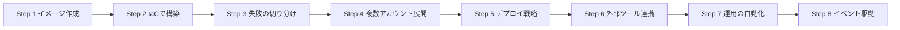

---

## Step 1. AMI とコンテナイメージの作成・管理(Skill 3.1.1)

### 1-1. まず用語を整理する

| 用語 | 初学者向けの説明 |
|---|---|
| **AMI**(Amazon Machine Image) | EC2 インスタンスを起動するための「雛形」。OS、ミドルウェア、設定が入っている |
| **ゴールデンイメージ** | 組織の標準構成を焼き込んだ AMI のこと |
| **コンテナイメージ** | Docker などのコンテナを動かすための雛形。**Amazon ECR** に保管する |
| **EC2 Image Builder** | AMI やコンテナイメージの作成・テスト・配布を**自動化**するマネージドサービス |

### 1-2. AMI の基本知識(試験頻出)

| 項目 | 要点 |
|---|---|
| リージョン固有 | AMI は作成したリージョンでしか使えない。他リージョンでは**コピー**が必要 |
| EBS-backed AMI | ルートボリュームの**スナップショット**を元にする。AMI を登録解除しても**スナップショットは自動削除されない** |
| 共有 | 特定アカウントや Organizations に**起動許可(launch permission)**を付与して共有できる |
| 暗号化 AMI の共有 | カスタマー管理キー(CMK)で暗号化した場合は、**KMS キーも共有先に許可**が必要。AWS マネージドキー(aws/ebs)で暗号化したものは共有できない |
| 削除 | 「AMI の登録解除」→「関連スナップショットの削除」の 2 段階 |
| 誤削除対策 | Recycle Bin(ごみ箱)で保持ルールを設定できる |

### 1-3. なぜ手作業で AMI を作ってはいけないのか

手作業(インスタンスを起動して設定し、イメージ化する)には次の問題があります。

| 問題 | 結果 |
|---|---|
| 再現性がない | 誰がいつ作ったか分からず、同じものを作れない |
| パッチが古くなる | 脆弱性対応が属人化する |
| テストがない | 壊れたイメージが本番に出る |

これを解決するのが **EC2 Image Builder** です。

### 1-4. EC2 Image Builder の構成要素

| 構成要素 | 役割 |
|---|---|
| **Image pipeline** | 全体の自動化単位。レシピ、インフラ設定、配布設定、スケジュールを束ねる |
| **Image recipe** | ベースイメージ + コンポーネントの組み合わせ(AMI 用) |
| **Container recipe** | ベースイメージ + コンポーネントの組み合わせ(コンテナ用) |
| **Component** | 実際の処理(ビルド用とテスト用)。AWSTOE というエージェントが実行する |
| **Infrastructure configuration** | ビルド用の一時 EC2 をどこで、どのロール・サブネット・セキュリティグループで起動するか |
| **Distribution settings** | 完成イメージの配布先(リージョン、アカウント、Organizations) |

重要な性質: **レシピは作成後に変更できません**。変更したい場合は新しいレシピまたは**新しいバージョン**を作成します。デフォルトではレシピ 1 つにつきコンポーネントは 20 個まで適用できます。

出典: https://docs.aws.amazon.com/imagebuilder/latest/userguide/manage-recipes.html
出典: https://docs.aws.amazon.com/imagebuilder/latest/userguide/what-is-image-builder.html

### 1-5. Image Builder の動き(フロー)

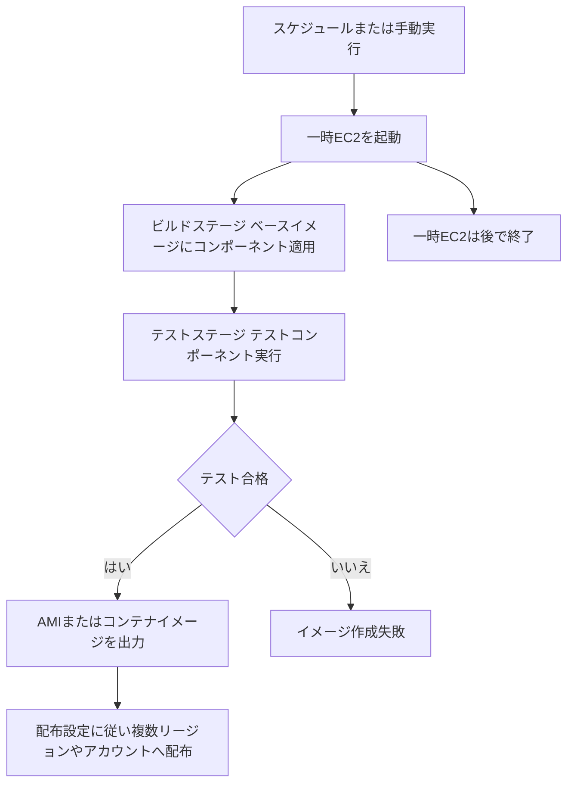

Image Builder には「ビルド」と「テスト」の 2 つの実行ステージがあり、オンインスタンスの処理は AWSTOE が行います。ビルド中は自分のアカウントに一時的な EC2 インスタンスが起動します。

出典: https://docs.aws.amazon.com/imagebuilder/latest/userguide/how-image-builder-works.html

### 1-6. コンテナイメージの管理(Amazon ECR)

| 機能 | 内容 | ベストプラクティス |
|---|---|---|
| イメージスキャン | 脆弱性を検出する | プッシュ時スキャンを有効化し、継続スキャンも検討 |
| ライフサイクルポリシー | 古いイメージを自動削除 | 「タグなしイメージを数日後に削除」などで保管コストを削減 |
| レプリケーション | 別リージョン・別アカウントへ複製 | DR や低遅延のために設定 |
| タグのイミュータビリティ | 同じタグの上書きを禁止 | 本番では有効化し、`latest` 依存を避ける |
| リポジトリポリシー | 他アカウントからの Pull を許可 | 最小権限で付与 |

### 1-7. ベストプラクティス

| # | ベストプラクティス | 理由 |
|---|---|---|
| 1 | AMI は手作業でなく **Image Builder パイプライン**で作る | 再現性と自動テスト |
| 2 | **スケジュール**で定期ビルドし、最新パッチを反映する | 脆弱性を放置しない |
| 3 | テストコンポーネントを必ず入れる | 壊れたイメージを配布しない |
| 4 | 配布設定で必要なリージョンとアカウントへ自動配布する | 手動コピーの手間とミスを排除 |
| 5 | **ベース AMI**(AWS 公開 AMI)の最新 ID は **SSM Parameter Store** のパブリックパラメータで参照し、**パイプラインの出力 AMI** の ID は配布設定で**自アカウントの SSM パラメータ**へ書き込む | AMI ID のハードコードを避ける |
| 6 | 古い AMI は登録解除し、**スナップショットも削除**する | 不要なストレージ料金を防ぐ |
| 7 | AMI とスナップショットに**タグ**を付ける | 管理と棚卸しを容易にする |
| 8 | コンテナはタグを固定し、イメージスキャンを有効にする | 再現性と安全性 |

### 1-8. 試験の落とし穴

| よくある誤り | 正しい理解 |
|---|---|
| AMI を別リージョンでそのまま使える | **コピー**が必要 |
| AMI を登録解除すればコストが消える | **スナップショットが残る**ので別途削除 |
| 暗号化 AMI は共有するだけで使える | CMK の**キーポリシーの共有**も必要 |
| レシピを編集して更新する | レシピは不変。**新バージョンを作成** |

### 参考 URL(Step 1)

| 内容 | URL |
|---|---|
| EC2 Image Builder とは | https://docs.aws.amazon.com/imagebuilder/latest/userguide/what-is-image-builder.html |
| Image Builder の仕組み | https://docs.aws.amazon.com/imagebuilder/latest/userguide/how-image-builder-works.html |
| レシピの管理 | https://docs.aws.amazon.com/imagebuilder/latest/userguide/manage-recipes.html |
| Amazon Machine Image(EC2 ユーザーガイド) | https://docs.aws.amazon.com/AWSEC2/latest/UserGuide/AMIs.html |
| Amazon ECR ユーザーガイド | https://docs.aws.amazon.com/AmazonECR/latest/userguide/what-is-ecr.html |

---

## Step 2. CloudFormation と AWS CDK によるリソース管理(Skill 3.1.2)

### 2-1. Infrastructure as Code(IaC)とは

コンソールで手作業でリソースを作る代わりに、**コード(テンプレート)で構成を定義**し、同じ構成を何度でも再現する考え方です。

| 手作業 | IaC |
|---|---|
| 手順書が必要で、ミスが起きる | テンプレートが手順そのもの |
| 環境ごとに差異が出る | 同じテンプレートで同一構成 |
| 変更履歴が追えない | Git で履歴管理できる |

### 2-2. CloudFormation の基本用語

| 用語 | 説明 |
|---|---|
| **テンプレート** | JSON または YAML で書いた構成の設計図 |
| **スタック** | テンプレートから作られたリソースの**集まり**(作成・更新・削除の単位) |
| **変更セット(Change Set)** | 更新を**実行する前に**変更内容をプレビューする機能 |
| **ドリフト検出** | 実際のリソースがテンプレートと食い違っていないかを検出する |
| **スタックポリシー** | 更新時に特定リソースを変更から**保護**する |
| **終了保護** | スタックの**誤削除**を防ぐ |

### 2-3. テンプレートの主なセクション

| セクション | 必須 | 役割 |
|---|---|---|
| `Resources` | **必須(唯一)** | 作成するリソース |
| `Parameters` | 任意 | 実行時に値を渡す(環境ごとに変える値) |
| `Mappings` | 任意 | 固定の対応表(リージョン別 AMI など) |
| `Conditions` | 任意 | 条件によるリソース作成の切り替え |
| `Outputs` | 任意 | 他スタックから参照する値や確認用の値 |
| `Metadata` / `Rules` / `Transform` | 任意 | 補助情報・検証・マクロ |

よく使う組み込み関数: `!Ref`、`!GetAtt`、`!Sub`、`!Join`、`!If`、`!ImportValue`、`!FindInMap`

### 2-4. スタックのライフサイクル

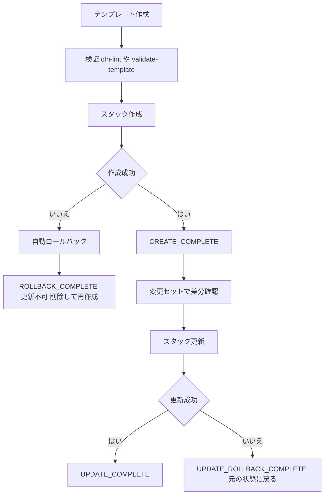

**重要**: 作成に失敗してロールバックが完了した **`ROLLBACK_COMPLETE`** のスタックは**更新できません**。原因を直して**スタックを削除し、作り直す**必要があります。

### 2-5. 変更セットと更新の挙動(試験頻出)

リソースのプロパティを変えると、更新の挙動が 3 種類に分かれます。

| 更新の種類 | 意味 | 例 |
|---|---|---|
| No interruption | 停止なしで変更 | 一部の設定変更 |
| Some interruptions | 一時的な停止を伴う | インスタンスタイプの変更 |
| **Replacement** | **新しいリソースを作って古いものを削除** | 一部プロパティの変更(物理 ID が変わる) |

Replacement が起きるとデータが失われる可能性があります。**変更セットで「Replacement: True」が出ていないか必ず確認**します。

### 2-6. データを守る設定

| 設定 | 役割 |
|---|---|
| `DeletionPolicy: Retain` | スタック削除時もリソースを残す |
| `DeletionPolicy: Snapshot` | 削除前にスナップショットを取る(RDS、EBS など対応リソース) |
| `UpdateReplacePolicy` | **置換(Replacement)時**に古いリソースをどうするか(Retain / Snapshot / Delete) |
| スタックポリシー | 更新で特定リソースが変更されるのを防ぐ |
| 終了保護 | スタック削除操作自体をブロック |

DB など**データを持つリソース**には `DeletionPolicy` と `UpdateReplacePolicy` の両方を設定するのが定石です。

### 2-7. EC2 起動の完了を待つ(cfn-init と cfn-signal)

| 要素 | 役割 |
|---|---|
| `AWS::CloudFormation::Init` + `cfn-init` | インスタンス内でパッケージ導入やファイル配置を宣言的に実行 |
| `cfn-signal` | セットアップの成否を CloudFormation に通知 |
| `CreationPolicy` | シグナルを待ち、**タイムアウトまでに届かなければ失敗**にする |

アプリの準備ができる前に「作成完了」と扱われる問題を防げます。

### 2-8. ドリフト検出

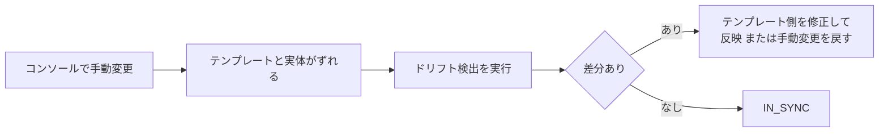

ドリフトは**検出するだけで自動修復はされません**。是正は人間(または自動化)が行います。手動変更を避けることが最大の予防策です。

### 2-9. 複数スタックの構成

| 方式 | 内容 | 注意点 |
|---|---|---|
| **ネストスタック** | 親スタックから子スタックをテンプレートとして呼ぶ | 再利用部品を階層化できる |
| **クロススタック参照** | `Export` と `Fn::ImportValue` で値を共有 | **参照されている Export がある間は、元スタックを削除・値変更できない** |
| スタックの分割 | ライフサイクルが異なるもの(ネットワーク、アプリ)を別スタックに | 変更の影響範囲を小さくする |

### 2-9b. 既存リソースの取り込み

手動で作成済みのリソースを CloudFormation の管理下へ入れるには**リソースのインポート**を使います。事前に、テンプレートへ対象リソースの定義と `DeletionPolicy` を記述しておく必要があります。

### 2-10. AWS CDK(Cloud Development Kit)

CDK は、**プログラミング言語(TypeScript、Python、Java など)でインフラを定義**し、最終的に **CloudFormation テンプレートへ変換(synthesize)** して展開するフレームワークです。

| 用語 | 説明 |
|---|---|
| **Construct** | CDK の構成部品 |
| L1 Construct | CloudFormation リソースと 1 対 1(`Cfn` で始まる名前) |
| L2 Construct | 既定値や便利メソッドを備えた高水準の部品 |
| L3 Construct(パターン) | 複数リソースを組み合わせた構成 |
| **App / Stack** | CDK のアプリ全体 / デプロイ単位 |
| `cdk bootstrap` | デプロイに必要な資源(S3 バケット、IAM ロールなど)を準備する。**アカウント・リージョンごとに 1 回** |

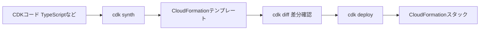

| コマンド | 役割 |
|---|---|
| `cdk bootstrap` | 初回のみ。デプロイ用リソースを準備 |
| `cdk synth` | テンプレートを生成 |
| `cdk diff` | 現在のスタックとの差分を表示 |
| `cdk deploy` | デプロイ(内部では CloudFormation を使用) |
| `cdk destroy` | スタック削除 |

**CDK は CloudFormation の上に載っている**ので、エラーの調査は結局 CloudFormation のイベントで行います。

### 2-11. CloudFormation と CDK の使い分け

| 観点 | CloudFormation | CDK |
|---|---|---|
| 記述 | 宣言的な YAML / JSON | プログラミング言語 |
| 強み | シンプル・直接的 | ループ・条件・再利用が楽 |
| 実行基盤 | CloudFormation | **同じく CloudFormation** |

### 2-12. ベストプラクティス

| # | ベストプラクティス | 理由 |
|---|---|---|
| 1 | 更新前に必ず**変更セット**で確認 | Replacement による事故を防ぐ |
| 2 | **cfn-lint** などでテンプレートを事前検証 | デプロイ失敗を減らす |
| 3 | 値は **Parameters** にし、秘密情報は直書きしない(SSM Parameter Store や Secrets Manager を参照) | 再利用性と安全性 |
| 4 | 本番のデータ系リソースに `DeletionPolicy` / `UpdateReplacePolicy` を設定 | データ消失防止 |
| 5 | **手動変更をしない**。定期的に**ドリフト検出** | 構成の一貫性 |
| 6 | **終了保護**を本番スタックに有効化 | 誤削除防止 |
| 7 | **IAM サービスロール**で CloudFormation の権限を最小化 | 実行者の権限と分離 |
| 8 | ライフサイクルの異なるリソースは**スタックを分ける** | 影響範囲の限定 |
| 9 | テンプレートと CDK コードを **Git で管理** | 履歴・レビュー |
| 10 | リソースに**明示的な名前を付けすぎない**(自動生成名にする) | 名前衝突と置換不能を避ける |

### 2-13. 試験の落とし穴

| よくある誤り | 正しい理解 |
|---|---|
| ROLLBACK_COMPLETE のスタックを更新する | **更新不可**。削除して作り直す |
| ドリフト検出で自動的に直る | **検出のみ** |
| CDK は CloudFormation と別の仕組み | 内部で **CloudFormation にデプロイ**している |
| Export している値を後から変える | **インポート元がある間は変更・削除不可** |

### 参考 URL(Step 2)

| 内容 | URL |
|---|---|
| CloudFormation ユーザーガイド | https://docs.aws.amazon.com/AWSCloudFormation/latest/UserGuide/Welcome.html |
| テンプレートの解説 | https://docs.aws.amazon.com/AWSCloudFormation/latest/UserGuide/template-anatomy.html |
| 変更セット | https://docs.aws.amazon.com/AWSCloudFormation/latest/UserGuide/using-cfn-updating-stacks-changesets.html |
| ドリフト検出 | https://docs.aws.amazon.com/AWSCloudFormation/latest/UserGuide/using-cfn-stack-drift.html |
| DeletionPolicy 属性 | https://docs.aws.amazon.com/AWSCloudFormation/latest/UserGuide/aws-attribute-deletionpolicy.html |
| CloudFormation のベストプラクティス | https://docs.aws.amazon.com/AWSCloudFormation/latest/UserGuide/best-practices.html |
| AWS CDK デベロッパーガイド | https://docs.aws.amazon.com/cdk/v2/guide/home.html |

---

## Step 3. デプロイ問題の特定と修復(Skill 3.1.3)

### 3-1. 切り分けの基本手順

| 手順 | やること |
|---|---|
| 1 | **どこで失敗したか**を特定(CloudFormation のイベント、API エラー) |
| 2 | **最初に失敗したイベント**(時系列で最も古い `FAILED`)の理由を読む |
| 3 | 原因の分類(権限・容量・クォータ・設定・依存関係) |
| 4 | 修正して再実行。必要なら**ロールバックを無効化して調査** |

ポイント: 後続のエラーは**連鎖**であることが多いため、**一番古い失敗**が根本原因です。

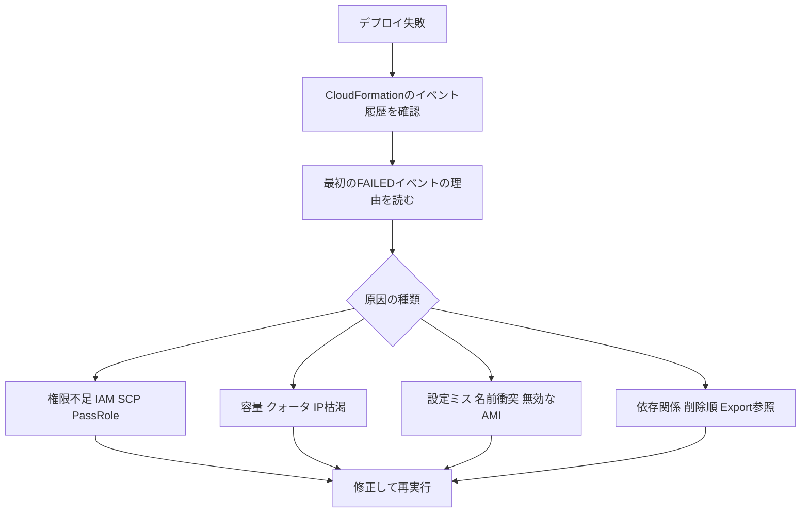

### 3-2. スタックの状態と対処(試験頻出)

| 状態 | 意味 | 対処 |
|---|---|---|
| `CREATE_FAILED` → `ROLLBACK_COMPLETE` | 作成失敗後に巻き戻し完了 | 原因修正後に**スタックを削除して再作成** |
| `ROLLBACK_FAILED` | 作成失敗後の巻き戻しにも失敗 | 原因を解消して**スタック削除を再試行** |
| `UPDATE_ROLLBACK_COMPLETE` | 更新失敗後に元の状態へ復帰 | 原因を直して再更新できる |
| `UPDATE_ROLLBACK_FAILED` | 更新の巻き戻しに失敗 | 原因を手動で直し、**`ContinueUpdateRollback`** を実行 |
| `DELETE_FAILED` | 削除失敗 | 残っている依存物を除去して再削除、または対象リソースを**保持して削除** |

`UPDATE_ROLLBACK_FAILED` の典型例は、巻き戻し先のリソース(DB など)が CloudFormation の**外で削除されていた**ケースです。CloudFormation はリソースがまだ存在すると想定して戻そうとして失敗します。このとき `ContinueUpdateRollback` を使い、必要に応じて**問題のリソースをスキップ**(`ResourcesToSkip`)します。

出典: https://docs.aws.amazon.com/AWSCloudFormation/latest/APIReference/API_ContinueUpdateRollback.html

### 3-3. よくある CloudFormation エラー

| エラー例 | 典型的な原因 | 対処 |
|---|---|---|
| `AccessDenied` / `is not authorized to perform` | 実行ロールの権限不足、SCP、権限境界 | 必要な権限を追加。**CloudTrail** で拒否された API を確認 |
| `iam:PassRole` エラー | ロールを渡す権限がない | `iam:PassRole` を対象ロールに限定して付与 |
| `Resource already exists` / 名前衝突 | 固定名のリソースが既存 | 名前を自動生成にするか既存を削除 |
| `LimitExceeded` / クォータ | サービスクォータ上限 | **Service Quotas** で引き上げ申請 |
| `InsufficientInstanceCapacity` | AZ にそのタイプの空きがない | 別 AZ・別インスタンスタイプで再試行 |
| `The image id does not exist` | AMI がそのリージョンに無い | リージョンごとの AMI を使う(Mappings や SSM パラメータ) |
| `Circular dependency` | リソース同士が循環参照 | 依存関係を見直し(`DependsOn` や参照の分離) |
| 作成がタイムアウト | `cfn-signal` が届かない | UserData のログ(`/var/log/cfn-init.log` など)を確認 |
| ネストスタック失敗 | 子スタックのエラー | **子スタック側のイベント**を確認 |

### 3-4. 調査用のロールバック制御

| 方法 | 内容 |
|---|---|
| **ロールバックを無効化**(Disable rollback / `--disable-rollback`) | 失敗時にリソースを**残して**中身を調査できる。調査後に手動で削除 |
| ロールバックトリガー | 指定した CloudWatch アラームが鳴ったら**自動で巻き戻す** |

### 3-5. サブネットサイズ問題(公式が例示)

「サブネットのIPアドレスが足りない」ことが原因で、デプロイが失敗する問題は頻出です。

| 事実 | 内容 |
|---|---|
| 各サブネットで AWS が予約する IP | **先頭 4 つと末尾 1 つの計 5 つ**(使用不可) |
| サブネットの CIDR 範囲 | **/28(最小)〜 /16(最大)** |
| `/24` の実利用可能数 | 256 − 5 = **251** |
| IP を消費するもの | EC2、ENI、ELB、VPC 接続の Lambda、ECS の `awsvpc` モードのタスク、EKS の Pod など |
| ALB の要件 | 各サブネットに**空き IP が 8 個以上**必要(`/27` 以上を推奨) |

症状の例: Auto Scaling が増やせない、`InsufficientFreeAddressesInSubnet`、Lambda や ECS タスクが起動できない。

| 対処 | 内容 |
|---|---|
| サブネットを追加 | 既存サブネットの CIDR は**変更不可**なので、大きな新サブネットを作る |
| VPC に**セカンダリ CIDR** を追加 | アドレス空間そのものを拡張 |
| 計画段階で余裕を持つ | ENI を多用するサービス(ECS awsvpc、EKS)は特に大きめに |
| 複数 AZ にまたがって配置 | 1 つの AZ の枯渇に強くする |

出典: https://docs.aws.amazon.com/vpc/latest/userguide/subnet-sizing.html

### 3-6. 権限問題の切り分け

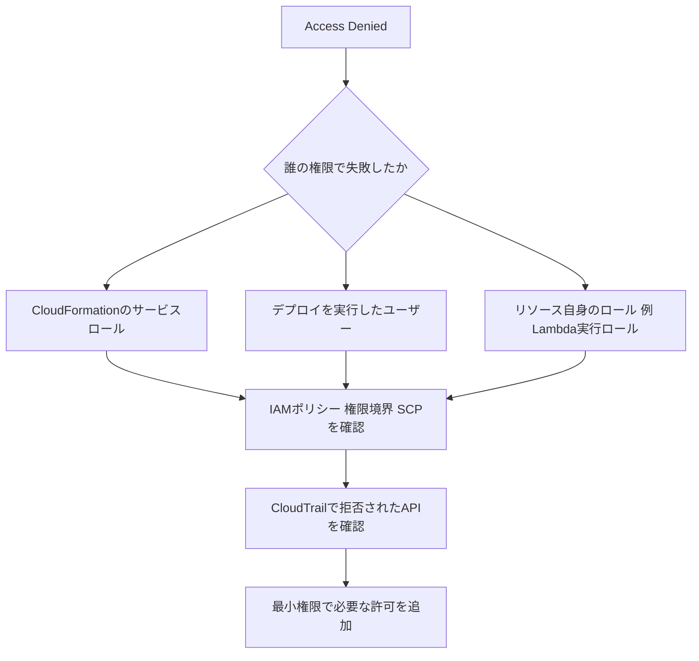

| 確認ポイント | 内容 |
|---|---|
| IAM ポリシー | Allow が足りているか、明示的 Deny がないか |
| **SCP**(Organizations) | アカウント全体で拒否されていないか |
| **権限境界** | 上限を超える許可を与えていないか |
| `iam:PassRole` | サービスにロールを渡す権限があるか |
| リソースポリシー | KMS キーポリシー、S3 バケットポリシーなど |
| 信頼ポリシー | ロールを引き受けられる相手として許可されているか |

### 3-7. ベストプラクティス

| # | ベストプラクティス |
|---|---|
| 1 | まず**最初の FAILED イベント**を読む |
| 2 | 調査が必要なら**ロールバックを無効化**して状態を残す |
| 3 | 権限エラーは **CloudTrail** で実際に拒否された API を特定する |
| 4 | **IAM Policy Simulator** や IAM Access Analyzer で検証する |
| 5 | CIDR 設計は**将来のスケール**を見込んで余裕を持たせる |
| 6 | クォータは **Service Quotas** で事前に確認・申請 |
| 7 | 修正を**コードに戻し**、手動で直しっぱなしにしない(ドリフト防止) |

### 3-8. 試験の落とし穴

| よくある誤り | 正しい理解 |
|---|---|
| サブネットの CIDR を後から拡張する | **変更不可**。新サブネットか**セカンダリ CIDR** |
| `/24` で 256 個使える | **251 個**(5 個予約) |
| UPDATE_ROLLBACK_FAILED は削除するしかない | `ContinueUpdateRollback` で復旧できる |
| 最後のエラーが根本原因 | **最初のエラー**が根本原因 |

### 参考 URL(Step 3)

| 内容 | URL |
|---|---|
| CloudFormation のトラブルシューティング | https://docs.aws.amazon.com/AWSCloudFormation/latest/UserGuide/troubleshooting.html |
| ContinueUpdateRollback API | https://docs.aws.amazon.com/AWSCloudFormation/latest/APIReference/API_ContinueUpdateRollback.html |
| 失敗した更新のロールバック継続 | https://docs.aws.amazon.com/AWSCloudFormation/latest/UserGuide/using-cfn-updating-stacks-continueupdaterollback.html |
| VPC サブネットのサイズ | https://docs.aws.amazon.com/vpc/latest/userguide/subnet-sizing.html |
| Service Quotas | https://docs.aws.amazon.com/servicequotas/latest/userguide/intro.html |
| IAM Policy Simulator | https://docs.aws.amazon.com/IAM/latest/UserGuide/access_policies_testing-policies.html |

---

## Step 4. 複数リージョン・複数アカウントへのプロビジョニングと共有(Skill 3.1.4)

### 4-1. なぜ複数アカウント・複数リージョンなのか

| 目的 | 例 |
|---|---|
| 影響範囲の分離 | 本番と開発でアカウントを分ける |
| ガバナンス | 全アカウントに共通のセキュリティ基盤を配る |
| 可用性・DR | 複数リージョンに同じ構成を置く |

この Step で扱う 2 つの主役は次のとおりです。

| サービス | 一言でいうと |
|---|---|
| **CloudFormation StackSets** | **同じテンプレート**を複数アカウント・複数リージョンへ**一括展開**する |
| **AWS RAM**(Resource Access Manager) | **既存リソースを他のアカウントと共有**する(コピーせず同じ実体を共有) |

### 4-2. StackSets の仕組み

| 用語 | 説明 |
|---|---|
| **管理アカウント(Administrator account)** | StackSet を作成・管理するアカウント |
| **ターゲットアカウント** | スタックインスタンスが作られるアカウント |
| **スタックインスタンス** | 特定のアカウント・リージョンに作られたスタックへの参照 |
| **StackSet** | テンプレートと展開設定のまとまり |

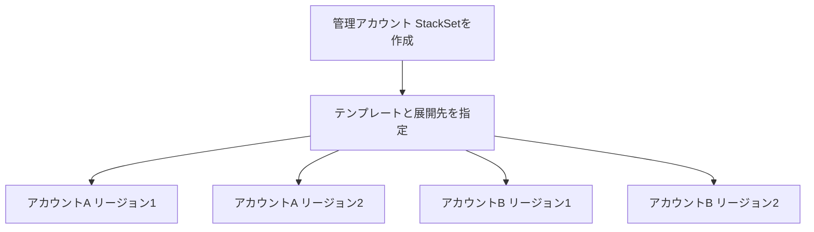

### 4-3. 2 つの権限モデル(試験頻出)

| 項目 | セルフマネージド権限 | **サービスマネージド権限** |
|---|---|---|
| 前提 | 管理アカウントとターゲットに**手動で IAM ロールを用意** | **AWS Organizations** と連携し、ロールは自動 |
| 展開先の指定 | アカウント ID を個別に指定 | **組織単位(OU)** で指定 |
| 自動デプロイ | なし | **新しいアカウントが OU に参加すると自動展開**できる |
| 向いている場面 | Organizations を使わない | Organizations 配下の大規模運用 |

サービスマネージド権限では、Organizations で CloudFormation StackSets の**信頼されたアクセスを有効化**する必要があります。管理アカウント以外から運用したい場合は、**委任管理者**を登録できます。

### 4-4. 展開のオペレーション設定

| 設定 | 意味 | ベストプラクティス |
|---|---|---|
| **最大同時アカウント数** | 同時に処理するアカウント数 | 最初は小さく始め、段階的に広げる |
| **失敗の許容数(Failure tolerance)** | この数を超えたら**展開を停止** | 小さく設定し、広範囲に壊れた展開が広がるのを防ぐ |
| リージョンの順序 | 展開するリージョンの順番 | 影響の小さいリージョンから先に展開 |

### 4-5. StackSets の運用ポイント

| ポイント | 内容 |
|---|---|
| StackSet を更新 | すべてのスタックインスタンスに更新が伝わる |
| スタックインスタンスの削除 | 「スタックを**保持**」して StackSet の管理から外すこともできる |
| ドリフト検出 | StackSet 単位で実行できる |
| 失敗したインスタンス | 原因を直して**再実行**。失敗したインスタンスは `OUTDATED` 状態になる |

### 4-6. AWS RAM の仕組み

AWS RAM は、**リソースの所有アカウント**が、**他のアカウントや組織**へリソースを共有するサービスです。共有は「コピー」ではなく**同じ実体を使わせる**ものです。

| 用語 | 説明 |
|---|---|
| リソース共有 | 共有対象リソース + 共有先(プリンシパル)+ 権限のまとまり |
| 共有先 | アカウント、OU、組織全体、一部では IAM ロール・ユーザー |
| マネージド権限 | 共有先に許可する操作を定義 |

共有できる代表例:

| リソース | 典型的な使い道 |
|---|---|
| **VPC サブネット** | 1 つの VPC を複数アカウントで共有し、ネットワークを集約 |
| **Transit Gateway** | 複数アカウントの VPC を同一ハブへ接続 |
| **Route 53 Resolver ルール** | DNS 転送ルールを全アカウントで共通化 |
| License Manager の設定、Image Builder のリソース など | ライセンスやイメージ部品の共有 |

### 4-7. RAM でサブネットを共有したときの役割分担(試験頻出)

| 役割 | できること |
|---|---|
| **所有者(VPC オーナー)** | VPC・サブネット・ルートテーブル・ゲートウェイを管理。参加者のリソースは**変更できない** |
| **参加者** | 共有サブネット内に**自分のリソース(EC2 など)を作成**できる。VPC やサブネット自体は**変更できない** |

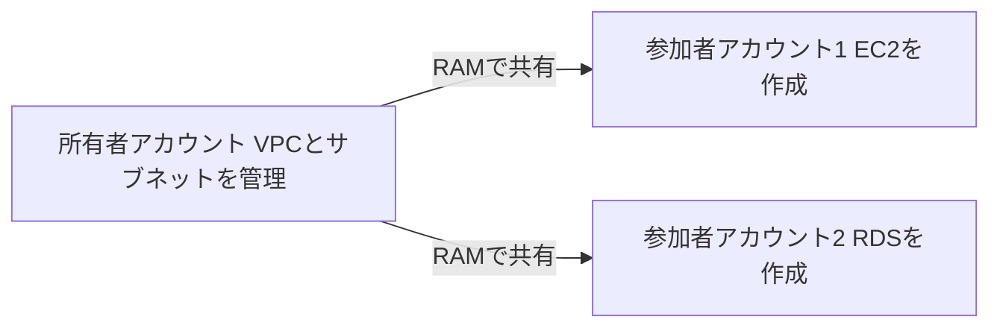

| 重要事項 | 内容 |
|---|---|
| Organizations 内の共有 | **RAM の組織共有を有効化**すると、招待の承諾なしで共有できる |
| 組織外のアカウントへの共有 | **招待の承諾**が必要 |
| リージョン | リソース共有は**リージョン単位**で、リージョンリソースは作成したリージョン内でのみ共有される(別リージョンへは共有できない)。例外は **AWS RAM が対応するグローバルリソース**のみで、それを含むリソース共有は**米国東部(バージニア北部)`us-east-1` で作成・管理**する |
| **AZ 名の違い** | アカウントごとに AZ 名(`us-east-1a`)の割り当てが異なる。**AZ ID**(`use1-az1`)で揃えて確認する |

### 4-8. StackSets と RAM の使い分け(混同注意)

| 質問 | 答え |
|---|---|
| 「各アカウントに**同じ設定を作りたい**」 | **StackSets**(アカウントごとに独立した実体が作られる) |
| 「**1 つのリソースを他アカウントで使わせたい**」 | **RAM**(実体は 1 つ) |
| 「Organizations に新規参加したアカウントに自動で基盤を配る」 | **StackSets(サービスマネージド + 自動デプロイ)** |

### 4-9. ベストプラクティス

| # | ベストプラクティス |
|---|---|
| 1 | Organizations を使うなら **サービスマネージド権限**を選ぶ |
| 2 | **自動デプロイ**を有効にして、新規アカウントへの展開漏れを防ぐ |
| 3 | **失敗許容数と同時実行数を小さく**して段階展開する |
| 4 | RAM は**組織共有を有効化**して招待の手間を省く |
| 5 | 共有先は**個別アカウントより OU 単位**で管理する |
| 6 | RAM のマネージド権限は**最小権限**にする |
| 7 | AZ の指定は**AZ ID**で揃える |
| 8 | StackSet のテンプレートも **Git で管理**し、変更を CI で検証する |

### 4-10. 試験の落とし穴

| よくある誤り | 正しい理解 |
|---|---|
| RAM でリソースをコピーしている | **コピーではなく共有**(実体は所有者のまま) |
| 参加者が共有サブネットの設定を変更できる | **できない**。自分のリソースを作るだけ |
| StackSets は 1 つのアカウント・1 つのリージョンのみ | **複数アカウント・複数リージョン**に展開 |
| 新規アカウントに手動で StackSet を追加する | **サービスマネージド + 自動デプロイ**で自動化 |

### 参考 URL(Step 4)

| 内容 | URL |
|---|---|
| StackSets の概念 | https://docs.aws.amazon.com/AWSCloudFormation/latest/UserGuide/stacksets-concepts.html |
| StackSets の前提条件(権限モデル) | https://docs.aws.amazon.com/AWSCloudFormation/latest/UserGuide/stacksets-prereqs.html |
| AWS RAM ユーザーガイド | https://docs.aws.amazon.com/ram/latest/userguide/what-is.html |
| 共有可能な AWS リソース | https://docs.aws.amazon.com/ram/latest/userguide/shareable.html |
| VPC の共有 | https://docs.aws.amazon.com/vpc/latest/userguide/vpc-sharing.html |

---

## Step 5. デプロイ戦略とサービスの実装(Skill 3.1.5)

### 5-1. デプロイ戦略とは

新しいバージョンを本番へ**どう切り替えるか**の方式です。評価軸は 4 つです。

| 評価軸 | 意味 |
|---|---|
| ダウンタイム | 切り替え中に止まるか |
| 追加コスト | 一時的に倍のリソースが必要か |
| ロールバックの速さ | 失敗時にどれだけ速く戻せるか |
| 影響範囲 | 問題があったとき何割のユーザーが影響を受けるか |

### 5-2. 主要な戦略の比較(最重要の表)

| 戦略 | 仕組み | ダウンタイム | ロールバック | 追加コスト |
|---|---|---|---|---|
| **All at once** | 全台を一斉に更新 | **あり** | 遅い(再デプロイ) | なし |
| **Rolling** | 数台ずつ順番に更新 | なし(容量は一時低下) | 遅い(再デプロイ) | なし |
| **Rolling with additional batch** | 追加の新バッチを先に起動して容量を維持しながら更新 | なし(容量維持) | 遅い | 小 |
| **Immutable** | 新しい Auto Scaling グループで**まるごと新規作成**して切り替え | なし | **速い**(新環境を破棄) | 一時的に倍 |
| **Blue/Green** | 別環境(Green)を構築して**トラフィックを切り替え** | なし | **最速**(Blue へ戻す) | 一時的に倍 |
| **Canary** | **少量(例 10%)だけ**新版へ流し、問題なければ全量 | なし | 速い | 小 |
| **Linear** | **一定割合ずつ**段階的に新版へ移行 | なし | 速い | 小 |

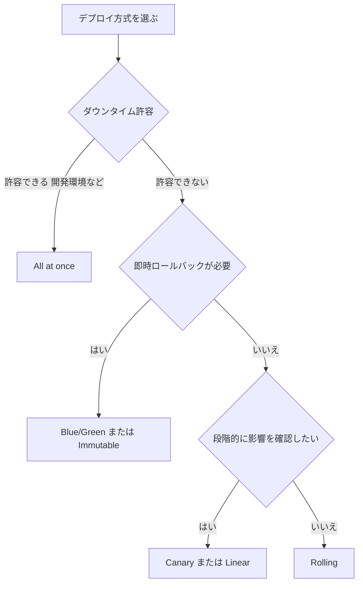

### 5-3. Blue/Green の考え方

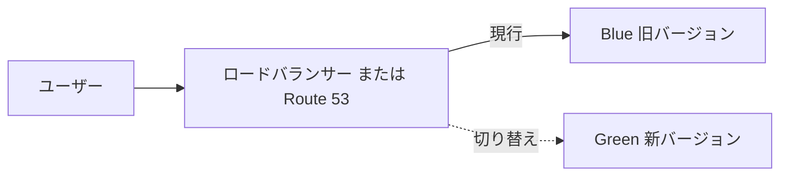

| 切り替えの手段 | 内容 |
|---|---|
| ALB のターゲットグループ切り替え | リスナーのルールで流す先を変更 |
| Route 53 の**加重ルーティング** | 重みを少しずつ変えて移行 |
| Elastic Beanstalk の **CNAME スワップ** | 環境 URL を入れ替え |

注意: Route 53 での切り替えは **DNS の TTL** や**クライアントのキャッシュ**の影響を受けます。ALB の切り替えより反映が遅れる場合があります。

### 5-4. AWS CodeDeploy

CodeDeploy は、アプリケーションのデプロイを自動化するマネージドサービスです。

| コンピューティング基盤 | 方式 | 補足 |
|---|---|---|
| **EC2 / オンプレミス** | **In-place** または **Blue/Green** | エージェントをインスタンスに導入。`appspec.yml` を使用 |
| **Lambda** | **Canary / Linear / All-at-once** | **エイリアス**の重みでトラフィックを移行 |
| **ECS** | **Blue/Green** | ALB のターゲットグループを切り替え |

| 概念 | 説明 |
|---|---|
| **AppSpec ファイル** | 配置するファイルとライフサイクルフックを定義 |
| **ライフサイクルフック** | `BeforeInstall`、`AfterInstall`、`ApplicationStart`、`ValidateService` など |
| **デプロイ設定** | **EC2/オンプレミス**: `CodeDeployDefault.AllAtOnce`、`CodeDeployDefault.HalfAtATime`、`CodeDeployDefault.OneAtATime`<br>**Lambda**: `CodeDeployDefault.LambdaAllAtOnce`、`CodeDeployDefault.LambdaCanary10Percent5Minutes`、`CodeDeployDefault.LambdaLinear10PercentEvery1Minute` など |
| **自動ロールバック** | デプロイ失敗または **CloudWatch アラーム**発報で自動的に戻す |

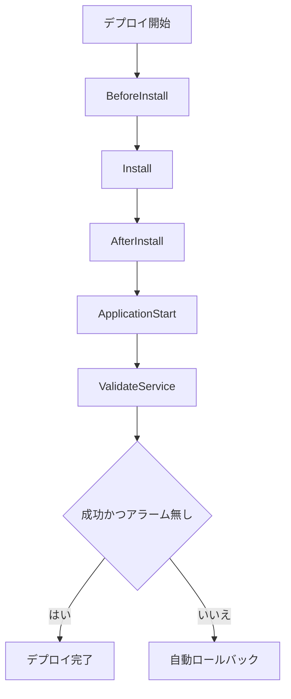

### 5-5. サービス別のデプロイ機能

| サービス | 主なデプロイ手段 | 要点 |
|---|---|---|
| **Elastic Beanstalk** | All at once / Rolling / Rolling with additional batch / **Immutable** / **Traffic splitting**(カナリア的) | 環境の CNAME スワップで Blue/Green も可能 |
| **Auto Scaling グループ** | **インスタンスリフレッシュ** | `MinHealthyPercentage` で更新中に維持する正常率を指定。ローンチテンプレートの更新を反映 |
| **ECS** | **ローリング更新**(既定)、CodeDeploy による Blue/Green | `minimumHealthyPercent` / `maximumPercent` でローリングの幅を制御。**デプロイサーキットブレーカー**で失敗時に自動ロールバック |
| **Lambda** | **バージョン + エイリアス**、加重エイリアス | エイリアスで新旧に配分。CodeDeploy で自動化 |
| **CloudFormation** | スタック更新の `UpdatePolicy`(ASG の `AutoScalingRollingUpdate` など) | 更新時のローリング挙動を宣言 |

### 5-6. Auto Scaling グループのインスタンスリフレッシュ

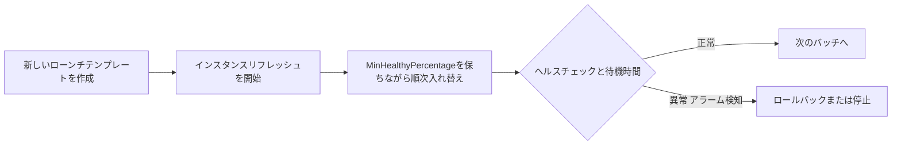

| 設定 | 意味 |
|---|---|
| `MinHealthyPercentage` | 更新中に正常に保つ台数の下限割合 |
| インスタンスのウォームアップ | 新しいインスタンスが「使える」状態になるまでの時間 |
| チェックポイント | 一定割合で一時停止して確認 |
| 自動ロールバック | アラームなどをトリガーに元の状態へ戻す |

### 5-6b. Lambda の段階的デプロイ

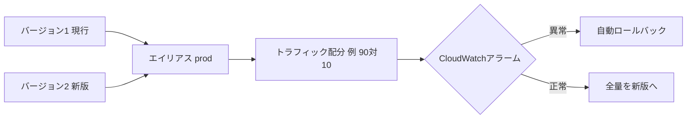

### 5-7. ベストプラクティス

| # | ベストプラクティス | 理由 |
|---|---|---|
| 1 | 本番は **ダウンタイムの出ない戦略**(Rolling 以上)を選ぶ | 可用性 |
| 2 | **自動ロールバック + CloudWatch アラーム**を組み合わせる | 異常を人が見る前に戻せる |
| 3 | **ヘルスチェック**を正しく設定する(ELB のヘルスチェックを ASG に使う) | 不良インスタンスの自動入れ替え |
| 4 | 設定変更は**不変(Immutable)**に寄せる | 構成ずれを防止 |
| 5 | カナリア / リニアで**影響範囲を限定**して検証 | 問題の早期発見 |
| 6 | 検証用の `ValidateService` フックで**自動テスト** | 壊れた版を本番へ出さない |
| 7 | 切り替え前に**ウォームアップ**時間を取る | 起動直後のエラーを防ぐ |
| 8 | データベースのスキーマ変更は**後方互換**にする | 新旧同居中の整合性 |

### 5-8. 試験の落とし穴

| よくある誤り | 正しい理解 |
|---|---|
| Rolling は即時ロールバックできる | 再デプロイが必要で**遅い** |
| Immutable は既存インスタンスを更新する | **新しいインスタンス群を作る** |
| Lambda に In-place デプロイがある | Lambda は**エイリアスでのトラフィック移行**(Canary / Linear / All-at-once) |
| ECS で CodeDeploy が使えない | **Blue/Green に使える** |
| Blue/Green は追加コストがかからない | 一時的に**倍のリソース**が必要 |

### 参考 URL(Step 5)

| 内容 | URL |
|---|---|
| CodeDeploy ユーザーガイド | https://docs.aws.amazon.com/codedeploy/latest/userguide/welcome.html |
| CodeDeploy のデプロイ設定 | https://docs.aws.amazon.com/codedeploy/latest/userguide/deployment-configurations.html |
| AppSpec ファイルのリファレンス | https://docs.aws.amazon.com/codedeploy/latest/userguide/reference-appspec-file.html |
| Elastic Beanstalk のデプロイポリシー | https://docs.aws.amazon.com/elasticbeanstalk/latest/dg/using-features.rolling-version-deploy.html |
| Auto Scaling インスタンスリフレッシュ | https://docs.aws.amazon.com/autoscaling/ec2/userguide/asg-instance-refresh.html |
| ECS のデプロイタイプ | https://docs.aws.amazon.com/AmazonECS/latest/developerguide/deployment-types.html |
| Lambda のエイリアスと段階的デプロイ | https://docs.aws.amazon.com/lambda/latest/dg/configuration-aliases.html |

---

## Step 6. サードパーティツールによるデプロイ自動化(Skill 3.1.6)

### 6-1. 位置づけ

試験範囲は「ツールの**利用と管理**」です。パイプラインの設計や、ソフトウェア開発は範囲外です。AWS の外のツール(Terraform、Git)を**AWS 上でどう安全に回すか**を理解します。

### 6-2. Terraform の基本

| 用語 | 説明 |
|---|---|
| **Provider** | AWS などの API を操作するプラグイン |
| **Resource** | 作成する対象(`aws_instance` など) |
| **State(状態ファイル)** | Terraform が管理中のリソースの**記録** |
| **Backend** | State の保管場所(S3 など) |
| `terraform init` | プロバイダーとバックエンドを初期化 |
| `terraform plan` | 変更内容をプレビュー(CloudFormation の変更セットに相当) |
| `terraform apply` | 変更を適用 |
| `terraform destroy` | 管理中のリソースを削除 |

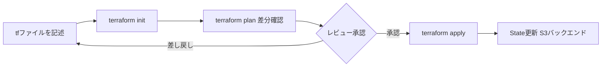

### 6-3. State の管理(最重要)

State には**リソースの属性や機微な値が含まれる**ことがあり、チームで共有するため、ローカルに置かず**リモートバックエンド**にします。

| 項目 | ベストプラクティス |
|---|---|
| 保管先 | **S3 バケット**をバックエンドにする |
| 暗号化 | S3 の**サーバー側暗号化**(KMS)を有効化 |
| バージョニング | **S3 バージョニング**で State を巻き戻せるようにする |
| アクセス制御 | バケットポリシーと IAM で**最小権限**、パブリックアクセスはブロック |
| ロック | **State ロック**で同時実行による破損を防ぐ(従来は DynamoDB、近年の Terraform では S3 のネイティブロックも利用可能) |
| 秘密情報 | コードへの**直書きを避ける**(Secrets Manager / SSM を参照)。ただし data source で読んだ値をリソース引数に渡すと **State に平文で保存**され得る。`sensitive` は通常の CLI 出力で隠すだけなので、State に残してはならない値は**実行時注入**や **ephemeral / write-only** 機能(対応リソースのみ)を使う |

State ロックの方式は Terraform のバージョンに依存します。最新の仕様は HashiCorp 公式ドキュメントで確認してください。

### 6-4. CloudFormation と Terraform の比較

| 観点 | CloudFormation | Terraform |
|---|---|---|
| 提供元 | AWS | HashiCorp(サードパーティ) |
| 対象 | **AWS が中心** | マルチクラウド・SaaS も扱える |
| 状態管理 | **AWS 側で管理**(スタック) | **利用者が State を管理**(S3 など) |
| プレビュー | 変更セット | `terraform plan` |
| 言語 | YAML / JSON | HCL |
| ドリフト | ドリフト検出 | `plan` で差分検出(リフレッシュ) |

### 6-5. Git とバージョン管理

IaC は**コード**なので、アプリケーションと同様に Git で管理します。

| 用語 | 説明 |
|---|---|
| リポジトリ | コードと履歴の保管場所 |
| ブランチ | 並行作業の分岐 |
| プルリクエスト(PR) | 変更を提案し、**レビューを経て**マージする仕組み |
| **GitOps** | Git のコードを**唯一の正**とし、変更は PR 経由でのみ本番へ反映する運用 |

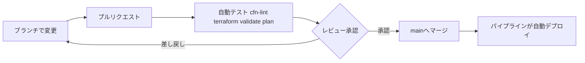

AWS 側では、AWS CodeBuild / CodePipeline などが Git リポジトリ(GitHub など)と連携できます。接続には **AWS CodeConnections** を使います。

### 6-6. ベストプラクティス

| # | ベストプラクティス | 理由 |
|---|---|---|
| 1 | State は**リモート**(S3 + 暗号化 + バージョニング + ロック) | 破損・漏えい防止 |
| 2 | プロバイダーと Terraform の**バージョンを固定** | 再現性 |
| 3 | `plan` の結果を**レビューしてから** `apply` | 想定外の削除を防止 |
| 4 | 認証は**一時的な認証情報(IAM ロール)**を使い、長期アクセスキーを避ける | 漏えい対策 |
| 5 | **秘密情報を Git にコミットしない** | 漏えい対策 |
| 6 | `main` ブランチを**保護**し、直接プッシュを禁止 | 変更の統制 |
| 7 | 環境ごとに State を**分離**する | 影響範囲の限定 |
| 8 | **手動変更を避け**、コードを唯一の正にする | ドリフト防止 |

### 6-7. 試験の落とし穴

| よくある誤り | 正しい理解 |
|---|---|
| Terraform の State は AWS が管理してくれる | **利用者が管理**する |
| State をローカルで共有すれば十分 | **リモート + ロック**が必須級 |
| アクセスキーを Git に入れて CI で使う | **IAM ロール / 一時認証情報**を使う |

### 参考 URL(Step 6)

| 内容 | URL |
|---|---|
| Terraform AWS Provider(公式ドキュメント) | https://registry.terraform.io/providers/hashicorp/aws/latest/docs |
| Terraform のリモート State(S3 バックエンド) | https://developer.hashicorp.com/terraform/language/backend/s3 |
| AWS Prescriptive Guidance Terraform | https://docs.aws.amazon.com/prescriptive-guidance/latest/choose-iac-tool/terraform.html |
| AWS CodeConnections | https://docs.aws.amazon.com/dtconsole/latest/userguide/welcome-connections.html |
| Git 公式ドキュメント | https://git-scm.com/doc |

---

## Step 7. AWS サービスによる運用プロセスの自動化(Skill 3.2.1)

### 7-1. 中心となるサービス: AWS Systems Manager

Systems Manager(SSM)は、EC2 やオンプレミスのサーバーを**まとめて運用するための道具箱**です。SSH やバスティオンを使わずに管理できます。

| 前提条件 | 内容 |
|---|---|
| **SSM Agent** | 管理対象にインストール(Amazon Linux などには既定で入っている) |
| **IAM ロール** | インスタンスプロファイルに `AmazonSSMManagedInstanceCore` 相当の権限 |
| **ネットワーク** | SSM のエンドポイントへ到達できる(NAT、または **VPC エンドポイント**) |
| ハイブリッド環境 | オンプレミスは**ハイブリッドアクティベーション**で登録 |

管理対象に表示されない場合の確認順は「Agent → IAM ロール → ネットワーク」です。

### 7-2. Systems Manager の主な機能

| 機能 | 何をするか | 使いどころ |
|---|---|---|
| **Automation** | **Runbook(手順書)**を実行して運用作業を自動化 | 再起動、AMI 作成、復旧手順の自動化 |
| **Run Command** | 複数インスタンスへ**一括でコマンド実行** | 臨時の設定変更、ログ収集 |
| **State Manager** | 望ましい**構成状態を維持**(定期適用) | エージェント導入、設定の維持 |
| **Patch Manager** | OS パッチの**適用の自動化とコンプライアンス確認** | 定期パッチ適用 |
| **Maintenance Windows** | 作業を**実行してよい時間帯**を定義 | 夜間のパッチ適用 |
| **Parameter Store** | 設定値や秘密情報の**一元管理** | AMI ID、DB 接続設定 |
| **Session Manager** | SSH 不要の**安全なシェル接続** | ポート 22 を開けずに接続 |
| **Inventory** | ソフトウェアや構成の**棚卸し** | 資産管理 |

### 7-3. Automation(Runbook)の基本

| 用語 | 説明 |
|---|---|
| **Runbook(Automation ドキュメント)** | 手順を YAML / JSON で定義したもの |
| AWS 提供の Runbook | `AWS-RestartEC2Instance`、`AWS-CreateImage` などの定型手順 |
| **AutomationAssumeRole** | Runbook が AWS API を呼ぶときに引き受ける **IAM ロール** |
| 実行制御 | **レート制御**(同時実行数、エラーしきい値)、**承認ステップ** |
| 実行のきっかけ | 手動、**EventBridge**、**AWS Config のリメディエーション**、Maintenance Window |

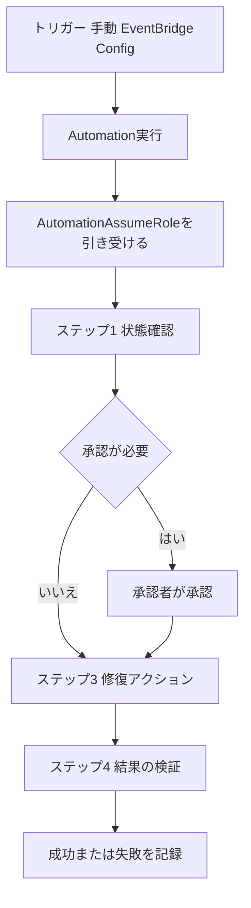

### 7-4. Patch Manager の流れ(試験頻出)

| 要素 | 説明 |
|---|---|
| **パッチベースライン** | どのパッチを承認するか(分類、重大度、**自動承認までの日数**) |
| **パッチグループ** | タグ(`Patch Group`)でインスタンスをグルーピング |
| **Maintenance Window** | パッチを当てる時間帯 |
| **Scan と Install** | `Scan` は不足パッチの**確認のみ**。`Install` は**適用**(必要なら再起動) |
| コンプライアンス | 適用状況を一覧で確認できる |

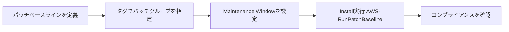

ポイント: 本番に当てる前に、**検証環境で先にパッチを適用**し、問題がなければ本番へ展開する運用が基本です。

### 7-5. AWS Config のリメディエーション

| 項目 | 内容 |
|---|---|
| AWS Config ルール | リソースが**ルールに準拠しているか**を評価 |
| 非準拠の検出 | 例: 「暗号化されていない EBS」「パブリックな S3」 |
| **リメディエーション** | 非準拠時に **SSM Automation の Runbook** を実行して**自動修復** |
| 実行方式 | 手動 / **自動**(リトライ設定あり) |

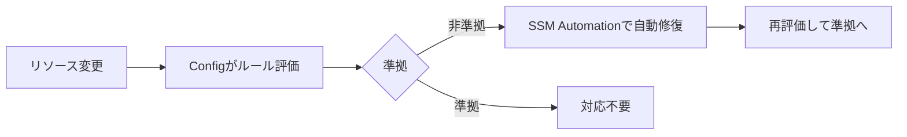

### 7-6. 運用作業の自動化パターン(早見表)

| やりたいこと | 使うもの |
|---|---|
| 定期的に OS パッチを当てる | **Patch Manager + Maintenance Windows** |
| 多数のサーバーで同じコマンドを実行 | **Run Command**(タグでターゲット指定) |
| 構成を常に一定に保つ | **State Manager** |
| 障害時に決まった復旧手順を実行 | **Automation Runbook**(EventBridge から起動) |
| SSH なしでサーバーに入る | **Session Manager** |
| 設定値・秘密情報を一元管理 | **Parameter Store / Secrets Manager** |
| 非準拠リソースを自動で直す | **AWS Config + SSM Automation** |
| 定期的に AMI を作る | **Image Builder** または Automation(`AWS-CreateImage`) |

### 7-7. ベストプラクティス

| # | ベストプラクティス | 理由 |
|---|---|---|
| 1 | **SSH ではなく Session Manager** を使う(ポート 22 を閉じる) | 攻撃面の縮小、操作ログの記録 |
| 2 | ターゲット指定は**タグ**で行う | 台数が増えても同じ運用 |
| 3 | Automation の**ロールは最小権限**にする | 暴走時の被害限定 |
| 4 | 大規模実行は**レート制御とエラーしきい値**を設定 | 失敗が全台に広がるのを防ぐ |
| 5 | 破壊的な操作の前に**承認ステップ**を入れる | 事故防止 |
| 6 | 実行結果と操作ログを **CloudWatch Logs / S3 / CloudTrail** に残す | 監査性 |
| 7 | パッチは**検証 → 本番**の順で展開 | 本番影響の最小化 |
| 8 | 手順を**Runbook(コード)**にして Git 管理 | 属人化の排除 |

### 7-8. 試験の落とし穴

| よくある誤り | 正しい理解 |
|---|---|
| Run Command で復旧手順を承認付きで自動化する | 複数ステップ・承認・分岐は **Automation** |
| Patch Manager の `Scan` でパッチが適用される | `Scan` は**確認のみ**。適用は `Install` |
| 管理対象に表示されないのはパッチの問題 | **Agent / IAM ロール / ネットワーク**を確認 |
| Session Manager には SSH ポートの開放が必要 | **不要** |

### 参考 URL(Step 7)

| 内容 | URL |
|---|---|
| Systems Manager ユーザーガイド | https://docs.aws.amazon.com/systems-manager/latest/userguide/what-is-systems-manager.html |
| Systems Manager Automation | https://docs.aws.amazon.com/systems-manager/latest/userguide/systems-manager-automation.html |
| Run Command | https://docs.aws.amazon.com/systems-manager/latest/userguide/run-command.html |
| Patch Manager | https://docs.aws.amazon.com/systems-manager/latest/userguide/patch-manager.html |
| Maintenance Windows | https://docs.aws.amazon.com/systems-manager/latest/userguide/maintenance-windows.html |
| State Manager | https://docs.aws.amazon.com/systems-manager/latest/userguide/systems-manager-state.html |
| Session Manager | https://docs.aws.amazon.com/systems-manager/latest/userguide/session-manager.html |
| AWS Config のリメディエーション | https://docs.aws.amazon.com/config/latest/developerguide/remediation.html |

---

## Step 8. イベント駆動の自動化(Skill 3.2.2)

### 8-1. イベント駆動とは

「**何かが起きたら、自動で処理を動かす**」仕組みです。人が監視して手で対応する代わりに、イベントをきっかけに自動で動きます。

| 部品 | 役割 | 例 |
|---|---|---|
| **イベントソース** | 何かが起きた | EC2 の状態変化、S3 へのアップロード、アラーム発報 |
| **ルーター** | イベントを振り分ける | **Amazon EventBridge** |
| **ターゲット** | 実際に処理する | Lambda、SSM Automation、SNS、SQS、Step Functions |

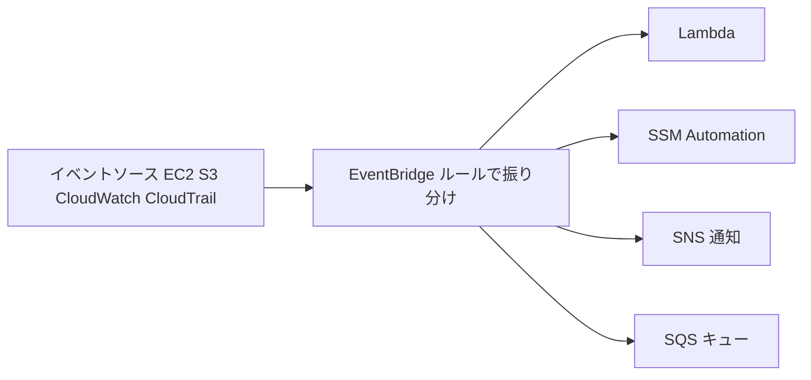

### 8-2. Amazon EventBridge

| 用語 | 説明 |
|---|---|
| **イベントバス** | イベントの受け皿。**デフォルトバス**(AWS サービスのイベントが届く)、カスタムバス、パートナーバス |
| **ルール** | **イベントパターン**に一致したイベント、または**スケジュール**をターゲットへ送る |
| **ターゲット** | 1 つのルールに複数設定できる |
| **入力トランスフォーマー** | ターゲットへ渡す内容を整形・抽出 |
| **EventBridge Scheduler** | 1 回限り・定期の**スケジュール実行**に特化した機能 |
| **DLQ(デッドレターキュー)** | 配信に失敗したイベントの退避先(SQS) |
| **リトライポリシー** | 失敗時の再試行回数と最大期間 |

EventBridge ルールの 2 つの種類:

| 種類 | 契機 | 例 |
|---|---|---|
| **イベントパターン** | 何かが起きたとき | EC2 が `stopped` になった、GuardDuty が検出した |
| **スケジュール** | 時刻・間隔 | 毎日 2 時に処理、5 分おきに処理 |

イベントパターンの例(EC2 が停止したら):

```json
{
  "source": ["aws.ec2"],
  "detail-type": ["EC2 Instance State-change Notification"],
  "detail": { "state": ["stopped"] }
}
```

AWS の操作(API 呼び出し)をきっかけにする場合は、**CloudTrail** が記録した管理イベントを EventBridge で受け取ります。

### 8-3. 典型パターン: 自動修復

```mermaid
flowchart TD
    A["CloudWatchアラーム ALARM状態"] --> E["EventBridgeルール"]
    E --> R["SSM Automationで再起動や復旧"]
    R --> N["SNSで担当者へ通知"]
    R --> V["結果を検証"]
```

### 8-4. AWS Lambda をターゲットにする

| 項目 | 内容 |
|---|---|
| 権限 | EventBridge や S3 が Lambda を呼ぶには、**Lambda 側のリソースベースポリシー**で許可が必要(コンソールからの設定では自動付与される) |
| 実行ロール | Lambda 自身が他サービスを呼ぶための **IAM ロール** |
| 呼び出し形式 | EventBridge や S3 からは**非同期呼び出し** |
| 失敗対策 | Lambda の非同期呼び出しは、**関数エラー・ランタイムエラー**を既定で最大 **2 回**リトライし、**スロットリングやシステムエラー**は既定で最大 **6 時間**リトライする。EventBridge のターゲット配信リトライはこれとは**別の仕組み**(ルール側のリトライポリシー)。失敗イベントは **DLQ** や **Lambda Destinations** で退避 |
| 重複対策 | イベントは**少なくとも 1 回**届く性質があるので、処理を**冪等(べきとう)**にする |
| タイムアウト | 最大 **15 分**。長い処理は Step Functions などへ |

「冪等」とは、同じ処理を何度実行しても結果が変わらない性質のことです。

### 8-5. S3 Event Notifications

S3 バケットでの出来事(オブジェクトの作成・削除など)を通知する機能です。

| 項目 | 内容 |
|---|---|
| 主なイベント | `s3:ObjectCreated:*`、`s3:ObjectRemoved:*`、`s3:ObjectRestore:*`、`s3:Replication:*` など |
| **通知先** | **Lambda、SNS、SQS、EventBridge** |
| フィルター | オブジェクトキーの**プレフィックス**・**サフィックス**で絞り込み |
| 権限 | 通知先側に S3 からの送信を許可する**リソースポリシー**が必要 |
| EventBridge 連携 | バケットで有効化すると、**EventBridge の豊富なルール・複数ターゲット**を使える |

```mermaid
flowchart LR
    U["画像をS3にアップロード"] --> S["S3 Event Notification プレフィックスとサフィックスで絞り込み"]
    S --> L["Lambdaでサムネイル作成"]
    S --> Q["SQSで非同期に処理"]
    S --> N["SNSで通知"]
    S --> E["EventBridgeで高度なルーティング"]
```

**無限ループに注意**: 同じバケットのプレフィックスに出力する Lambda を同じプレフィックスのイベントで起動すると、**自分自身を再び呼び続けます**。入力と出力の**プレフィックスを分ける**か、別バケットにします。

### 8-6. どの方式を選ぶか

| やりたいこと | 向いている方式 |
|---|---|
| S3 のアップロードを 1 つの Lambda で処理するだけ | **S3 Event Notifications → Lambda** |
| 複数の宛先へ振り分けたい、複雑な条件で絞りたい | **EventBridge**(S3 の EventBridge 連携を有効化) |
| 負荷を平準化して確実に処理したい | **SQS** をバッファにして Lambda が取り出す |
| 定時で何かを実行したい | **EventBridge Scheduler / スケジュールルール** |
| AWS API 操作(例: セキュリティグループ変更)に反応したい | **CloudTrail → EventBridge** |
| アラーム発報で自動復旧したい | **EventBridge → SSM Automation** |

### 8-7. AWS DevOps Agent(試験ガイドに明記された新しい要素)

試験ガイドの 3.2.2 には **AWS DevOps Agent** が含まれています。

| 項目 | 内容 |
|---|---|
| 何か | 障害対応と予防を支援する、**自律型のエージェント**(AI を活用した運用支援サービス) |
| 主な機能 | アラートやチケットを契機とした**インシデントの自動調査**、チャット形式の調査、**AWS サポートケースの作成** |
| 仕組み | **Agent Space**(エージェントがアクセス・調査できる範囲を定める論理的な単位)を作り、リソースの関係(トポロジー)を把握して調査する |
| 連携 | CloudWatch アラーム、PagerDuty、ServiceNow、Slack など |
| イベント駆動との関係 | アラームなどのイベントを**起点に調査が自動で始まる** |

```mermaid
flowchart LR
    A["アラームや障害チケット発生"] --> B["DevOps Agentが自動で調査を開始"]
    B --> C["ログ メトリクス 変更履歴を相関分析"]
    C --> D["根本原因の分析と緩和策を提示"]
    D --> E["Slackなどで運用チームへ共有"]
    E --> F["担当者が内容を確認して対応を判断"]
```

学習時の注意:

| 注意点 | 内容 |
|---|---|
| 新しいサービス | 機能や仕様が更新されていく可能性が高い。**最新の公式ドキュメントを確認**すること |
| 役割の理解 | 試験では「**インシデントの調査・原因分析を自動化する**」という位置づけを押さえる |
| 人の判断 | 修復の**承認判断は運用チーム**が行う。承認済みの修復の**実行**は、昇格した IAM ロールを設定すれば AWS DevOps Agent が担える |

出典: https://docs.aws.amazon.com/devopsagent/latest/userguide/what-is.html
出典: https://docs.aws.amazon.com/devopsagent/latest/userguide/incident-response-devops-agent-incident-response.html

### 8-8. ベストプラクティス

| # | ベストプラクティス | 理由 |
|---|---|---|
| 1 | ターゲットに **DLQ とリトライポリシー**を設定する | 失敗イベントの消失防止 |
| 2 | Lambda の処理を**冪等**にする | 重複配信への対応 |
| 3 | イベントパターンは**できるだけ具体的に**絞る | 無駄な起動とコストを防ぐ |
| 4 | Lambda の**同時実行数の上限(予約済み同時実行)**を検討 | 下流への過負荷防止 |
| 5 | 負荷が読めない場合は **SQS** を挟んで平準化 | スロットリング対策 |
| 6 | S3 通知は入出力の**プレフィックスを分離** | 無限ループ防止 |
| 7 | 自動修復には**承認・通知**を組み合わせる | 誤作動時に気づける |
| 8 | ルールとターゲットも **IaC(CloudFormation / CDK)** で管理 | 再現性 |
| 9 | 失敗の監視に **CloudWatch メトリクス(FailedInvocations など)**を使う | 自動化の失敗に気づく |

### 8-9. 試験の落とし穴

| よくある誤り | 正しい理解 |
|---|---|
| S3 通知の宛先に Step Functions を直接指定する | 直接の宛先は **Lambda / SNS / SQS / EventBridge** |
| イベントは必ず 1 回だけ届く | **少なくとも 1 回**。重複しうるので冪等にする |
| EventBridge から Lambda を呼ぶのに権限は不要 | Lambda の**リソースベースポリシー**が必要 |
| S3 Event Notifications はキーの部分一致で絞れる | **プレフィックス / サフィックス**での絞り込み |
| DevOps Agent が人の確認なしに本番を自動変更する | 調査と分析の支援が中心。**判断は人**が行う前提 |

### 参考 URL(Step 8)

| 内容 | URL |
|---|---|
| Amazon EventBridge ユーザーガイド | https://docs.aws.amazon.com/eventbridge/latest/userguide/eb-what-is.html |
| EventBridge のイベントパターン | https://docs.aws.amazon.com/eventbridge/latest/userguide/eb-event-patterns.html |
| EventBridge Scheduler | https://docs.aws.amazon.com/scheduler/latest/UserGuide/what-is-scheduler.html |
| S3 Event Notifications | https://docs.aws.amazon.com/AmazonS3/latest/userguide/EventNotifications.html |
| Lambda の非同期呼び出し | https://docs.aws.amazon.com/lambda/latest/dg/invocation-async.html |
| AWS DevOps Agent とは | https://docs.aws.amazon.com/devopsagent/latest/userguide/what-is.html |
| DevOps Agent のインシデント対応 | https://docs.aws.amazon.com/devopsagent/latest/userguide/incident-response-devops-agent-incident-response.html |

---

## 練習問題(12 問)

**Q1.** ある会社は、毎月最新パッチを適用した AMI を 3 つのリージョンと 2 つのアカウントへ自動配布したい。運用負荷を最小にする方法は?
- A. 手動で EC2 から AMI を作成し、各リージョンへコピーする
- B. EC2 Image Builder のパイプラインをスケジュール実行し、配布設定でリージョンとアカウントを指定する
- C. Lambda で毎日 `CreateImage` を呼ぶ
- D. Run Command で各インスタンスにパッチを当てる

**Q2.** CloudFormation で新規作成したスタックが `ROLLBACK_COMPLETE` になった。原因を修正した後の正しい対応は?
- A. テンプレートを更新して `UpdateStack` を実行する
- B. スタックを削除して作成し直す
- C. `ContinueUpdateRollback` を実行する
- D. ドリフト検出を実行する

**Q3.** スタック更新の巻き戻しが `UPDATE_ROLLBACK_FAILED` になった。原因は、巻き戻し先の DB が CloudFormation 外で削除されていたため。適切な対応は?
- A. スタックをそのまま削除する
- B. 問題を解消(または問題のリソースをスキップ)して `ContinueUpdateRollback` を実行する
- C. 新しいリージョンで同じスタックを作成する
- D. 終了保護を有効にする

**Q4.** Auto Scaling が新しいインスタンスを起動できず、`InsufficientFreeAddressesInSubnet` が出ている。最も適切な対処は?
- A. 既存サブネットの CIDR を拡張する
- B. より大きな CIDR の新しいサブネットを作成して使う(またはセカンダリ CIDR を追加)
- C. EC2 のインスタンスタイプを変更する
- D. サブネットのルートテーブルを変更する

**Q5.** 組織の全メンバーアカウントに、新規アカウントも含めて自動で同じ IAM ロールを展開したい。最適な方法は?
- A. 各アカウントで手動でスタックを作成する
- B. サービスマネージド権限の StackSets で自動デプロイを有効にする
- C. AWS RAM で IAM ロールを共有する
- D. CDK の `cdk deploy` を各アカウントで実行する

**Q6.** 中央のネットワークアカウントが所有する VPC のサブネットを、同じ組織内の複数のアカウントで使わせたい。使うサービスは?
- A. CloudFormation StackSets
- B. AWS RAM
- C. VPC ピアリング
- D. AWS Config

**Q7.** ダウンタイムなしで、問題発生時に**最も速く**元の状態へ戻せるデプロイ方式は?
- A. All at once
- B. Rolling
- C. Blue/Green
- D. Rolling with additional batch

**Q8.** Lambda 関数の新バージョンを、最初に 10% のトラフィックだけに流し、アラームが鳴ったら自動で戻したい。最適な手段は?
- A. Lambda のコードを直接上書きする
- B. CodeDeploy のカナリアデプロイ設定(エイリアスの重み付け)と CloudWatch アラームによる自動ロールバック
- C. Auto Scaling のインスタンスリフレッシュ
- D. Route 53 のフェイルオーバールーティング

**Q9.** チームで Terraform を使っている。State の管理として最も適切なのは?
- A. 各自のローカル PC に保存する
- B. Git リポジトリにコミットする
- C. 暗号化・バージョニングを有効にした S3 バケットに保存し、State ロックを使う
- D. 保存せず毎回 `apply` する

**Q10.** 数百台の EC2 に、毎週日曜の深夜に OS パッチを適用し、適用状況も確認したい。適切な組み合わせは?(2 つ選択)
- A. Patch Manager のパッチベースライン
- B. Maintenance Windows
- C. 各インスタンスへ SSH でログインして手動実行
- D. CloudFormation の `DeletionPolicy`
- E. ECR のライフサイクルポリシー

**Q11.** S3 に画像がアップロードされたら Lambda でサムネイルを作成し、同じバケットに保存する。しかし Lambda が無限に呼ばれてしまう。解決策は?
- A. Lambda のタイムアウトを延ばす
- B. 入力用と出力用でプレフィックス(または別バケット)を分け、通知のフィルターを入力側のみに限定する
- C. S3 のバージョニングを無効にする
- D. Lambda のメモリを増やす

**Q12.** EC2 インスタンスのステータスチェックのアラームが ALARM になったら、自動でインスタンスを再起動し、担当者へ通知したい。最適な構成は?
- A. CloudWatch アラーム → EventBridge → SSM Automation(再起動)と SNS(通知)
- B. 担当者が毎回コンソールから再起動する
- C. CloudFormation のドリフト検出を毎分実行
- D. S3 Event Notifications を使う

### 解答と解説

| 問 | 解答 | 解説 |
|---|---|---|
| Q1 | **B** | Image Builder のスケジュールと配布設定で、ビルド・テスト・配布を自動化できる |
| Q2 | **B** | `ROLLBACK_COMPLETE` は更新不可。削除して再作成する。C は `UPDATE_ROLLBACK_FAILED` 用 |
| Q3 | **B** | `UPDATE_ROLLBACK_FAILED` は原因を直して `ContinueUpdateRollback`。`ResourcesToSkip` も利用可 |
| Q4 | **B** | サブネットの CIDR は変更不可。新サブネットまたはセカンダリ CIDR で拡張する |
| Q5 | **B** | サービスマネージド権限 + 自動デプロイで、OU に参加した新規アカウントにも展開される。RAM は IAM ロールの共有には使わない |
| Q6 | **B** | RAM でサブネットを共有。参加者は共有サブネット内にリソースを作成できる |
| Q7 | **C** | Blue/Green は旧環境が残っているため、トラフィックを戻すだけで済む |
| Q8 | **B** | Lambda は CodeDeploy のエイリアス重み付けで Canary / Linear が可能。アラームで自動ロールバック |
| Q9 | **C** | State は共有・暗号化・バージョニング・ロックが基本。Git へのコミットは機微な値の漏えいリスク |
| Q10 | **A, B** | パッチベースライン + Maintenance Windows の組み合わせが定石 |
| Q11 | **B** | 出力が入力と同じイベントを再び起こす「再帰」を避けるため、プレフィックスやバケットを分ける |
| Q12 | **A** | アラーム状態変化を EventBridge で受け、SSM Automation と SNS をターゲットにする |

---

## 試験の落とし穴 総まとめ

| # | 落とし穴 | 正しい理解 |
|---|---|---|
| 1 | AMI はそのまま他リージョンで使える | **リージョンごと**。コピーが必要 |
| 2 | AMI 登録解除でスナップショットも消える | **消えない**。別途削除 |
| 3 | Image Builder のレシピを編集する | 不変。**新バージョン**を作る |
| 4 | `ROLLBACK_COMPLETE` のスタックを更新できる | **削除して再作成** |
| 5 | `UPDATE_ROLLBACK_FAILED` は削除するしかない | **`ContinueUpdateRollback`** |
| 6 | ドリフト検出で自動修復される | **検出のみ** |
| 7 | CDK は CloudFormation と無関係 | **CloudFormation に変換してデプロイ** |
| 8 | サブネットの CIDR は後から拡張できる | **不可**。新サブネット / セカンダリ CIDR |
| 9 | `/24` は 256 個使える | **251 個**(5 個予約) |
| 10 | StackSets と RAM は同じ | StackSets は**各アカウントに作成**、RAM は**1 つを共有** |
| 11 | RAM の参加者がサブネットを変更できる | **できない** |
| 12 | Rolling は即座にロールバックできる | **遅い**。Blue/Green が最速 |
| 13 | Lambda にインプレース更新がある | **エイリアスの重み付け**で移行 |
| 14 | Terraform の State は AWS が管理する | **利用者が管理**(S3 + ロック) |
| 15 | Patch Manager の Scan でパッチが入る | **Scan は確認のみ**。適用は Install |
| 16 | 複数ステップで承認付きの復旧は Run Command | **Automation** |
| 17 | イベントは必ず 1 回だけ届く | **少なくとも 1 回**。冪等にする |
| 18 | S3 から Lambda へ権限設定は不要 | **リソースベースポリシー**が必要 |

---

## 暗記用チートシート

### サービス早見表

| やりたいこと | 答え |
|---|---|
| AMI / コンテナイメージを自動で作る | **EC2 Image Builder** |
| コンテナイメージの保管・スキャン | **Amazon ECR** |
| AWS リソースをコードで構築 | **CloudFormation / CDK** |
| 更新前に差分を確認 | **変更セット** |
| 手動変更の検出 | **ドリフト検出** |
| データ系リソースの削除保護 | **DeletionPolicy / UpdateReplacePolicy** |
| 複数アカウント・リージョンへ一括展開 | **StackSets** |
| 既存リソースを他アカウントと共有 | **AWS RAM** |
| 段階的デプロイ(EC2 / Lambda / ECS) | **CodeDeploy** |
| ASG のインスタンス入れ替え | **インスタンスリフレッシュ** |
| AWS 外の IaC ツール | **Terraform(State は S3 + ロック)** |
| 一括コマンド実行 | **Run Command** |
| 承認付きの手順自動化 | **Automation** |
| パッチ適用の自動化 | **Patch Manager + Maintenance Windows** |
| 非準拠の自動修復 | **AWS Config + SSM Automation** |
| イベントの振り分け | **EventBridge** |
| S3 の出来事を通知 | **S3 Event Notifications** |
| インシデントの自動調査 | **AWS DevOps Agent** |

### 数字で覚えるポイント

| 項目 | 値 |
|---|---|
| Domain 3 の比率 | 22% |
| 合格点 | 720 / 1,000 |
| サブネットで予約される IP | 5 個 |
| サブネットの CIDR 範囲 | /28 〜 /16 |
| Image Builder のレシピ内コンポーネント(既定) | 最大 20 個 |
| Lambda の最大実行時間 | 15 分 |

### デプロイ方式の選び方(一言)

| 状況 | 選択 |
|---|---|
| 開発環境で止まってもよい | All at once |
| コストを増やさず順次更新 | Rolling |
| 容量を落とさず更新 | Rolling with additional batch |
| 新旧を混在させず確実に | Immutable |
| 即時に戻せる必要がある | **Blue/Green** |
| 少量で検証してから拡大 | **Canary / Linear** |

---

## 学習の進め方(ステップバイステップ)

| 順番 | やること | 目安 |
|---|---|---|
| 1 | Step 0 で全体像を把握 | 15 分 |
| 2 | Step 1-2 を読み、Image Builder パイプラインと簡単な CloudFormation スタックを実際に作る | 2-3 時間 |
| 3 | わざと失敗するテンプレートを作り、Step 3 のエラー調査を体験する | 1-2 時間 |
| 4 | Step 4-5 を読み、StackSets と CodeDeploy(Lambda のカナリア)を試す | 2-3 時間 |
| 5 | Step 6 で Terraform の基本操作と Git の PR フローを確認 | 1-2 時間 |
| 6 | Step 7-8 で SSM Automation と EventBridge + Lambda の自動化を作る | 2-3 時間 |
| 7 | 練習問題を解き、間違えた箇所の落とし穴表を復習 | 1-2 時間 |

---

## 参考 URL 一覧(総括)

### 公式試験ガイド

| 内容 | URL |
|---|---|
| SOA-C03 試験ガイド | https://docs.aws.amazon.com/aws-certification/latest/sysops-administrator-associate-03/sysops-administrator-associate-03.html |
| Content Domain 3 | https://docs.aws.amazon.com/aws-certification/latest/sysops-administrator-associate-03/sysops-administrator-associate-03-domain3.html |
| 試験で扱われるサービス(対象内) | https://docs.aws.amazon.com/aws-certification/latest/sysops-administrator-associate-03/soa-03-in-scope-services.html |

### サービス別ドキュメント

| サービス | URL |
|---|---|
| EC2 Image Builder | https://docs.aws.amazon.com/imagebuilder/latest/userguide/what-is-image-builder.html |
| Amazon ECR | https://docs.aws.amazon.com/AmazonECR/latest/userguide/what-is-ecr.html |
| CloudFormation | https://docs.aws.amazon.com/AWSCloudFormation/latest/UserGuide/Welcome.html |
| AWS CDK | https://docs.aws.amazon.com/cdk/v2/guide/home.html |
| StackSets | https://docs.aws.amazon.com/AWSCloudFormation/latest/UserGuide/what-is-cfnstacksets.html |
| AWS RAM | https://docs.aws.amazon.com/ram/latest/userguide/what-is.html |
| CodeDeploy | https://docs.aws.amazon.com/codedeploy/latest/userguide/welcome.html |
| Systems Manager | https://docs.aws.amazon.com/systems-manager/latest/userguide/what-is-systems-manager.html |
| EventBridge | https://docs.aws.amazon.com/eventbridge/latest/userguide/eb-what-is.html |
| S3 Event Notifications | https://docs.aws.amazon.com/AmazonS3/latest/userguide/EventNotifications.html |
| AWS DevOps Agent | https://docs.aws.amazon.com/devopsagent/latest/userguide/what-is.html |
| AWS Well-Architected Framework(Operational Excellence) | https://docs.aws.amazon.com/wellarchitected/latest/operational-excellence-pillar/welcome.html |

> 注記: AWS のサービス仕様は更新されます。特に **AWS DevOps Agent** や Terraform の State ロック方式など、変化の速い項目は、受験前に最新の公式ドキュメントで確認してください。
