# AWS Certified CloudOps Engineer - Associate (SOA-C03)
# Content Domain 4: Security and Compliance 完全解説ガイド（初学者向け）

> 対象試験: AWS Certified CloudOps Engineer - Associate (SOA-C03)
> 対象範囲: Content Domain 4「Security and Compliance」（スコア対象問題の **16%**）
> 対象スキル: Skill 4.1.1 〜 4.1.5、Skill 4.2.1 〜 4.2.5（全10スキル）
> 公式の出典（アンカー）: [SOA-C03 Exam Guide](https://docs.aws.amazon.com/aws-certification/latest/sysops-administrator-associate-03/sysops-administrator-associate-03.html) / [Domain 4 ページ](https://docs.aws.amazon.com/aws-certification/latest/sysops-administrator-associate-03/sysops-administrator-associate-03-domain4.html)

---

## 目次

- [Step 0. Domain 4 の全体像](#step-0-domain-4-の全体像)
- [Step 1. IAM の機能を実装する（Skill 4.1.1）](#step-1-iam-の機能を実装するskill-411)
- [Step 2. アクセス問題のトラブルシュートと監査（Skill 4.1.2）](#step-2-アクセス問題のトラブルシュートと監査skill-412)
- [Step 3. マルチアカウント戦略（Skill 4.1.3）](#step-3-マルチアカウント戦略skill-413)
- [Step 4. Trusted Advisor のセキュリティチェックと是正（Skill 4.1.4）](#step-4-trusted-advisor-のセキュリティチェックと是正skill-414)
- [Step 5. コンプライアンスの強制と継続的モニタリング（Skill 4.1.5）](#step-5-コンプライアンスの強制と継続的モニタリングskill-415)
- [Step 6. データ分類（Skill 4.2.1）](#step-6-データ分類skill-421)
- [Step 7. 保管時の暗号化 / AWS KMS（Skill 4.2.2）](#step-7-保管時の暗号化--aws-kmsskill-422)
- [Step 8. 転送時の暗号化 / ACM（Skill 4.2.3）](#step-8-転送時の暗号化--acmskill-423)
- [Step 9. シークレットの安全な保管（Skill 4.2.4）](#step-9-シークレットの安全な保管skill-424)
- [Step 10. セキュリティサービスの検出結果とレポート・是正（Skill 4.2.5）](#step-10-セキュリティサービスの検出結果とレポート是正skill-425)
- [Step 11. 総合演習（ひっかけ表・練習問題・チートシート）](#step-11-総合演習ひっかけ表練習問題チートシート)
- [参考 URL 一覧](#参考-url-一覧)

---

## Step 0. Domain 4 の全体像

### 0-1. この Domain で問われること

公式ガイドでは、Domain 4 は 2 つの Task で構成されています。

| Task | 内容 | スキル |
|---|---|---|
| **4.1** | セキュリティ・コンプライアンスのツールとポリシーを実装・管理する | 4.1.1 IAM 機能 / 4.1.2 アクセスのトラブルシュートと監査 / 4.1.3 マルチアカウント / 4.1.4 Trusted Advisor / 4.1.5 コンプライアンス強制と継続監視 |
| **4.2** | データとインフラを守る戦略を実装する | 4.2.1 データ分類 / 4.2.2 保管時暗号化 / 4.2.3 転送時暗号化 / 4.2.4 シークレット管理 / 4.2.5 検出結果のレポートと是正 |

> 注意（公式ガイドの「対象外」業務）: 「セキュリティ・コンプライアンス・ガバナンス要件を**定義する**」「ランサムウェア防御戦略を**開発する**」は試験対象外です。
> つまり、この試験で問われるのは「決められた要件を**実装・運用・是正する**側」の知識です。設計思想より「どのサービスのどの機能で、どう設定し、壊れたらどう直すか」を押さえましょう。

### 0-2. 責任共有モデル（すべての前提）

セキュリティの話は、まず「どこまでが AWS の責任で、どこからが自分の責任か」から始まります。

| 区分 | 担当 | 具体例 |
|---|---|---|
| **クラウド「の」セキュリティ** | AWS | データセンターの物理セキュリティ、ハイパーバイザー、マネージドサービスの基盤 |
| **クラウド「における」セキュリティ** | 利用者（あなた） | IAM 設定、データ暗号化の有効化、セキュリティグループ、OS パッチ（EC2）、シークレット管理 |

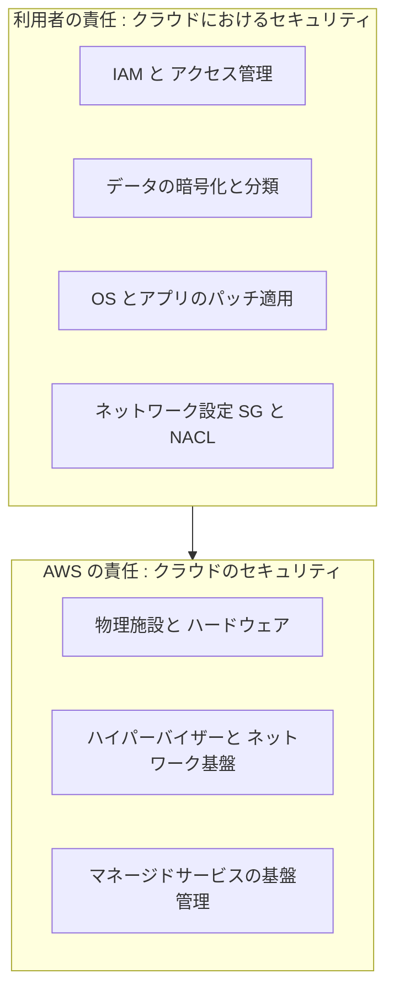

出典: [Shared Responsibility Model](https://aws.amazon.com/compliance/shared-responsibility-model/)

### 0-3. 登場サービスの地図

Domain 4 に登場するサービスを「何を守るか」で整理します。

| 目的 | 主なサービス・機能 | 本ガイドの Step |
|---|---|---|
| 誰が何をできるか決める | IAM（ユーザー・ロール・ポリシー）、IAM Identity Center | 1, 3 |
| アクセスの原因調査・監査 | CloudTrail、IAM Access Analyzer、IAM ポリシーシミュレーター | 2 |
| 複数アカウントを統制する | AWS Organizations、SCP、Control Tower | 3 |
| 設定の安全性を点検する | Trusted Advisor、AWS Config | 4, 5 |
| データの分類・発見 | Amazon Macie、タグ、タグポリシー | 6 |
| 保管時の暗号化 | AWS KMS | 7 |
| 転送時の暗号化 | AWS Certificate Manager (ACM)、TLS | 8 |
| シークレット管理 | AWS Secrets Manager、SSM Parameter Store | 9 |
| 脅威検知・脆弱性・集約 | GuardDuty、Inspector、Security Hub、AWS Security Agent | 10 |

### 0-4. 学習の進め方

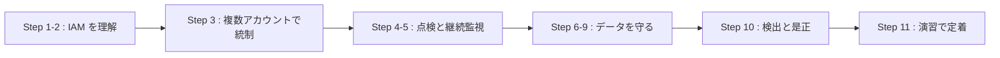

### 0-5. 本ガイドの読み方

各 Step は次の順で書かれています。

1. **何のためのもの？**（やさしい説明）
2. **仕組み**（図と表）
3. **設定・操作の手順**
4. **ベストプラクティス**
5. **試験で狙われるポイント**
6. **出典 URL**

---

## Step 1. IAM の機能を実装する（Skill 4.1.1）

> 公式スキル文: IAM features（パスワードポリシー、MFA、ロール、フェデレーテッドID、リソースポリシー、ポリシー条件）を実装する。

### 1-1. IAM とは？（超やさしい説明）

**IAM (AWS Identity and Access Management)** は「**誰が（認証）、どのリソースに対して、何をしてよいか（認可）**」を決める仕組みです。ビルの入退室管理にたとえると次のとおりです。

| ビルの例え | IAM の用語 |
|---|---|
| 社員証・ゲストカード | IAM ユーザー、IAM ロール |
| 部署ごとの入室権限リスト | IAM グループ、IAM ポリシー |
| 社員証の二重確認（暗証番号 + 指紋） | MFA |
| 出張者に貸し出す期限付きカード | IAM ロール（一時的な認証情報） |
| 会議室の扉に貼った「入れる人リスト」 | リソースベースポリシー |

### 1-2. IAM の構成要素

| 要素 | 説明 | ひとこと |
|---|---|---|
| **ルートユーザー** | アカウント作成時のメールアドレスで作られる全権限ユーザー | 日常利用しない。MFA 必須 |
| **IAM ユーザー** | 長期認証情報（パスワード・アクセスキー）を持つ ID | 現在は人間の利用には IAM Identity Center が推奨 |
| **IAM グループ** | ユーザーの集まり。ポリシーをまとめて付与 | グループはプリンシパルにできない |
| **IAM ロール** | 一時的な認証情報で引き受ける ID | EC2・Lambda・クロスアカウントで多用 |
| **IAM ポリシー** | JSON の権限定義 | 明示的 Deny が常に勝つ |

### 1-3. ポリシーの種類と評価ロジック

AWS は次の種類のポリシーを使い分けます。

| ポリシーの種類 | 付与先 | 役割 |
|---|---|---|
| **アイデンティティベースポリシー** | ユーザー / グループ / ロール | 「この ID は何ができるか」を許可する |
| **リソースベースポリシー** | S3 バケット、KMS キー、SQS、Lambda など | 「このリソースに誰がアクセスできるか」を定める |
| **アクセス許可の境界** | ユーザー / ロール | 与えられる権限の**上限**を決める（許可はしない） |
| **SCP（サービスコントロールポリシー）** | OU / アカウント | 組織単位の**上限**（Step 3） |
| **セッションポリシー** | 一時セッション | 引き受けたロールの権限をさらに絞る |

リクエストが来たときの判定の順序は次のとおりです。

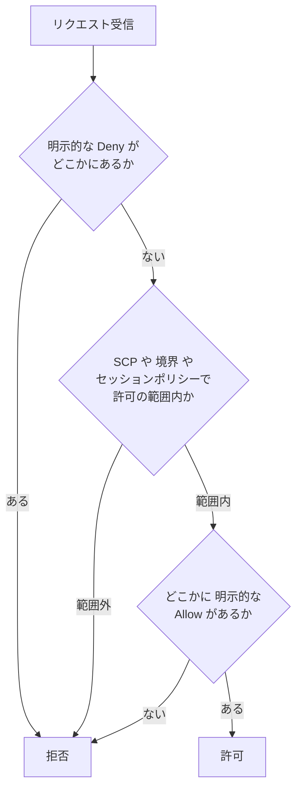

覚え方は3行です。

1. **デフォルトは拒否**（何も書いてなければ拒否）
2. **明示的な Deny は最強**（どの Allow よりも勝つ）
3. **SCP・境界は「許可の上限」**（それ自体は権限を与えない）

同一アカウント内では、アイデンティティベースポリシーとリソースベースポリシーは**和集合**（どちらかが許可すれば OK）で評価されます。一方、**クロスアカウント**では「リソース側の許可」と「呼び出し側 ID の許可」の**両方**が必要です。

出典: [Policy evaluation logic](https://docs.aws.amazon.com/IAM/latest/UserGuide/reference_policies_evaluation-logic.html) / [Policies and permissions in IAM](https://docs.aws.amazon.com/IAM/latest/UserGuide/access_policies.html)

### 1-4. パスワードポリシー

**パスワードポリシー**は、アカウント全体の IAM ユーザーのパスワード品質を決める設定です（IAM コンソール → アカウント設定）。

| 設定項目 | 内容 |
|---|---|
| 最小パスワード長 | 長いほど安全 |
| 文字種の要件 | 大文字・小文字・数字・記号 |
| パスワードの有効期限 | 一定期間で変更を要求 |
| 再利用の禁止 | 過去 N 回分は使えない |
| 管理者によるリセット要求 | 期限切れ後は管理者が解除 |

```bash
# パスワードポリシーを設定する CLI の例
aws iam update-account-password-policy \
  --minimum-password-length 14 \
  --require-symbols --require-numbers \
  --require-uppercase-characters --require-lowercase-characters \
  --max-password-age 90 \
  --password-reuse-prevention 24
```

> 注意: パスワードポリシーは **IAM ユーザーのパスワード**に適用されます。ルートユーザーや、IAM Identity Center・外部 IdP のユーザーには適用されません。

出典: [Set an account password policy for IAM users](https://docs.aws.amazon.com/IAM/latest/UserGuide/id_credentials_passwords_account-policy.html)

### 1-5. 多要素認証 (MFA)

**MFA** は「知っているもの（パスワード）」に「持っているもの（デバイス）」を足す仕組みです。

| MFA の種類 | 例 |
|---|---|
| パスキー / セキュリティキー（FIDO） | YubiKey、端末の生体認証パスキー |
| 仮想認証アプリ（TOTP） | Google Authenticator 等 |
| ハードウェア TOTP トークン | 専用の数字表示トークン |

#### MFA を「強制」する典型パターン

「MFA でサインインしていなければ、MFA 設定以外の操作をすべて拒否する」ポリシー例です。

```json
{
  "Version": "2012-10-17",
  "Statement": [
    {
      "Sid": "DenyAllExceptMfaSetupWithoutMFA",
      "Effect": "Deny",
      "NotAction": [
        "iam:CreateVirtualMFADevice",
        "iam:EnableMFADevice",
        "iam:ListMFADevices",
        "iam:ListVirtualMFADevices",
        "iam:ResyncMFADevice",
        "sts:GetSessionToken"
      ],
      "Resource": "*",
      "Condition": {
        "BoolIfExists": { "aws:MultiFactorAuthPresent": "false" }
      }
    }
  ]
}
```

ポイントは **`BoolIfExists`** です。キーが存在しない場合（長期アクセスキーによる呼び出しなど）も Deny の対象にできます。

出典: [Using multi-factor authentication (MFA) in AWS](https://docs.aws.amazon.com/IAM/latest/UserGuide/id_credentials_mfa.html)

### 1-6. IAM ロール

**IAM ロール**は、「パスワードもアクセスキーも持たない、引き受ける（assume）ことで一時的な権限を得る ID」です。

ロールには 2 種類のポリシーが関わります。

| ポリシー | 役割 | 質問 |
|---|---|---|
| **信頼ポリシー（Trust policy）** | ロールを**引き受けられる人**を決める | 「誰が」このロールになれる？ |
| **アクセス許可ポリシー** | ロールが**できること**を決める | 「何が」できる？ |

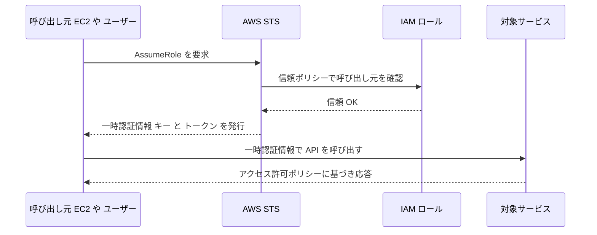

#### ロールの主な使いどころ

| 用途 | 仕組み |
|---|---|
| EC2 から S3 にアクセス | **インスタンスプロファイル**でロールを EC2 にアタッチ |
| Lambda から DynamoDB にアクセス | Lambda の**実行ロール** |
| 別アカウントのリソースにアクセス | クロスアカウントロール（`sts:AssumeRole`） |
| AWS サービス自身が代理操作 | **サービスリンクロール** |

> **ベストプラクティス**: EC2 などにアクセスキーを埋め込まず、**必ずロール**を使う。これは試験の最頻出テーマの 1 つです。

出典: [IAM roles](https://docs.aws.amazon.com/IAM/latest/UserGuide/id_roles.html)

### 1-7. フェデレーテッドアイデンティティ

**フェデレーション**は、「すでに社内にある ID（Active Directory や Okta など）を使って AWS にログインする」仕組みです。IAM ユーザーを人数分作る必要がなくなります。

| 方式 | 使いどころ |
|---|---|
| **IAM Identity Center**（推奨） | 従業員の SSO。複数アカウントへのアクセスを一元管理（Step 3） |
| **SAML 2.0 フェデレーション** | 既存 IdP と IAM ロールを直接連携 |
| **OIDC フェデレーション** | Web ID・CI/CD（例: GitHub Actions）からロールを引き受ける |
| **Amazon Cognito** | 自社アプリのエンドユーザー向け認証 |

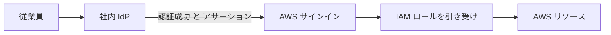

出典: [Identity providers and federation](https://docs.aws.amazon.com/IAM/latest/UserGuide/id_roles_providers.html)

### 1-8. リソースベースポリシー

リソース側に付ける「入れる人リスト」です。S3 バケットポリシー、KMS キーポリシー、SQS キューポリシー、Lambda リソースポリシーなどが代表例です。**`Principal`（誰が）** を書く点がアイデンティティベースポリシーとの違いです。

```json
{
  "Version": "2012-10-17",
  "Statement": [
    {
      "Sid": "AllowOnlyMyOrganization",
      "Effect": "Allow",
      "Principal": "*",
      "Action": "s3:GetObject",
      "Resource": "arn:aws:s3:::example-bucket/*",
      "Condition": {
        "StringEquals": { "aws:PrincipalOrgID": "o-xxxxxxxxxx" }
      }
    }
  ]
}
```

### 1-9. ポリシー条件 (Condition)

`Condition` は「どんな状況なら許可（拒否）するか」を絞り込む機能です。

| 条件キー | 用途 | 例 |
|---|---|---|
| `aws:MultiFactorAuthPresent` | MFA 済みか | MFA なしの操作を拒否 |
| `aws:SourceIp` | 接続元 IP | 社内 IP のみ許可 |
| `aws:RequestedRegion` | 操作対象リージョン | 許可リージョン以外を拒否 |
| `aws:PrincipalOrgID` | 組織 ID | 自組織のアカウントだけ許可 |
| `aws:SecureTransport` | HTTPS か | HTTP を拒否 |
| `aws:SourceVpce` | 経由する VPC エンドポイント | 特定の VPC エンドポイント経由のみ |
| `aws:ResourceTag/<キー>` / `aws:PrincipalTag/<キー>` | タグ | タグ一致でアクセス制御（ABAC） |
| `aws:SourceArn` / `aws:SourceAccount` | 呼び出し元サービスの特定 | 混乱した代理問題の防止 |

#### 混乱した代理（Confused Deputy）問題とは？

サービス（代理人）が、別の顧客に騙されて本来と違う顧客のリソースにアクセスしてしまう問題です。対策は次のとおりです。

- サービスプリンシパルに許可を出すときは **`aws:SourceArn` / `aws:SourceAccount`** で呼び出し元を限定する
- サードパーティにクロスアカウントロールを渡すときは **ExternalId** を使う

出典: [IAM JSON policy elements: Condition](https://docs.aws.amazon.com/IAM/latest/UserGuide/reference_policies_elements_condition.html) / [The confused deputy problem](https://docs.aws.amazon.com/IAM/latest/UserGuide/confused-deputy.html)

### 1-10. ベストプラクティス（IAM）

| # | ベストプラクティス | 理由 |
|---|---|---|
| 1 | 人間には**一時的な認証情報**（フェデレーション / Identity Center）を使う | 長期キーの漏洩リスクを排除 |
| 2 | ワークロードには**ロール**を使い、アクセスキーを埋め込まない | キー管理が不要になる |
| 3 | **最小権限**から始める | 過剰な権限が事故の元 |
| 4 | **ルートユーザーに MFA**、日常は使わず、アクセスキーも作らない | 全権限の乗っ取り防止 |
| 5 | 全ユーザーに MFA を要求 | パスワード漏洩への耐性 |
| 6 | 不要な認証情報・権限を定期的に**削除** | 休眠アカウントの悪用防止 |
| 7 | 条件（Condition）で権限をさらに絞る | 状況に応じた防御 |
| 8 | Access Analyzer でポリシーを検証し外部公開をチェック | 意図しない公開の検知 |

出典: [Security best practices in IAM](https://docs.aws.amazon.com/IAM/latest/UserGuide/best-practices.html)

### 1-11. 試験で狙われるポイント（Step 1）

| 出題パターン | 答えの方向性 |
|---|---|
| EC2 アプリが S3 にアクセスしたい | **IAM ロール（インスタンスプロファイル）** |
| MFA なしの操作を拒否したい | `aws:MultiFactorAuthPresent` を使った Deny + `BoolIfExists` |
| 他アカウントに権限を与えたい | クロスアカウントロール（信頼ポリシー + 許可ポリシー） |
| 社内 AD の社員に AWS を使わせたい | IAM Identity Center / SAML フェデレーション |
| 組織内のアカウントだけに S3 を公開 | バケットポリシー + `aws:PrincipalOrgID` |
| Allow と Deny が衝突 | **Deny が勝つ** |

---

## Step 2. アクセス問題のトラブルシュートと監査（Skill 4.1.2）

> 公式スキル文: AWS ツール（CloudTrail、IAM Access Analyzer、IAM ポリシーシミュレーターなど）でアクセス問題をトラブルシュート・監査する。

### 2-1. 3つのツールの役割分担

| ツール | ひとことで言うと | 使う場面 |
|---|---|---|
| **AWS CloudTrail** | 「**誰が・いつ・何を**した」の操作記録 | 原因調査、監査証跡 |
| **IAM Access Analyzer** | 「**外部に公開されていないか**」「使われていない権限」の検出 | 意図しない公開の発見、権限の棚卸し |
| **IAM ポリシーシミュレーター** | 「この ID でこの操作はできる？」の**事前テスト** | 変更前の動作確認、拒否理由の切り分け |

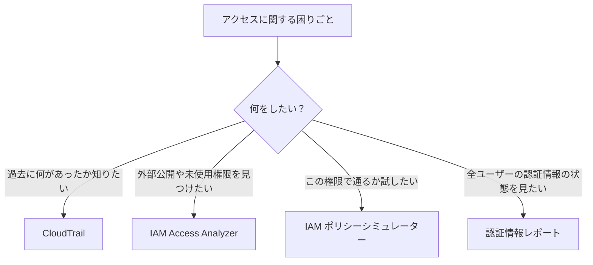

### 2-2. AWS CloudTrail

**CloudTrail** は AWS アカウント内の API 呼び出しを記録するサービスです。

| 記録の種類 | 内容 | 既定 |
|---|---|---|
| **管理イベント** | リソースの作成・変更・削除（例: `RunInstances`, `CreateUser`） | 記録される |
| **データイベント** | S3 オブジェクト操作、Lambda 呼び出し等の大量イベント | **既定では記録されない**（有効化が必要） |
| **Insights イベント** | 通常と異なる API 活動の検出 | 任意で有効化 |

| 保管の方法 | 特徴 |
|---|---|
| **イベント履歴** | 直近 **90 日**の管理イベントを自動で閲覧可能。設定不要 |
| **証跡（Trail）** | S3 へ長期保存。CloudWatch Logs へも送信可能。**組織の証跡**で全アカウント一括も可 |
| **CloudTrail Lake** | イベントを SQL で分析できるマネージドデータストア |

#### 監査用の設定の基本

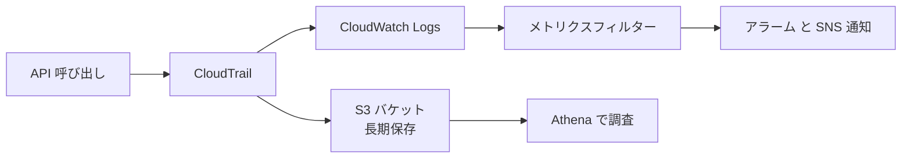

**ベストプラクティス**

- 全リージョンを対象とする**マルチリージョン証跡**を作る
- **ログファイルの整合性検証**（ダイジェスト）を有効にし、改ざんを検知できるようにする
- 保存先 S3 は**専用の監査アカウント**に置き、バケットポリシーで書き込みを CloudTrail のみに限定、MFA Delete や KMS 暗号化も検討する
- ルートユーザー使用・IAM 変更・コンソールログイン失敗などは**メトリクスフィルター + アラーム**で通知

出典: [What is AWS CloudTrail?](https://docs.aws.amazon.com/awscloudtrail/latest/userguide/cloudtrail-user-guide.html)

### 2-3. IAM Access Analyzer

**IAM Access Analyzer** は、ポリシーを数学的に分析して次の問題を見つけます。

| 機能 | 内容 |
|---|---|
| **外部アクセスの検出** | S3、IAM ロール、KMS キー、SQS などが「ゾーン・オブ・トラスト」（自分のアカウントまたは組織）の**外部**に共有されていないかを検出 |
| **未使用アクセスの検出** | 使われていないロール・ユーザー・アクセスキー・権限を検出（有料機能） |
| **ポリシー検証** | ポリシーの文法エラーやセキュリティ警告をチェック |
| **カスタムポリシーチェック** | 「この変更で新しいアクセスが増えていないか」を検証 |
| **ポリシー生成** | **CloudTrail の実績ログ**から最小権限ポリシーを自動生成 |

> 試験で重要: 「S3 バケットや IAM ロールが**外部に公開されていないか**自動で見つけたい」→ **IAM Access Analyzer**。アナライザーは**リージョンごと**に作成します。

出典: [What is IAM Access Analyzer?](https://docs.aws.amazon.com/IAM/latest/UserGuide/what-is-access-analyzer.html)

### 2-4. IAM ポリシーシミュレーター

実際に変更を加えず、**特定の ID が特定のアクションを実行できるか**をテストするツールです。

| 使い方 | 手順 |
|---|---|
| 1 | シミュレーター（コンソール）で対象のユーザー / グループ / ロールを選ぶ |
| 2 | テストしたいサービスとアクションを選ぶ |
| 3 | 必要ならリソース ARN や条件キーを設定して実行 |
| 4 | 結果（allowed / denied）と、**どのポリシーのどのステートメント**が効いたかを確認 |

> 補足: ポリシーシミュレーターは、アイデンティティベースポリシー・アクセス許可の境界・Organizations の SCP などの評価に使えます。

出典: [Testing IAM policies with the IAM policy simulator](https://docs.aws.amazon.com/IAM/latest/UserGuide/access_policies_testing-policies.html)

### 2-5. 認証情報レポートと最終アクセス情報

| 機能 | 内容 |
|---|---|
| **認証情報レポート** | アカウント内の全ユーザーのパスワード・アクセスキー・MFA の状態を CSV で取得 |
| **最終アクセス情報** | ユーザーやロールが各サービスを**最後に使った時刻**を確認し、不要な権限を削る |

出典: [Get credential reports for your AWS account](https://docs.aws.amazon.com/IAM/latest/UserGuide/id_credentials_getting-report.html)

### 2-6. 「AccessDenied」の調べ方（実務フロー）

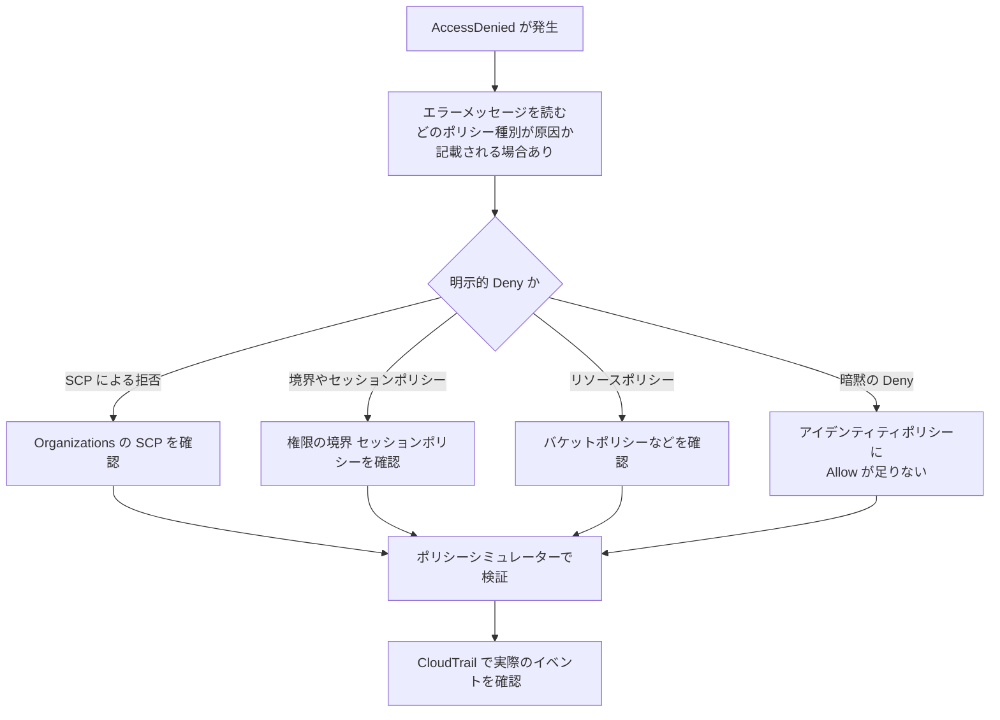

| 症状 | 疑うべきもの |
|---|---|
| メッセージに「explicit deny in a service control policy」 | SCP |
| メッセージに「no identity-based policy allows」 | ID 側に Allow がない（暗黙の Deny） |
| クロスアカウントで失敗 | **両側**（呼び出し元の ID ポリシーとリソースポリシー）の許可を確認 |
| 一時認証で失敗 | セッションポリシー、ロールの信頼ポリシー、セッション期限切れ |
| KMS 暗号化データにだけ失敗 | キーポリシー・`kms:Decrypt`（Step 7） |

出典: [Troubleshoot access denied error messages](https://docs.aws.amazon.com/IAM/latest/UserGuide/troubleshoot_access-denied.html)

### 2-7. 試験で狙われるポイント（Step 2）

| 出題パターン | 答え |
|---|---|
| 「昨日、誰が S3 バケットを削除したか」 | **CloudTrail** |
| 「外部アカウントと共有されているリソースを一覧したい」 | **IAM Access Analyzer** |
| 「ポリシー変更前にテストしたい」 | **IAM ポリシーシミュレーター** |
| 「実際の使用実績から最小権限ポリシーを作りたい」 | **Access Analyzer のポリシー生成**（CloudTrail 利用） |
| 「90 日より前のイベントを調べたい」 | **証跡を作成**し S3 に保存（イベント履歴は 90 日まで） |
| 「S3 オブジェクトの GET を記録したい」 | CloudTrail の**データイベント**を有効化 |

---

## Step 3. マルチアカウント戦略（Skill 4.1.3）

> 公式スキル文: AWS Organizations、サービスコントロールポリシー（SCP）、IAM Identity Center を使い、マルチアカウント戦略を**安全に**実装する。

### 3-1. なぜアカウントを分けるのか

AWS アカウントは**最も強い分離境界**です。本番と開発を別アカウントにすれば、開発側の操作ミスや侵害が本番に及びにくくなります。

| 分けるメリット | 説明 |
|---|---|
| 被害範囲の限定 | 侵害されても影響がアカウント内に収まる |
| 権限管理の簡素化 | 環境ごとに権限を切り分けやすい |
| コスト管理 | 部署・環境別の請求が見やすい |
| コンプライアンス | 規制対象ワークロードを隔離できる |

### 3-2. AWS Organizations

**AWS Organizations** は、複数のアカウントを**一元管理**するサービスです。

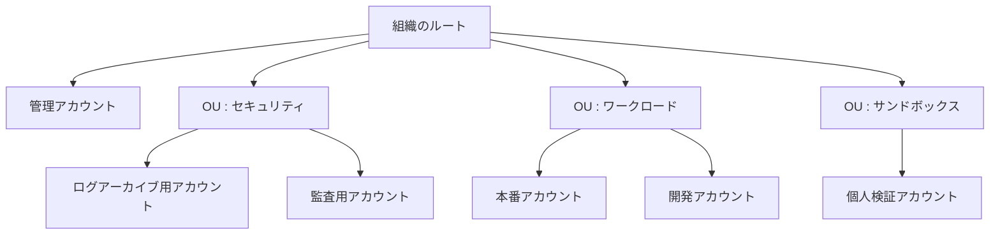

| 用語 | 意味 |
|---|---|
| **管理アカウント** | 組織を作成・管理するアカウント。**ワークロードは置かない** |
| **メンバーアカウント** | 組織に所属する通常のアカウント |
| **OU（組織単位）** | アカウントをまとめるフォルダ。階層化できる |
| **ポリシー** | SCP、タグポリシー、バックアップポリシー、RCP など |
| **委任管理者** | Security Hub・GuardDuty・Config などの管理を管理アカウントから委任できる |

出典: [What is AWS Organizations?](https://docs.aws.amazon.com/organizations/latest/userguide/orgs_introduction.html)

### 3-3. サービスコントロールポリシー (SCP)

**SCP** は、組織内のアカウントや OU に適用する「**許可の上限（ガードレール）**」です。

#### SCP の重要な性質

| 性質 | 説明 |
|---|---|
| **権限を付与しない** | SCP は「許可できる範囲」を絞るだけ。ID に権限を与えるには IAM ポリシーが別途必要 |
| **管理アカウントには効かない** | 管理アカウントは SCP の影響を受けない |
| **メンバーアカウントのルートユーザーにも効く** | ルートユーザーも制限できる |
| **サービスリンクロールには効かない** | AWS サービスが使うロールは影響を受けない |
| **継承される** | 親 OU の SCP は子 OU・アカウントに継承される。有効な権限は階層全体の**共通部分** |

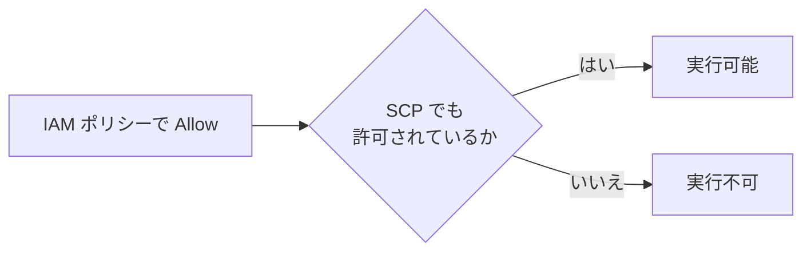

#### 代表的な SCP の使い方

**拒否リスト方式**（ベストプラクティスとして推奨されやすい）: 既定の `FullAWSAccess` を残し、禁止したいことだけを Deny で追加します。

**例 1: 許可リージョン以外の操作を禁止（Region 制限）**

```json
{
  "Version": "2012-10-17",
  "Statement": [
    {
      "Sid": "DenyOutsideAllowedRegions",
      "Effect": "Deny",
      "NotAction": [
        "iam:*",
        "organizations:*",
        "route53:*",
        "cloudfront:*",
        "support:*",
        "sts:*"
      ],
      "Resource": "*",
      "Condition": {
        "StringNotEquals": {
          "aws:RequestedRegion": ["ap-northeast-1", "us-east-1"]
        }
      }
    }
  ]
}
```

> `NotAction` で**グローバルサービス**（IAM、Route 53、CloudFront など）を除外するのがコツです。除外しないと、us-east-1 を許可していない場合にグローバルサービスの操作まで壊れることがあります。

**例 2: CloudTrail や Config の停止を禁止**

```json
{
  "Version": "2012-10-17",
  "Statement": [
    {
      "Sid": "ProtectAuditServices",
      "Effect": "Deny",
      "Action": [
        "cloudtrail:StopLogging",
        "cloudtrail:DeleteTrail",
        "config:StopConfigurationRecorder",
        "config:DeleteConfigurationRecorder"
      ],
      "Resource": "*"
    }
  ]
}
```

出典: [Service control policies (SCPs)](https://docs.aws.amazon.com/organizations/latest/userguide/orgs_manage_policies_scps.html) / [SCP examples](https://docs.aws.amazon.com/organizations/latest/userguide/orgs_manage_policies_scps_examples_general.html)

### 3-4. 関連ポリシー（名前だけ区別できるように）

| ポリシー | 制御する対象 | ひとこと |
|---|---|---|
| **SCP** | **プリンシパル**（ユーザー・ロール）の権限上限 | 「組織のメンバーは何ができるか」 |
| **RCP（リソースコントロールポリシー）** | **リソース**に対するアクセスの上限 | 「組織のリソースに誰がアクセスできるか」（データ境界の実装などに有用） |
| **タグポリシー** | タグのキー・値の標準化 | 命名ルール統一（Step 6） |
| **宣言型ポリシー** | サービスの基本設定をアカウント全体で強制 | 例: 設定の一括固定 |

出典: [Managing AWS Organizations policies](https://docs.aws.amazon.com/organizations/latest/userguide/orgs_manage_policies.html)

### 3-4b. 全体のレイヤー構造

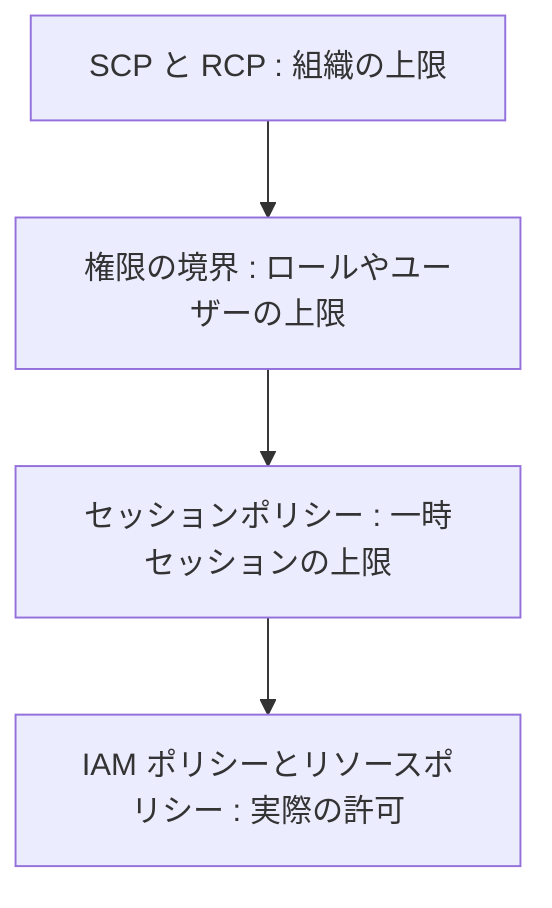

### 3-5. IAM Identity Center（旧 AWS SSO）

**IAM Identity Center** は、**従業員が複数の AWS アカウントやアプリにシングルサインオン**するための推奨サービスです。

| 用語 | 意味 |
|---|---|
| **ID ソース** | ユーザーの情報元。Identity Center 内蔵 / Active Directory / 外部 IdP（SAML） |
| **ユーザー / グループ** | ログインする人。**グループ単位で権限割り当て**するのが基本 |
| **アクセス許可セット (Permission set)** | 「どんな権限か」のテンプレート。割り当て先のアカウントに IAM ロールとして自動作成される |
| **割り当て** | 「このグループに、このアカウントで、この許可セットを与える」 |

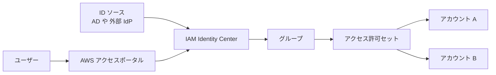

| 利点 | 説明 |
|---|---|
| 認証情報が**一時的** | アクセスキーを配らずに CLI も使える（`aws sso login`） |
| **一元管理** | 退職時は ID ソースで無効化すれば全アカウントのアクセスが止まる |
| MFA の強制 | サインイン時の MFA を一括設定できる |

出典: [What is IAM Identity Center?](https://docs.aws.amazon.com/singlesignon/latest/userguide/what-is.html)

### 3-6. AWS Control Tower（補足）

**Control Tower** は、Organizations・Identity Center・Config・CloudTrail などを使って、**ベストプラクティスに沿ったマルチアカウント環境（ランディングゾーン）**を自動構築します。**コントロール（ガードレール）**として、予防型（SCP で実現）と検出型（Config ルールで実現）が提供されます。Region deny コントロールも用意されています。

出典: [What is AWS Control Tower?](https://docs.aws.amazon.com/controltower/latest/userguide/what-is-control-tower.html) / [Region deny](https://docs.aws.amazon.com/controltower/latest/userguide/region-deny.html)

### 3-7. 安全なマルチアカウント運用のベストプラクティス

| # | ベストプラクティス | 理由 |
|---|---|---|
| 1 | 管理アカウントには**ワークロードを置かず**、利用者も最小限にする | SCP が効かない特別なアカウントだから |
| 2 | OU 構造に沿って SCP を**段階的に**適用し、まず検証用 OU でテスト | 誤った SCP で業務停止を防ぐ |
| 3 | 組織の**CloudTrail 証跡**を専用のログアーカイブアカウントに集約 | 改ざん耐性のある監査 |
| 4 | セキュリティサービス（GuardDuty、Security Hub、Config）の**委任管理者**を設定 | 管理アカウントの使用を減らす |
| 5 | 従業員のアクセスは **IAM Identity Center** + グループ割り当て | IAM ユーザー乱立の防止 |
| 6 | 組織全体で必要な Deny（監査停止禁止・リージョン制限）を SCP で強制 | ガードレール |

### 3-8. 試験で狙われるポイント（Step 3）

| 出題パターン | 答え |
|---|---|
| 「全アカウントで特定のリージョン以外を使えなくしたい」 | SCP（`aws:RequestedRegion` の Deny） |
| 「SCP を付けたのに権限が付与されない」 | SCP は**許可しない**。IAM ポリシーも必要 |
| 「管理アカウントを SCP で制限したい」 | **不可**（管理アカウントには効かない） |
| 「社員が複数アカウントに SSO したい」 | **IAM Identity Center** |
| 「開発者に本番アカウントを触らせない」 | OU 分離 + SCP + アクセス許可セットの割り当て制御 |

---

## Step 4. Trusted Advisor のセキュリティチェックと是正（Skill 4.1.4）

> 公式スキル文: AWS Trusted Advisor のセキュリティチェックの結果に基づいて是正を実装する。

### 4-1. Trusted Advisor とは？

**AWS Trusted Advisor** は、アカウントの設定を自動でチェックし、**ベストプラクティスからのずれ**を教えてくれるサービスです。カテゴリは次の6つです。

| カテゴリ | 内容 |
|---|---|
| **コスト最適化** | 使われていないリソースの検出など |
| **パフォーマンス** | 性能向上の推奨 |
| **セキュリティ** | 公開設定・MFA・権限などの問題 |
| **耐障害性（Fault tolerance）** | 冗長化・バックアップの不足 |
| **サービスクォータ** | 上限に近いクォータ |
| **運用上の優秀性** | 運用面の推奨 |

> **使えるチェックの範囲はサポートプランで異なります**。ベーシック / デベロッパーサポートでは、重要なセキュリティチェックとサービスクォータのチェックなど**一部のみ**が使え、ビジネス以上のサポートでは**全チェック**が使えます。最新の対応範囲は公式ドキュメントで確認してください。

### 4-2. 代表的なセキュリティチェック

| チェック | 検出内容 | 是正の方向性 |
|---|---|---|
| **S3 バケットのアクセス許可** | パブリックアクセスが可能なバケット | S3 ブロックパブリックアクセスを有効化、バケットポリシー見直し |
| **セキュリティグループ - 特定ポートの無制限アクセス** | SSH(22)・RDP(3389) 等が `0.0.0.0/0` に開放 | 送信元を限定、Session Manager の利用 |
| **ルートアカウントの MFA** | ルートに MFA がない | MFA を有効化 |
| **IAM の使用 / アクセスキーのローテーション** | 古いアクセスキー | キーのローテーション・削除、ロールへ移行 |
| **EBS / RDS のパブリックスナップショット** | スナップショットが公開 | 非公開に変更 |
| **CloudTrail ログ** | 記録が無効 | 証跡を作成 |

### 4-3. 是正の流れ

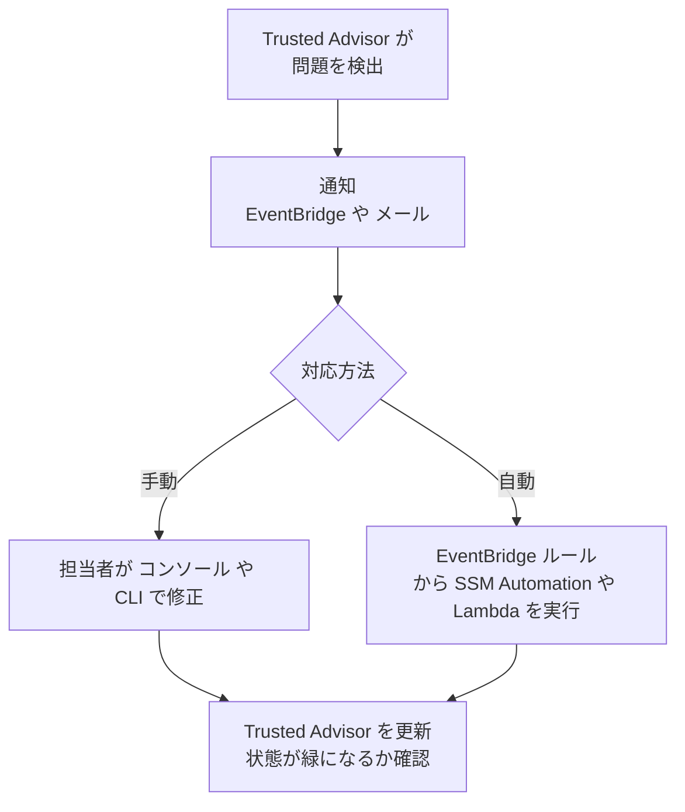

| 機能 | 説明 |
|---|---|
| **EventBridge 連携** | チェック結果の変化をイベントとして受け取り、**自動是正**や通知に使える |
| **組織ビュー** | Organizations と連携して、全アカウントのチェック結果を集約表示できる（対応プランで） |
| **更新 (Refresh)** | 是正後に手動または自動で再チェックし、結果を反映 |
| **除外 (Exclude)** | 意図した例外はリソースを除外して**ノイズを減らす** |

### 4-4. ベストプラクティス

| # | ベストプラクティス |
|---|---|
| 1 | 結果は**見るだけで終わらせず**、担当者・期限を決めて是正する |
| 2 | **EventBridge** で変化を通知し、重大な検出は自動是正も検討 |
| 3 | 意図的な例外は理由を記録して**除外**し、本当の問題が埋もれないようにする |
| 4 | Trusted Advisor は**簡易診断**。継続的な評価は Config / Security Hub と組み合わせる |

出典: [AWS Trusted Advisor](https://docs.aws.amazon.com/awssupport/latest/user/trusted-advisor.html) / [Trusted Advisor check reference](https://docs.aws.amazon.com/awssupport/latest/user/trusted-advisor-check-reference.html)

### 4-5. 試験で狙われるポイント（Step 4）

| 出題パターン | 答え |
|---|---|
| 「SSH が全世界に開放されている SG を見つけたい」 | Trusted Advisor のセキュリティチェック（または Config ルール） |
| 「Trusted Advisor の結果に応じて自動で是正したい」 | **EventBridge** → Lambda / SSM Automation |
| 「ルートの MFA 未設定を知りたい」 | Trusted Advisor のセキュリティチェック |
| 「チェックの全項目が見られない」 | サポートプランの制限 |

---

## Step 5. コンプライアンスの強制と継続的モニタリング（Skill 4.1.5）

> 公式スキル文: コンプライアンス要件の強制と継続的モニタリング（リージョンやサービスの選択、AWS Config コンフォーマンスパックなど）。

### 5-1. 「予防」と「検出」の2本立て

コンプライアンスは**予防的コントロール**と**検出的コントロール**の組み合わせで実現します。

| 種類 | 目的 | 代表的な AWS 機能 |
|---|---|---|
| **予防的** | ルール違反を**そもそもできなくする** | SCP、IAM の Deny、リソースポリシー、Control Tower の予防型ガードレール |
| **検出的** | 違反を**見つけて知らせる** | **AWS Config**、Security Hub、Trusted Advisor |
| **是正的** | 違反を**自動で直す** | Config の修復アクション、EventBridge + SSM Automation / Lambda |

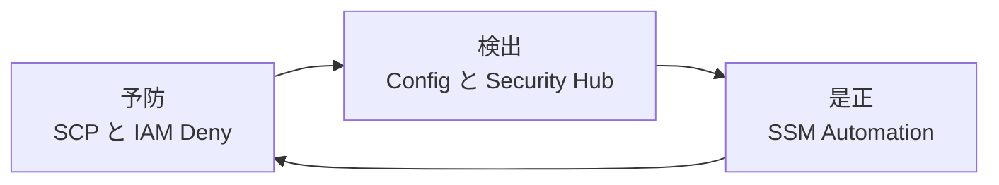

### 5-2. リージョンとサービスの選択（制限）

**「使ってよいリージョン・サービスを限定する」** のは、コンプライアンス（データ所在地の要件など）で頻出です。

| 方法 | 内容 |
|---|---|
| **SCP + `aws:RequestedRegion`** | 許可リージョン以外の操作を Deny（Step 3 の例） |
| **SCP で特定サービスを Deny** | 例えば不要サービスの `Action` を Deny |
| **Control Tower の Region deny** | ガードレールとして提供 |
| **IAM ポリシーの Condition** | 個別のロール・ユーザー単位で制限 |

### 5-3. AWS Config

**AWS Config** は、リソースの**設定の変更履歴を記録**し、**ルールで評価**して、コンプライアンス状況を継続的に監視するサービスです。

| 機能 | 説明 |
|---|---|
| **構成レコーダー** | リソースの設定変更を記録（設定項目） |
| **リソースタイムライン** | ある時点の設定と変更の履歴を確認 |
| **Config ルール** | 設定が望ましい状態か**評価**する。マネージドルール（AWS 提供）とカスタムルール（Lambda / Guard） |
| **評価のトリガー** | 設定変更時（Configuration changes）または定期（Periodic） |
| **アグリゲーター** | 複数のアカウント・リージョンの結果を**集約** |
| **修復アクション** | 非準拠リソースに対して **SSM Automation ドキュメント**を実行して是正 |

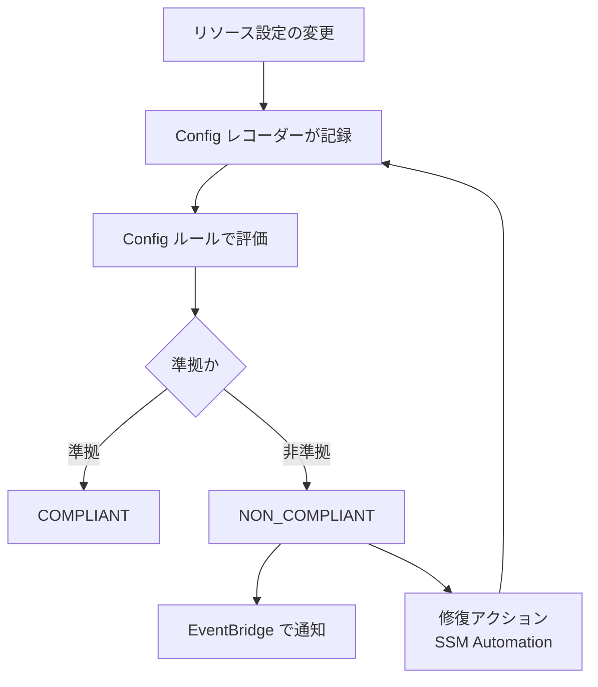

#### 代表的なマネージドルール

| ルール | チェック内容 |
|---|---|
| `s3-bucket-public-read-prohibited` | S3 の公開読み取りを禁止 |
| `encrypted-volumes` | EBS ボリュームが暗号化されている |
| `rds-storage-encrypted` | RDS が暗号化されている |
| `root-account-mfa-enabled` | ルートに MFA が有効 |
| `restricted-ssh` | SSH が無制限に開放されていない |
| `required-tags` | 必須タグが付いている |
| `cloudtrail-enabled` | CloudTrail が有効 |
| `acm-certificate-expiration-check` | 証明書の期限切れが近づいていないか |

出典: [What is AWS Config?](https://docs.aws.amazon.com/config/latest/developerguide/WhatIsConfig.html) / [Remediating noncompliant resources](https://docs.aws.amazon.com/config/latest/developerguide/remediation.html)

### 5-4. Config コンフォーマンスパック

**コンフォーマンスパック**（Conformance Pack）は、**複数の Config ルールと修復アクションを 1 つのテンプレート（YAML）にまとめ、アカウント・リージョン、または組織全体へ一括デプロイ**する仕組みです。

| ポイント | 説明 |
|---|---|
| **サンプルテンプレート** | CIS、PCI DSS、NIST、AWS Well-Architected Security Pillar などの運用ベストプラクティス用が提供される |
| **単一のエンティティ** | まとめて展開・更新・削除できる |
| **組織への展開** | Organizations と連携して**全アカウントに一括デプロイ**できる |
| **コンプライアンスの一括確認** | パック単位でスコアを確認できる |

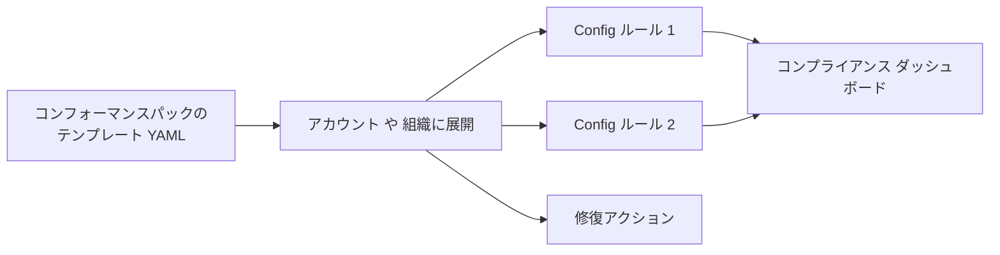

出典: [Conformance Packs](https://docs.aws.amazon.com/config/latest/developerguide/conformance-packs.html)

### 5-5. ルール・パック・Security Hub の使い分け

| やりたいこと | 使う機能 |
|---|---|
| 1 つの設定ルールをチェック | Config ルール |
| 業界標準に沿った**ルール一式**を組織に展開 | **Config コンフォーマンスパック** |
| 複数のサービスの検出結果を**1 か所で**見る | Security Hub（Step 10） |
| 違反を**防ぐ** | SCP / IAM Deny |

### 5-6. ベストプラクティス

| # | ベストプラクティス |
|---|---|
| 1 | **すべてのアカウント・リージョン**で Config を有効化し、アグリゲーターで集約 |
| 2 | 重要要件は**予防（SCP）と検出（Config）の両方**で守る |
| 3 | 修復アクションは**まず手動承認**で試し、安全を確認してから自動化 |
| 4 | 組織の Config レコーダーと証跡は**設定変更を禁止**（SCP で保護） |
| 5 | **AWS Artifact** で AWS 側のコンプライアンスレポート（SOC・ISO など）を入手し、監査対応に使う |

出典: [What is AWS Artifact?](https://docs.aws.amazon.com/artifact/latest/ug/what-is-aws-artifact.html)

### 5-7. 試験で狙われるポイント（Step 5）

| 出題パターン | 答え |
|---|---|
| 「リソースの設定変更履歴を見たい」 | **AWS Config** |
| 「暗号化されていない EBS を検出して自動修復」 | Config ルール `encrypted-volumes` + 修復アクション |
| 「業界標準のルール一式を全アカウントへ展開」 | **コンフォーマンスパック**（組織デプロイ） |
| 「特定リージョン以外を禁止」 | SCP の `aws:RequestedRegion` |
| 「Config は予防できる？」 | **できない**（検出と是正）。予防は SCP / IAM |

---

## Step 6. データ分類（Skill 4.2.1）

> 公式スキル文: データ分類スキームを実装し、強制する。

### 6-1. データ分類とは？

**データ分類**は、データを「どれだけ重要・機密か」で**ランク分け**し、ランクに応じた保護策を決めることです。

> 注意: 分類スキームの**定義そのもの**（どんなランクにするか決める）は組織のガバナンス業務で、試験の対象外です。試験で問われるのは、**決まった分類を AWS 上で実装・強制する**手段です。

#### 分類レベルの例

| レベル | 例 | 保護の方針の例 |
|---|---|---|
| **公開** | プレスリリース | 改ざん防止 |
| **社内限定** | 社内連絡 | 認証必須 |
| **機密** | 顧客情報、契約書 | 暗号化（CMK）、アクセスログ、最小権限 |
| **極秘** | 決済情報、個人番号 | 厳格な暗号化、MFA、アクセス承認 |

### 6-2. AWS での「実装と強制」の手段

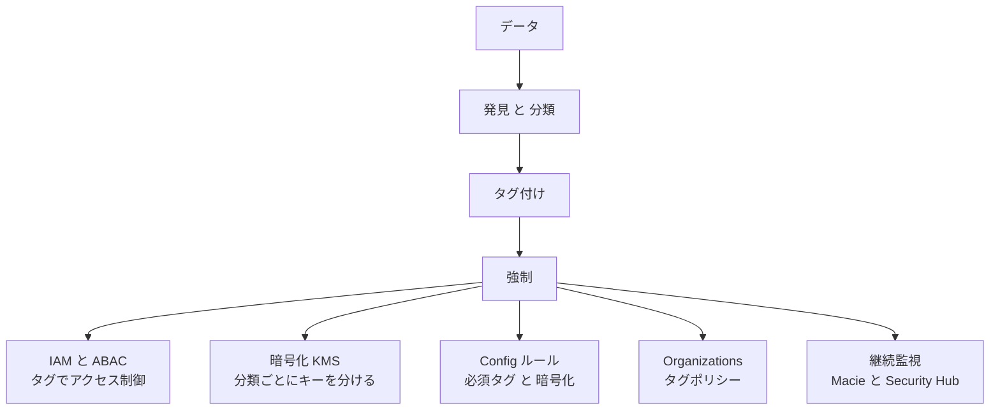

| 手段 | 役割 |
|---|---|
| **Amazon Macie** | S3 内の**機密データを自動発見**（個人情報、認証情報など）。マネージドデータ識別子とカスタム識別子を使う |
| **リソースタグ** | `DataClassification=Confidential` のように分類を**ラベル付け** |
| **タグポリシー（Organizations）** | タグのキー名・許容値を**標準化**（例: `Confidential` / `Internal` / `Public` のみ） |
| **ABAC（属性ベースのアクセス制御）** | `aws:ResourceTag` と `aws:PrincipalTag` が一致するときだけ許可 |
| **Config ルール `required-tags`** | 必須タグの付け忘れを**検出** |
| **KMS** | 分類ごとに別のキーを使い、キーポリシーでアクセスを絞る |
| **S3 ブロックパブリックアクセス** | 機密データの公開を防ぐ |

### 6-3. Amazon Macie

**Amazon Macie** は、機械学習とパターンマッチングで **S3 内の機密データを検出**するサービスです。

| 機能 | 説明 |
|---|---|
| **自動機密データ検出** | S3 全体を継続的にサンプリングして機密データの有無を把握 |
| **機密データ検出ジョブ** | 指定バケットを詳細にスキャン |
| **S3 バケットのインベントリ** | 暗号化状況・公開状況・共有状況を可視化 |
| **検出結果（Findings）** | **EventBridge** や **Security Hub** に連携して通知・集約 |

出典: [What is Amazon Macie?](https://docs.aws.amazon.com/macie/latest/user/what-is-macie.html)

### 6-4. タグによる ABAC の例

「自分と同じ `Project` タグが付いた EC2 だけを操作できる」ポリシー例です。

```json
{
  "Version": "2012-10-17",
  "Statement": [
    {
      "Effect": "Allow",
      "Action": ["ec2:StartInstances", "ec2:StopInstances"],
      "Resource": "arn:aws:ec2:*:*:instance/*",
      "Condition": {
        "StringEquals": {
          "aws:ResourceTag/Project": "${aws:PrincipalTag/Project}"
        }
      }
    }
  ]
}
```

### 6-5. ベストプラクティス

| # | ベストプラクティス |
|---|---|
| 1 | 分類は**少ない段階数**（3〜4 段階）で明確にする（運用に乗る） |
| 2 | **タグ付けを自動化**（IaC のテンプレートで標準付与、タグポリシーで強制） |
| 3 | 機密の高いデータほど**強い保護**（CMK、アクセスログ、MFA）を適用 |
| 4 | Macie で**想定外の場所にある機密データ**を定期的に発見 |
| 5 | 分類とアクセス制御を**ひも付ける**（ABAC） |

出典: [Data classification whitepaper](https://docs.aws.amazon.com/whitepapers/latest/data-classification/data-classification.html) / [Tagging best practices](https://docs.aws.amazon.com/whitepapers/latest/tagging-best-practices/tagging-best-practices.html)

### 6-6. 試験で狙われるポイント（Step 6）

| 出題パターン | 答え |
|---|---|
| 「S3 に個人情報が入っていないか自動で探したい」 | **Amazon Macie** |
| 「タグの付け忘れを検出したい」 | Config ルール `required-tags` |
| 「組織全体でタグの値を統一したい」 | Organizations の**タグポリシー** |
| 「タグに応じてアクセスを制御したい」 | **ABAC**（`aws:ResourceTag` / `aws:PrincipalTag`） |

---

## Step 7. 保管時の暗号化 / AWS KMS（Skill 4.2.2）

> 公式スキル文: 保管時の暗号化（例: AWS KMS）を実装、構成、トラブルシュートする。

### 7-1. 暗号化の基本

| 用語 | 意味 |
|---|---|
| **保管時の暗号化（Encryption at rest）** | ディスクや S3 などに**保存されているデータ**を暗号化 |
| **転送時の暗号化（Encryption in transit）** | ネットワークを**流れているデータ**を暗号化（Step 8） |
| **対称鍵** | 暗号化と復号に**同じ鍵**を使う。KMS の標準 |
| **非対称鍵** | 公開鍵 / 秘密鍵のペア。署名や外部への暗号化に使う |

### 7-2. AWS KMS とは

**AWS Key Management Service (KMS)** は、**暗号鍵の作成・管理・利用**を行うマネージドサービスです。多くの AWS サービス（S3、EBS、RDS、Lambda、Secrets Manager など）と統合され、キーの使用は **CloudTrail に記録**されます。

#### キーの種類

| 種類 | 管理者 | 特徴 |
|---|---|---|
| **AWS 所有キー** | AWS | 利用者からは見えない。無料。多くのサービスの既定 |
| **AWS マネージドキー**（`aws/s3` など） | AWS（サービスごとに作成） | 自動ローテーション（毎年）。キーポリシーは**変更できない** |
| **カスタマーマネージドキー（CMK）** | **利用者** | キーポリシー・ローテーション・無効化・削除を**自分で制御**。有料 |

> CMK を選ぶ理由: **キーポリシーを自分で制御したい**、**クロスアカウントで共有したい**、監査・コンプライアンス上キーの制御が必要、などです。

### 7-3. エンベロープ暗号化

KMS は大量のデータを**直接**暗号化するのではなく、**データキー**を介する「エンベロープ暗号化」を使います。

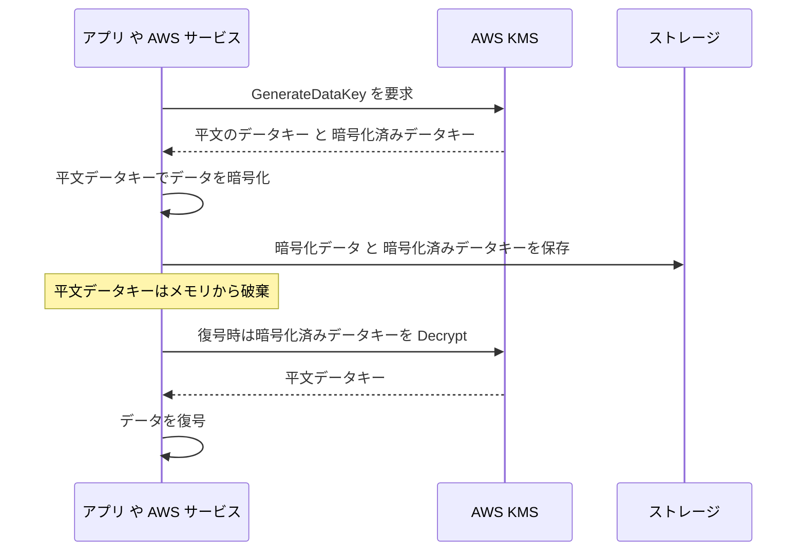

| 利点 | 説明 |
|---|---|
| 高速 | 大きなデータはローカルで暗号化（KMS への転送はキーだけ） |
| 安全 | KMS のマスターキー（KMS キー）は KMS の外に出ない |

### 7-4. キーポリシーとアクセス制御

KMS のアクセス制御は、他のサービスと**考え方が少し違います**。

| 重要ポイント | 説明 |
|---|---|
| **キーポリシーが必須** | すべての KMS キーにキーポリシーがある。**キーポリシーが許可しなければ、IAM ポリシーだけでは使えない** |
| **IAM ポリシーを有効にする一文** | 既定のキーポリシーには「アカウントの IAM ポリシーで権限管理を許可する」ステートメントがあり、これで IAM ポリシーが効く |
| **グラント** | 一時的・プログラム的にキーの使用権限を委任する仕組み（EBS や RDS が内部で使用） |
| **クロスアカウント** | **キーポリシー（キー側）**と**呼び出し側の IAM ポリシー**の**両方**が必要 |

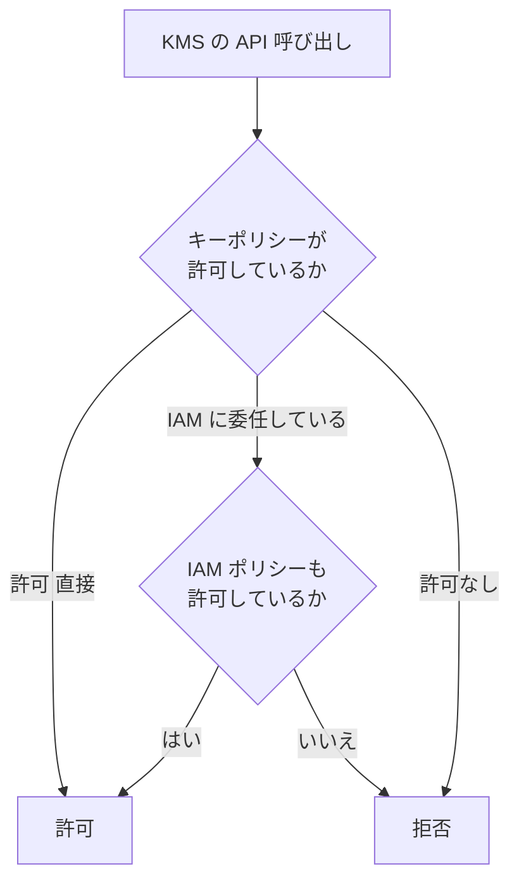

#### 主な KMS アクション

| アクション | 内容 |
|---|---|
| `kms:Encrypt` / `kms:Decrypt` | 暗号化 / 復号 |
| `kms:GenerateDataKey` | データキー生成（**S3 や EBS への書き込み**で必要） |
| `kms:CreateGrant` | グラント作成（EBS 等のサービス連携で必要） |
| `kms:DescribeKey` | キー情報の取得 |

### 7-5. キーのローテーション・無効化・削除

| 操作 | 内容 |
|---|---|
| **自動ローテーション** | CMK では**有効化が必要**（既定は無効）。有効化すると既定で毎年ローテーション（間隔は設定可能）。**キー ID・ARN は変わらず**、過去のデータは古いキー素材で自動復号される |
| **オンデマンドローテーション** | 必要なときに手動で即時ローテーション |
| **無効化** | 一時的に使用不可にする（元に戻せる） |
| **削除** | **7〜30 日の待機期間**を経て完全削除（待機中はキャンセル可能）。**削除すると暗号化データは復号できなくなる** |
| **マルチリージョンキー** | 同一キー素材を複数リージョンで使う（DR・グローバル用途） |

> 削除は取り返しがつきません。**まず無効化**して影響がないことを確認してから、削除をスケジュールするのが安全です。

### 7-6. 主要サービスの暗号化（試験頻出）

| サービス | 暗号化の特徴 |
|---|---|
| **S3** | **新規オブジェクトは SSE-S3 で自動暗号化**（既定）。SSE-KMS、DSSE-KMS、SSE-C も選択可。**S3 バケットキー**で KMS のリクエスト数とコストを削減 |
| **EBS** | ボリューム作成時に暗号化。**リージョン単位でデフォルト暗号化**を有効化できる |
| **RDS** | **作成時に暗号化を有効化**。スナップショット・リードレプリカ・バックアップも暗号化される |
| **DynamoDB** | 常に保管時暗号化（AWS 所有キー / AWS マネージドキー / CMK を選択） |
| **Secrets Manager / SSM SecureString** | KMS で暗号化 |

#### 既存の非暗号化リソースを暗号化する手順（頻出）

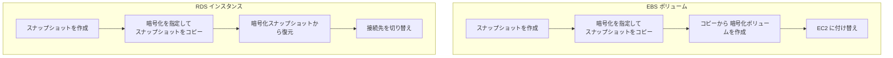

> **作成後に「暗号化のスイッチ」を入れることはできません**（EBS・RDS）。**暗号化スナップショットのコピー → 復元**が基本の手順です。

#### 暗号化したスナップショットの共有

- **AWS マネージドキーで暗号化したスナップショットは、他アカウントと共有できません**。
- 共有するには **CMK で暗号化**し、**キーポリシーで相手アカウントを許可**します。

### 7-7. KMS のトラブルシュート

| 症状 / エラー | 主な原因 | 対処 |
|---|---|---|
| `AccessDeniedException` | キーポリシー・IAM ポリシーに必要なアクションがない。クロスアカウントで片側のみ許可 | キーポリシーと IAM の両方を確認 |
| EC2 が暗号化 EBS を起動できない | EC2 に関連するロールに `kms:CreateGrant`、`kms:GenerateDataKey*`、`kms:Decrypt` が足りない | キーポリシーの許可を追加 |
| `KMSInvalidStateException` / `DisabledException` | キーが**無効**、または**削除保留中** | キーを有効化、削除をキャンセル |
| S3 から SSE-KMS オブジェクトを取得できない | 呼び出し元に **`kms:Decrypt`** がない | キー権限を付与 |
| `ThrottlingException` | KMS の API リクエストクォータ超過 | **S3 バケットキー**の利用、再試行（指数バックオフ）、クォータ引き上げ |
| 別リージョンで復号できない | KMS キーは**リージョン固有** | マルチリージョンキー、またはコピー時に再暗号化 |

> 切り分けのコツ: **CloudTrail** の `kms.amazonaws.com` イベントで、どのキー・どの ID・どのエラーかを確認します。

出典: [What is AWS KMS?](https://docs.aws.amazon.com/kms/latest/developerguide/overview.html) / [Key policies](https://docs.aws.amazon.com/kms/latest/developerguide/key-policies.html) / [Rotating KMS keys](https://docs.aws.amazon.com/kms/latest/developerguide/rotate-keys.html) / [Grants in AWS KMS](https://docs.aws.amazon.com/kms/latest/developerguide/grants.html) / [S3 encryption](https://docs.aws.amazon.com/AmazonS3/latest/userguide/UsingEncryption.html) / [EBS encryption](https://docs.aws.amazon.com/ebs/latest/userguide/ebs-encryption.html) / [RDS encryption](https://docs.aws.amazon.com/AmazonRDS/latest/UserGuide/Overview.Encryption.html)

### 7-8. ベストプラクティス（KMS）

| # | ベストプラクティス |
|---|---|
| 1 | 要件があるデータには**CMK**を使い、**キーポリシーを最小権限**に |
| 2 | **管理者**（キーの管理）と**利用者**（暗号化・復号）の権限を**分離** |
| 3 | CMK の**自動ローテーション**を有効化 |
| 4 | 削除する前に**無効化**して影響確認。待機期間は余裕を持つ |
| 5 | EBS の**デフォルト暗号化**、S3 のバケットキー等を有効化 |
| 6 | キーの使用を **CloudTrail** で監視し、異常な使用をアラート |
| 7 | 暗号化の設定漏れを **Config ルール**で検出 |

### 7-9. 試験で狙われるポイント（Step 7）

| 出題パターン | 答え |
|---|---|
| 「稼働中の非暗号化 EBS を暗号化したい」 | スナップショット → **暗号化コピー** → 新ボリューム作成 |
| 「非暗号化 RDS を暗号化したい」 | スナップショット → 暗号化コピー → **復元** |
| 「暗号化 EBS スナップショットを別アカウントに共有」 | **CMK** で暗号化し、キーポリシーで相手を許可 |
| 「KMS 利用でスロットリング」 | **S3 バケットキー**、リトライ、クォータ緩和 |
| 「ローテーションしたらデータが読めなくなる？」 | **読める**（古いキー素材は保持される） |
| 「誤ってキーを削除予約した」 | 待機期間中なら**削除をキャンセル** |

---

## Step 8. 転送時の暗号化 / ACM（Skill 4.2.3）

> 公式スキル文: 転送時の暗号化（例: AWS Certificate Manager [ACM]）を実装、構成、トラブルシュートする。

### 8-1. 転送時の暗号化とは

ネットワーク上のデータを盗聴・改ざんされないよう、**TLS（Transport Layer Security）** で通信を暗号化します。HTTPS は「HTTP + TLS」です。

| 用語 | 意味 |
|---|---|
| **TLS 証明書** | サーバーの身元を証明する電子証明書。ドメイン名と公開鍵を結び付ける |
| **CA（認証局）** | 証明書を発行する信頼された機関 |
| **TLS 終端** | ロードバランサーなどで TLS を復号する場所 |

### 8-2. AWS Certificate Manager (ACM)

**ACM** は、TLS 証明書の**発行・管理・更新**を行うサービスです。

| 機能 | 説明 |
|---|---|
| **パブリック証明書** | ACM から発行。**ACM 統合サービスでは無料で使える** |
| **プライベート証明書** | **AWS Private CA** で発行（社内システム用）。別料金 |
| **インポート** | 外部で取得した証明書を ACM に取り込む（**自動更新されない**） |
| **マネージド更新** | ACM 発行の証明書は条件を満たせば**自動で更新** |

#### ACM と統合できる主なサービス

| サービス | ポイント |
|---|---|
| **Elastic Load Balancing（ALB / NLB）** | HTTPS / TLS リスナーに証明書を設定 |
| **Amazon CloudFront** | **証明書は米国東部（バージニア北部, us-east-1）で用意する** |
| **Amazon API Gateway** | カスタムドメインに利用 |

> EC2 インスタンスへの証明書の直接インストールは、ACM のパブリック証明書では原則できません（ACM 統合サービスで使う前提）。EC2 上で TLS 終端が必要なときは、ロードバランサーで終端する構成を基本に考えます。最新の対応状況は公式ドキュメントで確認してください。

### 8-3. ドメイン検証（DNS 検証 vs メール検証）

```mermaid
flowchart TD
    REQ["ACM に証明書をリクエスト"] --> V{"検証方法"}
    V -- "DNS 検証 推奨" --> D1["ACM が示す CNAME レコードを<br/>DNS に追加"]
    D1 --> D2["自動で検証完了"]
    D2 --> D3["更新時も CNAME が残っていれば<br/>自動更新"]
    V -- "メール検証" --> M1["ドメイン管理者宛のメールを承認"]
    M1 --> M2["更新のたびに<br/>メール承認が必要な場合あり"]
```

| 比較 | DNS 検証 | メール検証 |
|---|---|---|
| 手間 | **CNAME を一度追加**すれば OK | 承認メール対応が必要 |
| 自動更新 | **しやすい**（推奨） | 手間が残りやすい |
| Route 53 との相性 | **ワンクリックでレコード追加**可能 | — |

### 8-4. 実装パターン

#### ALB で HTTPS を使う

```mermaid
flowchart LR
    C["クライアント"] -->|"HTTPS 443"| ALB["ALB<br/>ACM 証明書で TLS 終端"]
    ALB -->|"HTTP または HTTPS"| EC2["ターゲット EC2"]
    C -.->|"HTTP 80"| ALB
    ALB -.->|"HTTPS へリダイレクト"| C
```

| 手順 | 内容 |
|---|---|
| 1 | ACM で証明書を発行し、DNS 検証を完了（ステータスが **Issued**） |
| 2 | ALB に **HTTPS (443) リスナー**を追加し、証明書を選択 |
| 3 | **セキュリティポリシー**（TLS のバージョンや暗号スイート）を最新・推奨のものにする |
| 4 | HTTP (80) リスナーは **HTTPS へリダイレクト** |
| 5 | バックエンドも暗号化したい場合は、ターゲットグループのプロトコルを HTTPS に |

#### その他の「転送時暗号化」の強制

| 対象 | 強制の方法 |
|---|---|
| **S3** | バケットポリシーで `aws:SecureTransport` が `false` のとき Deny |
| **CloudFront** | ビューアープロトコルポリシーを「**HTTP を HTTPS にリダイレクト**」または「HTTPS のみ」 |
| **RDS** | **SSL/TLS 接続を要求**（エンジンごとのパラメータ。例: PostgreSQL の `rds.force_ssl`、MySQL の `require_secure_transport`） |
| **VPN / Direct Connect** | Site-to-Site VPN は IPsec。Direct Connect は既定で暗号化されないため、必要なら MACsec や VPN を併用 |

```json
{
  "Version": "2012-10-17",
  "Statement": [
    {
      "Sid": "DenyInsecureTransport",
      "Effect": "Deny",
      "Principal": "*",
      "Action": "s3:*",
      "Resource": [
        "arn:aws:s3:::example-bucket",
        "arn:aws:s3:::example-bucket/*"
      ],
      "Condition": {
        "Bool": { "aws:SecureTransport": "false" }
      }
    }
  ]
}
```

### 8-5. 証明書の期限切れ対策

| 方法 | 内容 |
|---|---|
| **ACM 発行 + DNS 検証** | 自動更新に任せる（最も運用が楽） |
| **EventBridge** | 「ACM Certificate Approaching Expiration」イベントで通知 |
| **Config ルール** | `acm-certificate-expiration-check` で期限切れ間近を検出 |
| **CloudWatch メトリクス** | `DaysToExpiry` で監視しアラーム |
| **インポート証明書** | 自動更新**されない**ため、**必ず期限を監視**して手動で差し替え |

### 8-6. トラブルシュート

| 症状 | 主な原因 | 対処 |
|---|---|---|
| 証明書が **Pending validation** のまま | DNS に CNAME が**未登録 / 誤り**、メール未承認 | ACM が示す CNAME を正確に追加 |
| CloudFront で証明書が**選べない** | 証明書が **us-east-1 以外**にある | us-east-1 で証明書を再発行 |
| ブラウザで**名前不一致エラー** | 証明書の CN / SAN にアクセスするドメインが含まれない | 正しいドメイン（ワイルドカード含む）で再発行 |
| 自動更新されない | DNS 検証用 CNAME を**削除**した、証明書が**どのリソースにも未使用**、インポート証明書 | CNAME を復元、使用状況を確認 |
| ALB に証明書を選択できない | ALB と**別リージョン**の証明書 | ALB と同じリージョンで発行 |
| 古い TLS で接続できる / できない | セキュリティポリシーが古い / 新しすぎる | クライアント要件に合わせてポリシーを選択 |

出典: [What is AWS Certificate Manager?](https://docs.aws.amazon.com/acm/latest/userguide/acm-overview.html) / [DNS / email validation](https://docs.aws.amazon.com/acm/latest/userguide/domain-ownership-validation.html) / [Managed renewal](https://docs.aws.amazon.com/acm/latest/userguide/managed-renewal.html) / [HTTPS listener for ALB](https://docs.aws.amazon.com/elasticloadbalancing/latest/application/create-https-listener.html) / [CloudFront and HTTPS](https://docs.aws.amazon.com/AmazonCloudFront/latest/DeveloperGuide/using-https.html)

### 8-7. ベストプラクティス（転送時暗号化）

| # | ベストプラクティス |
|---|---|
| 1 | **すべての通信を TLS で暗号化**し、HTTP は HTTPS へリダイレクト |
| 2 | ACM の**DNS 検証**を使い、**自動更新**を活用 |
| 3 | 推奨の**セキュリティポリシー**（TLS 1.2 以上）を選択 |
| 4 | S3 は `aws:SecureTransport` で**HTTP を拒否** |
| 5 | **期限切れ監視**（EventBridge / Config）を必ず設定 |
| 6 | 内部通信（サービス間・DB 接続）も TLS を要求 |

### 8-8. 試験で狙われるポイント（Step 8）

| 出題パターン | 答え |
|---|---|
| 「証明書を無料で発行・自動更新したい」 | **ACM（パブリック証明書）+ DNS 検証** |
| 「CloudFront で使う証明書のリージョン」 | **us-east-1** |
| 「S3 への HTTP アクセスを拒否」 | `aws:SecureTransport` を `false` で Deny |
| 「インポートした証明書の期限切れ対策」 | 自動更新されないため**期限監視 + 手動更新** |
| 「Pending validation のまま」 | **CNAME 未登録**を疑う |

---

## Step 9. シークレットの安全な保管（Skill 4.2.4）

> 公式スキル文: AWS のサービスを使ってシークレットを安全に保管する。

### 9-1. シークレットとは？ なぜ問題になるか

**シークレット**は、データベースのパスワード、API キー、トークンなど「**漏れたら困る認証情報**」です。

| やってはいけない | 理由 |
|---|---|
| ソースコードにハードコード | Git に残る。リポジトリが漏れた瞬間に流出 |
| 環境変数や設定ファイルに平文 | ログ・設定の閲覧で漏れる |
| 共有ドキュメントに記載 | 閲覧者全員が見える |

**対策**: シークレット専用のサービスに保管し、**実行時に取得**する。

### 9-2. AWS Secrets Manager

**AWS Secrets Manager** は、シークレットを**暗号化して保管**し、**自動ローテーション**ができるサービスです。

| 機能 | 説明 |
|---|---|
| **暗号化** | **KMS** で暗号化（AWS マネージドキー または CMK） |
| **自動ローテーション** | **Lambda 関数**で定期的にパスワードを変更。RDS・Redshift・DocumentDB などは**ローテーション機能が組み込み** |
| **アクセス制御** | IAM ポリシー + **リソースポリシー**で制御 |
| **クロスリージョンレプリケーション** | シークレットを別リージョンに複製（DR 用） |
| **監査** | 取得・変更が **CloudTrail** に記録される |
| **削除の猶予期間** | 削除予約時に **7〜30 日の復旧猶予**（既定 30 日） |

```mermaid
sequenceDiagram
    participant APP as アプリ Lambda や ECS
    participant SM as Secrets Manager
    participant KMS as KMS
    participant DB as データベース
    APP->>SM: GetSecretValue
    SM->>KMS: シークレットを復号
    KMS-->>SM: 平文
    SM-->>APP: DB パスワードを返す
    APP->>DB: 取得したパスワードで接続
```

#### 自動ローテーションの流れ

```mermaid
flowchart LR
    SCH["ローテーション周期に到達"] --> LAM["ローテーション用 Lambda を起動"]
    LAM --> S1["createSecret : 新パスワードを作成"]
    S1 --> S2["setSecret : DB に新パスワードを設定"]
    S2 --> S3["testSecret : 新パスワードで接続テスト"]
    S3 --> S4["finishSecret : 新バージョンを現行に切替"]
```

### 9-3. SSM Parameter Store

**Parameter Store** は、設定値やシークレットを階層的（`/app/prod/db/password`）に保管できる Systems Manager の機能です。

| 型 | 内容 |
|---|---|
| **String** | 平文の文字列 |
| **StringList** | カンマ区切りのリスト |
| **SecureString** | **KMS で暗号化**された値 |

### 9-4. Secrets Manager と Parameter Store の使い分け

| 観点 | Secrets Manager | Parameter Store |
|---|---|---|
| **主な用途** | **シークレット**（DB 認証情報、API キー） | 設定値全般（シークレットも可） |
| **自動ローテーション** | **あり**（組み込み） | **なし**（自前で実装） |
| **コスト** | シークレット数・API 呼び出しで課金 | Standard パラメータは**無料枠が大きい** |
| **クロスリージョン複製** | **あり** | なし |
| **リソースポリシー** | あり | なし |
| **暗号化** | 常に KMS | SecureString のみ KMS |

```mermaid
flowchart TD
    Q["保管したい値"] --> A{"機密の認証情報か"}
    A -- "いいえ 設定値のみ" --> PS["Parameter Store String"]
    A -- "はい" --> B{"自動ローテーションや<br/>クロスリージョン複製が必要か"}
    B -- "はい" --> SM["Secrets Manager"]
    B -- "いいえ コスト重視" --> PS2["Parameter Store SecureString"]
```

### 9-5. アプリからの安全な利用パターン

| 実行環境 | 取得方法 |
|---|---|
| **EC2** | インスタンスプロファイルのロールで `GetSecretValue` |
| **Lambda** | 実行ロールで取得し、**キャッシュ**して API 呼び出しを減らす |
| **ECS / Fargate** | タスク定義の `secrets` で Secrets Manager / Parameter Store を参照（**タスク実行ロール**に権限） |
| **CloudFormation** | 動的参照（`{{resolve:secretsmanager:...}}`）でテンプレートに平文を書かない |

### 9-6. トラブルシュート

| 症状 | 主な原因 | 対処 |
|---|---|---|
| `AccessDeniedException` | ロールに `secretsmanager:GetSecretValue` がない、リソースポリシーの拒否 | IAM / リソースポリシーを確認 |
| 取得はできるが復号失敗 | CMK を使っているのに **`kms:Decrypt`** がない | キーポリシー・IAM を修正 |
| ローテーション失敗 | Lambda が **VPC 内**でインターネット / Secrets Manager に届かない、Lambda から DB に届かない（SG） | **VPC エンドポイント**または NAT、セキュリティグループを確認 |
| 別リージョンで見えない | シークレットは**リージョン固有** | レプリケーションを設定 |

出典: [What is AWS Secrets Manager?](https://docs.aws.amazon.com/secretsmanager/latest/userguide/intro.html) / [Rotate secrets](https://docs.aws.amazon.com/secretsmanager/latest/userguide/rotating-secrets.html) / [Secrets Manager best practices](https://docs.aws.amazon.com/secretsmanager/latest/userguide/best-practices.html) / [Parameter Store](https://docs.aws.amazon.com/systems-manager/latest/userguide/systems-manager-parameter-store.html)

### 9-7. ベストプラクティス（シークレット）

| # | ベストプラクティス |
|---|---|
| 1 | **ハードコード禁止**。実行時に取得 |
| 2 | **自動ローテーション**を有効化し、長期固定のパスワードを避ける |
| 3 | シークレットごとに**最小権限**（誰が `GetSecretValue` できるか） |
| 4 | **CMK** で暗号化し、キーポリシーでも利用者を限定 |
| 5 | **CloudTrail** でシークレット取得を監視 |
| 6 | 取得結果を**アプリ内でキャッシュ**し、スロットリングとコストを抑える |
| 7 | 可能なら**IAM 認証**（RDS の IAM DB 認証など）でパスワード自体を不要にする |

### 9-8. 試験で狙われるポイント（Step 9）

| 出題パターン | 答え |
|---|---|
| 「DB パスワードを自動でローテーションしたい」 | **Secrets Manager** |
| 「低コストで設定値と暗号化値を保管」 | **Parameter Store（SecureString）** |
| 「ECS のコンテナにシークレットを渡したい」 | タスク定義の `secrets` + **タスク実行ロール** |
| 「ローテーション Lambda が失敗」 | VPC エンドポイント / NAT / SG を確認 |
| 「リージョン障害に備えてシークレットを複製」 | **クロスリージョンレプリケーション** |

---

## Step 10. セキュリティサービスの検出結果とレポート・是正（Skill 4.2.5）

> 公式スキル文: AWS サービス（Security Hub、GuardDuty、Config、Inspector、AWS Security Agent など）の検出結果に対してレポートを構成し、是正する。

### 10-1. サービスの役割分担

| サービス | ひとことで言うと | 見るもの |
|---|---|---|
| **Amazon GuardDuty** | **脅威検出**（怪しい挙動の発見） | CloudTrail、VPC フローログ、DNS ログ等の分析 |
| **Amazon Inspector** | **脆弱性スキャン** | EC2・ECR コンテナイメージ・Lambda の CVE とネットワーク到達性 |
| **AWS Config** | **設定の準拠状況** | リソース構成とルール評価 |
| **Amazon Macie** | **機密データ発見** | S3 の中身 |
| **AWS Security Hub** | 上記の**結果を集約・優先順位付け** | 各サービスの検出結果 |
| **AWS Security Agent** | **アプリのセキュリティレビューと侵入テスト（AI）** | 設計・コード・稼働中アプリ |

```mermaid
flowchart TB
    GD["GuardDuty<br/>脅威検出"] --> SH
    INS["Inspector<br/>脆弱性"] --> SH
    CFG["Config と Security Hub CSPM<br/>設定の準拠"] --> SH
    MAC["Macie<br/>機密データ"] --> SH
    SH["Security Hub<br/>集約と優先順位付け"] --> EB["EventBridge"]
    EB --> NOTI["SNS 通知"]
    EB --> AUTO["Lambda や SSM Automation<br/>で自動是正"]
    EB --> TICK["チケット や SIEM 連携"]
```

### 10-2. Amazon GuardDuty

**GuardDuty** は、ログを継続的に分析して**脅威を検出**するマネージドサービスです。エージェントのインストールは不要で、有効化するだけで使えます。

| 機能 | 説明 |
|---|---|
| **基本のデータソース** | CloudTrail 管理イベント、VPC フローログ、DNS ログ |
| **保護プラン（オプション）** | S3 保護、EKS 保護、Malware Protection、RDS 保護、Lambda 保護、ランタイムモニタリングなど |
| **検出結果の例** | 認証情報の不正利用、暗号通貨マイニング、既知の悪意ある IP との通信、通常と異なる API 呼び出し |
| **重大度** | Low / Medium / High / Critical で表示 |
| **抑制ルール** | 想定内の検出結果を**自動でアーカイブ**してノイズを減らす |
| **信頼 IP リスト / 脅威 IP リスト** | 許可・拒否する IP を登録 |
| **マルチアカウント** | Organizations と連携し**委任管理者**から全アカウントを一括有効化 |

> 試験ポイント: 「EC2 が暗号通貨マイニングをしている疑い」「普段と違う場所からの API 呼び出し」→ **GuardDuty**。

出典: [What is Amazon GuardDuty?](https://docs.aws.amazon.com/guardduty/latest/ug/what-is-guardduty.html)

### 10-3. Amazon Inspector

**Inspector** は、ワークロードの**ソフトウェア脆弱性**を**継続的にスキャン**するサービスです。

| 対象 | 内容 |
|---|---|
| **EC2** | OS パッケージの脆弱性（CVE）をスキャン。SSM エージェント経由のスキャンが基本で、エージェントレスのスキャンにも対応 |
| **ECR コンテナイメージ** | プッシュ時・継続的にスキャン |
| **Lambda 関数** | 依存ライブラリのコードの脆弱性 |
| **ネットワーク到達性** | EC2 への意図しない到達経路を検出 |

| 特徴 | 説明 |
|---|---|
| **Inspector スコア** | CVE の深刻度に環境の情報を加味して**優先順位**を付ける |
| **継続スキャン** | 新しい CVE の公開や、新規リソースの追加で**自動で再スキャン** |
| **レポート出力** | 検出結果を **CSV / JSON として S3 へエクスポート**でき、SBOM の出力にも対応 |

#### 脆弱性を是正する流れ（EC2）

```mermaid
flowchart TD
    I["Inspector が<br/>EC2 の CVE を検出"] --> P["重大度と Inspector スコアで優先順位付け"]
    P --> R["Systems Manager Patch Manager で<br/>パッチを適用"]
    R --> RS["Inspector が自動で再スキャン"]
    RS --> C{"検出が解消したか"}
    C -- "はい" --> DONE["クローズ"]
    C -- "いいえ" --> P
```

> 補足: Inspector は**検出**まで。**パッチ適用**は Systems Manager **Patch Manager** で行うのが定番の組み合わせです。

出典: [What is Amazon Inspector?](https://docs.aws.amazon.com/inspector/latest/user/what-is-inspector.html)

### 10-4. AWS Security Hub（と Security Hub CSPM）

公式ドキュメントでは、**AWS Security Hub** と **AWS Security Hub CSPM** は**互いを補完する別サービス**として説明されています。

| サービス | 役割 |
|---|---|
| **Security Hub CSPM** | 環境を**業界標準やベストプラクティスに照らして評価**し、**設定ミス（コントロール違反）を検出**する。従来の Security Hub の姿 |
| **Security Hub** | 統合された体験で、**重要なセキュリティ問題の優先順位付けと対応**を助ける。CSPM の検出結果は自動で Security Hub に送られ、**Inspector など他サービスの検出結果と相関付け**して「エクスポージャー（露出）」を生成する |

| 主な機能 | 説明 |
|---|---|
| **セキュリティ標準** | AWS 基礎セキュリティベストプラクティス、CIS、PCI DSS、NIST などに基づくコントロールで自動チェック |
| **検出結果の集約** | 複数のアカウント・リージョンの結果を**一元表示**（委任管理者 + 集約） |
| **自動化ルール** | 条件に合う検出結果の**重大度変更・抑制**などを自動化 |
| **EventBridge 連携** | 検出結果をトリガーに**通知・自動是正** |
| **推奨構成** | 公式は、Security Hub と CSPM に加え、**GuardDuty・Inspector・Macie も有効化**することを推奨 |

出典: [What are Security Hub and Security Hub CSPM?](https://docs.aws.amazon.com/securityhub/latest/userguide/what-are-securityhub-services.html) / [Security Hub CSPM User Guide](https://docs.aws.amazon.com/securityhub/latest/userguide/what-is-securityhub.html)

### 10-5. AWS Config による検出と是正（再掲）

Step 5 で学んだ **Config ルール + 修復アクション（SSM Automation）** は、「違反の検出 → 自動修復」の代表です。Security Hub CSPM の多くのコントロールも内部で Config ルールを利用します。

### 10-6. AWS Security Agent

**AWS Security Agent** は、**開発ライフサイクル全体でアプリケーションを守る、AI のフロンティアエージェント**です。公式ドキュメントによると、組織のセキュリティ要件に沿った**自動セキュリティレビュー**と、**コンテキストを理解した侵入テスト（ペネトレーションテスト）をオンデマンド**で提供します。

| 機能 | 説明 |
|---|---|
| **設計レビュー** | 設計ドキュメントを組織のセキュリティ要件に照らして評価 |
| **コードレビュー** | プルリクエストなどのコードを評価 |
| **侵入テスト** | デプロイ済みアプリに対し、**特化した AI エージェント群**が攻撃シナリオを実行し、脆弱性を**発見・検証・報告**。**実際にエクスプロイトして検証**し、再現可能な攻撃経路と影響分析を示す |
| **修正支援** | 修正案のプルリクエストを作成 |
| **対象環境** | AWS、オンプレミス、ハイブリッド、マルチクラウド、SaaS |

| 運用のポイント | 説明 |
|---|---|
| **エージェントスペース** | セットアップ時に作成される作業単位（Agent Space） |
| **ドメイン検証** | 侵入テストは**所有を検証したドメイン**に対して実行 |
| **スコープの制御** | **対象外 URL を指定**して、テストしてはいけない対象を除外できる |
| **認証情報の扱い** | 侵入テストは実行時に認証できる唯一の機能。認証情報は **Secrets Manager** などから渡せる |
| **位置づけ** | 公式は**プロの侵入テストサービスの代替ではなく**、セキュリティレビューのワークフローに**組み込む**ことを推奨 |

```mermaid
flowchart LR
    DEV["開発"] --> DR["設計レビュー と コードレビュー"]
    DR --> DEP["デプロイ"]
    DEP --> PT["オンデマンド侵入テスト"]
    PT --> FIND["検証済みの検出結果"]
    FIND --> FIX["修正 PR の作成"]
    FIX --> DEV
```

> 試験に向けた整理: Security Agent は「**アプリ層の脆弱性を、攻撃者の目線で検証する**」サービスです。インフラの設定ミスは Config / Security Hub、OS・ライブラリの CVE は Inspector、実行時の脅威は GuardDuty、と**役割が分かれています**。比較表で区別しましょう。

出典: [What is AWS Security Agent?](https://docs.aws.amazon.com/securityagent/latest/userguide/what-is.html) / [Quickstart: Run a penetration test](https://docs.aws.amazon.com/securityagent/latest/userguide/quickstart.html) / [Security considerations](https://docs.aws.amazon.com/securityagent/latest/userguide/security-guidance.html) / [一般提供開始のお知らせ（2026-03-31）](https://aws.amazon.com/about-aws/whats-new/2026/03/aws-security-agent-ondemand-penetration) / [AWS Security Agent FAQ](https://aws.amazon.com/security-agent/faqs/)

### 10-7. サービス比較表（超重要）

| 質問 | 答えるサービス |
|---|---|
| 「怪しい挙動 / 侵害の兆候は？」 | **GuardDuty** |
| 「ソフトウェアに既知の脆弱性（CVE）は？」 | **Inspector** |
| 「設定がルールに準拠しているか / 変更履歴は？」 | **Config** |
| 「S3 に機密データがあるか」 | **Macie** |
| 「全部の結果を 1 か所で見て優先順位を付けたい」 | **Security Hub** |
| 「アプリを攻撃者の視点でテストしたい」 | **AWS Security Agent** |
| 「操作の履歴（誰が何をした）」 | **CloudTrail** |
| 「外部公開されているリソースは？」 | **IAM Access Analyzer** |

### 10-8. レポートと是正の実践パターン

| 目的 | 方法 |
|---|---|
| **組織横断の集約** | Security Hub の**委任管理者**、集約リージョンの設定、Config **アグリゲーター**、GuardDuty / Inspector の委任管理者 |
| **定期レポート** | Inspector の結果を **S3 にエクスポート**、Config の準拠状況を確認、Security Hub のスコアとコントロール状況を確認 |
| **自動通知** | **EventBridge** ルール → **SNS**（メール / Slack 連携） |
| **自動是正** | EventBridge → **Lambda** / **SSM Automation**。Config の修復アクション |
| **ノイズ削減** | GuardDuty の**抑制ルール**、Security Hub の**自動化ルール**で想定内の検出を整理 |
| **監査証跡** | 是正の実施内容を CloudTrail と Config タイムラインで確認 |

```mermaid
flowchart TD
    F["検出結果の発生"] --> SEV{"重大度"}
    SEV -- "Critical や High" --> A["即時通知 と 自動是正の検討"]
    SEV -- "Medium" --> B["チケット化して期限内に対応"]
    SEV -- "Low" --> C["定期レビューで対応"]
    A --> FIX["是正の実施"]
    B --> FIX
    C --> FIX
    FIX --> V["再スキャン 再評価で確認"]
    V --> CLOSE["クローズと記録"]
```

### 10-9. ベストプラクティス

| # | ベストプラクティス |
|---|---|
| 1 | GuardDuty、Inspector、Config、Security Hub を**全アカウント・全リージョン**で有効化 |
| 2 | **委任管理者**で組織全体を一括管理し、管理アカウントの操作を減らす |
| 3 | 検出結果は **EventBridge** で自動通知し、**重大度に応じた対応フロー**を決める |
| 4 | **修復の自動化は段階的に**（まず通知、次に承認付き、最後に完全自動） |
| 5 | **抑制ルール**で想定内の検出を整理し、本当に重要なものに集中する |
| 6 | 是正後は**再スキャン**で解消を確認する |
| 7 | 新しい機能（例: AWS Security Agent）は**既存ツールを置き換えず補完**として組み込む |

### 10-10. 試験で狙われるポイント（Step 10）

| 出題パターン | 答え |
|---|---|
| 「EC2 の脆弱性（CVE）を継続的にスキャン」 | **Inspector** |
| 「侵害されたインスタンスの兆候を検出」 | **GuardDuty** |
| 「複数サービスの結果を集約し標準に照らして評価」 | **Security Hub（CSPM）** |
| 「高重大度の検出に自動で対応」 | **EventBridge** → Lambda / SSM Automation |
| 「検出結果の想定内ノイズを減らす」 | GuardDuty の**抑制ルール** / Security Hub の**自動化ルール** |
| 「パッチ適用の自動化」 | **Systems Manager Patch Manager**（検出は Inspector） |
| 「稼働中 Web アプリを攻撃者視点でテスト」 | **AWS Security Agent**（侵入テスト） |

---

## Step 11. 総合演習（ひっかけ表・練習問題・チートシート）

### 11-1. 似たサービスの見分け表（ひっかけ対策）

| 紛らわしい組 | 違い |
|---|---|
| CloudTrail と Config | CloudTrail は「**誰が何をしたか**（API の操作記録）」、Config は「**リソースがどんな設定だったか**（状態の履歴と準拠）」 |
| GuardDuty と Inspector | GuardDuty は**実行時の脅威**、Inspector は**ソフトウェアの脆弱性** |
| Security Hub と GuardDuty | Security Hub は**集約と評価**、GuardDuty は**脅威の検出元**の 1 つ |
| SCP と IAM ポリシー | SCP は**上限（許可しない）**、IAM ポリシーが**実際の許可** |
| SCP と 権限の境界 | SCP は**アカウント・OU 単位**、境界は**ユーザー・ロール単位** |
| Secrets Manager と Parameter Store | 自動ローテーションが要るなら Secrets Manager |
| AWS マネージドキーと CMK | ポリシーを自分で制御・クロスアカウント共有するなら CMK |
| Access Analyzer と ポリシーシミュレーター | 前者は**外部公開・未使用の検出**、後者は**権限の事前テスト** |
| Config ルールと コンフォーマンスパック | ルール 1 つか、**ルール一式のパッケージ**か |
| Macie と GuardDuty の S3 保護 | Macie は**中身の機密データ**、GuardDuty は**不審なアクセス** |
| Trusted Advisor と Security Hub | 前者は**簡易診断（プランで範囲が変わる）**、後者は**継続的評価と集約** |

### 11-2. 練習問題（10 問）

**Q1.** EC2 上のアプリが S3 を読み取る必要があります。最も安全な方法は？
A. アクセスキーをアプリに埋め込む　B. IAM ユーザーを作成しキーを環境変数に　C. **IAM ロールを EC2 にアタッチ**　D. バケットを公開する

<details><summary>答えと解説</summary>

**C**。ロールは一時的な認証情報を自動で供給するため、キーの管理が不要です（Step 1）。

</details>

**Q2.** 組織内のすべてのアカウントで、`ap-northeast-1` 以外のリージョンの利用を禁止したい。メンバーアカウントのルートユーザーにも適用したい。
A. IAM ポリシーを各ユーザーに　B. **SCP で `aws:RequestedRegion` を条件に Deny**　C. Config ルール　D. Trusted Advisor

<details><summary>答えと解説</summary>

**B**。SCP はメンバーアカウントのルートユーザーにも効きます。グローバルサービスは `NotAction` で除外します（Step 3, 5）。

</details>

**Q3.** 過去 6 か月間に S3 バケットを削除した操作者を調べたい。
A. CloudTrail イベント履歴　B. **S3 に保存した CloudTrail 証跡を Athena 等で検索**　C. Config タイムライン　D. GuardDuty

<details><summary>答えと解説</summary>

**B**。イベント履歴は 90 日までです。長期の調査は証跡（S3）や CloudTrail Lake を使います（Step 2）。

</details>

**Q4.** 暗号化されていない稼働中の RDS インスタンスを暗号化したい。
A. 設定画面で暗号化をオン　B. KMS キーをアタッチ　C. **スナップショットを暗号化コピーし、そこから復元**　D. 一度停止して再起動

<details><summary>答えと解説</summary>

**C**。作成後に暗号化を有効化はできません（Step 7）。

</details>

**Q5.** CloudFront のディストリビューションで使う ACM 証明書を選べない。ALB は東京リージョンにある。原因として最も可能性が高いのは？
A. ALB と同じリージョンに作成した　B. **証明書が us-east-1 にない**　C. DNS 検証をしていない　D. WAF が未設定

<details><summary>答えと解説</summary>

**B**。CloudFront 用の ACM 証明書は us-east-1 で用意します（Step 8）。

</details>

**Q6.** DB パスワードを 30 日ごとに自動で変更し、アプリは常に最新を取得したい。
A. Parameter Store の String　B. **Secrets Manager の自動ローテーション**　C. S3 に暗号化して保存　D. 環境変数

<details><summary>答えと解説</summary>

**B**（Step 9）。

</details>

**Q7.** EC2 上のソフトウェアの既知の脆弱性を継続的に検出し、優先順位付けしたい。
A. GuardDuty　B. Macie　C. **Inspector**　D. Trusted Advisor

<details><summary>答えと解説</summary>

**C**。検出後のパッチ適用は Patch Manager（Step 10）。

</details>

**Q8.** 暗号化された EBS スナップショットを別アカウントと共有したい。現在は AWS マネージドキー（`aws/ebs`）で暗号化している。
A. そのまま共有　B. **CMK で暗号化し直し、キーポリシーで相手アカウントを許可**　C. パブリックにする　D. キーポリシーを編集

<details><summary>答えと解説</summary>

**B**。AWS マネージドキーのポリシーは変更できず、共有できません（Step 7）。

</details>

**Q9.** 複数サービスの検出結果を 1 か所に集約し、業界標準（CIS 等）との準拠も確認したい。
A. CloudTrail　B. **Security Hub（CSPM）**　C. VPC フローログ　D. Macie

<details><summary>答えと解説</summary>

**B**（Step 10）。

</details>

**Q10.** あるユーザーが `AccessDenied`。メッセージに「explicit deny in a service control policy」とある。確認すべきは？
A. ユーザーの IAM ポリシーに Allow を足す　B. **Organizations の SCP を見直す**　C. KMS キーを再作成　D. パスワードポリシー

<details><summary>答えと解説</summary>

**B**。明示的 Deny は Allow を足しても覆りません（Step 2）。

</details>

### 11-3. 最終チートシート

| スキル | 一言まとめ | キーワード |
|---|---|---|
| 4.1.1 | ロール・MFA・条件で最小権限 | Deny 優先、信頼ポリシー、`BoolIfExists`、`PrincipalOrgID` |
| 4.1.2 | 調べる 3 点セット | CloudTrail、Access Analyzer、シミュレーター |
| 4.1.3 | 複数アカウントを統制 | Organizations、SCP（許可しない）、Identity Center |
| 4.1.4 | Trusted Advisor は診断 | EventBridge で自動是正、プランで範囲が変わる |
| 4.1.5 | 予防 + 検出 + 是正 | SCP、Config、コンフォーマンスパック、修復アクション |
| 4.2.1 | 発見・タグ・強制 | Macie、タグポリシー、ABAC |
| 4.2.2 | KMS | CMK、キーポリシー、エンベロープ、暗号化コピー |
| 4.2.3 | ACM + TLS | DNS 検証、us-east-1、`aws:SecureTransport` |
| 4.2.4 | シークレット | Secrets Manager（ローテーション）、Parameter Store |
| 4.2.5 | 検出と是正 | GuardDuty、Inspector、Security Hub、Security Agent、EventBridge |

### 11-4. 学習の次のアクション

```mermaid
flowchart TD
    A["本ガイドを通読"] --> B["各 Step の試験ポイントを暗記"]
    B --> C["無料枠で実際に触る<br/>IAM ロール KMS Config ACM"]
    C --> D["練習問題 と 公式サンプル問題"]
    D --> E["間違えた Step を読み直す"]
    E --> D
```

| ハンズオンの提案 | 学べること |
|---|---|
| IAM ロールを作り、EC2 から S3 を読む | ロールと信頼ポリシー |
| MFA を要求する Deny ポリシーを検証 | 条件キー、シミュレーター |
| KMS CMK を作り S3 / EBS を暗号化 | キーポリシー、バケットキー |
| ACM 証明書を発行して ALB に設定 | DNS 検証、HTTPS リスナー |
| Secrets Manager で RDS のローテーション | Lambda ローテーション |
| Config ルール + 修復アクションを作る | 検出と自動是正 |

> 注意: 無料枠の対象外のサービス（KMS CMK、Config、Macie、Security Agent など）は料金が発生します。検証後は**必ずリソースを削除**し、予算アラートを設定しましょう。

---

## 参考 URL 一覧

> 本ガイドは、公式ドキュメントを根拠としています。AWS のサービスは更新が速いため、**試験前に最新の公式ドキュメントを確認**してください。「公式 Domain 4 ページ」「Security Hub / Security Hub CSPM」「AWS Security Agent」は作成時点（2026-10-06）に実際に参照して内容を確認しています。

### 試験ガイド

| 項目 | URL |
|---|---|
| SOA-C03 試験ガイド | https://docs.aws.amazon.com/aws-certification/latest/sysops-administrator-associate-03/sysops-administrator-associate-03.html |
| Domain 4: Security and Compliance | https://docs.aws.amazon.com/aws-certification/latest/sysops-administrator-associate-03/sysops-administrator-associate-03-domain4.html |
| 試験に登場するサービス（対象範囲） | https://docs.aws.amazon.com/aws-certification/latest/sysops-administrator-associate-03/soa-03-in-scope-services.html |
| 責任共有モデル | https://aws.amazon.com/compliance/shared-responsibility-model/ |
| Well-Architected: セキュリティの柱 | https://docs.aws.amazon.com/wellarchitected/latest/security-pillar/welcome.html |

### Task 4.1

| 項目 | URL |
|---|---|
| IAM のセキュリティベストプラクティス | https://docs.aws.amazon.com/IAM/latest/UserGuide/best-practices.html |
| ポリシーの評価ロジック | https://docs.aws.amazon.com/IAM/latest/UserGuide/reference_policies_evaluation-logic.html |
| ポリシーとアクセス許可 | https://docs.aws.amazon.com/IAM/latest/UserGuide/access_policies.html |
| パスワードポリシー | https://docs.aws.amazon.com/IAM/latest/UserGuide/id_credentials_passwords_account-policy.html |
| MFA | https://docs.aws.amazon.com/IAM/latest/UserGuide/id_credentials_mfa.html |
| IAM ロール | https://docs.aws.amazon.com/IAM/latest/UserGuide/id_roles.html |
| ID プロバイダーとフェデレーション | https://docs.aws.amazon.com/IAM/latest/UserGuide/id_roles_providers.html |
| 条件要素 | https://docs.aws.amazon.com/IAM/latest/UserGuide/reference_policies_elements_condition.html |
| 混乱した代理問題 | https://docs.aws.amazon.com/IAM/latest/UserGuide/confused-deputy.html |
| CloudTrail | https://docs.aws.amazon.com/awscloudtrail/latest/userguide/cloudtrail-user-guide.html |
| IAM Access Analyzer | https://docs.aws.amazon.com/IAM/latest/UserGuide/what-is-access-analyzer.html |
| IAM ポリシーシミュレーター | https://docs.aws.amazon.com/IAM/latest/UserGuide/access_policies_testing-policies.html |
| 認証情報レポート | https://docs.aws.amazon.com/IAM/latest/UserGuide/id_credentials_getting-report.html |
| アクセス拒否エラーのトラブルシュート | https://docs.aws.amazon.com/IAM/latest/UserGuide/troubleshoot_access-denied.html |
| AWS Organizations | https://docs.aws.amazon.com/organizations/latest/userguide/orgs_introduction.html |
| SCP | https://docs.aws.amazon.com/organizations/latest/userguide/orgs_manage_policies_scps.html |
| SCP の例 | https://docs.aws.amazon.com/organizations/latest/userguide/orgs_manage_policies_scps_examples_general.html |
| Organizations のポリシー管理 | https://docs.aws.amazon.com/organizations/latest/userguide/orgs_manage_policies.html |
| IAM Identity Center | https://docs.aws.amazon.com/singlesignon/latest/userguide/what-is.html |
| AWS Control Tower | https://docs.aws.amazon.com/controltower/latest/userguide/what-is-control-tower.html |
| Control Tower の Region deny | https://docs.aws.amazon.com/controltower/latest/userguide/region-deny.html |
| Trusted Advisor | https://docs.aws.amazon.com/awssupport/latest/user/trusted-advisor.html |
| Trusted Advisor チェックリファレンス | https://docs.aws.amazon.com/awssupport/latest/user/trusted-advisor-check-reference.html |
| AWS Config | https://docs.aws.amazon.com/config/latest/developerguide/WhatIsConfig.html |
| Config コンフォーマンスパック | https://docs.aws.amazon.com/config/latest/developerguide/conformance-packs.html |
| Config の修復 | https://docs.aws.amazon.com/config/latest/developerguide/remediation.html |
| AWS Artifact | https://docs.aws.amazon.com/artifact/latest/ug/what-is-aws-artifact.html |

### Task 4.2

| 項目 | URL |
|---|---|
| データ分類ホワイトペーパー | https://docs.aws.amazon.com/whitepapers/latest/data-classification/data-classification.html |
| タグ付けのベストプラクティス | https://docs.aws.amazon.com/whitepapers/latest/tagging-best-practices/tagging-best-practices.html |
| Amazon Macie | https://docs.aws.amazon.com/macie/latest/user/what-is-macie.html |
| AWS KMS | https://docs.aws.amazon.com/kms/latest/developerguide/overview.html |
| KMS キーポリシー | https://docs.aws.amazon.com/kms/latest/developerguide/key-policies.html |
| KMS キーのローテーション | https://docs.aws.amazon.com/kms/latest/developerguide/rotate-keys.html |
| KMS グラント | https://docs.aws.amazon.com/kms/latest/developerguide/grants.html |
| S3 の暗号化 | https://docs.aws.amazon.com/AmazonS3/latest/userguide/UsingEncryption.html |
| EBS の暗号化 | https://docs.aws.amazon.com/ebs/latest/userguide/ebs-encryption.html |
| RDS の暗号化 | https://docs.aws.amazon.com/AmazonRDS/latest/UserGuide/Overview.Encryption.html |
| AWS Certificate Manager | https://docs.aws.amazon.com/acm/latest/userguide/acm-overview.html |
| ACM のドメイン検証 | https://docs.aws.amazon.com/acm/latest/userguide/domain-ownership-validation.html |
| ACM のマネージド更新 | https://docs.aws.amazon.com/acm/latest/userguide/managed-renewal.html |
| ALB の HTTPS リスナー | https://docs.aws.amazon.com/elasticloadbalancing/latest/application/create-https-listener.html |
| CloudFront と HTTPS | https://docs.aws.amazon.com/AmazonCloudFront/latest/DeveloperGuide/using-https.html |
| Secrets Manager | https://docs.aws.amazon.com/secretsmanager/latest/userguide/intro.html |
| Secrets Manager のローテーション | https://docs.aws.amazon.com/secretsmanager/latest/userguide/rotating-secrets.html |
| Secrets Manager のベストプラクティス | https://docs.aws.amazon.com/secretsmanager/latest/userguide/best-practices.html |
| Parameter Store | https://docs.aws.amazon.com/systems-manager/latest/userguide/systems-manager-parameter-store.html |
| Security Hub と Security Hub CSPM | https://docs.aws.amazon.com/securityhub/latest/userguide/what-are-securityhub-services.html |
| Security Hub CSPM ユーザーガイド | https://docs.aws.amazon.com/securityhub/latest/userguide/what-is-securityhub.html |
| Amazon GuardDuty | https://docs.aws.amazon.com/guardduty/latest/ug/what-is-guardduty.html |
| Amazon Inspector | https://docs.aws.amazon.com/inspector/latest/user/what-is-inspector.html |
| AWS Security Agent とは | https://docs.aws.amazon.com/securityagent/latest/userguide/what-is.html |
| Security Agent クイックスタート | https://docs.aws.amazon.com/securityagent/latest/userguide/quickstart.html |
| Security Agent のセキュリティ上の考慮事項 | https://docs.aws.amazon.com/securityagent/latest/userguide/security-guidance.html |
| Security Agent 一般提供開始（2026-03-31） | https://aws.amazon.com/about-aws/whats-new/2026/03/aws-security-agent-ondemand-penetration |
| Security Agent FAQ | https://aws.amazon.com/security-agent/faqs/ |

---

*本ガイドは学習用の解説です。機能・料金・対応範囲は変更されることがあるため、実運用や受験前には必ず最新の公式ドキュメントを確認してください。*
