# AWS Certified CloudOps Engineer - Associate (SOA-C03)
# Content Domain 5: Networking and Content Delivery 完全ガイド

> 対象読者: AWS ネットワークの初学者 / SOA-C03 受験予定者
> 試験全体に占める割合: **18%** (出題 50 問中およそ 9 問前後の目安)
> 根拠となる一次情報: AWS 公式 Exam Guide (SOA-C03) と各サービスの公式ドキュメント
> 図解のルール: フローチャートは Mermaid、図表は Markdown の表を使用 (ASCII アートは不使用)

---

## 目次

- [Step 0: Domain 5 の全体像と学習ロードマップ](#step-0-domain-5-の全体像と学習ロードマップ)
- [Step 1: ネットワークの基礎知識 (DNS / TCP / IP / ファイアウォール)](#step-1-ネットワークの基礎知識)
- [Step 2: Skill 5.1.1 VPC の構成](#step-2-skill-511-vpc-の構成)
- [Step 3: Skill 5.1.2 プライベート接続](#step-3-skill-512-プライベート接続)
- [Step 4: Skill 5.1.3 ネットワーク保護サービスの監査](#step-4-skill-513-ネットワーク保護サービスの監査)
- [Step 5: Skill 5.1.4 ネットワークコストの最適化](#step-5-skill-514-ネットワークコストの最適化)
- [Step 6: Skill 5.2.1 DNS の構成](#step-6-skill-521-dns-の構成)
- [Step 7: Skill 5.2.2 Route 53 ルーティングポリシーとクエリログ](#step-7-skill-522-route-53-ルーティングポリシーとクエリログ)
- [Step 8: Skill 5.2.3 CloudFront と Global Accelerator](#step-8-skill-523-cloudfront-と-global-accelerator)
- [Step 9: Skill 5.3.1 VPC 構成のトラブルシューティング](#step-9-skill-531-vpc-構成のトラブルシューティング)
- [Step 10: Skill 5.3.2 ネットワークログの収集と解釈](#step-10-skill-532-ネットワークログの収集と解釈)
- [Step 11: Skill 5.3.3 CloudFront キャッシュ問題の特定と修復](#step-11-skill-533-cloudfront-キャッシュ問題の特定と修復)
- [Step 12: Skill 5.3.4 ハイブリッド接続とプライベート接続の障害対応](#step-12-skill-534-ハイブリッド接続とプライベート接続の障害対応)
- [Step 13: Skill 5.3.5 CloudWatch ネットワーク監視](#step-13-skill-535-cloudwatch-ネットワーク監視)
- [Step 14: 症状から原因を絞り込む総合フロー](#step-14-症状から原因を絞り込む総合フロー)
- [Step 15: 練習問題](#step-15-練習問題)
- [Step 16: ひっかけポイント一覧](#step-16-ひっかけポイント一覧)
- [Step 17: 直前チートシート](#step-17-直前チートシート)
- [Step 18: 参考 URL 一覧](#step-18-参考-url-一覧)

---

## Step 0: Domain 5 の全体像と学習ロードマップ

### 0-1. Domain 5 は何を問う分野か

Domain 5 は「AWS 上のネットワークを作る・守る・名前解決する・配信する・壊れたときに直す」という運用担当者の仕事そのものを問います。公式 Exam Guide は 3 つの Task、合計 12 のスキルで構成されています。

| Task | 内容 | スキル数 |
|---|---|---|
| Task 5.1 | ネットワーク機能と接続性の実装・最適化 | 4 |
| Task 5.2 | ドメイン、DNS、コンテンツ配信の設定 | 3 |
| Task 5.3 | ネットワーク接続問題のトラブルシューティング | 5 |

### 0-2. 12 スキルと本ガイドの対応表

| スキル | 公式の記述 (要約) | 主なサービス | 本ガイド |
|---|---|---|---|
| 5.1.1 | VPC の構成 | サブネット、ルートテーブル、NACL、セキュリティグループ、NAT ゲートウェイ、インターネットゲートウェイ、Egress-only インターネットゲートウェイ | Step 2 |
| 5.1.2 | プライベートネットワーク接続の構成 | VPC エンドポイント、AWS PrivateLink、VPC ピアリング | Step 3 |
| 5.1.3 | ネットワーク保護サービスの監査 (単一アカウント) | Route 53 Resolver DNS Firewall、AWS WAF、AWS Shield、AWS Network Firewall | Step 4 |
| 5.1.4 | ネットワークアーキテクチャのコスト最適化 | NAT ゲートウェイ、エンドポイント、データ転送、CloudFront | Step 5 |
| 5.2.1 | DNS の構成 | Route 53、Route 53 Resolver | Step 6 |
| 5.2.2 | Route 53 のルーティングポリシー、設定、クエリログ | Route 53 | Step 7 |
| 5.2.3 | コンテンツ・サービス配信の構成 | CloudFront、AWS Global Accelerator | Step 8 |
| 5.3.1 | VPC 構成のトラブルシューティング | サブネット、ルートテーブル、NACL、SG、Transit Gateway、NAT ゲートウェイ | Step 9 |
| 5.3.2 | ネットワークログの収集と解釈 | VPC フローログ、ELB アクセスログ、WAF Web ACL ログ、CloudFront ログ、コンテナログ | Step 10 |
| 5.3.3 | CloudFront キャッシュ問題の特定と修復 | CloudFront | Step 11 |
| 5.3.4 | ハイブリッド接続・プライベート接続の障害対応 | Site-to-Site VPN、Client VPN、Transit Gateway、PrivateLink | Step 12 |
| 5.3.5 | CloudWatch ネットワーク監視の構成と分析 | Network Flow Monitor、Internet Monitor、Network Synthetic Monitor | Step 13 |

### 0-3. 試験ガイドが明示する範囲外 (出ない前提で良いもの)

Exam Guide には「対象受験者が実施できなくてよい業務」として次が挙げられています。

- ハイブリッド / マルチ VPC ネットワークの**設計**
- 分散アーキテクチャの設計
- セキュリティ・コンプライアンス要件の**定義**
- キャパシティの評価・計画、TCO 分析

つまり Domain 5 では「設計ゼロから」ではなく「**既存構成を設定し、監査し、壊れたら直せる**」ことが問われます。

### 0-4. 学習の進め方

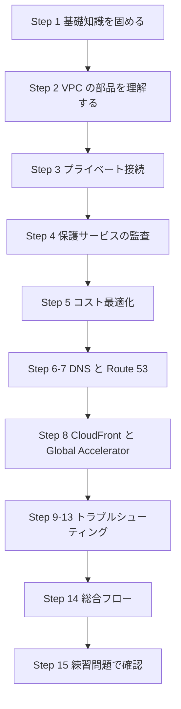

### 0-5. 「パケットの旅」で全体像をつかむ

Domain 5 の登場人物は、ユーザーのリクエストが EC2 に届き、応答が返るまでの道のりに並んでいます。この順番で覚えると、障害切り分けもそのまま使えます。

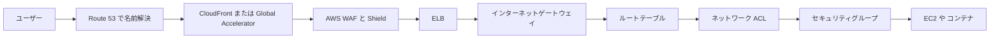

---

## Step 1: ネットワークの基礎知識

ここは Domain 5 の土台です。SOA-C03 の Exam Guide も「DNS、TCP、IP、ファイアウォールなどのネットワーク概念を適用できること」を要件に挙げています。

### 1-1. IP アドレスと CIDR

IPv4 アドレスは 32 ビットで、`10.0.0.0/16` のように **ネットワーク部の長さ (プレフィックス長)** を付けて範囲を表します。数字が小さいほど範囲が広くなります。

| CIDR | アドレス総数 | 用途の目安 |
|---|---|---|
| /16 | 65,536 | VPC 全体 (VPC で使える最大) |
| /20 | 4,096 | 大きめのサブネット |
| /24 | 256 | 一般的なサブネット |
| /28 | 16 | 小さなサブネット (VPC で使える最小) |

> 覚え方: 「/(32 − プレフィックス長)」乗が個数。/24 なら 2 の 8 乗 = 256。

プライベートアドレスの範囲 (RFC 1918) は次の 3 つです。VPC の CIDR にはこの範囲を使うのが基本です。

| 範囲 | CIDR |
|---|---|
| 10.0.0.0 - 10.255.255.255 | 10.0.0.0/8 |
| 172.16.0.0 - 172.31.255.255 | 172.16.0.0/12 |
| 192.168.0.0 - 192.168.255.255 | 192.168.0.0/16 |

### 1-2. TCP / UDP とポート

| プロトコル | 特徴 | 代表的な用途 |
|---|---|---|
| TCP | 接続を確立してから通信 (3 ウェイハンドシェイク)、再送制御あり | HTTP(80)、HTTPS(443)、SSH(22)、RDP(3389) |
| UDP | 接続なし、軽量 | DNS(53)、NTP(123)、VPN の IKE(500/4500) |
| ICMP | 疎通確認やエラー通知 | ping |

**エフェメラルポート**: クライアントが通信を始めるとき、OS が自動で選ぶ一時的な送信元ポート (一般に 1024-65535 の範囲) です。**戻りの通信はこのポート宛て**になるため、ステートレスなファイアウォール (NACL) では戻り用の許可が必要になります。

### 1-3. ステートフルとステートレス

これは試験で最頻出の概念です。

| 項目 | ステートフル (セキュリティグループ) | ステートレス (ネットワーク ACL) |
|---|---|---|
| 戻りの通信 | 自動で許可される | 明示的に許可が必要 |
| ルール | 許可のみ | 許可と拒否の両方 |
| 評価順 | 全ルールを評価 | 番号の小さい順に評価し、最初に一致したものを適用 |
| 適用先 | ENI (インスタンス等) | サブネット |

### 1-4. DNS の仕組み

DNS は「名前 (www.example.com) から IP アドレスを引く」仕組みです。

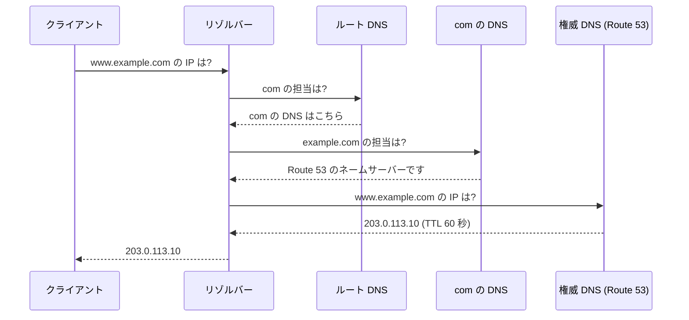

- **権威 DNS**: ドメインの正式な答えを持つサーバー (Route 53 のホストゾーン)。
- **キャッシュリゾルバー**: 代わりに問い合わせて結果を **TTL の間キャッシュ**するサーバー (VPC では Route 53 Resolver)。
- **TTL**: キャッシュの有効秒数。長いと変更が反映されにくく、短いと問い合わせが増えます。

### 1-5. ファイアウォールの階層

AWS では 1 つの境界ではなく、**層ごとに別の防御**を置きます。

| 層 | 代表サービス | 守る対象 |
|---|---|---|
| DNS 層 | Route 53 Resolver DNS Firewall | 名前解決の問い合わせ |
| エッジ / アプリ層 (L7) | AWS WAF | HTTP リクエストの中身 |
| DDoS | AWS Shield | 大量攻撃 (L3/L4/L7) |
| ネットワーク層 (VPC 境界) | AWS Network Firewall | VPC を出入りする通信全体 |
| サブネット境界 | ネットワーク ACL | サブネットの出入り |
| ENI 境界 | セキュリティグループ | 個々のリソース |

---

## Step 2: Skill 5.1.1 VPC の構成

> 対象: サブネット、ルートテーブル、ネットワーク ACL、セキュリティグループ、NAT ゲートウェイ、インターネットゲートウェイ、Egress-only インターネットゲートウェイ

### 2-1. VPC とは

**Amazon VPC** は AWS 内に作る、論理的に分離された自分専用のネットワークです。

- VPC は **リージョン単位**のリソースです (複数 AZ にまたがれる)。
- IPv4 CIDR は **/16 〜 /28** で指定します。後から**セカンダリ CIDR を追加**できます。
- サブネットは **1 つの AZ に属します** (AZ をまたげません)。

### 2-2. サブネットの予約アドレス

各サブネットでは先頭 4 つと末尾 1 つの **計 5 アドレスが使えません**。例として 10.0.1.0/24 の場合です。

| アドレス | 用途 |
|---|---|
| 10.0.1.0 | ネットワークアドレス |
| 10.0.1.1 | VPC ルーター |
| 10.0.1.2 | DNS サーバー (VPC の CIDR のベース + 2) |
| 10.0.1.3 | 将来の利用のため予約 |
| 10.0.1.255 | ブロードキャスト (VPC では未サポートだが予約) |

> 試験では「/28 サブネットで使えるホスト数は 16 − 5 = 11」のような計算が出ます。

### 2-3. パブリックサブネットとプライベートサブネット

AWS に「パブリックサブネット」という設定項目はありません。**ルートテーブルの向き先で決まります。**

| 種類 | 条件 |
|---|---|
| パブリックサブネット | ルートテーブルに `0.0.0.0/0 → インターネットゲートウェイ` がある |
| プライベートサブネット | インターネットゲートウェイへのルートがない |

インターネットと双方向で通信するインスタンスには、さらに **パブリック IPv4 アドレス (または Elastic IP)** が必要です。IGW は「パブリック IP とプライベート IP の 1 対 1 変換」を行います。

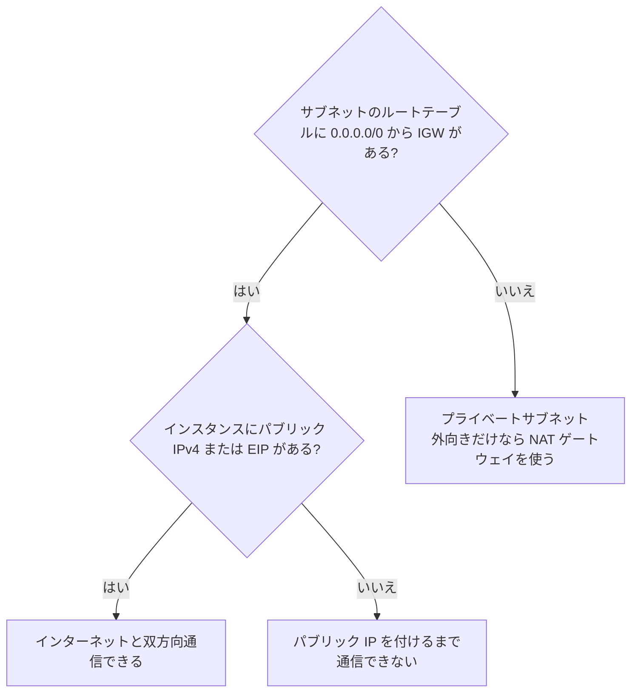

### 2-4. ルートテーブル

ルートテーブルは「宛先 CIDR → ターゲット」の対応表です。

- すべての VPC ルートテーブルに、VPC 内通信用の **local ルート**が自動で入ります (削除不可)。
- 通信は **最長プレフィックス一致 (最も具体的なルート)** が優先されます。
- サブネットは**必ず 1 つのルートテーブルに関連付けられます** (明示しなければメインルートテーブル)。

| 宛先 | ターゲット | 意味 |
|---|---|---|
| 10.0.0.0/16 | local | VPC 内の通信 |
| 0.0.0.0/0 | igw-xxxx | インターネット向け (パブリックサブネット) |
| 0.0.0.0/0 | nat-xxxx | NAT 経由のインターネット向け (プライベートサブネット) |
| ::/0 | eigw-xxxx | IPv6 の外向き専用 |
| pl-xxxx (S3 の prefix list) | vpce-xxxx | S3 ゲートウェイエンドポイント |

> ベストプラクティス: メインルートテーブルは「プライベート扱い」にしておき、IGW へのルートは**明示的に関連付けたパブリック用ルートテーブルだけ**に入れます。新しいサブネットが意図せず公開されるのを防げます。

### 2-5. インターネットゲートウェイ (IGW)

- VPC にアタッチする、**水平スケール・高可用性なマネージドコンポーネント**です。追加料金はありません (パブリック IPv4 アドレス自体には課金があります)。
- 1 つの VPC にアタッチできる IGW は 1 つです。
- IPv4 / IPv6 の両方に対応します。

### 2-6. Egress-only インターネットゲートウェイ (EIGW)

**IPv6 専用**で、「VPC からインターネットへの外向き通信だけ許可し、インターネット側からの新規接続は受け付けない」ためのゲートウェイです。IPv4 の NAT ゲートウェイに相当する役割を IPv6 で担います。

| 項目 | IGW | EIGW | NAT ゲートウェイ |
|---|---|---|---|
| 対応 IP | IPv4 / IPv6 | **IPv6 のみ** | **IPv4 のみ** |
| 外向き通信 | 可 | 可 | 可 |
| 外部からの新規接続 | 可 | **不可** | **不可** |
| ルート例 | 0.0.0.0/0 または ::/0 | ::/0 | 0.0.0.0/0 |

### 2-7. NAT ゲートウェイ

プライベートサブネットのインスタンスが、**外部からの接続は受けずに** OS アップデートなどでインターネットへ出るためのマネージドサービスです。

主な特徴は次のとおりです。

- **パブリック NAT ゲートウェイ**: パブリックサブネットに置き、**Elastic IP を関連付けます**。プライベートサブネットのルートテーブルで `0.0.0.0/0 → nat` を指定します。
- **プライベート NAT ゲートウェイ**: EIP を持たず、プライベート IP 同士 (他の VPC やオンプレミス) の通信で IP 変換に使います。インターネットには出られません。
- 従来の NAT ゲートウェイは **AZ 単位**のリソースです。AZ 障害に備えるには**AZ ごとに作成**し、各 AZ のプライベートサブネットのルートをその AZ の NAT に向けます。
- 2025 年 11 月に **リージョナル NAT ゲートウェイ**が追加されました。1 つの NAT ゲートウェイがワークロードのある AZ に自動で拡張・縮小します。**ホスト用のパブリックサブネットは不要**です。ただしプライベート NAT は引き続きゾーナルモードが必要です。

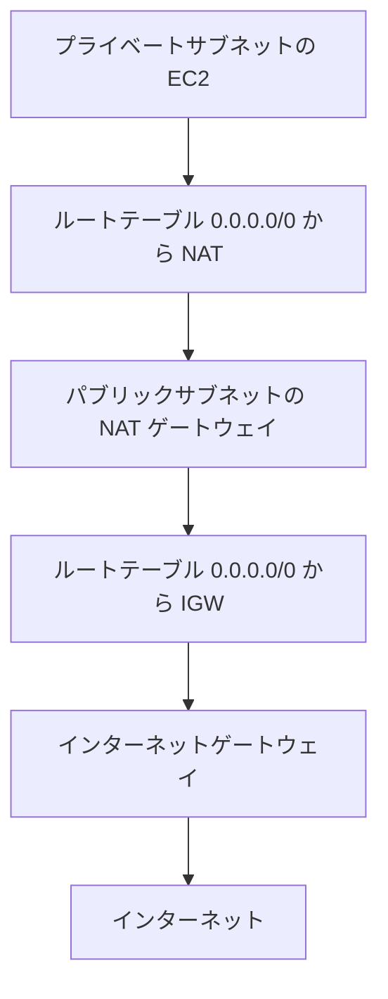

**よくある設定ミス**

| ミス | 結果 |
|---|---|
| NAT ゲートウェイを**プライベートサブネット**に置いた (ゾーナル) | 外に出られない (NAT 自身のサブネットに IGW ルートが必要) |
| プライベートサブネットのルートに NAT へのルートがない | 外向き通信が失敗する |
| NAT のサブネットのルートテーブルに IGW ルートがない | 外向き通信が失敗する |
| 1 つの AZ にだけ NAT を作り、他 AZ も同じ NAT を使う | その AZ 障害で全体が止まる。AZ 間データ転送料も発生 |

### 2-8. セキュリティグループ (SG)

- **ENI (ネットワークインターフェイス) に適用**するステートフルなファイアウォールです。
- **許可ルールのみ**です (拒否ルールは書けません)。
- 送信元・宛先に **CIDR、プレフィックスリスト、別の SG の ID** を指定できます。
- 1 つの ENI に複数の SG を付けると、**ルールの和集合**が適用されます。
- デフォルト SG: 同じ SG 内からのインバウンドを許可し、アウトバウンドは全許可です。
- 新規 SG: インバウンドは全拒否、アウトバウンドは全許可です。

> ベストプラクティス: 「Web 層 SG → App 層 SG → DB 層 SG」のように **SG ID を参照**して許可します。IP アドレスが変わっても追従でき、最小権限を保てます。0.0.0.0/0 に SSH(22) や RDP(3389) を開けない運用にします (Session Manager の利用を推奨)。

### 2-9. ネットワーク ACL (NACL)

- **サブネットに適用**するステートレスなファイアウォールです。
- **許可と拒否**の両方を書けます。
- ルール番号の**小さい順**に評価し、最初に一致した時点で確定します。
- 末尾に暗黙の「すべて拒否 (\*)」があります。
- **デフォルト NACL** は全許可、**自分で作った NACL** は作成直後は全拒否です。
- 1 つのサブネットに関連付けられる NACL は 1 つです。

**NACL を使うべき典型場面**: 特定の IP を**明示的に拒否**したいとき (SG では拒否できません)。

**NACL の落とし穴**: 戻りの通信を許可し忘れます。例えば Web サーバーのサブネットでインバウンド 443 を許可したなら、アウトバウンドで**エフェメラルポート (1024-65535)** も許可します。

### 2-10. SG と NACL の比較 (最頻出)

| 項目 | セキュリティグループ | ネットワーク ACL |
|---|---|---|
| 適用単位 | ENI | サブネット |
| 状態管理 | ステートフル | ステートレス |
| ルールの種類 | 許可のみ | 許可・拒否 |
| 評価方法 | すべてのルールを評価 | 番号順、最初の一致で確定 |
| 戻り通信 | 自動許可 | 明示的に許可が必要 |
| 既定 | 受信は拒否、送信は許可 | 既定 NACL は全許可 |
| 主な使い所 | 日常のアクセス制御 | 特定 IP の拒否、サブネット境界の追加防御 |

### 2-11. Elastic IP とパブリック IPv4 課金

- **Elastic IP (EIP)** は、アカウントに確保する固定のパブリック IPv4 アドレスです。インスタンスを止めても保持できます。
- 2024 年 2 月以降、**使用中・未使用を問わずパブリック IPv4 アドレスは 1 時間あたり課金**されます (未使用の EIP 放置は無駄なコストです)。

### 2-12. 関連機能 (知っておくと解きやすい)

| 機能 | 概要 |
|---|---|
| DHCP オプションセット | VPC 内のドメイン名や DNS サーバーを指定する設定 |
| VPC IPAM (IP Address Manager) | IP アドレスの計画・追跡・監視を自動化。CIDR の重複や枯渇の把握に使える |
| AWS RAM | サブネットなどを他アカウントと共有 |

### 2-13. ベストプラクティスまとめ

| 観点 | ベストプラクティス |
|---|---|
| 可用性 | 複数 AZ にサブネットを作り、AZ ごとに NAT を配置 (またはリージョナル NAT) |
| CIDR 設計 | 将来のピアリング・Transit Gateway・オンプレ接続を見越し、**重複しない** CIDR を選ぶ |
| 公開範囲 | ロードバランサーだけパブリック、アプリ・DB はプライベート |
| 最小権限 | SG は SG ID 参照。NACL は必要時のみ。不要な 0.0.0.0/0 を避ける |
| 可視化 | **VPC フローログ**を有効化 (Step 10) |
| IPv6 | 外向きのみなら EIGW を使う |

### 2-14. 確認クイズ (3 問)

1. サブネット 10.0.0.0/28 に作成できるインスタンスの上限はいくつか。
2. IPv6 のみのインスタンスをインターネットへ外向きだけ通信させたい。使うのは何か。
3. 特定の悪意ある IP アドレスを VPC 内で確実に拒否したい。SG と NACL のどちらを使うか。

<details>
<summary>答え</summary>

1. 16 − 5 = **11**
2. **Egress-only インターネットゲートウェイ**
3. **NACL** (SG は拒否ルールを書けない)

</details>

---

## Step 3: Skill 5.1.2 プライベート接続

> 対象: VPC エンドポイント、AWS PrivateLink、VPC ピアリング (関連: Transit Gateway)

### 3-1. なぜプライベート接続が必要か

プライベートサブネットのインスタンスが S3 や DynamoDB、SSM などの AWS サービスを使うとき、何もしなければ **NAT ゲートウェイ → インターネット**経由になります。これには次の問題があります。

- NAT ゲートウェイの**データ処理料金**がかかる
- トラフィックがインターネット経路を通る (セキュリティ要件に合わない場合がある)
- NAT ゲートウェイが単一障害点になりうる

**VPC エンドポイント**を使うと、AWS ネットワーク内だけで完結します。

### 3-2. VPC エンドポイントの 2 つの主要タイプ

| 項目 | ゲートウェイエンドポイント | インターフェイスエンドポイント (PrivateLink) |
|---|---|---|
| 対応サービス | **Amazon S3 と DynamoDB のみ** | 多数の AWS サービス、自社サービス、AWS Marketplace のサービス |
| 実体 | ルートテーブルのエントリ (プレフィックスリスト) | **サブネット内の ENI (プライベート IP)** |
| 料金 | **無料** | 時間課金 + データ処理料金 |
| セキュリティ制御 | エンドポイントポリシー、ルートテーブル | エンドポイントポリシー、**セキュリティグループ** |
| オンプレミスから利用 | **不可** | VPN / Direct Connect 経由で**可** |
| 他リージョン・ピアリング先 VPC から利用 | 不可 | ピアリング先やオンプレから到達可能 (経路が成立していれば) |
| DNS | 通常の S3 / DynamoDB のパブリック名のまま | **プライベート DNS** を有効にするとサービスの標準名がエンドポイントの IP に解決される |

> もう 1 つ **Gateway Load Balancer エンドポイント**があり、サードパーティ製アプライアンス (検査用) へのトラフィック誘導に使います。

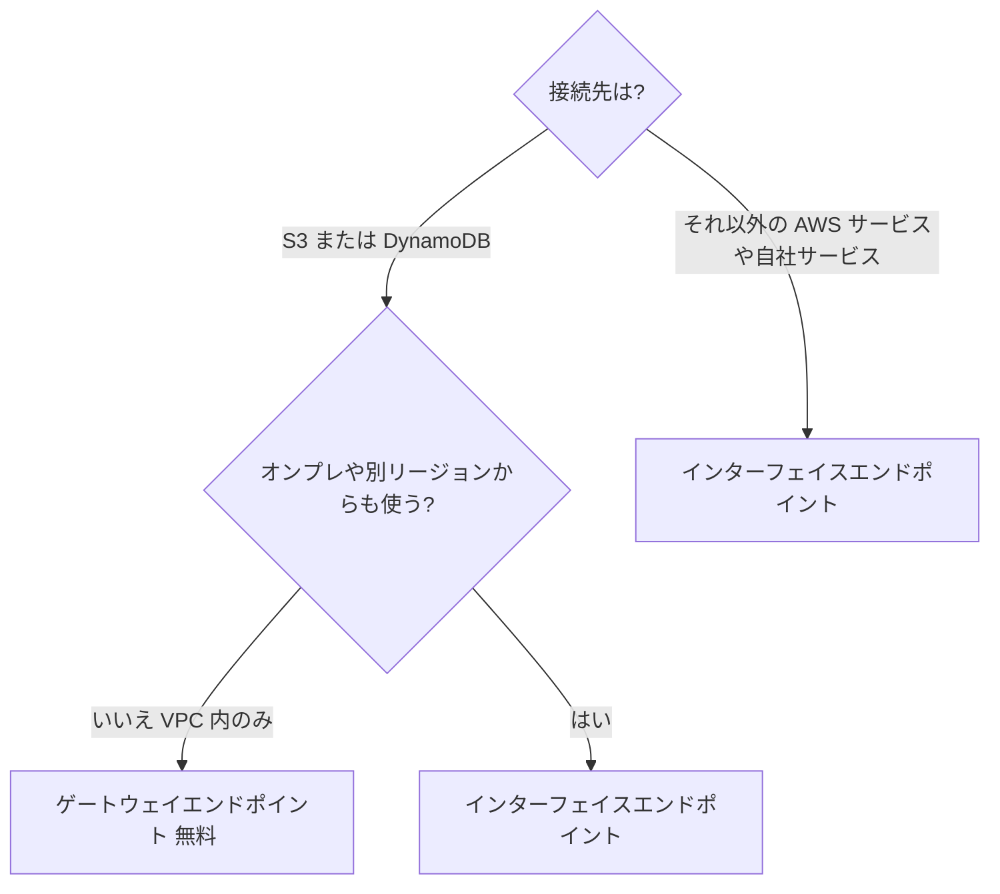

### 3-3. ゲートウェイエンドポイントの設定手順

1. 対象 VPC とサービス (`com.amazonaws.<リージョン>.s3`) を選んでエンドポイントを作成する。
2. **関連付けるルートテーブルを選ぶ** (これでプレフィックスリストへのルートが自動追加される)。
3. 必要に応じて**エンドポイントポリシー**で許可するバケットや操作を絞る。
4. S3 バケットポリシーで `aws:SourceVpce` 条件を使い、「このエンドポイント経由のみ許可」にもできる。

> 試験のポイント: ゲートウェイエンドポイントは**ルートテーブルを選ぶ**。サブネットや SG を選ぶのはインターフェイス型。

### 3-4. インターフェイスエンドポイントの設定ポイント

| 項目 | 内容 |
|---|---|
| 配置 | **使いたい AZ ごとのサブネット**を選択 (耐障害性のため複数 AZ) |
| セキュリティグループ | エンドポイントの ENI に付ける。**クライアントからの HTTPS (443) を許可**する |
| プライベート DNS | 有効化すると `ssm.ap-northeast-1.amazonaws.com` などの**標準名がそのままエンドポイントに解決**される。VPC の **DNS ホスト名と DNS 解決を両方有効**にしておく必要がある |
| エンドポイントポリシー | 使える API、プリンシパル、リソースを制限できる |

### 3-5. PrivateLink で自社サービスを公開する

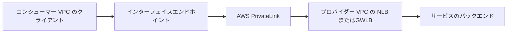

- **サービスプロバイダー**: NLB (または GWLB) の前に「エンドポイントサービス」を作る。
- **コンシューマー**: インターフェイスエンドポイントを作成して接続する。
- 双方の VPC の **CIDR が重複していても利用可能**で、VPC 全体ではなく**特定のサービスだけ**を公開できます。これがピアリングとの大きな違いです。

### 3-6. VPC ピアリング

2 つの VPC をプライベート IP で直接つなぐ 1 対 1 の接続です。

| 項目 | 内容 |
|---|---|
| 範囲 | 同一リージョン、リージョン間、アカウント間 |
| 料金 | 接続自体は無料 (データ転送料は AZ 間・リージョン間で発生) |
| **CIDR** | **重複不可** |
| **推移的ルーティング** | **不可** (A-B、B-C があっても A から C へは通信できない) |
| 必要な設定 | **リクエスト → 承諾**、**両側のルートテーブルにルート追加**、必要に応じて SG と NACL の許可 |
| 利用できない経路 | ピア先の IGW、NAT、VPN、ゲートウェイエンドポイントを「踏み台」にすることは不可 (エッジ間ルーティング不可) |

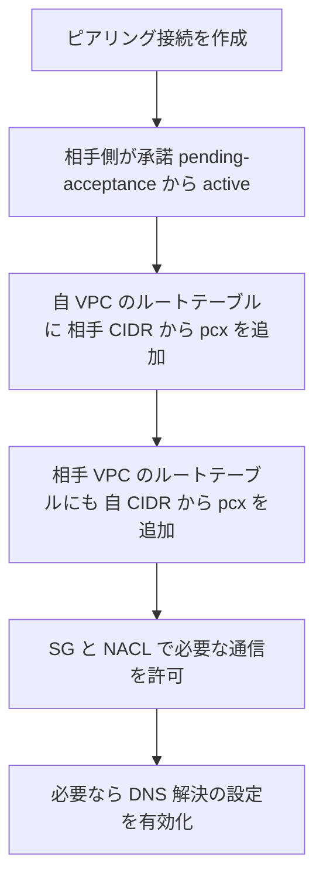

### 3-7. 接続方式の使い分け

| 状況 | 選択 |
|---|---|
| 2 つの VPC だけをつなぎたい、シンプルで安価 | VPC ピアリング |
| 多数の VPC、オンプレミスをハブ & スポークでつなぎたい | **Transit Gateway** |
| 特定のサービスだけを公開したい / CIDR が重複している | **PrivateLink** |
| VPC から S3 / DynamoDB へプライベートに | ゲートウェイエンドポイント |
| VPC から AWS のその他サービスへプライベートに | インターフェイスエンドポイント |

### 3-8. Transit Gateway (TGW) の基礎

(5.3.1、5.3.4 でトラブルシューティング対象になるため、ここで基本を押さえます。)

| 概念 | 説明 |
|---|---|
| アタッチメント | VPC、VPN、Direct Connect ゲートウェイ、TGW ピアリングなどを TGW に接続する単位 |
| TGW ルートテーブル | アタッチメントごとの転送先を決める |
| **関連付け (Association)** | アタッチメントが**どの TGW ルートテーブルを参照するか** (1 つのアタッチメントにつき 1 つ) |
| **伝播 (Propagation)** | アタッチメントの CIDR を TGW ルートテーブルに**自動登録** |
| ブラックホールルート | 該当宛先の通信を破棄 |

> VPC 側のルートテーブルにも「宛先 CIDR → tgw-xxxx」の追加が必要です。**TGW のルートだけ、VPC のルートだけでは通信できません。**

### 3-9. ベストプラクティス

| 項目 | 推奨 |
|---|---|
| S3 / DynamoDB | まずゲートウェイエンドポイント (無料、NAT 料金を回避) |
| エンドポイントポリシー | 既定の全許可から、必要な操作・リソースに絞る |
| インターフェイスエンドポイント | 複数 AZ に配置し、SG は 443 のみ許可。AZ ごとの課金に注意 |
| ピアリング | CIDR 設計で重複を避け、ルートは必要な範囲だけ追加 |
| 多数の VPC | ピアリングのフルメッシュを避けて TGW を検討 |

---

## Step 4: Skill 5.1.3 ネットワーク保護サービスの監査

> 対象: Route 53 Resolver DNS Firewall、AWS WAF、AWS Shield、AWS Network Firewall (**単一アカウント**での監査)

「監査 (Audit)」とは、**設定が正しく有効か・ログが取れているか・意図どおり検知しているかを確認する**ことです。まず各サービスの役割を押さえます。

### 4-1. 4 サービスの役割分担

| サービス | 層 | 何を守るか | 主な設定対象 |
|---|---|---|---|
| **Route 53 Resolver DNS Firewall** | DNS | VPC からの名前解決 (悪意あるドメインへの問い合わせをブロック) | VPC に関連付けるルールグループ |
| **AWS WAF** | L7 (HTTP/HTTPS) | SQL インジェクション、XSS、不正な bot、レート超過 など | **Web ACL** を CloudFront、ALB、API Gateway などに関連付け |
| **AWS Shield** | L3/L4/L7 DDoS | 大量攻撃 | Standard は自動、Advanced は保護対象リソースを登録 |
| **AWS Network Firewall** | L3-L7 (VPC 境界) | VPC を出入りする通信全体の検査 | **ファイアウォールサブネット**にエンドポイントを置き、ルートで誘導 |

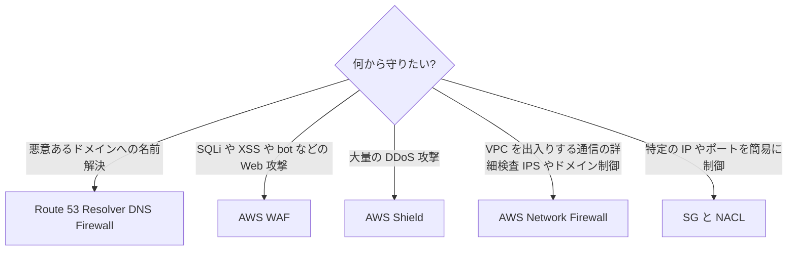

### 4-2. Route 53 Resolver DNS Firewall

- VPC の Resolver を通る DNS クエリを**ドメインリスト**に基づいて制御します。
- ルールの **アクション**は **ALLOW / BLOCK / ALERT** です。
- BLOCK 時の応答は **NODATA / NXDOMAIN / OVERRIDE (指定した CNAME を返す)** から選べます。
- **ルールグループを VPC に関連付けて**有効になります。AWS 管理ドメインリスト (マルウェア関連など) も利用できます。
- **フェイルクローズ / フェイルオープン**の設定があります。ファイアウォールが応答できない場合にクエリを拒否 (クローズ) するか通す (オープン) かを選びます。可用性重視ならオープンが基本です。
- **VPC の Resolver (.2) を経由しない DNS** (独自 DNS サーバーへ直接問い合わせるなど) は対象外です。

**監査ポイント**

| 確認項目 | 方法 |
|---|---|
| 対象 VPC に**ルールグループが関連付いているか** | DNS Firewall コンソールの関連付け一覧 |
| ルールの**優先順位**と**アクション** | ルールグループ内の priority 昇順で評価される |
| **クエリログ**で BLOCK / ALERT が記録されているか | Resolver クエリログ (Step 7) |
| 例外ドメインが ALLOW で**ブロックを打ち消していないか** | 優先順位の確認 |

### 4-3. AWS WAF

構成要素の関係です。

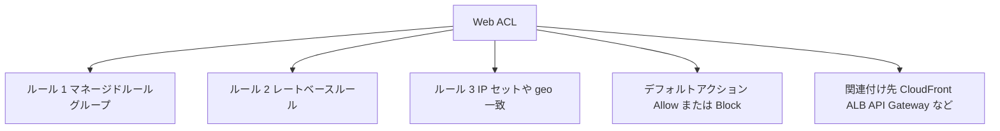

| 概念 | 説明 |
|---|---|
| Web ACL | ルールの集合。リソースに関連付けて使う |
| ルール | 条件 (IP、ヘッダー、URI、ボディなど) とアクション (Allow / Block / Count / CAPTCHA / Challenge) |
| マネージドルールグループ | AWS や販売者が提供する既製ルール (一般的な脆弱性対策など) |
| レートベースルール | 一定時間内のリクエスト数が閾値を超えた送信元を制限 |
| **Count モード** | ブロックせず**記録のみ**。新ルールの検証に使う |
| スコープ | **Regional** (ALB、API Gateway 等) と **CloudFront** (グローバル、**米国東部 (バージニア北部) で作成**) |

**監査ポイント**

| 確認項目 | 方法 |
|---|---|
| 保護すべきリソースに Web ACL が**関連付いているか** | AWS Config のマネージドルール (例: `alb-waf-enabled`、`cloudfront-associated-with-waf`) |
| **ログが有効か** | AWS Config `wafv2-logging-enabled`。ログ先は CloudWatch Logs、S3、Data Firehose |
| ルールが意図どおり動いているか | **サンプルリクエスト** (直近約 3 時間) とログ、CloudWatch メトリクス (AllowedRequests、BlockedRequests、CountedRequests) |
| 新規ルールを本番投入する前に Count で試したか | ルールのアクション設定 |
| 誤検知 (False Positive) への対処 | ログで `terminatingRuleId` を確認 → 該当ルールを Count に変更 / 除外設定 |

> ログ出力先の命名規則: ログ先のリソース名は **`aws-waf-logs-` で始める**必要があります (S3 バケット、CloudWatch Logs のロググループ、Firehose 配信ストリーム共通)。

### 4-4. AWS Shield

| 項目 | Shield Standard | Shield Advanced |
|---|---|---|
| 料金 | **無料・全顧客に自動適用** | 有料 (月額 + データ転送使用料) |
| 防御対象 | 一般的な L3/L4 攻撃 (SYN フラッドや UDP 反射など) | Standard に加え、より大規模・高度な攻撃への検知・緩和 |
| 保護対象の登録 | 不要 | **保護対象リソースを明示的に登録** (CloudFront、Route 53、Global Accelerator、ALB、EIP など) |
| 追加機能 | - | 攻撃の可視化、**Shield Response Team (SRT) への支援依頼**、DDoS による**コスト急増の保護**、WAF 連携 |

**監査ポイント**: Shield Advanced を使っているなら、**保護対象に重要リソースが漏れなく登録されているか**、DDoS 検知のアラーム (CloudWatch メトリクス `DDoSDetected`) と通知が設定されているかを確認します。

### 4-5. AWS Network Firewall

- VPC 境界で通信を検査する**マネージドのステートフル / ステートレスファイアウォール**です。
- **ファイアウォール**、**ファイアウォールポリシー**、**ルールグループ**で構成されます。ステートフルルールは Suricata 互換の記述をサポートし、ドメインリストによる許可 / 拒否もできます。
- 専用の**ファイアウォールサブネット**にエンドポイントを置き、**ルートテーブルでトラフィックをそのエンドポイント経由に向ける**ことで有効になります。ルート設定を忘れると検査されません。
- ログは **アラートログとフローログ**を S3、CloudWatch Logs、Data Firehose に出力できます。

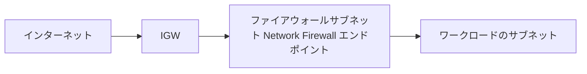

**監査ポイント**

| 確認項目 | 方法 |
|---|---|
| トラフィックが**エンドポイントを経由するルート**になっているか | IGW とワークロードサブネットのルートテーブル |
| ポリシーのデフォルトアクション | ステートフルのデフォルトアクションや順序 |
| **アラート / フローログ**の出力 | ログ設定の有無 |
| 管理ルールグループが最新か | ルールグループの更新設定 |

### 4-6. 横断的な監査手段

| 手段 | 用途 |
|---|---|
| **AWS Config** | 設定の準拠チェック。例: `vpc-flow-logs-enabled`、`restricted-ssh`、`vpc-default-security-group-closed`、`internet-gateway-authorized-vpc-only` |
| **AWS CloudTrail** | 「誰がいつ SG や NACL、WAF を変更したか」の API 履歴 |
| **AWS Trusted Advisor** | 0.0.0.0/0 に開いた SG ポートなどの検出 |
| **AWS Security Hub** | セキュリティ標準に基づく設定チェックの集約 |
| **Amazon GuardDuty** | フローログ、DNS ログ、CloudTrail を分析した脅威検知 |
| **VPC Reachability Analyzer / Network Access Analyzer** | 「意図しない経路が存在しないか」の確認 |

> 注意: 本スキルは**単一アカウント**が範囲です。複数アカウントの一元管理 (AWS Firewall Manager など) は範囲外と考えて構いません。

### 4-7. ベストプラクティス

| 項目 | 推奨 |
|---|---|
| 層ごとの防御 | DNS Firewall、WAF、Shield、Network Firewall、SG / NACL を目的別に組み合わせる |
| 新規ルールの展開 | まず **Count / Alert モード**で影響を確認してから Block |
| ログ | 全保護サービスのログを有効化し、保管期間を決める |
| 変更の監査 | Config + CloudTrail で変更履歴を追えるようにする |
| 公開リソース | CloudFront + WAF + Shield を前段に置き、オリジンは直接公開しない |

---

## Step 5: Skill 5.1.4 ネットワークコストの最適化

> 対象: ネットワークアーキテクチャのコスト最適化 (コスト**分析・TCO** そのものは範囲外ですが、**ネットワーク設計上のコスト削減**が出題されます)

### 5-1. 課金されるポイントの全体像

ネットワークのコストは「**どこを通ったか**」で決まります。基本の原則は次のとおりです。

| 通信の経路 | 課金 (一般的な傾向) |
|---|---|
| インターネットからの**受信 (イン)** | 基本無料 |
| インターネットへの**送信 (アウト)** | 課金 |
| **同一 AZ** のプライベート IP 通信 | 無料 |
| **AZ 間**通信 | 課金 (双方向) |
| **リージョン間**通信 | 課金 |
| NAT ゲートウェイ経由 | 時間料金 + **処理データ量課金** |
| インターフェイスエンドポイント | 時間料金 (AZ ごと) + 処理データ量課金 |
| ゲートウェイエンドポイント | **無料** |
| Transit Gateway | アタッチメント時間料金 + 処理データ量課金 |
| パブリック IPv4 アドレス | 1 つあたり時間課金 (使用中・未使用とも) |

> 具体的な単価はリージョンや時期で変わります。例えば米国東部 (バージニア北部) では NAT ゲートウェイは時間料金と処理料金がそれぞれ約 0.045 USD ですが、必ず公式の料金ページで最新を確認してください。

### 5-2. 代表的な削減パターン

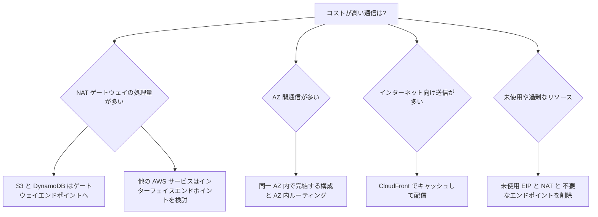

| 課題 | 対策 | 補足 |
|---|---|---|
| NAT ゲートウェイの処理料金が大きい | **S3 / DynamoDB はゲートウェイエンドポイント**に切り替える (無料) | 最も効果が大きく試験でも頻出 |
| NAT 経由の AWS サービス通信 | インターフェイスエンドポイント (ECR、CloudWatch Logs、SSM など) | 通信量が少ないと時間課金の方が高くつくこともあるため試算する |
| AZ 間データ転送 | NAT を各 AZ に置いて**同一 AZ 内で外に出す**。リバランス設定やゾーン認識のルーティングを活用 | 可用性とのトレードオフ |
| インターネットへの大量送信 | **CloudFront** 経由にする。オリジン (S3、ALB、EC2 など) から CloudFront へのデータ転送は無料 | キャッシュヒット率が高いほど効果大 |
| 開発 / 検証環境の NAT | 夜間・休日は削除、あるいは共有化、リージョナル NAT で台数を減らす | 時間課金のため |
| パブリック IPv4 | 不要な EIP を解放、**IPv6 + EIGW** や ALB 集約で数を減らす | 未使用 EIP も課金対象 |
| 多数 VPC の外向き通信 | Transit Gateway で**集約型エグレス**にする場合は、NAT 台数削減と TGW 処理料金を比較 | 設計判断なので試算が必要 |
| VPC フローログの保管費 | S3 に出力、**必要なトラフィックだけ (REJECT のみなど)** に絞る、ライフサイクルで期間管理 | CloudWatch Logs は取り込み・保管とも高め |
| CloudFront の請求が読みにくい | **フラットレート料金プラン**を検討 | 月額固定で、CDN と WAF と DDoS 防御などを含み超過料金なし。配信が予測しにくい / 攻撃が心配な場合に有効 |

### 5-3. コストの調べ方

| ツール | 使い方 |
|---|---|
| **AWS Cost Explorer** | サービス別、使用タイプ別 (例: `NatGateway-Bytes`、`DataTransfer-Regional-Bytes`) でグルーピングして原因を特定 |
| **AWS Cost and Usage Reports (CUR)** | 詳細な使用量データを分析 (Athena で SQL 集計) |
| **VPC フローログ + Athena** | **どの宛先に大量送信しているか**を特定 (NAT の ENI のログが有効) |
| **Compute Optimizer / Trusted Advisor** | 低使用リソースや未関連付けの EIP の検出 |
| **コスト配分タグ** | 環境・チーム別にネットワークコストを按分 |

### 5-4. 判断のコツ (ひっかけ注意)

| 問題文のキーワード | 正解になりやすい選択肢 |
|---|---|
| 「S3 へのアクセスで NAT ゲートウェイの費用が高い」 | **ゲートウェイエンドポイント** (インターフェイス型ではない) |
| 「最小の運用負荷でコスト削減」 | マネージド機能 (エンドポイント、CloudFront) を使う |
| 「AZ 間転送料金を減らしたい」 | 同一 AZ 内で通信が完結する構成にする |
| 「可用性を保ちつつ NAT コスト削減」 | リージョナル NAT や、開発環境のみ単一 NAT など要件に応じて選ぶ |
| 「使っていない Elastic IP」 | 解放する (課金されるため) |

---

## Step 6: Skill 5.2.1 DNS の構成

> 対象: Amazon Route 53 (ホストゾーンとレコード)、Route 53 Resolver、VPC の DNS 設定

### 6-1. Route 53 の 3 つの役割

| 役割 | 内容 |
|---|---|
| ドメイン登録 | ドメイン名の登録・更新・移管 |
| **DNS ルーティング (権威 DNS)** | ホストゾーンにレコードを持ち、名前解決に答える |
| ヘルスチェック | エンドポイントの正常性を監視し、DNS の応答に反映する |

### 6-2. ホストゾーン

| 種類 | 用途 | 名前解決できる範囲 |
|---|---|---|
| **パブリックホストゾーン** | インターネット向け | インターネット全体 |
| **プライベートホストゾーン** | VPC 内部の名前 (例: `db.internal.example.com`) | **関連付けた VPC のみ** |

- パブリックホストゾーンを作ると **NS レコードと SOA レコード**が自動で作られます。ドメインレジストラ側のネームサーバーを、この NS の値に合わせる必要があります (ここを間違えると名前解決できません)。
- プライベートホストゾーンを使うには、関連付ける VPC で **`enableDnsSupport` と `enableDnsHostnames` を両方 true** にします。
- 同じ名前でパブリックとプライベートのホストゾーンがある場合 (スプリットビューDNS)、**VPC 内からはプライベートホストゾーンが優先**されます。

### 6-3. 主なレコードタイプ

| タイプ | 内容 | 例 |
|---|---|---|
| A | 名前から IPv4 | www → 203.0.113.10 |
| AAAA | 名前から IPv6 | www → 2001:db8::1 |
| CNAME | 名前から別の名前 | blog → www.example.com |
| MX | メールサーバー | 優先度付き |
| TXT | 任意の文字列 (ドメイン所有確認、SPF など) | - |
| NS | 権威ネームサーバー | - |
| **Alias** (Route 53 独自) | AWS リソースへの別名 | example.com → CloudFront / ALB / S3 など |

### 6-4. Alias と CNAME (最頻出の比較)

| 項目 | Alias | CNAME |
|---|---|---|
| **ゾーンの頂点 (example.com)** に設定 | **できる** | **できない** |
| クエリ料金 | AWS リソース宛ては**無料** | 通常課金 |
| 指せる先 | CloudFront、ELB、S3 静的サイト、API Gateway、Global Accelerator、同一ゾーン内の別レコードなど | 任意のドメイン名 |
| ヘルス評価 | **Evaluate Target Health** が使える | 不可 |
| 実際の動作 | Route 53 が A / AAAA として応答 | 名前を返し、クライアントが再度解決 |

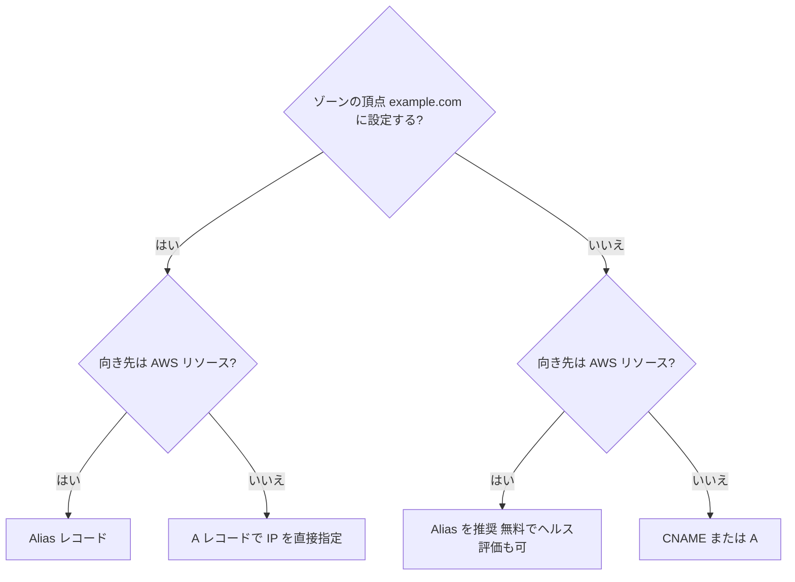

### 6-5. VPC の DNS の仕組み (Route 53 Resolver)

VPC 内のインスタンスの DNS 問い合わせは、**Route 53 Resolver (Amazon Provided DNS)** が受けます。

| 項目 | 内容 |
|---|---|
| アドレス | **VPC CIDR のベース + 2** (例: 10.0.0.2)、および **169.254.169.253** |
| 解決できるもの | パブリックな名前、プライベートホストゾーン、VPC の内部ホスト名、VPC エンドポイントの名前 |
| 上限 | ENI あたり **1 秒あたり 1,024 パケット** (超えると DNS 失敗の原因に) |
| VPC 属性 | `enableDnsSupport` (DNS 解決の有効化)、`enableDnsHostnames` (パブリック DNS ホスト名の付与) |
| DHCP オプションセット | カスタム DNS サーバーを指定すると **Resolver (.2) を使わなくなる** (ひっかけ注意) |

### 6-6. ハイブリッド DNS: Resolver エンドポイント

オンプレミスと VPC で互いの名前を解決したいときに使います。

| エンドポイント | 方向 | 使い所 |
|---|---|---|
| **インバウンドエンドポイント** | **オンプレミス → VPC** | オンプレの DNS が VPC のプライベートホストゾーンの名前を引く |
| **アウトバウンドエンドポイント** | **VPC → オンプレミス** | VPC のインスタンスが `corp.example.com` などオンプレの名前を引く。**転送ルール**で対象ドメインとオンプレ DNS の IP を指定 |

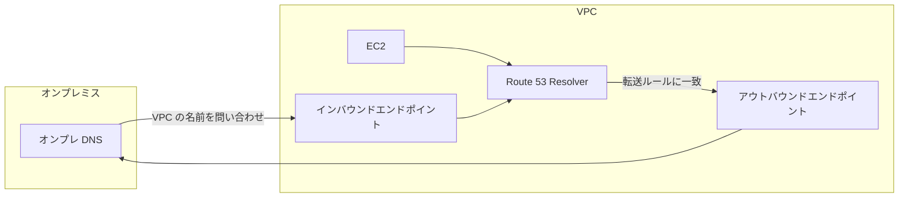

**設計のコツ**

- エンドポイントは**可用性のため 2 つ以上の AZ の IP アドレス**で作成する。
- エンドポイントの **SG** で、DNS (TCP/UDP **53**) を許可する (インバウンドは送信元オンプレ、アウトバウンドは宛先オンプレ DNS)。
- オンプレ ↔ VPC の **VPN / Direct Connect が前提**。経路が先に通っていること。
- 転送ルールは**ドメイン名ごと**に作り、複数 VPC に共有 (AWS RAM) もできる。

### 6-7. DNSSEC (概要)

- パブリックホストゾーンで **DNSSEC 署名**を有効化でき、応答の改ざん検知ができます。
- 署名鍵は **AWS KMS の非対称キー (米国東部 (バージニア北部) リージョン)** を使います。
- レジストラ側に **DS レコード**の登録が必要です。

### 6-8. ベストプラクティス

| 項目 | 推奨 |
|---|---|
| AWS リソース宛て | **Alias** を使う (無料、頂点にも可、ヘルス連動) |
| TTL | 変更が多い・フェイルオーバー用途は短く (例 60 秒)、安定したレコードは長く |
| 内部名 | **プライベートホストゾーン**を使い、IP 直書きを避ける |
| ハイブリッド DNS | Resolver エンドポイントを 2 AZ 以上に作成し、転送ルールを最小限に |
| 変更前 | **レジストラ NS とホストゾーン NS の一致**を確認 |

---

## Step 7: Skill 5.2.2 Route 53 ルーティングポリシーとクエリログ

> 対象: ルーティングポリシー、ヘルスチェック、クエリログの設定

### 7-1. ルーティングポリシーの全体像

| ポリシー | 何を基準に答えを選ぶか | 典型的な用途 |
|---|---|---|
| **シンプル** | 条件なし (複数値なら全部返しクライアントが選択) | 単一リソース |
| **加重 (Weighted)** | 重み (比率) | **カナリアリリース、段階的移行、A/B テスト** |
| **レイテンシー** | ユーザーに最も**遅延の小さいリージョン** | マルチリージョンで速度優先 |
| **フェイルオーバー** | **ヘルスチェック結果** (プライマリ / セカンダリ) | アクティブ - パッシブ DR |
| **位置情報 (Geolocation)** | **ユーザーの所在地** (国・大陸・州) | コンテンツのローカライズ、**法規制による提供地域制御** |
| **地理的近接性 (Geoproximity)** | リソースとユーザーの**距離** (バイアスで範囲を拡縮) | トラフィックを特定リージョンへ寄せたい |
| **複数値回答 (Multivalue)** | ヘルスの正常な値を**最大 8 件**返す | 簡易的な負荷分散 + ヘルスチェック |
| **IP ベース** | クライアントの **IP アドレス範囲 (CIDR)** | 特定の ISP やネットワークを特定のエンドポイントへ |

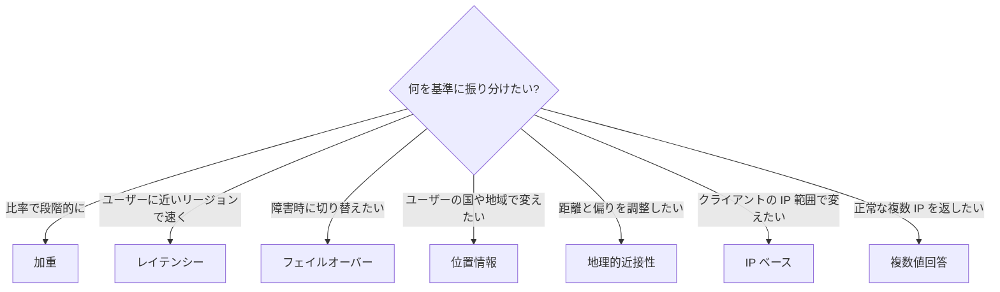

### 7-2. 各ポリシーの重要ポイント

| ポリシー | 試験で問われやすい点 |
|---|---|
| 加重 | 重みは**相対比率** (合計 100 である必要はない)。重み **0 はトラフィックを送らない** (ただし全レコードが 0 なら均等に応答) |
| レイテンシー | 「**物理的な近さ**」ではなく**測定されたレイテンシー**で決まる。各レコードに**リージョンを指定** |
| フェイルオーバー | **プライマリにヘルスチェックを関連付け**る。セカンダリは任意。Alias なら **Evaluate Target Health** を使える |
| 位置情報 | **デフォルトレコード**を必ず用意 (一致しない場所のユーザーへの応答のため)。**距離ではなく所在地**で選ぶ |
| 複数値 | ELB の代替ではない。**最大 8 レコード** |
| 共通 | ほぼすべてのポリシーで **ヘルスチェック**と組み合わせ可能。ルーティングポリシーを**組み合わせた階層構成**も可能 (例: 位置情報 → レイテンシー) |

### 7-3. ヘルスチェックの 3 種類

| 種類 | 監視対象 | 使い所 |
|---|---|---|
| **エンドポイント** | IP またはドメインに対する HTTP / HTTPS / TCP | 公開エンドポイントの死活 |
| **計算済み (Calculated)** | 他のヘルスチェックの結果を AND / OR / しきい値で集約 | 複数コンポーネントの総合判定 |
| **CloudWatch アラーム** | 任意の CloudWatch アラームの状態 | **プライベートな (インターネットから見えない) リソース**の監視にも使える |

**重要な仕組み**

- ヘルスチェッカーは**世界各地の複数の拠点**からリクエストを送り、**約 18% 超が成功**なら正常と判定します。
- 間隔は**標準 30 秒 / 高速 10 秒**。**失敗しきい値 (既定 3 回)** 連続失敗で異常になります。
- **ヘルスチェッカーの IP からのアクセスを SG / NACL / ファイアウォールで許可**する必要があります (許可しないと常に異常判定される典型的な設定ミス)。
- **プライベートな VPC 内のエンドポイントは、パブリックのヘルスチェッカーから到達できない**ため、**CloudWatch アラームベースのヘルスチェック**を使います。
- ヘルスチェックのメトリクス (`HealthCheckStatus` など) は **米国東部 (バージニア北部) リージョンの CloudWatch** に出ます。

### 7-4. フェイルオーバーの流れ

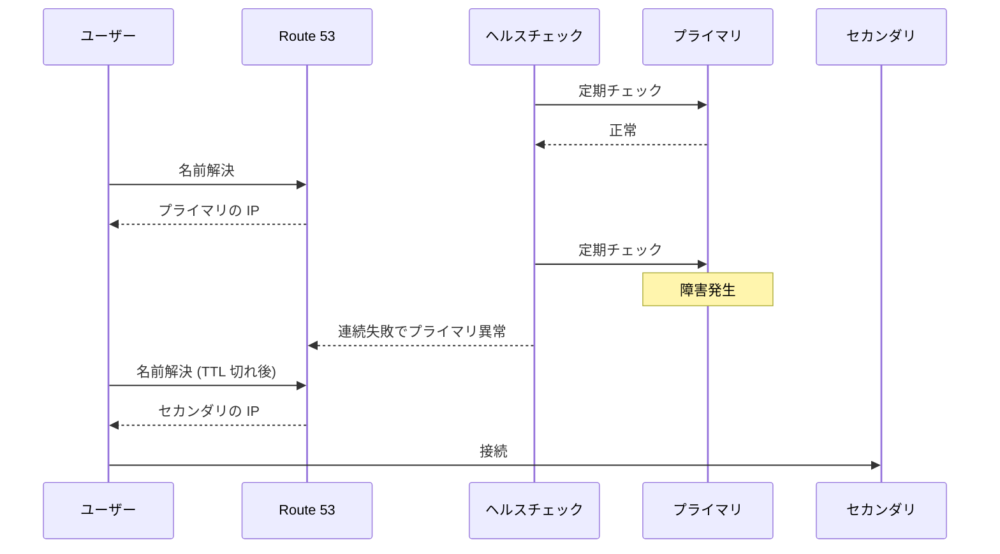

> **TTL の注意**: 切り替えは DNS の応答が変わるだけです。クライアントや中間リゾルバーが古い答えを **TTL の間キャッシュ**するため、フェイルオーバー用レコードの TTL は**短く**設定します。TTL に依存せず即時に切り替えたい場合は **Global Accelerator** (Step 8) や **Application Recovery Controller** を検討します。

### 7-5. Amazon Application Recovery Controller (ARC)

- 複数リージョン / AZ にまたがるアプリの**復旧準備状況の確認**と、**ルーティングコントロール (トラフィックのオン / オフ切り替え)** を提供するサービスです。
- Route 53 のヘルスチェックと連携し、**手動または自動でトラフィックを安全に切り替え**ます。
- 試験では「確実性の高いフェイルオーバー制御」の選択肢として出ることがあります (詳細な構築は Domain 2 の領域)。

### 7-6. クエリログ

「誰がどの名前を問い合わせたか」を記録する機能は **2 種類**あります。**混同しやすい**ので違いを表で押さえます。

| 項目 | **パブリックホストゾーンのクエリログ** | **Resolver クエリログ** |
|---|---|---|
| 記録対象 | **権威 DNS として受けた**クエリ (インターネットからの問い合わせ) | **VPC 内のリソースが出した**クエリ (VPC Resolver 経由) |
| 設定対象 | ホストゾーン | **VPC** (に関連付け) |
| 出力先 | **CloudWatch Logs のみ** (ロググループは **米国東部 (バージニア北部)** に作成) | CloudWatch Logs、S3、Data Firehose |
| 主な用途 | ドメインへのアクセス傾向、不審なクエリの調査 | マルウェア疑いのインスタンスの特定、**DNS Firewall の BLOCK / ALERT の確認** |

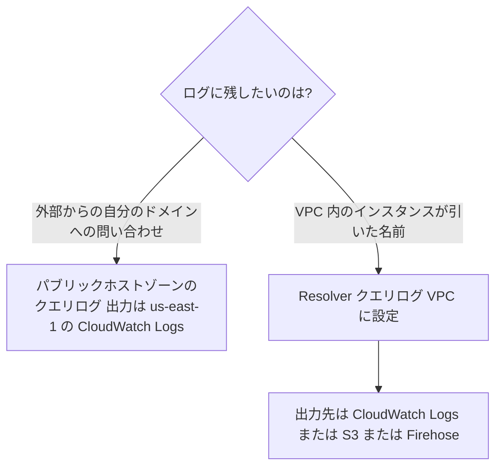

**Resolver クエリログに含まれる主な情報**: 問い合わせた名前 (query_name)、タイプ、応答コード (rcode)、**送信元 IP / インスタンス ID**、VPC ID、DNS Firewall の判定結果など。

### 7-7. ベストプラクティス

| 項目 | 推奨 |
|---|---|
| フェイルオーバー | プライマリにヘルスチェック + 短い TTL。**ヘルスチェッカーの IP を許可** |
| 段階的移行 | 加重ルーティングで 5% → 25% → 100% のように少しずつ |
| 法規制 | 位置情報ルーティング + **デフォルトレコード** |
| プライベートリソース | **CloudWatch アラームベース**のヘルスチェック |
| セキュリティ調査 | **Resolver クエリログ**を有効化し、GuardDuty (DNS ログを分析) と併用 |
| コスト | クエリログは**出力量が多い**ため、S3 + ライフサイクルで管理 |

---

## Step 8: Skill 5.2.3 CloudFront と Global Accelerator

> 対象: Amazon CloudFront、AWS Global Accelerator によるコンテンツ・サービス配信

### 8-1. 2 つのサービスの位置づけ

| 項目 | **CloudFront** | **Global Accelerator** |
|---|---|---|
| 種類 | **CDN** (コンテンツをキャッシュして配信) | **ネットワーク層の加速** (AWS のグローバル網へ早期に取り込み) |
| 主な対象 | HTTP / HTTPS / WebSocket (静的 + 動的コンテンツ) | **TCP / UDP** (ゲーム、IoT、VoIP、非 HTTP も) |
| キャッシュ | **あり** | **なし** |
| IP アドレス | エッジごとに変わる (固定 IP なし) | **2 つの静的エニーキャスト IP** |
| 向き先 | S3、ALB、EC2、任意の HTTP オリジン | ALB、NLB、EC2、**Elastic IP** (リージョンの**エンドポイントグループ**) |
| フェイルオーバー | オリジングループ | **ヘルスチェック + 数秒での切り替え (DNS の TTL 非依存)** |

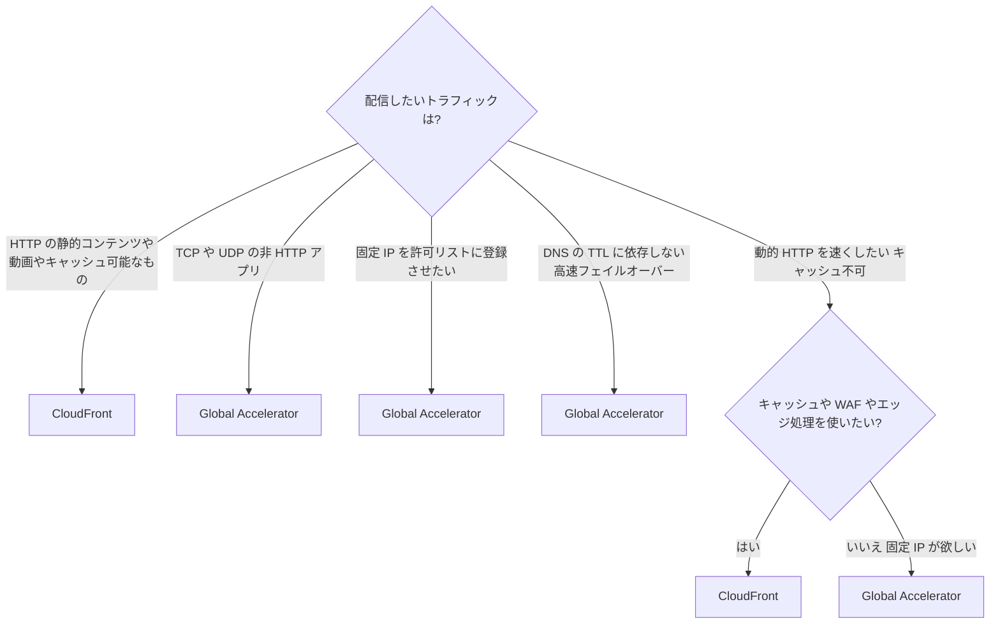

### 8-2. CloudFront の基本構成

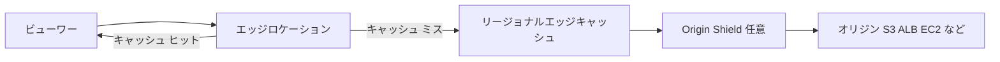

| 用語 | 説明 |
|---|---|
| ディストリビューション | CloudFront の配信設定の単位 |
| オリジン | 元のコンテンツの場所 (S3、ALB、EC2、任意の HTTP サーバー) |
| **ビヘイビア (Cache behavior)** | **パスパターンごと**の設定 (オリジン、キャッシュポリシー、ビューワープロトコルなど)。既定ビヘイビアは `*` |
| キャッシュポリシー | **キャッシュキー** (何を区別してキャッシュするか) と TTL の設定 |
| オリジンリクエストポリシー | オリジンに転送する値 (キャッシュキーには含めない) |
| レスポンスヘッダーポリシー | セキュリティヘッダーや CORS ヘッダーの付与 |
| **Origin Shield** | キャッシュ層を 1 つ追加し、**オリジンへのリクエストを集約** (オリジン負荷とコストの軽減) |
| 料金クラス | 使うエッジロケーションの範囲を絞ってコスト削減 (性能とのトレードオフ) |

### 8-3. セキュリティの設定

| 目的 | 方法 |
|---|---|
| **S3 を直接公開せず CloudFront 経由のみ**にする | **Origin Access Control (OAC)** を使い、**バケットポリシーで CloudFront (ディストリビューション ARN) のみ許可**。旧方式の OAI より OAC が推奨 |
| ALB を CloudFront 経由のみに | カスタムヘッダーの秘密値を ALB / WAF で検証、または CloudFront のマネージドプレフィックスリストを SG で許可 |
| HTTPS の強制 | ビューワープロトコルポリシーを **Redirect HTTP to HTTPS** または **HTTPS only** |
| 独自ドメインの証明書 | **ACM の証明書を米国東部 (バージニア北部) リージョンで作成** (CloudFront 用の必須条件) |
| 有料会員のみ配信 | **署名付き URL / 署名付き Cookie** |
| 地域制限 | **地理的制限 (Geo restriction)** で許可 / 拒否リスト |
| Web 攻撃対策 | **AWS WAF** の Web ACL (CloudFront スコープ) を関連付け |

### 8-4. 可用性: オリジングループ

**オリジングループ**に 2 つのオリジン (プライマリ、セカンダリ) を登録すると、プライマリが**指定したステータスコード (例: 500、502、503、504) を返す、または接続できない**場合に、セカンダリへ自動でフェイルオーバーします (GET / HEAD / OPTIONS が対象)。

### 8-5. エッジでのコード実行

| 機能 | 特徴 |
|---|---|
| **CloudFront Functions** | 軽量・超低遅延。URL 書き換え、ヘッダー操作など単純な処理向け |
| **Lambda@Edge** | より高機能 (ネットワークアクセス、リクエストボディの処理など)。Lambda 関数を **米国東部 (バージニア北部)** で作成して関連付け |

### 8-6. Global Accelerator の基本構成

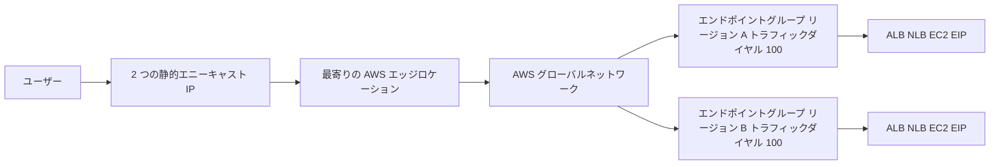

| 概念 | 説明 |
|---|---|
| アクセラレーター | 静的 IP を持つ入口。**標準アクセラレーター**と**カスタムルーティングアクセラレーター** |
| リスナー | 受け付けるポートとプロトコル (TCP / UDP) |
| エンドポイントグループ | **リージョンごと**の転送先の集合。**トラフィックダイヤル** (0-100%) でリージョンへの割合を調整 |
| エンドポイント | ALB、NLB、EC2 インスタンス、EIP。**エンドポイントの重み**で比率を調整 |
| ヘルスチェック | 異常なエンドポイントを自動で除外して正常なエンドポイントへ誘導 |
| クライアント IP の保持 | ALB や EC2 では保持可能 (設定による) |

> 使い分け: **トラフィックダイヤルを 0 にして** メンテナンス時にリージョンを切り離す、といった運用ができます。

### 8-7. ベストプラクティス

| 項目 | 推奨 |
|---|---|
| オリジンの保護 | S3 は OAC、ALB は CloudFront からのみ到達可能にする |
| キャッシュ効率 | **キャッシュキーを最小限**にする (不要なクエリ文字列・ヘッダー・Cookie を含めない) (Step 11) |
| コスト | 料金クラス、Origin Shield、フラットレートプランを検討 |
| 静的アセット | **ファイル名にバージョン**を付け、長い TTL を設定 (無効化に頼らない) |
| 固定 IP が必要 | Global Accelerator |
| 監視 | CloudFront の標準ログ / CloudWatch メトリクス / WAF ログを有効化 |

---

## Step 9: Skill 5.3.1 VPC 構成のトラブルシューティング

> 対象: サブネット、ルートテーブル、ネットワーク ACL、セキュリティグループ、Transit Gateway、NAT ゲートウェイ

### 9-1. 基本姿勢: 「経路」と「許可」を分けて考える

ネットワーク障害は、次の 2 つに分解すると切り分けやすくなります。

| 観点 | 問うこと | 確認する場所 |
|---|---|---|
| **経路 (Routing)** | パケットは**届く道**があるか | ルートテーブル、IGW / NAT / TGW / ピアリング、アタッチメント |
| **許可 (Filtering)** | 道の途中で**止められていない**か | SG、NACL、Network Firewall、OS のファイアウォール |
| **名前解決** | そもそも**宛先 IP を引けて**いるか | DNS、Resolver、プライベートホストゾーン |
| **アプリ** | ポートで**待ち受けている**か | OS 上のプロセス、ヘルスチェック設定 |

### 9-2. 万能の確認順序

```mermaid
flowchart TD
    S["通信できない"] --> D{"名前ではなく IP 直指定ならつながる?"}
    D -- "いいえ 名前だけ失敗" --> DNS["DNS を確認 Resolver 設定 プライベートホストゾーン DNS Firewall"]
    D -- "はい または IP でも失敗" --> R{"送信元のルートテーブルに宛先へのルートがある?"}
    R -- "いいえ" --> FR["ルートを追加 IGW NAT TGW pcx vpce など"]
    R -- "はい" --> N1{"送信元の SG のアウトバウンドは許可?"}
    N1 -- "いいえ" --> FS1["アウトバウンド許可を追加"]
    N1 -- "はい" --> NA1{"送信元サブネットの NACL は往復とも許可?"}
    NA1 -- "いいえ" --> FNA1["NACL のルールと番号順を修正"]
    NA1 -- "はい" --> NA2{"宛先サブネットの NACL は往復とも許可?"}
    NA2 -- "いいえ" --> FNA2["NACL を修正 エフェメラルポートも"]
    NA2 -- "はい" --> N2{"宛先の SG のインバウンドは許可?"}
    N2 -- "いいえ" --> FS2["インバウンド許可を追加 SG ID 参照が推奨"]
    N2 -- "はい" --> BK{"宛先の戻りルートはある?"}
    BK -- "いいえ" --> FBK["戻りのルートを追加 特にピアリングと TGW"]
    BK -- "はい" --> APP["OS ファイアウォール アプリの待受 ヘルスチェックを確認"]
```

### 9-3. 症状別の早見表

| 症状 | 最初に疑うこと |
|---|---|
| プライベートサブネットの EC2 がインターネットに出られない | ① `0.0.0.0/0 → NAT` のルート ② NAT が**パブリックサブネット**にあり、そのサブネットに **IGW ルート**があるか ③ NAT に **EIP** があるか ④ SG / NACL のアウトバウンド |
| パブリックサブネットの EC2 にインターネットから届かない | ① IGW のアタッチ ② `0.0.0.0/0 → IGW` ③ **パブリック IPv4 / EIP の有無** ④ SG のインバウンド ⑤ NACL (エフェメラルポート) |
| 同一 VPC 内の 2 台で通信できない | **SG のインバウンド**。local ルートは常にあるので経路は通常問題なし。NACL も確認 |
| ピアリング先と通信できない | ① 承諾済み (active) ② **両側のルート** ③ **CIDR の重複**がないか ④ SG / NACL ⑤ DNS 解決の設定 |
| TGW 経由で通信できない | ① アタッチメントの状態 ② **VPC 側ルート (→ tgw)** ③ **TGW ルートテーブルの関連付けと伝播** ④ ブラックホールルート ⑤ アタッチメント用サブネットの NACL |
| 片方向だけ通信できる | **NACL (ステートレス) の戻り許可漏れ**、または**戻りルートがない** (非対称ルーティング) |
| 一部のサブネットだけ通信できない | そのサブネットの**ルートテーブルの関連付け** (メインテーブルのままになっていないか) と **NACL** |
| プライベートサブネットから S3 に接続できない | ゲートウェイエンドポイントの**ルートテーブル関連付け**、**エンドポイントポリシー**、**S3 バケットポリシーの `aws:SourceVpce`** |

### 9-4. NAT ゲートウェイの障害対応

| 症状 | 原因と対処 |
|---|---|
| NAT 経由で接続できない | NAT のサブネットのルートに IGW がない、プライベート側にルートがない、**NAT が `failed` 状態** (EIP の問題など) |
| 突然タイムアウトや接続エラーが増えた | **ポート枯渇** (CloudWatch メトリクス **`ErrorPortAllocation`**)。同一宛先へ大量の同時接続を張ると、**同じ宛先 (IP + ポート + プロトコル) あたり約 55,000 の同時接続**が上限になる |
| 対処 (ポート枯渇) | NAT に**セカンダリ EIP を追加**、宛先を分散、アプリのコネクションを再利用 (Keep-Alive / プーリング)、サブネットごとに NAT を分けて分散 |
| 長時間アイドルの接続が切れる | **アイドルタイムアウトは 350 秒**。TCP Keep-Alive を 350 秒未満の間隔で送る (`IdleTimeoutCount` メトリクス) |
| パケットが落ちる | `PacketsDropCount` を確認。NAT の障害や上限超過の可能性 |
| IPv6 が通らない | NAT ゲートウェイは **IPv4 用**。IPv6 の外向きは **EIGW**。(IPv6 専用サブネットから IPv4 宛先へは DNS64 + NAT64 の組み合わせも可) |

> **Regional NAT ゲートウェイ**を使う場合は、サブネットごとの NAT 配置とルート変更が不要になる点が運用上の違いです。ただし**プライベート NAT** は従来のゾーナルモードが必要です。

### 9-5. VPC Reachability Analyzer

**構成情報から経路を静的に解析**するツールです。**実際のパケットは送りません**。

| 項目 | 内容 |
|---|---|
| 使い方 | **送信元と宛先 (ENI、インスタンス、IGW、VPN、TGW アタッチメントなど)、プロトコル、ポート**を指定して「パス分析」を実行 |
| 結果 | **到達可能 (Reachable)** なら通過した各ホップを表示。**到達不可 (Not reachable)** なら**ブロックしているコンポーネントと理由** (ルートの欠落、SG / NACL の拒否など) を示す |
| 向いている場面 | 「どこで止まっているか」を**まず特定**したいとき、変更後の疎通を事前に確認したいとき |
| 注意 | アプリ層 (プロセスの待受や OS の FW)、DNS は分析対象外。**構成上の到達性**のみ判定する |

```mermaid
flowchart TD
    A["疎通できない"] --> B["Reachability Analyzer でパス分析"]
    B --> C{"到達可能?"}
    C -- "いいえ" --> D["表示された阻害コンポーネントを修正 ルート SG NACL など"]
    C -- "はい" --> E["構成は正常 DNS と OS FW とアプリと実トラフィックを確認"]
    E --> F["VPC フローログで ACCEPT か REJECT を確認"]
```

### 9-6. SG と NACL を切り分けるコツ

| 観察 | 原因の可能性 |
|---|---|
| フローログで**インバウンドが REJECT** | SG のインバウンド不許可、または NACL のインバウンド拒否 |
| **インバウンドは ACCEPT、戻り (アウトバウンド) が REJECT** | **NACL** (SG はステートフルで戻りは自動許可されるため、SG が原因になりにくい) |
| 設定は正しいのに特定 IP だけ失敗 | **NACL の拒否ルールが番号の小さい順に先に一致**している |
| 追加した許可が効かない | NACL の**番号の小さい拒否ルール**が優先されている |

---

## Step 10: Skill 5.3.2 ネットワークログの収集と解釈

> 対象: VPC フローログ、ELB アクセスログ、AWS WAF Web ACL ログ、CloudFront ログ、コンテナログ

### 10-1. ログの全体像

| ログ | 何がわかるか | 出力先 | 主な用途 |
|---|---|---|---|
| **VPC フローログ** | ENI を通る IP トラフィックのメタデータ (送信元 / 宛先 / ポート / 許可・拒否) | CloudWatch Logs、S3、Data Firehose | **SG / NACL の拒否の特定**、不審な通信の調査 |
| **ELB アクセスログ** | ロードバランサーが受けた各リクエストの詳細 (ステータス、レイテンシー) | **S3** | 502/503/504 の原因調査、遅延の分析 |
| **WAF Web ACL ログ** | WAF が検査した各リクエストと**判定ルール** | CloudWatch Logs、S3、Data Firehose | **誤検知 / 検知漏れの調査** |
| **CloudFront ログ** | エッジが受けた各リクエスト (キャッシュ結果、ステータス) | 標準ログ (S3 など)、リアルタイムログ (Kinesis Data Streams) | **キャッシュヒット率**、エラー原因 |
| **コンテナログ** | アプリとコンテナ実行基盤のログ | CloudWatch Logs など | アプリのエラー、起動失敗、疎通エラー |

```mermaid
flowchart TD
    Q1{"何を調べたい?"}
    Q1 -- "通信が許可されたか拒否されたか" --> A["VPC フローログ"]
    Q1 -- "ロードバランサーの 5xx や遅延" --> B["ELB アクセスログ"]
    Q1 -- "WAF にブロックされたか どのルールか" --> C["WAF ログ"]
    Q1 -- "CDN のキャッシュヒットやエッジのエラー" --> D["CloudFront ログ"]
    Q1 -- "アプリやコンテナ内部のエラー" --> E["コンテナログ CloudWatch Logs"]
```

### 10-2. VPC フローログ

**取得レベル**: VPC 全体 / サブネット / 個別の ENI。

**既定フォーマット (14 フィールド)**

```text
version account-id interface-id srcaddr dstaddr srcport dstport protocol packets bytes start end action log-status
```

| フィールド | 意味 |
|---|---|
| srcaddr / dstaddr | 送信元 / 宛先 IP |
| srcport / dstport | 送信元 / 宛先ポート |
| protocol | IANA のプロトコル番号 (**6 = TCP、17 = UDP、1 = ICMP**) |
| action | **ACCEPT** (許可) または **REJECT** (拒否) |
| log-status | **OK**、NODATA (期間中の通信なし)、SKIPDATA (一部を取得できず) |

**読み方の例**

```text
2 123456789010 eni-0a1b2c3d 198.51.100.7 10.0.1.25 49152 443 6 20 4249 1620140761 1620140821 ACCEPT OK
2 123456789010 eni-0a1b2c3d 10.0.1.25 198.51.100.7 443 49152 6 19 3812 1620140761 1620140821 ACCEPT OK
```

- 1 行目: 外部 198.51.100.7 → 自分 10.0.1.25 の **TCP 443** へのアクセスが**許可**。
- 2 行目: 戻りの応答 (送信元ポートが 443、宛先がエフェメラルポート 49152) も**許可**。両方 ACCEPT なら、少なくともネットワークレベルでは正常です。

```text
2 123456789010 eni-0a1b2c3d 203.0.113.50 10.0.1.25 55000 3389 6 1 40 1620140661 1620140721 REJECT OK
```

- **TCP 3389 (RDP) への外部からの接続が REJECT**。SG / NACL のどちらかが拒否しています。

**判定の鉄則 (再掲)**

| パターン | 犯人 |
|---|---|
| インバウンド REJECT | SG または NACL |
| **インバウンド ACCEPT + アウトバウンド REJECT** | **NACL** |

**フローログに記録されない通信**: Amazon DNS サーバー (Resolver) への通信、インスタンスメタデータ (169.254.169.254)、Amazon Time Sync Service、DHCP、Windows ライセンス認証、VPC ルーターの予約 IP への通信など。

**運用のコツ**

| 項目 | 内容 |
|---|---|
| 集約間隔 | 既定 **10 分**、**1 分**も選択可 |
| カスタムフォーマット | `pkt-srcaddr` / `pkt-dstaddr` (NAT 越しの元アドレス)、`flow-direction`、`vpc-id`、`subnet-id`、`tcp-flags`、`az-id` などを追加できる |
| 分析 | **S3 に出力して Athena で SQL 集計**、または CloudWatch Logs Insights |
| 費用対策 | REJECT のみ、特定 ENI のみに絞る / S3 にライフサイクルを設定 |
| 変更の反映 | フローログの**フォーマットは作成後に変更できない** (作り直し) |
| 監査 | AWS Config `vpc-flow-logs-enabled` |

**Athena での集計例 (REJECT 上位の送信元)**

```sql
SELECT srcaddr, dstport, COUNT(*) AS cnt
FROM vpc_flow_logs
WHERE action = 'REJECT'
GROUP BY srcaddr, dstport
ORDER BY cnt DESC
LIMIT 20;
```

### 10-3. ELB アクセスログ

- 既定で**無効**。有効化すると **S3 バケット**に約 5 分間隔でログが出力されます。バケットポリシーで **ELB のログ配信を許可**する必要があります。
- ALB のログには、**リクエスト処理時間、ターゲット処理時間、応答処理時間、`elb_status_code`、`target_status_code`、ターゲットの IP:ポート、エラー理由、トレース ID** などが含まれます。

**ステータスコードの読み方 (ALB)**

| コード | 発生元 | 典型的な原因 | 対処 |
|---|---|---|---|
| **502 Bad Gateway** | ELB | ターゲットが**接続を閉じた / 不正な応答**、ターゲットの Keep-Alive が **ALB のアイドルタイムアウトより短い**、Lambda の応答形式不正 | ターゲットの Keep-Alive を ALB のアイドルタイムアウトより**長く**する |
| **503 Service Unavailable** | ELB | **登録された正常なターゲットがない** | ヘルスチェック設定、ターゲットの状態、SG を確認 |
| **504 Gateway Timeout** | ELB | **ターゲットが応答しない** (アイドルタイムアウト超過)、接続確立失敗 | ターゲットの SG / NACL、処理時間、アイドルタイムアウトの調整 |
| 460 | ELB | **クライアントが**応答前に接続を閉じた | クライアント側のタイムアウトを確認 |
| 4xx / 5xx で `elb_status_code` と `target_status_code` が**同じ** | **ターゲット (アプリ)** | アプリ自体の応答 | アプリのログを調査 |
| `elb_status_code` のみエラー、`target_status_code` が `-` | **ELB 自身** | ターゲットに届く前に終了 | 上記の ELB 起因を確認 |

> 見分け方: **ターゲットのコードが空 (`-`) なら ELB 側の問題、あれば アプリ側の応答**を疑います。

```mermaid
flowchart TD
    A["ALB で 5xx"] --> B{"target_status_code は?"}
    B -- "あり 例 500" --> C["アプリ ターゲットのエラー アプリログを確認"]
    B -- "空 ハイフン" --> D{"elb_status_code は?"}
    D -- "502" --> E["ターゲットが接続を閉じた 不正応答 Keep-Alive とアイドルタイムアウトを確認"]
    D -- "503" --> F["正常なターゲットがない ヘルスチェックと登録を確認"]
    D -- "504" --> G["ターゲットが時間内に応答しない SG NACL 処理時間を確認"]
```

### 10-4. AWS WAF Web ACL ログ

| 項目 | 内容 |
|---|---|
| 出力先 | CloudWatch Logs、S3、Data Firehose。リソース名は **`aws-waf-logs-` で始める** |
| 主要フィールド | **`action`** (ALLOW / BLOCK / COUNT / CAPTCHA...)、**`terminatingRuleId`** (最終判定したルール)、`terminatingRuleType`、**`ruleGroupList`** (ルールグループ内のどのルールが一致したか)、`httpRequest` (クライアント IP、URI、ヘッダー、メソッド)、`labels` |
| 機微情報 | **フィールドの伏せ字 (Redaction)** を設定できる (認証ヘッダーなど) |
| 絞り込み | **ログフィルタリング**で BLOCK / COUNT のみ記録するなどコスト削減 |

**誤検知 (正常なリクエストがブロックされる) の調査手順**

1. ブロックされたリクエストを WAF ログで探す (`action = BLOCK`)。
2. **`terminatingRuleId`** と **`ruleGroupList`** で、どのルールが原因かを特定する。
3. そのルールを **Count モード**にして影響を確認する、または**除外条件 (例外)**、**スコープダウンステートメント**を追加する。
4. 修正後もログと **CloudWatch メトリクス**で挙動を確認する。

### 10-5. CloudFront ログ

| 種類 | 特徴 |
|---|---|
| **標準ログ** | ほぼ**準リアルタイム**の詳細ログ。出力先は **S3、CloudWatch Logs、Data Firehose** (標準ログ v2)。従来方式は S3 のみ |
| **リアルタイムログ** | 数秒以内に **Kinesis Data Streams** へ。**サンプリング率とフィールドを選べる** |

**特に重要なフィールド**

| フィールド | 意味 |
|---|---|
| **`x-edge-result-type`** | エッジでの処理結果。**Hit (キャッシュから応答)**、**RefreshHit** (期限切れだがオリジンで更新確認の上キャッシュを再利用)、**Miss** (オリジンへ取得)、**Error**、Redirect、LimitExceeded、CapacityExceeded、FunctionGeneratedResponse |
| `x-edge-response-result-type` | ビューワーへの最終応答の種類 |
| `sc-status` | ビューワーに返した HTTP ステータス |
| `time-taken` / `time-to-first-byte` | 処理時間 |
| `x-edge-location` | 処理したエッジ |
| `cs-uri-query`、`cs(Cookie)`、`cs(Host)` | キャッシュキーに関わる値 |

> **キャッシュヒット率の概算**: `x-edge-result-type` が Hit + RefreshHit の件数 ÷ 全リクエスト。Athena で集計できます。

### 10-6. コンテナログ

| 実行基盤 | ログの取り方 |
|---|---|
| **Amazon ECS (Fargate / EC2)** | タスク定義で **`awslogs` ログドライバー**を指定すると CloudWatch Logs に出力。**タスク実行ロール**に `logs:CreateLogStream` と `logs:PutLogEvents` が必要 (ロググループの自動作成には `logs:CreateLogGroup` や設定が必要)。柔軟な転送は **FireLens (Fluent Bit / Fluentd)** |
| **Amazon EKS** | **Fluent Bit** (DaemonSet) や **CloudWatch Observability アドオン / Container Insights** でノード・Pod のログとメトリクスを収集。コントロールプレーンログは**クラスターで有効化** |

**コンテナのネットワーク問題で見るポイント**

| 症状 | 確認 |
|---|---|
| **プライベートサブネットの Fargate タスクが起動せずイメージを取得できない (CannotPullContainerError)** | NAT ゲートウェイのルート、または **ECR 用エンドポイント (`ecr.api`、`ecr.dkr`) + S3 ゲートウェイエンドポイント** + **CloudWatch Logs エンドポイント**、各 SG の 443 許可 |
| タスクの ENI に付く SG | **awsvpc ネットワークモードではタスクごとに ENI と SG** を持つ。サービス間通信は SG 参照で許可 |
| ログが出ない | タスク実行ロールの権限、ログドライバー設定、ログ用エンドポイント |

---

## Step 11: Skill 5.3.3 CloudFront キャッシュ問題の特定と修復

### 11-1. キャッシュの仕組みを一言で

CloudFront は、リクエストから**キャッシュキー**を作り、同じキーのオブジェクトがエッジにあれば返します。**キャッシュキーが多様すぎると** (毎回別キー) ヒットしません。

```mermaid
flowchart TD
    R["リクエスト到着"] --> K["キャッシュキーを計算 パス クエリ ヘッダー Cookie のうち設定した値"]
    K --> H{"エッジにあり 有効期限内?"}
    H -- "はい" --> HIT["Hit キャッシュから応答"]
    H -- "期限切れ" --> V["オリジンに更新確認"]
    V --> RH["RefreshHit 未更新ならキャッシュを再利用"]
    H -- "なし" --> M["Miss オリジンから取得"]
    M --> S["TTL に従い保存して応答"]
```

### 11-2. キャッシュ状態の確認方法

| 確認手段 | 見るもの |
|---|---|
| **レスポンスヘッダー `X-Cache`** | `Hit from cloudfront` / `RefreshHit from cloudfront` / `Miss from cloudfront` / `Error from cloudfront` |
| **`Age` ヘッダー** | エッジにキャッシュされてからの秒数 (**Age があれば Hit の可能性が高い**) |
| `X-Amz-Cf-Pop`、`X-Amz-Cf-Id` | 処理したエッジ拠点 / リクエスト ID (サポート問い合わせ用) |
| CloudFront コンソールの**キャッシュ統計** | ヒット / ミス / エラーの割合、人気オブジェクト |
| 標準ログの `x-edge-result-type` | 詳細な傾向分析 |
| CloudWatch の追加メトリクス | **CacheHitRate** (有効化が必要) など |

> コマンド例: `curl -sI https://dxxxxxx.cloudfront.net/logo.png | grep -i -E "x-cache|age"`

### 11-3. TTL の決まり方

オブジェクトがキャッシュに残る期間は、**オリジンのヘッダー**と**キャッシュポリシーの TTL 設定**で決まります。

| 設定 | 役割 | 既定値 (カスタムポリシーの場合の一般的な値) |
|---|---|---|
| **Minimum TTL** | キャッシュ期間の**下限** | 0 秒 |
| **Default TTL** | オリジンがキャッシュ指示を出さないときの期間 | **86,400 秒 (24 時間)** |
| **Maximum TTL** | キャッシュ期間の**上限** | **31,536,000 秒 (1 年)** |

- オリジンの **`Cache-Control: max-age` / `s-maxage` / `Expires`** があれば、**Min と Max の範囲内で**それが採用されます。
- `Cache-Control: no-cache` や `no-store` などがあり、**Minimum TTL が 0 より大きい**場合は Minimum TTL が優先されて**キャッシュされてしまう**点に注意。
- **マネージドキャッシュポリシー**: `CachingOptimized` (長期キャッシュ向け)、`CachingDisabled` (キャッシュしない、動的 API 向け)。

### 11-4. 症状別の原因と対処

| 症状 | 主な原因 | 対処 |
|---|---|---|
| **古いコンテンツが返り続ける** | TTL が長い、オリジン更新後にキャッシュが残っている | ① **無効化 (Invalidation)** ② **ファイル名 / パスにバージョンを付ける** (推奨) ③ TTL を短縮 |
| **キャッシュヒット率が低い** | キャッシュキーに**不要なクエリ文字列・ヘッダー・Cookie** を含めている、`Cache-Control: no-cache / private` をオリジンが返している、TTL が短すぎる | キャッシュポリシーを**必要最小限**に、オリジンのヘッダー見直し、**Origin Shield** で集約、クエリ文字列の**正規化 (並び順を揃える)** |
| **ユーザーごとに内容が違う / 他人のページが見える** | **Cookie や Authorization ヘッダーをキャッシュキーに含めていない**のに個別コンテンツをキャッシュ | 個別コンテンツはキャッシュを無効化するか、キーに含める。**動的 / 個人情報は `CachingDisabled`** |
| **Query String を変えても同じ内容** | キャッシュキーにクエリ文字列を**含めていない** | クエリ文字列をキャッシュキーに含める (必要なものだけ) |
| **特定のヘッダーで内容を出し分けたいのに反映されない** | ヘッダーがキャッシュキー / オリジンリクエストに含まれない | 必要なヘッダーだけキャッシュポリシーに追加 (例: `CloudFront-Viewer-Country`) |
| 無効化したのにすぐ反映されない / 一部のエッジで古い | 無効化は**全エッジに伝播するのに時間**がかかる (通常は短時間) | 反映を確認。大量パス無効化を避ける設計に |
| **エラーが一定時間返り続ける** | **エラーレスポンスのキャッシュ** (既定の最小 TTL は **10 秒**) | **エラーキャッシュの最小 TTL** を調整 (障害復旧後も古いエラーが残る) |
| **HTTP と HTTPS で別の内容** | ビューワープロトコルの設定 | Redirect HTTP to HTTPS に統一 |

**無効化 (Invalidation) の要点**

| 項目 | 内容 |
|---|---|
| 指定方法 | パス (`/images/*`、`/*` など)。ワイルドカード可 |
| 料金 | **月あたり最初の 1,000 パスは無料**、以降は 1 パスごとに課金 (ワイルドカード 1 つは 1 パス) |
| ベストプラクティス | 頻繁な更新は**バージョン付きファイル名** (例: `app.v123.js`)。無効化に頼らない |

### 11-5. エラー応答の切り分け

| ステータス | 意味・主な原因 | 対処 |
|---|---|---|
| **403** | **OAC / バケットポリシーの不備** (S3 へアクセスできない)、**WAF のブロック**、**地理的制限**、署名付き URL の不正 / 期限切れ、**既定ルートオブジェクト未設定で `/` にアクセス**、代替ドメイン名 (CNAME) が未登録 | バケットポリシー (ディストリビューション ARN)、WAF ログ、地理的制限、署名の有効期限を確認 |
| **404** | オリジンにオブジェクトがない、パスパターンの設定ミス | オリジンのパス、ビヘイビアのパスパターン |
| **502 Bad Gateway** | **オリジンへの SSL/TLS ネゴシエーション失敗** (証明書名の不一致・期限切れ、プロトコルや暗号スイートの非互換)、オリジンに接続できない | オリジンの証明書、オリジンプロトコルポリシー、SG で CloudFront のアクセスを許可 |
| **503** | オリジンの容量不足、CloudFront の容量超過 | オリジンのスケール、再試行 |
| **504 Gateway Timeout** | **オリジンの応答がタイムアウト** (既定の応答タイムアウトは **30 秒**)、オリジンに到達できない (SG / NACL / ファイアウォールが CloudFront を遮断) | オリジンの処理時間短縮、**オリジン応答タイムアウトの調整**、オリジン側のアクセス許可 |

```mermaid
flowchart TD
    E["CloudFront でエラー"] --> Q{"ステータスは?"}
    Q -- "403" --> A["OAC とバケットポリシー WAF 地理的制限 署名 既定ルートオブジェクト"]
    Q -- "404" --> B["オリジンのオブジェクトの有無 パスパターン"]
    Q -- "502" --> C["オリジンの証明書 SSL ネゴシエーション オリジンへの接続"]
    Q -- "503" --> D["オリジンの容量 負荷"]
    Q -- "504" --> F["オリジンの応答遅延 タイムアウト値 オリジンへの到達性 SG"]
```

### 11-6. ベストプラクティス

| 項目 | 推奨 |
|---|---|
| 静的アセット | **バージョニングした名前 + 長い TTL** |
| キャッシュキー | **最小限**に。マネージドキャッシュポリシーを活用 |
| 動的 / 個人別コンテンツ | `CachingDisabled` またはキーに識別子を含める |
| オリジン負荷 | **Origin Shield** |
| 可観測性 | 標準ログ + CloudWatch の追加メトリクスでヒット率を継続監視 |
| エラー | エラーキャッシュ TTL をアプリの復旧特性に合わせる |

---

## Step 12: Skill 5.3.4 ハイブリッド接続とプライベート接続の障害対応

> 対象: Site-to-Site VPN、Client VPN、Transit Gateway、PrivateLink / VPC エンドポイント、(関連知識) Direct Connect

### 12-1. ハイブリッド接続の全体像

```mermaid
flowchart LR
    subgraph OnPrem["オンプレミス"]
        CGW["カスタマーゲートウェイ機器"]
    end
    subgraph AWS["AWS"]
        VGW["仮想プライベートゲートウェイ または Transit Gateway"]
        VPC["VPC"]
    end
    CGW == "IPsec トンネル 2 本" ==> VGW
    VGW --> VPC
```

| 構成要素 | 説明 |
|---|---|
| **カスタマーゲートウェイ (CGW)** | オンプレ側の VPN 機器とそれを表す AWS 側のリソース |
| **仮想プライベートゲートウェイ (VGW)** | 1 つの VPC にアタッチする AWS 側の終端 |
| **Transit Gateway** | 複数 VPC と VPN の中継ハブ (VPN を TGW にアタッチ) |
| **VPN 接続** | **2 本のトンネル** (異なる AZ のエンドポイント) を提供し冗長化 |

### 12-2. Site-to-Site VPN のトラブルシューティング

**ルーティング方式**

| 方式 | 概要 | 注意 |
|---|---|---|
| **動的 (BGP)** | BGP で経路を交換 (**推奨**) | **ASN、BGP ピアの IP、BGP のキープアライブ**を確認 |
| 静的 | 手動でルートを指定 | VPC 側と オンプレ側の両方に正しい経路が必要 |

**VPC 側で忘れやすい設定**: VGW を使う場合、**ルートテーブルで「ルート伝播 (Route Propagation)」を有効化**する (または静的ルートを追加)。これがないと VPC からオンプレ宛てのルートが存在しません。

**症状別の切り分け**

| 症状 | 原因の例 | 確認先 |
|---|---|---|
| **トンネルが DOWN** | IKE / IPsec の**パラメーター不一致** (暗号化方式、DH グループ、ライフタイム)、事前共有鍵の不一致、**オンプレ FW が UDP 500 / 4500 を遮断**、CGW の**グローバル IP が設定と違う** | VPN トンネルの**ステータスメッセージ**、CGW 機器のログ、CloudWatch `TunnelState` |
| 1 本だけ DOWN | **冗長トンネルの設定漏れ**、片方のトンネルしか構成していない | 2 本とも構成されているか |
| トンネルは UP だが**通信できない** | **ルート未伝播**、BGP でルートを受信 / 広告できていない、**SG / NACL**、オンプレ側のルート | ルートテーブル、BGP のルート、フローログ |
| 通信が不安定 / 断続的 | **非対称ルーティング**、MTU / フラグメント (**MSS クランプ**)、トンネルのフラップ | 往復の経路が同一か、MTU |
| 一定時間通信がないと切れる | **アイドルでトンネルが落ちる** (特にオンプレ起点で張る構成) | **DPD (Dead Peer Detection)** とトンネル開始方法、疎通維持のための定期通信 |
| **CIDR が重複**している | オンプレと VPC のアドレスが重なる | アドレス設計の見直し (NAT で回避も可) |

> VPN のスループットは**トンネルあたり上限 (約 1.25 Gbps)** があります。TGW を使い **ECMP** で複数トンネルを束ねると帯域を増やせます。

**監視**

| メトリクス | 意味 |
|---|---|
| **`TunnelState`** | トンネルの状態 (**0 = DOWN、1 = UP**)。アラームの定番 |
| `TunnelDataIn` / `TunnelDataOut` | トンネルの受信 / 送信バイト数 |

**ベストプラクティス**: トンネル 2 本を**両方**使い、`TunnelState` の CloudWatch アラームを設定、BGP を使用、VPN ログを CloudWatch Logs に出力する。

### 12-3. AWS Client VPN のトラブルシューティング

**Client VPN** は、**リモート ユーザーが PC から VPC へ接続する**マネージド VPN (OpenVPN ベース) です。

| 構成要素 | 説明 |
|---|---|
| Client VPN エンドポイント | 接続の入口 |
| **ターゲットネットワークの関連付け** | **サブネット**を関連付け (複数 AZ 推奨) |
| **認可ルール (Authorization rules)** | **どの宛先 CIDR に誰がアクセスできるか** |
| **ルート** | クライアントから見える宛先と、どのサブネット経由かを定義 |
| クライアント CIDR | クライアントに割り当てる IP の範囲 (**VPC の CIDR と重複させない**) |
| 認証 | Active Directory、**相互認証 (証明書)**、SAML (IAM Identity Center などと連携) |
| スプリットトンネル | 有効にすると、VPC 向け通信のみ VPN 経由 |

| 症状 | 原因 |
|---|---|
| 接続はできるが **VPC のリソースに届かない** | **認可ルール不足**、**ルート不足**、ターゲットサブネットの SG と宛先 SG の不許可 |
| 接続できない | 認証設定 (証明書・IdP)、クライアント設定ファイル、エンドポイントの状態が `available` か |
| **インターネットに出られない** (フルトンネル) | 認可ルール (0.0.0.0/0)、ルート (0.0.0.0/0 → NAT 経由)、NAT の設定 |
| 特定の宛先だけ届かない | 認可ルールの**宛先 CIDR** と**グループ制限** |

### 12-4. Direct Connect (関連知識)

専用線でオンプレと AWS を接続するサービスです。**公式の対象サービス一覧には明記されていません**が、「ハイブリッド接続」の文脈で基礎を知っておくと有利です。

| 項目 | 内容 |
|---|---|
| 特徴 | 安定した帯域・低遅延。**暗号化は既定ではされない** (必要なら VPN を併用 / MACsec) |
| 冗長構成 | 異なるロケーション / 接続を複数 + **VPN をバックアップ**にする構成が一般的 |
| 切り分け | 物理接続、仮想インターフェイス (VIF)、**BGP セッション**の状態を確認 |

### 12-5. Transit Gateway 経由の障害切り分け

```mermaid
flowchart TD
    S["TGW 経由で通信できない"] --> A{"アタッチメントは available?"}
    A -- "いいえ" --> A1["アタッチメントの状態とサブネットを確認"]
    A -- "はい" --> B{"VPC のルートテーブルに 宛先から tgw がある?"}
    B -- "いいえ" --> B1["ルートを追加"]
    B -- "はい" --> C{"TGW ルートテーブルに 宛先 CIDR のルートがある?"}
    C -- "いいえ" --> C1["伝播を有効化 または 静的ルートを追加"]
    C -- "はい" --> D{"アタッチメントが 正しい TGW ルートテーブルに関連付いている?"}
    D -- "いいえ" --> D1["関連付けを修正"]
    D -- "はい" --> E{"ブラックホールルートや CIDR 重複はない?"}
    E -- "ある" --> E1["ルートを修正 重複を解消"]
    E -- "ない" --> F["SG NACL 戻りのルートを確認 Reachability Analyzer で検証"]
```

### 12-6. プライベート接続 (PrivateLink / エンドポイント) の障害対応

| 症状 | 原因と対処 |
|---|---|
| インターフェイスエンドポイント経由なのに**タイムアウト** | エンドポイント ENI の **SG が 443 (クライアントからの送信元) を許可していない** |
| **名前がパブリック IP に解決され**、エンドポイントを経由しない | **プライベート DNS が無効**、VPC の **`enableDnsSupport` / `enableDnsHostnames` が無効**、独自 DNS サーバー利用で Resolver (.2) を経由していない |
| **`AccessDenied`** (ネットワークは通っている) | **エンドポイントポリシー**で拒否、リソース側のポリシー (S3 バケットポリシーの `aws:SourceVpce`) が不一致、IAM の権限 |
| ゲートウェイエンドポイント (S3) に届かない | **ルートテーブルにプレフィックスリストのルートがない / 関連付けていない**、ポリシー |
| オンプレから S3 に**ゲートウェイエンドポイントで**到達できない | 仕様上不可。**インターフェイスエンドポイント**を使う |
| 特定 AZ のみ失敗 | その AZ にエンドポイントの ENI がない (サブネット未選択) |
| PrivateLink で自社サービスに接続できない | プロバイダー側の**接続リクエストの承認**、NLB のヘルスチェック、**エンドポイントサービスの許可プリンシパル** |
| ピアリング先の DNS 名が引けない | ピアリング接続の **DNS 解決オプション**が未設定、プライベートホストゾーンの関連付けが不足 |

---

## Step 13: Skill 5.3.5 CloudWatch ネットワーク監視

> 対象: CloudWatch Network Monitoring (Network Flow Monitor / Internet Monitor / Network Synthetic Monitor) と、ネットワーク関連の CloudWatch メトリクス・アラーム

### 13-1. CloudWatch Network Monitoring の 3 つのサービス

公式ドキュメントでは、**Network Flow Monitor、Internet Monitor、Network Synthetic Monitor** が CloudWatch のネットワーク / インターネット監視機能として説明されています。2024 年 12 月に AWS はこれらを **CloudWatch Network Monitoring** に統合し、**フローモニター**、**シンセティックモニター**、**インターネットモニター**として整理しました。

| サービス | 監視する区間 | 方式 | 主なデータ・機能 | 典型的な使い所 |
|---|---|---|---|---|
| **Network Flow Monitor** | **AWS ワークロードのネットワーク** (EC2 間、S3 や DynamoDB など AWS サービス向け) | **受動 (パッシブ)**。インスタンスに**軽量エージェント**をインストールし、TCP 接続の統計を収集 | **パケットロス、遅延**をほぼリアルタイムで可視化、**ネットワークヘルスインジケーター** | **アプリの問題か AWS 側のネットワークの問題か**の切り分け |
| **Internet Monitor** | **インターネット区間** (ユーザーとアプリの間) | AWS が世界規模で収集する接続データから**パフォーマンスと可用性のベースライン**を算出 | **インターネットの障害イベント**の検知とアラート、影響を受けるクライアント地域の可視化 | **ユーザー側の ISP やネットワーク起因の遅延・障害**の把握 |
| **Network Synthetic Monitor** | **ハイブリッド接続** (AWS からオンプレへ) | **能動 (アクティブ)**。**プローブ**を AWS リソースからオンプレの宛先 IP へ送信。**追加エージェント不要** | **遅延とパケットロス**の追跡、**ヘルスイベントのアラート** | Direct Connect や VPN の**品質低下の検知** |

```mermaid
flowchart TD
    Q1{"どこの区間を見たい?"}
    Q1 -- "AWS 内の EC2 や AWS サービス間" --> A["Network Flow Monitor エージェントで受動監視"]
    Q1 -- "ユーザーからアプリまでのインターネット区間" --> B["Internet Monitor"]
    Q1 -- "AWS とオンプレミスのハイブリッド区間" --> C["Network Synthetic Monitor プローブで能動監視"]
```

**Network Flow Monitor の導入手順 (概要)**

1. コンソールで機能を**有効化**し、必要な権限を許可する。
2. 監視対象の **EC2 インスタンス (またはコンテナ) にエージェントをインストール**する。エージェントがバックエンドへデータを送れるよう**権限**を設定する。
3. **モニターを作成**し、対象のローカル / リモートリソースを指定する。
4. **ダッシュボード**でパケットロス・遅延・ヘルスインジケーターを確認し、**アラーム**を設定する。

> 試験の覚え方: **フロー = 中 (AWS 内) を受動で、シンセティック = オンプレ向けを能動で、インターネット = ユーザー側を地球規模のデータで**。

### 13-2. サービス別の主要 CloudWatch メトリクス

| 対象 | メトリクス | 意味と使い方 |
|---|---|---|
| **NAT ゲートウェイ** | **`ErrorPortAllocation`** | **ポート割り当て失敗**の回数 (0 でなければポート枯渇) |
| | `PacketsDropCount` | 破棄されたパケット数 |
| | `BytesOutToDestination` / `BytesOutToSource` | 外向き / 内向きの転送量 (コスト分析にも有用) |
| | `ConnectionAttemptCount` / `ConnectionEstablishedCount` | 試行と確立の差で**接続失敗**を把握 |
| | `IdleTimeoutCount` | アイドルタイムアウトで切れた接続 |
| **Site-to-Site VPN** | **`TunnelState`** | トンネルの UP / DOWN |
| | `TunnelDataIn` / `TunnelDataOut` | 通信量 |
| **Transit Gateway** | `BytesIn` / `BytesOut` | 転送量 |
| | `PacketDropCountBlackhole` | **ブラックホールルートで破棄**された数 |
| | `PacketDropCountNoRoute` | **ルートが無く**破棄された数 |
| **ALB** | `HTTPCode_ELB_5XX_Count`、`HTTPCode_Target_5XX_Count`、`TargetResponseTime`、`UnHealthyHostCount` | **ELB 起因かターゲット起因か**の切り分け |
| **CloudFront** | `Requests`、`4xxErrorRate`、`5xxErrorRate`、(追加) `CacheHitRate`、`OriginLatency` | **米国東部 (バージニア北部) リージョン**の CloudWatch に出力 |
| **Route 53 ヘルスチェック** | `HealthCheckStatus`、`HealthCheckPercentageHealthy` | **米国東部 (バージニア北部)** の CloudWatch。**アラーム作成もこのリージョン** |
| **AWS WAF** | `AllowedRequests`、`BlockedRequests`、`CountedRequests` | ルール別の動作確認 |
| **Shield Advanced** | `DDoSDetected` | 攻撃検知のアラーム |

### 13-3. アラームの設計例

| 目的 | アラームの例 |
|---|---|
| NAT のポート枯渇を検知 | `ErrorPortAllocation` が **0 より大きい**状態が続いたら通知 |
| VPN の切断を検知 | `TunnelState` が **1 未満** (DOWN) で通知 |
| ALB の障害を検知 | `HTTPCode_ELB_5XX_Count` の増加、`UnHealthyHostCount` が 1 以上 |
| CloudFront のオリジン障害 | `5xxErrorRate` のしきい値超過 |
| ルート不備の検知 | TGW の `PacketDropCountNoRoute` が 0 より大きい |

アラームのアクションには **SNS 通知**、**EventBridge** との連携による自動修復 (Systems Manager Automation や Lambda)、**Auto Scaling** との連動が使えます。

### 13-4. ベストプラクティス

| 項目 | 推奨 |
|---|---|
| 段階的な切り分け | **Network Flow Monitor** で「AWS 側か自分のアプリ側か」→ **VPC フローログ** で拒否の有無 → **Reachability Analyzer** で経路 |
| ハイブリッド | **Network Synthetic Monitor** と `TunnelState` の両方を監視 |
| ユーザー体験 | **Internet Monitor** でユーザー側のインターネット障害を把握 |
| 通知の設計 | 重要度ごとにアラームを分け、復旧時の通知 (OK 状態) も設定 |
| リージョンの罠 | CloudFront と Route 53 ヘルスチェックのメトリクスは **us-east-1** |

---

## Step 14: 症状から原因を絞り込む総合フロー

### 14-1. 「つながらない」の分類フロー

```mermaid
flowchart TD
    S["ユーザーまたはシステムから 通信できない 遅い との報告"] --> T{"どの区間か?"}
    T -- "名前が引けない" --> DNS["DNS 区間 Step 6 7"]
    T -- "インターネット経由のユーザー" --> EDGE["エッジ区間 CloudFront WAF Shield Step 8 11"]
    T -- "ロードバランサー経由" --> LB["ELB 区間 Step 10"]
    T -- "VPC 内やサブネット間" --> VPCC["VPC 区間 Step 9"]
    T -- "プライベートサブネットから外部" --> NAT["NAT エンドポイント区間 Step 3 9"]
    T -- "オンプレミスとの通信" --> HYB["ハイブリッド区間 Step 12"]
    T -- "遅い 断続的に失敗" --> PERF["監視で確認 Step 13"]
    DNS --> D1["Resolver 設定 ホストゾーン DNS Firewall クエリログ"]
    EDGE --> E1["X-Cache ステータスコード WAF ログ オリジン到達性"]
    LB --> L1["アクセスログ ターゲットヘルス SG"]
    VPCC --> V1["Reachability Analyzer ルート SG NACL フローログ"]
    NAT --> N1["ルート NAT 状態 ErrorPortAllocation エンドポイントポリシー"]
    HYB --> H1["TunnelState BGP ルート伝播 TGW ルート"]
    PERF --> P1["Network Flow Monitor Internet Monitor Synthetic Monitor"]
```

### 14-2. 使うツールの選び方

| やりたいこと | ツール |
|---|---|
| **設定上の経路**が通っているか確かめたい | VPC Reachability Analyzer |
| **実際に拒否された**通信を見たい | VPC フローログ |
| DNS の問い合わせ内容を見たい | Route 53 Resolver クエリログ |
| LB のエラーの内訳を見たい | ELB アクセスログ + CloudWatch メトリクス |
| WAF の判定理由を見たい | WAF ログ |
| CDN のキャッシュの当たり外れを見たい | CloudFront 標準ログ、`X-Cache` |
| ネットワーク品質 (遅延 / ロス) を見たい | CloudWatch Network Monitoring |
| 誰が設定を変えたか | CloudTrail、AWS Config |

---

## Step 15: 練習問題

> 形式は本試験に合わせた「単一選択」と「複数選択」です。各問の解説に根拠となる考え方を付けています。

### 問題 1 (VPC)
プライベートサブネットの EC2 が OS アップデートのためインターネットへ出る必要がありますが、外部からの接続は受け付けたくありません。最も適切な構成はどれですか。

- A. プライベートサブネットのルートテーブルに IGW へのルートを追加する
- B. パブリックサブネットに NAT ゲートウェイを作成し、プライベートサブネットのルートテーブルで `0.0.0.0/0` を NAT に向ける
- C. EC2 に Elastic IP を割り当てる
- D. VPC ピアリングを作成する

<details>
<summary>答えと解説</summary>

**B**。NAT ゲートウェイは外向き通信だけを許可します。A は外部からも到達可能になり、C も同様です。D は無関係です。

</details>

### 問題 2 (SG と NACL)
Web サーバーのサブネットの NACL で、インバウンド TCP 443 を許可しましたが、クライアントは応答を受け取れません。SG は正しく設定されています。原因として最も可能性が高いものはどれですか。

- A. NACL のアウトバウンドで**エフェメラルポート (1024-65535)** が許可されていない
- B. SG のアウトバウンドが拒否されている
- C. IGW がアタッチされていない
- D. NACL はステートフルなので設定不要

<details>
<summary>答えと解説</summary>

**A**。NACL はステートレスのため、戻りの通信も明示的に許可する必要があります。SG はステートフルなので B は原因になりません。

</details>

### 問題 3 (IPv6)
IPv6 を使う EC2 インスタンスに、インターネットへの外向き通信だけを許可し、インターネットからの新規接続は拒否したい。どれを使いますか。

- A. NAT ゲートウェイ
- B. インターネットゲートウェイのみ
- C. Egress-only インターネットゲートウェイ
- D. VPC エンドポイント

<details>
<summary>答えと解説</summary>

**C**。NAT ゲートウェイは IPv4 用です。

</details>

### 問題 4 (エンドポイント / コスト)
プライベートサブネットのアプリが S3 に大量のデータを送っており、NAT ゲートウェイのデータ処理料金が高額です。最も費用対効果が高く運用負荷が小さい対策はどれですか。

- A. NAT ゲートウェイを大きいインスタンスタイプに変える
- B. S3 用の**ゲートウェイエンドポイント**を作成し、ルートテーブルに関連付ける
- C. S3 用のインターフェイスエンドポイントを作成する
- D. Direct Connect を契約する

<details>
<summary>答えと解説</summary>

**B**。ゲートウェイエンドポイントは無料で、NAT 経由のデータ処理料金を回避できます。NAT ゲートウェイにインスタンスタイプはありません (A は誤り)。C は時間課金・処理課金が発生します。

</details>

### 問題 5 (ピアリング)
VPC A と VPC B、VPC B と VPC C にそれぞれピアリングがあります。VPC A のインスタンスから VPC C のインスタンスへ通信したいが失敗します。理由と解決策として正しいものはどれですか。**2 つ選択**してください。

- A. ピアリングは推移的ではないため、A と C は VPC B を経由して通信できない
- B. A と C の間に**新たにピアリングを作成**し、両方のルートテーブルを更新する
- C. VPC B のルートテーブルに A と C の CIDR へのルートを追加すれば、B が中継して解決する
- D. ピアリングを承諾し直すと推移的ルーティングが有効になる
- E. VPC B の SG を全許可にすれば解決する

<details>
<summary>答えと解説</summary>

**A と B**。ピアリングは**推移的ルーティング不可**です。C、D、E のように B 側の設定を変えても中継されません。接続する VPC が多い場合は Transit Gateway も有力な選択肢です。

</details>

### 問題 6 (DNS Firewall)
VPC 内のインスタンスが、既知のマルウェア配布ドメインに名前解決しようとするのを防ぎたい。最も適切なサービスはどれですか。

- A. AWS WAF
- B. Route 53 Resolver DNS Firewall
- C. セキュリティグループ
- D. AWS Shield Advanced

<details>
<summary>答えと解説</summary>

**B**。DNS 名による制御は DNS Firewall です。WAF は HTTP リクエストの検査です。

</details>

### 問題 7 (WAF)
新しい WAF ルールを本番に追加しますが、正規ユーザーを誤ってブロックしたくありません。最初にとるべき設定はどれですか。

- A. 直ちに Block で適用する
- B. ルールを **Count** モードで適用し、ログとメトリクスで影響を確認する
- C. Shield Advanced を有効化する
- D. NACL でブロックする

<details>
<summary>答えと解説</summary>

**B**。Count は記録のみで、誤検知を事前に確認できます。

</details>

### 問題 8 (Route 53 ルーティング)
新バージョンのアプリに本番トラフィックの 10% だけを流して様子を見たい。使うルーティングポリシーはどれですか。

- A. シンプル
- B. フェイルオーバー
- C. 加重
- D. 位置情報

<details>
<summary>答えと解説</summary>

**C (加重)**。比率で振り分けます。

</details>

### 問題 9 (ヘルスチェック)
VPC 内のプライベートなエンドポイントのヘルスチェックで、Route 53 を使ったフェイルオーバーを実現したい。ヘルスチェッカーはプライベートなリソースに到達できません。どうしますか。

- A. エンドポイントヘルスチェックの IP を 10.0.0.0/8 にする
- B. **CloudWatch アラームベースのヘルスチェック**を作成し、それをルーティングに関連付ける
- C. ヘルスチェックを使わない
- D. 計算済みヘルスチェックのみにする

<details>
<summary>答えと解説</summary>

**B**。リソースのメトリクスでアラームを作り、そのアラームの状態でヘルスを判定します。

</details>

### 問題 10 (ハイブリッド DNS)
オンプレミスのサーバーから、VPC のプライベートホストゾーンにある名前 (`db.internal.example.com`) を解決したい。必要なものはどれですか。

- A. Route 53 Resolver の**インバウンドエンドポイント**と、オンプレ DNS からそこへの転送設定
- B. アウトバウンドエンドポイント
- C. パブリックホストゾーンの複製
- D. DNS Firewall のルールグループ

<details>
<summary>答えと解説</summary>

**A**。オンプレ → VPC の問い合わせはインバウンド、VPC → オンプレはアウトバウンドです。

</details>

### 問題 11 (CloudFront の証明書)
CloudFront で独自ドメインの HTTPS を使うため、ACM で証明書を作成します。どのリージョンで作成しますか。

- A. ディストリビューションと同じリージョン
- B. オリジンと同じリージョン
- C. 米国東部 (バージニア北部) us-east-1
- D. どこでもよい

<details>
<summary>答えと解説</summary>

**C**。CloudFront が使う ACM 証明書は us-east-1 で作成します。

</details>

### 問題 12 (S3 オリジン)
S3 バケットを CloudFront 経由でのみ公開し、S3 の URL への直接アクセスは拒否したい。推奨される方法はどれですか。

- A. バケットをパブリックにする
- B. **Origin Access Control (OAC)** を使い、バケットポリシーで CloudFront のみ許可する
- C. 署名付き URL のみ
- D. SG でバケットを守る

<details>
<summary>答えと解説</summary>

**B**。S3 に SG はありません (D は誤り)。OAC が現在の推奨で、旧 OAI より優先されます。

</details>

### 問題 13 (Global Accelerator)
TCP を使うゲームサーバー (複数リージョン) に対し、固定の IP アドレスを許可リストにしたいと顧客に要求されています。DNS の TTL に依存せず、異常なリージョンから素早く切り替えたい。どれを使いますか。

- A. CloudFront
- B. Route 53 のフェイルオーバー
- C. **AWS Global Accelerator**
- D. Elastic IP を各サーバーに付ける

<details>
<summary>答えと解説</summary>

**C**。静的エニーキャスト IP と、ヘルスチェックに基づく高速フェイルオーバーが特長です。

</details>

### 問題 14 (CloudFront キャッシュ)
CloudFront のキャッシュヒット率が非常に低い。調べると、すべてのリクエストに毎回異なるクエリ文字列 (トラッキング用) が付き、キャッシュキーに含まれている。最適な対処はどれですか。

- A. TTL を最大にする
- B. キャッシュポリシーから**不要なクエリ文字列を除外**し、キャッシュキーを最小化する
- C. Origin Shield を無効にする
- D. 無効化を毎時実行する

<details>
<summary>答えと解説</summary>

**B**。キャッシュキーが多様だと毎回 Miss になります。TTL を延ばしても同じキーでなければヒットしません。

</details>

### 問題 15 (ALB のエラー)
ALB のアクセスログで `elb_status_code` が 503 で、`target_status_code` が `-` です。最も可能性が高い原因はどれですか。

- A. アプリケーションが 503 を返している
- B. **登録された正常なターゲットが存在しない**
- C. クライアントが接続を閉じた
- D. WAF がブロックしている

<details>
<summary>答えと解説</summary>

**B**。ターゲットのコードが空なら ELB 自身がエラーを返しています。503 は正常なターゲット不在の典型です。

</details>

### 問題 16 (フローログ)
VPC フローログで、あるサーバーへのインバウンド TCP 443 が ACCEPT ですが、その戻り (宛先ポートがエフェメラルポート) のアウトバウンドが REJECT になっています。原因はどれですか。

- A. SG のインバウンド不足
- B. **NACL のアウトバウンドの拒否 / 許可不足**
- C. ルートテーブルのミス
- D. WAF のブロック

<details>
<summary>答えと解説</summary>

**B**。SG はステートフルのため戻りは自動許可されます。戻りが REJECT になるのは NACL です。

</details>

### 問題 17 (NAT のエラー)
NAT ゲートウェイ経由の通信で、特定の外部 API への接続が時々失敗します。CloudWatch の `ErrorPortAllocation` が 0 より大きい値です。対処はどれですか。

- A. NAT に**セカンダリ EIP を追加**し、可能なら接続の再利用 (Keep-Alive) を行う
- B. SG のインバウンドを開ける
- C. NACL を削除する
- D. IGW を作り直す

<details>
<summary>答えと解説</summary>

**A**。同一宛先に対する同時接続数 (ポート) の枯渇です。EIP を増やすことで利用可能なポートが増えます。

</details>

### 問題 18 (VPN)
Site-to-Site VPN のトンネルは UP ですが、VPC のインスタンスからオンプレへ通信できません。VGW を使用しており、静的ルートは使用していません。最初に確認することはどれですか。

- A. **サブネットのルートテーブルで「ルート伝播」が有効か**
- B. EC2 のインスタンスタイプ
- C. CloudFront のキャッシュ
- D. Route 53 のヘルスチェック

<details>
<summary>答えと解説</summary>

**A**。VGW 経由のオンプレ宛てルートは、伝播を有効にすることでルートテーブルに入ります。

</details>

### 問題 19 (PrivateLink)
インターフェイスエンドポイントを作成したが、`ssm.ap-northeast-1.amazonaws.com` がパブリック IP に解決され、プライベートサブネットから通信が失敗する。確認すべき設定を **2 つ**選んでください。

- A. エンドポイントの**プライベート DNS** が有効か
- B. VPC の **`enableDnsSupport` と `enableDnsHostnames`** が有効か
- C. IGW の数
- D. NAT のタイプ
- E. S3 バケットポリシー

<details>
<summary>答えと解説</summary>

**A と B**。プライベート DNS を使うには VPC の DNS 解決とホスト名の両方が有効である必要があります。

</details>

### 問題 20 (ネットワーク監視)
オンプレミスと AWS 間の接続 (VPN / Direct Connect) の遅延とパケットロスを、**エージェントをインストールせずに**継続的に監視し、劣化時にアラートを受けたい。最適なものはどれですか。

- A. Network Flow Monitor
- B. Internet Monitor
- C. **Network Synthetic Monitor**
- D. VPC フローログ

<details>
<summary>答えと解説</summary>

**C**。AWS 上のリソースからオンプレの宛先 IP へプローブを送り、遅延とパケットロスを測定します。A は EC2 にエージェントを入れて AWS 内のワークロードを受動監視します。

</details>

### 問題 21 (Reachability Analyzer)
EC2 から別のサブネットの RDS に接続できない。どこでブロックされているかを**実際にパケットを送らずに**特定したい。最適なものはどれですか。

- A. VPC Reachability Analyzer
- B. VPC フローログのみ
- C. CloudTrail
- D. AWS Config のみ

<details>
<summary>答えと解説</summary>

**A**。構成情報を解析し、ブロックしているコンポーネントを示します。

</details>

---

## Step 16: ひっかけポイント一覧

| # | 項目 | ひっかけ | 正しい理解 |
|---|---|---|---|
| 1 | SG vs NACL | 「NACL で戻りは自動許可」 | **NACL はステートレス**。SG がステートフル |
| 2 | SG | 「SG で特定 IP を拒否」 | **SG は許可のみ**。拒否は NACL |
| 3 | NACL | 新規 NACL の初期状態 | **自作 NACL は全拒否**、デフォルト NACL は全許可 |
| 4 | サブネット | 使えるアドレス数 | **5 つ予約**。/28 は 11 個 |
| 5 | パブリックサブネット | 「設定項目で決まる」 | **IGW へのルートの有無**で決まる |
| 6 | NAT | NAT を**プライベート**サブネットに置く | **パブリックサブネット**に置く (ゾーナル時)。EIP が必要 |
| 7 | NAT | IPv6 でも NAT | **IPv6 の外向きは EIGW** |
| 8 | NAT | 1 つの NAT で十分 | **AZ 障害に備え AZ ごと**。または**リージョナル NAT** |
| 9 | エンドポイント | S3 はインターフェイス型で | **ゲートウェイ型が無料**で第一候補 |
| 10 | ゲートウェイ EP | オンプレから使える | **不可** |
| 11 | ゲートウェイ EP | SG をアタッチ | **ルートテーブル**に関連付ける。SG はなし |
| 12 | ピアリング | A-B-C で A から C | **推移的ルーティング不可** |
| 13 | ピアリング | 片側にルート | **両側のルート**が必要。CIDR 重複不可 |
| 14 | TGW | TGW のルートだけ | **VPC のルート**も必要 |
| 15 | DNS Firewall | HTTP をブロックできる | **DNS クエリのみ** (Resolver 経由) |
| 16 | WAF | すべてのリソースに | **CloudFront / ALB / API Gateway 等**。NLB や EC2 直接は不可 |
| 17 | WAF (CloudFront) | 任意のリージョン | **CloudFront スコープは us-east-1** |
| 18 | Shield | Standard は有料 | **Standard は無料・自動** |
| 19 | Alias | 頂点に CNAME | **頂点は Alias** |
| 20 | Alias | Alias は課金される | **AWS リソース宛てのクエリは無料** |
| 21 | プライベートホストゾーン | VPC の DNS 設定 | **enableDnsSupport と enableDnsHostnames の両方 true** |
| 22 | ルーティング | 加重の重み | **比率**で合計 100 不要。**0 は送らない** |
| 23 | 位置情報 | デフォルトレコード | **必須級**。なければ該当なしの地域は応答なし |
| 24 | ヘルスチェック | プライベートリソース | **CloudWatch アラームベース**で監視 |
| 25 | ヘルスチェック | 失敗する | **ヘルスチェッカー IP の許可**漏れ |
| 26 | クエリログ (パブリック) | 出力先 | **CloudWatch Logs のみ**・**us-east-1** |
| 27 | Resolver クエリログ | 対象 | **VPC 内**の問い合わせ。出力先は 3 種類 |
| 28 | Resolver エンドポイント | 方向 | **インバウンド = オンプレ→VPC**、**アウトバウンド = VPC→オンプレ** |
| 29 | CloudFront 証明書 | リージョン | **ACM は us-east-1** |
| 30 | CloudFront S3 保護 | OAI を新規採用 | **OAC が推奨** |
| 31 | CloudFront | 固定 IP を提供 | **Global Accelerator** |
| 32 | Global Accelerator | キャッシュする | **キャッシュなし**。TCP / UDP |
| 33 | キャッシュ | 古い内容 | **バージョン付きファイル名**が最良。無効化は補助 |
| 34 | キャッシュ | ヒット率が低い | **キャッシュキーの不要な要素**を削除 |
| 35 | 502 / 504 (CloudFront) | 502 と 504 | **502 = オリジンの SSL 失敗や接続不可**、**504 = オリジンの応答タイムアウト** |
| 36 | ALB | 503 | **正常なターゲットがない** |
| 37 | フローログ | 戻りだけ REJECT | **NACL** |
| 38 | フローログ | 取得されない通信 | **Amazon DNS、メタデータ、DHCP、Time Sync** など |
| 39 | NAT のメトリクス | ポート枯渇 | **`ErrorPortAllocation`** |
| 40 | VPN | トンネル UP でも通信不可 | **ルート伝播 / BGP / SG / NACL** |
| 41 | VPN | 1 本で十分 | **2 本使う**。`TunnelState` を監視 |
| 42 | Network Monitoring | どれがエージェント必要 | **Flow Monitor はエージェント要**。Synthetic Monitor は不要 |
| 43 | メトリクスのリージョン | CloudFront と Route 53 ヘルスチェック | **us-east-1** |
| 44 | Reachability Analyzer | 実際に通信する | **構成の静的解析** (パケット送信なし) |

---

## Step 17: 直前チートシート

### 17-1. 構成要素の一言まとめ

| 要素 | 一言 |
|---|---|
| VPC | リージョン単位。CIDR は /16 〜 /28 |
| サブネット | AZ 単位。5 アドレス予約 |
| ルートテーブル | 最長一致。local は削除不可 |
| IGW | VPC にアタッチ。双方向 |
| EIGW | IPv6 の外向きのみ |
| NAT GW | IPv4 の外向きのみ。パブリックサブネット (ゾーナル) + EIP |
| SG | ENI、ステートフル、許可のみ |
| NACL | サブネット、ステートレス、許可 / 拒否、番号順 |
| ゲートウェイ EP | S3 / DynamoDB、無料、ルートテーブル |
| インターフェイス EP | ENI、SG、有料、オンプレから可 |
| PrivateLink | サービス単位の公開、CIDR 重複可 |
| ピアリング | 1 対 1、推移不可、CIDR 重複不可 |
| TGW | ハブ & スポーク。関連付けと伝播 |

### 17-2. 保護サービスの選び方

| 守りたいもの | サービス |
|---|---|
| DNS クエリ | Route 53 Resolver DNS Firewall |
| Web アプリ (L7) | AWS WAF |
| DDoS | AWS Shield (Standard 無料 / Advanced 有料) |
| VPC 境界の詳細検査 | AWS Network Firewall |
| 基本のアクセス制御 | SG と NACL |

### 17-3. Route 53 ルーティング早見

| キーワード | ポリシー |
|---|---|
| 割合、カナリア、段階移行 | 加重 |
| 最も速い、低遅延 | レイテンシー |
| 障害時に切替、DR | フェイルオーバー |
| 国別、法規制 | 位置情報 |
| 距離、バイアス | 地理的近接性 |
| 正常な複数 IP | 複数値 |
| クライアント IP 範囲 | IP ベース |

### 17-4. CloudFront と Global Accelerator

| キーワード | 答え |
|---|---|
| キャッシュ、静的コンテンツ、動画、HTTP | CloudFront |
| 固定 IP、TCP / UDP、ゲーム、DNS TTL 非依存の切替 | Global Accelerator |
| S3 を CloudFront 経由のみ | OAC |
| 独自ドメイン HTTPS の証明書 | ACM us-east-1 |
| 古いコンテンツ | バージョン付き名前 or 無効化 |
| ヒット率が低い | キャッシュキー最小化 |

### 17-5. ログの対応表

| 疑い | 見るログ |
|---|---|
| SG / NACL の拒否 | VPC フローログ |
| LB の 502 / 503 / 504 | ELB アクセスログ |
| WAF の誤検知 | WAF ログ (`terminatingRuleId`) |
| キャッシュ状況 | CloudFront ログ (`x-edge-result-type`)、`X-Cache` |
| DNS の問い合わせ | Resolver クエリログ |
| コンテナ | CloudWatch Logs (awslogs / Fluent Bit) |

### 17-6. 数値の暗記

| 項目 | 値 |
|---|---|
| VPC の CIDR 範囲 | /16 〜 /28 |
| サブネットの予約アドレス | 5 |
| VPC の DNS アドレス | CIDR のベース + 2 / 169.254.169.253 |
| Resolver の上限 | ENI あたり 1,024 パケット / 秒 |
| NAT のアイドルタイムアウト | 350 秒 |
| NAT の同一宛先への同時接続の目安 | 約 55,000 |
| Route 53 複数値回答 | 最大 8 件 |
| ヘルスチェック間隔 | 標準 30 秒 / 高速 10 秒 |
| CloudFront の既定 TTL | 86,400 秒 |
| CloudFront のエラーキャッシュ最小 TTL (既定) | 10 秒 |
| CloudFront のオリジン応答タイムアウト (既定) | 30 秒 |
| 無効化の無料枠 | 月 1,000 パス |
| VPN トンネル数 | 2 本 / 接続 |
| VPN トンネルあたりの帯域上限 | 約 1.25 Gbps |

### 17-7. 試験での解き方のコツ

1. 問題文の**キーワード**で層を決める (DNS / エッジ / LB / VPC / ハイブリッド)。
2. 「**最小の運用負荷**」「**コスト最適**」とあれば、**マネージド機能**を選ぶ。
3. **経路 → 許可 → 名前解決 → アプリ**の順に切り分ける。
4. 似た選択肢は**方向** (インバウンド / アウトバウンド)、**リージョン** (us-east-1)、**状態** (ステートフル / ステートレス) で見分ける。
5. 複数選択問題は、**問われた個数**を必ず確認する。

---

## Step 18: 参考 URL 一覧

> 本ガイドの根拠となる公式情報です。仕様や料金は更新されるため、最新情報は各ページで確認してください。

### 試験ガイド

| 内容 | URL |
|---|---|
| SOA-C03 試験ガイド | https://docs.aws.amazon.com/aws-certification/latest/sysops-administrator-associate-03/sysops-administrator-associate-03.html |
| Content Domain 5 (本ガイドの対象) | https://docs.aws.amazon.com/aws-certification/latest/sysops-administrator-associate-03/sysops-administrator-associate-03-domain5.html |
| 試験の対象サービス一覧 | https://docs.aws.amazon.com/aws-certification/latest/sysops-administrator-associate-03/soa-03-in-scope-services.html |

### Step 2: VPC の構成 (Skill 5.1.1)

| 内容 | URL |
|---|---|
| Amazon VPC とは | https://docs.aws.amazon.com/vpc/latest/userguide/what-is-amazon-vpc.html |
| サブネット | https://docs.aws.amazon.com/vpc/latest/userguide/configure-subnets.html |
| ルートテーブル | https://docs.aws.amazon.com/vpc/latest/userguide/VPC_Route_Tables.html |
| インターネットゲートウェイ | https://docs.aws.amazon.com/vpc/latest/userguide/VPC_Internet_Gateway.html |
| Egress-only インターネットゲートウェイ | https://docs.aws.amazon.com/vpc/latest/userguide/egress-only-internet-gateway.html |
| NAT ゲートウェイ | https://docs.aws.amazon.com/vpc/latest/userguide/vpc-nat-gateway.html |
| リージョナル NAT ゲートウェイ (発表) | https://aws.amazon.com/about-aws/whats-new/2025/11/aws-nat-gateway-regional-availability |
| リージョナル NAT ゲートウェイ (AWS ブログ) | https://aws.amazon.com/blogs/networking-and-content-delivery/introducing-amazon-vpc-regional-nat-gateway/ |
| セキュリティグループ | https://docs.aws.amazon.com/vpc/latest/userguide/vpc-security-groups.html |
| ネットワーク ACL | https://docs.aws.amazon.com/vpc/latest/userguide/vpc-network-acls.html |
| VPC のセキュリティのベストプラクティス | https://docs.aws.amazon.com/vpc/latest/userguide/vpc-security-best-practices.html |
| Elastic IP アドレス | https://docs.aws.amazon.com/AWSEC2/latest/UserGuide/elastic-ip-addresses-eip.html |
| VPC IPAM | https://docs.aws.amazon.com/vpc/latest/ipam/what-it-is-ipam.html |

### Step 3: プライベート接続 (Skill 5.1.2)

| 内容 | URL |
|---|---|
| AWS PrivateLink とは | https://docs.aws.amazon.com/vpc/latest/privatelink/what-is-privatelink.html |
| ゲートウェイエンドポイント | https://docs.aws.amazon.com/vpc/latest/privatelink/gateway-endpoints.html |
| インターフェイスエンドポイントの作成 | https://docs.aws.amazon.com/vpc/latest/privatelink/create-interface-endpoint.html |
| エンドポイントポリシー | https://docs.aws.amazon.com/vpc/latest/privatelink/vpc-endpoints-access.html |
| VPC ピアリングとは | https://docs.aws.amazon.com/vpc/latest/peering/what-is-vpc-peering.html |
| VPC ピアリングのトラブルシューティング | https://docs.aws.amazon.com/vpc/latest/peering/troubleshoot-vpc-peering-connections.html |
| Transit Gateway とは | https://docs.aws.amazon.com/vpc/latest/tgw/what-is-transit-gateway.html |
| Transit Gateway のルートテーブル | https://docs.aws.amazon.com/vpc/latest/tgw/tgw-route-tables.html |
| ホワイトペーパー: マルチ VPC ネットワーク基盤 | https://docs.aws.amazon.com/whitepapers/latest/building-scalable-secure-multi-vpc-network-infrastructure/welcome.html |

### Step 4: ネットワーク保護サービス (Skill 5.1.3)

| 内容 | URL |
|---|---|
| Route 53 Resolver DNS Firewall | https://docs.aws.amazon.com/Route53/latest/DeveloperGuide/resolver-dns-firewall.html |
| AWS WAF デベロッパーガイド | https://docs.aws.amazon.com/waf/latest/developerguide/waf-chapter.html |
| AWS WAF のログ記録 | https://docs.aws.amazon.com/waf/latest/developerguide/logging.html |
| AWS Shield | https://docs.aws.amazon.com/waf/latest/developerguide/shield-chapter.html |
| AWS Network Firewall | https://docs.aws.amazon.com/network-firewall/latest/developerguide/what-is-aws-network-firewall.html |

### Step 5: コスト最適化 (Skill 5.1.4)

| 内容 | URL |
|---|---|
| Amazon VPC の料金 (NAT、パブリック IPv4 など) | https://aws.amazon.com/vpc/pricing/ |
| 一般的なアーキテクチャにおけるデータ転送コストの概要 | https://aws.amazon.com/blogs/architecture/overview-of-data-transfer-costs-for-common-architectures/ |
| CloudFront の料金 | https://aws.amazon.com/cloudfront/pricing/ |
| CloudFront フラットレート料金プラン | https://docs.aws.amazon.com/AmazonCloudFront/latest/DeveloperGuide/flat-rate-pricing-plan.html |
| CloudFront フラットレート料金プラン (発表) | https://aws.amazon.com/about-aws/whats-new/2025/11/aws-flat-rate-pricing-plans |
| CloudFront 料金クラス | https://docs.aws.amazon.com/AmazonCloudFront/latest/DeveloperGuide/PriceClass.html |

### Step 6-7: DNS と Route 53 (Skill 5.2.1, 5.2.2)

| 内容 | URL |
|---|---|
| Route 53 デベロッパーガイド | https://docs.aws.amazon.com/Route53/latest/DeveloperGuide/Welcome.html |
| VPC の DNS 属性 | https://docs.aws.amazon.com/vpc/latest/userguide/vpc-dns.html |
| Route 53 Resolver | https://docs.aws.amazon.com/Route53/latest/DeveloperGuide/resolver.html |
| Alias と非 Alias の選択 | https://docs.aws.amazon.com/Route53/latest/DeveloperGuide/resource-record-sets-choosing-alias-non-alias.html |
| ルーティングポリシーの選択 | https://docs.aws.amazon.com/Route53/latest/DeveloperGuide/routing-policy.html |
| ヘルスチェックと DNS フェイルオーバー | https://docs.aws.amazon.com/Route53/latest/DeveloperGuide/dns-failover.html |
| パブリック DNS クエリのログ記録 | https://docs.aws.amazon.com/Route53/latest/DeveloperGuide/query-logs.html |
| Resolver クエリのログ記録 | https://docs.aws.amazon.com/Route53/latest/DeveloperGuide/resolver-query-logs.html |
| Application Recovery Controller | https://docs.aws.amazon.com/r53recovery/latest/dg/what-is-route53-recovery.html |

### Step 8, 11: CloudFront と Global Accelerator (Skill 5.2.3, 5.3.3)

| 内容 | URL |
|---|---|
| CloudFront デベロッパーガイド | https://docs.aws.amazon.com/AmazonCloudFront/latest/DeveloperGuide/Introduction.html |
| キャッシュキーの制御 | https://docs.aws.amazon.com/AmazonCloudFront/latest/DeveloperGuide/controlling-the-cache-key.html |
| コンテンツの有効期限の管理 | https://docs.aws.amazon.com/AmazonCloudFront/latest/DeveloperGuide/Expiration.html |
| キャッシュヒット率の向上 | https://docs.aws.amazon.com/AmazonCloudFront/latest/DeveloperGuide/cache-hit-ratio.html |
| コンテンツの無効化 | https://docs.aws.amazon.com/AmazonCloudFront/latest/DeveloperGuide/Invalidation.html |
| S3 オリジンへのアクセス制限 (OAC) | https://docs.aws.amazon.com/AmazonCloudFront/latest/DeveloperGuide/private-content-restricting-access-to-s3.html |
| オリジンフェイルオーバー | https://docs.aws.amazon.com/AmazonCloudFront/latest/DeveloperGuide/high_availability_origin_failover.html |
| Origin Shield | https://docs.aws.amazon.com/AmazonCloudFront/latest/DeveloperGuide/origin-shield.html |
| 地理的制限 | https://docs.aws.amazon.com/AmazonCloudFront/latest/DeveloperGuide/georestrictions.html |
| HTTPS と代替ドメイン名の要件 (ACM は us-east-1) | https://docs.aws.amazon.com/AmazonCloudFront/latest/DeveloperGuide/cnames-and-https-requirements.html |
| HTTP ステータスコードのトラブルシューティング | https://docs.aws.amazon.com/AmazonCloudFront/latest/DeveloperGuide/troubleshooting-response-errors.html |
| AWS Global Accelerator とは | https://docs.aws.amazon.com/global-accelerator/latest/dg/what-is-global-accelerator.html |

### Step 9, 12: トラブルシューティングとハイブリッド接続 (Skill 5.3.1, 5.3.4)

| 内容 | URL |
|---|---|
| VPC Reachability Analyzer | https://docs.aws.amazon.com/vpc/latest/reachability/what-is-reachability-analyzer.html |
| NAT ゲートウェイのトラブルシューティング | https://docs.aws.amazon.com/vpc/latest/userguide/nat-gateway-troubleshooting.html |
| NAT ゲートウェイの CloudWatch メトリクス | https://docs.aws.amazon.com/vpc/latest/userguide/vpc-nat-gateway-cloudwatch.html |
| Site-to-Site VPN とは | https://docs.aws.amazon.com/vpn/latest/s2svpn/VPC_VPN.html |
| Site-to-Site VPN のトラブルシューティング | https://docs.aws.amazon.com/vpn/latest/s2svpn/Troubleshooting.html |
| Site-to-Site VPN のモニタリング | https://docs.aws.amazon.com/vpn/latest/s2svpn/monitoring-overview-vpn.html |
| AWS Client VPN とは | https://docs.aws.amazon.com/vpn/latest/clientvpn-admin/what-is.html |

### Step 10: ネットワークログ (Skill 5.3.2)

| 内容 | URL |
|---|---|
| VPC フローログ | https://docs.aws.amazon.com/vpc/latest/userguide/flow-logs.html |
| フローログレコード | https://docs.aws.amazon.com/vpc/latest/userguide/flow-log-records.html |
| フローログレコードの例 | https://docs.aws.amazon.com/vpc/latest/userguide/flow-logs-records-examples.html |
| ALB アクセスログ | https://docs.aws.amazon.com/elasticloadbalancing/latest/application/load-balancer-access-logs.html |
| ALB のトラブルシューティング | https://docs.aws.amazon.com/elasticloadbalancing/latest/application/load-balancer-troubleshooting.html |
| CloudFront 標準ログ | https://docs.aws.amazon.com/AmazonCloudFront/latest/DeveloperGuide/standard-logging.html |
| Amazon ECS の awslogs ログドライバー | https://docs.aws.amazon.com/AmazonECS/latest/developerguide/using_awslogs.html |
| Container Insights | https://docs.aws.amazon.com/AmazonCloudWatch/latest/monitoring/ContainerInsights.html |

### Step 13: CloudWatch ネットワーク監視 (Skill 5.3.5)

| 内容 | URL |
|---|---|
| CloudWatch Network Monitoring (Network Flow Monitor / Internet Monitor / Network Synthetic Monitor) | https://docs.aws.amazon.com/AmazonCloudWatch/latest/monitoring/CloudWatch-Network-Monitoring-Sections.html |
| 発表: CloudWatch Network Monitoring のフローモニター (2024 年 12 月) | https://aws.amazon.com/about-aws/whats-new/2024/12/amazon-cloudwatch-network-monitoring-workloads-monitors |
| AWS ブログ (日本語): Network Flow Monitor でネットワークパフォーマンスを可視化 | https://aws.amazon.com/jp/blogs/news/visualizing-network-performance-of-your-aws-cloud-workloads-with-network-flow-monitor/ |

---

## 学習の進め方 (おわりに)

1. **Step 2 → 3 → 9** を通して、VPC の「経路と許可」を手を動かして確認する (サブネット、NAT、エンドポイントを実際に作る)。
2. **Step 6 → 7** は、Route 53 でホストゾーンを作り、加重とフェイルオーバーを試す。
3. **Step 8 → 11** は、S3 + CloudFront で OAC を設定し、`X-Cache` を `curl` で確認する。
4. **Step 10** は、フローログを S3 に出力して Athena で REJECT を集計してみる。
5. 最後に **Step 15 (練習問題)** と **Step 16 (ひっかけ表)** を繰り返す。

> ご注意: 試験の出題範囲・対象サービス・料金・上限値は変更されることがあります。受験前に必ず公式の試験ガイドと各サービスのドキュメントで最新情報を確認してください。
