# CCIE Service Provider 完全ガイド（初学者向け・ステップバイステップ）

> **対象読者**: サービスプロバイダー（SP）ネットワークをこれから体系的に学ぶ方。CCNA / CCNP レベルの IP ルーティング知識があると理解が速くなりますが、各章で基礎から説明します。
> **執筆方針**: 日本語を主体に、英語の技術用語はそのまま残します。図解は **Mermaid** と **Markdown の表** のみを使用し、ASCII アートは使いません。
> **最終確認日**: 2026-09-30（Cisco は出題範囲を予告なく変更する場合があります。受験前に必ず公式ページを確認してください）

---

## 目次

1. [CCIE Service Provider 認定の全体像](#1-ccie-service-provider-認定の全体像)
2. [出題範囲マップ（SPCOR と Lab の対応）](#2-出題範囲マップspcor-と-lab-の対応)
3. [SP ネットワークの全体像と基本用語](#3-sp-ネットワークの全体像と基本用語)
4. [Core Routing（25%）](#4-core-routing25)
5. [Architectures and Services（25%）](#5-architectures-and-services25)
6. [Access Connectivity（10%）](#6-access-connectivity10)
7. [High Availability and Fast Convergence（10%）](#7-high-availability-and-fast-convergence10)
8. [Security（10%）](#8-security10)
9. [Assurance and Automation（20%）](#9-assurance-and-automation20)
10. [SPCOR 固有トピックの補足](#10-spcor-固有トピックの補足)
11. [Lab 試験の攻略法とトラブルシュート手順](#11-lab-試験の攻略法とトラブルシュート手順)
12. [学習計画（例）](#12-学習計画例)
13. [参考ソース（URL）](#13-参考ソースurl)
14. [用語集](#14-用語集)

---

## 1. CCIE Service Provider 認定の全体像

### 1.1 認定を取得するまでの流れ

CCIE Service Provider は **2 つの試験に合格**して取得します。

| ステップ | 試験 | 内容 | 形式 |
|---|---|---|---|
| 1 | **クオリファイ試験**: Implementing and Operating Cisco Service Provider Network Core Technologies（**SPCOR 350-501**） | コア SP 技術の知識（アーキテクチャ、サービス、ネットワーキング、自動化、QoS、セキュリティ、アシュアランス） | 120 分・筆記（CBT） |
| 2 | **ラボ試験**: CCIE Service Provider Infrastructure（公式ブループリントは **v5.1**） | 設計 → 導入 → 運用 → 最適化のライフサイクル全体をデュアルスタック（IPv4/IPv6）で実機（仮想機器）操作 | **8 時間**・ハンズオン・クローズドブック |

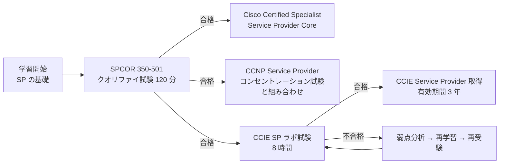

### 1.2 押さえておくべき公式情報

| 項目 | 内容 |
|---|---|
| 前提条件 | 正式な前提条件はなし。**SP 技術・ソリューションの設計、導入、運用、最適化の 5〜7 年の経験**を推奨 |
| 有効期間 | **3 年**（再認定ポリシーに従う） |
| ラボの範囲 | 設計から導入、運用、最適化まで、複雑な SP ネットワークのライフサイクル全体 |
| 自動化 | 試験内でネットワークをプログラム・自動化することが求められる |
| 持ち込み | **クローズドブック**（外部参照資料は不可）。試験機器上の公式ドキュメントのみ |

> **注意（バージョン表記）**: Cisco Japan の認定ページでは、ラボ試験のリンク名が「CCIE Service Provider v5.0」となっていますが、Cisco Learning Network の最新の出題内容は **v5.1**（Telco hybrid/multi-cloud、5G converged packet transport、SRv6、Routed Optical Network が追加された改訂版）です。本ガイドは **v5.1 のブループリント**と **SPCOR v1.1 の出題内容**に基づいています。

### 1.3 ラボ試験の出題配分

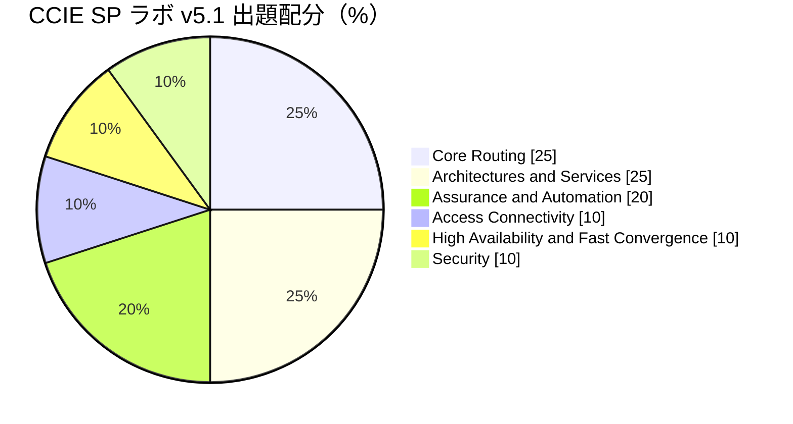

**学習の優先順位のヒント**: 配分だけを見ると Core Routing と Architectures and Services が重要ですが、Assurance and Automation（20%）は「学習していない人が最も失点しやすい」領域です。Core Routing・Services の土台の上に、自動化を**早い段階から並行して**練習してください。

---

## 2. 出題範囲マップ（SPCOR と Lab の対応）

SPCOR（筆記）の 5 ドメインと、Lab（実機）の 6 ドメインは**重なる部分が多く**、1 つの学習で両方に効きます。

### 2.1 SPCOR 350-501 v1.1 のドメイン配分

| ドメイン | 配分 | 本ガイドの対応章 |
|---|---|---|
| 1.0 アーキテクチャ | 15% | 第 5 章・第 8 章・第 10 章 |
| 2.0 ネットワーキング | 30% | 第 4 章・第 7 章 |
| 3.0 MPLS とセグメントルーティング | 20% | 第 4 章 |
| 4.0 サービス | 20% | 第 5 章 |
| 5.0 自動化およびアシュアランス | 15% | 第 9 章 |

### 2.2 Lab v5.1 と SPCOR の主な対応表

| Lab ドメイン | 主な出題項目 | SPCOR の関連トピック |
|---|---|---|
| 1.0 Core Routing | IS-IS、OSPF、BGP、Multicast、MPLS/LDP、MPLS TE、Segment Routing（SR-MPLS / SRv6） | 2.1〜2.6、3.1〜3.3 |
| 2.0 Architectures and Services | 5G 転送、RON、Unified MPLS、Carrier Ethernet、EVPN、L3VPN、CGNAT/NAT64/MAP-T、mVPN、QoS | 1.1、1.4、2.7、4.1〜4.5 |
| 3.0 Access Connectivity | cloud-native BNG、CUPS、Q-in-Q、G.8032、MST-AG/PVST-AG、MC-LAG | 4.2 |
| 4.0 High Availability / Fast Convergence | SSO/NSF、NSR、GR、BGP-PIC、BFD、LFA / rLFA / TI-LFA、TE FRR | 2.8、3.2、3.3 |
| 5.0 Security | LPTS/CoPP、LDP/BGP 認証、RPKI、AAA、uRPF、RTBH、Flowspec、MACsec、mTLS | 1.5〜1.7 |
| 6.0 Assurance and Automation | Syslog、SNMP、NetFlow/IPFIX、SR-PM、TWAMP、Y.1731、NSO、MDT、Ansible、App hosting、Secure ZTP | 5.1〜5.10 |

---

## 3. SP ネットワークの全体像と基本用語

### 3.1 SP ネットワークは何が違うのか（ステップ 1）

エンタープライズ LAN/WAN と SP ネットワークの本質的な違いは **「複数の顧客のトラフィックを、分離しながら、大規模かつ高信頼に運ぶ」** ことです。

| 観点 | エンタープライズ | サービスプロバイダー |
|---|---|---|
| 目的 | 自社の業務を支える | 顧客にサービスを**販売**する |
| 規模 | 数十〜数千ルーター | 数千〜数万ルーター、数百万ルート |
| 分離 | VLAN / VRF-Lite 程度 | **VPN（L3VPN/L2VPN/EVPN）でテナント分離** |
| 要求 | 可用性 | **SLA**（遅延・ジッタ・損失・可用性）を契約で保証 |
| 運用 | 手作業中心も可 | **自動化・テレメトリ必須**（スケール） |

### 3.2 標準的な SP アーキテクチャ（ステップ 2）

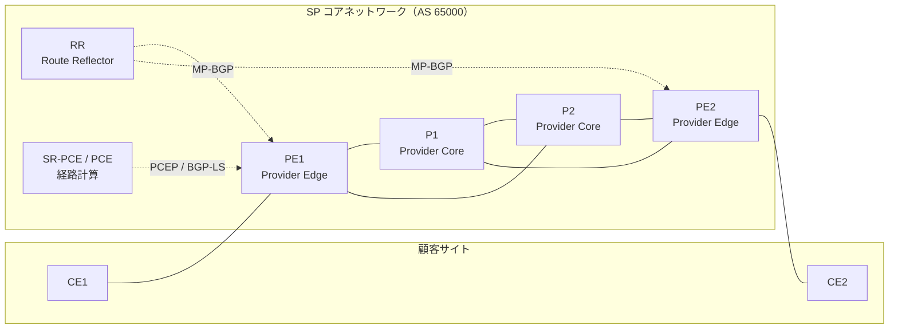

| 役割 | 名称 | 説明 |
|---|---|---|
| CE | Customer Edge | 顧客側ルーター。MPLS を理解しない |
| PE | Provider Edge | 顧客を収容し、VRF/EVPN/PW を終端。**ラベルを付与**する |
| P | Provider | コア。**ラベルのみで転送**（顧客ルートを持たない） |
| RR | Route Reflector | iBGP のフルメッシュを避ける（スケール） |
| ASBR | AS Boundary Router | 他 AS との境界（Inter-AS VPN、ピアリング） |
| PCE | Path Computation Element | 集中経路計算（SR-TE / RSVP-TE） |

### 3.3 学習の 3 つの層（ステップ 3）

SP 技術は次の 3 つの層に分けて学ぶと整理しやすくなります。

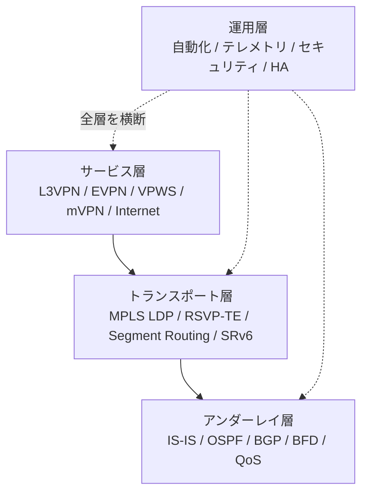

| 層 | 何を解決するか | 主な技術 |
|---|---|---|
| アンダーレイ | ループレスな到達性 | IS-IS、OSPF、BGP |
| トランスポート | どの経路で・どのラベルで運ぶか | LDP、RSVP-TE、SR、SRv6 |
| サービス | 顧客に何を提供するか | L3VPN、EVPN、VPWS、mVPN |
| 運用 | 安全に・速く・自動で | NSO、MDT、Ansible、ZTP、認証、HA |

### 3.4 OS の違い（SPCOR 1.2）

Cisco の SP 向けルーターでは 3 種類の OS が登場します。

| OS | 主な用途 | 特徴 |
|---|---|---|
| **IOS** | 従来のルーター/スイッチ | モノリシックな OS。設定は 1 ファイルで即時反映 |
| **IOS XE** | エッジ/アグリゲーション（ASR 920、Catalyst 8000 など） | Linux ベース。IOS 系コマンド + プログラマビリティ（NETCONF/RESTCONF） |
| **IOS XR** | コア/エッジ（ASR 9000、NCS 5500/540、Cisco 8000 など） | 分散マイクロカーネル系。**commit 方式**（`configure` → `commit`）、**RPL（Route Policy Language）**、モジュラー |

> **重要（試験の頻出ポイント）**: ラボでは主に **IOS XR** を操作します。IOS XR の設定は「候補設定（candidate config）→ `commit`」で反映される点、`show configuration`（未 commit 差分の確認）や `commit confirmed`（自動ロールバック付き commit）、`rollback configuration last 1` を身につけてください。

```text
RP/0/RP0/CPU0:PE1# configure
RP/0/RP0/CPU0:PE1(config)# interface Loopback0
RP/0/RP0/CPU0:PE1(config-if)# ipv4 address 10.0.0.1/32
RP/0/RP0/CPU0:PE1(config-if)# show configuration
RP/0/RP0/CPU0:PE1(config-if)# commit confirmed 60
RP/0/RP0/CPU0:PE1(config-if)# commit
```

**ベストプラクティス**

| 項目 | 推奨 |
|---|---|
| 変更管理 | 本番では `commit confirmed` を使い、疎通確認後に確定 commit（誤設定で管理断になっても自動復旧） |
| Loopback0 | ルーター ID・IGP/BGP/LDP/管理のソースを **Loopback0 に統一** |
| 命名規約 | route-policy / prefix-set / community-set に一貫した接頭辞（例: `RPL-`, `PFX-`, `CS-`） |
| バックアップ | 設定を Git 等で世代管理し、NSO や Ansible で差分検知 |

---
## 4. Core Routing（25%）

この章は SP の「土台」です。ここが不安定だと、上に載るすべてのサービスが壊れます。

### 4.1 IGP（Interior Gateway Protocol）

#### 4.1.1 IS-IS（Lab 1.1.a / SPCOR 2.1）

**なぜ SP は IS-IS を好むのか**

| 理由 | 説明 |
|---|---|
| IP に依存しない | CLNS 上で動作するため、IPv4/IPv6 を同一プロトコルで扱いやすい |
| 拡張性 | TLV 構造なので、SR・TE・Flex-Algo などの拡張を追加しやすい |
| 安定性 | LSP のフラッディングが軽量で、大規模ネットワークで実績が多い |

**基本概念（ステップ 1: 用語）**

| 用語 | 意味 |
|---|---|
| NET | Network Entity Title。`49.0001.0000.0000.0001.00` のように「エリア + システム ID + 00」 |
| Level-1 / Level-2 | L1 はエリア内、L2 はエリア間（バックボーン）。SP コアは **Level-2 only** が一般的 |
| LSP | Link State PDU（OSPF の LSA に相当） |
| DIS | LAN 上の代表ルーター。**ポイントツーポイント設定にすれば選出不要** |
| Metric style | **wide**（24 bit）を使う。narrow（6 bit）は TE/SR 不可 |
| Single / Multi topology | IPv4/IPv6 を同一トポロジで計算する（single）か、別々に計算する（multi） |

**隣接関係が確立するまで（ステップ 2）**

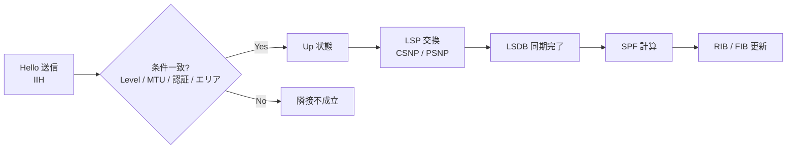

**IOS XR 設定例（IPv4/IPv6・Level-2 only・SR 対応）**

```text
router isis CORE
 is-type level-2-only
 net 49.0001.0000.0000.0001.00
 log adjacency changes
 lsp-gen-interval maximum-wait 5000 initial-wait 50 secondary-wait 200
 spf-interval maximum-wait 5000 initial-wait 50 secondary-wait 200
 address-family ipv4 unicast
  metric-style wide
  segment-routing mpls
 !
 address-family ipv6 unicast
  metric-style wide
  multi-topology
 !
 interface Loopback0
  passive
  address-family ipv4 unicast
   prefix-sid index 1
  !
 !
 interface HundredGigE0/0/0/0
  point-to-point
  hello-password keychain KC-ISIS
  bfd minimum-interval 50
  bfd multiplier 3
  bfd fast-detect ipv4
  address-family ipv4 unicast
   metric 10
   fast-reroute per-prefix
   fast-reroute per-prefix ti-lfa
  !
  address-family ipv6 unicast
   metric 10
  !
 !
!
```

**確認コマンド**

```text
show isis neighbors
show isis database
show isis route
show isis interface brief
show isis adjacency-log
```

**ベストプラクティス**

| 項目 | 推奨 | 理由 |
|---|---|---|
| Level 設計 | コアは L2 only、大規模時のみ L1/L2 階層化 | 設計の単純化。近年は「フラット L2 + 高速 SPF」が主流 |
| インターフェース | 全ポイントツーポイントリンクに `point-to-point` | DIS 選出と疑似ノードの排除 |
| Metric | 帯域ベースではなく**遅延ベースまたは手動設計**で一貫させる | TE/Flex-Algo と整合させるため |
| 認証 | Hello/LSP/SNP に keychain で認証 | 不正ルーターの参加防止 |
| Overload bit | 起動時に `set-overload-bit on-startup wait-for-bgp` | BGP 収束前にトランジットにならない（ブラックホール防止） |
| 受動 IF | Loopback とお客様向け IF は `passive` | 不要な隣接形成を防止 |
| Loopback の広告 | /32 と /128 のみを広告 | LDP ラベル数と FIB の節約 |

**試験の落とし穴**: `metric-style wide` を忘れると TE や SR が動作しない／IPv6 で `multi-topology` と single topology を混在させると計算が食い違う／keychain の時刻設定（accept-lifetime）不一致で隣接が落ちる。

#### 4.1.2 OSPFv2 / OSPFv3（Lab 1.1.b / SPCOR 2.2）

**エリアタイプ（ステップ 1）**

| エリア | 許可される LSA | 用途 |
|---|---|---|
| Backbone（Area 0） | 1, 2, 3, 4, 5 | すべてのエリアの中心 |
| Standard | 1, 2, 3, 4, 5 | 通常エリア |
| Stub | 1, 2, 3（デフォルトルート注入） | 外部ルート不要な末端 |
| Totally stubby | 1, 2（デフォルトのみ） | ルート数を最小化 |
| NSSA | 1, 2, 3, **7** | 末端に外部接続がある場合 |
| Totally NSSA | 1, 2, 7（デフォルトのみ） | NSSA + 最小ルート |

**ネイバー状態遷移（ステップ 2）**


**IOS XR 設定例（OSPFv2 + SR）**

```text
router ospf 1
 router-id 10.0.0.1
 segment-routing mpls
 segment-routing forwarding mpls
 fast-reroute per-prefix
 fast-reroute per-prefix ti-lfa enable
 area 0
  interface Loopback0
   passive enable
   prefix-sid index 1
  !
  interface HundredGigE0/0/0/0
   network point-to-point
   cost 10
   authentication message-digest keychain KC-OSPF
   bfd fast-detect
  !
 !
!
router ospfv3 1
 router-id 10.0.0.1
 area 0
  interface HundredGigE0/0/0/0
   network point-to-point
  !
 !
!
```

**ベストプラクティス**

| 項目 | 推奨 |
|---|---|
| ネットワークタイプ | P2P リンクは `point-to-point`（DR/BDR 選出を避け、収束を高速化） |
| LSA 制限 | `max-lsa` で LSDB 爆発を防止 |
| 認証 | OSPFv2 は message-digest（keychain）、OSPFv3 は IPsec AH/ESP か認証トレーラー |
| 高速化 | SPF/LSA throttle を調整し、BFD を併用 |

#### 4.1.3 IGP のスケールと性能最適化（Lab 1.1.c）

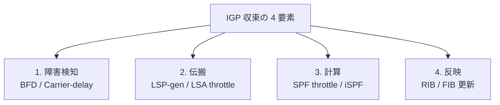

| 最適化項目 | 内容 | 注意点 |
|---|---|---|
| 指数バックオフ（exponential backoff） | 初回は即時、連続イベントで待ち時間を延ばす | 初期値を小さくしすぎると CPU 負荷が増える |
| Prefix prioritization | ループバック等の重要プレフィックスを優先処理 | 優先度は tag/prefix-list で指定 |
| Incremental SPF | 変更のあった部分木のみ再計算 | 大規模時に有効 |
| LSP/LSA 抑制 | 不要なプレフィックスを広告しない（`prefix-suppression`） | リンクネットワークは iBGP 経由で運ばない設計と合わせる |
| Micro-loop avoidance | 収束時の一時的ループを SR で回避 | SR 環境で有効化を検討 |

---

### 4.2 BGP（Border Gateway Protocol）（Lab 1.2 / SPCOR 2.3・2.4）

#### 4.2.1 BGP の基礎（ステップ 1）

| 用語 | 意味 |
|---|---|
| iBGP / eBGP | 同一 AS 内 / AS 間のピア |
| MP-BGP | Multiprotocol BGP。**アドレスファミリ**（VPNv4, VPNv6, EVPN, IPv4 LU など）を運ぶ拡張 |
| Path attribute | Well-known mandatory / Well-known discretionary / Optional transitive / Optional non-transitive の 4 分類 |
| Route Reflector | iBGP フルメッシュを不要にする。クラスタ ID と Originator ID でループ防止 |

#### 4.2.2 ベストパス選択アルゴリズム（SPCOR 2.3・最重要）

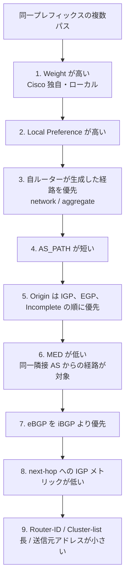

> **補足**: 厳密な順序はプラットフォームで差があります（例: IOS/IOS XE は「最古の eBGP パス優先」を評価する場合があり、IOS XR は既定で評価しません）。ラボ機器（IOS XR）で `show bgp <prefix>` を実行し、選択理由（`best-path` の判定）を確認する習慣をつけてください。

**覚え方**: 「**W**e **L**ove **O**ranges **A**s **O**ranges **M**ean **E**xtra **I**ce **R**ed」など自分用の語呂を作ると便利です（Weight → LocalPref → Originate → AS-path → Origin → MED → External → IGP metric → Router-id）。

#### 4.2.3 設定例（IOS XR）と eBGP の重要な既定動作

```text
router bgp 65000
 bgp router-id 10.0.0.1
 bgp log neighbor changes detail
 address-family ipv4 unicast
  network 10.0.0.1/32
 !
 address-family vpnv4 unicast
 !
 neighbor-group RR-CLIENT
  remote-as 65000
  update-source Loopback0
  password encrypted 0123456789
  bfd fast-detect
  address-family vpnv4 unicast
   route-reflector-client
  !
 !
 neighbor 10.0.0.11
  use neighbor-group RR-CLIENT
 !
 neighbor 192.0.2.2
  remote-as 65100
  ebgp-multihop 1
  address-family ipv4 unicast
   route-policy PEER-IN in
   route-policy PEER-OUT out
   maximum-prefix 1000 80
  !
 !
!
```

> **必須知識（IOS XR の eBGP）**: IOS XR は **eBGP ネイバーにルートポリシー（in/out）が適用されていない場合、経路を受信・広告しません**（`show bgp neighbors` で "no policy" 等を確認）。IOS/IOS XE と異なる最大の落とし穴です。最小限の `route-policy PASS pass end-policy` を必ず用意してください。

**RPL（Route Policy Language）の例**

```text
prefix-set PFX-BOGON
  10.0.0.0/8 le 32,
  172.16.0.0/12 le 32,
  192.168.0.0/16 le 32
end-set
!
community-set CS-BLACKHOLE
  65535:666
end-set
!
route-policy PEER-IN
  if destination in PFX-BOGON then
    drop
  endif
  set local-preference 100
  set community (65000:100) additive
  pass
end-policy
!
route-policy PASS
  pass
end-policy
```

#### 4.2.4 BGP の主要属性と使いどころ（Lab 1.2.c）

| 属性 | 影響方向 | 典型的な用途 |
|---|---|---|
| Local Preference | AS 内（インバウンド制御） | 顧客 > ピア > トランジットの優先度付け |
| AS-PATH prepend | AS 外（アウトバウンド制御の間接的な手段） | 経路の「見た目」を長くして優先度を下げる |
| MED | 隣接 AS への推奨 | 複数リンクのうち入口を指定 |
| Community | 任意のタグ | ポリシーの簡素化、RTBH、地域タグ |
| Large Community | 4 byte AS 対応の 3 要素 community | 4 byte ASN 環境の推奨 |
| Extended Community | RT / SoO / Color など | VPN・SR-TE の Color ステアリング |
| Weight | ルーターローカル | 単一ルーター内での優先 |

#### 4.2.5 BGP のスケールと性能（Lab 1.2.d / SPCOR 2.4.g・2.4.h）

| 手法 | 内容 | 使いどころ |
|---|---|---|
| Route Reflector | iBGP セッション数を N(N-1)/2 から削減 | すべての SP コア。**RR は冗長化（2 台以上、同一クラスタ ID）** |
| Peer group / Neighbor group | 設定を共通化し、アップデート生成を効率化 | 大量ネイバー |
| Add-Path | 同一プレフィックスの**複数パス**を広告 | PIC、ECMP、ハイド経路問題の解消 |
| BGP PIC（Prefix Independent Convergence） | バックアップパスを FIB に事前インストールし、プレフィックス数に依存せず高速切替 | 大規模 VPN、インターネットテーブル |
| Update group | 同じポリシーのネイバーへ生成を共有 | 自動（ポリシー統一で効果最大化） |
| Route dampening / Max-prefix | 不安定・過大なルートを制限 | ピアリング境界 |
| RT Constraint（RFC 4684） | 必要な VPN ルートのみを PE に送る | VPNv4 経路数削減 |

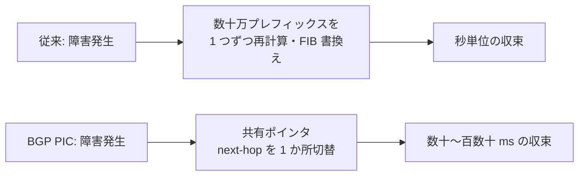

**BGP PIC の考え方**: FIB 内でプレフィックスが「共有される next-hop（Path list）」を指しているため、next-hop 障害時は**そこだけを書き換える**だけで全プレフィックスが切り替わります。バックアップパスを持つには Add-Path または best-external が必要です。

#### 4.2.6 BGP Labeled Unicast と BGP Link-State（Lab 1.2.e）

| 技術 | 内容 | 用途 |
|---|---|---|
| **BGP-LU**（ipv4/ipv6 labeled-unicast, RFC 8277） | BGP でプレフィックスとラベルを一緒に配布 | **Unified MPLS**（複数ドメイン間で PE ループバックを到達可能にする） |
| **BGP-LS**（link-state） | IGP のトポロジ情報（リンク・ノード・SID）を BGP で収集 | **SR-PCE** が全ドメインのトポロジを把握する |

```text
router bgp 65000
 address-family ipv4 unicast
  allocate-label all
 !
 neighbor 10.0.0.100
  remote-as 65000
  address-family ipv4 labeled-unicast
   route-reflector-client
   next-hop-self
  !
 !
!
router isis CORE
 distribute link-state instance-id 32
!
router bgp 65000
 address-family link-state link-state
 !
 neighbor 10.0.1.100
  remote-as 65000
  address-family link-state link-state
```

#### 4.2.7 ベストプラクティス（BGP 全般）

| 領域 | 推奨 |
|---|---|
| セッション設計 | iBGP は Loopback 間、eBGP は原則直結 IF。`update-source Loopback0` |
| RR 設計 | 冗長 RR は **異なる物理拠点**、クライアントから見て対称に配置。階層化する場合は RR 間も iBGP |
| ポリシー | インバウンド/アウトバウンドの**両方向で明示的にフィルタ**（RFC 7454） |
| 受信制限 | `maximum-prefix`（警告閾値付き）を全ピアに設定 |
| 認証・保護 | TCP-AO または MD5、GTSM（`ttl-security`）を併用（第 8 章） |
| 経路属性 | Community で設計意図を表現（受信元タグ、地域、用途）。ドキュメント化 |
| 高速収束 | BFD、PIC、Add-Path、`nexthop trigger-delay` の最適化 |
| 運用 | `soft-reconfiguration` より **Route Refresh** を利用 |

**確認コマンド**

```text
show bgp summary
show bgp ipv4 unicast 10.0.0.1/32
show bgp vpnv4 unicast summary
show bgp neighbors 10.0.0.11 detail
show bgp update-group
show route bgp
```

---
### 4.3 Multicast（Lab 1.3 / SPCOR 4.4）

#### 4.3.1 なぜ SP でマルチキャストか

IPTV、市場データ配信、ソフトウェア配布など「1 対多」の配信で、送信元が受信者数だけ複製して送るユニキャストに比べ、**ネットワーク内で必要な分岐点でのみ複製**するため帯域を大幅に節約できます。

| 用語 | 意味 |
|---|---|
| (S,G) | 送信元 S とグループ G の組（最短経路ツリー: SPT） |
| (*,G) | 任意の送信元とグループ G（共有ツリー: RPT。RP を根とする） |
| RP | Rendezvous Point。共有ツリーの根 |
| IGMP / MLD | ホストとルーター間のグループ参加プロトコル（IPv4 / IPv6） |

#### 4.3.2 PIM のモード比較

| モード | 特徴 | 使いどころ |
|---|---|---|
| **PIM-SM**（Sparse Mode） | RP を経由して受信者主導でツリー構築、その後 SPT に切替 | 汎用（ASM: Any-Source Multicast） |
| **PIM-SSM**（Source-Specific） | (S,G) のみ。RP 不要。IGMPv3 / MLDv2 が前提 | **推奨**。設計が単純で安全 |
| **BIDIR-PIM** | 双方向の共有ツリー。(S,G) 状態を持たない | 多数の送信元・受信者（多対多）でステート削減 |

#### 4.3.3 RP の設計（Lab 1.3.b）

| 方式 | 内容 | 注意点 |
|---|---|---|
| Static RP | 全ルーターに固定設定 | 単純だが冗長性・変更管理に難 |
| Auto-RP | Cisco 独自。Announce / Discovery で配布 | Dense モードでの配布が必要（sparse-dense） |
| BSR | 標準（RFC 5059）。候補 RP を選出 | IPv4/IPv6 で利用可 |
| Anycast RP | 同一アドレスを複数 RP に設定。最寄りへ到達 | **MSDP**（または PIM Anycast-RP, RFC 4610）で RP 間の送信元情報を共有 |
| MSDP | RP 間で SA（Source Active）メッセージを交換 | ドメイン間・Anycast RP |

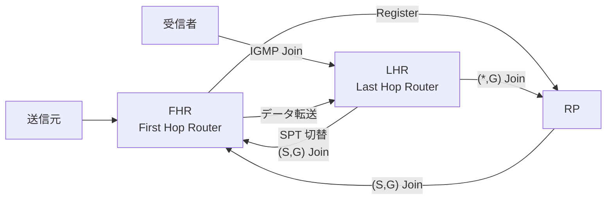

#### 4.3.4 mLDP と Tree-SID（Lab 1.3.d・1.3.e）

| 技術 | 内容 |
|---|---|
| **mLDP**（Multicast LDP） | LDP を拡張し、P2MP / MP2MP の LSP（マルチキャスト用ラベル配布ツリー）を構築。コアで PIM を不要にする |
| **Tree-SID** | SR の中央集権的な P2MP ツリー。SR-PCE が計算し、SR Policy として各ノードに設定する |

**IOS XR 設定例（PIM-SSM + IGMPv3）**

```text
multicast-routing
 address-family ipv4
  interface all enable
 !
!
router pim
 address-family ipv4
  ssm range SSM-RANGE
 !
!
router igmp
 interface TenGigE0/0/0/1
  version 3
 !
!
```

**ベストプラクティス**

| 項目 | 推奨 |
|---|---|
| モード選択 | 新規は可能な限り **SSM**（RP 不要）。ASM が必要なら Anycast RP + MSDP |
| RP 冗長 | Anycast RP で RP を分散。RP 用ループバックは IGP に広告 |
| RPF | ユニキャストルーティングと RPF が一致するよう設計（MPLS 環境では特に注意） |
| 保護 | `multicast-routing` で受信可能グループを ACL 制限、IGMP/MLD ステート数を上限設定 |

**確認コマンド**: `show pim neighbor` / `show pim topology` / `show mrib route` / `show mfib route`

---

### 4.4 MPLS と LDP（Lab 1.4 / SPCOR 3.1）

#### 4.4.1 MPLS の基本（ステップ 1）

MPLS は IP ヘッダを見る代わりに、**ラベル（20 bit）** だけを見て転送する仕組みです。ラベルは Layer 2 と Layer 3 の間に挿入されます（「シムヘッダ」: 32 bit = Label 20 + TC 3 + S 1 + TTL 8）。

| 用語 | 意味 |
|---|---|
| LSR | Label Switching Router（P ルーター） |
| LER | Label Edge Router（PE ルーター） |
| LSP | Label Switched Path（ラベル転送経路） |
| Push / Swap / Pop | ラベルの付与 / 入替 / 除去 |
| PHP | Penultimate Hop Popping。最後から 2 番目のホップでラベルを外す |
| FEC | Forwarding Equivalence Class（同じ扱いで転送されるパケット群） |
| Implicit-null（3） | PHP を要求する予約ラベル |

#### 4.4.2 L3VPN パケットが通る流れ（ステップ 2）

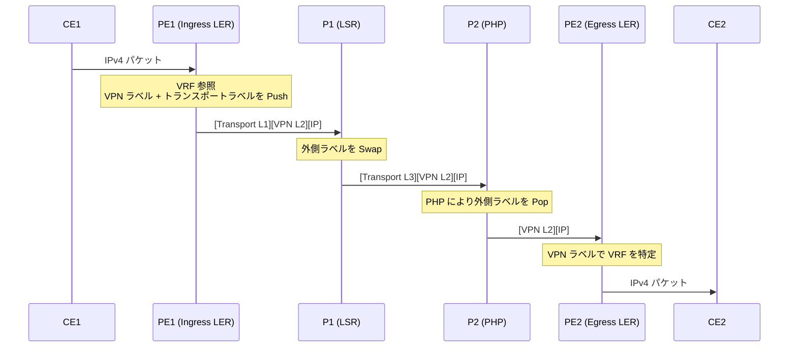

**2 段ラベルの意味**: 外側（Transport ラベル）は「出口 PE まで運ぶ」ため、内側（VPN ラベル）は「どの VRF に渡すか」を示します。P ルーターは顧客ルートを一切持ちません。

#### 4.4.3 LDP（Label Distribution Protocol）（Lab 1.4.b / SPCOR 3.1.a〜c）

**LDP が確立するまで（ステップ 3）**

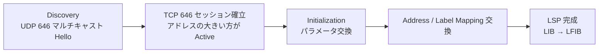

| 機能 | 内容 | ベストプラクティス |
|---|---|---|
| **LDP-IGP 同期**（sync） | LDP セッション確立までは IGP メトリックを最大にして、そのリンクを使わない | リンク復旧時のブラックホール防止。**必ず有効化** |
| **Session protection** | ダイレクトリンク障害時も Targeted Hello でセッションを維持 | リンクフラップ時の再確立を回避 |
| Label allocation filtering | /32 ホストルートにのみラベルを割当 | ラベル数と FIB を節約（**IOS XE**: `mpls ldp label allocate global host-routes`） |
| LDP 認証 | MD5 / keychain | 不正セッションの防止（第 8 章） |
| 明示的 Router-ID | Loopback0 を指定 | セッション ID の安定化 |
| Targeted LDP | 非直結ピアとのセッション（PW、rLFA で使用） | 受信側は `discovery targeted-hello accept` |

**IOS XR 設定例**

```text
mpls ldp
 router-id 10.0.0.1
 session protection
 address-family ipv4
  discovery targeted-hello accept
 !
 interface HundredGigE0/0/0/0
 !
!
router isis CORE
 interface HundredGigE0/0/0/0
  address-family ipv4 unicast
   mpls ldp sync
  !
 !
!
```

**確認コマンド**

```text
show mpls ldp neighbor
show mpls ldp bindings
show mpls forwarding
show mpls ldp igp sync
```

#### 4.4.4 MPLS OAM（SPCOR 3.1.e）

| ツール | 役割 |
|---|---|
| `ping mpls ipv4 10.0.0.9/32` | LSP の**データプレーン疎通**を確認（MPLS Echo Request/Reply） |
| `traceroute mpls ipv4 10.0.0.9/32` | LSP の各ホップとラベルを確認 |
| BFD over LSP | LSP の高速障害検出 |

> **ping と mpls ping の違い**: 通常の ping が成功しても LSP が壊れている場合があります。ラベル破損の切り分けには `ping mpls` を使ってください。

---

### 4.5 MPLS Traffic Engineering（Lab 1.5 / SPCOR 3.2）

#### 4.5.1 概要

IGP は「最短経路」しか使いません。TE は **帯域・遅延・リンク属性などの制約付きで、最短でない経路を明示的に使う**技術です。RSVP-TE が従来の方式で、現在は Segment Routing（SR-TE）が主流になりつつあります。

| 項目 | RSVP-TE | SR-TE |
|---|---|---|
| 状態の所在 | **全経路ノード**に状態（Path/Resv） | **ヘッドエンドのみ**（ラベルスタック） |
| シグナリング | RSVP（PATH / RESV） | 不要（IGP/BGP-LS で SID を配布） |
| スケール | ノード数・トンネル数で状態が増加 | 高い |
| 帯域予約 | 可能（ホップごと） | 予約なし（QoS・PCE で制御） |

#### 4.5.2 RSVP-TE のシグナリング

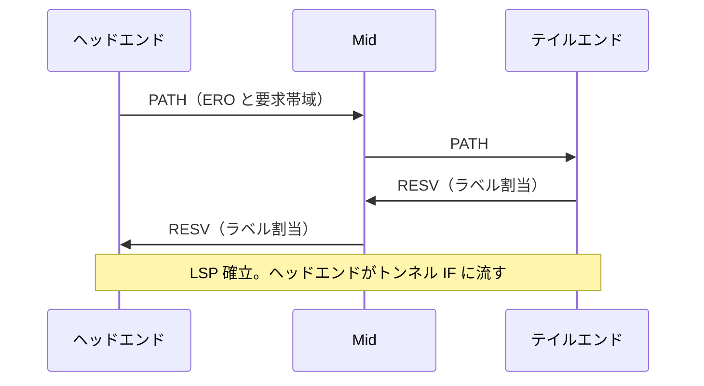

**構成要素**: IGP の TE 拡張（IS-IS / OSPF でリンク帯域・アドミニストレーティブグループ・TE メトリックを広告）、CSPF（制約付き最短経路計算）、RSVP（シグナリング）。

#### 4.5.3 IOS XR 設定例

```text
mpls traffic-eng
 interface HundredGigE0/0/0/0
  admin-weight 10
  attribute-names RED
 !
!
rsvp
 interface HundredGigE0/0/0/0
  bandwidth 100000
 !
!
explicit-path name VIA-P2
 index 1 next-address strict ipv4 unicast 10.0.0.12
!
interface tunnel-te1
 ipv4 unnumbered Loopback0
 destination 10.0.0.9
 signalled-bandwidth 1000
 path-option 10 explicit name VIA-P2
 path-option 20 dynamic
 fast-reroute
 autoroute announce
!
```

| コマンド | 意味 |
|---|---|
| `path-option 10 explicit` → `20 dynamic` | 明示経路が使えなければ動的（CSPF）にフォールバック |
| `autoroute announce` | トンネルを IGP の next-hop として利用 |
| `fast-reroute` | 障害時に高速切替（FRR）を要求 |

#### 4.5.4 TE のスケールと最適化（Lab 1.5.e）

| 手法 | 内容 |
|---|---|
| Auto-tunnel / Auto-bandwidth | バックアップトンネルや帯域を自動調整 |
| Make-before-break | 再最適化時に先に新 LSP を確立してから切替え（パケット損失なし） |
| Path protection / Diverse path | ノード・SRLG 分離の冗長経路 |
| PCE 委任 | 経路計算を PCE に任せ、ヘッドエンドの負荷を削減 |

**ベストプラクティス**: 新規設計では **SR-TE を優先**し、RSVP-TE は既存資産・帯域予約が必須の要件に限定する／FRR の保護対象（リンク/ノード）を設計で明示する／TE 用の管理 Affinity 名を運用ドキュメントで固定する。

---

### 4.6 Segment Routing（SR）（Lab 1.6 / SPCOR 3.3）

**SR は SP ネットワークの現在の主軸**です。試験でも最重要です。

#### 4.6.1 SR の基本概念（ステップ 1）

SR は **経路を「セグメント（SID）のリスト」としてパケットの先頭で指定**します（ソースルーティング）。中間ノードは経路ごとの状態を持ちません。

| 用語 | 意味 |
|---|---|
| SID | Segment Identifier（セグメントの識別子） |
| Prefix-SID | プレフィックス（通常はノードの Loopback）に対するグローバル SID。ECMP を含む最短経路で運ぶ |
| Node-SID | ノードを表す Prefix-SID |
| Adjacency-SID | 特定の隣接リンクを表すローカル SID（明示的なリンク指定に使う） |
| SRGB | Segment Routing Global Block。Prefix-SID 用のラベル範囲（既定 16000〜23999） |
| SRLB | Segment Routing Local Block。ローカル SID 用範囲 |
| Index | SRGB 内のオフセット。**ラベル = SRGB 基点 + Index** |
| MSD | Maximum SID Depth。ハードウェアが扱えるラベル数の上限 |

**Prefix-SID の計算例**: SRGB が 16000〜23999、ノードの Index が 5 なら、ラベルは `16000 + 5 = 16005`。全ノードで SRGB を**同一にしておく**と、全ノードで同じラベルが使えます（運用が容易）。

#### 4.6.2 SR の制御プレーン（Lab 1.6.a・1.6.b・1.6.c）

| プロトコル | SR 拡張 |
|---|---|
| IS-IS | SID / SRGB を TLV で広告（IPv4/IPv6 対応） |
| OSPFv2 / OSPFv3 | Extended Prefix / Link LSA で広告 |
| BGP | BGP Prefix-SID（大規模データセンター系）、SR Policy AF（`ipv4 sr-policy`）、BGP-LS |

#### 4.6.3 LDP と SR の共存（Lab 1.6.f）

移行期は LDP と SR が混在します。**SR Mapping Server** が、SR 非対応ノードのプレフィックスに対して SID を代理広告します。

| 局面 | 動作 |
|---|---|
| SR ノード → LDP のみのノード | SR-to-LDP でラベルを変換（Mapping Server が Prefix-SID を提供） |
| LDP ノード → SR ノード | LDP-to-SR で変換 |
| 優先順位 | `sr-prefer` 設定で SR を優先 |

**移行のベストプラクティス**: ①全ノードで SR を有効化（データプレーンは LDP のまま）→ ②SR 優先へ切替え → ③LDP を段階的に撤去。各段階で `show mpls forwarding` と `traceroute mpls` で確認します。

#### 4.6.4 SR-TE（SR Policy）（Lab 1.6.e）

SR Policy は次の 3 要素で識別されます。

| 要素 | 説明 |
|---|---|
| **Headend** | ポリシーを持つノード |
| **Color** | 意図（例: 100 = 低遅延、200 = 高帯域）を表す数値 |
| **Endpoint** | 宛先ノードの IP |

Policy は 1 つ以上の **Candidate Path**（優先度付き）を持ち、最優先の有効なパスが **Active Path** になります。パスは Segment List（明示）または dynamic（制約から自動計算）で指定します。

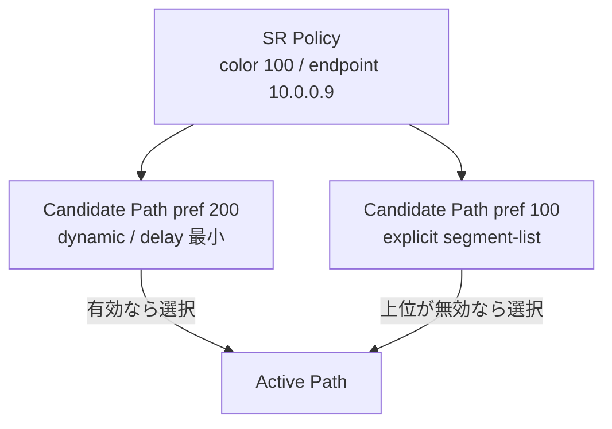

**IOS XR 設定例**

```text
segment-routing
 global-block 16000 23999
 traffic-eng
  segment-list SL-VIA-P2
   index 10 mpls label 16012
   index 20 mpls label 16009
  !
  policy POL-BLUE
   color 100 end-point ipv4 10.0.0.9
   candidate-paths
    preference 200
     dynamic
      metric
       type te
      !
     !
    !
    preference 100
     explicit segment-list SL-VIA-P2
    !
   !
  !
  on-demand color 100
   dynamic
    metric
     type igp
    !
   !
  !
 !
!
```

**自動ステアリング（Automated Steering）の仕組み**: BGP で受信した VPN 経路に付いている **Color extended community**（例: color 100）と、その経路の next-hop（= Endpoint）に一致する SR Policy があれば、そのポリシーへ自動的にトラフィックを流します。**ODN（On-Demand Next-hop）** は、Color 付き経路を受信したとき、該当ポリシーが無ければテンプレートから自動生成します。

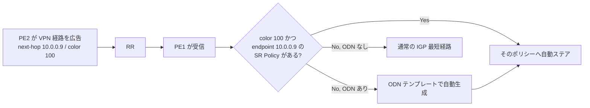

```text
extcommunity-set opaque COLOR-100
  100
end-set
!
route-policy SET-COLOR-100
  set extcommunity color COLOR-100
end-policy
!
router bgp 65000
 neighbor 10.0.0.100
  address-family vpnv4 unicast
   route-policy SET-COLOR-100 out
```

#### 4.6.5 PCE と PCEP（Lab 1.6.g / SPCOR 3.3.e）

| 用語 | 意味 |
|---|---|
| PCE | Path Computation Element。経路を計算するサーバー（SR-PCE） |
| PCC | Path Computation Client。ルーター（ヘッドエンド） |
| PCEP | PCE と PCC の間のプロトコル（TCP 4189） |
| Stateful PCE | LSP/Policy の状態を保持する PCE |
| Delegation | PCC が Policy の管理を PCE に委譲 |
| BGP-LS | PCE が全ドメインのトポロジを学習する手段 |

**役割の使い分け**: 単一 IGP ドメイン内はヘッドエンドの計算（CSPF 相当）で足りますが、**複数ドメイン（マルチエリア・マルチ AS）を跨ぐ経路**や、**Disjoint（分離）パス**は PCE が必要です（Lab 2.3.b）。

#### 4.6.6 Flexible Algorithm（Flex-Algo）（Lab 1.6.h）

IGP の SPF を**アルゴリズム番号（128〜255）ごとに別の制約**で走らせる技術です。SR-TE ポリシーを設定せずに、IGP だけで「低遅延トポロジ」「特定リンク除外トポロジ」を作れます。

| 定義項目 | 内容 |
|---|---|
| Metric type | IGP メトリック / TE メトリック / Delay |
| Affinity | 含める/除外するリンク属性（include-any / exclude-any / include-all） |
| SRLG 除外 | 共通障害リンクを除外 |
| Prefix-SID | アルゴリズムごとに別の Prefix-SID を割当 |

```text
router isis CORE
 flex-algo 128
  metric-type delay
  advertise-definition
 !
 interface Loopback0
  address-family ipv4 unicast
   prefix-sid algorithm 128 index 1128
  !
 !
!
```

> **前提**: `metric-type delay` を使うには、リンク遅延を測定・広告する（SR Performance Measurement、第 9 章）設定が必要です。

**活用例**: Flex-Algo 128 = 低遅延、129 = 地上系のみ（衛星・特定回線除外）。トランスポートスライシング（Lab 2.1.e）の基盤にもなります。

#### 4.6.7 SRv6（Lab 1.6.i〜l / SPCOR 3.3.g）

**SRv6 は IPv6 データプレーンで SR を実現**します。MPLS ラベルの代わりに **128 bit の IPv6 アドレス形式の SID** を使います。

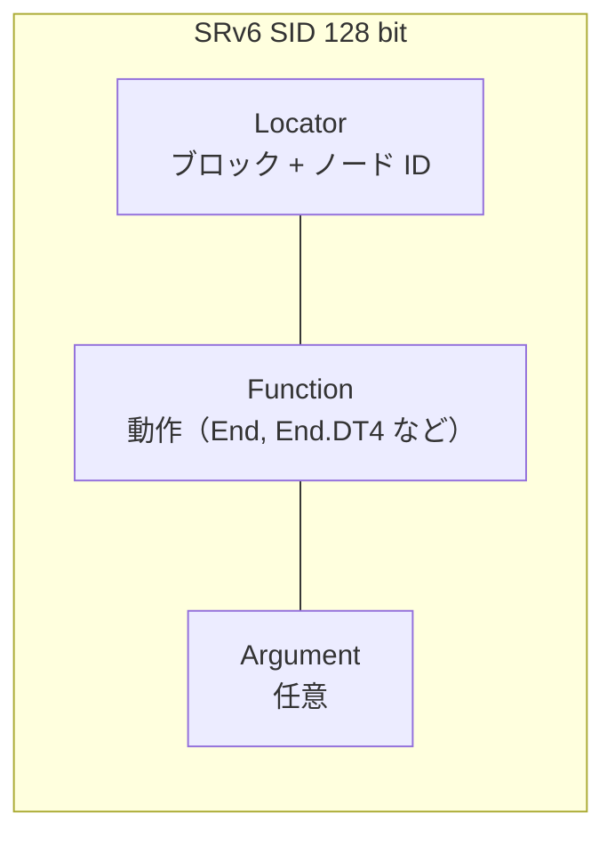

| 用語 | 意味 |
|---|---|
| **Locator** | SID の上位部分。ノードへ到達するための IPv6 プレフィックス（IGP で広告） |
| **Function** | ノードで実行する動作（End: 通常のセグメント終端 / End.X: 隣接指定 / End.DT4・End.DT6・End.DT46: VRF 参照など） |
| **SRH** | Segment Routing Header。SID のリストを保持する IPv6 拡張ヘッダ |
| **H.Encaps.Red** | 送信元での IPv6 カプセル化（SRH の最初の SID を宛先アドレスに置く） |
| **uSID（micro-segment）** | 16 bit の短い SID を 1 つの IPv6 アドレスに複数詰め込む（F3216: 32 bit ブロック + 16 bit uSID × 6） |
| **Interworking gateway** | SRv6 ドメインと SR-MPLS ドメインの相互接続点 |

**uSID の利点**: 通常の SRv6 は SID が 128 bit で SRH が大きくなりますが、uSID は**多数のセグメントを 1 つのアドレスに圧縮**するため、SRH をほぼ不要にし、オーバーヘッドを大幅に削減します。

**IOS XR 設定例（uSID）**

```text
segment-routing
 srv6
  encapsulation
   source-address fcbb:bb00:1::1
  !
  locators
   locator MAIN
    micro-segment behavior unode psp-usd
    prefix fcbb:bb00:1::/48
   !
  !
 !
!
router isis CORE
 address-family ipv6 unicast
  segment-routing srv6
   locator MAIN
   !
  !
 !
!
router bgp 65000
 segment-routing srv6
  locator MAIN
 !
 address-family vpnv4 unicast
  vrf all
   segment-routing srv6
    alloc mode per-vrf
   !
  !
 !
!
```

**ベストプラクティス（SR / SRv6 共通）**

| 項目 | 推奨 |
|---|---|
| SRGB | 全ノードで同一値。複数ベンダー混在時は共通レンジに合わせる |
| SID Index 設計 | ノード種別・地域で Index 帯を割当て、ドキュメント化 |
| MSD | ハードウェアの MSD 内に収まるよう Segment List を設計。超える場合は Binding SID で階層化 |
| ドメイン間 | 単一 SR-PCE に依存せず、PCE を冗長化（state-sync） |
| SRv6 | ロケータ設計（ブロック/ノード長）と、IGP でのサマリ（ロケータのみ広告）を事前に固定 |
| 移行 | 既存 LDP 環境ではまず SR-MPLS 化、その後に SRv6 を検討（段階的） |

**確認コマンド**

```text
show segment-routing mpls state
show isis segment-routing label table
show segment-routing traffic-eng policy
show segment-routing srv6 locator
show segment-routing srv6 sid
show pce ipv4 peer
```

---
## 5. Architectures and Services（25%）

### 5.1 モバイルインフラのアーキテクチャ（Lab 2.1 / SPCOR 1.1.c）

#### 5.1.1 5G の RAN と xHaul（ステップ 1）

5G の基地局は機能が分割され、その間をつなぐ SP の IP/MPLS ネットワークが **xHaul**（Fronthaul / Midhaul / Backhaul の総称）です。

| 区間 | 接続 | 特徴 |
|---|---|---|
| **Fronthaul** | RU（Radio Unit）↔ DU（Distributed Unit） | 超低遅延・厳密な同期が必要。eCPRI 等（O-RAN ではスプリット 7.2x が代表的） |
| **Midhaul** | DU ↔ CU（Centralized Unit） | F1 インターフェース。遅延要件は Fronthaul より緩い |
| **Backhaul** | CU ↔ 5G コア（UPF / AMF） | N2 / N3。大容量 |

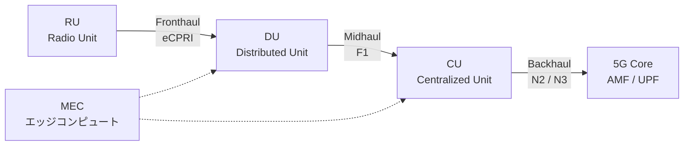

#### 5.1.2 5G Converged Packet Transport（Lab 2.1.b）

Fixed（家庭・企業）と Mobile のトラフィックを**1 つの共通 IP/SR トランスポート**に収容する設計です。Cisco は **Converged SDN Transport（CST）** の設計ガイドを公開しています（第 13 章）。

| 設計要素 | 内容 |
|---|---|
| アンダーレイ | IS-IS + SR-MPLS（または SRv6） |
| サービス | EVPN（L2）、L3VPN、EVPN-VPWS |
| SLA | SR-TE / Flex-Algo で低遅延パス、QoS で優先制御 |
| 自動化 | NSO / Crosswork によるサービス統合 |
| 同期 | PTP / SyncE を全 xHaul ノードに配信 |

#### 5.1.3 クロッキングと同期（Lab 2.1.c）

5G TDD では基地局間の**位相同期**が数 µs（マイクロ秒）以内に収まる必要があります。

| 種類 | 内容 |
|---|---|
| **SyncE** | 物理層で周波数を同期（ITU-T G.8261 / G.8262） |
| **PTP（IEEE 1588v2）** | パケットで時刻/位相を同期 |
| **G.8275.1（Full Timing Support）** | すべての中継ノードが PTP に対応（Boundary Clock）。位相同期の高精度要件向け |
| **G.8275.2（Partial Timing Support）** | 一部ノードのみ PTP 対応。IP 経由での配信を許容 |
| Clock 種別 | T-GM（Grandmaster）、T-BC（Boundary Clock）、T-TSC（Slave Clock）、T-TC（Transparent Clock） |

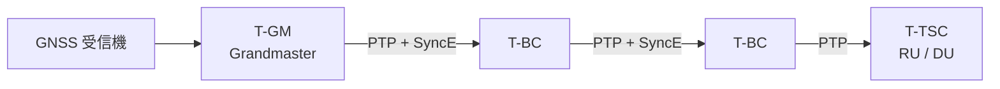

**ベストプラクティス**: ホップごとに Boundary Clock を置いて誤差蓄積を防ぐ／PTP と SyncE を併用（ホールドオーバー対策）／PTP トラフィックは最上位 QoS クラスで保護し、経路非対称（片道遅延差）を作らない／GNSS 障害に備えて Grandmaster を冗長化。

#### 5.1.4 MEC・スライシング・Telco ハイブリッド/マルチクラウド（Lab 2.1.d〜f）

| テーマ | 設計のポイント |
|---|---|
| **MEC**（Multi-access Edge Computing） | 低遅延アプリを基地局近傍に配置。PE から近い計算リソースへ最短経路を提供 |
| **Transport Network Slicing** | 用途別に論理ネットワークを分離。**Flex-Algo + SR-TE + VPN + QoS**（必要なら FlexE 等の物理分離）の組合せ |
| **Telco Hybrid / Multi-cloud** | 5G コア（CNF）をプライベート Telco クラウドとパブリッククラウドに分散配置。クラウド間を **BGP/EVPN/SR** で接続し、ポリシーを統一 |

**スライスの実現階層**

| 層 | 分離手段 |
|---|---|
| サービス | VRF / EVPN インスタンス（スライスごと） |
| 経路 | Flex-Algo（アルゴリズム番号ごと）/ SR Policy（Color ごと） |
| 帯域 | QoS（クラス別保証帯域）、必要に応じて物理分離 |
| 運用 | スライス別テレメトリ・SLA 監視（TWAMP、SR-PM） |

---

### 5.2 光アーキテクチャ: Routed Optical Networking（Lab 2.2 / SPCOR 1.1.d）

**RON** は、従来は光伝送装置（トランスポンダ）で行っていた WDM 送信を、**ルーターに直接差した Coherent 光モジュール（QSFP-DD の 400G ZR / ZR+ など）** で行い、IP レイヤと光レイヤを統合する設計です。

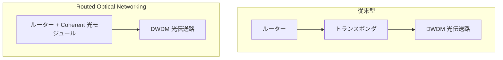

| 観点 | 従来型 | RON |
|---|---|---|
| 装置数 | ルーター + トランスポンダ | ルーターのみ |
| 消費電力・スペース | 大 | 小 |
| 運用 | IP と光で別チーム/ツール | 統合オーケストレーション（可視化・自動化） |
| 障害対応 | 光層と IP 層で重複保護になりがち | IP 層と光層の連携（クロスレイヤー可視化） |

**ベストプラクティス**: 光パスの物理的な分離（共通ファイバー・SRLG）を IP 側の TE/Flex-Algo で表現する／光パラメータ（OSNR、Pre-FEC BER）をテレメトリで収集する／IP と光のコントローラを連携させ、パス変更時の影響範囲を事前に把握する。

---

### 5.3 大規模 MPLS アーキテクチャ（Lab 2.3 / SPCOR 1.1.a）

#### 5.3.1 Unified MPLS（Seamless MPLS）

数万ノード規模では、単一 IGP に全ノードを入れると LSDB が肥大化します。**アクセス / アグリゲーション / コアを別 IGP ドメインに分け、BGP-LU で PE ループバックのみをドメイン間で伝搬**し、エンドツーエンドで 1 つの LSP を実現します。

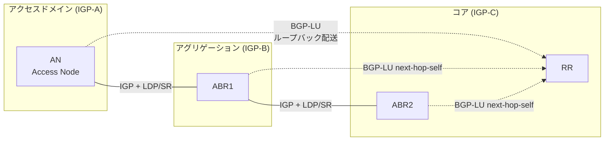

| 設計ポイント | 内容 |
|---|---|
| ドメイン分割 | 各 IGP は数千ノード以下に抑える |
| BGP-LU | ABR で `next-hop-self` して LSP をスティッチ |
| ループバック | サマライズせず /32 を BGP-LU で配布（PE ごとに個別の LSP が必要なため） |
| ABR の負荷 | ラベルスワップ数・ラベル空間に注意 |

#### 5.3.2 Multi-domain SR と SR-PCE（Lab 2.3.b）

SR では、各ドメインの IGP から **BGP-LS** でトポロジを SR-PCE に集め、**ドメインを跨ぐ SR Policy** を PCE が計算します。ヘッドエンドはセグメントリストを受け取るだけです。

| 方式 | 特徴 |
|---|---|
| BGP-LU + SR（Unified MPLS 的） | ドメイン間で BGP-LU、ドメイン内で SR |
| SR-PCE による End-to-End SR | 全ドメインで SR を有効にし、PCE が Binding SID などで接続 |

#### 5.3.3 SLA 設計（Lab 2.3.c）

| SLA 要件 | 実現手段 |
|---|---|
| 低遅延 | 遅延メトリックを使った Flex-Algo / SR-TE（`metric type delay`） |
| 高可用性（分離） | **Disjoint Path**（リンク / ノード / SRLG 分離）を PCE で計算 |
| 帯域保証 | QoS（分類・スケジューリング）+ 容量設計 |

---

### 5.4 Carrier Ethernet（Lab 2.4 / SPCOR 4.2）

#### 5.4.1 イーサネットサービスの種類（MEF）

| サービス | 別名 | トポロジ | 用途 |
|---|---|---|---|
| **E-Line** | EPL / EVPL | ポイントツーポイント | 拠点間の専用線代替 |
| **E-LAN** | EP-LAN / EVP-LAN | マルチポイント | 拠点間 L2 接続 |
| **E-Tree** | EP-Tree / EVP-Tree | ルート・リーフ | ハブ拠点 ↔ 支店（リーフ間は直接通信不可） |
| **E-Access** | Access EPL など | オペレーター間 | 他事業者への接続提供 |

#### 5.4.2 L2VPN の実現技術

| 技術 | 内容 | 世代 |
|---|---|---|
| **VPWS** | 疑似回線（Pseudowire）による P2P（LDP/BGP シグナリング） | 従来 |
| **VPLS** | Pseudowire のフルメッシュによる L2 マルチポイント | 従来 |
| **H-VPLS** | ハブ&スポーク階層化で PW 数を削減 | 従来 |
| **EVPN** | BGP で MAC/IP 情報を配布。マルチホーミング（Active-Active）に対応 | 現行 |

VPLS の課題は**ループ防止・MAC 学習（データプレーン学習）・マルチホーミングの限界**です。EVPN はこれを **コントロールプレーン学習**で解決します。

#### 5.4.3 EVPN の仕組み（Lab 2.4.c）

**EVPN のルートタイプ（ステップ 1）**

| Type | 名称 | 役割 |
|---|---|---|
| 1 | Ethernet Auto-Discovery | マルチホーミングの Aliasing / Mass Withdraw / Split-horizon ラベル |
| 2 | MAC/IP Advertisement | MAC アドレス（と IP）を配布 |
| 3 | Inclusive Multicast Ethernet Tag | BUM トラフィックの複製リスト |
| 4 | Ethernet Segment | ES の発見と **DF（Designated Forwarder）選出** |
| 5 | IP Prefix | L3 プレフィックス配布（IRB / Inter-subnet Routing） |

**マルチホーミング（Active-Active）**

```mermaid
flowchart TB
    CE["CE<br/>Bundle-Ether (LAG)"]
    PE1["PE1<br/>ESI 同一"]
    PE2["PE2<br/>ESI 同一"]
    CORE["MPLS / SR コア<br/>EVPN"]
    CE --- PE1
    CE --- PE2
    PE1 --- CORE
    PE2 --- CORE
```

| 用語 | 意味 |
|---|---|
| **ES**（Ethernet Segment） | 1 台の CE が複数 PE に接続する論理的なリンク束 |
| **ESI** | Ethernet Segment Identifier（同一 CE に接続する PE 群で同じ値） |
| **DF 選出** | BUM の重複転送を避けるため、VLAN ごとに 1 台の PE だけが CE に BUM を送る |
| **Aliasing** | リモート PE が MAC を学習していない PE にも負荷分散する |
| **Mass Withdraw** | ES 障害時、Type 1 を 1 つ取り消すだけで、その ES の全 MAC を一括無効化 |

**EVPN のサービスモデル**

| モデル | 用途 |
|---|---|
| **EVPN-VPWS**（Lab 2.4.c.i） | P2P。MAC 学習不要でシンプル。EVI + AC ID で識別 |
| **EVPN ELAN**（Lab 2.4.c.ii） | マルチポイント L2。ブリッジドメインごとに EVI |
| **EVPN-IRB**（Lab 2.4.c.iii） | L2 と L3 を 1 つの VRF に統合（Integrated Routing and Bridging）。Anycast Gateway で分散ゲートウェイ |

**IOS XR 設定例（EVPN ELAN + マルチホーミング）**

```text
evpn
 evi 100
  bgp
   rd 65000:100
   route-target import 65000:100
   route-target export 65000:100
  !
 !
 interface Bundle-Ether1
  ethernet-segment
   identifier type 0 01.00.00.00.00.00.00.00.01
  !
 !
!
l2vpn
 bridge group BG1
  bridge-domain BD100
   interface Bundle-Ether1.100
   !
   evi 100
   !
  !
 !
!
router bgp 65000
 address-family l2vpn evpn
 !
 neighbor 10.0.0.100
  address-family l2vpn evpn
  !
 !
!
```

**EVPN-VPWS 設定例**

```text
l2vpn
 xconnect group XG1
  p2p P2P-200
   interface Bundle-Ether1.200
   neighbor evpn evi 200 target 2 source 1
   !
  !
 !
!
```

**L2VPN サービスの自動ステアリング（Lab 2.4.d）**: L2VPN（EVPN/PW）も L3VPN 同様、BGP Color を付けて SR Policy に自動ステアできます。

#### 5.4.4 VLAN タグ操作と Ethernet OAM（SPCOR 4.2.c・4.2.d）

| 操作 | IOS XR コマンド例 | 意味 |
|---|---|---|
| Pop | `rewrite ingress tag pop 1 symmetric` | 外側のタグを 1 つ除去 |
| Push | `rewrite ingress tag push dot1q 100 symmetric` | タグを追加（S-VLAN 付与） |
| Translate | `rewrite ingress tag translate 1-to-1 dot1q 200 symmetric` | VLAN ID を変換 |

```text
interface TenGigE0/0/0/1.100 l2transport
 encapsulation dot1q 100
 rewrite ingress tag pop 1 symmetric
!
```

| OAM | 標準 | 用途 |
|---|---|---|
| CFM（Connectivity Fault Management） | IEEE 802.1ag / ITU-T Y.1731 | エンドツーエンドの疎通（CCM）、Loopback、Linktrace |
| Link OAM | IEEE 802.3ah | 単一リンクの故障検出 |
| Y.1731 | ITU-T | 遅延・損失などの性能測定（第 9 章） |

**ベストプラクティス（Carrier Ethernet 全般）**

| 項目 | 推奨 |
|---|---|
| 新規設計 | VPLS ではなく **EVPN** を選択（ループフリー、マルチホーミング、BUM 制御） |
| MAC 制限 | 顧客ごとの MAC 数上限とアラームを設定（MAC 爆発防止） |
| BUM 制御 | ストームコントロール / レートリミット |
| OAM | 全サービスに CFM を設定し、MEP/MIP を設計 |
| DF 選出 | 大規模では HRW（Highest Random Weight）や Preference DF を検討 |

---

### 5.5 L3VPN（Lab 2.5 / SPCOR 4.3）

#### 5.5.1 L3VPN の構成要素（ステップ 1）

| 要素 | 役割 |
|---|---|
| **VRF** | PE 上の顧客ごとの仮想ルーティングテーブル |
| **RD**（Route Distinguisher） | VPN プレフィックスを一意にする 64 bit 値（顧客間の重複アドレスを許容） |
| **RT**（Route Target） | どの VRF にルートを取り込む/送るかを制御（拡張コミュニティ） |
| **VPNv4 / VPNv6** | RD + プレフィックス。MP-BGP で PE 間に配布 |
| **VPN ラベル** | 出口 PE が VRF を特定するためのラベル（内側） |

#### 5.5.2 ルート伝搬の流れ（ステップ 2）

```mermaid
sequenceDiagram
    participant CE2
    participant PE2
    participant RR
    participant PE1
    participant CE1
    CE2->>PE2: PE-CE ルーティング（BGP/OSPF/静的）
    Note over PE2: VRF にインストール<br/>MP-BGP へ再配布<br/>RD 付与 / RT export / VPN ラベル割当
    PE2->>RR: VPNv4 更新
    RR->>PE1: VPNv4 更新（reflect）
    Note over PE1: RT import が一致する VRF に取り込み
    PE1->>CE1: PE-CE ルーティングで広告
```

**IOS XR 設定例（PE）**

```text
vrf CUST-A
 address-family ipv4 unicast
  import route-target
   65000:100
  !
  export route-target
   65000:100
  !
 !
!
interface TenGigE0/0/0/2
 vrf CUST-A
 ipv4 address 192.0.2.1 255.255.255.252
!
router bgp 65000
 vrf CUST-A
  rd 65000:100
  address-family ipv4 unicast
   label mode per-vrf
   redistribute connected
  !
  neighbor 192.0.2.2
   remote-as 65100
   address-family ipv4 unicast
    route-policy PASS in
    route-policy PASS out
    as-override
   !
  !
 !
!
```

**確認コマンド**

```text
show bgp vpnv4 unicast summary
show bgp vrf CUST-A
show route vrf CUST-A
show cef vrf CUST-A 10.1.1.0/24 detail
ping vrf CUST-A 10.1.1.1
```

#### 5.5.3 PE-CE ルーティングと SP 側の注意点（Lab 2.5.b）

| PE-CE | 設計のポイント |
|---|---|
| **BGP** | 顧客が同一 AS 番号を複数拠点で使う場合は `as-override`（PE 側）または `allowas-in`（CE 側）が必要 |
| **OSPF** | PE は「スーパーバックボーン」として動作。MP-BGP から OSPF へ再配布する際、**Type 3 LSA（Inter-area）または Type 5（External）**として通知 |
| 静的 | 小規模顧客向け。`redistribute static` |

#### 5.5.4 ループ防止（Lab 2.5.c）

顧客が複数の PE にマルチホームし、かつバックドアリンクがあると、経路ループが発生します。

| 手法 | 適用場面 |
|---|---|
| **SoO**（Site of Origin） | 同一サイトから来た経路を、そのサイトへ再広告しない（BGP / EIGRP） |
| **DN bit（Down bit）** | OSPF：PE が MP-BGP→OSPF Type 3 に設定。他 PE は DN bit 付き LSA を無視（Type 5 は Domain Tag を使用） |
| **Sham-link** | OSPF バックドアリンクがある場合に、SP バックボーンをエリア内リンクとして扱わせる |
| **as-override / allowas-in** | 顧客 AS の AS-PATH ループ検出に対応 |

```mermaid
flowchart TB
    A["PE1 が顧客経路を<br/>VPNv4 で広告"] --> B["PE2 が OSPF に再配布<br/>DN bit を設定"]
    B --> C["別の PE3 が LSA を受信"]
    C --> D{"DN bit あり?"}
    D -->|Yes| E["SPF 計算から除外<br/>（ループ防止）"]
    D -->|No| F["通常の OSPF 経路として採用"]
```

#### 5.5.5 Inter-AS L3VPN（Lab 2.5.d / SPCOR 4.1.b）

異なる AS（別事業者や別リージョン）に跨る VPN を提供する 3 つの方式（Option A/B/C）です。

```mermaid
flowchart LR
    subgraph ASA["AS 65000"]
        PEA["PE-A"] --- ASBRA["ASBR-A"]
    end
    subgraph ASB["AS 65001"]
        ASBRB["ASBR-B"] --- PEB["PE-B"]
    end
    ASBRA ===|"接続"| ASBRB
```

| Option | 方式 | 長所 | 短所 |
|---|---|---|---|
| **A** | ASBR 間で VRF ごとに**サブインターフェース**を持ち、通常の IP ルーティングで接続（Back-to-Back VRF） | 単純・分離が明確 | VPN 数に比例してインターフェース増加 |
| **B** | ASBR 間で **VPNv4 を MP-eBGP** で交換。ASBR がラベルをスワップ | スケールしやすい | ASBR が全 VPN ルートを保持 |
| **C** | RR/PE 間で **マルチホップ MP-eBGP（VPNv4）**、ASBR 間は **BGP-LU** で PE ループバックのみ交換 | ASBR の負荷が最小。最もスケール | 設計が複雑（ラベル付き LSP の End-to-End 構築） |

**ベストプラクティス**: 他事業者との接続では、境界での経路・RT のフィルタリング（不正な RT の受入れ防止）を必須にする／Option B/C ではラベル割当と next-hop-self の挙動を事前に文書化する。

#### 5.5.6 共有サービス: Extranet / Internet アクセス（Lab 2.5.e / SPCOR 4.3.b）

| サービス | 実現方法 |
|---|---|
| **Extranet VPN** | 異なる VRF 間で RT を相互に import/export |
| **共有サービス VRF**（DNS、Web 等） | 共有 VRF の RT を全顧客 VRF に import。顧客側は共有 VRF の RT のみを export（顧客間の通信を防止） |
| **Internet アクセス（VRF → グローバル）** | VRF からグローバルテーブルへ静的ルートまたは経路リークで接続。NAT/CGNAT を併用 |

**セキュリティ注意**: 共有サービス VRF から顧客 VRF へは import されますが、**顧客 VRF 同士が直接見えないこと**を必ず検証してください（`show route vrf`）。

#### 5.5.7 CSC（Carrier Supporting Carrier）（SPCOR 4.1.c）

SP A が SP B（顧客キャリア）に **MPLS VPN バックボーンを提供**するモデルです。顧客キャリアの全ルートを VPNv4 で運ぶ代わりに、**内部ルートとラベル（ラベル付き）のみ**を PE-CE 間で交換して、スケールを確保します。

#### 5.5.8 L3VPN のベストプラクティス

| 項目 | 推奨 |
|---|---|
| RD 設計 | **PE ごとに一意の RD**（`ASN:PE_ID + VPN_ID` など）。複数 PE 経由の最適経路を RR が両方持てる |
| RT 設計 | VPN サービスごとに命名規則を固定（Hub&Spoke、Extranet 等） |
| ラベルモード | `label mode per-vrf`（VRF 単位）でラベル数を節約。PIC/ECMP 要件で per-prefix/per-ce を選択 |
| max-prefix | VRF ごとに上限設定（顧客の経路爆発による PE 過負荷防止） |
| ステアリング | Color + SR Policy（低遅延・高帯域などサービスクラスと紐付け） |
| 検証 | `show cef vrf` でラベルスタックを確認し、`ping vrf` / `traceroute vrf` で疎通 |

---

### 5.6 インターネットサービス（Lab 2.6 / SPCOR 2.7）

#### 5.6.1 IPv4 枯渇対策と IPv6 移行

| 技術 | 内容 | 使いどころ |
|---|---|---|
| **NAT44 / CGNAT** | ISP 内で共有アドレスへ 2 段階変換（RFC 6888 が要件） | IPv4 アドレス不足対策。ログ（ポートブロック割当）必須 |
| **NAT64 / DNS64** | IPv6 のみのクライアントが IPv4 サーバーへ到達 | IPv6 Only ネットワーク |
| **464XLAT** | CLAT（端末側 NAT46）+ PLAT（NAT64）。IPv4 アプリを IPv6 網経由で | モバイルで多用 |
| **DS-Lite** | IPv4 を IPv6 トンネルで AFTR まで運び NAT44（B4 / AFTR） | IPv6 網 + 端末側 IPv4 |
| **MAP-T / MAP-E** | ステートレス変換（T）/ カプセル化（E）。CGN のログ負担を軽減 | 大規模でログを減らしたい場合 |

```mermaid
flowchart TB
    Q["どの方式を選ぶ?"] --> A{"網内は IPv6 のみ?"}
    A -->|Yes| B{"端末は IPv4 アプリを使う?"}
    B -->|Yes| C["464XLAT / MAP-T / DS-Lite"]
    B -->|No| D["NAT64 + DNS64"]
    A -->|No| E["CGNAT NAT44<br/>+ 段階的に IPv6 展開"]
```

**CGNAT のベストプラクティス**

| 項目 | 推奨 |
|---|---|
| ポート割当 | 加入者ごとの**ポートブロック割当**（ログ量削減）と上限設定 |
| ロギング | 法令対応のため、変換ログを外部（IPFIX/Syslog）へ出力 |
| ALG | 必要最小限のみ有効化 |
| 冗長 | Active/Standby もしくは Clustering で状態同期 |

#### 5.6.2 インターネットピアリングとトランジットポリシー（Lab 2.6.c）

**関係の 3 種類とルーティング方針（Gao–Rexford 型）**

| 相手 | 受信するルート | 広告するルート | 優先度（Local Pref） |
|---|---|---|---|
| 顧客（Customer） | 顧客の全ルート | すべての相手へ | **高**（収益） |
| ピア（Peer） | ピアの顧客ルートのみ | 自分の顧客ルートのみ | 中 |
| トランジット（Upstream） | 全ルート | 自分と顧客のルートのみ | **低**（費用発生） |

**目的**: ピア/トランジットから受けた経路を別のピア/トランジットへ再広告して**「無償の中継（Route Leak）」になることを防ぐ**こと。

| 施策 | 内容 |
|---|---|
| Community でタグ付け | 受信時に「顧客 / ピア / トランジット」タグを付与し、送信時にタグで広告可否を制御 |
| Prefix filtering | 顧客ごとに許可プレフィックスを明示（IRR / RPKI から生成） |
| AS-PATH filter | 顧客以外の AS が入った経路を拒否 |
| Bogon / 最大長制限 | IPv4 は /24 超、IPv6 は /48 超を拒否 |
| Max-prefix | セッションごとの上限 |
| BGP Roles（RFC 9234） | OTC 属性でルートリークを検出 |

---

### 5.7 マルチキャスト VPN（mVPN）（Lab 2.7 / SPCOR 4.1.d）

L3VPN 顧客のマルチキャストをコアで運ぶ仕組みです。「コアでの木の作り方」と「顧客マルチキャスト情報の伝え方」の**組合せをプロファイル番号**で区別します。

| 分類軸 | 選択肢 |
|---|---|
| コアの P-tunnel（MDT） | GRE（PIM）、**mLDP**（P2MP / MP2MP）、RSVP-TE P2MP、**Tree-SID**、Ingress Replication |
| MDT の種類 | **Default MDT**（全 PE 参加）/ **Data MDT**（高帯域フローのみ）/ **Partitioned MDT**（受信者のいる PE のみ） |
| C-multicast シグナリング | PIM / **BGP**（MVPN AF: IPv4/IPv6 mvpn） |
| Auto-Discovery | なし / **BGP-AD** |

```mermaid
flowchart TB
    Start["mVPN 設計の判断"] --> Q1{"コアでの P-tunnel は?"}
    Q1 -->|"GRE + PIM"| P0["従来型 Rosen<br/>Profile 0 系"]
    Q1 -->|"mLDP"| Q2{"C-mcast シグナリング"}
    Q1 -->|"Tree-SID"| P27["SR 系 Profile<br/>Profile 27-29 系を確認"]
    Q2 -->|"PIM"| P1["mLDP + PIM 系"]
    Q2 -->|"BGP"| P14["mLDP + BGP 系<br/>Profile 14 系など"]
```

> **注意**: 試験範囲に **NG mVPN のプロファイル 0, 3, 6, 7, 11, 12, 13, 14, 27, 28, 29** が明記されています。各プロファイルの正確な組合せ（P-tunnel × MDT 種類 × シグナリング × AD）は Cisco の mVPN プロファイル一覧で確認し、**表で自作して暗記**してください（本ガイドでは分類軸のみ整理しています）。

**ベストプラクティス**: 新規は BGP ベース（BGP-AD + BGP C-mcast）で PIM をコアから除去／Data MDT のしきい値を設計に合わせる／VRF ごとの (S,G) ステート数上限を設定／受信者の少ない大規模網では Partitioned MDT を検討。

---

### 5.8 QoS（Lab 2.8 / SPCOR 1.4・4.5）

#### 5.8.1 QoS の 5 つの機能（ステップ 1）

| 機能 | 内容 | 方向 |
|---|---|---|
| 分類（Classification） | パケットをクラスに分ける | 入力 |
| マーキング（Marking） | DSCP / EXP / CoS を書き込む | 入力 |
| ポリシング（Policing） | 超過分を破棄/再マーク | 主に入力 |
| シェーピング（Shaping） | バッファに溜めて平滑化 | 出力 |
| スケジューリング + 輻輳回避 | LLQ（優先）/ CBWFQ（帯域保証）/ WRED（早期ドロップ） | 出力 |

```mermaid
flowchart LR
    A["入力"] --> B["分類"]
    B --> C["マーキング"]
    C --> D["ポリシング"]
    D --> E["転送"]
    E --> F["キューイング<br/>LLQ / CBWFQ"]
    F --> G["WRED<br/>輻輳回避"]
    G --> H["シェーピング"]
    H --> I["出力"]
```

**IOS XR 設定例**

```text
class-map match-any CM-VOICE
 match dscp ef
 end-class-map
!
class-map match-any CM-BUSINESS
 match dscp af31 af32 af33
 end-class-map
!
policy-map PM-CORE-OUT
 class CM-VOICE
  priority level 1
  police rate percent 10
  !
 !
 class CM-BUSINESS
  bandwidth remaining percent 40
  random-detect dscp af31 100 ms 200 ms
 !
 class class-default
 !
 end-policy-map
!
policy-map PM-EDGE-IN
 class CM-VOICE
  set mpls experimental imposition 5
 !
 class class-default
 !
 end-policy-map
!
interface HundredGigE0/0/0/0
 service-policy output PM-CORE-OUT
!
```

#### 5.8.2 DiffServ と IntServ（SPCOR 1.4.c）

| 方式 | 内容 | 現実の採用 |
|---|---|---|
| **DiffServ** | パケットに付けたマーク（DSCP）でホップごとに扱いを決める（クラスベース、状態を持たない） | **標準**（スケーラブル） |
| **IntServ** | RSVP で経路上に帯域を予約 | 特殊用途のみ（状態が多くスケールしない） |

#### 5.8.3 MPLS QoS モデル（Lab 2.8.d / SPCOR 1.4.a）

MPLS の TC（旧 EXP）ビットと顧客の DSCP の関係を決める 3 つのモデルです。**試験で必ず問われます**。

| モデル | 動作 | 顧客の DSCP | 出口 PE の扱い | 用途 |
|---|---|---|---|---|
| **Uniform** | MPLS TC を DSCP からコピーし、コア内の変更が**出口で DSCP に反映**される | 変更されうる | 出口で TC → DSCP に書戻し | 単一管理ドメイン（SP と顧客のポリシーが同一） |
| **Pipe** | コアでは SP 独自の TC を使い、出口でも **TC で**キューイング。顧客の DSCP は**変更しない** | 保持 | **MPLS TC** でスケジュール | SP が独自クラスで SLA 保証 |
| **Short Pipe** | Pipe と同様に顧客 DSCP は保持するが、出口 PE では **顧客の DSCP** でキューイング（PHP 済みで TC が見えない） | 保持 | **IP DSCP** でスケジュール | 最も一般的。出口では顧客のクラスを尊重 |

```mermaid
sequenceDiagram
    participant C as 顧客 DSCP
    participant I as 入口 PE
    participant K as コア P
    participant E as 出口 PE
    Note over C,E: Short Pipe の例
    C->>I: DSCP=EF
    Note over I: TC を SP のクラスで設定（例: TC=5）
    I->>K: Label / TC=5 / DSCP=EF
    K->>E: PHP 後 / DSCP=EF のみ
    Note over E: DSCP=EF を見てキューイング。DSCP は不変
```

#### 5.8.4 信頼境界（Trust Boundary）（SPCOR 1.4.d）

| 種別 | 内容 |
|---|---|
| 信頼する（Trust） | 顧客の DSCP/CoS をそのまま採用（社内・関連会社） |
| 信頼しない（Untrusted） | **入口で再マーキング**し、契約したクラスのみ許可（一般顧客・インターネット） |

**ベストプラクティス**: 顧客境界（PE の入力）で必ず分類・ポリシング・再マーキングを実施／コアではクラス数を 4〜8 に絞る／輻輳が起こる出力インターフェースで LLQ + 帯域保証／IPv6 Flow Label（SPCOR 1.4.e）は ECMP のハッシュ入力に利用可能だが、QoS の分類には通常 DSCP を使う。

#### 5.8.5 MPLS TE と QoS（Lab 2.8.e / SPCOR 1.4.b）

| 技術 | 内容 |
|---|---|
| **DS-TE** | クラスタイプ（Class-Type）ごとに帯域予約。**MAM**（Maximum Allocation Model: クラスごとに固定上限）と **RDM**（Russian Dolls Model: 上位クラスが下位の帯域を包含し柔軟に共有） |
| **PBTS / CBTS** | **ポリシー/クラスに基づくトンネル選択**。同じ宛先でも、音声は低遅延トンネル、データは通常トンネルに振り分ける |

---
## 6. Access Connectivity（10%）

### 6.1 BNG（Broadband Network Gateway）（Lab 3.1）

#### 6.1.1 BNG とは

BNG は、家庭・小規模事業者の**加入者（Subscriber）を収容し、認証・IP アドレス割当・QoS・課金連携**を行う装置です。

| 用語 | 意味 |
|---|---|
| 加入者セッション | PPPoE または IPoE（DHCP ベース）で確立される論理接続 |
| AAA / RADIUS | 認証・認可・アカウンティング |
| CoA | Change of Authorization（RADIUS 経由でセッション属性を動的変更） |
| Policy / QoS | 加入者ごとの帯域・優先度 |

#### 6.1.2 CUPS（Control and User Plane Separation）と cloud-native BNG（Lab 3.1.a・3.1.b）

従来型 BNG は、1 台のルーターにコントロール機能とフォワーディング機能が同居していました。**CUPS** はこれを分離し、**コントロールプレーン（CP）をクラウドネイティブ（Kubernetes 上）で稼働**させ、**ユーザープレーン（UP）を専用ルーター**に置きます。

```mermaid
flowchart LR
    SUB["加入者"] --> OLT["OLT / AN"]
    OLT --> UP["User Plane<br/>BNG-UP<br/>ルーターで高速転送"]
    UP -->|"PFCP"| CP["Control Plane<br/>cnBNG-CP<br/>Kubernetes 上"]
    CP --> RAD["RADIUS / DHCP / ポリシー"]
    UP --> CORE["SP コア / インターネット"]
```

| 観点 | 従来型 BNG | cloud-native BNG（CUPS） |
|---|---|---|
| スケール | 装置単位（垂直） | CP を水平スケール（コンテナ） |
| 障害影響 | 装置停止＝収容加入者全断 | CP の冗長化・UP の共有 |
| 運用 | 装置単位の設定 | CP に集約・APIによる自動化 |
| 標準 | ベンダー独自 | **BBF TR-459**（CUPS）、CP-UP 間は **PFCP**（3GPP と同系統） |

**ベストプラクティス**: CP をクラスタで冗長化し、**UP の障害時に別 UP へセッションを再収容**できる設計にする／加入者セッション数の上限・DHCP レート制限を設定／認証サーバー（RADIUS）を冗長化し、タイムアウト時の挙動（失敗時の許可/拒否）を明確化／加入者ごとの IPFIX/テレメトリで可視化。

---

### 6.2 Layer 2 接続（Lab 3.2 / SPCOR 4.2.b）

#### 6.2.1 IEEE 802.1ad（Q-in-Q）と ITU-T G.8032

| 技術 | 内容 |
|---|---|
| **802.1ad（Q-in-Q / Provider Bridge）** | 顧客 VLAN（C-VLAN）の外側に SP 側 VLAN（S-VLAN）を追加し、VLAN 数（4094）の制約を超えて多数の顧客を収容 |
| **802.1ah（PBB / MAC-in-MAC）** | MAC アドレスを MAC でカプセル化して MAC テーブル肥大を防ぐ |
| **ITU-T G.8032（ERPS）** | イーサネットリングの保護。**50ms 以内**に切替える。**RPL Owner** がブロックポート（RPL）を持ち、障害時にブロックを解除 |

```mermaid
flowchart LR
    N1["Node1<br/>RPL Owner"] --- N2["Node2"]
    N2 --- N3["Node3"]
    N3 --- N4["Node4"]
    N4 -.->|"RPL ブロック"| N1
```

**G.8032 の状態**: Idle（正常。RPL をブロック）→ Protection（リンク障害時に RPL のブロックを解除）→ Pending / Recover（復旧待ち）。R-APS メッセージで状態を伝える。

**ベストプラクティス**: リングごとに R-APS チャネル VLAN を分離する／WTR（Wait-To-Restore）タイマーでフラップ時の切替えを抑制／複数インスタンスで VLAN グループ別にブロックポートを分散する。

#### 6.2.2 Spanning Tree Access Gateway（Lab 3.2.b）

顧客のスイッチが STP を使うネットワークに接続する PE で、**STP の BPDU を PE が受け取って（Access Gateway）ループ防止を維持**しつつ、コアを MPLS/EVPN で運ぶ機能です。

| 種別 | 内容 |
|---|---|
| **MST-AG** | MST（Multiple Spanning Tree）のアクセスゲートウェイ。PE が MST リージョンに参加 |
| **PVST-AG** | Cisco の PVST+ / Rapid PVST+ 向け（VLAN ごとのツリー） |

> **要点**: PE が BPDU を透過するのではなく **PE 自身が STP に「参加」**し、コア側を EVPN/VPLS のマルチホーミングで冗長化します。VLAN 単位で **アクティブな PE を分散**して負荷を分けます。

#### 6.2.3 MC-LAG（Multi-Chassis Link Aggregation）（Lab 3.2.c）

CE が 2 台の PE に対して**1 つの LAG（Bundle）として接続**し、片方の PE が停止しても通信を継続する仕組みです。PE 間は **ICCP**（Inter-Chassis Communication Protocol）で状態を同期します。

```mermaid
flowchart TB
    CE["CE<br/>LAG (LACP)"]
    PE1["PE1 (Active)"]
    PE2["PE2 (Standby)"]
    CE --- PE1
    CE --- PE2
    PE1 <-->|"ICCP<br/>状態同期"| PE2
```

**IOS XR 設定例（概要）**

```text
redundancy
 iccp
  group 1
   member
    neighbor 10.0.0.2
   !
   mlacp node 1
   mlacp system mac 000a.000b.000c
   mlacp system priority 1
  !
 !
!
interface Bundle-Ether1
 mlacp iccp-group 1
 mlacp port-priority 10
!
```

**設計上の比較**

| 方式 | 特徴 | 推奨度 |
|---|---|---|
| MC-LAG | ICCP による Active/Standby（ベンダー依存・複雑） | 既存環境の維持 |
| **EVPN マルチホーミング（ESI）** | 標準の BGP ベース、Active-Active | **新規設計で推奨** |

**ベストプラクティス**: ICCP のシグナリングは専用の冗長リンク（または LDP）で保護し、ICCP 断による**スプリットブレイン**（両方がアクティブ化）を防ぐ／システム MAC・優先度を明示／新規は EVPN マルチホーミングを優先する。

---

## 7. High Availability and Fast Convergence（10%）

### 7.1 高可用性（Lab 4.1 / SPCOR 2.8.a・2.8.b）

#### 7.1.1 SSO / NSF / GR / NSR の関係

| 用語 | 意味 |
|---|---|
| **SSO**（Stateful Switchover） | アクティブ RP 障害時に、スタンバイ RP へ状態を保ったまま切替える |
| **NSF**（Non-Stop Forwarding） | 制御プレーン再起動中もデータプレーンの転送を継続する |
| **GR**（Graceful Restart） | 再起動するルーターが**隣接（ヘルパー）に「再起動中だが経路を消さないで」と依頼**する仕組み |
| **NSR**（Non-Stop Routing） | 状態をスタンバイ RP に同期し、**隣接に気付かれず**に切替える |

```mermaid
flowchart TB
    F["アクティブ RP 障害"] --> S["SSO: スタンバイ RP へ切替"]
    S --> N{"ルーティングの継続方法"}
    N -->|"GR/NSF"| G["隣接がヘルパーとして<br/>経路を維持し、再同期"]
    N -->|"NSR"| R["プロトコル状態は<br/>スタンバイに同期済み<br/>隣接は無関与"]
```

| 比較 | GR / NSF | NSR |
|---|---|---|
| 隣接の協力 | **必要**（ヘルパー機能） | 不要 |
| 対応プロトコル | BGP、OSPF、IS-IS、LDP など標準化 | BGP、OSPF、IS-IS、LDP（プラットフォーム依存） |
| 障害時の見え方 | 隣接が再起動を認識 | 隣接から見えない |
| リスク | GR 待ち時間中に真の障害があると収束が遅れる | 状態同期のリソース負荷 |

**IOS XR 設定例**

```text
router isis CORE
 nsr
 nsf cisco
!
router ospf 1
 nsr
!
router bgp 65000
 nsr
 bgp graceful-restart
!
mpls ldp
 nsr
 graceful-restart
!
```

**ベストプラクティス**

| 項目 | 推奨 |
|---|---|
| 併用 | **NSR を第一選択**（デュアル RP 環境）。GR は隣接側のヘルパー用に有効化しておく |
| BFD との関係 | BFD で高速検出したい場合、GR の待ち時間と競合しないよう設計（BFD 断＝隣接を落として高速収束、GR は RP 切替専用） |
| シングル RP | GR のみ（NSR は使えない）。コントロールプレーン再起動中の転送継続を確認 |
| 検証 | RP スイッチオーバー試験（`redundancy switchover`）で疎通断がないかを事前に検証 |

---

### 7.2 ルーティング / 高速収束（Lab 4.2 / SPCOR 2.8.c・3.2.c・3.3.d）

#### 7.2.1 収束時間の分解

```mermaid
flowchart LR
    A["障害発生"] --> B["検知<br/>BFD 数十 ms"]
    B --> C["ローカル保護<br/>FRR で切替 50 ms 以内"]
    C --> D["伝搬 + SPF + FIB 更新<br/>再計算 数百 ms"]
    D --> E["最適経路へ収束"]
```

**考え方**: 「**検知を速く**」「**再計算を待たずに事前計算した代替経路へ即切替**」「**その後に最適経路へ再収束**」の 3 段階です。

#### 7.2.2 BFD（Bidirectional Forwarding Detection）

| 項目 | 内容 |
|---|---|
| 目的 | リンク/経路の障害を**ミリ秒単位**で検出 |
| 仕組み | 送受信間で高頻度の Hello を交換。連続して途絶えたら障害と判断 |
| 主なパラメータ | 送信間隔（interval）× 検出倍数（multiplier）＝ 検出時間 |
| 種類 | 単一ホップ / マルチホップ / **BFD over Bundle（BoB）** / BFD over LSP |

```text
router isis CORE
 interface HundredGigE0/0/0/0
  bfd minimum-interval 50
  bfd multiplier 3
  bfd fast-detect ipv4
 !
!
```

> **設計上の注意**: 検出時間 = 50 ms × 3 = 150 ms。過度に短くするとフラップや CPU 負荷（誤検知）が発生します。ハードウェアオフロード（分散 BFD）が使えるかを確認してください。

#### 7.2.3 IGP / LDP の収束

| 対象 | 施策 |
|---|---|
| IGP | 指数バックオフの SPF/LSA タイマー最適化、BFD、Prefix priority |
| LDP | **LDP-IGP 同期**、**Session Protection**、LDP Graceful Restart |
| BGP | **BGP-PIC**、Add-Path、`nexthop trigger-delay` |

#### 7.2.4 LFA / rLFA / TI-LFA（Lab 4.2.e / SPCOR 3.3.d）

**Fast Reroute（FRR）** は、障害発生の**前に代替経路を計算して FIB に登録**しておく仕組みです。

| 方式 | 内容 | 保護カバレッジ |
|---|---|---|
| **LFA**（Loop-Free Alternate） | 隣接の中から、ループしない代替次ホップを選ぶ | トポロジ依存（リングでは不足しがち） |
| **rLFA**（Remote LFA） | 遠隔ノードへのトンネル（LDP）を使って代替経路を作る | LFA より広い（LDP が必須） |
| **TI-LFA**（Topology-Independent LFA） | **SR のセグメントリスト**で、収束後の経路（Post-convergence path）を確実に通す | **100% カバレッジ**（トポロジ独立）。リンク/ノード/SRLG 保護 |

**TI-LFA の考え方（ステップ）**

```mermaid
flowchart TB
    S1["1. 保護対象リンクの障害を仮定してトポロジを再計算"] --> S2["2. 収束後の最短経路 Post-convergence path を特定"]
    S2 --> S3["3. P-space と Q-space を計算"]
    S3 --> S4["4. 必要なら PQ ノードへの Node-SID と<br/>Adjacency-SID を組み合わせた修復リストを作る"]
    S4 --> S5["5. 修復パスを FIB に事前インストール"]
    S5 --> S6["6. 障害時に 50 ms 以内に切替え"]
```

| 用語 | 意味 |
|---|---|
| **P-space** | 障害リンクを通らず、S から到達できるノード集合 |
| **Q-space** | 障害リンクを通らず、宛先から逆向きに到達できるノード集合 |
| **PQ ノード** | 両方に含まれるノード。ここまでを SR で運べば、その後は通常経路 |
| **Post-convergence path** | 障害後に IGP が収束して選ぶ最終経路（TI-LFA は一時的にもこの経路を使う＝**トラフィックの二重の経路変更を避ける**） |

```text
router isis CORE
 interface HundredGigE0/0/0/0
  address-family ipv4 unicast
   fast-reroute per-prefix
   fast-reroute per-prefix ti-lfa
   fast-reroute per-prefix tiebreaker srlg-disjoint index 100
  !
 !
!
```

**Micro-loop Avoidance**: 収束時、ノード間の SPF 完了タイミングの差で一時ループ（マイクロループ）が発生します。SR では **セグメントリストを使って収束中の経路を制御**して回避できます（`microloop avoidance segment-routing`）。

#### 7.2.5 MPLS TE FRR（Lab 4.2.f）

| 種別 | 内容 |
|---|---|
| **Link Protection** | リンク障害時に、そのリンクをバイパスするバックアップトンネルへ切替（PLR がラベルをスワップ） |
| **Node Protection** | 次ホップのノード障害に対応（NNHOP バックアップ） |
| **Facility Backup** | 1 つのバックアップトンネルを複数の LSP で共有（**推奨**・スケーラブル） |
| **One-to-One** | LSP ごとに個別バックアップ（状態が多い） |

**ベストプラクティス（FRR 全般）**

| 項目 | 推奨 |
|---|---|
| 新規設計 | **SR + TI-LFA**（LDP/RSVP 不要） |
| 併用 | BFD で障害を早期検知 → FRR が即切替 → 収束後に最適経路へ |
| SRLG | 物理的に共通の障害を受けるリンクを SRLG として定義し、バックアップから除外 |
| 検証 | 実際にリンクを落とし、パケット損失を計測（テスター/`ping` 連続実行）。**50 ms を達成しているか**を数値で確認 |
| 帯域 | バックアップ経路で帯域が不足しないか（FRR 中の輻輳）を容量設計で確認 |

---

## 8. Security（10%）

SP のセキュリティは「**管理プレーン（Management）・コントロールプレーン（Control）・データプレーン（Data）の 3 面を分けて守る**」のが基本です。

```mermaid
flowchart TB
    SEC["SP セキュリティ"] --> MP["管理プレーン<br/>SSH / AAA / SNMP / ログ"]
    SEC --> CP["コントロールプレーン<br/>LPTS / CoPP / 認証 / BGP フィルタ"]
    SEC --> DP["データプレーン<br/>ACL / uRPF / RTBH / Flowspec / MACsec"]
```

### 8.1 コントロールプレーンのセキュリティ（Lab 5.1 / SPCOR 1.5）

#### 8.1.1 LPTS と CoPP（Lab 5.1.a）

ルーター宛のパケット（コントロールプレーン宛）を **CPU 保護のためにレート制限**します。

| 機能 | プラットフォーム | 内容 |
|---|---|---|
| **LPTS**（Local Packet Transport Services） | IOS XR | 宛先ポート・プロトコル・ソースなどに基づき、**フロー種別ごとにハードウェアでポリシング**（`show lpts pifib hardware police`） |
| **CoPP**（Control Plane Policing） | IOS / IOS XE | control-plane に MQC ポリシーを適用 |

```text
show lpts pifib hardware entry brief location 0/RP0/CPU0
show lpts pifib hardware police location 0/RP0/CPU0
show lpts flows
```

**ベストプラクティス**: 既定ポリシーの上で、**自環境の実際の BGP/SSH/SNMP 送信元のみ**を許可する ACL を LPTS に適用する／ポリシー超過カウンタ（drop）を監視し、正常な急増（BGP 再収束）と攻撃を区別できるようにベースライン化する。

#### 8.1.2 ルーティングプロトコルと LDP の認証（Lab 5.1.b / SPCOR 1.5.b・1.5.d）

| プロトコル | 保護手段 |
|---|---|
| **BGP** | **TCP-AO**（推奨、RFC 5925）または TCP-MD5（RFC 2385）、**GTSM / TTL Security**（RFC 5082） |
| **IS-IS** | Hello / LSP / SNP の認証（HMAC-MD5 または HMAC-SHA） |
| **OSPFv2/v3** | message-digest（v2）、認証トレーラー / IPsec（v3） |
| **LDP** | MD5 認証、**ラベル割当フィルタ**（アドバタイズするラベルを制限） |
| 共通 | **keychain** を使い、鍵の有効期間をローテーション設計する |

```text
key chain KC-BGP
 key 1
  accept-lifetime 00:00:00 january 01 2026 infinite
  send-lifetime 00:00:00 january 01 2026 infinite
  key-string password ExampleKey123
  cryptographic-algorithm HMAC-SHA1-20
 !
!
router bgp 65000
 neighbor 192.0.2.2
  ttl-security
  keychain KC-BGP
 !
!
```

> **注意**: `ttl-security`（GTSM）を使うと、eBGP は TTL 255 で送信し、受信側が TTL 254 以上のみ受け入れるため、直結以外からの偽装を防げます（`ebgp-multihop` とは併用不可の場合あり）。

#### 8.1.3 BGP のプレフィックス/属性フィルタと RPKI（Lab 5.1.c・5.1.d / SPCOR 1.5.c・1.5.e）

| 対策 | 内容 |
|---|---|
| **プレフィックスフィルタ** | 顧客ごとの許可プレフィックス（prefix-set）を入力ポリシーに設定 |
| **属性フィルタ** | AS-PATH、Community、最大 AS-PATH 長、Bogon で拒否 |
| **RPKI / ROV**（Route Origin Validation） | 経路の**起点 AS が正当か**を ROA で検証。結果は `valid` / `invalid` / `not-found` |
| **BGPsec**（RFC 8205） | 経路の **AS-PATH 全体に署名**（普及は限定的） |
| **ASPA / BGP Roles** | AS-PATH の妥当性・ルートリーク対策（普及途上） |

```mermaid
flowchart LR
    R["BGP 更新受信"] --> V{"RPKI ROV 検証<br/>ROA と照合"}
    V -->|valid| A["受理<br/>Local Pref 通常"]
    V -->|not-found| B["受理<br/>優先度を下げる運用も可"]
    V -->|invalid| C["拒否 drop"]
```

```text
router bgp 65000
 rpki cache 192.0.2.50
  transport tcp port 323
  refresh-time 600
 !
 address-family ipv4 unicast
 !
 neighbor 203.0.113.1
  address-family ipv4 unicast
   origin-as validation enable
  !
 !
!
route-policy RPKI-IN
  if validation-state is invalid then
    drop
  endif
  pass
end-policy
```

**ベストプラクティス**: RPKI キャッシュ（Validator）は**冗長化**（2 台以上、異なる実装）／まず `invalid` の検知（ログ）から始め、影響を確認して段階的に drop へ／自社アドレスの ROA を登録し、`max-length` を適切に設定。

#### 8.1.4 BGP プレフィックス抑制・Flowspec（SPCOR 1.5.c・1.5.f）

| 機能 | 内容 |
|---|---|
| Prefix suppression | 内部リンクのアドレスなど不要な経路を広告しない（攻撃面を減らす） |
| **BGP Flowspec**（RFC 8955） | **BGP でトラフィックフィルタ規則（送信元/宛先/ポート/フラグなど）を配布**し、DDoS を各ルーターで一斉に遮断・レート制限 |

---

### 8.2 管理プレーンのセキュリティ（Lab 5.2 / SPCOR 1.6）

| 項目 | 内容 | 設定の要点 |
|---|---|---|
| **MPP**（Management Plane Protection） | 管理プロトコル（SSH、Telnet、SNMP、NETCONF、gRPC）を受け付ける**インターフェースを限定** | `control-plane management-plane inband interface ... allow SSH` |
| SSH / VTY | SSHv2 のみ、Telnet 無効、VTY に ACL とタイムアウト | `ssh server v2`、`line default exec-timeout` |
| **AAA** | TACACS+（コマンド認可・アカウンティング）+ ローカルフォールバック | `aaa authentication login default group tacacs+ local` |
| ログ / SNMP | Syslog を集中管理、**SNMPv3（authPriv）**、v2c は読取専用 ACL 付き | ユーザー/グループ/ビュー |
| REST API のセキュリティ | TLS、認証（トークン/証明書）、最小権限、レート制限 | RESTCONF は HTTPS のみ |
| トレースバック / DDoS | 攻撃元を上流へ辿る仕組み（RTBH と uRPF の組合せなど） | 第 8.3 節 |

```text
control-plane
 management-plane
  inband
   interface Loopback0
    allow SSH
    allow SNMP
   !
   interface TenGigE0/0/0/5
    allow SSH
   !
  !
 !
!
ssh server v2
ssh server vrf default
tacacs-server host 192.0.2.100 port 49
 key 7 0123456789
!
aaa group server tacacs+ TAC-SRV
 server 192.0.2.100
!
aaa authentication login default group TAC-SRV local
aaa authorization exec default group TAC-SRV local
aaa authorization commands default group TAC-SRV
aaa accounting commands default start-stop group TAC-SRV
!
snmp-server group SNMPV3-GRP v3 priv
snmp-server user monitor SNMPV3-GRP v3 auth sha AuthPass priv aes 128 PrivPass
```

**ベストプラクティス**: 管理アクセスは**専用の管理ネットワーク（OOB）または専用 VRF**に限定／TACACS+ が到達不能なときのローカルフォールバックアカウントを用意（かつ強力なパスワード）／**アカウンティングを必ず有効化**して変更履歴を追跡／不要サービス（HTTP サーバー、Finger、CDP 等）の無効化。

---

### 8.3 インフラストラクチャ（データプレーン）のセキュリティ（Lab 5.3 / SPCOR 1.7）

#### 8.3.1 ACL 最適化（Lab 5.3.a）

| 手法 | 内容 |
|---|---|
| **オブジェクトグループ** | アドレス/ポートの集合に名前を付け、ACL を簡潔にしてエントリ数の爆発を抑える |
| **ACL 圧縮**（Compression） | ハードウェア TCAM 使用量を削減（プラットフォーム機能） |
| 適用位置 | 入口（Ingress）に置いて早期に破棄。ステートレスなので、往復通信の許可ルールを忘れない |

#### 8.3.2 uRPF（Unicast Reverse Path Forwarding）（Lab 5.3.b / SPCOR 1.7.a）

**送信元アドレスの詐称（Spoofing）を防ぐ**機能です。受信パケットの送信元アドレスへの逆方向経路を FIB で検証します。

| モード | 動作 | 適用場所 |
|---|---|---|
| **Strict** | 送信元への最良経路が**受信 IF と一致**しないと破棄 | 顧客接続（単一ホーム） |
| **Loose** | 送信元への経路が**FIB に存在すれば**許可 | マルチホーム、非対称ルーティング、ピアリング |
| Feasible | 代替経路も許容（Strict の緩和） | マルチホーム顧客 |

```text
interface TenGigE0/0/0/2
 ipv4 verify unicast source reachable-via rx
 ipv6 verify unicast source reachable-via rx
!
```

> `reachable-via rx` = Strict、`reachable-via any` = Loose。

#### 8.3.3 RTBH（Remotely Triggered Black Hole）（Lab 5.3.c / SPCOR 1.7.c）

DDoS 攻撃を受けた宛先アドレス宛のトラフィックを、**ネットワークの端で一斉に破棄**する仕組みです（被害を全体に及ぼさないための「切り捨て」）。

```mermaid
flowchart LR
    ATK["攻撃トラフィック"] --> PE["エッジ PE"]
    OP["運用者 / トリガールーター"] -->|"/32 を BGP で広告<br/>Community 65535:666<br/>next-hop 192.0.2.1"| RR["RR"]
    RR --> PE
    PE -->|"192.0.2.1 は Null0 へ<br/>破棄"| DROP["Discard"]
```

| 種類 | 内容 |
|---|---|
| **宛先ベース RTBH** | 被害者 IP を Null0 へ。被害者は到達不能になるが、他への波及を防ぐ |
| **送信元ベース RTBH** | uRPF Loose と組合せ、攻撃元を破棄 |
| 標準 Community | **BLACKHOLE = 65535:666**（RFC 7999） |

```text
router static
 address-family ipv4 unicast
  192.0.2.1/32 Null0
 !
!
route-policy RTBH-IN
  if community matches-any CS-BLACKHOLE then
    set next-hop 192.0.2.1
    set local-preference 200
  endif
  pass
end-policy
```

#### 8.3.4 BGP Flowspec（Lab 5.3.d）

RTBH が「宛先ごと全破棄」なのに対し、Flowspec は**攻撃フローのみを狙って遮断/制限**でき、被害者の正常な通信を維持できます。ルールは BGP の Flowspec AF で配布します。

| 比較 | RTBH | Flowspec |
|---|---|---|
| 粒度 | 宛先 IP 単位（粗い） | 5 タプル・フラグ・パケット長など（細かい） |
| 副作用 | 被害者への正常通信も遮断 | 正常通信を維持できる |
| 実装 | 簡単（静的 Null0 + BGP） | ハードウェア対応とテンプレート設計が必要 |

#### 8.3.5 TLS / mTLS 証明書と gRPC / gNMI（Lab 5.3.e）

自動化・テレメトリ通信を保護します。

| 方式 | 内容 |
|---|---|
| TLS | サーバー（ルーター）が証明書を提示し、クライアントが検証 |
| **mTLS**（相互 TLS） | **クライアント側も証明書を提示**して互いに認証 |
| Dial-in（gNMI サーバー） | 収集側がルーターへ接続 |
| Dial-out（MDT） | ルーターが収集側へ接続 |

```text
grpc
 port 57400
 tls-mutual
 certificate-authentication
 address-family dual
!
```

**ベストプラクティス**: 証明書の有効期限を監視／CA をルーターへ配布し、秘密鍵は装置内で生成／管理用 VRF に gRPC をバインド。

#### 8.3.6 MACsec（Lab 5.3.f / SPCOR 1.7.d）

**IEEE 802.1AE** によるイーサネットの**レイヤ 2 暗号化**（ホップバイホップ）です。鍵管理は **MKA**（MACsec Key Agreement, IEEE 802.1X-2010）が行います。

| 要素 | 内容 |
|---|---|
| CAK / CKN | 事前共有鍵（Connectivity Association Key / Key Name）。keychain で設定 |
| SAK | 実際のデータ暗号化に使うセッション鍵（MKA が自動配布） |
| 暗号 | GCM-AES-128 / 256（XPN 版はより多くのフレームに対応） |
| 用途 | データセンター間リンク、コロケーション、DWDM 区間の秘匿 |

**設計の注意**: MACsec は**ホップバイホップ**のため、中間の L2 機器を透過するには **EAP フレーム透過**など設計が必要／MTU（オーバーヘッド）を考慮／ライン速度での暗号化性能（ハードウェア対応）を確認。

**セキュリティ全般のベストプラクティスまとめ**

| 対象 | 推奨 |
|---|---|
| ルーター宛 | LPTS/CoPP + 管理 IF 限定（MPP） |
| ルーティング | 認証 + GTSM + max-prefix + RPKI + 入出力ポリシー |
| 顧客境界 | uRPF Strict + 入口 ACL + 再マーキング |
| DDoS | RTBH（緊急）+ Flowspec（精密）+ 上流スクラビング |
| 運用 | TACACS+ 認可 / アカウンティング、SNMPv3、証明書監視 |

---
## 9. Assurance and Automation（20%）

### 9.1 ネットワークアシュアランス（Lab 6.1 / SPCOR 5.8・5.10）

アシュアランスとは、**ネットワークが「契約どおり動いているか」を継続的に測り、異常を早く見つける**取り組みです。

```mermaid
flowchart LR
    D["装置<br/>ルーター"] -->|"Syslog / SNMP Trap"| E["イベント<br/>何が起きたか"]
    D -->|"NetFlow / IPFIX"| T["トラフィック<br/>誰が何を送ったか"]
    D -->|"MDT / gNMI"| M["メトリクス<br/>どれだけ使われているか"]
    D -->|"SR-PM / TWAMP / Y.1731"| S["SLA<br/>遅延・ジッタ・損失"]
    E --> A["分析 / 可視化 / アラート"]
    T --> A
    M --> A
    S --> A
```

#### 9.1.1 Syslog と SNMP（Lab 6.1.a・6.1.b）

| 技術 | 用途 | ベストプラクティス |
|---|---|---|
| **Syslog** | イベントログを集中サーバーへ送信 | 重大度（severity）でフィルタ、**NTP 同期でタイムスタンプ統一**、管理 VRF 経由で送信 |
| **SNMP v2c / v3** | ポーリング（GET）と通知（Trap / Inform） | **v3 authPriv** を推奨。v2c は ACL で制限・書込み無効 |
| **RMON** | しきい値ベースのアラーム/イベント | 装置側でしきい値を監視し、ポーリング負荷を削減 |

```text
logging 192.0.2.60 vrf MGMT
logging trap informational
logging source-interface Loopback0
!
snmp-server host 192.0.2.61 traps version 3 priv monitor
snmp-server traps bgp
snmp-server traps mpls ldp
!
ntp
 server vrf MGMT 192.0.2.70
!
```

**SNMP の限界**: ポーリング間隔（分単位）では短時間の障害を見逃し、大規模では収集負荷が課題です。現代の SP 運用は **モデル駆動テレメトリ（MDT）** へ移行しています（9.2.2 節）。

#### 9.1.2 NetFlow / IPFIX（Lab 6.1.c / SPCOR 5.8）

| 用語 | 意味 |
|---|---|
| **Flow** | 送信元/宛先 IP、ポート、プロトコルなど共通キーを持つパケット群 |
| **Exporter** | フロー情報を送るルーター |
| **Collector** | フロー情報を受け取る収集サーバー |
| **NetFlow v9** | テンプレートベース（Cisco 独自） |
| **IPFIX** | NetFlow v9 を標準化（RFC 7011）。拡張性が高い |
| Sampling | 全パケットではなく **1/N をサンプリング**して負荷を軽減 |

```text
flow exporter-map FEM-1
 destination 192.0.2.80
 source Loopback0
 transport udp 4739
 version v9
  options interface-table
 !
!
flow monitor-map FMM-1
 record ipv4
 exporter FEM-1
 cache entries 100000
 cache timeout active 60
 cache timeout inactive 15
!
sampler-map SM-1
 random 1 out-of 1000
!
interface HundredGigE0/0/0/0
 flow ipv4 monitor FMM-1 sampler SM-1 ingress
!
```

**ベストプラクティス**: コア高速リンクは**サンプリング必須**（100G では全数収集は現実的でない）／アクティブ/インアクティブタイムアウトを調整／DDoS 検知用途とキャパシティプランニング用途で**サンプリング率を使い分ける**。

#### 9.1.3 SR パフォーマンスモニタリングと TWAMP（Lab 6.1.d・6.1.e）

| 技術 | 内容 | 用途 |
|---|---|---|
| **SR-PM**（Performance Measurement） | SR ネットワークで**リンク遅延**や **SR Policy の End-to-End 遅延**を測定。結果を IGP に広告して Flex-Algo / SR-TE の**遅延メトリック**に利用 | 低遅延パスの自動選択 |
| **Liveness Detection**（SR-PM） | SR Policy の到達性を BFD 的に監視 | パス障害検出 |
| **TWAMP / TWAMP Light**（RFC 5357） | **双方向**の遅延・ジッタ・損失を測定（Sender ↔ Reflector） | SLA 監視、IP パス測定 |

```mermaid
sequenceDiagram
    participant S as Session Sender
    participant R as Session Reflector
    S->>R: テストパケット（タイムスタンプ T1）
    Note over R: 受信時刻 T2 / 返信時刻 T3 を付与
    R->>S: 反射パケット
    Note over S: 受信時刻 T4 で往復遅延を計算<br/>RTT = T4 - T1 - (T3 - T2)
```

```text
performance-measurement
 interface HundredGigE0/0/0/0
  delay-measurement
  !
 !
 delay-profile interfaces
  advertisement
   accelerated
    threshold 20
   !
  !
 !
!
```

#### 9.1.4 Ethernet の性能監視: Y.1731 と Y.1564（Lab 6.1.f）

| 標準 | 内容 | タイミング |
|---|---|---|
| **ITU-T Y.1731** | 運用中のイーサネットサービスの**遅延（DM）・損失（LM）測定**、AIS/RDI 等の障害通知 | **運用中の継続監視** |
| **ITU-T Y.1564**（EtherSAM） | サービス開通前の**アクティベーションテスト**（設定検証 + パフォーマンス検証：CIR/EIR、帯域、FLR、FTD、IFDV） | **開通時の受入試験** |

**使い分け**: 開通時に Y.1564 で SLA を証明し、運用中は Y.1731 と CFM で継続監視するのが定石です。

---

### 9.2 ネットワーク自動化（Lab 6.2 / SPCOR 5.1〜5.7・5.9）

#### 9.2.1 自動化の全体像（ステップ 1）

```mermaid
flowchart TB
    OP["運用者 / OSS-BSS / ポータル"] --> NSO["NSO<br/>サービスオーケストレーション"]
    NSO -->|"NETCONF / CLI"| DEV["ルーター群<br/>IOS XR / IOS XE"]
    ANS["Ansible / Python"] -->|"NETCONF / RESTCONF / SSH"| DEV
    DEV -->|"MDT: gRPC / gNMI"| TEL["テレメトリ収集<br/>TSDB / 可視化"]
    ZTP["Secure ZTP サーバー"] -->|"初期設定を配布"| DEV
```

| 層 | 役割 | 代表ツール |
|---|---|---|
| **デバイス API** | 装置とプログラムの接点 | NETCONF、RESTCONF、gNMI、CLI（SSH） |
| **データモデル** | 設定/状態を機械可読で表現 | **YANG** |
| **オーケストレーション** | サービス単位で複数装置を一括設定 | **NSO** |
| **構成管理** | 冪等な設定投入 | **Ansible**、Terraform |
| **テレメトリ** | 状態のストリーミング収集 | **MDT**（gRPC / gNMI） |
| **ゼロタッチ** | 新規装置の自動立上げ | **Secure ZTP** |

#### 9.2.2 データモデルと API（SPCOR 5.1・5.4・5.7・5.9）

**YANG とは**

YANG（RFC 7950）は、**設定と運用状態の構造を定義するデータモデリング言語**です。CLI（人間向け）ではなく、プログラムから**型・制約付きで**扱えるようにします。

| モデルの種類 | 内容 | 例 |
|---|---|---|
| **Native / Vendor** | 装置固有の全機能 | `Cisco-IOS-XR-*`、`Cisco-IOS-XE-native` |
| **OpenConfig** | 業界共通のベンダー中立モデル | `openconfig-interfaces` |
| **IETF** | 標準モデル | `ietf-interfaces` |
| Config / Oper | 設定用（`-cfg`）/ 運用状態用（`-oper`） | `Cisco-IOS-XR-ifmgr-cfg` |

**API プロトコルの比較**

| プロトコル | トランスポート | エンコード | 特徴 |
|---|---|---|---|
| **NETCONF**（RFC 6241） | SSH（830） | XML | トランザクション（candidate → commit）、ロック、ロールバック |
| **RESTCONF**（RFC 8040） | HTTPS | JSON / XML | REST（GET/PUT/POST/PATCH/DELETE）で YANG を操作 |
| **gNMI** | gRPC（HTTP/2） | Protobuf | Get / Set / **Subscribe**（ストリーミング）。テレメトリの標準 |
| **gRPC**（MDT） | gRPC | GPB（KV / Compact） | 高速・低オーバーヘッドのストリーミング |
| CLI/SSH | SSH | テキスト | 互換性重視（ただし構造化されない） |

**NETCONF の操作の流れ**

```mermaid
sequenceDiagram
    participant C as クライアント
    participant R as ルーター
    C->>R: SSH 830 接続 / hello 交換
    C->>R: lock（candidate）
    C->>R: edit-config（candidate に変更）
    C->>R: validate
    C->>R: commit
    C->>R: unlock
    R-->>C: ok
```

**IOS XR で NETCONF / RESTCONF を有効化**

```text
netconf-yang agent
 ssh
!
ssh server netconf vrf default
!
```

**Python（ncclient）で設定取得**

```python
from ncclient import manager

with manager.connect(
    host="192.0.2.1",
    port=830,
    username="admin",
    password="password",
    hostkey_verify=False,
    device_params={"name": "iosxr"},
) as m:
    reply = m.get_config(source="running")
    print(reply.xml[:500])
```

**Python（requests）で RESTCONF**

```python
import requests

url = "https://192.0.2.1/restconf/data/ietf-interfaces:interfaces"
headers = {"Accept": "application/yang-data+json"}
resp = requests.get(url, headers=headers, auth=("admin", "password"), verify=False)
print(resp.status_code)
print(resp.json())
```

> **注意**: `verify=False` は学習/ラボ用です。本番は CA 証明書を検証してください。

**REST API スクリプトを「読む」問題（SPCOR 5.2）**: 与えられたスクリプトの **HTTP メソッド（GET=取得 / POST=作成 / PUT=置換 / PATCH=部分更新 / DELETE=削除）、URL パス（YANG のモジュール名・コンテナ名）、ヘッダー（Content-Type / Accept）、ボディ**を読み解いて、何が設定されるかを説明できる練習をしてください。

#### 9.2.3 NSO（Network Services Orchestrator）（Lab 6.2.a / SPCOR 5.3）

NSO は、**サービスモデル（YANG）を通じて複数装置の設定を一括で作成・変更・削除**するオーケストレーターです。

```mermaid
flowchart TB
    NB["北向き: RESTCONF / NETCONF / CLI / Web UI"] --> CDB["CDB<br/>設定データベース"]
    CDB --> SVC["サービスパッケージ<br/>YANG + マッピング"]
    SVC --> FM["FASTMAP<br/>差分計算と自動削除"]
    FM --> NED["NED<br/>Network Element Driver"]
    NED -->|"CLI NED"| D1["CLI 装置"]
    NED -->|"NETCONF NED"| D2["NETCONF 装置"]
```

| 概念 | 内容 |
|---|---|
| **サービスパッケージ** | サービス YANG モデル + マッピング（テンプレート / Python）+ ドキュメント |
| **テンプレートベース** | XML テンプレートに変数を埋め込む。シンプル |
| **Python ベース** | 複雑なロジック（条件・ループ・計算）をコードで記述 |
| **FASTMAP** | サービスの**変更/削除時に差分を自動計算**し、装置設定を最小変更で反映（逆操作を自前で書かない） |
| **Reactive FASTMAP** | 非同期処理（外部システムの応答待ち等）を扱う |
| **NED** | 装置ごとのドライバ。**CLI NED**（CLI をパース）/ **NETCONF NED**（YANG ベース） |
| **北向き統合** | **RESTCONF**（NSO 自身を REST で操作）、Web UI、CLI |
| **Commit-queue / Dry-run** | 非同期投入 / 変更前の差分確認（`commit dry-run`） |
| **ロールバック** | NSO がトランザクション単位で保持し、`rollback` 可能 |

**サービス YANG の例（L3VPN の簡略版）**

```yang
module l3vpn-svc {
  namespace "http://example.com/l3vpn-svc";
  prefix l3svc;
  import tailf-ncs { prefix ncs; }
  augment /ncs:services {
    list l3vpn {
      key name;
      uses ncs:service-data;
      ncs:servicepoint "l3vpn-svc";
      leaf name { type string; }
      leaf vrf-name { type string; }
      leaf rt { type string; }
    }
  }
}
```

**NSO の使い方の流れ（ステップ）**

| ステップ | 内容 |
|---|---|
| 1 | 装置を NSO に登録（`devices device` + 認証） |
| 2 | `devices sync-from` で装置の現在設定を NSO の CDB に取り込む |
| 3 | サービスパッケージを作成（`ncs-make-package`） |
| 4 | サービスインスタンスを設定 → `commit dry-run` で差分確認 |
| 5 | `commit` で装置へ反映（FASTMAP が差分を計算） |
| 6 | サービス削除時は FASTMAP が関連設定を自動で撤去 |

**ベストプラクティス**: **アウトオブバンドの変更**（CLI で直接変更）を `check-sync` で検知し、`sync-from` / `re-deploy` で整合させる／サービスは**冪等**に設計（何度実行しても同じ結果）／テンプレートで足りる範囲は Python を使わない（保守性）／NED のバージョン互換性を装置 OS 更新前に確認。

#### 9.2.4 モデル駆動テレメトリ（MDT）（Lab 6.2.b / SPCOR 5.7）

MDT は、SNMP のポーリングに代わり、**装置が YANG モデルで定義されたデータを継続的に送信（Push）**する仕組みです。

| 用語 | 意味 |
|---|---|
| **Sensor Path** | 収集する YANG パス（例: インターフェースカウンタ） |
| **Sensor Group** | Sensor Path の集合 |
| **Destination Group** | 送信先（アドレス、ポート、エンコード、プロトコル） |
| **Subscription** | Sensor Group と Destination Group の紐付け + **サンプル間隔** |
| **Dial-out**（設定型） | ルーターが収集側へ接続してストリーム送信 |
| **Dial-in**（動的） | 収集側がルーターに接続し、gNMI Subscribe で購読 |
| **Cadence / Event** | 周期送信 / 変更時のみ送信（On-change） |
| **GPB** | Google Protocol Buffers（compact / key-value） |

```mermaid
sequenceDiagram
    participant R as ルーター（Dial-out）
    participant C as コレクター
    Note over R: Subscription 有効化
    R->>C: TCP / gRPC 接続（TLS / mTLS 任意）
    loop サンプル間隔ごと
        R->>C: Sensor Path のデータ（GPB）
    end
    Note over C: TSDB に保存 → ダッシュボード
```

```text
telemetry model-driven
 destination-group DG-COLLECTOR
  address-family ipv4 192.0.2.90 port 57000
   encoding self-describing-gpb
   protocol grpc no-tls
  !
 !
 sensor-group SG-INTF
  sensor-path Cisco-IOS-XR-infra-statsd-oper:infra-statistics/interfaces/interface/latest/generic-counters
 !
 subscription SUB-INTF
  sensor-group-id SG-INTF sample-interval 30000
  destination-id DG-COLLECTOR
 !
!
```

> `sample-interval` の単位は **ミリ秒**（30000 = 30 秒）。本番では `protocol grpc tls-hostname ...` 等で **TLS/mTLS を必ず有効化**してください。

**ベストプラクティス**: 収集頻度は必要最小限（インターフェース 10〜30 秒、BGP 状態は On-change）／Sensor Path は**必要なものだけ**選択（CPU 負荷に注意）／管理 VRF で送出／SNMP は**互換性維持**として併用。

#### 9.2.5 Ansible と Python（Lab 6.2.c / SPCOR 5.5）

| ツール | 特徴 | 例 |
|---|---|---|
| **Ansible** | エージェントレス、YAML、冪等性。`cisco.iosxr` / `cisco.ios` コレクション | 複数装置への設定一括投入 |
| **Terraform** | インフラを宣言的に管理（クラウド、一部ネットワーク） | Infrastructure as Code |
| **Python** | ncclient、requests、pyang、gnmic ライブラリ | 複雑な処理、NSO 連携 |

```yaml
---
- name: Configure loopback on IOS XR
  hosts: xr_routers
  gather_facts: false
  connection: ansible.netcommon.network_cli
  vars:
    ansible_network_os: cisco.iosxr.iosxr
  tasks:
    - name: Ensure Loopback99 exists
      cisco.iosxr.iosxr_config:
        parents: interface Loopback99
        lines:
          - description managed-by-ansible
          - ipv4 address 10.99.99.1 255.255.255.255

    - name: Gather BGP summary
      cisco.iosxr.iosxr_command:
        commands: show bgp summary
      register: bgp_out

    - name: Show result
      ansible.builtin.debug:
        var: bgp_out.stdout_lines
```

**ベストプラクティス**: Ansible では `--check --diff` で事前確認／認証情報は **Ansible Vault** で暗号化／Playbook を Git 管理して CI で構文検証（`ansible-lint`）／NSO 連携時は Ansible から NSO の RESTCONF を呼び出して**サービス単位**で操作する。

#### 9.2.6 IOS XR アプリケーションホスティング（Lab 6.2.d / SPCOR 1.3.d）

ルーター内で **ネイティブ（Linux プロセス）やコンテナ（Docker / LXC）のアプリケーション**を動作させ、監視エージェントや軽量サービスをエッジで実行できます。

| 方式 | 内容 |
|---|---|
| **ネイティブ** | XR の Linux 環境（ホストの Linux）上で RPM 等のアプリケーションを実行 |
| **コンテナ** | Docker イメージなどをルーター上で実行。アプリごとに分離 |
| ネットワーク | 管理 VRF / グローバル VRF / 専用 IF へのバインドを選択 |
| リソース | CPU・メモリを制限し、ルーティング機能への影響を防ぐ |

**ベストプラクティス**: ルーティング（コントロールプレーン）と同一 CPU を奪わないよう**リソース制限**を設ける／署名済みイメージのみ許可／アプリのネットワーク到達性を管理 VRF に限定。

#### 9.2.7 Secure ZTP（Lab 6.2.e / SPCOR 5.6）

**ZTP**（Zero Touch Provisioning）は、新規装置を**ネットワークにつなぐだけで初期設定・OS・証明書を自動配布**する仕組みです。**Secure ZTP（RFC 8572）** は、その配布物を**署名・暗号化**し、なりすましサーバーを防ぎます。

```mermaid
flowchart TB
    A["装置起動<br/>工場出荷状態"] --> B["DHCP でアドレスと<br/>ブートストラップ URL を取得"]
    B --> C["ZTP サーバーへ接続<br/>TLS + 装置の所有証明"]
    C --> D["署名付き Onboarding Info を取得<br/>OS / 設定 / スクリプト"]
    D --> E{"署名を検証"}
    E -->|OK| F["OS 更新 + 初期設定適用"]
    E -->|NG| G["中止 / 再試行"]
    F --> H["NSO / Ansible の管理下へ"]
```

| 要素 | 内容 |
|---|---|
| Ownership Voucher | 装置の所有者を証明する署名付きデータ |
| Owner Certificate | 所有者の証明書 |
| 信頼の根 | 装置に工場で埋め込まれたトラストアンカー |
| 従来 ZTP との違い | 従来はサーバーを盲目的に信頼。Secure ZTP は**双方向に検証** |

**ベストプラクティス**: 初期設定は**最小限**（管理接続・NTP・AAA・証明書）にし、サービス設定は NSO 側で投入／ZTP 用 DHCP セグメントを分離／初期設定完了後の**再 ZTP 防止**（工場出荷リセット手順の管理）。

---

## 10. SPCOR 固有トピックの補足

Lab の出題範囲にはあまり現れませんが、**筆記（SPCOR）で問われる**項目をまとめます。

### 10.1 トランスポート技術（SPCOR 1.1.b）

| 技術 | 概要 |
|---|---|
| **xDSL** | 既存の電話銅線でデータ通信（ADSL / VDSL）。距離が伸びると速度低下 |
| **DWDM** | 1 本のファイバーに複数波長を多重化して大容量化 |
| **DOCSIS** | ケーブルテレビ網（同軸）でのブロードバンド。CMTS が局側装置 |
| **TDM** | 時分割多重（SONET/SDH、T1/E1）。固定帯域の回線交換 |
| **xPON** | 光ファイバーを分岐して複数加入者が共有（GPON / XGS-PON など）。OLT（局側）と ONU/ONT（宅内） |

```mermaid
flowchart LR
    OLT["OLT<br/>局側"] --> SPL["光スプリッタ"]
    SPL --> ONU1["ONU / ONT 1"]
    SPL --> ONU2["ONU / ONT 2"]
    SPL --> ONU3["ONU / ONT 3"]
```

### 10.2 コアアーキテクチャの用語（SPCOR 1.1.a）

| 技術 | 概要 |
|---|---|
| **Metro Ethernet** | 都市圏で L2 イーサネットサービスを提供（Q-in-Q、EVPN、VPLS 等で実現） |
| **MPLS** | ラベルスイッチング（4.4 節） |
| **Unified MPLS** | 大規模ドメインを BGP-LU で統合（5.3 節） |
| **SR / SRTE / SRv6** | セグメントルーティング（4.6 節） |

### 10.3 モビリティ: パケットコア（SPCOR 1.1.c）

| 要素 | 4G（EPC） | 5G（5GC） |
|---|---|---|
| 制御 | MME | AMF / SMF |
| ユーザープレーン | S-GW / P-GW | **UPF** |
| アーキテクチャ | 専用装置 | **サービスベース（クラウドネイティブ）** |

### 10.4 仮想化（SPCOR 1.3）

| 用語 | 意味 |
|---|---|
| **NFV**（Network Functions Virtualization） | ネットワーク機能（ルーター、FW、BNG など）を汎用サーバー上のソフトウェアで実現 |
| **NFVI** | NFV インフラ（ハイパーバイザー、仮想スイッチ、SR-IOV など）（1.3.a） |
| **VNF** | 仮想化されたネットワーク機能（VM 上）（1.3.b） |
| **CNF / コンテナ** | コンテナ（Kubernetes）上のネットワーク機能（1.3.c） |
| **アプリケーションホスティング** | 9.2.6 節 |

### 10.5 SPCOR 固有のセキュリティ用語（SPCOR 1.6.a・1.6.d）

| 用語 | 意味 |
|---|---|
| **トレースバック（Traceback）** | 攻撃の送信元を上流へ辿る手法（NetFlow、uRPF、Sinkhole 等の組合せ） |
| **DDoS** | 分散型のサービス妨害。ボリューム型・プロトコル型・アプリケーション型。対策は RTBH / Flowspec / スクラビング |
| **IPv6 Flow Label** | IPv6 ヘッダの 20 bit フィールド。同一フローを識別し ECMP 分散に利用（QoS 1.4.e） |

### 10.6 IPv6 移行（SPCOR 2.7）

5.6 節の表（NAT44 / NAT64 / CGNAT / MAP-T / DS-Lite / 464XLAT）を参照してください。**「どの方式が何を変換し、どこでステートを持つか」**の表を自作して暗記するのが効果的です。

---
## 11. Lab 試験の攻略法とトラブルシュート手順

### 11.1 ラボ試験の特徴

| 項目 | 内容 |
|---|---|
| 時間 | **8 時間**（ハンズオン） |
| 範囲 | 設計 → 導入 → 運用 → 最適化のライフサイクル全体 |
| 環境 | デュアルスタック（IPv4/IPv6）の SP ネットワーク。自動化タスクを含む |
| 制約 | **クローズドブック**（外部参照不可）。試験環境内のドキュメントのみ |
| 形式の詳細 | 公式の Learning Network で最新を必ず確認（本ガイドでは未確認の詳細は断定していません） |

### 11.2 時間管理の考え方

| 原則 | 内容 |
|---|---|
| 全体を先に読む | 最初に全タスクを通読し、依存関係（先に終えるべき土台）を把握 |
| 土台から | IGP → BGP → MPLS/SR → サービス → 高度機能の順に、**下位層から確実に** |
| 詰まったら切る | 1 タスクに固執せず、飛ばして戻る |
| 検証を作業に組込む | 設定するたびに `show` で確認（あとでまとめて検証しない） |
| 変更は小さく | `commit confirmed`、`show configuration`（差分）で事故を防ぐ |

### 11.3 トラブルシュートの基本手順

```mermaid
flowchart TB
    S["症状を確認"] --> L1{"L1/L2 は正常?<br/>IF up / LACP / VLAN"}
    L1 -->|No| F1["物理・L2 の修正"]
    L1 -->|Yes| L2{"IGP 隣接は Full / Up?"}
    L2 -->|No| F2["認証 / MTU / タイマー / エリア / IF タイプを確認"]
    L2 -->|Yes| L3{"Loopback 間の疎通は?"}
    L3 -->|No| F3["IGP のルート広告 / メトリック / passive を確認"]
    L3 -->|Yes| L4{"MPLS/SR の LSP は?<br/>ping mpls / show mpls forwarding"}
    L4 -->|No| F4["LDP/SR の SID・SRGB・ラベル割当を確認"]
    L4 -->|Yes| L5{"BGP セッションは Established?"}
    L5 -->|No| F5["update-source / 認証 / AF / eBGP ポリシー有無を確認"]
    L5 -->|Yes| L6{"VPN / サービスのルートは?<br/>RD / RT / next-hop"}
    L6 -->|No| F6["RT import/export / ポリシー / RR を確認"]
    L6 -->|Yes| L7["転送を確認<br/>show cef / traceroute / QoS / ACL"]
```

### 11.4 症状別チェックリスト

| 症状 | まず確認すること |
|---|---|
| IS-IS 隣接が上がらない | Level 不一致、`metric-style`、認証 keychain、MTU、`point-to-point` |
| OSPF が Exstart/Exchange で止まる | **MTU 不一致**、ネットワークタイプ不一致 |
| BGP が Idle / Active | 到達性、`update-source`、認証、AS 番号、ACL/LPTS |
| **IOS XR の eBGP で経路が届かない** | **in/out の route-policy 未設定**（既定で拒否） |
| VPNv4 経路があるが VRF に入らない | RT import 不一致、RR のフィルタ、`address-family` 未有効化 |
| VPN の疎通がない（片方向） | VPN ラベル、PHP、next-hop の LSP、**戻り経路** |
| LDP セッションが上がらない | Router-ID への到達性、`transport-address`、認証、ACL |
| SR Policy が Down | SID 到達性、SRGB 不一致、MSD 超過、PCE との PCEP セッション |
| SR-TE のトラフィックが流れない | Color/Endpoint 不一致、Extended Community が付与されているか |
| EVPN で MAC が学習されない | RT、ESI/DF、AC の状態、EVI とブリッジドメインの紐付け |
| マルチキャストが届かない | **RPF 失敗**、RP 到達性、IGMP/MLD バージョン、mVPN プロファイル |
| QoS が効かない | 適用方向（in/out）、クラスマップ条件、マーキングが中途で消えていないか |
| gRPC/NETCONF に接続できない | サービス有効化、VRF、ポート、証明書、ACL/MPP |

### 11.5 IOS XR 便利コマンド集

| 目的 | コマンド |
|---|---|
| 未確定の設定差分 | `show configuration` / `show configuration failed` |
| コミット履歴 | `show configuration commit list` |
| ロールバック | `rollback configuration last 1` |
| 自動復旧付き commit | `commit confirmed 60` |
| 設定の一部表示 | `show running-config router bgp` |
| 詳細な経路確認 | `show route 10.0.0.9/32 detail` |
| CEF / ラベル | `show cef 10.0.0.9/32 detail` / `show mpls forwarding` |
| 内部ラベル | `show mpls label table` |
| 隣接 | `show isis neighbors` / `show ospf neighbor` / `show bgp summary` |
| SR | `show segment-routing traffic-eng policy` |
| 障害調査 | `show logging` / `show tech-support <機能>` |

### 11.6 学習を定着させるための実践方法

| 方法 | 内容 |
|---|---|
| ラボ環境 | 仮想ルーター（IOS XRv 9000 / XRd など）や Cisco Modeling Labs で自宅ラボを構築 |
| トポロジ | 最低 8〜12 台（PE 4 / P 4 / RR 2 / CE 2 以上）で、実運用に近い構成を作る |
| 設計→構築→壊す→直す | 障害を意図的に注入し、**切り分けの型**を体に染み込ませる |
| 自動化 | すべての設定を Ansible/NSO で投入する練習を繰り返す |
| ドキュメント | 各技術を「1 ページの自作チートシート」にまとめる（試験直前の総復習用） |

---

## 12. 学習計画（例）

**前提**: SP の実務経験が浅い方向けの、約 24 週の目安です。経験者は前半を短縮してください。

```mermaid
flowchart LR
    P1["フェーズ 1<br/>1〜4 週<br/>IGP / BGP 基礎"] --> P2["フェーズ 2<br/>5〜9 週<br/>MPLS / LDP / TE"]
    P2 --> P3["フェーズ 3<br/>10〜14 週<br/>SR / SRv6 / 高速収束"]
    P3 --> P4["フェーズ 4<br/>15〜19 週<br/>L3VPN / EVPN / mVPN / QoS"]
    P4 --> P5["フェーズ 5<br/>20〜22 週<br/>セキュリティ / 自動化"]
    P5 --> P6["フェーズ 6<br/>23〜24 週<br/>総合ラボ / SPCOR 受験"]
```

| フェーズ | 期間 | 学習内容 | 到達目標 |
|---|---|---|---|
| 1 | 1〜4 週 | IS-IS / OSPF、BGP 属性・ポリシー、RPL | ベストパスを説明でき、RPL でポリシーを書ける |
| 2 | 5〜9 週 | MPLS、LDP、RSVP-TE、MPLS OAM、Multicast 基礎 | LSP を追跡し、ラベルスタックを説明できる |
| 3 | 10〜14 週 | SR-MPLS、SR-TE、Flex-Algo、SRv6、TI-LFA、BFD、PIC | SR Policy を設計・確認できる |
| 4 | 15〜19 週 | L3VPN（PE-CE、Inter-AS）、EVPN、mVPN、QoS、CGNAT | 各サービスをゼロから構築・検証できる |
| 5 | 20〜22 週 | LPTS、認証、RPKI、RTBH、MACsec、NSO、MDT、Ansible、ZTP | セキュアな設定と自動化スクリプトを書ける |
| 6 | 23〜24 週 | 総合ラボ、SPCOR の模擬問題、弱点補強 | SPCOR 合格、8 時間の総合ラボを時間内に完走 |

**進め方のコツ**

| コツ | 内容 |
|---|---|
| 「なぜ」を先に | コマンドの暗記より、**問題 → 解決策**の理解を先に（例: なぜ LDP-IGP 同期が必要か） |
| 図を自分で描く | トポロジと制御プレーンの流れを、白紙に描けるようにする |
| 比較表を作る | LFA / rLFA / TI-LFA、Pipe / Short Pipe / Uniform のような対比を表にする |
| 公式ドキュメントに慣れる | クローズドブックでも試験機器内のドキュメントは使える。**目的の項目を素早く探す練習**をする |

---

## 13. 参考ソース（URL）

### 13.1 今回の作成で実際に内容を確認した公式ソース

| 区分 | 内容 | URL |
|---|---|---|
| Cisco Japan | CCIE Service Provider 認定とトレーニングプログラム（認定の概要、試験構成、有効期間 3 年、推奨経験） | https://www.cisco.com/c/ja_jp/training-events/training-certifications/certifications/expert/ccie-service-provider-v2.html |
| Cisco Japan | SPCOR 350-501 試験ページ（120 分、試験の概要） | https://www.cisco.com/c/ja_jp/training-events/training-certifications/exams/current-list/spcor-350-501.html |
| Cisco Japan | SPCOR 350-501 v1.1 出題内容 PDF（5 ドメインと配分） | https://www.cisco.com/c/dam/global/ja_jp/training-events/training-certifications/exam-topics/350-501-SPCOR.pdf |
| Cisco Learning | CCIE Service Provider v5.1 Lab 出題内容 PDF（6 ドメインと配分、8 時間ラボ） | https://learningcontent.cisco.com/documents/marketing/exam-topics/CCIE_Service_Provider_v5.1_Exam_Topics-mor.pdf |
| Cisco Learning Network | CCIE Service Provider 出題内容ページ（Lab v5.1 の最新表示） | https://learningnetwork.cisco.com/s/ccie-service-provider-exam-topics |

### 13.2 技術根拠となる標準・公式ドキュメント（参考）

> **注記**: 以下は、各技術の根拠として一般に参照される標準・公式サイトの**正規アドレス**です。今回のセッションでは個別に再取得していません。リンク切れや版の更新があり得るため、受験前に最新版を確認してください。

**IETF RFC（https://www.rfc-editor.org/rfc/rfc番号 の形式）**

| 分野 | RFC | URL |
|---|---|---|
| BGP-4 | RFC 4271 | https://www.rfc-editor.org/rfc/rfc4271 |
| BGP 運用とセキュリティのベストプラクティス | RFC 7454 | https://www.rfc-editor.org/rfc/rfc7454 |
| BGP Route Reflection | RFC 4456 | https://www.rfc-editor.org/rfc/rfc4456 |
| BGP Add-Path | RFC 7911 | https://www.rfc-editor.org/rfc/rfc7911 |
| BGP Labeled Unicast | RFC 8277 | https://www.rfc-editor.org/rfc/rfc8277 |
| BGP/MPLS IP VPN（L3VPN） | RFC 4364 | https://www.rfc-editor.org/rfc/rfc4364 |
| OSPF を PE-CE で使う | RFC 4577 | https://www.rfc-editor.org/rfc/rfc4577 |
| RT Constraint | RFC 4684 | https://www.rfc-editor.org/rfc/rfc4684 |
| MPLS アーキテクチャ | RFC 3031 | https://www.rfc-editor.org/rfc/rfc3031 |
| LDP | RFC 5036 | https://www.rfc-editor.org/rfc/rfc5036 |
| LDP-IGP 同期 | RFC 5443 | https://www.rfc-editor.org/rfc/rfc5443 |
| RSVP-TE | RFC 3209 | https://www.rfc-editor.org/rfc/rfc3209 |
| RSVP-TE Fast Reroute | RFC 4090 | https://www.rfc-editor.org/rfc/rfc4090 |
| Segment Routing アーキテクチャ | RFC 8402 | https://www.rfc-editor.org/rfc/rfc8402 |
| SR Policy アーキテクチャ | RFC 9256 | https://www.rfc-editor.org/rfc/rfc9256 |
| IS-IS の SR 拡張 | RFC 8667 | https://www.rfc-editor.org/rfc/rfc8667 |
| OSPFv2 の SR 拡張 | RFC 8665 | https://www.rfc-editor.org/rfc/rfc8665 |
| SRv6 ネットワークプログラミング | RFC 8986 | https://www.rfc-editor.org/rfc/rfc8986 |
| SRv6 による BGP オーバーレイ | RFC 9252 | https://www.rfc-editor.org/rfc/rfc9252 |
| IGP Flexible Algorithm | RFC 9350 | https://www.rfc-editor.org/rfc/rfc9350 |
| PCEP | RFC 5440 | https://www.rfc-editor.org/rfc/rfc5440 |
| EVPN | RFC 7432 | https://www.rfc-editor.org/rfc/rfc7432 |
| BFD | RFC 5880 | https://www.rfc-editor.org/rfc/rfc5880 |
| Loop-Free Alternates | RFC 5286 | https://www.rfc-editor.org/rfc/rfc5286 |
| PIM-SM | RFC 7761 | https://www.rfc-editor.org/rfc/rfc7761 |
| SSM | RFC 4607 | https://www.rfc-editor.org/rfc/rfc4607 |
| MSDP | RFC 3618 | https://www.rfc-editor.org/rfc/rfc3618 |
| Multicast LDP（mLDP） | RFC 6388 | https://www.rfc-editor.org/rfc/rfc6388 |
| NG mVPN（BGP ベース） | RFC 6514 | https://www.rfc-editor.org/rfc/rfc6514 |
| DiffServ | RFC 2474 | https://www.rfc-editor.org/rfc/rfc2474 |
| MPLS での DiffServ サポート | RFC 3270 | https://www.rfc-editor.org/rfc/rfc3270 |
| DiffServ とトンネル（Uniform / Pipe / Short Pipe の理論背景） | RFC 2983 | https://www.rfc-editor.org/rfc/rfc2983 |
| NAT64 | RFC 6146 | https://www.rfc-editor.org/rfc/rfc6146 |
| DS-Lite | RFC 6333 | https://www.rfc-editor.org/rfc/rfc6333 |
| MAP-T | RFC 7599 | https://www.rfc-editor.org/rfc/rfc7599 |
| CGN の要件 | RFC 6888 | https://www.rfc-editor.org/rfc/rfc6888 |
| BGP Origin Validation（RPKI） | RFC 6811 | https://www.rfc-editor.org/rfc/rfc6811 |
| BGPsec | RFC 8205 | https://www.rfc-editor.org/rfc/rfc8205 |
| BGP Roles（ルートリーク対策） | RFC 9234 | https://www.rfc-editor.org/rfc/rfc9234 |
| GTSM | RFC 5082 | https://www.rfc-editor.org/rfc/rfc5082 |
| TCP-AO | RFC 5925 | https://www.rfc-editor.org/rfc/rfc5925 |
| ネットワーク入口フィルタリング（BCP 38） | RFC 2827 | https://www.rfc-editor.org/rfc/rfc2827 |
| RTBH の Well-known Community | RFC 7999 | https://www.rfc-editor.org/rfc/rfc7999 |
| BGP Flowspec | RFC 8955 | https://www.rfc-editor.org/rfc/rfc8955 |
| IPFIX | RFC 7011 | https://www.rfc-editor.org/rfc/rfc7011 |
| TWAMP | RFC 5357 | https://www.rfc-editor.org/rfc/rfc5357 |
| NETCONF | RFC 6241 | https://www.rfc-editor.org/rfc/rfc6241 |
| RESTCONF | RFC 8040 | https://www.rfc-editor.org/rfc/rfc8040 |
| YANG 1.1 | RFC 7950 | https://www.rfc-editor.org/rfc/rfc7950 |
| Secure ZTP | RFC 8572 | https://www.rfc-editor.org/rfc/rfc8572 |
| ICCP | RFC 7275 | https://www.rfc-editor.org/rfc/rfc7275 |

**その他の標準・公式サイト**

| 内容 | URL |
|---|---|
| ITU-T G.8032（Ethernet リング保護） | https://www.itu.int/rec/T-REC-G.8032 |
| ITU-T Y.1731（Ethernet OAM 性能監視） | https://www.itu.int/rec/T-REC-Y.1731 |
| ITU-T Y.1564（サービスアクティベーション） | https://www.itu.int/rec/T-REC-Y.1564 |
| IEEE 標準（802.1ad / 802.1AE など） | https://standards.ieee.org/ |
| MEF（Carrier Ethernet サービス定義） | https://www.mef.net/ |
| Segment Routing 情報サイト | https://www.segment-routing.net/ |
| Cisco IOS XR 技術情報コミュニティ（XR Docs） | https://xrdocs.io/ |
| Cisco Converged SDN Transport 設計 | https://xrdocs.io/design/ |
| Cisco DevNet（NSO など） | https://developer.cisco.com/docs/nso/ |
| Cisco ASR 9000 設定ガイド一覧 | https://www.cisco.com/c/en/us/support/routers/asr-9000-series-aggregation-services-routers/products-installation-and-configuration-guides-list.html |
| Cisco NCS 5500 設定ガイド一覧 | https://www.cisco.com/c/en/us/support/routers/ncs-5500-series-routers/products-installation-and-configuration-guides-list.html |

### 13.3 本ガイドの記述に関する留意点

| 項目 | 内容 |
|---|---|
| 出題範囲 | Cisco Japan のページは Lab を「v5.0」と表記していますが、Cisco Learning の出題内容 PDF と Learning Network ページは **v5.1** です。本ガイドは v5.1 と SPCOR v1.1 に基づいています |
| 最新性 | Cisco はブループリントの変更を事前告知します。受験前に Learning Network の最新版を必ず確認してください |
| 設定例 | 代表的な IOS XR 構文です。ソフトウェアバージョン・プラットフォーム（ASR 9000 / NCS 5500 / Cisco 8000 など）で差があるため、**試験機器のバージョンに対応した公式ドキュメントで検証**してください |
| mVPN プロファイル | 番号ごとの正確な組合せは本ガイドでは整理していません（5.7 節参照）。公式のプロファイル一覧で確認してください |
| 試験形式 | ラボの詳細なモジュール構成・合格基準・費用は、公式ページで最新情報を確認してください |

---

## 14. 用語集

| 用語 | 意味 |
|---|---|
| ABR / ASBR | エリア境界ルーター / AS 境界ルーター |
| Add-Path | 同一プレフィックスの複数パスを BGP で広告する拡張 |
| BFD | 双方向フォワーディング検出（高速障害検出） |
| BGP-LS | BGP でリンクステート情報を運ぶ拡張 |
| BGP-LU | BGP Labeled Unicast（プレフィックス + ラベルを配布） |
| BGP-PIC | Prefix Independent Convergence（BGP の高速収束） |
| BNG | Broadband Network Gateway（加入者収容装置） |
| CE / PE / P | Customer Edge / Provider Edge / Provider |
| CGNAT | Carrier-Grade NAT |
| CSC | Carrier Supporting Carrier |
| CUPS | Control and User Plane Separation |
| DF | Designated Forwarder（EVPN の BUM 転送担当 PE） |
| ESI | Ethernet Segment Identifier |
| EVPN | BGP ベースのイーサネット VPN |
| FASTMAP | NSO のサービス差分計算機構 |
| Flex-Algo | Flexible Algorithm（制約付き SPF による SR トポロジ） |
| FRR | Fast Reroute（事前計算による高速切替） |
| gNMI | gRPC Network Management Interface |
| GR / NSF / NSR / SSO | グレースフルリスタート / 無停止転送 / 無停止ルーティング / ステートフル切替 |
| GTSM | Generalized TTL Security Mechanism |
| IPFIX | IP Flow Information Export（フロー情報の標準） |
| LFA / rLFA / TI-LFA | Loop-Free Alternate / Remote LFA / Topology-Independent LFA |
| LPTS | Local Packet Transport Services（IOS XR のルーター宛パケット保護） |
| LSP | Label Switched Path（MPLS）/ Link State PDU（IS-IS）※文脈で区別 |
| MDT | Model-Driven Telemetry / Multicast Distribution Tree ※文脈で区別 |
| mLDP | Multicast LDP |
| MPP | Management Plane Protection |
| MSD | Maximum SID Depth |
| NED | Network Element Driver（NSO の装置ドライバ） |
| NSO | Network Services Orchestrator |
| ODN | On-Demand Next-hop（SR Policy 自動生成） |
| PCE / PCC / PCEP | 経路計算要素 / クライアント / プロトコル |
| PHP | Penultimate Hop Popping |
| PTP / SyncE | Precision Time Protocol / Synchronous Ethernet |
| RD / RT | Route Distinguisher / Route Target |
| RON | Routed Optical Networking |
| ROV / ROA | Route Origin Validation / Route Origin Authorization |
| RPL | Route Policy Language（IOS XR のポリシー言語） |
| RTBH | Remotely Triggered Black Hole |
| SID / SRGB / SRLB | Segment ID / SR Global Block / SR Local Block |
| SR-PCE | SR 用 PCE |
| SR-PM | SR Performance Measurement |
| SRv6 / uSID | IPv6 上の SR / micro-segment |
| TWAMP | Two-Way Active Measurement Protocol |
| uRPF | Unicast Reverse Path Forwarding |
| VPWS / VPLS / H-VPLS | 疑似回線 / L2 マルチポイント / 階層型 VPLS |
| YANG | データモデリング言語 |
| ZTP | Zero Touch Provisioning |

---

*以上。各章は「概念 → 仕組み → 設定例 → 確認コマンド → ベストプラクティス」の順で構成しています。まず第 3 章の全体像を押さえ、第 4 章から順に、実機（または仮想ルーター）で手を動かしながら進めてください。*