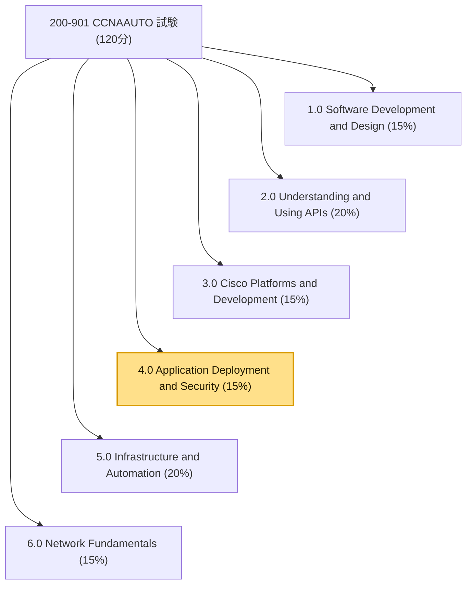
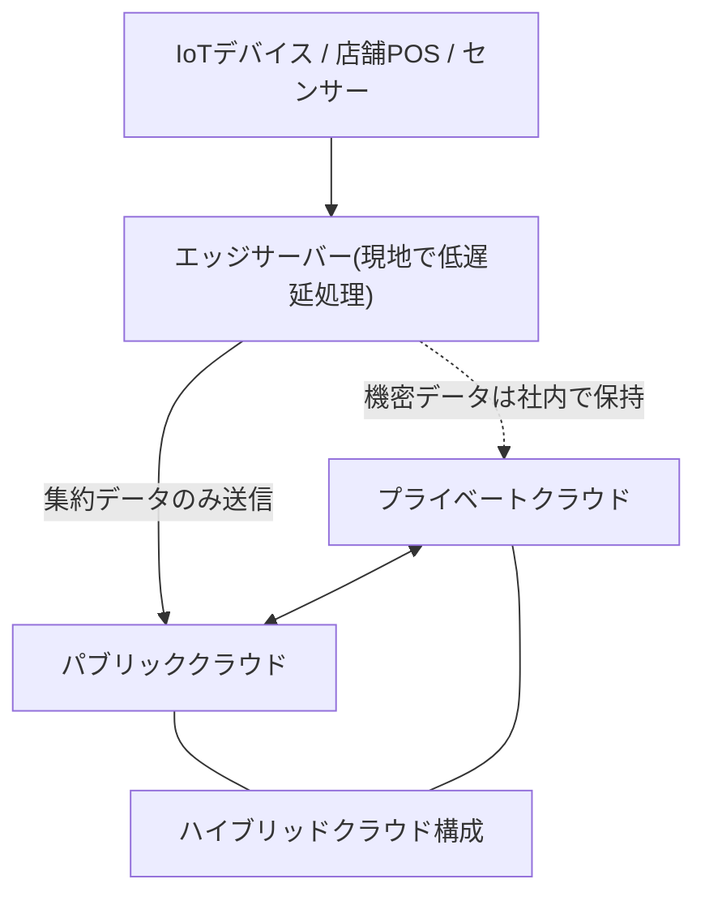
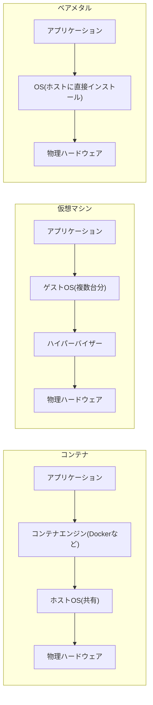
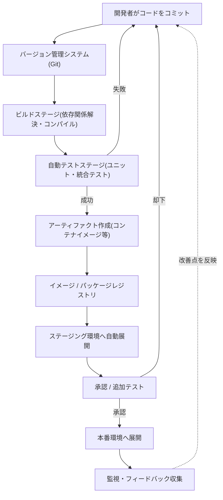
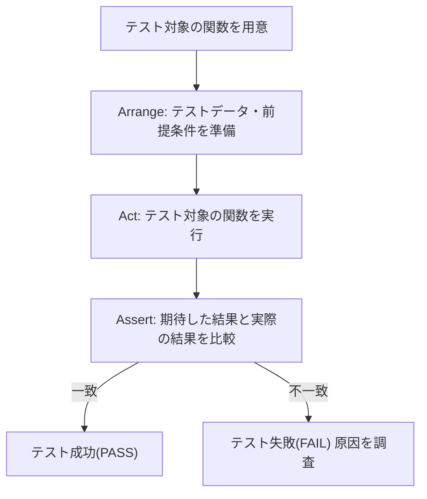
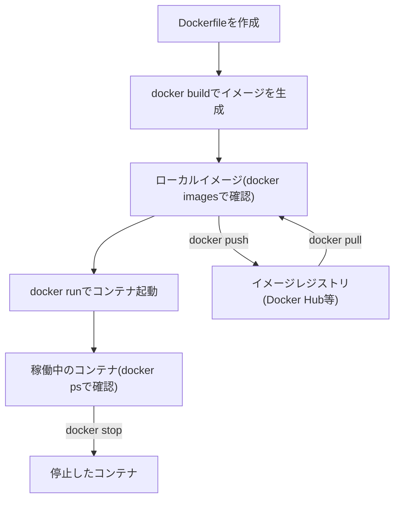
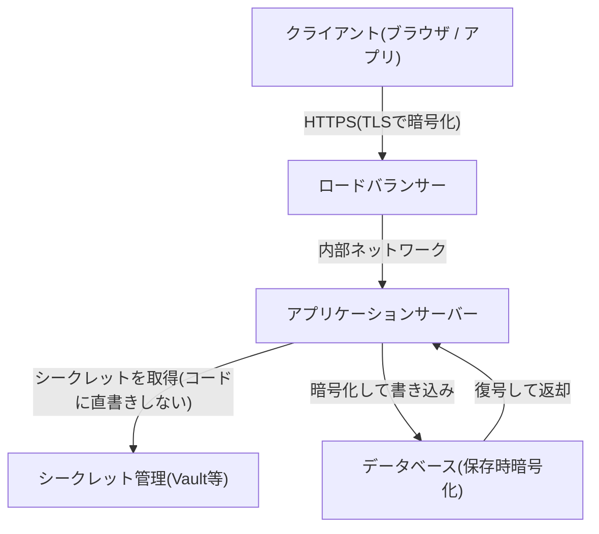
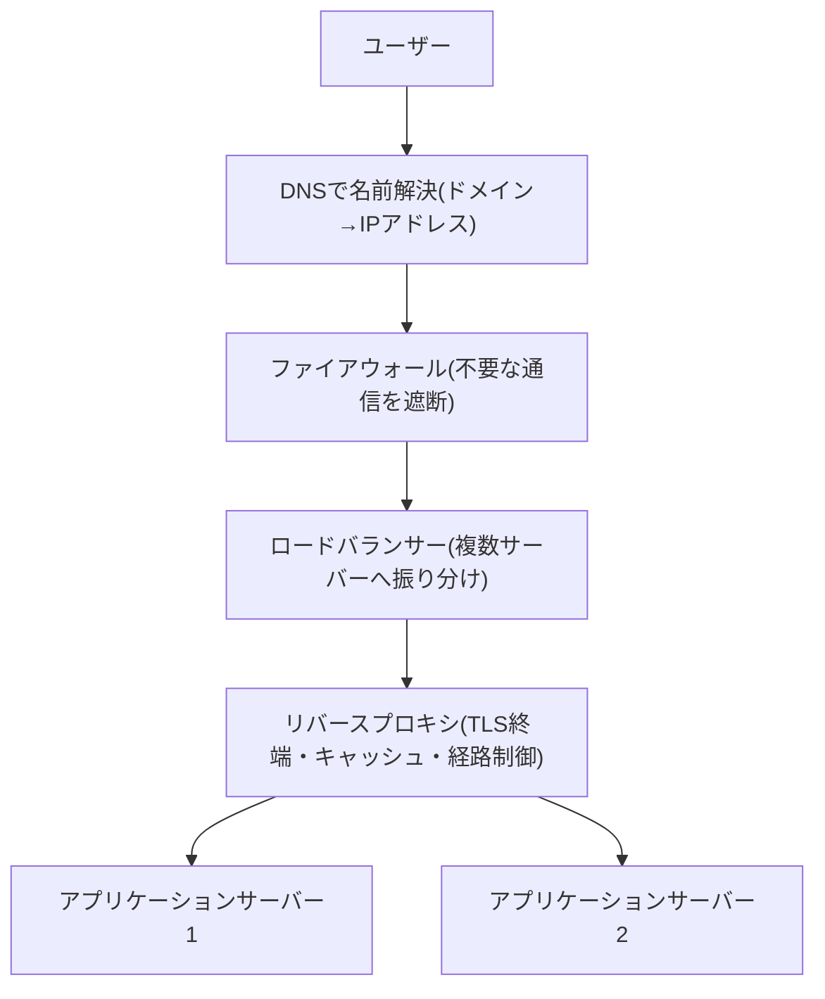
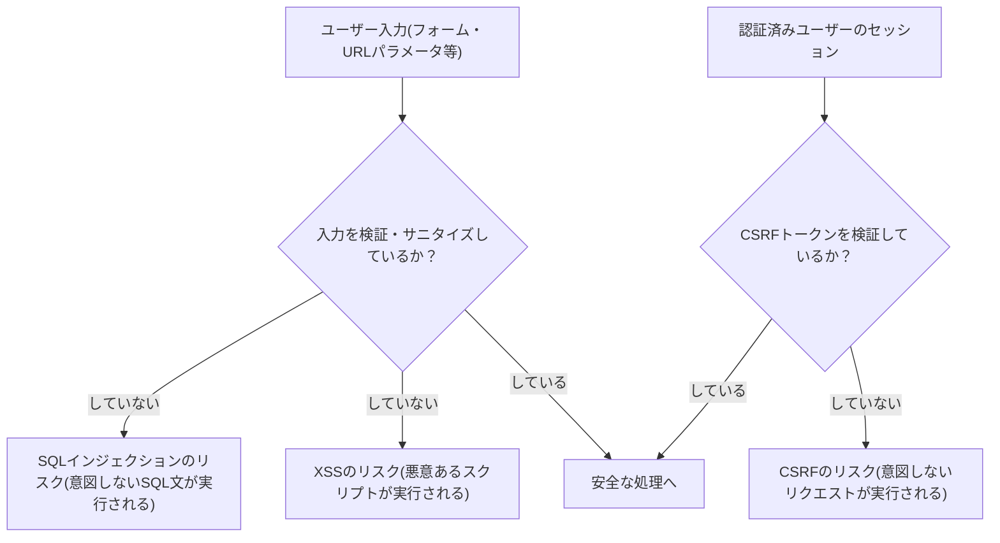
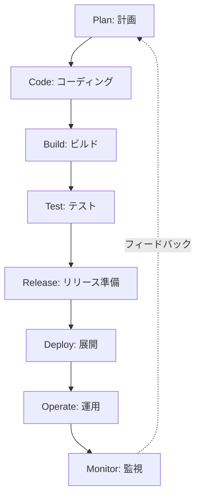

# CCNA Automation（200-901 CCNAAUTO）
# 「Application Deployment and Security」ドメイン 完全解説ガイド

> 本ガイドは、Cisco公式サイトおよび公式試験ガイド（出典は末尾に記載）をもとに、CCNA Automation認定の試験「Automating Networks Using Cisco Platforms v1.1（200-901 CCNAAUTO）」の6つの出題ドメインのうち、**ドメイン4.0「Application Deployment and Security（アプリケーションの展開とセキュリティ）」**（配点15%）を、初学者でも理解できるようにステップバイステップで解説したものです。

---

## このガイドの使い方

- 各章は試験ガイドのサブトピック番号（例：4.1、4.2…）に対応しています。
- 前提知識：Pythonの基礎、Linux/Bashの基本操作、Dockerの概念に軽く触れたことがあると理解がスムーズです（未経験でも読み進められるように用語から説明しています）。
- 章末に「この章のポイント」を置き、最後に全体の早見表（第12章）を用意しています。

---

## 目次

1. [出題範囲の全体像](#chapter1)
2. [エッジコンピューティングとアプリケーション展開モデル（4.1・4.2）](#chapter2)
3. [アプリケーション実行環境の比較：VM・ベアメタル・コンテナ（4.3）](#chapter3)
4. [CI/CDパイプラインの基礎（4.4）](#chapter4)
5. [Pythonユニットテストの構築（4.5）](#chapter5)
6. [Dockerfileの読み方とDockerイメージの活用（4.6・4.7）](#chapter6)
7. [アプリケーションセキュリティの基礎：シークレット保護・暗号化・データ取り扱い（4.8）](#chapter7)
8. [ネットワーク境界のセキュリティ要素：ファイアウォール・DNS・ロードバランサー・リバースプロキシ（4.9）](#chapter8)
9. [OWASPトップの脅威（4.10）](#chapter9)
10. [Bashコマンドの活用（4.11）](#chapter10)
11. [DevOpsの原則（4.12）](#chapter11)
12. [まとめ：ドメイン4.0 早見表](#chapter12)
13. [参考文献・出典](#references)

---

<a id="chapter1"></a>
## 第1章 出題範囲の全体像

CCNA Automation認定を取得するには、120分の試験「200-901 CCNAAUTO」に合格する必要があります。この試験は6つのドメインで構成されており、それぞれに配点比率が設定されています。

| ドメイン番号 | ドメイン名 | 配点比率 |
|---|---|---|
| 1.0 | Software Development and Design（ソフトウェア開発と設計） | 15% |
| 2.0 | Understanding and Using APIs（APIの理解と利用） | 20% |
| 3.0 | Cisco Platforms and Development（Ciscoプラットフォームと開発） | 15% |
| **4.0** | **Application Deployment and Security（アプリケーションの展開とセキュリティ）** | **15%** |
| 5.0 | Infrastructure and Automation（インフラストラクチャと自動化） | 20% |
| 6.0 | Network Fundamentals（ネットワークの基礎） | 15% |

本ガイドが扱うドメイン4.0は、**「作ったアプリケーションをどこに・どうやって・安全に動かすか」**という、開発から運用への橋渡しにあたる領域です。具体的には以下の12個のサブトピックで構成されます。

| サブトピック | 内容 |
|---|---|
| 4.1 | エッジコンピューティングの利点を説明する |
| 4.2 | 異なるアプリケーション展開モデル（プライベートクラウド、パブリッククラウド、ハイブリッドクラウド、エッジ）の属性を説明する |
| 4.3 | 展開タイプ（仮想マシン／ベアメタル／コンテナ）の属性を説明する |
| 4.4 | アプリケーション展開におけるCI/CDパイプラインの構成要素を説明する |
| 4.5 | Pythonのユニットテストを構築する |
| 4.6 | Dockerfileの内容を解釈する |
| 4.7 | ローカル開発環境でDockerイメージを利用する |
| 4.8 | シークレット保護、暗号化（保存時・転送時）、データ取り扱いに関するアプリケーションセキュリティの課題を説明する |
| 4.9 | ファイアウォール、DNS、ロードバランサー、リバースプロキシのアプリケーション展開における役割を説明する |
| 4.10 | OWASPのトップ脅威（XSS、SQLインジェクション、CSRFなど）を説明する |
| 4.11 | Bashコマンド（ファイル管理、ディレクトリ操作、環境変数）を利用する |
| 4.12 | DevOpsプラクティスの原則を説明する |

このドメイン全体の位置づけを図にすると次のとおりです。



**この章のポイント**
- ドメイン4.0は試験全体の15%を占め、「開発したアプリをどこでどう動かし、どう守るか」を扱う。
- 12個のサブトピックは、大きく「展開モデル・展開先の選定（4.1〜4.3）」「CI/CDと自動テスト（4.4・4.5）」「コンテナ実務（4.6・4.7）」「セキュリティ（4.8〜4.10）」「運用スキル（4.11・4.12）」の5グループに整理できる。

---

<a id="chapter2"></a>
## 第2章 エッジコンピューティングとアプリケーション展開モデル（4.1・4.2）

### 4.1 エッジコンピューティングの利点

エッジコンピューティングとは、データを中央のクラウドやデータセンターまで送らず、**データが発生する場所（ネットワークの「端＝エッジ」）に近い場所で処理する**という考え方です。工場のセンサー、店舗のPOSレジ、IoTデバイスなどが典型例です。

主な利点は次のとおりです。

| 利点 | 説明 |
|---|---|
| 低遅延（レイテンシ削減） | クラウドまでの往復通信が不要になり、リアルタイム性が向上する |
| 帯域幅の節約 | 現地で処理・要約してから必要なデータだけをクラウドに送るため、通信量を削減できる |
| オフライン耐性 | クラウドとの接続が一時的に切れても現地で処理を継続できる |
| データローカリティ／プライバシー | 機密データを現地にとどめたまま処理でき、規制対応がしやすい場合がある |

### 4.2 アプリケーション展開モデルの比較

アプリケーションをどこで動かすかという「展開モデル」には、主に次の4種類があります。

| 展開モデル | 管理主体 | 主な特徴 | 典型的な用途 |
|---|---|---|---|
| プライベートクラウド | 自社（または委託先が自社専用に構築） | 自由度が高く、既存のセキュリティ・コンプライアンス要件に合わせやすいが、初期投資と運用負荷が大きい | 金融・医療など規制が厳しい業界の基幹システム |
| パブリッククラウド | クラウド事業者（AWS、Azure、Google Cloudなど） | 従量課金で始めやすく、拡張性が高いが、事業者のインフラに依存する | Webサービス、需要変動の大きいアプリケーション |
| ハイブリッドクラウド | 自社とクラウド事業者の組み合わせ | 機密データはプライベート側、負荷変動の大きい処理はパブリック側、というように使い分けられる | 既存の社内システムとクラウドサービスを連携させたい企業 |
| エッジ | 現地（店舗・工場・デバイス側） | クラウドに比べて計算資源は限られるが、低遅延処理が可能 | IoT、産業オートメーション、リアルタイム映像解析 |

これらの関係をフローで示すと次のようになります。



**この章のポイント**
- エッジコンピューティングの利点は「低遅延・帯域節約・オフライン耐性・データローカリティ」の4つに集約できる。
- 展開モデルは「誰が管理するか」「どこにデータ・計算資源があるか」で分類され、要件（コスト・拡張性・規制・遅延）に応じて選択する。

---

<a id="chapter3"></a>
## 第3章 アプリケーション実行環境の比較：VM・ベアメタル・コンテナ（4.3）

展開モデル（どこで動かすか）が決まったら、次は「どの単位でアプリケーションをパッケージ化して動かすか」を選びます。試験ガイドでは以下の3タイプが挙げられています。

- 4.3.a 仮想マシン（Virtual Machine）
- 4.3.b ベアメタル（Bare Metal）
- 4.3.c コンテナ（Container）

### 3つの実行環境の構造比較



### 属性比較表

| 項目 | ベアメタル | 仮想マシン（VM） | コンテナ |
|---|---|---|---|
| 分離レベル | 物理サーバー単位（最も高い） | ハイパーバイザーによるハードウェアレベルの分離 | OSカーネルを共有するプロセスレベルの分離 |
| 起動速度 | サーバーの起動時間に依存（遅い） | 数十秒〜数分 | 数百ミリ秒〜数秒（非常に速い） |
| リソースオーバーヘッド | なし（すべての資源を占有） | 大きい（ゲストOSごとに必要） | 小さい（OSを共有するため軽量） |
| 移植性（ポータビリティ） | 低い（ハードウェアに強く依存） | 中程度（イメージ化して移動可能） | 高い（同じイメージがどこでも同じ動作） |
| 主なユースケース | 高いパフォーマンスが必須の基幹システム、レガシーアプリ | 複数OSの混在環境、既存VM資産の活用 | マイクロサービス、CI/CDでの高速な使い捨て環境 |

**この章のポイント**
- 分離の強さと起動の速さはトレードオフの関係にある：ベアメタル・VMは分離が強いが重く、コンテナは軽量だがOSカーネルを共有する。
- コンテナはCI/CDやマイクロサービスとの相性が良く、次章のCI/CDパイプラインとも密接に関係する。

---

<a id="chapter4"></a>
## 第4章 CI/CDパイプラインの基礎（4.4）

CI/CD（Continuous Integration / Continuous Delivery（or Deployment）＝継続的インテグレーション／継続的デリバリー（デプロイ））は、コードの変更を自動的にビルド・テスト・展開するための仕組みです。

### CI/CDパイプラインの主な構成要素

| ステージ | 目的 |
|---|---|
| ソース管理（Git等） | コードの変更履歴を管理し、変更をトリガーにパイプラインを起動する |
| ビルド | 依存関係の解決、コンパイル、静的解析などを行う |
| テスト | ユニットテスト・統合テストなどを自動実行し、品質を検証する |
| パッケージング／アーティファクト作成 | コンテナイメージなど、展開可能な成果物を作成する |
| レジストリへの登録 | 作成した成果物をイメージレジストリなどに格納する |
| ステージング展開 | 本番相当の環境に自動展開し、追加検証を行う |
| 本番展開 | 承認を経て本番環境に展開する |
| 監視・フィードバック | 稼働状況を監視し、問題や改善点を開発側にフィードバックする |

### パイプライン全体の流れ



**この章のポイント**
- CI（継続的インテグレーション）は「頻繁に統合し、自動テストで早期に問題を検出する」こと、CD（継続的デリバリー／デプロイ）は「いつでも展開できる状態を保ち、実際に自動展開まで行う」ことを指す。
- テスト失敗・承認却下時にフローが開発者へ戻る「フィードバックループ」がある点が重要。

---

<a id="chapter5"></a>
## 第5章 Pythonユニットテストの構築（4.5）

ユニットテストとは、プログラムの中の「最小単位（関数やメソッド）」が期待どおりに動くかを自動で検証するテストです。Pythonでは標準ライブラリの`unittest`モジュールがよく使われます。

### テストの基本的な流れ（Arrange-Act-Assertパターン）



### コード例

```python
import unittest

def add(a, b):
    """2つの数値を加算する簡単な関数"""
    return a + b

class TestAddFunction(unittest.TestCase):

    def test_add_positive_numbers(self):
        # Arrange
        a, b = 2, 3
        # Act
        result = add(a, b)
        # Assert
        self.assertEqual(result, 5)

    def test_add_negative_numbers(self):
        result = add(-1, -1)
        self.assertEqual(result, -2)

if __name__ == "__main__":
    unittest.main()
```

`assertEqual`のほかにも、`assertTrue`（真偽値の検証）、`assertRaises`（例外発生の検証）などがよく使われます。ユニットテストは第1章の「テスト駆動開発（TDD）」の考え方や、第4章のCI/CDパイプラインの「テストステージ」と直結しています。

**この章のポイント**
- ユニットテストは「準備（Arrange）→実行（Act）→検証（Assert）」の3ステップで考えると書きやすい。
- CI/CDパイプラインでは、このユニットテストが自動テストステージの中核を担う。

---

<a id="chapter6"></a>
## 第6章 Dockerfileの読み方とDockerイメージの活用（4.6・4.7）

### 4.6 Dockerfileの内容を解釈する

Dockerfileは、Dockerイメージをどのように構築するかを記述したテキストファイルです。代表的な命令は以下のとおりです。

| 命令 | 役割 |
|---|---|
| `FROM` | ベースとなるイメージを指定する（例：`FROM python:3.12-slim`） |
| `WORKDIR` | コンテナ内の作業ディレクトリを設定する |
| `COPY` / `ADD` | ホスト側のファイルをイメージ内にコピーする |
| `RUN` | イメージ構築時にコマンドを実行する（パッケージのインストール等） |
| `ENV` | 環境変数を設定する |
| `EXPOSE` | コンテナが待ち受けるポート番号を明示する（実際の公開は`docker run -p`で行う） |
| `CMD` | コンテナ起動時のデフォルトの実行コマンドを指定する |
| `ENTRYPOINT` | コンテナを実行ファイルのように振る舞わせる際のエントリポイントを指定する |

### サンプルDockerfile

```dockerfile
# ベースイメージを指定
FROM python:3.12-slim

# 作業ディレクトリを作成・移動
WORKDIR /app

# 依存関係定義ファイルを先にコピーしてキャッシュを効かせる
COPY requirements.txt .
RUN pip install --no-cache-dir -r requirements.txt

# アプリ本体をコピー
COPY . .

# コンテナが待ち受けるポートを明示
EXPOSE 8080

# コンテナ起動時に実行するコマンド
CMD ["python", "app.py"]
```

### 4.7 ローカル開発環境でのDockerイメージの利用

よく使うDockerコマンドは以下のとおりです。

| コマンド | 用途 |
|---|---|
| `docker build -t <name>:<tag> .` | カレントディレクトリのDockerfileからイメージをビルドする |
| `docker images` | ローカルに存在するイメージの一覧を表示する |
| `docker run -d -p 8080:8080 <name>:<tag>` | イメージからコンテナをバックグラウンドで起動し、ポートを公開する |
| `docker ps` / `docker ps -a` | 稼働中（または全て）のコンテナ一覧を表示する |
| `docker logs <container_id>` | コンテナのログを表示する |
| `docker exec -it <container_id> bash` | 稼働中のコンテナ内でシェルを起動する |
| `docker stop` / `docker rm` | コンテナを停止・削除する |
| `docker push` / `docker pull` | イメージをレジストリへ送信／取得する |

### イメージのライフサイクル



**この章のポイント**
- Dockerfileは「上から順に1行ずつ実行される構築手順書」として読むと理解しやすい。
- `COPY requirements.txt`を`COPY . .`より先に行うのは、依存関係が変わらない限りビルドキャッシュを再利用して高速化するための定石。

---

<a id="chapter7"></a>
## 第7章 アプリケーションセキュリティの基礎：シークレット保護・暗号化・データ取り扱い（4.8）

### シークレット保護

「シークレット」とは、パスワード、APIキー、証明書の秘密鍵など、漏洩すると重大な影響が出る機密情報を指します。基本原則は次のとおりです。

- **コードやDockerイメージにシークレットを直接書き込まない**（ハードコードしない）
- 環境変数、シークレット管理サービス（Vaultなど）、クラウドのシークレットマネージャーを利用する
- Gitリポジトリに誤ってコミットしないよう`.gitignore`や事前スキャンツールを活用する

### 暗号化（保存時・転送時）

| 種類 | 説明 | 代表例 |
|---|---|---|
| 転送時の暗号化（Encryption in Transit） | ネットワークを流れるデータを暗号化し、盗聴・改ざんを防ぐ | TLS/HTTPS、SSH |
| 保存時の暗号化（Encryption at Rest） | ディスクやデータベースに保存されているデータを暗号化する | ディスク暗号化、データベースの列暗号化 |

### データ取り扱いの考え方

個人情報や機密データを扱う際は、「必要最小限のデータのみ収集・保持する」「アクセス権を最小限にする」「保持期間を定めて不要になったら削除する」といった原則が重要です。

### セキュアなデータフローのイメージ



**この章のポイント**
- 「シークレットはコードに書かない」「転送時と保存時の両方を暗号化する」の2点は特に頻出の観点。
- 暗号化は「守る対象がどこにあるか（通信中か、保存中か）」で使う技術が異なる。

---

<a id="chapter8"></a>
## 第8章 ネットワーク境界のセキュリティ要素：ファイアウォール・DNS・ロードバランサー・リバースプロキシ（4.9）

アプリケーションを展開する際、ユーザーからのリクエストは複数のネットワーク要素を経由します。それぞれの役割を理解することが重要です。

| 要素 | 役割 |
|---|---|
| DNS（Domain Name System） | ドメイン名（例：`example.com`）をIPアドレスに変換する名前解決を行う |
| ファイアウォール | 事前に定義したルールに基づき、許可された通信のみを通過させる |
| ロードバランサー | 複数のサーバーにリクエストを振り分け、負荷分散と可用性向上を実現する |
| リバースプロキシ | クライアントとサーバーの間に立ち、TLS終端・キャッシュ・経路制御・ヘッダー書き換えなどを行う |

### リクエストが辿る経路



**この章のポイント**
- 「名前解決 → アクセス制御 → 負荷分散 → プロキシによる終端・制御 → アプリ本体」という順序でリクエストが処理される、という全体像を押さえる。
- ロードバランサーとリバースプロキシは役割が重なることも多いが、試験では「負荷分散」と「TLS終端・経路制御」という観点の違いで整理すると覚えやすい。

---

<a id="chapter9"></a>
## 第9章 OWASPトップの脅威（4.10）

OWASP（Open Worldwide Application Security Project）は、Webアプリケーションセキュリティに関する非営利のコミュニティで、代表的な脅威をまとめた「OWASP Top 10」を定期的に公開しています。

試験ガイドでは代表例として**XSS（クロスサイトスクリプティング）**、**SQLインジェクション**、**CSRF（クロスサイトリクエストフォージェリ）**が挙げられています。

### 代表的な脅威の説明

| 脅威 | 概要 | 典型的な対策 |
|---|---|---|
| XSS（クロスサイトスクリプティング） | ユーザーの入力値がそのままページに出力され、悪意あるスクリプトがブラウザ上で実行されてしまう | 出力時のエスケープ処理、入力値の検証、Content Security Policyの設定 |
| SQLインジェクション | ユーザーの入力値がSQL文にそのまま埋め込まれ、意図しないSQLが実行されてしまう | プレースホルダ／パラメータ化クエリの利用、入力値の検証、最小権限のDBアカウント |
| CSRF（クロスサイトリクエストフォージェリ） | 認証済みユーザーのブラウザを利用して、本人の意図しないリクエストを別サイトから送信させられる | CSRFトークンの検証、SameSite属性付きCookie、重要操作での再認証 |

XSSとSQLインジェクションは「入力値や出力値の不十分な検証・処理」が主因となるのに対し、CSRFは「認証済みブラウザからのクロスサイト状態変更リクエストの信頼」に起因します。そのため、XSSには文脈に応じた出力エンコーディング、SQLインジェクションにはパラメータ化クエリ、CSRFにはCSRFトークン検証・Origin/Referer検証・SameSite Cookie属性による対策がそれぞれ不可欠です。



### 最新の公式リストとの関係

OWASP Top 10は数年ごとに改訂されており、2025年版（2021年版の後継、8回目の改訂版）が現時点の最新版です。参考として、2025年版の10カテゴリを紹介します。

| 順位 | カテゴリ名（英語） |
|---|---|
| A01 | Broken Access Control（アクセス制御の不備） |
| A02 | Security Misconfiguration（セキュリティ設定の不備） |
| A03 | Software Supply Chain Failures（ソフトウェアサプライチェーンの問題） |
| A04 | Cryptographic Failures（暗号化の不備） |
| A05 | Injection（インジェクション） |
| A06 | Insecure Design（安全でない設計） |
| A07 | Authentication Failures（認証の不備） |
| A08 | Software or Data Integrity Failures（ソフトウェア／データ整合性の不備） |
| A09 | Security Logging & Alerting Failures（セキュリティログ・アラートの不備） |
| A10 | Mishandling of Exceptional Conditions（例外的な状態の処理不備） |

試験ガイドが例示するSQLインジェクションとXSSは、現行の2025年版では主に「A05 Injection」に含まれる代表的な攻撃パターンです。CSRFは2017年版以降、単独の最上位カテゴリとしては掲載されなくなりましたが、現在も広く知られた古典的な攻撃パターンであり、アクセス制御や認証まわりの対策（トークン検証・Cookie属性の設定など）と合わせて理解しておく価値があります。試験対策としては、まず試験ガイドが明示するXSS・SQLインジェクション・CSRFの3つの仕組みと対策を確実に押さえるのがよいでしょう。

**この章のポイント**
- XSSとSQLインジェクションは「入力値／出力値の不十分な検証・処理」が根本原因となるのに対し、CSRFは「認証済みブラウザからのリクエストの信頼」が根本原因となるため、CSRF対策はCSRFトークン検証やOrigin/Referer検証、SameSite Cookie属性による対策として明確に分けて理解する。
- OWASP Top 10は定期的に改訂されるため、学習時は「攻撃の仕組みと対策の考え方」を理解することを優先し、順位や名称は最新の一次情報で確認する。

---

<a id="chapter10"></a>
## 第10章 Bashコマンドの活用（4.11）

Linux環境での自動化スクリプトや運用作業では、Bashコマンドの基本操作が欠かせません。

### ファイル管理

| コマンド | 用途 |
|---|---|
| `ls -l` | ファイル・ディレクトリの一覧を詳細表示する |
| `cp src dst` | ファイルをコピーする |
| `mv src dst` | ファイルを移動・リネームする |
| `rm file` | ファイルを削除する（`-r`でディレクトリごと削除） |
| `chmod 755 file` | ファイルの権限を変更する |
| `cat file` | ファイルの内容を表示する |
| `grep "keyword" file` | ファイル内から文字列を検索する |

### ディレクトリ操作

| コマンド | 用途 |
|---|---|
| `pwd` | 現在のディレクトリを表示する |
| `cd path` | ディレクトリを移動する |
| `mkdir dir` | ディレクトリを作成する |
| `rmdir dir` | 空のディレクトリを削除する |
| `find . -name "*.py"` | 条件に合うファイルを再帰的に検索する |

### 環境変数

| コマンド | 用途 |
|---|---|
| `echo $HOME` | 環境変数の値を表示する |
| `export VAR=value` | 環境変数を設定する（現在のシェルとその子プロセスに反映） |
| `env` / `printenv` | 現在の環境変数一覧を表示する |
| `unset VAR` | 環境変数を削除する |

**この章のポイント**
- 「ファイル管理」「ディレクトリ操作」「環境変数」の3分類で整理すると覚えやすい。
- 自動化スクリプト（第5章のCI/CDや第11章のDevOps運用）では、これらのコマンドが組み合わさって使われる。

---

<a id="chapter11"></a>
## 第11章 DevOpsの原則（4.12）

DevOpsとは、開発（Development）と運用（Operations）の壁をなくし、ソフトウェアを継続的に、かつ安全・迅速にリリースし続けるための文化・プラクティスです。

代表的な原則は次のように整理できます。

| 原則 | 説明 |
|---|---|
| 文化（Culture） | 開発チームと運用チームが責任を分断せず、協力してリリースに責任を持つ |
| 自動化（Automation） | ビルド・テスト・展開・監視といった繰り返し作業を自動化し、人的ミスと作業時間を減らす |
| 計測（Measurement / Lean） | リリース頻度、障害復旧時間、変更失敗率などの指標を計測し、継続的に改善する |
| 共有（Sharing） | ツール・知見・障害対応のノウハウをチーム間で共有する |

これらは、第4章で扱ったCI/CDパイプラインを支える文化的・組織的な土台にあたります。DevOpsのプラクティスは、しばしば「計画→コーディング→ビルド→テスト→リリース→展開→運用→監視」という循環（ループ）として表現されます。



**この章のポイント**
- DevOpsは単なるツールの導入ではなく、「文化・自動化・計測・共有」という考え方の集合体である。
- このループが途切れず回り続けることこそが、継続的デリバリー（CD）の本質。

---

<a id="chapter12"></a>
## 第12章 まとめ：ドメイン4.0 早見表

試験直前の見直し用に、サブトピックごとの要点を1行にまとめました。

| No. | サブトピック | 一言でいうと |
|---|---|---|
| 4.1 | エッジコンピューティングの利点 | 低遅延・帯域節約・オフライン耐性・データローカリティ |
| 4.2 | 展開モデルの比較 | プライベート／パブリック／ハイブリッド／エッジを、管理主体とコスト・拡張性で選ぶ |
| 4.3 | VM・ベアメタル・コンテナ | 分離の強さと起動の速さはトレードオフ。コンテナは軽量・高速・高移植性 |
| 4.4 | CI/CDパイプライン | コミット→ビルド→テスト→パッケージ→展開→監視を自動化する一連の流れ |
| 4.5 | Pythonユニットテスト | Arrange（準備）→Act（実行）→Assert（検証）の3ステップ |
| 4.6 | Dockerfileの解釈 | `FROM`/`COPY`/`RUN`/`CMD`など、上から順に実行される構築手順書 |
| 4.7 | Dockerイメージの活用 | `build`→`images`→`run`→`ps`→`push`/`pull`のライフサイクル |
| 4.8 | アプリケーションセキュリティ | シークレットはコードに書かない／転送時と保存時の両方を暗号化する |
| 4.9 | ネットワーク境界の要素 | DNS→ファイアウォール→ロードバランサー→リバースプロキシの順で経由 |
| 4.10 | OWASPトップの脅威 | XSS・SQLi・CSRFはいずれも「入力・リクエストを検証しない」ことが原因 |
| 4.11 | Bashコマンド | ファイル管理／ディレクトリ操作／環境変数の3分類 |
| 4.12 | DevOpsの原則 | 文化・自動化・計測・共有、そして途切れないリリースループ |

---

<a id="references"></a>
## 参考文献・出典

本ガイドの内容は、以下の一次情報（Cisco公式・OWASP公式・各技術の公式ドキュメント）を根拠としています。最新情報は必ず一次情報でご確認ください。

- CCNA Automation Certification（Cisco公式・認定概要ページ）
  https://www.cisco.com/site/us/en/learn/training-certifications/certifications/automation/ccna-automation/index.html
- CCNA Automation Exam and Training（Cisco公式・試験と学習ページ）
  https://www.cisco.com/site/us/en/learn/training-certifications/certifications/automation/ccna-automation/exams-and-training.html
- 200-901 CCNAAUTO（Cisco公式・試験詳細ページ）
  https://www.cisco.com/site/us/en/learn/training-certifications/exams/ccnaauto.html
- Automating Networks Using Cisco Platforms v1.1（200-901）Exam Topics（Cisco公式・出題範囲PDF、本ガイドのドメイン4.0の記載内容の一次ソース）
  https://learningcontent.cisco.com/documents/marketing/exam-topics/200-901-CCNAAUTO_v.1.1.pdf
- CCNAAUTO Exam Topics and Study Guide（Cisco Learning Network）
  https://learningnetwork.cisco.com/s/ccnaauto-exam-topics
- OWASP Top 10:2025（OWASP公式、第9章のOWASP脅威一覧の一次ソース）
  https://owasp.org/Top10/2025/
- Dockerfile reference（Docker公式ドキュメント、第6章のDockerfile命令一覧の一次ソース）
  https://docs.docker.com/reference/dockerfile/
- unittest — ユニットテストフレームワーク（Python公式ドキュメント、第5章のユニットテストの一次ソース）
  https://docs.python.org/3/library/unittest.html

---

*本ガイドは学習支援を目的とした非公式の解説資料です。試験の出題範囲・配点・内容は変更される可能性があるため、受験前に必ずCisco公式サイトの最新情報をご確認ください。*
