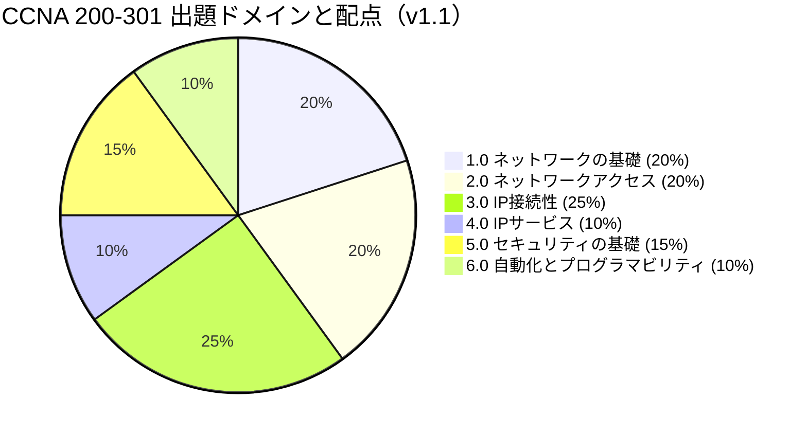
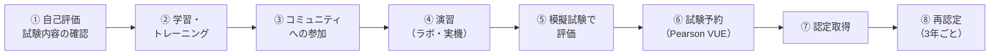
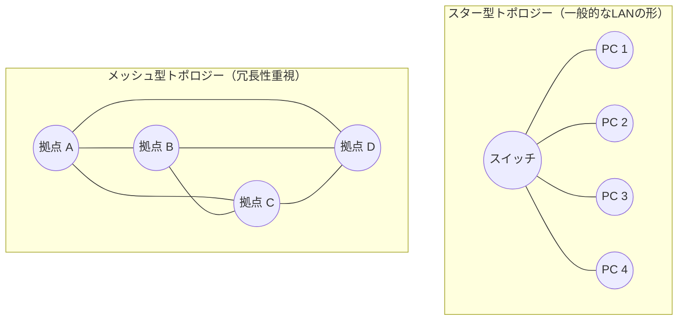
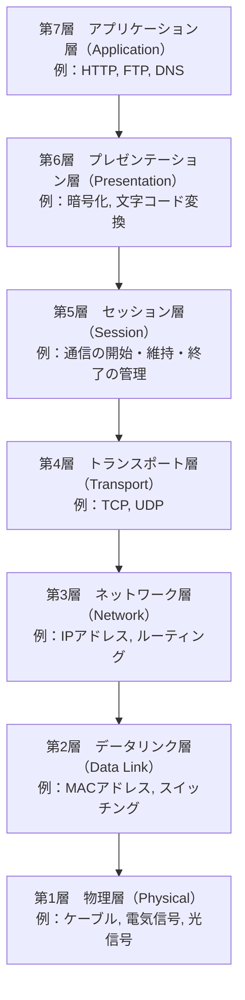
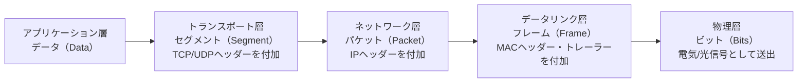
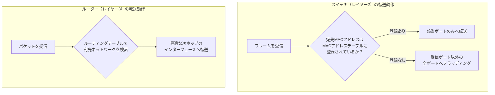
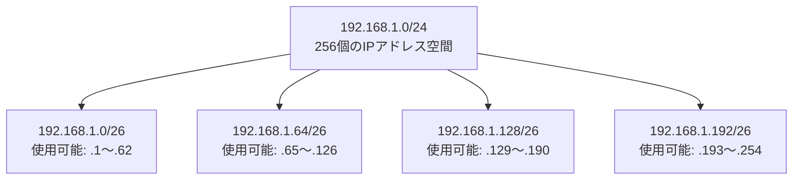
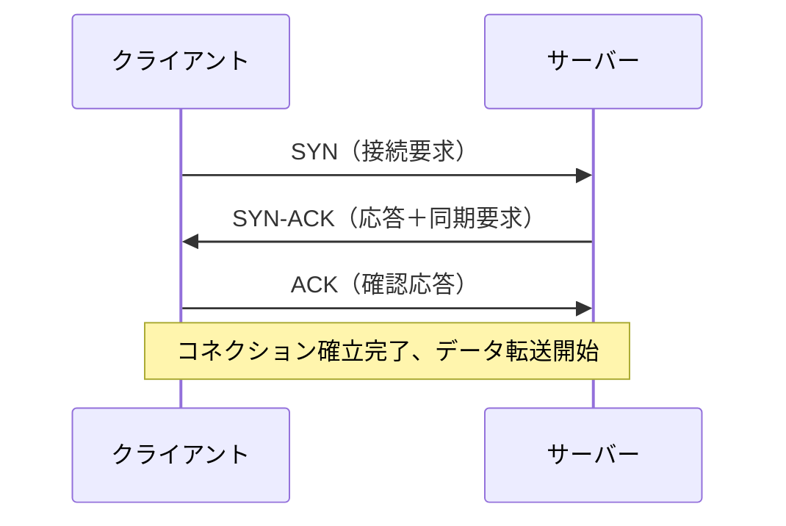
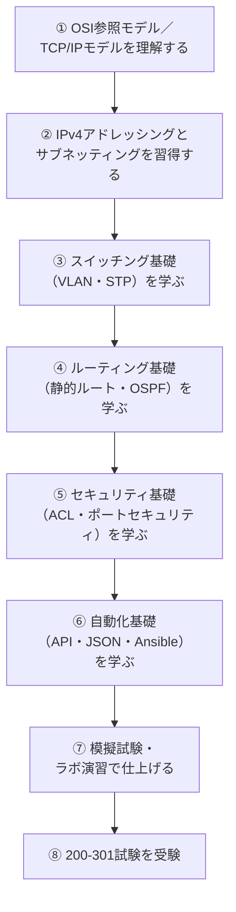
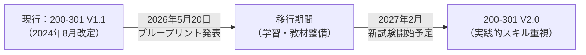

# Cisco CCNA試験対策：ネットワークの基礎 入門ガイド

> 本ガイドは、Cisco CCNA（200-301）認定試験の出題範囲のうち、最も土台となる「ネットワークの基礎」領域を、ネットワーク学習を始めたばかりの方でも理解できるように、図解と表を使ってステップバイステップで解説するものです。
---

## 目次

1. [CCNA認定試験とは](#第1章-ccna認定試験とは)
2. [ネットワークとは何か（基礎概念）](#第2章-ネットワークとは何か基礎概念)
3. [OSI参照モデルとTCP/IPモデル](#第3章-osi参照モデルとtcpipモデル)
4. [ネットワーク機器の基礎](#第4章-ネットワーク機器の基礎)
5. [イーサネットと物理層／データリンク層](#第5章-イーサネットと物理層データリンク層)
6. [IPv4アドレッシングの基礎](#第6章-ipv4アドレッシングの基礎)
7. [IPv6の基礎](#第7章-ipv6の基礎)
8. [TCP/UDPとポート番号](#第8章-tcpudpとポート番号)
9. [学習の進め方（ロードマップ）](#第9章-学習の進め方ロードマップ)
10. [2026年の重要な最新情報：CCNA 200-301 V2.0への移行](#第10章-2026年の重要な最新情報ccna-200-301-v20への移行)
11. [参考文献・出典](#参考文献出典)

---

## 第1章：CCNA認定試験とは

### 1.1 CCNA認定の概要

CCNA（Cisco Certified Network Associate）は、シスコシステムズが提供するアソシエイトレベルのIT資格です。Cisco公式ページによると、CCNA試験はネットワークの基礎、IPサービス、セキュリティの基礎、自動化およびプログラマビリティを対象としており、絶え間なく変化するIT環境に対応できる能力を証明する資格と位置づけられています（出典①）。

| 項目 | 内容 |
|---|---|
| 認定名 | CCNA（Cisco Certified Network Associate） |
| 対応する試験コード | 200-301（Implementing and Administering Cisco Solutions） |
| 試験時間 | 120分 |
| 出題形式 | 選択問題、ドラッグ&ドロップ、シミュレーション、シムレット（模擬コンフィグ問題） |
| 前提条件 | 正式な前提条件はなし。ただしシスコソリューションの導入・運用経験が1年以上あることが推奨（出典①） |
| 対応可能な職種例 | エントリーレベルのネットワークエンジニア、ヘルプデスク技術者、ネットワーク管理者、ネットワークサポート技術者（出典①） |
| 有効期間 | 取得後3年間（出典①） |
| 再認定方法 | 認定試験に再合格する、または生涯学習クレジットを30ポイント取得する（出典①） |

### 1.2 200-301試験の出題ドメインと配点

CCNA 200-301試験（v1.1ブループリント）は、6つの出題ドメインから構成されており、各ドメインには公式の配点比率が設定されています。この比率は、どの分野に学習時間を重点的に配分すべきかを示す重要な指標です（出典⑦⑧）。

| ドメイン番号 | ドメイン名（日本語） | 配点比率 |
|---|---|---|
| 1.0 | ネットワークの基礎（Network Fundamentals） | 20% |
| 2.0 | ネットワークアクセス（Network Access） | 20% |
| 3.0 | IP接続性（IP Connectivity） | 25% |
| 4.0 | IPサービス（IP Services） | 10% |
| 5.0 | セキュリティの基礎（Security Fundamentals） | 15% |
| 6.0 | 自動化とプログラマビリティ（Automation and Programmability） | 10% |



見てのとおり「IP接続性」が最大の25%、次いで「ネットワークの基礎」と「ネットワークアクセス」がそれぞれ20%と続きます。この3ドメインだけで全体の65%を占めるため、ルーティング・スイッチングとその土台となる基礎概念の理解が合格の鍵になります。

### 1.3 認定取得までの8ステップ

Cisco公式ページでは、CCNA取得までのプロセスを8つのステップとして案内しています（出典①）。



このガイドは、ステップ①「自己評価」とステップ②「学習」の中でも、最初に押さえるべき「ネットワークの基礎」ドメインの内容を中心に扱います。

---

## 第2章：ネットワークとは何か（基礎概念）

### 2.1 ネットワークの定義と種類

ネットワークとは、複数のコンピュータや通信機器がケーブルや電波でつながり、データをやり取りできる仕組みのことです。ネットワークは、その規模や範囲によっていくつかの種類に分類されます。

| 種類 | 正式名称 | 範囲の目安 | 具体例 |
|---|---|---|---|
| LAN | Local Area Network | 建物内・敷地内 | 自宅、オフィスフロア内のネットワーク |
| WLAN | Wireless LAN | 建物内・敷地内（無線） | 無線LAN（Wi-Fi）環境 |
| MAN | Metropolitan Area Network | 都市規模 | 市内の複数拠点を結ぶ回線 |
| WAN | Wide Area Network | 都市・国・大陸をまたぐ広域 | インターネット、拠点間VPN |

### 2.2 代表的なネットワークトポロジー

トポロジーとは、ネットワーク機器同士の「接続の形」のことです。CCNAの基礎範囲では、特にスター型とメッシュ型の考え方を理解しておくことが重要です。



- **スター型**：中央のスイッチにすべての機器が接続される形。現在のオフィスLANの主流構成で、1本のケーブルに障害が起きても他の機器に影響しにくいのが特徴です。
- **メッシュ型**：機器同士が複数の経路で結ばれる形。経路が多いほど、どこか1か所が故障しても通信が維持されやすくなりますが、配線コストは増加します。

---

## 第3章：OSI参照モデルとTCP/IPモデル

### 3.1 なぜ「モデル」で考える必要があるのか

ネットワーク通信は、ケーブルを流れる電気信号からアプリケーションが表示する文字や画像まで、非常に多くの処理が積み重なって成立しています。これを一つの塊として理解しようとすると混乱するため、CCNAでは処理を「層（レイヤー）」に分解して考える2つのモデル、**OSI参照モデル**と**TCP/IPモデル**を使います。

### 3.2 OSI参照モデル（7層）

OSI参照モデルは、通信の仕組みを7つの層に分解した概念モデルです。上位層に行くほど人間やアプリケーションに近く、下位層に行くほど物理的な信号に近くなります。



| 層 | 名称 | 主な役割 | 代表的な単位（PDU） | 代表機器・技術 |
|---|---|---|---|---|
| 7 | アプリケーション層 | ユーザーが利用するアプリの通信機能を提供 | データ | Webブラウザ, メールソフト |
| 6 | プレゼンテーション層 | データ形式の変換、暗号化・圧縮 | データ | SSL/TLS, JPEG, ASCII |
| 5 | セッション層 | 通信セッションの確立・維持・終了 | データ | NetBIOS, RPC |
| 4 | トランスポート層 | 信頼性のあるデータ転送、ポート管理 | セグメント | TCP, UDP |
| 3 | ネットワーク層 | 論理アドレスによる経路選択 | パケット | IPアドレス, ルーター |
| 2 | データリンク層 | 同一ネットワーク内でのフレーム転送 | フレーム | MACアドレス, スイッチ |
| 1 | 物理層 | 電気信号・光信号としてビットを伝送 | ビット | ケーブル, コネクタ, ハブ |

### 3.3 TCP/IPモデルとOSIモデルの対応

実際のインターネット通信で使われているのはTCP/IPモデルです。CCNAではOSIモデルとの対応関係を理解しておく必要があります。

| OSI参照モデル | TCP/IPモデル |
|---|---|
| アプリケーション層／プレゼンテーション層／セッション層 | アプリケーション層 |
| トランスポート層 | トランスポート層 |
| ネットワーク層 | インターネット層 |
| データリンク層／物理層 | ネットワークインターフェース層（リンク層） |

### 3.4 カプセル化のプロセス

データが送信されるとき、各層を通過するたびに、その層固有の制御情報（ヘッダー）が付加されていきます。このプロセスを「カプセル化」と呼び、受信側では逆の手順で情報を取り出す「非カプセル化」が行われます。



この「データ → セグメント → パケット → フレーム → ビット」という単位の変化は、CCNA試験で頻出する基礎知識です。

---

## 第4章：ネットワーク機器の基礎

### 4.1 主要デバイスの比較

| 機器 | 動作するOSI層 | 主な役割 | ポイント |
|---|---|---|---|
| ハブ（Hub） | 物理層（第1層） | 受信した信号を全ポートへそのまま流す | 現在はほぼ使われないレガシー機器 |
| スイッチ（Switch） | データリンク層（第2層） | MACアドレスを学習し、必要なポートのみへフレームを転送 | 現在のLANの中心的な機器 |
| ルーター（Router） | ネットワーク層（第3層） | 異なるネットワーク間でパケットを中継 | IPアドレスに基づき経路を選択 |
| アクセスポイント（AP） | データリンク層（第2層） | 無線LAN端末を有線ネットワークに接続 | Wi-Fi通信の中継点 |
| ファイアウォール | 主に第3〜4層（一部第7層） | 通信を許可・拒否してネットワークを保護 | セキュリティ基礎ドメインでも扱う |

### 4.2 スイッチとルーターの動作の違い

スイッチとルーターは、どちらも「転送」を行う機器ですが、判断に使う情報がまったく異なります。



- スイッチは「同じネットワーク内で、どの機器（MACアドレス）にどう届けるか」を判断します。
- ルーターは「異なるネットワーク間で、どの経路（IPネットワーク）を通すか」を判断します。

---

## 第5章：イーサネットと物理層／データリンク層

### 5.1 有線メディア規格の基礎

| 規格分類 | 代表例 | 最大速度目安 | 特徴 |
|---|---|---|---|
| ツイストペアケーブル（銅線） | Cat5e | 1 Gbps | 一般的なオフィスLANで広く使用 |
| ツイストペアケーブル（銅線） | Cat6 / Cat6a | 1〜10 Gbps | より高速・長距離の伝送に対応 |
| 光ファイバー | マルチモード（MMF） | 数百m〜数km、高速 | 建物内・拠点間の高速リンク |
| 光ファイバー | シングルモード（SMF） | 数十km以上 | 長距離バックボーン回線向け |

### 5.2 MACアドレスの仕組み

MACアドレスは、ネットワークインターフェースカード（NIC）ごとに割り当てられる48ビットの物理アドレスです。一般的に16進数12桁（例：`00:1A:2B:3C:4D:5E`）で表記され、前半24ビットがベンダー識別子、後半24ビットが機器固有の識別子となっています。同一LANセグメント内での通信は、最終的にこのMACアドレスを宛先として行われます。

### 5.3 CSMA/CDの考え方

CSMA/CD（Carrier Sense Multiple Access with Collision Detection）は、従来の共有型イーサネット環境で衝突を検知・回避するための仕組みです。現在主流のスイッチ環境（全二重通信）では衝突自体が原理的に発生しないため実務上の重要性は下がっていますが、CCNAの基礎知識として「なぜスイッチ化で衝突がなくなったのか」を理解する土台として押さえておく価値があります。

---

## 第6章：IPv4アドレッシングの基礎

### 6.1 IPアドレスの構造

IPv4アドレスは32ビットで構成され、8ビットずつ4つの「オクテット」に区切り、10進数で表記します（例：`192.168.1.10`）。IPアドレスは「ネットワーク部」と「ホスト部」の2つに論理的に分かれており、どこで区切るかを示すのが**サブネットマスク**です。

### 6.2 クラスフルアドレッシング

historicalな分類方法として、IPv4アドレスはクラスA〜Eに分類されます。

| クラス | 先頭ビットパターン | アドレス範囲（先頭オクテット） | 主な用途 |
|---|---|---|---|
| クラスA | 0 | 1〜126 | 超大規模ネットワーク |
| クラスB | 10 | 128〜191 | 中〜大規模ネットワーク |
| クラスC | 110 | 192〜223 | 小規模ネットワーク |
| クラスD | 1110 | 224〜239 | マルチキャスト用 |
| クラスE | 1111 | 240〜255 | 実験用（予約） |

### 6.3 サブネットマスクとCIDR表記

現在の実務・CCNA試験では、クラスフルな分類そのものよりも、**CIDR（Classless Inter-Domain Routing）表記**で柔軟にネットワークを区切る考え方が重要です。CIDR表記では、ネットワーク部のビット数を「/(スラッシュ)＋数字」で表します。

| CIDR表記 | サブネットマスク | ホスト部ビット数 | 割り当て可能ホスト数 |
|---|---|---|---|
| /24 | 255.255.255.0 | 8ビット | 254台 |
| /25 | 255.255.255.128 | 7ビット | 126台 |
| /26 | 255.255.255.192 | 6ビット | 62台 |
| /27 | 255.255.255.224 | 5ビット | 30台 |
| /30 | 255.255.255.252 | 2ビット | 2台（ルーター間リンク等） |

### 6.4 サブネッティングの実践例

例として、`192.168.1.0/24`という1つのネットワークを、/26（4分割）でサブネット化する流れを見てみます。



**手順の考え方：**

1. 元のネットワーク `/24` を4つに分割するには、ホスト部から2ビットを借りて `/26` にする（2²＝4分割）。
2. 各サブネットのアドレス数は 2⁸⁻²＝64個（うちネットワークアドレスとブロードキャストアドレスを除いた62個が割り当て可能）。
3. 各サブネットの開始アドレスは、64ずつ増加する（`.0` → `.64` → `.128` → `.192`）。

### 6.5 プライベートIPアドレス

インターネットに直接ルーティングされない、組織内部専用のアドレス範囲がRFC 1918で定義されています。

| クラス | プライベートアドレス範囲 |
|---|---|
| クラスA | 10.0.0.0 〜 10.255.255.255 |
| クラスB | 172.16.0.0 〜 172.31.255.255 |
| クラスC | 192.168.0.0 〜 192.168.255.255 |

これらのプライベートアドレスをインターネット上のグローバルIPアドレスに変換する技術が**NAT（Network Address Translation）**であり、CCNAの「IPサービス」ドメインで扱われます。

---

## 第7章：IPv6の基礎

### 7.1 IPv6アドレスの表記

IPv6アドレスは128ビットで構成され、16ビットずつ8つのグループに分け、コロン区切りの16進数で表記します。

```text
2001:0db8:0000:0000:0000:ff00:0042:8329
```

先頭のゼロ省略や、連続するゼロブロックの「::」への省略（1回のみ使用可能）といった表記ルールがあります。

### 7.2 IPv6アドレスの主な種類

| 種類 | 役割 |
|---|---|
| ユニキャストアドレス | 単一のインターフェースを宛先とするアドレス |
| マルチキャストアドレス | 複数のインターフェースへ同時配信するアドレス |
| エニーキャストアドレス | 複数機器のうち最も近い1台に届くアドレス |
| リンクローカルアドレス（fe80::/10） | 同一リンク内でのみ有効なアドレス |

IPv6ではブロードキャストという概念が廃止され、マルチキャストとエニーキャストで代替されている点がIPv4との大きな違いです。

---

## 第8章：TCP/UDPとポート番号

### 8.1 トランスポート層の役割

トランスポート層（第4層）は、アプリケーション同士の通信を実現する層で、代表的なプロトコルとして**TCP**と**UDP**があります。

### 8.2 TCPの3ウェイハンドシェイク

TCPは通信を開始する前に、送受信双方が正しく通信できる状態かを確認する「3ウェイハンドシェイク」という手順を踏みます。



### 8.3 TCPとUDPの比較

| 項目 | TCP | UDP |
|---|---|---|
| 正式名称 | Transmission Control Protocol | User Datagram Protocol |
| 接続方式 | コネクション型（事前に接続確立） | コネクションレス型（確立手順なし） |
| 信頼性 | 高い（再送制御・順序保証あり） | 低い（再送制御なし） |
| 速度・オーバーヘッド | やや遅い、ヘッダーが大きい | 高速、ヘッダーが小さい |
| 代表的な用途 | Webブラウジング、メール、ファイル転送 | 動画・音声のストリーミング、DNS問い合わせ |

### 8.4 代表的なポート番号

| ポート番号 | プロトコル | 用途 |
|---|---|---|
| 20/21 | FTP | ファイル転送 |
| 22 | SSH | 暗号化されたリモート接続 |
| 23 | Telnet | 暗号化なしのリモート接続 |
| 25 | SMTP | メール送信 |
| 53 | DNS | 名前解決 |
| 67/68 | DHCP | IPアドレスの動的割り当て |
| 80 | HTTP | Web通信（平文） |
| 443 | HTTPS | Web通信（暗号化） |

---

## 第9章：学習の進め方（ロードマップ）

ネットワークの基礎を土台として、CCNA試験全体をどのような順序で学習していくべきかを図解します。



「ネットワークの基礎」ドメインはすべての土台にあたるため、ここでの理解があいまいなまま次のドメインへ進むと、スイッチングやルーティングの理解にも影響が出やすい点に注意してください。

---

## 第10章：2026年の重要な最新情報：CCNA 200-301 V2.0への移行

学習を始めるにあたって知っておくべき重要な動向があります。ネットワーク技術者Wendell Odom氏のブログ（Cisco Press公式著者）によると、Ciscoは2026年5月20日にCCNA 200-301の新ブループリント「V2.0」を発表しました（出典⑤⑥）。

| 項目 | 内容 |
|---|---|
| 現行試験（本ガイド執筆時点） | 200-301 V1.1（2024年8月改定版） |
| 新ブループリント発表日 | 2026年5月20日 |
| V2.0試験の開始予定時期 | 2027年2月 |
| 主な変更の方向性 | 「説明する（Describe）」中心だった出題が「設定する（Configure）」「検証する（Verify）」「診断する（Diagnose）」「トラブルシューティングする（Troubleshoot）」といった、より実践的な出題レベルへ引き上げられる（出典⑤） |
| 新設される主なトピック例 | DNSの診断、DHCPのトラブルシューティング、PoEを含むアクセスポート設定、Ansibleを用いた構成管理、AIプロンプトの基礎、エージェント型AIによるネットワーク運用（出典⑤） |



> **本ガイド作成時点（2026年7月）の位置づけ**：現在受験できるのは引き続き200-301 V1.1であり、本ガイドで解説した「ネットワークの基礎」（OSIモデル、IPv4/IPv6アドレッシング、TCP/UDPなど）は、V1.1・V2.0のどちらの体系においても変わらず土台となる知識です。ただし受験時期がV2.0開始（2027年2月予定）以降になる場合は、Cisco公式の試験内容ページおよびCisco認定ロードマップ（出典⑨）で最新のブループリントを必ず確認してください。

---

## 参考文献・出典

本ガイドの記述は、以下の一次情報・専門情報源を根拠としています。内容は執筆時点（2026年7月）のものであり、試験内容は変更される可能性があるため、受験前に必ず公式ページで最新情報をご確認ください。

1. **① Cisco公式 CCNA認定ページ（日本語）**
   https://www.cisco.com/c/ja_jp/training-events/training-certifications/certifications/associate/ccna.html
2. **② Cisco Learning Network：CCNA試験内容（公式ブループリント）**
   https://learningnetwork.cisco.com/s/ccna-exam-topics
3. **③ Cisco公式 200-301試験ページ**
   https://www.cisco.com/c/ja_jp/training-events/training-certifications/exams/current-list/ccna-200-301.html
4. **④ Cisco公式 再認定ポリシー**
   https://www.cisco.com/c/ja_jp/training-events/training-certifications/recertification-policy.html
5. **⑤ Wendell Odom（Cisco Press公式著者）による CCNA V2.0ブループリント解説**
   https://www.certskills.com/ccna26-02/
6. **⑥ CCNA V2.0発表記事（Wendell Odom's CCNA Skills Blog）**
   https://www.certskills.com/ccna26-01/
7. **⑦ CCNA 200-301出題ドメイン配点の分析記事（OpenExamPrep）**
   https://open-exam-prep.com/blog/ccna-200-301-exam-topics-lab-blueprint-2026
8. **⑧ CCNA 200-301シラバス解説記事（Uninets）**
   https://www.uninets.com/blog/ccna-course-syllabus
9. **⑨ Cisco公式 認定ロードマップ**
   https://www.cisco.com/go/certroadmap

---

*本ガイドは学習用途の参考資料として作成されたものであり、Cisco Systems, Inc.の公式教材ではありません。試験の詳細な出題範囲・料金・予約方法は、必ず上記の公式ソースでご確認ください。*
