# CCNP Collaboration 認定 初学者向けステップバイステップ学習ガイド

> **対象読者**: コラボレーション（音声・ビデオ・チャット・会議）分野が初めての方、および他分野（ネットワーク／インフラ／開発）から移ってきたエンジニア
> **ゴール**: CCNP Collaboration の各試験の出題項目を「なぜ必要か → どう動くか → どう設定するか → ベストプラクティス」の順で理解する
> **参照した公式ページ**: [CCNP Collaboration 認定とトレーニングプログラム（Cisco Japan）](https://www.cisco.com/c/ja_jp/training-events/training-certifications/certifications/professional/ccnp-collaboration-v2.html)

---

## 目次

- [0. 本ガイドの使い方と注意事項](#0-本ガイドの使い方と注意事項)
- [1. 認定の全体像](#1-認定の全体像)
- [2. まず押さえる基礎: Cisco Collaboration の全体アーキテクチャ](#2-まず押さえる基礎-cisco-collaboration-の全体アーキテクチャ)
- [3. 学習ロードマップ](#3-学習ロードマップ)
- [Part A. コア試験 350-801 CLCOR](#part-a-コア試験-350-801-clcor)
  - [第1章 インフラストラクチャと設計（20%）](#第1章-インフラストラクチャと設計20)
  - [第2章 プロトコル、コーデック、エンドポイント（20%）](#第2章-プロトコルコーデックエンドポイント20)
  - [第3章 Cisco IOS XE ゲートウェイとメディアリソース（15%）](#第3章-cisco-ios-xe-ゲートウェイとメディアリソース15)
  - [第4章 コールコントロール（25%）](#第4章-コールコントロール25)
  - [第5章 QoS（10%）](#第5章-qos10)
  - [第6章 コラボレーションアプリケーション（10%）](#第6章-コラボレーションアプリケーション10)
- [Part B. 300-810 CLICA コラボレーションアプリケーション](#part-b-300-810-clica-コラボレーションアプリケーション)
- [Part C. 300-815 CLACCM 拡張コールコントロールとモビリティ](#part-c-300-815-claccm-拡張コールコントロールとモビリティ)
- [Part D. 300-820 CLCEI クラウドとエッジ](#part-d-300-820-clcei-クラウドとエッジ)
- [Part E. 300-835 CLAUTO 自動化とプログラミング](#part-e-300-835-clauto-自動化とプログラミング)
- [Part F. 試験対策・トラブルシュート思考法・用語集](#part-f-試験対策トラブルシュート思考法用語集)
- [付録. 参考ソース一覧（URL）](#付録-参考ソース一覧url)

---

## 0. 本ガイドの使い方と注意事項

### 0.1 このガイドの読み方

各トピックは次の4ステップで統一しています。

| ステップ | 内容 | 目的 |
|---|---|---|
| ① 何のためか | そのしくみが解決する課題 | 暗記ではなく理由で理解する |
| ② どう動くか | 動作原理・通話フロー・関係図 | 試験のシナリオ問題に対応する |
| ③ どう設定するか | 主要な設定項目・CLI・GUI の場所 | ラボ・実務に対応する |
| ④ ベストプラクティス | 設計・運用・セキュリティの推奨事項 | 「最も適切なものを選べ」型の設問に対応する |

### 0.2 出題範囲（Exam Topics）の版数に関する注意

- 本ガイドの章立てと配点は、Cisco Japan が公開している日本語版「試験の内容」PDF（**CLCOR v1.2 / CLICA v1.2 / CLACCM v1.2 / CLCEI v1.2 / CLAUTO v1.2**）に基づいています。
- サードパーティの解説では、CLCOR が **v1.3** として案内されている例があります。**受験前に必ず Cisco の最新の Exam Topics（英語版・日本語版）を確認してください**（出題内容は予告なく変更される旨が PDF 冒頭にも明記されています）。
- 試験言語は試験ごとに異なります（例: CLICA・CLCEI は Cisco Japan のページ上で「試験言語：英語」と記載）。予約時に必ず確認してください。
- 製品の設定値・ポート番号・ソフトウェアのバージョン依存の挙動は、最終的に**公式ドキュメントで確認**する習慣をつけてください（付録に URL を掲載）。

### 0.3 図・表のルール

- フローチャート・シーケンス図は **Mermaid**、表は **Markdown** のみを使用しています（ASCII アートは使用していません）。
- CLI 設定例は理解の助けとなる最小例です。実機投入前に必ず検証環境で確認してください。

---

## 1. 認定の全体像

### 1.1 取得要件

CCNP Collaboration は **「コア試験 1つ」＋「コンセントレーション試験 1つ（選択式）」** の合計2試験に合格すると取得できます。

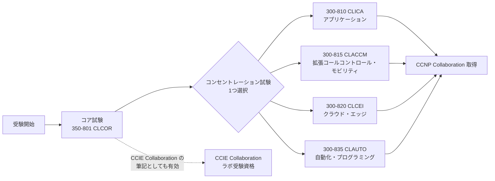

### 1.2 試験一覧

| 区分 | 試験コード | 名称 | 試験時間 | 主な内容 | 推奨トレーニング |
|---|---|---|---|---|---|
| コア | 350-801 CLCOR | Implementing and Operating Cisco Collaboration Core Technologies | 120分 | インフラ、プロトコル、ゲートウェイ、コールコントロール、QoS、アプリ | CLCOR |
| 選択 | 300-810 CLICA | Implementing Cisco Collaboration Applications | 90分 | SSO、IM&P、Unity Connection、クライアント | CLICA |
| 選択 | 300-815 CLACCM | Implementing Cisco Advanced Call Control and Mobility Services | 90分 | SIP 詳細、CME/SRST、CUBE、ダイヤルプラン、モビリティ | CLACCM |
| 選択 | 300-820 CLCEI | Implementing Cisco Collaboration Cloud and Edge Solutions | 90分 | Expressway、B2B、MRA、Webex ハイブリッド、Webex Calling | CLCEI |
| 選択 | 300-835 CLAUTO | Automating and Programming Cisco Collaboration Solutions | 90分 | Git、REST/SOAP、AXL、Webex API、xAPI、Python | CLAUI |

### 1.3 その他の重要事項

| 項目 | 内容 |
|---|---|
| 前提条件 | 正式な前提条件なし（ただし **3〜5年のコラボレーションソリューション実装経験を推奨**） |
| 有効期間 | **3年間** |
| 専門認定 | 各試験に合格すると、個別の Specialist 認定（例: Collaboration Core、Collaboration Applications Implementation など）も取得できる |
| CCIE との関係 | CLCOR は CCIE Collaboration の筆記試験を兼ねる |
| 再認定 | 再認定ポリシーに従う（[再認定ポリシー](https://www.cisco.com/c/ja_jp/training-events/training-certifications/recertification-policy.html)） |

### 1.4 どのコンセントレーション試験を選ぶか

| あなたの立場 | おすすめ | 理由 |
|---|---|---|
| Jabber／Webex アプリ、ボイスメール、チャットの運用担当 | **CLICA** | 日常運用の障害対応に直結（SSO、IM&P、Unity Connection） |
| 音声ゲートウェイ／SBC／ダイヤルプランの設計・運用担当 | **CLACCM** | CUBE・SIP・ダイヤルプランを深く扱う |
| リモートワーク基盤、B2B、クラウド移行担当 | **CLCEI** | Expressway、MRA、Webex Calling、ハイブリッド |
| 開発者／DevOps／自動化担当 | **CLAUTO** | API、Python、Git、DevNet Professional にも関連 |

---

## 2. まず押さえる基礎: Cisco Collaboration の全体アーキテクチャ

### 2.1 コラボレーションとは何か（初学者向けたとえ）

電話やビデオ会議のシステムを**「会社の受付＋交換手＋郵便局」**にたとえると理解しやすくなります。

| たとえ | Cisco の製品・機能 | 役割 |
|---|---|---|
| 交換手（誰に繋ぐか決める） | **Cisco Unified Communications Manager (UCM / CUCM)** | 通話の制御（コールコントロール）、ダイヤルプラン |
| 電話機・ビデオ端末 | **IP Phone / Webex Room デバイス / Jabber / Webex アプリ** | エンドポイント |
| 外線との出入口 | **IOS XE ゲートウェイ / CUBE（Cisco Unified Border Element）** | PSTN や ITSP（通信事業者）との接続、SBC 機能 |
| 留守番電話 | **Cisco Unity Connection (CUC)** | ボイスメール、自動応答 |
| 在席確認・チャット | **Cisco Unified IM and Presence (IM&P)** | Presence、XMPP チャット |
| 社外との関所 | **Cisco Expressway (C / E)** | MRA（VPN 不要のリモート接続）、B2B 通話 |
| クラウドの受付 | **Webex（Control Hub、Webex Calling、Meetings）** | クラウド通話・会議・メッセージ |

### 2.2 全体構成図

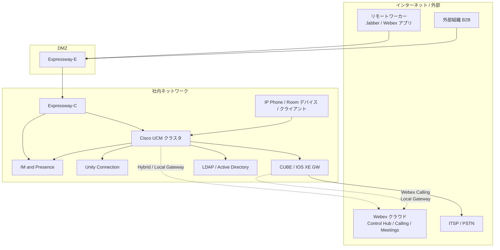

### 2.3 導入モデル（オンプレミス／ハイブリッド／クラウド）

| モデル | 説明 | 代表構成 | 向いているケース |
|---|---|---|---|
| **オンプレミス** | 呼制御・アプリを自社で保有 | UCM + IM&P + CUC + Expressway | 規制・既存資産・細かなカスタマイズ |
| **クラウド** | サービスとして利用 | Webex Calling、Webex Meetings、Webex アプリ | 運用負荷の削減、迅速な展開 |
| **ハイブリッド** | 両者を組み合わせる | UCM + Webex Hybrid Services、Dedicated Instance、Webex Connected UC | 段階的移行、既存電話機の維持と会議のクラウド化 |

> **試験のポイント**: ハイブリッドは「**何をクラウドに置き、何をオンプレミスに残すか**」と「**それを繋ぐコネクタ（Expressway コネクタ、Video Mesh、Directory Connector、Local Gateway）**」をセットで覚えます。

---

## 3. 学習ロードマップ

### 3.1 推奨学習順序

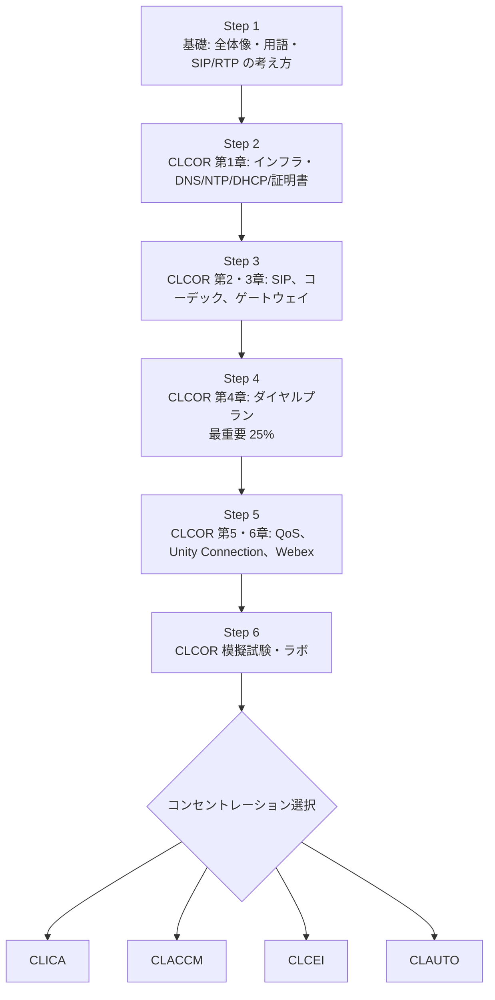

### 3.2 学習時間の目安（実務経験なしの場合）

| 段階 | 目安 |
|---|---|
| 基礎（Step 1） | 1〜2週間 |
| CLCOR（Step 2〜6） | 8〜12週間 |
| コンセントレーション1つ | 4〜8週間 |

> 個人差が大きいため、あくまで目安です。ラボ環境（UCM の評価環境、Cisco dCloud、Packet Tracer などで代替できる範囲）で手を動かす時間を必ず確保してください。

### 3.3 頻出の「切り分け」の型（全章共通）

コラボレーションの障害対応は、次の**レイヤ順**で考えると迷いません。

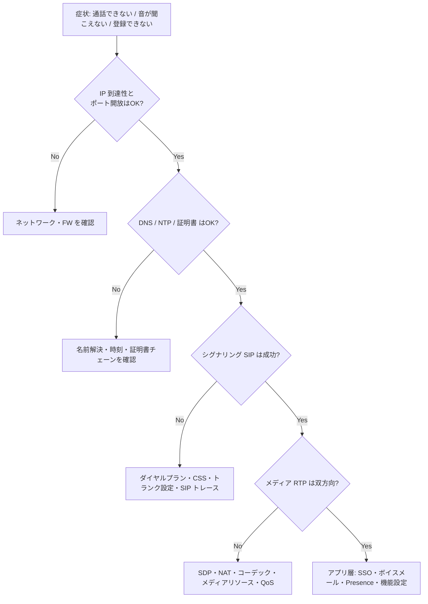

---

# Part A. コア試験 350-801 CLCOR

**試験時間 120分 / 出題比率**

| 章 | ドメイン | 配点 |
|---|---|---|
| 1 | インフラストラクチャと設計 | 20% |
| 2 | プロトコル、コーデック、エンドポイント | 20% |
| 3 | Cisco IOS XE ゲートウェイとメディアリソース | 15% |
| 4 | コールコントロール | **25%** |
| 5 | QoS | 10% |
| 6 | コラボレーションアプリケーション | 10% |

---

## 第1章 インフラストラクチャと設計（20%）

### 1.1 設計要素（1.1 CSR/PA に記載されるオンプレミス／ハイブリッド／クラウド設計）

> **CSR** = Collaboration System Release（Cisco が検証したコラボレーション製品群の組み合わせ）
> **PA** = Preferred Architecture（Cisco が推奨する設計指針）
> **SRND** = Solution Reference Network Design（設計ガイド）

設計要素は、次の8つの観点でチェックします（試験の 1.1.a〜1.1.h に対応）。

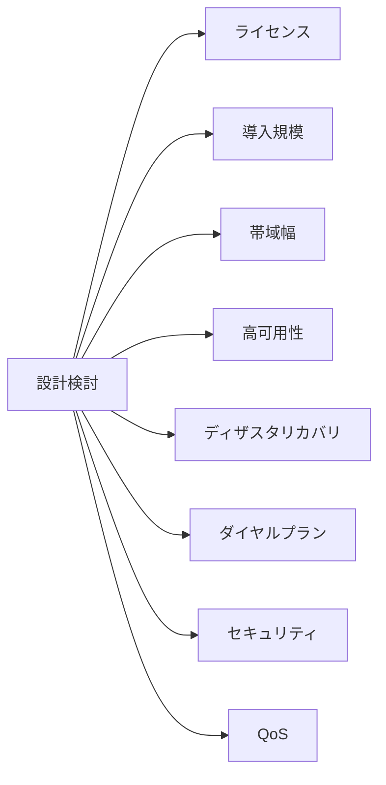

#### 1.1.a ライセンス（Smart、Flex）

| 項目 | 説明 |
|---|---|
| **Smart Licensing** | Cisco Smart Software Manager (CSSM) にデバイスを登録し、ライセンス使用量をクラウドで一元管理する方式 |
| **Flex（Cisco Collaboration Flex Plan）** | ユーザー単位の**サブスクリプション**モデル。オンプレミス（UCM 等）とクラウド（Webex）の両方を1つの契約で利用でき、ハイブリッド移行に適する |
| **ライセンス種別の考え方** | ユーザー（Named User）／デバイス／機能（例: Expressway の同時セッション）で消費される |

**ベストプラクティス**
- 初期設計時に**ライセンスモデル（サブスクリプションか永続か）とスマートアカウント／バーチャルアカウント構成**を決める。
- CSSM への到達性（直接／Proxy／Satellite／オフライン）を要件から選ぶ。閉域網では**ライセンス予約や Satellite**の検討が必要。
- 使用状況を定期的に確認し、**コンプライアンス状態（Out of Compliance）**を早期に検知する。

#### 1.1.b 導入規模（Sizing）

- 規模はユーザー数・デバイス数・**BHCA（Busy Hour Call Attempts：最繁時の試行呼数）**・同時通話数・機能（会議・IVR・録音）で決まる。
- **UCM ノードの VM テンプレート（OVA）**は規模別に提供され、テンプレートを守ることがサポートの前提。
- 設計ガイドとして「Cisco Collaboration Sizing Guide」を参照する（[SRND ポータル](https://www.cisco.com/go/srnd)から辿れる）。

**ベストプラクティス**
- **将来増加分の余裕**（一般に 20〜30% 程度を見込む設計が多い）と、**障害時に1ノード減っても処理できる容量**を確保する。
- Cisco が提供する**OVA テンプレートを使用**し、CPU／メモリ／ディスクを独自変更しない。
- **シンプロビジョニングは非推奨**（サポート対象外となるケースがある）ため、シックプロビジョニングを使う。

#### 1.1.c 帯域幅

音声1通話が WAN で使う帯域は、コーデックとパケット化間隔から計算できます。

**計算式（L3: IP ヘッダ込み）**

$$
\text{帯域(bps)} = (\text{ペイロード} + 40\text{B（IP20+UDP8+RTP12）}) \times 8 \times \text{パケット毎秒}
$$

| コーデック | ビットレート | ペイロード(20ms) | L3 帯域 | Ethernet 込み（L2 +18B） |
|---|---|---|---|---|
| G.711 | 64 kbps | 160 B | **80 kbps** | 約 87.2 kbps |
| G.729 | 8 kbps | 20 B | **24 kbps** | 約 31.2 kbps |

> 20ms 間隔 = 50 pps。例: G.711 は (160+40)×8×50 = 80,000 bps。

**ベストプラクティス**
- WAN 帯域は音声・ビデオ・シグナリング・データを含めた合計で設計し、**音声＋ビデオに割り当てる上限は一般に総帯域の 33% 程度以内**とする設計指針が広く使われる（Cisco の QoS 設計指針）。
- 拠点間の通話数は **Location-based CAC（後述の第5章）** で制限し、帯域超過による全通話品質劣化を防ぐ。

#### 1.1.d 高可用性（HA）

| 層 | 冗長化のしくみ |
|---|---|
| UCM 呼制御 | クラスタ内の **Call Processing Subscriber を 1:1 または 2:1 で冗長化**（デバイスプールの Call Manager Group で優先順を定義） |
| TFTP | 複数 TFTP サーバー（DHCP Option 150 で複数指定） |
| リモート拠点 | **SRST**（WAN 障害時に拠点ゲートウェイが簡易呼制御を代行） |
| ゲートウェイ／トランク | ルートリスト／ルートグループ、複数ダイヤルピア、SIP トランクの複数宛先 |
| IM&P | Presence Redundancy Group（2ノード） |
| Expressway | クラスタリング（複数ノード） |
| ネットワーク | 冗長経路、DNS／NTP／DHCP の冗長化 |

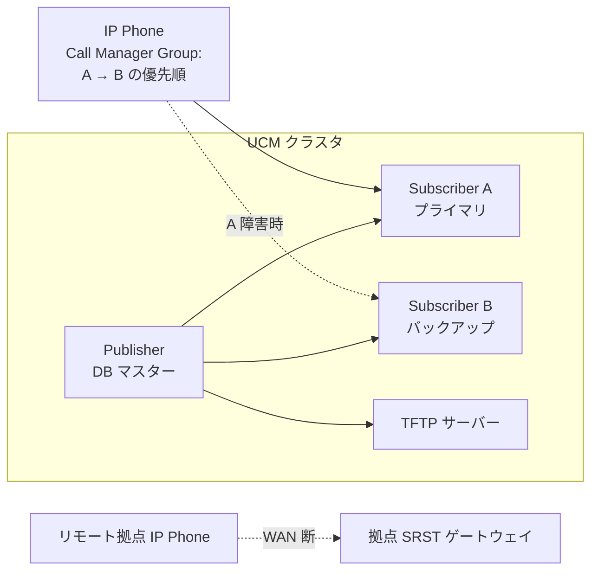

**ベストプラクティス**
- **Publisher には通常の電話登録をさせない**（管理・DB 用途）。
- 電話は **プライマリ／バックアップ Subscriber をデバイスプールで分散**する。
- 遠隔拠点は SRST または CUBE/SRST 機能を用意し、**WAN 障害時でも外線発信・拠点内通話を維持**する。
- **クラスタ間 RTT の要件（一般に往復 150 ms 以下）**など、設計ガイドの遅延要件を必ず確認する。

#### 1.1.e ディザスタリカバリ（DR）

| 項目 | 内容 |
|---|---|
| **DRS（Disaster Recovery System）** | UCM/IM&P/CUC に標準の**バックアップ・リストア機能**。SFTP サーバーへ定期バックアップ |
| 復旧の流れ | 新規 OS インストール → 同一バージョンで DRS からリストア |
| 複数データセンター | クラスタ分散（Clustering over the WAN）、DR サイトの待機クラスタなどを設計 |

**ベストプラクティス**
- **DRS の定期スケジュール（毎日など）＋バックアップ先の別拠点保管**。
- **リストアの事前テスト**を年1回以上実施（バックアップが取れていてもリストアできない事故は多い）。
- バックアップ暗号化に使うパスワード管理・SFTP サーバーの冗長性を確認する。

#### 1.1.f ダイヤルプラン

第4章で詳細を扱います。設計時は「**+E.164 でグローバル化して内部を統一する**」ことを基本方針とします。

#### 1.1.g セキュリティ（証明書、SRTP、TLS、OAuth、SSO）

| 要素 | 役割 | 覚えるポイント |
|---|---|---|
| **証明書** | サーバー・クライアントの身元証明 | 信頼チェーン、SAN、有効期限、Tomcat/CallManager/CAPF/ITL 等の用途別 |
| **TLS** | シグナリングの暗号化 | SIP TLS（一般に 5061）など |
| **SRTP** | メディア（音声・ビデオ）の暗号化 | 鍵交換は SDES（SDP 内）が一般的。TLS 併用が前提 |
| **OAuth 2.0** | トークンによる認可 | SIP OAuth、Jabber/Webex の認証フローで使用 |
| **SSO（SAML 2.0）** | 一度のログインで複数アプリ利用 | IdP と SP の連携（CLICA で詳細） |

**UCM のセキュリティモード**

| モード | 説明 |
|---|---|
| **Non-Secure（非セキュア）** | 暗号化なし（初期状態） |
| **Mixed Mode（混合モード）** | セキュアな電話／トランクの暗号化に対応。CTL/USB トークン、または Tokenless CTL を使用 |
| **SIP OAuth** | トークンベースで Jabber/Webex 等の登録をセキュア化（2.5 で詳説） |

**ベストプラクティス**
- 公開 CA による署名（特に Expressway-E は必須級）。内部は企業 CA を利用し、**自己署名証明書の乱用を避ける**。
- **証明書有効期限の管理台帳・アラート**を持つ（期限切れは最頻出の障害原因のひとつ）。
- **TLS 1.2 以上**への統一と、古い暗号スイートの無効化を計画する。
- 管理アクセスは **SSO＋MFA**、管理用アカウントは最小権限。

#### 1.1.h QoS

第5章で詳細を扱います。設計時は「**信頼境界（Trust Boundary）を決め、DSCP を一貫して維持し、LLQ で音声を保護する**」が原則です。

### 1.2 エッジデバイスの目的（Expressway、CUBE）

| デバイス | 位置 | 主な役割 |
|---|---|---|
| **Expressway-C（Core）** | 社内 | UC サーバーとの連携、ダイヤルプラン処理、トラバーサルクライアント |
| **Expressway-E（Edge）** | DMZ | 社外からの接続を受けるトラバーサルサーバー、**NAT/FW トラバーサル** |
| **CUBE** | ネットワーク境界 | **SBC（Session Border Controller）**。SIP トランク終端、プロトコル／メディア正規化、セキュリティ |

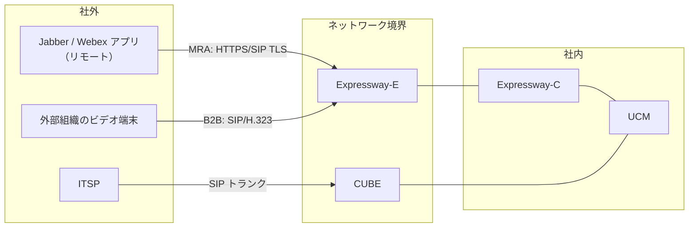

**ベストプラクティス**
- Expressway-E は **DMZ に配置**し、Expressway-C は社内に置く。**社内から DMZ 方向のみ通信を開始**（トラバーサル接続は C → E）。
- CUBE は **信頼済み IP アドレスリスト（trusted list）と、不要なインターフェイスでのシグナリング制限**でトールフラウドを防ぐ。
- 外部公開する FQDN と証明書 SAN を事前に設計する。

### 1.3 サポートするネットワークコンポーネントの設定

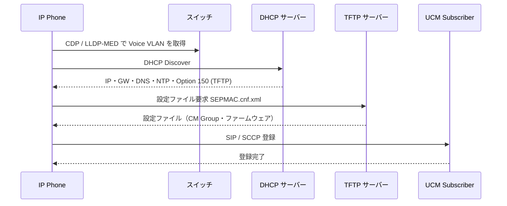

| 項目 | 何のためか | 設定のポイント |
|---|---|---|
| **1.3.a DHCP** | IP・ゲートウェイ・DNS を自動配布。**Option 150** で TFTP サーバー（複数指定可）を通知 | 電話用（Voice VLAN）と PC 用のスコープを分離。Option 150 に**冗長 TFTP を複数記載**。Option 66 は単一名指定 |
| **1.3.b NTP** | 時刻同期。証明書検証、ログ、SAML、ライセンス、CDR の前提 | UCM は**Publisher が外部 NTP と同期**し、Subscriber は Publisher と同期。**低い stratum の信頼できる NTP を複数**用意 |
| **1.3.c CDP** | Cisco 独自の隣接機器検出。Voice VLAN 通知などに使う | Cisco スイッチと電話の連携で利用 |
| **1.3.d LLDP** | 標準の隣接機器検出。**LLDP-MED** で Voice VLAN、電源、位置情報を通知 | マルチベンダースイッチ環境で使用。CDP と併用可 |
| **1.3.e LDAP** | ユーザー情報の同期・認証 | UCM の **LDAP Directory（同期）** と **LDAP Authentication（認証）** は別設定。同期は一般に 389／636（LDAPS）、グローバルカタログは 3268／3269 |
| **1.3.f TFTP／HTTP** | 電話の設定ファイル・ファームウェア・信頼リストの配布 | TFTP は UDP 69。TFTP サーバーは**専用ノード**にすると呼処理への影響が小さい。設定ファイルは HTTP（6970 番）配布にも対応 |
| **1.3.g 証明書** | 認証と暗号化の基盤 | 用途別（Tomcat、CallManager、CAPF、ipsec、TVS 等）に管理。**ITL/CTL** による電話への信頼リスト配布 |

**LDAP 同期／認証の違い**

| 種類 | 何をするか | 注意点 |
|---|---|---|
| LDAP Synchronization | AD からユーザー属性を UCM DB にコピー | 同期後は AD 側でユーザー作成・削除・属性変更が反映される。定期同期のスケジュールを設定 |
| LDAP Authentication | エンドユーザーのパスワード検証を AD に委譲 | アプリケーションユーザーは対象外（UCM ローカル認証） |

**ベストプラクティス**
- **DHCP/DNS/NTP/TFTP は冗長化**する。これらが落ちると「電話が登録できない」大規模障害になる。
- 電話の DNS は **FQDN 名で運用**する場合、**A レコードと逆引き（PTR）**を必ず整備する。
- LDAP は **LDAPS（TLS）＋読み取り専用サービスアカウント**、フィルタで同期対象を最小化する。
- 証明書更新は**サービス再起動の手順と影響**を事前に把握し、ピーク時間外に実施する。

### 1.4 ネットワークコンポーネントのトラブルシュート

#### 1.4.a DNS（A/AAAA、SRV、PTR）

| レコード | 用途 | コラボレーションでの例 |
|---|---|---|
| **A / AAAA** | ホスト名 → IPv4 / IPv6 | UCM・Expressway・IM&P の FQDN 解決 |
| **SRV** | サービス名 → ホスト・ポート | `_cisco-uds._tcp.<domain>`（社内 UDS 検出）、`_collab-edge._tls.<domain>`（MRA の Expressway-E 検出）、`_cuplogin._tcp.<domain>`（IM&P ログイン検出） |
| **PTR（逆引き）** | IP → ホスト名 | UCM クラスタ内、Expressway-C が UC ノードを見つける際に使用 |

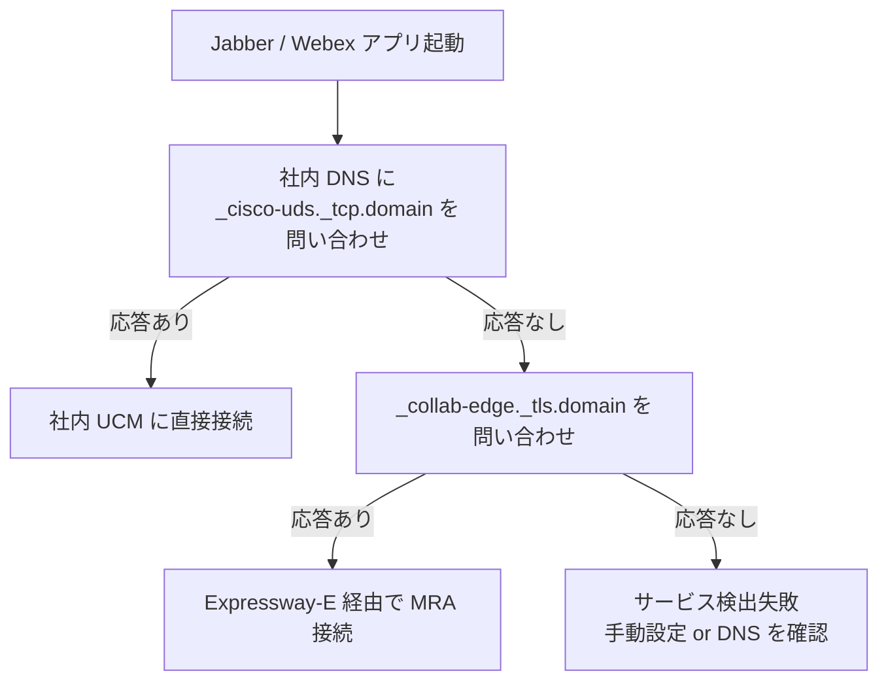

**トラブルシュートの型**
```
nslookup -type=SRV _cisco-uds._tcp.example.com
nslookup 10.10.10.10        # PTR（逆引き）確認
```
- 「**社内と社外で異なる DNS 応答（スプリット DNS）**が正しく構成されているか」が最頻出の確認項目。
- 社内 DNS に `_collab-edge` を返してしまうと、社内でも Expressway 経由になる誤動作が起きる（**社内 DNS には `_cisco-uds`、社外 DNS には `_collab-edge`**）。

#### 1.4.b NTP

- **症状**: 証明書エラー、SAML SSO 失敗、ログ時刻のずれ、DRS 失敗。
- **UCM の確認**: CLI で `utils ntp status`（同期状態）を確認。
- **原因例**: NTP サーバーが到達不能、stratum が高すぎる、仮想化ホストの時刻ずれ、Subscriber が Publisher と同期できない。

#### 1.4.c Cisco UCM での LDAP 統合

| 症状 | 確認ポイント |
|---|---|
| 同期が失敗する | ネットワーク到達性、ポート（389/636/3268/3269）、バインドアカウントの権限、LDAP 検索ベース、フィルタ |
| ユーザーが同期されない | 検索ベース DN の誤り、LDAP フィルタ、属性マッピング（ユーザーID＝sAMAccountName 等） |
| 認証に失敗する | LDAP Authentication の設定、ユーザーID の一意性、パスワード期限 |
| LDAPS に接続できない | AD の証明書を UCM の **tomcat-trust** に登録しているか |

#### 1.4.d TCP/TLS ハンドシェイク

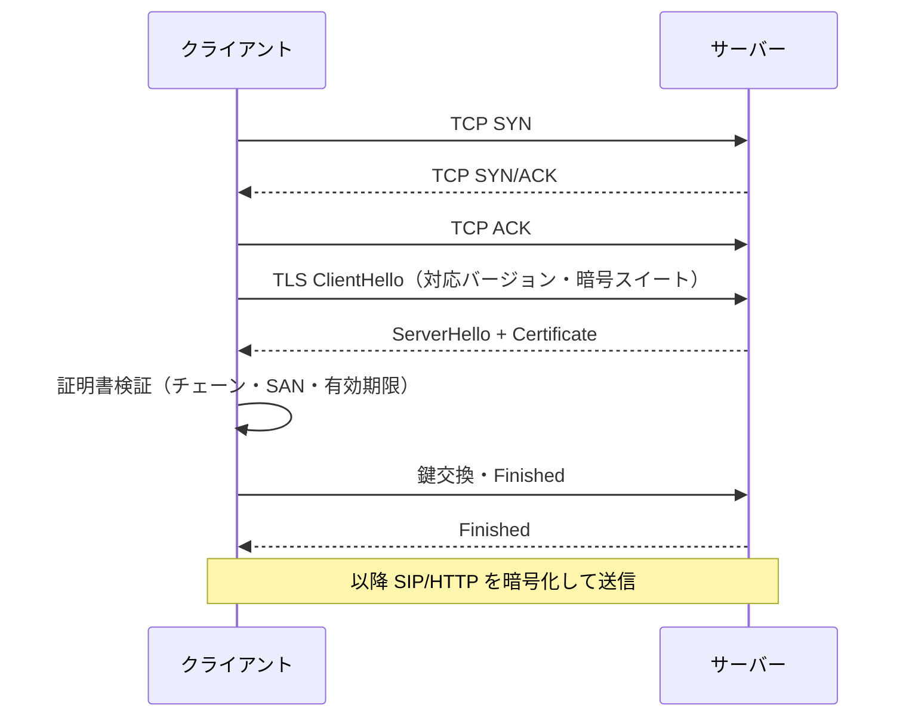

| 失敗パターン | 典型原因 |
|---|---|
| TCP 確立前に失敗 | FW で該当ポートが閉じている、サービス停止 |
| TLS で `unknown CA` | 相手証明書のルート/中間 CA を trust に登録していない |
| TLS で `certificate expired` | 有効期限切れ、時刻ずれ（NTP） |
| ホスト名不一致 | SAN に接続先 FQDN が含まれていない |
| 暗号スイート不一致 | 双方で共通の TLS バージョン/暗号スイートがない |

**ベストプラクティス**: パケットキャプチャ（UCM CLI `utils network capture` または Wireshark）で「どの段階で止まっているか」を切り分ける。

### 1.5 各コンポーネントの説明（SNMP、DNS、ディレクトリコネクタ）

| コンポーネント | 役割 | 要点 |
|---|---|---|
| **SNMP** | 監視・障害通知（Trap） | UCM は SNMP エージェントを持つ。**SNMPv3（認証＋暗号化）**推奨。監視システムに Trap 送信先を登録 |
| **DNS** | 名前解決 | 1.4.a 参照。冗長化・スプリット DNS |
| **Cisco Directory Connector** | オンプレミス Active Directory のユーザーを **Webex Control Hub に同期** | AD が正となるユーザー管理。同期は AD → クラウドの一方向（ハイブリッドディレクトリサービス） |

**ベストプラクティス**
- SNMP は **v3 を使用し、コミュニティ文字列の使い回しを避ける**。
- Directory Connector は**冗長ホスト**を用意し、同期対象 OU を最小化する。

### 1.6 Webex Control Hub の機能

**Control Hub** は Webex のクラウドサービスを管理する**単一の管理ポータル**です。

| 機能領域 | できること |
|---|---|
| ユーザー／ライセンス管理 | ユーザー追加・削除、ライセンス割り当て、ディレクトリ同期、SSO 設定 |
| サービス管理 | Meetings、Calling、Messaging、Devices、ハイブリッドサービス（コネクタ登録・状態確認） |
| デバイス管理 | ルームデバイス／電話の登録・設定・ステータス |
| 分析・トラブルシュート | 使用状況、品質（Meeting Quality）、通話診断（Calling Troubleshooting） |
| セキュリティ／コンプライアンス | ドメイン検証、認証ポリシー、管理者ロール（RBAC）、監査ログ |

**ベストプラクティス**
- 管理者は**ロールを最小権限**に分け、フルアドミンを最小人数に絞る。
- **ドメインの検証（Verify）と SSO の強制**で組織外アカウントの混入を防ぐ。
- ハイブリッドコネクタの状態をアラート設定して常時監視する。

### 1.7 第1章 まとめ（試験直前チェック）

| チェック | 内容 |
|---|---|
| ☐ | Smart Licensing と Flex の違いを説明できる |
| ☐ | G.711/G.729 の帯域計算ができる |
| ☐ | UCM の HA（1:1/2:1、SRST）と DR（DRS）を説明できる |
| ☐ | DHCP Option 150、NTP、CDP/LLDP、LDAP、TFTP の役割を説明できる |
| ☐ | `_cisco-uds`／`_collab-edge` SRV の使い分けを説明できる |
| ☐ | TLS ハンドシェイク失敗の切り分けができる |
| ☐ | Control Hub でできることを列挙できる |

### 1.8 第1章の参考ソース

| ソース | URL |
|---|---|
| CLCOR 350-801 試験ページ（Cisco Japan） | https://www.cisco.com/c/ja_jp/training-events/training-certifications/exams/current-list/clcor-350-801.html |
| CLCOR 試験の内容 PDF（v1.2） | https://www.cisco.com/c/dam/global/ja_jp/training-events/training-certifications/exam-topics/350-801-CLCOR.pdf |
| Cisco Collaboration SRND ポータル（設計ガイド・Sizing Guide・PA） | https://www.cisco.com/go/srnd |
| UCM 設定ガイド一覧（日本語） | https://www.cisco.com/c/ja_jp/support/unified-communications/unified-communications-manager-callmanager/products-installation-and-configuration-guides-list.html |
| UCM インストール／アップグレードガイド一覧 | https://www.cisco.com/c/en/us/support/unified-communications/unified-communications-manager-callmanager/products-installation-guides-list.html |
| Webex ハイブリッドサービス導入ガイド一覧 | https://help.webex.com/en-us/article/7dmbcr |

---

## 第2章 プロトコル、コーデック、エンドポイント（20%）

### 2.0 まず SIP と RTP の役割分担を理解する

| 役割 | プロトコル | 何をするか | たとえ |
|---|---|---|---|
| **シグナリング** | **SIP**（Session Initiation Protocol） | 通話の開始・変更・終了を交渉する | 電話をかける「手続き」 |
| **メディア記述** | **SDP**（Session Description Protocol） | 使う IP・ポート・コーデックを SIP メッセージ本文で伝える | 「この住所・この言語で話しましょう」 |
| **メディア転送** | **RTP / SRTP** | 音声・映像パケットを実際に運ぶ | 会話そのもの |
| **品質統計** | **RTCP** | 遅延・ジッター・損失を通知 | 会話の品質メモ |

### 2.1 SIP 通話のトラブルシュート

#### 2.1.a 通話の確立および切断

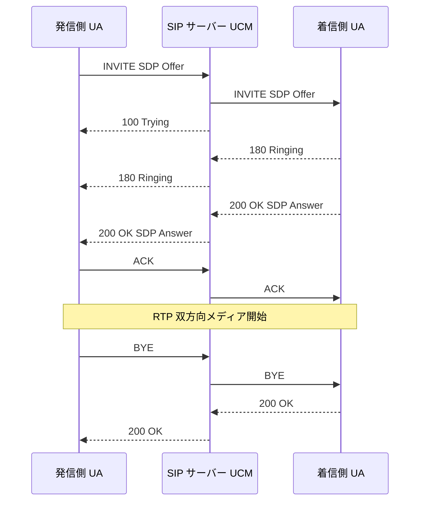

| メッセージ／応答 | 意味 | トラブル時の読み方 |
|---|---|---|
| INVITE | 通話開始要求 | 到達しない → ルーティング・FW・トランク設定 |
| 100 Trying | 受信確認 | 返らない → 相手が応答していない |
| 180 Ringing | 呼出中 | |
| 183 Session Progress | 早期メディア（呼出音・アナウンス）用 | Early Media の有無 |
| 200 OK | 成功 | SDP Answer を含む |
| ACK | 200 OK への確認 | 無いと 200 OK が再送される |
| BYE | 切断 | |
| 4xx | クライアントエラー（例: 404 Not Found＝宛先無し、486 Busy） | ダイヤルプラン／宛先の問題 |
| 5xx | サーバーエラー（例: 503 Service Unavailable） | 相手システム障害・トランク状態 |
| 6xx | グローバル障害 | |

**ベストプラクティス（切り分け）**
1. まず **INVITE が出ているか**（発信側ログ／トレース）。
2. **最初の応答コード**を確認（404/403/488/503 など）。
3. 200 OK 後に **ACK が返っているか**。返らなければ NAT・FW・Record-Route の問題を疑う。
4. UCM では **RTMT の SDL/SDI トレース**、**Dialed Number Analyzer**、CUBE では `debug ccsip messages` や `show voip trace` 系を使う。

#### 2.1.b SDP

SDP は**「何を、どこへ、どのコーデックで送るか」**を交渉する仕組みです。

| SDP 行（例） | 意味 |
|---|---|
| `c=IN IP4 10.1.1.10` | メディアの送信先 IP アドレス |
| `m=audio 16384 RTP/AVP 0 8 18 101` | audio、ポート 16384、ペイロードタイプ（0=G.711μ, 8=G.711a, 18=G.729, 101=DTMF） |
| `a=rtpmap:101 telephone-event/8000` | ペイロード 101 は RFC 2833（telephone-event）の DTMF |
| `a=sendrecv / sendonly / inactive` | メディアの方向（保留時は sendonly/inactive など） |
| `a=crypto:...` | SRTP の鍵（SDES） |

**Offer/Answer モデル**

| 方式 | 説明 | 特徴 |
|---|---|---|
| **Early Offer** | INVITE に SDP を含める | 一般的。メディアが早く確立しやすい |
| **Delayed Offer** | INVITE に SDP を含めず、200 OK で Offer を出す | ITSP との相互接続で使われることがある |

**よくある問題**
- **一方通話（片通話）**: SDP 内の IP が**プライベートアドレスのまま外部に出ている**（NAT 問題）、あるいは ACK/メディアの FW ブロック。
- **488 Not Acceptable Here**: 両者に共通のコーデックが無い（コーデック不一致）。
- **メディアが繋がらない**: `c=` 行の IP／`m=` 行のポートに到達できない。

#### 2.1.c DTMF（押ボタン信号）

| 方式 | 動作 | 特徴 |
|---|---|---|
| **In-band（音声内）** | 音声ストリームにトーンとして混ぜる | G.711 では動作するが、G.729 等の圧縮コーデックでは**歪んで認識できない** |
| **RFC 2833 / RFC 4733（RTP named events）** | RTP 内に別ペイロード（telephone-event）で送る | 最も一般的。**ペイロードタイプ（既定 101）が両者で一致**している必要あり |
| **KPML（SIP SUBSCRIBE/NOTIFY）** | SIP 信号として送る | Cisco 電話と UCM 間で使用 |
| **Unsolicited NOTIFY** | SIP NOTIFY で送る | Cisco 独自 |

**ベストプラクティス**
- **ITSP との接続は RFC 2833 を第一候補**とし、UCM と CUBE 間で DTMF 方式が異なる場合は **MTP（Media Termination Point）で変換**する。
- 「IVR でボタンが効かない」は **DTMF 方式の不一致**を最初に疑う。

#### 2.1.d 保留／保留解除／転送

| 動作 | SIP での表現 |
|---|---|
| **保留（Hold）** | re-INVITE で SDP の方向を `a=sendonly`（または `inactive`）に変更 |
| **保留解除（Resume）** | re-INVITE で `a=sendrecv` に戻す |
| **転送（Transfer）** | **REFER**（Refer-To ヘッダーで転送先を指示）、または UCM が両レッグを繋ぎ直す |

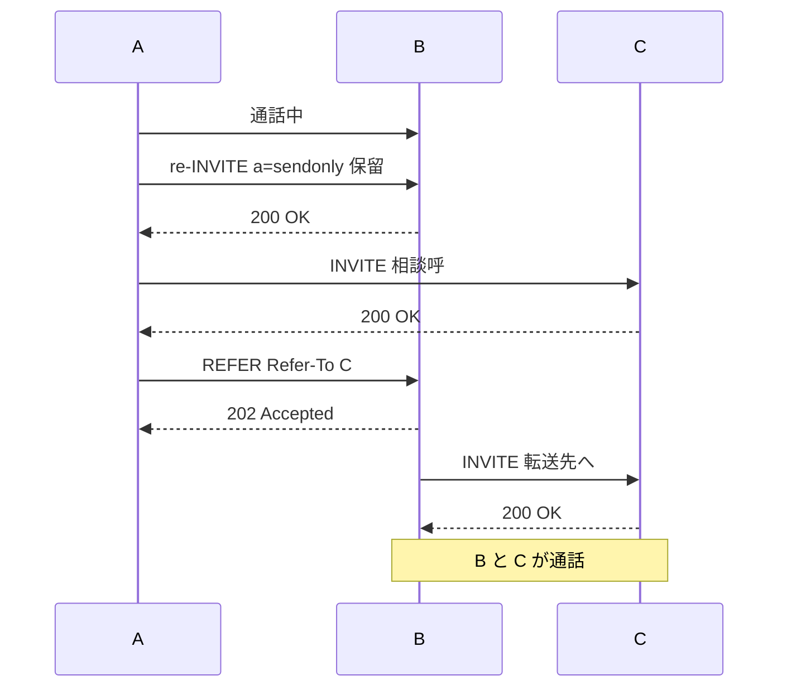

### 2.2 シナリオに適したコーデックの選択

| コーデック | 種別 | ビットレート | 特徴 | 適した場面 |
|---|---|---|---|---|
| **G.711（μ-law/a-law）** | 音声 | 64 kbps | 非圧縮に近い高品質、CPU 負荷小。日本は **μ-law** が一般的 | LAN 内、帯域に余裕がある |
| **G.729 / G.729a/b** | 音声 | 8 kbps | 高圧縮で帯域節約、品質は G.711 より低下 | 帯域が限られた WAN |
| **G.722** | 音声（広帯域） | 64 kbps | 高音質（広帯域 7 kHz） | 高品質を求める LAN |
| **iLBC** | 音声 | 約 15.2 / 13.3 kbps | パケットロスに強い | 損失のある回線 |
| **Opus** | 音声（可変） | 可変（低〜高） | 帯域・品質の可変対応、Webex／Jabber 等で採用 | 変動する回線、クラウド接続 |
| **H.264** | ビデオ | 可変 | 最も広く使われるビデオコーデック | ほぼ全てのビデオ通話 |
| **H.265** | ビデオ | 可変 | H.264 より高圧縮 | 対応端末間で帯域節約 |

**選択の考え方**

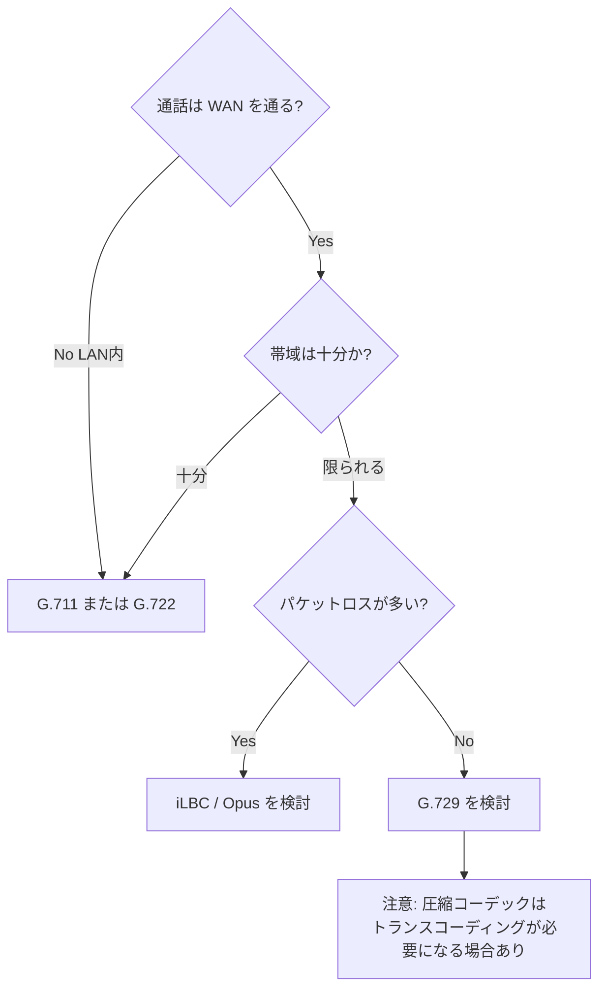

**ベストプラクティス**
- **LAN 内は G.711/G.722、WAN は G.729 または Opus** が基本。**リージョン**設定（UCM の Region）で「どの区間でどのコーデックを許可するか」を設計する。
- **端から端まで同一コーデック**にして、**トランスコーディング（トランスコーダーのリソース消費）を最小化**する。
- ITSP 側の対応コーデック（多くは G.711/G.729）と揃える。

> **UCM の Region と Location**: Region は「コーデック／最大ビットレート」を、Location は「帯域（CAC）」を制御します。混同しやすいので区別して覚えましょう。

| 設定 | 制御対象 | 目的 |
|---|---|---|
| **Region** | 音声／ビデオのコーデックと最大ビットレート | 区間ごとのコーデック選択 |
| **Location** | 拠点間の通話に使う帯域 | Call Admission Control |
| **Device Pool** | Region・Location・Call Manager Group 等をまとめる | デバイスへの一括適用 |

### 2.3 SIP エンドポイントの展開

| 方式 | 説明 | 適したケース |
|---|---|---|
| **2.3.a 手動** | UCM の管理画面で電話機（MAC アドレス指定）を1台ずつ追加 | 少数台、特殊な設定 |
| **2.3.b セルフプロビジョニング** | 電話を LAN に接続し、**認証コード／自己登録用のプロファイル**で自動的に UCM に登録 | ユーザー自身で設置、少人数拠点 |
| **2.3.c BAT（Bulk Administration Tool）** | CSV で電話・ユーザー・回線を**一括登録／更新** | 大量導入、拠点展開 |
| **2.3.d クラウドデバイスのオンボーディング** | Control Hub にデバイスを追加しアクティベーション（クラウド登録） | Webex デバイス（クラウド登録） |
| **2.3.e アクティベーションコード（MRA／オンプレミス）** | UCM で発行した**コード**をデバイスに入力し登録。**MRA 経由でも社外から登録可能** | 在宅ワーカー、キッティングなしの配布 |

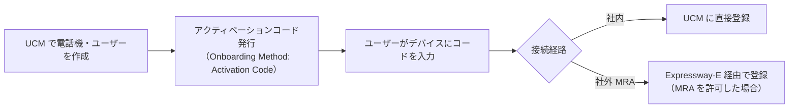

**ベストプラクティス**
- 大量展開は **BAT（テンプレート＋CSV）**で、**電話ボタンテンプレート・デバイスプール・CSS を統一**する。
- アクティベーションコードは **有効期限を短く**し、使用済み後は無効になることを確認する。
- 命名規則（例: デバイスプール `DP_拠点_役割`、CSS `CSS_役割_権限`）を最初に決める。

### 2.4 SIP エンドポイントのトラブルシュート

| 症状 | 確認手順（順番に） |
|---|---|
| **電話が登録されない** | ① DHCP（IP／Option 150）② TFTP 到達・設定ファイル取得（`SEP<MAC>.cnf.xml`）③ NTP／証明書（ITL/CTL）④ UCM 側の登録ステータス（RTMT）⑤ FW／ポート |
| **登録が不安定** | Call Manager Group の設定、ネットワーク断、電話のファームウェア、ライセンス |
| **ボタンが反応しない／機能が使えない** | ボタンテンプレート、ソフトキーテンプレート、回線／CSS |
| **社外から登録できない** | MRA の DNS／証明書／トラバーサルゾーン（第 CLCEI 章）、アクティベーションコード |

**電話の Status Messages**（電話機の設定→ステータス）で TFTP/DNS/登録エラーを確認できます。

### 2.5 Cisco UCM における SIP OAuth

**SIP OAuth** は、Jabber／Webex アプリ／一部の電話が**トークン（OAuth アクセストークン）を使って UCM にセキュアに SIP 登録**する仕組みです。**CAPF のエンドポイント証明書登録が不要**になる点が大きな利点です。

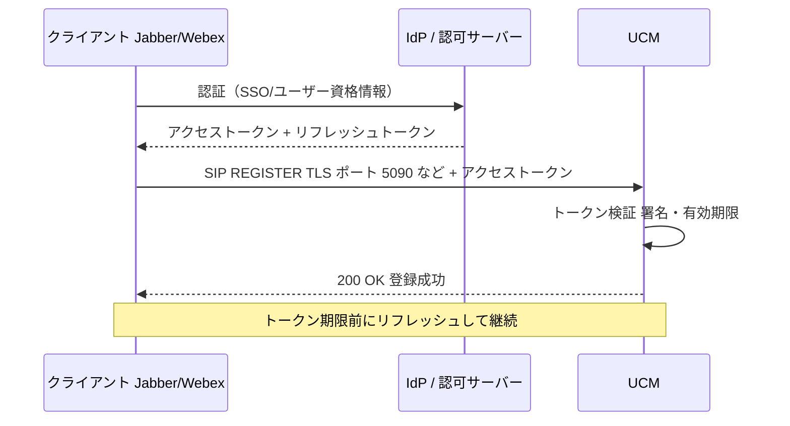

| 項目 | 内容 |
|---|---|
| メリット | クライアントが TLS 経由でトークン認証、**CAPF 不要**、SSO との親和性が高い |
| 前提 | UCM で **SIP OAuth モード**を有効化、OAuth 用ポート、UCM の署名証明書、電話セキュリティプロファイル |
| 注意 | UCM の **OAuth 署名鍵／証明書の有効期限**、NTP、DNS、クライアントの対応バージョン |

**ベストプラクティス**
- SSO（SAML）と OAuth を組み合わせ、**パスワードの配布を減らす**。
- トークンの有効期限とリフレッシュ動作を理解し、**時刻同期（NTP）を厳密に**保つ。

### 2.6 第2章 まとめ

| チェック | 内容 |
|---|---|
| ☐ | INVITE→180→200→ACK の基本フローを描ける |
| ☐ | SDP の c=/m=/a= を読める |
| ☐ | DTMF 4方式と、圧縮コーデックで RFC 2833 が必要な理由を説明できる |
| ☐ | Hold/Resume/Transfer の SIP 表現（re-INVITE/REFER）を説明できる |
| ☐ | 主要コーデックの特徴と使い分けができる |
| ☐ | 手動／セルフ／BAT／クラウド／アクティベーションコードの違いを説明できる |
| ☐ | SIP OAuth の概要とメリットを説明できる |

### 2.7 第2章の参考ソース

| ソース | URL |
|---|---|
| CLCOR 試験の内容 PDF | https://www.cisco.com/c/dam/global/ja_jp/training-events/training-certifications/exam-topics/350-801-CLCOR.pdf |
| UCM 機能設定ガイド／システム設定ガイド一覧 | https://www.cisco.com/c/ja_jp/support/unified-communications/unified-communications-manager-callmanager/products-installation-and-configuration-guides-list.html |
| Cisco Collaboration SRND ポータル | https://www.cisco.com/go/srnd |

---

## 第3章 Cisco IOS XE ゲートウェイとメディアリソース（15%）

### 3.0 ゲートウェイとは

**音声ゲートウェイ**は、IP 網（社内）と PSTN（アナログ/デジタル回線）や ITSP（SIP トランク）を**橋渡し**するルーターです。役割により次のように呼ばれます。

| 呼称 | 役割 |
|---|---|
| **PSTN ゲートウェイ** | ISDN/アナログ回線と IP 網を変換 |
| **CUBE（SBC）** | SIP トランクの終端。正規化・セキュリティ・相互接続 |
| **SRST ゲートウェイ** | WAN 障害時のフォールバック呼制御 |
| **Local Gateway（Webex Calling 用）** | オンプレミスの PSTN／PBX と Webex Calling をつなぐ |

### 3.1 音声ゲートウェイ要素の設定

#### 3.1.a DTMF

```
dial-peer voice 100 voip
 dtmf-relay rtp-nte
```
- `rtp-nte`（RFC 2833）、`sip-kpml`、`sip-notify` などが選択可能。**相手と一致**させる。
- 必要に応じて複数方式を併記し、優先させる。

#### 3.1.b 音声変換ルールおよびプロファイル

**voice translation-rule / voice translation-profile** は、**電話番号（着信番号／発信者番号）を書き換える**機能です。

```
voice translation-rule 10
 rule 1 /^0\(.*\)/ /+81\1/
!
voice translation-profile TO_E164
 translate called 10
!
dial-peer voice 200 voip
 translation-profile incoming TO_E164
```
- `rule` は「**正規表現に一致 → 置換**」。上の例は先頭 `0` を `+81` に置換（国内番号→E.164）。
- **プロファイルで called／calling／redirect-called などを個別に適用**できる。

**ベストプラクティス**
- 変換は**ゲートウェイ側で行うか UCM で行うかを統一**する（グローバライズドルーティングでは UCM 側の変換パターンに寄せるのが原則）。
- ルールは `test voice translation-rule` で**必ず事前検証**する。

#### 3.1.c 優先コーデックのリスト

```
voice class codec 1
 codec preference 1 g711ulaw
 codec preference 2 g729r8
!
dial-peer voice 100 voip
 voice-class codec 1
```
- **`codec preference` の数字が小さいほど優先**。相手が対応するコーデックの中から選ばれる。

#### 3.1.d ダイヤルピア

**ダイヤルピア（dial-peer）**は「**どの番号を、どこ（VoIP／POTS）へ送るか**」を定義する、ゲートウェイの**ルーティングテーブル**です。

| 種類 | 対象 |
|---|---|
| **POTS dial-peer** | 物理ポート（アナログ／デジタル）向け |
| **VoIP dial-peer** | IP ネットワーク（SIP）向け |

| 方向 | 意味 |
|---|---|
| **発信ダイヤルピア（outbound）** | 呼をどこへ出すか（`destination-pattern`、`session target`） |
| **着信ダイヤルピア（inbound）** | 着信呼を識別・処理（`incoming called-number`、`answer-address`、`voice-class` 適用） |

```
dial-peer voice 1 voip
 description To_UCM
 destination-pattern 0[1-9]......
 session protocol sipv2
 session target ipv4:10.1.1.10
 voice-class codec 1
 dtmf-relay rtp-nte
 no vad
```

### 3.2 ダイヤルピアマッチングのトラブルシュート

**ダイヤルピアのマッチング規則（着信側）**は、次の優先順で一致を探します。

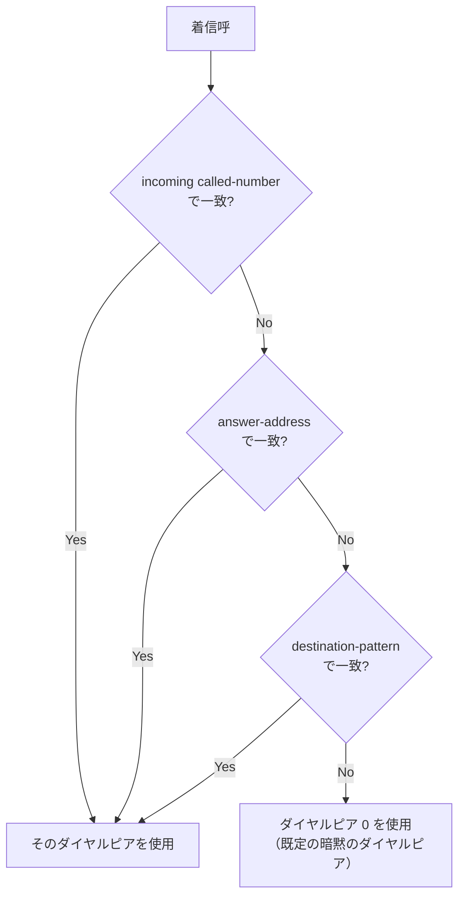

**発信側**では `destination-pattern` の**最長一致（most specific）**が優先されます。同一パターンの場合は `preference` の小さいほうが優先されます。

| 症状 | 確認コマンド／観点 |
|---|---|
| 意図しないダイヤルピアに当たる | `show dialplan number <番号>`、`debug voip dialpeer` |
| 着信で 404/ワンウェイ | **inbound ダイヤルピア**が想定外（ダイヤルピア0）で、コーデックや DTMF が既定になっている |
| 発信できない | `destination-pattern` の不一致、`session target` 到達性、`preference` |

**ベストプラクティス**
- **着信は `incoming called-number` ないし `voice class uri` で明示的にマッチ**させ、ダイヤルピア0（暗黙）に頼らない。
- `show dialplan number` で**期待するダイヤルピアが選ばれるか**を必ず確認する。
- 番号帯ごとに整理し、`description` を必ず付ける。

### 3.3 適切な IOS XE メディアリソースの識別

**メディアリソース**は、通話の音声を**処理・加工**するための資源（DSP やソフトウェア）です。

| メディアリソース | 何をするか | 必要になる場面 |
|---|---|---|
| **トランスコーダー（Transcoder）** | コーデック変換（例: G.711 ⇔ G.729） | 双方の対応コーデックが異なる |
| **会議ブリッジ（Conference Bridge）** | 複数人の音声をミキシング | アドホック／ミートミー会議 |
| **MTP（Media Termination Point）** | メディアを終端して再送。DTMF 方式変換、コーデック統一、ホールド時の再接続 | DTMF 方式が異なる、RFC 2833 変換、SIP↔H.323 相互接続 |
| **MOH（Music on Hold）** | 保留音のストリーミング | 保留時 |
| **アナンシエーター（Annunciator）** | 案内音声・トーンの再生 | 通話失敗アナウンス等 |

**ハードウェア（DSP）とソフトウェア（UCM 内蔵）の比較**

| 種別 | 例 | 特徴 |
|---|---|---|
| **ハードウェア** | ゲートウェイの **PVDM（DSP）** | 大量処理・トランスコード向き。**DSP 容量の設計が必要** |
| **ソフトウェア** | UCM 内蔵の会議ブリッジ・MTP・MOH | 小規模向け。CPU 負荷が増える |

**ベストプラクティス**
- **メディアリソースグループ（MRG）／リストを設計**し、拠点ごとに使うリソースを制御する。
- 「トランスコーダーが不要な設計」（コーデック統一）を目指す。**必要な場合のみ**リソースを確保。
- DSP は**ピーク時の同時変換数＋余裕**で見積もる。

### 3.4 クラウド通話におけるハイブリッドローカルゲートウェイ

**Webex Calling** と**オンプレミスの PSTN／PBX**をつなぐ場合、境界に置く**CUBE などのゲートウェイを「ローカルゲートウェイ」**と呼びます。

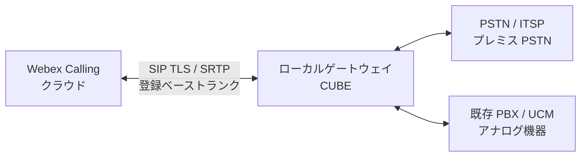

| 項目 | 内容 |
|---|---|
| 接続方式 | **登録ベースの SIP トランク**（Local Gateway が Webex Calling に登録） |
| セキュリティ | **SIP TLS＋SRTP** |
| 主な用途 | プレミス PSTN 接続、オンプレ PBX との共存、アナログ機器・FAX の収容 |
| 設計要素 | テナント（`voice class tenant`）、SIP プロファイル、コーデック（Webex Calling 側は主に Opus/G.711/G.722 等）、ダイヤルピア |

**ベストプラクティス**
- **証明書（Webex Calling 側が要求する公開 CA 系のチェーン）**を正しく用意し、ホスト名・SAN を整合させる。
- **冗長化**（複数 Local Gateway・複数トランク）と**トールフラウド対策（trusted list）**を設定する。

### 3.5 第3章 まとめ

| チェック | 内容 |
|---|---|
| ☐ | ダイヤルピアの inbound/outbound マッチ規則を説明できる |
| ☐ | translation-rule / profile の書き方を読める |
| ☐ | `voice class codec` の優先順位設定を説明できる |
| ☐ | トランスコーダー／MTP／会議ブリッジの違いを説明できる |
| ☐ | Local Gateway の役割（登録ベーストランク、TLS/SRTP）を説明できる |

### 3.6 第3章の参考ソース

| ソース | URL |
|---|---|
| CUBE 製品サポートページ（構成ガイド・コマンドリファレンス・TechNote） | https://www.cisco.com/c/en/us/support/unified-communications/unified-border-element/series.html |
| CUBE 構成／TechNote 一覧（DTMF Relay、SIP TLS、Options Ping など） | https://www.cisco.com/c/en/us/support/unified-communications/unified-border-element/tsd-products-support-configure.html |
| CLCOR 試験の内容 PDF | https://www.cisco.com/c/dam/global/ja_jp/training-events/training-certifications/exam-topics/350-801-CLCOR.pdf |

---

## 第4章 コールコントロール（25%）

> **最重要章（配点25%）**。ダイヤルプランの理解が合否を分けます。ゆっくり、図を描きながら学習してください。

### 4.0 UCM のコールルーティング部品を先に整理する

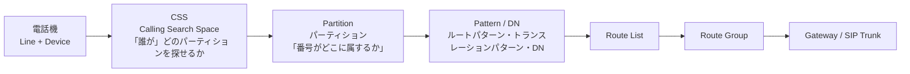

| 部品 | 役割 | たとえ |
|---|---|---|
| **パーティション（Partition）** | 番号（DN・パターン）を入れる「**箱**」 | 電話帳の「部署別ページ」 |
| **CSS（Calling Search Space）** | どのパーティションを**検索してよいか**の一覧（順序あり） | 「この人は営業部と総務部のページだけ見られる」 |
| **ルートパターン** | 外線などへ送る番号パターン | 「0 で始まる番号は外線ゲートウェイへ」 |
| **トランスレーションパターン** | 番号を**書き換え**て再ルーティング | 「4桁を国際形式に変換」 |
| **ルートリスト／ルートグループ** | 複数の出口に**優先順位・冗長**を付ける | 「第一候補が使えなければ第二候補」 |
| **デバイスプール** | リージョン・ロケーション・SRST・Call Manager Group 等の束 | 拠点の設定テンプレート |

**重要な原則**: 発信者の**デバイス側 CSS**（回線 CSS＋デバイス CSS の合成）が、発信可能な宛先を決めます。パーティションに入っていない番号には**そもそも到達できません**。

### 4.1 Cisco UCM におけるダイヤル番号分析プロセス

#### ① 何のためか
ユーザーがダイヤルした番号に対して、**どのパターンに一致させ、どこへ呼を送るか**を決めるプロセスです。

#### ② どう動くか

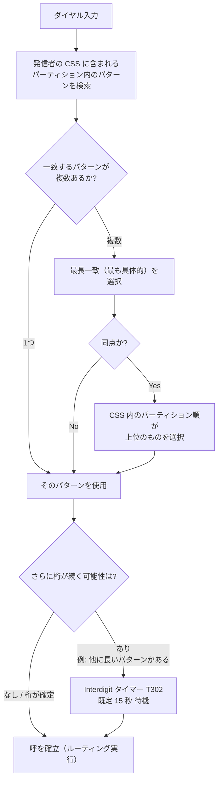

**ポイント**

| 概念 | 説明 |
|---|---|
| **Closest Match（最長一致）** | 一致範囲が**最も狭い（具体的な）パターン**を優先。例: `5000` は `5XXX` より優先 |
| **CSS 内のパーティション順序** | 同じ具体度のとき、**CSS で上位のパーティション**が優先 |
| **T302 タイマー** | ダイヤル中の次桁待ち時間（既定 15 秒）。**`#` を押すと待たずに即発信**（Route Pattern の「Urgent Priority」など） |
| **Urgent Priority** | 曖昧一致でもすぐに処理を確定させる設定。使いすぎると意図せず早期確定する |
| **主なワイルドカード** | `X`（0-9）、`!`（1桁以上の任意）、`[1-5]`（範囲）、`+`（E.164 のプラス）、`.`（破棄区切り：ルートパターンで先行桁を破棄する指定） |

**確認ツール**: **Dialed Number Analyzer（DNA）**、**Serviceability の Dialed Number Analyzer**、RTMT の SDL トレース。

**ベストプラクティス**
- 曖昧な広範囲パターン（`!` や `XXXX.!` 等）を**安易に作らず**、デフォルトルートは最終手段に限定する。
- パターン追加後は **DNA でテスト**（許可されるべき通話・拒否されるべき通話の両方）。
- **パーティション名・CSS 名の命名規則**（用途＋権限）を最初に決める。

### 4.2 Cisco UCM における不正通話防止（Toll Fraud Prevention）の実装

#### ① 何のためか
第三者に**PBX を悪用されて国際電話などを不正発信される被害（トールフラウド）**を防ぎます。

#### ② 主な対策（多層防御）

| 対策 | 内容 |
|---|---|
| **CSS／パーティションによる発信制限** | 国際・国内・携帯・有料番号の**パーティションを分離**し、必要な人にのみ許可 |
| **Block OffNet to OffNet Transfer** | 外線同士の転送（不正な中継）を禁止する**サービスパラメータ** |
| **FAC（Forced Authorization Code）／CMC** | 発信時に**認証コード／クライアントマターコード**を要求 |
| **Time-of-Day ルーティング** | 営業時間外は国際・外線発信を制限 |
| **アドホック会議の外線混在制限** | 会議ブリッジ経由の不正中継を防止 |
| **SIP トランク／CUBE の信頼リスト** | 許可した IP アドレスからの INVITE のみ受け付ける（`ip address trusted list`） |
| **ゲートウェイ／CUBE のパターン制限** | 発信先番号パターン制限、Voice class の適用 |
| **強固なパスワード・管理者ロール** | ユーザー資格情報流出による不正利用対策 |
| **CDR/CAR の監視と閾値アラート** | 通常と異なる**夜間・休日の大量国際発信**を検知 |

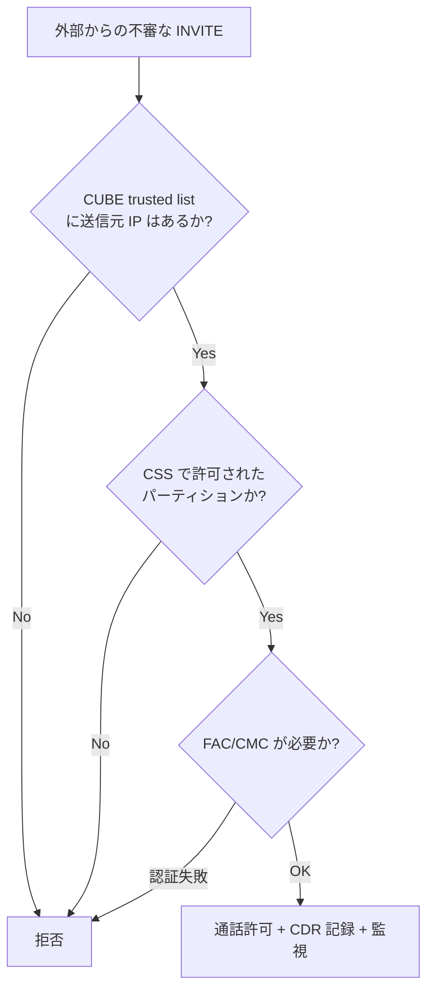

**ベストプラクティス**
- **「デフォルト拒否」**（許可した宛先だけ通す）を原則にする。
- 国際発信は**一部ユーザー＋FAC**、夜間帯は**時間帯ルーティング**で制限する。
- **CDR の日次／リアルタイム監視**（閾値超過アラート）を運用に組み込む。

### 4.3 Cisco UCM におけるグローバル化されたコールルーティングの設定

#### ① 何のためか
拠点ごとに異なるローカルダイヤル（市外局番の有無など）を、**内部ではすべて +E.164 に統一**して扱い、**変換は出入口（エッジ）でのみ実施**する設計です。

**メリット**: 拠点追加・番号体系変更・国際展開・M&A に強く、**ダイヤルプランの複雑化を防ぐ**。

```mermaid
flowchart LR
    U["ユーザー入力<br/>03-1234-5678 / 内線 5678"] --> T1["Translation Pattern<br/>ローカル形式 → +E.164"]
    T1 --> Core["UCM 内部は<br/>+E.164 で統一"]
    Core --> RP["Route Pattern<br/>+81.!  等 (+E.164)"]
    RP --> RL["Route List<br/>SLRG を利用"]
    RL --> LRG["Standard Local Route Group<br/>発信者の拠点の出口へ"]
    LRG --> TR["Called Party Transformation<br/>+E.164 → ゲートウェイ形式"]
    TR --> GW["ゲートウェイ<br/>ITSP"]
```

#### 4.3.a ルートパターン（従来形式および +E.164 形式）

| 形式 | 例 | 説明 |
|---|---|---|
| 従来形式 | `9.@`, `0.XXXXXXXXXX` | アクセスコード付き、拠点ごとの形式（**拡張しにくい**） |
| **+E.164 形式** | `\+81.!`, `\+.!` | 国番号付き、**グローバルに一意**（推奨） |

> UCM では `+` をリテラルとして扱うため、パターン内では **`\+`（バックスラッシュ付き）**と記述します。

#### 4.3.b トランスレーションパターン

入力された番号を**書き換えて（変換して）再度ルーティング**します。

| 用途 | 例 |
|---|---|
| 内線→E.164 | 内線 `5XXX` を `\+81312345XXX` に変換 |
| ローカルダイヤル→E.164 | ユーザーがダイヤルする `0.03XXXXXXXX` を `\+81 3 XXXXXXXX` に変換 |
| 旧番号の吸収 | 旧内線番号を新番号にマップ |

#### 4.3.c 標準ローカルルートグループ（Standard Local Route Group：SLRG）

**課題**: 拠点ごとに異なる出口ゲートウェイ（地域の PSTN）へ出したいが、拠点ごとにルートパターンを作ると爆発的に増える。
**解決**: ルートリストに**「Standard Local Route Group」を指定**し、**発信者のデバイスプールが持つローカルルートグループ**に自動でマッピングする。

```mermaid
flowchart TD
    RL["Route List<br/>[+81.!]"] --> SLRG["Standard Local Route Group"]
    SLRG --> A{"発信元デバイスプール"}
    A -->|"東京 DP"| T["Local Route Group = 東京 GW"]
    A -->|"大阪 DP"| O["Local Route Group = 大阪 GW"]
    A -->|"福岡 DP"| F["Local Route Group = 福岡 GW"]
```

**ベストプラクティス**: 拠点が増えても**ルートパターン・ルートリストは共通で1つ**にし、デバイスプールでローカル出口を切り替える。

#### 4.3.d トランスフォーム（Transformation）

| 種類 | 適用タイミング | 例 |
|---|---|---|
| **Calling Party Transformation** | 発信者番号の変換 | 内線 `5678` → `+81312345678`（外線発信時の発番号） |
| **Called Party Transformation** | 着信番号の変換 | `+81312345678` → ゲートウェイ形式 `0312345678` |
| **Incoming Calling/Called Party Settings（トランクレベル）** | 着信時の正規化 | ITSP から受信した `0312345678` を `+81312345678` に変換 |
| **Called Party Transformation CSS** | **変換パターンを検索する CSS**（変換用の専用 CSS） | 変換パターンが正しく適用されるための必須設定 |

**変換の位置づけ**

```mermaid
flowchart LR
    IN["ITSP から着信<br/>0312345678"] --> I["トランク着信変換<br/>Incoming Called Party"]
    I --> G["UCM 内部 +E.164<br/>+81312345678"]
    G --> O["外線発信時<br/>Called Party Transformation"]
    O --> OUT["ゲートウェイ<br/>0312345678"]
```

#### 4.3.e SIP ルートパターン

**SIP ルートパターン**は、**ドメイン名や URI（例: `example.com`、`sip:user@domain`）**による SIP トランクへのルーティングに使います。**URI ダイヤル**やクラスタ間・Expressway 連携で活用します。

| 種類 | ルーティング対象 |
|---|---|
| ルートパターン | **番号（電話番号）** |
| SIP ルートパターン | **ドメイン／IP アドレス（URI）** |

#### 4.3.f URI 通話に関連する ILS

**ILS（Intercluster Lookup Service）**は、複数の UCM クラスタ間で**番号・URI・パターンを自動的に交換**する仕組みです。

| 機能 | 内容 |
|---|---|
| **ILS** | クラスタ間で URI・番号のカタログ（**ディレクトリ URI**）を共有、**ハブアンドスポーク**構成 |
| **GDPR（Global Dial Plan Replication）** | ILS を使い、**グローバルダイヤルプランのパターン（例: +E.164 のパターン）**をクラスタ間で共有 |
| **URI ダイヤル** | `user@example.com` のような**URI で通話**する。着信側クラスタを ILS で探索 |

**ベストプラクティス**: クラスタ間トランクは**証明書認証（TLS）**を推奨。ILS は**パスワード／TLS 証明書**で認証し、ハブの冗長化を考慮する。

#### 4.3.g パーティションおよびコーリングサーチスペース（CSS）

第4.0節の内容に加え、**設計例（部署別の権限管理）**を示します。

| CSS 名 | 含まれるパーティション（順序あり） | 利用者 |
|---|---|---|
| `CSS_Internal` | `PT_Internal` | 全ユーザー（内線のみ） |
| `CSS_Local` | `PT_Internal`, `PT_Local` | 一般社員（内線＋国内） |
| `CSS_Intl` | `PT_Internal`, `PT_Local`, `PT_Intl` | 国際発信が必要な部署 |

**ベストプラクティス**
- **「ブロック」用パーティション**（`PT_Block`、宛先を Block にしたパターン）を CSS の**上位**に置き、確実に発信を拒否する設計にする。
- **CSS は少数に絞り、ユーザーに権限セットとして割り当て**る（回線CSS＋デバイスCSS の合成ルールを理解する）。
- **転送／不在転送用の CSS**（Forward All CSS など）も忘れず設計する。

### 4.4 モバイルおよびリモートアクセス（MRA）の説明

**MRA（Mobile and Remote Access）**は、**社外の Jabber／Webex アプリ／対応デバイス**が **VPN なし**で社内の UC サービス（通話・チャット・ボイスメール・連絡先）を利用できるようにする仕組みです。

```mermaid
flowchart LR
    C["社外クライアント"] -->|"HTTPS 8443<br/>SIP TLS 5061<br/>XMPP 5222"| E["Expressway-E<br/>DMZ"]
    E -->|"Traversal Zone<br/>C から E へ接続"| X["Expressway-C<br/>社内"]
    X --> U["UCM"]
    X --> I["IM and Presence"]
    X --> V["Unity Connection"]
```

| 要素 | 役割 |
|---|---|
| **Expressway-E** | 社外からの接続を受ける。DMZ に配置 |
| **Expressway-C** | 社内 UC サーバーへプロキシ。**C→E 方向にトラバーサル接続を確立** |
| **DNS SRV** | 社外 DNS に `_collab-edge._tls.<domain>`（Expressway-E を指す）を公開 |
| **証明書** | Expressway-E は**公開 CA 署名**、各ノードの SAN 設計が必須 |
| **HTTP 許可リスト** | Expressway-C が中継を許可する社内 HTTP サーバーの一覧 |

> MRA の詳細な構成・トラブルシュートは **Part D（CLCEI）** で深く扱います。CLCOR では「概念・構成要素・流れ」を理解しておけば十分です。

**ベストプラクティス**
- **社内 DNS と社外 DNS を分け（スプリット DNS）**、社外にのみ `_collab-edge` を公開する。
- **ポート／FW 開放は公式の IP Port Usage ガイドに従う**（構成バージョンにより異なる）。
- Expressway-E は**外部公開機器**として**最小サービス・強固な設定**とする。

### 4.5 Webex Calling のダイヤルプラン機能

**Webex Calling** はクラウドで通話を提供するサービスで、**ダイヤルプラン**は Control Hub で管理します。

#### 4.5.a ロケーションおよび番号

| 要素 | 説明 |
|---|---|
| **ロケーション（Location）** | 拠点／組織単位。**PSTN 接続タイプ、タイムゾーン、住所（緊急通報）、内線桁数**などを持つ |
| **番号（Numbers）** | DID（直通番号）や内線番号。ユーザー・ワークスペース・機能（自動応答・ハントグループなど）へ割り当て |
| **PSTN オプション** | **Cisco Calling Plan**／**クラウド接続 PSTN（CCP）**／**プレミス PSTN（Local Gateway）** |

#### 4.5.b 発信および着信の権限

| 設定 | 内容 |
|---|---|
| **発信権限（Outgoing Calling Permissions）** | 国内・国際・特番などの**通話種別ごとに許可／拒否／認証コード要求**を設定（ユーザー／ロケーション単位） |
| **着信権限** | 特定通話の**着信ブロック**、匿名着信拒否など |

#### 4.5.c 転送および転送先指定の制限

- 通話転送・不在転送の**転送先（外線・国際など）を制限**して不正利用を防止する。

```mermaid
flowchart LR
    A["ロケーション作成<br/>PSTN 接続・住所・内線桁数"] --> B["番号を追加<br/>DID・内線"]
    B --> C["ユーザー／機能に割り当て"]
    C --> D["発信・着信権限を設定"]
    D --> E["転送先制限を設定"]
    E --> F["デバイス／アプリで検証"]
```

**ベストプラクティス**
- **国際発信は既定で拒否**し、必要な人にのみ許可する。
- **緊急通報（住所情報）の登録**をロケーション作成時に必ず実施する（法令対応）。
- 内線桁数・番号計画を最初に決め、**ロケーション間ダイヤルの一貫性**を維持する。

### 4.6 第4章 まとめ

| チェック | 内容 |
|---|---|
| ☐ | パーティション／CSS の役割を説明できる |
| ☐ | 最長一致・T302・`#`・Urgent Priority を説明できる |
| ☐ | トールフラウド対策を最低5つ挙げられる |
| ☐ | **グローバライズドルーティングの全体像（+E.164 統一）**を図示できる |
| ☐ | ルートパターン、トランスレーションパターン、変換パターン、SLRG の違いを説明できる |
| ☐ | SIP ルートパターン、ILS、GDPR、URI ダイヤルを説明できる |
| ☐ | MRA の構成要素（C/E、SRV、証明書）を言える |
| ☐ | Webex Calling のロケーション／番号／権限の関係を説明できる |

### 4.7 第4章の参考ソース

| ソース | URL |
|---|---|
| UCM システム設定ガイド／機能設定ガイド（一覧） | https://www.cisco.com/c/ja_jp/support/unified-communications/unified-communications-manager-callmanager/products-installation-and-configuration-guides-list.html |
| Cisco Collaboration SRND ポータル（Dial Plan・Bandwidth Management の章を含む） | https://www.cisco.com/go/srnd |
| Expressway 導入ガイド一覧（MRA、Basic Configuration、IP Port Usage） | https://www.cisco.com/c/en/us/support/unified-communications/expressway-series/products-installation-and-configuration-guides-list.html |
| Jabber 導入ガイド（Expressway for MRA 章） | https://www.cisco.com/c/en/us/td/docs/voice_ip_comm/jabber/CJAB_BK_D6497E98_00_deployment-installation-guide-ciscojabber/CJAB_BK_D6497E98_00_deployment-installation-guide-ciscojabber_chapter_011.html |
| CUBE のトールフラウド対策（信頼リスト・ハードニング） | https://www.cisco.com/c/en/us/support/unified-communications/unified-border-element/series.html |

---

## 第5章 QoS（10%）

### 5.0 QoS とは

**QoS（Quality of Service）**は、ネットワークが混雑しても**音声・ビデオのように遅延に敏感なトラフィックを優先**して品質を守る仕組みです。**たとえ**: 高速道路の「緊急車両専用レーン」。

### 5.1 音声とビデオの品質低下につながる問題

| 要因 | 意味 | 音声への影響 |
|---|---|---|
| **5.1.a 遅延（Delay/Latency）** | 送信から受信までの時間 | 会話がかみ合わない、エコー |
| **5.1.b ジッター（Jitter）** | 遅延のばらつき | 音が途切れる／歪む（デジッタバッファで吸収するが限界あり） |
| **5.1.c パケット損失（Packet Loss）** | パケットが届かない | 音の欠落、ビデオのブロックノイズ／フリーズ |
| **5.1.d 帯域幅（Bandwidth）** | 回線容量の不足 | 輻輳による遅延・損失の増加 |

### 5.2 音声とビデオの QoS 要件（Cisco の一般的な目安）

| トラフィック | 片方向遅延 | ジッター | パケット損失 |
|---|---|---|---|
| **音声** | 150 ms 以下 | 30 ms 以下 | 1% 以下 |
| **インタラクティブ・ビデオ** | 150 ms 以下 | 30〜50 ms 以下 | 0.1〜1% 以下（品質要件に依存） |

> 数値はいずれも Cisco が設計ガイドで示す**一般的な目安**です。正確な数値は SRND／Enterprise QoS 設計ガイドで確認してください。**試験では「音声：150 ms / 30 ms / 1%」の3点セットを最低限暗記**します。

### 5.3 QoS のクラスモデル

トラフィックを**何クラスに分類するか**の設計モデルです。

| モデル | クラス数 | 特徴 |
|---|---|---|
| **5.3.a 4/5 クラスモデル** | 4〜5 | 音声、ビデオ、シグナリング、データ（＋既定）。**小規模向けのシンプルなモデル** |
| **5.3.b 8 クラスモデル** | 8 | 音声、インタラクティブビデオ、ストリーミングビデオ、ネットワーク制御、シグナリング、重要データ、Scavenger、既定 |
| **5.3.c QoS ベースラインモデル（11 クラス）** | 11 | 8クラスに加え、**IP ルーティング、管理、トランザクションデータ、バルクデータ**などを細分化 |

**代表的なクラスと DSCP（参考）**

| クラス | 代表 DSCP | 用途 |
|---|---|---|
| 音声 | **EF（46）** | RTP 音声 |
| インタラクティブビデオ／マルチメディア会議 | **AF41（34）** | ビデオ通話・会議 |
| シグナリング | **CS3（24）** | SIP／SCCP などの呼制御 |
| ネットワーク制御 | CS6（48）、CS2（16）など | ルーティング、管理 |
| ベストエフォート（既定） | 0（DF） | その他一般データ |
| Scavenger | CS1（8） | 優先度を下げたいトラフィック |

**ベストプラクティス**: 導入初期は**8クラス（または 4/5 クラス）で開始**し、要件が増えたら拡張する。クラスが多すぎると運用が複雑になる。

### 5.4 コラボレーションに関連する DiffServ 値

| DSCP | 10進 | 意味・用途 |
|---|---|---|
| **5.4.a EF（Expedited Forwarding）** | 46 | **音声メディア（RTP）**。低遅延・低ジッター・低損失。**LLQ の優先キュー**に入れる |
| **5.4.b AF41** | 34 | **インタラクティブ／マルチメディア会議ビデオ**（AF4x の最初） |
| **5.4.c AF42** | 36 | AF41 と**同一クラス**で廃棄優先度がより高い。契約帯域超過分の再マーキング等で利用 |
| **5.4.d CS3** | 24 | **呼制御シグナリング**（SIP／SCCP 等）。**保護すべき制御トラフィック** |
| **5.4.e CS4** | 32 | **リアルタイム・インタラクティブ**（一部のテレプレゼンス／ビデオ用途で従来から使われる） |

> 「AF」は **Assured Forwarding**。`AFxy` の **x＝クラス、y＝廃棄優先度（数値が大きいほど落とされやすい）**。

### 5.5 LAN の分類・マーキングと信頼境界（Trust Boundary）

#### ① 何のためか
**「誰が付けた DSCP を信用するか」の境界**を決めます。ユーザーPC が勝手に EF を付けて帯域を横取りするのを防ぐ、という考え方です。

```mermaid
flowchart LR
    PH["IP Phone<br/>DSCP を正しく付与"] --> SW["アクセススイッチ<br/>信頼境界"]
    PC["PC<br/>信頼しない"] --> PH
    SW -->|"電話のマーキングを信頼<br/>PC は再マーキング / 0 にリセット"| CORE["コアネットワーク<br/>QoS ポリシー適用"]
    CORE --> WAN["WAN ルーター<br/>LLQ / 帯域保証"]
```

| 概念 | 説明 |
|---|---|
| **信頼境界** | DSCP/CoS を**信頼して受け入れる位置**。できるだけ**エンドデバイスに近いアクセススイッチ**に置く |
| **Conditional Trust** | **Cisco IP Phone が接続された場合のみ**電話のマーキングを信頼（CDP/LLDP で判定） |
| **再マーキング** | 信頼できないポート（PC 側）のパケットは **DSCP を再設定またはリセット** |

**ベストプラクティス**
- **信頼境界はできるだけエッジ（アクセスポート）に置く**。
- 電話ポートは **Conditional Trust**、PC 側ポートは非信頼。
- **DSCP を end-to-end で維持**する（WAN プロバイダーがマーキングを保持するか事前確認）。

### 5.6 ロケーションベース CAC の帯域幅の要件

**CAC（Call Admission Control）**は、**帯域を超える通話を新規に受け入れない**ことで、既存通話の品質を守る仕組みです。QoS（優先制御）は「混んだらどれを守るか」、CAC は「混む前に通話数を制限する」点が異なります。

| 項目 | 内容 |
|---|---|
| **UCM のロケーション CAC** | 拠点（ロケーション）ごとに**音声・ビデオ・イマーシブの帯域上限**を設定し、超過する新規通話を拒否（または AAR/PSTN 迂回） |
| **Enhanced Location CAC（ELCAC）** | **ロケーション間リンク（Link）と重み（Weight）**でネットワークトポロジを表現し、**経路単位で帯域を管理**（LBM: Location Bandwidth Manager が計算） |
| **音声1通話の CAC 計算値（参考）** | G.711/G.722: 80 kbps、G.729: 24 kbps（L3 換算） |

**帯域の決め方（例）**

| 手順 | 内容 |
|---|---|
| ① | 拠点 WAN 帯域から**音声に割り当てる上限**（例: LLQ 帯域）を決める |
| ② | **同時通話数の上限＝割当帯域 ÷ 1通話の帯域** で算出（G.711 の場合 80 kbps） |
| ③ | ロケーションの音声帯域として設定、超過時の **AAR（Automated Alternate Routing）**で PSTN 迂回を検討 |

```mermaid
flowchart TD
    C["新規通話要求"] --> D{"発信・着信ロケーションの<br/>残り帯域は十分か?"}
    D -->|"Yes"| OK["通話許可・帯域を予約"]
    D -->|"No"| NG{"AAR 設定あり?"}
    NG -->|"Yes"| PSTN["PSTN 経由に迂回"]
    NG -->|"No"| REJ["拒否 ビジー / リオーダー"]
```

**ベストプラクティス**
- **CAC 上限は、実際の QoS（LLQ）の帯域を超えない**値にする（ネットワークとの整合）。
- **ハブアンドスポーク**構成なら ELCAC のリンク設計を簡素に保つ。
- **AAR** を使う場合は、CSS／外線ゲートウェイの設計（AAR CSS、外部電話番号マスク）を併せて検討する。

### 5.7 LLQ の設定（クラスマップ、ポリシーマップ、サービスポリシー）

**LLQ（Low Latency Queuing）**は、**音声用の優先キュー（プライオリティキュー）を確保**し、他のクラスは帯域割合で公平に扱うキューイング方式です。

**MQC（Modular QoS CLI）の3ステップ**

```mermaid
flowchart LR
    A["1. class-map<br/>トラフィックの分類"] --> B["2. policy-map<br/>クラスごとの動作を定義"]
    B --> C["3. service-policy<br/>インターフェイスに適用"]
```

**設定例（WAN 出力インターフェイス）**

```
class-map match-all VOICE
 match dscp ef
class-map match-all VIDEO
 match dscp af41
class-map match-all SIGNALING
 match dscp cs3
!
policy-map WAN-EDGE
 class VOICE
  priority percent 10
 class VIDEO
  bandwidth percent 20
 class SIGNALING
  bandwidth percent 5
 class class-default
  fair-queue
!
interface GigabitEthernet0/0/0
 service-policy output WAN-EDGE
```

| コマンド | 意味 |
|---|---|
| `priority` | **LLQ**（厳格優先＋**ポリサー的に帯域上限あり**）。音声用 |
| `bandwidth` | クラスに**最低限の帯域保証**（CBWFQ） |
| `fair-queue` | 既定クラス内の公平キューイング |

**ベストプラクティス**
- `priority` に割り当てる帯域は、**総帯域の 33% 以下**を目安にする（優先キューが他を飢餓させないため）。
- 音声（EF）と**ビデオ（AF41）は別クラス**にする。**音声とビデオを同じ priority に入れない**。
- `show policy-map interface <IF>` で**クラスごとの一致数・ドロップ数**を確認する。
- **シェーピング**が必要な回線（実効帯域＜物理帯域）では、**親ポリシーで shape → 子ポリシーで LLQ** の**階層 QoS**を使う。

### 5.8 第5章 まとめ

| チェック | 内容 |
|---|---|
| ☐ | 遅延／ジッター／損失／帯域の影響を説明できる |
| ☐ | 音声要件（150ms / 30ms / 1%）を暗記した |
| ☐ | 4/5・8・11 クラスモデルの違いを説明できる |
| ☐ | EF/AF41/AF42/CS3/CS4 の用途を言える |
| ☐ | 信頼境界と Conditional Trust を説明できる |
| ☐ | Location CAC と ELCAC の違いを説明できる |
| ☐ | LLQ の MQC 設定を読める／書ける |

### 5.9 第5章の参考ソース

| ソース | URL |
|---|---|
| Cisco Collaboration SRND ポータル（QoS Design Considerations の章、Bandwidth Management の章） | https://www.cisco.com/go/srnd |
| UCM システム設定ガイド一覧（Location／Region／CAC 設定） | https://www.cisco.com/c/ja_jp/support/unified-communications/unified-communications-manager-callmanager/products-installation-and-configuration-guides-list.html |
| CLCOR 試験の内容 PDF | https://www.cisco.com/c/dam/global/ja_jp/training-events/training-certifications/exam-topics/350-801-CLCOR.pdf |

---

## 第6章 コラボレーションアプリケーション（10%）

### 6.1 Cisco Unity Connection でのメールボックスおよび MWI の設定

#### ① Unity Connection（CUC）とは
UCM と連携する**ボイスメール／自動応答（Auto Attendant）システム**です。

#### ② ユーザー（メールボックス）作成の流れ

```mermaid
flowchart LR
    A["LDAP 同期 or 手動で<br/>ユーザー作成"] --> B["ユーザーテンプレート適用<br/>メールボックス有効化"]
    B --> C["ユーザーの<br/>内線番号 / パーティション / 検索範囲を設定"]
    C --> D["UCM 連携で MWI 有効化"]
    D --> E["電話でボイスメール確認"]
```

| 項目 | 説明 |
|---|---|
| **ユーザーテンプレート** | 大量ユーザーの**一括設定**（メールボックスサイズ、通話ルール、PIN ポリシー） |
| **Class of Service（CoS）** | 機能権限（例: メッセージ長、Webインボックス、SpeechView）を束ねる |
| **検索範囲（Search Space）** | 通話の宛先／メッセージ宛先を探せる範囲（パーティション） |
| **MWI（Message Waiting Indicator）** | 新着メッセージ時に**電話機のランプ／アイコンを点灯**する機能 |

**MWI の動作（SIP 連携）**

```mermaid
sequenceDiagram
    participant Ca as 発信者
    participant U as UCM
    participant CUC as Unity Connection
    participant P as 電話機
    Ca->>U: 内線へ発信 不在
    U->>CUC: 転送 INVITE
    CUC-->>Ca: 応答 メッセージ録音
    CUC->>U: SIP NOTIFY MWI 点灯
    U->>P: MWI 点灯
```

**MWI の設定要点**: UCM 側で **MWI ON/OFF 用の DN**（SCCP 連携の場合）や、**SIP では NOTIFY でメッセージ状態を伝える**。**電話の CSS が MWI パターンのパーティションを含んでいる**ことが必要。

**ベストプラクティス**
- ユーザーは **LDAP 同期＋テンプレート**で作成し、**手動作成を避ける**。
- **PIN／パスワードポリシー**を強化（デフォルトのまま運用しない）。
- **ボイスメールのストレージ**（メールボックスサイズ制限・保持期間）を設計する。

### 6.2 Cisco Unity Connection でのコールコントロールに対する SIP 統合オプション

| 統合方式 | 特徴 |
|---|---|
| **SIP トランク統合（推奨）** | UCM と CUC を **SIP トランク**で接続。**Port Group（ポートグループ）**と**ポート**を CUC 側で作成し、UCM 側に SIP トランクと**ルートパターン/ボイスメールパイロット**を設定 |
| **SCCP 統合（従来型）** | ボイスメールポート（SCCP デバイス）を UCM に登録。**旧来型で、新規設計では SIP が主流** |

```mermaid
flowchart LR
    UCM["UCM"] -->|"SIP トランク<br/>Voice Mail Pilot 宛"| CUC["Unity Connection<br/>Phone System / Port Group / Ports"]
    CUC -->|"SIP NOTIFY<br/>MWI"| UCM
```

**設定要点**
- **UCM**: SIP トランクセキュリティプロファイル、SIP プロファイル、**Voice Mail Pilot / Voice Mail Profile**、ルートパターンまたはハントパイロット。
- **CUC**: 電話システム、**ポートグループ（SIP）**、ポート、（TLS/SRTP を使う場合は**証明書**の相互登録）。

**ベストプラクティス**
- **冗長性**: ポートグループに複数の UCM ノードを登録し、UCM 側でも**複数ノードを宛先に指定**する。
- **セキュア連携**（SIP TLS＋SRTP）を用いる場合は**証明書の信頼設定**を正しく行う。

### 6.3 Cisco Unity Connection のコールハンドラ

| ハンドラ種別 | 役割 |
|---|---|
| **システムコールハンドラ** | **自動応答（AA）メニュー**、案内、メッセージ録音、転送を行う（例: 「営業は1、サポートは2」） |
| **ディレクトリハンドラ** | **名前による内線検索**を提供 |
| **インタビューハンドラ** | 質問を順に再生し、**回答を録音**する |

**通話が CUC に着信してからの流れ**

```mermaid
flowchart TD
    IN["着信"] --> R["呼ルーティングルール<br/>Direct / Forwarded"]
    R --> A{"条件に一致<br/>番号・スケジュール"}
    A -->|"ボイスメール転送"| U["ユーザーの挨拶 → メッセージ録音"]
    A -->|"自動応答"| H["コールハンドラ"]
    H --> M["メニュー入力"]
    M --> T["転送 / 別ハンドラ / ディレクトリ / 録音"]
```

| 要素 | 説明 |
|---|---|
| **スケジュール／休日** | 営業時間内外・休日で挨拶とルーティングを切替 |
| **挨拶（Greeting）** | 標準・時間外・休日・内線話中などを個別に設定 |
| **呼ルーティングルール** | **Direct（直接着信）／Forwarded（転送着信）**で異なるルールを持つ |

**ベストプラクティス**
- **営業時間内外・休日の挨拶とスケジュール**を必ず設定する。
- メニューの階層を**浅く（3階層以内）**にし、常に**オペレーターへの脱出口**を用意する。
- 自動応答の**内線／外線転送先は Restriction Table**で制限し、トールフラウドを防ぐ。

### 6.4 Webex アプリケーションのハイブリッドまたはクラウド登録の展開

Webex アプリは、通話機能の**接続先（登録先）**を選べます。

| 登録先 | 説明 | 主な必要要素 |
|---|---|---|
| **Webex Calling（クラウド）** | クラウド通話に登録 | Control Hub でユーザー／番号／ライセンス設定 |
| **UCM（オンプレミス）** | Webex アプリから UCM に登録（**Unified CM Calling in Webex App**） | UCM、（社外なら）**MRA/Expressway**、ディレクトリ／SSO |
| **ハイブリッド** | 会議やメッセージはクラウド、通話は UCM など、**用途で分離** | Webex Hybrid Services（Calendar／Message／Directory Connector など） |

**展開の流れ（例：UCM 登録の Webex アプリ）**

```mermaid
flowchart TD
    A["Control Hub でユーザー／ライセンス準備<br/>SSO・ディレクトリ同期"] --> B["Webex アプリのサービス検出用 DNS 設定<br/>社内 _cisco-uds / 社外 _collab-edge"]
    B --> C["UCM で UC Service / Service Profile / ユーザー設定"]
    C --> D["社外は MRA（Expressway）を構成"]
    D --> E["クライアント配布・ログイン検証"]
```

**ベストプラクティス**
- ハイブリッド導入では、**Directory Connector（AD 同期）と SSO を先に整備**する。
- 通話登録方式（クラウド／UCM）は**ユーザーグループごとに明確に設計**し、混在時の切替手順を文書化する。

### 6.5 第6章 まとめ

| チェック | 内容 |
|---|---|
| ☐ | CUC のユーザーテンプレート／CoS／検索範囲を説明できる |
| ☐ | MWI の仕組み（SIP NOTIFY）を説明できる |
| ☐ | SIP 統合に必要な UCM／CUC 双方の設定要素を挙げられる |
| ☐ | コールハンドラ／ディレクトリハンドラ／インタビューハンドラの違いを説明できる |
| ☐ | Webex アプリの登録方式（クラウド／UCM／ハイブリッド）を説明できる |

### 6.6 第6章の参考ソース

| ソース | URL |
|---|---|
| Unity Connection のコール管理の概念（旧リリースの資料だが用語・構造は共通） | https://www.cisco.com/en/US/docs/voice_ip_comm/connection/2x/administration/guide/2xcucsag040.html |
| Unity Connection コールハンドラ（概念資料） | https://www.cisco.com/en/US/docs/voice_ip_comm/connection/2x/administration_cmbe/guide/6xcucmbesag060.html |
| Webex ハイブリッドサービス導入ガイド一覧 | https://help.webex.com/en-us/article/7dmbcr |
| Webex ハイブリッドカレンダーサービス | https://www.cisco.com/go/hybrid-services-calendar |
| Webex Video Mesh | http://www.cisco.com/go/video-mesh |

---

# Part B. 300-810 CLICA コラボレーションアプリケーション

**試験時間 90分 / 出題比率**

| 章 | ドメイン | 配点 |
|---|---|---|
| B1 | コラボレーションアプリケーションでのシングルサインオン（SSO） | 15% |
| B2 | Cisco Unified IM and Presence、Cloud Messaging | 30% |
| B3 | Cisco Unity Connection | 30% |
| B4 | アプリケーションクライアント | 25% |

---

## B1. シングルサインオン（SSO）（15%）

### B1.1 コラボレーションに関連する SSO の種類

| 種類 | 仕組み | 特徴 |
|---|---|---|
| **統合 Windows 認証（IWA）** | Windows ドメインにログイン済みの資格情報を再利用 | ドメイン参加 PC 向け。**Kerberos** を使用 |
| **Kerberos** | チケットベースの認証プロトコル（KDC がチケットを発行） | ドメイン内での SSO。**時刻同期・SPN・DNS が重要** |
| **二要素認証（2FA/MFA）** | パスワード＋ワンタイムコード等 | IdP 側で実装（SAML SSO と組み合わせる） |
| **サードパーティ IdP** | Okta／Azure AD／PingFederate／AD FS など | **SAML 2.0 / OAuth 2.0 / OIDC** で連携 |

> **注意**: Kerberos／IWA は「ドメイン内ネットワーク」が前提。MRA 経由の社外ユーザーは、**IdP を社外から到達可能にしたうえで SAML** を使うのが一般的です。

### B1.2 SAML SSO ログインプロセスのフロー

**登場人物**

| 用語 | 説明 |
|---|---|
| **IdP（Identity Provider）** | 認証を行う側（例: AD FS、Okta） |
| **SP（Service Provider）** | サービスを提供する側（UCM、IM&P、Unity Connection、Expressway、Webex など） |
| **ブラウザ／クライアント** | 両者の間を**リダイレクト**で行き来する |

```mermaid
sequenceDiagram
    participant U as ユーザー Jabber/ブラウザ
    participant SP as SP UCM / CUC / IM&P
    participant IdP as IdP AD FS / Okta
    U->>SP: 1. サービスへアクセス
    SP-->>U: 2. 未認証 → SAML AuthnRequest 付きで IdP へリダイレクト
    U->>IdP: 3. AuthnRequest を送信
    IdP->>U: 4. ログイン画面 資格情報 / MFA
    U->>IdP: 5. 認証情報を入力
    IdP-->>U: 6. SAML Response Assertion を含む を返却
    U->>SP: 7. Assertion を SP へ POST
    SP->>SP: 8. 署名検証・有効期間・Audience 確認
    SP-->>U: 9. サービス提供 セッション確立
```

### B1.3 SAML 2.0 の各コンポーネント

| コンポーネント | 説明 | 例 |
|---|---|---|
| **アサーション（Assertion）** | IdP が発行する**「この人は認証済み」という宣言**（ユーザー属性を含む XML） | NameID、属性（uid、mail） |
| **プロトコル（Protocol）** | 要求・応答の**メッセージ形式** | `AuthnRequest`、`Response`、`LogoutRequest` |
| **バインディング（Binding）** | メッセージを**どの通信方式で運ぶか** | **HTTP Redirect**、**HTTP POST**、SOAP（Artifact） |
| **プロファイル（Profile）** | 上記を組み合わせた**利用シナリオの規定** | **Web Browser SSO プロファイル**、Single Logout プロファイル |

### B1.4 SAML SSO の設定

**設定の全体像**

```mermaid
flowchart TD
    A["前提確認<br/>FQDN・DNS・NTP・証明書"] --> B["IdP メタデータを取得"]
    B --> C["SP 側（UCM 等）で<br/>IdP メタデータをインポート"]
    C --> D["SP メタデータを<br/>エクスポートして IdP に登録"]
    D --> E["IdP 側で SP を Relying Party として設定<br/>NameID・属性マッピング"]
    E --> F["SSO テスト実行"]
    F --> G["SSO を有効化"]
```

| 設定要点 | 説明 |
|---|---|
| **FQDN で運用** | SAML は**ホスト名ベース**。IP アドレス指定では失敗しやすい |
| **NTP 同期** | アサーションの有効期間（`NotBefore/NotOnOrAfter`）が厳格。**時刻ずれで失敗** |
| **証明書** | メタデータに含まれる署名用証明書の**有効期限**と信頼設定 |
| **NameID/属性** | IdP が送る**ユーザー識別子**（例: `uid`）と、UCM のユーザー ID との一致 |
| **クラスタ全体** | UCM／IM&P／CUC は**クラスタ全体のメタデータ**を交換（Cluster-wide SSO） |

**UCM の SSO 拡張**: **OAuth 2.0 / Cisco Identity Service（IdS）**を使い、**Jabber／Webex アプリの認証**を統合できる（OAuth with Refresh Login Flow）。

**ベストプラクティス**
- **SSO 有効化前に必ず「SSO テスト」を実施**し、ローカル管理者ログインの**リカバリ手段（Recovery URL）**を確保する。
- **証明書ローテーション計画**（IdP と SP の双方）を持つ。
- **管理者アカウントは SSO の対象外**とするか、リカバリ用ローカル管理者を残す。

### B1.5 OAuth 2.0 の説明

**OAuth 2.0** は**「認可（Authorization）」**のためのフレームワークで、**パスワードを渡さずに、限定された権限（スコープ）を持つアクセストークン**でリソースへアクセスさせます。

| 用語 | 説明 |
|---|---|
| **リソースオーナー** | ユーザー |
| **クライアント** | Jabber／Webex アプリなど |
| **認可サーバー** | トークンを発行（UCM IdS／IdP） |
| **リソースサーバー** | UCM／IM&P／CUC などの API |
| **アクセストークン** | 短寿命。API 呼び出し時に提示 |
| **リフレッシュトークン** | 長寿命。**新しいアクセストークンを再取得**するために使う |

```mermaid
sequenceDiagram
    participant C as クライアント
    participant AS as 認可サーバー IdS/IdP
    participant RS as リソースサーバー UCM
    C->>AS: 1. 認可コード要求 ユーザー認証
    AS-->>C: 2. 認可コード
    C->>AS: 3. 認可コードでトークン要求
    AS-->>C: 4. アクセストークン + リフレッシュトークン
    C->>RS: 5. アクセストークンで API 利用
    RS-->>C: 6. 応答
    C->>AS: 7. 期限切れ前にリフレッシュトークンで更新
```

| SAML と OAuth の違い | SAML | OAuth 2.0 |
|---|---|---|
| 主目的 | **認証（誰か）**の連携 | **認可（何を許可するか）** |
| データ形式 | XML（Assertion） | トークン（JSON / JWT） |
| 主な用途 | ブラウザ SSO | API・モバイルアプリ |

### B1.6 章末チェック＆ソース

| チェック | 内容 |
|---|---|
| ☐ | IWA／Kerberos／2FA／サードパーティ IdP の違いを説明できる |
| ☐ | SAML SSO ログインフローを順に説明できる |
| ☐ | Assertion／Protocol／Binding／Profile を説明できる |
| ☐ | SAML 設定の前提（FQDN・NTP・証明書）を言える |
| ☐ | OAuth 2.0 のトークンの種類と流れを説明できる |

| ソース | URL |
|---|---|
| CLICA 試験の内容 PDF（v1.2） | https://www.cisco.com/c/dam/global/ja_jp/training-events/training-certifications/exam-topics/300-810-CLICA.pdf |
| CLICA 試験ページ | https://www.cisco.com/c/ja_jp/training-events/training-certifications/exams/current-list/clica-300-810.html |
| UCM 設定ガイド一覧（SSO／OAuth の章を含む） | https://www.cisco.com/c/ja_jp/support/unified-communications/unified-communications-manager-callmanager/products-installation-and-configuration-guides-list.html |

---

## B2. Cisco Unified IM and Presence、Cloud Messaging（30%）

### B2.0 IM&P とは

**IM&P（Cisco Unified Communications Manager IM and Presence Service）**は、**在席情報（Presence）とチャット（XMPP）**を提供するサービスで、UCM と連携して動きます。

```mermaid
flowchart LR
    C1["Jabber / Webex アプリ"] -- "XMPP" --> IMP["IM and Presence<br/>Presence Engine / XCP Router"]
    IMP <--> UCM["UCM<br/>電話状態 Presence 連携"]
    IMP <--> DIR["LDAP"]
    IMP <--> DB["外部 DB<br/>永続チャット / アーカイバ"]
    IMP <--> EX["Exchange / Office 365<br/>カレンダー連携"]
    IMP <--> FED["外部ドメイン<br/>XMPP / SIP フェデレーション"]
```

### B2.1 オンプレミス IM&P の設定

#### B2.1.a 高可用性

| 要素 | 説明 |
|---|---|
| **Presence Redundancy Group（PRG）** | 2つの IM&P ノードで**ユーザーを分担・フェイルオーバー**。ノード障害時に自動で相手ノードが引き継ぐ |
| **ハイアベイラビリティの種類** | **Active/Active（負荷分散）**構成で、片方障害時にもう一方が両方のユーザーを処理（容量設計要） |
| **監視** | Serviceability の**HA ステータス**、Server Recovery Manager |

**ベストプラクティス**: **1ノードの障害時にも全ユーザーを処理できる容量**を確保し、フェイルオーバーとフォールバックの動作を事前検証する。

#### B2.1.b カレンダーとの連携

- **Exchange／Office 365** の予定表と連携し、**「会議中」という Presence を自動反映**する。
- 認証は **OAuth**（Office 365）や EWS を使用。**Exchange のサービスアカウント／Impersonation 権限**が必要。
- **ベストプラクティス**: モダン認証（OAuth）を採用し、**最小権限のサービスアカウント**を使う。

#### B2.1.c Apple Push Notification サービス（APNs）

**課題**: iOS／Android の Jabber／Webex アプリが**バックグラウンドになると接続が切断**され、通話やメッセージの着信通知を受けられない。
**解決**: **プッシュ通知**で OS 経由の通知を送り、アプリを起こす。

```mermaid
flowchart LR
    U["UCM / IM&P"] -->|"通知要求"| CL["Cisco Cloud<br/>Push Notification Service"]
    CL --> APNs["Apple APNs / Google FCM"]
    APNs --> Ph["iOS / Android デバイス"]
    Ph -->|"アプリ起動 → 再接続"| U
```

| 要点 | 内容 |
|---|---|
| **必要なもの** | UCM／IM&P が **Cisco Cloud に到達可能**、**プッシュ通知の有効化**、（MRA の場合は Expressway 側も）**OAuth／トークン設定** |
| **ベストプラクティス** | **FW で必要な宛先への HTTPS を許可**、**証明書の信頼**設定、プッシュ通知の**有効期限**確認 |

#### B2.1.d 常設チャット（Persistent Chat）

- **チャットルームの履歴を保存**し、**後から参加したユーザーも過去の発言を参照**できる。
- **外部データベース（PostgreSQL／Oracle 等）**が必要。DB の**接続数・容量・バックアップ**を設計する。
- **ベストプラクティス**: DB を**冗長化・監視**し、履歴保持期間のポリシー（法令・社内規程）を決める。

#### B2.1.e フェデレーション設定（XMPP および SIP）

**フェデレーション**は、**他組織／他システムのユーザーと Presence・チャットを相互利用**する仕組みです。

| 種類 | 相手 | 接続方式 |
|---|---|---|
| **XMPP フェデレーション** | 他社 Jabber／Google 等 XMPP 準拠システム | **Expressway-E 経由**または IM&P 直接（**推奨は Expressway**） |
| **SIP フェデレーション** | Microsoft Skype for Business / Lync 等 | SIP プロキシ経由 |
| **ドメイン内フェデレーション（Intradomain）** | 同一ドメインでも別システムを併用（例：Microsoft と併存） | Partitioned Intradomain Federation |

```mermaid
flowchart LR
    U["社内ユーザー"] --> IMP["IM&P"]
    IMP --> EXC["Expressway-C"]
    EXC --> EXE["Expressway-E<br/>DMZ"]
    EXE -->|"XMPP 5269"| EXT["外部ドメイン"]
```

**ベストプラクティス**
- **DNS SRV（`_xmpp-server._tcp.<domain>`）と TLS 証明書**を整備し、**必要ドメインのみ許可（許可リスト）**する。
- 外部公開機器は Expressway-E に集約し、IM&P を直接インターネットに公開しない。

#### B2.1.f 集中型 IM&P（Centralized IM&P）

- **IM&P クラスタを1か所に集約**し、**複数の UCM テレフォニークラスタ**をそれに接続する構成。
- **メリット**: IM&P の**重複を減らし、ライセンスと運用を集約**。
- **注意点**: UCM クラスタ間の**ユーザー ID 一意性、証明書、ネットワーク遅延**を確認。

#### B2.1.g ハイブリッドメッセージサービス

- **オンプレミス IM&P と Webex（クラウド）メッセージング**を連携し、**社内 Jabber ユーザーと Webex ユーザーが相互にメッセージ交換**できる。
- **Webex Hybrid Message Service**のコネクタ（Expressway 上）を使用。**Expressway、証明書、UCM/IM&P の前提条件**を満たす必要がある。

### B2.2 オンプレミス IM&P のトラブルシュート

| 領域 | 確認ポイント | ツール |
|---|---|---|
| **XMPP** | ログイン失敗、接続断。**XCP Router / Config Agent / Connection Manager** サービス状態、DNS `_cuplogin._tcp`、証明書 | Serviceability、RTMT、Jabber ログ |
| **高可用性** | PRG のステータス、フェイルオーバーが発生しない／フォールバック不能 | **Serviceability の HA ステータス** |
| **カレンダー連携** | **Exchange 認証エラー**、権限（Impersonation）、証明書 | IM&P のカレンダー接続ステータス |
| **APNs** | 通知が届かない。**Cisco Cloud への到達性・OAuth トークン・証明書** | Push Notification のトラブルシュートログ |
| **常設チャット** | DB 接続エラー、ルームが作成できない | DB 接続テスト、サービス状態 |
| **フェデレーション** | DNS SRV、TLS ハンドシェイク、ポート 5269、許可リスト | Expressway ログ、パケットキャプチャ |
| **Message Archiver** | 外部 DB への書き込みエラー、DB 容量不足 | サービス状態、DB ログ |
| **サードパーティコンプライアンス** | コンプライアンスサーバーへのメッセージ転送失敗 | **Message Archiver（Compliance）**設定確認 |

```mermaid
flowchart TD
    P["Jabber にログインできない"] --> Q1{"DNS SRV が解決できる?<br/>_cisco-uds / _cuplogin"}
    Q1 -->|"No"| F1["DNS を修正"]
    Q1 -->|"Yes"| Q2{"IM&P サービス<br/>XCP / Presence Engine が起動?"}
    Q2 -->|"No"| F2["サービス起動・障害原因を確認"]
    Q2 -->|"Yes"| Q3{"証明書 / 時刻 / SSO に問題は?"}
    Q3 -->|"Yes"| F3["証明書更新・NTP・SSO 設定を確認"]
    Q3 -->|"No"| F4["ユーザーライセンス・サービスプロファイル・ネットワークを確認"]
```

**ベストプラクティス**: **Jabber 問題報告ツール（PRT）**でログを取得し、IM&P 側のログと**時刻を突き合わせて**調査する。

### B2.3 章末チェック＆ソース

| チェック | 内容 |
|---|---|
| ☐ | IM&P の役割と構成要素を説明できる |
| ☐ | PRG による HA を説明できる |
| ☐ | APNs／プッシュ通知の必要性と仕組みを説明できる |
| ☐ | 常設チャットに外部 DB が必要な理由を説明できる |
| ☐ | XMPP／SIP フェデレーションと、Expressway 経由が推奨な理由を説明できる |
| ☐ | 集中型 IM&P とハイブリッドメッセージの違いを説明できる |

| ソース | URL |
|---|---|
| UCM／IM&P 設定ガイド一覧（IM&P の構成・DB 設定・フェデレーション・カレンダー連携・プッシュ通知の各ガイド） | https://www.cisco.com/c/ja_jp/support/unified-communications/unified-communications-manager-callmanager/products-installation-and-configuration-guides-list.html |
| Webex ハイブリッドサービス導入ガイド（Hybrid Message Service 等） | https://help.webex.com/en-us/article/7dmbcr |
| Expressway 導入ガイド一覧（Chat and Presence Federation 等） | https://www.cisco.com/c/en/us/support/unified-communications/expressway-series/products-installation-and-configuration-guides-list.html |

---

## B3. Cisco Unity Connection（30%）

> 第6章（CLCOR）の内容を前提に、**設定と障害対応をさらに深く**学びます。

### B3.1 Unity Connection の設定

#### B3.1.a コールハンドラ
CLCOR 第6.3節を参照。追加ポイント:
- **システムコールハンドラのテンプレート**で標準設定を一括管理。
- **オペレーターコールハンドラ**、**Opening Greeting**、**Goodbye** などの**既定ハンドラ**の役割を理解する。

#### B3.1.b ボイスメールの転送および応答

| 動作 | 説明 |
|---|---|
| **通話の転送（Transfer）** | UCM から CUC へ**転送理由（Busy／No Answer／Direct）**を伝え、適切な挨拶を再生 |
| **応答（Answer）** | ユーザーの**挨拶（標準／話中／時間外／休日）**を再生後、メッセージを録音 |
| **転送理由の識別** | SIP の **Diversion／History-Info ヘッダー**などで元の着信先を通知し、**正しいメールボックスを選択** |

#### B3.1.c ルーティングルール

- **Direct Rules（直接着信）**と**Forwarded Rules（転送着信）**に分かれる。
- ルールは**上から順に評価**され、**発信者番号・着信番号・ポート・スケジュール**などの条件に一致したものが適用される。

#### B3.1.d 配信リスト
- **複数ユーザーへ同一メッセージを送る**ための宛先グループ。
- **システム配信リスト**（全ユーザー宛て等）の**送信権限を制限**し、不要な一斉配信を防ぐ。

#### B3.1.e LDAP 連携
- ユーザー同期・（任意で）認証を **LDAP** で連携。
- **UCM と同一の LDAP 属性マッピング（ユーザーID）**を使い、**UCM ユーザーとの整合**を保つ。

### B3.2 Unity Connection のトラブルシュート

| 領域 | 典型症状と確認ポイント |
|---|---|
| **コールハンドラ** | メニューが想定通りに動かない → **スケジュール／休日設定**、入力キー割当、既定アクション |
| **ボイスメール転送／応答** | 別人の挨拶が再生される／メールボックスが見つからない → **UCM のボイスメールプロファイル、転送時の番号情報（Diversion／History-Info）**、CUC の**検索範囲（Search Space）** |
| **自動応答（AA）** | 内線に転送できない → **Restriction Table**、転送先のパーティション、**転送タイプ（監視付き／リリース）** |
| **ルーティングルール** | 意図しないルールにマッチ → **ルール順序、条件（Calling／Called Number）** |
| **MWI** | ランプが点灯しない/消えない → **SIP NOTIFY／MWI パターン、電話の CSS、ポートグループ設定、MWI Resync** |

**MWI 再同期**: CUC の管理画面で **MWI 同期（Resync）**を実行して電話側の状態を再送できる。

### B3.3 不正通話防止機能の実装（Unity Connection）

| 対策 | 内容 |
|---|---|
| **Restriction Table（制限テーブル）** | **CUC が発信・転送・通知に使える番号パターンを制限**（国際・有料番号を禁止） |
| **転送先の制限** | コールハンドラ・ユーザー設定で、外線転送を最小限にする |
| **管理者・ユーザー資格情報の強化** | PIN/パスワードポリシー、ロックアウト |
| **UCM 側 CSS** | CUC ポートの **CSS で外線発信を制限** |

**ベストプラクティス**: **CUC ポートの CSS は外線権限を最小限**にし、**Restriction Table を必ず見直す**（既定のまま運用しない）。

### B3.4 Unity Connection と UCM の統合オプションのトラブルシュート

| 症状 | 確認ポイント |
|---|---|
| **ポートが登録されない／通話が CUC に届かない** | UCM の **SIP トランク／ルートパターン／Voice Mail Pilot**、CUC の **ポートグループ／ポート状態**、FW |
| **SIP トランクがダウン** | **SIP OPTIONS Ping** 設定、宛先ノード、**セキュリティプロファイル**（TLS 時は証明書） |
| **TLS 連携で失敗** | CUC↔UCM の証明書の**相互信頼**、SAN、期限 |
| **メッセージは録音されるが MWI が動かない** | MWI 関連（B3.2 の MWI 項参照） |

### B3.5 マルチクラスタ展開におけるデジタルネットワーキング

**デジタルネットワーキング**は、**複数の Unity Connection サーバー／クラスタを1つのネットワークとして連携**させ、**拠点をまたいでメッセージ送受信・ディレクトリ共有**を行う機能です。

```mermaid
flowchart LR
    A["CUC サイト A"] <-->|"Intersite Networking<br/>HTTP(S) でディレクトリ・メッセージ同期"| B["CUC サイト B"]
    B <--> C["CUC サイト C"]
    A <--> C
```

| 要点 | 内容 |
|---|---|
| **サイト間リンク** | **Intersite Link（サイト間リンク）**を作成し、ロケーションオブジェクトを同期 |
| **ユーザー／DL の共有** | ネットワーク全体で**ユーザー・配信リスト・システムコールハンドラ**を共有可能（範囲を設計） |
| **設計上の注意** | **ユーザー ID・内線番号の一意性**、**ネットワークの遅延**、**パーティション設計**、サイト数の上限 |

### B3.6 章末チェック＆ソース

| チェック | 内容 |
|---|---|
| ☐ | Direct/Forwarded ルールの違いを説明できる |
| ☐ | Restriction Table による不正通話防止を説明できる |
| ☐ | UCM–CUC の SIP 統合の設定要素と障害切り分けを説明できる |
| ☐ | デジタルネットワーキングの目的と注意点を説明できる |

| ソース | URL |
|---|---|
| CLICA 試験の内容 PDF | https://www.cisco.com/c/dam/global/ja_jp/training-events/training-certifications/exam-topics/300-810-CLICA.pdf |
| Unity Connection コール管理の概念（旧リリース資料） | https://www.cisco.com/en/US/docs/voice_ip_comm/connection/2x/administration/guide/2xcucsag040.html |

---

## B4. アプリケーションクライアント（25%）

### B4.1 サービスディスカバリでの DNS の設定

**サービスディスカバリ**は、Jabber／Webex アプリが**ユーザーのドメインから接続先サーバーを自動検出**する仕組みです。

| SRV レコード | 意味 | 使われる場所 |
|---|---|---|
| **`_cisco-uds._tcp.<domain>`** | UCM の **UDS（User Data Service）** を指す | **社内 DNS**（社内で UCM に直接接続） |
| **`_cuplogin._tcp.<domain>`** | IM&P の**ログインサーバー**を指す | 社内 DNS（IM&P の検出。UCM 12.x 以降は UDS 経由の検出が主） |
| **`_collab-edge._tls.<domain>`** | **Expressway-E**（MRA）を指す | **社外 DNS**（社外から接続） |
| **`_xmpp-server._tcp.<domain>`** | XMPP フェデレーション相手を指す | 社外 DNS（フェデレーション） |

```mermaid
flowchart TD
    A["ユーザーが user@example.com を入力"] --> B["ドメイン部分 example.com を抽出"]
    B --> C{"社内 DNS で<br/>_cisco-uds が解決?"}
    C -->|"Yes 社内"| D["UCM の UDS に接続<br/>ユーザーのホームクラスタ検出"]
    C -->|"No"| E{"社外 DNS で<br/>_collab-edge が解決?"}
    E -->|"Yes 社外"| F["Expressway-E に接続<br/>MRA でサービス取得"]
    E -->|"No"| G["サービスディスカバリ失敗<br/>手動設定 / DNS 修正"]
    D --> H["Service Profile / UC Service を取得"]
    F --> H
    H --> I["ログイン完了"]
```

**ベストプラクティス**
- **社内と社外で DNS の見え方を分ける**（社内: `_cisco-uds`、社外: `_collab-edge`）。**社内 DNS に `_collab-edge` を含めない**。
- **UCM の DNS SRV はクラスタ内の全ノードを登録**（優先度・重みで分散）。
- サービスディスカバリのドメインを**ブートストラップ設定（Jabber の `voice services domain`）**で明示する。

### B4.2 サービスディスカバリのトラブルシュート

| 症状 | 原因の例 | 確認 |
|---|---|---|
| 「サーバーが見つからない」 | SRV が未登録、社内外の DNS 誤り | `nslookup -type=SRV _cisco-uds._tcp.example.com` |
| 社内なのに MRA になる | 社内 DNS に `_collab-edge` が登録／`_cisco-uds` が無い | 社内 DNS のレコード確認 |
| 社外から繋がらない | 社外 DNS に `_collab-edge` が無い、証明書、FW | 社外から `nslookup`、Expressway-E の証明書 |
| ログインが遅い | 一部の SRV 宛先が到達不能、タイムアウト | SRV の優先度・応答性、Jabber ログ |

**ツール**: **Jabber 問題報告（PRT）**、`nslookup`／`dig`、ブラウザで `https://<UCM>:8443/cucm-uds/version` に接続し UDS 応答確認。

### B4.3 Jabber および Webex アプリでの電話制御のトラブルシュート

| 用語 | 説明 |
|---|---|
| **ソフトフォンモード** | クライアント自体が電話機として UCM に**登録**（CSF デバイス） |
| **デスクフォンコントロールモード（CTI）** | クライアントが**机上電話を遠隔操作**（CTI 経由。**CTI Manager 接続**が必要） |

| 症状 | 確認ポイント |
|---|---|
| **電話に接続できない（CTI）** | **ユーザーに「標準 CTI 有効」ロール**、CTI コントロールデバイスの関連付け、CTI Manager サービス、ポート（2748 等）、証明書 |
| **ソフトフォンが登録されない** | **CSF／BOT／TCT／TAB デバイスのユーザー関連付け**、デバイスプール、TFTP、**セキュリティプロファイル**、CAPF/SIP OAuth |
| **通話中に片通話** | **NAT／MRA メディア経路**、QoS、コーデック |
| **社外で電話が使えない** | **MRA**（DNS／証明書／トラバーサル）、ポート |

**ベストプラクティス**: ユーザーの**アクセス制御グループ（ロール）**を最小権限で割り当て、**デバイス種別ごと（CSF／モバイル）にプロファイルを統一**する。

### B4.4 Jabber と Webex アプリでのボイスメール統合のトラブルシュート

| 方式 | 説明 |
|---|---|
| **Visual Voicemail（ボイスメール統合）** | クライアントが **Unity Connection の REST API（HTTPS）**に接続してメッセージ一覧を取得 |
| 設定要素 | UCM の **Service Profile** に **Voicemail Service（UC Service）** を追加、**CUC の API ユーザー認証**、**証明書** |

| 症状 | 確認ポイント |
|---|---|
| ボイスメールに接続できない | **Service Profile に Voicemail UC Service が割り当て**られているか、CUC の FQDN 解決、**証明書の信頼**、REST API/ポート（HTTPS 443／8443）|
| 認証エラー | **SSO 設定（CUC の SSO 有効化）**、クレデンシャルソース（同期 or 独立） |
| MRA 経由で不可 | Expressway-C の **HTTP 許可リスト**に CUC が登録されているか |

### B4.5 証明書検証のトラブルシュート

| 事象 | 原因 | 対策 |
|---|---|---|
| 「証明書が信頼されていません」警告 | 自己署名 or 社内 CA のルートがクライアントに未配布 | **社内 CA ルート／中間証明書を端末に配布（GPO/MDM）**、可能なら **公開 CA** |
| ホスト名不一致 | SAN に接続先 FQDN が無い | **SAN に必要な FQDN をすべて含めて再発行** |
| 有効期限切れ | 更新漏れ | **有効期限管理**、更新手順書 |
| MRA で接続不可 | **Expressway-E が公開 CA 証明書でない**、**Expressway-C/E と UC サーバー間の相互信頼が不足** | 公開 CA 署名、Traversal 用の EKU（Client/Server Auth）確認 |
| SSO 失敗 | IdP／SP メタデータ証明書の期限切れ | メタデータ再交換 |

**ベストプラクティス**: **証明書一覧（用途・SAN・CA・有効期限）を台帳化**し、**期限の 60〜90 日前にアラート**を出す。

### B4.6 Cisco Unified Attendant Console Advanced の統合

- **受付／オペレーター向けのコンソール**アプリ。**大量着信の受付、Presence 表示、迅速な転送**を実現。
- UCM と **CTI／JTAPI 連携**し、**BLF（在席ランプ）・ディレクトリ・キュー**を提供。
- **冗長構成**（サーバー冗長）と **UCM 側のアプリケーションユーザー（CTI 権限）**、ライセンス、**LDAP／ディレクトリ連携**を整備する。

### B4.7 Webex アプリの各機能のトラブルシュート

| 領域 | 確認ポイント |
|---|---|
| **B4.7.a ログインプロセス** | **メールアドレス→ドメイン検出→組織（IdP）→SSO→トークン発行**の順で失敗箇所を特定。**SSO の証明書／メタデータ、プロキシ、ドメイン検証** |
| **B4.7.b コールシグナリング** | 登録先（Webex Calling／UCM）を確認。**シグナリング（TLS）とメディアポート**、プロキシ／FW |
| **B4.7.c 音声／ビデオ品質** | **ネットワーク品質（遅延・ジッター・損失）**、**QoS/DSCP のマーキング**、CPU 負荷、デバイス設定。Control Hub の**通話品質分析**を活用 |
| **B4.7.d ボイスメール** | 登録先に応じ **Webex Calling ボイスメール**／**Unity Connection 連携**の設定 |
| **B4.7.e プロキシミティ（近接通信）** | **超音波（ultrasound）で Webex アプリとルームデバイスを検出**し、**ワイヤレス共有・デバイス連携**。**デバイスの近接設定を有効化**、マイクの許可、騒音・距離 |

```mermaid
flowchart TD
    P["Webex アプリの不具合"] --> Q{"どの機能か?"}
    Q -->|"ログイン"| L["ドメイン検証・SSO・プロキシ"]
    Q -->|"通話が繋がらない"| S["登録先・シグナリング・FW ポート"]
    Q -->|"音が悪い"| M["ネットワーク品質・QoS・端末負荷"]
    Q -->|"ボイスメール"| V["連携方式・サービス設定・認証"]
    Q -->|"近接検出"| X["ルームデバイス設定・マイク権限・環境"]
```

### B4.8 章末チェック＆ソース

| チェック | 内容 |
|---|---|
| ☐ | `_cisco-uds`／`_cuplogin`／`_collab-edge` の使い分けを説明できる |
| ☐ | ソフトフォンとデスクフォンコントロールの違い・障害切り分けを説明できる |
| ☐ | ボイスメール統合（Voicemail UC Service）の要素を説明できる |
| ☐ | 証明書関連の典型エラーと対処を説明できる |
| ☐ | Webex アプリ障害を機能別に切り分けられる |

| ソース | URL |
|---|---|
| Jabber 導入ガイド（Expressway for MRA・サービスディスカバリ関連の章） | https://www.cisco.com/c/en/us/td/docs/voice_ip_comm/jabber/CJAB_BK_D6497E98_00_deployment-installation-guide-ciscojabber/CJAB_BK_D6497E98_00_deployment-installation-guide-ciscojabber_chapter_011.html |
| CLICA 試験の内容 PDF | https://www.cisco.com/c/dam/global/ja_jp/training-events/training-certifications/exam-topics/300-810-CLICA.pdf |
| UCM 設定ガイド一覧 | https://www.cisco.com/c/ja_jp/support/unified-communications/unified-communications-manager-callmanager/products-installation-and-configuration-guides-list.html |

---

# Part C. 300-815 CLACCM 拡張コールコントロールとモビリティ

**試験時間 90分 / 出題比率**

| 章 | ドメイン | 配点 |
|---|---|---|
| C1 | シグナリングおよびメディアプロトコル | 20% |
| C2 | ゲートウェイテクノロジー（CME／SRST） | 10% |
| C3 | Cisco Unified Border Element（CUBE） | 15% |
| C4 | コールコントロールとダイヤルプラン設計 | 25% |
| C5 | Cisco UCM のコールコントロール機能 | 20% |
| C6 | モビリティ | 10% |

---

## C1. シグナリングおよびメディアプロトコル（20%）

### C1.1 SIP 通話のトラブルシュート（応用）

#### C1.1.a アーリーメディア（Early Media）

**アーリーメディア**は、**通話が接続（200 OK）される前**に音声を流す仕組みです（例: 呼出音、「おかけになった電話番号は…」案内、IVR の冒頭案内）。

```mermaid
sequenceDiagram
    participant A as 発信側
    participant B as 着信側 / ITSP
    A->>B: INVITE SDP
    B-->>A: 183 Session Progress SDP
    Note over A,B: 200 OK 前に RTP 開始 アナウンスや呼出音
    B-->>A: 200 OK
    A->>B: ACK
```

| 症状 | 原因の例 |
|---|---|
| **呼出音が聞こえない／案内の頭が切れる** | 183 の SDP が無い、**メディア確立が遅い**、NAT／FW でメディア遮断、**Early Offer/Delayed Offer の不一致** |
| **課金・時間の問題** | 200 OK 前のメディア送信が想定外 |

#### C1.1.b PRACK（Provisional Response Acknowledgement）

- **暫定応答（1xx）の到達を保証**する仕組み（RFC 3262、`100rel`）。通常 1xx は再送されないため、**確実に届けたい 183 等に使う**。
- 使い方: 応答に `Require: 100rel` があれば、受信側は **PRACK** を返し、`200 OK (PRACK)` を受ける。

```mermaid
sequenceDiagram
    participant A as A
    participant B as B
    A->>B: INVITE Supported 100rel
    B-->>A: 183 Require 100rel SDP
    A->>B: PRACK
    B-->>A: 200 OK PRACK
    B-->>A: 200 OK INVITE
    A->>B: ACK
```

**ベストプラクティス**: ITSP が **PRACK を要求／非対応**の場合、CUBE で `rel1xx` の設定を調整して相互接続する（例: `rel1xx disable`／`supported`）。

#### C1.1.c 通話中のシグナリング（保留／保留解除、通話転送、会議）

| 機能 | SIP の動き | トラブル例 |
|---|---|---|
| **保留／解除** | re-INVITE（`sendonly`/`inactive` → `sendrecv`） | **ホールド後に音が戻らない** → 保留中の MOH／メディアリソース、re-INVITE の SDP 不整合 |
| **転送** | **REFER**／re-INVITE | REFER 非対応の ITSP → **CUBE で REFER を終端して再 INVITE**（`refer` の処理設定） |
| **会議** | 会議ブリッジへの INVITE／メディア混合 | 参加者の**コーデック不一致**、会議ブリッジのリソース枯渇 |

#### C1.1.d セッションタイマー、再試行、更新

| 概念 | 説明 |
|---|---|
| **セッションタイマー（RFC 4028）** | **通話が生存しているかを定期的に確認**する仕組み。`Session-Expires` と `Min-SE` ヘッダーで期間を交渉し、**リフレッシャー（refresher）**が期限前に更新 |
| **再試行** | 1xx 以外が届かない場合の再送（T1/T2 タイマー）、複数宛先への**フェイルオーバー** |
| **更新** | re-INVITE または **UPDATE** メソッドでセッションを更新 |

**症状**: **通話が一定時間（例: 30分）後に切断される** → セッションタイマーの更新（refresh）が失敗している（ACK 未到達、ITSP がタイマーを想定と違う挙動）。

#### C1.1.e UPDATE メソッド
- **INVITE 完了前後に SDP や セッション情報を更新**するための SIP メソッド（re-INVITE との違い：ダイアログ確立前でも使える）。
- **使いどころ**: セッションタイマーの更新、**早期メディア中の SDP 変更**、**保留時の高速更新**。

### C1.2 SIP プロトコル要素のトラブルシュート

- **DTMF**: 第2章 2.1.c を参照。**RFC 2833 のペイロード番号不一致、KPML 非対応、MTP 未割り当て**が代表原因。
- **通話の確立・切断**: 第2章 2.1.a を参照。**CUBE の `debug ccsip messages`、UCM の SDI トレース**で確認。

### C1.3 メディア確立のトラブルシュート

```mermaid
flowchart TD
    A["SIP は成功 200 OK ACK<br/>だが音が出ない / 片通話"] --> B{"SDP の c= IP と m= ポートは<br/>到達可能な値か?"}
    B -->|"プライベート IP のまま"| N["NAT 問題<br/>CUBE / Expressway でアドレス書換"]
    B -->|"OK"| C{"FW で RTP 範囲は許可されているか?"}
    C -->|"No"| F["FW ルール修正"]
    C -->|"Yes"| D{"コーデックは一致しているか?"}
    D -->|"No"| T["トランスコーダー／リージョン修正"]
    D -->|"Yes"| E{"SRTP と RTP の不一致は?"}
    E -->|"Yes"| S["SRTP 設定を揃える<br/>または SRTP-RTP インターワーキング"]
    E -->|"No"| G["MTP・メディア終端・ルーティングを確認"]
```

**確認手段**: パケットキャプチャで RTP の有無・方向・ペイロードタイプを確認、`show call active voice brief` や `show sip-ua calls`（CUBE）。

### C1.4 章末チェック＆ソース

| チェック | 内容 |
|---|---|
| ☐ | Early Media の仕組みと問題を説明できる |
| ☐ | PRACK と `100rel` を説明できる |
| ☐ | セッションタイマー（Session-Expires/Min-SE/refresher）を説明できる |
| ☐ | re-INVITE と UPDATE の違いを説明できる |
| ☐ | 片通話の切り分けをフローで説明できる |

| ソース | URL |
|---|---|
| CLACCM 試験の内容 PDF（v1.2） | https://www.cisco.com/c/dam/global/ja_jp/training-events/training-certifications/exam-topics/300-815-CLACCM.pdf |
| CLACCM 試験ページ | https://www.cisco.com/c/ja_jp/training-events/training-certifications/exams/current-list/claccm-300-815.html |
| CUBE 構成／TechNote 一覧（DTMF Relay、Options Ping、ハイアベイラビリティなど） | https://www.cisco.com/c/en/us/support/unified-communications/unified-border-element/tsd-products-support-configure.html |

---

## C2. ゲートウェイテクノロジー（CME／SRST）（10%）

### C2.0 CME と SRST の違い

| 項目 | **Cisco Unified CME（UCME）** | **SRST** |
|---|---|---|
| 役割 | **ルーターが PBX 機能を提供**（独立運用） | **UCM の障害／WAN 断時のバックアップ** |
| 通常時の呼制御 | CME 自身 | **UCM** |
| 用途 | 小規模拠点・UCM を持たない環境 | 支店の WAN 障害対策 |

### C2.1 Cisco UCME での SIP 電話機登録の設定

```
voice service voip
 sip
  registrar server
!
voice register global
 mode cme
 source-address 10.1.1.1 port 5060
 max-dn 50
 max-pool 50
 create profile
!
voice register dn 1
 number 1001
!
voice register pool 1
 id mac 0011.2233.4455
 type 8845
 number 1 dn 1
 username user1 password ********
```

| キーワード | 意味 |
|---|---|
| `voice register global` / `mode cme` | SIP 電話登録の全体設定（CME モード） |
| `voice register dn` | 内線番号（DN） |
| `voice register pool` | 電話機（MAC アドレス）と DN の関連付け |

### C2.2 Cisco UCME ダイヤルプランの設定

- **`dial-peer`（外線・PSTN 向け）**と**`voice translation-rule`（番号変換）**を組み合わせる。
- **`voice register template`** や **`dialplan-pattern`** で内線→E.164 の**拡張マッピング**を行う。
- **ベストプラクティス**: **内線（4桁）と外線番号の対応（DID）**を `dialplan-pattern` で明確にし、外線発信時の発番号を統一する。

### C2.3 SRST 拡張機能の設定

**SRST（Survivable Remote Site Telephony）**は、**UCM に到達できないとき拠点ルーターが代行**して呼制御を行います。

```mermaid
flowchart LR
    subgraph Normal["通常時"]
        P1["拠点の IP Phone"] --> U1["UCM 本社"]
    end
    subgraph Fallback["WAN 障害時"]
        P2["拠点の IP Phone"] --> S["拠点ルーター SRST"]
        S --> PSTN["PSTN ゲートウェイ機能"]
    end
```

| SRST 拡張機能（例） | 内容 |
|---|---|
| **Enhanced SRST 機能（Call Forward、Transfer、MOH など）** | フォールバック中でも基本的な通話機能を維持 |
| **Call Forward Unregistered（CFUR）** | UCM 側で電話が未登録（WAN 障害）のとき、**外線番号へ転送**して到達性を保つ |
| **SIP SRST** | SIP 電話の登録先が SRST に切り替わる |

### C2.4 SIP SRST ゲートウェイの設定

```
voice service voip
 sip
  registrar server
!
voice register global
 mode srst
 max-dn 50
 max-pool 50
!
```

| 要点 | 内容 |
|---|---|
| **UCM 側** | **SRST Reference** を定義し、**デバイスプールに関連付け** |
| **フェイルオーバー動作** | 電話が UCM との接続を失うと、**SRST リファレンスのアドレスに登録**を試みる |
| **フォールバック復帰** | UCM 到達可能になれば**自動で戻る**（Keepalive・再登録動作を理解） |

**ベストプラクティス**
- **SRST 上で発信可能な番号／外線アクセス**を事前に設計・テストする（本番と同じ CSS 相当を再現）。
- **拠点の緊急通報**は**SRST 中も動作するか**を検証する。
- **電話台数がルーターの上限**（`max-dn`、`max-pool`）を超えないことを確認する。

### C2.5 章末チェック＆ソース

| チェック | 内容 |
|---|---|
| ☐ | CME と SRST の目的の違いを説明できる |
| ☐ | `voice register global／dn／pool` の関係を説明できる |
| ☐ | UCM 側の SRST Reference 設定を説明できる |
| ☐ | CFUR の目的を説明できる |

| ソース | URL |
|---|---|
| CLACCM 試験の内容 PDF | https://www.cisco.com/c/dam/global/ja_jp/training-events/training-certifications/exam-topics/300-815-CLACCM.pdf |
| CUBE／音声ゲートウェイ製品サポートページ（Unified CME・SRST 資料への入口） | https://www.cisco.com/c/en/us/support/unified-communications/unified-border-element/series.html |

---

## C3. Cisco Unified Border Element（CUBE）（15%）

### C3.0 CUBE の役割

**CUBE** は Cisco IOS XE ルーター（ISR／ASR／Catalyst 8000 シリーズ等）や仮想版（Catalyst 8000V）上で動作する **SBC（Session Border Controller）**です。

| 役割 | 説明 |
|---|---|
| **境界の保護** | 外部（ITSP）と内部（UCM）の間で**信頼境界**を構成し、トポロジーを隠蔽 |
| **相互接続の正規化** | **SIP／SDP ヘッダー操作**、コーデック／DTMF 変換、**SRTP↔RTP** インターワーキング |
| **通話制御** | 呼数制限、録音（SIPREC）、CAC |

```mermaid
flowchart LR
    UCM["UCM<br/>内部 SIP"] <-->|"内側レッグ<br/>Inbound / Outbound<br/>ダイヤルピア"| CUBE["CUBE<br/>B2BUA"]
    CUBE <-->|"外側レッグ<br/>ダイヤルピア"| ITSP["ITSP"]
```

> **B2BUA（Back-to-Back User Agent）**: CUBE は通話を**2つの独立した通話レッグ**として終端し、間をつなぎます。これにより、**シグナリング・メディアの正規化**が可能になります。

### C3.1 CUBE ダイヤルプラン要素の設定

#### C3.1.a DTMF／C3.1.b 音声変換ルール／C3.1.c 優先コーデック／C3.1.d ダイヤルピア
第3章の内容と共通。CUBE では特に**ダイヤルピア単位で正規化と相互接続設定を適用**します。

#### C3.1.e SIP プロファイルを用いた SIP／SDP ヘッダーの操作

**SIP Profile** は、**SIP ヘッダー／SDP 行を追加・変更・削除・コピー**して、相手先システムの制約に合わせる機能です。

```
voice class sip-profiles 100
 request INVITE sip-header From modify "<sip:(.*)@(.*)>" "<sip:\1@example.com>"
 response 180 sip-header Contact modify ...
!
dial-peer voice 200 voip
 voice-class sip profiles 100
```

| 使いどころ | 例 |
|---|---|
| **ヘッダー書換** | ITSP が要求するドメイン・番号形式に合わせる |
| **不要ヘッダー削除** | 内部情報（社内 IP 等）を外部に漏らさない（**トポロジー隠蔽**） |
| **SDP 属性の調整** | ITSP が非対応の属性を除去 |

#### C3.1.f シグナリングおよびメディアのバインディング

```
dial-peer voice 200 voip
 voice-class sip bind control source-interface GigabitEthernet0/0/0
 voice-class sip bind media source-interface GigabitEthernet0/0/0
```
- **シグナリング（SIP）とメディア（RTP）の送信元インターフェイス（IP）を固定**する。**複数 IP の環境で意図しないアドレスから送信して失敗する**問題を防ぐ。
- **ベストプラクティス**: 内側／外側で**インターフェイスを分離**し、**バインドを明示**する。

#### C3.1.g 不正通話防止（Toll Fraud）

| 対策 | 例 |
|---|---|
| **信頼済み IP リスト** | `voice service voip` → `ip address trusted list` に**ITSP／UCM の IP のみ**登録 |
| **不要なインターフェイスへの SIP バインド無効化** | 外向きインターフェイスのみで SIP 待受 |
| **ダイヤルピアでの宛先制限** | 許可されたパターンのみ |
| **ACL／ZBFW との併用** | 境界 FW との**多層防御** |
| **CUBE ハードニング** | 公式のハードニングガイドに従う |

**重要**: IOS XE 15.x 以降、**信頼リストに載っていない IP からの着信 SIP** は既定で拒否される設計（バージョン依存があるため、公式で確認）。

#### C3.1.h テナントを使用した複数のトランク

**`voice class tenant`** を使うと、**同一 CUBE 上で複数の SIP トランク（ITSP ごと）に別々の設定（バインド、SIP プロファイル、コーデック、認証情報）**を適用できます。

```
voice class tenant 100
 registrar dns:sip.provider.example expires 3600
 credentials number 0312345678 username user password 7 ******** realm provider.example
 bind control source-interface GigabitEthernet0/0/1
 bind media source-interface GigabitEthernet0/0/1
!
dial-peer voice 300 voip
 voice-class sip tenant 100
```

#### C3.1.i 登録ベースの SIP トランク（ローカルゲートウェイ）

- **CUBE が ITSP（または Webex Calling）に SIP REGISTER で登録**し、**動的に到達可能にする**方式。
- **固定 IP の相互許可が不要**なため、**クラウド接続（Webex Calling Local Gateway 等）で一般的**。

```mermaid
sequenceDiagram
    participant CB as CUBE
    participant P as ITSP / Webex Calling
    CB->>P: REGISTER
    P-->>CB: 401 Unauthorized チャレンジ
    CB->>P: REGISTER 認証情報付き
    P-->>CB: 200 OK 登録成功
    Note over CB,P: 以降 INVITE などが登録済み経路で流れる
```

#### C3.1.j SIP TLS および SRTP

| 技術 | 保護対象 | 設定要点 |
|---|---|---|
| **SIP TLS** | シグナリング | `transport tcp tls`、**証明書（トラストポイント）**、`crypto signaling` |
| **SRTP** | メディア | `srtp`（`srtp fallback` で RTP へフォールバックも可）、コーデックは **SRTP 対応（G.711/G.729 等）** |

```
crypto pki trustpoint CUBE-CERT
 enrollment terminal
 revocation-check none
!
sip-ua
 crypto signaling default trustpoint CUBE-CERT
!
dial-peer voice 200 voip
 session transport tcp tls
 srtp
```

**ベストプラクティス**: **SRTP-RTP インターワーキング**（内側 SRTP・外側 RTP など）を必要な場合のみ有効にし、**エンドツーエンドで暗号化を維持**できる設計を優先する。

### C3.2 CUBE ダイヤルプラン要素のトラブルシュート

| 症状 | 原因 | 確認 |
|---|---|---|
| **DTMF が効かない** | 方式不一致（RFC 2833 ⇔ KPML/in-band） | `show call active voice`、SDP に `telephone-event` があるか、`debug voip rtp` |
| **番号が変わる／変換されない** | translation-rule／profile の適用位置の誤り | `test voice translation-rule`、`show voice translation-profile` |
| **488 Not Acceptable** | コーデック不一致 | `voice class codec` の対応リスト |
| **意図しないダイヤルピアにマッチ** | inbound マッチ失敗 | `show dialplan incall uri/number`、`debug voip dialpeer` |
| **SIP ヘッダーが反映されない** | SIP プロファイルが未適用／条件不一致 | `debug ccsip messages` で実際のヘッダーを確認 |
| **バインドの不一致** | 意図しない送信元 IP | `show sip-ua status`、`show ip interface` |
| **TLS／SRTP 失敗** | 証明書・トラストポイント・時刻 | `show crypto pki trustpoints`、`debug crypto pki` |

### C3.3 通話録音オプション

| 方式 | 説明 |
|---|---|
| **C3.3.a ネットワークベースの録音（メディアフォーキング）** | CUBE が**メディアを複製して録音サーバーへ送る**（SIP INVITE で録音サーバーに接続） |
| **C3.3.b SIPREC（RFC 7865／7866）** | **SIP を使った標準的な録音プロトコル**。録音セッション（RS）と通信セッション（CS）を関連付け、**メタデータ（発着番号など）も送る** |

```mermaid
flowchart LR
    A["通話 CS<br/>UCM ⇔ CUBE ⇔ ITSP"] --> CUBE["CUBE<br/>SRC: Session Recording Client"]
    CUBE -->|"SIPREC: 録音セッション RS<br/>メディア複製 + メタデータ"| SRS["録音サーバー<br/>SRS: Session Recording Server"]
```

**ベストプラクティス**: **録音サーバーの帯域・ストレージ・暗号化**、**法令上の通知（通話録音の告知）**、録音失敗時の通話継続ポリシーを設計する。

### C3.4 VoIP トレース

- **CUBE の `show voip trace`（VoIP Trace）**は、**通話ごとのシグナリング履歴（SIP メッセージ、状態遷移）を軽量に保持**し、**debug を出さずに事後調査**できる機能。
- **メリット**: 本番機で **debug を有効にするリスク（CPU 負荷）を避けられる**。

```
show voip trace summary
show voip trace call-id <ID>
```

> 具体的な出力とコマンド体系は IOS XE のバージョンに依存するため、公式のコマンドリファレンスで確認してください。

### C3.5 章末チェック＆ソース

| チェック | 内容 |
|---|---|
| ☐ | CUBE を B2BUA として説明できる |
| ☐ | SIP プロファイルでできることを説明できる |
| ☐ | バインディング（control/media）の意味を説明できる |
| ☐ | 信頼リストによるトールフラウド対策を説明できる |
| ☐ | テナント／登録ベーストランクの用途を説明できる |
| ☐ | SIP TLS／SRTP の設定要素を説明できる |
| ☐ | SIPREC の役割を説明できる |

| ソース | URL |
|---|---|
| CUBE 製品サポートページ（Configuration Guide IOS XE 17.6 Onwards／Feature Roadmap／Voice Command Reference／ハードニングガイド） | https://www.cisco.com/c/en/us/support/unified-communications/unified-border-element/series.html |
| CUBE TechNote 一覧（SIP TLS、SRTP-RTP、DTMF Relay、Options Ping、HA、Debug 収集など） | https://www.cisco.com/c/en/us/support/unified-communications/unified-border-element/tsd-products-support-configure.html |
| CUBE（日本語版ページ） | https://www.cisco.com/c/ja_jp/support/unified-communications/unified-border-element/series.html |

---

## C4. コールコントロールとダイヤルプラン設計（25%）

### C4.1 グローバライズドコールルーティング要素の設定

CLCOR 第4.3節の**発展版**です。試験では**「どの要素をどこに設定するか」**のシナリオが出ます。

**全体の設計パターン**

```mermaid
flowchart TD
    subgraph 入口["入口 Ingress"]
        A["電話機ローカルダイヤル<br/>内線 / 市外 / 携帯"] --> TP["Translation Pattern<br/>+E.164 に統一"]
        B["ITSP 着信"] --> INC["トランク着信の<br/>Called / Calling 変換"]
    end
    subgraph 内部["内部 Core"]
        TP --> ROUTE["Route Pattern +E.164<br/>Route List / SLRG"]
        INC --> ROUTE
        DN["DN もすべて +E.164 の<br/>Directory Number 内線は Alternate/エイリアス"]
    end
    subgraph 出口["出口 Egress"]
        ROUTE --> TRF["Called Party Transformation Pattern<br/>ゲートウェイ形式へ変換"]
        TRF --> GW["SIP Trunk / GW"]
    end
```

#### C4.1.a〜f 要素の整理

| 要素 | 役割 | 設計ポイント |
|---|---|---|
| **トランスレーションパターン** | 入口で**ローカル形式 → +E.164** に正規化 | パターンごとに **Calling/Called の変換**、**Route Next Hop By Calling Party Number** など特殊機能も理解 |
| **ルートパターン** | +E.164 の宛先ごとに出口を決定 | **`\+81.!`** のような国別・用途別パターン |
| **SIP ルートパターン** | URI／ドメインでの SIP ルーティング | **B2B、クラスタ間、Expressway 連携**用 |
| **変換パターン（Transformation Pattern）** | **Calling Party / Called Party Transformation Pattern** で桁操作 | **変換専用 CSS（Calling/Called Party Transformation CSS）**の指定が必須 |
| **標準ローカルルートグループ（SLRG）** | 拠点ごとの出口を**デバイスプールで自動切替** | ルートリスト共通化 |
| **SIP トランキング** | ゲートウェイ、CUBE、Expressway、他クラスタとの接続 | **セキュリティプロファイル、SIP プロファイル、OPTIONS Ping、宛先の冗長化（複数ノード／SRV）** |

**変換の例（東京拠点から外線発信）**

| ステップ | 番号（Called） | 説明 |
|---|---|---|
| ① ユーザーがダイヤル | `0312345678` | 0（アクセスコード）＋市外局番＋番号 |
| ② トランスレーションパターン | `\+81312345678` | **+E.164 に正規化**して再ルーティング |
| ③ ルートパターン `\+81.!` にマッチ | `+81312345678` | ルートリスト（SLRG）へ |
| ④ Called Party Transformation（ゲートウェイ／トランク側） | `0312345678` | **ITSP が要求する形式**に変換（例：先頭の `+81` を `0` に置換） |

### C4.2 グローバライズドコールルーティング要素のトラブルシュート

**切り分けの順序**

```mermaid
flowchart TD
    S["発信できない / 意図しない宛先"] --> A["1. Dialed Number Analyzer で<br/>発信者・番号・CSS を指定して再現"]
    A --> B{"一致するパターンはあるか?"}
    B -->|"なし"| C["CSS にパーティションが含まれているか<br/>パターンの記述ミスは無いか"]
    B -->|"意図しないパターン"| D["最長一致・パーティション順序を確認"]
    B -->|"正しいパターン"| E{"変換後の番号は<br/>期待通りか?"}
    E -->|"No"| F["Transformation CSS / パターンの適用条件<br/>Use External Phone Number Mask 等を確認"]
    E -->|"Yes"| G{"出口デバイスは正しいか?"}
    G -->|"No"| H["SLRG・デバイスプールの Local Route Group を確認"]
    G -->|"Yes"| I["SIP トランク状態・ITSP 応答・CUBE ダイヤルピアを確認"]
```

| 症状 | よくある原因 |
|---|---|
| ビジートーン／リオーダー | **CSS にパーティションが含まれていない**、宛先パターンが不在 |
| 拠点間で別の出口が使われる | **SLRG／ローカルルートグループの未設定**（デバイスプール） |
| 番号が想定と違う | **Transformation の CSS が空**、適用順序（Calling／Called）、外部電話番号マスクの設定漏れ |
| SIP トランクがダウン | **OPTIONS Ping 失敗**、証明書、宛先、FW |

### C4.3 章末チェック＆ソース

| チェック | 内容 |
|---|---|
| ☐ | +E.164 統一設計の全体図（入口／内部／出口）を描ける |
| ☐ | トランスレーションパターンと変換パターンの違いを説明できる |
| ☐ | SLRG を使うメリットを説明できる |
| ☐ | DNA を使った切り分けを説明できる |

| ソース | URL |
|---|---|
| CLACCM 試験の内容 PDF | https://www.cisco.com/c/dam/global/ja_jp/training-events/training-certifications/exam-topics/300-815-CLACCM.pdf |
| UCM システム設定ガイド（ダイヤルプラン／グローバライズドコールルーティング） | https://www.cisco.com/c/ja_jp/support/unified-communications/unified-communications-manager-callmanager/products-installation-and-configuration-guides-list.html |
| Cisco Collaboration SRND（Dial Plan の章） | https://www.cisco.com/go/srnd |

---

## C5. Cisco UCM のコールコントロール機能（20%）

### C5.1 コールアドミッション制御（CAC）のトラブルシュート（RSVP を除く）

| 種類 | 説明 |
|---|---|
| **ロケーションベース CAC（従来）** | ロケーションごとに帯域上限を設定（**ハブアンドスポーク**向け） |
| **Enhanced Location CAC（ELCAC）** | **ロケーション間リンク**を定義し、**経路上の帯域**を管理（LBM が計算） |

| 症状 | 確認ポイント |
|---|---|
| **「帯域不足で拒否」（リオーダー／メッセージ）** | ロケーションの**使用帯域**、実際の**同時通話数**、**Location Bandwidth Manager** の状態、**ビデオ帯域**の消費 |
| **想定より早く拒否される** | **CAC の帯域計算値（G.711＝80 kbps 等）**、**ロケーションの割当ミス（デバイスプール／デバイスのロケーション）** |
| **AAR が効かない** | **AAR グループ／AAR CSS／外部電話番号マスク**の設定、AAR 有効化 |
| **通話後も帯域が解放されない** | 異常切断、**リンク障害**による LBM の状態不整合 → **RTMT のカウンタ確認**、必要に応じサービス再起動 |

**ベストプラクティス**: **ロケーション設計図（ロケーション名・帯域・リンク・重み）を最新の状態で維持**し、**RTMT のロケーション関連カウンタ**を監視する。

### C5.2 ILS、URI 同期、GDPR の設定

| 機能 | 目的 |
|---|---|
| **ILS（Intercluster Lookup Service）** | クラスタ間で**ルーティング情報（URI、番号、パターン）を自動共有** |
| **URI 同期** | **ディレクトリ URI（例: user@example.com）**をクラスタ間で共有し、**URI ダイヤルで他クラスタへ**到達 |
| **GDPR（Global Dial Plan Replication）** | **グローバルダイヤルプランのカタログ（+E.164 パターン）**をクラスタ間で複製 |

```mermaid
flowchart LR
    C1["クラスタ A<br/>ILS ハブ"] <-->|"ILS<br/>TLS または パスワード認証"| C2["クラスタ B<br/>スポーク"]
    C1 <--> C3["クラスタ C<br/>スポーク"]
    C2 -.->|"URI 通話 / +E.164 通話<br/>ILS で経路発見"| C3
```

**設定の流れ**
1. **クラスタ ID を一意**に設定。
2. **ILS を有効化**（ハブ／スポーク指定）、**認証方式**（パスワード／TLS）を設定。
3. **ディレクトリ URI の伝搬（URI Sync）**、**SIP ルートパターン（ILS 用）とトランク**を作成。
4. **GDPR**でグローバルパターンを複製、**パーティション／CSS**で見えるようにする。

**ベストプラクティス**: **ILS ハブは冗長化**（複数ハブ）。**クラスタ間トランクは TLS**、**URI のドメインとルーティングの設計**を整理してから展開する。

### C5.3 ハントグループの設定

**ハントグループ**は、**1つの代表番号（ハントパイロット）宛の着信を、複数の内線に振り分ける**機能です。

```mermaid
flowchart LR
    C["着信<br/>ハントパイロット 8000"] --> HL["ハントリスト"]
    HL --> LG1["ラインググループ 1"]
    HL --> LG2["ラインググループ 2"]
    LG1 --> D1["内線 1001"]
    LG1 --> D2["内線 1002"]
    LG2 --> D3["内線 1003"]
```

| 部品 | 役割 |
|---|---|
| **ハントパイロット** | 代表番号（ダイヤルされる番号） |
| **ハントリスト** | ラインググループの**優先順位リスト** |
| **ラインググループ** | 対象の内線（DN）の集合と**分配アルゴリズム** |

**分配アルゴリズム**

| アルゴリズム | 動作 |
|---|---|
| **Top Down** | 常に先頭から順に呼び出す |
| **Circular** | 前回の次のメンバーから呼び出す（順番に巡回） |
| **Longest Idle Time** | **最も長く空いている**メンバーへ |
| **Broadcast** | **全員を同時に**呼び出す |

**ベストプラクティス**: **ハントオプション（Busy／No Answer／Not Available 時の動作）**と**Forward Hunt No Answer**（応答なし時の転送先＝ボイスメール等）を必ず設計する。

### C5.4 コールキューイングの設定

- **ハントパイロットで「Queuing」を有効化**し、**全メンバー話中でも発信者を待機**させる。
- **設定項目**: 最大待機人数、最大待機時間、**待機中の MOH／挨拶**、待機満杯・タイムアウト時の**転送先**。
- **ベストプラクティス**: **待機時間・待機人数の上限を設定**し、超過時は**ボイスメール／別部署**へ逃がす。

### C5.5 時間帯別ルーティングの設定

| 要素 | 内容 |
|---|---|
| **Time Period** | 曜日・時刻の範囲（例: 月〜金 9:00〜18:00） |
| **Time Schedule** | 複数の Time Period を束ねる（例：営業時間／休日） |
| **パーティションへの関連付け** | **パーティションに Time Schedule を設定**し、**時間帯によってそのパーティション内のパターン（DN）が有効／無効**になる |

```mermaid
flowchart TD
    A["着信 代表番号 8000"] --> B{"現在時刻の<br/>Time Schedule は?"}
    B -->|"営業時間内<br/>パーティション PT_Day"| C["ハントグループへ"]
    B -->|"営業時間外<br/>パーティション PT_Night"| D["ボイスメール / 時間外案内へ"]
```

**ベストプラクティス**: **同一番号を昼用／夜用の2つのパーティション**に作成し、**Time Schedule で切り替える**。**休日カレンダー**を運用ルールに含める。

### C5.6 補助機能の設定

| 機能 | 説明 | 設定ポイント |
|---|---|---|
| **C5.6.a コールパーク** | 通話を**パーク番号に保留**し、**別の電話から取り出す** | **パーク番号範囲**（パーティション／CSS 含む）、**パークタイマー（復帰）** |
| **C5.6.b ミートミー（Meet-Me）** | **ダイヤルインで参加する会議** | **ミートミー番号範囲**、**会議ブリッジ（メディアリソース）**、参加者の CSS |
| **C5.6.c コールピックアップ** | **他人の呼出中の電話を自分の電話で応答** | **ピックアップグループ**（同一グループ／他グループ／指向性） |

### C5.7 通話録音オプション

| 方式 | 動作 | 特徴 |
|---|---|---|
| **C5.7.a 組み込みブリッジ（Built-in Bridge：BiB）** | **電話機内蔵のブリッジ**がメディアを複製して録音サーバーへ送る（**電話機のフォーキング**） | **ネットワーク SPAN 不要**。**電話機側で BiB 有効化**、録音プロファイル、録音対象の指定 |
| **C5.7.b ゲートウェイ（Gateway）** | **CUBE／ゲートウェイがメディアを複製** | **外線通話を集中して録音**しやすい |
| **C5.7.c SPAN ベース** | **スイッチの SPAN（ミラーリング）**でパケットを録音サーバーへ | 電話・UCM の変更不要だが、**暗号化通話（SRTP）は録音不可**、**帯域・ミラー設計**が必要 |

**ベストプラクティス**: **暗号化（SRTP）を使う環境では BiB／ゲートウェイ方式**を選ぶ（SPAN では録音できない）。**録音対象の通話ポリシー（全通話／選択）と保存期間**を要件から決める。

### C5.8 章末チェック＆ソース

| チェック | 内容 |
|---|---|
| ☐ | ELCAC の LBM／リンク／重みを説明できる |
| ☐ | ILS／URI 同期／GDPR の違いを説明できる |
| ☐ | ハントパイロット／リスト／ラインググループと4つのアルゴリズムを説明できる |
| ☐ | コールキューイング／時間帯別ルーティングの設定要素を説明できる |
| ☐ | コールパーク／ミートミー／ピックアップの違いを説明できる |
| ☐ | 録音3方式（BiB／ゲートウェイ／SPAN）を比較できる |

| ソース | URL |
|---|---|
| UCM 機能設定ガイド（ハントグループ・ミートミー・コールパーク等の章） | https://www.cisco.com/c/ja_jp/support/unified-communications/unified-communications-manager-callmanager/products-installation-and-configuration-guides-list.html |
| Cisco Collaboration SRND（Bandwidth Management／Call Control の章） | https://www.cisco.com/go/srnd |
| CLACCM 試験の内容 PDF | https://www.cisco.com/c/dam/global/ja_jp/training-events/training-certifications/exam-topics/300-815-CLACCM.pdf |

---

## C6. モビリティ（10%）

### C6.1 Cisco UCM Mobility の設定

#### C6.1.a Unified Mobility（統合モビリティ）

**Unified Mobility** は、**社員の携帯電話を社内電話システムと統合**する機能群です。

| 機能 | 説明 |
|---|---|
| **シングルナンバーリーチ（Mobile Connect）** | **デスクの内線に着信すると、携帯電話も同時に鳴る**（1つの番号で連絡がつく） |
| **モバイルボイスアクセス（MVA）** | 携帯から**社内システムに電話して、社内番号として発信**（社内発信扱い） |
| **エンタープライズ機能アクセス（EFA）** | 携帯から**保留・転送・会議**などの社内機能を DTMF で操作 |
| **デスクピックアップ／リモート接続** | 通話中の通話を**携帯とデスク間で切替** |

**設定の要素（概要）**: **リモート接続先（Remote Destination）**、**Remote Destination Profile／モバイルID**、**アクセスリスト（許可／拒否する発信者）**、**Mobility 用ソフトキー**。

```mermaid
flowchart LR
    C["社外の発信者"] --> DN["デスクの内線<br/>1001"]
    DN --> D["デスクフォン呼出"]
    DN --> M["携帯電話も同時に呼出<br/>Remote Destination"]
    M --> A{"携帯で応答"}
    A -->|"応答"| T["デスク側の呼出を停止<br/>携帯で通話"]
```

#### C6.1.b Extension Mobility（EM）

**Extension Mobility** は、**ユーザーが任意の IP Phone にログインすると、自分の内線番号・設定（デバイスプロファイル）がその電話に反映**される機能です（フリーアドレス／ホットデスク向け）。

```mermaid
sequenceDiagram
    participant U as ユーザー
    participant P as 共有 IP Phone
    participant UCM as UCM EM サービス
    U->>P: EM サービスを選択 ユーザーID / PIN を入力
    P->>UCM: ログイン要求
    UCM->>UCM: デバイスプロファイルを電話に適用
    UCM-->>P: ユーザーの内線・ボタン・設定を反映
    Note over P: ログアウト時は既定のプロファイルに戻る
```

| 要素 | 説明 |
|---|---|
| **EM サービス** | 電話に**IP Phone サービス**として登録（購読） |
| **デバイスプロファイル** | ユーザーの内線・ボタン・機能をまとめた**設定の「入れ物」** |
| **ログアウトプロファイル** | ログアウト後の電話の既定設定 |
| **EMCC（Cross Cluster）** | **他クラスタの電話でもログイン可能** |

**ベストプラクティス**: **EM の自動ログアウト（最大ログイン時間）**を設定し、**CSS/ロケーション**が**電話（ログイン先）とプロファイル（ユーザー）のどちらから適用されるか**を理解する（合成ルール）。

### C6.2 UCM Mobility のトラブルシュート

| 領域 | 症状 | 確認ポイント |
|---|---|---|
| **Unified Mobility** | 携帯が鳴らない | **Remote Destination の登録・有効化**、**Mobility 有効化（電話のオーナー、Mobile Connect）**、**アクセスリスト**、**ゲートウェイの発信パス（CSS）**、**発信者番号のマッチ（携帯の番号形式）** |
| | 携帯から MVA できない | **MVA 電話番号（パイロット）／Enterprise Feature Access の DID**、**ゲートウェイの着信 CSS**、**DTMF 方式**、**発信者番号（Remote Destination の番号と一致）** |
| **Extension Mobility** | ログインできない | **EM サービスの購読**、**ユーザーとデバイスプロファイルの関連付け**、**電話の EM 有効化（Enable Extension Mobility）**、**PIN**、**サービス URL の到達性** |
| | ログイン後の設定が意図と違う | **デバイスプロファイルの内容**、**CSS／ロケーションの適用優先**、**ユーザーロケール** |

### C6.3 章末チェック＆ソース

| チェック | 内容 |
|---|---|
| ☐ | シングルナンバーリーチ／MVA／EFA の違いを説明できる |
| ☐ | Remote Destination の設定要素を説明できる |
| ☐ | EM のログイン処理とデバイスプロファイルを説明できる |
| ☐ | EM／Unified Mobility の障害を切り分けられる |

| ソース | URL |
|---|---|
| UCM 機能設定ガイド（Unified Mobility・Extension Mobility の章） | https://www.cisco.com/c/ja_jp/support/unified-communications/unified-communications-manager-callmanager/products-installation-and-configuration-guides-list.html |
| CLACCM 試験の内容 PDF | https://www.cisco.com/c/dam/global/ja_jp/training-events/training-certifications/exam-topics/300-815-CLACCM.pdf |

---

# Part D. 300-820 CLCEI クラウドとエッジ

**試験時間 90分 / 出題比率（各 25%）**

| 章 | ドメイン | 配点 |
|---|---|---|
| D1 | 主要概念（NAT、ICE/TURN/STUN、Expressway の基礎） | 25% |
| D2 | Expressway の初期設定と B2B | 25% |
| D3 | モバイルおよびリモートアクセス（MRA） | 25% |
| D4 | Cisco Webex テクノロジー | 25% |

---

## D1. 主要概念（25%）

### D1.1 コラボレーション環境における NAT の複雑さ

#### ① 何が問題か
**NAT（Network Address Translation）**は、プライベート IP アドレスとグローバル IP アドレスを変換します。しかし SIP／SDP では、**メッセージの本文（ペイロード）に IP アドレスとポートが埋め込まれている**ため、通常のルーターは中身まで書き換えられず、**メディアが繋がらない**問題が発生します。

```mermaid
sequenceDiagram
    participant A as 社内端末 10.1.1.10
    participant N as NAT/FW
    participant B as 社外相手 203.0.113.20
    A->>N: INVITE SDP c=10.1.1.10 m=audio 16384
    N->>B: INVITE 送信元 IP のみ変換 SDP はプライベート IP のまま
    B-->>N: 200 OK SDP c=203.0.113.20
    B->>A: RTP を 10.1.1.10 へ送信 → 届かない 片通話
```

| 問題 | 原因 |
|---|---|
| **片通話／無音** | SDP 内のプライベート IP 宛にメディアが送られる |
| **FW ピンホールが開かない** | メディアポートが動的（大量の UDP 範囲）で事前許可が困難 |
| **SIP ALG の誤動作** | ルーターの SIP ALG が SIP を勝手に書換え、逆に不具合を起こす |

**解決方法の種類**: ① **SBC／Expressway によるメディアトラバーサル**、② **STUN/TURN/ICE**、③ **VPN**、④ **MRA（HTTPS/TLS 上に乗せる）**。

**ベストプラクティス**: **ルーター／FW の SIP ALG は無効化**するのが原則（ベンダー推奨に従う）。

### D1.2 ICE、TURN、STUN の目的

| 技術 | 略称の意味 | 目的 |
|---|---|---|
| **STUN** | Session Traversal Utilities for NAT | **自分の「外から見える IP／ポート（NAT 変換後）」を知る**（NAT の外側の鏡） |
| **TURN** | Traversal Using Relays around NAT | 直接通信が不可能なときに、**中継サーバーを経由してメディアを中継**（最終手段） |
| **ICE** | Interactive Connectivity Establishment | **STUN で得た候補・TURN 候補・ローカル候補を全て集め、接続性チェックで最適な経路を選ぶ**フレームワーク |

```mermaid
flowchart TD
    A["ICE 開始"] --> B["候補収集<br/>Host / Server Reflexive STUN / Relayed TURN"]
    B --> C["候補を SDP で相手と交換"]
    C --> D["接続性チェック ペアごとに実施"]
    D --> E{"直接経路で成功?"}
    E -->|"Yes"| F["直接メディア 最も低遅延"]
    E -->|"No"| G["TURN 中継経由でメディア"]
```

| 候補タイプ | 説明 |
|---|---|
| **Host** | 端末のローカル IP |
| **Server Reflexive** | STUN で得た NAT 外側の IP/ポート |
| **Relayed** | TURN サーバーが割り当てた中継用 IP/ポート |

**Cisco での利用**: **Expressway-E は TURN サーバー機能**を持ち、**ICE 対応クライアント（Jabber／Webex アプリ等）**のメディア経路を確保します（MRA／B2B の通話に利用）。

### D1.3 Expressway のメディアトラバーサル

**課題**: 外部から内部への通話で、**社内に受信ポートを開けたくない**。
**解決**: **Expressway-C（社内）から Expressway-E（DMZ）に向けて接続（アウトバウンド）を確立**し、**そのトラバーサルの経路を通してシグナリングとメディアを往来**させる。

```mermaid
flowchart LR
    subgraph 外部
        EXT["外部相手"]
    end
    subgraph DMZ
        E["Expressway-E<br/>トラバーサルサーバー"]
    end
    subgraph 社内
        C["Expressway-C<br/>トラバーサルクライアント"]
        U["UCM"]
    end
    C -->|"1. 社内から先に接続 アウトバウンド<br/>常時維持 Keepalive"| E
    EXT -->|"2. 外部から着信"| E
    E -->|"3. 既存のトラバーサル経路を使って中継"| C
    C --> U
```

| 方式 | 内容 |
|---|---|
| **H.460.18/H.460.19** | H.323 のトラバーサル標準 |
| **Assent** | Cisco 独自の SIP 向けトラバーサル（Expressway 間） |

**ベストプラクティス**: FW は **社内 → DMZ（アウトバウンド）を許可し、外 → 社内は許可しない**という**最小ルール**にできる点がメリット。

### D1.4 Expressway でのプロトコルインターワーキング

| 変換 | 説明 |
|---|---|
| **D1.4.a H.323 ⇔ SIP** | 異なるプロトコルの端末同士を**相互接続**（Expressway が変換）。既定の **Interworking モード**（Off／On／If Required）に注意 |
| **D1.4.b IPv4 ⇔ IPv6** | IPv4 端末と IPv6 端末の通話を**メディアも含め中継**。**Expressway が IPv4/IPv6 の両方を持つ**（Dual-stack）必要 |

**ベストプラクティス**: **不要なインターワーキングは避ける**（負荷・不具合要因）。**H.323 は新規設計では SIP を優先**。

### D1.5 Expressway ライセンス

| 項目 | 説明 |
|---|---|
| **D1.5.a Smart Licensing** | Expressway も **Cisco Smart Licensing** に対応。CSSM への登録と使用量報告 |
| **D1.5.b ライセンスの使用** | **同時トラバーサル通話（Rich Media Session: RMS）**、**Room/Desktop 登録**などの種別と**消費条件** |
| **D1.5.c Expressway の選択** | **物理アプライアンス（CE 系）／仮想（VM）**、**Expressway-C／E の組み合わせ**、**必要な通話容量・登録数**から**サイズを選定** |

> **MRA 通話がどのライセンスを消費するか**はバージョンで扱いが異なるため、**必ず Expressway の Administrator Guide／ライセンス資料で確認**してください。

### D1.6 SIP メディア暗号化モード

| モード | 動作 |
|---|---|
| **D1.6.a 自動（Auto）** | **Expressway は暗号化に介入せず**、**着信した SDP のとおり通過**させる（暗号化 or 非暗号化をそのまま維持） |
| **D1.6.b 強制暗号化（Force encrypted）** | **このゾーンとの通話は必ず暗号化（SRTP）**。相手が非暗号化の場合は**Expressway が変換して暗号化側にする**（B2BUA 動作） |
| **D1.6.c 強制非暗号化（Force unencrypted）** | このゾーンとの通話は**必ず非暗号化**。 |
| **D1.6.d ベストエフォート（Best effort）** | **暗号化を試み、できなければ非暗号化にフォールバック** |

```mermaid
flowchart TD
    A["通話ゾーンの SIP media encryption mode"] --> B{"モード"}
    B -->|"Auto"| C["そのまま通過"]
    B -->|"Force encrypted"| D["SRTP を強制 / 変換"]
    B -->|"Force unencrypted"| E["RTP を強制"]
    B -->|"Best effort"| F["SRTP を試行 → 失敗時 RTP"]
```

**ベストプラクティス**: **外部公開側（Expressway-E のゾーン）は暗号化を優先**（Force encrypted／Best effort）。**モードの混在で「暗号化なし通話がサイレントに通る」ことがないよう**ポリシーを明確にする。

### D1.7 Expressway Core のダイヤルプラン要素

```mermaid
flowchart LR
    IN["着信呼"] --> T1["Pre-search Transform<br/>エイリアス変換"]
    T1 --> SR["Search Rules<br/>優先度順に評価"]
    SR --> Z["Zone<br/>接続先の定義"]
    Z --> OUT["宛先へ転送"]
```

| 要素 | 説明 |
|---|---|
| **D1.7.a トランスフォーム（Transform）** | 検索前に**エイリアス（番号／URI）を変換**（前置桁の追加・削除など） |
| **D1.7.b 検索ルール（Search Rule）** | **どの条件（送信元、エイリアスのパターン）で、どのゾーンへ問い合わせるか**を定義。**優先度（Priority）順**に評価し、**Stop 条件**で打ち切る |
| **D1.7.c ゾーン（Zone）** | 接続先（UCM、別 Expressway、インターネット、DNS など）の**論理的な定義** |
| **D1.7.d 正規表現（Regex）** | エイリアスの**パターンマッチ・置換**に使用（例: `(.*)@example\.com` → `\1`） |
| **D1.7.e パイプ／リンク（Pipes and Links）** | **ゾーン間の帯域制御**（リンク上に**帯域パイプ**を設定し、通話数を制限） |

**ゾーンの種類**

| ゾーン | 用途 |
|---|---|
| **Traversal Client**（C 側） | Expressway-E に接続 |
| **Traversal Server**（E 側） | C からの接続を受ける |
| **Neighbor** | 対等な他システム（UCM、他 Expressway）と接続 |
| **DNS** | 外部ドメインへ DNS で宛先探索（インターネット向け） |
| **Default Zone** | 外部から入る未認証通話の受信用 |

### D1.8 Expressway の主要設定項目

| 項目 | 設定・要点 |
|---|---|
| **D1.8.a DNS** | **システムホスト名／ドメイン名／DNS サーバー**。**Expressway-E は外部 DNS を参照**。SRV/A の整備 |
| **D1.8.b ネットワークインターフェイス** | **Expressway-E は「デュアル NIC（内側／外側）」構成、または「単一 NIC + スタティック NAT」**。**デュアル NIC 構成が推奨されるケースが多い**（DMZ 設計に依存） |
| **D1.8.c 証明書** | **サーバー証明書**（公開 CA 署名を推奨）、**Trusted CA リスト**、**SAN の設計** |
| **D1.8.d QoS** | **DSCP のマーキング**（シグナリング／音声／ビデオ）を設定 |
| **D1.8.e クラスタリング** | **複数ノードで冗長化・負荷分散**（ピア間の遅延・バージョン一致などの要件あり） |
| **D1.8.f ネットワークファイアウォールルール** | **Expressway 自身のファイアウォール機能**と**外部 FW**での**許可ポート設計**（IP Port Usage ガイド参照） |
| **D1.8.g 検出の自動化** | **UCM／IM&P／Unity のサーバー自動検出**（MRA 構成時） |

**ベストプラクティス**
- **Expressway-E を DMZ の専用セグメントに置き**、**社内向け（C）との通信のみ許可**する。
- **クラスタは奇数構成にこだわらず**、**サポート台数の上限とバージョン一致**を優先する。

### D1.9 Expressway のバックアップおよびリストア手順

| 種別 | 手順の要点 |
|---|---|
| **スタンドアロン** | Web 管理画面の **Maintenance → Backup and restore** から**バックアップを取得（暗号化パスワード設定）**。リストアは**同一バージョン**へ実施 |
| **クラスタ** | **各ピアごとにバックアップ**を取得。リストアは**他ピアとの整合（クラスタ設定・プライマリ）**を考慮し、**手順書に従い 1 台ずつ**実施 |

**ベストプラクティス**
- **バックアップを外部保管**（証明書・秘密鍵を含むため**暗号化と保管管理**を厳格に）。
- **メジャー変更・アップグレード前に必ず取得**し、**リストア手順を事前検証**。

### D1.10 章末チェック＆ソース

| チェック | 内容 |
|---|---|
| ☐ | SIP/SDP と NAT の問題を説明できる |
| ☐ | STUN／TURN／ICE の役割分担を説明できる |
| ☐ | C→E トラバーサルの原理（アウトバウンド接続）を説明できる |
| ☐ | 暗号化モード4種の違いを説明できる |
| ☐ | Transform／Search Rule／Zone／Regex／Pipes and Links を説明できる |

| ソース | URL |
|---|---|
| CLCEI 試験の内容 PDF（v1.2） | https://www.cisco.com/c/dam/global/ja_jp/training-events/training-certifications/exam-topics/300-820-CLCEI.pdf |
| CLCEI 試験ページ | https://www.cisco.com/c/ja_jp/training-events/training-certifications/exams/current-list/clcei-300-820.html |
| Expressway 導入ガイド一覧（Basic Configuration、Certificate Creation and Use、Cluster Creation and Maintenance、IP Port Usage） | https://www.cisco.com/c/en/us/support/unified-communications/expressway-series/products-installation-and-configuration-guides-list.html |

---

## D2. Expressway の初期設定と B2B（25%）

### D2.1 主要設定項目の構成

D1.8 の各項目を**実際に設定する順序**の例です。

```mermaid
flowchart TD
    A["1. システム名・DNS・NTP"] --> B["2. ネットワークインターフェイス / スタティック NAT"]
    B --> C["3. 証明書<br/>CSR 作成 → CA 署名 → インストール → 信頼 CA 登録"]
    C --> D["4. QoS DSCP"]
    D --> E["5. クラスタ構成（必要な場合）"]
    E --> F["6. FW ルール（外部 FW / Expressway 内蔵）"]
    F --> G["7. ゾーン・トランスフォーム・検索ルール"]
```

**証明書の要点**

| 項目 | 説明 |
|---|---|
| **CSR 作成** | Expressway 上で作成（**SAN に必要な FQDN を全て含める**） |
| **EKU（拡張キー使用）** | **Client Authentication と Server Authentication の両方**を持つ証明書が必要な場面がある（トラバーサル用途） |
| **信頼 CA** | **ルート・中間 CA を Expressway の Trusted CA に登録** |
| **Expressway-E** | **公開 CA 署名が必須級**（外部クライアント／外部相手が検証するため） |
| **Expressway-C** | 企業 CA 署名でも可（内部通信中心） |

### D2.2 Expressway Core ダイヤルプラン要素の構成

**検索ルールの設計例**

| 優先度 | ルール名 | 送信元 | パターン | 動作 | ターゲット |
|---|---|---|---|---|---|
| 10 | Local-UCM-Numbers | 任意 | `(\d{4})@example\.com.*` | Alias で照会（Stop） | UCM ネイバーゾーン |
| 50 | To-Internet-SIP | 認証済み送信元 | `(.*)@(?!example\.com).*` | Alias で照会 | DNS ゾーン |
| 100 | From-Traversal | Traversal ゾーン | `.*` | Alias で照会 | UCM ネイバーゾーン |

**ベストプラクティス**
- **優先度に間隔（10、20、30…）**を空け、追加・並び替えを容易にする。
- **「Stop」を指定**して**同じ宛先への多重探索を防ぐ**。
- **正規表現は必ずテスト**する（**Check pattern**／**Locate**ツールで確認）。

### D2.3 Expressway での不正通話防止（カスタム CPL スクリプト不使用）

| 対策 | 内容 |
|---|---|
| **認証の必須化** | **未認証（Default zone）からの外部通話**を制限。**Default Zone の認証ポリシー**を Treat as authenticated 等にしない |
| **Call Policy／検索ルールで制限** | **外部から内部への通話**を**必要なドメイン／番号帯のみ**許可する検索ルール構成 |
| **不要なゾーン／ルールの削除** | 使わない DNS ゾーン／ワイルドカード検索ルールを無効化 |
| **外部から社内への「発信の中継（Open Relay）」防止** | **インターネット向け通話が誰でも Expressway-E を経由して外へ発信できる状態**にしない |
| **ログ・アラート** | **不正な着信試行**を検知 |

**重要**: 外部から未認証の通話を受けた **Expressway-E が、そのまま外部（PSTN 等）へ通話を中継できてしまう設定（オープンリレー）**は、トールフラウドの典型例です。

### D2.4 Business to Business（B2B）コラボレーションの構成

**B2B** は、**他組織のビデオ端末・会議システムと SIP／H.323 で直接通話**する構成です。

```mermaid
flowchart LR
    EXT["取引先の端末 / システム"] -->|"1. DNS SRV で Expressway-E を発見<br/>_sips._tcp.example.com"| E["Expressway-E"]
    E -->|"2. トラバーサル"| C["Expressway-C"]
    C -->|"3. UCM のネイバーゾーン / SIP トランク"| U["UCM"]
    U --> EP["社内端末"]
```

#### D2.4.a DNS レコード（Microsoft DNS に特化）

| レコード | 例 | 用途 |
|---|---|---|
| **SRV** | `_sips._tcp.example.com` → `expe.example.com:5061` | 外部からの **SIP TLS 着信** |
| **SRV** | `_sip._tcp.example.com` → `expe.example.com:5060` | 外部からの SIP（TCP） |
| **SRV** | `_sip._udp.example.com` → 同上 | SIP（UDP） |
| **SRV** | `_h323cs._tcp.example.com` → 1720（H.323） | H.323 着信（必要な場合） |
| **A** | `expe.example.com` → 公開 IP | Expressway-E の FQDN |

> **Microsoft DNS**: DNS マネージャーで**対象ゾーンを右クリック → 「その他の新しいレコード」→「サービスの場所（SRV）」**でサービス名（`_sips`）、プロトコル（`_tcp`）、優先度、重み、ポート、ホストを入力します。**社内外でゾーンを分ける（スプリット DNS）**場合、**外部公開側の DNS にだけ登録**します。

#### D2.4.b 証明書（Microsoft CA に特化）

| 項目 | 説明 |
|---|---|
| **テンプレート** | Microsoft CA（AD CS）で**Web Server 系のテンプレートを複製**し、**EKU に Client Authentication と Server Authentication の両方**を含める |
| **手順** | Expressway で CSR 生成 → CA に**送信して署名**（証明書の要求）→ 署名済み証明書＋**CA チェーンをアップロード** |
| **SAN** | **FQDN、（必要なら）ドメイン名**を含める |
| **注意** | Expressway-E は**外部相手が信頼できる CA**（公開 CA）が必要。**Microsoft 内部 CA だけでは外部の B2B 相手に信頼されない** |

#### D2.4.c トラバーサルゾーン／D2.4.d ネイバーゾーン

| ゾーン | 設定要点 |
|---|---|
| **Traversal Client（C）／Server（E）** | **C→E 接続**用。**認証ユーザー名／パスワード**、**接続ポート（例: 7001）**、**プロトコル（Assent）**を**両側で一致** |
| **Neighbor（UCM）** | UCM との SIP トランク用。**ポート／トランスポート（TCP/TLS）**、**TLS 検証**、**Interworking モード** |

#### D2.4.e トランスフォーム／D2.4.f 検索ルール／D2.4.g UCM との SIP トランク統合

- **トランスフォーム**: 外部 URI（`user@example.com`）と社内 DN の**相互変換**。
- **検索ルール**: **社外→社内（UCM）**、**社内→社外（DNS ゾーン）**の2方向を作成。
- **UCM 側**: **SIP トランク（Expressway-C 宛）**、**SIP ルートパターン（ドメイン向け）**、**SIP トランクセキュリティプロファイル**、**着信 CSS**。

### D2.5 B2B のトラブルシュート

| 領域 | 症状／確認ポイント |
|---|---|
| **DNS レコード** | **外部から SRV が引けない**、**優先度・ポート誤り**、**A レコードの逆引き** |
| **証明書** | **`certificate unknown`／ホスト名不一致**、**EKU 不足**、**CA が外部から信頼されていない** |
| **トラバーサルゾーン** | **「Active／Failed」状態**、**認証エラー**、**ポート／FW**、**時刻同期** |
| **ネイバーゾーン** | **SIP OPTIONS 失敗**、**TLS 検証エラー** |
| **トランスフォーム／検索ルール** | **`Locate` ツールでエイリアスがどのルールにマッチするか**を確認 |
| **UCM SIP トランク** | **OPTIONS Ping**、**セキュリティプロファイルのポート**、**証明書の CN/SAN** |

**ツール**: Expressway の **Diagnostic logging（diagnostic log）**、**Network log／Support log**、**Search history**、**Locate** ツール、**パケットキャプチャ**。

### D2.6 章末チェック＆ソース

| チェック | 内容 |
|---|---|
| ☐ | 初期設定の順序（DNS→NIC→証明書→QoS→クラスタ→FW→ダイヤルプラン）を説明できる |
| ☐ | EKU（Client/Server Auth）が必要な理由を説明できる |
| ☐ | 検索ルール設計と Stop の意味を説明できる |
| ☐ | オープンリレー防止の観点を説明できる |
| ☐ | B2B に必要な DNS SRV を挙げられる |

| ソース | URL |
|---|---|
| Expressway 導入ガイド一覧（Basic Configuration／Certificate Creation and Use／IP Port Usage／SIP Trunk to UCM） | https://www.cisco.com/c/en/us/support/unified-communications/expressway-series/products-installation-and-configuration-guides-list.html |
| CLCEI 試験の内容 PDF | https://www.cisco.com/c/dam/global/ja_jp/training-events/training-certifications/exam-topics/300-820-CLCEI.pdf |

---

## D3. モバイルおよびリモートアクセス（MRA）（25%）

### D3.1 MRA ソリューションの構成

**MRA の全体像**（再掲＋詳細）

```mermaid
flowchart LR
    CL["社外クライアント<br/>Jabber / Webex アプリ / 対応 IP Phone"] --> DNS1["社外 DNS<br/>_collab-edge._tls"]
    CL -->|"HTTPS 8443<br/>XMPP 5222<br/>SIP TLS 5061<br/>メディア UDP"| E["Expressway-E<br/>DMZ"]
    E <-->|"UC Traversal Zone<br/>C から E へ SIP TLS 7001"| C["Expressway-C"]
    C --> UCM["UCM<br/>SIP / UDS / CTI"]
    C --> IMP["IM and Presence<br/>XMPP"]
    C --> CUC["Unity Connection<br/>REST"]
    C -.-> DNS2["社内 DNS<br/>_cisco-uds / _cuplogin"]
```

> 上記ポートは**代表例**です。バージョンにより変わるため、**必ず「Cisco Expressway IP Port Usage Configuration Guide」で確認**してください。

**構成手順（概要）**

```mermaid
flowchart TD
    A["1. DNS レコード<br/>社内: _cisco-uds など / 社外: _collab-edge"] --> B["2. 証明書<br/>UCM・IM&P・CUC・Expressway-C/E"]
    B --> C["3. Expressway-C/E 間の<br/>Unified Communications Traversal Zone"]
    C --> D["4. Expressway-C に UC サーバー<br/>UCM / IM&P / CUC を検出・登録"]
    D --> E["5. Expressway で MRA を有効化<br/>Configuration → Unified Communications"]
    E --> F["6. HTTP 許可リスト"]
    F --> G["7. UCM で SIP トランク セキュリティ プロファイル"]
    G --> H["8. クライアントで動作検証"]
```

#### D3.1.a DNS レコード

| DNS | レコード | 内容 |
|---|---|---|
| 社外 DNS | `_collab-edge._tls.<domain>` SRV → Expressway-E FQDN:8443 | クライアントが MRA 接続先を発見 |
| 社外 DNS | Expressway-E の A レコード | FQDN → 公開 IP |
| 社内 DNS | `_cisco-uds._tcp.<domain>` SRV | 社内の UCM 発見（社内接続用） |
| 社内 DNS | UC ノードの**正引き／逆引き** | **Expressway-C が UC ノードを発見**するために必須 |

#### D3.1.b 証明書（UCM、IM&P、Expressway、Unity Connection）

| ノード | 必要な証明書 |
|---|---|
| **Expressway-E** | **公開 CA 署名**。**SAN に外部 FQDN と、（該当時）ドメイン（例: XMPP フェデレーションの Chat ドメイン）、セキュア構成時は電話セキュリティプロファイル名** |
| **Expressway-C** | 企業 CA 署名でも可。**UC ノードの証明書チェーンを信頼** |
| **UCM／IM&P／CUC** | **Tomcat 証明書**（UDS/HTTPS 用）、**CallManager 証明書**（SIP TLS 用）、**IM&P の XMPP 証明書**。**Expressway-C が信頼できる CA** |
| **相互信頼** | **UCM のトランクセキュリティプロファイルに Expressway-C 証明書の X.509 サブジェクト名**を指定 |

> **原則**: **Expressway-E ←→ 外部クライアント（公開 CA）／Expressway-E ←→ Expressway-C／Expressway-C ←→ UC ノード（社内）**の3区間で**信頼チェーンが成立**していること。

#### D3.1.c Unified Communications のトラバーサルゾーン

- **Expressway-C**：**Unified Communications Traversal Client Zone**（Expressway-E の FQDN・ポート・認証ユーザー）。
- **Expressway-E**：**Unified Communications Traversal Server Zone**（C からの接続を受け付け）。
- **認証**: E 側に**トラバーサル用ローカルアカウント**を作成し、C 側で使用。**TLS 検証を有効化**し、**証明書 SAN とホスト名一致**に注意。

#### D3.1.d Expressway での Unified Communications の設定

- Expressway-C／E の **Configuration → Unified Communications → Configuration** で **Unified Communications mode を「Mobile and remote access」**に設定。
- **Expressway-C**: **Domains（ドメイン登録）**、**Unified CM／IM&P／Unity Connection サーバーの検出（Discover）**。

#### D3.1.e HTTP 許可リスト（HTTP Allow List）

- **Expressway-C が社内の HTTP(S) サーバーへの中継を許可する宛先の一覧**。
- **UC ノードは自動追加**されるが、**ボイスメール（CUC）、連絡先写真サーバー、その他 Web サービス**は**手動で追加**が必要。
- **ベストプラクティス**: **必要最小限**を登録し、ワイルドカードを避ける。

#### D3.1.f Cisco UCM での SIP トランクセキュリティプロファイル

- **Expressway-C 向け SIP トランク**に適用するプロファイルで、**Device Security Mode（暗号化）、X.509 サブジェクト名（Expressway-C の証明書の CN/SAN）、着信ポート**などを設定。
- **MRA 用に「Accept presence subscription」「Accept out-of-dialog REFER」「Accept unsolicited notification」「Accept replaces header」等の許可設定**が必要（バージョン・構成により異なる）。

### D3.2 MRA のトラブルシュート

```mermaid
flowchart TD
    P["社外からログインできない"] --> A{"社外 DNS で _collab-edge が引けるか?"}
    A -->|"No"| A1["DNS を修正 SRV 優先度・ポート"]
    A -->|"Yes"| B{"Expressway-E の 8443 に TLS 接続できるか?"}
    B -->|"No"| B1["FW／NAT／サービス停止"]
    B -->|"Yes"| C{"証明書は公開 CA 署名 SAN 一致か?"}
    C -->|"No"| C1["証明書を修正 SAN・EKU・チェーン"]
    C -->|"Yes"| D{"トラバーサルゾーンは Active か?"}
    D -->|"No"| D1["C→E の認証・ポート・時刻"]
    D -->|"Yes"| E{"UC サーバー検出・HTTP 許可リストは正しいか?"}
    E -->|"No"| E1["Discover 再実行・許可リスト追加"]
    E -->|"Yes"| F["UCM 側 SIP トランク セキュリティ プロファイル・ユーザー権限・SSO を確認"]
```

| 領域 | 典型的な問題 |
|---|---|
| **DNS レコード** | SRV 未登録、**社内 DNS に `_collab-edge` を登録してしまう**、Expressway の FQDN 不一致 |
| **証明書** | **SAN 不足**、**EKU に Client Auth 不足**、**チェーン不足**、期限切れ |
| **トラバーサルゾーン** | **認証失敗（パスワード）**、**C→E のポート閉塞**、**TLS 検証失敗** |
| **UC 設定** | **UC サーバーの Discover 失敗**、**ドメイン未登録**、**MRA 未有効化** |
| **HTTP 許可リスト** | **ボイスメールなどが表示されない**（CUC 未登録） |
| **UCM SIP トランクセキュリティ** | **X.509 サブジェクト名不一致で 401／403／TLS 失敗**、**必要な Accept 設定不足** |

**ツール**: Expressway の **Collaboration Solutions Analyzer（CSA）**／**MRA Configuration Checker（Expressway 内の診断項目）**、**Expressway の Diagnostic Log／Event Log**、**Jabber PRT**。

### D3.3 章末チェック＆ソース

| チェック | 内容 |
|---|---|
| ☐ | MRA の構成要素と流れを図示できる |
| ☐ | 社内／社外 DNS の SRV を説明できる |
| ☐ | 3区間の証明書信頼を説明できる |
| ☐ | HTTP 許可リストの役割を説明できる |
| ☐ | MRA 障害切り分けフローを説明できる |

| ソース | URL |
|---|---|
| Expressway 導入ガイド一覧（**Mobile and Remote Access Through Cisco Expressway Deployment Guide**、IP Port Usage） | https://www.cisco.com/c/en/us/support/unified-communications/expressway-series/products-installation-and-configuration-guides-list.html |
| Jabber 導入ガイド：Expressway for MRA の章（`_collab-edge` SRV、HTTP 許可リストの説明） | https://www.cisco.com/c/en/us/td/docs/voice_ip_comm/jabber/CJAB_BK_D6497E98_00_deployment-installation-guide-ciscojabber/CJAB_BK_D6497E98_00_deployment-installation-guide-ciscojabber_chapter_011.html |
| CLCEI 試験の内容 PDF | https://www.cisco.com/c/dam/global/ja_jp/training-events/training-certifications/exam-topics/300-820-CLCEI.pdf |

---

## D4. Cisco Webex テクノロジー（25%）

### D4.1 Webex Video Mesh のシグナリングとメディアフロー

**Video Mesh**は、**会議のメディア処理を社内（オンプレミス）ノードで行い、Webex クラウドと連携する**仕組みです。**社内参加者同士の会議メディアが社外（インターネット）に出ない**ため、**遅延・帯域を節約**できます。

```mermaid
flowchart TD
    subgraph 拠点A["社内 拠点 A"]
        A1["参加者 A1"] --> VMA["Video Mesh ノード A"]
        A2["参加者 A2"] --> VMA
    end
    subgraph 拠点B["社内 拠点 B"]
        B1["参加者 B1"] --> VMB["Video Mesh ノード B"]
    end
    VMA <-->|"カスケード<br/>ノード間 / クラスタ間"| CLOUD["Webex クラウド<br/>メディア・シグナリング"]
    VMB <-->|"カスケード"| CLOUD
    R["リモート参加者"] --> CLOUD
```

| 要素 | 説明 |
|---|---|
| **シグナリング** | **Video Mesh ノードは Control Hub／Webex クラウドに登録**され、**会議の割り当て（どの参加者をどのノードへ）を受ける** |
| **メディア** | **社内参加者は最寄りのノードに接続**。**ノード間・クラウドへは「カスケード」**で接続 |
| **クラスタ** | 複数ノードを**クラスタ**にして**冗長化・容量拡張** |

**ベストプラクティス**: **オンプレのビデオ端末が多い拠点にノードを配置**し、**Webex への上り帯域を確認**。**ノードはクラスタで冗長化**する。

### D4.2 Webex ハイブリッドサービスの構成

| サービス | 説明 |
|---|---|
| **D4.2.a カレンダーサービス** | **Exchange／Office 365／Google カレンダー**と連携し、**予定表から Webex 会議を作成・参加**。**One Button to Push（OBTP）**で**ルームデバイスに「参加」ボタンを表示** |
| **D4.2.b メッセージサービス** | **オンプレ IM&P と Webex の相互メッセージ**（前提：Expressway コネクタ、証明書、Call Manager／IM&P の要件、導入モデル） |
| **D4.2.c Video Mesh** | 導入要件、**帯域**、**クラスタリング**、**エンドポイント対応**、**ビデオ通話容量**、**ポートとプロトコル**、**導入モデル** |
| **D4.2.d Webex Edge for Devices** | **オンプレミス（UCM 等）に登録したまま**の**ルームデバイスを Control Hub に接続**し、**クラウドの管理・分析・機能を利用**する |
| **D4.2.e Webex デバイス向けハイブリッド通話** | **Webex デバイス**を **UCM に登録**して通話（**Device Connector** を使用） |

**ハイブリッドサービスの共通アーキテクチャ**

```mermaid
flowchart LR
    subgraph OnPrem["オンプレミス"]
        CON["コネクタ<br/>Expressway 上 Calendar / Message<br/>Directory Connector / Video Mesh ノード"]
        SRC["Exchange / UCM / IM&P / AD"]
    end
    CON <-->|"HTTPS 外向きのみ<br/>クラウドが管理"| CH["Webex クラウド / Control Hub"]
    SRC <--> CON
```

**ベストプラクティス**
- **コネクタは社内から外向き接続のみ**で動作するため、**FW は最小限のアウトバウンド許可**とする。
- **Control Hub でコネクタの状態を監視し、アラートを有効化**する。
- **Hybrid Call Service（Expressway Call Connector 方式）の PSTN 向けは 2021年6月30日に EOL**（Webex ヘルプの発表）。**最新のサポート状況は必ず公式で確認**する。

### D4.3 Webex アーキテクチャコンポーネント

| コンポーネント | 役割 |
|---|---|
| **D4.3.a Control Hub** | 管理ポータル（ユーザー、サービス、デバイス、分析） |
| **D4.3.b ハイブリッドサービス** | オンプレとクラウドの橋渡し（D4.2） |
| **D4.3.c Webex アプリケーション** | ユーザー向けクライアント（メッセージ、会議、通話） |

```mermaid
flowchart TB
    subgraph Client["クライアント"]
        APP["Webex アプリ"]
        DEV["Webex デバイス"]
    end
    subgraph Cloud["Webex クラウド"]
        SVC["Meetings / Messaging / Calling"]
        CH["Control Hub"]
        IDB["Identity"]
    end
    subgraph Hybrid["ハイブリッド（任意）"]
        H["コネクタ / Video Mesh / Local Gateway"]
    end
    APP --> SVC
    DEV --> SVC
    CH --> SVC
    CH --> IDB
    H <--> SVC
```

### D4.4 Webex の管理機能

| 領域 | 内容 |
|---|---|
| **D4.4.a ユーザー管理** | 追加・削除・変更、**一括操作（CSV）**、**ライセンス割り当て**、**ロール** |
| **D4.4.b 組織管理** | **ドメイン検証・要求（Claim）**、各種設定、**セキュリティ（認証ポリシー、SSO 強制）**、**統合（連携アプリ）** |
| **D4.4.c サイト管理** | **複数 Webex Meetings サイトの追加**、**機能の有効化**、**共通サイト設定** |

### D4.5 ユーザー管理の連携（ディレクトリサービスおよび SSO）

#### D4.5.a ディレクトリ同期

| 項目 | 内容 |
|---|---|
| **導入要件・モデル** | **Cisco Directory Connector** を Windows サーバーにインストール（**AD ドメイン参加、冗長ホスト**） |
| **インフラ要件** | **AD への LDAP アクセス**、**Webex クラウドへの HTTPS（外向き）**、**プロキシ対応** |
| **同期** | **AD → Control Hub の一方向**（作成／更新／削除）。**対象 OU・属性フィルタ・属性マッピング** |
| **ライセンス割り当て** | **自動割り当て（ライセンステンプレート）**または手動 |

```mermaid
flowchart LR
    AD["Active Directory<br/>ユーザーの正"] --> DC["Cisco Directory Connector"]
    DC -->|"HTTPS 一方向同期"| CH["Control Hub"]
    CH --> LIC["ライセンス自動割り当て<br/>テンプレート"]
```

#### D4.5.b SSO

| 項目 | 内容 |
|---|---|
| **Control Hub の設定** | **Webex（SP）のメタデータを IdP に登録**、**IdP メタデータを Control Hub にインポート**、**テスト実行**、**有効化** |
| **導入要件** | **IdP（AD FS、Okta、Azure AD 等）**、**ドメイン検証**、**メタデータ交換と証明書** |
| **SAML 合意属性** | **`uid`** 属性（ユーザーの一意識別子）を **Webex ユーザー名（メールアドレス）と一致**させる。**`mail`** 等の属性マッピング |

**ベストプラクティス**
- **SSO 有効化前に必ず「テスト」**を実施し、**緊急用のローカル管理者（フル管理者）**を確保する。
- **証明書（IdP 署名）の有効期限を管理**し、更新時の Control Hub 再設定手順を準備する。

### D4.6 Webex Calling の説明

| 種類 | 説明 |
|---|---|
| **D4.6.a マルチテナント（Webex Calling）** | Cisco がクラウドで提供する**共有基盤の UCaaS**。**通話機能**、**コールルーティング**、**PSTN オプション**、**デバイス（電話・アプリ）**、**ワークスペース**を Control Hub で管理 |
| **D4.6.b 専用インスタンス（Dedicated Instance）** | **Cisco クラウド上に顧客専用の UCM インスタンス**を提供。**UCM の機能・既存資産を維持しつつクラウドへ**移行 |
| **D4.6.c Webex Connected UC** | **既存のオンプレミス／パートナー運用の UC 環境を Webex クラウドサービスと接続**する枠組み（**詳細は公式ドキュメントで確認**） |
| **D4.6.d アーキテクチャと移行ツール** | **オンプレ UCM から Webex Calling への移行**を支援するツール・手順（ユーザー／デバイス／ダイヤルプランの移行、**段階的な共存**） |

**PSTN オプションの比較（Webex Calling）**

| オプション | 概要 | 向いているケース |
|---|---|---|
| **Cisco Calling Plan** | Cisco が PSTN 接続を提供 | 短期導入、対応国 |
| **Cloud Connected PSTN（CCP）** | 認定パートナー（通信事業者）が PSTN を提供 | 既存キャリア契約の活用 |
| **Premises-based PSTN（Local Gateway）** | **オンプレの CUBE＋既存 ITSP** | 既存回線・アナログ機器・拠点回線の維持 |

```mermaid
flowchart TD
    Q["Webex Calling の PSTN をどうするか"] --> A{"既存の回線・機器を<br/>維持したいか?"}
    A -->|"Yes"| L["Premises-based PSTN<br/>Local Gateway CUBE"]
    A -->|"No"| B{"Cisco が対応する国か?"}
    B -->|"Yes"| C["Cisco Calling Plan"]
    B -->|"No / 既存キャリア利用"| D["Cloud Connected PSTN"]
```

**ベストプラクティス**
- **移行は段階的（ユーザー／拠点／機能）に行い、UCM と Webex Calling の共存期間のダイヤルプラン（番号・内線・ルーティング）**を整理する。
- **緊急通報の住所登録**、**番号ポーティング**のスケジュールを事前に確認する。

### D4.7 章末チェック＆ソース

| チェック | 内容 |
|---|---|
| ☐ | Video Mesh の目的（社内メディア処理・カスケード）を説明できる |
| ☐ | ハイブリッドカレンダー／メッセージ／ディレクトリ／デバイスの違いを説明できる |
| ☐ | Directory Connector と SSO の連携手順を説明できる |
| ☐ | Webex Calling の3形態（マルチテナント／専用インスタンス／Connected UC）と PSTN 3種を比較できる |

| ソース | URL |
|---|---|
| Webex ハイブリッドサービス導入ガイド一覧 | https://help.webex.com/en-us/article/7dmbcr |
| Webex ハイブリッドサービスの更新情報（Hybrid Call Service EOL 等） | https://help.webex.com/6vkj1i |
| Webex ハイブリッドカレンダーサービス | https://www.cisco.com/go/hybrid-services-calendar |
| Webex Video Mesh | http://www.cisco.com/go/video-mesh |
| CLCEI 試験の内容 PDF | https://www.cisco.com/c/dam/global/ja_jp/training-events/training-certifications/exam-topics/300-820-CLCEI.pdf |

---

# Part E. 300-835 CLAUTO 自動化とプログラミング

**試験時間 90分 / 出題比率**

| 章 | ドメイン | 配点 |
|---|---|---|
| E1 | ネットワークプログラマビリティの基礎 | 10% |
| E2 | ユニファイドコミュニケーション（UCM の API） | 25% |
| E3 | クラウドコラボレーション（Webex API） | 25% |
| E4 | コラボレーションエンドポイント（xAPI、マクロ） | 20% |
| E5 | ミーティング（Webex Meetings API、CMS API） | 20% |

> CLAUTO は CCNP Collaboration のコンセントレーション試験であると同時に、**DevNet Professional** 認定にも関連する試験です。

---

## E1. ネットワークプログラマビリティの基礎（10%）

### E1.1 git による一般的なバージョン管理操作

| 操作 | コマンド | 説明 |
|---|---|---|
| クローン | `git clone <URL>` | リモートリポジトリを複製 |
| 追加 | `git add <file>` | 変更をステージング |
| コミット | `git commit -m "メッセージ"` | ローカル履歴に記録 |
| プッシュ | `git push origin <branch>` | リモートへ反映 |
| 差分確認 | `git diff` / `git diff --staged` | 変更内容の確認 |
| ブランチ操作 | `git branch` / `git switch -c feature/x` | ブランチ作成・切替 |
| マージ | `git merge feature/x` | ブランチ統合 |
| コンフリクト処理 | ファイルの `<<<<<<<`〜`>>>>>>>` を編集 → `git add` → `git commit` | 競合の手動解決 |

```mermaid
flowchart LR
    A["作業ディレクトリ"] -->|"git add"| B["ステージング"]
    B -->|"git commit"| C["ローカルリポジトリ"]
    C -->|"git push"| D["リモートリポジトリ"]
    D -->|"git pull / clone"| A
```

**ベストプラクティス**
- **機能ごとにブランチ**を作り、**小さな単位でコミット**、意味のあるコミットメッセージを書く。
- **認証情報（パスワード・トークン・秘密鍵）を絶対にコミットしない**（`.gitignore`、環境変数、シークレット管理）。

### E1.2 API スタイル（REST、RPC、SOAP）

| 項目 | **REST** | **RPC** | **SOAP** |
|---|---|---|---|
| 考え方 | **リソース**（URL）を HTTP メソッドで操作 | **手続き（関数）を呼び出す** | **XML メッセージ**を交換する規約 |
| 形式 | JSON（主）／XML | JSON-RPC／XML-RPC／gRPC など | **XML（エンベロープ）** |
| 契約 | OpenAPI 等 | 実装依存 | **WSDL**（厳密なスキーマ） |
| 例 | **Webex REST API** | – | **UCM AXL** |
| 特徴 | シンプル・キャッシュ可能・ステートレス | 呼び出し感覚で使いやすい | 厳密・重い・エンタープライズ向け |

**REST の HTTP メソッドと意味**

| メソッド | 用途 | 冪等性 |
|---|---|---|
| GET | 取得 | ○ |
| POST | 作成 | × |
| PUT | 全体更新／置換 | ○ |
| PATCH | 部分更新 | 実装依存 |
| DELETE | 削除 | ○ |

### E1.3 API の同期／非同期利用における課題とパターン

| 種類 | 課題 | 使うパターン |
|---|---|---|
| **同期（Synchronous）** | 応答待ちでブロック、タイムアウト | タイムアウト設定、リトライ（指数バックオフ）、並列化 |
| **非同期（Asynchronous）** | 結果の受け取り方 | **ポーリング**、**Webhook（イベント通知）**、`async/await`、メッセージキュー |
| **レート制限** | **429 Too Many Requests**（`Retry-After` ヘッダー） | 待機・再試行、リクエストのバッチ化 |
| **ページネーション** | 大量データが分割される | `Link` ヘッダー／カーソル、**全件取得ループ** |
| **冪等性** | 再試行で二重作成 | 一意キー、事前存在確認 |

```mermaid
flowchart TD
    A["API リクエスト"] --> B{"応答コード"}
    B -->|"2xx"| OK["成功 → 処理継続"]
    B -->|"429"| W["Retry-After 秒待機 → 再試行"]
    B -->|"5xx"| R["指数バックオフで再試行 上限あり"]
    B -->|"4xx 429 以外"| E["要求内容・認証・権限を修正 再試行しない"]
```

### E1.4 Python スクリプトの理解（データ型、関数、クラス、条件、ループ）

```python
# データ型・条件・ループ・関数・クラス（最小例）
from dataclasses import dataclass

@dataclass
class Phone:
    name: str
    model: str
    registered: bool = False

def summarize(phones: list[Phone]) -> dict:
    result = {"total": len(phones), "registered": 0}
    for p in phones:                 # ループ
        if p.registered:             # 条件
            result["registered"] += 1
    return result

phones = [Phone("SEP001122334455", "8845", True), Phone("SEP66778899AABB", "8865")]
print(summarize(phones))
```

| 基本要素 | 押さえるポイント |
|---|---|
| **データ型** | `str`／`int`／`float`／`bool`／`list`／`dict`／`tuple`／`set` |
| **例外処理** | `try / except requests.RequestException` で通信エラーを捕捉 |
| **JSON 操作** | `json.loads()`／`json.dumps()`、`response.json()` |
| **辞書アクセス** | `data["key"]`（無いと KeyError）／`data.get("key", 既定値)` |

### E1.5 Python 仮想環境の利点

| 利点 | 説明 |
|---|---|
| **依存関係の分離** | プロジェクトごとにライブラリのバージョンを独立管理 |
| **再現性** | `requirements.txt` で他者・CI が同じ環境を再現 |
| **システム汚染の防止** | OS 標準 Python を壊さない |

```
python3 -m venv .venv
source .venv/bin/activate
pip install requests zeep
pip freeze > requirements.txt
```

### E1.6 ロードバランサ、ファイアウォール、DNS、リバースプロキシの役割

| コンポーネント | 役割（コラボレーション展開での例） |
|---|---|
| **ロードバランサ** | 複数の**アプリサーバーへ負荷分散**（例：**Finesse／Webex 連携アプリ**の前段）。**ヘルスチェック** |
| **ファイアウォール** | **必要なポートのみ許可**。**AXL（8443）・API 用ポート**の制限 |
| **DNS** | **サービス名 → IP**。**FQDN による証明書検証**の前提 |
| **リバースプロキシ** | **外部からの HTTPS を終端し内部へ中継**、**認証・TLS・ログ・レート制限**を集約 |

### E1.7 章末チェック＆ソース

| チェック | 内容 |
|---|---|
| ☐ | git の基本操作とコンフリクト解決を説明できる |
| ☐ | REST／RPC／SOAP の違いを表で説明できる |
| ☐ | 同期・非同期・Webhook・レート制限の対処を説明できる |
| ☐ | 仮想環境の利点を説明できる |

| ソース | URL |
|---|---|
| CLAUTO 試験の内容 PDF（v1.2） | https://www.cisco.com/c/dam/global/ja_jp/training-events/training-certifications/exam-topics/300-835-CLAUTO.pdf |
| CLAUTO 試験ページ | https://www.cisco.com/c/ja_jp/training-events/training-certifications/exams/current-list/clauto-300-835.html |
| Webex Developer ドキュメント（Getting Started） | https://developer.webex.com/docs/getting-started |

---

## E2. ユニファイドコミュニケーション（25%）

### E2.1 AXL SOAP API による UCM のユーザー／電話の移動・追加・変更（MAC）の自動化

#### ① AXL とは
**AXL（Administrative XML）**は、**UCM の設定（電話、ユーザー、回線、パーティション、CSS、ルートパターンなど）を SOAP/XML で読み書きする API** です。管理画面で行う操作の大部分を自動化できます。

| 項目 | 内容 |
|---|---|
| プロトコル | **SOAP（HTTPS）** |
| エンドポイント | `https://<UCM>:8443/axl/` |
| 認証 | **HTTP Basic 認証**（**Standard AXL API Access** ロールを持つアプリケーションユーザー／エンドユーザー） |
| スキーマ | **WSDL（AXLAPI.wsdl）を UCM から取得**（バージョンごとに異なる） |
| 操作の命名 | `getPhone`、`addPhone`、`updatePhone`、`removePhone`、`listPhone` など |

```mermaid
sequenceDiagram
    participant S as Python スクリプト
    participant U as UCM AXL 8443
    S->>U: SOAP リクエスト HTTPS Basic 認証 例 addPhone
    U->>U: 権限確認 / データベース更新
    U-->>S: SOAP レスポンス UUID または エラー Fault
```

#### ② Python + zeep での AXL 呼び出し例

```python
import os
from requests import Session
from requests.auth import HTTPBasicAuth
from zeep import Client, Settings
from zeep.transports import Transport

UCM = os.environ["UCM_HOST"]
USER = os.environ["AXL_USER"]
PASS = os.environ["AXL_PASS"]

session = Session()
session.verify = "/path/to/ca-bundle.pem"     # 本番は証明書検証を有効にする
session.auth = HTTPBasicAuth(USER, PASS)

settings = Settings(strict=False, xml_huge_tree=True)
client = Client("AXLAPI.wsdl", settings=settings, transport=Transport(session=session, timeout=15))

service = client.create_service(
    "{http://www.cisco.com/AXLAPIService/}AXLAPIBinding",
    f"https://{UCM}:8443/axl/",
)

# 参照
phone = service.getPhone(name="SEP001122334455")

# 更新（説明文の変更）
service.updatePhone(name="SEP001122334455", description="Tokyo-Sales-01")
```

**ユーザー／電話の MAC（Move/Add/Change）の流れ**

```mermaid
flowchart TD
    A["CSV / 人事システム / チケット"] --> B["Python が読み込み"]
    B --> C["AXL: addLine 内線"]
    C --> D["AXL: addPhone 電話機 + 回線割当"]
    D --> E["AXL: addUser / updateUser<br/>電話機をユーザーに関連付け"]
    E --> F["結果ログ・失敗時のロールバック"]
```

**ベストプラクティス**
- **AXL 専用のアプリケーションユーザー**を作成し、**最小権限のロール（必要な操作のみ）**を付与する。
- **`getXxx` で事前に存在確認**（冪等性）、**エラー（SOAP Fault）を必ずハンドリング**。
- **UCM への負荷制限（AXL スロットリング）**に注意し、**大量処理はバッチ化・間隔を空ける**。
- **WSDL は UCM のバージョンと一致**させる。

### E2.2 UCM ダイヤルプランおよびクラスタ構成を自動化する API コール（AXL）

- **パーティション、CSS、ルートパターン、トランスレーションパターン、SIP トランク、デバイスプール、ロケーション**なども AXL で作成・更新可能。
- 例: `addRoutePartition`、`addCss`、`addRoutePattern`、`addTransPattern`、`addSipTrunk`、`addDevicePool`。
- **ベストプラクティス**: **依存関係の順序**（例：**パーティション → CSS → パターン**）を守って作成する。**設定をコード（YAML/JSON）で管理**し、**Git でバージョン管理**（Infrastructure as Code）する。

### E2.3 CTI API、TAPI／JTAPI の機能および使用方法

| 項目 | 説明 |
|---|---|
| **CTI（Computer Telephony Integration）** | **アプリケーションが電話機・回線・通話を監視／制御する**ためのしくみ。**UCM の CTI Manager サービス**を経由 |
| **JTAPI（Java Telephony API）** | **Java 向け**の CTI API |
| **TAPI（Telephony API）** | **Windows 向け**の CTI API（**Cisco TSP** 経由） |

```mermaid
flowchart LR
    APP["CTI アプリ<br/>受付・CRM 連携・コンタクトセンター"] -->|"JTAPI / TAPI"| CTI["UCM CTI Manager"]
    CTI --> PH["電話機・回線・ルートポイント"]
    APP -.->|"通話イベントを受信<br/>発信・応答・転送などを制御"| CTI
```

| できること | 例 |
|---|---|
| **イベント監視** | 着信・応答・切断・保留などのイベント取得 |
| **通話制御** | 発信、応答、転送、会議、保留 |
| **ルートポイント制御** | 着信の動的ルーティング（IVR／コンタクトセンター） |

**必要な設定**: **アプリケーションユーザー／エンドユーザー**に **CTI 有効化**、**制御対象デバイスの関連付け**、**CTI Manager の冗長**。

### E2.4 Serviceability Perfmon API と CDR インターフェイス

| API／機能 | 用途 |
|---|---|
| **Perfmon API（SOAP）** | **性能カウンタ（CPU、登録数、通話数、ロケーション帯域など）**を**外部監視システムから取得** |
| **CDR/CMR** | **通話詳細記録（CDR）・通話品質記録（CMR）**を**ファイル（SFTP など）で外部へ転送**、または **CDR on Demand（SOAP）**で取得 |
| **CAR（CDR Analysis and Reporting）** | UCM 内蔵の**通話レポート** |

**ベストプラクティス**: **CDR の保管・分析（トールフラウド検知、利用状況）**を自動化し、**監視システム（Grafana／Splunk 等）**へ連携する。

### E2.5 IP Phone Services API

- **IP Phone に表示する独自サービス（メニュー、入力、テキスト、画像）**を **HTTP サーバー＋XML オブジェクト**で提供する仕組み。
- 主な XML オブジェクト: **`CiscoIPPhoneMenu`**、**`CiscoIPPhoneText`**、**`CiscoIPPhoneInput`**、**`CiscoIPPhoneExecute`** など。
- 構成: **UCM に IP Phone Service（URL）を登録 → 電話機に購読（Subscribe）**。

```mermaid
sequenceDiagram
    participant P as IP Phone
    participant S as 自作サービス Web サーバー
    P->>S: HTTP GET サービス URL
    S-->>P: CiscoIPPhoneMenu XML
    Note over P: 電話の画面にメニューを表示
    P->>S: 選択に応じて HTTP リクエスト
    S-->>P: CiscoIPPhoneText XML など
```

### E2.6 Finesse REST API とガジェット

| 項目 | 説明 |
|---|---|
| **Finesse** | **Cisco コンタクトセンターのエージェントデスクトップ**（Web ベース） |
| **REST API** | エージェント状態変更、通話制御、ダイアログ／キュー情報の取得 |
| **イベント通知** | **XMPP（BOSH）等でリアルタイムにイベントを受信** |
| **ガジェット** | **Finesse デスクトップに埋め込むカスタム UI 部品（OpenSocial 由来／HTML＋JS）** |

**ベストプラクティス**: **ガジェットは Finesse の JS ライブラリ（Finesse.js）を使う**、**API 呼び出しは認証・権限を最小に**。

### E2.7 章末チェック＆ソース

| チェック | 内容 |
|---|---|
| ☐ | AXL（SOAP／WSDL／8443／ロール）を説明できる |
| ☐ | zeep による `getPhone`／`updatePhone` を読める |
| ☐ | CTI／JTAPI／TAPI の関係を説明できる |
| ☐ | Perfmon／CDR の使い分けを説明できる |
| ☐ | IP Phone Services の仕組み（XML オブジェクト）を説明できる |
| ☐ | Finesse の REST とガジェットを説明できる |

| ソース | URL |
|---|---|
| CLAUTO 試験の内容 PDF | https://www.cisco.com/c/dam/global/ja_jp/training-events/training-certifications/exam-topics/300-835-CLAUTO.pdf |
| UCM 製品ドキュメント一覧（AXL／JTAPI／TAPI のプログラミングガイドを含む） | https://www.cisco.com/c/ja_jp/support/unified-communications/unified-communications-manager-callmanager/products-installation-and-configuration-guides-list.html |

---

## E3. クラウドコラボレーション（Webex API）（25%）

### E3.1 Webex REST API の機能、使用方法、認証メカニズム、トークンタイプ

| 項目 | 内容 |
|---|---|
| **ベース URL** | `https://webexapis.com/v1/` |
| **データ形式** | JSON（HTTPS のみ） |
| **認証** | **`Authorization: Bearer <access_token>`** |
| **主なリソース** | `people`、`rooms`（スペース）、`memberships`、`messages`、`webhooks`、`meetings`、`licenses`、`organizations`、`events` 等 |

**トークンタイプ**

| 種類 | 用途 | 特徴 |
|---|---|---|
| **パーソナルアクセストークン** | **開発・テスト用** | **有効期間が短い（開発サイトで発行後、約 12 時間）**。本番では使用しない |
| **Integration（OAuth 2.0）** | **ユーザーの代理で API を実行**（ユーザー同意が必要） | **アクセストークン＋リフレッシュトークン**、**スコープで権限を限定** |
| **Bot トークン** | **ボット（自動応答アカウント）** | **失効しない（再生成しない限り有効）**。ボットとして動作 |
| **Service App** | **管理・バックエンド処理**（ユーザー非介在で組織を操作） | 管理者が承認、**クライアント資格情報から発行** |
| **ゲスト発行者（Guest Issuer）** | **Web アプリのゲスト（匿名）ユーザー**にメッセージング・会議 | JWT を発行して利用 |

**OAuth の流れ（Integration）**

```mermaid
sequenceDiagram
    participant U as ユーザー
    participant App as あなたのアプリ
    participant W as Webex 認可サーバー
    U->>App: 利用開始
    App->>W: 認可リクエスト client_id / scope / redirect_uri
    W->>U: ログインと同意画面
    U->>W: 承認
    W-->>App: 認可コード redirect
    App->>W: 認可コード＋client_secret でトークン要求
    W-->>App: アクセストークン＋リフレッシュトークン
    App->>W: Bearer トークンで API 呼び出し
```

**ベストプラクティス**
- **トークン・クライアントシークレットをコードにハードコードしない**（環境変数／シークレットマネージャー）。
- **スコープは最小限**（`spark:messages_write` など必要なもののみ）。
- **リフレッシュトークンで更新**し、**失効時の再認可フロー**を用意。

### E3.2 組織、ユーザー、ライセンス、コンプライアンスイベントの管理操作

| 操作 | API（例） |
|---|---|
| ユーザー一覧・作成・更新・削除 | `GET/POST/PUT/DELETE /people` |
| ライセンス一覧・割り当て | `GET /licenses`、`people` の `licenses` 属性更新 |
| 組織情報 | `GET /organizations` |
| コンプライアンスイベント（監査／eDiscovery 系） | `GET /events`（コンプライアンス責任者の権限が必要） |

**ベストプラクティス**: **管理用トークンは Service App／管理者スコープに限定**し、**変更操作は監査ログを残す**。

### E3.3 Webex スペースとメンバーシップ作成を自動化する Python スクリプト

```python
import os
import requests

BASE = "https://webexapis.com/v1"
HEADERS = {
    "Authorization": f"Bearer {os.environ['WEBEX_TOKEN']}",
    "Content-Type": "application/json",
}

def create_space(title: str) -> str:
    r = requests.post(f"{BASE}/rooms", headers=HEADERS, json={"title": title}, timeout=10)
    r.raise_for_status()
    return r.json()["id"]

def add_member(room_id: str, email: str) -> None:
    payload = {"roomId": room_id, "personEmail": email}
    r = requests.post(f"{BASE}/memberships", headers=HEADERS, json=payload, timeout=10)
    if r.status_code == 429:                       # レート制限
        raise RuntimeError(f"Rate limited. Retry-After={r.headers.get('Retry-After')}")
    r.raise_for_status()

room_id = create_space("Project-X 運用")
for mail in ["alice@example.com", "bob@example.com"]:
    add_member(room_id, mail)
```

### E3.4 非対話型／対話型ボット（ボタンとカード）を実装する Python スクリプト

| 種類 | 説明 |
|---|---|
| **非対話型ボット** | **通知専用**（監視アラート、デプロイ通知など）。**メッセージ送信のみ** |
| **対話型ボット** | **ユーザーのメッセージや操作に応答**。**Webhook で受信 → 処理 → 返信** |

```mermaid
sequenceDiagram
    participant U as ユーザー
    participant W as Webex クラウド
    participant B as ボット Web サーバー
    U->>W: ボットにメッセージ送信 or ボタン操作
    W->>B: Webhook messages/created or attachmentActions/created
    B->>W: GET /messages/id で本文取得
    B->>W: POST /messages 返信 Adaptive Card 含む
    W-->>U: ボットの返信を表示
```

**Adaptive Card（ボタン付きカード）の送信例**

```python
card = {
    "type": "AdaptiveCard",
    "version": "1.3",
    "body": [
        {"type": "TextBlock", "text": "デプロイを実行しますか?", "weight": "Bolder"},
    ],
    "actions": [
        {"type": "Action.Submit", "title": "承認", "data": {"action": "approve"}},
        {"type": "Action.Submit", "title": "拒否", "data": {"action": "reject"}},
    ],
}

payload = {
    "roomId": room_id,
    "text": "承認依頼",  # カード非対応クライアント用の代替テキスト
    "attachments": [{
        "contentType": "application/vnd.microsoft.card.adaptive",
        "content": card,
    }],
}
requests.post(f"{BASE}/messages", headers=HEADERS, json=payload, timeout=10).raise_for_status()
```

**ボタン押下の受け取り**: **`attachmentActions` の Webhook** を受け、`GET /attachment/actions/{id}` で `inputs`（`action: approve` など）を取得します。

**ベストプラクティス**
- Webhook の**署名検証（secret）**と**HTTPS 公開エンドポイント**を使う。
- **ボットは自分自身のメッセージに反応しない**（無限ループ防止）。
- **Webhook の再送・重複配信**を考慮し、**冪等に処理**する。

### E3.5 Webex ボット、組み込みアプリ、ゲスト発行アプリ、サービスアプリ、ワークスペースの統合・連携

| 種類 | 概要 |
|---|---|
| **Bot** | 自動応答・通知アカウント |
| **Embedded App（組み込みアプリ）** | **Webex アプリ内部にサイドパネルや会議内で表示**される Web アプリ（**Embedded Apps Framework**） |
| **Guest Issuer** | **自社 Web サイトの匿名ユーザーに Webex 機能を提供**（JWT で認証） |
| **Service App** | **ユーザーを介さず組織全体を操作**するバックエンド統合 |
| **Workspaces** | **ルームデバイスの設置場所（会議室）**を表現し、**デバイス・カレンダー・在室状況**と連携（Workspaces API） |

### E3.6 Webex Widgets による Web アプリの作成

- **Webex Widgets（React ベースのコンポーネント）**を使うと、**自社 Web アプリにメッセージング・ミーティング機能を埋め込める**。
- **Widget 用のアクセストークン（ゲスト or ユーザー）**を渡して初期化する。

### E3.7 Webex SDK

| SDK | 主な用途 |
|---|---|
| **Browser SDK（JavaScript）** | Web アプリへの**通話・会議・メッセージ**の組み込み |
| **iOS／Android SDK** | モバイルアプリへの組み込み |
| **Node.js／Python など（コミュニティ／公式ラッパー）** | サーバー側の API 呼び出しを簡易化 |
| **Calling SDK／Meetings SDK** | **通話／会議**の機能を独自 UI で利用 |

### E3.8 章末チェック＆ソース

| チェック | 内容 |
|---|---|
| ☐ | Bearer トークンとトークン種別（PAT／Integration／Bot／Service App／Guest Issuer）を説明できる |
| ☐ | OAuth（認可コード）の流れを説明できる |
| ☐ | rooms／memberships／messages の API を読める |
| ☐ | Webhook と Adaptive Card の仕組みを説明できる |
| ☐ | Embedded App／Widgets／SDK の用途を説明できる |

| ソース | URL |
|---|---|
| Webex Developer ドキュメント（Getting Started：パーソナルアクセストークン等） | https://developer.webex.com/docs/getting-started |
| Webex Meetings REST API：ミーティング作成 | https://developer.webex.com/docs/api/v1/meetings/create-a-meeting |
| Webex REST API サンプル集（GitHub） | https://github.com/WebexSamples/rest-api-samples |
| Webex Calling API 概要（ブログ） | https://developer-portal-a.wbx2.com/blog/calling-apis-overview |
| CLAUTO 試験の内容 PDF | https://www.cisco.com/c/dam/global/ja_jp/training-events/training-certifications/exam-topics/300-835-CLAUTO.pdf |

---

## E4. コラボレーションエンドポイント（20%）

### E4.1 ルームデバイスの自動化 API コール（xAPI、Devices API、Devices Configuration API、Workspaces API）

**xAPI** は、Cisco コラボレーションルームデバイス（Webex Room／Desk／Board シリーズなど）の**設定・状態・コマンド・イベント**にアクセスするための**統一 API**です。

| xAPI の要素 | 意味 | 例 |
|---|---|---|
| **`xCommand`** | **操作の実行** | `xCommand Dial Number: "sip:room@example.com"` |
| **`xConfiguration`** | **設定の参照／変更** | `xConfiguration Audio DefaultVolume: 50` |
| **`xStatus`** | **現在の状態の参照** | `xStatus Call` |
| **`xEvent`／`xFeedback`** | **イベント通知の購読** | `xFeedback register Event/CallDisconnect` |

**アクセス方法**

| 方式 | 説明 |
|---|---|
| **直接（ローカル）** | デバイスの **SSH／HTTP(S)／WebSocket** に接続（**社内ネットワークから**） |
| **クラウド経由** | **Webex クラウド API**（**Devices API／Devices Configuration API／Workspaces API**）を利用し、**社外からでも**制御・設定変更が可能 |

```mermaid
flowchart LR
    S["自動化スクリプト"] -->|"ローカル: SSH / HTTP / WebSocket xAPI"| D["ルームデバイス"]
    S -->|"クラウド: Devices API / Devices Configuration API / Workspaces API"| WX["Webex クラウド"]
    WX --> D
```

| クラウド API | 用途 |
|---|---|
| **Devices API** | デバイス一覧・詳細の取得 |
| **Devices Configuration API** | **設定（xConfiguration 相当）の取得・変更** |
| **Workspaces API** | **ワークスペース（会議室）の作成・管理**、デバイスの関連付け |

**ベストプラクティス**: **ローカル接続には専用のデバイスユーザー（最小権限）**を作成し、**パスワードを共有しない**。大規模なデバイス管理は**クラウド API の一括操作**を検討する。

### E4.2 xAPI Python SDK によるイベント監視

- **xAPI Python SDK**（**`xows`／`xapi`** 系のクライアント）で**WebSocket 経由でイベントを購読**し、**通話開始・終了、ボタン押下、人数検出**などを監視する。
- 例：会議開始で照明・ディスプレイを制御、**人数カウント**で空調制御など**会議室自動化**に活用。

```mermaid
sequenceDiagram
    participant S as Python スクリプト xAPI SDK
    participant D as ルームデバイス
    S->>D: WebSocket 接続 認証
    S->>D: 購読 Event/UserInterface/Extensions/Panel/Clicked
    D-->>S: イベント通知 押されたパネル ID
    S->>D: xCommand 実行 例 照明制御用マクロ呼び出し
```

### E4.3 In-Room Controls Editor によるカスタム制御

- **タッチパネル（Touch10／Board 等）に独自ボタン・スライダー・トグルを追加**するエディタ。
- **UI 拡張（Extensions）**として XML で定義し、**イベント（Clicked／Changed）を xAPI で受ける**。
- **用途**: **照明・ブラインド・空調・プロジェクター**など、**会議室設備の一括操作**。

### E4.4 Macro Editor による JavaScript マクロ

**マクロ**は、**デバイス上で動く JavaScript**で、xAPI を呼び出して**自動処理**を行います。

```javascript
// デバイス上のマクロ例
const xapi = require('xapi');

// カスタムパネルのボタン押下を検知
xapi.Event.UserInterface.Extensions.Panel.Clicked.on(event => {
  if (event.PanelId === 'lights_on') {
    xapi.Command.Audio.Volume.Set({ Level: 50 });   // 例: 音量設定
  }
});

// 通話開始時にカメラをプリセット位置へ
xapi.Event.CallSuccessful.on(() => {
  xapi.Command.Camera.Preset.Activate({ PresetId: 1 });
});
```

| 項目 | 説明 |
|---|---|
| **配置** | デバイスの **Macro Editor（Web 管理画面）**で作成・有効化 |
| **依存** | `require('xapi')`、`Event`／`Command`／`Status`／`Config` にアクセス |
| **ベストプラクティス** | **例外処理**、**ログ出力**、**無限ループ防止**、**設定値のバージョン管理（Git）** |

### E4.5 章末チェック＆ソース

| チェック | 内容 |
|---|---|
| ☐ | xCommand／xConfiguration／xStatus／xEvent を区別できる |
| ☐ | ローカル xAPI とクラウド API の違いを説明できる |
| ☐ | In-Room Controls と Macro の関係を説明できる |

| ソース | URL |
|---|---|
| CLAUTO 試験の内容 PDF | https://www.cisco.com/c/dam/global/ja_jp/training-events/training-certifications/exam-topics/300-835-CLAUTO.pdf |
| Webex Developer ドキュメント | https://developer.webex.com/docs/getting-started |

---

## E5. ミーティング（20%）

### E5.1 Webex Meetings REST API による会議・ウェビナーの管理

| 項目 | 内容 |
|---|---|
| **主な操作** | 会議の**作成／取得／更新／削除**、**参加者・招待者の管理**、**会議設定**、**定期会議**、**ウェビナー** |
| **エンドポイント例** | `POST /v1/meetings`（作成）、`GET /v1/meetings/{id}`（取得）、`PUT /v1/meetings/{id}`（更新）、`DELETE /v1/meetings/{id}`（削除） |
| **会議の種類** | 会議シリーズ（`meetingSeries`）、予定された会議（`scheduledMeeting`）、進行中（`meeting`） |
| **認証** | ユーザートークン（Integration）または管理者／サービスアプリ |

### E5.2 Webex Meetings の会議管理を実装する REST API コール

```python
import os
import requests

BASE = "https://webexapis.com/v1"
HEADERS = {
    "Authorization": f"Bearer {os.environ['WEBEX_TOKEN']}",
    "Content-Type": "application/json",
}

meeting = {
    "title": "週次運用レビュー",
    "start": "2026-10-05T10:00:00+09:00",
    "end":   "2026-10-05T11:00:00+09:00",
    "timezone": "Asia/Tokyo",
    "invitees": [{"email": "alice@example.com"}, {"email": "bob@example.com"}],
    "enabledAutoRecordMeeting": False,
}

r = requests.post(f"{BASE}/meetings", headers=HEADERS, json=meeting, timeout=10)
r.raise_for_status()
info = r.json()
print(info["id"], info["webLink"])
```

**ベストプラクティス**: **タイムゾーンと ISO 8601 形式**を明示。**パスワード／ロビー設定など、セキュリティ既定値**を明示的に設定する。

### E5.3 Cisco Meeting Server（CMS）を構成する REST API コール

**CMS（Cisco Meeting Server）**は、**オンプレミスのビデオ会議サーバー**で、**REST API でスペース（会議室）、コール、ユーザー、ポリシー**を管理します。

| 項目 | 内容 |
|---|---|
| **API 認証** | **API ユーザー（Web 管理者）の Basic 認証**（HTTPS） |
| **リソース例** | `/api/v1/coSpaces`（スペース）、`/api/v1/calls`（進行中の通話）、`/api/v1/callProfiles`、`/api/v1/callLegProfiles` など |
| **データ形式** | **フォームエンコード（application/x-www-form-urlencoded）で POST/PUT**、**XML で応答**（実装に依存） |

```python
import requests

CMS = "https://cms.example.com:445"          # Web 管理インターフェイスのポート（環境により異なる）
AUTH = ("api-admin", "********")

# スペースを作成
r = requests.post(
    f"{CMS}/api/v1/coSpaces",
    auth=AUTH,
    data={"name": "営業会議室", "uri": "sales-room", "secondaryUri": "8100"},
    verify="/path/to/ca.pem",
    timeout=10,
)
r.raise_for_status()
print(r.headers.get("Location"))              # 作成されたスペースの URL
```

> API のポート・パラメータ・応答形式は CMS のバージョンで異なる場合があります。**公式の CMS API リファレンスで確認**してください。

### E5.4 章末チェック＆ソース

| チェック | 内容 |
|---|---|
| ☐ | Webex Meetings API の CRUD と主なリソースを説明できる |
| ☐ | ISO 8601／タイムゾーンの扱いを説明できる |
| ☐ | CMS API のリソース（coSpaces／calls）と認証を説明できる |

| ソース | URL |
|---|---|
| Webex Meetings API：ミーティング作成 | https://developer.webex.com/docs/api/v1/meetings/create-a-meeting |
| Webex REST API サンプル集（Meetings の Create／Read／Update サンプルを含む） | https://github.com/WebexSamples/rest-api-samples |
| CLAUTO 試験の内容 PDF | https://www.cisco.com/c/dam/global/ja_jp/training-events/training-certifications/exam-topics/300-835-CLAUTO.pdf |

---