# CCNP Enterprise 認定 初学者向け完全ガイド

> **対象読者**: ネットワーク／インフラ初学者〜中級者（CCNA 相当の基礎知識があるとスムーズです）
> **ゴール**: 出題内容（試験トピック）の各項目を「なぜ必要か → 仕組み → 設定例 → ベストプラクティス → 落とし穴」の順で理解する
> **情報の取得日**: 2026-09-30（Cisco Japan 公式ページおよび公式の試験内容 PDF を取得して構成）
> **表記ルール**: 図解は Mermaid（フローチャート）と Markdown 表のみ。ASCII アートは使用しません。

---

## 目次

1. [認定の全体像](#第1章-認定の全体像)
2. [コア試験 350-401 ENCOR](#第2章-コア試験-350-401-encor)
   - [2.1 アーキテクチャ（15%）](#21-アーキテクチャ15)
   - [2.2 仮想化（10%）](#22-仮想化10)
   - [2.3 インフラストラクチャ（30%）](#23-インフラストラクチャ30)
   - [2.4 ネットワークアシュアランス（10%）](#24-ネットワークアシュアランス10)
   - [2.5 セキュリティ（20%）](#25-セキュリティ20)
   - [2.6 自動化と人工知能（15%）](#26-自動化と人工知能15)
3. [コンセントレーション試験（8 種）](#第3章-コンセントレーション試験8-種)
4. [横断ベストプラクティス集](#第4章-横断ベストプラクティス集)
5. [学習計画と試験対策](#第5章-学習計画と試験対策)
6. [用語集](#第6章-用語集)
7. [参照ソース（URL）](#第7章-参照ソースurl)

---

## 第1章 認定の全体像

### 1.1 CCNP Enterprise とは

CCNP Enterprise は、**エンタープライズ・ネットワーキング・ソリューションのスキルを証明**するプロフェッショナルレベルの Cisco 認定です。Cisco Japan の公式ページによると、取得には **「コア試験」と「コンセントレーション試験（選択式）」の 2 つに合格**する必要があります。

| 項目 | 内容 |
|---|---|
| コア試験 | エンタープライズ基盤（デュアルスタック、仮想化、インフラ、アシュアランス、セキュリティ、自動化）が範囲 |
| コンセントレーション試験 | 専門分野を選ぶ選択式（ルーティング、SD-WAN、設計、ワイヤレス、自動化、クラウド接続） |
| 個別の認定 | 試験ごとに **スペシャリスト認定** が得られ、途中の成果も認められる |
| 前提条件 | 正式な前提条件なし（**エンタープライズ・ネットワーク実装の実務経験 3〜5 年**が推奨） |
| 有効期間 | **3 年間**（再認定ポリシーあり） |
| コア試験の副次効果 | CCIE Enterprise Infrastructure / CCIE Enterprise Wireless の**筆記試験を兼ねる**（合格すると CCIE への道が開ける） |

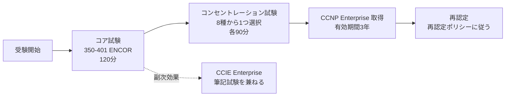

### 1.2 試験一覧（公式ページ準拠）

| 区分 | 試験コード | 略称 | 試験名 | 時間 | 関連スペシャリスト認定 |
|---|---|---|---|---|---|
| コア | 350-401 | ENCOR | Implementing Cisco Enterprise Network Core Technologies | 120 分 | Enterprise Core |
| 選択 | 300-410 | ENARSI | Implementing Cisco Enterprise Advanced Routing and Services | 90 分 | Enterprise Advanced Infrastructure Implementation |
| 選択 | 300-415 | ENSDWI | Implementing Cisco Catalyst SD-WAN Solutions | 90 分 | Enterprise SD-WAN Implementation |
| 選択 | 300-420 | ENSLD | Designing Cisco Enterprise Networks | 90 分 | Enterprise Design |
| 選択 | 300-425 | ENWLSD | Designing Cisco Enterprise Wireless Networks | 90 分 | Enterprise Wireless Design |
| 選択 | 300-430 | ENWLSI | Implementing Cisco Enterprise Wireless Networks | 90 分 | Enterprise Wireless Implementation |
| 選択 | 300-435 | ENAUTO | Automating Cisco Enterprise Solutions | 90 分 | DevNet Specialist - Enterprise Automation and Programmability |
| 選択 | 300-440 | ENCC | Designing and Implementing (Secure) Cloud Connectivity | 90 分 | （公式ページに記載なし） |

> 試験言語は日本語・英語（ENCOR、ENARSI、ENSDWI、ENSLD、ENWLSD、ENWLSI、ENAUTO の各試験ページで確認）。予約は Pearson VUE です。

### 1.3 バージョン表記の注意（重要）

公式の「試験ページ」と「試験内容 PDF」でバージョン表記がずれている箇所があります。**学習の基準は必ず最新の試験内容 PDF** にしてください。

| 試験 | 試験ページ本文の表記 | 試験内容 PDF の表記 | 備考 |
|---|---|---|---|
| ENCOR | v1.0 | **v1.2** | PDF 冒頭の「概要」は v1.2 |
| ENARSI | v1.0 | 見出し v1.1 / 概要 v1.2 | PDF 内で表記が混在。出題範囲は 4 ドメイン |
| ENSDWI | v1.0 | **v1.2** | 名称が「Catalyst SD-WAN」に更新 |
| ENSLD | v1.0 | **v1.1** | 「自動化と人工知能」ドメインを含む |
| ENWLSD | v1.0 | **v1.1** | |
| ENWLSI | v1.0 | **v1.1** | |
| ENAUTO | v1.0 | **v1.1** | |
| ENCC | （ページ記載なし） | **v1.0** | PDF 名は「Secure Cloud Connectivity」 |

> 試験内容は**予告なく変更される場合があります**（公式 PDF にも明記）。受験前に必ず再確認してください。

### 1.4 学習ロードマップ

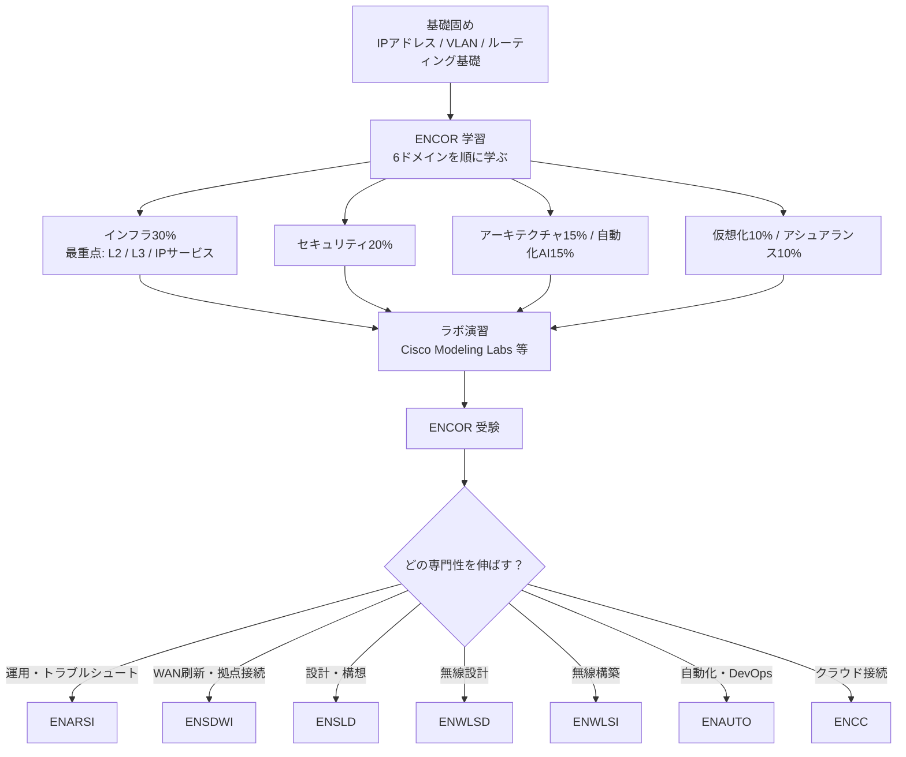

### 1.5 コンセントレーションの選び方

| あなたの目標・職種 | おすすめ | 理由 |
|---|---|---|
| 既存ネットワークの運用・障害対応が中心 | **ENARSI** | ルーティング・VPN・インフラサービスのトラブルシュートが中心 |
| 支社／拠点 WAN の刷新、SD-WAN 導入 | **ENSDWI** | SD-WAN 導入・ポリシー・セキュリティの実装 |
| アーキテクト／設計担当 | **ENSLD** | アドレス設計、キャンパス設計、WAN 設計、QoS 設計 |
| 無線 LAN 設計（サーベイ含む） | **ENWLSD** | サイトサーベイ、RRM、モビリティ、HA の設計 |
| 無線 LAN 構築・運用 | **ENWLSI** | FlexConnect、ISE 連携、ロケーション、モニタリング |
| ネットワーク自動化、SRE/DevOps 志向 | **ENAUTO** | Python / API / YANG / Ansible / Catalyst Center / Meraki |
| AWS・Azure・Google Cloud との接続 | **ENCC** | IPsec、SD-WAN Cloud OnRamp、SDCI、クラウドセキュリティ |

---

## 第2章 コア試験 350-401 ENCOR

### 出題配分（試験内容 PDF v1.2 準拠）

| # | ドメイン | 配分 |
|---|---|---|
| 1.0 | アーキテクチャ | 15% |
| 2.0 | 仮想化 | 10% |
| 3.0 | インフラストラクチャ | **30%** |
| 4.0 | ネットワークアシュアランス | 10% |
| 5.0 | セキュリティ | 20% |
| 6.0 | 自動化と人工知能 | 15% |

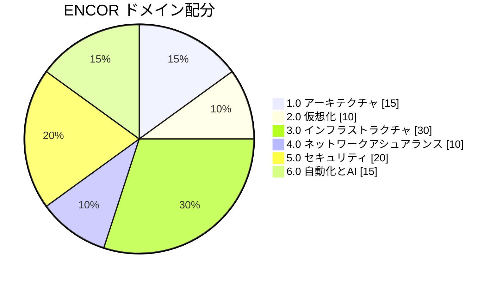

> 各節の設定例は **IOS XE** を前提にした学習用の最小構成です。IP アドレスは文書用のもの（192.0.2.0/24 などの例示用範囲）を使っています。本番投入前に必ず自環境のバージョン・要件で検証してください。

---

### 2.1 アーキテクチャ（15%）

#### 1.1 エンタープライズ・ネットワークの設計原則

**なぜ必要か**: ネットワークは「増設のたびに複雑化する」のが宿命です。設計原則（階層化・モジュール化・回復性・柔軟性）を決めておくと、障害範囲の限定・拡張・運用の単純化ができます。

##### 1.1.a ハイレベル設計（2 階層、3 階層、ファブリック、クラウド）

| モデル | 構成 | 向いている規模 | 特徴 |
|---|---|---|---|
| 3 階層 | アクセス／ディストリビューション／コア | 大規模キャンパス（複数の機能ブロックを相互接続） | 拡張性・障害分離に優れる。機器数とコストが増える |
| 2 階層（コラプストコア） | アクセス／コラプスト（コア＋ディストリビューション） | 小〜中規模（Cisco Press の記述では、相互接続する機能ブロックは 3 つ程度までが目安） | コスト削減しつつ階層化のメリットを維持 |
| ファブリック | アンダーレイ＋オーバーレイ（例: SD-Access） | 自動化・セグメンテーションを重視するキャンパス | 論理ネットワークを Catalyst Center で一元管理 |
| クラウド | クラウド上の VPC/VNet＋接続基盤（SD-WAN、専用線） | ハイブリッド／マルチクラウド | 接続・ポリシーの一貫性が課題 |

各階層の役割は次のとおりです（Cisco Press の解説に基づく）。

| 階層 | 役割 |
|---|---|
| コア | サイト間の最適な転送と高性能ルーティング。障害後に素早く滑らかに回復する回復性が必須 |
| ディストリビューション | アクセスとコアの間で、**ポリシーベースの接続と境界制御**を提供 |
| アクセス | ユーザー／ワークグループのネットワーク接続を提供 |

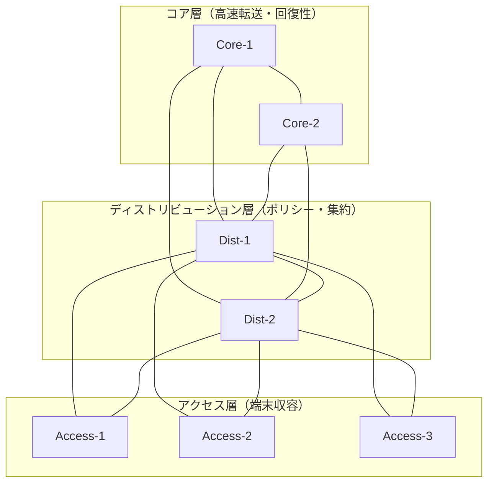

**ベストプラクティス**

1. **全階層でリンクとノードを二重化**し、単一障害点（SPOF）を作らない。
2. ディストリビューション間はレイヤ 3 で接続し、**L2 ドメインを小さく**保つ（ブロードキャスト／STP の影響範囲を限定）。
3. **ルーテッドアクセス**（アクセス層まで L3）を検討し、STP 依存を減らして収束を高速化する。
4. ルート集約と各種ポリシーは**ディストリビューション境界**に集約する。
5. 小規模なら 2 階層で始め、機能ブロックが増えたらコアを分離する（**成長に合わせて拡張できる設計**）。

**よくある落とし穴**: 「全 VLAN をキャンパス全体に伸ばす」設計は、障害時の影響範囲が広がり STP 収束も遅くなります。

##### 1.1.b 高可用性技術（冗長性、FHRP、SSO）

| 技術 | 何を守る？ | ポイント |
|---|---|---|
| 物理冗長（二重化リンク／機器） | リンク・機器故障 | 異なる筐体／異なる経路に分散させる |
| EtherChannel | リンク故障・帯域 | 複数リンクを 1 本の論理リンクに束ねる |
| FHRP（HSRP/VRRP/GLBP） | デフォルトゲートウェイ故障 | 仮想 IP をゲートウェイとして共有（詳細は 3.3.c） |
| SSO（Stateful Switchover） | スーパバイザ／スタック故障 | スタンバイがコンフィグと状態を同期し、切替時の停止を最小化 |
| NSF / グレースフルリスタート | 制御プレーン再起動時の転送断 | 制御プレーン復旧中もデータ転送を継続 |
| BFD | 障害検知の遅さ | ミリ秒〜秒単位で高速検知し、ルーティングプロトコルに通知 |


**ベストプラクティス**

- 冗長化は「**二重化したら、切替が実際に動くことをテストする**」までが設計。定期的に障害試験を行う。
- FHRP のアクティブ側と STP ルートブリッジ・ルーティングの最適経路を**揃える**（非対称経路や余計な迂回を避ける）。
- ソフトウェアアップグレード計画には SSO/NSF の対応可否を含める。

**理解チェック**: 「FHRP と SSO はそれぞれ何の障害から守る？」→ FHRP はゲートウェイ（L3 の到達性）、SSO は機器内部の制御部（スーパバイザ等）の障害です。

---

#### 1.2 Cisco Catalyst SD-WAN の動作原理

**なぜ必要か**: 従来の WAN は MPLS 中心で、帯域コストが高く、SaaS 利用時に中央へ折り返す（バックホール）非効率がありました。SD-WAN は**制御を集中、転送を分散**し、複数回線を活用して品質・コスト・運用を改善します。

##### 1.2.a コントロールプレーンとデータプレーンの要素

| プレーン | コンポーネント（旧称） | 役割 |
|---|---|---|
| オーケストレーション | SD-WAN Validator（vBond） | 初期認証、コンポーネントの発見、NAT 越え支援 |
| 管理 | SD-WAN Manager（vManage） | 一元管理 GUI／API、ポリシー・テンプレート作成、監視 |
| コントロール | SD-WAN Controller（vSmart） | **OMP** でルート・ポリシーを配布 |
| データ | WAN Edge（ルータ） | ユーザートラフィック転送、IPsec/GRE トンネル、BFD |

- **OMP（Overlay Management Protocol）**: コントローラと WAN Edge 間でルート、TLOC、サービス情報、ポリシーを交換するプロトコル。
- **TLOC（Transport Locator）**: オーバーレイのトンネル終端を表す識別子。**システム IP・カラー・カプセル化方式**の組で識別される。
- **vRoute（OMP ルート）**: VPN（セグメント）に属し、ネクストホップは IP ではなく **TLOC**。
- **BFD**: 各 IPsec トンネル上で自動的に動作し、トンネル品質（遅延・ロス・ジッタ）を計測する。

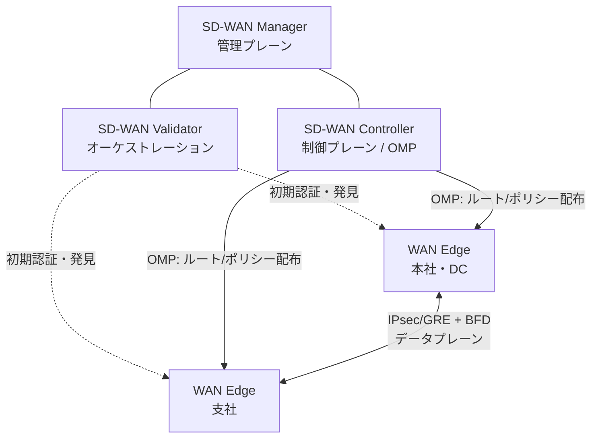

##### 1.2.b 利点と制約

| 区分 | 内容 |
|---|---|
| 利点 | 集中管理・ポリシー一元化／MPLS＋ブロードバンド等を**アクティブ/アクティブ**で活用／トランスポート非依存のオーバーレイ／制御とデータの分離による展開の柔軟性（コントローラはオンプレ・クラウド可）／暗号化・セグメンテーション・証明書ベースのゼロトラスト的認証／アプリケーション可視化とアプリ認識型ポリシー |
| 考慮点（制約） | コントローラ構成・証明書・デバイスリストの**運用設計が必要**／アンダーレイ（回線）品質と NAT 構成の影響を受ける／ファイアウォールで制御接続用ポートの許可が必要／導入プロジェクトとして既存 WAN からの移行計画が必要 |

**ベストプラクティス**: 制御コンポーネントは冗長化し、証明書の有効期限管理を運用に組み込む。拠点は「1 拠点 = 1 サイト ID」を厳密に設計する（サイト ID は OMP のループ防止にも使われる）。

---

#### 1.3 Cisco SD-Access の動作原理

**なぜ必要か**: 従来キャンパスは VLAN と ACL の手作業が中心で、変更が遅くミスも起こりやすい状態でした。SD-Access は**意図（インテント）をポリシーとして定義し、Catalyst Center が自動展開**します。

##### 1.3.a コントロールプレーンとデータプレーンの要素

| 要素 | 技術・役割 |
|---|---|
| アンダーレイ | 物理 IP ネットワーク（ルーテッドで高速収束） |
| オーバーレイ | 仮想ネットワーク（VN）。**VXLAN** でカプセル化（SGT 情報を運べる） |
| コントロールプレーン | **LISP**（EID と RLOC のマッピングを管理）。ファブリックの「電話帳」 |
| ポリシープレーン | **Cisco TrustSec**（SGT）と ISE による識別ベースのアクセス制御 |
| 管理プレーン | **Cisco Catalyst Center**（設計・自動化・アシュアランス） |
| ノードの役割 | エッジノード（端末収容）／ボーダーノード（外部接続）／コントロールプレーンノード |

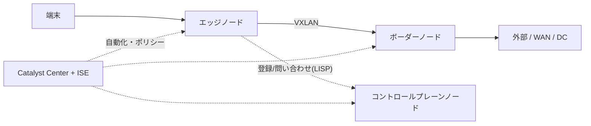

- **マクロセグメンテーション**: VN（VRF 相当）で大きく分離。
- **マイクロセグメンテーション**: VN 内で **SGT（Security Group Tag）** によりグループ間通信を制御。

##### 1.3.b SD-Access と相互運用する従来型キャンパス

移行期には、既存（従来型）キャンパスとファブリックが共存します。ボーダーノードで外部ネットワークと接続し、段階的に移行します。

**ベストプラクティス**

1. アンダーレイは**ルーテッド**で設計し、Catalyst Center による LAN オートメーションの利用を検討する。
2. VN の数は必要最小限に。まず**マクロ（VN）→ 次にマイクロ（SGT）**の順で設計する。
3. 既存環境からは**段階移行**し、ボーダーでの接続（ルーティング、セグメントのマッピング）を明文化する。
4. スケール値やレイテンシ要件は**最新の Catalyst Center データシートと設計ガイド**で確認する。

---

#### 1.4 QoS の理解

**なぜ必要か**: 回線が混雑したとき、音声・ビデオ・業務アプリを優先し、ベストエフォートの通信を後回しにするためです。


| 機能 | 内容 |
|---|---|
| 分類 | トラフィックを種類ごとに識別（ACL、DSCP 値、アプリケーション認識） |
| マーキング | パケットに優先度を記録（L3 は **DSCP**、L2 は **CoS**） |
| ポリシング | 制限を超えた分を**破棄またはリマーク**（バースト後の遅延は生まない） |
| シェーピング | 超過分を**バッファして遅らせる**（送信を平滑化） |
| キューイング | 優先クラスを先に送る（**LLQ**＝厳格優先、**CBWFQ**＝帯域保証） |

代表的な DSCP 値:

| トラフィック | 代表的な DSCP |
|---|---|
| 音声（Voice） | EF（46） |
| ビデオ会議 | AF41（34） |
| シグナリング | CS3（24） |
| 既定（ベストエフォート） | 0 |
| スカベンジャー（低優先） | CS1（8） |

**設定例（MQC）**

```text
class-map match-any VOICE
 match dscp ef
class-map match-any VIDEO
 match dscp af41
!
policy-map WAN-EDGE-OUT
 class VOICE
  priority percent 10
 class VIDEO
  bandwidth remaining percent 30
 class class-default
  fair-queue
!
interface GigabitEthernet0/0/0
 service-policy output WAN-EDGE-OUT
```

**ベストプラクティス**

1. **信頼境界（trust boundary）を明確にし、できるだけエッジ（アクセス）で分類・マーキング**する。
2. ネットワーク全体で**マーキングの方針を統一**（エンドツーエンドで一貫させる）。
3. 優先キュー（LLQ）は帯域の一部に**制限**する（優先しすぎると他クラスが飢餓状態になる）。
4. 契約帯域より低い値にシェーピングしてから、その中でキューイングする（階層型ポリシー）。
5. 適用後は `show policy-map interface` で**クラス別のカウンタとドロップを確認**する。

---

### 2.2 仮想化（10%）

#### 2.1 デバイス仮想化テクノロジー

##### 2.1.a ハイパーバイザ Type 1 / Type 2、2.1.b 仮想マシン

| 種類 | 動作 | 例 | 用途 |
|---|---|---|---|
| Type 1（ベアメタル） | ハードウェア上で直接動作 | VMware ESXi、KVM など | 本番サーバ／ネットワーク機能の仮想化基盤 |
| Type 2（ホスト型） | OS 上のアプリとして動作 | VirtualBox、VMware Workstation など | 学習・検証 |

- **仮想マシン（VM）**: ハイパーバイザ上で、独自の OS・仮想 NIC・仮想ディスクを持つ論理サーバ。
- 仮想化の利点: 集約による機器コスト削減、迅速な展開、スナップショットによる検証。

##### 2.1.c 仮想スイッチング

**仮想スイッチ（vSwitch）** は、ホスト内の VM 同士と物理 NIC の間を L2 で接続するソフトウェアスイッチです。VLAN タグ付けやトランク接続で物理スイッチと連携します。

**ベストプラクティス**: ホスト側の物理 NIC を**複数本でチーム化**し、上流スイッチ側の設定（トランク許可 VLAN、EtherChannel の有無）と**必ず整合**させます。

#### 2.2 データパス仮想化の設定と確認

##### 2.2.a VRF（Virtual Routing and Forwarding）

1 台のルータ内に**独立したルーティングテーブル**を複数持つ技術です。顧客別・部門別の分離に使います。

```text
vrf definition CUST-A
 address-family ipv4
 exit-address-family
!
interface GigabitEthernet0/0/1
 vrf forwarding CUST-A
 ip address 192.0.2.1 255.255.255.0
```

確認コマンド: `show vrf`、`show ip route vrf CUST-A`、`ping vrf CUST-A 192.0.2.2`

**落とし穴**: インターフェイスを VRF に入れると **IP アドレスが消える**ので、`vrf forwarding` の後に IP を再設定します。ping/traceroute/ルーティングプロトコルも **VRF を指定**する必要があります。

##### 2.2.b GRE と IPsec のトンネリング

| 技術 | 特徴 | 暗号化 |
|---|---|---|
| GRE | 多様なプロトコルを運べる汎用トンネル。ルーティングプロトコルも通せる | なし |
| IPsec | 機密性・完全性・認証を提供 | あり |
| GRE over IPsec / IPsec VTI | トンネルにルーティングを載せつつ暗号化 | あり |

```text
! GRE トンネル（暗号化なし）
interface Tunnel0
 ip address 10.255.0.1 255.255.255.252
 tunnel source GigabitEthernet0/0/0
 tunnel destination 198.51.100.2
```

```text
! IPsec VTI（IKEv2）の最小例（事前共有鍵は例示。本番では証明書認証を推奨）
crypto ikev2 proposal PROP
 encryption aes-cbc-256
 integrity sha256
 group 14
crypto ikev2 policy POL
 proposal PROP
crypto ikev2 keyring KR
 peer SITE-B
  address 198.51.100.2
  pre-shared-key local <PSK>
  pre-shared-key remote <PSK>
crypto ikev2 profile PROF
 match identity remote address 198.51.100.2 255.255.255.255
 authentication local pre-share
 authentication remote pre-share
 keyring local KR
crypto ipsec transform-set TS esp-aes 256 esp-sha256-hmac
 mode tunnel
crypto ipsec profile IPSEC-PROF
 set transform-set TS
 set ikev2-profile PROF
!
interface Tunnel0
 ip address 10.255.0.1 255.255.255.252
 tunnel source GigabitEthernet0/0/0
 tunnel destination 198.51.100.2
 tunnel mode ipsec ipv4
 tunnel protection ipsec profile IPSEC-PROF
```

確認: `show crypto ikev2 sa`、`show crypto ipsec sa`、`show interface tunnel 0`

**ベストプラクティス**

1. 鍵は**強力なアルゴリズム（AES-256、SHA-256 以上、DH グループ 14 以上）**を使い、共有鍵をコンフィグへ平文で残さない（証明書認証や鍵管理の仕組みを使う）。
2. トンネルの **MTU/MSS**（`ip mtu`、`ip tcp adjust-mss`）を調整し、フラグメントを避ける。
3. トンネル越しのルーティングでは、**トンネル宛先への経路がトンネル自身経由にならない**よう注意（再帰ルーティングによるフラップ防止）。

#### 2.3 ネットワーク仮想化の概念

##### 2.3.a LISP（Locator/ID Separation Protocol）

**「誰か（EID）」と「どこにいるか（RLOC）」を分離**するプロトコルです（RFC 9300）。端末が移動しても EID は変わらず、RLOC への対応関係だけを更新します。SD-Access のコントロールプレーンで使われます。

| 用語 | 意味 |
|---|---|
| EID | 端末の識別子（エンドポイントアドレス） |
| RLOC | ルータのロケータ（トンネルの終端アドレス） |
| Map-Server / Map-Resolver | EID と RLOC の対応を登録・解決するサーバ |
| ITR / ETR | カプセル化する側／解除する側のルータ |

##### 2.3.b VXLAN

L2 フレームを **UDP（宛先ポート 4789）でカプセル化**し、L3 ネットワーク上に L2 セグメントを延伸する技術です（RFC 7348）。**24 ビットの VNI** により約 1,600 万のセグメントを識別でき、VLAN の 4,094 という上限を超えられます。


| 比較 | VLAN | VXLAN |
|---|---|---|
| セグメント数 | 4,094（12 ビット） | 約 1,600 万（24 ビット VNI） |
| 転送 | L2（STP に依存しやすい） | L3 アンダーレイ上（ECMP を活用） |
| 用途 | キャンパス、小規模 | ファブリック（SD-Access 等）、DC |

**ベストプラクティス**: アンダーレイの **MTU を余裕を持って拡張**（VXLAN のオーバーヘッド分）し、エンドツーエンドで一貫させる。

---

### 2.3 インフラストラクチャ（30%）

最も配点が大きいドメインです。ここを確実に押さえることが合格の近道です。

#### 3.1 レイヤ 2

##### 3.1.a 802.1Q トランキング（静的・動的）のトラブルシュート

| 項目 | 内容 |
|---|---|
| 802.1Q | フレームに VLAN タグを付け、1 本のリンクで複数 VLAN を運ぶ |
| ネイティブ VLAN | タグなしで運ばれる VLAN。**両端で一致**させる |
| DTP | トランクを自動ネゴシエーションするプロトコル（dynamic auto / dynamic desirable） |

```text
interface GigabitEthernet1/0/48
 switchport mode trunk
 switchport nonegotiate
 switchport trunk native vlan 999
 switchport trunk allowed vlan 10,20,30
```

**ベストプラクティス**

1. **DTP に頼らず静的に `switchport mode trunk`** を設定し、`switchport nonegotiate` で DTP を止める。
2. ネイティブ VLAN は**未使用の専用 VLAN**にして両端で揃える（VLAN 1 を避ける）。
3. `allowed vlan` で**必要な VLAN だけ**を通す（プルーニング）。

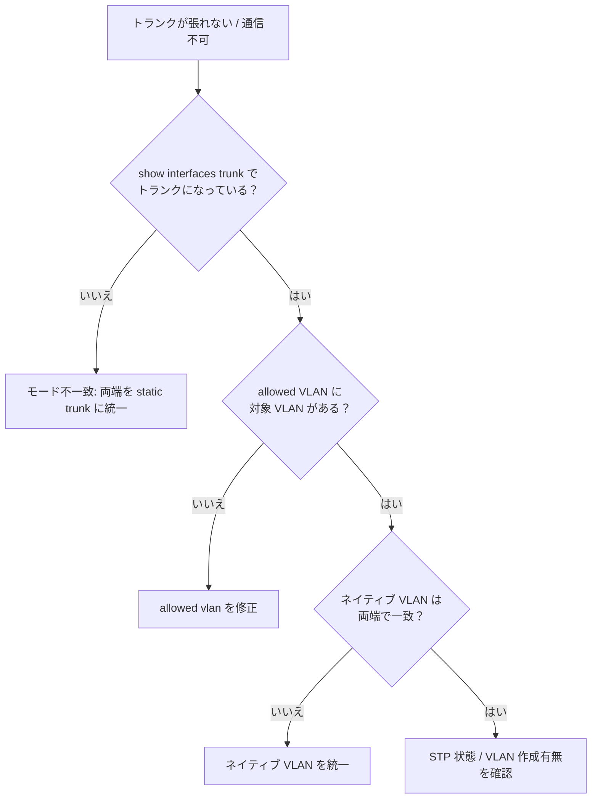

##### 3.1.b 静的・動的 EtherChannel のトラブルシュート

| モード | プロトコル | 組み合わせ |
|---|---|---|
| active / passive | **LACP（IEEE 802.3ad）** | active–active、active–passive は成立。passive–passive は不成立 |
| desirable / auto | PAgP（Cisco 独自） | desirable–desirable、desirable–auto は成立 |
| on | 静的（ネゴシエーションなし） | on–on のみ成立 |

```text
interface range GigabitEthernet1/0/1 - 2
 channel-group 1 mode active
!
interface Port-channel1
 switchport mode trunk
```

確認: `show etherchannel summary`（フラグ `SU` = 正常、`SD` / `I` / `s` = 要調査）

**ベストプラクティス**: 標準の **LACP を推奨**。**速度・デュプレックス・トランク／VLAN 設定・ネイティブ VLAN を全メンバーで統一**する。設定変更は Port-channel インターフェイス側で行う。

##### 3.1.c スパニングツリー（RSTP、MST）と拡張機能

| 項目 | PVST+ / Rapid PVST+ | MST（802.1s） |
|---|---|---|
| 単位 | VLAN ごとにインスタンス | 複数 VLAN を**インスタンスにマッピング** |
| 特徴 | シンプル。VLAN 数が多いと負荷増 | 大規模 VLAN 環境で CPU 負荷とメモリを削減 |
| 注意 | — | リージョン名・リビジョン・VLAN マッピングを**全スイッチで一致**させる |

RSTP（802.1w）のポート役割: ルート／代替（Alternate）／指定／バックアップ。ポート状態: Discarding／Learning／Forwarding。

| 拡張機能 | 役割 |
|---|---|
| **PortFast** | エッジポート（端末側）を即座に Forwarding へ |
| **BPDU Guard** | PortFast ポートで BPDU を受信したら **err-disable** にする |
| **Root Guard** | 想定外のスイッチがルートになるのを防ぐ（優位 BPDU を受けたらブロック） |
| **Loop Guard** | BPDU が途絶えた非指定ポートが Forwarding へ誤遷移するのを防ぐ |
| **UDLD** | 片方向リンク障害を検知 |

```text
spanning-tree mode rapid-pvst
spanning-tree vlan 10,20 root primary
!
interface GigabitEthernet1/0/10
 switchport mode access
 switchport access vlan 10
 spanning-tree portfast
 spanning-tree bpduguard enable
!
interface GigabitEthernet1/0/47
 description to-downstream-switch
 spanning-tree guard root
```

**ベストプラクティス**

1. **ルートブリッジを意図して固定**（プライオリティ設定、または `root primary/secondary`）し、FHRP のアクティブとも揃える。
2. 端末ポートには **PortFast + BPDU Guard** を必ずセットで適用する。
3. アクセスからの上位への接続でルートが動かないよう、**境界に Root Guard** を入れる。
4. 大規模な VLAN 環境では **MST** を検討し、リージョン設定の一致を運用で厳守する。

#### 3.2 レイヤ 3

##### 3.2.a EIGRP と OSPF のルーティング概念の比較

| 観点 | EIGRP | OSPF |
|---|---|---|
| 方式 | **拡張ディスタンスベクター**（DUAL アルゴリズム） | **リンクステート**（SPF アルゴリズム） |
| メトリック | 帯域・遅延（既定。信頼性・負荷は通常使用しない） | コスト（基準帯域 ÷ インターフェイス帯域） |
| AD | 内部 90／外部 170 | 110 |
| ロードバランス | 等コスト＋**不等コスト（variance）** | 等コスト（ECMP） |
| 構造 | フラット（要約・スタブで制御） | **エリア**による階層（バックボーン Area 0） |
| 収束 | フィージブルサクセサがあれば即時 | LSA 伝播＋SPF 再計算 |
| 規格 | Cisco 主導（RFC 7868 で公開） | 標準（RFC 2328 / RFC 5340） |

EIGRP の要点: 最良経路（サクセサ）／バックアップ候補（**フィージブルサクセサ**）。**FD（Feasible Distance）**と**RD（Reported Distance）**を比較し、`RD < 現在の FD` ならループフリーと判断（フィージブル条件）。

OSPF のエリアタイプ:

| エリア | 外部経路（LSA 5） | 特徴 |
|---|---|---|
| 標準 | 受け入れる | 通常のエリア |
| スタブ | 受け入れない（デフォルトルートで代替） | LSDB を縮小 |
| トータリースタブ | 外部＋他エリア経路も受け入れない | さらに縮小（Cisco 拡張） |
| NSSA | 内部の ASBR で外部経路を導入可（LSA 7） | スタブ的に外部を取り込みたい場合 |

##### 3.2.b OSPFv2/v3 の設定（複数エリア、要約、フィルタリング、ネットワークタイプ）

```text
router ospf 1
 router-id 1.1.1.1
 passive-interface default
 no passive-interface GigabitEthernet0/0/0
 area 10 range 10.10.0.0 255.255.0.0      ! ABR での経路要約
!
interface GigabitEthernet0/0/0
 ip ospf 1 area 10
 ip ospf network point-to-point          ! DR/BDR 選出を省略して高速化
 ip ospf authentication message-digest
 ip ospf message-digest-key 1 md5 <KEY>
```

```text
! OSPFv3（IPv6）
ipv6 unicast-routing
ipv6 router ospf 1
 router-id 1.1.1.1
interface GigabitEthernet0/0/0
 ipv6 ospf 1 area 10
```

| ネットワークタイプ | DR/BDR | 典型 |
|---|---|---|
| ブロードキャスト | 選出あり | イーサネット（既定） |
| ポイントツーポイント | なし | 2 拠点間リンク（イーサネットでも設定可） |

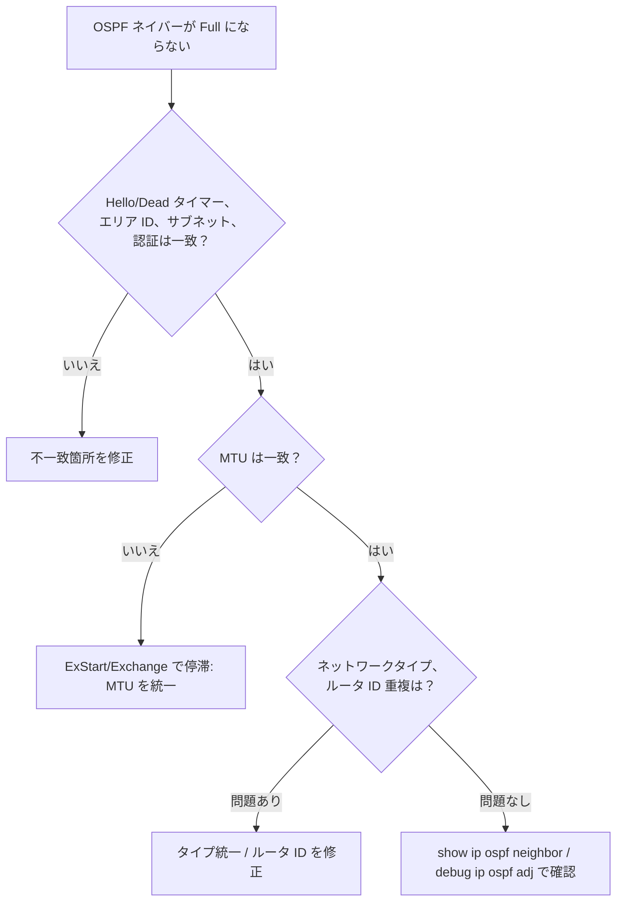

**ベストプラクティス**

1. **ルータ ID を固定**（明示設定）。ループバックを使い、変更で SPF が乱れないようにする。
2. **`passive-interface default`** を基本とし、ネイバーが必要なインターフェイスのみ解除する（不要なネイバー形成・攻撃面を排除）。
3. ABR で**経路を要約**し、LSDB と SPF の影響範囲を小さくする。
4. **認証を有効化**して不正なルータの参加を防ぐ。
5. 1 つのエリアの規模は適度に保ち、エリア設計はアドレス設計と揃える。

##### 3.2.c 直接接続ネイバー間の eBGP（最適パス選択とネイバー関係）

```text
router bgp 65001
 bgp router-id 1.1.1.1
 neighbor 203.0.113.2 remote-as 65002
 !
 address-family ipv4 unicast
  neighbor 203.0.113.2 activate
  network 10.10.0.0 mask 255.255.0.0
```

**ネイバー状態の流れ**: Idle → Connect → Active → OpenSent → OpenConfirm → **Established**（Established が正常）。BGP は TCP 179 を使用します。

**最適パス選択（上位から順に評価）**

| 順 | 属性 | 優先 |
|---|---|---|
| 1 | Weight（Cisco 独自・ローカル） | 大きい方 |
| 2 | LOCAL_PREF | 大きい方 |
| 3 | ローカル生成（network/redistribute/aggregate） | 自ルータ起源を優先 |
| 4 | AS_PATH 長 | 短い方 |
| 5 | Origin | IGP < EGP < Incomplete |
| 6 | MED | 小さい方 |
| 7 | eBGP と iBGP | eBGP を優先 |
| 8 | ネクストホップへの IGP メトリック | 小さい方 |
| 9〜 | 古さ／ルータ ID など | タイブレーク |

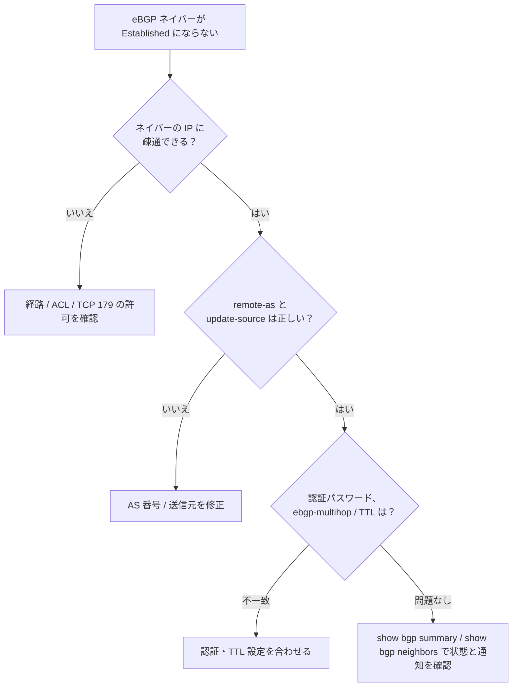

**ベストプラクティス**

1. **ネイバーごとに認証**（MD5 または TCP-AO 等）を設定し、**受信経路数の上限（maximum-prefix）**を設ける。
2. インバウンド／アウトバウンドに**プレフィックスフィルタと AS_PATH フィルタ**を適用し、意図しない経路の受信・広告を防ぐ（BGP 運用のセキュリティは RFC 7454 を参照）。
3. 経路の広告は**明示的な network 文とフィルタ**で管理し、再配布による広告漏れ・漏洩を避ける。

##### 3.2.d ポリシーベースルーティング（PBR）

宛先だけでなく**送信元・プロトコル・ポートなど**に基づいて次ホップを選ぶ仕組みです。

```text
ip access-list extended GUEST-TRAFFIC
 permit ip 10.20.0.0 0.0.255.255 any
!
route-map PBR-GUEST permit 10
 match ip address GUEST-TRAFFIC
 set ip next-hop 192.0.2.254
!
interface GigabitEthernet0/0/1
 ip policy route-map PBR-GUEST
```

**ベストプラクティス**: 次ホップの**到達性を追跡（`set ip next-hop verify-availability` や IP SLA＋track）**して、障害時に黙って落ちないようにする。PBR は運用を複雑にするため、**最小限の適用**に留める。

#### 3.3 IP サービス

##### 3.3.a NTP と PTP

| 項目 | NTP | PTP（IEEE 1588） |
|---|---|---|
| 精度 | ミリ秒レベル | サブマイクロ秒〜ナノ秒レベル（ハードウェア支援） |
| 用途 | ログ・証明書・認証の時刻整合（ほぼ全機器） | 金融、放送、産業用など高精度が必要な環境 |

```text
ntp authenticate
ntp authentication-key 1 md5 <KEY>
ntp trusted-key 1
ntp server 192.0.2.123 key 1
clock timezone JST 9 0
```

確認: `show ntp status`、`show ntp associations`

**ベストプラクティス**: 複数の NTP サーバー（できれば 3 台以上）を参照し、**認証を有効化**する。全機器で時刻を揃えることで、ログ相関とトラブルシュートが正確になる。

##### 3.3.b NAT / PAT

| 種類 | 内容 |
|---|---|
| スタティック NAT | 1 対 1 の固定変換（サーバー公開等） |
| ダイナミック NAT | プールから動的に 1 対 1 |
| PAT（オーバーロード） | 1 つのグローバル IP を**ポート番号で多重化** |

| 用語 | 意味 |
|---|---|
| Inside Local | 内側ホストの内部アドレス |
| Inside Global | 内側ホストが外側から見えるアドレス |
| Outside Local / Global | 外側ホストの内側から／外側から見えるアドレス |

```text
interface GigabitEthernet0/0/0
 ip nat outside
interface GigabitEthernet0/0/1
 ip nat inside
!
access-list 10 permit 10.0.0.0 0.0.255.255
ip nat inside source list 10 interface GigabitEthernet0/0/0 overload
!
! スタティック NAT（サーバー公開）
ip nat inside source static 10.0.0.10 203.0.113.10
```

確認: `show ip nat translations`、`show ip nat statistics`

**ベストプラクティス**: inside／outside の指定漏れが最多の原因。変換テーブルの**タイムアウトと上限**を把握し、NAT ログ（NetFlow/syslog）で追跡可能にしておく。

##### 3.3.c FHRP（HSRP、VRRP）

| 項目 | HSRP | VRRP |
|---|---|---|
| 規格 | Cisco 独自 | 標準（RFC 5798） |
| 役割名 | Active／Standby | Master／Backup |
| 仮想 MAC | 0000.0C07.ACxx（v1）／0000.0C9F.Fxxx（v2） | 0000.5E00.01xx |
| Hello の宛先 | 224.0.0.2（v1）／224.0.0.102（v2） | 224.0.0.18 |
| プリエンプト | 既定は無効（有効化が必要） | 既定で有効 |

```text
interface Vlan10
 ip address 10.10.10.2 255.255.255.0
 standby version 2
 standby 10 ip 10.10.10.1
 standby 10 priority 110
 standby 10 preempt
 standby 10 track 1 decrement 20
```

**ベストプラクティス**

1. **STP のルートブリッジ、FHRP のアクティブ、（可能なら）ルーティングの最適経路を同じ機器に揃える**。
2. **preempt を有効化**し、上位リンクのダウン時は**トラッキングで優先度を下げて**切り替える。
3. FHRP の認証を有効化し、VLAN 単位で**アクティブを分散**して負荷を分ける（VLAN ごとに役割をずらす）。

##### 3.3.d マルチキャストプロトコル（RPF チェック、PIM-SM、IGMP、SSM、bidir、MSDP）

| 要素 | 役割 |
|---|---|
| **IGMP v2/v3** | ホストがグループ参加・離脱を LAN 上のルータに通知（v3 は送信元指定が可能） |
| **RPF チェック** | 「送信元へ戻る最短経路の**入力インターフェイス**で受信したパケットのみ転送」しループを防止 |
| **PIM-SM** | ランデブーポイント（RP）を起点に**共有ツリー**を作り、その後**最短経路ツリー（SPT）**へ切替 |
| **SSM** | 送信元を指定して購読（IGMPv3）。RP 不要。範囲は既定で 232.0.0.0/8 |
| **PIM bidir** | 双方向共有ツリー。多数の送信元・受信者が混在する用途に適する |
| **MSDP** | ドメイン間で RP が送信元情報を交換 |

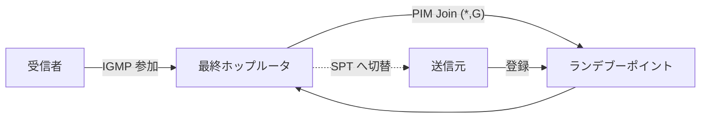

```text
ip multicast-routing
interface GigabitEthernet0/0/1
 ip pim sparse-mode
ip pim rp-address 192.0.2.100
```

**ベストプラクティス**: 全 L3 インターフェイスで PIM を有効化する一貫性を保つ。RP は**冗長化**（Anycast RP 等）を検討する。トラブル時はまず **RPF の失敗**（`show ip rpf <送信元>`）を疑う。SSM は RP 管理が不要で運用が単純になるため、用途が合えば優先して採用する。


---

### 2.4 ネットワークアシュアランス（10%）

**なぜ必要か**: 障害は「起きてから」ではなく「兆候の段階」で見つけたいものです。ログ・フロー・時間指標・モデル駆動データを組み合わせて、**原因の切り分けを速く、証拠付きで**行います。

#### 4.1 問題の診断（debug、条件付き debug、traceroute、ping、SNMP、syslog）

| ツール | 用途 | 注意点 |
|---|---|---|
| ping | 到達性・遅延の確認 | 拡張 ping で送信元・サイズ・DF ビットを指定できる |
| traceroute | 経路上のどこで途切れるかを確認 | 途中の `*` は「ICMP を返さない」だけの場合もある |
| debug | 内部動作の詳細確認 | **CPU 負荷が高い**。本番では最小限、終わったら必ず `undebug all` |
| 条件付き debug | 特定のインターフェイス・IP・MAC に**限定**した debug | 本番での debug の第一選択 |
| syslog | イベントの記録・集約 | 重大度 0〜7（0 = emergencies … 7 = debugging） |
| SNMP | 状態監視（ポーリング）とトラップ | **v3（認証＋暗号化）を使用** |

```text
! 条件付き debug の例
debug condition ip 192.0.2.50
debug ip packet detail
! 終了時
undebug all
```

```text
! syslog と SNMPv3 の基本例
service timestamps log datetime msec localtime show-timezone
logging host 192.0.2.200
logging trap informational
!
snmp-server group MON-GRP v3 priv
snmp-server user mon-user MON-GRP v3 auth sha <AUTH-PASS> priv aes 128 <PRIV-PASS>
```

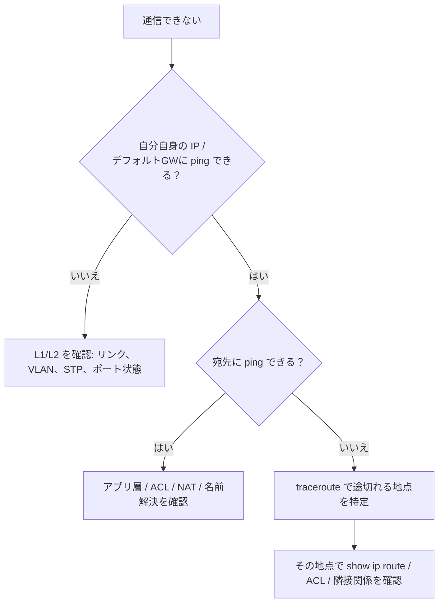

**ベストプラクティス**

1. **全機器の時刻を NTP で同期**し、ログにミリ秒タイムスタンプを付ける（相関分析のため）。
2. ログは**集中サーバー**へ転送し、装置ローカルのバッファだけに頼らない。
3. debug は「条件付き」「短時間」「ログ出力先をバッファに」が原則。CPU に注意する。
4. SNMP は **v3**、読み取り専用ユーザーを基本にし、アクセス元を ACL で制限する。

#### 4.2 Flexible NetFlow の設定と確認

**フロー**（送信元/宛先 IP、ポート、プロトコルなどの組で識別される通信）を集計し、**誰が・どの通信で・どれだけ使ったか**を可視化します。Flexible NetFlow は「何を集めるか」をカスタムできるのが特徴です。

| 構成要素 | 役割 |
|---|---|
| Flow Record | 集める項目（match：キー、collect：追加情報） |
| Flow Exporter | 送信先コレクタ（IP、UDP ポート、バージョン） |
| Flow Monitor | Record と Exporter を結びつけ、インターフェイスに適用 |

```text
flow record REC-IPV4
 match ipv4 source address
 match ipv4 destination address
 match transport source-port
 match transport destination-port
 match ipv4 protocol
 collect counter bytes
 collect counter packets
!
flow exporter EXP-1
 destination 192.0.2.201
 transport udp 2055
 export-protocol ipfix
!
flow monitor MON-1
 record REC-IPV4
 exporter EXP-1
!
interface GigabitEthernet1/0/1
 ip flow monitor MON-1 input
```

確認: `show flow monitor MON-1 cache`、`show flow exporter EXP-1 statistics`

**ベストプラクティス**: まず**境界リンク（WAN・インターネット出口）**から有効化し、負荷を見ながら広げる。サンプリング（サンプラー）の利用でスイッチ／ルータの負荷を調整する。

#### 4.3 SPAN / RSPAN / ERSPAN

| 技術 | 範囲 | 仕組み |
|---|---|---|
| SPAN | 同一スイッチ内 | ポート／VLAN のトラフィックを別ポートへコピー |
| RSPAN | L2 ネットワーク越し | 専用 VLAN 経由でコピーを別スイッチへ運ぶ |
| ERSPAN | **L3（IP）ネットワーク越し** | GRE でカプセル化してコレクタへ送る |

```text
monitor session 1 source interface GigabitEthernet1/0/1 both
monitor session 1 destination interface GigabitEthernet1/0/24
```

**ベストプラクティス**: ミラー元の総帯域が宛先ポート帯域を超えるとコピーが**欠落**する。宛先ポートは監視専用にし、本番端末を接続しない。

#### 4.4 IP SLA

ネットワークの**品質を能動的に測定**する機能です（ICMP Echo、UDP Jitter、TCP Connect、HTTP など）。結果を **track** と連携すると、障害時のスタティックルート切替・PBR・FHRP 制御に使えます。

```text
ip sla 10
 icmp-echo 198.51.100.1 source-interface GigabitEthernet0/0/0
 frequency 10
ip sla schedule 10 life forever start-time now
!
track 1 ip sla 10 reachability
!
ip route 0.0.0.0 0.0.0.0 198.51.100.1 track 1
ip route 0.0.0.0 0.0.0.0 203.0.113.1 250     ! フローティングスタティック
```

確認: `show ip sla statistics`、`show track`

**ベストプラクティス**: 測定は「**アプリの実際の宛先に近い**」ターゲットを選ぶ（ゲートウェイの応答だけでは上流障害を検知できない）。頻度は短すぎると負荷になるので、要件に合わせて調整する。

#### 4.5 Cisco Catalyst Center（旧 Cisco DNA Center）

Catalyst Center は**設計（Design）／ポリシー（Policy）／プロビジョニング（Provision）／アシュアランス（Assurance）**を一元的に扱う管理・自動化基盤です。試験内容では、**従来型ワークフロー**と **AI 活用ワークフロー**の両方での利用が問われます。

| 機能 | 内容 |
|---|---|
| 設計 | サイト階層、共通サービス（NTP/DNS/AAA）、ネットワーク設定の標準化 |
| ポリシー | SD-Access の VN／SGT、アプリケーションポリシー（QoS）の定義 |
| プロビジョニング | テンプレートを使った設定配布、PnP によるゼロタッチ導入 |
| アシュアランス | 有線／無線／アプリケーションの健全性スコア、問題の**相関・根本原因分析** |
| SWIM | ソフトウェアイメージ管理（更新の標準化） |
| API / Webhook | Intent API による外部連携、イベント通知 |
| AI 活用 | 過去データに基づく異常検知、予測的な洞察、AI 拡張された無線最適化（RRM）など |


**ベストプラクティス**

1. まず**サイト階層と共通サービスの標準化**から始める（後のテンプレートが効く）。
2. 設定変更は**テンプレート化して Catalyst Center 経由**で行い、CLI 直接変更（ドリフト）を減らす。
3. アシュアランスで**ベースライン**を把握し、しきい値を運用に合わせて調整する。
4. 外部システム連携は **Intent API と Webhook** を使い、手作業のチケット起票などを自動化する。

#### 4.6 NETCONF と RESTCONF

どちらも **YANG モデルに基づく**構造化データで機器を管理するプロトコルです（モデル＝YANG、プロトコル＝NETCONF/RESTCONF、符号化＝XML/JSON の 3 つを分けて考えるのがコツ）。

| 項目 | NETCONF（RFC 6241） | RESTCONF（RFC 8040） |
|---|---|---|
| トランスポート | **SSH**（TCP 830） | **HTTPS** |
| 符号化 | XML | JSON または XML |
| 操作 | `<get>`、`<get-config>`、`<edit-config>`、`<commit>` など RPC | HTTP メソッド（GET/POST/PUT/PATCH/DELETE） |
| 特徴 | データストア（running/candidate）やトランザクションに強い | REST に慣れた開発者が使いやすい |

```text
! IOS XE での有効化例
netconf-yang
!
ip http secure-server
restconf
!
aaa new-model
aaa authentication login default local
aaa authorization exec default local
username api-user privilege 15 secret <PASSWORD>
```

確認: `show netconf-yang status`、`show platform software yang-management process`、RESTCONF は `curl` 等で `/restconf/data` に GET

**ベストプラクティス**: API 専用の**最小権限アカウント**を作り、アクセス元を制限する。設定変更は**トランザクション（NETCONF）**の性質を活かし、事前に候補をレビューしてからコミットする。

---

### 2.5 セキュリティ（20%）

#### 5.1 デバイスアクセス制御

##### 5.1.a 回線とローカルユーザー認証

```text
service password-encryption
enable secret <STRONG-SECRET>
username admin privilege 15 algorithm-type scrypt secret <PASSWORD>
!
ip domain-name example.local
crypto key generate rsa modulus 3072
ip ssh version 2
!
line console 0
 login local
 exec-timeout 5 0
line vty 0 15
 login local
 transport input ssh
 access-class MGMT-ONLY in
 exec-timeout 5 0
```

**ベストプラクティス**

1. **Telnet を無効化し SSH v2 のみ**（`transport input ssh`）。
2. パスワードは `enable secret`／`secret` を使い、**タイプ 0（平文）や弱い暗号化を避ける**。
3. VTY には **ACL（`access-class`）で管理元を限定**し、アイドルタイムアウトを設定する。
4. ローカルユーザーは緊急用（ブレークグラス）に限定し、日常運用は AAA（集中認証）を使う。

##### 5.1.b AAA による認証と認可

| 機能 | 意味 |
|---|---|
| Authentication（認証） | 「誰か」を確認 |
| Authorization（認可） | 「何ができるか」を決定 |
| Accounting（アカウンティング） | 「何をしたか」を記録 |

| 項目 | TACACS+ | RADIUS |
|---|---|---|
| トランスポート | TCP 49 | UDP 1812（認証）/1813（アカウンティング） |
| 暗号化 | **パケット本体全体** | パスワードのみ |
| AAA の分離 | 認証・認可・アカウンティングを**分離可能** | 認証と認可が結合しやすい |
| 主な用途 | **デバイス管理**（コマンド認可） | **ネットワークアクセス**（802.1X、VPN） |

```text
aaa new-model
tacacs server TAC-1
 address ipv4 192.0.2.10
 key <SHARED-KEY>
aaa group server tacacs+ TAC-GRP
 server name TAC-1
aaa authentication login default group TAC-GRP local
aaa authorization exec default group TAC-GRP local
aaa accounting commands 15 default start-stop group TAC-GRP
```

**ベストプラクティス**: リスト末尾に **`local` をフォールバック**として置き、AAA サーバー障害でも入れるようにする（ロックアウト防止）。**設定変更前に別セッションを開いたまま**テストする。デバイス管理は TACACS+、端末認証は RADIUS（ISE 等）と使い分ける。

#### 5.2 インフラストラクチャのセキュリティ機能

##### 5.2.a ACL

| 種類 | 判定項目 | 配置の目安 |
|---|---|---|
| 標準 ACL | 送信元 IP のみ | **宛先に近い**位置 |
| 拡張 ACL | 送信元・宛先 IP、プロトコル、ポート | **送信元に近い**位置 |
| 名前付き ACL | 名前で管理（編集しやすい） | 推奨 |

```text
ip access-list extended MGMT-ONLY
 permit tcp 192.0.2.0 0.0.0.255 any eq 22
 deny   ip any any log
```

**ベストプラクティス**

1. ACL の末尾には**暗黙の deny** がある（明示的な `deny ip any any log` で可視化するのが有用）。
2. **具体的なルールを上に**、汎用ルールを下に（上から順に評価され、最初に一致した時点で終了）。
3. 名前付き ACL とシーケンス番号を使い、変更時は**新 ACL を作って差し替え**る。
4. 適用方向（in/out）を必ず確認する。

##### 5.2.b CoPP（Control Plane Policing）

ルータ／スイッチの**制御プレーン（CPU 宛の通信）**を QoS の仕組み（MQC）で制限し、DoS や過剰なトラフィックから制御プレーンを守ります。

```text
class-map match-all COPP-ROUTING
 match access-group name ACL-ROUTING
class-map match-all COPP-MGMT
 match access-group name ACL-MGMT
!
policy-map COPP-POLICY
 class COPP-ROUTING
  police rate 1000 pps conform-action transmit exceed-action transmit
 class COPP-MGMT
  police rate 200 pps conform-action transmit exceed-action drop
 class class-default
  police rate 100 pps conform-action transmit exceed-action drop
!
control-plane
 service-policy input COPP-POLICY
```

**ベストプラクティス**: いきなり drop せず、**まず transmit（観測モード）で `show policy-map control-plane` のカウンタを確認**してから、実測に基づく値で制限する。ルーティングプロトコルのクラスを誤って絞らないよう注意する。

#### 5.3 REST API セキュリティ

| 対策 | 内容 |
|---|---|
| 通信の保護 | **HTTPS（TLS）必須**。証明書を検証する（`verify=False` は検証環境のみ） |
| 認証 | トークン（Bearer）、OAuth 2.0、API キー、クライアント証明書 |
| 認可 | **最小権限**（RBAC）、スコープ制限 |
| 秘密情報 | トークン・パスワードを**コードに埋め込まない**（環境変数・シークレット管理） |
| 入力検証 | 不正なペイロードを拒否（インジェクション対策） |
| 濫用対策 | レート制限、監査ログ、トークンの有効期限 |

**ベストプラクティス**: トークンは短命にし、ログに出力しない。APIの利用元を IP 制限し、変更系（POST/PUT/DELETE）は監査ログで追跡できるようにする。

#### 5.4 ネットワークセキュリティ設計の要素

| 要素 | 役割 |
|---|---|
| 脅威防御 | IPS、マルウェア対策、脅威インテリジェンスによる検知・遮断 |
| エンドポイントセキュリティ | 端末の可視化・保護・隔離（EDR、姿勢評価） |
| 次世代ファイアウォール（NGFW） | アプリケーション識別、IPS、URL フィルタ、マルウェア対策を統合 |
| **TrustSec** | 通信を **SGT（Security Group Tag）**で分類し、**SGACL** でグループ間のアクセスを制御 |
| **MACsec（IEEE 802.1AE）** | **イーサネットリンク（L2 ホップごと）を暗号化**（鍵交換は MKA） |

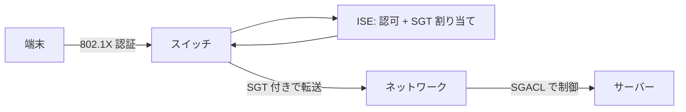

**ベストプラクティス**

1. **ゼロトラストの考え方**：ネットワークの位置ではなく、**ID・端末状態**に基づいてアクセスを制御する。
2. セグメンテーションは、まず大きな単位（VRF/VN）→ 次にグループ単位（SGT）の順で段階導入する。
3. MACsec は**リンク単位**の暗号化である点に注意（エンドツーエンドではない）。エンドツーエンド保護は IPsec/TLS と組み合わせる。

---

### 2.6 自動化と人工知能（15%）

**なぜ必要か**: 手作業は遅く、ミスが起きます。**コード（設定・テンプレート・スクリプト）でネットワークを管理する**と、再現性・監査性・スピードが上がります。

#### 6.1 基本的な Python コンポーネントとスクリプト

| 要素 | 例 |
|---|---|
| データ型 | `str`、`int`、`bool`、`list`、`dict` |
| 制御構文 | `if`、`for`、`while` |
| 関数 | `def` |
| ライブラリ | `requests`（HTTP）、`json`、`netmiko`、`ncclient` |
| 例外処理 | `try / except` |

```python
import requests

requests.packages.urllib3.disable_warnings()  # 検証環境のみ。本番では証明書を検証する

url = "https://192.0.2.10/restconf/data/ietf-interfaces:interfaces"
headers = {"Accept": "application/yang-data+json"}

resp = requests.get(url, headers=headers,
                    auth=("api-user", "<PASSWORD>"), verify=False, timeout=10)
resp.raise_for_status()

for intf in resp.json()["ietf-interfaces:interfaces"]["interface"]:
    print(intf["name"], intf.get("enabled"))
```

**ベストプラクティス**: 仮想環境（venv）で依存関係を分離する。認証情報はコードに書かず環境変数等から読む。**タイムアウトと例外処理**を必ず入れる。

#### 6.2 有効な JSON エンコードファイルの作成

JSON のルール: キーは**ダブルクォート**、末尾カンマ禁止、コメント不可、値は文字列・数値・真偽値・null・配列・オブジェクト。

```json
{
  "ietf-interfaces:interface": {
    "name": "Loopback100",
    "description": "Created by RESTCONF",
    "type": "iana-if-type:softwareLoopback",
    "enabled": true,
    "ietf-ip:ipv4": {
      "address": [
        { "ip": "10.100.0.1", "netmask": "255.255.255.255" }
      ]
    }
  }
}
```

**よくあるミス**: シングルクォート、末尾カンマ、`True`（Python 表記）を JSON の `true` と混同する。

#### 6.3 YANG などのデータモデリング言語

**YANG（RFC 7950）** は、設定データ・状態データ・RPC・通知の**構造と制約を定義するモデリング言語**です。

| モデル種別 | 特徴 |
|---|---|
| IETF | 標準化。ベンダー共通の基本機能 |
| OpenConfig | 事業者主導のベンダー中立モデル |
| Cisco ネイティブ | Cisco 固有機能をカバー（IOS XE の機能を最も網羅） |

利点: 型・範囲チェック、ベンダー間の共通化、ツールでの自動生成、**トランザクション的な設定**。モジュール構造は `pyang -f tree` などで **ツリー表示（RFC 8340）** して確認できます。

#### 6.4 Catalyst Center と SD-WAN Manager の API

| 項目 | Catalyst Center | SD-WAN Manager |
|---|---|---|
| 認証 | 認証エンドポイントでトークン取得（`X-Auth-Token` ヘッダを付与） | バージョンによりセッション／トークン方式が異なる（公式ドキュメントで確認） |
| 主な API | **Intent API**（デバイス、サイト、テンプレート、SDA 等）、イベント/Webhook | デバイスインベントリ、モニタリング、設定、管理系 |
| 形式 | REST（HTTPS + JSON） | REST（HTTPS + JSON） |

```python
# Catalyst Center: トークン取得 → デバイス一覧
import requests
base = "https://catalyst.example.local"
tok = requests.post(f"{base}/dna/system/api/v1/auth/token",
                    auth=("api-user", "<PASSWORD>"), verify=False).json()["Token"]
devs = requests.get(f"{base}/dna/intent/api/v1/network-device",
                    headers={"X-Auth-Token": tok}, verify=False).json()["response"]
print([d["hostname"] for d in devs])
```

#### 6.5 REST API 応答コードとペイロード

| コード | 意味 | よくある原因／対処 |
|---|---|---|
| 200 OK | 成功（取得・更新） | — |
| 201 Created | 作成成功 | — |
| 204 No Content | 成功（本文なし） | RESTCONF の更新・削除で一般的 |
| 400 Bad Request | 要求形式が不正 | JSON/XML 構文、必須項目の欠落 |
| 401 Unauthorized | 認証失敗 | 資格情報・トークン期限 |
| 403 Forbidden | 権限不足 | RBAC・アクセス元制限 |
| 404 Not Found | 対象が存在しない | URI・リソース名の誤り |
| 409 Conflict | 競合 | 既に存在するリソースの作成 など |
| 429 Too Many Requests | レート制限 | 間隔を空けて再試行（バックオフ） |
| 5xx | サーバー側エラー | 装置／コントローラの状態を確認 |

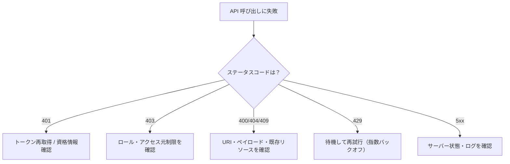

#### 6.6 EEM アプレット

**EEM（Embedded Event Manager）** は、**イベント（ログ・タイマー・CLI 実行など）をトリガー**に、機器内で自動処理を実行する仕組みです。

```text
event manager applet LINK-DOWN-NOTIFY
 event syslog pattern "%LINK-3-UPDOWN.*GigabitEthernet1/0/1.*down"
 action 1.0 syslog msg "EEM: Gi1/0/1 down detected"
 action 2.0 cli command "enable"
 action 3.0 cli command "show interfaces GigabitEthernet1/0/1"
 action 4.0 syslog msg "EEM: diagnostic collected"
```

**ベストプラクティス**: アプレットは**小さく、冪等（何度実行しても安全）**にする。破壊的な操作（reload、設定削除）は避け、動作は必ず検証環境でテストする。

#### 6.7 エージェント型とエージェントレス型のオーケストレーション

| 項目 | エージェント型 | エージェントレス型 |
|---|---|---|
| 例 | Puppet、Chef | Ansible、Terraform |
| 対象機器に常駐ソフト | 必要 | **不要**（SSH / NETCONF / API で接続） |
| 動作 | エージェントがサーバーへ**プル**して状態を収束 | 実行時に制御ノードから**プッシュ** |
| ネットワーク機器との相性 | 対応機器が限られる | SSH/API 経由で広く適用可能 |

**ベストプラクティス**: 構成は **Git で管理**（Infrastructure as Code）し、**変更前にドライラン／差分確認**（`--check`、`terraform plan`）を行う。

---


## 第3章 コンセントレーション試験（8 種）

ここでは 8 種類の選択式試験について、**公式の試験内容 PDF の各項目**を初学者向けに解説します。実際に受験するのは **1 つだけ**なので、興味のある試験から読んで構いません。

| 試験 | ドメイン構成（配分） |
|---|---|
| [ENARSI](#31-300-410-enarsi高度なルーティングとサービス) | L3 技術 35% / VPN 20% / インフラセキュリティ 20% / インフラサービス 25% |
| [ENSDWI](#32-300-415-ensdwicatalyst-sd-wan-の実装) | アーキ 20% / コントローラ展開 15% / ルータ展開 20% / ポリシー 20% / セキュリティ・QoS 15% / 管理・運用 10% |
| [ENSLD](#33-300-420-ensldエンタープライズ設計) | アドレス・ルーティング 25% / キャンパス 25% / WAN 20% / ネットワークサービス 20% / 自動化・AI 10% |
| [ENWLSD](#34-300-425-enwlsdワイヤレス設計) | サイトサーベイ 25% / 有線・無線インフラ 30% / モビリティ 25% / WLAN HA 20% |
| [ENWLSI](#35-300-430-enwlsiワイヤレス実装) | FlexConnect 15% / QoS 10% / マルチキャスト 10% / ロケーション 10% / 高度なロケーション 10% / クライアントセキュリティ 20% / モニタリング 15% / ハードニング 10% |
| [ENAUTO](#36-300-435-enauto自動化) | 基礎 10% / API・プロトコル 10% / デバイスプログラマビリティ 20% / Catalyst Center 20% / SD-WAN 20% / Meraki 20% |
| [ENCC](#37-300-440-enccクラウド接続) | アーキモデル 15% / 設計 15% / IPsec 25% / SD-WAN クラウド接続 25% / 運用 20% |

---

### 3.1 300-410 ENARSI（高度なルーティングとサービス）

**特徴**: 「**トラブルシュート**」が中心の試験です。ルーティングを**設定できる**だけでなく、**壊れたときに原因を特定できる**ことが求められます。

#### 1.0 レイヤ 3 テクノロジー（35%）

##### 1.1 アドミニストレーティブ ディスタンス（AD）

複数のプロトコルが同じ宛先を学習したとき、**信頼度（AD が小さいほど優先）**で選ばれます。

| ルーティングソース | AD | | ルーティングソース | AD |
|---|---|---|---|---|
| 直接接続 | 0 | | OSPF | 110 |
| スタティック | 1 | | IS-IS | 115 |
| eBGP | 20 | | RIP | 120 |
| EIGRP（内部） | 90 | | EIGRP（外部） | 170 |
| | | | iBGP | 200 |

**トラブルシュートの勘所**: 「期待した経路が選ばれない」ときは、まず `show ip route <宛先>` で**どのソースが勝っているか**を確認します。フローティングスタティック（AD を大きくしたバックアップ）は、AD の大小を誤ると常に優先されて事故になります。

##### 1.2 ルートマップ（属性、タグ付け、フィルタリング）

`route-map` は **match（条件）→ set（動作）**の連なりで、末尾に**暗黙の deny** があります。シーケンスは上から評価され、一致した時点で終了します。

```text
route-map SET-LP permit 10
 match ip address prefix-list PL-BRANCH
 set local-preference 200
route-map SET-LP permit 20      ! これがないと他の経路が暗黙 deny で落ちる
```

**落とし穴**: 末尾の「全許可（permit の空 match）」を書き忘れて、意図しない経路が消える。

##### 1.3 ループ防止メカニズム

| 手法 | 内容 |
|---|---|
| スプリットホライズン | 学習したインターフェイスへは同じ経路を広告しない |
| ルートポイズニング | 障害経路を無限大メトリックで広告して無効化を通知 |
| タグ付け＋フィルタリング | 再配布した経路にタグを付け、逆方向の再配布で除外 |

##### 1.4 再配布（プロトコル／ルーティングソース間）


```text
route-map OSPF-TO-EIGRP deny 10
 match tag 90            ! EIGRP 由来の経路は戻さない
route-map OSPF-TO-EIGRP permit 20
 set tag 110
route-map EIGRP-TO-OSPF deny 10
 match tag 110
route-map EIGRP-TO-OSPF permit 20
 set tag 90
!
router eigrp 100
 redistribute ospf 1 metric 100000 100 255 1 1500 route-map OSPF-TO-EIGRP
router ospf 1
 redistribute eigrp 100 subnets route-map EIGRP-TO-OSPF
```

**ベストプラクティス**

1. 再配布は**必要な経路のみ**に絞り、**タグ＋ルートマップ**で双方向のループ／サブオプティマルルーティングを防ぐ。
2. **シードメトリック**（再配布時の初期メトリック）を必ず設定（EIGRP は未設定だと再配布されない）。OSPF は `subnets` を忘れない。
3. 2 か所以上で再配布する場合は特に**経路フィードバック**に注意する。

##### 1.5 手動要約と自動要約

| プロトコル | 手動要約 | 備考 |
|---|---|---|
| EIGRP | `ip summary-address eigrp <AS> <網> <マスク>`（インターフェイス） | 要約ルートは Null0 に向く。自動要約は既定で無効（現行 IOS） |
| OSPF | ABR: `area <ID> range` ／ ASBR: `summary-address` | エリア境界でのみ要約可能 |
| BGP | `aggregate-address`（`summary-only` で詳細を抑制） | 集約元経路が RIB に必要 |

**落とし穴**: 要約による**ブラックホール**（要約に含まれるが実在しないアドレス宛の通信が破棄される、または誤経路へ流れる）。

##### 1.6 ポリシーベースルーティング（PBR）／ 1.7 VRF-Lite

PBR は ENCOR と同様（3.2.d 参照）。**VRF-Lite** は MPLS を使わず、**VRF ＋ 各リンクの分離（サブインターフェイス等）**で複数のルーティングテーブルを維持する簡易的なネットワーク仮想化です。

```text
interface GigabitEthernet0/0/1.100
 encapsulation dot1Q 100
 vrf forwarding CUST-A
 ip address 10.1.100.1 255.255.255.252
!
router ospf 100 vrf CUST-A
 network 10.1.100.0 0.0.0.3 area 0
```

**ベストプラクティス**: VRF ごとにルーティングプロトコルのインスタンスを分け、**VRF 間の漏洩（リーク）は意図した箇所のみ**にする。

##### 1.8 BFD（Bidirectional Forwarding Detection）

ルーティングプロトコルの Hello より**はるかに高速**にリンク／経路の障害を検知し、プロトコルへ通知します。

```text
interface GigabitEthernet0/0/0
 bfd interval 300 min_rx 300 multiplier 3
!
router ospf 1
 bfd all-interfaces
```

**ベストプラクティス**: タイマーを攻めすぎると**フラップ（誤検知）**の原因になる。プラットフォームの性能と回線品質に合わせる。

##### 1.9 EIGRP のトラブルシュート

| 概念 | 意味 |
|---|---|
| サクセサ | 宛先への最良経路の次ホップ |
| フィージブルサクセサ（FS） | **RD < 現在の FD** を満たすバックアップ経路（ループフリー保証） |
| FD／RD | 自ルータから宛先までの総メトリック／ネイバーが報告するメトリック |
| Stuck in Active（SIA） | 経路を失い、FS がなく、**問い合わせ（Query）**に応答がない状態 |
| スタブ | スタブルータは問い合わせを受けない（SIA の範囲を限定） |
| 不等コスト負荷分散 | `variance` で FD の倍率以内の FS を利用 |

```text
router eigrp ENT
 address-family ipv4 unicast autonomous-system 100
  af-interface default
   passive-interface
  exit-af-interface
  af-interface GigabitEthernet0/0/0
   no passive-interface
  exit-af-interface
  network 10.0.0.0 0.255.255.255
  eigrp stub connected summary
 exit-address-family
```

**ネイバーが張れない主な原因**: **AS 番号、K 値、認証、サブネット、パッシブインターフェイス、ACL** の不一致。確認は `show ip eigrp neighbors`、`show ip eigrp topology`、`debug eigrp packets`（条件付きで）。

**ベストプラクティス**: **名前付きモード**を採用（IPv4/IPv6 を一元管理）。スポークは **stub** にして Query を制限。要約で Query の範囲を狭める。

##### 1.10 OSPF（v2/v3）のトラブルシュート

| 分類 | 内容 |
|---|---|
| ネットワークタイプ | ポイントツーポイント／ブロードキャスト／NBMA（非ブロードキャスト）／ポイントツーマルチポイント |
| エリアタイプ | バックボーン(0)、ノーマル、トランジット、スタブ、NSSA、トータリースタブ |
| ルータタイプ | 内部ルータ、バックボーンルータ、ABR、ASBR |
| 仮想リンク | Area 0 に物理接続できないエリアを**一時的に**つなぐ（恒久解ではない） |
| パス選択 | **O（エリア内）> O IA（エリア間）> E1／N1 > E2／N2** の優先順 |

**ネイバー問題の定番チェックリスト**: ①Hello/Dead タイマー ②エリア ID ③サブネット・マスク ④認証 ⑤MTU（ExStart で停滞）⑥ネットワークタイプ ⑦ルータ ID の重複 ⑧スタブ属性（E ビット）の一致。

##### 1.11 BGP のトラブルシュート

| トピック | 要点 |
|---|---|
| ネイバー関係 | TCP 179、**update-source**（ループバック使用時）、**ebgp-multihop**、認証 |
| 4 バイト AS | 拡張 AS 番号に対応（ASDOT/ASPLAIN 表記） |
| プライベート AS | `remove-private-as` 等で外部へ広告しない |
| ピアグループ／テンプレート | 設定の共通化で運用ミスを減らす |
| パス選択 | Weight／LOCAL_PREF／AS_PATH／MED など（2.3 の表を参照） |
| ルートリフレクタ | iBGP のフルメッシュ回避（クラスタ、オリジネータ ID でループ防止） |
| ポリシー | インバウンド／アウトバウンドのフィルタリングとパス操作 |

```text
router bgp 65001
 neighbor 10.0.0.2 remote-as 65001
 neighbor 10.0.0.2 update-source Loopback0
 address-family ipv4
  neighbor 10.0.0.2 route-reflector-client
```

**ベストプラクティス**: iBGP は**ループバック間**で張り、IGP で到達性を確保。経路広告は**プレフィックスリストとルートマップ**で明示的に制御。ポリシー変更後は **soft reset（ルートリフレッシュ）**で反映する。

#### 2.0 VPN 技術（20%）

##### 2.1 MPLS の動作

| 用語 | 意味 |
|---|---|
| LSR | ラベルスイッチルータ |
| LDP | ラベル配布プロトコル（TCP/UDP 646） |
| LSP | ラベルスイッチパス（ラベルで転送する一方向経路） |
| ラベル操作 | Push（付与）／Swap（交換）／Pop（除去。**PHP**＝最終ホップ手前で除去） |

##### 2.2 MPLS レイヤ 3 VPN

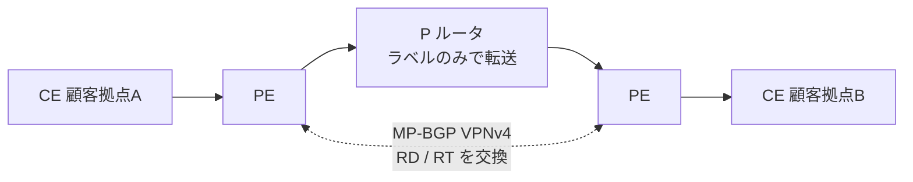

| 要素 | 役割 |
|---|---|
| VRF | 顧客ごとのルーティングテーブル（PE 上） |
| RD（Route Distinguisher） | 重複アドレスを区別する識別子（VPNv4 アドレスの一部） |
| RT（Route Target） | どの VRF へインポート／エクスポートするかを制御 |
| MP-BGP（VPNv4） | PE 間で顧客経路を交換 |

```text
vrf definition CUST-A
 rd 65001:100
 address-family ipv4
  route-target export 65001:100
  route-target import 65001:100
!
mpls label protocol ldp
interface GigabitEthernet0/0/0
 mpls ip
router bgp 65001
 address-family vpnv4
  neighbor 10.0.0.2 activate
  neighbor 10.0.0.2 send-community extended
```

##### 2.3 DMVPN（単一ハブ）

**mGRE ＋ NHRP ＋ IPsec** で、ハブ＆スポーク構成の**動的なスポーク間直接通信**を実現します。

| 構成要素 | 役割 |
|---|---|
| GRE / mGRE | ポイントツーマルチポイントのトンネル基盤 |
| NHRP | 「トンネル IP → 実 IP（NBMA）」の対応を管理（ハブが NHS） |
| IPsec | トンネルの暗号化 |
| ダイナミックネイバー | スポークがハブに登録し、ルーティングの隣接を動的に形成 |
| スポーク間通信 | Phase 2/3 でスポーク間の直接トンネルを動的に構築 |

```text
! ハブ
interface Tunnel0
 ip address 172.16.0.1 255.255.255.0
 ip nhrp network-id 1
 ip nhrp map multicast dynamic
 ip nhrp redirect                    ! Phase 3
 tunnel source GigabitEthernet0/0/0
 tunnel mode gre multipoint
 tunnel protection ipsec profile DMVPN-PROF
!
! スポーク
interface Tunnel0
 ip address 172.16.0.11 255.255.255.0
 ip nhrp network-id 1
 ip nhrp nhs 172.16.0.1 nbma 203.0.113.1 multicast
 ip nhrp shortcut                    ! Phase 3
 tunnel source GigabitEthernet0/0/0
 tunnel mode gre multipoint
 tunnel protection ipsec profile DMVPN-PROF
```

**ベストプラクティス**: ハブは**冗長化**（デュアルハブ）を検討。トンネルの MTU/MSS 調整、IPsec プロファイルは**共通化**する。

#### 3.0 インフラストラクチャのセキュリティ（20%）

| 項目 | ポイント |
|---|---|
| 3.1 AAA（TACACS+/RADIUS/ローカル） | 2.5 の 5.1.b 参照。**フォールバック順序**とサーバー到達性を確認 |
| 3.2.a IPv4 ACL（標準・拡張・時間ベース） | `time-range` で時間帯限定。適用方向と暗黙 deny に注意 |
| 3.2.b IPv6 トラフィックフィルタ | `ipv6 access-list`。**ND（NS/NA）を許可する暗黙ルール**がある点に注意 |
| 3.2.c uRPF | 送信元アドレス詐称を防ぐ。**strict**（同じ IF で到達可能）／**loose**（どこかの IF で到達可能） |
| 3.3 CoPP | 制御プレーンの保護（Telnet/SSH/HTTP(S)/SNMP/EIGRP/OSPF/BGP 等をクラス分け） |
| 3.4 IPv6 FHS | RA Guard／DHCPv6 Guard／バインディングテーブル／ND インスペクション／ソースガード |

```text
! uRPF（strict）
interface GigabitEthernet0/0/0
 ip verify unicast source reachable-via rx
!
! 時間ベース ACL
time-range OFFICE-HOURS
 periodic weekdays 9:00 to 18:00
ip access-list extended GUEST-IN
 permit tcp any any eq 443 time-range OFFICE-HOURS
```

**IPv6 FHS の意義**: IPv6 ではルータ広告（RA）や DHCPv6 を**偽装した不正端末**が中間者攻撃を起こせます。RA Guard などで**信頼できるポートだけ**が RA/DHCP を送れるようにします。

**ベストプラクティス**: uRPF は**非対称ルーティングがある箇所では loose** を使う（strict だと正常通信を破棄）。CoPP は観測 → 実測値に基づく制限の順で導入する。

#### 4.0 インフラストラクチャ サービス（25%）

| 項目 | 要点とトラブルシュートの観点 |
|---|---|
| 4.1 デバイス管理 | コンソール／VTY、Telnet/HTTP/HTTPS/SSH/SCP/(T)FTP。**暗号化されたプロトコルを優先**、ACL・ソースインターフェイスを確認 |
| 4.2 SNMP（v2c/v3） | v2c はコミュニティ文字列（平文）、v3 は認証＋暗号化。**エンジン ID・ユーザー・ビュー・ACL** の不一致を確認 |
| 4.3 ロギング | ローカル／syslog／debug／条件付き debug／タイムスタンプ／テレメトリ |
| 4.4 DHCP（v4/v6） | DORA、サーバー、**リレー**（`ip helper-address`）、オプション |
| 4.5 IP SLA | ジッター、オブジェクトトラッキング、遅延、接続性 |
| 4.6 NetFlow | v9、Flexible NetFlow、IPFIX |
| 4.7 Catalyst Center Assurance | 接続、モニタリング、デバイス／ネットワークの正常性 |

DHCP の流れ:

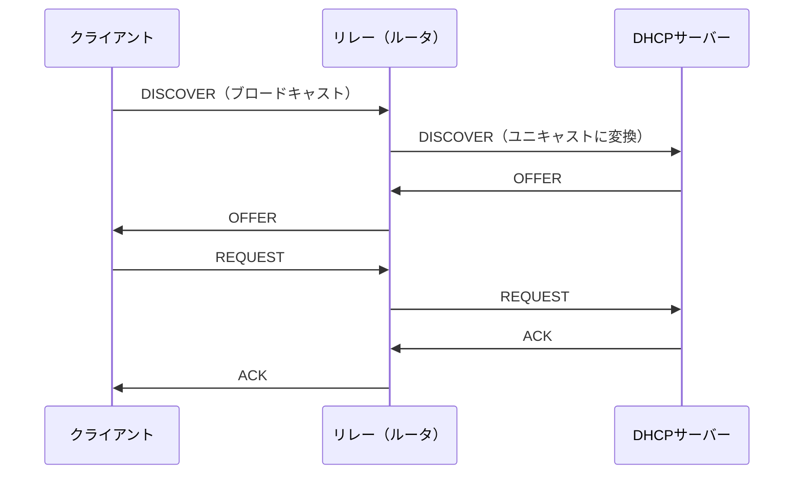

```text
interface Vlan10
 ip address 10.10.10.1 255.255.255.0
 ip helper-address 192.0.2.5
```

| DHCP オプション | 用途 |
|---|---|
| 43 | ベンダー固有情報（例: AP がコントローラを発見するため） |
| 66 / 150 | TFTP サーバー（IP 電話・PnP 等） |
| 3 / 6 | デフォルトゲートウェイ／DNS |

**DHCP トラブルシュートの要点**: リレー設定漏れ、サーバー側スコープ枯渇、`giaddr` に対応するスコープの有無、DHCP スヌーピングの信頼ポート設定を確認。

---

### 3.2 300-415 ENSDWI（Catalyst SD-WAN の実装）

#### 1.0 アーキテクチャ（20%）

第 2 章の 1.2 を土台に、詳細を補足します。

| 項目 | 要点 |
|---|---|
| オーケストレーション（Validator） | 初期認証と発見。**パブリックから到達可能**（または 1:1 の静的 NAT）。STUN で NAT 種別を判定 |
| 管理（Manager） | 設定・ポリシー・監視の UI/API |
| コントロール（Controller/OMP） | TLOC・vRoute・サービスルート・ポリシーを配布 |
| データ（WAN Edge） | IPsec/GRE、BFD による品質計測 |
| マルチリージョンファブリック | 大規模環境で領域を分割して拡張性と経路制御性を高める |
| Cloud OnRamp | SaaS／IaaS／コロケーション／マルチクラウドへの最適接続 |

**TLOC のカラー**: 回線種別（例: mpls、biz-internet、lte など）を識別する属性。**パブリック／プライベート**の区別があり、トンネル形成の可否に影響します。

#### 2.0 コントローラの展開（15%）

- **クラウド展開**: Cisco ホスト型で運用負荷を軽減。
- **オンプレミス展開**: 自社でホスティング（パブリック／プライベート）。インストール、**拡張性・冗長性（複数台）**の設計が必要。
- **証明書とデバイスリスト**: 各ノードは証明書で認証され、**許可されたデバイスだけ**がオーバーレイに参加。**証明書期限**は運用上の重要事項。
- **制御プレーン接続のトラブルシュート**: 制御接続は DTLS/TLS を使用。ファイアウォールの許可、時刻同期、証明書、システム IP／サイト ID／組織名の不一致を確認。

```mermaid
flowchart TD
    S["WAN Edge が制御接続を確立できない"] --> A{"Validator に到達できる？<br/>(DNS / ルーティング / FW)"}
    A -->|"いいえ"| B["アンダーレイ疎通・FW ポート・DNS を確認"]
    A -->|"はい"| C{"証明書は有効？<br/>時刻は正しい？"}
    C -->|"いいえ"| D["証明書の再発行 / NTP を修正"]
    C -->|"はい"| E{"デバイスリストに登録済み？<br/>組織名・サイトIDは正しい？"}
    E -->|"いいえ"| F["デバイスリスト・設定を修正"]
    E -->|"はい"| G["show sdwan control connections / connection-history で失敗理由を確認"]
```

#### 3.0 ルータの展開（20%）

| 項目 | 内容 |
|---|---|
| オンボーディング | **ZTP／PnP／ブートストラップ**でゼロタッチ導入 |
| DC・地域ハブ | 集約拠点の配置。冗長化と経路優先度の設計 |
| データプレーン設定 | 回線終端、**TLOC 拡張**、ダイナミックトンネル、アンダーレイ／オーバーレイの接続 |
| OMP／TLOC | ベストパス数の制限、TLOC の優先度など |
| 構成テンプレート | CLI／機能テンプレートで VRRP、OSPF、BGP、EIGRP 等を設定 |
| マルチキャスト | SD-WAN オーバーレイでのマルチキャスト対応 |
| 設定グループ／ポリシーグループ／機能プロファイル／ワークフロー | 新しい設定モデルによる構成管理 |

**ベストプラクティス**: **テンプレート（または設定グループ）を標準化**し、拠点固有値は変数化する。サイト ID の割り当て規則を先に決める。**ZTP の前にアンダーレイの疎通**を確認する。

#### 4.0 ポリシー（20%）

| ポリシー | 適用先 | 内容 |
|---|---|---|
| **集中型制御ポリシー** | Controller | OMP ルートの**広告を制御**（トポロジ設計：ハブ＆スポーク、部分メッシュなど） |
| **集中型データポリシー** | Controller（実施は Edge） | データ転送の制御（VPN ごとの経路変更、サービスチェイン、DIA 等） |
| **アプリケーション認識型ルーティング（AAR）** | Controller | SLA（遅延・ロス・ジッタ）を満たす経路を選択 |
| **ローカライズドポリシー** | WAN Edge | ACL、QoS、ルートポリシーなど拠点内で完結 |

- **エンドツーエンドのセグメンテーション**: VPN ID による分離。メンバーシップとトポロジで制御。
- **ダイレクトインターネットアクセス（DIA）**: インターネット宛を拠点から直接出す（バックホール削減）。
- **AI 主導の予測パス推奨**: 過去のパス品質データから、劣化を**事前に予測**して経路推奨を行う機能。

```mermaid
flowchart LR
    C["Controller に適用"] --> CP["集中型制御ポリシー<br/>経路広告の制御"]
    C --> DP["集中型データポリシー<br/>転送の制御"]
    C --> AAR["AAR<br/>SLA に基づく経路選択"]
    E["WAN Edge に適用"] --> LP["ローカライズドポリシー<br/>ACL / QoS"]
```

**ベストプラクティス**: まず**シンプルなトポロジ（ハブ＆スポーク）**から始め、必要に応じてポリシーを追加する。AAR の SLA しきい値は**アプリ要件（音声は厳しめ）**に合わせる。

#### 5.0 セキュリティと QoS（15%）

| 領域 | 内容 |
|---|---|
| サービス挿入 | ファイアウォール等を経路に挿入（サービスチェイン） |
| オンボックスセキュリティ | アプリ認識型 FW、IPS、URL フィルタ、AMP、SSL/TLS プロキシ、TrustSec |
| クラウドセキュリティ | DNS セキュリティ、**セキュアインターネットゲートウェイ（SIG）** |
| QoS | スケジューリング、キューイング、シェーピング、ポリシング、マーキング、**トンネルごとの適応型 QoS** |
| AppQoE | TCP 最適化、**DRE（データ冗長性排除）**、パケット複製、**FEC（前方誤り訂正）**、AppNav、NGFW |

**ベストプラクティス**: セキュリティ機能を有効化すると**スループットに影響**するため、プラットフォームの性能要件を事前に確認する。FEC/パケット複製は**帯域を消費する**ので、重要アプリに限定する。

#### 6.0 管理と運用（10%）

Manager での認証・監視・レポート・障害対応、**REST API による監視**、**ソフトウェアイメージ管理**（アップグレードの標準化）を扱います。**ベストプラクティス**: アップグレードは**コントローラ → エッジ**の順に、互換性表を確認して段階的に行う。

---

### 3.3 300-420 ENSLD（エンタープライズ設計）

**特徴**: 「**設計判断の根拠**」を問う試験です。要件（可用性・拡張性・コスト・セキュリティ）に対し、どの技術を選ぶかを説明できることが重要です。

#### 1.0 高度なアドレス割り当ておよびルーティングソリューション（25%）

| 項目 | 設計の要点 |
|---|---|
| 1.1 構造化アドレス計画（IPv4/IPv6） | **階層的に割り当て、要約可能**にする。拡張余地を確保し、拠点・機能ごとにブロックを予約 |
| 1.2 IS-IS 設計 | レベル 1／レベル 2 の分離。要約とメトリック設計（ワイドメトリック） |
| 1.3 EIGRP 設計 | 要約・スタブでクエリ範囲を限定し、安定性を確保 |
| 1.4 OSPF 設計 | エリア設計、ABR での要約、LSA 数の管理 |
| 1.5 BGP 設計 | アドレスファミリ、フィルタ、パス優先属性、ルートリフレクタ／コンフェデレーション、負荷分散 |
| 1.6 IPv6 移行戦略 | **オーバーレイ（トンネリング）／ネイティブ（デュアルスタック）／境界（IPv4/IPv6 変換）** |

```mermaid
flowchart TD
    Q{"IPv6 移行の前提は？"} -->|"既存 IPv4 を維持しつつ段階導入"| DS["デュアルスタック<br/>ネイティブで両方運用"]
    Q -->|"中間網が IPv4 のみ"| TU["トンネリング<br/>IPv4 網越しに IPv6 を運ぶ"]
    Q -->|"IPv6 のみの端末と IPv4 資産の共存"| NT["変換（NAT64 等）<br/>境界で変換"]
```

**設計の原則**: 「**要約できないアドレス計画は、後で必ず苦しむ**」。ルーティングプロトコルは規模と運用体制に合わせて選び、**混在は最小限**に。

#### 2.0 高度なエンタープライズ キャンパス ネットワーク（25%）

| 項目 | 要点 |
|---|---|
| 2.1 高可用性 | FHRP、プラットフォーム抽象化（スタッキング等）、**グレースフルリスタート／NSF／NSR**、BFD |
| 2.2 L2 インフラ | STP の拡張性、高速収束、ループフリー技術、**PoE／WoL**、L2 セキュリティ（STP 保護、ポートセキュリティ、VACL） |
| 2.3 マルチキャンパス L3 | 収束、負荷分散、要約、フィルタリング、VRF、最適トポロジ、再配布 |
| 2.4／2.5 SD-Access | アンダーレイ／オーバーレイ、コントロール／データプレーン、自動化、ワイヤレス、セキュリティ。**ファブリック設計**（境界、セグメンテーション、VN、拡張性、マルチキャスト、OTT／ファブリックの無線） |

**ベストプラクティス**: **ルーテッドアクセス**を基本とし、L2 の範囲は 1 スイッチ／1 クローゼットに限定。STP は**保護機能をセット**で。SD-Access は**ファブリックサイトの規模モデル（Fabric in a Box／小／中／大）**から選ぶ。

#### 3.0 エンタープライズ ネットワーク向け WAN（20%）

| 項目 | 選択肢と選定の観点 |
|---|---|
| 3.1 WAN 接続オプション | L2 VPN、MPLS L3 VPN、メトロイーサネット、DWDM、4G/5G、SD-WAN カスタマーエッジ |
| 3.2 サイト間 VPN | DMVPN、L2 VPN、MPLS L3 VPN、IPsec、GRE、**GET VPN**（グループ暗号。元のヘッダを保持） |
| 3.3 WAN の高可用性 | シングルホーム／マルチホーム／バックアップ接続／フェイルオーバー |
| 3.4／3.5 SD-WAN | アーキテクチャ（4 プレーン、オンボーディング、セキュリティ）と設計考慮（制御プレーン、オーバーレイ、LAN、HA、QoS、マルチキャスト） |

| 接続方式 | 長所 | 短所 |
|---|---|---|
| MPLS L3 VPN | SLA・QoS が明確 | コスト高、クラウド接続が複雑 |
| インターネット VPN（IPsec/DMVPN） | 低コスト・迅速 | 品質保証が弱い |
| SD-WAN | 複数回線の活用、集中管理 | 導入設計と運用体制が必要 |
| 4G/5G | 拠点展開が早い、バックアップ向き | 帯域・遅延の変動 |

#### 4.0 ネットワークサービス（20%）

| 項目 | 要点 |
|---|---|
| 4.1 QoS 戦略 | **DiffServ**（クラス別・拡張性高）／**IntServ**（RSVP による予約・拡張性低） |
| 4.2 エンドツーエンド QoS | 分類とマーキング、シェーピング、ポリシング、キューイング。**信頼境界の設計** |
| 4.3 ネットワーク管理設計 | インバンド／アウトオブバンド、**管理ネットワークの分離**、管理トラフィックの優先 |
| 4.4／4.5 マルチキャスト | 送信元ツリー・共有ツリー・RPF・RP、SSM／PIM bidir／MSDP／サービスリフレクション |

**設計の原則**: QoS は**トラフィックを分類しすぎない**（クラスは 4〜8 程度が管理しやすい）。管理ネットワークは**障害時にも到達できる**（アウトオブバンド）よう設計する。

#### 5.0 自動化と人工知能（10%）

| 項目 | 要点 |
|---|---|
| 5.1 YANG モデル | IETF／OpenConfig／Cisco ネイティブの違い |
| 5.2 NETCONF vs RESTCONF | SSH+XML+トランザクション／HTTPS+JSON+REST |
| 5.3 モデル駆動型テレメトリ | **定期的公開**／**状態変化時公開**。ポーリング（SNMP）より効率的・低遅延 |
| 5.4 gRPC／gNMI | HTTP/2 ベースの高効率なテレメトリ・設定取得 |
| 5.5 クラウド接続オプション | 直接接続、Cloud OnRamp、MPLS 直接接続、WAN 統合 |
| 5.6 クラウドサービスモデル | SaaS／PaaS／IaaS × プライベート／パブリック／ハイブリッド |

---

### 3.4 300-425 ENWLSD（ワイヤレス設計）

```mermaid
flowchart LR
    R["要件収集<br/>密度・アプリ・セキュリティ"] --> P["予測サーベイ<br/>Ekahau 等"]
    P --> D["設計<br/>AP配置・チャネル・電力"]
    D --> I["展開"]
    I --> V["展開後サーベイ<br/>実測で検証"]
    V --> T["調整 RRM / プロファイル"]
    T -->|"継続的改善"| R
```

#### 1.0 無線サイトサーベイ（25%）

| 項目 | 要点 |
|---|---|
| 1.1 要件収集 | クライアント密度、リアルタイムアプリ（音声/ビデオ）、AP タイプ、展開タイプ（データ／ロケーション／音声／ビデオ）、セキュリティ |
| 1.2 材料減衰 | コンクリート・金属・ガラス等で**電波が減衰**し、カバレッジ設計に影響 |
| 1.3〜1.6 サーベイ | レイヤ 1（スペクトラム）、展開前、展開後、**予測サーベイ** |
| 1.7 ツール | Ekahau、Hamina、Chanalyzer、スペクトラムアナライザ |

**ベストプラクティス**: 設計は**予測 → 実測（展開前 AP-on-a-stick）→ 展開後検証**の順で。要件（例: 音声は高い RSSI／SNR とセル間オーバーラップ）を数値で定義する。

#### 2.0 有線および無線インフラストラクチャ（30%）

| 項目 | 要点 |
|---|---|
| 2.1 物理要件 | AP の電源（PoE 規格・消費電力）、ケーブル配線、スイッチポート容量、取り付け、アース |
| 2.2 論理要件 | アーキテクチャ別（ローカルモード、FlexConnect、Fabric、EWC 等）と **WLC/AP のライセンス** |
| 2.3 無線管理 | **RRM**（自動チャネル／出力調整。Catalyst Center の **AI 拡張 RRM** を含む）、RF／無線プロファイル、**RxSOP**（受信感度しきい値の調整でセルサイズを制御） |
| 2.4 タイプ別要件 | データ、音声とビデオ、ロケーション（**Cisco Spaces** を含む） |
| 2.5 高密度設計 | 低い送信出力、データレートの制限、チャネル幅の抑制 |
| 2.6 メッシュ | 動作モード、イーサネットブリッジング、**WGB とローミング** |

**ベストプラクティス**: PoE は**最大消費電力**でバジェットを計算する。高密度では**AP を増やしつつ出力を下げる**（セルを小さく）。RRM のチャネル幅は**必要以上に広げない**。

#### 3.0 モビリティ（25%）

**モビリティグループ**（ロール別）、**クライアントローミングの最適化**（802.11r/k/v 等の活用、適切なセル重なり）、**データ／制御パスのモビリティトンネリング**の確認が範囲です。**ベストプラクティス**: ローミングが頻繁な音声端末はセル重なり（**約 15〜20%** 程度が一般的な目安）と対応する高速ローミング機能を確認する。

#### 4.0 WLAN 高可用性（20%）

| 領域 | 技術 |
|---|---|
| コントローラ HA | **LAG（リンク集約）**、**SSO（ステートフルスイッチオーバー）**、アンカーコントローラの優先度と冗長性 |
| AP HA | **AP 優先順位付け**、フォールバック（**プライマリ／セカンダリ／ターシャリ**）、**Embedded Wireless Controller（EWC）** |

---

### 3.5 300-430 ENWLSI（ワイヤレス実装）

#### 1.0 FlexConnect（15%）

支社の AP が WAN 越しのコントローラ障害に耐え、**ローカルでトラフィックをスイッチ**できるようにする機能です。

| 概念 | 内容 |
|---|---|
| スイッチングモード | **中央スイッチング**（コントローラ経由）／**ローカルスイッチング**（支社で終端） |
| FlexConnect グループ・ローミング | 同一グループ内で認証情報キャッシュ等により高速ローミング |
| スプリットトンネリング | 社内宛はコントローラへ、インターネット宛はローカルへ |
| VLAN ベースの中央スイッチング／Flex ACL | 支社側での制御 |
| Office Extend | 在宅などにAPを置く構成 |

**ベストプラクティス**: WAN 障害時に**認証できなくなる**設計を避ける（スタンドアロン動作時の認証方式を事前に設計）。

#### 2.0 QoS（10%） ／ 3.0 マルチキャスト（10%）

- **QoS**: 有線 ⇄ 無線のマッピング（DSCP ⇄ UP/WMM）、無線クライアントへの QoS、**AVC（アプリケーション可視化と制御）**。
- **マルチキャスト**: 無線ではマルチキャストが**最低データレートで送信**され効率が悪い点に注意。**マルチキャストダイレクト**（ユニキャストへ変換）や **mDNS**（サービス探索）、IGMP/MLD スヌーピングを活用。

#### 4.0 ロケーションサービス（10%） ／ 5.0 高度なロケーションサービス（10%）

**CMX と Cisco Spaces** を使い、クライアント／RFID タグの追跡、干渉源・不正 AP の検出、分析、プレゼンス、**キャプティブポータル**、位置連動ゲストサービス、コネクタの高可用性、精度のトラブルシュート、Catalyst Center での **wIPS** を扱います。

#### 6.0 ワイヤレスクライアントの接続におけるセキュリティ（20%）

| 項目 | 要点 |
|---|---|
| クライアントプロファイリング | WLC と **ISE** で端末種別を識別し、ポリシーを適用 |
| BYOD／ゲスト | **CWA**（ISE の中央 Web 認証・自己登録ポータル等）、**LWA**（ローカル Web 認証）、ネイティブサプリカントプロビジョニング、証明書の配布 |
| アイデンティティベース ネットワーキング | 認証結果に応じて **VLAN／QoS／ACL** を動的に割り当て（AAA オーバーライド） |

```mermaid
sequenceDiagram
    participant C as クライアント
    participant W as WLC
    participant I as ISE
    C->>W: 接続（SSID）
    W->>I: RADIUS Access-Request（MAB/802.1X）
    I->>W: Access-Accept + VLAN/ACL/SGT
    W->>C: ポリシー適用済みで接続
```

**ベストプラクティス**: 企業端末は **802.1X（EAP-TLS など証明書認証）**、ゲストは**分離された VLAN と帯域制限**、BYOD はオンボーディングで証明書を配布する。

#### 7.0 モニタリング（15%） ／ 8.0 デバイスハードニング（10%）

- **モニタリング**: Catalyst Center のレポート、アラームと**不正端末**管理、**RF 干渉源**管理、クライアント接続のトラブルシュート（WLC／ISE／Catalyst Center を突き合わせる）。
- **ハードニング**: RADIUS／TACACS+ によるデバイスアクセス制御、**AP 認証（802.1X）**、コントローラの**コントロールプレーン ACL**。

---

### 3.6 300-435 ENAUTO（自動化）

```mermaid
flowchart LR
    G["Git で構成管理"] --> P["Python / Ansible / Terraform<br/>でコード化"]
    P --> A["API / プロトコル<br/>NETCONF・RESTCONF・REST"]
    A --> D["デバイス / コントローラ<br/>IOS XE・Catalyst Center・SD-WAN・Meraki"]
    D --> T["テレメトリで検証"]
    T --> G
```

#### 1.0 ネットワーク プログラマビリティの基礎（10%）

| 項目 | 要点 |
|---|---|
| git 操作 | add／clone／push／commit／diff／branch／**マージ時のコンフリクト解消** |
| API スタイル | **REST**（リソース指向・HTTP メソッド）／**RPC**（操作指向） |
| 同期・非同期 | 非同期 API は**ジョブ ID を受け取り、完了をポーリング／Webhook で確認** |
| Python 仮想環境 | 依存関係の分離、再現性 |
| Ansible／Terraform | **宣言的・冪等**な IOS XE 構成管理 |

#### 2.0 API とプロトコルの自動化（10%）

YANG モデルから **JSON／XML インスタンス**を導き、**YANG ツリー（RFC 8340）**を読み、OpenConfig／IETF／ネイティブモデルと NETCONF／RESTCONF を比較します（詳細は ENCOR 4.6 と 6.3 を参照）。**Cisco YANG Suite** でモデルを探索し、リクエストを生成する練習が有効です。

#### 3.0 ネットワーク デバイス プログラマビリティ（20%）

| 手段 | 用途 |
|---|---|
| **Netmiko** | SSH で CLI を自動化（構造化されていない出力を扱う） |
| **ncclient** | Python から NETCONF を実行 |
| **requests** | RESTCONF API へ HTTP リクエスト |
| **Ansible** | IOS XE の宣言的設定 |
| モデル駆動型テレメトリ | CLI／NETCONF／RESTCONF で購読。**定期／状態変化時**の公開モデル |
| Day 0 プロビジョニング | **iPXE／PnP／ZTP** |

```python
from netmiko import ConnectHandler

dev = {
    "device_type": "cisco_xe",
    "host": "192.0.2.10",
    "username": "api-user",
    "password": "<PASSWORD>",
}
with ConnectHandler(**dev) as conn:
    print(conn.send_command("show ip interface brief"))
```

```python
from ncclient import manager

with manager.connect(host="192.0.2.10", port=830, username="api-user",
                     password="<PASSWORD>", hostkey_verify=False) as m:
    reply = m.get_config(source="running")
    print(reply.xml[:500])
```

**ベストプラクティス**: **構造化データ（NETCONF/RESTCONF）を優先**し、CLI スクレイピングは最終手段にする。**冪等性**（何度実行しても同じ結果）を意識する。テレメトリは**トラブルシュートの根拠データ**として蓄積する。

#### 4.0 Cisco Catalyst Center（20%）

| 項目 | 要点 |
|---|---|
| 従来型 vs SDN | 個別 CLI 管理 → **意図（Intent）を中央から配布** |
| 機能 | **アシュアランス API／Intent API／イベントと通知／SDA** |
| **Webhook（アウトバウンド）** | イベント発生時に外部システムへ HTTP で通知 |
| API リクエスト | Intent API、**コマンドランナー API**（CLI 実行）、サイト API、SDA API、ネットワーク検出／デバイス API、**テンプレート API** |
| トラブルシュート | Intent API による自動化プロセスの失敗調査（**非同期タスクのステータス確認**） |

**ベストプラクティス**: 非同期 API は**タスク ID を追跡して結果を確認**する。トークンは有効期限があるため再取得の処理を入れる。**コマンドランナー**は読み取り系コマンドを中心にする。

#### 5.0 Cisco Catalyst SD-WAN（20%） ／ 6.0 Cisco Meraki（20%）

- **SD-WAN Manager API**: デバイスインベントリ取得、管理 API、**構成 API による SD-WAN ファブリック構成の変更**、監視 API（リアルタイム含む）、API を使った展開のトラブルシュート。
- **Meraki**: ダッシュボード API による**ネットワークの構築・設定**、**位置情報スキャン API／MV Sense API／外部キャプティブポータル API／Webhook アラート API**、アラート Webhook を受け取る Python スクリプト。

**ベストプラクティス**: API の**レート制限**を考慮し、ページネーションと再試行（バックオフ）を実装する。Webhook 受信側は**共有シークレットで送信元を検証**する。

---

### 3.7 300-440 ENCC（クラウド接続）

**特徴**: オンプレミス／SD-WAN と、**AWS・Azure・Google Cloud**をつなぐ設計・実装・運用が範囲です。

```mermaid
flowchart TD
    Q{"クラウド接続の要件は？"} -->|"低コスト・迅速"| I["インターネット VPN<br/>ネイティブ IPsec / SD-WAN"]
    Q -->|"品質・帯域保証"| P["プライベート接続<br/>MPLS プロバイダ / コロケーション / SDCI"]
    Q -->|"SaaS の最適化"| S["SaaS 接続<br/>DIA / クラウドセキュリティ経由 / Cloud OnRamp"]
    I --> HA["冗長化・SLA を設計に反映"]
    P --> HA
    S --> HA
```

| ドメイン | 要点 |
|---|---|
| **1.0 アーキテクチャモデル（15%）** | インターネットベース（ネイティブ IPsec／SD-WAN クラウド接続）、プライベート（MPLS プロバイダ／コロケーション／**SDCI 地域間相互接続**）、SaaS（直接インターネット／クラウドセキュリティ経由／集中型インターネットゲートウェイ／専用接続） |
| **2.0 設計（15%）** | HA・復元力・SLA、帯域・QoS・専有／共有・マルチホーム・ルーティング、**規制コンプライアンス（NIST、FedRAMP、ISO）**、各クラウドのセキュリティポリシー（水平方向トラフィック、バックホール、インバウンド） |
| **3.0 IPsec クラウド接続（25%）** | オンプレ IOS XE ⇔ ネイティブ VPN エンドポイント／SIG の **GRE/IPsec**、IOS XE ルータ間の IPsec、**BGP／OSPF** によるルーティング統合（再配布・スタティック） |
| **4.0 SD-WAN クラウド接続（25%）** | インターネットベースの安全な接続、**SaaS 向け OnRamp**、垂直・水平ポリシー（セキュリティ／ルーティング／アプリケーション） |
| **5.0 運用（20%）** | IPsec 接続・ルーティング・SD-WAN 接続・ポリシーの**診断** |

> 「垂直方向／水平方向」は、**垂直＝クラウド外（インターネット・オンプレ）との通信**、**水平＝クラウド内（VPC/VNet 間など）の通信**というトラフィックの向きを表します。

**ベストプラクティス**

1. クラウド側の**冗長トンネル（2 本以上）**を張り、BGP で経路を切り替える。
2. **アドレス重複**を事前に確認し、クラウド側と社内で重ならない設計にする。
3. 水平方向トラフィックの検査（East-West）を設計に含める（クラウド内のセグメント分離を想定）。
4. 規制要件がある場合は、**通信経路・暗号化・ログ保存**の要件を最初に洗い出す。

---


## 第4章 横断ベストプラクティス集

個別技術を超えて、**どの分野にも共通する運用の原則**をまとめます。試験の「どれが最も適切か」を選ぶ問題でも、判断の軸になります。

### 4.1 設計の原則

| 原則 | 内容 | 関連する試験トピック |
|---|---|---|
| 階層化・モジュール化 | 役割を分け、障害と変更の影響範囲を限定する | 1.1 設計原則、ENSLD 2.0 |
| 冗長化と回復性 | 単一障害点を作らず、切替を**テスト**する | FHRP、SSO、EtherChannel、BFD |
| 要約できるアドレス計画 | 階層的に割り当て、境界で要約する | OSPF/EIGRP/BGP 要約、ENSLD 1.1 |
| L2 を小さく、L3 を広く | ルーテッドアクセスで STP 依存を減らす | STP、SD-Access アンダーレイ |
| 集中管理＋分散転送 | 制御・ポリシーは集中、転送は分散 | SD-WAN、SD-Access |
| セグメンテーション | 大きな単位（VRF/VN）→ 細かい単位（SGT） | VRF、TrustSec、SD-Access |

### 4.2 運用の原則

| 領域 | ベストプラクティス |
|---|---|
| 時刻 | **全機器を NTP で同期**（ログ・証明書・認証の前提） |
| 監視 | SNMPv3／syslog／Flexible NetFlow／テレメトリを**併用**し、ベースラインを把握 |
| ログ | 集中収集し、重大度とタイムスタンプを統一 |
| 変更管理 | 事前レビュー → 検証環境 → 段階展開 → ロールバック手順を用意 |
| 標準化 | テンプレート／設定グループで**構成ドリフト**を防止 |
| ドキュメント | 設計意図（なぜそうしたか）を残す |

```mermaid
flowchart LR
    A["変更要求"] --> B["影響評価・レビュー"]
    B --> C["検証環境でテスト"]
    C --> D["バックアップ取得<br/>ロールバック手順の準備"]
    D --> E["段階的に本番展開"]
    E --> F["検証・監視"]
    F -->|"問題あり"| G["ロールバック"]
    F -->|"問題なし"| H["ドキュメント更新・完了"]
    G --> B
```

### 4.3 セキュリティの原則

| 原則 | 具体例 |
|---|---|
| 最小権限 | AAA のコマンド認可、API の RBAC、ACL の最小許可 |
| 多層防御 | ACL＋CoPP＋uRPF＋L2 保護（BPDU Guard 等）＋NGFW |
| 暗号化の徹底 | SSH／HTTPS／SNMPv3／IPsec／MACsec。Telnet・SNMPv2c・平文 HTTP を避ける |
| 管理プレーンの分離 | 管理専用の VRF／VLAN／アウトオブバンド |
| 秘密情報の保護 | 鍵・パスワード・トークンをコードやコンフィグに平文で残さない |
| 可視化と監査 | AAA アカウンティング、変更履歴、API の監査ログ |

### 4.4 自動化の原則

1. **構造化データ（YANG/NETCONF/RESTCONF/REST）を優先**し、CLI スクレイピングを避ける。
2. **冪等性**を保つ（同じ処理を何度実行しても同じ状態に収束する）。
3. **Git で構成とコードを管理**し、レビュー可能にする。
4. **ドライラン／差分確認**（`--check`、`terraform plan`）を習慣にする。
5. 失敗時の**リトライ（指数バックオフ）とタイムアウト**を必ず実装する。

---

## 第5章 学習計画と試験対策

### 5.1 8 週間の学習プラン例（ENCOR）

| 週 | 重点テーマ | 到達目標 |
|---|---|---|
| 1 | アーキテクチャ（設計、HA、QoS） | 3 階層/2 階層の役割を説明でき、QoS の分類→マーキング→キューイングを設定できる |
| 2 | L2（トランク、EtherChannel、STP） | STP 保護機能を含む設定と障害切り分けができる |
| 3 | L3（OSPF、EIGRP） | エリア・要約・認証を含む OSPF、EIGRP の FS 概念を理解 |
| 4 | L3（eBGP、PBR）＋ IP サービス | BGP パス選択、NAT/PAT、HSRP を設定・確認できる |
| 5 | マルチキャスト、仮想化（VRF/GRE/IPsec/VXLAN/LISP） | RPF、PIM-SM、VRF、トンネルの基本を説明・設定できる |
| 6 | SD-WAN／SD-Access／アシュアランス | 各プレーンの役割と、フロー系ツール（NetFlow/SPAN/IP SLA）を使い分けられる |
| 7 | セキュリティ（AAA、ACL、CoPP、TrustSec/MACsec） | 設計要素の役割を説明でき、AAA/ACL/CoPP を設定できる |
| 8 | 自動化／AI（Python、JSON、YANG、API、EEM）＋模擬試験 | API 応答コードを読み解き、簡単なスクリプトを書ける。弱点を復習 |

> コンセントレーション試験は、ENCOR 合格後に **4〜6 週間**を目安に対象分野へ集中します（実務経験に応じて増減）。

### 5.2 ラボ環境

| 手段 | 用途 |
|---|---|
| Cisco Modeling Labs（CML）等のシミュレータ | 実機イメージでの L2/L3、SD-WAN、自動化の練習 |
| 実機／中古機器 | 性能特性・ハードウェア依存機能の理解 |
| Cisco DevNet Sandbox | Catalyst Center・SD-WAN・IOS XE の API 練習 |
| Python 環境（venv） | requests／Netmiko／ncclient の実習 |

### 5.3 最重要コマンド早見表（確認・トラブルシュート）

| 分野 | 確認コマンド |
|---|---|
| L2 | `show interfaces trunk`、`show vlan brief`、`show etherchannel summary`、`show spanning-tree`、`show spanning-tree inconsistentports` |
| OSPF | `show ip ospf neighbor`、`show ip ospf interface brief`、`show ip ospf database`、`show ip route ospf` |
| EIGRP | `show ip eigrp neighbors`、`show ip eigrp topology`、`show ip protocols` |
| BGP | `show bgp summary`、`show bgp ipv4 unicast <prefix>`、`show bgp neighbors <ip>` |
| FHRP | `show standby brief`、`show vrrp brief` |
| NAT | `show ip nat translations`、`show ip nat statistics` |
| マルチキャスト | `show ip pim neighbor`、`show ip mroute`、`show ip rpf <src>` |
| VRF | `show vrf`、`show ip route vrf <name>` |
| トンネル／暗号 | `show interface tunnel <n>`、`show crypto ikev2 sa`、`show crypto ipsec sa` |
| QoS | `show policy-map interface <if>` |
| 管理・ログ | `show logging`、`show ntp status`、`show snmp`、`show ip sla statistics` |
| SD-WAN | `show sdwan control connections`、`show sdwan omp routes`、`show sdwan bfd sessions` |
| モデル駆動 | `show netconf-yang status`、`show telemetry ietf subscription all` |

### 5.4 トラブルシュートの型（どの試験でも使える）

```mermaid
flowchart TD
    A["症状を正確に把握<br/>誰が・どこで・いつから"] --> B["範囲を切り分け<br/>全体か、特定の端末・拠点か"]
    B --> C["下位層から確認<br/>L1 物理 → L2 → L3 → L4以上"]
    C --> D["仮説を立てて<br/>1 つずつ検証"]
    D --> E{"解決した？"}
    E -->|"いいえ"| C
    E -->|"はい"| F["原因・対処を記録<br/>再発防止策を実施"]
```

### 5.5 試験当日の心構え

1. **設問文の条件**（「最も適切」「2 つ選択」「トラブルシュート」）を落とさず読む。
2. 時間配分は**ENCOR 120 分／コンセントレーション 90 分**を基準に、難問は後回しにする（出題形式の詳細は公式の試験チュートリアルで確認）。
3. 設定問題は**コマンドの意味（なぜその設定が必要か）**まで理解しておくと、選択肢の消去がしやすい。
4. 「暗黙のデフォルト」（例: ACL の暗黙 deny、OSPF の既定タイマー、HSRP の preempt 無効）を確実に押さえる。

---

## 第6章 用語集

| 用語 | 意味 |
|---|---|
| AAA | 認証・認可・アカウンティング |
| ABR / ASBR | エリア境界ルータ／AS 境界ルータ（OSPF） |
| AD | アドミニストレーティブ ディスタンス（経路ソースの信頼度） |
| AAR | アプリケーション認識型ルーティング（SD-WAN） |
| BFD | 双方向フォワーディング検出（高速障害検知） |
| CoPP | コントロールプレーンポリシング |
| DIA | ダイレクトインターネットアクセス |
| DMVPN | mGRE＋NHRP＋IPsec による動的 VPN |
| DSCP | L3 の QoS マーキング値 |
| DUAL | EIGRP のループフリー経路計算アルゴリズム |
| EEM | 組み込みイベントマネージャ（機器内自動化） |
| EID / RLOC | LISP の識別子／ロケータ |
| FHRP | ファーストホップ冗長プロトコル（HSRP/VRRP/GLBP） |
| FD / RD | EIGRP の Feasible Distance／Reported Distance |
| GRE | 汎用ルーティングカプセル化 |
| IPsec | IP 層の暗号化・認証プロトコル群 |
| LACP | リンクアグリゲーション制御プロトコル（802.3ad） |
| LDP | ラベル配布プロトコル（MPLS） |
| LLQ | 低遅延キューイング（厳格優先） |
| MACsec | 802.1AE によるイーサネットリンク暗号化 |
| MST | マルチプルスパニングツリー（802.1s） |
| MQC | モジュラー QoS CLI（class-map／policy-map／service-policy） |
| NETCONF / RESTCONF | YANG ベースの管理プロトコル（SSH+XML／HTTPS+JSON） |
| NHRP | ネクストホップ解決プロトコル（DMVPN） |
| OMP | オーバーレイ管理プロトコル（SD-WAN） |
| PIM-SM | プロトコル独立マルチキャスト（スパースモード） |
| RD / RT | ルートディスティンギッシャ／ルートターゲット（MPLS VPN） |
| RPF | リバースパス転送（マルチキャストのループ防止） |
| RRM | 無線リソース管理（自動チャネル／出力調整） |
| SGT / SGACL | セキュリティグループタグ／グループ間アクセス制御（TrustSec） |
| SLA | サービスレベル合意（SD-WAN では遅延・ロス・ジッタのしきい値） |
| SSO / NSF | ステートフルスイッチオーバー／ノンストップフォワーディング |
| SPT | 最短経路ツリー（マルチキャスト） |
| TLOC | トランスポートロケーター（SD-WAN のトンネル終端識別） |
| uRPF | ユニキャスト RPF（送信元詐称対策） |
| VNI / VTEP | VXLAN のネットワーク識別子／トンネル終端 |
| VRF | 仮想ルーティング＆フォワーディング |
| YANG | ネットワーク機器のデータモデル記述言語 |
| ZTP / PnP | ゼロタッチプロビジョニング／プラグアンドプレイ |

---

## 第7章 参照ソース（URL）

> 根拠の区分を明示します。**A: Cisco 公式（試験・認定）／B: Cisco 公式技術資料（設計・製品ドキュメント）／C: 標準規格（RFC）／D: 補助的な解説書・記事**。試験の出題範囲は **A** を最優先の根拠とし、技術解説は **B・C** を根拠にしています。

### 7.1 A: Cisco 公式（認定・試験内容）

| 内容 | URL |
|---|---|
| CCNP Enterprise 認定とトレーニングプログラム（本ガイドの起点） | https://www.cisco.com/c/ja_jp/training-events/training-certifications/certifications/professional/ccnp-enterprise.html |
| CCNP Enterprise At a Glance（PDF） | https://www.cisco.com/c/dam/global/ja_jp/training-events/training-certifications/certifications/professional/ccnp-enterprise-at-a-glance.pdf |
| 再認定ポリシー | https://www.cisco.com/c/ja_jp/training-events/training-certifications/recertification-policy.html |
| 出題形式（試験チュートリアル） | https://www.cisco.com/c/ja_jp/training-events/training-certifications/exam-tutorial.html |
| 試験予約（Pearson VUE） | https://www.pearsonvue.co.jp/cisco |
| CCIE Enterprise Infrastructure | https://www.cisco.com/c/ja_jp/training-events/training-certifications/certifications/expert/ccie-enterprise-infrastructure.html |
| CCIE Enterprise Wireless | https://www.cisco.com/c/ja_jp/training-events/training-certifications/certifications/expert/ccie-enterprise-wireless.html |
| 350-401 ENCOR 試験ページ | https://www.cisco.com/c/ja_jp/training-events/training-certifications/exams/current-list/encor-350-401.html |
| 350-401 ENCOR 試験内容（PDF） | https://www.cisco.com/c/dam/global/ja_jp/training-events/training-certifications/exam-topics/350-401-ENCOR.pdf |
| ENCOR 推奨トレーニング | https://www.cisco.com/c/ja_jp/training-events/training-certifications/training/training-services/courses/implementing-and-operating-cisco-enterprise-network-core-technologies-encor.html |
| 300-410 ENARSI 試験ページ | https://www.cisco.com/c/ja_jp/training-events/training-certifications/exams/current-list/enarsi-300-410.html |
| 300-410 ENARSI 試験内容（PDF） | https://www.cisco.com/c/dam/global/ja_jp/training-events/training-certifications/exam-topics/300-410-ENARSI.pdf |
| 300-415 ENSDWI 試験ページ | https://www.cisco.com/c/ja_jp/training-events/training-certifications/exams/current-list/ensdwi-300-415.html |
| 300-415 ENSDWI 試験内容（PDF） | https://www.cisco.com/c/dam/global/ja_jp/training-events/training-certifications/exam-topics/300-415-ENSDWI.pdf |
| 300-420 ENSLD 試験ページ | https://www.cisco.com/c/ja_jp/training-events/training-certifications/exams/current-list/ensld-300-420.html |
| 300-420 ENSLD 試験内容（PDF） | https://www.cisco.com/c/dam/global/ja_jp/training-events/training-certifications/exam-topics/300-420-ENSLD.pdf |
| 300-425 ENWLSD 試験ページ | https://www.cisco.com/c/ja_jp/training-events/training-certifications/exams/current-list/enwlsd-300-425.html |
| 300-425 ENWLSD 試験内容（PDF） | https://www.cisco.com/c/dam/global/ja_jp/training-events/training-certifications/exam-topics/300-425-ENWLSD.pdf |
| 300-430 ENWLSI 試験ページ | https://www.cisco.com/c/ja_jp/training-events/training-certifications/exams/current-list/enwlsi-300-430.html |
| 300-430 ENWLSI 試験内容（PDF） | https://www.cisco.com/c/dam/global/ja_jp/training-events/training-certifications/exam-topics/300-430-ENWLSI.pdf |
| 300-435 ENAUTO 試験ページ | https://www.cisco.com/c/ja_jp/training-events/training-certifications/exams/current-list/enauto-300-435.html |
| 300-435 ENAUTO 試験内容（PDF） | https://www.cisco.com/c/dam/global/ja_jp/training-events/training-certifications/exam-topics/300-435-ENAUTO.pdf |
| 300-440 ENCC 試験内容（PDF） | https://www.cisco.com/c/dam/global/ja_jp/training-events/training-certifications/exam-topics/300-440-ENCC.pdf |
| ENCC 推奨トレーニング | https://www.cisco.com/site/us/en/learn/training-certifications/training/courses/encc.html |

### 7.2 B: Cisco 公式技術資料（設計・製品）

| 内容 | URL |
|---|---|
| Cisco Software-Defined Access Solution Design Guide | https://www.cisco.com/c/en/us/td/docs/solutions/CVD/Campus/cisco-sda-design-guide.html |
| Cisco Catalyst SD-WAN Design Guide | https://www.cisco.com/c/en/us/td/docs/solutions/CVD/SDWAN/cisco-sdwan-design-guide.html |
| Cisco Catalyst SD-WAN 設計ケーススタディ（Large Global WAN） | https://www.cisco.com/c/en/us/td/docs/solutions/CVD/SDWAN/Cisco_SDWAN_Case_Study_Large_Global_WAN.html |
| Cisco Catalyst SD-WAN 用語集（DevNet） | https://developer.cisco.com/docs/sdwan/glossary |
| Cisco Catalyst Center Platform Overview（DevNet） | https://developer.cisco.com/docs/dna-center/overview/ |
| Catalyst Center API Quickstart（DevNet） | https://developer.cisco.com/docs/dna-center/api-quick-start/ |
| IOS XE モデル駆動プログラマビリティ（DevNet） | https://developer.cisco.com/site/ios-xe/docs/index.gsp |
| Catalyst 9800 Programmability and Telemetry Deployment Guide（PDF） | https://www.cisco.com/c/en/us/products/collateral/wireless/catalyst-9800-series-wireless-controllers/catalyst-9800-programmability-telemetry-deployment-guide.pdf |
| Catalyst プログラマビリティ／自動化 ホワイトペーパー | https://cisco.com/c/en/us/products/collateral/switches/catalyst-9300-series-switches/catalyst-programmability-automation-wp.html |
| Cisco Catalyst 9800 Series Configuration Best Practices | https://www.cisco.com/c/en/us/products/collateral/wireless/catalyst-9800-series-wireless-controllers/guide-c07-743627.html |
| Control Plane Policing（機能ガイド・旧版アーカイブ） | https://www.cisco.com/en/US/docs/ios/12_2sb/feature/guide/cpp.html |
| Securing the Control Plane（概要・旧版アーカイブ） | https://www.cisco.com/en/US/docs/ios/sec_control_plane/configuration/guide/sec_control_plane_overview_external_docbase_0900e4b180dd3acd_4container_external_docbase_0900e4b180de08f9.html |
| Small Enterprise Design Profile（階層設計・コラプストコア、旧版アーカイブ） | https://www3-realm.cisco.com/en/US/docs/solutions/Enterprise/Small_Enterprise_Design_Profile/chap2.html |

> 注: 一部の Cisco 資料（`www3-realm.cisco.com` や `/en/US/docs/` 配下）は**アーカイブ版**で、設計の考え方は有効ですが、コマンドやバージョン情報は古い可能性があります。最新の仕様は Cisco.com の現行ドキュメントで確認してください。

### 7.3 C: 標準規格（RFC）

| 技術 | RFC | URL |
|---|---|---|
| OSPFv2 | RFC 2328 | https://www.rfc-editor.org/rfc/rfc2328 |
| OSPFv3 | RFC 5340 | https://www.rfc-editor.org/rfc/rfc5340 |
| EIGRP | RFC 7868 | https://www.rfc-editor.org/rfc/rfc7868 |
| BGP-4 | RFC 4271 | https://www.rfc-editor.org/rfc/rfc4271 |
| BGP の運用とセキュリティ | RFC 7454 | https://www.rfc-editor.org/rfc/rfc7454 |
| BFD | RFC 5880 | https://www.rfc-editor.org/rfc/rfc5880 |
| VRRPv3 | RFC 5798 | https://www.rfc-editor.org/rfc/rfc5798 |
| VXLAN | RFC 7348 | https://www.rfc-editor.org/rfc/rfc7348 |
| LISP | RFC 9300 | https://www.rfc-editor.org/rfc/rfc9300 |
| GRE | RFC 2784 | https://www.rfc-editor.org/rfc/rfc2784 |
| IPsec アーキテクチャ | RFC 4301 | https://www.rfc-editor.org/rfc/rfc4301 |
| IKEv2 | RFC 7296 | https://www.rfc-editor.org/rfc/rfc7296 |
| MPLS アーキテクチャ | RFC 3031 | https://www.rfc-editor.org/rfc/rfc3031 |
| BGP/MPLS IP VPN | RFC 4364 | https://www.rfc-editor.org/rfc/rfc4364 |
| DiffServ（DS フィールド） | RFC 2474 | https://www.rfc-editor.org/rfc/rfc2474 |
| DiffServ サービスクラス設定指針 | RFC 4594 | https://www.rfc-editor.org/rfc/rfc4594 |
| PIM-SM | RFC 4601 | https://www.rfc-editor.org/rfc/rfc4601 |
| IGMPv3 | RFC 3376 | https://www.rfc-editor.org/rfc/rfc3376 |
| SSM | RFC 4607 | https://www.rfc-editor.org/rfc/rfc4607 |
| ユニキャスト RPF／ingress filtering | RFC 3704 | https://www.rfc-editor.org/rfc/rfc3704 |
| IPv6 RA Guard | RFC 6105 | https://www.rfc-editor.org/rfc/rfc6105 |
| NETCONF | RFC 6241 | https://www.rfc-editor.org/rfc/rfc6241 |
| RESTCONF | RFC 8040 | https://www.rfc-editor.org/rfc/rfc8040 |
| YANG 1.1 | RFC 7950 | https://www.rfc-editor.org/rfc/rfc7950 |
| YANG ツリー図 | RFC 8340 | https://www.rfc-editor.org/rfc/rfc8340 |
| JSON | RFC 8259 | https://www.rfc-editor.org/rfc/rfc8259 |
| HTTP セマンティクス（ステータスコード） | RFC 9110 | https://www.rfc-editor.org/rfc/rfc9110 |
| OAuth 2.0 | RFC 6749 | https://www.rfc-editor.org/rfc/rfc6749 |
| TACACS+ | RFC 8907 | https://www.rfc-editor.org/rfc/rfc8907 |
| RADIUS | RFC 2865 | https://www.rfc-editor.org/rfc/rfc2865 |
| IPFIX | RFC 7011 | https://www.rfc-editor.org/rfc/rfc7011 |

### 7.4 D: 補助資料（学習の理解を深める）

| 内容 | URL |
|---|---|
| Cisco Press: エンタープライズキャンパスの設計モデル（3 階層/2 階層） | https://ciscopress.com/articles/article.asp?p=2448489 |
| Cisco Press: Control Plane Policing の解説 | https://ciscopress.com/articles/article.asp?p=1730889 |
| O'Reilly: Cisco Catalyst SD-WAN（制御プレーンとデータプレーン） | https://www.oreilly.com/library/view/cisco-catalyst-sd-wan/9780138313876/ch03.xhtml |

### 7.5 情報の鮮度に関する注意

- 本ガイドは **2026-09-30 時点**で取得できた公式ページ・試験内容 PDF を基に構成しています。
- **出題内容は予告なく変更される場合があります**（公式 PDF の明記）。受験前に、[7.1 の各試験内容 PDF](#71-a-cisco-公式認定試験内容) を必ず再確認してください。
- 設定例は学習用の最小構成です。プラットフォーム（Catalyst 9000、ISR/ASR、Catalyst 8000 など）と IOS XE のバージョンで**コマンドや挙動が異なる場合**があります。
- ベストプラクティスは「一般に推奨される指針」です。**自環境の要件（性能・規制・運用体制）に合わせて調整**してください。

---

*本ガイドは学習支援を目的としています。認定試験の問題内容を再現するものではありません。*