# CCNP Security 認定 初学者向けステップバイステップ完全ガイド

> **対象**: Cisco Certified Network Professional (CCNP) Security 認定（コア試験 SCOR v2.0 ＋ コンセントレーション試験 1 つ）
> **作成日**: 2026-10-03（この日付時点の公開情報にもとづく）
> **想定読者**: セキュリティ実務の経験が浅い方〜中級者。「用語の意味 → 仕組み → 設定・運用 → ベストプラクティス → 根拠 URL」の順で学べる構成です。
> **表記ルール**: ASCII アートによる図解は使用しません。フローチャート・シーケンス図などは Mermaid、表と図解は Markdown で表現します。

---

## 目次

0. このガイドの読み方
1. 【最重要】公式日本語ページと最新状況の差分
2. 認定の全体像（取得要件・試験一覧・選び方・再認定）
3. 前提知識（初学者のための基礎）
4. **Part A: コア試験 350-701 SCOR v2.0**（6 ドメイン / 47 トピック）
5. **Part B: 300-710 SNCF**（Cisco Secure Firewall）
6. **Part C: 300-715 SISE**（Cisco Identity Services Engine）
7. **Part D: 300-740 SSCA**（Secure Cloud Access / SSE・ZTNA）
8. **Part E: 300-745 SDSI**（セキュリティ設計）
9. 付録（旧コンセントレーションの扱い・学習計画・用語集・参考 URL 一覧）

---

## 0. このガイドの読み方

### 0.1 各トピックの書き方

各トピックは次の 3 点セットで解説します。

| 項目 | 内容 |
|---|---|
| **何か（What）** | 初学者向けの平易な説明と、試験で問われる観点 |
| **どう使うか（How）** | 設定・運用のイメージ、コマンド例、フローチャート |
| **ベストプラクティス（Best Practice）** | 実務と試験の双方で「正解」とされる考え方 |

### 0.2 根拠ラベル

各節の末尾に「根拠」として URL を示します。信頼度が分かるよう、次のラベルを付けています。

| ラベル | 意味 |
|---|---|
| **【公式】** | Cisco が公開する試験ブループリント・認定ページ・公式ブログ |
| **【標準】** | NIST・CISA・IETF（RFC）・OWASP・MITRE・CIS など中立機関の文書 |
| **【製品文書】** | Cisco / Duo / Splunk の製品ドキュメント、設計ガイド |
| **【補足】** | 第三者の解説。公式情報の裏付け・補足としてのみ利用 |

### 0.3 注意事項

- 試験ブループリントは「予告なく変更されることがある」と Cisco 自身が明記しています。**受験前に必ず最新版を確認**してください。
- 製品名は頻繁に改称されます（例: Firepower → Secure Firewall、Cisco Defender Orchestrator → Security Cloud Control）。旧名称も併記します。
- コマンド例は「理解のための代表例」です。実機のバージョン・機種によって構文が異なる場合があります。
- 本ガイドは学習補助資料です。**暗記ではなく「なぜそう設計するか」を理解する**ことが合格への近道です。

---

## 1. 【最重要】公式日本語ページと最新状況の差分

ご指定の Cisco Japan ページ（`ccnp-security-v2.html`）は、**取得できた版では旧構成のまま**でした。2026-10-03 時点の Cisco 公式情報と比較すると、次の差があります。

| 項目 | 日本語ページの記載（旧） | 2026-10-03 時点の最新状況 |
|---|---|---|
| コア試験 | 350-701 SCOR | **SCOR v2.0** が 2026-08-27 から受験可能。ブループリントは「2020 年の製品群ではなく、クラウド提供型セキュリティ・SSE・AI 時代のインフラ」を反映した**初の大幅改訂** |
| 300-710 | Firepower 表記・SSNGFW/SSFIPS 研修 | **Securing Networks with Cisco Firewalls v1.2**。研修は 2026 年末に統合 SNCF コースへ |
| 300-715 SISE | 掲載あり | **v1.2**（ISE 3.4 / 3.5 対応）。「軽微な更新」 |
| 300-720 SESA（メール） | 掲載あり | **廃止**（受験最終日 2026-08-26） |
| 300-725 SWSA（Web） | 掲載あり | **廃止**（受験最終日 2026-08-26） |
| 300-730 SVPN（VPN） | 掲載あり | **廃止**（受験最終日 2026-08-26）。VPN 内容は SCOR と SNCF に再配分 |
| 300-735 SAUTO（自動化） | 掲載あり | **廃止**（Cisco の廃止試験一覧で 2026-02-02） |
| 300-740 | 掲載なし | **SSCA**（旧称 SCAZT）v2.0。SSE と Cisco Secure Access に焦点を再設定 |
| 300-745 SDSI | 掲載なし | **2025-05-20 開始**の設計系コンセントレーション。変更なし |

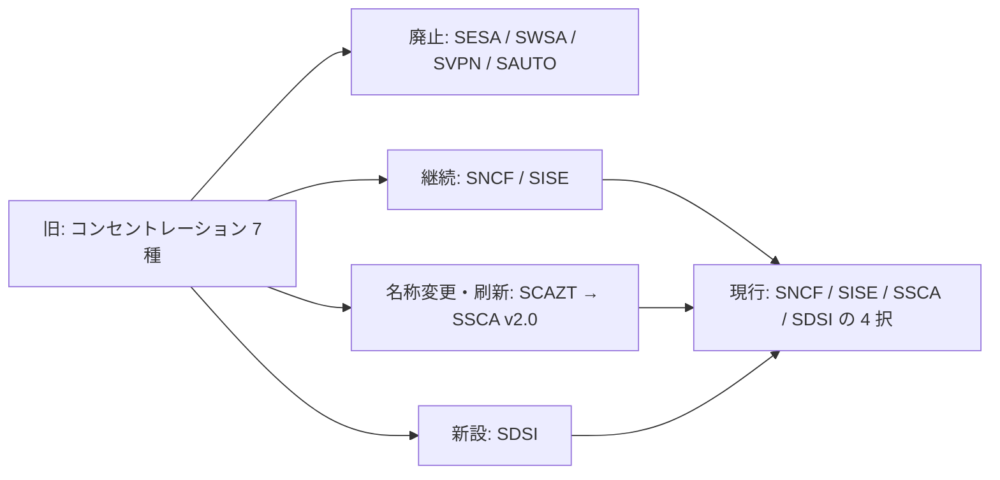

**このガイドの方針**

1. 現行の取得ルート（**SCOR v2.0 ＋ SNCF / SISE / SSCA / SDSI のいずれか 1 つ**）を中心に解説します。
2. 廃止されたコンセントレーションは「付録 A」で位置づけと関連トピックの移動先を整理します。
3. すでに旧版（SCOR v1.1 など）に合格している場合でも、**3 年以内にもう一方を取得すれば CCNP Security が付与**されます（詳細は 2.4 節）。

**根拠**
- 【公式】Cisco Learning「Cisco Security Certification Updates: Your Questions Answered」(2026-08-27) https://blogs.cisco.com/learning/cisco-security-certification-updates-your-questions-answered
- 【公式】Cisco「Retired Cisco Certification Exams」 https://www.cisco.com/site/us/en/learn/training-certifications/exams/retired.html
- 【公式】Cisco Japan「CCNP Security 認定とトレーニングプログラム」（指定ページ） https://www.cisco.com/c/ja_jp/training-events/training-certifications/certifications/professional/ccnp-security-v2.html
- 【公式】Cisco Learning Network「Cisco CCNP Security Gets a Major Upgrade」 https://learningnetwork.cisco.com/s/blogs/a0DQO000004N0jN2AS/cisco-ccnp-security-gets-a-major-upgrade-what-you-need-to-know
- 【補足】CBT Nuggets「Here's Every Major Cisco Cert Change Coming by 2026」（SDSI の開始日） https://www.cbtnuggets.com/blog/certifications/cisco/major-cisco-cert-changes

> 補足: 受験終了日について、公式ブログは「2026-08-26 が現行バージョン最終日」、Cisco の廃止試験一覧は SESA/SWSA/SVPN を「2026-08-27」と表記しており、**1 日の表記ゆれ**があります。本ガイドではブログの「最終受験日 8/26、新試験の初日 8/27」に従います。

---

## 2. 認定の全体像

### 2.1 取得要件

CCNP Security は **2 つの試験に合格**すると付与されます。

- **コア試験（必須）**: 350-701 SCOR（120 分）
- **コンセントレーション試験（1 つ選択）**: 90 分

各試験に合格すると、それぞれ個別の「スペシャリスト認定」も得られます。コア試験は **CCIE Security の筆記（資格要件）も兼ねる**ため、1 回の合格で両方の道が開けます。

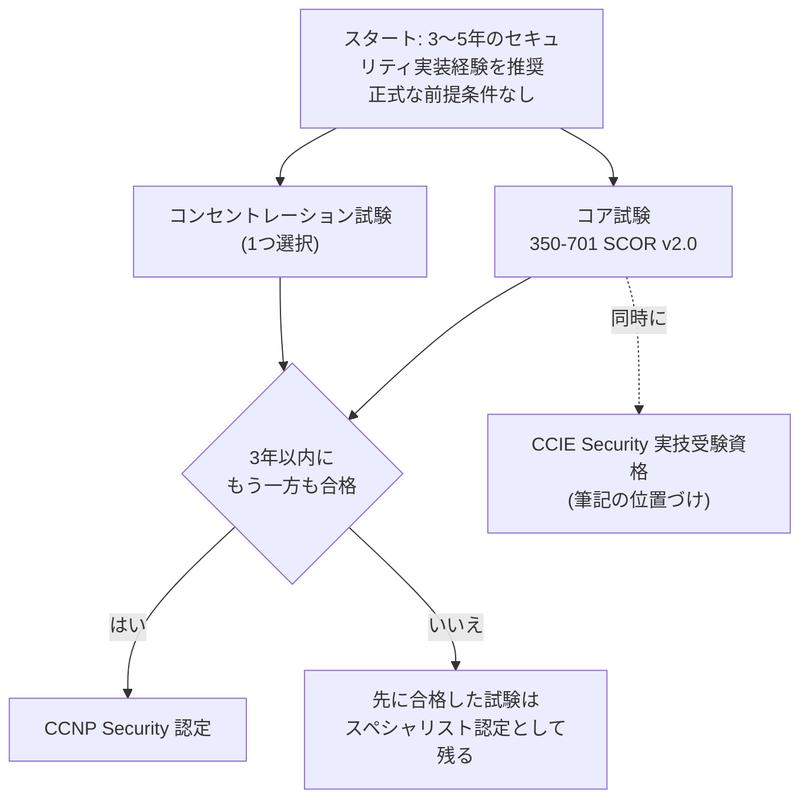

> 順序は自由です。コンセントレーションを先に受けても構いません。

### 2.2 試験一覧（現行）

| 区分 | 試験コード | 名称 | 時間 | 概要 |
|---|---|---|---|---|
| コア | 350-701 SCOR v2.0 | Implementing and Operating Cisco Security Core Technologies | 120 分 | ネットワーク／クラウド／SSE／エンドポイント／ネットワークアクセス／可視化・強制 |
| 選択 | 300-710 SNCF v1.2 | Securing Networks with Cisco Firewalls | 90 分 | Secure Firewall と Management Center の導入・設定・運用 |
| 選択 | 300-715 SISE v1.2 | Implementing and Configuring Cisco Identity Services Engine | 90 分 | ISE：802.1X、ゲスト、プロファイラ、BYOD、ポスチャ、TACACS+ |
| 選択 | 300-740 SSCA v2.0 | Designing and Implementing Secure Cloud Access for Users and Endpoints | 90 分 | ゼロトラスト、Duo、SSE、ZTNA、マイクロセグメンテーション |
| 選択 | 300-745 SDSI v1.0 | Designing Cisco Security Infrastructure | 90 分 | セキュリティアーキテクチャ設計、リスク、AI・自動化・DevSecOps |

受験料の目安（米国価格）: コア約 400 USD、コンセントレーション約 300 USD。**日本での価格・言語・受験会場は Pearson VUE で必ず確認**してください。

**根拠**
- 【公式】SCOR v2.0 試験トピック PDF https://learningcontent.cisco.com/documents/marketing/exam-topics/350-701-SCOR-v2.0.pdf
- 【公式】SNCF v1.2 試験トピック PDF https://learningcontent.cisco.com/documents/marketing/exam-topics/300-710-SNCF-v1.2.pdf
- 【公式】SISE v1.2 試験トピック PDF https://learningcontent.cisco.com/documents/marketing/exam-topics/300-715-SISE-v1.2.pdf
- 【公式】SSCA v2.0 試験トピック PDF https://learningcontent.cisco.com/documents/marketing/exam-topics/300-740-SSCA-v2.0-1.pdf
- 【公式】SDSI v1.0 試験トピック PDF https://learningcontent.cisco.com/documents/marketing/exam-topics/300-745-SDSI-v1.0-Public.pdf
- 【公式】Cisco「300-740 SSCA」試験ページ（90 分・300 USD） https://www.cisco.com/site/us/en/learn/training-certifications/exams/ssca.html
- 【補足】受験料の目安 https://www.igmguru.com/cyber-security/ccnp-security-certification

### 2.3 どのコンセントレーションを選ぶ？

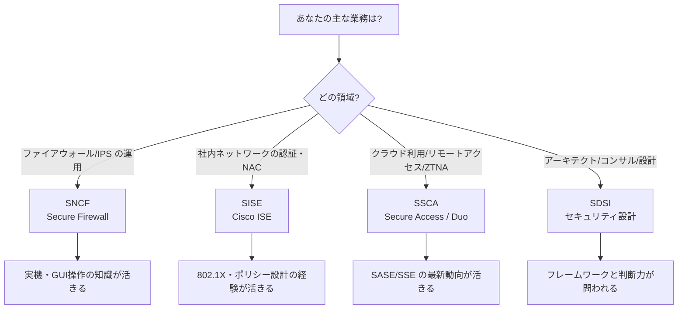

| 選択肢 | 向いている人 | 学習の特徴 |
|---|---|---|
| SNCF | ファイアウォール運用者 | FMC の画面操作・ポリシー・トラブルシュートが中心。実機または仮想環境があると学びやすい |
| SISE | NAC／ID 基盤担当 | ポリシー設計の理解と、スイッチ側設定の知識の両方が必要 |
| SSCA | クラウド／リモートワーク／SSE 担当 | 概念の理解が中心。Duo・Secure Access・Secure Workload の役割分担を整理する |
| SDSI | 設計・コンサル | 「状況に対して最適な設計を選ぶ」形式。フレームワーク知識が重要 |

### 2.4 有効期間・3 年ルール・再認定

| 論点 | 内容 |
|---|---|
| 有効期間 | CCNP Security 認定は **3 年間** |
| 3 年ルール | 片方の試験に合格してから **3 年以内**にもう一方に合格する必要がある |
| バージョン更新 | SCOR v1.1 に合格済みでも、現行のどのコンセントレーションとも組み合わせて CCNP Security を取得できる |
| 再認定 | 期限までに継続教育（CE）クレジットを取得する方法、または試験で更新する方法がある（CCNP の CE 要件は 80 クレジットと案内されている） |
| 注意 | **CE クレジットは「すでに保有する認定」の更新用**。3 年ルールの期限を延ばすことはできない |
| CCIE との関係 | SCOR は CCIE Security 実技の資格要件。SCOR v2.0 の改訂は実技試験の内容変更を直接引き起こさない |

**根拠**
- 【公式】Cisco Learning ブログ（質問 3, 8, 9） https://blogs.cisco.com/learning/cisco-security-certification-updates-your-questions-answered
- 【公式】Cisco Japan 再認定ポリシー https://www.cisco.com/c/ja_jp/training-events/training-certifications/recertification-policy.html
- 【公式】Cisco 再認定（英語） https://www.cisco.com/site/us/en/learn/training-certifications/certifications/recertification/index.html
- 【公式】Cisco Learning「CCNP Security News Roundup」（80 クレジット要件への言及） https://blogs.cisco.com/learning/ccnp-security-news-roundup-free-sdsi-training-new-duo-course

### 2.5 学習ロードマップ（全体）

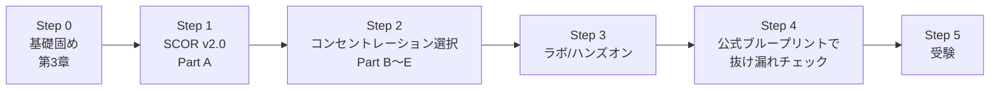

| Step | やること | 目安 |
|---|---|---|
| 0 | 第 3 章の用語・暗号・AAA を理解する | 1 週間 |
| 1 | Part A を 1 ドメインずつ読み、各トピックの「ベストプラクティス」を自分の言葉で説明できるようにする | 4〜6 週間 |
| 2 | 選んだコンセントレーションを読む。ブループリントの番号と本ガイドの見出しを突き合わせる | 3〜5 週間 |
| 3 | 無料／試用環境で最低限の設定を体験（FMC、ISE、Secure Access、Duo など） | 並行して実施 |
| 4 | 公式 PDF の全項目に「説明できる／できない」を付ける | 1 週間 |

---

## 3. 前提知識（初学者のための基礎）

### 3.1 セキュリティの 3 要素（CIA）

| 要素 | 意味 | 脅かす例 | 守る例 |
|---|---|---|---|
| **機密性（Confidentiality）** | 許可された人だけが見られる | 情報漏えい、盗聴 | 暗号化、アクセス制御 |
| **完全性（Integrity）** | 改ざんされていない | データ改ざん、MITM | ハッシュ、デジタル署名 |
| **可用性（Availability）** | 必要な時に使える | DoS／DDoS | 冗長化、HA、レート制限 |

### 3.2 AAA（認証・認可・アカウンティング）

| 段階 | 問い | 例 |
|---|---|---|
| **Authentication（認証）** | あなたは誰か | パスワード、証明書、MFA |
| **Authorization（認可）** | 何をしてよいか | VLAN 割当、コマンド権限、SGT |
| **Accounting（記録）** | 何をしたか | ログイン時刻、実行コマンド |

AAA を運ぶプロトコルが **RADIUS**（ネットワークアクセス向き）と **TACACS+**（機器管理向き）です。詳細は SCOR 2.6 と SISE 7.0 で扱います。

### 3.3 暗号の基礎

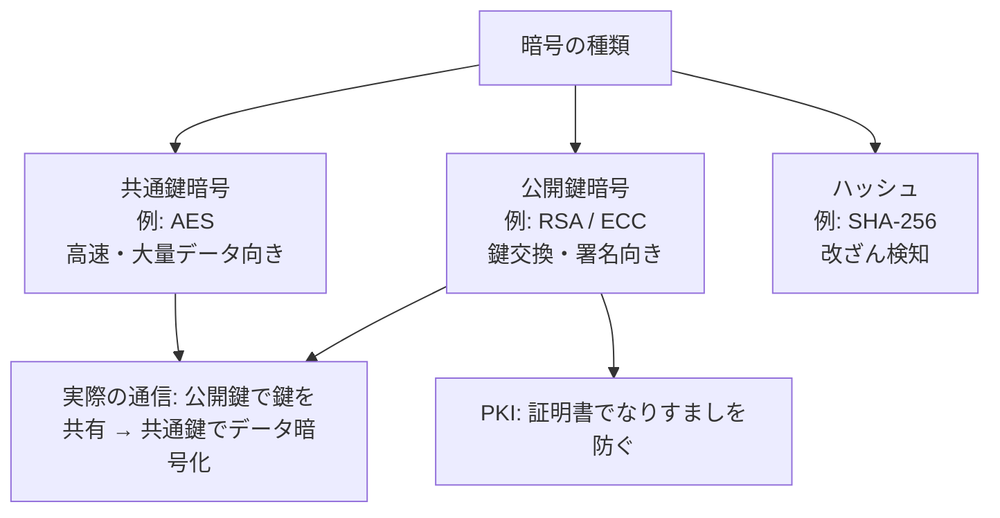

| 用語 | 一言説明 |
|---|---|
| ハッシュ | 同じ入力なら同じ固定長の値。元に戻せない。改ざん検知（整合性確認）には SHA-256 等を使う。パスワード保存には SHA-256 単体は不適で、ソルト付きの低速（適応型）方式 Argon2id 等を使う |
| HMAC | 共有鍵付きハッシュ。メッセージ認証に使う |
| PKI / CA | 証明書を発行・失効する仕組みと機関。証明書チェーンで信頼を辿る |
| TLS | Web 等で使う暗号化通信。**TLS 1.3 が現行の推奨** |
| IPsec | IP レイヤの暗号化。VPN で多用（IKE で鍵交換、ESP で暗号化） |

### 3.4 試験で出やすいポート／プロトコル

| 用途 | プロトコル／ポート |
|---|---|
| RADIUS 認証／アカウンティング | UDP 1812 / 1813（旧: 1645 / 1646） |
| TACACS+ | TCP 49 |
| RADIUS CoA（RFC 5176） | UDP 3799 標準（機器により 1700 を使う実装もある） |
| IKE / NAT-T | UDP 500 / UDP 4500（ESP は IP プロトコル 50） |
| SSH / HTTPS | TCP 22 / TCP 443 |
| NETCONF / RESTCONF | TCP 830（SSH 上）/ HTTPS 上 |
| SNMP | UDP 161（問い合わせ）/ 162（トラップ） |
| NTP / DNS | UDP 123 / 53 |
| QUIC（HTTP/3） | UDP 443 |
| Splunk HEC（既定） | TCP 8088 |

### 3.5 ゼロトラストと多層防御（先取り）

- **多層防御（Defense in Depth）**: 1 つの対策が破られても次の層で止める考え方。
- **ゼロトラスト**: 「社内だから安全」を前提にせず、**毎回の要求を検証**する考え方。ID・デバイス・ネットワーク・アプリ・データの各層で最小権限を実現します。
- この 2 つは SCOR 1.8 / 1.9、SSCA 1.1、SDSI 全般の土台です。

**根拠**
- 【標準】NIST SP 800-207 Zero Trust Architecture https://csrc.nist.gov/pubs/sp/800/207/final
- 【標準】IETF RFC 8446（TLS 1.3） https://www.rfc-editor.org/rfc/rfc8446
- 【標準】IETF RFC 7296（IKEv2） https://www.rfc-editor.org/rfc/rfc7296
- 【標準】IETF RFC 5176（RADIUS CoA） https://www.rfc-editor.org/rfc/rfc5176
- 【標準】IETF RFC 9000（QUIC） https://www.rfc-editor.org/rfc/rfc9000

---

# Part A: コア試験 350-701 SCOR v2.0

> 試験時間 120 分。CCNP Security と CCIE Security の双方に必要なコア試験です。v1.1 から**大幅改訂**されており、「Secure Service Edge（SSE）」ドメインの新設、AI／LLM の脅威、ポスト量子暗号（PQC）、Splunk、Cisco Secure Access などが加わりました。**v1.1 向けの古い教材は、新試験が重視する部分ほど内容が古い**点に注意してください。

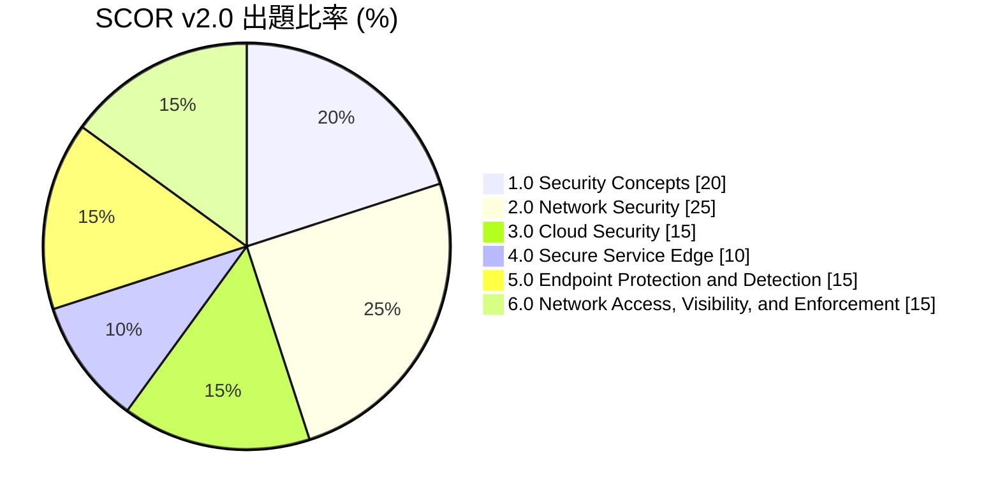

| ドメイン | 比率 | 一言でいうと | 本ガイドの章 |
|---|---|---|---|
| 1.0 Security Concepts | 20% | 脅威・脆弱性・暗号・VPN・ゼロトラストなどの「共通言語」 | A-1 |
| 2.0 Network Security | 25% | FW／IPS、L2 防御、AAA、機器管理、FTD の設定 | A-2 |
| 3.0 Cloud Security | 15% | 責任共有、CASB、Multicloud Defense、Splunk、DevSecOps | A-3 |
| 4.0 Secure Service Edge | 10% | SSE／SASE、Cisco Secure Access | A-4 |
| 5.0 Endpoint Protection and Detection | 15% | EPP／EDR、MDM、ポスチャ、Secure Endpoint、メール脅威 | A-5 |
| 6.0 Network Access, Visibility, and Enforcement | 15% | ISE（802.1X/MAB/CoA）、持ち出し手口、XDR/SIEM、Duo、Splunk | A-6 |

**根拠**
- 【公式】SCOR v2.0 試験トピック PDF（全 47 トピック・比率の出典） https://learningcontent.cisco.com/documents/marketing/exam-topics/350-701-SCOR-v2.0.pdf
- 【公式】Cisco Learning Network「SCOR v2.0 Exam Topics」 https://learningnetwork.cisco.com/s/scor-v2-exam-topics
- 【補足】SCOR v2.0 の変更点の解説（Udemy 講座説明） https://www.udemy.com/course/security-masterclass/

---

## A-1. ドメイン 1.0 Security Concepts（20%）

### 1.1 オンプレミス・ハイブリッド・クラウド環境への攻撃脅威

**何か**: 攻撃者が「どこを・どう狙うか」を整理する項目です。環境が変わっても、狙われる弱点は「人（認証情報）・ソフトウェア（脆弱性）・設定（誤設定）」に集約されます。

| 脅威 | 仕組み（初学者向け） | 主な対策 |
|---|---|---|
| ウイルス／トロイの木馬／マルウェア | 不正プログラムが実行され、破壊・情報窃取・遠隔操作を行う | EPP/EDR、アプリケーション制御、パッチ適用、メール／Web フィルタ |
| ルートキット | OS の深部に潜み、自身や他の不正プログラムを隠す | セキュアブート、整合性監視、EDR |
| DoS／DDoS | 大量・巧妙な要求でサービスを停止させる | レート制限、WAF、DDoS 緩和、冗長化、CDN |
| フィッシング | 偽メール・偽サイトで認証情報を盗む | メール認証（SPF/DKIM/DMARC）、URL サンドボックス、**フィッシング耐性のある MFA** |
| 中間者攻撃（MITM） | 通信経路に割り込み盗聴・改ざんする | TLS、証明書検証、DAI／DHCP Snooping、802.1X |
| データ侵害 | 設定不備・盗難認証情報などで大量のデータが流出 | 最小権限、DLP、暗号化、ログ監視 |
| 安全でない API | 認証・認可不備や入力検証不足の API を悪用される | API ゲートウェイ、OAuth スコープ最小化、レート制限、スキーマ検証 |
| 認証情報の侵害 | 漏えい・使い回し・MFA 疲労攻撃で正規アカウントを乗っ取る | MFA（フィッシング耐性）、パスキー、条件付きアクセス、異常検知 |
| PQC 関連 | 将来の量子計算機で現行の公開鍵暗号が破られる恐れ。今取得した暗号通信を後で解読する「Harvest Now, Decrypt Later」 | 暗号資産の棚卸し、暗号アジリティ、PQC／ハイブリッド方式への移行計画 |
| AI 関連 | AI による高度なフィッシング、ディープフェイク、AI システム自体への攻撃 | 本人確認の多段化、AI 利用ポリシー、ガードレール（1.3 参照） |

**ベストプラクティス**
- 攻撃を **MITRE ATT&CK** の戦術・技術に対応づけ、検知・防御の抜けを可視化する。
- 環境ごとの攻撃面（オンプレ／ハイブリッド／クラウド）を分けて整理し、**共通の ID 基盤と可視化基盤**に集約する。
- 「侵入を前提」にし、**横展開（ラテラルムーブメント）の阻止**と**検知・封じ込め**にも投資する。

**根拠**
- 【公式】SCOR v2.0 PDF（1.1） https://learningcontent.cisco.com/documents/marketing/exam-topics/350-701-SCOR-v2.0.pdf
- 【標準】MITRE ATT&CK https://attack.mitre.org/
- 【標準】NIST ポスト量子暗号プロジェクト https://csrc.nist.gov/projects/post-quantum-cryptography

### 1.2 脆弱性とエクスプロイト（OWASP Top 10、CVE、CVSS）

**何か**: 「欠陥（脆弱性）」と「それを突く手口（エクスプロイト）」を区別して理解します。

| 種類 | 仕組み | 基本対策 |
|---|---|---|
| ソフトウェアのバグ／バッファオーバーフロー | メモリ領域を超える入力で制御を奪う | 最新パッチ、メモリ安全な言語、ASLR／DEP、入力長の検証 |
| 弱い／ハードコードされたパスワード | 推測・漏えいで突破される | 一意の強いパスワード、シークレット管理、MFA |
| 暗号スイートの欠如・弱体化 | 古い暗号（例: 旧 SSL、RC4）が盗聴・解読される | TLS 1.2 以上（可能なら 1.3）、弱い暗号の無効化 |
| パストラバーサル | `../` などで公開範囲外のファイルを読む | 入力の正規化・許可リスト、権限分離 |
| クロスサイトスクリプティング（XSS） | 悪意のスクリプトを閲覧者のブラウザで実行させる | 出力エスケープ、CSP、入力検証 |
| クロスサイトリクエストフォージェリ（CSRF） | ログイン中のユーザーに意図しない操作をさせる | CSRF トークン、SameSite Cookie |
| SQL インジェクション | SQL 文に不正な断片を混入させる | **プレースホルダ（パラメータ化クエリ）**、最小権限の DB アカウント |

**OWASP Top 10**: Web アプリで特に重大なリスクの分類です。アクセス制御の不備、暗号化の失敗、インジェクション、安全でない設計、設定不備、古い部品、認証の不備、整合性の不備、ログ・監視の不備、SSRF などが含まれます（版により順位・名称が変わるため最新版を確認）。

**CVE と CVSS**

| 用語 | 意味 |
|---|---|
| CVE | 脆弱性に付く世界共通の識別番号（例: CVE-2024-XXXXX） |
| CVSS | 脆弱性の深刻度を 0.0〜10.0 で示す共通指標 |

| CVSS 基本スコア | 深刻度 |
|---|---|
| 0.0 | なし（None） |
| 0.1〜3.9 | 低（Low） |
| 4.0〜6.9 | 中（Medium） |
| 7.0〜8.9 | 高（High） |
| 9.0〜10.0 | 緊急（Critical） |

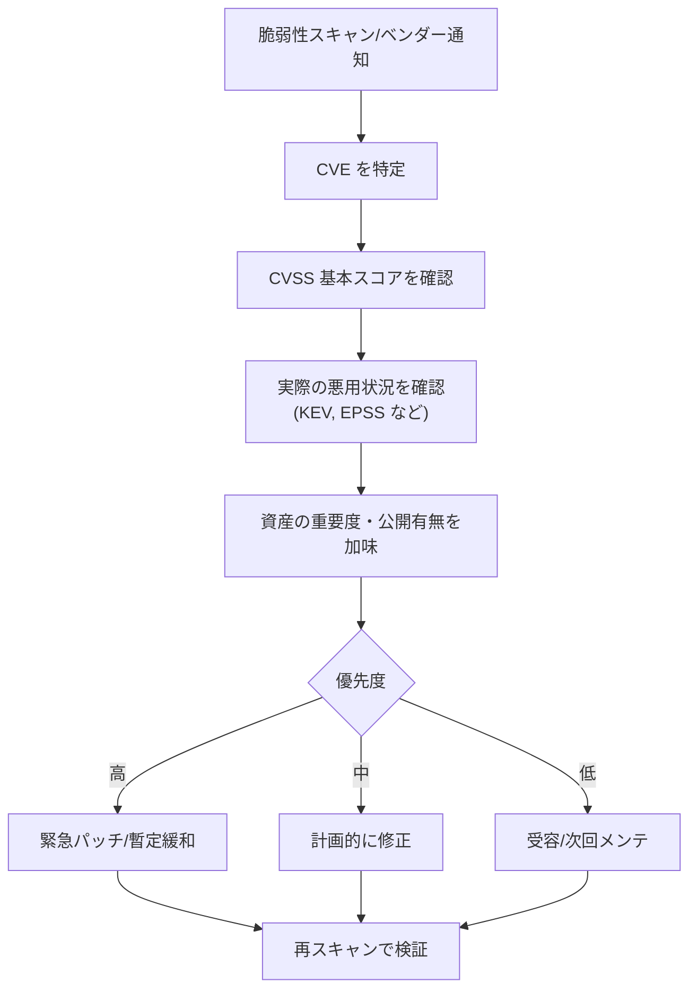

**ベストプラクティス**
- **CVSS だけで判断しない**。悪用の実績（既知の悪用脆弱性カタログ）、悪用確率、資産の重要度・外部公開の有無を合わせて優先順位を決める。
- 修正が難しい場合は **仮想パッチ（IPS シグネチャ、WAF ルール）やアクセス制限で緩和**する。
- SBOM（ソフトウェア部品表）で依存関係を管理し、影響範囲を素早く特定する。

**根拠**
- 【標準】OWASP Top 10 https://owasp.org/www-project-top-ten/
- 【標準】FIRST CVSS https://www.first.org/cvss/
- 【標準】CISA 既知の悪用された脆弱性カタログ https://www.cisa.gov/known-exploited-vulnerabilities-catalog
- 【標準】FIRST EPSS https://www.first.org/epss/

### 1.3 AI／LLM モデルの脆弱性（新規）

**何か**: 生成 AI を組み込んだシステム特有のリスクです。OWASP の「LLM アプリケーション Top 10（2025）」が主な整理軸です。

| 脆弱性 | 概要 | 対策の方向性 |
|---|---|---|
| **プロンプトインジェクション** | 入力（直接）や、参照する Web・文書（間接）に仕込まれた命令でモデルの挙動を乗っ取る | 命令とデータの分離、入出力フィルタ、**ツール実行の最小権限**、重要操作は人の承認 |
| **システムプロンプトの漏えい** | 内部指示に含まれる情報（鍵・ルール・社内情報）が引き出される | **システムプロンプトに秘密情報を入れない**。権限制御は LLM の外で実施 |
| **ベクトル・埋め込みの弱点** | RAG の検索基盤が汚染される、テナント間でデータが漏れる | ベクトル DB のアクセス制御・テナント分離、取り込みデータの検証 |
| **サプライチェーン** | 汚染されたモデル・データセット・プラグインを取り込む | 入手元の検証、署名・ハッシュ確認、AI-BOM／モデル来歴管理 |

**ベストプラクティス**
- LLM を「**信頼できない入力を処理する部品**」として設計する（出力も信頼しない）。
- AI エージェントには**必要最小限のツール権限**だけを与え、破壊的操作は承認ゲートを置く。
- ガードレール（PII・機密・不適切出力の検査）と、利用ログの監視をセットで導入する。

**根拠**
- 【標準】OWASP GenAI Security Project「OWASP Top 10 for LLM Applications」 https://genai.owasp.org/llm-top-10/
- 【補足】2025 年版の新規項目（システムプロンプト漏えい、ベクトル／埋め込みの弱点）の解説 https://brightsec.com/blog/owasp-top-10-for-llm-applications-in-2025/

### 1.4 フィッシング・ソーシャルエンジニアリング対策

**何か**: 「人」を狙う攻撃への多層対策です。技術と教育の組み合わせが基本です。

| レイヤ | 対策 | 補足 |
|---|---|---|
| メール認証 | **SPF / DKIM / DMARC** | なりすまし送信を検出・拒否。DMARC は段階的に `none` → `quarantine` → `reject` へ |
| ゲートウェイ／API 型保護 | スパム・マルウェア・URL 判定、サンドボックス | 配信後の取り消し（リメディエーション）も重要 |
| Web／DNS | 悪性ドメイン・URL のブロック | 3 章の SSE（SCOR 4.x）と連携 |
| 認証 | **フィッシング耐性 MFA（FIDO2/WebAuthn、パスキー）** | 通知承認型は MFA 疲労攻撃に注意（Verified Push で緩和） |
| 人 | 教育・疑似フィッシング訓練・通報ボタン | 「通報しやすい」文化が最重要 |
| 運用 | 通報メールの自動分析・全社一括削除 | SOAR／XDR で自動化 |

**根拠**
- 【標準】RFC 7208（SPF） https://www.rfc-editor.org/rfc/rfc7208
- 【標準】RFC 6376（DKIM） https://www.rfc-editor.org/rfc/rfc6376
- 【標準】RFC 7489（DMARC） https://www.rfc-editor.org/rfc/rfc7489
- 【製品文書】Duo「認証方式のセキュリティガイド（Verified Duo Push など）」 https://duo.com/docs/authentication-methods-security-guide

### 1.5 暗号コンポーネント（ハッシュ、暗号化、PKI、TLS、QUIC、MASQUE、IPsec、PQC）

| 技術 | 役割 | 要点・ベストプラクティス |
|---|---|---|
| ハッシュ | 改ざん検知 | **SHA-256 以上**。MD5／SHA-1 は衝突耐性が不十分で避ける |
| 共通鍵暗号 | データの高速暗号化 | **AES（GCM などの認証付き暗号モード）** を使う |
| 公開鍵暗号 | 鍵交換・署名 | RSA／ECC。鍵長・曲線は現行ガイドラインに従う |
| PKI／証明書 | 公開鍵の持ち主を保証 | 証明書チェーン、**失効確認（CRL／OCSP）**、有効期限の自動更新 |
| TLS／SSL | Web 等の暗号化 | **TLS 1.2 以上、可能なら 1.3**。旧 SSL・TLS 1.0/1.1 は無効化 |
| QUIC | UDP 上の暗号化トランスポート（HTTP/3 の基盤） | TLS 1.3 を内蔵。UDP 443 を許可／可視化する設計が必要 |
| MASQUE | HTTP/3 の上で UDP や IP 通信を中継する仕組み（RFC 9298, 9484） | 新しい VPN／ZTNA トンネルの基盤技術として登場 |
| IPsec | IP レベルの暗号化（IKE で鍵交換、ESP で暗号化） | **IKEv2**、AEAD 暗号（AES-GCM）、PFS、NAT-T（UDP 4500） |
| 事前共有鍵（PSK）／証明書認証 | VPN 相手の認証 | 規模が大きいほど**証明書認証**が運用・安全性で有利 |
| PQC | 量子計算機でも安全な暗号 | NIST は **ML-KEM（FIPS 203）**、**ML-DSA（FIPS 204）**、**SLH-DSA（FIPS 205）** を標準化 |

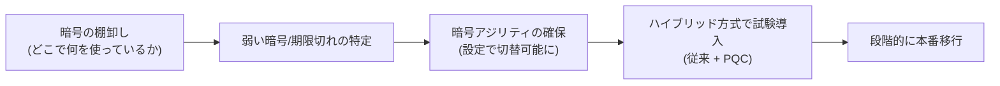

**ベストプラクティス**
- 暗号は「**自作しない・標準を使う・設定で更新できる状態（暗号アジリティ）にする**」。
- 長期保存が必要なデータは「今盗まれて後で解読される」リスクを考え、PQC 移行の優先度を上げる。

**根拠**
- 【標準】RFC 8446（TLS 1.3） https://www.rfc-editor.org/rfc/rfc8446
- 【標準】RFC 9000（QUIC） https://www.rfc-editor.org/rfc/rfc9000
- 【標準】RFC 9298（MASQUE: UDP over HTTP） https://www.rfc-editor.org/rfc/rfc9298
- 【標準】RFC 9484（MASQUE: IP over HTTP） https://www.rfc-editor.org/rfc/rfc9484
- 【標準】RFC 7296（IKEv2） https://www.rfc-editor.org/rfc/rfc7296
- 【標準】NIST FIPS 203（ML-KEM） https://csrc.nist.gov/pubs/fips/203/final
- 【補足】FIPS 203/204/205 の概要 https://cloudsecurityalliance.org/articles/nist-fips-203-204-and-205-finalized-an-important-step-towards-a-quantum-safe-future

### 1.6 サイト間／リモートアクセス VPN の方式

| 方式 | 概要 | 特徴 |
|---|---|---|
| **標準 IPsec（ポリシーベース）** | 暗号化対象の通信を ACL で定義 | 相互運用性が高い。拠点が増えると設定が煩雑 |
| **VTI（仮想トンネルインタフェース）** | トンネルをインタフェースとして扱う（ルートベース） | ルーティングプロトコルが使える。設計が明快 |
| **SSL VPN（TLS/DTLS）** | クライアント（Cisco Secure Client）がブラウザ系ポートで接続 | リモートアクセス向き。FW 越えが容易 |
| **DMVPN** | mGRE ＋ NHRP ＋ IPsec で拠点間を動的に接続 | ハブ＆スポーク、スポーク間の動的トンネル |
| **FlexVPN** | IKEv2 ベースの統合的な VPN フレームワーク | サイト間・リモートアクセス・ハブ＆スポークを一貫して構成 |
| **GETVPN** | グループ鍵による暗号化。元の IP ヘッダを保持（トンネルレス） | MPLS などプライベート WAN の暗号化向き。キーサーバが要 |

**ベストプラクティス**
- **IKEv2**、AES-GCM、PFS、強い DH グループ（楕円曲線の group 19/20 など）を選ぶ。
- 規模が大きい場合は**証明書認証**＋ HA（二重化）で設計。
- リモートアクセスは **MFA ＋ 端末状態確認（ポスチャ）** とセットにする（6.x と連携）。

**根拠**
- 【公式】SCOR v2.0 PDF（1.6） https://learningcontent.cisco.com/documents/marketing/exam-topics/350-701-SCOR-v2.0.pdf
- 【標準】RFC 7296（IKEv2） https://www.rfc-editor.org/rfc/rfc7296

### 1.7 セキュリティインテリジェンスの作成・共有・消費

**何か**: 脅威情報（IoC：悪性 IP／ドメイン／ハッシュ等）を「作る → 共有する → 使う」サイクルで扱います。

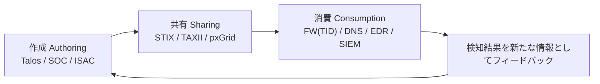

| 段階 | 代表例 |
|---|---|
| 作成 | Cisco Talos、自社 SOC の分析、業界 ISAC |
| 共有 | **STIX（記述形式）／TAXII（配送方法）**、Cisco pxGrid（製品間の文脈共有） |
| 消費 | Secure Firewall の Threat Intelligence Director、DNS／Web セキュリティ、EDR、SIEM |

**ベストプラクティス**: フィードは**品質と鮮度**で選別（古い IoC は誤検知の元）。取り込み時は**有効期限**を設定し、まず監視モードで効果を確認してからブロックする。

**根拠**
- 【標準】OASIS STIX/TAXII ドキュメント https://oasis-open.github.io/cti-documentation/
- 【製品文書】SNCF 4.3（TID）参照: https://learningcontent.cisco.com/documents/marketing/exam-topics/300-710-SNCF-v1.2.pdf

### 1.8 ゼロトラストアーキテクチャ

**何か**: 「どこから来た通信でも暗黙に信頼しない。要求ごとに ID・デバイス状態・コンテキストで検証する」設計思想です。

**NIST SP 800-207 の論理構成**

| コンポーネント | 役割 |
|---|---|
| ポリシーエンジン（PE） | 許可／拒否を決める頭脳 |
| ポリシー管理者（PA） | 決定をもとにセッションを確立・遮断 |
| ポリシー実施点（PEP） | 実際に通信を通す／止める門番 |
| 補助データ | ID 管理、デバイス状態、脅威情報、ログなど |

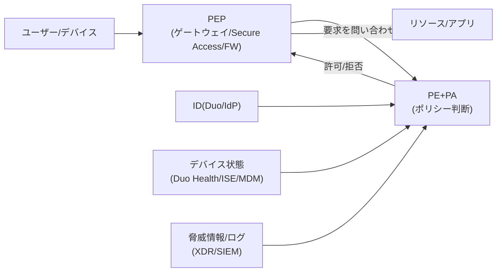

**CISA ゼロトラスト成熟度モデル v2.0**: 5 つの柱（**ID・デバイス・ネットワーク・アプリとワークロード・データ**）を、4 段階（**従来型・初期・高度・最適**）で評価し、横断機能（可視化と分析／自動化とオーケストレーション／ガバナンス）で支えます。

| 柱 | Cisco の代表的な対応 |
|---|---|
| ID | Duo（MFA・SSO・Trust Monitor）、Cisco Identity Intelligence |
| デバイス | Duo Device Health、ISE ポスチャ、Secure Endpoint |
| ネットワーク | Secure Access（SSE/ZTNA）、ISE／TrustSec、Secure Firewall |
| アプリ・ワークロード | Secure Workload（マイクロセグメンテーション）、Multicloud Defense |
| データ | DLP、暗号化、CASB |
| 横断（可視化・自動化） | XDR、Splunk、Security Cloud Control |

**ベストプラクティス**: すべてを一度に変えず、**ID 強化 → デバイス信頼 → 最小権限アクセス → 継続的評価**の順に段階導入。柱ごとに進捗が違っても構わない（成熟度モデルが想定）。

**根拠**
- 【標準】NIST SP 800-207 https://csrc.nist.gov/pubs/sp/800/207/final
- 【標準】CISA Zero Trust Maturity Model https://www.cisa.gov/zero-trust-maturity-model
- 【補足】ZTMM v2.0 の解説（SecurityWeek） https://www.securityweek.com/cisa-publishes-new-guidance-for-achieving-zero-trust-maturity/

### 1.9 多層防御と Cisco SAFE

**何か**: **SAFE（Secure Architecture for Everyone）** は、セキュリティを「ネットワーク上の場所（PIN）」と「運用ドメイン」に分けて設計する Cisco の参照モデルです。

| 要素 | 内容 |
|---|---|
| PIN（Places in the Network） | ブランチ、キャンパス、クラウド、データセンター、エッジ、WAN など |
| セキュアドメイン | 管理、セキュリティインテリジェンス、コンプライアンス、セグメンテーション、脅威防御、セキュアサービス など |
| 3 つの段階 | **Capability（機能）→ Architecture（アーキテクチャ）→ Design（設計）** |
| 進め方 | ビジネスフロー → 脅威 → 必要な機能 → 配置 → 製品設計 |

**ベストプラクティス**: 製品から決めず、**「守るべきビジネスフロー → 脅威 → 必要な機能」の順**に決める。

**根拠**
- 【製品文書】Cisco SAFE Overview Guide https://cisco.com/c/en/us/solutions/collateral/enterprise/design-zone-security/safe-overview-guide.html
- 【製品文書】SAFE Secure Edge Architecture Guide https://bxin.cisco.com/c/en/us/solutions/collateral/enterprise/design-zone-security/safe-secure-edge-architecture-guide.html

### 1.10 セキュリティ機器 API を呼び出すスクリプトの読解（Python）

**何か**: 試験では短い Python スクリプトを読み、「何をしているか」「どこが問題か」を答える形式が想定されます。次の 3 点を見ます。

1. **認証**（トークン取得・ヘッダ付与）
2. **リクエスト**（メソッド・URL・パラメータ・ボディ）
3. **応答処理**（ステータスコード・JSON の取り出し・エラー処理）

```python
import os
import requests

BASE = "https://fmc.example.local"      # 管理センターの FQDN（例）
USER = os.environ["FMC_USER"]           # 資格情報はコードに書かず環境変数/シークレット管理から
PASS = os.environ["FMC_PASS"]
CA   = "/etc/ssl/certs/ca-bundle.crt"   # 証明書検証を有効にする（verify=False は避ける）

# 1) トークン取得（Basic 認証）
r = requests.post(f"{BASE}/api/fmc_platform/v1/auth/generatetoken",
                  auth=(USER, PASS), verify=CA, timeout=10)
r.raise_for_status()
token  = r.headers["X-auth-access-token"]
domain = r.headers["DOMAIN_UUID"]

# 2) トークンを付けて API を呼ぶ（オブジェクト一覧の取得例）
resp = requests.get(f"{BASE}/api/fmc_config/v1/domain/{domain}/object/networks",
                    headers={"X-auth-access-token": token},
                    params={"limit": 25}, verify=CA, timeout=10)
resp.raise_for_status()

# 3) JSON を処理
for item in resp.json().get("items", []):
    print(item["name"])
```

| HTTP メソッド | 意味 | 例 |
|---|---|---|
| GET | 取得 | オブジェクト一覧の取得 |
| POST | 作成 | 新規ネットワークオブジェクトの作成 |
| PUT | 更新（置換） | 既存オブジェクトの更新 |
| DELETE | 削除 | オブジェクトの削除 |

| ステータス | 意味・対処 |
|---|---|
| 200 / 201 / 204 | 成功／作成成功／成功（本文なし） |
| 400 | 要求の形式不正（JSON・必須項目を確認） |
| 401 / 403 | 認証失敗／権限不足（トークン期限・ロールを確認） |
| 404 | リソースが存在しない（URL・ID を確認） |
| 429 | レート制限（待ってから再試行） |
| 5xx | サーバ側エラー（時間をおいて再試行） |

**ベストプラクティス**
- **資格情報をソースコードに埋め込まない**（環境変数・シークレットマネージャ）。
- **TLS 証明書の検証を無効化しない**（`verify=False` は検証用途に限定）。
- **タイムアウト・再試行・ページネーション・レート制限対応**を入れる。
- API 用アカウントは**最小権限のロール**にし、操作は監査ログで追跡できるようにする。

**根拠**
- 【公式】SCOR v2.0 PDF（1.10） https://learningcontent.cisco.com/documents/marketing/exam-topics/350-701-SCOR-v2.0.pdf
- 【標準】MDN「HTTP レスポンスステータスコード」 https://developer.mozilla.org/en-US/docs/Web/HTTP/Status
- 【標準】Requests ドキュメント https://requests.readthedocs.io/

---

## A-2. ドメイン 2.0 Network Security（25%）

### 2.1 FW／IPS の導入形態（デプロイメントモデル）

**何か**: ファイアウォール（FW）は「通信を許可／拒否する門番」、IPS は「通信の中身を見て攻撃を検知・遮断する仕組み」です。Cisco Secure Firewall（FTD）は両方の機能を 1 台で提供します（次世代ファイアウォール＝NGFW）。

| モード | 動作 | 向いている場面 |
|---|---|---|
| **ルーテッド（Routed）** | L3 ホップとして動作し、各インタフェースに IP を持つ | 境界 FW の標準構成 |
| **トランスペアレント（Transparent）** | L2 の「ブリッジ」として挿入。データ IF に IP を持たない | 既存の IP 設計を変えずに挿入したい場合 |
| **IPS インライン** | 通信が機器を通過し、**遮断（ドロップ）できる** | 防御を目的とする IPS |
| **IPS パッシブ** | SPAN／TAP でコピーを受けて検知のみ（**遮断できない**） | まず検知だけ試したい／本番に影響を与えたくない |

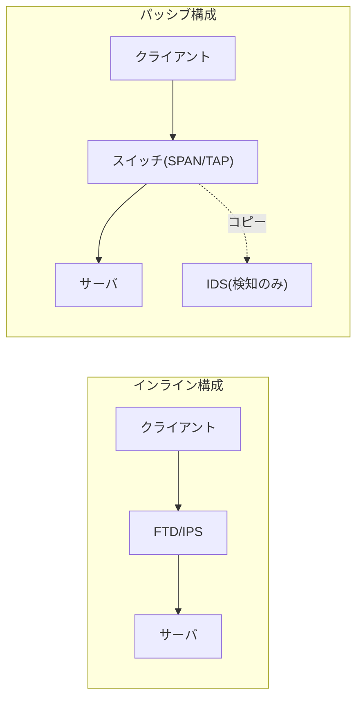

**検知方式**: シグネチャ（既知の攻撃パターン）、プロトコル異常、レピュテーション、振る舞い。Cisco の脅威情報組織 **Talos** がルールや評判情報を提供します。

**ベストプラクティス**
- IPS は **まず監視（検知のみ）で誤検知を調整 → 段階的にブロック**へ。
- 重要拠点は **HA（アクティブ／スタンバイ）** を前提に設計する（SNCF 1.3）。
- 暗号化通信は、プライバシー・性能・法令を考慮し**復号対象を絞る**（2.8 参照）。

**根拠**
- 【公式】SCOR v2.0 PDF（2.1） https://learningcontent.cisco.com/documents/marketing/exam-topics/350-701-SCOR-v2.0.pdf
- 【公式】SNCF v1.2 PDF（1.1〜1.3） https://learningcontent.cisco.com/documents/marketing/exam-topics/300-710-SNCF-v1.2.pdf
- 【製品文書】Cisco Firewall Best Practices https://sec.cloudapps.cisco.com/security/center/resources/firewall_best_practices

### 2.2 セキュリティ監視とテレメトリ技術

| 技術 | 取得できる情報 | 用途 |
|---|---|---|
| **NetFlow／IPFIX** | 誰が誰とどれだけ通信したか（メタデータ） | 異常検知、フォレンジック、容量管理 |
| **syslog** | 機器のイベント・ログ | SIEM への集約、監査 |
| **SNMP** | 機器の状態・性能値 | 稼働監視（**v3 を使用**） |
| **パケットキャプチャ** | 通信の中身そのもの | 詳細調査（容量・プライバシーに注意） |
| **Secure Network Analytics（旧 Stealthwatch）** | フローから異常や脅威を検知（NDR） | ラテラルムーブメントの検出 |
| **Encrypted Visibility Engine（EVE）** | 暗号化通信の TLS の特徴からアプリやマルウェアを識別 | 復号せずに可視化 |

**ベストプラクティス**
- **時刻同期（NTP）を全機器で統一**する（ログの相関分析の前提）。
- 平常時の**ベースライン**を作り、逸脱を検知する。
- ログの**保存期間・改ざん防止・アクセス制御**を定め、重要ログは集中保管する。

**根拠**
- 【公式】SCOR v2.0 PDF（2.2） https://learningcontent.cisco.com/documents/marketing/exam-topics/350-701-SCOR-v2.0.pdf
- 【公式】SNCF v1.2 PDF（2.3.d EVE） https://learningcontent.cisco.com/documents/marketing/exam-topics/300-710-SNCF-v1.2.pdf
- 【標準】RFC 5424（Syslog） https://www.rfc-editor.org/rfc/rfc5424

### 2.3 ネットワークインフラのセキュリティ（VLAN／SGT、L2 防御）

**何か**: L2（スイッチ）の攻撃は、内部から行われることが多く見落とされがちです。代表的な攻撃と対策を対応づけて覚えます。

| 攻撃 | 仕組み | 対策機能 |
|---|---|---|
| MAC フラッディング（CAM オーバーフロー） | 大量の偽 MAC でスイッチをハブ状態にして盗聴 | **ポートセキュリティ**（MAC 数・違反時動作） |
| ARP スプーフィング | 偽の ARP 応答で通信を乗っ取る | **DAI（Dynamic ARP Inspection）** |
| 不正 DHCP サーバ／DHCP 枯渇 | 偽ゲートウェイ配布・アドレス枯渇 | **DHCP スヌーピング**（信頼ポートのみ DHCP 応答を許可） |
| VLAN ホッピング | トランク確立偽装・二重タグで他 VLAN に侵入 | アクセスポート固定、`nonegotiate`、ネイティブ VLAN を未使用 VLAN にする |
| STP 攻撃 | 偽 BPDU でルートブリッジを奪う | **BPDU ガード／ルートガード** |
| ブロードキャスト嵐 | 大量のブロードキャスト／マルチキャスト | **ストームコントロール** |
| 送信元 IP 詐称 | 偽の IP で通信 | IP ソースガード、uRPF |

```text
! 代表的な設定例（IOS XE の概念例。機種により構文は異なる）
ip dhcp snooping
ip dhcp snooping vlan 10,20
ip arp inspection vlan 10,20
!
interface GigabitEthernet1/0/1        ! 上位リンク（信頼ポート）
 ip dhcp snooping trust
 ip arp inspection trust
!
interface GigabitEthernet1/0/2        ! 端末ポート
 switchport mode access
 switchport nonegotiate
 switchport port-security
 switchport port-security maximum 2
 switchport port-security violation restrict
 spanning-tree portfast
 spanning-tree bpduguard enable
 storm-control broadcast level 1.00
```

> 上の設定例は **コードブロック（コマンド）** であり、構成図の ASCII アートではありません。図解は Mermaid／表で表現しています。

**セグメンテーション**
- **VLAN**: L2 を論理分割。ただし VLAN 間は ACL／FW で制御が必要。
- **SGT（Security Group Tag／TrustSec）**: IP アドレスではなく「役割（グループ）」に基づいて通信を制御。ISE が割り当て、ネットワーク機器・FW が適用（SISE 2.6 参照）。

**ベストプラクティス**
- **未使用ポートは shutdown**し、ブラックホール VLAN に割り当てる。
- **ネイティブ VLAN を VLAN 1 以外に**し、トランクで許可する VLAN を限定する。
- 端末ポートには **PortFast ＋ BPDU ガード**を併用。
- L2 防御は**組み合わせて**初めて効果が出る（DHCP スヌーピング → DAI／IP ソースガード）。

**根拠**
- 【公式】SCOR v2.0 PDF（2.3） https://learningcontent.cisco.com/documents/marketing/exam-topics/350-701-SCOR-v2.0.pdf
- 【製品文書】Cisco Guide to Harden Cisco IOS Devices https://www.cisco.com/c/en/us/support/docs/ip/access-lists/13608-21.html
- 【標準】CIS Benchmarks https://www.cisecurity.org/cis-benchmarks

### 2.4 ネットワークセキュリティ製品の管理方式の選択

| 観点 | 選択肢 | 判断基準 |
|---|---|---|
| 台数 | **単一デバイス管理**（例: FDM／オンボックス）vs **多数デバイス管理**（例: FMC） | 数台・小規模は単独管理、複数拠点・統一ポリシーは集中管理 |
| 経路 | **帯域内（In-band）** vs **帯域外（Out-of-band）** | 管理は**帯域外（専用管理網）**が安全。障害時にも到達できる |
| 設置場所 | **オンプレミス** vs **クラウド（Cisco Security Cloud Control）** | 運用負荷・データ主権・拠点数・更新頻度で選ぶ |

| 管理ツール | 特徴 |
|---|---|
| Secure Firewall Device Manager（FDM） | 単体機器の GUI。小規模向き |
| Secure Firewall Management Center（FMC） | 多数機器の集中管理。詳細なポリシー・イベント分析 |
| Cisco Security Cloud Control（旧 Cisco Defense Orchestrator）上のクラウド提供型 FMC | クラウドから管理。保守・更新の負担を軽減 |

**ベストプラクティス**: 管理プレーンは **専用 VRF／管理 VLAN ＋ アクセス元 IP 制限 ＋ MFA／RBAC** で守る。

**根拠**
- 【公式】SCOR v2.0 PDF（2.4）／SNCF v1.2 PDF（3.5） https://learningcontent.cisco.com/documents/marketing/exam-topics/300-710-SNCF-v1.2.pdf
- 【製品文書】Cisco Firewall Best Practices（管理プレーンの保護） https://sec.cloudapps.cisco.com/security/center/resources/firewall_best_practices

### 2.5 CIS ベンチマークによる機器のハードニング

**何か**: **CIS ベンチマーク**は、OS・ネットワーク機器・クラウドの「安全な設定基準」を公開しているものです。ハードニング（堅牢化）は、不要な機能の停止、既定値の見直し、強い認証・暗号の適用で攻撃面を減らす作業です。

| 区分 | 例 |
|---|---|
| 管理アクセス | Telnet／HTTP を無効化、SSH v2・HTTPS のみ、管理元 IP を制限 |
| 認証 | AAA（TACACS+）、MFA、ローカル緊急アカウントのみ例外 |
| 不要サービス | 使わないサービス・ポート・プロトコルを停止 |
| ログ・時刻 | syslog、NTP 認証、ログイン試行の記録 |
| 暗号 | 強い暗号スイート、SNMPv3、TLS 1.2 以上 |

CIS のプロファイルには、**Level 1（実用的・業務影響が小さい）**と **Level 2（より厳格）**があります。

**ベストプラクティス**
- **ゴールデン設定（標準コンフィグ）**を作り、構成管理で**差分を継続監視**する。
- 変更前にバックアップ、適用は**テスト環境で検証してから**本番へ。
- NSA の Firepower ハードニングガイドのような**公的ガイド**も併用する。

**根拠**
- 【標準】CIS Benchmarks https://www.cisecurity.org/cis-benchmarks
- 【製品文書】NSA「Cisco Firepower Hardening Guide」 https://media.defense.gov/2023/Aug/02/2003272858/-1/-1/1/CTR_CISCO_FIREPOWER_HARDENING_GUIDE.PDF
- 【製品文書】Cisco Guide to Harden Cisco IOS Devices https://www.cisco.com/c/en/us/support/docs/ip/access-lists/13608-21.html

### 2.6 AAA（TACACS+／RADIUS）のトラブルシューティング

| 観点 | RADIUS | TACACS+ |
|---|---|---|
| 主な用途 | **ネットワークアクセス**（802.1X、VPN、無線） | **機器管理**（ログイン、コマンド認可） |
| トランスポート | UDP（1812/1813） | **TCP（49）** |
| 暗号化 | **パスワードのみ**隠蔽 | RFC 8907 は共有鍵による本文の**難読化**（MD5 ベース、機密性・完全性の保護としては不十分）。実際の保護には対応機器で **RFC 9887（TACACS+ over TLS 1.3）** を使う |
| 認証と認可 | 一体で扱う | **分離**できる（コマンド単位の認可が可能） |
| 標準 | RFC 2865 など | RFC 8907 |

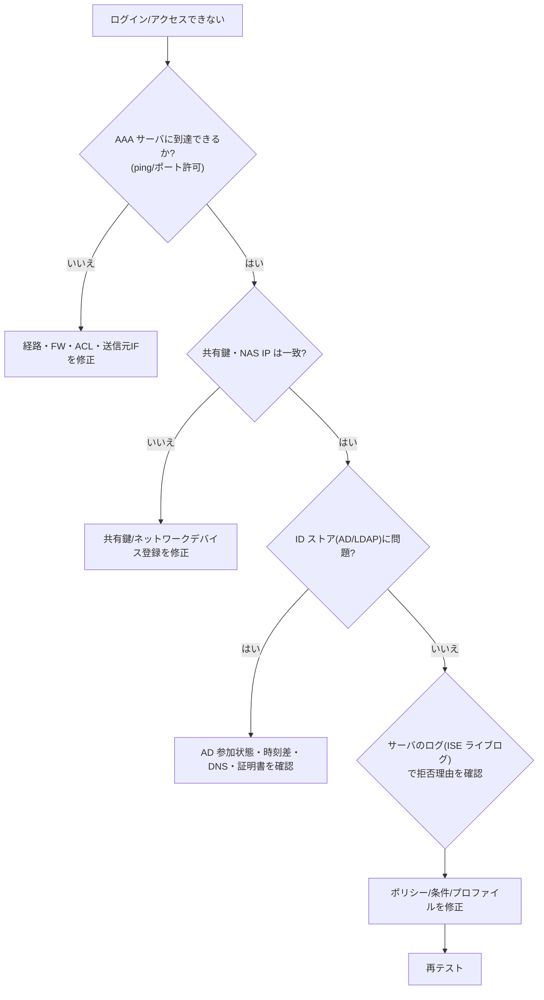

**切り分けの定番コマンド（IOS 系）**
```text
test aaa group <グループ名> <ユーザー> <パスワード> new-code   ! 疎通・認証の疎テスト
show aaa servers                                                ! サーバ状態・死活
show tacacs                                                     ! TACACS+ 統計
debug radius / debug tacacs                                     ! 本番では最小限・短時間のみ
```

**ベストプラクティス**
- **ローカルのフォールバック認証**（緊急アカウント）を必ず残し、AAA 障害でロックアウトされないようにする。
- 管理者ログインは **TACACS+**（コマンド認可・アカウンティング）、ネットワーク接続は **RADIUS** と使い分ける。
- 送信元インタフェースを固定（`ip tacacs source-interface` 等）して、サーバ側の機器登録と一致させる。
- 時刻同期が崩れると証明書・Kerberos（AD）で失敗する。**NTP を最初に疑う**。

**根拠**
- 【標準】RFC 2865（RADIUS） https://www.rfc-editor.org/rfc/rfc2865
- 【標準】RFC 8907（TACACS+） https://www.rfc-editor.org/rfc/rfc8907
- 【公式】SCOR v2.0 PDF（2.6） https://learningcontent.cisco.com/documents/marketing/exam-topics/350-701-SCOR-v2.0.pdf

### 2.7 セキュアなネットワーク管理（SNMPv3、NETCONF、RESTCONF、API、セキュア syslog、NTP 認証）

| 技術 | 要点 | 推奨設定 |
|---|---|---|
| **SNMPv3** | 認証（auth）＋暗号化（priv）を備える | `authPriv`（SHA ＋ AES）。v1／v2c（コミュニティ文字列）は避ける |
| **NETCONF** | SSH 上（TCP 830）で XML／YANG によるモデル駆動設定 | 管理元を制限、AAA 連携、トランザクション（コミット）を活用 |
| **RESTCONF** | HTTPS 上で YANG を REST で操作 | TLS ＋ 認証必須、最小権限のロール |
| **API** | REST などによる自動化 | トークン管理、ロール最小化、監査ログ |
| **セキュア syslog** | **TLS で保護したログ転送** | ログの盗聴・改ざん防止 |
| **NTP 認証** | 信頼できる時刻源のみ採用 | キー認証＋信頼キー指定。複数の時刻源 |

```text
! SNMPv3 の例（概念）
snmp-server group MONGRP v3 priv
snmp-server user monuser MONGRP v3 auth sha <認証パスワード> priv aes 128 <暗号パスワード>

! NTP 認証の例（対応アルゴリズムはバージョン依存）
ntp authenticate
ntp authentication-key 1 sha1 <キー>
ntp trusted-key 1
ntp server 192.0.2.10 key 1

! モデル駆動管理の有効化（IOS XE の例）
netconf-yang
restconf
ip http secure-server
```

**ベストプラクティス**: 管理系プロトコルは「**暗号化・認証・認可・記録**」の 4 点セットで評価する。

**根拠**
- 【標準】RFC 6241（NETCONF） https://www.rfc-editor.org/rfc/rfc6241
- 【標準】RFC 8040（RESTCONF） https://www.rfc-editor.org/rfc/rfc8040
- 【標準】RFC 5425（TLS による Syslog 転送） https://www.rfc-editor.org/rfc/rfc5425
- 【標準】RFC 5905（NTPv4） https://www.rfc-editor.org/rfc/rfc5905
- 【製品文書】Cisco Guide to Harden Cisco IOS Devices https://www.cisco.com/c/en/us/support/docs/ip/access-lists/13608-21.html

### 2.8 FTD のアクセスコントロール、AVC、URL フィルタ、マルウェア防御、IPS

**何か**: FTD では、通信が複数の検査ポイントを順に通過します。**どの順番で何がチェックされるか**を理解するのが最重要です。

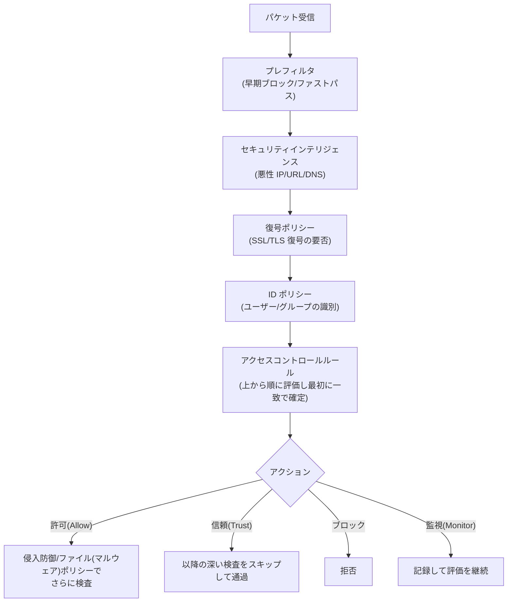

> 上は概念図です。詳細な順序は版やポリシー構成によって異なります。

| 機能 | 役割 |
|---|---|
| **プレフィルタ** | 検査の価値が低い通信のファストパスや、不要通信の早期ブロックで性能を稼ぐ |
| **アクセスコントロールルール** | 送信元／宛先／ゾーン／ポート／アプリ／URL／ユーザーなどで許可・拒否を決定 |
| **AVC（Application Visibility and Control）** | アプリケーション単位で識別・制御（例: SNS の閲覧は許可、投稿は拒否） |
| **URL フィルタリング** | カテゴリ・評判でサイトを制御 |
| **ファイル／マルウェアポリシー** | ファイル種別の制御、評判照会、サンドボックス解析、後追い検知（レトロスペクティブ） |
| **侵入防御ポリシー** | シグネチャに基づく検知・遮断。ベースポリシーとして Connectivity over Security／Balanced／Security over Connectivity／Maximum Detection がある |

**ベストプラクティス（Cisco ドキュメントの推奨に基づく）**
1. **プレフィルタ**を使い、不要通信を早期ブロック、検査不要通信はファストパスにする。
2. ルールは**できるだけ具体的**に書く（「any → any」を避ける）。
3. デバイスの **オブジェクトグループ検索**を有効化して、ACL エントリ数を抑え性能を保つ。
4. **ポリシーの展開は既存接続には適用されない**。反映させたい場合は既存接続をクリアしてから展開する。
5. **既定アクションではファイル／マルウェア検査ができない**。検査が必要な通信は明示的な許可ルールに紐づける。
6. URL とアプリのフィルタは**別のルールに分ける**（NSA ハードニングガイドの推奨）。
7. ルール数が増えるとデバイスの資源を超えて展開できなくなる場合があるため、**ルールの統合・整理**を継続する。
8. 新規ルールは**監視→ブロックの順**で段階導入し、ヒットカウントを見て不要ルールを削除する。

**根拠**
- 【製品文書】Secure Firewall Management Center 10.0: Access Control https://cisco.com/c/en/us/td/docs/security/secure-firewall/collections/access-control-100.html
- 【製品文書】Cisco Secure Firewall Access Control Policy Guidance https://secure.cisco.com/secure-firewall/docs/access-control-policy
- 【製品文書】General best practices for access control https://docs.manage.security.cisco.com/cdfmc/r_requirements-and-general-best-practices-for-access-control.html
- 【製品文書】Best practices for access control rules https://docs.manage.security.cisco.com/cdfmc/c_best_practices_for_optimizing_rule_performance.html
- 【製品文書】NSA「Cisco Firepower Hardening Guide」 https://media.defense.gov/2023/Aug/02/2003272858/-1/-1/1/CTR_CISCO_FIREPOWER_HARDENING_GUIDE.PDF

### 2.9 FTD と Cisco Secure Client によるサイト間／リモートアクセス VPN の構成

**サイト間 VPN（S2S）の構成手順**

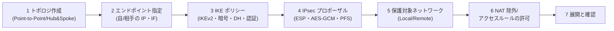

**IKEv2 の流れ（概念）**

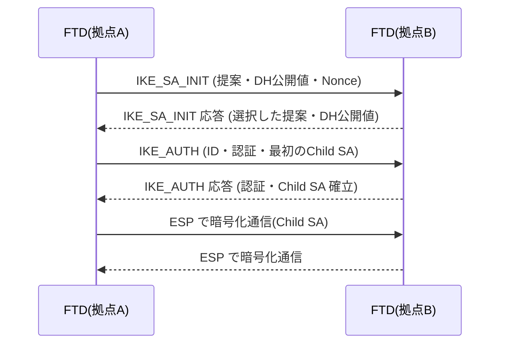

**リモートアクセス VPN（RA VPN）の要素**

| 要素 | 内容 |
|---|---|
| 接続プロファイル | 認証方式・アドレスプール・グループポリシーの束ね |
| グループポリシー | スプリットトンネル、DNS、バナー、アクセス制御 |
| 認証（AAA） | RADIUS（ISE 等）、SAML（IdP）、証明書、**MFA（Duo）** |
| Secure Client パッケージ | 端末へ配布するクライアント（モジュール構成可） |
| サーバ証明書 | **公的／社内 CA の有効な証明書**でクライアントの警告を防ぐ |

**ベストプラクティス**
- **IKEv2 ＋ AES-GCM ＋ 強い DH グループ ＋ PFS**。PSK は長く複雑にし、可能なら**証明書認証**。
- RA VPN は **MFA ＋ 認可（ISE で属性に基づく VLAN／ACL／SGT）＋ 端末ポスチャ**。
- **フルトンネルかスプリットトンネルか**は、リスクと帯域で判断。スプリットでは名前解決（DNS）漏れ・直接通信のリスクを理解しておく。
- 同時接続数・暗号処理性能を**機種の上限内**で設計し、HA で二重化する。

**根拠**
- 【公式】SCOR v2.0 PDF（2.9） https://learningcontent.cisco.com/documents/marketing/exam-topics/350-701-SCOR-v2.0.pdf
- 【公式】SNCF v1.2 PDF（2.5.c）セキュアアクセス／VPN https://learningcontent.cisco.com/documents/marketing/exam-topics/300-710-SNCF-v1.2.pdf
- 【標準】RFC 7296（IKEv2） https://www.rfc-editor.org/rfc/rfc7296

### 2.10 FTD の VPN トンネル確立のトラブルシューティング

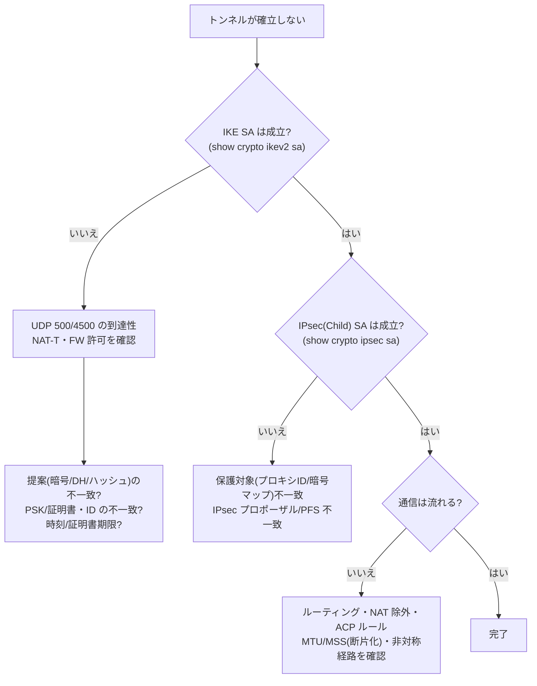

| 確認項目 | 代表コマンド／場所 |
|---|---|
| IKE／IPsec の状態 | `show crypto ikev2 sa`、`show crypto ipsec sa`（診断 CLI） |
| VPN セッション | `show vpn-sessiondb`（RA VPN の接続状況） |
| ログ／イベント | FMC のイベント・ヘルスモニタ、デバッグ（短時間・フィルタ付き） |
| パケットの流れ | **Packet Tracer**／パケットキャプチャ（SNCF 3.3 参照） |

> 診断 CLI へは FTD の CLI から `system support diagnostic-cli` で入ります。**デバッグは負荷が高いため、条件を絞って短時間のみ**実行します。

**よくある原因 Top 5**
1. 提案（暗号・DH・ハッシュ）や PSK の不一致
2. UDP 500／4500 の遮断、NAT-T の不整合
3. 保護対象ネットワーク（インタレスティングトラフィック）の左右不一致
4. NAT 除外（Identity NAT）漏れ、アクセスルール未許可
5. MTU／MSS による断片化、非対称ルーティング

**根拠**
- 【公式】SCOR v2.0 PDF（2.10） https://learningcontent.cisco.com/documents/marketing/exam-topics/350-701-SCOR-v2.0.pdf
- 【公式】SNCF v1.2 PDF（3.3 トラブルシュートツール） https://learningcontent.cisco.com/documents/marketing/exam-topics/300-710-SNCF-v1.2.pdf

---

## A-3. ドメイン 3.0 Cloud Security（15%）

### 3.1 クラウドの責任共有モデル

**何か**: クラウドでは「**クラウド事業者が守る範囲**」と「**利用者が守る範囲**」が分かれています。どのサービス形態でも、**データ・ID・アクセス管理は利用者の責任**です。

| 管理対象 | IaaS | PaaS | SaaS |
|---|---|---|---|
| データ・ID・アクセス権 | 利用者 | 利用者 | 利用者 |
| アプリケーション | 利用者 | 利用者 | 事業者 |
| OS・ミドルウェア | 利用者 | 事業者 | 事業者 |
| 仮想ネットワーク設定（SG／NSG など） | 利用者 | 共同 | 事業者 |
| ハイパーバイザ・物理設備 | 事業者 | 事業者 | 事業者 |

**ベストプラクティス**
- 「クラウドだから安全」ではなく、**利用者側の設定（誤設定）が事故の主因**と捉え、設定監査（CSPM）を行う。
- サービス形態ごとに、**自社が責任を負う範囲を文書化**して運用手順・監視に落とし込む。

**根拠**
- 【公式】SCOR v2.0 PDF（3.1）／SSCA v2.0 PDF（1.3.d） https://learningcontent.cisco.com/documents/marketing/exam-topics/350-701-SCOR-v2.0.pdf
- 【標準】NIST SP 800-145（クラウドの定義） https://csrc.nist.gov/pubs/sp/800/145/final

### 3.2 クラウドセキュリティの機能・展開モデル・フレームワーク・ポリシー管理

| 観点 | 代表例 | 使い方 |
|---|---|---|
| フレームワーク | CSA **CCM**（Cloud Controls Matrix）、NIST CSF 2.0、CIS Foundations Benchmarks、ISO/IEC 27017 | 管理策の網羅性の確認、監査対応 |
| 機能 | CSPM（設定・コンプライアンス監視）、CWPP（ワークロード保護）、CASB、IAM、暗号鍵管理 | リスクの種類ごとに対策を割り当てる |
| 展開モデル | エージェント型／エージェントレス（API 連携）／ゲートウェイ型 | 可視性・強制力・運用負荷のトレードオフ |
| ポリシー管理 | **ポリシーアズコード**、タグ戦略、組織ポリシー（SCP／Azure Policy／組織ポリシー） | 全アカウントに**ガードレール**を一括適用 |

**ベストプラクティス**: クラウドアカウント作成時から **ランディングゾーン（標準構成）＋ガードレール**を自動適用し、手作業の設定を減らす。

**根拠**
- 【標準】CSA Cloud Controls Matrix https://cloudsecurityalliance.org/research/cloud-controls-matrix
- 【標準】NIST Cybersecurity Framework https://www.nist.gov/cyberframework
- 【標準】CIS Benchmarks https://www.cisecurity.org/cis-benchmarks

### 3.3 クラウド環境のセキュリティソリューション選定（NIST SP 800-145、CASB）

**NIST SP 800-145 の整理**

| 区分 | 内容 |
|---|---|
| 展開モデル | パブリック／プライベート／ハイブリッド／コミュニティ |
| サービスモデル | **SaaS・PaaS・IaaS** |
| 5 つの基本特性 | オンデマンド・セルフサービス、広帯域ネットワークアクセス、リソースプーリング、迅速な弾力性、従量制サービス |

**CASB（Cloud Access Security Broker）**: 利用者と SaaS の間に立ち、可視化・コンプライアンス・データ保護・脅威防御を提供します。

| 方式 | 仕組み | 長所 | 短所 |
|---|---|---|---|
| API 連携（アウトオブバンド） | SaaS の API 経由でスキャン・是正 | 導入が容易、過去データも対象 | リアルタイム遮断は苦手 |
| インライン（プロキシ） | 通信経路に介在して制御 | リアルタイムで制御可能 | 経路変更・証明書配布が必要 |

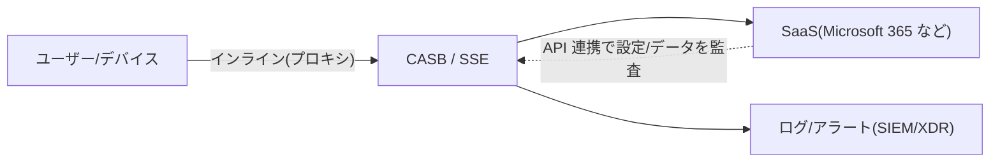

**ベストプラクティス**: まず**シャドー IT の可視化**から始め、承認アプリ／非承認アプリを分類 → 重要アプリは API とインラインを**併用**する。

**根拠**
- 【標準】NIST SP 800-145 https://csrc.nist.gov/pubs/sp/800/145/final
- 【公式】SCOR v2.0 PDF（3.3）／SSCA v2.0 PDF（4.4 CASB） https://learningcontent.cisco.com/documents/marketing/exam-topics/300-740-SSCA-v2.0-1.pdf

### 3.4 クラウドのネットワーク・アプリ・データ保護（Multicloud Defense、Secure Workload）

**Cisco Multicloud Defense（MCD）**: SaaS の**コントローラ（制御プレーン）**と、各クラウドに配置する**ゲートウェイ（データプレーン）**で構成されます。

| ゲートウェイ | 役割 |
|---|---|
| **イングレス** | 外部から入る通信の保護（リバースプロキシ、WAF／L7 脅威防御） |
| **エグレス** | 内部から外へ出る通信の制御（フォワードプロキシ、FQDN／URL フィルタ） |
| **イースト・ウエスト** | クラウド内のワークロード間通信の検査（セグメンテーション） |
| **分散ゲートウェイ** | 各 VPC／VNet 内に配置（通信が VPC 内で完結） |

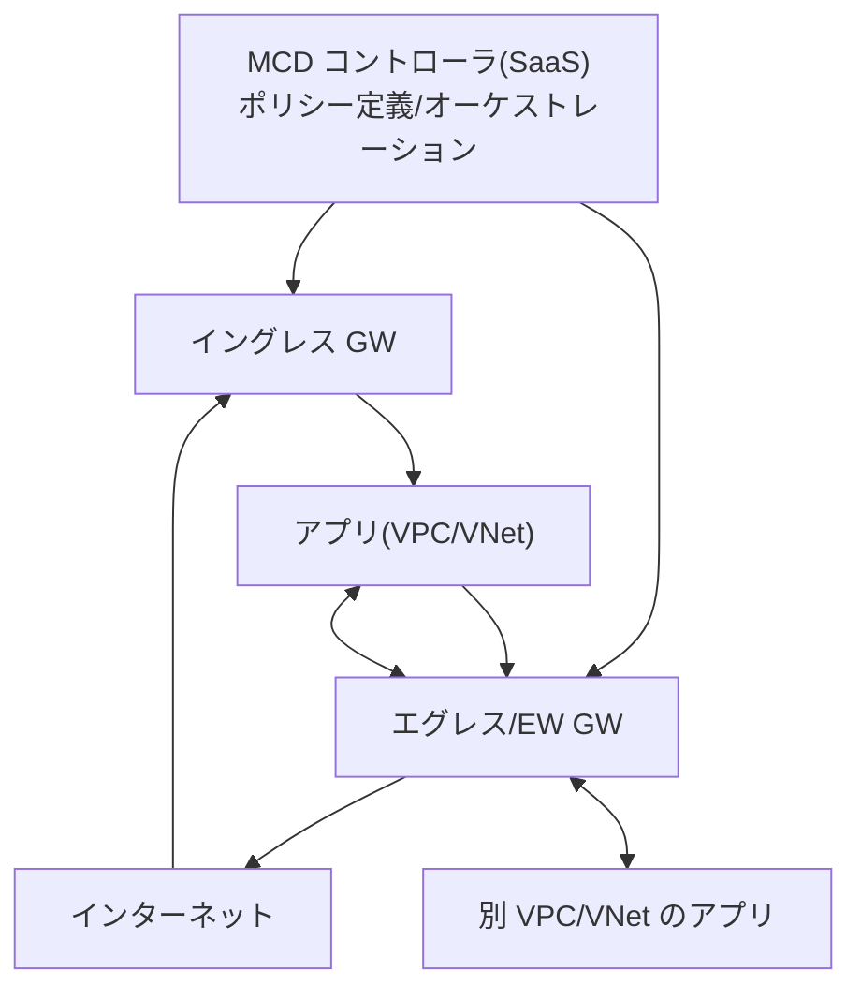

| 構成方式 | 長所 | 留意点 |
|---|---|---|
| 集中型（セキュリティ VPC に集約） | 運用が一元化、ポリシーが一貫 | 経路設計・帯域・単一障害点 |
| 分散型（各 VPC に配置） | 通信が VPC 内で完結、障害影響が局所化 | 台数・コスト増 |

**Cisco Secure Workload**: ワークロード（VM／コンテナ／ベアメタル）間通信を可視化し、**マイクロセグメンテーション**で必要な通信だけを許可します（詳細は SSCA 3.7）。

**ベストプラクティス**
- クラウドの設定は **IaC（Terraform など）でコード管理**し、MCD も Terraform プロバイダでポリシーを自動化する。
- エグレスは**許可リスト（FQDN）方式**で制御し、**データ持ち出しの出口を絞る**。
- 暗号化（保存時・転送中）、鍵管理（KMS）、DLP を組み合わせてデータを守る。

**根拠**
- 【製品文書】Cisco Multicloud Defense User Guide https://securitydocs.cisco.com/docs/mcd/user/57506.dita
- 【製品文書】Multicloud Defense Terminology Guide https://www.cisco.com/c/en/us/td/docs/security/cdo/multicloud-defense/multicloud-defense-terminology-guide.html
- 【製品文書】Cisco Multicloud Defense Architecture Guide https://www.cisco.com/c/en/us/products/collateral/security/multicloud-defense-ag.html
- 【製品文書】Egress Gateways https://docs.manage.security.cisco.com/multicloud/c-egress.html

### 3.5 Splunk によるクラウドログの取り込み

**何か**: 他のセキュリティ製品やクラウドのログを Splunk に集約して相関分析します。

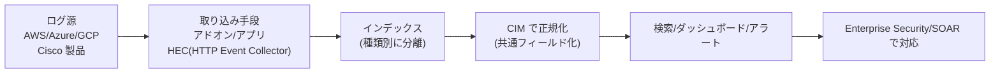

| 取り込み対象 | 代表的な手段 |
|---|---|
| Cisco 製品（Secure Firewall、Secure Endpoint、Duo、Multicloud Defense、XDR など） | **Cisco Security Cloud アプリ**（Splunkbase） |
| Cisco Secure Access のログ | Secure Access 用アドオン／アプリ（Cisco 管理バケットのログを取得） |
| AWS／Azure／GCP のログ | 各クラウド向け Splunk アドオン、または **HEC** |

```text
# 検索例（概念）: 失敗した認証をユーザー別に集計
index=auth action=failure
| stats count by user, src
| where count > 10
| sort - count
```

**ベストプラクティス**
- **ログ種別ごとにインデックスを分け**、sourcetype を統一する。
- 可能な限り **CIM（Common Information Model）に準拠**させ、検知ルールを再利用可能にする。
- HEC は **TLS ＋ トークン管理**、クラウド側の収集用 ID は**最小権限**。
- **取り込みの健全性監視**（欠損・遅延）と保持期間・コストの管理を行う。

**根拠**
- 【製品文書】Splunkbase「Cisco Security Cloud」 https://splunkbase.splunk.com/app/7404
- 【製品文書】Cisco Secure Access アドオン／アプリ for Splunk トラブルシューティングガイド https://developer.cisco.com/docs/cloud-security/troubleshooting-guide-cisco-secure-access-add-on-or-app-for-splunk/
- 【製品文書】Splunk ドキュメント https://docs.splunk.com/

### 3.6 アプリケーションとワークロードのセキュリティ（eBPF を含む）

**eBPF とは**: Linux カーネル内で、**安全性検証を受けた小さなプログラム**を動かす技術です。カーネルを改造せずに、**ネットワーク制御・可観測性・セキュリティ**を高速に実現できます。

| 製品・技術 | 役割 |
|---|---|
| **Cilium** | コンテナ向けネットワーク／ネットワークポリシー／可観測性（eBPF ベース） |
| **Tetragon** | ランタイムのセキュリティ可観測性と**強制**（プロセス実行・ファイル・ネットワークの監視と遮断） |

| ワークロード | 主なリスク | 主な対策 |
|---|---|---|
| VM | OS の脆弱性、過剰な通信 | パッチ、EDR、マイクロセグメンテーション |
| コンテナ | イメージの脆弱性、特権コンテナ、横展開 | イメージスキャン、最小権限、ネットワークポリシー、ランタイム監視 |
| サーバーレス | 過剰な IAM 権限、依存ライブラリ | 関数ごとの最小権限、依存関係の検査 |

**ベストプラクティス**: ビルド時（イメージ検査）→ デプロイ時（ポリシー検証）→ 実行時（ランタイム検知）と、**ライフサイクル全体**に対策を置く。

**根拠**
- 【標準】eBPF 公式サイト https://ebpf.io/
- 【標準】Cilium https://cilium.io/
- 【標準】Tetragon https://tetragon.io/
- 【公式】SSCA v2.0 PDF（1.6） https://learningcontent.cisco.com/documents/marketing/exam-topics/300-740-SSCA-v2.0-1.pdf

### 3.7 DevSecOps（IaC セキュリティ、CI/CD、コンテナオーケストレーション、安全な開発）

**何か**: 開発・運用の流れ全体にセキュリティ検査を組み込み、**早い段階（シフトレフト）で問題を見つけて直す**考え方です。

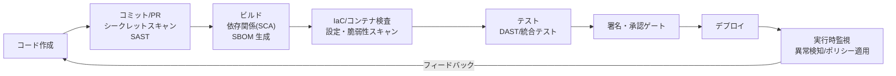

| 領域 | 重要な観点 |
|---|---|
| **IaC** | テンプレートの静的検査、**ポリシーアズコード**、状態ファイルの保護、秘密情報を埋め込まない |
| **CI/CD** | パイプライン権限の最小化、シークレット管理、**成果物の署名と来歴**、承認ゲート |
| **コンテナ／オーケストレーション** | 軽量・信頼できるベースイメージ、特権の排除、RBAC、ネットワークポリシー、アドミッション制御 |
| **安全な開発** | 脅威モデリング、コードレビュー、SAST／DAST／SCA、**SSDF** に沿った開発プロセス |

**ベストプラクティス**
- 重大な脆弱性・秘密情報の混入が見つかったら**パイプラインを止める（ビルドを失敗させる）**。
- **SBOM** を生成して保管し、新たな脆弱性公表時に影響範囲を素早く調べる。
- 本番環境へ手作業の変更を許さず、**すべてコード経由（GitOps）**にして監査可能にする。

**根拠**
- 【標準】NIST SP 800-218 SSDF https://csrc.nist.gov/pubs/sp/800/218/final
- 【標準】OWASP DevSecOps Guideline https://owasp.org/www-project-devsecops-guideline/
- 【標準】SLSA（サプライチェーンのセキュリティ） https://slsa.dev/
- 【標準】Kubernetes セキュリティ概念 https://kubernetes.io/docs/concepts/security/

---

## A-4. ドメイン 4.0 Secure Service Edge（10%）

### 4.1 SSE と SASE

**何か**: 在宅勤務・SaaS 利用が進み、「社内ネットワークに集約して守る」ことが難しくなりました。そこで、セキュリティ機能を**クラウドのエッジ（利用者の近く）で提供**するのが SSE／SASE です。

| 用語 | 意味 |
|---|---|
| **SSE（Security Service Edge）** | セキュリティ機能群をクラウドで提供：SWG、CASB、ZTNA、FWaaS、DNS セキュリティ、DLP など |
| **SASE（Secure Access Service Edge）** | **SSE ＋ ネットワーク機能（SD-WAN など）** を一体で提供する考え方 |

```mermaid
flowchart TD
    SASE["SASE"] --> NET["ネットワーク機能\n(SD-WAN など)"]
    SASE --> SSE["SSE (セキュリティ機能)"]
    SSE --> SWG["SWG\nWeb プロキシ"]
    SSE --> CASB["CASB\nSaaS 制御"]
    SSE --> ZTNA["ZTNA\nアプリ単位の接続"]
    SSE --> FW["FWaaS\nクラウド FW"]
    SSE --> DNS["DNS セキュリティ"]
    SSE --> DLP["DLP"]
```

**ベストプラクティス**: すべての通信を**一度にクラウドへ移行しない**。**DNS → Web → SaaS → プライベートアプリ**の順など、リスクと効果が大きい通信から段階的に。

**根拠**
- 【公式】SCOR v2.0 PDF（4.1） https://learningcontent.cisco.com/documents/marketing/exam-topics/350-701-SCOR-v2.0.pdf
- 【製品文書】Cisco Secure Access Help https://www.cisco.com/c/en/us/td/docs/security/secure-access/secure-access-help/CiscoSecureAccessHelp.html

### 4.2 Cisco Secure Access：Secure Internet Access の構成

**何か**: インターネット／SaaS 向けの通信を Secure Access 経由にして、DNS・Web・ファイル・DLP などで保護します。

| 要素 | 内容 |
|---|---|
| **経路の向け方** | Cisco Secure Client、IPsec トンネル（拠点機器から）、PAC／プロキシ連携、DNS の向け先変更 |
| **保護機能** | DNS レイヤの保護、Secure Web Gateway、クラウド提供型ファイアウォール、DLP、ファイル解析（Secure Malware Analytics 連携） |
| **ポリシー** | **インターネットアクセスルール**＋**セキュリティプロファイル**（カテゴリ、アプリ、ファイル、復号の設定） |
| **復号（TLS インスペクション）** | 端末にルート証明書を配布して実施 |

```mermaid
flowchart TD
    A["ユーザー/拠点"] --> B{"経路"}
    B -->|"Secure Client"| C["Secure Access（SWG へ誘導）"]
    B -->|"IPsec トンネル"| C
    B -->|"DNS のみ向け先変更"| D["DNS レイヤ保護（名前解決のみ）"]
    D -->|"解決後の通信本体は直接"| F["インターネット/SaaS"]
    C --> E["SWG / FW / DLP / ファイル解析"]
    E --> F
    D --> G["ログ/ダッシュボード"]
    E --> G
```

**ベストプラクティス**
- **ルールは上から評価**される。具体的なルールを上に、汎用ルールを下に配置する。
- 新規ルールは**監視（ログ）→ブロック**の順で導入。誤ブロックの影響を見極める。
- **復号は対象を絞る**（金融・医療などプライバシー配慮が必要なカテゴリは除外）。ルート証明書は **MDM で一括配布**。
- 拠点トンネルは**プライマリ／セカンダリの 2 本**で冗長化する。
- 地理的ブロック、セキュリティプロファイルを**グループ別**に適用。

**根拠**
- 【製品文書】Secure Access ヘルプ（インターネットアクセスルール／セキュリティプロファイル） https://www.cisco.com/c/en/us/td/docs/security/secure-access/secure-access-help/CiscoSecureAccessHelp.html
- 【製品文書】Secure Access リソースリポジトリ（導入ステージ別の資料集） https://community.cisco.com/t5/secure-access-announcements/secure-access-resource-repository/ta-p/5300157
- 【製品文書】Manage Network Connections https://docs.sse.cisco.com/sse-user-guide/docs/manage-network-tunnels

### 4.3 Cisco Secure Access：Secure Private Access の構成

**何か**: 社内アプリへのアクセスを、**ネットワーク全体ではなくアプリ単位**で許可する **ZTNA** と、従来型の **VPN as a Service** を提供します。

| 接続方式 | 内容 |
|---|---|
| **リソースコネクタ** | 組織内に配置する仮想マシン。**内側から外へ接続**してゼロトラストアクセスを提供。グループ単位で管理 |
| **ネットワークトンネル（IPsec IKEv2）** | ネットワーク機器から Secure Access のデータセンタへトンネルを張る |
| **ユーザー接続** | ZTNA（クライアントあり／なし）、VPN as a Service（Cisco Secure Client） |

```mermaid
flowchart LR
    U["ユーザー"] -->|"Secure Client / ブラウザ"| SA["Secure Access"]
    SA -->|"プライベートアクセスルール\n(ID・端末状態で評価)"| RC["リソースコネクタ\n(社内に配置)"]
    RC --> APP["社内アプリ"]
    RC -. "内側から外向きに接続" .-> SA
```

**ベストプラクティス**
- **アプリ（プライベートリソース）単位**で最小権限のルールを作り、ネットワーク全体への開放を避ける。
- リソースコネクタは**複数台でグループ化**して冗長化し、**プロビジョニングキー**は厳重に保管・失効管理する。
- コネクタの外向き通信は、**必要な Secure Access 宛先のみ許可**する（FW の許可リスト）。
- ZTNA と VPN の**併存期間**を設けて段階移行する。

**根拠**
- 【製品文書】Manage Network Connections（リソースコネクタ／トンネルの説明） https://docs.sse.cisco.com/sse-user-guide/docs/manage-network-tunnels
- 【製品文書】Secure Access Help Center（プライベートアクセスルール、コネクタの保守） https://docs.sse.cisco.com/sse-user-guide/docs/meraki-documentation
- 【公式】SSCA v2.0 PDF（4.5, 4.6） https://learningcontent.cisco.com/documents/marketing/exam-topics/300-740-SSCA-v2.0-1.pdf

### 4.4 データ損失防止（DLP）と AI ガードレールの設定

**何か**: 機密データの外部流出を防ぐ DLP と、生成 AI の利用を安全に管理する **AI ガードレール**です。

| 機能 | 内容 |
|---|---|
| **DLP のルール** | 分類（個人情報・カード番号・社内ラベルなど）、正規表現・辞書による識別、アクション（ブロック／警告／ログ） |
| **リアルタイム DLP** | 通信経路上でアップロード・投稿を検査 |
| **SaaS API 型 DLP** | SaaS 内に保存済みのデータをスキャン |
| **AI ガードレール** | 生成 AI アプリの**利用可否の制御**と、プロンプト／応答の**ポリシー検査**（機密情報・不適切な内容など） |

> AI 関連機能の名称・範囲はリリースごとに変わるため、**最新の Secure Access ドキュメントで確認**してください。

**ベストプラクティス**
- まず**ログ（監視）モード**で検知の精度を測定し、誤検知を調整してからブロックに移行。
- **データ分類**を先に定義する（何を守るのかが曖昧だと DLP は機能しない）。
- 生成 AI は「全面禁止」ではなく、**承認済みサービスの許可＋機密データの入力防止**で運用する。

**根拠**
- 【公式】SCOR v2.0 PDF（4.4）／SSCA v2.0 PDF（3.4, 4.3） https://learningcontent.cisco.com/documents/marketing/exam-topics/350-701-SCOR-v2.0.pdf
- 【製品文書】Secure Access ヘルプ https://www.cisco.com/c/en/us/td/docs/security/secure-access/secure-access-help/CiscoSecureAccessHelp.html

### 4.5 Secure Access Investigate のスコアと指標の読み方

**何か**: ドメイン・IP・ファイルなどの**脅威インテリジェンス調査ツール**です（旧 Umbrella Investigate 系）。疑わしい宛先について、リスクの高さと根拠を確認します。

| 見る観点 | 例 |
|---|---|
| リスクスコア | 総合的な危険度の目安（尺度・指標の定義は公式ドキュメントで確認） |
| ドメイン生成アルゴリズム（DGA）的な名前 | 機械的に作られた怪しい名前 |
| 新規登録・出現直後 | 攻撃用に急ごしらえされたドメインの傾向 |
| 共起関係・関連ドメイン | 同じ攻撃基盤に関わる他ドメイン |
| 登録情報・ホスティング（WHOIS／ASN／地理） | 運営の実体・偏り |

**ベストプラクティス**
- スコアは**単独で判断せず**、他のテレメトリ（端末のプロセス、プロキシログ）と合わせて評価する。
- スコアの**しきい値**はブロック／監視で分けて運用し、誤検知時の例外手順を用意する。

**根拠**
- 【公式】SCOR v2.0 PDF（4.5） https://learningcontent.cisco.com/documents/marketing/exam-topics/350-701-SCOR-v2.0.pdf
- 【製品文書】Secure Access Help Center https://docs.sse.cisco.com/sse-user-guide/docs/meraki-documentation

---
