# CCNP Service Provider 認定 初学者向けステップバイステップ完全ガイド

> **対象読者**: サービスプロバイダー（SP）ネットワークをこれから学ぶ方、CCNP Enterprise 相当の知識から SP 領域へ進む方
> **作成日**: 2026-09-30
> **根拠となる公式情報**: Cisco Japan「CCNP Service Provider 認定とトレーニングプログラム」および各試験の出題範囲 PDF（300-540 SPCNI: v1.0 / 350-501 SPCOR: v1.1、2024 年版）
> **書式ルール**: ASCII アートによる図解は使用せず、フローチャートは Mermaid、図解・表は Markdown で表現します

---

## 目次

1. [このガイドの使い方](#1-このガイドの使い方)
2. [認定の全体像](#2-認定の全体像)
3. [前提知識：SP ネットワークの基本用語](#3-前提知識sp-ネットワークの基本用語)
4. [学習ロードマップ](#4-学習ロードマップ)
5. [Part A：コア試験 350-501 SPCOR](#5-part-aコア試験-350-501-spcor)
   - 5.1 アーキテクチャ（15%）

> **本ガイドの収録範囲**: 現版はコア試験の **5.1 アーキテクチャ（出題範囲 1.1〜1.7）まで** を収録しています。5.2〜5.5（ネットワーキング、MPLS/SR、サービス、自動化とアシュアランス）と各コンセントレーション試験の詳細解説は未収録です。出典 URL は各項目の「出典」に記載しています。

---

## 1. このガイドの使い方

### 1.1 各トピックの共通フォーマット

各項目は、次の 5 ステップで統一しています。

| ステップ | 内容 |
|---|---|
| ① 何のための技術か | 解決したい課題（Why） |
| ② 仕組み | 動作原理（How）。必要に応じて Mermaid 図・表 |
| ③ 設定・確認の勘所 | IOS XR / IOS XE のコマンド例、`show` コマンド |
| ④ ベストプラクティス | 実運用で推奨される設計・運用指針 |
| ⑤ 出典 | RFC・Cisco 公式ドキュメントなどの URL |

### 1.2 表記について

- 出題範囲の項番（例: `1.4.a`）は Cisco 公式の出題範囲 PDF の項番に対応しています。
- コマンド例は **主に IOS XR**（SP コアの主流）を使い、必要な箇所で IOS XE を併記します。プラットフォームやバージョンで構文が異なる場合は本文で注記します。
- 設定例のパスワードや IP アドレスは、文書用アドレス（`192.0.2.0/24`、`198.51.100.0/24`、`203.0.113.0/24`、`2001:db8::/32`）とプレースホルダーです。本番へそのまま流用しないでください。

### 1.3 重要な注意（試験内容の変動）

> Cisco の出題範囲 PDF には「実際の試験ではここに記載のない関連トピックが出題される場合がある」「予告なく変更される場合がある」と明記されています。学習開始前と受験直前に、必ず最新の出題範囲を Cisco 公式の各試験ページで確認してください。
> なお、本ガイドは 2026-09-30 時点で取得できた Cisco Japan 公開の出題範囲 PDF（300-540 SPCNI: v1.0 / 350-501 SPCOR: v1.1）を基準に作成しています。

---

## 2. 認定の全体像

### 2.1 取得要件

CCNP Service Provider は、**コア試験 1 つ + コンセントレーション試験 1 つ（選択式）** の合計 2 試験に合格すると取得できます。

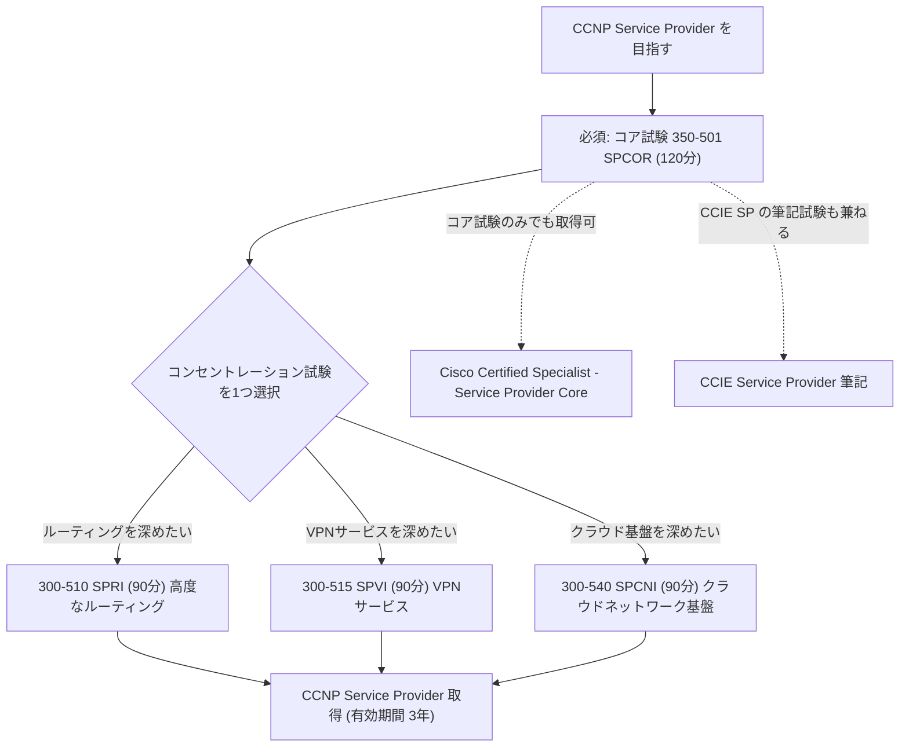

### 2.2 試験一覧

| 区分 | 試験コード | 名称 | 試験時間 | 主なテーマ |
|---|---|---|---|---|
| コア（必須） | 350-501 SPCOR | Implementing and Operating Cisco Service Provider Network Core Technologies | 120 分 | アーキテクチャ、ネットワーキング、MPLS/SR、サービス、自動化、QoS、セキュリティ、アシュアランス |
| コンセントレーション | 300-510 SPRI | Implementing Cisco Service Provider Advanced Routing Solutions | 90 分 | ルーティングプロトコル、ポリシー言語、MPLS、セグメントルーティング |
| コンセントレーション | 300-515 SPVI | Implementing Cisco Service Provider VPN Services | 90 分 | レイヤ 2、レイヤ 3、IPv6 の VPN |
| コンセントレーション | 300-540 SPCNI | Designing and Implementing Cisco Service Provider Cloud Network Infrastructure | 90 分 | 仮想化アーキテクチャ、クラウド相互接続、高可用性、セキュリティ、サービスアシュアランスと最適化 |

> 旧コンセントレーションの 300-535 SPAUTO は 2026-02-02 に受験終了しています。SP の自動化は引き続きコア試験 SPCOR の「自動化とアシュアランス」分野で問われます。

### 2.3 その他の重要事項（Cisco 公式ページより）

| 項目 | 内容 |
|---|---|
| 前提条件 | 正式な前提条件はなし。ただし SP ソリューションの **3〜5 年の実装経験** を推奨 |
| 有効期間 | **3 年間**（再認定ポリシーに従う） |
| 副次的な認定 | 各試験ごとに個別のスペシャリスト認定を取得できる |
| コア試験の位置づけ | CCIE Service Provider の筆記試験としても使える（1 回の合格で両方の道が開ける） |

### 2.4 コンセントレーション試験の選び方

| あなたの現在の役割 | おすすめ | 理由 |
|---|---|---|
| バックボーン設計・運用（IGP/BGP/SR に触れる） | **SPRI** | コアで学んだ内容をトラブルシューティングレベルまで深掘りできる |
| 法人向け VPN サービス（L2VPN/L3VPN/EVPN）の提供 | **SPVI** | 顧客向けサービスの設計・障害対応に直結する |
| NFV/コンテナ基盤、クラウド相互接続、高可用性設計を扱う | **SPCNI** | SP のクラウドネットワーク基盤の設計・実装に直結する |

---

## 3. 前提知識：SP ネットワークの基本用語

### 3.1 SP ネットワークの典型構成

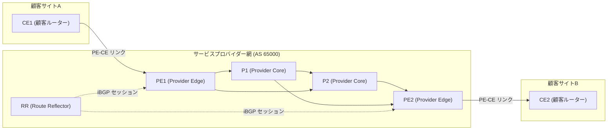

### 3.2 用語集（最低限これだけは）

| 用語 | 正式名称 | 役割 |
|---|---|---|
| CE | Customer Edge | 顧客側の境界ルーター/スイッチ |
| PE | Provider Edge | SP 網の入口。VRF や L2VPN を終端し、顧客ごとの分離を行う |
| P | Provider (core) | SP 網の中継ルーター。顧客経路は持たず、ラベルで高速転送する |
| RR | Route Reflector | iBGP のフルメッシュ問題を解消する経路反射器 |
| ASBR | AS Boundary Router | 他 AS との境界ルーター |
| LSR / LER | Label Switching Router / Label Edge Router | ラベルスイッチを行うルーター / MPLS 網の端点 |
| FEC | Forwarding Equivalence Class | 同じ転送扱いを受けるパケットの集合 |
| LSP | Label Switched Path | ラベルで構成される一方向の経路 |
| VRF | VPN Routing and Forwarding | 顧客ごとに独立したルーティング/転送テーブル |
| AC | Attachment Circuit | 顧客と PE をつなぐ接続回線（L2VPN 用語） |
| PW | Pseudowire | L2 フレームを MPLS 上で運ぶ仮想回線 |
| IGP | Interior Gateway Protocol | OSPF / IS-IS など AS 内ルーティング |
| SLA | Service Level Agreement | 可用性・遅延などの品質契約 |

### 3.3 SP ネットワークの「3 つの層」で考える

SP の技術は次の 3 層に分けて理解すると、暗記ではなく「構造」で理解できます。

| 層 | 役割 | 代表技術 |
|---|---|---|
| **アンダーレイ（トランスポート）** | PE 間の到達性とラベル/セグメントによる高速転送 | IS-IS/OSPF、LDP、RSVP-TE、Segment Routing、SRv6 |
| **オーバーレイ（サービス）** | 顧客向けサービスの提供 | L3VPN、L2VPN、EVPN、mVPN |
| **運用・制御（管理）** | 自動化・可視化・保護 | NETCONF/RESTCONF/gNMI、NSO、テレメトリ、QoS、セキュリティ |

---

## 4. 学習ロードマップ

### 4.1 推奨学習順序

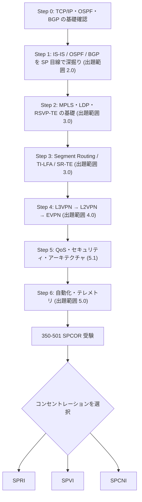

### 4.2 コア試験の出題配分（350-501 SPCOR v1.1）

| 章 | 分野 | 配分 | 本ガイドの節 |
|---|---|---|---|
| 1.0 | アーキテクチャ | 15% | 5.1 |
| 2.0 | ネットワーキング | 30% | 未収録 |
| 3.0 | MPLS とセグメントルーティング | 20% | 未収録 |
| 4.0 | サービス | 20% | 未収録 |
| 5.0 | 自動化とアシュアランス | 15% | 未収録 |

### 4.3 コンセントレーション試験の出題配分

| 試験 | 分野と配分 |
|---|---|
| **SPRI** 300-510 | ユニキャストルーティング 35% / マルチキャストルーティング 15% / ルーティングポリシーとルート操作 25% / MPLS とセグメントルーティング 25% |
| **SPVI** 300-515 | VPN アーキテクチャ 25% / レイヤ 2 VPN 30% / レイヤ 3 VPN 35% / IPv6 VPN 10% |
| **SPCNI** 300-540 | 仮想化アーキテクチャ 25% / クラウド相互接続 25% / 高可用性 20% / セキュリティ 15% / サービスアシュアランスと最適化 15% |

### 4.4 ラボ環境の選び方

| 選択肢 | 特徴 | 向いている学習 |
|---|---|---|
| Cisco Modeling Labs (CML) | 公式のネットワークシミュレーション | IOS XE / IOS XR の仮想イメージで L3VPN/SR を検証 |
| Cisco DevNet Sandbox | ブラウザから使える無償のリモート環境 | NETCONF/RESTCONF/gNMI、NSO の動作確認 |
| コンテナ/仮想ルーター（XRd など） | 軽量でラップトップ上でも動作 | SR・IS-IS・BGP の設定練習 |
| 物理機器 | 実機の挙動確認 | QoS・ハードウェア依存機能 |

> **ベストプラクティス**: 学習は「読む → ラボで設定 → `show` で確認 → わざと壊して直す」の 4 拍子で回します。SP 系試験はトラブルシューティング問題が多いため、**壊して直す** 練習が最も効果的です。

---

## 5. Part A：コア試験 350-501 SPCOR

コア試験は **120 分**。CCNP Service Provider と CCIE Service Provider の両方に共通する土台です。5 つの分野を順に学びます。

---

### 5.1 アーキテクチャ（15%）

#### 5.1.1 サービスプロバイダー アーキテクチャの説明（出題範囲 1.1）

##### ① 1.1.a コアアーキテクチャ

**何のための技術か**: 顧客の通信（L2 フレームや L3 パケット）を、SP 網内で安全・高速・大規模に運ぶための「土台」を選ぶ話です。

| アーキテクチャ | 概要 | 長所 | 短所・注意 |
|---|---|---|---|
| **Metro Ethernet** | Ethernet を都市圏規模に拡張。VLAN / Q-in-Q / PBB / G.8032 で構成 | 安価・単純・L2 サービス（E-Line/E-LAN）と相性が良い | 大規模化でブロードキャストドメインや MAC テーブルが課題 |
| **MPLS** | ラベルで転送。L3VPN / L2VPN / TE を同一基盤で提供 | 実績豊富、サービス統合、TE/FRR | LDP・RSVP-TE など複数プロトコルの運用負荷 |
| **Unified MPLS**（Seamless MPLS） | アクセス/集約/コアの複数 IGP ドメインを BGP ラベル付きユニキャスト（BGP-LU）でつなぎ、エンドツーエンドの LSP を実現 | 数万ノード規模へスケール | BGP-LU の設計と運用が複雑 |
| **SR（Segment Routing）** | 送信元がセグメントリスト（ラベルスタック）で経路を指定。LDP/RSVP-TE 不要 | プロトコル削減、TI-LFA、SR-TE による単純な TE | SRGB 設計・移行計画が必要 |
| **SRTE（SR Traffic Engineering）** | SR ポリシーでパスを制御 | 中間ノードの状態が不要（ステートレス） | ヘッドエンドのラベルスタック深度・プラットフォーム制限 |
| **SRv6** | IPv6 アドレスをセグメント（SID）として使用。MPLS ラベル不要 | IPv6 ネイティブ、ネットワークプログラミング、サービスとトランスポートの統合 | ヘッダー長、ハードウェア/相互接続、運用知見の蓄積が課題 |

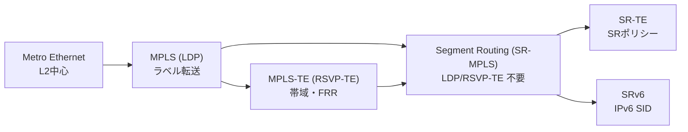

**ベストプラクティス**
- 新規構築では **SR-MPLS もしくは SRv6** を第一候補にし、LDP/RSVP-TE は既存資産との共存・移行目的に限定する。
- 大規模網は IGP ドメインを分割し、境界を BGP-LU（Unified MPLS）または SR の BGP 拡張で接続して IGP 肥大化を防ぐ。
- 「今ある機器が何を実装しているか」をまず棚卸しし、機能差分（SRv6 対応、ラベル深度、TI-LFA 対応）を確認してから方式を決める。

**出典**
- RFC 8402 Segment Routing Architecture: https://www.rfc-editor.org/rfc/rfc8402
- RFC 8986 SRv6 Network Programming: https://www.rfc-editor.org/rfc/rfc8986
- RFC 3031 MPLS Architecture: https://www.rfc-editor.org/rfc/rfc3031
- RFC 8277 Using BGP to Bind MPLS Labels to Address Prefixes: https://www.rfc-editor.org/rfc/rfc8277
- Segment Routing 情報サイト: https://www.segment-routing.net/

##### ② 1.1.b トランスポート技術

| 技術 | 媒体・特徴 | 典型的な用途 |
|---|---|---|
| **xDSL** | 既存の銅線電話回線を利用。距離が伸びると速度低下 | 旧来の家庭/小規模拠点向けブロードバンド |
| **DWDM** | 1 本の光ファイバーに多数の波長を多重化 | 都市間・長距離バックボーンの大容量伝送 |
| **DOCSIS** | ケーブルテレビ同軸網で IP 通信（HFC 網） | ケーブル事業者のブロードバンド |
| **TDM**（SONET/SDH など） | 時分割多重の固定スロット伝送 | 旧来の専用線、回線エミュレーションで残存 |
| **xPON**（GPON/XGS-PON） | 光ファイバーを分岐器（スプリッター）で共有する P2MP 光アクセス | FTTH アクセス網 |

| 比較軸 | xDSL | DOCSIS | xPON | DWDM |
|---|---|---|---|---|
| 媒体 | 銅線 | 同軸+光（HFC） | 光ファイバー | 光ファイバー |
| 共有形態 | 専有（加入者ごと） | 共有 | 共有（分岐） | 波長ごとに専有 |
| 主な位置づけ | アクセス | アクセス | アクセス | コア/長距離 |

**ベストプラクティス**: トランスポート層（光）と IP/MPLS 層の障害を切り分けられるよう、**リンクダウン検出（LoS、BFD、FRR のトリガー）** の設計をレイヤごとに揃える。

##### ③ 1.1.c モビリティ

**何のための技術か**: モバイル基地局とコアネットワークを結ぶ「モバイルバックホール/xHaul」を IP/MPLS/SR で実現します。

| 用語 | 意味 |
|---|---|
| パケットコア | 4G の EPC、5G の 5GC。ユーザー通信のセッション管理とデータ転送を担う |
| **xHaul** | フロントホール（RU–DU）、ミッドホール（DU–CU）、バックホール（CU–コア）の総称 |
| **5G vRAN 向け RAN xHaul トランスポート** | 仮想化 RAN 環境で、厳しい遅延・同期要件を満たすトランスポート |
| **ORAN トランスポート** | O-RAN アライアンス仕様に基づく RAN トランスポート。eCPRI やタイミング配信（PTP、SyncE）が重要 |

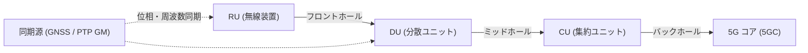

**ベストプラクティス**
- 5G の xHaul は **遅延・ジッター・同期精度（PTP/SyncE）** が最重要。QoS で同期パケットを最優先にし、パスを SR-TE の低遅延ポリシー（Flex-Algo の delay メトリックなど）で制御する。
- ネットワークスライシング用に、L3VPN/EVPN と SR-TE ポリシーをセットで設計する。

**出典**
- O-RAN Alliance: https://www.o-ran.org/
- RFC 8402（SR による TE）: https://www.rfc-editor.org/rfc/rfc8402

##### ④ 1.1.d ルーテッド オプティカル ネットワーク（RON）

**概要**: ルーターに **コヒーレント光プラガブル（ZR/ZR+ など）** を直接搭載し、IP 層と光層を統合して運用する考え方です。従来のトランスポンダーを不要にし、装置数・電力・運用点数を削減します。

| 従来 | ルーテッド オプティカル ネットワーク |
|---|---|
| ルーター → 客先側光 → トランスポンダー → DWDM | ルーター（コヒーレント光プラガブル）→ DWDM |
| IP と光で運用チームが別 | IP と光を統合オーケストレーション |
| 装置間の障害連携が限定的 | 光層の状態を IP 層の制御（TE/FRR）へ反映しやすい |

**ベストプラクティス**: 光パスの状態（OSNR、ビット誤り率）を **テレメトリで取得し、閾値超過時に SR-TE で迂回**する運用を検討する。

**出典**: Cisco Routed Optical Networking の概要（Cisco 公式サイトの Routed Optical Networking ページを検索して最新版を確認してください）

---

#### 5.1.2 シスコのネットワークソフトウェア アーキテクチャ（出題範囲 1.2）

| 項目 | IOS | IOS XE | IOS XR |
|---|---|---|---|
| 1.2.a / b / c | 1.2.a | 1.2.b | 1.2.c |
| 構造 | モノリシック（単一プロセス空間） | Linux カーネル上で IOS デーモン（IOSd）が動作、他機能はプロセス分離 | プロセス分離・障害封じ込めを重視したモジュラー設計（現在は Linux ベース） |
| 主な用途 | 従来のルーター/スイッチ | エンタープライズ、支店、SP エッジ（ASR 900 系など） | SP コア/エッジ（ASR 9000、NCS 系など） |
| 設定モデル | 即時反映 | 即時反映（一部 NETCONF の候補データストアあり） | **2 段階コミット**（`commit` で反映） |
| プログラマビリティ | CLI 中心 | NETCONF / RESTCONF / gNMI | NETCONF / gNMI / gRPC など YANG モデル駆動が充実 |

**IOS XR の 2 段階コミット**

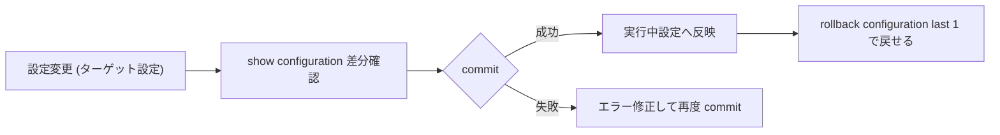

```text
RP/0/RP0/CPU0:PE1# configure
RP/0/RP0/CPU0:PE1(config)# interface TenGigE0/0/0/0
RP/0/RP0/CPU0:PE1(config-if)# description TO-P1
RP/0/RP0/CPU0:PE1(config-if)# commit confirmed 60
RP/0/RP0/CPU0:PE1(config-if)# commit
RP/0/RP0/CPU0:PE1# show configuration commit changes last 1
RP/0/RP0/CPU0:PE1# rollback configuration last 1
```

**ベストプラクティス**
- リモートから変更する場合は **`commit confirmed <秒数>`** を必ず使い、切断されても自動でロールバックされるようにする。
- `commit label` / `commit comment` に変更管理番号を入れ、`show configuration commit list` で追跡可能にする。
- IOS XE/XR ともに **YANG モデル駆動のインターフェース（NETCONF/gNMI）** を使えるよう、早めに整備する。

**出典**
- ASR 9000 設定ガイド一覧（Cisco 公式）: https://www.cisco.com/en/US/products/ps9853/products_installation_and_configuration_guides_list.html

---

#### 5.1.3 サービスプロバイダー仮想化（出題範囲 1.3）

**何のための技術か**: 専用ハードウェア（ファイアウォール、vCPE、vBNG、モバイルコアなど）を、汎用サーバー上のソフトウェアで実現し、展開の迅速化とコスト削減を狙います。

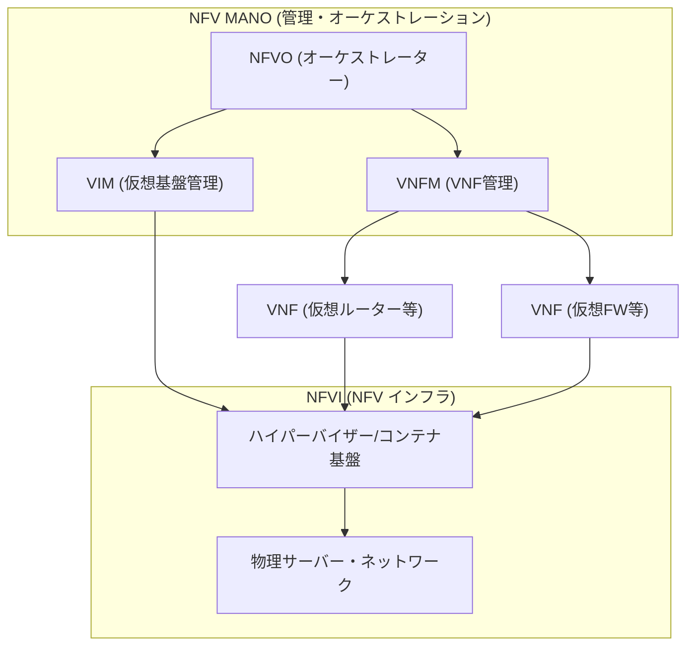

| 項目（出題範囲） | 説明 |
|---|---|
| **1.3.a NFV インフラストラクチャ（NFVI）** | VNF を動かす物理/仮想リソース（計算・ストレージ・ネットワーク）の総体 |
| **1.3.b VNF ワークロード** | ネットワーク機能をソフトウェア化したもの（vRouter、vFirewall 等）。VM またはコンテナで稼働 |
| **1.3.c コンテナ** | OS カーネルを共有する軽量な分離実行環境。起動が速くリソース効率が高い |
| **1.3.d アプリケーション ホスティング** | ルーター自身の上でサードパーティ製アプリ/コンテナを動かす機能（IOS XE のアプリホスティング、IOS XR のコンテナ実行環境） |

| 比較 | VM | コンテナ |
|---|---|---|
| 分離レベル | 強い（ゲスト OS ごと） | 弱め（カーネル共有） |
| 起動時間 | 分単位 | 秒単位 |
| リソース効率 | やや低い | 高い |
| 向いている用途 | 強い分離が必要な VNF、異なる OS | マイクロサービス、エッジでの軽量アプリ |

**ベストプラクティス**
- VNF のパフォーマンスが必要な場合は **SR-IOV / DPDK / CPU ピンニング / NUMA 配慮** を検討する。
- コンテナは **最小権限・イメージ署名・リソース制限（cgroup）** を必ず設定する。
- ルーター上のアプリホスティングは **コントロールプレーンへの影響（CPU/メモリ上限）** を制限する。

**出典**
- ETSI NFV: https://www.etsi.org/technologies/nfv

---

#### 5.1.4 QoS アーキテクチャ（出題範囲 1.4）

##### ① 1.4.a MPLS QoS モデル（パイプ、ショートパイプ、ユニフォーム）

**何のための技術か**: 顧客の DSCP と SP 網内の MPLS TC（旧 EXP）の関係を決め、**顧客の QoS マーキングを SP 網でどこまで尊重・維持するか** を定義します。

| モデル | 顧客 DSCP の扱い | 出口 PE でのスケジューリング基準 | 特徴 |
|---|---|---|---|
| **Uniform** | 入口で TC にコピー。網内で TC が変更されると、出口で顧客 DSCP にも反映 | TC（変更後） | SP と顧客が 1 つの QoS ドメインとして動作 |
| **Pipe** | 顧客 DSCP は網内で一切変更しない | **MPLS TC（トンネル側）** | SP 独自の QoS を維持しつつ顧客マーキングを保護 |
| **Short Pipe** | Pipe と同様に顧客 DSCP は変更しない | **顧客の DSCP（IP ヘッダー）** | PHP によりラベルが出口 PE の手前で除去されるため、IP ヘッダーで判断する |

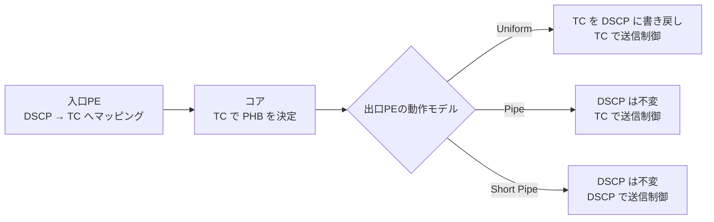

**ベストプラクティス**
- **マネージドサービス（SP が CE も管理）** は Uniform、**顧客と QoS ポリシーが独立する一般的な VPN** は Pipe/Short Pipe が定石。
- MPLS TC は **3 ビット（8 クラス）** しかないため、顧客の DSCP（64 値）から SP クラスへの **マッピングテーブルを標準化**する。

**出典**
- RFC 3270 MPLS Support of Differentiated Services: https://www.rfc-editor.org/rfc/rfc3270
- RFC 3443 Time To Live (TTL) Processing in MPLS Networks: https://www.rfc-editor.org/rfc/rfc3443
- RFC 2475 An Architecture for Differentiated Services: https://www.rfc-editor.org/rfc/rfc2475

##### ② 1.4.b MPLS TE QoS（MAM、RDM、CBTS、PBTS、DS-TE）

| 用語 | 説明 |
|---|---|
| **DS-TE** | DiffServ-aware TE。クラス（クラスタイプ）ごとに帯域を予約する |
| **MAM**（Maximum Allocation Model） | 各クラスタイプに **固定上限** を割り当てる。クラス間の干渉がない反面、未使用帯域を他クラスが借りられない |
| **RDM**（Russian Doll Model） | 入れ子構造で **上位クラスの未使用分を下位クラスが利用**できる。帯域効率が高い |
| **CBTS**（Class-Based Tunnel Selection） | パケットの **MPLS TC** に基づいて、同じ宛先への複数トンネルから選択 |
| **PBTS**（Policy-Based Tunnel Selection） | ACL 等の **ポリシー**（DSCP など）に基づいてトンネルを選択 |

| 比較 | MAM | RDM |
|---|---|---|
| 帯域共有 | しない（固定） | する（入れ子） |
| 帯域効率 | 低め | 高め |
| 予測しやすさ | 高い | プリエンプション設計が必要 |

**ベストプラクティス**: 音声（低遅延）用と一般データ用に **別トンネル** を用意し、CBTS/PBTS でクラス別に振り分ける。SR-TE では **カラー（Color）とポリシー** が同じ役割を担う。

**出典**
- RFC 4124 Protocol Extensions for Support of DiffServ-aware MPLS TE: https://www.rfc-editor.org/rfc/rfc4124
- RFC 4125 Maximum Allocation Bandwidth Constraints Model for DS-TE: https://www.rfc-editor.org/rfc/rfc4125
- RFC 4127 Russian Dolls Bandwidth Constraints Model for DS-TE: https://www.rfc-editor.org/rfc/rfc4127

##### ③ 1.4.c DiffServ と IntServ の QoS モデル

| 項目 | DiffServ | IntServ |
|---|---|---|
| 考え方 | パケットをクラス分けし、ホップごとに PHB（Per-Hop Behavior）を適用 | フローごとに **RSVP** で事前に資源予約 |
| 状態管理 | ルーターは **クラスのみ**保持（スケーラブル） | ルーターが **フロー単位** で状態保持（スケールしにくい） |
| SP での採用 | ◎（標準） | △（MPLS-TE の RSVP-TE の概念に名残） |
| 代表的 PHB | EF（優先）、AF（保証転送）、CS、BE | Guaranteed Service、Controlled-Load |

**出典**
- RFC 2475（DiffServ）: https://www.rfc-editor.org/rfc/rfc2475
- RFC 1633 Integrated Services in the Internet Architecture: https://www.rfc-editor.org/rfc/rfc1633
- RFC 4594 Configuration Guidelines for DiffServ Service Classes: https://www.rfc-editor.org/rfc/rfc4594

##### ④ 1.4.d エンタープライズ環境と SP 環境の間の信頼境界

**考え方**: 顧客からのマーキングを **信頼するか、書き換えるか** の境界（トラストバウンダリ）を PE の入口（AC）に置きます。

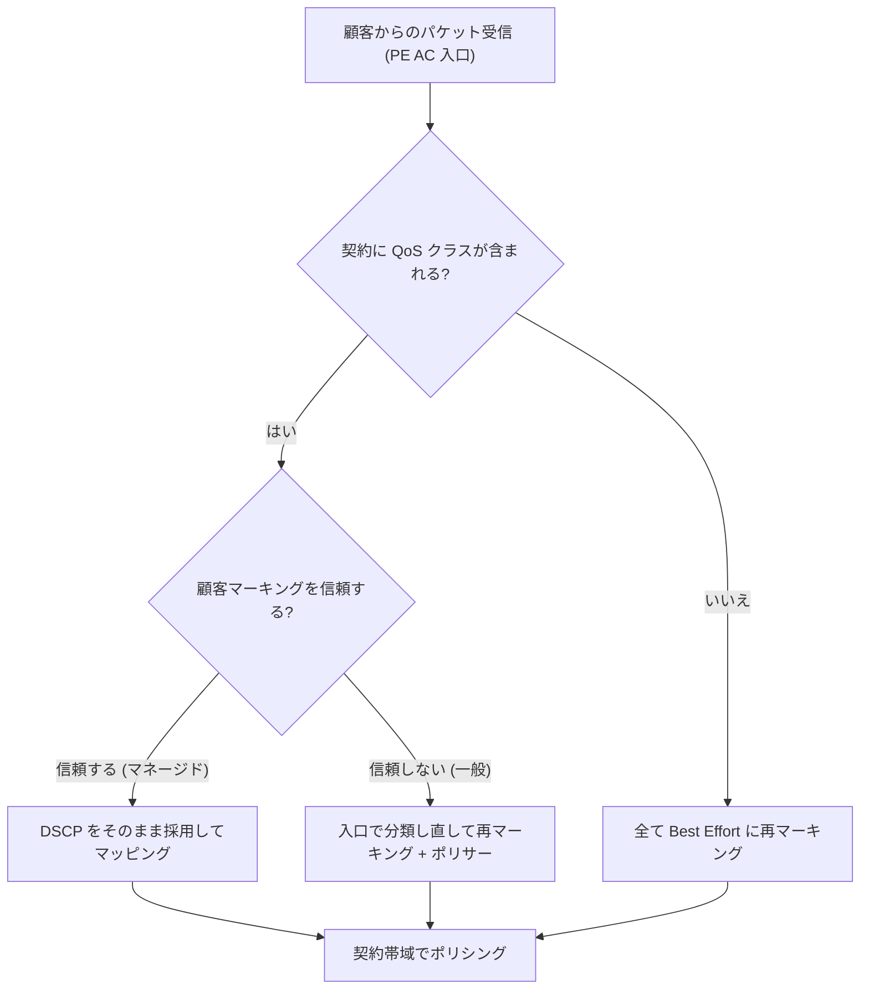

**ベストプラクティス**: 顧客マーキングは **原則信頼せず**、PE 入口で **分類 → 再マーキング → ポリシング** を実施する。マネージドサービスのみ信頼する。

##### ⑤ 1.4.e IPv6 フローラベル

- IPv6 ヘッダーの **20 ビット** のフィールド。同一フロー（5 タプル相当）に同じ値を付ける。
- ECMP やリンクアグリゲーションでの **ロードバランス**（エントロピー）に利用できる。MPLS 上では **エントロピーラベル** と同様の発想。
- QoS の分類キーとしては DSCP が主で、フローラベルは **負荷分散用途が中心**。

**出典**
- RFC 6437 IPv6 Flow Label Specification: https://www.rfc-editor.org/rfc/rfc6437
- RFC 6438 Using the IPv6 Flow Label for Equal Cost Multipath Routing: https://www.rfc-editor.org/rfc/rfc6438
- RFC 6790 The Use of Entropy Labels in MPLS Forwarding: https://www.rfc-editor.org/rfc/rfc6790

---

#### 5.1.5 コントロールプレーンのセキュリティ（出題範囲 1.5）

**背景**: ルーターの CPU（コントロールプレーン）が過負荷になれば、ルーティングプロトコルが落ち網全体が停止します。**データプレーンの攻撃がコントロールプレーンに波及しない**設計が必要です。

##### ① 1.5.a コントロールプレーン保護（LPTS と CoPP）

| 技術 | プラットフォーム | 仕組み |
|---|---|---|
| **LPTS**（Local Packet Transport Services） | IOS XR | ルーター宛てパケットを **フロー種別ごと（BGP、SSH、OSPF、ICMP など）** に分類し、自動生成されるポリサーで **種別ごとに** レート制限する。フローごとの動的テンプレートを持つ |
| **CoPP**（Control Plane Policing） | IOS / IOS XE | コントロールプレーン宛てトラフィックに **QoS ポリシー（分類＋ポリサー）** を適用 |

```text
RP/0/RP0/CPU0:PE1# show lpts pifib hardware police location 0/0/CPU0
RP/0/RP0/CPU0:PE1# show lpts flows
```

```text
! IOS XE の CoPP 例（考え方）
class-map match-any CM-ROUTING
 match access-group name ACL-ROUTING
policy-map PM-COPP
 class CM-ROUTING
  police rate 2000 pps conform-action transmit exceed-action drop
control-plane
 service-policy input PM-COPP
```

**ベストプラクティス**
- LPTS は既定値が安全側だが、**BGP セッション数が多い場合や eBGP ピアが多い場合は、フロー種別ごとのポリサー値を見直す**。
- **`show lpts` の drop カウンター** を継続監視し、想定外の値増加をアラートにする。
- CoPP は「許可リストを先に分類 → 残りをまとめて低レートで制限」の順序にする。

**出典**
- ASR 9000 設定ガイド一覧（LPTS の章を含む）: https://www.cisco.com/en/US/products/ps9853/products_installation_and_configuration_guides_list.html
- RFC 6192 Protecting the Router Control Plane: https://www.rfc-editor.org/rfc/rfc6192

##### ② 1.5.b BGP-TTL のセキュリティとプロトコル認証

- **GTSM（BGP TTL Security）**: eBGP ピアが **直接接続** であることを前提に、送信側は TTL=255 で送り、受信側は **TTL ≥ 254** 以外を破棄する。遠隔からの偽装パケットを防ぐ。
- **認証**: BGP は TCP MD5（古い）または **TCP-AO**（推奨）。OSPF/IS-IS は **HMAC-SHA** 系の認証（キーチェーン）を使う。

```text
router bgp 65000
 neighbor 198.51.100.2
  remote-as 65100
  ttl-security
  password encrypted <PASSWORD>
```

**ベストプラクティス**
- eBGP 直接接続ピアには **GTSM を必ず併用**する。
- 認証キーは **キーチェーン**で管理し、ローテーション手順（重複期間を持つ）を用意する。

**出典**
- RFC 5082 The Generalized TTL Security Mechanism (GTSM): https://www.rfc-editor.org/rfc/rfc5082
- RFC 5925 The TCP Authentication Option: https://www.rfc-editor.org/rfc/rfc5925
- RFC 7454 BGP Operations and Security（BCP 194）: https://www.rfc-editor.org/rfc/rfc7454

##### ③ 1.5.c BGP プレフィックスの抑制

> 出題範囲の文言は幅広く解釈できるため、ここでは **BGP で不要・不正なプレフィックスを受け取らない/出さない仕組み全般** と、関連する **IGP のプレフィックス抑制** をまとめて整理します。
>
> **BGP 集約抑制（Cisco IOS XR）**: `aggregate-address <prefix/len> summary-only` を設定すると、集約経路を BGP アップデートに広告する一方で、その集約に含まれるより詳細な経路（more-specific routes）を BGP アップデートから抑制します。これはプレフィックスフィルタ（prefix-set/policy）・`maximum-prefix`・RPKI とは独立したメカニズムであり、ルーティングテーブルの集約と広告制御を目的とします。IGP のプレフィックス抑制（OSPF `prefix-suppression` など、トランジットリンクアドレスを LSA から隠す機能）とも別の概念です。

| 手段 | 効果 |
|---|---|
| **プレフィックスリスト/prefix-set による入出力フィルタ** | 想定外のプレフィックスを拒否（顧客は割り当て済みのみ許可） |
| **maximum-prefix** | 受信数の上限を超えたらセッションを警告/切断（経路リーク・過剰広告の保護） |
| **Bogon / プライベート/デフォルト経路のフィルタ** | 使われてはならないアドレスを除外 |
| **RPKI 起点検証（ROV）** | 経路の起点 AS が正当かを検証（RFC 6811） |
| **IGP のプレフィックス抑制**（OSPF `prefix-suppression`、IS-IS も同様の概念） | リンクのトランジット網アドレスを IGP に載せず、ルーティングテーブル縮小と攻撃面の削減 |

```text
! CUST-IN: 顧客への割り当て済みプレフィックスのみを受理するルートポリシー
router bgp 65000
 neighbor 198.51.100.2
  remote-as 65100
  address-family ipv4 unicast
   maximum-prefix 1000 85   ! 上限超過時にセッションを切断（warning-only なし = 強制制限）
   route-policy CUST-IN in  ! 許可プレフィックスのみ受理
   route-policy CUST-OUT out
```

**ベストプラクティス**
- **顧客 BGP は「許可プレフィックスのみ受理」＋ maximum-prefix** を標準セットにする。
- IOS XR の eBGP は **ポリシー適用が必須**（未設定だと経路が受理/広告されない）。デフォルト動作を必ず理解しておく。

**出典**
- RFC 7454（BGP 運用とセキュリティ）: https://www.rfc-editor.org/rfc/rfc7454
- RFC 6811 BGP Prefix Origin Validation: https://www.rfc-editor.org/rfc/rfc6811
- RFC 6860 Hiding Transit-Only Networks in OSPF: https://www.rfc-editor.org/rfc/rfc6860

##### ④ 1.5.d LDP セキュリティ（認証およびラベル割り当てフィルタリング）

| 対策 | 内容 |
|---|---|
| **LDP 認証** | TCP MD5（またはキーチェーン）で LDP セッションを認証 |
| **ラベル割り当てフィルタリング** | ラベルを割り当てるプレフィックスを制限（**PE ループバック（/32）のみ**にする）。LFIB を小さくし不要な FEC を避ける |
| **LDP ネイバー制限** | 想定外ピアとのセッション確立を拒否（ACL） |

```text
mpls ldp
 router-id 10.0.0.1
 neighbor 10.0.0.2 password encrypted <PASSWORD>
 label
  allocate for LDP-ALLOWED-PFX
```

**ベストプラクティス**: LDP ラベル割り当ては **PE ループバックだけ**に限定。全 IGP プレフィックスにラベルを付けると LFIB が肥大化する。

**出典**
- RFC 5036 LDP Specification: https://www.rfc-editor.org/rfc/rfc5036
- RFC 5920 Security Framework for MPLS and GMPLS Networks: https://www.rfc-editor.org/rfc/rfc5920

##### ⑤ 1.5.e BGPsec

- BGP の **AS_PATH を暗号署名で保護**し、経路が正当な AS 列を通ったことを検証する（RFC 8205）。
- **RPKI**（ROA / 証明書）が基盤。
- 実運用では **ROV（起点検証）が先に普及**しており、BGPsec の本格展開は限定的。試験では **「何を保護するか（パス）」「ROV との違い（起点のみ vs パス全体）」** が重要。

| 比較 | ROV（RFC 6811） | BGPsec（RFC 8205） |
|---|---|---|
| 検証対象 | 起点 AS | AS_PATH 全体 |
| 必要な仕組み | ROA | ROA + ルーター鍵/署名 |
| 普及度 | 広い | 限定的 |

**出典**
- RFC 8205 BGPsec Protocol Specification: https://www.rfc-editor.org/rfc/rfc8205
- RFC 6480 An Infrastructure to Support Secure Internet Routing: https://www.rfc-editor.org/rfc/rfc6480

##### ⑥ 1.5.f BGP Flowspec

**何のための技術か**: DDoS 攻撃などの **フローフィルタ規則を BGP で自動配布**し、網全体で即時に遮断・レート制限します。

| 要素 | 例 |
|---|---|
| マッチ条件 | 宛先/送信元プレフィックス、IP プロトコル、ポート、TCP フラグ、パケット長、DSCP、フラグメント |
| アクション | traffic-rate（0 で破棄）、redirect（VRF/IP）、DSCP 書換、サンプル |
| アドレスファミリ | IPv4 flowspec / IPv6 flowspec（VPN 版もあり） |

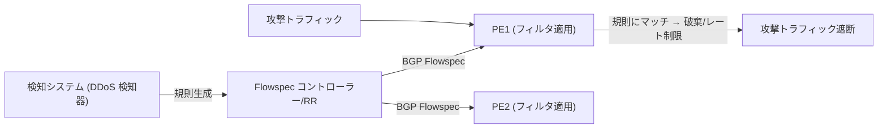

**ベストプラクティス**
- Flowspec は **信頼できるコントローラー/RR からのみ受理**し、受理する規則数（TCAM 上限）を制限する。
- 誤った規則で正常通信を止めない運用のため、**二人承認・自動タイムアウト**を設ける。
- 規則は **検証（RFC 8955 の検証手順）** を有効にして、ルート起点と整合するものだけ受け入れる。

**出典**
- RFC 8955 Dissemination of Flow Specification Rules: https://www.rfc-editor.org/rfc/rfc8955
- RFC 8956 Dissemination of Flow Specification Rules for IPv6: https://www.rfc-editor.org/rfc/rfc8956

---

#### 5.1.6 管理プレーンのセキュリティ（出題範囲 1.6）

| 項目 | 内容 | ベストプラクティス |
|---|---|---|
| **1.6.a トレースバック** | DDoS などで **攻撃トラフィックの入口ルーター/ポートを特定**する手法（送信元追跡、ACL カウンター、NetFlow、RTBH を利用したバックスキャッター観測など） | 攻撃発生時に「どこから入っているか」を短時間で特定できる **NetFlow/IPFIX の常時収集**を用意する |
| **1.6.b AAA と TACACS+** | 認証(Authentication)・認可(Authorization)・アカウンティング(Accounting)。**TACACS+ は TCP 49、AAA を分離でき、コマンド単位の認可が可能**（RADIUS は主にネットワークアクセス向け） | TACACS+ 障害時に備え **ローカルユーザーをフォールバック**、コマンドアカウンティングを有効化、管理は専用 VRF/管理ネットワークに閉じる |
| **1.6.c REST API のセキュリティ** | **TLS 必須**、トークン/OAuth 2.0、ロールベースアクセス制御（RBAC）、入力検証、レート制限、監査ログ | HTTP（平文）は禁止。**最小権限の API アカウント** を発行し、証明書を定期更新 |
| **1.6.d DDoS** | 帯域・プロトコル・アプリ層の攻撃。SP は RTBH、Flowspec、スクラビング、BCP 38 で対処 | **検知 → 迂回（スクラビング）→ 復旧**の手順を事前に定義して訓練する |

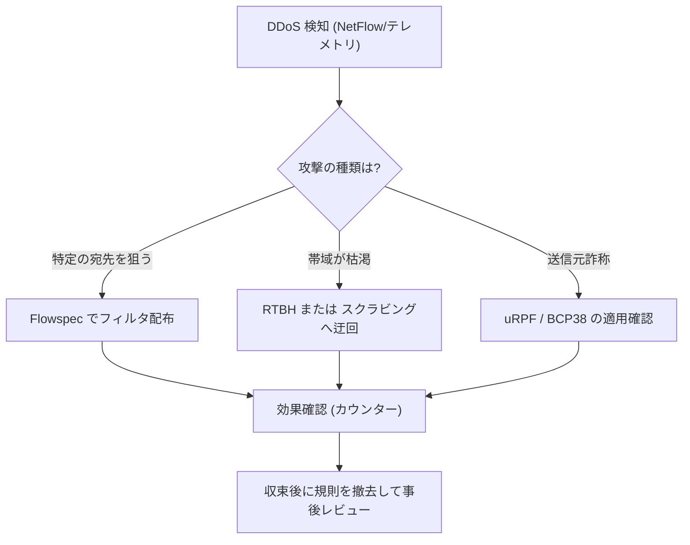

**出典**
- RFC 8907 The TACACS+ Protocol: https://www.rfc-editor.org/rfc/rfc8907
- RFC 8040 RESTCONF Protocol（TLS 前提の API 設計）: https://www.rfc-editor.org/rfc/rfc8040
- RFC 6749 The OAuth 2.0 Authorization Framework: https://www.rfc-editor.org/rfc/rfc6749

---

#### 5.1.7 データプレーンのセキュリティ（出題範囲 1.7）

##### ① 1.7.a uRPF（Unicast Reverse Path Forwarding）

送信元アドレスへの **戻り経路が FIB 上で妥当か** を検証し、送信元詐称を防ぎます。

| モード | 判定 | 用途 |
|---|---|---|
| **Strict** | 受信インターフェースが送信元への **最適な戻り経路** であること | 単一ホーム顧客 |
| **Loose** | 送信元への経路が **FIB に存在すれば** OK | マルチホーム/非対称ルーティング、RTBH との併用 |
| **Feasible** | 最適経路でなくても **代替経路が存在すれば** OK（一部プラットフォーム） | 非対称だが受信 IF が想定内 |

```text
interface TenGigE0/0/0/1
 ipv4 verify unicast source reachable-via rx
```

**ベストプラクティス**: 顧客向け接続は Strict（可能な限り）、ピアリング/トランジットは Loose。**IOS XR では、デフォルト経路が存在しても Loose uRPF はデフォルト経路をソース検証に使用しない（`allow-default` を設定した場合のみ使用する）**。`allow-default` なし：デフォルト経路は無視されソース IP が他の経路で到達可能でなければドロップ。`allow-default` あり：デフォルト経路もソース検証の根拠として使用（実質的に大多数のソース IP が通過するため緩い検証になる）。

**出典**
- RFC 3704 Ingress Filtering for Multihomed Networks（BCP 84）: https://www.rfc-editor.org/rfc/rfc3704
- RFC 2827 Network Ingress Filtering（BCP 38）: https://www.rfc-editor.org/rfc/rfc2827

##### ② 1.7.b ACL

- **入力/出力 ACL** でトラフィックを許可/拒否。インフラ保護 ACL（iACL）で **ルーター宛て通信を許可リスト化**する。
- IOS XR では ACL の **カウンターと logging** の負荷に注意。

**ベストプラクティス**: **インフラ ACL（iACL）** で SP 内部アドレス宛ての外部トラフィックを拒否し、必要なプロトコル（eBGP 等）のみ許可する。

##### ③ 1.7.c RTBH（Remotely Triggered Black Hole）

**仕組み**: 攻撃対象の宛先を、BGP で **ブラックホール用ネクストホップ（Null0 に向く）** にして網全体で破棄します。

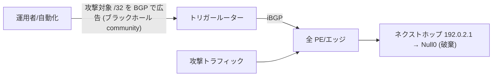

- **Destination-based RTBH**: 宛先を破棄（被害者は不到達になるが、網は守られる）。
- **Source-based RTBH**: uRPF Loose と組み合わせ、**送信元**を破棄。
- 業界標準の **ブラックホール community は `65535:666`**（RFC 7999）。

**出典**
- RFC 5635 Remote Triggered Black Hole Filtering with uRPF: https://www.rfc-editor.org/rfc/rfc5635
- RFC 7999 BLACKHOLE Community: https://www.rfc-editor.org/rfc/rfc7999

##### ④ 1.7.d MACsec

- **IEEE 802.1AE**。**ホップバイホップ（リンク単位）の L2 暗号化**。鍵管理は **MKA（MACsec Key Agreement, IEEE 802.1X-2010）**。
- IPsec と違い、L2 で暗号化するため **ラインレート・低遅延**。
- 暗号スイートは GCM-AES-128/256（XPN で 64 ビットパケット番号）。

```text
! IOS XR の考え方（バージョンにより差異あり）
key chain MACSEC-KC macsec
 key 01
  key-string <CAK>
  cryptographic-algorithm aes-256-cmac
  lifetime <start> infinite
macsec-policy MSEC-POL
 cipher-suite GCM-AES-XPN-256
interface TenGigE0/0/0/2
 macsec psk-keychain MACSEC-KC policy MSEC-POL
```

**ベストプラクティス**: **拠点間の暗号化が必要なリンク**（DC 間、サードパーティ光回線上など）に MACsec を適用。**MTU（MACsec ヘッダー分）と同期/OAM トラフィックの扱い**を事前確認する。

**出典**
- IEEE 802.1AE: https://1.ieee802.org/security/802-1ae/
