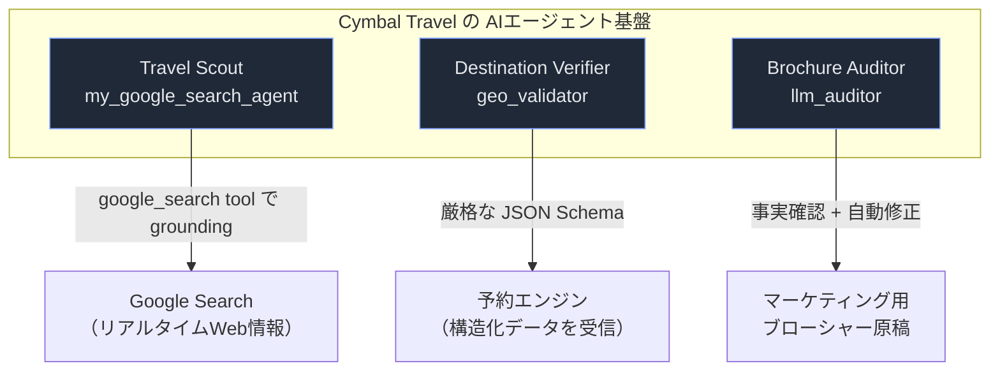
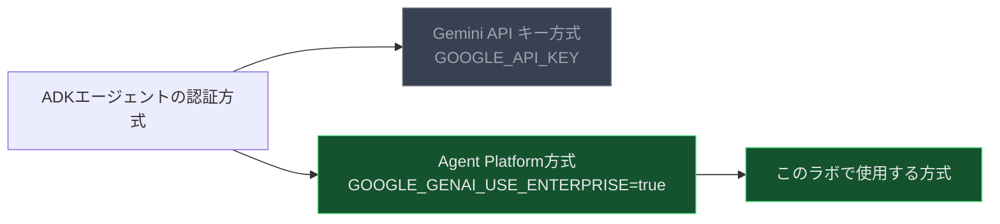
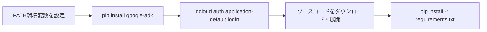
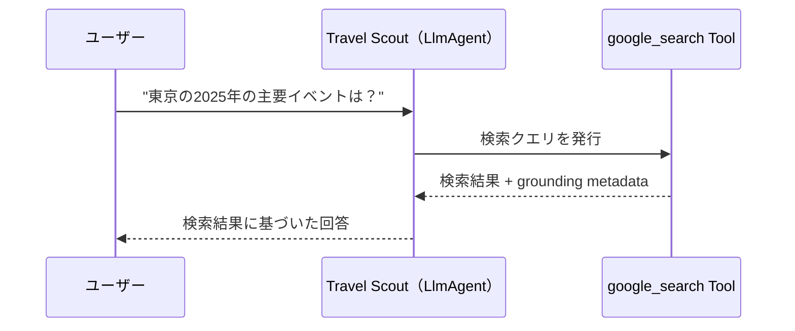
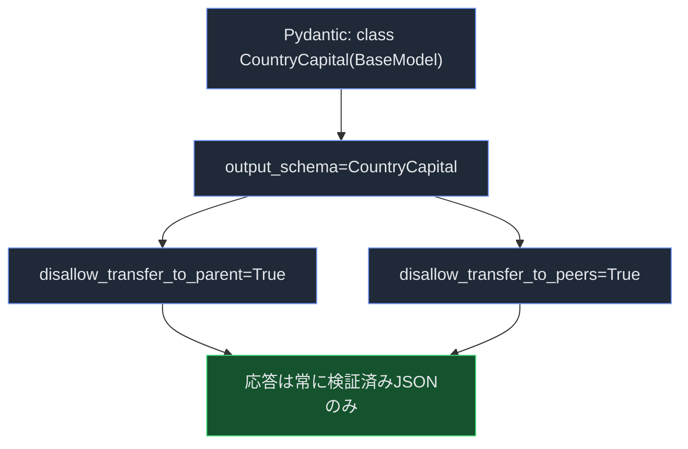
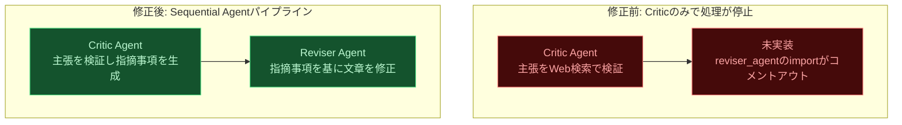

# Google Cloud チャレンジラボ攻略ガイド
## Agent Development Kit (ADK) で「Travel Scout」「Destination Verifier」「Brochure Auditor」を復旧する

対象ラボ: *Cymbal Travel* シナリオ（Agent Development Kit コース向けチャレンジラボ）
対象読者: ADK初学者〜Google Cloudエージェント開発を始めたばかりのエンジニア

---

## 1. このガイドについて

このチャレンジラボでは、旅行代理店 Cymbal Travel が保有する3つのプロトタイプAIエージェントを修復し、Agent Platform（Vertex AI基盤上のGemini Enterprise Agent Platform）にデプロイ可能な状態にします。

| エージェント | ディレクトリ | 症状 | 対応するTask |
|---|---|---|---|
| Travel Scout | `my_google_search_agent` | Google Search ツールが未設定で、リアルタイム情報を検索できない | Task 2, 3 |
| Destination Verifier | `geo_validator` | 出力が自由記述のテキストで、下流システムがパースできない | Task 4 |
| Brochure Auditor | `llm_auditor` | Reviser Agent がコメントアウトされ、事実確認だけで処理が止まる | Task 5 |

ステップ・バイ・ステップで手順を追いながら、**なぜその設定が必要なのか**という背景も合わせて解説します。各セクションの末尾には根拠となる公式ドキュメントのURLを付記しています。

---

## 2. 全体アーキテクチャ

3つのエージェントは、それぞれ役割が異なる独立したADKエージェントです。共通しているのは、いずれも `.env` ファイルを通じて Agent Platform（`GOOGLE_GENAI_USE_ENTERPRISE=true`）に接続する点です。



- **Travel Scout**: Google Search を使い、実世界の最新情報でLLMの回答を裏付ける（grounding）役割
- **Destination Verifier**: 出力を厳密なJSONスキーマに固定し、後続システムとの連携を安定させる役割
- **Brochure Auditor**: 「批評（Critic）→ 修正（Reviser）」の2段階パイプラインで文章の正確性を担保する役割

> 出典: [Agent Development Kit | Gemini Enterprise Agent Platform](https://docs.cloud.google.com/gemini-enterprise-agent-platform/build/adk)

---

## 3. 事前準備

作業を始める前に、以下の前提を確認しておくとつまずきにくくなります。

- ラボ専用の一時的な学生アカウントを使用し、自分個人のGoogle Cloudアカウントの認証情報は使わないこと
- ブラウザはシークレットモード（プライベートウィンドウ）で開くことが推奨されている（個人アカウントとの競合防止）
- **APIキーは一切作成しない**。このラボでは Agent Platform（Vertex AI ベース）による認証を使う設計になっており、Gemini API キー方式は使わない

この最後のポイントが、ADKの2つの認証方式のうちどちらを使うべきかを決める重要な分岐点になります。



> 出典: [Google Cloud - Agent Development Kit (ADK) | adk.dev](https://adk.dev/get-started/google-cloud/)

---

## 4. Task 1: ADKのインストールと環境構築

### 4.1 手順の流れ



### 4.2 コマンドと解説

**Cloud Shellターミナルを開き、PATHを通してADKをインストールします。**

```bash
export PATH=$PATH:"/home/${USER}/.local/bin"
python3 -m pip install google-adk
```

`pip install --user` でインストールされる実行ファイル（`adk` コマンド本体）は `~/.local/bin` に配置されるため、PATHに追加しておかないと後続の `adk web` / `adk run` コマンドが「command not found」になります。これはPythonのユーザーインストール全般に共通する挙動で、ADK固有の問題ではありません。

**Application Default Credentials（ADC）を設定します。**

```bash
gcloud auth application-default login
```

このコマンドは、ローカル開発環境（今回はCloud Shell）でユーザー認証情報をWebフローで取得し、既定の場所に保存します。ADKのPythonクライアントライブラリはこのADCを自動的に読み込んで、Vertex AI / Agent Platformへの呼び出しを認証します。**APIキーをコードや `.env` に埋め込む必要がなくなる**ため、鍵の漏えいリスクを避けられるのが利点です。

> 出典: [gcloud auth application-default login | Google Cloud SDK](https://docs.cloud.google.com/sdk/gcloud/reference/auth/application-default/login)、[Application Default Credentials の設定](https://docs.cloud.google.com/docs/authentication/provide-credentials-adc)

**ソースコードを取得します。**

```bash
gcloud storage cp gs://<lab-bucket>/adk_project.zip .
unzip adk_project.zip
cd adk_project
pip install -r requirements.txt
```

`<lab-bucket>` の部分は、ラボのLab setup and access panelに表示される実際のバケット名（あるいはコピー用ボタンのコマンド）に置き換えてください。

---

## 5. Task 2: Travel Scout（`my_google_search_agent`）の初期化

### 5.1 何が壊れているか

このエージェントは「Google検索で最新のイベント情報を調べる」ことが目的ですが、`agent.py` の `Agent` 定義に `tools` が渡されていないため、LLMは自分の学習データの範囲でしか回答できません。

### 5.2 `.env` の設定

```env
GOOGLE_GENAI_USE_ENTERPRISE=true
GOOGLE_CLOUD_PROJECT=<あなたのプロジェクトID>
GOOGLE_CLOUD_LOCATION=global
MODEL=<指定されたモデル名>
```

`GOOGLE_CLOUD_LOCATION` を **`global`** にする点が要注意です。リージョンを指定するとGoogle Search groundingが利用できずエラーになるケースがあるため、ラボの指示通り `global` を厳守してください。

### 5.3 `agent.py` の修正

```python
from google.adk.agents import Agent
from google.adk.tools import google_search

root_agent = Agent(
    name="my_google_search_agent",
    model="gemini-flash-latest",  # .envのMODEL値に合わせる
    description="旅行関連の最新イベントを調査するTravel Scoutエージェント",
    instruction=(
        "あなたはTravel Scoutです。ユーザーから旅行先のイベントについて質問されたら、"
        "google_searchツールを必ず使用して最新情報を検索し、"
        "検索結果の裏付け（grounding）に基づいて回答してください。"
    ),
    tools=[google_search],
)
```

`tools=[google_search]` を渡すだけで、エージェントは検索が必要だと判断したタイミングでGoogle Searchを呼び出し、その結果を根拠（grounding）として回答を生成するようになります。



> **注意点（ベストプラクティス）**: `google_search` ツールは単独でしか使えず、同じエージェントに別のツールを混在させることはできません（ADKの制約）。複数の能力を組み合わせたい場合は、検索専用のサブエージェントを作り、それを `AgentTool` として親エージェントから呼び出す設計にします。

### 5.4 動作確認（Dev UI）

```bash
cd ~/adk_project
adk web --allow_origins "regex:https://.*\.cloudshell\.dev"
```

Cloud Shell環境でWeb UIをプロキシ経由で公開する場合、`--allow_origins` フラグでCloud ShellのオリジンをCORS許可リストに追加する必要があります。これを省略すると、ブラウザ側でWebSocket接続がブロックされ、チャットが正常に動作しません。

`http://127.0.0.1:8000` を開き、`my_google_search_agent` を選択して質問すると、レスポンスにGoogle Search groundingの根拠（引用元リンクなど）が含まれていることを確認できます。うまく応答が返らない場合は、右上の **+ New Session** でセッションを作り直してから再試行してください。

> 出典: [組み込みツール（google_search） | ADKドキュメント](https://adk-labs.github.io/adk-docs/ja/tools/built-in-tools/)、[Gemini API Google Search tool for ADK](https://adk.dev/integrations/google-search/)、[Building AI Agents with ADK | Google Codelabs](https://codelabs.developers.google.com/devsite/codelabs/build-agents-with-adk-foundation)

---

## 6. Task 3: CLIによる動作検証

Dev UI以外にも、ADKにはターミナルから直接チャットできる `adk run` コマンドが用意されています。

```bash
cd ~/adk_project
adk run my_google_search_agent
```

起動後、プロンプトに対して直接質問を入力できます（例: 「日本の現在の為替レートは？」）。`adk run` は `adk web` と異なりブラウザを起動しないため、**ヘッドレス環境での素早い動作確認や、CI/自動テストへの組み込み**に向いています。

終了する場合は `CTRL+C` でCLIセッションを閉じます。

| 実行方法 | コマンド | 主な用途 |
|---|---|---|
| Web UI | `adk web` | ブラウザでのチャット確認、トレース・イベントの可視化 |
| CLI | `adk run <agent_dir>` | ターミナルでの素早い対話確認、スクリプトからの呼び出し |
| プログラム的実行 | `Runner` クラスをPythonコードから利用 | 他のアプリケーションへの組み込み、自動テスト |

> 出典: [google-adk | PyPI](https://pypi.org/project/google-adk/)、[Agent Runtime | ADK](https://adk.dev/runtime/)

---

## 7. Task 4: Destination Verifier（`geo_validator`）の構造化出力対応

### 7.1 なぜ自由記述テキストが問題なのか

予約エンジンなどの下流システムは、LLMの回答を機械的にパースして次の処理に渡す必要があります。「日本の首都は東京です」のような自然文だと、システム側で正規表現やLLMによる二次解析が必要になり、壊れやすく非効率です。ADKでは `output_schema` にPydanticモデルを渡すことで、**モデルの応答そのものをスキーマに準拠したJSON文字列に強制**できます。

### 7.2 `.env` の設定

```env
GOOGLE_GENAI_USE_ENTERPRISE=true
GOOGLE_CLOUD_PROJECT=<あなたのプロジェクトID>
GOOGLE_CLOUD_LOCATION=global
MODEL=<指定されたモデル名>
```

### 7.3 `agent.py` の修正

```python
from google.adk.agents import Agent
from pydantic import BaseModel, Field


class CountryCapital(BaseModel):
    capital: str = Field(description="指定された国の首都名")


root_agent = Agent(
    name="geo_validator",
    model="gemini-flash-latest",  # 最新のFlashモデルを指定
    description="国名から首都を特定し、JSON形式で返すDestination Verifier",
    instruction=(
        "ユーザーから国名を受け取ったら、その国の首都を"
        "CountryCapitalスキーマに準拠したJSONのみで返してください。"
        "説明文や前置きは一切含めないでください。"
    ),
    output_schema=CountryCapital,
    disallow_transfer_to_parent=True,
    disallow_transfer_to_peers=True,
)
```



### 7.4 `disallow_transfer_to_parent` / `disallow_transfer_to_peers` が必須の理由

`output_schema` を設定すると、そのエージェントは**ツール呼び出しや他エージェントへの制御移譲ができなくなる**という制約がADKにあります。もし `disallow_transfer_to_parent` / `disallow_transfer_to_peers` を `True` にしないままマルチエージェント構成の中に置くと、エージェントが親や兄弟エージェントへ処理を委譲しようとしてスキーマ強制が意図せずバイパスされる可能性があります。この2つのフラグは「このエージェントは必ず自分自身でJSONを生成して直接返す」ことを保証するためのセーフガードです。

### 7.5 動作確認

```bash
cd ~/adk_project && adk run geo_validator
```

実行後、プロンプトで国名（例: `Japan`）を入力します。出力が `{"capital": "Tokyo"}` のような整形されたJSONレスポンスになっていれば成功です。「東京です」のような文章が返ってきた場合は、`output_schema` の指定漏れか、instructionの記述が曖昧でモデルがJSON以外の形式で応答してしまっている可能性があります。

> 出典: [LLM Agents（input_schema / output_schema）| ADK](https://adk.dev/agents/llm-agents/)、[Structured Output and Response Schemas | google/adk-python DeepWiki](https://deepwiki.com/google/adk-python/5.8-structured-output-and-response-schemas)、[7 Google ADK Best Practices We Learned Building Production Applications](https://hatchworks.com/blog/gen-ai/google-adk-best-practices/)

---

## 8. Task 5: Brochure Auditor（`llm_auditor`）パイプラインの復旧

### 8.1 設計思想: Critic → Reviser の2段階構成

`llm_auditor` は、単一のLLM呼び出しでは実現しにくい「検証してから修正する」というワークフローを、2つの専門エージェントに役割分担させることで実現します。

- **Critic Agent**: マーケティング上の主張をWeb検索でファクトチェックし、問題点を指摘する
- **Reviser Agent**: Criticの指摘内容を踏まえて、文章そのものを正確な内容に書き換える

この2段階を**必ずこの順番で、LLMの気まぐれな判断に頼らず確実に実行する**ために、ADKの `SequentialAgent` を使います。`SequentialAgent` はLLMによる動的なルーティングではなく、あらかじめ定義した順序でサブエージェントを決定論的に実行するワークフローエージェントです。

### 8.2 修正前後の比較



### 8.3 `agent.py` の修正

```python
from google.adk.agents import SequentialAgent

from .sub_agents.critic.agent import critic_agent
from .sub_agents.reviser.agent import reviser_agent  # コメントアウトを解除してimport

root_agent = SequentialAgent(
    name="llm_auditor",
    description="主張のファクトチェックと自動修正を行うBrochure Auditorパイプライン",
    sub_agents=[critic_agent, reviser_agent],  # reviser_agentをリストに追加
)
```

`SequentialAgent(sub_agents=[...])` に渡したリストの**順序どおりに**サブエージェントが実行され、各サブエージェントの出力は `output_key` を介してセッションの `state` に書き込まれ、次のサブエージェントの入力として自動的に参照可能になります。

### 8.4 `.env` の設定

```env
GOOGLE_GENAI_USE_ENTERPRISE=true
GOOGLE_CLOUD_PROJECT=<あなたのプロジェクトID>
GOOGLE_CLOUD_LOCATION=global
MODEL=<指定されたモデル名>
```

### 8.5 動作確認

```bash
cd ~/adk_project
adk web --allow_origins "regex:https://.*\.cloudshell\.dev"
```

`llm_auditor` を選択し、次のような誤った主張を入力します。

> Double check this: You can take a direct train from Hawaii to Japan.

正しく復旧できていれば、まずCritic Agentがこの主張を検索して誤りを指摘し（ハワイと日本の間は海で隔てられており直通鉄道は存在しない、という趣旨の指摘）、続けてReviser Agentがその指摘を反映した修正版の文章を生成する、という2段階の応答が確認できます。片方しか実行されない場合は、`sub_agents` リストへの追加漏れか、importのコメントアウトの解除漏れを疑ってください。

> 出典: [Sequential workflow | ADK](https://google.github.io/adk-docs/agents/workflow-agents/sequential-agents/)、[Custom template workflows（Critic/Reviserパターン）| ADK](https://google.github.io/adk-docs/agents/custom-agents/)、[adk-samples: llm-auditor](https://github.com/google/adk-samples/tree/main/python/agents/llm-auditor)

---

## 9. つまずきやすいポイントとベストプラクティス

| 症状 | 主な原因 | 対処 |
|---|---|---|
| `adk` コマンドが見つからない | `~/.local/bin` がPATHに含まれていない | `export PATH=$PATH:"/home/${USER}/.local/bin"` を再実行 |
| `adk web` のチャットがCloud Shellで固まる | プロキシ経由のオリジンがCORSで拒否されている | `--allow_origins "regex:https://.*\.cloudshell\.dev"` を付与 |
| Google Search groundingが効かない | `GOOGLE_CLOUD_LOCATION` がリージョン名になっている | `global` に修正 |
| `output_schema` を設定したのにツールも使いたい | ADKの仕様上、両立不可 | 検索用サブエージェントとJSON整形用エージェントに役割分担する |
| Sequential Agentの後段が実行されない | サブエージェントのimportがコメントアウトされたまま、または `sub_agents` リストに未追加 | importの解除と `sub_agents=[...]` への追加を両方確認 |
| 認証エラーで呼び出しが失敗する | ADCが未設定、またはAPIキー方式と設定が混在している | `gcloud auth application-default login` を再実行し、`.env` に `GOOGLE_API_KEY` を残さない |

---

## 10. 3エージェントの技術要素まとめ

| 項目 | Travel Scout | Destination Verifier | Brochure Auditor |
|---|---|---|---|
| エージェント種別 | `Agent`（LlmAgent） | `Agent`（LlmAgent） | `SequentialAgent`（ワークフローエージェント） |
| 主要な技術要素 | `tools=[google_search]` | `output_schema` + Pydantic `BaseModel` | `sub_agents=[critic, reviser]` |
| 追加の安全策 | 他ツールとの併用不可（単独利用） | `disallow_transfer_to_parent`<br/>`disallow_transfer_to_peers` | 実行順序はLLMではなくフレームワークが決定論的に制御 |
| 出力形式 | 自然文＋grounding根拠 | 検証済みJSON | 検証コメント＋修正済みテキスト |
| 検証コマンド | `adk web` / `adk run` | `python3 geo_validator/agent.py` | `adk web` |

---

## 11. 参考文献

- [Agent Development Kit | Gemini Enterprise Agent Platform](https://docs.cloud.google.com/gemini-enterprise-agent-platform/build/adk)
- [組み込みツール（Google Search）| ADKドキュメント（日本語）](https://adk-labs.github.io/adk-docs/ja/tools/built-in-tools/)
- [Gemini API Google Search tool for ADK](https://adk.dev/integrations/google-search/)
- [LLM Agents（input_schema / output_schema）| ADK](https://adk.dev/agents/llm-agents/)
- [Structured Output and Response Schemas | google/adk-python DeepWiki](https://deepwiki.com/google/adk-python/5.8-structured-output-and-response-schemas)
- [7 Google ADK Best Practices We Learned Building Production Applications](https://hatchworks.com/blog/gen-ai/google-adk-best-practices/)
- [Sequential workflow | ADK](https://google.github.io/adk-docs/agents/workflow-agents/sequential-agents/)
- [Custom template workflows（Critic/Reviserパターン）| ADK](https://google.github.io/adk-docs/agents/custom-agents/)
- [adk-samples: llm-auditor（Google公式サンプル）](https://github.com/google/adk-samples/tree/main/python/agents/llm-auditor)
- [gcloud auth application-default login リファレンス](https://docs.cloud.google.com/sdk/gcloud/reference/auth/application-default/login)
- [Application Default Credentials の設定](https://docs.cloud.google.com/docs/authentication/provide-credentials-adc)
- [Google Cloud - Agent Development Kit (ADK) | adk.dev](https://adk.dev/get-started/google-cloud/)
- [google-adk | PyPI（`adk run` / `adk web` コマンド）](https://pypi.org/project/google-adk/)
- [Agent Runtime | ADK](https://adk.dev/runtime/)
- [Building AI Agents with ADK: The Foundation | Google Codelabs](https://codelabs.developers.google.com/devsite/codelabs/build-agents-with-adk-foundation)
