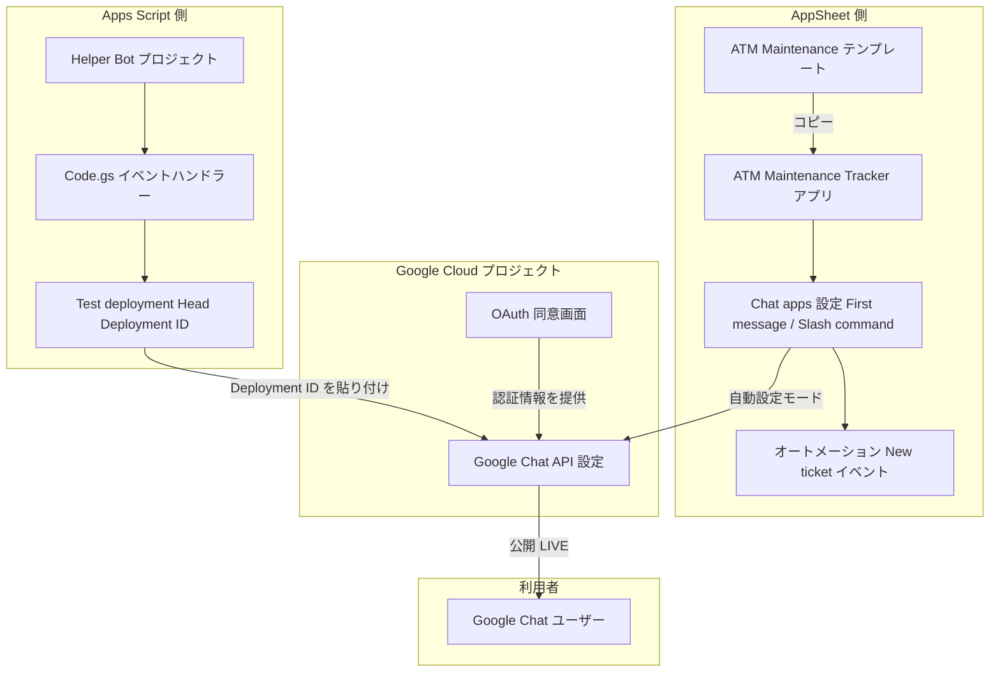
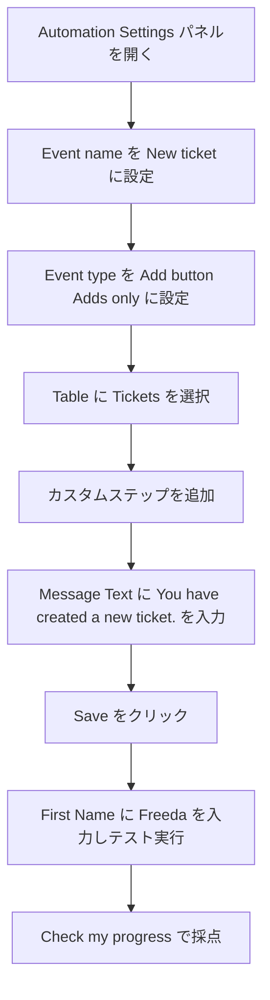
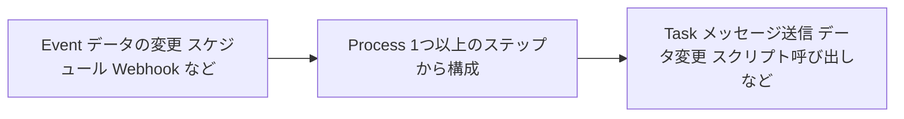
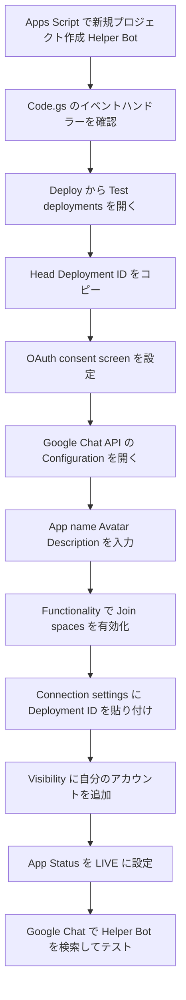
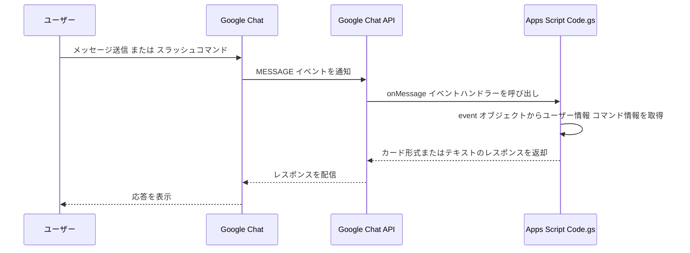

# AppSheet と Apps Script で作る Google Chat アプリ

## チャレンジラボ ベストプラクティス解説ガイド（初学者向け）

対象ラボ：[Create Chat Apps with AppSheet and App Scripts](https://www.skills.google/course_templates/715/labs/612225)

このガイドは、Google Skills（旧 Google Cloud Skills Boost）のチャレンジラボ「AppSheet と App Scripts を使った Chat アプリの作成」を題材に、単なる手順の再掲ではなく、**なぜその設定にするのか・どんな落とし穴があるのか・公式ドキュメントの根拠は何か**を初学者にもわかるように解説したものです。

---

## 1. シナリオの整理

あなたはジュニアクラウドエンジニアとして、次の 2 種類の Chat アプリ（Google Chat 上で動作する Web アプリケーション/サービス）を作成します。

| # | アプリの種類 | 開発方式 | 目的 |
|---|---|---|---|
| 1 | AppSheet Chat app | ノーコード | ATM のメンテナンスチケットを Google Chat から報告・管理する |
| 2 | Apps Script Chat app | プロコード（イベントハンドラー） | イベントハンドラーで柔軟にカスタマイズできる Helper Bot を作る |

タスクは大きく 3 つです。

1. **Task 1**：ATM Maintenance テンプレートアプリをコピーし、AppSheet の Chat app 機能を有効化・カスタマイズして公開する
2. **Task 2**：新規チケット作成時に自動メッセージを送るオートメーション（Bot）を追加する
3. **Task 3**：Apps Script のテンプレートから Helper Bot を作成し、OAuth 同意画面と Google Chat API を設定して公開する

---

## 2. 全体アーキテクチャ

先に全体像を押さえておくと、各タスクで「今どこを設定しているか」が迷いにくくなります。AppSheet も Apps Script も、最終的には同じ **Google Chat API** の設定画面（Connection settings / Visibility / App Status）に接続する点がポイントです。

**読み解きポイント**

- AppSheet 側は「自動設定モード（automatic configuration）」を使うと、AppSheet が裏側で Google Cloud プロジェクトを自動作成し、`Google Chat API` を自動的に構成してくれます。手動でコンソールを触る必要がないのが特徴です。（[出典: Configure Chat apps with AppSheet](https://support.google.com/appsheet/answer/12849362?hl=en)）
- Apps Script 側は逆に、開発者自身が Google Cloud プロジェクトの `OAuth 同意画面` と `Google Chat API` の Connection settings を手動で設定し、Apps Script の `Deployment ID` を紐づける必要があります。
- どちらの経路でも、最終的にユーザーが触れるのは同じ Google Chat のインターフェースです。

---

## 3. 事前準備・注意事項

| 項目 | 内容 |
|---|---|
| 前提アカウント | Google Workspace ユーザーであること（個人 Gmail では AppSheet の Chat app 機能は使えません） |
| 推奨ブラウザ | シークレットモード/プライベートウィンドウの Chrome |
| タイマー | ラボは一時停止できないため、着手前に手順を一読しておく |
| 課金 | AppSheet の Chat app 作成・Google Cloud プロジェクトの利用自体に追加費用はかからない |

AppSheet が Google Workspace ユーザーを前提とする点、および Chat app 作成に追加費用が発生しない点は、AppSheet 公式ヘルプの FAQ で明記されています。（[出典: AppSheet Chat apps FAQ](https://support.google.com/appsheet/answer/13074582?hl=en)）

---

## 4. Task 1：AppSheet アプリの作成とカスタマイズ

### 4.1 全体フロー

```mermaid
flowchart LR
    S1["ATM Maintenance テンプレートを開く"] --> S2["アプリ名を変更 ATM Maintenance Tracker"]
    S2 --> S3["Chat apps メニューから Create をクリック"]
    S3 --> S4["Enable ダイアログで Next をクリック"]
    S4 --> S5["自動設定モードで数分待機"]
    S5 --> S6["First message を編集"]
    S6 --> S7["Slash command myissues を追加"]
    S7 --> S8["Save してデプロイ"]
    S8 --> S9["Check my progress で採点"]
```

### 4.2 設定値一覧

| 設定項目 | 値 | 補足 |
|---|---|---|
| App name | `ATM Maintenance Tracker` | テンプレートをコピーした直後にリネームする |
| First message のテキスト | `Welcome to the ATM Maintenance Tracker app. What would you like to do today?` | Chat app がインストール/メンションされた際に表示されるカードの文言 |
| Slash command の App View | `Issues Reported By Me` | 遷移先のビュー |
| Slash command 名 | `/myissues` | ユーザーが Chat 上で入力するコマンド |
| Slash command の説明 | `Lists tickets that include your email address` | コマンド一覧に表示される説明文 |

### 4.3 手順のポイントと根拠

**① テンプレートアプリをコピーする理由**

ゼロから作らずテンプレートをコピーするのは、AppSheet のベストプラクティスとして推奨されている進め方です。コピー時にテンプレートが使用するスプレッドシートも自動的に自分の Google ドライブ（`/appsheet/data/` 配下）に複製されるため、元データを壊さずに独自データソースを持てます。（[出典: Develop No-Code Chat Apps with AppSheet](https://www.skills.google/focuses/62969?parent=catalog)）

**② Chat apps の設定場所**

左ナビゲーションの `Chat apps` アイコンから `Create` をクリックし、`Enable` ダイアログで `Next` を押すと Chat app 化が始まります。作成には数分かかるため、途中でページをリロードしないことが重要です。（[出典: Configure Chat apps with AppSheet](https://support.google.com/appsheet/answer/12849362?hl=en)）

**③ 自動設定モード（Automatic configuration）を選ぶ理由**

AppSheet の Chat app には自動設定モードと手動設定モードの 2 種類があります。

| モード | Google Cloud プロジェクトの扱い | 向いているケース |
|---|---|---|
| 自動設定（Automatic） | AppSheet が裏側で自動生成・管理（コンソールから編集不可） | ワンクリックで素早く公開したい初学者・PoC |
| 手動設定（Manual） | 開発者自身がプロジェクトを作成・接続 | 既存の Google Cloud プロジェクトと統合したい、IAM を細かく制御したい場合 |

1 つの Chat app にはそれぞれ 1 つの Google Cloud プロジェクトが対応します。モードを後から変更したい場合は、作成済みのプロジェクトを削除してアプリをコピーし直す必要がある点に注意してください。（[出典: Configure Chat apps with AppSheet](https://support.google.com/appsheet/answer/12849362?hl=en)、[出典: About the Google Cloud projects used by Chat apps](https://support.google.com/appsheet/answer/13074582?hl=en)）

**④ First message をカスタマイズする意義**

Chat app がスペースにインストールされる、または `@メンション` された際に最初に表示されるメッセージ（カード）は、いわばアプリの「顔」です。ここで用途を明示しておくことで、ユーザーが次に何をすべきか迷わなくなります。（[出典: Customize Chat apps](https://support.google.com/appsheet/answer/13380741?hl=en)）

**⑤ Slash command を設計する意義**

Slash command はユーザーへの「ショートカット」です。設定しなくても `@メンション` からメニューを辿れば同じビューに到達できますが、頻繁に使う操作（自分が報告した issue の一覧など）は `/myissues` のようなコマンドとして公開しておくことで、操作の発見可能性（discoverability）が向上します。コマンド名だけでなく `Description` を必ず設定し、Chat のコマンド一覧に意味のある説明が表示されるようにするのがベストプラクティスです。（[出典: Customize Chat apps](https://support.google.com/appsheet/answer/13380741?hl=en)、[出典: AppSheet Chat apps FAQ](https://support.google.com/appsheet/answer/13074582?hl=en)）

**⑥ デプロイとテスト**

設定後は必ず `Deploy` してから、Google Chat 側で `+` → `Find apps` → アプリ名で検索し、動作確認を行います。ハイフンなしの文字列（`/` で始まらない文字列）を送信するとアプリのメニューが表示されることを確認しましょう。（[出典: Test and share Chat apps with AppSheet](https://support.google.com/appsheet/answer/12857667?hl=en)）

---

## 5. Task 2：AppSheet オートメーション（Bot）の追加

### 5.1 全体フロー

### 5.2 設定値一覧

| 設定項目 | 値 |
|---|---|
| Event name | `New ticket` |
| Event type | `Add`（button：Adds only） |
| Table | `Tickets` |
| カスタムステップ Message Text | `You have created a new ticket.` |
| テスト用 First Name | `Freeda` |

### 5.3 オートメーションの構造を理解する

AppSheet のオートメーションは **Event（イベント）→ Process（プロセス）→ Task（タスク）** という 3 層構造で成り立っています。

- **Event**：何をきっかけに動くか（今回は `Tickets` テーブルへの行追加）
- **Process**：Event が発火した後に実行される一連のステップ
- **Task**：Process 内の個別アクション（今回はメッセージテキストの送信）

この構造は AppSheet 公式ヘルプの Bots に関する説明でも「Bot は Event と Process を組み合わせたもの」として整理されています。（[出典: Bots: The Essentials](https://support.google.com/appsheet/answer/11432969?hl=en)）

### 5.4 ベストプラクティスと根拠

**① `Adds only` を選ぶ理由**

Data change type には `Adds`（追加）、`Updates`（更新）、`Deletes`（削除）などがあります。今回は「新しいチケットが作成された瞬間」だけに反応させたいので、`Adds only` に絞り込みます。条件を絞らずに `Updates` も含めてしまうと、既存チケットのステータス変更のたびに「新しいチケットを作成しました」という誤ったメッセージが送られてしまうため、**イベント条件を目的に対して最小限に絞る**のがベストプラクティスです。（[出典: Implementing Automation in AppSheet](https://www.skills.google/focuses/44854?parent=catalog)、[出典: Events: The Essentials](https://support.google.com/appsheet/answer/11445188?hl=en)）

**② テストしてから公開する重要性**

オートメーションは保存しただけでは正しく動くか分かりません。`First Name` に `Freeda` を入力してテストチケットを作成し、実際に自動メッセージが送られるかを確認する工程は、変更を本番相当の環境に反映する前に検証する「シフトレフト」の考え方そのものです。AppSheet 公式でも Bot 作成後の動作確認を推奨しています。（[出典: Bots: The Essentials](https://support.google.com/appsheet/answer/11432969?hl=en)）

**③ 条件式（Condition）で誤発火を防ぐ**

今回のラボでは条件はデフォルトのままですが、実務でオートメーションを組む際は、Condition プロパティに式を追加してさらに発火条件を絞り込むことが推奨されています。例えば「特定のカラムの値が特定条件を満たす場合のみ」といった条件分岐を組み合わせることで、不要な通知やコストのかかる処理（メール送信やスクリプト呼び出しなど）を抑制できます。（[出典: Example automations](https://support.google.com/appsheet/answer/11917747?hl=en)）

---

## 6. Task 3：Apps Script チャットボットの作成と公開

### 6.1 全体フロー

### 6.2 設定値一覧

**プロジェクト作成**

| 項目 | 値 |
|---|---|
| Project name | `Helper Bot` |

**OAuth consent screen**

| フィールド | 値 |
|---|---|
| App name | `Helper Bot` |
| User support email | ラボの User Email |
| Contact information | ラボの User Email |

**Bot の公開設定（Google Chat API Configuration）**

| フィールド | 値 |
|---|---|
| App name | `Helper Bot` |
| Avatar URL | `https://goo.gl/kv2ENA` |
| Description | `Helper chat bot` |
| Functionality | `Join spaces and group conversations` を有効化 |
| Connection settings | Apps Script を選択し、Test deployment の Head Deployment ID を貼り付け |
| Visibility | ラボの User Email |
| App Status | `LIVE` |

### 6.3 イベントハンドラーの仕組みを理解する

Apps Script 版の Chat app テンプレートには、あらかじめ `MESSAGE`・`ADDED_TO_SPACE`・`REMOVED_FROM_SPACE` といったイベントに対応する関数（イベントハンドラー）が用意されています。ユーザーが Chat 上でメッセージを送ると、Google Chat API がその内容を `event` オブジェクトとして Apps Script の `onMessage()` 関数に渡し、関数の戻り値がそのまま Chat に返信されます。（[出典: Introduction to Google Chat Bots with Apps Script](https://www.skills.google/focuses/32756?parent=catalog)、[出典: Go on vacation with a Google Chat app](https://developers.google.com/codelabs/chat-apps-script)）

この仕組みにより、AppSheet がノーコードでビュー遷移やデータ操作を扱うのに対し、Apps Script 版では `onMessage`・`onAddedToSpace`・`onRemovedFromSpace` などのイベントごとに任意の JavaScript ロジックを書き込める、より高い自由度を持つことがわかります。（[出典: How to build a Google Chat App with Apps Script](https://medium.com/google-cloud/how-to-build-a-google-chat-app-with-apps-script-2666a658a7e2)）

### 6.4 ベストプラクティスと根拠

**① Test deployment の Head Deployment ID を使う理由**

Apps Script のデプロイには `Head deployment`（開発中の最新コードを常に指す）と `バージョン付きデプロイ`（特定バージョンに固定）があります。開発・検証段階では変更のたびに再デプロイしなくて済む Head deployment を使うのが効率的ですが、本番運用では環境ごとに個別の Apps Script プロジェクトとバージョン付きデプロイを分けることが推奨されています。（[出典: Create and manage deployments for your Google Chat app](https://developers.google.com/workspace/chat/create-manage-deployments)）

**② OAuth consent screen は最小権限（least privilege）で設定する**

OAuth 同意画面は「このアプリがユーザーの代わりにどの範囲のデータへアクセスするか」をユーザーに提示する画面です。公式ドキュメントでは、アプリが実際に必要とするスコープだけを選択する「最小権限の原則」が明確に推奨されています。スコープを絞るほどユーザーの同意も得やすくなり、Google 側の追加審査（sensitive/restricted scope の検証）も避けやすくなります。（[出典: Configure the OAuth consent screen and choose scopes](https://developers.google.com/workspace/guides/configure-oauth-consent)、[出典: How to Configure OAuth Consent Screen and API Scopes for Least Privilege in GCP](https://oneuptime.com/blog/post/2026-02-17-how-to-configure-oauth-consent-screen-and-api-scopes-for-least-privilege-in-gcp/view)）

今回のラボのように組織内（Workspace ドメイン内）のみで使う Bot であれば、User type を `Internal` にすることで、外部公開アプリに必須となる Google の OAuth 検証プロセスを省略できます。外部ユーザー向けに公開する場合は、機密/制限付きスコープを使うと Google のレビューが必要になる点も覚えておきましょう。（[出典: Sensitive scope verification](https://developers.google.com/identity/protocols/oauth2/production-readiness/sensitive-scope-verification)）

**③ Visibility を必要最小限のユーザーに絞る**

`App Status` を `LIVE` にする前に、`Visibility` フィールドで許可するユーザー/グループを指定します。ラボでは検証用に自分自身のアカウントのみを指定しますが、実務でも「まず限定的な Visibility でテストし、問題なければ対象を広げる」という段階的公開が安全な進め方です。（[出典: Configure a Google Chat app](https://developers.google.com/workspace/add-ons/chat/configure)）

**④ Deployment ID を変更する際の注意**

Google Chat API の Configuration にすでに Deployment ID が登録されている状態で ID を変更すると、既存の Google Workspace アドオンとしての紐付けが変わり、Marketplace 上の掲載情報にも影響する可能性があると公式ドキュメントで警告されています。テスト用と本番用の ID を混同しないよう注意してください。（[出典: Configure a Google Chat app](https://developers.google.com/workspace/add-ons/chat/configure)）

---

## 7. AppSheet 版 と Apps Script 版の比較

同じ「Google Chat 上で動く Bot」でも、AppSheet と Apps Script では設計思想が異なります。用途に応じて使い分けましょう。

| 観点 | AppSheet Chat app（ノーコード） | Apps Script Chat app（イベントハンドラー） |
|---|---|---|
| 必要スキル | プログラミング不要、GUI 設定のみ | JavaScript / Apps Script の基礎知識が必要 |
| データソース | スプレッドシート等と自動連携 | 任意の Google API / 外部 API を自由に呼び出し可能 |
| カスタマイズ性 | First message・Slash command・Action の範囲に限定 | `onMessage` 等の関数内で任意のロジックを実装可能 |
| Google Cloud プロジェクト | 自動設定モードなら AppSheet が自動作成・管理 | 開発者が Apps Script プロジェクトと明示的に紐付け |
| 公開までの主な作業 | Chat apps 設定 → Deploy | OAuth 同意画面設定 → Deployment ID 連携 → Chat API Configuration |
| 適したユースケース | 業務担当者主導の簡易な業務アプリ、フォーム的な用途 | 複雑な条件分岐、外部 API 連携、細かいイベント制御が必要な Bot |

---

## 8. よくあるつまずきポイント

| 症状 | 主な原因 | 対処 |
|---|---|---|
| Chat apps 作成後、しばらく画面が変化しない | 自動設定モードのバックグラウンド処理に数分かかる | ページをリロードせずそのまま待つ（[出典: Develop No-Code Chat Apps with AppSheet](https://www.skills.google/focuses/62969?parent=catalog)） |
| Google Chat 上で Bot が検索結果に出てこない | Google Chat API Configuration の Visibility に自分のアカウントが含まれていない | Visibility に自分の Workspace アカウントを追加し保存する（[出典: Build a Google Chat app with Google Apps Script](https://developers.google.com/workspace/chat/quickstart/apps-script-app)） |
| オートメーションのテストで通知が来ない | Event type の Data change type が `Adds only` になっていない、または Table 選択が誤っている | Event 設定を見直し、対象テーブルと変更種別を再確認する |
| Bot にメッセージを送っても応答がない | `App Status` が `LIVE` になっていない、または Deployment ID が Test deployment のものと一致していない | Connection settings の Deployment ID と App Status を再確認する（[出典: Create and manage deployments for your Google Chat app](https://developers.google.com/workspace/chat/create-manage-deployments)） |
| OAuth 同意画面で保存できない | User support email / Contact information が未入力 | ラボの User Email を両方のフィールドに入力する（[出典: Configure the OAuth consent screen and choose scopes](https://developers.google.com/workspace/guides/configure-oauth-consent)） |

---

## 9. まとめ：本チャレンジラボ全体のベストプラクティス

1. **テンプレートを土台に、差分だけをカスタマイズする** — ゼロから作らず、既存のテンプレート（ATM Maintenance アプリ、Chat App の Apps Script テンプレート）を出発点にすることで、実装ミスを減らし短時間で目的の Bot に到達できます。
2. **イベント条件は目的に対して最小限に絞る** — `Adds only` のように発火条件を絞り込むことで、意図しない通知やコストの発生を防ぎます。
3. **OAuth スコープと Visibility は最小権限で始める** — 必要な権限・必要な対象ユーザーだけに絞ることが、セキュリティと Google のレビュー負荷の両面でベストプラクティスです。
4. **テスト用と本番用の識別子（Deployment ID など）を混同しない** — Head deployment とバージョン付きデプロイ、テスト用 Visibility と本番公開を明確に区別します。
5. **公開前に必ず動作確認する** — AppSheet のオートメーションも Apps Script の Bot も、設定を保存しただけでは正しさが保証されません。実際にチケットを作成する、Chat でメッセージを送るといった形で検証してから採点（Check my progress）に進みましょう。

---

## 10. 参考文献

### AppSheet Chat apps

- [Configure Chat apps with AppSheet (AppSheet Help)](https://support.google.com/appsheet/answer/12849362?hl=en)
- [Chat apps: The Essentials (AppSheet Help)](https://support.google.com/appsheet/answer/12860535?hl=en)
- [Customize Chat apps (AppSheet Help)](https://support.google.com/appsheet/answer/13380741?hl=en)
- [Test and share Chat apps with AppSheet (AppSheet Help)](https://support.google.com/appsheet/answer/12857667?hl=en&ref_topic=12849263)
- [AppSheet Chat apps FAQ (AppSheet Help)](https://support.google.com/appsheet/answer/13074582?hl=en)
- [Add Chat to your AppSheet apps (Google Codelabs)](https://codelabs.developers.google.com/appsheet-chat)
- [Develop No-Code Chat Apps with AppSheet (Google Skills)](https://www.skills.google/focuses/62969?parent=catalog)

### AppSheet オートメーション

- [Bots: The Essentials (AppSheet Help)](https://support.google.com/appsheet/answer/11432969?hl=en)
- [Events: The Essentials (AppSheet Help)](https://support.google.com/appsheet/answer/11445188?hl=en)
- [Example automations (AppSheet Help)](https://support.google.com/appsheet/answer/11917747?hl=en)
- [Actions: The Essentials (AppSheet Help)](https://support.google.com/appsheet/answer/10107706?hl=en)
- [Implementing Automation in AppSheet (Google Skills)](https://www.skills.google/focuses/44854?parent=catalog)

### Apps Script Chat app

- [Build a Google Chat app with Google Apps Script (Google for Developers)](https://developers.google.com/workspace/chat/quickstart/apps-script-app)
- [Configure a Google Chat app (Google Workspace add-ons)](https://developers.google.com/workspace/add-ons/chat/configure)
- [Create and manage deployments for your Google Chat app (Google for Developers)](https://developers.google.com/workspace/chat/create-manage-deployments)
- [Go on vacation with a Google Chat app (Google Codelabs)](https://developers.google.com/codelabs/chat-apps-script)
- [How to build a Google Chat App with Apps Script (Medium / Google Cloud Community)](https://medium.com/google-cloud/how-to-build-a-google-chat-app-with-apps-script-2666a658a7e2)
- [Introduction to Google Chat Bots with Apps Script (Google Skills)](https://www.skills.google/focuses/32756?parent=catalog)

### OAuth 同意画面 / セキュリティ

- [Configure the OAuth consent screen and choose scopes (Google for Developers)](https://developers.google.com/workspace/guides/configure-oauth-consent)
- [Configure OAuth (Google Workspace Marketplace, Google for Developers)](https://developers.google.com/workspace/marketplace/configure-oauth-consent-screen)
- [Sensitive scope verification (Google for Developers)](https://developers.google.com/identity/protocols/oauth2/production-readiness/sensitive-scope-verification)
- [How to Configure OAuth Consent Screen and API Scopes for Least Privilege in GCP](https://oneuptime.com/blog/post/2026-02-17-how-to-configure-oauth-consent-screen-and-api-scopes-for-least-privilege-in-gcp/view)

### ラボ本体

- [Create Chat Apps with AppSheet and App Scripts (Google Skills)](https://www.skills.google/course_templates/715/labs/612225)
