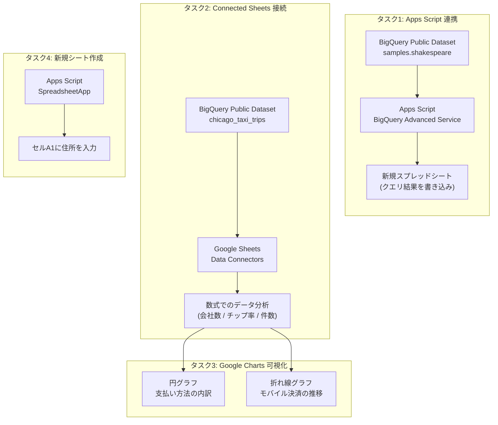
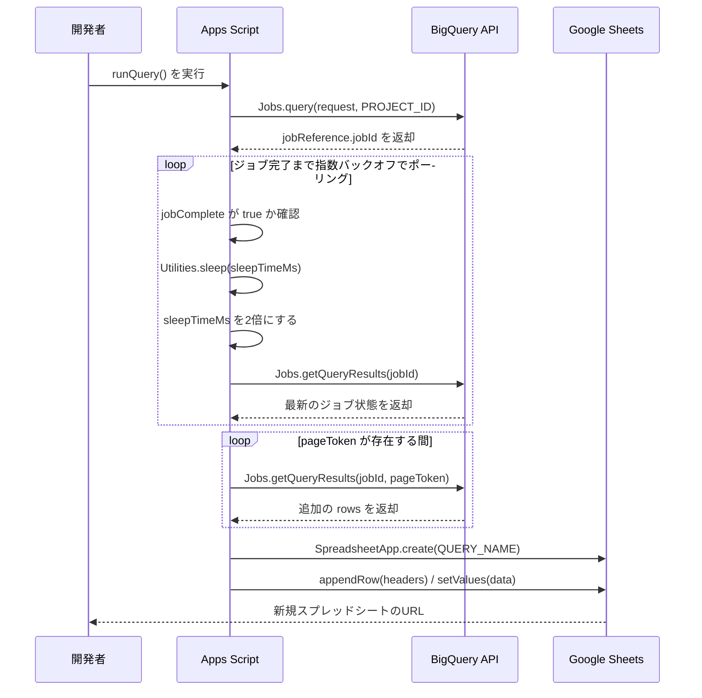
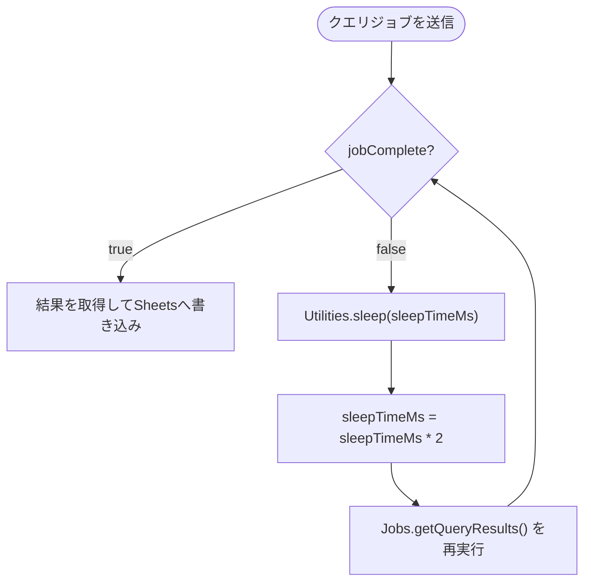
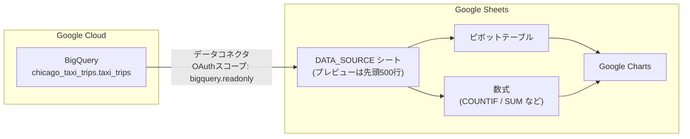

# BigQuery × Apps Script × Connected Sheets 実践ガイド

**〜 Google Cloud Skills Boost チャレンジラボ攻略のためのベストプラクティス解説 〜**

> 対象ラボ: [Google Cloud Skills Boost（元ラボページ）](https://www.skills.google/course_templates/737/labs/607137) [1]
> 対象読者: BigQuery・Apps Script・Google Sheetsの連携を初めて行うインフラ／アプリケーションエンジニア
> 本ガイドのゴール: 4つのタスクを「なぜそうするのか」まで理解した上で、公式ドキュメントに基づいたベストプラクティスで完了できるようになること

---

## 目次

1. [このラボの全体像](#このラボの全体像)
2. [ラボを始める前の準備](#ラボを始める前の準備)
3. [タスク1: Apps ScriptからBigQueryを呼び出しSheetsへ書き込む](#タスク1-apps-scriptからbigqueryを呼び出しsheetsへ書き込む)
4. [タスク2: BigQueryデータセットをGoogle Sheetsに接続する（Connected Sheets）](#タスク2-bigqueryデータセットをgoogle-sheetsに接続するconnected-sheets)
5. [タスク3: Google Chartsで可視化する](#タスク3-google-chartsで可視化する)
6. [タスク4: Apps Scriptで新規ワークシートを作成する](#タスク4-apps-scriptで新規ワークシートを作成する)
7. [全体のベストプラクティスまとめ](#全体のベストプラクティスまとめ)
8. [トラブルシューティング早見表](#トラブルシューティング早見表)
9. [参考文献](#参考文献)

---

## このラボの全体像

このラボは「BigQuery Public Datasets」を題材に、**Apps Script（自動化・プログラム連携）**と**Connected Sheets（ノーコードでのデータ接続）**という2つの異なるアプローチでBigQueryのデータをGoogle Sheets上で扱う体験を通じて学ぶ構成になっています。



この2系統を並べて経験することで、「プログラムで自動化すべき処理」と「ビジネスユーザーが自分で分析すべき処理」を使い分ける感覚を養うのがこのラボの狙いです。

---

## ラボを始める前の準備

| 項目 | ベストプラクティスと理由 |
|---|---|
| ブラウザウィンドウ | シークレット（プライベート）ウィンドウを使用する。個人アカウントのセッションとラボ用の一時アカウントが同じブラウザ内で混在すると、意図せず個人のGoogle Cloudアカウントに課金される事故につながるため |
| アカウント | ラボが払い出す一時的な学習用アカウントのみを使用する。個人アカウントでリソースを作成すると、ラボ終了後も課金が継続するリスクがある |
| タイマー | ラボは一時停止できないため、着手前にタスク1〜4を一通り読み、必要な作業時間を見積もっておく |
| プロジェクトID | 各タスクで払い出される一時プロジェクトのIDをメモしておく。Apps Scriptのコード内で`PROJECT_ID`として明示的に使用するため |

---

## タスク1: Apps ScriptからBigQueryを呼び出しSheetsへ書き込む

### 手順の流れ

1. [script.google.com](https://script.google.com) で新しいApps Scriptプロジェクトを作成し、任意の名前を付ける
2. エディタの「サービス」から **BigQuery API** をアドバンストサービスとして追加する（この時点でCloud Platformプロジェクト側のBigQuery APIも有効化される）[2][3]
3. コードファイルを `bq-sheets.gs` にリネームし、クエリ実行用のスクリプトを実装する
4. `PROJECT_ID` に払い出されたプロジェクトIDを設定する
5. `runQuery()` を実行し、OAuth認可フローを承認する
6. 実行ログに出力される新規スプレッドシートのURLを開き、Shakespeare作品群の頻出単語トップ10が書き込まれていることを確認する

### 処理フローの可視化

`runQuery()` がやっていることを分解すると、次のようなシーケンスになります。BigQueryのクエリジョブは**非同期**で実行されるため、「ジョブを投げる」→「完了をポーリングする」→「結果を取得する」という3段階の設計になっている点が最大のポイントです[5][6]。



### コードの重要ポイント

サンプルコード（Apache License 2.0で提供されている公式サンプル [3][17]）の中でも、特に押さえておくべき箇所は次の2つです。

**(1) 指数バックオフによるジョブ完了待機**

```javascript
var sleepTimeMs = 500;
while (!queryResults.jobComplete) {
  Utilities.sleep(sleepTimeMs);
  sleepTimeMs *= 2;
  queryResults = BigQuery.Jobs.getQueryResults(PROJECT_ID, jobId);
}
```

これはGoogle Cloudが横断的に推奨している「指数バックオフ（Exponential Backoff）」パターンそのものです。一定間隔で即座にリトライするのではなく、待機時間を倍々に伸ばしながら再試行することで、サーバー側への負荷集中や同時多発的なリトライの衝突（thundering herd）を防ぎます[8][9]。

**(2) ページトークンによるページネーション**

```javascript
while (queryResults.pageToken) {
  queryResults = BigQuery.Jobs.getQueryResults(PROJECT_ID, jobId, {
    pageToken: queryResults.pageToken
  });
  rows = rows.concat(queryResults.rows);
}
```

BigQueryの結果セットは1回のレスポンスに収まらないことがあるため、`pageToken` が返ってくる限りループで取得し続ける必要があります。件数が少ないサンプルクエリでは意識しにくい処理ですが、本番データに対して同じコードを流用する際に必須になる実装です。

### 指数バックオフのロジック図



### ベストプラクティス一覧

| 項目 | 推奨する対応 | 出典 |
|---|---|---|
| アドバンストサービスの有効化 | Apps Scriptエディタ側とCloud Console側の両方でBigQuery APIが有効になっていることを確認する | [2][4] |
| SQL方言 | サンプルコードは `[project:dataset.table]` 形式のレガシーSQLを使用しているが、新規に書くクエリは標準SQL（GoogleSQL）でバッククォート記法（`` `project.dataset.table` ``）に統一する。標準SQLはウィンドウ関数やDDL/DMLなど機能面でも優位 | [7] |
| ジョブのポーリング | 固定間隔リトライではなく指数バックオフを用いる。上限（max backoff）を設けて無限に待ち続けないようにする | [8][9] |
| ページネーション | `pageToken` の有無をチェックするループを省略しない | [5][6] |
| プロジェクトIDの管理 | ハードコードで動かす場合も、コードの先頭で `if (!PROJECT_ID) throw Error(...)` のような未設定チェックを入れる。恒久的な運用に載せる際はスクリプトプロパティ（Properties Service）などに切り出す | [3] |
| 権限 | クエリの実行のみが目的であれば、プロジェクト全体に強い権限を持たせず「BigQuery Job User」＋対象データセットの「BigQuery Data Viewer」という最小権限の組み合わせを意識する | [10] |

### よくあるエラーと対処

| エラー・症状 | 主な原因 | 対処 |
|---|---|---|
| `Exception: Service BigQuery API has not been enabled for your Apps` | アドバンストサービスの追加とCloud Platform側のAPI有効化のタイミングがずれている | エディタの「サービス」からBigQuery APIを一度削除し、再度追加し直す（ラボ本文にも明記されている既知の回避策） |
| `jobComplete` が `true` にならずタイムアウトする | クエリが重い、または `sleepTimeMs` の上限を設けずに無限ループになっている | 最大待機時間・最大リトライ回数を設け、超えたらエラーとしてログ出力する設計にする[8][9] |
| 実行時に権限エラー（403） | 実行アカウントに対象プロジェクトへのBigQueryアクセス権が不足 | 「BigQuery Job User」ロールがプロジェクトに付与されているか確認する[10] |

---

## タスク2: BigQueryデータセットをGoogle Sheetsに接続する（Connected Sheets）

### 手順の流れ

1. Google Sheetsのホーム画面から新しい空白のスプレッドシートを作成する
2. メニューの「データ」→「データコネクタ」→「BigQueryに接続」を選択する
3. 課金が有効なプロジェクトを選び、「公開データセット」から `chicago_taxi_trips` を検索する
4. `taxi_trips` テーブルを選択し「接続」をクリックする
5. 接続後に表示されるプレビューシート上で、ピボットテーブルや数式を使って分析を行う

### アーキテクチャ

Connected Sheetsは、Sheets上のデータをBigQueryにコピーするのではなく、**必要な範囲だけをその都度BigQueryへ問い合わせる**アーキテクチャです。プレビューには先頭500行のみが表示されますが、ピボットテーブルや数式、グラフは接続先の全データに対して実行されます[11]。



### 数式によるデータ分析の考え方

`taxi_trips` テーブルには `company`（配車会社名）、`tips`（チップ額）、`fare`（運賃）などの列が含まれています[18]。3つの設問は、いずれも列単位の集計関数で解けるように設計されています。

| 分析したいこと | 考え方 | 使う関数の例 |
|---|---|---|
| タクシー会社の数 | `company` 列に含まれるユニークな値の数を数える | `COUNTA` と `UNIQUE` の組み合わせ、またはピボットテーブルで `company` を行にドラッグし件数を確認 |
| チップがあった配車の割合 | `tips` 列が0より大きい行数を、全体の行数で割る | `COUNTIF(tips範囲, ">0") / COUNTA(tips範囲)` |
| 運賃が0より大きい配車の総数 | `fare` 列が0より大きい行だけを数える | `COUNTIF(fare範囲, ">0")` |

> ⚠️ 実際のセル参照や列位置は接続後のプレビューシートの構成に依存するため、上表は「どの関数を組み合わせるか」という考え方のガイドとして使ってください。ピボットテーブルの「値」に集計方法（合計・カウント・個別カウント）を指定するだけでも同等の答えが得られます。

### ベストプラクティス一覧

| 項目 | 推奨する対応 | 出典 |
|---|---|---|
| プレビュー行数の理解 | 画面に表示されるのは先頭500行だが、数式・ピボット・グラフは全データに対して実行される点を理解した上で分析する | [11] |
| 集計方法の選択 | 単純な合計・件数はピボットテーブル、条件付きの計算は数式（`COUNTIF`等）と使い分ける | [11][12] |
| データの更新 | 元データが変わりうる分析では、手動更新のほかにスケジュール更新（定期リフレッシュ）の設定も検討する | [11][12] |
| SQLを書かずに分析 | Connected SheetsはSQLの知識がなくても大規模データにアクセスできる点が価値。まずは使い慣れたSheetsの関数・ピボットで試すのが推奨アプローチ | [13][12] |
| 権限 | Connected Sheetsは `bigquery.readonly` スコープでBigQueryにアクセスする。読み取り専用であることを意識し、接続先データセットへの最小権限（Data Viewer）で運用する | [16][10] |

---

## タスク3: Google Chartsで可視化する

### 手順の流れ

1. Connected Sheets接続済みのシート上で「挿入」→「グラフ」を選択する
2. 支払い方法（`payment_type`）の内訳を **円グラフ** で可視化する
3. モバイル決済（mobile）の売上推移を **折れ線グラフ** で可視化する
4. 2015年にピークを迎えた後の推移だけを見たい場合は、グラフの期間フィルタや軸の範囲を絞り込む

### グラフタイプの選び方

| 分析の目的 | 適したグラフ | 理由 |
|---|---|---|
| ある時点における内訳（構成比）を見たい | 円グラフ | 支払い方法ごとの割合など、全体に対する構成比の把握に向く |
| 時間の経過に伴う変化・トレンドを見たい | 折れ線グラフ | 売上や件数の推移、ピークの検出、期間比較に向く |
| 特定期間だけを深掘りしたい | 折れ線グラフ＋軸の範囲指定 | ピーク（2015年）以降のみに絞ることで、その後の減少・回復傾向を読み取りやすくする |

Google Sheets上でグラフを作成した後は、元データが更新された場合に「グラフを更新」ボタンでBigQuery側の最新データを反映できます[15]。ダッシュボードのように毎週参照するグラフであれば、この更新導線をチームに共有しておくと運用がスムーズです。

### ベストプラクティス一覧

| 項目 | 推奨する対応 | 出典 |
|---|---|---|
| グラフの選定 | 「構成比を見たいのか」「推移を見たいのか」を先に決めてからグラフ種別を選ぶ | [15] |
| 更新性 | Connected Sheets上のグラフは「更新」操作でBigQueryの最新データを反映できることをチームに周知する | [15] |
| 期間の絞り込み | ピーク検出後は、軸範囲やフィルタで期間を絞った別ビューを作ると変化が読み取りやすい | [15] |

---

## タスク4: Apps Scriptで新規ワークシートを作成する

### 手順の流れ

1. Apps Scriptで新しいプロジェクトを開く
2. エディタに次のコードを貼り付け、`createAddressSheet` を実行して権限を承認する
3. 実行ログに出力されたURLを開き、新規ワークシートのセルA1に住所が入力されていることを確認する

```javascript
function createAddressSheet() {
  const spreadsheet = SpreadsheetApp.create('Address Sheet');
  const sheet = spreadsheet.getSheets()[0];

  sheet.setName('Address');
  sheet.getRange('A1').setValue('76 9th Ave, New York');
  console.log(spreadsheet.getUrl());
}
```

### なぜここでApps Scriptの組み込みサービスが登場するのか

タスク1では「BigQuery API」というアドバンストサービス（明示的な有効化が必要）を扱いましたが、タスク4のような「新しいシートを作る」「セルに値を入れる」といった操作は `SpreadsheetApp` という**組み込みサービス**だけで完結します。両者の違いを理解しておくと、今後どちらを使うべきか迷わなくなります[2]。

| 観点 | 組み込みサービス（例: `SpreadsheetApp`） | アドバンストサービス（例: `BigQuery`） |
|---|---|---|
| 有効化 | 不要（最初から利用可能） | 明示的な有効化が必要（Apps Script側＋Cloud Console側） |
| 対象 | Google Workspaceの主要サービス（Sheets, Docs, Gmail等） | BigQueryなど外部APIへの薄いラッパー |
| 認可 | 自動的なOAuth認可フロー | 同様に自動化されているが、対応するCloud APIの有効化が前提 |
| 典型的な用途 | シート作成、値の書き込み、書式設定 | 大規模データへのクエリ、外部システム連携 |

### ベストプラクティス一覧

| 項目 | 推奨する対応 | 出典 |
|---|---|---|
| サービスの使い分け | Workspace内で完結する操作は組み込みサービス、外部Google CloudのAPIを叩く操作はアドバンストサービス、という判断軸を持つ | [2] |
| セル入力の自動化 | 手動入力で済むタスクでも、繰り返し発生する住所入力などはこの後 `sheet.getRange("A1").setValue(address)` のようにコード化しておくと再現性が高まる | [3] |

---

## 全体のベストプラクティスまとめ

4つのタスクを横断して意識すべき観点を、テーマ別に整理します。

| テーマ | ベストプラクティス | 出典 |
|---|---|---|
| セキュリティ（最小権限の原則） | クエリ実行には「BigQuery Job User」、データ閲覧には対象データセットの「BigQuery Data Viewer」というように、コンピュート権限とデータ権限を分けて最小限だけ付与する | [10] |
| 信頼性 | 非同期ジョブに対しては指数バックオフでポーリングし、結果はページトークンを使い切るまで取得する | [8][9][5] |
| 保守性 | 新規に書くクエリはレガシーSQLではなく標準SQL（GoogleSQL）に統一する | [7] |
| コスト意識 | 大規模データセットに対するクエリはスキャン量が課金に直結するため、必要な列だけを `SELECT` し、`LIMIT` を活用する | [6] |
| ノーコード活用 | プログラムを書かずに済む定型的な分析（会社数の集計、割合の算出など）はConnected Sheets、繰り返し実行・自動化したい処理はApps Scriptという住み分けを意識する | [11][3] |

---

## トラブルシューティング早見表

| タスク | 症状 | 主な原因 | 対処 |
|---|---|---|---|
| タスク1 | BigQuery APIが有効化されていないというエラー | アドバンストサービスの追加処理が不完全 | サービスを一度削除し再追加する |
| タスク1 | クエリ結果が0件、または想定と異なる集計になる | レガシーSQLとGoogleSQLで `,` や識別子の扱いが異なる | クエリ全体をどちらか一方の方言に統一する[7] |
| タスク2 | 「データコネクタ」メニューが表示されない | 組織のポリシーやエディション、事前設定の不足 | 公式ヘルプの「開始する前に」の項目を確認する[13] |
| タスク2 | 数式の結果が想定と合わない | プレビューの500行だけを見て検算してしまっている | 数式・ピボットは全データに対して実行される前提で結果を確認する[11] |
| タスク3 | グラフが最新のBigQueryデータを反映していない | 手動更新が行われていない | グラフ下部の「更新」を実行する[15] |

---

## 参考文献

1. Google Cloud Skills Boost 元ラボページ — https://www.skills.google/course_templates/737/labs/607137
2. Advanced Google services（Apps Script アドバンストサービスの有効化） — https://developers.google.com/apps-script/guides/services/advanced
3. BigQuery Service（Apps Script BigQueryアドバンストサービス リファレンス） — https://developers.google.com/apps-script/advanced/bigquery
4. Manage BigQuery API dependencies（BigQuery APIの依存関係管理） — https://docs.cloud.google.com/bigquery/docs/service-dependencies
5. Running jobs programmatically（BigQueryジョブのプログラムからの実行） — https://docs.cloud.google.com/bigquery/docs/running-jobs
6. Run a query（`jobs.query` / `jobs.insert` の使い分け） — https://docs.cloud.google.com/bigquery/docs/running-queries
7. Migrating to GoogleSQL（レガシーSQLから標準SQLへの移行） — https://docs.cloud.google.com/bigquery/docs/reference/standard-sql/migrating-from-legacy-sql
8. Retry strategy（Cloud Storageにおける指数バックオフの解説） — https://docs.cloud.google.com/storage/docs/retry-strategy
9. Exponential backoff（Memorystore for Redis：バックオフアルゴリズムの定義） — https://docs.cloud.google.com/memorystore/docs/redis/exponential-backoff
10. Troubleshoot IAM permissions in BigQuery（最小権限の原則の適用方法） — https://docs.cloud.google.com/bigquery/docs/troubleshoot-access-control
11. Using Connected Sheets（BigQuery公式ドキュメント） — https://docs.cloud.google.com/bigquery/docs/connected-sheets
12. Using Connected Sheets to analyze BigQuery data（Google Cloud Blog） — https://cloud.google.com/blog/products/data-analytics/using-connected-sheets-to-analyze-bigquery-data
13. Get started with BigQuery data in Google Sheets（Google Docsエディタ ヘルプ） — https://support.google.com/docs/answer/9702507?hl=en
14. Use Connected Sheets（Apps Script） — https://developers.google.com/apps-script/guides/sheets/connected-sheets
15. Analyze & refresh BigQuery data in Google Sheets using Connected Sheets（グラフの更新方法） — https://support.google.com/docs/answer/9703214?hl=en
16. Connected Sheets（Google Sheets API ガイド、Shakespeareデータセットの例） — https://developers.google.com/workspace/sheets/api/guides/connected-sheets
17. Turn your big data into insights using Google Sheets and Slides（Codelab、サンプルコードの出典） — https://codelabs.developers.google.com/codelabs/bigquery-sheets-slides/
18. Chicago Taxi Trips（データセットの詳細ページ、列定義） — https://cloud.google.com/bigquery/public-data/chicago-taxi
