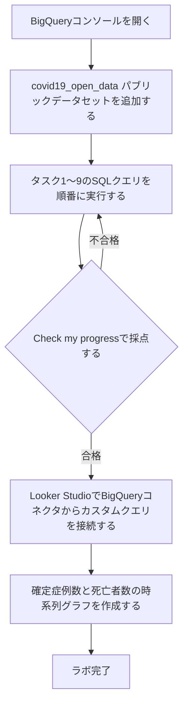
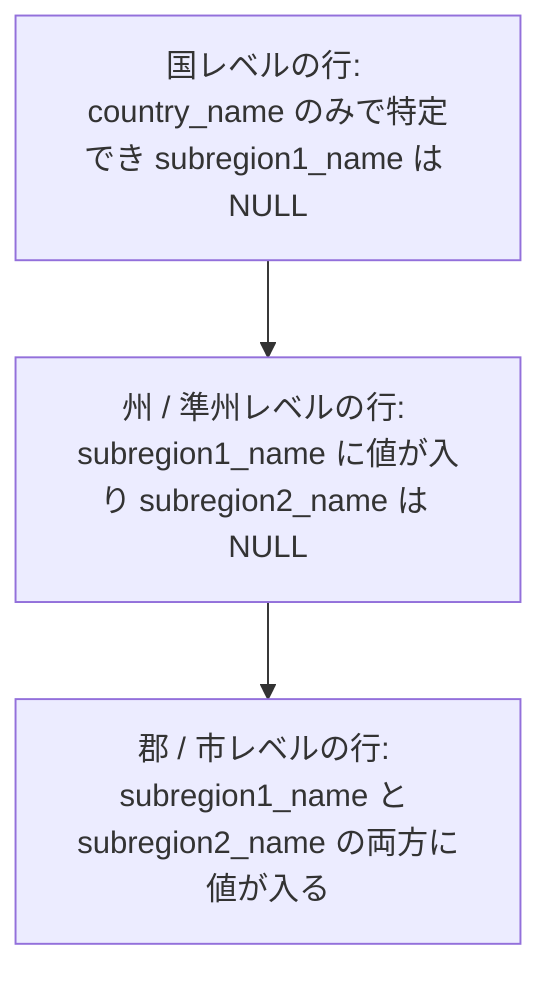
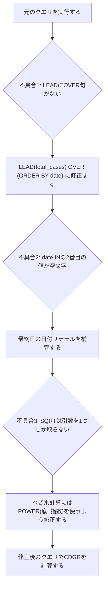

# BigQueryで学ぶCOVID-19データ分析チャレンジラボ 完全攻略ガイド

> 対象ラボ: [Derive Insights from BigQuery Data: Challenge Lab](https://www.skills.google/course_templates/623/labs/629091)（Google Cloud Skills Boost）
> 対象テーブル: `bigquery-public-data.covid19_open_data.covid19_open_data`

## この記事について

💡 このガイドを一言で言うと：「BigQueryの公開データセットに対して10個のSQLタスクを解きながら、集計・ウィンドウ関数・CTE（共通テーブル式）の実務的な使い方を身につけるための解説書」です。

このラボは **Date（日付）**、**Death Count（死亡者数のしきい値）**、**Confirmed Cases（確定症例数のしきい値）**、**Month（対象月）**、**Limit Value（パーセンテージや件数のしきい値）** といった値を、受講者ごとにランダムな数値へ差し替えて出題します。そのため本ガイドのSQLコード中では、これらを `<Date>` のような山カッコ付きプレースホルダーで表記しています。実際に提出するときは、自分のラボ画面に表示されている具体的な数値・日付に置き換えてください。

---

## Step 0. ラボ全体の流れをつかむ

この章では、10個のタスクがラボ全体の中でどう位置づけられているかを説明します。個別のSQLに入る前に、まず全体の流れを図で押さえておくと、各タスクの目的を見失いにくくなります。

下の図は、BigQueryコンソールを開いてからLooker Studioでレポートを完成させるまでの一連の流れを表しています。上から下へ読み進めてください。



各ノードの意味：
- 「Check my progressで採点する」（ひし形）：ラボの自動採点システムが、あなたのクエリ結果を期待値と突き合わせて判定します。不合格の場合は該当タスクのSQLを見直して再実行します。
- 「Looker Studio」：旧称は「Data Studio」で、ラボの手順書にはこの旧称で書かれています。現行の正式名称は Looker Studio です（[公式ドキュメント](https://cloud.google.com/looker/docs/studio/connect-to-google-bigquery)）。

📖 このセクションで登場した用語
- Check my progress：Qwiklabs / Google Cloud Skills Boostが提供する自動採点ボタン。実行結果を裏側の期待値と比較して合否を返す

---

## Step 1. データセットの構造を理解する（最重要の前提知識）

この章では、10個のタスクすべてに共通して関わる `covid19_open_data` テーブルの構造上の注意点を説明します。ここを理解しないままクエリを書くと、一見正しく動くのに集計結果が水増しされる、という事故が起きやすくなります。

### 主なカラム

| カラム名 | 意味 | 補足 |
|---|---|---|
| `date` | その行のデータの対象日 | DATE型 |
| `country_code` | 国コード（例: `US`） | ISO準拠のコード |
| `country_name` | 国名（例: `United States of America`） | 表記ゆれに注意（後述） |
| `subregion1_name` | 州・省などの地域名 | 国レベルの行では `NULL` |
| `cumulative_confirmed` | その日までの累積確定症例数 | 「新規」ではなく「累積」 |
| `cumulative_deceased` | その日までの累積死亡者数 | 同上 |
| `cumulative_recovered` | その日までの累積回復者数 | 同上 |

⚠️ なぜ単純に `SUM(cumulative_confirmed)` だけでは危険なのか：このテーブルは「国レベルの行」「州レベルの行」「郡レベルの行」を **同じ1つのフラットなテーブルの中に混在させて** 格納しています。行を親子関係でネストしているのではなく、粒度の異なる行が並列に並んでいる、という点がポイントです。下の図は、その粒度の違いを模式的に表したものです。



各ノードの意味：
- 矢印は「親から子」というリレーションではなく、同じ `date` ・同じ `country_name` に対して **粒度違いの行が複数存在する** ことを表しています。
- 例えばアメリカの場合、`country_name = "United States of America"` という条件だけで絞り込むと、国全体の1行・50州分の行・数千の郡の行がすべて同時にヒットします。ここで単純に `SUM(cumulative_confirmed)` を取ると、症例数が何倍にも水増しされます。

この挙動は、データセット提供元の公式リポジトリでも明記されています。`subregion1_code` が `NULL` であれば国レベルの集計、値が入っていれば州レベルの集計であるとされ、集計レベルの判定には `aggregation_level` を使う方法もあると案内されています（[GoogleCloudPlatform/covid-19-open-data README](https://github.com/GoogleCloudPlatform/covid-19-open-data)）。

✅ 実務での回避策：地域別に集計したいときは、必ず `subregion1_name IS NOT NULL AND subregion2_name IS NULL`（州レベルだけを見る）や `subregion1_name IS NULL AND subregion2_name IS NULL`（国レベルだけを見る）のように、対象の粒度を明示的にWHERE句で絞り込みます。

⚠️ ただし1点注意：本ラボのタスク1（世界全体の確定症例数）のように「日付だけで単純に `SUM` する」ことが公式の想定解になっているタスクもあります。これは採点システムの期待値がその単純な合計に合わせて作られているためです。本ガイドでは、ラボへの提出クエリはラボの想定解パターンに沿えつつ、実務で同じデータセットを使う際に注意すべき点は都度コラムとして補足します。

📖 このセクションで登場した用語
- 累積値（cumulative）：ある時点までの合計。前日までの値に当日分を足し込んだ値であり、「その日単体の新規件数」ではない
- 集計レベル（aggregation level）：データがどの地理的粒度（国・州・郡）で集計されているかを表す区分

---

## Step 2. 全タスクに共通するベストプラクティス

この章では、個別タスクに入る前に、10個のタスクを通して繰り返し使うSQLパターンをまとめて説明します。

### 2-1. GoogleSQLダイアレクトを使う

BigQueryのクエリエディタは既定でGoogleSQL（旧称: Standard SQL）ダイアレクトです。古い記事では `[project:dataset.table]` のような角カッコ表記のLegacy SQLが使われていることがありますが、本ガイドはすべて `` `project.dataset.table` `` 形式のGoogleSQLで統一しています。GoogleSQLという名称は、以前のGoogle Standard SQLの新しい呼び方です（[BigQuery関数リファレンス](https://docs.cloud.google.com/bigquery/docs/reference/standard-sql/functions-all)）。

### 2-2. 「集計後の値」で絞り込みたいときはHAVINGを使う

💡 一言で言うと：「`SUM` や `COUNT` で作った集計結果を条件に使いたいときは、`WHERE` ではなく `HAVING`、もしくはサブクエリ・CTEで包む」というパターンです。

⚠️ なぜ単純な `WHERE 集計結果 > 100` では解けないのか：`WHERE` 句はグループ化（`GROUP BY`）が行われる **前** の生の行に対して評価されます。`SUM(cumulative_deceased)` のような集計結果はグループ化が終わった **後** に初めて存在する値なので、`WHERE` の中では参照できません。これは後述するタスク2・タスク3で実際に使うテクニックです。

回避策は2つあります。

| 方法 | 書き方 | 向いている場面 |
|---|---|---|
| `HAVING` を使う | `GROUP BY 列 HAVING 集計結果 > 100` | 集計とその後の絞り込みだけで完結する場合 |
| サブクエリ / CTEで包む | 内側で集計し、外側の `SELECT ... FROM (...) WHERE ...` で絞り込む | 絞り込んだ後にさらに `JOIN` や別の計算を続ける場合 |

### 2-3. 前日比較にはウィンドウ関数（LAG）を使う

💡 一言で言うと：「ある行から、1つ前の日付の値を同じ行に並べて計算したいときに使うのが `LAG` 関数」です。

⚠️ なぜ自己結合（自分自身とのJOIN）では非効率なのか：日付テーブルを自分自身と `JOIN` して「1日前のレコード」を探す書き方もできますが、自己結合は出力行数が膨らみやすく、パフォーマンスの問題を起こしやすいとBigQueryの公式ドキュメントでも指摘されています。同じ目的は `LAG` などのウィンドウ（分析）関数で書き直すことが推奨されています（[BigQueryクエリプランの解説](https://docs.cloud.google.com/bigquery/docs/query-plan-explanation)）。

ウィンドウ関数にはいくつか種類があり、目的によって使い分けます。

| 関数 | やること | 使うべき場面 |
|---|---|---|
| `LAG(値) OVER (ORDER BY 日付)` | 1つ前の行の値を取得する | 前日比・前月比などの差分計算（本ラボのタスク6・7） |
| `LEAD(値) OVER (ORDER BY 日付)` | 1つ後の行の値を取得する | 未来方向の値を同じ行に並べたいとき（本ラボのタスク9） |
| `ROW_NUMBER() OVER (...)` | 重複のない連番を振る | 同率を区別して上位N件だけ取りたいとき |
| `RANK() / DENSE_RANK() OVER (...)` | 同率に同じ順位を振る | ランキング表示で同率を同じ順位として見せたいとき |

`LAG` や `LEAD` はいずれも「ウィンドウ関数」の一種で、`OVER` 句とセットでなければ使えません。`OVER` 句を書き忘れるとエラーになる、という点は後述するタスク9のデバッグで重要になります（[ナビゲーション関数リファレンス](https://cloud.google.com/bigquery/docs/reference/standard-sql/navigation_functions)、[ウィンドウ関数の呼び出し方](https://cloud.google.com/bigquery/docs/reference/standard-sql/analytic-function-concepts)）。

### 2-4. 割り算にはSAFE_DIVIDEを検討する

致死率・回復率・増加率のように「割り算」を扱うタスクでは、分母が0になるとエラーで処理全体が止まってしまうことがあります。BigQueryには `SAFE_DIVIDE(分子, 分母)` という関数があり、分母が0のときにエラーではなく `NULL` を返してくれます（[数学関数リファレンス](https://cloud.google.com/bigquery/docs/reference/standard-sql/mathematical_functions)）。本ガイドでは、割り算を行うタスクで積極的にこの関数を使います。

📖 このセクションで登場した用語
- ウィンドウ関数（分析関数）：行をグループごとにまとめて1行に集約する集計関数とは違い、各行を保ったまま「その行の前後の値」などを計算できる関数
- `OVER`句：ウィンドウ関数がどの範囲・どの並び順で計算するかを指定する句
- `SAFE_DIVIDE`：ゼロ除算が起きてもエラーにせず `NULL` を返す安全な割り算関数

---

## Task 1. 全世界の確定症例数の合計

💡 一言で言うと：「指定した日付における、全世界の `cumulative_confirmed` を1行に集計するクエリ」です。

```sql
SELECT
  SUM(cumulative_confirmed) AS total_cases_worldwide
FROM
  `bigquery-public-data.covid19_open_data.covid19_open_data`
WHERE
  date = "<Date>"
  -- date は "YYYY-MM-DD" 形式の文字列リテラルとして渡す
```

処理の流れ：
- `WHERE date = "<Date>"` で対象日の行だけに絞り込む
- 絞り込んだ全行の `cumulative_confirmed` を `SUM` で合計し、`total_cases_worldwide` という名前で返す

⚠️ 実務コラム：Step 1で説明した通り、この `WHERE` 句には地域粒度の絞り込みが入っていないため、国レベル・州レベル・郡レベルの行がすべて合算されます。ラボの採点はこの単純な合計を期待値としているため、このままのクエリで提出して問題ありません。ただし、自社のダッシュボードなど実務でこのデータセットを使う場合は、`subregion1_name IS NULL AND subregion2_name IS NULL` を加えて国レベルの行だけに絞り込むほうが安全です。

📖 このセクションで登場した用語
- （新出用語なし。Step 1・Step 2の用語を参照）

---

## Task 2. 被害が大きい地域を特定する

💡 一言で言うと：「アメリカ国内で、指定した死亡者数を超えた州がいくつあるかを数えるクエリ」です。

```sql
SELECT
  COUNT(*) AS count_of_states
FROM (
  SELECT
    subregion1_name AS state,
    SUM(cumulative_deceased) AS death_count
  FROM
    `bigquery-public-data.covid19_open_data.covid19_open_data`
  WHERE
    country_name = "United States of America"
    AND date = "<Date>"
    AND subregion1_name IS NOT NULL  -- 国レベルの行を除外する
    AND subregion2_name IS NULL      -- 郡レベルの行を除外する
  GROUP BY
    subregion1_name
)
WHERE
  death_count > <Death Count>
```

処理の流れ：
1. 内側のサブクエリで、州ごとに `cumulative_deceased` を集計し `death_count` を作る
2. `subregion1_name IS NOT NULL` によって国レベルの行を除外する。ただし、この条件だけでは `subregion1_name` と `subregion2_name` の両方を持つ郡レベルの行も残り、州の値との `SUM(cumulative_deceased)` で二重計上される。州だけを集計するには `subregion2_name IS NULL` も必要になる
3. 外側の `WHERE death_count > <Death Count>` で、しきい値を超えた州だけを残す
4. `COUNT(*)` で、残った州の件数を数える

⚠️ なぜ内側と外側でクエリを分けているのか：Step 2-2で説明した通り、`death_count` は集計後にしか存在しない値なので、`WHERE death_count > <Death Count>` を集計と同じ階層に書くことはできません。サブクエリで一段階「確定させてから」外側でさらに絞り込む、という順番が重要です。

なお `country_code = "US"` ではなく `country_name = "United States of America"` を条件に使っている点にも注意してください。データセットによっては同じ国を指す表記が複数存在することがあるため、どちらのカラムで絞り込んでいるかは常に意識しておくとよい習慣です。

📖 このセクションで登場した用語
- （新出用語なし）

---

## Task 3. ホットスポットを特定する

💡 一言で言うと：「アメリカ国内で、指定した確定症例数を超えた州を、症例数が多い順に一覧表示するクエリ」です。

```sql
SELECT
  subregion1_name AS state,
  SUM(cumulative_confirmed) AS total_confirmed_cases
FROM
  `bigquery-public-data.covid19_open_data.covid19_open_data`
WHERE
  country_code = "US"
  AND date = "<Date>"
  AND subregion1_name IS NOT NULL
  AND subregion2_name IS NULL
GROUP BY
  subregion1_name
HAVING
  total_confirmed_cases > <Confirmed Cases>
ORDER BY
  total_confirmed_cases DESC
```

処理の流れ：
1. `WHERE` で対象日・対象国に絞り、`subregion1_name IS NOT NULL` で国レベルの行を除外する。この条件だけでは郡レベルの行も残って州の値と二重計上されるため、`subregion2_name IS NULL` を併用して州レベルだけに絞り込む
2. `GROUP BY subregion1_name` で州ごとに集計する
3. `HAVING total_confirmed_cases > <Confirmed Cases>` で、Step 2-2のパターンどおり「集計後の値」をしきい値で絞り込む
4. `ORDER BY total_confirmed_cases DESC` で症例数が多い順に並べ替える

💡 補足：タスク2ではサブクエリ、タスク3では `HAVING` を使いました。どちらも「集計後の値で絞り込む」という同じ目的のための書き方の違いです。今回はこの後さらに別の計算を続けるわけではないので、`HAVING` のほうが行数の少ないシンプルな書き方になります。

📖 このセクションで登場した用語
- （新出用語なし）

---

## Task 4. 致死率（Case-Fatality Ratio）を計算する

💡 一言で言うと：「イタリアの指定した月について、（累積死亡者数 ÷ 累積確定症例数）× 100 を計算するクエリ」です。

```sql
SELECT
  SUM(cumulative_confirmed) AS total_confirmed_cases,
  SUM(cumulative_deceased) AS total_deaths,
  SAFE_DIVIDE(SUM(cumulative_deceased), SUM(cumulative_confirmed)) * 100 AS case_fatality_ratio
FROM
  `bigquery-public-data.covid19_open_data.covid19_open_data`
WHERE
  country_name = "Italy"
  AND subregion1_name IS NULL
  AND subregion2_name IS NULL
  AND date BETWEEN "<Month の初日, 例: 2020-04-01>" AND "<Month の末日, 例: 2020-04-30>"
```

処理の流れ：
- `date BETWEEN 初日 AND 末日` で、対象月の初日から末日までの各日の行をすべて選択する
- `SUM` で各日の日次累積値を合計する。このため `total_confirmed_cases` と `total_deaths` は「日次累積値の月間合計」であり、月末時点の値ではない
- `SAFE_DIVIDE` で割り算し、100倍してパーセント表記にする

⚠️ 月末日を手で数える手間を減らしたい場合：閏年の2月など、月末日を間違えやすいケースがあります。次のように `EXTRACT` を使うと、月末日を意識せずに書けます。

```sql
SELECT
  SUM(cumulative_confirmed) AS total_confirmed_cases,
  SUM(cumulative_deceased) AS total_deaths,
  SAFE_DIVIDE(SUM(cumulative_deceased), SUM(cumulative_confirmed)) * 100 AS case_fatality_ratio
FROM
  `bigquery-public-data.covid19_open_data.covid19_open_data`
WHERE
  country_name = "Italy"
  AND subregion1_name IS NULL
  AND subregion2_name IS NULL
  AND EXTRACT(YEAR FROM date) = <対象年, 例: 2020>
  AND EXTRACT(MONTH FROM date) = <対象月の数字, 例: 4>
```

📖 このセクションで登場した用語
- `EXTRACT`：日付や時刻の値から年・月・日などの一部だけを取り出す関数

---

## Task 5. しきい値を超えた特定の日を探す

💡 一言で言うと：「イタリアの累積死亡者数が、指定したしきい値を初めて超えた日付を1件だけ返すクエリ」です。

```sql
SELECT
  date
FROM
  `bigquery-public-data.covid19_open_data.covid19_open_data`
WHERE
  country_name = "Italy"
  AND cumulative_deceased > <Death Count>
ORDER BY
  date ASC
LIMIT 1
```

処理の流れ：
- `cumulative_deceased > <Death Count>` で、しきい値を超えている日だけに絞り込む
- `ORDER BY date ASC` で古い日付順に並べ替える
- `LIMIT 1` で先頭の1件、つまり「最初に超えた日」だけを取り出す

⚠️ なぜ `LIMIT 1` だけで安全に「最初の日」が取れるのか：`cumulative_deceased` は累積値なので、通常は日付が進むにつれて単調に増加（または横ばい）します。そのため、しきい値を超えた日付を昇順に並べて先頭を取れば、それが最初に超えた日になります。ただし実データでは、報告方法の見直しなどにより過去の値が下方修正され、累積値が一時的に前日を下回るケースもゼロではありません。その場合は「しきい値を初めて超えた日」と「現在しきい値を超えている最も古い日」が一致しない可能性がある、という点は覚えておくとよいでしょう。

📖 このセクションで登場した用語
- 単調増加：値が時間とともに減ることなく、増える・または変わらない、を繰り返す性質

---

## Task 6. 新規症例数がゼロだった日を数える（壊れたクエリの修正）

💡 一言で言うと：「インドで、前日から確定症例数が増えなかった日が何日あったかを数えるクエリ」です。ただし、お題として渡されたクエリはそのままでは実行できません。まずどこが壊れているかを見ていきます。

⚠️ 壊れたクエリのどこが問題か：お題のSQLは `india_previous_day_comparison` というCTE（`WITH`句で定義する名前付きの一時テーブル）を作るところまでしか書かれておらず、そのCTEを実際に読み出す外側の `SELECT` 文がありません。CTEは「定義しただけ」では何も返さないため、このままではクエリ全体が完結せず、スクリプトの終わりが来ていないというエラーになります。加えて、`date between '' and ''` の部分も空文字列のままなので、対象期間の日付を実際の値に差し替える必要があります。

```sql
WITH india_cases_by_date AS (
  SELECT
    date,
    SUM(cumulative_confirmed) AS cases
  FROM
    `bigquery-public-data.covid19_open_data.covid19_open_data`
  WHERE
    country_name = "India"
    AND date BETWEEN "<Start date>" AND "<Close date>"
  GROUP BY
    date
  ORDER BY
    date ASC
)

, india_previous_day_comparison AS (
  SELECT
    date,
    cases,
    LAG(cases) OVER (ORDER BY date) AS previous_day,
    cases - LAG(cases) OVER (ORDER BY date) AS net_new_cases
  FROM
    india_cases_by_date
)

SELECT
  COUNT(date) AS days_with_zero_net_new_cases
FROM
  india_previous_day_comparison
WHERE
  net_new_cases = 0
```

このクエリは「CTEを段階的につないでいく」という、この後のタスク7・9でも繰り返し使うパターンの基本形です。下の図は、そのパイプラインの流れを一般化したものです。


各ノードの意味：
- 「CTE1」：`india_cases_by_date` にあたる、日付ごとの単純な集計
- 「CTE2」：`india_previous_day_comparison` にあたる、前日値を並べる工程
- 「外側のSELECT」：最終的に欲しい件数や一覧だけを取り出す工程

💡 補足：`LAG` は先頭の行（対象期間の一番古い日）では「1つ前の行」が存在しないため `NULL` を返します。`NULL - 数値` の計算結果も `NULL` になるため、`net_new_cases = 0` の判定には引っかからず、エラーにもならずに自然に除外されます。BigQueryではNULLを含む演算はエラーではなく「不明（NULL）」として扱われる、という挙動を覚えておくと、次のタスク7のデバッグでも役立ちます。

📖 このセクションで登場した用語
- CTE（共通テーブル式）：`WITH 名前 AS (...)` の形で、クエリの中に一時的な名前付きテーブルを定義する仕組み。複雑な計算を段階に分けて書けるため可読性が上がる

---

## Task 7. 倍加速度（Doubling Rate）を調べる

💡 一言で言うと：「アメリカで、指定した期間中に前日比で一定パーセント以上増えた日を一覧にするクエリ」です。タスク6のCTEパイプラインに、増加率の計算を1段追加します。

```sql
WITH us_cases_by_date AS (
  SELECT
    date,
    SUM(cumulative_confirmed) AS cases
  FROM
    `bigquery-public-data.covid19_open_data.covid19_open_data`
  WHERE
    country_name = "United States of America"
    AND subregion1_name IS NULL
    AND subregion2_name IS NULL
    AND date BETWEEN "<Start date>" AND "<Close date>"
  GROUP BY
    date
  ORDER BY
    date ASC
)

, us_previous_day_comparison AS (
  SELECT
    date,
    cases,
    LAG(cases) OVER (ORDER BY date) AS previous_day,
    SAFE_DIVIDE(
      cases - LAG(cases) OVER (ORDER BY date),
      LAG(cases) OVER (ORDER BY date)
    ) * 100 AS percentage_increase
  FROM
    us_cases_by_date
)

SELECT
  date AS Date,
  cases AS Confirmed_Cases_On_Day,
  previous_day AS Confirmed_Cases_Previous_Day,
  percentage_increase AS Percentage_Increase_In_Cases
FROM
  us_previous_day_comparison
WHERE
  percentage_increase > <Limit Value>
```

処理の流れは、前掲の「CTEパイプライン」の図とほぼ同じです。違いは、2段目のCTEで「引き算」だけでなく「割り算してパーセントに換算する」計算を加えている点です。

⚠️ ここで `SAFE_DIVIDE` を使う理由：パンデミック初期の日付を対象期間に含めると、前日の累積症例数が実際に0件というケースがあり得ます。通常の `/` 演算子でゼロ除算が起きるとクエリはエラーで止まってしまいますが、`SAFE_DIVIDE` を使えばエラーにならず、その行の `percentage_increase` が `NULL` になるだけで処理が続行されます（[数学関数リファレンス](https://cloud.google.com/bigquery/docs/reference/standard-sql/mathematical_functions)）。

📖 このセクションで登場した用語
- （新出用語なし。Step 2-4を参照）

---

## Task 8. 回復率（Recovery Rate）ランキングを作る

💡 一言で言うと：「指定した日付時点で、指定された確定症例数を超える国だけを対象に、回復率が高い順に上位いくつかを表示するクエリ」です。

```sql
WITH cases_by_country AS (
  SELECT
    country_name AS country,
    SUM(cumulative_confirmed) AS confirmed_cases,
    SUM(cumulative_recovered) AS recovered_cases
  FROM
    `bigquery-public-data.covid19_open_data.covid19_open_data`
  WHERE
    date = "<Date>"
    AND subregion1_name IS NULL
    AND subregion2_name IS NULL
  GROUP BY
    country_name
)

SELECT
  country,
  recovered_cases,
  confirmed_cases,
  SAFE_DIVIDE(recovered_cases, confirmed_cases) * 100 AS recovery_rate
FROM
  cases_by_country
WHERE
  confirmed_cases > <Confirmed Cases>
ORDER BY
  recovery_rate DESC
LIMIT <Limit Value>
```

処理の流れ：
1. CTEで国ごとに確定症例数・回復者数を集計する
2. 外側の `WHERE confirmed_cases > <Confirmed Cases>` で、指定された感染規模を超える国だけに絞り込む（Step 2-2と同じ「集計後の値で絞り込む」パターン）
3. `recovery_rate` を計算し、降順に並べ替えて `LIMIT` で件数を絞る

💡 補足：`ORDER BY` と `LIMIT` を組み合わせる際は、`WHERE confirmed_cases > <Confirmed Cases>` を先に適用してから並べ替えることで、「症例数が少ないのに回復率だけ100%に近い」ような小規模な国がランキング上位に紛れ込むのを防いでいます。この順序（先に絞り込み、後で並べ替え）は、集計を伴うランキングクエリで繰り返し使えるパターンです。

📖 このセクションで登場した用語
- （新出用語なし）

---

## Task 9. CDGR（累積日次成長率）を計算する（壊れたクエリの修正）

💡 一言で言うと：「フランスで最初の症例が報告された日から指定した日までの、1日あたりの複利的な増加率（CDGR）を計算するクエリ」です。お題のクエリには3か所の不具合があります。順番に見ていきましょう。

CDGRの定義（ラボの説明を式で整理したもの）:

```text
CDGR = (最終日の症例数 / 初日の症例数) ^ (1 / 経過日数) - 1
```

これは「1日あたり何倍ずつ増えていれば、初日から最終日までの増加を説明できるか」を表す指標で、指数（べき乗）計算が必要になります。

下の図は、お題のクエリに含まれる3つの不具合と、その修正内容を順番に示したものです。



各不具合の解説：

- **不具合1（構文エラー）**：`LEAD(total_cases)` はウィンドウ関数ですが、`OVER` 句が付いていません。Step 2-3で説明した通り、ウィンドウ関数は必ず `OVER` 句とセットで書く必要があるため、このままではエラーになります（[ナビゲーション関数リファレンス](https://cloud.google.com/bigquery/docs/reference/standard-sql/navigation_functions)）。`LEAD(total_cases) OVER (ORDER BY date)` のように修正します。
- **不具合2（未入力の値）**：`date IN ('<First date>', '')` の2番目が空文字列のままです。ラボで指定された初日と、CDGRを計算したい最終日の各日付リテラルに置き換えます。
- **不具合3（関数の選び間違い）**：最後の `SELECT` で `SQRT((last_day_cases/first_day_cases),(1/days_diff))-1` という書き方をしていますが、`SQRT`（平方根）は引数を1つしか取らない関数です。ここで本当にやりたいのは「累乗（べき乗）」の計算なので、2つの引数（底と指数）を取る `POWER(底, 指数)` 関数に置き換える必要があります（[数学関数リファレンス](https://cloud.google.com/bigquery/docs/reference/standard-sql/mathematical_functions)）。

修正後のクエリ：

```sql
WITH france_cases AS (
  SELECT
    date,
    SUM(cumulative_confirmed) AS total_cases
  FROM
    `bigquery-public-data.covid19_open_data.covid19_open_data`
  WHERE
    country_name = "France"
    AND subregion1_name IS NULL
    AND subregion2_name IS NULL
    AND date IN ("<First date>", "<Last date>")
  GROUP BY
    date
  ORDER BY
    date
)

, summary AS (
  SELECT
    total_cases AS first_day_cases,
    LEAD(total_cases) OVER (ORDER BY date) AS last_day_cases,
    DATE_DIFF(LEAD(date) OVER (ORDER BY date), date, DAY) AS days_diff
  FROM
    france_cases
  QUALIFY
    last_day_cases IS NOT NULL
)

SELECT
  first_day_cases,
  last_day_cases,
  days_diff,
  POWER(SAFE_DIVIDE(last_day_cases, first_day_cases), SAFE_DIVIDE(1, days_diff)) - 1 AS cdgr
FROM
  summary
```

処理の流れ：
1. `france_cases` CTEで、初日と最終日、2行だけを取り出す
2. `summary` CTEで、`LEAD` を使って「1行目に初日、2行目に最終日」という2行を1行にまとめ、`DATE_DIFF` で経過日数も同じ行に並べる
3. `QUALIFY last_day_cases IS NOT NULL` で、最終日の値を取得できた初日の行だけを残す
4. 最後の `SELECT` で `POWER` を使ってCDGRを計算する

📖 このセクションで登場した用語
- `DATE_DIFF(日付A, 日付B, DAY)`：日付Aと日付Bの間の日数を返す関数（[日付関数リファレンス](https://cloud.google.com/bigquery/docs/reference/standard-sql/date_functions)）
- `POWER(底, 指数)`：底を指数乗した値を返す関数

---

## Task 10. Looker Studioでレポートを作成する

💡 一言で言うと：「BigQueryのカスタムクエリをLooker Studio（旧Data Studio）に接続し、アメリカの確定症例数と死亡者数の時系列グラフを作るタスク」です。

まず、レポートの元になるクエリを用意します。

```sql
SELECT
  date,
  SUM(cumulative_confirmed) AS country_cases,
  SUM(cumulative_deceased) AS country_deaths
FROM
  `bigquery-public-data.covid19_open_data.covid19_open_data`
WHERE
  country_name = "United States of America"
  AND date BETWEEN "<Date Range の開始日>" AND "<Date Range の終了日>"
GROUP BY
  date
ORDER BY
  date
```

接続からグラフ作成までの手順は次のとおりです（[Looker StudioとBigQueryの接続 公式ドキュメント](https://cloud.google.com/looker/docs/studio/connect-to-google-bigquery)）。

| 手順 | 操作内容 |
|---|---|
| 1 | BigQueryのクエリエディタで上記クエリを実行し、正しく結果が返ることを確認する |
| 2 | 結果画面から「Explore Data」→「Explore with Looker Studio」（ラボの手順書では「Explore with Data Studio」）を選ぶ |
| 3 | Looker StudioにBigQueryへのアクセスを許可（承認）する |
| 4 | 初回ログイン時にレポート作成に失敗する場合は、「空のレポート」を作成して利用規約に同意したうえで、BigQueryの画面から改めて接続し直す |
| 5 | レポート編集画面で「グラフを追加」から「時系列グラフ」を選ぶ |
| 6 | 指標（Metric）に `country_cases` と `country_deaths` の両方を追加する |
| 7 | 「保存」をクリックして変更を確定する |

⚠️ 注意：ラボの指示では「BigQueryのExplore with Data Studioオプションは使わないこと」となっている場合があります。必ず自分のラボの手順書の指示（BigQueryコネクタを選び、Custom Queryにこのクエリを貼り付けて「Add」→「Add to report」する方法）を優先してください。手順書とこのガイドの操作方法が食い違う場合は、手順書側を正としてください。

📖 このセクションで登場した用語
- （新出用語なし）

---

## まとめ：提出前チェックリスト

- [ ] クエリ中のすべての `<プレースホルダー>` を、自分のラボ画面に表示された実際の値に置き換えたか
- [ ] `country_name` と `country_code` のどちらで絞り込むべきタスクか、混同していないか
- [ ] 州レベルの集計をするタスクで `subregion1_name IS NOT NULL AND subregion2_name IS NULL` の絞り込みを入れたか
- [ ] 集計後の値（`SUM` や `COUNT` の結果）を条件にするときは `WHERE` ではなく `HAVING` かサブクエリ／CTEを使っているか
- [ ] `LAG` / `LEAD` に `OVER (ORDER BY ...)` を付け忘れていないか
- [ ] 割り算を含むタスクで、ゼロ除算対策（`SAFE_DIVIDE`）を検討したか
- [ ] タスク10では、手順書の指示（Data Studio連携の方法）とこのガイドの説明のどちらを優先すべきか確認したか

---

## 参考文献・出典

| 項目 | 用途 | URL |
|---|---|---|
| ラボ本体（Google Cloud Skills Boost） | このガイドが解説する課題ラボ本体 | https://www.skills.google/course_templates/623/labs/629091 |
| covid-19-open-data 公式リポジトリ（GoogleCloudPlatform） | テーブルの集計レベル・`subregion1_code`/`subregion2_code`の意味に関する一次情報 | https://github.com/GoogleCloudPlatform/covid-19-open-data |
| BigQuery標準SQL: 関数一覧（GoogleSQLの名称について） | GoogleSQLがGoogle Standard SQLの新名称であることの一次情報 | https://docs.cloud.google.com/bigquery/docs/reference/standard-sql/functions-all |
| BigQuery標準SQL: ウィンドウ関数の呼び出し方 | `OVER`句・ウィンドウ関数全般の構文リファレンス | https://cloud.google.com/bigquery/docs/reference/standard-sql/analytic-function-concepts |
| BigQuery標準SQL: ナビゲーション関数 | `LAG` / `LEAD`関数の引数・挙動の一次情報 | https://cloud.google.com/bigquery/docs/reference/standard-sql/navigation_functions |
| BigQuery標準SQL: 日付関数 | `DATE_DIFF`の構文と算出ロジック | https://cloud.google.com/bigquery/docs/reference/standard-sql/date_functions |
| BigQuery標準SQL: 数学関数 | `POWER` / `SAFE_DIVIDE`など数値計算関数の一次情報 | https://cloud.google.com/bigquery/docs/reference/standard-sql/mathematical_functions |
| BigQueryクエリプランと実行タイムラインの解説 | 自己結合よりウィンドウ関数を推奨するパフォーマンス指針の根拠 | https://docs.cloud.google.com/bigquery/docs/query-plan-explanation |
| BigQuery関数のベストプラクティス | 近似集計関数やエラー処理関数の利用指針 | https://docs.cloud.google.com/bigquery/docs/best-practices-performance-functions |
| Looker StudioとBigQueryの接続（公式ドキュメント） | カスタムクエリでBigQueryに接続する公式手順 | https://cloud.google.com/looker/docs/studio/connect-to-google-bigquery |
