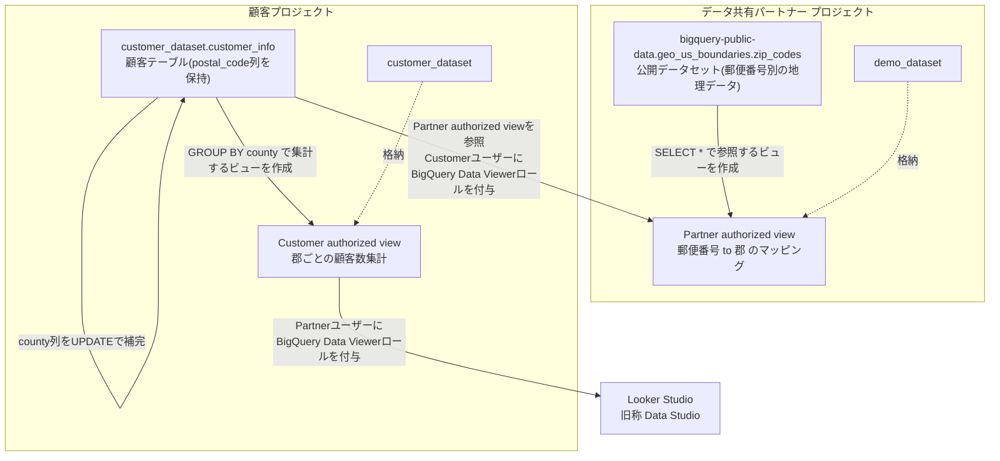
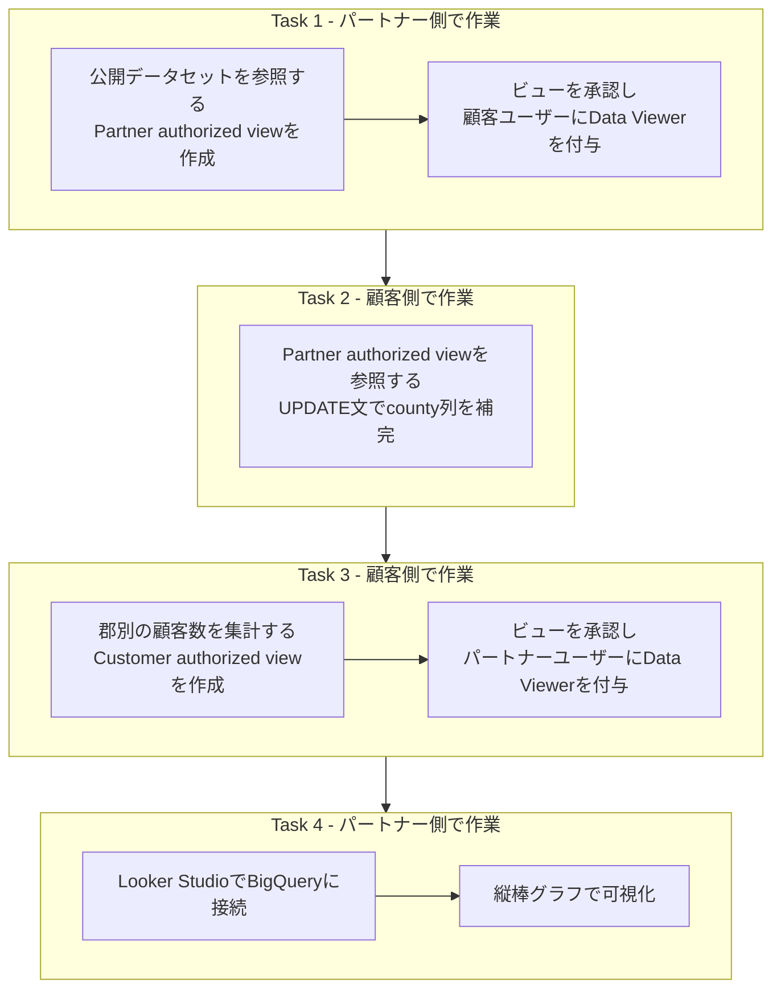

# BigQueryによるデータ共有チャレンジラボ 徹底解説ガイド

> 対象ラボ: *Share Data Using Google Data Cloud: Challenge Lab*
> https://www.skills.google/course_templates/657/labs/591412

このガイドは、Google Cloud のチャレンジラボ「BigQueryデータセットをプロジェクト間で共有し、双方向データ交換とLooker Studio(旧 Data Studio)での可視化を行う」課題を、初学者でも迷わず完了できるようにステップバイステップで解説したものです。各手順の「なぜそうするのか」という根拠には、必ず公式ドキュメントなど一次情報のURLを添えています。

---

## 1. このラボの全体像

このラボでは、あなたは2つの役割を1人で演じます。

| 役割 | 立場 | このラボでやること |
|---|---|---|
| データ共有パートナー (Data Sharing Partner) | データ提供者 | 公開データセット(郵便番号ごとの地理情報)を Authorized View として顧客に公開する |
| 顧客 (Customer) | データ利用者兼提供者 | パートナーのビューを使って自社データを補完し、集計結果を再びパートナーに Authorized View として公開する |

つまり「パートナー → 顧客」「顧客 → パートナー」の**双方向データ共有**を、BigQueryの Authorized View という仕組みだけで実現するのがこのラボの核心です。

### 1.1 全体アーキテクチャ



**読み方のポイント**

- Authorized View は「元データそのもの」ではなく「クエリ結果への窓口」を共有する仕組みです。相手は元テーブル(`customer_info` や `zip_codes`)には直接アクセスできず、あくまで公開されたビューの結果しか見えません。これが Authorized View の最大の利点です。
  出典: [Authorized views | BigQuery | Google Cloud](https://cloud.google.com/bigquery/docs/authorized-views)
- ビューを「作成」しただけでは相手はまだ何も見られません。「ビューの承認(Authorize)」と「ユーザーへのIAMロール付与」という**2段階の許可**が必要です。この2段階を混同するのがこのラボで最もつまずきやすいポイントです(詳しくは3章・5章で解説します)。

### 1.2 作業フローの全体像(誰が何をするか)



---

## 2. 事前準備の注意点

- 演習用アカウントは Incognito(シークレット)ウィンドウで使い、個人のGoogleアカウントと混在させないこと。これはラボの標準的な注意事項ですが、IAM設定の切り替えミスを防ぐという意味でも実務上重要です。
- Task 1・Task 4はパートナープロジェクトのコンソール、Task 2・Task 3は顧客プロジェクトのコンソールで作業します。**今どちらの役割としてログインしているか**を常に意識してください。作業ミスの多くは「ログインしているプロジェクトの取り違え」から発生します。

---

## 3. Task 1: パートナー承認済みビュー(Partner authorized view)の作成

### 3.1 手順

1. パートナープロジェクトのBigQueryコンソールで `demo_dataset` を開く(なければ作成する)。
2. 以下のクエリでビューを作成し、`demo_dataset` 内に指定された名前で保存する。

```sql
SELECT
 *
FROM
 `bigquery-public-data.geo_us_boundaries.zip_codes`;
```

3. 作成したビューを**承認(Authorize)**する。
4. 顧客ユーザー(Customer username)に、そのビューへの **BigQuery Data Viewer** ロールを付与する。

### 3.2 なぜこの順序なのか

BigQueryの公開データセットは「データセットは共有されているがプロジェクトは共有されていない」という特殊な構造です。そのためクエリを実行するには自分のプロジェクトを課金プロジェクトとして指定する必要があります。この特性上、公開データを直接顧客に渡すのではなく、いったん自分のプロジェクトのビューとして再公開する、というこのラボの設計は理にかなっています。
出典: [Connect to Google BigQuery | Looker Studio](https://cloud.google.com/looker/docs/studio/connect-to-google-bigquery)(「公開データセットはデータセットのみが共有されプロジェクトは共有されない」という仕様について記載)

ビューの「作成」と「承認」が分離されているのは、BigQueryのセキュリティモデルの根幹です。Authorized View は「ビュー自身にソースデータへのアクセス権を持たせる」ことで、閲覧者本人に元データへの権限を渡さずに結果だけを渡す仕組みです。ビューを承認するという操作は、まさに「このビューにはソースデータへのアクセスを許可する」という宣言にあたります。
出典: [Create an authorized view | BigQuery](https://cloud.google.com/bigquery/docs/create-authorized-views)

### 3.3 詰まりやすいポイント

- 同じソースデータセットに対して複数の Authorized View を作る予定がある場合は、ビュー単位ではなく**データセット単位で承認する「Authorized Dataset」**を使うと管理が楽になります。今回のラボはビューが1つなので個別承認で十分ですが、実務でスケールする際はこちらを検討してください。
  出典: [Authorized datasets | BigQuery](https://cloud.google.com/bigquery/docs/authorized-datasets)
- IAMロール付与は「ビューの承認」とは別操作です。承認だけして権限付与を忘れると、顧客はビューの存在自体を認識できずクエリはPermission Deniedになります。
  出典: [Control access to resources with IAM | BigQuery](https://cloud.google.com/bigquery/docs/control-access-to-resources-iam)

---

## 4. Task 2: 顧客データテーブルの更新

### 4.1 手順

顧客プロジェクトのコンソールに切り替え、次のクエリを実行します。

```sql
UPDATE
 `Customer A Project ID.customer_dataset.customer_info` cust
SET
cust.county=vw.county
FROM
`<PARTNER_PROJECT_ID>.demo_dataset.<PARTNER_AUTHORIZED_VIEW>` vw
WHERE
vw.zip_code=cust.postal_code;
```

`<PARTNER_PROJECT_ID>` と `<PARTNER_AUTHORIZED_VIEW>` はプレースホルダーです。ラボで指定された実際のパートナープロジェクトIDとビュー名に置き換えてください。

実行後、`14行が更新されました(This statement modified 14 rows)` のようなメッセージが表示されれば成功です。

### 4.2 なぜこの書き方をするのか

BigQueryのDML `UPDATE` 文は `FROM` 句で別テーブル(ここでは他プロジェクトのAuthorized View)と結合し、条件に合致した行だけを更新できます。1行ずつUPDATEを繰り返すのではなく、このように**条件付きの一括更新**にすることが公式に推奨されているベストプラクティスです。
出典: [Data manipulation language (DML) statements in GoogleSQL](https://cloud.google.com/bigquery/docs/reference/standard-sql/dml-syntax)、[Transform data with DML | BigQuery](https://cloud.google.com/bigquery/docs/data-manipulation-language)

`WHERE` 句で結合条件(`vw.zip_code = cust.postal_code`)を1件のソース行に一意に絞れない場合、`UPDATE/MERGE must match at most one source row for each target row` というランタイムエラーになります。ソース側(ビュー)にzip_codeの重複がないか事前に確認しておくと安全です。
出典: [Data manipulation language (DML) statements in GoogleSQL](https://cloud.google.com/bigquery/docs/reference/standard-sql/dml-syntax)

### 4.3 詰まりやすいポイント

- `postal_code` と `zip_code` の**データ型が一致しているか**を確認してください(片方がSTRING、もう片方がINT64だと結合条件が一致せず更新件数が0になります)。
- Task 1でCustomerユーザーへの権限付与が漏れていると、このUPDATE文は他プロジェクトのビューを参照できずエラーになります。エラーが出たらまずTask 1のIAM設定に戻って確認するのが早道です。

---

## 5. Task 3: 顧客承認済みビュー(Customer authorized view)の作成

### 5.1 手順

1. 顧客プロジェクトの `customer_dataset` に、以下のクエリでビューを作成する。

```sql
SELECT
  county,
COUNT(1) AS Count
FROM
 `Customer A Project ID.customer_dataset.customer_info` cust
GROUP BY
 county
HAVING county is not null
```

2. ビューを**承認**する。
3. パートナーユーザー(Partner username)に **BigQuery Data Viewer** ロールを付与する。

### 5.2 なぜこの設計が良いのか

このビューは生の `customer_info` テーブルを丸ごと見せるのではなく、`county` ごとの件数という**集計済みの粒度**だけを公開しています。これはAuthorized Viewの典型的な使い方で、「相手に必要な情報の粒度だけを渡し、個々の顧客レコードのような機微な情報は渡さない」というデータ最小化の原則にも合致します。
出典: [Create an authorized view | BigQuery](https://cloud.google.com/bigquery/docs/create-authorized-views)(「列やフィールドを絞り込んで結果を返せる」という記載)

権限付与についても、Task 1と同じく「必要な相手に、必要な粒度のデータだけを、最小権限で」というIAMの最小権限の原則(Principle of Least Privilege)に沿っています。
出典: [Use IAM securely | Google Cloud](https://cloud.google.com/iam/docs/using-iam-securely)

### 5.3 詰まりやすいポイント

- `HAVING county is not null` を忘れると、`county` が補完されなかった顧客(Task 2のUPDATEで一致しなかった行)が `null` の集計行として混入し、Task 4のグラフが歪みます。
- **Data Viewerロールだけではクエリを実行できないケース**に注意してください。`roles/bigquery.dataViewer` にはデータを読む権限は含まれますが、ジョブを実行する権限(`bigquery.jobs.create`)は含まれていません。ラボ環境では通常プロジェクトの基本ロールで担保されていますが、実務で同じ構成を組む場合は `roles/bigquery.jobUser` を別途プロジェクトレベルで付与する必要があります。
  出典: [BigQuery IAM roles and permissions](https://cloud.google.com/bigquery/docs/access-control)

---

## 6. Task 4: Looker Studio(旧 Data Studio)での可視化

### 6.1 用語について

ラボの手順書には「Data Studio」と記載されていますが、このプロダクトは **Looker Studio** に名称変更されています。操作画面や手順自体は同一ですので、「Data Studio」という表記が出てきたら「Looker Studio」と読み替えてください。

### 6.2 手順

1. Looker Studio (`lookerstudio.google.com`) を開き、空のレポート(Blank Report)を作成する。
2. BigQueryコネクタを選択し、Googleアカウントを認証する。
3. 「My Projects」から顧客プロジェクトへ移動し、`Customer authorized view` を選択してレポートに追加する。
4. レポート名を指定された名前に設定する。
5. 縦棒グラフ(Vertical Bar Chart)を挿入する。
6. `county` をディメンションに、`Count` を内訳ディメンション(Breakdown Dimension)およびメトリクスに設定する。

### 6.3 なぜこの手順なのか

Looker StudioからBigQueryに接続する際、テーブルではなく**あらかじめ集計・整形されたビュー**に接続するのは公式にも推奨されているパターンです。ダッシュボード側で毎回重い集計クエリを走らせるより、ビュー側で事前集計しておく方が表示速度とコストの両面で有利です。今回のCustomer authorized viewは、まさにこの「ビュー経由で接続する」パターンの実例になっています。
出典: [Connect to Google BigQuery | Looker Studio](https://cloud.google.com/looker/docs/studio/connect-to-google-bigquery)

### 6.4 詰まりやすいポイント

- 「My Projects」に顧客プロジェクトが表示されない場合、認証しているGoogleアカウントにCustomer authorized viewへのData Viewerロールが付与されているか(Task 3の最後の手順)を再確認してください。
- 縦棒グラフのフィールド設定で「ディメンション」と「内訳ディメンション」を混同しやすいので注意してください。ディメンションはX軸の分類(`county`)、内訳ディメンションは色分けの基準、メトリクスは棒の高さ(`Count`)を決めます。

---

## 7. よくあるエラーと対処法

| 症状 | 主な原因 | 対処方法 |
|---|---|---|
| ビューは作成できるが、相手がクエリすると権限エラーになる | 「ビューの承認」と「相手ユーザーへのIAM付与」のどちらか、または両方が未実施 | 承認とIAM付与は別工程。両方が完了しているかIAMポリシーの画面で確認する |
| Task 2のUPDATE文の更新件数が0件になる | `zip_code` と `postal_code` の型不一致、または結合条件に一致する行が存在しない | 両カラムの型を確認し、必要ならCASTする。件数がおかしい場合はSELECTで結合結果を先に確認する |
| UPDATE/MERGE must match at most one source row というエラー | ソース側(ビュー)の結合キーに重複がある | `GROUP BY` や `DISTINCT` でソース側の重複を排除してから結合する |
| Looker StudioでCustomer authorized viewが選択肢に出てこない | 認証アカウントにData Viewerロールが付与されていない、または別プロジェクトを見ている | Task 3のIAM付与を再確認し、「My Projects」で正しいプロジェクトを選び直す |
| Data Viewerロールを付与したのにクエリ実行時にエラーになる | Data Viewerロールにはジョブ実行権限(bigquery.jobs.create)が含まれない | プロジェクトレベルで roles/bigquery.jobUser を追加で付与する |

---

## 8. ベストプラクティスまとめ

| 観点 | ベストプラクティス | 出典 |
|---|---|---|
| データ共有の粒度 | 元テーブルを直接公開せず、必要な列・集計結果だけをビューとして公開する | [Create an authorized view](https://cloud.google.com/bigquery/docs/create-authorized-views) |
| 権限設計 | 常に最小権限(Data Viewerなど必要最小限のロール)を、必要な相手にのみ付与する | [Use IAM securely](https://cloud.google.com/iam/docs/using-iam-securely) |
| 複数ビューの承認管理 | 同一データセットに対するビューが増えたらAuthorized Datasetへの切り替えを検討する | [Authorized datasets](https://cloud.google.com/bigquery/docs/authorized-datasets) |
| 大量データの更新 | UPDATEは1行ずつでなく条件付きの一括更新にする。頻繁に更新する場合はクラスタリングも検討する | [Transform data with DML](https://cloud.google.com/bigquery/docs/data-manipulation-language) |
| BIツールとの接続 | 生テーブルではなく、事前集計済みのビュー経由で接続しダッシュボードの速度とコストを最適化する | [Connect to Google BigQuery \| Looker Studio](https://cloud.google.com/looker/docs/studio/connect-to-google-bigquery) |
| 組織を越えたスケール | 個別のAuthorized Viewの手動運用が煩雑になったら、カタログ化・モニタリング機能を持つ BigQuery sharing(旧 Analytics Hub)への移行を検討する | [Introduction to BigQuery sharing](https://cloud.google.com/bigquery/docs/analytics-hub-introduction) |

### 補足: このラボの先にある選択肢(BigQuery sharing / 旧Analytics Hub)

このラボで使ったAuthorized Viewは、少数のプロジェクト間でのシンプルな共有には最適です。一方、共有先が増えたり、組織をまたいだデータ交換を継続的に運用する必要がある場合は、**BigQuery sharing(旧称 Analytics Hub)**という上位の仕組みがあります。これはデータをコピーせずに「リンクされた読み取り専用データセット」として提供し、サブスクライバーの利用状況もモニタリングできる、より運用性の高い共有基盤です。今回学んだAuthorized Viewの考え方(元データへの直接アクセスを渡さず、結果だけを共有する)は、BigQuery sharingでも土台として使われています。
出典: [Introduction to BigQuery sharing | BigQuery](https://cloud.google.com/bigquery/docs/analytics-hub-introduction)

---

## 9. 参考文献 / ソース一覧

- Authorized views(概要): https://cloud.google.com/bigquery/docs/authorized-views
- Create an authorized view(作成手順): https://cloud.google.com/bigquery/docs/create-authorized-views
- Authorized datasets: https://cloud.google.com/bigquery/docs/authorized-datasets
- Control access to resources with IAM | BigQuery: https://cloud.google.com/bigquery/docs/control-access-to-resources-iam
- BigQuery IAM roles and permissions: https://cloud.google.com/bigquery/docs/access-control
- Use IAM securely | Google Cloud: https://cloud.google.com/iam/docs/using-iam-securely
- Data manipulation language (DML) statements in GoogleSQL: https://cloud.google.com/bigquery/docs/reference/standard-sql/dml-syntax
- Transform data with data manipulation language (DML): https://cloud.google.com/bigquery/docs/data-manipulation-language
- Connect to Google BigQuery | Looker Studio: https://cloud.google.com/looker/docs/studio/connect-to-google-bigquery
- Introduction to BigQuery sharing(旧 Analytics Hub): https://cloud.google.com/bigquery/docs/analytics-hub-introduction
- ラボ本体: https://www.skills.google/course_templates/657/labs/591412
