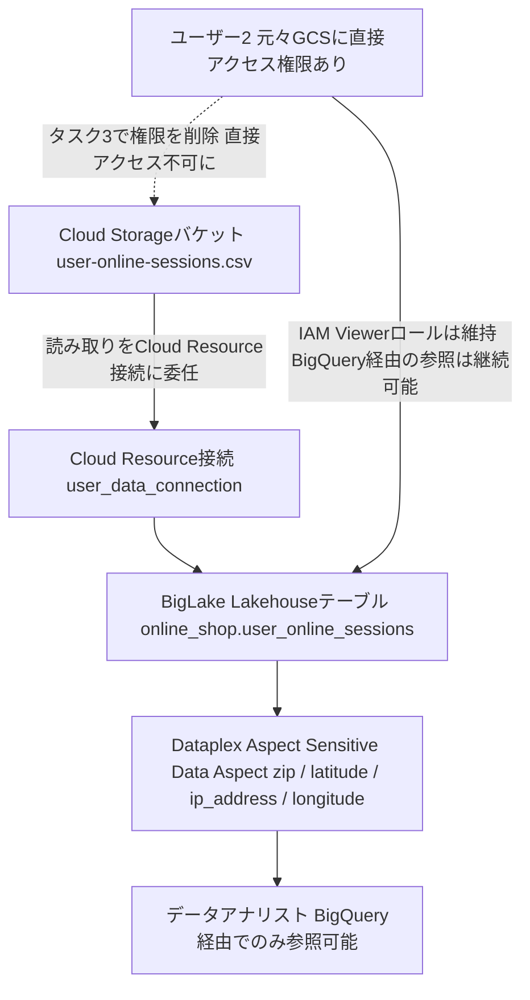
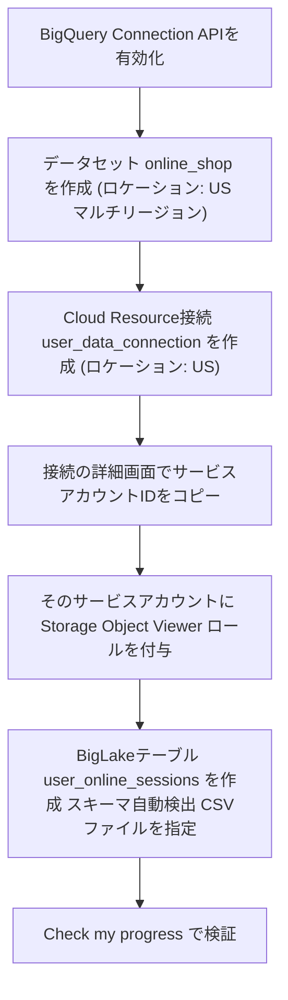
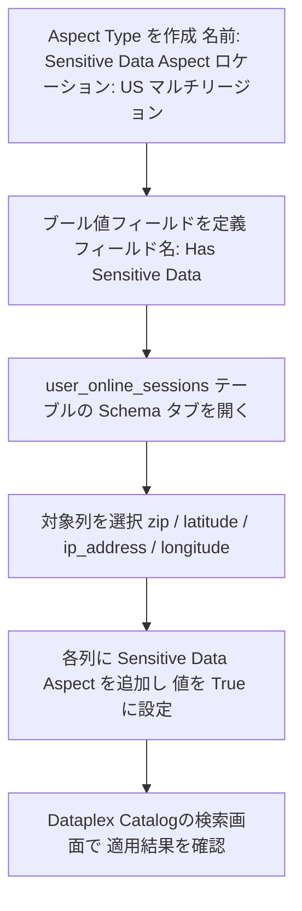
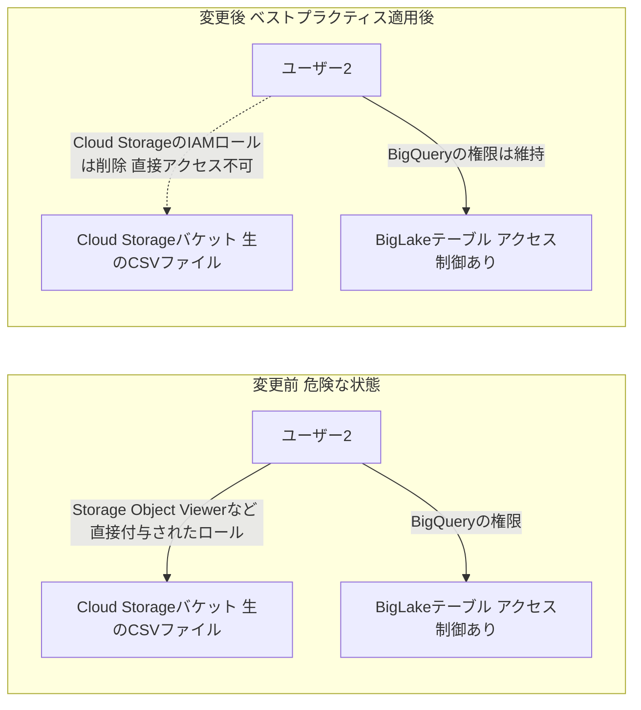

# BigQuery Lakehouseテーブル構築チャレンジラボ 完全解説
## 機密データを保護しながら Cloud Storage から BigLake テーブルを作る

対象ラボ: [Build and Secure Networks in Google Cloud (Challenge Lab)](https://www.skills.google/course_templates/751/labs/629231)

このドキュメントでは、単なる手順の丸暗記ではなく「なぜその操作が必要なのか」を理解できるように、各タスクの背景にあるアーキテクチャとGoogle Cloudのベストプラクティスを解説します。すべてのステップには公式ドキュメントの根拠URLを付記しているので、実務でも参照できます。

> **注記**: 2026年4月10日以降、Google Cloudのドキュメント上で「Dataplex Universal Catalog」は「**Knowledge Catalog**」という名称に変わっています。API名・CLIコマンド名・IAMロール名は変更されていないため、本ラボのコンソール表記(Dataplex Universal Catalog)と最新ドキュメント(Knowledge Catalog)のどちらで読んでも同じ機能を指します。
> 出典: [Transition from Data Catalog to Knowledge Catalog](https://docs.cloud.google.com/dataplex/docs/transition-to-dataplex-catalog)

---

## 0. シナリオ全体像

このラボのシナリオは「Cloud Storage上にあるユーザーの行動ログ(位置情報やIPアドレスなど機密情報を含む)を、BigQueryのLakehouseテーブルとして取り込み、列単位でアクセス制御をかけたうえで、移行前に使っていたCloud Storageへの直接アクセス権限を撤廃する」というものです。これは実際の企業でよくある「データレイクからデータウェアハウスへの安全な移行」パターンそのものです。

全体の流れを図解すると次のようになります。



ポイントは、**アクセス制御の中心をCloud Storageのバケット権限からBigQueryのテーブル権限へ移す**ことです。これにより、行・列単位のきめ細かいガバナンスがBigQuery側で一元的にかけられるようになります。

出典: [Introduction to BigLake tables](https://docs.cloud.google.com/bigquery/docs/biglake-intro)

---

## 1. 事前に理解しておきたい重要概念

| 用語 | 説明 |
|---|---|
| **BigLakeテーブル(Lakehouseテーブル)** | Cloud StorageなどBigQuery外部にあるデータを、あたかもBigQueryのネイティブテーブルのように扱える仕組み。アクセス制御をデータ本体から切り離す「アクセス委任(access delegation)」が特徴。 |
| **Cloud Resource接続** | BigQueryがCloud Storageなどの外部リソースにアクセスするための「橋渡し役」。接続を作成すると専用のサービスアカウントが自動生成される。 |
| **Dataplex Universal Catalog(Knowledge Catalog)のAspect** | テーブルや列に付与できる構造化メタデータ。「この列は機密データを含む」といった情報をスキーマに準拠した形で記録・検索できる。 |
| **Aspect Type** | Aspectのひな形(テンプレート)。どんなフィールド(ブール値、文字列など)を持つかを定義する。 |
| **IAM(Identity and Access Management)** | 「誰が」「どのリソースに」「どんな操作を」できるかを管理する仕組み。今回はCloud Storageバケットへの直接アクセス権限を扱う。 |

出典: [Introduction to BigLake tables](https://docs.cloud.google.com/bigquery/docs/biglake-intro) / [Manage aspects and enrich metadata](https://docs.cloud.google.com/dataplex/docs/enrich-entries-metadata)

---

## 2. タスク1: Cloud Resource接続を使ったLakehouseテーブルの作成

### 2.1 なぜCloud Resource接続が必要か

BigQueryが直接ユーザーの認証情報でCloud Storageを読みに行く方式(非BigLakeの外部テーブル)だと、**そのクエリを実行するユーザー自身がバケットへの読み取り権限を持っている必要**があります。これでは「BigQuery上ではテーブルへのアクセスを絞ったのに、Cloud Storageには誰でも入れる」という抜け穴が残ってしまいます。

Cloud Resource接続を使うと、実際にCloud Storageを読みに行くのは接続に紐づく**専用のサービスアカウント**になり、エンドユーザーはBigQueryのテーブル権限だけを見ればよくなります。これが今回のタスク3(IAM権限の削除)が成立する前提条件です。

出典: [Create Cloud Storage BigLake tables](https://docs.cloud.google.com/bigquery/docs/create-cloud-storage-table-biglake) / [Introduction to BigLake tables](https://docs.cloud.google.com/bigquery/docs/biglake-intro)

### 2.2 手順の全体フロー



### 2.3 ステップバイステップ

1. **BigQuery Connection APIを有効化する**
   ラボのヒントにもある通り、接続を作成する前にAPIが有効になっている必要があります。Google Cloudコンソールで「APIとサービス」からBigQuery Connection APIを検索し、有効化します。

2. **データセットを作成する**
   BigQuery Studioの「エクスプローラ」ペインからプロジェクトを選び、データセット `online_shop` を作成します。ロケーションタイプは **Multi-region**、リージョンは **US** を選択します(ラボの指示「Create all resources in the multiple regions in the United States」に従う)。

3. **Cloud Resource接続を作成する**
   「接続を作成」から接続タイプに **Vertex AI remote models, remote functions, BigLake and Spanner(Cloud resource)** を選び、接続ID `user_data_connection`、ロケーションを **US** に設定します。

4. **サービスアカウントに権限を付与する**
   作成した接続の詳細を開くと、`bq-connection-xxxxx@gcp-sa-bigquery-condel.iam.gserviceaccount.com` のようなサービスアカウントIDが表示されます。これをコピーし、Cloud Storageバケットの「アクセス権限」タブ、または `IAMと管理`から、このサービスアカウントに **Storage Object Viewer(roles/storage.objectViewer)** ロールを付与します。

   | 付与先 | 付与するロール | 目的 |
   |---|---|---|
   | 接続のサービスアカウント | Storage Object Viewer (`roles/storage.objectViewer`) | バケット内のCSVファイルを読み取るため |
   | 作業ユーザー自身 | BigQuery Connection Admin (`roles/bigquery.connectionAdmin`) | 接続の作成に必要(Qwiklabsの学生アカウントには通常付与済み) |

   > IAM権限の反映には数分のタイムラグが発生することがあります。テーブル作成時に権限エラーが出た場合は、1〜2分待ってから再試行してください。

   出典: [Create Cloud Storage BigLake tables(Terraformサンプルにも同様の待機処理あり)](https://docs.cloud.google.com/bigquery/docs/create-cloud-storage-table-biglake) / [Create object tables](https://docs.cloud.google.com/bigquery/docs/object-tables)

5. **BigLakeテーブルを作成する**
   `online_shop` データセットの「アクションを表示」→「テーブルを作成」を選び、以下を指定します。
   - 作成元: Google Cloud Storage
   - ファイルパス: `gs://<Project ID>-bucket/user-online-sessions.csv`(`<Project ID>`は自分のプロジェクトIDに置き換える)
   - テーブルの種類: **Create a BigLake table using a Cloud Resource connection** を選択
   - 接続ID: 手順3で作成した `user_data_connection`
   - テーブル名: `user_online_sessions`
   - スキーマ: **Auto detect(自動検出)** を有効化

6. **Check my progressで検証する**

出典: [Create Cloud Storage BigLake tables](https://docs.cloud.google.com/bigquery/docs/create-cloud-storage-table-biglake) / [Create and set up a Cloud resource connection](https://docs.cloud.google.com/bigquery/docs/create-cloud-resource-connection)

---

## 3. タスク2: 機密データ列へのAspect作成・適用・検証

### 3.1 AspectはIAMの代わりではない

ここで初学者がつまずきやすいポイントがあります。**Aspectはアクセス制御そのものではなく、メタデータ(注釈)です。** 「この列は機密データを含む」という情報をカタログ上に記録し、検索やガバナンスレビューに使えるようにする仕組みであり、Aspectを付けただけでは列への閲覧権限が自動的に制限されるわけではありません。実際にアクセス制御を行いたい場合は、別途BigQueryの列レベルセキュリティ(ポリシータグ)やデータマスキングと組み合わせるのが一般的です。今回のラボではまず「機密データがどこにあるかをカタログ上で可視化する」ことがゴールです。

出典: [AI-Driven Data Governance With Dataplex Aspect Types](https://xebia.com/blog/ai-powered-data-governance-on-google-cloud/)(Aspect Typeは「ガバナンスの契約」であり、それ自体はアクセス制御を強制しない旨を明記)

### 3.2 手順の全体フロー



### 3.3 ステップバイステップ

1. **Aspect Typeを作成する**
   Google Cloudコンソールで「Dataplex Universal Catalog」→「メタデータの種類(Metadata types)」→「Aspect types & tag templates」タブ→「Custom」タブを開き、「Create aspect type」をクリックします。
   - Aspect type ID: `sensitive-data-aspect` のような一意なID
   - 表示名: `Sensitive Data Aspect`
   - ロケーション: **US(マルチリージョン)**

2. **フィールドを定義する**
   フィールド追加画面で以下を設定します。
   - フィールド名: `Has Sensitive Data`
   - データ型: **Boolean**

3. **対象テーブルのスキーマ画面を開く**
   BigQuery Studioまたはカタログ検索で `user_online_sessions` テーブルを開き、「スキーマ」タブを表示します。列単位でAspectを追加できるUIが用意されています。

4. **各列にAspectを適用する**
   `zip`、`latitude`、`ip_address`、`longitude` の4列それぞれに対して「Aspectを追加」から `Sensitive Data Aspect` を選択し、`Has Sensitive Data` の値を `True` に設定して保存します。

| 列名 | Has Sensitive Data | 理由(参考) |
|---|---|---|
| `zip` | True | 郵便番号は他情報と組み合わせて個人特定につながりうる |
| `latitude` | True | 位置情報は直接的な行動追跡につながる |
| `ip_address` | True | ネットワーク識別子であり個人情報保護の対象になりやすい |
| `longitude` | True | 位置情報は直接的な行動追跡につながる |

5. **適用結果を検証する**
   Dataplex Universal Catalogの「検索(Search)」画面で検索プラットフォームを **Dataplex Universal Catalog** に切り替え、`user_online_sessions` を検索し、対象列に `Sensitive Data Aspect` が表示されていることを確認します。

出典: [Manage aspects and enrich metadata](https://docs.cloud.google.com/dataplex/docs/enrich-entries-metadata) / [Quickstart: Add metadata to a BigQuery table](https://cloud.google.com/dataplex/docs/add-metadata-quickstart) / [Create aspect type(コードサンプル)](https://docs.cloud.google.com/dataplex/docs/samples/dataplex-create-aspect-type)

### 3.4 Aspect Type作成に必要なロール

| 権限レベル | ロール | できること |
|---|---|---|
| フル権限 | Dataplex Catalog Admin (`roles/dataplex.catalogAdmin`) | Aspect Type / Aspectを含む全メタデータリソースの管理 |
| 作成・編集 | Dataplex Catalog Editor (`roles/dataplex.catalogEditor`) | Aspect Type / Aspectの作成・編集 |
| Aspect Typeのみ | Dataplex Aspect Type Owner (`roles/dataplex.aspectTypeOwner`) | カスタムAspect Typeのフル権限 |
| 参照のみ | Dataplex Catalog Viewer (`roles/dataplex.catalogViewer`) | Aspect Typeとその権限の閲覧 |

出典: [Manage aspects and enrich metadata](https://docs.cloud.google.com/dataplex/docs/enrich-entries-metadata)

---

## 4. タスク3: Cloud Storageへの直接IAM権限の削除

### 4.1 なぜ削除するのがベストプラクティスなのか

これがこのラボで最も重要な学びです。BigLakeの公式ドキュメントには明確な警告があります。

> データアナリストに、Cloud Storageのオブジェクトを直接読み取れる権限(Storage Object Viewerロールなど)を持たせてはいけません。それはデータウェアハウス管理者が設定したアクセス制御を迂回できてしまうためです。

出典: [Introduction to BigLake tables](https://docs.cloud.google.com/bigquery/docs/biglake-intro)

つまり、タスク1でCloud Resource接続の専用サービスアカウントに読み取り権限を持たせた時点で、**ユーザー自身がバケットに直接アクセスできる権限はもう不要**になります。むしろ残しておくと、タスク2で列にAspectを付けて可視化した機密データを、ユーザーがBigQueryを経由せず生のCSVファイルから読めてしまうという抜け道になります。

### 4.2 変更前後の比較



### 4.3 ステップバイステップ

1. **現在のIAM設定を確認する**
   Cloud Storageのバケット詳細画面(または「IAMと管理」→「IAM」)を開き、`ユーザー2`に付与されているロールの一覧を確認します。プロジェクト閲覧者(Viewer)ロールと、Cloud Storage関連のロール(例: `roles/storage.objectViewer` や `roles/storage.objectAdmin` など)の両方が付いているはずです。

2. **Cloud Storageのロールだけを取り除く**
   タスクの指示は「プロジェクト閲覧者(Viewer)ロールは残す」「Cloud Storageのロールだけを削除する」ことです。コンソールでは、ユーザー2の行にある鉛筆アイコンから該当ロールのみ削除するか、gcloudでは次のように操作します。

   ```bash
   gcloud storage buckets remove-iam-policy-binding gs://BUCKET_NAME \
     --member="user:USER_2_EMAIL" \
     --role="roles/storage.objectViewer"
   ```

   バケット単位ではなくプロジェクト単位でロールが付与されている場合は、`gcloud projects remove-iam-policy-binding` を使う必要があります。コンソールの「IAMと管理」→「IAM」画面で、そのユーザーの行にあるロールのうち **Cloud Storage関連のものだけ**を削除(ゴミ箱アイコン)し、Viewerロールは残す点に注意してください。

3. **Check my progressで検証する**

出典: [Set and manage IAM policies on buckets](https://docs.cloud.google.com/storage/docs/access-control/using-iam-permissions) / [gcloud storage buckets remove-iam-policy-binding](https://cloud.google.com/sdk/gcloud/reference/storage/buckets/remove-iam-policy-binding)

---

## 5. ベストプラクティスまとめ

| 原則 | 内容 |
|---|---|
| アクセス委任 | データへの直接アクセスはサービスアカウントに集約し、ユーザーはテーブル権限だけを見ればよい状態にする |
| 最小権限の原則 | Cloud Storageへの直接読み取り権限は、移行完了後は速やかに削除する |
| メタデータでの可視化 | AspectはIAMの代わりにはならないが、機密データの所在を組織全体で検索・監査可能にする |
| リージョンの一貫性 | データセット・接続・Aspect Typeのロケーションを揃えないと、接続時にエラーになることがある(本ラボはすべてUSマルチリージョンで統一) |
| 権限伝播の待機 | サービスアカウントへの権限付与直後はテーブル作成が失敗することがあるため、数分待ってから再試行する |

---

## 6. よくあるつまずきポイント

| 症状 | 原因 | 対処 |
|---|---|---|
| テーブル作成時に `Permission denied` | サービスアカウントへの `Storage Object Viewer` 付与直後で権限がまだ伝播していない | 1〜2分待って再実行する |
| 接続作成時にAPIエラー | BigQuery Connection APIが未有効化 | 「APIとサービス」から有効化を確認する |
| スキーマ自動検出でエラー | CSVのヘッダー行やエンコーディングの問題 | CSVの1行目が列名になっているか確認する |
| Aspectが検索結果に出てこない | 検索プラットフォームが「Data Catalog」のままになっている | 検索画面右上で「Dataplex Universal Catalog」に切り替える |
| ユーザー2がテーブルを見られなくなった | Cloud Storageロールと一緒にBigQuery側の権限も誤って削除してしまった | Viewerロールなど、BigQuery/プロジェクト閲覧に必要なロールは残す |

出典: [How to Set Up BigQuery External Tables over Cloud Storage Files](https://oneuptime.com/blog/post/2026-02-17-how-to-set-up-bigquery-external-tables-over-cloud-storage-files/view)

---

## 7. 参考文献

| タスク | ソース |
|---|---|
| Lakehouseテーブル/接続の概念 | [Introduction to BigLake tables](https://docs.cloud.google.com/bigquery/docs/biglake-intro) |
| Cloud Resource接続の作成 | [Create and set up a Cloud resource connection](https://docs.cloud.google.com/bigquery/docs/create-cloud-resource-connection) |
| BigLakeテーブルの作成手順 | [Create Cloud Storage BigLake tables](https://docs.cloud.google.com/bigquery/docs/create-cloud-storage-table-biglake) |
| サービスアカウントへの権限付与例 | [Create object tables](https://docs.cloud.google.com/bigquery/docs/object-tables) |
| Aspect / Aspect Typeの管理 | [Manage aspects and enrich metadata](https://docs.cloud.google.com/dataplex/docs/enrich-entries-metadata) |
| Aspect Type作成のクイックスタート | [Quickstart: Add metadata to a BigQuery table](https://cloud.google.com/dataplex/docs/add-metadata-quickstart) |
| Knowledge Catalogの名称変更について | [Transition from Data Catalog to Knowledge Catalog](https://docs.cloud.google.com/dataplex/docs/transition-to-dataplex-catalog) |
| IAMポリシーの削除コマンド | [Set and manage IAM policies on buckets](https://docs.cloud.google.com/storage/docs/access-control/using-iam-permissions) |
| gcloud remove-iam-policy-binding リファレンス | [gcloud storage buckets remove-iam-policy-binding](https://cloud.google.com/sdk/gcloud/reference/storage/buckets/remove-iam-policy-binding) |
