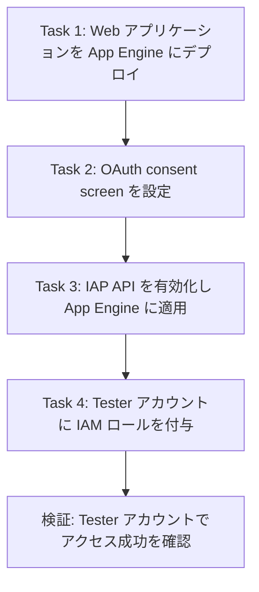
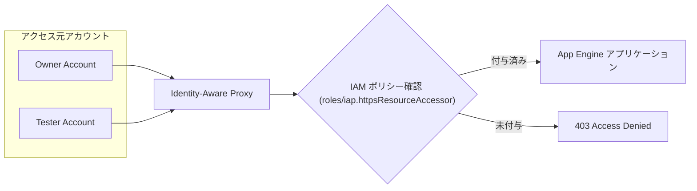
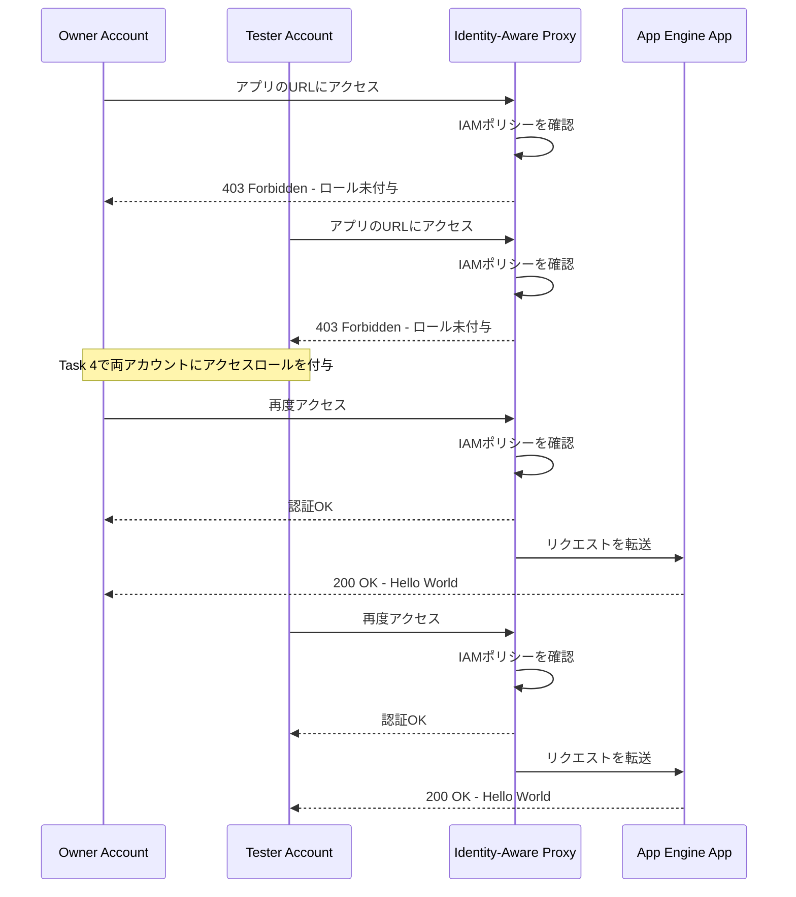

# Chrome Enterprise Premium Cloud Security Challenge Lab 完全攻略ガイド

> App Engine への Web アプリケーションデプロイから、OAuth consent screen の設定、Identity-Aware Proxy (IAP) によるアクセス制御まで、初学者でも迷わず進められるようにステップバイステップで解説します。

---

## 1. このガイドについて

このガイドは、Google Cloud Skills Boost の Challenge Lab「Chrome Enterprise Premium Cloud Security」を題材に、各タスクの**実施手順**と、その手順が**なぜベストプラクティスと言えるのか**を、公式ドキュメントを根拠にしながら解説するものです。

| 項目 | 内容 |
|---|---|
| Lab 名 | Chrome Enterprise Premium Cloud Security Challenge Lab |
| Lab 形式 | Challenge Lab（手順は提示されず、自動採点システムで評価される） |
| 対象サービス | App Engine / OAuth consent screen (Google Auth Platform) / Identity-Aware Proxy (IAP) / IAM |
| 登場アカウント | Owner アカウント（デプロイ・設定担当）、Tester アカウント（アクセス権限の検証用） |
| 注意点 | Lab は一時停止できないため、事前にこのガイドで流れを把握しておくことを推奨 |

Challenge Lab は「学んだスキルを自力で組み合わせて使う」ことを目的としているため、このガイドも単なるコマンド列挙ではなく、**各操作が全体のセキュリティ設計の中でどの役割を担っているか**を意識して構成しています。

---

## 2. 全体像:このLabで何を構築するか

このLabで最終的に構築されるのは、「App Engine 上の Web アプリケーションを IAP で保護し、IAM ポリシーで許可されたアカウントだけがアクセスできる状態」です。4つのタスクは、以下のように積み上げ式で進みます。



ポイントは、**Task 2 (OAuth consent screen) は Task 3 (IAP) の前提条件になっている**ことです。IAP は内部的に OAuth 2.0 を利用してユーザーを認証するため、consent screen が未設定だと IAP を有効化しようとした際に設定を促されます。この依存関係を先に理解しておくと、Lab 中に迷うことがありません。

保護後のアクセス制御の全体構造は次のとおりです。



**出典:** [Identity-Aware Proxy overview](https://docs.cloud.google.com/iap/docs/concepts-overview)

---

## 3. 事前準備(Before You Begin)

| 準備項目 | 内容 |
|---|---|
| ブラウザ | Chrome 推奨、シークレット/プライベートウィンドウを使用 |
| アカウント | Lab から発行される学生用アカウントのみを使用(個人アカウントは使わない) |
| Cloud Shell | ブラウザから利用可能、gcloud CLI がプリインストール済み |
| REGION 変数 | Lab の指示で与えられるリージョンを `gcloud config set compute/region REGION` で設定しておくと以降のコマンドが簡潔になる |

---

## 4. Task 1: Web アプリケーションを App Engine にデプロイする

### 4-1. なぜ App Engine なのか

App Engine はフルマネージドな PaaS(Platform as a Service)で、インフラの管理をほとんど意識せずに Web アプリケーションを迅速に公開できます。このLabではサーバー管理やスケーリング設定を学ぶことが目的ではなく、「デプロイされたアプリケーションをどう保護するか」に焦点を当てるため、App Engine standard 環境が使われます。

### 4-2. サンプルアプリケーションの取得

```bash
git clone https://github.com/GoogleCloudPlatform/python-docs-samples.git
cd python-docs-samples/appengine/standard_python3/hello_world/
```

公式サンプルリポジトリを使うことで、`app.yaml` や `requirements.txt` が既にApp Engine standard環境向けに正しく構成された状態から始められます。

### 4-3. App Engine アプリケーションの作成

プロジェクトに App Engine アプリケーションがまだ存在しない場合は、リージョンを選択して作成します。

```bash
gcloud app create --project=$DEVSHELL_PROJECT_ID
```

**ベストプラクティス:** App Engine アプリケーションは**プロジェクトごとに1つしか作成できず、作成後はリージョンを変更できません**。Lab の指示で与えられた `REGION` を落ち着いて確認してから実行することが重要です。

### 4-4. デプロイの実行

```bash
gcloud app deploy
```

デプロイ時には、対象の `app.yaml`、デプロイ元プロジェクト、デプロイ先サービス名などの確認プロンプトが表示されます。内容を確認したうえで `Y` を入力します。

デプロイの裏側では、Cloud Build がソースコードからコンテナイメージをビルドし、それを App Engine standard 環境で実行する、という流れになっています。

### 4-5. 動作確認

```bash
gcloud app browse
```

または App Engine ダッシュボードに表示される URL(`https://PROJECT_ID.REGION_ID.r.appspot.com` の形式)に直接アクセスして、"Hello World!" が表示されることを確認します。この時点ではアプリケーションは**誰でもアクセスできる公開状態**である点に注意してください。この後の Task 3 でこれを制限します。

### ベストプラクティスまとめ

| 観点 | 推奨事項 | 理由 |
|---|---|---|
| デプロイ前確認 | `gcloud app deploy` のプロンプトで対象プロジェクト・サービスを必ず確認 | 誤ったプロジェクトへの誤デプロイを防ぐ |
| バージョン管理 | 必要に応じ `--version` フラグでバージョン ID を明示 | ロールバックや複数バージョン管理を容易にする |
| ローカル検証 | デプロイ前に `venv` などの仮想環境でローカル実行して確認 | 本番環境でのエラーを未然に防ぐ |
| リージョン選定 | 想定ユーザーに近いリージョンを選ぶ(変更不可のため) | レイテンシ最適化、後戻りできない設定のため慎重に選択 |

**出典:**
- [Test and deploy your application | App Engine standard environment](https://docs.cloud.google.com/appengine/docs/standard/testing-and-deploying-your-app)
- [Setting up your Google Cloud project for App Engine](https://docs.cloud.google.com/appengine/docs/standard/managing-projects-apps-billing?tab=python)
- [gcloud app deploy リファレンス](https://docs.cloud.google.com/sdk/gcloud/reference/app/deploy)
- [Deploy your web service | App Engine standard environment](https://docs.cloud.google.com/appengine/docs/standard/python3/building-app/deploying-web-service)

---

## 5. Task 2: OAuth consent screen の設定

### 5-1. OAuth consent screen とは何か

OAuth consent screen(現在の Google Cloud コンソールでは **Google Auth Platform** という名称に整理されています)は、ユーザーがアプリケーションにログインする際に「このアプリが誰で、何を求めているか」を表示する画面です。IAP はこの仕組みを利用してユーザーを認証するため、IAP を有効化する前に consent screen の設定が必須になります。

**UI変更の注意点:** 2024年以降、コンソールのメニュー名が「OAuth consent screen」から「Google Auth Platform」に変更され、設定項目が **Branding / Audience / Data Access / Clients** の4タブに再編成されています。古いチュートリアルを参照すると迷うことがあるため注意してください。

### 5-2. 設定手順

1. Google Cloud コンソールで **APIs & Services > OAuth consent screen**(または **Google Auth Platform**)に移動する
2. 初回の場合は **Get started** をクリック
3. **App Information** で、App name と User support email を入力
4. **Audience** で **External** を選択する(組織外の Tester アカウントもアクセスするため)
5. **Contact Information** に通知用メールアドレスを入力
6. **Data Access(Scopes)** はこの Lab の要件どおり**何も追加しない**
7. **Finish** で Google API Services User Data Policy に同意し、**Create** をクリック

### 5-3. 各設定項目の意味

| 設定項目 | このLabでの選択値 | 理由 |
|---|---|---|
| User Type (Audience) | External | Tester アカウントを含む組織外のGoogleアカウントにもアクセスを許可する必要があるため |
| Scopes | 追加なし | このアプリはGoogle APIのユーザーデータにアクセスしないため、最小権限の原則にも合致する |
| Test users | 追加なし | Task要件で明示的に「no users」と指定されているため |

**ベストプラクティス:** OAuth のスコープは「アプリが実際に必要とするものだけ」を要求するのが最小権限の原則です。このLabのように単なる認証(誰がアクセスしてきたか判定するだけ)が目的であれば、スコープを追加する必要はありません。

**出典:**
- [Configure the OAuth consent screen and choose scopes](https://developers.google.com/workspace/guides/configure-oauth-consent)
- [Manage App Audience - Google Cloud Platform Console Help](https://support.google.com/cloud/answer/15549945?hl=en)

---

## 6. Task 3: IAP (Identity-Aware Proxy) の有効化

### 6-1. IAP とは何か

IAP は、アプリケーションコードを変更することなく、HTTPS 経由のアクセスに対して**アプリケーションレベルの認証・認可**を提供するサービスです。従来のファイアウォールのようなネットワークレベルの制御ではなく、「誰が」「どのIAMロールを持っているか」でアクセスを判断する、ゼロトラストに近い考え方に基づいています。

### 6-2. IAP API の有効化

コンソールから **APIs & Services > Library** で "Identity-Aware Proxy API" を検索し、**Enable** をクリックします。CLI から行う場合は以下のコマンドです。

```bash
gcloud services enable iap.googleapis.com
```

### 6-3. App Engine への IAP 適用

1. Google Cloud コンソールで **Security > Identity-Aware Proxy** ページに移動する
2. 対象プロジェクトの **APPLICATIONS** タブに表示される App Engine アプリを見つける
3. **IAP** 列のトグルスイッチをオンにする
4. 確認ダイアログで **Turn On** をクリック

**重要な依存関係:** OAuth consent screen(Task 2)が未設定のままここに進むと、コンソールから consent screen の設定を促されます。Task の順番どおりに進めていれば、この画面はスムーズに通過できます。

### 6-4. 動作検証:Owner と Tester のアクセス拒否を確認する

IAP をオンにしても、Project Owner や Editor にアプリへのアクセス権が自動付与されるわけではありません。`roles/iap.httpsResourceAccessor` をまだ持たない Owner と Tester の両アカウントでアプリへアクセスし、どちらも拒否されることを確認します。この「意図的な失敗」が Task 3 の検証ポイントです。



**出典:**
- [Enabling IAP for App Engine](https://docs.cloud.google.com/iap/docs/enabling-app-engine)
- [Securing App Engine apps with IAP](https://docs.cloud.google.com/chrome-enterprise-premium/docs/securing-app-engine?hl=en)
- [Identity-Aware Proxy overview](https://docs.cloud.google.com/iap/docs/concepts-overview)

---

## 7. Task 4: Owner と Tester へのアクセス権限付与

### 7-1. IAP 関連の主要 IAM ロール

| ロール名 | ロールID | 役割 |
|---|---|---|
| IAP-secured Web App User | `roles/iap.httpsResourceAccessor` | IAP保護されたリソースへのHTTPSアクセスを許可する、エンドユーザー向けの最小権限ロール |
| Project Owner / Editor など | (プロジェクトレベルの既存ロール) | IAPの管理権限があっても、IAP保護アプリへのアクセス権は自動付与されない |

このLabで Owner と Tester の両アカウントに付与すべきロールは **IAP-secured Web App User** です。アクセスのために Project Editor などの広いロールを追加するのは過剰権限であり、`roles/iap.httpsResourceAccessor` を明示的に付与します。

### 7-2. Principal の追加手順

1. **Security > Identity-Aware Proxy** ページで対象リソースのチェックボックスを選択する
2. 右側パネルの **Add principal** をクリック
3. **Add principals** ダイアログで Owner アカウントのメールアドレスを入力する
4. **Roles** から **Cloud IAP > IAP-secured Web App User** を選択する
5. **Save** をクリック
6. 同じ手順を Tester アカウントにも繰り返す

CLI から付与する場合は以下のようになります。

```bash
gcloud iap web add-iam-policy-binding \
  --resource-type=app-engine \
  --member="user:OWNER_EMAIL" \
  --role="roles/iap.httpsResourceAccessor" \
  --project=PROJECT_ID

gcloud iap web add-iam-policy-binding \
  --resource-type=app-engine \
  --member="user:TESTER_EMAIL" \
  --role="roles/iap.httpsResourceAccessor" \
  --project=PROJECT_ID
```

### 7-3. 再検証

ロール付与後に Owner と Tester の各アカウントでアプリの URL にアクセスし、両方で "Hello World!" が表示されることを確認します。成功確認は `roles/iap.httpsResourceAccessor` の付与後にだけ行います。これでアクセス制御の一連の流れ(公開 → IAP保護 → 特定アカウントへの許可)が完成します。

**ベストプラクティス:** 個々のユーザーに直接ロールを付与するのではなく、実運用では Google グループ(例: `testers@example.com`)にロールを付与し、メンバーシップでアクセス管理する方が運用負荷が低くなります。このLabでは学習目的のため個別アカウントへの付与で問題ありません。

**出典:**
- [Enabling IAP for App Engine](https://docs.cloud.google.com/iap/docs/enabling-app-engine)
- [Manage access to IAP-secured resources](https://cloud.google.com/iap/docs/managing-access)

---

## 8. よくあるエラーと対処法

| 症状 | 原因 | 対処法 |
|---|---|---|
| IAP のトグルがグレーアウトして押せない | OAuth consent screen が未設定 | Task 2 を先に完了させる |
| Google Auth Platform の設定画面を編集できない | アカウントに Editor / Owner 権限がない | IAM で自分のアカウントに適切なロールが付与されているか確認する |
| Tester アカウントで 403 が表示される(Task 3完了直後) | 想定どおりの挙動。IAM ロール未付与のため | Task 4 で `roles/iap.httpsResourceAccessor` を付与する |
| デプロイ後にサービスが起動しない | `app.yaml` のパスやランタイム指定の誤り | `hello_world` ディレクトリ直下で `gcloud app deploy` を実行しているか確認する |
| App Engine アプリが作成できない | 既にリージョンが設定済み、または権限不足 | `gcloud app describe` で既存設定を確認、Owner権限のアカウントで実行する |

**出典:** [Google OAuth Consent Screen: Setup, Fixes & Why It's Not Showing](https://www.unipile.com/google-oauth-consent-screen/)

---

## 9. 検証チェックリスト

| # | 確認項目 | 状態 |
|---|---|---|
| 1 | サンプルアプリが App Engine にデプロイされ、URLでアクセスできる | ☐ |
| 2 | OAuth consent screen が External / no scopes / no users で設定済み | ☐ |
| 3 | IAP API が有効化され、App Engine アプリに IAP が適用されている | ☐ |
| 4 | ロール付与前は Owner アカウントでアクセス拒否される | ☐ |
| 5 | ロール付与前は Tester アカウントでアクセス拒否される | ☐ |
| 6 | Owner と Tester に `roles/iap.httpsResourceAccessor` が付与されている | ☐ |
| 7 | ロール付与後、Owner アカウントでのアクセスが成功する | ☐ |
| 8 | ロール付与後、Tester アカウントでのアクセスが成功する | ☐ |

---

## 10. まとめ

このLabで扱われた4つのタスクは、実際のクラウドセキュリティ設計における典型的な流れそのものです。

- **公開してから守る**のではなく、**デプロイ直後から保護を前提に設計する**という順序の重要性
- OAuth consent screen は「誰の目に触れる画面か」を定義する土台であり、IAP のような認証機構の前提条件になること
- アクセス制御は「機能のオン/オフ」(IAPを有効化するかどうか)と「誰に許可するか」(IAMロールの付与)という2層で構成されること
- IAM ロールは常に必要最小限のものを選ぶこと(`iap.httpsResourceAccessor` のような専用ロールを使う)

これらの原則は App Engine 以外にも、Compute Engine や GKE、Cloud Run 上のアプリケーションを IAP で保護する際にも共通して当てはまります。

---

## 11. 参考文献

- [Identity-Aware Proxy overview](https://docs.cloud.google.com/iap/docs/concepts-overview) — IAPの基本概念とゼロトラストの考え方
- [Test and deploy your application | App Engine standard environment](https://docs.cloud.google.com/appengine/docs/standard/testing-and-deploying-your-app) — App Engineへのデプロイ手順とベストプラクティス
- [Deploy your web service | App Engine standard environment](https://docs.cloud.google.com/appengine/docs/standard/python3/building-app/deploying-web-service) — サンプルアプリのデプロイ手順
- [Setting up your Google Cloud project for App Engine](https://docs.cloud.google.com/appengine/docs/standard/managing-projects-apps-billing?tab=python) — App Engineアプリケーション作成とリージョン選択の注意点
- [gcloud app deploy コマンドリファレンス](https://docs.cloud.google.com/sdk/gcloud/reference/app/deploy)
- [Configure the OAuth consent screen and choose scopes](https://developers.google.com/workspace/guides/configure-oauth-consent) — OAuth consent screen(Google Auth Platform)の設定手順
- [Manage App Audience - Google Cloud Platform Console Help](https://support.google.com/cloud/answer/15549945?hl=en) — Audience(User Type)とTest usersの仕組み
- [Enabling IAP for App Engine](https://docs.cloud.google.com/iap/docs/enabling-app-engine) — App EngineへのIAP適用手順
- [Securing App Engine apps with IAP](https://docs.cloud.google.com/chrome-enterprise-premium/docs/securing-app-engine?hl=en) — App EngineとIAPを組み合わせた保護のウォークスルー
- [Manage access to IAP-secured resources](https://cloud.google.com/iap/docs/managing-access) — IAP関連のIAMロールとアクセス管理
- [Google OAuth Consent Screen: Setup, Fixes & Why It's Not Showing](https://www.unipile.com/google-oauth-consent-screen/) — Google Auth PlatformのUI変更点とよくあるトラブル
