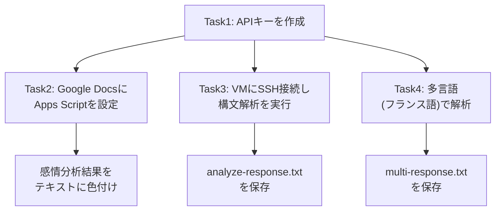
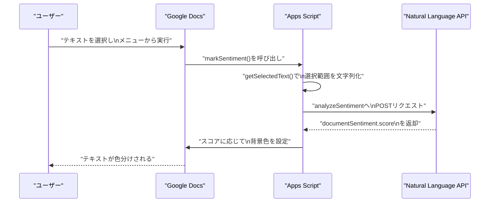
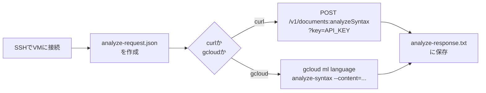
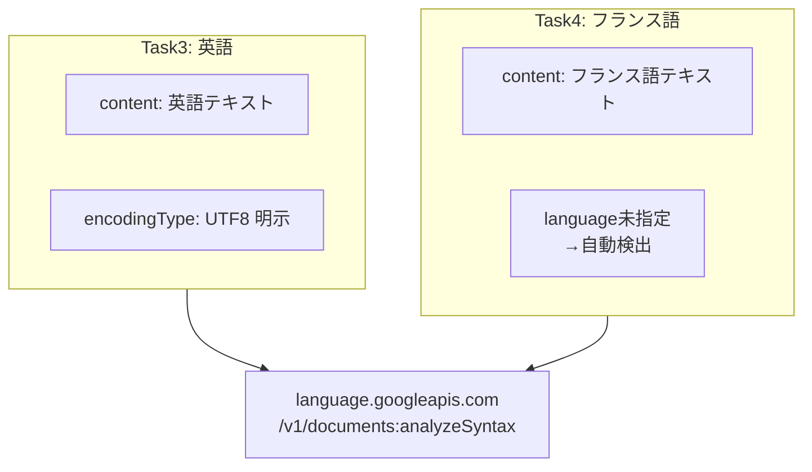

# Cloud Natural Language API チャレンジラボ 完全解説ガイド

対象ラボ：Google Docsとの連携、構文解析、多言語処理を含む「Cloud Natural Language API」チャレンジラボ。本ガイドでは、各タスクを初学者でも理解できるように、手順の意味・背景にあるベストプラクティス・公式根拠を併せて解説する。

---

## 1. このラボの全体像

チャレンジラボは4つのタスクで構成されており、すべて「1つのAPIキーを使い回す」という点でつながっている。まず全体の流れを俯瞰する。



ポイントは、**Task1で発行したAPIキーが以降すべてのタスクの認証手段になる**ということ。つまりTask1でのキー管理（保存場所・権限制限）の質が、ラボ全体のセキュリティレベルを決める。

---

## 2. Task 1: APIキーの作成

### 2.1 手順の要点

1. Google Cloud Consoleで「APIとサービス」→「認証情報」からAPIキーを作成する。
2. 作成したキーは、他のタスクで使い回すため必ずコピー・保存しておく。
3. Cloud Natural Language APIが有効化されていることを確認する（未有効の場合はキーがあっても呼び出しは失敗する）。

### 2.2 ベストプラクティス：なぜ「制限」をかけるべきか

学習用ラボでは制限をかけなくても動作するが、実務では以下の制限が強く推奨されている。

| 制限の種類 | 内容 | 目的 |
|---|---|---|
| APIターゲット制限 | このキーで呼び出せるAPIをCloud Natural Language APIのみに限定する | キー漏洩時の被害範囲を最小化する |
| アプリケーション制限 | 呼び出し元のIPアドレスやHTTPリファラーを限定する | 第三者による不正利用を防ぐ |
| 有効期限・棚卸し | 使っていないキーは削除し、定期的に再発行する | 攻撃対象領域（アタックサーフェス）を小さく保つ |

Google Cloudの公式ドキュメントでは、APIキーに制限を追加することで、万が一キーが漏洩した場合の影響を抑えられると説明されている。またAPIキーはあくまで「開発初期段階での動作確認を素早く行うための手段」であり、本番運用では推奨されていない点にも注意したい。

### 2.3 環境変数に保存する理由

Task3・4ではSSH接続したVM上でAPIキーをそのままコマンドに書くのではなく、環境変数に格納してから使う（例：`export API_KEY=<your_api_key>`）。

理由は主に2つ：

- コマンド履歴やスクリプトファイルにキーの文字列がそのまま残らないため、画面共有時や履歴の使い回し時に漏洩しにくい。
- 複数回リクエストを送る際に、毎回キーを打ち直す必要がなくなる。

公式ドキュメントでも、APIキーをクエリパラメータとしてURLに直接含める方法はURLスキャンによる漏洩リスクがあるため、可能な限り `x-goog-api-key` ヘッダーを使うことが推奨されている。学習用のcurlコマンドではクエリパラメータ形式（`?key=API_KEY`）がよく使われるが、これは簡便さのためであり、本番システムではヘッダー形式への置き換えを検討すべきである。

---

## 3. Task 2: Google Docsとの連携（Apps Script）

### 3.1 何が起きているのか

このタスクでは、Google Docs上で選択したテキストをApps Script経由でNatural Language APIに送り、感情スコア（-1.0〜1.0）を取得し、その値に応じてテキストの背景色を変える、という一連の流れを実装する。



### 3.2 コード内の重要ポイントの解説

#### `@OnlyCurrentDoc` の意味

コード冒頭にある `@OnlyCurrentDoc` は、Apps Scriptの権限スコープを「現在開いているドキュメントのみ」に限定するJSDocアノテーションである。これを付けない場合、スクリプトはユーザーが持つ**すべての**Google Docsファイルへのアクセス権限を要求してしまう。

これはGoogleが公式に推奨しているセキュリティ上のベストプラクティスであり、アドオンやスクリプトを配布する際は「必要最小限の権限だけを要求する」という原則（最小権限の原則）を体現している。

ただし注意点として、`@OnlyCurrentDoc` は高度なサービス（Advanced Services）や `openById()` によるファイル間アクセスには効果がなく、あくまで「現在のドキュメントに束縛されたスクリプト」で完結する処理にのみ適用される。

#### `UrlFetchApp` に必要な権限

`retrieveSentiment()` 関数内で使われている `UrlFetchApp.fetch()` は、外部のWeb API（今回はNatural Language API）を呼び出すためのApps Script標準サービスである。これを利用するには `https://www.googleapis.com/auth/script.external_request` というスコープが必要になり、通常はApps Scriptが自動的にコードをスキャンして検出・要求する。

#### 感情スコアと色分けのしきい値

| 条件 | スコア範囲 | 表示色 |
|---|---|---|
| ネガティブ | `score <= -0.2` | 赤 (`#ff0000`) |
| ニュートラル | `-0.2 < score < 0.2` | 黄 (`#ffff00`) |
| ポジティブ | `score >= 0.2` | 緑 (`#00ff00`) |

このしきい値（±0.2）はサンプルコード内で決め打ちされている値であり、Natural Language API自体が定義しているものではない。実運用では、対象テキストの性質（レビュー、SNS投稿、ニュース記事など）に応じてこのしきい値をチューニングすることがベストプラクティスとされる。

### 3.3 実装上のベストプラクティス

- **APIキーをコードに直書きしない**：サンプルコードでは学習のために `var apiKey = "your key here";` と直接埋め込んでいるが、本番運用では [PropertiesService](https://developers.google.com/apps-script/reference/properties) などのプロパティストアにキーを保存し、コード中から参照する形にするべきである。コード内へのハードコーディングは、公式ドキュメントでも避けるべき方法として明記されている。
- **`data.documentSentiment.score` の存在チェック**：レスポンスの構造が想定と異なる場合（APIエラー時など）にスクリプトが例外で落ちないよう、サンプルコードのようにnullチェックを行う。
- **選択範囲が空の場合の考慮**：`selection` が取得できない場合（テキストが選択されていない場合）に何もしない分岐を入れておくことは、UIの堅牢性として重要。

---

## 4. Task 3: 構文解析とParts of Speech（品詞）解析

### 4.1 全体の流れ



### 4.2 リクエストJSONの構造の意味

```json
{
  "document": {
    "type": "PLAIN_TEXT",
    "content": "Google, headquartered in Mountain View, ..."
  },
  "encodingType": "UTF8"
}
```

- `document.type`：入力テキストの形式。プレーンテキストかHTMLかを指定する。今回は `PLAIN_TEXT`。
- `document.content`：解析対象の文字列そのもの。
- `encodingType`：レスポンス内のオフセット（トークンの位置情報）を計算する際の文字エンコーディング。日本語や絵文字を含む場合、`UTF8`・`UTF16`・`UTF32`のどれを選ぶかで文字位置の数え方が変わるため、扱う言語圏に応じて明示的に指定することが推奨される。

### 4.3 curlコマンドでの呼び出し方（ベストプラクティス込み）

```bash
export API_KEY=<Task1で取得したキー>

curl "https://language.googleapis.com/v1/documents:analyzeSyntax?key=${API_KEY}" \
  -s -X POST -H "Content-Type: application/json; charset=utf-8" \
  --data-binary @analyze-request.json > analyze-response.txt
```

- `--data-binary @ファイル名` を使うことで、JSONファイルの中身をそのままリクエストボディとして送信できる（`-d @ファイル名` でも動作するが、改行の扱いなどでバイナリセーフな `--data-binary` が推奨されるケースが多い）。
- クエリパラメータで `key=` を渡す方式は学習用として手軽だが、前述の通りURLにキーが残る方式であるため、恒久的なシステムでは `x-goog-api-key` ヘッダー方式への切り替えを検討する。

### 4.4 gcloudコマンドという代替手段

同じ処理は `gcloud` CLIでも実行できる。

```bash
gcloud ml language analyze-syntax --content="Google, headquartered in Mountain View, ..." > analyze-response.txt
```

`gcloud` を使う利点は、APIキーの管理をgcloud自身の認証（Application Default CredentialsやCloud Shellの組み込み認証）に委ねられるため、コマンドラインにキー文字列を書く必要がなくなる点にある。ローカルファイルを直接渡したい場合は `--content-file=ファイルパス` を、Cloud Storage上のファイルを渡したい場合は `--content-file=gs://バケット名/ファイル名` を使う。

### 4.5 レスポンスの読み方

`analyzeSyntax` のレスポンスには、文（sentences）とトークン（tokens）の配列が含まれる。各トークンには以下のような情報が付与される。

| フィールド | 内容 |
|---|---|
| `text.content` / `text.beginOffset` | トークンの文字列と、文中での開始位置 |
| `partOfSpeech.tag` | 品詞タグ（`NOUN`、`VERB`、`PUNCT` など） |
| `dependencyEdge` | 係り受け関係（どの単語にかかっているか） |
| `lemma` | 単語の原形（レンマ） |

構文解析結果は文単位・トークン単位の情報が階層構造になっているため、`analyze-response.txt` を読む際は「まず `sentences` で文の境界を確認し、次に `tokens` で各単語の品詞・係り受けを追う」という順番で見ると理解しやすい。

---

## 5. Task 4: 多言語自然言語処理（フランス語）

### 5.1 リクエストの違い

Task3とTask4のJSONを比較すると、Task4では `encodingType` が省略されている点と、`content` がフランス語である点が異なる。



`language` パラメータを省略した場合、Natural Language APIはテキストの内容から言語を自動検出する。今回のフランス語の例文のように単一言語のテキストであれば自動検出で十分だが、複数言語が混在する文章や短すぎる文章では誤検出のリスクがあるため、実運用では `language` パラメータ（例：`fr` や `fr-FR`）を明示的に指定することがベストプラクティスとされている。

### 5.2 対応言語の確認

構文解析（Syntactic Analysis）機能でサポートされている主な言語は以下の通り。

| 言語 | ISO-639-1コード |
|---|---|
| 英語 | en |
| フランス語 | fr |
| ドイツ語 | de |
| イタリア語 | it |
| 日本語 | ja |
| 韓国語 | ko |
| ポルトガル語 | pt |
| ロシア語 | ru |
| スペイン語 | es |
| 中国語（簡体字） | zh |
| 中国語（繁体字） | zh-Hant |

対応言語は機能（構文解析／感情分析／エンティティ分析／分類）ごとに異なるため、多言語対応のプロダクトを設計する際は、必ず使う機能ごとの対応言語表を公式ドキュメントで確認する必要がある。

---

## 6. ラボ全体を通したベストプラクティスまとめ

| 観点 | ラボでの実装 | 実務でのベストプラクティス |
|---|---|---|
| APIキーの権限 | 制限なしで作成 | Cloud Natural Language APIのみに制限をかける |
| キーの保管場所 | コード直書き／環境変数 | Secret Managerやプロパティストアなど、コードから分離した場所に保管 |
| キーの送信方法 | クエリパラメータ | 可能であれば `x-goog-api-key` ヘッダーに切り替える |
| Apps Scriptの権限範囲 | `@OnlyCurrentDoc` で限定 | 追加のGoogleサービスを使う場合もスコープを都度見直す |
| 言語指定 | 一部で省略（自動検出） | 本番運用では明示的に言語コードを指定して誤検出を防ぐ |
| エンコーディング指定 | UTF8を明示 | 扱う文字種（絵文字・多言語）に応じて適切なエンコーディングを選定 |
| APIの有効化 | 事前に有効化が必須 | IaC（Terraformなど）で有効化状態をコード管理し、ヒューマンエラーを防ぐ |

---

## 7. 参考文献・根拠ソース

| No. | タイトル | URL |
|---|---|---|
| 1 | Manage API keys（APIキーの作成・制限） | https://docs.cloud.google.com/docs/authentication/api-keys |
| 2 | Best practices for managing API keys | https://docs.cloud.google.com/docs/authentication/api-keys-best-practices |
| 3 | Adding restrictions to API keys | https://docs.cloud.google.com/api-keys/docs/add-restrictions-api-keys |
| 4 | Use API keys to access APIs（ヘッダー vs クエリパラメータ） | https://docs.cloud.google.com/docs/authentication/api-keys-use |
| 5 | Quickstart: Setup the Natural Language API | https://docs.cloud.google.com/natural-language/docs/setup |
| 6 | Cloud Natural Language documentation（概要） | https://docs.cloud.google.com/natural-language/docs |
| 7 | Analyzing Syntax（構文解析・gcloudコマンド） | https://docs.cloud.google.com/natural-language/docs/analyzing-syntax |
| 8 | gcloud ml language analyze-syntax（コマンドリファレンス） | https://docs.cloud.google.com/sdk/gcloud/reference/ml/language/analyze-syntax |
| 9 | Language Support（対応言語一覧） | https://docs.cloud.google.com/natural-language/docs/languages |
| 10 | Authorization for Google Services（`@OnlyCurrentDoc`の説明） | https://developers.google.com/apps-script/guides/services/authorization |
| 11 | Authorization scopes for Editor add-ons | https://developers.google.com/workspace/add-ons/concepts/editor-scopes |
| 12 | URL Fetch Service（`UrlFetchApp`のスコープ） | https://developers.google.com/apps-script/reference/url-fetch |

---

以上がラボの4タスクに対する背景理解とベストプラクティスの解説である。ラボ環境では学習効率のためにセキュリティ上の簡略化（キーの直書き、制限なしキーなど）がされている箇所が複数あるため、実務に応用する際は「6. ラボ全体を通したベストプラクティスまとめ」の右列を必ず適用すること。
