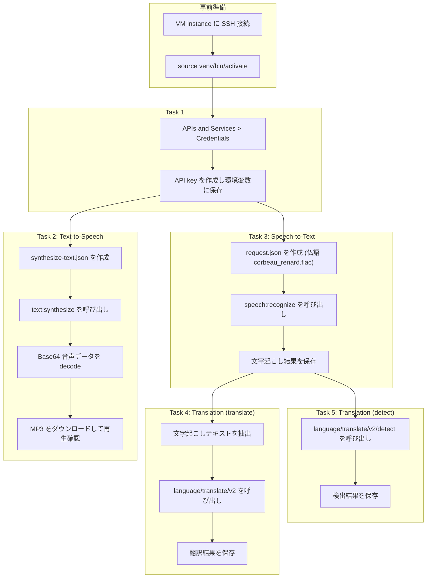
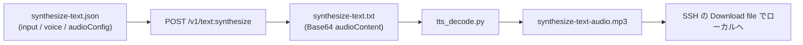
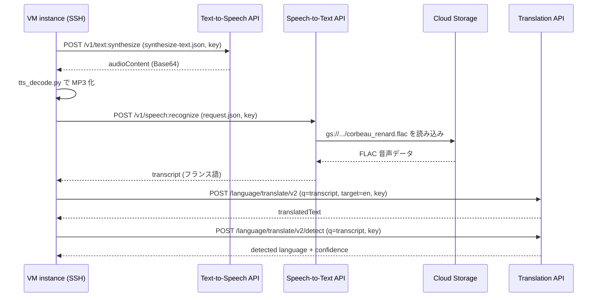

# Cloud Speech API チャレンジラボ 完全攻略ガイド

*― Text-to-Speech / Speech-to-Text / Cloud Translation API を初学者向けにステップバイステップ解説 ―*

> 対象ラボ: *Implement Speech and Language Solutions with Pre-trained APIs: Challenge Lab*（旧称 *Cloud Speech API 3 Ways: Challenge Lab*）
> 参照URL: https://www.skills.google/course_templates/700/labs/625113
>
> このガイドは、世界トップクラスのインフラエンジニア／Googleスペシャリストの視点から、チャレンジラボの各タスクを「なぜそうするのか」というベストプラクティスの根拠込みで解説するものです。チャレンジラボは手順を教えてくれないため、ここでは公式ドキュメントの裏付けとともに実装方法を提示します。

---

## 1. このチャレンジラボの全体像

このラボでは、あなたは「ジュニアクラウドアーキテクト」として、事前構成済みの VM インスタンス（以下 `Instance name`）に SSH 接続し、5つの音声・言語系 API を順番に呼び出していきます。

| Task | 内容 | 使用する API |
|---|---|---|
| Task 1 | API key の作成 | API Keys API |
| Task 2 | テキストから音声合成（Text-to-Speech） | Cloud Text-to-Speech API |
| Task 3 | 音声からテキスト文字起こし（フランス語） | Cloud Speech-to-Text API |
| Task 4 | テキストの翻訳 | Cloud Translation API |
| Task 5 | 言語の自動検出 | Cloud Translation API |

全タスクは「API key を作る → そのキーを使って各 API を curl で呼ぶ」という一本の線でつながっています。まず全体の流れを図で押さえておきましょう。



以降、各タスクを「手順」「ベストプラクティス」「根拠となるソース」の3点セットで解説します。

---

## 2. 事前準備

1. Google Cloud コンソールの Navigation menu から VM インスタンス（`Instance name`）の SSH ボタンをクリックして接続します。
2. ラボ用に用意された Python 仮想環境を有効化します。

```bash
source venv/bin/activate
```

**ベストプラクティス**: 仮想環境を使うことで、ラボ用に事前インストールされた Python パッケージ（`google-cloud-*` クライアントなど）とシステム全体の Python 環境を分離できます。`pip install` を打つ前に必ずこのコマンドを実行する癖をつけましょう。

---

## 3. Task 1: API key の作成

### 3.1 手順

1. Navigation menu → **APIs & Services** → **Credentials** を開きます。
2. **+ CREATE CREDENTIALS** → **API key** を選択します。
3. 生成されたキーをコピーし、Cloud Shell / VM 上で環境変数に保存します。

```bash
export API_KEY=<生成されたAPIキー>
```

以降のタスクではこの `${API_KEY}` を毎回使い回します。

### 3.2 ベストプラクティス（重要）

チャレンジラボの採点自体は「キーが作成されているか」だけを見ますが、実運用を想定するなら以下を必ず押さえてください。

| 対策 | 内容 | 目的 |
|---|---|---|
| API 制限（API restrictions） | このキーで呼び出せる API を Speech-to-Text / Text-to-Speech / Cloud Translation のみに限定する | キー漏洩時の被害範囲を最小化 |
| アプリケーション制限 | IP アドレスやリファラーなど呼び出し元を制限する | なりすまし利用の防止 |
| ヘッダーでの送信 | `key=` をクエリパラメータで付けず `X-goog-api-key` ヘッダーで渡す | URL 経由でのキー漏洩（アクセスログ・ブラウザ履歴・プロキシ等）を防ぐ |
| コードに埋め込まない | 環境変数やシークレットマネージャに保持する | ソースリポジトリへの誤コミットを防ぐ |
| 不要なキーの削除・ローテーション | 使わなくなったキーは削除し、定期的にローテーションする | 攻撃対象領域（attack surface）を縮小 |

Google 公式のベストプラクティスガイドでは、APIキーへの制限追加によって侵害された場合の影響を抑えられるとされ、クエリパラメータでのキー送信はURLスキャンによる盗用リスクがあるためHTTPヘッダーやクライアントライブラリの利用が推奨されています。また、`gcloud` CLI や REST API 経由で作成したキーはデフォルトで無制限になる点にも注意が必要です。Google Cloud コンソール経由での作成時にはAPI制限の追加が必須ですが、gcloud CLIやREST APIで作成する場合は制限を明示しない限りキーは無制限になります。

> 本ラボの Task 2〜5 のサンプルコードでは学習用に `?key=${API_KEY}` というクエリパラメータ形式（公式チュートリアルの標準的な提示方法）を使用しますが、本番運用では上記のヘッダー方式に置き換えることを強く推奨します。

**根拠ソース**:
- Manage API keys — https://docs.cloud.google.com/docs/authentication/api-keys
- Best practices for managing API keys — https://docs.cloud.google.com/docs/authentication/api-keys-best-practices
- Adding restrictions to API keys — https://docs.cloud.google.com/api-keys/docs/add-restrictions-api-keys

---

## 4. Task 2: Text-to-Speech API でテキストから音声を合成する

### 4.1 リクエストファイルを作成する

まず `synthesize-text.json` を作成します。

```bash
nano synthesize-text.json
```

```json
{
    "input": {
        "text": "Cloud Text-to-Speech API allows developers to include natural-sounding, synthetic human speech as playable audio in their applications. The Text-to-Speech API converts text or Speech Synthesis Markup Language (SSML) input into audio data like MP3 or LINEAR16 (the encoding used in WAV files)."
    },
    "voice": {
        "languageCode": "en-gb",
        "name": "en-GB-Standard-A",
        "ssmlGender": "FEMALE"
    },
    "audioConfig": {
        "audioEncoding": "MP3"
    }
}
```

> **ベストプラクティス／よくあるつまずき①（JSONの引用符）**
> ラボの課題文をそのままコピーすると、キーと値がシングルクォート（`'`）で書かれています。Google の一部チュートリアルでは curl の `--data` にインラインでシングルクォートを使う例が見られますが、これは「シェルの二重引用符で囲んだ文字列の中でエスケープを避けるための便宜的な書き方」であり、JSON の仕様（RFC 8259）としては文字列はダブルクォート（`"`）で囲むのが正しい形式です。ファイルとして保存する場合はシェルのエスケープを気にする必要がないため、上記のように **ダブルクォートで統一**するのが安全で、他の言語のパーサーやツール（`jq` など）とも互換性が保てます。
>
> **ベストプラクティス／よくあるつまずき②（改行）**
> 課題文の `text` の値は見やすさのために複数行に折り返されていますが、JSON の文字列リテラルの中に生の改行を含めることはできません（構文エラーになります）。`nano` に貼り付ける際は、**1行の連続した文字列**にしてから保存してください。

### 4.2 Text-to-Speech API を呼び出す

```bash
curl -X POST \
  -H "Content-Type: application/json; charset=utf-8" \
  -d @synthesize-text.json \
  "https://texttospeech.googleapis.com/v1/text:synthesize?key=${API_KEY}" \
  > synthesize-text.txt
```

レスポンスは Base64 エンコードされた音声データが `audioContent` フィールドに入った JSON です。音声合成のプロセスは synthesis と呼ばれ、生成される音声データはBase64エンコードされた文字列として出力されます。

### 4.3 デコード用スクリプトを作成する

```bash
nano tts_decode.py
```

```python
import argparse
from base64 import decodebytes
import json

"""
Usage:
        python tts_decode.py --input "synthesize-text.txt" \
        --output "synthesize-text-audio.mp3"
"""

def decode_tts_output(input_file, output_file):
    """Decode output from Cloud Text-to-Speech."""
    with open(input_file) as input:
        response = json.load(input)
        audio_data = response['audioContent']
        with open(output_file, "wb") as new_file:
            new_file.write(decodebytes(audio_data.encode('utf-8')))

if __name__ == '__main__':
    parser = argparse.ArgumentParser(
        description="Decode output from Cloud Text-to-Speech",
        formatter_class=argparse.RawDescriptionHelpFormatter)
    parser.add_argument('--input', required=True,
                         help='The response from the Text-to-Speech API.')
    parser.add_argument('--output', required=True,
                         help='The name of the audio file to create')
    args = parser.parse_args()
    decode_tts_output(args.input, args.output)
```

```bash
python tts_decode.py --input "synthesize-text.txt" --output "synthesize-text-audio.mp3"
```

### 4.4 ダウンロードして確認する

VM の SSH セッションウィンドウ右上の歯車アイコンから **Download file** を選び、`synthesize-text-audio.mp3` のパスを指定してローカルにダウンロード・再生確認します。

音声合成〜再生確認までのデータの流れは以下の通りです。



**根拠ソース**:
- Cloud Text-to-Speech basics — https://docs.cloud.google.com/text-to-speech/docs/basics
- Quickstart: Create audio from text by using the command line — https://cloud.google.com/text-to-speech/docs/create-audio-text-command-line

---

## 5. Task 3: Speech-to-Text API でフランス語音声を文字起こしする

### 5.1 リクエストファイルを作成する

ラボが指定する音声ファイルは Cloud Storage 上の公開サンプル `gs://cloud-samples-data/speech/corbeau_renard.flac`（フランスの寓話「カラスとキツネ」の朗読）です。

```bash
nano request.json
```

```json
{
    "config": {
        "encoding": "FLAC",
        "languageCode": "fr"
    },
    "audio": {
        "uri": "gs://cloud-samples-data/speech/corbeau_renard.flac"
    }
}
```

> **ベストプラクティス（エンコーディングと言語コード）**
> - `encoding`: 最良の認識結果を得るには、FLACやLINEAR16のようなロスレスなエンコーディングで音声をキャプチャ・伝送することが推奨されます。MP3 や OGG_OPUS などのロッシー圧縮はノイズがある場合に精度が落ちる可能性があります。なお FLAC / WAV ファイルはヘッダーに符号化情報を含むため、`encoding` を省略しても API 側で自動判定されます。
> - `languageCode`: BCP-47 形式のタグを指定します（例: `fr-FR`）。ラボの課題では単に `fr` でも動作しますが、地域まで明示した `fr-FR` のほうが将来的な言語モデルの変化に対して安定します。
> - ファイル名は課題文では空欄（`____`）になっており、チャレンジラボは採点ロジック上ファイル名の自由度が高い設計です。ここでは分かりやすさのため `request.json` / `result_fr.json` としていますが、`speech_request.json` のような用途が分かる名前にしても問題ありません。

### 5.2 Speech-to-Text API を呼び出す

```bash
curl -s -X POST \
  -H "Content-Type: application/json" \
  --data-binary @request.json \
  "https://speech.googleapis.com/v1/speech:recognize?key=${API_KEY}" \
  > result_fr.json
```

レスポンス例:

```json
{
  "results": [
    {
      "alternatives": [
        {
          "transcript": "maître corbeau sur un arbre perché tenait dans son bec un fromage maître renard par l'odeur alléché lui tint à peu près ce langage et bonjour monsieur du corbeau",
          "confidence": 0.93855613
        }
      ],
      "resultEndTime": "12.630s",
      "languageCode": "fr-fr"
    }
  ],
  "totalBilledTime": "15s"
}
```

**根拠ソース**:
- Speech-to-Text requests（RecognitionConfig の基本） — https://docs.cloud.google.com/speech-to-text/docs/v1/speech-to-text-requests
- RecognitionConfig.AudioEncoding リファレンス — https://docs.cloud.google.com/speech-to-text/docs/reference/rpc/google.cloud.speech.v1p1beta1
- Speech to Text Transcription with the Cloud Speech API（公式ラボ） — https://www.cloudskillsboost.google/focuses/2187

---

## 6. Task 4: Cloud Translation API でテキストを翻訳する

課題文の「____ の文章を英語に翻訳する」は、Task 3 で得られたフランス語の文字起こし結果（あるいはその一部の文）を指します。まず `jq` などで transcript を取り出し、それを翻訳リクエストに渡すのが最も一貫した実装です。

```bash
# jq が無ければインストール
sudo apt-get update && sudo apt-get install -y jq

TEXT=$(jq -r '.results[0].alternatives[0].transcript' result_fr.json)
```

Cloud Translation API v2（Basic）を API key で呼び出します。

```bash
curl -X POST \
  "https://translation.googleapis.com/language/translate/v2?key=${API_KEY}" \
  --data-urlencode "q=${TEXT}" \
  --data-urlencode "target=en" \
  --data-urlencode "format=text" \
  > translation.json
```

レスポンス例:

```json
{
  "data": {
    "translations": [
      {
        "translatedText": "Master crow perched on a tree held a cheese in his beak...",
        "detectedSourceLanguage": "fr"
      }
    ]
  }
}
```

> **ベストプラクティス**
> - `format=text` を明示しておくと、入力に HTML タグが含まれていた場合の意図しないエスケープ処理を防げます。デフォルトは `html` 扱いです。
> - 長文や特殊文字（アクセント記号付きのフランス語など）を渡す際は、シェル変数展開による URL エンコード崩れを避けるため `--data-urlencode` を使うことを推奨します（`-d "q=${TEXT}"` だと `&` やスペースが正しく渡らないことがあります）。
> - 大量翻訳や用語集（Glossary）、htmlフォーマットの高度な制御が必要な場合は、v2（Basic）ではなく Cloud Translation Advanced（v3、`projects.locations.translateText`）の利用が推奨されます。

**根拠ソース**:
- Translate text with Cloud Translation（v3 Advanced の考え方） — https://docs.cloud.google.com/translate/docs/translate-text
- Translate Text with the Cloud Translation API（公式ラボ、v2 API key パターン） — https://www.cloudskillsboost.google/focuses/697

---

## 7. Task 5: Cloud Translation API で言語を検出する

同じ文（Task 4 で使った `${TEXT}`、あるいは検証用の別文）を `detect` エンドポイントに渡します。

```bash
curl -X POST \
  "https://translation.googleapis.com/language/translate/v2/detect?key=${API_KEY}" \
  --data-urlencode "q=${TEXT}" \
  > detection.json
```

レスポンス例:

```json
{
  "data": {
    "detections": [
      [
        {
          "language": "fr",
          "isReliable": false,
          "confidence": 1
        }
      ]
    ]
  }
}
```

> **ベストプラクティス**
> 言語検出はfr-CRやpt-BRのような一部の地域変種の言語コードには対応していないという制約があります。複数の候補が返る場合は `confidence` を見て最も高いものを採用し、`isReliable` が `false` の場合は結果を鵜呑みにせず、必要なら文字数を増やして再検出することを検討してください（短い文ほど誤検出が起きやすい）。

**根拠ソース**:
- Detecting languages (Basic) — https://cloud.google.com/translate/v2/detecting-language-with-rest

---

## 8. API 呼び出し全体のシーケンス図

Task 2〜5 を通して、VM（Cloud Shell）と各 Google Cloud API・Cloud Storage の間でどのようにリクエスト／レスポンスが流れるかを整理します。



---

## 9. 成果物チェックリスト

| Task | 作成するファイル（例） | 内容 |
|---|---|---|
| 1 | ―（コンソール上でキーを作成） | `API_KEY` 環境変数 |
| 2 | `synthesize-text.json`, `synthesize-text.txt`, `synthesize-text-audio.mp3` | 音声合成リクエスト／Base64レスポンス／再生可能なMP3 |
| 3 | `request.json`, `result_fr.json` | フランス語文字起こしリクエスト／結果 |
| 4 | `translation.json` | 英訳結果 |
| 5 | `detection.json` | 言語検出結果 |

各タスクの最後に **Check my progress** をクリックし、緑色のチェックが付くことを確認してから次のタスクへ進んでください。ラボは一時停止できないため、タイマーを意識しながら進めるのがポイントです。

---

## 10. セキュリティ・運用面のベストプラクティスまとめ

| 観点 | ラボでの実装 | 本番運用での推奨 |
|---|---|---|
| 認証方式 | API key をクエリパラメータ `?key=` で付与 | `X-goog-api-key` ヘッダー、もしくは OAuth / サービスアカウントのアクセストークン |
| キーの権限 | 無制限（学習用途） | API制限＋アプリケーション制限を必ず設定 |
| 秘匿情報の保管 | シェル環境変数 `${API_KEY}` | Secret Manager 等のシークレット管理サービス |
| 音声エンコーディング | FLAC（ロスレス） | 可能な限り FLAC / LINEAR16 を使用し、ロッシー圧縮は避ける |
| 翻訳APIの選定 | v2 (Basic) | 用語集・大量処理・ドキュメント翻訳が必要なら v3 (Advanced) を検討 |

---

## 11. 参考文献・ソース

1. Manage API keys — https://docs.cloud.google.com/docs/authentication/api-keys
2. Best practices for managing API keys — https://docs.cloud.google.com/docs/authentication/api-keys-best-practices
3. Adding restrictions to API keys — https://docs.cloud.google.com/api-keys/docs/add-restrictions-api-keys
4. Cloud Text-to-Speech basics — https://docs.cloud.google.com/text-to-speech/docs/basics
5. Quickstart: Create audio from text by using the command line — https://cloud.google.com/text-to-speech/docs/create-audio-text-command-line
6. Cloud Speech-to-Text: Speech-to-Text requests — https://docs.cloud.google.com/speech-to-text/docs/v1/speech-to-text-requests
7. RecognitionConfig / AudioEncoding リファレンス — https://docs.cloud.google.com/speech-to-text/docs/reference/rpc/google.cloud.speech.v1p1beta1
8. Translate text with Cloud Translation — https://docs.cloud.google.com/translate/docs/translate-text
9. Detecting languages (Basic) — https://cloud.google.com/translate/v2/detecting-language-with-rest
10. Speech to Text Transcription with the Cloud Speech API（Google Cloud Skills Boost） — https://www.cloudskillsboost.google/focuses/2187
11. Translate Text with the Cloud Translation API（Google Cloud Skills Boost） — https://www.cloudskillsboost.google/focuses/697
12. 元チャレンジラボページ（要ログイン） — https://www.skills.google/course_templates/700/labs/625113

> **注記**: 上記12番のラボ本体ページはログインが必要なため、本ガイドの手順・ベストプラクティスは公式ドキュメント（1〜9）および同一シリーズの公開ラボページ（10, 11）の内容をもとに構成しています。Task 3〜5 の一部ファイル名は課題文中で空欄（`____`）になっており厳密な指定がないため、分かりやすさを優先した命名例を提示しています。実際の採点は Check my progress のロジックに従うため、ファイル名よりも「正しいAPIを正しいパラメータで呼び出し、結果を保存できているか」を優先してください。
