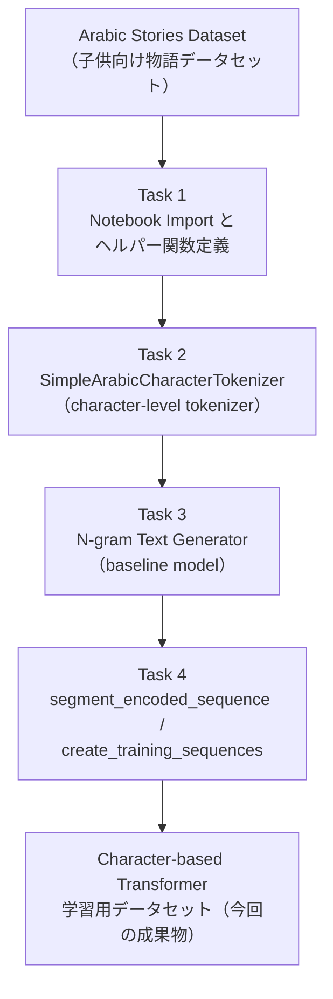
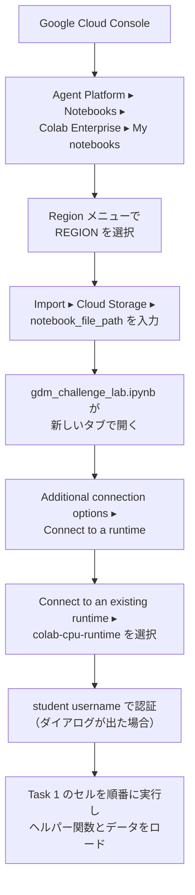
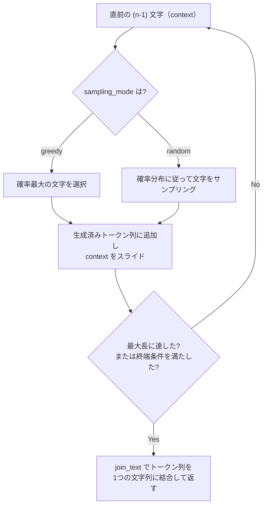
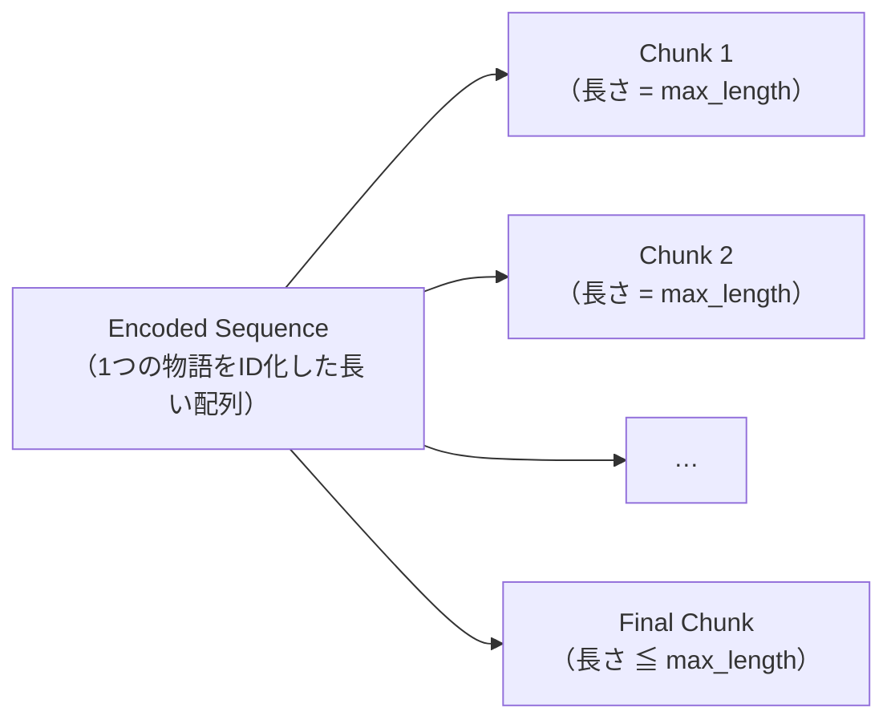
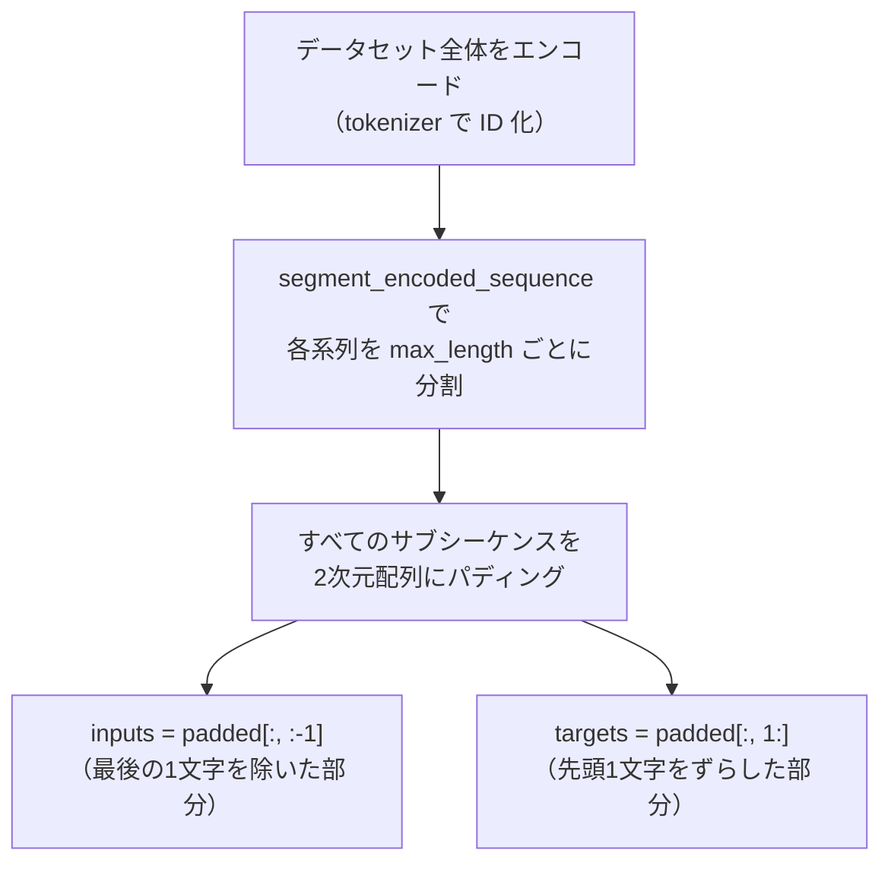

# Cymbal Chat: Arabic Small Language Model チャレンジラボ 完全攻略ガイド

~ Character-Level Tokenizer / N-gram Text Generator / Transformer 学習データ準備のベストプラクティス ~

対象ラボ: [Cymbal Chat: Develop a Chatbot for the Arabic-Speaking Market](https://www.skills.google/course_templates/1453/labs/600981)（Google DeepMind: 01 Build Your Own Small Language Model コース付属チャレンジラボ）

> 本ガイドは、Google Cloud（Agent Platform / Colab Enterprise）と自然言語処理（NLP）の初学者を対象に、本チャレンジラボの各タスクを「なぜそう実装するのか」という根拠とともにステップバイステップで解説するものです。チャレンジラボは自動採点形式のため、本ガイドは模範解答そのものではなく、**設計思想とベストプラクティス**の解説に主眼を置いています。

---

## 1. ラボ全体像を理解する

### 1.1 シナリオ

あなたは架空のスタートアップ **Cymbal Chat** の開発者という設定で、アラビア語話者向けにシンプルで一貫性のある物語（children's stories）を生成できる言語モデルの土台を構築します。単語ベース（word-based）モデルではなく **character-based language model**（文字ベース言語モデル）を採用するのは、アラビア語のように語形変化が複雑で語彙数が膨大になりやすい言語では、文字単位のモデリングが有利になるケースがあるためです。

### 1.2 4つのタスクの関係性

ラボは独立した4タスクに見えますが、実際には「データ → トークナイザ → ベースラインモデル → 本番学習用データ整形」という一本のパイプラインです。全体像を先に押さえておくと、各TODOの意図を見失いません。



**ポイント:** Task 2 で作るトークナイザは Task 3・Task 4 の両方から再利用されます。ここでバグを残すと後続タスクの自動採点にも影響するため、Task 2 の `character_tokenize` / `join_text` は特に慎重に検証してください。

---

## 2. 事前準備とラボ環境のベストプラクティス（Task 1）

### 2.1 なぜ「Colab Enterprise」なのか

このラボは Google Cloud の **Colab Enterprise**（Agent Platform 内のマネージド Notebook 環境）を使用します。通常の Google Colab との違いは、IAM ロールに基づくアクセス制御、Google Cloud サービスとの統合、そして組織単位でのランタイム管理ができる点です。公式ドキュメントでも、Colab Enterprise はデフォルトでユーザー資格情報（user credentials）を使って認証し、ノートブックのコードがユーザー本人と同等の Google Cloud アクセス権を持つと説明されています。[出典1]

### 2.2 ノートブックのインポートからランタイム接続までの流れ



このフローの根拠は Colab Enterprise の公式ランタイム接続ガイドに準拠しています。既存ランタイムに接続する権限には `roles/aiplatform.colabEnterpriseUser` の IAM ロールが必要である点、そして初回接続時にはユーザー資格情報へのアクセス許可を求めるダイアログが表示される点が明記されています。[出典2]

### 2.3 初学者がつまずきやすいポイント

| 注意点 | 理由 | 対処法 |
|---|---|---|
| Region の選び間違い | ノートブックとランタイムは同一リージョンでないと実行できない | インポート時と接続時で同じ REGION を指定する |
| 事前定義セルの改変 | "You are not required to add or modify code" と明記されたセルを変更すると、自動採点が意図しない結果になる | TODO セル以外は編集しない |
| ランタイム未接続のままセル実行 | Colab Enterprise はコード初回実行時に自動でデフォルトランタイムへ接続しようとするため、意図せず別ランタイムに繋がる場合がある | 明示的に `colab-cpu-runtime` を選んでから実行する |
| ランタイムの共有 | 複数ノートブックで同一ランタイムを共有すると処理が遅くなったり競合が起きたりする（公式ドキュメントも非推奨としている）[出典3] | 1ノートブック1ランタイムを基本にする |

---

## 3. Task 2: SimpleArabicCharacterTokenizer の設計思想

### 3.1 なぜ character-level tokenization を選ぶのか

NLP のトークナイザには大きく分けて word-level／subword-level（BPE, WordPiece など）／character-level の3種類があります。

| 粒度 | 語彙サイズ | 未知語（OOV）への強さ | 系列長 | 向いている場面 |
|---|---|---|---|---|
| Word-level | 非常に大きい | 弱い（辞書にない単語は `<unk>` になる） | 短い | 語彙が閉じている・整形済みテキスト |
| Subword-level（BPE等） | 中程度 | 強い | 中程度 | 汎用の事前学習済みモデル（GPT系など） |
| Character-level | 非常に小さい | ほぼ発生しない（未知文字のみ） | 長い | 形態素が複雑な言語、ノイズの多いテキスト、語彙を持たない多言語対応 |

Hugging Face の解説でも、character-based tokenizer は語彙サイズを大幅に縮小でき、すべての単語を文字の組み合わせで表現できるため未知語トークンが激減する一方、1文字あたりの情報量が少なく系列長が伸びるというトレードオフがあると整理されています。[出典4] アラビア語のように屈折・派生が豊富で語形が多岐にわたる言語では、この「語彙を持たない」という性質が特に有効です。

### 3.2 `character_tokenize` の実装ベストプラクティス

このメソッドの要件は「入力テキストを、元の順序を保ったまま1文字ずつのトークンのリストに変換する」ことです。Python では文字列はすでにイテラブルなので、標準ライブラリだけで実装できます。

```python
def character_tokenize(self, text: str) -> list[str]:
    # 各文字をそのままトークンとして扱う。
    # list(text) は文字列を Unicode コードポイント単位で分解する。
    return list(text)
```

**ベストプラクティス上のポイント:**

- **スペースや句読点も1トークンとして残す** ことが多くの character-level 実装の標準です（単語境界の情報を暗黙的に保持できるため）。ラボの要件（順序を保った単一文字のリストを返す）を満たす限り、余計な前処理（空白除去や正規化）を勝手に追加しないでください。自動採点は入出力の一致を厳密にチェックする可能性があります。
- **Unicode 正規化（NFC/NFD）はこのメソッドの責務外**です。データ準備段階で正規化するかどうかは別途検討すべき設計判断であり、`character_tokenize` 自体に混ぜ込むと `join_text` との可逆性（reversibility）が壊れる恐れがあります。

### 3.3 `join_text` の実装ベストプラクティス

要件は「トークンのリストを、パディングなしで1つの文字列に結合する」ことです。

```python
def join_text(self, tokens: list[str]) -> str:
    # 区切り文字を挟まずにそのまま連結する。
    return "".join(tokens)
```

**検証のコツ:** `join_text(character_tokenize(text)) == text` が常に成り立つこと（ラウンドトリップの可逆性）を、ノートブックのテストセルだけでなく自分でも簡単なアラビア語サンプルで確認しておくと安心です。

### 3.4 アラビア語特有の注意点

アラビア語のテキストを扱う際は、英語中心の直感が通用しない部分があります。以下は今回のトークナイザ実装そのものには影響しなくても、後続のデータ前処理やモデル品質を左右する重要な背景知識です。

| 特性 | 内容 | 実務上の影響 |
|---|---|---|
| Diacritics（短母音記号 / tashkīl） | 同じ子音列でも記号の有無で意味が変わる（例: كتاب の語根に対する母音付与パターン） | 記号を含めるかどうかで語彙サイズと曖昧性のバランスが変わる |
| 右から左（RTL）書字方向 | 表示上の方向であり、内部のトークン配列の順序自体は論理順（logical order）で保持するのが一般的 | 表示崩れとデータ処理上の順序を混同しないよう注意 |
| 形態的豊かさ（morphological richness） | 1つのアラビア語単語が英語の文相当の情報を持つことがある | 語彙ベースのモデルでは語彙爆発が起きやすく、character-level が有効な一因になる |

学術的なサーベイでも、アラビア語 NLP の前処理では diacritic の除去・復元、正書法の正規化（normalization）が主要な課題として挙げられています（出典5、出典6）。

---

## 4. Task 3: N-gram Text Generator の設計思想

### 4.1 n-gram モデルの基礎

n-gram 言語モデルは「直前の (n-1) 文字（または単語）が与えられたとき、次にどの文字が来やすいか」という条件付き確率をコーパスの出現頻度から推定するモデルです。NLP の標準的教科書である Jurafsky & Martin の *Speech and Language Processing* では、n の値を大きくするほど生成される文がより自然（コヒーレント）になっていく一方、コーパスが小さいと高次の n-gram では確率行列がスパースになりすぎるという課題が指摘されています。[出典7]

### 4.2 サンプリング戦略: greedy と random

`generate_text_from_ngram_model` 関数が要求する2つのサンプリングモードには、明確なトレードオフがあります。

| モード | 選択方法 | 出力の特徴 | 向いている用途 |
|---|---|---|---|
| Greedy sampling | 確率分布の中で最も高い確率を持つ文字を常に選ぶ | 決定的（同じプロンプトなら常に同じ出力）。反復的・単調になりやすい | 再現性が必要なデバッグ・評価 |
| Random sampling | 確率分布に従って確率的に文字を選ぶ | 毎回異なる出力になり多様性がある反面、確率の低い経路を選ぶと支離滅裂になりやすい | 創造的なテキスト生成、データ拡張 |

この2分類は n-gram モデルにおける代表的なデコーディング手法として広く整理されています（出典8）。実装上は Python の `random.choices(population, weights=probabilities)[0]` のように、重み付きサンプリングが返す1要素のリストから文字を取り出して random モードに使います。greedy モードでは `max(probabilities)` が返す確率値そのものではなく、最大確率のインデックスを求め、そのインデックスに対応する文字を選択します。

### 4.3 推論ループの設計



**ベストプラクティス:**

- **`join_text` を再利用する。** Task 2 で作った `SimpleArabicCharacterTokenizer.join_text` をそのまま使えば、Task 2 とのインターフェースの一貫性が保たれ、二重実装によるバグを防げます。
- **未知の context への対応を決めておく。** 学習コーパスに存在しない n-gram に遭遇した場合の fallback（例: より短い n-gram にバックオフする、あるいは一様分布にする）は、モデルの安定性に直結します。ラボの要件を超える部分ですが、実運用を意識するなら重要な設計判断です。
- **greedy は決定的である一方、単調な繰り返しに陥りやすい**ことは複数の分析で共通して指摘されています。デバッグ時は greedy、デモや最終出力の質を見るときは random、と使い分けると挙動の違いを理解しやすくなります。[出典9]

---

## 5. Task 4: 学習データセットの準備

### 5.1 `segment_encoded_sequence`: 長い系列をどう分割するか

Transformer の学習では入力系列長を固定する必要があります。物語のようにエンコード後の長さがまちまちなデータを、`max_length` を超えないサブシーケンスに分割するのがこの関数の役割です。



**要件の読み解き方（ベストプラクティス）:**

1. **最後のチャンクだけが `max_length` 未満でよい** という要件は、単純な固定幅スライシング（`for i in range(0, len(seq), max_length)`）で自然に満たせます。overlap（重なり）を持たせない非オーバーラップ分割がもっともシンプルで、要件の「連結してオーバーラップを除去すれば元の系列を復元できる」を最も素直に満たします。
2. **可逆性（reconstruction）をテストする。** 分割後のチャンクをすべて連結し、元の `encoded_sequence` と一致するかを必ず自分でも確認してください。これは Hugging Face のトークン化チュートリアルで示されている `group_texts` のようなチャンク分割パターンにも共通する検証観点です。[出典10]
3. **戻り値は「リストのリスト」** である点に注意してください。NumPy 配列ではなく Python のネストしたリストを返す実装が要件に合致します（後段の `create_training_sequences` でまとめてパディング・配列化されるため）。

### 5.2 `create_training_sequences`: 入力と正解ラベルの作り方

Character-based な言語モデルは基本的に **causal（自己回帰）言語モデル** として学習されます。つまり「これまでの文字列から次の1文字を予測する」タスクです。Hugging Face の解説では、この学習方式は系列を左から右へ入力し、各トークンの次のトークンを予測するように学習すると説明されています。[出典11]



**実装上のベストプラクティス:**

| 論点 | 推奨される考え方 | 根拠 |
|---|---|---|
| パディングの位置（pre / post） | 系列の「先頭」が重要な時系列的タスクでは pre、末尾方向への生成が主目的の causal LM では post が直感的とされる。ただし最も重要なのはプロジェクト内で一貫させること | Keras の `pad_sequences` ドキュメント系の解説でも pre/post どちらもユースケース次第と整理されている[出典12] |
| padding value の選び方 | 語彙に存在しない専用の pad トークン ID（例: 0 やボキャブラリ末尾の ID）を使い、実データの文字 ID と衝突させない | 一般的なシーケンスパディングのベストプラクティス[出典13] |
| input / target のずれ方 | targets はちょうど1ステップ先の文字を予測させるため、入力を1つ左にシフトした配列を正解ラベルにする | causal LM の標準的な学習設計[出典11] |
| 効率的なチャンク結合 | 短い物語をそのまま学習すると無駄なパディングが増えるため、複数系列を連結してから固定長に切るアプローチも一般的（今回のラボでは物語単位で分割する設計だが、発展的な最適化として知っておくとよい） | Hugging Face の `group_texts` パターン[出典10] |

---

## 6. よくある落とし穴とトラブルシューティング

| 症状 | 想定される原因 | 確認ポイント |
|---|---|---|
| `character_tokenize` のテストで文字数が合わない | Unicode の合字（ligature）や結合文字（combining character）が想定と異なる分解のされ方をしている | `[f"U+{ord(char):04X}" for char in text]` で各文字のUnicodeコードポイントを出力し、その並びを期待するコードポイント列と比較する |
| `join_text` の出力に余分な区切り文字が入る | `"".join()` ではなく `" ".join()` など区切り文字を挟む実装になっている | 要件は「パディングなしで結合」なので区切り文字を入れない |
| n-gram 生成が同じ文字列をループする | greedy モードで同じ context に戻るループに陥っている（決定的モデルの典型的な弱点） | 最大生成長の上限を設ける、または random モードで挙動を比較する |
| `segment_encoded_sequence` の最終チャンクだけ長さが違ってエラーになる | 呼び出し側ですべてのチャンクが同じ長さである前提のコードになっている | 「最終チャンクのみ短くてよい」という要件通りに実装し、パディングは `create_training_sequences` 側の責務にする |
| ランタイム接続後にセルがエラーになる | ノートブックとランタイムのリージョンが不一致、または別ランタイムに誤接続している | Region メニューと `colab-cpu-runtime` の指定を再確認する[出典2] |
| Check my progress が失敗する | 事前定義セル（"You are not required to add or modify code"）を編集してしまっている、またはノートブック保存前に採点している | 保存してから実行・採点する運用を徹底する |

---

## 7. タスク完了チェックリスト

| タスク | 完了条件 | Check my progress |
|---|---|---|
| Task 1 | 必要なライブラリのインポートとデータロード用セルをすべて実行 | なし（Task 1 自体は採点対象外） |
| Task 2 | `character_tokenize` / `join_text` を実装し、テストセルが green checkmark になる | Build the SimpleArabicCharacterTokenizer class |
| Task 3 | `generate_text_from_ngram_model` が greedy / random 両方に対応し、文字列を返す | Build the generate_text_from_ngram_model function |
| Task 4-1 | `segment_encoded_sequence` が要件（最終チャンクのみ短い・復元可能・リストのリストを返す）を満たす | Build the segment_encoded_sequence function |
| Task 4-2 | `create_training_sequences` が2次元パディング済み配列から input/target を正しく抽出する | Build the create_training_sequences function |

---

## 8. 参考文献・出典

本ガイドのベストプラクティスは、以下の公式ドキュメント、学術資料、解説資料に基づいています。

**[出典1]** Google Cloud Documentation, "Introduction to Colab Enterprise"
https://docs.cloud.google.com/colab/docs/introduction

**[出典2]** Google Cloud Documentation, "Connect to a runtime in Colab Enterprise"
https://docs.cloud.google.com/colab/docs/connect-to-runtime

**[出典3]** Google Cloud Documentation, "Runtimes and runtime templates | Colab Enterprise"
https://docs.cloud.google.com/colab/docs/runtimes

**[出典4]** Hugging Face LLM Course, "Tokenizers"（character-based tokenizer の説明）
https://huggingface.co/learn/llm-course/chapter2/4

**[出典5]** Arabic NLP: A Survey of Pre-Processing Techniques and Challenges
https://jurnal.umsu.ac.id/index.php/jcositte/article/download/25562/14117

**[出典6]** A Panoramic Survey of Natural Language Processing in the Arab World
https://arxiv.org/pdf/2011.12631

**[出典7]** Daniel Jurafsky & James H. Martin, *Speech and Language Processing*, Chapter 3: N-gram Language Models
https://web.stanford.edu/~jurafsky/slp3/3.pdf

**[出典8]** "A Bird's-Eye View on the Evolution of Language Models for Text Generation" (Towards Data Science)
https://towardsdatascience.com/a-birds-eye-view-on-the-evolution-of-language-models-for-text-generation-9b6b3fcb96a4/

**[出典9]** "Two minutes NLP — Most used Decoding Methods for Language Models" (Medium / NLPlanet)
https://medium.com/nlplanet/two-minutes-nlp-most-used-decoding-methods-for-language-models-9d44b2375612

**[出典10]** Hugging Face Transformers Documentation, "Language modeling"（`group_texts` によるチャンク分割パターン）
https://huggingface.co/docs/transformers/v4.26.1/en/tasks/language_modeling

**[出典11]** Hugging Face LLM Course, "Training a causal language model from scratch"
https://huggingface.co/learn/llm-course/en/chapter7/6

**[出典12]** "Sequence Padding Techniques" (apxml.com) — pre/post padding の使い分けの整理
https://apxml.com/courses/rnns-and-sequence-modeling/chapter-8-preparing-sequence-data/padding-sequences

**[出典13]** TensorFlow/Keras Documentation, `tf.keras.preprocessing.sequence.pad_sequences`
https://www.tensorflow.org/api_docs/python/tf/keras/preprocessing/sequence/pad_sequences

**ラボ本体**
Google Skills, "Cymbal Chat: Develop a Chatbot for the Arabic-Speaking Market"
https://www.skills.google/course_templates/1453/labs/600981

---

*本ガイドは教育目的の解説であり、自動採点システムに対する模範解答の提供を意図したものではありません。実装の最終判断は、ノートブック内のTODO指示・docstring・テストセルの要件を優先してください。*
