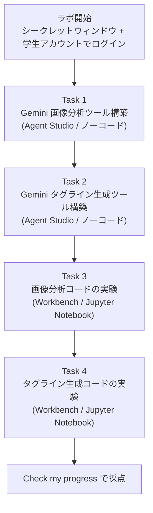
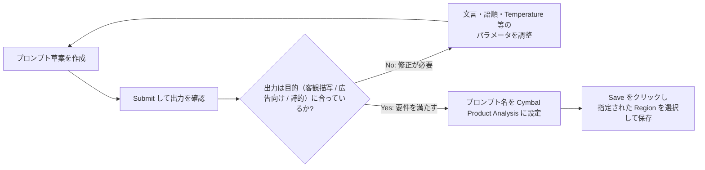
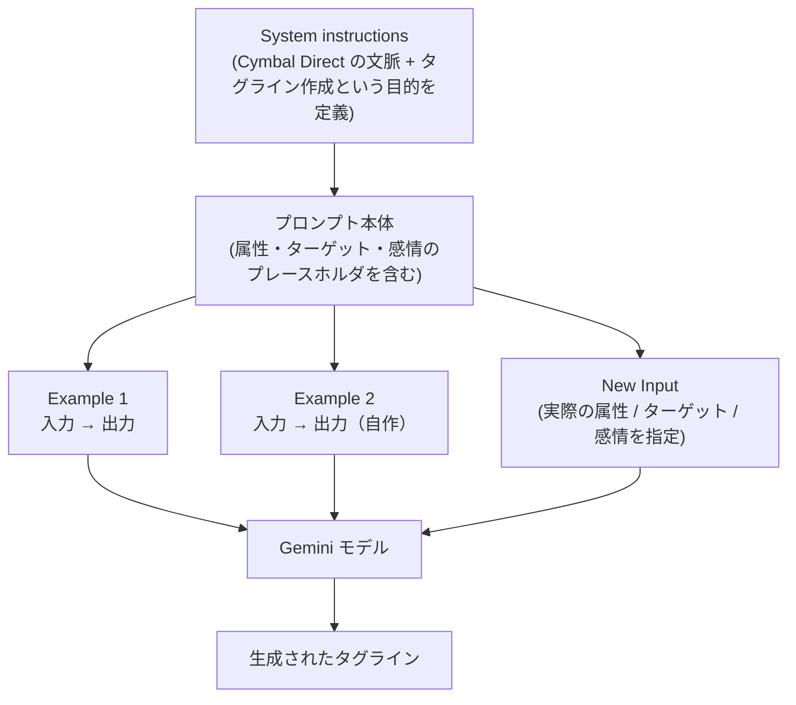
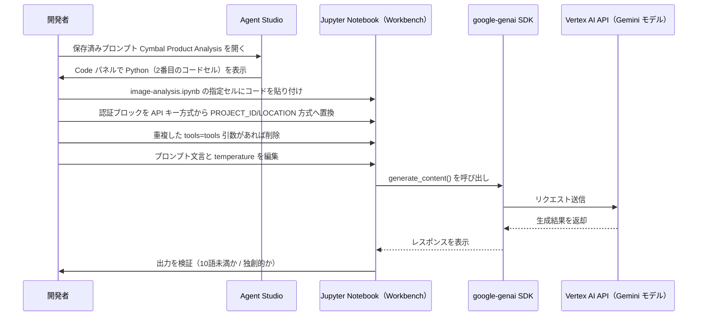

# Cymbal Direct チャレンジラボ攻略ガイド

**Agent Platform（旧 Vertex AI）でのプロンプト設計ベストプラクティス**

---

## 目次

1. [このガイドについて](#0-このガイドについて)
2. [ラボの全体像](#1-ラボの全体像)
3. [開始前のベストプラクティス](#2-開始前のベストプラクティス)
4. [Task 1: Gemini 画像分析ツールの構築](#3-task-1-gemini-画像分析ツールの構築)
5. [Task 2: Gemini タグライン生成ツールの構築](#4-task-2-gemini-タグライン生成ツールの構築)
6. [Task 3: 画像分析コードの実験](#5-task-3-画像分析コードの実験)
7. [Task 4: タグライン生成コードの実験](#6-task-4-タグライン生成コードの実験)
8. [トラブルシューティング共通ベストプラクティス](#7-トラブルシューティング共通ベストプラクティス)
9. [完了前の最終チェックリスト](#8-完了前の最終チェックリスト)
10. [参考文献](#9-参考文献)

---

## 0. このガイドについて

このラボは **Challenge Lab** です。手順を逐一なぞるのではなく、これまで学んだ知識を使って「なぜその設定が正しいのか」を理解しながら自力でタスクを完了することが求められます。本ガイドは、各タスクの背後にある **プロンプトエンジニアリングのベストプラクティス** と、それぞれの根拠となる Google Cloud 公式ドキュメントを整理したものです。

> **重要な注意（製品名の移行について）**
> Google Cloud は現在 **Vertex AI** を **Gemini Enterprise Agent Platform**（本ラボでの表記は "Agent Platform"）へと統合・移行中です。UI 上の表記や URL に一貫性がない場合がありますが、Agent Studio・Workbench・Gemini モデルの基本的な使い方や API の考え方は Vertex AI 時代のドキュメントと共通です。本ガイドでも両方の名称が混在する場合があります。[^1]
>
> **ラボ固有の値について**
> ラボ本文中の `model_name`（使用する Gemini モデル名）、`image file path`（GCS 上の画像パス）、`Region`（保存先リージョン）、`Workbench instance name`（インスタンス名）は、セッションごとにランダムに割り当てられる値です。これらは各自の Lab の Task パネルおよび Google Cloud コンソール上に実際の値が表示されるので、本ガイドの手順を実行する際はそこに書かれている実際の値に読み替えてください。

---

## 1. ラボの全体像

このラボは大きく分けて「Agent Studio でのノーコード・プロンプト設計」と「Workbench（Jupyter Notebook）でのコードレベルの実験」の2フェーズ、計4タスクで構成されています。



| タスク | 使用ツール | 目的 | 成果物 |
|---|---|---|---|
| Task 1 | Agent Studio | 商品画像から複数スタイルの説明文を生成するプロンプトを作る | `Cymbal Product Analysis`（保存済みプロンプト） |
| Task 2 | Agent Studio | 属性・ターゲット・感情でカスタマイズ可能なタグライン生成プロンプトを作る | `Cymbal Tagline Generator Template`（保存済みプロンプト） |
| Task 3 | Workbench (`image-analysis.ipynb`) | Task 1 のプロンプトを Python コードとして検証・改良する | 10語未満・高創造性の画像説明文 |
| Task 4 | Workbench (`tagline-generator.ipynb`) | Task 2 のプロンプトを Python コードとして検証・改良する | キーワード "nature" を含むタグライン |

---

## 2. 開始前のベストプラクティス

Challenge Lab は自分の Google アカウントとの混在を避けるため、以下を必ず守ってください。

| 項目 | ベストプラクティス | 理由 |
|---|---|---|
| ブラウザ | シークレット（プライベート）ウィンドウを使用 | 個人アカウントとの認証競合・意図しない課金を防ぐ |
| ログインアカウント | ラボが発行する学生（Student）アカウントのみ使用 | 個人の Google Cloud プロジェクトに誤って課金されるのを防ぐ |
| タイマー | ラボは一時停止できないため、着手前にまとまった時間を確保する | Start Lab を押した瞬間からリソースの提供時間が減っていく |
| 進捗確認 | 各タスク完了後は少し待ってから「Check my progress」を押す | 採点システムへの反映にタイムラグがあることがある |

---

## 3. Task 1: Gemini 画像分析ツールの構築

### 3.1 タスクの要件

Agent Studio で新しいプロンプトを作成し、GCS 上の商品画像を入力として、以下3種類のテキストを生成できるようにします。

- 画像から着想を得た短い説明文
- 広告向けのキャッチーなフレーズ
- 自然志向キャンペーン向けの詩的な描写

プロンプト名は `Cymbal Product Analysis` とし、指定された `model_name` モデルを使い、指定された `Region` で保存します。

### 3.2 マルチモーダルプロンプト設計のベストプラクティス

Gemini のようなマルチモーダルモデルに画像を渡す際は、テキストのみのプロンプトとは異なる注意点があります。公式ドキュメントが推奨する原則は以下の通りです。[^2][^3]

| 原則 | 具体的なやり方 |
|---|---|
| 入力の順序を意識する | マルチモーダルプロンプトでは、指示文より **先に画像ファイルを配置** すると精度が上がる場合がある |
| 具体的に指示する | 「この画像を説明して」ではなく、「色・質感・そこから感じる雰囲気に焦点を当てて説明して」のように出力の観点を明示する |
| 出力形式を明示する | 「3つの見出し（短い説明／広告向けフレーズ／詩的な描写）に分けて出力して」のように構造を指定する |
| 複雑なタスクは分解する | 視覚理解と創造的言い換えを同時に求める場合は、ステップ・バイ・ステップで考えるよう指示するか、タスクを分割する |
| テキスト・画像・音声・動画を同格に扱う | どのモダリティも「等しく重要な入力」として扱うよう意識して指示文を組み立てる |

### 3.3 出力スタイル別プロンプト例

| 出力スタイル | プロンプトの書き方（例） | ねらい |
|---|---|---|
| 短い説明文 | 「この画像を見て、色・素材・質感に焦点を当てた1文の説明を作成してください」 | 具体的な観察事実に基づく客観的な描写 |
| 広告向けキャッチフレーズ | 「この画像から、広告に使える短いキャッチコピーを3案、体言止めで生成してください」 | 簡潔さと訴求力を優先 |
| 詩的な描写 | 「この画像が呼び起こす自然の中にいる感覚を、比喩を用いた詩的な一文で表現してください」 | 感情・雰囲気を重視した表現 |

### 3.4 プロンプトの反復改善フロー

Google のドキュメントでも「プロンプト設計は数回の反復を前提としたテスト駆動プロセス」であると明記されています。[^4] Agent Studio 上での改善サイクルは次の通りです。



### 3.5 このタスクの根拠ソース

- Design multimodal prompts（マルチモーダルプロンプト設計のベストプラクティス）[^2]
- Overview of prompting strategies（プロンプト設計チェックリスト）[^3]
- Prompt iteration strategies（反復改善のプロセス）[^4]

---

## 4. Task 2: Gemini タグライン生成ツールの構築

### 4.1 タスクの要件

新しいプロンプトを作成し、System instructions に指定文を入力したうえで、Few-shot 例を2件含め、商品属性・ターゲット層・感情的な訴求をパラメータとして差し替え可能なタグライン生成プロンプトを作成します。プロンプト名は `Cymbal Tagline Generator Template` です。

### 4.2 System instructions のベストプラクティス

System instructions は、モデルがプロンプト本体を処理する **前** に読み込む「行動規範」です。役割（ペルソナ）・目的・トーンを事前に固定するために使います。[^5]

| 原則 | 内容 |
|---|---|
| 役割を明確にする | 「あなたは〜のパートナーとして〜を手伝うアシスタントです」のように立場を明示する |
| 目的を明確にする | 何のためにこのプロンプトが存在するか（今回は「タグライン作成の支援」）を書く |
| 一貫性を保つ | 1つの System instruction には1つのペルソナ・役割のみを持たせる（複数の役割を混在させない）[^6] |

本タスクで指定されている System instructions は、まさにこの型に沿っています。「Cymbal Direct が屋外ギアの新ラインを展開しており、若者に自然への一歩を促すタグライン作成を手伝ってほしい」という文脈と目的を明示しています。

### 4.3 Few-shot 例の設計

Few-shot（少数例学習）は、モデルに「望ましい出力とはどのようなものか」を実例で示す手法です。ゼロショット（例なし）よりも **出力の形式・言い回し・トーン** を安定させやすいという利点があります。[^7]

| 原則 | 内容 |
|---|---|
| 具体的で多様な例を使う | 似たパターンの例を並べるより、狙いたい表現の幅をカバーする例を選ぶ |
| 明確な指示と組み合わせる | 例だけに頼らず、必ず指示文（何をしてほしいか）も併記する |
| Input → Output の対応を明示する | 表形式などで「入力」と「期待する出力」の対応関係を崩さない |

ラボで指定されている Example 1 は以下の通りです。Example 2 は、同じ Input/Output のテンプレートに沿って、異なる商品属性・トーンで自作します。

| # | Input（例） | Output（例） |
|---|---|---|
| Example 1 | 準備ができている感覚を与える、ハイカー向けの耐久性あるバックパックのタグラインを書いてください。ミニマリストなスタイルを意識。 | （ラボ指定の出力文） |
| Example 2（自作テンプレート） | 家族連れの週末キャンパー向けに、軽量で組み立てやすいテントのタグラインを書いてください。あたたかく安心感のあるスタイルを意識。 | （自分で作成する出力文） |

> Example 2 を作る際は、Example 1 と **同じ形式**（依頼文 + スタイル指定）を保ちつつ、商品カテゴリ・ターゲット・トーンを変えることで、モデルに「パターンの幅」を学習させます。[^7]

### 4.4 パラメータ設計（属性・ターゲット・感情）

このタスクの核心は、以下3種類のパラメータを差し替え可能なテンプレートとして設計することです。

| パラメータ種別 | 例 |
|---|---|
| 商品属性（Product attributes） | durable（耐久性）、lightweight（軽量） |
| ターゲット層（Target audience） | young adventurers（若い冒険者）、families（家族連れ） |
| 感情的な訴求（Emotional resonance） | empowered（力を与えられた感覚）、connected（自然とのつながり） |

プロンプト本体には、これら3つの変数を埋め込める形（例: `{product_attribute}` `{target_audience}` `{emotion}`）で入力欄を用意し、実際に1つの組み合わせを入力して Submit することで動作を確認します。

### 4.5 プロンプト構造の可視化



### 4.6 保存時の注意

Agent Studio には Autosave 機能がありますが、要件を満たすには **プロンプト名が正しく `Cymbal Tagline Generator Template` になっているか** を必ず確認してから Save を押してください。

### 4.7 このタスクの根拠ソース

- Use system instructions（System instructions の目的とベストプラクティス）[^5]
- Live API best practices（1つの SI に1つのペルソナという原則）[^6]
- Include few-shot examples（Few-shot 設計のベストプラクティス）[^7]

---

## 5. Task 3: 画像分析コードの実験

### 5.1 Workbench（Jupyter Notebook）とは

Agent Platform Workbench は、JupyterLab をベースにしたノートブック開発環境です。TensorFlow / PyTorch などのライブラリがプリインストールされており、Google Cloud への認証も設定済みの状態で提供されます。[^8]

### 5.2 全体の流れ

Agent Studio で作ったプロンプトを Python コードとしてエクスポートし、Notebook 上で実行・改良する流れは以下の通りです。



### 5.3 認証ブロックの置き換え

Agent Studio からエクスポートされるコードは、デフォルトで API キー認証を使う形になっていることがあります。Notebook 上では Application Default Credentials（ADC）を利用した **PROJECT_ID / LOCATION 方式** に置き換えるのがベストプラクティスです。Workbench インスタンスは Google Cloud への認証があらかじめ設定されているため、API キーを埋め込む必要がありません。[^9][^8]

```python
# 変更前（API キー方式・本番運用には非推奨）
from google import genai
client = genai.Client(api_key="YOUR_API_KEY")

# 変更後（Workbench に適した ADC 方式）
from google import genai
client = genai.Client(
    vertexai=True,
    project="PROJECT_ID",
    location="LOCATION",
)
```

> API キー方式は素早い動作確認には便利ですが、エンタープライズ用途では推奨されません。Workbench 環境ではプロジェクトの認証情報がすでに設定されているため、`project` と `location` を指定する方式が安全かつ一貫性があります。[^9]

### 5.4 `tools = tools` 重複バグへの対処

Agent Studio が生成するコードには、`generate_content_config` 内に `tools = tools` が誤って2回含まれてしまうことがあります（本ラボ手順内の既知の注意事項）。これは Python の構文エラー（キーワード引数の重複）を引き起こすため、該当箇所を1つだけ残して削除してから再実行してください。コードを保存・実行する前に、常に生成されたコードを目視でレビューする習慣が、こうした自動生成コード特有のバグの早期発見につながります。

### 5.5 プロンプトを「10語未満」「より独創的」に改修する

このステップは、プロンプトの **文言変更** と、モデルの **パラメータ変更** を組み合わせて達成します。

**(1) 出力を10語未満にする**

`maxOutputTokens` はトークン数の上限であり、単語数（word count）とは正確には一致しません（目安として100トークン ≈ 60〜80語）。[^10] そのため、「10語未満」という厳密な条件を満たすには、パラメータだけに頼らず **プロンプト文中に明示的に指示する** のが確実な方法です。

```text
# 変更前
"""Describe this image with a focus on colors, textures, and the feeling it evokes."""

# 変更後（10語未満を明示）
"""In fewer than 10 words, describe this image's colors, textures, and feeling."""
```

**(2) より創造的・意外性のある描写にする**

これは「Hint: パラメータの調整が必要」と明記されている通り、プロンプト文言だけでなく **`temperature`（および必要に応じて `top_p`）を引き上げる** ことで実現します。

| パラメータ | 役割 | 低い値の挙動 | 高い値の挙動 |
|---|---|---|---|
| `temperature` | トークン選択のランダム性を制御 | 決定論的で予測可能な出力（要約・事実回答向け） | 多様で創造的、意外性のある出力（ブレインストーミング向け） |
| `top_p` | 累積確率が閾値に達するまでトークン候補を絞り込む | 候補が少なく、無難な出力になりやすい | 候補が広がり、より多様な語彙が選ばれやすい |

Gemini モデルの `temperature` は 0.0〜2.0 の範囲をとり、デフォルトの推奨開始値は 1.0 です。[^11] 「最も創造的で意外性のある描写」を狙う場合は、**デフォルトより高い値（例: 1.2〜2.0 に近い側）** に調整するのが定石です。[^12][^11]

```python
from google.genai.types import GenerateContentConfig

config = GenerateContentConfig(
    temperature=1.4,   # デフォルト(1.0)より高く設定し、創造性を優先
    top_p=0.95,
)
```

### 5.6 検証

コード変更後は必ずセルを再実行し、以下を確認してください。

- 出力の単語数が明らかに短くなっているか（目視で10語未満か）
- 以前の出力より意外性・独自性のある表現になっているか
- Notebook ファイルを **保存** してから Progress Check を実行しているか（保存を忘れると採点に反映されません）

### 5.7 このタスクの根拠ソース

- Introduction to Agent Platform Workbench（Workbench の概要）[^8]
- Google Gen AI SDK（クライアント初期化と認証方式）[^9]
- Content generation parameters（`maxOutputTokens` とトークンの目安）[^10]
- Adjust parameter values（`temperature` / `top_p` の挙動と推奨値）[^11]
- Beyond temperature: Tuning LLM output with top-k and top-p（temperature/top-p の実務的な調整順序の解説）[^12]

---

## 6. Task 4: タグライン生成コードの実験

### 6.1 タスクの要件

Task 2 で作成したプロンプトの Python コードを `tagline-generator.ipynb` にコピーし、認証ブロックの置き換えと `tools=tools` 重複の確認を同様に行った上で、**最後の入力（Input）にキーワード "nature" を明示的に含めるよう指示を追加** します。

### 6.2 プロンプトの特異性（Specificity）を高めるベストプラクティス

Google のプロンプト設計チェックリストでは、あいまいさをなくし、モデルに何を期待しているかを具体的に伝えることが繰り返し強調されています。[^3] 今回のタスクはその典型例です。

```python
# 変更前（キーワードの指定なし）
last_input = """Write a tagline for a lightweight, packable rain jacket for young hikers, feeling adventurous."""

# 変更後（"nature" というキーワードを明示的に要求）
last_input = """Write a tagline for a lightweight, packable rain jacket for young hikers,
feeling adventurous. The tagline must include the word "nature"."""
```

| 原則 | 適用例 |
|---|---|
| 出力に含めるべき要素を明示する | 「タグラインには "nature" という単語を含めてください」と直接指示する |
| 例と矛盾しないようにする | Few-shot の Example 1・2 のスタイル（体言止め、短さ）は維持したまま条件だけを追加する |
| 検証可能な条件にする | 「〜という言葉を含める」は出力を見れば正誤を判定しやすい、良いプロンプト条件の一例 |

### 6.3 検証

- 再実行後の出力に、単語 "nature" がそのまま含まれているか目視で確認する
- 含まれていない場合は、キーワード指定の位置（文末か文頭か）や、System instructions との整合性を見直す
- Notebook を保存してから Progress Check を実行する

### 6.4 このタスクの根拠ソース

- Overview of prompting strategies（具体性を高めるチェックリスト）[^3]
- Include few-shot examples（Few-shot と明示的指示を併用する原則）[^7]

---

## 7. トラブルシューティング共通ベストプラクティス

Google の公式チェックリストは、プロンプトが期待通りに動かない場合の主な原因を挙げています。[^3] Task 1〜4 のいずれでつまずいた場合も、まずこの観点で見直すと解決が早くなります。

| 症状 | 想定される原因 | 対処 |
|---|---|---|
| 出力が抽象的すぎる／一般的すぎる | 指示が曖昧、出力形式が未指定 | 出力に含めるべき観点・形式を明示的に指示する |
| 出力のトーンや形式がばらつく | Few-shot 例が不足、または例と指示が矛盾している | 具体的で多様な Input/Output 例を追加する |
| モデルが役割を認識していない | System instructions で役割が定義されていない | System instructions に役割・目的を明記する |
| 句読点や記号でモデルが誤読する | カンマ・引用符などの区切り文字が不適切 | 区切り文字の使い方を見直す |
| 専門用語が正しく解釈されない | 未定義の業界用語・略語をそのまま使用 | 用語を定義するか、平易な言葉に置き換える |
| Python 実行時に構文エラーになる | `generate_content_config` 内の引数重複（例: `tools=tools`） | 重複しているキーワード引数を1つに整理する |

---

## 8. 完了前の最終チェックリスト

- [ ] Task 1: プロンプト名が `Cymbal Product Analysis` になっている
- [ ] Task 1: 指定された `model_name` モデルを使用している
- [ ] Task 1: 指定された `Region` で保存している
- [ ] Task 2: System instructions に指定文を入力している
- [ ] Task 2: Few-shot 例が2件（指定の Example 1 + 自作の Example 2）含まれている
- [ ] Task 2: プロンプト名が `Cymbal Tagline Generator Template` になっている
- [ ] Task 3: 認証ブロックが PROJECT_ID/LOCATION 方式に置き換わっている
- [ ] Task 3: `tools=tools` の重複が解消されている
- [ ] Task 3: 出力が10語未満かつ以前より創造的になっている
- [ ] Task 3: Notebook ファイルを保存している
- [ ] Task 4: 最後の Input にキーワード "nature" を含めるよう指示を追加している
- [ ] Task 4: 出力に実際に "nature" が含まれている
- [ ] Task 4: Notebook ファイルを保存している

---

## 9. 参考文献

### プロンプト設計の基礎

- **Introduction to prompting** — プロンプトの基本概念（few-shot、指示、文脈）を解説。
  `https://docs.cloud.google.com/vertex-ai/generative-ai/docs/learn/prompts/introduction-prompt-design`
- **Overview of prompting strategies** — プロンプトが機能しない場合のチェックリスト（句読点・専門用語・出力形式など）。
  `https://cloud.google.com/vertex-ai/generative-ai/docs/learn/prompts/prompt-design-strategies`
- **Prompt iteration strategies** — プロンプト設計を反復改善プロセスとして扱うベストプラクティス。
  `https://docs.cloud.google.com/vertex-ai/generative-ai/docs/learn/prompts/prompt-iteration`

### System instructions と Few-shot

- **Use system instructions** — System instructions の目的と書き方。
  `https://docs.cloud.google.com/gemini-enterprise-agent-platform/models/prompts/system-instructions`
- **Live API best practices** — 1つの System instruction に1つのペルソナを割り当てる原則。
  `https://ai.google.dev/gemini-api/docs/live-api/best-practices`
- **Include few-shot examples** — Few-shot 例の設計原則（具体性・多様性・明示的指示との併用）。
  `https://cloud.google.com/vertex-ai/generative-ai/docs/learn/prompts/few-shot-examples`

### マルチモーダル（画像）プロンプト

- **Design multimodal prompts** — 画像を含むプロンプトの設計ベストプラクティス。
  `https://docs.cloud.google.com/gemini-enterprise-agent-platform/models/capabilities/design-multimodal-prompts`

### モデルパラメータ（Temperature / Top-P）

- **Adjust parameter values** — `temperature` / `top_p` / `top_k` の定義と推奨値。
  `https://docs.cloud.google.com/vertex-ai/generative-ai/docs/learn/prompts/adjust-parameter-values`
- **Content generation parameters** — `maxOutputTokens` とトークン数・単語数の目安。
  `https://cloud.google.com/vertex-ai/generative-ai/docs/multimodal/content-generation-parameters`
- **Beyond temperature: Tuning LLM output with top-k and top-p** — temperature と top-p を組み合わせた実務的な調整手順の解説記事。
  `https://medium.com/google-cloud/beyond-temperature-tuning-llm-output-with-top-k-and-top-p-24c2de5c3b16`

### Workbench / SDK

- **Introduction to Agent Platform Workbench** — Workbench（Jupyter Notebook 環境）の概要。
  `https://docs.cloud.google.com/vertex-ai/docs/workbench/introduction`
- **Google Gen AI SDK** — `google-genai` SDK のクライアント初期化方法（API キー方式 と PROJECT_ID/LOCATION 方式の違い）。
  `https://docs.cloud.google.com/vertex-ai/generative-ai/docs/sdks/overview`

---

[^1]: Prompt iteration strategies（Vertex AI → Gemini Enterprise Agent Platform への移行に関する注記を含む）: `https://docs.cloud.google.com/vertex-ai/generative-ai/docs/learn/prompts/prompt-iteration`
[^2]: Design multimodal prompts: `https://docs.cloud.google.com/gemini-enterprise-agent-platform/models/capabilities/design-multimodal-prompts`
[^3]: Overview of prompting strategies: `https://cloud.google.com/vertex-ai/generative-ai/docs/learn/prompts/prompt-design-strategies`
[^4]: Prompt iteration strategies: `https://docs.cloud.google.com/vertex-ai/generative-ai/docs/learn/prompts/prompt-iteration`
[^5]: Use system instructions: `https://docs.cloud.google.com/gemini-enterprise-agent-platform/models/prompts/system-instructions`
[^6]: Live API best practices（System instructions の設計原則）: `https://ai.google.dev/gemini-api/docs/live-api/best-practices`
[^7]: Include few-shot examples: `https://cloud.google.com/vertex-ai/generative-ai/docs/learn/prompts/few-shot-examples`
[^8]: Introduction to Agent Platform Workbench: `https://docs.cloud.google.com/vertex-ai/docs/workbench/introduction`
[^9]: Google Gen AI SDK: `https://docs.cloud.google.com/vertex-ai/generative-ai/docs/sdks/overview`
[^10]: Content generation parameters: `https://cloud.google.com/vertex-ai/generative-ai/docs/multimodal/content-generation-parameters`
[^11]: Adjust parameter values: `https://docs.cloud.google.com/vertex-ai/generative-ai/docs/learn/prompts/adjust-parameter-values`
[^12]: Beyond temperature: Tuning LLM output with top-k and top-p: `https://medium.com/google-cloud/beyond-temperature-tuning-llm-output-with-top-k-and-top-p-24c2de5c3b16`
