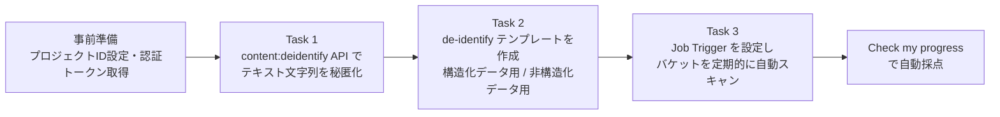
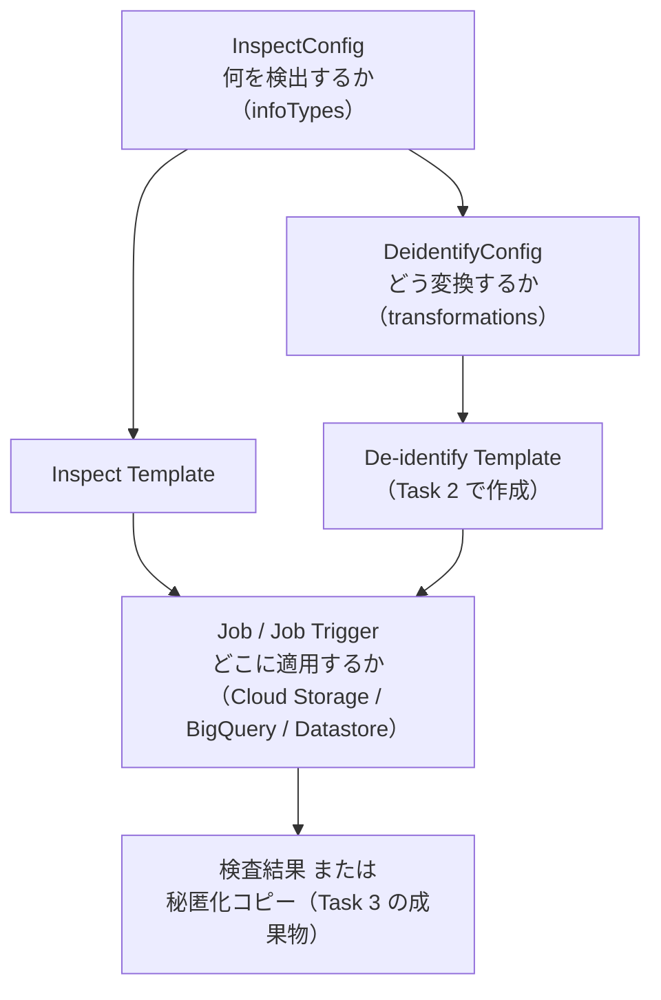
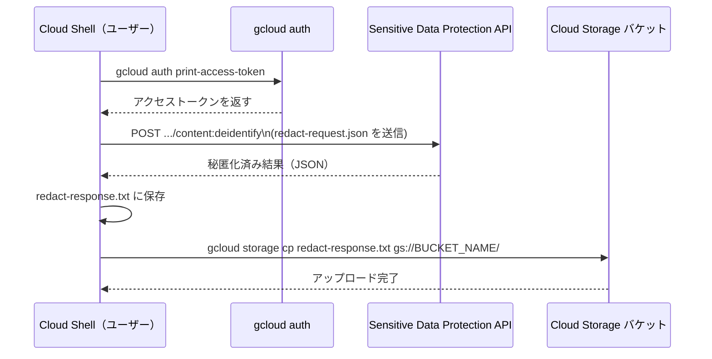
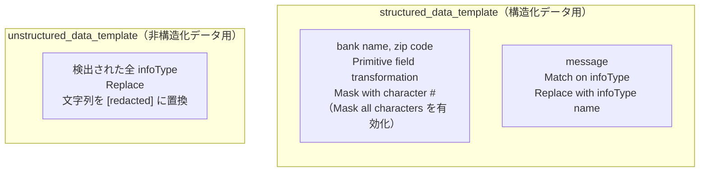
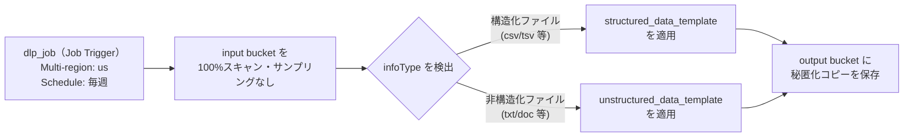
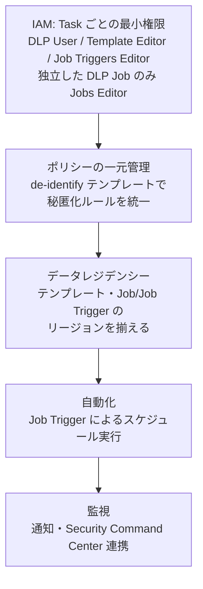

# Sensitive Data Protection (DLP) Challenge Lab 攻略ガイド

## ― PII の秘匿化・de-identify テンプレート・Job Trigger をゼロから理解する ―

> 対象ラボ: [Protect Sensitive Data in Text and Files with Sensitive Data Protection: Challenge Lab](https://www.skills.google/course_templates/750/labs/643223)
> 想定読者: Google Cloud を触り始めたばかりのジュニアクラウドエンジニア／QAエンジニア
> 執筆方針: 各手順のあとに「なぜそうするのか」というベストプラクティスと、その根拠となる一次情報（Google Cloud 公式ドキュメント）の URL を必ず添える

---

## 0. この記事の使い方

このラボは **Challenge Lab**、つまり「答えを渡されずにこれまで学んだ知識で完成させる」形式の実技試験です。したがって本ガイドは操作の丸暗記ではなく、

1. Sensitive Data Protection（旧 Cloud DLP）がどういう概念モデルで動いているか
2. なぜそのパラメータを選ぶのか（ベストプラクティス）
3. 何を見て自分のミスに気づくか（トラブルシューティング）

の3点を重視して構成しています。

---

## 1. シナリオ全体像

あなたは組織内のジュニアクラウドエンジニアとして、**Sensitive Data Protection API** を使って個人情報（PII）を検出・秘匿化・de-identify するプロジェクトに参加しています。ラボのゴールは次の3タスクです。



3つのタスクは独立しているように見えますが、実際には **Task 1 で学ぶ「検出→変換」の考え方が、Task 2 のテンプレートという“再利用可能な部品”に昇華し、Task 3 の Job Trigger という“自動化された仕組み”に組み込まれる** という一本の流れになっています。この関係性を理解しておくと、細かい画面操作を忘れても迷わなくなります。



**出典:** [Sensitive Data Protection の概要](https://docs.cloud.google.com/sensitive-data-protection/docs/sensitive-data-protection-overview)

---

## 2. 事前準備

### 2.1 用語の整理

| 用語 | 意味 |
|---|---|
| Sensitive Data Protection | Cloud DLP の新名称。API 名（DLP API）自体は変更されていない |
| infoType | 検出対象の「情報の種類」。`EMAIL_ADDRESS` や `US_HEALTHCARE_NPI` など100種類以上が組み込みで用意されている |
| InspectConfig | 「何を検出するか」を定義する設定オブジェクト |
| DeidentifyConfig | 「検出した値をどう変換するか」を定義する設定オブジェクト |
| De-identify Template | InspectConfig / DeidentifyConfig を名前付きで保存し、複数のジョブから再利用できるようにしたもの |
| Job / Job Trigger | Cloud Storage・BigQuery・Datastore などのリポジトリに対してスキャンを実行する仕組み。Job は単発、Job Trigger はスケジュール実行 |

**出典:** [Cloud Data Loss Prevention (DLP API) リファレンス](https://docs.cloud.google.com/sensitive-data-protection/docs/reference/rest)

### 2.2 Cloud Shell での環境変数と認証トークン

```bash
# プロジェクトIDを環境変数にセット
export PROJECT_ID=$(gcloud config get-value project)

# OAuth 2.0 アクセストークンを取得（有効期限は短いので、切れたら再実行する）
export DLP_TOKEN=$(gcloud auth print-access-token)
```

`curl` で DLP API を直接呼び出す場合、認証には `gcloud auth print-access-token` で取得した短命アクセストークンを `Authorization: Bearer` ヘッダーに渡す方式が公式に案内されています。あわせて **`X-Goog-User-Project` ヘッダーで課金対象プロジェクトを明示する**のがベストプラクティスです。これを省略すると、リクエストの発行元と課金プロジェクトが一致せず意図しない請求や権限エラーが起きることがあります。

**出典:** [Sensitive Data Protection の IAM 権限](https://docs.cloud.google.com/sensitive-data-protection/docs/iam-permissions)

### 2.3 Task ごとに必要な IAM ロール

- **Task 1（`content:deidentify`）**: `serviceusage.services.use` を含み、コンテンツの検査・秘匿化向けに用意された `roles/dlp.user` を維持します。
- **Task 2（De-identify Template 作成）**: `dlp.deidentifyTemplates.create` を含む `roles/dlp.deidentifyTemplatesEditor` を付与します。DLP 全体を管理する必要がある場合は `roles/dlp.editor` や `roles/dlp.admin` でも実行できますが、権限範囲は広くなります。
- **Task 3（Job Trigger 作成・実行）**: 基本権限は `roles/dlp.jobTriggersEditor` のみです。組織の方針でカスタムロールを使う場合は、`dlp.jobTriggers.create` と `dlp.jobTriggers.get` を含めます。Job Trigger とは別に独立した DLP Job を作成する場合のみ、`roles/dlp.jobsEditor` を追加します。`roles/dlp.editor` や `roles/dlp.admin` も利用できますが、最小権限ではありません。

Qwiklabs / Skills Boost の学生アカウントには必要な権限が通常あらかじめ付与されています。実務で同じ構成を再現する場合は、1つの広いロールを全Taskへ流用せず、実行するTaskに対応するロールを選んでください。

**出典:** [Sensitive Data Protection の IAM ロール](https://cloud.google.com/sensitive-data-protection/docs/iam-roles)

---

## 3. Task 1: テキストコンテンツからの機密データの秘匿化

### 3.1 タスクの目的

`content:deidentify` メソッドに JSON を送り、文字列中の `EMAIL_ADDRESS`（メールアドレス）と `US_HEALTHCARE_NPI`（米国の医療従事者識別番号）を検出し、**検出された infoType の名前に置き換える**（`replaceWithInfoTypeConfig`）ことで秘匿化します。

| infoType 名 | 説明 |
|---|---|
| `EMAIL_ADDRESS` | メールアドレス形式の文字列を検出する汎用 infoType |
| `US_HEALTHCARE_NPI` | 米国の National Provider Identifier（医療提供者を一意に識別する10桁の番号）を検出する infoType |

**出典:** [InfoType 検出器リファレンス](https://docs.cloud.google.com/sensitive-data-protection/docs/infotypes-reference)

### 3.2 リクエストの構造を理解する

`content:deidentify` へのリクエストは3つの要素から成ります。

| 要素 | 役割 |
|---|---|
| `item` | 検査対象の文字列（`ContentItem`） |
| `inspectConfig` | 何を探すか（今回は `EMAIL_ADDRESS` と `US_HEALTHCARE_NPI`） |
| `deidentifyConfig` | 見つかった値をどう変換するか（今回は `replaceWithInfoTypeConfig`＝検出した infoType 名で置換） |

`replaceWithInfoTypeConfig` は、値を単に消す（redact）のではなく **「ここに何の種類のデータがあったか」という情報だけを残す**変換方式です。完全に痕跡を消したい `redactConfig` や、一部の文字だけを `*` や `#` に置き換える `characterMaskConfig` と比べ、**下流の処理やログ調査で「PIIが存在していた事実」をトレースできる**という利点があります。用途に応じてこれらを使い分けることがベストプラクティスです。

**出典:** [機密データの秘匿化（de-identify）](https://docs.cloud.google.com/sensitive-data-protection/docs/deidentify-sensitive-data) / [テキストからの機密データの redaction](https://docs.cloud.google.com/sensitive-data-protection/docs/redacting-sensitive-data)

### 3.3 ステップバイステップ



1. **環境変数を設定する**（2.2 節参照）。

2. **`redact-request.json` を作成する**（ラボで指定された内容そのまま）。

    ```json
    {
        "item": {
            "value": "Please update my records with the following information:\n Email address: foo@example.com,\nNational Provider Identifier: 1245319599"
        },
        "deidentifyConfig": {
            "infoTypeTransformations": {
                "transformations": [{
                    "primitiveTransformation": {
                        "replaceWithInfoTypeConfig": {}
                    }
                }]
            }
        },
        "inspectConfig": {
            "infoTypes": [
                { "name": "EMAIL_ADDRESS" },
                { "name": "US_HEALTHCARE_NPI" }
            ]
        }
    }
    ```

3. **`curl` で `content:deidentify` を呼び出し、結果をファイルに保存する。**

    ```bash
    curl -s -X POST \
      "https://dlp.googleapis.com/v2/projects/${PROJECT_ID}/locations/global/content:deidentify" \
      -H "Authorization: Bearer ${DLP_TOKEN}" \
      -H "Content-Type: application/json; charset=utf-8" \
      -H "X-Goog-User-Project: ${PROJECT_ID}" \
      -d @redact-request.json \
      -o redact-response.txt

    # 中身を確認する
    cat redact-response.txt
    ```

    正常に動作すると、`foo@example.com` は `[EMAIL_ADDRESS]` に、NPI 番号は `[US_HEALTHCARE_NPI]` のような文字列に置き換わっていることを確認できます。

4. **`redact-response.txt` を課題で指定されたバケットにアップロードする。**

    ```bash
    gcloud storage cp redact-response.txt gs://<ラボ開始後に表示されるバケット名>/
    ```

    > **注意**: バケット名はラボを開始した後、Google Cloud コンソールの Cloud Storage ページに実際の名前（プレースホルダーではない具体名）が表示されます。プレースホルダー文字列をそのまま使わないよう注意してください。

5. **Check my progress** をクリックして採点結果を確認する。

### 3.4 ベストプラクティスと根拠

| プラクティス | 理由 | 出典 |
|---|---|---|
| `gsutil` ではなく `gcloud storage` を使う | `gsutil` は非推奨となっており、Google は新規ワークロードで `gcloud storage` を使うことを推奨している（並列転送により最大94%高速化） | [gsutil から gcloud storage への移行](https://docs.cloud.google.com/storage/docs/gsutil-transition-to-gcloud) |
| `X-Goog-User-Project` ヘッダーを明示する | 課金対象プロジェクトを明確にし、権限エラーや意図しない請求を防ぐ | [IAM 権限](https://docs.cloud.google.com/sensitive-data-protection/docs/iam-permissions) |
| 検出対象の infoType は業務上必要なものだけに絞る | 不要な infoType まで含めると誤検知が増え、パフォーマンスとコストが悪化する | [infoType と infoType 検出器](https://cloud.google.com/sensitive-data-protection/docs/concepts-infotypes) |
| 組み込み infoType 検出器を過信しない | 組み込み検出器は完璧な精度を保証しない。規制コンプライアンスの保証にはならないため、自組織のデータで必ずテストする | [infoType と infoType 検出器](https://cloud.google.com/sensitive-data-protection/docs/concepts-infotypes) |

---

## 4. Task 2: de-identify テンプレートの作成

### 4.1 なぜテンプレートを作るのか

Task 1 で行った「検出→変換」の設定を毎回 JSON で書くのは非効率です。**De-identify Template** はこの設定に名前を付けて保存し、複数の Job / Job Trigger から使い回せるようにする仕組みです。「何を秘匿化するか」というポリシーを一箇所で管理できるため、**組織全体で秘匿化ルールの一貫性を保つ**という統治（ガバナンス）上の利点があります。

**出典:** [de-identify テンプレートの作成](https://docs.cloud.google.com/sensitive-data-protection/docs/creating-templates-deid)

### 4.2 構造化データと非構造化データでテンプレートの中身が違う理由

Sensitive Data Protection の `DeidentifyConfig` には大きく2種類の変換方式があります。

| 変換方式 | API 上の構造 | 主な用途 |
|---|---|---|
| `infoTypeTransformations` | テキスト全体・画像・非構造化ファイルに対して、検出した infoType ごとに変換を適用する | 非構造化データ（自由記述のテキストファイルなど） |
| `recordTransformations` (`fieldTransformations`) | CSV・BigQuery テーブルのような「列（フィールド）」を持つデータに対して、**フィールド単位**で変換ルールを適用する | 構造化データ（CSV/TSV/Avro/BigQuery テーブルなど） |

さらに `fieldTransformations` の各ルールには2つのタイプがあります。

- **Primitive field transformation**: infoType の検出結果に関係なく、フィールドの値そのものに変換を機械的に適用する（例: bank name フィールドの中身を丸ごとマスクする）
- **Match on infoType**: フィールドの値の中から infoType を検出し、**検出できた部分だけ**変換する（例: message フィールドの自由記述文の中から見つかった infoType だけを置換する）

**出典:** [フィールド変換とレコード変換](https://docs.cloud.google.com/sensitive-data-protection/docs/concepts-bucketing) / [表形式データの de-identify サンプル](https://docs.cloud.google.com/sensitive-data-protection/docs/samples/dlp-deidentify-table-condition-masking)



### 4.3 structured_data_template の作成手順

1. **Sensitive Data Protection > Configuration > Templates > De-identify** に移動し、**CREATE TEMPLATE** をクリックする。
2. Template ID に `structured_data_template` と入力する。
3. **Resource location** を `Multi-region` → `us (multiple regions in United States)` に設定する。
4. 1つ目の変換ルールを追加する。

    | 項目 | 設定値 |
    |---|---|
    | 対象フィールド | `bank name`, `zip code` |
    | Transformation type | Primitive field transformation |
    | Transformation method | Mask with character |
    | Masking character | `#` |
    | Mask all characters | 有効化（「文字を無視しない」オプションも無効のまま） |

    `numberToMask` を指定しない、つまり「マスクする文字数を指定しない」ことが「全文字マスク」に相当します。これはコンソールの **Mask all characters** チェックボックスと同じ意味です。

5. 2つ目の変換ルールを追加する。

    | 項目 | 設定値 |
    |---|---|
    | 対象フィールド | `message` |
    | Transformation type | Match on infoType |
    | Transformation method | Replace with infoType name |

    これは Task 1 で使った `replaceWithInfoTypeConfig` を、`message` フィールドという限定されたスコープに適用したものです。

6. **CREATE** をクリックする。

このテンプレートの内容は、API 上ではおおよそ次の JSON に相当します（理解を助けるための参考表現です）。

```json
{
  "displayName": "structured_data_template",
  "deidentifyConfig": {
    "recordTransformations": {
      "fieldTransformations": [
        {
          "fields": [{ "name": "bank name" }, { "name": "zip code" }],
          "primitiveTransformation": {
            "characterMaskConfig": { "maskingCharacter": "#" }
          }
        },
        {
          "fields": [{ "name": "message" }],
          "infoTypeTransformations": {
            "transformations": [
              { "primitiveTransformation": { "replaceWithInfoTypeConfig": {} } }
            ]
          }
        }
      ]
    }
  }
}
```

### 4.4 unstructured_data_template の作成手順

1. 同じく **CREATE TEMPLATE** から、Template ID に `unstructured_data_template` と入力する。
2. **Resource location** を `Multi-region` → `us (multiple regions in United States)` に設定する（構造化テンプレートと**必ず同じロケーション**にする。理由は 4.5 節参照）。
3. 変換ルールを設定する。

    | 項目 | 設定値 |
    |---|---|
    | Transformation Rule | Replace |
    | String value | `[redacted]` |

4. **CREATE** をクリックする。

対応する API 表現は次の通りです。

```json
{
  "displayName": "unstructured_data_template",
  "deidentifyConfig": {
    "infoTypeTransformations": {
      "transformations": [
        {
          "primitiveTransformation": {
            "replaceConfig": {
              "newValue": { "stringValue": "[redacted]" }
            }
          }
        }
      ]
    }
  }
}
```

### 4.5 なぜ2つのテンプレートを「同じリージョン」に作るのか

Sensitive Data Protection の公式ドキュメントには、**テンプレート・保存済み infoType・Cloud KMS キーは、同じリージョンの Job / Job Trigger / content メソッドからしか利用できない**と明記されています。Task 3 で作成する Job Trigger も `Multi-region > us` に置くため、Task 2 のテンプレートを別のリージョン（例えば `global` や `eu`）に作ってしまうと、**Job Trigger からテンプレートを参照できずエラーになります**。データレジデンシー（データの保存・処理地域）を意図的にコントロールするための仕様なので、リージョン不一致は典型的なつまずきポイントです。

**出典:** [処理ロケーションの指定](https://docs.cloud.google.com/sensitive-data-protection/docs/specifying-location) / [Sensitive Data Protection のロケーション一覧](https://docs.cloud.google.com/sensitive-data-protection/docs/locations)

### 4.6 ベストプラクティスと根拠

| プラクティス | 理由 | 出典 |
|---|---|---|
| 変換ロジックをテンプレート化して再利用する | 秘匿化ポリシーを1箇所で管理でき、複数の Job/Job Trigger 間で一貫性を保てる | [de-identify テンプレートの作成](https://docs.cloud.google.com/sensitive-data-protection/docs/creating-templates-deid) |
| テンプレートとそれを使う Job/Job Trigger のリージョンを揃える | 異なるリージョンのテンプレートは参照できない仕様になっている | [処理ロケーションの指定](https://docs.cloud.google.com/sensitive-data-protection/docs/specifying-location) |
| フィールドの性質に応じて Primitive／Match on infoType を使い分ける | 定型フィールド（郵便番号など）は Primitive で機械的に、自由記述フィールドは infoType 検出を介して必要な箇所だけ変換するのが精度・パフォーマンスの両面で有利 | [フィールド変換とレコード変換](https://docs.cloud.google.com/sensitive-data-protection/docs/concepts-bucketing) |

---

## 5. Task 3: Job Trigger の設定

### 5.1 Job と Job Trigger の違い

| 項目 | Job | Job Trigger |
|---|---|---|
| 実行方式 | 即時に1回だけ実行 | スケジュール（1日〜60日間隔）に基づき繰り返し実行 |
| 用途 | 単発の調査・検証 | 継続的な監視・自動化されたパイプライン |

Job Trigger は API 上 `JobTrigger` オブジェクトとして表現され、**トリガー名・スケジュール（`Schedule`）・スキャン設定（`InspectJobConfig`）・有効状態** などを保持します。

**出典:** [ジョブとジョブトリガー](https://docs.cloud.google.com/sensitive-data-protection/docs/concepts-job-triggers)

### 5.2 サンプリング設定の考え方

Sensitive Data Protection には、大量データに対するスキャンコストを抑えるための**サンプリング**機能があります。「スキャン対象オブジェクトの割合」を100%未満に設定すると、指定した割合のデータだけを抽出して検査します。今回のタスクでは

- **Percentage of included objects scanned: 100%**
- **Sampling method: No sampling**

と指定するため、**間引きをせずバケット内の全オブジェクトを漏れなく検査する**ことになります。これはコストよりも網羅性（漏れなくPIIを検出すること）を優先する設定です。実運用でデータ量が非常に大きい場合は、コストとのバランスを見てサンプリング率を調整することもベストプラクティスの一つです。

**出典:** [Sensitive Data Protection 検査ジョブの作成とスケジュール設定](https://docs.cloud.google.com/sensitive-data-protection/docs/creating-job-triggers)

### 5.3 ステップバイステップ



1. **Sensitive Data Protection > Create job or job trigger** に移動する。
2. Job ID を `dlp_job` に設定する。
3. **Resource location** を `Multi-region > us (multiple regions in United States)` に設定する（テンプレートと同じリージョン）。
4. **Storage type** に `Cloud Storage` を選択する。
5. **Location type** に `Include/exclude` を選び、**Cloud Storage Input location** に `input bucket` を指定する。
6. **Percentage of included objects scanned within the bucket** を `100%` に、**Sampling method** を `No sampling` に設定する。
7. **Actions** で `Make a de-identify copy` を有効化し、Task 2 で作成した2つのテンプレート名（`structured_data_template` / `unstructured_data_template`）をそれぞれ対応する欄に入力する。
8. **Cloud Storage output location** に `output bucket` を指定する。
9. **Schedule** で `Create a trigger to run the job on a periodic schedule` を選択し、`Weekly`（週次）を設定する。
10. 作成後、**Run**（手動実行）を行い、`output bucket` 内のフォルダ・ファイルを開いて秘匿化された内容になっているか確認する。
11. **Check my progress** で採点する。

### 5.4 ベストプラクティスと根拠

| プラクティス | 理由 | 出典 |
|---|---|---|
| 入力バケットと出力バケットを分離する | 秘匿化前の生データと秘匿化後のコピーが混在すると、アクセス制御の設計が複雑になり誤って未加工データを配布するリスクが増える | [Cloud Storage データの de-identify（API 版）](https://docs.cloud.google.com/sensitive-data-protection/docs/deidentify-storage) |
| 定期スキャンには `auto-populate timespan` の活用を検討する | 前回スキャン以降に追加・更新されたデータだけを対象にでき、コストと処理時間を削減できる（本ラボの「100%・No sampling」は網羅性優先の設定であり、実運用では要件に応じて選択する） | [ジョブとジョブトリガー](https://docs.cloud.google.com/sensitive-data-protection/docs/concepts-job-triggers) |
| スキャン対象のリポジトリ種別に応じて infoType・likelihood のしきい値を調整する | 誤検知（false positive）が多い場合は confidence threshold を上げる、検出漏れが多い場合は下げるという運用が推奨されている | [検査スキャンのスケジュール設定 クイックスタート](https://docs.cloud.google.com/sensitive-data-protection/docs/schedule-inspection-scan) |
| Job Trigger の完了後、メール通知や Security Command Center 連携を設定する | ジョブの成功・失敗を能動的に監視でき、秘匿化パイプラインの信頼性を高められる | [ジョブとジョブトリガー](https://docs.cloud.google.com/sensitive-data-protection/docs/concepts-job-triggers) |

---

## 6. 全体を通じたベストプラクティスまとめ



1. **最小権限の原則**: Task 1 は `roles/dlp.user`、Task 2 は `roles/dlp.deidentifyTemplatesEditor`、Task 3 の Job Trigger 作成・実行は `roles/dlp.jobTriggersEditor` を基本とする。Job Trigger とは別に独立した DLP Job を作成する場合のみ `roles/dlp.jobsEditor` を追加し、`roles/owner` のような強力すぎるロールを避ける。（[出典](https://cloud.google.com/sensitive-data-protection/docs/iam-roles)）
2. **infoType は必要最小限に絞る**: 検出対象を増やすほど処理コストと誤検知が増える。ビジネス上の必要性に基づいて選定する。（[出典](https://cloud.google.com/sensitive-data-protection/docs/concepts-infotypes)）
3. **秘匿化ロジックはテンプレート化する**: JSON をその都度書くのではなく、`De-identify Template` として保存し、Job/Job Trigger から再利用する。（[出典](https://docs.cloud.google.com/sensitive-data-protection/docs/creating-templates-deid)）
4. **リージョンの一貫性を保つ**: テンプレート・infoType・KMS キーは同一リージョンの Job/Job Trigger からしか参照できない。データレジデンシー要件がある場合は特に重要。（[出典](https://docs.cloud.google.com/sensitive-data-protection/docs/specifying-location)）
5. **`gcloud storage` を使う**: `gsutil` は非推奨であり、2027年3月以降 Google Cloud CLI に同梱されなくなる予定。新規スクリプトでは `gcloud storage` コマンドを使う。（[出典](https://docs.cloud.google.com/storage/docs/gsutil-transition-to-gcloud)）
6. **組み込み infoType 検出器は完璧ではないと理解する**: 規制コンプライアンス（HIPAA・PCI DSS等）の達成を保証するものではないため、自組織のデータでテストし、必要に応じてカスタム infoType 検出器（正規表現・辞書）を追加する。（[出典](https://cloud.google.com/sensitive-data-protection/docs/concepts-infotypes)）

---

## 7. トラブルシューティング（初学者がつまずきやすいポイント）

| 症状 | 主な原因 | 対処 |
|---|---|---|
| `curl` が `403 PERMISSION_DENIED` を返す | 実行するTaskに必要な DLP 権限の不足、または DLP API が有効化されていない | `gcloud services enable dlp.googleapis.com` を実行し、Taskごとの IAM ロールを確認する |
| `curl` が `400 INVALID_ARGUMENT` を返す | `redact-request.json` の JSON 構文エラー、キー名のタイプミス | `cat redact-request.json` で内容を確認し、`python3 -m json.tool redact-request.json` などで構文検証する |
| アクセストークンで認証エラーになる | `gcloud auth print-access-token` のトークンは有効期限が短い | コマンドを再実行してトークンを再取得する |
| Check my progress が 0% のまま | テンプレート名・Job ID が指定と完全一致していない、リージョンが `Multi-region > us` になっていない | テンプレート名のスペルを再確認し、Resource location をすべて統一する |
| Job Trigger からテンプレートが見つからない | Task 2 のテンプレートと Task 3 の Job Trigger のリージョンが不一致 | 両方とも `Multi-region > us (multiple regions in United States)` に統一する |
| `gcloud storage cp` でアップロードに失敗する | バケット名にプレースホルダー文字列をそのまま使っている、パスの `gs://` 指定漏れ | Cloud Storage コンソールで実際のバケット名を確認してから再実行する |

---

## 8. まとめ

このラボは、Sensitive Data Protection の3本柱である

- **content メソッド**（即時の検査・秘匿化）
- **De-identify Template**（ポリシーの部品化）
- **Job / Job Trigger**（自動化されたスキャンパイプライン）

を一通り体験する構成になっています。実務でPIIを扱うデータ基盤を設計する際も、この「検出設定と変換設定をテンプレート化し、スケジュールされたジョブで継続的に適用する」という構造がそのまま土台になります。

---

## 9. 参考文献

- [Sensitive Data Protection の概要](https://docs.cloud.google.com/sensitive-data-protection/docs/sensitive-data-protection-overview)
- [Cloud Data Loss Prevention (DLP API) リファレンス](https://docs.cloud.google.com/sensitive-data-protection/docs/reference/rest)
- [機密データの秘匿化（de-identify）](https://docs.cloud.google.com/sensitive-data-protection/docs/deidentify-sensitive-data)
- [テキストからの機密データの redaction](https://docs.cloud.google.com/sensitive-data-protection/docs/redacting-sensitive-data)
- [変換方式リファレンス](https://docs.cloud.google.com/sensitive-data-protection/docs/transformations-reference)
- [de-identify テンプレートの作成](https://docs.cloud.google.com/sensitive-data-protection/docs/creating-templates-deid)
- [フィールド変換とレコード変換（Generalization and bucketing）](https://docs.cloud.google.com/sensitive-data-protection/docs/concepts-bucketing)
- [表形式データの de-identify サンプル](https://docs.cloud.google.com/sensitive-data-protection/docs/samples/dlp-deidentify-table-condition-masking)
- [InfoType 検出器リファレンス](https://docs.cloud.google.com/sensitive-data-protection/docs/infotypes-reference)
- [InfoType と infoType 検出器](https://cloud.google.com/sensitive-data-protection/docs/concepts-infotypes)
- [Sensitive Data Protection 検査ジョブの作成とスケジュール設定](https://docs.cloud.google.com/sensitive-data-protection/docs/creating-job-triggers)
- [ジョブとジョブトリガー](https://docs.cloud.google.com/sensitive-data-protection/docs/concepts-job-triggers)
- [Google Cloud のストレージとデータベースの検査](https://docs.cloud.google.com/sensitive-data-protection/docs/inspecting-storage)
- [Cloud Storage データの de-identify（API 版）](https://docs.cloud.google.com/sensitive-data-protection/docs/deidentify-storage)
- [Sensitive Data Protection の IAM 権限](https://docs.cloud.google.com/sensitive-data-protection/docs/iam-permissions)
- [Sensitive Data Protection の IAM ロール](https://cloud.google.com/sensitive-data-protection/docs/iam-roles)
- [処理ロケーションの指定](https://docs.cloud.google.com/sensitive-data-protection/docs/specifying-location)
- [Sensitive Data Protection のロケーション一覧](https://docs.cloud.google.com/sensitive-data-protection/docs/locations)
- [検査スキャンのスケジュール設定 クイックスタート](https://docs.cloud.google.com/sensitive-data-protection/docs/schedule-inspection-scan)
- [gsutil から gcloud storage への移行](https://docs.cloud.google.com/storage/docs/gsutil-transition-to-gcloud)
- [ラボ本体: Protect Sensitive Data in Text and Files with Sensitive Data Protection: Challenge Lab](https://www.skills.google/course_templates/750/labs/643223)
