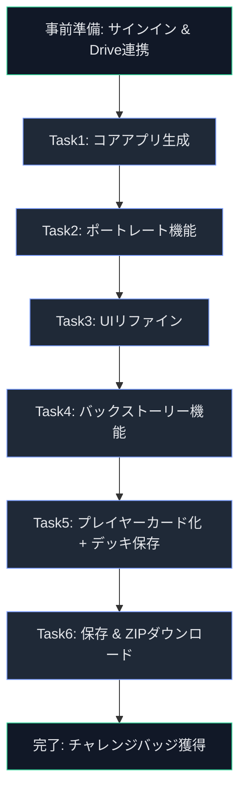
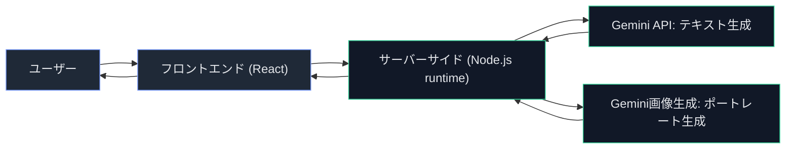
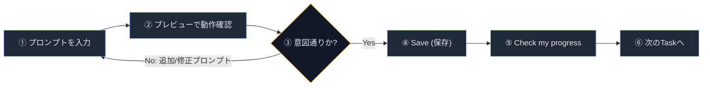
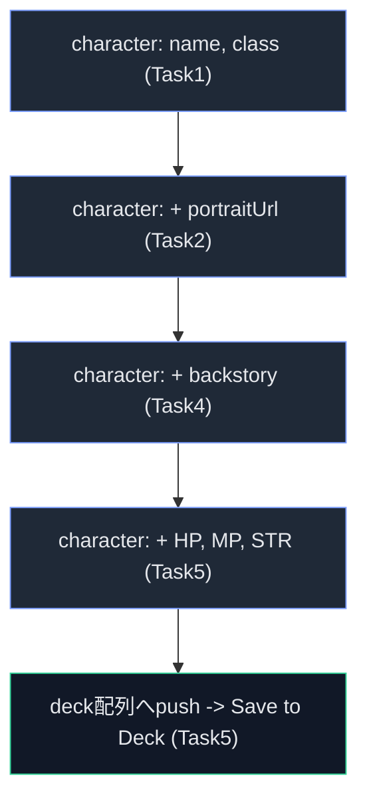

# Google AI Studio「Fantasy Character Creator」チャレンジラボ 完全攻略ガイド

> 世界トップクラスのインフラエンジニア兼 Google スペシャリスト視点による、初学者向けステップバイステップ解説
>
> 対象ラボ: *Develop AI-Powered Prototypes in Google AI Studio* コース内チャレンジラボ（Fantasy Character Creator）
> 対象読者: Google AI Studio / Build mode を初めて使う方、ノーコードで "vibe coding" に挑戦する方

---

## 目次

1. [ラボの全体像](#1-ラボの全体像)
2. [前提知識: Build mode のアーキテクチャ](#2-前提知識-build-mode-のアーキテクチャ)
3. [全 Task 共通のベストプラクティス: プロンプト設計の黄金ループ](#3-全-task-共通のベストプラクティス-プロンプト設計の黄金ループ)
4. [事前準備 (Setup) のベストプラクティス](#4-事前準備-setup-のベストプラクティス)
5. [Task 1: コアアプリケーションの生成](#5-task-1-コアアプリケーションの生成)
6. [Task 2: character portraits 機能の追加](#6-task-2-character-portraits-機能の追加)
7. [Task 3: UI のリファイン（Ancient Alchemist's Workbench）](#7-task-3-ui-のリファインancient-alchemists-workbench)
8. [Task 4: Backstory 機能の追加](#8-task-4-backstory-機能の追加)
9. [Task 5: プレイヤーカード化 + Stats + Save to Deck](#9-task-5-プレイヤーカード化--stats--save-to-deck)
10. [Task 6: 保存 & ZIP ダウンロード](#10-task-6-保存--zip-ダウンロード)
11. [トラブルシューティング](#11-トラブルシューティング)
12. [発展課題への取り組み方](#12-発展課題への取り組み方)
13. [まとめ](#13-まとめ)
14. [参考文献](#14-参考文献)

---

## 1. ラボの全体像

このチャレンジラボは、手順書に従うのではなく「シナリオ」と「タスク」だけが与えられ、これまで学んだスキルを使って自力で完成させる形式です。自動採点システム（Check my progress）が各タスクの完了を判定するため、**各タスクの終わりに必ずアプリを保存してから採点する**、という進め方が全体を通じた鉄則になります。

シナリオは「ゲームジャムに参加する Solutions Developer として、Fantasy Character Creator を段階的に機能拡張していく」というものです。最終的にはキャラクターの名前・クラス・ポートレート・バックストーリー・ステータス・デッキ保存機能を備えた、1 枚のプレイヤーカード風アプリになります。

| Task | 目的 | 主な成果物 |
|---|---|---|
| Task 1 | コアアプリの生成 | ボタン押下でランダムな Name / Class を表示する V1 |
| Task 2 | character portraits 機能 | Generate / Regenerate ボタンによるポートレート画像生成 |
| Task 3 | UI のリファイン | ダークで質感のある背景 + ファンタジー調フォント |
| Task 4 | Backstory 機能 | 1〜2 文の生い立ちを生成するボタン |
| Task 5 | プレイヤーカード化 | Health / Mana / Strength のステータス + Save to Deck |
| Task 6 | 保存 & ダウンロード | アプリ名を確定して ZIP をダウンロード |



> **ポイント:** 各タスクは前のタスクで作られたコードの上に機能を "積み増す" 設計になっています。したがって、あるタスクで生成された UI やデータ構造（キャラクターオブジェクトなど）を壊さないよう、次のタスクのプロンプトでは既存機能への言及を含めるのがベストプラクティスです。

---

## 2. 前提知識: Build mode のアーキテクチャ

効果的にプロンプトを書くには、裏側で何が起きているかを知っておくと判断がしやすくなります。Google AI Studio の Build mode でプロンプトを実行すると、デフォルトでは以下の構成のフルスタックアプリが生成されます。

- **クライアントサイド:** React によるフロントエンド
- **サーバーサイド:** Node.js ランタイム（Gemini API への安全な呼び出し、DB 接続、npm パッケージ利用を担当）
- **API キー:** `GEMINI_API_KEY` はアプリ作成時に自動でサーバーサイドの Secret として設定され、クライアントコードには含まれません



この構成を知っておくと、「Name/Class の生成」や「Backstory の生成」はテキスト生成の Gemini API 呼び出し、「Portrait の生成」は画像生成モデルの呼び出しとして、Code Assistant が自動的に適切な API 呼び出しコードを組み立てている、という前提でプロンプトを設計できます。API キーの取り扱いや認証を自分で書く必要はありません。（出典: [Build apps in Google AI Studio | Gemini API](https://ai.google.dev/gemini-api/docs/aistudio-build-mode)）

---

## 3. 全 Task 共通のベストプラクティス: プロンプト設計の黄金ループ

Task 1〜5 はすべて「プロンプトを入力 → プレビューで確認 → 必要なら追加指示 → 保存 → Check my progress」という同じサイクルの繰り返しです。このループを意識するだけで、迷わず全タスクを進められます。



Google 公式の Prompt design strategies では、Gemini モデルから高品質な結果を得るための原則として次が挙げられています。

| 原則 | 内容 |
|---|---|
| **Be precise and direct** | 目的を明確・簡潔に述べる。過度に装飾的な言い回しは避ける |
| **Use consistent structure** | 見出しや区切り記号でプロンプトのパートを分ける |
| **Define parameters** | 曖昧になりうる用語や条件は明示的に説明する |
| **Control output verbosity** | 出力の詳しさ・長さを指定したい場合は明示的にリクエストする |

（出典: [Prompt design strategies | Gemini API](https://ai.google.dev/gemini-api/docs/prompting-strategies)）

また、Build mode の公式ドキュメントでは、最初のプロンプトでアプリの土台を作った後は、チャットパネルを使って Gemini に対して「修正」「機能追加」「スタイル変更」を段階的に依頼していく反復的な進め方が想定されています。これが本ラボにおける Task 2 以降の Code Assistant への指示スタイルの根拠です。（出典: [Build apps in Google AI Studio](https://ai.google.dev/gemini-api/docs/aistudio-build-mode)）

> **ベストプラクティス:** 一度に複数の大きな変更を欲張らず、1 回のプロンプトで 1 機能に絞る。プレビューで確認できない状態のまま次の指示を重ねると、意図と異なる実装がコードに混入したまま気づきにくくなります。

---

## 4. 事前準備 (Setup) のベストプラクティス

| チェック項目 | 理由 |
|---|---|
| Incognito（シークレット）ウィンドウで開く | 個人アカウントと student account の競合を防ぎ、意図しない個人アカウントへの課金を避ける |
| student account のみを使用する | 別アカウントを使うとそちらに課金が発生する可能性がある |
| ラボタブと AI Studio タブを左右に並べる | 認証情報のコピー＆ペーストや進捗確認の往復を効率化する |
| Task 1 で Drive アクセスを許可する | AI Studio 上でアプリを保存する際に student account の Google Drive 連携が必要になり、これが Check my progress の判定対象にもなる |

---

## 5. Task 1: コアアプリケーションの生成

### 目的
単一のテキストプロンプトで、「ボタンを押すとランダムな Name と Class（Mage / Rogue / Warrior など）を持つファンタジーキャラクターが表示される」アプリの V1 を生成する。

### ベストプラクティス
最初のプロンプトはアプリ全体の設計図になるため、Google 公式が推奨する「目的の明確化」「構造化」「パラメータの明示」の 3 原則を 1 つのプロンプトに詰め込むのが効果的です。

```text
Fantasy Character Creator という React アプリを作成してください。

要件:
- 画面中央に "Generate Character" ボタンを1つ配置する
- ボタンを押すたびに、ランダムなファンタジーキャラクターを生成して表示する
- 表示する情報は Name（ファンタジー風の名前）と Class（Mage, Rogue, Warrior, Cleric, Ranger のいずれか）
- Name と Class はクリックのたびに変化させる
```

- **具体的な選択肢を列挙する**（Mage, Rogue, Warrior…）ことで、Class の曖昧さを排除しています。これは「Define parameters: 曖昧な用語やパラメータを明示的に説明する」という公式プラクティスに対応します。（出典: [Prompt design strategies](https://ai.google.dev/gemini-api/docs/prompting-strategies)）
- 要件を箇条書きで区切ることで、「一貫した構造を使う」という原則を満たし、Code Assistant が要件を取りこぼしにくくなります。

### よくあるつまずき

| 症状 | 原因と対処 |
|---|---|
| ボタンを押しても値が変わらない | ランダム生成ロジックが `useState` の更新を伴っていない可能性。「クリックごとに新しい値を生成する」と明示して再指示する |
| Class の表記が要件と異なる | 候補リストを明示していないと自由生成になり、採点の想定パターンから外れることがある。候補を列挙する |
| 保存し忘れて Check my progress が失敗する | 本タスク完了後、必ず Save してから採点する（Drive アクセス許可が前提） |

---

## 6. Task 2: character portraits 機能の追加

### 目的
現在表示されているキャラクターの「cartoon/video game style」なポートレートを Generate / Regenerate する 2 つのボタンを Code Assistant で追加する。

### ベストプラクティス: 画像プロンプトは Subject / Context / Style で組み立てる
Google の Imagen プロンプトガイドでは、良い画像プロンプトは主題（Subject）・背景や状況（Context）・スタイル（Style）を意識して構成すると説明されています。この考え方は、Code Assistant に「ポートレート生成機能」を実装させる際の指示にもそのまま応用できます。

| 要素 | 本タスクでの内容 |
|---|---|
| Subject（主題） | 画面に表示されている現在のキャラクター（Name / Class） |
| Context（背景・状況） | ファンタジー世界観、装備や舞台設定 |
| Style（スタイル） | "cartoon" または "video game" 風のスタイル |

（出典: [Generate images using Imagen | Gemini API](https://ai.google.dev/gemini-api/docs/imagen)）

### 指示例
```text
現在表示されているキャラクターのNameとClassを使って、
"cartoon/video game style" のポートレート画像を生成する
Generateボタンと、同じ条件で再生成するRegenerateボタンを追加してください。
画像はキャラクター情報の下に表示してください。
```

### Regenerate 機能とキャラクターの一貫性
Google の公式ブログでは、Gemini の画像生成・編集モデルにおいて「主題・構図・アクション・場所・スタイル」を明確にプロンプトへ含めることで、キャラクターの一貫性を保った生成・編集がしやすくなると案内されています。「同じキャラクターを再生成する」という Regenerate ボタンの仕様は、まさにこの一貫性の考え方が生きる場面です。1 回で満足のいく結果が出ないこともあるため、Regenerate を複数回試す前提で機能を作ることも推奨されています。（出典: [Tips for getting the best image generation and editing in the Gemini app](https://blog.google/products/gemini/image-generation-prompting-tips/)、[How to prompt Gemini 2.5 Flash Image Generation for the best results](https://developers.googleblog.com/how-to-prompt-gemini-2-5-flash-image-generation-for-the-best-results/)）

> **ポイント:** 「cartoon/video game style」という指定はスタイルの明示そのものなので、そのままプロンプトに残すのが安全です。曖昧な形容（「かっこいい感じ」など）に言い換えると、採点システムが期待する見た目から外れるリスクがあります。

---

## 7. Task 3: UI のリファイン（Ancient Alchemist's Workbench）

### 目的
アプリの見た目を「古代の錬金術師の作業台（ancient alchemist's workbench）」らしく、ダークで質感のある背景と、キャラクター名に使うスタイライズされたファンタジー調フォントへ変更する。

### ベストプラクティス: 抽象的なテーマを具体的な形容詞に分解する
Imagen プロンプトガイドは、詳細な形容詞・副詞を使って情景を明確に描写することを推奨しています。同じ考え方は UI デザインの指示にも応用でき、「ancient alchemist's workbench」という抽象的なテーマを、そのまま Code Assistant に渡すのではなく、具体的な視覚要素に分解して伝えると再現性が上がります。（出典: [Generate images using Imagen](https://ai.google.dev/gemini-api/docs/imagen)）

| 抽象的なテーマ要素 | 具体的な指示への分解例 |
|---|---|
| ダークな質感の背景 | 濃い木目調・羊皮紙・石壁のようなテクスチャ、暗めのブラウン〜チャコール系カラーパレット |
| 錬金術師の作業台らしさ | 真鍮・古い紙・ロウソクの灯りを思わせるアクセントカラー |
| ファンタジー調フォント | キャラクター名だけに装飾的なセリフ体 / ゴシック風フォントを適用し、本文は可読性重視のフォントのままにする |

### 指示例
```text
アプリ全体のUIを "ancient alchemist's workbench" のテーマにリファインしてください。

- 背景: 濃いブラウン〜チャコール系の、羊皮紙や古い木目を思わせるダークな質感
- キャラクター名の表示: 装飾的なファンタジー風フォント（例: Cinzelのようなセリフ体）
- ボタンや本文などその他のテキストは読みやすさを優先したフォントのまま維持する
```

> **アクセシビリティ上の注意:** ダークな背景に装飾フォントを重ねると、コントラスト不足で文字が読みにくくなることがあります。「文字色と背景のコントラストを確保してください」と一言添えておくと、見た目重視で可読性が犠牲になるのを防げます。

---

## 8. Task 4: Backstory 機能の追加

### 目的
「Generate Backstory」ボタンを追加し、押すと画面上の現在のキャラクターに対応する 1〜2 文の生い立ち（origin story）を生成する。

### ベストプラクティス: 出力の長さ・冗長さを明示的に制御する
Gemini モデルはデフォルトでは簡潔な回答を返す一方、出力の詳しさやトーンを狙い通りにしたい場合は、その条件をプロンプト内で明示的にリクエストする必要があるとされています。「1〜2 文」という制約は、この「Control output verbosity」の原則そのものです。（出典: [Prompt design strategies](https://ai.google.dev/gemini-api/docs/prompting-strategies)）

### 指示例
```text
"Generate Backstory" ボタンを追加してください。
押すと、現在表示されているキャラクターのNameとClassをもとに、
1〜2文で完結するオリジンストーリー（生い立ち）を生成し、
キャラクター情報の下に表示してください。
文章はファンタジー世界観のトーンで、簡潔にまとめてください。
```

- **既存の状態を参照させる:** 「現在表示されているキャラクターの」という一文を必ず含めることで、Name/Class を無視した無関係な文章が生成されるのを防ぎます。
- **文数の上限を数値で指定する:** 「短く」ではなく「1〜2文」と数値化することで、出力のばらつきを抑えられます。

---

## 9. Task 5: プレイヤーカード化 + Stats + Save to Deck

### 目的
UI 全体を枠付きのプレイヤーカードへ再構成し、Health / Mana / Strength のランダムなステータスを追加、さらにお気に入りのキャラクターを「My Deck」リストへ保存する機能を実装する。

### ベストプラクティス① ステータス生成にはパラメータ（範囲）を明示する
「ランダムなステータス」だけでは、値の範囲がモデル任せになり結果が不安定になります。曖昧なパラメータは明示的に定義するという公式プラクティスに従い、数値範囲を具体的に指定します。（出典: [Prompt design strategies](https://ai.google.dev/gemini-api/docs/prompting-strategies)）

```text
UI全体を、枠線付きの「プレイヤーカード」レイアウトに再構成してください。

カードに含める要素:
- Name, Class, Portrait, Backstory（これまでの機能を維持する）
- 新しいステータス: Health (1-100), Mana (1-100), Strength (1-20) を
  キャラクター生成のたびにランダムな数値で表示する
- カードの下に "Save to Deck" ボタンを追加し、押すと現在のキャラクターを
  「My Deck」という保存済みキャラクター一覧に追加する
- 「My Deck」は画面内の別セクションとして一覧表示する
```

### ベストプラクティス② 状態管理の考え方を理解しておく
「Save to Deck」はキャラクター1体分のデータをコピーして配列に追加する、典型的な React の状態管理（state management）パターンです。React 公式ドキュメントでは、コンポーネントが記憶しておくべき値（表示中のキャラクター、保存済みデッキなど）は `useState` のような state として管理し、更新のたびに再描画されると説明されています。Code Assistant にとっても「デッキは配列として保持し、Save to Deck で現在のキャラクターを追加する」という言い方は、実装方針を明確に伝える助けになります。（出典: [State: A Component's Memory | React](https://react.dev/learn/state-a-components-memory)）

Task 1〜5 を通じて、1 体のキャラクターが表すデータはこのように段階的に育っていきます。



> **ポイント:** 「これまでの機能を維持する」という一文を Task 5 のプロンプトに含めるのを忘れないでください。UI を丸ごと作り直す指示だけを出すと、Portrait や Backstory の表示が失われてしまうことがあります。

---

## 10. Task 6: 保存 & ZIP ダウンロード

### 目的
アプリを **Fantasy Character Generator** という名前で保存し、ソースコードを ZIP としてダウンロードする。

### ベストプラクティス
- **保存名を厳密に一致させる:** 採点システムはアプリ名を見て完了判定を行うため、指定された名称と完全に一致させて保存します。
- **ZIP ダウンロードの位置づけを理解する:** Build mode で生成したアプリは ZIP としてエクスポートし、別環境でローカル開発やホスティングを続けることができます。ただし、Gemini API 呼び出しはサーバーサイドコードから行われる設計のため、ダウンロードしたアプリを別のホスティング環境で動かす場合は、そちら側の環境変数に `GEMINI_API_KEY` を自分で設定する必要があります。（出典: [Build apps in Google AI Studio](https://ai.google.dev/gemini-api/docs/aistudio-build-mode)）
- **保存とダウンロードは別アクション:** 「Save（Drive への保存）」と「ZIP ダウンロード」は別の操作です。採点対象は保存済みアプリのため、ダウンロードだけで保存を怠らないよう注意します。

---

## 11. トラブルシューティング

| 症状 | 想定原因 | 対処法 |
|---|---|---|
| Check my progress が「未完了」と表示される | 変更後に Save し忘れている | 各タスクの最後に必ず Save してから採点を実行する |
| Drive への保存でエラーになる | student account への Drive 権限が未許可 | Add files → Drive から student account を選び直し、権限を再許可する |
| Portrait が生成されない / スタイルが違う | プロンプトからスタイル指定（cartoon/video game style）が抜けている | Subject / Context / Style を明示したプロンプトで再指示する |
| Backstory がキャラクター情報と無関係な内容になる | 「現在表示されているキャラクターの」という文脈指定が抜けている | 現在の Name/Class を参照する旨を明示して再指示する |
| Task 5 で以前の機能（Portrait/Backstory）が消えた | UI 全体再構成の指示で既存要素への言及がなかった | 「既存の機能は維持する」と明記して再指示する |
| 生成結果が毎回同じ、または偏る | ステータスやキャラクター要素の値域・候補リストを指定していない | 数値範囲や候補リストを具体的に列挙する |

---

## 12. 発展課題への取り組み方

ラボ内で紹介されている追加チャレンジ（Intelligence / Charisma ステータスの追加、Race の選択、Adventure Hook 生成ボタンなど）も、本ガイドで解説した「黄金ループ」と同じ進め方で取り組めます。

1. 追加したい要素を Subject / Context / Parameters の観点で具体化する
2. 既存機能を壊さないよう「維持する要素」を明示してプロンプトを書く
3. プレビューで確認し、必要なら追加のプロンプトで微調整する
4. 都度 Save して変更を確定する

---

## 13. まとめ

このチャレンジラボの本質は、コードを書くことではなく「意図を過不足なく言語化してプロンプトに落とし込む」ことにあります。共通して効いてくるのは次の 3 点です。

- 目的とパラメータ（候補リスト・数値範囲・文数など）を曖昧にせず明示する
- 1 プロンプト = 1 機能を意識し、都度プレビューで確認しながら小さく反復する
- 前のタスクで作った機能・データ構造への言及を忘れず、積み上げ式に成長させる

この 3 点を押さえれば、初めて Google AI Studio の Build mode を使う場合でも、迷いなく全 6 タスクを完走できます。

---

## 14. 参考文献

| タイトル | 発行元 | 用途 | URL |
|---|---|---|---|
| Build apps in Google AI Studio | Google AI for Developers | Build mode のアーキテクチャ、反復開発、保存/ZIPダウンロードの仕様 | https://ai.google.dev/gemini-api/docs/aistudio-build-mode |
| Prompt design strategies | Google AI for Developers | プロンプト設計の基本原則（明確さ・構造化・パラメータ明示・冗長さ制御） | https://ai.google.dev/gemini-api/docs/prompting-strategies |
| Generate images using Imagen | Google AI for Developers | 画像プロンプトの Subject / Context / Style 構成、形容詞による具体化 | https://ai.google.dev/gemini-api/docs/imagen |
| Tips for getting the best image generation and editing in the Gemini app | Google (公式ブログ) | キャラクターの一貫性を保った画像生成・編集のコツ | https://blog.google/products/gemini/image-generation-prompting-tips/ |
| How to prompt Gemini 2.5 Flash Image Generation for the best results | Google Developers Blog | 画像生成における反復（iterate）の考え方 | https://developers.googleblog.com/how-to-prompt-gemini-2-5-flash-image-generation-for-the-best-results/ |
| State: A Component's Memory | React (公式ドキュメント) | Save to Deck 機能の背景にある React の状態管理の考え方 | https://react.dev/learn/state-a-components-memory |
