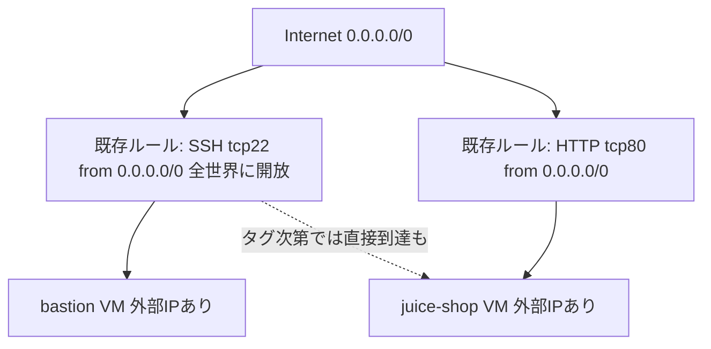
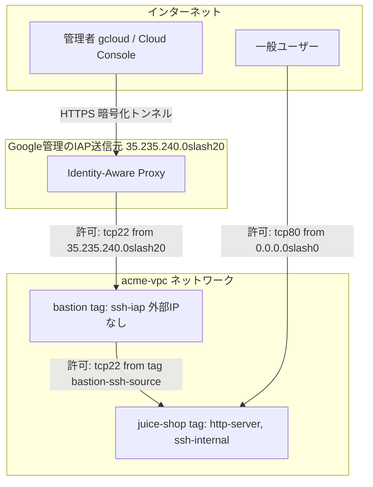
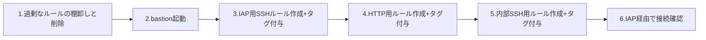
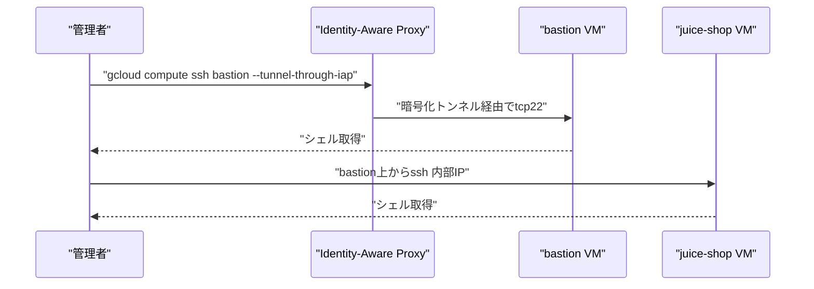

# Google Cloud セキュアネットワーク構築ガイド

## bastion host + Identity-Aware Proxy(IAP) + juice-shop ファイアウォール設計

対象: 「Build a Secure Google Cloud Network」スキルバッジの challenge lab
（Jeffの juice-shop サイトを、bastion 経由・IAP限定SSH・HTTP公開のみに再設計するタスク）

---

## 1. このガイドで扱うこと

この challenge lab のゴールは次の4点です。

- bastion host には外部IPアドレスを持たせない
- bastion への SSH は **IAP (Identity-Aware Proxy) 経由のみ** 許可する
- juice-shop への SSH は **bastion 経由のみ** 許可する
- juice-shop への HTTP(80) のみ、全世界に公開する

このガイドは、上記を実現するための VPC firewall rules（ファイアウォールルール）と network tags（ネットワークタグ）の設計を、初学者でも再現できるように手順化したものです。

---

## 2. 対応前（Before）の課題

neighbour's son が構築した初期構成には、典型的な「動けばよい」設定になりがちな問題が潜んでいます。



| 課題 | なぜ問題か |
|---|---|
| SSH(22) が `0.0.0.0/0` に開放されている | 総当たり攻撃・脆弱性スキャンの標的になる。Google公式も「最小権限の原則を徹底し、必要なプロトコル・ポートのみ許可すべき」と明記している |
| bastion に外部IPがある | 攻撃対象領域（attack surface）が不要に拡大する。IAP TCP forwarding を使えば外部IPなしでも管理アクセス可能 |
| タグ設計が曖昧 | どのルールがどのVMに効いているか判別できず、意図せず juice-shop にまでSSHが開いてしまう恐れがある |
| ルールが「全インスタンス対象」になりがち | ターゲットを絞らない設定は変更の影響範囲が読めず、監査もしづらい |

> 出典: [VPC firewall rules の概要とベストプラクティス](https://cloud.google.com/firewall/docs/firewalls)（least-privilege原則、プロトコル/ポートを絞る、の記載箇所）

---

## 3. 設計方針（ベストプラクティス）

| 原則 | 本タスクでの適用 |
|---|---|
| Least privilege（最小権限） | ルールごとに「送信元」「宛先ポート」「対象VM」を必要最小限に絞る |
| Deny by default | 既存の過剰に緩いルールは削除し、必要な通信だけを明示的に許可する |
| Network tags でターゲットを明示 | bastion / juice-shop それぞれに専用タグを付与し、ルールの適用範囲を一目で分かるようにする |
| 管理アクセスは IAP 経由に統一 | 外部IPなしのVMに対し、Googleが管理する固定レンジ `35.235.240.0/20` からのSSHのみ許可する |
| 多段（bastion経由）アクセス | bastion 専用の送信元ネットワークタグを使い、juice-shop へのSSHを bastion からのみに限定する |

> 出典:
> - [VPC設計のベストプラクティスと参照アーキテクチャ](https://cloud.google.com/architecture/best-practices-vpc-design)
> - [Identity-Aware Proxy を使った TCP forwarding](https://cloud.google.com/iap/docs/using-tcp-forwarding)

---

## 4. 対応後（After）の目標構成



> 表記上、CIDRのスラッシュは Mermaid のパース事故を避けるため "slash" と記載しています（実際のルールでは `/` を使用します）。

---

## 5. ステップバイステップ手順

作業順序の全体像:



### Step 1: 既存の過剰に緩いファイアウォールルールを確認・削除する

まず現状のルールを棚卸しします。

```bash
gcloud compute firewall-rules list \
  --format="table(name,direction,sourceRanges.list(),allowed[].map().firewall_rule().list(),targetTags.list())"
```

`0.0.0.0/0` から `tcp:22` を許可しているルール（例: `default-allow-ssh` など）が見つかったら削除します。

```bash
gcloud compute firewall-rules delete default-allow-ssh --quiet
```

**なぜここから始めるか**: 新しいルールを追加する前に「全世界からSSH可能」という抜け穴を塞がないと、後続のIAP限定ルールを作っても実質的に無意味になるためです。

> 出典: [VPC firewall rules（ベストプラクティス: block all traffic by default）](https://cloud.google.com/firewall/docs/firewalls)

### Step 2: bastion host インスタンスを起動する

Compute Engine の VM インスタンス一覧で bastion が停止していることを確認し、起動します。

```bash
gcloud compute instances start bastion --zone=<ZONE>
```

bastion は要件どおり**外部IPアドレスを持たない**構成のままにしておきます（IAP TCP forwarding は外部IPがなくても機能します）。

> 出典: [IAP for TCP forwarding は外部IPを持たないVMへの管理アクセスを可能にする](https://cloud.google.com/iap/docs/using-tcp-forwarding)

### Step 3: IAP経由のSSHのみを許可するファイアウォールルールを作成し、bastionにタグを付与する

IAPは常に固定のIP範囲 `35.235.240.0/20` からトラフィックを送信します。この範囲以外からのSSHは許可しません。

```bash
gcloud compute firewall-rules create allow-ssh-iap \
  --network=<NETWORK> \
  --direction=INGRESS \
  --action=ALLOW \
  --rules=tcp:22 \
  --source-ranges=35.235.240.0/20 \
  --target-tags=ssh-iap
```

bastion インスタンスにタグを付与します。

```bash
gcloud compute instances add-tags bastion \
  --zone=<ZONE> \
  --tags=ssh-iap
```

**ポイント**: `source-ranges` を `35.235.240.0/20` に固定することで、「IAPを経由した認証済みの接続」以外のSSHを一切受け付けなくなります。IAM側でも `roles/iap.tunnelResourceAccessor` ロールを対象ユーザーに付与しておく必要があります（IAM > IAP でVM単位に付与可能）。

> 出典:
> - [Use IAP for TCP forwarding — 35.235.240.0/20 の説明](https://cloud.google.com/iap/docs/using-tcp-forwarding)
> - [Connect to Linux VMs using Identity-Aware Proxy](https://cloud.google.com/compute/docs/connect/ssh-using-iap)

### Step 4: juice-shop へのHTTPのみを全世界に公開するファイアウォールルールを作成し、タグを付与する

```bash
gcloud compute firewall-rules create allow-http-world \
  --network=<NETWORK> \
  --direction=INGRESS \
  --action=ALLOW \
  --rules=tcp:80 \
  --source-ranges=0.0.0.0/0 \
  --target-tags=http-server
```

```bash
gcloud compute instances add-tags juice-shop \
  --zone=<ZONE> \
  --tags=http-server
```

**なぜHTTPだけ全世界許可でよいか**: juice-shopはWebサイトとして公開されることが目的であり、HTTP(80)以外（特にSSH）は全世界に開ける理由がないためです。ポートとプロトコルを必要最小限に絞るのが least-privilege の実践です。

> 出典: [Use VPC firewall rules — target tags によるルール適用範囲の限定](https://cloud.google.com/firewall/docs/using-firewalls)

### Step 5: bastion経由でのみjuice-shopへSSHできるファイアウォールルールを作成し、タグを付与する

bastion に送信元を識別する専用タグ `bastion-ssh-source` を付与します。このタグは juice-shop など、ほかのVMには付与しません。

```bash
gcloud compute instances add-tags bastion \
  --zone=<ZONE> \
  --tags=bastion-ssh-source
```

送信元タグと juice-shop 専用のターゲットタグを使ってルールを作成します。`source-ranges` は併用しません。

```bash
gcloud compute firewall-rules create allow-ssh-internal \
  --network=<NETWORK> \
  --direction=INGRESS \
  --action=ALLOW \
  --rules=tcp:22 \
  --source-tags=bastion-ssh-source \
  --target-tags=ssh-internal
```

```bash
gcloud compute instances add-tags juice-shop \
  --zone=<ZONE> \
  --tags=http-server,ssh-internal
```

**ポイント**: `source-tags=bastion-ssh-source` により、そのタグを持つ bastion からの通信だけが juice-shop へのSSHを許可されます。同じサブネット上の別VMは許可されません。送信元タグをほかのVMへ使い回さず、`source-ranges` と組み合わせないでください。

> 出典: [Add network tags — target tagsによるVM単位のルール適用](https://cloud.google.com/vpc/docs/add-remove-network-tags)

### Step 6: IAP経由でbastionにSSHし、bastionからjuice-shopへSSHする

```bash
gcloud compute ssh bastion \
  --zone=<ZONE> \
  --tunnel-through-iap
```

bastionにログインできたら、そこから内部IPでjuice-shopへ接続します。

```bash
ssh <juice-shop-internal-ip>
```

接続フローをシーケンス図で整理すると次のとおりです。



> 出典: [gcloud compute ssh リファレンス（--tunnel-through-iap）](https://cloud.google.com/sdk/gcloud/reference/compute/ssh)

---

## 6. 検証とトラブルシューティング

接続がうまくいかない場合は `--troubleshoot` フラグを使うと、VMの状態・ネットワーク疎通・権限・VPC設定を自動でチェックしてくれます。

```bash
gcloud compute ssh bastion \
  --zone=<ZONE> \
  --tunnel-through-iap \
  --troubleshoot
```

| 症状 | よくある原因 | 確認箇所 |
|---|---|---|
| `failed to connect to backend` | IAP用ファイアウォールルールが未作成、またはタグ不一致 | Step 3 のルールとbastionのタグ |
| `Permission denied` | IAMロール `roles/iap.tunnelResourceAccessor` が未付与 | IAM設定 |
| bastionからjuice-shopへSSHできない | bastion の送信元タグ、または juice-shop のターゲットタグが未付与 | Step 5 の source-tags / target-tags |
| HTTPで juice-shop にアクセスできない | HTTPルールのタグとjuice-shopのタグが不一致 | Step 4 のtarget-tagsとインスタンスタグ |

> 出典: [Troubleshooting SSH errors](https://cloud.google.com/compute/docs/troubleshooting/troubleshooting-ssh-errors)

---

## 7. 完成後のファイアウォールルール一覧

| ルール名 | 方向 | 送信元 | プロトコル/ポート | ターゲットタグ | 適用VM | 目的 |
|---|---|---|---|---|---|---|
| allow-ssh-iap | Ingress | 35.235.240.0/20 | tcp:22 | ssh-iap | bastion | IAP経由の管理SSHのみ許可 |
| allow-http-world | Ingress | 0.0.0.0/0 | tcp:80 | http-server | juice-shop | Webサイトの公開 |
| allow-ssh-internal | Ingress | bastion-ssh-source タグ | tcp:22 | ssh-internal | juice-shop | bastion経由のSSHのみ許可 |

このほかに残す/削除するルールがないか、最後に一覧を再確認してください。

```bash
gcloud compute firewall-rules list
```

---

## 8. よくある落とし穴

- **タグの綴りミス**: ファイアウォールルールの `target-tags` とVMに付与した `tags` の文字列が完全一致していないと、ルールが適用されません。
- **送信元タグの使い回し**: `bastion-ssh-source` をほかのVMにも付与すると、そのVMからも juice-shop へSSHできるため、bastion 専用にします。
- **タグ反映の遅延**: source tagsを使うルールは、タグの追加・削除後に反映まで数秒〜数分のラグが出ることがあります。すぐに繋がらない場合は少し待ってから再試行してください。
- **IAMロールの付与漏れ**: ファイアウォールルールが正しくても、ユーザーに `roles/iap.tunnelResourceAccessor` がないとIAPトンネルは確立できません。

> 出典: [Add network tags — source tagsの反映遅延について](https://cloud.google.com/vpc/docs/add-remove-network-tags)

---

## 9. 参考情報源（Sources）

| 項目 | URL |
|---|---|
| VPC firewall rules の概要とベストプラクティス | https://cloud.google.com/firewall/docs/firewalls |
| VPC firewall rules の作成・操作方法 | https://cloud.google.com/firewall/docs/using-firewalls |
| ネットワークタグの追加・削除 | https://cloud.google.com/vpc/docs/add-remove-network-tags |
| Identity-Aware Proxy を使ったTCP forwarding | https://cloud.google.com/iap/docs/using-tcp-forwarding |
| IAPを使ったLinux VMへの接続 | https://cloud.google.com/compute/docs/connect/ssh-using-iap |
| gcloud compute ssh コマンドリファレンス | https://cloud.google.com/sdk/gcloud/reference/compute/ssh |
| SSH接続エラーのトラブルシューティング | https://cloud.google.com/compute/docs/troubleshooting/troubleshooting-ssh-errors |
| VMインスタンスへの安全な接続（bastion hostの概念） | https://cloud.google.com/solutions/connecting-securely |
| VPC設計のベストプラクティスと参照アーキテクチャ | https://cloud.google.com/architecture/best-practices-vpc-design |
