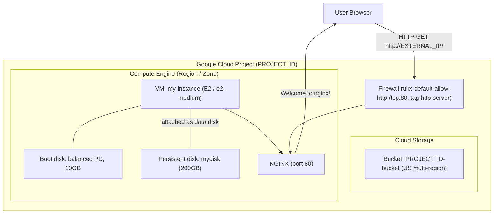
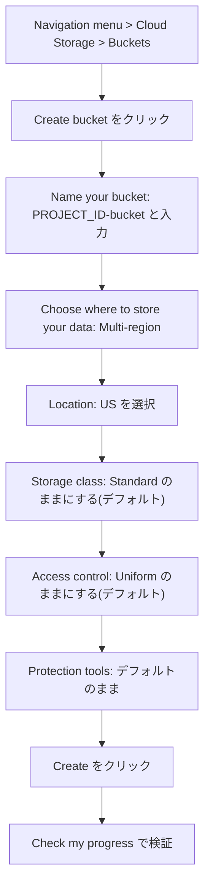
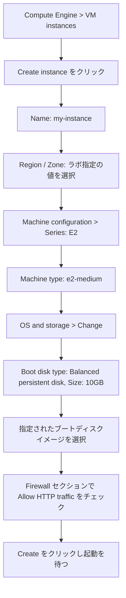
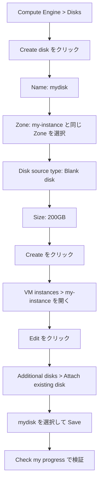
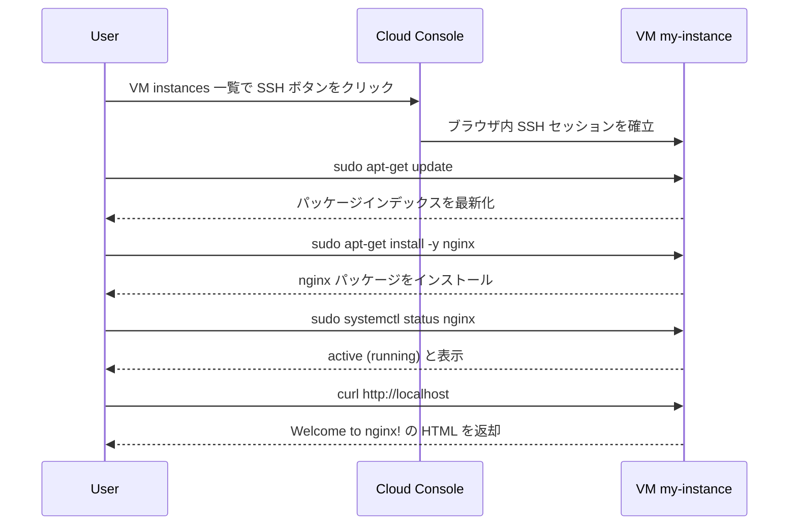
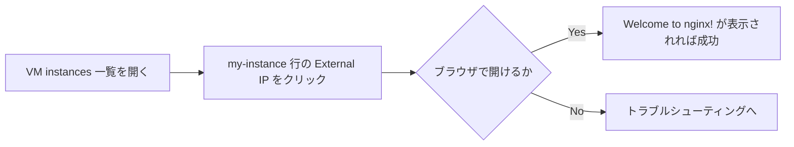
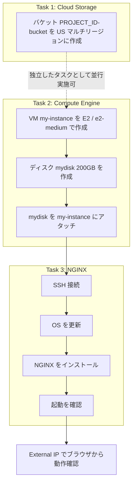

# Google Cloud Challenge Lab 攻略ガイド

## Cloud Storage バケット / Compute Engine + 永続ディスク / NGINX Web サーバー構築

> 対象 Lab: *Build and Operate Infrastructure with Compute Engine and Cloud Storage*（Challenge Lab）
> Lab URL: https://www.skills.google/course_templates/754/labs/597890
> 対象読者: Google Cloud 初学者〜初級 Cloud Architect
> 本ガイドの立ち位置: Challenge Lab は「手順を丸暗記する」ものではなく「学んだスキルを自力で組み合わせる」ことが目的の演習です。本ガイドは各タスクの **実施手順** だけでなく、**なぜその設定が正しいのか（ベストプラクティスの根拠）** を公式ドキュメントへのリンク付きで解説します。

---

## この記事の使い方

Challenge Lab の概要にある通り、このラボには新しいコンセプトの説明はなく、既存スキルの応用が求められます。そのため本ガイドでは、

1. 各タスクの **要件を表で整理**
2. Console（GUI）と `gcloud` CLI の **両方の手順**
3. 各設定値が **なぜベストプラクティスなのか** という根拠と公式ソース URL
4. Mermaid によるフローチャート／シーケンス図
5. 詰まりやすいポイントの **トラブルシューティング表**

の順で構成しています。`PROJECT_ID` / `Region` / `Zone` はラボ開始時に画面左側のパネルに表示される実際の値に読み替えてください（このラボでは Region/Zone は固定値ではなく起動ごとに割り当てられます）。

---

## シナリオと要件の整理

| タスク | 作成するリソース | 主要な要件 |
|---|---|---|
| Task 1 | Cloud Storage バケット | 名前: `PROJECT_ID-bucket` / ロケーション: US マルチリージョン |
| Task 2 | Compute Engine VM + 永続ディスク | VM 名: `my-instance`（E2 / e2-medium）、ディスク名: `mydisk`（200GB）をアタッチ |
| Task 3 | NGINX Web サーバー | `my-instance` に SSH 接続し、OS 更新後に NGINX をインストール・起動確認 |

すべてのリソースは、特に指示がない限り指定された **Region** / **Zone** に作成します。

---

## 全体アーキテクチャ

3つのタスクを完了すると、以下のような構成になります。Cloud Storage バケットはアプリケーションの実行系（VM）とは独立したストレージですが、チームがビルド成果物や起動スクリプトを置く場所として同じプロジェクト内に存在します。



**ポイント（初学者向け）**

- **Cloud Storage** はオブジェクトストレージ（ファイル置き場）で、VM のディスクとは別物です。ビルド成果物や起動スクリプトの保管に向いています。
- **Compute Engine の永続ディスク（Persistent Disk）** は VM から独立したブロックストレージで、VM を削除してもディスクだけ残すことができます。
- **NGINX** は VM の中で動作する Web サーバーソフトウェアで、ポート 80（HTTP）でリクエストを待ち受けます。外部からアクセスするには **Firewall ルール** で tcp:80 を許可する必要があります。

---

## Task 1: Cloud Storage バケットの作成

### 1.1 要件

| 項目 | 値 |
|---|---|
| バケット名 | `PROJECT_ID-bucket`（`PROJECT_ID` は自分のプロジェクト ID に置換） |
| ロケーションタイプ | Multi-region |
| ロケーション | US |

### 1.2 手順（Console）



### 1.3 手順（gcloud CLI）

Cloud Shell から実行する場合は以下のコマンドで同等のバケットを作成できます。

```bash
# 現在のプロジェクト ID を変数に格納
export PROJECT_ID=$(gcloud config get-value project)

# US マルチリージョンにバケットを作成
gcloud storage buckets create gs://${PROJECT_ID}-bucket \
  --location=US \
  --default-storage-class=STANDARD \
  --uniform-bucket-level-access
```

### 1.4 なぜこの設定がベストプラクティスなのか

- **バケット名にプロジェクト ID を含める**: Cloud Storage のバケット名は Google Cloud 全体で一意である必要があります。プロジェクト ID をプレフィックスにすることで命名衝突を避けられます。この命名規約はラボの要件でもあり、実運用でも一般的なパターンです。
- **US マルチリージョンを選ぶ理由**: マルチリージョンは複数のリージョンにまたがってデータを複製するため、単一リージョンより **可用性が高く**、地理的に分散したユーザーへの配信レイテンシも平準化されます。トレードオフとしてリージョン単体構成よりストレージ単価がやや高くなります。今回のように「まずは汎用のファイル置き場を作る」用途では、コストよりも可用性を優先するデフォルトの US マルチリージョンが妥当な選択です。
- **Uniform bucket-level access（デフォルト）**: オブジェクト単位の ACL ではなく IAM ポリシーでバケット全体のアクセス制御を統一でき、権限管理がシンプルになります。
- **最小権限の原則**: バケット作成には `roles/storage.admin` などバケット作成権限を持つロールが必要ですが、プロジェクト全体の Owner 権限を都度使うのではなく、必要な権限のみを持つロールを利用するのが望ましいプラクティスです。

**参考ソース**
- Google Cloud 公式: [Create a bucket](https://cloud.google.com/storage/docs/creating-buckets) — バケット作成手順と必要な IAM ロール
- Google Cloud 公式: [Bucket locations](https://cloud.google.com/storage/docs/locations) — マルチリージョン／デュアルリージョン／リージョンの違いと使い分け

---

## Task 2: Compute Engine VM の作成と永続ディスクの作成・アタッチ

### 2.1 要件

| Property | Value |
|---|---|
| Instance name | `my-instance` |
| Series | E2 |
| Machine type | e2-medium |
| Boot disk type | New balanced persistent disk |
| Boot disk size | 10 GB |
| Boot disk image | ラボ開始時に指定されたイメージ |
| Firewall | Allow HTTP traffic を有効化 |
| 追加ディスク | `mydisk`（200GB）を作成しアタッチ |

### 2.2 VM 作成の手順（Console）



### 2.3 VM 作成の手順（gcloud CLI）

```bash
export ZONE="YOUR_ZONE"
export REGION="YOUR_REGION"
export IMAGE_FAMILY="YOUR_IMAGE_FAMILY"
export IMAGE_PROJECT="YOUR_IMAGE_PROJECT"
export NETWORK="default"

gcloud compute instances create my-instance \
  --zone="$ZONE" \
  --network="$NETWORK" \
  --machine-type=e2-medium \
  --image-family="$IMAGE_FAMILY" \
  --image-project="$IMAGE_PROJECT" \
  --boot-disk-type=pd-balanced \
  --boot-disk-size=10GB \
  --tags=http-server

NETWORK_SELF_LINK=$(gcloud compute networks describe "$NETWORK" \
  --format="value(selfLink)") || exit 1

if FIREWALL_RULE_JSON=$(gcloud compute firewall-rules describe default-allow-http \
  --format=json 2>/dev/null); then
  if ! printf '%s\n' "$FIREWALL_RULE_JSON" | jq -e --arg network "$NETWORK_SELF_LINK" '
    .network == $network and .direction == "INGRESS"
  ' >/dev/null; then
    echo 'default-allow-http の network または direction が異なるため、自動更新できません。' >&2
    exit 1
  fi

  if ! printf '%s\n' "$FIREWALL_RULE_JSON" | jq -e '
    .sourceRanges == ["0.0.0.0/0"] and
    .allowed == [{"IPProtocol": "tcp", "ports": ["80"]}] and
    .targetTags == ["http-server"] and
    ((.disabled // false) == false)
  ' >/dev/null; then
    gcloud compute firewall-rules update default-allow-http \
      --allow=tcp:80 \
      --source-ranges=0.0.0.0/0 \
      --target-tags=http-server \
      --no-disabled || exit 1
  fi
else
  gcloud compute firewall-rules create default-allow-http \
    --network="$NETWORK" \
    --direction=INGRESS \
    --allow=tcp:80 \
    --source-ranges=0.0.0.0/0 \
    --target-tags=http-server
fi

FIREWALL_RULE_JSON=$(gcloud compute firewall-rules describe default-allow-http \
  --format=json) || exit 1
if ! printf '%s\n' "$FIREWALL_RULE_JSON" | jq -e --arg network "$NETWORK_SELF_LINK" '
  .network == $network and
  .direction == "INGRESS" and
  .sourceRanges == ["0.0.0.0/0"] and
  .allowed == [{"IPProtocol": "tcp", "ports": ["80"]}] and
  .targetTags == ["http-server"] and
  ((.disabled // false) == false)
' >/dev/null; then
  echo 'default-allow-http が期待する設定と一致しません。' >&2
  exit 1
fi
```

`--tags=http-server` は VM をファイアウォールルールの対象にします。CLI 手順ではさらに、`default-allow-http` のネットワーク、方向、送信元範囲、許可プロトコル・ポート、対象タグ、有効状態を検証します。更新可能な値は修正し、ネットワークまたは方向が異なる場合や最終検証に失敗した場合は処理を中止します。

### 2.4 永続ディスクの作成とアタッチ



Console で作成する代わりに、CLI では以下の2コマンドで完結します。

```bash
export ZONE="YOUR_ZONE"

# 200GB の永続ディスクを、VM と同じ Zone に作成
gcloud compute disks create mydisk \
  --zone="$ZONE" \
  --size=200GB \
  --type=pd-balanced

# 作成したディスクを my-instance にアタッチ
gcloud compute instances attach-disk my-instance \
  --zone="$ZONE" \
  --disk=mydisk \
  --device-name=mydisk
```

### 2.5 なぜこの設定がベストプラクティスなのか

- **ディスクと VM は同じ Zone に作る**: Persistent Disk はゾーンリソースであり、作成されたゾーン内でのみ VM にアタッチできます。異なる Zone のディスクは直接アタッチできないため、`mydisk` は必ず `my-instance` と同じ Zone に作成します。
- **`--device-name` を明示的に指定する**: OS 内でのデバイス名（`/dev/sdb` など）は再起動のたびに変わる可能性がありますが、`device-name` を指定しておくと `/dev/disk/by-id/google-mydisk` という安定したシンボリックリンクが作られ、スクリプトや `/etc/fstab` から確実にディスクを参照できます。
- **balanced persistent disk をブートディスクに選ぶ理由**: `pd-balanced` はコストとパフォーマンスのバランスに優れた汎用タイプで、Console でブートディスクを作成する際のデフォルトでもあります。要件で明示的に「New balanced persistent disk」と指定されているのもこのためです。
- **（発展）アタッチ後はフォーマット・マウントが必要**: 本ラボの採点基準はディスクの作成とアタッチまでですが、実運用でこの新規ディスクにデータを書き込む場合は、SSH 接続後に `mkfs.ext4` でフォーマットし、`/etc/fstab` に **UUID ベース** でエントリを追加しておくと、再起動後も自動的にマウントされ、デバイス名の変動に影響されません。

**参考ソース**
- Google Cloud 公式: [Create a Linux VM instance](https://cloud.google.com/compute/docs/create-linux-vm-instance) — VM 作成手順と Allow HTTP traffic の設定箇所
- Google Cloud 公式: [Create a new Persistent Disk volume](https://cloud.google.com/compute/docs/disks/add-persistent-disk) — ディスク作成手順、ディスクタイプ一覧（pd-balanced / pd-ssd / pd-standard / pd-extreme）
- Google Cloud 公式: [Attach a non-boot disk to a VM](https://cloud.google.com/compute/docs/disks/attach-disks) — `attach-disk` コマンドと `device-name` の役割
- Google Cloud 公式: [Format and mount a non-boot disk on a Linux VM](https://cloud.google.com/compute/docs/disks/format-mount-disk-linux) — フォーマット・UUID ベースの `/etc/fstab` 設定（発展的ベストプラクティス）

---

## Task 3: NGINX Web サーバーのインストール

### 3.1 要件

1. `my-instance` に SSH 接続する
2. OS を更新する（Update the OS）
3. NGINX をインストールする
4. NGINX が起動していることを確認する

### 3.2 手順とベストプラクティスの解説



```bash
# 1. SSH で my-instance に接続（Console の SSH ボタンでも可）
export ZONE="YOUR_ZONE"

gcloud compute ssh my-instance --zone="$ZONE"
```

SSH 接続後、次のブロックを **my-instance 内のシェル**で実行します。

```bash
# 2. OS のパッケージインデックスを最新化
sudo apt-get update

# 3. NGINX をインストール
sudo apt-get install -y nginx

# 4. NGINX が起動していることを確認
sudo systemctl status nginx

# 5. VM 内からもレスポンスを確認（任意）
curl http://localhost
```

`systemctl status nginx` の出力に `Active: active (running)` と表示されていれば起動確認は完了です。加えて、再起動後も自動起動するように有効化しておくと安心です。

```bash
sudo systemctl enable nginx
```

### 3.3 なぜこの手順がベストプラクティスなのか

- **インストール前に `apt-get update` を実行する理由**: パッケージインデックスが古いままだと、依存パッケージのバージョン不整合やダウンロード失敗の原因になります。ラボの「Update the OS」という指示は、このパッケージインデックス更新（および必要に応じた `apt-get upgrade`）を意味します。
- **ディストリビューション標準リポジトリからのインストールで十分**: 本ラボの目的は「動作する Web サーバーを構築できること」の確認であるため、Debian/Ubuntu 標準リポジトリの `nginx` パッケージ（`apt-get install nginx`）で要件を満たせます。最新の mainline 版が必要な場合は、公式 `nginx.org` の APT リポジトリを追加する方法もありますが、その分セットアップ手順が増えます。
- **`systemctl enable` で自動起動を有効化する**: VM が再起動した際に手動で NGINX を起動し直す必要がなくなり、Web サーバーとしての可用性が向上します。
- **Firewall との関係**: NGINX 自体はポート 80 で待ち受けますが、Task 2 で「Allow HTTP traffic」を有効化していないと外部からアクセスできません。これは VM に `http-server` タグが付与され、`default-allow-http` という名前のファイアウォールルール（tcp:80、送信元 `0.0.0.0/0`）の対象になる、という仕組みです。ラボでは学習目的のためこの全世界許可のルールで問題ありませんが、本番環境では送信元 IP 範囲を絞る、あるいはロードバランサ配下に置くといった追加の制御を検討するのがベストプラクティスです。

**参考ソース**
- nginx 公式: [Installing NGINX Open Source](https://docs.nginx.com/nginx/admin-guide/installing-nginx/installing-nginx-open-source/) — Debian/Ubuntu へのインストール手順（ディストリビューションリポジトリ／公式リポジトリ双方）
- nginx 公式: [nginx: Linux packages](https://nginx.org/en/linux_packages.html) — `nginx.org` 提供パッケージのインストール手順
- Google Cloud 公式: [Add network tags](https://cloud.google.com/vpc/docs/add-remove-network-tags) — `http-server` タグとファイアウォールルールの紐付けの仕組み
- Google Cloud 公式: [Use VPC firewall rules](https://cloud.google.com/firewall/docs/using-firewalls) — ファイアウォールルールの基本概念

---

## Web アプリケーションのテスト



External IP をコピーして `http://EXTERNAL_IP/` の形式で新しいタブに貼り付けても同様に確認できます。

---

## トラブルシューティング

| 症状 | 想定される原因 | 対処 |
|---|---|---|
| ブラウザで接続できない（タイムアウト） | Firewall で HTTP が許可されていない | VM の詳細画面でネットワークタグに `http-server` が付いているか確認。付いていなければ Edit から追加、または `default-allow-http` ルールの存在を確認する（[Use VPC firewall rules](https://cloud.google.com/firewall/docs/using-firewalls)） |
| SSH 接続後 `nginx: command not found` | インストールが完了していない、または別パッケージ名でインストールしようとした | `sudo apt-get install -y nginx` を再実行し、途中でエラーが出ていないかログを確認する |
| `systemctl status nginx` が `inactive (dead)` | インストール直後に自動起動していない場合がある | `sudo systemctl start nginx` で起動し、`sudo systemctl enable nginx` で自動起動を設定する |
| バケット作成時に `Bucket name already in use` | バケット名がグローバルで既に使用されている | `PROJECT_ID` を正しく含めているか確認する（プロジェクト ID はグローバルに一意なので通常は衝突しない） |
| ディスクをアタッチできない | ディスクと VM の Zone が異なる | `export ZONE="YOUR_ZONE"; gcloud compute disks describe mydisk --zone="$ZONE"` で Zone を確認し、VM と同じ Zone にディスクを作り直す |
| `Check my progress` が失敗する | リソース名・設定値がラボの要件と完全一致していない | リソース名（`my-instance` / `mydisk` / `PROJECT_ID-bucket`）や Region/Zone の綴りを再確認する |

---

## まとめ: 全体フロー



3つのタスクはほぼ独立していますが、Task 3（NGINX インストール）は Task 2 で `my-instance` が作成済みであることが前提です。採点は各タスクの `Check my progress` ボタンでこまめに確認しながら進めると、途中の設定ミスに早く気づけます。

---

## 参考文献・引用ソース一覧

1. **Create a bucket** — Google Cloud 公式ドキュメント
   https://cloud.google.com/storage/docs/creating-buckets
   バケット作成手順、デフォルト設定、必要な IAM ロール

2. **Bucket locations** — Google Cloud 公式ドキュメント
   https://cloud.google.com/storage/docs/locations
   Region / Dual-region / Multi-region の違いと選定基準

3. **Create a Linux VM instance** — Google Cloud 公式ドキュメント
   https://cloud.google.com/compute/docs/create-linux-vm-instance
   Console での VM 作成手順、Allow HTTP traffic チェックボックスの効果

4. **Create and start a Compute Engine instance** — Google Cloud 公式ドキュメント
   https://cloud.google.com/compute/docs/instances/create-start-instance
   VM 作成に必要な IAM ロール（`roles/compute.instanceAdmin.v1`）と権限の概要

5. **Create a new Persistent Disk volume** — Google Cloud 公式ドキュメント
   https://cloud.google.com/compute/docs/disks/add-persistent-disk
   永続ディスク作成手順とディスクタイプ一覧（pd-balanced 等）

6. **Attach a non-boot disk to a VM** — Google Cloud 公式ドキュメント
   https://cloud.google.com/compute/docs/disks/attach-disks
   `attach-disk` コマンドと `device-name` オプションの解説

7. **Format and mount a non-boot disk on a Linux VM** — Google Cloud 公式ドキュメント
   https://cloud.google.com/compute/docs/disks/format-mount-disk-linux
   フォーマット手順と UUID ベースの `/etc/fstab` 設定（発展的ベストプラクティス）

8. **Add network tags** — Google Cloud 公式ドキュメント
   https://cloud.google.com/vpc/docs/add-remove-network-tags
   ネットワークタグとファイアウォールルールの紐付けの仕組み

9. **Use VPC firewall rules** — Google Cloud 公式ドキュメント
   https://cloud.google.com/firewall/docs/using-firewalls
   ファイアウォールルールの基本概念とコマンド

10. **Installing NGINX Open Source** — nginx 公式ドキュメント（F5/NGINX, Inc.）
    https://docs.nginx.com/nginx/admin-guide/installing-nginx/installing-nginx-open-source/
    Debian/Ubuntu 向け NGINX インストール手順

11. **nginx: Linux packages** — nginx.org 公式サイト
    https://nginx.org/en/linux_packages.html
    `nginx.org` 提供パッケージによるインストール手順

12. **対象 Challenge Lab** — Google Cloud Skills Boost
    https://www.skills.google/course_templates/754/labs/597890
    本ガイドが解説しているラボ本体
