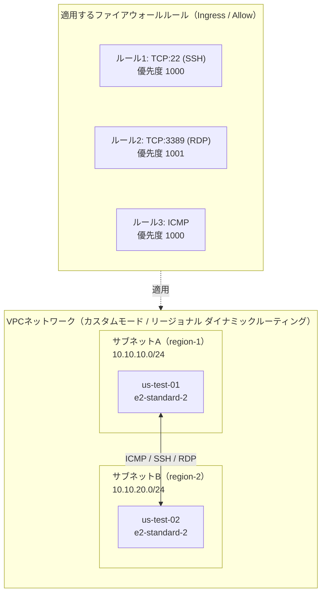
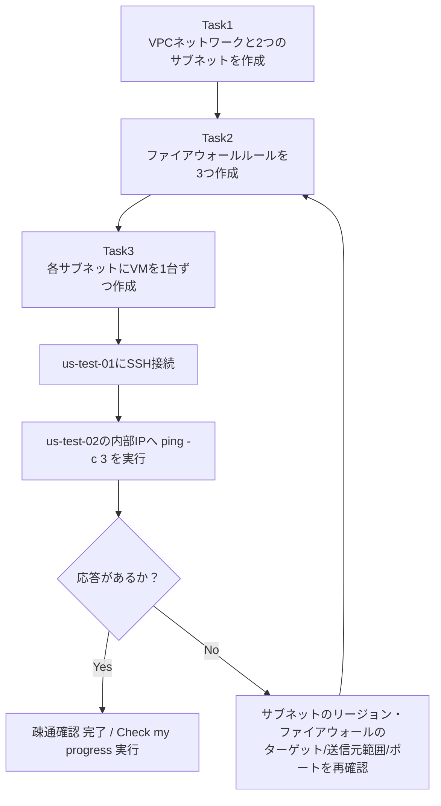
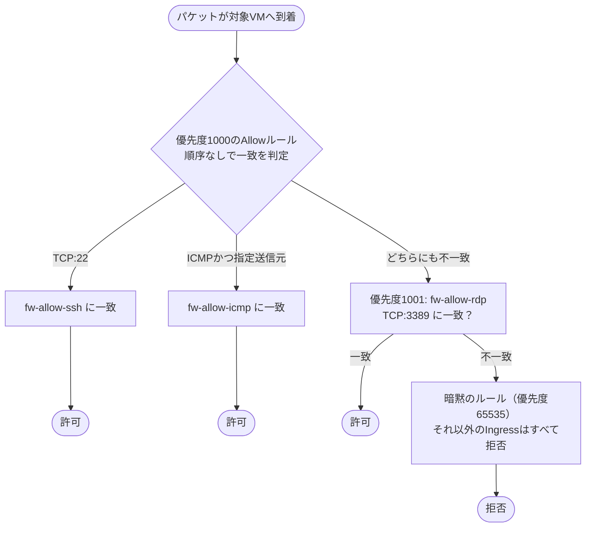
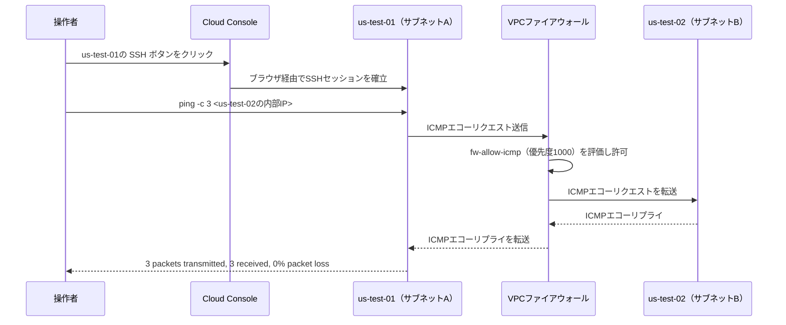

# 初学者向け解説：Google Cloud VPCネットワーク構築チャレンジラボ 完全攻略ガイド

> 対象ラボ: [Set up a Google Cloud Network: Challenge Lab](https://www.skills.google/course_templates/641/labs/613012)（Google Cloud Skills Boost / サインインが必要なため本ガイドは配布されたラボ手順書テキストと公式ドキュメントを基に作成しています）

このガイドは、チャレンジラボの手順を「ただコピーする」のではなく、**なぜそう設定するのか**をインフラエンジニアの視点で理解しながら進められるように構成しています。各タスクには、ラボをクリアするための最短手順に加えて、実務で本番環境を構築する際のベストプラクティスとの違いも明記しています。

## 目次

1. [ラボの全体像](#1-ラボの全体像)
2. [事前準備：命名規則を決める](#2-事前準備命名規則を決める)
3. [Task 1: VPCネットワークとサブネットの作成](#3-task-1-vpcネットワークとサブネットの作成)
4. [Task 2: ファイアウォールルールの追加](#4-task-2-ファイアウォールルールの追加)
5. [Task 3: VMインスタンスの作成と疎通確認](#5-task-3-vmインスタンスの作成と疎通確認)
6. [トラブルシューティング](#6-トラブルシューティング)
7. [本番環境向けベストプラクティス総まとめ](#7-本番環境向けベストプラクティス総まとめ)
8. [参考資料（出典）](#8-参考資料出典)

---

## 1. ラボの全体像

このチャレンジラボでは、以下の3つのタスクを通じて「異なるリージョンの2つのサブネットにあるVMが、正しく通信できるネットワーク」を構築します。

- **Task 1**: カスタムモードのVPCネットワークを1つ作成し、異なるリージョンに2つのサブネットを作成する
- **Task 2**: SSH・RDP・ICMPを許可するファイアウォールルールを3つ作成する
- **Task 3**: 各サブネットにVMを1台ずつ作成し、`ping`コマンドで疎通確認する

全体のアーキテクチャは次のようになります。



進め方のロードマップは以下の通りです。各タスクは前のタスクの成果物に依存しているため、**必ずTask1→2→3の順番**で進めてください（ファイアウォールルールがない状態でVMを作っても`ping`は失敗します）。



---

## 2. 事前準備：命名規則を決める

ラボの手順書には `network name`、`subnet a name` のようにプレースホルダーで名前が示されているだけで、実際の値は自分で決める必要があります。チャレンジラボで作成する VPC ネットワーク、サブネット、Firewall ルール、VM の名前には、**小文字英数字とハイフンのみ**を使用します。あらかじめ対象リソースの命名規則を決めておくと、後工程の設定ミスを防げます。

| プレースホルダー | 推奨する命名例 | 補足 |
|---|---|---|
| `network name` | `vpc-net-challenge` | VPCネットワーク名。プロジェクト内で一意 |
| `subnet a name` | `subnet-a` | サブネットA |
| `subnet b name` | `subnet-b` | サブネットB |
| `network region 1` | `asia-northeast1`（東京）など、ラボが指定するリージョン | サブネットAのリージョン |
| `network region 2` | `us-central1` など、ラボが指定するリージョン | サブネットBのリージョン |
| `firewall rule 1` | `fw-allow-ssh` | SSH許可ルール |
| `firewall rule 2` | `fw-allow-rdp` | RDP許可ルール |
| `firewall rule 3` | `fw-allow-icmp` | ICMP許可ルール |
| `ZONE` | 各サブネットのリージョンに属するゾーン | 詳細は Task 3 の注意点を参照 |

> **注意（ラボ手順書の記述について）**: 元の手順書ではTask 3で2台のVMに対して同じプレースホルダー `ZONE` が使われていますが、Compute Engineのゾーンは特定のリージョンに属するため、**`us-test-01`はサブネットAのリージョンに属するゾーン、`us-test-02`はサブネットBのリージョンに属するゾーン**を、それぞれ別々に指定する必要があります。同一ゾーンを両方に指定すると、片方のVMがサブネットのリージョンと矛盾してエラーになります。

---

## 3. Task 1: VPCネットワークとサブネットの作成

### 3-1. 押さえておきたい概念

| 用語 | 意味 |
|---|---|
| カスタムモードVPC | サブネットを自分で明示的に作成するモード。自動モード（auto mode）は各リージョンに`/20`のサブネットが自動作成されるが、本番設計では意図しないIP範囲の重複を避けるためカスタムモードが推奨される |
| ダイナミックルーティングモード | Cloud Routerが学習した経路（BGPルート）を、同一リージョン内だけに伝播させる（リージョナル）か、VPC内の全リージョンに伝播させる（グローバル）かを決める設定。デフォルトは**リージョナル** |
| IPスタックタイプ | サブネットが IPv4のみ（シングルスタック）か、IPv4/IPv6デュアルスタックかを指定する設定 |

このタスクではダイナミックルーティングモードはVPCネットワーク全体に対して設定するプロパティで、値はリージョナルまたはグローバルのいずれかを取ります。ラボでは「リージョナル」（デフォルト）を指定します。

### 3-2. サブネット設計のベストプラクティス

- **CIDR範囲は重複させない**: 同一VPC内は当然のこと、将来他のVPCとピアリングする可能性も考慮し、社内で使うCIDR帯を事前に台帳管理するのが望ましい
- **将来の拡張余地を残す**: `/24`は252個の利用可能なIPv4アドレスを提供する。ただし、VMに割り当てられる数はロードバランサなどの非VMリソースが消費するアドレス分だけ少なくなるため、将来のオートスケーリングも含めて必要数を見積もる
- **予約IPアドレスを忘れない**: すべてのプライマリIPv4サブネット範囲には、使用できないIPアドレスが4つ存在します（ネットワークアドレス、デフォルトゲートウェイ、末尾から2番目のアドレス、ブロードキャストアドレス）。つまり`/24`（256個）を割り当てても実際に使えるのは252個です

### 3-3. 設定内容まとめ

| 項目 | サブネットA (`subnet-a`) | サブネットB (`subnet-b`) |
|---|---|---|
| リージョン | network region 1 | network region 2 |
| IPスタックタイプ | IPv4（シングルスタック） | IPv4（シングルスタック） |
| IPv4範囲 | `10.10.10.0/24` | `10.10.20.0/24` |

### 3-4. Consoleでの手順

1. **[VPC networks]** → **[Create VPC network]** を開く
2. **Name** にVPCネットワーク名を入力
3. **Subnet creation mode** で **Custom** を選択
4. 1つ目のサブネット行に `subnet-a` を入力し、**Region**を`network region 1`、**IP stack type**を`IPv4 (single-stack)`、**IPv4 range**を`10.10.10.0/24`に設定
5. **Add subnet** をクリックし、2つ目のサブネット行に `subnet-b`、`network region 2`、`10.10.20.0/24` を設定
6. 画面下部の **Dynamic routing mode** で **Regional** を選択（既定値のままでよい）
7. **Create** をクリック

### 3-5. gcloudコマンドでの手順（参考）

Consoleでの操作をコマンドで再現すると次のようになります。カスタムモードVPCネットワークを作成する場合は、まずネットワークを作成してから、必要なリージョン内にサブネットを作成します。

```bash
# カスタムモードのVPCネットワークを作成（リージョナル ダイナミックルーティング）
gcloud compute networks create vpc-net-challenge \
  --subnet-mode=custom \
  --bgp-routing-mode=regional

# サブネットA
gcloud compute networks subnets create subnet-a \
  --network=vpc-net-challenge \
  --region=<network-region-1> \
  --range=10.10.10.0/24 \
  --stack-type=IPV4_ONLY

# サブネットB
gcloud compute networks subnets create subnet-b \
  --network=vpc-net-challenge \
  --region=<network-region-2> \
  --range=10.10.20.0/24 \
  --stack-type=IPV4_ONLY
```

作成後は **Check my progress** を実行し、Task 1が合格になっていることを確認してから次に進みます。

---

## 4. Task 2: ファイアウォールルールの追加

### 4-1. ファイアウォールルールの構成要素

VPCのファイアウォールルールは、次の要素の組み合わせで動作します。

| 要素 | 説明 |
|---|---|
| 方向（Direction） | Ingress（内向き）/ Egress（外向き） |
| 優先度（Priority） | 0〜65535の数値。**数値が小さいほど優先度が高い** |
| アクション | Allow / Deny |
| ターゲット | ルールを適用するVM（全インスタンス／ネットワークタグ／サービスアカウント） |
| 送信元/送信先範囲 | ルールが適用されるIPv4/IPv6範囲 |
| プロトコルとポート | 対象となる通信の種類 |

### 4-2. 作成する3つのルール

| ルール名 | 優先度 | 方向 | アクション | ターゲット | 送信元範囲 | プロトコル/ポート |
|---|---|---|---|---|---|---|
| `fw-allow-ssh` | 1000 | Ingress | Allow | すべてのインスタンス | `0.0.0.0/0` | TCP:22 |
| `fw-allow-rdp` | 1001 | Ingress | Allow | すべてのインスタンス | `0.0.0.0/24` | TCP:3389 |
| `fw-allow-icmp` | 1000 | Ingress | Allow | すべてのインスタンス | `10.10.10.0/24`, `10.10.20.0/24` | ICMP |

> **ラボ指定についての注意**: ルール2の送信元範囲は、配布された手順書と採点条件どおり `0.0.0.0/24` を指定します。このCIDRが含むのは `0.0.0.0`〜`0.0.0.255` の256アドレスだけで、全IPv4送信元を意味する `0.0.0.0/0` とは異なります。実務ではこの値を流用せず、IAP、VPN、踏み台、または承認済みの管理端末CIDRに限定してください。

### 4-3. 評価の流れ（優先度とデフォルト拒否）

同じ優先度・同じアクションを持つルールが複数ある場合、どのルールがログに評価済みとして表示されるかは不定になるため、ログの評価順序を一貫させたい場合はルールごとに一意の優先度を割り当てることが推奨されます。今回のルール1とルール3は同じ優先度1000ですが、対象ポート/プロトコルが重ならないため実害はありません。



### 4-4. Consoleでの手順（3ルール共通の流れ）

1. **[VPC network]** → **[Firewall]** → **[Create firewall rule]**
2. **Name** にルール名、**Network** に作成したVPCネットワークを指定
3. **Priority** を表の値に設定
4. **Direction of traffic** は **Ingress**、**Action on match** は **Allow**
5. **Targets** は **All instances in the network**
6. **Source IPv4 ranges** に表の値を入力（ルール3は2つのCIDRをカンマ区切りで両方入力）
7. **Protocols and ports** で **TCP** を選び対象ポートを入力（ルール3のみ **Other protocols** で `icmp` を指定）
8. **Create** をクリックし、3ルール分繰り返す

### 4-5. gcloudコマンドでの手順（参考）

```bash
gcloud compute firewall-rules create fw-allow-ssh \
  --network=vpc-net-challenge --direction=INGRESS --action=ALLOW \
  --rules=tcp:22 --source-ranges=0.0.0.0/0 --priority=1000

gcloud compute firewall-rules create fw-allow-rdp \
  --network=vpc-net-challenge --direction=INGRESS --action=ALLOW \
  --rules=tcp:3389 --source-ranges=0.0.0.0/24 --priority=1001

gcloud compute firewall-rules create fw-allow-icmp \
  --network=vpc-net-challenge --direction=INGRESS --action=ALLOW \
  --rules=icmp --source-ranges=10.10.10.0/24,10.10.20.0/24 --priority=1000
```

### 4-6. これは「ラボ用の簡易設定」であるという重要な注意

上記の3ルールは、あくまでチャレンジラボの採点条件を満たすための構成です。SSHルールの`0.0.0.0/0`はすべてのIPv4送信元を許可し、RDPルールの`0.0.0.0/24`も実務上の適切な管理端末許可リストではありません。本番環境ではどちらも流用せず、IAPやVPNなどに限定してください。実務でのあるべき姿は「7. 本番環境向けベストプラクティス総まとめ」で詳しく解説します。

Check my progressを実行し、Task 2が合格になったことを確認します。

---

## 5. Task 3: VMインスタンスの作成と疎通確認

### 5-1. インスタンス構成

| 項目 | `us-test-01` | `us-test-02` |
|---|---|---|
| サブネット | `subnet-a` | `subnet-b` |
| ゾーン | サブネットAのリージョンに属するゾーン | サブネットBのリージョンに属するゾーン |
| マシンタイプ | `e2-standard-2` | `e2-standard-2` |

`e2-standard-2` は2 vCPU・8 GBメモリの汎用マシンタイプで、コスト最適化されたE2シリーズはvCPUあたり0.5〜8GBのメモリ比率を持ち、IntelとAMD EPYC双方のプロセッサに対応します。疎通確認だけが目的の検証用インスタンスとしては十分なスペックです。

### 5-2. Consoleでの手順

1. **[Compute Engine]** → **[VM instances]** → **[Create instance]**
2. **Name**: `us-test-01`
3. **Region/Zone**: サブネットAのリージョン・任意のゾーン
4. **Machine type**: `e2-standard-2`
5. **Networking** タブでNetworkに作成したVPC、Subnetworkに`subnet-a`を指定
6. **Create** をクリック
7. 同様に `us-test-02` をサブネットBのリージョン・`subnet-b`で作成

### 5-3. SSH接続とpingによる疎通確認



1. Cloud Consoleの **[Compute Engine]** → **[VM instances]** で `us-test-01` の **SSH** ボタンをクリック
2. 開いたSSHウィンドウで `us-test-02` の内部IPアドレスに対してpingを実行

```bash
ping -c 3 <us-test-02-internal-ip-address>
```

3. 内部DNS名を使ったレイテンシ測定も行います。ここで手順書は `ping -c 3 us-test-02.ZONE` という簡略表記を使っていますが、実際にGoogle Cloudの内部DNSが払い出す完全修飾ドメイン名（FQDN）は次の形式です。

| DNSの種類 | 完全修飾ドメイン名（FQDN） |
|---|---|
| ゾーンDNS（推奨・デフォルト） | `VM_NAME.ZONE.c.PROJECT_ID.internal` |
| グローバルDNS（プロジェクト全体で一意） | `VM_NAME.c.PROJECT_ID.internal` |

Googleはゾーンごとに障害を切り分けられる高い信頼性が得られるため、ゾーンDNSの使用を強く推奨しています。したがって実際に実行するコマンドは以下のようになります。

```bash
ping -c 3 us-test-02.<ゾーン>.c.<プロジェクトID>.internal
```

このpingが成功するのは、インスタンスへのICMPトラフィックの受信を許可するファイアウォールルールを作成済みである場合に限られます。これはまさにTask 2で作成した `fw-allow-icmp` の役割です。

4. Check my progressを実行し、Task 3が合格になったことを確認します。

---

## 6. トラブルシューティング

| 症状 | よくある原因 | 対処 |
|---|---|---|
| VM作成時に「サブネットが見つからない」エラー | ゾーンとサブネットのリージョンが不一致（Task 1注意点を参照） | VMのゾーンが目的のサブネットのリージョンに属しているか確認 |
| `ping`がタイムアウトする | ICMPを許可するファイアウォールルールが未作成、またはターゲット/送信元範囲の設定ミス | `fw-allow-icmp`の送信元範囲に両方のサブネットCIDRが含まれているか確認 |
| SSHボタンを押しても接続できない | SSH許可ルールの優先度・ポート番号の誤り、または起動直後でVMの初期化が未完了 | 数十秒待って再試行。ファイアウォールルールのポートが22になっているか確認 |
| Check my progressが失敗する | リソース名やCIDR範囲がラボの要求値と完全一致していない | Consoleでリソース名・IP範囲・優先度をラボ手順書の値と1文字単位で突き合わせる |
| 内部DNS名でのpingが失敗する | FQDNの組み立てミス（ゾーン・プロジェクトIDの欠落） | `us-test-02`のメタデータサーバーから正しいホスト名を取得し確認する |

---

## 7. 本番環境向けベストプラクティス総まとめ

チャレンジラボの構成はあくまで学習用の最短ルートです。実際にプロダクション環境を設計する際は、以下の観点で今回の構成を見直すことを推奨します。

| 項目 | ラボの構成 | 本番環境での推奨構成 |
|---|---|---|
| SSH/RDPの送信元範囲 | SSHは`0.0.0.0/0`、RDPはラボ指定の`0.0.0.0/24` | IAP TCP-forwardingの利用を前提に送信元範囲をIAPの範囲(35.235.240.0/20)へ限定し、インターネットからのポート22/3389へのIngressは拒否する |
| VMの外部IP | 実質的に外部公開されうる状態 | IAPを使ってSSH/RDPアクセスを行うことで、VMからすべての外部IPアドレスを取り外し、総当たり攻撃の入口自体を塞ぐことができる |
| ファイアウォールのターゲット | すべてのインスタンス | GCPのファイアウォールルールはVPCネットワーク全体に対して機能するため、最小権限の原則に基づき、本当に必要なトラフィックのみを許可するネットワークタグやサービスアカウント単位のターゲット指定に切り替える |
| デフォルトVPC | 未使用（今回はカスタムVPCを新規作成） | 新規の未使用プロジェクトでは削除してカスタムVPCから設計を始める。既存プロジェクトでは、VM、サブネット、Cloud VPN、Cloud Router、Serverless VPC Accessなどの依存リソースを棚卸し・移行し、依存関係が残っていないことを確認してから削除する |
| 可観測性 | ログ未設定 | 明示的なTCP/UDP拒否ルールはFirewall Rules Loggingで記録できるが、暗黙のIngress拒否やICMPは対象外。VPC Flow Logsはサンプリングされたフローを記録するが、Ingressファイアウォールで拒否されたパケットは対象外。Connectivity Testsも組み合わせ、ログ単独では見えない到達性を検証する |
| 大規模組織でのルール管理 | ルールを個別に作成 | 組織またはリージョン単位でルールを一元管理できる階層型ファイアウォールポリシーやネットワークファイアウォールポリシーを活用する（該当ドキュメント: VPC firewall rules概要） |

### 事前チェックリスト（本番移行前）

- [ ] SSH/RDPの送信元範囲を `0.0.0.0/0` から IAP範囲またはVPN/踏み台経由に変更したか
- [ ] ファイアウォールのターゲットを「すべてのインスタンス」からネットワークタグ／サービスアカウント単位に変更したか
- [ ] Egress（送信）方向のルールも最小権限で設計したか
- [ ] VPC Flow LogsとFirewall Rules Loggingを有効化したか
- [ ] `default`ネットワークの依存リソースを棚卸し・移行し、依存関係が残っていないことを確認してから削除したか
- [ ] サブネットCIDRの拡張余地と、他VPC/オンプレミスとの重複有無を確認したか

---

## 8. 参考資料（出典）

- [Set up a Google Cloud Network: Challenge Lab（本ガイドの対象ラボ）](https://www.skills.google/course_templates/641/labs/613012)
- [Quickstart: Create and manage VPC networks](https://docs.cloud.google.com/vpc/docs/create-modify-vpc-networks)
- [VPC networks overview](https://cloud.google.com/vpc/docs/vpc)
- [Subnets | Virtual Private Cloud](https://docs.cloud.google.com/vpc/docs/subnets)
- [Set routing and best path selection modes | Cloud Router](https://docs.cloud.google.com/network-connectivity/docs/router/how-to/create-network-set-modes)
- [VPC firewall rules | Cloud Next Generation Firewall](https://docs.cloud.google.com/firewall/docs/firewalls)
- [Use VPC firewall rules | Cloud Next Generation Firewall](https://docs.cloud.google.com/firewall/docs/using-firewalls)
- [Best practices for controlling SSH network access | Compute Engine](https://docs.cloud.google.com/compute/docs/connect/ssh-best-practices/network-access)
- [Access VMs using internal DNS | Compute Engine](https://docs.cloud.google.com/compute/docs/networking/using-internal-dns)
- [Overview of internal DNS | Compute Engine](https://docs.cloud.google.com/compute/docs/internal-dns)
- [General-purpose machine family (E2) | Compute Engine](https://docs.cloud.google.com/compute/docs/general-purpose-machines)
- [GCP VPC Firewall Rules Best Practices（IAP・ログ運用の実務Tips）](https://linuxcloudservers.com/gcp-vpc-firewall-rules-best-practices/)
- [How to Set Up VPC Firewall Rules to Allow SSH Access Only from Specific IP](https://oneuptime.com/blog/post/2026-02-17-how-to-set-up-vpc-firewall-rules-to-allow-ssh-access-only-from-specific-ip-ranges-in-gcp/view)
