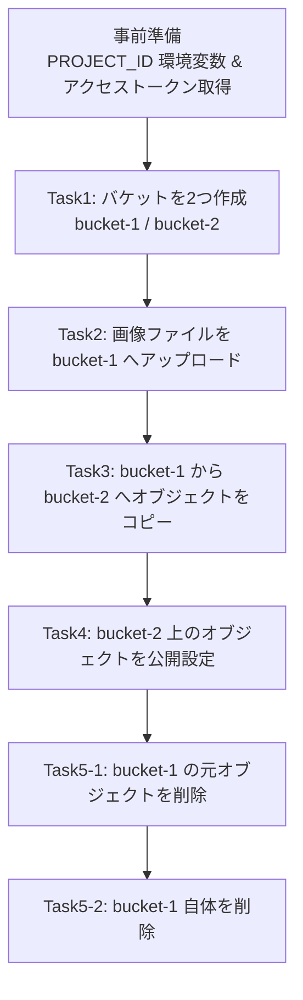
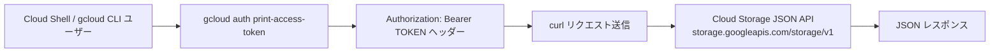
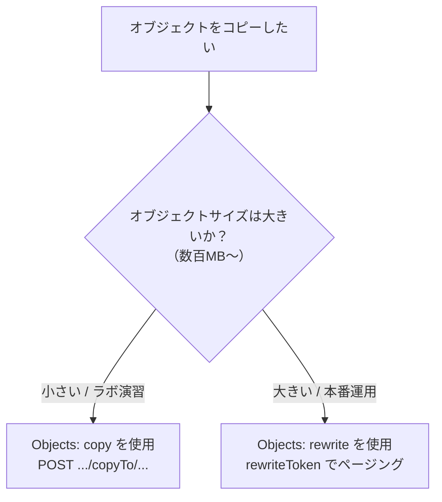
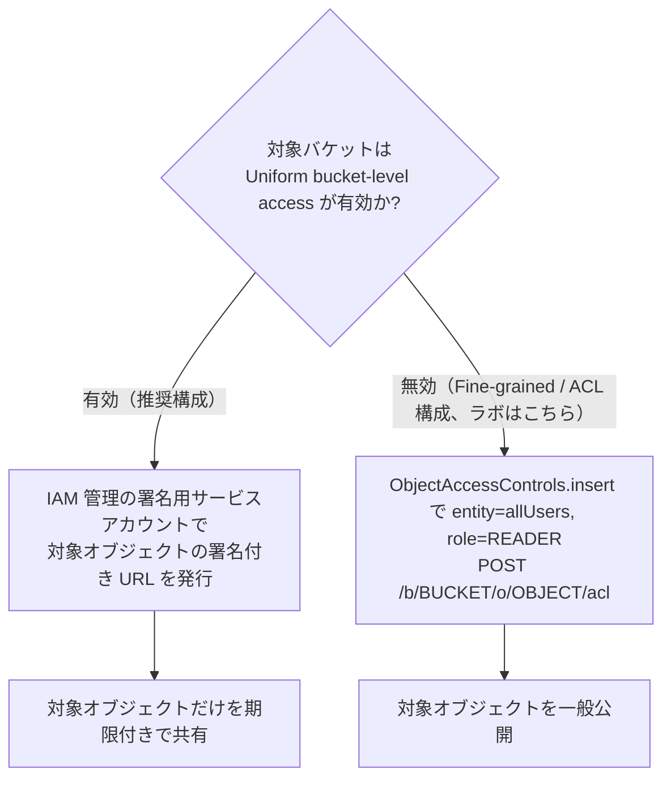
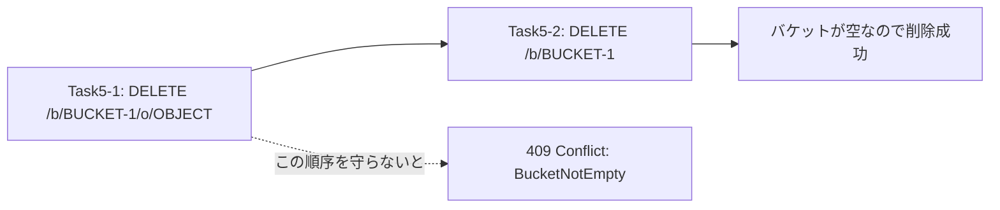

# Cloud Storage JSON/REST API チャレンジラボ ベストプラクティスガイド

対象ラボ: [Working with the Cloud Storage JSON/REST API — Challenge Lab](https://www.skills.google/course_templates/755/labs/613033)

本ドキュメントは、Google Cloud のインフラエンジニア／Google スペシャリストの視点から、上記チャレンジラボの各タスク（バケット作成 → オブジェクトのアップロード → バケット間コピー → 公開設定 → 削除）を、公式ドキュメントの根拠とともにステップバイステップで解説するものです。初学者がラボをただクリアするだけでなく、「なぜその curl コマンドで動くのか」「実務ではどこに気をつけるべきか」を理解できることを目的としています。

---

## 0. 全体ワークフロー

チャレンジラボ全体は、以下の 6 つの操作を JSON API（`storage.googleapis.com/storage/v1`）に対して `curl` で直接叩くことで完結します。GUI（コンソール）や `gcloud storage` コマンドを使わないのがこのラボの特徴です。



ポイントは、**Task5 の削除順序**（オブジェクト → バケットの順）と、**Task4 の公開設定の方式**（ACL か IAM か）です。それぞれ後述します。

---

## 1. 事前準備：認証とプロジェクト設定

### 1.1 何をするか

JSON API はステートレスな REST API なので、すべてのリクエストに以下が必要です。

- `Authorization: Bearer <ACCESS_TOKEN>` ヘッダー（OAuth 2.0 アクセストークン）
- 操作対象を特定するための `PROJECT_ID`（バケット作成時のみ）

Cloud Shell にはあらかじめ `gcloud` CLI と認証済みの ADC（Application Default Credentials）が用意されているため、以下のように環境変数とトークンを都度発行するのが最も簡単な方法です。

```bash
export PROJECT_ID=$(gcloud config get-value project)
export ACCESS_TOKEN=$(gcloud auth print-access-token)
```

`curl` コマンドの中でその都度 `$(gcloud auth print-access-token)` を評価する書き方も一般的で、公式ドキュメントのサンプルもこの形式を採用しています。

```bash
curl -X GET \
  -H "Authorization: Bearer $(gcloud auth print-access-token)" \
  "https://storage.googleapis.com/storage/v1/b?project=${PROJECT_ID}"
```



### 1.2 ベストプラクティス

| 項目 | 推奨事項 | 理由 |
|---|---|---|
| トークンの発行方法 | コマンド置換 `$(gcloud auth print-access-token)` を都度使う | アクセストークンは既定で一定時間後に失効するため、変数に保存して使い回すと長時間の作業でリクエストが 401 になりやすい |
| 認可の粒度 | 個人アカウントでなく、必要な範囲の IAM ロール（例: `roles/storage.admin`）を持つアカウントを使う | 最小権限の原則。バケットの作成・削除には `storage.buckets.create` / `storage.buckets.delete` 権限が必要 |
| ブラウザ | シークレット/プライベートウィンドウで学習用アカウントを使う | 個人の Google アカウントと学習用アカウントの認証情報が混在し、意図しない課金や権限エラーが起きるのを防ぐ（ラボの Setup and requirements にも明記） |

**参考ソース**
- [Authenticate to Cloud Storage](https://docs.cloud.google.com/storage/docs/authentication) — REST 呼び出し時に `gcloud auth print-access-token` を使う方法
- [gcloud auth print-access-token リファレンス](https://cloud.google.com/sdk/gcloud/reference/auth/print-access-token)
- [Cloud Storage IAM roles](https://docs.cloud.google.com/storage/docs/access-control/iam-roles)

---

## 2. Task 1: バケットを2つ作成する（`Buckets: insert`）

### 2.1 リクエストの組み立て

JSON API でのバケット作成は `POST` で、クエリパラメータに `project` が必須です。

```http
POST https://storage.googleapis.com/storage/v1/b?project=PROJECT_ID
```

ラボの指示どおりの JSON ファイルを作成します。

```bash
cat > bucket-1.json <<EOF
{
  "name": "${PROJECT_ID}-bucket-1",
  "location": "us",
  "storageClass": "STANDARD"
}
EOF

curl -X POST --data-binary @bucket-1.json \
  -H "Authorization: Bearer $(gcloud auth print-access-token)" \
  -H "Content-Type: application/json" \
  "https://storage.googleapis.com/storage/v1/b?project=${PROJECT_ID}"
```

2 つ目のバケットも同じ手順で `bucket-2.json` を作って作成します。

### 2.2 初学者が引っかかりやすいポイント

**① `storageClass: "multi_regional"` は現在レガシー扱い**

ラボのサンプル JSON は `"storageClass": "multi_regional"` になっていますが、これは現行のドキュメントでは *レガシーのストレージクラス* として扱われています。現行の推奨ストレージクラスは `STANDARD` / `NEARLINE` / `COLDLINE` / `ARCHIVE` の4種類で、`MULTI_REGIONAL` は「マルチリージョンまたはデュアルリージョンでのみ利用可能な、`STANDARD` と等価のクラス」と説明されています。新規バケットでは `STANDARD` を使うのがベストプラクティスです（動作はラボの `multi_regional` のままでも通りますが、実務では避けます）。

**② バケット名はグローバルに一意かつ公開情報**

バケット名は Cloud Storage 全体で単一の名前空間を共有するため、他プロジェクトと重複した名前は作成できません。また、バケット名は誰でも存在を推測・アクセスできる公開情報なので、メールアドレスやユーザー ID など個人を特定できる情報を含めないことが公式に推奨されています。本ラボのように `${PROJECT_ID}-bucket-1` のような命名にすることで、プロジェクトごとの一意性を確保しつつ用途がわかる名前にできます。

**③ ロケーションとストレージクラスは作成後に変更しにくい**

バケットの `name` と `location` は事実上不変のプロパティです。ストレージクラスは後から `PATCH` で変更可能ですが、ロケーションは変更できず、別ロケーションに移したい場合はバケットの再作成（または `relocate`）が必要になります。ラボのような使い捨て環境では気にしなくてよい点ですが、実務では最初のロケーション選定が重要です。

### 2.3 ベストプラクティスまとめ

| 項目 | 推奨 |
|---|---|
| ストレージクラス | 特別な理由がなければ `STANDARD`（レガシー値 `MULTI_REGIONAL`/`REGIONAL` は新規に使わない） |
| バケット名 | プロジェクト ID やランダムサフィックスを含め、PII を含めない、3〜63文字、小文字・数字・ハイフンのみ |
| 作成時の権限設計 | 可能であれば `iamConfiguration.uniformBucketLevelAccess.enabled: true` を初期設定にし、後述の Task4 で ACL が必要な場合のみ明示的に無効化する |

**参考ソース**
- [Create a bucket（JSON API での作成手順）](https://docs.cloud.google.com/storage/docs/creating-buckets)
- [Buckets: insert リファレンス](https://docs.cloud.google.com/storage/docs/json_api/v1/buckets/insert)
- [Storage classes（ストレージクラスとレガシークラスの説明）](https://docs.cloud.google.com/storage/docs/storage-classes)
- [About Cloud Storage buckets（命名規則・公開情報である旨）](https://docs.cloud.google.com/storage/docs/buckets)

---

## 3. Task 2: 画像ファイルを Cloud Storage にアップロードする（`Objects: insert`）

### 3.1 アップロード方式の選択

JSON API のオブジェクトアップロードには 3 種類の `uploadType` があります。ラボのようにメタデータ不要の単純な画像アップロードでは `media`（シンプルアップロード）で十分です。

| uploadType | 用途 | 目安のファイルサイズ |
|---|---|---|
| `media` | データのみを送る最もシンプルな方式 | 〜5MB 程度の小さいファイル向け |
| `multipart` | データとメタデータ（JSON）を1リクエストにまとめて送る | 小さいファイル＋メタデータが必要な場合 |
| `resumable` | アップロードを中断・再開できる方式 | 大きいファイルや不安定な回線 |

```bash
export OBJECT_NAME="world-map.png"
OBJECT_NAME_ENCODED=$(jq -rn --arg value "${OBJECT_NAME}" '$value | @uri')
export OBJECT_NAME_ENCODED
export BUCKET_1="${PROJECT_ID}-bucket-1"

curl -X POST --data-binary @"${OBJECT_NAME}" \
  -H "Authorization: Bearer $(gcloud auth print-access-token)" \
  -H "Content-Type: image/png" \
  "https://storage.googleapis.com/upload/storage/v1/b/${BUCKET_1}/o?uploadType=media&name=${OBJECT_NAME_ENCODED}"
```

### 3.2 ベストプラクティス

- **アップロード用エンドポイントは `/upload/` プレフィックス付き**：通常のメタデータ操作（`GET`/`PATCH`）は `https://storage.googleapis.com/storage/v1/b/...` ですが、データを実際に送信するアップロードだけは `https://storage.googleapis.com/upload/storage/v1/b/...` という別エンドポイントになります。この違いを取り違えるのが初学者の典型的なつまずきポイントです。
- **`Content-Type` はファイルの実体に合わせる**：`image/png` のように正しい MIME タイプを指定しないと、後でブラウザから直接アクセスしたときに正しくレンダリングされないことがあります。
- **オブジェクト名にも命名規則がある**：スラッシュ `/` を含めると擬似的な「フォルダ」構造として扱われますが、実際にはフラットな名前空間です。URL エンコードが必要な文字（スラッシュ、スペースなど）を含む場合は明示的にエンコードします。
- **大きいファイルには `resumable` を使う**：チャレンジラボの画像程度なら `media` で問題ありませんが、実運用でギガバイト級のファイルを扱う場合は途中失敗時の再送コストを抑えるため `resumable` アップロードを検討します。

**参考ソース**
- [Upload objects from a file system（`uploadType` ごとの curl 例）](https://docs.cloud.google.com/storage/docs/uploading-objects)
- [Objects: insert リファレンス](https://docs.cloud.google.com/storage/docs/json_api/v1/objects/insert)

---

## 4. Task 3: オブジェクトを別のバケットにコピーする（`Objects: copy`）

### 4.1 リクエストの組み立て

```http
POST https://storage.googleapis.com/storage/v1/b/SOURCE_BUCKET/o/SOURCE_OBJECT/copyTo/b/DESTINATION_BUCKET/o/DESTINATION_OBJECT
```

```bash
export BUCKET_2="${PROJECT_ID}-bucket-2"

curl -X POST \
  -H "Authorization: Bearer $(gcloud auth print-access-token)" \
  -H "Content-Length: 0" \
  "https://storage.googleapis.com/storage/v1/b/${BUCKET_1}/o/${OBJECT_NAME_ENCODED}/copyTo/b/${BUCKET_2}/o/${OBJECT_NAME_ENCODED}"
```

リクエストボディを空にした場合、送信元オブジェクトの編集可能なメタデータは複製先にも引き継がれます。ただし **ACL・object hold・retention 設定は引き継がれません**。これは初学者が見落としやすい仕様で、「コピーしたのに公開設定が消えている」という事象の原因になります。

### 4.2 `copy` と `rewrite` の使い分け（実務でのベストプラクティス）

公式ドキュメントは、`copy` メソッドではなく **`rewrite` メソッドの使用を一般的に推奨**しています。理由は、`copy` は内部的に `rewrite` を一度だけ呼び出す実装になっており、オブジェクトが大きい場合は複数回の `rewrite` 呼び出しが必要になることがあるため、`copy` を大きいオブジェクトに使うと `Payload too large` エラーになりうるからです。チャレンジラボでは `copy` を使う指示ですが、実務のスクリプトやアプリケーションを書く際は `rewrite`（`rewriteToken` によるページネーションに対応）を選ぶのがベストプラクティスです。



### 4.3 ベストプラクティス

| 項目 | 推奨 |
|---|---|
| 権限 | 送信元バケットに `storage.objects.get`、宛先バケットに `storage.objects.create` が必要（IAM で最小権限に絞る） |
| ACL の扱い | コピー後に元と同じ公開設定が必要なら、コピー先で明示的に ACL / IAM を再設定する（自動継承されない） |
| 大きいファイル | `copy` ではなく `rewrite` を使う |

**参考ソース**
- [Copy, rename, and move objects](https://docs.cloud.google.com/storage/docs/copying-renaming-moving-objects)
- [Objects: copy リファレンス（rewrite 推奨の注記、ACL非継承の注記あり）](https://docs.cloud.google.com/storage/docs/json_api/v1/objects/copy)

---

## 5. Task 4: オブジェクトを一般公開する（ACL または IAM）

### 5.1 ラボが要求している方式：Fine-grained ACL

ラボの指示どおり、`ObjectAccessControls: insert` を使い、`allUsers` に `READER` 権限を付与します。

```http
POST https://storage.googleapis.com/storage/v1/b/BUCKET/o/OBJECT/acl
```

```bash
cat > public-read.json <<EOF
{
  "entity": "allUsers",
  "role": "READER"
}
EOF

curl -X POST --data-binary @public-read.json \
  -H "Authorization: Bearer $(gcloud auth print-access-token)" \
  -H "Content-Type: application/json" \
  "https://storage.googleapis.com/storage/v1/b/${BUCKET_2}/o/${OBJECT_NAME_ENCODED}/acl"
```

### 5.2 なぜこれが「レガシー」寄りの方法なのか

Cloud Storage のアクセス制御には現在 2 つの方式が併存しています。

| 方式 | 概要 | 現在の位置づけ |
|---|---|---|
| **Uniform bucket-level access + IAM**（推奨） | バケット単位の IAM ポリシーのみで権限を一元管理。ACL は無効化される | Google が推奨するデフォルト方式 |
| **Fine-grained access + ACL**（ラボで使用） | IAM に加えてオブジェクト単位の ACL も併用できるレガシー方式。S3 との相互運用のために残されている | 特定オブジェクトだけ個別に権限を変えたい場合の例外的な用途 |

公式ドキュメントは「IAM と ACL の 2 つの権限系統が並行して働くため、意図しないデータ公開のリスクが増える」として、原則 ACL を避け Uniform bucket-level access を有効にすることを推奨しています。さらに、コピーの回で触れた `destinationPredefinedAcl` パラメータのように、**Uniform bucket-level access が有効なバケットに対して ACL 系の操作を送ると `400 Bad Request` になる**という技術的な制約もあります。Task4 の方式は、対象バケットを `Buckets: get` で取得し、実際の `iamConfiguration.uniformBucketLevelAccess.enabled` の値だけで選択してください。値が `false` または未設定なら ACL、`true` なら IAM ベースの方式（以下の署名付き URL）を使用します。組織ポリシー `constraints/storage.uniformBucketLevelAccess` は、新規バケットで Uniform bucket-level access を必須にしたり、既存バケットで無効化を禁止したりする制約です。対象バケットの現在の方式を直接示す値ではありません。

### 5.3 Uniform bucket-level access 有効時の代替方法：署名付き URL

Uniform bucket-level access が有効な場合は ACL を使用できません。一方、`allUsers` への IAM binding には条件を付けられず、`roles/storage.objectViewer` を無条件に付与するとバケット全体のオブジェクト取得・一覧権限を公開します。`OBJECT_NAME` だけを共有するには、IAM で権限管理されたサービスアカウントを使って、期限付きの署名付き URL を発行します。

```bash
export SIGNING_SERVICE_ACCOUNT="YOUR_SIGNING_SERVICE_ACCOUNT"

gcloud storage sign-url "gs://${BUCKET_2}/${OBJECT_NAME}" \
  --duration=1h \
  --http-verb=GET \
  --impersonate-service-account="$SIGNING_SERVICE_ACCOUNT"
```

署名用サービスアカウントには対象オブジェクトを取得できる権限が必要で、実行者にはそのサービスアカウントの `iam.serviceAccounts.signBlob` 権限が必要です。生成された URL は指定期間だけ、そのオブジェクトへの `GET` に利用でき、`storage.objects.list` は付与しません。継続的な匿名公開が必要なら、公開専用バケットへ公開対象だけを分離してから、そのバケットに限定して IAM を設定します。



### 5.4 ベストプラクティス（公開設定に関する重要な注意）

- **Public Access Prevention を先に確認する**：バケットの `iamConfiguration.publicAccessPrevention` と、親プロジェクト・フォルダ・組織の `constraints/storage.publicAccessPrevention` を確認します。有効な場合、`allUsers` を ACL / IAM に追加する操作は `412 Precondition Failed` となり、既存の公開設定も無効化されて匿名アクセスは `401` または `403` になります。ACL 方式でラボの一般公開要件を満たすには Public Access Prevention が適用されていない環境が必要です。署名付き URL は `allUsers` を追加せず署名用サービスアカウントとして認証するため、この制約による公開禁止とは別の方式です。
- **`allUsers` への付与は必ず意図的に行う**：`allUsers` はインターネット上の誰でもという意味です。学習目的以外では、機密情報を含むバケットに対して安易に使わないこと。
- **公開範囲に合わせて方式を選ぶ**：バケット全体を継続的に公開する場合は IAM、Fine-grained バケット内の個別オブジェクトを公開する場合は ACL、Uniform bucket-level access を維持したまま個別オブジェクトだけを共有する場合は署名付き URL を使います。
- **併用のリスク**：Fine-grained バケットでは、バケットの IAM ポリシーが非公開でも、1つのオブジェクトの ACL が `allUsers` になっているだけでそのオブジェクトは公開されてしまいます。定期的に ACL の棚卸しをするか、可能な限り Uniform bucket-level access に統一するのが安全です。

**参考ソース**
- [Make data public（IAM 方式の手順と、Uniform bucket-level access が前提という注記）](https://docs.cloud.google.com/storage/docs/access-control/making-data-public)
- [ObjectAccessControls: insert リファレンス](https://docs.cloud.google.com/storage/docs/json_api/v1/objectAccessControls/insert)
- [Overview of access control（Uniform と Fine-grained の比較）](https://docs.cloud.google.com/storage/docs/access-control)
- [Uniform bucket-level access](https://docs.cloud.google.com/storage/docs/uniform-bucket-level-access)
- [Access control lists (ACLs)（ACLを避けるべき理由）](https://docs.cloud.google.com/storage/docs/access-control/lists)

---

## 6. Task 5: クリーンアップ（オブジェクト削除 → バケット削除）

### 6.1 なぜ「順序」が重要か

Cloud Storage の `Buckets: delete` は**空のバケットしか削除できません**。中にオブジェクトが1つでも残っていると `409 Conflict` になります。そのため、必ず「オブジェクトを先に削除 → バケットを削除」の順で呼び出す必要があります。



### 6.2 コマンド

```bash
# 6-1. bucket-1 内のオブジェクトを削除
curl -X DELETE \
  -H "Authorization: Bearer $(gcloud auth print-access-token)" \
  "https://storage.googleapis.com/storage/v1/b/${BUCKET_1}/o/${OBJECT_NAME}"

# 6-2. bucket-1 自体を削除
curl -X DELETE \
  -H "Authorization: Bearer $(gcloud auth print-access-token)" \
  "https://storage.googleapis.com/storage/v1/b/${BUCKET_1}"
```

### 6.3 ベストプラクティス

- **`bucket-2` は削除しない**：ラボの要件はコピー先の `bucket-2` は残したまま、コピー元の `bucket-1` とその中のオブジェクトだけを削除することです。誤って両方消してしまうミスに注意します。
- **ソフトデリート（Soft Delete）の考慮**：新規 Cloud Storage バケットには既定で 7 日間の Soft Delete が適用されます。`DELETE` 後も復元可能期間中はデータが残り、ストレージ料金が発生する場合があります。使い捨てラボで完全削除を前提にする場合でも、`constraints/storage.softDeletePolicySeconds` が 0 秒を許可していると確認できた場合に限り、バケット作成時に `softDeletePolicy.retentionDurationSeconds` を `"0"` に設定します。許可値を確認できない場合は管理者へ確認し、0 秒が許可されていなければこの設定を省略してください。許可されない値を指定するとバケットの作成または更新が失敗します。
- **本番運用では削除前に一覧・バックアップを確認する**：削除は取り消せない操作（またはソフトデリート期間後に取り消せなくなる操作）なので、スクリプト化する場合は削除対象を `list` で確認するステップを挟むと安全です。

**参考ソース**
- [Delete objects](https://docs.cloud.google.com/storage/docs/deleting-objects)
- [Objects: delete リファレンス](https://docs.cloud.google.com/storage/docs/json_api/v1/objects/delete)
- [Delete buckets（空である必要がある旨、ソフトデリートの挙動）](https://docs.cloud.google.com/storage/docs/deleting-buckets)
- [Buckets: delete リファレンス](https://cloud.google.com/storage/docs/json_api/v1/buckets/delete)

---

## 7. 全体ベストプラクティスまとめ

| カテゴリ | ベストプラクティス | 根拠 |
|---|---|---|
| 認証 | アクセストークンは都度 `$(gcloud auth print-access-token)` で発行し、ハードコードしない | [Authenticate to Cloud Storage](https://docs.cloud.google.com/storage/docs/authentication) |
| 権限 | 個人アカウントではなく、必要な IAM ロールのみを持つ学習用/サービスアカウントを使う | [Cloud Storage IAM roles](https://docs.cloud.google.com/storage/docs/access-control/iam-roles) |
| ストレージクラス | 新規バケットは `STANDARD` を基本とし、`MULTI_REGIONAL`/`REGIONAL` などレガシー値は避ける | [Storage classes](https://docs.cloud.google.com/storage/docs/storage-classes) |
| 命名 | バケット名に PII を含めない、グローバル一意性を意識する | [About Cloud Storage buckets](https://docs.cloud.google.com/storage/docs/buckets) |
| アップロード | ファイルサイズに応じて `media`/`multipart`/`resumable` を使い分ける | [Upload objects from a file system](https://docs.cloud.google.com/storage/docs/uploading-objects) |
| コピー | 大きいオブジェクトは `copy` ではなく `rewrite` を使う。ACL は自動継承されない前提で設計する | [Objects: copy](https://docs.cloud.google.com/storage/docs/json_api/v1/objects/copy) |
| 公開設定 | 可能な限り Uniform bucket-level access + IAM を使い、ACL は例外的な用途に限定する | [Overview of access control](https://docs.cloud.google.com/storage/docs/access-control) |
| 削除 | 必ず「オブジェクト削除 → バケット削除」の順序を守る | [Delete buckets](https://docs.cloud.google.com/storage/docs/deleting-buckets) |

---

## 8. トラブルシューティング

| 症状 | 主な原因 | 対処 |
|---|---|---|
| `400 Bad Request` | Uniform bucket-level access が有効なバケットに `destinationPredefinedAcl` や ACL 系エンドポイント（`/acl`）を送っている | バケットを Fine-grained のまま作成するか、IAM ポリシー（`/iam` エンドポイント）方式に切り替える |
| `401 Unauthorized` | アクセストークンが失効している、または `Bearer` の綴りミス | `gcloud auth print-access-token` を再実行してトークンを再発行する |
| `403 Forbidden` | 実行アカウントに必要な IAM 権限（`storage.buckets.create` 等）がない | 対象プロジェクトで適切なロール（例: `roles/storage.admin`）が付与されているか確認する |
| `404 Not Found` | バケット名・オブジェクト名の誤り、またはオブジェクト名の URL エンコード漏れ | 変数の中身を `echo` で確認し、スラッシュなどを含む名前は URL エンコードする |
| `409 Conflict`（`BucketNotEmpty`） | オブジェクトが残っているバケットを削除しようとしている | 先にすべてのオブジェクトを削除してから再度バケット削除を実行する |

**参考ソース**
- [Status and error codes（JSON API）](https://docs.cloud.google.com/storage/docs/json_api/v1/status-codes)

---

## 9. 参考文献（ソース一覧）

- ラボ本体: [Working with the Cloud Storage JSON/REST API — Challenge Lab](https://www.skills.google/course_templates/755/labs/613033)
- [Cloud Storage JSON API overview](https://cloud.google.com/storage/docs/json_api)
- [Authenticate to Cloud Storage](https://docs.cloud.google.com/storage/docs/authentication)
- [gcloud auth print-access-token リファレンス](https://cloud.google.com/sdk/gcloud/reference/auth/print-access-token)
- [Cloud Storage IAM roles](https://docs.cloud.google.com/storage/docs/access-control/iam-roles)
- [Create a bucket](https://docs.cloud.google.com/storage/docs/creating-buckets)
- [Buckets: insert](https://docs.cloud.google.com/storage/docs/json_api/v1/buckets/insert)
- [Storage classes](https://docs.cloud.google.com/storage/docs/storage-classes)
- [About Cloud Storage buckets](https://docs.cloud.google.com/storage/docs/buckets)
- [Upload objects from a file system](https://docs.cloud.google.com/storage/docs/uploading-objects)
- [Objects: insert](https://docs.cloud.google.com/storage/docs/json_api/v1/objects/insert)
- [Copy, rename, and move objects](https://docs.cloud.google.com/storage/docs/copying-renaming-moving-objects)
- [Objects: copy](https://docs.cloud.google.com/storage/docs/json_api/v1/objects/copy)
- [Make data public](https://docs.cloud.google.com/storage/docs/access-control/making-data-public)
- [ObjectAccessControls: insert](https://docs.cloud.google.com/storage/docs/json_api/v1/objectAccessControls/insert)
- [Overview of access control](https://docs.cloud.google.com/storage/docs/access-control)
- [Uniform bucket-level access](https://docs.cloud.google.com/storage/docs/uniform-bucket-level-access)
- [Access control lists (ACLs)](https://docs.cloud.google.com/storage/docs/access-control/lists)
- [Delete objects](https://docs.cloud.google.com/storage/docs/deleting-objects)
- [Objects: delete](https://docs.cloud.google.com/storage/docs/json_api/v1/objects/delete)
- [Delete buckets](https://docs.cloud.google.com/storage/docs/deleting-buckets)
- [Buckets: delete](https://cloud.google.com/storage/docs/json_api/v1/buckets/delete)
- [Status and error codes (JSON API)](https://docs.cloud.google.com/storage/docs/json_api/v1/status-codes)
