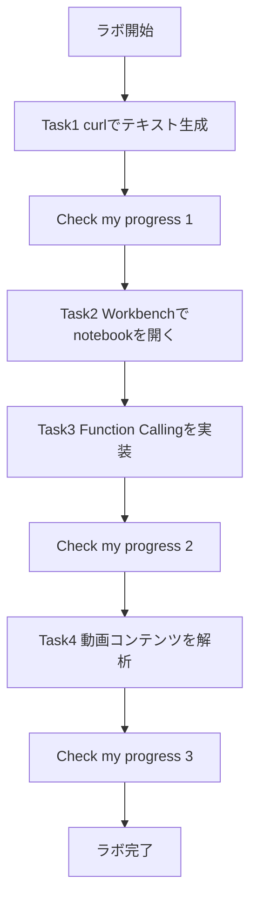
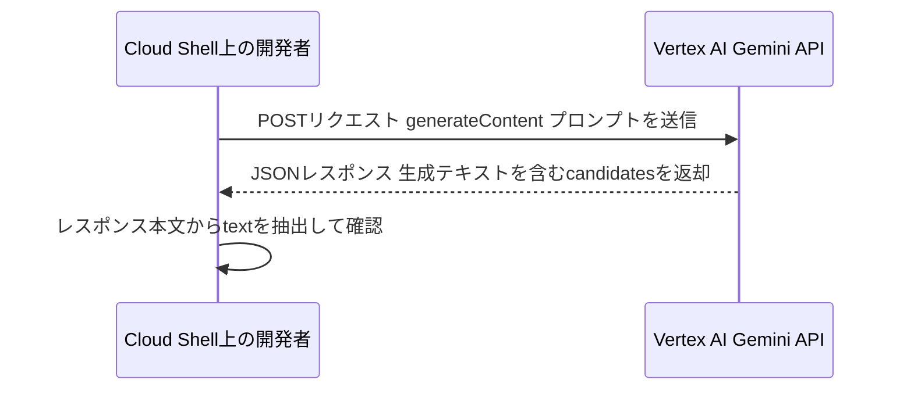
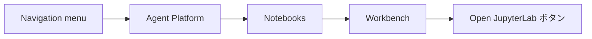
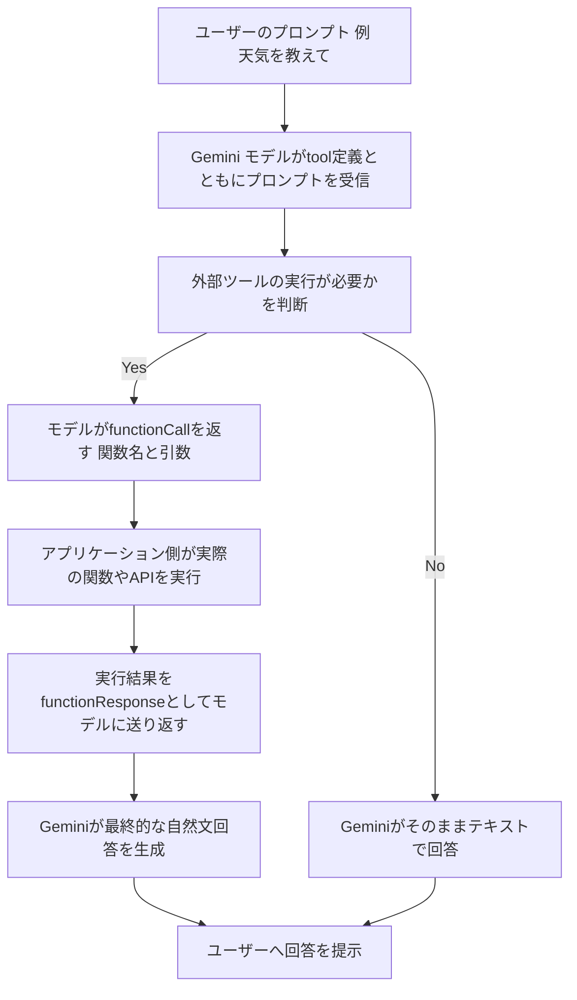
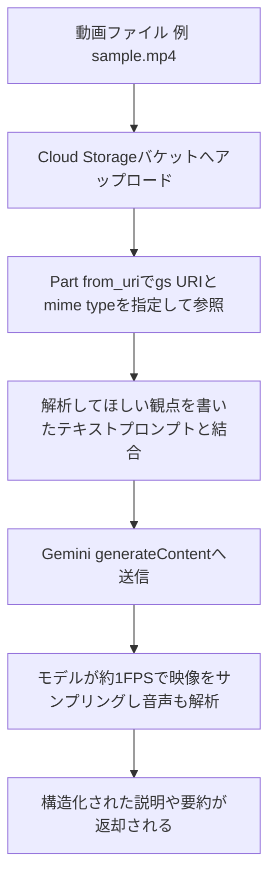

# Gemini API 実践チャレンジラボ 完全攻略ガイド

**〜初学者のためのステップバイステップ・ベストプラクティス〜**

> **対象ラボ**: Explore Generative AI with the Gemini API in Agent Platform: Challenge Lab
> **想定読者**: Vertex AI / Gemini API に初めて触れるエンジニア・QAエンジニア

---

## この記事について

このチャレンジラボは、AI駆動の動画コンテンツ解析プラットフォームを開発するスタートアップの開発者という設定のもと、Gemini の3つの中核機能を実装する内容です。

1. **Task 1**: curl による Gemini へのテキスト生成リクエスト
2. **Task 2**: Agent Platform Workbench で Notebook を開く
3. **Task 3**: Function Calling（関数呼び出し）の実装
4. **Task 4**: 動画コンテンツの解析（Video Understanding）

チャレンジラボは手順書がない代わりに、公式ドキュメントを読み解いて自力で完成させる形式です。本ガイドは、各タスクを**なぜそう実装するのか**という観点から解説し、実務でも通用するベストプラクティスとして整理したものです。すべての推奨事項には、根拠となる一次情報源（Google Cloud 公式ドキュメント）へのリンクを付けています。

---

## 0. 全体像を掴む

最初に、4つのタスクがどうつながっているかを俯瞰します。各 Task の後に「Check my progress」でスコアリングが行われる点がポイントです。



この図の各ノードの意味は次のとおりです。

- 「Task1」: Cloud Shell から生の REST API を叩き、リクエスト構造を体で覚える段階
- 「Task2」: 以降の作業環境となる Workbench の Notebook を開く段階
- 「Task3」「Task4」: 同じ Notebook 内で、SDK を使ったより高度な機能を実装する段階

📖 このセクションで登場した用語
- **Vertex AI**: Google Cloud 上で機械学習・生成AIモデルを開発・提供するマネージドプラットフォーム
- **Agent Platform Workbench**: JupyterLab ベースのマネージドノートブック環境

---

## 1. 事前準備のベストプラクティス

ラボ開始前に、以下の点を確認しておくと事故を防げます。

| 項目 | ベストプラクティス | 理由 |
|---|---|---|
| ブラウザ | シークレット（Incognito）ウィンドウを使う | 個人アカウントとラボ用の一時アカウントの競合による誤課金を防ぐため |
| アカウント | ラボが発行する一時的な学生アカウントのみを使う | 個人の Google Cloud アカウントに課金が発生するリスクを避けるため |
| タイマー | ラボは一時停止できないことを理解した上で開始する | 作業時間を無駄にしないよう、事前に流れを把握してから着手するため |

---

## 2. Task 1: curl で Gemini にテキスト生成をリクエストする

### 2.1 環境変数設計のベストプラクティス

プロジェクトIDやリージョンをコマンドにハードコーディングせず、環境変数として外出しします。こうしておくと、モデルやリージョンを変更するときにコマンド本体を書き換える必要がなくなります。

| 変数名 | 役割 |
|---|---|
| `PROJECT_ID` | リクエスト先の Google Cloud プロジェクト |
| `LOCATION` | モデルを処理するリージョン（例: `us-central1`） |
| `API_ENDPOINT` | `${LOCATION}-aiplatform.googleapis.com` の形で組み立てるホスト名 |
| `MODEL_ID` | 呼び出す Gemini モデルの識別子 |

### 2.2 Vertex AI API の有効化

Cloud Console の「Agent Platform」セクションから API を有効化します。これは Google Cloud の一般的な作法で、未有効化の API を呼び出すとエラーになります。API 有効化はコンソールの `APIs & Services > Library` からでも、`console.cloud.google.com/flows/enableapi?apiid=aiplatform.googleapis.com` のような有効化フローURLからでも行えます。

### 2.3 リクエストの組み立て方

Gemini API in Vertex AI のエンドポイントは、次の形式に統一されています。

```text
https://{LOCATION}-aiplatform.googleapis.com/v1/projects/{PROJECT_ID}/locations/{LOCATION}/publishers/google/models/{MODEL_ID}:generateContent
```

`generateContent`（一括応答）と `streamGenerateContent`（ストリーミング応答）の2つのメソッドがあり、用途によって使い分けるのがベストプラクティスです。

| メソッド | 特徴 | 向いている用途 |
|---|---|---|
| `generateContent` | 生成が完了してからまとめて応答が返る | ドキュメント生成や要約など、完成形だけが必要な処理 |
| `streamGenerateContent` | 生成中のチャンクが逐次返ってくる | チャットボットなど、応答性が重視される対話型アプリ |

認証には `gcloud auth print-access-token` で取得した一時トークンを `Authorization: Bearer` ヘッダーに載せます。APIキーや認証情報をコマンド履歴やスクリプトに直書きしないことが重要です。

```bash
curl -X POST \
  -H "Authorization: Bearer $(gcloud auth print-access-token)" \
  -H "Content-Type: application/json" \
  "https://${API_ENDPOINT}/v1/projects/${PROJECT_ID}/locations/${LOCATION}/publishers/google/models/${MODEL_ID}:generateContent" \
  -d '{
    "contents": {
      "role": "user",
      "parts": {
        "text": "Why is the sky blue?"
      }
    },
    "generationConfig": {
      "temperature": 0.2,
      "maxOutputTokens": 1024
    }
  }'
```

このリクエストの流れを図にすると次のようになります。



### 2.4 generationConfig のベストプラクティス

`temperature` は出力のランダム性を制御するパラメータです。値が低いほど再現性の高い決定論的な出力になり、値が高いほど多様で創造的な出力になります。検証や QA 目的で再現性を重視する場合は低め（0〜0.3程度）に設定するのが定石です。

📖 このセクションで登場した用語
- **temperature**: トークン選択のランダム性を調整するパラメータ。低いほど毎回似た出力になりやすい
- **アクセストークン**: 認証済みユーザーやサービスアカウントの権限を証明する一時的な文字列

> **根拠となる情報源**
> - Generate content with the Gemini API in Vertex AI: https://cloud.google.com/vertex-ai/generative-ai/docs/model-reference/overview
> - Get started with the Gemini API（generateContentの基本形）: https://docs.cloud.google.com/vertex-ai/generative-ai/docs/start/quickstart
> - Intro to Gemini API via curl（公式サンプルNotebook）: https://github.com/GoogleCloudPlatform/generative-ai/blob/main/gemini/getting-started/intro_gemini_curl.ipynb
> - Content generation parameters（generationConfigの詳細）: https://docs.cloud.google.com/gemini-enterprise-agent-platform/models/capabilities/content-generation-parameters

---

## 3. Task 2: Agent Platform Workbench で Notebook を開く



### ベストプラクティス

- **カーネル選択**: `Select Kernel` ダイアログでは、SDK やライブラリがローカルにインストールされている `Python 3 (Local)` を選ぶ。誤ったカーネルを選ぶと、後続セルで import エラーが起きる原因になる
- **アイドルシャットダウン**: 本番運用や自分の検証環境を構築する際は、Workbench インスタンスのアイドルシャットダウンを有効にしておくと、使っていない時間の課金を抑えられる
- **不要時の停止**: 作業が終わったインスタンスは Stop しておく。チャレンジラボでは環境が期限付きで自動破棄されるが、実務環境ではこの習慣がコスト管理に直結する

📖 このセクションで登場した用語
- **JupyterLab**: ブラウザ上でノートブック形式のコードを実行できる開発環境
- **アイドルシャットダウン**: 一定時間操作がない場合にインスタンスを自動停止する設定

> **根拠となる情報源**
> - Quickstart: Create a Vertex AI Workbench instance: https://docs.cloud.google.com/vertex-ai/docs/workbench/instances/create-console-quickstart
> - Introduction to Agent Platform Workbench: https://docs.cloud.google.com/vertex-ai/docs/workbench/introduction

---

## 4. Task 3: Function Calling を実装する

### 4.1 Function Calling とは

Function Calling（関数呼び出し）とは、Gemini モデル自身が外部システムを直接操作するのではなく、「この関数をこの引数で呼んでほしい」という構造化データを生成する仕組みです。例えるなら、モデルは電話交換手のような役割で、「天気予報の担当部署に、この都市名で問い合わせてください」という取り次ぎメモを渡してくれるだけで、実際に電話をかけて情報を取ってくるのはアプリケーション側の仕事、というイメージです。

### 4.2 FunctionDeclaration 設計のベストプラクティス

- **name と description は明確に**: モデルはこの説明文だけを頼りに「今この関数を呼ぶべきか」を判断するため、あいまいな説明は誤判定を招く
- **parameters は JSON Schema 形式で厳密に**: 型（`type`）や必須項目（`required`）を明示することで、モデルが生成する引数の形が安定する
- **1つの関数は1つの責務に絞る**: 複数の処理を1つの関数に詰め込むと、モデルがパラメータを正しく埋められなくなりやすい

### 4.3 マルチターンの処理フロー

Function Calling は1回のAPI呼び出しでは完結せず、次のような往復（マルチターン）になります。



Notebook の「天気情報が表示されていることを確認する」という指示は、まさにこの `functionResponse` が正しくモデルに渡り、最終応答に反映されているかを確認する工程です。

### 4.4 429 エラー・レート制限への対処のベストプラクティス

ラボの注意書きにもあるとおり、Notebook のセル実行で 429（RESOURCE_EXHAUSTED）が出ることがあります。これは Vertex AI が共有リソースプールの空き待ちをしている状態を示すもので、即座の再試行は悪化を招きやすいため、以下の指数バックオフ（Exponential Backoff）が推奨されます。

| 避けるべきこと | 推奨される対応 |
|---|---|
| バックオフなしで即座に再試行する | 待機時間を指数的に増やしながら再試行する（Exponential Backoff） |
| 4xx系エラー全般を無条件に再試行する | 429・408など再試行が意味のあるエラーのみ再試行対象にする |
| 上限なく再試行し続ける | 最大試行回数を必ず設定する |
| リアルタイム対話でも延々と待たせる | チャットのような即応性が必要な処理は早めに諦めて別の導線に流す |

Notebook 側で「1分待ってから再実行する」という指示自体が、まさにこのバックオフ戦略の簡易版です。

📖 このセクションで登場した用語
- **FunctionDeclaration**: モデルに渡す関数の名前・説明・引数スキーマの定義
- **RESOURCE_EXHAUSTED（429）**: リクエスト量が割り当て容量を超えたときに返るエラー
- **Exponential Backoff**: 再試行のたびに待機時間を指数的に伸ばす手法

> **根拠となる情報源**
> - Introduction to function calling: https://cloud.google.com/vertex-ai/generative-ai/docs/multimodal/function-calling
> - Intro to Function Calling with the Gemini API（公式サンプルNotebook）: https://github.com/GoogleCloudPlatform/generative-ai/blob/main/gemini/function-calling/intro_function_calling.ipynb
> - Retry strategy（Vertex AI公式のリトライ指針）: https://docs.cloud.google.com/vertex-ai/generative-ai/docs/retry-strategy
> - Error code 429（429エラーのトラブルシューティング）: https://cloud.google.com/vertex-ai/generative-ai/docs/provisioned-throughput/error-code-429
> - Reduce 429 errors on Vertex AI（Google Cloud公式ブログ）: https://cloud.google.com/blog/products/ai-machine-learning/reduce-429-errors-on-vertex-ai

---

## 5. Task 4: 動画コンテンツを解析する（Video Understanding）

### 5.1 マルチモーダル入力の基本

Gemini はテキストだけでなく、画像・音声・動画を同じプロンプトの中で組み合わせて扱えるマルチモーダルモデルです。動画は Cloud Storage 上のファイルを URI で参照し、`Part.from_uri` のような形でテキストプロンプトと一緒に `contents` に含めて送信します。

```python
from vertexai.generative_models import GenerativeModel, Part

model = GenerativeModel("MODEL_ID")

video_part = Part.from_uri(
    file_uri="gs://YOUR_BUCKET/sample_video.mp4",
    mime_type="video/mp4",
)

prompt = (
    "Describe the key events in this video, including the setting, "
    "the main subjects, and any notable actions."
)

response = model.generate_content([video_part, prompt])
print(response.text)
```

### 5.2 動画解析のベストプラクティス

- **サンプリングレートを意識する**: モデルは視覚情報を既定で1秒あたり1フレーム（1 FPS）でサンプリングする。動きの速いシーンや場面転換が多い動画では、この既定値だと重要な瞬間を取りこぼす可能性があるため、必要に応じてカスタムのフレームレート設定を検討する
- **ファイルサイズと再利用性で入力方法を選ぶ**: リクエスト全体（動画＋プロンプト＋システム指示など）が大きくなる場合や、同じ動画を複数のプロンプトで使い回す場合は、都度アップロードするより Files API 経由の参照が適している
- **プロンプトは具体的に**: 「何が映っているか」だけでなく、「設定・登場人物・主要なアクション・重要な瞬間のタイムスタンプ」など、欲しい情報の観点を明示すると、より構造化された説明が返ってくる

処理の流れを図にすると以下のとおりです。



📖 このセクションで登場した用語
- **マルチモーダル**: テキスト・画像・音声・動画など複数種類の入力を同時に扱えること
- **FPS（Frames Per Second）**: 1秒あたりに解析されるフレームの数
- **Files API**: 大きなファイルや複数回利用するファイルをアップロードして参照するための仕組み

> **根拠となる情報源**
> - Video understanding（Vertex AI、`Part.from_uri` と `gs://` の実装例）: https://docs.cloud.google.com/vertex-ai/generative-ai/docs/multimodal/video-understanding
> - Video understanding（Gemini API、既定1FPSサンプリングの説明）: https://ai.google.dev/gemini-api/docs/video-understanding

---

## 6. 全タスク共通のベストプラクティス

| 観点 | ベストプラクティス | 根拠 |
|---|---|---|
| 認証 | APIキーやサービスアカウントの鍵をコードに埋め込まず、`gcloud auth print-access-token` やApplication Default Credentialsを利用する | Vertex AI公式ドキュメントの認証手順 |
| 権限 | プロジェクト全体の編集者権限ではなく、`roles/aiplatform.user`（Vertex AI User）のような必要最小限のIAMロールを付与する | Vertex AI IAM roles and permissions |
| コスト | Workbenchインスタンスは使わないときに停止し、アイドルシャットダウンを設定する | Workbench公式ドキュメント |
| 信頼性 | 429エラーは指数バックオフで再試行し、リトライ回数の上限を必ず設ける | Retry strategy公式ドキュメント |
| プロンプト設計 | 曖昧な指示ではなく、期待する出力形式・観点を具体的に書く | Vertex AIのgenerationConfig/プロンプト設計指針 |

> **根拠となる情報源**
> - Vertex AI IAM roles and permissions: https://docs.cloud.google.com/iam/docs/roles-permissions/aiplatform

---

## 7. トラブルシューティング表

| 症状 | 想定される原因 | 対処 |
|---|---|---|
| curlが401/403を返す | アクセストークンの期限切れ、または未認証 | `gcloud auth print-access-token` を再実行してトークンを更新する |
| 429 RESOURCE_EXHAUSTED | 共有リソースプールが一時的に逼迫している | 指数バックオフで再試行、Notebookでは案内どおり1分待って再実行する |
| Notebookのカーネルが選べない/importエラー | カーネルに `Python 3 (Local)` が選ばれていない | Select Kernelダイアログでカーネルを選び直す |
| Function Callingで天気情報が出てこない | `functionResponse` がモデルに送り返されていない、またはINSERT部分が未実装 | マルチターンの往復（モデル→関数呼び出し→アプリ実行→応答→モデル）を確認する |
| 動画解析結果が大味・情報が漏れる | 既定の1FPSサンプリングで速い動きを取りこぼしている、プロンプトが曖昧 | プロンプトを具体化する、必要ならカスタムフレームレートを検討する |

---

## 8. 完了チェックリスト

- [ ] 環境変数（`PROJECT_ID` / `LOCATION` / `API_ENDPOINT` / `MODEL_ID`）を設定した
- [ ] Vertex AI API を有効化した
- [ ] curlで `generateContent` を呼び出し、テキスト生成を確認した（Check my progress 1）
- [ ] Workbenchで対象のNotebookを `Python 3 (Local)` カーネルで開いた
- [ ] Function Calling の `INSERT` 箇所を実装し、天気情報が応答に含まれることを確認した（Check my progress 2）
- [ ] Task 4のセルを実装し、動画コンテンツの説明が生成されることを確認した（Check my progress 3）

---

## 参考文献（References）

**テキスト生成**
- Generate content with the Gemini API in Vertex AI — https://cloud.google.com/vertex-ai/generative-ai/docs/model-reference/overview
- Get started with the Gemini API in Vertex AI（quickstart） — https://docs.cloud.google.com/vertex-ai/generative-ai/docs/start/quickstart
- Intro to Gemini API via curl（公式サンプルNotebook） — https://github.com/GoogleCloudPlatform/generative-ai/blob/main/gemini/getting-started/intro_gemini_curl.ipynb
- Content generation parameters — https://docs.cloud.google.com/gemini-enterprise-agent-platform/models/capabilities/content-generation-parameters

**Workbench**
- Quickstart: Create a Vertex AI Workbench instance — https://docs.cloud.google.com/vertex-ai/docs/workbench/instances/create-console-quickstart
- Introduction to Agent Platform Workbench — https://docs.cloud.google.com/vertex-ai/docs/workbench/introduction

**Function Calling**
- Introduction to function calling — https://cloud.google.com/vertex-ai/generative-ai/docs/multimodal/function-calling
- Intro to Function Calling with the Gemini API（公式サンプルNotebook） — https://github.com/GoogleCloudPlatform/generative-ai/blob/main/gemini/function-calling/intro_function_calling.ipynb

**信頼性・レート制限**
- Retry strategy — https://docs.cloud.google.com/vertex-ai/generative-ai/docs/retry-strategy
- Error code 429 — https://cloud.google.com/vertex-ai/generative-ai/docs/provisioned-throughput/error-code-429
- Reduce 429 errors on Vertex AI（Google Cloud Blog） — https://cloud.google.com/blog/products/ai-machine-learning/reduce-429-errors-on-vertex-ai

**動画解析（Video Understanding）**
- Video understanding（Vertex AI） — https://docs.cloud.google.com/vertex-ai/generative-ai/docs/multimodal/video-understanding
- Video understanding（Gemini API） — https://ai.google.dev/gemini-api/docs/video-understanding

**IAM・セキュリティ**
- Vertex AI roles and permissions — https://docs.cloud.google.com/iam/docs/roles-permissions/aiplatform

**元ラボ**
- Explore Generative AI with the Gemini API in Agent Platform: Challenge Lab — https://www.skills.google/course_templates/959/labs/592560
