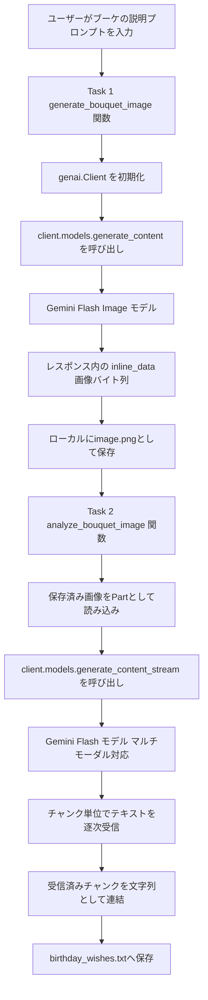
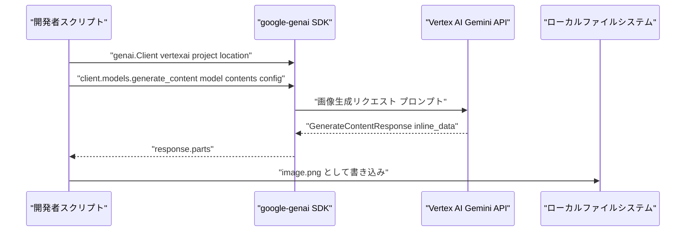
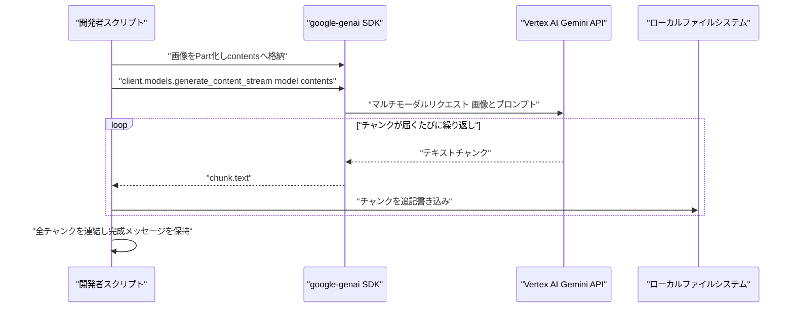

# Gemini API（google-genai SDK）で実装する「AIブーケデザインアプリ」— Challenge Lab ステップバイステップ解説

> 対象Lab: *Build a Multi-Modal GenAI Application: Challenge Lab*
> URL: https://www.skills.google/course_templates/1076/labs/648466
> 執筆者ペルソナ: インフラエンジニア／Google Cloud スペシャリスト観点でのベストプラクティス解説

---

## 目次

1. [このガイドについて](#このガイドについて)
2. [課題の全体像とアーキテクチャ](#課題の全体像とアーキテクチャ)
3. [事前準備](#事前準備)
4. [Task 1: `genai.Client()` による画像生成](#task-1-genaiclient-による画像生成)
5. [Task 2: ストリーミングによる画像解析とテキスト生成](#task-2-ストリーミングによる画像解析とテキスト生成)
6. [完成コード（フル実装）](#完成コードフル実装)
7. [トラブルシューティング](#トラブルシューティング)
8. [ベストプラクティス総括表](#ベストプラクティス総括表)
9. [自動採点（Check my progress）の仕組みについて](#自動採点check-my-progressの仕組みについて)
10. [参考文献・ソース一覧](#参考文献ソース一覧)

---

## このガイドについて

この課題は、ブーケ（花束）デザイン会社のシステムを想定し、以下の2つの Python 関数を実装するものです。

- **Task 1**: `genai.Client()` を使い、テキストプロンプトから画像を生成してローカルに保存する
- **Task 2**: `analyze_bouquet_image(image_path)` 関数を実装し、生成した画像を **ストリーミング** でマルチモーダルモデルに送信し、バースデーメッセージを `.txt` ファイルへ保存する

課題文中に登場する `flash-image-model-id` と `model-id` は、Lab の説明文における **プレースホルダー（実際の値に置き換えるべき箇所）** です。Google のモデルは頻繁にアップデートされるため、本ガイドでは「なぜそのモデルを選ぶのか」という判断基準と、現時点（2026年9月）で公式に案内されている具体的なモデルIDの両方を解説します。

> **補足**: `google.genai`（`pip install google-genai`）は、旧来の `vertexai.generative_models` / `vertexai.preview.vision_models` を統合した新しい統一 SDK です。Vertex AI と Gemini Developer API の両方を同一の `genai.Client()` インターフェースで扱えます。<br>
> ソース: https://ai.google.dev/gemini-api/docs/migrate

---

## 課題の全体像とアーキテクチャ

まず全体のデータフローを俯瞰します。



ポイントは、**Task 1（画像生成）と Task 2（画像解析）が同じ `genai.Client()` インスタンスを共有できる**という点です。これにより、認証・プロジェクト設定・リージョン設定を1箇所に集約でき、コードの重複と設定ミスを防げます（DRY原則）。

---

## 事前準備

### ステップ1: プロジェクトとリージョンの取得

Cloud Shell / Lab 提供の IDE には `gcloud` SDK が事前設定されています。ハードコーディングを避け、環境から動的に取得するのがベストプラクティスです。

```bash
PROJECT_ID=$(gcloud config get-value project 2>/dev/null)
# gcloud は未設定時に終了コード 0 のまま "(unset)" を出力するため、|| では捕捉できない
case "$PROJECT_ID" in
  ''|'(unset)')
    echo "エラー: プロジェクトが未設定です。gcloud config set project <PROJECT_ID> を実行してください。" >&2
    # 未設定のまま後続手順へ進ませない（sourced なら return、実行スクリプトなら exit）
    return 1 2>/dev/null || exit 1
    ;;
  *)
    export PROJECT_ID
    ;;
esac

REGION=$(gcloud config get-value compute/region 2>/dev/null)
case "$REGION" in ''|'(unset)') REGION="us-central1" ;; esac
export REGION
echo "PROJECT_ID=${PROJECT_ID}, REGION=${REGION}"
```

> プロジェクトIDやリージョンをコード中に直接書き込むと、他の環境（別プロジェクト・別リージョン）への移植性が失われます。環境変数または `gcloud` コマンドから動的取得するのが Google Cloud の標準的な推奨事項です。
> ソース: https://cloud.google.com/docs/authentication/application-default-credentials

### ステップ2: SDKのインストール／アップグレード

```bash
pip install --upgrade google-genai --quiet
```

課題文の「Python version dependencies に関する warning は無視してよい」という注記は、Cloud Shell にプリインストールされた `protobuf` や `grpcio` 等の依存パッケージと、新しくインストールする `google-genai` の要求バージョンとの間で pip の依存関係リゾルバが警告を出すことを指しています。Lab環境では無視して問題ありませんが、**本番運用では仮想環境（`venv` や `uv`）を使ってパッケージを分離するのがベストプラクティス**です。

### ステップ3: クライアントの初期化パターンを理解する

`genai.Client()` は、引数の与え方によって接続先バックエンドが変わります。

| 初期化方法 | 接続先 | 認証方式 | 主な用途 |
|---|---|---|---|
| `genai.Client(vertexai=True, project=PROJECT_ID, location=REGION)` | Vertex AI | Application Default Credentials（ADC） | 本課題（Google Cloud 環境） |
| `genai.Client(api_key="...")` | Gemini Developer API（AI Studio） | APIキー | 個人開発・プロトタイピング |
| `genai.Client()`（引数なし） | 環境変数 `GOOGLE_GENAI_USE_VERTEXAI` / `GOOGLE_CLOUD_PROJECT` / `GOOGLE_CLOUD_LOCATION` から自動判定 | 環境依存 | CI/CDなど環境変数で制御したい場合 |

ソース: https://googleapis.github.io/python-genai/ ／ https://ai.google.dev/gemini-api/docs/migrate

本 Lab は Google Cloud プロジェクト内で完結するため、**明示的に `vertexai=True` を指定する方法**を採用します（暗黙的な環境変数依存よりも意図が明確でデバッグしやすいため）。

---

## Task 1: `genai.Client()` による画像生成

### ステップ1: モデルIDを選定する

課題文の `flash-image-model-id` は「flash 系の画像生成モデル」を指します。2026年9月時点でGoogleが公式に案内している該当モデルは以下の通りです。

| プレースホルダー | 該当する実際のモデルID | ステータス | ソース |
|---|---|---|---|
| `flash-image-model-id` | `gemini-2.5-flash-image` | GA（本番運用可）。ただし **2026年10月2日に提供終了予定**のため、新規実装では後継の `gemini-3.1-flash-image` 系列を確認すること | https://developers.googleblog.com/en/gemini-2-5-flash-image-now-ready-for-production-with-new-aspect-ratios/ |

> **ベストプラクティス**: モデルIDはハードコードせず、Vertex AI Model Garden（コンソール上のモデルカタログ）または `docs.cloud.google.com/vertex-ai/generative-ai/docs/models` で最新の利用可能モデルを都度確認してください。Gemini系モデルは世代交代が速く、Lab実施時点でさらに新しい世代（例: `gemini-3.x-flash-image` 系列）が既定になっている可能性があります。
> ソース: https://docs.cloud.google.com/vertex-ai/generative-ai/docs/multimodal/image-generation

### ステップ2: `generate_content()` で画像を生成する

課題文が「`generate_images()` ではなく `genai.Client()` が supplied **content** を invoke する」と表現している点に注目してください。これは `generate_images()`（Imagen専用の画像生成API）ではなく、**`generate_content()`** メソッドを使うことを示唆しています。`generate_content()` は `response_modalities` を指定することで、テキストと同じ入出力インターフェースのまま画像を生成できます。

```python
from google import genai
from google.genai import types

def generate_bouquet_image(
    client: genai.Client,
    model_id: str,
    prompt: str,
    output_path: str = "image.png",
) -> str:
    """テキストプロンプトから画像を生成し、ローカルに保存する。

    Args:
        client: 初期化済みの genai.Client インスタンス。
        model_id: 使用する flash-image 系モデルのID。
        prompt: 画像生成用のテキストプロンプト。
        output_path: 保存先のローカルファイルパス。

    Returns:
        保存した画像ファイルのパス。
    """
    response = client.models.generate_content(
        model=model_id,
        contents=prompt,
        config=types.GenerateContentConfig(
            response_modalities=["IMAGE"],
        ),
    )

    for part in response.parts:
        if part.inline_data is not None:
            generated_image = part.as_image()
            generated_image.save(output_path)
            print(f"画像を保存しました: {output_path}")
            return output_path

    raise RuntimeError("レスポンスに画像データが含まれていませんでした。")
```

ソース: https://googleapis.github.io/python-genai/（`part.as_image()` の使用例）

### Task 1 のシーケンス図



---

## Task 2: ストリーミングによる画像解析とテキスト生成

### ステップ1: 画像をPart化する

Vertex AI 上で `generate_content` / `generate_content_stream` に画像を渡す際は、`types.Part.from_bytes()` でバイト列とMIMEタイプを明示するのが最も確実な方法です（`Part.from_file` は旧SDKのみに存在するメソッドで、`google-genai` には存在しないため注意が必要です）。

```python
import mimetypes
import os
import tempfile

from google.genai import types


def _load_image_part(image_path: str) -> types.Part:
    """ローカル画像ファイルを Gemini API 用の Part に変換する。"""
    mime_type, _ = mimetypes.guess_type(image_path)
    # Gemini API が受け付ける画像 MIME タイプのみを許可する（拡張子推測の誤検出を防ぐ）
    allowed_mime_types = {"image/png", "image/jpeg", "image/webp", "image/heic", "image/heif"}
    if mime_type not in allowed_mime_types:
        raise ValueError(f"サポートされていない画像のMIMEタイプです: {image_path} ({mime_type})")
    with open(image_path, "rb") as f:
        image_bytes = f.read()
    return types.Part.from_bytes(data=image_bytes, mime_type=mime_type)
```

> **既知の落とし穴**: 旧SDK（`vertexai.generative_models`）のコード例をそのまま `google-genai` に流用すると `AttributeError: type object 'Part' has no attribute 'from_file'` が発生します。これは2つのSDKでAPI設計が異なるためで、`google-genai` では常に `types.Part.from_bytes()` または `types.Part.from_uri()`（Cloud Storage上の画像向け）を使用してください。
> ソース: https://googleapis.github.io/python-genai/

### ステップ2: ストリーミングでテキストを生成する

```python
def analyze_bouquet_image(
    client: genai.Client,
    model_id: str,
    image_path: str,
    output_txt_path: str = "birthday_wishes.txt",
) -> str:
    """画像を解析し、ストリーミングでバースデーメッセージを生成してtxtに保存する。

    Args:
        client: 初期化済みの genai.Client インスタンス。
        model_id: マルチモーダル対応のモデルID。
        image_path: 解析対象の画像ファイルパス。
        output_txt_path: 生成メッセージの保存先パス。

    Returns:
        生成されたバースデーメッセージ全文。
    """
    image_part = _load_image_part(image_path)
    prompt = (
        "この花束の画像からインスピレーションを得て、"
        "温かみのある誕生日メッセージを作成してください。"
    )

    def _run() -> str:
        """ストリームの生成と全チャンクの消費を1回のリトライ単位にまとめる。"""
        text = ""
        out_dir = os.path.dirname(os.path.abspath(output_txt_path))
        fd, tmp_path = tempfile.mkstemp(dir=out_dir, suffix=".part")
        try:
            stream = client.models.generate_content_stream(
                model=model_id,
                contents=[prompt, image_part],
            )
            with os.fdopen(fd, "w", encoding="utf-8") as f:
                # 429 はイテレーション中に送出されるため、消費もこの中で完結させる
                for chunk in stream:
                    if chunk.text:
                        print(chunk.text, end="", flush=True)
                        text += chunk.text
                        f.write(chunk.text)
            # 全チャンクを取り切ってから原子的に公開する
            os.replace(tmp_path, output_txt_path)
        except BaseException:
            try:
                os.unlink(tmp_path)
            except OSError:
                # 後片付けの失敗で本来の例外を隠さない
                pass
            raise
        return text

    print("バースデーメッセージを生成中...\n")
    # call_with_backoff は後述の「429エラーへの対応」節で定義する
    response_text = call_with_backoff(_run)

    print(f"\n\nメッセージを保存しました: {output_txt_path}")
    return response_text
```

ソース（`generate_content_stream` のストリーミングパターン）: https://googleapis.github.io/python-genai/

### モデルIDの選定（Task 2）

| プレースホルダー | 該当する実際のモデルID | 選定理由 | ソース |
|---|---|---|---|
| `model-id` | `gemini-2.5-flash` | 画像＋テキストのマルチモーダル入力とストリーミング出力の両方を公式にサポートする安定版モデル | https://docs.cloud.google.com/gemini-enterprise-agent-platform/reference/models/inference |

> Lab環境によっては、より新しい世代（`gemini-3.x-flash` 系列）が利用可能な場合があります。`gemini-2.5-flash` はストリーミングとマルチモーダル入力の組み合わせで広く実績があるため、本ガイドの基準モデルとしています。

### `generate_content` と `generate_content_stream` の使い分け

| 項目 | `generate_content`（Task 1で使用） | `generate_content_stream`（Task 2で使用） |
|---|---|---|
| レスポンスの受け取り方 | 完全なレスポンスを一括取得 | チャンク（断片）を逐次取得するイテレータ |
| 適した用途 | 画像生成など「完成品」が必要な処理 | チャットUIなど、生成中の様子をリアルタイム表示したい処理 |
| コードパターン | `response = client.models.generate_content(...)` | `for chunk in client.models.generate_content_stream(...):` |
| 非同期版 | `client.aio.models.generate_content(...)` | `client.aio.models.generate_content_stream(...)` |

ソース: https://github.com/googleapis/python-genai

### Task 2 のシーケンス図



### 429エラーへの対応（リトライ戦略）

課題文の注記どおり「429エラーが出た場合は1分待って再実行」で対処できますが、実務では**指数バックオフ付きの自動リトライ**を実装するのがベストプラクティスです。

```python
import os
import tempfile
import time

from google.genai import errors

def call_with_backoff(func, *args, max_retries: int = 5, **kwargs):
    """429 (RESOURCE_EXHAUSTED) 発生時に指数バックオフでリトライする。"""
    for attempt in range(max_retries):
        try:
            return func(*args, **kwargs)
        except errors.ClientError as e:
            if getattr(e, "code", None) == 429 and attempt < max_retries - 1:
                wait_seconds = 2 ** attempt
                print(f"429エラー検出。{wait_seconds}秒待機してリトライします...")
                time.sleep(wait_seconds)
                continue
            raise


def analyze_with_retry(client, model_id, contents, output_txt_path: str) -> str:
    """ストリームの生成と消費をまとめて callable に閉じ込め、リトライ対象にする。"""

    def _run() -> str:
        text = ""
        out_dir = os.path.dirname(os.path.abspath(output_txt_path))
        fd, tmp_path = tempfile.mkstemp(dir=out_dir, suffix=".part")
        try:
            stream = client.models.generate_content_stream(
                model=model_id, contents=contents
            )
            # 429 はイテレーション中に送出されるため、for ループも callable の内側に置く
            with os.fdopen(fd, "w", encoding="utf-8") as f:
                for chunk in stream:
                    if chunk.text:
                        text += chunk.text
                        f.write(chunk.text)
            os.replace(tmp_path, output_txt_path)
        except BaseException:
            try:
                os.unlink(tmp_path)
            except OSError:
                pass
            raise
        return text

    # 一時ファイルへ書き、成功時のみ os.replace で公開するため、
    # 途中で失敗した試行の内容が output_txt_path に残ることはない
    return call_with_backoff(_run)
```

> **重要**: `generate_content_stream` はイテレータを返すため、`429` は関数呼び出しの時点ではなく**チャンクを取り出している最中**に送出されます。ストリームの生成だけを `call_with_backoff` でラップしてもリトライは発動しないため、`for chunk in stream` の消費までを callable の内側に入れてください。

ソース（`google.genai.errors` の例外構造）: https://discuss.ai.google.dev/t/error-400-invalid-argument-when-using-gemini-2-5-flash-with-generate-content-stream/97626

---

## 完成コード（フル実装）

```python
import mimetypes
import os
import tempfile
import time

from google import genai
from google.genai import errors, types


def call_with_backoff(func, *args, max_retries: int = 5, **kwargs):
    """429 (RESOURCE_EXHAUSTED) 発生時に指数バックオフでリトライする。"""
    for attempt in range(max_retries):
        try:
            return func(*args, **kwargs)
        except errors.ClientError as e:
            if getattr(e, "code", None) == 429 and attempt < max_retries - 1:
                time.sleep(2 ** attempt)
                continue
            raise


def generate_bouquet_image(
    client: genai.Client,
    model_id: str,
    prompt: str,
    output_path: str = "image.png",
) -> str:
    response = client.models.generate_content(
        model=model_id,
        contents=prompt,
        config=types.GenerateContentConfig(response_modalities=["IMAGE"]),
    )
    for part in response.parts:
        if part.inline_data is not None:
            part.as_image().save(output_path)
            return output_path
    raise RuntimeError("レスポンスに画像データが含まれていませんでした。")


def _load_image_part(image_path: str) -> types.Part:
    mime_type, _ = mimetypes.guess_type(image_path)
    # Gemini API が受け付ける画像 MIME タイプのみを許可する（拡張子推測の誤検出を防ぐ）
    allowed_mime_types = {"image/png", "image/jpeg", "image/webp", "image/heic", "image/heif"}
    if mime_type not in allowed_mime_types:
        raise ValueError(f"サポートされていない画像のMIMEタイプです: {image_path} ({mime_type})")
    with open(image_path, "rb") as f:
        image_bytes = f.read()
    return types.Part.from_bytes(data=image_bytes, mime_type=mime_type)


def analyze_bouquet_image(
    client: genai.Client,
    model_id: str,
    image_path: str,
    output_txt_path: str = "birthday_wishes.txt",
) -> str:
    image_part = _load_image_part(image_path)
    prompt = (
        "この花束の画像からインスピレーションを得て、"
        "温かみのある誕生日メッセージを作成してください。"
    )

    def _run() -> str:
        text = ""
        out_dir = os.path.dirname(os.path.abspath(output_txt_path))
        fd, tmp_path = tempfile.mkstemp(dir=out_dir, suffix=".part")
        try:
            # ストリーム生成と全チャンク消費をまとめてリトライ対象にする
            stream = client.models.generate_content_stream(
                model=model_id, contents=[prompt, image_part]
            )
            with os.fdopen(fd, "w", encoding="utf-8") as f:
                for chunk in stream:
                    if chunk.text:
                        text += chunk.text
                        f.write(chunk.text)
            # 完走した内容だけを原子的に公開する
            os.replace(tmp_path, output_txt_path)
        except BaseException:
            try:
                os.unlink(tmp_path)
            except OSError:
                pass
            raise
        return text

    return call_with_backoff(_run)


if __name__ == "__main__":
    PROJECT_ID = os.environ["PROJECT_ID"]
    REGION = os.environ.get("REGION", "us-central1")

    client = genai.Client(vertexai=True, project=PROJECT_ID, location=REGION)

    IMAGE_MODEL_ID = "gemini-2.5-flash-image"
    TEXT_MODEL_ID = "gemini-2.5-flash"

    image_path = generate_bouquet_image(
        client,
        IMAGE_MODEL_ID,
        prompt="Create an image containing a bouquet of 2 sunflowers and 3 roses",
    )
    analyze_bouquet_image(client, TEXT_MODEL_ID, image_path)
```

---

## トラブルシューティング

| 症状 | 原因 | 対処法 | ソース |
|---|---|---|---|
| pip installで大量のバージョン警告が出る | Cloud Shellにプリインストール済みのパッケージと`google-genai`の依存要求のバージョン差異 | 課題の指示どおり無視してよい。本番では`venv`等で依存関係を分離する | https://ai.google.dev/gemini-api/docs/migrate |
| `429 RESOURCE_EXHAUSTED` | プロジェクトのクォータ（1分あたりのリクエスト数上限）に到達 | 1分待って再実行、または指数バックオフを実装する | https://discuss.ai.google.dev/t/error-400-invalid-argument-when-using-gemini-2-5-flash-with-generate-content-stream/97626 |
| `AttributeError: type object 'Part' has no attribute 'from_file'` | 旧SDK（`vertexai.generative_models`）と新SDK（`google-genai`）のAPI差異 | `types.Part.from_bytes()`または`types.Part.from_uri()`を使用する | https://googleapis.github.io/python-genai/ |
| 画像生成レスポンスに`inline_data`が含まれない | `response_modalities`未指定によりテキストのみが返る、またはプロンプトが安全フィルタでブロックされた | `config=types.GenerateContentConfig(response_modalities=["IMAGE"])`を明示する | https://developers.googleblog.com/en/gemini-2-5-flash-image-now-ready-for-production-with-new-aspect-ratios/ |
| ストリーミング中にファイルへの書き込みが不完全 | ファイルハンドルを`with`文の外で閉じている、または`flush()`していない | `with open(...) as f:`のブロック内でチャンクごとに書き込む | https://googleapis.github.io/python-genai/ |

---

## ベストプラクティス総括表

| 項目 | 推奨プラクティス | 理由 |
|---|---|---|
| クライアント初期化 | `genai.Client()`は関数ごとに作り直さず、1インスタンスを使い回す | 認証情報の再取得コストを避け、コードの一貫性を保つため |
| モデルID管理 | 定数（`IMAGE_MODEL_ID`、`TEXT_MODEL_ID`）として一箇所に集約 | モデル世代交代時の変更箇所を最小化するため |
| プロジェクト／リージョン | 環境変数または`gcloud`コマンドから動的取得し、ハードコードしない | 環境間の移植性とセキュリティを両立するため |
| 画像パート生成 | `types.Part.from_bytes()`でMIMEタイプを明示する | 旧SDKとの混同によるAttributeErrorを防ぐため |
| ストリーミング書き込み | `with open(...) as f:`ブロック内でチャンクごとに書き込む | ファイルの取りこぼしと未クローズを防ぐため |
| エラーハンドリング | 429エラーに対して指数バックオフでリトライする | クォータ制限に対する堅牢性を高めるため |
| 出力の検証 | 画像ファイルと`.txt`ファイルの両方の存在・非ゼロサイズをコード内でアサートする | 自動採点前に自己診断できるようにするため |
| 認証情報 | APIキーをコードにハードコードせず、Vertex AI利用時はADC（Application Default Credentials）を使う | 認証情報の漏えいリスクを避けるため |

ソース（ADCに関するベストプラクティス）: https://cloud.google.com/docs/authentication/application-default-credentials

---

## 自動採点（Check my progress）の仕組みについて

Google Cloud Skills Boost / Google Skills の Challenge Lab における「Check my progress」は、一般的に以下のいずれか（または組み合わせ）で採点されます。

- 対象APIメソッド（例: Vertex AI Gemini API への `generateContent` / `streamGenerateContent` 呼び出し）が **Cloud Audit Logs** に記録されているかを確認する
- 指定されたリソース（この課題では生成された画像ファイルや`.txt`ファイル）が想定どおり作成されているかを確認する

そのため、**「動くコード」であることに加えて、正しいAPIメソッド（`generate_content` / `generate_content_stream`）と正しい呼び出し形式で実行されていること**が採点上重要になります。ローカルのシミュレーションやモック実装では加点されない点に注意してください。

---

## 参考文献・ソース一覧

| # | タイトル | URL |
|---|---|---|
| 1 | Migrate to the Google GenAI SDK（公式移行ガイド） | https://ai.google.dev/gemini-api/docs/migrate |
| 2 | Google Gen AI SDK for Python 公式ドキュメント | https://googleapis.github.io/python-genai/ |
| 3 | google-genai GitHub リポジトリ（Streaming/Async実装例） | https://github.com/googleapis/python-genai |
| 4 | Introducing Gemini 2.5 Flash Image（公式ブログ） | https://developers.googleblog.com/introducing-gemini-2-5-flash-image/ |
| 5 | Gemini 2.5 Flash Image now ready for production（GA発表） | https://developers.googleblog.com/en/gemini-2-5-flash-image-now-ready-for-production-with-new-aspect-ratios/ |
| 6 | Vertex AI 画像生成モデル ドキュメント | https://docs.cloud.google.com/vertex-ai/generative-ai/docs/multimodal/image-generation |
| 7 | Generate content with the Gemini API（ストリーミング例） | https://docs.cloud.google.com/gemini-enterprise-agent-platform/reference/models/inference |
| 8 | Generating content（API リファレンス） | https://ai.google.dev/api/generate-content |
| 9 | Application Default Credentials（ADC）公式ガイド | https://cloud.google.com/docs/authentication/application-default-credentials |
| 10 | 429エラーに関するコミュニティ議論（google-genai issue tracker） | https://discuss.ai.google.dev/t/error-400-invalid-argument-when-using-gemini-2-5-flash-with-generate-content-stream/97626 |
| 11 | Challenge Lab 元ページ（要ログイン） | https://www.skills.google/course_templates/1076/labs/648466 |

---

> **免責事項**: Gemini関連のモデルIDおよびAPI仕様は更新頻度が高いため、実装前に必ず上記の公式ドキュメント（特に#1・#2・#6）で最新の状態を確認してください。本ガイドは2026年9月時点の公開情報に基づいています。
