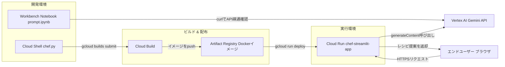
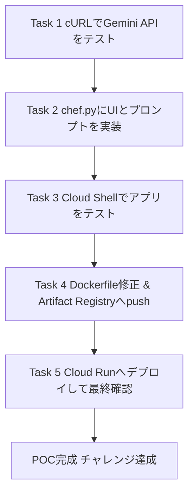
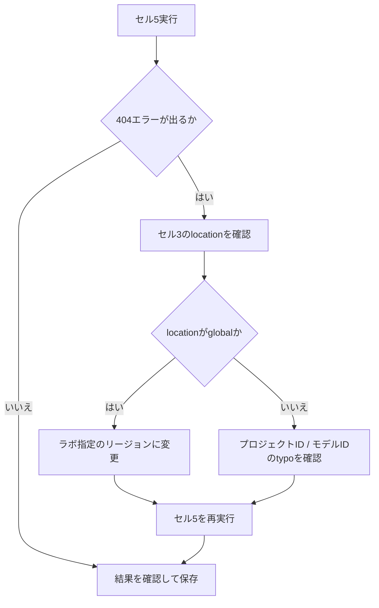
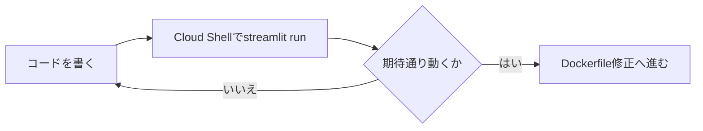
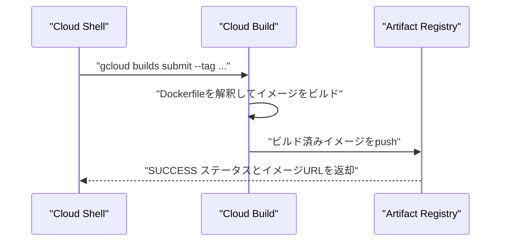
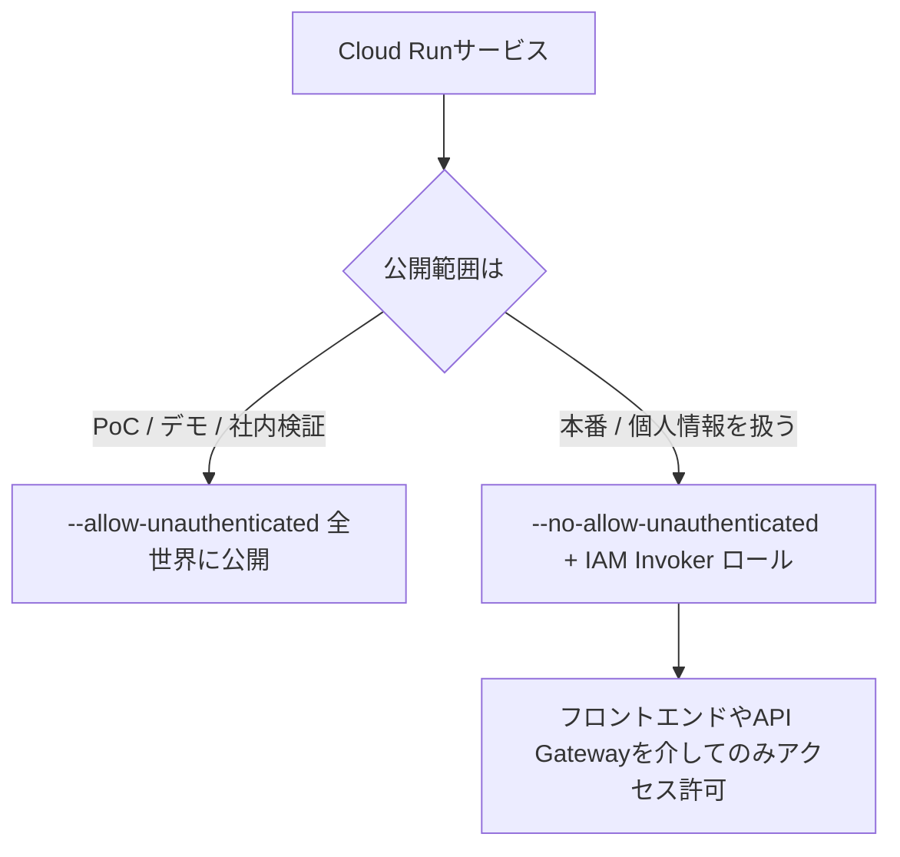

# Gemini × Streamlit × Cloud Run チャレンジラボ攻略ガイド

**初学者向けステップバイステップ解説 & ベストプラクティス**

> 対象ラボ: **Develop Gen AI Apps with Gemini and Streamlit: Challenge Lab**（Google Cloud Skills Boost / GEARプログラム）
> ソース: https://www.skills.google/course_templates/978/labs/647543

---

## 1. このガイドについて

### 1.1 対象読者

- Google Cloud を触り始めたばかりのインフラ / アプリケーションエンジニア
- Gemini（Vertex AI の生成AIモデル）を使ったアプリ開発が初めての方
- Cloud Run / Artifact Registry / Cloud Build の基本的なCI/CDフローを学びたい方

### 1.2 前提知識

- Linuxシェルの基本操作（`cd`、`git clone` など）
- Pythonの基本文法
- Dockerの概念（イメージ、コンテナ、Dockerfile）を薄く知っていると理解が早い

### 1.3 このラボのゴール

Cymbal Health（架空のヘルスケア企業）向けに、食事制限・アレルギー・冷蔵庫の在庫からレシピを提案する **AI Chef アプリ** のPoC（Proof of Concept）を、Gemini + Streamlit + Cloud Run で構築し、実際に公開するところまでを一気通貫で体験します。

---

## 2. 全体アーキテクチャ

このラボで扱うコンポーネントの関係を図にすると次のようになります。



**ポイント:** 開発（Workbench / Cloud Shell）とビルド（Cloud Build / Artifact Registry）と実行（Cloud Run）が明確に分離されているのが、Google Cloud上のコンテナベースGenAIアプリの標準的な構成です。この分離により、ローカルでの試行錯誤とプロダクション環境へのデプロイを安全に切り離せます。

---

## 3. 5つのタスクの全体フロー



**ベストプラクティス:** それぞれのタスクの最後にある「Check my progress」で必ず検証してから次に進みましょう。後工程（コンテナ化・デプロイ）で問題が起きたとき、原因を「コード」「ビルド」「デプロイ設定」のどこまで遡ればよいかを判断しやすくなります。

---

## 4. 事前準備: 共通環境変数を先に決めておく

タスク3以降で `PROJECT` と `REGION` を繰り返し使います。最初にまとめて設定しておくと、コピー&ペーストミスを防げます。

```bash
export PROJECT=$(gcloud config get-value project)
# REGION はラボの指示で指定されたリージョンに置き換える
export REGION="us-central1"
```

| 変数名 | 用途 | 使われる場面 |
|---|---|---|
| `PROJECT` | Google Cloud プロジェクトID | ビルドタグ、Cloud Run の `--project`、環境変数 |
| `REGION` | Vertex AI / Cloud Run / Artifact Registry のリージョン | API呼び出し先、リポジトリの場所、デプロイ先 |
| `AR_REPO` | Artifact Registry のリポジトリ名（例: `chef-repo`） | Task 4 |
| `SERVICE_NAME` | Cloud Run のサービス名（例: `chef-streamlit-app`） | Task 4, Task 5 |

> **ベストプラクティス:** ハードコードせず環境変数化することで、同じ手順を別プロジェクト・別リージョンでもそのまま再利用できます。これはIaC（Infrastructure as Code）的な考え方の第一歩です。

---

## 5. Task 1: cURLでGemini APIとの疎通確認

### 5.1 やること

1. Agent Platform（Vertex AI）の Workbench から JupyterLab を開く
2. `prompt.ipynb` を開き、指定のプロンプトをセル5に設定
3. 全セルを実行し、Gemini からのレスポンスを確認

### 5.2 ステップ

| ステップ | 操作 | 目的 |
|---|---|---|
| 1 | Navigation menu → Agent Platform → Notebooks → Workbench | Notebookインスタンスへアクセス |
| 2 | インスタンスの「Open JupyterLab」をクリック | ブラウザベースの開発環境を起動 |
| 3 | `prompt.ipynb` を開き `Python 3 (Local)` カーネルを選択 | 実行環境を確定 |
| 4 | セル3で `location` 変数を確認 | APIエンドポイントのリージョンを決定 |
| 5 | セル5のプロンプトを課題文の内容に置き換える | 低ナトリウム・和食・ピーナッツアレルギー対応のレシピ生成を依頼 |
| 6 | 全セル実行 → 保存 | 結果の確認と再現性の確保 |

### 5.3 cURLの中身（概念）

`generateContent` APIは、モデルにロール付きのメッセージ（`contents`）を送信し、テキスト応答を受け取るシンプルなREST APIです。

```bash
curl -X POST \
  -H "Authorization: Bearer $(gcloud auth print-access-token)" \
  -H "Content-Type: application/json" \
  "https://${REGION}-aiplatform.googleapis.com/v1/projects/${PROJECT}/locations/${REGION}/publishers/google/models/${MODEL_ID}:generateContent" \
  -d '{
        "contents": [
          {
            "role": "user",
            "parts": [ { "text": "<ここにプロンプト>" } ]
          }
        ]
      }'
```

### 5.4 よくあるエラーと対処



**なぜ `global` で失敗するのか:** Vertex AI のリージョンエンドポイントは `REGION-aiplatform.googleapis.com` という形式ですが、`global` だけは例外で `global-aiplatform.googleapis.com` ではなく `aiplatform.googleapis.com` を使います。`location` の値をそのままホスト名へ埋め込む実装では、`location=global` のときに存在しないエンドポイントを組み立ててしまい、その結果 `404` が返ります。これはキャパシティ不足やタイムアウトではなく、**エンドポイント形式の不一致**です。ラボ環境のように短時間で確実に結果が欲しい場合は、**明示的にリージョンを指定する**ほうが安定します。

> **参考ソース:**
> - Vertex AI Gemini クイックスタート（generateContentのcurl例）: https://cloud.google.com/vertex-ai/generative-ai/docs/start/quickstart
> - generateContent メソッドのリクエスト仕様: https://cloud.google.com/vertex-ai/generative-ai/docs/model-reference/overview

---

## 6. Task 2: Streamlit UI と Gemini プロンプトを chef.py に実装

### 6.1 やること

1. Cloud Shell でサンプルリポジトリを clone
2. `requirements.txt` に依存関係を追記
3. `chef.py` をダウンロードして編集（ワイン選択のUI追加 + プロンプト実装）
4. 編集後のファイルをGCSバケットへアップロード（採点用）

```bash
# 作業ディレクトリを作成して移動
mkdir -p ~/chef-app && cd ~/chef-app

# ラボが指定したバケットから chef.py などの雛形ファイル一式を取得する
# BUCKET_NAME はラボの指示で指定されたバケット名に置き換える
gcloud storage cp gs://BUCKET_NAME/* .
ls
```

> **重要:** 以降の作業はこのディレクトリ配下で完結させます。`chef.py` にはラボ側が用意した Streamlit のフレームワークコード（`cuisine` / `dietary_preference` / `allergy` などのUI変数）が含まれており、別の場所で書き起こしたファイルに差し替えるとTask 3以降がすべて失敗します。
>
> **注意（サンプルリポジトリとの混同を避ける）:** 公開サンプル `GoogleCloudPlatform/generative-ai` の `gemini/sample-apps/gemini-streamlit-cloudrun` は **参考実装であり、このラボの `chef.py` ではありません**。当該ディレクトリに含まれるのは `app.py` で、UI項目もシェフ向けではなく、環境変数の契約も `GOOGLE_CLOUD_PROJECT` / `GOOGLE_CLOUD_REGION` と本ガイドの `PROJECT` / `REGION` とは異なります。clone して差し替えると採点も動作も通りません。

### 6.2 UIウィジェット（ワイン選択）の追加

```python
wine = st.radio(
    "ワインの好み",
    ["Red", "White", "None"],
)
```

`st.radio` は選択肢が3〜5個程度で、かつ「同時に選べるのは1つだけ」という要件にフィットするコンポーネントです。選択肢が多い場合は `st.selectbox`、複数選択が必要な場合は `st.multiselect` を検討します。

### 6.3 プロンプトの実装（変数化）

```python
prompt = f"""I am a Chef.  I need to create {cuisine} \n
recipes for customers who want {dietary_preference} meals. \n
However, don't include recipes that use ingredients with the customer's {allergy} allergy. \n
I have {ingredient_1}, \n
{ingredient_2}, \n
and {ingredient_3} \n
in my kitchen and other ingredients. \n
The customer's wine preference is {wine} \n
Please provide some for meal recommendations.
For each recommendation include preparation instructions,
time to prepare
and the recipe title at the beginning of the response.
Then include the wine paring for each recommendation.
At the end of the recommendation provide the calories associated with the meal
and the nutritional facts.
"""
```

### 6.4 プロンプトエンジニアリング設計の意図

| プロンプト設計要素 | 目的 | プロンプトエンジニアリングの観点 |
|---|---|---|
| `I am a Chef.` | ロール付与 | モデルの出力トーン・専門性を固定する |
| `{cuisine}` / `{dietary_preference}` | 変数によるパーソナライズ | ユーザー入力をそのまま自然文に埋め込みハルシネーションを抑制 |
| `don't include ... {allergy}` | 制約の明示 | 安全性に関わる制約は否定文でも明確に指示する |
| `For each recommendation include ...` | 出力フォーマット指定 | レシピ名 → 手順 → 時間 → ワイン → カロリー、の順序を固定し後続処理をしやすくする |

> **ベストプラクティス（本番運用を見据えて）:** このラボでは `GCP_PROJECT_ID` や `GEMINI_FLASH_MODEL_ID` をコード内の文字列として直接置換しますが、実プロダクトでは環境変数（`os.environ`）やSecret Managerから読み込むのが望ましい設計です。Task 5で実際に `--set-env-vars PROJECT=$PROJECT,REGION=$REGION` として環境変数注入を行うのは、この考え方の実践です。

> **参考ソース:**
> - 参考実装（`app.py`。ラボの `chef.py` とは別物）: https://github.com/GoogleCloudPlatform/generative-ai/tree/main/gemini/sample-apps/gemini-streamlit-cloudrun
> - Streamlit 公式ドキュメント（CLI / run コマンド）: https://docs.streamlit.io/develop/api-reference/cli/run

---

## 7. Task 3: Cloud Shellでアプリケーションをテストする

### 7.1 なぜローカル（Cloud Shell）で先にテストするのか



コンテナ化してからバグに気づくと、「Dockerビルド → push → デプロイ → 動作確認」のサイクル全体（数分〜十数分）を回し直す必要があります。**コンテナ化する前にアプリ単体の動作を検証する**のは、フィードバックループを最短化するための基本的なプラクティス（シフトレフト・テスティング）です。

### 7.2 手順

```bash
python3 -m venv venv
source venv/bin/activate
pip install -r requirements.txt

# PROJECT / REGION は「4. 事前準備」で export 済みの値をそのまま再利用する
# Cloud Shell のセッションが切れた場合のみ、事前準備のexportを再実行する
echo "PROJECT=$PROJECT / REGION=$REGION"

streamlit run chef.py
```

| コマンド | 役割 |
|---|---|
| `python3 -m venv venv` | プロジェクト専用の仮想環境を作成し、グローバルなPython環境の依存関係汚染を防ぐ |
| `pip install -r requirements.txt` | `google-cloud-logging` を含む依存パッケージを導入 |
| `streamlit run chef.py` | ローカルWebサーバーを起動し、ブラウザプレビューで動作確認 |

> **ベストプラクティス:** 仮想環境（venv）を使うことで、Dockerfile内の `pip install` が失敗する「ローカルでは動くのにコンテナでは動かない」問題（依存関係の暗黙的な差異）を未然に防げます。

> **参考ソース:** Streamlit CLIコマンドリファレンス: https://docs.streamlit.io/develop/api-reference/cli/run

---

## 8. Task 4: Dockerfileの修正 & Artifact Registryへのpush

### 8.1 やること

1. `Dockerfile` のエントリーポイントを `chef.py` に向ける
2. Artifact Registry に Docker形式のリポジトリを作成
3. Cloud Build でイメージをビルドし、Artifact Registryへ自動push

### 8.2 コマンドとパラメータ

```bash
export AR_REPO=chef-repo
export SERVICE_NAME=chef-streamlit-app

gcloud artifacts repositories create $AR_REPO \
  --location=$REGION \
  --repository-format=Docker

gcloud builds submit \
  --tag "$REGION-docker.pkg.dev/$PROJECT/$AR_REPO/$SERVICE_NAME"
```

| パラメータ | 値 | 説明 |
|---|---|---|
| `repository create` の名前 | `$AR_REPO` (`chef-repo`) | プロジェクト内で一意な名前が必要 |
| `--location` | `$REGION` | Cloud Runと同じリージョンに揃えるとレイテンシとコストを最適化できる |
| `--repository-format` | `Docker` | イメージ形式を指定（他にMaven, npm, Go等がある） |
| `gcloud builds submit --tag` | `REGION-docker.pkg.dev/PROJECT/AR_REPO/SERVICE_NAME` | ビルド後、自動的にこのタグでpushされる |

### 8.3 ビルド〜push の内部フロー



`gcloud builds submit --tag` を使うと、ローカルにDockerをインストールしていなくても、Cloud Build上でビルドとpushを一括実行できます。これはCloud Shellのような軽量な開発環境と特に相性が良い方法です。

> **ベストプラクティス:**
> - リポジトリ名・サービス名は環境変数化し、複数環境（dev/stg/prod）で使い回せるようにする
> - 本番運用では `:latest` のような曖昧なタグに依存せず、コミットハッシュやセマンティックバージョンでタグ付けし、ロールバックを容易にする
> - Artifact Registryは push 時に自動で脆弱性スキャンを行える。継続運用するリポジトリでは有効化を検討する

> **参考ソース:**
> - Artifact Registry: Dockerイメージの保存クイックスタート: https://cloud.google.com/artifact-registry/docs/docker/store-docker-container-images
> - `gcloud artifacts repositories create` リファレンス: https://cloud.google.com/sdk/gcloud/reference/artifacts/repositories/create
> - Cloud Build: CLIからのビルド実行: https://cloud.google.com/build/docs/running-builds/submit-build-via-cli-api
> - `gcloud builds submit` リファレンス: https://cloud.google.com/sdk/gcloud/reference/builds/submit

---

## 9. Task 5: Cloud Runへデプロイして最終テスト

### 9.1 デプロイコマンド

```bash
gcloud run deploy $SERVICE_NAME \
  --port=8080 \
  --image="$REGION-docker.pkg.dev/$PROJECT/$AR_REPO/$SERVICE_NAME" \
  --allow-unauthenticated \
  --region=$REGION \
  --platform=managed \
  --project=$PROJECT \
  --set-env-vars=PROJECT=$PROJECT,REGION=$REGION
```

> **`--allow-unauthenticated` はラボ限定の一時設定:** `--allow-unauthenticated` は、採点に必要な「認証なしで開ける公開URL」を得るためにこのラボでのみ使う設定です。付与すると `roles/run.invoker` が `allUsers` に与えられ、URLを知っている誰でもアプリを実行できる（= あなたのプロジェクトのGeminiクォータと課金を消費できる）状態になります。**本番用途では使用せず**、認証付き呼び出し（IAMで個別のサービスアカウント／ユーザーに `roles/run.invoker` を付与）や IAP の利用を前提に設計してください。
>
> ラボ終了後は、公開状態を放置しないよう次の手順でリソースを削除します。合わせて、想定外の課金を防ぐために[予算アラート（Budgets & alerts）](https://cloud.google.com/billing/docs/how-to/budgets)で上限額と通知を設定しておくことを推奨します。

```bash
# Cloud Run サービスを削除（公開URLを無効化）
gcloud run services delete $SERVICE_NAME --region=$REGION --project=$PROJECT --quiet

# Artifact Registry リポジトリを削除（イメージの保管料を停止）
gcloud artifacts repositories delete $AR_REPO --location=$REGION --project=$PROJECT --quiet

# 採点用にファイルをアップロードしたGCSバケットが不要になったら中身を削除
# BUCKET_NAME はラボの指示で指定されたバケット名に置き換える
gcloud storage rm --recursive gs://BUCKET_NAME --project=$PROJECT
```

### 9.2 パラメータの意味

| パラメータ | 値 | 意味・注意点 |
|---|---|---|
| `--port` | `8080` | Cloud Runがリクエストを転送するポート。コンテナ側もこのポートで `0.0.0.0` をリッスンする必要がある |
| `--image` | Artifact RegistryのイメージURL | Task 4でpushしたイメージを指定 |
| `--allow-unauthenticated` | フラグ | 未認証アクセスを許可（`allUsers` に Cloud Run Invoker ロールを付与するのと同義） |
| `--platform` | `managed` | フルマネージドのCloud Run環境を利用 |
| `--set-env-vars` | `PROJECT=..., REGION=...` | コンテナ内から `os.environ` で参照できる環境変数を注入 |

### 9.3 `PORT` と `--allow-unauthenticated` を正しく理解する

Cloud Runはコンテナ起動時に `PORT` という環境変数を自動的に注入します。アプリケーションは **`0.0.0.0`** でこのポートをリッスンする必要があります（`127.0.0.1` ではリクエストを受け付けられません）。Streamlitはデフォルトで `8501` を使うため、Dockerfile側で `--server.port=$PORT`（またはCloud Runの慣例に合わせて `8080` 固定）を指定する必要があります。

`--allow-unauthenticated` はPoCや検証目的では便利ですが、**個人情報や医療情報を扱うCymbal Healthのようなユースケースでは、本番導入時に見直すべき設定**です。実運用では次のような代替が一般的です。



### 9.4 デプロイ後の確認

1. コマンド完了後に表示されるURLをブラウザで開く
2. Streamlit UI上で cuisine / dietary_preference / allergy / ingredients / wine を入力
3. Gemini からレシピ提案が返ってくることを確認

> **参考ソース:**
> - Cloud Run: コンテナイメージのデプロイ: https://cloud.google.com/run/docs/deploying
> - `gcloud run deploy` リファレンス: https://cloud.google.com/sdk/gcloud/reference/run/deploy
> - Cloud Run コンテナランタイム契約（PORT / 0.0.0.0）: https://cloud.google.com/run/docs/container-contract
> - Cloud Run 環境変数のベストプラクティス: https://cloud.google.com/run/docs/configuring/services/environment-variables

---

## 10. トラブルシューティング早見表

| 症状 | 主な原因 | 対処 |
|---|---|---|
| Notebookのセル5で `404` エラー | `location` が `global` のまま | セル3で `location` をラボ指定のリージョンに変更して再実行 |
| Streamlitがローカルで起動しない | 依存パッケージ未インストール / venv未有効化 | `pip install -r requirements.txt` を再実行し、`source venv/bin/activate` を確認 |
| Cloud Run上で `Container failed to start` | アプリが `PORT` 環境変数ではなく固定ポートをリッスン、または `127.0.0.1` にバインド | Dockerfile / Streamlit起動オプションで `0.0.0.0:$PORT` にバインドするよう修正 |
| `gcloud builds submit` が権限エラー | Cloud Build サービスアカウントにロール不足 | 必要なIAMロール（`roles/artifactregistry.writer` 等）を確認・付与 |
| デプロイURLにアクセスしても403 | `--allow-unauthenticated` を付け忘れた | 再デプロイ時にフラグを追加するか、IAMでInvokerロールを付与 |

---

## 11. まとめ: このラボで身につくベストプラクティス

- **環境変数化**して手順を再利用可能にする（`PROJECT` / `REGION` / `AR_REPO` / `SERVICE_NAME`）
- **ローカル検証 → コンテナ化 → デプロイ**の順に段階を踏み、フィードバックループを短く保つ
- プロンプトは **ロール付与・制約の明示・出力フォーマット指定** の3点セットで設計する
- Cloud Runの `PORT` は自分で決め打ちせず、コンテナ契約（container runtime contract）に従う
- `--allow-unauthenticated` はPoC向けの設定であり、本番では公開範囲を再設計する

---

## 12. 参考文献・ソース一覧

| # | タイトル | URL |
|---|---|---|
| 1 | Develop Gen AI Apps with Gemini and Streamlit: Challenge Lab | https://www.skills.google/course_templates/978/labs/647543 |
| 2 | GitHub: gemini-streamlit-cloudrun サンプルアプリ | https://github.com/GoogleCloudPlatform/generative-ai/tree/main/gemini/sample-apps/gemini-streamlit-cloudrun |
| 3 | Vertex AI Gemini クイックスタート（generateContent） | https://cloud.google.com/vertex-ai/generative-ai/docs/start/quickstart |
| 4 | generateContent メソッドのリファレンス | https://cloud.google.com/vertex-ai/generative-ai/docs/model-reference/overview |
| 5 | Artifact Registry: Dockerイメージの保存 | https://cloud.google.com/artifact-registry/docs/docker/store-docker-container-images |
| 6 | `gcloud artifacts repositories create` リファレンス | https://cloud.google.com/sdk/gcloud/reference/artifacts/repositories/create |
| 7 | Cloud Build: CLI/APIからのビルド実行 | https://cloud.google.com/build/docs/running-builds/submit-build-via-cli-api |
| 8 | `gcloud builds submit` リファレンス | https://cloud.google.com/sdk/gcloud/reference/builds/submit |
| 9 | Cloud Run: コンテナイメージのデプロイ | https://cloud.google.com/run/docs/deploying |
| 10 | `gcloud run deploy` リファレンス | https://cloud.google.com/sdk/gcloud/reference/run/deploy |
| 11 | Cloud Run コンテナランタイム契約 | https://cloud.google.com/run/docs/container-contract |
| 12 | Cloud Run 環境変数の設定とベストプラクティス | https://cloud.google.com/run/docs/configuring/services/environment-variables |
| 13 | Streamlit公式ドキュメント: `streamlit run` CLI | https://docs.streamlit.io/develop/api-reference/cli/run |
