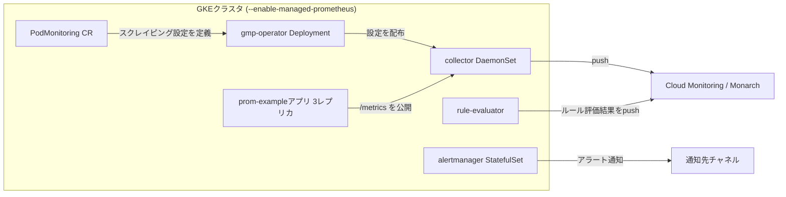
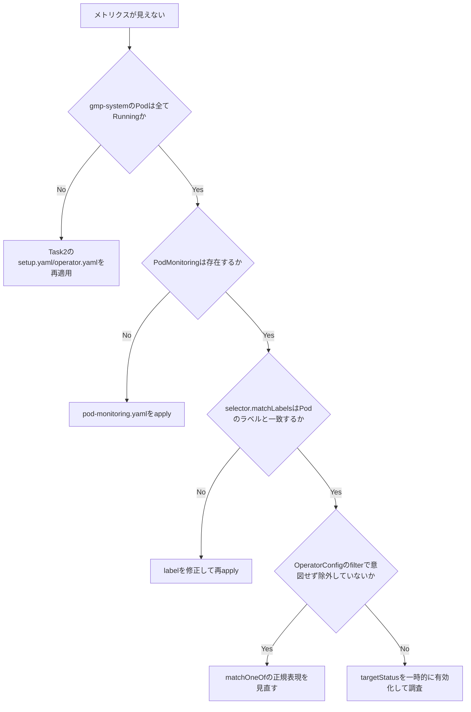

# GKE + Google Cloud Managed Service for Prometheus チャレンジラボ完全攻略ガイド

> 対象ラボ: *Monitor Environments with Google Cloud managed Service for Prometheus* コースの Challenge Lab
> 想定読者: GKE / Kubernetes / Prometheus に触れたことがある初学者〜中級者
> 本ガイドの方針: 「なぜそのコマンドを打つのか」を Google Cloud 公式ドキュメントの根拠とともに解説します。コマンドを丸暗記するのではなく、仕組みを理解して自走できることを目指します。

---

## 目次

1. [Challenge Lab とは何か](#1-challenge-lab-とは何か)
2. [アーキテクチャ全体像](#2-アーキテクチャ全体像)
3. [事前準備（環境変数の整理）](#3-事前準備環境変数の整理)
4. [Task 1: GKE クラスタのデプロイ](#4-task-1-gke-クラスタのデプロイ)
5. [Task 2: Managed Collection のデプロイ](#5-task-2-managed-collection-のデプロイ)
6. [Task 3: サンプルアプリのデプロイと動作確認](#6-task-3-サンプルアプリのデプロイと動作確認)
7. [Task 4: エクスポートするメトリクスのフィルタリング](#7-task-4-エクスポートするメトリクスのフィルタリング)
8. [トラブルシューティング](#8-トラブルシューティング)
9. [ベストプラクティスまとめチェックリスト](#9-ベストプラクティスまとめチェックリスト)
10. [参考文献一覧](#10-参考文献一覧)

---

## 1. Challenge Lab とは何か

Challenge Lab は、通常のハンズオンラボと異なり「手順書」が存在しません。コース内の他のラボで学んだ知識をもとに、シナリオとタスクだけを頼りに自力で構築し、自動採点システムがその結果を判定します。

本ラボの目的（Lab Objectives）は次の3点です。

- Managed Service for Prometheus のデプロイ
- メトリクスをスクレイピングするための自己管理型（self managed）データ収集設定の作成
- メトリクスを問い合わせるためのアプリケーションのデプロイ

これらは以下の4つのタスクに分解されています。

| Task | 内容 |
|---|---|
| Task 1 | `ZONE` に GKE クラスタをデプロイする |
| Task 2 | Managed Collection をデプロイする |
| Task 3 | サンプルアプリケーションをデプロイし、Prometheus の稼働を確認する |
| Task 4 | エクスポートするメトリクスをフィルタリングする |

---

## 2. アーキテクチャ全体像

作業に入る前に、Managed Service for Prometheus（以下 GMP）がどう動くかを理解しておくと、各タスクの意味が腹落ちします。

GMP の Managed Collection は、Prometheus 互換の collector を DaemonSet としてクラスタ内で動かし、各ノード上の Pod だけをスクレイピング（`/metrics` エンドポイントからメトリクスを収集）します。収集したデータは Google 側から取りに来るのではなく、collector 側から Cloud Monitoring のバックエンドである Monarch へ **push** する設計です。これにより、Google がクラスタに直接アクセスすることはありません。



各コンポーネントの役割は次のとおりです。

| コンポーネント | 種別 | 役割 |
|---|---|---|
| `gmp-operator` | Deployment | GMP 用 Kubernetes operator。CRD（PodMonitoring 等）を監視し設定を配布 |
| `collector` | DaemonSet | 同一ノード上の Pod だけをスクレイピングして水平スケール |
| `rule-evaluator` | Deployment | アラート・記録ルールの評価 |
| `alertmanager` | StatefulSet | 発火したアラートを通知チャネルへ送信 |
| `PodMonitoring` / `ClusterPodMonitoring` | CRD | どの Pod をどの間隔でスクレイピングするか定義する、いわば「自己管理型データ収集」の本体 |
| `OperatorConfig` | CRD | 認証情報・メトリクスフィルタなど operator 全体の設定 |

> **初学者向け補足**: 「Managed（マネージド）」なのは collector や operator の *実行・スケーリング・アップグレード* であって、「どの Pod をスクレイピングするか」はユーザーが `PodMonitoring` リソースで自分で定義します。これが Lab Objectives にある「self managed data collection」の正体です。

**参考ソース**
- Get started with managed collection — https://docs.cloud.google.com/stackdriver/docs/managed-prometheus/setup-managed
- Managed Service for Prometheus Overview — https://docs.cloud.google.com/stackdriver/docs/managed-prometheus

---

## 3. 事前準備（環境変数の整理）

Cloud Shell を開き、以下の変数をラボの指示に沿って設定しておくと、以降のコマンドをコピー&ペーストしやすくなります。

```bash
export PROJECT_ID=$(gcloud config get-value project)
export ZONE=<ラボが指定するZONE>          # 例: asia-northeast1-a
export CLUSTER_NAME=gmp-cluster
export NAMESPACE_NAME=gmp-test
```

`gcloud config get-value project` で現在アクティブなプロジェクトを取得するのは、プロジェクトIDを手入力してタイプミスするリスクを避けるベストプラクティスです。

**参考ソース**
- gcloud config — https://docs.cloud.google.com/sdk/gcloud/reference/config

---

## 4. Task 1: GKE クラスタのデプロイ

### 手順

```bash
gcloud container clusters create ${CLUSTER_NAME} \
  --zone ${ZONE} \
  --enable-managed-prometheus \
  --num-nodes=2
```

### なぜこのフラグが必要か

`--enable-managed-prometheus` は GKE クラスタ作成時に Managed Service for Prometheus のマネージドコレクションを有効化する専用フラグです。公式リファレンスにも、クラスタ内で Managed Collection を有効にするためのフラグであると明記されています。

なお、GKE Autopilot（v1.25以降）や GKE Standard（v1.27以降）では Managed Collection がデフォルトで有効になっていますが、明示的にフラグを付けることで意図を明確にし、バージョン差異による有効化漏れを防げるため、Challenge Lab のように採点される環境では明示指定が推奨されます。

### 検証

```bash
gcloud container clusters get-credentials ${CLUSTER_NAME} --zone ${ZONE}
kubectl get nodes
```

`kubectl get nodes` でノードが `Ready` になっていれば、クラスタ自体は正常です（GMP コンポーネントの確認は Task 2/3 で行います）。

**参考ソース**
- gcloud container clusters create リファレンス（`--enable-managed-prometheus`） — https://docs.cloud.google.com/sdk/gcloud/reference/container/clusters/create
- Get started with managed collection（GKE 有効化手順） — https://docs.cloud.google.com/stackdriver/docs/managed-prometheus/setup-managed

---

## 5. Task 2: Managed Collection のデプロイ

Task 1 でフラグを付けた時点で、現行バージョンの GKE では `gmp-system` / `gmp-public` の各 Namespace と operator 関連リソースは自動的に作成されます。しかし本ラボの指示は、明示的に **setup manifest と operator manifest** を `GoogleCloudPlatform/prometheus-engine` リポジトリから適用することを求めています。これは元々「GKE 以外の Kubernetes クラスタ」向けの手順として公式ドキュメントに記載されている方法ですが、Challenge Lab の採点ロジックがこれらのマニフェスト適用を明示的なタスク達成条件としているため、GKE 上でも同じ手順を踏みます。

### 手順

```bash
kubectl apply -f https://raw.githubusercontent.com/GoogleCloudPlatform/prometheus-engine/v0.17.2/manifests/setup.yaml

kubectl apply -f https://raw.githubusercontent.com/GoogleCloudPlatform/prometheus-engine/v0.17.2/manifests/operator.yaml
```

> **バージョン一貫性のベストプラクティス**: このガイドでは、現行の公式手順に合わせて `setup.yaml` / `operator.yaml` / `example-app.yaml` を `v0.17.2` タグで統一しています。CRD スキーマとオペレータの実装は同じリリース内で整合性が取られているため、タグを混在させると CRD 未対応フィールドなどの予期しないエラーが発生する可能性があります。

### 検証

```bash
kubectl get ns | grep gmp
kubectl get pods -n gmp-system
kubectl get pods -n gmp-public
```

`gmp-system` に `collector`（DaemonSet）、`gmp-operator`、`rule-evaluator` が `Running` になっていることを確認します。

**参考ソース**
- Get started with managed collection（kubectl CLI での setup/operator manifest 適用手順） — https://docs.cloud.google.com/stackdriver/docs/managed-prometheus/setup-managed#kubectl-cli
- GoogleCloudPlatform/prometheus-engine リポジトリ — https://github.com/GoogleCloudPlatform/prometheus-engine
- prometheus-engine Releases（最新タグ確認用） — https://github.com/GoogleCloudPlatform/prometheus-engine/releases

---

## 6. Task 3: サンプルアプリのデプロイと動作確認

### 6.1 Namespace の作成

```bash
kubectl create ns ${NAMESPACE_NAME}
```

公式ドキュメントは、サンプル構成用に専用の Namespace（推奨名 `gmp-test`）を作成することを推奨しています。Namespace を分離しておくことで、後片付け（テアダウン）が容易になり、既存アプリへの影響も避けられます。

### 6.2 サンプルアプリのデプロイ

```bash
kubectl -n ${NAMESPACE_NAME} apply -f https://raw.githubusercontent.com/GoogleCloudPlatform/prometheus-engine/v0.17.2/examples/example-app.yaml
```

このマニフェストは `example_requests_total`（カウンタ）や `example_random_numbers`（ヒストグラム）などのメトリクスを `metrics` という名前のポートで公開する Pod を3レプリカ起動します。

### 6.3 PodMonitoring の作成（＝自己管理型データ収集の本体）

Managed Collection はメトリクスエンドポイントを自動発見しません。`PodMonitoring` カスタムリソースで「どのラベルを持つ Pod を、どのポートで、どの間隔でスクレイピングするか」を明示的に定義する必要があります。これが Lab Objectives の「self managed data collection」に対応する作業です。

```yaml
# pod-monitoring.yaml
apiVersion: monitoring.googleapis.com/v1
kind: PodMonitoring
metadata:
  name: prom-example
spec:
  selector:
    matchLabels:
      app.kubernetes.io/name: prom-example
  endpoints:
  - port: metrics
    interval: 30s
```

```bash
kubectl -n ${NAMESPACE_NAME} apply -f pod-monitoring.yaml
```

### 6.4 Prometheus が正しくデプロイされているかの確認

```bash
# operator / collector / rule-evaluator の稼働確認
kubectl get pods -n gmp-system

# PodMonitoring が意図した Namespace に存在するか
kubectl get podmonitoring -A

# PodMonitoring がGMPに認識されているか
kubectl -n ${NAMESPACE_NAME} describe podmonitoring prom-example
```

より詳細なターゲットの疎通確認をしたい場合は、`OperatorConfig` で `features.targetStatus.enabled: true` を設定すると、`describe podmonitoring` の出力に `Active Targets` や `Health: up` といったステータスが表示されるようになります。ただし公式ドキュメントは、この機能は大規模クラスタで operator のメモリ枯渇を招く可能性があるため、一時的なデバッグ用途に限定し、確認後は必ず元の設定へ戻して有効なまま残さないことを推奨しています。

```yaml
apiVersion: monitoring.googleapis.com/v1
kind: OperatorConfig
metadata:
  namespace: gmp-public
  name: config
features:
  targetStatus:
    enabled: true
```

```bash
# デバッグ前の OperatorConfig を保存する
kubectl -n gmp-public get operatorconfig config -o yaml > operator-config-original.yaml

kubectl apply -f operator-config-debug.yaml

# 数秒待ってから target status を確認する
kubectl -n ${NAMESPACE_NAME} describe podmonitorings/prom-example

# 確認後、保存した元の OperatorConfig を再適用する
kubectl apply -f operator-config-original.yaml
```

`operator-config-debug.yaml` は一時的な確認専用です。target status を有効にした設定をクラスタへ残さないでください。

**参考ソース**
- Get started with managed collection（Namespace作成 / example-appデプロイ / PodMonitoring / target status） — https://docs.cloud.google.com/stackdriver/docs/managed-prometheus/setup-managed
- PodMonitoring API リファレンス — https://github.com/GoogleCloudPlatform/prometheus-engine/blob/main/doc/api.md#podmonitoring

---

## 7. Task 4: エクスポートするメトリクスのフィルタリング

### 7.1 なぜフィルタリングするのか

大量のメトリクスを収集し続けると Cloud Monitoring への書き込みコストが増加します。`OperatorConfig` の `collection.filter` に `matchOneOf`（許可リスト）を設定することで、指定した Prometheus 時系列マッチャに一致するメトリクスだけを Cloud Monitoring へエクスポートできます。これは Prometheus の federation エンドポイントの `match[]` パラメータと同等の仕組みです。

```yaml
collection:
  filter:
    matchOneOf:
    - '{job="prom-example"}'
    - '{__name__=~"job:.+"}'
```

### 7.2 手順（既存設定を壊さないベストプラクティス）

ラボの指示は「config.yaml を作成し、operatorconfig の内容をコピーする」というものですが、**ゼロから書くのではなく、必ずクラスタ上の現在の設定をエクスポートしてから編集する**のが安全です。手動で新規作成すると、既存の `collection.credentials` などの設定を誤って消してしまうリスクがあります。

```bash
# 1. 現在のOperatorConfigをエクスポート
kubectl -n gmp-public get operatorconfig config -o yaml > op-config.yaml
```

```bash
# 2. エディタで op-config.yaml を開き、collection.filter.matchOneOf ブロックを追記
vi op-config.yaml
```

追記後のイメージ:

```yaml
apiVersion: monitoring.googleapis.com/v1
kind: OperatorConfig
metadata:
  namespace: gmp-public
  name: config
collection:
  filter:
    matchOneOf:
    - '{job="prom-example"}'
    - '{__name__=~"job:.+"}'
```

```bash
# 3. 【重要】編集したファイルをクラスタへ反映する
#    ここを忘れると、ローカルのYAMLを編集しただけでクラスタの挙動は変わらない
kubectl -n gmp-public apply -f op-config.yaml
```

> **見落としがちな落とし穴**: ラボの手順文だけを読むと「ファイルを作ってGCSにアップロードするだけ」に見えますが、実際にメトリクスフィルタを機能させるには `kubectl apply` でクラスタに反映する工程が不可欠です。GCS へのアップロードはあくまで自動採点システムがあなたの設定内容を検証するための手段であり、クラスタの実際の動作を変えるものではありません。

### 7.3 採点用ファイルのアップロード

ラボの自動採点システムが設定内容を検証できるように、作成した `op-config.yaml` を Cloud Storage バケットへアップロードします。

```bash
export PROJECT=$(gcloud config get-value project)
gsutil mb -p ${PROJECT} gs://${PROJECT}
gsutil cp op-config.yaml gs://${PROJECT}
gsutil -m acl set -R -a public-read gs://${PROJECT}
```

> **セキュリティ上の重要な注意（本番運用では絶対に真似しないこと）**: `acl set ... public-read` はバケットの中身を **インターネット上の誰でも読み取り可能** にする設定です。これはこの Challenge Lab の自動採点システムがファイルを検証するために必要な手順であり、ラボという使い捨て環境だからこそ許容されます。実際の業務環境でこれを行うと、設定ファイルや認証情報の漏えいにつながる重大なセキュリティインシデントになり得ます。実運用では以下のような代替手段を検討してください。
> - Uniform bucket-level access + IAM で読み取り権限を必要な担当者・サービスアカウントのみに限定する
> - 一時的な共有が必要な場合は署名付きURL（Signed URL）を使う
> - ラボ終了後は `gsutil rm -r gs://${PROJECT}` でバケットを削除し、公開状態を残さない

### 7.4 検証

```bash
# クラスタ側で設定が反映されているか
kubectl -n gmp-public get operatorconfig config -o yaml

# GCSに正しくアップロードされているか
gsutil ls gs://${PROJECT}
```

Cloud Monitoring の **Metrics Management** ページでは、フィルタ適用後にどのメトリクスが実際に取り込まれているか、取り込み量の推移とあわせて確認できます。

**参考ソース**
- Filter exported metrics（`collection.filter` の設定方法） — https://docs.cloud.google.com/stackdriver/docs/managed-prometheus/setup-managed#gmp-filter-metrics
- OperatorConfig / ExportFilters API リファレンス — https://github.com/GoogleCloudPlatform/prometheus-engine/blob/main/doc/api.md
- gsutil acl コマンドリファレンス — https://cloud.google.com/storage/docs/gsutil/commands/acl
- 均一なバケットレベルのアクセス（Uniform bucket-level access） — https://cloud.google.com/storage/docs/uniform-bucket-level-access

---

## 8. トラブルシューティング



| 症状 | 想定原因 | 対処 |
|---|---|---|
| `kubectl get pods -n gmp-system` で Pod が見つからない | クラスタ作成時に `--enable-managed-prometheus` を付け忘れた、または setup/operator manifest が未適用 | `gcloud container clusters update ${CLUSTER_NAME} --enable-managed-prometheus --zone ${ZONE}` を実行、または Task 2 の manifest を再適用 |
| `PodMonitoring` を作成してもメトリクスが Cloud Monitoring に出ない | `selector.matchLabels` が Pod の実際のラベルと一致していない | `kubectl get pods -n ${NAMESPACE_NAME} --show-labels` でラベルを確認し修正 |
| `gsutil mb` が `Bucket already exists` で失敗する | プロジェクトID由来のバケット名がグローバルに既に使用されている | 一意なサフィックスを付けたバケット名を利用する |
| OperatorConfig を編集したのにフィルタが効かない | `kubectl apply` でクラスタへ反映していない（ローカルファイルの編集のみ） | 7.2節の手順3を実施し、クラスタへ反映する |
| Autopilot クラスタでフラグが効かない/自動有効化されない | GKEバージョンに起因する既知の挙動 | `gcloud container clusters update <CLUSTER_NAME> --enable-managed-prometheus` で明示的に有効化 |

**参考ソース**
- Managed Service for Prometheus トラブルシューティング — https://docs.cloud.google.com/stackdriver/docs/managed-prometheus/troubleshooting
- prometheus-engine GitHub Discussions（Autopilot 有効化に関する既知の挙動） — https://github.com/GoogleCloudPlatform/prometheus-engine/discussions/418

---

## 9. ベストプラクティスまとめチェックリスト

- [ ] GKE クラスタ作成コマンドに `--enable-managed-prometheus` を明示的に付与した
- [ ] `setup.yaml` / `operator.yaml` / `example-app.yaml` のリリースタグを揃えた
- [ ] サンプルアプリ専用の Namespace（`gmp-test`）を分離した
- [ ] `PodMonitoring` の `selector.matchLabels` を Pod のラベルと突き合わせて確認した
- [ ] `OperatorConfig` は **ゼロから書かず、既存設定をエクスポートしてから編集**した
- [ ] `OperatorConfig` 編集後、必ず `kubectl apply` でクラスタへ反映したことを確認した
- [ ] GCS バケットを `public-read` にしたのはラボの採点用途のみであり、実運用では行わないことを理解している
- [ ] ラボ終了後、不要なリソース（GKEクラスタ、GCSバケット）の削除を検討した

---

## 10. 参考文献一覧

| # | タイトル | URL |
|---|---|---|
| 1 | Get started with managed collection | https://docs.cloud.google.com/stackdriver/docs/managed-prometheus/setup-managed |
| 2 | Managed Service for Prometheus Overview | https://docs.cloud.google.com/stackdriver/docs/managed-prometheus |
| 3 | gcloud container clusters create リファレンス | https://docs.cloud.google.com/sdk/gcloud/reference/container/clusters/create |
| 4 | GoogleCloudPlatform/prometheus-engine（リポジトリ本体） | https://github.com/GoogleCloudPlatform/prometheus-engine |
| 5 | prometheus-engine Releases | https://github.com/GoogleCloudPlatform/prometheus-engine/releases |
| 6 | prometheus-engine API リファレンス（PodMonitoring / OperatorConfig / ExportFilters） | https://github.com/GoogleCloudPlatform/prometheus-engine/blob/main/doc/api.md |
| 7 | Managed Service for Prometheus トラブルシューティング | https://docs.cloud.google.com/stackdriver/docs/managed-prometheus/troubleshooting |
| 8 | gsutil acl コマンドリファレンス | https://cloud.google.com/storage/docs/gsutil/commands/acl |
| 9 | Uniform bucket-level access | https://cloud.google.com/storage/docs/uniform-bucket-level-access |
| 10 | prometheus-engine Discussions #418（Autopilotでの既知の挙動） | https://github.com/GoogleCloudPlatform/prometheus-engine/discussions/418 |
