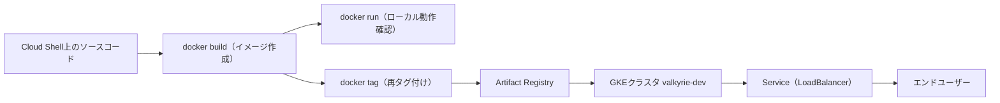
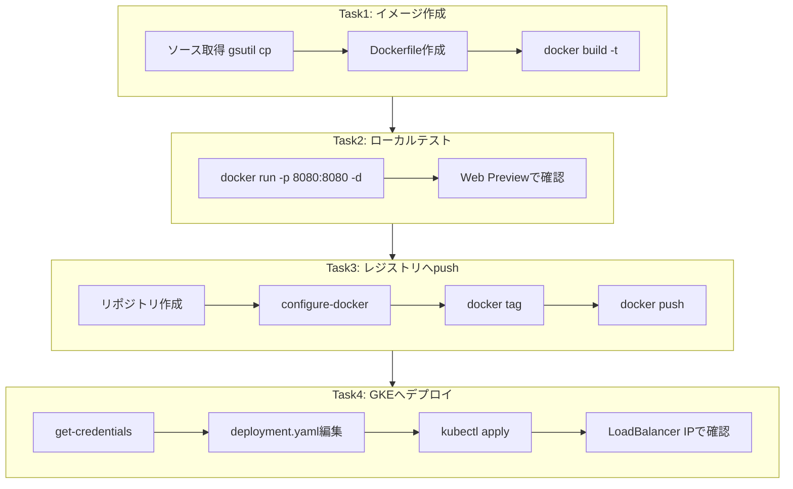
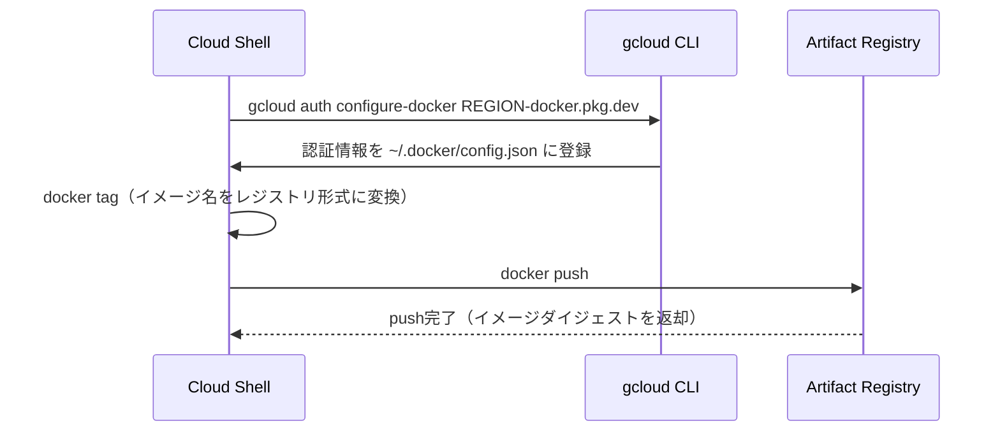

# Dockerイメージ作成からGKEデプロイまで ― ベストプラクティス解説ガイド

対象ラボ: *Explore Google Cloud – Kubernetesアプリケーションのデプロイ Challenge Lab (GSP318)*
参照元: https://www.skills.google/paths/11/course_templates/663/labs/592459

このガイドは、Docker初学者〜Kubernetes初学者を対象に、上記チャレンジラボで要求される「イメージ作成 → ローカル検証 → Artifact Registryへの格納 → GKEへのデプロイ・公開」という一連の流れを、**なぜそのコマンドを打つのか**という根拠つきで解説します。ラボの模範解答をそのまま貼るのではなく、実務でも通用する考え方を身につけることを目的としています。

---

## 1. 全体像を先に掴む

コンテナアプリケーションのライフサイクルは、大きく分けると「作る」「試す」「保管する」「動かす」の4段階です。今回のラボの4つのTaskは、そのままこの4段階に対応しています。



4つのTaskとゴールの対応関係を整理すると次のとおりです。

| Task | ゴール | 主なコマンド |
|---|---|---|
| Task 1 | Dockerfileを書き、イメージをビルドする | `docker build` |
| Task 2 | ビルドしたイメージをローカルで動作確認する | `docker run` |
| Task 3 | イメージをArtifact Registryへ保存する | `gcloud auth configure-docker`, `docker tag`, `docker push` |
| Task 4 | GKEクラスタへデプロイし外部公開する | `gcloud container clusters get-credentials`, `kubectl apply` |

各Taskの内部ステップも合わせて俯瞰します。



> **なぜこの順番が重要か**：Docker Hubやレジストリに壊れたイメージをpushしてから不具合に気づくと、修正の手戻りが大きくなります。ローカルで`docker run`により動作確認してからレジストリへ送る、という順序自体がシフトレフト（問題を早期に検出する）の考え方に基づくベストプラクティスです。

---

## 2. Task 1: Dockerイメージを作成しDockerfileを保存する

### 2-1. 進捗確認スクリプトの読み込みとソース取得

```bash
source <(gsutil cat gs://spls/gsp318/script.sh)

gsutil cp gs://spls/gsp318/valkyrie-app.tgz .
tar -xzf valkyrie-app.tgz
cd valkyrie-app
```

1行目はラボの自動採点用スクリプトを読み込むものです。2〜4行目でアプリのソース一式（`valkyrie-app/source`配下）を取得し、作業ディレクトリへ移動します。

### 2-2. Dockerfileの作成

`valkyrie-app/Dockerfile` を次の内容で作成します。

```dockerfile
FROM golang:1.10
WORKDIR /go/src/app
COPY source .
RUN go install -v
ENTRYPOINT ["app","-single=true","-port=8080"]
```

各命令の役割とベストプラクティス上のポイントを表にまとめます。

| 命令 | 役割 | ベストプラクティスの観点 |
|---|---|---|
| `FROM` | ベースイメージの指定 | タグ指定（例: `golang:1.10`）でバージョンを追跡できる。ビット単位の完全再現が必要な本番環境ではタグとダイジェスト（`golang:1.10@sha256:...`）を組み合わせて固定する |
| `WORKDIR` | 以降の命令の基準ディレクトリを設定 | `RUN cd ...`のような相対パス操作より安全で、レイヤーとしても明示的 |
| `COPY` | ホストのファイルをイメージへ取り込む | リモートURL取得が可能な`ADD`より副作用が少なく、単純なファイルコピーには`COPY`が推奨される |
| `RUN` | ビルド時にコマンドを実行しレイヤーを作る | 複数の`RUN`をまとめると生成レイヤー数が減り、イメージサイズとビルド速度が改善する |
| `ENTRYPOINT` | コンテナ起動時の既定コマンドを固定 | `CMD`と併用すると、固定した起動コマンドに対して引数だけを差し替えられる柔軟性が生まれる |

参考: Docker公式のDockerfileベストプラクティスでは、頻繁に変わらない命令を前方に、変更頻度の高い命令を後方に配置することでビルドキャッシュを最大限活用することが推奨されています。またレイヤー数を減らすことでイメージサイズ削減とビルド高速化の両方につながるとされています。

> **実務での補足**：このラボの`golang:1.10`は学習用に固定された古いバージョンです。実際のプロジェクトでは、ベースイメージに既知の脆弱性が含まれていないか定期的に確認し、パッチが出た際にはイメージを再ビルドして最新化する運用が必要です。ビルドキャッシュを効かせつつも、セキュリティパッチの反映のために定期的な「キャッシュを使わないフルリビルド」を組み込むのが実務上のバランスです。

### 2-3. ビルドと確認

```bash
docker build -t valkyrie-app:v0.1.0 .
```

- `-t`（`--tag`）でイメージ名とタグを`IMAGE:TAG`形式で指定します。タグを省略すると`latest`になりますが、`latest`は「常に最新」という意味を持たず追跡性を失わせるため、バージョン番号を明示するのがベストプラクティスです。
- 末尾の`.`はビルドコンテキスト（Dockerfileが参照できるファイル群のルート）をカレントディレクトリに指定するものです。

```bash
docker images
```

で作成したイメージがリストに表示されることを確認し、ラボの「Check my progress」で採点します。

---

## 3. Task 2: 作成したDockerイメージをテストする

```bash
docker run -d -p 8080:8080 valkyrie-app:v0.1.0
```

| オプション | 意味 |
|---|---|
| `-d` | コンテナをバックグラウンド（デタッチモード）で起動する。ラボ指示の「末尾に`&`を付ける」と同様に、Cloud Shellの操作をブロックしないための指定 |
| `-p 8080:8080` | ホスト側ポート8080をコンテナ側ポート8080にマッピングする。左側がホスト、右側がコンテナである点に注意 |

起動後、Cloud ShellのWeb Previewからポート8080を選ぶとアプリ画面が表示されます。表示されない場合は、`docker ps`でコンテナが起動しているか、`docker logs <CONTAINER_ID>`でエラーが出ていないかを確認します。

> **ベストプラクティス**：レジストリへpushする前に必ずローカルで起動確認を行うことで、Dockerfileの記述ミス（COPY対象の誤り、ENTRYPOINTの引数誤りなど）を早期に発見できます。CI/CDパイプラインでも、pushの前段に同様のスモークテストを組み込むのが一般的です。

---

## 4. Task 3: Docker イメージを Artifact Registry へ push する

### 4-1. リポジトリの作成

```bash
gcloud artifacts repositories create my-repository \
    --repository-format=docker \
    --location=REGION \
    --description="valkyrie-app docker repository"
```

Artifact Registryはフォーマット（docker/maven/npm等）ごとにリポジトリを分けて管理する設計です。`--repository-format=docker`を指定することでDockerイメージ専用のリポジトリとして作成されます。

### 4-2. Dockerの認証設定

```bash
gcloud auth configure-docker REGION-docker.pkg.dev
```

このコマンドは`~/.docker/config.json`にcredential helperを追記し、指定したリージョンのArtifact Registryホストに対して`docker push`／`docker pull`を実行する際、自動的にgcloudの認証情報を使うように設定します。Artifact Registryでは、Container Registry時代と異なり**利用するリージョンのホスト名を明示的に指定する必要がある**点が公式ドキュメントでも強調されています（例: `us-central1-docker.pkg.dev`など、地域ごとにホスト名が変わる）。複数リージョンを使う場合はカンマ区切りで複数ホストをまとめて指定できます。

認証からpushまでの流れをシーケンス図で整理します。



### 4-3. 再タグ付け（re-tag）

Artifact Registryへpushするには、イメージ名をレジストリが要求する命名規則に合わせて再タグ付けする必要があります。

```bash
docker tag valkyrie-app:v0.1.0 \
    REGION-docker.pkg.dev/PROJECT_ID/my-repository/valkyrie-app:v0.1.0
```

命名規則の各要素の意味を分解すると次のとおりです。

| 要素 | 例 | 意味 |
|---|---|---|
| `LOCATION` | `us-central1` | リポジトリを作成したリージョン。ホスト名の先頭に一致させる必要がある |
| `-docker.pkg.dev` | 固定文字列 | Artifact RegistryのDockerフォーマット用ホストを示す接尾辞 |
| `PROJECT-ID` | `my-project-123` | Google Cloudのプロジェクト ID |
| `REPOSITORY` | `my-repository` | Task 3-1で作成したリポジトリ名 |
| `IMAGE` | `valkyrie-app` | イメージ名 |
| `TAG` | `v0.1.0` | バージョンタグ（省略時は`latest`） |

### 4-4. push

```bash
docker push REGION-docker.pkg.dev/PROJECT_ID/my-repository/valkyrie-app:v0.1.0
```

pushが成功すると、Cloud ConsoleのArtifact Registry画面にイメージとタグが表示されます。ここで「Check my progress」により採点されます。

---

## 5. Task 4: イメージを使ってKubernetesにデプロイ・公開する

### 5-1. クラスタの認証情報取得

```bash
gcloud container clusters get-credentials valkyrie-dev --zone ZONE
```

このコマンドは`kubectl`が使う`kubeconfig`（既定では`~/.kube/config`）に、指定したGKEクラスタへの接続情報と認証情報を書き込みます。これを実行して初めて`kubectl`コマンドが正しいクラスタに対して発行されるようになります。ゾーンクラスタは`--zone`、リージョンクラスタは`--region`を使う点に注意してください。

### 5-2. deployment.yamlのプレースホルダを置き換える

`valkyrie-app/k8s`配下にはKurtが用意した`deployment.yaml`と`service.yaml`があります。`deployment.yaml`内のコンテナイメージ指定箇所を、Task 3でpushした実際のイメージパスに書き換えます。

| 修正前（プレースホルダ） | 修正後 |
|---|---|
| `image: <IMAGE_PLACEHOLDER>` | `image: REGION-docker.pkg.dev/PROJECT_ID/my-repository/valkyrie-app:v0.1.0` |

この文字列は必ずTask 3-3で`docker tag`に使ったパスと完全一致させる必要があります。ここがずれるとPodが`ImagePullBackOff`エラーになり、デプロイが失敗します。

### 5-3. デプロイの適用

```bash
cd k8s
kubectl apply -f deployment.yaml
kubectl apply -f service.yaml
```

`kubectl apply`は宣言的（declarative）にリソースを作成・更新するコマンドです。`kubectl create`のような命令的（imperative）コマンドと異なり、YAMLファイルに書かれた「あるべき状態」とクラスタの現在の状態を比較し、差分だけを反映します。この性質により、YAMLをGitで履歴管理しながら安全に繰り返し適用できる点が、実務でapplyが標準とされる理由です。

### 5-4. 公開の確認

ナビゲーションメニューから **Kubernetes Engine > Gateways, Services & Ingress** を開き、`valkyrie-dev`サービスに割り当てられたLoadBalancerの外部IPアドレスをクリックしてアプリが表示されることを確認します。「Check my progress」で最終確認します。

---

## 6. つまずきやすいポイントとトラブルシューティング

| 症状 | 主な原因 | 確認コマンド |
|---|---|---|
| `docker push`が認証エラーになる | `gcloud auth configure-docker`に指定したリージョンとpush先リージョンが不一致 | `cat ~/.docker/config.json`でcredHelpersの登録ホストを確認 |
| Podが`ImagePullBackOff`になる | `deployment.yaml`内のイメージパスとpushしたイメージパスが不一致、またはタグ違い | `kubectl describe pod <POD_NAME>`でPull失敗の詳細を確認 |
| `kubectl`コマンドが別クラスタに向いてしまう | `get-credentials`未実行、または複数クラスタでcontextが切り替わっている | `kubectl config current-context` |
| LoadBalancerの外部IPが`pending`のまま | Service反映直後で払い出しに数分かかっている、またはservice.yamlの`type`指定漏れ | `kubectl get service valkyrie-dev-service --watch` |

---

## 7. ベストプラクティスまとめ

| 領域 | ベストプラクティス | 理由 |
|---|---|---|
| Dockerfile | ベースイメージのタグを固定する | ビルドの再現性を確保し、意図しない挙動変化を防ぐ |
| Dockerfile | 関連する`RUN`命令をまとめる | レイヤー数を削減し、イメージサイズとビルド時間を改善する |
| イメージタグ | `latest`に頼らずバージョンタグを付与する | どのビルドが動いているかの追跡性を保つ |
| push前 | ローカルで`docker run`により動作確認する | レジストリへ壊れたイメージを送る前に問題を検出する（シフトレフト） |
| Artifact Registry認証 | 使用する全リージョンのホストを`configure-docker`に登録する | リージョンごとにホスト名が異なるため未登録だとpush/pullが失敗する |
| Kubernetesデプロイ | `kubectl apply`を宣言的に使う | YAMLをGit管理しながら差分ベースで安全に適用できる |
| Kubernetesデプロイ | イメージパスのプレースホルダ置換を`docker tag`の値と完全一致させる | `ImagePullBackOff`などのデプロイ失敗を防ぐ |

---

## 8. 参考文献（Sources）

| 項目 | URL |
|---|---|
| ラボ本体（GSP318） | https://www.skills.google/paths/11/course_templates/663/labs/592459 |
| Dockerfileベストプラクティス（Docker公式） | https://docker-docs.uclv.cu/develop/develop-images/dockerfile_best-practices/ |
| Dockerfileベストプラクティス レビュー記事（レイヤーキャッシュ／セキュリティ観点） | https://pythonspeed.com/articles/official-docker-best-practices/ |
| レイヤー削減のプラクティス集 | https://github.com/dnaprawa/dockerfile-best-practices |
| Artifact Registryへのイメージのpush/pull（Google Cloud公式） | https://docs.cloud.google.com/artifact-registry/docs/docker/pushing-and-pulling |
| Artifact RegistryのDocker認証設定（Google Cloud公式） | https://docs.cloud.google.com/artifact-registry/docs/docker/authentication |
| Container RegistryからArtifact Registryへの変更点（`configure-docker`のリージョン指定について） | https://docs.cloud.google.com/artifact-registry/docs/transition/changes-docker |
| `gcloud artifacts repositories create`リファレンス | https://docs.cloud.google.com/sdk/gcloud/reference/artifacts/repositories/create |
| Artifact Registry標準リポジトリの作成手順 | https://docs.cloud.google.com/artifact-registry/docs/repositories/create-repos |
| `gcloud container clusters get-credentials`リファレンス | https://docs.cloud.google.com/sdk/gcloud/reference/container/clusters/get-credentials |
| GKEでのkubectlアクセス設定 | https://docs.cloud.google.com/kubernetes-engine/docs/how-to/cluster-access-for-kubectl |
| Kubernetes API serverへの認証（GKEセキュリティ） | https://docs.cloud.google.com/kubernetes-engine/docs/how-to/api-server-authentication |
| `kubectl`クイックリファレンス（Kubernetes公式） | https://kubernetes.io/docs/reference/kubectl/quick-reference/ |
| `kubectl apply`リファレンス（Kubernetes公式） | https://kubectl.docs.kubernetes.io/references/kubectl/apply |

---

以上が、Dockerイメージの作成からArtifact Registryへの格納、GKEへのデプロイ・公開までの一連の流れと、その背景にあるベストプラクティスです。ラボ内では具体的な`REGION`・`ZONE`・`PROJECT_ID`・リポジトリ名などが各自の環境ごとに異なるため、上記のプレースホルダは自分の値に置き換えて進めてください。
