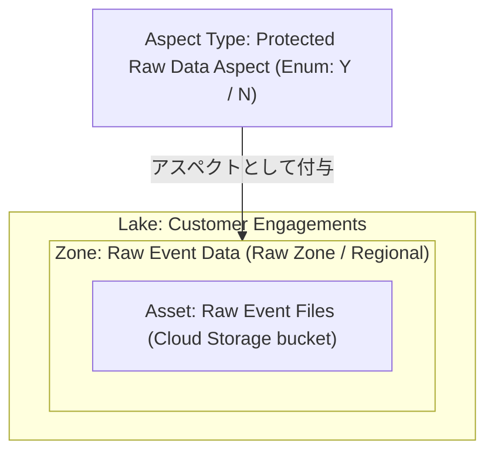
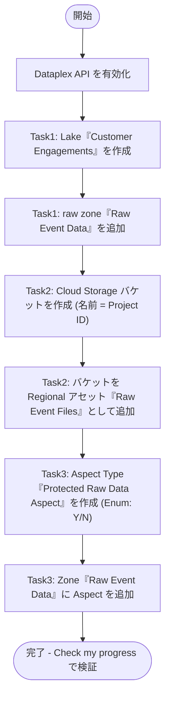

# Knowledge Catalog チャレンジラボ攻略ガイド

## Lake / Zone / Asset / Aspect Type 実装のベストプラクティス

対象ラボ: [Create and Add Aspects to Knowledge Catalog Assets](https://www.skills.google/course_templates/726/labs/629895)（Challenge Lab）

---

## この記事について

このガイドは、Google Cloud の初学者でも迷わずタスクを完了できるように、チャレンジラボの3つのタスクをステップバイステップで解説するものです。単なる操作手順の再掲ではなく、「なぜその設定が必要なのか」「実務でハマりやすい落とし穴は何か」まで含めて解説します。

各手順の根拠は、末尾の「参考文献・出典」セクションに公式ドキュメントの URL としてまとめています。

> **重要な用語の前提知識**
> このラボが扱うサービスは、2026年4月10日付けで **Dataplex Universal Catalog** から **Knowledge Catalog** へ名称変更されました。ただし API・クライアントライブラリ・CLI（`gcloud dataplex ...`）・IAM のロール名は変更されておらず、引き続き `dataplex` という名前空間のままです。コンソール上の表示名は Knowledge Catalog でも、コマンドや権限名を調べるときは「Dataplex」で検索するのが正解です。

---

## 0. 全体像を理解する：Knowledge Catalog のリソース階層

タスクに着手する前に、Knowledge Catalog が扱うリソースの親子関係を押さえておくと、迷わず作業を進められます。

| リソース | 役割 | 本ラボでの名称 |
| --- | --- | --- |
| **Lake** | データドメインや事業部門を表す最上位の論理コンテナ | Customer Engagements |
| **Zone** | Lake 内のサブドメイン。データの成熟度（raw / curated）で分類 | Raw Event Data（Raw Zone） |
| **Asset** | Zone に紐づく実データへのポインタ（Cloud Storage バケット or BigQuery データセット） | Raw Event Files（Cloud Storage バケット） |
| **Aspect Type** | メタデータのスキーマ（テンプレート）。フィールドと型を定義する再利用可能な雛形 | Protected Raw Data Aspect |
| **Aspect** | Aspect Type のインスタンス。実際に Zone やカラムに付与される値 | Protected Raw Data Flag = Y/N |

Zone には **Raw Zone** と **Curated Zone** の2種類があります。Raw Zone はスキーマ検証を行わずどのような形式のデータでも受け入れる「着地帯」であるのに対し、Curated Zone は構造化・検証済みのデータを格納する用途です。今回作成する「Raw Event Data」は生イベントデータの着地帯なので Raw Zone が適切です。

---

## 1. 事前準備：必要な API を有効化する

Knowledge Catalog のリソースを作成する前に、Dataplex API（コンソール上の検索名は「Cloud Dataplex API」）が有効化されている必要があります。プロジェクトによってはデフォルトで有効な場合もありますが、必ず確認しましょう。

1. Google Cloud コンソールの検索バーに `Cloud Dataplex API` と入力する。
2. 検索結果から「Cloud Dataplex API」をクリックする。
3. 「有効にする（Enable）」ボタンが表示されている場合はクリックする。既に有効な場合は「API が有効です」と表示される。

**ベストプラクティス**: 本番運用では `gcloud services enable dataplex.googleapis.com` のようにコマンドで有効化し、Infrastructure as Code（Terraform 等）で管理すると、環境間の再現性が高まります。

---

## 2. Task 1: Lake と raw zone を作成する

### 2-1. Lake「Customer Engagements」を作成する

1. ナビゲーションメニューから「View all products」→ Analytics 配下の「Knowledge Catalog」を開く。
2. 左ペインの「Manage lakes」から「Manage」をクリックする。
3. 「Create Lake」をクリックする。
4. 以下のプロパティを設定する。

| 項目 | 値 |
| --- | --- |
| Display Name | Customer Engagements |
| Region | `<REGION>` |

5. 「Create」をクリックする。

**ベストプラクティス**

- Lake ID は Display Name から自動生成されますが、命名規則が組織で決まっている場合は手動で指定しましょう（作成後に ID は変更できません）。
- Region は後から変更できないリソース属性です。課題文の指示どおり `<REGION>` を一字一句正確に選択してください。
- 作成直後は Lake のステータスが「Active」になるまで数分かかることがあります。ステータスが Active になってから次の Zone 作成に進むと、失敗によるロールバックを避けられます。

### 2-2. raw zone「Raw Event Data」を Lake に追加する

1. 「Lakes」一覧で作成した「Customer Engagements」をクリックする。
2. 「Zones」タブで「Add zone」をクリックする。
3. 以下のプロパティを設定する。

| 項目 | 値 |
| --- | --- |
| Display Name | Raw Event Data |
| Type | Raw Zone |
| Data locations | Regional |

4. 「Create」をクリックする。

**ベストプラクティス**

- Zone の Type は後から変更できないため、用途（raw か curated か）を最初に確定させることが重要です。
- 「Data locations」を Regional に設定すると、この Zone に追加できるアセットのロケーションが Lake と同一リージョンの単一リージョンデータに限定されます。マルチリージョンのデータを扱う予定がある場合は、この設計判断を事前チームで合意しておきましょう。
- Zone の作成中も Lake 自体は引き続き利用可能です。複数の Zone を並行して追加できます。

---

## 3. Task 2: Cloud Storage バケットを作成し、Zone にアセットとして追加する

### 3-1. Cloud Storage バケットを作成する

1. ナビゲーションメニューから「Cloud Storage」→「Buckets」を開く。
2. 「Create」をクリックする。
3. バケット名に「Project ID」（現在のプロジェクト ID）を入力する。
4. ロケーションタイプを Region、リージョンを `<REGION>` に設定する。
5. 残りの設定はデフォルトのまま「Create」をクリックする。

**ベストプラクティス**

- Cloud Storage のバケット名はグローバルに一意である必要があります。プロジェクト ID は Google Cloud 全体で一意なので、バケット名として利用するのはよくある命名パターンです。
- バケットの Region は、後の手順で Zone にアタッチする際に **Lake / Zone のリージョンと重なっている必要があります**。リージョンが一致しない場合、Zone に追加できずエラーになります。

### 3-2. バケットを Regional アセット「Raw Event Files」として Zone にアタッチする

1. 「Zones」一覧で「Raw Event Data」をクリックする。
2. 「Assets」タブで「+ Add Assets」（または「Add an asset」）をクリックする。
3. 以下のプロパティを設定する。

| 項目 | 値 |
| --- | --- |
| Type | Cloud Storage bucket |
| Display Name | Raw Event Files |
| バケット | 手順3-1で作成したバケット |
| Data locations | Regional |

4. 「Continue」→「Submit」の順にクリックする。

**ベストプラクティス**

- 1つの Zone に複数のアセットを同時に追加でき、追加処理中もその Zone を継続して利用できます。
- ディスカバリー設定（Discovery settings）を有効にし、バケット内に検出可能なデータ構造が存在する場合に限り、Knowledge Catalog は対応する BigQuery 外部テーブルを自動的に公開します。設定を Zone レベルから継承するか個別設定するかも、この画面で決められます。

---

## 4. Task 3: Aspect Type を作成し、Zone に Aspect を追加する

### 4-1. Aspect Type「Protected Raw Data Aspect」を作成する

Aspect Type は Aspect の再利用可能なテンプレートです。フィールドの型や必須／任意といった制約を定義し、メタデータの一貫性を担保します。

1. 左ペインの「Manage Metadata」から「Metadata Types」を開く。
2. 「Aspect types」タブを選択し、「Create」をクリックする。
3. 以下のプロパティを設定する。

| 項目 | 値 |
| --- | --- |
| Display Name | Protected Raw Data Aspect |
| Location | `<REGION>` |

4. 「Template」セクションで「Add field」をクリックし、フィールドを追加する。

| 項目 | 値 |
| --- | --- |
| Field Display Name | Protected Raw Data Flag |
| Type | Enum |

5. 「Add an enum value」で値 `Y` を追加し「Done」をクリックする。
6. 再度「Add an enum value」で値 `N` を追加し「Done」をクリックする。
7. 「Save」をクリックする。

**ベストプラクティス**

- Aspect Type の Location は作成後に変更できません。Zone や Asset に付与する予定であれば、原則としてそれらと同じリージョン（または Global）を選択してください。Global な Aspect Type はどのリージョンの Entry にも付与できるため、複数リージョンで再利用したい共通メタデータ（例：データ分類ラベル）には Global が向いています。
- 機密データ／保護対象データを識別するための Enum フィールドは、値のブレを防ぐために自由記述の文字列型ではなく Enum 型で定義するのがベストプラクティスです。今回の `Y` / `N` のように選択肢を固定すると、後続の検索・フィルタリングが安定します。
- Aspect Type の作成には数分かかることがあります。「Check my progress」が成功と判定するまで、少し待ってから確認しましょう。

### 4-2. Zone「Raw Event Data」に Aspect を追加する

Aspect Type はあくまでテンプレートであり、実際にメタデータとして意味を持たせるには対象の Entry（この場合は Zone）に Aspect を付与する必要があります。

1. 左メニューの「Discover」配下にある「Search」を開く。
2. 検索プラットフォームを Knowledge Catalog に設定し、Zone「Raw Event Data」を検索して開く（またはコンソール上の Zone 詳細ページから直接遷移する）。
3. Entry 詳細ページの「Details」タブにある「Aspects」セクションで、「Optional aspects」の「Add」をクリックする。
4. フィルターに `Protected Raw Data Aspect` と入力し、該当の Aspect Type を選択する。
5. 「Protected Raw Data Flag」で値（`Y` または `N`）を選択する。
6. 「Save」をクリックする。

**ベストプラクティス**

- Aspect は Entry（またはそのカラム）に紐づけて保存される点に注意してください。Aspect Type と付与先の Entry が異なる Google Cloud Organization に属している場合は付与できません。
- 必須（Required）ではなく任意（Optional）の Aspect として設計しておくと、既存の Entry に後から段階的にメタデータを充実させていく運用がしやすくなります。
- この操作も反映まで数分かかることがあるため、「Check my progress」がすぐに成功しなくても慌てず再確認しましょう。

---

## 5. 全体ワークフロー

3つのタスクを通しで俯瞰すると、以下のような一直線のフローになります。

---

## 6. ベストプラクティスまとめ

| カテゴリ | ベストプラクティス | 理由 |
| --- | --- | --- |
| リージョン | Lake / Zone / バケット / Aspect Type のリージョンをすべて `<REGION>` に統一する | Region は後から変更できず、リージョン不一致はアセット追加時のエラーの主因になる |
| 命名 | Display Name は人間が読める名前、ID は組織の命名規則に沿って明示指定する | ID は作成後に変更できないため、後工程での混乱を防ぐ |
| バケット名 | グローバルに一意な名前が必要な場合は Project ID を利用する | Project ID は Google Cloud 全体で重複しないことが保証されている |
| Aspect Type 設計 | 選択肢が限定されるメタデータは Enum 型で定義する | 自由入力の文字列よりも値の表記ゆれを防ぎ、検索性が向上する |
| API 有効化 | リソース作成前に対象 API（Dataplex API）を有効化しているか必ず確認する | 未有効化のまま操作すると作成処理がエラーになる |
| 作業順序 | 各リソースのステータスが Active になったことを確認してから次の手順に進む | 作成失敗時は自動的に前の状態へロールバックされるため、待たずに進むと手戻りが発生する |
| IAM | 実務では最小権限の原則に従い、Dataplex 用のロール（例: `roles/dataplex.editor`）と Storage 用のロール（例: `roles/storage.admin`）を必要な範囲だけ付与する | ラボの学生アカウントには広い権限が事前付与されているが、本番環境ではそのまま使うべきではない |

---

## 7. よくあるエラーと対処法

| 症状 | 主な原因 | 対処法 |
| --- | --- | --- |
| Zone にバケットを追加できない | バケットのリージョンと Lake / Zone のリージョンが重なっていない | バケットのロケーションを Zone の Data locations 設定と一致させて作り直す |
| Lake / Zone の作成が失敗する | Dataplex API が有効化されていない、または権限不足 | API の有効化状況を確認し、必要な IAM ロールが付与されているか確認する |
| Aspect Type が Search 結果に出てこない | 作成直後で反映が完了していない、または Location が Entry と一致しない（かつ Global でもない） | 数分待って再検索する。Location の不一致が疑われる場合は Aspect Type を Global で作り直す（既存の Location 変更は不可） |
| Check my progress がなかなか成功しない | バックグラウンド処理の反映待ち | 対象リソースのステータスが Active になっているか確認し、数分後に再チェックする |

---

## 8. 参考文献・出典

| No. | タイトル | URL |
| --- | --- | --- |
| 1 | About lakes and zones（Lake / Zone の用語解説、Knowledge Catalog への改称について） | https://docs.cloud.google.com/dataplex/docs/terminology |
| 2 | Create a Knowledge Catalog lake（Lake 作成手順） | https://docs.cloud.google.com/dataplex/docs/create-lake |
| 3 | Add a zone（Zone 追加手順） | https://docs.cloud.google.com/dataplex/docs/add-zone |
| 4 | Manage data assets in a lake（アセットの追加・リージョン制約） | https://docs.cloud.google.com/dataplex/docs/manage-assets |
| 5 | Knowledge Catalog locations（リージョン設計と改称の正式アナウンス日） | https://docs.cloud.google.com/dataplex/docs/locations |
| 6 | Create a bucket（Cloud Storage バケット作成） | https://docs.cloud.google.com/storage/docs/creating-buckets |
| 7 | Manage aspects and enrich metadata（Aspect Type / Aspect の作成・付与手順） | https://docs.cloud.google.com/dataplex/docs/enrich-entries-metadata |
| 8 | Establish foundational data context with Knowledge Catalog（Aspect Type 作成のチュートリアル） | https://docs.cloud.google.com/dataplex/docs/establish-foundational-data-context |
| 9 | About metadata management in Knowledge Catalog（Aspect Type の Location 制約など） | https://docs.cloud.google.com/dataplex/docs/catalog-overview |
| 10 | Getting started with Cloud APIs（API の有効化手順） | https://docs.cloud.google.com/apis/docs/getting-started |
| 11 | Enable and disable services（`gcloud services enable` 等） | https://docs.cloud.google.com/service-usage/docs/enable-disable |
| 12 | Create and Add Aspects to Knowledge Catalog Assets（同系統のラボ GSP1145。Lake/Zone/Asset/Aspect Type 作成の UI 操作を実機で確認） | https://www.skills.google/focuses/62711?parent=catalog |
