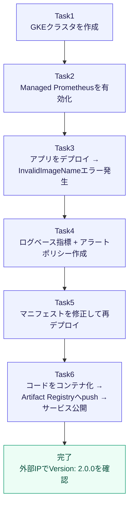
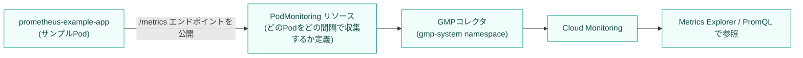
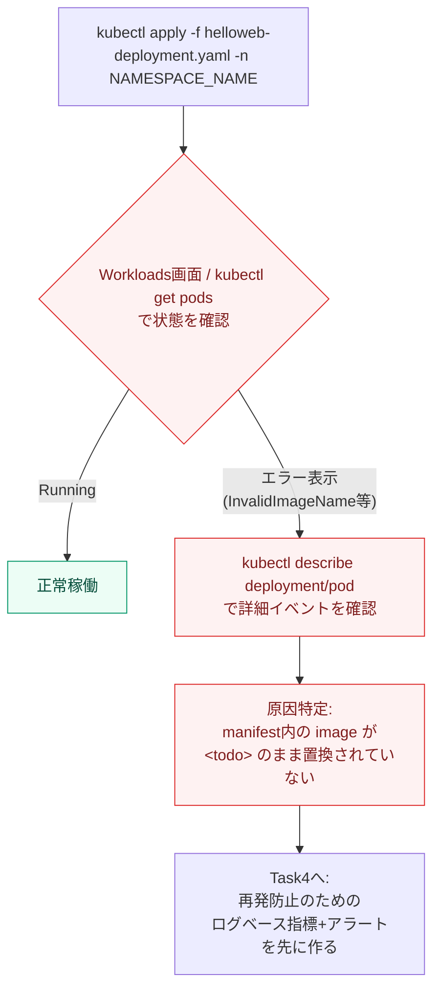
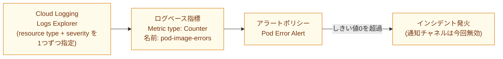
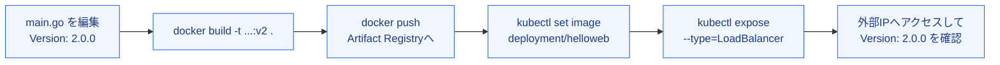

# GKE チャレンジラボ攻略ガイド

## Kubernetes デプロイ管理のベストプラクティス（初学者向けステップバイステップ解説）

対象ラボ: [Challenge Lab: Manage Kubernetes in Google Cloud](https://www.skills.google/course_templates/783/labs/612117)

このガイドは、GKE（Google Kubernetes Engine）上でクラスタ構築からアプリケーションのデプロイ、監視、障害対応、コンテナ配布までを一気通貫で行うチャレンジラボについて、各タスクの「やり方」だけでなく「なぜそうするのか」というベストプラクティスの根拠を、公式ドキュメントを中心とした一次情報とともに解説します。

> 表記について: `CLUSTER_NAME` `ZONE` `NAMESPACE_NAME` `REPO_NAME` `SERVICE_NAME` はラボ環境で個別に指定される値のプレースホルダーです。実際の値に置き換えて読んでください。

---

## 0. 全体像を先に把握する

このラボは 6 つのタスクで構成されており、それぞれが前のタスクの成果物の上に積み重なっていきます。最初に全体のつながりを図で押さえておくと、途中で迷子になりません。



ポイントは、**Task3 で意図的にエラーを踏ませてから Task4 で監視の仕組みを作り、Task5 で初めて修正する**という順序になっていることです。これは実務でも典型的な流れ（インシデント発生 → 検知の仕組みを整備 → 恒久対応）を疑似体験させる設計であり、飛ばさずに順番通り進めることが学習効果の面でも重要です。

---

## 1. Task 1: GKE クラスタを作成する

### 1.1 求められる設定

| 設定項目 | 値 | 解説 |
|---|---|---|
| ゾーン | `ZONE` | ラボで指定されたゾーンにクラスタを配置する |
| リリースチャンネル | Regular | GKE がクラスタのバージョンとアップグレード時期を自動管理するチャンネル |
| クラスタ/ターゲットバージョン | default | リリースチャンネルが提供するデフォルトバージョンを使用 |
| クラスタオートスケーラー | 有効 | 負荷に応じてノード数を自動増減 |
| ノード数（初期値） | 3 | クラスタ作成時のノード数 |
| 最小ノード数 | 2 | オートスケーラーが縮退させる下限 |
| 最大ノード数 | 6 | オートスケーラーが拡張する上限 |

### 1.2 ベストプラクティスと理由

**① リリースチャンネルは基本的に指定する**
GKE のクラスタは「リリースチャンネル」に登録することで、Google が検証済みのバージョンへ自動アップグレードされ続けます。Regular チャンネルは Rapid チャンネルで一定期間の実運用実績を積んだバージョンが降りてくる位置づけで、新機能への追従と安定性のバランスが良いため、多くの本番相当ワークロードで採用される標準的な選択です。チャンネルを指定しない「No channel」運用は非推奨化されており、今後廃止される方向であることも公式ドキュメントに明記されています。

**② オートスケーラーは min/max をセットで指定する**
`--enable-autoscaling` に加えて `--min-nodes` と `--max-nodes` を必ず組で指定します。最小値だけを守るとコストが青天井になり、最大値だけを守ると必要な時にスケールできません。今回の設定（最小2・最大6、初期3）は「平常時は少なめのノードで動かしつつ、負荷急増時に最大2倍まで許容する」典型的なバランス設計です。

**③ ノードプール単位で min/max を指定していることを意識する**
`--min-nodes`/`--max-nodes` はゾーンごと・ノードプールごとの値であり、リージョンクラスタでは合計ノード数を制御したい場合は `--total-min-nodes`/`--total-max-nodes` を使う必要がある点に注意してください（両者は排他的です）。

### 1.3 コマンド例（gcloud CLI の場合）

```bash
gcloud container clusters create CLUSTER_NAME \
  --zone=ZONE \
  --release-channel=regular \
  --num-nodes=3 \
  --enable-autoscaling \
  --min-nodes=2 \
  --max-nodes=6
```

### 1.4 参考文献

- クラスタオートスケーラーの設定方法: https://cloud.google.com/kubernetes-engine/docs/how-to/cluster-autoscaler
- リリースチャンネルの概念: https://cloud.google.com/kubernetes-engine/docs/concepts/release-channels

---

## 2. Task 2: GKE クラスタで Managed Prometheus を有効にする

### 2.1 全体の流れ



### 2.2 ベストプラクティスと理由

**① マネージド型を選ぶ理由**
Google Cloud Managed Service for Prometheus は、自前で Prometheus サーバーを構築・運用する場合と比べて、可用性やスケーリング、長期保存（データは長期間保持される）を Google 側が肩代わりしてくれる点が最大のメリットです。既存の PromQL やダッシュボード資産との互換性を保ったまま、運用負荷だけを下げられます。

**② クラスタ作成後に有効化する場合のコマンド**
既存クラスタに対しては `gcloud container clusters update` に `--enable-managed-prometheus` を付けて更新します（ゾーンクラスタか リージョンクラスタかでフラグの指定方法が変わります）。

```bash
gcloud container clusters update CLUSTER_NAME \
  --enable-managed-prometheus \
  --zone=ZONE
```

**③ namespace を分離してから検証用アプリを置く**
サンプルアプリと PodMonitoring リソースは、本番の Kubernetes リソースと分離するために専用の `NAMESPACE_NAME` を作成してからデプロイします。namespace はクラスタ内の名前衝突を避け、責務ごとにリソースをグルーピングするための Kubernetes の基本機能であり、チームやプロジェクト単位で分離しておくことが標準的な運用パターンとして推奨されています。

```bash
kubectl create namespace NAMESPACE_NAME
```

**④ PodMonitoring リソースで収集対象を明示する**
Managed Prometheus は「何もしなくても全部のPodからメトリクスを取る」わけではなく、`PodMonitoring` カスタムリソースで対象の Pod セレクタ・ポート名・収集間隔（`interval`）を明示的に定義します。今回のラボでは `metadata.name`・`labels.app.kubernetes.io/name`・`matchLabels.app` をそれぞれ `prometheus-test` に揃えることで、サンプルアプリの Deployment とラベルが一致し、正しく収集対象として認識されます。ラベルの不一致は「メトリクスが収集されない」という典型的なハマりどころなので、Deployment 側のラベルと PodMonitoring 側のセレクタは必ず突き合わせて確認してください。

### 2.3 参考文献

- Managed Service for Prometheus のセットアップ手順: https://cloud.google.com/stackdriver/docs/managed-prometheus/setup-managed
- Namespace によるリソース整理のベストプラクティス（Google Cloud Blog）: https://cloud.google.com/blog/products/containers-kubernetes/kubernetes-best-practices-organizing-with-namespaces

---

## 3. Task 3: アプリケーションをデプロイしてデバッグする

### 3.1 デバッグの基本フロー



### 3.2 ベストプラクティスと理由

**① まず `describe` でイベントログを見る**
Pod が起動しない場合、最初に見るべきは `kubectl describe pod <pod名> -n NAMESPACE_NAME` の `Events` セクションです。ここに `InvalidImageName` や `Failed to apply default image tag` といった具体的なエラーメッセージが記録されており、原因の当たりをつける最も早い方法になります。今回発生する `InvalidImageName` は、イメージ参照文字列（`<todo>` のようなプレースホルダーがそのまま残っている等）が Docker のイメージ参照フォーマットとして不正であることが原因です。

**② いきなり直さず、先に観測基盤を整備する**
ラボの設計として、Task3 ではあえてエラーを直さずに放置し、Task4 でログベース指標とアラートポリシーを作ってから Task5 で修正します。これは実務でも「同じ障害を将来検知できるようにしてから直す」という順序が推奨されるためで、修正だけして観測を後回しにすると、同種の障害が再発した際に気づけないリスクがあります。

**③ ワークロード画面とCLIを両方使う**
Google Cloud コンソールの Workloads 詳細画面はエラーのサマリを視覚的に見せてくれますが、根本原因の文字列（`couldn't parse image reference` 等）は `kubectl describe` や Logs Explorer のほうが正確に追えます。両方を併用するのがベストプラクティスです。

### 3.3 参考文献

- GKE でのイメージプル障害のトラブルシューティング: https://cloud.google.com/kubernetes-engine/docs/troubleshooting/image-pulls
- GKE クラスタへのアプリデプロイ Quickstart: https://cloud.google.com/kubernetes-engine/docs/deploy-app-cluster

---

## 4. Task 4: ログベース指標とアラートポリシーを作成する

### 4.1 全体の流れ



### 4.2 ログベース指標を作る

**① クエリは「1つの Resource Type」「1つの Severity」に絞る**
ラボのヒント通り、Logs Explorer のクエリはリソースタイプと重大度（Severity）をそれぞれ1つだけ選ぶのがコツです。条件を広げすぎると `InvalidImageName` に無関係なログまで拾ってしまい、指標のノイズになります。GKE の Pod イベントに関するエラー/警告ログを対象にするため、Kubernetes コンテナに対応するリソースタイプと `ERROR` 以上の重大度を選定します。

**② メトリックタイプは Counter を選ぶ**
今回は「エラーが何回発生したか」を数えたいだけなので、数値を抽出する Distribution 型ではなく、条件に一致したログ件数を単純にカウントする Counter 型を使います。Counter 型はラベルが不要であればフィールドの追加設定なしでそのまま作成できるシンプルな構成です。

```bash
gcloud logging metrics create pod-image-errors \
  --description="Pod image reference errors" \
  --log-filter='log_id("events") AND resource.type="k8s_pod" AND jsonPayload.reason="Failed"'
```

> `InvalidImageName` / `couldn't parse image reference` はコンテナのアプリログではなく **Pod の Kubernetes イベント**として記録されるため、`log_id("events")` + `resource.type="k8s_pod"` を対象にし、イベントの `reason` が `Failed`（イメージの取得・参照に失敗）のものを数えます。`resource.type="k8s_container" AND severity>=ERROR` ではアプリケーション由来のエラーログまで拾ってしまい、イメージ参照エラーを取りこぼします。実際のフィルタはラボで確認できるログの内容に合わせて調整してください。

### 4.3 アラートポリシーを作る

| 設定項目 | 値 | 解説 |
|---|---|---|
| Rolling Window | 10 min | 集計に使うウィンドウ幅 |
| Rolling window function | Count | ウィンドウ内のログ件数を集計 |
| Time series aggregation | Sum | 複数系列がある場合に合算 |
| Condition type | Threshold | 静的なしきい値超過で判定 |
| Alert trigger | Any time series violates | いずれかの時系列が違反したら発火 |
| Threshold position | Above threshold | しきい値を上回ったら発火 |
| Threshold value | 0 | 1件でも発生したら発火させたい設定 |
| Use notification channel | Disable | 今回は通知先を作らない（ラボの範囲外） |
| Alert policy name | Pod Error Alert | ポリシー名 |

**ベストプラクティス解説:**

**① しきい値0で「1件でも発生したら通知」を実現する**
本番運用では大量のノイズを避けるため、ある程度のエラー件数を許容してからアラートを出すことが多いですが、今回のような「本来発生してはいけないイメージ参照エラー」については、しきい値を0に設定して1件でも即座に検知する設計が適しています。エラーの性質（頻度が高くて許容すべきものか、発生自体が異常か）によってしきい値の考え方を変えるのがベストプラクティスです。

**② Rolling Window（再テストウィンドウ）の意味を理解する**
アラート条件には「一時的なスパイク1回だけでは発火させない」ための再テストウィンドウという概念があります。ウィンドウ内の集計値がしきい値を継続して超えて初めて条件が「満たされた」と判定され、誤検知（フラッピング）を防ぐ仕組みになっています。今回の10分という値は、単発のノイズではなく継続的な問題であることを確認するための猶予期間です。

**③ 通知チャネルなしでもポリシー自体は機能する**
今回は `Use notification channel: Disable` としていますが、これはあくまでラボの検証目的で通知を省略しているだけで、実運用では必ずメール・Slack・PagerDuty等の通知チャネルを設定するのが標準的な運用です。

### 4.4 参考文献

- ログベース指標（カウンタ）の作成方法: https://cloud.google.com/logging/docs/logs-based-metrics/counter-metrics
- ログベース指標の概要: https://cloud.google.com/logging/docs/logs-based-metrics
- メトリックしきい値アラートポリシーの作成（コンソール）: https://cloud.google.com/monitoring/alerts/using-alerting-ui
- アラート条件の詳細な動作（再テストウィンドウ等）: https://cloud.google.com/monitoring/alerts/concepts-indepth
- アラートの全体像: https://cloud.google.com/monitoring/alerts

---

## 5. Task 5: マニフェストを修正して再デプロイする

### 5.1 修正内容

`helloweb-deployment.yaml` 内の `<todo>` プレースホルダーを、実在する公開イメージに置き換えます。

```yaml
containers:
  - name: helloweb
    image: us-docker.pkg.dev/google-samples/containers/gke/hello-app:1.0
```

### 5.2 ベストプラクティスと理由

**① 「削除してから再デプロイ」と「set image で更新」を使い分ける**
今回のラボでは Deployment を一度削除してから同じマニフェストで再デプロイする手順を踏みますが、これは Kubernetes の一般的な運用としては例外的な対応です。通常、稼働中の Deployment のイメージだけを差し替えたい場合は `kubectl set image` や `kubectl apply -f` によるローリングアップデートを使い、Pod を無停止で新しいバージョンへ順次入れ替えるのが標準的なベストプラクティスです。今回削除してから再作成するのは、壊れたマニフェストの状態（ReplicaSet 含む）を完全にクリーンな状態から作り直し、修正の効果を確認しやすくするための学習目的の手順だと理解しておくとよいでしょう。

**② 本番運用ではローリングアップデートが基本**
Deployment のイメージだけを更新する場合は、以下のように無停止でロールアウトできます。

```bash
kubectl set image deployment/helloweb helloweb=us-docker.pkg.dev/google-samples/containers/gke/hello-app:1.0 -n NAMESPACE_NAME
kubectl rollout status deployment/helloweb -n NAMESPACE_NAME
```

`kubectl rollout status` で展開の進捗を追い、問題があれば `kubectl rollout undo` で直前のリビジョンに戻せることも合わせて覚えておくと、Task6 以降の運用でも役立ちます。

**③ 再デプロイ後は Workloads 画面で「エラーなし」を必ず目視確認する**
CLI 上で `Running` と出ていても、コンテナが起動直後にクラッシュを繰り返しているケースもあるため、Google Cloud コンソールの Workloads 詳細画面でエラー表示が消えていることを確認するのがベストプラクティスです。

### 5.3 参考文献

- Kubernetes のローリングアップデート: https://kubernetes.io/docs/tasks/run-application/update-deployment-rolling/
- kubectl set image リファレンス: https://kubernetes.io/docs/reference/kubectl/generated/kubectl_set/kubectl_set_image/

---

## 6. Task 6: コードをコンテナ化して Artifact Registry へ配布し、サービスを公開する

### 6.1 全体の流れ



### 6.2 Artifact Registry の命名規則

| 要素 | 説明 | 例 |
|---|---|---|
| `LOCATION` | リポジトリのリージョン/マルチリージョン | `us` |
| `PROJECT-ID` | Google Cloud プロジェクトID | `my-project` |
| `REPOSITORY` | Artifact Registry のリポジトリ名 | `REPO_NAME` |
| `IMAGE` | イメージ名（ローカルの名前と異なってもよい） | `hello-app` |
| `TAG` | バージョンタグ | `v2` |

完全なイメージ名は `LOCATION-docker.pkg.dev/PROJECT-ID/REPOSITORY/IMAGE:TAG` の形式になります。

### 6.3 ベストプラクティスと理由

**① push 前に必ず認証ヘルパーを設定する**
`docker push` がリポジトリのホスト名（`LOCATION-docker.pkg.dev`）に対して認証できるよう、事前に `gcloud auth configure-docker LOCATION-docker.pkg.dev` を実行して Docker の認証情報ヘルパーを設定しておく必要があります。設定を忘れると push 時に認証エラーになります。

**② イメージ名は Artifact Registry の命名規則に厳密に合わせてタグ付けする**
`docker build -t` や `docker tag` の段階で、上記表の形式に沿った完全なリポジトリパスを指定しておくことで、そのまま `docker push` できます。ローカルの短い名前のままではリモートリポジトリの場所が特定できず push できません。

```bash
docker build -t LOCATION-docker.pkg.dev/PROJECT-ID/REPO_NAME/hello-app:v2 .
docker push LOCATION-docker.pkg.dev/PROJECT-ID/REPO_NAME/hello-app:v2
```

**③ `latest` タグに頼らず明示的なバージョンタグを使う**
今回のように `v2` という明示的なタグを付けるのは、`latest` タグ運用が「今動いているイメージがどのビルドか分からなくなる」というトレーサビリティの問題を引き起こしやすいためで、パイプライン運用では明示的なタグ（バージョン番号やコミットハッシュ等）を使うことが推奨されます。

**④ Deployment 更新後は `--target-port` を Dockerfile の公開ポートに合わせる**
`kubectl expose` で `LoadBalancer` タイプのサービスを作る際、`--port` は外部に公開するポート、`--target-port` はコンテナ内でアプリが待ち受けているポートです。この2つは役割が異なるため混同しないようにし、`--target-port` は必ず Dockerfile（またはアプリの実装）で公開されているポート番号と一致させます。

```bash
kubectl set image deployment/helloweb helloweb=LOCATION-docker.pkg.dev/PROJECT-ID/REPO_NAME/hello-app:v2 -n NAMESPACE_NAME

kubectl expose deployment helloweb \
  --name=SERVICE_NAME \
  --type=LoadBalancer \
  --port=8080 \
  --target-port=8080 \
  -n NAMESPACE_NAME
```

**⑤ LoadBalancer サービスは外部IPの払い出しに数分かかる**
`type: LoadBalancer` を指定すると、クラウドプロバイダー側でロードバランサーがプロビジョニングされ、外部IPが割り当てられるまでに数分の遅延があります。`kubectl get service SERVICE_NAME` を繰り返し実行し、`EXTERNAL-IP` が `<pending>` から実際のIPに変わるのを待つのが正しい確認手順です。

### 6.4 参考文献

- Artifact Registry のリポジトリ/イメージ命名規則: https://cloud.google.com/artifact-registry/docs/docker/names
- Artifact Registry へのイメージのプッシュ/プル: https://cloud.google.com/artifact-registry/docs/docker/pushing-and-pulling
- Artifact Registry Docker クイックスタート: https://cloud.google.com/artifact-registry/docs/docker/store-docker-container-images
- GKE でのサービス公開（Exposing apps）: https://cloud.google.com/kubernetes-engine/docs/how-to/exposing-apps
- Kubernetes の外部ロードバランサー: https://kubernetes.io/docs/tasks/access-application-cluster/create-external-load-balancer/

---

## 7. 完了チェックリスト

| # | チェック項目 | 確認方法 |
|---|---|---|
| 1 | クラスタが指定スペックで作成されている | `gcloud container clusters describe CLUSTER_NAME` |
| 2 | Managed Prometheus が有効で、サンプルアプリのメトリクスが収集されている | Metrics Explorer で `prometheus-test` のメトリクスを検索 |
| 3 | `helloweb` Deployment が一度 `InvalidImageName` エラーになっている | Workloads 詳細画面のエラー表示 |
| 4 | `pod-image-errors` ログベース指標と `Pod Error Alert` アラートポリシーが作成されている | Logs-based Metrics / Alerting ページ |
| 5 | マニフェスト修正後、`helloweb` がエラーなく稼働している | Workloads 詳細画面 |
| 6 | `v2` イメージが Artifact Registry に push され、サービスが外部IPで応答する | ブラウザで外部IPにアクセスし `Version: 2.0.0` を確認 |

---

## 8. 参考文献一覧（全体まとめ）

| カテゴリ | ドキュメント | URL |
|---|---|---|
| GKE クラスタ | クラスタオートスケーラー | https://cloud.google.com/kubernetes-engine/docs/how-to/cluster-autoscaler |
| GKE クラスタ | リリースチャンネル | https://cloud.google.com/kubernetes-engine/docs/concepts/release-channels |
| 監視 | Managed Service for Prometheus セットアップ | https://cloud.google.com/stackdriver/docs/managed-prometheus/setup-managed |
| Kubernetes基礎 | Namespace ベストプラクティス | https://cloud.google.com/blog/products/containers-kubernetes/kubernetes-best-practices-organizing-with-namespaces |
| デプロイ | GKE アプリデプロイ Quickstart | https://cloud.google.com/kubernetes-engine/docs/deploy-app-cluster |
| トラブルシュート | イメージプル障害の調査 | https://cloud.google.com/kubernetes-engine/docs/troubleshooting/image-pulls |
| ログ/指標 | ログベース指標（カウンタ） | https://cloud.google.com/logging/docs/logs-based-metrics/counter-metrics |
| ログ/指標 | ログベース指標の概要 | https://cloud.google.com/logging/docs/logs-based-metrics |
| アラート | しきい値アラートポリシーの作成 | https://cloud.google.com/monitoring/alerts/using-alerting-ui |
| アラート | アラート条件の詳細動作 | https://cloud.google.com/monitoring/alerts/concepts-indepth |
| アラート | アラート全体像 | https://cloud.google.com/monitoring/alerts |
| デプロイ更新 | Kubernetes ローリングアップデート | https://kubernetes.io/docs/tasks/run-application/update-deployment-rolling/ |
| デプロイ更新 | kubectl set image リファレンス | https://kubernetes.io/docs/reference/kubectl/generated/kubectl_set/kubectl_set_image/ |
| Artifact Registry | リポジトリ/イメージ命名規則 | https://cloud.google.com/artifact-registry/docs/docker/names |
| Artifact Registry | イメージのプッシュ/プル | https://cloud.google.com/artifact-registry/docs/docker/pushing-and-pulling |
| Artifact Registry | Docker クイックスタート | https://cloud.google.com/artifact-registry/docs/docker/store-docker-container-images |
| サービス公開 | GKE でのサービス公開 | https://cloud.google.com/kubernetes-engine/docs/how-to/exposing-apps |
| サービス公開 | Kubernetes 外部ロードバランサー | https://kubernetes.io/docs/tasks/access-application-cluster/create-external-load-balancer/ |

---

*本ガイドはラボ本文（[Challenge Lab: Manage Kubernetes in Google Cloud](https://www.skills.google/course_templates/783/labs/612117)）の各タスクに対応する形で作成しています。実際のコマンドはラボ環境の指示（ゾーン名・プロジェクトID・リポジトリ名等）に合わせて適宜置き換えてください。*
