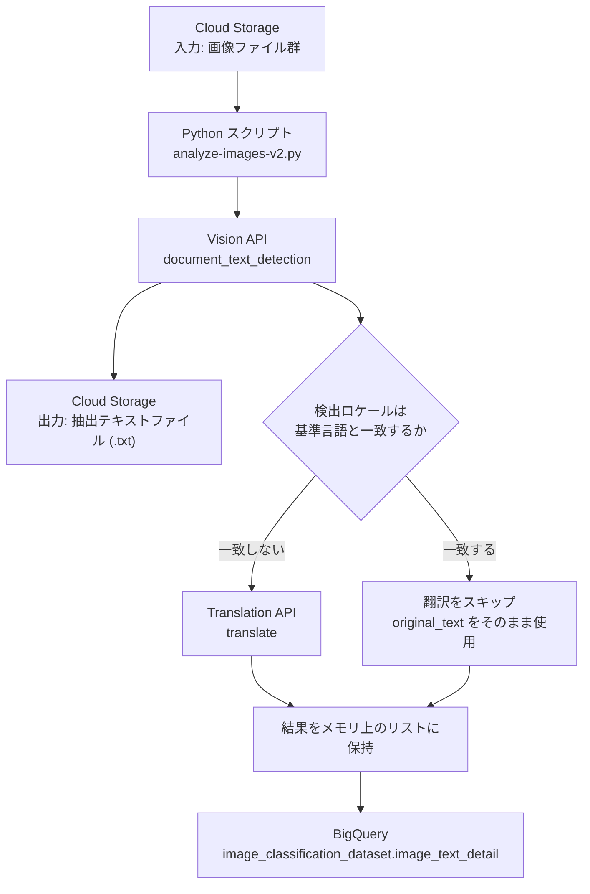
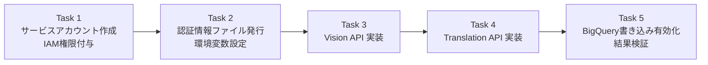

# Machine Learning APIs チャレンジラボ 攻略ガイド

**〜 Vision API × Translation API × BigQuery によるサイン画像テキスト抽出パイプライン 〜**

対象ラボ: [Integrate with Machine Learning APIs: Challenge Lab](https://www.skills.google/course_templates/630/labs/612231)

> **このガイドの使い方**
> チャレンジラボは「学んだスキルを自力で組み合わせて使えるか」を確認するためのものです。このガイドはコードを丸暗記させるものではなく、**なぜそのAPI呼び出しが必要なのか・なぜその権限が必要なのか**を理解しながら進められるように構成しています。各セクションの根拠は公式ドキュメントのURLとして明記しているので、実装時は必ず一次情報を確認してください。

---

## 1. 全体像を理解する

このラボで構築するのは、Cloud Storage上の看板画像から文字を抽出し、必要に応じて翻訳し、結果をBigQueryに集約する小さなETL（Extract-Transform-Load）パイプラインです。

### 1-1. データフロー（アーキテクチャ）



### 1-2. タスクの実行順序



順序には理由があります。認証情報（Task 1・2）がなければAPI呼び出し自体が失敗し、Vision APIの出力（抽出テキストとロケール）がなければTranslation APIをいつ呼ぶべきか判定できません。**必ずこの順で進め、各Taskの動作確認をしてから次に進んでください。**

---

## 2. Task 1: サービスアカウントとIAM権限の準備

### 2-1. なぜサービスアカウントが必要か

Pythonスクリプトはユーザーの代わりに、ユーザーが介在しないバックグラウンド処理としてGoogle CloudのAPIを呼び出します。この用途にはユーザーアカウントではなく、アプリケーション用のIDである**サービスアカウント**を使うのがベストプラクティスです。

> 参考: IAMの基本ロールと事前定義ロールの違い — [Roles and permissions | IAM (Google Cloud 公式ドキュメント)](https://docs.cloud.google.com/iam/docs/roles-overview)

### 2-2. 付与すべきロール

ラボの指示は「BigQuery Role」と「Cloud Storage Role」を付与することですが、これは事前定義ロールの中でも管理者権限を持つ以下の2つを指します。

| 用途 | ロール名 | ロールID | 主な権限 |
|---|---|---|---|
| Cloud Storageの読み書き | Storage Admin | `roles/storage.admin` | バケット・オブジェクトの作成/読み取り/更新/削除など全操作 |
| BigQueryへのデータ投入 | BigQuery Admin | `roles/bigquery.admin` | データセット/テーブルの管理、ジョブ実行、データ挿入 |

> 参考:
> - Cloud Storage IAM ロール一覧 — [IAM roles for Cloud Storage](https://docs.cloud.google.com/storage/docs/access-control/iam-roles)
> - BigQuery IAM ロール一覧 — [BigQuery IAM roles and permissions](https://docs.cloud.google.com/bigquery/docs/access-control)

**ベストプラクティス補足**: 本番運用であれば`storage.objectAdmin`や`bigquery.dataEditor`のようなより権限を絞ったロールを選び、最小権限の原則を守るべきです。このラボでは学習目的のため管理者ロールを使用します。

### 2-3. gcloud コマンドでの実装例

```bash
# プロジェクトIDを変数に格納
export PROJECT_ID=$(gcloud config get-value project)

# サービスアカウントを作成
gcloud iam service-accounts create ml-api-sa \
  --display-name="ML API Challenge Lab Service Account"

# 作成したサービスアカウントのメールアドレスを変数化
export SA_EMAIL="ml-api-sa@${PROJECT_ID}.iam.gserviceaccount.com"

# Storage Admin ロールを付与
gcloud projects add-iam-policy-binding ${PROJECT_ID} \
  --member="serviceAccount:${SA_EMAIL}" \
  --role="roles/storage.admin"

# BigQuery Admin ロールを付与
gcloud projects add-iam-policy-binding ${PROJECT_ID} \
  --member="serviceAccount:${SA_EMAIL}" \
  --role="roles/bigquery.admin"
```

Cloud Consoleから作成する場合は「IAMと管理」→「サービスアカウント」→「サービスアカウントを作成」からGUIでも同様の設定が可能です。

---

## 3. Task 2: 認証情報ファイルの発行と環境変数設定

### 3-1. JSONキーファイルの作成

```bash
gcloud iam service-accounts keys create ~/key.json \
  --iam-account="${SA_EMAIL}"
```

または Cloud Console の「サービスアカウント」詳細画面 → 「キー」タブ → 「鍵を追加」→「新しい鍵を作成」→ JSON形式、でも取得できます。

> **キーファイルの取り扱い**: JSONキーをGitリポジトリやCloud Storageバケットへ置かないでください。ラボ終了後は作成したキーを削除します。実務では長期キーを発行せず、Workload Identity連携または接続されたGoogle Cloudサービスが提供するADCを使用してください。

### 3-2. 環境変数 `GOOGLE_APPLICATION_CREDENTIALS` の設定

Pythonクライアントライブラリは、明示的に認証情報を渡さない限り**Application Default Credentials（ADC）**という仕組みで認証情報を探します。ADCが最初に確認するのがこの環境変数です。

```bash
export GOOGLE_APPLICATION_CREDENTIALS="$HOME/key.json"
```

> 参考: ADCとGOOGLE_APPLICATION_CREDENTIALS環境変数の役割 — [How Application Default Credentials works | Authentication](https://docs.cloud.google.com/docs/authentication/application-default-credentials)

**よくある落とし穴**: Cloud Shellのセッションが切れると環境変数もリセットされます。スクリプトが急に `DefaultCredentialsError` を出すようになったら、まずこの環境変数が現在のシェルに残っているか `echo $GOOGLE_APPLICATION_CREDENTIALS` で確認してください。

---

## 4. Task 3: Vision API でテキストを抽出する

### 4-1. TEXT_DETECTION と DOCUMENT_TEXT_DETECTION の使い分け

Vision APIには文字検出用の機能が2種類あります。看板や標識のような比較的短いテキストが対象のこのラボでは、密度の高い文書向けの`DOCUMENT_TEXT_DETECTION`（`document_text_detection`メソッド）を使うのが適切です。こちらは行・段落単位の構造情報や、検出した言語（ロケール）の情報も返してくれるためです。

| 手法 | 主な用途 | 言語ロケール情報 |
|---|---|---|
| `text_detection` | 短いテキスト（看板・ラベル・ナンバープレートなど） | 個別の`language_code`情報は限定的 |
| `document_text_detection` | 密なテキスト（文書・書籍・領収書、標識も含む） | `page.property.detected_languages`で取得可能 |

> 参考: 2つの検出方式の違い — [Detect and extract text from images | Cloud Vision API](https://docs.cloud.google.com/vision/docs/ocr)

### 4-2. レスポンスの構造（`full_text_annotation`）

Vision APIのレスポンスは以下のような階層構造を持ちます。

| 階層 | 内容 |
|---|---|
| `TextAnnotation` (`full_text_annotation`) | 画像全体のOCR結果 |
| → `Page` | ページ単位。`property.detected_languages`にロケール情報を持つ |
| → → `Block` | テキストブロック |
| → → → `Paragraph` | 段落 |
| → → → → `Word` | 単語 |
| → → → → → `Symbol` | 1文字単位 |

> 参考: `TextAnnotation`の階層構造 — [Package google.cloud.vision.v1 | Cloud Vision API](https://docs.cloud.google.com/vision/docs/reference/rpc/google.cloud.vision.v1)

### 4-3. 実装のポイント（`# TBD` 箇所の考え方）

以下は実装の考え方を示す例です。実際の変数名・関数構造は配布されたスクリプトのコメントに合わせてください。

```python
from google.cloud import vision

def detect_text(bucket_name, filename):
    """Cloud Storage上の画像からテキストとロケールを抽出する"""
    client = vision.ImageAnnotatorClient()

    image = vision.Image()
    image.source.image_uri = f"gs://{bucket_name}/{filename}"

    # TBD: document_text_detection を呼び出す
    response = client.document_text_detection(image=image)

    text = response.full_text_annotation.text

    # ロケール（検出言語）を取得する
    locale = "und"  # und = undetermined（未確定）のデフォルト値
    pages = response.full_text_annotation.pages
    if pages and pages[0].property.detected_languages:
        locale = pages[0].property.detected_languages[0].language_code

    return text, locale
```

抽出したテキストは、同じCloud Storageバケットに元のファイル名を使ったテキストファイルとして書き戻します（例: `sign1.jpg` → `sign1.jpg.txt`）。

**動作確認のコツ**: この段階で一度スクリプトを実行し、バケットにテキストファイルが生成されること・`locale`にそれらしい言語コード（`en`、`ja`、`zh`など）が入ることを確認してから、次のTaskに進んでください。全部を実装してから一括デバッグするより、段階ごとの確認の方がエラーの切り分けが容易です。

---

## 5. Task 4: Translation API でテキストを翻訳する

### 5-1. なぜ「ロケールが基準言語と異なる場合だけ」翻訳するのか

すべてのテキストを無条件に翻訳すると、API呼び出し回数が不必要に増え、コストと実行時間が増加します。Vision APIがすでに検出したロケール情報を使って「翻訳が必要なものだけ」を絞り込むのが効率的な設計です。

### 5-2. Translation API（v2）の呼び出し方

このラボのスクリプトは `google.cloud.translate_v2` を使う設計になっています。

```python
from google.cloud import translate_v2 as translate

TARGET_LANGUAGE = "en"  # スクリプトの基準言語（配布されたコードの定義に合わせる）

def translate_text(text, source_locale):
    """基準言語と異なる場合のみ翻訳する"""
    source_language = source_locale.split("-", 1)[0].lower()
    target_language = TARGET_LANGUAGE.split("-", 1)[0].lower()

    if source_locale == "und" or source_language == target_language:
        return text  # 翻訳不要、または言語判定不能な場合はそのまま返す

    translate_client = translate.Client()

    # TBD: translate を呼び出す
    result = translate_client.translate(
        text,
        target_language=TARGET_LANGUAGE,
    )

    return result["translatedText"]
```

> 参考:
> - `translate_v2.Client.translate`の使い方 — [Cloud Translation client libraries | Google Cloud Documentation](https://docs.cloud.google.com/translate/docs/reference/libraries/v2/python)
> - 翻訳結果のサンプルコード — [Translating text | Cloud Translation](https://docs.cloud.google.com/translate/docs/samples/translate-translate-text)

**ベストプラクティス補足**: `result`は辞書型で返り、`translatedText`のほかに`detectedSourceLanguage`も含まれます。Vision APIのロケール判定に自信が持てない場合は、Translation API側の`detectedSourceLanguage`と突き合わせて整合性を確認するのも有効です。

---

## 6. Task 5: BigQueryへの書き込みを有効化する

### 6-1. 事前にテーブルスキーマを確認する

配布されたスクリプトの末尾にあるBigQuery書き込み処理はコメントアウトされています。有効化する前に、書き込み先テーブルの実際のカラム構成を必ず確認してください。ラボごと・スクリプトのバージョンごとにカラム名が異なる場合があるため、想定で実装せずに次のコマンドで確認するのがベストプラクティスです。

```bash
bq show --schema --format=prettyjson image_classification_dataset.image_text_detail
```

### 6-2. データ挿入の実装パターン

BigQueryへのデータ投入には、ストリーミング挿入用の`insert_rows_json`メソッドを使うのが一般的です。

```python
from google.cloud import bigquery

def upload_to_bigquery(project_id, dataset_id, table_id, rows):
    client = bigquery.Client(project=project_id)
    table_ref = f"{project_id}.{dataset_id}.{table_id}"

    # rows は confirm した実際のスキーマに合わせた dict のリスト
    # 例: [{"uri": ..., "text": ..., "locale": ..., "translated_text": ...}, ...]
    errors = client.insert_rows_json(table_ref, rows)

    if errors:
        print(f"BigQuery insert errors: {errors}")
    else:
        print(f"{len(rows)} 件のレコードを {table_ref} に書き込みました")
```

> 参考:
> - `insert_rows_json`のシグネチャとリトライ挙動 — [Class Client | Python client libraries | Google Cloud Documentation](https://docs.cloud.google.com/python/docs/reference/bigquery/latest/google.cloud.bigquery.client.Client)
> - ストリーミング挿入の基本パターン — [Use the legacy streaming API | BigQuery](https://docs.cloud.google.com/bigquery/docs/streaming-data-into-bigquery)

### 6-3. コメントアウトの解除

配布スクリプトの最終行（BigQuery書き込みを実行する行）の先頭にある `#` を削除して有効化します。**Vision APIとTranslation API双方の動作確認が完了してから**この行を有効化してください。デバッグ中に無効なデータを何度もBigQueryに投入すると、テーブルの重複行の削除など余計な後処理が発生します。

---

## 7. 検証: 最頻出言語を確認する

すべての画像の処理とBigQueryへの投入が終わったら、以下のクエリで結果を確認します。

```sql
SELECT locale, COUNT(locale) AS lcount
FROM image_classification_dataset.image_text_detail
GROUP BY locale
ORDER BY lcount DESC
```

このクエリが空の結果を返す、または想定より行数が少ない場合は、Task 3・4のロジック（特にロケール判定条件）に戻って確認してください。

---

## 8. トラブルシューティング早見表

| 症状 | 主な原因 | 対処 |
|---|---|---|
| `PermissionDenied: 403` | IAMロールの反映待ち、または付与漏れ | IAMポリシー反映には数十秒〜数分かかることがある。ロールを再確認し、少し待って再実行 |
| `DefaultCredentialsError` | `GOOGLE_APPLICATION_CREDENTIALS`が未設定 | Cloud Shellのセッションが切れると環境変数はリセットされる。`echo $GOOGLE_APPLICATION_CREDENTIALS`で確認し再設定 |
| `ModuleNotFoundError` | 必要なクライアントライブラリ未インストール | `pip install google-cloud-vision google-cloud-translate google-cloud-bigquery google-cloud-storage` |
| Translation APIでエラー | ロケールが`und`（未確定）のまま翻訳を試行 | ロケール判定前のガード処理（`source_locale == "und"`）を確認 |
| BigQueryに行が入らない | 最終行のコメントアウト解除忘れ、またはスキーマ不一致 | `#`の削除を確認し、`bq show --schema`で実際のカラム名と型を突き合わせる |

---

## 9. まとめ: このラボで押さえるべきベストプラクティス

1. **最小権限ではなく管理者ロールを使う場面と理由を理解する** — 学習用ラボでは`*.admin`ロールで進めるが、実務では権限を絞ったロールを検討する。
2. **段階的に動作確認する** — Vision API → Translation API → BigQueryの順に、各段階で出力を確認してから次に進む。
3. **APIレスポンスの構造を理解してから実装する** — `full_text_annotation`の階層（Page→Block→Paragraph→Word→Symbol）とロケール情報の位置を把握する。
4. **想定ではなく実際のスキーマを確認する** — BigQueryへの書き込み前に`bq show --schema`で実テーブル構成を確認する。
5. **条件分岐でAPIコストと実行時間を最適化する** — ロケールが基準言語と一致する場合は翻訳をスキップする設計にする。

---

## 参考文献（一次情報）

- [Roles and permissions | Identity and Access Management (IAM)](https://docs.cloud.google.com/iam/docs/roles-overview)
- [IAM roles for Cloud Storage](https://docs.cloud.google.com/storage/docs/access-control/iam-roles)
- [BigQuery IAM roles and permissions](https://docs.cloud.google.com/bigquery/docs/access-control)
- [How Application Default Credentials works | Authentication](https://docs.cloud.google.com/docs/authentication/application-default-credentials)
- [Detect and extract text from images | Cloud Vision API](https://docs.cloud.google.com/vision/docs/ocr)
- [Dense document text detection tutorial | Cloud Vision API](https://docs.cloud.google.com/vision/docs/fulltext-annotations)
- [Package google.cloud.vision.v1 | Cloud Vision API](https://docs.cloud.google.com/vision/docs/reference/rpc/google.cloud.vision.v1)
- [Cloud Translation client libraries (Python v2)](https://docs.cloud.google.com/translate/docs/reference/libraries/v2/python)
- [Translating text | Cloud Translation](https://docs.cloud.google.com/translate/docs/samples/translate-translate-text)
- [Class Client | BigQuery Python client libraries](https://docs.cloud.google.com/python/docs/reference/bigquery/latest/google.cloud.bigquery.client.Client)
- [Use the legacy streaming API | BigQuery](https://docs.cloud.google.com/bigquery/docs/streaming-data-into-bigquery)
- [ラボ本体: Integrate with Machine Learning APIs: Challenge Lab](https://www.skills.google/course_templates/630/labs/612231)
