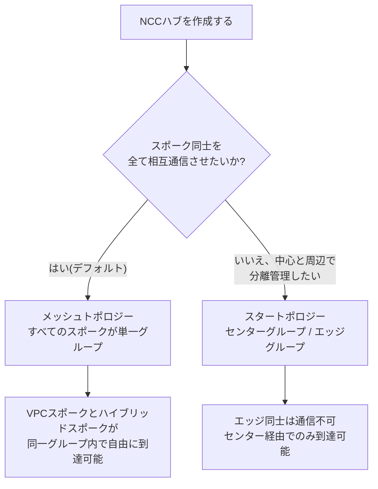
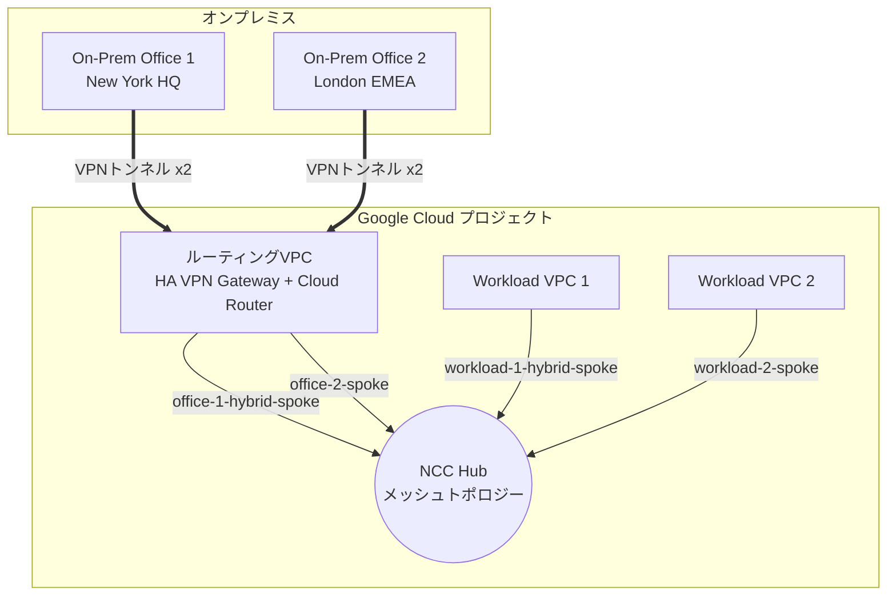
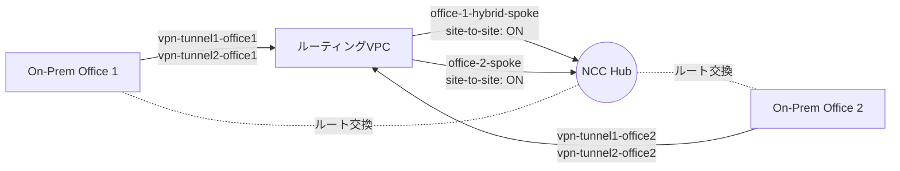
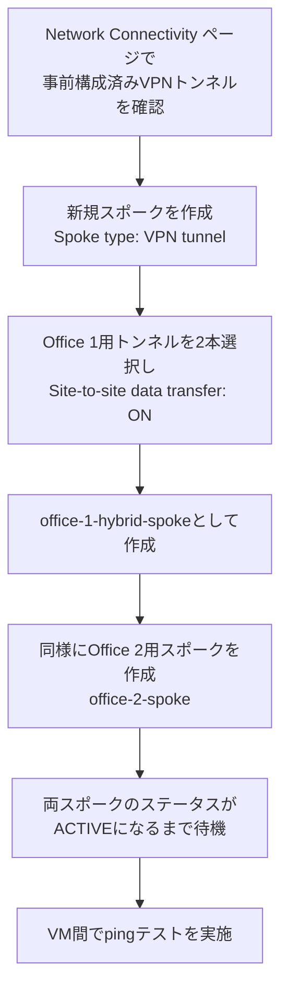
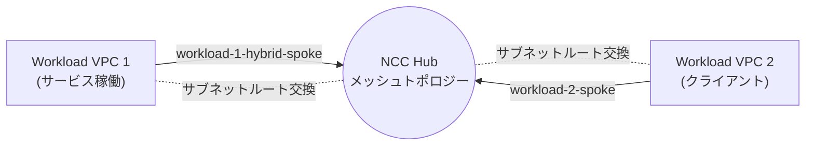
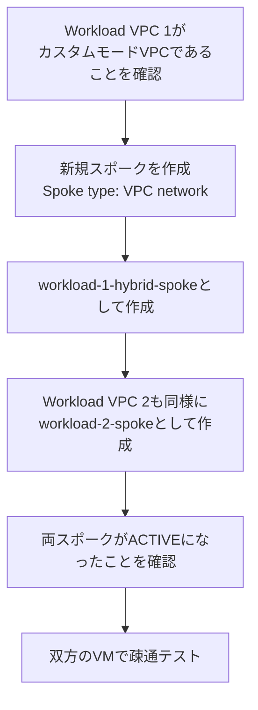
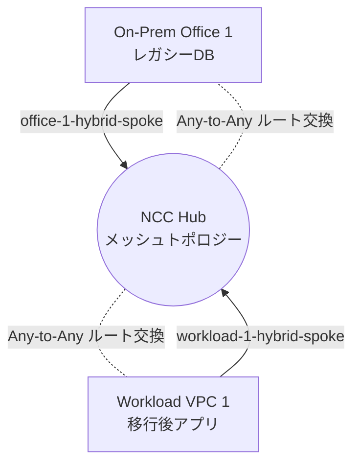
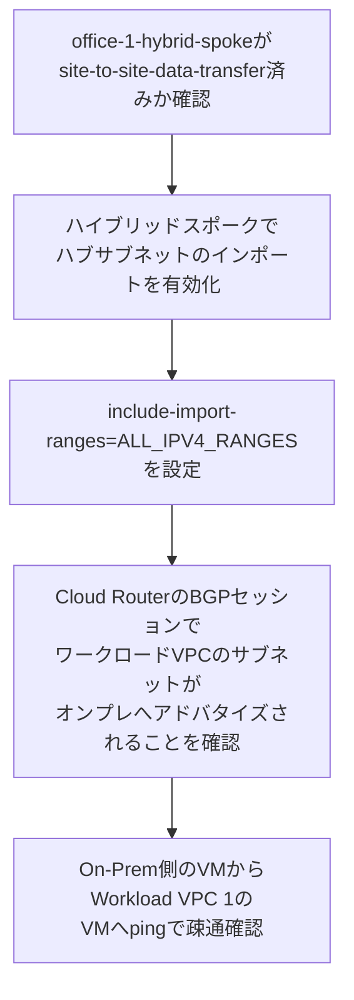
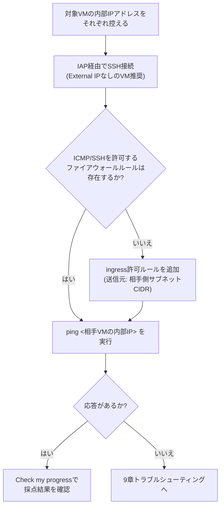
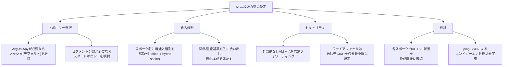

# Network Connectivity Center チャレンジラボ完全攻略ガイド

― オンプレミスとマルチVPCをハブ&スポークで統合する実践アーキテクチャ ―

> 対象ラボ: [Reduce Operational Complexity with Network Connectivity Center: Challenge Lab](https://www.skills.google/course_templates/1364/labs/616120)
> 対象読者: Google Cloud ネットワーキング初学者〜中級者
> 執筆方針: 各設計判断には根拠となる公式ドキュメントのURLを併記します。実際のラボ環境ではプロジェクトID・リージョン・タグ名が異なるため、コマンド例は**プレースホルダー**として読み替えてください。

---

## 目次

1. [シナリオの理解](#1-シナリオの理解)
2. [NCCの基礎知識](#2-nccの基礎知識)
3. [全体アーキテクチャ設計](#3-全体アーキテクチャ設計)
4. [事前準備](#4-事前準備)
5. [Task 1: オンプレミス拠点間の接続](#5-task-1-オンプレミス拠点間の接続)
6. [Task 2: VPC間の接続](#6-task-2-vpc間の接続)
7. [Task 3: VPCとオンプレミスの接続](#7-task-3-vpcとオンプレミスの接続)
8. [接続テストの標準手順](#8-接続テストの標準手順)
9. [トラブルシューティング](#9-トラブルシューティング)
10. [ベストプラクティス総まとめ](#10-ベストプラクティス総まとめ)
11. [参考文献・出典一覧](#11-参考文献出典一覧)

---

## 1. シナリオの理解

多国籍企業 GlobalTech Inc. は、ニューヨーク(HQ)とロンドン(EMEA)の2つのオンプレミスデータセンターを持ちながら、Google Cloud へのクラウド移行を進めています。従来は VPN トンネルと専用線が複雑に絡み合う「フルメッシュ」構成になっており、管理負荷が高いという課題を抱えています。

このラボでは、Network Connectivity Center (NCC) を使って以下の3つの接続を1つのハブに集約します。

| タスク | 接続対象 | スポークタイプ | 名前に含める文字列 |
|---|---|---|---|
| Task 1 | オンプレ拠点1 ⇔ オンプレ拠点2 | VPNトンネル(ハイブリッドスポーク) | `office-1` / `office-2` |
| Task 2 | Workload VPC 1 ⇔ Workload VPC 2 | VPCネットワーク | `workload-1` / `workload-2` |
| Task 3 | オンプレ拠点1 ⇔ Workload VPC 1 | ハイブリッド + VPCネットワーク | `hybrid` |

**設計思想**: NCC は「ハブ」を中心に、それぞれの拠点/ネットワークを「スポーク」として接続する**ハブ&スポーク型トポロジー**を採用します。これにより VPN トンネルや Interconnect のフルメッシュを個別管理する必要がなくなり、ハブが自動的にルート交換を行います。

> 出典: [Hub-and-spoke network architecture | Cloud Architecture Center](https://docs.cloud.google.com/architecture/deploy-hub-spoke-vpc-network-topology) — 「共有リソースをハブネットワークに配置し、他のVPCネットワークをスポークネットワークとしてアタッチする」設計パターンが解説されています。

---

## 2. NCCの基礎知識

### 2.1 ハブとスポークの関係

NCC ハブはグローバルリソースであり、複数のリージョンにまたがるスポークを1つに束ねます。スポークには大きく分けて以下の種類があります。

| スポークタイプ | 対応するリソース | 主な用途 |
|---|---|---|
| VPCスポーク | Google Cloud の VPC ネットワーク | ワークロードVPC同士の接続 |
| ハイブリッドスポーク(VPNトンネル) | HA VPN トンネル | オンプレミス拠点との接続 |
| ハイブリッドスポーク(Interconnect) | Cloud Interconnect VLANアタッチメント | 大容量オンプレミス接続 |
| ハイブリッドスポーク(Router Appliance) | サードパーティルーターVM | SD-WANなどの仮想アプライアンス接続 |
| Producer VPCスポーク | プライベートサービスVPC | Google提供サービスとの接続 |
| NCC Gatewayスポーク | Security Service Edge連携 | パケットインスペクション |

> 出典: [NCC overview](https://docs.cloud.google.com/network-connectivity/docs/network-connectivity-center/concepts/overview)

**重要な原則**: 1つのハイブリッドスポークは同一種類のリソースのみを参照できます(例: VPNトンネルを2本まとめて1つのスポークにすることは可能ですが、VPNトンネルとRouter Applianceを同じスポークに混在させることはできません)。また、ハイブリッドスポークはハブと同じプロジェクトに存在する必要があります。

### 2.2 トポロジー: メッシュ型 vs スター型

ハブ作成時に選択する接続トポロジーは、スポーク間の通信可否を決定する最も重要な設計要素です。



- **メッシュトポロジー(デフォルト)**: ハブ作成時に明示的に指定しない場合、自動的にメッシュトポロジーが選択されます。すべてのスポークが単一のスポークグループに属し、VPCスポークとハイブリッドスポークを含めて Any-to-Any 通信が可能です。
- **スタートポロジー**: センター/エッジの2つのスポークグループでルートテーブルを分離し、エッジ同士の直接通信を遮断します。**サイト間データ転送(後述)が有効なハイブリッドスポークはセンターグループにしか配置できません。**

> 出典:
> - [Preset connectivity topologies](https://docs.cloud.google.com/network-connectivity/docs/network-connectivity-center/concepts/connectivity-topologies) — メッシュがデフォルトであること、スタートポロジーの制約について
> - [Configure a hub](https://docs.cloud.google.com/network-connectivity/docs/network-connectivity-center/how-to/vpc-configure-hub) — トポロジー選択はハブ作成後に変更できない旨

このラボでは、Task 1(オンプレ⇔オンプレ)・Task 2(VPC⇔VPC)・Task 3(オンプレ⇔VPC)のすべてで Any-to-Any 通信が求められるため、**メッシュトポロジー(デフォルト)を維持するのがベストプラクティス**です。

### 2.3 サイト間データ転送(Site-to-Site Data Transfer)

ハイブリッドスポーク同士(=オンプレミス拠点同士)を通信させる場合にのみ必要となる設定です。

> 出典: [NCC overview](https://docs.cloud.google.com/network-connectivity/docs/network-connectivity-center/concepts/overview) — 「サイト間データ転送を構成すると、ハイブリッドスポークを次ホップとする動的ルートが、同一VPCネットワーク内の他のハイブリッドスポークのBGPセッションを通じてオンプレミスネットワークにアドバタイズされる」

重要な制約として、**サイト間データ転送を有効にする複数のハイブリッドスポークは、すべて同じVPCネットワーク(ルーティングVPC)にバッキングリソースを置く必要があります**。

> 出典: [Network Connectivity pricing](https://cloud.google.com/network-connectivity/pricing) — サイト間データ転送とは「ある種類の異なるサポート対象クラウドリージョンにある1つのハイブリッドエンドポイントから別のハイブリッドエンドポイントへ送信されるあらゆるトラフィック」と定義されています。

一方で、**VPCスポークとハイブリッドスポークの通信**(Task 3のようなケース)には、このサイト間データ転送フラグは不要です。メッシュトポロジーであれば標準機能として Any-to-Any 接続が提供されます。

---

## 3. 全体アーキテクチャ設計

3つのタスクを終えた最終形は、以下のようになります。



### 3.1 スポーク命名設計の考え方

チャレンジラボの自動採点(Check my progress)は、多くの場合スポーク名に特定の**部分文字列**が含まれているかを検証します。3つのタスクの命名要件を1つの構成で満たすには、次のように**スポークを使い回して命名する**のが最も無駄のない設計です。

| スポーク名(例) | タイプ | 裏付けリソース | 満たす命名要件 |
|---|---|---|---|
| `office-1-hybrid-spoke` | ハイブリッド(VPNトンネル) | On-Prem Office 1 向け VPN トンネル×2 | Task1: `office-1` / Task3: `hybrid` |
| `office-2-spoke` | ハイブリッド(VPNトンネル) | On-Prem Office 2 向け VPN トンネル×2 | Task1: `office-2` |
| `workload-1-hybrid-spoke` | VPCネットワーク | Workload VPC 1 | Task2: `workload-1` / Task3: `hybrid` |
| `workload-2-spoke` | VPCネットワーク | Workload VPC 2 | Task2: `workload-2` |

> **重要な注意点**: ラボの Task 3 の説明文には「両方のスポークが VPC network タイプである」という記述がありますが、NCC の公式概念上、オンプレミス側の接続は VPN トンネルまたは Interconnect を裏付けとする**ハイブリッドスポーク**としてのみ表現可能です(オンプレミスは Google Cloud の VPC ネットワークそのものではないため)。実際に Google Cloud コンソールでオンプレ拠点をスポーク化する際は「スポークタイプ: VPN tunnel」を選択することになります。この点は公式チュートリアルの手順とも一致します。
>
> 出典: [Connect two sites by using VPN spokes](https://docs.cloud.google.com/network-connectivity/docs/network-connectivity-center/tutorials/connecting-two-offices-with-vpns) — 「New spoke フォームで Spoke type フィールドを VPN tunnel に設定する」という手順が明記されています。

この設計により、**ハブに対して合計4つのスポークを作成するだけ**で3つのタスクすべての採点基準を満たしつつ、実運用に耐える構成になります。

---

## 4. 事前準備

### 4.1 必要なIAMロール

| ロール | 目的 |
|---|---|
| `roles/networkconnectivity.hubAdmin` | ハブの作成、スポーク提案の承認/却下 |
| `roles/networkconnectivity.spokeAdmin` | スポークの作成 |
| `roles/compute.networkAdmin` | VPCスポーク作成時にVPCネットワークを参照する権限 |

> 出典:
> - [Hub administration overview](https://docs.cloud.google.com/network-connectivity/docs/network-connectivity-center/concepts/vpc-hub-admin)
> - [Spoke administration overview](https://docs.cloud.google.com/network-connectivity/docs/network-connectivity-center/concepts/vpc-spoke-admin) — 「ハブとVPCスポークが同一プロジェクトにある場合、VPCスポーク管理者は Compute Network Admin と NCC Spoke Admin の両方のIAMバインディングが必要」
> - [Network Connectivity Center roles and permissions](https://cloud.google.com/iam/docs/roles-permissions/networkconnectivity)

ラボ環境では通常これらのロールは事前に付与済みですが、実プロジェクトで再現する際は必ず確認してください。

### 4.2 APIの有効化

```bash
gcloud services enable networkconnectivity.googleapis.com
gcloud services enable compute.googleapis.com
```

### 4.3 ハブの作成

```bash
gcloud network-connectivity hubs create globaltech-hub \
  --description="GlobalTech Inc. の集中接続管理用ハブ"
```

トポロジーを明示的に指定しない場合、自動的にメッシュトポロジーになります(2.2節参照)。作成後にトポロジーは変更できないため、要件を満たすか事前に確認しておくことが重要です。

> 出典: [Configure a hub](https://docs.cloud.google.com/network-connectivity/docs/network-connectivity-center/how-to/vpc-configure-hub)

---

## 5. Task 1: オンプレミス拠点間の接続

### 5.1 目的とアーキテクチャ

On-Prem Office 1 と On-Prem Office 2 を、事前構成済みの VPN トンネル経由でハブに接続し、サイト間データ転送によって互いに通信できるようにします。



### 5.2 作業手順



1. **VPNトンネルの確認**: Google Cloud コンソールの「ネットワーク接続」→「Network Connectivity Center」ページで、各オンプレ拠点用に事前構成された HA VPN トンネルのペアを確認します。
2. **スポークの作成(コンソール)**: 「新しいスポーク」フォームで以下を設定します。
   - Spoke type: `VPN tunnel`
   - Spoke name: `office-1-hybrid-spoke`(Office 1側)
   - Region: トンネルが存在するリージョン
   - **Site-to-site data transfer: On**
   - VPC network: ルーティングVPC(両オフィスのVPNゲートウェイが属するVPC)
   - VPN tunnel: 該当するトンネルを2本選択(冗長化のため)
3. Office 2 についても同様に `office-2-spoke` を作成します。

**前提: ルーティングVPCのBGP動的ルーティングモードを `global` にする**

Office 1 (`us-central1`) と Office 2 (`europe-west2`) のように**リージョンをまたいでハイブリッドスポークを接続する場合**、ルーティングVPCの動的ルーティングモードが `regional` のままだと、各Cloud Routerが学習したルートは自リージョン内にしか伝播しません。VPNスポーク作成前に `global` へ変更しておきます。

```bash
gcloud compute networks update <ROUTING_VPC> \
  --bgp-routing-mode=global
```

> 出典: [Dynamic routing mode](https://docs.cloud.google.com/vpc/docs/vpc#routing_for_hybrid_networks) — 「グローバル動的ルーティングでは、Cloud Router が学習したルートをVPCネットワーク内の全リージョンへ適用する」

**gcloud での作成例:**

```bash
gcloud network-connectivity spokes linked-vpn-tunnels create office-1-hybrid-spoke \
  --hub=globaltech-hub \
  --region=us-central1 \
  --vpn-tunnels=vpn-tunnel1-office1,vpn-tunnel2-office1 \
  --site-to-site-data-transfer \
  --description="On-Prem Office 1 (New York HQ)"

gcloud network-connectivity spokes linked-vpn-tunnels create office-2-spoke \
  --hub=globaltech-hub \
  --region=europe-west2 \
  --vpn-tunnels=vpn-tunnel1-office2,vpn-tunnel2-office2 \
  --site-to-site-data-transfer \
  --description="On-Prem Office 2 (London EMEA)"
```

> 出典: [Connect two sites by using VPN spokes](https://docs.cloud.google.com/network-connectivity/docs/network-connectivity-center/tutorials/connecting-two-offices-with-vpns) — VPNスポーク作成の公式チュートリアル手順

### 5.3 このタスクのベストプラクティス

| プラクティス | 理由 | 出典 |
|---|---|---|
| VPNトンネルは必ず2本(冗長構成)でスポークに紐付ける | 単一トンネル障害時の可用性確保。HA VPNの標準構成 | [NCC overview](https://docs.cloud.google.com/network-connectivity/docs/network-connectivity-center/concepts/overview) |
| サイト間データ転送を有効化する2つのハイブリッドスポークは同一VPCネットワークに配置する | サイト間データ転送の必須要件 | [NCC overview](https://docs.cloud.google.com/network-connectivity/docs/network-connectivity-center/concepts/overview) |
| ハイブリッドスポークはハブと同一プロジェクトに作成する | 別プロジェクトのハイブリッドスポークは非対応 | [NCC overview](https://docs.cloud.google.com/network-connectivity/docs/network-connectivity-center/concepts/overview) |

---

## 6. Task 2: VPC間の接続

### 6.1 目的とアーキテクチャ

Workload VPC 1 と Workload VPC 2 を、それぞれ「VPC network」タイプのスポークとしてハブに接続します。片方のVPCで稼働しているサービスに、もう片方のVPCからアクセスできるようにするのが目的です。



### 6.2 作業手順



1. **VPCモードの確認**: NCC の VPC スポークは**自動モードVPCネットワークをサポートしません**。カスタムモードである必要があります。

   > 出典: [VPC spokes overview](https://docs.cloud.google.com/network-connectivity/docs/network-connectivity-center/concepts/vpc-spokes-overview) — 「Auto mode VPC networks aren't supported as VPC spokes」

2. **スポークの作成**: コンソールで Spoke type を `VPC network` に設定し、対象のVPCネットワークを選択します。

**gcloud での作成例:**

```bash
gcloud network-connectivity spokes linked-vpc-network create workload-1-hybrid-spoke \
  --hub=globaltech-hub \
  --vpc-network=workload-vpc-1 \
  --global \
  --description="Workload VPC 1"

gcloud network-connectivity spokes linked-vpc-network create workload-2-spoke \
  --hub=globaltech-hub \
  --vpc-network=workload-vpc-2 \
  --global \
  --description="Workload VPC 2"
```

### 6.3 このタスクのベストプラクティス

| プラクティス | 理由 | 出典 |
|---|---|---|
| ハブのトポロジーがメッシュであることを事前確認する | スタートポロジーではエッジグループ同士のVPCスポーク間通信が遮断される | [Hub-and-spoke network architecture](https://docs.cloud.google.com/architecture/deploy-hub-spoke-vpc-network-topology) |
| VPCネットワークは事前にカスタムモードへ変更しておく | 自動モードVPCはVPCスポークとして非対応(変更は不可逆) | [VPC spokes overview](https://docs.cloud.google.com/network-connectivity/docs/network-connectivity-center/concepts/vpc-spokes-overview) |
| VPCスポークのサブネット範囲交換はIPv4/IPv6の両方に対応、動的ルート交換はIPv4のみと理解しておく | IPv6の動的ルート交換は非対応のため、IPv6経路をBGPで学習させる設計は成立しない | [VPC spokes overview](https://docs.cloud.google.com/network-connectivity/docs/network-connectivity-center/concepts/vpc-spokes-overview) |

---

## 7. Task 3: VPCとオンプレミスの接続

### 7.1 目的とアーキテクチャ

クラウド移行中のアプリケーション(Workload VPC 1)が、オンプレミスのレガシーデータベース(On-Prem Office 1)に安全にアクセスできるようにします。技術的には、Task 1 と Task 2 で作成した2つのスポークが**同一のメッシュハブ**に属していれば、追加設定なしに Any-to-Any 到達性が提供されます。



### 7.2 作業手順と重要な追加設定

Task 1 と Task 2 の作業だけで論理的な接続経路は完成しますが、**オンプレミス側にワークロードVPCのサブネットルートを実際にアドバタイズするための追加設定**が必要になる場合があります。



1. **ハブサブネットのインポート設定**: ハイブリッドスポーク側で、ハブのルートテーブルに含まれるVPCスポークのサブネット範囲を自動的にインポートし、BGP経由でオンプレミスへアドバタイズするよう設定します。

   > 出典: [NCC overview](https://docs.cloud.google.com/network-connectivity/docs/network-connectivity-center/concepts/overview) — 「ハイブリッドスポークのハブサブネットインポートを有効にすることで、VPCスポークのIPサブネット範囲をBGP経由でオンプレミスや他クラウドプロバイダーネットワークへ自動的にアドバタイズできる」

```bash
gcloud network-connectivity spokes linked-vpn-tunnels update office-1-hybrid-spoke \
  --region=us-central1 \
  --include-import-ranges=ALL_IPV4_RANGES
```

2. **ルーティングVPC側の管理者作業**: ルーティングVPCネットワークの管理者は、VPCスポークから受信したサブネットルートを、オンプレミス向けのBGPセッションでどこまで広告するかを制御する責任を持ちます。

   > 出典: [Preset connectivity topologies](https://docs.cloud.google.com/network-connectivity/docs/network-connectivity-center/concepts/connectivity-topologies) — 「ハイブリッドスポークを管理するCloud RouterのBGPセッションでカスタムルートアドバタイズメントを作成する。これにはVPCスポークのサブネット範囲を含めることができる」

### 7.3 このタスクのベストプラクティス

| プラクティス | 理由 | 出典 |
|---|---|---|
| スポーク名に `hybrid` を含めつつ、既存スポークを流用して設計する | 不要な重複スポークの作成を避け、管理対象リソースを最小化する | 本ガイド 3.1節(ラボ採点要件の分析に基づく設計) |
| VPCスポークとハイブリッドスポークを同一メッシュハブ配下に置く | メッシュトポロジーはVPCスポークとハイブリッドスポーク間のAny-to-Any通信を標準サポートする | [NCC overview](https://docs.cloud.google.com/network-connectivity/docs/network-connectivity-center/concepts/overview) |
| ハイブリッドスポークでのハブサブネットインポートを明示的に有効化する | オンプレミス側BGPピアへのクラウド側サブネット広告に必要 | [NCC overview](https://docs.cloud.google.com/network-connectivity/docs/network-connectivity-center/concepts/overview) |

---

## 8. 接続テストの標準手順

各タスクの最後には、実際にVM間で疎通確認を行う必要があります。以下は各タスク共通の検証フローです。



### 8.1 IAP経由でのSSH接続

外部IPを持たないVMへ安全にSSH接続するために、Identity-Aware Proxy(IAP)のTCPフォワーディングを利用するのがベストプラクティスです。

```bash
gcloud compute firewall-rules create allow-ssh-ingress-from-iap \
  --direction=INGRESS \
  --action=allow \
  --rules=tcp:22 \
  --source-ranges=35.235.240.0/20
```

> 出典: [Use IAP for TCP forwarding](https://docs.cloud.google.com/iap/docs/using-tcp-forwarding) — IAPのTCPフォワーディングが使用する送信元IP範囲 `35.235.240.0/20` の説明

### 8.2 ICMP疎通確認

対象VMの内部IPに対して、相手側のVPCネットワークにICMPのingressを許可するファイアウォールルールが必要です。NCCはルーティング(経路広告)のみを担い、ファイアウォールルールはVPCネットワークごとに個別管理される点に注意してください。

```bash
gcloud compute firewall-rules create allow-icmp-from-peer \
  --network=workload-vpc-1 \
  --direction=INGRESS \
  --action=allow \
  --rules=icmp \
  --source-ranges=<相手側サブネットのCIDR>
```

---

## 9. トラブルシューティング

| 症状 | 主な原因 | 対処 | 出典 |
|---|---|---|---|
| VPCスポークの作成に失敗する | 自動モードVPCネットワークを指定している | カスタムモードVPCに変更してから再実行(不可逆操作のため注意) | [VPC spokes overview](https://docs.cloud.google.com/network-connectivity/docs/network-connectivity-center/concepts/vpc-spokes-overview) |
| オンプレ拠点同士でpingが通らない | サイト間データ転送が無効、または双方が異なるVPCネットワークを裏付けにしている | 両ハイブリッドスポークで `site-to-site-data-transfer` を有効化し、同一ルーティングVPCに統一する | [NCC overview](https://docs.cloud.google.com/network-connectivity/docs/network-connectivity-center/concepts/overview) |
| VPCとオンプレ間の通信は片方向のみ成功する | ハブサブネットインポートが未設定でBGPアドバタイズが行われていない | ハイブリッドスポークで `--include-import-ranges=ALL_IPV4_RANGES` を設定 | [NCC overview](https://docs.cloud.google.com/network-connectivity/docs/network-connectivity-center/concepts/overview) |
| スタートポロジーでVPCスポーク同士が通信できない | エッジスポーク同士は仕様上直接通信不可 | 要件がAny-to-Anyならメッシュトポロジーへ変更(ハブ再作成が必要) | [Preset connectivity topologies](https://docs.cloud.google.com/network-connectivity/docs/network-connectivity-center/concepts/connectivity-topologies) |
| SSH接続がタイムアウトする | IAP用ファイアウォールルールが未作成 | `35.235.240.0/20` からのTCP:22 ingressルールを追加 | [Use IAP for TCP forwarding](https://docs.cloud.google.com/iap/docs/using-tcp-forwarding) |
| スポークがずっと `INACTIVE` のまま | クロスプロジェクト構成でハブ管理者の承認待ち | ハブ管理者としてスポーク提案をレビュー・承認する、または対象プロジェクトを自動承認リストに追加 | [Configure a hub](https://docs.cloud.google.com/network-connectivity/docs/network-connectivity-center/how-to/vpc-configure-hub) |

---

## 10. ベストプラクティス総まとめ



1. **トポロジーは要件から逆算する**: 全スポークがAny-to-Anyで到達可能である必要があるなら、デフォルトのメッシュトポロジーを維持します。作成後にトポロジー種別は変更できないため、要件確認は着手前に行います。
2. **命名規則は採点・監査基準を先に洗い出す**: 複数の命名要件(部分文字列マッチ)がある場合、無理に別々のスポークを増やすのではなく、1つのリソースが複数の命名要件を同時に満たせないか検討します。
3. **サイト間データ転送は「ハイブリッドスポーク同士の通信」にのみ必要**: VPCスポークとハイブリッドスポーク間の通信には別の仕組み(ハブサブネットインポート)が必要になる点を区別して理解します。
4. **VPCスポークは事前にカスタムモード化しておく**: 自動モードVPCは非対応かつ変更が不可逆であるため、事前チェックが重要です。
5. **接続テストはIAP経由のSSH+ICMPが標準**: 外部IPを持たないVM構成を維持しながら安全に疎通確認を行います。

---

## 11. 参考文献・出典一覧

本ガイド内の各設計判断は、以下のGoogle Cloud公式ドキュメントおよびラボページを根拠としています。

- 対象ラボ: [Reduce Operational Complexity with Network Connectivity Center: Challenge Lab](https://www.skills.google/course_templates/1364/labs/616120)
- [NCC overview](https://docs.cloud.google.com/network-connectivity/docs/network-connectivity-center/concepts/overview)
- [Hub-and-spoke network architecture | Cloud Architecture Center](https://docs.cloud.google.com/architecture/deploy-hub-spoke-vpc-network-topology)
- [Connect two sites by using VPN spokes(公式チュートリアル)](https://docs.cloud.google.com/network-connectivity/docs/network-connectivity-center/tutorials/connecting-two-offices-with-vpns)
- [VPC spokes overview](https://docs.cloud.google.com/network-connectivity/docs/network-connectivity-center/concepts/vpc-spokes-overview)
- [Preset connectivity topologies](https://docs.cloud.google.com/network-connectivity/docs/network-connectivity-center/concepts/connectivity-topologies)
- [Configure a hub](https://docs.cloud.google.com/network-connectivity/docs/network-connectivity-center/how-to/vpc-configure-hub)
- [Work with hubs and spokes](https://docs.cloud.google.com/network-connectivity/docs/network-connectivity-center/how-to/working-with-hubs-spokes)
- [Hub administration overview](https://docs.cloud.google.com/network-connectivity/docs/network-connectivity-center/concepts/vpc-hub-admin)
- [Spoke administration overview](https://docs.cloud.google.com/network-connectivity/docs/network-connectivity-center/concepts/vpc-spoke-admin)
- [Network Connectivity Center roles and permissions | IAM](https://cloud.google.com/iam/docs/roles-permissions/networkconnectivity)
- [Network Connectivity pricing](https://cloud.google.com/network-connectivity/pricing)
- [Router appliance overview](https://docs.cloud.google.com/network-connectivity/docs/network-connectivity-center/concepts/ra-overview)
- [Cross-Cloud Network inter-VPC connectivity using NCC | Cloud Architecture Center](https://cloud.google.com/architecture/ccn-distributed-apps-design/ccn-ncc-vpn-ra)
- [Use IAP for TCP forwarding](https://docs.cloud.google.com/iap/docs/using-tcp-forwarding)

---

*本ガイドはGoogle Cloudの公式ドキュメントに基づいて作成された学習補助資料であり、Google/Anthropic公式のコンテンツではありません。実際のラボ環境ではUIやコマンド出力が異なる場合があるため、必ずコンソールの最新表示に従って作業してください。*
